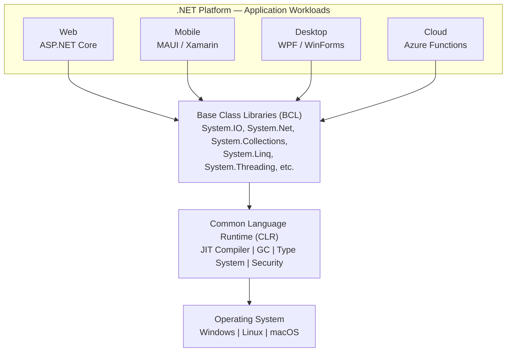
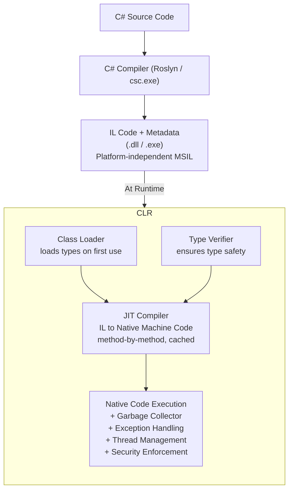
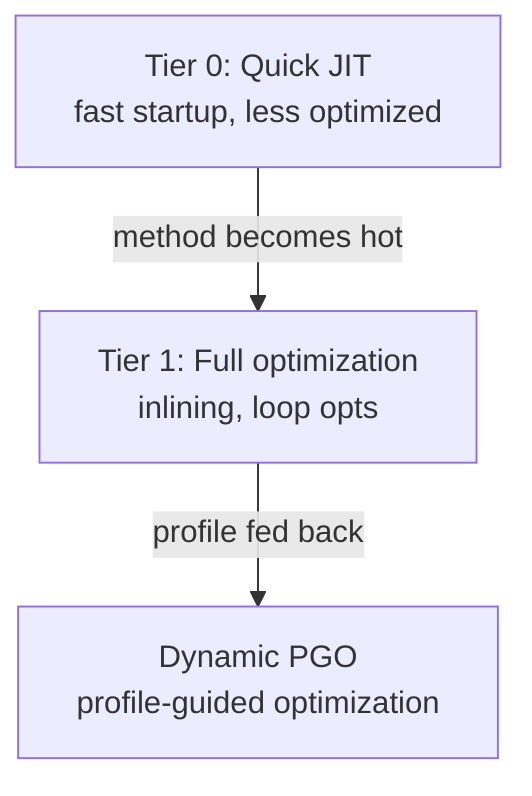
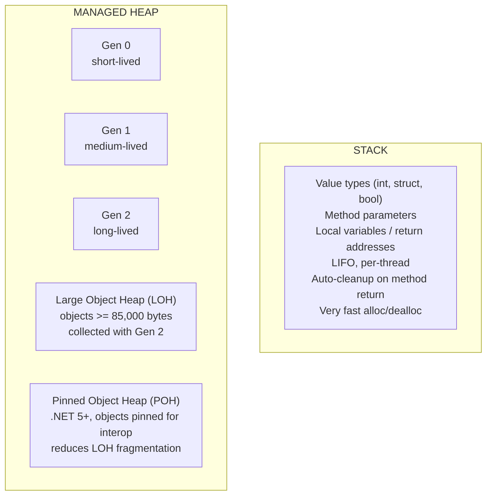
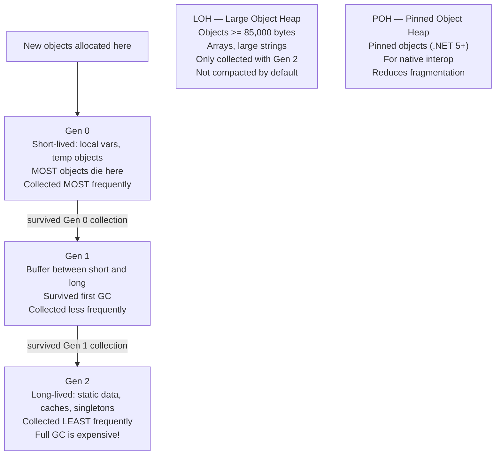
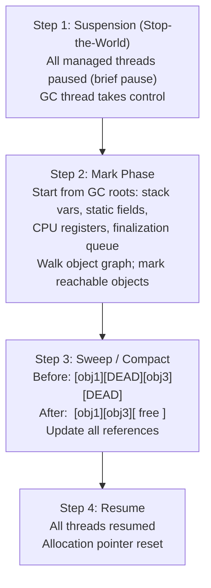

# .NET Fundamentals, C# Core Concepts & Garbage Collection

> [Mastery Guide](../../../README.md) › [Foundations](../../README.md) › [.NET Core Deep Dive](README.md)

| Status | Priority | Phase | Last reviewed |
|---|---|---|---|
| Not Started | High | Phase 1 — Language & Runtime Fluency | 2026-08-10 |

> 📘 **Main file for the runtime.** This is the single home for CLR architecture, JIT/AOT, garbage collection, interop, assembly loading, and deployment. Version-specific language deltas live in [.NET Version History](./18-version-history.md); C# language depth lives in the [C# Mastery sub-chapter](../05-csharp-mastery/README.md).

## Contents
- [Why it matters](#why-it-matters)
1. [.NET Fundamentals](#1-net-fundamentals)
   - [What is .NET?](#what-is-net)
   - [.NET Framework vs .NET Core vs .NET 5+/10](#net-framework-vs-net-core-vs-net-510)
   - [The Evolution Timeline](#the-evolution-timeline)
   - [CLR (Common Language Runtime) Internals](#clr-common-language-runtime-internals)
   - [Managed vs unmanaged code and P/Invoke](#managed-vs-unmanaged-code-and-pinvoke)
   - [AppDomain vs AssemblyLoadContext](#appdomain-vs-assemblyloadcontext)
   - [Assembly, module, type metadata](#assembly-module-type-metadata)
   - [Strong naming and assembly versioning](#strong-naming-and-assembly-versioning)
   - [.NET Standard vs .NET 5+ unified model](#net-standard-vs-net-5-unified-model)
   - [Runtime Identifier (RID)](#runtime-identifier-rid)
   - [SDK, runtime, and shared frameworks](#sdk-runtime-and-shared-frameworks)
2. [C# Core Concepts](#2-c-core-concepts) — quick reference; full coverage in [C# Mastery sub-chapter](../05-csharp-mastery/README.md)
   - [Value types vs reference types — the real story](#value-types-vs-reference-types--the-real-story)
   - [Boxing and unboxing](#boxing-and-unboxing)
3. [Garbage Collection in .NET 10](#3-garbage-collection-in-net-10)
   - [Generational GC: How It Works](#generational-gc-how-it-works)
   - [GC Collection Process](#gc-collection-process)
   - [What triggers a collection](#what-triggers-a-collection)
   - [GC Modes](#gc-modes)
   - [.NET 9 GC Improvements](#net-9-gc-improvements)
   - [Finalization queue and IDisposable](#finalization-queue-and-idisposable)
- [Code & diagrams](#code--diagrams)
- [Common pitfalls](#common-pitfalls)
- [Interview-ready summary](#interview-ready-summary)
- [Interview Cross-Questioning Drill](#interview-cross-questioning-drill)
- [Cheat Sheet](#cheat-sheet)
- [Walkthrough](#walkthrough)
- [Self-test](#self-test)
- [Cross-references](#cross-references)
- [Sources](#sources)

---

## Why it matters

Every .NET interview eventually touches the runtime. Questions about memory leaks, GC pressure, startup cost, AOT deployment, or assembly versioning are all runtime questions in disguise. You can't reason about `IDisposable`, boxing, or `Span<T>` without understanding the managed heap; you can't explain deployment choices without understanding JIT vs AOT vs ReadyToRun.

Senior questions go past "what is GC" to "why did our Gen 2 collection spike in prod?", "when would you choose NativeAOT over tiered JIT?", and "how would you turn on Server GC in staging without rebuilding?" This file gives you the answers and the reasoning behind them.

> ⚠️ **On version claims.** Runtime defaults move every November. Where this file states a default (DATAS, background GC, regions), the claim is sourced in [Sources](#sources). Treat any number without a citation as illustrative, and verify against `learn.microsoft.com` before repeating it in an interview.

## 1. .NET Fundamentals

### What is .NET?

.NET is a free, open-source developer platform for building many types of applications. It provides a runtime, libraries, and tools for building web, mobile, desktop, cloud, and IoT applications.



### .NET Framework vs .NET Core vs .NET 5+/10

```
┌──────────────────┬──────────────────┬──────────────────┬──────────────────┐
│    Feature       │ .NET Framework   │ .NET Core        │ .NET 10 (Modern) │
├──────────────────┼──────────────────┼──────────────────┼──────────────────┤
│ Platform         │ Windows only     │ Cross-platform   │ Cross-platform   │
│ Open Source      │ Partially        │ Fully            │ Fully            │
│ Performance      │ Good             │ Great            │ Best             │
│ Deployment       │ Machine-wide     │ Side-by-side     │ Side-by-side     │
│ Architecture     │ Monolithic       │ Modular          │ Modular          │
│ Cloud Ready      │ Limited          │ Yes              │ Native           │
│ Container Support│ Limited          │ Full             │ Full + AOT       │
│ Release Cycle    │ Slow (years)     │ Fast             │ Annual           │
│ Status           │ Maintenance mode │ Evolved into 5+  │ Active (LTS)     │
│ Latest Version   │ 4.8.1            │ 3.1 (EOL)        │ .NET 10 (LTS)    │
└──────────────────┴──────────────────┴──────────────────┴──────────────────┘
```

`AppDomain.CreateDomain`, code access security, remoting, and the GAC are the .NET Framework features with no modern equivalent — see [AppDomain vs AssemblyLoadContext](#appdomain-vs-assemblyloadcontext) and [Strong naming and assembly versioning](#strong-naming-and-assembly-versioning).

### The Evolution Timeline

```
2002: .NET Framework 1.0 (Windows only)
  │
  ├── 2005: .NET Framework 2.0 (Generics)
  ├── 2007: .NET Framework 3.5 (LINQ)
  ├── 2012: .NET Framework 4.5 (async/await)
  ├── 2016: .NET Core 1.0 ← Cross-platform begins
  ├── 2019: .NET Core 3.1 (LTS)
  │
  ├── 2020: .NET 5 ← Unification begins (no more "Core")
  ├── 2021: .NET 6 (LTS)
  ├── 2022: .NET 7
  ├── 2023: .NET 8 (LTS)
  ├── 2024: .NET 9
  └── 2025: .NET 10 (LTS)
```

One release ships each November. Even-numbered releases are **LTS** (three years of support); odd-numbered releases are **STS** with a shorter window. .NET 10 (November 2025) is the current LTS and the right default for new work; .NET 8's LTS window closes in November 2026. Check the [.NET support policy](https://dotnet.microsoft.com/platform/support/policy/dotnet-core) rather than trusting a date written into a document.

### CLR (Common Language Runtime) Internals

The CLR is the virtual machine component of .NET that manages the execution of .NET programs. It has four major subsystems:

- **Execution engine** — loads types, invokes the JIT, manages threads, handles exceptions.
- **JIT compiler** — translates Intermediate Language (IL) to native machine code. In modern .NET this is **RyuJIT**. IL is CPU-agnostic; the JIT specializes it per platform and, with tiered compilation, re-specializes hot methods.
- **Type system / verifier** — enforces type identity and safety at load time and at runtime. The CLR checks that IL doesn't forge references, corrupt memory, or violate access modifiers (unless you opt out with `unsafe`).
- **Garbage collector** — manages the managed heap, tracks live object graphs from GC roots (stack variables, static fields, CPU registers, handles), reclaims unreachable objects.

The CLR is a *specification* with several implementations: **CoreCLR** (the open-source runtime that ships with modern .NET, used by most server and desktop workloads), **Mono** (used by MAUI and Unity), and **NativeAOT**, which has no JIT at all — the whole compile happens at build time via ILC. They run the same IL and the same BCL APIs with different runtime strategies and capability boundaries.



The CLR is embedded through a **hosting API** — this is how the `dotnet` host, ASP.NET Core, Azure Functions, and test runners each start and configure the runtime differently.

#### JIT Compilation in Detail


**Compilation strategies in modern .NET**

| Strategy | What it is | How you get it |
|---|---|---|
| Standard JIT | Compile each method on first call | Baseline behaviour |
| Tiered compilation | Quick Tier 0 compile, then re-JIT hot methods at Tier 1 | On by default since .NET Core 3.0 |
| ReadyToRun (R2R) | Pre-compiled native code shipped inside the assembly, still re-JIT-able | **Opt-in**: `<PublishReadyToRun>true</PublishReadyToRun>` plus a RID |
| NativeAOT | Whole app compiled ahead of time; no JIT at runtime | Opt-in: `<PublishAot>true</PublishAot>` plus a RID |

| Compilation model | Startup | Peak throughput | Reflection | Dynamic load |
|---|---|---|---|---|
| Standard JIT | Slow (cold JIT) | High (tier 1 + PGO) | Full | Yes |
| Tiered + PGO | Moderate | Highest in practice | Full | Yes |
| ReadyToRun | Fast | High | Full | Yes |
| NativeAOT | Instant | High (static-only opts) | Limited | No |

> **R2R is not a default.** ReadyToRun requires `PublishReadyToRun` and a target RID. What *is* pre-compiled by default is the shared framework itself — "the .NET runtime libraries have already been precompiled with ReadyToRun," which is why R2R buys little for tiny apps and a lot for large ones. Tiered compilation then replaces commonly used R2R methods with JIT-generated ones.

**Tiered Compilation** (default since .NET Core 3.0):



The JIT compiles a hot method twice. **Tier 0** is a quick, minimally optimized compile that gets the app running. Once the method has been called enough times, it is re-JIT'd at **Tier 1** with inlining, loop optimization, dead-code elimination, and register allocation. The exact call-count threshold is a runtime implementation detail, not a documented contract — don't quote a number in an interview, describe the mechanism.

**Dynamic PGO** (on by default since .NET 8) instruments Tier 0 code to collect real observations — which virtual targets dominate, which branch directions are taken, which concrete types flow through generics — and feeds them into the Tier 1 recompile. That is how a long-running server can beat an AOT build on peak throughput: the JIT specializes to the profile the app actually has.

#### Memory Management Overview



### Managed vs unmanaged code and P/Invoke

**Managed code** runs under CLR control: the GC tracks allocations, the type system enforces safety, exceptions are structured. All C#, F#, and VB code compiles to managed IL.

**Unmanaged code** (native C/C++ libraries, OS APIs, COM objects) runs outside CLR control: manual memory, no GC, pointer arithmetic, no verifier.

**P/Invoke** (Platform Invoke) is the bridge: the runtime marshals managed types to native calling conventions, copies or pins memory as needed, then marshals results back.

```csharp
// Declare a P/Invoke: import a Win32 API
[DllImport("kernel32.dll", CharSet = CharSet.Unicode, SetLastError = true)]
private static extern bool CreateDirectory(string lpPathName, IntPtr lpSecurityAttributes);

// Call it like any static method
bool ok = CreateDirectory(@"C:\Temp\NewDir", IntPtr.Zero);
if (!ok)
    throw new Win32Exception(Marshal.GetLastWin32Error());
```

**Marshaling rules that trip people up:**

- `string` marshals to a null-terminated native string (UTF-16 with `CharSet.Unicode`). The native side gets a pointer to a marshaller-owned buffer, not the managed string's own memory.
- A `byte[]` passed as a pointer must not move mid-call; the marshaller either copies it or pins it (`fixed` / `GCHandle.Alloc(..., GCHandleType.Pinned)`).
- `ref` / `out` arguments marshal as pointers.
- Structs must be **blittable** — identical layout in managed and native memory, no reference fields — for zero-copy interop. Non-blittable types (`bool`, `char`, `string`, structs containing references) are marshaled by copy and conversion, which costs time and allocations.

**`unsafe` and `fixed`** are the other interop path: take a managed pointer directly, pin the object so the GC can't move it during the operation, do the pointer work, release the pin.

```csharp
unsafe void CopyFast(byte[] source, byte[] dest, int len)
{
    fixed (byte* src = source, dst = dest)
    {
        Buffer.MemoryCopy(src, dst, dest.Length, len);
    }
    // Pin released — GC may now move source and dest again
}
```

**Modern alternative**: `[LibraryImport]` (C# 11 / .NET 7) is a **source generator**. It emits the marshaling code at compile time as ordinary C# instead of using the runtime's reflection-based marshaller. That makes it AOT-compatible, trimmer-analyzable, faster, and inspectable — the generated file lands in `obj/`. Prefer it over `[DllImport]` for new code.

### AppDomain vs AssemblyLoadContext

**AppDomain** (.NET Framework) was a heavyweight isolation unit: separate security policy, separate type identity, cross-domain calls marshaled through remoting proxies. It let independently deployed components share one process without sharing state.

**Modern .NET removed multi-AppDomain support.** The `AppDomain` type still exists and a process has exactly one of them (`AppDomain.CurrentDomain`), but `AppDomain.CreateDomain` throws `PlatformNotSupportedException`. Real isolation is now a process boundary — containers, worker processes, separate services.

**`AssemblyLoadContext`** (ALC) inherited AppDomain's assembly-grouping role. Each ALC has its own resolver. Types loaded into different ALCs are **different types** even when the assembly name and version match — type identity is per-ALC. An ALC created with `isCollectible: true` can be unloaded: once every reference into it drops, the GC reclaims it and all its types.

```csharp
// Plugin loader with per-plugin ALC for isolation + unload
public class PluginLoader
{
    private AssemblyLoadContext? _alc;

    public IPlugin Load(string pluginPath)
    {
        _alc = new AssemblyLoadContext("plugin", isCollectible: true);
        var assembly = _alc.LoadFromAssemblyPath(pluginPath);
        var pluginType = assembly.GetType("Plugin.MainPlugin")!;
        return (IPlugin)Activator.CreateInstance(pluginType)!;
    }

    public void Unload()
    {
        _alc?.Unload();   // asynchronous — GC collects when no external refs remain
        _alc = null;
    }
}
```

**Why ALCs fail to unload (the classic interview gotcha):** any reference crossing from outside the ALC into it pins it alive. Usual culprits: event handlers subscribed on long-lived singletons, `Type` objects cached in a static dictionary in the default ALC, thread-static fields holding plugin instances, generic instantiations in the default ALC parameterized over plugin types.

**Diagnostic**: `dotnet-dump analyze` then `!gcroot` on a type from the supposedly-unloaded ALC; use `WeakReference` to a sentinel object to confirm collection, since `Unload()` gives no synchronous confirmation.

### Assembly, module, type metadata

A **.NET assembly** is the deployment unit: a `.dll` or `.exe` containing IL plus metadata.

- **Manifest** — assembly name, version, culture, public key, list of referenced assemblies, embedded resources.
- **Module(s)** — one or more PE modules, each with IL and a type-definition table.
- **Type metadata** — for every type: name, namespace, base type, interfaces, fields, methods, properties, events, custom attributes.

Metadata is what makes reflection, the CLR loader, decompilers, IntelliSense, and analyzers possible. Without it, IL would be opaque bytecode.

```csharp
// Load an assembly and inspect types
var assembly = Assembly.Load("MyApp.Plugins");

foreach (var type in assembly.GetExportedTypes())
{
    Console.WriteLine($"{type.FullName} : {type.BaseType?.Name}");

    foreach (var method in type.GetMethods(BindingFlags.Public | BindingFlags.Instance))
        Console.WriteLine($"  {method.ReturnType.Name} {method.Name}");
}
```

**Performance note**: `MethodInfo.Invoke` is orders of magnitude slower than a direct call — it walks argument arrays, boxes value-type arguments, and re-checks access every time. For a hot path, bind once to a typed delegate and cache it:

```csharp
// Bind once, call many times.
// The instance method Process(string) on an object we already have:
var mi  = type.GetMethod("Process")!;
var obj = Activator.CreateInstance(type)!;

// Closed instance delegate — the receiver is baked in (.NET 5+ generic overload).
Func<string, string> func = mi.CreateDelegate<Func<string, string>>(obj);
var result = func("data");   // near-native dispatch
```

> **Open vs closed instance delegates.** Passing `null` as the target for an *instance* method does not mean "no receiver" — it creates an **open instance delegate**, and the delegate type must then declare the hidden `this` as its first parameter (`Func<TInstance, string, string>`). Binding `Func<string, string>` with a `null` target throws `ArgumentException`. Bind the target when you have one; use the open form deliberately when you want to reuse the delegate across receivers.

**Source generators** (C# 9+) and `JsonSerializerContext` in `System.Text.Json` are the modern answer to reflection-heavy code: generate the equivalent code at compile time, with zero runtime reflection, full trimmer visibility, and AOT compatibility.

### Strong naming and assembly versioning

A **strong-named assembly** carries a public key and a signature produced with the matching private key, plus a `PublicKeyToken` derived from the public key. Together with name, version, and culture, that token forms the assembly's identity.

> ⚠️ **What strong naming does *not* do.** Microsoft's guidance is explicit: *"Do not rely on strong names for security. They provide a unique identity only."* And for modern .NET: *"For .NET Core and .NET 5+, strong-named assemblies do not provide material benefits. **The runtime never validates the strong-name signature**, nor does it use the strong-name for assembly binding."* Any answer that describes strong naming as tamper detection, publisher proof, or a load-time signature check is wrong on modern .NET — and it was already wrong on .NET Framework, which since **3.5 SP1** has skipped signature validation for full-trust assemblies by default (the "strong-name bypass" feature, done purely for load performance). If you want tamper-evidence, that is **Authenticode** / code signing or container-image signing (for example Sigstore), not strong names.

What strong naming is still for:

- **Identity and compatibility with .NET Framework consumers** — a strong-named .NET Framework assembly can only reference other strong-named assemblies, and `InternalsVisibleTo` between strong-named assemblies requires the public key.
- **Side-by-side versioning and the GAC on .NET Framework.** The GAC does not exist in modern .NET; binding there is path-based.

**Version numbers have two layers:**

- **`AssemblyVersion`** — part of the CLR's binding identity on .NET Framework. Changing it there breaks consumers unless they add a binding redirect.
- **NuGet package version** — semantic versioning for humans and tooling, independent of `AssemblyVersion`.

**Modern practice**: pin `AssemblyVersion` to the major version (`3.0.0.0` for every `3.x.y` release) so .NET Framework consumers never need a redirect on a patch bump, and let the NuGet version carry the real release history. Bump `AssemblyVersion` only for binary-incompatible changes.

### .NET Standard vs .NET 5+ unified model

**.NET Standard** was a *specification* — a set of APIs that every conforming runtime (Framework, Core, Mono, Xamarin) promised to implement. It solved the "my library targets `netcoreapp` but also needs to run on `net472`" problem by giving authors one TFM to target.

**The .NET 5+ unified model** replaced it: `net5.0` … `net10.0` is *the* TFM. .NET Framework 4.x still consumes `netstandard2.0` libraries, but no new .NET Standard versions are being produced.

| Target | When |
|---|---|
| `netstandard2.0` | Library must run on .NET Framework 4.6.1+ as well as modern .NET |
| `netstandard2.1` | Library must run on .NET Core 3.0+ and Mono/Xamarin but not Framework |
| `net10.0` | Library only needs modern .NET — **the default choice for new work** |
| Multi-target (`netstandard2.0;net10.0`) | Both worlds, with `#if NET8_0_OR_GREATER`-style guards for the modern paths |

Targeting `netstandard2.0` costs you a 2017-era API surface: no `Span<T>` in the public API, no `IAsyncEnumerable<T>`, none of the modern BCL. Take that hit only when a Framework consumer forces it.

### Runtime Identifier (RID)

A **Runtime Identifier** is a string describing an OS + architecture target: `win-x64`, `linux-x64`, `linux-arm64`, `osx-arm64`.

RIDs matter when:

- Publishing self-contained or NativeAOT or ReadyToRun — all three need `-r <RID>` because the output contains native code.
- A NuGet package ships native assets under `runtimes/<RID>/native/` — restore picks the right one.
- The host resolves native shims and interop libraries at startup.

**RID graph** — RIDs form a fallback hierarchy (`linux-arm64` → `linux` → `unix` → `any`). NuGet walks from most specific to most general until it finds an asset. That is why a package that only ships a generic `linux` asset still installs on `linux-x64`.

```xml
<!-- Self-contained publish for a specific RID -->
<PropertyGroup>
  <RuntimeIdentifier>linux-x64</RuntimeIdentifier>
  <SelfContained>true</SelfContained>
  <PublishSingleFile>true</PublishSingleFile>
</PropertyGroup>
```

### SDK, runtime, and shared frameworks

An **SDK** is what you need to *build* .NET code: Roslyn, MSBuild, templates, the `dotnet` CLI. A **runtime** is what you need to *run* compiled code: the CLR plus the framework libraries. `dotnet --list-sdks` shows what you can build with; `dotnet --list-runtimes` shows what compiled apps can bind to.

There are three **shared frameworks**, layered so apps don't redistribute what the machine already has:

| Shared framework | Contains | Needed by |
|---|---|---|
| `Microsoft.NETCore.App` | CLR + base libraries | Everything |
| `Microsoft.AspNetCore.App` | Kestrel, MVC, SignalR, hosting/DI extensions | Web apps |
| `Microsoft.WindowsDesktop.App` | WPF + WinForms | Windows desktop apps |

**Roll-forward.** The host reads the app's `runtimeconfig.json` for its target framework version and `rollForward` policy (`LatestPatch`, `Minor`, `Major`, `LatestMajor`, `Disable`), enumerates installed runtimes, and picks the highest acceptable one. The default is `LatestPatch`: an app built against 10.0.0 runs on 10.0.5 but not 10.1.0 unless you opt in. This is why patch versions are a production concern — framework CVE fixes only reach a framework-dependent app through roll-forward or a rebuild.

**Framework-dependent vs self-contained.** Framework-dependent ships only your assemblies and relies on an installed runtime — smallest artifact, and runtime security patches arrive without a rebuild. Self-contained bundles the runtime, so it runs where nothing is installed and pins an exact runtime version, at the cost of size and of owning patching yourself. `PublishTrimmed` and NativeAOT cut the self-contained size substantially by removing unreferenced framework code. Exact sizes move every release — publish your own app and read the output rather than quoting figures.

---

## 2. C# Core Concepts

> Quick reference. The full treatment lives in the **[C# Mastery sub-chapter](../05-csharp-mastery/README.md)** (9 files, basics → advanced).

The five things to keep straight when reading C# code:

- **Value vs reference types.** `int`, `bool`, `struct`, `enum`, tuples — copied by value (each variable holds its own data). `class`, `interface`, `delegate`, `string`, arrays — copied by reference (the variable holds a pointer; assignment shares the object). Mutations via a reference are visible everywhere; mutations via a value copy are local. Deep dive: [Type System](../05-csharp-mastery/02-type-system.md).
- **`var` vs `dynamic` vs `object`.** `var` is implicit *static* typing — the compiler infers and locks the type at compile time. `dynamic` defers all type-checking to runtime via the DLR (slow, no IntelliSense, runtime errors). `object` is the root reference type; assigning a value type to `object` boxes it. Use `var` for locals where the type is obvious; reach for `dynamic` only for COM/JSON traversal. Deep dive: [Fundamentals](../05-csharp-mastery/01-fundamentals.md).
- **Single class inheritance + multiple interface implementation.** C# disallows multiple class inheritance (the diamond problem); a class can implement many interfaces. Default interface methods (C# 8+) let interfaces ship behavior; explicit interface implementation disambiguates conflicting member names. Static abstract members (C# 11) enable generic math. Deep dive: [OOP & Polymorphism](../05-csharp-mastery/03-oop-and-polymorphism.md).
- **`virtual` / `override` / `new` / `sealed`.** `virtual`+`override` is polymorphic dispatch via the vtable. `new` *hides* a base member rather than overriding — almost always wrong. `sealed` blocks further inheritance. Calling virtual methods from constructors is dangerous (derived fields aren't initialized yet). Deep dive: [OOP & Polymorphism](../05-csharp-mastery/03-oop-and-polymorphism.md).
- **Records and modern type-system primitives.** `record` is a reference type with auto-generated value equality, `with`-expressions, and `init`-only properties — DTO-shaped by design. `record struct`, `readonly struct`, `ref struct` are the value-type variants for performance-sensitive code. `Span<T>` is a `ref struct` (stack-only). Deep dive: [Type System](../05-csharp-mastery/02-type-system.md), [Memory & Performance](../05-csharp-mastery/09-memory-and-performance.md).

For modern syntax (records, primary constructors, collection expressions, raw strings, required members), see [Modern C# Features](./12-modern-csharp.md). For per-version language deltas (C# 11 → C# 14), see [.NET Version History](./18-version-history.md).

### Value types vs reference types — the real story

The common shorthand "value types live on the stack, reference types live on the heap" is **wrong**. The accurate rule:

> Value types live **where they are declared**. Reference types live on the managed heap; variables hold *references* to them.

A `struct` field inside a `class` lives **inside the class instance, on the heap**. A boxed `int` lives on the heap. A local captured by a lambda is hoisted into a compiler-generated display class on the heap. Only short-lived locals and parameters of value type that the JIT doesn't place elsewhere live on the actual call stack.

**What actually matters:**

- **Value types** are copied on assignment; each variable owns its data; mutations are local.
- **Reference types** share identity; multiple variables can point at one object; mutations are visible to every holder.
- **Allocation cost**: a stack local is a pointer bump. A heap allocation adds an object that the GC must track, mark, possibly move, and eventually collect.
- **Boxing** is the boundary between the two, and it is the performance-critical one.

```csharp
// Value type — field inside a class lives on the heap
public class Order
{
    private decimal _total;   // decimal is a value type; it lives inside the Order heap object
}

// Value type — local on the stack (JIT may keep it in a register)
void Compute()
{
    int x = 42;   // on the stack for the duration of this method
}

// Value type — captured by a lambda → hoisted to a heap-allocated display class
int counter = 0;
Action inc = () => counter++;   // counter moves to the heap
```

Every heap object carries a fixed header — a sync-block index and a method-table pointer, one word each — before its fields. That header is why a heap object is never as cheap as a stack local, and why boxing a 4-byte `int` costs far more than 4 bytes.

### Boxing and unboxing

**Boxing** converts a value type to a reference type: the runtime allocates a heap object, copies the value into it, and returns a reference. **Unboxing** copies the value back out.

```csharp
int n = 42;

// Boxing — heap allocation
object box = n;            // allocates a new object; copies n's bits

// Unboxing — copies from box back to a value
int m = (int)box;          // must cast to the EXACT type; InvalidCastException otherwise

// Implicit boxing — classic trap in generic-less code
ArrayList list = new ArrayList();
list.Add(42);              // Add(object) — boxes 42 every call

// No boxing — generic collection
List<int> generics = new List<int>();
generics.Add(42);          // Add(int) — no object conversion, no allocation

// No boxing — the generic constraint keeps T typed all the way through,
// and the method returns T rather than casting through object.
static T Sum<T>(IEnumerable<T> items) where T : struct, INumber<T>
{
    T total = T.Zero;
    foreach (var item in items) total += item;
    return total;          // no box, no unbox, works for int / double / decimal alike
}
```

> The unboxing cast is **exact-type only**. `(int)(object)someDouble` throws `InvalidCastException` — it does not convert. That rule is why a generic method must return `T`, not launder the result through `object`.

**Where boxing silently occurs:**

- Assigning a struct to `object`, `IComparable`, or any interface-typed variable.
- Putting a struct in a non-generic collection (`ArrayList`, `Hashtable`).
- `string.Format("{0}", someStruct)` and `$"{someStruct}"` — unless the type implements `IFormattable` / `ISpanFormattable`.
- Calling an un-overridden virtual method (`ToString`, `GetHashCode`, `Equals`) on a struct.
- Passing a struct to a `params object[]` parameter.

**Mitigation**: generic methods and generic collections; override `ToString`/`GetHashCode`/`Equals` on structs; implement `IFormattable` and `ISpanFormattable`; prefer `where T : IFoo` over an `IFoo` parameter.

---

## 3. Garbage Collection in .NET 10

### Generational GC: How It Works

```mermaid
flowchart LR
    A[new Foo&#40;&#41;] -->|allocate| G0[Gen 0<br/>short-lived]
    G0 -->|survives Gen 0 collection| G1[Gen 1<br/>medium-lived]
    G1 -->|survives Gen 1 collection| G2[Gen 2<br/>long-lived]
    A2[new byte&#91;100_000&#93;] -->|>= 85k bytes| LOH[Large Object Heap<br/>collected with Gen 2]
    G0 -.->|unreachable| Reclaim((reclaimed))
    G1 -.->|unreachable| Reclaim
    G2 -.->|unreachable| Reclaim
    classDef gen0 fill:#d4edda,stroke:#155724
    classDef gen1 fill:#fff3cd,stroke:#856404
    classDef gen2 fill:#f8d7da,stroke:#721c24
    classDef loh fill:#e2e3e5,stroke:#383d41
    class G0 gen0
    class G1 gen1
    class G2 gen2
    class LOH loh
```





The design rests on the **generational hypothesis**: most objects die young. Segregating fresh allocations into a small Gen 0 arena lets the GC reclaim the bulk of garbage by scanning a tiny slice of the heap, and touch the large Gen 2 region rarely. Collection cost scales with the size of the region collected, so keeping Gen 0 small keeps the common case fast.

Two facts to state precisely, because interviewers probe both:

- **A Gen N collection collects generations 0 through N.** There is no such thing as collecting Gen 2 without also collecting Gen 1 and Gen 0. "Gen 2 collection" and "full GC" are the same event.
- **Generation budgets are dynamic.** The runtime tunes them at run time (and DATAS tunes them further); the round numbers you see quoted for Gen 0/1/2 sizes are illustrative, not contractual. The one documented constant is the **LOH threshold: 85,000 bytes**, configurable via `System.GC.LOHThreshold`.

**Card table and write barrier** — the mechanism that makes generational GC actually cheap. If a Gen 2 object holds a reference to a Gen 0 object, a Gen 0 collection must know about it or it would wrongly treat the young object as unreachable. Scanning all of Gen 2 to find such references would defeat the whole idea. Instead the GC keeps a **card table**: a coarse map covering the heap, where writing a reference field marks the containing card dirty. Gen 0 collection scans only dirty cards. The **write barrier** is the small piece of code the JIT emits on every reference-field write to mark the card — which is why storing a reference is slightly more expensive than storing an `int`.

### GC Collection Process



**Suspension is not optional, and it is not workstation-only.** Every collection suspends managed threads for at least part of its work, in *both* workstation and server GC. (Threads currently executing native code are not suspended in either mode — they are suspended on return.) What differs is *how much* is done under suspension:

- A **blocking** (non-concurrent) Gen 2 collection does all of mark, sweep, and compact with the world stopped.
- A **background** Gen 2 collection does most of its work concurrently on dedicated GC threads, but still has short stop-the-world phases, and any Gen 0/Gen 1 collection that happens during it (a *foreground* collection) suspends all managed threads for its duration.

So "does Server GC stop the world?" — yes. The honest answer is "every GC stops the world for some window; background GC shrinks that window for Gen 2, and Server GC shortens it further by collecting the heaps in parallel."

### What triggers a collection

- **Allocation budget exceeded** for a generation — the normal, overwhelmingly most common trigger.
- **Explicit `GC.Collect()`** — almost always a mistake in application code.
- **Memory pressure from the OS or container limit.** By default the GC becomes more aggressive about full compacting collections once physical memory load reaches roughly 90% (tunable via `System.GC.HighMemoryPercent`); for a containerized process the container's limit is what counts as physical memory.
- **`GC.AddMemoryPressure`** to tell the GC about unmanaged allocations it can't see.

### GC Modes

There are **two flavours** (workstation vs server) and, orthogonally, **two sub-flavours** (background vs non-concurrent). They are separate axes — a common interview trap is to present "Background GC" as a third peer of Workstation and Server. It isn't.

```
Axis 1 — flavour (System.GC.Server / <ServerGarbageCollection>)
┌────────────────────┬──────────────────────────────────────────────────┐
│ Workstation GC     │ Collection runs on the triggering user thread     │
│ (default)          │ One heap; optimized for responsiveness            │
│                    │ Default for standalone console/desktop apps       │
│                    │ Always used on a single-logical-CPU machine,      │
│                    │ regardless of configuration                       │
├────────────────────┼──────────────────────────────────────────────────┤
│ Server GC          │ Dedicated GC thread + heap per logical CPU;        │
│                    │ heaps collected in parallel; high throughput       │
│                    │ Default for ASP.NET Core web projects (the Web     │
│                    │ SDK sets ServerGarbageCollection=true)             │
└────────────────────┴──────────────────────────────────────────────────┘

Axis 2 — sub-flavour (System.GC.Concurrent / <ConcurrentGarbageCollection>)
┌────────────────────┬──────────────────────────────────────────────────┐
│ Background GC      │ ON BY DEFAULT, for BOTH workstation and server     │
│                    │ Applies to Gen 2 only; Gen 0/1 can still be        │
│                    │ collected (as "foreground" GCs) while it runs      │
│                    │ Workstation: one dedicated BGC thread              │
│                    │ Server: typically one per logical processor        │
├────────────────────┼──────────────────────────────────────────────────┤
│ Non-concurrent     │ Opt out with System.GC.Concurrent = false          │
│                    │ Every Gen 2 collection is fully blocking           │
└────────────────────┴──────────────────────────────────────────────────┘
```

Background GC is not new: it replaced concurrent GC in .NET Framework 4 for workstation and became available for server GC in .NET Framework 4.5. In modern .NET it has been the default since .NET Core 1.0.

```csharp
// Configure GC flavour in .csproj
// <PropertyGroup>
//   <ServerGarbageCollection>true</ServerGarbageCollection>
//   <ConcurrentGarbageCollection>true</ConcurrentGarbageCollection>
// </PropertyGroup>

// Or in runtimeconfig.json:
// { "runtimeOptions": { "configProperties": { "System.GC.Server": true } } }

// Or via the environment (read once, at GC initialization):
//   DOTNET_gcServer=1

// Force GC (rarely needed — let the runtime decide).
// GC.Collect(N) collects generations 0 THROUGH N.
GC.Collect(0);                 // Gen 0 only
GC.Collect(1);                 // Gen 0 + 1
GC.Collect(2);                 // Full GC (expensive!)
GC.Collect(2, GCCollectionMode.Aggressive);  // .NET 7+: decommit as much memory as possible

// Monitor GC
Console.WriteLine($"Gen 0 collections: {GC.CollectionCount(0)}");
Console.WriteLine($"Gen 1 collections: {GC.CollectionCount(1)}");
Console.WriteLine($"Gen 2 collections: {GC.CollectionCount(2)}");
Console.WriteLine($"Total memory: {GC.GetTotalMemory(false)} bytes");
```

```csharp
// Real-world: object pooling to reduce GC pressure.
// Microsoft.Extensions.ObjectPool.ObjectPool<T> is ABSTRACT — you never `new` it.
// Create one through a provider and a policy (or resolve ObjectPool<T> from DI).
using Microsoft.Extensions.ObjectPool;

ObjectPoolProvider provider = new DefaultObjectPoolProvider();
ObjectPool<StringBuilder> pool = provider.Create(new StringBuilderPooledObjectPolicy());

var sb = pool.Get();
try
{
    sb.Append("Hello");
    // Use sb...
}
finally
{
    pool.Return(sb);   // the StringBuilder policy clears it on return
}
```

> **These settings are read once, when the GC initializes** — normally at process startup. Changing an environment variable on a running process has no effect. Set the flavour in exactly one place; don't split it across csproj, `runtimeconfig.json`, and the environment and then try to remember which wins.

### .NET 9 GC Improvements

Recent GC work, with the version each item actually landed in:

```
┌─────────────────────────────────────────────────────────────────────┐
│            Modern GC features and when they became real             │
├─────────────────────────────────────────────────────────────────────┤
│                                                                     │
│ 1. Regions-based heap  (.NET 7)                                     │
│    • On 64-bit Windows and Linux the heap's physical representation │
│      switched from segments to regions                              │
│    • Finer-grained decommit, better reuse across generations        │
│                                                                     │
│ 2. DATAS — Dynamic Adaptation To Application Sizes                  │
│    • Server GC only                                                 │
│    • Introduced in .NET 8 as opt-in                                 │
│      (System.GC.DynamicAdaptationMode / GarbageCollectionAdaptation │
│       Mode / DOTNET_GCDynamicAdaptationMode)                        │
│    • ENABLED BY DEFAULT STARTING IN .NET 9                          │
│    • Sizes the heap to the app's live data instead of holding       │
│      peak-allocation headroom; starts at one heap and grows         │
│                                                                     │
│ 3. GC.RefreshMemoryLimit()  (.NET 8)                                │
│    • Re-reads memory limits (including container limits) at runtime │
│    • Lets a container react to a changed limit without a restart    │
│    • Throws InvalidOperationException if the new hard limit is      │
│      below what is already committed                                │
│                                                                     │
│ 4. Standalone GC selection  (System.GC.Name .NET 7 / .Path .NET 9)  │
│    • Load an alternative GC implementation without rebuilding       │
│                                                                     │
└─────────────────────────────────────────────────────────────────────┘
```

**Why DATAS matters for the workstation-vs-server argument.** Before DATAS, Server GC's per-core heaps made containerized apps look memory-hungry, and "use Workstation GC in containers" was standard advice. With DATAS on by default from .NET 9, Server GC sizes itself to live data, so that advice needs re-testing rather than repeating. Measure before you switch.

### Finalization queue and IDisposable

An object that declares a finalizer (`~MyClass()`) is not reclaimed when it becomes unreachable. The GC moves it to the **f-reachable queue**, a dedicated **finalizer thread** drains that queue and runs the finalizer, and only on a *later* GC is the object actually collected. Finalizable objects therefore survive at least **two collection cycles** and get promoted while they wait — they are genuinely expensive.

**`IDisposable`** is the deterministic alternative:

```csharp
// The FULL pattern — for a non-sealed class that directly owns a raw
// unmanaged resource. That raw handle is the only thing that earns a finalizer.
public class ResourceHolder : IDisposable
{
    private bool _disposed;
    private readonly SafeHandle _handle;                     // managed — cleans up after itself
    private IntPtr _rawBuffer = Marshal.AllocHGlobal(1024);  // unmanaged — nothing else will free this

    public ResourceHolder(SafeHandle handle) => _handle = handle;

    // Public Dispose — deterministic cleanup
    public void Dispose()
    {
        Dispose(disposing: true);
        GC.SuppressFinalize(this);   // resources already freed; skip the finalizer
    }

    // Protected virtual Dispose — lets subclasses clean up their own resources
    protected virtual void Dispose(bool disposing)
    {
        if (_disposed) return;

        if (disposing)
            _handle.Dispose();       // managed resources — only safe when called from Dispose()

        // Raw unmanaged resources — freed on BOTH paths, finalization included.
        if (_rawBuffer != IntPtr.Zero)
        {
            Marshal.FreeHGlobal(_rawBuffer);
            _rawBuffer = IntPtr.Zero;
        }

        _disposed = true;
    }

    // Finalizer — safety net if the caller forgets Dispose().
    // It calls Dispose(false), NOT the public Dispose().
    ~ResourceHolder() => Dispose(disposing: false);
}
```

> ⚠️ **Notice what justifies the finalizer: the raw `IntPtr`, not the `SafeHandle`.** Microsoft's guidance is explicit — *"A finalizer … is only required if you directly reference unmanaged resources"*, and *"If your class references only managed objects, it's still possible for the class to implement the dispose pattern. There's no need to implement a finalizer."* Delete `_rawBuffer` from the class above and you must delete `~ResourceHolder` with it — a type whose only resource is a `SafeHandle` gets finalization for free from the handle. Writing this pattern with a finalizer over managed-only state is the single most common way people over-implement `IDisposable`. See `Best` in [Code & diagrams](#code--diagrams) for the version you should actually reach for.

**`using` / `using var`** calls `Dispose()` at the end of scope even when an exception is thrown:

```csharp
using var conn = new SqlConnection(connectionString);
await conn.OpenAsync(ct);
// conn.Dispose() called here — even if an exception is thrown
```

**Key rules:**

- Call `GC.SuppressFinalize(this)` in `Dispose()` to avoid the two-cycle penalty.
- A finalizer must call `Dispose(disposing: false)`, never the public `Dispose()` — the public method calls `GC.SuppressFinalize` and touches managed state, both wrong during finalization.
- The `disposing` flag exists precisely because finalizer order is unspecified: when it's `false`, other managed objects your instance references may already have been finalized, so you must not touch them.
- **If your class only wraps other `IDisposable` objects and holds no raw unmanaged handle, you don't need a finalizer at all** — just implement `Dispose()` to call the inner `Dispose()`. Prefer `SafeHandle` over a raw `IntPtr` so the finalizer question mostly disappears.
- `IAsyncDisposable` (`await using`) is the async variant, for cleanup that needs to flush or close over the network.

---

## Code & diagrams

<details>
<summary>🧩 Click to expand — code samples and diagrams</summary>

```
┌────────────────────────────────────────────────────────────────┐
│                   Managed Heap Layout                          │
├────────────────────────────────────────────────────────────────┤
│                                                                │
│  ┌────────────┐  ┌────────────┐  ┌──────────────────────────┐ │
│  │   Gen 0    │  │   Gen 1    │  │          Gen 2            │ │
│  │ short-lived│  │ medium     │  │ long-lived, statics,cache │ │
│  │            │  │            │  │                           │ │
│  │ most die   │  │ buffer     │  │ full GC = expensive!      │ │
│  │ here cheaply│  │            │  │                           │ │
│  └────────────┘  └────────────┘  └──────────────────────────┘ │
│   (budgets are dynamic and runtime-tuned; DATAS tunes them     │
│    further — do not memorise fixed sizes)                      │
│                                                                │
│  ┌────────────────────────────┐  ┌──────────────────────────┐ │
│  │    LOH (Large Object Heap) │  │  POH (Pinned Object Heap) │ │
│  │    objects >= 85,000 bytes │  │  .NET 5+ for native interop│ │
│  │    collected with Gen 2    │  │  no fragmentation to main │ │
│  │    NOT compacted by default│  │  heap                     │ │
│  └────────────────────────────┘  └──────────────────────────┘ │
│                                                                │
└────────────────────────────────────────────────────────────────┘
```

```
┌───────────────────────────────────────────────────────────────┐
│                   JIT Tiered Compilation                      │
├───────────────────────────────────────────────────────────────┤
│                                                               │
│  First call:                                                  │
│    IL ──→ [Tier 0 Quick JIT] ──→ native (minimal opts)        │
│                                                               │
│  Once the method is hot:                                      │
│    IL ──→ [Tier 1 Full JIT + PGO profile] ──→ native (full)   │
│              ↑                                                │
│              └── profile from Tier 0 (branch data,            │
│                  virtual call targets, type frequencies)      │
│                                                               │
│  ReadyToRun: pre-compiled native in assembly (fast cold load) │
│              opt-in; tiered JIT still replaces hot methods    │
│                                                               │
│  NativeAOT: entire app compiled ahead-of-time, no CLR JIT     │
│             fastest startup, no runtime codegen               │
│                                                               │
└───────────────────────────────────────────────────────────────┘
```

```csharp
// Finalization vs IDisposable — cost comparison

// BAD: relying on a finalizer — the object survives extra GC cycles
class Leaky
{
    private IntPtr _handle;
    public Leaky() => _handle = NativeAlloc();
    ~Leaky() => NativeFree(_handle);   // runs eventually, but costs extra GC cycles
}

// GOOD: IDisposable + SuppressFinalize, with the finalizer as a pure safety net.
// Note the finalizer calls the PROTECTED Dispose(bool), never the public Dispose().
class Proper : IDisposable
{
    private IntPtr _handle;
    private bool _disposed;

    public Proper() => _handle = NativeAlloc();

    public void Dispose()
    {
        Dispose(disposing: true);
        GC.SuppressFinalize(this);   // don't put this object on the finalization queue
    }

    protected virtual void Dispose(bool disposing)
    {
        if (_disposed) return;
        // `disposing` would gate managed cleanup; this type has none.
        NativeFree(_handle);
        _handle = IntPtr.Zero;
        _disposed = true;
    }

    ~Proper() => Dispose(disposing: false);   // safety net only
}

// BEST: let SafeHandle own the unmanaged resource and you need no finalizer at all.
class Best : IDisposable
{
    private readonly SafeHandle _handle;
    public Best(SafeHandle handle) => _handle = handle;
    public void Dispose() => _handle.Dispose();
}
```

</details>

## Common pitfalls

1. **Forgetting `GC.SuppressFinalize` in `Dispose`.** The object still joins the finalization queue on collection, survives an extra GC cycle, runs a finalizer that has nothing left to do, and only then gets collected. Double the GC cost for no benefit.

2. **Calling the public `Dispose()` from a finalizer.** `~T() { if (!_disposed) Dispose(); }` looks tidy and is wrong: it calls `GC.SuppressFinalize` during finalization and lets finalization touch managed objects that may already have been finalized. The finalizer must call `Dispose(disposing: false)`.

3. **Allocating large buffers in a loop.** Anything ≥ 85,000 bytes goes straight to the LOH, which is collected only with Gen 2 and is not compacted by default. Use `ArrayPool<byte>.Shared.Rent(size)` / `.Return(buffer)` for transient large buffers.

4. **Assuming "value type = stack allocation."** A `struct` field in a class lives on the heap inside that class. A captured `struct` lives in the compiler-generated display class on the heap. A boxed struct is on the heap. The rule is *where the variable is declared*.

5. **Using `AppDomain.CreateDomain` in modern .NET.** It throws `PlatformNotSupportedException`. Use `AssemblyLoadContext` for assembly grouping and unloading, and a process boundary for real isolation.

6. **Calling `GC.Collect()` in application code.** It disrupts the GC's adaptive tuning, forces an expensive full collection, and raises pause times. If GC pressure is the problem, fix the allocation pattern. The narrow legitimate cases (a deliberate idle-time `GCCollectionMode.Aggressive` decommit before scaling down) are deliberate, measured, and rare.

7. **Targeting `netstandard2.0`/`2.1` for a library that only needs modern .NET.** Target `net10.0` and keep the modern API surface. Multi-target only when a .NET Framework consumer forces it.

8. **Ignoring ALC reference leaks.** `AssemblyLoadContext.Unload()` is asynchronous and releases nothing while any external reference remains. Confirm with a `WeakReference` sentinel after a full GC; diagnose with `!gcroot`.

9. **Forgetting that each box is a new heap object.** `ReferenceEquals((object)42, (object)42)` is `false` — two boxes of the same value have different identities. Compare with `.Equals()`, not reference equality.

10. **Mixing `AssemblyVersion` and NuGet package version.** Bumping `AssemblyVersion` on every release causes binding-redirect proliferation for .NET Framework consumers. Pin `AssemblyVersion` to the major; let the NuGet semver carry the rest.

11. **Editing `runtimeconfig.json` inside a container image.** It makes the artifact differ per environment. Use `DOTNET_*` environment variables from your orchestration config so the image stays identical everywhere.

12. **Relying on finalizer ordering.** The finalizer thread runs finalizers in an unspecified order; a finalizer must not touch other finalizable objects. Anything with ordering requirements belongs in `IDisposable` / `IAsyncDisposable`.

## Interview-ready summary

- The **CLR** is the virtual machine: JIT, GC, type system and verifier, exception handling, threading. C# compiles to IL + metadata; the CLR turns IL into native code. CoreCLR, Mono, and NativeAOT are different implementations of the same spec.
- **Tiered JIT**: Tier 0 (fast, unoptimized) → Tier 1 (fully optimized, guided by dynamic PGO). **ReadyToRun is opt-in** pre-compiled native code that tiered JIT can still improve on; **NativeAOT** removes the JIT entirely for startup-critical workloads.
- **GC generations**: a Gen N collection collects generations 0 through N. Gen 0 is small and cheap; Gen 2 is a full GC. LOH holds objects ≥ 85,000 bytes and is collected with Gen 2, uncompacted by default; POH (.NET 5+) isolates pinned interop objects.
- **Every GC suspends managed threads** for at least part of its work, in both workstation and server modes. Background GC (default, both flavours) shrinks the Gen 2 pause; it is a sub-flavour, not a third mode.
- **Workstation vs Server** is the flavour axis: Server GC gives a heap and thread per core (default for ASP.NET Core web projects); Workstation is the standalone default and is forced on single-core machines. **DATAS** (opt-in .NET 8, default from .NET 9) makes Server GC size itself to live data.
- **Stack vs heap myth**: value types live *where declared*. A struct field in a class is on the heap. Boxing is what puts a copy of a value type on the heap; the unboxing cast is exact-type only.
- **`AppDomain`** still exists but there is exactly one per process and `CreateDomain` throws. Use **`AssemblyLoadContext`** (`isCollectible: true`) for plugin isolation and unloading.
- **P/Invoke** marshals between managed and native; blittable types can be pinned with no copy. `[LibraryImport]` (C# 11 / .NET 7) source-generates the marshaling and is the AOT-safe replacement for `[DllImport]`.
- **.NET Standard** was a cross-runtime spec, now superseded by the unified TFM model; target `net10.0` for new work.
- **RID** (`win-x64`, `linux-arm64`) selects OS + architecture for native assets, self-contained publish, R2R, and AOT; the RID graph provides the fallback chain.
- **Reflection** is metadata-driven and slow; cache a bound delegate or move to source generators for AOT-safe fast paths.
- **`IDisposable`** is deterministic cleanup: `Dispose()` + `GC.SuppressFinalize`; the finalizer is a safety net that calls `Dispose(false)`; managed-only wrappers need no finalizer.
- **Strong naming provides identity only.** Modern .NET never validates the signature and never uses it for binding — do not claim it gives tamper detection.
- **Deployment**: framework-dependent gets runtime patches for free via roll-forward (`LatestPatch` by default); self-contained pins the runtime and makes patching your problem; trimming and NativeAOT shrink it further at the cost of reflection freedom.

## Interview Cross-Questioning Drill

<details>
<summary>📖 Click to expand — cross-question chains (~25-30 min, cover answers and write cold)</summary>

> ⚠️ **Honest caveat**: reading this section once doesn't make you interview-ready. Cover the answers, write them cold, then check. Pair with a senior for live mock cross-questioning. The guide removes "I never thought about that" surprises; mock interviews convert knowledge into reflex. Both are needed.

Each drill runs **Q → A → Cross-Q → A → Cross-Q² → A**, and the deeper ones carry a **Cross-Q³**. Practice answering the cross-questions without re-reading. If you stumble on any cross-Q² or cross-Q³, go re-read the relevant section.

### Drill 1 — CLR vs .NET Runtime vs BCL

> **Q**: What's the precise distinction between the CLR, the .NET Runtime, and the BCL?
>
> **A**: The **CLR** (Common Language Runtime) is the virtual-machine layer — JIT, GC, type loader, exception subsystem. The **.NET Runtime** is a broader term meaning "CLR + runtime libraries shipped with it" (the bits that must exist for IL to execute). The **BCL** (Base Class Library) is the managed code on top — `System.IO`, `System.Collections`, `System.Linq`, etc. CLR is the engine; BCL is the standard library; "the runtime" usually refers to both packaged together.
>
> **Cross-Q**: Where does `Span<T>` live — CLR or BCL?
>
> **A**: **Both, by necessity**. The *type* `System.Span<T>` is defined in the BCL (`System.Memory.dll` / `System.Private.CoreLib.dll`). But its semantics — being a `ref struct` that cannot escape the stack, cannot be a field of a class, cannot be captured by lambdas — are **enforced by the compiler and the CLR's type system**. The BCL declares the contract; the runtime refuses to load IL that violates it. This is why you can't roll your own `Span<T>`-like type without the same `ref struct` machinery — the runtime treats `ref struct` specially.
>
> **Cross-Q²**: If I write a NuGet package that uses `Span<T>` heavily, does it ship the CLR with it?
>
> **A**: No. NuGet packages ship managed IL only; the CLR is provided by whatever .NET runtime the consuming app targets (framework-dependent) or bundled into the executable (self-contained / NativeAOT). Your package compiles against the BCL's `Span<T>` contract via reference assemblies (`ref/net10.0/`), and at runtime the consumer's CLR enforces the rules. **You ship managed code; the runtime ships separately.**
>
> **Cross-Q³**: Is "the CLR" one thing? What are CoreCLR, Mono, and NativeAOT?
>
> **A**: They are distinct *implementations* of one specification. **CoreCLR** is the open-source runtime that ships with modern .NET and runs most server and desktop workloads. **Mono** is an alternative implementation used by MAUI and Unity, with different JIT/AOT and threading characteristics. **NativeAOT** is a subset runtime with **no JIT at all** — compilation happens at build time via ILC, and the surviving runtime provides GC, exception handling, and type system services only. All three execute the same IL against the same BCL contracts; they differ in codegen strategy and in what capabilities survive (reflection breadth, dynamic loading, `Reflection.Emit`).

### Drill 2 — JIT vs AOT vs ReadyToRun

> **Q**: When would you choose AOT over JIT, and what do you give up?
>
> **A**: AOT for **startup-sensitive workloads** (serverless, CLI tools, mobile, containers that scale to zero), **size-constrained deployments**, or **trimmed apps where reflection is restricted anyway**. You give up: runtime code generation (no `Reflection.Emit`, no `Expression.Compile`), generic instantiations over types unknown at compile time, dynamic assembly loading, unrestricted reflection over statically-unreachable types, and some PGO-driven peak throughput.
>
> **Cross-Q**: Where does ReadyToRun (R2R) sit between them?
>
> **A**: R2R is **compiled ahead of time but still JIT-compatible** — assemblies ship with pre-compiled native code as a *cache*, and the runtime can still re-JIT at tier 1 with full optimizations and PGO. So R2R gives you AOT-like startup without giving up runtime code generation. The native code in R2R is conservative; tiered compilation replaces commonly used R2R methods with better JIT-generated code at run time. Note that R2R is **opt-in** (`<PublishReadyToRun>true</PublishReadyToRun>` plus a RID) — the thing that is pre-compiled by default is the shared framework itself, which is why R2R helps large apps far more than small ones.
>
> **Cross-Q²**: Why doesn't ASP.NET Core default to NativeAOT?
>
> **A**: Two reasons. (1) **Reflection breadth**: EF Core, MVC model binding, JSON serializers without source generation, and many DI extension patterns use reflection that the trimmer can't fully analyze. (2) **Peak throughput**: tiered JIT + dynamic PGO can outperform AOT on long-running servers because it specializes hot paths to actual runtime profiles, which static compilation cannot observe. AOT support has expanded a lot across .NET 8/9/10, but for "general-purpose web server that's been running for six hours," tiered JIT still wins. AOT shines for cold-start workloads.

### Drill 3 — GC generations

> **Q**: Walk me through Gen 0, Gen 1, Gen 2, LOH, and POH.
>
> **A**: **Gen 0** holds newly allocated small objects; collected most often. Objects surviving a Gen 0 collection get promoted to **Gen 1**. Surviving a Gen 1 collection promotes to **Gen 2** — long-lived state (caches, singletons, statics). **LOH** (Large Object Heap) holds objects ≥ 85,000 bytes; collected with Gen 2, and not compacted by default (`GCSettings.LargeObjectHeapCompactionMode` lets you force a one-off compaction). **POH** (Pinned Object Heap, .NET 5+) holds pinned objects for native interop, pre-segregated so pinning doesn't punch holes in the compacted heap. And say it precisely: **a Gen N collection collects generations 0 through N** — "Gen 2 collection" and "full GC" are the same event.
>
> **Cross-Q**: Why is allocating a 90 KB array different from allocating ten 9 KB arrays?
>
> **A**: The 90 KB array lands on **LOH** directly — it lives in a non-compacting region and is only reclaimed during Gen 2 collections. Ten 9 KB arrays go to **Gen 0** where they get compacted and reclaimed cheaply; most die before ever reaching Gen 1. The 90 KB array therefore costs you: (1) a more expensive collection cadence, (2) potential LOH fragmentation, (3) no compaction to reclaim that fragmentation. **Rule of thumb**: avoid the LOH for short-lived data — use `ArrayPool<T>` for transient large buffers.
>
> **Cross-Q²**: How does the **card table** make generational GC fast?
>
> **A**: When a Gen 2 object holds a reference to a Gen 0 object (older→younger pointer), a Gen 0 collection needs to know about it — otherwise the Gen 0 object looks unreachable. Scanning all of Gen 2 to find such references would defeat generational GC. The **card table** is a coarse map of the heap in which writing a reference field marks the covering card dirty; Gen 0 collection scans only dirty cards. The **write barrier** is the code the JIT emits on reference writes to set those bits. This is why storing a reference is slightly more expensive than storing a value — the JIT emits barrier code for one and not the other.
>
> **Cross-Q³**: A microservice sees Gen 2 spikes every 30 seconds under moderate load. How do you diagnose it?
>
> **A**: Likely causes: (a) long-lived caches growing unboundedly, (b) large objects repeatedly allocated onto the LOH and surviving, (c) objects promoted to Gen 2 because their lifetime slightly exceeds the ephemeral budget. Diagnosis path: `dotnet-counters monitor --counters System.Runtime` for collection rates, heap size and LOH size in real time → `dotnet-trace collect` and read it in PerfView for allocation stacks → `GC.GetGCMemoryInfo()` for per-generation and LOH detail → `dotnet-gcdump collect` and `dotnet-gcdump report` to see what actually occupies Gen 2, by type. Compare heap size *before* each Gen 2 collection: a rising floor means retention, a flat floor with a rising ceiling means allocation rate.

### Drill 4 — Workstation GC vs Server GC

> **Q**: What's the default GC mode for ASP.NET Core, and why?
>
> **A**: **Server GC**, with background collection on (which is the default for both flavours). ASP.NET Core web projects get it because the Web SDK sets `ServerGarbageCollection` to `true`. Server GC dedicates a GC thread and heap per logical core so collections parallelize; servers are throughput-sensitive, have cores to spare, and care about steady-state performance more than working set. Caveat worth stating: on a single-logical-CPU machine the runtime uses workstation GC regardless of the setting.
>
> **Cross-Q**: When would Workstation GC be the right call on a server?
>
> **A**: The documented case is **many active .NET processes on one box** — multi-tenant hosts, sidecars, a fleet of small workers. Each Server GC process wants a heap and a GC thread per core, so N processes collecting at once oversubscribe the CPUs and interfere with each other; Microsoft's own guidance is that if the processes are active it is not a good idea to have them all use Server GC, and that for hundreds of instances you should consider workstation GC with concurrent GC disabled. The second, weaker case is a latency-sensitive service with a small heap and a strict P99 budget, where you'd rather have many tiny pauses than fewer larger ones. Both are hypotheses to **measure**, not rules.
>
> **Cross-Q²**: How does **DATAS** change that conversation?
>
> **A**: DATAS (Dynamic Adaptation To Application Sizes) makes Server GC size the heap to the app's live data instead of holding peak-allocation headroom — it starts with one heap and adds heaps as throughput demands. It shipped **opt-in in .NET 8** and is **enabled by default from .NET 9** (`System.GC.DynamicAdaptationMode`, MSBuild `GarbageCollectionAdaptationMode`, or `DOTNET_GCDynamicAdaptationMode`). That removes most of the memory-footprint argument for switching containers to Workstation GC, so advice written before .NET 9 should be re-tested rather than repeated. Say "measure it on your workload" — that is the senior answer, and it is also the true one.

### Drill 5 — Assembly loading (AssemblyLoadContext)

> **Q**: What replaced `AppDomain` in .NET Core/5+, and why?
>
> **A**: **`AssemblyLoadContext`** (ALC) took over the assembly-grouping role. `AppDomain` (in .NET Framework) was a heavyweight isolation boundary — separate security policy, separate type identity, cross-AppDomain calls marshaled through remoting proxies. Maintaining per-domain heaps, security policy, and type systems is prohibitively expensive on a cross-platform runtime, and process-level isolation (containers, worker processes) covers the use case better. Be precise: the `AppDomain` **type still exists** and every process has exactly one; what's gone is *creating more of them* — `AppDomain.CreateDomain` throws `PlatformNotSupportedException`.
>
> **Cross-Q**: When would you create a custom `AssemblyLoadContext`?
>
> **A**: Plugin systems with versioning conflicts. Each plugin loads into its own ALC (`isCollectible: true`), so plugin A's `Newtonsoft.Json v12` and plugin B's `v13` can coexist — type identity is per-ALC. When the plugin is removed, its ALC is `Unload()`-ed and eventually GC'd along with all its types. Roslyn's script host, Razor compilation, and test runners use this internally.
>
> **Cross-Q²**: Why might an ALC fail to unload?
>
> **A**: Anything that **holds a reference into the ALC from outside** prevents unloading. Common offenders: events subscribed by long-lived singletons in the default ALC, thread-static fields holding plugin types, `Type` objects cached in a static dictionary, generic instantiations in the default ALC parameterized over plugin types, an attached debugger. The diagnostic is `dotnet-dump analyze` + `!gcroot` on a type from the unloaded ALC; if a root path leads to default-ALC code, that's your leak. **`Unload()` is asynchronous** — there's no synchronous confirmation; you check by watching a `WeakReference` to a sentinel object go dead after a full GC.

### Drill 6 — Value type vs reference type — what's on the stack

> **Q**: Is the statement "value types live on the stack, reference types live on the heap" correct?
>
> **A**: **It's a useful first-approximation that's technically wrong**. The accurate version: *value types live where they're declared*. A `struct` field of a class lives **inside the class on the heap**. A boxed `int` lives on the heap. A captured local in a closure lives on the heap. Only short-lived locals and method parameters of value type live on the actual call stack. **Stack vs heap is about where the variable is declared, not about the type's category.**
>
> **Cross-Q**: Where does the `int` in `class Foo { int x; }` live?
>
> **A**: Inside the `Foo` instance on the heap. The instance's layout is: object header (sync-block index + method-table pointer, one word each on 64-bit) followed by the fields. `x` is part of the heap object — there's no separate stack allocation for it. When `Foo` is collected, `x` goes with it.
>
> **Cross-Q²**: What about a `Span<T>` over stack memory — does the stack-only rule make `Span<T>` a value type?
>
> **A**: `Span<T>` is a `ref struct` — a value-type shape that the language and runtime **confine to the stack** by restricting where it can appear: not as a field of a class or non-`ref` struct, not captured by a lambda, not live across an `await` or `yield return`, not boxed. It's a value type the type system actively prevents from escaping, because it holds a managed pointer plus a length and a heap-resident interior pointer would be a GC nightmare. Note the modern nuance: **C# 13 / .NET 9 relaxed two of these** — `allows ref struct` lets a `ref struct` be a generic type argument, and `ref struct` types may now implement interfaces (they still can't be *converted* to an interface type, since that conversion is a boxing conversion).
>
> **Cross-Q³**: `Span<int> s = stackalloc int[8];` — where does `s` live, and where does the buffer live?
>
> **A**: The 8-int buffer is on the current stack frame. `s` itself — a pointer plus a length — is also a stack local. That's legal precisely because `Span<T>` is a `ref struct`: the compiler proves the span cannot outlive the frame, so the interior pointer can never dangle.

### Drill 7 — IL vs native code

> **Q**: What does `dotnet build` produce?
>
> **A**: A `.dll` (or `.exe`) containing **Intermediate Language (IL)** + **metadata** — platform-neutral managed code. The IL is CPU-agnostic; it gets compiled to native instructions by the JIT at runtime (or by an AOT compiler at build time). The metadata describes types, members, attributes, references — it's what powers reflection, the type loader, and tooling like decompilers.
>
> **Cross-Q**: What's the difference between IL and Java bytecode?
>
> **A**: Functionally similar — both are stack-machine ISAs designed for a managed runtime. Differences: (1) **IL preserves generics**: generic type arguments survive into metadata and the runtime instantiates over them, where Java erases them at compile time. (2) **IL has first-class value-type semantics** (`ldobj`/`stobj`/`initobj` for structs alongside `ldfld` for fields); the JVM's only aggregate is the object reference. (3) **IL was designed for multi-language interop** (C#, VB, F#, C++/CLI) — the CLI's Common Type System exists for that reason. (4) **IL has an unverifiable `unsafe` subset** with raw pointers; Java has no language-level equivalent.
>
> **Cross-Q²**: Can I decompile IL back to C#? Is that legal?
>
> **A**: Yes — **ILSpy**, **dnSpy**, **dotPeek**, and `ildasm` recover readable C# (or VB, F#). The metadata makes it reliable; you get back near-original code minus comments, formatting, and some local names. Legality depends on jurisdiction and licence; reverse-engineering for interoperability is generally permitted in the EU/US, but circumventing licence terms or copyright is not. **Practical takeaway**: never put secrets — connection strings, API keys, encryption keys — in compiled binaries. Assume the IL is readable and use environment variables or a secret store.

### Drill 8 — Strong-naming and assembly versioning

> **Q**: What does strong-naming actually give you?
>
> **A**: **A unique identity, and nothing more.** A strong-named assembly carries a public key and a `PublicKeyToken`; identity becomes `Name + Version + Culture + PublicKeyToken` instead of just the simple name. That's what let .NET Framework load different versions side by side, register in the GAC, and grant `InternalsVisibleTo` between signed assemblies. Microsoft's guidance is explicit: *"Do not rely on strong names for security. They provide a unique identity only."*
>
> **Cross-Q**: Is strong-naming still relevant in modern .NET?
>
> **A**: **Materially, no.** Microsoft states that for .NET Core and .NET 5+, strong-named assemblies provide no material benefit: *the runtime never validates the strong-name signature, and does not use the strong name for assembly binding*. The GAC doesn't exist; binding is path-based. The one real remaining reason to sign is **compatibility with .NET Framework consumers** that are themselves strong-named or that carry binding redirects for your library. If you need tamper-evidence or publisher identity, that's **Authenticode / code signing** for binaries and image signing (for example Sigstore) for containers — those are actually verified. If an interviewer offers you "strong naming proves the binary wasn't modified," that's the trap: it doesn't, because nothing checks it.
>
> **Cross-Q²**: What's delay signing, and does it still matter?
>
> **A**: **Full signing** uses the real private key at build time, so only the key holder can produce a signed build. **Delay signing** embeds the public key and reserves space for the signature, and the assembly is completed with the private key later in the release pipeline — on .NET Framework it needed a skip-verification registration to run on the dev box in the meantime. The whole practice existed to keep the private key off developer machines. Today the same goal is met by signing in CI with the key held in the build system's secret store or an HSM, so delay signing is largely obsolete.
>
> **Cross-Q³**: Why do most NuGet packages pin `AssemblyVersion` to just the major number?
>
> **A**: To avoid binding redirects on .NET Framework. If your app references `Contoso 3.0.0.0` and a transitive dependency references `3.0.1.0`, the Framework loader refuses to bind without a redirect. Keeping `AssemblyVersion` at `3.0.0.0` for every `3.x.y` release means the loader only ever sees one version. The NuGet package version (`3.1.2`, `3.2.0`) carries the real release history for humans and for the restore graph. `AssemblyVersion` bumps are reserved for binary-incompatible major breaks.

### Drill 9 — `runtimeconfig.json` tunables

> **Q**: What's tunable via `runtimeconfig.json` that isn't in your csproj?
>
> **A**: Careful with the framing — most MSBuild properties (`ServerGarbageCollection`, `ConcurrentGarbageCollection`, `TieredCompilation`) are *compiled into* `runtimeconfig.json` at build time, so csproj isn't a separate runtime layer, it's a source for that file. What `runtimeconfig.json` gives you is the ability to change those values **on a built artifact**: GC flavour (`System.GC.Server`, `System.GC.Concurrent`, `System.GC.RetainVM`, `System.GC.HeapHardLimitPercent`), thread-pool minimums (`System.Threading.ThreadPool.MinThreads`), JIT policy (`System.Runtime.TieredCompilation`, `System.Runtime.TieredCompilation.QuickJit`, `System.Runtime.TieredPGO`), arbitrary `AppContext` switches that libraries read, and the framework roll-forward policy.
>
> **Cross-Q**: What about environment variables — how do they interact?
>
> **A**: The runtime also reads `DOTNET_`-prefixed environment variables for these knobs (`DOTNET_gcServer`, `DOTNET_gcConcurrent`, `DOTNET_TieredPGO`). Microsoft's reference documents both mechanisms but does not publish a general precedence rule, so don't assert one — the safe engineering answer is **set each knob in exactly one place** and verify at runtime (`GCSettings.IsServerGC`, `GC.GetConfigurationVariables()`). The documented fact to lead with is that GC configuration is read **once, when the GC initializes** — changing an environment variable on an already-running process does nothing.
>
> **Cross-Q²**: I want Server GC at deployment time without rebuilding — how?
>
> **A**: Two mechanisms. (1) Edit `<AppName>.runtimeconfig.json` next to the binary to set `"System.GC.Server": true`, and restart the process. (2) Set `DOTNET_gcServer=1` in the process environment. **For containers, prefer the environment variable** — it belongs to orchestration config rather than the image, so the same image runs everywhere. **Don't edit `runtimeconfig.json` inside the container image**: it makes deployments asymmetric across environments and the difference is invisible in your registry.

### Drill 10 — `dotnet --list-runtimes` vs SDKs

> **Q**: What's the difference between a runtime and an SDK?
>
> **A**: An **SDK** is what you need to *build* .NET code — Roslyn, MSBuild, project templates, the dotnet CLI. A **runtime** is what you need to *run* compiled .NET code — the CLR + framework libraries. Runtimes are smaller; SDKs include a runtime plus all the tooling. `dotnet --list-sdks` shows what you can build with; `dotnet --list-runtimes` shows what compiled apps can bind to.
>
> **Cross-Q**: Why are there multiple runtime "flavors" — `Microsoft.NETCore.App`, `Microsoft.AspNetCore.App`, `Microsoft.WindowsDesktop.App`?
>
> **A**: To keep deployment footprints small. **`Microsoft.NETCore.App`** is the core runtime (CLR + base libraries). **`Microsoft.AspNetCore.App`** adds the ASP.NET Core shared framework (Kestrel, MVC, SignalR, hosting and DI extensions) so web apps don't ship those dlls themselves. **`Microsoft.WindowsDesktop.App`** adds WPF and WinForms. A console app needs only the first; a web app the first two; a WPF app all three on Windows. **Shared framework** = assemblies installed with the runtime that apps reference but never redistribute.
>
> **Cross-Q²**: How does `roll-forward` pick which installed runtime to use?
>
> **A**: The host reads the app's `runtimeconfig.json` for its target framework version and `rollForward` policy (`LatestPatch`, `Minor`, `Major`, `LatestMajor`, `Disable`), enumerates the installed runtimes in that family, and picks the highest acceptable version. **The default is `LatestPatch`** — an app built against 10.0.0 runs on 10.0.5 but not 10.1.0 unless you opt in. This is why **patch versions matter in production**: for a framework-dependent app, the framework's CVE fixes reach you when the host rolls you forward onto a patched runtime; for a self-contained app, they only reach you when *you* rebuild.

### Drill 11 — Self-contained vs framework-dependent deployment

> **Q**: When would you choose self-contained over framework-dependent?
>
> **A**: Self-contained when: (a) **the target machine has no .NET runtime installed**, (b) you must **pin an exact runtime version** and be immune to whatever is installed (regulated environments, reproducible builds), (c) you're shipping a **single-file binary** for distribution simplicity. Framework-dependent when: you control the base image or the machine, you want the smallest artifact, and you want runtime security patches to arrive through roll-forward without rebuilding the app.
>
> **Cross-Q**: How big is the size difference?
>
> **A**: Give the shape, not fabricated numbers. Framework-dependent output contains only your assemblies. Self-contained adds the entire runtime and framework, which is one to two orders of magnitude larger. `PublishTrimmed` walks the static call graph and strips unreferenced framework code, cutting that substantially; NativeAOT produces a single native binary that is smaller still. Exact figures move every release and depend on the app — publish it and read the output rather than quoting a number you can't source. The tradeoff worth naming is that **trimming breaks reflection over types that look statically unreachable.**
>
> **Cross-Q²**: My self-contained app works locally but throws `System.IO.FileNotFoundException` for a managed dll on the customer's machine. What's likely?
>
> **A**: **A trimmed-away assembly.** If `PublishTrimmed=true` and your app loads code dynamically (reflection, `Assembly.LoadFrom`, plugin discovery, `Type.GetType(string)`), the trimmer removed types it couldn't see referenced statically. The fix: (1) `[DynamicDependency]` at the call site or a trimmer root descriptor XML naming the types to keep; (2) turn on trim warnings during development so the analyzer surfaces the problem at build time; (3) replace the reflective pattern with a **source generator** where one exists (e.g. `JsonSerializerContext`). **Always test the trimmed, published artifact in CI — not `dotnet run`.**

### Drill 12 — Tiered compilation

> **Q**: What does tiered compilation actually do?
>
> **A**: The JIT compiles hot methods **twice**. **Tier 0**: a quick, minimally optimized compile that runs on the first calls and gets the app started fast. **Tier 1**: once the method is recognized as hot, the JIT recompiles it with full optimization — inlining, loop optimization, dead-code elimination, register allocation — and execution transparently switches over. No restart, no source change. Don't quote a call-count threshold as if it were a contract; it's an internal, tunable implementation detail.
>
> **Cross-Q**: How does dynamic PGO fit in?
>
> **A**: **Dynamic PGO** (Profile-Guided Optimization, on by default since .NET 8) instruments tier-0 code to collect runtime profile data — branch direction, dominant virtual-call targets, type frequencies through generics. When the method is promoted to tier 1, the JIT consumes that profile: it can guarded-devirtualize a call when one target dominates, inline the hot target, and lay out blocks for better instruction-cache behaviour. **PGO is what lets JIT peak throughput match or beat static AOT.**
>
> **Cross-Q²**: When would you disable tiered compilation?
>
> **A**: Almost never in production. Two niches: (1) **Benchmarking** — BenchmarkDotNet controls it so every measured iteration runs the same fully-optimized code, otherwise a tier transition mid-run contaminates results. (2) **A method that must run at peak on its very first call** — annotate just that method with `[MethodImpl(MethodImplOptions.AggressiveOptimization)]` rather than disabling tiering globally. **Blanket-disabling tiered compilation in production trades a large startup regression for essentially nothing.**
>
> **Cross-Q³**: A benchmark says method A is 5× faster than B, but production shows only 2×. What explains that?
>
> **A**: Most often **dynamic PGO plus workload shape**. In a microbenchmark each method is exercised in isolation with a monomorphic call pattern, so A's simpler path inlines perfectly. In production the JIT observes B's actual profile and re-JITs it with guarded devirtualization and better block layout — B improves in ways the benchmark never let it. Add CPU branch-predictor and cache warmup over millions of real calls, plus contention and I/O that dominate wall-clock. A microbenchmark cannot reproduce the PGO feedback loop of a long-running server, which is exactly why you profile in production-like conditions before optimizing.

### Drill 13 — `Span<T>` runtime treatment

> **Q**: Why is `Span<T>` a `ref struct`?
>
> **A**: `Span<T>` holds a **managed reference** (to the start of some memory) plus a length. That reference might point into a managed array, a `stackalloc` buffer, native memory, or a string's char buffer. If `Span<T>` could escape to the heap — as a field of a class, captured in a closure — the GC would have to track arbitrary interior pointers from heap objects, which is both a performance problem and a correctness minefield (a span over `stackalloc` memory outliving its frame is a dangling pointer). Making it a `ref struct` confines it to the stack, where lifetime is provable.
>
> **Cross-Q**: What can't you do with `Span<T>` because of `ref struct`?
>
> **A**: It can't be a field of a class or of a non-`ref` struct. It can't be captured by a lambda or local function. It can't be boxed. It can't live across an `await` or a `yield return`. It can't be converted to an interface type (that conversion boxes). Two restrictions were **lifted in C# 13 / .NET 9**: a `ref struct` may now be used as a generic type argument when the type parameter declares `allows ref struct`, and a `ref struct` may implement interfaces (accessed through such a type parameter, never by converting to the interface). C# 13 also allows `ref struct` locals in `async` and iterator methods, as long as they aren't accessed across the `await` or `yield`.
>
> **Cross-Q²**: I want `Span<T>`-like data held across an `await`. What are my options?
>
> **A**: Three. (1) **`Memory<T>`** — the heap-safe analogue; it can be a field and can cross async boundaries, at the cost of one indirection (you call `.Span` to get a span for the synchronous stretch). (2) **Materialize** to an array or `List<T>` before the await — copies, defeats the zero-allocation goal, acceptable only for small data. (3) **Restructure**: keep the span inside a synchronous helper and put the `await` on either side of it. **Default choice: `Memory<T>` for the async plumbing, `Span<T>` for the synchronous hot path.**

### Drill 14 — `unsafe` and `fixed`

> **Q**: When is `unsafe` actually legal in C#?
>
> **A**: Only when the project sets `<AllowUnsafeBlocks>true</AllowUnsafeBlocks>`. Inside an `unsafe` context you can use pointer types (`int*`, `byte*`), pointer arithmetic, `&`, `*`, `stackalloc`, and `sizeof` on unmanaged types. Such code is unverifiable — it steps outside the guarantees the type system otherwise gives you. Used for native interop, performance-critical primitives, and direct memory manipulation.
>
> **Cross-Q**: What does `fixed` do that `unsafe` alone doesn't?
>
> **A**: `fixed` **pins a managed object** (typically an array, string, or struct field) at a fixed address for the duration of the block, so the GC won't relocate it during compaction. Within the block you take its address as a raw pointer and pass it to native code or walk it directly. Without pinning, the object's address could change mid-method as the GC compacts, invalidating any pointer you held.
>
> **Cross-Q²**: How does `fixed` interact with the GC's compaction phase?
>
> **A**: Pinning marks the object so the GC's compaction phase **leaves it in place** and relocates everything else around it. Lots of pinned objects, especially long-lived ones, leave gaps the GC can't close — **heap fragmentation**. The **POH** (Pinned Object Heap, .NET 5+) exists so frequently-pinned objects live in a dedicated region rather than punching holes in the general heap. **Practical takeaway**: keep `fixed` blocks short; for long-lived interop buffers allocate with `GC.AllocateArray<T>(length, pinned: true)` so they start life in the POH.

### Drill 15 — Boxing

> **Q**: When does a value type secretly get boxed?
>
> **A**: Any time it's assigned to a reference-typed location: `object o = 42;`, `IComparable c = 42;`, putting an `int` in `ArrayList`, calling an inherited-but-not-overridden virtual method on a struct (the call to `object.ToString`/`GetHashCode`/`Equals` needs a boxed receiver), string interpolation of a struct that doesn't implement `IFormattable`/`ISpanFormattable`, and passing a value type to a `params object[]` parameter.
>
> **Cross-Q**: How do you call `.ToString()` on a struct without boxing?
>
> **A**: If the struct **overrides** `ToString()`, the compiler emits a direct call — no box. If it only inherits `object.ToString()`, the compiler must box to dispatch through `object`. So: **always override `ToString`, `Equals`, and `GetHashCode` on structs** you care about. For formatting, implement `IFormattable` and `ISpanFormattable` — the latter formats directly into a `Span<char>` with no intermediate string at all, which is what the interpolated-string handler uses on the modern allocation-free path.
>
> **Cross-Q²**: Why doesn't `List<int>.Add(42)` box, but `ArrayList.Add(42)` does?
>
> **A**: `List<int>` is `List<T>` instantiated over `int` — for value types the runtime generates a distinct instantiation, so the backing store is a real `int[]` and `Add` takes an `int` by value; no `object` ever appears. `ArrayList` predates generics: its store is `object[]`, so every `int` added must first be wrapped in a heap object. That's one allocation per element, each carrying a full object header, plus the pointer in the array — versus four contiguous bytes per element in an `int[]`. This single distinction is why **generic collections displaced the non-generic ones in .NET 2.0**, and why `ArrayList` and `Hashtable` are effectively obsolete.
>
> **Cross-Q³**: I have `struct Point : IComparable<Point>`. Does `List<Point>.Sort()` box each element?
>
> **A**: No. `List<Point>.Sort()` goes through `Comparer<Point>.Default`, which for a type implementing `IComparable<Point>` resolves to a comparer specialized over `Point`. Because `T` is known to be `Point` at instantiation time, the call to `CompareTo` is a **constrained** call on the value type — dispatched directly, no boxing. Boxing would only occur if you explicitly assigned a `Point` to an `IComparable<Point>`-typed variable, or used the non-generic `IComparable`.

### Drill 16 — Managed vs unmanaged code and P/Invoke

> **Q**: What is marshaling in P/Invoke?
>
> **A**: Converting data between the CLR's managed representation and the layout the native callee expects. A managed `string` (UTF-16 on the GC heap) becomes a pointer to a null-terminated buffer the native side can read; a managed array must either be copied to native memory or pinned so the GC can't move it while the call is in flight; `ref`/`out` become pointers. The marshaller also handles calling convention, `SetLastError`, and converting `HRESULT`/`bool` return shapes.
>
> **Cross-Q**: What is a "blittable" type and why does it matter?
>
> **A**: A blittable type has **the same layout in managed and native memory** — `byte`, `short`, `int`, `long`, `float`, `double`, pointers, and structs composed only of blittable fields. Blittable data can be pinned and handed to native code with **no copy and no conversion**. Non-blittable types (`bool`, `char`, `string`, arrays of non-blittable structs, anything with reference fields) force the marshaller to allocate and convert on every call — which is exactly where interop-heavy code loses its performance.
>
> **Cross-Q²**: `[LibraryImport]` (C# 11 / .NET 7) is the recommended replacement for `[DllImport]`. Why?
>
> **A**: `[LibraryImport]` is a **source generator**: it emits the marshaling stub as ordinary C# at compile time instead of relying on the runtime's reflection-driven marshaller. That gives you (1) **AOT compatibility** — no runtime code generation needed; (2) **trimmer visibility** — the generated code is statically analyzable; (3) **less per-call overhead**; (4) **explicit, debuggable marshaling** you can read in `obj/`, with `[MarshalUsing]` for custom marshallers. The constraint that surprises people: the generator requires `partial` methods and pushes you toward explicit types (e.g. it won't silently marshal a `string` without you choosing the marshalling).

### Drill 17 — Finalization and `IDisposable`

> **Q**: What is the finalization queue, and how does it interact with the GC?
>
> **A**: When an object that declares a finalizer becomes unreachable, the GC does not reclaim it. It moves it to the **f-reachable queue**, which is itself a GC root — so the object survives, and gets promoted. A dedicated **finalizer thread** drains the queue and runs each finalizer. Only on a *subsequent* collection is the object actually reclaimed. Net effect: finalizable objects survive at least two collection cycles and drag whatever they reference along with them.
>
> **Cross-Q**: What does `GC.SuppressFinalize(this)` do, and why does it belong in `Dispose()`?
>
> **A**: It clears the object's "needs finalization" bit, so the GC never queues it. Once `Dispose()` has released the resources, running the finalizer would achieve nothing while costing the object an extra collection cycle and an extra promotion. Calling `GC.SuppressFinalize(this)` at the end of `Dispose()` is how a type opts back out of that cost.
>
> **Cross-Q²**: My class holds only a `SqlConnection` — managed, and already `IDisposable`. Does it need a finalizer?
>
> **A**: **No.** A finalizer is only warranted when your type *directly* owns an unmanaged resource — a raw handle or native allocation that leaks if nobody disposes. For a type that only wraps other managed disposables: implement `Dispose()`, forward to the inner `Dispose()`, keep a `_disposed` guard, and stop. **No finalizer and no `GC.SuppressFinalize`** — they cost the object two collection cycles and buy nothing when there is no finalizer to suppress. One precision point interviewers like: the `protected virtual Dispose(bool)` overload is about *inheritance*, not about finalization — keep it if the class is non-sealed so subclasses can extend cleanup, and drop it if you `seal` the class. The overload is free; it is the **finalizer** that costs. And if you *do* hold an unmanaged handle, prefer wrapping it in a `SafeHandle`, which brings its own critical finalizer, so your type stays in the managed-only case.

### Drill 18 — `.NET Standard` and the unified TFM model

> **Q**: What is .NET Standard, and is it still relevant?
>
> **A**: A *specification* — a set of API contracts every conforming .NET runtime agreed to implement, so library authors could target `netstandard2.0` once and run on .NET Framework 4.6.1+, .NET Core 2.0+, Mono, and Xamarin. With the .NET 5 unification, a single `net5.0`+ TFM covers all modern runtimes and no new .NET Standard versions are being produced. It is now a compatibility bridge, not a target you choose by default.
>
> **Cross-Q**: When should a new library target `netstandard2.0` today?
>
> **A**: Only when it genuinely must run on .NET Framework 4.6.1+. If your consumers are modern .NET, target `net10.0` — the current LTS. The cost of `netstandard2.0` is a 2017-era API surface: no `Span<T>` in your public API, no `IAsyncEnumerable<T>`, none of the modern BCL. If you need both audiences, multi-target rather than settling for the lowest common denominator.
>
> **Cross-Q²**: A library targets `netstandard2.0`; a consumer targets `net10.0`. What happens at runtime?
>
> **A**: It works — the Standard 2.0 API surface is present on the modern runtime, so the library's IL runs unchanged and the reference resolves. What you lose is inside the library: it was compiled against the Standard surface, so it can't use anything newer regardless of what runtime it ends up on. The fix is multi-targeting — `<TargetFrameworks>netstandard2.0;net10.0</TargetFrameworks>` with `#if NET8_0_OR_GREATER`-style guards — so the modern build uses `Span<T>` and the Framework build stays compatible.

### Drill 19 — Runtime Identifiers and deployment

> **Q**: What is a Runtime Identifier (RID), and when do you need one?
>
> **A**: A string identifying an OS + architecture combination — `win-x64`, `linux-x64`, `linux-arm64`, `osx-arm64`. You need one whenever the output contains native code or native asset selection: **self-contained** publish, **NativeAOT**, **ReadyToRun**, and restoring NuGet packages that ship native binaries under `runtimes/<RID>/native/`.
>
> **Cross-Q**: What is the RID graph and why does it exist?
>
> **A**: Packages can't ship an asset for every conceivable RID, so RIDs form a fallback hierarchy — `linux-arm64` → `linux` → `unix` → `any`. NuGet walks from the most specific match to the most general until it finds an asset. That's how a package shipping one generic `linux` binary still satisfies both `linux-x64` and `linux-arm64` consumers.
>
> **Cross-Q²**: You publish `linux-x64`, the container runs, and the app dies at startup with a native library load error. How do you triage?
>
> **A**: Confirm the architectures actually match at each layer. Check the image (`docker image inspect <image> --format '{{.Architecture}}'`) and the host — an `amd64` image on an `arm64` host runs under emulation, where native assets frequently misbehave. Confirm the base image tag matches the published RID (a `linux-arm64` publish inside an `amd64` runtime image will not load). If architectures do match, the failure is usually a **transitive native dependency with no asset for your RID**, or a missing OS-level library — `ldd` on the failing `.so` names it. Alpine is the classic trap: it uses musl rather than glibc, so it needs the `linux-musl-x64` RID.

### Drill 20 — Assembly metadata and reflection

> **Q**: What does a .NET assembly contain besides IL?
>
> **A**: Metadata: the **manifest** (name, version, culture, public key, referenced assemblies, embedded resources) and the **type tables** (every type's hierarchy, fields, method signatures, properties, events, custom attributes). Metadata is what makes reflection, the type loader, serializers, decompilers, IntelliSense, and analyzers possible — without it, IL is opaque bytes.
>
> **Cross-Q**: `MethodInfo.Invoke` is slow. How do you make reflection-driven code production-fast?
>
> **A**: Bind once, call many. Convert the `MethodInfo` to a strongly-typed delegate and cache it: `var f = mi.CreateDelegate<Func<string,string>>(target);` (the generic overload exists on .NET 5+). Subsequent calls are near-direct dispatch, with no argument array and no per-call boxing. Watch the open-vs-closed distinction: if you pass no target for an instance method you get an **open instance delegate**, and the delegate type must then include the receiver as its first parameter — binding `Func<string,string>` with a null target throws `ArgumentException`. For AOT and genuinely hot paths, go further and use **source generators** so there's no runtime reflection at all.
>
> **Cross-Q²**: Can you always decompile a .NET assembly back to readable C#?
>
> **A**: Effectively yes — ILSpy, dnSpy, and dotPeek reconstruct near-original C# because the metadata is so rich; you lose comments, formatting, and some local names. Obfuscators raise the cost but don't change the security model. The practical implication: **never embed secrets in an assembly.** Connection strings, API keys, and encryption keys in IL are readable by anyone with the binary. Use environment variables, a managed identity, or a secret store.

### Drill 21 — `ArrayPool<T>` and buffer lifetime

> **Q**: How does `ArrayPool<T>` reduce GC pressure?
>
> **A**: `ArrayPool<T>.Shared.Rent(size)` hands back an existing array from a pooled bucket instead of allocating; `.Return(array)` puts it back. For transient large buffers — request bodies, serialization scratch space, image tiles — that removes the allocation entirely, which means no LOH traffic, no LOH fragmentation, and no Gen 2 pressure from that source.
>
> **Cross-Q**: What's the contract you must honour when you rent?
>
> **A**: Return in a `finally` so an exception can't lose the buffer; never touch the array after returning it; and pass `clearArray: true` on `Return` if the buffer held sensitive data, because the pool does not clear by default. Renting and never returning is legal — the array is simply collected normally — so a leak degrades to plain allocation rather than corruption.
>
> **Cross-Q²**: `Rent` can return an array **larger** than you asked for. What bug does that cause?
>
> **A**: Any code that trusts `array.Length` instead of the requested length. You ask for 1,000 bytes, get 1,024, then write `buffer.Length` bytes or hand `buffer` whole to a serializer — and you've just emitted 24 bytes of whatever the previous renter left there. That's both a correctness bug and a potential information leak across requests. Track the logical size yourself and slice: `var buf = ArrayPool<byte>.Shared.Rent(needed); try { Process(buf.AsSpan(0, needed)); } finally { ArrayPool<byte>.Shared.Return(buf); }`.

---

</details>

## Cheat Sheet

- **CLR** = JIT + GC + type system + exception handling + threading, executing IL. CoreCLR / Mono / NativeAOT are implementations of one spec.
- **Tiered JIT**: Tier 0 (fast, minimal opts) → Tier 1 (full opts + dynamic PGO, on by default since .NET 8). **R2R is opt-in** (`PublishReadyToRun` + RID); NativeAOT removes the JIT.
- **Gen N collects generations 0..N.** Gen 0 frequent and cheap; Gen 2 = full GC. **LOH ≥ 85,000 bytes**, collected with Gen 2, not compacted by default. POH (.NET 5+) for pinned interop objects.
- **Every GC suspends managed threads** for part of its work — workstation *and* server. Background GC (default in both flavours) only shrinks the Gen 2 window.
- **Flavour axis**: Workstation (standalone default; forced on single-core) vs Server (`ServerGarbageCollection`; ASP.NET Core web default). **Sub-flavour axis**: background (default) vs non-concurrent (`System.GC.Concurrent=false`).
- **DATAS**: Server GC sizes to live data. Opt-in .NET 8, **default from .NET 9**. **Regions** replaced segments in .NET 7. **`GC.RefreshMemoryLimit()`** (.NET 8) re-reads container limits without a restart.
- **Card table + write barrier** = how older→younger references are tracked without scanning Gen 2.
- **Stack vs heap myth**: value types live *where declared*. Struct field in a class = on the heap.
- **Boxing** = value type → heap object with a full header. Unboxing casts are **exact-type only**. Avoid in hot loops; use generics, `List<T>`, `where T : IFoo`.
- **AppDomain**: one per process; `CreateDomain` throws. Use **`AssemblyLoadContext`** (`isCollectible: true`); `Unload()` is async and fails silently while any external reference remains.
- **P/Invoke**: blittable types pin with no copy. **`[LibraryImport]`** (C# 11 / .NET 7) source-generates the stub — AOT-safe, prefer it over `[DllImport]`.
- **.NET Standard** = cross-runtime spec, frozen. Target **`net10.0`** for new libraries; multi-target only for .NET Framework consumers.
- **RID** (`win-x64`, `linux-arm64`) = OS + arch for native assets, self-contained, R2R, and AOT. RID graph falls back `linux-arm64 → linux → unix → any`. Alpine needs `linux-musl-*`.
- **Reflection** is slow; cache `mi.CreateDelegate<TDelegate>(target)` (.NET 5+) or use source generators. A null target on an instance method makes an **open** delegate needing the receiver in the signature.
- **`IDisposable`**: `Dispose()` + `GC.SuppressFinalize`; the finalizer calls `Dispose(false)`, never the public `Dispose()`; no finalizer for managed-only wrappers; prefer `SafeHandle`.
- **Strong naming = identity only.** Modern .NET never validates the signature and never binds on it. Use Authenticode / image signing for tamper-evidence.
- **`AssemblyVersion`** = loader identity (pin to major); NuGet version = semver for humans.
- **Deployment**: `rollForward` defaults to `LatestPatch`. Framework-dependent gets runtime CVE fixes without a rebuild; self-contained does not. Trimming breaks reflection over statically-unreachable types — test the published artifact in CI.

## Walkthrough

<details>
<summary>📖 Click to expand — worked walkthrough scenario</summary>

**Problem**: A long-running ASP.NET Core service loads report-generation plugins using `Assembly.LoadFrom`. After several hours, memory grows continuously and never stabilizes, even when no requests are being processed.

**Diagnosis steps:**

1. Attach `dotnet-counters monitor --process-id <PID> --counters System.Runtime` and watch `gen-2-gc-count`, `gc-heap-size`, and `loh-size`. A rising Gen 2 size with a stable Gen 0 size points at retention, not allocation rate.

2. Take a `dotnet-gcdump collect --process-id <PID>`. Open it in Visual Studio's heap snapshot viewer or `dotnet-gcdump report`. Look for unexpected accumulation of plugin types — and for *multiple* `AssemblyLoadContext` instances.

3. If plugin types are accumulating: determine whether a **new ALC is created per request/invocation** versus a single long-lived one. A new ALC per call that is never unloaded is an ALC leak, and it leaks the assembly, its types, and their static state each time.

4. If there is one long-lived ALC, the growth is *data* inside the plugin — caches, event subscriptions, static collections. Run `!gcroot` on one of the large retained objects to find who holds it.

**Fix (for the ALC-leak case):**

```csharp
// WRONG: new ALC per request, never unloaded, not even collectible
public class ReportService
{
    public string Generate(string pluginPath)
    {
        var alc = new AssemblyLoadContext("report");   // leaks — not collectible, never unloaded
        var asm = alc.LoadFromAssemblyPath(pluginPath);
        var type = asm.GetType("Report.Generator")!;
        return ((IReportGenerator)Activator.CreateInstance(type)!).Generate();
    }
}

// RIGHT: one collectible ALC per plugin, unloaded when the plugin is removed
public class PluginRegistry : IDisposable
{
    private readonly ConcurrentDictionary<string, (AssemblyLoadContext Alc, Type GeneratorType)> _plugins = new();

    public void Register(string name, string path)
    {
        var alc = new AssemblyLoadContext(name, isCollectible: true);
        var asm = alc.LoadFromAssemblyPath(path);
        var type = asm.GetType("Report.Generator")!;
        _plugins[name] = (alc, type);
    }

    public string Generate(string name)
    {
        var (_, generatorType) = _plugins[name];
        return ((IReportGenerator)Activator.CreateInstance(generatorType)!).Generate();
    }

    public void Unregister(string name)
    {
        if (_plugins.TryRemove(name, out var entry))
            entry.Alc.Unload();   // asynchronous — GC collects once all references drop
    }

    public void Dispose()
    {
        foreach (var (alc, _) in _plugins.Values) alc.Unload();
        _plugins.Clear();
    }
}
```

**Why this matters**: `AssemblyLoadContext` with `isCollectible: true` is the only way to get true assembly unloading in modern .NET. But `Unload()` is asynchronous and does nothing while a reference survives — so the fix is only complete once you have also removed the events, cached `Type` objects, and statics that reach into the ALC. Verify with a `WeakReference` sentinel: after `Unload()` plus a full GC, it should be dead. If it isn't, `!gcroot` will name the holder.

</details>

## Self-test

<details>
<summary>1. Explain the generational hypothesis and how it justifies the Gen 0 / Gen 1 / Gen 2 division.</summary>

Most objects die young: the majority of allocations in a typical app are short-lived temporaries — request-scoped objects, local builders, intermediate results. By putting new allocations in a small Gen 0 arena and collecting that arena frequently, the GC reclaims the vast majority of garbage while touching only a tiny slice of the heap. Survivors are promoted to Gen 1 (a buffer that absorbs objects that merely outlive one collection) and then to Gen 2, which is collected rarely. Collection cost scales with the size of the region being collected, so keeping Gen 0 small keeps the common case fast. State the nesting rule too: a Gen N collection collects generations 0 through N, so a Gen 2 collection is a full GC.
</details>

<details>
<summary>2. A struct implements `INotifyPropertyChanged`. Your colleague writes `INotifyPropertyChanged npc = myStruct; npc.PropertyChanged += handler;`. What is wrong?</summary>

Boxing. The assignment `INotifyPropertyChanged npc = myStruct` creates a **heap copy** of the struct. Adding a handler attaches it to that copy's event field, not to `myStruct` — the original is untouched, so when it raises events nothing reaches the handler. Every subsequent conversion of `myStruct` to the interface creates yet another box with yet another handler list. Mutable structs implementing `INotifyPropertyChanged` is an anti-pattern for exactly this reason: use a class. (Note the C# 13 nuance: a `ref struct` may now *implement* an interface, but it still cannot be *converted* to one, precisely because that conversion is this boxing conversion.)
</details>

<details>
<summary>3. Your AOT-published app crashes at runtime with `MissingMethodException` on a type you know is in your assembly. What is the likely cause and fix?</summary>

The trimmer removed the type or method because it wasn't statically reachable from the entry point. NativeAOT requires trimming; the trimmer analyzes the call graph and strips everything it can't see referenced. Anything you reach dynamically — reflection, `Type.GetType(string)`, `Activator.CreateInstance(string)`, deserialization into a runtime-determined type — is invisible to it. Fixes, in order of preference: (a) replace the reflective pattern with a **source generator** (`JsonSerializerContext` for JSON, and the equivalents for logging, config binding, and interop); (b) annotate the call site with `[DynamicDependency(DynamicallyAccessedMemberTypes.All, typeof(MyType))]`; (c) add a trimmer root descriptor XML naming the type. And turn on trim warnings during development so the analyzer surfaces this at build time rather than in production.
</details>

<details>
<summary>4. What is the difference between `Assembly.Load("Name")` and `Assembly.LoadFrom("path/to/name.dll")`?</summary>

`Assembly.Load(string)` resolves by **assembly identity** (name, version, culture, public key token) through the current `AssemblyLoadContext`'s resolution logic — probing the app's dependency graph and configured paths. `Assembly.LoadFrom(string)` resolves by **file path** into a special load-from context with different identity semantics: an assembly with the same simple name already loaded there wins, so the file you pointed at may not be the assembly you get, and dependencies resolve relative to the loading assembly's directory. That produces the classic "same type from two paths isn't the same type" bugs in plugin systems. For plugin loading, prefer `AssemblyLoadContext.LoadFromAssemblyPath(path)` on a custom, collectible ALC: explicit resolution, no accidental sharing, and unloadable.
</details>

<details>
<summary>5. Should `using (var reader = new StreamReader(stream)) { ... }` dispose the underlying stream? Explain.</summary>

By default, **yes** — `StreamReader` takes ownership and disposes the underlying stream when it is disposed. That's the "owns the resource" convention, and it is the right default for the common case where the reader is the only consumer. It becomes a bug when you need the stream afterwards: write to a `MemoryStream` through a `StreamWriter`, dispose the writer, and the `MemoryStream` is closed before you can read it back. The fix is the `leaveOpen` constructor overload — `new StreamReader(stream, encoding, detectEncodingFromByteOrderMarks, bufferSize, leaveOpen: true)` (and the matching `StreamWriter` overload) — which keeps ownership with the caller. The general principle: exactly one component should own a disposable's lifetime, and that ownership should be explicit in the code.
</details>

## Cross-references

- **[Async & Concurrency](./03-async-and-threading.md)** — `Task`, `ValueTask`, the thread pool, and how async state machines interact with the heap and the GC.
- **[.NET Version History](./18-version-history.md)** — per-version runtime and language deltas; the evolution timeline above is the canonical short form.
- **[Modern C# Features](./12-modern-csharp.md)** — records, primary constructors, collection expressions, raw strings, required members.
- **[C# Mastery — Type System](../05-csharp-mastery/02-type-system.md)** — `ref struct`, `Span<T>`, `Memory<T>`, `record` types in depth.
- **[C# Mastery — Memory & Performance](../05-csharp-mastery/09-memory-and-performance.md)** — `ArrayPool`, `MemoryPool`, `stackalloc`, `unsafe`, native interop patterns. That file covers *what allocates*; this file covers *what happens to allocations once made*.
- **[C# Mastery — OOP & Polymorphism](../05-csharp-mastery/03-oop-and-polymorphism.md)** — vtable dispatch, boxing on interface calls, sealed devirtualization.
- **[C# Mastery — Reflection, Attributes & Source Generators](../05-csharp-mastery/08-reflection-attributes-and-source-gen.md)** — the depth behind the metadata and source-generator material above.

## Sources

<details>
<summary>📚 Click to expand — sources and further reading</summary>

**Runtime and GC**

- Microsoft Learn — [.NET introduction and overview](https://learn.microsoft.com/en-us/dotnet/core/introduction)
- Microsoft Learn — [Fundamentals of garbage collection](https://learn.microsoft.com/en-us/dotnet/standard/garbage-collection/fundamentals)
- Microsoft Learn — [Workstation vs. server garbage collection](https://learn.microsoft.com/en-us/dotnet/standard/garbage-collection/workstation-server-gc) — source for "every collection suspends managed threads", the single-CPU rule, and the many-processes guidance
- Microsoft Learn — [Background garbage collection](https://learn.microsoft.com/en-us/dotnet/standard/garbage-collection/background-gc) — source for background GC being enabled by default and applying to both flavours
- Microsoft Learn — [Garbage collector config settings](https://learn.microsoft.com/en-us/dotnet/core/runtime-config/garbage-collector) — source for `System.GC.Concurrent` defaulting to `true`, DATAS being "enabled by default starting in .NET 9", regions replacing segments in .NET 7, and the 85,000-byte LOH threshold
- Microsoft Learn — [`GC.RefreshMemoryLimit`](https://learn.microsoft.com/en-us/dotnet/api/system.gc.refreshmemorylimit) (.NET 8+)
- Microsoft Learn — [`GCCollectionMode`](https://learn.microsoft.com/en-us/dotnet/api/system.gccollectionmode) — `Aggressive` shipped in .NET 7

**Compilation and deployment**

- Microsoft Learn — [ReadyToRun deployment overview](https://learn.microsoft.com/en-us/dotnet/core/deploying/ready-to-run) — source for R2R being opt-in via `PublishReadyToRun`
- Microsoft Learn — [Tiered compilation runtime config](https://learn.microsoft.com/en-us/dotnet/core/runtime-config/compilation)
- Microsoft Learn — [Native AOT deployment](https://learn.microsoft.com/en-us/dotnet/core/deploying/native-aot/)
- Microsoft Learn — [.NET RID catalog](https://learn.microsoft.com/en-us/dotnet/core/rid-catalog)
- [.NET and .NET Core support policy](https://dotnet.microsoft.com/platform/support/policy/dotnet-core) — release cadence, LTS/STS windows, end-of-support dates

**Types, interop, and assemblies**

- Microsoft Learn — [Strong-named assemblies](https://learn.microsoft.com/en-us/dotnet/standard/assembly/strong-named) — source for "Do not rely on strong names for security" and "the runtime never validates the strong-name signature"
- Microsoft Learn — [Disable the strong-name bypass feature](https://learn.microsoft.com/en-us/dotnet/standard/assembly/disable-strong-name-bypass-feature) — source for .NET Framework 3.5 SP1 skipping signature validation for full-trust assemblies by default
- Microsoft Learn — [Strong naming and .NET libraries](https://learn.microsoft.com/en-us/dotnet/standard/library-guidance/strong-naming) — the library-author decision guide
- Microsoft Learn — [Platform Invoke (P/Invoke)](https://learn.microsoft.com/en-us/dotnet/standard/native-interop/pinvoke) and [source-generated P/Invoke](https://learn.microsoft.com/en-us/dotnet/standard/native-interop/pinvoke-source-generation)
- Microsoft Learn — [Understanding AssemblyLoadContext](https://learn.microsoft.com/en-us/dotnet/core/dependency-loading/understanding-assemblyloadcontext)
- Microsoft Learn — [Implement a Dispose method](https://learn.microsoft.com/en-us/dotnet/standard/garbage-collection/implementing-dispose)
- Microsoft Learn — [`where` generic type constraint](https://learn.microsoft.com/en-us/dotnet/csharp/language-reference/keywords/where-generic-type-constraint) and [What's new in C# 13](https://learn.microsoft.com/en-us/dotnet/csharp/whats-new/csharp-13) — source for `allows ref struct` and `ref struct` interfaces
- Microsoft Learn — [Object reuse with ObjectPool](https://learn.microsoft.com/en-us/aspnet/core/performance/objectpool) — source for the `ObjectPoolProvider` + `StringBuilderPooledObjectPolicy` pattern
- Microsoft Learn — [`Delegate.CreateDelegate`](https://learn.microsoft.com/en-us/dotnet/api/system.delegate.createdelegate) — open vs closed instance delegates

**Books**

- *Pro .NET Memory Management* — Konrad Kokosa (Apress) — deep GC internals, card table, regions
- *Writing High-Performance .NET Code* — Ben Watson — GC tuning, LOH, object pooling

</details>

<!-- nav-footer-start -->

---

[← Previous: .NET Core / ASP.NET Core Deep Dive Guide](README.md) · [↑ Back to top](#net-fundamentals-c-core-concepts--garbage-collection) · [Next: Dependency Injection in .NET 10 →](02-dependency-injection.md)

<!-- nav-footer-end -->
