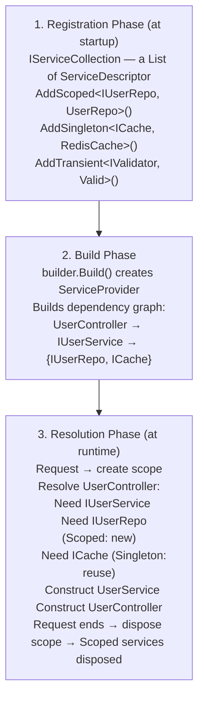
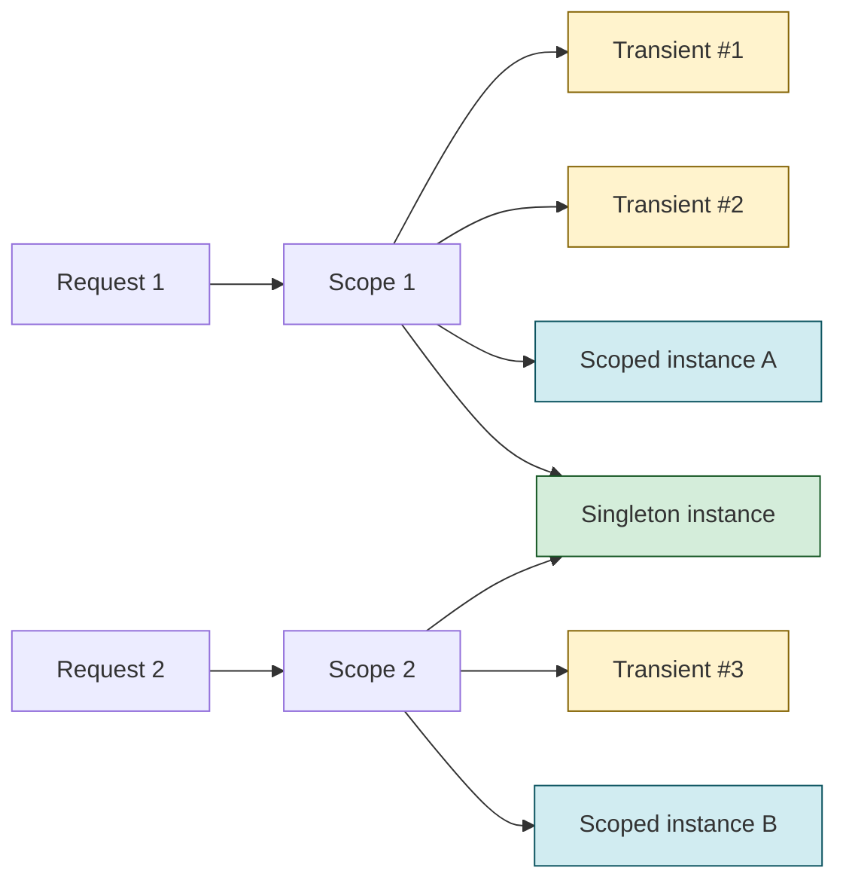

# Dependency Injection in .NET 10

> [Mastery Guide](../../../README.md) › [Foundations](../../README.md) › [.NET Core Deep Dive](README.md)

| Status | Priority | Phase | Last reviewed |
|---|---|---|---|
| Not Started | High | Phase 2 — Concurrency & DI | 2026-08-10 |

> 📘 **Single source of truth**: this is the consolidated DI topic — concepts, internals, drills, cheat sheet, walkthrough and self-test all live here. The former runtime-track duplicate of this page has been merged in and retired; update links to point here.

---

## Why It Matters

Dependency Injection (DI) is the *spine* of every modern .NET application. ASP.NET Core, Worker Services, MAUI, gRPC, SignalR, EF Core, OpenTelemetry, MediatR — all of them register and resolve through `IServiceCollection` / `IServiceProvider`. Understanding the *internals* of `Microsoft.Extensions.DependencyInjection` is the difference between a developer who copy-pastes `AddScoped<>` and one who can debug a captive-dependency leak in production at 2 AM.

DI is also the single biggest source of subtle bugs in long-running .NET apps. Inject a `DbContext` into a `Singleton` and your app will silently corrupt state across requests. Forget to wrap a `BackgroundService` in a scope and you'll exhaust the connection pool in hours. Mis-order two `AddScoped` calls and a decorator silently disappears. None of these throw at startup — they show up as flaky tests, memory leaks, or "works on my machine" tickets.

This guide goes deep: how `ServiceDescriptor` actually works, why scoped→singleton is illegal, how `IServiceScopeFactory` rescues you, what keyed services (.NET 8+) changed, how the container behaves under Native AOT, and what the runtime *actually does* between `builder.Build()` and `app.Run()`.

---

## Table of Contents

1. [Introduction](#introduction) — including [IoC principle vs DI pattern vs Service Locator](#ioc-principle-vs-di-pattern-vs-service-locator)
2. [Real-World Analogy: The Hotel Concierge Service Catalog](#real-world-analogy-the-hotel-concierge-service-catalog)
3. [How DI Works Internally](#how-di-works-internally)
4. [ServiceDescriptor Internals](#servicedescriptor-internals)
5. [The IServiceProvider API Surface](#the-iserviceprovider-api-surface)
6. [Service Lifetimes](#service-lifetimes)
7. [Lifetime Compatibility Matrix](#lifetime-compatibility-matrix)
8. [The Captive Dependency Problem and Fix](#the-captive-dependency-problem-and-fix)
9. [Injection Styles: Constructor vs Property vs Method](#injection-styles-constructor-vs-property-vs-method) — including [how the container picks a constructor](#how-the-container-picks-a-constructor)
10. [Keyed Services (.NET 8+)](#keyed-services-net-8)
11. [Open Generic Registrations](#open-generic-registrations)
12. [Scoped Service Validation](#scoped-service-validation)
13. [IServiceScopeFactory in Non-HTTP Contexts](#iservicescopefactory-in-non-http-contexts)
14. [Disposal, Ownership, and Async Scopes](#disposal-ownership-and-async-scopes)
15. [Service Replacement, TryAdd, and Decorators](#service-replacement-tryadd-and-decorators)
16. [Conditional and Factory Registration](#conditional-and-factory-registration)
17. [When NOT to Use DI](#when-not-to-use-di)
18. [Real-World DI Registration](#real-world-di-registration)
19. [Common Pitfalls](#common-pitfalls)
20. [Best Practices](#best-practices)
21. [Real-World Scenarios](#real-world-scenarios)
22. [Interview-Ready Summary](#interview-ready-summary)
23. [Interview Cross-Questioning Drill](#interview-cross-questioning-drill)
24. [Cheat Sheet](#cheat-sheet)
25. [Walkthrough](#walkthrough)
26. [Self-Test](#self-test)
27. [Cross-References](#cross-references)
28. [Sources](#sources)

---

## Introduction

### What is Dependency Injection?

Dependency Injection is a design pattern where an object's dependencies are *handed to it* rather than *constructed by it*. The .NET runtime (via `IServiceProvider`) acts as the "matchmaker" — when something asks for `IUserRepository`, the container decides which implementation to give, how long it lives, and how to clean it up.

- **Without DI:** Each class news up its own dependencies. Tightly coupled, untestable, hard to swap implementations.
- **With DI:** Classes declare what they need; the container provides it. Loosely coupled, testable, swappable.

### IoC Principle vs DI Pattern vs Service Locator

This is the standard opening question, and "DI means the framework injects things" is not a passing answer. **Inversion of Control (IoC)** is the *principle*: a component does not create or locate its own dependencies — something external supplies them. DI is *one pattern* that implements IoC.

| Term | What it means |
|---|---|
| **IoC principle** | "Don't call us, we'll call you." A class declares needs; something external satisfies them. |
| **DI pattern** | One IoC implementation: dependencies are *passed in* (constructor, property, or method). |
| **DI container** | The runtime infrastructure (`IServiceProvider`) that automates DI at scale. |
| **Service Locator** | A different IoC implementation: classes *pull* dependencies from a global registry. An anti-pattern in application code — it hides dependencies and breaks testability. |

The distinction interviewers probe: IoC is the principle, DI is the mechanism. `new OrderService(new EfRepo(), new Logger())` in `Main` is still DI — manually wired. `IServiceProvider` just automates it. Microsoft's own DI guidance names the service locator pattern explicitly as something to avoid, and extends that to "injecting a factory that resolves dependencies at runtime" in application code.

### Without DI vs With DI — Step by Step

```
WITHOUT DI (manual wiring):
┌─────────────────────────────────────────────────────────┐
│ public class OrderController                            │
│ {                                                       │
│     private readonly OrderService _service;             │
│     public OrderController()                            │
│     {                                                   │
│         var conn = new SqlConnection("Server=...");     │  ← hard-coded
│         var repo = new OrderRepository(conn);           │  ← tightly coupled
│         var cache = RedisCache.Instance;                │  ← global state
│         _service = new OrderService(repo, cache);       │  ← can't swap
│     }                                                   │
│ }                                                       │
└─────────────────────────────────────────────────────────┘
Problems:
├─ Cannot test without a real SQL server + Redis
├─ Cannot swap RedisCache for InMemoryCache in dev
├─ Connection string buried in code, not config
├─ OrderController's constructor knows the entire graph
└─ Any change to OrderService ripples through callers

WITH DI:
┌─────────────────────────────────────────────────────────┐
│ // Program.cs                                           │
│ services.AddScoped<IOrderRepository, OrderRepository>();│
│ services.AddSingleton<ICache, RedisCache>();            │
│ services.AddScoped<IOrderService, OrderService>();      │
│                                                         │
│ // Controller — only declares WHAT it needs             │
│ public class OrderController(IOrderService service)     │
│ {                                                       │
│     // service is injected; controller doesn't care     │
│     // who built it, how, or with what implementation.  │
│ }                                                       │
└─────────────────────────────────────────────────────────┘
Benefits:
├─ Test with a fake IOrderService — zero infrastructure
├─ Swap RedisCache for InMemoryCache by changing one line
├─ Connection string lives in config, not code
├─ Controller knows nothing about the dependency graph
└─ One change in OrderService doesn't ripple — interface is the contract
```

### Why DI Matters in .NET

- **Testability:** Replace real services with fakes/mocks at the boundary.
- **Lifetime management:** The container disposes scoped services automatically — no leaks.
- **Configuration-driven composition:** Different implementations per environment (`InMemoryCache` in tests, `RedisCache` in prod).
- **Cross-cutting concerns:** Logging, metrics, tracing, caching can be added via decorators *without touching the original class*.
- **Native AOT support:** `Microsoft.Extensions.DependencyInjection` works under Native AOT — when the runtime reports that dynamic code cannot be compiled, the provider falls back to an interpreting engine instead of emitting IL (see [The Two Engines](#the-two-engines)). There is **no official source-generated DI container** in .NET; that remains an open proposal ([dotnet/runtime#82679](https://github.com/dotnet/runtime/issues/82679), [dotnet/aspnetcore#62104](https://github.com/dotnet/aspnetcore/issues/62104)). Third-party compile-time containers (Jab and similar) exist, but they are not `Microsoft.Extensions.DependencyInjection`.

---

## Real-World Analogy: The Hotel Concierge Service Catalog

Think of the DI container as a hotel concierge desk with a service catalog binder.

```
┌─────────────────────────────────────────────────────────┐
│           THE HOTEL CONCIERGE (IServiceProvider)        │
├─────────────────────────────────────────────────────────┤
│                                                         │
│   Service Catalog Binder (IServiceCollection):          │
│   ┌───────────────────────────────────────────────┐    │
│   │ "Need a TAXI?"      → Call YellowCab Co.      │    │
│   │   Lifetime: TRANSIENT — new car every time    │    │
│   │                                                │    │
│   │ "Need a ROOM KEY?"  → Front desk re-issues    │    │
│   │   Lifetime: SCOPED  — one per guest stay      │    │
│   │                                                │    │
│   │ "Need WIFI PASSWORD?" → Same network          │    │
│   │   Lifetime: SINGLETON — same for every guest  │    │
│   └───────────────────────────────────────────────┘    │
│                                                         │
│   When Guest 1 arrives (HTTP request begins):           │
│   ├─ Concierge opens a folder "Stay #1" (scope)         │
│   ├─ Issues KEY #1 (scoped, in folder)                  │
│   ├─ Calls TAXI (new instance)                          │
│   ├─ Tells WIFI password (same singleton)               │
│   └─ Guest checks out → folder closed → KEY #1 returned │
│                                                         │
│   When Guest 2 arrives:                                 │
│   ├─ NEW folder "Stay #2"                               │
│   ├─ NEW KEY #2 (different from KEY #1!)                │
│   ├─ NEW TAXI                                           │
│   └─ SAME WIFI password                                 │
│                                                         │
│   The captive-dependency bug:                           │
│   ❌ Painting the WIFI password on KEY #1               │
│      → Guest 2 gets Guest 1's stale state forever       │
└─────────────────────────────────────────────────────────┘
```

This analogy maps directly onto code:

| Hotel concept | DI concept |
|---|---|
| Concierge desk | `IServiceProvider` |
| Catalog binder | `IServiceCollection` (list of `ServiceDescriptor`) |
| Catalog entry | `ServiceDescriptor` |
| Guest stay folder | `IServiceScope` |
| Room key (one per stay) | Scoped service |
| Taxi (new each call) | Transient service |
| WiFi password (whole hotel) | Singleton service |
| Painting WiFi on a key | Captive dependency |

---

## 4. Dependency Injection in .NET 10

### How DI Works Internally



### Three Phases in ASCII

```
PHASE 1 — REGISTRATION (startup, single-threaded)
┌──────────────────────────────────────────────────────────┐
│ services.AddScoped<IUserRepo, UserRepo>();               │
│ services.AddSingleton<ICache, RedisCache>();             │
│ services.AddTransient<IValidator, EmailValidator>();     │
│                                                          │
│ Internal effect: descriptors APPENDED to a List<>:       │
│ [                                                        │
│   ServiceDescriptor(IUserRepo, UserRepo, Scoped),        │
│   ServiceDescriptor(ICache, RedisCache, Singleton),      │
│   ServiceDescriptor(IValidator, EmailValidator, Trans.), │
│   ... plus the framework's own registrations             │
│ ]                                                        │
└──────────────────────────────────────────────────────────┘
(Microsoft's docs note that for apps built on the ASP.NET Core
 templates, "the framework registers more than 250 services".)

PHASE 2 — BUILD (one-time)
┌──────────────────────────────────────────────────────────┐
│ var app = builder.Build();                               │
│                                                          │
│ Internally: ServiceProviderEngine compiles factories     │
│ for each descriptor:                                     │
│   IUserRepo  → () => new UserRepo(scope.Resolve<DbCtx>) │
│   ICache     → () => new RedisCache(/* singleton */)    │
│ Realized as compiled delegates (IL emit / expression    │
│ trees), or interpreted call sites under Native AOT      │
│ Validates: circular deps, missing deps (ValidateOnBuild)│
└──────────────────────────────────────────────────────────┘

PHASE 3 — RESOLUTION (per request, hot path)
┌──────────────────────────────────────────────────────────┐
│ HTTP Request arrives:                                    │
│   1. Middleware creates scope:                           │
│      using var scope = _scopeFactory.CreateScope();      │
│                                                          │
│   2. Endpoint asks for OrderController:                  │
│      provider.GetRequiredService<OrderController>();     │
│                                                          │
│   3. Container walks the graph DEPTH-FIRST:              │
│      OrderController                                     │
│      ├── needs IOrderService                             │
│      │   ├── needs IUserRepo  (scoped — new this scope) │
│      │   └── needs ICache     (singleton — cached)      │
│      └── needs ILogger<>      (singleton — cached)      │
│                                                          │
│   4. Constructs from leaves up                           │
│   5. Caches scoped instances in scope's dictionary       │
│   6. Request ends → scope.Dispose():                     │
│      ├─ Iterates DISPOSAL list (LIFO)                    │
│      ├─ Calls IDisposable.Dispose() on each              │
│      └─ Calls IAsyncDisposable.DisposeAsync() on async   │
└──────────────────────────────────────────────────────────┘
```

### The Two Engines

`ServiceProvider` picks its resolution engine automatically, and the switch is **dynamic-code support — not the environment**. From `ServiceProvider.GetEngine()` in `dotnet/runtime`:

```csharp
if (RuntimeFeature.IsDynamicCodeCompiled && !DisableDynamicEngine)
{
    engine = CreateDynamicEngine();          // new DynamicServiceProviderEngine(this)
}
else
{
    engine = RuntimeServiceProviderEngine.Instance;
}
```

- **`DynamicServiceProviderEngine`** — the default on any runtime that can compile dynamic code (normal JIT-based apps, dev *and* prod). It resolves through the interpreting call-site resolver first and swaps in a compiled delegate for hot service types, so you get fast startup and fast steady state. It derives from `CompiledServiceProviderEngine`, which owns the compilation step (IL emit where available, expression trees otherwise).
- **`RuntimeServiceProviderEngine`** — used when `RuntimeFeature.IsDynamicCodeCompiled` is false, i.e. **Native AOT** and interpreter-only runtimes. It walks the call-site tree every time rather than compiling, because emitted IL would only be interpreted anyway.

> ⚠️ Common interview trap: `CompiledServiceProviderEngine` is **not** a "production engine" that a JIT tier-up switches you to — it is `DynamicServiceProviderEngine`'s base class. And there is no `UseSourceGenerator()`-style API: an official source-generated container is still only a proposal ([dotnet/runtime#82679](https://github.com/dotnet/runtime/issues/82679)).

---

## ServiceDescriptor Internals

```csharp
// What happens when you call AddScoped<IUserRepo, UserRepo>()
// Internally creates:
var descriptor = new ServiceDescriptor(
    serviceType: typeof(IUserRepo),           // Interface
    implementationType: typeof(UserRepo),      // Implementation
    lifetime: ServiceLifetime.Scoped           // Lifetime
);

// The IServiceCollection is just:
public interface IServiceCollection : IList<ServiceDescriptor> { }

// It's literally a list of descriptors!
```

```
┌─────────────────────────────────────────────────────────┐
│            ServiceDescriptor Properties                  │
├─────────────────────────────────────────────────────────┤
│ ✓ ServiceType         — what the consumer asks for      │
│ ✓ ImplementationType  — concrete class to construct     │
│ ✓ ImplementationFactory — Func<IServiceProvider, T>    │
│ ✓ ImplementationInstance — pre-built instance          │
│ ✓ Lifetime            — Singleton/Scoped/Transient      │
│ ✓ ServiceKey          — non-null = keyed (.NET 8+)      │
│ ✓ IsKeyedService      — convenience boolean            │
│ ✗ Cannot be null on both Type/Factory/Instance         │
│ ✗ Lifetime is immutable after construction             │
└─────────────────────────────────────────────────────────┘
```

### Three Ways to Register

```csharp
// 1. By type (most common — container news it up via reflection)
services.AddScoped<IRepo, Repo>();

// 2. By factory (you control construction)
services.AddScoped<IRepo>(sp =>
{
    var conn = sp.GetRequiredService<IConnectionFactory>();
    // Factory delegates are synchronous — never block on async work here
    // (no .Result / .Wait()). Open lazily inside the service instead.
    return new Repo(conn.Open(), customFlag: true);
});

// 3. By instance (singleton-only — you provide a pre-built object)
var clock = new SystemClock();
services.AddSingleton<IClock>(clock);
// Container will NOT dispose this — you own its lifetime
```

> Container ownership rule: if the container *constructs* an `IDisposable`, it disposes it. If you hand it a *pre-built* instance via `AddSingleton(instance)`, you own disposal. See [Disposal, Ownership, and Async Scopes](#disposal-ownership-and-async-scopes).

The three implementation properties are mutually exclusive — exactly one is set per descriptor:

- `ImplementationType` — shape 1; the container constructs it.
- `ImplementationFactory` — shape 2; the container invokes your delegate.
- `ImplementationInstance` — shape 3; the container hands back the object as-is.

Instance registration is **singleton-only**, and the API enforces it: there is no `AddScoped<T>(instance)`. A pre-built object cannot have per-scope or per-call semantics — returning the same object every time *is* singleton behaviour.

---

## The IServiceProvider API Surface

`IServiceProvider` is the runtime resolver. In ASP.NET Core you rarely call it directly, but you need its surface for tests, factories, and background services.

```csharp
var svc  = provider.GetService<IFoo>();           // null if not registered
var svc2 = provider.GetRequiredService<IFoo>();   // throws if not registered — prefer this
var all  = provider.GetServices<IFoo>();          // IEnumerable of every IFoo registration

// BuildServiceProvider — correct in unit tests and plain console apps
IServiceCollection services = new ServiceCollection();
services.AddSingleton<IClock, UtcClock>();
ServiceProvider provider = services.BuildServiceProvider();
```

> ⚠️ **Never call `BuildServiceProvider()` inside `ConfigureServices`** (or inside a `Program.cs` registration block) just to resolve something during startup. It builds a *second, separate* container: every singleton in it is a different instance from the one the app actually runs on, and nothing disposes it. If you need a service at startup, build the host and then `using var scope = app.Services.CreateScope();`.

`IServiceScopeFactory` is always registered as a singleton. The `IServiceProvider` you get injected, by contrast, varies with the lifetime of the class receiving it — resolve a service from a scope and the `IServiceProvider` it receives is that scope's provider.

---

## Service Lifetimes



```
┌─────────────────────────────────────────────────────────┐
│                    Service Lifetimes                     │
├─────────────────────────────────────────────────────────┤
│                                                         │
│  TRANSIENT (AddTransient)                               │
│  ┌─────────────────────────────────────────────┐        │
│  │ New instance EVERY time requested           │        │
│  │                                              │        │
│  │ Request 1: new Validator()                   │        │
│  │ Request 1: new Validator()  ← Different!     │        │
│  │ Request 2: new Validator()  ← Different!     │        │
│  │                                              │        │
│  │ Use for: Lightweight, stateless services    │        │
│  │ Example: Validators, Formatters, Mappers    │        │
│  └─────────────────────────────────────────────┘        │
│                                                         │
│  SCOPED (AddScoped)                                     │
│  ┌─────────────────────────────────────────────┐        │
│  │ One instance PER SCOPE (per HTTP request)   │        │
│  │                                              │        │
│  │ Request 1: new DbContext()   ← Shared        │        │
│  │ Request 1: same DbContext()  ← Same!         │        │
│  │ Request 2: new DbContext()   ← New one        │        │
│  │                                              │        │
│  │ Use for: DB contexts, unit of work           │        │
│  │ Example: DbContext, HttpClient per request   │        │
│  └─────────────────────────────────────────────┘        │
│                                                         │
│  SINGLETON (AddSingleton)                               │
│  ┌─────────────────────────────────────────────┐        │
│  │ One instance for ENTIRE app lifetime        │        │
│  │                                              │        │
│  │ Request 1: new CacheService()  ← Created     │        │
│  │ Request 2: same CacheService() ← Reused     │        │
│  │ Request N: same CacheService() ← Reused     │        │
│  │                                              │        │
│  │ Use for: Caches, Configuration, Logging      │        │
│  │ ⚠️ Must be thread-safe!                      │        │
│  └─────────────────────────────────────────────┘        │
└─────────────────────────────────────────────────────────┘
```

### Transient — Properties Box

```
┌─────────────────────────────────────────────────────────┐
│ TRANSIENT Properties                                    │
├─────────────────────────────────────────────────────────┤
│ ✓ A new instance per resolution call                    │
│ ✓ Cheapest to create (no caching machinery)             │
│ ✓ Safe to inject into anything                          │
│ ✓ Disposed by parent scope (still tracked!)             │
│ ✗ Wasteful for expensive constructors                   │
│ ✗ Creates GC pressure under load                        │
│ ✗ State CANNOT be shared across calls                   │
│ ✗ Disposable transients in the ROOT scope leak forever │
└─────────────────────────────────────────────────────────┘
```

**When to use:**
- Stateless validators, mappers, formatters
- Services with mutable state that callers shouldn't share
- Lightweight strategy objects

**When NOT to use:**
- Anything implementing `IDisposable` *and* injected into a singleton (memory leak)
- Services with expensive constructors (HTTP clients — use `IHttpClientFactory` instead)
- Anything needing per-request consistency (use Scoped)

### Scoped — Properties Box

```
┌─────────────────────────────────────────────────────────┐
│ SCOPED Properties                                       │
├─────────────────────────────────────────────────────────┤
│ ✓ One instance per scope (≈ per HTTP request)           │
│ ✓ Shared across all consumers within the same request   │
│ ✓ Auto-disposed at end of scope                         │
│ ✓ Ideal for unit-of-work / per-request state            │
│ ✗ MUST NOT be injected into Singleton (captive bug)    │
│ ✗ NOT thread-safe across parallel work in one request  │
│ ✗ Resolving from root provider throws (in dev mode)    │
│ ✗ Cannot exist outside a scope (BackgroundService trap)│
└─────────────────────────────────────────────────────────┘
```

### Singleton — Properties Box

```
┌─────────────────────────────────────────────────────────┐
│ SINGLETON Properties                                    │
├─────────────────────────────────────────────────────────┤
│ ✓ One instance for the entire application lifetime      │
│ ✓ Created lazily on first resolution (or at startup)    │
│ ✓ Cheapest at runtime — just a dictionary lookup        │
│ ✓ Disposed when host shuts down                         │
│ ✗ MUST be thread-safe — many threads share it           │
│ ✗ Mutable state is a recipe for race conditions         │
│ ✗ Cannot depend on Scoped — caught at startup/runtime,  │
│   never at compile time (ValidateOnBuild/ValidateScopes)│
│ ✗ Holds memory for the app's life — watch cache growth  │
└─────────────────────────────────────────────────────────┘
```

### Worked Example — All Three in One Request

```csharp
public class OrderController(
    IOrderService service,    // Scoped
    IValidator validator,     // Transient
    ILogger<OrderController> log) // Singleton
{
    [HttpPost]
    public async Task<IActionResult> Place(OrderDto dto)
    {
        validator.Validate(dto);          // Transient #1
        await service.PlaceAsync(dto);    // Scoped
        var v2 = HttpContext.RequestServices.GetRequiredService<IValidator>();
        // v2 is a DIFFERENT transient (Transient #2)!
        log.LogInformation("Order placed"); // Singleton — same instance for all requests
        return Ok();
    }
}
```

```
Resolution graph for ONE request:
┌────────────────────────────────────────────────────┐
│ Request #42 (Scope #42)                            │
│ ├── OrderController          [Scoped, new]         │
│ │   ├── IOrderService        [Scoped, new]         │
│ │   │   ├── IOrderRepo       [Scoped, new]         │
│ │   │   │   └── DbContext    [Scoped, same as repo]│
│ │   │   └── ICache           [Singleton, shared]   │
│ │   ├── IValidator           [Transient, new #1]   │
│ │   └── ILogger<>            [Singleton, shared]   │
│ └── (later) IValidator       [Transient, new #2]   │
└────────────────────────────────────────────────────┘
On scope dispose:
  ├─ DbContext.Dispose()       — connection returned
  ├─ OrderRepo.Dispose() (if disposable)
  ├─ OrderService.Dispose() (if disposable)
  ├─ Both transient validators disposed (if disposable)
  └─ Singletons untouched
```

---

## Lifetime Compatibility Matrix

Read this one way only: **rows are the service doing the injecting (the consumer); columns are the dependency it asks for.** The single rule underneath the whole table is *never let a longer-lived service hold a shorter-lived one*. The reverse direction — short-lived depending on long-lived — is always fine.

```
                        THE DEPENDENCY IT TAKES →
CONSUMER ↓        Transient        Scoped          Singleton
──────────────────────────────────────────────────────────────
Transient         ✅ OK            ✅ OK           ✅ OK
Scoped            ✅ OK            ✅ OK           ✅ OK
Singleton         ⚠️ waste         ❌ CAPTIVE BUG  ✅ OK

❌ Scoped into Singleton = CAPTIVE DEPENDENCY BUG
   The scoped service lives forever inside the singleton,
   never gets disposed, shares state across requests.

⚠️ Transient into Singleton = MEMORY WASTE
   Transient created once, lives forever in singleton.
   Not a bug, but defeats the purpose of transient — and if
   it is IDisposable, nothing disposes it until shutdown.

✅ Singleton into Scoped / Transient = ALWAYS SAFE
   The dependency outlives the consumer, so it can never be
   torn down underneath it. Only the short-into-long direction
   is dangerous, never the reverse.

⚠️ Disposable Transient at root = MEMORY LEAK
   Resolved from root provider, kept alive until app exit.
   Always resolve transients from a child scope.
```

| Consumer ↓ / Dependency → | Transient | Scoped | Singleton | Notes |
|---|:---:|:---:|:---:|---|
| Transient | ✓ | ✓ | ✓ | Takes on the identity of whichever scope resolved it |
| Scoped | ✓ | ✓ | ✓ | Most permissive — a singleton dependency is always legal here |
| Singleton | ⚠ | ✗ | ✓ | `✗` = captive dependency; use `IServiceScopeFactory` to reach scoped services |

Legend: `✓` safe · `⚠` legal but wasteful (and leaks disposal) · `✗` bug — `ValidateScopes` throws on it.

---

## The Captive Dependency Problem and Fix

```csharp
// ❌ WRONG: Injecting Scoped into Singleton
public class SingletonCache : ISingletonCache
{
    private readonly IDbContext _db;  // Scoped! Lives forever now!
    
    public SingletonCache(IDbContext db)  // ❌ Captive dependency
    {
        _db = db;  // This DbContext never gets disposed!
    }
}

// ✅ FIX: Use IServiceScopeFactory
public class SingletonCache : ISingletonCache
{
    private readonly IServiceScopeFactory _scopeFactory;
    
    public SingletonCache(IServiceScopeFactory scopeFactory)
    {
        _scopeFactory = scopeFactory;
    }
    
    public async Task<User> GetUserAsync(int id)
    {
        // Create a new scope each time you need the scoped service
        using var scope = _scopeFactory.CreateScope();
        var db = scope.ServiceProvider.GetRequiredService<IDbContext>();
        return await db.Users.FindAsync(id);
        // scope disposed → db disposed → connection returned to pool
    }
}
```

### What Goes Wrong (Walkthrough)

```
T=0   App starts → Singleton SingletonCache constructed
                   → DbContext #1 cached inside it forever
T=10  Request A → reads via DbContext #1 (still working)
T=15  Request A ends → expects DbContext to dispose → DOES NOT
T=20  Request B → reads via DbContext #1 (stale change tracker!)
T=25  Request B writes → SaveChanges() → tracks entities from
                                          requests A AND B
T=30  Request C → connection pool starting to leak
T=...  After hours: connection pool exhausted, change tracker
       holding tens of thousands of entities, memory
       ballooning, queries slowing down.
```

### Detection

The generic host turns scope validation on **only in the Development environment**. From `HostingHostBuilderExtensions` in `dotnet/runtime`:

```csharp
internal static ServiceProviderOptions CreateDefaultServiceProviderOptions(HostBuilderContext context)
{
    bool isDevelopment = context.HostingEnvironment.IsDevelopment();
    return new ServiceProviderOptions
    {
        ValidateScopes = isDevelopment,
        ValidateOnBuild = isDevelopment,
    };
}
```

Microsoft's DI overview states the same behaviour: when an app runs in the development environment and uses `CreateApplicationBuilder`, the default provider verifies that scoped services aren't resolved from the root provider and aren't injected into singletons.

With validation on you get:

```
System.InvalidOperationException:
  Cannot consume scoped service 'IDbContext' from singleton 'SingletonCache'.
```

In every other environment — including Production — both flags are off by default, so the bug ships silently. Best practice: turn them on explicitly for all environments:

```csharp
// Program.cs
var builder = WebApplication.CreateBuilder(args);
builder.Host.UseDefaultServiceProvider(o =>
{
    o.ValidateScopes = true;        // catch captive deps
    o.ValidateOnBuild = true;       // catch missing deps at startup
});
```

---

## Injection Styles: Constructor vs Property vs Method

```
┌──────────────────┬──────────────────┬──────────────────┐
│ Style            │ Constructor      │ Property         │
├──────────────────┼──────────────────┼──────────────────┤
│ Built into MEDI? │ ✅ Yes           │ ❌ No (3rd party)│
│ Required deps?   │ ✅ Required      │ ❌ Optional      │
│ Testability      │ ✅ Highest       │ ⚠️ Lower         │
│ Visibility       │ ✅ Explicit      │ ❌ Hidden        │
│ Immutable?       │ ✅ readonly      │ ❌ Mutable       │
│ Use case         │ Default          │ Edge cases only  │
└──────────────────┴──────────────────┴──────────────────┘
```

### Constructor Injection (Idiomatic)

```csharp
// .NET 8+ primary constructor — the modern style
public class OrderService(
    IOrderRepository repo,
    IPaymentGateway payments,
    ILogger<OrderService> logger) : IOrderService
{
    public async Task PlaceAsync(OrderDto dto)
    {
        logger.LogInformation("Placing order {Id}", dto.Id);
        await payments.ChargeAsync(dto.Total);
        await repo.SaveAsync(dto);
    }
}
```

```
┌─────────────────────────────────────────────────────────┐
│ CONSTRUCTOR INJECTION — When to use                     │
├─────────────────────────────────────────────────────────┤
│ ✓ Always your default                                   │
│ ✓ Required dependencies — without them, class is broken │
│ ✓ Forces explicit declaration of every dependency      │
│ ✓ Plays nicely with `readonly` fields → immutability   │
│ ✗ Avoid >5 ctor params — sign the class does too much  │
└─────────────────────────────────────────────────────────┘
```

### How the Container Picks a Constructor

Microsoft's rule, stated in the DI overview: *"The constructor with the most parameters where the types are DI-resolvable is selected."* Three details that turn into cross-questions:

1. **Only `public` constructors are considered.** Both `IServiceProvider` and `ActivatorUtilities` require a public constructor.
2. **Ambiguity throws.** `CallSiteFactory` sorts constructors by descending parameter count and takes the first fully-resolvable one; if a second resolvable constructor is *not* a subset of that one, it throws `InvalidOperationException` naming both constructors. Docs example: a class with `(ILogger<T>)` and `(IOptions<T>)` constructors, both resolvable and neither a superset of the other, fails to resolve.
3. **Non-injected parameters must have default values.** A constructor may take arguments DI can't supply, but only if they are optional.

```csharp
// ⚠️ The silent-fallback trap
public class ReportService
{
    public ReportService() { }                    // public, always satisfiable
    public ReportService(IRepo repo, IClock clock) { }   // the one you meant
}
// If IClock is not registered, the 2-param ctor is unresolvable, so the container
// falls back to the parameterless one and hands you a non-functional instance.
// No exception, no log line. Fix: don't give a service a public parameterless ctor.
```

**`[ActivatorUtilitiesConstructor]`** marks the constructor "to be used when activating type using `ActivatorUtilities`" — that is the whole of its documented contract. The string `ActivatorUtilitiesConstructor` does not appear in `CallSiteFactory`, so the built-in `ServiceProvider` ignores it and applies the greedy rule regardless. Use it to disambiguate `ActivatorUtilities.CreateInstance`, never to steer the container.

**C# 12 primary constructors** are idiomatic for DI services, with two gotchas: the synthesized backing fields are *mutable* (nothing stops `repo = null;` later in the class body — project to `private readonly IRepo _repo = repo;` if you want enforced immutability), and a parameter that is never used by an instance member gets no backing field at all.

### Property Injection (Use Sparingly)

`Microsoft.Extensions.DependencyInjection` does **not** support property injection out of the box — it's a deliberate design choice. If you need it, you wire it manually:

```csharp
public class LegacyJob
{
    public ILogger? Logger { get; set; }   // optional dep

    public void Run() => Logger?.LogInformation("running");
}

// Manual injection at construction
services.AddScoped<LegacyJob>(sp =>
{
    var job = new LegacyJob();
    job.Logger = sp.GetService<ILogger<LegacyJob>>();
    return job;
});
```

Use property injection only for *truly optional* dependencies in legacy code that you can't refactor.

### Method Injection (HttpContext-style)

ASP.NET Core minimal APIs and controller action methods inject *per-call* dependencies via method parameters:

```csharp
app.MapGet("/orders/{id}", (int id, IOrderService service, CancellationToken ct) =>
    service.GetAsync(id, ct));

// In controllers — [FromServices] is now optional in .NET 7+
public IActionResult Get(int id, IOrderService service) => Ok(service.Get(id));
```

This is method injection — the framework resolves parameters from DI as it invokes the method.

---

## Keyed Services (.NET 8+)

Before .NET 8, registering multiple implementations of one interface required a custom factory pattern. .NET 8 introduced **keyed services** as the native replacement, via `AddKeyedSingleton` / `AddKeyedScoped` / `AddKeyedTransient` and the `[FromKeyedServices]` attribute.

```csharp
// Register multiple implementations under different keys
builder.Services.AddKeyedSingleton<INotifier, EmailNotifier>("email");
builder.Services.AddKeyedSingleton<INotifier, SmsNotifier>("sms");
builder.Services.AddKeyedScoped<INotifier, PushNotifier>("push");

// Inject specific keyed instance
public class AlertController(
    [FromKeyedServices("email")] INotifier emailNotifier,
    [FromKeyedServices("sms")]   INotifier smsNotifier)
{
    [HttpPost("alert")]
    public async Task SendAlert(string channel, string msg, IServiceProvider sp)
    {
        // Resolve dynamically by key
        var notifier = sp.GetRequiredKeyedService<INotifier>(channel);
        await notifier.SendAsync(msg);
    }
}
```

### Properties Box

```
┌─────────────────────────────────────────────────────────┐
│ KEYED SERVICES Properties                               │
├─────────────────────────────────────────────────────────┤
│ ✓ Many impls of one interface, separated by key         │
│ ✓ Key is any object whose type implements Equals        │
│   correctly (string, enum, int, Type, record)           │
│ ✓ Works with all three lifetimes (.NET 8+)              │
│ ✓ AnyKey wildcard via KeyedService.AnyKey               │
│ ✗ Needs `[FromKeyedServices]` — plain `[FromServices]`  │
│   cannot resolve a keyed registration                   │
│ ✗ Mutable objects as keys are fragile — mutate the key  │
│   after registration and the entry becomes unreachable  │
└─────────────────────────────────────────────────────────┘
```

**Keyed services and Native AOT.** Keyed services shipped in .NET 8 and are not gated on a later release. The one API in this area carrying an AOT annotation is the **non-generic** overload `GetKeyedServices(this IServiceProvider, Type, object?)`, marked `[RequiresDynamicCode("The native code for an IEnumerable<serviceType> might not be available at runtime.")]`. The generic `GetKeyedServices<T>(this IServiceProvider, object?)` carries no such attribute. So: use the generic overload on an AOT target, and expect a warning if you reach for the `Type`-based one.

### Common Keyed Patterns

```csharp
// 1. Strategy by enum
public enum PaymentProvider { Stripe, Adyen, PayPal }

services.AddKeyedScoped<IPaymentGateway, StripeGateway>(PaymentProvider.Stripe);
services.AddKeyedScoped<IPaymentGateway, AdyenGateway>(PaymentProvider.Adyen);
services.AddKeyedScoped<IPaymentGateway, PayPalGateway>(PaymentProvider.PayPal);

// 2. Resolve at runtime
public class CheckoutService(IServiceProvider sp)
{
    public Task ProcessAsync(Cart cart, PaymentProvider chosen)
    {
        var gateway = sp.GetRequiredKeyedService<IPaymentGateway>(chosen);
        return gateway.ChargeAsync(cart.Total);
    }
}

// 3. Fan out over every keyed implementation.
//    ONE DI-visible constructor — two resolvable single-parameter ctors
//    would be exactly the ambiguity case that throws.
public class FanOutNotifier(IServiceProvider sp)
{
    public Task NotifyAllAsync(string msg) =>
        Task.WhenAll(sp.GetKeyedServices<INotifier>(KeyedService.AnyKey)
                       .Select(n => n.SendAsync(msg)));
}
```

### KeyedService.AnyKey — Two Different Jobs

`KeyedService.AnyKey` means different things on the registration side and the lookup side, and conflating them is a classic follow-up:

```csharp
// (a) As a REGISTRATION key: a fallback that matches any key with no explicit entry.
services.AddKeyedSingleton<ICache>(KeyedService.AnyKey,
    (sp, key) => new DefaultCache(key?.ToString() ?? "unknown"));
services.AddKeyedSingleton<ICache>("premium", new PremiumCache());

provider.GetKeyedService<ICache>("premium");  // PremiumCache
provider.GetKeyedService<ICache>("basic");    // DefaultCache, built by the fallback

// (b) As a QUERY key: return everything registered under a *specific* key.
provider.GetKeyedServices<ICache>(KeyedService.AnyKey);  // → PremiumCache only;
// the AnyKey fallback registration itself is not returned.
```

> ⚠️ **Behaviour change in .NET 10**: calling the singular `GetKeyedService()` with `KeyedService.AnyKey` now throws `InvalidOperationException` — `AnyKey` was never meant to resolve a single service. Only the plural `GetKeyedServices()` accepts it.

---

## Open Generic Registrations

Register the *open* type once and let the container close it per `T` at resolution time. This is how `ILogger<T>` works, and how you avoid registering `IRepository<Order>`, `IRepository<Customer>`, `IRepository<Invoice>`… by hand.

```csharp
// The typeof() overload is required — see below
services.AddScoped(typeof(IRepository<>), typeof(EfRepository<>));
services.AddScoped(typeof(IValidator<>),  typeof(FluentValidator<>));

// Resolving IRepository<Order>:
//   no exact descriptor match → fall back to open-generic descriptors
//   → MakeGenericType closes IRepository<> and EfRepository<> over Order
//   → constructs EfRepository<Order>
//   → the closed result is cached, so later resolutions skip the reflection
```

**Why `AddScoped<IRepository<>, EfRepository<>>()` doesn't compile:** `IRepository<>` is an *unbound* generic type. C# doesn't allow it as a type argument to a generic method — the language requires a closed type there. `typeof(IRepository<>)` is legal because `typeof` can produce an open generic `Type` object, and the non-generic `AddScoped(Type, Type)` overload takes it. It's a language restriction, not a container limitation.

**Constraints are not validated at registration.** The container stores the descriptor without inspecting `where T : IEntity`. Resolve `IRepository<string>` against `EfRepository<T> where T : IEntity` and the failure surfaces at resolution time from `MakeGenericType`, not at startup. Defence: an integration test that resolves each closed type you actually use, so violations fail in CI.

---

## Scoped Service Validation

Two startup flags govern container correctness. Both should be **on** in dev, and *strongly considered* in prod.

```csharp
builder.Host.UseDefaultServiceProvider(opts =>
{
    opts.ValidateScopes  = true; // catch captive dependencies
    opts.ValidateOnBuild = true; // catch missing/circular deps at Build()
});
```

```
┌──────────────────┬─────────────────────────────────────┐
│ Flag             │ What it catches                     │
├──────────────────┼─────────────────────────────────────┤
│ ValidateScopes   │ Scoped resolved from root provider  │
│                  │ Scoped injected into Singleton      │
│ ValidateOnBuild  │ Missing dependencies                │
│                  │ Circular dependencies               │
│                  │ Ambiguous/unresolvable ctors        │
└──────────────────┴─────────────────────────────────────┘
```

`ValidateOnBuild = true` walks every descriptor at startup and tries to build a resolution chain for it. The cost is one-off and scales with the number of registrations and the depth of the graph — measure it on your own app rather than quoting a number. The benefit is that a missing or circular dependency crashes the app in CI, not at midnight on the first real request.

Both flags default to *on in Development only* (see [Detection](#detection) above for the host source), so set them explicitly if you want them in Production.

### What ValidateOnBuild Does NOT Catch

Say this before the interviewer asks it — it is the most common follow-up:

- **Factory-registered services.** `services.AddSingleton<ICache>(sp => new Cache(sp.GetRequiredService<IScopedRepo>()))` registers a *delegate*. The validator never executes it, so a captive dependency created inside a lambda is invisible. Code review is the primary defence here.
- **Open-generic registrations — skipped outright.** `ServiceProvider.ValidateService` opens with `if (descriptor.ServiceType.IsGenericType && !descriptor.ServiceType.IsConstructedGenericType) return;`, so a descriptor registered as `typeof(IRepository<>)` is never walked at build time. It is validated only when a closed `IRepository<Order>` is first resolved. Don't claim `ValidateOnBuild` covers open generics — it explicitly does not.
- **Runtime-keyed lookups.** `GetRequiredKeyedService<T>(keyFromConfig)` is a runtime decision.
- **Generic constraint violations** that only appear for particular `T`.
- **Conditional registration branches** that weren't taken in this environment.

In short: it validates the descriptor-level graph, not the dynamic resolution paths your code takes. Integration tests over the real container are the safety net for those.

---

## IServiceScopeFactory in Non-HTTP Contexts

`IServiceScopeFactory` is the rescue valve for any code that lives **outside** of a per-request scope: BackgroundService, hosted services, message-queue consumers, scheduled jobs, SignalR Hub handlers that fan out work.

### BackgroundService — The Canonical Pattern

```csharp
public class OrderProcessingWorker(
    IServiceScopeFactory scopeFactory,
    ILogger<OrderProcessingWorker> log) : BackgroundService
{
    protected override async Task ExecuteAsync(CancellationToken stoppingToken)
    {
        while (!stoppingToken.IsCancellationRequested)
        {
            // ❗ Must create a new scope for each iteration.
            // The BackgroundService itself is registered as Singleton,
            // so it CANNOT directly inject scoped services.
            using var scope = scopeFactory.CreateScope();
            var sp = scope.ServiceProvider;

            var queue   = sp.GetRequiredService<IOrderQueue>();
            var db      = sp.GetRequiredService<AppDbContext>();   // Scoped
            var handler = sp.GetRequiredService<IOrderHandler>();  // Scoped

            try
            {
                var msg = await queue.DequeueAsync(stoppingToken);
                await handler.HandleAsync(msg, stoppingToken);
                await db.SaveChangesAsync(stoppingToken);
            }
            catch (Exception ex)
            {
                log.LogError(ex, "worker iteration failed");
            }

            // scope.Dispose() → db.Dispose() → connection returned to pool
            await Task.Delay(500, stoppingToken);
        }
    }
}
```

### Why a Scope Per Iteration?

```
WITHOUT per-iteration scope (anti-pattern):
┌────────────────────────────────────────────────────┐
│ Iteration 1: load 1000 entities → tracked in DbCtx │
│ Iteration 2: load 1000 entities → 2000 tracked     │
│ Iteration 3: load 1000 entities → 3000 tracked     │
│ ...                                                │
│ Nothing ever releases them → the change tracker    │
│ grows without bound → memory blow-up, and tracking │
│ work per query grows with the number of entities   │
└────────────────────────────────────────────────────┘

WITH per-iteration scope:
┌────────────────────────────────────────────────────┐
│ Iter 1: scope { fresh DbCtx, 1000 entities, save } │
│         scope disposed → memory reclaimed          │
│ Iter 2: scope { fresh DbCtx, 1000 entities, save } │
│         scope disposed → memory reclaimed          │
│ → Steady-state memory                              │
└────────────────────────────────────────────────────┘
```

### Other Non-HTTP Hot Spots

- **SignalR Hubs**: Hub instance is *transient per invocation*, but background fan-out via `IHubContext<>` lives outside a scope — wrap work in `CreateScope()`.
- **Quartz / Hangfire jobs**: each job execution must run in its own scope; both libraries have built-in integration packages.
- **gRPC streaming methods**: a streaming call has one scope for its full duration — long calls can leak scoped resources; consider explicit sub-scopes.

---

## Disposal, Ownership, and Async Scopes

### The Ownership Rule

**If the container constructed it, the container disposes it. If you handed the container a pre-built object, you own it.**

```csharp
services.AddScoped<IDbConnection, SqlConnection>();   // container constructs → container disposes

var conn = new SqlConnection(connStr);
services.AddSingleton<IDbConnection>(conn);           // you constructed → YOU dispose,
                                                      // typically in IHost shutdown
```

Microsoft states the same rule from the other direction: services resolved from the container should never be disposed by the developer, and for `services.AddSingleton(new Service1())` "the framework doesn't dispose of the services automatically."

### Ordering, and What Happens When Dispose Throws

Disposal is **LIFO** relative to resolution order, so a dependent is disposed before the dependency it was built from — `OrderService` before its `DbContext`.

What happens when one `Dispose` throws is version-dependent, and both halves of this guide previously got it wrong:

- **Through .NET 10**, `ServiceProviderEngineScope.Dispose` has **no `try`/`catch`**. It walks the tracked list in reverse calling `Dispose()`, and the first exception propagates immediately — **the remaining services are never disposed**. There is no `AggregateException` and nothing is logged by the container.
- **On the `main` branch (.NET 11 previews)** the loop was changed to catch per-instance: exceptions are accumulated, then a single exception is rethrown with its original stack via `ExceptionDispatchInfo.Throw()`, or an `AggregateException` if more than one service threw.

Practical takeaway is the same either way: **never throw from `Dispose`.** If cleanup can fail, log it internally and swallow. On the runtimes most teams are on today, one buggy `Dispose` really does abandon the rest of the scope's cleanup.

### Sync Scope + IAsyncDisposable

```csharp
// ✅ async cleanup runs
await using var scope = scopeFactory.CreateAsyncScope();

// ⚠️ sync disposal — DisposeAsync is never called
using var scope2 = scopeFactory.CreateScope();
```

Two distinct cases, and the difference matters:

- A service implementing **both** `IDisposable` and `IAsyncDisposable`, in a sync-disposed scope: `Dispose()` is called, `DisposeAsync()` is not. The async cleanup path is silently skipped.
- A service implementing **only** `IAsyncDisposable`, in a sync-disposed scope: it does **not** fail silently — `Dispose` throws `InvalidOperationException` ("`'{0}' type only implements IAsyncDisposable. Use DisposeAsync to dispose the container.`"). Loud, and easy to fix.

So: any service with real async cleanup (closing a connection, flushing a buffer) belongs in a scope created with `CreateAsyncScope()` and disposed with `await using`.

---

## Service Replacement, TryAdd, and Decorators

### Add vs TryAdd vs Replace

```
┌─────────────────────┬────────────────────────────────────┐
│ Method              │ Behavior                           │
├─────────────────────┼────────────────────────────────────┤
│ Add<T,U>()          │ Always appends — duplicates allowed│
│ TryAdd<T,U>()       │ Adds only if T not already registered│
│ TryAddEnumerable    │ Adds only if (T,U) pair not present│
│ Replace             │ Removes first match, then adds     │
│ RemoveAll<T>()      │ Removes ALL registrations of T     │
└─────────────────────┴────────────────────────────────────┘
```

```csharp
// Library code — be a polite citizen, use TryAdd
public static IServiceCollection AddMyLibrary(this IServiceCollection s)
{
    s.TryAddSingleton<ITimeProvider, SystemTimeProvider>();   // user can override
    s.TryAddScoped<IMyService, DefaultMyService>();
    return s;
}

// App code — replace a library default
services.Replace(ServiceDescriptor.Singleton<ITimeProvider, FrozenTimeProvider>());
```

`TryAdd` asks "is *any* descriptor for this service type present?" `TryAddEnumerable` asks "is a descriptor for this exact *(service type, implementation type)* pair present?" — which is what you want when several implementations are meant to coexist but the same one must not be registered twice.

### Extension-Method Module Registration

Group related registrations behind one `Add{Module}` extension method. This is the framework's own convention (`AddRazorComponents`, `AddDbContext`, …) and it keeps `Program.cs` readable while giving each module an owner:

```csharp
// OrderModule.cs
public static class OrderServiceExtensions
{
    public static IServiceCollection AddOrderServices(this IServiceCollection services)
    {
        services.TryAddScoped<IOrderRepository, EfOrderRepository>();
        services.TryAddScoped<IOrderService, OrderService>();
        services.TryAddScoped<IOrderValidator, OrderValidator>();
        return services;
    }
}

// Program.cs
builder.Services
    .AddOrderServices()
    .AddPaymentServices()
    .AddNotificationServices();
```

Use `TryAdd*` inside these methods — that is the polite library-author contract. If the consumer registered their own implementation first, yours steps aside instead of appending a second descriptor that would win `GetRequiredService<T>()` by last-wins and silently override their explicit choice. Returning `IServiceCollection` keeps the calls chainable.

### Multiple Registrations of One Interface

```csharp
services.AddSingleton<IRule, MinAmountRule>();
services.AddSingleton<IRule, MaxItemsRule>();
services.AddSingleton<IRule, FraudCheckRule>();

// All three are returned when injecting IEnumerable<>
public class OrderValidator(IEnumerable<IRule> rules)
{
    public bool IsValid(Order o) => rules.All(r => r.Check(o));
}
```

> Resolving `IRule` (singular) returns the *last* one registered. Resolving `IEnumerable<IRule>` returns all in registration order.

Last-wins is deliberate: it is what lets app code override a library default simply by registering after it. The docs spell out both halves — a second `AddSingleton<IMyDependency, DifferentDependency>()` "overrides the previous one when resolved as `IMyDependency` and adds to the previous one when multiple services are resolved via `IEnumerable<IMyDependency>`".

**Need an execution order different from registration order?** Two options: put an `int Order` property on the interface and sort in the composite (`rules.OrderBy(r => r.Order)`), or use keyed registrations with an ordered key. The first is simpler and far more common; the second earns its keep when the order is configured externally.

### Decorators via Scrutor

The built-in container has no native decorator support and no assembly scanning. **Scrutor** is the long-standing third-party package that adds both:

```csharp
using Scrutor;

services.AddScoped<IOrderService, OrderService>();
services.Decorate<IOrderService, LoggingOrderService>();
services.Decorate<IOrderService, RetryOrderService>();
services.Decorate<IOrderService, MetricsOrderService>();
// Resolution order: Metrics → Retry → Logging → OrderService
```

```
Decoration chain (innermost = first registered):

  Caller
    ↓
  MetricsOrderService    ← outermost decorator
    ↓ wraps
  RetryOrderService
    ↓ wraps
  LoggingOrderService
    ↓ wraps
  OrderService           ← innermost real impl
```

Scrutor also provides `Scan()` for assembly-scanning registration:

```csharp
services.Scan(scan => scan
    .FromAssemblyOf<OrderService>()
    .AddClasses(c => c.AssignableTo<IHandler>())
    .AsImplementedInterfaces()
    .WithScopedLifetime());
```

> ⚠️ `AsImplementedInterfaces()` registers each matched type under **every** interface it implements — including `IDisposable` if the class implements it. After that, `GetRequiredService<IDisposable>()` resolves whichever handler happened to be registered last. Narrow it: `As<IHandler>()`, or filter the interface list.

**Version note before you quote guidance about Scrutor in an interview.** Keyed-service support arrived in Scrutor **v7.0.0** (released 24 Nov 2025), together with support for exposing decorated services; guidance written against .NET 8/9-era Scrutor that steers you away from combining `Decorate` with keyed registrations predates it. Check the release notes for the version you actually reference. Separately: assembly scanning is reflection over assemblies by design, so a trimmer or Native AOT publish cannot see those registrations statically — that is a property of scanning, not a defect in the package.

---

## Conditional and Factory Registration

### Environment-Specific Registration

```csharp
if (builder.Environment.IsDevelopment())
{
    services.AddSingleton<IEmailSender, FakeEmailSender>();
}
else
{
    services.AddSingleton<IEmailSender, SendGridEmailSender>();
}
```

### Feature-Flag Conditional

```csharp
var useNewPipeline = builder.Configuration.GetValue<bool>("Features:NewPipeline");
if (useNewPipeline)
    services.AddScoped<IPipeline, NewPipeline>();
else
    services.AddScoped<IPipeline, LegacyPipeline>();
```

### Factory Pattern

```csharp
// Hand-built factory using IServiceProvider
services.AddSingleton<IShippingProviderFactory, ShippingProviderFactory>();

public class ShippingProviderFactory(IServiceProvider sp) : IShippingProviderFactory
{
    public IShippingProvider Create(string country) => country switch
    {
        "US" => sp.GetRequiredService<UspsProvider>(),
        "GB" => sp.GetRequiredService<RoyalMailProvider>(),
        _    => sp.GetRequiredService<DhlProvider>()
    };
}
```

For most cases, prefer **keyed services** (above) over hand-rolled factories — the container manages the lifetimes, the dependency is declared at the injection site via `[FromKeyedServices]` instead of hidden behind an `IServiceProvider`, and there's less boilerplate.

---

## When NOT to Use DI

Registering everything is its own smell. The container earns its place only when a type has dependencies with lifetimes, or needs to be swappable.

| Scenario | Why DI is wrong | Preferred alternative |
|---|---|---|
| **Pure functions** — formatters, parsers, `Math`-style helpers | No state, no dependencies, pure input→output | `static` methods; no container needed |
| **Static utility helpers** — `StringExtensions`, `DateTimeExtensions` | No lifecycle; injecting them is noise | `static class` extension methods |
| **Value objects / DTOs** — `Order`, `Address`, `Money` | Data carriers, not services | Constructor or object initializer |
| **Types created in hot loops** | Resolution overhead and allocation churn for no benefit | `new` directly, or `ObjectPool<T>` |
| **Config-only singletons** | It's a shared value, not a service | `IOptions<T>` or direct `IConfiguration` binding |

The tell: *"I'm registering this so I can call `new X()` once."* If a type has no dependencies and no lifecycle, it doesn't belong in the container.

The test for when a former "pure function" legitimately earns DI: does it now hold a dependency with its own lifetime (a cache, a logger, an `HttpClient`, config that can change)? Does it need to be replaceable in tests? Yes to either → promote it from `static class` to a class with constructor-injected dependencies. No to both → leave it `static`.

---

## Real-World DI Registration

```csharp
// Program.cs — ASP.NET Core minimal hosting
var builder = WebApplication.CreateBuilder(args);

// EF Core (DbContext is scoped by default)
builder.Services.AddDbContext<AppDbContext>(options =>
    options.UseSqlServer(builder.Configuration.GetConnectionString("Default")));

// Domain services
builder.Services.AddScoped<IUserRepository, UserRepository>();
builder.Services.AddScoped<IOrderService, OrderService>();

// Infra
builder.Services.AddSingleton<ICacheService, RedisCacheService>();
builder.Services.AddTransient<IEmailValidator, EmailValidator>();

// Keyed services (.NET 8+)
builder.Services.AddKeyedSingleton<INotifier, EmailNotifier>("email");
builder.Services.AddKeyedSingleton<INotifier, SmsNotifier>("sms");

// HTTP clients (use IHttpClientFactory, never raw HttpClient as singleton)
builder.Services.AddHttpClient<IInventoryClient, InventoryClient>(c =>
{
    c.BaseAddress = new Uri(builder.Configuration["Inventory:Url"]!);
    c.Timeout = TimeSpan.FromSeconds(10);
})
.AddStandardResilienceHandler(); // requires the Microsoft.Extensions.Http.Resilience
                                 // NuGet package — not in the base framework

// Container correctness
builder.Host.UseDefaultServiceProvider(o =>
{
    o.ValidateScopes  = true;
    o.ValidateOnBuild = true;
});

var app = builder.Build();

// Usage with keyed services:
public class NotificationController(
    [FromKeyedServices("email")] INotifier emailNotifier,
    [FromKeyedServices("sms")]   INotifier smsNotifier)
{
    // Each gets the correct implementation
}
```

---

## Common Pitfalls

### 1. Captive Dependency (Scoped → Singleton)

Already covered. Runs forever, leaks state, will not be caught unless `ValidateScopes = true`.

### 2. Resolving Scoped Services from Root Provider

```csharp
// ❌ BAD — host.Services is the ROOT provider; no scope
var db = app.Services.GetRequiredService<AppDbContext>();
```

The root provider has no scope. Either resolve from `HttpContext.RequestServices`, or create one explicitly:

```csharp
// ✅ GOOD
using var scope = app.Services.CreateScope();
var db = scope.ServiceProvider.GetRequiredService<AppDbContext>();
```

### 3. Disposable Transient at Root Scope

```csharp
services.AddTransient<HeavyDisposable>();
var x = app.Services.GetRequiredService<HeavyDisposable>();
// Container tracks `x` for disposal — but root scope only disposes
// at app shutdown. Memory leak until then.
```

### 4. Constructor That Throws Mid-Construction

```csharp
public class Bad
{
    public Bad(IDbContext db)
    {
        if (someCondition) throw new InvalidOperationException();
        // db is now leaked — never disposed!
    }
}
```

Throwing in constructors of services that consume disposables is dangerous; the partially-constructed graph escapes disposal. Validate inputs *before* taking ownership of disposables.

### 5. Forgetting `using` on Manual Scopes

```csharp
// ❌ Scope never disposed — memory leak
var scope = scopeFactory.CreateScope();
var svc   = scope.ServiceProvider.GetRequiredService<IFoo>();
DoWork(svc);

// ✅ using disposes scope (and all scoped services within)
using var scope = scopeFactory.CreateScope();
```

### 6. Static `IServiceProvider` Anti-Pattern

```csharp
public static class ServiceLocator
{
    public static IServiceProvider Provider { get; set; } = null!;
}
// Anywhere: ServiceLocator.Provider.GetService<IFoo>() — anti-pattern
```

This is the **Service Locator** anti-pattern. It hides dependencies, breaks tests, and re-introduces the coupling DI was supposed to eliminate. Use constructor injection instead.

### 7. HttpClient as a Singleton (Old Pattern)

```csharp
// ❌ Old: raw HttpClient as singleton
services.AddSingleton<HttpClient>();
// DNS resolution stale, connection pool issues, cancellation broken
```

Use `IHttpClientFactory` (`AddHttpClient<T>()`) — typed clients, named clients, or pooled handlers.

### 8. Multi-Threading a Scoped Service

```csharp
// ❌ DANGEROUS: parallel work over the same scoped DbContext
public async Task<List<Result>> GetAllAsync(int[] ids)
{
    var tasks = ids.Select(id => _db.Items.FindAsync(id).AsTask());
    return await Task.WhenAll(tasks); // EF Core throws — DbContext not thread-safe
}
```

Scoped services are *not* automatically thread-safe. For parallel fan-out, create child scopes (one per task) or serialize the work.

### 9. Open-Generic Misregistration

```csharp
// ✅ CORRECT — registers the OPEN generic; container closes it per T on demand
services.AddScoped(typeof(IRepository<>), typeof(Repository<>));

// ❌ WRONG — this closes the generic over `object` and registers exactly one
//    closed pair. Resolving IRepository<Order> then fails: no descriptor matches.
services.AddScoped<IRepository<object>, Repository<object>>();
```

For repositories, validators, and anything else that closes over `T`, use the `typeof()` overload. See [Open Generic Registrations](#open-generic-registrations).

### 10. Registering the Same Interface 50 Times by Mistake

Calling `AddScoped<IService, ServiceImpl>()` from a re-entrant `AddXXX()` extension can register the same descriptor on every host reload, especially in tests. Use `TryAdd` in extension methods that may be called more than once.

### 11. Async Dispose Not Awaited

```csharp
public class MyService : IAsyncDisposable
{
    public async ValueTask DisposeAsync() => await _conn.CloseAsync();
}
// The container calls DisposeAsync only if the SCOPE is disposed asynchronously:
await using var scope = scopeFactory.CreateAsyncScope();
//         ^^^^^ note `await using` and `CreateAsyncScope`
```

If the type implements **both** `IDisposable` and `IAsyncDisposable`, a sync-disposed scope quietly calls only `Dispose()`. If it implements **only** `IAsyncDisposable`, a sync-disposed scope throws `InvalidOperationException` instead. Details in [Disposal, Ownership, and Async Scopes](#disposal-ownership-and-async-scopes).

---

## Best Practices

1. **Default to constructor injection.** Use primary constructors (.NET 8+) for terseness.
2. **Default to scoped lifetime** for application services, scoped for `DbContext`, transient for stateless helpers, singleton for caches/clients/loggers.
3. **Turn on `ValidateScopes` and `ValidateOnBuild`** — catch bugs at startup, not in production.
4. **Library authors: use `TryAdd*`** so consumers can override your defaults.
5. **Never inject `IServiceProvider`** unless you have a runtime-resolution need (factories, plugin systems). It hides dependencies.
6. **Use keyed services over factories** for "pick one of N" — built-in, AOT-safe, less code.
7. **Background services: always `CreateScope()` per unit of work** — never share scopes across iterations.
8. **HTTP clients: always use `IHttpClientFactory`** (`AddHttpClient<T>()`), never raw `HttpClient`.
9. **DbContext is scoped, never singleton.** Period.
10. **For decorators and assembly scanning, Scrutor is the usual answer** — the built-in container has neither. Pin a version and read its release notes rather than repeating second-hand claims about what it does and doesn't support; keyed-service support landed in v7.0.0 (Nov 2025). Assembly scanning is inherently reflection-based, so don't reach for it on a trimmed or Native AOT target.
11. **Avoid >5 ctor parameters** — split the class.
12. **Don't `GetService<T>()` from a constructor** — let the container do the work.
13. **In tests, build a real `IServiceCollection`** via `WebApplicationFactory` rather than mocking the container.

---

## Real-World Scenarios

### Scenario 1: Multi-Tenant SaaS with Per-Tenant Configuration

**Problem:** Each request is for a tenant. Some services (DB connection string, feature flags, branding) must vary per tenant. How to wire?

**Solution:**

```csharp
// 1. Identify the tenant per request
public interface ITenantContext { string TenantId { get; } }

services.AddScoped<ITenantContext>(sp =>
{
    var http = sp.GetRequiredService<IHttpContextAccessor>();
    return new TenantContext(http.HttpContext!.Request.Headers["X-Tenant"]!);
});

// 2. Tenant-aware DbContext factory
services.AddScoped<AppDbContext>(sp =>
{
    var tenant = sp.GetRequiredService<ITenantContext>();
    var cfg    = sp.GetRequiredService<IConfiguration>();
    var conn   = cfg[$"Tenants:{tenant.TenantId}:ConnectionString"];
    var opts   = new DbContextOptionsBuilder<AppDbContext>()
                    .UseSqlServer(conn).Options;
    return new AppDbContext(opts);
});

// 3. All downstream services consume AppDbContext — tenant routing is invisible to them
```

Decision: scoped + factory delegate, because the dependency on `ITenantContext` is per-request.

### Scenario 2: Replacing a Production Service in Tests

**Problem:** Integration test must intercept emails — replace `SendGridEmailSender` with `InMemoryEmailSender`.

**Solution:**

```csharp
public class IntegrationTest : IClassFixture<WebApplicationFactory<Program>>
{
    private readonly HttpClient _client;
    public IntegrationTest(WebApplicationFactory<Program> factory)
    {
        _client = factory.WithWebHostBuilder(b =>
        {
            b.ConfigureServices(s =>
            {
                s.RemoveAll<IEmailSender>();
                s.AddSingleton<IEmailSender, InMemoryEmailSender>();
            });
        }).CreateClient();
    }
}
```

Decision: `RemoveAll` + re-add, because the production wiring may have multiple registrations or decorators.

### Scenario 3: Plugin Architecture for Workflow Steps

**Problem:** Customers ship .NET assemblies with custom workflow step types. The host must discover, load, and resolve them.

**Solution:**

```csharp
// 1. Plugin assemblies define IWorkflowStep implementations
// 2. Host scans the plugin folder at startup
foreach (var dll in Directory.GetFiles("plugins", "*.dll"))
{
    var asm = Assembly.LoadFrom(dll);
    services.Scan(scan => scan
        .FromAssemblies(asm)
        .AddClasses(c => c.AssignableTo<IWorkflowStep>())
        .AsImplementedInterfaces()
        .WithScopedLifetime());
}

// 3. At runtime, resolve all loaded steps
public class WorkflowEngine(IEnumerable<IWorkflowStep> steps)
{
    public async Task RunAsync(WorkflowContext ctx)
    {
        foreach (var step in steps.OrderBy(s => s.Order))
            await step.ExecuteAsync(ctx);
    }
}
```

Decision: assembly-scanning via Scrutor + injecting `IEnumerable<T>`; trivially extensible without recompiling host.

### Scenario 4: Long-Running Worker with Per-Job Scope

**Problem:** A `BackgroundService` processes 100 jobs/second from a queue. Each job needs its own EF Core context but the worker itself is registered once.

**Solution:** see [IServiceScopeFactory in Non-HTTP Contexts](#iservicescopefactory-in-non-http-contexts) — `CreateScope()` per iteration. Critical to dispose the scope between iterations to release the DbContext, change tracker, and DB connection.

---

## Interview-Ready Summary

- **IoC is the principle** (a class doesn't create its own dependencies); **DI is the pattern** (they're handed in); `IServiceProvider` is the automated container. Service Locator is a *different* IoC pattern and an anti-pattern in application code.
- **`IServiceCollection` is a `List<ServiceDescriptor>`.** Registration appends; `Build()` turns that list into resolution call sites.
- **Three lifetimes:** `Transient` (new every resolve), `Scoped` (one per scope ≈ per request), `Singleton` (one per app). The only rule: never let a longer-lived service hold a shorter-lived one. Long-into-short is always safe.
- **Captive dependency** = scoped captured inside a singleton. Fix by injecting `IServiceScopeFactory` and creating a scope per unit of work.
- **`ValidateScopes`** is the runtime captive-dependency check; **`ValidateOnBuild`** is the startup graph check. Both default to on in Development only — turn them on everywhere, and know that neither sees inside factory lambdas.
- **Constructor injection is the default.** Public constructors only; the greedy rule picks the most parameters DI can satisfy; genuine ambiguity throws; `[ActivatorUtilitiesConstructor]` steers `ActivatorUtilities`, not the container.
- **Keyed services (.NET 8+)** replace hand-rolled "pick one of N" factories. Keys are any object with correct `Equals`. `KeyedService.AnyKey` is a registration fallback *and* a query wildcard — and in .NET 10 the singular `GetKeyedService()` throws if you pass it.
- **`IEnumerable<T>` returns every registration in registration order**; resolving `T` returns the last one registered — which is what lets app code override library defaults.
- **Open generics** (`typeof(IRepo<>)`) let the container close over `T` at resolution and cache the closed result. Constraints are not checked at registration.
- **The container disposes what it constructs**, LIFO. Instance-registered singletons are yours to dispose. Async cleanup requires `CreateAsyncScope()` + `await using`.
- **Engine choice is about dynamic-code support, not environment**: `DynamicServiceProviderEngine` normally, `RuntimeServiceProviderEngine` under Native AOT. There is no official source-generated DI container.

---

## Interview Cross-Questioning Drill

<details>
<summary>📖 Click to expand — cross-question chains (~15-20 min, cover answers and write cold)</summary>

> ⚠️ **Honest caveat**: reading this section once doesn't make you interview-ready. Cover the answers, write them cold, then check. Pair with a senior for live mock cross-questioning. The guide removes "I never thought about that" surprises; mock interviews convert knowledge into reflex. Both are needed.

Each drill is **Q → A → Cross-Q → A → Cross-Q² → A**. Practice answering the cross-questions without re-reading. If you stumble on any cross-Q², go re-read the relevant section.
### Drill 1 — Singleton vs Scoped vs Transient

> **Q**: What goes wrong if you mismatch lifetimes — Scoped into Singleton?
>
> **A**: **Captive dependency**: the scoped service gets captured by the singleton on its first resolution and lives for the entire app lifetime. State leaks across requests, `IDisposable` instances never get disposed, connection pools exhaust, change trackers accumulate. The bug ships silently unless `ValidateScopes = true` is on.
>
> **Cross-Q**: What about Transient into Singleton — is that wrong too?
>
> **A**: Not strictly a *bug*, but a **semantic waste**. The transient is created once when the singleton is constructed and lives forever — exactly the opposite of "new instance every time." Worse: if the transient is `IDisposable`, the singleton owns it for the app's lifetime; nothing disposes it until shutdown. **It's the same lifetime trap as scoped→singleton with a slightly less dramatic symptom.** Fix: inject `IServiceProvider` or a factory if you genuinely need a new transient per call.
>
> **Cross-Q²**: How does `ValidateScopes = true` detect this at runtime?
>
> **A**: Setting `ValidateScopes = true` makes `ServiceProvider` construct a `CallSiteValidator`, which does two distinct jobs. (1) **Call-site validation**: when a call site is first built, the validator walks its tree and records whether the subtree contains anything Scoped. If a *Singleton* call site has a Scoped service anywhere beneath it, it throws `InvalidOperationException: Cannot consume scoped service 'X' from singleton 'Y'.` (2) **Resolution validation**: on each resolve, if the service needs a scope and the scope being resolved from *is* the root scope, it throws `Cannot resolve scoped service 'X' from root provider.` Both are runtime checks — nothing here is compile-time. Pair it with **`ValidateOnBuild = true`** and check (1) runs for every descriptor at `builder.Build()`, so the captive dependency crashes startup instead of waiting for the first request that happens to touch that graph.

### Drill 2 — Captive dependency detection

> **Q**: What's a captive dependency and how do you detect it?
>
> **A**: A captive dependency is when a longer-lived service holds a reference to a shorter-lived one — most commonly Scoped held by Singleton. The shorter-lived service is "captured" by the longer one and outlives its intended scope. Detection: turn on `ValidateScopes` and `ValidateOnBuild`, which surface most cases at startup. For runtime-resolved services (factories, `GetService<>`), you need code review.
>
> **Cross-Q**: My CI passes with `ValidateOnBuild` but I still have a captive dep in production. How?
>
> **A**: Factory-based registrations can hide them. `services.AddSingleton<IMyService>(sp => new MyService(sp.GetRequiredService<IScopedRepo>()))` — the validator can't statically analyze what your factory does with `sp`. The graph walker doesn't execute factories, only inspects descriptors. **Fix**: avoid resolving scoped services inside singleton factories; if you must, use `IServiceScopeFactory` and document the lifetime contract.
>
> **Cross-Q²**: I have a singleton `EventBus` that needs to publish to scoped handlers. How do I avoid capture?
>
> **A**: Inject `IServiceScopeFactory` into the EventBus, not the handlers. On `Publish`, create a fresh scope, resolve handlers from it, dispatch, then dispose the scope. Code skeleton:
> ```csharp
> public class EventBus(IServiceScopeFactory factory) {
>     public async Task PublishAsync<T>(T evt) {
>         using var scope = factory.CreateScope();
>         var handlers = scope.ServiceProvider.GetServices<IHandler<T>>();
>         foreach (var h in handlers) await h.HandleAsync(evt);
>     }
> }
> ```
> The handlers are scoped to *the publish call*, not the EventBus's lifetime. Cleanup is automatic when the scope disposes.

### Drill 3 — `IServiceScopeFactory` from a Singleton

> **Q**: When does a singleton genuinely need `IServiceScopeFactory`?
>
> **A**: Any time a singleton must do work that involves scoped services — background workers, message-queue consumers, scheduled jobs, event handlers, SignalR hub fan-out, anything that runs outside an HTTP request. The pattern: inject the factory, create a scope **per unit of work**, resolve scoped services from that scope, dispose the scope when the work completes.
>
> **Cross-Q**: Why per unit of work and not just once per singleton?
>
> **A**: Because scoped services are designed to be **short-lived** — DbContexts accumulate change-tracker entries, repositories cache, validators may hold per-request state. Reusing one scope across thousands of iterations defeats the purpose: you'll see memory leaks, stale data, and pooled-resource exhaustion. **One scope per logical operation** (one queue message, one timer tick, one event) mirrors how HTTP requests scope: a clean slate for each unit of work.
>
> **Cross-Q²**: What's the perf cost of creating and disposing a scope?
>
> **A**: Small but non-zero, and structural rather than mysterious: creating a scope allocates a `ServiceProviderEngineScope` plus the dictionary that caches its resolved services, and disposing it walks the tracked-disposables list. That's a couple of allocations and a list walk — **negligible next to the work the scope exists to do** (a DB round trip, an HTTP call, a message handler). If you want a number, measure your own graph; don't quote one. What you must not do is reuse scopes to save that cost — you'd be trading a trivial allocation for stale state and leaked resources.

### Drill 4 — Keyed services vs named factories

> **Q**: When would you use keyed services (.NET 8+) over a factory pattern?
>
> **A**: Almost always, in modern .NET. Keyed services give you compile-time discoverability via `[FromKeyedServices("name")]` parameter attributes, native AOT support, automatic lifetime management, and `KeyedService.AnyKey` for fan-out. Factory patterns require hand-rolling: maintaining a dictionary, casting from `IServiceProvider`, manually disposing, no AOT introspection.
>
> **Cross-Q**: What's a key — is it limited to strings?
>
> **A**: Any non-null object: strings, enums, ints, types, custom records. **Enums are idiomatic** for typed dispatch (`PaymentProvider.Stripe`); strings for config-driven scenarios (channel names from appsettings); types for "register this thing for that type." The key is compared via `Equals`, so use value-equality-friendly types — records and enums work great; mutable classes work poorly.
>
> **Cross-Q²**: When would keyed services be the **wrong** answer?
>
> **A**: Two solid cases. When you need **all** implementations rather than pick-one — that's `IEnumerable<IService>` with regular `AddX<>` registrations. And when the choice depends on **runtime data the container can't see** (user role, tenant, a feature flag read from a database) — a strategy-resolver service that takes the runtime context and returns the implementation is more testable than pushing that state into a key. A third case you'll see repeated in older material — "don't combine keyed services with Scrutor decoration" — is version-dependent: Scrutor added keyed-service support in v7.0.0 (Nov 2025). Say "check the version you're on" rather than asserting it either way.

### Drill 5 — Scrutor decoration order

> **Q**: Does the order of `Decorate` calls matter?
>
> **A**: Yes — Scrutor wraps **outside-in** in registration order. `Decorate<IService, Outer>()` after `Decorate<IService, Inner>()` makes `Outer` wrap `Inner` wrap the original. The outermost decorator is the one resolved by callers; calls flow inward through each layer, then back out. **The last `Decorate` registered is the first to execute.**
>
> **Cross-Q**: I want logging on every call and retries only on outbound HTTP failures. Which order?
>
> **A**: Register **Logging innermost, Retry outermost** so retries happen *outside* logging — every retry attempt gets logged separately, giving you observability of the retry behavior. If you did it the other way (logging outermost), you'd see one log per logical call, with retries hidden inside. Code:
> ```csharp
> services.AddScoped<IClient, RealClient>();
> services.Decorate<IClient, LoggingClient>();   // innermost wrapper
> services.Decorate<IClient, RetryClient>();      // outermost wrapper
> // Resolution: RetryClient → LoggingClient → RealClient
> ```
>
> **Cross-Q²**: How does Scrutor implement `Decorate` internally?
>
> **A**: It finds the existing `ServiceDescriptor` for the interface, **wraps its factory** in a new factory that resolves the original then constructs the decorator with it. It removes the old descriptor and adds the new one. So under the hood it's a `Replace` operation. **This is why** `Decorate` must come *after* the registration it decorates — there's nothing to wrap if the original isn't registered yet. **And why** if you `services.Replace<IService, NewImpl>()` after decorating, you lose the decorators (Replace destroys the wrapped factory).

### Drill 6 — `AddScoped<IRepo, EfRepo>()` vs `AddScoped<EfRepo>()`

> **Q**: What's the practical difference between `AddScoped<IRepo, EfRepo>()` and `AddScoped<EfRepo>()`?
>
> **A**: The first registers `IRepo` as the public contract resolvable from `IServiceProvider.GetService<IRepo>()`. The second registers `EfRepo` as itself — only resolvable as the concrete type. **Consumers of `IRepo` won't see `EfRepo`** in case (2); you'd have to do `services.AddScoped<IRepo>(sp => sp.GetRequiredService<EfRepo>())` to bridge them.
>
> **Cross-Q**: When would you register both?
>
> **A**: Pattern: register the implementation as itself for **decoration or test seam**, then alias the interface to it. Example:
> ```csharp
> services.AddScoped<EfRepo>();                                  // concrete
> services.AddScoped<IRepo>(sp => sp.GetRequiredService<EfRepo>()); // alias
> ```
> Now `IRepo` and `EfRepo` resolve to the **same instance** within a scope (scoped lifetime → cached per scope). Tests can resolve `EfRepo` directly to introspect. Decorators on `IRepo` wrap the same instance.
>
> **Cross-Q²**: What if I do `AddScoped<IRepo, EfRepo>(); AddScoped<IOtherInterface, EfRepo>();` — same instance?
>
> **A**: **No — different instances**. Each registration creates its own factory that constructs a new `EfRepo`. Within one scope you'd have two `EfRepo` objects, each cached under its interface. For "same instance under multiple interfaces," bind to the concrete type once, then add factory aliases:
> ```csharp
> services.AddScoped<EfRepo>();
> services.AddScoped<IRepo>(sp => sp.GetRequiredService<EfRepo>());
> services.AddScoped<IOtherInterface>(sp => sp.GetRequiredService<EfRepo>());
> ```
> Now all three resolutions yield the same scoped instance. The concrete type is the "anchor."

### Drill 7 — Replacing a registration in tests

> **Q**: How do you replace a production service in an integration test?
>
> **A**: Use `WebApplicationFactory<T>.WithWebHostBuilder(b => b.ConfigureServices(s => { ... }))` to override registrations after the production `Startup` runs. Inside the callback, `RemoveAll<IService>()` then re-add with the test implementation. The test gets a fully-built host minus the swapped service.
>
> **Cross-Q**: Why `RemoveAll` instead of `Replace`?
>
> **A**: `Replace` removes only the **first** matching descriptor and adds yours after. If production code registers `IEmailSender` multiple times (e.g., one for SendGrid + a decorator for retry + a decorator for logging), `Replace` removes only one. `RemoveAll` clears all descriptors with the same service type, then re-add the test impl from a clean slate. **Safer default for tests.**
>
> **Cross-Q²**: I replaced `IEmailSender` but the test still uses the real one. Why?
>
> **A**: Three common causes. (1) **Order**: `ConfigureServices` in `WithWebHostBuilder` runs *after* production registration, but if production code registers in `IHostedService.StartAsync` or after `Build()`, your test override happens first. (2) **The dependent service captured the original** during construction — if it's a singleton, replacing the descriptor doesn't replace the already-constructed graph. (3) **You're injecting `IEnumerable<IEmailSender>`** and the test added an extra one instead of replacing — `RemoveAll` first, then add. Verify with `services.Where(d => d.ServiceType == typeof(IEmailSender)).Count()` after configuration.

### Drill 8 — `ActivatorUtilities.CreateInstance`

> **Q**: When would you use `ActivatorUtilities.CreateInstance` instead of registering the type with DI?
>
> **A**: When the type takes a **mix of DI-resolved and explicit arguments** — DI normally requires all ctor params to be resolvable. `ActivatorUtilities.CreateInstance<T>(sp, runtimeArg1, runtimeArg2)` resolves ctor params from the provider but uses the explicit args for any param that matches by type. Common in factories, scheduled job dispatchers, plugin systems.
>
> **Cross-Q**: How does it pick which constructor?
>
> **A**: Greedy: it picks the constructor with the **most resolvable parameters** (combining DI registrations + the explicit args you passed). Ambiguity throws. To disambiguate, add `[ActivatorUtilitiesConstructor]` to the constructor you want it to choose. **This attribute is honored only by `ActivatorUtilities`** — its documented purpose is to "mark the constructor to be used when activating type using `ActivatorUtilities`", and the name doesn't appear anywhere in the container's `CallSiteFactory`. The regular DI container ignores it and applies the greedy rule regardless. Saying the attribute "overrides the container's constructor selection" is a common and checkable mistake.
>
> **Cross-Q²**: What's the perf cost vs registering with DI?
>
> **A**: `ActivatorUtilities.CreateInstance` does the constructor-selection work **on every call** — re-scanning constructors, picking one, building an argument array, invoking. Registered types pay that cost once, at call-site construction. **Optimization**: `ActivatorUtilities.CreateFactory(type, argumentTypes)` returns an `ObjectFactory` delegate you build once and cache, then call like a function. Reach for it whenever the same type is constructed many times with different runtime arguments — a job dispatcher, a plugin loader, a per-message handler factory.

### Drill 9 — Root-scope leaks

> **Q**: Why does resolving disposable transients from the root provider leak memory?
>
> **A**: The container **tracks disposable instances** for cleanup on scope disposal. The root scope only disposes at app shutdown. Every disposable transient resolved from the root provider gets added to the root scope's disposal list and stays alive until the process exits. Over hours/days, this accumulates into multi-GB leaks.
>
> **Cross-Q**: Why doesn't the container just *not* track disposable transients?
>
> **A**: Because then you'd lose **automatic disposal** entirely. The contract is: "the container disposes what it constructs." For singletons and scoped, that mapping is clear (app lifetime / scope lifetime). For transients, the container has no other lifetime hook — so it ties disposal to whichever scope did the resolution. **Root resolutions = root scope = app lifetime.** The "leak" is actually correct behavior under the contract — it's just that the contract surprises people.
>
> **Cross-Q²**: What's the workaround for legitimately needing a transient at root?
>
> **A**: Don't resolve at root — create an explicit scope. `using var scope = app.Services.CreateScope(); var t = scope.ServiceProvider.GetRequiredService<MyTransient>();` — the transient is tracked by `scope`, disposed when `scope` disposes. For one-off operations at startup or shutdown, this is the right shape. **If you control the type**, mark it `IAsyncDisposable` so async disposal works too, and use `await using` with `CreateAsyncScope()`.

### Drill 10 — Service provider validation

> **Q**: What's the difference between `ValidateOnBuild` and `ValidateScopes`?
>
> **A**: **`ValidateOnBuild = true`** walks every registered service at `builder.Build()` and tries to construct the resolution chain — catches missing dependencies, circular dependencies, and ambiguous or unresolvable constructors. It collects every failure and throws one `AggregateException("Some services are not able to be constructed")`. **`ValidateScopes = true`** is a runtime check that throws if a Scoped service is resolved from the root provider, or injected into a Singleton. They catch different failure modes.
>
> **Cross-Q**: What's the startup cost of `ValidateOnBuild`?
>
> **A**: Proportional to the number of registrations and the depth of the graph, paid once at startup and never again. Don't quote a figure you haven't measured — the honest answer is "it scales with the descriptor count; on our app it was X ms, and I'd measure yours." For scale, Microsoft notes that ASP.NET Core template apps start with **more than 250 framework-registered services** before you add your own. The benefit: bugs that would otherwise surface as a runtime exception on the first request crash the app before traffic arrives. Both `ValidateOnBuild` and `ValidateScopes` are enabled by the generic host **only in Development** — turn them on in Production too.
>
> **Cross-Q²**: What does `ValidateOnBuild` NOT catch?
>
> **A**: Factory-registered services (`AddScoped<>(sp => ...)`) — it can't statically analyze what your factory will do. **Open-generic registrations, which it skips by design**: `ValidateService` returns immediately for any descriptor whose service type is an unconstructed generic, so `typeof(IRepository<>)` is never validated until a closed `T` is actually resolved. Conditional resolutions inside `IServiceProvider.GetService<>` calls in code. Runtime-determined keys for keyed services. Generic methods that resolve `T` based on input. **It catches the descriptor-level graph**, not the dynamic resolution paths your code takes. For dynamic resolutions, integration tests are the safety net.

### Drill 11 — Open generics in DI

> **Q**: Why is `services.AddScoped(typeof(IRepo<>), typeof(EfRepo<>))` legal but `AddScoped<IRepo<>, EfRepo<>>()` isn't?
>
> **A**: Open generics aren't valid type arguments in C# generic methods — `IRepo<>` isn't a constructible type, so you can't pass it to `AddScoped<T1, T2>`. The non-generic overload `AddScoped(Type, Type)` accepts open generic `Type` objects, which the container handles specially: when someone resolves `IRepo<User>`, the container closes the open registration over `User` and constructs `EfRepo<User>`.
>
> **Cross-Q**: How does the container know to close the generic?
>
> **A**: At resolution time, the container looks up descriptors by service type. For `IRepo<User>`, no direct match exists, so it falls back to checking open-generic descriptors. It finds `(typeof(IRepo<>), typeof(EfRepo<>))`, **constructs `IRepo<User>` and `EfRepo<User>` at runtime via `MakeGenericType`**, and uses them to instantiate. The result is cached per closed type so subsequent resolutions don't pay the reflection cost.
>
> **Cross-Q²**: Can I have **constrained** open generics in DI?
>
> **A**: Sort of — the constraint is enforced at type construction (the runtime throws if you try `EfRepo<NonEntity>` for `class EfRepo<T> where T : IEntity`), but the container doesn't validate at registration. The DI container itself has no constraint awareness. So you can register an open generic that won't actually be constructible for many `T`; you only find out at the first attempted resolution with a non-matching `T`. **Use unit tests** to validate the closed-type instantiations you care about.

### Drill 12 — Lifetime mismatch at runtime

> **Q**: Captive deps and scoped-from-root are runtime checks (when validation is on). What's an example that's only detectable at runtime, not by `ValidateOnBuild`?
>
> **A**: Anything resolved inside a factory: `services.AddSingleton<IBus>(sp => new EventBus(sp.GetRequiredService<IScopedRepo>()))`. The validator can't see what's inside the lambda — it just registers the factory. The captive dep manifests only when the singleton is first constructed, which might be on first request, not at app start.
>
> **Cross-Q**: How would you defend against this in code review?
>
> **A**: Lint rule / convention: **never resolve scoped services inside singleton factories**. The legitimate need is rare; the bug shape is common. If you need a scoped service inside a singleton, inject `IServiceScopeFactory` and resolve inside `CreateScope()` — at use time, not construction time. Code review checklist item: "any `AddSingleton<T>(sp => ...)` where the factory body calls `sp.GetRequiredService` should be flagged."
>
> **Cross-Q²**: What if a third-party library registers a singleton that captures a scoped service?
>
> **A**: You don't see it until you turn on `ValidateScopes` in production — then the app fails to start. Workarounds: (1) **Wrap the registration**: `Replace` with your own factory that uses `IServiceScopeFactory`. (2) **Avoid the singleton lifetime**: re-register as scoped if the semantics permit. (3) **File a bug** — most well-maintained libraries fix these promptly. **In hot loops, prevention beats remediation**: turn on validation in CI integration tests so library updates fail-fast.

### Drill 13 — Disposable resolution semantics

> **Q**: When is `Dispose` called on a scoped service?
>
> **A**: When the **scope** it was resolved in is disposed. ASP.NET Core disposes the request scope when the request pipeline completes (success or failure). For manually-created scopes, it's when `scope.Dispose()` runs (typically `using var scope = ...`). The container walks its disposal list in **reverse-resolution order** (LIFO) so dependents are disposed before their dependencies — `OrderService` before its `DbContext`.
>
> **Cross-Q**: What if `Dispose` throws?
>
> **A**: Answer this one by version, because it changed. **Through .NET 10**, `ServiceProviderEngineScope.Dispose` has no `try`/`catch` at all — it walks the tracked list in reverse calling `Dispose()`, and the first exception propagates straight out, so **every service after it in the list is never disposed**. Nothing is logged by the container and there is no `AggregateException`. On the **`main` branch (.NET 11 previews)** this was changed: each disposal is wrapped, exceptions are collected, and at the end a single exception is rethrown with its original stack via `ExceptionDispatchInfo.Throw()`, or an `AggregateException` if more than one service threw. **Practical takeaway, unchanged either way**: never throw from `Dispose`. If cleanup might fail, log internally and swallow — on the runtimes most teams ship on today, one bad `Dispose` really does abandon the rest of the scope's cleanup.
>
> **Cross-Q²**: How does `IAsyncDisposable` interact with scope disposal?
>
> **A**: With `CreateAsyncScope()` + `await using`, the container calls `DisposeAsync()` on tracked instances that implement `IAsyncDisposable`. With plain `CreateScope()` + `using`, it takes the sync path, and there are two outcomes worth separating: a type implementing **both** interfaces gets only `Dispose()` — its async cleanup is silently skipped, which is the real trap; a type implementing **only** `IAsyncDisposable` doesn't fail silently at all — sync disposal throws `InvalidOperationException` ("only implements IAsyncDisposable. Use DisposeAsync to dispose the container"). **Rule**: `await using var scope = factory.CreateAsyncScope()` for anything with an async cleanup path.

### Drill 14 — `IServiceProvider` injected — anti-pattern?

> **Q**: Is injecting `IServiceProvider` into a class an anti-pattern?
>
> **A**: **Usually yes** — it's the Service Locator pattern hiding behind DI. Constructor injection makes dependencies explicit; injecting `IServiceProvider` hides them, breaks testability (you have to set up a whole container), and lets callers pull arbitrary services without declaring need. **Default**: no. Use constructor params per dependency.
>
> **Cross-Q**: When *is* it acceptable?
>
> **A**: Three legitimate cases. (1) **Factories that select at runtime**: a `NotifierFactory` that returns one of N implementations based on input. (2) **Plugin systems**: when the set of dependencies isn't known at compile time. (3) **Frameworks/infrastructure code**: middleware, DI extensions, decorators — code that fundamentally operates on the container itself. **For application services, almost never.**
>
> **Cross-Q²**: I see a class with `(IServiceProvider sp)` and 5 constructor params — refactor or leave?
>
> **A**: Refactor — that's a code smell. The 5 explicit params + the `sp` suggests someone wanted to add a 6th dependency but didn't update the constructor. Pull the 6th dependency into a regular ctor param, remove the `IServiceProvider`. If a future runtime-chosen dependency emerges, introduce a typed factory or a strategy resolver — both more discoverable than `IServiceProvider.GetService`.

### Drill 15 — Manual `GetService<T>()` vs constructor injection

> **Q**: When should you call `IServiceProvider.GetService<T>()` manually instead of constructor injection?
>
> **A**: **Almost never** in application code. Constructor injection is more discoverable, more testable, and avoids hiding dependencies. The legitimate cases are factory implementations, infrastructure code (middleware), and integration points (filters, attributes that need DI). Even in those, prefer narrowly-typed factory abstractions over raw `IServiceProvider`.
>
> **Cross-Q**: What's wrong with "just pull what I need when I need it"?
>
> **A**: Three problems. (1) **Hidden dependencies**: nothing in the class signature reveals what services it actually uses; readers must scan the body. (2) **Testability**: mocking a single ctor param is trivial; mocking `IServiceProvider` is painful. (3) **Lifetime errors**: `GetService<T>()` from a singleton context can resolve a scoped service incorrectly if called from a non-scoped path. **All three vanish with constructor injection.**
>
> **Cross-Q²**: I have a controller that needs different services depending on a route parameter. Constructor inject all five, or `IServiceProvider`?
>
> **A**: **Inject all five**, especially if they're scoped/transient. Constructors that look "fat" usually signal class-level over-responsibility, not DI misuse. If five really are needed, the cost is one allocation and five interface assignments — negligible. **Better refactor**: extract a strategy resolver — `IServiceFactory.Create(routeParam)` — which internally uses keyed services or `IServiceProvider`. Now the controller has one dependency, the factory is the only place that touches the container, and the dispatching logic is unit-testable in isolation.

### Drill 16 — IoC vs DI vs Service Locator

> **Q**: What's the difference between IoC, DI, and Service Locator?
>
> **A**: IoC is a *design principle*: a component doesn't manage its own dependencies — something external does. DI is one *pattern* implementing it: dependencies are passed in by a caller, via constructor, property, or method. Service Locator is a different IoC pattern: the class *pulls* its dependencies out of a global registry at call time. DI is preferred because the dependencies are visible in the constructor signature; Service Locator hides them.
>
> **Cross-Q**: Why is Service Locator an anti-pattern in application code but acceptable inside a framework?
>
> **A**: In application code, hidden dependencies mean tests have to stand up a whole container or mock `IServiceProvider`, and a reader can't tell what a class actually needs. In framework and infrastructure code — middleware, the container itself, plugin hosts — the *set* of dependencies isn't known at compile time. The framework's job is to discover and resolve them dynamically; it cannot express that graph as constructor parameters because the graph is its input.
>
> **Cross-Q²**: Can you make Service Locator safer?
>
> **A**: Wrap it in a typed factory. Instead of `IServiceProvider.GetService<T>()` scattered through the codebase, expose `IOrderHandlerFactory.Create(OrderType)` and do the dynamic resolution inside it. Callers now depend on a discoverable interface, tests mock the factory, and the container-touching code lives in one reviewable place. Keyed services give you essentially this, natively, from .NET 8.

### Drill 17 — Lifetimes and the compatibility matrix

> **Q**: Walk me through the three lifetimes and the rule about mixing them.
>
> **A**: Transient = a new instance on every resolution; Scoped = one per scope (≈ per HTTP request); Singleton = one for the app's lifetime. The mixing rule: never inject a shorter-lived service into a longer-lived one. Scoped into Singleton is the classic captive dependency — the scoped instance lives forever and leaks state across requests. Transient into Singleton is semantic waste: it's created once and behaves like a singleton, and if it's `IDisposable` nothing disposes it until shutdown.
>
> **Cross-Q**: Singleton into Scoped — is that OK?
>
> **A**: **Yes, always.** A singleton's lifetime is longer than or equal to any scope's, so it can never be torn down while a scope still holds it. Only the short-into-long direction is dangerous; the reverse is unconditionally safe. If you've seen a lifetime matrix flag this cell as risky, the matrix is wrong — check which axis is the consumer and which is the dependency.
>
> **Cross-Q²**: I have a Scoped `OrderService` that needs a *fresh* Transient `IEmailSender` per email sent, not one captured at construction. How?
>
> **A**: Constructor-inject the current `IServiceProvider` (or, better, a typed `IEmailSenderFactory`) and resolve per send. The transient is resolved from `OrderService`'s own scope, so it's tracked and disposed when that scope ends. If you want it disposed immediately after each send instead, resolve it inside `using var scope = scopeFactory.CreateScope()`. Cleanest shape: register a `Func<IEmailSender>` or a small factory interface so the pattern is declared rather than improvised.

### Drill 18 — Registration shapes and who owns disposal

> **Q**: What are the three ways to register a service, and how do they differ?
>
> **A**: By type — `AddScoped<IRepo, EfRepo>()` — the container constructs it, picking the greedy constructor and resolving parameters from DI. By factory — `AddScoped<IRepo>(sp => new EfRepo(...))` — you control construction and the container invokes your delegate. By instance — `AddSingleton<IClock>(existingClock)` — you hand in a pre-built object; singleton only; the container does **not** dispose it.
>
> **Cross-Q**: Why can't you use instance registration with Scoped or Transient?
>
> **A**: Because the point of Scoped and Transient is that the container creates a new instance on some cadence. A pre-built object has already been constructed exactly once — handing it back per scope wouldn't give you per-scope instances, it would give you singleton semantics under a scoped label. The API simply doesn't offer the overload: there is no `AddScoped<T>(instance)`.
>
> **Cross-Q²**: I pass an `IDisposable` to `AddSingleton<IClock>(myClock)`. When does `Dispose` get called?
>
> **A**: **Never — not by the container.** The container disposes what it constructs; instance registrations are treated as externally owned. Microsoft's docs are explicit that for `services.AddSingleton(new Service1())` "the framework doesn't dispose of the services automatically" and "the developer is responsible for disposing of the services." Dispose it yourself, typically hooked to host shutdown. This surprises people who assume the container manages every `IDisposable` in the graph.

### Drill 19 — `IEnumerable<T>` resolution and ordering

> **Q**: I register three `IRule` implementations. What does `GetRequiredService<IRule>()` return, versus `GetServices<IRule>()`?
>
> **A**: The singular resolution returns the **last registered** implementation. `GetServices<IRule>()` — or injecting `IEnumerable<IRule>` — returns **all three, in registration order**. The docs state both halves: a later registration "overrides the previous one when resolved as `IMyDependency` and adds to the previous one when multiple services are resolved via `IEnumerable<IMyDependency>`."
>
> **Cross-Q**: Why is last-wins the default rather than first-wins or an error?
>
> **A**: So that application code can override a library default just by registering after it. `AddMyLibrary()` runs first and registers `ITimeProvider`; your `Program.cs` registers its own afterwards and wins. The polite counterpart on the library side is `TryAdd*`, which steps aside if the consumer already registered one — and `TryAddEnumerable` when several implementations are legitimately expected but the same *(service, implementation)* pair must not be added twice.
>
> **Cross-Q²**: I need an execution order different from registration order. Options?
>
> **A**: Two. (1) Put an `int Order` property on the interface and sort in the composite: `rules.OrderBy(r => r.Order)`. Simple, explicit, unit-testable. (2) Use keyed registrations with an ordered key (an enum with explicit values, or ints) and resolve in the order you want — useful when the order is configuration-driven rather than baked in. Do **not** rely on shuffling the registration calls in `Program.cs`; that couples behaviour to a file's line order and breaks the moment someone extracts a module extension method.

### Drill 20 — `TryAdd` vs `TryAddEnumerable` vs `Replace` vs `RemoveAll`

> **Q**: When would you use `TryAddSingleton` instead of `AddSingleton`?
>
> **A**: In library extension methods, to be a polite guest. If the consumer already registered their own `ITimeProvider`, `TryAddSingleton<ITimeProvider, SystemTimeProvider>()` silently skips and their registration stands. `AddSingleton` would append a second descriptor which, by last-wins, would override the consumer's deliberate choice.
>
> **Cross-Q**: What's the difference between `TryAdd` and `TryAddEnumerable`?
>
> **A**: `TryAdd` asks "is *any* descriptor for this service type already present?" and skips if so. `TryAddEnumerable` asks "is a descriptor for this exact *(service type, implementation type)* pair present?" and adds if not. The second lets multiple implementations coexist — event handlers, validators, rules — while still preventing the same implementation being registered twice by two `AddX` calls.
>
> **Cross-Q²**: In an integration test I need to swap a library's `IEmailSender`. `Replace` or `RemoveAll` + `Add`?
>
> **A**: `RemoveAll<IEmailSender>()` then add your fake. `Replace` removes only the **first** matching descriptor — if the library registered a base implementation plus decorators, or registered more than once, `Replace` leaves the rest behind and you get a half-swapped graph. `RemoveAll` wipes the service type clean first. In tests, a clean slate is almost always what you want; verify with `services.Count(d => d.ServiceType == typeof(IEmailSender))` if a swap mysteriously doesn't take.

### Drill 21 — When NOT to use DI

> **Q**: Name three things that should not go in the container.
>
> **A**: (1) Pure functions and static utilities — formatters, parsers, string helpers. No state, no lifecycle, no dependencies; registering them adds a resolution and a dictionary entry to avoid typing a class name. (2) Value objects and DTOs — `Order`, `Address`, `Money`. They're data, not services; constructors and object initializers are the right creation mechanism. (3) Types constructed in tight hot loops — container resolution has real overhead relative to `new`, so `new` directly or `ObjectPool<T>` is correct there.
>
> **Cross-Q**: A colleague wants to register `StringExtensions` as a singleton "so it's available everywhere". What's wrong with that?
>
> **A**: A static utility has no state and no lifecycle, so the registration buys nothing — you get a container entry, a resolution, and a dictionary slot purely to avoid writing `StringExtensions.Truncate(s, 50)`. It also costs something real: readers reasonably assume container-registered types have meaningful lifetimes, so every future maintainer has to work out that this one doesn't. `static class` with extension methods is already "available everywhere".
>
> **Cross-Q²**: At what point does a formerly pure helper legitimately earn DI?
>
> **A**: When it acquires a dependency with its own lifetime — a cache, a logger, an `HttpClient`, a config value that can change at runtime — or when a test needs to replace it. At that point it isn't a pure function any more; it has state or external I/O. Promote it from `static class` to a class with constructor-injected dependencies. The two-question test: does it have dependencies with lifetimes, and does it need to be swappable? Yes to either → DI. No to both → `static`.

### Drill 22 — Constructor selection mechanics

> **Q**: A class has several constructors. How does the container decide which one to call?
>
> **A**: Greedy selection over **public** constructors: the one with the most parameters that DI can fully satisfy wins. Microsoft's wording is "the constructor with the most parameters where the types are DI-resolvable is selected." Under the hood `CallSiteFactory` sorts constructors by descending parameter count and takes the first fully-resolvable one. If a second resolvable constructor isn't a subset of that one, resolution throws `InvalidOperationException` naming both — the docs' example is a class with `(ILogger<T>)` and `(IOptions<T>)` constructors when both services are registered.
>
> **Cross-Q**: My class has a public 5-parameter constructor and a public parameterless one. Which gets used?
>
> **A**: The 5-parameter one *if all five are registered*. If even one isn't, that constructor is unresolvable, the container falls back down the list, and the parameterless constructor — which is always satisfiable — wins. **That's the dangerous part**: if the class is non-functional without those five dependencies, you get a silently broken instance and no exception. The fix is a design one: don't give a service a public parameterless constructor. (A constructor *may* take arguments DI can't supply, but only if they have default values.)
>
> **Cross-Q²**: Any DI gotchas with C# 12 primary constructors?
>
> **A**: Two. The parameters become compiler-synthesized private fields, not properties, and they're **mutable** — nothing stops `repo = null;` later in the class body. If you want compiler-enforced immutability, project them: `private readonly IRepo _repo = repo;`. Second, a parameter is only turned into a backing field if an instance member actually captures it; declare one and never use it and no field is generated at all, which is confusing when reading a partial class. Neither affects resolution — the container still applies the same greedy rule to the primary constructor.

---

</details>

---

## Cheat Sheet

- **IoC principle**: a class doesn't create its own dependencies. DI is one IoC pattern; Service Locator is another (anti-pattern in app code).
- **`IServiceCollection`**: `IList<ServiceDescriptor>`. `AddX` appends · `TryAddX` adds only if the service type is absent · `TryAddEnumerable` adds only if the *(service, impl)* pair is absent · `Replace` removes the first match then adds · `RemoveAll` clears the service type.
- **Lifetimes**: Transient (new each resolve) · Scoped (one per scope) · Singleton (one per app). Short-lived into long-lived = captive dependency. Long-lived into short-lived = always safe.
- **Descriptor shapes**: by type (container constructs) · by factory (`Func<IServiceProvider, T>`) · by instance (pre-built, singleton only, **container won't dispose it**).
- **Constructor injection**: the default and the only style MEDI supports natively. Public constructors only; primary constructors (C# 12) are idiomatic; method injection comes from the framework (minimal APIs, controller actions).
- **Greedy selection**: most parameters DI can satisfy wins; ambiguity throws; non-injected parameters need default values. `[ActivatorUtilitiesConstructor]` steers `ActivatorUtilities` **only**, never the container.
- **Validation**: `ValidateScopes` (runtime captive-dep check) · `ValidateOnBuild` (startup graph walk). Both default to Development-only; neither sees inside factory lambdas.
- **`IServiceScopeFactory`**: the rescue valve for singletons that need scoped services. One scope per unit of work. Always registered as a singleton.
- **Keyed services (.NET 8+)**: `AddKeyedSingleton<T,U>("key")` / `GetRequiredKeyedService<T>("key")` / `[FromKeyedServices("key")]`. `KeyedService.AnyKey` = registration fallback *and* query wildcard; in .NET 10 the singular `GetKeyedService()` throws if passed `AnyKey`.
- **`IEnumerable<T>`** returns every registration in order; `GetRequiredService<T>()` returns the last one.
- **Open generics**: `AddScoped(typeof(IRepo<>), typeof(EfRepo<>))` — closed at resolution via `MakeGenericType`, cached per closed type, constraints unchecked at registration.
- **Disposal**: container disposes what it constructs, LIFO. Async cleanup needs `CreateAsyncScope()` + `await using`. Through .NET 10 a throwing `Dispose` aborts the rest of the scope's disposal.
- **Engines**: `DynamicServiceProviderEngine` when dynamic code can be compiled; `RuntimeServiceProviderEngine` under Native AOT. No official source-generated container.
- **Scrutor**: assembly scanning + decoration, the two things the built-in container lacks. Decoration order: last `Decorate` = outermost = first to execute.
- **When NOT to DI**: pure functions, static utilities, value objects, hot-loop allocations, config-only values.

---

## Walkthrough

<details>
<summary>📖 Click to expand — hunting a captive dependency, end to end</summary>

A composite scenario assembled from the way this failure usually presents. The shape is what to rehearse, not the specific numbers.

**Symptom**: a multi-tenant SaaS processes orders in a `BackgroundService`. A few hours after each deploy, processing starts reading stale data — orders already completed get re-queued. Memory climbs steadily. Eventually a connection-pool-exhaustion exception surfaces.

**Diagnosis chain**:

1. A memory profile shows `AppDbContext` instances holding tens of thousands of tracked entities. A healthy request-scoped context holds a handful.
2. `ValidateScopes` is off in Production (the host default outside Development). Turning it on in a staging deploy throws immediately at startup:

   ```
   InvalidOperationException: Cannot consume scoped service 'AppDbContext'
   from singleton 'OrderProcessingWorker'.
   ```

3. Git blame on the worker: three weeks earlier a "cleanup" refactor changed the constructor from `IServiceScopeFactory` to direct `AppDbContext` injection. Tests stayed green because the unit tests mocked `AppDbContext`; no test exercised the real container.

**Root cause**: `AppDbContext` captured inside the singleton worker. Every iteration added entities to the same change tracker — hence the growing memory and the stale reads (EF returning tracked entities instead of querying). The single long-lived context held its connection, so the pool drained.

**Fix**:

```csharp
// Before (broken) — DbContext is Scoped, BackgroundService is Singleton
public class OrderProcessingWorker(AppDbContext db) : BackgroundService { /* ... */ }

// After (correct) — a fresh scope per unit of work
public class OrderProcessingWorker(IServiceScopeFactory scopeFactory) : BackgroundService
{
    protected override async Task ExecuteAsync(CancellationToken ct)
    {
        while (!ct.IsCancellationRequested)
        {
            using var scope = scopeFactory.CreateScope();
            var db      = scope.ServiceProvider.GetRequiredService<AppDbContext>();
            var handler = scope.ServiceProvider.GetRequiredService<IOrderHandler>();

            await handler.ProcessNextAsync(ct);
            await db.SaveChangesAsync(ct);
        }   // scope disposes → db disposes → connection returned → tracker cleared
    }
}
```

**Post-mortem actions**: `ValidateScopes` and `ValidateOnBuild` set explicitly in every environment, not just Development; an integration test using `WebApplicationFactory` that resolves the full service graph, so the container itself is under test.

**What to say in an interview**: "A captive dependency doesn't look wrong in code review — the constructor signature is perfectly ordinary. Scope validation is the safety net, and enabling it outside Development is a one-line change that turns a multi-hour production incident into a startup failure in CI."

</details>

---

## Self-Test

<details>
<summary>1. Why is <code>services.AddSingleton&lt;AppDbContext&gt;()</code> almost always wrong?</summary>

`DbContext` is not thread-safe. A singleton is shared across all concurrent requests, so multiple threads hit the same instance — producing `InvalidOperationException: A second operation was started on this context instance`. Worse over time: the change tracker accumulates every entity ever loaded for the app's lifetime, so memory grows without bound and per-query tracking work grows with it. `AppDbContext` belongs in Scoped — a fresh instance per request, disposed at request end. `AddDbContext<T>()` registers it as scoped by default for exactly this reason.
</details>

<details>
<summary>2. I call <code>services.AddScoped&lt;IRepo, EfRepo&gt;()</code> twice, from two extension methods both called in Program.cs. What happens?</summary>

Two descriptors are appended. `GetRequiredService<IRepo>()` returns the last one registered; `GetServices<IRepo>()` returns two distinct `EfRepo` instances per scope, both tracked and both disposed at scope end. For a repository this is usually a bug: two instances mean two change trackers serving the same request, so a write through one is invisible to the other. Fix: use `TryAddScoped` inside extension methods, so the second call is skipped.
</details>

<details>
<summary>3. Trade-off: two <code>AddScoped&lt;IPaymentGateway, …&gt;</code> registrations vs keyed services for picking a payment provider.</summary>

Without keys, `GetRequiredService<IPaymentGateway>()` returns whichever was registered last — so you'd hand-roll a factory that takes a discriminator, resolves from `IServiceProvider`, and dispatches. That factory hides the dependency and is pure boilerplate.

With keys: `AddKeyedScoped<IPaymentGateway, StripeGateway>(PaymentProvider.Stripe)` and friends. Consumers declare exactly what they need via `[FromKeyedServices]`, or resolve dynamically with `GetRequiredKeyedService`. Lifetimes stay the container's job.

Where it gets nuanced: if you need decorators (logging, retry) wrapped around *every* gateway, non-keyed registrations plus `IEnumerable<T>` are the simpler shape, and decorator support for keyed registrations depends on the version of the decoration package you're using — Scrutor added keyed-service support in v7.0.0 (Nov 2025). Check before you commit to a design on either side.
</details>

<details>
<summary>4. Analyze: a <code>static IServiceProvider</code> property on a helper class, used to resolve <code>IClock</code> inside a domain model method. Refactor it.</summary>

This is Service Locator. The method depends on `IClock`, but nothing in its signature says so; tests must stand up a container or stub a static property; the model is no longer a POCO. Microsoft's DI guidance names both halves of this — avoid the service locator pattern, and avoid static/global object access as a substitute for DI.

Refactor: pass `IClock` as a constructor or method parameter. If the model genuinely shouldn't carry dependencies, move the clock-dependent logic into a domain service or factory that *is* container-managed. The model stays a POCO; the service declares the dependency.
</details>

<details>
<summary>5. Explain how Scrutor's <code>Scan</code> + <code>AsImplementedInterfaces</code> works, and name one risk.</summary>

`Scan` reflects over the specified assemblies to enumerate concrete, non-abstract types. `AddClasses(c => c.AssignableTo<IHandler>())` filters to the ones implementing `IHandler`. `AsImplementedInterfaces()` then registers each matched type under **every** interface it implements — not only the one you filtered on. `WithScopedLifetime()` sets the lifetime.

Risk: `AsImplementedInterfaces()` will happily register your handlers under `IDisposable` too, if they implement it. Now `GetRequiredService<IDisposable>()` resolves an arbitrary handler, and anything injecting `IDisposable` gets a surprise. Narrow the registration — `As<IHandler>()`, or filter the interface set — and remember that reflection-based scanning is invisible to the trimmer, so it doesn't fit a Native AOT target.
</details>

---

## Cross-References

- **[SOLID Principles](../02-solid-principles.md)** — the Dependency Inversion Principle, the design principle DI implements (and the one interviewers pair this topic with).
- **[Async & Threading](03-async-and-threading.md)** — `IAsyncDisposable`, `await using`, scope disposal in async code.
- **[Middleware](04-middleware.md)** — `app.Use`, request-scoped services, constructor vs `Invoke` injection.
- **[Configuration](15-configuration.md)** — `IOptions<T>`, `IOptionsSnapshot<T>`, `IOptionsMonitor<T>`: the DI-integrated options pattern.
- **[Background Services](../../05-microservices-and-messaging/02-background-services.md)** — `IServiceScopeFactory` patterns and hosted-service lifecycle.
- **[Reflection & Attributes](../05-csharp-mastery/08-reflection-attributes-and-source-gen.md)** — `MakeGenericType` and open-generic construction, attributes, source generators.
- **[Testing](07-testing.md)** — `WebApplicationFactory.WithWebHostBuilder` to override registrations in integration tests.
- **[Interview Prep](16-interview-prep.md)** — DI questions and answers.

---

## Sources

<details>
<summary>📚 Click to expand — sources and further reading</summary>

**Primary sources used for the corrections on this page**

- [Microsoft Learn — Dependency injection in .NET (overview)](https://learn.microsoft.com/dotnet/core/extensions/dependency-injection/overview) — constructor selection rules and ambiguity, scope validation in Development, `KeyedService.AnyKey` semantics and the .NET 10 `GetKeyedService()` change.
- [Microsoft Learn — Dependency injection in ASP.NET Core](https://learn.microsoft.com/aspnet/core/fundamentals/dependency-injection) — last-wins vs `IEnumerable<T>`, disposal of services the container did not create, "more than 250" framework registrations, service-locator guidance.
- [`ServiceProviderEngineScope.cs` — release/10.0](https://github.com/dotnet/runtime/blob/release/10.0/src/libraries/Microsoft.Extensions.DependencyInjection/src/ServiceLookup/ServiceProviderEngineScope.cs) vs [`main`](https://github.com/dotnet/runtime/blob/main/src/libraries/Microsoft.Extensions.DependencyInjection/src/ServiceLookup/ServiceProviderEngineScope.cs) — what actually happens when `Dispose` throws, and the `IAsyncDisposable`-only exception.
- [`ServiceProvider.cs` — `GetEngine()`](https://github.com/dotnet/runtime/blob/main/src/libraries/Microsoft.Extensions.DependencyInjection/src/ServiceProvider.cs) — engine selection by `RuntimeFeature.IsDynamicCodeCompiled`.
- [`CallSiteFactory.cs`](https://github.com/dotnet/runtime/blob/release/10.0/src/libraries/Microsoft.Extensions.DependencyInjection/src/ServiceLookup/CallSiteFactory.cs) — greedy constructor selection; no handling of `ActivatorUtilitiesConstructor`.
- [`HostingHostBuilderExtensions.cs`](https://github.com/dotnet/runtime/blob/release/10.0/src/libraries/Microsoft.Extensions.Hosting/src/HostingHostBuilderExtensions.cs) — `ValidateScopes`/`ValidateOnBuild` default to `isDevelopment`.
- [API: `ActivatorUtilitiesConstructorAttribute`](https://learn.microsoft.com/dotnet/api/microsoft.extensions.dependencyinjection.activatorutilitiesconstructorattribute) — "Marks the constructor to be used when activating type using ActivatorUtilities."
- [API: `ServiceProviderKeyedServiceExtensions.GetKeyedServices`](https://learn.microsoft.com/dotnet/api/microsoft.extensions.dependencyinjection.serviceproviderkeyedserviceextensions.getkeyedservices) — `[RequiresDynamicCode]` on the non-generic `Type`-based overload only.
- [Scrutor releases](https://github.com/khellang/Scrutor/releases) — v7.0.0 (24 Nov 2025) added keyed service registration support.
- [`Microsoft.Extensions.Http.Resilience` on NuGet](https://www.nuget.org/packages/Microsoft.Extensions.Http.Resilience) — the package that supplies `AddStandardResilienceHandler`.
- Source-generated DI is still a proposal, not a shipped feature: [dotnet/runtime#82679](https://github.com/dotnet/runtime/issues/82679), [dotnet/aspnetcore#62104](https://github.com/dotnet/aspnetcore/issues/62104).

**Further reading**

- [`Microsoft.Extensions.DependencyInjection` source tree](https://github.com/dotnet/runtime/tree/main/src/libraries/Microsoft.Extensions.DependencyInjection)
- [Scrutor — assembly scanning & decorator support](https://github.com/khellang/Scrutor)
- [Steve Smith — DI Anti-Patterns](https://ardalis.com/dependency-injection-anti-patterns/)
- [Andrew Lock — series on `Microsoft.Extensions.DependencyInjection` internals](https://andrewlock.net/)

---

</details>
<!-- nav-footer-start -->

---

[← Previous: .NET Fundamentals, C# Core Concepts & Garbage Collection](01-net-fundamentals.md) · [↑ Back to top](#dependency-injection-in-net-10) · [Next: Async/Await, Multithreading & Synchronization Primitives →](03-async-and-threading.md)

<!-- nav-footer-end -->
