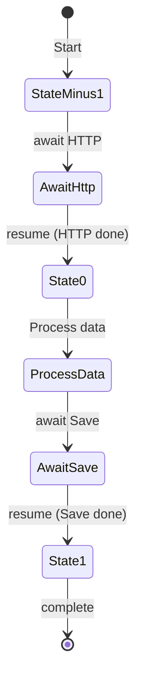
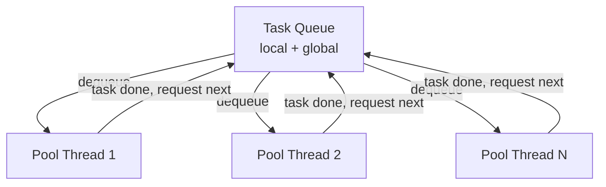
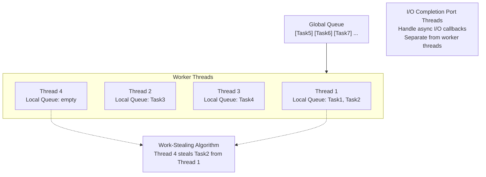

# Async/Await, Multithreading & Synchronization Primitives

> [Mastery Guide](../../../README.md) › [Foundations](../../README.md) › [.NET Core Deep Dive](README.md)

| Status | Priority | Phase | Last reviewed |
|---|---|---|---|
| Not Started | High | Phase 2 — Concurrency & DI | 2026-08-10 |

> 📘 **This is the single file for async, threading, and synchronization.** The former `02-dotnet-runtime/03-async-and-threading.md` companion has been folded in here — summary, drills, cheat sheet, walkthrough, and self-test are all below.

## Contents
- [Why it matters](#why-it-matters)
1. [Async/Await in C# and .NET 10](#5-asyncawait-in-c-and-net-10)
   - [What is Async/Await?](#what-is-asyncawait)
   - [Internal Working: State Machine](#internal-working-state-machine)
   - [Thread vs Task](#thread-vs-task)
   - [ValueTask Optimization](#valuetask-optimization)
   - [Common Pitfalls](#common-pitfalls)
   - [ConfigureAwait — the library author's friend](#configureawait--the-library-authors-friend)
   - [SynchronizationContext](#synchronizationcontext)
   - [Deadlock — sync-over-async](#deadlock--sync-over-async)
   - [CancellationToken](#cancellationtoken--the-cooperative-cancellation-backbone)
   - [Composing tasks — WhenAll, WhenAny, WhenEach](#composing-tasks--whenall-whenany-parallel-then-merge)
   - [IAsyncEnumerable — async streams](#iasyncenumerable--async-streams)
   - [async void — why it's dangerous](#async-void--why-its-dangerous)
   - [Progress&lt;T&gt;](#progresst)
   - [Real-World Example](#real-world-example)
2. [Multithreading and Parallel Execution](#6-multithreading-and-parallel-execution)
   - [Concurrency vs Parallelism](#concurrency-vs-parallelism)
   - [Thread Pool and Task Scheduler](#thread-pool-and-task-scheduler)
   - [CPU-bound vs I/O-bound](#cpu-bound-vs-io-bound)
   - [Thread pool starvation](#thread-pool-starvation)
   - [ThreadPool.QueueUserWorkItem — the legacy pool API](#threadpoolqueueuserworkitem--the-legacy-pool-api)
3. [Synchronization Primitives](#7-synchronization-primitives)
   - [Comparison Table](#comparison-table)
   - [lock (Monitor)](#lock-monitor)
   - [System.Threading.Lock — the dedicated lock type](#systemthreadinglock--the-dedicated-lock-type-net-9--c-13)
   - [Mutex](#mutex)
   - [Semaphore / SemaphoreSlim](#semaphore--semaphoreslim)
4. [Code & diagrams](#code--diagrams)
5. [Common pitfalls — quick list](#common-pitfalls--quick-list)
6. [Interview-ready summary](#interview-ready-summary)
7. [Interview Cross-Questioning Drill](#interview-cross-questioning-drill)
8. [Cheat Sheet](#cheat-sheet)
9. [Walkthrough](#walkthrough--diagnosing-a-deadlock-in-production)
10. [Self-test](#self-test)
11. [Cross-references](#cross-references)
12. [Sources](#sources)

---

## Why it matters

Every .NET backend you'll touch — ASP.NET Core APIs, gRPC services, background workers, message consumers — is async at its core. The runtime's thread pool, the async state machine, and the cancellation model are not optional plumbing: they directly determine whether your application stays responsive at scale or melts under load.

Senior interviews don't ask "what is async/await?" They ask "why does this deadlock?", "when would you use `ValueTask`?", "what does `ConfigureAwait` actually do?", and "how do you avoid thread pool starvation?" Those questions are answered here.

The concurrency landscape is also richer than it was five years ago: `Channel<T>` supersedes `BlockingCollection<T>` for async producer-consumer work, `Parallel.ForEachAsync` (.NET 6+) supersedes the `SemaphoreSlim`-wrapped `Task.WhenAll` pattern, `IAsyncEnumerable<T>` supersedes buffered `Task<List<T>>`, `Task.WhenEach` (.NET 9+) streams completions, and `System.Threading.Lock` (.NET 9 / C# 13) supersedes `lock (new object())`. Knowing the current answer matters as much as knowing the concept.

---

## 5. Async/Await in C# and .NET 10

### What is Async/Await?

Async/await enables non-blocking I/O operations. Instead of blocking a thread while waiting for an I/O operation (DB query, HTTP call, file read), the thread is released back to the thread pool and the work continues when the I/O completes.

```
SYNCHRONOUS (Blocking):
Thread 1: [====DB Call====][Wait...........][Process Result]
Thread 2: [idle] [idle] [idle]
Thread 3: [idle] [idle] [idle]
→ 1 thread blocked for entire duration

ASYNCHRONOUS (Non-blocking):
Thread 1: [Start DB Call][Released to pool]
Thread 2: [Handle other request]
Thread 1: [DB Complete → Process Result]
→ Thread reused while waiting!
```

### Internal Working: State Machine

```csharp
// What you write:
public async Task<string> GetDataAsync()
{
    var data = await httpClient.GetStringAsync("https://api.example.com");
    var processed = Process(data);
    await SaveAsync(processed);
    return processed;
}

// What the compiler generates (simplified):
public Task<string> GetDataAsync()
{
    var stateMachine = new GetDataAsyncStateMachine();
    stateMachine.builder = AsyncTaskMethodBuilder<string>.Create();
    stateMachine.state = -1;  // Initial state
    stateMachine.builder.Start(ref stateMachine);
    return stateMachine.builder.Task;
}

// The state machine:
private struct GetDataAsyncStateMachine : IAsyncStateMachine
{
    public int state;
    public AsyncTaskMethodBuilder<string> builder;
    private TaskAwaiter<string> awaiter1;
    private TaskAwaiter awaiter2;
    private string data;
    private string processed;
    
    public void MoveNext()
    {
        switch (state)
        {
            case -1:  // Start
                awaiter1 = httpClient.GetStringAsync("...").GetAwaiter();
                if (!awaiter1.IsCompleted)
                {
                    state = 0;
                    builder.AwaitUnsafeOnCompleted(ref awaiter1, ref this);
                    return;  // ← Thread released here!
                }
                goto case 0;
                
            case 0:  // After first await
                data = awaiter1.GetResult();
                processed = Process(data);
                awaiter2 = SaveAsync(processed).GetAwaiter();
                if (!awaiter2.IsCompleted)
                {
                    state = 1;
                    builder.AwaitUnsafeOnCompleted(ref awaiter2, ref this);
                    return;  // ← Thread released again!
                }
                goto case 1;
                
            case 1:  // After second await
                awaiter2.GetResult();
                builder.SetResult(processed);
                break;
        }
    }
}
```



**Why is it a `struct` and not a `class`?** To avoid a heap allocation in the common case where every `await` completes synchronously — a cache hit, a buffered stream read, an already-completed Task. The state machine starts life on the calling thread's stack. Only when an `await` genuinely suspends (`awaiter.IsCompleted` is `false`) does the builder **box** the struct onto the heap and register the continuation against that boxed copy; `MoveNext` runs against the heap instance from then on. The design is *stack by default, heap only on suspension* — which is also why `ValueTask` pays off in exactly the same situations.

**How exceptions travel.** The whole `MoveNext` switch is wrapped in a `try/catch`. Anything the body throws is caught and handed to `builder.SetException(ex)`, which faults the returned Task. When the caller `await`s it, the exception is re-thrown through `ExceptionDispatchInfo` rather than `throw ex`, so the **original stack trace is preserved** instead of being reset at the rethrow point. That is why an awaited exception looks like it came from the method that failed and not from the generated state machine — and it is the mechanical reason `await` gives better diagnostics than `.Result`.

### Thread vs Task

A **Thread** is an OS-managed kernel object with its own dedicated stack — expensive to create and limited in number. A **Task** is a *promise of a future value* — a small managed object scheduled by the runtime onto a pool of reusable threads. They are not interchangeable; understanding the difference is the senior-engineer signal in any .NET concurrency interview.

> **On stack size**: each `Thread` reserves its own stack. The default size is determined by the host and the executable header, not by a number you can quote in an interview; you can override it explicitly with the `Thread(ThreadStart, int maxStackSize)` constructor. The point that matters is *ordering of magnitude*: a thread's stack reservation is measured in megabytes, a queued `Task` is a small heap object.

**One sentence summary**: **Task is the default; Thread is the escape hatch.** Reach for `Thread` only for STA threading, hard real-time work, or long-running CPU jobs that would starve the pool.

#### Without Task / With Task — same workload, very different cost

**Scenario**: process 10,000 files (parse, transform, write).

**Naive approach — one Thread per file:**

```csharp
var threads = new List<Thread>();
foreach (var file in files)   // 10,000 files
{
    var t = new Thread(() => Process(file));
    t.Start();
    threads.Add(t);
}
foreach (var t in threads) t.Join();
```

Cost:
- 10,000 separate stack reservations — virtual-address-space pressure that scales linearly with the file count.
- 10,000 kernel thread-creation calls before any real work starts.
- The OS scheduler now has 10,000 ready-state threads to rotate through → cache misses and context-switch storms.
- Most of those threads sit blocked on I/O while the CPU idles.

**Task approach — pool-backed:**

```csharp
await Parallel.ForEachAsync(files, async (file, ct) =>
{
    await ProcessAsync(file, ct);
});
```

Cost:
- The pool starts small and grows on demand; the current minimums are whatever `ThreadPool.GetMinThreads` reports for the process.
- Each queued task is a small heap object — 10,000 of them is a bounded, modest allocation, not 10,000 stacks.
- The pool reuses its threads across all 10K work items via a work-stealing queue.
- Async I/O frees the thread back to the pool while waiting → throughput is dominated by I/O, not by threading.

The Task version reserves dramatically less memory and, for I/O-bound work, finishes faster because the thread count stops being the bottleneck. Measure your own workload rather than quoting a ratio.

#### Properties — Thread

```
┌─ Thread (OS-managed kernel object) ──────────────────┐
│ ✓ Direct OS thread handle                            │
│ ✓ Configurable priority (`Thread.Priority`)          │
│ ✓ Apartment state for COM/WPF (`SetApartmentState`)  │
│ ✓ Dedicated stack (size settable via constructor)    │
│ ✓ Foreground vs background lifetime control          │
│ ✗ Multi-MB stack reservation — limits concurrency    │
│ ✗ Kernel-object creation cost per thread             │
│ ✗ No built-in result, continuation, or cancellation  │
│ ✗ `Thread.Abort` throws PlatformNotSupportedException│
│ ✗ No async I/O integration                           │
└──────────────────────────────────────────────────────┘
```

#### Properties — Task

```
┌─ Task (runtime-managed unit of work) ────────────────┐
│ ✓ Thread-pool backed — no kernel object per task     │
│ ✓ Composable: `await`, `ContinueWith`, `WhenAll`     │
│ ✓ First-class cancellation (`CancellationToken`)     │
│ ✓ Exception aggregation (`Task.Exception`)           │
│ ✓ Result via `Task<T>` + `await`                     │
│ ✓ Async I/O integration (no thread held during wait) │
│ ✓ Scales to millions of tasks (memory-bound)         │
│ ✗ Less direct control over scheduling                │
│ ✗ Default scheduler can cause UI deadlocks on `.Result` │
│ ✗ Pool starvation if you block pool threads          │
└──────────────────────────────────────────────────────┘
```

#### The relationship — Task is NOT a Thread

This trips up many engineers in interviews: **a Task is a unit of work, not a thread**. The runtime schedules tasks onto threads from the Thread Pool. One pool thread runs many tasks over its lifetime; a single task can run on different threads before and after each `await`.

```
┌─────────────────────────────────────────────────────┐
│                  Task Queue                          │
│  [Task A] [Task B] [Task C] [Task D] [Task E] ...    │
└────────┬────────────┬────────────┬──────────────────┘
         │            │            │
         ▼            ▼            ▼
   ┌─────────┐  ┌─────────┐  ┌─────────┐
   │ Pool T1 │  │ Pool T2 │  │ Pool TN │   ← OS Threads (~ProcessorCount)
   └─────────┘  └─────────┘  └─────────┘
        │            │            │
        ▼            ▼            ▼
       OS scheduler → CPU cores
```



The Thread Pool uses **work-stealing queues**: each pool thread has a local queue (cheap LIFO push/pop), plus a global queue. Idle threads steal from busier threads' local queues. This is why Task-based code scales well even when tasks are highly uneven.

#### When to use Thread directly (the short list)

- **STA threading for COM / WPF UI** — most WinForms / WPF / COM interop scenarios require Single-Threaded Apartment threads. Use `Thread` + `SetApartmentState(ApartmentState.STA)`.

  ```csharp
  var t = new Thread(() => RunComOperation());
  t.SetApartmentState(ApartmentState.STA);
  t.IsBackground = true;
  t.Start();
  ```

- **Hard real-time / latency-critical CPU loops** — game loops, audio rendering, deterministic simulations where you set high `Thread.Priority` and want zero pool interference.

- **Genuinely long-running CPU work that would starve the pool** — if you must run a 2-hour computation, dedicating a thread keeps the pool free for everyone else. Or use `Task.Factory.StartNew(work, TaskCreationOptions.LongRunning)` which internally creates a non-pool thread for you.

- **Thread-affine state** (legacy libraries) — some single-threaded libraries (older drivers, native bindings) require all calls from the same thread. A dedicated `Thread` + a `BlockingCollection<Action>` queue is the pattern.

**Outside these four, use Task.** Including all I/O, all short CPU work, all parallel batch processing, all `BackgroundService` work.

#### When to use Task (almost always)

- **All I/O work** — file, network, DB, HTTP. The `async`/`await` model is the only sane shape; Task is what makes it work.
- **Short to medium CPU work** — `Task.Run(() => Compute())` for fan-out parallelism.
- **Parallel batch work** — `Parallel.ForEachAsync` (over `IAsyncEnumerable<T>` with `MaxDegreeOfParallelism`) is the modern default for "do this for each item, in parallel".
- **Anything needing continuations, cancellation, or result aggregation** — `await`, `Task.WhenAll`, `Task.WhenAny`, `CancellationToken`. These are Task-only.

#### Comparison matrix

| Aspect | Thread | Task |
|---|---|---|
| Type | OS kernel object | Runtime-managed object |
| Stack | Its own (size settable via constructor) | None directly (uses pool thread's stack) |
| Creation cost | Kernel-object creation per thread | Amortised — the pool reuses threads |
| Scheduling | OS scheduler | TaskScheduler (default: ThreadPool) |
| Concurrency ceiling | Bounded by stack reservations | Bounded by memory for queued work items |
| Result returning | Manual via shared state | `Task<T>.Result` / `await` |
| Cancellation | Cooperative via `CancellationToken` (no `Abort`) | `CancellationToken` first-class |
| Exceptions | Unhandled → process terminates | Captured in `Task.Exception` |
| Continuations | Manual (`Join`, then code) | `await`, `ContinueWith`, `WhenAll` |
| I/O integration | None — thread blocked during I/O | Native — thread freed during async I/O |
| Pool-friendly | No — heavy, long-running | Yes — short bursts ideal |
| API style | Procedural | Composable (LINQ-like chaining) |
| Where you'll meet it | STA, real-time, thread-affine interop | Essentially all other concurrent code |

#### Side-by-side — same operation, two APIs

**Calculate the sum of squares of 1..N on a background worker:**

```csharp
// ─── Thread approach (verbose, manual, no result) ─────
long result = 0;
var t = new Thread(() =>
{
    long sum = 0;
    for (int i = 1; i <= 1_000_000; i++)
        sum += (long)i * i;
    result = sum;     // shared mutable state — needs memory barrier on read
});
t.Start();
t.Join();            // block calling thread until done
Console.WriteLine(result);

// ─── Task approach (declarative, returns result, composable) ─────
long result = await Task.Run(() =>
{
    long sum = 0;
    for (int i = 1; i <= 1_000_000; i++)
        sum += (long)i * i;
    return sum;
});
Console.WriteLine(result);
```

The Task version is shorter, returns a typed result via `await`, composes with other tasks (`Task.WhenAll`), and runs on a pool thread (reused, not created). The Thread version requires shared mutable state, has no exception propagation, and blocks the calling thread on `Join`.

#### Common gotchas

1. **`TaskCreationOptions.LongRunning`** — when you have a Task that runs for minutes/hours and you don't want it occupying pool capacity, pass this flag. It is documented as a *hint to the `TaskScheduler` that oversubscription may be warranted*; the default scheduler honours it by running the work on a dedicated thread outside the pool. Use sparingly — it is a hint, not a contract, and a custom scheduler may ignore it.

   ```csharp
   var t = Task.Factory.StartNew(
       () => MonitorQueueForever(token),
       token,
       TaskCreationOptions.LongRunning,
       TaskScheduler.Default);
   ```

2. **Thread affinity — `ThreadStatic` vs `AsyncLocal<T>`**. `[ThreadStatic]` doesn't survive across `await` (because the continuation may resume on a different thread). For values that should flow with logical-call-context across awaits, use `AsyncLocal<T>` (the underlying mechanism for `HttpContext`, `IServiceScope`, etc.).

3. **STA threads and Tasks don't mix by default.** Tasks default to MTA threads. If you need STA work (COM, legacy Office automation), either use a dedicated `Thread` with `SetApartmentState`, or write a custom `TaskScheduler` that posts work to a single STA thread.

4. **You can't kill a thread.** In .NET 5 and later, `Thread.Abort` throws `PlatformNotSupportedException` (obsoletion diagnostic **SYSLIB0006**) — it caused too many invariant violations to be supportable. **Cooperative cancellation only**: the worker checks `CancellationToken.IsCancellationRequested` and exits cleanly. If a third-party library doesn't honor cancellation, you're stuck — you can't yank it off the thread.

5. **`Task.Run` vs `await` and SynchronizationContext capture**. `await` captures the current `SynchronizationContext` (UI thread, ASP.NET request context) and resumes there by default. `Task.Run` does NOT capture — its work runs on a pool thread. This is why UI deadlocks happen with `.Result`: the UI thread waits for a Task that's trying to resume *on the UI thread*. Library code should use `.ConfigureAwait(false)` to skip the capture; app/UI code can leave the default.

6. **`Task.Factory.StartNew` vs `Task.Run`** — both create Tasks, but `Task.Run` is the right default in 2026:

   | Concern | `Task.Run(...)` | `Task.Factory.StartNew(...)` |
   |---|---|---|
   | Default scheduler | ThreadPool | TaskScheduler.Current (can surprise you) |
   | Default options | None | None — but you pass them |
   | Async lambda | Unwraps `Task<Task<T>>` automatically | Returns `Task<Task<T>>` — must `.Unwrap()` |
   | When to use | 99% of cases | Only when you need `LongRunning`, `AttachedToParent`, etc. |

7. **Pool starvation from blocking calls.** A pool thread that calls `Thread.Sleep`, `.Result`, or a synchronous DB call is unavailable for other work. The pool grows to compensate, but only gradually — Microsoft's starvation-debugging tutorial describes the thread count rising quickly to roughly 2-3× the processor count and then adding **1-2 threads per second** thereafter. During that lag, latency spikes. Always prefer async throughout; never `.Result` on a Task from a pool thread. (.NET 6 changed the heuristics to scale up faster in response to certain blocking `Task` APIs, so the stall is shorter than it used to be — but it is still a stall.)

#### What to remember (the senior-engineer one-liner)

> **Task is the default for everything. Reach for Thread only for STA, hard real-time, or genuinely long-running CPU work — and even then, prefer `Task.Factory.StartNew` with `TaskCreationOptions.LongRunning`.**

### ValueTask Optimization

```csharp
// Task: Always allocates on heap
public async Task<int> GetCachedValue(string key)
{
    if (_cache.TryGetValue(key, out int value))
        return value;  // Allocates Task<int> even for cached hit!
    
    return await FetchFromDbAsync(key);
}

// ValueTask: Avoids allocation for synchronous completion
public async ValueTask<int> GetCachedValue(string key)
{
    if (_cache.TryGetValue(key, out int value))
        return value;  // NO allocation! ValueTask is a struct
    
    return await FetchFromDbAsync(key);
}

// ⚠️ ValueTask rules:
// 1. Can only be awaited ONCE
// 2. Don't read .Result / .GetAwaiter().GetResult() before it has completed
// 3. Don't await concurrently
// 4. Need any of the above? Call .AsTask() first — allocates, but is safe to reuse
// Best when the result is often available synchronously (cache hit)
```

**On rule 2, get the wording right under cross-examination.** The prohibition is *not* "never touch `.Result` on a `ValueTask`". Reading `.Result` on a `ValueTask` that has already completed is legal and is exactly how the struct's fast path is consumed. The rule is: **don't read `.Result` before the operation has completed**, because a `ValueTask` may be backed by a pooled `IValueTaskSource` that gets reset and reused once the single permitted consumption happens. Same underlying reason as rules 1 and 3.

### Common Pitfalls

```csharp
// ❌ PITFALL 1: async void outside an event handler
public async void HandleClick()   // ❌ no Task to await, no Task to inspect
{
    await DoWorkAsync();          // if this throws, the exception is raised
}                                 // on the SynchronizationContext that was
                                  // active when the method started — NOT
                                  // captured on a Task. See "async void" below.

public async Task HandleClick()   // ✅ Always return Task
{
    await DoWorkAsync();
}

// ❌ PITFALL 2: Deadlock with .Result or .Wait()
public string GetData()
{
    // This DEADLOCKS in ASP.NET (pre-Core) and UI apps!
    var result = GetDataAsync().Result;  // ❌ Blocks thread
    return result;
}

// ✅ Use async all the way
public async Task<string> GetData()
{
    var result = await GetDataAsync();   // ✅ Non-blocking
    return result;
}

// ❌ PITFALL 3: Not using ConfigureAwait in libraries
public async Task<string> LibraryMethod()
{
    // In library code, don't capture synchronization context
    var data = await httpClient.GetStringAsync(url)
        .ConfigureAwait(false);  // ✅ For library code
    return data;
}

// ❌ PITFALL 4: Unnecessary async/await
public async Task<User> GetUser(int id)
{
    return await _repo.GetByIdAsync(id);  // ❌ Unnecessary wrapper
}

public Task<User> GetUser(int id)
{
    return _repo.GetByIdAsync(id);         // ✅ Pass task directly
}
```

### ConfigureAwait — the library author's friend

When you `await` a Task, the runtime captures the current `SynchronizationContext` (UI thread, ASP.NET request context) and resumes the continuation *on that context*. In application code (controllers, components), that's what you want. In **library code**, it causes two problems:

1. **UI deadlock** when a caller does `LibraryMethod().Result` on the UI thread — your library is waiting for the UI thread to be free, but the UI thread is blocked waiting for your library.
2. **Wasted overhead** — every `await` forces a marshalling hop back to the captured context, even if you don't need it.

`ConfigureAwait(false)` opts out of the capture:

```csharp
// LIBRARY code — always ConfigureAwait(false)
public async Task<string> LoadConfigAsync(string path)
{
    var json = await File.ReadAllTextAsync(path).ConfigureAwait(false);
    var config = await ParseAsync(json).ConfigureAwait(false);
    return config.Value;
}

// APPLICATION code (controller, BackgroundService, UI handler) — leave default
public async Task<IActionResult> Get()
{
    var data = await _service.GetAsync();   // OK to resume on request context
    return Ok(data);
}
```

**ASP.NET Core specifically**: no `SynchronizationContext` is installed on request threads, so `ConfigureAwait(false)` is a no-op there. It's still good library hygiene because your library might be called from a WinForms / WPF app one day.

**There is no assembly-level shortcut.** An `[assembly: ConfigureAwait(false)]` attribute has been *proposed* repeatedly (dotnet/runtime#23215, dotnet/csharplang#2542) and has **not shipped** in the BCL or the C# language. If you want it applied automatically you need a third-party IL weaver such as Fody.ConfigureAwait, or the analyzer **CA2007** ("Do not directly await a Task") to flag every missing call. Don't claim the built-in attribute in an interview — it doesn't exist.

**What .NET 8 actually added** is the `ConfigureAwaitOptions` enum and a `Task.ConfigureAwait(ConfigureAwaitOptions)` overload. It's a `[Flags]` enum with four members:

| Member | Value | Meaning |
|---|---|---|
| `None` | 0 | No options — equivalently, do **not** continue on the captured context |
| `ContinueOnCapturedContext` | 1 | Marshal the continuation back to the originating `SynchronizationContext`/`TaskScheduler` |
| `SuppressThrowing` | 2 | Don't throw when awaiting a Task that ended Faulted or Canceled |
| `ForceYielding` | 4 | Make an already-completed Task behave as if incomplete, forcing the method to yield |

```csharp
// Equivalent to ConfigureAwait(false):
await SomethingAsync().ConfigureAwait(ConfigureAwaitOptions.None);

// "Await it, but I don't care whether it failed" — fire-and-forget with observation:
await backgroundTask.ConfigureAwait(ConfigureAwaitOptions.SuppressThrowing);

// Guarantee the continuation doesn't run inline on the caller's stack,
// even when the task is already complete:
Task maybeCompleted = GetCachedTask();
await maybeCompleted.ConfigureAwait(ConfigureAwaitOptions.ForceYielding);
```

⚠️ Two limits worth knowing before you quote this in an interview:

- **The overload is on `Task`/`Task<TResult>` only.** `ValueTask` and `ValueTask<TResult>` still expose just `ConfigureAwait(bool)`. If you have a `ValueTask` and need the options, call `.AsTask()` first — which reintroduces the allocation `ValueTask` existed to avoid, so usually you don't.
- **`SuppressThrowing` is not supported on `Task<TResult>`** — it would have to invent a `TResult`. Analyzer **CA2261** flags this; cast to the non-generic `Task` first.

### SynchronizationContext

`SynchronizationContext` is the abstraction that tells the runtime *how* to schedule a continuation back onto a particular thread or context. The implementations you'll meet:

| Context | Where |
|---|---|
| `DispatcherSynchronizationContext` | WPF — posts to the UI `Dispatcher` |
| `WindowsFormsSynchronizationContext` | WinForms — posts to the message loop |
| `AspNetSynchronizationContext` | Legacy ASP.NET (System.Web) — posts back to the request context |
| **null** (none installed) | **ASP.NET Core, console apps, `BackgroundService`** |

**ASP.NET Core deliberately installs no context.** Removing the per-request context was a throughput decision: continuations run on any available pool thread rather than being funnelled through a one-at-a-time gate. The practical effects: `ConfigureAwait(false)` is never *required* in ASP.NET Core, and `.Result` doesn't deadlock there — but it still burns a pool thread for the whole I/O duration, which is how you get starvation instead.

Note the fallback rule: when an incomplete Task is awaited, the captured "context" is the current `SynchronizationContext` **unless it is null, in which case it's the current `TaskScheduler`**. That's why console apps behave differently from GUI apps — they have a thread-pool context that doesn't serialise execution.

### Deadlock — sync-over-async

The classic deadlock needs **two** ingredients: a `SynchronizationContext` that permits only one chunk of code at a time (UI or legacy ASP.NET), **and** a blocking call made on that context's thread. One without the other is not a deadlock.

```csharp
// ❌ Deadlocks on a UI thread or in legacy ASP.NET:
public string GetData()
{
    return GetDataAsync().Result;   // blocks the UI thread
}

public async Task<string> GetDataAsync()
{
    // this await captures the UI thread's SynchronizationContext
    var s = await _http.GetStringAsync("...");   // continuation must post back to the UI thread
    return s;
}
// UI thread is blocked on .Result → can't run the continuation → deadlock
```

**Fix 1 — async all the way (the real fix):**

```csharp
public async Task<string> GetData()
{
    return await GetDataAsync();    // ✅ never blocks
}
```

**Fix 2 — `ConfigureAwait(false)` down the whole chain (last resort):**

```csharp
public async Task<string> GetDataAsync()
{
    return await _http.GetStringAsync("...").ConfigureAwait(false);
}
// .Result no longer deadlocks, because the continuation doesn't need the blocked thread
```

Fix 2 is **fragile**: one missing `ConfigureAwait(false)` anywhere in the call chain reinstates the deadlock, and you cannot audit code you don't own. Prefer Fix 1 and treat Fix 2 as a migration crutch while converting a partially-async codebase.

**In ASP.NET Core**: no deadlock, because there is no context to post back to. But `.Result` still blocks a pool thread for the full duration of the I/O — under load that is thread pool starvation, which looks like an intermittent outage rather than a hang.

### CancellationToken — the cooperative cancellation backbone

Every `async` method that does I/O or runs for >100 ms **should accept a `CancellationToken`** and pass it down. This is the only way to terminate long-running operations cleanly — `Thread.Abort` is gone, and "just don't await" leaks resources.

```csharp
public async Task<List<Order>> SearchAsync(
    string query,
    CancellationToken ct = default)   // accept it
{
    ct.ThrowIfCancellationRequested();   // check at the start

    var results = await _db.Orders
        .Where(o => o.CustomerName.Contains(query))
        .ToListAsync(ct);                // pass it to EF Core

    foreach (var order in results)
    {
        ct.ThrowIfCancellationRequested();   // check inside loops
        await EnrichAsync(order, ct);        // pass it down
    }

    return results;
}
```

**The flow**:
- A caller creates a `CancellationTokenSource` (CTS) and passes its `.Token` down.
- Cancelling the CTS sets the token's `IsCancellationRequested = true`.
- Every async method checks the token (or passes it to libraries that do).
- The first check after cancellation throws `OperationCanceledException`.

**Common patterns**:

```csharp
// Timeout-bounded operation
using var cts = new CancellationTokenSource(TimeSpan.FromSeconds(5));
var result = await SlowApiCallAsync(cts.Token);   // throws after 5s

// Linked tokens — combine multiple cancellation sources
using var linked = CancellationTokenSource.CreateLinkedTokenSource(
    userClickedCancel, requestAborted);
await LongWorkAsync(linked.Token);   // cancels if either fires

// In ASP.NET Core, HttpContext.RequestAborted fires when the client disconnects
public async Task<IActionResult> Get(CancellationToken ct)
{
    var data = await _service.GetAsync(ct);   // bails if user closes browser
    return Ok(data);
}
```

**Don't catch and swallow `OperationCanceledException`** — let it propagate so callers know the work didn't complete. Wrap with `try { ... } catch (OperationCanceledException) when (ct.IsCancellationRequested) { /* expected */ }` only at top-level handlers where you want to log-and-exit.

### Composing tasks — WhenAll, WhenAny, parallel-then-merge

Sequential `await` chains do work one at a time. For **independent operations**, compose them in parallel:

```csharp
// ─── Sequential — total time = sum of all calls ─────
var user = await _userService.GetAsync(id);          // 200 ms
var orders = await _orderService.GetByUserAsync(id); // 300 ms
var prefs = await _prefService.GetByUserAsync(id);   // 100 ms
// Total: 600 ms

// ─── Parallel with WhenAll — total time = max of all calls ─────
var userTask = _userService.GetAsync(id);
var ordersTask = _orderService.GetByUserAsync(id);
var prefsTask = _prefService.GetByUserAsync(id);
await Task.WhenAll(userTask, ordersTask, prefsTask);
var user = userTask.Result;                          // safe — task is complete
var orders = ordersTask.Result;
var prefs = prefsTask.Result;
// Total: 300 ms
```

`Task.WhenAll` returns when **all** complete (or any throw). If multiple throw, the returned Task's `Exception` is an `AggregateException` — but `await` on the result rethrows only the **first** exception. To handle all:

```csharp
try { await Task.WhenAll(tasks); }
catch
{
    var allErrors = tasks
        .Where(t => t.IsFaulted)
        .Select(t => t.Exception!.InnerException!)
        .ToList();
    LogAll(allErrors);
    throw;
}
```

**`Task.WhenAny`** returns when the **first** completes — used for racing requests, timeouts, and fan-out cancellation:

```csharp
// Race two cache layers; take whichever responds first
var localCacheTask = _localCache.GetAsync(key);
var redisTask = _redis.GetAsync(key);
var winner = await Task.WhenAny(localCacheTask, redisTask);
return await winner;
```

**`Task.WhenEach`** (.NET 9+) yields completed tasks as they finish (great for streaming results):

```csharp
await foreach (var completed in Task.WhenEach(downloadTasks))
{
    var data = await completed;
    yield return data;   // stream as ready, don't wait for slowest
}
```

### IAsyncEnumerable — async streams

For sequences you produce over time (paginated APIs, DB cursors, file streams, WebSocket messages), `IAsyncEnumerable<T>` + `await foreach` is the right shape — not `Task<List<T>>` (which forces materialization) or `IEnumerable<Task<T>>` (which can't yield async-aware).

```csharp
// Producer
public async IAsyncEnumerable<Order> StreamOrdersAsync(
    [EnumeratorCancellation] CancellationToken ct = default)
{
    var page = 0;
    while (true)
    {
        var batch = await _api.GetPageAsync(page++, ct);
        if (batch.Count == 0) yield break;
        foreach (var order in batch)
            yield return order;
    }
}

// Consumer — processes as each item arrives, doesn't buffer all
await foreach (var order in StreamOrdersAsync(ct).WithCancellation(ct))
{
    await ProcessAsync(order, ct);
}
```

`[EnumeratorCancellation]` (and `.WithCancellation(ct)` at the call site) is the canonical way to propagate cancellation through async streams.

### Async exception handling — the AggregateException trap

A `Task` that throws stores the exception in `Task.Exception` as an `AggregateException` (a tree of inner exceptions, in case the task internally `Task.WhenAll`-ed others). Two retrieval styles differ:

```csharp
// ❌ .Result / .Wait() — exposes the AggregateException directly
try { var x = task.Result; }
catch (AggregateException ex)
{
    var real = ex.InnerException;   // your actual exception is nested
}

// ✅ await — unwraps the first inner exception automatically
try { var x = await task; }
catch (InvalidOperationException ex)   // catch the real exception type
{
    // ex.StackTrace shows the async chain
}
```

This is one of the strongest reasons to **always await** instead of `.Result`. The error messages and stack traces are dramatically better.

### async void — why it's dangerous

```csharp
// ❌ async void outside an event handler
public async void SendEmailOnClick(object sender, EventArgs e)
{
    await _mailer.SendAsync(email);
}

// ✅ async Task — the exception is captured and observable
public async Task SendEmailAsync()
{
    await _mailer.SendAsync(email);
}
```

**Get the exception semantics exactly right — this is a favourite cross-question.** Exceptions from `async void` are **not swallowed**; that is the behaviour of an *unobserved `Task`*, which is a different bug. Microsoft's guidance states it plainly: when an exception is thrown out of an `async Task` method it is captured and placed on the Task object, but *"with async void methods, there is no Task object, so any exceptions thrown out of an async void method will be raised directly on the `SynchronizationContext` that was active when the async void method started."*

What that means in practice:

- **On a UI thread**: the exception is raised on the UI `SynchronizationContext` and surfaces through the framework's unhandled-exception path (e.g. `Application.DispatcherUnhandledException`), the same way a synchronous event handler's exception would.
- **With no context installed** (ASP.NET Core, console, `BackgroundService`): the callback is raised on a thread pool thread. Per Microsoft's thread pool documentation, **unhandled exceptions in thread pool threads terminate the process**. So the practical outcome is a process crash, observable only via `AppDomain.UnhandledException` or an equivalent catch-all.
- Either way, a `try/catch` around the *call site* cannot catch it — there is no Task to carry the exception back.

**Three problems with `async void`:**

1. **Exceptions escape normal handling** — as above; you cannot catch them at the call site.
2. **No way to await or observe completion.** The caller has no Task to await and no `.IsFaulted` to check.
3. **No way to propagate cancellation or compose.** You can't `WhenAll` something you can't track, and it's hard to unit-test.

**Acceptable use**: event handlers that must match a `void`-returning delegate signature (`button.Click += async (s, e) => { ... }`), and things that are logically event handlers such as `ICommand.Execute`. The recommended shape is to keep the handler to one line that awaits a real `async Task` method holding the logic — that keeps the logic testable.

**Fire-and-forget alternative:**

```csharp
// Capture the task; handle exceptions explicitly
_ = Task.Run(async () =>
{
    try { await DoBackgroundWorkAsync(); }
    catch (Exception ex) { _logger.LogError(ex, "background work failed"); }
});
```

The `_` discard signals "intentionally not awaited" (and suppresses **CS4014**); the `try/catch` contains the exception; the logger records it. For production fire-and-forget, prefer `IHostedService` + `Channel<T>` — you get lifecycle management, graceful shutdown, and observability instead of a task nobody owns.

### Progress&lt;T&gt;

`Progress<T>` is the standard way to report progress out of an async operation without coupling the worker to the caller's thread. The worker depends only on `IProgress<T>`; the caller decides where the callback runs.

```csharp
// Worker — depends on the abstraction, knows nothing about threads
public async Task ProcessFilesAsync(
    IReadOnlyList<string> files,
    IProgress<int>? progress = null,
    CancellationToken ct = default)
{
    for (var i = 0; i < files.Count; i++)
    {
        ct.ThrowIfCancellationRequested();
        await ProcessFileAsync(files[i], ct);
        progress?.Report((i + 1) * 100 / files.Count);
    }
}

// Caller — constructed on the UI thread
var progress = new Progress<int>(pct =>
{
    progressBar.Value = pct;   // marshalled back to the UI thread automatically
});

await ProcessFilesAsync(files, progress, cts.Token);
```

**How it works** — and note the documented fallback, which is the part people get wrong: handlers passed to the constructor (or registered on `ProgressChanged`) are *"invoked through a `SynchronizationContext` instance captured when the instance is constructed. If there is no current `SynchronizationContext` at the time of construction, the callbacks will be invoked on the `ThreadPool`."*

So:

- Construct it **on the UI thread** and `Report` marshals to the UI thread for you — no manual `Invoke`/`Dispatcher.Invoke`.
- Construct it **on a background thread or in ASP.NET Core** (no context) and the callbacks run on the thread pool — *not* inline on the reporting thread. Your callback must therefore be thread-safe, and it must not touch UI.

### Real-World Example

```csharp
public class OrderService
{
    private readonly IOrderRepository _orders;
    private readonly IPaymentGateway _payment;
    private readonly IEmailService _email;
    private readonly INotificationService _notifications;
    private readonly ILogger<OrderService> _logger;

    // Process order with multiple async operations
    public async Task<OrderResult> ProcessOrderAsync(Order order)
    {
        // Sequential: each depends on previous
        var validated = await _orders.ValidateAsync(order);
        if (!validated.IsValid)
            return OrderResult.Failed(validated.Errors);
        
        var paymentResult = await _payment.ChargeAsync(order.Total);
        if (!paymentResult.Success)
            return OrderResult.Failed("Payment failed");
        
        var savedOrder = await _orders.SaveAsync(order);
        
        // Fire-and-forget for non-critical work, with the exception contained.
        // NOTE: this is the tactical shape. The production answer is to hand the
        // work to an IHostedService via a Channel<T> — see "async void" above.
        _ = Task.Run(async () =>
        {
            try { await _email.SendConfirmationAsync(order.Email, savedOrder.Id); }
            catch (Exception ex) { _logger.LogError(ex, "Confirmation email failed"); }
        });
        
        return OrderResult.Success(savedOrder);
    }
    
    // Parallel: independent operations
    public async Task<DashboardData> GetDashboardAsync(int userId)
    {
        // Run all three in parallel — 3x faster!
        var ordersTask = _orders.GetRecentAsync(userId);
        var balanceTask = _payment.GetBalanceAsync(userId);
        var notificationsTask = _notifications.GetUnreadAsync(userId);
        
        await Task.WhenAll(ordersTask, balanceTask, notificationsTask);
        
        return new DashboardData
        {
            Orders = ordersTask.Result,
            Balance = balanceTask.Result,
            Notifications = notificationsTask.Result
        };
    }
}
```

---

## 6. Multithreading and Parallel Execution

### Concurrency vs Parallelism

```
CONCURRENCY (Multithreading):
Interleaving tasks on limited cores

Core 1: [Task A][Task B][Task A][Task C][Task B]
         ↑ Context switches between tasks
         Single core handles multiple tasks

PARALLELISM (True parallel):
Running tasks simultaneously on multiple cores

Core 1: [========= Task A =========]
Core 2: [========= Task B =========]
Core 3: [========= Task C =========]
         ↑ All running at the same time


Key Difference:
┌─────────────────┬─────────────────────────────────────┐
│ Concurrency     │ Dealing with multiple things at once│
│                 │ (structure)                          │
├─────────────────┼─────────────────────────────────────┤
│ Parallelism     │ Doing multiple things at once        │
│                 │ (execution)                          │
└─────────────────┴─────────────────────────────────────┘
```

### Thread Pool and Task Scheduler



Thread Pool in modern .NET — what is actually documented:

- **There is one thread pool per process**, and its threads are background threads running at default priority in the multithreaded apartment (MTA).
- **The number of queued work items is limited only by available memory.** The number of *simultaneously active* threads is capped.
- **Don't quote a max-threads number.** Microsoft documents the default size as depending "on several factors, such as the size of the virtual address space" and tells you to call `ThreadPool.GetMaxThreads()` to find out for your process. The commonly-repeated "32,767" is at best half the story: it is a *worker*-thread ceiling, the completion-port ceiling is a different number, both are settable via `SetMaxThreads` and runtime config, and neither is a limit you should ever be near. Same for the minimums: read them with `ThreadPool.GetMinThreads()` rather than memorising a value.
- **The pool creates and destroys worker threads to optimise throughput** (tasks completed per unit time) — too few threads underuses the machine, too many increases contention. The mechanism in the runtime is a *hill-climbing* heuristic plus a separate starvation-avoidance path that injects threads when queued work isn't progressing.
- **Worker threads and I/O completion threads are separate categories** — `GetMinThreads`/`SetMinThreads` take and return both, which is why you see two numbers everywhere.

The one number worth remembering is the *injection rate*, because it explains the symptom: Microsoft's starvation tutorial describes the count rising rapidly to roughly 2-3× the processor count and then adding **1-2 threads per second** until it stabilises. That slow tail is the latency spike your users feel.

### CPU-bound vs I/O-bound

```csharp
// CPU-bound: Use Task.Run / Parallel
// Heavy computation — needs a thread
public async Task<double> CalculateAsync(double[] data)
{
    return await Task.Run(() =>          // Offload to thread pool
    {
        return data.Sum(x => Math.Pow(x, 2));
    });
}

// Parallel processing of large dataset
public void ProcessImages(List<string> imagePaths)
{
    Parallel.ForEach(imagePaths, new ParallelOptions 
    { 
        MaxDegreeOfParallelism = Environment.ProcessorCount 
    }, 
    path =>
    {
        var image = LoadImage(path);
        var resized = ResizeImage(image, 800, 600);
        SaveImage(resized, path);
    });
}

// I/O-bound: Use async/await (NO Task.Run!)
// Waiting for external resource — don't waste a thread
public async Task<string> GetDataAsync()
{
    // ✅ No thread blocked while waiting for HTTP response
    var response = await httpClient.GetStringAsync("https://api.example.com");
    
    // ✅ No thread blocked while writing to file
    await File.WriteAllTextAsync("data.json", response);
    
    return response;
}

// ❌ WRONG: Using Task.Run for I/O
public async Task<string> GetDataWrong()
{
    return await Task.Run(async () =>     // ❌ Wastes a thread pool thread!
    {
        return await httpClient.GetStringAsync("...");
    });
}
```

### Parallel.ForEachAsync — the modern parallel batch pattern

For "do this async operation on every item, in parallel, with a degree-of-parallelism cap," **don't roll your own with `SemaphoreSlim` + `Task.WhenAll`**. Use `Parallel.ForEachAsync` (.NET 6+):

```csharp
// Process 10,000 URLs, max 16 in flight at once, async-aware
await Parallel.ForEachAsync(
    urls,
    new ParallelOptions
    {
        MaxDegreeOfParallelism = 16,
        CancellationToken = ct
    },
    async (url, token) =>
    {
        var html = await _http.GetStringAsync(url, token);
        await _storage.SaveAsync(url, html, token);
    });
```

**Why this beats older patterns**:
- `Parallel.ForEach` (without `Async`) is **synchronous** and blocks threads on each iteration's I/O — terrible for I/O work.
- `Task.WhenAll(urls.Select(async u => ...))` runs **all** in parallel — no throttle. Fires 10K HTTP requests at once. Server explodes.
- `Parallel.ForEachAsync` throttles, cancels, async-aware. **It's the right answer in 2026.**

Use it for any I/O-heavy batch: web scraping, parallel API calls, batch DB writes, image processing pipelines.

**Collecting results — it returns no values.** The signature is `Task`, not `Task<T[]>`, so unlike `Task.WhenAll` there is nothing to unpack. Write into a thread-safe collection from inside the body:

```csharp
var results = new ConcurrentBag<Report>();     // unordered, cheapest
await Parallel.ForEachAsync(items, opts, async (item, ct) =>
{
    results.Add(await ProcessAsync(item, ct));
});
```

`ConcurrentBag<T>` is the usual choice; `ConcurrentQueue<T>` gives FIFO *completion* order. **Neither restores input order** — if callers need results aligned to the input sequence, stay with `SemaphoreSlim` + `Task.WhenAll`, which returns an array in input order.

### Channel<T> — the modern producer-consumer

`Channel<T>` (in `System.Threading.Channels`) is the modern, async-friendly bounded queue. It is the default replacement for `BlockingCollection<T>` in new code: `BlockingCollection<T>`'s `Add`/`Take` are sync-only and block threads, which is fatal in an async pipeline. `BlockingCollection<T>` dates from .NET Framework 4.0; `Channel<T>` arrived in .NET Core 2.1 and was designed for the async-first world.

```csharp
// Bounded channel: producer waits if consumer falls behind
var channel = Channel.CreateBounded<Order>(new BoundedChannelOptions(capacity: 100)
{
    FullMode = BoundedChannelFullMode.Wait,  // backpressure
    SingleReader = true,                     // tell the channel your access pattern
    SingleWriter = false                     // so it can optimise internal locking
});

// Producer
_ = Task.Run(async () =>
{
    await foreach (var order in StreamOrdersFromApiAsync(ct))
        await channel.Writer.WriteAsync(order, ct);   // blocks if full
    channel.Writer.Complete();
});

// Consumer (could have many in parallel)
await foreach (var order in channel.Reader.ReadAllAsync(ct))
    await ProcessAsync(order, ct);
```

**Use cases**:
- Decouple a fast producer from a slow consumer (e.g., HTTP ingest → DB write).
- Bounded backpressure — slow consumer applies pressure upstream without unbounded memory growth.
- Multiple producers, multiple consumers — channel handles the locking internally.

**Bounded vs unbounded — say the production verdict out loud.** `Channel.CreateUnbounded<T>()` never makes the producer wait, so memory grows without limit whenever the consumer lags; it is only safe when you can guarantee the consumer keeps pace (a fixed, known-small batch). `Channel.CreateBounded<T>(capacity)` makes `WriteAsync` wait when full, so backpressure flows upstream. **Use bounded in production** — it forces you to decide what happens to a slow consumer instead of discovering it as an OOM.

**`SingleReader` / `SingleWriter`** are not just documentation. Telling the channel your access pattern lets it pick cheaper internal coordination — single-producer/single-consumer is the fastest configuration, multi-producer/single-consumer needs less coordination than multi/multi. Set them when your pattern really is constrained; the defaults assume the general case. Call `channel.Writer.Complete()` from the last producer so the consumer's `ReadAllAsync` loop exits cleanly.

**Channel vs Queue**: `Queue<T>` is unsafe across threads. `ConcurrentQueue<T>` is thread-safe but unbounded and not async-aware. `Channel<T>` is thread-safe, optionally bounded, and async-aware. Default to `Channel<T>` for cross-thread producer-consumer work.

### Thread Pool tuning — when defaults aren't enough

The Thread Pool's defaults are good. Tune only if you've observed thread starvation:

- **Symptom**: latency spikes correlated with bursts of new requests, while CPU stays well below saturation.
- **Cause**: threads are blocked, so the pool has to inject new ones — and injection is deliberately gradual (see the injection rate above). New requests queue during the ramp.
- **Fix (rarely needed)**: raise the minimum so a *known* burst pattern has headroom:

```csharp
// At app startup
ThreadPool.SetMinThreads(
    workerThreads: 100,
    completionPortThreads: 100);
```

**Don't crank this up arbitrarily.** Microsoft's own guidance is blunt: "unnecessarily increasing these values can cause performance problems. If too many tasks start at the same time, all of them might appear to be slow. In most cases the thread pool will perform better with its own algorithm for allocating threads." The right tune is observation-driven — see the starvation section below for the counters.

Better yet, **make your code async all the way down so the pool isn't blocked** by `.Result` or sync DB calls. `SetMinThreads` is a bandage over the real problem.

### Thread pool starvation

**What it is**: the pool has no free thread to run queued work, because its threads are parked in blocking calls. The runtime responds by injecting more threads, but only gradually, so during the ramp everything queues.

**Symptoms** (the diagnostic fingerprint):
- Latency spikes correlated with traffic bursts, while **CPU usage stays well below 100%**.
- A **slow, steady climb** in the thread pool thread count — the count rises quickly to roughly 2-3× the processor count, then adds 1-2 threads per second until it stabilises.
- A stable-but-high steady-state thread count (more than about 3× processor count) means the app is chronically blocking pool threads and the pool is compensating.
- Often, but not always, a large `dotnet.thread_pool.queue.length` together with a low `dotnet.thread_pool.work_item.count` — lots pending, little completing.

**Root causes** — all variants of "a pool thread is parked": `.Result`, `.Wait()`, `.GetAwaiter().GetResult()`, synchronous DB calls, synchronous file or HTTP I/O, `Thread.Sleep`, and contended `lock`/`Monitor.Enter`/`SemaphoreSlim.Wait` blocks doing real work while held.

**Fixes, in order:**
1. **Async all the way down.** This is the only actual fix. Everything else buys time.
2. `ThreadPool.SetMinThreads(n, n)` at startup — pre-allocates headroom for a known burst shape. A bandage.
3. `Task.Factory.StartNew(..., TaskCreationOptions.LongRunning)` for genuinely long-running or unavoidably synchronous work — moves it off the pool so it can't consume pool capacity.
4. Watch the counters continuously so you catch regressions rather than incidents.

**Tooling** (see the [Walkthrough](#walkthrough--diagnosing-a-deadlock-in-production) for the full sequence):
- `dotnet-counters monitor -n <app>` → `dotnet.thread_pool.thread.count`, `dotnet.thread_pool.queue.length`, `dotnet.thread_pool.work_item.count`.
- `dotnet-stack report -n <app>` for a *continuous* problem — dumps thread stacks straight to the console.
- `dotnet-trace collect -n <app> --clrevents waithandle --clreventlevel verbose` for an *intermittent* one — captures the `WaitHandleWait` event (added in .NET 9), which fires when a thread blocks on sync-over-async or on a lock.

A stack whose bottom frames are `ThreadPoolWorkQueue.Dispatch()` / `PortableThreadPool+WorkerThread.WorkerThreadStart()` is a pool thread; if its top frames are `Task.SpinThenBlockingWait` → `GetResultCore`, you have found your `.Result`.

### ThreadPool.QueueUserWorkItem — the legacy pool API

The abstraction ladder, low to high:

| Primitive | Abstraction level | Typical use |
|---|---|---|
| `Thread` | OS kernel object with its own stack | STA COM/WPF, hard real-time, thread-affine interop |
| `ThreadPool.QueueUserWorkItem` | Raw pool submission — no result, no cancellation, no exception propagation | Legacy fire-and-forget; **no place in new code** |
| `Task` / `Task.Run` | Pool-backed, result-returning, cancellable, composable | **Everything else** |
| `async`/`await` | Compiler-transformed Task composition | All I/O, all modern async code |

```csharp
// ❌ Legacy — you get back nothing: no result, no completion signal, no exception
ThreadPool.QueueUserWorkItem(_ => DoWork());

// ✅ Modern
await Task.Run(() => DoWork(), ct);

// ❌ Thread for short CPU work — reserves a stack, returns no result, can't be cancelled
var t = new Thread(() => result = Compute());
t.Start(); t.Join();

// ✅ Task for CPU work
var result = await Task.Run(() => Compute(), ct);
```

`Task.Run` supersedes `QueueUserWorkItem` completely — it gives you a result, cancellation, and exception propagation for the same scheduling behaviour. If you meet `QueueUserWorkItem` in a codebase, it's a migration candidate, not a style choice.

### PLINQ and TPL Dataflow — niche but worth knowing

- **PLINQ** (`.AsParallel()`) — parallelizes LINQ operations across cores. Genuinely useful for CPU-bound, pure-functional pipelines (image processing, simulations). It is **synchronous by design**, so it is the wrong tool for I/O; for async batch work `Parallel.ForEachAsync` is the natural shape.
- **TPL Dataflow** (`System.Threading.Tasks.Dataflow`) — actor-style buffered pipelines. Each stage is a block (`TransformBlock<TIn,TOut>`, `ActionBlock<T>`) with its own queue and degree of parallelism. Still the right answer for genuinely multi-stage meshes and for **broadcast** semantics (`BroadcastBlock<T>` gives every consumer every item — something a `Channel<T>` deliberately does not do). For a plain producer-consumer queue, `Channel<T>` is simpler.

---

## 7. Synchronization Primitives

### Comparison Table

```
┌───────────────┬───────────┬───────────┬───────────────┬────────────────┐
│ Feature       │   lock    │  Mutex    │  Semaphore    │ SemaphoreSlim  │
├───────────────┼───────────┼───────────┼───────────────┼────────────────┤
│ Scope         │ In-process│ Cross-    │ Cross-process │ In-process     │
│               │           │ process   │               │                │
│ Speed         │ Fastest   │ Slowest   │ Slow          │ Fast           │
│ Async Support │ No        │ No        │ No            │ Yes (WaitAsync)│
│ Max Users     │ 1         │ 1         │ N             │ N              │
│ Reentrancy    │ Yes       │ Yes       │ No            │ No             │
│ Kernel Object │ No        │ Yes       │ Yes           │ No             │
│ Use Case      │ Simple    │ Cross-app │ Rate limiting │ Async limiting │
│               │ exclusion │ mutex     │ Connection    │ API throttle   │
│               │           │           │ pool          │                │
└───────────────┴───────────┴───────────┴───────────────┴────────────────┘
```

### lock (Monitor)

> ⚙️ **On .NET 9 / C# 13 or later, prefer `System.Threading.Lock` over `object`** — see the next section. The `Monitor` expansion below is still what you get when the lock target is any ordinary reference type, which is every codebase written before .NET 9.

```csharp
// lock over a plain object is syntactic sugar for Monitor.Enter/Exit
private readonly object _lockObj = new();
private int _counter = 0;

// ✅ Simple mutual exclusion
public void Increment()
{
    lock (_lockObj)
    {
        _counter++;          // Only one thread at a time
    }
}

// What the compiler generates:
public void Increment()
{
    bool lockTaken = false;
    try
    {
        Monitor.Enter(_lockObj, ref lockTaken);
        _counter++;
    }
    finally
    {
        if (lockTaken)
            Monitor.Exit(_lockObj);
    }
}

// ⚠️ Common mistakes:
// lock (this)         ❌ Callers might also lock on your instance
// lock ("string")     ❌ String literals are interned — shared process-wide
// lock (typeof(Foo))  ❌ Type instances are reachable via typeof / reflection
// lock (new object()) ❌ A fresh object each time — locks nothing
```

These four are not folklore; they are the documented guidance. Microsoft's `lock` reference says to lock a dedicated instance that isn't used for anything else, and explicitly calls out `this` ("callers might also lock `this`"), `Type` instances ("they might be obtained by the `typeof` operator or reflection"), and string instances "including string literals, as they might be interned". It also says: **hold a lock for as short a time as possible.**

### System.Threading.Lock — the dedicated lock type (.NET 9 / C# 13)

Since .NET 9 and C# 13 there is a type whose only job is to be a lock. Use it for new code on a supported target.

```csharp
public class Account
{
    // Use `object` on versions earlier than C# 13
    private readonly System.Threading.Lock _balanceLock = new();
    private decimal _balance;

    public void Credit(decimal amount)
    {
        lock (_balanceLock)
        {
            _balance += amount;
        }
    }
}
```

**What changes when the compiler knows the target is a `Lock`:** `lock (x) { ... }` is compiled as `using (x.EnterScope()) { ... }` instead of the `Monitor.Enter`/`try`/`finally`/`Monitor.Exit` expansion. `Lock.EnterScope()` returns a `ref struct` with a `Dispose()` method, and the generated `using` guarantees release even if the body throws — the same safety, through a purpose-built path. The type also exposes `Enter()` and `Exit()` directly for the rare case where the scope shape doesn't fit.

**Why it's worth switching:**

- **The type system enforces intent.** You can no longer accidentally lock on `this`, a string literal, or a `Type` — the four anti-patterns above become unrepresentable. The compiler even warns if you cast a known `Lock` to another type and then lock it (which would silently fall back to `Monitor`).
- **It reads as a lock.** `private readonly Lock _gate = new();` documents itself in a way `private readonly object _lockObj = new();` never did.

**What does *not* change:** you still cannot `await` inside the `lock` body — that restriction applies to `Lock` exactly as it does to `Monitor` (see the async gotchas below). For async mutual exclusion the answer is still `SemaphoreSlim(1, 1)`.

### Mutex

```csharp
// Cross-process mutual exclusion
// Example: Ensure only one instance of application runs

public class SingleInstanceApp
{
    private static Mutex _mutex;
    
    public static bool IsAlreadyRunning()
    {
        _mutex = new Mutex(true, "Global\\MyAppMutex", out bool createdNew);
        return !createdNew;  // If not created new, another instance exists
    }
}

// Usage:
if (SingleInstanceApp.IsAlreadyRunning())
{
    Console.WriteLine("App is already running!");
    return;
}

// Cross-process file access
using var mutex = new Mutex(false, "Global\\SharedFileMutex");
mutex.WaitOne();           // Wait for access
try
{
    File.AppendAllText("shared.log", "Entry\n");
}
finally
{
    mutex.ReleaseMutex();  // Always release!
}
```

**Four documented behaviours worth knowing before you use one:**

1. **`Mutex` enforces thread identity — `Semaphore` does not.** A mutex can only be released by the thread that acquired it. That's the opposite of `SemaphoreSlim`, where any thread may `Release` what another thread `Wait`ed on, and it's precisely why `SemaphoreSlim` works across an `await` and `Mutex` does not.
2. **It is reentrant for the owning thread.** The owner can call `WaitOne` repeatedly without blocking, but must call `ReleaseMutex` the same number of times to actually release it.
3. **`Global\` vs `Local\` is about terminal-server sessions, not processes.** A name starting `Global\` is visible in all sessions; `Local\` (the default when you supply no prefix) is visible only in the creating session. Within a session, both are visible to every process. Backslash is otherwise a reserved character in a mutex name.
4. **Abandonment is a real failure mode.** If a thread exits while owning the mutex, the next acquirer gets an `AbandonedMutexException`. Treat it as a signal that the data the mutex protected may be inconsistent — for a system-wide mutex it usually means another process was killed.

> 🔐 **Security caveat you should raise unprompted.** By default a named mutex is **not** restricted to the user that created it: other users can open it and interfere, e.g. by entering and never exiting. On Windows you can restrict it with a `MutexAcl`/`MutexSecurity` overload; on Unix-like systems named mutexes are implemented over the file system and there is currently **no** way to restrict access. Microsoft's guidance is to avoid unrestricted named mutexes on systems that may have untrusted users running code. Recent .NET versions add `NamedWaitHandleOptions` constructor overloads to set user- and session-scope explicitly — prefer those.

### Semaphore / SemaphoreSlim

```csharp
// Semaphore: Allow N concurrent accesses
// Real-world: Database connection pool (max 10 connections)

private static readonly SemaphoreSlim _dbSemaphore = new(10, 10);
// initialCount: 10, maxCount: 10

public async Task<Data> QueryDatabaseAsync(string query)
{
    await _dbSemaphore.WaitAsync();     // ✅ Async-friendly!
    try
    {
        using var connection = new SqlConnection(connString);
        await connection.OpenAsync();
        return await connection.QueryAsync<Data>(query);
    }
    finally
    {
        _dbSemaphore.Release();         // Return slot
    }
}

// Real-world: API rate limiting (max 5 concurrent HTTP calls)
private static readonly SemaphoreSlim _httpThrottle = new(5);

public async Task<string[]> FetchManyUrlsAsync(string[] urls)
{
    var tasks = urls.Select(async url =>
    {
        await _httpThrottle.WaitAsync();
        try
        {
            return await httpClient.GetStringAsync(url);
        }
        finally
        {
            _httpThrottle.Release();
        }
    });
    
    return await Task.WhenAll(tasks);
}
```

**`Semaphore` vs `SemaphoreSlim` — pick on scope and async, not on speed:**

| Feature | `Semaphore` | `SemaphoreSlim` |
|---|---|---|
| Cross-process | Yes — a named system semaphore is visible OS-wide and can synchronise processes | No — in-process only |
| Async support | No | **Yes — `WaitAsync()`** |
| Cost model | Kernel wait handle (it derives from `WaitHandle`) | User-mode fast path, kernel wait only when it must block |
| Thread identity | Not enforced — any thread may `Release` | Not enforced |
| Typical use | Cross-process coordination, shared-file gates | Async throttling, rate limiting, async mutex |

**`SemaphoreSlim` is the right choice for async throttling** — in-process, no kernel handle on the fast path, and the only one of the two with `WaitAsync`.

**`SemaphoreSlim(1, 1)` is the async mutex.** It is the documented replacement for `lock` in async code, precisely because you cannot `await` inside a `lock` body:

```csharp
private static readonly SemaphoreSlim _gate = new(1, 1);

public async Task UpdateAsync(Data data, CancellationToken ct)
{
    await _gate.WaitAsync(ct);
    try { await _db.SaveAsync(data, ct); }
    finally { _gate.Release(); }
}
```

This works where `lock` cannot because `SemaphoreSlim` does **not** enforce thread identity — the continuation that runs `Release()` may be on a different thread from the one that ran `WaitAsync()`, and that's fine.

⚠️ **`SemaphoreSlim` is not reentrant.** A task that already holds a count-1 semaphore and calls `WaitAsync` on it again — directly, or indirectly through a helper that acquires the same gate — will wait forever for itself. `lock` would have let this through via reentrancy. The discipline: **acquire once per public entry point**, and let internal helpers assume the gate is held (see Drill 13).

### Interlocked — lock-free atomic operations

For simple atomic ops on integers or references, **don't use a lock** — `Interlocked` is dramatically faster (single CPU instruction, no kernel transition). It's the right tool for counters, flags, and lock-free state transitions.

```csharp
private long _requestCount = 0;
private long _errorCount = 0;

public void RecordRequest(bool success)
{
    Interlocked.Increment(ref _requestCount);     // atomic, lock-free
    if (!success)
        Interlocked.Increment(ref _errorCount);
}

public (long total, long errors) Snapshot()
    => (Interlocked.Read(ref _requestCount),
        Interlocked.Read(ref _errorCount));        // safe 64-bit reads on 32-bit
```

**The full Interlocked API**:

| Method | What it does |
|---|---|
| `Increment(ref x)` / `Decrement(ref x)` | Atomic `++` / `--` (int/uint/long/ulong) |
| `Add(ref x, n)` | Atomic addition; returns the new value |
| `And(ref x, n)` / `Or(ref x, n)` | Atomic bitwise AND / OR — useful for flag sets |
| `Exchange(ref x, newVal)` | Atomic write, returns the old value |
| `CompareExchange(ref x, newVal, expectedVal)` | Atomic CAS — write only if current matches expected |
| `Read(ref x)` | Atomic 64-bit read (`long`/`ulong`) — matters on 32-bit |
| `MemoryBarrier()` | Full memory fence for the current processor |
| `MemoryBarrierProcessWide()` | Process-wide barrier: no read or write from any CPU moves across it (rare) |

> Note: the members of `Interlocked` **do not throw**. `Exchange` and `CompareExchange` also have generic `<T>` overloads for reference types, plus overloads for `float`, `double`, `IntPtr`, and the smaller integer widths.

**`CompareExchange` (CAS)** is the foundation of lock-free programming — it's how `ConcurrentDictionary`, `ConcurrentQueue`, and most lock-free data structures are built:

```csharp
// Lock-free "compute and update" — retry on contention
private int _state = 0;

public void SetIfHigher(int newValue)
{
    int current;
    do
    {
        current = Volatile.Read(ref _state);
        if (newValue <= current) return;
    }
    while (Interlocked.CompareExchange(ref _state, newValue, current) != current);
    // Loop only if another thread changed _state between our read and our write
}
```

**`lock` vs `Interlocked` decision**:
- Single counter / flag / reference swap → **Interlocked**.
- Multi-step state changes that must be atomic together (e.g., "update two fields") → **lock**.
- High-contention hot path with one variable → **Interlocked with CAS retry**.
- Anything you can't trivially express as one atomic op → **lock**.

### ReaderWriterLockSlim — many readers, few writers

When reads vastly outnumber writes (cache-style workloads, config snapshots), `lock` serializes all access — readers block each other unnecessarily. `ReaderWriterLockSlim` allows **many concurrent readers** but exclusive writers.

```csharp
private readonly ReaderWriterLockSlim _rwLock = new();
private readonly Dictionary<int, User> _cache = new();

// Many threads can call this concurrently
public User? Get(int id)
{
    _rwLock.EnterReadLock();
    try
    {
        return _cache.TryGetValue(id, out var u) ? u : null;
    }
    finally
    {
        _rwLock.ExitReadLock();
    }
}

// One thread at a time; blocks until all readers finish
public void Set(int id, User user)
{
    _rwLock.EnterWriteLock();
    try
    {
        _cache[id] = user;
    }
    finally
    {
        _rwLock.ExitWriteLock();
    }
}

// Read-then-maybe-write — upgradeable
public User GetOrCreate(int id, Func<User> factory)
{
    _rwLock.EnterUpgradeableReadLock();
    try
    {
        if (_cache.TryGetValue(id, out var existing)) return existing;

        _rwLock.EnterWriteLock();
        try
        {
            var newUser = factory();
            _cache[id] = newUser;
            return newUser;
        }
        finally { _rwLock.ExitWriteLock(); }
    }
    finally { _rwLock.ExitUpgradeableReadLock(); }
}
```

**When to use**:
- Read-heavy caches (read:write ratio > 10:1)
- Config snapshots updated rarely

**When NOT to use**:
- Reads and writes roughly balanced — `lock` is simpler and similarly fast
- Need async — `ReaderWriterLockSlim` has no async API; consider `AsyncReaderWriterLock` from Nito.AsyncEx

**Modern alternative**: in many cache scenarios, `ConcurrentDictionary<TKey,TValue>` is simpler and lock-free for the hot path. Use `ReaderWriterLockSlim` only when you need to coordinate access to *multiple* fields under one logical lock.

### Event-style primitives — signaling between threads

For "one thread waits for another to finish or signal," use event primitives instead of polling with `Thread.Sleep`.

```csharp
// ManualResetEventSlim — stays signaled until reset (good for "ready" flags)
private readonly ManualResetEventSlim _ready = new(initialState: false);

public void Initialize()
{
    LoadConfig();
    LoadCache();
    _ready.Set();   // signal once; all waiters proceed
}

public void DoWork()
{
    _ready.Wait();   // blocks until initialized; cheap after
    // ... do work ...
}

// AutoResetEvent — auto-resets after releasing ONE waiter (good for queues)
private readonly AutoResetEvent _itemAvailable = new(initialState: false);
private readonly Queue<Job> _queue = new();
private readonly object _queueLock = new();

public void Enqueue(Job j)
{
    lock (_queueLock) _queue.Enqueue(j);
    _itemAvailable.Set();   // wakes ONE waiter
}

public Job WaitForJob()
{
    while (true)
    {
        _itemAvailable.WaitOne();
        lock (_queueLock)
            if (_queue.Count > 0) return _queue.Dequeue();
    }
}
```

**Modern preference**: for producer-consumer, **`Channel<T>` is almost always cleaner than `AutoResetEvent` + `Queue<T>`**. Use event primitives mainly for one-shot initialization signals, custom synchronization protocols, or interop with legacy code.

**`Barrier`** — N threads each call `SignalAndWait`; all unblock when the Nth arrives. Used for parallel-stage computations (e.g., game tick loops where all threads must finish stage K before any starts stage K+1). Niche but worth knowing.

### Common synchronization gotchas

1. **Lock ordering inconsistency** → deadlock. If thread A locks `lockX` then `lockY`, and thread B locks `lockY` then `lockX`, they can deadlock. **Always acquire locks in a globally consistent order.**

2. **`await` inside a `lock` body is a compile error, not a runtime race.** There is no "sometimes it works" case to reason about: the C# compiler rejects it outright with **CS1996 — "Cannot await in the body of a lock statement."** The reason is that `lock` over an ordinary object compiles to `Monitor.Enter`/`Monitor.Exit`, which are thread-affine — the same thread that entered must exit — and a continuation may resume on a different thread, which would make `Monitor.Exit` throw `SynchronizationLockException`. The compiler refuses to emit code that could hit that. **The same restriction applies to `System.Threading.Lock`** (.NET 9): the `lock` reference states plainly, "You can't use the `await` expression in the body of a `lock` statement."

3. **The fix for async mutual exclusion is `SemaphoreSlim` with `WaitAsync`/`Release`** — it doesn't enforce thread identity, so a continuation on a different thread can legally release it. Note that CS1996 only guards the `lock` *statement*; you can still create the equivalent bug by hand with explicit `Monitor.Enter`/`Monitor.Exit` around an `await`, and nothing will stop you. Don't.

4. **Forgetting `finally`** — if your locked region throws, you must release the lock in `finally`. `lock` does this for you; `Mutex`/`SemaphoreSlim`/`ReaderWriterLockSlim` don't. **Always pair acquire with `try { ... } finally { release; }`.**

5. **Convoying** — many threads serialize behind one lock, cache lines bounce between cores, throughput collapses. Mitigation: shorter critical sections, sharded locks (one lock per partition), or lock-free structures (`ConcurrentDictionary`, `Interlocked`).

6. **Re-entry surprises** — `lock` is reentrant (the same thread can re-enter, and must exit as many times as it entered). **`Mutex` is reentrant too** for its owning thread, with the same balanced-release rule. **`SemaphoreSlim` and `Semaphore` are not** — they count permits, not owners, so a second `Wait` from the same logical operation consumes a second permit and, at count 1, self-deadlocks. Know which of the three you're holding before you write a recursive call.

7. **Stale reads without `Volatile`/`Interlocked`** — on multicore systems, one thread's write may not be visible to another thread until cache-line invalidation. For shared simple variables, use `Volatile.Read`/`Volatile.Write` or `Interlocked` operations to ensure ordering.

8. **Deadlock detection** — Visual Studio's **Parallel Stacks** window (Debug → Windows → Parallel Stacks) shows what each thread is waiting on. For production, `dotnet-dump` + WinDbg `!syncblk` reveals contended locks. Have a runbook for this.

### Decision matrix — which primitive when

| Need | Primitive |
|---|---|
| Single-counter increment | `Interlocked.Increment` |
| Single-variable atomic update | `Interlocked.CompareExchange` |
| Short mutual exclusion within one process (.NET 9+) | `lock (private System.Threading.Lock)` |
| Short mutual exclusion, pre-.NET 9 | `lock (private readonly object)` |
| Async mutual exclusion (can `await` inside) | `SemaphoreSlim.WaitAsync` |
| Limit N concurrent operations | `SemaphoreSlim(N, N)` |
| Read-heavy cache, infrequent writes | `ReaderWriterLockSlim` (or `ConcurrentDictionary`) |
| Cross-process exclusion (single-instance app, shared file) | `Mutex` |
| One-time "ready" signal | `ManualResetEventSlim` |
| Wake one waiter per signal (custom queue) | `AutoResetEvent` (or `Channel<T>`) |
| Multi-thread synchronized stages | `Barrier` |
| Producer/consumer queue | `Channel<T>` (NOT `BlockingCollection`) |
| Thread-safe collection | `ConcurrentDictionary`, `ConcurrentQueue`, `ConcurrentBag` |

---

## Code & diagrams

<details>
<summary>🧩 Click to expand — code samples and diagrams</summary>

**Async state machine lifecycle:**

```
Method call
    │
    ▼
Create state machine struct (stack)
Start() → MoveNext()
    │
    ├─ await completes synchronously? ──Yes──► continue in MoveNext(), no allocation
    │
    └─ await suspends?
           │
           ▼
        Box struct to heap (one allocation)
        Schedule continuation on awaited task
        Return to caller with incomplete Task
           │
           ▼ (I/O completes, pool thread runs continuation)
        MoveNext() resumes at saved state
           │
           ▼
        builder.SetResult(value) → Task transitions to Completed
```

**SynchronizationContext deadlock:**

```
UI Thread                           Pool Thread
─────────────────────────────────   ─────────────────────────────
GetData()
  └─ GetDataAsync().Result          ← blocks here
       │
       └─ await _http.Get()         ← captures UI SynchronizationContext
                                         I/O completes
                                         continuation posted to UI thread
                                         ↓
UI thread is BLOCKED                ← can't process continuation
Continuation waits for UI thread    ← deadlock
```

**Thread pool work-stealing:**

```
┌─────────────────────────────────────────┐
│           Global Queue                   │
│   [Task5] [Task6] [Task7] ...            │
└──────┬──────────────┬────────────────────┘
       │              │
       ▼              ▼
 ┌──────────┐   ┌──────────┐   ┌──────────┐
 │ Thread 1 │   │ Thread 2 │   │ Thread 3 │
 │ [T1][T2] │   │ [T3]     │   │ empty    │
 └──────────┘   └──────────┘   └────┬─────┘
                                    │ steals T2 from Thread 1
                                    ▼
                              Thread 3 busy
```

</details>

## Common pitfalls — quick list

The scannable version. Each one is expanded somewhere above.

1. **`.Result` or `.Wait()` on a UI or legacy ASP.NET thread** — deadlocks. Async all the way is the only cure.
2. **`async void` outside event handlers** — the exception is raised on the captured `SynchronizationContext`, not on a Task, so no `try/catch` at the call site can catch it; with no context installed that means an unhandled exception on a pool thread, which terminates the process.
3. **Missing `ConfigureAwait(false)` in library code** — exposes callers (UI apps) to deadlock when they block on your method. There is no assembly-level attribute for this; use CA2007 or a weaver.
4. **Forgetting to pass `CancellationToken` to inner calls** — the method looks cancellable but isn't; the I/O keeps running after the caller gave up.
5. **`Task.WhenAll(items.Select(async i => ...))` over a large collection** — fires everything at once with no throttle. Use `Parallel.ForEachAsync` with `MaxDegreeOfParallelism`.
6. **`await` inside `lock`** — compile error **CS1996**. Use `SemaphoreSlim.WaitAsync` as the async-safe replacement. Applies to `System.Threading.Lock` too.
7. **Awaiting the same `ValueTask` twice**, or reading `.Result` before it completes — the underlying `IValueTaskSource` may already have been recycled. Convert with `.AsTask()` if you need more than one consumption.
8. **Fire-and-forget with no exception handling** — an unobserved faulted Task surfaces late via `TaskScheduler.UnobservedTaskException` (if at all). Always wrap background work in `try/catch`.
9. **`Task.WhenAll` hides the other exceptions** — `await` re-throws only the first. Inspect `task.Exception.InnerExceptions` (or `Flatten()`) to see all of them.
10. **`IAsyncEnumerable` without `[EnumeratorCancellation]`** — the token passed to `.WithCancellation(ct)` is silently ignored and the stream runs to completion regardless.
11. **Locking on `this`, a string literal, a `Type`, or a fresh `new object()`** — the first three are shared with code you don't control; the last locks nothing. On .NET 9+ use `System.Threading.Lock` and the type system rules these out.
12. **Assuming `SemaphoreSlim` is reentrant because `lock` is.** It counts permits, not owners. Acquire once per public entry point.

## Interview-ready summary

- `async`/`await` compiles to a **struct state machine** with `MoveNext()`. Stack-resident until it genuinely suspends, then boxed to the heap — zero allocation on the fully-synchronous path.
- Exceptions inside the state machine are routed to `builder.SetException`, faulting the Task, and re-thrown on `await` via `ExceptionDispatchInfo` so the **original stack trace survives**.
- **`Task`** is the default. **`ValueTask`** avoids the allocation when the synchronous path is common *and* hot; the four rules are the price.
- **`ConfigureAwait(false)`** opts out of `SynchronizationContext` capture — good hygiene in libraries, a no-op in ASP.NET Core. **No assembly-level attribute exists.** .NET 8 added `ConfigureAwaitOptions` (`None`, `ContinueOnCapturedContext`, `SuppressThrowing`, `ForceYielding`).
- **ASP.NET Core installs no `SynchronizationContext`** — so no UI-style deadlock, but `.Result` still parks a pool thread and starves the pool.
- **Deadlock needs two ingredients**: a one-at-a-time context *and* a blocking call on its thread. Fix by going async all the way; `ConfigureAwait` down the chain is a fragile crutch.
- **`CancellationToken` is cooperative** — accept it, check it, *pass it down*. Let `OperationCanceledException` propagate.
- **`Task.WhenAll`** parallelises and re-throws only the first exception; **`Task.WhenAny`** races; **`Task.WhenEach`** (.NET 9+) yields completions as they land.
- **`IAsyncEnumerable<T>`** streams as produced — pair with `[EnumeratorCancellation]`. **`Channel<T>`** decouples producer from consumer; prefer bounded.
- **Thread pool starvation**: symptom is latency spikes with low CPU and a slowly climbing thread count; root cause is blocking on pool threads; cure is async end-to-end.
- **`Thread`** for STA, hard real-time, and thread-affine interop only. **`Task`** for everything else. **`ThreadPool.QueueUserWorkItem`** is legacy — `Task.Run` supersedes it.
- **`async void`** is for event handlers only; everywhere else return `Task`.
- **`Parallel.ForEachAsync`** (.NET 6+) is throttled async batch work; it returns no values, so collect into a `ConcurrentBag`/`ConcurrentQueue` if you need results.
- **`SemaphoreSlim`** for async throttling and as the async mutex; not reentrant. **`Semaphore`**/**`Mutex`** only when you need cross-process scope — and mind the named-object security caveat.
- **`Interlocked`** for single-variable atomics and CAS loops; **`Volatile`** for ordering on a plain flag; **`lock`/`System.Threading.Lock`** when several fields must change together.
- **`Thread.Abort` is gone** — `PlatformNotSupportedException` in .NET 5+ (SYSLIB0006). Cooperative cancellation is the only model.

## Interview Cross-Questioning Drill

<details>
<summary>📖 Click to expand — cross-question chains (~15-20 min, cover answers and write cold)</summary>

> ⚠️ **Honest caveat**: reading this section once doesn't make you interview-ready. Cover the answers, write them cold, then check. Pair with a senior for live mock cross-questioning. The guide removes "I never thought about that" surprises; mock interviews convert knowledge into reflex. Both are needed.

Each drill is **Q → A → Cross-Q → A → Cross-Q² → A**. Practice answering the cross-questions without re-reading. If you stumble on any cross-Q², go re-read the relevant section.

### Drill 1 — Async state machine

> **Q**: When you write `async Task<int> M() { var x = await GetAsync(); return x + 1; }`, what does the compiler generate?
>
> **A**: A **struct-based state machine** implementing `IAsyncStateMachine`. The compiler converts the method body into a `MoveNext()` method with a state field (initially -1), captured locals as fields, and switch-based dispatch over the states. The original method becomes a thin shim that creates the state machine, attaches an `AsyncTaskMethodBuilder<int>`, and calls `Start(ref stateMachine)` — which calls `MoveNext` synchronously until it hits the first await that isn't completed.
>
> **Cross-Q**: Why is it a struct and not a class?
>
> **A**: To avoid heap allocation in the common "all awaits complete synchronously" case. The state machine starts on the stack as a struct. **If an await needs to suspend** (`!awaiter.IsCompleted`), the builder boxes the struct onto the heap and schedules the continuation against the boxed copy. So the design is "stack-by-default, heap-only-on-suspension" — zero allocation when async work completes synchronously (e.g., cache hit, immediate completion).
>
> **Cross-Q²**: How does the state machine handle exceptions?
>
> **A**: The `MoveNext` method wraps the entire switch in a `try/catch`. Any exception thrown by the body is caught and passed to `builder.SetException(ex)`, which transitions the returned Task to the Faulted state with that exception. **Awaiting that task re-throws the exception** via `ExceptionDispatchInfo.Throw` (preserving the original stack trace). This is why `await` errors look like they originated in the awaited method, not in the state machine — the dispatcher restores the original trace.

### Drill 2 — `ConfigureAwait(false)`

> **Q**: When does `ConfigureAwait(false)` actually matter?
>
> **A**: When the call site has a non-null `SynchronizationContext` and you don't want the continuation to marshal back to it. Concretely: **UI threads (WinForms, WPF, MAUI)** and **legacy ASP.NET (pre-Core)**. In those, `await someTask` captures the context and posts the continuation back to it — `ConfigureAwait(false)` opts out, letting the continuation run on whichever thread completed the work (typically a pool thread).
>
> **Cross-Q**: When is it a no-op?
>
> **A**: **ASP.NET Core** — there's no `SynchronizationContext` on request threads (since .NET Core 1.0), so there's nothing to capture. The continuation runs on whichever pool thread is available regardless. Also a no-op in console apps, BackgroundServices, gRPC handlers, and most modern workloads. **Library authors still use it** because their code might be called from a UI app one day, but in pure ASP.NET Core apps, the overhead is zero.
>
> **Cross-Q²**: My library does `await x.ConfigureAwait(false); await y;` — bug?
>
> **A**: **No — that specific pair is safe.** After `await x.ConfigureAwait(false)` the continuation is already running without the original context. The next `await y` uses the default (capture) behaviour, but there is now nothing to capture, so `y`'s continuation also completes on a pool thread. **The genuinely broken shape is the reverse order**: `await x; await y.ConfigureAwait(false);` — the first `await` captures and marshals you back onto the UI thread, and the second one opting out afterwards doesn't undo that hop or the deadlock exposure it created.
>
> Two caveats that make this less clean than it sounds, and which are the real reason for the rule below. First, context is only captured when an **incomplete** Task is awaited — if `x` happens to complete synchronously, no capture occurred, `ConfigureAwait(false)` on it did nothing, and you are still on the original context when you reach `y`. Whether that happens can vary with hardware, cache state, and network timing. Second, you generally can't see the whole chain. **So the rule is positional discipline, not cleverness: `ConfigureAwait(false)` on *every* `await` in library code.** There is no assembly-level attribute to do it for you — enable analyzer **CA2007** or use an IL weaver if you want it enforced mechanically.

### Drill 3 — `Task.Run` for I/O

> **Q**: What's wrong with `await Task.Run(() => httpClient.GetStringAsync(url))`?
>
> **A**: You're wasting a thread-pool thread for nothing. `Task.Run` schedules the lambda onto a pool thread, which then calls `GetStringAsync` — which is itself async. The pool thread immediately hits an await, gets released, and you've just done an unnecessary thread hop. The right code is `await httpClient.GetStringAsync(url)` directly — the I/O is already async, no need to wrap.
>
> **Cross-Q**: When is `Task.Run` actually appropriate?
>
> **A**: For **CPU-bound** work that you want to offload from the calling thread (typically a UI thread that you don't want to block while computing). Examples: image filtering, parsing a huge JSON document, doing heavy LINQ over an in-memory collection. The pattern: synchronous CPU work + you want to free the caller to handle other things. **Not for I/O** — that's already async by design.
>
> **Cross-Q²**: I've seen `Task.Run` wrap a sync method that internally does I/O. Justified?
>
> **A**: Sometimes. If the method is **sync-only** (a third-party API with no async overload) and called from a context where blocking is unacceptable (UI thread, request handler), `Task.Run` is the escape hatch — it moves the blocking call to a pool thread. **But** every such call ties up a pool thread for the duration; under load you can exhaust the pool. **Better long-term**: lobby the library to add async APIs, or wrap with `Task.Factory.StartNew(..., TaskCreationOptions.LongRunning)` so it uses a non-pool thread for genuinely long-running sync work.

### Drill 4 — ValueTask rules

> **Q**: List the four rules for using `ValueTask`.
>
> **A**: (1) **Await it at most once** — `ValueTask` may wrap a poolable `IValueTaskSource`; the source can be reset and reused after the first consumption, so a second await can return stale data. (2) **Don't read `.Result` / `.GetAwaiter().GetResult()` before it has completed** — same reuse issue. Note the precise wording: reading `.Result` on a `ValueTask` that has *already* completed is legal and is the whole point of the struct's fast path; the prohibition is on doing it early, not on doing it at all. (3) **Don't `await` concurrently** — you can't await the same `ValueTask` from two threads. (4) **If you need any of the above, convert with `.AsTask()`** — the wrapper allocates but is safe to consume repeatedly.
>
> **Cross-Q**: Why does `ValueTask` exist?
>
> **A**: To **avoid `Task` allocation** when the result is already available synchronously. A common pattern: `async ValueTask<int> GetCachedAsync(string key) { if (_cache.TryGetValue(key, out var v)) return v; return await FetchAsync(key); }`. On a cache hit, no `Task` object is allocated — the value is wrapped in a stack-resident `ValueTask` struct. On a cache miss, the async path allocates as normal. For high-frequency calls where the sync path dominates, this avoids GC pressure.
>
> **Cross-Q²**: Should I make every async method return `ValueTask`?
>
> **A**: No. **Rule of thumb**: use `ValueTask` only when the synchronous-completion path is common AND the call is hot enough that allocation savings matter. For most app-level methods, `Task` is fine — the allocation is one small object cached by the runtime's `AsyncTaskMethodBuilder<T>` pool. ValueTask adds complexity (the four rules) and bigger struct size (two refs + bookkeeping). Default to `Task`; switch to `ValueTask` only when profiling shows allocation as a hot path.

### Drill 5 — Deadlock from `.Result` on UI thread

> **Q**: Why does `someAsyncMethod().Result` hang on a UI thread?
>
> **A**: The UI thread calls `.Result`, which blocks waiting for the task to complete. Inside `someAsyncMethod`, an `await` captured the UI thread's `SynchronizationContext`. When the awaited operation completes, the continuation gets posted back to the UI thread — but the UI thread is **blocked on `.Result`** and can't pump messages. The continuation waits forever; `.Result` waits forever. Classic deadlock.
>
> **Cross-Q**: Why doesn't this happen in ASP.NET Core?
>
> **A**: ASP.NET Core doesn't install a `SynchronizationContext` on request threads. When the awaited task completes, the continuation isn't posted back to a specific thread — it runs on whatever pool thread completes the I/O. The original thread is still blocked on `.Result`, but the work runs to completion on another thread and the result becomes available. **No deadlock, but still bad** — you've blocked one thread for no reason. Under load, this causes thread-pool starvation.
>
> **Cross-Q²**: How do I avoid `.Result` in a method that **can't be async** (e.g., a constructor)?
>
> **A**: Three options. (1) **Restructure to async factory**: replace the constructor with `static async Task<MyClass> CreateAsync()` and use it. (2) **Make the dependency lazy**: defer the async work to first use via `AsyncLazy<T>` or a `Task<T>` field initialized eagerly. (3) **`ConfigureAwait(false)` all the way down** then `.GetAwaiter().GetResult()` — works in ASP.NET Core, **still deadlocks on UI threads if any await missed `ConfigureAwait`**. The first option is the only fully safe one; the others are workarounds.

### Drill 6 — Thread pool starvation

> **Q**: What are the symptoms of thread pool starvation?
>
> **A**: Latency spikes correlated with traffic bursts; response times that grow with concurrency even when CPU and memory look fine — **low CPU with high latency is the tell**. In `dotnet-counters`, `dotnet.thread_pool.thread.count` climbs slowly and steadily (fast to about 2-3× processor count, then 1-2 threads per second), often with a large `dotnet.thread_pool.queue.length` and a low `dotnet.thread_pool.work_item.count` — lots pending, little completing. A count that *stabilises* above roughly 3× processor count also indicates chronic blocking, even though latency may look acceptable while it's steady.
>
> **Cross-Q**: What causes it?
>
> **A**: **Blocking calls on pool threads**. The classics: `.Result`, `.Wait()`, `Thread.Sleep`, sync DB calls (`SqlConnection.Open` without `OpenAsync`), sync file I/O, sync HTTP calls, `lock` on a contended object while doing real work. Each blocked thread is unavailable for other tasks until it unblocks. The pool grows to compensate, but during the lag the queue swells.
>
> **Cross-Q²**: What's the fix beyond "make everything async"?
>
> **A**: Async all the way down is **the** fix. Tactical mitigations: (1) `ThreadPool.SetMinThreads(workerThreads, completionPortThreads)` at startup pre-allocates headroom for a known burst shape. (2) Find the blocking calls and convert them — for a *continuous* problem `dotnet-stack report -n <app>` dumps thread stacks straight to the console; for an *intermittent* one, `dotnet-trace collect -n <app> --clrevents waithandle --clreventlevel verbose` captures the `WaitHandleWait` event (.NET 9+), which fires on sync-over-async and on lock waits, then read the nettrace in PerfView. (3) For **legacy sync libraries**, move the call off the pool with `Task.Factory.StartNew(..., TaskCreationOptions.LongRunning)`. (4) Watch `dotnet-counters` continuously so you catch regressions rather than incidents. Don't crank `SetMinThreads` to thousands — Microsoft's own docs warn that if too many tasks start at once, all of them appear slow, and that the pool's own algorithm usually does better.

### Drill 7 — CancellationToken propagation

> **Q**: When must you pass a `CancellationToken` down to a callee?
>
> **A**: Anytime the callee does I/O, runs a loop, or could take >100 ms. The token is **cooperative cancellation**: each layer of the call stack must explicitly check/respect it. Skipping a layer means cancellation requests stop propagating there — your "cancellable" operation becomes uncancellable past that layer.
>
> **Cross-Q**: What's the difference between accepting a token and passing it on?
>
> **A**: Accepting (`Task M(CancellationToken ct)`) is a *contract*: callers can cancel you. Passing it on (`await innerService.GetAsync(ct)`) extends the cancellation to nested work. **Common bug**: accept a token, then call `await innerService.GetAsync()` without passing it — the outer work *looks* cancellable but the inner I/O ignores cancellation, so cancellation requests stall waiting for I/O that won't bail out. Always pass tokens down.
>
> **Cross-Q²**: My method does `cts.CancelAfter(TimeSpan.FromSeconds(5))` to enforce a timeout. The DB call hangs anyway. Why?
>
> **A**: The timeout token is fine, but the DB call must **honor the token**. Two common failures: (1) you didn't pass the token to `ExecuteAsync(ct)` — the EF Core call doesn't check it. (2) The provider doesn't fully support cancellation — older SQL Server providers ignore tokens during connection establishment, only honoring them for query execution. **Workaround**: `Task.WhenAny(actualWork, Task.Delay(timeout, ct))` — if the work doesn't honor the token, the delay completes first and your method returns. The actual work continues in the background (cancellation isn't free), but your code surfaces the timeout.

### Drill 8 — `Task.WhenAll` exception

> **Q**: If three tasks in `Task.WhenAll` throw, what does the await re-throw?
>
> **A**: **Only the first exception**. The returned task's `Exception` property is an `AggregateException` containing all of them, but `await`'s unwrapping logic only re-throws the first inner exception (via `ExceptionDispatchInfo`). The other exceptions are still there on `task.Exception`, but you have to inspect them manually after the catch.
>
> **Cross-Q**: How do you handle all the exceptions?
>
> **A**: Two patterns. (1) **Don't `await` the WhenAll** — get the returned task, then iterate failed tasks manually:
> ```csharp
> var all = Task.WhenAll(tasks);
> try { await all; }
> catch
> {
>     var failures = tasks.Where(t => t.IsFaulted).Select(t => t.Exception!.InnerException!).ToList();
>     // handle all
> }
> ```
> (2) Use `AggregateException.Handle((ex) => { ... return true; })` to walk and selectively suppress. Modern code prefers the first pattern — clearer error handling per task.
>
> **Cross-Q²**: What if I want to fail fast on the first exception and cancel the rest?
>
> **A**: Pass a shared `CancellationTokenSource` to all tasks, then on first failure, call `cts.Cancel()`. Pattern: use `Task.WhenAny` to detect first completion, check if it's a failure, cancel others, and observe their completions. Or use the newer `Parallel.ForEachAsync` with a shared cancellation — it stops scheduling new work on first failure (but in-flight work still completes). For "race with cancellation," the manual `WhenAny` + cancel pattern is most flexible.

### Drill 9 — `async void`

> **Q**: When is `async void` acceptable?
>
> **A**: **Event handlers only**. UI event handlers (`button_Click`, `OnNavigated`, etc.) must match the event delegate signature, which is `void`. The framework invokes them and doesn't expect a Task back. Everywhere else: `async Task`.
>
> **Cross-Q**: What goes wrong with `async void` outside event handlers?
>
> **A**: Three problems. (1) **The exception escapes normal handling.** Because there is no Task, the exception is *raised directly on the `SynchronizationContext` that was active when the method started* — it is never captured onto a Task, so a `try/catch` around the call site cannot catch it. On a UI thread it surfaces through the framework's unhandled-exception path; with no context installed (console, ASP.NET Core) it's raised on a thread pool thread, and unhandled exceptions on pool threads terminate the process. Be precise here: it is **not** "swallowed" — that's the behaviour of an unobserved faulted `Task`, which is a different bug with different symptoms. (2) **No way to await completion** — callers can't wait for it or know when it finished. (3) **No way to know if it succeeded** — no Task to check `IsFaulted` on, and it's correspondingly hard to unit-test.
>
> **Cross-Q²**: I have a fire-and-forget background operation. `async void` is convenient. What's the alternative?
>
> **A**: **Capture and observe the Task explicitly**:
> ```csharp
> _ = Task.Run(async () => {
>     try { await DoWorkAsync(); }
>     catch (Exception ex) { _logger.LogError(ex, "background failed"); }
> });
> ```
> The `_` discard signals intent; the try/catch contains exceptions; the logger records them. For production code, prefer `IHostedService` or `Channel<T>` over fire-and-forget — they give you observability and lifecycle management. **`async void` is for events; everything else is `Task`.**

### Drill 10 — `Channel<T>` vs `BlockingCollection<T>`

> **Q**: When would you use `Channel<T>` over `BlockingCollection<T>`?
>
> **A**: Almost always in modern code. `Channel<T>` is **async-aware** (`WriteAsync`/`ReadAsync`/`WaitToReadAsync`), supports **structured concurrency** (`ReadAllAsync` with `await foreach`), and integrates with cancellation. `BlockingCollection<T>` is **sync-only** — its `Add`/`Take` methods block threads, which is fatal in async pipelines. `BlockingCollection` is from .NET 4.0; `Channel<T>` is from .NET Core 2.1 and designed for the async-first world.
>
> **Cross-Q**: What's the difference between bounded and unbounded channels?
>
> **A**: **Unbounded** — `Channel.CreateUnbounded<T>()` — accepts arbitrarily many items; producers never block. Risk: if consumers can't keep up, memory grows without limit. **Bounded** — `Channel.CreateBounded<T>(capacity)` — when full, producers wait via `WriteAsync`. Backpressure flows upstream. Almost always use bounded in production: it forces you to design for slow consumers explicitly.
>
> **Cross-Q²**: I have multiple producers and one consumer. Channel?
>
> **A**: Yes — channels are designed for MPSC (multiple producers, single consumer) and also support MPMC. `Channel.CreateBounded<T>(new BoundedChannelOptions(capacity) { SingleReader = true, SingleWriter = false })` — telling the channel about your access pattern lets it optimize internal locking. **For pure MPSC**, `SingleReader = true` is faster than the default. **Default reader/writer counts** in the options assume multi-reader, multi-writer — set both flags if your pattern is more constrained.

### Drill 11 — `Parallel.ForEachAsync` over `Task.WhenAll(items.Select(...))`

> **Q**: When would you use `Parallel.ForEachAsync` instead of `Task.WhenAll(items.Select(async i => ...))`?
>
> **A**: When you have a **large number of items** and want to **throttle parallelism**. `Task.WhenAll(items.Select(...))` fires all tasks immediately — for 10,000 URLs, that's 10,000 concurrent HTTP requests. The server explodes, your machine runs out of sockets, or downstream rate limits kick in. `Parallel.ForEachAsync(items, options, async (i, ct) => ...)` caps concurrency at `MaxDegreeOfParallelism` (default `Environment.ProcessorCount`). It's the right shape for batch I/O work in 2026.
>
> **Cross-Q**: How would you implement throttling without `Parallel.ForEachAsync`?
>
> **A**: `SemaphoreSlim` with `WaitAsync`/`Release` inside each task body:
> ```csharp
> var sem = new SemaphoreSlim(16);
> var tasks = items.Select(async i =>
> {
>     await sem.WaitAsync();
>     try { return await ProcessAsync(i); }
>     finally { sem.Release(); }
> });
> var results = await Task.WhenAll(tasks);
> ```
> Works but is verbose and error-prone. `Parallel.ForEachAsync` packages the same pattern with cancellation, exception handling, and graceful shutdown built-in. **Prefer `Parallel.ForEachAsync`** unless you need the result aggregation that `Task.WhenAll` provides.
>
> **Cross-Q²**: I want a list of results from `Parallel.ForEachAsync`. How?
>
> **A**: It doesn't return results — its signature is `Task` (no `T`). Either: (1) write results to a thread-safe collection (`ConcurrentBag<T>` or `ConcurrentQueue<T>`) inside the body, then read after. (2) Use `Parallel.ForEachAsync` only for fire-and-forget; switch to `Task.WhenAll` with a `SemaphoreSlim` if you need ordered results. (3) Use a `Channel<T>` — write results to it inside `ForEachAsync`, drain after the parallel call completes. **The right choice depends on whether order or throughput dominates.**

### Drill 12 — `lock` across `await`

> **Q**: Why does the compiler reject `lock (obj) { await Foo(); }`?
>
> **A**: Because `lock` is built on `Monitor.Enter`/`Monitor.Exit`, which is **thread-affine** — the same thread that entered must exit. After an `await`, the continuation may resume on a different thread (pool thread), so the exit would fail with `SynchronizationLockException`. **The compiler errors out at compile time** with CS1996 to prevent the runtime bug.
>
> **Cross-Q**: What's the async-safe alternative?
>
> **A**: `SemaphoreSlim` with `WaitAsync`/`Release`:
> ```csharp
> private static readonly SemaphoreSlim _gate = new(1, 1);
> public async Task FooAsync()
> {
>     await _gate.WaitAsync();
>     try { await DoWorkAsync(); }
>     finally { _gate.Release(); }
> }
> ```
> `SemaphoreSlim` is **not thread-affine** — any thread can call `Release` after any other called `Wait`. The downside: it's not reentrant (a single task calling `FooAsync` recursively will self-deadlock). Most use cases don't need reentrancy; if you do, you need a custom async-reentrant lock.
>
> **Cross-Q²**: `lock` is reentrant; `SemaphoreSlim` isn't. How do I get reentrant async locking?
>
> **A**: There's no built-in. Options: (1) **Nito.AsyncEx**'s `AsyncLock` provides reentrancy via `AsyncLocal<>` tracking of holders. (2) **Roll your own** with a wrapper that tracks the current `AsyncLocal<int>` depth — release only when depth returns to 0. (3) **Restructure to avoid recursion** — usually the cleanest answer. Reentrant async locks have edge cases (especially with `Parallel.ForEachAsync` and `Task.Run` boundaries that may not preserve `AsyncLocal`); avoid if you can.

### Drill 13 — Reentrant locking

> **Q**: Is `lock` reentrant? Is `SemaphoreSlim`?
>
> **A**: **`lock` is reentrant** — `Monitor` tracks the owning thread and an entry count. The same thread can re-enter the lock; it must call `Exit` the same number of times to release. **`SemaphoreSlim` is not reentrant** — each `Wait` decrements the count; calling `Wait` twice from the same context decrements twice, and you need two `Release` calls. A task calling `WaitAsync` on a semaphore it already holds will deadlock if the count is 1.
>
> **Cross-Q**: Why would non-reentrant be desirable?
>
> **A**: Performance and clarity. Reentrant locks must track the owning thread/task — an extra layer of bookkeeping on every acquire/release. **Non-reentrant** primitives are faster on the hot path and force you to design lock-acquisition flow explicitly (no "oh, this might recursively need the lock" surprises). Most concurrency design patterns (workqueue, producer-consumer, single-writer state machines) don't need reentrancy.
>
> **Cross-Q²**: I have a method that calls another method, both need the same lock. Reentrant `lock` makes this trivial. With `SemaphoreSlim` how?
>
> **A**: Refactor: extract a **private "I assume the lock is held"** helper. Public methods acquire the lock and call the helper; helper methods do work without re-acquiring:
> ```csharp
> private async Task DoWorkInternalAsync() { /* assume lock held */ }
>
> public async Task PublicA() { await _sem.WaitAsync(); try { await DoWorkInternalAsync(); } finally { _sem.Release(); } }
> public async Task PublicB() { await _sem.WaitAsync(); try { /* ... */ await DoWorkInternalAsync(); } finally { _sem.Release(); } }
> ```
> Each public entry point acquires once; internal helpers assume the contract. **More code than reentrant locks**, but the lock-ownership flow is explicit and the compiler can analyze it.

### Drill 14 — `Volatile.Read` vs `Interlocked`

> **Q**: When do you need `Volatile.Read`/`Volatile.Write` vs `Interlocked` ops?
>
> **A**: **`Volatile`** provides **memory ordering** — prevents the compiler/CPU from reordering loads and stores around the volatile op. It's about visibility: ensures a write by one thread is seen by readers in the expected order. **`Interlocked`** provides **atomicity** — guarantees that read-modify-write sequences happen as a single uninterruptible operation, plus full memory fence semantics. Use `Volatile` for **single-field reads/writes** where you just need ordering; use `Interlocked` when you need to **modify** atomically (counter, CAS, exchange).
>
> **Cross-Q**: For a simple `bool _ready` flag set by one thread and read by another, what's the right primitive?
>
> **A**: `Volatile.Write(ref _ready, true);` and `if (Volatile.Read(ref _ready)) { ... }`. The writer guarantees the write isn't reordered before the prior setup; the reader guarantees it sees the latest value (no register-cached stale value). **You don't need `Interlocked`** because you're not doing read-modify-write; you're just flagging completion. **Or use `ManualResetEventSlim`** for "wait until ready" semantics — handles the ordering for you and adds the blocking primitive.
>
> **Cross-Q²**: Will the JIT honor `bool _ready` without `volatile` correctly?
>
> **A**: **Not guaranteed.** Without volatile semantics, the JIT can cache the bool in a CPU register inside a tight loop — the loop reads the register, not memory, and never sees the writer's update. The thread spins forever. **This is the classic "missing volatile" bug.** Modern hardware has strong memory models (x86 is mostly TSO), which masks the bug on x86 but exposes it on ARM. **Always use `Volatile` or `Interlocked` for cross-thread flags** — don't rely on the JIT not optimizing the read away.

### Drill 15 — `Thread.Abort`

> **Q**: What happened to `Thread.Abort` in modern .NET?
>
> **A**: It's gone as a *capability*, though the method still exists for source compatibility. **In .NET 5 and later, `Thread.Abort` throws `PlatformNotSupportedException`**, and calling it produces obsoletion diagnostic **SYSLIB0006**. (`ThreadAbortException` correspondingly only occurs on .NET Framework.) It worked in .NET Framework but was always dangerous: it injected an asynchronous exception into the target thread at an arbitrary instruction, potentially leaving locks held, files unflushed, and invariants violated. Modern .NET took the position that **cooperative cancellation via `CancellationToken` is the only safe model**.
>
> **Cross-Q**: I have a third-party library doing CPU work that doesn't accept a CancellationToken. How do I stop it?
>
> **A**: **You can't, cleanly.** Options, in order of preference: (1) **Submit a PR / file a bug** to add token support — most maintained libraries accept this quickly. (2) **Move the call to a separate process** and kill the process to cancel — heavyweight but works. (3) **`Task.WhenAny(work, timeout)`** — your method returns when the timeout elapses, but the work continues consuming CPU in the background until done. Resources leak. (4) **`AppDomain`** — gone in .NET Core+, not an option. **The right architecture**: don't trap yourself with uncancellable long-running operations.
>
> **Cross-Q²**: Why was `Thread.Abort` deemed unfixable rather than improved?
>
> **A**: Because the failure mode is **fundamentally about state corruption**, not API design. When you inject an exception at an arbitrary instruction, the target thread might be: inside a finalizer, holding a lock, in the middle of a struct copy, in a constructor, deep inside `Monitor.Enter`. The runtime can't reason about which states are recoverable. The .NET team analyzed many years of `Thread.Abort` bug reports and concluded: **there is no safe way to abort a thread that wasn't designed to be aborted**. Cooperative cancellation requires the worker to design for it. **It's a hard "no" in modern .NET — accept it and design accordingly.**

### Drill 16 — `IAsyncEnumerable<T>` vs `Task<List<T>>`

> **Q**: When would you use `IAsyncEnumerable<T>` instead of `Task<List<T>>`?
>
> **A**: When results are produced over time and the consumer can **process each item as it arrives** rather than waiting for the full set. Paginated API calls, DB cursors, WebSocket messages, file lines. `Task<List<T>>` buffers everything before the caller sees anything — high memory, high latency to first item. `IAsyncEnumerable<T>` delivers incrementally at roughly constant memory.
>
> **Cross-Q**: What does `[EnumeratorCancellation]` do, and why does it matter?
>
> **A**: It marks which parameter receives the token that `.WithCancellation(ct)` injects at the call site. Without it the token is **silently ignored** and the stream runs to completion regardless of cancellation — a bug with no compile error and no runtime exception, which is what makes it dangerous:
> ```csharp
> public async IAsyncEnumerable<T> StreamAsync(
>     [EnumeratorCancellation] CancellationToken ct = default) { ... }
>
> await foreach (var item in StreamAsync().WithCancellation(ct)) { ... }
> ```
>
> **Cross-Q²**: I'm consuming an `IAsyncEnumerable` and want to stop early. How?
>
> **A**: Two ways. (1) **`break` inside `await foreach`** — the compiler-generated `finally` calls the enumerator's `DisposeAsync`, which signals the producer to stop. (2) **`.WithCancellation(ct)` plus `cts.Cancel()`** — the iterator observes the token and throws `OperationCanceledException`. Use `break` for "I found what I needed"; use cancellation for timeouts and external signals, where the decision comes from outside the loop.

### Drill 17 — `SemaphoreSlim` vs `Semaphore`

> **Q**: When do you use `Semaphore` vs `SemaphoreSlim`?
>
> **A**: **`Semaphore`** when you need **cross-process** scope — a named system semaphore is an OS object visible process-wide and can coordinate separate processes. **`SemaphoreSlim`** for everything else: it's in-process, has a user-mode fast path, and is the only one of the two with an async API (`WaitAsync`). In async code `SemaphoreSlim` is almost always the answer — API throttling, connection limiting, async mutex. Note the security caveat that applies to *any* named system object: by default it isn't restricted to the creating user.
>
> **Cross-Q**: `SemaphoreSlim` as an async mutex — what's the pattern?
>
> **A**: Initialise with count 1: `new SemaphoreSlim(1, 1)`. Callers `await _sem.WaitAsync(ct)`, do the exclusive work, and `Release()` in a `finally`. One caller at a time; the rest queue *asynchronously* without parking a thread. This is the standard replacement for `lock` in async methods, and it works specifically because `SemaphoreSlim` doesn't enforce thread identity — unlike `Mutex`, which can only be released by the thread that acquired it.
>
> **Cross-Q²**: Can `SemaphoreSlim` deadlock without there being a bug in my logic?
>
> **A**: It can deadlock without the bug being *visible*, which is the honest version of the question. If one logical operation acquires the gate and then calls, transitively, something that acquires the same count-1 gate, the second `WaitAsync` waits for a release that only the caller above it can perform. `lock` would have let this through via reentrancy, so the failure appears the moment you convert `lock` → `SemaphoreSlim`. The discipline: one acquire per public entry point, internal helpers assume it's held.

### Drill 18 — `Progress<T>`

> **Q**: How does `Progress<T>` marshal reports back to the UI thread?
>
> **A**: It captures the `SynchronizationContext` at **construction time** — not at report time. `Report(value)` posts the callback to that captured context. The worker just calls `progress?.Report(value)` and knows nothing about threads; where the callback runs is decided entirely by where the `Progress<T>` was constructed.
>
> **Cross-Q**: What happens if `Progress<T>` is constructed on a background thread with no `SynchronizationContext`?
>
> **A**: The documented behaviour is that **the callbacks are invoked on the `ThreadPool`** — not inline on the reporting thread. So it doesn't "just run synchronously where you called `Report`"; it hops to a pool thread. Two consequences: your callback must be thread-safe, and if it touches UI you'll get a cross-thread exception. **Construct it on the UI thread** if the callback updates UI. In ASP.NET Core there's no context at all, so design the callback to be thread-safe by construction.
>
> **Cross-Q²**: My worker emits about 100 progress reports a second and the UI stutters. Fix?
>
> **A**: Throttle. (1) **On the worker side** — report only every Nth item, or only when a `Stopwatch` shows enough elapsed time since the last report. (2) **On the consumer side** — since the worker depends on `IProgress<T>`, not on `Progress<T>`, you can substitute a `ThrottledProgress<T>` implementation that coalesces reports and updates at a fixed rate, with no change to the worker. Option 2 is the one that shows you understand why the abstraction is an interface.

### Drill 19 — `IAsyncEnumerable<T>` vs `Channel<T>`

> **Q**: When would you use `IAsyncEnumerable<T>` versus `Channel<T>` for streaming data?
>
> **A**: **`IAsyncEnumerable<T>`** when producer and consumer are **tightly coupled** in one logical pipeline — the producer `yield return`s, the consumer `await foreach`es, and the producer's pace is driven by the consumer pulling. No extra infrastructure. **`Channel<T>`** when they are **decoupled** — different tasks, different lifetimes, possibly different components. The channel sits between them as a buffer; the producer runs at its own pace until the buffer fills, at which point `WriteAsync` applies backpressure.
>
> **Cross-Q**: Can I convert an `IAsyncEnumerable` into a `Channel`?
>
> **A**: Yes — run a pump task that iterates the enumerable and writes each item to the channel:
> ```csharp
> _ = Task.Run(async () => {
>     try
>     {
>         await foreach (var item in source.WithCancellation(ct))
>             await channel.Writer.WriteAsync(item, ct);
>         channel.Writer.Complete();
>     }
>     catch (Exception ex) { channel.Writer.Complete(ex); }
> });
> ```
> Note the `Complete(ex)` overload — completing the writer *with* the exception is what propagates a producer failure to the consumer's `ReadAllAsync` loop instead of hanging it. This bridge is useful when you have an async-enumerable source but need multi-consumer fan-out, since an async enumerable is single-consumer.
>
> **Cross-Q²**: Several consumers read from one `Channel`. Does each consumer see every item?
>
> **A**: **No — items are distributed, not broadcast.** Channel readers compete; each item goes to exactly one consumer, whichever gets there first. That is fan-out as *work distribution*. If you need every consumer to see every item (publish-subscribe), a channel is the wrong primitive: create one channel per consumer and write to all of them, or use TPL Dataflow's `BroadcastBlock<T>`. The one-line version: **channel = work queue; dataflow broadcast = pub/sub.**

---

</details>

## Cheat Sheet

- **State machine**: struct implementing `IAsyncStateMachine`; stack-resident until the first genuine suspension, then boxed.
- **Exceptions**: routed to `builder.SetException` → Task faulted → re-thrown on `await` via `ExceptionDispatchInfo`, original stack trace preserved.
- **`Task`** by default. **`ValueTask`** only when the sync path is common *and* hot; four rules apply.
- **`ConfigureAwait(false)`**: skips context capture — library hygiene, no-op in ASP.NET Core. **No assembly-level attribute exists**; use CA2007.
- **`ConfigureAwaitOptions`** (.NET 8): `None`, `ContinueOnCapturedContext`, `SuppressThrowing`, `ForceYielding`. `SuppressThrowing` is invalid on `Task<T>` (CA2261).
- **ASP.NET Core `SynchronizationContext`**: none. No UI-style deadlock, but `.Result` still starves the pool.
- **Deadlock** = one-at-a-time context + blocking call on its thread. Fix: async all the way.
- **`CancellationToken`**: accept it, check it (`ThrowIfCancellationRequested`), **pass it down**. Let `OperationCanceledException` propagate.
- **`Task.WhenAll`**: parallelises; `await` re-throws only the first — inspect `task.Exception.InnerExceptions` or `Flatten()`.
- **`Task.WhenAny`**: race / timeout. **`Task.WhenEach`** (.NET 9+): `IAsyncEnumerable<Task>` of completions as they land.
- **`IAsyncEnumerable<T>`**: stream as produced; `[EnumeratorCancellation]` always.
- **`Channel<T>`**: async producer-consumer; prefer bounded; set `SingleReader`/`SingleWriter` when true; `Complete()` when done, `Complete(ex)` on failure.
- **Thread pool starvation**: low CPU + climbing thread count + growing queue. Cure is async end-to-end; `SetMinThreads` is a bandage.
- **Pool figures**: don't quote a max — call `GetMaxThreads`/`GetMinThreads`. Injection ramps to ~2-3× processor count then 1-2 threads/sec.
- **Thread vs Task**: `Thread` = OS object with its own stack, for STA / real-time / thread-affine interop. `Task` for everything else. `QueueUserWorkItem` is legacy.
- **`async void`**: event handlers only. Exception is raised on the captured context, never captured on a Task.
- **`Progress<T>`**: captures the context at *construction*; with no context, callbacks run on the **ThreadPool**.
- **`Parallel.ForEachAsync`** (.NET 6+): throttled async batch, returns no values — collect into `ConcurrentBag`/`ConcurrentQueue`.
- **`SemaphoreSlim`**: async throttle + async mutex, not reentrant. **`Mutex`**: cross-process, thread-affine, *is* reentrant, abandonment throws.
- **`lock` / `System.Threading.Lock`** (.NET 9 / C# 13): dedicated lock type; `lock(x)` compiles to `using (x.EnterScope())`. Still no `await` inside (CS1996).
- **`Interlocked`** for atomics/CAS, **`Volatile`** for ordering a plain flag, **lock** when multiple fields must move together.

## Walkthrough — Diagnosing a deadlock in production

<details>
<summary>📖 Click to expand — worked walkthrough scenario</summary>

**Problem**: An ASP.NET Core API endpoint is fine under light load but periodically stops responding. All in-flight requests time out at roughly the same moment, then the service recovers on its own. No exceptions in the logs. CPU and memory look normal.

**First call: this is not a deadlock.** A true deadlock doesn't recover by itself, and ASP.NET Core installs no `SynchronizationContext`, so the classic `.Result`-on-UI-thread deadlock can't happen here. "Everything stalls together, then recovers" plus **low CPU during the stall** is the signature of **thread pool starvation**.

**Step 1 — confirm with counters.** During the next incident:

```
dotnet-counters monitor -n MyApi
```

Watch three values:
- `dotnet.thread_pool.thread.count` — climbs fast to about 2-3× the processor count, then creeps up 1-2 threads per second.
- `dotnet.thread_pool.queue.length` — large and sustained.
- `dotnet.thread_pool.work_item.count` — barely moving.

Lots pending, little completing, low CPU. That combination is the fingerprint.

**Step 2 — find who is blocking.** Choose the tool by the shape of the problem:

*If it reproduces under sustained load* (continuous), dump stacks directly:

```
dotnet-stack report -n MyApi
```

You're looking for stacks whose **bottom** frames are `ThreadPoolWorkQueue.Dispatch()` and `PortableThreadPool+WorkerThread.WorkerThreadStart()` — those are pool threads — and whose **top** frames are a blocking wait, e.g.:

```
System.Threading.ManualResetEventSlim.Wait(...)
System.Threading.Tasks.Task.SpinThenBlockingWait(...)
System.Threading.Tasks.Task.InternalWaitCore(...)
System.Threading.Tasks.Task`1[...].GetResultCore(bool)
MyApi.Services.UserService.GetUserData()      ← your code
```

`GetResultCore` under a pool-thread stack is a `.Result` in your code, wearing a disguise.

*If it happens only every few minutes* (intermittent), stacks-on-demand won't catch it. Collect events instead:

```
dotnet-trace collect -n MyApi --clrevents waithandle --clreventlevel verbose --duration 00:00:30
```

The `WaitHandleWait` event (added in .NET 9) fires whenever a thread blocks — on sync-over-async (`Task.Result`, `Task.Wait`, `GetAwaiter().GetResult()`) or on `lock`, `Monitor.Enter`, `ManualResetEventSlim.Wait`, `SemaphoreSlim.Wait`. Open the resulting `.nettrace` in PerfView (**Advanced Group → Any Stacks**, then the `WaitHandleWait/Start` event) and expand the stacks. Ignore waits on non-pool threads — you're investigating the *pool*.

**Step 3 — the root cause.** In this case the trace points at a caching layer:

```csharp
// Before — sync-over-async hidden inside a cache callback on a hot path
public UserData GetUserData(int userId)
    => _cache.GetOrCreate(userId, _ => FetchFromDbSync(userId));

private UserData FetchFromDbSync(int userId)
    => _db.Users.FindAsync(userId).AsTask().Result;   // ❌ blocks a pool thread
```

The `.Result` is two call levels below the endpoint and invisible at the call site. Under load, every concurrent request that misses the cache parks one pool thread for the full duration of the database round-trip.

**Step 4 — the fix.** Async all the way through the cache path:

```csharp
// After
public async Task<UserData> GetUserDataAsync(int userId, CancellationToken ct)
{
    if (_cache.TryGetValue(userId, out UserData cached)) return cached;

    var data = await _db.Users.FindAsync(new object[] { userId }, ct);   // ✅
    _cache.Set(userId, data, TimeSpan.FromMinutes(5));
    return data;
}
```

**Why the outage looked intermittent.** The pool has to *inject* threads to replace the blocked ones, and injection is deliberately gradual — a rapid rise to roughly 2-3× processor count, then 1-2 threads per second. So a burst that blocks far more threads than the pool currently has produces a stall lasting tens of seconds while the pool catches up, after which the burst has passed, the queue drains, and everything looks healthy again. That self-healing is exactly what makes it get mis-filed as "a network blip".

**One caveat worth stating**: the cache-stampede shape above also means several requests may each fetch the same key concurrently. Fixing the blocking call doesn't fix the duplicate work — if that matters, gate the fetch per key with a `SemaphoreSlim(1,1)` (acquired **around the await**, never inside a `lock`).

</details>

## Self-test

<details>
<summary>1. Why is the async state machine a struct and not a class, and what triggers promotion to the heap?</summary>

The compiler generates a struct to avoid a heap allocation in the common case where every `await` completes synchronously (cache hit, in-memory result). The struct starts on the calling thread's stack. Promotion happens when an `await` genuinely suspends — `awaiter.IsCompleted` is `false`. At that point `AsyncTaskMethodBuilder` boxes the struct (copies it to a heap allocation) and registers the continuation against the boxed copy; from then on `MoveNext` runs against the heap-resident instance. Net result: zero allocation on the fully-synchronous path, one allocation on the first real suspension. This is also why `ValueTask` pays off exactly where the sync path dominates — both optimisations target the same case.
</details>

<details>
<summary>2. You inherit a codebase that returns Task&lt;List&lt;T&gt;&gt; from a method that pages through a remote API. When would switching to IAsyncEnumerable&lt;T&gt; make a measurable difference?</summary>

When (a) the caller doesn't need the whole set before it starts working — streaming to a response body, feeding a pipeline, writing into a `Channel`; (b) the dataset is large enough that buffering every page into a `List` meaningfully delays time-to-first-item or strains memory; or (c) callers frequently abandon mid-stream, in which case `IAsyncEnumerable` stops the I/O immediately on `break` or cancellation while `Task<List<T>>` has already paid for everything. If the caller always needs all pages before doing anything, `Task<List<T>>` is simpler and the switch buys nothing — and you'd now owe every caller an `[EnumeratorCancellation]` conversation.
</details>

<details>
<summary>3. Trade-off: Parallel.ForEachAsync vs SemaphoreSlim + Task.WhenAll for throttled parallel I/O.</summary>

`Parallel.ForEachAsync`: idiomatic, handles cancellation and exception propagation cleanly, no semaphore lifetime to manage — but returns `Task`, not `Task<T[]>`, so it produces no results. `SemaphoreSlim + Task.WhenAll`: more code, but returns an array of results **in input order**, which matters when callers need per-item results or want to compose the array into a further stage. **Prefer `Parallel.ForEachAsync`** for side-effecting work (write to DB, call an API, no return value). **Prefer `SemaphoreSlim + Task.WhenAll`** when you need ordered results. If you must collect from `ForEachAsync`, write into a `ConcurrentBag<T>` (unordered) or `ConcurrentQueue<T>` — and be honest that neither restores input order.
</details>

<details>
<summary>4. Analyze: `public async Task&lt;string&gt; GetAsync() { using var cts = new CancellationTokenSource(5000); return await _http.GetStringAsync(url, cts.Token); }` — is there a leak?</summary>

No leak: `CancellationTokenSource` is `IDisposable` and `using var` disposes it when the method returns, on every path including the exception path. The pattern is correct and idiomatic. Two improvements a reviewer should raise. First, it **ignores the caller's cancellation** — the method takes no `CancellationToken` parameter, so a caller who wants to abandon the request can't. Link them: `CancellationTokenSource.CreateLinkedTokenSource(callerToken)` plus `CancelAfter(5000)`, so either source can cancel. Second, if this is library code, add `.ConfigureAwait(false)`. The subtle race people reach for — CTS disposed while the awaiter still holds the token — isn't a real problem here, because the `await` completes before the `using` scope ends.
</details>

<details>
<summary>5. A colleague proposes: "We should return ValueTask from all our service methods to reduce allocations." Evaluate this proposal.</summary>

Reject it as a blanket rule. `ValueTask` only avoids an allocation on the **synchronous-completion path**. Service methods that always hit a database or network never take that path — they suspend, the state machine boxes, and a Task-equivalent allocation happens anyway. So the change buys nothing there while imposing the four-rule contract on every caller: await at most once, don't read `.Result` early, don't await concurrently, `.AsTask()` if you need any of that. Those rules produce *silent* bugs (stale or corrupt values from a recycled `IValueTaskSource`), not exceptions, which is the worst failure mode to spread across an API surface. The right approach is evidence-driven: profile, find the methods where the synchronous path is both common and hot — cache-first lookups, lazy loaders, high-frequency serializer/parser infrastructure — and convert only those. Default to `Task`.
</details>

## Cross-references

- **[Concurrency & Parallelism](20-concurrency-and-parallelism.md)** — the other half of this topic: the TPL's data-parallel APIs (`Parallel.For`/`ForEach`/`ForEachAsync`), PLINQ, partitioning, `Channel<T>` producer/consumer pipelines, the concurrent collections' real guarantees, and the .NET memory model.
- **[.NET Runtime & CLR](01-net-fundamentals.md)** — CLR lifecycle, thread model fundamentals, GC pressure from boxing and Task allocations.
- **[Dependency Injection](02-dependency-injection.md)** — lifetime scoping of services resolved inside async methods, and why captive dependencies bite harder under concurrency.
- **[Middleware in ASP.NET Core](04-middleware.md)** — where `HttpContext.RequestAborted` comes from and how cancellation flows through the pipeline.
- **[SOLID Principles](../02-solid-principles.md)** — ISP applied to `IProgress<T>` and cancellation abstractions.
- **[Result Pattern](../../04-architecture-and-patterns/03-result-pattern.md)** — returning errors without exceptions in async code.

## Sources

<details>
<summary>📚 Click to expand — sources and further reading</summary>

**Primary (Microsoft Learn / dotnet):**
- [Asynchronous programming with async and await](https://learn.microsoft.com/en-us/dotnet/csharp/asynchronous-programming/)
- [Task asynchronous programming model](https://learn.microsoft.com/en-us/dotnet/csharp/asynchronous-programming/task-asynchronous-programming-model)
- [The managed thread pool](https://learn.microsoft.com/en-us/dotnet/standard/threading/the-managed-thread-pool) — max/min thread defaults, exceptions on pool threads, when *not* to use pool threads
- [Debug ThreadPool starvation](https://learn.microsoft.com/en-us/dotnet/core/diagnostics/debug-threadpool-starvation) — counters, `dotnet-stack`, `dotnet-trace --clrevents waithandle`, thread injection behaviour
- [The `lock` statement](https://learn.microsoft.com/en-us/dotnet/csharp/language-reference/statements/lock) — `System.Threading.Lock`, `EnterScope()`, `Monitor` expansion, lock-target guidance, no `await` in the body
- [Resolve errors involving async/await](https://learn.microsoft.com/en-us/dotnet/csharp/language-reference/compiler-messages/async-await-errors) — CS1996, CS4014, CS1998
- [`ConfigureAwaitOptions` enum](https://learn.microsoft.com/en-us/dotnet/api/system.threading.tasks.configureawaitoptions) and [CA2261](https://learn.microsoft.com/en-us/dotnet/fundamentals/code-analysis/quality-rules/ca2261)
- [CA2007 — Do not directly await a Task](https://learn.microsoft.com/en-us/dotnet/fundamentals/code-analysis/quality-rules/ca2007)
- [`Progress<T>`](https://learn.microsoft.com/en-us/dotnet/api/system.progress-1) — context captured at construction; ThreadPool fallback
- [`Interlocked`](https://learn.microsoft.com/en-us/dotnet/api/system.threading.interlocked) — full member list
- [`Mutex`](https://learn.microsoft.com/en-us/dotnet/api/system.threading.mutex) and [`Semaphore`](https://learn.microsoft.com/en-us/dotnet/api/system.threading.semaphore) — thread identity, named-object scope and security caveats
- [`Task.WhenEach`](https://learn.microsoft.com/en-us/dotnet/api/system.threading.tasks.task.wheneach) (.NET 9+)
- [Channels in .NET](https://learn.microsoft.com/en-us/dotnet/core/extensions/channels)
- [Cancellation in managed threads](https://learn.microsoft.com/en-us/dotnet/standard/threading/cancellation-in-managed-threads)
- [SYSLIB0006 — `Thread.Abort` is not supported](https://learn.microsoft.com/en-us/dotnet/fundamentals/syslib-diagnostics/syslib0006)

**Commentary:**
- Stephen Cleary — [*Async/Await: Best Practices in Asynchronous Programming*](https://learn.microsoft.com/en-us/archive/msdn-magazine/2013/march/async-await-best-practices-in-asynchronous-programming) (MSDN Magazine) — the canonical statement of `async void` exception semantics and "async all the way"
- Stephen Toub — [*ConfigureAwait FAQ*](https://devblogs.microsoft.com/dotnet/configureawait-faq/) (.NET Blog)
- Stephen Toub — *Should I expose synchronous wrappers for asynchronous methods?* (.NET Parallel Programming blog)

**Open proposals (deliberately listed as NOT shipped):**
- [dotnet/runtime#23215](https://github.com/dotnet/runtime/issues/23215) and [dotnet/csharplang#2542](https://github.com/dotnet/csharplang/issues/2542) — assembly-level `ConfigureAwait` attribute. Frequently repeated as if it shipped in .NET 8. It did not.

</details>
<!-- nav-footer-start -->

---

[← Previous: Dependency Injection in .NET 10](02-dependency-injection.md) · [↑ Back to top](#asyncawait-multithreading--synchronization-primitives) · [Next: Middleware in ASP.NET Core →](04-middleware.md)

<!-- nav-footer-end -->
