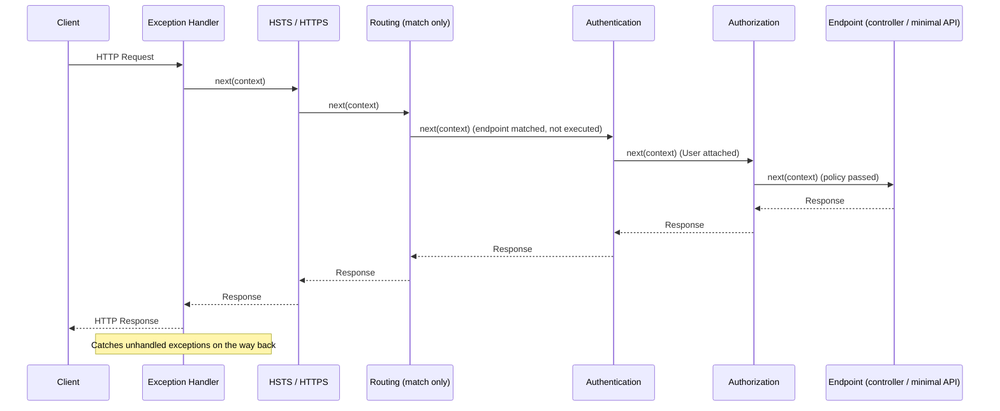
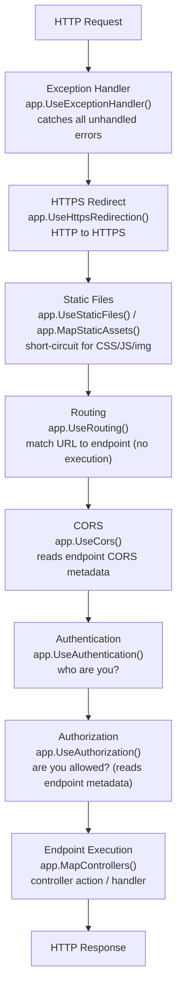

# Middleware in ASP.NET Core

> [Mastery Guide](../../../README.md) › [Foundations](../../README.md) › [.NET Core Deep Dive](README.md)

| Status | Priority | Phase | Last reviewed |
|---|---|---|---|
| Not Started | High | Phase 3 — ASP.NET Core Fundamentals | 2026-08-10 |

> 📘 **Single source for middleware.** This page is the consolidated topic: concepts, pipeline ordering, custom middleware, branching, drills, cheat sheet, walkthrough, and self-test. A second middleware page previously lived under `02-dotnet-runtime/`; its content has been merged here and that page has been retired.

## Contents
1. [Why it matters](#why-it-matters)
2. [Core concepts](#core-concepts)
   - [The onion model — request in, response out](#the-onion-model--request-in-response-out)
   - [app.Use vs app.Run vs app.Map vs app.MapWhen vs app.UseWhen](#appuse-vs-apprun-vs-appmap-vs-appmapwhen-vs-appusewhen)
   - [next() delegate — calling it vs not calling it](#next-delegate--calling-it-vs-not-calling-it)
   - [IMiddleware interface vs convention-based middleware](#imiddleware-interface-vs-convention-based-middleware)
   - [Middleware order — the canonical sequence](#middleware-order--the-canonical-sequence)
   - [Built-in middleware reference](#built-in-middleware-reference)
   - [Endpoint routing — UseRouting + UseEndpoints](#endpoint-routing--userouting--useendpoints)
   - [Exception handling middleware](#exception-handling-middleware)
   - [Request/response body reading — EnableBuffering](#requestresponse-body-reading--enablebuffering)
   - [HttpContext lifetime and DI scope per request](#httpcontext-lifetime-and-di-scope-per-request)
   - [Custom middleware for cross-cutting concerns](#custom-middleware-for-cross-cutting-concerns)
   - [Terminal middleware — when app.Run is appropriate](#terminal-middleware--when-apprun-is-appropriate)
   - [Branch pipeline with Map](#branch-pipeline-with-map)
   - [Middleware vs filters — when to use each](#middleware-vs-filters--when-to-use-each)
3. [Middleware in ASP.NET Core (.NET 10)](#8-middleware-in-aspnet-core-net-10)
   - [Request/Response Pipeline](#requestresponse-pipeline)
   - [Creating Custom Middleware](#creating-custom-middleware)
   - [Short-Circuiting](#short-circuiting)
   - [Newer pipeline APIs to know (.NET 8-10)](#newer-pipeline-apis-to-know-net-8-10)
4. [Conditional Middleware](#9-conditional-middleware)
5. [Ways to Register Middleware](#10-ways-to-register-middleware)
6. [Code & diagrams](#code--diagrams)
7. [Common pitfalls](#common-pitfalls)
8. [Interview-ready summary](#interview-ready-summary)
9. [Interview Cross-Questioning Drill](#interview-cross-questioning-drill)
10. [Cheat Sheet](#cheat-sheet)
11. [Walkthrough — Correlation ID Middleware](#walkthrough--correlation-id-middleware)
12. [Self-test](#self-test)
13. [Cross-references](#cross-references)
14. [Sources](#sources)

---

## Why it matters

Every HTTP request in an ASP.NET Core application passes through the middleware pipeline before it reaches your controller or Minimal API endpoint — and every response travels back out through the same chain in reverse. Authentication, authorization, CORS, exception handling, logging, compression, static files, rate limiting: all of it is middleware. The pipeline is built once at startup and is immutable at runtime, which is why the order of `app.Use…()` calls is load-bearing code.

Senior interviews probe not "what is middleware" but "why does authorization before routing break endpoint-specific policies?" or "what happens when you read the request body twice?" — judgment calls that require understanding the pipeline as a chain of delegates, not just a list of features.

## Core concepts

### The onion model — request in, response out

The pipeline is a linked list of delegates. Each middleware:
1. Runs logic **before** calling `next` — this sees the incoming request.
2. Calls `next(context)` — passing control to the next layer inward.
3. Runs logic **after** `next` returns — this sees the outgoing response.

```
HTTP Request
    │
    ▼
┌─────────────────────┐  ← runs "before next" code here
│  Exception Handler  │
│  ┌───────────────┐  │
│  │    Routing    │  │
│  │  ┌─────────┐  │  │
│  │  │CORS/Auth│  │  │
│  │  │ ┌─────┐ │  │  │
│  │  │ │Endpt│ │  │  │
│  │  │ └─────┘ │  │  │
│  │  └─────────┘  │  │
│  └───────────────┘  │
└─────────────────────┘  ← runs "after next" code here on the way out
    │
    ▼
HTTP Response
```

Control flows inward through `next` calls; the response unwinds outward in reverse registration order. A middleware that never calls `next` **short-circuits** the pipeline — no inner middleware or endpoint runs.

### app.Use vs app.Run vs app.Map vs app.MapWhen vs app.UseWhen

| Method | Signature | Calls next? | Rejoins? | Typical use |
|---|---|---|---|---|
| `app.Use` | `(context, next) =>` | Your choice | Yes (if you call next) | General-purpose — can branch or pass through |
| `app.Run` | `(context) =>` | Never | N/A | Terminal — health check, fallback, simple endpoint |
| `app.Map` | `(path, branch =>)` | Never by default | No | Sub-pipeline by path prefix |
| `app.MapWhen` | `(predicate, branch =>)` | Never by default | No | Sub-pipeline by arbitrary condition |
| `app.UseWhen` | `(predicate, branch =>)` | Yes (after branch) | Yes | Conditional middleware that rejoins main pipeline |

```csharp
// app.Use — passes through or short-circuits
app.Use(async (context, next) =>
{
    // before logic
    await next(context);    // passes control inward
    // after logic (response on the way back)
});

// app.Run — terminal
app.Run(async context =>
{
    await context.Response.WriteAsync("Pipeline ends here");
});

// app.Map — path-based branch (does NOT rejoin)
app.Map("/health", branch =>
{
    branch.Run(async ctx => await ctx.Response.WriteAsync("OK"));
});

// app.UseWhen — conditional branch (DOES rejoin)
app.UseWhen(
    ctx => ctx.Request.Path.StartsWithSegments("/api"),
    branch => branch.UseMiddleware<ApiRateLimitMiddleware>()
);
```

**Senior signal**: `Map` and `MapWhen` create dead-end branches — inside them you must register endpoints explicitly. `UseWhen` is for applying middleware selectively when the request still needs to reach the main endpoint.

### next() delegate — calling it vs not calling it

`Use` has two overloads and the choice is not purely cosmetic:

- `Use(Func<HttpContext, RequestDelegate, Task>)` — you write `await next(context)`.
- `Use(Func<HttpContext, Func<Task>, Task>)` — you write `await next()`.

Microsoft's guidance is to **prefer the `RequestDelegate` overload (`next(context)`)**: it "saves two internal per-request allocations that are required when using the other overload." Calling `next` passes the `HttpContext` to the next middleware in the chain; not calling it short-circuits.

```csharp
// Short-circuit: reject early without calling next
public async Task InvokeAsync(HttpContext context)
{
    if (!context.Request.Headers.ContainsKey("X-API-Key"))
    {
        context.Response.StatusCode = 401;
        await context.Response.WriteAsync("Missing API key");
        return;    // short-circuit — next never called
    }

    await _next(context);    // continue pipeline
}
```

**What happens on short-circuit**: the response travels back out through all middleware registered *before* the short-circuiting one — their "after-next" code still runs. Middleware registered *after* the short-circuit is never invoked.

**Anti-pattern — unawaited next**:

```csharp
// ❌ WRONG — fire and forget
_next(context);
DoAfterWork();    // runs immediately, racing with the pipeline

// ✅ RIGHT
await _next(context);
DoAfterWork();    // runs after inner pipeline completes
```

The unawaited form corrupts response ordering, causes response body stream conflicts, and triggers "object disposed" from scoped services cleaned up before the endpoint finishes.

### IMiddleware interface vs convention-based middleware

ASP.NET Core supports two patterns for class-based middleware.

**Convention-based** (the default). The class must have a public constructor taking a `RequestDelegate`, and exactly one public method named `Invoke` or `InvokeAsync` that returns `Task` and takes `HttpContext` first. If the class exposes more than one public `Invoke`/`InvokeAsync`, `UseMiddleware<T>` throws an `InvalidOperationException` when the pipeline is built.

```csharp
public class TimingMiddleware
{
    private readonly RequestDelegate _next;
    // Constructor-injected services come from the application (root) provider —
    // resolved once at startup, so only singletons are safe here.
    private readonly ILogger<TimingMiddleware> _logger;

    public TimingMiddleware(RequestDelegate next, ILogger<TimingMiddleware> logger)
    {
        _next = next;
        _logger = logger;
    }

    // Extra InvokeAsync parameters are resolved per request from context.RequestServices
    public async Task InvokeAsync(HttpContext context, IMetrics metrics)
    {
        var sw = Stopwatch.StartNew();
        await _next(context);
        sw.Stop();
        metrics.Record("response_ms", sw.ElapsedMilliseconds);
    }
}

// Registration
app.UseMiddleware<TimingMiddleware>();
```

**`IMiddleware`-based** (factory-activated, resolved per request):

```csharp
public class ScopedMiddleware : IMiddleware
{
    private readonly AppDbContext _db;    // scoped via constructor injection

    public ScopedMiddleware(AppDbContext db) => _db = db;

    public async Task InvokeAsync(HttpContext context, RequestDelegate next)
    {
        // can use _db safely — resolved fresh per request
        await next(context);
    }
}

// Registration — the middleware TYPE must be in DI (scoped or transient),
// and then added to the pipeline.
services.AddScoped<ScopedMiddleware>();
app.UseMiddleware<ScopedMiddleware>();
```

`UseMiddleware<T>` checks whether `T` implements `IMiddleware`; if so it resolves the instance through the registered `IMiddlewareFactory` (default: `MiddlewareFactory`) instead of the convention-based path. One consequence: you cannot pass extra constructor arguments through `UseMiddleware<T>(arg)` for an `IMiddleware` type — `UseMiddleware` throws `NotSupportedException` at startup, the moment it is called.

| | Convention-based | `IMiddleware` |
|---|---|---|
| Instantiation | Once at app startup | Per request (via `IMiddlewareFactory`) |
| Constructor injection scope | Application/root provider — singletons only | Any scope |
| Method injection scope | Request-scoped (`context.RequestServices`) | N/A (constructor instead) |
| Extra `UseMiddleware<T>(args)` | Supported | `NotSupportedException` |
| DI registration required? | No | Yes — `AddScoped`/`AddTransient` |
| When to use | Default choice | Many scoped constructor dependencies |

### Middleware order — the canonical sequence

```csharp
// Canonical ordering for a typical ASP.NET Core app (Program.cs)
if (!app.Environment.IsDevelopment())
{
    app.UseExceptionHandler("/error");   // 1. catches exceptions from everything after it
    app.UseHsts();                       // 2. adds Strict-Transport-Security
}

app.UseHttpsRedirection();               // 3. redirect HTTP → HTTPS
app.UseStaticFiles();                    // 4. serve wwwroot, short-circuits static assets

app.UseRouting();                        // 5. match URL → endpoint (metadata now readable)
app.UseCors();                           // 6. after routing, before auth
app.UseAuthentication();                 // 7. who are you? (populates HttpContext.User)
app.UseAuthorization();                  // 8. are you allowed? (User + endpoint metadata)

app.MapControllers();                    // 9. execute the matched endpoint
```

**Why order matters:**
- `UseExceptionHandler` first — it can only catch exceptions thrown by middleware registered *after* it.
- `UseStaticFiles` early — short-circuits CSS/JS/image requests before they pay for routing and auth.
- `UseRouting` **before** `UseCors`/`UseAuthentication`/`UseAuthorization` — those middlewares read the matched endpoint's metadata (`[Authorize(Policy = "Admin")]`, `[EnableCors]`). Before `UseRouting`, `context.GetEndpoint()` returns `null` and endpoint-level policies are silently skipped.
- `UseCors` → `UseAuthentication` → `UseAuthorization` — the docs state these three "must appear in the order shown." CORS preflight `OPTIONS` requests carry no credentials, so CORS must answer them before auth can reject them; authentication populates `User`, which authorization then evaluates.
- `UseCors` before `UseResponseCaching` — otherwise cached responses can be served without CORS headers ([dotnet/aspnetcore#23218](https://github.com/dotnet/aspnetcore/issues/23218)).
- `UseRateLimiter` after `UseRouting` when using endpoint-specific limits (`[EnableRateLimiting]`); global-only limiters may go earlier.
- `UseRequestTimeouts` (.NET 8+) must be called after `UseRouting` in apps that call `UseRouting` explicitly.

**If you never call `UseRouting`**: `WebApplication` inserts the routing middleware at the **beginning** of the pipeline (and endpoint execution at the end), so the built-in order still works. You call `UseRouting` explicitly when you need your own middleware to sit *between* matching and execution, or to sit *before* matching.

### Built-in middleware reference

| Middleware | Registration | What it does |
|---|---|---|
| `UseExceptionHandler` | `app.UseExceptionHandler("/error")` | Catches unhandled exceptions, re-executes at the error path |
| `UseDeveloperExceptionPage` | `app.UseDeveloperExceptionPage()` | Dev-only HTML stack trace with source view |
| `UseHsts` | `app.UseHsts()` | Adds `Strict-Transport-Security` header |
| `UseHttpsRedirection` | `app.UseHttpsRedirection()` | Redirects HTTP to HTTPS |
| `UseStaticFiles` | `app.UseStaticFiles()` | Serves `wwwroot` files, short-circuits |
| `MapStaticAssets` | `app.MapStaticAssets()` | .NET 9+ build-time-optimized static asset endpoints (see below) |
| `UseCors` | `app.UseCors(policy)` | Cross-origin headers; preflight handling |
| `UseAuthentication` | `app.UseAuthentication()` | Reads token/cookie, sets `HttpContext.User` |
| `UseAuthorization` | `app.UseAuthorization()` | Enforces policy/role checks, returns 401/403 |
| `UseAntiforgery` | `app.UseAntiforgery()` | Antiforgery token validation; must follow authn/authz |
| `UseRouting` | `app.UseRouting()` | Matches URL to endpoint, stores the match in features |
| `UseEndpoints` | `app.UseEndpoints(e => e.MapControllers())` | Executes the matched endpoint |
| `UseResponseCompression` | `app.UseResponseCompression()` | gzip/Brotli compression for responses |
| `UseResponseCaching` | `app.UseResponseCaching()` | HTTP response caching; register after `UseCors` |
| `UseRateLimiter` | `app.UseRateLimiter()` | Enforces rate-limiting policies (.NET 7+) |
| `UseOutputCache` | `app.UseOutputCache()` | Server-side output cache (.NET 7+) |
| `UseRequestTimeouts` | `app.UseRequestTimeouts()` | Per-endpoint/global request timeouts (.NET 8+) |

### Endpoint routing — UseRouting + UseEndpoints

Prior to ASP.NET Core 3.0, routing and endpoint execution were one atomic step (`UseMvc`). Endpoint routing split them into two phases:

**Phase 1 — Route matching** (`UseRouting`): the URL is matched against all registered routes. The match result (including endpoint metadata — attributes, policies) is stored on the `HttpContext`. The endpoint is **not** executed yet.

**Phase 2 — Endpoint execution** (`UseEndpoints` / `MapControllers` / `MapGet`): the matched endpoint's delegate is invoked.

Middleware placed **between** the two phases can inspect the matched endpoint:

```csharp
app.UseRouting();

// This middleware can see which endpoint matched
app.Use(async (context, next) =>
{
    var endpoint = context.GetEndpoint();
    if (endpoint?.Metadata.GetMetadata<RequireAuditAttribute>() is not null)
    {
        // log audit info before endpoint runs
    }
    await next(context);
});

app.UseAuthorization();    // needs matched endpoint metadata for [Authorize] policies

app.MapControllers();      // executes the endpoint
```

**Minimal hosting (ASP.NET Core 6+)**: `MapControllers()`, `MapGet()`, `MapHub()` and friends work without an explicit `UseRouting()`. If you never call `UseRouting`, `WebApplication` runs the routing middleware at the **start** of the pipeline and endpoint execution at the **end**. Register `UseRouting` explicitly when you need middleware to run *before* matching, or when you want your own middleware between matching and execution.

### Exception handling middleware

```csharp
// Production: UseExceptionHandler re-executes at an error path
if (!app.Environment.IsDevelopment())
{
    app.UseExceptionHandler("/error");
    app.UseHsts();
}
else
{
    app.UseDeveloperExceptionPage();
}

// Minimal API error endpoint (paired with UseExceptionHandler above)
app.Map("/error", (HttpContext ctx) =>
{
    var exceptionFeature = ctx.Features.Get<IExceptionHandlerPathFeature>();
    return Results.Problem(
        detail: exceptionFeature?.Error.Message,
        statusCode: 500
    );
});
```

**Modern alternative — `IExceptionHandler` (.NET 8+).** Rather than re-executing the request at an error path, implement `IExceptionHandler.TryHandleAsync(HttpContext, Exception, CancellationToken)` and register it. Handlers run in registration order; returning `true` stops processing, and if every handler returns `false` the middleware falls back to its configured behavior. Handler instances are singletons.

```csharp
public sealed class DomainExceptionHandler : IExceptionHandler
{
    public async ValueTask<bool> TryHandleAsync(
        HttpContext context, Exception exception, CancellationToken ct)
    {
        if (exception is not DomainException domain) return false;   // let the next handler try

        context.Response.StatusCode = StatusCodes.Status400BadRequest;
        await context.Response.WriteAsJsonAsync(new ProblemDetails
        {
            Title = "Domain rule violated",
            Detail = domain.Message,
            Status = StatusCodes.Status400BadRequest
        }, ct);
        return true;
    }
}

// Program.cs
builder.Services.AddProblemDetails();                       // .NET 7+
builder.Services.AddExceptionHandler<DomainExceptionHandler>();
...
app.UseExceptionHandler();    // no path argument needed
```

**Key behaviors**:
- `UseExceptionHandler` catches exceptions from everything registered after it, and (in the path form) re-executes the request at the registered path. The original path and the exception are available via `IExceptionHandlerPathFeature`.
- Once `HttpResponse.HasStarted` is `true` (bytes have been written to the network), the status code and headers are committed and the exception cannot be turned into a clean error response. The practical option is to log and abort the connection.
- Never ship `UseDeveloperExceptionPage` to production — it exposes file paths, environment details, and sometimes secrets.

### Request/response body reading — EnableBuffering

By default, `Request.Body` is a forward-only stream — it can only be read once. Middleware that reads the body must enable buffering first:

```csharp
public async Task InvokeAsync(HttpContext context)
{
    // Enable buffering so the body can be read multiple times
    context.Request.EnableBuffering();

    // Read body in middleware (leaveOpen so the endpoint can still read it)
    using var reader = new StreamReader(
        context.Request.Body, leaveOpen: true);
    var body = await reader.ReadToEndAsync();

    // MUST rewind before passing to next (the endpoint also needs to read it)
    context.Request.Body.Position = 0;

    await _next(context);
}
```

**`EnableBuffering` details**: it replaces the forward-only server stream with a `FileBufferingReadStream`, which buffers in memory up to a threshold and then spools to a temp file on disk. The default `bufferThreshold` is 30 KB (30,720 bytes); the overload `EnableBuffering(int bufferThreshold, long bufferLimit)` lets you change it. Temp files go to the directory named by the `ASPNETCORE_TEMP` environment variable if set, otherwise the user's temp folder, and are deleted when the request ends. Suitable for logging/validation middleware on small bodies; avoid on large file-upload routes.

**Response body**: `Response.Body` is a forward-only write stream. To capture the response:

```csharp
var originalBody = context.Response.Body;
using var buffer = new MemoryStream();
context.Response.Body = buffer;

await _next(context);

buffer.Position = 0;
var responseBody = await new StreamReader(buffer).ReadToEndAsync();
buffer.Position = 0;
await buffer.CopyToAsync(originalBody);
context.Response.Body = originalBody;
```

**Caveats**: buffering the full response allocates heap memory proportional to response size. Cap at a safe size or skip buffering for large downloads and SSE streams — see [Drill 10](#drill-10--streaming-response) for the streaming alternative.

### HttpContext lifetime and DI scope per request

Each HTTP request gets its own `HttpContext` and its own DI scope — the **request scope**. Services registered as `Scoped` are resolved fresh per request and disposed when the request completes.

```csharp
// Convention middleware — constructor runs ONCE at startup
public class MyMiddleware
{
    private readonly RequestDelegate _next;
    private readonly ILogger<MyMiddleware> _logger;   // ILogger<T> is a singleton — safe in the ctor

    public MyMiddleware(RequestDelegate next, ILogger<MyMiddleware> logger)
    {
        _next = next;
        _logger = logger;
    }

    // Scoped/transient services via method injection — resolved per request
    public async Task InvokeAsync(HttpContext context, AppDbContext db)
    {
        // db is a fresh instance scoped to this request
        var userId = context.User.FindFirst("sub")?.Value;
        await _next(context);
    }
}
```

**Captive dependency bug**: injecting a `Scoped` service into a singleton consumer (like a convention middleware constructor) makes the scoped service live for the app's lifetime. This leaks state across requests and is caught in Development by scope validation.

**`context.RequestServices`**: the per-request `IServiceProvider`. `UseMiddleware<T>` resolves extra `InvokeAsync` parameters from it (falling back to the application provider), including parameters annotated with `[FromKeyedServices]` on .NET 8+. Prefer method injection; `context.RequestServices.GetRequiredService<T>()` is the correct fallback when method injection isn't available.

> **Note on `ILogger<T>`**: `AddLogging` registers the open generic `ILogger<>` as a **singleton** (`ServiceDescriptor.Singleton(typeof(ILogger<>), typeof(Logger<>))`). Injecting it via `InvokeAsync` is legal but does not make it per-request — you get the same singleton instance. Per-request *data* comes from `ILogger.BeginScope`, not from the logger's lifetime.

### Custom middleware for cross-cutting concerns

Middleware is the natural home for concerns that apply to every request regardless of endpoint:

```csharp
// Correlation ID middleware — injects/propagates a trace ID
public class CorrelationIdMiddleware
{
    private readonly RequestDelegate _next;
    private const string Header = "X-Correlation-Id";

    public CorrelationIdMiddleware(RequestDelegate next) => _next = next;

    public async Task InvokeAsync(HttpContext context)
    {
        // Propagate from upstream or generate a new one
        var correlationId = context.Request.Headers[Header].FirstOrDefault()
            ?? Guid.NewGuid().ToString("N");

        // Make it available to downstream code via HttpContext.Items
        context.Items["CorrelationId"] = correlationId;

        // Reflect it on the response
        context.Response.OnStarting(() =>
        {
            context.Response.Headers[Header] = correlationId;
            return Task.CompletedTask;
        });

        await _next(context);
    }
}
```

**`Response.OnStarting`**: registers a callback invoked just before response headers are sent to the client. This is the safe place to add response headers in middleware — doing it after `await _next(context)` may be too late if the endpoint already started streaming. The docs note that callbacks registered here run in reverse order (LIFO).

**Other cross-cutting patterns**:
- Request timing / metrics emission.
- Request logging with structured fields (method, path, status, duration).
- IP allowlist / denylist enforcement.
- Tenant resolution (multi-tenancy via subdomain or header).
- Feature-flag enforcement before endpoints are evaluated.

### Terminal middleware — when app.Run is appropriate

`app.Run` registers a terminal delegate — it never calls `next`, so it consumes the request.

```csharp
// Health check — always returns 200, no further processing needed
app.Map("/health", branch =>
{
    branch.Run(async ctx =>
    {
        ctx.Response.StatusCode = 200;
        await ctx.Response.WriteAsync("OK");
    });
});

// Fallback — runs if nothing else matched
app.Run(async context =>
{
    context.Response.StatusCode = 404;
    await context.Response.WriteAsync("Not found");
});
```

**When to use `app.Run`**:
- Simple liveness/readiness endpoints that don't need the full MVC stack.
- Catch-all fallback at the end of `Program.cs`.
- Returning a fixed response in a `Map`'d sub-pipeline.

**When NOT to use `app.Run`**: anywhere in the middle of your pipeline where you still expect later middleware or endpoint routing to run — it silently swallows all subsequent registrations. The docs put it plainly: if you don't plan to call `next` because your goal is to terminate the pipeline, use `Run` rather than `Use`.

### Branch pipeline with Map

`app.Map` creates a sub-pipeline for a given path prefix. Requests to that prefix are handled entirely within the branch; they never rejoin the main pipeline.

```csharp
// API branch with separate middleware chain
app.Map("/api", api =>
{
    api.UseMiddleware<ApiKeyMiddleware>();
    api.UseMiddleware<ApiRateLimitMiddleware>();
    api.UseRouting();
    api.UseEndpoints(e => e.MapControllers());
});

// Admin branch — the branch needs its OWN UseRouting before UseEndpoints.
// Without it, UseEndpoints throws at startup, and UseAuthorization would run
// with no matched endpoint, silently ignoring page-level [Authorize] metadata.
app.Map("/admin", admin =>
{
    admin.UseRouting();
    admin.UseAuthentication();
    admin.UseAuthorization();
    admin.UseEndpoints(e => e.MapRazorPages());
});
```

**Path stripping**: inside the branch, `context.Request.Path` has the prefix removed; it moves to `context.Request.PathBase`. When building absolute URLs inside a `Map`'d branch, use `context.Request.PathBase + context.Request.Path` to reconstruct the full path.

**`MapWhen` vs `UseWhen` — pick by whether the request must continue:**

```csharp
// MapWhen — branches on condition, does NOT rejoin.
// Use it when the branch OWNS the request end to end.
app.MapWhen(
    ctx => ctx.Request.Path.StartsWithSegments("/legacy"),
    branch => branch.Run(async ctx =>
        await ctx.Response.WriteAsync("Handled by the legacy shim"))
    // requests matching this predicate never reach the main pipeline's endpoints
);

// UseWhen — branches on condition, DOES rejoin.
// Use it when the branch only ADDS behaviour and the request must still be routed.
app.UseWhen(
    ctx => ctx.Request.Path.StartsWithSegments("/api"),
    branch => branch.UseMiddleware<ApiRateLimitMiddleware>()
    // rate-limited, then rejoins and hits MapControllers normally
);
```

The two are not interchangeable, and the same predicate gives opposite outcomes. Diagnostic/observability middleware (a debug-header hook, a rate limiter, an audit logger) almost always wants `UseWhen`, because the request still has to reach its endpoint. Reach for `MapWhen` only when the branch is the final handler.

### Middleware vs filters — when to use each

Both can execute logic around an HTTP request, but they operate at different layers:

| Concern | Middleware | Filters |
|---|---|---|
| Scope | Entire pipeline — every request, every endpoint | MVC/Razor Pages layer only |
| Knows about routes/actions? | Not before `UseRouting`; metadata only after | Always — filter context includes the action descriptor |
| Access to action arguments? | No | Yes — action filters can inspect/modify parameters |
| Access to result before serialization? | No | Yes — result filters can modify `IActionResult` |
| Short-circuit with custom response? | Yes | Yes (set `Result` in an action/resource filter) |
| Exception handling? | Yes — global via `UseExceptionHandler` | Yes — `IExceptionFilter` for MVC-layer exceptions |
| Registration | `Program.cs` pipeline | Attribute on controller/action, or globally in `AddControllers` |
| Applies to static files / health checks? | Yes | No — MVC filters never run for those |

**Decision rule**:
- Use **middleware** for concerns that apply to all requests, regardless of which endpoint handles them: auth, CORS, logging, compression, rate limiting, IP filtering.
- Use **filters** for concerns that are MVC-specific: action argument validation, action-level auditing, modifying the response model, catching domain exceptions and converting to `ProblemDetails` with model-state context.

```csharp
// ✅ Middleware: logging applies to all requests (static files, health, API)
app.Use(async (context, next) =>
{
    logger.LogInformation("Incoming {Method} {Path}",
        context.Request.Method, context.Request.Path);
    await next(context);
});

// ✅ Filter: audit only applies to specific controller actions
[ServiceFilter(typeof(AuditFilter))]
public class OrdersController : ControllerBase { /* ... */ }

// ❌ Wrong: using middleware when you need the ActionDescriptor / model state
// ✅ Right: use an IExceptionFilter (MVC context) or IExceptionHandler (global)
```

---

## 8. Middleware in ASP.NET Core (.NET 10)

### Request/Response Pipeline





ORDER MATTERS! Each middleware processes the request going IN and the response going OUT (like an onion). Note that routing sits **before** CORS and auth — those middlewares are exactly the ones that need the matched endpoint's metadata.

### Creating Custom Middleware

```csharp
// Approach 1: Inline middleware (quick & simple)
app.Use(async (context, next) =>
{
    var stopwatch = Stopwatch.StartNew();

    // Register the header write BEFORE the response starts — setting headers
    // after await next(context) throws once HasStarted is true.
    context.Response.OnStarting(() =>
    {
        stopwatch.Stop();
        context.Response.Headers.Append("X-Response-Time",
            $"{stopwatch.ElapsedMilliseconds}ms");
        return Task.CompletedTask;
    });

    await next(context);   // RequestDelegate overload — the allocation-cheaper one
});

// Approach 2: Class-based middleware (production use)
public class RequestLoggingMiddleware
{
    private readonly RequestDelegate _next;
    private readonly ILogger<RequestLoggingMiddleware> _logger;

    public RequestLoggingMiddleware(
        RequestDelegate next,
        ILogger<RequestLoggingMiddleware> logger)
    {
        _next = next;
        _logger = logger;
    }

    public async Task InvokeAsync(HttpContext context)
    {
        // Before: Log request
        _logger.LogInformation(
            "Request: {Method} {Path} from {IP}",
            context.Request.Method,
            context.Request.Path,
            context.Connection.RemoteIpAddress);

        var stopwatch = Stopwatch.StartNew();

        await _next(context);  // Pass to next middleware

        stopwatch.Stop();

        // After: safe to READ the status code here; mutating headers is not.
        _logger.LogInformation(
            "Response: {StatusCode} in {Elapsed}ms",
            context.Response.StatusCode,
            stopwatch.ElapsedMilliseconds);
    }
}

// Extension method for clean registration
public static class MiddlewareExtensions
{
    public static IApplicationBuilder UseRequestLogging(
        this IApplicationBuilder builder)
    {
        return builder.UseMiddleware<RequestLoggingMiddleware>();
    }
}

// Usage in Program.cs
app.UseRequestLogging();

// Approach 3: Terminal middleware (short-circuit)
app.Run(async context =>
{
    // No next — this is the end of the pipeline
    await context.Response.WriteAsync("Hello World");
});
```

> **Exactly one entry point.** The class needs a public constructor taking `RequestDelegate` and **one** public `Invoke`/`InvokeAsync`. Two public `InvokeAsync` overloads on the same class is a startup-time `InvalidOperationException` from `UseMiddleware<T>`, not a compile error — it is a classic self-inflicted bug when someone adds an overload to get method injection.

### Short-Circuiting

```csharp
// Middleware that blocks requests — doesn't call next
public class ApiKeyMiddleware
{
    private readonly RequestDelegate _next;

    public ApiKeyMiddleware(RequestDelegate next) => _next = next;

    public async Task InvokeAsync(HttpContext context)
    {
        if (!context.Request.Headers.TryGetValue("X-API-Key", out var key)
            || key != "my-secret-key")
        {
            context.Response.StatusCode = 401;
            await context.Response.WriteAsync("Invalid API Key");
            return;  // ← SHORT-CIRCUIT: Don't call next
        }

        await _next(context);  // Valid key → continue pipeline
    }
}
```

**Route-level short-circuiting (.NET 8+)** — you no longer have to hand-roll this for "known junk" routes. `ShortCircuit()` makes routing invoke the endpoint immediately and end the request, skipping the rest of the middleware pipeline; `MapShortCircuit(statusCode, params prefixes)` does the same for a set of URL prefixes:

```csharp
// Endpoint runs, then the pipeline ends — no auth, no CORS, no session
app.MapGet("/short-circuit", () => "Short circuiting!").ShortCircuit();

// Return 404 immediately for noisy well-known paths
app.MapShortCircuit(404, "robots.txt", "favicon.ico");
```

Use it to keep crawler and browser chatter out of authentication, CORS, and logging middleware.

### Newer pipeline APIs to know (.NET 8-10)

Interviewers increasingly probe whether you have tracked the pipeline's evolution, not just the .NET 6 shape:

| API | Introduced | What changed |
|---|---|---|
| `IExceptionHandler` + `services.AddExceptionHandler<T>()` | .NET 8 | Handle exceptions in a typed callback instead of re-executing the request at an error path. Multiple handlers run in registration order; `TryHandleAsync` returning `true` stops the chain. |
| `.ShortCircuit()` / `MapShortCircuit()` | .NET 8 | Declarative route-level short-circuiting; no custom middleware needed. |
| `UseRequestTimeouts()` + `AddRequestTimeouts()` | .NET 8 | Global and per-endpoint request timeouts. Must be registered after `UseRouting` when `UseRouting` is explicit. Adding the middleware alone does nothing — a policy or `[RequestTimeout]`/`WithRequestTimeout` must be configured. |
| `[FromKeyedServices]` on `InvokeAsync` parameters | .NET 8 | `UseMiddleware<T>` resolves keyed services for method-injected parameters. |
| `MapStaticAssets()` | .NET 9 | Endpoint-based static asset serving with build-time compression and content-based ETags. A drop-in replacement for `UseStaticFiles` for assets known at build/publish time; keep `UseStaticFiles` for assets served from disk or embedded resources at runtime. In MVC/Razor Pages, chain `.WithStaticAssets()` after `MapControllerRoute`/`MapRazorPages`. |

---

## 9. Conditional Middleware

```csharp
// UseWhen: Branch pipeline conditionally (rejoins after)
app.UseWhen(
    context => context.Request.Path.StartsWithSegments("/api"),
    appBuilder => appBuilder.UseMiddleware<ApiRateLimitMiddleware>()
);

// Environment-based
if (app.Environment.IsDevelopment())
{
    app.UseDeveloperExceptionPage();
    app.UseSwagger();
}
else
{
    app.UseExceptionHandler("/error");
    app.UseHsts();
}

// Header-based — UseWhen, because the request must still reach its endpoint.
// Use MapWhen here only if the debug branch is meant to answer the request itself.
app.UseWhen(
    context => context.Request.Headers.ContainsKey("X-Debug"),
    appBuilder => appBuilder.UseMiddleware<DebugMiddleware>()
);

// Role-based — must be registered AFTER UseAuthentication,
// otherwise context.User is the anonymous principal and the predicate is always false.
app.UseWhen(
    context => context.User.IsInRole("Admin"),
    appBuilder => appBuilder.UseMiddleware<AdminAuditMiddleware>()
);
```

**Feature flags**: `UseWhen`/`MapWhen` predicates are synchronous (`Func<HttpContext, bool>`), and `IFeatureManager.IsEnabledAsync` returns `Task<bool>`. Do **not** block on it with `.GetAwaiter().GetResult()` inside the predicate — that is sync-over-async on every request and a thread-pool starvation risk. Branch on something cheap and synchronous, then do the async check inside the middleware where you can `await` it:

```csharp
// Gate a whole path segment on a feature flag
app.UseWhen(
    context => context.Request.Path.StartsWithSegments("/dashboard"),
    appBuilder => appBuilder.Use(async (context, next) =>
    {
        var featureManager = context.RequestServices
            .GetRequiredService<IFeatureManager>();

        if (!await featureManager.IsEnabledAsync("NewDashboard"))
        {
            context.Response.StatusCode = StatusCodes.Status404NotFound;
            return;                       // short-circuit: feature is off
        }

        await next(context);
    })
);
```

---

## 10. Ways to Register Middleware

```csharp
// 1. app.Use() — Inline, calls next
app.Use(async (context, next) =>
{
    // Before
    await next(context);
    // After
});

// 2. app.Run() — Terminal, no next
app.Run(async context =>
{
    await context.Response.WriteAsync("End of pipeline");
});

// 3. app.UseMiddleware<T>() — Class-based
app.UseMiddleware<RequestLoggingMiddleware>();

// 4. app.Map() — Branch by path
app.Map("/api", apiApp =>
{
    apiApp.UseMiddleware<ApiAuthMiddleware>();
    apiApp.Run(async ctx => await ctx.Response.WriteAsync("API"));
});

app.Map("/health", healthApp =>
{
    healthApp.Run(async ctx => await ctx.Response.WriteAsync("OK"));
});

// 5. Extension method (cleanest)
app.UseRequestLogging();    // Hides UseMiddleware<T> call

// When to use each:
// app.Use()             → Quick prototyping, simple logic
// app.Run()             → Health checks, fallback endpoints
// app.UseMiddleware<T>()→ Production middleware with DI
// app.Map()             → Path-based branching
// Extension methods     → Reusable, published middleware
```

---

## Code & diagrams

<details>
<summary>🧩 Click to expand — pipeline diagrams and annotated code</summary>

**Canonical pipeline execution flow:**

```
Request → EH → HSTS → Redirect → StaticFiles → Routing → CORS → AuthN → AuthZ → Endpoint
  ← EH ←  HSTS ←  Redirect ←  StaticFiles ← Routing ← CORS ← AuthN ← AuthZ ← Endpoint ← Response
```

Each `←` row shows middleware running its "after-`next`" code on the response side. The exception handler wraps the entire inner chain.

**Middleware pipeline as delegate chain:**

```
RequestDelegate pipeline =
    ExceptionHandlerMiddleware(
        HstsMiddleware(
            HttpsRedirectionMiddleware(
                StaticFileMiddleware(
                    EndpointRoutingMiddleware(          // UseRouting — match only
                        CorsMiddleware(
                            AuthenticationMiddleware(
                                AuthorizationMiddleware(
                                    EndpointMiddleware(Terminal)   // executes the match
                                )
                            )
                        )
                    )
                )
            )
        )
    )
```

**Complete custom middleware with extension method:**

```csharp
public class RequestTimingMiddleware
{
    private readonly RequestDelegate _next;
    private readonly ILogger<RequestTimingMiddleware> _logger;

    public RequestTimingMiddleware(RequestDelegate next, ILogger<RequestTimingMiddleware> logger)
    {
        _next = next;
        _logger = logger;
    }

    public async Task InvokeAsync(HttpContext context)
    {
        var sw = Stopwatch.StartNew();

        // OnStarting ensures the header is set before headers are sent
        context.Response.OnStarting(() =>
        {
            sw.Stop();
            context.Response.Headers["X-Response-Time-Ms"] =
                sw.ElapsedMilliseconds.ToString();
            return Task.CompletedTask;
        });

        await _next(context);
    }
}

public static class RequestTimingExtensions
{
    public static IApplicationBuilder UseRequestTiming(this IApplicationBuilder app)
        => app.UseMiddleware<RequestTimingMiddleware>();
}

// Program.cs
app.UseRequestTiming();
```

</details>

## Common pitfalls

1. **`UseAuthorization` before `UseAuthentication`**: authorization sees an anonymous `User` — every request is denied regardless of valid credentials. Always: authenticate first, authorize second.
2. **`UseCors` / `UseAuthorization` before `UseRouting`**: `context.GetEndpoint()` is `null` at that point, so endpoint-level `[Authorize]` and `[EnableCors]` metadata is silently ignored. Routing must match first.
3. **`UseExceptionHandler` placed in the middle**: it can only catch exceptions from middleware registered after it. It must be first (or very early) in `Program.cs`.
4. **Injecting scoped services into a convention middleware constructor**: the instance is created once at startup from the application provider — the scoped service lives forever and leaks state across requests. Use method injection on `InvokeAsync` instead.
5. **Reading `Request.Body` without `EnableBuffering`**: the body is a forward-only stream. Reading it in middleware consumes it; the controller/endpoint receives an empty body. Call `EnableBuffering()` first, then reset `Body.Position = 0` after your read.
6. **Writing response headers after `HasStarted` is true**: throws `InvalidOperationException`. Use `context.Response.OnStarting(...)` to register header mutations that fire before headers are sent.
7. **`app.Run` in the middle of the pipeline**: it's terminal — every `app.Use(...)` and `app.MapControllers()` call registered after it is unreachable. Use only at the tail or inside `Map`'d branches.
8. **Unawaited `_next(context)`**: fire-and-forget on the pipeline — the response races with the endpoint, scoped services are disposed prematurely, "object disposed" exceptions follow. Always `await _next(context)` (or `return _next(context)` when there is nothing after it).
9. **Using `Map`/`MapWhen` when `UseWhen` was needed**: `Map` and `MapWhen` create dead-end branches. If the request still needs to reach `MapControllers`, use `UseWhen`.
10. **Resolving scoped services from the root `IServiceProvider`**: if you inject `IServiceProvider` in the middleware constructor and call `.GetRequiredService<AppDbContext>()`, you get the application-root provider — shared across all requests. Use `context.RequestServices`.
11. **Two public `InvokeAsync` methods on one middleware class**: `UseMiddleware<T>` throws `InvalidOperationException` when the pipeline is built. One public entry point only.
12. **Using `next()` instead of `next(context)`**: functionally equivalent, but the `Func<Task>` overload costs two extra per-request allocations. Prefer the `RequestDelegate` overload.

## Interview-ready summary

- The middleware pipeline is a **linked list of delegates** built at startup. Requests flow inward through `next` calls; responses unwind outward. This is the **onion model**.
- **`app.Use`** is the general form; **`app.Run`** is terminal (no next); **`app.Map`** branches by path (no rejoin); **`app.MapWhen`** branches by predicate (no rejoin); **`app.UseWhen`** branches by predicate (rejoins).
- **Short-circuit** = don't call `next`. Earlier middleware still sees the response on the way out. Later middleware never runs. Since .NET 8, `ShortCircuit()`/`MapShortCircuit()` do this declaratively at the route level.
- **Convention-based middleware** is instantiated once at startup; constructor injection resolves from the application provider, so only singletons are safe there. Scoped services go in the `InvokeAsync` signature. **`IMiddleware`** is resolved per request via `IMiddlewareFactory` and must be registered in DI as scoped or transient.
- **Middleware order is load-bearing**: exception handler first, static files early, then **routing → CORS → authentication → authorization → endpoint execution**.
- **Endpoint routing** splits into match (`UseRouting`) and execute (`MapControllers`/`UseEndpoints`). Middleware between them can inspect the matched endpoint without executing it — that is how `UseAuthorization` and `UseCors` apply per-endpoint policies. If you never call `UseRouting`, `WebApplication` puts matching at the start of the pipeline and execution at the end.
- **`EnableBuffering`** lets you read `Request.Body` more than once (default 30 KB in memory, then spooled to a temp file); reset `Position = 0` before calling `next`.
- **`Response.OnStarting(callback)`** is the safe place to add response headers — it fires just before headers are sent, and callbacks run LIFO.
- **Exception handling**: `UseExceptionHandler` with a re-executed error path still works, but since .NET 8 the recommended shape is `AddProblemDetails()` + `AddExceptionHandler<T>()` + a bare `UseExceptionHandler()`.
- **Middleware vs filters**: middleware applies to all requests (CORS, logging, auth); filters are MVC-specific (action args, result mutation, model-state-aware error responses).
- **`next(context)` over `next()`** — the `RequestDelegate` overload avoids two per-request allocations.

## Interview Cross-Questioning Drill

<details>
<summary>📖 Click to expand — cross-question chains (~20-25 min, cover answers and write cold)</summary>

> ⚠️ **Honest caveat**: reading this once doesn't make you interview-ready. Cover the answers, write them cold, then check. Pair with a senior for live mock cross-questioning. The guide removes "I never thought about that" surprises; mock interviews convert knowledge into reflex. Both are needed.

Each drill is **Q → A → Cross-Q → A → Cross-Q² → A**. Practice answering the cross-questions without re-reading. If you stumble on any cross-Q², go re-read the relevant section.

### Drill 1 — Pipeline order

> **Q**: What determines the order of middleware execution in ASP.NET Core?
>
> **A**: The order you register them in `Program.cs` via `app.Use…()` calls. The pipeline is built once at startup; each registration appends a delegate to a linked list. Request flows top-to-bottom on the way in, then bottom-to-top on the way out (the "onion" model).
>
> **Cross-Q**: If I put `UseAuthorization()` before `UseAuthentication()`, what breaks?
>
> **A**: Authorization runs against an unpopulated `HttpContext.User` — so every request fails with 401/403 regardless of credentials. `UseAuthentication` is what reads the token/cookie and attaches a `ClaimsPrincipal`; without it, `HttpContext.User` is the anonymous principal. The compile succeeds, the integration tests catch it.
>
> **Cross-Q²**: Are there middlewares whose order is enforced by the framework, not by convention?
>
> **A**: A few. `UseRouting` and endpoint execution (`UseEndpoints`, or the implicit execution added by `MapControllers`) bracket the matched-endpoint stage — anything that needs to know which endpoint will run (`UseAuthorization` with endpoint-level policies, `UseCors` with per-endpoint policies) must sit between them. Microsoft's docs state `UseCors`, `UseAuthentication`, and `UseAuthorization` "must appear in the order shown." `UseExceptionHandler` must be first because it can only catch what runs after it. `UseAntiforgery` must come after authn/authz. Watch out for a common myth here: `UseHsts` has **no** environment awareness — it is the project template's `if (!app.Environment.IsDevelopment())` that keeps it out of Development. What the middleware itself does is skip loopback hosts, because `HstsOptions.ExcludedHosts` defaults to `localhost`, `127.0.0.1`, and `[::1]`.

### Drill 2 — `Use` vs `Run`

> **Q**: What's the difference between `app.Use(...)` and `app.Run(...)`?
>
> **A**: `Use` accepts a `(context, next)` delegate — you call `next` to pass control forward. `Run` accepts only `(context)` — it's **terminal**, ends the pipeline, no next middleware will execute.
>
> **Cross-Q**: What happens if I call `app.Use(...)` but never invoke `next`?
>
> **A**: I've short-circuited the pipeline. The request stops at that middleware; no later middleware (including endpoint routing → controllers) runs. The response goes back up through the *earlier* middlewares' "after-next" code on its way out. The docs' guidance: if terminating is the goal, use `Run` rather than `Use` so the intent is explicit.
>
> **Cross-Q²**: I see `app.Use(async (ctx, next) => { await next(ctx); })` in some samples and `app.Use(async (ctx, next) => { await next(); })` in others. Same thing?
>
> **A**: Functionally equivalent, but not equally cheap — and the direction of the difference is the opposite of what most people guess. There are two `Use` overloads: one takes `Func<HttpContext, Func<Task>, Task>` (you write `next()`), the other takes `Func<HttpContext, RequestDelegate, Task>` (you write `next(context)`). Microsoft recommends the **`RequestDelegate`** one because, in the docs' words, it "saves two internal per-request allocations that are required when using the other overload" — the `Func<Task>` form has to allocate a closure over the context plus the `Func<Task>` wrapper itself. So `await next(context)` is the one to write; `await next()` is the legacy shape.

### Drill 3 — Short-circuit

> **Q**: When should middleware short-circuit?
>
> **A**: When the request is *resolved* before reaching the endpoint — auth rejection (401/403), rate-limit hit (429), API-key check, cache hit, redirect, static file served. Returning early avoids waking up the rest of the pipeline (DB, auth, routing) for a request whose outcome is already determined.
>
> **Cross-Q**: I short-circuit by writing a response and skipping `next`. Will middleware registered *before* me still see the response on the way back?
>
> **A**: Yes. Each middleware that ran before yours has its "after-next" code (the lines below `await next(context)`) pending on the stack. When yours returns without calling next, control unwinds normally — earlier middlewares see your written response, can add headers via `OnStarting`, log it, time it. The onion is still complete on the response side.
>
> **Cross-Q²**: I want to short-circuit AND prevent the upstream logging middleware from logging the rejected request. How?
>
> **A**: You can't, cleanly — the logger already ran its "before" code (saw the request), and its "after" code will run regardless. The options: (a) check the condition *inside* the logger and skip writing, (b) move the short-circuit middleware *before* the logger so the logger never sees rejected requests, (c) set a flag on `HttpContext.Items` that the logger checks. Option (b) is cleanest: place ApiKey/IpAllowList middleware *before* logging. For known-junk routes there is also a fourth option since .NET 8: `MapShortCircuit(404, "robots.txt", "favicon.ico")`, which ends the request at the routing stage so nothing downstream — logger included — ever runs.

### Drill 4 — Exception handler placement

> **Q**: Where in the pipeline does `UseExceptionHandler` go?
>
> **A**: **First** — or as close to first as possible. It catches exceptions thrown by any middleware after it. An exception thrown *before* it is uncaught and surfaces as the server's default 500.
>
> **Cross-Q**: What about `UseDeveloperExceptionPage`?
>
> **A**: Same rule, dev-only. The convention: `if (app.Environment.IsDevelopment()) app.UseDeveloperExceptionPage(); else app.UseExceptionHandler("/error");`. The dev page shows the stack trace and a source view; the prod handler re-executes the request at a registered error endpoint. Never ship the developer page to production — it leaks paths, environment details, and source.
>
> **Cross-Q²**: My exception handler re-throws after logging. What does the pipeline do?
>
> **A**: The re-thrown exception propagates back up; if nothing else catches it, the server returns a bare 500 with no body. To preserve a structured response, the handler must either write the response *and* not throw, or throw a type that an outer middleware catches. In practice, log inside the handler and write a Problem Details body — re-throwing is almost always wrong unless you have an explicit outer handler that knows how to serialize it. In the .NET 8+ `IExceptionHandler` shape the equivalent decision is the `bool` return of `TryHandleAsync`: return `false` to pass the exception to the next handler instead of throwing.

### Drill 5 — `IMiddleware` vs convention

> **Q**: When would you use `IMiddleware` instead of a convention-based middleware class?
>
> **A**: When you need per-request activation — convention-based middleware is instantiated *once* at app startup, so its constructor is resolved from the application (root) provider and can only safely take singletons. An `IMiddleware` implementation is resolved from DI per request through `IMiddlewareFactory`, so it can take scoped/transient services in its constructor. It must be registered in the container (`AddScoped<T>()` or `AddTransient<T>()`) — forgetting that registration is the usual first failure.
>
> **Cross-Q**: Can't I inject scoped services into the `InvokeAsync` method's signature of a convention middleware?
>
> **A**: Yes — and that's the workaround. Constructor injection is application-lifetime; method injection via `InvokeAsync(HttpContext, IScopedService)` is resolved per request by `UseMiddleware<T>` from `context.RequestServices`. So convention middleware *can* use scoped services; you just inject them per-method, not per-constructor. That's why `IMiddleware` is rarely necessary in practice.
>
> **Cross-Q²**: Does `IMiddleware` have any perf cost vs convention?
>
> **A**: Yes, a small one, and I'd describe it qualitatively rather than quote a number. `IMiddleware` costs a factory call plus a DI resolution of the middleware and its dependency graph on every request; convention middleware is allocated once and its `InvokeAsync` is invoked directly (only the method-injected parameters are resolved per request). For typical middleware this is dwarfed by the actual work — a DB call or a serialization. Pick based on DI shape and readability, not on this. One more asymmetry worth knowing: you can't pass extra constructor arguments through `UseMiddleware<T>(args)` to an `IMiddleware` type — that throws `NotSupportedException`.

### Drill 6 — Terminal middleware

> **Q**: What makes a middleware "terminal"?
>
> **A**: It doesn't call `next` — either by using `app.Run(...)`, by `return`ing early in an `app.Use(...)`, or by being mapped via `app.Map(...)` to a sub-pipeline that ends. Terminal means "the response is being generated here; nothing after me will run."
>
> **Cross-Q**: Are endpoint handlers (controllers, Minimal API delegates) terminal?
>
> **A**: Yes. Once the endpoint middleware dispatches to your endpoint, control doesn't return to any "next middleware after the endpoint." The endpoint handler IS the end of the forward pass; only the response side unwinds — response logging, timing, correlation-ID headers, exception-handler cleanup all still run on the way out.
>
> **Cross-Q²**: I have `app.UseRouting(); app.UseAuthorization(); app.Run(_ => ...);`. Will my controllers run?
>
> **A**: No. The terminal `app.Run` short-circuits everything. The `MapControllers` (or `UseEndpoints(e => e.MapControllers())`) call that wires up controllers must be registered before the terminal `Run`. The lesson: terminal middleware is a wall — nothing past it is reachable. Use `app.Map("/specific-path", ...)` if you only want to terminate on a specific branch.

### Drill 7 — Response started

> **Q**: When can you no longer modify the response status code or headers?
>
> **A**: After `HasStarted` becomes true on `HttpResponse` — it indicates the response headers have been sent to the client. After that, setting `StatusCode` or `Headers["X-Foo"]` throws `InvalidOperationException`.
>
> **Cross-Q**: What's the canonical pattern for middleware that wants to modify the response *after* the endpoint generates it?
>
> **A**: `context.Response.OnStarting(callback)` — registers a callback invoked *just before* response headers are sent. You add response headers there. Trying to add them after `await next(context)` returns may be too late if the endpoint already started streaming. The docs note `OnStarting` callbacks run in reverse registration order (LIFO), so you can interleave concerns.
>
> **Cross-Q²**: An exception is thrown after the response has started. Can my exception handler return a 500 + JSON body?
>
> **A**: No — and that's the most common silent failure in middleware. Once headers are out, you can't change status or cleanly rewrite the body; the best you can do is log and call `context.Abort()` to close the connection so the client sees a truncated response rather than a valid-looking one. The takeaway: validation/auth/policy errors MUST be caught before the endpoint streams, not after. This is why `UseExceptionHandler` is registered early — it must catch exceptions before any other middleware writes bytes.

### Drill 8 — `Map`, `MapWhen`, `UseWhen`

> **Q**: What's the difference between `Map`, `MapWhen`, and `UseWhen`?
>
> **A**: `Map` branches by path prefix (`/api`) into a sub-pipeline; the branch doesn't rejoin the main pipeline. `MapWhen` branches by an arbitrary `Func<HttpContext, bool>` predicate — same: no rejoin. `UseWhen` is the same predicate-based branch, but the branch **rejoins** the main pipeline after.
>
> **Cross-Q**: I want middleware that only runs on `/api/*` paths, then continues to the controller. Which?
>
> **A**: `UseWhen` — because you want the branch to rejoin so the request still hits `MapControllers`. `Map` and `MapWhen` would dead-end at the branch's terminal middleware. This is the single most common `Map`-vs-`UseWhen` bug: a rate limiter or debug hook registered with `MapWhen` silently stops the request from ever reaching the endpoint.
>
> **Cross-Q²**: Inside a `Map("/api", ...)` branch, can I add middleware that runs for all paths inside it?
>
> **A**: Yes — that's the point. The lambda you pass to `Map` receives an `IApplicationBuilder`; you add middleware as normal inside, and they apply to every request whose path starts with `/api`. The branch operates on the path stripped of the prefix — inside the branch, `context.Request.Path` is `/users/42`, not `/api/users/42` (the prefix moves to `PathBase`). Worth remembering when constructing absolute URLs from inside a `Map`'d branch: reconstruct with `Request.PathBase + Request.Path`. You can also put `UseAuthentication`/`UseAuthorization` inside a branch so they apply only to that sub-pipeline — but don't duplicate global concerns like the exception handler or HSTS there; the outer pipeline already ran them.

### Drill 9 — Middleware factory pattern

> **Q**: How does `UseMiddleware<T>` integrate with DI?
>
> **A**: For a convention-based type it calls `ActivatorUtilities.CreateInstance` against the **application** service provider to construct the middleware once — so constructor parameters are application-lifetime. Then it invokes `Invoke`/`InvokeAsync` per request, resolving any *additional* method parameters from `context.RequestServices` (falling back to the application provider). If the type implements `IMiddleware`, it takes a different path entirely: the registered `IMiddlewareFactory` creates and releases the instance per request.
>
> **Cross-Q**: Inside `InvokeAsync`, how do I get a fresh scoped service like `DbContext`?
>
> **A**: Either inject it as a method parameter (`InvokeAsync(HttpContext ctx, AppDbContext db)`) — `UseMiddleware<T>` resolves it per request from `ctx.RequestServices` — or resolve it explicitly: `var db = ctx.RequestServices.GetRequiredService<AppDbContext>();`. Both honor the per-request scope. Constructor injection of `AppDbContext` is a captive-dependency bug — the long-lived middleware holds a scoped service forever. On .NET 8+ you can also method-inject a keyed service by annotating the parameter with `[FromKeyedServices("name")]`.
>
> **Cross-Q²**: I have `IMiddleware`-based middleware and registered it with `services.AddScoped<MyMiddleware>()`. What's different?
>
> **A**: Now the middleware *itself* is resolved per request through `IMiddlewareFactory` — its constructor receives scoped services freshly each time, and the factory releases it when the request ends. This is the right pattern when the middleware has heavy per-request state or many scoped dependencies and you don't want to thread them through `InvokeAsync` parameters. Trade-off: a DI resolution every request and more allocation, plus you lose the ability to pass constructor arguments via `UseMiddleware<T>(args)`. Use convention middleware with method injection for most cases; switch to `IMiddleware` when you're tired of long `InvokeAsync` signatures.

### Drill 10 — Streaming response

> **Q**: I want middleware that compresses the response body. What are the caveats?
>
> **A**: You have to wrap `context.Response.Body` *before* `next` is awaited, restore the original after, and write the compressed payload to the original stream. The naive pattern: swap `Body` with a `MemoryStream`, call `next`, then compress the captured bytes and write them to the original `Body`. Or — much better — use the built-in `UseResponseCompression`, which handles streaming correctly.
>
> **Cross-Q**: What if the endpoint writes a very large streamed JSON response?
>
> **A**: The `MemoryStream` swap buffers the entire payload on the heap before compression — that's an out-of-memory bug waiting for the first big response, and on the large object heap at that. The correct approach: wrap `Body` with a compression stream that *streams* compressed bytes through to the original `Body` as the endpoint writes. The built-in middleware does this; rolling your own means implementing `Stream` and forwarding writes through the compressor. Beware: once you wrap, the response stream isn't seekable, and any `OnStarting` callback must not assume a known `Content-Length` — clear `Response.ContentLength` when you change the body.
>
> **Cross-Q²**: I see `HttpContext.Response.BodyWriter` (a `PipeWriter`). When over `Body`?
>
> **A**: `HttpResponse` exposes both: `Body` (a `Stream`) and `BodyWriter` (a `System.IO.Pipelines.PipeWriter`). `BodyWriter` is the pipe-based abstraction, which suits code that already produces `Span`/`Memory` buffers and wants to avoid an intermediate copy through a `Stream` adapter. `Body` is the friendlier surface and is what most middleware and most serialization APIs take. The practical rule: use whichever your writing code already speaks; the thing that matters for middleware is consistency — if you replace the response body, replace it in a way that both views agree on, or you get the classic "half the response is missing" bug.

### Drill 11 — CORS placement

> **Q**: Where does `UseCors` go in the pipeline?
>
> **A**: After `UseRouting`, before `UseAuthentication`/`UseAuthorization`. CORS needs the matched endpoint metadata (route → policy mapping) to enforce the right policy, and it must run before auth so preflight `OPTIONS` requests succeed without a token. Microsoft states the rule directly: `UseCors` must be called after `UseRouting` and before `UseAuthorization`.
>
> **Cross-Q**: Why must CORS preflights skip auth?
>
> **A**: A preflight is a browser-initiated `OPTIONS` request sent without credentials — no cookies, no `Authorization` header, regardless of the `credentials` mode of the actual request. If `UseAuthorization` runs before `UseCors`, the preflight gets a 401 and the browser blocks the real request. The CORS middleware short-circuits preflights with the correct headers; only then is auth-protected access negotiated.
>
> **Cross-Q²**: I see `AllowAnyOrigin().AllowAnyMethod().AllowAnyHeader()` in samples. Why is that dangerous?
>
> **A**: Two reasons. First, it disables the browser's same-origin protection for reads — any site can call your API and read the response. Second, the CORS spec forbids combining a wildcard origin with credentials, so `AllowAnyOrigin()` + `AllowCredentials()` is rejected and silently doesn't work for authenticated requests. The production pattern: explicit origin whitelist, narrow `AllowMethods`/`AllowHeaders`, and `AllowCredentials` only on the specific policy that needs it.
>
> **Cross-Q³**: Why does the browser send a preflight at all?
>
> **A**: Because the request isn't "simple." A simple cross-origin request (GET/HEAD/POST with only CORS-safelisted headers and a safelisted content type) goes straight out. Anything else — a custom header like `X-Correlation-Id`, `Content-Type: application/json`, a `PUT`/`DELETE`/`PATCH` — triggers an `OPTIONS` preflight first, in which the browser asks whether the real request is permitted and the server answers with `Access-Control-Allow-Origin`, `Access-Control-Allow-Methods`, `Access-Control-Allow-Headers`. Only if that succeeds does the browser send the real request. The enforcement lives entirely in the browser — server code cannot opt out of it, and a non-browser client (curl, another service) never preflights at all. That last point is the one interviewers like: CORS is not a server-side security control.

### Drill 12 — Per-request scoped services

> **Q**: In middleware, how do I get a fresh `DbContext` per request?
>
> **A**: Resolve from `context.RequestServices` — that's the per-request scope. `context.RequestServices.GetRequiredService<AppDbContext>()` returns the same instance for the duration of the request and a fresh one on the next request. Method injection on `InvokeAsync` does exactly this for you.
>
> **Cross-Q**: My middleware injects `IServiceProvider` in its constructor and resolves the `DbContext` from that. What's wrong?
>
> **A**: The constructor-injected `IServiceProvider` is the **application** service provider, not a request scope — resolving a scoped service from it either throws (in Development with scope validation on) or, worse, hands you a `DbContext` that lives for the lifetime of the app, accumulating tracked entities and leaking data across requests. Always use `context.RequestServices`, never the constructor-injected application provider.
>
> **Cross-Q²**: Why is scope validation in dev a critical thing to leave on?
>
> **A**: It throws on captive dependencies and root-scope-resolves-scoped, catching the exact bug above. .NET turns it on by default in Development. Some teams disable it because legacy code triggers it — that's a refactor smell, not a config fix. Leave it on and treat each violation as a bug.
>
> **Cross-Q³**: What if I need a scoped service somewhere outside the `InvokeAsync` signature — a helper method, or work I hand to a background task?
>
> **A**: Inject `IServiceScopeFactory` in the constructor (it's safe there — it's a singleton) and create a scope explicitly: `using var scope = _scopeFactory.CreateScope(); var db = scope.ServiceProvider.GetRequiredService<AppDbContext>();`. The `using` declaration disposes the scope and everything resolved from it. Two cautions: don't use this as a substitute for method injection inside `InvokeAsync` — it creates a *second*, unrelated scope for the same request — and never hand `HttpContext` or anything resolved from `RequestServices` to a background task, because the request scope is disposed when the response completes.

### Drill 13 — Unawaited `next`

> **Q**: My middleware calls `_next(context)` without `await`. What breaks?
>
> **A**: A lot. The current middleware's "after-next" code (the lines below the call) runs immediately on the fire-and-forget task, possibly before the downstream pipeline has even started. The HTTP response gets corrupted (you wrote response data before the endpoint did), the request scope disposes before the endpoint finishes, and you may see "Cannot access disposed object" exceptions from EF or the response body stream.
>
> **Cross-Q**: I see `return _next(context);` (no await, no async modifier). Same bug?
>
> **A**: No — that's a valid tail-call pattern. The method returns the task from `_next` directly without wrapping it; the caller awaits it. As long as the middleware doesn't need to do any work after `next`, this avoids allocating an async state machine. The bug is only when you have `_next(context); /* code here */` — that's fire-and-forget.
>
> **Cross-Q²**: My middleware does `await _next(context).ConfigureAwait(false);`. Useful?
>
> **A**: Not in ASP.NET Core. ASP.NET Core doesn't install a `SynchronizationContext`, so continuations already don't capture one and `ConfigureAwait(false)` changes nothing. Library code targeting both ASP.NET Framework and ASP.NET Core often sprinkles it defensively; in pure ASP.NET Core application code it's noise.

### Drill 14 — Response wrapping

> **Q**: I want middleware that captures the response body to log it. Gotchas?
>
> **A**: Three. (1) You must swap `context.Response.Body` with a `MemoryStream`, call `next`, then copy the captured stream back to the original. (2) After capture, `Position` must be reset to 0 before copy. (3) The capture buffers the full response in memory — fine for JSON APIs, fatal for large file downloads or SSE streams. Always combine with a size cap or skip large responses.
>
> **Cross-Q**: I'm also seeing `IHttpResponseBodyFeature` — when over `Body`?
>
> **A**: For advanced scenarios. The feature aggregates the ways to interact with the response body: a `Stream` property, a `Writer` property (a `PipeWriter`), and `StartAsync`, `DisableBuffering`, `CompleteAsync`, `SendFileAsync` methods. Most middleware sticks with `Response.Body`; reach for the feature when you need to opt out of write buffering for a streaming/SSE endpoint (`DisableBuffering`), force headers to be committed (`StartAsync`), or flush and finish the response deterministically (`CompleteAsync`).
>
> **Cross-Q²**: My response-wrapping middleware works locally but causes 502s in production behind a reverse proxy. Why?
>
> **A**: Likely a `Content-Length` mismatch. If the endpoint set `Content-Length` (e.g., serializing a known-size object) and your middleware modifies the body (compression, transformation), the header now lies. The server emits a different number of bytes than advertised, the proxy sees a malformed response, and returns 502. Fix: set `context.Response.ContentLength = null` in your middleware when you alter the body, so the response falls back to chunked transfer encoding.

### Drill 15 — Endpoint routing vs middleware

> **Q**: A request to `/api/users/42` — does middleware or endpoint routing handle the dispatch?
>
> **A**: Both, in sequence. `UseRouting` matches the URL against registered endpoints and stores the match on the `HttpContext` — it doesn't execute the endpoint, only resolves it. Then later middleware (CORS, auth, rate limiting) can inspect `GetEndpoint()` and apply endpoint-specific metadata (like `[Authorize]` policies). Finally the endpoint middleware (`UseEndpoints`, or the implicit execution added by `MapControllers`) executes the matched endpoint's delegate.
>
> **Cross-Q**: Why split routing into "match" and "execute" steps?
>
> **A**: So middleware *between* them can see the matched endpoint without executing it. For example, `UseAuthorization` reads the `[Authorize]` attributes on the matched endpoint and applies the right policy — that's only possible if routing has happened but execution hasn't. In legacy `UseMvc` (pre-3.0), routing was bundled with execution, so per-endpoint policies couldn't be checked at the middleware layer; everything had to live in MVC filters.
>
> **Cross-Q²**: A middleware sets `HttpContext.Response.StatusCode = 403; return;` after `UseRouting` but before endpoint execution. Does the endpoint run?
>
> **A**: No — the middleware short-circuited by not calling `next`. The matched endpoint was *resolved* (you can read it via `context.GetEndpoint()`) but never *executed*. That resolved-but-not-executed window is the whole point: auth, rate-limit, and feature-flag middleware resolve which endpoint *would* run, decide based on its metadata, and either short-circuit with a status or pass through to execution. This is the canonical "policy" layer of the pipeline.

### Drill 16 — Reading the request body

> **Q**: Why can't you read `Request.Body` twice without extra work?
>
> **A**: The server hands you `Request.Body` as a forward-only, non-seekable stream — once read, the position is at the end and a second read returns nothing. That's deliberate: it avoids buffering large bodies (file uploads, big payloads) in memory for requests that never need to re-read them.
>
> **Cross-Q**: What does `EnableBuffering` do, and what's its cost?
>
> **A**: `context.Request.EnableBuffering()` swaps in a `FileBufferingReadStream`, which is seekable: it buffers in memory up to a threshold and then spools to a temp file on disk. The default threshold is 30 KB (30,720 bytes), and the overload `EnableBuffering(bufferThreshold, bufferLimit)` lets you change it and cap the total. Temp files land in `ASPNETCORE_TEMP` if that variable is set, otherwise the user's temp folder, and are deleted at the end of the request. Cost: heap allocation up to the threshold, plus disk I/O beyond it. Don't put it in front of file-upload routes.
>
> **Cross-Q²**: I read the body in middleware, reset `Position` to 0, and the endpoint still receives an empty body. What did I forget?
>
> **A**: `EnableBuffering()`, almost certainly. Setting `Position = 0` requires a seekable stream, which is exactly what `EnableBuffering` gives you — on the raw non-seekable server stream the assignment fails rather than rewinding. The other classic version of this bug is disposing the reader: `new StreamReader(context.Request.Body)` disposes the underlying stream when it's disposed, so pass `leaveOpen: true`. The correct sequence is: `EnableBuffering()` → read with `leaveOpen: true` → `Body.Position = 0` → `await _next(context)`.

### Drill 17 — Middleware vs filters

> **Q**: When would you use a filter instead of middleware for a cross-cutting concern?
>
> **A**: When you need MVC-layer context: the action descriptor, bound action arguments, model state, or the `IActionResult` before it's serialized. Filters run inside the MVC pipeline — after routing, model binding, and action selection. Middleware runs before all of that and knows nothing about actions or models. The flip side: filters never run for static files, health checks, or anything that isn't an MVC/Razor Pages endpoint, so anything that must cover *every* request has to be middleware.
>
> **Cross-Q**: Can middleware access the matched controller action and its attributes?
>
> **A**: Partially. After `UseRouting`, `context.GetEndpoint()` returns the matched endpoint and you can read its metadata collection — including attributes like `[Authorize]` or your own marker attributes. What you can't get is the bound action arguments or the full `ActionDescriptor` detail an action filter sees. For a lightweight metadata check, middleware between routing and execution is the right tool; for anything that needs the model, use a filter.
>
> **Cross-Q²**: My team wants `ProblemDetails` for all unhandled domain exceptions. Middleware or filter?
>
> **A**: Middleware, for coverage — but the modern shape isn't a hand-written middleware. Register `services.AddProblemDetails()` (.NET 7+) plus `services.AddExceptionHandler<DomainExceptionHandler>()` (.NET 8+) and a bare `app.UseExceptionHandler()`. That catches everything after the handler in the pipeline, not just MVC. An `IExceptionFilter` only sees exceptions from action execution and model binding — it misses CORS, auth, and static-file failures entirely. The two are complementary: use the global handler as the floor, and add a filter only if some exception type genuinely needs model-state or action context to produce a good message.

### Drill 18 — Modern exception handling (.NET 8+)

> **Q**: You've inherited a codebase using `app.UseExceptionHandler("/error")` with a re-executed error endpoint. What would you change in 2026, and why?
>
> **A**: I'd move to `IExceptionHandler`. Register `builder.Services.AddProblemDetails()` and one or more `builder.Services.AddExceptionHandler<T>()` implementations, then call `app.UseExceptionHandler()` with no path. Each handler implements `TryHandleAsync(HttpContext, Exception, CancellationToken)` and returns `true` if it produced the response. The re-execute path still works and isn't wrong, but it re-runs the pipeline for the error route, which means you have to reason about a second pass through your middleware; the handler shape writes the response in place.
>
> **Cross-Q**: I registered three handlers. Which one runs?
>
> **A**: They're invoked in registration order, and the first one to return `true` ends the chain. A handler that doesn't recognize the exception type returns `false` and the next one gets a turn. If every handler returns `false`, control falls back to the exception handler middleware's own configured behavior — so keep a sensible default rather than assuming your handlers cover everything. Handler instances are singletons, so don't hold per-request state in fields.
>
> **Cross-Q²**: Does moving to `IExceptionHandler` change where the middleware goes in the pipeline?
>
> **A**: No. `UseExceptionHandler` still has to be registered first, or as close to first as possible, because it can still only catch exceptions thrown by middleware registered after it. And the `HasStarted` rule is unchanged: if the endpoint has already started streaming, no handler — old shape or new — can rewrite the status or headers.

### Drill 19 — Route-level short-circuiting (.NET 8+)

> **Q**: A crawler is hammering `/robots.txt` and `/favicon.ico`, and every one of those requests runs through your authentication, CORS, and request-logging middleware. What's the framework answer?
>
> **A**: `app.MapShortCircuit(404, "robots.txt", "favicon.ico");`. It registers those prefixes as short-circuiting endpoints: routing matches, the request ends with the given status code, and the rest of the middleware pipeline never runs. For a real endpoint you want to keep but exempt from the pipeline, chain `.ShortCircuit()` onto its `Map*` call — `app.MapGet("/health", () => "ok").ShortCircuit();`.
>
> **Cross-Q**: What's the catch — what stops running that you might have wanted?
>
> **A**: Everything registered after routing. That includes authentication, authorization, CORS, response compression, rate limiting, and your own logging or correlation-ID middleware. So short-circuited endpoints are invisible to your request logs and unprotected by your auth policies. That's fine for `robots.txt`; it is emphatically not fine for anything with data behind it. The decision rule: short-circuit only routes where "no policy applies" is a deliberate statement, not an oversight.
>
> **Cross-Q²**: How does this differ from a terminal middleware placed early in the pipeline?
>
> **A**: An early `app.Use(...)` that inspects the path and returns runs *before* routing, so it can't use endpoint metadata and it costs a predicate evaluation on every single request that passes through. `ShortCircuit()` is declarative and route-table-driven: matching happens in the routing middleware's normal endpoint lookup, and only the matched requests take the short path. It's also self-documenting in `Program.cs` — the exemption is visible next to the route it applies to, rather than buried in a path-prefix check.

---

</details>

## Cheat Sheet

- **Onion model**: request flows in through `next` calls; response unwinds out in reverse registration order.
- **`app.Use`**: general — call `next(context)` to continue or skip it to short-circuit.
- **`app.Run`**: terminal — no next, pipeline ends here.
- **`app.Map`**: path-prefix branch — no rejoin; moves the prefix to `PathBase`.
- **`app.MapWhen`**: predicate branch — no rejoin.
- **`app.UseWhen`**: predicate branch — DOES rejoin the main pipeline.
- **Short-circuit**: return without calling `next`; earlier middlewares still run their after-code. Route-level: `.ShortCircuit()` / `MapShortCircuit()` (.NET 8+).
- **Convention middleware**: constructed once from the application provider — constructor takes singletons only; `InvokeAsync` extra parameters are resolved per request from `context.RequestServices` (`[FromKeyedServices]` supported on .NET 8+).
- **`IMiddleware`**: resolved per request via `IMiddlewareFactory`; must be registered `AddScoped`/`AddTransient`; constructor can take scoped services.
- **Canonical order**: ExceptionHandler → HSTS → HTTPS Redirect → StaticFiles → **Routing** → CORS → Authentication → Authorization → Endpoint execution.
- **Auth before authz** (always); **routing before CORS and authz** (endpoint metadata); **CORS before auth** (preflight is unauthenticated); **CORS before `UseResponseCaching`**.
- **No explicit `UseRouting`?** `WebApplication` puts matching at the start of the pipeline and execution at the end.
- **`EnableBuffering()`** + reset `Body.Position = 0` to read the request body more than once (30 KB in memory by default, then a temp file).
- **`Response.OnStarting(cb)`**: safe place to set response headers — fires before headers are sent; callbacks run LIFO.
- **Exceptions**: `AddProblemDetails()` + `AddExceptionHandler<T>()` + `UseExceptionHandler()` is the .NET 8+ shape.
- **Middleware**: all requests. **Filters**: MVC layer only, has action context.
- **Unawaited `_next(context)`** = fire-and-forget bug; always `await` (or `return` it as a tail call).
- **One public `Invoke`/`InvokeAsync` per middleware class** — two is a startup `InvalidOperationException`.

## Walkthrough — Correlation ID Middleware

<details>
<summary>📖 Click to expand — full production-grade correlation ID walkthrough</summary>

**Problem**: distributed traces across microservices are hard to correlate because each service generates a fresh request ID. You need middleware that reads an inbound `X-Correlation-Id` header (set by an API gateway or upstream service), propagates it through the request, and reflects it on every response.

**Requirements**:
1. Read `X-Correlation-Id` from the request headers if present; otherwise generate a new GUID.
2. Make the correlation ID available to all code in the request (logging, EF Core query tags, response, etc.).
3. Always echo the correlation ID on the response, even for 4xx/5xx responses.
4. Don't mutate response headers after they've been committed.

**Implementation**:

```csharp
public class CorrelationIdMiddleware
{
    private readonly RequestDelegate _next;
    private const string HeaderName = "X-Correlation-Id";

    public CorrelationIdMiddleware(RequestDelegate next) => _next = next;

    // Exactly ONE public InvokeAsync. The logger is method-injected;
    // ILogger<T> is a singleton, so this is about convenience, not lifetime.
    public async Task InvokeAsync(HttpContext context, ILogger<CorrelationIdMiddleware> logger)
    {
        // 1. Resolve or generate
        var correlationId = context.Request.Headers[HeaderName].FirstOrDefault()
            ?? Guid.NewGuid().ToString("N");

        // 2. Store for downstream access (controllers, services, EF query tags)
        context.Items[HeaderName] = correlationId;

        // 3. Write to the response BEFORE headers are sent — safe even if the endpoint streams
        context.Response.OnStarting(() =>
        {
            context.Response.Headers[HeaderName] = correlationId;
            return Task.CompletedTask;
        });

        // 4. Push into the logging scope — every log entry in this request carries it
        using (logger.BeginScope(new Dictionary<string, object>
        {
            ["CorrelationId"] = correlationId
        }))
        {
            await _next(context);
        }
    }
}

// Extension method
public static class CorrelationIdExtensions
{
    public static IApplicationBuilder UseCorrelationId(this IApplicationBuilder app)
        => app.UseMiddleware<CorrelationIdMiddleware>();
}

// Program.cs — register early, before anything that logs
app.UseExceptionHandler();
app.UseCorrelationId();    // <- here: before anything else logs
app.UseRequestLogging();   // now every log entry carries CorrelationId
```

> ⚠️ **A shape to avoid**: don't add a *second* public `InvokeAsync` overload to "get" the logger and have it delegate to the first. `UseMiddleware<T>` throws `InvalidOperationException` at startup when a middleware class exposes more than one public `Invoke`/`InvokeAsync`. And stashing a method-injected service into an instance field is a race: convention middleware is a single shared instance across all concurrent requests.

**Why `OnStarting` matters here**: if the endpoint streams data (SSE, chunked JSON), `context.Response.HasStarted` becomes true before `await _next(context)` returns. Setting headers after that throws. `OnStarting` fires just before response headers are sent — a guaranteed-safe window regardless of streaming behavior.

**Accessing the correlation ID from a controller**:

```csharp
public class OrdersController : ControllerBase
{
    public IActionResult Get()
    {
        var correlationId = HttpContext.Items["X-Correlation-Id"] as string;
        // pass to downstream service, add to EF query tag, etc.
        return Ok();
    }
}
```

</details>

## Self-test

<details>
<summary>1. Explain the onion model and what happens on short-circuit.</summary>

The pipeline is a linked list of delegates. Each middleware wraps the remaining pipeline via `next`. The request travels inward (calls to next, top-to-bottom registration order); the response unwinds outward (the code after each `await _next(context)` runs in reverse order). Short-circuit = a middleware returns without calling `next`. The inner pipeline and endpoint never run. Middleware registered before the short-circuit still executes its after-next code on the way out — it sees the short-circuited response. Middleware registered after the short-circuit never runs at all.
</details>

<details>
<summary>2. Why is UseRouting/UseAuthorization order critical? What breaks if swapped?</summary>

`UseAuthorization` uses the matched endpoint's metadata (attributes like `[Authorize(Policy="Admin")]`) to enforce the correct policy. That metadata is populated by `UseRouting`. If authorization runs before routing, `context.GetEndpoint()` returns null — no metadata, no endpoint-specific policy. The result: endpoint-level `[Authorize]` attributes are silently ignored, and only global default policies might apply. Requests that should require admin access pass through unchallenged. The same argument applies to `UseCors` and per-endpoint CORS policies, which is why Microsoft's canonical order is Routing → CORS → Authentication → Authorization → endpoint execution.
</details>

<details>
<summary>3. A colleague's middleware reads Request.Body, passes it on, and the controller receives an empty body. Diagnose and fix.</summary>

The body is a forward-only, non-seekable stream — once read, the position is at the end and the controller receives nothing. Fix: call `context.Request.EnableBuffering()` before reading, which swaps in a seekable `FileBufferingReadStream`. Read with `leaveOpen: true` so disposing the reader doesn't close the stream, then reset `context.Request.Body.Position = 0` before calling `next`. Caveat: `EnableBuffering` buffers in memory up to 30 KB by default and spools to a temp file beyond that — avoid it on large upload endpoints, or pass a tighter `bufferThreshold`/`bufferLimit`.
</details>

<details>
<summary>4. Why is `IMiddleware` needed when convention middleware can inject scoped services via InvokeAsync parameters?</summary>

Strictly, it isn't needed for scoped services — method injection on `InvokeAsync` handles that. `IMiddleware` is preferred when: (a) the middleware has many scoped constructor dependencies and a long `InvokeAsync` signature becomes noisy; (b) you want the middleware instance itself to be per-request (and disposed per-request by DI); (c) you want the container to fully own construction, so decoration and factory overrides work normally. Convention middleware is created via `ActivatorUtilities` from the application provider and isn't a registered service; `IMiddleware` types must be registered (`AddScoped`/`AddTransient`) and are created through `IMiddlewareFactory`. Trade-offs: a per-request DI resolution, and no support for extra constructor arguments via `UseMiddleware<T>(args)`.
</details>

<details>
<summary>5. Compare middleware vs filters: which would you use for domain exception → ProblemDetails mapping?</summary>

Both work; they catch at different layers. A global `IExceptionFilter` catches exceptions from MVC action execution and model binding, converts them to an `IActionResult`, and has full MVC context (ActionDescriptor, model state). It does NOT catch exceptions from other middleware (CORS, auth, static files). The exception handler middleware catches everything registered after it — broader scope. For a full-app ProblemDetails policy, the current shape is `services.AddProblemDetails()` (.NET 7+) plus `services.AddExceptionHandler<T>()` (.NET 8+) and `app.UseExceptionHandler()`. Layer an exception filter on top only for MVC-specific types that genuinely need action context, e.g. model-state-aware error responses. The two are complementary, not mutually exclusive.
</details>

<details>
<summary>6. Name the two `Use` overloads and say which one you'd write, and why.</summary>

`Use(Func<HttpContext, Func<Task>, Task>)` — you call `next()`; and `Use(Func<HttpContext, RequestDelegate, Task>)` — you call `next(context)`. Write the second one. Microsoft's guidance is to prefer it because it "saves two internal per-request allocations that are required when using the other overload" — the `Func<Task>` form has to allocate a wrapper to close over the context. Both behave identically otherwise, so this is the rare style question with an actual right answer. Note the common misconception runs the other way round: people assume the shorter `next()` must be the cheaper one.
</details>

## Cross-references

- **[Dependency Injection (deep dive)](02-dependency-injection.md)** — service lifetimes, captive dependencies, scope validation; the ruleset behind every middleware DI decision on this page.
- **[Async/Await, Multithreading & Synchronization Primitives](03-async-and-threading.md)** — why unawaited `_next(context)` is catastrophic, and why `ConfigureAwait(false)` is a no-op here.
- **[Exception Handling](13-exception-handling.md)** — `IExceptionHandler`, `ProblemDetails`, and exception-to-status mapping beyond the pipeline.
- **[APIs & Microservices](06-apis-and-microservices.md)** — endpoint routing, minimal APIs, and where middleware sits relative to endpoint filters.
- **[Security](09-security.md)** — CORS policy design, HSTS, and the headers this pipeline is responsible for emitting.
- **[.NET Runtime & CLR](01-net-fundamentals.md)** — request processing at the Kestrel and host level before middleware runs.
- **[Authentication & Authorization](../../02-api-development/02-authentication-and-authorization.md)** — what `UseAuthentication` / `UseAuthorization` actually do and how claims principals are built.
- **[Delegates, Events & Lambdas](../05-csharp-mastery/05-delegates-events-lambdas.md)** — `RequestDelegate` is a delegate chain; the pipeline is closure composition.

## Sources

<details>
<summary>📚 Click to expand — sources and further reading</summary>

- Microsoft Learn — [ASP.NET Core Middleware](https://learn.microsoft.com/en-us/aspnet/core/fundamentals/middleware/) — middleware order, short-circuiting, `Run` vs `Use`.
- Microsoft Learn — [Write custom ASP.NET Core middleware](https://learn.microsoft.com/en-us/aspnet/core/fundamentals/middleware/write) — the two `Use` overloads and the per-request allocation guidance; middleware class requirements; per-request dependencies.
- Microsoft Learn — [Factory-based middleware activation](https://learn.microsoft.com/en-us/aspnet/core/fundamentals/middleware/extensibility) — `IMiddleware` / `IMiddlewareFactory`, required DI registration, `NotSupportedException` on extra arguments.
- Microsoft Learn — [Routing in ASP.NET Core](https://learn.microsoft.com/en-us/aspnet/core/fundamentals/routing) — two-phase routing and short-circuit middleware after routing (`ShortCircuit`, `MapShortCircuit`).
- Microsoft Learn — [Enable Cross-Origin Requests (CORS)](https://learn.microsoft.com/en-us/aspnet/core/security/cors) — `UseCors` after `UseRouting`, before `UseAuthorization`.
- Microsoft Learn — [Enforce HTTPS in ASP.NET Core](https://learn.microsoft.com/en-us/aspnet/core/security/enforcing-ssl) — HSTS behavior and `HstsOptions.ExcludedHosts` loopback defaults.
- Microsoft Learn — [Handle errors in ASP.NET Core](https://learn.microsoft.com/en-us/aspnet/core/fundamentals/error-handling) — `IExceptionHandler`, `AddExceptionHandler<T>`, `AddProblemDetails`.
- Microsoft Learn — [Request timeouts middleware](https://learn.microsoft.com/en-us/aspnet/core/performance/timeouts) — `AddRequestTimeouts` / `UseRequestTimeouts` placement.
- Microsoft Learn — [What's new in ASP.NET Core in .NET 9](https://learn.microsoft.com/en-us/aspnet/core/release-notes/aspnetcore-9.0) and [Static files](https://learn.microsoft.com/en-us/aspnet/core/fundamentals/static-files) — `MapStaticAssets`.
- Microsoft Learn API reference — [`HttpRequestRewindExtensions.EnableBuffering`](https://learn.microsoft.com/en-us/dotnet/api/microsoft.aspnetcore.http.httprequestrewindextensions.enablebuffering) and [`FileBufferingReadStream`](https://learn.microsoft.com/en-us/dotnet/api/microsoft.aspnetcore.webutilities.filebufferingreadstream) — the 30 KB default threshold and temp-file spill.
- Microsoft Learn API reference — [`HttpResponse`](https://learn.microsoft.com/en-us/dotnet/api/microsoft.aspnetcore.http.httpresponse) (`Body`, `BodyWriter`, `HasStarted`, `OnStarting` LIFO note) and [`IHttpResponseBodyFeature`](https://learn.microsoft.com/en-us/dotnet/api/microsoft.aspnetcore.http.features.ihttpresponsebodyfeature) (`Stream`, `Writer`, `StartAsync`, `DisableBuffering`, `CompleteAsync`, `SendFileAsync`).
- Microsoft Learn — [Filters in ASP.NET Core](https://learn.microsoft.com/en-us/aspnet/core/mvc/controllers/filters).
- dotnet/aspnetcore — [`UseMiddlewareExtensions.cs`](https://github.com/dotnet/aspnetcore/blob/main/src/Http/Http.Abstractions/src/Extensions/UseMiddlewareExtensions.cs) — the multiple-`InvokeAsync` `InvalidOperationException`, `ActivatorUtilities` against `ApplicationServices`, per-request parameter resolution from `RequestServices`, `[FromKeyedServices]` support.
- dotnet/aspnetcore — [`HstsOptions.cs`](https://github.com/dotnet/aspnetcore/blob/main/src/Middleware/HttpsPolicy/src/HstsOptions.cs) — default `ExcludedHosts`.
- dotnet/aspnetcore — [issue #23218](https://github.com/dotnet/aspnetcore/issues/23218) — why `UseCors` must precede `UseResponseCaching`.
- Andrew Lock — *ASP.NET Core in Action*, middleware chapters.

</details>
<!-- nav-footer-start -->

---

[← Previous: Async/Await, Multithreading & Synchronization Primitives](03-async-and-threading.md) · [↑ Back to top](#middleware-in-aspnet-core) · [Next: Entity Framework Core, LINQ & Data Querying →](05-data-access.md)

<!-- nav-footer-end -->
