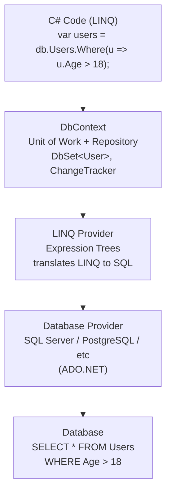
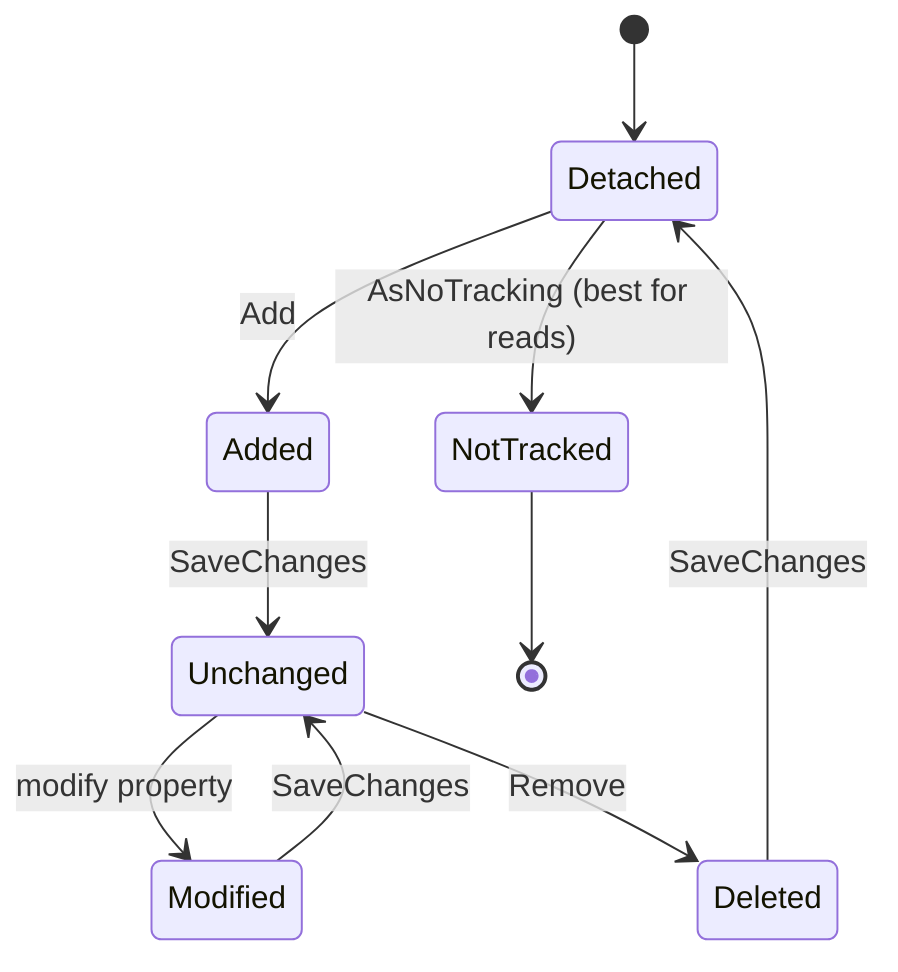

# Entity Framework Core, LINQ & Data Querying

> [Mastery Guide](../../../README.md) › [Foundations](../../README.md) › [.NET Core Deep Dive](README.md)

| Status | Priority | Phase | Last reviewed |
|---|---|---|---|
| Not Started | High | Phase 5 — Data & Persistence | 2026-05-07 |

> 📘 **Main file**: Interview-ready summary, drills, and cheat sheet live in **[EF Core](../../03-data-and-persistence/01-ef-core.md)**. This file is the implementation deep-dive.

## Contents
1. [Entity Framework (EF) and EF Core](#11-entity-framework-ef-and-ef-core)
   - [What is EF Core?](#what-is-ef-core)
   - [EF vs EF Core](#ef-vs-ef-core)
   - [CRUD Operations](#crud-operations)
   - [Change Tracking](#change-tracking)
2. [LINQ and Data Querying](#12-linq-and-data-querying)
   - [Deferred vs Immediate Execution](#deferred-vs-immediate-execution)
   - [IQueryable vs IEnumerable](#iqueryable-vs-ienumerable)
3. [Interview Cross-Questioning Drill](#interview-cross-questioning-drill)

---

## 11. Entity Framework (EF) and EF Core

### What is EF Core?

EF Core is an ORM (Object-Relational Mapper) that maps C# objects to database tables, eliminating raw SQL for most operations.



### EF vs EF Core

```
┌──────────────────┬──────────────────┬──────────────────┐
│ Feature          │ EF 6 (Framework) │ EF Core          │
├──────────────────┼──────────────────┼──────────────────┤
│ Platform         │ Windows only     │ Cross-platform   │
│ Performance      │ Good             │ Much better      │
│ LINQ translation │ Basic            │ Advanced         │
│ Lazy Loading     │ Default on       │ Opt-in           │
│ Batching         │ No               │ Yes              │
│ Compiled Queries │ No               │ Yes              │
│ Raw SQL          │ SqlQuery         │ FromSqlRaw       │
│ Global Filters   │ No               │ Yes              │
│ Shadow Properties│ No               │ Yes              │
│ Cosmos DB        │ No               │ Yes              │
│ Status           │ Maintenance      │ Active           │
└──────────────────┴──────────────────┴──────────────────┘
```

### CRUD Operations

```csharp
public class AppDbContext : DbContext
{
    public DbSet<User> Users { get; set; }
    public DbSet<Order> Orders { get; set; }
    
    protected override void OnModelCreating(ModelBuilder modelBuilder)
    {
        // Fluent API configuration
        modelBuilder.Entity<User>(entity =>
        {
            entity.HasKey(e => e.Id);
            entity.Property(e => e.Name).HasMaxLength(100).IsRequired();
            entity.HasMany(e => e.Orders).WithOne(o => o.User);
            
            // Global query filter (soft delete)
            entity.HasQueryFilter(e => !e.IsDeleted);
        });
    }
}

// CREATE
public async Task<User> CreateUser(string name, string email)
{
    var user = new User { Name = name, Email = email };
    _db.Users.Add(user);           // Track as Added
    await _db.SaveChangesAsync();   // INSERT INTO Users ...
    return user;                    // user.Id now populated
}

// READ
public async Task<List<User>> GetActiveUsers()
{
    return await _db.Users
        .Where(u => u.IsActive)
        .OrderBy(u => u.Name)
        .Include(u => u.Orders)    // Eager load related data
        .AsNoTracking()             // Read-only = faster
        .ToListAsync();
}

// UPDATE
public async Task UpdateUserEmail(int id, string newEmail)
{
    var user = await _db.Users.FindAsync(id);
    if (user == null) throw new NotFoundException();
    
    user.Email = newEmail;          // ChangeTracker detects change
    await _db.SaveChangesAsync();   // UPDATE Users SET Email = ...
}

// DELETE
public async Task DeleteUser(int id)
{
    var user = await _db.Users.FindAsync(id);
    if (user == null) return;
    
    _db.Users.Remove(user);         // Mark as Deleted
    await _db.SaveChangesAsync();   // DELETE FROM Users WHERE Id = ...
}

// Bulk update (.NET 7+ / EF Core 7+)
await _db.Users
    .Where(u => u.LastLogin < DateTime.UtcNow.AddYears(-1))
    .ExecuteUpdateAsync(u => u.SetProperty(x => x.IsActive, false));

// Bulk delete
await _db.Users
    .Where(u => u.IsDeleted)
    .ExecuteDeleteAsync();
```

### Change Tracking



---

## 12. LINQ and Data Querying

### Deferred vs Immediate Execution

> EF/database angle below. For deferred-execution semantics as a pure C# language feature (LINQ-to-Objects, `IEnumerable<T>` re-iteration costs), see [LINQ Language Deep Dive › Deferred vs immediate execution](../05-csharp-mastery/06-linq-language-deep-dive.md#deferred-vs-immediate-execution).

```csharp
// DEFERRED: Query is NOT executed yet
var query = db.Users.Where(u => u.Age > 18);   // Just builds expression
// No SQL sent to database!

// IMMEDIATE: Query executes NOW
var list = query.ToList();           // SELECT * FROM Users WHERE Age > 18
var count = query.Count();           // SELECT COUNT(*) FROM Users WHERE Age > 18
var first = query.First();           // SELECT TOP 1 ...
var exists = query.Any();            // SELECT CASE WHEN EXISTS(...) ...

// Deferred operators: Where, Select, OrderBy, Skip, Take, Join, GroupBy
// Immediate operators: ToList, ToArray, Count, First, Any, Sum, Average
```

### IQueryable vs IEnumerable

```csharp
// IQueryable: Translates to SQL, executes on database server
IQueryable<User> query = db.Users.Where(u => u.Age > 18);
// Generated SQL: SELECT * FROM Users WHERE Age > 18
// Filtering happens IN the database

// IEnumerable: Executes in memory (C# code)
IEnumerable<User> allUsers = db.Users.ToList();  // Gets ALL users
var filtered = allUsers.Where(u => u.Age > 18);   // Filters in memory
// Generated SQL: SELECT * FROM Users (no WHERE clause!)
// Filtering happens AFTER loading everything into memory

// ⚠️ The critical difference:
IQueryable<User> q1 = db.Users;
q1 = q1.Where(u => u.Age > 18);    // Adds to SQL expression
q1 = q1.Where(u => u.IsActive);    // Adds to SQL expression
var result = q1.ToList();
// SQL: SELECT * FROM Users WHERE Age > 18 AND IsActive = 1

IEnumerable<User> e1 = db.Users;    // ← Executes immediately!
e1 = e1.Where(u => u.Age > 18);    // In-memory filter
e1 = e1.Where(u => u.IsActive);    // In-memory filter
var result2 = e1.ToList();
// SQL: SELECT * FROM Users (loads ALL rows, then filters in C#!)
```

```
┌──────────────────┬──────────────────┬──────────────────┐
│ Feature          │ IQueryable<T>    │ IEnumerable<T>   │
├──────────────────┼──────────────────┼──────────────────┤
│ Execution        │ Database server  │ Application      │
│ Provider         │ LINQ to SQL/EF   │ LINQ to Objects  │
│ Performance      │ Better (filtered)│ Worse (all data) │
│ Network          │ Less data sent   │ All data sent    │
│ Use Case         │ DB queries       │ In-memory data   │
└──────────────────┴──────────────────┴──────────────────┘
```

---

## Interview Cross-Questioning Drill

<details>
<summary>📖 Click to expand — cross-question chains (~15-20 min, cover answers and write cold)</summary>

> ⚠️ **Honest caveat**: reading this once doesn't make you interview-ready. Cover the answers, write them cold, then check. Pair with a senior for live mock cross-questioning. The guide removes "I never thought about that" surprises; mock interviews convert knowledge into reflex. Both are needed.

Each drill is **Q → A → Cross-Q → A → Cross-Q² → A**. Practice answering the cross-questions without re-reading. If you stumble on any cross-Q², go re-read the relevant section.
### Drill 1 — Change tracker

> **Q**: What exactly does EF Core's change tracker track?
>
> **A**: Every entity it loads (or that you `Attach`/`Add`) gets a snapshot of its property values at the moment of attach. On `SaveChanges`, the tracker compares the current values to the snapshot, computes a diff, and generates the minimal `INSERT`/`UPDATE`/`DELETE` statements needed. It tracks **state** (Added, Unchanged, Modified, Deleted, Detached) and **per-property original values**.
>
> **Cross-Q**: How does the tracker actually detect changes — events, proxies, or polling?
>
> **A**: By default, **snapshot polling**. On `SaveChanges`, EF iterates every tracked entity and compares each property to the snapshot. This is why `SaveChanges` on a context with 10,000 tracked entities is slow even if nothing changed — the diff scan is O(N × properties). The alternative is **change notification** via `INotifyPropertyChanged` on entities, configured with `ChangeTrackingStrategy.ChangedNotifications`, which updates the tracker eagerly — faster `SaveChanges` but slower property writes and intrusive entity design.
>
> **Cross-Q²**: I added an entity, but the snapshot it took was *before* I set the properties. Does `SaveChanges` send the latest values?
>
> **A**: Yes — `SaveChanges` reads the current values at save time, not at snapshot time. For Added entities, the "diff" is "every property vs default" → INSERT. For Modified entities, it's "every property vs snapshot at attach time" → UPDATE with only changed columns. The snapshot is the *baseline*; current values are read fresh each save. Edge case: if you mutate a tracked entity through reflection and bypass property setters, `INotifyPropertyChanged`-based tracking misses it; snapshot tracking catches it.

### Drill 2 — `AsNoTracking()`

> **Q**: When should I use `AsNoTracking()`?
>
> **A**: For read-only queries — list pages, exports, lookups — where you don't intend to modify the entities and save. It skips snapshot creation, so EF doesn't allocate the per-entity snapshot dictionary, doesn't add to the `ChangeTracker.Entries()` list, and `SaveChanges` doesn't scan them. The perf delta is typically 20-40% for read-heavy paths.
>
> **Cross-Q**: What's the perf delta and where does it come from?
>
> **A**: Snapshot allocation (one dictionary per entity, indexed by property), reference-equality bookkeeping for entity-resolution (so two queries returning the same Id give you the same instance), and the change-detection scan at `SaveChanges`. For a 10K-row query, tracking adds ~5-15ms of overhead and ~50-100KB of allocation. Plus the GC pressure from holding all those entities/snapshots alive in the DbContext until disposal.
>
> **Cross-Q²**: If I `AsNoTracking()` an entity and then call `db.Update(entity)`, what happens?
>
> **A**: EF attaches it as Modified with *all properties* marked as changed (no snapshot to diff against). The generated UPDATE sets every column. This is the correct behavior for "disconnected" workflows (Web API receives a DTO, maps to entity, updates) — but it's wasteful if only one field changed. To update one column on a non-tracked entity: `db.Entry(entity).Property(x => x.Name).IsModified = true;` and EF will only UPDATE that one column.

### Drill 3 — Lazy vs eager vs explicit

> **Q**: What's the default loading strategy in EF Core?
>
> **A**: **Eager via `Include`** — nothing loads automatically. Lazy loading is **opt-in** (install `Microsoft.EntityFrameworkCore.Proxies`, call `UseLazyLoadingProxies`, mark navigations `virtual`). Explicit loading via `db.Entry(e).Reference(...).LoadAsync()` is always available.
>
> **Cross-Q**: Why is the default "off" for lazy loading when EF6 had it "on"?
>
> **A**: Because lazy loading caused N+1 query disasters in EF6 — innocent-looking property accesses fired off SQL queries, often in loops. EF Core's team deliberately made eager loading the visible default: if you want data, write `.Include(x => x.Orders)` and the cost is right there in code review. Lazy is still available for legacy migrations and small projects, but the recommended pattern is eager + explicit fallback.
>
> **Cross-Q²**: I see `Include` used with `ThenInclude` for a 3-level deep graph (Order → Lines → Product). Is there a max depth?
>
> **A**: No hard EF limit, but practical limit is ~3-4 levels. Each `Include` adds a JOIN; a 5-level deep eager load with 1:N relationships at each level generates a Cartesian product (cartesian explosion) — millions of rows for a few entities. Past 2-3 deep, switch to `AsSplitQuery()` (multiple SELECTs, joined in memory) or load levels separately. Or — better — redesign the query: do you really need the entire object graph, or only specific aggregates?

### Drill 4 — `Include` + `ThenInclude`

> **Q**: `db.Orders.Include(o => o.Lines).ThenInclude(l => l.Product)` — what SQL does this generate?
>
> **A**: A single SELECT with two LEFT JOINs: Orders LEFT JOIN OrderLines LEFT JOIN Products. The result set has one row per (Order × Line × Product) combination; EF reconstructs the object graph by deduplicating on primary keys. For one order with 5 lines, you get 5 rows back; EF builds one Order with a 5-element Lines list.
>
> **Cross-Q**: What if I `Include` two sibling collections — `Include(o => o.Lines).Include(o => o.Payments)`?
>
> **A**: That's the **Cartesian explosion** scenario. One LEFT JOIN to Lines, another LEFT JOIN to Payments — the result set is rows × lines × payments. An order with 5 lines and 3 payments yields 15 rows for one logical order. EF still reconstructs correctly (deduplicates), but the wire payload and memory cost balloon. The fix: `AsSplitQuery()` — EF runs three SELECTs (orders, lines, payments) and joins them in memory, no Cartesian product.
>
> **Cross-Q²**: I added `.Where(o => o.Lines.Any(l => l.Quantity > 10))` after the `Include`. Does the WHERE filter the included Lines too?
>
> **A**: No — and this is a common surprise. The `Where` filters the *order rows* (only orders with at least one line of quantity > 10), but the `Include` still returns *all* lines for those matching orders. To filter included data, use **filtered Include**: `.Include(o => o.Lines.Where(l => l.Quantity > 10))` (EF Core 5+). Without that, the `Lines` collection on the returned Order will contain all lines, not just the ones matching the predicate.

### Drill 5 — N+1

> **Q**: What's the N+1 query problem and how do you detect it?
>
> **A**: Loading N entities with one query, then for each one triggering a second query for its related data — total N+1 queries instead of 1 or 2. Symptom: a page that should load in 50ms takes 5 seconds. Detection: SQL profiler (SQL Server Profiler, MiniProfiler, Application Insights dependency calls), or EF logging — set `LogLevel.Information` for `Microsoft.EntityFrameworkCore.Database.Command` and count the SELECTs.
>
> **Cross-Q**: How do you fix it?
>
> **A**: Eager-load the related data with `Include`/`ThenInclude` so the single original query brings everything back. Or use projection (`Select`) to a DTO that pulls only the fields you need — often the cleanest fix because it sidesteps the navigation graph entirely. For very wide graphs, `AsSplitQuery` lets you eager-load without Cartesian explosion.
>
> **Cross-Q²**: My code is `var orders = await db.Orders.ToListAsync(); foreach (var o in orders) await SomeServiceAsync(o.CustomerId);` — does `Include(o => o.Customer)` help?
>
> **A**: Only if `SomeServiceAsync` is actually `db.Customers.FindAsync(o.CustomerId)` under the hood. If `SomeService` is an HTTP call to a microservice, EF can't help. The N+1 pattern applies to *any* per-iteration dependency call, not just EF. Solution: batch — accept a list of CustomerIds and have the service return them in one call. EF's `Include` fixes EF-specific N+1; service-call N+1 needs an API-level batch endpoint.

### Drill 6 — Cartesian explosion

> **Q**: What is Cartesian explosion in EF Core?
>
> **A**: When a single query JOINs multiple collection navigations, the result set is the Cartesian product of those collections — rows × lines × payments × etc. The wire payload and memory allocation grow multiplicatively. EF still produces the correct object graph (via PK dedup), but you've sent megabytes when you needed kilobytes.
>
> **Cross-Q**: When does `Include` cause it?
>
> **A**: When two or more `Include`s target **sibling collections** (both 1:N from the same root). One `Include` per nested chain is safe — those are JOINs along a path, not branches. Two sibling `Include`s force the database to materialize the cross-product.
>
> **Cross-Q²**: Is `AsSplitQuery()` always better then?
>
> **A**: No — it trades fewer rows for more round-trips. One split query becomes N SELECTs (one per `Include` chain). On a high-latency network (cloud DB), three round-trips cost more than one fat query. On a local DB with massive collections, splitting wins. Profile both. EF Core 5+ lets you set the default per-context with `UseSqlServer(..., o => o.UseQuerySplittingBehavior(QuerySplittingBehavior.SplitQuery))` and override per-query.

### Drill 7 — Query splitting

> **Q**: When should I use `AsSplitQuery()`?
>
> **A**: When a single-query JOIN would Cartesian-explode — multiple sibling `Include`s on collections, or deep `Include` chains with collections at multiple levels. The signal is the row count going up disproportionately as collections grow.
>
> **Cross-Q**: What's the trade-off?
>
> **A**: Multiple round-trips (one SELECT per Include chain) instead of one. On low-latency local DBs, splitting is faster. On high-latency networks (cloud + same-region: 1-2ms; cross-region: 50+ms), the extra round-trips can outweigh the smaller payloads. The other trade-off: split queries aren't a **single transaction snapshot** unless you wrap in an explicit transaction — data can change between the SELECTs, causing inconsistent reads.
>
> **Cross-Q²**: How do I see which strategy a query is using?
>
> **A**: EF logs the SQL it executes. Turn on `LogTo(Console.WriteLine, LogLevel.Information)` and watch for one big SELECT (single-query) vs multiple smaller ones (split). You can also check `db.Orders.Include(o => o.Lines).ToQueryString()` — returns the raw SQL without executing. Better in dev: install EF Core's `Microsoft.EntityFrameworkCore.Diagnostics` and listen for `QueryCompilationEvents`.

### Drill 8 — DbContext lifetime

> **Q**: Why is `DbContext` registered as Scoped, not Singleton?
>
> **A**: `DbContext` holds the change tracker, an open DB connection (eventually), and tracked entity state — all per-request data. Singleton would mean every request shares the same tracker, every entity loaded by request A leaks into request B's view, and concurrent requests would race on the connection. Scoped (per-request) gives each request its own context, disposed at request end.
>
> **Cross-Q**: Can I use it as Transient?
>
> **A**: Technically yes, but you give up the scoped-singleton-per-request benefit — multiple components in the same request each get their own context, each with their own change tracker. Two services modifying the same entity now have two contexts tracking two snapshots; the second `SaveChanges` may fail (entity already attached elsewhere) or silently lose the other's changes. Scoped is the correct lifetime; Transient causes subtle bugs.
>
> **Cross-Q²**: I'm in a `BackgroundService` (Singleton) — how do I get a Scoped DbContext?
>
> **A**: Inject `IServiceScopeFactory`, create a scope per work unit, resolve the DbContext from the scope, dispose the scope when done. The pattern: `using var scope = _scopeFactory.CreateScope(); var db = scope.ServiceProvider.GetRequiredService<AppDbContext>(); ...`. Each iteration of the worker loop creates a fresh scope, so each gets a fresh DbContext. Never store a `DbContext` field on a singleton — captive dependency.

### Drill 9 — Raw SQL

> **Q**: What's the difference between `FromSqlRaw` and `FromSqlInterpolated`?
>
> **A**: `FromSqlRaw("SELECT ... WHERE Name = '{0}'", name)` uses string formatting — vulnerable to SQL injection if `name` is concatenated. `FromSqlInterpolated($"SELECT ... WHERE Name = {name}")` is interpolation but EF treats the holes as parameters — safely parameterized. Always prefer `FromSqlInterpolated` for user input.
>
> **Cross-Q**: Can I `Include` after `FromSqlInterpolated`?
>
> **A**: Yes, if (a) the SQL projects all columns of the entity (so EF can hydrate it) and (b) the SQL doesn't use SELECT-clauses that change the shape (no aggregations, no TOP without ORDER BY, etc.). Once EF has the root entities, `.Include(...)` runs as a separate query against the navigation. If the SQL is too custom, EF will refuse and you'll need plain ADO.NET or Dapper.
>
> **Cross-Q²**: My raw SQL calls a stored procedure that returns multiple result sets. Can EF map them?
>
> **A**: Not natively for multi-resultset SPs. EF Core's `FromSqlRaw` only consumes one result set into one entity type. For multi-resultset SPs, drop down to `db.Database.GetDbConnection()`, open it, use a `DbCommand`, iterate `IDataReader`'s `NextResult()` manually, and project. Dapper handles this elegantly via `QueryMultiple`. EF's strength is LINQ; raw SQL is the escape hatch, multi-resultset is the escape hatch's escape hatch.

### Drill 10 — Migrations

> **Q**: Code-first vs database-first — when does each fit?
>
> **A**: **Code-first** (you write entities, EF generates schema migrations): new projects, single-team ownership of schema, agile evolution. **Database-first** (you reverse-engineer entities from an existing DB): legacy systems with established schemas, DBA-controlled environments, when SQL Server's tooling owns DDL. Code-first is the default in modern .NET; database-first is for integration with legacy DBs.
>
> **Cross-Q**: How do I generate a migration?
>
> **A**: `dotnet ef migrations add AddOrdersTable` — EF scans your model, diffs against the last migration's snapshot, generates an `Up` (apply) and `Down` (revert) method as a C# file. Then `dotnet ef database update` runs the SQL. For production, generate SQL scripts with `dotnet ef migrations script` and review/deploy them through your release pipeline — never let migrations auto-apply on production startup (race conditions in scale-out, can't roll back).
>
> **Cross-Q²**: I edited a migration's `Up` to add raw SQL. What problem might I create?
>
> **A**: The model snapshot is unchanged — EF still thinks the schema matches your C# model. If the raw SQL adds a column EF doesn't know about, the next migration won't include it; if EF *thinks* a column exists that the raw SQL didn't add, the next migration tries to alter a column that's not there. The fix: hand-edited migrations must be paired with a hand-edited snapshot in `ApplicationDbContextModelSnapshot.cs`, or — cleaner — model the change in your entities and let EF generate the SQL.

### Drill 11 — Concurrency token

> **Q**: How does optimistic concurrency work in EF Core?
>
> **A**: Mark a property with `[Timestamp]` (SQL Server `rowversion`) or `[ConcurrencyCheck]` (any property whose change you want to detect). EF includes that property in the WHERE clause of UPDATE/DELETE — `WHERE Id = @id AND RowVersion = @originalRowVersion`. If another writer updated the row first, the WHERE matches zero rows and EF throws `DbUpdateConcurrencyException`.
>
> **Cross-Q**: How do I handle `DbUpdateConcurrencyException`?
>
> **A**: Three strategies: **client wins** (re-read current values, force-write yours), **database wins** (drop the user's changes, reload from DB), or **merge** (show the user the conflict and let them resolve). The framework gives you `entry.OriginalValues`, `entry.CurrentValues`, and a way to refresh from DB via `entry.Reload()`. The strategy depends on domain — financial systems usually merge; admin panels often database-wins-with-error.
>
> **Cross-Q²**: Why prefer `[Timestamp]` over `[ConcurrencyCheck]` on a specific column?
>
> **A**: `[Timestamp]` (rowversion) is database-managed — increments automatically on every UPDATE without your code touching it. `[ConcurrencyCheck]` on, say, `LastModified` means every update path must remember to update it, and concurrent edits to different columns won't conflict (last writer wins per column). RowVersion catches *any* change to the row; per-property checks catch only that property. RowVersion is the right default; per-property is for fine-grained control (e.g., "only conflict if name changes").

### Drill 12 — Async `SaveChanges`

> **Q**: Does `SaveChangesAsync` actually do async I/O on SQLite or in-memory?
>
> **A**: SQLite's ADO.NET provider exposes async APIs but the underlying engine is synchronous — `SaveChangesAsync` calls `Task.FromResult` (or similar) and returns synchronously on a wrapped Task. In-memory provider is the same — no real I/O. Real benefit comes with SQL Server, Postgres, etc., where the network round-trip is genuinely async (TDS over TCP).
>
> **Cross-Q**: So is there any point in using async EF with SQLite?
>
> **A**: One reason: code uniformity. Production uses Postgres (async benefit real); tests use SQLite (async no-op). Keep the code async everywhere so you can swap providers. The "cost" of async-over-sync on SQLite is one extra state machine allocation per call — measurable in microbenchmarks, invisible in apps. Don't drop async just because the test DB doesn't benefit.
>
> **Cross-Q²**: I have `await db.SaveChangesAsync()` inside a `lock` block. What's wrong?
>
> **A**: Two things. (1) You can't `await` inside `lock` — compile error (the lock isn't held across the await point safely). (2) Even if you used a `SemaphoreSlim` (the async-safe alternative), serializing all writes through a global semaphore destroys throughput. The right way: rely on EF's connection-per-context model (each scoped context has its own connection) and the database's own locking. If you need serialization, scope it narrowly to one entity (row-level locking via `SELECT … FOR UPDATE`) or use a saga/work queue.

### Drill 13 — Pooled DbContext

> **Q**: When should I enable `AddDbContextPool`?
>
> **A**: For high-RPS APIs where DbContext allocation is a measurable cost — typically web APIs serving thousands of requests per second. Pooling reuses DbContext *instances* across requests (resetting state on return), saving the per-request allocation of internal state (model, change tracker, services). Typical win: 5-15% throughput on hot APIs.
>
> **Cross-Q**: What state must I reset before the context is returned to the pool?
>
> **A**: EF Core resets most things automatically (change tracker is cleared on `OnConfiguring`'s reset point). What it can't reset is **your custom state** — e.g., a `CurrentUserId` field you set in a constructor, an event handler attached to `ChangeTracker.StateChanged`. If you have such state, implement `IDbContextFactory<T>` or `IResettableService` to clear it. Otherwise, request A's `CurrentUserId` leaks into request B.
>
> **Cross-Q²**: Is `AddDbContextPool` safe with multi-tenant schemas (different connection strings per tenant)?
>
> **A**: Not directly. Pooling assumes one connection string per context type. For multi-tenant, you either (a) have one pool per tenant (memory explodes), (b) use `IDbContextFactory<T>` instead of pooling and accept the perf cost, or (c) pool by routing all writes through a "main" context and use `MultiTenant` middleware to switch the connection per request (advanced — risk of cross-tenant leaks). Most teams: skip pooling for multi-tenant.

### Drill 14 — Compiled queries

> **Q**: When are compiled queries worth the ceremony?
>
> **A**: For **hot-path queries executed millions of times** with identical shape (same `Where`, `Select`, `Include` — only parameters differ). EF caches query plans automatically, so the savings from `EF.CompileAsyncQuery` are modest (~10-20% on the execution overhead). Worth it for tight loops or background workers; rarely worth it for one-off request handlers.
>
> **Cross-Q**: How do I write one?
>
> **A**: `private static readonly Func<AppDbContext, int, Task<User?>> _getUserById = EF.CompileAsyncQuery((AppDbContext db, int id) => db.Users.FirstOrDefault(u => u.Id == id));` — then call `_getUserById(db, 42)`. The first call compiles; subsequent calls reuse the compiled query plan. Limitation: the query shape is fixed at compile time — you can't add a dynamic `Where` clause inside.
>
> **Cross-Q²**: EF caches query plans automatically — what does compiling add?
>
> **A**: EF's automatic cache hashes the expression tree per query call. The hash + lookup is ~10-30 μs. Compiled queries skip the hash (you reference the prebuilt delegate directly). For a query called 100k times per second, that's saving 1-3ms of CPU per second — measurable on a 32-core box. Below 10k/sec, the dev cost dwarfs the runtime cost. Profile first, compile second.

### Drill 15 — Distributed Ids

> **Q**: For distributed services inserting into a shared table, which Id strategy do you pick — identity column, sequence, or HiLo?
>
> **A**: **Identity column** (auto-increment) works for single-DB single-writer scenarios — every insert round-trips to get the assigned Id. Scales poorly under high write throughput (the identity counter is a contention point). **Sequence** (Postgres SEQUENCE, SQL Server SEQUENCE) lets you pre-fetch ranges. **HiLo** (EF Core's built-in) fetches a "high" value (the range start), then generates Ids client-side without round-tripping — ideal for distributed inserts.
>
> **Cross-Q**: Why does HiLo win for distributed?
>
> **A**: Because each service instance pre-fetches a block of Ids (say, 100 at a time) and assigns them without DB round-trips. Service A gets [1000-1099], service B gets [1100-1199] — zero contention, no per-insert round-trip. The cost: gaps in the Id range when a service crashes mid-block (acceptable in 99% of cases — Ids aren't sequential anyway).
>
> **Cross-Q²**: When would I use GUIDs (UUIDs) instead?
>
> **A**: When generating Ids client-side without any DB round-trip is critical (offline-capable apps, event sourcing, distributed without ID server). Cost: 16 bytes vs 4-8 for int, fragmentation in clustered indexes (random GUIDs), worse cache locality on B-trees. Mitigated by **sequential GUIDs** (`NEWSEQUENTIALID()` in SQL Server, `Guid.CreateVersion7()` in .NET 9+) which start with a timestamp prefix and cluster well. For new microservices, GUIDv7 is increasingly the recommended default — distributed, no coordination, no fragmentation.

---

</details>

---

## Self-Test

<details>
<summary>1. A repository method changes its return type from <code>IQueryable&lt;User&gt;</code> to <code>IEnumerable&lt;User&gt;</code>. Every caller still compiles. What changed at runtime?</summary>

Extension methods bind on the **static** type. Against `IQueryable<T>`, a caller's `Where` resolves to `Queryable.Where(…, Expression<Func<T,bool>>)` and is appended to the expression tree the provider later translates. Against `IEnumerable<T>` the same line resolves to `Enumerable.Where(…, Func<T,bool>)` — a compiled delegate running in your process.

Execution is still deferred either way; what moved is the **translation boundary**. Everything composed before the method returned becomes the SQL, everything composed after it runs in memory. So the database gets a `SELECT` with no `WHERE`, the whole table crosses the wire, and the filter runs client-side. It passes code review, passes tests against a 200-row dev database, and falls over on production volumes.

The senior framing: the boundary type is a design decision, not a style preference. `IQueryable<T>` keeps filtering and paging in the database, but leaks the ORM into callers and lets them enumerate after the `DbContext` is disposed. A materialized `List<T>` or DTO makes the contract honest and forces the repository to own filtering and paging. `IEnumerable<T>` is the accidental middle that buys neither.
</details>

<details>
<summary>2. You add <code>AsNoTracking()</code> to a read query. What did you switch off, and what can behave differently besides speed?</summary>

Tracking does two jobs and `AsNoTracking` drops both. First, **snapshotting**: EF copies each entity's property values when it materializes it, and `SaveChanges` diffs current values against that snapshot to build the `UPDATE`. Second, **identity resolution**: EF keeps a dictionary of tracked instances keyed by primary key, so a row already loaded comes back as the *same object*.

The behavioural change people miss is the second one. Microsoft's docs state that no-tracking queries "don't use the change tracker and don't do identity resolution" and "return a new instance of the entity even when the same entity is contained in the result multiple times". Load 100 Posts that all reference one Blog: tracked, you get one shared Blog instance; untracked, you get 100 separate ones. Reference-equality checks and "mutate the parent once" code break. `AsNoTrackingWithIdentityResolution()` is the middle ground — a throwaway change tracker de-duplicates for the life of the query without the context tracking anything.

Second consequence: an untracked entity has no snapshot, so a later `db.Update(entity)` has nothing to diff and marks every property `Modified` — and `Update` does that for the whole reachable graph, not just the root. The docs put it plainly: it "results in updates or inserts being sent to the database for every property of every tracked entity, even when some property values may not have been changed". To write one column, `Attach` the entity and set `db.Entry(entity).Property(x => x.Name).IsModified = true`. Don't quote a fixed speedup percentage — it scales with entity width and row count; measure the query you actually have.
</details>

<details>
<summary>3. <code>db.Orders.Include(o =&gt; o.Lines).Include(o =&gt; o.Payments)</code> — what comes back, and when is <code>AsSplitQuery()</code> the wrong fix?</summary>

Two `LEFT JOIN`s from the same root onto two **sibling** collections, so the database returns their cross product: an order with 5 lines and 3 payments arrives as 15 rows, with the order's own columns repeated in each. EF reconstructs one correct `Order` by de-duplicating on primary key — the damage is wire payload and allocation, growing multiplicatively as the collections grow. That's Cartesian explosion, and it is specific to siblings: `Include(o => o.Lines).ThenInclude(l => l.Product)` walks down one path and yields one row per line. EF Core logs a warning when it sees a query loading multiple collections with no splitting behaviour configured.

`AsSplitQuery()` issues one `SELECT` per collection and stitches them in memory. It is the wrong fix when **latency dominates** — each query is another round trip, so on a cloud database several trips can cost more than one fat result set; when you **need a consistent snapshot** — the docs are blunt that "while most databases guarantee data consistency for single queries, no such guarantees exist for multiple queries", so a concurrent write between the `SELECT`s gives you a torn read unless you wrap them in a serializable or snapshot transaction; and when **memory is the constraint** — unless the provider supports multiple active result sets, EF buffers every result set but the last.

Often the answer is neither: project to a DTO with `Select` so you never materialize the graph.
</details>

<details>
<summary>4. Two users open the same order and save 30 seconds apart. Nothing throws, and the first user's edit is gone. What was missing, and what does the fix change about the SQL?</summary>

There is no concurrency token, so EF's `UPDATE` carries only `WHERE Id = @id`. That matches whatever the row now contains — last writer wins, silently, and the lost update never surfaces as an error.

Configure a concurrency token and EF adds it to the `WHERE` clause of every `UPDATE` and `DELETE` for that entity, comparing the **original** value read at query time: `UPDATE [Orders] SET [Status] = @p0 WHERE [Id] = @p1 AND [Version] = @p2`. If someone wrote first the token no longer matches, zero rows are affected, and `SaveChanges` throws `DbUpdateConcurrencyException`. It is raised for updates and deletes only — a colliding insert surfaces as a provider-specific unique-constraint exception instead.

Two flavours. A **database-managed** token (SQL Server `rowversion` via `[Timestamp]` or `IsRowVersion()`) changes automatically on every write to the row, so it guards the whole row with no discipline required from callers. An **application-managed** token (`[ConcurrencyCheck]` / `IsConcurrencyToken()` on an ordinary property) is what you use where no native type exists — SQLite — or when you deliberately want edits to some columns not to raise a conflict; the price is that every write path must remember to change it.

Resolving: catch the exception and walk `DbUpdateConcurrencyException.Entries`. Each entry exposes `CurrentValues` (what you tried to write), `OriginalValues` (what you read) and `GetDatabaseValues()` (what is there now). Database-wins is `entry.Reload()`; client-wins or merge means choosing values into `CurrentValues` and then `entry.OriginalValues.SetValues(databaseValues)` to clear the stale token. Retry in a loop — the retry can conflict too.
</details>

<details>
<summary>5. A teammate wants <code>db.Database.MigrateAsync()</code> on application startup so deploys "just work". Make the case against it — then say which part of your own argument is out of date.</summary>

Microsoft's guidance calls applying migrations at runtime "inappropriate for managing production databases". The reasons that still hold: the app needs schema-altering permissions in production, exactly the privilege you want it not to have; the SQL is applied directly with no chance for anyone to inspect or tune it, and a generated migration can drop a column where a rename was intended; there is no easy rollback, which the script and bundle strategies give you out of the box; and another instance reading or writing the database while one migrates it can still cause severe issues.

The alternatives: `dotnet ef migrations script` (add `--idempotent` when you don't know the target's current migration) reviewed and deployed through the release pipeline, or `dotnet ef migrations bundle` — a single executable that needs neither the .NET SDK nor the project source on the box.

The stale part of the argument is "multiple instances will race and corrupt the schema". **From EF Core 9, `Migrate()` and `MigrateAsync()` acquire a database-wide lock** for the duration of the migration precisely to prevent that; the docs scope the race to "versions of EF prior to 9". The locking is provider-specific — on SQLite an abandoned lock can block later migrations — and EF Core 9 also made `Migrate()` throw when the model has changes no migration covers, which you catch in CI with `dotnet ef migrations has-pending-model-changes`. Asserting the race against an EF Core 9+ app is the kind of stale claim an interviewer will pull on.
</details>
<!-- nav-footer-start -->

---

[← Previous: Middleware in ASP.NET Core](04-middleware.md) · [↑ Back to top](#entity-framework-core-linq--data-querying) · [Next: Microservices, APIs & Minimal APIs →](06-apis-and-microservices.md)

<!-- nav-footer-end -->
