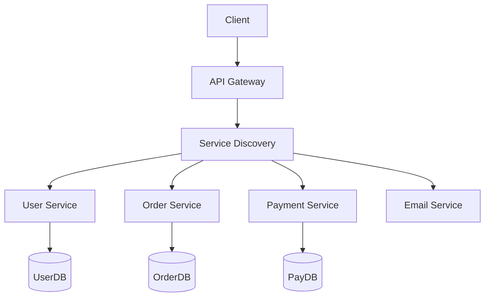

# Microservices, APIs & Minimal APIs

> [Mastery Guide](../../../README.md) › [Foundations](../../README.md) › [.NET Core Deep Dive](README.md)

| Status | Priority | Phase | Last reviewed |
|---|---|---|---|
| Not Started | High | Phase 3 — ASP.NET Core Fundamentals | 2026-05-07 |

> 📘 **Main file**: Interview-ready summary, drills, and cheat sheet live in **[REST & Web API](../../02-api-development/01-rest-and-web-api.md)**. This file is the implementation deep-dive.

---

## Why It Matters

Almost every .NET service you ship today is an API: REST for browsers, gRPC for service-to-service, event consumers for asynchronous flows, GraphQL for aggregated reads. The protocol changes, but the architectural questions stay the same — how do you model resources, version your contract, secure the perimeter, observe the system, and split (or not split) into microservices?

ASP.NET Core 6 introduced Minimal APIs; .NET 7 added route groups, typed results, and endpoint filters; .NET 8 brought form binding and AOT support; .NET 9 added route handler interceptors and faster startup; .NET 10 polished AOT, added `IFormFile` AOT support, and stabilised `RequestDelegateGenerator`. Choosing between MVC controllers and Minimal APIs is no longer a matter of "old vs new" — both are first-class, and each fits different scenarios.

This guide covers REST design fundamentals, the controller-vs-minimal decision matrix, microservices communication patterns (sync HTTP, async events, gRPC), API gateway / service-discovery basics, and the cross-cutting story (observability, resilience, contracts).

---

## Table of Contents

1. [Why It Matters](#why-it-matters)
2. [Real-World Analogy: The Restaurant Chain](#real-world-analogy-the-restaurant-chain)
3. [REST API Design Fundamentals](#rest-api-design-fundamentals)
4. [Microservices & APIs](#13-microservices--apis)
   - [Microservices Architecture](#microservices-architecture)
   - [Bounded Contexts and Service Boundaries](#bounded-contexts-and-service-boundaries)
   - [Communication Patterns](#communication-patterns)
   - [REST vs gRPC](#rest-vs-grpc)
   - [API Gateway and Service Discovery](#api-gateway-and-service-discovery)
   - [Cross-Cutting Concerns](#cross-cutting-concerns)
5. [Controllers vs Minimal APIs](#controllers-vs-minimal-apis)
6. [Minimal APIs](#22-minimal-apis)
   - [Basic Mapping](#basic-mapping)
   - [Route Groups](#route-groups)
   - [Endpoint Filters](#endpoint-filters)
   - [Typed Results and Problem Details](#typed-results-and-problem-details)
7. [Routing, Model Binding, and Filters](#routing-model-binding-and-filters)
8. [Common Pitfalls](#common-pitfalls)
9. [Best Practices](#best-practices)
10. [Real-World Scenarios](#real-world-scenarios)
11. [Interview Cross-Questioning Drill](#interview-cross-questioning-drill)
12. [Self-Test](#self-test)
13. [Cross-References](#cross-references)
14. [Sources](#sources)

---

## Real-World Analogy: The Restaurant Chain

Think of an API as a restaurant menu, and microservices as a chain of specialised restaurants sharing a courier network.

```
┌─────────────────────────────────────────────────────────────┐
│                    SINGLE-RESTAURANT (MONOLITH)             │
├─────────────────────────────────────────────────────────────┤
│                                                             │
│   One big kitchen handles EVERYTHING:                       │
│   ┌────────────────────────────────────┐                    │
│   │ Orders   ─┐                         │                    │
│   │ Cooking   │   One staff,           │                    │
│   │ Billing   │── one menu,             │                    │
│   │ Delivery  │   one POS system        │                    │
│   │ Inventory ┘                         │                    │
│   └────────────────────────────────────┘                    │
│                                                             │
│   ✓ Easy to coordinate                                      │
│   ✓ Single transaction = consistent                         │
│   ✗ One bug in billing crashes the whole place             │
│   ✗ Hard to scale: must hire master chef who does everything│
└─────────────────────────────────────────────────────────────┘

┌─────────────────────────────────────────────────────────────┐
│                  RESTAURANT CHAIN (MICROSERVICES)           │
├─────────────────────────────────────────────────────────────┤
│                                                             │
│        Customer (Client)                                    │
│            ↓                                                │
│        Front-of-house (API Gateway)                         │
│       ↙   ↓   ↘   ↘                                         │
│   Pizza  Sushi Drinks Billing                               │
│   Kitch  Kitch Bar    Office                                │
│   (Pizza  (Sushi (Bar   (Billing                            │
│    Svc)   Svc)   Svc)   Svc)                                │
│     │      │      │       │                                 │
│   Pizza  Sushi  Drinks  Billing                             │
│    DB     DB     DB      DB                                 │
│                                                             │
│   - Each kitchen owns its tools and recipes                 │
│   - They talk via tickets (sync) or a kitchen bell (async)  │
│   - One kitchen down ≠ whole chain down                     │
│   - Each scales independently (peak hours for sushi vs.    │
│     pizza differ)                                           │
└─────────────────────────────────────────────────────────────┘
```

Mapping the analogy:

| Restaurant concept | API / Microservice concept |
|---|---|
| Menu | API contract (OpenAPI / proto file) |
| Waiter taking your order | API endpoint receiving HTTP request |
| Specialised kitchen | Microservice / bounded context |
| Kitchen owns its pantry | Service owns its database |
| Kitchen bell broadcast | Event bus (Kafka / RabbitMQ) |
| Hand-off ticket | Synchronous REST/gRPC call |
| Front-of-house host | API gateway (YARP, Ocelot, Azure APIM) |
| GPS for delivery couriers | Service discovery |

---

## REST API Design Fundamentals

### Resource Modeling

REST is built around *resources* — nouns, not verbs. URL paths identify *what*; HTTP methods identify *what action*.

```
✗ NON-RESTFUL (verbs in path):
   GET  /api/getUserById?id=42
   POST /api/createOrder
   POST /api/cancelOrder?orderId=99

✓ RESTFUL (resources + methods):
   GET    /api/users/42         ← retrieve
   POST   /api/orders           ← create
   DELETE /api/orders/99        ← cancel (or PATCH status)
```

```
┌──────────────────┬──────────────────┬───────────────────────┐
│ HTTP Method      │ Semantic         │ Idempotent? Safe?     │
├──────────────────┼──────────────────┼───────────────────────┤
│ GET              │ Read             │ Yes / Yes             │
│ HEAD             │ Read headers     │ Yes / Yes             │
│ OPTIONS          │ Discovery / CORS │ Yes / Yes             │
│ POST             │ Create / action  │ No  / No              │
│ PUT              │ Replace          │ Yes / No              │
│ PATCH            │ Partial update   │ Often No / No         │
│ DELETE           │ Remove           │ Yes / No              │
└──────────────────┴──────────────────┴───────────────────────┘
```

- **Safe** = doesn't modify state.
- **Idempotent** = calling twice has the same effect as once.

### Status Code Discipline

```
2xx — Success
  200 OK              — got/updated something, body has data
  201 Created         — POST succeeded, Location header points to new URL
  202 Accepted        — request queued, will be processed async
  204 No Content      — DELETE/PUT succeeded, no body to return

3xx — Redirection (rare in APIs)
  301 Moved Permanently
  304 Not Modified    — used by caching with ETag/If-None-Match

4xx — Client errors (caller's fault, do NOT retry)
  400 Bad Request     — malformed input
  401 Unauthorized    — no/invalid auth token
  403 Forbidden       — authenticated but not allowed
  404 Not Found       — resource doesn't exist
  409 Conflict        — version mismatch, duplicate key
  422 Unprocessable   — semantically invalid (validation errors)
  429 Too Many Requests — rate-limited, Retry-After header

5xx — Server errors (our fault, may retry)
  500 Internal Server Error — uncaught exception
  502 Bad Gateway           — upstream broke
  503 Service Unavailable   — overloaded, dependency down
  504 Gateway Timeout       — upstream took too long
```

### HATEOAS (Hypermedia)

In strict REST (Roy Fielding's original Level-3 RESTful), responses include links to related actions:

```jsonc
{
  "id": 42,
  "status": "Pending",
  "total": 100.00,
  "_links": {
    "self":   { "href": "/api/orders/42" },
    "cancel": { "href": "/api/orders/42/cancel", "method": "POST" },
    "items":  { "href": "/api/orders/42/items" }
  }
}
```

In practice, HATEOAS is rare in modern .NET shops — most teams stop at Level 2 (resources + verbs + status codes). It re-emerges in JSON:API and Spring HATEOAS. Worth knowing the term for design discussions.

### Versioning

```
URL versioning:        /api/v1/orders          ✅ explicit, easy to route
Header versioning:     Accept: application/vnd.app.v2+json
Query versioning:      /api/orders?api-version=2.0
```

ASP.NET Core 8+: `Asp.Versioning.Mvc` and `Asp.Versioning.Http` packages support all three. URL versioning is the most common in .NET.

---

## 13. Microservices & APIs

### Microservices Architecture



Each service owns its own database — this is a non-negotiable rule. Sharing a database between services creates coupling at the data layer that defeats the entire architecture.

```
┌─────────────────────────────────────────────────────────┐
│ MICROSERVICE Properties                                 │
├─────────────────────────────────────────────────────────┤
│ ✓ Independently deployable                              │
│ ✓ Owns its data store                                   │
│ ✓ Loosely coupled, exchanges contracts only             │
│ ✓ Aligned to a business capability (bounded context)   │
│ ✓ Scales independently                                  │
│ ✓ Can be written in any language                        │
│ ✗ Network calls — latency, partial failure              │
│ ✗ Distributed transactions — must use sagas            │
│ ✗ Operational overhead (deploys, monitoring, tracing)   │
│ ✗ Eventual consistency — stale reads happen            │
└─────────────────────────────────────────────────────────┘
```

### Monolith vs Microservices

```
WITHOUT microservices (monolith):
┌─────────────────────────────────────────────────────────┐
│ One process. One DB. One deployment.                    │
│   ├─ Users module                                       │
│   ├─ Orders module                                      │
│   ├─ Payments module                                    │
│   └─ Email module                                       │
│                                                         │
│ ✓ Simple ops — one app to deploy and monitor            │
│ ✓ ACID transactions across modules                      │
│ ✓ Refactoring across modules is easy (compiler checks) │
│ ✗ Can't scale "Orders" alone — must scale entire app    │
│ ✗ Tech stack is locked in                               │
│ ✗ One bug in Email crashes Orders                       │
│ ✗ Slow CI: tests for everything on every commit         │
└─────────────────────────────────────────────────────────┘

WITH microservices:
┌─────────────────────────────────────────────────────────┐
│ Multiple processes. Multiple DBs. Multiple deployments. │
│   Users-svc       (C#, Postgres)                        │
│   Orders-svc      (C#, SQL Server)                      │
│   Payments-svc    (Go, Postgres)                        │
│   Email-svc       (Node.js, no DB — only consumes)     │
│                                                         │
│ ✓ Each scales to traffic shape                          │
│ ✓ Failure isolation: Email down → Orders still works   │
│ ✓ Teams own their stack and ship independently         │
│ ✗ Must run a service mesh, gateway, observability       │
│ ✗ Cross-service consistency is HARD (sagas, outbox)     │
│ ✗ "Distributed monolith" is the worst of both           │
└─────────────────────────────────────────────────────────┘
```

> **Heuristic**: start as a *modular monolith*. Extract microservices only when a clear pain (independent scaling, separate team, different tech stack) justifies the operational tax. The "monolith first" approach (Martin Fowler) is the prevailing 2026 wisdom.

### Bounded Contexts and Service Boundaries

A bounded context (DDD) is the *area within which a domain term has a single, unambiguous meaning*. Two contexts can use the same word and mean different things.

```
SHIPPING context:
  "Customer" = { name, address, deliveryInstructions }

BILLING context:
  "Customer" = { name, taxId, billingAddress, paymentMethods }

SUPPORT context:
  "Customer" = { name, ticketHistory, satisfactionScore }

→ Three different "Customer" entities, three different services.
  Each owns its slice; they synchronise via events ("CustomerRegistered",
  "CustomerAddressChanged").
```

Don't slice by technical layer (UI / API / data). Slice by business capability.

### Communication Patterns

```
┌──────────────┬─────────────────┬─────────────────────────┐
│ Pattern      │ Mechanism       │ When to use             │
├──────────────┼─────────────────┼─────────────────────────┤
│ Sync HTTP    │ REST / GraphQL  │ Public APIs, browsers,  │
│              │                 │ low-volume internal     │
│ Sync RPC     │ gRPC            │ High-perf service-svc   │
│ Async pub/sub│ Kafka, RabbitMQ │ Decoupling, fan-out     │
│ Async req-rsp│ NServiceBus,    │ Long-running, retries  │
│              │ MassTransit     │                         │
│ Streaming    │ gRPC streams,   │ Real-time data feeds    │
│              │ SignalR         │                         │
└──────────────┴─────────────────┴─────────────────────────┘
```

#### Synchronous (Request/Response)

```
Client ─── HTTP POST ──→ Service A ─── HTTP GET ──→ Service B
                              ↑                          │
                              └──────── 200 OK ─────────┘
```

- Pros: simple mental model, easy to debug, immediate response.
- Cons: latency adds up (chain of 5 calls × 50ms = 250ms), partial failure cascades, tight runtime coupling.

#### Asynchronous (Events)

```
Service A ── publishes ──→ [Event Bus] ──→ Service B (consumes)
                                    │
                                    └────→ Service C (consumes)
                                    │
                                    └────→ Service D (consumes)
```

- Pros: temporal decoupling (B can be down when A publishes), horizontal fan-out, natural retries.
- Cons: eventual consistency, message ordering issues, "where did my message go?" debugging, dual-writes problem (use outbox pattern).

#### When to choose which

```
Use SYNC HTTP/gRPC when:
✓ The caller cannot proceed without the result (auth check, inventory read)
✓ You need the response in the same user request (sub-100ms ideally)
✓ The data must be the latest version, never stale

Use ASYNC events when:
✓ Multiple consumers care about the same fact ("OrderPlaced")
✓ You want to decouple producer from consumer lifecycles
✓ Eventual consistency is acceptable (analytics, search index, email)
✓ You want natural retry / replay semantics
```

### REST vs gRPC

```
┌──────────────────┬──────────────────┬──────────────────┐
│ Feature          │ REST             │ gRPC             │
├──────────────────┼──────────────────┼──────────────────┤
│ Protocol         │ HTTP/1.1 or 2    │ HTTP/2 only      │
│ Format           │ JSON (text)      │ Protobuf (binary)│
│ Speed            │ Slower           │ Faster           │
│ Streaming        │ Limited          │ Full bi-direct.  │
│ Browser Support  │ Full             │ Limited (gRPC-Web)│
│ Contract         │ OpenAPI/Swagger  │ .proto files     │
│ Code Generation  │ Optional         │ Built-in         │
│ Use Case         │ Public APIs      │ Service-to-svc   │
│                  │ Web clients      │ High-performance │
│                  │ CRUD operations  │ Real-time comms  │
└──────────────────┴──────────────────┴──────────────────┘
```

```csharp
// REST API endpoint
[ApiController]
[Route("api/[controller]")]
public class UsersController : ControllerBase
{
    [HttpGet("{id}")]
    public async Task<ActionResult<User>> GetUser(int id)
    {
        var user = await _repo.GetByIdAsync(id);
        return user is null ? NotFound() : Ok(user);
    }
}

// gRPC service
public class UserGrpcService : UserService.UserServiceBase
{
    public override async Task<UserResponse> GetUser(
        UserRequest request, ServerCallContext context)
    {
        var user = await _repo.GetByIdAsync(request.Id);
        return new UserResponse { Name = user.Name, Email = user.Email };
    }
}
```

### Properties: REST

```
┌─────────────────────────────────────────────────────────┐
│ REST Properties                                         │
├─────────────────────────────────────────────────────────┤
│ ✓ Browser-friendly, ubiquitous tooling                  │
│ ✓ Human-readable JSON — easy debugging                  │
│ ✓ Cacheable via HTTP semantics                          │
│ ✓ Discoverable via OpenAPI                              │
│ ✗ Verbose payload (text, repeated keys)                 │
│ ✗ One round-trip per call (HTTP/1.1)                    │
│ ✗ No first-class streaming                              │
│ ✗ Schema drift risk without contract testing            │
└─────────────────────────────────────────────────────────┘
```

### Properties: gRPC

```
┌─────────────────────────────────────────────────────────┐
│ gRPC Properties                                         │
├─────────────────────────────────────────────────────────┤
│ ✓ Smaller payloads (protobuf binary)                    │
│ ✓ HTTP/2 multiplexing — no app-layer head-of-line block │
│ ✓ Bi-directional streaming                              │
│ ✓ Schema-first via .proto — contracts are enforced     │
│ ✓ Generated client/server stubs in 12+ languages       │
│ ✗ Browsers need gRPC-Web bridge or Connect protocol     │
│ ✗ Binary format — Wireshark / Postman less helpful      │
│ ✗ Cross-team training cost (protobuf, codegen)          │
│ ✗ Some load balancers/proxies don't fully support HTTP/2│
└─────────────────────────────────────────────────────────┘
```

### API Gateway and Service Discovery

#### API Gateway

```
       ┌────────────────────────────────────────────────┐
       │                CLIENT                          │
       └──────────────────────┬─────────────────────────┘
                              ↓ public DNS
       ┌────────────────────────────────────────────────┐
       │              API GATEWAY                       │
       │  ──────────────────────────────────────        │
       │  - TLS termination                              │
       │  - Authentication (JWT validation)              │
       │  - Rate limiting / quota enforcement            │
       │  - Request/response transformation              │
       │  - Routing: /api/users/* → users-svc           │
       │             /api/orders/* → orders-svc          │
       │  - Aggregation (BFF pattern)                    │
       │  - Logging / tracing                            │
       └──────┬──────────┬──────────┬───────────────────┘
              ↓          ↓          ↓
         users-svc   orders-svc  payments-svc
```

**.NET options:**
- **YARP** (Yet Another Reverse Proxy) — Microsoft's library; embed in your own ASP.NET Core app.
- **Ocelot** — older but still maintained.
- **Azure API Management**, **AWS API Gateway**, **Kong**, **Traefik** — managed/cloud options.

#### Service Discovery

In a containerised world, service IPs change. Discovery answers "where is `users-svc` right now?".

```
┌──────────────────┬────────────────────────────────────┐
│ Approach         │ How                                │
├──────────────────┼────────────────────────────────────┤
│ DNS-based        │ K8s ClusterIP services             │
│                  │ http://users-svc/api/...           │
│ Client-side      │ Consul, Eureka, etcd               │
│ Server-side LB   │ K8s, AWS ALB, Azure App GW         │
│ Service mesh     │ Istio, Linkerd, Consul Connect    │
└──────────────────┴────────────────────────────────────┘
```

`Microsoft.Extensions.ServiceDiscovery` (`AddServiceDiscovery()`) shipped in .NET 8 — it's the official client-side discovery abstraction, integrating with Kubernetes, Consul, and Azure App Configuration.

### Cross-Cutting Concerns

#### Observability — the Three Pillars

```
┌──────────────┬──────────────────┬────────────────────────┐
│ Pillar       │ Tool (.NET)      │ Answers                │
├──────────────┼──────────────────┼────────────────────────┤
│ Logs         │ ILogger + Serilog│ "What happened?"       │
│ Metrics      │ System.Diagnostics│ "How much/often?"     │
│              │ .Metrics         │                        │
│ Traces       │ Activity / OTel  │ "Where did time go?"   │
└──────────────┴──────────────────┴────────────────────────┘
```

```csharp
// .NET 8+: OpenTelemetry first-class
builder.Services.AddOpenTelemetry()
    .ConfigureResource(r => r.AddService("orders-svc"))
    .WithTracing(t => t
        .AddAspNetCoreInstrumentation()
        .AddHttpClientInstrumentation()
        .AddEntityFrameworkCoreInstrumentation()
        .AddOtlpExporter())
    .WithMetrics(m => m
        .AddAspNetCoreInstrumentation()
        .AddRuntimeInstrumentation()
        .AddOtlpExporter());
```

A trace ID propagates across HTTP and gRPC boundaries via the `traceparent` header — letting you see "Order POST → Auth → Inventory → DB" as one timeline in Jaeger/Tempo/Honeycomb.

#### Resilience

```csharp
// .NET 8+ Polly v8: AddStandardResilienceHandler
builder.Services.AddHttpClient<IInventoryClient, InventoryClient>()
    .AddStandardResilienceHandler(); // retry + circuit-breaker + timeout + bulkhead
```

The `Standard` pipeline includes:
- **Retry** with exponential backoff (default 3 retries).
- **Circuit breaker** that opens after 50% failure rate in 30s.
- **Timeout** per attempt (10s) + total (30s).
- **Bulkhead** capping concurrent requests.

#### Security

- **AuthN at the gateway** — single JWT/OIDC validation point.
- **AuthZ in each service** — claims-based, fine-grained.
- **mTLS between services** — service mesh handles this automatically (Istio, Linkerd).
- **Secrets** — Azure Key Vault / AWS Secrets Manager, never in config files.

---

## Controllers vs Minimal APIs

```
┌───────────────────────┬──────────────────────────────────┐
│ Use Controllers when  │ Use Minimal APIs when            │
├───────────────────────┼──────────────────────────────────┤
│ Existing MVC codebase │ Greenfield microservice          │
│ Complex model binding │ Simple CRUD / proxies            │
│ Action filters needed │ Endpoint filters are enough      │
│ Action constraints    │ Performance-critical (lower alloc)│
│ View / Razor / SPA    │ JSON-only API                    │
│ OData / heavy MVC     │ Native AOT target                 │
│ Junior team training  │ Functional style preferred       │
└───────────────────────┴──────────────────────────────────┘
```

```
PERFORMANCE COMPARISON (.NET 10, simple GET endpoint, TechEmpower-style):
┌───────────────────────┬──────────────┬──────────────────┐
│ Style                 │ RPS          │ Allocations      │
├───────────────────────┼──────────────┼──────────────────┤
│ MVC Controller        │ ~520k        │ baseline         │
│ Minimal API           │ ~620k        │ ~30% less        │
│ Minimal API + AOT     │ ~720k        │ ~50% less        │
└───────────────────────┴──────────────┴──────────────────┘
(approximate; actual varies by workload)
```

---

## 22. Minimal APIs

> **Difficulty:** Beginner to Intermediate | **Reading Time:** ~8 min

### Basic Mapping

```csharp
// Minimal API (less ceremony):
app.MapGet("/api/products", async (IProductService service) =>
    Results.Ok(await service.GetAllAsync()));

app.MapGet("/api/products/{id}", async (int id, IProductService service) =>
    await service.GetByIdAsync(id) is Product p
        ? Results.Ok(p)
        : Results.NotFound());

app.MapPost("/api/products", async (CreateProductRequest req, IProductService service) =>
{
    var product = await service.CreateAsync(req);
    return Results.Created($"/api/products/{product.Id}", product);
});
```

### Route Groups

```csharp
// Route groups (.NET 7+):
var products = app.MapGroup("/api/products")
    .RequireAuthorization()
    .WithTags("Products");

products.MapGet("/", GetAll);
products.MapGet("/{id}", GetById);
products.MapPost("/", Create);
```

A `MapGroup` lets you apply common metadata (auth, tags, versioning, rate limits) to a *subtree* of endpoints. Compose them:

```csharp
var v1 = app.MapGroup("/api/v1");
var products = v1.MapGroup("/products").RequireAuthorization("ReadProducts");
var admin    = v1.MapGroup("/admin").RequireAuthorization("Admin");
```

### Endpoint Filters

```csharp
// Endpoint filters:
products.MapGet("/", GetAll)
    .AddEndpointFilter(async (context, next) =>
    {
        var sw = Stopwatch.StartNew();
        var result = await next(context);
        Console.WriteLine($"Took {sw.ElapsedMilliseconds}ms");
        return result;
    })
    .CacheOutput("Products");
```

Endpoint filters are the Minimal-API analogue to MVC action filters. They run *after* model binding and *before* the handler, and run in registration order. Common uses: logging, validation, request enrichment, response shaping.

### Typed Results and Problem Details

```csharp
// Pre-.NET 7: returned IResult, not statically typed
app.MapGet("/users/{id}", async (int id, IUserSvc svc) =>
{
    var user = await svc.GetAsync(id);
    return user is null ? Results.NotFound() : Results.Ok(user);
});

// .NET 7+: TypedResults — better OpenAPI, AOT-safe, easier testing
app.MapGet("/users/{id}",
    async Task<Results<Ok<User>, NotFound>> (int id, IUserSvc svc) =>
{
    var user = await svc.GetAsync(id);
    return user is null
        ? TypedResults.NotFound()
        : TypedResults.Ok(user);
});
```

`TypedResults` is the recommended modern approach: the return type encodes every possible status, OpenAPI generation gets correct schemas, and tests can pattern-match on the result without going through `IResult`.

For errors, RFC 9457 Problem Details (formerly RFC 7807):

```csharp
app.UseExceptionHandler();
builder.Services.AddProblemDetails();
// app throws → middleware emits application/problem+json with type, title,
// status, detail, instance, plus your custom extensions.
```

### Comparison Table

```
+-------------------+-------------------------------+
| Minimal APIs      | Controllers                   |
+-------------------+-------------------------------+
| Microservices     | Large/complex APIs             |
| Simple CRUD       | Multiple related endpoints     |
| Prototyping       | Need model binding, filters    |
| Small projects    | Existing MVC codebase          |
+-------------------+-------------------------------+
```

---

## Routing, Model Binding, and Filters

### Routing — Conventional vs Attribute vs Minimal

```csharp
// Conventional (MVC, Razor — declines in popularity for APIs)
app.MapControllerRoute("default", "{controller=Home}/{action=Index}/{id?}");

// Attribute (most common for Web API controllers)
[Route("api/[controller]")]
public class OrdersController : ControllerBase
{
    [HttpGet("{id:int:min(1)}")]   // route constraints
    public IActionResult Get(int id) => Ok();
}

// Minimal API
app.MapGet("/api/orders/{id:int:min(1)}", (int id) => Results.Ok(id));
```

Route templates support **constraints** (`int`, `guid`, `min(1)`, `regex(...)`, custom).

### Model Binding Sources

```
┌──────────────┬────────────────────────────────────────┐
│ Attribute    │ Reads from                             │
├──────────────┼────────────────────────────────────────┤
│ [FromRoute]  │ URL path segment                       │
│ [FromQuery]  │ ?name=value                            │
│ [FromHeader] │ HTTP header                            │
│ [FromBody]   │ Request body (JSON, XML)               │
│ [FromForm]   │ multipart/form-data, x-www-form-urlencoded │
│ [FromServices]│ DI container (rarely needed in .NET 7+) │
│ [FromKeyedServices("k")] │ Keyed DI (.NET 8+)         │
└──────────────┴────────────────────────────────────────┘
```

In Minimal APIs, the source is *inferred*:

```csharp
app.MapPost("/orders/{id}",
    (int id,                      // route — inferred
     [FromQuery] string source,    // query — explicit
     CreateOrder body,             // body — inferred (complex type)
     IOrderService svc,            // DI — inferred
     CancellationToken ct) =>      // framework — inferred
        svc.CreateAsync(id, body, ct));
```

### Custom Model Binding

```csharp
// Implement TryParse for your type to enable route binding
public record OrderId(Guid Value)
{
    public static bool TryParse(string? s, out OrderId result)
    {
        if (Guid.TryParse(s, out var g)) { result = new(g); return true; }
        result = default!; return false;
    }
}

app.MapGet("/orders/{id}", (OrderId id) => Results.Ok(id));
// /orders/abc → 400; /orders/<valid-guid> → 200
```

### Filters and the Pipeline

```
┌─ Request arrives ──→ Routing ──→ Authorization ──→ CORS ──→ Endpoint
                                                                 ↓
                                                          [Endpoint Filters]
                                                                 ↓
                                                              Handler
                                                                 ↓
                                                          [Endpoint Filters]
                                                                 ↓
                                                          Result formatting ──→ Response
```

Filter order: outermost-registered runs first on the request, last on the response.

---

## Common Pitfalls

### 1. Distributed Monolith

Multiple services that *must* be deployed together because they synchronously call each other. You paid the cost of microservices and got none of the benefits.

```
Ord-svc → User-svc → Pref-svc → Bill-svc → Tax-svc
   any one down = whole flow dead
```

**Fix:** Make calls async (events) or merge tightly-coupled services back together.

### 2. Sharing a Database

Two services hitting one schema is a *shared kernel*, not microservices. A schema migration breaks both. Each service must own its own DB and expose data only via API/events.

### 3. Chattiness Over the Network

Minimal-API endpoint that loops calling another service:

```csharp
foreach (var orderId in orderIds)               // N orders
    await _userClient.GetUserAsync(orderId);    // → N HTTP calls
```

**Fix:** Add a batch endpoint, or fetch via a single join in the upstream service, or denormalise via an event.

### 4. Returning Domain Entities as DTOs

Leaking your EF entity directly to the wire couples the wire format to your storage schema. Add a navigation property → it serialises and explodes JSON size.

**Fix:** Define DTOs (`record OrderResponse(...)`); use `Mapster` or `AutoMapper`.

### 5. Inconsistent Status Codes

Returning `200 OK` with `{ "success": false, "error": "..." }`. The client now needs to parse the body to know success. Use proper HTTP semantics: `4xx` for client errors, `5xx` for server.

### 6. Forgetting `CancellationToken`

```csharp
// ❌ Long query keeps running after the client disconnects
app.MapGet("/report", async (IRepo repo) => await repo.HeavyQuery());

// ✅ Cancel work when the client disconnects
app.MapGet("/report",
    async (IRepo repo, CancellationToken ct) => await repo.HeavyQuery(ct));
```

### 7. CORS Configured Too Permissively

```csharp
app.UseCors(p => p.AllowAnyOrigin().AllowAnyMethod().AllowAnyHeader()); // ❌ in prod
```

This breaks browser security. Whitelist origins explicitly.

### 8. JSON Cycle / Self-Reference Crash

EF entities with navigation cycles → `System.Text.Json` throws "object cycle detected". Either DTO-map first, or set `ReferenceHandler.IgnoreCycles`.

### 9. Versioning Too Late

Releasing v1, then needing a breaking change with no version scheme in place. Plan v1 *with* the URL/header strategy from day one — even if you only ever ship one version.

### 10. Mixing Sync and Async Calls Through a Chain

```
Client ──→ A (async) ──→ B (sync HTTP) ──→ C (async) ──→ D
```

The synchronous middle hop is the weak link. Make it async-fire-and-forget if D's result isn't on the critical path.

### 11. No Idempotency Keys on POST

Network retry → double-charge. Require `Idempotency-Key` header on `POST` and short-circuit replays.

### 12. OpenAPI Drift

Docs and reality diverge because the OpenAPI is hand-written. Always *generate* OpenAPI from the code (Swashbuckle / NSwag / `Microsoft.AspNetCore.OpenApi` in .NET 9+), and contract-test against it.

---

## Best Practices

1. **Start as a modular monolith.** Extract a microservice only when scaling, team boundary, or stack diversity *forces* you to.
2. **One service = one bounded context = one database.** Never share schemas.
3. **Default to async events for inter-service comms.** Reach for sync REST/gRPC only when you need an immediate result.
4. **Use gRPC for hot internal paths**, REST for public/browser-facing.
5. **Always include `CancellationToken`** in every endpoint and downstream call.
6. **Use `TypedResults` in Minimal APIs** for better OpenAPI and AOT.
7. **Generate OpenAPI from code** (`AddOpenApi()` in .NET 9+) and publish it as part of CI.
8. **Validate inputs at the boundary** — FluentValidation or `[Validate]`/`MiniValidation` in Minimal APIs.
9. **Centralise error handling** — `UseExceptionHandler` + Problem Details, not try/catch in every handler.
10. **Add `AddStandardResilienceHandler()`** to every outbound HttpClient.
11. **Wire OpenTelemetry from day one** — traces propagate via headers automatically.
12. **Version from v1.** URL versioning is simplest in .NET.
13. **Idempotency keys on POST/DELETE** that change state.
14. **Health checks** (`MapHealthChecks("/health")`) — separate liveness vs readiness.
15. **Rate-limit at the gateway**, not per-service (per-service rate limiting still useful for noisy-neighbour protection).

---

## Real-World Scenarios

### Scenario 1: Extracting the First Microservice from a Monolith

**Context:** A 200K-LOC e-commerce monolith. Black-Friday traffic spikes overload the order-placement path. Search and browsing are fine. The team wants to extract Orders.

**Approach:**

```
Step 1 — Identify boundaries:
    What does Orders own?  Order, OrderLine, OrderStatus, Cart-checkout endpoint.
    What does it depend on? User profile (read-only), Inventory (decrement),
                            Pricing (read-only), Payments (charge).

Step 2 — Strangle, don't rewrite:
    - Build orders-svc alongside the monolith.
    - Route POST /api/orders via gateway to orders-svc.
    - GET /api/orders still served from monolith for now.

Step 3 — Data migration:
    - orders-svc gets its own DB.
    - Use change-data-capture (Debezium / SQL Server CDC) to replicate
      the legacy Orders table into the new DB until cutover.
    - On cutover, freeze writes for 60s, switch reads.

Step 4 — Replace synchronous calls with events:
    - Inventory check still sync (need answer immediately).
    - User profile read via an in-memory cache populated by
      "UserUpdated" events from User-svc.
    - "OrderPlaced" event published → consumed by Email, Analytics, Loyalty.

Step 5 — Decommission:
    - When 100% of order traffic flows through orders-svc, delete the
      monolith's order code path.
```

**Key decisions:**
- **Strangler-fig** over big-bang rewrite — risk-controlled, reversible.
- **Sync for inventory, async for everything else** — minimum sync surface.
- **CDC for data migration** — zero-downtime cutover.

### Scenario 2: Choosing Sync HTTP vs Async Event vs gRPC

**Context:** New `Pricing-svc` exposes `GetPriceAsync(productId, customerId, currency)`. Three callers want it: the Catalog API (browser), the Recommendation engine (offline batch), and the Checkout-svc (sync user request).

| Caller | Latency budget | Volume | Choice | Why |
|---|---|---|---|---|
| Catalog API | <50ms | 5k rps | **REST** | Browser-facing, JSON friendly, OpenAPI for SDK |
| Checkout-svc | <30ms | 500 rps | **gRPC** | Hot path, internal, latency-sensitive |
| Recommendation | minutes (batch) | 1M items/hr | **Event consumer** | "PriceChanged" events feed a local cache; no per-call lookup |

The same business logic ships in three flavours: a REST controller, a gRPC service, and an outbound event publisher.

### Scenario 3: API Gateway with YARP for Multiple Backends

**Problem:** Three backends (`legacy-monolith`, `users-svc`, `orders-svc`); single public host `api.example.com`.

```csharp
// Program.cs of the gateway
builder.Services.AddReverseProxy()
    .LoadFromConfig(builder.Configuration.GetSection("ReverseProxy"))
    .AddTransforms(transforms =>
    {
        transforms.AddRequestTransform(ctx =>
        {
            // attach correlation id
            ctx.ProxyRequest.Headers.Add("X-Correlation-Id",
                ctx.HttpContext.TraceIdentifier);
            return ValueTask.CompletedTask;
        });
    });

app.MapReverseProxy();
```

```yaml
# appsettings.json (excerpt)
ReverseProxy:
  Routes:
    users:
      ClusterId: users-cluster
      Match:    { Path: "/api/users/{**catch-all}" }
    orders:
      ClusterId: orders-cluster
      Match:    { Path: "/api/orders/{**catch-all}" }
    fallback:
      ClusterId: legacy-cluster
      Match:    { Path: "{**catch-all}" }
  Clusters:
    users-cluster:
      Destinations: { d1: { Address: "http://users-svc/" } }
    orders-cluster:
      Destinations: { d1: { Address: "http://orders-svc/" } }
    legacy-cluster:
      Destinations: { d1: { Address: "http://legacy-monolith/" } }
```

This is the strangler-fig in production: legacy still serves anything new services don't claim, and you migrate route-by-route.

### Scenario 4: Native-AOT Microservice for Cold-Start-Sensitive Workload

**Problem:** Lambda-style function answering /health and /predict from a 5MB ML model. Cold start needs to be <100ms.

**Approach:**

```xml
<PropertyGroup>
  <PublishAot>true</PublishAot>
  <TrimMode>full</TrimMode>
  <InvariantGlobalization>true</InvariantGlobalization>
</PropertyGroup>
```

- Use Minimal APIs (controllers don't AOT cleanly).
- Use `TypedResults` for OpenAPI/serialiser AOT.
- Use `[JsonSerializable]` source-generated `JsonSerializerContext` for DTO types.
- Avoid reflection-based libraries (AutoMapper, Newtonsoft.Json).

Result: ~50ms cold start, ~30MB memory baseline — vs ~400ms / 80MB for the same code on the JIT runtime.

---

## Interview Cross-Questioning Drill

<details>
<summary>📖 Click to expand — cross-question chains (~15-20 min, cover answers and write cold)</summary>

> ⚠️ **Honest caveat**: reading this once doesn't make you interview-ready. Cover the answers, write them cold, then check. Pair with a senior for live mock cross-questioning. The guide removes "I never thought about that" surprises; mock interviews convert knowledge into reflex. Both are needed.

Each drill is **Q → A → Cross-Q → A → Cross-Q² → A**. Practice answering the cross-questions without re-reading. If you stumble on any cross-Q², go re-read the relevant section.
### Drill 1 — REST vs RPC

> **Q**: When does REST shine and when does RPC?
>
> **A**: REST shines for **resource-oriented public APIs** — browser-facing, cacheable via HTTP semantics, discoverable via OpenAPI, no codegen needed. RPC (gRPC) shines for **action-oriented internal calls** — high throughput, strict contracts, bi-directional streaming, multi-language codegen.
>
> **Cross-Q**: Can you point to a "verb" that doesn't fit REST cleanly?
>
> **A**: Anything that isn't CRUD. "Send email," "process payment," "calculate-route" — these are RPC operations being shoehorned into REST as `POST /emails`, `POST /payments`, `POST /route-calculations`. The endpoint name is a noun-form gymnastic; the actual semantics are "do this action." That's fine — REST tolerates action endpoints — but it's a smell that maybe gRPC fits better.
>
> **Cross-Q²**: GraphQL claims to be neither REST nor RPC — where does it sit?
>
> **A**: It's its own paradigm: **query-language-over-HTTP**. One endpoint (`/graphql`), POST a query describing exactly what fields you want, server returns just that. Solves over-fetching/under-fetching that REST suffers with deep resource graphs. Trade-offs: caching becomes harder (every query is different), N+1 in resolvers is a real risk (DataLoader required), authorization at field-level not endpoint-level. .NET has Hot Chocolate as the leading server. Pick GraphQL when clients are wildly diverse (web + mobile + integrations) and need different shapes of the same data.

### Drill 2 — Idempotency

> **Q**: What makes an HTTP method idempotent, and which verbs are?
>
> **A**: Idempotent = calling N times has the same observable effect as calling once. **GET, HEAD, OPTIONS, PUT, DELETE** are idempotent. **POST and PATCH** are not (by default). The contract is about *server-side state*, not response identity.
>
> **Cross-Q**: But `DELETE /orders/42` returns 404 on the second call — same state but different response. Idempotent?
>
> **A**: Yes — the **state** is the same (order 42 is gone) after the first call; subsequent calls don't change state further. The 404 is a status describing the request, not a state change. Idempotency cares about effect on resources, not whether the response code is identical. Some APIs return 204 on every DELETE (idempotent in response too) by treating "delete non-existent" as success.
>
> **Cross-Q²**: How do I make `POST /payments` idempotent for retries?
>
> **A**: Require an `Idempotency-Key` header. Server stores `(key, response)` for some TTL; if the same key arrives again, return the stored response without re-executing. Stripe popularized this pattern. Implementation: hash the key → look up in Redis → if hit, return cached response; if miss, execute, store, return. The key is client-generated (UUID per request) so retries (network timeout, 502) reuse the same key. Without this, a network retry double-charges.

### Drill 3 — Versioning

> **Q**: URL vs header vs media-type versioning — which is best?
>
> **A**: **URL** (`/api/v1/...`) is most explicit, easiest to route, easiest for clients to see. **Header** (`X-API-Version: 2.0`) keeps URLs clean but is invisible in logs and harder to test in browsers. **Media-type** (`Accept: application/vnd.app.v2+json`) is the most "RESTful" per Roy Fielding but rarely used in practice. URL versioning wins on pragmatism in 90% of .NET shops.
>
> **Cross-Q**: Doesn't URL versioning violate REST principles (a URI should identify a resource, not a version of it)?
>
> **A**: Strictly yes. Fielding argues that `/orders/42` is the resource; `v1`, `v2` are *representations* of it and belong in `Accept`. In practice, URL versioning won because routers, gateways, monitoring, and caching all treat URLs as the natural sharding key — splitting deployments by version, applying different policies per version, etc. The purity-vs-pragmatism trade falls on pragmatism.
>
> **Cross-Q²**: How do you sunset v1?
>
> **A**: A three-phase rollout: (1) **announce** — communicate to clients with a sunset header `Sunset: Sat, 01 Jan 2027 00:00:00 GMT` and changelog; (2) **deprecate** — log every v1 call with the caller (User-Agent, API key) so you can identify holdouts; (3) **terminate** — return 410 Gone (not 404) for v1 endpoints after the date. The whole timeline is usually 6-18 months. Some APIs (Stripe) never sunset — they version forever via the `Stripe-Version` header.

### Drill 4 — Minimal API vs Controller

> **Q**: When do you reach for a Controller over a Minimal API endpoint?
>
> **A**: **Complex action filters** (multiple cross-cutting concerns layered: auth + validation + logging + caching), **model binding heavy lifting** (file uploads, multipart, custom binders), **existing MVC team conventions**, **OData / view-server scenarios**. Minimal APIs fit greenfield microservices, JSON-only CRUD, AOT-compiled cold-start-sensitive services.
>
> **Cross-Q**: Are there perf differences?
>
> **A**: Yes. Minimal APIs allocate ~30% less (no controller instantiation, no `IActionResult` wrapping, source-generated `RequestDelegate`). For TechEmpower-style microbenchmarks, Minimal API hits ~620k RPS vs Controllers at ~520k. Native-AOT Minimal API pushes to ~720k. For real apps (DB calls, business logic), the framework overhead is <5% of total request time — perf is rarely the deciding factor.
>
> **Cross-Q²**: Can I mix both in the same app?
>
> **A**: Yes — the routing system unifies them. `app.MapControllers()` registers MVC controllers as endpoints; `app.MapGet(...)` adds Minimal API endpoints alongside. They share the same middleware pipeline, the same DI, the same OpenAPI generation. The pragmatic pattern: Minimal API for new microservices, keep Controllers in existing apps, don't migrate just for migration's sake.

### Drill 5 — Microservice boundary

> **Q**: How do you draw a microservice boundary?
>
> **A**: Around a **bounded context** (DDD) — the area where a domain term has a single, unambiguous meaning. "Customer" in shipping (address, preferences) is different from "Customer" in billing (taxId, payment methods). Each becomes its own service, with its own database, communicating via events when they need to stay aligned.
>
> **Cross-Q**: What about cross-cutting concerns like "Customer" data — do I duplicate?
>
> **A**: Yes — deliberately. Each context owns its slice. Shipping holds the address it cares about; billing holds the tax info it cares about. They synchronize via events ("CustomerRegistered," "AddressChanged"). The duplication is the price of independence; the alternative (shared schema, foreign keys across services) is a distributed monolith.
>
> **Cross-Q²**: How small is "too small" for a service?
>
> **A**: When the operational overhead (deploy, monitor, alert, on-call) exceeds the value of independence. Nano-services — one function per service, dozens of services for what should be one bounded context — multiply the overhead without multiplying the autonomy. The 2026 wisdom: start with a modular monolith, extract a service when you have a real reason (scaling pressure, team boundary, tech stack divergence). "Monolith first" beats "microservices everywhere" for most teams.

### Drill 6 — Sync vs async between services

> **Q**: When do you choose sync HTTP/gRPC vs async events?
>
> **A**: **Sync** when the caller can't proceed without the result (auth check, inventory verification before order placement), when freshness is non-negotiable (latest price), when latency budget is tight (<100ms). **Async events** when multiple consumers care about the same fact (OrderPlaced → email, analytics, search index), when eventual consistency is acceptable, when producer and consumer should be temporally decoupled.
>
> **Cross-Q**: A chain of three sync calls — A → B → C → D. What's the failure mode?
>
> **A**: Latency adds up (3 hops × 50ms = 150ms minimum). Any one hop failing fails the whole chain. Partial failure (B answers, C times out) leaves A in an indeterminate state. Operational confusion: when the user sees an error, which service was at fault? This is the **distributed monolith** smell — services are split but coupling is preserved. Mitigations: convert middle hops to async events, denormalize data into A's cache via events, use Saga patterns for orchestrated workflows.
>
> **Cross-Q²**: Async events solve coupling but introduce the **dual-write problem**. What is it and how do I fix it?
>
> **A**: Dual-write: "save to DB AND publish event" must be atomic. If you save then publish and the broker is down, you have data without notification. If you publish then save and the DB rolls back, consumers act on a non-existent fact. **Outbox pattern** fixes it: in the same DB transaction as your business write, insert an `OutboxMessages` row with the event payload. A background poller reads outbox rows and publishes them, marking sent. Now publish-or-save is atomic (same transaction), and publish-success is eventually consistent. Tools: Wolverine, Cap.NET, MassTransit Outbox.

### Drill 7 — gRPC

> **Q**: When does gRPC win over REST?
>
> **A**: Hot internal paths needing <30ms latency at high throughput. Bi-directional streaming (chat, telemetry, live dashboards). Strict, generated contracts across many languages (Go + Python + .NET microservices sharing a `.proto`). HTTP/2 multiplexing avoiding application-layer head-of-line blocking across streams (a lost TCP segment still stalls every stream — that limit is TCP's). Smaller binary payloads than JSON.
>
> **Cross-Q**: Why isn't gRPC more popular for public APIs?
>
> **A**: Browser support is awkward (raw gRPC requires HTTP/2 with trailers, which browsers don't expose; you need gRPC-Web bridges or Connect protocol). Tooling is more rigid (need protoc, codegen step in CI, .proto-as-source-of-truth). Debugging is harder (binary, not curl-able). Caching is HTTP-1-style and doesn't compose with the gRPC model. Public APIs prioritize accessibility; gRPC prioritizes performance — different optimization targets.
>
> **Cross-Q²**: I have a gRPC service. How do I version the contract?
>
> **A**: Two layers. **Field-level**: never renumber or reuse field tags in `.proto` — always add new fields with new tag numbers, mark removed fields `reserved`. Old clients ignore new fields; new clients see defaults for old fields. **Service-level**: when breaking, create `package myapp.v2;` with a new fully-qualified service name. Run v1 and v2 side by side until migration completes. Avoid breaking changes; the discipline pays off massively in a polyglot environment.

### Drill 8 — Service mesh

> **Q**: What does a service mesh solve that an SDK in each service doesn't?
>
> **A**: **Cross-cutting concerns at the network layer** without changes to each service: mTLS between services (zero-trust), retry/timeout/circuit-breaker policies, traffic shifting (canary, blue-green) by config, fine-grained authz at the proxy, automatic telemetry (every call traced, every metric collected). Move the policy out of code and into the sidecar (Istio, Linkerd) or service network (Consul Connect).
>
> **Cross-Q**: What does it NOT solve?
>
> **A**: Application-level concerns. Business logic, domain validation, structured error handling, saga orchestration — all still your code. The mesh doesn't know what a "valid order" is or which retry codes should trigger a saga rollback. It also doesn't help with async/event-bus communication (Kafka, RabbitMQ) — those are out-of-mesh. The mesh's value is binary: synchronous calls between services on the same network. Async paths still need outbox, idempotency keys, and replay logic in code.
>
> **Cross-Q²**: My team is 5 services. Do I need a mesh?
>
> **A**: Probably not. For 5 services, configure resilience in code (Polly's `AddStandardResilienceHandler`), set up OpenTelemetry, use HTTPS with cert pinning, done. Mesh overhead (Istio sidecar adds ~50MB RAM, ~5ms p99 latency) buys little. Mesh becomes worth it around 20+ services or when policies must change without redeploys. Reach for it because of a real pain, not because the architecture diagram in the conference talk has one.

### Drill 9 — Distributed transactions

> **Q**: How do you handle distributed transactions in microservices — 2PC or saga?
>
> **A**: **Saga, almost always.** Two-phase commit (2PC) requires a transaction coordinator across services, locks resources during the prepare phase, and falls apart when one service is slow/down (the coordinator times out the whole transaction). Saga uses **a sequence of local transactions** with compensating actions for rollback — eventually consistent, no global lock, services stay autonomous.
>
> **Cross-Q**: Orchestration vs choreography sagas — which?
>
> **A**: **Orchestration**: a saga manager (one service) sends commands to each participant and reacts to their replies. Pros: visible flow, easier debugging. Cons: orchestrator is a coupling hotspot. **Choreography**: services publish events; other services react. Pros: no central coordinator. Cons: business flow is implicit in event subscriptions — debug by reading all the consumers. Orchestration for complex workflows (multi-step ordering); choreography for simple fan-out (notifications, analytics).
>
> **Cross-Q²**: A saga is mid-flight when a service deploys with a breaking change. What happens?
>
> **A**: The saga is in flight in the *old* message format; the new service deserializes differently or rejects the message. Either the saga gets stuck (compensation step never executes) or the wrong compensation runs. Mitigations: (a) version messages and run multiple consumers in parallel during transitions; (b) require all sagas to complete or be force-completed before a breaking deploy; (c) make schema changes additive-only (never break the wire). In practice, (c) is the only sustainable answer — break-no-evolve discipline.

### Drill 10 — API gateway

> **Q**: What should an API gateway do?
>
> **A**: TLS termination, authentication (validate JWT), rate limiting, request routing (URL → service), response aggregation (BFF pattern), basic transformations (header rewriting), correlation-ID injection, cross-origin (CORS) policy enforcement. It's the single ingress point — observable, secured, and where you enforce coarse-grained policies.
>
> **Cross-Q**: What should NOT be in the gateway?
>
> **A**: **Business logic** (validation, calculation, decisions). **Service-specific authz** (fine-grained "can this user delete this order?" — too contextual). **Heavy aggregation** (joining N service responses into one — that's a BFF service, not the gateway). **Database access** (the gateway is stateless edge). Each of these belongs in the services themselves; bloating the gateway makes it a deployment bottleneck and a single point of operational failure.
>
> **Cross-Q²**: YARP vs Ocelot vs Azure API Management — quick picks?
>
> **A**: **YARP**: embed-in-your-app reverse proxy, code-driven configuration, lowest overhead, requires you to host. **Ocelot**: similar feature set, configuration-file driven, slightly older, smaller community. **Azure APIM / AWS API Gateway / Kong**: managed services with rich features (dev portal, monetization, policies, transformations) and a price. For small teams: YARP in a dedicated ASP.NET Core gateway. For enterprise with API products: managed. For specific needs (transformation-heavy, multi-protocol): Kong/Traefik. Start with YARP, graduate when you hit its limits.

### Drill 11 — Bulkhead

> **Q**: What does the bulkhead pattern isolate?
>
> **A**: It limits the number of concurrent calls to a downstream service, **isolating one slow dependency from consuming all your threads/connections**. Without it, a slow Payment service ties up every thread that's waiting for it, starving requests that don't need Payment. With it, only N requests can be in-flight to Payment at any time; the rest fail-fast or queue with a timeout.
>
> **Cross-Q**: How is bulkhead different from circuit breaker?
>
> **A**: Bulkhead limits **concurrent volume** (only N calls allowed at once); circuit breaker limits **failure cascade** (after K failures, fast-fail without trying). They complement: bulkhead prevents resource exhaustion under load; circuit breaker prevents pointless retries on a known-broken downstream. Polly v8's `AddStandardResilienceHandler` bundles both — bulkhead caps concurrency, circuit breaker opens on high error rates.
>
> **Cross-Q²**: How do you size the bulkhead?
>
> **A**: As a function of (downstream capacity × your service's share). If Payment can handle 100 RPS and you're one of four consumers, your bulkhead is ~25 concurrent calls. Too small: your own throughput is capped artificially. Too big: you contribute to overwhelming Payment. In practice, monitor and tune — start conservative (10-20), watch p99 latency and error rates, increase gradually. Plus: set a queue length cap so requests fail-fast when bulkhead is saturated rather than queuing for seconds.

### Drill 12 — Schema-first vs code-first APIs

> **Q**: Schema-first (`.proto` / OpenAPI spec) vs code-first (annotations generate spec) — which?
>
> **A**: **Schema-first** for **polyglot environments** (the schema is the contract, generated clients in each language) and **API-as-product** (where the spec is the deliverable, reviewed before code). **Code-first** for **single-team services** where the API exists to serve a UI/another team and evolving with code is faster than maintaining a separate schema file.
>
> **Cross-Q**: What's the failure mode of code-first?
>
> **A**: **Schema drift**. Annotations get out of sync with reality — `[ProducesResponseType(200)]` on a handler that also returns 400 in some cases. OpenAPI generation lies. Clients trust the spec. Fix: **contract tests** that validate spec ⇄ implementation. Or generate the spec from running tests rather than annotations.
>
> **Cross-Q²**: For .NET 9+, what's changed about OpenAPI generation?
>
> **A**: `Microsoft.AspNetCore.OpenApi` is now first-class (replacing the Swashbuckle dependency for the common case). `app.MapOpenApi()` exposes the spec at `/openapi/v1.json`. The generator reads endpoint metadata, attribute info, and infers schemas from C# types. Swagger UI is still a separate package (Swashbuckle's UI), but the spec generation is now in-box. For Minimal APIs with `TypedResults<Ok<User>, NotFound>`, the OpenAPI types are inferred precisely — better than the older runtime-attribute approach.

### Drill 13 — Backwards-compatible evolution

> **Q**: Is API evolution always additive only, or can you remove fields safely?
>
> **A**: **Adding fields is always safe** (clients ignore unknown fields). **Removing fields breaks** clients reading them. **Renaming breaks**. **Changing type breaks** (string → int). **Changing semantics silently breaks** (the field is the same but means something different now). The rule of thumb: never remove or change; only add. Mark old fields as deprecated in OpenAPI/protobuf, then sunset them with a major version bump.
>
> **Cross-Q**: How do you sunset a field?
>
> **A**: (1) Add the replacement field. (2) Mark the old field deprecated in spec (OpenAPI: `"deprecated": true`; protobuf: `[deprecated = true]`). (3) Log every read of the old field (track who's still using it). (4) Communicate timeline to clients via the deprecation announcement. (5) After all clients have migrated (verified by logs), remove the field in the next major version. Time-budget: typically 6-12 months.
>
> **Cross-Q²**: Can I make a non-additive change behind a feature flag?
>
> **A**: Carefully. Feature flag on the *server* (route to old or new behavior based on a header or path) is essentially versioning by another name — clients opt into the new behavior. Feature flag on the *client* is fine (clients gate their own usage). The trap: feature flags that change semantics with no client awareness create heisenbug-style failures (some clients see old behavior, some new, hard to reproduce). Use feature flags for additive features; use versioning for breaking changes.

### Drill 14 — Health checks

> **Q**: Liveness vs readiness vs startup probes — what's each for?
>
> **A**: **Liveness**: "is the process alive?" — if no, kill and restart it. Checks pure process health, not dependencies. **Readiness**: "is the process ready to serve traffic?" — if no, take out of load balancer. Checks dependencies (DB, cache, downstream services). **Startup**: "is the process done initializing?" — used by Kubernetes to skip liveness/readiness checks until startup completes (avoids killing slow-starting apps during warmup).
>
> **Cross-Q**: Why are liveness and readiness separate?
>
> **A**: Because they imply different actions. Liveness failure → restart the pod (process is wedged). Readiness failure → remove from load balancer (process is fine but can't serve; e.g., DB is temporarily down). If you used one probe, K8s would restart pods every time the DB blinked — destroying healthy instances during a transient backend issue. The separation lets the system shed traffic gracefully without churning healthy processes.
>
> **Cross-Q²**: What should NOT go in a liveness check?
>
> **A**: **External dependencies**. A liveness check that pings the DB will cascade: DB down → liveness fails on every replica → K8s kills them all → the cluster has no live pods. Liveness should check only "is my process able to respond to HTTP at all?" — typically just "return 200, I'm here." Database and downstream checks belong in readiness, where the action is "stop receiving new traffic" not "kill yourself."

### Drill 15 — Distributed tracing

> **Q**: How does a trace propagate across HTTP services?
>
> **A**: Via the `traceparent` header (W3C Trace Context standard). The first service generates a trace ID and a span ID, embeds them in `traceparent: 00-{traceId}-{spanId}-01`, calls the next service. That service reads the header, creates a child span under the same trace ID, propagates further. OpenTelemetry's `HttpClient` instrumentation does this automatically; ASP.NET Core's `AspNetCoreInstrumentation` consumes incoming traceparent and starts the request span.
>
> **Cross-Q**: What about async events — does trace propagate?
>
> **A**: Yes, but you need to thread it manually. The publisher injects `traceparent` into message headers; the consumer reads and starts a span with the same trace ID. Frameworks (MassTransit, NServiceBus, Wolverine) do this if you enable OpenTelemetry instrumentation. Without it, the consumer's work shows as a separate trace, disconnected from the producer's work. Always wire async event instrumentation alongside HTTP — they're the same problem, different transport.
>
> **Cross-Q²**: What's the cost of sampling 100% traces in production?
>
> **A**: For a high-RPS service, terabytes of telemetry per day. Backend (Jaeger, Tempo, Honeycomb) bills bite hard. Solution: **head-based sampling** (decide at trace start: keep 1%) or **tail-based sampling** (collect everything in memory, decide at trace end: keep all errors and slow ones, drop fast successes). OpenTelemetry's Collector supports both. Most teams use head sampling with 100% for errors and slow paths via dynamic sampling rules. Free-tier observability platforms include sampling out of the box.

---

</details>

---

## Self-Test

<details>
<summary>1. Your handler returns <code>Results.Ok(user)</code> / <code>Results.NotFound()</code>. A reviewer tells you to switch to <code>TypedResults</code>. What do you actually gain, and what does it cost you at the signature?</summary>

Every helper on `Results` is declared as returning `IResult`, so the endpoint's metadata carries no information about which status codes or body shape it can produce. To document it you hand-annotate — `.Produces<User>().Produces(404)` — and those annotations are claims sitting next to the code, free to drift from it. That is pitfall 12 (OpenAPI drift) arriving through the back door.

`TypedResults.Ok(user)` returns the concrete `Ok<User>` instead, and the implementation type supplies the response-type metadata for OpenAPI on its own, so the `Produces` call disappears. Microsoft's guidance is explicit that returning `TypedResults` is preferred to returning `Results`. Tests get the second win: assert on the concrete result type and read `.Value` off it, rather than casting an `IResult` or executing it against a fabricated `HttpContext`.

The cost is at the signature. Because `TypedResults.Ok` and `TypedResults.NotFound` return *different* types, the compiler will not infer a common return type from the two branches — the lambda no longer compiles unless you declare the return type in full: `async Task<Results<Ok<User>, NotFound>>`. (Declaring it as `Task<IResult>` compiles too — but that erases the static type information again, so you are back to hand-writing `.Produces`.) Every new status you can return has to be added to that union. The verbosity *is* the mechanism: the statuses now live in the type, which is exactly what makes the endpoint self-describing. Both `TypedResults` and `Results<TResult1, TResultN>` are .NET 7+.
</details>

<details>
<summary>2. You attach a logging filter and then a validation filter to the same Minimal API endpoint with two <code>AddEndpointFilter</code> calls. Which code runs first — and why is a filter the right place for that validation rather than middleware?</summary>

Ordering is registration order on the way in and reversed on the way out: the code *before* `await next(context)` runs first-in-first-out, the code *after* it runs first-in-last-out. So the logging filter registered first is the outermost wrapper — it opens first and closes last, and the validation filter runs inside it. Swap the registrations and validation gets to short-circuit before logging ever sees the request. A filter that returns without calling `next` short-circuits the rest of the chain and the handler entirely.

Why a filter rather than middleware: an endpoint filter runs *after* routing has selected the endpoint and *after* parameter binding, so it is handed the already-bound arguments — `context.GetArgument<Todo>(0)` is the deserialised, typed object. Middleware sits earlier in the pipeline with nothing but `HttpContext`: parameter binding hasn't run yet, so to validate there you would re-read and re-deserialise the body yourself. Middleware placed after `UseRouting` *can* see which endpoint was chosen — `HttpContext.GetEndpoint()` — but then you are hand-rolling the per-endpoint dispatch a filter gives you for free. Filters are also scoped — one endpoint, or one `MapGroup` subtree — so unrelated requests don't pay for them.

One gotcha: a filter class can take constructor dependencies from DI, but the filter itself is not resolved from the container.
</details>

<details>
<summary>3. A report endpoint runs a long query and takes no <code>CancellationToken</code>. An impatient user hits refresh three times. Walk through what happens server-side.</summary>

Each refresh opens a new request and abandons the previous connection — but nothing on the server is listening for that. All three queries run to completion. Two of them are producing results for a socket no one will read, while holding a pooled database connection and burning real server-side work for the whole duration. The client sees one answer; the server paid three times.

That is the amplification shape behind a lot of outages: the endpoint gets slow, clients retry, retries multiply load on the exact dependency that is already struggling, and the queue never drains. The work is not just wasted, it is actively making recovery harder.

The fix is one parameter — `async (IRepo repo, CancellationToken ct) => await repo.HeavyQuery(ct)`. In a Minimal API `CancellationToken` is one of the framework-supplied parameter types: no attribute, no registration, it binds to the cancellation token associated with the current request (`HttpContext.RequestAborted`), which is triggered when the connection is aborted. Passing it into EF Core or `HttpClient` lets them abandon the work and hand the connection back.

The discipline is *every* endpoint and *every* downstream call, not just the ones you think are slow. The token has to be threaded the whole way down; cancellation stops dead at the first method that accepted the token and didn't pass it on.
</details>

<details>
<summary>4. Shipping and Billing both need customer data. Do you give them one shared <code>Customer</code> table to read, or let each keep its own copy? Defend it.</summary>

Each keeps its own copy — deliberately. "Customer" is not one concept: in Shipping it is name, address, delivery instructions; in Billing it is name, taxId, billing address, payment methods; in Support it is name, ticket history, satisfaction score. Those are three entities that happen to share a word. A bounded context is precisely the region in which a domain term has a single unambiguous meaning, so the boundary is drawn around the *meaning*, not around the noun.

The shared table is a shared kernel, not microservices. It relocates the coupling to the data layer, where nothing enforces it: Billing adds a `NOT NULL` column or renames one, and Shipping breaks at runtime — no compiler, no contract, no build failure. The two services must now migrate and release together, which means you have paid the full operational tax of splitting (separate deploys, monitoring, tracing, on-call) and kept the coupling of the monolith.

The honest cost of the answer is duplication and drift, and you pay it with events: `CustomerRegistered`, `CustomerAddressChanged`, each context updating its own slice. Eventual consistency is the price of independent deployability, and it is the right trade here.

Two corollaries worth saying out loud: slice by business capability, never by technical layer (a "UI service" plus a "data service" is just a distributed n-tier app), and don't slice so finely that a service is one table — past that point the per-service deploy, monitor, alert and on-call overhead exceeds the autonomy you bought.
</details>

<details>
<summary>5. Five services can only be released together, because each one synchronously calls the next. Name the anti-pattern, the fix, and the new problem the fix hands you.</summary>

**Distributed monolith.** The diagnostics: latency is additive down the chain, so the user-visible tail is the sum of every hop; availability multiplies down, so any single service being unavailable takes the whole flow with it; and partial failure — hop 2 committed, hop 3 timed out — leaves the chain in a state with no transaction to roll back and no single owner of the resulting error. You bought the cost of distribution and none of the independence.

Two fixes, and you pick per hop. Take the hop off the critical path by publishing an event, so consumers react on their own schedule and the caller keeps a locally denormalised copy of what it needs. Or merge services that genuinely cannot ship separately back together — that coupling is evidence the boundary was drawn in the wrong place. Keep synchronous calls only where the caller truly cannot proceed without the answer, such as an inventory or auth check.

The new problem is the **dual-write problem**: "commit to my database *and* publish the event" spans two systems with no shared transaction. Save then publish and the broker is down — the state changed and nobody was told. Publish then save and the transaction rolls back — consumers just acted on a fact that never happened.

The fix for *that* is the **outbox pattern**: inside the same database transaction as the business write, insert a row into an outbox table carrying the event payload. A separate relay polls unsent rows, publishes them, and marks them sent. The business write and the intent to publish are now atomic; delivery becomes at-least-once and eventually consistent, which is why consumers on the other end must be idempotent (dedupe on a message or idempotency key) rather than assuming exactly-once delivery.
</details>

---

## Cross-References

- **[Microservices (full chapter)](../../05-microservices-and-messaging/01-microservices.md)** — sagas, outbox, CQRS, distributed transactions in depth.
- **[gRPC (full chapter)](../../05-microservices-and-messaging/03-grpc.md)** — proto design, streaming, interceptors.
- **[Background Services](../../05-microservices-and-messaging/02-background-services.md)** — event consumers, hosted workers.
- **[REST & Web API](../../02-api-development/01-rest-and-web-api.md)** — REST design at length.
- **[API Versioning](../../02-api-development/05-api-versioning.md)** — URL/header/query strategies.
- **[API Documentation](../../02-api-development/07-api-documentation.md)** — OpenAPI, Swagger, NSwag.
- **[Dependency Injection](02-dependency-injection.md)** — service registration patterns used throughout.
- **[Middleware](04-middleware.md)** — pipeline, custom middleware, ordering.
- **[Testing](07-testing.md)** — `WebApplicationFactory` for integration tests of these endpoints.
- **[Interview Prep](16-interview-prep.md)** — common API and microservices questions.

---

## Sources

<details>
<summary>📚 Click to expand — sources and further reading</summary>

- [Microsoft Docs: ASP.NET Core fundamentals](https://learn.microsoft.com/aspnet/core/fundamentals/)
- [Microsoft Docs: Minimal APIs](https://learn.microsoft.com/aspnet/core/fundamentals/minimal-apis)
- [Microsoft Docs: Routing in ASP.NET Core](https://learn.microsoft.com/aspnet/core/fundamentals/routing)
- [Microsoft Docs: gRPC for .NET](https://learn.microsoft.com/aspnet/core/grpc/)
- [Microsoft Docs: YARP — Yet Another Reverse Proxy](https://microsoft.github.io/reverse-proxy/)
- [Microsoft Docs: OpenTelemetry in .NET](https://learn.microsoft.com/dotnet/core/diagnostics/observability-with-otel)
- [Microsoft Docs: Polly v8 + Microsoft.Extensions.Http.Resilience](https://learn.microsoft.com/dotnet/core/resilience/http-resilience)
- [Sam Newman — *Building Microservices, 2nd Edition*](https://samnewman.io/books/building_microservices_2nd_edition/)
- [Martin Fowler — Microservices articles](https://martinfowler.com/microservices/)
- [Roy Fielding — Architectural Styles and the Design of Network-based Software Architectures (Ch. 5)](https://www.ics.uci.edu/~fielding/pubs/dissertation/rest_arch_style.htm)

---

</details>
<!-- nav-footer-start -->

---

[← Previous: Entity Framework Core, LINQ & Data Querying](05-data-access.md) · [↑ Back to top](#microservices-apis--minimal-apis) · [Next: Unit Testing →](07-testing.md)

<!-- nav-footer-end -->
