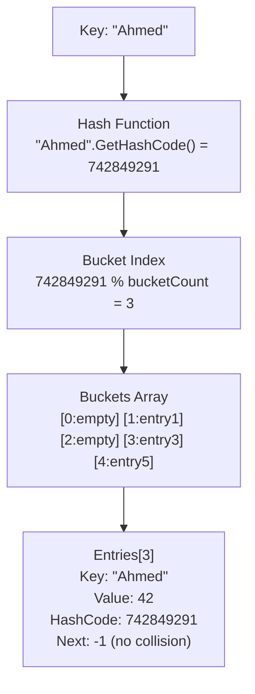

# Hash Tables, Best Practices & Design Patterns

> [Mastery Guide](../../../README.md) › [Foundations](../../README.md) › [.NET Core Deep Dive](README.md)

| Status | Priority | Phase | Last reviewed |
|---|---|---|---|
| Not Started | High | Phase 7 — Architecture & Patterns | 2026-05-07 |

> 📘 **Main file**: Interview-ready summary, drills, and cheat sheet live in **[Design Patterns](../../04-architecture-and-patterns/01-design-patterns.md)**. This file is the implementation deep-dive.

## Contents
1. [Hash-Based Lookup Table](#15-hash-based-lookup-table)
   - [How Dictionary<TKey, TValue> Works Internally](#how-dictionarytkey-tvalue-works-internally)
   - [Performance](#performance)
2. [General Best Practices](#16-general-best-practices)
   - [Performance Tips](#performance-tips)
   - [Common Mistakes](#common-mistakes)
3. [Design Patterns in .NET](#18-design-patterns-in-net)
   - [Repository Pattern](#repository-pattern)
   - [Unit of Work Pattern](#unit-of-work-pattern)
   - [Factory Pattern](#factory-pattern)
   - [Strategy Pattern](#strategy-pattern)
   - [Observer Pattern (MediatR)](#observer-pattern-mediatr)
4. [Interview Cross-Questioning Drill](#interview-cross-questioning-drill)
5. [Self-Test](#self-test)

---

## 15. Hash-Based Lookup Table

### How Dictionary<TKey, TValue> Works Internally



Collision handling (chaining): `Bucket 3 -> Entry("Ahmed", 42) -> Entry("Bob", 55) -> -1` (same bucket, different keys).

### Performance

```
┌──────────────────┬──────────────────┬──────────────────┐
│ Operation        │ Average          │ Worst Case       │
├──────────────────┼──────────────────┼──────────────────┤
│ Add              │ O(1)             │ O(n) resize      │
│ Lookup           │ O(1)             │ O(n) collisions  │
│ Remove           │ O(1)             │ O(n) collisions  │
│ ContainsKey      │ O(1)             │ O(n) collisions  │
│ Iteration        │ O(n)             │ O(n)             │
└──────────────────┴──────────────────┴──────────────────┘

Comparison:
List<T>.Find():    O(n)     — Linear search
Dictionary<K,V>:   O(1)     — Direct hash lookup
SortedDictionary:  O(log n) — Tree-based

Example with 1,000,000 items:
List search:       ~500,000 comparisons
Dictionary lookup: ~1-3 comparisons
```

```csharp
// Real-world: Cache with O(1) lookup
var userCache = new Dictionary<int, User>(capacity: 10_000);

// Pre-populate
foreach (var user in allUsers)
    userCache[user.Id] = user;

// O(1) lookup — instant, regardless of size
if (userCache.TryGetValue(userId, out var cachedUser))
    return cachedUser;

// .NET 8: FrozenDictionary for read-heavy scenarios
var frozen = userCache.ToFrozenDictionary();
// Optimized internal structure — even faster lookups
// But immutable — cannot add/remove after creation
```

---

## 16. General Best Practices

### Performance Tips

```
┌─────────────────────────────────────────────────────────┐
│              Performance Best Practices                  │
├─────────────────────────────────────────────────────────┤
│                                                         │
│ 1. Use async/await for I/O operations                   │
│    ❌ var data = httpClient.GetString(url);              │
│    ✅ var data = await httpClient.GetStringAsync(url);   │
│                                                         │
│ 2. Use AsNoTracking() for read-only EF queries          │
│    ❌ db.Users.Where(u => u.Active).ToList();            │
│    ✅ db.Users.AsNoTracking().Where(u => u.Active)...   │
│                                                         │
│ 3. Use StringBuilder for string concatenation           │
│    ❌ string s = ""; for (...) s += item;               │
│    ✅ var sb = new StringBuilder(); for (...) sb.Append │
│                                                         │
│ 4. Avoid boxing/unboxing                                │
│    ❌ object x = 42; int y = (int)x;                   │
│    ✅ Use generics: List<int> instead of ArrayList       │
│                                                         │
│ 5. Use Span<T> for memory-efficient slicing             │
│    ❌ string sub = text.Substring(5, 10);               │
│    ✅ ReadOnlySpan<char> sub = text.AsSpan(5, 10);      │
│                                                         │
│ 6. Pool objects that are expensive to create             │
│    ✅ ArrayPool<byte>.Shared.Rent(1024)                 │
│    ✅ ObjectPool<StringBuilder>                          │
│                                                         │
│ 7. Use IAsyncEnumerable for streaming large datasets    │
│    ✅ await foreach (var item in GetItemsAsync())        │
│                                                         │
│ 8. Use compiled queries for repeated EF operations      │
│    ✅ EF.CompileAsyncQuery((AppDb db, int id) =>        │
│         db.Users.Where(u => u.Id == id))                │
│                                                         │
│ 9. Configure GC for your workload                       │
│    ✅ Server GC for web apps                             │
│    ✅ Workstation GC for desktop apps                    │
│                                                         │
│ 10. Profile before optimizing                           │
│     ✅ Use BenchmarkDotNet, dotnet-trace, PerfView       │
└─────────────────────────────────────────────────────────┘
```

### Common Mistakes

```
┌─────────────────────────────────────────────────────────┐
│                   Common Mistakes                       │
├─────────────────────────────────────────────────────────┤
│                                                         │
│ 1. ❌ Captive dependencies (Scoped in Singleton)        │
│ 2. ❌ async void (swallows exceptions)                  │
│ 3. ❌ .Result / .Wait() on async (deadlocks)            │
│ 4. ❌ Not disposing IDisposable (memory leaks)          │
│ 5. ❌ N+1 query problem (lazy loading in loops)         │
│ 6. ❌ Catching Exception instead of specific types      │
│ 7. ❌ Not using cancellation tokens in async methods    │
│ 8. ❌ String concatenation in loops (use StringBuilder) │
│ 9. ❌ Exposing IQueryable from repositories              │
│ 10.❌ Not validating input at system boundaries          │
│ 11.❌ Hardcoding connection strings                      │
│ 12.❌ Not using HTTPS in production                      │
│ 13.❌ Ignoring middleware ordering                       │
│ 14.❌ Over-fetching data (SELECT * instead of needed)   │
│ 15.❌ Not using structured logging                       │
└─────────────────────────────────────────────────────────┘
```

---


## 18. Design Patterns in .NET

> **Difficulty:** Intermediate to Advanced | **Reading Time:** ~15 min

> **Gotcha:** Don't force patterns where they're not needed. A pattern should simplify, not complicate.

### Repository Pattern

Abstracts data access, making business logic independent of the data source.

```csharp
// Interface
public interface IOrderRepository
{
    Task<Order?> GetByIdAsync(int id, CancellationToken ct = default);
    Task<List<Order>> GetByCustomerAsync(int customerId, CancellationToken ct = default);
    Task<Order> AddAsync(Order order, CancellationToken ct = default);
    Task UpdateAsync(Order order, CancellationToken ct = default);
}

// Implementation
public class OrderRepository : IOrderRepository
{
    private readonly AppDbContext _db;
    public OrderRepository(AppDbContext db) => _db = db;

    public async Task<Order?> GetByIdAsync(int id, CancellationToken ct = default)
        => await _db.Orders.Include(o => o.Items).AsNoTracking()
            .FirstOrDefaultAsync(o => o.Id == id, ct);

    public async Task<Order> AddAsync(Order order, CancellationToken ct = default)
    {
        _db.Orders.Add(order);
        await _db.SaveChangesAsync(ct);
        return order;
    }

    public async Task UpdateAsync(Order order, CancellationToken ct = default)
        => await _db.SaveChangesAsync(ct);

    public async Task<List<Order>> GetByCustomerAsync(int customerId, CancellationToken ct = default)
        => await _db.Orders.Where(o => o.CustomerId == customerId)
            .AsNoTracking().ToListAsync(ct);
}
```

```
Common Interview Follow-up:
Q: "Should repositories return IQueryable?"
A: No. IQueryable leaks DB concerns into business layer.
   Return materialized data (List<T>, T?) from repositories.
```

### Unit of Work Pattern

Coordinates multiple repositories to share a single transaction.

```csharp
public interface IUnitOfWork : IDisposable
{
    IOrderRepository Orders { get; }
    IProductRepository Products { get; }
    Task<int> SaveChangesAsync(CancellationToken ct = default);
}

public class UnitOfWork : IUnitOfWork
{
    private readonly AppDbContext _db;
    public IOrderRepository Orders { get; }
    public IProductRepository Products { get; }

    public UnitOfWork(AppDbContext db)
    {
        _db = db;
        Orders = new OrderRepository(db);
        Products = new ProductRepository(db);
    }

    public Task<int> SaveChangesAsync(CancellationToken ct = default)
        => _db.SaveChangesAsync(ct);
    public void Dispose() => _db.Dispose();
}

// Usage: Both repos share one transaction
public class CheckoutService(IUnitOfWork uow)
{
    public async Task PlaceOrder(Order order)
    {
        await uow.Orders.AddAsync(order);
        foreach (var item in order.Items)
            await uow.Products.DecrementStockAsync(item.ProductId, item.Quantity);
        await uow.SaveChangesAsync();  // One transaction for both
    }
}
```

### Factory Pattern

```csharp
public interface INotification
{
    Task SendAsync(string to, string message);
}

public class EmailNotification : INotification
{
    public Task SendAsync(string to, string message) => SendEmailAsync(to, message);
}

public class SmsNotification : INotification
{
    public Task SendAsync(string to, string message) => SendSmsAsync(to, message);
}

// Factory
public class NotificationFactory(IServiceProvider sp) : INotificationFactory
{
    public INotification Create(string channel) => channel switch
    {
        "email" => sp.GetRequiredService<EmailNotification>(),
        "sms"   => sp.GetRequiredService<SmsNotification>(),
        _       => throw new ArgumentException($"Unknown channel: {channel}")
    };
}
```

### Strategy Pattern

```csharp
public interface IPricingStrategy
{
    decimal CalculatePrice(decimal basePrice, int quantity);
}

public class RegularPricing : IPricingStrategy
{
    public decimal CalculatePrice(decimal basePrice, int quantity)
        => basePrice * quantity;
}

public class BulkPricing : IPricingStrategy
{
    public decimal CalculatePrice(decimal basePrice, int quantity)
        => quantity >= 100 ? basePrice * quantity * 0.8m
         : quantity >= 50  ? basePrice * quantity * 0.9m
         : basePrice * quantity;
}

// DI registration with keyed services (.NET 8+):
builder.Services.AddKeyedSingleton<IPricingStrategy, RegularPricing>("regular");
builder.Services.AddKeyedSingleton<IPricingStrategy, BulkPricing>("bulk");
```

### Observer Pattern (MediatR)

```csharp
// Notification with multiple handlers
public record OrderPlacedNotification(Order Order) : INotification;

public class SendEmailHandler : INotificationHandler<OrderPlacedNotification>
{
    public async Task Handle(OrderPlacedNotification n, CancellationToken ct)
        => await SendConfirmationEmail(n.Order);
}

public class UpdateInventoryHandler : INotificationHandler<OrderPlacedNotification>
{
    public async Task Handle(OrderPlacedNotification n, CancellationToken ct)
        => await DecrementStock(n.Order.Items);
}

// Publishing fires ALL handlers:
await mediator.Publish(new OrderPlacedNotification(order));
```

```
Pattern Decision Matrix:
+-------------------+--------------------------------------------+
| Pattern           | When to Use                                |
+-------------------+--------------------------------------------+
| Repository        | Abstract data access from business logic   |
| Unit of Work      | Coordinate multiple repos in one tx        |
| Factory           | Object creation varies by runtime input    |
| Strategy          | Multiple interchangeable algorithms        |
| Observer/Mediator | Decouple event producers from consumers   |
+-------------------+--------------------------------------------+
```

---

## Interview Cross-Questioning Drill

<details>
<summary>📖 Click to expand — cross-question chains (~15-20 min, cover answers and write cold)</summary>

> ⚠️ **Honest caveat**: reading this section once doesn't make you interview-ready. Cover the answers, write them cold, then check. Pair with a senior for live mock cross-questioning. The guide removes "I never thought about that" surprises; mock interviews convert knowledge into reflex. Both are needed.

Each drill is **Q → A → Cross-Q → A → Cross-Q² → A**. Practice answering the cross-questions without re-reading. If you stumble on any cross-Q², go re-read the relevant section.
### Drill 1 — Strategy pattern

> **Q**: When would you reach for the Strategy pattern instead of plain polymorphism through inheritance?
>
> **A**: When the algorithm is the *thing that varies* and you want to swap it at runtime — different pricing rules per customer tier, different shipping calculators per region. Inheritance picks the variant once at compile time via the concrete subclass; Strategy lets a single `OrderService` get injected with `IPricingStrategy` and switch between `RegularPricing`, `BulkPricing`, `VipPricing` based on a runtime decision.
>
> **Cross-Q**: With .NET 8's keyed services, isn't injecting a single `IPricingStrategy` directly basically the same thing?
>
> **A**: Yes, and that's the modern idiomatic shape. `services.AddKeyedSingleton<IPricingStrategy, BulkPricing>("bulk");` + `[FromKeyedServices("bulk")] IPricingStrategy s` collapses what used to be a Strategy *plus* a factory into one DI registration. The Strategy *pattern* is still there — interface + multiple implementations + runtime selection — but the GoF ceremony (a separate `StrategyContext` class) is gone.
>
> **Cross-Q²**: When does Strategy degenerate into over-engineering?
>
> **A**: When you have exactly one implementation and "we might need another someday." Premature Strategy is a single-implementation interface + a factory that always returns the same thing — pure ceremony. Wait until you have *two* real implementations whose code paths diverge, then extract. YAGNI applies hardest to behavioral patterns.

### Drill 2 — Decorator pattern

> **Q**: Walk me through implementing the Decorator pattern for an `IOrderRepository` to add caching.
>
> **A**: Define `IOrderRepository`, implement `OrderRepository` (the real one), then implement `CachingOrderRepository(IOrderRepository inner, IMemoryCache cache) : IOrderRepository` that delegates to `inner` after consulting the cache. Each method becomes "check cache → call inner if miss → populate cache → return."
>
> **Cross-Q**: How do you wire up the decoration in DI without writing a custom factory?
>
> **A**: Use **Scrutor**: `services.AddScoped<IOrderRepository, OrderRepository>(); services.Decorate<IOrderRepository, CachingOrderRepository>();`. Scrutor rewrites the registration so any `IOrderRepository` resolution returns `CachingOrderRepository` wrapping `OrderRepository`. You can chain: `Decorate<IOrderRepository, LoggingOrderRepository>()` to stack logging on top of caching. Without Scrutor, you'd hand-write a factory: `services.AddScoped<IOrderRepository>(sp => new CachingOrderRepository(new OrderRepository(sp.GetRequiredService<AppDbContext>()), sp.GetRequiredService<IMemoryCache>()))` — works, but breaks the moment dependencies change.
>
> **Cross-Q²**: What's the trap when decorating something with `IDisposable`?
>
> **A**: Only the outermost wrapper goes through DI's disposal chain. If the inner repository implements `IDisposable` (e.g., owns a DbContext indirectly), the decorator must forward `Dispose()` — otherwise the inner is leaked. Modern .NET prefers DI to own lifetime, so the inner should be registered as scoped/singleton in DI rather than `new`'d inside the decorator. Scrutor's `Decorate` does the right thing automatically because both inner and outer are DI-registered.

### Drill 3 — Factory pattern

> **Q**: Abstract Factory vs simple factory vs DI — when does each win?
>
> **A**: **Simple factory** (a static `Create()` method or a `Factory.Create(type)` switch): the right answer for one-off creation logic that doesn't justify infrastructure. **Abstract Factory** (an interface with creation methods returning a family of related products): worth it when you have *multiple coordinated families* — UI theme factories where `LightThemeFactory.CreateButton()` and `LightThemeFactory.CreateMenu()` must visually match. **DI**: the right answer 80% of the time in modern .NET — the container is a generalized factory that handles dependency resolution and lifetime for you.
>
> **Cross-Q**: When does DI *not* replace a factory?
>
> **A**: When creation depends on runtime data, not just registered services. A `NotificationFactory.Create("email" | "sms")` can't be expressed as `services.AddScoped<INotification, X>()` directly — the *choice* is data-driven. Solutions: (a) keyed services (.NET 8+) — `Create(string channel) => sp.GetRequiredKeyedService<INotification>(channel)`; (b) a factory class that owns the switch and pulls implementations from `IServiceProvider`. Pure factory pattern lives on for "I need this kind of thing, with these parameters" creation.
>
> **Cross-Q²**: What's the smell of an over-engineered factory?
>
> **A**: A factory that's used in exactly one place and always with the same argument. That's a constructor wearing a costume. Worse: a `FactoryFactory` (literally, an `IFactoryFactory<TProduct, TFactory>`). If you find yourself naming things `XxxFactory` more than once per bounded context, you're often building a parallel DI container by hand — collapse it.

### Drill 4 — Repository pattern with EF Core

> **Q**: With EF Core providing `DbContext` and `DbSet<T>` (already a Unit of Work and a generic repository), is the Repository pattern still relevant?
>
> **A**: Often no, sometimes yes. EF Core's `DbSet<T>` is a generic repository; `DbContext.SaveChangesAsync` is a Unit of Work. Adding an `IOrderRepository` over `DbSet<Order>` is sometimes just renaming. **When it's still useful**: testability against non-EF stores (so you can swap to Dapper or a NoSQL store later), enforcing query patterns (every read uses `AsNoTracking`), and shielding the domain from EF specifics (no `IQueryable` leaking out of the repo).
>
> **Cross-Q**: Should repositories return `IQueryable<T>` so callers can compose queries?
>
> **A**: No — that's the classic anti-pattern. Returning `IQueryable<T>` leaks EF Core into the calling layer; the caller can call `.Include(...)`, `.AsTracking()`, `.ToList()` (sync over async), or write queries the repo can't translate. Return materialized `List<T>`, `T?`, or `IReadOnlyList<T>`. If callers need flexible querying, expose **named methods** (`GetByCustomerAsync(int customerId)`) or a **Specification** parameter — not raw `IQueryable<T>`.
>
> **Cross-Q²**: A senior on your team says "I don't write repositories anymore, I just inject `DbContext` directly." How do you respond?
>
> **A**: It's a valid stance for projects that have committed to EF Core. Trade-off: you lose the abstraction seam (harder to swap stores or unit-test without an in-memory provider), but you gain conciseness, full LINQ expressiveness, and you stop pretending `DbContext` is something it isn't. For monolithic services that will live on EF Core forever, direct `DbContext` injection is fine. For multi-store systems, or services with strong DDD boundaries, repositories remain useful. Don't argue the pattern in the abstract — decide based on the project's actual portability and testability needs.

### Drill 5 — Unit of Work

> **Q**: If `DbContext` is already a Unit of Work, why would you wrap it in `IUnitOfWork`?
>
> **A**: To hide EF Core from the domain. `IUnitOfWork.SaveChangesAsync()` is provider-agnostic — the domain doesn't care if it's EF, Dapper with a TransactionScope, or a custom outbox writer. Without `IUnitOfWork`, your domain layer depends on `DbContext`, which depends on `Microsoft.EntityFrameworkCore` — your domain is no longer infrastructure-free.
>
> **Cross-Q**: What does the UoW interface typically expose besides `SaveChangesAsync`?
>
> **A**: Repository accessors (`Orders`, `Products`) so callers share a single transaction across repos, plus optional `BeginTransactionAsync` / `CommitAsync` for explicit transactions when you need savepoint or isolation control. The minimum is `Task<int> SaveChangesAsync(CancellationToken)` — adding more lets you express richer coordination.
>
> **Cross-Q²**: Two repositories injected separately, each with their own `DbContext`. What goes wrong?
>
> **A**: They write in separate transactions. `OrderRepo.SaveAsync(order)` commits; `ProductRepo.DecrementStockAsync(...)` fails — order saved, stock unchanged, inconsistent state. The fix is to make `DbContext` scoped (default in ASP.NET Core) and have both repos take the *same* `DbContext` instance, or to use `IUnitOfWork` that owns the context and exposes both repos. Captive dependency: never register `DbContext` as singleton.

### Drill 6 — Observer / pub-sub

> **Q**: Events, `IObservable<T>`, MediatR notifications, message broker — when each?
>
> **A**: **C# events**: in-process, same-class hierarchy, synchronous, one publisher many subscribers. Good for UI / framework hooks. **`IObservable<T>`** (Rx): in-process *streams* of values over time with composition operators (`Where`, `Throttle`, `Buffer`) — overkill if you just need "raise an event." **MediatR `INotification`**: in-process pub-sub decoupled by handler classes, with DI lifetimes per handler. **Message broker** (RabbitMQ, Azure Service Bus, Kafka): *cross-process* events — durability, retry, dead-letter, replay. The bright line is "in-process or out-of-process."
>
> **Cross-Q**: If MediatR notifications are in-process, what's the difference between them and a C# event?
>
> **A**: (1) Handlers are *DI-registered classes*, not callbacks captured in delegates — they can have their own dependencies and scopes. (2) Publication is opt-in per handler: any class implementing `INotificationHandler<T>` gets discovered and fired. (3) Async-first: `Task Handle(...)` is the contract. (4) Cleaner testing — mock `IMediator`, assert what was published. Trade-off: MediatR adds reflection and assembly scanning startup cost.
>
> **Cross-Q²**: When does an in-process pub-sub become a cross-process one?
>
> **A**: When you need durability (event must survive a crash), cross-service visibility (other services react), or retry/DLQ (failed handlers must not lose the event). At that point, MediatR notifications get *paired with* a broker via the **Transactional Outbox** pattern: handler writes an "OutboxMessage" row in the same transaction as the domain change, a background worker publishes that row to the broker, and downstream services consume from there. In-process notifications run for fast same-process reactions; the broker handles everything else.

### Drill 7 — Singleton

> **Q**: When is Singleton the right pattern, and when is it an anti-pattern?
>
> **A**: **Right**: stateless or read-mostly services with expensive setup (HTTP clients, compiled regex caches, type metadata, ML models). DI's `AddSingleton<T>()` is the safe way — the container manages the lifetime and you still inject it like any other dependency. **Anti-pattern**: static `Singleton.Instance` accessed everywhere — hidden coupling, untestable, can't swap for fakes, and almost always thread-unsafe on first try.
>
> **Cross-Q**: What's the captive-dependency problem with Singleton?
>
> **A**: A singleton that depends on a scoped service (e.g., `AppDbContext`) captures the scoped instance for its lifetime, holding it forever instead of disposing per request. Symptoms: stale tracking state, connection pool exhaustion, mysterious "DbContext already disposed" exceptions on the second request. The fix is to inject `IServiceScopeFactory` and create a fresh scope per operation, or restructure so the singleton doesn't need request-scoped state.
>
> **Cross-Q²**: Is `HttpClient` a singleton or transient?
>
> **A**: Trick question. `HttpClient` *should* be reused (each new one opens a new socket pool, hence socket exhaustion under load), but it shouldn't be naively singleton either (DNS changes won't be picked up). The modern answer is `IHttpClientFactory` — DI singleton wrapper that hands out short-lived `HttpClient` instances backed by pooled, recycled `HttpMessageHandler`s with periodic DNS refresh. Use `services.AddHttpClient<MyClient>()` and inject `MyClient`. Don't `new HttpClient()`.

### Drill 8 — Mediator (MediatR)

> **Q**: What does MediatR actually buy you over calling `OrderService.PlaceOrderAsync(...)` directly?
>
> **A**: Three things: (1) **CQRS structuring** — every operation becomes an `IRequest<TResponse>` with a single handler class, naturally splitting commands from queries; (2) **Pipeline behaviors** — cross-cutting concerns (validation, logging, transactions, caching) wrap every request via `IPipelineBehavior<TRequest, TResponse>` without changing handlers; (3) **Decoupling** — controllers depend on `IMediator`, not on N service classes.
>
> **Cross-Q**: When does MediatR become overkill?
>
> **A**: Small CRUD APIs where every endpoint maps to one service method. The MediatR layer becomes 3x the file count (request class + handler class + DI registration) for the same logic. The win comes when behaviors are pulling weight — central validation, logging, retry — which only materializes past ~30 endpoints. Rule of thumb: if you're not actively writing pipeline behaviors, you're paying MediatR's tax without earning the benefit.
>
> **Cross-Q²**: How do pipeline behaviors implement cross-cutting concerns? Walk me through a validation behavior.
>
> **A**: A behavior is `IPipelineBehavior<TRequest, TResponse>` with `Handle(request, next)` — call `next()` to forward, or short-circuit by returning early. Validation behavior: inject `IEnumerable<IValidator<TRequest>>` (FluentValidation), run them all, if any fails throw `ValidationException` (or return `Result.Failure` if using Result pattern) without calling `next()`. Register with `services.AddTransient(typeof(IPipelineBehavior<,>), typeof(ValidationBehavior<,>))`. The behavior runs for *every* request — controllers never call validators directly.

### Drill 9 — Specification pattern

> **Q**: When would you reach for the Specification pattern over inline LINQ predicates?
>
> **A**: When the same predicate logic is reused across queries and needs a name. `var spec = new ActiveCustomerSpec().And(new HighValueSpec(10000));` — composable, testable, and the *business meaning* shows up in code. For one-off `Where(x => x.Active && x.LifetimeValue > 10000)` inside a single repo method, a spec is over-engineering.
>
> **Cross-Q**: How does it translate to SQL through EF Core?
>
> **A**: Specifications expose `Expression<Func<T, bool>>` (not `Func<T, bool>`), so EF Core's LINQ provider can translate them to SQL. The composition operators (`And`, `Or`, `Not`) combine expression trees, not delegates. Libraries like Ardalis.Specification add `Include`s, ordering, and paging to the spec object — letting you build "all read concerns of a query" into one named class.
>
> **Cross-Q²**: What's the difference between a Specification and a Query object (CQRS read side)?
>
> **A**: Overlap is high. A **Specification** is a reusable predicate ("Active customers"); a **Query** is a complete read operation ("Get top 10 customers in region X, ordered by lifetime value"). Specifications compose to build queries: `repo.ListAsync(new ActiveCustomerSpec().And(new InRegionSpec("EU")))`. In CQRS-heavy projects, queries are first-class (`GetTopCustomersQuery : IRequest<List<CustomerDto>>`) and specs are an internal implementation detail of query handlers — not always both.

### Drill 10 — Builder pattern

> **Q**: When is the Builder pattern worth the ceremony in modern C#?
>
> **A**: When constructing a complex object requires many optional parameters with validation between steps, and an object initializer doesn't cut it. `EmailMessage.Builder().From(...).To(...).WithAttachment(...).Build()` — readable, validates incrementally, and `Build()` enforces "required" fields. With C# 11's `required` keyword + `init`-only setters, most "builder for optional params" use cases collapse to a record with `required` members and an object initializer.
>
> **Cross-Q**: When would Builder still win after `required` + `init`?
>
> **A**: When construction is *staged* and intermediate states aren't valid objects. ASP.NET Core's `WebApplicationBuilder` is the canonical example — you can't expose the final `WebApplication` until `Build()` runs and seals configuration. Also: when one builder method affects another's options (e.g., "if HTTPS is enabled, certificate path becomes required"). Object initializers can't enforce dependencies between properties; a builder can.
>
> **Cross-Q²**: Is the fluent API the same as Builder?
>
> **A**: Builder is one *kind* of fluent API — fluent methods that culminate in a `Build()`/`Create()` returning the constructed object. Fluent APIs in general (LINQ, EF Core's `modelBuilder.Entity<X>().HasKey(...).IsRequired()`) are method chains where each call returns `this` (or a new builder type for type-state patterns). All Builders are fluent; not all fluent APIs are Builders — LINQ chains describe a query, not construct a single object.

### Drill 11 — Adapter pattern

> **Q**: You need to integrate a third-party SMS gateway with a clunky synchronous API into your async-first .NET system. What pattern?
>
> **A**: Adapter. Wrap the third-party `LegacySmsClient.SendSync(...)` behind your own `ISmsService.SendAsync(...)` interface. The adapter handles the impedance mismatch — async-over-sync via `Task.Run`, error type translation, retry, logging. Your domain depends on `ISmsService`, not on the vendor's SDK. If you swap providers next quarter, only the adapter changes.
>
> **Cross-Q**: What's the difference between Adapter and Facade?
>
> **A**: **Adapter** changes one interface to match another — usually 1:1 method correspondence with different signatures. **Facade** simplifies a set of interfaces — exposing one method that hides multiple underlying calls. Adapter for "wrap external library to match my interface," Facade for "give callers a simple front door to a complex subsystem." Often you build a Facade *out of* multiple Adapters.
>
> **Cross-Q²**: Is `IHttpClientFactory` an adapter or a facade?
>
> **A**: Facade — it exposes one simple API (`CreateClient(name)`) over a complex subsystem (handler pooling, named configurations, primary/inner handler chains, retry/circuit-breaker policies via Polly integration). It's not adapting one interface to another's shape; it's hiding complexity. A *typed client* (`MyApiClient(HttpClient http)`) is closer to an Adapter — it adapts raw `HttpClient` calls into a domain-shaped interface (`GetUserAsync(int id)`).

### Drill 12 — Anti-corruption layer

> **Q**: Explain the Anti-Corruption Layer (ACL) pattern in DDD terms.
>
> **A**: When two bounded contexts share data but use *different models*, the ACL is the translation/mapping layer between them. Your `Order` context talks to a legacy `Customer` context whose data model is messy or doesn't match your domain — the ACL maps the messy legacy `CustomerRecord` into your clean `Customer` value object as data crosses the boundary. The legacy model never "leaks" into your domain.
>
> **Cross-Q**: How is ACL different from Adapter?
>
> **A**: Adapter is a *technical* pattern — change one interface shape to another. ACL is an *architectural* pattern — protect a domain model from another domain's semantic mess. An ACL usually contains adapters (one to translate API responses, one to handle the auth model) plus mappers, plus often its own data transfer objects. ACL is the *boundary*; Adapter is one of the tools you use inside it.
>
> **Cross-Q²**: A team wants to call the legacy API "directly because it's faster." What do you tell them?
>
> **A**: Short term it *is* faster — fewer files, no mapping. Long term: every call site couples to the legacy model. When the legacy team changes their schema, you have N change sites instead of 1. When you rewrite the legacy system, you have N migration sites. The ACL is insurance — pay the cost once, collect on every legacy change. Frame it as bounded-context discipline, not pattern dogma. (Caveat: for *one* prototype call where you'll throw the code away, skip the ACL.)

### Drill 13 — Anti-patterns

> **Q**: God class, Anemic Domain Model, Service Locator — what are they and why are they bad?
>
> **A**: **God class**: one class that knows/does too much — 2000 lines, 30 dependencies, every feature touches it. Symptom of missing decomposition. **Anemic Domain Model**: entities are pure data with no behavior; logic lives in "service" classes operating on them. Symptom of leaking domain rules into transaction scripts. **Service Locator**: classes pull dependencies from a static `ServiceLocator.Get<T>()` instead of having them injected. Hides coupling, breaks testability, and the dependencies don't show up in the constructor signature.
>
> **Cross-Q**: When is Service Locator legitimately the right answer?
>
> **A**: In frameworks (not application code) that need to resolve dependencies at points where ctor injection isn't possible — middleware factories, attribute filters, source-generated code. ASP.NET Core's `[FromServices]` and `HttpContext.RequestServices` are *controlled* service locators with documented escape-hatch semantics. The rule is: in app code, inject; in framework glue, locate cautiously. Most "I need Service Locator" requests are really "I haven't structured my DI properly."
>
> **Cross-Q²**: Can a domain model be "rich" with logic *and* still be persistable by EF Core?
>
> **A**: Yes — EF Core 7+ supports private setters, value objects via owned types, navigation collections via backing fields, and constructor binding. You write `Order.AddItem(product, quantity)` with invariant checks (no negative quantity, no closed orders) on the aggregate root, and EF Core hydrates it via reflection on the private members. The anemic model is a *choice*, not a constraint of the ORM. The friction comes from old habits (public setters everywhere) and from validation libraries that assume DTOs.

### Drill 14 — SOLID + patterns

> **Q**: Pick three SOLID principles and name a design pattern that directly enforces each.
>
> **A**: **OCP** (open for extension, closed for modification) → **Strategy** — add a new algorithm by adding a new `IPricingStrategy` impl, no change to existing code. **DIP** (depend on abstractions) → **Repository / Adapter** — the domain depends on `IOrderRepository` / `ISmsService`, not on EF Core / vendor SDK. **ISP** (interface segregation) → splitting fat interfaces, often realized via **Role Interfaces** (`IReader`, `IWriter`) instead of one giant `IRepository`.
>
> **Cross-Q**: Which pattern is the cleanest SRP enforcer?
>
> **A**: **Mediator with one handler class per request** — each handler does one thing (`PlaceOrderHandler` only places orders). Before MediatR, the equivalent was Command Handler classes. Same idea: forbid the "AccountService with 14 methods" by making each operation its own class. Smaller surface area = easier reasoning = less coupling. Trade-off: more files. Worth it past ~20 operations per "service."
>
> **Cross-Q²**: A junior engineer adds a new payment method by modifying a switch statement in `PaymentProcessor`. Which SOLID principle did they violate?
>
> **A**: OCP — you modified existing code instead of extending. Fix: replace the switch with strategy lookup (`IDictionary<PaymentMethod, IPaymentProcessor>` injected via DI, or keyed services with `[FromKeyedServices]`). Now adding a payment method = adding a new `IPaymentProcessor` impl + DI registration; nothing existing changes. Bonus: the switch was a violation of OCP *and* a code smell flagged by every code-smell tool — Cyclomatic Complexity correlates with switch density.

### Drill 15 — Pattern fever

> **Q**: A team applies every pattern from GoF to a 5-endpoint internal admin tool. What's the impact?
>
> **A**: 80% of the codebase is ceremony. Reading a single feature requires navigating 8 files (request → handler → factory → strategy → repository → UoW → DbContext → entity). The original 200-line CRUD becomes 2000 lines of indirection. Onboarding takes weeks. The patterns add no value because the underlying complexity doesn't justify them.
>
> **Cross-Q**: How do you tell whether a pattern is earning its keep?
>
> **A**: Two tests. (1) **Variation test**: is there more than one concrete implementation, or a credible plan for one within 6 months? If no, the pattern is speculative — collapse it. (2) **Replacement test**: if you remove the pattern (inline the strategy, drop the repository, call services directly), does the code get *harder* to maintain? If no, the pattern was load-bearing in name only. Patterns exist to manage *real* variation and *real* boundaries; "good practice" alone isn't a justification.
>
> **Cross-Q²**: When is it OK to start without patterns and add them later?
>
> **A**: Almost always — for application code. Start with the simplest code that solves the problem; refactor to a pattern when the second concrete variation arrives. "Rule of three": don't extract a pattern until you have three concrete examples of the variation. **Exceptions**: well-known boundaries (HTTP layer, persistence layer, message broker) where you *know* a future swap is on the cards — bake the abstraction in from day one. The discipline is to recognize which boundaries are durable and which are speculative.

---

</details>

---

## Self-Test

<details>
<summary>1. The entry in the diagram stores <code>HashCode</code> next to the key and value, plus <code>Next: -1</code>. Why keep a copy of the hash when you could recompute it from the key?</summary>

Both fields exist to keep work off the hot path.

**The stored hash saves comparer calls on lookup.** `Dictionary` maps to a bucket, then walks the chain — and for each entry it compares the stored 32-bit hash *first*, only calling the equality comparer when that matches. From `FindValue` in `dotnet/runtime`:

```csharp
if (entry.hashCode == hashCode && EqualityComparer<TKey>.Default.Equals(entry.key, key))
```

That is the branch for value-type keys with no custom comparer; the other branch is the same shape with `comparer.Equals(entry.key, key)`, and that is the one a `Dictionary<string, …>` takes — the default string comparer is `NonRandomizedStringEqualityComparer`, not `EqualityComparer<string>.Default`. Either way a chain walk is mostly integer comparisons, and `Equals` runs only on genuine hash matches. That is what makes a colliding bucket survivable when the key is a long string or a composite type whose `Equals` compares several fields.

**The stored hash also saves re-hashing on resize.** Growing the dictionary means re-bucketing every entry. Because the hash is already in the entry, `Resize` reuses `entries[i].hashCode` rather than calling `GetHashCode` on every key again. (The one path that does re-hash is the deliberate `forceNewHashCodes` resize: with the default string comparer, `Dictionary` counts collisions during insert and, past a threshold, rebuilds with a randomized comparer to defuse hash-flooding. That protection is string-specific — it does nothing for a bad `GetHashCode` on your own key type.)

**`Next` is the chain link.** .NET uses separate chaining, but the chain lives inside the `Entry[]` array as indices rather than as linked-list node objects — `-1` in the diagram means end of chain. No per-entry node allocation, and the walk stays inside one contiguous array instead of pointer-chasing across the heap.
</details>

<details>
<summary>2. The cache is built with <code>new Dictionary&lt;int, User&gt;(capacity: 10_000)</code>, and the table lists <code>Add</code> worst case as <code>O(n) resize</code>. What does pre-sizing actually buy, and why is <code>Add</code> still amortized O(1)?</summary>

Without a capacity the dictionary starts tiny and grows by resizing: allocate a new bucket array and a new entries array sized to the next prime at least twice the current capacity, copy every entry across, re-bucket each one. The single `Add` that trips this is O(n) — that is the worst case in the table. Filling 10,000 entries from empty means going through that cycle repeatedly on the way up, each time allocating two arrays and abandoning the previous pair as garbage.

It is still amortized O(1), and being able to say *why* is the point: capacities roughly double, so the total copy work across all resizes is a geometric series dominated by its last term — on the order of n copies overall, not (number of resizes) × n.

So pre-sizing does not improve the asymptotics. What it removes is the allocation churn and the latency spike on whichever unlucky `Add` lands on a resize. That is why it matters for a startup-built cache and for anything with a tail-latency budget, and why it is mostly noise for a dictionary that holds a dozen entries.

Two things it does not buy. The constructor rounds up to a prime, so you get at least 10,000 slots, not exactly 10,000. And the dictionary never shrinks — `Remove` frees slots for later reuse but the arrays stay allocated until you call `TrimExcess()`.
</details>

<details>
<summary>3. The snippet ends with <code>userCache.ToFrozenDictionary()</code>. When is reaching for <code>FrozenDictionary</code> the wrong call, and what exactly are you trading?</summary>

You are trading build time for read time, and the docs state the trade directly: `FrozenDictionary<TKey,TValue>` "is immutable and is optimized for situations where a dictionary is created infrequently but is used frequently at run time. It has a relatively high cost to create but provides excellent lookup performance."

The build cost is the mechanism, not overhead. The factory inspects the whole key set and returns an implementation specialized to those keys — integer-keyed layouts, string layouts that discriminate on length or on one distinguishing substring, a plain linear scan for very small sets. The key set is closed at build time, so the table can be laid out to minimize collisions up front. That is precisely why the read path does less work than `Dictionary`.

It is the wrong call wherever "created infrequently, read frequently" does not hold:

- **Anything that mutates.** There is no `Add`/`Remove`; the mutating `IDictionary<,>` members throw. An "update" means rebuilding the whole table, so a cache that gains entries at runtime is strictly worse frozen than unfrozen.
- **Freezing inside a request or a loop.** You pay the key-set analysis every time and amortize it over a handful of lookups — a net loss against plain `Dictionary`.

Note the ordering in the page's own snippet: the `foreach` fully populates `userCache`, and only then does `ToFrozenDictionary()` run. That sequence *is* the precondition. The natural fits are startup-fixed tables — configuration maps, enum-to-handler dispatch, route lookups. Available since .NET 8 (`System.Collections.Frozen`).
</details>

<details>
<summary>4. Common Mistakes lists <code>async void (swallows exceptions)</code> and <code>.Result / .Wait() on async (deadlocks)</code>. Both shorthands are imprecise. What actually happens to each on ASP.NET Core?</summary>

**`async void` — nothing is swallowed.** There is no `Task` to carry the fault, so the exception is re-raised on the `SynchronizationContext` that was active when the method started, and a `try/catch` at the call site cannot catch it — the method already returned at its first `await`. ASP.NET Core has no `SynchronizationContext`, so the exception surfaces unhandled on a thread pool thread and takes the **process** down instead of failing one request. Microsoft's guidance is blunt: "Using `async void` is **ALWAYS** a bad practice in ASP.NET Core apps" — their example crashes because the continuation writes to the response after the request has already completed. The sanctioned exception is event handlers, where the delegate signature forces `void`.

**`.Result` / `.Wait()` — the deadlock story is the *legacy* one.** The classic deadlock needs a single-threaded `SynchronizationContext`: the continuation is posted back to the captured context, whose only thread is the one blocked inside `.Result`. That is legacy ASP.NET, WinForms, WPF. ASP.NET Core has no such context, so it does **not** deadlock that way — which is exactly why people conclude it is safe and ship it.

The real failure mode there is harder to diagnose: every blocked request pins a thread pool thread doing nothing. The pool only adds threads gradually once past its minimum, so under load latency climbs, requests queue, and the app looks hung while CPU sits idle. Microsoft's best-practices page names it: "**Do not** block asynchronous execution by calling `Task.Wait` or `Task<TResult>.Result`" — "Many synchronous blocking calls lead to Thread Pool starvation and degraded response times."

The interview-grade version: `async void` is a correctness bug, `.Result` is a scalability bug, and neither reproduces on a developer machine with one user.
</details>

<details>
<summary>5. <code>OrderRepository.GetByIdAsync</code> uses <code>AsNoTracking()</code>, following Performance Tip #2, and <code>UpdateAsync</code> is just <code>await _db.SaveChangesAsync(ct)</code>. A caller does <code>var o = await repo.GetByIdAsync(id); o.Status = Shipped; await repo.UpdateAsync(o);</code>. What happens?</summary>

Nothing is written, and nothing throws.

`SaveChangesAsync` persists changes for entities the context is **tracking**. `AsNoTracking()` means EF Core never recorded change-tracking state for that `Order`, so there is no snapshot to diff, no modified entry, and nothing to write. `SaveChangesAsync` returns 0, the method returns, the endpoint returns 200. Silent data loss — the worst variety, because both lines are individually correct advice, it passes code review, and it passes any unit test that mocks `IOrderRepository` instead of exercising a real context.

The lesson is that `AsNoTracking()` is a **read-only** optimization, and a `GetByIdAsync` feeding a load-modify-save path is not a read-only query. Ways out:

- **Split the reads.** Keep `AsNoTracking()` on query methods that materialize DTOs or responses; use a tracking read on the path that loads an entity in order to change it.
- **Attach explicitly in `UpdateAsync`.** `_db.Orders.Update(order)` (or `Attach` plus marking state modified) before `SaveChangesAsync` — which is what a repository accepting a *detached* entity has to do anyway.
- **Check the return value.** `SaveChangesAsync` returning 0 where you expected 1 is the signal; treating it as success is what makes the bug silent.

Worth naming the second smell in the same method: `UpdateAsync(Order order)` never touches its parameter. The signature promises "save this order," the body just flushes whatever the scoped context happens to hold. With a tracking read and a scoped `DbContext` it works by accident, which is exactly how the `AsNoTracking()` interaction stays hidden until someone optimizes the read.

(Secondary consequence, same cause: no-tracking queries also skip identity resolution, so the same row appearing twice in one result set materializes as two separate instances rather than one shared reference.)
</details>

<!-- nav-footer-start -->

---

[← Previous: Unit Testing](07-testing.md) · [↑ Back to top](#hash-tables-best-practices--design-patterns) · [Next: Security & Authentication →](09-security.md)

<!-- nav-footer-end -->
