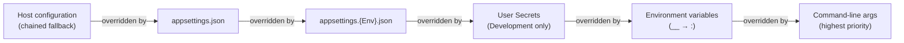
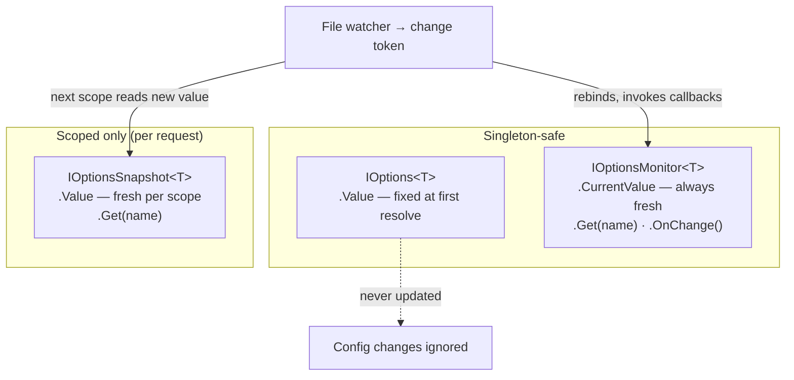
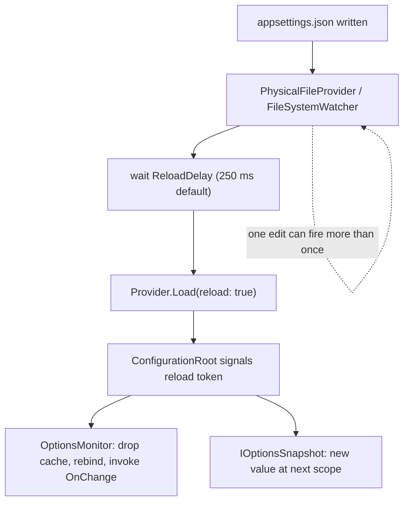

# Configuration Deep Dive

> [Mastery Guide](../../../README.md) › [Foundations](../../README.md) › [.NET Core Deep Dive](README.md)

| Status | Priority | Phase | Last reviewed |
|---|---|---|---|
| Not Started | High | Phase 3 — ASP.NET Core Fundamentals | 2026-08-10 |

> 📘 **Canonical file**: this is the single source of truth for configuration and the Options pattern. Core concepts, diagrams, pitfalls, interview-ready summary, drills, cheat sheet, walkthrough and self-test all live here — there is no companion file to bounce to.

## Why it matters

Almost every non-trivial decision a service makes — which database to talk to, which Key Vault to read, which feature flag is on, how aggressive the retry policy is — is steered by configuration. Get it wrong and you ship secrets to GitHub, hard-code production endpoints into dev builds, or silently swallow a typo'd environment variable that should have crashed the service at boot.

.NET's configuration system is *deceptively* simple at the surface (`builder.Configuration["Key"]`) and *substantially* more nuanced underneath: a layered, ordered chain of providers, three different `IOptions<T>` consumer interfaces with different lifetimes, change-token plumbing for hot reload, validation hooks that can fail-fast at startup, and a separate secrets pipeline that grafts onto the same tree.

Senior interviews routinely probe this: "what's the difference between `IOptions`, `IOptionsSnapshot`, and `IOptionsMonitor`," "what happens if a singleton consumes `IOptionsSnapshot`," "how does `appsettings.Production.json` override `appsettings.json`," "where do User Secrets live and why aren't they checked in." This file is the long-form reference for those questions.

## Contents
- [Configuration Deep Dive](#26-configuration-deep-dive)
  - [Why it matters](#why-it-matters)
  - [Without configuration vs with configuration](#without-configuration-vs-with-configuration)
  - [Real-world analogy](#real-world-analogy)
  - [Core concepts](#core-concepts)
    - [`IConfiguration` — the flat hierarchical tree](#iconfiguration--the-flat-hierarchical-tree)
    - [Configuration providers and order of precedence](#configuration-providers-and-order-of-precedence)
    - [Strongly-typed binding with `Configure<T>`](#strongly-typed-binding-with-configuret)
    - [Named options](#named-options)
    - [`PostConfigure<T>` and `PostConfigureAll<T>`](#postconfiguret-and-postconfigureallt)
    - [`OptionsBuilder<T>` — the fluent surface](#optionsbuildert--the-fluent-surface)
    - [Binding collections, dictionaries, and arrays](#binding-collections-dictionaries-and-arrays)
    - [Type conversion — how strings become values](#type-conversion--how-strings-become-values)
    - [`IOptions<T>` vs `IOptionsSnapshot<T>` vs `IOptionsMonitor<T>`](#ioptionst-vs-ioptionssnapshott-vs-ioptionsmonitort)
    - [Validation — DataAnnotations, `IValidateOptions<T>`, `ValidateOnStart`](#validation--dataannotations-ivalidateoptionst-validateonstart)
    - [Reloading and change tokens](#reloading-and-change-tokens)
    - [Secrets — User Secrets, Key Vault, connection strings](#secrets--user-secrets-key-vault-connection-strings)
    - [Hot-reload pitfalls (captive options)](#hot-reload-pitfalls-captive-options)
    - [Scope validation — the switch that makes captive dependencies throw](#scope-validation--the-switch-that-makes-captive-dependencies-throw)
    - [Anti-pattern — injecting `IConfiguration` into services](#anti-pattern--injecting-iconfiguration-into-services)
    - [Source-generated binding and Native AOT](#source-generated-binding-and-native-aot)
  - [Comparison matrix](#comparison-matrix)
  - [Code & diagrams](#code--diagrams)
  - [Common pitfalls](#common-pitfalls)
  - [Best practices](#best-practices)
  - [Real-world scenarios](#real-world-scenarios)
  - [Interview-ready summary](#interview-ready-summary)
  - [Interview Cross-Questioning Drill](#interview-cross-questioning-drill)
  - [Cheat Sheet](#cheat-sheet)
  - [Walkthrough](#walkthrough)
  - [Self-test](#self-test)
  - [Cross-references](#cross-references)
  - [Sources](#sources)

---

## 26. Configuration Deep Dive

> **Difficulty:** Intermediate to Advanced | **Reading Time:** ~55 min

### Without configuration vs with configuration

```
WITHOUT a configuration system (hard-coded):

   ┌──────────────────────────────────────────────┐
   │ public class EmailService                    │
   │ {                                            │
   │   private const string Host = "smtp.prod...";│ ← Wrong host in dev
   │   private const int    Port = 587;           │ ← Can't change without
   │   private const string Pwd  = "P@ssw0rd!";   │   recompiling.
   │ }                                            │ ← Password in source!
   └──────────────────────────────────────────────┘
   Problems:
   ├─ Same binary in dev/staging/prod — impossible
   ├─ Secrets committed to Git
   ├─ Every change = redeploy
   └─ Per-tenant or per-region overrides = N copies of code

WITH a layered configuration system:

   ┌─────────────────────────────────────────────────────────────┐
   │ appsettings.json (committed)                                │
   │   "Smtp": { "Host": "localhost", "Port": 25 }               │
   ├─────────────────────────────────────────────────────────────┤
   │ appsettings.Production.json (committed, overlays in prod)   │
   │   "Smtp": { "Host": "smtp.prod.example.com", "Port": 587 }  │
   ├─────────────────────────────────────────────────────────────┤
   │ Environment variables  (set by container/host)              │
   │   Smtp__Host = smtp.eu-prod.example.com  (per-region tweak) │
   ├─────────────────────────────────────────────────────────────┤
   │ User Secrets (dev box only — never committed)               │
   │   Smtp:Password = "real-secret"                             │
   ├─────────────────────────────────────────────────────────────┤
   │ Azure Key Vault (prod — pulled at startup)                  │
   │   Smtp--Password = "prod-secret"                            │
   └─────────────────────────────────────────────────────────────┘
                              ↓ merged ↓
   ┌─────────────────────────────────────────────────────────────┐
   │ IConfiguration["Smtp:Host"]    → environment-correct value  │
   │ IConfiguration["Smtp:Password"]→ never in source control    │
   └─────────────────────────────────────────────────────────────┘
   Same binary, different settings per environment.
```

### Real-world analogy

Think of configuration as **a layered onion of defaults and overrides**:

```
            ┌─────────────────────────┐
            │   Command-line flags    │ ← outermost: temporary, debug runs
            │ ┌─────────────────────┐ │
            │ │ Environment variables│ │ ← container/host overlay
            │ │ ┌─────────────────┐ │ │
            │ │ │  User Secrets    │ │ │ ← dev-machine only
            │ │ │ ┌─────────────┐  │ │ │
            │ │ │ │appsettings   │  │ │ │ ← committed defaults
            │ │ │ │  .{Env}.json │  │ │ │   (per-environment)
            │ │ │ │ ┌─────────┐  │  │ │ │
            │ │ │ │ │settings │  │  │ │ │ ← committed defaults
            │ │ │ │ │ .json   │  │  │ │ │   (base for everyone)
            │ │ │ │ └─────────┘  │  │ │ │
            │ │ │ └─────────────┘  │ │ │
            │ │ └─────────────────┘ │ │
            │ └─────────────────────┘ │
            └─────────────────────────┘
            Outer layers WIN over inner layers when keys collide.
```

Or — a touring musician's setlist:

- **`appsettings.json`** is the printed song list — works in every venue.
- **`appsettings.Production.json`** is the venue-specific tweak (different encore for the European tour).
- **Environment variables** are the show-day cue card the road manager hands out.
- **User Secrets** are the private notebook — never shown to the audience.
- **Key Vault** is the locked road case where the master tapes live; only certain crew can open it.
- **Command-line args** are the conductor improvising mid-show — overrides everything.

### Core concepts

#### `IConfiguration` — the flat hierarchical tree

`IConfiguration` exposes a unified, **string-keyed**, hierarchical key-value tree. Despite the JSON in `appsettings.json` looking nested, the underlying model is *flat*: every leaf has a colon-delimited path.

```
appsettings.json:                       Internal tree:
{                                       Smtp:Host         = smtp.example.com
  "Smtp": {                             Smtp:Port         = 587
    "Host": "smtp.example.com",   →     Smtp:Credentials:User = admin
    "Port": 587,                        Smtp:Credentials:Pwd  = ***
    "Credentials": {                    Logging:LogLevel:Default = Information
      "User": "admin",
      "Pwd":  "***"
    }
  },
  "Logging": { ... }
}
```

```
┌────────────────────────────────────────┐
│ IConfiguration Properties              │
├────────────────────────────────────────┤
│ ✓ Read-only at the tree level          │
│ ✓ String-keyed; colon-delimited paths  │
│ ✓ Same shape regardless of source      │
│ ✓ Sections are also IConfiguration     │
│ ✓ Supports change tokens               │
│ ✗ Values are always strings until bound│
│ ✗ Missing keys return null (no throw)  │
└────────────────────────────────────────┘
```

**Reading values:**

```csharp
// Direct indexer — string out, null if missing
string? host = builder.Configuration["Smtp:Host"];

// Typed read with default
int port = builder.Configuration.GetValue<int>("Smtp:Port", defaultValue: 25);

// Section as a sub-IConfiguration
IConfigurationSection smtp = builder.Configuration.GetSection("Smtp");
string? user = smtp["Credentials:User"];

// Connection strings — convention helper that reads "ConnectionStrings:Default"
string? cs = builder.Configuration.GetConnectionString("Default");
```

**Environment-variable key flattening:** the colon (`:`) used in keys is illegal in some shells, so providers translate **double underscore (`__`)** into colon:

```
Smtp__Credentials__Pwd   →  Smtp:Credentials:Pwd
```

#### Configuration providers and order of precedence

`WebApplication.CreateBuilder(args)` registers a fixed default chain. **Providers added later override earlier providers** for any colliding key — last writer wins.

```
┌─────────────────────────────────────────────────────────────────┐
│ Default provider chain (in registration order, last wins)       │
├─────────────────────────────────────────────────────────────────┤
│ 1. ChainedConfigurationProvider  (host config — content root)   │
│ 2. appsettings.json                                             │
│ 3. appsettings.{Environment}.json     (e.g. Production)         │
│ 4. User Secrets    (Development environment only)               │
│ 5. Environment Variables                                        │
│ 6. Command-line args                                            │
└─────────────────────────────────────────────────────────────────┘
                              ↓
                Highest priority wins on conflict
```

**ASCII walkthrough — same key resolved through the chain:**

```
Looking up "Smtp:Port"

  appsettings.json            → 25
  appsettings.Production.json → 587      (overrides 25)
  Environment SMTP__PORT=2525 → 2525     (overrides 587)
  CLI --Smtp:Port=8025        → 8025     (overrides 2525)

  Final value visible to app: 8025
```

Three details that separate a memorised list from an understood one:

- **Entry 1 is real, and people forget it.** Host configuration — `ASPNETCORE_`/`DOTNET_`-prefixed environment variables plus the command line, used to bootstrap the environment name and content root — is chained into app configuration as a *fallback*, so any app-level source overrides it. Microsoft's list of default app configuration sources (highest to lowest) ends with "Fallback host configuration".
- **The command-line provider is used twice.** Once early, so `--environment Staging` can decide *which* `appsettings.{Environment}.json` gets loaded, and once at the end — which is why the command line ends up highest priority.
- **`builder.Configuration` is a `ConfigurationManager`, not a plain `ConfigurationBuilder`.** It implements both `IConfigurationBuilder` and `IConfigurationRoot`, and per its API docs, "as sources are added, it updates its current view of configuration". That is why `builder.Configuration["Foo"]` returns a value *while you are still adding sources*, and why branching registration on a config value in `Program.cs` works:

```csharp
// Readable mid-build because ConfigurationManager keeps a live view
if (builder.Configuration.GetValue<bool>("Features:UseRedis"))
    builder.Services.AddStackExchangeRedisCache(o => { /* ... */ });
```

**Debugging precedence:** `IConfigurationRoot.GetDebugView()` prints every key with the provider that supplied the winning value — the fastest way to answer "why is this value not what I set?".

```csharp
app.Logger.LogDebug(((IConfigurationRoot)builder.Configuration).GetDebugView());
```

> ⚠️ `GetDebugView()` prints **values**, including secrets. Never wire it to an unauthenticated endpoint or a production log sink.

**When to add custom providers:**

```
┌──────────────────────────────────────┐
│ Add a custom provider when…          │
├──────────────────────────────────────┤
│ ✓ Pulling secrets from Key Vault     │
│ ✓ Reading from Consul / etcd / Vault │
│ ✓ Loading per-tenant overrides       │
│ ✓ Reading INI / YAML / XML files     │
└──────────────────────────────────────┘
```

```csharp
// Add Azure Key Vault as a provider — populates IConfiguration with secrets
builder.Configuration.AddAzureKeyVault(
    new Uri("https://my-vault.vault.azure.net/"),
    new DefaultAzureCredential());

// Add a custom in-memory provider (handy for tests)
builder.Configuration.AddInMemoryCollection(new Dictionary<string, string?>
{
    ["Smtp:Host"] = "test-host"
});
```

#### Strongly-typed binding with `Configure<T>`

Reading raw strings everywhere is brittle. The options pattern binds a configuration section to a **typed POCO**, validates it, and injects it.

```csharp
// 1. POCO matches the config shape
public class SmtpSettings
{
    public string Host { get; set; } = "";
    public int Port { get; set; } = 25;
    public bool UseTls { get; set; } = true;
    public Credentials Credentials { get; set; } = new();
}
public class Credentials
{
    public string User { get; set; } = "";
    public string Pwd { get; set; } = "";
}

// 2. Bind it during DI registration
builder.Services.Configure<SmtpSettings>(
    builder.Configuration.GetSection("Smtp"));

// Or with the fluent options builder (preferred — composes with validation)
builder.Services.AddOptions<SmtpSettings>()
    .Bind(builder.Configuration.GetSection("Smtp"));

// 3. Inject and use
public class EmailService(IOptions<SmtpSettings> options)
{
    private readonly SmtpSettings _smtp = options.Value;
    public void Send() => Console.WriteLine($"Connecting to {_smtp.Host}:{_smtp.Port}");
}
```

`BindConfiguration("SectionName")` is the same thing expressed on the fluent builder. Instead of you handing it a section, it resolves `IConfiguration` from the DI container and binds the named section path — so you do not need `builder.Configuration` in scope:

```csharp
builder.Services.AddOptions<SmtpSettings>()
    .BindConfiguration("Smtp")
    .ValidateDataAnnotations()
    .ValidateOnStart();
```

> **Do not confuse `BindConfiguration` with source generation.** `BindConfiguration` is reflection-based like everything else — its signature carries `[RequiresDynamicCode]` and `[RequiresUnreferencedCode]`. Source-generated binding is a separate, opt-in compiler feature; see [Source-generated binding and Native AOT](#source-generated-binding-and-native-aot).

```
┌────────────────────────────────────────┐
│ Strongly-typed binding properties      │
├────────────────────────────────────────┤
│ ✓ Compile-time field names             │
│ ✓ Validation hooks                     │
│ ✓ Auto-conversion of types             │
│ ✓ Reload-aware via IOptionsMonitor     │
│ ✗ Property names must match keys       │
│ ✗ Silent on missing sub-keys           │
└────────────────────────────────────────┘
```

#### Named options

You can register several *instances* of the same options type under different string names — two SMTP servers (transactional vs marketing), one HTTP client policy per downstream, one settings object per tenant.

```csharp
builder.Services.Configure<SmtpSettings>("Transactional",
    builder.Configuration.GetSection("Smtp:Transactional"));
builder.Services.Configure<SmtpSettings>("Marketing",
    builder.Configuration.GetSection("Smtp:Marketing"));

public class MultiSmtpService(IOptionsMonitor<SmtpSettings> monitor)
{
    public SmtpSettings Transactional => monitor.Get("Transactional");
    public SmtpSettings Marketing     => monitor.Get("Marketing");
}
```

The rule that gets tested: **`IOptionsSnapshot<T>` and `IOptionsMonitor<T>` both expose `.Get(name)`; `IOptions<T>` does not.** `IOptions<T>.Value` always returns the unnamed default instance. If your design needs named instances, `IOptions<T>` is off the table.

An unnamed registration is really just the instance whose name is `Options.DefaultName` (the empty string), which is why the same validator and post-configure machinery covers both.

#### `PostConfigure<T>` and `PostConfigureAll<T>`

`PostConfigure<T>` registers an action that runs **after every `Configure<T>` action for that type, regardless of registration order**. It is the last thing to touch the object before a consumer sees it.

```csharp
// Runs after the library's own AddLibrary() configuration, whatever order they were added in
builder.Services.PostConfigure<SmtpSettings>(opts =>
{
    if (builder.Environment.IsProduction())
        opts.UseTls = true;
});
```

Two uses that come up constantly:

1. **Overriding a third-party library** that calls `services.Configure<TheirOptions>(...)` inside its own `AddX()` extension. You cannot reach inside their registration, but `PostConfigure` is guaranteed to run last.
2. **Computed defaults** — deriving one setting from another after binding.

`PostConfigure<T>` without a name targets **only the default (unnamed) instance**. `PostConfigureAll<T>` applies to **every** instance, named and unnamed. Reaching for `PostConfigure` in an app that uses named options is a classic "why didn't my override apply" bug.

#### `OptionsBuilder<T>` — the fluent surface

`AddOptions<T>()` returns an `OptionsBuilder<T>`. Everything else chains off it:

```csharp
builder.Services.AddOptions<SmtpSettings>()
    .Bind(builder.Configuration.GetSection("Smtp"))   // or .BindConfiguration("Smtp")
    .Configure(o => o.Port = o.Port == 0 ? 587 : o.Port)
    .PostConfigure(o => o.Host = o.Host.Trim())
    .Validate(o => !o.UseTls || o.Port is 587 or 465, "TLS requires port 587 or 465.")
    .ValidateDataAnnotations()
    .ValidateOnStart();
```

`services.Configure<T>(section)` is the shorthand: it binds and nothing else — no validation, no `ValidateOnStart`. Both end up registering the same `IOptions<T>` / `IOptionsSnapshot<T>` / `IOptionsMonitor<T>` services.

**They compose; they do not replace.** Calling `Configure<T>` twice (or `Configure<T>` plus `AddOptions<T>().Bind()`) does not make the second call win wholesale — *every* registered configure action runs, in registration order, against the same instance. Later actions overwrite the individual properties they touch and leave the rest alone.

#### Binding collections, dictionaries, and arrays

The binder walks nested types recursively. JSON arrays bind to `List<T>` / `T[]`; JSON objects bind to `Dictionary<string, T>`. No extra registration is needed.

```json
{
  "Egress": {
    "AllowedOrigins": [ "https://api.example.com", "https://app.example.com" ],
    "FeatureFlags": { "DarkMode": true, "BetaSearch": false }
  }
}
```

```csharp
public class EgressSettings
{
    public List<string> AllowedOrigins { get; set; } = new();
    public Dictionary<string, bool> FeatureFlags { get; set; } = new();
}
```

Array elements are just keys with numeric segments, so the environment-variable form uses the index directly:

```
Egress__AllowedOrigins__0=https://api.example.com
Egress__AllowedOrigins__1=https://app.example.com
Egress__FeatureFlags__DarkMode=true
```

**The merge rule that surprises people:** overriding `Egress__AllowedOrigins__0` from the environment replaces *index 0 only*. If the JSON file defined three entries, you still get three — indices 1 and 2 survive. Configuration merges **per leaf key**, not per array and not per section (see [additive leaf overlay](#drill-9--environment-specific-layering)). There is no "clear this array" key; if you need a different length, override every index you want, and be aware that a shorter environment list cannot shrink a longer file list.

#### Type conversion — how strings become values

Every configuration value arrives as a `string`. The reflection binder converts it with `TypeDescriptor.GetConverter(type).ConvertFromInvariantString(value)`, and **when that conversion throws, the binder wraps it in an `InvalidOperationException`** — `Failed to convert configuration value '{value}' at '{path}' to type '{type}'.` It does not silently fall back to the default. There is no special-casing for `bool` or enums: whatever `TypeDescriptor` says, goes.

| Config value | Target | Result |
|---|---|---|
| `"FeatureEnabled": true` | `bool` | ✅ `true` (JSON boolean) |
| `"FeatureEnabled": "true"` | `bool` | ✅ `true` (`bool.Parse`, case-insensitive) |
| `"FeatureEnabled": "1"` | `bool` | ❌ `InvalidOperationException` |
| `"FeatureEnabled": "yes"` | `bool` | ❌ `InvalidOperationException` |
| `"Level": "Warning"` | `enum` | ✅ parsed case-insensitively |
| `"Level": "Wraning"` | `enum` | ❌ `InvalidOperationException` |
| `"Level": "5"` | `enum` | ✅ value `5` — **even if no member is defined for it** |
| `"Timeout": "00:01:30"` | `TimeSpan` | ✅ `TimeSpan.Parse` — `[d.]hh:mm:ss[.fffffff]` |
| `"Timeout": "90s"` | `TimeSpan` | ❌ `TimeSpan.Parse` has no such format |

Consequences worth remembering:

- Prefer the literal JSON `true` over the string `"true"` — same value, no parse ambiguity, and it stops anyone from "helpfully" changing it to `1`.
- A numeric enum value binds even when it names no member, so `Enum.IsDefined` in an `IValidateOptions<T>` is the only thing that catches `"Level": "99"`.
- Environment variables have no types at all — everything is a string there, so `Smtp__UseTls=true` is the string `"true"` and parses fine, but `Smtp__UseTls=1` throws.
- For human-friendly durations (`"90s"`, `"5m"`) bind a `string` and parse it yourself, or attach a custom `TypeConverter` to a dedicated type. Do not expect the built-in binder to do it.

#### `IOptions<T>` vs `IOptionsSnapshot<T>` vs `IOptionsMonitor<T>`

The single most-asked configuration question in interviews. Three interfaces for consuming the *same* bound `T`, with three different lifetimes and reload behaviors.

```
┌──────────────────────┬────────────────┬────────────────────┬────────────────────┐
│ Feature              │ IOptions<T>    │ IOptionsSnapshot<T>│ IOptionsMonitor<T> │
├──────────────────────┼────────────────┼────────────────────┼────────────────────┤
│ DI Lifetime          │ Singleton      │ Scoped             │ Singleton          │
│ Reads config on      │ First resolve  │ Each request/scope │ Real-time          │
│ Hot reload           │ ❌ No          │ ✅ Yes (per scope) │ ✅ Yes (immediate) │
│ Change notification  │ ❌ No          │ ❌ No              │ ✅ Yes (OnChange)  │
│ Safe in singleton    │ ✅             │ ❌ Captive!        │ ✅                 │
│ Allocates per access │ No             │ Per-scope cache    │ No                 │
│ Best for             │ Static config  │ Per-request config │ Long-lived/dynamic │
└──────────────────────┴────────────────┴────────────────────┴────────────────────┘
```

```csharp
// IOptions<T> — fixed at first resolve, never changes
public class EmailService(IOptions<SmtpSettings> options)
{
    private readonly SmtpSettings _smtp = options.Value;  // captured once
    public void Send() { /* uses _smtp — never updates */ }
}

// IOptionsSnapshot<T> — fresh per scoped request (web requests)
public class EmailController(IOptionsSnapshot<SmtpSettings> options) : ControllerBase
{
    public IActionResult Send()
    {
        var smtp = options.Value;  // fresh value at start of THIS request
        return Ok(smtp.Host);
    }
}

// IOptionsMonitor<T> — real-time + change callback
public class BackgroundEmailWorker : BackgroundService
{
    private SmtpSettings _smtp;
    private readonly IDisposable? _listener;

    public BackgroundEmailWorker(IOptionsMonitor<SmtpSettings> monitor)
    {
        _smtp = monitor.CurrentValue;
        // The callback runs on another thread with no synchronisation guarantee,
        // so publish the whole new instance atomically — see pitfall 15.
        _listener = monitor.OnChange(updated => Volatile.Write(ref _smtp, updated));
    }

    protected override async Task ExecuteAsync(CancellationToken stoppingToken)
    {
        var cfg = Volatile.Read(ref _smtp);   // one consistent snapshot per iteration
        // ... use cfg.Host / cfg.Port
    }

    public override void Dispose()
    {
        _listener?.Dispose();   // dropping this IDisposable leaks the subscription
        base.Dispose();
    }
}
```

**When to use which:**

```
┌──────────────────────────────────────┬───────────────────────┐
│ Scenario                             │ Use                   │
├──────────────────────────────────────┼───────────────────────┤
│ Settings never change at runtime     │ IOptions<T>           │
│ HTTP controller / per-request config │ IOptionsSnapshot<T>   │
│ Background service / singleton       │ IOptionsMonitor<T>    │
│ Need to react to changes (cache bust)│ IOptionsMonitor<T>    │
│ Library code injecting options       │ IOptions<T> (default) │
└──────────────────────────────────────┴───────────────────────┘
```

#### Validation — DataAnnotations, `IValidateOptions<T>`, `ValidateOnStart`

Failing at startup is *vastly* better than failing on the first user request at 3 AM.

**DataAnnotations:**

```csharp
public class SmtpSettings
{
    [Required, MinLength(1)]
    public string Host { get; set; } = "";

    [Range(1, 65535)]
    public int Port { get; set; } = 25;

    [RegularExpression(@"^smtp\..+")]
    public string? Endpoint { get; set; }
}

builder.Services.AddOptions<SmtpSettings>()
    .Bind(builder.Configuration.GetSection("Smtp"))
    .ValidateDataAnnotations()
    .ValidateOnStart();      // ← critical: validates at app start, not first use
```

**Custom `IValidateOptions<T>`** for cross-field rules:

```csharp
public class SmtpSettingsValidator : IValidateOptions<SmtpSettings>
{
    public ValidateOptionsResult Validate(string? name, SmtpSettings options)
    {
        if (options.UseTls && options.Port == 25)
            return ValidateOptionsResult.Fail(
                "TLS requires port 587 or 465; got 25.");
        return ValidateOptionsResult.Success;
    }
}

builder.Services.AddSingleton<IValidateOptions<SmtpSettings>, SmtpSettingsValidator>();
```

**Fluent inline:**

```csharp
builder.Services.AddOptions<SmtpSettings>()
    .Bind(builder.Configuration.GetSection("Smtp"))
    .Validate(s => !s.UseTls || s.Port is 587 or 465,
              "TLS requires port 587 or 465.")
    .ValidateOnStart();
```

Three mechanics that decide whether validation actually protects you:

- **Multiple `IValidateOptions<T>` for the same `T` all run**, and their failures are aggregated into a single `OptionsValidationException` rather than the first one short-circuiting. Splitting rules across small, individually testable validators costs nothing.
- **`Validate(string? name, T options)` is called for every instance**, and for the default instance `name` is `Options.DefaultName` — the **empty string, not `null`**. `OptionsManager.Get` normalises `name ??= Options.DefaultName` before the factory runs, so a `null` never reaches your validator. Scope a validator with `if (name != "Marketing") return ValidateOptionsResult.Skip;`.
- **`ValidateOnStart()` is per named instance.** It is registered on one `OptionsBuilder<T>` and keys its startup check on `(typeof(TOptions), builder.Name)`, forcing `Get(thatName)` and nothing else. Named instances registered elsewhere are still validated *lazily*. One `ValidateOnStart()` does not fail-fast a whole type.

#### Reloading and change tokens

`appsettings.json` providers default to `reloadOnChange: true` — the file is watched via `FileSystemWatcher`, and changes propagate via `IChangeToken`. `IOptionsSnapshot<T>` and `IOptionsMonitor<T>` honor this; `IOptions<T>` does not.

```csharp
// Default behavior — reload-on-change is ON
builder.Configuration.AddJsonFile("appsettings.json",
    optional: false, reloadOnChange: true);

// Subscribe to raw config changes (rarely needed; prefer IOptionsMonitor)
ChangeToken.OnChange(
    () => builder.Configuration.GetReloadToken(),
    () => Console.WriteLine("Config reloaded."));
```

```
┌────────────────────────────────────┐
│ Reload pipeline                    │
├────────────────────────────────────┤
│ 1. File changes on disk            │
│ 2. FileSystemWatcher fires         │
│ 3. Provider re-reads, builds tree  │
│ 4. IChangeToken signaled           │
│ 5. IOptionsMonitor.OnChange runs   │
│ 6. IOptionsSnapshot updates next   │
│    request                         │
└────────────────────────────────────┘
```

Name the plumbing precisely — interviewers push on this: `PhysicalFileProvider` → `FileSystemWatcher` → `CancellationChangeToken` → the provider reloads → `ConfigurationRoot` signals its reload token → `IOptionsMonitor<T>` drops the cached instance, rebinds, and invokes `OnChange` subscribers; `IOptionsSnapshot<T>` picks up the new value at the next scope.

**Caveats:**
- Environment variables and command-line args do **not** reload — they are read once at startup. Changing an env var on a running process has no effect on `IConfiguration`.
- **The Key Vault provider does not reload by default.** `AzureKeyVaultConfigurationOptions.ReloadInterval` is a `TimeSpan?` whose default is `null`, and the docs are explicit: "By default, the configuration provider caches secrets for the application lifetime. The app ignores secrets that are later disabled or updated in the key vault." You must set `ReloadInterval` or call `IConfigurationRoot.Reload()` yourself.
- **File reload is deliberately delayed, not debounced.** `FileConfigurationSource.ReloadDelay` defaults to **250 ms** — documented as "the number of milliseconds that reload will wait before calling Load", to "avoid triggering reload before a file is completely written". It is a fixed wait after the watcher fires, not a coalescing window.
- **One edit can raise several notifications.** Per Microsoft's change-token guidance, "a configuration file's `FileSystemWatcher` can trigger multiple token callbacks for a single configuration file change" — editors that save by writing a temp file and renaming are the usual cause. Write `OnChange` handlers so that running twice is harmless.

#### Secrets — User Secrets, Key Vault, connection strings

**The cardinal rule:** secrets never live in source control. Period.

**User Secrets (development only):**

```bash
# Initialize once per project (writes a UserSecretsId to .csproj)
dotnet user-secrets init

# Set a secret — stored under %APPDATA%\Microsoft\UserSecrets\<id>\secrets.json
dotnet user-secrets set "Smtp:Pwd" "dev-password"

# List all
dotnet user-secrets list
```

The User Secrets provider is added automatically in the `Development` environment. The file lives outside the repo and per-developer.

**Azure Key Vault (production):**

```csharp
builder.Configuration.AddAzureKeyVault(
    new Uri("https://my-vault.vault.azure.net/"),
    new DefaultAzureCredential(),
    new AzureKeyVaultConfigurationOptions
    {
        // Default is null = never re-poll. Set it if you rotate secrets in place.
        ReloadInterval = TimeSpan.FromMinutes(5)
    });
```

Key Vault secret names may contain only alphanumerics and dashes — the colon is illegal — so **hierarchy uses two dashes**: `Smtp--Pwd` is loaded as `Smtp:Pwd`.

**Connection strings — convention helper:**

```json
{
  "ConnectionStrings": {
    "Default": "Server=...;Database=...;",
    "ReadOnlyReplica": "Server=ro-...;Database=...;"
  }
}
```

```csharp
string? cs = builder.Configuration.GetConnectionString("Default");
// documented as shorthand for GetSection("ConnectionStrings")["Default"]
```

From the environment, the ordinary form is `ConnectionStrings__Default=…`. In addition, the **environment-variables provider itself** — not any hosting platform — applies special processing to a fixed set of prefixes. When no prefix argument is passed to `AddEnvironmentVariables()` (the default), a variable named `{PREFIX}{KEY}` is loaded as `ConnectionStrings:{KEY}`, and for the database prefixes a companion `ConnectionStrings:{KEY}_ProviderName` entry is created:

| Environment variable | Configuration key | Provider entry |
|---|---|---|
| `CUSTOMCONNSTR_Orders` | `ConnectionStrings:Orders` | none |
| `SQLCONNSTR_Orders` | `ConnectionStrings:Orders` | `System.Data.SqlClient` |
| `SQLAZURECONNSTR_Orders` | `ConnectionStrings:Orders` | `System.Data.SqlClient` |
| `MYSQLCONNSTR_Orders` | `ConnectionStrings:Orders` | `MySql.Data.MySqlClient` |

These are the names Azure App Service writes when you add a connection string in the portal, which is why the mapping exists — but the translation happens in .NET, so it behaves identically anywhere you set those variables. Newer target frameworks (ASP.NET Core 10+) document a wider list: `POSTGRESQLCONNSTR_` (which does get a provider entry, `Npgsql`), plus `APIHUBCONNSTR_`, `DOCDBCONNSTR_`, `EVENTHUBCONNSTR_`, `NOTIFICATIONHUBCONNSTR_`, `REDISCACHECONNSTR_` and `SERVICEBUSCONNSTR_`, all of which map the key but create no provider entry. Check the table for the framework you target rather than assuming.

```
┌──────────────────────────────┬─────────────────────────────────┐
│ Secret type                  │ Where it lives                  │
├──────────────────────────────┼─────────────────────────────────┤
│ Dev passwords                │ User Secrets (per-developer)    │
│ Prod passwords / API keys    │ Azure Key Vault / AWS Secrets M.│
│ Connection strings (prod)    │ Key Vault, surfaced via section │
│ Anything checked into Git    │ NEVER (rotate immediately if so)│
└──────────────────────────────┴─────────────────────────────────┘
```

#### Hot-reload pitfalls (captive options)

The single most-bitten gotcha. When a **singleton** consumes `IOptions<T>` (or worse, `IOptionsSnapshot<T>`), it captures a snapshot of the bound value forever — config changes never reach it.

**Without hot-reload awareness:**

```csharp
// ❌ Singleton captures value once; reload does nothing
builder.Services.AddSingleton<EmailService>();

public class EmailService(IOptions<SmtpSettings> options)
{
    private readonly SmtpSettings _smtp = options.Value;  // frozen forever
}
```

**Worse — singleton consuming `IOptionsSnapshot<T>` is a *captive dependency*:**

```csharp
// ❌ IOptionsSnapshot is Scoped; a Singleton must not capture it.
//    Whether this THROWS or silently misbehaves depends on scope validation —
//    see the next section. It is always wrong either way.
public class EmailService(IOptionsSnapshot<SmtpSettings> options) { }
```

**With hot-reload awareness:**

```csharp
// ✅ Singleton consumes IOptionsMonitor and re-reads CurrentValue
public class EmailService(IOptionsMonitor<SmtpSettings> monitor)
{
    public void Send()
    {
        var smtp = monitor.CurrentValue;   // freshest value every call
        // ...
    }
}
```

```
┌─────────────────────────┬───────────────────┬───────────────────┐
│ Consumer lifetime       │ Safe interfaces   │ AVOID             │
├─────────────────────────┼───────────────────┼───────────────────┤
│ Transient               │ All three         │ —                 │
│ Scoped (controllers)    │ All three         │ —                 │
│ Singleton (workers, BG) │ IOptions / Monitor│ IOptionsSnapshot  │
└─────────────────────────┴───────────────────┴───────────────────┘
```

#### Scope validation — the switch that makes captive dependencies throw

"Injecting `IOptionsSnapshot<T>` into a singleton throws" is only half an answer, and the other half is where interviews go. It throws **because scope validation is on**, and scope validation is not on everywhere.

Two switches on `ServiceProviderOptions`:

| Switch | What it catches | When |
|---|---|---|
| `ValidateScopes` | Resolving a scoped service from the root provider / into a singleton | at resolve time |
| `ValidateOnBuild` | The same lifetime mismatches, found by walking every registration | at `builder.Build()` |

**The default is environment-dependent, not version-dependent.** Microsoft's DI documentation states the check applies "when an app runs in the development environment": the default host turns both on for `IHostEnvironment.IsDevelopment()` and leaves them **off** otherwise. There is no .NET version at which Production started validating scopes by default.

So the honest answer is: in Development you get a loud `InvalidOperationException`; in Production, with defaults, the container happily resolves the scoped `IOptionsSnapshot<T>` from the root scope, the singleton pins it forever, and it **silently works wrong** — the exact failure mode validation exists to prevent.

Turn it on everywhere and find out at deploy time instead of at 3 AM:

```csharp
builder.Host.UseDefaultServiceProvider(o =>
{
    o.ValidateScopes  = true;
    o.ValidateOnBuild = true;   // fail at Build(), before anything starts
});
```

`ValidateOnBuild` costs a one-time startup walk of the registration graph. That is a good trade for almost every service.

#### Anti-pattern — injecting `IConfiguration` into services

```csharp
// ❌ BAD
public class OrderService(IConfiguration config)
{
    private readonly string _conn = config["ConnectionStrings:Orders"]!;
}

// ✅ GOOD
public class OrderService(IOptions<OrderSettings> opts)
{
    private readonly OrderSettings _settings = opts.Value;
}
```

Why it is bad: the service is hard to unit-test (you have to construct a real `IConfiguration`), infrastructure concerns leak into domain logic, key lookups are stringly-typed and scattered, and — the one that actually bites — **it bypasses the validation pipeline entirely**. `ValidateOnStart` cannot protect a key nobody bound.

**The legitimate exception**, which is worth volunteering in an interview because it shows you know the rule rather than reciting it: reading configuration in `Program.cs` to make *registration* decisions is fine. That code is composition-root infrastructure, it runs once, and you are not unit-testing it.

```csharp
// Fine: config drives which implementation gets registered
if (builder.Configuration.GetValue<bool>("Features:UseServiceBus"))
    builder.Services.AddSingleton<IBus, ServiceBusBus>();
else
    builder.Services.AddSingleton<IBus, InMemoryBus>();
```

#### Source-generated binding and Native AOT

Reflection-based binding needs runtime type metadata and dynamic code. Trimming removes the metadata; Native AOT removes dynamic code generation. Either way, reflection binding breaks — typically as a runtime "property not found" or a silently unbound property, which is worse.

.NET 8 introduced a **configuration binding source generator** that solves this by generating the binding code at compile time using C# 12 interceptors. Enable it in the project file:

```xml
<PropertyGroup>
  <EnableConfigurationBindingGenerator>true</EnableConfigurationBindingGenerator>
</PropertyGroup>
```

Things people get wrong about it:

- **It is a project-level switch, not an API choice.** Once enabled, the generator intercepts binding calls on `ConfigurationBinder` (`Bind`, `Get`, `GetValue`), `OptionsBuilderConfigurationExtensions` (`Bind`, `BindConfiguration`) and `OptionsConfigurationServiceCollectionExtensions` (`Configure<T>(section)`). Switching from `Configure<T>` to `BindConfiguration` does **not** get you source generation, and staying on `Configure<T>` does not lose it.
- **Your `Program.cs` does not change.** The call sites stay identical; the compiler substitutes generated code behind them.
- If `PublishAot` is on and the generator is off, the build tells you: `IL2026` from the trim analyser (the API is `[RequiresUnreferencedCode]`) and `IL3050` from the AOT analyser (`[RequiresDynamicCode]`).

Set `<EmitCompilerGeneratedFiles>true</EmitCompilerGeneratedFiles>` to read the generated binder — it is plain, readable code, and reading it once makes the whole feature obvious.

The same "source generator replaces reflection" pattern shows up in `JsonSerializerContext` for `System.Text.Json`, `[GeneratedRegex]` for regular expressions, and `[LoggerMessage]` for logging. Recognising the family is worth a point in an AOT question.

### Comparison matrix

```
┌──────────────────┬─────────────┬──────────────┬──────────────┐
│                  │ IOptions<T> │ Snapshot<T>  │ Monitor<T>   │
├──────────────────┼─────────────┼──────────────┼──────────────┤
│ Lifetime         │ Singleton   │ Scoped       │ Singleton    │
│ Reload aware     │ No          │ Yes          │ Yes          │
│ Change callback  │ No          │ No           │ Yes          │
│ Per-named value  │ No          │ Yes (Get)    │ Yes (Get)    │
│ Singleton-safe   │ Yes         │ No           │ Yes          │
│ Allocation cost  │ Lowest      │ Per scope    │ Lowest       │
│ Default choice   │ ✓ libraries │ ✓ controllers│ ✓ workers    │
└──────────────────┴─────────────┴──────────────┴──────────────┘
```

### Code & diagrams

<details>
<summary>🧩 Click to expand — code samples and diagrams</summary>

**Provider precedence chain**



**The IOptions trinity and who may consume what**



**Reload path, end to end**



**Production-grade registration, all mechanisms at once**

```csharp
var builder = WebApplication.CreateBuilder(args);

builder.Host.UseDefaultServiceProvider(o =>
{
    o.ValidateScopes  = true;
    o.ValidateOnBuild = true;
});

builder.Services.AddOptions<SmtpSettings>()
    .BindConfiguration("Smtp")
    .Validate(s => !s.UseTls || s.Port is 587 or 465, "TLS requires port 587 or 465.")
    .ValidateDataAnnotations()
    .ValidateOnStart();

// Cross-field / DI-dependent rules live in a class
builder.Services.AddSingleton<IValidateOptions<SmtpSettings>, SmtpSettingsValidator>();

// Last word on the object, whatever a library did earlier
builder.Services.PostConfigureAll<SmtpSettings>(o => o.Host = o.Host.Trim());

var app = builder.Build();
app.Run();
```

---

</details>

### Common pitfalls

```
┌────┬────────────────────────────────────────────────────────────────┐
│ #  │ Pitfall                                                        │
├────┼────────────────────────────────────────────────────────────────┤
│ 1  │ Captive options — singleton holding IOptions<T>.Value frozen   │
│ 2  │ Singleton injecting IOptionsSnapshot<T> (lifetime mismatch)    │
│ 3  │ reloadOnChange:false on appsettings — silent stale config      │
│ 4  │ Secrets committed to appsettings.json                          │
│ 5  │ Environment-name typo: "Develpoment" — matching is case-       │
│    │ insensitive, but a misspelling is still a different environment│
│ 6  │ Forgetting __ for env vars — `Smtp:Port` instead of `Smtp__Port`│
│ 7  │ Boolean parsing: only "true"/"false" — not "1"/"0"/"yes"       │
│ 8  │ Missing ValidateOnStart — bad config crashes on first request  │
│ 9  │ Property name mismatch — silent default values, no error       │
│ 10 │ Forgetting to add Key Vault provider in production startup     │
│ 11 │ Reading `IConfiguration["Foo"]` in a loop — string allocation  │
│ 12 │ Mutating IOptions<T>.Value — instances are shared, not copies  │
│ 13 │ Using __ INSIDE JSON — it is an env-var convention only        │
│ 14 │ Not disposing the IDisposable returned by OnChange — leak      │
│ 15 │ Unsynchronised field writes from an OnChange callback — race   │
│ 16 │ Hand-built ConfigurationBuilder in tests — different order     │
│    │ from the default host, so precedence assertions mislead        │
│ 17 │ Assuming scope validation protects you in Production — it is   │
│    │ enabled by default only in Development                         │
│ 18 │ PostConfigure<T> when you meant PostConfigureAll<T> — named    │
│    │ instances silently skip the override                           │
│ 19 │ ValidateOnStart covers ONE named instance — others are still   │
│    │ validated lazily on first resolve                              │
└────┴────────────────────────────────────────────────────────────────┘
```

**Pitfall 1 illustrated — "the value is correct on disk but my service ignores it":**

```csharp
// Bad: singleton with IOptions<T>.Value captured in ctor
builder.Services.AddSingleton<RateLimiter>();
public class RateLimiter(IOptions<RateLimitSettings> opts)
{
    private readonly int _max = opts.Value.MaxPerSecond;  // frozen!
}

// Good: monitor + CurrentValue read on each access
public class RateLimiter(IOptionsMonitor<RateLimitSettings> monitor)
{
    public bool Allow() => GetTokens() < monitor.CurrentValue.MaxPerSecond;
}
```

**Pitfall 7 illustrated — boolean parsing:**

```
appsettings.json: "FeatureEnabled": "1"     →  ✗ InvalidOperationException
appsettings.json: "FeatureEnabled": "yes"   →  ✗ InvalidOperationException
appsettings.json: "FeatureEnabled": true    →  ✓ true   (JSON bool, not string)
appsettings.json: "FeatureEnabled": "true"  →  ✓ true   (case-insensitive)
ENV: FeatureEnabled=true                    →  ✓ true
```

The binder throws — it does not quietly fall back to `false`. Full conversion table in [Type conversion](#type-conversion--how-strings-become-values).

**Pitfall 13 illustrated — `__` is an environment-variable convention, not a JSON one:**

```json
{ "Smtp__Host": "mail.example.com" }   // ✗ a literal key named "Smtp__Host"
{ "Smtp": { "Host": "mail.example.com" } }   // ✓ binds to Smtp:Host
```

The `__` → `:` translation lives in the environment-variables provider. JSON already has real nesting, so it never runs there. Symptom: the env var works, the file "doesn't", and both look right.

**Pitfall 15 illustrated — the `OnChange` data race:**

```csharp
// ❌ Unsynchronised: another thread can read a stale or half-published reference
public class Dispatcher
{
    private SmtpSettings _current;
    public Dispatcher(IOptionsMonitor<SmtpSettings> m)
    {
        _current = m.CurrentValue;
        m.OnChange(updated => _current = updated);   // also: return value dropped → leak
    }
}

// ✅ Publish a whole new immutable instance with a volatile write; snapshot it to read
public class Dispatcher : IDisposable
{
    private SmtpSettings _current;
    private readonly IDisposable? _sub;

    public Dispatcher(IOptionsMonitor<SmtpSettings> m)
    {
        _current = m.CurrentValue;
        _sub = m.OnChange(updated => Volatile.Write(ref _current, updated));
    }

    public void Send()
    {
        var cfg = Volatile.Read(ref _current);  // one consistent object for this call
        // ... use cfg.Host and cfg.Port — never re-read the field mid-operation
    }

    public void Dispose() => _sub?.Dispose();
}
```

Never mutate the options object in place after publishing it. Swap the whole reference; treat the instance as immutable.

### Best practices

1. **Hierarchical convention** — group related keys under one section per concern (`Smtp`, `Logging`, `RateLimits`). Bind one POCO per section.
2. **Validate at startup** — always pair `Bind()` with `ValidateDataAnnotations()` and `ValidateOnStart()`. Fail-fast beats fail-slow.
3. **Secrets out of source** — User Secrets in dev, Key Vault in prod, never `appsettings.*.json`.
4. **Document keys in README** — list every key your service reads, with default + required flag. Future-you will thank you.
5. **Prefer `IOptionsMonitor<T>` in singletons / `IOptionsSnapshot<T>` in controllers** — `IOptions<T>` only for libraries or truly static config.
6. **Per-environment files** — `appsettings.Development.json`, `appsettings.Staging.json`, `appsettings.Production.json`. Override only what differs.
7. **Turn on the configuration binding source generator** (`<EnableConfigurationBindingGenerator>true</EnableConfigurationBindingGenerator>`) if you trim or publish Native AOT — .NET 8+. It is a project-level switch and does not change your call sites.
8. **Validate URLs and connection strings** — use a custom `IValidateOptions<T>` to assert format at startup, not at run time. Validate *shape* here; validate *reachability* in an `IHostedService`.
9. **Don't read `IConfiguration` directly in business code** — bind to a typed POCO and inject `IOptions<T>`. The one legitimate exception is `Program.cs` registration decisions.
10. **Test with `AddInMemoryCollection`** — unit tests can substitute config without touching the file system.
11. **Turn on `ValidateScopes` and `ValidateOnBuild` in every environment** — the defaults only protect Development.
12. **Treat bound options as immutable** — never mutate `.Value`; the instance is shared.

### Real-world scenarios

**Scenario 1 — Multi-environment deployment**

```
Dev box:        appsettings.json + appsettings.Development.json + UserSecrets
Staging:        appsettings.json + appsettings.Staging.json    + ENV vars + KeyVault(staging)
Production:     appsettings.json + appsettings.Production.json + ENV vars + KeyVault(prod)
```

Same image, different `ASPNETCORE_ENVIRONMENT` value. Connection strings are the same key in all environments — only the resolved value differs.

**Scenario 2 — Per-tenant configuration overlay**

A SaaS service with hundreds of tenants. Use a custom configuration provider that reads tenant-specific overrides from a database or blob, layered on top of the defaults. Wrapping `IOptionsMonitor<T>.Get(name)` with the tenant ID gives O(1) per-tenant resolution.

```csharp
public class TenantOptionsResolver(IOptionsMonitor<SmtpSettings> monitor)
{
    public SmtpSettings ForTenant(string tenantId) => monitor.Get(tenantId);
}

// Configure named options per tenant
builder.Services.Configure<SmtpSettings>("tenant-acme",
    builder.Configuration.GetSection("Tenants:Acme:Smtp"));
```

**Scenario 3 — Runtime feature flags via config reload**

Edit `appsettings.json` (or push to Key Vault) → `IOptionsMonitor<FeatureFlags>` fires `OnChange` → service flips a flag without redeploying. Pair with a feature-flag SDK (e.g., Azure App Configuration, LaunchDarkly) for the production-grade version.

```csharp
public class CheckoutService(IOptionsMonitor<FeatureFlags> monitor)
{
    public IActionResult Checkout()
    {
        if (monitor.CurrentValue.NewCheckoutFlow)
            return RunNewFlow();
        return RunLegacyFlow();
    }
}
```

**Scenario 4 — Connection-string rotation without downtime**

Say your policy rotates the SQL password in Key Vault on a schedule. Three things have to line up:

1. **The provider has to re-poll.** `ReloadInterval` is `null` by default, so out of the box the app never sees the new secret. Set `ReloadInterval` (or expose an admin-triggered `IConfigurationRoot.Reload()`).
2. **Your code has to re-read.** Nothing in EF Core or ADO.NET subscribes to configuration. If you captured the connection string at startup — including `AddDbContext(o => o.UseSqlServer(config.GetConnectionString("Default")))`, which runs once — rotation cannot reach you. Resolve it per `DbContext` construction from `IOptionsMonitor<T>.CurrentValue` instead.
3. **The rotation itself has to overlap.** Between the vault write and the next poll, the app is still presenting the old password. If both passwords are valid during that window, nothing fails. If the rotation is atomic, new connections fail until the poll catches up — so the overlap window must exceed `ReloadInterval`, or you accept a short error budget.

The honest summary: the configuration system gives you *delivery* of the new secret. Zero downtime comes from the overlap window and from reading the value at use time, not from the options pattern by itself.

### Interview-ready summary

- `IConfiguration` is a flat, string-keyed tree; `:` is the path separator regardless of source. Values are strings until bound.
- Providers are additive and **last-writer-wins per leaf key**. Default order (lowest→highest): host config (chained fallback) → `appsettings.json` → `appsettings.{Environment}.json` → User Secrets (Development) → environment variables → command line.
- Environment variables use `__` for hierarchy because `:` is not portable; the translation happens in the env-var provider only, never in JSON.
- Key Vault secret names use `--` for hierarchy, translated to `:` on load.
- `IOptions<T>` — singleton, fixed at first resolve, no `.Get(name)`. `IOptionsSnapshot<T>` — scoped, fresh per scope, has `.Get(name)`, illegal in a singleton. `IOptionsMonitor<T>` — singleton, `.CurrentValue` always fresh, `.Get(name)`, `.OnChange()`.
- Captive dependency = singleton capturing a scoped service. Scope validation (`ValidateScopes` / `ValidateOnBuild`) turns it into a startup exception, and it is on by default **only in Development**.
- `Configure<T>` actions **compose** in registration order; `PostConfigure<T>` runs after all of them for the unnamed instance; `PostConfigureAll<T>` for every instance.
- `ValidateDataAnnotations()` for per-field rules, `.Validate(func, msg)` for a quick cross-field rule, `IValidateOptions<T>` for multi-rule or DI-dependent validation. Multiple validators all run and aggregate into one `OptionsValidationException`.
- `ValidateOnStart()` moves validation from first `.Value` access to host startup, so bad config never serves a request — but it applies to **one named instance**, the one whose `OptionsBuilder<T>` it was chained onto. Every name you want checked at boot needs its own chain.
- A validator's `name` argument is `Options.DefaultName` (`string.Empty`) for the default instance, never `null`.
- Reload is file-watcher → `ReloadDelay` (250 ms) → provider reload → change token → monitor rebind. Environment variables and command-line args never reload; Key Vault does not reload unless you set `ReloadInterval`.
- The `OnChange` callback runs on whatever thread signalled the reload with no synchronisation guarantee — publish a whole new instance with `Volatile.Write`, dispose the returned `IDisposable`, and make the handler safe to run twice.
- Binding is reflection-based and throws `InvalidOperationException` on a failed conversion. Native AOT / trimming needs `<EnableConfigurationBindingGenerator>true</EnableConfigurationBindingGenerator>` (.NET 8+), which is a project switch, not an API choice.
- Injecting `IConfiguration` into a service is an anti-pattern — except in `Program.cs`, where reading config to decide registrations is exactly right.

### Interview Cross-Questioning Drill

<details>
<summary>📖 Click to expand — 19 cross-question chains (~30-40 min, cover answers and write cold)</summary>

> ⚠️ **Honest caveat**: reading this section once doesn't make you interview-ready. Cover the answers, write them cold, then check. Pair with a senior for live mock cross-questioning. The guide removes "I never thought about that" surprises; mock interviews convert knowledge into reflex. Both are needed.

Each drill is **Q → A → Cross-Q → A → Cross-Q² → A**. Practice answering the cross-questions without re-reading. If you stumble on any cross-Q², go re-read the relevant section.

#### Drill 1 — Provider order

> **Q**: In a default ASP.NET Core app, what's the provider load order and who overrides whom?
>
> **A**: Host configuration (chained in as the bottom fallback) → `appsettings.json` → `appsettings.{Environment}.json` → User Secrets (Development only) → Environment Variables → Command-line args. **Later providers override earlier ones** for any colliding key, so `--Smtp:Port=8025` on the command line wins over everything else. Two details that mark out a senior answer: the chained **host configuration** layer is genuinely there at the bottom (Microsoft's own list ends with "Fallback host configuration"), and the **command-line provider is registered twice** — early, so `--environment Staging` can select which `appsettings.{Environment}.json` loads, and again at the end, which is what gives it top priority.
>
> **Cross-Q**: Where does Azure Key Vault fit?
>
> **A**: Wherever you register it — typically after appsettings but before env vars (so an env var can still override a vault secret during incident response). Provider order is determined by **registration order in `builder.Configuration.Add*`**, not by provider type. **Last `Add*` call wins on collision.**
>
> **Cross-Q²**: I want `appsettings.Production.json` to override Key Vault. Where do I register the Vault provider?
>
> **A**: Before `appsettings.Production.json`. Use `builder.Configuration.Sources.Insert(...)` or — more idiomatic — clear and rebuild the chain in the order you want. The default order assumes vault overrides files; flipping is unusual and usually a sign of a mis-modeled dependency.

#### Drill 2 — `IOptions<T>` vs `IOptionsSnapshot<T>` vs `IOptionsMonitor<T>`

> **Q**: Walk me through the three interfaces.
>
> **A**: `IOptions<T>` is **Singleton**, value captured at first resolve, never refreshes. `IOptionsSnapshot<T>` is **Scoped**, fresh per request/scope, honors hot reload. `IOptionsMonitor<T>` is **Singleton**, `CurrentValue` is always fresh, and `OnChange` fires when config reloads. **Rule of thumb**: controllers use `IOptionsSnapshot`, background services use `IOptionsMonitor`, libraries use `IOptions`.
>
> **Cross-Q**: Why is `IOptionsSnapshot<T>` Scoped and not Singleton?
>
> **A**: Because it caches the value for the duration of a scope (request) — multiple reads within a request see the same value, even if config changes mid-request. The scope is the natural unit of "stability." After the request ends, the next request gets a fresh value. **It's per-request caching with reload awareness.**
>
> **Cross-Q²**: Why does `IOptionsMonitor<T>` need `OnChange` if `CurrentValue` is always fresh?
>
> **A**: Polling `CurrentValue` works for "read on every use." But many use cases need *eager* reaction — invalidate a cache, refresh a connection, restart a downstream worker. `OnChange` lets you register a callback that fires only when config actually changes, so you don't do work on every read. **Pattern**: `_monitor.OnChange(updated => { cache.Invalidate(); ReWireWorker(updated); })`.

#### Drill 3 — Captive options trap

> **Q**: A singleton service injects `IOptions<MySettings>`. Config changes on disk. What does the singleton see?
>
> **A**: Nothing. `IOptions<T>` is captured at first resolve and never updates. The on-disk change is honored by `IOptionsSnapshot` / `IOptionsMonitor`, not `IOptions`. **Symptom**: "I edited `appsettings.json` and the file reloaded, but my rate limiter still uses the old value." The fix is `IOptionsMonitor<T>` and reading `.CurrentValue` on every use.
>
> **Cross-Q**: What if the singleton injects `IOptionsSnapshot<T>` instead?
>
> **A**: **Lifetime mismatch.** `IOptionsSnapshot<T>` is Scoped; a Singleton can't legally consume a Scoped service — it would *capture* the first scope's snapshot and pin it forever. **Captive dependency** — the canonical example. Whether you find out depends entirely on scope validation: the default host enables `ValidateScopes` and `ValidateOnBuild` **only when the environment is Development**, so in Development you get an `InvalidOperationException`; in Production, with defaults, the container resolves the scoped snapshot from the root scope and it silently works *wrong*. This is not version-gated — there is no .NET release where Production started validating scopes by default. Fix it by setting both switches explicitly in `UseDefaultServiceProvider` so the failure shows up in every environment.
>
> **Cross-Q²**: How do I expose the latest config to a Singleton without `IOptionsMonitor`?
>
> **A**: You can use `IServiceScopeFactory`: inside a singleton method, `using var scope = factory.CreateScope(); var opt = scope.ServiceProvider.GetRequiredService<IOptionsSnapshot<T>>().Value;` — fresh value per call. This is the workaround when, for some reason, `IOptionsMonitor` isn't appropriate. **Generally `IOptionsMonitor` is cleaner; use the scope factory only when you also need other scoped services.**

#### Drill 4 — `reloadOnChange: true`

> **Q**: What's the cost of `reloadOnChange: true` on `appsettings.json`?
>
> **A**: A `FileSystemWatcher` per file, plus a delayed re-parse on every change event. On healthy systems it's negligible. On containers with network or union file systems the watcher can produce spurious events or miss them entirely — verify on your actual platform rather than assuming. Memory cost is one `IChangeToken` per file. **Default in `WebApplication.CreateBuilder` is `true`** — leave it on unless you have a measured reason.
>
> **Cross-Q**: Why might I disable it?
>
> **A**: (1) Read-only containers where appsettings can't change at runtime by design. (2) Very large appsettings (multiple MB) where re-parsing is non-trivial. (3) Test environments where reload races interact badly with test setup. **Disable via `reloadOnChange: false`** in the explicit `AddJsonFile` call.
>
> **Cross-Q²**: I see the file changed but `IOptionsSnapshot.Value` is stale. Why?
>
> **A**: Two named mechanisms, not folklore. First, `FileConfigurationSource.ReloadDelay` — documented default **250 ms** — is a deliberate wait between the watcher firing and `Load()` being called, so a half-written file isn't parsed; a read inside that window sees the old value. Second, `FileSystemWatcher` is not one-event-per-edit: Microsoft's change-token guidance says a config file's watcher "can trigger multiple token callbacks for a single configuration file change", and editors that save via temp-file-plus-rename can surface as delete/create rather than change. Symptoms: stale value, or a callback that fires twice. **Workarounds**: make handlers idempotent, force a reload with `IConfigurationRoot.Reload()`, and confirm by subscribing to `IOptionsMonitor.OnChange` and logging.

#### Drill 5 — `IValidateOptions<T>`

> **Q**: When do you use DataAnnotations vs `IValidateOptions<T>` vs the fluent `.Validate(...)`?
>
> **A**: **DataAnnotations** for per-field rules (`[Required]`, `[Range]`, `[RegularExpression]`) — declarative and visible in the POCO. **`.Validate(s => ..., "msg")`** for cross-field rules inline at registration (`UseTls && Port == 25` → fail). **`IValidateOptions<T>`** for complex multi-rule validation that needs DI (resolves other services for validation context). All three compose; you can layer them.
>
> **Cross-Q**: What does `ValidateOnStart()` actually do?
>
> **A**: It registers a startup validator (`IStartupValidator`) that the host runs **during application startup**, before the first request. If validation fails, the app **fails to start** with the validation messages — fail-fast. Without it, validation runs lazily the first time a `TOptions` instance is created — the first `.Value` / `.Get(name)` access, which could be at 3 AM during a user request. Two limits worth volunteering: reloads re-run validation, so a bad hot-reloaded value surfaces as an exception at the *next* read rather than at startup; and `ValidateOnStart()` is **per named instance** — it hangs off one `OptionsBuilder<T>` and keys its check on `(typeof(TOptions), builder.Name)`, forcing `Get(thatName)` and nothing else. A type with named instances needs `AddOptions<T>("Name")…ValidateOnStart()` for each name you want checked at boot.
>
> **Cross-Q²**: If `ValidateOnStart` fails, what does the user see?
>
> **A**: The app process exits with a non-zero code, the error appears in startup logs (`OptionsValidationException` with all the failed rules), Kubernetes / Service Fabric mark the pod as unhealthy and restart it. The container loops in CrashLoopBackOff until you fix the config. **This is desired**: bad config never serves traffic. **Disaster scenario without `ValidateOnStart`**: the app starts, takes traffic, and fails on the first request that hits the invalid option — users see 500s, monitoring alerts fire, you scramble.

#### Drill 6 — `ValidateOnStart` failure modes

> **Q**: I rolled a config change to staging. `ValidateOnStart` failed. What do I do?
>
> **A**: Read the validation error — it tells you exactly which field failed which rule. Fix the config (in source, vault, or env var), redeploy. **Do not** disable validation as a workaround; that just hides the problem. The whole point is to crash loudly *before* you serve a request with bad config.
>
> **Cross-Q**: What if the bad config is in Key Vault and I can't easily redeploy?
>
> **A**: Update the secret in the vault, then either redeploy the pod (forces reload) or wait for `ReloadInterval` to expire. **Or**: if the validation is only firing because of a non-critical field, use a conditional in `IValidateOptions<T>` — but document why and revisit later. Don't hot-fix by editing the validator.
>
> **Cross-Q²**: Can `ValidateOnStart` validate options that depend on async I/O (e.g., "can the SMTP server be reached")?
>
> **A**: Not directly — `IValidateOptions<T>.Validate` is sync. For reachability checks at startup, use a separate `IHostedService` that runs in `StartAsync` and throws if the dependency is unreachable. **Pattern**: validate *shape* with `IValidateOptions`, validate *reachability* with a hosted service. Both run before traffic.

#### Drill 7 — User Secrets

> **Q**: When are User Secrets actually loaded?
>
> **A**: Only when the environment is `Development` (`ASPNETCORE_ENVIRONMENT`, or `DOTNET_ENVIRONMENT` for non-web hosts) AND the project's `.csproj` has a `UserSecretsId` property AND you used a default host builder — `WebApplication.CreateBuilder`, `Host.CreateApplicationBuilder` or `Host.CreateDefaultBuilder` — which auto-registers the provider in Development. Outside of dev, they're not even read.
>
> **Cross-Q**: Where is the file on disk?
>
> **A**: Windows: `%APPDATA%\Microsoft\UserSecrets\<UserSecretsId>\secrets.json`. macOS/Linux: `~/.microsoft/usersecrets/<UserSecretsId>/secrets.json`. The `UserSecretsId` is a GUID generated by `dotnet user-secrets init`. The file is per-developer, per-machine — not synced.
>
> **Cross-Q²**: Should I commit `UserSecretsId` to the repo?
>
> **A**: **Yes — it's a property of the project, not a secret.** It's just an identifier that says "this project uses User Secrets; look in folder `<id>` on each developer's machine." The actual secret values are in the per-developer file, never in source control. **Common mistake**: confusing the *ID* (commit) with the *contents* (never commit).

#### Drill 8 — Azure Key Vault rotation

> **Q**: My SQL password rotates in Key Vault every 90 days. How does my running app pick up the new value without a deploy?
>
> **A**: `AzureKeyVaultConfigurationOptions.ReloadInterval = TimeSpan.FromMinutes(5)` makes the provider poll the vault every 5 min. On a rotation, the next poll sees the new value, fires `IChangeToken`, and `IOptionsMonitor<ConnectionStrings>.OnChange` triggers — your handler invalidates EF Core's connection pool, next command opens with the new password. **Zero-downtime rotation.**
>
> **Cross-Q**: What's the latency window between rotation and pickup?
>
> **A**: Up to `ReloadInterval` (5 min in our config). During that window, the app uses the old password — which **the database also still accepts** during a brief overlap window (depends on rotation strategy). If the DB rotates *atomically* (no overlap), connections fail until the next poll. **Pattern**: rotate with overlap (both passwords valid for 10+ min), or shorten `ReloadInterval` to 1 min.
>
> **Cross-Q²**: How do I forcibly reload secrets in an emergency?
>
> **A**: `((IConfigurationRoot)builder.Configuration).Reload()` triggers all providers to re-read. Expose this as an admin endpoint (gated by auth!) for incident response. **Alternative**: pod restart — slower but simpler.

#### Drill 9 — Environment-specific layering

> **Q**: I have `appsettings.json` with `"Smtp:Host":"localhost"` and `appsettings.Production.json` with `"Smtp:Host":"smtp.prod.example.com"`. In Production, what's the resolved value?
>
> **A**: `smtp.prod.example.com`. `appsettings.{Environment}.json` loads *after* `appsettings.json` in the provider chain — the later registration overrides the earlier on any colliding key. **It's not a deep merge** in the usual sense — it's a flat-tree overlay where leaf collisions are won by the later provider.
>
> **Cross-Q**: How does the loader know which environment file to load?
>
> **A**: The host reads `ASPNETCORE_ENVIRONMENT` (or `DOTNET_ENVIRONMENT` for non-web hosts) and substitutes it into `appsettings.{Environment}.json`. The default is `Production` if unset. The env-var name is case-insensitive but the file name is case-sensitive on Linux — `appsettings.Production.json` works, `appsettings.PRODUCTION.json` doesn't.
>
> **Cross-Q²**: I have `"Smtp": { "Host": "x" }` in base and `"Smtp": { "Port": 25 }` in env-specific. Final shape?
>
> **A**: Both keys are present: `Smtp:Host = "x"`, `Smtp:Port = 25`. Layering operates on **leaves**, not subtrees — the env-specific file *adds* `Port` without removing `Host`. This is "additive override," not "replace subtree." Subtle but documented; many developers expect "replace whole section" and are surprised.

#### Drill 10 — Connection strings

> **Q**: What's special about `ConnectionStrings:Default` vs other config keys?
>
> **A**: There's a convention helper: `builder.Configuration.GetConnectionString("Default")` is documented as shorthand for `GetSection("ConnectionStrings")["Default"]`. Otherwise it's just a regular key. The helper is for discoverability — every .NET dev knows where to look.
>
> **Cross-Q**: How do connection strings flow from environment variables?
>
> **A**: Two patterns. **Standard**: `ConnectionStrings__Default=...` (env var with double-underscore → `:` translation). **Prefixed**: the environment-variables provider has documented special handling for a fixed set of connection-string prefixes — `CUSTOMCONNSTR_`, `SQLCONNSTR_`, `SQLAZURECONNSTR_`, `MYSQLCONNSTR_` and, in newer target frameworks, several more. `SQLAZURECONNSTR_Orders` becomes `ConnectionStrings:Orders`, plus a companion `ConnectionStrings:Orders_ProviderName`. The trap in the question: **that translation is done by .NET, not by Azure.** Those are the names Azure App Service happens to write, but the behaviour is identical wherever the variables are set — so don't answer "App Service magic", and don't assume another cloud's service does the same thing.
>
> **Cross-Q²**: Should connection strings live in Key Vault?
>
> **A**: **In production, yes.** Connection strings often contain passwords. Treat them as secrets: store in vault, surface via the vault provider as `ConnectionStrings--Default` (double-dash → colon). Dev environments can use User Secrets. Never commit a real connection string to source — even pointing at a "dev" database is a leak surface.

#### Drill 11 — `Configure<T>` vs `BindConfiguration`

> **Q**: What's the difference between `services.Configure<T>(config.GetSection("X"))` and `AddOptions<T>().BindConfiguration("X")`?
>
> **A**: Careful — this is a trap question, and the tempting answer is wrong. **Both are reflection-based.** `Configure<T>(section)` is the shorthand that binds and nothing else. `BindConfiguration("X")` is the `OptionsBuilder<T>` equivalent that resolves `IConfiguration` from the DI container itself, so you don't need `builder.Configuration` in scope, and it chains with `.Validate…()`. Its signature carries `[RequiresDynamicCode]` and `[RequiresUnreferencedCode]`, which is the giveaway. Source generation is a **separate, project-level opt-in**: `<EnableConfigurationBindingGenerator>true</EnableConfigurationBindingGenerator>`, introduced in .NET 8. Once on, it intercepts binding calls on `ConfigurationBinder`, `OptionsBuilderConfigurationExtensions` *and* `OptionsConfigurationServiceCollectionExtensions` — so it covers `Configure<T>` too. Choosing `BindConfiguration` does not buy you source generation, and staying on `Configure<T>` does not lose it.
>
> **Cross-Q**: Why does AOT matter for option binding?
>
> **A**: Trimming strips the reflection metadata the binder needs, and Native AOT removes runtime code generation entirely. Reflection binding then either fails or, worse, quietly leaves properties unset. The source generator emits concrete binding code at compile time using C# 12 interceptors, so nothing is discovered at runtime. If `PublishAot` is set and the generator is off, the build raises `IL2026` (trim) and `IL3050` (AOT) telling you exactly this. **Same family**: `JsonSerializerContext` for `System.Text.Json`, `[GeneratedRegex]` for regex, `[LoggerMessage]` for logging.
>
> **Cross-Q²**: Can I combine `BindConfiguration` with `IValidateOptions<T>` and `ValidateOnStart`?
>
> **A**: Yes — they chain fluently:
> ```csharp
> services.AddOptions<MySettings>()
>     .BindConfiguration("MySection")
>     .ValidateDataAnnotations()
>     .Validate(s => ..., "rule")
>     .ValidateOnStart();
> services.AddSingleton<IValidateOptions<MySettings>, MyValidator>();
> ```
> All four mechanisms run at startup (with `ValidateOnStart`). **This is the canonical "production-grade options registration" pattern.**

#### Drill 12 — Custom providers

> **Q**: When would you write a custom `IConfigurationProvider`?
>
> **A**: When the source isn't covered by built-ins: HashiCorp Vault, Consul KV, a tenant-config service, a feature-flag SaaS (LaunchDarkly), an in-house secrets API. The contract is: `Load()` (populate the data dictionary), optionally `OnReload()` (signal change tokens). You also write an `IConfigurationSource` that wires registration.
>
> **Cross-Q**: How is this different from just calling the API at startup and adding via `AddInMemoryCollection`?
>
> **A**: Custom providers integrate with the **reload pipeline** — they can re-fetch and signal change. `AddInMemoryCollection` is a snapshot at startup with no reload. For values that genuinely change at runtime (rotated secrets, flipped feature flags), custom providers are correct.
>
> **Cross-Q²**: How do I test a custom provider?
>
> **A**: Two layers. **Unit-test the provider** in isolation: instantiate, call `Load()`, assert the data dictionary. **Integration-test via `ConfigurationBuilder`**: `new ConfigurationBuilder().Add(new MyConfigurationSource(...)).Build()` and assert resolved values. For reload, fire the source's change-token manually and observe `IOptionsMonitor.OnChange` callbacks.

#### Drill 13 — Hot-reloading subscribers

> **Q**: I subscribe to `IOptionsMonitor.OnChange` in a singleton. Config changes. What runs?
>
> **A**: `OptionsMonitor` drops the cached instance, re-binds, then invokes its subscriber list **synchronously, inline on whichever thread signalled the change** — subscribers are a multicast delegate, so they run one after another in subscription order. That thread is *not* the file-watcher thread: for file providers the reload callback awaits `ReloadDelay` first, so the continuation lands on a **thread-pool thread**; a polling provider such as Key Vault uses its own. The framework offers **no thread-affinity and no synchronisation guarantee** — see the next cross-Q. **Pattern**: keep the callback short, because it blocks the rest of the notification chain, but "short" does not mean "unsynchronised" — a `Volatile.Write` of a freshly bound instance is both. Push slow work onto a background task.
>
> **Cross-Q**: So what breaks if I just assign to a field in the callback?
>
> **A**: A data race. The callback thread writes `_current = updated` while request threads read `_current`; with no memory barrier a reader can observe a stale reference indefinitely, and if you *mutate* the existing object instead of swapping it, readers can see a half-updated object — host from the new config, port from the old. The fix is to publish a whole new instance atomically: `Volatile.Write(ref _current, updated)` in the callback, `Volatile.Read(ref _current)` once at the top of each operation, and never touch the object after publishing. `Interlocked.Exchange` works equally well and also hands you the previous value. A `lock` is fine too and is the simplest correct thing if several fields must move together.
>
> **Cross-Q²**: How do I unsubscribe?
>
> **A**: `OnChange` returns an `IDisposable`. Hold the reference, `Dispose()` to unsubscribe. **Common leak**: registering in a constructor and discarding the return value — the subscription keeps the delegate (and therefore your object) reachable from the monitor. **Pattern**: implement `IDisposable` on the consumer and dispose the subscription there.
>
> One more thing worth volunteering: the callback fires on a **change notification**, not on a value change. If the file is rewritten with identical content, subscribers still run — and a single edit can produce more than one notification. So handlers must be idempotent, and "fire only when the value actually changed" is something you implement yourself by comparing against the last published instance.

#### Drill 14 — Hierarchical key paths

> **Q**: I have `"A": { "B": { "C": "val" } }` in JSON. What's the IConfiguration key?
>
> **A**: `A:B:C`. The colon (`:`) is the path separator regardless of source: JSON nests, INI uses dots, env vars use `__`, command-line uses `:` directly. All providers map to the same colon-separated flat tree.
>
> **Cross-Q**: How do environment variables encode `A:B:C`?
>
> **A**: `A__B__C` (double underscore). The docs are explicit about why: "a colon separator doesn't work on all platforms" — Bash, for one — while "a double underscore (`__`) is supported by all platforms and is automatically converted into a colon". The provider does the translation. Single-underscore is *not* translated — `A_B_C` is a literal flat key. In Kubernetes this is exactly how you inject nested config: mount a `ConfigMap` or `Secret` as environment variables named `Smtp__Host`, `Smtp__Port`, and .NET reassembles the tree. Same for Docker Compose `environment:` entries. One platform-specific exception worth knowing: **Azure App Service accepts `:` directly in Application Settings keys** (`Smtp:Host`) and handles the translation on its side — but that only works there, so `__` remains the safe cross-platform answer and the one to give unless you are asked about App Service specifically.
>
> **Cross-Q²**: My env var `Smtp__Credentials__Pwd` doesn't seem to override `appsettings.json`'s `Smtp.Credentials.Pwd`. Why?
>
> **A**: Check case sensitivity (env var names are case-insensitive on Windows, case-sensitive on Linux), check the env-var provider is registered (it is by default in `CreateBuilder`), check it's loaded *after* the JSON file (it is by default), and check for typos. **Most common cause**: the env var was set in a different shell than the one launching the app. Rather than guessing, print the resolved picture: `((IConfigurationRoot)builder.Configuration).GetDebugView()` lists every key with **the provider that supplied the winning value**, which answers "who overrode me" in one line. Treat its output as secret — it prints values.

#### Drill 15 — Boolean and enum parsing

> **Q**: `appsettings.json` has `"FeatureEnabled": "yes"`. What does `GetValue<bool>("FeatureEnabled")` return?
>
> **A**: It **throws** `InvalidOperationException` — "Failed to convert configuration value … to type 'System.Boolean'" — wrapping the `FormatException` from `bool.Parse`. Only `"true"` / `"false"` (case-insensitive) parse; `"1"`, `"0"` and `"yes"` do not. **Always use the literal JSON boolean (`true`, not `"true"`) when you can** — same final value, and nobody can "helpfully" change it to `1`.
>
> **Cross-Q**: What about enums?
>
> **A**: Same path — `TypeDescriptor.GetConverter(...).ConvertFromInvariantString(...)` — so string names parse case-insensitively and an unrecognised name **throws** `InvalidOperationException` too. It does *not* silently fall back to `default(T)`. The real trap is the other direction: a **numeric** value binds even when no member is defined for it, so `"Level": "99"` succeeds and produces the invalid enum value 99. That is what `Enum.IsDefined` in an `IValidateOptions<T>` is for.
>
> **Cross-Q²**: How do I bind a `TimeSpan` from `"00:01:30"`?
>
> **A**: It just works — the converter calls `TimeSpan.Parse`, which handles `[d.]hh:mm:ss[.fffffff]`. What does **not** work is anything friendlier: `"90s"` and `"5m"` are not `TimeSpan` formats and will throw, and `TimeSpan.Parse` does not accept ISO-8601 durations like `PT1M30S` either. If you want human-friendly durations, bind a `string` and parse it yourself, or introduce a dedicated type with its own `TypeConverter`. Don't expect the binder to invent a format for you.

#### Drill 16 — Named options

> **Q**: You need two SMTP configurations — transactional and marketing — bound to the same settings class. How?
>
> **A**: Named options. `services.Configure<SmtpSettings>("Transactional", section)` and again for `"Marketing"`, then read them with `IOptionsMonitor<SmtpSettings>.Get("Transactional")`. An "unnamed" registration is just the instance whose name is `Options.DefaultName` — the empty string — which is why one validator covers both.
>
> **Cross-Q**: Which of the three interfaces can resolve a named instance?
>
> **A**: `IOptionsSnapshot<T>.Get(name)` and `IOptionsMonitor<T>.Get(name)`. **`IOptions<T>` has no `.Get` at all** — `.Value` is always the unnamed default. That is a design decision, not an oversight: `IOptions<T>` exists for the "one settings object, fixed for the process" case. If your design needs names, `IOptions<T>` is off the table, which also means a library that only takes `IOptions<T>` cannot be configured per-name by its consumers.
>
> **Cross-Q²**: You call `services.PostConfigure<SmtpSettings>(o => o.UseTls = true)` and the marketing instance still has TLS off. Why?
>
> **A**: Because `PostConfigure<T>` with no name targets **only the default (unnamed) instance**. Named instances are untouched. Use `PostConfigureAll<T>` for a genuinely universal override, or `PostConfigure<T>("Marketing", …)` to target one. This is a silent failure — nothing throws, the value is simply not what you asked for — which is why it is a favourite interview question.

#### Drill 17 — `PostConfigure` ordering and third-party libraries

> **Q**: A NuGet package's `AddWidgets()` calls `services.Configure<WidgetOptions>(...)` internally, and you need to override one property. What is the cleanest fix?
>
> **A**: `services.PostConfigure<WidgetOptions>(o => o.Timeout = TimeSpan.FromSeconds(30))` after `AddWidgets()`. `PostConfigure` is guaranteed to run **after all `Configure<T>` actions for that type, regardless of the order they were registered in**, so your override is definitive without you having to reason about registration order at all.
>
> **Cross-Q**: Why not just call `services.Configure<WidgetOptions>(o => o.Timeout = ...)` after theirs?
>
> **A**: It would usually work — configure actions run in registration order — but it is fragile. It only holds as long as *your* call really is last, which breaks the moment someone reorders `Program.cs`, or the library registers lazily, or another package configures the same type. `PostConfigure` states the intent ("this wins") instead of relying on an ordering accident.
>
> **Cross-Q²**: Do `Configure<T>` calls replace each other?
>
> **A**: No — they **compose**. Every registered action runs, in order, against the same instance. Two `Configure<T>` calls that set different properties both take effect; two that set the same property leave the later one's value. So "the last binding wins" is true per property, not per registration — and it means a stray `Configure<T>` somewhere else in the codebase can quietly reach into your options object.

#### Drill 18 — Binding collections and dictionaries

> **Q**: How do you bind a JSON array and a JSON object to a POCO?
>
> **A**: Nothing special is needed. JSON arrays bind to `List<T>` or `T[]`; JSON objects bind to `Dictionary<string, T>`; nested types recurse. Internally an array is just keys with numeric segments — `Egress:AllowedOrigins:0`, `:1`, `:2` — which is why the env-var form is `Egress__AllowedOrigins__0`.
>
> **Cross-Q**: `appsettings.json` defines a 3-element array and an env var sets index 0. Do you get 1 element or 3?
>
> **A**: Three. The environment variable overrides **index 0 only**; indices 1 and 2 come from the file untouched. Merging happens per leaf key, and an array is nothing but leaf keys with numeric names — the configuration system has no concept of "an array" to replace wholesale.
>
> **Cross-Q²**: So how do you *shrink* a list from the environment?
>
> **A**: You can't, cleanly — there is no "clear this collection" key. That is the practical argument against modelling anything you'll want to fully override as an array. The workarounds are to bind a single delimited string and split it yourself, to use a `Dictionary<string, T>` keyed by name so entries can be individually replaced, or to have the higher-priority source define every index. Say the limitation out loud rather than inventing an API for it.

#### Drill 19 — Validators, plural

> **Q**: Can you register more than one `IValidateOptions<T>` for the same `T`?
>
> **A**: Yes. All registered validators run, and their failures are **aggregated into a single `OptionsValidationException`** rather than the first one short-circuiting. That is genuinely useful: split "network settings are sane" and "credentials are present" into two named, individually testable classes and a misconfigured deployment reports both problems at once instead of one per restart cycle.
>
> **Cross-Q**: How does `IValidateOptions<T>` interact with named options?
>
> **A**: The signature is `Validate(string? name, T options)` and a validator is invoked for **every** instance, so it must decide what it applies to. The detail people get wrong: for the default instance `name` is `Options.DefaultName`, which is `string.Empty` — **not `null`**. `OptionsManager.Get` does `name ??= Options.DefaultName` before calling the factory, so a `null` never reaches your validator. That makes `if (name != "Marketing") return ValidateOptionsResult.Skip;` the correct way to scope a validator to one instance, and it makes the tempting `name is null` check for "the default one" dead code. Ignoring `name` entirely makes the validator universal. Silently validating the wrong instance is the bug this parameter exists to prevent.
>
> **Cross-Q²**: Can you inject services into a validator?
>
> **A**: Yes — it is resolved from the container like anything else, and that is the main reason to prefer it over `ValidateDataAnnotations`. **The trap**: validators are typically registered as singletons, so injecting a scoped service such as a `DbContext` is a captive dependency. Inject `IServiceScopeFactory` and create a scope inside `Validate` instead. And think twice before validating against a database at all — `ValidateOnStart` runs before the app is serving, so a slow or unavailable dependency turns a config check into a startup outage. Validate *shape* in `IValidateOptions<T>`; validate *reachability* in an `IHostedService`.

---

</details>

### Cheat Sheet

**Provider precedence (highest wins)**

| Priority | Provider | Notes |
|---|---|---|
| 6 (highest) | Command-line args | `--Smtp:Port=8025` |
| 5 | Environment variables | `Smtp__Port=8025`; also `*CONNSTR_*` prefixes |
| 4 | User Secrets | Development only, needs `UserSecretsId` |
| 3 | `appsettings.{Environment}.json` | Filename is case-sensitive on Linux |
| 2 | `appsettings.json` | Committed defaults |
| 1 (lowest) | Host configuration (chained) | `ASPNETCORE_`/`DOTNET_` vars, content root |

Custom providers (Key Vault, Consul, database) sit wherever you register them — order is registration order, not provider type.

**The IOptions trinity**

| Interface | Lifetime | Updates? | Singleton-safe? | Members |
|---|---|---|---|---|
| `IOptions<T>` | Singleton | Never | Yes | `.Value` |
| `IOptionsSnapshot<T>` | Scoped | Per scope | **No — captive** | `.Value`, `.Get(name)` |
| `IOptionsMonitor<T>` | Singleton | Live | Yes | `.CurrentValue`, `.Get(name)`, `.OnChange()` |

**Registration quick-reference**

```csharp
// Minimal — binds, no validation
services.Configure<T>(config.GetSection("Key"));

// Preferred — validated, fails at startup
services.AddOptions<T>()
        .BindConfiguration("Key")
        .ValidateDataAnnotations()
        .ValidateOnStart();

// Named instance
services.Configure<T>("Name", config.GetSection("Key:Name"));

// Last word — unnamed only
services.PostConfigure<T>(o => o.Timeout = TimeSpan.FromSeconds(5));

// Last word — every instance, named and unnamed
services.PostConfigureAll<T>(o => o.Timeout = TimeSpan.FromSeconds(5));

// Cross-field / DI-dependent validation
services.AddSingleton<IValidateOptions<T>, MyValidator>();

// Make captive dependencies throw everywhere, not just in Development
builder.Host.UseDefaultServiceProvider(o =>
{
    o.ValidateScopes = true;
    o.ValidateOnBuild = true;
});
```

**Key conventions**

| Context | Separator | Example |
|---|---|---|
| Config keys / JSON nesting | `:` | `Smtp:Credentials:Pwd` |
| Environment variables | `__` | `Smtp__Credentials__Pwd` |
| Env-var array indices | `__n` | `Egress__AllowedOrigins__0` |
| Azure Key Vault secret names | `--` | `Smtp--Pwd` |
| Command line | `:` directly | `--Smtp:Port=8025` |

**Numbers worth knowing**

| Thing | Value | Source |
|---|---|---|
| `FileConfigurationSource.ReloadDelay` | 250 ms default | API docs |
| `AzureKeyVaultConfigurationOptions.ReloadInterval` | `null` default = never reloads | API docs |
| `ValidateScopes` / `ValidateOnBuild` defaults | on in Development only | DI docs |

**Diagnostics**

| Symptom | First thing to run |
|---|---|
| "Wrong value, no idea why" | `((IConfigurationRoot)cfg).GetDebugView()` — shows the winning provider per key |
| "Env var ignored" | Confirm the process actually sees it; check `__` vs `:` and case |
| "Reload didn't happen" | Check `reloadOnChange`, and that the provider reloads at all (env vars and Key Vault do not, by default) |
| "Works in Dev, broken in Prod" | Scope validation is off in Prod — turn it on and rerun |

### Walkthrough

<details>
<summary>📖 Click to expand — worked walkthrough scenario</summary>

**Scenario**: an order-processing service needs SMTP settings. Validate at startup, hot-reload `MaxRetries`, and run a separate named "AlertSmtp" channel alongside the default.

**Step 1 — Define the POCO**

```csharp
public class SmtpSettings
{
    [Required, MinLength(3)]
    public string Host { get; set; } = "";

    [Range(1, 65535)]
    public int Port { get; set; } = 587;

    public bool UseTls { get; set; } = true;
    public int MaxRetries { get; set; } = 3;
}
```

**Step 2 — Cross-property validation in a class**

```csharp
public class SmtpSettingsValidator : IValidateOptions<SmtpSettings>
{
    public ValidateOptionsResult Validate(string? name, SmtpSettings opts)
    {
        // name is Options.DefaultName — the EMPTY STRING, not null — for the default
        // instance, and "AlertSmtp" for the named one.
        if (opts.UseTls && opts.Port == 25)
            return ValidateOptionsResult.Fail(
                $"[{(string.IsNullOrEmpty(name) ? "(default)" : name)}] TLS cannot be used on port 25.");
        return ValidateOptionsResult.Success;
    }
}
```

**Step 3 — Register**

```csharp
builder.Services
    .AddOptions<SmtpSettings>()
    .BindConfiguration("Smtp")
    .ValidateDataAnnotations()
    .ValidateOnStart();

builder.Services.Configure<SmtpSettings>("AlertSmtp",
    builder.Configuration.GetSection("Smtp:Alert"));

// One validator, both instances — it is invoked with name == "" and name == "AlertSmtp"
builder.Services.AddSingleton<IValidateOptions<SmtpSettings>, SmtpSettingsValidator>();
```

> ⚠️ `ValidateOnStart()` is **per named instance**. It is registered on the `OptionsBuilder<T>`
> above, whose name is `Options.DefaultName`, and internally keys its startup check on
> `(typeof(TOptions), builder.Name)` — so only the *default* instance is forced at startup.
> `"AlertSmtp"` is registered with plain `Configure<T>(name, section)` and is therefore
> validated **lazily**, the first time something calls `.Get("AlertSmtp")`. To fail fast on
> both, give the named instance its own builder:
>
> ```csharp
> builder.Services.AddOptions<SmtpSettings>("AlertSmtp")
>     .Bind(builder.Configuration.GetSection("Smtp:Alert"))
>     .ValidateDataAnnotations()
>     .ValidateOnStart();
> ```

**Step 4 — Consume from a singleton that needs live `MaxRetries`**

```csharp
public class EmailDispatcher : IDisposable
{
    private SmtpSettings _current;
    private readonly IDisposable? _change;

    public EmailDispatcher(IOptionsMonitor<SmtpSettings> monitor)
    {
        _current = monitor.CurrentValue;
        // Callback runs on the reloading thread with no synchronisation guarantee:
        // publish the whole new instance atomically, never mutate in place.
        _change = monitor.OnChange(updated => Volatile.Write(ref _current, updated));
    }

    public async Task SendAsync(string to, string subject, string body)
    {
        var cfg = Volatile.Read(ref _current);   // one consistent snapshot per call
        for (var attempt = 0; attempt <= cfg.MaxRetries; attempt++)
        {
            // ... use cfg.Host, cfg.Port, cfg.UseTls — do not re-read the field mid-loop
        }
    }

    public void Dispose() => _change?.Dispose();
}
```

**Step 5 — Consume the named channel from a scoped service**

```csharp
public class AlertService(IOptionsSnapshot<SmtpSettings> options)
{
    private readonly SmtpSettings _alert = options.Get("AlertSmtp");
}
```

**Result**: the app refuses to start if the **default** instance has a missing `Host`, an out-of-range `Port`, or TLS on port 25. The same validator also covers `"AlertSmtp"` — but, as registered above, that instance is checked on first use rather than at startup, unless you give it its own `AddOptions<T>("AlertSmtp")…ValidateOnStart()` chain. `MaxRetries` can be edited in `appsettings.json` and `EmailDispatcher` picks it up live, roughly `ReloadDelay` (250 ms) after the write, without a data race. `AlertService` uses its own SMTP server.

**What would break this**: capturing `monitor.CurrentValue` into a field in step 4's constructor and never re-reading it (frozen config); injecting `IOptionsSnapshot<T>` into `EmailDispatcher` instead (captive dependency, and silent in Production unless scope validation is forced on); dropping the `IDisposable` from `OnChange` (leaked subscription); or assuming one `ValidateOnStart()` covers every named instance (it covers exactly one name).

---

</details>

### Self-test

<details><summary>Q: A colleague injects <code>IOptionsSnapshot&lt;FeatureFlags&gt;</code> into a singleton background service. What is wrong, and does it throw?</summary>

A: `IOptionsSnapshot<T>` is scoped — recreated per DI scope. A singleton capturing it is a captive dependency: the snapshot is created once from the root scope and never refreshed, which defeats the entire point of using a snapshot. Whether it *throws* depends on scope validation, which the default host enables only in the Development environment — so in Development you get an `InvalidOperationException`, and in Production with defaults it silently misbehaves. Fix: use `IOptionsMonitor<T>` (singleton, live) if you need fresh values, or `IOptions<T>` if the value is genuinely fixed. Separately, set `ValidateScopes` and `ValidateOnBuild` explicitly so the mistake fails loudly everywhere.

</details>

<details><summary>Q: <code>appsettings.json</code> has <code>"Retry": { "MaxAttempts": 3 }</code>. Kubernetes sets <code>Retry__MaxAttempts=5</code>. What does the app see, and why?</summary>

A: `5`. The environment-variables provider is registered after the JSON providers, so it wins on collision, and `__` is translated to `:` making the key `Retry:MaxAttempts` — the same key the JSON file produced. Last writer wins, per leaf key.

</details>

<details><summary>Q: You call <code>.ValidateDataAnnotations()</code> but forget <code>.ValidateOnStart()</code>. When does validation run?</summary>

A: Lazily — the first time a `TOptions` instance is created, which is the first `.Value` / `.Get(name)` access, typically inside a request handler. The app starts "successfully" with broken config and fails on a real user request. `ValidateOnStart()` moves it to host startup. Note that validation also re-runs on reload, so a bad hot-reloaded value surfaces at the next read either way.

</details>

<details><summary>Q: What is the difference between <code>PostConfigure&lt;T&gt;()</code> and <code>PostConfigureAll&lt;T&gt;()</code>?</summary>

A: `PostConfigure<T>()` without a name applies only to the default (unnamed) instance. `PostConfigureAll<T>()` applies to every instance including all named ones. Both run after every `Configure<T>` action for that type, regardless of registration order. Reaching for `PostConfigure` in an app that uses named options is a silent no-op on those instances.

</details>

<details><summary>Q: Your <code>OnChange</code> callback updates a field and you see occasional stale reads. What is the correct fix?</summary>

A: The callback runs on whatever thread signalled the reload — a thread-pool thread for file providers — with no synchronisation guarantee. Publish a whole new instance atomically: `Volatile.Write(ref _current, updated)` in the callback and `Volatile.Read(ref _current)` once at the start of each operation, or `Interlocked.Exchange`. Never mutate the options object in place after publishing it — treat it as immutable. A `lock` is also correct and is simpler if several fields must change together.

</details>

<details><summary>Q: <code>appsettings.json</code> has <code>"FeatureEnabled": "1"</code> and your POCO has <code>bool FeatureEnabled</code>. What happens?</summary>

A: Binding throws `InvalidOperationException` ("Failed to convert configuration value … to type 'System.Boolean'") wrapping the `FormatException` from `bool.Parse`. It does not quietly become `false`. Only `"true"`/`"false"` parse, case-insensitively — and the JSON literal `true` is better than the string `"true"`.

</details>

<details><summary>Q: You publish with Native AOT and options binding stops working. What is the fix, and what does <em>not</em> fix it?</summary>

A: Set `<EnableConfigurationBindingGenerator>true</EnableConfigurationBindingGenerator>` in the project file — .NET 8+. That switches binding from reflection to compile-time generated code via interceptors, at every intercepted call site. What does **not** fix it: swapping `Configure<T>` for `BindConfiguration`. Both are reflection-based APIs and both are covered by the generator once it is enabled; the choice between them is about ergonomics, not AOT.

</details>

<details><summary>Q: Your app reads a rotated password from Key Vault only after a redeploy. Why?</summary>

A: `AzureKeyVaultConfigurationOptions.ReloadInterval` defaults to `null`, which means the provider never re-polls — the docs state the provider "caches secrets for the application lifetime" by default. Set `ReloadInterval`, or expose an authenticated admin action calling `IConfigurationRoot.Reload()`. And re-polling alone is not enough: whatever consumes the value must read it at use time rather than having captured it at startup.

</details>

---
### Cross-references

- **[Dependency Injection](./02-dependency-injection.md)** — how `IOptions<T>` is registered, scope validation, and the captive-dependency trap.
- **[Middleware & Request Pipeline](04-middleware.md)** — where `ASPNETCORE_ENVIRONMENT` is consumed to branch the pipeline.
- **[APIs & Microservices](./06-apis-and-microservices.md)** — where `WebApplication.CreateBuilder` wires the default provider chain.
- **[Logging and Serilog](../../06-distributed-and-observability/01-logging-and-serilog.md)** — the canonical example of driving a subsystem from configuration.
- **[Secret Management](../../10-devops-and-cicd/05-secret-management.md)** — Key Vault, secret rotation, managed identity, CI/CD secret pipelines.
- **[API Security](../../02-api-development/04-api-security.md)** — where secrets surface in JWT signing keys, OAuth client secrets, etc.
- **[EF Core](../../03-data-and-persistence/01-ef-core.md)** — connection-string pattern and DbContext options binding.
- **[Reflection, Attributes, and Source Generators](../05-csharp-mastery/08-reflection-attributes-and-source-gen.md)** — how the configuration binding source generator and DataAnnotations work under the hood.

### Sources

<details>
<summary>📚 Click to expand — sources and further reading</summary>

**Primary — used to settle the disputed points in this file**

- Microsoft Docs — [Configuration in ASP.NET Core](https://learn.microsoft.com/en-us/aspnet/core/fundamentals/configuration/) — default app configuration sources (including the "fallback host configuration" layer and the command-line provider being used twice), `__` → `:`, and the connection-string prefix tables.
- Microsoft Docs — [Options pattern in ASP.NET Core](https://learn.microsoft.com/en-us/aspnet/core/fundamentals/configuration/options) — the trinity's lifetimes and `ValidateOnStart`.
- Microsoft Docs — [Dependency injection in .NET § Scope validation](https://learn.microsoft.com/en-us/dotnet/core/extensions/dependency-injection#scope-validation) — the checks apply "when an app runs in the development environment"; Production is **not** validated by default.
- API reference — [`FileConfigurationSource.ReloadDelay`](https://learn.microsoft.com/en-us/dotnet/api/microsoft.extensions.configuration.fileconfigurationsource.reloaddelay) — default 250 ms, "helps avoid triggering reload before a file is completely written".
- API reference — [`AzureKeyVaultConfigurationOptions.ReloadInterval`](https://learn.microsoft.com/en-us/dotnet/api/azure.extensions.aspnetcore.configuration.secrets.azurekeyvaultconfigurationoptions.reloadinterval) — `TimeSpan?`, `null` disables reloading.
- Microsoft Docs — [Azure Key Vault configuration provider](https://learn.microsoft.com/en-us/aspnet/core/security/key-vault-configuration) — `--` → `:` secret-name mapping; "by default the configuration provider caches secrets for the application lifetime".
- Microsoft Docs — [Compile-time configuration source generation](https://learn.microsoft.com/en-us/dotnet/core/extensions/configuration-generator) — .NET 8, `EnableConfigurationBindingGenerator`, and the exact set of intercepted binding classes.
- API reference — [`OptionsBuilderConfigurationExtensions.BindConfiguration`](https://learn.microsoft.com/en-us/dotnet/api/microsoft.extensions.dependencyinjection.optionsbuilderconfigurationextensions.bindconfiguration) — carries `[RequiresDynamicCode]` / `[RequiresUnreferencedCode]`, i.e. reflection-based.
- API reference — [`ConfigurationManager`](https://learn.microsoft.com/en-us/dotnet/api/microsoft.extensions.configuration.configurationmanager) — "It is both an `IConfigurationBuilder` and an `IConfigurationRoot`. As sources are added, it updates its current view of configuration."
- Microsoft Docs — [Detect changes with change tokens](https://learn.microsoft.com/en-us/aspnet/core/fundamentals/change-tokens) — a config file's `FileSystemWatcher` can trigger multiple token callbacks for a single change.
- Source — [`ConfigurationBinder.TryConvertValue`](https://github.com/dotnet/runtime/blob/main/src/libraries/Microsoft.Extensions.Configuration.Binder/src/ConfigurationBinder.cs) — `TypeDescriptor.GetConverter(...).ConvertFromInvariantString`, no special-casing for `bool` or enums, and failed conversions become `InvalidOperationException` ("Failed to convert configuration value '{0}' at '{1}' to type '{2}'."), never a silent default.
- Source — [`Options.DefaultName`](https://github.com/dotnet/runtime/blob/main/src/libraries/Microsoft.Extensions.Options/src/Options.cs) — `public static readonly string DefaultName = string.Empty;` — the default instance's name is the empty string, not `null`.
- Source — [`OptionsBuilderExtensions.ValidateOnStart`](https://github.com/dotnet/runtime/blob/main/src/libraries/Microsoft.Extensions.Options/src/OptionsBuilderExtensions.cs) — the startup check is stored under the key `(typeof(TOptions), optionsBuilder.Name)` and forces `Get(optionsBuilder.Name)`, so it validates exactly one named instance.
- Source — [`HostingHostBuilderExtensions.CreateDefaultServiceProviderOptions`](https://github.com/dotnet/runtime/blob/main/src/libraries/Microsoft.Extensions.Hosting/src/HostingHostBuilderExtensions.cs) — `ValidateScopes = isDevelopment; ValidateOnBuild = isDevelopment;`, confirming Production is unvalidated by default.
- Source — [`EnvironmentVariablesConfigurationProvider`](https://github.com/dotnet/runtime/blob/main/src/libraries/Microsoft.Extensions.Configuration.EnvironmentVariables/src/EnvironmentVariablesConfigurationProvider.cs) — the connection-string prefix constants and their provider names, including `POSTGRESQLCONNSTR_` → `Npgsql`.
- Source — [`OptionsMonitor`](https://github.com/dotnet/runtime/blob/main/src/libraries/Microsoft.Extensions.Options/src/OptionsMonitor.cs) and [`FileConfigurationProvider`](https://github.com/dotnet/runtime/blob/main/src/libraries/Microsoft.Extensions.Configuration.FileExtensions/src/FileConfigurationProvider.cs) — `OnChange` subscribers are a multicast delegate invoked inline; the file reload callback awaits `ReloadDelay`, so the continuation runs on a thread-pool thread.

**Further reading**

- Microsoft Docs — [Safe storage of app secrets in development](https://learn.microsoft.com/en-us/aspnet/core/security/app-secrets)
- Microsoft Docs — [Options pattern guidance for .NET library authors](https://learn.microsoft.com/en-us/dotnet/core/extensions/options-library-authors)
- Andrew Lock — *Adventures in .NET*, options-pattern series

---

</details>

<!-- nav-footer-start -->

---

[← Previous: HttpClient & Resilience (Polly)](14-httpclient-resilience.md) · [↑ Back to top](#configuration-deep-dive) · [Next: Interview Prep — Quick Reference, Revision Sheet & Mind Map →](16-interview-prep.md)

<!-- nav-footer-end -->
