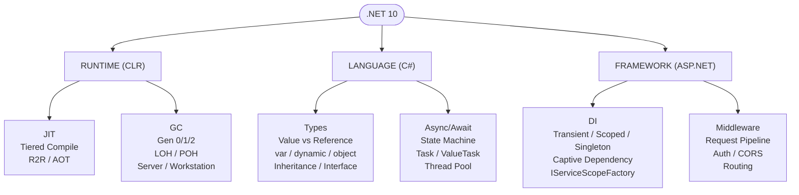
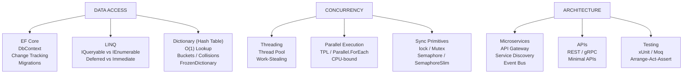

# Interview Prep — Quick Reference, Revision Sheet & Mind Map

> [Mastery Guide](../../../README.md) › [Foundations](../../README.md) › [.NET Core Deep Dive](README.md)

| Status | Priority | Phase | Last reviewed |
|---|---|---|---|
| Not Started | Medium | Phase 11 — Craft & Interview Prep | 2026-05-07 |

## Contents
1. [ASP.NET Core Concepts (1-25)](#17-aspnet-core-concepts-1-25)
   - [1. .NET Core vs .NET Framework](#1-net-core-vs-net-framework)
   - [2. Role of Startup.cs](#2-role-of-startupcs)
   - [3-10. Middleware, DI, Configuration](#3-10-middleware-di-configuration)
   - [11. CORS](#11-cors)
   - [12. Entity Framework Core](#12-entity-framework-core)
   - [13. IHostedService / BackgroundService](#13-ihostedservice--backgroundservice)
   - [14-15. Async Programming & Request Pipeline](#14-15-async-programming--request-pipeline)
   - [16. Microservices](#16-microservices)
   - [17. IServiceCollection vs IApplicationBuilder](#17-iservicecollection-vs-iapplicationbuilder)
   - [18. Centralized Logging](#18-centralized-logging)
   - [19. DI Lifetimes](#19-di-lifetimes)
   - [20. Health Checks](#20-health-checks)
   - [21-22. BackgroundService & Generic Host](#21-22-backgroundservice--generic-host)
   - [23. Global Exception Handling](#23-global-exception-handling)
   - [24. Data Protection API](#24-data-protection-api)
   - [25. Environment Management](#25-environment-management)
   - [Quick Reference Card](#quick-reference-card)
2. [Interview Revision Sheet](#27-interview-revision-sheet)
   - [One-Liner Answers for Rapid Revision](#one-liner-answers-for-rapid-revision)
   - [Scenario-Based Interview Questions](#scenario-based-interview-questions)
3. [Concept Mind Map](#28-concept-mind-map)
4. [Interview Cross-Questioning Drill](#interview-cross-questioning-drill)

---

## 17. ASP.NET Core Concepts (1-25)

### 1. .NET Core vs .NET Framework
See [.NET Fundamentals](01-net-fundamentals.md#1-net-fundamentals) for detailed comparison.

### 2. Role of Startup.cs
```csharp
// Legacy (.NET 5 and earlier):
public class Startup
{
    public void ConfigureServices(IServiceCollection services)
    {
        services.AddControllers();
        services.AddDbContext<AppDbContext>();
    }

    public void Configure(IApplicationBuilder app, IWebHostEnvironment env)
    {
        app.UseRouting();
        app.UseAuthorization();
        app.MapControllers();
    }
}

// Modern (.NET 6+ / .NET 10):
var builder = WebApplication.CreateBuilder(args);

// ConfigureServices equivalent
builder.Services.AddControllers();
builder.Services.AddDbContext<AppDbContext>();

var app = builder.Build();

// Configure equivalent
app.UseRouting();
app.UseAuthorization();
app.MapControllers();

app.Run();
```

### 3-10. Middleware, DI, Configuration
See [Dependency Injection](02-dependency-injection.md#4-dependency-injection-in-net-10) and [Middleware](04-middleware.md#8-middleware-in-aspnet-core-net-10) for detailed coverage.

### 11. CORS

```csharp
// Program.cs
builder.Services.AddCors(options =>
{
    options.AddPolicy("AllowFrontend", policy =>
    {
        policy.WithOrigins("https://myapp.com", "http://localhost:4200")
              .AllowAnyHeader()
              .AllowAnyMethod()
              .AllowCredentials();
    });
    
    options.AddPolicy("Public", policy =>
    {
        policy.AllowAnyOrigin()
              .AllowAnyHeader()
              .AllowAnyMethod();
    });
});

app.UseCors("AllowFrontend");  // Apply globally

// Or per-controller:
[EnableCors("Public")]
[ApiController]
public class PublicApiController : ControllerBase { }
```

### 12. Entity Framework Core
See [Entity Framework Core](05-data-access.md#11-entity-framework-ef-and-ef-core).

### 13. IHostedService / BackgroundService

```csharp
// Long-running background task
public class OrderCleanupService : BackgroundService
{
    private readonly IServiceScopeFactory _scopeFactory;
    private readonly ILogger<OrderCleanupService> _logger;

    public OrderCleanupService(
        IServiceScopeFactory scopeFactory,
        ILogger<OrderCleanupService> logger)
    {
        _scopeFactory = scopeFactory;
        _logger = logger;
    }

    protected override async Task ExecuteAsync(CancellationToken stoppingToken)
    {
        while (!stoppingToken.IsCancellationRequested)
        {
            try
            {
                using var scope = _scopeFactory.CreateScope();
                var db = scope.ServiceProvider.GetRequiredService<AppDbContext>();
                
                var staleOrders = await db.Orders
                    .Where(o => o.Status == "Pending" 
                        && o.CreatedAt < DateTime.UtcNow.AddDays(-30))
                    .ExecuteDeleteAsync(stoppingToken);
                
                _logger.LogInformation("Cleaned {Count} stale orders", staleOrders);
            }
            catch (Exception ex)
            {
                _logger.LogError(ex, "Order cleanup failed");
            }

            await Task.Delay(TimeSpan.FromHours(1), stoppingToken);
        }
    }
}

// Register in Program.cs
builder.Services.AddHostedService<OrderCleanupService>();
```

### 14-15. Async Programming & Request Pipeline
See [Async/Await](03-async-and-threading.md#5-asyncawait-in-c-and-net-10) and [Middleware](04-middleware.md#8-middleware-in-aspnet-core-net-10).

### 16. Microservices
See [Microservices & APIs](06-apis-and-microservices.md#13-microservices--apis).

### 17. IServiceCollection vs IApplicationBuilder

```csharp
// IServiceCollection: WHAT services exist (registration)
builder.Services.AddScoped<IUserRepo, UserRepo>();     // Register
builder.Services.AddSingleton<ICache, RedisCache>();   // Register

// IApplicationBuilder: HOW requests are handled (pipeline)
app.UseAuthentication();    // Configure pipeline
app.UseAuthorization();     // Configure pipeline
app.MapControllers();       // Configure endpoints
```

### 18. Centralized Logging

```csharp
// Using Serilog in .NET 10
builder.Host.UseSerilog((context, config) =>
{
    config
        .ReadFrom.Configuration(context.Configuration)
        .Enrich.FromLogContext()
        .Enrich.WithMachineName()
        .WriteTo.Console()
        .WriteTo.Seq("http://localhost:5341")    // Structured logging
        .WriteTo.File("logs/app-.log", 
            rollingInterval: RollingInterval.Day);
});

// Usage with structured logging
public class OrderService
{
    private readonly ILogger<OrderService> _logger;

    public async Task ProcessOrder(Order order)
    {
        _logger.LogInformation(
            "Processing order {OrderId} for {UserId} amount {Amount}",
            order.Id, order.UserId, order.Total);
        
        // These properties are searchable in Seq/ELK!
    }
}
```

### 19. DI Lifetimes
See [Dependency Injection](02-dependency-injection.md#4-dependency-injection-in-net-10).

### 20. Health Checks

```csharp
builder.Services.AddHealthChecks()
    .AddSqlServer(connectionString, name: "database")
    .AddRedis(redisConnection, name: "cache")
    .AddUrlGroup(new Uri("https://api.external.com"), name: "external-api");

app.MapHealthChecks("/health", new HealthCheckOptions
{
    ResponseWriter = UIResponseWriter.WriteHealthCheckUIResponse
});

// Response: { "status": "Healthy", "entries": { "database": "Healthy", ... } }
```

### 21-22. BackgroundService & Generic Host
See [Section 17.13](#13-ihostedservice--backgroundservice).

### 23. Global Exception Handling

```csharp
// Custom exception handling middleware
app.UseExceptionHandler(errorApp =>
{
    errorApp.Run(async context =>
    {
        var exception = context.Features.Get<IExceptionHandlerFeature>()?.Error;
        
        var (statusCode, message) = exception switch
        {
            NotFoundException => (404, "Resource not found"),
            UnauthorizedException => (401, "Unauthorized"),
            ValidationException ve => (400, ve.Message),
            _ => (500, "An unexpected error occurred")
        };
        
        context.Response.StatusCode = statusCode;
        await context.Response.WriteAsJsonAsync(new { error = message });
    });
});

// Or using IExceptionHandler (.NET 8+)
public class GlobalExceptionHandler : IExceptionHandler
{
    public async ValueTask<bool> TryHandleAsync(
        HttpContext context, Exception exception, CancellationToken ct)
    {
        context.Response.StatusCode = 500;
        await context.Response.WriteAsJsonAsync(new 
        { 
            error = exception.Message 
        }, ct);
        return true;  // Exception handled
    }
}

builder.Services.AddExceptionHandler<GlobalExceptionHandler>();
app.UseExceptionHandler();
```

### 24. Data Protection API

```csharp
// Encrypt sensitive data
public class TokenService
{
    private readonly IDataProtector _protector;

    public TokenService(IDataProtectionProvider provider)
    {
        _protector = provider.CreateProtector("TokenService.v1");
    }

    public string Protect(string plainText)
    {
        return _protector.Protect(plainText);
        // Output: "CfDJ8N..." (encrypted, base64)
    }

    public string Unprotect(string protectedText)
    {
        return _protector.Unprotect(protectedText);
        // Output: Original plain text
    }
}

// Time-limited protection
var timeLimitedProtector = _protector.ToTimeLimitedDataProtector();
var token = timeLimitedProtector.Protect("data", TimeSpan.FromHours(1));
// Automatically expires after 1 hour
```

### 25. Environment Management

```csharp
// Check environment
if (app.Environment.IsDevelopment())
{
    app.UseSwagger();
    app.UseDeveloperExceptionPage();
}
else if (app.Environment.IsProduction())
{
    app.UseExceptionHandler("/error");
    app.UseHsts();
}

// Environment-specific config files (auto-loaded):
// appsettings.json                ← Base (always loaded)
// appsettings.Development.json    ← Overrides for dev
// appsettings.Staging.json        ← Overrides for staging
// appsettings.Production.json     ← Overrides for prod

// Set via:
// Environment variable: ASPNETCORE_ENVIRONMENT=Production
// launchSettings.json (dev only)
// Azure App Service configuration
```

---

## Quick Reference Card

```
┌─────────────────────────────────────────────────────────┐
│              .NET 10 Quick Reference                    │
├─────────────────────────────────────────────────────────┤
│                                                         │
│ DI Lifetimes:                                           │
│   Transient  = new every time                           │
│   Scoped     = new per request                          │
│   Singleton  = one for app lifetime                     │
│                                                         │
│ Async Rules:                                            │
│   ✅ async Task (not async void)                        │
│   ✅ await (not .Result or .Wait())                     │
│   ✅ CancellationToken in all async methods             │
│   ✅ ConfigureAwait(false) in library code              │
│                                                         │
│ EF Core:                                                │
│   ✅ AsNoTracking() for reads                           │
│   ✅ Include() for eager loading                        │
│   ✅ IQueryable (not IEnumerable) for DB queries        │
│   ✅ ExecuteUpdate/Delete for bulk operations            │
│                                                         │
│ Middleware Order:                                        │
│   1. ExceptionHandler                                   │
│   2. HTTPS Redirect                                     │
│   3. Static Files                                       │
│   4. CORS                                               │
│   5. Authentication                                     │
│   6. Authorization                                      │
│   7. Routing + Endpoints                                │
│                                                         │
│ GC Generations:                                         │
│   Gen 0 = short-lived (most objects die here)           │
│   Gen 1 = buffer                                        │
│   Gen 2 = long-lived (expensive to collect)             │
│   LOH   = objects >= 85KB                               │
│                                                         │
│ Sync Primitives:                                        │
│   lock          = simple in-process mutual exclusion    │
│   Mutex         = cross-process mutual exclusion        │
│   SemaphoreSlim = async-friendly N-concurrency limit    │
└─────────────────────────────────────────────────────────┘
```


---


---

## 27. Interview Revision Sheet

### One-Liner Answers for Rapid Revision

```
┌─────────────────────────────────────────────────────────────────────────┐
│                    INTERVIEW REVISION SHEET                             │
├──────┬──────────────────────────────────────────────────────────────────┤
│  #   │  Question → Answer                                              │
├──────┼──────────────────────────────────────────────────────────────────┤
│  1   │ What is .NET?                                                    │
│      │ → Free, open-source, cross-platform developer platform with     │
│      │   CLR runtime, BCL libraries, and tools for building apps.      │
├──────┼──────────────────────────────────────────────────────────────────┤
│  2   │ .NET Framework vs .NET Core?                                     │
│      │ → Framework = Windows-only, monolithic, legacy.                  │
│      │   Core/9 = Cross-platform, modular, high-performance.           │
├──────┼──────────────────────────────────────────────────────────────────┤
│  3   │ What is CLR?                                                     │
│      │ → Virtual machine that runs .NET code. Handles JIT compilation, │
│      │   GC, type safety, exception handling, and thread management.   │
├──────┼──────────────────────────────────────────────────────────────────┤
│  4   │ What is JIT compilation?                                         │
│      │ → Converts IL (Intermediate Language) to native machine code    │
│      │   at runtime, method-by-method, on first call. Cached after.    │
├──────┼──────────────────────────────────────────────────────────────────┤
│  5   │ Value type vs Reference type?                                    │
│      │ → Value: stored on stack, copied by value (int, struct).        │
│      │   Reference: stored on heap, copied by reference (class, string)│
├──────┼──────────────────────────────────────────────────────────────────┤
│  6   │ var vs dynamic vs object?                                        │
│      │ → var = compile-time inference, full IntelliSense.              │
│      │   dynamic = runtime resolution, no IntelliSense.                │
│      │   object = base type, requires casting, boxing cost.            │
├──────┼──────────────────────────────────────────────────────────────────┤
│  7   │ Why no multiple inheritance in C#?                               │
│      │ → Diamond problem: ambiguity when two parents have same method. │
│      │   Solved via interfaces, composition, default interface methods.│
├──────┼──────────────────────────────────────────────────────────────────┤
│  8   │ Explicit vs Implicit interface implementation?                   │
│      │ → Implicit: public method satisfies all interfaces.             │
│      │   Explicit: separate implementation per interface, called only  │
│      │   through interface reference, not on the object directly.      │
├──────┼──────────────────────────────────────────────────────────────────┤
│  9   │ How does GC work?                                                │
│      │ → Generational: Gen0 (short-lived), Gen1 (buffer), Gen2 (long).│
│      │   Mark → Sweep → Compact. Objects surviving GC get promoted.   │
├──────┼──────────────────────────────────────────────────────────────────┤
│ 10   │ What is LOH?                                                     │
│      │ → Large Object Heap: objects >= 85KB. Only collected with Gen2. │
│      │   Not compacted by default → can cause fragmentation.           │
├──────┼──────────────────────────────────────────────────────────────────┤
│ 11   │ Workstation vs Server GC?                                        │
│      │ → Workstation: single GC thread, low latency, desktop apps.    │
│      │   Server: one GC thread per core, high throughput, web apps.   │
├──────┼──────────────────────────────────────────────────────────────────┤
│ 12   │ What is Dependency Injection?                                    │
│      │ → Design pattern where dependencies are provided (injected)    │
│      │   rather than created. Built into ASP.NET Core via              │
│      │   IServiceCollection. Enables loose coupling and testability.  │
├──────┼──────────────────────────────────────────────────────────────────┤
│ 13   │ Transient vs Scoped vs Singleton?                                │
│      │ → Transient: new instance every time.                           │
│      │   Scoped: one instance per HTTP request.                        │
│      │   Singleton: one instance for entire app lifetime.              │
├──────┼──────────────────────────────────────────────────────────────────┤
│ 14   │ Can you inject Scoped into Singleton?                            │
│      │ → No! Captive dependency. Scoped service lives forever inside  │
│      │   singleton. Fix: inject IServiceScopeFactory, create scope.    │
├──────┼──────────────────────────────────────────────────────────────────┤
│ 15   │ What does async/await do?                                        │
│      │ → Enables non-blocking I/O. Thread released during await,       │
│      │   reused for other work. Compiler generates state machine.      │
├──────┼──────────────────────────────────────────────────────────────────┤
│ 16   │ What is a state machine in async context?                        │
│      │ → Compiler transforms async method into a struct with MoveNext()│
│      │   Each await = a state. Suspends at await, resumes on complete. │
├──────┼──────────────────────────────────────────────────────────────────┤
│ 17   │ Task vs ValueTask?                                               │
│      │ → Task: always heap-allocated. ValueTask: struct, avoids        │
│      │   allocation when result is synchronous (cached). Use ValueTask │
│      │   when most calls complete synchronously.                       │
├──────┼──────────────────────────────────────────────────────────────────┤
│ 18   │ Why is async void bad?                                           │
│      │ → Exceptions in async void can't be caught. Crashes the app.   │
│      │   Only use for event handlers. Always return Task.              │
├──────┼──────────────────────────────────────────────────────────────────┤
│ 19   │ Concurrency vs Parallelism?                                      │
│      │ → Concurrency: managing multiple tasks (interleaving).          │
│      │   Parallelism: executing multiple tasks simultaneously on       │
│      │   different cores.                                              │
├──────┼──────────────────────────────────────────────────────────────────┤
│ 20   │ CPU-bound vs I/O-bound?                                          │
│      │ → CPU-bound: use Task.Run / Parallel (needs thread).           │
│      │   I/O-bound: use async/await (no thread needed while waiting). │
├──────┼──────────────────────────────────────────────────────────────────┤
│ 21   │ lock vs Mutex vs SemaphoreSlim?                                  │
│      │ → lock: in-process, fastest, 1 thread.                          │
│      │   Mutex: cross-process, 1 thread, slowest.                     │
│      │   SemaphoreSlim: in-process, N threads, async support.          │
├──────┼──────────────────────────────────────────────────────────────────┤
│ 22   │ What is middleware?                                              │
│      │ → Components in the ASP.NET Core request/response pipeline.    │
│      │   Each can process request, call next, or short-circuit.       │
│      │   Order matters. Think of it as an onion — request goes in,    │
│      │   response comes back through the same layers.                  │
├──────┼──────────────────────────────────────────────────────────────────┤
│ 23   │ What is short-circuiting in middleware?                           │
│      │ → When middleware does NOT call next() — stops the pipeline.   │
│      │   Example: returning 401 from auth middleware.                  │
├──────┼──────────────────────────────────────────────────────────────────┤
│ 24   │ app.Use() vs app.Run() vs app.Map()?                            │
│      │ → Use: calls next middleware. Run: terminal (no next).          │
│      │   Map: branch pipeline by URL path.                             │
├──────┼──────────────────────────────────────────────────────────────────┤
│ 25   │ What is EF Core?                                                 │
│      │ → ORM that maps C# classes to DB tables. Translates LINQ to    │
│      │   SQL. Provides change tracking, migrations, lazy/eager loading.│
├──────┼──────────────────────────────────────────────────────────────────┤
│ 26   │ IQueryable vs IEnumerable?                                       │
│      │ → IQueryable: builds SQL expression, filtering on DB server.   │
│      │   IEnumerable: loads all data to memory, filters in C#.        │
│      │   Always use IQueryable for DB queries.                         │
├──────┼──────────────────────────────────────────────────────────────────┤
│ 27   │ Deferred vs Immediate execution in LINQ?                        │
│      │ → Deferred: Where, Select, OrderBy — builds query, not executed.│
│      │   Immediate: ToList, Count, First, Any — executes NOW.          │
├──────┼──────────────────────────────────────────────────────────────────┤
│ 28   │ AsNoTracking() — when and why?                                   │
│      │ → For read-only queries. Skips change tracking overhead.        │
│      │   ~30% faster. Use whenever you don't need to update entities.  │
├──────┼──────────────────────────────────────────────────────────────────┤
│ 29   │ REST vs gRPC?                                                    │
│      │ → REST: HTTP/JSON, browser-friendly, public APIs.              │
│      │   gRPC: HTTP/2+Protobuf, faster, service-to-service.         │
├──────┼──────────────────────────────────────────────────────────────────┤
│ 30   │ What is a Dictionary<K,V> internally?                            │
│      │ → Hash table: key → hash function → bucket index → value.      │
│      │   O(1) average lookup. Collisions handled via chaining.         │
├──────┼──────────────────────────────────────────────────────────────────┤
│ 31   │ What is IHostedService / BackgroundService?                       │
│      │ → Interface/base class for background tasks that run with the   │
│      │   application lifecycle. Override ExecuteAsync() for long tasks. │
├──────┼──────────────────────────────────────────────────────────────────┤
│ 32   │ How does CORS work?                                              │
│      │ → Browser sends preflight OPTIONS request. Server responds with │
│      │   allowed origins, methods, headers. Browser enforces policy.   │
├──────┼──────────────────────────────────────────────────────────────────┤
│ 33   │ What is Data Protection API?                                     │
│      │ → Built-in encryption/decryption for cookies, tokens, sensitive │
│      │   data. Key management handled automatically.                   │
├──────┼──────────────────────────────────────────────────────────────────┤
│ 34   │ How are environments managed in ASP.NET Core?                    │
│      │ → ASPNETCORE_ENVIRONMENT variable (Development/Staging/Prod).   │
│      │   Auto-loads appsettings.{Environment}.json overrides.          │
├──────┼──────────────────────────────────────────────────────────────────┤
│ 35   │ Startup.cs vs Program.cs?                                        │
│      │ → Startup.cs = legacy (pre-.NET 6), separate Configure methods.│
│      │   Program.cs = modern (.NET 6+), minimal hosting, all-in-one.  │
├──────┼──────────────────────────────────────────────────────────────────┤
│ 36   │ What is Kestrel?                                                 │
│      │ → Default cross-platform web server in ASP.NET Core. Async,    │
│      │   high-performance. Usually behind reverse proxy (IIS/Nginx).  │
├──────┼──────────────────────────────────────────────────────────────────┤
│ 37   │ IConfiguration vs IOptions<T>?                                   │
│      │ → IConfiguration: raw key-value access (config["Key"]).        │
│      │   IOptions<T>: strongly-typed binding to POCO class.           │
├──────┼──────────────────────────────────────────────────────────────────┤
│ 38   │ What are Health Checks?                                          │
│      │ → Built-in system to monitor app health. Exposes /health        │
│      │   endpoint. Checks DB, Redis, external APIs, custom checks.    │
├──────┼──────────────────────────────────────────────────────────────────┤
│ 39   │ What is Tiered Compilation?                                      │
│      │ → Tier 0: quick JIT for fast startup. Tier 1: full optimization│
│      │   for hot methods. Dynamic PGO (default since .NET 8) for     │
│      │   profile-guided optimization.                                  │
├──────┼──────────────────────────────────────────────────────────────────┤
│ 40   │ What is the N+1 query problem?                                   │
│      │ → Loading related data in a loop: 1 query for parent + N       │
│      │   queries for each child. Fix: use Include() for eager loading. │
└──────┴──────────────────────────────────────────────────────────────────┘
```

### Scenario-Based Interview Questions

```
Q: "Your API is slow. How do you diagnose?"
A: 1. Check if it's CPU-bound or I/O-bound
   2. Profile with dotnet-trace / Application Insights
   3. Check for N+1 queries (EF Core logs)
   4. Verify async/await is used (not blocking)
   5. Check if GC pressure is high (Gen 2 collections)
   6. Review middleware ordering (slow middleware early = bad)
   7. Check connection pooling (DB, HTTP)

Q: "Design a rate limiter for an API"
A: Use SemaphoreSlim for in-memory throttling:
   - SemaphoreSlim(maxConcurrent) per endpoint
   - Or use built-in rate limiting middleware (.NET 7+):
     builder.Services.AddRateLimiter(options =>
         options.AddFixedWindowLimiter("api", o => {
             o.Window = TimeSpan.FromMinutes(1);
             o.PermitLimit = 100;
         }));

Q: "You have a memory leak. How do you find it?"
A: 1. Check GC.GetTotalMemory() over time
   2. Use dotnet-dump to capture heap snapshot
   3. Look for: event handlers not unsubscribed,
      static collections growing, undisposed resources
   4. Check for captive dependencies (Scoped in Singleton)
   5. Use weak references for caches

Q: "How would you handle 10,000 concurrent requests?"
A: 1. Use async/await throughout (never block threads)
   2. Server GC mode
   3. Connection pooling (DB, HTTP)
   4. Response caching / output caching
   5. Rate limiting to prevent overload
   6. Horizontal scaling (multiple instances)
   7. Consider gRPC for internal service calls
```

---

## 28. Concept Mind Map

**.NET 10 / ASP.NET Core Mind Map**





**Learning Path**

- **Beginner**: C# Types -> var/dynamic -> Inheritance -> DI Basics
- **Intermediate**: async/await -> EF Core -> Middleware -> LINQ
- **Advanced**: GC Internals -> Thread Pool -> Sync Primitives -> Microservices -> gRPC -> Performance Tuning

---

## Interview Cross-Questioning Drill

<details>
<summary>📖 Click to expand — cross-question chains (~15-20 min, cover answers and write cold)</summary>

> ⚠️ **Honest caveat**: reading this section once doesn't make you interview-ready. Cover the answers, write them cold, then check. Pair with a senior for live mock cross-questioning. The guide removes "I never thought about that" surprises; mock interviews convert knowledge into reflex. Both are needed.

The earlier sections of this file give one-liner facts and scenario primers. **This section is different**: it's *meta-drills* that **cut across multiple deep-dive topics** — the way senior interviewers actually compose questions. Each drill is **Q → A → Cross-Q → A → Cross-Q² → A**. Practice answering the cross-questions without re-reading. If you stumble on any cross-Q², go re-read the relevant deep-dive file (the topic anchors are linked from the [Foundations README](../README.md)).
### Drill 1 — Async + DI + scoping interplay

> **Q**: I have a Scoped service injected into a controller. I `await` a DB call. After the await, my service's state seems wrong. What happened?
>
> **A**: Most likely you're confusing scope with thread affinity. A Scoped service lives for one HTTP request — that *includes* across awaits. The same instance is used before and after `await`. So state didn't change *because of* the await; some other code mutated it (e.g., a background task captured the scope, or you fired off a fire-and-forget call that shared the service).
>
> **Cross-Q**: I do `_ = Task.Run(() => _scopedService.DoWork())` from a controller. Why does this misbehave?
>
> **A**: `Task.Run` schedules on the thread pool. The Scoped service is *captured* by the lambda, but when the HTTP request completes, its scope is disposed. Your background task now holds a reference to a disposed `DbContext` (typical inner Scoped dep) — first DB call throws `ObjectDisposedException`. **Fix**: inject `IServiceScopeFactory`, create a new scope inside `Task.Run`, resolve the service from that scope.
>
> **Cross-Q²**: How does `IHttpContextAccessor` interact with async?
>
> **A**: It uses `AsyncLocal<T>` under the hood, so the HttpContext flows across `await` automatically — same logical request, same context. **But**: in a `Task.Run` callback or a `BackgroundService`, there's no HttpContext (the request has either ended or never existed). Accessing `HttpContextAccessor.HttpContext` there returns null. The Scoped service + HttpContext flow is request-only.

### Drill 2 — Caching + concurrency canonical pattern

> **Q**: What's the canonical async-safe "get-or-fetch" cache pattern?
>
> **A**: A `ConcurrentDictionary<TKey, Lazy<Task<TValue>>>` (or `AsyncLazy<T>`). Two callers race for the same key: both see the same `Lazy<Task<T>>`, both `await` the same Task, the fetch happens once. Avoids the "stampede" of N parallel fetches for the same uncached key.
>
> **Cross-Q**: What happens if the fetch throws?
>
> **A**: The `Task` becomes faulted; all `await`ers see the exception. **Crucially**, the faulted Task stays in the cache — every subsequent caller gets the same exception. You usually want **negative caching with short TTL** (or: remove from cache on fault). Pattern: wrap in a custom helper that removes the entry on `Task.IsFaulted`.
>
> **Cross-Q²**: How does this interact with `IMemoryCache.GetOrCreateAsync`?
>
> **A**: `IMemoryCache.GetOrCreateAsync` is **not** stampede-safe by default — two simultaneous misses both call the factory. To make it safe, wrap factory invocation with a `SemaphoreSlim` keyed by cache key, or use `Microsoft.Extensions.Caching.Hybrid` (HybridCache, .NET 9+) which is stampede-safe out of the box. **HybridCache is the modern answer**; pre-9, the manual ConcurrentDictionary+Lazy pattern is the canonical one.

### Drill 3 — Exception handling across async + middleware

> **Q**: An async background task throws inside a `BackgroundService`. What does ASP.NET Core's exception middleware see?
>
> **A**: Nothing. Exception middleware is in the HTTP pipeline — it only sees exceptions from HTTP request handling. A `BackgroundService` runs outside that pipeline; if its `ExecuteAsync` throws, the host logs `BackgroundServiceExceptionBehavior` (default: ignore in .NET 6, stop-host in .NET 6+ with `BackgroundServiceExceptionBehavior.StopHost`).
>
> **Cross-Q**: How do I get those exceptions surfaced and recorded?
>
> **A**: Wrap your `ExecuteAsync` body in try/catch and log explicitly via `ILogger<MyService>`. Optionally: configure `BackgroundServiceExceptionBehavior.StopHost` to fail-fast on unhandled background exceptions (forces a pod restart via Kubernetes — clean recovery). For retryable transient failures, catch + log + delay + retry inside the loop.
>
> **Cross-Q²**: An `IExceptionHandler` in the HTTP pipeline catches a `OperationCanceledException` from a downstream HttpClient. What's the right response?
>
> **A**: Depends on *who* canceled. If `HttpContext.RequestAborted.IsCancellationRequested` is true, the *client* gave up — return 499 (or just don't respond; the connection is gone). If your own timeout fired, return 504 Gateway Timeout. **Pattern**: in the handler, check the token; map accordingly. **Don't** log either at error level — both are expected behavior.

### Drill 4 — Modern C# + EF Core

> **Q**: I model `EntityName` as a `record class` to get value equality. EF Core complains. What's going on?
>
> **A**: EF Core's change tracker uses **reference equality** to identify entity instances. A `record class` overrides `Equals` for value equality, which confuses the tracker — two entities with the same property values look like "the same entity" to the change tracker, leading to inconsistent state updates. **Rule**: use `class` (not `record`) for EF-tracked entities. Use `record` for DTOs/value objects that leave the EF boundary.
>
> **Cross-Q**: Can I use `init`-only setters on EF entities?
>
> **A**: Mostly yes for new entities (EF Core 7+ supports `init` setters via reflection). **But**: change-tracked properties need to be mutable for EF to apply updates loaded from the DB. So `init` works for keys (set once at creation) but not for any property EF needs to update. Practical convention: `init` for `Id` and immutable fields; `set` (private set if you want encapsulation) for everything else.
>
> **Cross-Q²**: How do positional records and EF migrations get along?
>
> **A**: Poorly for entities. The auto-generated constructor takes parameters in declaration order; EF's migrations don't know about it. You'd have to add `[PersistedConstructor]` or write a parameterless ctor for materialization. **Just don't use positional records for entities** — use them for the query result types (`record class CustomerSummary(int Id, string Name, int OrderCount)`) returned by `Select` projections instead.

### Drill 5 — Generics + DI + open generics

> **Q**: I register `services.AddScoped(typeof(IRepository<>), typeof(EfRepository<>))`. What does this enable?
>
> **A**: **Open generic registration** — for any `IRepository<T>` the DI container resolves to `EfRepository<T>` with the same `T`. Saves you from registering one closed generic per entity type. `IRepository<Order>` → `EfRepository<Order>`, `IRepository<Customer>` → `EfRepository<Customer>`, all from one line.
>
> **Cross-Q**: Why isn't this the default for all generic services?
>
> **A**: Because not every generic class can be safely instantiated for every `T`. Some implementations have constraints (`where T : IEntity`) that DI can't easily enforce, or some need a per-T configuration. Open generic registration is opt-in; you decide which generics are universal.
>
> **Cross-Q²**: What's the catch with open generics and AOT?
>
> **A**: Open generic resolution uses reflection at runtime — DI walks the type to construct the closed generic. AOT can trim that reflection metadata, breaking resolution. **Workaround**: explicit closed-generic registrations (`AddScoped<IRepository<Order>, EfRepository<Order>>()`) for each known type, or use source-generated DI containers (Microsoft.Extensions.DependencyInjection.SourceGeneration in preview) that emit the registrations at compile time.

### Drill 6 — Records + serialization gotchas

> **Q**: I have `record User(string Name, [property: JsonIgnore] string SecretKey)`. Does the attribute apply?
>
> **A**: Yes — `[property: JsonIgnore]` targets the auto-generated property. Without `property:` the attribute would attach to the constructor *parameter*, which isn't a serialization target. **This is the canonical "attribute on a record-positional-param" gotcha**; without the prefix the attribute silently does nothing.
>
> **Cross-Q**: Can `System.Text.Json` deserialize positional records?
>
> **A**: Yes (since .NET 5 with the appropriate ctor matching). The deserializer looks for a constructor whose parameter names match JSON property names case-insensitively. **Required members** (C# 11 `required`) are honored in .NET 8+. **Trap**: if you have multiple constructors, mark the one for deserialization with `[JsonConstructor]`.
>
> **Cross-Q²**: What's different about `record struct` for JSON?
>
> **A**: Boxing — a `record struct` boxes when deserialized through the non-generic `object` API path. The generic API (`JsonSerializer.Deserialize<T>(...)`) avoids the box. Use generics consistently. **Also**: `record struct` doesn't have inheritance; if you have a polymorphic JSON shape, `record struct` won't work — fall back to `record class`.

### Drill 7 — Async streams + cancellation

> **Q**: I have `IAsyncEnumerable<T>`. The consumer cancels mid-iteration. What happens server-side?
>
> **A**: The compiler-generated state machine observes the cancellation token (passed via `[EnumeratorCancellation]`) and stops producing. The `await foreach` exits with `OperationCanceledException`. **Critical**: the producer must honor the token — `yield return` is a suspension point, but doesn't *itself* check cancellation. Pass the token to any awaitable I/O inside the iterator.
>
> **Cross-Q**: How does `[EnumeratorCancellation]` work?
>
> **A**: It's a parameter attribute on the `CancellationToken` parameter of an `async IAsyncEnumerable<T>` method. The C# compiler wires the `WithCancellation(...)` call from the consumer into that parameter. Without the attribute, the token passed to `WithCancellation` is silently ignored. **Compile-time gotcha**: forgetting the attribute fails silently — no compile error, just no cancellation.
>
> **Cross-Q²**: ASP.NET Core minimal API endpoint returning `IAsyncEnumerable<T>`. Does HTTP request cancellation flow into it?
>
> **A**: Yes — the framework wires `HttpContext.RequestAborted` into the iterator's `EnumeratorCancellation` parameter automatically. So a client disconnecting (`fetch.abort()`, tab closed, network drop) cancels the producer mid-stream. **This is what makes server-sent streams over HTTP correct** — no orphaned producers.

### Drill 8 — Middleware ordering with auth + CORS + exception handling

> **Q**: What's the correct order: ExceptionHandler, HTTPS Redirect, CORS, Authentication, Authorization, MapEndpoints?
>
> **A**: **ExceptionHandler first** (so it catches everything below) → **HTTPS Redirect** → **Routing** (`UseRouting`) → **CORS** (after routing so it knows the endpoint's policy) → **Authentication** → **Authorization** → **MapControllers / MapEndpoints**. Order is meaningful: each middleware sees only what flows through it.
>
> **Cross-Q**: Why does CORS go after routing?
>
> **A**: Because CORS policies can be **per-endpoint** (`[EnableCors("policy")]` attribute). The routing middleware identifies the endpoint, then CORS inspects the endpoint's metadata to pick the right policy. Pre-routing CORS could only apply a global policy. **In `.NET 7+` the framework actively warns if you put CORS before routing.**
>
> **Cross-Q²**: Where do `UseRateLimiter` and `UseOutputCache` go?
>
> **A**: `UseRateLimiter` typically **after routing, before auth** — rate-limit unauthenticated requests too. `UseOutputCache` **after authorization** if the cache key includes user identity, **before authorization** if cache is purely URL-based and you want to skip the auth cost for cached responses. **Decision depends on whether cache should be per-user.**

### Drill 9 — GC + async memory pressure

> **Q**: My app's `Gen 2` collections are firing too often. The async workload allocates ~5MB per request. What's the likely cause?
>
> **A**: Async state machines for chained awaits each allocate (one per async method). String allocations from `string.Format` or interpolation. `List<T>` resizing. JSON serialization buffers. **Per-request 5MB of garbage is high** — investigate with `dotnet-trace` and the `GCMemory` ETW provider to spot the largest sources.
>
> **Cross-Q**: How does `ValueTask<T>` reduce allocation?
>
> **A**: When the async method completes **synchronously** (cached value, fast path), `ValueTask<T>` is a struct on the stack — zero heap allocation. When the path is genuinely async, `ValueTask` wraps a `Task` (one allocation, same as before). Use `ValueTask` for paths where ≥80% of calls return synchronously (cache hit, in-memory lookup). For paths that always touch I/O, plain `Task` is fine — same allocation cost either way.
>
> **Cross-Q²**: When is `ArrayPool<T>` the right tool?
>
> **A**: For **large, short-lived buffers** used in hot paths: parsing, serialization, scratch space. Rent, use, return. The pool eliminates the GC pressure of repeated `new byte[8192]` calls. **Anti-pattern**: not returning to the pool — the array becomes effectively private and pool is no better than `new`. **Pattern**: try/finally around the rented array to guarantee return.

### Drill 10 — Threading primitives in async code

> **Q**: I need mutual exclusion in async code. `lock` or `SemaphoreSlim`?
>
> **A**: `SemaphoreSlim` (with `WaitAsync(1)`). `lock` doesn't work across `await` — the lock is **thread-scoped**, and `await` may resume on a different thread. `SemaphoreSlim` is async-aware and lets you `await semaphore.WaitAsync()` then release in finally.
>
> **Cross-Q**: Can I use `Monitor.Enter`/`Monitor.Exit` manually for finer control?
>
> **A**: Same issue — `Monitor` is thread-affine. After `await`, you may not be on the thread that entered the monitor, and `Exit` throws `SynchronizationLockException`. **Don't try to make `Monitor` work across await**; that path leads to deadlocks. Use `SemaphoreSlim` or, for read-heavy scenarios, `AsyncReaderWriterLock` (from third-party libraries — not in BCL).
>
> **Cross-Q²**: When is `Interlocked` (lock-free) appropriate in async code?
>
> **A**: For **single-variable atomic updates**: counters, flags, single-pointer CAS. `Interlocked.Increment(ref counter)` is fine in async code — it doesn't need lock affinity. **For anything more complex** (compound state mutations, ordering between multiple variables), you need either a lock-free data structure (`ConcurrentDictionary`, `ConcurrentQueue`) or a `SemaphoreSlim`.

### Drill 11 — Configuration + DI lifetime interaction

> **Q**: I inject `IOptionsMonitor<MyConfig>` into a singleton. Config changes at runtime. What's the right pattern to react?
>
> **A**: Subscribe in the constructor: `_subscription = monitor.OnChange(updated => { _cache.Invalidate(); UpdateWorker(updated); });`. Hold the `IDisposable` returned by `OnChange` in a field and dispose it in the service's `Dispose`. Use `monitor.CurrentValue` (not `monitor.OnChange`) on every read for the latest value.
>
> **Cross-Q**: What if I instead injected `IOptionsSnapshot<MyConfig>` into a singleton?
>
> **A**: Captive dependency — Scoped service inside Singleton. .NET's default scope validation catches this at startup and throws `InvalidOperationException`. Production builds with `ValidateScopes = false` would silently work *wrong*: the singleton holds the first scope's snapshot forever. **The error message is the friend; don't disable scope validation just to make it go away.**
>
> **Cross-Q²**: My singleton reads `IOptionsMonitor.CurrentValue` on every request. Is the per-call cost meaningful?
>
> **A**: Negligible — `CurrentValue` is a property getter returning a cached, atomically-updated field. No reflection, no parsing, no allocation on the hot path. The only cost is a single field read. Reading on every call is the **correct, performant pattern** for "freshest value, no caching needed."

### Drill 12 — HttpClient + auth + retry composition

> **Q**: I have a JWT that expires every hour. My HttpClient retries failed calls. After hour 2 of running, retries start failing. Why?
>
> **A**: The auth handler that adds the JWT runs **before** Polly retry in your registration. First call: token valid, succeeds. Token expires. Subsequent call: 401, Polly retries — but the retried call replays the *same expired token* because the auth handler already attached it. Fix: ensure the auth handler is **inside** the retry strategy (added *after* `AddStandardResilienceHandler` in registration), so it runs on each retry and refreshes if needed.
>
> **Cross-Q**: How does the auth handler know to refresh?
>
> **A**: It checks token expiration before adding `Authorization`. If expired, it calls the token endpoint, caches the new token, then attaches. Some implementations are reactive (catch 401, refresh, retry once internally). Reactive needs to be careful to *not* infinite-loop if the refresh itself fails.
>
> **Cross-Q²**: What about token caching across multiple typed clients?
>
> **A**: Make the auth handler resolve a singleton `ITokenProvider` from DI. The provider holds the cached token (with `SemaphoreSlim` to deduplicate concurrent refreshes). All typed clients share the same provider; one token, one refresh on expiry. **Without sharing**, each typed client refreshes independently — N typed clients = N token requests per hour, plus thundering herd at expiration.

### Drill 13 — Health checks + readiness + liveness

> **Q**: What's the difference between liveness, readiness, and startup probes?
>
> **A**: **Liveness**: "is the process responding at all?" — fail → restart pod. **Readiness**: "can the process serve traffic now?" — fail → remove from load balancer, don't restart. **Startup**: "has the process finished initializing?" — fail → don't fire liveness yet (gives slow apps time to start). All three are HTTP endpoints in ASP.NET Core; you tag health checks with `HealthCheckRegistration.Tags`.
>
> **Cross-Q**: Should a health check ping the database?
>
> **A**: **Readiness yes; liveness no.** If the DB is briefly unreachable, liveness should still pass (the process is healthy; it's the dependency that's broken). Readiness should fail so the load balancer routes around this pod. Restarting because of a DB outage is a self-inflicted multiplied outage — every pod cycles, none ever ready. **Liveness should only check process internals**; readiness checks the dependencies you need to serve.
>
> **Cross-Q²**: How do I make a health check that times out gracefully?
>
> **A**: Pass a `CancellationToken` honoring `HealthCheckOptions.Timeout`. ASP.NET Core enforces a per-check timeout (configurable, default 30s). Your check's I/O calls must honor the token; otherwise the timeout fires but the check keeps running, leaking. **Pattern**: `await db.PingAsync(cancellationToken)`. If `PingAsync` doesn't accept tokens, wrap in `Task.Run` + linked CTS — but ideally, fix the underlying API to support cancellation.

### Drill 14 — Logging + tracing + observability

> **Q**: I log a message inside a method called via gRPC. The log line should show the gRPC trace ID. How does it flow?
>
> **A**: ASP.NET Core's gRPC middleware sets `Activity.Current` with the W3C `traceparent` from the incoming request. `ILogger` enrichment (via `ActivityListener` or Serilog's `Enrich.FromLogContext()`) reads `Activity.Current.Id` and adds it to the log entry. **No manual plumbing needed if the enrichment is configured.**
>
> **Cross-Q**: I `Task.Run(() => DoWork())` inside the gRPC handler. Does the trace ID propagate?
>
> **A**: Yes — `Activity.Current` uses `AsyncLocal<T>`, which **does flow** across `Task.Run`. So the spawned task inherits the trace context. **Caveat**: if you explicitly `using var scope = new Activity(...)` and Dispose before the Task.Run completes, the trace will be ended early; the inner task's logs may show a closed activity.
>
> **Cross-Q²**: My logs show a different trace ID than my OpenTelemetry trace. Why?
>
> **A**: Mismatch between ASP.NET Core's `Activity.Current.Id` (W3C trace context) and Serilog/NLog enrichers that may emit older formats (`SpanId`, `TraceId` as separate fields, or non-W3C IDs). Make sure your logger enricher uses W3C format: in Serilog, `Enrich.WithSpan()` from `Serilog.Enrichers.Span` for OpenTelemetry-compatible IDs. **Standardize on W3C across logs and traces** — otherwise correlation breaks at every hop.

### Drill 15 — Performance + GC + threading interaction

> **Q**: My API's p99 latency spikes every few minutes for ~50ms. CPU is fine. What's the suspect?
>
> **A**: **Gen 2 GC pauses**. Server GC default mode pauses threads during Gen 2 collection. For a long-running app with growing Gen 2 (singleton caches, static collections, etc.), pauses can run 20-100ms. **Diagnosis**: `dotnet-counters monitor` with `System.Runtime` — watch `gen-2-gc-count` and `gen-2-size` over time. If they grow, you have Gen 2 pressure.
>
> **Cross-Q**: How do I reduce Gen 2 pressure?
>
> **A**: (1) Reduce long-lived allocations (cache size limits, weak references). (2) Switch to **Background Server GC** (.NET 6+ default), which performs Gen 2 collection on background threads. (3) Pre-warm in singletons (allocate once, reuse). (4) Use `ArrayPool<T>` for transient large buffers. (5) For *truly* low-pause workloads (sub-10ms p99), investigate `GCSettings.LatencyMode = GCLatencyMode.SustainedLowLatency` — but that's a Band-Aid; the right fix is reducing allocation.
>
> **Cross-Q²**: How does ThreadPool starvation manifest, and how is it different from GC pauses?
>
> **A**: ThreadPool starvation = no thread available to dispatch work. Symptom: latency rises *gradually*, not in spikes. Diagnosis: `dotnet-counters` shows `threadpool-queue-length` growing and `threadpool-thread-count` saturating at the configured max. Cause: sync-over-async (`task.Result`, `task.Wait()`) blocks pool threads waiting for I/O that needs another pool thread to complete — deadlock or starvation. Fix: never block on async; use `await` end-to-end. **GC pauses are short and sharp; ThreadPool starvation is slow and accumulating.**

---

</details>
<!-- nav-footer-start -->

---

[← Previous: Configuration Deep Dive](15-configuration.md) · [↑ Back to top](#interview-prep--quick-reference-revision-sheet--mind-map) · [Next: Hands-On Mini Project — TaskFlow API →](17-taskflow-mini-project.md)

<!-- nav-footer-end -->
