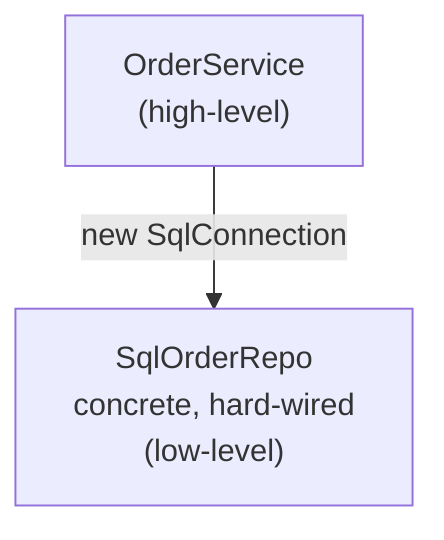
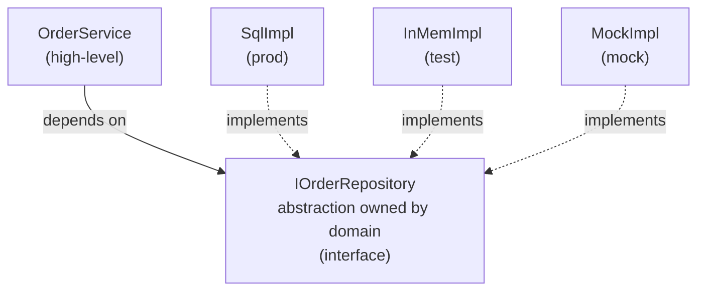

# SOLID Principles

> [Mastery Guide](../README.md) › [Foundations](./README.md)

| Status | Priority | Phase | Last reviewed |
|---|---|---|---|
| Not Started | High | Phase 1 — Language & Runtime Fluency | 2026-05-07 |

## Contents
- [Why it matters](#why-it-matters)
- [Core concepts](#core-concepts)
  - [S — Single Responsibility Principle (SRP)](#s--single-responsibility-principle-srp)
  - [O — Open/Closed Principle (OCP)](#o--openclosed-principle-ocp)
  - [L — Liskov Substitution Principle (LSP)](#l--liskov-substitution-principle-lsp)
  - [I — Interface Segregation Principle (ISP)](#i--interface-segregation-principle-isp)
  - [D — Dependency Inversion Principle (DIP)](#d--dependency-inversion-principle-dip)
- [Code & diagrams](#code--diagrams)
- [Common pitfalls](#common-pitfalls)
- [Interview-ready summary](#interview-ready-summary)
- [Interview Cross-Questioning Drill](#interview-cross-questioning-drill)
- [Cheat Sheet](#cheat-sheet)
- [Walkthrough](#walkthrough--the-god-class-refactor)
- [Self-test](#self-test)
- [Cross-references](#cross-references)
- [Sources](#sources)

---

## Why it matters

SOLID is the load-bearing acronym for object-oriented design. Coined by Robert C. Martin in the early 2000s, it bundles five principles that — when followed — produce code that's easy to change, easy to test, and easy to reason about under pressure. Violations don't make the code "wrong" today; they make tomorrow's change painful. Most legacy disasters are SOLID violations compounding over years.

Why interviewers ask: SOLID is the cheapest signal that a candidate has internalized OO design beyond syntax. A senior engineer should be able to spot SOLID violations in a code review, refactor toward the principles without over-engineering, and *justify when not to apply* them (yes, that's also a senior signal — SOLID is a guideline, not dogma).

When NOT to apply: scripts, throwaway prototypes, and code paths that are genuinely never going to change don't benefit from SOLID. Premature application creates the over-abstraction trap (interfaces with one implementation, factories that build one type, abstractions for things that will never vary).

## Core concepts

### S — Single Responsibility Principle (SRP)

**Definition:** A class should have one, and only one, reason to change.

"Reason to change" maps to a stakeholder or actor — a class shouldn't serve two masters. A `User` class that does ORM persistence + email sending + permission checking has three reasons to change: schema evolution, email-template tweaks, and security-policy shifts. When the security team requests a change, you risk regressing email behavior because the methods share state.

**Refactoring smell:** the word "and" in your class description ("UserService manages users *and* sends emails *and* validates permissions"). The "and" is the seam.

**Example violation:**

```csharp
public class OrderProcessor
{
    public void ProcessOrder(Order order)
    {
        // Validation logic
        if (order.Items.Count == 0) throw new InvalidOperationException("Empty order");

        // Persistence logic
        using var conn = new SqlConnection(_connStr);
        conn.Execute("INSERT INTO Orders ...");

        // Email logic
        var smtp = new SmtpClient("mail.example.com");
        smtp.Send(new MailMessage(...));

        // Logging logic
        File.AppendAllText("orders.log", $"Order {order.Id}");
    }
}
```

Four responsibilities. Schema change affects email tests. SMTP downtime breaks order persistence.

**SRP-compliant refactor:**

```csharp
public class OrderProcessor(
    IOrderValidator validator,
    IOrderRepository repo,
    IEmailService email,
    ILogger<OrderProcessor> log)
{
    public async Task ProcessOrderAsync(Order order)
    {
        validator.Validate(order);
        await repo.SaveAsync(order);
        await email.SendConfirmationAsync(order);
        log.LogInformation("Order {Id} processed", order.Id);
    }
}
```

Each collaborator has one reason to change. `OrderProcessor`'s only reason is the orchestration sequence itself.

### O — Open/Closed Principle (OCP)

**Definition:** Software entities should be open for extension, but closed for modification.

You should be able to add new behavior by *adding* code, not by *changing* existing tested code. The mechanism is usually polymorphism — define an abstraction, swap implementations.

**Why it matters:** changing tested code risks regressions. Extension via new types preserves the old test surface. This is what unlocks plugin architectures, strategy patterns, and most extensible frameworks.

**Example violation:**

```csharp
public class DiscountCalculator
{
    public decimal Calculate(Order order, string customerType)
    {
        if (customerType == "Regular") return order.Total * 0.05m;
        if (customerType == "Gold")    return order.Total * 0.10m;
        if (customerType == "Platinum") return order.Total * 0.15m;
        return 0;
    }
}
```

Adding "Diamond" tier means *modifying* the method. The original tests now run against modified code.

**OCP-compliant:**

```csharp
public interface IDiscountStrategy
{
    decimal Calculate(Order order);
}

public class GoldDiscount : IDiscountStrategy
{
    public decimal Calculate(Order order) => order.Total * 0.10m;
}

public class DiamondDiscount : IDiscountStrategy  // new tier — no existing code modified
{
    public decimal Calculate(Order order) => order.Total * 0.20m;
}

public class DiscountCalculator(IDiscountStrategy strategy)
{
    public decimal Calculate(Order order) => strategy.Calculate(order);
}
```

`DiscountCalculator` itself never changes when new tiers are added.

### L — Liskov Substitution Principle (LSP)

**Definition:** Subtypes must be substitutable for their base types without altering the correctness of the program.

If `S` is a subtype of `T`, then objects of type `T` may be replaced with objects of type `S` without breaking the program. This is the contract of inheritance: "I am a `T`" must mean "I behave like a `T` everywhere a `T` is expected."

**Classic violation — the Square/Rectangle problem:**

```csharp
public class Rectangle
{
    public virtual int Width { get; set; }
    public virtual int Height { get; set; }
    public int Area => Width * Height;
}

public class Square : Rectangle
{
    public override int Width
    {
        get => base.Width;
        set { base.Width = value; base.Height = value; }
    }
    public override int Height
    {
        get => base.Height;
        set { base.Height = value; base.Width = value; }
    }
}

void StretchHorizontally(Rectangle r) { r.Width = 10; /* expects Height unchanged */ }
```

`Square` violates LSP because passing it where `Rectangle` is expected mutates state in unexpected ways. The solution is rarely "make Square inherit Rectangle better" — it's "Square is not a Rectangle in this design; both are `Shape`."

**Practical signs of violation:**
- Override that throws `NotSupportedException`
- Override that strengthens preconditions (more validation than parent)
- Override that weakens postconditions (returns less or nothing)
- Code that does `if (x is SubType) { specialCase(); }` — defeats the abstraction

### I — Interface Segregation Principle (ISP)

**Definition:** Clients should not be forced to depend on methods they do not use.

Many small, role-specific interfaces beat one fat interface. A class implementing a fat interface is forced to provide implementations for methods it doesn't need (often `throw new NotSupportedException`), which is itself an LSP violation.

**Example violation:**

```csharp
public interface IPrinter
{
    void Print(Document doc);
    void Scan(Document doc);
    void Fax(Document doc);
}

public class BasicPrinter : IPrinter  // can only print
{
    public void Print(Document doc) { /* OK */ }
    public void Scan(Document doc) => throw new NotSupportedException();  // ❌
    public void Fax(Document doc)  => throw new NotSupportedException();  // ❌
}
```

**ISP-compliant:**

```csharp
public interface IPrinter { void Print(Document doc); }
public interface IScanner { void Scan(Document doc); }
public interface IFax { void Fax(Document doc); }

public class BasicPrinter : IPrinter { public void Print(Document doc) { } }
public class MultiFunctionDevice : IPrinter, IScanner, IFax { /* implements all 3 */ }
```

Clients depend only on what they need. Adding fax capability later means adding the `IFax` interface to the right device, not modifying every printer.

### D — Dependency Inversion Principle (DIP)

**Definition:**
1. High-level modules should not depend on low-level modules. Both should depend on abstractions.
2. Abstractions should not depend on details. Details should depend on abstractions.

This is the *direction* of dependency. Your business logic (`OrderService`) should not directly construct `SqlConnection` or `SmtpClient`. It should depend on `IOrderRepository` and `IEmailService` — abstractions that the business logic owns. The infrastructure layer implements those abstractions.

This is what enables testability (swap real DB for in-memory fake) and makes Clean Architecture work (the inner circle defines the abstractions; outer circles implement them).

DI containers (Microsoft.Extensions.DependencyInjection) are the runtime mechanism, but DIP is the *principle*. You can practice DIP without a container; the container just automates the wiring.

**Example violation:**

```csharp
public class OrderService
{
    private readonly SqlOrderRepository _repo = new SqlOrderRepository();  // ❌ concrete dep
    public void Place(Order o) => _repo.Save(o);
}
```

`OrderService` (high-level) depends on `SqlOrderRepository` (low-level). You cannot test `OrderService` without a SQL Server.

**DIP-compliant:**

```csharp
public interface IOrderRepository { void Save(Order o); }

public class OrderService(IOrderRepository repo)  // depends on abstraction
{
    public void Place(Order o) => repo.Save(o);
}

public class SqlOrderRepository : IOrderRepository { public void Save(Order o) { /* SQL */ } }
public class InMemoryOrderRepository : IOrderRepository { public void Save(Order o) { /* dict */ } }
```

`OrderService` is now a closed system that accepts any `IOrderRepository`. Tests use the in-memory one; production uses SQL.

## Code & diagrams

<details>
<summary>🧩 Click to expand — code samples and diagrams</summary>

### Dependency direction (DIP visualization)

**WITHOUT DIP (concrete dependency):**



**WITH DIP (abstraction in the middle):**



### Refactoring sequence: SRP → DIP

```csharp
// Stage 0: monolithic violation (SRP + DIP both broken)
public class OrderProcessor
{
    public void Process(Order o)
    {
        new SqlConnection(_cs).Execute("INSERT...");          // direct SQL
        new SmtpClient().Send(new MailMessage(...));          // direct SMTP
        File.AppendAllText("log.txt", ...);                   // direct IO
    }
}

// Stage 1: SRP refactor — extract responsibilities into separate classes
public class OrderProcessor
{
    private readonly OrderRepo _repo = new();      // SRP done, DIP still broken
    private readonly EmailSender _email = new();
    private readonly FileLogger _log = new();
    public void Process(Order o) { _repo.Save(o); _email.Send(o); _log.Write(o.Id); }
}

// Stage 2: DIP refactor — depend on abstractions
public class OrderProcessor(IOrderRepo repo, IEmailSender email, ILogger log)
{
    public void Process(Order o) { repo.Save(o); email.Send(o); log.Write(o.Id); }
}
// Now testable, mockable, swappable. SOLID compliant.
```

### Anti-pattern: over-application of OCP

```csharp
// ❌ Over-engineered: one strategy per "type" of greeting
public interface IGreetingStrategy { string Greet(string name); }
public class HelloStrategy   : IGreetingStrategy { public string Greet(string n) => $"Hello, {n}"; }
public class HiStrategy      : IGreetingStrategy { public string Greet(string n) => $"Hi, {n}"; }
public class HeyStrategy     : IGreetingStrategy { public string Greet(string n) => $"Hey, {n}"; }
// 50 lines for what was a 1-line method. SOLID is not free; apply when variability is real.

// ✅ Just write the method. If "greeting variants" become a real feature, refactor then.
public string Greet(string name) => $"Hello, {name}";
```

</details>
## Common pitfalls

1. **Confusing SRP "responsibility" with "method" or "line of code".** A class with 10 methods can satisfy SRP if all 10 serve one purpose. SRP is about *axes of change*, not method count.
2. **Adding interfaces "just in case".** An interface with one implementation that you don't actually swap is dead weight. Add interfaces when you need to swap (test fakes, multiple impls), not preemptively.
3. **Liskov violation by NotSupportedException.** Throwing `NotSupportedException` in an override is a code smell. The subtype is announcing "I am not actually a `T`."
4. **DIP without inversion.** Injecting a concrete `SqlOrderRepo` is dependency injection but not dependency inversion — the high-level still depends on the low-level type. The point is to depend on the abstraction.
5. **Fat interfaces "for convenience".** `IRepository<T>` with `GetAll`, `Find`, `Add`, `Update`, `Delete`, `BulkInsert`, `ExecuteRaw` forces every consumer to depend on operations they don't use. Split by role: `IReader<T>`, `IWriter<T>`.
6. **OCP via if-chains in a "facade".** Wrapping a switch statement in a method named `CalculateAnything()` doesn't satisfy OCP. The if-chain is still there.
7. **Treating SOLID as universal law.** It's a guideline. Game engines, hot-path code, and small scripts often deliberately violate SOLID for performance or simplicity. Knowing when not to apply is itself senior judgment.
8. **Conflating SOLID with Clean Architecture or DI containers.** They're related but distinct. You can practice SOLID without a DI container; you can use a DI container while violating DIP.
9. **Stuffing the constructor.** A class needing 12 dependencies via constructor probably has SRP problems — split it.
10. **"Refactoring to SOLID" without tests.** SOLID refactoring is mechanical only when you have green tests to confirm behavior preservation. Without tests, refactor *toward* tests first.

## Interview-ready summary

- **S** — Single Responsibility: one class, one reason to change.
- **O** — Open/Closed: extend by adding code, not modifying existing code (polymorphism).
- **L** — Liskov: subtypes must honor the parent's contract; no surprises.
- **I** — Interface Segregation: many small interfaces beat one fat one.
- **D** — Dependency Inversion: high-level depends on abstraction, not concrete; abstraction lives with the high-level domain.

**Expected interview questions:**

1. *"Explain SRP with a code example."* — Walk through a class with persistence + email + validation, then split into collaborators. Emphasize "reason to change" not "method count."
2. *"What's the difference between LSP and ISP?"* — LSP is about *behavioral* substitutability (subtypes don't break parent contracts). ISP is about *structural* coupling (clients shouldn't depend on methods they don't use). They overlap when a fat interface forces NotSupportedException overrides.
3. *"Is DI the same as DIP?"* — No. DI is a technique (passing dependencies in). DIP is a principle (high-level depends on abstraction). You can do DI while violating DIP if you inject concrete types.
4. *"Show me a DIP violation in this code."* — Look for `new SomeService()` inside business logic, or a `private readonly SqlConnection` field. The fix is to inject an interface.
5. *"When would you violate SOLID intentionally?"* — Throwaway scripts, hot loops where a virtual call costs measurably, frameworks where the abstraction overhead exceeds the benefit. Senior judgment includes knowing the cost.
6. *"Critique this `IRepository<T>` interface."* — If it has 10+ methods, ISP violation. Suggest splitting into `IReader<T>` / `IWriter<T>` or by use case.
7. *"How do SOLID and Clean Architecture relate?"* — Clean Architecture is structural (concentric layers); SOLID is per-class. Clean Architecture's dependency rule (inward-only) is DIP applied at the layer level.

## Interview Cross-Questioning Drill

<details>
<summary>📖 Click to expand — cross-question chains (~15-20 min, cover answers and write cold)</summary>

> ⚠️ **Honest caveat**: reading this once doesn't make you interview-ready. Cover the answers, write them cold, then check. Pair with a senior for live mock cross-questioning. The guide removes "I never thought about that" surprises; mock interviews convert knowledge into reflex. Both are needed.

Each drill is **Q → A → Cross-Q → A → Cross-Q² → A**.
### Drill 1 — What is a "responsibility" in SRP?

> **Q**: SRP says "one reason to change" — but what's a "reason"? Two engineers always disagree.
>
> **A**: A reason maps to a **stakeholder / actor / axis of change** — someone who would request a change. `OrderProcessor` that does persistence (DBA's axis), email (marketing's axis), and audit logs (compliance's axis) has three actors. Each actor's change risks regressing the others. The "and" in the class description ("does X *and* Y") is the seam.
>
> **Cross-Q**: A class with 50 methods all doing string manipulation — is that SRP-compliant?
>
> **A**: Almost certainly yes. Method count doesn't measure responsibilities; *axes of change* do. A 50-method `StringUtilities` has one axis (string operations); a 5-method class that touches database + email + validation has three. SRP is about coupling axes, not line counts.
>
> **Cross-Q²**: Where does the "responsibility" line blur in practice?
>
> **A**: When two responsibilities have **the same actor today** but **could split tomorrow**. Sending emails and sending SMS feel like "notification" — one actor — until the SMS team forms and now they're two. The pragmatic rule: split when the team / change-cadence diverges, not preemptively. Premature SRP splits cost more in indirection than they save in coupling.

### Drill 2 — Spot the SRP violation

> **Q**: I have `class UserService { void Register(User u); void SendWelcomeEmail(User u); void Authenticate(string user, string pwd); }`. Is this SRP-compliant?
>
> **A**: No. Three responsibilities: lifecycle (Register, Authenticate spans persistence + identity), notification (SendWelcomeEmail), and credential validation (Authenticate). Three actors: identity team owns auth, marketing owns email templates, DBAs own user storage. Split into `IUserRepository`, `IEmailService`, `IAuthService`.
>
> **Cross-Q**: What's the smallest split that fixes it without over-engineering?
>
> **A**: Extract `IEmailService` first — that's the clearest standalone axis (email server changes, template changes, throttling rules). Keep `Register` + `Authenticate` together initially as `IUserAccountService`; if auth grows (MFA, OAuth, password reset flows), split out `IAuthService`. **Don't pre-split** — wait for the second reason to change.
>
> **Cross-Q²**: Senior interviewer says "but now I have three interfaces with one implementation each — isn't that SRP overkill?"
>
> **A**: The interfaces aren't there for SRP — they're there for DIP/testability. SRP justifies the *classes*; DIP justifies the *interfaces*. If you're never going to swap, drop the interfaces and keep the class split. SRP can be satisfied with concrete classes that depend on each other — interfaces are a separate decision.

### Drill 3 — Open/Closed: what does it actually mean?

> **Q**: "Open for extension, closed for modification" — explain in 30 seconds.
>
> **A**: You should add new behavior by **adding new types** (subclasses, new interface implementations, plugins), not by **editing existing tested code**. The mechanism is polymorphism — define an abstraction, swap implementations. Editing tested code risks regressing the existing test surface; adding new types leaves it untouched.
>
> **Cross-Q**: Adding a new `if` branch to a switch satisfies "extension" in plain English. Why doesn't it count?
>
> **A**: Because it *modifies* the switch — the tested function changes, all callers re-verify, and the if-chain grows linearly with variants. OCP wants polymorphic dispatch where the dispatch site is closed (`strategy.Handle()`) and the variant count is unbounded without touching the closed code. Switches violate OCP unless **the set of cases is genuinely closed** (e.g., HTTP verb is a fixed enum — adding a new HTTP verb is a once-a-decade event; over-abstracting for that is YAGNI).
>
> **Cross-Q²**: With C# 12 pattern matching, isn't `switch` polymorphism in disguise?
>
> **A**: Yes — `switch` over a sealed hierarchy is *exhaustive pattern matching*, structurally equivalent to virtual dispatch (the compiler enforces exhaustiveness for closed unions). For closed sets it's the **preferred OCP-compliant pattern** in modern C# (records + sealed + switch), because adding a new variant requires updating only the union; the compiler then flags every non-exhaustive switch. For open sets (plugin variants, user-extensible), interfaces still win.

### Drill 4 — Square / Rectangle (the LSP classic)

> **Q**: Why does making `Square` inherit `Rectangle` violate LSP?
>
> **A**: `Rectangle` contract: `Width` and `Height` are independent. Test: `r.Width = 5; r.Height = 10; assert(r.Area == 50);`. When `r` is a `Square` (override forces W = H), setting Width also changes Height — the assertion fails. The subtype has weakened the parent's contract; callers written against `Rectangle` break.
>
> **Cross-Q**: Mathematically, every square *is* a rectangle. Why doesn't math save us?
>
> **A**: Math defines immutable shapes; the type system models **mutable behavior**. The set-theoretic "square is a rectangle" is true for *instances* but breaks for *behaviors* when both have setters. The fix: model the abstraction the code actually uses (an immutable `IShape` with `Area`) — `Square` and `Rectangle` are siblings, not parent-and-child. **The taxonomy of the real world doesn't always map to the type hierarchy that works in code.**
>
> **Cross-Q²**: If both were immutable (`record Square(int Side) : Rectangle(Side, Side)`), is it still an LSP violation?
>
> **A**: No — without setters, there's no way to break the parent's "Width and Height are independent" assumption (you can't independently set them; they don't exist as mutable state). Immutable hierarchies are much harder to violate LSP. **This is one reason DDD/FP value-objects-with-no-setters is robust by construction.**

### Drill 5 — LSP violation by NotSupportedException

> **Q**: `class ReadOnlyList<T> : List<T> { public override void Add(T item) => throw new NotSupportedException(); }`. LSP violation?
>
> **A**: Yes — `List<T>.Add` contract is "the item is appended on return." `ReadOnlyList<T>.Add` violates by throwing. A caller written against `List<T>` (`list.Add(x);`) crashes when handed a `ReadOnlyList<T>`. The subtype announces "I am not actually a `List<T>`."
>
> **Cross-Q**: But `Bird → Penguin` is the textbook case and Penguin can't fly. What does the BCL do?
>
> **A**: It uses *interface segregation*. `ICollection<T>` has `IsReadOnly`; `Add` is on a different interface or guarded. The BCL chose: `IReadOnlyCollection<T>` (no `Add` at all) instead of `IList<T>` with a throwing `Add`. Penguin similarly shouldn't inherit `Flyable`; both Penguin and Sparrow inherit `Bird`, only Sparrow inherits `IFlying`. ISP fixes LSP by ensuring subtypes don't carry methods they can't honor.
>
> **Cross-Q²**: But `System.Array` has `IList.Add` that throws — is the BCL itself violating LSP?
>
> **A**: Yes, and it's a known design wart — when `IList` (non-generic) was added in 1.0, arrays were forced into the interface to be passable to legacy APIs. Modern generic `IReadOnlyList<T>` and `IList<T>` separate the contracts properly. **The BCL legacy interfaces are the "what we'd do differently" example — they show LSP violations costing decades of awkward error messages.**

### Drill 6 — Fat interface — when ISP applies

> **Q**: I have `interface IRepository<T> { Get, Find, Add, Update, Delete, BulkInsert, ExecuteRaw, Migrate }`. What's wrong?
>
> **A**: Fat interface — ISP violation. A controller that only needs `Get` is forced to depend on `BulkInsert`, `ExecuteRaw`, `Migrate`. Mocking explodes (have to stub eight methods for a one-method test); the interface couples unrelated concerns (read-side vs write-side vs admin); evolution of one method (say, `ExecuteRaw` becomes async + cancellation token) cascades to every consumer.
>
> **Cross-Q**: How do you split it without an interface explosion?
>
> **A**: Split by **role**: `IRepository<T>` becomes `IReader<T>` (`Get`, `Find`), `IWriter<T>` (`Add`, `Update`, `Delete`), `IBulkOps<T>` (`BulkInsert`), `IAdmin<T>` (`ExecuteRaw`, `Migrate`). Consumers depend only on what they need (`ProductController : IReader<Product>`). The repository class still implements all four; the *interfaces* are split.
>
> **Cross-Q²**: Splitting interfaces means more types. Where's the break-even?
>
> **A**: Two heuristics. (1) **Different consumers use different subsets** — if every consumer uses every method, splitting is YAGNI. (2) **Different methods have different lifecycles** — if `BulkInsert` evolves on a different cadence from `Get`, splitting decouples the change. If both fail, don't split. Senior judgment is recognizing that ISP serves a *coupling-reduction* goal — if coupling isn't a problem, the rule doesn't apply.

### Drill 7 — Splitting an interface — what about implementers?

> **Q**: I split `IPrinter` into `IPrinter`, `IScanner`, `IFax`. My `MultiFunctionDevice` implemented all 3 as `IPrinter`. What changes?
>
> **A**: `MultiFunctionDevice : IPrinter, IScanner, IFax` — implements three small interfaces instead of one big one. Same total method count; clearer intent. DI registration: register the concrete `MultiFunctionDevice` once and expose three lifetimes/keys, or use `services.AddSingleton<MultiFunctionDevice>(); services.AddSingleton<IPrinter>(p => p.GetRequiredService<MultiFunctionDevice>()); ...` to bind the same instance to all three.
>
> **Cross-Q**: That feels like ceremony. Can DI just resolve "any interface this class implements"?
>
> **A**: Not out of the box. `services.AddSingleton<MultiFunctionDevice>()` registers the concrete; injecting `IPrinter` will fail unless you also register the interface mapping. Two common patterns: (a) explicit per-interface registration as above, or (b) third-party libraries (Scrutor) that scan and register all interfaces a class implements. Vanilla MS DI is intentionally explicit — magic registration leads to surprises.
>
> **Cross-Q²**: What if `BasicPrinter` only implements `IPrinter` and someone tries to resolve `IScanner` for it?
>
> **A**: DI throws `InvalidOperationException` at resolution time — exactly what you want. ISP's whole point is that consumers depend only on the interfaces their target supports; trying to resolve `IScanner` from a `BasicPrinter`-only context is a compile-time-or-runtime error rather than a silent `NotSupportedException` at the call site. **The "fat interface forces NotSupportedException" anti-pattern is replaced by "the type doesn't even implement that interface" — a much louder failure mode.**

### Drill 8 — DIP vs DI: what's the difference?

> **Q**: My team uses "DIP" and "DI" interchangeably. Are they the same?
>
> **A**: No. **DI (dependency injection)** is a *technique* — passing collaborators in via constructor/property/method instead of constructing them internally. **DIP (dependency inversion principle)** is a *direction rule* — high-level modules depend on abstractions, abstractions are owned by the high-level (domain) layer, low-level (infrastructure) implements them. You can do DI while violating DIP — inject a concrete `SqlOrderRepository` and you have DI (technique) but not DIP (still depending on concrete low-level).
>
> **Cross-Q**: Give a concrete example of DI without DIP.
>
> **A**: `class OrderService(SqlOrderRepository repo) { ... }` registered via `services.AddScoped<SqlOrderRepository>()`. That's DI — repo is injected. But `OrderService` (high-level domain) depends on `SqlOrderRepository` (low-level infrastructure concrete) — DIP violation. Inversion would mean: domain owns `IOrderRepository`; SQL implementation lives in infrastructure and implements the domain-defined interface. The interface lives **in the domain assembly**, not the infrastructure one.
>
> **Cross-Q²**: Does Clean Architecture's "dependency rule" map to DIP?
>
> **A**: Yes — Clean Architecture is DIP scaled to layers. The dependency rule says "inner circles never depend on outer circles"; outer circles depend on inner-circle abstractions. That's structurally identical to DIP: domain (inner) owns interfaces; infrastructure (outer) implements them. The difference is *granularity* — SOLID DIP is per-class; Clean Architecture is per-layer. Same direction, different scope.

### Drill 9 — SOLID + DI container — relationship

> **Q**: Does a DI container automatically make code SOLID?
>
> **A**: No. A DI container is plumbing for *dependency injection* — passing collaborators. It can't tell whether the injected type is a concrete (DIP violation) or an abstraction owned by the right layer (DIP-compliant). It can't tell whether the class has SRP (multiple responsibilities). It can't enforce LSP. The container amplifies your design — good design becomes easier to wire; bad design becomes a noisy mess of registrations.
>
> **Cross-Q**: But isn't `services.AddScoped<IFoo, Foo>()` the "S" / "I" / "D" of SOLID in one line?
>
> **A**: It's *enabled by* I and D, but doesn't *cause* them. The `IFoo` interface and `Foo` implementation exist whether you use a container or hand-wire ctors. The container just resolves the graph at runtime. You can write SOLID code with no container (manual ctor wiring); you can write anti-SOLID code with a container (god-class with 30 dependencies).
>
> **Cross-Q²**: A 30-dependency constructor — what SOLID failure does that indicate?
>
> **A**: SRP — almost certainly. 30 collaborators implies 30 reasons to change. Cluster them: deps for billing belong in `BillingService`, deps for fraud in `FraudService`, etc. Often the god class is an orchestrator that should delegate; split it and inject ~5 high-level facades instead of 30 low-level services. Secondary: ISP — some of those 30 may be fat interfaces; trim them. **Constructor parameter count is the cheapest SOLID smell to detect during code review.**

### Drill 10 — Records and SOLID

> **Q**: If a `record` has methods on it, does it violate SRP?
>
> **A**: Not inherently. A `record` is a data shape with auto-generated equality; adding methods that operate on its own fields (computed properties, validation, transformations to other records) is fine — single responsibility = "represent this concept." SRP violations appear when the record starts pulling external dependencies (saving itself to a database, sending an email, calling an API). At that point, *behavior* belongs in a service; the record stays a value.
>
> **Cross-Q**: Where does the line sit between "record with methods" and "anemic domain model"?
>
> **A**: The DDD "tell, don't ask" line. `Money.Add(other) → Money` is a method on the value type because addition is *intrinsic* to Money's semantics — no external dependency. `Order.PlaceAsync(IEmail, IInventory)` reaches out to the world — it's not Order's responsibility, it's an `OrderService`'s. Rich domain model = methods that operate on the type's own state; service layer = methods that orchestrate across types and external resources.
>
> **Cross-Q²**: With `record class` + primary ctor + DI service patterns, is the line blurring?
>
> **A**: A bit. `public record class CalculatorService(IRateProvider rates)` is a record (auto-equality) that's also injected with services — a DDD purist would say "that's a service, not a record." Modern C# makes both shapes look similar syntactically. The right test: **does equality by content matter?** If `CalculatorService(rates1) == CalculatorService(rates2)` is meaningful, record. If not (it's identity / reference-equal services), class. Most DI services are *not* equality-meaningful; use `class`. Records remain for value objects + DTOs + messages.

### Drill 11 — Is SOLID still relevant in 2026?

> **Q**: Functional programming, records, pattern matching, primary ctors — does SOLID still matter, or is it 2000-era OO baggage?
>
> **A**: The principles map to FP just differently. **SRP** = small focused functions. **OCP** = pattern matching over a closed union (add a variant → compiler flags every non-exhaustive switch). **LSP** = function input/output contracts (Hindley-Milner enforces a stricter LSP than nominal subtyping). **ISP** = small typeclasses / capability interfaces. **DIP** = pass functions as arguments (`Func<T, T>` instead of constructed dependencies). The acronym is OO-flavored; the underlying ideas (axis-of-change, polymorphism, contracts, role-based dependencies, direction-of-dependency) are language-agnostic.
>
> **Cross-Q**: Where does FP do it *better* than OO-SOLID?
>
> **A**: Immutability. Records + immutability eliminate entire categories of LSP violations (no mutable setters to weaken). Pure functions eliminate hidden dependencies (the function signature *is* the contract). Algebraic data types (closed sealed hierarchies) make OCP via pattern matching compiler-enforced. FP-style code in modern C# (records + sealed + switch + LINQ) often satisfies SOLID more easily than traditional OO inheritance hierarchies.
>
> **Cross-Q²**: Are there cases where SOLID is *replaced* by simpler patterns now?
>
> **A**: Yes — when the variability is genuinely small and stable. The classic 2010-era "strategy pattern with 3 implementations and a factory" is often a `switch` over a sealed enum/record union in 2026. The OCP value (extensibility) was *speculative* — if no fourth strategy ever arrives, the strategy pattern was over-engineering. SOLID's strength has always been **paying ceremony where variability is real**; modern C# makes the "no ceremony for closed sets" path cleaner.

### Drill 12 — When to ignore each principle

> **Q**: Name a case where you'd intentionally violate each SOLID principle.
>
> **A**: **SRP**: throwaway scripts; a 100-line CLI tool that does parse-validate-process-output is fine in one class. **OCP**: closed enums (HTTP method, log level) — strategy pattern is overkill. **LSP**: BCL legacy (`Array : IList` with throwing `Add`) — sometimes you inherit a bad design and ship it. **ISP**: framework-mandated wide bases (`PageModel`, `DbContext`) where you can't choose. **DIP**: hot-path code where a virtual call costs measurably — direct concrete dependency + sealed class for JIT devirtualization.
>
> **Cross-Q**: Senior judgment is knowing when to violate. How do you build that judgment?
>
> **A**: Three inputs. (1) **Change frequency** — if the code hasn't changed in 3 years, the SOLID ceremony probably hasn't paid off; the next dev edits the if-chain and ships. (2) **Cost of change** — if a violation means rewriting 50 callers, SOLID pays; if it means one method, ignoring SOLID is cheap. (3) **Team familiarity** — if half the team doesn't know strategy pattern, the simpler `switch` is more maintainable for *this team*. Senior judgment is recognizing the principle's value is *contextual*, not absolute.
>
> **Cross-Q²**: What's the dogma trap to avoid?
>
> **A**: Thinking SOLID is the goal. SOLID is a means to *change-friendly code*. If change isn't coming, you don't need it. If change is coming in a different direction than your SOLID architecture predicted, your SOLID is wrong-direction over-engineering. The honest answer to "should I apply SOLID here?" is "what changes are likely, and which axes does this code couple?" — if you can't answer those, SOLID is decoration, not design.

### Drill 13 — SOLID + microservices

> **Q**: How does SOLID translate to microservice decomposition?
>
> **A**: Each principle has a service-level analog. **SRP** → "one bounded context per service" (Stripe = payments, no inventory). **OCP** → services exposed via versioned APIs; new behavior = new endpoint, not breaking existing. **LSP** → service contract evolves backward-compatibly; v2 of an API substitutable for v1 in all use cases. **ISP** → small focused APIs (avoid one "kitchen-sink" gateway service). **DIP** → services depend on contract / schema (Protobuf, AsyncAPI), not on each other's implementation.
>
> **Cross-Q**: Where do SOLID and microservices conflict?
>
> **A**: SRP at class-level vs service-level differ. A `UserService` class may correctly bundle CRUD + authentication (one axis of change at the *class* level — user lifecycle); splitting them into separate microservices crosses a network boundary for what is logically one team's responsibility. **Class-level SRP optimizes for code coupling; service-level SRP optimizes for team coupling + deployment cadence**. They're related but not identical — you don't need a microservice for each SOLID-compliant class.
>
> **Cross-Q²**: A team has 50 services because "SRP — each service does one thing." What's the failure mode?
>
> **A**: Service explosion. The class-level SRP rubric doesn't translate to "one method per service." The right cut is **bounded context** (DDD) — a coherent business capability that shares a model. Five services per developer is bad; one service per developer (with internal class-level SRP) is sustainable. The 50-service team is suffering distributed-monolith pain: every business operation crosses 10 network boundaries, traces are unreadable, ops burden is brutal. **Senior signal**: recognize that SOLID's "small classes" doesn't justify "small services" — the axes of change differ.

### Drill 14 — The price of SOLID

> **Q**: What does over-applied SOLID look like in real codebases?
>
> **A**: Interface explosion (one interface per class with one impl, "for testability"), factory factories (FactoryFactory creates a factory that creates a factory…), Liskov-induced inheritance chains 5-levels deep, ISP-induced micro-interfaces (`IGetById<T>`, `IFindByName<T>`, `IExistsCheck<T>`), DIP-induced abstraction layers that obscure the actual flow. Symptoms: junior devs can't follow a single user request from controller to DB; navigating to "where does this happen" requires three Go-to-Definitions.
>
> **Cross-Q**: How do you detect over-application during code review?
>
> **A**: Five red flags. (1) Interface with one implementation and no test fake. (2) Pattern (Strategy, Factory, Visitor) wrapping a one-variant case. (3) Constructor with 12+ dependencies. (4) Inheritance chain ≥ 4 levels deep. (5) Method that's a one-line delegation through three layers. Each is a candidate for *removal* — collapse the abstraction, inline the delegation. **Net code reduction is the senior achievement when refactoring an over-SOLIDed codebase.**
>
> **Cross-Q²**: A team's culture says "always add interfaces for testability." How do you push back?
>
> **A**: Ask: "show me a test that uses the fake." If there isn't one, the interface earns nothing. If there is, ask: "could this test use the real implementation with a Testcontainer / in-memory db / fake server?" If yes, the interface is replacing what could be a real-thing test. The cost: every interface adds indirection, registration code, navigation friction, and one more thing to keep in sync. **The reasonable bar**: interfaces exist when **you're actually swapping** — not when you might.

### Drill 15 — SOLID + LSP + variance interaction

> **Q**: In C#, `IEnumerable<Dog>` is assignable to `IEnumerable<Animal>` but `IList<Dog>` isn't to `IList<Animal>`. What's the SOLID connection?
>
> **A**: It's LSP enforced by the type system. `IEnumerable<out T>` is **covariant** — `T` is only an output (return position); returning Dog where Animal is expected is safe (every Dog is an Animal). `IList<T>` is **invariant** — `T` is also input (`Add(T)`); if `IList<Dog>` were assignable to `IList<Animal>`, you could `Add(new Cat())` through the Animal-typed reference. Type safety breaks; LSP is structurally violated. Compiler refuses.
>
> **Cross-Q**: So variance annotations are LSP at the type-system level?
>
> **A**: Exactly. `out` means "only produces T" (safe to upcast — Liskov-substitutable in covariant position). `in` means "only consumes T" (safe to downcast — Liskov-substitutable in contravariant position). Invariant (no annotation) means "produces and consumes; no substitutability either direction." The C# compiler is *enforcing* LSP statically — you can't accidentally write a non-Liskov-substitutable generic interface if you opt into variance annotations.
>
> **Cross-Q²**: Arrays in C# are covariant (`Dog[] → Animal[]`). Why is that an LSP design wart?
>
> **A**: `Animal[] a = new Dog[10]; a[0] = new Cat();` compiles (covariance accepts the upcast) but throws `ArrayTypeMismatchException` at runtime (the heap object is `Dog[]`, can't accept Cat). LSP says "substitutability without breaking program correctness" — covariant arrays violate that. Java has the same wart. Modern .NET generics (`List<T>`, `IList<T>`) are correctly invariant — the compiler refuses the upcast at compile time. **Covariant arrays were a 1.0 mistake preserved for backward compatibility; they remain the canonical example of a language-level LSP violation.**

</details>
## Cheat Sheet

- **SRP**: one class, one *axis of change* — not one method, one stakeholder.
- **OCP**: extend by adding new types; never edit a tested class to add a variant.
- **LSP**: subtype must honor parent's pre/postconditions — no `NotSupportedException` overrides.
- **ISP**: split fat interfaces by *role*; clients depend only on what they call.
- **DIP**: high-level owns the abstraction; low-level *implements* it (dependency points inward).
- **DI ≠ DIP**: injecting a concrete `SqlRepo` is DI without inversion — still couples to detail.
- **Smell — "and" in class name**: `UserAndOrderService` is two SRP violations in one identifier.
- **Smell — `if (x is Subtype)`**: defeats polymorphism, points to LSP/OCP violation.
- **Tooling**: NDepend, SonarQube `S138` (cyclomatic), `S1200` (class coupling) flag SOLID drift.
- **Anti-rule**: don't add interfaces with one impl — YAGNI beats premature abstraction.

## Walkthrough — The god-class refactor

<details>
<summary>📖 Click to expand — worked walkthrough scenario</summary>

**Problem**: `OrderProcessor` is 1,800 lines, has 27 public methods, depends on 14 concrete services (`new SqlConnection`, `new SmtpClient`, `new HttpClient`), and every sprint a new "small change" breaks an unrelated test. New devs avoid the file.

**Diagnosis**: Run NDepend or `dotnet-cyclo` — expect a cyclomatic complexity north of 200 and afferent coupling > 30. Open the test file: tests instantiate the class via reflection because the constructor is private and uses static factories. Search for `new ` inside the class — every match is a DIP violation. Group methods by stakeholder (billing, fulfillment, notification) — each group is a candidate SRP split.

**Fix**: Apply the refactor sequence: (1) introduce constructor parameters as concrete types (DI without inversion, but compile-clean); (2) extract interfaces (`IOrderRepo`, `IPaymentGateway`, `IShippingNotifier`); (3) move methods into role-specific classes (`OrderPersistence`, `PaymentRunner`); (4) `OrderProcessor` becomes a thin orchestrator. Register lifetimes in `Program.cs` via `services.AddScoped<IOrderRepo, SqlOrderRepo>()`.

```csharp
public class OrderProcessor(IOrderRepo repo, IPaymentGateway pay, IShippingNotifier ship)
{
    public async Task ProcessAsync(Order o) { await repo.SaveAsync(o); await pay.ChargeAsync(o); await ship.NotifyAsync(o); }
}
```

**Why it works**: Each collaborator now has one reason to change; tests inject in-memory fakes; the orchestrator's only job is sequencing. SRP + DIP applied together unlock the testability that made the original class unmaintainable.

</details>
## Self-test

<details>
<summary>1. What's the precise difference between Dependency Injection and Dependency Inversion?</summary>

DI is a *technique* — passing collaborators in via constructor/property/method instead of constructing them. DIP is a *principle* — the high-level module owns the abstraction (interface lives in the domain layer), and the low-level concrete implements it. You can practice DI while violating DIP by injecting a concrete `SqlOrderRepo`; the dependency direction is still high-level → low-level. True inversion requires depending on an interface owned by the consumer.
</details>

<details>
<summary>2. You're reviewing a `PaymentService` constructor that takes 11 dependencies. What SOLID violation do you suspect, and how do you confirm?</summary>

SRP violation — 11 collaborators implies multiple axes of change. Confirm by listing the public methods and grouping by stakeholder: methods touching `IFraudCheck` + `IRiskScorer` belong to the risk team; methods touching `IInvoiceRepo` + `IReceiptEmailer` belong to billing. If groups don't share state, split the class. Secondary check: ISP — some of those 11 interfaces may be fat (`IPaymentInfra` with 20 methods); split by role.
</details>

<details>
<summary>3. A junior creates `interface IOrderRepo` with one implementation `SqlOrderRepo` "for SOLID." Critique.</summary>

Adding an interface with one implementation that you never substitute is dead weight — it violates YAGNI and adds a layer of indirection without value. The justification "for testability" only holds if you actually write tests with a fake. SOLID is not "always add interfaces"; DIP says depend on abstractions *when you need to invert direction*. If `OrderService` is only ever wired with `SqlOrderRepo` and tests use Testcontainers (real DB), the interface is noise. Acceptable triggers: test fakes, multiple implementations, plugin boundaries.
</details>

<details>
<summary>4. Trade-off: when would you intentionally violate OCP?</summary>

Hot-path code where a virtual call costs measurably (game loops, packet processors, allocator inner loops) — a `switch` is faster than a virtual dispatch and the JIT can devirtualize a sealed switch. Also: small enums with stable membership (e.g., `LogLevel`) where adding a new value happens once a decade and editing the switch is cheaper than a strategy registry. The senior judgment is recognizing that OCP's value is *amortized maintenance cost*; if change frequency is near zero or branch overhead dominates, OCP costs more than it saves.
</details>

<details>
<summary>5. Apply LSP: `class CachedRepo : SqlRepo` overrides `Save` to skip the DB write if the entity is unchanged. Is this an LSP violation?</summary>

Yes — `SqlRepo.Save` postcondition is "the row is persisted on return." `CachedRepo.Save` weakens that to "persisted *if changed*." A caller that immediately queries for the saved row may see stale data. The fix is one of: (1) make caching transparent (write-through, so postcondition holds); (2) introduce an explicit `ICachedRepo` with documented weaker contract; (3) move caching above `IRepo` (decorator at a layer where stale reads are acceptable). The LSP rule: subtypes can *strengthen* postconditions, never weaken.
</details>

## Cross-references

- [Design Patterns](../04-architecture-and-patterns/01-design-patterns.md) — most GoF patterns are mechanical applications of OCP and DIP.
- [Clean Architecture](../04-architecture-and-patterns/02-clean-architecture.md) — DIP scaled to layers.
- [Dependency Injection](./01-net-core-deep-dive/02-dependency-injection.md) — the runtime mechanism for DIP in ASP.NET Core.
- [.NET Architect's Mastery](../04-architecture-and-patterns/09-dotnet-architects-mastery.md) — knowing when NOT to apply SOLID is part of the architect lens.

## Sources

<details>
<summary>📚 Click to expand — sources and further reading</summary>

- Robert C. Martin, *Clean Architecture: A Craftsman's Guide to Software Structure and Design* (2017) — the canonical treatment.
- Robert C. Martin, *Agile Software Development, Principles, Patterns, and Practices* (2002) — original SOLID exposition.
- Microsoft Learn — [SOLID design principles](https://learn.microsoft.com/en-us/dotnet/architecture/modern-web-apps-azure/architectural-principles#solid).
- Mark Seemann, *Dependency Injection Principles, Practices, and Patterns* (2019) — DIP in .NET specifically.

</details>
<!-- nav-footer-start -->

---

[← Previous: .NET Version History (.NET 7 → .NET 10)](01-net-core-deep-dive/18-version-history.md) · [↑ Back to top](#solid-principles) · [Next: Data Structures →](03-data-structures.md)

<!-- nav-footer-end -->
