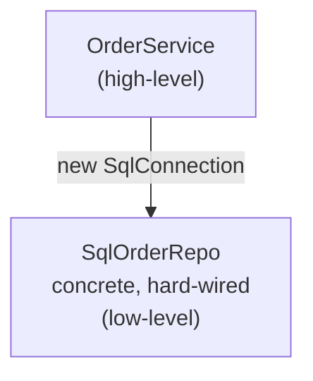
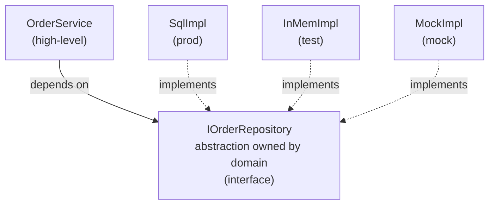
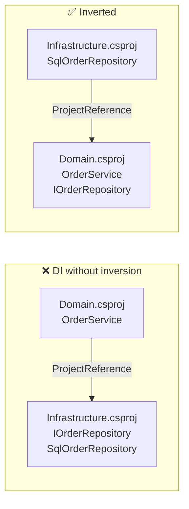
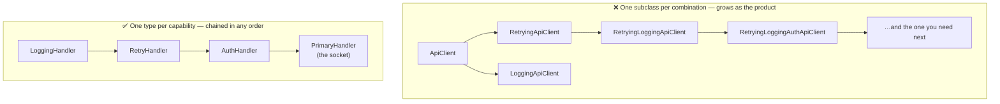

# SOLID Principles

> [Mastery Guide](../README.md) › [Foundations](./README.md)

| Status | Priority | Phase | Last reviewed |
|---|---|---|---|
| Not Started | High | Phase 1 — Language & Runtime Fluency | 2026-08-18 |

## Contents
- [Why it matters](#why-it-matters)
- [Core concepts](#core-concepts)
  - [S — Single Responsibility Principle (SRP)](#s--single-responsibility-principle-srp)
  - [O — Open/Closed Principle (OCP)](#o--openclosed-principle-ocp)
  - [L — Liskov Substitution Principle (LSP)](#l--liskov-substitution-principle-lsp)
  - [I — Interface Segregation Principle (ISP)](#i--interface-segregation-principle-isp)
  - [D — Dependency Inversion Principle (DIP)](#d--dependency-inversion-principle-dip)
  - [When NOT to apply — the senior lens](#when-not-to-apply--the-senior-lens)
  - [SOLID in the BCL and ASP.NET Core](#solid-in-the-bcl-and-aspnet-core)
- [Code & diagrams](#code--diagrams)
- [Common pitfalls](#common-pitfalls)
- [Interview-ready summary](#interview-ready-summary)
- [Interview Cross-Questioning Drill](#interview-cross-questioning-drill)
- [Cheat Sheet](#cheat-sheet)
- [Walkthrough](#walkthrough--the-god-class-refactor)
- [Self-test](#self-test)
- [Cross-references](#cross-references)
- [Sources](#sources)

---

## Why it matters

SOLID is the load-bearing acronym for object-oriented design. The five principles were not invented together and not by one person: Bertrand Meyer stated the Open/Closed Principle in *Object-Oriented Software Construction* (1988), Barbara Liskov gave the substitution rule in her 1987 OOPSLA keynote "Data Abstraction and Hierarchy" (formalised with Jeannette Wing in "A Behavioral Notion of Subtyping", TOPLAS 1994), and Robert C. Martin wrote up SRP, ISP and DIP as separate *C++ Report* columns in the mid-1990s before collecting all five in "Design Principles and Design Patterns" (2000). Martin credits **Michael Feathers** with rearranging them into the mnemonic. Knowing this is not trivia — it explains why the five have different characters. LSP is a formal, provable property of a type hierarchy. SRP is a heuristic about org charts. They do not deserve equal deference.

Violations don't make the code "wrong" today; they make tomorrow's change painful. Most legacy disasters are SOLID violations compounding over years — and a meaningful minority are SOLID *applications* compounding over years, which is the half most candidates cannot talk about.

**Why interviewers ask**: SOLID is the cheapest signal that a candidate has internalised OO design beyond syntax. But every candidate can recite the five expansions, so reciting them scores nothing. The discriminating question is always the second one: *when would you not do that?* A senior engineer should be able to spot violations in a code review, refactor toward the principles without over-engineering, and argue the cost of each abstraction in the same breath as its benefit.

> 🌍 **In the real world**: the SOLID question that decides a senior loop is almost never "what does the L stand for". It is the follow-up to something the candidate volunteered. Somebody says "we extracted an interface so it's testable", and the interviewer asks to see the test that uses a fake — and there isn't one, because the integration tests hit a real database in a container, so the interface has been pure indirection for two years. Or somebody says "we used the strategy pattern for discounts", and the interviewer asks how many strategies shipped, and the answer is one. Neither answer is disqualifying; failing to *see* that the answer is interesting is. The whole of this page is aimed at the second question, not the first.

**The two failure directions.** Under-applied SOLID gives you rigidity: a change in one place forces changes in unrelated places, tests need infrastructure, and nobody can work on two features at once without conflicts. Over-applied SOLID gives you *indirection*: the code is technically decoupled and practically unreadable, every request touches nine files, and a new joiner needs three "go to implementation" jumps to find where anything actually happens. Both are real; only the first gets taught.

When *not* to apply at all: scripts, throwaway prototypes, spike branches, and code paths that genuinely will not change. Premature application creates the over-abstraction trap — interfaces with one implementation, factories that build one type, abstractions for a variation that never arrived. Sandi Metz's formulation of the cost is the one worth memorising: **duplication is far cheaper than the wrong abstraction** ("The Wrong Abstraction", 2016). Duplication is a local, visible, mechanically-fixable problem. A wrong abstraction is a structural commitment that every future feature has to be bent around, and unwinding it means touching every call site that was written to it.

> 🌍 **In the real world**: a payments team inherited a service where every one of the nineteen domain classes had a matching `I{Name}` interface, each with exactly one implementation, each registered in a 400-line `ServiceCollectionExtensions`. There were no test doubles anywhere — the test suite used `WebApplicationFactory` against SQLite. So the interfaces bought nothing at all, and cost a doubled file count, a doubled navigation cost, and a registration file nobody dared touch. The cleanup was mechanical: delete any interface with one implementation and no fake, register the concrete type, keep the four interfaces that had a real second implementation or a real fake. The reviewable outcome was a **net deletion**, and the interview-usable version of the story is that "we removed abstractions and the design got better" is a sentence a senior engineer should be comfortable saying out loud.

## Core concepts

### S — Single Responsibility Principle (SRP)

**Definition:** A class should have one, and only one, reason to change.

"Reason to change" maps to a stakeholder or actor — a class shouldn't serve two masters. Martin restated it more precisely in *Clean Architecture* (2017) as: **a module should be responsible to one, and only one, actor.** That restatement matters because "one responsibility" invites an argument about granularity that has no answer, while "one actor" is checkable: name the person or team who would file the change request.

A `User` class that does ORM persistence + email sending + permission checking has three reasons to change: schema evolution, email-template tweaks, and security-policy shifts. When the security team requests a change, you risk regressing email behaviour because the methods share state.

**Refactoring smell:** the word "and" in your class description ("UserService manages users *and* sends emails *and* validates permissions"). The "and" is the seam.

**Example violation:**

```csharp
public class OrderProcessor
{
    public void ProcessOrder(Order order)
    {
        // Validation logic
        if (order.Items.Count == 0) throw new InvalidOperationException("Empty order");

        // Persistence logic
        using var conn = new SqlConnection(_connStr);
        conn.Execute("INSERT INTO Orders ...");

        // Email logic
        var smtp = new SmtpClient("mail.example.com");
        smtp.Send(new MailMessage(...));

        // Logging logic
        File.AppendAllText("orders.log", $"Order {order.Id}");
    }
}
```

Four responsibilities. Schema change affects email tests. SMTP downtime breaks order persistence.

**SRP-compliant refactor:**

```csharp
public class OrderProcessor(
    IOrderValidator validator,
    IOrderRepository repo,
    IEmailService email,
    ILogger<OrderProcessor> log)
{
    public async Task ProcessOrderAsync(Order order)
    {
        validator.Validate(order);
        await repo.SaveAsync(order);
        await email.SendConfirmationAsync(order);
        log.LogInformation("Order {Id} processed", order.Id);
    }
}
```

Each collaborator has one reason to change. `OrderProcessor`'s only reason is the orchestration sequence itself.

#### The fat controller — SRP's most common .NET argument

The fat controller is the SRP conversation you will actually have in a .NET interview, because everyone has written one. An MVC or minimal-API endpoint sits at the intersection of four separate change axes, and it is very easy to let all four live in the same method:

```csharp
// ❌ Four actors in one method
[HttpPost("orders")]
public async Task<IActionResult> Create(OrderDto dto)
{
    if (dto.Items.Count == 0)                                  // (1) business rule
        return BadRequest("Empty order");
    if (dto.Total > 10_000 && !User.IsInRole("Approver"))      // (2) authorisation policy
        return Forbid();

    var order = new Order { /* hand-mapped, 20 lines */ };      // (3) mapping
    _db.Orders.Add(order);                                      // (4) persistence
    await _db.SaveChangesAsync();
    await _smtp.SendAsync(BuildConfirmationEmail(order));       // (5) notification
    return CreatedAtAction(nameof(Get), new { id = order.Id }, order);
}
```

The actors are genuinely different people: product owns the business rule, security owns the role check, the DBA owns the schema the mapping targets, and marketing owns the email. The controller's *own* reason to change should be exactly one thing — **the HTTP contract**: route, verb, status codes, model binding, content negotiation.

```csharp
// ✅ The controller's only job is the HTTP shape
[HttpPost("orders")]
public async Task<IActionResult> Create(CreateOrder command, CancellationToken ct)
{
    var result = await sender.Send(command, ct);
    return result.IsSuccess
        ? CreatedAtAction(nameof(Get), new { id = result.Value.Id }, result.Value)
        : BadRequest(result.Error);
}
```

The tell that the split was real, not cosmetic: the business rule is now testable without a `ControllerContext`, an `HttpContext`, or a `ModelStateDictionary`.

> 🌍 **In the real world**: the argument that actually wins the fat-controller debate on a team is not "SRP says so", it is the test setup. A checkout controller had one action of about two hundred lines and a test file that constructed a `DefaultHttpContext`, a `ControllerContext`, a `ClaimsPrincipal` with three claims, an in-memory `DbContext` and two mocks — sixty lines of arrangement before a single assertion about a pricing rule that was four lines of arithmetic. After moving the pricing rule into a class that took a cart and a customer tier and returned a total, its test file was three lines of arrangement and the team wrote fourteen more cases in an afternoon because writing one had stopped being a chore. **The coverage on that rule went from one happy path to fourteen, and none of that was a testing-framework improvement — it was an SRP consequence.** When you argue this in an interview, argue it as "what does the test have to build?", because that is the version a skeptical staff engineer accepts.

> 🌍 **In the real world**: the same split goes wrong in a way worth naming, because the interviewer may well name it first. A team read "thin controllers" as "controllers must contain no logic" and produced a handler-per-endpoint layer where two-thirds of the handlers were a single line forwarding to a repository. Adding a field to a DTO then meant touching the contract, the command, the handler, the mapping profile, the entity and the migration — six files for one column. That is Fowler's **shotgun surgery** smell, and it is precisely the failure mode that over-applied SRP produces: SRP cures *divergent change* (one class changing for many reasons) and, pushed past its break-even, causes *shotgun surgery* (one reason forcing changes in many classes). The two smells are opposites, and the whole skill is knowing which one you currently have.

**When SRP does not apply.** Three cases:

1. **One actor.** A class with fifty methods that all serve one team's mental model — a `StringUtilities`, a `SqlDialect`, a hand-rolled protocol codec — has one axis of change no matter how big it is. Method count is not the metric.
2. **The code is stable.** Splitting a class that has not changed in three years buys optionality on a change that is not coming, and pays for it in navigation cost today.
3. **The split would cross a transaction or consistency boundary.** Two "responsibilities" that must succeed or fail together are one responsibility for design purposes; separating them into services that each own a `SaveChanges` call converts a local invariant into a distributed one, which is a much worse trade than a slightly fat class.

**Detecting it in review.** Constructor parameter count is the cheapest signal — it costs zero tooling. Beyond that, Visual Studio's *Calculate Code Metrics* (and the `Microsoft.CodeAnalysis.Metrics` NuGet package for CI) reports **class coupling**, cyclomatic complexity and depth of inheritance per type; SonarQube's **S1200** is literally titled "Classes should not be coupled to too many other classes (Single Responsibility Principle)". None of these tells you the class has two actors — they tell you where to look.

> 🌍 **In the real world**: a `PaymentService` accumulated twenty-two constructor dependencies over four years and nobody ever decided to make it a god class; each PR added exactly one. The refactor did not start with SOLID, it started with printing the dependency list and drawing lines around clusters: six were fraud/risk, five were invoicing and receipts, four were gateway plumbing, and the rest were cross-cutting (`ILogger`, `TimeProvider`, config). Those clusters were three services, and the reason they were three is that three different teams filed tickets against them. **Cluster the dependencies before you cluster the methods** — the dependency list is a much more honest picture of the actors than the method names are, because method names get renamed to fit the class and dependencies do not.

### O — Open/Closed Principle (OCP)

**Definition:** Software entities should be open for extension, but closed for modification.

You should be able to add new behaviour by *adding* code, not by *changing* existing tested code. The mechanism is usually polymorphism — define an abstraction, swap implementations.

**Two different OCPs, and interviewers conflate them.** Meyer's 1988 version was about *inheritance*: a class is closed once it is compiled and published (other modules may depend on it), and open because a subclass can extend it without the original changing. Martin's 1996 reformulation dropped inheritance for *abstraction*: clients depend on an abstract interface, and new behaviour arrives as a new implementation. Modern .NET almost always means Martin's. If you say "OCP means subclassing", you are quoting Meyer at someone who is thinking of Martin, and it reads as a miss.

**Why it matters:** changing tested code risks regressions. Extension via new types preserves the old test surface. This is what unlocks plugin architectures, strategy patterns, and most extensible frameworks.

**Example violation:**

```csharp
public class DiscountCalculator
{
    public decimal Calculate(Order order, string customerType)
    {
        if (customerType == "Regular") return order.Total * 0.05m;
        if (customerType == "Gold")    return order.Total * 0.10m;
        if (customerType == "Platinum") return order.Total * 0.15m;
        return 0;
    }
}
```

Adding "Diamond" tier means *modifying* the method. The original tests now run against modified code.

**OCP-compliant:**

```csharp
public interface IDiscountStrategy
{
    decimal Calculate(Order order);
}

public class GoldDiscount : IDiscountStrategy
{
    public decimal Calculate(Order order) => order.Total * 0.10m;
}

public class DiamondDiscount : IDiscountStrategy  // new tier — no existing code modified
{
    public decimal Calculate(Order order) => order.Total * 0.20m;
}

public class DiscountCalculator(IDiscountStrategy strategy)
{
    public decimal Calculate(Order order) => strategy.Calculate(order);
}
```

`DiscountCalculator` itself never changes when new tiers are added.

**Now the honest critique of that refactor**, because a good interviewer will make it and you want to get there first. The strategy version has scattered a pricing table across N files, so "show me every discount rate we offer" went from reading one method to grepping a folder. It has also added a registration decision (which strategy does this customer get, and where is *that* switch?) — very often the `if`-chain has simply moved into a factory or a keyed-service lookup, and nothing was closed at all. The refactor pays off when the *variants get complicated* (tier-specific eligibility, stacking rules, date windows, per-market overrides). It costs more than it earns when the variants stay one-liners.

#### Where .NET actually does OCP for you

The framework extension points you already use are OCP implementations, and naming them is a much stronger answer than the discount example:

| Extension point | What is closed | What is open |
|---|---|---|
| ASP.NET Core middleware | The pipeline invoker | Any number of `app.Use…` components |
| `DelegatingHandler` / `IHttpClientFactory` | `HttpClient`'s send path | Retry, logging, auth, circuit breaking as chained handlers |
| MVC filters (`IActionFilter`, `IAsyncResultFilter`, …) | The action-invocation pipeline | Cross-cutting behaviour per filter interface |
| `IEnumerable<IValidator>` / `IEnumerable<IRule>` injection | The composite that iterates | Each new rule is a new registration |
| `IValidateOptions<T>` | The options-binding machinery | One validator class per options type |
| Keyed services (.NET 8+) | The resolution site | New keys and implementations |
| `ILoggerProvider` | The `ILogger` façade | Console, Debug, OpenTelemetry, your own sink |
| `IEndpointFilter` / `AddEndpointFilter` (.NET 7+) | The minimal-API invocation pipeline | One filter per concern, chained; a single member, `ValueTask<object?> InvokeAsync(EndpointFilterInvocationContext, EndpointFilterDelegate)` |
| Source generators (`[LoggerMessage]`, `[GeneratedRegex]`) | Your `partial` declaration | The generated half, supplied at compile time — extension with no dispatch at all |

> 🌍 **In the real world**: the cleanest OCP argument in .NET is why `AddHttpClient` hands you a builder you attach handlers to rather than a client you subclass. Retry, logging, auth headers and circuit breaking are four independent concerns; with inheritance you need a class per *combination*, and combinations are the product of the options, not the sum. `HttpMessageHandler.SendAsync` is `protected internal abstract` and `DelegatingHandler` holds an `InnerHandler`, so the handlers chain — you compose `Logging → Retry → Auth → Primary` in whatever order the situation needs, and each handler was written once. A team that had built `RetryingApiClient : ApiClient` and then needed logging-plus-retry-but-not-on-one-endpoint discovered the multiplication the hard way and rewrote it as three handlers in an afternoon. **Composition adds one type per capability; inheritance adds one type per branch of the hierarchy per capability.**

> 🌍 **In the real world**: the counter-story is the one nobody tells. A billing service defined `IPaymentProvider` with a factory, a registry, config-driven selection and a full test double, on the strength of a roadmap item to add a second processor. Four years later there was still exactly one implementation. The abstraction was not free: every change to the payment flow had to be threaded through an interface that existed to serve a hypothetical second implementation, so the interface accumulated parameters that only made sense for the one real provider (`bool captureImmediately`, `string? merchantDescriptor`) and stopped being an abstraction at all — it became a copy of one class's public surface with an `I` in front. **The tell is not the interface count, it is whether the abstraction's shape was decided by the consumer or by the single implementation behind it.** When the second provider finally arrived, the interface was rewritten from scratch anyway, which is exactly what would have happened with no interface at all — minus four years of indirection.

**When OCP does not apply.**

- **The set is genuinely closed.** HTTP verbs, `LogLevel`, the four suits in a deck. A `switch` is the right code, and adding a strategy registry for a set that changes once a decade is ceremony with no payoff.
- **You cannot yet predict the axis of variation.** OCP closes *one* axis. If you close the wrong one you are strictly worse off than the `if`-chain, because now adding a variant means changing the interface *and* every implementation *and* every consumer. The `if`-chain would have been a one-line edit.
- **The variant count is one, and speculative.** Fowler's *speculative generality* smell. The rule of three is the usual discipline: write it concretely, write it again, and let the third occurrence tell you the shape of the abstraction.
- **The dispatch itself is the hot path.** A megamorphic virtual call in an inner loop is a real cost; a `switch` over a value the JIT can see is not. Measure before you claim it, but this is a legitimate reason to keep the branch.

> 🌍 **In the real world**: a document-processing service abstracted over *file format* — `IDocumentParser` with PDF, DOCX and XLSX implementations — because format was the obvious axis. Every subsequent feature request was about the *destination* (index it, thumbnail it, extract tables, redact PII), and each one meant adding a method to `IDocumentParser` and implementing it three times, twice as `throw new NotSupportedException()`. They had closed the axis that was stable and left open the axis that moved. The fix was a second abstraction over the operation with parsing as a plain function — but the lesson to carry into an interview is the diagnostic: **look at the last ten commits and see which dimension they varied.** That is the axis, and it is not always the one the domain nouns suggest.

**Modern C# and the "just use a switch" answer.** Switch expressions over a type hierarchy read like polymorphism, and for a closed set they are often the better code. But be precise about what the compiler guarantees, because this is a frequent cross-question and the popular answer is wrong: **C# 14 has no discriminated unions and no closed-hierarchy exhaustiveness checking for classes.** The compiler cannot prove that a `switch` over `Shape` covers every subtype, and it will emit **CS8509** (*the switch expression does not handle all possible values of its input type*) unless you supply a catch-all arm. Exhaustiveness *is* checked for enums in the sense that a switch expression without a discard arm warns when a value is unhandled — but for a class hierarchy your discipline is a `_ => throw new UnreachableException()` arm, which is a loud runtime failure, not a compile-time guarantee. Discriminated unions remain a language proposal.

**C# 14 extension members are not an OCP mechanism.** C# 14 generalised extensions from methods to `extension` blocks that can also declare properties and static members, so you can add API surface to a type you do not own. That is "extension without modification" in the literal sense, and it is genuinely useful. It is not polymorphism: extension members are bound statically at the call site by the compiler, cannot be overridden, and do not participate in virtual dispatch. They let you *add* to a type; they cannot let a caller *vary* behaviour. If the requirement is "plug in a different implementation at runtime", extension members are the wrong tool no matter how convenient the syntax.

#### Decoration — the OCP move that also earns the interface

This page keeps saying an interface pays for itself when there is "a decorator", and then never shows one. Decoration deserves its own treatment, because it is the case where OCP, DIP and ISP all pay off in the same move: behaviour arrives as a *new type*, the new type depends only on the abstraction, and it is only writable at all because the interface is role-sized. It is also the answer to the most common "we can't do that without touching the class" objection in a code review.

```csharp
public interface IOrderReader { Task<Order?> GetAsync(Guid id, CancellationToken ct); }

public sealed class EfOrderReader(AppDbContext db) : IOrderReader { /* … */ }

// Behaviour added without editing EfOrderReader and without a flag inside it
public sealed class LoggingOrderReader(IOrderReader inner, ILogger<LoggingOrderReader> log)
    : IOrderReader
{
    public async Task<Order?> GetAsync(Guid id, CancellationToken ct)
    {
        var order = await inner.GetAsync(id, ct);
        log.LogDebug("Order {Id} {Outcome}", id, order is null ? "miss" : "hit");
        return order;
    }
}
```

The part worth knowing cold is the registration, because **`IServiceCollection` has no `Decorate` method** — decoration is one of the things the built-in container leaves to you. Three ways, in increasing order of magic:

```csharp
// (a) Factory lambda. Vanilla Microsoft.Extensions.DependencyInjection, no package.
//     Anchor the inner type on its concrete registration; nest the decorator in the lambda.
services.AddScoped<EfOrderReader>();
services.AddScoped<IOrderReader>(sp =>
    ActivatorUtilities.CreateInstance<LoggingOrderReader>(sp, sp.GetRequiredService<EfOrderReader>()));

// (b) Keyed services (.NET 8+). The inner registration keeps a *name* instead of a concrete type,
//     which matters when the inner thing is itself only known by its interface.
services.AddKeyedScoped<IOrderReader, EfOrderReader>("db");
services.AddScoped<IOrderReader>(sp =>
    ActivatorUtilities.CreateInstance<LoggingOrderReader>(sp, sp.GetRequiredKeyedService<IOrderReader>("db")));

// (c) Scrutor. Sugar over (a): Decorate() rewrites the existing ServiceDescriptor in place.
services.AddScoped<IOrderReader, EfOrderReader>();
services.Decorate<IOrderReader, LoggingOrderReader>();
```

`ActivatorUtilities.CreateInstance<T>(provider, params object[])` is the piece people miss: you pass only the arguments the container cannot supply — here, the inner instance — and it resolves the rest of the constructor from the provider. Without it you hand-list every other dependency of the decorator in the lambda and re-edit that lambda every time the decorator gains one.

Three things go wrong in practice, and all three are interview-answerable:

- **Lifetime.** The decorator's registered lifetime is the one that governs. A singleton decorator wrapping a scoped inner is a captive dependency: the scoped object is resolved once and lives forever. `ValidateScopes` catches the constructor-injected form of this.
- **Ordering.** With (a) and (b) the nesting is literal and visible in the lambda. With (c) each successive `Decorate` call wraps the previous result, so the *last* one registered is the outermost. If you cannot say which of your decorators runs first from reading `Program.cs`, neither can the next person.
- **Keyed and non-keyed are different registrations.** `GetRequiredService<IOrderReader>()` will not return a keyed registration and `GetRequiredKeyedService<IOrderReader>("db")` will not return the plain one. That separation is exactly what makes pattern (b) work — and exactly what produces the "service not registered" startup error when you key one side and forget the other.

> 🌍 **In the real world**: a reporting endpoint needed caching, and the first PR added an `IMemoryCache` field and a `bool useCache` parameter to the repository. The review comment that changed the design was not "that violates OCP", it was "what happens when the next person needs the cache off for one caller?" — because a flag inside the class means every future variation is another flag and another branch through the same tested method. The decorator version put the caching in a separate type, left the repository's tests untouched, and made "no cache here" a registration decision rather than a runtime argument. **The general form: a boolean parameter that changes what a method does is usually a decorator that has not been extracted yet**, and spotting that in review is worth more than being able to recite the O.

> 🌍 **In the real world**: the decorator argument is also the honest counterweight to this page's "delete interfaces with one implementation" advice, and a good interviewer will push you there. A team deleted `IPaymentGateway` because there was one implementation and no fake — correct at the time — and six months later needed request/response logging with PII redaction on every gateway call for an audit. With the interface gone, the options were editing the gateway class (and its tests) or reintroducing the abstraction. They reintroduced it, and the reintroduction was a fifteen-minute change, which is the point: **the cost of adding an abstraction later is usually small and local; the cost of carrying an unused one is paid every day.** Say that out loud when you argue for deletion, because it is what turns "delete abstractions" from ideology into a cost calculation.

#### Compile-time OCP — generics, `static abstract` members, and source generators

Everything above pays for extensibility with a runtime indirection, which is why this page keeps bumping into `CA1859` and "what about the hot path?" without resolving the tension. The resolution is that there is a second family of OCP mechanisms where the **compiler**, not the container, is the extension point. Being able to name them is what lets you answer the dispatch-cost cross-question with a mechanism instead of a shrug.

**1. A struct type parameter constrained to the interface.** The variant is a *type argument*, not an interface-typed field:

```csharp
public interface IRule { bool Passes(in Order o); }

public readonly struct MinTotalRule : IRule { public bool Passes(in Order o) => o.Total >= 10m; }

static int CountPassing<TRule>(ReadOnlySpan<Order> orders, TRule rule) where TRule : IRule
{
    int n = 0;
    foreach (ref readonly var o in orders)
        if (rule.Passes(in o)) n++;      // constrained call on a struct: no virtual dispatch
    return n;
}
```

The mechanism is *shared generics*. The runtime compiles **one** native body shared by every reference-type instantiation — the `System.__Canon` instantiation — because references are all the same size and shape. It cannot do that for value types, whose layout differs, so each value-type instantiation gets its **own** compiled body. Inside `CountPassing<MinTotalRule>`, `TRule` is exactly `MinTotalRule`, a struct method cannot be overridden, and the constrained call therefore resolves to a direct call the JIT is free to inline. Swap the struct for a class and you are back to one shared body and a real interface call.

What it costs: one compiled body per struct variant (code size, and JIT time on startup), the variant must be known where the call is *written*, and the pattern does not compose the way a runtime `IEnumerable<IRule>` does. It is the right tool for an inner loop with a small set of variants known at compile time, and the wrong tool for anything a config file selects.

**2. `static abstract` interface members** (C# 11, .NET 7 — the feature that made generic math possible). An interface can require *static* members of its implementers, and the compiler resolves the call:

```csharp
public interface IDiscountPolicy<TSelf> where TSelf : IDiscountPolicy<TSelf>
{
    static abstract decimal Rate { get; }
    static abstract bool AppliesTo(Customer c);
}

public readonly struct GoldPolicy : IDiscountPolicy<GoldPolicy>
{
    public static decimal Rate => 0.10m;
    public static bool AppliesTo(Customer c) => c.Tier == Tier.Gold;
}

static decimal RateFor<TPolicy>(Customer c) where TPolicy : IDiscountPolicy<TPolicy>
    => TPolicy.AppliesTo(c) ? TPolicy.Rate : 0m;
```

Microsoft's own framing is worth quoting because it is the cross-question: `static virtual` and `static abstract` methods "don't have a runtime dispatch mechanism analogous to `virtual` or `abstract` methods declared in classes. Instead, the compiler uses type information available at compile time." That is why they are "almost exclusively declared in generic interfaces" with the self-referencing `where TSelf : IThis<TSelf>` constraint — the type argument is what tells the compiler which static to call. It is also the source of the one real gotcha: **dispatch is resolved from the compile-time type of the expression**, so if the runtime type differs from the compile-time type, you get the base type's static member. `INumber<TSelf>` and `IParsable<TSelf>` in the BCL are this feature, and there is no instance and no vtable anywhere in it.

**3. Source generators.** `[LoggerMessage]` (.NET 6) and `[GeneratedRegex]` (.NET 7) both work by having you declare a `partial` method and letting a generator supply the body at compile time. That is nearly Meyer's OCP in its original form — your declaration is closed, the generated half extends it — with no interface, no registration, and no dispatch at all. It is also why these are the AOT-friendly options: there is no reflection for the trimmer to be unable to see.

| Mechanism | Variant is chosen | What you pay |
|---|---|---|
| `switch` / `if` chain | At runtime, in code you must edit | You edit tested code for each variant |
| Interface + DI registration | At startup or per request (config, key, tenant) | An indirection on every call, plus a registration to maintain |
| Struct type parameter | At compile time, per call site | One compiled body per variant; no runtime selection |
| `static abstract` member | At compile time, per call site | Same, plus compile-time-type dispatch surprises |
| Source generator | At compile time, per declaration | Build complexity; the generator becomes code you own |

> 🌍 **In the real world**: a pricing engine ran a rule set over every line of every basket, and the rules were `IPriceRule` implementations resolved from DI — correct design, and the profile showed the interface calls in the loop were not the problem; the *allocation* was, because each rule returned a small result object per line. The fix that mattered was making the result a `readonly struct`, and only then was dispatch worth looking at. The team kept the DI-registered `IPriceRule` set for the configurable rules and moved the three rules that ran on every single line to struct type parameters. **The sequencing is the lesson: allocation first, dispatch second, and never rewrite the design on the strength of a microbenchmark you have not repeated with the real rule mix loaded** — a call site the JIT sees as monomorphic in a benchmark is megamorphic in production, and that is precisely the case where the guarded-devirtualisation fast path stops helping.

### L — Liskov Substitution Principle (LSP)

**Definition:** Subtypes must be substitutable for their base types without altering the correctness of the program.

If `S` is a subtype of `T`, then objects of type `T` may be replaced with objects of type `S` without breaking the program. This is the contract of inheritance: "I am a `T`" must mean "I behave like a `T` everywhere a `T` is expected."

The Liskov & Wing (1994) formulation gives you the four checkable rules, and quoting them is a strong senior move because it converts a vague principle into a review checklist:

1. **Preconditions may not be strengthened.** The override may not demand more of its caller than the base did.
2. **Postconditions may not be weakened.** The override must deliver at least what the base promised.
3. **Invariants must be preserved.** Anything true of the base's state before and after every call must stay true.
4. **The history rule.** The subtype may not permit state changes the supertype's contract disallows — which is why a mutable subtype of an immutable type is an LSP violation even when every individual method looks fine.

To that, practitioners add: **no new exception types**. An override that throws something the base's contract never mentions has broken callers who wrote `catch` against the base.

**Classic violation — the Square/Rectangle problem:**

```csharp
public class Rectangle
{
    public virtual int Width { get; set; }
    public virtual int Height { get; set; }
    public int Area => Width * Height;
}

public class Square : Rectangle
{
    public override int Width
    {
        get => base.Width;
        set { base.Width = value; base.Height = value; }
    }
    public override int Height
    {
        get => base.Height;
        set { base.Height = value; base.Width = value; }
    }
}

void StretchHorizontally(Rectangle r) { r.Width = 10; /* expects Height unchanged */ }
```

`Square` violates LSP because passing it where `Rectangle` is expected mutates state in unexpected ways. The solution is rarely "make Square inherit Rectangle better" — it's "Square is not a Rectangle in this design; both are `Shape`."

**Practical signs of violation:**
- Override that throws `NotSupportedException`
- Override that strengthens preconditions (more validation than parent)
- Override that weakens postconditions (returns less or nothing)
- Override that throws an exception type the base contract never documents
- Code that does `if (x is SubType) { specialCase(); }` — defeats the abstraction
- A capability flag (`CanX`) that every caller has to test before calling `X`

#### `Stream` — the LSP conversation that is actually about .NET

`Stream` is the best LSP case study in the BCL because it is deliberately, documentedly *conditionally* substitutable, and because you have already been bitten by it.

`Stream` declares ten abstract members (`CanRead`, `CanWrite`, `CanSeek`, `Length`, `Position` get and set, `Flush`, `Seek`, `SetLength`, `Read(byte[],int,int)`, `Write(byte[],int,int)`) and three capability flags. The contract is not "every Stream can seek"; it is "`Seek` is defined when `CanSeek` is true, and throws `NotSupportedException` otherwise". Verified against .NET 9:

```csharp
var gz = new GZipStream(new MemoryStream(), CompressionMode.Compress);
gz.CanSeek;      // False
gz.Seek(0, SeekOrigin.Begin);   // NotSupportedException
_ = gz.Length;                  // NotSupportedException
_ = gz.Position;                // NotSupportedException
```

Strictly, that is *not* an LSP violation: the base contract gates the operation on a flag, and the subclass honours the gate. What it does instead is **move the substitutability obligation from the type system into documentation and a runtime branch**. Every caller that needs `Length` — a `Content-Length` header, a progress bar, a retry that rewinds — now works for some streams and throws for others, and it discovers which at runtime, in production, on the one code path nobody tested with a compressed body.

And the BCL is not perfectly consistent about it either, which is the part worth verifying rather than repeating:

```csharp
new MemoryStream(new byte[4], writable: false).WriteByte(1);
// NotSupportedException: Stream does not support writing.

new GZipStream(ms, CompressionMode.Compress).ReadByte();
// InvalidOperationException: Reading from the compression stream is not supported.
```

Same category of misuse, two `Stream` subclasses, **two different exception types**. A caller with `catch (NotSupportedException)` handles the first and crashes on the second. That is the "no new exception types" rule being broken inside the framework, and it is a much sharper example than Penguin-can't-fly because you can run it.

> 🌍 **In the real world**: this lands in ASP.NET Core as "my middleware read the request body and now model binding sees an empty object". `HttpRequest.Body` is not seekable by default, so the moment a logging or signature-verification middleware reads it to the end, the framework's own reader gets nothing and binds a default instance — no exception, just a `null` property and a validation error that points at the client. The fix is one line, `request.EnableBuffering()` from `Microsoft.AspNetCore.Http.HttpRequestRewindExtensions`, which swaps in a `FileBufferingReadStream` that buffers to memory and spills to disk past a threshold, making the body seekable so you can `Position = 0` and let binding re-read it. The overloads take the memory threshold and body-size limit, so on an endpoint that accepts large uploads you set them deliberately rather than accepting the defaults. **The reason this bug is so common is exactly the LSP point: the code compiled, the type was `Stream`, and the capability difference was invisible until runtime.**

**Why the BCL chose capability flags anyway** — and this is the judgement half. The alternative is segregation: `IReadableStream`, `ISeekableStream`, `IWritableStream`, and then every consumer signature has to name the combination it needs (`IReadableSeekableStream`), every producer has to return the right combination, and the combinations multiply. At the scale of a framework used by every .NET program ever written, the flag design is the cheaper mistake. That is a real trade-off, and it is the correct interview answer to "is `Stream` an LSP violation?": *no, it is a contract that trades compile-time substitutability for a manageable type count, and the cost is paid by every caller in a runtime branch.*

Contrast with the framework's null object, which *is* fully substitutable — `Stream.Null` reports `CanRead`, `CanWrite` and `CanSeek` all `true`, has `Length` 0, and `Seek` returns 0 rather than throwing. A null object that threw would be useless precisely because its whole purpose is drop-in substitution.

#### Other verified LSP artefacts in .NET

**Arrays as `IList<T>`.** `int[]` implements `IList<T>`, and `Add` throws `NotSupportedException` — the subtype cannot honour the contract. The interesting part is the flags:

```csharp
((ICollection<int>)new int[3]).IsReadOnly;  // True
((IList)new int[3]).IsReadOnly;             // False
((IList)new int[3]).IsFixedSize;            // True
```

The generic view says read-only, the non-generic view says writable-but-fixed-size, and both refuse `Add`. This is 1.0-era design preserved for compatibility, and the modern answer is the segregated hierarchy: `IReadOnlyCollection<T>` has exactly **one** member (`Count`) and no mutators to lie about.

**Array covariance.** `object[] o = new string[2]; o[0] = 42;` compiles and throws `ArrayTypeMismatchException` at runtime — a language-level LSP violation preserved from 1.0 for backward compatibility. Generics got it right: `IList<T>` is invariant because `T` appears in both input and output positions, so the compiler refuses the unsafe upcast. Variance annotations (`in`/`out`) are LSP enforced by the type system, which is the connection to make when an interviewer moves from SOLID to generics.

**Records and the equality contract.** Making the shapes immutable is the usual "fix" for Square/Rectangle, and it does remove the setter problem — but C# records introduce their own substitutability wrinkle that is worth knowing:

```csharp
public record Rect(int Width, int Height);
public record Square(int Side) : Rect(Side, Side);

new Rect(2, 2).Equals(new Square(2));            // False
((Rect)new Square(2)).Equals(new Rect(2, 2));    // False — even through the base reference
```

The synthesised `protected virtual Type EqualityContract` makes a derived record never equal to a base record. That is a *deliberate* choice — it is what keeps `Equals` symmetric, which is itself a contract requirement — but it means a `Square` is not substitutable for a `Rect` under equality, and code doing `expected.Equals(actual)` in a test will fail in a way that looks like a value bug.

> 🌍 **In the real world**: the LSP violation that costs the most money in a .NET codebase is `IQueryable<T>`. A test suite used `list.AsQueryable()` as a repository fake and passed; production used EF Core and threw `InvalidOperationException` on a query that "could not be translated", because since EF Core 3.0 client evaluation is only allowed in the top-level projection — everything else that the provider cannot translate is an error rather than a silent fetch-everything-and-filter-in-memory. `IQueryable<T>` extends `IEnumerable<T>` and so *looks* substitutable, but the LINQ-to-Objects implementation accepts every expression tree and the EF Core one accepts a subset. **A fake that is more permissive than the real thing is worse than no fake**, because it converts a compile-or-startup failure into a green test and a production 500. Microsoft's own EF Core testing guidance steers away from the in-memory provider for the same reason and points at SQLite-in-memory or the real database in a container.

#### The parts of LSP the compiler already checks for you

Liskov & Wing's rules sound like a review checklist, but two of them are enforced by the C# compiler today and almost nobody connects them back to the principle. Making that connection out loud is one of the cheapest ways to sound like you have thought about this rather than memorised it.

**Nullability annotations are the pre/postcondition rules.** In an enabled nullable context, an override may *widen* what it accepts and *narrow* what it returns, and not the reverse — which is exactly "preconditions may not be strengthened, postconditions may not be weakened":

```csharp
public class B
{
    public virtual string GetMessage(string id) => string.Empty;
}

public class D : B
{
    // CS8764: Nullability of return type doesn't match overridden member.
    // The base promises a non-null string; this override weakens that promise.
    public override string? GetMessage(string? id) => default;
}
```

The parameter half is the mirror image. Accepting `string?` where the base declared `string` is fine — the override demands *less* of its caller. Declaring `string` where the base declared `string?` is **CS8765** (*Nullability of type of parameter doesn't match overridden member*), because the override now refuses input the base contract allowed. The same pair exists for interfaces: **CS8766** and **CS8767** for implicit implementations, **CS8768** / **CS8769** for explicit ones. Microsoft's own wording on the override case is the Liskov rule in different clothes: reversing `string` and `string?` "would be allowed because the derived class is more restrictive", and "parameters in the override method can allow null even when the base class doesn't."

The actionable move: these ship as *warnings*, and warnings in a large solution are wallpaper. Promoting just this family to errors — `<WarningsAsErrors>CS8764;CS8765;CS8766;CS8767</WarningsAsErrors>` — converts one Liskov condition into a build failure, at a fraction of the noise of turning on `TreatWarningsAsErrors` wholesale.

**Covariant return types are the postcondition rule going the *allowed* way.** Since C# 9 (with runtime support from .NET 5) an override may return a more derived type than the member it overrides:

```csharp
public class Repository        { public virtual Entity Find(Guid id) => …; }
public class OrderRepository : Repository
{
    public override Order Find(Guid id) => …;   // narrower return — strengthening, which LSP permits
}
```

Note the asymmetry, because it is the good cross-question: C# allows covariant *returns* and has no covariant-parameter or contravariant-parameter overriding at all. That is not an oversight — covariant parameters are the unsound direction, which is the same reason arrays being covariant is a wart and `IList<T>` is invariant.

**The contract the signature cannot express: `ValueTask`.** Choosing `ValueTask` over `Task` in an *interface* is a substitutability decision, not a performance detail, because the two types do not permit the same caller behaviour. The API documentation is unusually blunt about it — these operations "should never be performed" on a `ValueTask<TResult>`: awaiting the instance multiple times; calling `AsTask` multiple times; using `.Result` or `.GetAwaiter().GetResult()` before completion or more than once; or mixing more than one of those techniques. "If you do any of the above, the results are undefined." A caller who has internalised `Task` — cache the task, await it twice, hand it to `Task.WhenAll` — is holding a mental model the new return type has quietly invalidated, and nothing in the signature warns them. Microsoft's own guidance follows from that: "the default choice for any asynchronous method should be to return a `Task` or `Task<TResult>`", with `ValueTask` reserved for cases performance analysis has justified.

> 🌍 **In the real world**: a team turned on `<Nullable>enable</Nullable>` across a solution and got several thousand warnings, so they suppressed the lot and moved on — the usual outcome. Months later a bug landed where a caching decorator's `GetAsync` returned `null` on a miss while the interface it implemented promised a non-null result, and every consumer had been written to the interface's promise. The compiler had *already flagged it*, as one CS8766 buried in four thousand suppressed warnings. **A blanket suppression of nullable warnings throws away the only automated Liskov check the toolchain gives you**, and the cheap recovery is not "fix all four thousand" — it is to promote the four override/implementation codes to errors and leave the rest as warnings, because those four are the ones that describe a broken contract rather than an unproven local.

> 🌍 **In the real world**: an internal library switched a repository interface from `Task<Order?>` to `ValueTask<Order?>` after a profiling exercise, and the change compiled everywhere. It broke one caller that had been holding the returned object in a field and awaiting it from two code paths — a pattern that is legal and idiomatic with `Task` and undefined with `ValueTask`. The bug did not reproduce locally, because the operation completed synchronously from cache in dev and asynchronously against the real database in production, and only the asynchronous path is where double-consumption misbehaves. **The design point for an interview: a return-type change that the compiler accepts everywhere can still be a breaking contract change**, and `Task` → `ValueTask` on a published abstraction is the example to have ready.

**When LSP does not apply.** LSP is the principle you have the least licence to negotiate away, because unlike the other four it is a correctness property rather than a maintainability heuristic — a violated LSP is a latent bug, not a design preference. Two honest qualifications:

1. **The violation is inert if nothing consumes the base type polymorphically.** An `internal sealed` hierarchy where every call site holds the concrete type cannot break a caller, because there is no caller written against the base. This is a reason not to *panic*, not a reason to write it.
2. **You will inherit LSP violations you cannot fix.** `Array : IList`, `Stream`'s capability flags, and any framework base class you are required to derive from. The senior move is to name it as a legacy constraint, contain it (wrap the offending type behind an interface *you* shaped), and not to describe your own new code the same way.

### I — Interface Segregation Principle (ISP)

**Definition:** Clients should not be forced to depend on methods they do not use.

Many small, role-specific interfaces beat one fat interface. A class implementing a fat interface is forced to provide implementations for methods it doesn't need (often `throw new NotSupportedException`), which is itself an LSP violation. Martin's original write-up came out of the Xerox printer system, where one enormous `Job` class served every device and every change rippled through everything — the origin story is worth knowing because it explains that ISP was born from a *recompilation and coupling* problem, not an aesthetic one.

**Example violation:**

```csharp
public interface IPrinter
{
    void Print(Document doc);
    void Scan(Document doc);
    void Fax(Document doc);
}

public class BasicPrinter : IPrinter  // can only print
{
    public void Print(Document doc) { /* OK */ }
    public void Scan(Document doc) => throw new NotSupportedException();  // ❌
    public void Fax(Document doc)  => throw new NotSupportedException();  // ❌
}
```

**ISP-compliant:**

```csharp
public interface IPrinter { void Print(Document doc); }
public interface IScanner { void Scan(Document doc); }
public interface IFax { void Fax(Document doc); }

public class BasicPrinter : IPrinter { public void Print(Document doc) { } }
public class MultiFunctionDevice : IPrinter, IScanner, IFax { /* implements all 3 */ }
```

Clients depend only on what they need. Adding fax capability later means adding the `IFax` interface to the right device, not modifying every printer.

**Role interfaces vs header interfaces** (Fowler's vocabulary, and the single most useful distinction in this section). A **header interface** is a mechanical copy of one class's entire public surface — `IOrderService` with exactly the methods of `OrderService`, kept in sync forever. A **role interface** is named for what a *consumer* needs — `IOrderPricer`, `IInventoryReserver` — and is usually one to three members. Header interfaces satisfy the letter of ISP only by accident (they are as fat as the class), and they satisfy DIP not at all, because their shape is dictated by the implementation. Role interfaces are what both principles are actually asking for.

#### ISP done right in the BCL

The framework is full of small interfaces, and citing them beats the printer example:

| Interface | Members | What it buys |
|---|---|---|
| `IDisposable` | `Dispose` | One capability, universally implementable |
| `IAsyncDisposable` | `DisposeAsync` | Async cleanup as a *separate* capability, not a widened `IDisposable` |
| `IReadOnlyCollection<T>` | `Count` | A single-member interface that is genuinely useful |
| `IEnumerable<T>` → `IReadOnlyCollection<T>` → `IReadOnlyList<T>` | 1 → 2 → 3 | A ladder: consumers name the rung they need |
| `ILogger` | `Log`, `IsEnabled`, `BeginScope` | Three members; `ILogger<T>` adds none — it exists only to carry the category |
| `IOptions<T>` / `IOptionsSnapshot<T>` / `IOptionsMonitor<T>` | 1 / +1 / 3 | Segregated by *lifetime and reload semantics*, not by data |
| MVC filters | 1–2 each | `IActionFilter`, `IAsyncActionFilter`, `IResultFilter`, `IExceptionFilter`, `IAuthorizationFilter`, `IResourceFilter` and their async twins — never one `IFilter` |

That last row is the strongest one. ASP.NET Core could have defined a single `IFilter` with six methods and let implementers no-op the ones they don't care about. It defined a family of one- and two-method interfaces sharing an *empty* marker base, `IFilterMetadata`, and the pipeline type-tests for each. Note the irony worth mentioning: `CA1040` is a shipped analyzer rule titled "Avoid empty interfaces", and the framework's own filter design depends on one. Rules are inputs to judgement.

> 🌍 **In the real world**: .NET 8 needed to add pre-start and post-stop hooks to hosted services. The fat-interface move would have been to add four methods to `IHostedService`, which would have broken every implementation in every codebase and every NuGet package on the planet. What shipped instead was `IHostedLifecycleService : IHostedService`, adding `StartingAsync`, `StartedAsync`, `StoppingAsync` and `StoppedAsync` as a *separate* interface that the host type-tests for at runtime. Existing implementations kept compiling and kept working; the ones that wanted the hooks opted in by implementing one more interface. **That is ISP as a versioning strategy, not an aesthetic one**, and it is the example to reach for when someone claims ISP is academic — the alternative was a breaking change to the most widely implemented interface in `Microsoft.Extensions.Hosting`.

> 🌍 **In the real world**: the fat interface you will actually meet is `IRepository<T>` with `GetAll`, `Find`, `Add`, `Update`, `Delete`, `BulkInsert`, `ExecuteRaw` and `Migrate`. The pain shows up in three places at once. A read-only controller has to be handed an object that can `Migrate` the database. Every unit test stubs eight members to exercise one. And when `ExecuteRaw` gained a `CancellationToken`, every consumer recompiled — including the ones that had never called it. Splitting it into `IReader<T>` (`Get`, `Find`), `IWriter<T>` (`Add`, `Update`, `Delete`) and an admin-side interface fixed all three, and the implementation class did not change at all: **the same `EfRepository<T>` implements all three interfaces.** ISP is a statement about the *interfaces*, never about the number of classes behind them, and confusing those two is the most common way the principle gets misapplied.

#### "Why not just add a default interface member?"

This is the cross-question that follows the `IHostedLifecycleService` story, and it is a good one. Since C# 8 — with the CLR support that shipped in .NET Core 3.0 — an interface member can carry a body, so in principle .NET 8 could have added four default-bodied methods to `IHostedService` and broken nobody. Knowing why that would have been the wrong call is a much better answer than knowing the feature exists.

```csharp
public interface IReportSink
{
    void Write(Report r);

    // Default implementation: implementers get this for free.
    void WriteMany(IEnumerable<Report> rs) { foreach (var r in rs) Write(r); }
}

public sealed class ConsoleSink : IReportSink
{
    public void Write(Report r) { /* … */ }

    void Demo(Report r)
    {
        // WriteMany(…);                      ❌ does not compile — not a member of ConsoleSink
        ((IReportSink)this).WriteMany([r]);   // ✅ reachable only through the interface
    }
}
```

Three mechanical facts, all documented, all worth stating precisely:

1. **A default member is reachable only through an interface-typed reference.** A class that implements the interface and does not declare the member cannot call it as `this.WriteMany(...)`; it must go through a cast. That surprises people who expect inheritance semantics.
2. **Interfaces still cannot hold instance state.** Static fields are permitted; instance fields and instance auto-properties are not — a property declaration in an interface declares a member that implementers must supply, not an auto-property.
3. **A `ref struct` implementing the interface must declare the member explicitly**, default body or not.

The decisive design argument is none of those, though — it is *detectability*. A default implementation makes every existing implementer silently claim to support the member, so the host loses the ability to ask who opted in. With a separate interface the host writes `if (service is IHostedLifecycleService lifecycle)` and gets a truthful answer; with default members on `IHostedService` there is nothing to test, because everyone would answer yes and most would be running a no-op the framework paid to call. **ISP's separation is what makes a capability detectable at all**, which is the same reason the MVC filter family is six small interfaces the pipeline type-tests rather than one `IFilter` with six no-ops.

Where a default member genuinely is the right tool: adding a convenience overload whose body forwards to an existing required member (the `WriteMany` above), and shipping a member to a widely-implemented interface where a sensible forwarding body exists **and** no consumer ever needs to know whether the implementer overrode it. The moment a consumer needs to branch on "did you implement this?", you need a second interface, not a default body.

> 🌍 **In the real world**: a platform team added a `Task DrainAsync()` default member to an internal messaging interface implemented by about thirty handlers, with a default body that returned `Task.CompletedTask`. It compiled everywhere and shipped clean. Eight months later a shutdown bug traced back to four handlers that had genuinely needed to drain and had simply never been updated — nobody had noticed, because the default body made "not implemented" indistinguishable from "nothing to do". Splitting it into `IDrainableHandler` would have forced the four to be found on day one, at the cost of one type-test in the shutdown path. **The rule of thumb worth carrying: a default body is fine when the default is genuinely correct for every implementer, and dangerous the moment it is merely *harmless*.**

#### ISP taken literally — the failure mode

Push "clients should depend only on what they use" to its logical end and you get one interface per method. That codebase exists and it is miserable:

```csharp
// ❌ ISP as dogma
public interface IGetUserById   { Task<User?> GetByIdAsync(Guid id, CancellationToken ct); }
public interface IGetUserByEmail{ Task<User?> GetByEmailAsync(string email, CancellationToken ct); }
public interface IUserExists    { Task<bool>  ExistsAsync(Guid id, CancellationToken ct); }
public interface ICreateUser    { Task CreateAsync(User u, CancellationToken ct); }
public interface IUpdateUser    { Task UpdateAsync(User u, CancellationToken ct); }
// … and UserRepository : IGetUserById, IGetUserByEmail, IUserExists, ICreateUser, IUpdateUser
```

What that costs, concretely:

- **Registration multiplies.** Each interface needs its own DI entry, and if they must resolve to the *same* instance you need the alias pattern (`AddScoped<UserRepository>()` plus one `AddScoped<IX>(sp => sp.GetRequiredService<UserRepository>())` per interface) or a scanning package. Miss one and you get two instances — two change trackers in one request.
- **Navigation gets worse, not better.** "Where is this implemented?" now goes through a five-name interface list.
- **Consumers accumulate parameters.** A service that needs three of the five takes three constructor parameters where it took one — the ceremony ISP was supposed to remove has been moved, not deleted.
- **Nobody can implement it.** A second implementation now has to know and implement five separate contracts to be a drop-in replacement, and there is no single type that says "this is the whole role".

**The break-even test.** Split when *both* are true:

1. **Different consumers use disjoint subsets.** If every consumer calls every method, the interface is already the right size and splitting is pure ceremony.
2. **The subsets change on different cadences.** If `BulkInsert` evolves independently of `Get`, splitting decouples the change. If everything changes together, splitting decouples nothing.

If only one holds, leave it. If neither holds, splitting is actively harmful.

**Framework-mandated fat bases.** Sometimes you cannot segregate, because the framework hands you the base. `ControllerBase` carries a very large surface — reproduce it with `typeof(ControllerBase).GetMembers(BindingFlags.Public | BindingFlags.Instance | BindingFlags.DeclaredOnly).Length`, which on .NET 9 returns 192 — almost all of it result helpers (`Ok`, `BadRequest`, `File`, `Redirect`, …) that any given controller ignores. `PageModel` and `DbContext` are the same shape. You cannot make those smaller. What you *can* do is keep your dependency on them thin: a controller whose only job is HTTP shape barely touches the base surface, and none of your testable logic inherits from it. **Segregate your own dependency on the fat type rather than trying to segregate the type.**

### D — Dependency Inversion Principle (DIP)

**Definition:**
1. High-level modules should not depend on low-level modules. Both should depend on abstractions.
2. Abstractions should not depend on details. Details should depend on abstractions.

This is the *direction* of dependency. Your business logic (`OrderService`) should not directly construct `SqlConnection` or `SmtpClient`. It should depend on `IOrderRepository` and `IEmailService` — abstractions that the business logic owns. The infrastructure layer implements those abstractions.

This is what enables testability (swap real DB for in-memory fake) and makes Clean Architecture work (the inner circle defines the abstractions; outer circles implement them).

**Example violation:**

```csharp
public class OrderService
{
    private readonly SqlOrderRepository _repo = new SqlOrderRepository();  // ❌ concrete dep
    public void Place(Order o) => _repo.Save(o);
}
```

`OrderService` (high-level) depends on `SqlOrderRepository` (low-level). You cannot test `OrderService` without a SQL Server.

**DIP-compliant:**

```csharp
public interface IOrderRepository { void Save(Order o); }

public class OrderService(IOrderRepository repo)  // depends on abstraction
{
    public void Place(Order o) => repo.Save(o);
}

public class SqlOrderRepository : IOrderRepository { public void Save(Order o) { /* SQL */ } }
public class InMemoryOrderRepository : IOrderRepository { public void Save(Order o) { /* dict */ } }
```

`OrderService` is now a closed system that accepts any `IOrderRepository`. Tests use the in-memory one; production uses SQL.

#### The DI container is DIP's runtime mechanism — and only that

`Microsoft.Extensions.DependencyInjection` is the machinery that makes DIP practical at application scale. `IServiceCollection` is literally `IList<ServiceDescriptor>`; `builder.Build()` turns that list into resolution call sites; `Program.cs` is the **composition root**, the one place in the application that is allowed to know both the abstraction and the concrete type. Every other file names only the abstraction. That is the whole trick, and the container exists so you do not hand-write the object graph.

But the container cannot give you DIP, and this is the distinction interviewers press on hardest:

- **DI is a technique** — collaborators are passed in rather than constructed internally. `new OrderService(new EfRepo(), new Logger())` in `Main` is DI.
- **DIP is a direction rule** — the high-level module depends on an abstraction that *it owns*, and the low-level module implements it.

You can do DI while violating DIP: inject a concrete `SqlOrderRepository` and the dependency still points from the domain to the infrastructure. The container will wire it happily. It cannot tell whether the type you registered is an abstraction owned by the right layer, whether the class has one actor, or whether an override honours its base contract. **The container amplifies your design; it does not supply one.**

**Where the interface lives is the whole of clause 2.** This is the part that separates "I use interfaces" from "I understand DIP":

```
❌ DI without inversion                    ✅ Real inversion
┌──────────────────┐                       ┌──────────────────────────┐
│ Domain           │                       │ Domain (inner)           │
│   OrderService ──┼──┐                    │   OrderService           │
└──────────────────┘  │                    │   IOrderRepository ◄─────┼──┐
                      ▼                    └──────────────────────────┘  │
┌──────────────────────────┐               ┌──────────────────────────┐  │
│ Infrastructure           │               │ Infrastructure (outer)   │  │
│   IOrderRepository       │               │   SqlOrderRepository ────┼──┘
│   SqlOrderRepository     │               └──────────────────────────┘
└──────────────────────────┘               Compile-time reference points INWARD
Domain project references Infrastructure   Infra references Domain; Domain references nothing
```

If the interface lives in the infrastructure project, the domain project still has a compile-time reference to infrastructure and you have inverted nothing — you have added a file. Clean Architecture's dependency rule ("source code dependencies point only inward") is exactly this rule applied at layer granularity rather than class granularity.

> 🌍 **In the real world**: the DIP violation that survives code review indefinitely is the interface in the wrong assembly. A team had `IOrderRepository`, `IPaymentGateway` and `IEmailSender` — textbook constructor injection everywhere, mockable, tested — all declared in `Company.Infrastructure`, because that is where the implementations were and it felt tidy. Every domain class therefore carried `using Company.Infrastructure;`, and the day someone wanted to reference the domain model from a reporting tool, the reference pulled in EF Core, SendGrid and the Azure SDK. Nothing in any individual file looked wrong; the violation only exists at the project-reference level. **The cheap enforcement is architectural: move the interfaces into the domain project and make the domain project's `.csproj` reference nothing but the BCL, then let the build fail on anyone who adds a package to it.** A reference test (NetArchTest, ArchUnitNET, or a hand-written reflection test over `Assembly.GetReferencedAssemblies`) turns the rule into CI rather than a review convention.

**Abstractions are not necessarily interfaces.** DIP says "depend on abstractions", and .NET's own DIP seams are frequently abstract classes: `Stream`, `TextWriter`, `HttpMessageHandler`, and `TimeProvider`. An abstract class can add members later with a default body without breaking implementers, which for a framework is worth more than the multiple-inheritance flexibility an interface would give.

`TimeProvider` (.NET 8+) is the cleanest example of DIP applied retroactively to a hidden dependency. `DateTime.UtcNow` is a static call to the operating system — an undeclared dependency on the environment, invisible in the constructor, untestable without freezing the machine clock. `TimeProvider` is an abstract class with `GetUtcNow()`, `GetLocalNow()`, `LocalTimeZone`, `GetTimestamp()`, `TimestampFrequency`, `GetElapsedTime(...)` and `CreateTimer(...)`, plus the static `TimeProvider.System`. Two members people expect to find on it are **not there** — delay and cancellation live elsewhere:

```csharp
// ✅ correct — the TimeProvider-aware overloads live on Task and CancellationTokenSource
await Task.Delay(TimeSpan.FromSeconds(5), timeProvider, ct);
using var cts = new CancellationTokenSource(TimeSpan.FromSeconds(30), timeProvider);

// ❌ these do not exist on TimeProvider
// await timeProvider.Delay(...);
// timeProvider.CreateCancellationTokenSource(...);
```

In tests, `FakeTimeProvider` from the `Microsoft.Extensions.TimeProvider.Testing` package lets you advance time deliberately instead of sleeping.

> 🌍 **In the real world**: a subscription-billing service had a renewal rule with month-boundary, leap-day and DST edge cases, and the only way to test it was to change the machine clock or wait. The team's test for "renewal 30 days out" literally called `Thread.Sleep`, so the suite was slow and the edge cases were untested. Injecting `TimeProvider` and using `FakeTimeProvider` in tests turned "advance to 29 February" into one line, and the leap-year bug they had been carrying was found in the first hour. The design point to take into an interview is broader than the clock: **`DateTime.UtcNow`, `Guid.NewGuid()`, `Environment.MachineName`, `Random.Shared` and `File.ReadAllText` are all dependencies that do not appear in any constructor.** DIP is not only about the collaborators you can see — it is about the ones a static call is hiding, and the BCL shipping `TimeProvider` is the framework conceding exactly that point.

#### Service location — dependency injection that un-inverts itself

The DIP violation that survives review *inside* a well-wired application is the class that takes `IServiceProvider` and resolves what it needs on the way past:

```csharp
// ❌ Service locator. Every dependency this class has is invisible in its signature.
public class OrderService(IServiceProvider services)
{
    public async Task PlaceAsync(Order o, CancellationToken ct)
    {
        var repo  = services.GetRequiredService<IOrderRepository>();
        var gate  = services.GetRequiredService<IPaymentGateway>();
        if (o.Total > 10_000m)
            services.GetRequiredService<IApprovalQueue>().Enqueue(o);   // only on this branch
        …
    }
}
```

Microsoft's own dependency-injection guidelines name it directly: "Avoid using the *service locator pattern*. For example, don't invoke `GetService` to obtain a service instance when you can use DI instead" — and, in the next bullet, "another service locator variation to avoid is injecting a factory that resolves dependencies at runtime." Four concrete costs, and it is worth being able to list them rather than just calling it an anti-pattern:

1. **The constructor lies.** The type's declared contract is "I need a container", which is true of every class in the process and therefore says nothing. The real dependency list can only be recovered by reading every method body.
2. **Failures move from startup to the unlucky request.** `ValidateOnBuild` walks the registered descriptors and their constructor parameters; it cannot see a `GetRequiredService` call buried in an `if`. The missing registration for `IApprovalQueue` above surfaces on the first order over £10,000 — in production, on a code path with no test.
3. **The dependency arrow flips back.** Your domain class now has a compile-time reference to `Microsoft.Extensions.DependencyInjection.Abstractions`. That is infrastructure, and it is exactly the "domain references outward" problem this section spent a page on, just wearing a different package name.
4. **Tests get a container.** Instead of calling a constructor with two fakes, the test builds a `ServiceCollection`, registers whatever the code under test happens to reach for today, and breaks whenever that set changes.

**The legitimate uses, stated precisely** — because "never touch `IServiceProvider`" is wrong and an interviewer may test whether you know the exceptions:

- **The composition root.** `Program.cs` names concrete types and resolves things. That is its job.
- **Creating a scope you own.** A `BackgroundService` is a singleton, so constructor-injecting a scoped `DbContext` into one is a captive dependency. Microsoft's guidance is explicit: inject `IServiceScopeFactory`, create a scope per unit of work, and resolve inside it. That is not service location, because the scope's lifetime is the thing you are actually managing.
- **`ActivatorUtilities`** for objects the container does not own — a decorator you are composing by hand, or a per-item type constructed from data.

**Captive dependencies are the related failure**, and the term is Mark Seemann's, cited in Microsoft's own anti-pattern list: a longer-lived service holding a shorter-lived one. Register `Foo` as a singleton with a scoped `Bar` in its constructor and the scoped object is resolved once and lives for the process. Scope validation turns it into a startup error with the message *"Cannot consume scoped service 'Bar' from singleton 'Foo'."* Turn on both validations deliberately rather than relying on the Development-environment default:

```csharp
builder.Host.UseDefaultServiceProvider((context, options) =>
{
    options.ValidateScopes  = true;   // catches captive dependencies
    options.ValidateOnBuild = true;   // catches unresolvable graphs at Build(), not at first request
});
```

> 🌍 **In the real world**: the service-locator variant that survives review disguises itself as laziness. `Microsoft.Extensions.DependencyInjection` does not support `Func<T>` for lazy initialization out of the box — it is on Microsoft's own list of features you'd switch containers for — so a team that wanted "don't construct the expensive thing unless we use it" hand-registered `services.AddScoped<Func<IReportBuilder>>(sp => () => sp.GetRequiredService<IReportBuilder>())`. It reads like a factory and behaves like a service locator with one type in it: the dependency is still real, still invisible in a way, and the resolution failure still moves to call time. What the team actually needed was to notice that "expensive to construct" was itself the bug — the constructor was opening a database connection. **Constructors should be cheap enough that laziness is not a design requirement**, and reaching for `Func<T>` or `Lazy<T>` in a DI graph is usually a signal that something is doing work in a constructor.

> 🌍 **In the real world**: an ASP.NET Core service had `IHttpContextAccessor` injected into six domain classes so they could read the current user. Nothing about it looks like service location, but it is the same shape — an ambient context resolved at call time instead of a value passed in. The consequences were the usual ones: the domain assembly referenced `Microsoft.AspNetCore.Http.Abstractions`; the classes could not be used from the background worker that processed the same orders overnight, because there is no `HttpContext` there; and every unit test had to fake an `HttpContext` with claims to assert on a pricing rule. The fix was mechanical and unglamorous — read the user once at the edge and pass a `CurrentUser` record down. **When an interviewer asks for a DIP violation in code that already uses constructor injection everywhere, the ambient-context dependency is the answer that shows you understand the principle rather than the ceremony.**

**When DIP does not apply.**

- **Stable dependencies.** Martin's own qualification is that you invert away from *volatile* concretions. You do not abstract `string`, `List<T>`, `DateTime` (the type) or `Math`. They do not change, they have no alternative implementation, and wrapping them adds a layer that will never earn its keep. Volatility, not concreteness, is the trigger.
- **Header interfaces with one implementation and no fake.** If `IFoo` has exactly the members of `Foo`, exactly one implementation, and no test uses a double, it is a duplicate declaration you have to keep in sync. Delete it and register the concrete type; the container is perfectly happy resolving concrete types.
- **You are the composition root.** `Program.cs` is *supposed* to name concrete types. That is its job. Adding a factory to avoid saying `SqlOrderRepository` in the one file that exists to say it is pure ceremony.
- **Devirtualisation matters here.** The analyzer that pushes back is `CA1859`, *Use concrete types when possible for improved performance*, added in .NET 8: declaring a local, field, parameter or return as an interface when the concrete type is known prevents the JIT from devirtualising and inlining. It is a performance rule, deliberately in tension with the design rules, and reconciling the two is a judgement call — which is exactly why it is a good thing to be able to name.

> 🌍 **In the real world**: the pushback that works on a team committed to "an interface for everything, for testability" is to ask for the test. Not rhetorically — actually open the test project and search for the fake. If there is none, the interface has been paying rent for nothing. If there is one, ask the second question: could this test use the real implementation against SQLite-in-memory or a Testcontainer instead, and would that test be *better* (would it have caught the SQL that does not translate, the migration that was not applied, the unique index that was missing)? The answer is often yes, and then the interface is not just unused, it is actively substituting a weaker test for a stronger one. The bar that survives contact with a real team is narrow and defensible: **an interface earns its place when something else genuinely implements it — a second production implementation, a decorator, a fake you actually use, or a plugin boundary.** "We might need it" is not on that list.

### When NOT to apply — the senior lens

This is the section the interview turns on. Every principle has a literal reading that produces a recognisable pathology, and being able to name the pathology is what distinguishes someone who has applied SOLID from someone who has only read about it.

| Principle | Taken literally | The pathology it produces | The test that says stop |
|---|---|---|---|
| **SRP** | "One class, one thing" | Shotgun surgery: one column added, six files touched; a layer of one-line pass-throughs | Do the pieces have *different* people filing tickets against them? If one actor, it is one responsibility. |
| **OCP** | "Never modify existing code" | Speculative generality: a strategy interface with one implementation, a factory that builds one type | Has the variation arrived? If it has not arrived twice, write the `switch`. |
| **LSP** | (rarely over-applied) | Refusing all inheritance; or hierarchies so deep the base is meaningless | Is anything actually consumed through the base type? If not, the violation is inert — but do not write a new one. |
| **ISP** | "Depend on nothing you don't call" | One-method interfaces nobody can implement; DI registration explosion; consumers taking five parameters instead of one | Do different consumers use *disjoint* subsets, on *different* change cadences? Both, or don't split. |
| **DIP** | "Never name a concrete type" | Header interfaces mirroring one class; an abstraction over `DateTime`; factories in the composition root | Is the dependency *volatile*, and does something else implement the abstraction? |

**The three inputs to the judgement**, in the order they should be applied:

1. **Change frequency.** Look at the last ten commits touching this code. If they all varied the same dimension, that dimension is your axis and closing it is likely to pay. If the file has not changed in three years, no abstraction you add today will pay for itself.
2. **Blast radius.** If a violation means one method changes, ignoring the principle is cheap. If it means fifty call sites change, the principle pays. Multiply the cost of the change by how often it happens; that is the entire economics.
3. **The team.** An abstraction that half the team will not recognise on sight is a maintainability *cost* on this team even if it is the textbook answer. This is a legitimate engineering input, not an excuse — the code has to be maintained by the people who exist.

**The cost model to state out loud.** Every abstraction is a bet on an axis of change. Win the bet and adding a variant is a new file. Lose it and you pay twice: once for the indirection you carry every day, and again when the change arrives on a different axis and you have to modify the abstraction, every implementation, and every consumer — strictly more work than if the `if`-chain had still been there. **Abstraction is not free and it is not neutral; it is a directional wager.** That sentence, said unprompted, is most of the senior signal in this topic.

> 🌍 **In the real world**: the most useful thing a lead can do with this material is run it backwards during design review. When someone proposes an interface, the question is not "is this SOLID?" — it is "what change are you expecting, and what happens if it arrives on a different axis?" On one team that question killed roughly half of the proposed abstractions on the spot, because the honest answer was "I don't know, it just felt right", and it *strengthened* the other half, because articulating the expected change usually improved the shape of the interface. The ones that survived tended to be the ones where the second implementation was already known by name — a competitor's API, a legacy system being strangled, a fake needed for a test that could not otherwise exist. **"Name the second implementation" is a better design gate than any principle**, because it cannot be answered with a platitude.

### SOLID in the BCL and ASP.NET Core

Where the framework follows the principles, and where it deliberately does not. Every row here is checkable, which is what makes them worth quoting.

| Decision | Principle | What the framework did, and why |
|---|---|---|
| `IReadOnlyCollection<T>` has one member (`Count`) | ISP | A single-member interface, because that really is the whole role |
| `IHostedLifecycleService : IHostedService` (.NET 8) | ISP | Four new hooks as a *separate* interface rather than widening the one everyone implements |
| MVC filter family with an empty `IFilterMetadata` base | ISP | One interface per pipeline stage; the empty marker is a deliberate `CA1040` violation |
| `IOptions` / `IOptionsSnapshot` / `IOptionsMonitor` | ISP | Segregated by lifetime and reload semantics rather than by data |
| `DelegatingHandler` chaining | OCP | Behaviour composes; no subclass-per-combination |
| Middleware pipeline | OCP | The invoker is closed; components are open-ended |
| `Collection<T>`'s four `protected virtual` seams | OCP | Designed for inheritance, unlike `List<T>` (see below) |
| `TimeProvider` (abstract class, .NET 8) | DIP | Turns a hidden static dependency into a declared, injectable one |
| `IServiceCollection` / composition root | DIP | The wiring machinery; the only place that names both sides |
| `Stream` capability flags | LSP (traded) | Conditional substitutability, chosen over an interface explosion |
| `Array : IList` with throwing `Add` | LSP (violated) | 1.0-era compatibility; superseded by `IReadOnlyList<T>` |
| Array covariance | LSP (violated) | 1.0-era language decision; generics are correctly invariant |
| `ControllerBase` (192 declared public instance members on .NET 9) | ISP (violated) | Convenience base class; you cannot segregate it, only depend on it thinly |

> 🌍 **In the real world**: `List<T>` versus `Collection<T>` is the OCP decision most .NET developers have never noticed they inherited. `List<T>` is not sealed, so people derive from it — but its interface implementations are emitted as sealed-virtual (reflection reports `List<T>.Add` as `Final, Virtual`), so an attempt to override produces **CS0506** — *"cannot override inherited member 'List<T>.Add(T)' because it is not marked virtual, abstract, or override"*. The only way through is `new`-hiding, and that is worse than it looks: the hidden method runs only when the caller holds the derived type. Hand the same object to anything typed as `List<T>` and the base `Add` runs, silently. `System.Collections.ObjectModel.Collection<T>` exists for exactly this: it exposes four `protected virtual` seams — `InsertItem`, `SetItem`, `RemoveItem`, `ClearItems` — that every mutation funnels through, so an override cannot be bypassed by casting to the base. **"Not sealed" is not the same as "designed for inheritance", and the BCL ships one of each so you can point at the difference.**

## Code & diagrams

<details>
<summary>🧩 Click to expand — code samples and diagrams</summary>

### Dependency direction (DIP visualization)

**WITHOUT DIP (concrete dependency):**



**WITH DIP (abstraction in the middle):**



**The part the class diagram hides — assembly direction:**



Both compile. Both pass every unit test. Only the second one lets you reference the domain without dragging in EF Core.

### Refactoring sequence: SRP → DIP

```csharp
// Stage 0: monolithic violation (SRP + DIP both broken)
public class OrderProcessor
{
    public void Process(Order o)
    {
        new SqlConnection(_cs).Execute("INSERT...");          // direct SQL
        new SmtpClient().Send(new MailMessage(...));          // direct SMTP
        File.AppendAllText("log.txt", ...);                   // direct IO
    }
}

// Stage 1: SRP refactor — extract responsibilities into separate classes
public class OrderProcessor
{
    private readonly OrderRepo _repo = new();      // SRP done, DIP still broken
    private readonly EmailSender _email = new();
    private readonly FileLogger _log = new();
    public void Process(Order o) { _repo.Save(o); _email.Send(o); _log.Write(o.Id); }
}

// Stage 2: DIP refactor — depend on abstractions
public class OrderProcessor(IOrderRepo repo, IEmailSender email, ILogger log)
{
    public void Process(Order o) { repo.Save(o); email.Send(o); log.Write(o.Id); }
}
// Now testable, mockable, swappable. SOLID compliant.
```

Stage 1 is worth pausing on: it is a legitimate stopping point. Splitting the class fixed the SRP problem; whether you go on to Stage 2 depends on whether anything is going to implement those interfaces other than the one class already behind each of them.

### LSP: the `Stream` capability trap and its fix

```csharp
// A helper that looks like it works on any Stream
static async Task<string> UploadAsync(HttpClient http, Stream body)
{
    // Requires seekability, twice, and says so nowhere in the signature:
    var size = body.Length;                       // NotSupportedException on GZipStream,
                                                  // NetworkStream, HttpRequest.Body …
    var content = new StreamContent(body);
    content.Headers.ContentLength = size;
    var response = await http.PostAsync("/ingest", content);

    if (!response.IsSuccessStatusCode)
    {
        body.Position = 0;                        // …and again on the retry path,
        return await Retry(http, body);           // which is the branch nobody tested
    }
    return await response.Content.ReadAsStringAsync();
}
```

Two defences. Declare the requirement, or remove it:

```csharp
// (a) Make the precondition explicit and fail at the boundary, not deep inside
static Task<string> UploadAsync(HttpClient http, Stream body)
{
    if (!body.CanSeek)
        throw new ArgumentException("A seekable stream is required for retry.", nameof(body));
    ...
}

// (b) In ASP.NET Core, make the request body seekable before anything reads it
app.Use(async (ctx, next) =>
{
    ctx.Request.EnableBuffering();   // Microsoft.AspNetCore.Http.HttpRequestRewindExtensions
                                     // → FileBufferingReadStream: memory, then spills to disk
    await next();
    // downstream readers can now rewind: ctx.Request.Body.Position = 0;
});
```

`EnableBuffering` has overloads taking the memory threshold and the body-size limit — set them deliberately on endpoints that accept large uploads rather than inheriting defaults.

### OCP: designed for inheritance vs merely unsealed

```csharp
// ❌ Does not compile — List<T>'s interface implementations are sealed-virtual.
// error CS0506: 'ReadOnlyList<T>.Add(T)': cannot override inherited member
//               'List<T>.Add(T)' because it is not marked virtual, abstract, or override
public class ReadOnlyList<T> : List<T>
{
    public override void Add(T item) => throw new NotSupportedException();
}

// ⚠️ Compiles, and is worse — the guard only applies when the caller holds the derived type.
public class HidingList<T> : List<T>
{
    public new void Add(T item) => throw new NotSupportedException();
}
List<int> asBase = new HidingList<int>();
asBase.Add(1);                 // base Add runs. Count == 1. No exception. Guard bypassed.

// ✅ Collection<T> is designed for inheritance: every mutation funnels through
//    four protected virtual seams, so an override cannot be cast away.
public class AuditedCollection<T>(ILogger log) : Collection<T>
{
    protected override void InsertItem(int index, T item)
    {
        log.LogInformation("insert at {Index}", index);
        base.InsertItem(index, item);
    }
    protected override void ClearItems() => throw new NotSupportedException("append-only");
    // also available: SetItem, RemoveItem
}
```

### ISP: same class, segregated interfaces, one instance

```csharp
public interface IOrderReader { Task<Order?> GetAsync(Guid id, CancellationToken ct); }
public interface IOrderWriter { Task AddAsync(Order o, CancellationToken ct); }

// ONE implementation implements both — ISP splits interfaces, not classes
public class EfOrderRepository(AppDbContext db) : IOrderReader, IOrderWriter { /* … */ }

// Registration: anchor on the concrete type, alias the roles, so both resolve
// to the SAME scoped instance (two AddScoped<IX, EfOrderRepository>() calls
// would give you two instances — two change trackers in one request).
services.AddScoped<EfOrderRepository>();
services.AddScoped<IOrderReader>(sp => sp.GetRequiredService<EfOrderRepository>());
services.AddScoped<IOrderWriter>(sp => sp.GetRequiredService<EfOrderRepository>());
```

### Anti-pattern: over-application of OCP

```csharp
// ❌ Over-engineered: one strategy per "type" of greeting
public interface IGreetingStrategy { string Greet(string name); }
public class HelloStrategy   : IGreetingStrategy { public string Greet(string n) => $"Hello, {n}"; }
public class HiStrategy      : IGreetingStrategy { public string Greet(string n) => $"Hi, {n}"; }
public class HeyStrategy     : IGreetingStrategy { public string Greet(string n) => $"Hey, {n}"; }
// 50 lines for what was a 1-line method. SOLID is not free; apply when variability is real.

// ✅ Just write the method. If "greeting variants" become a real feature, refactor then.
public string Greet(string name) => $"Hello, {name}";
```

### Anti-pattern: ISP as dogma

```csharp
// ❌ One interface per method. Nothing can implement this role as a unit,
//    every consumer takes N parameters, and DI needs N+1 registrations.
public interface IGetUserById    { Task<User?> GetByIdAsync(Guid id, CancellationToken ct); }
public interface IGetUserByEmail { Task<User?> GetByEmailAsync(string e, CancellationToken ct); }
public interface IUserExists     { Task<bool>  ExistsAsync(Guid id, CancellationToken ct); }

public class Handler(IGetUserById a, IGetUserByEmail b, IUserExists c) { }   // was one param

// ✅ Role-sized: named for what the consumer needs, small enough to implement,
//    big enough to be a unit.
public interface IUserLookup
{
    Task<User?> GetByIdAsync(Guid id, CancellationToken ct);
    Task<User?> GetByEmailAsync(string email, CancellationToken ct);
    Task<bool>  ExistsAsync(Guid id, CancellationToken ct);
}
```

### Composition vs the subclass grid

The reason `DelegatingHandler` chains instead of subclassing, drawn out. Inheritance needs a type per *combination*; composition needs a type per *capability*.



The same shape is what a hand-rolled decorator chain gives you over your own interface: `Logging → Caching → Ef`, each written once, order decided in the composition root.

### The shape of a dispatch benchmark

If you are going to claim a dispatch cost in an interview or a PR, this is the harness that backs the claim — and the value is in what you read, not in the mean.

```csharp
[MemoryDiagnoser]
[DisassemblyDiagnoser(maxDepth: 3)]   // the point of this run is the asm, not the nanoseconds
public class DispatchShape
{
    private Order[] _orders = default!;
    private IRule _iface = default!;          // struct boxed once, in setup
    private MinTotalRule _struct;

    [GlobalSetup] public void Setup() { _orders = MakeOrders(10_000); _iface = new MinTotalRule(); }

    [Benchmark(Baseline = true)]
    public int Switch() => CountBySwitch(_orders, RuleKind.MinTotal);

    [Benchmark]                               // interface-typed parameter: real interface call
    public int Interface() => CountPassing(_orders, _iface);

    [Benchmark]                               // TRule : IRule with a struct: constrained call
    public int Generic() => CountPassing(_orders, _struct);
}
```

Four things to read, in this order:

1. **`Allocated`, and *where* the boxing happens.** A struct assigned to an interface-typed field in `[GlobalSetup]` boxes once and shows as zero per-operation. Move that conversion inside the measured method and it allocates on every call. Which side of the line your real code sits on is the finding; a harness that quietly puts it on the flattering side is measuring nothing.
2. **Whether the rule body appears in the disassembly of `Generic` at all**, or whether there is still a `call`. Inlining is the payoff of the value-type instantiation; if it did not happen, the mechanism did not fire and the design change buys you nothing.
3. **What happens when a second implementation is loaded.** Add one more `IRule` type that the process actually uses and re-run. A call site the JIT has only ever seen one type at is the best case it will ever give you; dynamic PGO has been on by default since .NET 8, and its guarded devirtualisation puts a fast path behind a type check for the *dominant* type. Megamorphic sites do not get that. **A dispatch benchmark with one implementation loaded is a benchmark of the case you do not have in production.**
4. **Whether any of it is above the noise of what the loop body actually does.** If the rule touches the database, hashes a string, or allocates a result object, the dispatch line is not the line to optimise — and saying so is a better answer than a multiplier.

</details>
## Common pitfalls

1. **Confusing SRP "responsibility" with "method" or "line of code".** A class with 10 methods can satisfy SRP if all 10 serve one purpose. SRP is about *axes of change*, not method count.
2. **Adding interfaces "just in case".** An interface with one implementation that you don't actually swap is dead weight. Add interfaces when you need to swap (test fakes, multiple impls), not preemptively.
3. **Liskov violation by `NotSupportedException`.** Throwing `NotSupportedException` in an override is a code smell. The subtype is announcing "I am not actually a `T`."
4. **DIP without inversion.** Injecting a concrete `SqlOrderRepo` is dependency injection but not dependency inversion — the high-level still depends on the low-level type. The point is to depend on the abstraction.
5. **Declaring the abstraction in the wrong assembly.** The interface lives with the *consumer*, not the implementation. `IOrderRepository` in `Company.Infrastructure` means the domain still references infrastructure at compile time — every class looks correct and the architecture is uninverted.
6. **Fat interfaces "for convenience".** `IRepository<T>` with `GetAll`, `Find`, `Add`, `Update`, `Delete`, `BulkInsert`, `ExecuteRaw` forces every consumer to depend on operations they don't use. Split by role: `IReader<T>`, `IWriter<T>`.
7. **Splitting interfaces but forgetting the registration anchor.** Two `AddScoped<IX, Repo>()` calls give you two `Repo` instances per scope, not one. Register the concrete type and alias each interface to it.
8. **OCP via if-chains in a "facade".** Wrapping a switch statement in a method named `CalculateAnything()` doesn't satisfy OCP. The if-chain is still there — and very often "OCP-ing" a switch just relocates it into a factory.
9. **Closing the wrong axis.** OCP protects one dimension of change. If the variation arrives on a different dimension, you now modify the interface, every implementation and every consumer — strictly worse than the original branch.
10. **Treating SOLID as universal law.** It's a guideline. Game engines, hot-path code, and small scripts often deliberately violate SOLID for performance or simplicity. Knowing when not to apply is itself senior judgment.
11. **Conflating SOLID with Clean Architecture or DI containers.** They're related but distinct. You can practise SOLID without a DI container; you can use a DI container while violating DIP.
12. **Stuffing the constructor.** A class needing 12 dependencies via constructor probably has SRP problems — cluster the dependencies by the team that owns them and split along those lines.
13. **"Refactoring to SOLID" without tests.** SOLID refactoring is mechanical only when you have green tests to confirm behaviour preservation. Without tests, refactor *toward* tests first.
14. **Assuming a `switch` over a sealed hierarchy is compiler-checked.** C# 14 has no discriminated unions and no closed-hierarchy exhaustiveness for classes; you get CS8509 unless you add a catch-all arm. Use `_ => throw new UnreachableException()` and know it is a runtime guarantee, not a compile-time one.
15. **Building a fake that is more permissive than the real implementation.** `List<T>.AsQueryable()` accepts expression trees EF Core cannot translate; an in-memory repository accepts writes a unique index would reject. The test goes green and production throws.
16. **Injecting `IServiceProvider` into business code.** The dependencies still exist; they have just left the constructor, so nothing declares them, `ValidateOnBuild` cannot see them, the domain now references the DI abstractions package, and tests build a container instead of calling a constructor. Microsoft's own guidance is to avoid it; the exceptions are the composition root, `IServiceScopeFactory` where you genuinely own a scope, and `ActivatorUtilities`.
17. **Suppressing nullable warnings wholesale.** CS8764/CS8765 (and CS8766/CS8767 for interface implementations) *are* the precondition and postcondition rules, checked by the compiler. Blanket-suppressing them throws away the only automated Liskov check you get. Promote those four to errors and leave the rest as warnings.
18. **Reaching for a default interface member to widen a published interface.** It compiles for everyone, which is the problem: every implementer silently claims support, so no consumer can detect who actually opted in. A default body is right when the default is genuinely correct for every implementer, wrong when it is merely harmless. `IHostedLifecycleService` is the framework choosing the other way.
19. **Giving a decorator a longer lifetime than the thing it decorates.** A singleton decorator over a scoped inner resolves the inner once and holds it forever — a captive dependency wearing an OCP costume. `ValidateScopes` catches the constructor-injected form; a hand-written factory lambda can slip past it.
20. **Changing an abstraction's return type from `Task` to `ValueTask` because a profile said so.** It compiles at every call site and silently invalidates awaiting twice, `AsTask` twice, and reading `.Result` before completion. The documented default for an asynchronous method is still `Task`; `ValueTask` is for cases analysis has justified, and on a *published* interface it is a contract change.

## Interview-ready summary

- **S** — Single Responsibility: one class, one reason to change; Martin's sharper restatement is *one actor*.
- **O** — Open/Closed: extend by adding code, not modifying existing code (polymorphism). Meyer's version was inheritance; Martin's is abstraction.
- **L** — Liskov: subtypes must honour the parent's contract — preconditions not strengthened, postconditions not weakened, invariants preserved, no new exception types.
- **I** — Interface Segregation: many small *role* interfaces beat one fat header interface. Split the interface, not necessarily the class.
- **D** — Dependency Inversion: high-level depends on abstraction, not concrete; the abstraction lives with the high-level domain, which is a project-reference fact, not a file-content fact.
- **DI ≠ DIP**: injecting a concrete type is DI without inversion. The container is the mechanism; the direction is the principle. Injecting the *container itself* is worse than either — service location, with the dependencies removed from the signature.
- **Not every extension point is a virtual call**: struct type parameters, `static abstract` interface members and source generators close an axis at compile time. That is the answer to "what about the hot path", not a shrug.
- **Two Liskov rules are compiler-checked**: nullability on overrides (CS8764/CS8765) is precondition/postcondition variance, and covariant return types are postcondition strengthening — the direction LSP permits.
- **The senior half**: every abstraction is a bet on an axis of change. Name the bet, or don't take it.

**Expected interview questions:**

1. *"Explain SRP with a code example."* — Walk through a class with persistence + email + validation, then split into collaborators. Emphasise "reason to change" not "method count", and finish with what the *test setup* stops having to build.
2. *"What's the difference between LSP and ISP?"* — LSP is about *behavioural* substitutability (subtypes don't break parent contracts). ISP is about *structural* coupling (clients shouldn't depend on methods they don't use). They overlap when a fat interface forces `NotSupportedException` overrides.
3. *"Is DI the same as DIP?"* — No. DI is a technique (passing dependencies in). DIP is a principle (high-level depends on abstraction it owns). You can do DI while violating DIP by injecting concrete types — or by declaring the interface in the infrastructure project.
4. *"Show me a DIP violation in this code."* — Look for `new SomeService()` inside business logic, a `private readonly SqlConnection` field, or a static call to `DateTime.UtcNow` / `Guid.NewGuid()` / `File.*`. The fix is to inject an abstraction; for the clock, that abstraction ships in the BCL as `TimeProvider`.
5. *"When would you violate SOLID intentionally?"* — Throwaway scripts; closed enums; hot loops where dispatch costs measurably; frameworks that hand you a fat base class. Name the cost you are buying and what you would watch for.
6. *"Critique this `IRepository<T>` interface."* — If it has 10+ methods, ISP violation. Split by role — and say explicitly that the implementation class does not need to split.
7. *"How do SOLID and Clean Architecture relate?"* — Clean Architecture is structural (concentric layers); SOLID is per-class. The dependency rule (inward-only) is DIP at layer granularity.
8. *"Give me an example of SOLID applied badly."* — Have one ready. Strategy pattern with one implementation, `IGetUserById`-style micro-interfaces, a handler layer of one-line pass-throughs. Candidates who cannot answer this have only read about SOLID.
9. *"Is `Stream` an LSP violation?"* — No: the contract gates `Seek` on `CanSeek`. But it trades compile-time substitutability for a manageable type count, and the cost lands on every caller as a runtime branch. Then mention `GZipStream` throwing `InvalidOperationException` where `MemoryStream` throws `NotSupportedException`.
10. *"Where should the interface live?"* — In the project that consumes it. If the domain project references the infrastructure project, nothing has been inverted.
11. *"You said an interface earns its place if there's a decorator. Show me one, and wire it up."* — Write the decorator, then register it. `IServiceCollection` has no `Decorate`, so it's a factory lambda anchored on the concrete type (or a keyed registration for the inner, .NET 8+), with `ActivatorUtilities.CreateInstance` filling the decorator's other dependencies. Then name the two gotchas unprompted: lifetime (a singleton decorator over a scoped inner is a captive dependency) and ordering.
12. *"Abstraction means a virtual call. What about the hot path?"* — Don't answer "measure it" and stop. Name the compile-time family: a struct type parameter constrained to the interface gets its own JIT-compiled body (value types aren't code-shared the way reference types are), so the constrained call devirtualises and can inline; `static abstract` interface members are resolved by the compiler with no runtime dispatch at all; source generators extend a `partial` declaration with no dispatch and no reflection. Then say what each costs, and that dynamic PGO has been on by default since .NET 8, so a one-implementation microbenchmark flatters the interface case.
13. *"C# 8 gave interfaces default implementations. Doesn't that kill ISP?"* — No, and the reason is detectability. A default body makes every existing implementer silently claim support, so the framework can no longer ask who opted in; that's why .NET 8 shipped `IHostedLifecycleService` as a separate interface the host type-tests rather than four default methods on `IHostedService`. Add the mechanics: default members are reachable only through an interface-typed reference, interfaces still hold no instance state, and a `ref struct` implementer must declare the member explicitly.

## Interview Cross-Questioning Drill

<details>
<summary>📖 Click to expand — cross-question chains (~15-20 min, cover answers and write cold)</summary>

> ⚠️ **Honest caveat**: reading this once doesn't make you interview-ready. Cover the answers, write them cold, then check. Pair with a senior for live mock cross-questioning. The guide removes "I never thought about that" surprises; mock interviews convert knowledge into reflex. Both are needed.

Each drill is **Q → A → Cross-Q → A → Cross-Q² → A**.
### Drill 1 — What is a "responsibility" in SRP?

> **Q**: SRP says "one reason to change" — but what's a "reason"? Two engineers always disagree.
>
> **A**: A reason maps to a **stakeholder / actor / axis of change** — someone who would request a change. Martin's own restatement in *Clean Architecture* is "a module should be responsible to one, and only one, actor," which is checkable in a way "one responsibility" is not: name the person who files the ticket. `OrderProcessor` that does persistence (DBA's axis), email (marketing's axis), and audit logs (compliance's axis) has three actors. Each actor's change risks regressing the others. The "and" in the class description is the seam.
>
> **Cross-Q**: A class with 50 methods all doing string manipulation — is that SRP-compliant?
>
> **A**: Almost certainly yes. Method count doesn't measure responsibilities; *axes of change* do. A 50-method `StringUtilities` has one axis (string operations); a 5-method class that touches database + email + validation has three. SRP is about coupling axes, not line counts.
>
> **Cross-Q²**: Where does the "responsibility" line blur in practice?
>
> **A**: When two responsibilities have **the same actor today** but **could split tomorrow**. Sending emails and sending SMS feel like "notification" — one actor — until the SMS team forms and now they're two. The pragmatic rule: split when the team / change-cadence diverges, not preemptively. Premature SRP splits cost more in indirection than they save in coupling, and the smell they produce has a name — Fowler's *shotgun surgery*, the exact inverse of the *divergent change* smell SRP exists to cure.

### Drill 2 — Spot the SRP violation

> **Q**: I have `class UserService { void Register(User u); void SendWelcomeEmail(User u); void Authenticate(string user, string pwd); }`. Is this SRP-compliant?
>
> **A**: No. Three responsibilities: lifecycle (Register, Authenticate spans persistence + identity), notification (SendWelcomeEmail), and credential validation (Authenticate). Three actors: identity team owns auth, marketing owns email templates, DBAs own user storage. Split into `IUserRepository`, `IEmailService`, `IAuthService`.
>
> **Cross-Q**: What's the smallest split that fixes it without over-engineering?
>
> **A**: Extract `IEmailService` first — that's the clearest standalone axis (email server changes, template changes, throttling rules). Keep `Register` + `Authenticate` together initially as `IUserAccountService`; if auth grows (MFA, OAuth, password reset flows), split out `IAuthService`. **Don't pre-split** — wait for the second reason to change.
>
> **Cross-Q²**: Senior interviewer says "but now I have three interfaces with one implementation each — isn't that SRP overkill?"
>
> **A**: The interfaces aren't there for SRP — they're there for DIP/testability. SRP justifies the *classes*; DIP justifies the *interfaces*. If you're never going to swap, drop the interfaces and keep the class split. SRP can be satisfied with concrete classes that depend on each other — interfaces are a separate decision, and one you should make on the "name the second implementation" test rather than reflexively.

### Drill 3 — Open/Closed: what does it actually mean?

> **Q**: "Open for extension, closed for modification" — explain in 30 seconds.
>
> **A**: You should add new behaviour by **adding new types** (subclasses, new interface implementations, plugins), not by **editing existing tested code**. The mechanism is polymorphism — define an abstraction, swap implementations. Editing tested code risks regressing the existing test surface; adding new types leaves it untouched. Worth flagging that there are two OCPs: Meyer's 1988 version was inheritance-based, Martin's 1996 reformulation is abstraction-based, and modern .NET means Martin's.
>
> **Cross-Q**: Adding a new `if` branch to a switch satisfies "extension" in plain English. Why doesn't it count?
>
> **A**: Because it *modifies* the switch — the tested function changes, all callers re-verify, and the if-chain grows linearly with variants. OCP wants polymorphic dispatch where the dispatch site is closed (`strategy.Handle()`) and the variant count is unbounded without touching the closed code. Switches violate OCP unless **the set of cases is genuinely closed** (HTTP verb, `LogLevel`) — over-abstracting for a set that changes once a decade is YAGNI.
>
> **Cross-Q²**: With modern pattern matching, isn't `switch` polymorphism in disguise, with the compiler enforcing exhaustiveness?
>
> **A**: It is structurally similar, but **be careful with the exhaustiveness claim, because it's the popular wrong answer.** C# 14 has no discriminated unions and does **no** closed-hierarchy exhaustiveness analysis for classes — the compiler cannot prove a `switch` over `Shape` covers every subtype, and it emits **CS8509** (*the switch expression does not handle all possible values of its input type*) unless you supply a catch-all arm. So adding a new subtype does *not* light up every switch in red; you get a runtime `UnreachableException` from your discard arm if you were disciplined, and a `SwitchExpressionException` if you weren't. For **enums**, a switch expression without a discard arm does warn on unhandled values, which is the closest C# gets. Discriminated unions remain a language proposal. For genuinely open sets (plugins, user-extensible variants), interfaces still win regardless.

### Drill 4 — Square / Rectangle (the LSP classic)

> **Q**: Why does making `Square` inherit `Rectangle` violate LSP?
>
> **A**: `Rectangle` contract: `Width` and `Height` are independent. Test: `r.Width = 5; r.Height = 10; assert(r.Area == 50);`. When `r` is a `Square` (override forces W = H), setting Width also changes Height — the assertion fails. The subtype has weakened the parent's contract; callers written against `Rectangle` break. In Liskov & Wing terms it breaks an invariant, and arguably the history rule too.
>
> **Cross-Q**: Mathematically, every square *is* a rectangle. Why doesn't math save us?
>
> **A**: Math defines immutable shapes; the type system models **mutable behaviour**. The set-theoretic "square is a rectangle" is true for *instances* but breaks for *behaviours* when both have setters. The fix: model the abstraction the code actually uses (an immutable `IShape` with `Area`) — `Square` and `Rectangle` are siblings, not parent-and-child. **The taxonomy of the real world doesn't always map to the type hierarchy that works in code.**
>
> **Cross-Q²**: If both were immutable records (`record Square(int Side) : Rect(Side, Side)`), is it still an LSP violation?
>
> **A**: The *mutation* violation goes away — with no setters there's no way to break "Width and Height are independent", which is why immutable hierarchies are so much harder to get wrong. But records add a substitutability wrinkle of their own that's worth knowing: the synthesised `protected virtual Type EqualityContract` means a derived record is **never** equal to a base record, even through a base-typed reference. `new Rect(2,2).Equals(new Square(2))` is `false`, and so is `((Rect)new Square(2)).Equals(new Rect(2,2))`. That's deliberate — it's what keeps `Equals` symmetric, which is itself a contract obligation — but it means `Square` is not substitutable for `Rect` under equality, and a test asserting `expected.Equals(actual)` fails in a way that looks like a value bug rather than a type-design one.

### Drill 5 — LSP violation by NotSupportedException

> **Q**: I want `class ReadOnlyList<T> : List<T> { public override void Add(T item) => throw new NotSupportedException(); }`. Is that an LSP violation?
>
> **A**: It's worse than a violation — **it doesn't compile**. `List<T>.Add` is an implicit interface implementation, which the C# compiler emits as *sealed virtual* (reflection reports `Final, Virtual`), so you get **CS0506**: *"cannot override inherited member 'List<T>.Add(T)' because it is not marked virtual, abstract, or override."* `List<T>` is unsealed, which is not the same thing as designed for inheritance. Getting this right on the spot is a strong signal, because the invalid version of this snippet is all over the internet.
>
> **Cross-Q**: Fine — I'll use `new` instead of `override`. Does that fix it?
>
> **A**: It compiles and it is *more* dangerous, because the guard is bypassable by a cast. `public new void Add(T item) => throw new NotSupportedException();` only runs when the caller holds the derived type. Assign the instance to a `List<T>` variable — which is exactly what happens when you pass it to any method taking `List<T>` — and the base `Add` runs, the item is appended, and nothing throws. You've built a read-only collection that is silently writable through its own base type. The BCL's answer is `System.Collections.ObjectModel.Collection<T>`, which routes every mutation through four `protected virtual` seams (`InsertItem`, `SetItem`, `RemoveItem`, `ClearItems`) that a cast cannot get around — or just use `ReadOnlyCollection<T>`, which implements `IList<T>` and throws `NotSupportedException` from the mutators by design.
>
> **Cross-Q²**: `ReadOnlyCollection<T>` and `Array` both throw from `IList<T>.Add`. Isn't the BCL violating LSP then?
>
> **A**: Yes for `Array`, and it's a known 1.0-era wart: `int[]` as `IList<T>` throws `NotSupportedException` on `Add`, and the flags don't even agree with each other — `((ICollection<int>)arr).IsReadOnly` is `true` while `((IList)arr).IsReadOnly` is `false` and `IsFixedSize` is `true`. Arrays were forced into those interfaces for compatibility with legacy APIs. `ReadOnlyCollection<T>` is the more defensible case: `ICollection<T>` declares `IsReadOnly` precisely so that a read-only implementation is *within* the contract rather than outside it — the contract is "mutators are defined when `IsReadOnly` is false". That's the same conditional-contract trick as `Stream.CanSeek`, and it's a trade, not a free win: the obligation moves from the compiler to every caller. The modern design is `IReadOnlyList<T>` / `IReadOnlyCollection<T>`, which have no mutators to lie about — `IReadOnlyCollection<T>` has exactly one member, `Count`.

### Drill 6 — Fat interface — when ISP applies

> **Q**: I have `interface IRepository<T> { Get, Find, Add, Update, Delete, BulkInsert, ExecuteRaw, Migrate }`. What's wrong?
>
> **A**: Fat interface — ISP violation. A controller that only needs `Get` is forced to depend on `BulkInsert`, `ExecuteRaw`, `Migrate`. Mocking explodes (have to stub eight methods for a one-method test); the interface couples unrelated concerns (read-side vs write-side vs admin); evolution of one method (say, `ExecuteRaw` becomes async + cancellation token) cascades to every consumer, including the ones that never call it.
>
> **Cross-Q**: How do you split it without an interface explosion?
>
> **A**: Split by **role**: `IRepository<T>` becomes `IReader<T>` (`Get`, `Find`), `IWriter<T>` (`Add`, `Update`, `Delete`), `IBulkOps<T>` (`BulkInsert`), `IAdmin<T>` (`ExecuteRaw`, `Migrate`). Consumers depend only on what they need. The repository class still implements all four; the *interfaces* are split. Fowler's vocabulary is the useful one here — you're converting a **header interface** (a mechanical copy of one class's surface) into **role interfaces** (named for what a consumer needs).
>
> **Cross-Q²**: Splitting interfaces means more types. Where's the break-even?
>
> **A**: Two conditions, and you need **both**. (1) **Different consumers use disjoint subsets** — if every consumer uses every method, splitting is YAGNI. (2) **Different methods have different lifecycles** — if `BulkInsert` evolves on a different cadence from `Get`, splitting decouples the change. If only one holds, leave it. And there's a registration gotcha on the other side: two `AddScoped<IReader<T>, EfRepo>()` / `AddScoped<IWriter<T>, EfRepo>()` calls give you **two** `EfRepo` instances per scope — two change trackers serving one request. Anchor on the concrete type and alias the roles to it.

### Drill 7 — Splitting an interface — what about implementers?

> **Q**: I split `IPrinter` into `IPrinter`, `IScanner`, `IFax`. My `MultiFunctionDevice` implemented all 3 as `IPrinter`. What changes?
>
> **A**: `MultiFunctionDevice : IPrinter, IScanner, IFax` — implements three small interfaces instead of one big one. Same total method count; clearer intent. DI registration: register the concrete `MultiFunctionDevice` once and alias, i.e. `services.AddSingleton<MultiFunctionDevice>(); services.AddSingleton<IPrinter>(sp => sp.GetRequiredService<MultiFunctionDevice>()); …` so the same instance backs all three.
>
> **Cross-Q**: That feels like ceremony. Can DI just resolve "any interface this class implements"?
>
> **A**: Not out of the box. `services.AddSingleton<MultiFunctionDevice>()` registers the concrete; injecting `IPrinter` will fail unless you also register the interface mapping. Two common patterns: (a) explicit per-interface registration as above, or (b) an assembly-scanning package (Scrutor) that registers all interfaces a class implements — with the caveat that `AsImplementedInterfaces()` also registers it under `IDisposable` if it implements that, and reflection-based scanning is invisible to the trimmer on a Native AOT target. Vanilla MS DI is intentionally explicit — magic registration leads to surprises.
>
> **Cross-Q²**: What if `BasicPrinter` only implements `IPrinter` and someone tries to resolve `IScanner` for it?
>
> **A**: `GetRequiredService<IScanner>()` throws `InvalidOperationException` at resolution time — exactly what you want. ISP's whole point is that consumers depend only on the interfaces their target supports; trying to resolve `IScanner` from a `BasicPrinter`-only context is a startup or resolution error rather than a silent `NotSupportedException` at the call site. **The "fat interface forces NotSupportedException" anti-pattern is replaced by "the type doesn't even implement that interface" — a much louder failure mode**, and with `ValidateOnBuild = true` it surfaces at `builder.Build()` rather than on the first request. Be precise about the limit of that, because it is a fair cross-question: validation walks the *registered* descriptors and their constructor parameters, so it does not cover a type the container never registered — MVC controllers are activated through `ActivatorUtilities` by default rather than resolved as services, so a controller's missing dependency is only validated at build time if you also call `AddControllersAsServices()`.

### Drill 8 — DIP vs DI: what's the difference?

> **Q**: My team uses "DIP" and "DI" interchangeably. Are they the same?
>
> **A**: No. **DI (dependency injection)** is a *technique* — passing collaborators in via constructor/property/method instead of constructing them internally. **DIP (dependency inversion principle)** is a *direction rule* — high-level modules depend on abstractions, abstractions are owned by the high-level (domain) layer, low-level (infrastructure) implements them. You can do DI while violating DIP — inject a concrete `SqlOrderRepository` and you have DI (technique) but not DIP (still depending on concrete low-level).
>
> **Cross-Q**: Give a concrete example of DI without DIP.
>
> **A**: `class OrderService(SqlOrderRepository repo) { … }` registered via `services.AddScoped<SqlOrderRepository>()`. That's DI — repo is injected. But `OrderService` (high-level domain) depends on `SqlOrderRepository` (low-level infrastructure concrete) — DIP violation. There's a subtler version that passes review: `class OrderService(IOrderRepository repo)` where `IOrderRepository` is *declared in the infrastructure project*. Every file looks correct, but `Domain.csproj` has a `ProjectReference` to `Infrastructure.csproj` and the dependency still points outward. Inversion is a project-reference fact, not a file-content fact.
>
> **Cross-Q²**: Does Clean Architecture's "dependency rule" map to DIP?
>
> **A**: Yes — Clean Architecture is DIP scaled to layers. The dependency rule says "inner circles never depend on outer circles"; outer circles depend on inner-circle abstractions. That's structurally identical to DIP: domain (inner) owns interfaces; infrastructure (outer) implements them. The difference is *granularity* — SOLID DIP is per-class; Clean Architecture is per-layer. Same direction, different scope. And the enforcement is the same in both cases: make the domain project reference nothing but the BCL, and add an architecture test so a stray `PackageReference` fails CI rather than a review.

### Drill 9 — SOLID + DI container — relationship

> **Q**: Does a DI container automatically make code SOLID?
>
> **A**: No. A DI container is plumbing for *dependency injection* — passing collaborators. It can't tell whether the injected type is a concrete (DIP violation) or an abstraction owned by the right layer (DIP-compliant). It can't tell whether the class has SRP (multiple responsibilities). It can't enforce LSP. The container amplifies your design — good design becomes easier to wire; bad design becomes a noisy mess of registrations.
>
> **Cross-Q**: But isn't `services.AddScoped<IFoo, Foo>()` the "S" / "I" / "D" of SOLID in one line?
>
> **A**: It's *enabled by* I and D, but doesn't *cause* them. The `IFoo` interface and `Foo` implementation exist whether you use a container or hand-wire constructors. The container just resolves the graph at runtime. You can write SOLID code with no container (manual ctor wiring in `Main` is a perfectly valid composition root); you can write anti-SOLID code with a container (god class with 30 dependencies, all injected).
>
> **Cross-Q²**: A 30-dependency constructor — what SOLID failure does that indicate?
>
> **A**: SRP — almost certainly. 30 collaborators implies 30 reasons to change. The productive move is to cluster the *dependencies* rather than the methods: deps for billing belong in `BillingService`, deps for fraud in `FraudService`. The dependency list is a more honest picture of the actors than the method names, because method names get renamed to fit the class and dependencies don't. Often the god class is an orchestrator that should delegate; split it and inject a handful of high-level facades. Secondary: ISP — some of those 30 may be fat interfaces. **Constructor parameter count is the cheapest SOLID smell to detect during code review** — zero tooling required.

### Drill 10 — Records and SOLID

> **Q**: If a `record` has methods on it, does it violate SRP?
>
> **A**: Not inherently. A `record` is a data shape with auto-generated equality; adding methods that operate on its own fields (computed properties, validation, transformations to other records) is fine — single responsibility = "represent this concept." SRP violations appear when the record starts pulling external dependencies (saving itself to a database, sending an email, calling an API). At that point, *behaviour* belongs in a service; the record stays a value.
>
> **Cross-Q**: Where does the line sit between "record with methods" and "anemic domain model"?
>
> **A**: The DDD "tell, don't ask" line. `Money.Add(other) → Money` is a method on the value type because addition is *intrinsic* to Money's semantics — no external dependency. `Order.PlaceAsync(IEmail, IInventory)` reaches out to the world — it's not Order's responsibility, it's an `OrderService`'s. Rich domain model = methods that operate on the type's own state; service layer = methods that orchestrate across types and external resources.
>
> **Cross-Q²**: With `record class` + primary ctor + DI service patterns, is the line blurring?
>
> **A**: A bit. `public record class CalculatorService(IRateProvider rates)` is a record (auto-equality) that's also injected with services — a DDD purist would say "that's a service, not a record." Modern C# makes both shapes look similar syntactically. The right test: **does equality by content matter?** If `CalculatorService(rates1) == CalculatorService(rates2)` is meaningful, record. If not (it's identity / reference-equal services), class. Most DI services are *not* equality-meaningful; use `class`. Records remain for value objects + DTOs + messages.

### Drill 11 — Is SOLID still relevant in 2026?

> **Q**: Functional programming, records, pattern matching, primary ctors — does SOLID still matter, or is it 2000-era OO baggage?
>
> **A**: The principles map to FP just differently. **SRP** = small focused functions. **OCP** = pattern matching over a closed set of cases. **LSP** = function input/output contracts. **ISP** = small typeclasses / capability interfaces. **DIP** = pass functions as arguments (`Func<T, T>` instead of constructed dependencies). The acronym is OO-flavoured; the underlying ideas (axis-of-change, polymorphism, contracts, role-based dependencies, direction-of-dependency) are language-agnostic.
>
> **Cross-Q**: Where does FP do it *better* than OO-SOLID?
>
> **A**: Immutability. Records plus immutability eliminate entire categories of LSP violation — no mutable setters means no way to weaken an invariant through one. Pure functions eliminate hidden dependencies: the signature *is* the contract, which is the same insight `TimeProvider` encodes for the clock. Where you should be careful is the claim people make next — that algebraic data types make OCP compiler-enforced in C#. **In a language with real discriminated unions, yes; in C# 14, no.** There are no DUs, no closed-hierarchy exhaustiveness for classes, and CS8509 fires unless you write a catch-all arm.
>
> **Cross-Q²**: Are there cases where SOLID is *replaced* by simpler patterns now?
>
> **A**: Yes — when the variability is genuinely small and stable. The classic 2010-era "strategy pattern with three implementations and a factory" is often a `switch` over a sealed hierarchy in 2026, with a `_ => throw new UnreachableException()` arm doing the work the compiler won't. The OCP value (extensibility) was *speculative* — if no fourth strategy ever arrives, the strategy pattern was over-engineering. SOLID's strength has always been **paying ceremony where variability is real**; modern C# makes the "no ceremony for closed sets" path cleaner.

### Drill 12 — When to ignore each principle

> **Q**: Name a case where you'd intentionally violate each SOLID principle.
>
> **A**: **SRP**: throwaway scripts; a 100-line CLI tool that does parse-validate-process-output is fine in one class. **OCP**: closed enums (HTTP method, log level) — a strategy registry is overkill. **LSP**: BCL legacy you inherit (`Array : IList` with throwing `Add`); sometimes you're handed a bad design and ship it. **ISP**: framework-mandated wide bases (`ControllerBase`, `PageModel`, `DbContext`) where you can't choose. **DIP**: stable dependencies — you don't abstract `string`, `List<T>` or `Math` — and hot-path code where devirtualisation matters, which is the tension `CA1859` (*use concrete types when possible for improved performance*) exists to surface.
>
> **Cross-Q**: Senior judgment is knowing when to violate. How do you build that judgment?
>
> **A**: Three inputs. (1) **Change frequency** — look at the last ten commits touching the file and see which dimension they varied; that's your axis, and if there is no axis, there's no abstraction to justify. (2) **Blast radius** — if a violation means one method changes, ignoring the principle is cheap; if it means fifty call sites, the principle pays. (3) **Team familiarity** — an abstraction half the team won't recognise is a maintainability cost on *this* team even when it's the textbook answer.
>
> **Cross-Q²**: What's the dogma trap to avoid?
>
> **A**: Thinking SOLID is the goal. SOLID is a means to *change-friendly code*, and every abstraction is a **bet on an axis of change**. Win the bet and adding a variant is a new file; lose it and you pay twice — for the indirection every day, and again when you have to modify the abstraction, every implementation and every consumer, which is strictly more work than editing the `if`-chain you replaced. The honest answer to "should I apply SOLID here?" is "what changes are likely, and which axes does this code couple?" — if you can't answer those, SOLID is decoration, not design.

### Drill 13 — SOLID + microservices

> **Q**: How does SOLID translate to microservice decomposition?
>
> **A**: Each principle has a service-level analog. **SRP** → "one bounded context per service". **OCP** → services exposed via versioned APIs; new behaviour = new endpoint, not breaking existing. **LSP** → service contract evolves backward-compatibly; v2 substitutable for v1 in all existing use cases. **ISP** → small focused APIs rather than one kitchen-sink gateway. **DIP** → services depend on a contract / schema (Protobuf, AsyncAPI, OpenAPI), not on each other's implementation or database.
>
> **Cross-Q**: Where do SOLID and microservices conflict?
>
> **A**: SRP at class-level and service-level optimise for different things. A `UserService` class may correctly bundle CRUD + authentication (one axis at the *class* level — user lifecycle); splitting them into separate microservices crosses a network boundary for what is logically one team's responsibility. **Class-level SRP optimises for code coupling; service-level SRP optimises for team coupling and deployment cadence.** You don't need a microservice per SOLID-compliant class.
>
> **Cross-Q²**: A team has 50 services because "SRP — each service does one thing." What's the failure mode?
>
> **A**: Service explosion, and it's the distributed twin of the shotgun-surgery smell. The class-level rubric doesn't translate to "one method per service". The right cut is **bounded context** — a coherent business capability that shares a model. The 50-service team is suffering distributed-monolith pain: every business operation crosses many network boundaries, traces are unreadable, a single logical transaction is now a saga, and the ops burden is brutal. **Senior signal**: recognise that SOLID's "small classes" doesn't justify "small services" — the axes of change differ, and one of them has a network in it.

### Drill 14 — The price of SOLID

> **Q**: What does over-applied SOLID look like in real codebases?
>
> **A**: Interface explosion (one interface per class with one impl, "for testability"), factories that build one type, ISP-induced micro-interfaces (`IGetById<T>`, `IFindByName<T>`, `IExistsCheck<T>`), handler layers of one-line pass-throughs, DIP-induced abstraction layers that obscure the actual flow. Symptoms: nobody can follow a single request from controller to DB; "where does this actually happen" takes three Go-to-Definitions; adding one column touches six files.
>
> **Cross-Q**: How do you detect over-application during code review?
>
> **A**: Five red flags. (1) Interface with one implementation and no test fake. (2) A pattern (Strategy, Factory, Visitor) wrapping a one-variant case. (3) Constructor with a dozen-plus dependencies. (4) Deep inheritance chains. (5) A method that's a one-line delegation through three layers. Each is a candidate for *removal* — collapse the abstraction, inline the delegation. **Net code reduction is the senior achievement when refactoring an over-SOLIDed codebase**, and being comfortable saying "we deleted abstractions and the design improved" is itself a signal.
>
> **Cross-Q²**: A team's culture says "always add interfaces for testability." How do you push back?
>
> **A**: Ask to see the test that uses the fake — literally open the test project and search. If there isn't one, the interface earns nothing and you delete it. If there is one, ask the better question: could this test use the real implementation against SQLite-in-memory or a Testcontainer, and would that test be *stronger*? Usually yes, because the fake accepts things the real thing rejects — untranslatable LINQ, writes that violate a unique index, a migration that was never applied. **The bar: an interface earns its place when something else genuinely implements it — a second production implementation, a decorator, a fake you actually use, or a plugin boundary.** "We might need it" is not on the list.

### Drill 15 — SOLID + LSP + variance interaction

> **Q**: In C#, `IEnumerable<Dog>` is assignable to `IEnumerable<Animal>` but `IList<Dog>` isn't to `IList<Animal>`. What's the SOLID connection?
>
> **A**: It's LSP enforced by the type system. `IEnumerable<out T>` is **covariant** — `T` is only an output (return position); returning Dog where Animal is expected is safe (every Dog is an Animal). `IList<T>` is **invariant** — `T` is also input (`Add(T)`, `Insert(int, T)`, the indexer setter); if `IList<Dog>` were assignable to `IList<Animal>`, you could `Add(new Cat())` through the Animal-typed reference. Type safety breaks; LSP is structurally violated. The compiler refuses.
>
> **Cross-Q**: So variance annotations are LSP at the type-system level?
>
> **A**: Exactly. `out` means "only produces T" (safe to upcast — Liskov-substitutable in covariant position). `in` means "only consumes T" (safe to downcast — substitutable in contravariant position). Invariant means "produces and consumes; no substitutability either direction." This is Liskov & Wing's contravariance-of-arguments / covariance-of-results rule expressed as a language feature — the C# compiler is *enforcing* LSP statically, and you can't accidentally write a non-substitutable generic interface if you opt into the annotations.
>
> **Cross-Q²**: Arrays in C# are covariant (`Dog[] → Animal[]`). Why is that an LSP design wart?
>
> **A**: `object[] a = new string[2]; a[0] = 42;` compiles (covariance accepts the upcast) but throws `ArrayTypeMismatchException` at runtime, because the heap object really is a `string[]`. LSP says "substitutability without breaking program correctness" — covariant arrays violate that, and the runtime pays for it: storing a reference into a reference-type array carries a covariance check (`stelem.ref` semantics) that the JIT can only elide where it can prove the array's exact element type. Java has the same wart, for the same reason: it predates generics, and `void Sort(object[])` needed to accept a `string[]`. Modern .NET generics are correctly invariant and the compiler refuses the upcast at compile time. **Covariant arrays are the canonical language-level LSP violation, preserved for backward compatibility.**

### Drill 16 — Is `Stream` an LSP violation?

> **Q**: `NetworkStream` and `GZipStream` throw `NotSupportedException` from `Seek`. Isn't `Stream` a textbook LSP violation shipped by Microsoft?
>
> **A**: Careful — the good answer is "no, and here's why the question is interesting." `Stream`'s contract is *conditional*: `Seek` is defined when `CanSeek` is `true` and documented to throw `NotSupportedException` otherwise. A subclass that returns `CanSeek == false` and throws is honouring the contract, not breaking it. What the design actually does is **move the substitutability obligation out of the type system into a runtime flag** — every caller that needs seeking now has to branch, and it discovers it didn't at runtime. That's a real cost, just not an LSP violation.
>
> **Cross-Q**: So where does `Stream` genuinely break the rules?
>
> **A**: On the exception type, and you can run this. `new MemoryStream(buffer, writable: false).WriteByte(1)` throws **`NotSupportedException`** — the documented contract. `new GZipStream(ms, CompressionMode.Compress).ReadByte()` throws **`InvalidOperationException`** ("Reading from the compression stream is not supported"). Same category of misuse, two `Stream` subclasses, two exception types. A caller with `catch (NotSupportedException)` handles one and crashes on the other. "No new exception types" is one of the Liskov & Wing rules, and that's a real break — a much sharper example than Penguin-can't-fly because it's four lines you can execute.
>
> **Cross-Q²**: Why didn't they segregate — `IReadableStream`, `ISeekableStream`, and so on?
>
> **A**: Because the combinations multiply. Every consumer signature would have to name the exact combination it needs (`IReadableSeekableStream`), every producer would have to return the right one, and at the scale of a framework used by every .NET program ever written, the capability-flag design is the cheaper mistake. The honest framing is that it's a **trade, not an oversight**: compile-time substitutability was sold for a manageable type count, and the bill is paid by every caller in a runtime branch. Where you meet the bill in practice is ASP.NET Core — `HttpRequest.Body` isn't seekable, so middleware that reads it silently starves model binding, and the fix is `request.EnableBuffering()`, which swaps in a `FileBufferingReadStream` that buffers to memory and spills to disk.

### Drill 17 — ISP taken literally

> **Q**: If ISP says clients shouldn't depend on methods they don't use, why not one interface per method? That's the logical endpoint.
>
> **A**: Because you'd optimise the one cost ISP names and inflate four it doesn't. Registration multiplies — each interface needs a DI entry, and if they must resolve to the same object you need the concrete-anchor-plus-alias pattern or you get N instances (N change trackers in one request). Consumers that needed one dependency now take three constructor parameters. "Where is this implemented?" goes through a five-name interface list. And nothing can implement the *role* as a unit — a second implementation has to discover and implement five separate contracts to be a drop-in replacement.
>
> **Cross-Q**: So what's the actual rule for how small is small enough?
>
> **A**: Fowler's distinction: a **role interface** is named for what a consumer needs and is typically one to three members; a **header interface** is a mechanical copy of a class's whole public surface. Aim for role interfaces. The split test needs **both** conditions true: different consumers use disjoint subsets, *and* the subsets change on different cadences. If everybody calls everything, or everything changes together, splitting decouples nothing and costs navigation.
>
> **Cross-Q²**: Give me a one-member interface in the BCL that's genuinely right, and a fat one that's genuinely unavoidable.
>
> **A**: Right: `IReadOnlyCollection<T>` has exactly one member, `Count`, and it's a complete role. `IDisposable` has one. `IAsyncDisposable` has one, and notably it's a *separate* interface rather than a widening of `IDisposable`. So is `IHostedLifecycleService`, which added four lifecycle hooks in .NET 8 as a new interface deriving from `IHostedService` rather than adding four methods to the interface every hosted service in the world implements — that's ISP as a versioning strategy. Unavoidable: `ControllerBase`. Reproduce it with `typeof(ControllerBase).GetMembers(BindingFlags.Public | BindingFlags.Instance | BindingFlags.DeclaredOnly).Length` — 192 on .NET 9, nearly all result helpers any given controller ignores. You can't segregate a base class the framework hands you; you keep your *dependency* on it thin instead, which is another argument for controllers that only do HTTP shape.

### Drill 18 — Where does the interface live?

> **Q**: My `OrderService` takes `IOrderRepository` in its constructor. Have I satisfied DIP?
>
> **A**: Not necessarily — you've satisfied DI. DIP has a second clause that's about *ownership*: the abstraction must belong to the high-level module. If `IOrderRepository` is declared in `Company.Infrastructure` next to `SqlOrderRepository`, then `Company.Domain` has a `ProjectReference` to `Company.Infrastructure` and the dependency still points from high-level to low-level. Nothing was inverted; a file was added. Move the interface into the domain project and the reference flips: infrastructure references domain, domain references nothing.
>
> **Cross-Q**: Does that actually matter, if the runtime behaviour is identical?
>
> **A**: Yes, and it shows up the first time someone wants to reuse the domain. On one codebase, referencing the domain model from a reporting tool transitively pulled in EF Core, SendGrid and the Azure SDK, because the interfaces lived with their implementations. It also matters for change isolation: a domain that references infrastructure recompiles when infrastructure changes, and it can *accidentally* start using an infrastructure type because IntelliSense offers it. The interface's *shape* degrades too — an interface that lives beside its one implementation drifts into being a copy of that implementation's surface, complete with parameters that only make sense for it.
>
> **Cross-Q²**: How do you enforce it, given it passes every unit test?
>
> **A**: Make it a build fact rather than a review convention. Keep the domain `.csproj` free of `PackageReference` entries beyond the BCL, so adding EF Core to it is a visible diff in a file people watch. Then add an architecture test — NetArchTest or ArchUnitNET, or a hand-written reflection test over `Assembly.GetReferencedAssemblies()` — asserting that the domain assembly references nothing from infrastructure. It runs in CI and it fails on the PR, which is the only enforcement mechanism that survives a busy sprint.

### Drill 19 — The hidden dependency

> **Q**: This method has no constructor dependencies at all. Can it still violate DIP? `public bool IsExpired(Subscription s) => DateTime.UtcNow > s.EndsAt;`
>
> **A**: Yes. `DateTime.UtcNow` is a static call into the operating system — a dependency on the environment that appears in no signature, no constructor and no registration. It's the purest DIP violation there is, because the high-level rule (`IsExpired`) is coupled directly to a low-level detail (the machine clock) with no abstraction between them. The observable symptom is that you cannot test the boundary conditions without changing the machine clock or sleeping. The same applies to `Guid.NewGuid()`, `Random.Shared`, `Environment.MachineName` and every `File.*` static.
>
> **Cross-Q**: What's the .NET answer, and be precise about the API.
>
> **A**: `TimeProvider`, added in .NET 8. It's an **abstract class**, not an interface — deliberately, so members can be added later with default bodies without breaking implementers. Its surface is `GetUtcNow()`, `GetLocalNow()`, `LocalTimeZone`, `GetTimestamp()`, `TimestampFrequency`, `GetElapsedTime(...)`, `CreateTimer(...)`, and the static `TimeProvider.System`. The two members people invent do **not** exist on it: there is no `TimeProvider.Delay` and no `TimeProvider.CreateCancellationTokenSource`. The time-aware delay and cancellation APIs live on the other types — `Task.Delay(TimeSpan, TimeProvider, CancellationToken)` and `new CancellationTokenSource(TimeSpan, TimeProvider)`. In tests you use `FakeTimeProvider` from the `Microsoft.Extensions.TimeProvider.Testing` package and advance time explicitly instead of sleeping.
>
> **Cross-Q²**: Doesn't that mean abstracting everything static? Where's the line?
>
> **A**: The line is **volatility**, which is Martin's own qualifier: invert away from *volatile* concretions. A dependency is volatile if it can fail, vary by environment, be slow, or make a test non-deterministic — clocks, randomness, the file system, the network, the database. `string`, `List<T>`, `Math.Sqrt` and `Enumerable.Where` are stable: no alternative implementation, no failure mode, no test benefit. Wrapping them is pure ceremony. The test question isn't "is this a static call?", it's "does this make the behaviour depend on something outside the process, and would I want to control it in a test?"

### Drill 20 — The interviewer disagrees with SOLID

> **Q**: I'll play the skeptic. SOLID is 1990s consultantware, it produces bloated enterprise Java-style code, and modern C# doesn't need it. Convince me — or agree with me.
>
> **A**: Partly agree, and be specific about which parts. LSP is not consultantware — it's a formal property from a 1987 keynote and a 1994 TOPLAS paper, and violating it produces actual bugs, which is why the compiler enforces its generic-variance form for you. DIP is not either: it's why your app has a composition root and why `TimeProvider` exists. The two that deserve the skepticism are OCP and ISP, because both are *predictions* — OCP predicts the axis of variation, ISP predicts which consumers will want which subset. Predictions taken as rules produce the bloat the skeptic is describing: strategy interfaces with one implementation, `IGetUserById`, factories that build one type.
>
> **Cross-Q**: Then give me the version you'd actually put in a team's coding standard.
>
> **A**: Something like: split a class when two different teams file tickets against it. Add an interface when you can name the second implementation. Never make a subtype that throws from a method its base promises. Keep the domain project's references pointing inward, and make CI enforce it. Prefer duplication to an abstraction you can't yet name the shape of. That's five sentences, it's actionable, and it's SOLID with the predictions labelled as predictions.
>
> **Cross-Q²**: What would change your mind about an abstraction you'd already argued for?
>
> **A**: Evidence from the commit log. If I argued for an abstraction on an expected axis of change and a year of commits varied a different dimension, I was wrong and the honest move is to collapse it — inline the delegation, delete the interface, take the net deletion. The failure I'd want to avoid is the sunk-cost one: keeping an abstraction because removing it would look like admitting the design was wrong. **The design *was* wrong; the code is what has to be right.** Being visibly comfortable with that is more of the senior signal in this topic than any of the five definitions.

</details>
## Cheat Sheet

- **SRP**: one class, one *axis of change* — not one method, one stakeholder. Martin's sharper version: one **actor**.
- **OCP**: extend by adding new types; never edit a tested class to add a variant. Meyer (1988) = inheritance; Martin (1996) = abstraction.
- **LSP**: preconditions not strengthened · postconditions not weakened · invariants preserved · history rule · **no new exception types**.
- **ISP**: split fat interfaces by *role*; clients depend only on what they call. Split the **interface**, not necessarily the class.
- **DIP**: high-level owns the abstraction; low-level *implements* it. Ownership is a **project-reference** fact.
- **DI ≠ DIP**: injecting a concrete `SqlRepo` is DI without inversion — and so is injecting an interface that lives in the infrastructure project.
- **Role vs header interface** (Fowler): named for what the consumer needs vs a copy of one class's surface. Prefer the first.
- **Volatile vs stable** (Martin): invert away from clocks, files, networks, databases. Don't abstract `string`, `List<T>`, `Math`.
- **Smell — "and" in a class name**: `UserAndOrderService` is two SRP violations in one identifier.
- **Smell — `if (x is Subtype)`**: defeats polymorphism, points to LSP/OCP violation.
- **Smell — a `CanX` flag every caller must test**: substitutability traded for type count (`Stream.CanSeek`, `ICollection<T>.IsReadOnly`).
- **`List<T>` is unsealed but not designed for inheritance**: `Add` is sealed-virtual → CS0506; `Collection<T>` gives you `InsertItem`/`SetItem`/`RemoveItem`/`ClearItems`.
- **`TimeProvider`**: `GetUtcNow`/`GetLocalNow`/`GetTimestamp`/`GetElapsedTime`/`CreateTimer`/`System`. Delay and cancellation live on `Task.Delay(…, TimeProvider, …)` and `new CancellationTokenSource(TimeSpan, TimeProvider)`.
- **No compiler-checked exhaustiveness** for class hierarchies in C# 14 — CS8509 unless you add a catch-all; use `_ => throw new UnreachableException()`.
- **Tooling**: `CA1859` *use concrete types when possible* (the counterweight to interface-everywhere) · `CA1040` *avoid empty interfaces* · `CA1852` *seal internal types* · SonarQube `S1200` *class coupling (SRP)*, `S138` *too many lines*, `S3776` *cognitive complexity* · Visual Studio **Calculate Code Metrics** / the `Microsoft.CodeAnalysis.Metrics` package for class coupling in CI · NetArchTest / ArchUnitNET for dependency-direction rules.
- **Decoration**: `IServiceCollection` has no `Decorate`. Factory lambda anchored on the concrete type, or keyed registration for the inner (.NET 8+); `ActivatorUtilities.CreateInstance(sp, inner)` fills the rest. Watch lifetime and ordering.
- **Compile-time OCP**: struct type parameter (`where TRule : IRule`) → own JIT body, constrained call, inlinable · `static abstract` members (C# 11 / .NET 7) → resolved by the compiler, dispatched on the *compile-time* type · source generators (`[LoggerMessage]` .NET 6, `[GeneratedRegex]` .NET 7) → `partial` declaration, no dispatch, AOT-safe.
- **Compiler-checked LSP**: CS8764 (return) / CS8765 (parameter) on overrides, CS8766 / CS8767 on implicit interface implementations. Promote those four to errors rather than turning on `TreatWarningsAsErrors`.
- **Covariant returns**: C# 9 / .NET 5 — an override may return a *more derived* type. Parameters have no such thing, and that asymmetry is the sound direction.
- **`ValueTask` on an interface is a contract change**: await once, `AsTask` once, never `.Result` before completion. Documented default for async methods is still `Task`.
- **Default interface members** (C# 8 / .NET Core 3.0 CLR): reachable only through an interface reference · no instance state · `ref struct` implementers must declare them · **they destroy detectability**, which is why `IHostedLifecycleService` is a separate interface.
- **Service location**: injecting `IServiceProvider` hides the dependencies and moves failure past `ValidateOnBuild`. Legitimate: composition root, `IServiceScopeFactory` in a `BackgroundService`, `ActivatorUtilities`. Turn on `ValidateScopes` + `ValidateOnBuild` explicitly.
- **Anti-rule**: don't add interfaces with one impl and no fake — YAGNI beats premature abstraction, and *"name the second implementation"* is a better gate than any principle.

## Walkthrough — The god-class refactor

<details>
<summary>📖 Click to expand — worked walkthrough scenario</summary>

A composite scenario assembled from the way this refactor usually presents. The *shape* is what to rehearse — the sequence of moves and the reason for each — not any particular metric.

**Symptom**: `OrderProcessor` is the file nobody wants. It has grown past a thousand lines and two dozen public methods, constructs `SqlConnection`, `SmtpClient` and `HttpClient` inline, and every sprint a "small change" breaks a test in an area nobody touched. Its test file constructs the class through a static factory because the constructor is private. New joiners are told to avoid it.

**Diagnosis** — four cheap passes, in order:

1. **Search for `new ` inside the class.** Every match on an infrastructure type is a DIP violation and a place the tests cannot reach. This is the fastest signal and needs no tooling.
2. **List the dependencies (fields plus in-method constructions) and cluster them.** Billing, fulfilment, notification, audit. Those clusters are the candidate services, and — more usefully — they map to the teams that file tickets. Do this before clustering methods: dependencies are more honest, because method names get renamed to fit the class and dependencies don't.
3. **Run code metrics** — Visual Studio's *Calculate Code Metrics*, or the `Microsoft.CodeAnalysis.Metrics` package in CI — and look at **class coupling** specifically rather than raw complexity. Complexity tells you the file is big, which you knew; coupling tells you how many distinct things it touches, which is the SRP question. SonarQube's `S1200` is the same check under a rule ID.
4. **Read the test file.** If the tests build infrastructure to assert on a business rule, the rule is in the wrong class and that is your first extraction.

**Fix** — in this order, so the tree stays green between steps:

1. **Promote inline construction to constructor parameters, still typed as concrete classes.** This is DI without inversion, and that is fine as an intermediate state: it compiles, it changes no behaviour, and it makes the dependency list explicit and reviewable.
2. **Extract the clusters into classes**, taking those concrete dependencies with them. `OrderProcessor` starts shrinking toward an orchestrator. Stop here and re-run the tests — this step alone fixes the SRP problem.
3. **Introduce interfaces only where something will implement them** — a fake you will actually write, a decorator you will actually add, a second gateway you can name. For the rest, register the concrete type. The container resolves concrete types perfectly well.
4. **Put the interfaces in the right project.** If they land next to their implementations, you have added files, not inverted anything. The domain project should reference nothing but the BCL when you are done.
5. **Register in the composition root** and turn on `ValidateOnBuild` and `ValidateScopes` so a missing or mis-scoped registration fails at startup in CI rather than on first request.

```csharp
public class OrderProcessor(IOrderRepo repo, IPaymentGateway pay, IShippingNotifier ship)
{
    public async Task ProcessAsync(Order o, CancellationToken ct)
    {
        await repo.SaveAsync(o, ct);
        await pay.ChargeAsync(o, ct);
        await ship.NotifyAsync(o, ct);
    }
}
```

**Why it works**: each collaborator now has one actor; the orchestrator's only reason to change is the sequence itself; and the business rules that used to need a `SqlConnection` to test now need a constructor call. SRP did the real work — DIP made it testable.

**The step to be honest about**: step 3 is where this refactor usually goes wrong, because extracting an interface for every extracted class feels like completing the job. It isn't. Count the interfaces you finish with against the number of things that actually implement them; if those numbers are far apart, you have converted a god class into a maze, and the next person will find the maze harder to work in than the god class. A refactor that ends with **fewer** types than the naive SOLID version is usually the better one.

**What to say in an interview**: "The order matters more than the destination. Split the class first — that's what buys the testability and the parallel work. Add abstractions second, and only where you can name what else implements them. The failure mode I watch for is extracting nineteen interfaces with one implementation each, because that reads as SOLID in the diff and lands as indirection in the codebase."

</details>
## Self-test

<details>
<summary>1. What's the precise difference between Dependency Injection and Dependency Inversion?</summary>

DI is a *technique* — passing collaborators in via constructor/property/method instead of constructing them. DIP is a *principle* — the high-level module owns the abstraction (the interface lives in the domain layer), and the low-level concrete implements it. You can practise DI while violating DIP two ways: by injecting a concrete `SqlOrderRepo`, or — the subtler one that passes review — by injecting an interface that is *declared in the infrastructure project*, so the domain project still has a compile-time reference pointing outward. True inversion is a project-reference fact, not a file-content fact.
</details>

<details>
<summary>2. You're reviewing a `PaymentService` constructor that takes 11 dependencies. What SOLID violation do you suspect, and how do you confirm?</summary>

SRP violation — 11 collaborators implies multiple axes of change. Confirm by clustering the *dependencies* rather than the methods, and asking which team would file a ticket against each cluster: `IFraudCheck` + `IRiskScorer` belong to risk; `IInvoiceRepo` + `IReceiptEmailer` belong to billing. If the clusters don't share state, they're separate classes. Secondary check: ISP — some of those 11 may be fat header interfaces; look for consumers that call one method of an eight-method interface. Tooling that helps: class coupling from Visual Studio's Calculate Code Metrics, or SonarQube `S1200`.
</details>

<details>
<summary>3. A junior creates `interface IOrderRepo` with one implementation `SqlOrderRepo` "for SOLID." Critique.</summary>

An interface with one implementation you never substitute is dead weight: indirection, a registration, a navigation hop, and a second file to keep in sync. The justification "for testability" only holds if a test actually uses a fake — go and look. If the integration tests run against SQLite-in-memory or a Testcontainer, the interface has been paying rent for nothing, and worse, a hand-written fake would have been *weaker* than those tests because it accepts LINQ EF Core can't translate and writes a unique index would reject. SOLID is not "always add interfaces"; DIP says depend on abstractions *when the dependency is volatile and something else implements the abstraction*. Acceptable triggers: a second production implementation, a decorator, a fake you actually use, a plugin boundary.
</details>

<details>
<summary>4. Trade-off: when would you intentionally violate OCP?</summary>

Three cases. **Closed sets** — `LogLevel`, HTTP verbs, card suits: a `switch` is correct code and a strategy registry is ceremony for a change that happens once a decade. **Hot paths** where a megamorphic virtual call is measurably the cost and a branch the JIT can see is not — measure before claiming it. **Unknown axis** — if you can't say which dimension will vary, closing the wrong one is strictly worse than the `if`-chain, because the next change means editing the interface, every implementation *and* every consumer instead of one line. OCP's value is amortised maintenance cost; if change frequency is near zero, or you can't name the axis, it costs more than it saves.
</details>

<details>
<summary>5. Apply LSP: `class CachedRepo : SqlRepo` overrides `Save` to skip the DB write if the entity is unchanged. Is this an LSP violation?</summary>

Yes — `SqlRepo.Save`'s postcondition is "the row is persisted on return." `CachedRepo.Save` weakens that to "persisted *if changed*." A caller that immediately queries for the saved row may see stale data, and a caller relying on a database-side trigger or `rowversion` bump sees nothing happen at all. Fixes, in order of preference: (1) make the caching transparent — write-through, so the postcondition still holds; (2) move the caching *above* the abstraction as a decorator at a layer where staleness is an accepted contract; (3) if neither is possible, give it an explicitly weaker interface so callers opt in. The rule: subtypes may *strengthen* postconditions, never weaken them.
</details>

<details>
<summary>6. Someone says "`Stream` proves the BCL doesn't follow LSP." What's the accurate answer?</summary>

Mostly wrong, but interestingly so. `Stream`'s contract is conditional — `Seek` is defined when `CanSeek` is `true` and documented to throw `NotSupportedException` otherwise — so `GZipStream` returning `CanSeek == false` and throwing is honouring the contract, not violating it. What the design really does is move the substitutability obligation from the compiler to a runtime flag, which is a genuine cost paid by every caller. Where it *does* break a rule is exception types: a non-writable `MemoryStream` throws `NotSupportedException` from `Write`, while `GZipStream` in compress mode throws `InvalidOperationException` from `Read` — same misuse, two `Stream` subclasses, two exception types, and "no new exception types" is one of the Liskov & Wing conditions. The design rationale for the flags is worth stating too: segregating into `IReadableStream`/`ISeekableStream`/… multiplies the combinations every signature must name, and at framework scale that was judged the worse trade.
</details>

<details>
<summary>7. Your team standard says "one interface per method, so nothing depends on what it doesn't call." Argue against it.</summary>

It optimises the single cost ISP names and inflates four it doesn't. DI registration multiplies, and if the interfaces must resolve to one object you need the concrete-anchor-plus-alias pattern — miss it and you get N instances, which for a repository means N change trackers in one request. Consumers that took one dependency now take three or four. "Where is this implemented?" becomes a five-name search. And nothing can implement the *role* as a unit: a second implementation must discover and satisfy five separate contracts to be a drop-in replacement, which is the exact opposite of what abstraction was for. The workable rule is Fowler's role interface — named for what a consumer needs, typically one to three members — with a split gate that requires **both** disjoint consumer subsets **and** divergent change cadence.
</details>

<details>
<summary>8. `public bool IsExpired(Subscription s) => DateTime.UtcNow > s.EndsAt;` — no constructor, no dependencies. Any SOLID problem?</summary>

A DIP violation, and the purest kind: `DateTime.UtcNow` is a static call into the OS clock, so the dependency exists but appears in no signature, no constructor and no registration. The symptom is that boundary conditions — the leap day, the DST transition, the month-end renewal — are untestable without changing the machine clock or sleeping. The .NET answer is `TimeProvider` (.NET 8+), an *abstract class* rather than an interface, with `GetUtcNow()`, `GetLocalNow()`, `LocalTimeZone`, `GetTimestamp()`, `TimestampFrequency`, `GetElapsedTime(...)`, `CreateTimer(...)` and the static `TimeProvider.System`; `FakeTimeProvider` from `Microsoft.Extensions.TimeProvider.Testing` drives it in tests. Note the two APIs that are *not* on the type: delay and cancellation are `Task.Delay(TimeSpan, TimeProvider, CancellationToken)` and `new CancellationTokenSource(TimeSpan, TimeProvider)`. The generalisation: `Guid.NewGuid()`, `Random.Shared`, `Environment.*` and `File.*` are all hidden dependencies too — and the line for when to abstract one is *volatility*, not staticness.
</details>

<details>
<summary>9. You inherit a service with 19 interfaces, 19 implementations, no test doubles, and a 400-line registration file. What do you do, and how do you justify it in a PR?</summary>

Delete the interfaces that nothing else implements. For each one, apply the gate: is there a second production implementation, a decorator, a fake used by a test, or a plugin boundary? If none of those, register the concrete type and delete the interface. Expect the answer to be "none" for most of them, and expect the PR to be a net deletion of files. Justify it on the three costs the interfaces were charging with no benefit: a doubled type count and navigation hop per call, a registration file nobody dares change, and a false signal to readers that these types are swappable when they're not. Keep the ones that pass the gate, and say so explicitly in the PR description so the change doesn't read as anti-abstraction ideology. Being able to say "we removed abstractions and the design improved" without flinching is the point.
</details>

<details>
<summary>10. An interviewer asks for a case where you applied a SOLID principle and later regretted it. What makes a good answer?</summary>

A specific axis you predicted wrong. The strong shape: "We abstracted over *X* because we expected the variation there; every subsequent change varied *Y*, so each one meant editing the interface, all three implementations and every consumer — strictly more work than the `switch` we'd replaced. We collapsed it, and the diagnostic I now use is to read the last ten commits touching the file and see which dimension they actually varied." That answer demonstrates three things at once: you shipped an abstraction, you measured its outcome, and you were willing to remove it. The weak answer is "I once over-engineered something" with no axis named — it's the same generic self-deprecation everyone gives, and it doesn't show that you know abstraction is a *directional bet* rather than a quality level.
</details>

<details>
<summary>11. A colleague injects `IServiceProvider` into a domain service "so we don't have to keep changing the constructor." Respond.</summary>

The constructor changing *is the signal* — it is the class telling you it acquired another dependency, and hiding that signal is the whole cost of the change. Four specifics to name: the constructor now declares a dependency ("a container") that every class in the process has, so it says nothing; `ValidateOnBuild` walks registered descriptors and their constructor parameters, so it cannot see a `GetRequiredService` inside a conditional branch and the missing registration now surfaces on the first request that takes that branch; the domain assembly picks up a compile-time reference to `Microsoft.Extensions.DependencyInjection.Abstractions`, which is the outward-pointing arrow this whole principle is about; and tests must build a container instead of calling a constructor with two fakes. Microsoft's own DI guidelines say to avoid the pattern, and also to avoid its disguise — "injecting a factory that resolves dependencies at runtime". The legitimate uses are the composition root, `IServiceScopeFactory` where you genuinely own a scope (a `BackgroundService` is a singleton, so constructor-injecting a scoped `DbContext` would be a captive dependency), and `ActivatorUtilities` for objects the container does not own. And if the constructor is genuinely unmanageable, that is an SRP finding, not a reason to hide it — Microsoft's guidelines say the same thing: many injected dependencies "might be a sign that the class has too many responsibilities".
</details>

<details>
<summary>12. "Interfaces mean virtual calls, so we can't use them in the pricing loop." Is that right, and what would you propose?</summary>

Partly, and the useful answer names mechanisms rather than measuring. First, check the premise: allocation usually dominates dispatch, so look at what the loop body allocates per iteration before touching the design. Second, there are three ways to keep the extension point without the runtime indirection. (1) Make the variant a **type parameter constrained to the interface** and implement it as a `struct`: the runtime shares one compiled body across all reference-type instantiations but compiles a separate body per value-type instantiation, so inside that body the constrained call has nothing to dispatch — a struct method cannot be overridden — and the JIT can inline it. (2) Use **`static abstract` interface members** (C# 11, .NET 7): the compiler resolves those calls at compile time; there is no runtime dispatch mechanism for them at all, which is how generic math works. (3) Use a **source generator** to emit the specialised body against a `partial` declaration. All three trade runtime selection away: the variant has to be known where the call is written, so config-driven or per-tenant selection still needs the interface. Finally, be honest about measurement: dynamic PGO has been enabled by default since .NET 8 and its guarded devirtualisation puts a fast path behind a type check for the dominant type at a call site, so a benchmark with a single implementation loaded measures the best case the JIT will ever give you.
</details>

<details>
<summary>13. You need to add caching to a repository used by twelve call sites, and you must not change its class. What are your options and what do you pick?</summary>

A decorator implementing the same interface, registered in place of the original. Show the wiring, because that is where the .NET knowledge is: `IServiceCollection` has no `Decorate` method, so either anchor on the concrete type and nest in a factory lambda (`AddScoped<EfRepo>()` plus `AddScoped<IRepo>(sp => ActivatorUtilities.CreateInstance<CachingRepo>(sp, sp.GetRequiredService<EfRepo>()))`), or register the inner one keyed (.NET 8+) and resolve it with `GetRequiredKeyedService`, or take the Scrutor dependency for `Decorate<IRepo, CachingRepo>()`. `ActivatorUtilities.CreateInstance` matters because it fills the decorator's *other* constructor parameters from the provider, so the lambda does not need re-editing every time the decorator grows one. Then volunteer the failure modes: the decorator's registered lifetime governs, so a singleton decorator over a scoped inner is a captive dependency; ordering with successive `Decorate` calls is last-registered-outermost, which is easy to get backwards; and keyed and non-keyed registrations are distinct, so keying one side and not the other is a startup error. The alternative worth explicitly rejecting is a `bool useCache` parameter or a flag inside the class — that is the same behaviour with the branch moved into tested code, and it makes the next variation another flag.
</details>

## Cross-references

- [Dependency Injection](./01-net-core-deep-dive/02-dependency-injection.md) — the runtime mechanism for DIP: lifetimes, the composition root, keyed services, `ValidateOnBuild`.
- [OOP & Polymorphism](./05-csharp-mastery/03-oop-and-polymorphism.md) — `virtual`/`override`/`new`, vtable dispatch, `sealed`, the fragile base class, and composition vs inheritance.
- [Generics & Variance](./05-csharp-mastery/04-generics-and-variance.md) — `in`/`out` as LSP enforced by the compiler, and why `IList<T>` is invariant.
- [Nullability & Pattern Matching](./05-csharp-mastery/07-nullability-and-pattern-matching.md) — switch expressions, CS8509 and what the compiler does and does not prove.
- [Design Patterns](../04-architecture-and-patterns/01-design-patterns.md) — most GoF patterns are mechanical applications of OCP and DIP.
- [Clean Architecture](../04-architecture-and-patterns/02-clean-architecture.md) — DIP scaled to layers; the dependency rule and how to enforce it in CI.
- [Refactoring Techniques](../04-architecture-and-patterns/07-refactoring-techniques.md) — divergent change, shotgun surgery, speculative generality, and the mechanics of collapsing an abstraction.
- [Testing](./01-net-core-deep-dive/07-testing.md) — `WebApplicationFactory`, Testcontainers, and the question of whether an interface is buying you a test or replacing a better one.
- [.NET Architect's Mastery](../04-architecture-and-patterns/09-dotnet-architects-mastery.md) — knowing when NOT to apply SOLID is part of the architect lens.

## Sources

<details>
<summary>📚 Click to expand — sources and further reading</summary>

**Primary sources for the principles**

- Bertrand Meyer, *Object-Oriented Software Construction* (1988) — the original Open/Closed formulation, inheritance-based.
- Barbara Liskov, "Data Abstraction and Hierarchy" (OOPSLA '87 keynote; SIGPLAN Notices, 1988) — the substitution requirement.
- Barbara Liskov & Jeannette Wing, "A Behavioral Notion of Subtyping", *ACM TOPLAS* 16(6), November 1994 — the formal pre/postcondition, invariant and history rules.
- Robert C. Martin, "The Open-Closed Principle", "The Liskov Substitution Principle", "The Interface Segregation Principle" and "The Dependency Inversion Principle" — *C++ Report* columns, 1996; collected in "Design Principles and Design Patterns" (2000).
- Robert C. Martin, *Agile Software Development, Principles, Patterns, and Practices* (2002) and *Clean Architecture* (2017) — the "one actor" restatement of SRP and the layer-level dependency rule. Martin credits Michael Feathers with the SOLID acronym.
- Martin Fowler, [RoleInterface](https://martinfowler.com/bliki/RoleInterface.html) (2006) — role interfaces vs header interfaces.
- Martin Fowler, *Refactoring* (2nd ed., 2018) — the Divergent Change, Shotgun Surgery and Speculative Generality smells.
- Sandi Metz, ["The Wrong Abstraction"](https://sandimetz.com/blog/2016/1/20/the-wrong-abstraction) (2016) — "duplication is far cheaper than the wrong abstraction".
- Mark Seemann & Steven van Deursen, *Dependency Injection Principles, Practices, and Patterns* (2019) — volatile vs stable dependencies, composition root, DI anti-patterns in .NET.
- Mark Seemann, ["Service Locator is an Anti-Pattern"](https://blog.ploeh.dk/2010/02/03/ServiceLocatorisanAnti-Pattern/) (2010) and ["Captive Dependency"](https://blog.ploeh.dk/2014/06/02/captive-dependency) (2014) — the two DI failure modes named in the DIP section; Microsoft's own DI documentation cites the second by name.

**.NET API and behaviour claims on this page**

- [`Stream` class](https://learn.microsoft.com/dotnet/api/system.io.stream) — capability flags and the `NotSupportedException` contract; `Stream.Null`. Abstract member set verified by reflection on .NET 9.
- [`GZipStream`](https://learn.microsoft.com/dotnet/api/system.io.compression.gzipstream) — `CanSeek == false`; verified locally that `Read` in compress mode throws `InvalidOperationException` while a non-writable `MemoryStream.Write` throws `NotSupportedException`.
- [`HttpRequestRewindExtensions.EnableBuffering`](https://learn.microsoft.com/dotnet/api/microsoft.aspnetcore.http.httprequestrewindextensions.enablebuffering) and [`FileBufferingReadStream`](https://learn.microsoft.com/dotnet/api/microsoft.aspnetcore.webutilities.filebufferingreadstream) — making `HttpRequest.Body` seekable.
- [`Array` interface implementations](https://learn.microsoft.com/dotnet/api/system.array) — verified: `((ICollection<int>)arr).IsReadOnly` is `true`, `((IList)arr).IsReadOnly` is `false`, `IsFixedSize` is `true`, and `Add` throws `NotSupportedException` through both views.
- [`Collection<T>`](https://learn.microsoft.com/dotnet/api/system.collections.objectmodel.collection-1) — the four `protected virtual` seams (`InsertItem`, `SetItem`, `RemoveItem`, `ClearItems`). `List<T>.Add` is emitted `Final, Virtual`; attempting to override it produces **CS0506** (verified with the .NET 9 SDK).
- [`TimeProvider`](https://learn.microsoft.com/dotnet/api/system.timeprovider) — member list verified by reflection; there is no `Delay` and no `CreateCancellationTokenSource` on the type. The time-aware overloads are [`Task.Delay(TimeSpan, TimeProvider, CancellationToken)`](https://learn.microsoft.com/dotnet/api/system.threading.tasks.task.delay) and the [`CancellationTokenSource(TimeSpan, TimeProvider)`](https://learn.microsoft.com/dotnet/api/system.threading.cancellationtokensource.-ctor) constructor. [`FakeTimeProvider`](https://learn.microsoft.com/dotnet/api/microsoft.extensions.time.testing.faketimeprovider) ships in the `Microsoft.Extensions.TimeProvider.Testing` package.
- [`IHostedLifecycleService`](https://learn.microsoft.com/dotnet/api/microsoft.extensions.hosting.ihostedlifecycleservice) (.NET 8+) — `StartingAsync`, `StartedAsync`, `StoppingAsync`, `StoppedAsync`, derived from `IHostedService` rather than added to it.
- [MVC filter interfaces](https://learn.microsoft.com/aspnet/core/mvc/controllers/filters) — the segregated family (`IActionFilter`, `IAsyncActionFilter`, `IResourceFilter`, `IResultFilter`, `IExceptionFilter`, `IAuthorizationFilter` and async twins) over the empty `IFilterMetadata` marker.
- [Options pattern](https://learn.microsoft.com/dotnet/core/extensions/options) — `IOptions<T>` (`Value`), `IOptionsSnapshot<T> : IOptions<T>` (adds `Get`), `IOptionsMonitor<T>` (`CurrentValue`, `Get`, `OnChange`).
- [EF Core 3.0 breaking changes — LINQ queries are no longer evaluated on the client](https://learn.microsoft.com/ef/core/what-is-new/ef-core-3.x/breaking-changes#linq-queries-are-no-longer-evaluated-on-the-client) and [Testing EF Core applications](https://learn.microsoft.com/ef/core/testing/) — why an `IQueryable<T>` fake over `List<T>` is more permissive than the real provider.
- [CA1859 — Use concrete types when possible for improved performance](https://learn.microsoft.com/dotnet/fundamentals/code-analysis/quality-rules/ca1859) and [CA1040 — Avoid empty interfaces](https://learn.microsoft.com/dotnet/fundamentals/code-analysis/quality-rules/ca1040).
- [Code metrics values](https://learn.microsoft.com/visualstudio/code-quality/code-metrics-values) — class coupling, cyclomatic complexity, depth of inheritance; the `Microsoft.CodeAnalysis.Metrics` package brings the same to CI. SonarQube rules: `S1200` (class coupling / SRP), `S138` (too many lines), `S3776` (cognitive complexity).
- [Microsoft Learn — SOLID design principles](https://learn.microsoft.com/dotnet/architecture/modern-web-apps-azure/architectural-principles#solid) and [Common web application architectures](https://learn.microsoft.com/dotnet/architecture/modern-web-apps-azure/common-web-application-architectures).
- [What's new in C# 14](https://learn.microsoft.com/dotnet/csharp/whats-new/csharp-14) — extension members. Discriminated unions are **not** in the list, which is why closed-hierarchy exhaustiveness for classes is unavailable; they remain a `dotnet/csharplang` proposal. Compiler diagnostics referenced: [CS8509](https://learn.microsoft.com/dotnet/csharp/language-reference/compiler-messages/cs8509) (non-exhaustive switch expression) and [CS0506](https://learn.microsoft.com/dotnet/csharp/misc/cs0506) (cannot override a non-virtual member).
- [Nullable reference type warnings](https://learn.microsoft.com/dotnet/csharp/language-reference/compiler-messages/nullable-warnings) — exact titles for **CS8764** (*Nullability of return type doesn't match overridden member*), **CS8765** (*…type of parameter…*), **CS8766** / **CS8767** (implicit interface implementations) and **CS8768** / **CS8769** (explicit ones). The page's own worked example is a base returning `string` overridden by one returning `string?`, with the note that the reverse "would be allowed because the derived class is more restrictive" and that "parameters in the override method can allow null even when the base class doesn't" — Liskov's postcondition and precondition rules, checked by the compiler.
- [The history of C#](https://learn.microsoft.com/dotnet/csharp/whats-new/csharp-version-history) — **covariant return types**: C# 9 (November 2020, released with .NET 5). **Default interface members**: C# 8.0, and "those features were added in the CLR for .NET Core 3.0". **Generic math support** and `static abstract` members in interfaces: C# 11 (November 2022), preview in C# 10.
- [`interface` keyword reference](https://learn.microsoft.com/dotnet/csharp/language-reference/keywords/interface) — "default interface members can only be accessed through an instance of the interface"; interfaces cannot contain instance state; "any `ref struct` that implements the interface must explicitly declare that member"; and for `static abstract` / `static virtual`, they "don't have a runtime dispatch mechanism analogous to `virtual` or `abstract` methods declared in classes… the compiler uses type information available at compile time", resolved from the **compile-time** type of the expression. See also [`INumber<TSelf>`](https://learn.microsoft.com/dotnet/api/system.numerics.inumber-1).
- [`ValueTask<TResult>`](https://learn.microsoft.com/dotnet/api/system.threading.tasks.valuetask-1) — the Remarks list the operations that "should never be performed": awaiting the instance multiple times, calling `AsTask` multiple times, using `.Result` / `.GetAwaiter().GetResult()` before completion or more than once, or mixing techniques — "if you do any of the above, the results are undefined". Same page: "the default choice for any asynchronous method should be to return a `Task` or `Task<TResult>`."
- [Dependency injection in .NET](https://learn.microsoft.com/dotnet/core/extensions/dependency-injection) — keyed services (`AddKeyedSingleton`/`AddKeyedScoped`/`AddKeyedTransient`, `[FromKeyedServices]`, `GetKeyedServices<T>`, `KeyedService.AnyKey`); scope validation; and the prescribed `IServiceScopeFactory` pattern for scoping work inside an `IHostedService`/`BackgroundService`. Note the .NET 10 change: `GetKeyedService()` (singular) with `KeyedService.AnyKey` now throws `InvalidOperationException`.
- [Dependency injection guidelines](https://learn.microsoft.com/dotnet/core/extensions/dependency-injection/guidelines) — "Avoid using the *service locator pattern*… don't invoke `GetService` to obtain a service instance when you can use DI instead", and "another service locator variation to avoid is injecting a factory that resolves dependencies at runtime"; "avoid static access to services"; the captive-dependency anti-pattern with its `"Cannot consume scoped service 'Bar' from singleton 'Foo'."` validation message; and the list of features the built-in container does **not** support, which includes `Func<T>` support for lazy initialization, property injection, child containers and convention-based registration. The same page states that many injected dependencies "might be a sign that the class has too many responsibilities and violates the Single Responsibility Principle (SRP)".
- [`ActivatorUtilities.CreateInstance`](https://learn.microsoft.com/dotnet/api/microsoft.extensions.dependencyinjection.activatorutilities.createinstance) — constructs a type using the provider for the parameters you don't supply; the piece that makes hand-written decorator registrations maintainable. `IServiceCollection` itself has no `Decorate` method; [Scrutor](https://github.com/khellang/Scrutor) supplies `Decorate<TService, TDecorator>()` and `AsImplementedInterfaces()` (which registers every interface `GetInterfaces()` returns, apart from `IEnumerable`/`IEnumerable<T>` — `IDisposable` is not excluded, so pass the predicate overload if that matters).
- [Shared generics (dotnet/runtime, Book of the Runtime)](https://github.com/dotnet/runtime/blob/main/docs/design/coreclr/botr/shared-generics.md) — one canonical native body is shared across reference-type instantiations (`System.__Canon`); value-type instantiations get their own compiled code, which is why a struct type argument turns a constrained interface call into a direct, inlinable call.
- [Dynamic PGO (dotnet/runtime design docs)](https://github.com/dotnet/runtime/blob/main/docs/design/features/DynamicPgo.md) and [Performance Improvements in .NET 8](https://devblogs.microsoft.com/dotnet/performance-improvements-in-net-8/) — dynamic PGO is enabled by default from .NET 8; guarded devirtualisation emits a type-checked fast path for the dominant type at a call site, which is why a benchmark with one implementation loaded flatters interface dispatch.
- [Compile-time logging source generation](https://learn.microsoft.com/dotnet/core/extensions/logging/source-generation) (`[LoggerMessage]`, .NET 6+) and [.NET regular expression source generators](https://learn.microsoft.com/dotnet/standard/base-types/regular-expression-source-generators) (`[GeneratedRegex]`, .NET 7+) — extension by supplying the body of a `partial` method at compile time.
- [Filters in Minimal API apps](https://learn.microsoft.com/aspnet/core/fundamentals/minimal-apis/min-api-filters) — `IEndpointFilter` and `AddEndpointFilter`, available from ASP.NET Core 7.0; one member, `ValueTask<object?> InvokeAsync(EndpointFilterInvocationContext, EndpointFilterDelegate)`; pre-`next` code runs FIFO and post-`next` code FILO. Filters can resolve dependencies from DI but are not themselves resolved from DI.
- [`Stream` — Notes to Implementers](https://learn.microsoft.com/dotnet/api/system.io.stream) — "you must provide implementations for the `Read(Byte[], Int32, Int32)` and `Write(Byte[], Int32, Int32)` methods… You must also provide implementations of `CanRead`, `CanSeek`, `CanWrite`, `Flush()`, `Length`, `Position`, `Seek(Int64, SeekOrigin)`, and `SetLength(Int64)`", which is the set of ten this page counts.

</details>
<!-- nav-footer-start -->

---

[← Previous: Concurrency & Parallelism](01-net-core-deep-dive/20-concurrency-and-parallelism.md) · [↑ Back to top](#solid-principles) · [Next: Data Structures →](03-data-structures.md)

<!-- nav-footer-end -->
