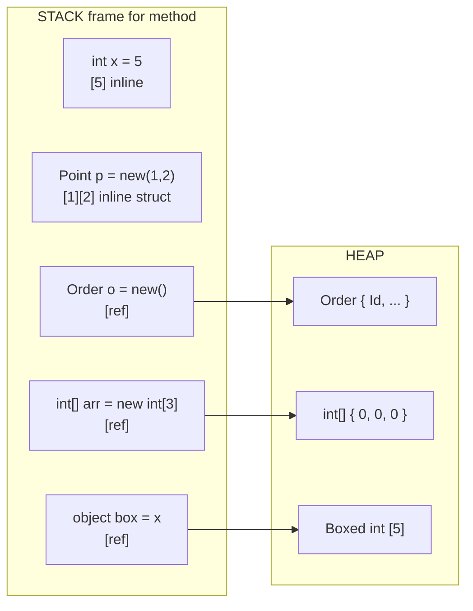
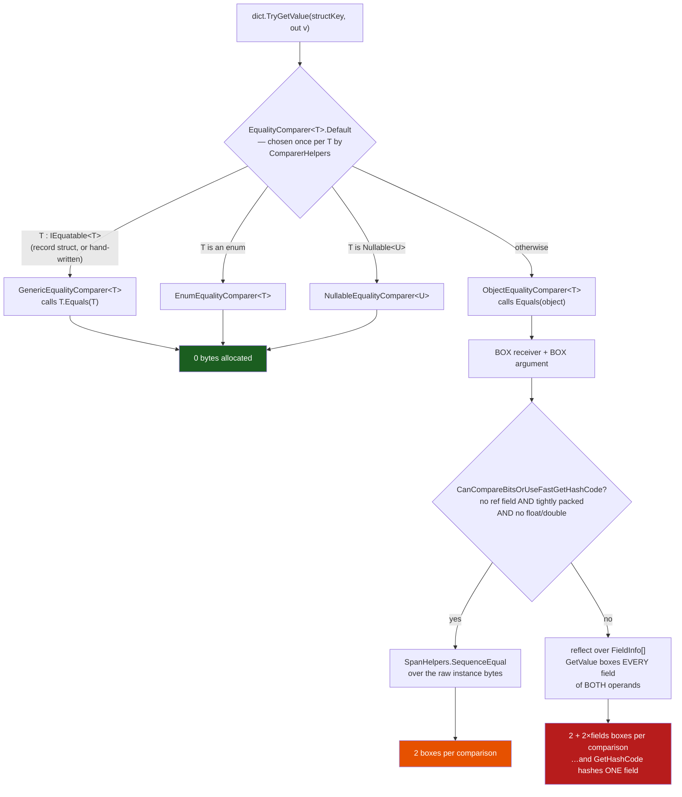

# Type System Deep Dive

> [Mastery Guide](../../README.md) › [Foundations](../README.md) › [C# Mastery](./README.md)

| Status | Priority | Phase | Last reviewed |
|---|---|---|---|
| Not Started | High | Phase 1 — Language & Runtime Fluency | 2026-05-07 |

## Contents
- [Why it matters](#why-it-matters)
- [Core concepts](#core-concepts)
  - [Value vs reference types — the foundational divide](#value-vs-reference-types--the-foundational-divide)
  - [Value vs reference — the full story (semantics, identity, equality)](#value-vs-reference--the-full-story-semantics-identity-equality)
  - [Stack vs heap (and why it's a half-truth)](#stack-vs-heap-and-why-its-a-half-truth)
  - [Boxing and unboxing](#boxing-and-unboxing)
  - [Structs](#structs)
  - [Struct equality — what `ValueType.Equals` and `GetHashCode` actually do](#struct-equality--what-valuetypeequals-and-gethashcode-actually-do)
  - [Mutating a struct — where the compiler hands you a copy](#mutating-a-struct--where-the-compiler-hands-you-a-copy)
  - [`readonly struct` and `readonly` members — defensive copy elimination](#readonly-struct-and-readonly-members--defensive-copy-elimination)
  - [Records — value-equality reference types](#records--value-equality-reference-types)
  - [Record structs](#record-structs)
  - [`record struct` vs `record class` vs `class` — picking the right shape](#record-struct-vs-record-class-vs-class--picking-the-right-shape)
  - [`ref struct` — stack-only types](#ref-struct--stack-only-types)
  - [`ref struct`, `Span<T>`, and `Memory<T>` — the stack-only family](#ref-struct-spant-and-memoryt--the-stack-only-family)
  - [Closures — how a local becomes a heap field](#closures--how-a-local-becomes-a-heap-field)
  - [`readonly` — immutability primitives](#readonly--immutability-primitives)
  - [`default(T)` — semantics across value types, reference types, and generics](#defaultt--semantics-across-value-types-reference-types-and-generics)
  - [Generic type identity at runtime — open vs closed generics](#generic-type-identity-at-runtime--open-vs-closed-generics)
  - [Nullable value types vs nullable reference types](#nullable-value-types-vs-nullable-reference-types)
  - [Tuples — value tuples vs `Tuple<T>`](#tuples--value-tuples-vs-tuplet)
  - [Choosing class vs struct vs record](#choosing-class-vs-struct-vs-record)
- [Code & diagrams](#code--diagrams)
- [Common pitfalls](#common-pitfalls)
- [Interview-ready summary](#interview-ready-summary)
- [Interview Cross-Questioning Drill](#interview-cross-questioning-drill)
- [Cheat Sheet](#cheat-sheet)
- [Walkthrough](#walkthrough--boxing-storm-in-a-hot-loop)
- [Self-test](#self-test)
- [Cross-references](#cross-references)
- [Sources](#sources)

---

## Why it matters

The single deepest fork in C# semantics is **value type vs reference type**. Get this wrong and you write code that allocates on a path you believed was allocation-free, mutates state you thought was a copy, fails equality checks for opaque reasons, or boxes inside a hot loop and pays GC pressure for nothing.

Modern C# (C# 10–14) added five new tools to the type-system toolbox: `record`, `record struct`, `readonly struct`, `ref struct`, and primary constructors. Each is a precise answer to a long-standing pain point. Knowing which to reach for — and *why* — separates engineers who guess from engineers who decide.

This file is also the foundation for everything in [`09-memory-and-performance.md`](./09-memory-and-performance.md). `Span<T>` is a `ref struct`. `ArrayPool<T>` returns reference-typed arrays. `string.Create` builds strings without allocation. None of those click without the type-system mental model first.

## Core concepts

### Value vs reference types — the foundational divide

Every C# type is either a **value type** or a **reference type**. The choice changes how the variable behaves under assignment, parameter passing, equality, and garbage collection.

**Value types** include all the numeric primitives, `bool`, `char`, all `struct`s, all `enum`s, and tuples. The variable *is* the value:

```csharp
int a = 5;
int b = a;        // b is a copy of a — independent storage
b = 10;
Console.WriteLine(a);  // 5 — a is untouched
```

**Reference types** include `class`, `interface`, `delegate`, `string`, `object`, arrays, and `record` (default). The variable holds a *reference* to a heap-allocated object:

```csharp
var x = new List<int> { 1, 2, 3 };
var y = x;        // y refers to the SAME list as x
y.Add(4);
Console.WriteLine(x.Count);  // 4 — x and y point at the same object
```

This single distinction drives most "why is my code behaving weirdly" questions.

| Aspect | Value types | Reference types |
|---|---|---|
| Storage | Where declared (often stack or inline in a containing object) | Heap (always); reference is where declared |
| Default value | All-zero bits | `null` |
| Assignment | Copies the bits | Copies the reference |
| Equality (`==`) | Bit-equality (or operator overload) | Reference identity (unless overridden — `string` and `record` override) |
| Generics with `default(T)` | Zero value | `null` |
| Pass by value | Full copy | Reference copy (object shared) |
| Pass by `ref` | Caller's storage referenced | Caller's reference variable referenced |
| Lifetime | Bound to scope | Until last reference + GC |
| Inheritance | Cannot inherit (sealed implicitly) | Single inheritance + multiple interfaces |
| Boxing | Yes (when stored as `object` / interface) | N/A |

### Value vs reference — the full story (semantics, identity, equality)

The previous table is the "what". This section is the "so what" — six independent dimensions where the value/reference choice changes program behavior. Senior interviewers don't ask "value vs reference"; they ask "two instances of `Money(100, USD)`, are they equal? Identical? Hashable?" and expect you to spell out which mechanism applies.

**Dimension 1 — Storage location.**

"Value type goes on the stack" is the lie everyone learns. The truth: a value lives wherever its containing storage lives.

```csharp
int local = 5;                  // local int on the stack
class Order { public int Id; }
Order o = new();                // 'o' is a stack-allocated reference; the Order object on the heap
                                // o.Id (an int) is INSIDE the Order object, so on the heap
int[] arr = new int[3];         // 'arr' is a stack reference; the array AND its 3 ints are on the heap
List<Point> list = new();       // each Point added is stored inline in the array backing List<T>;
                                // the array is on the heap, so the Points are on the heap
```

**Dimension 2 — Assignment semantics.**

```csharp
// Value: copies the bits
int a = 5;
int b = a;        // b is an independent copy
b = 10;
// a is still 5

// Reference: copies the reference, not the object
List<int> x = new() { 1, 2, 3 };
List<int> y = x;   // y points at the SAME list as x
y.Add(4);
// x.Count is 4 too — they share an object
```

**Dimension 3 — Parameter passing.**

| Mode | Value type | Reference type |
|---|---|---|
| (default) | Copy of bits passed | Copy of *reference* passed; object shared |
| `ref` | Caller's storage referenced | Caller's *reference variable* referenced — callee can reassign |
| `out` | Same as `ref` but callee must assign | Same as `ref` but callee must assign |
| `in` | Read-only reference (no copy, no mutation) | Same but rarely meaningful (reference is already small) |

**Dimension 4 — Default value.**

```csharp
class C { public int X; public string Y; public Point P; }
C c = new();
// c.X == 0          (value type — all-zero bits)
// c.Y == null       (reference type — null reference)
// c.P == new Point(0, 0)  (value type — all fields zero-init)

// For locals and parameters, you must assign before reading (definite assignment).
// For fields, the runtime guarantees zero-init on heap allocation.
```

**Dimension 5 — Identity vs equality.**

This is the subtle one. "Identity" = "are these the same object?" "Equality" = "do they represent the same value?" For reference types they're different concepts; for value types identity isn't even well-defined.

```csharp
// Reference type
class Person { public string Name; }
var a = new Person { Name = "Alice" };
var b = new Person { Name = "Alice" };
Console.WriteLine(ReferenceEquals(a, b));   // False — different objects (identity)
Console.WriteLine(a == b);                   // False — default '==' on class is reference equality
Console.WriteLine(a.Equals(b));              // False — default Equals is reference equality
// Override Equals/GetHashCode/== to make them value-equal.

// Value type (struct)
struct PointV { public int X, Y; }
var p = new PointV { X = 1, Y = 2 };
var q = new PointV { X = 1, Y = 2 };
Console.WriteLine(ReferenceEquals(p, q));    // COMPILES, and always prints False.
// ReferenceEquals takes (object, object), so p and q each get boxed into a
// fresh heap object and you are comparing two brand-new references. The result
// is False for *every* pair of value-type arguments, equal or not — the call is
// meaningless, not illegal. The .NET analyzers flag it as CA2013:
// "Do not pass an argument with value type 'PointV' to 'ReferenceEquals'."
Console.WriteLine(p.Equals(q));              // True — ValueType.Equals; see the next-but-one section for how it works
Console.WriteLine(p == q);                   // Compile error unless you overload ==

// record (reference type, value equality auto-generated)
record PersonR(string Name);
var ra = new PersonR("Alice");
var rb = new PersonR("Alice");
Console.WriteLine(ReferenceEquals(ra, rb));  // False — distinct objects
Console.WriteLine(ra == rb);                  // True — record overrides == to compare fields
```

**Dimension 6 — Lifetime and garbage collection.**

Value types in stack frames die when the frame returns — no GC involvement, zero cost. Reference types live on the heap and are tracked by GC; cleanup happens at the next gen-0 collection (or later if the object survives). Value types as *fields* of reference types live with their container — same lifetime as the heap object.

```csharp
void Method()
{
    int local = 5;             // dies when Method returns; stack frame popped
    var list = new List<int>(); // list reference dies; the List<int> object survives on the heap
                                // until GC reclaims it (next gen-0 collection that finds no roots)
}
```

**The senior takeaway.** "Value vs reference" is not one decision — it's six independent behaviors that align in the value-type vs reference-type choice. When a behavior diverges from the default (e.g., you want a class with value equality), reach for the right tool: `record` for "reference type with value equality"; `struct` for "value type with reference-comparable behavior" (you implement IEquatable explicitly); `class` for "identity matters"; `readonly record struct` for "small immutable value with value equality."

### Stack vs heap (and why it's a half-truth)

The most common shorthand: "value types live on the stack, reference types live on the heap." This is **mostly wrong** as stated, and getting it precisely right matters for performance reasoning.

**The accurate rule:** a value-type *value* lives wherever its containing storage lives.

- A local `int x = 5;` — its containing storage is the method's stack frame, so the `int` lives on the stack.
- A field `class Order { int Total; }` — `Total` is *inline* inside the `Order` heap object. The `int` lives on the heap.
- An `int[] arr` — array elements live on the heap (the array is a heap object), even though `int` is a value type.
- A `Lazy<int>` cached field — same; on the heap.

**Reference types are always on the heap**, and the reference itself lives wherever it's declared (stack for locals, heap for fields).

```csharp
class Order {
    public int Id;            // Id lives in the Order heap object (inline)
    public string Name;       // Name is a reference, in the Order; the actual string on the heap
}

void Demo() {
    int x = 5;                // x on the stack
    Order o = new();          // 'o' (the reference) on the stack; new Order on the heap
    int[] arr = new int[3];   // 'arr' on the stack; the array (and all 3 ints) on the heap
}
```

For deeper coverage of how the GC manages heap objects, see [.NET Fundamentals › Garbage Collection](../01-net-core-deep-dive/01-net-fundamentals.md#3-garbage-collection-in-net-10).

### Boxing and unboxing

When a value type is assigned to a reference-typed slot (`object`, an interface, or a generic parameter without value-type constraint), the runtime **boxes** it: allocates a heap object, copies the value into it, and returns a reference. **Unboxing** copies back.

```csharp
int x = 42;
object boxed = x;          // BOXING — heap allocation
int y = (int)boxed;        // UNBOXING — copy back, throws InvalidCastException if wrong type
```

**Generics do not box.** This is worth stating flatly because the half-remembered version of it causes bad decisions. The CLR instantiates generic code *per value type*, so `List<int>` stores `int[]` and `Dictionary<Guid, X>` stores `Guid`s inline. A `T` that happens to be a struct is never wrapped in an `object` just because it flowed through a generic. Boxing enters only when the value crosses into something typed as `object`, `dynamic`, or an **interface variable** — and, crucially, when a struct method call has to dispatch to a base implementation the struct did not override.

**The mechanism you should be able to name: `constrained.` callvirt.** When you call an interface method on a value type, the IL the compiler emits decides whether you allocate:

```csharp
interface IShape { double Area(); }
struct Sq : IShape { public double S; public double Area() => S * S; }

// Interface-TYPED parameter: the struct must become an object to be an IShape.
double ViaInterface(IShape s) => s.Area();          // caller boxes the Sq

// Generic constrained to the interface: the compiler emits
// `constrained. !!T  callvirt IShape::Area` — the prefix carries the type
// PARAMETER, not a concrete type. When the JIT compiles the T = Sq
// instantiation it substitutes Sq and resolves the call directly against the
// struct's own method. No object is created.
double ViaConstraint<T>(T s) where T : IShape => s.Area();
```

Be precise about which stage does what, because it is the same IL-versus-native-code distinction as the `__Canon` discussion later in this file: the *compiler* emits `constrained. !!T` once, and the *JIT* is what knows `T` is `Sq`. (Decode the IL of `ViaConstraint` and the `constrained.` token resolves to `T`, not to `Sq`.)

`where T : IShape` is the constraint to reach for: it is *guaranteed* allocation-free, where the interface-typed parameter is only allocation-free if the JIT can prove the box never escapes. Modern CoreCLR often can — .NET 9's escape analysis will stack-allocate a non-escaping box, so a small `ViaInterface(sq)` that gets inlined can measure zero. Do not rely on it: the moment the box crosses a call the JIT cannot see through, it is a real 24-byte heap object again, and the constraint version never has that failure mode. The same rule explains a subtler case: `sq.ToString()` allocates if `Sq` does not override `ToString()`, because the call has to reach `ValueType.ToString()`, which takes an `object` receiver, so the struct is boxed to supply one. Override `ToString()`, `Equals`, and `GetHashCode` on any struct you intend to print, compare, or hash, and those calls stop allocating.

**Common unintentional boxing:**

```csharp
int n = 5;
Console.WriteLine("n = " + n);
// Does NOT box on modern Roslyn: '+' is lowered to n.ToString() + string.Concat(string, string).
// It still allocates the throwaway string that ToString() returned.
// Use string interpolation instead: $"n = {n}" — DefaultInterpolatedStringHandler's
// AppendFormatted<T> formats into a pooled buffer, so only the final string is allocated.

object boxed = n;           // THIS is the box: assignment to an object-typed slot.
Console.WriteLine(boxed);   // no second box — it is already an object.

ArrayList list = new();
list.Add(5);                // ArrayList stores object; boxes the int.
// Use List<int> — generic, no boxing.

void LogNonGeneric(object o) => Console.WriteLine(o);
LogNonGeneric(42);          // boxes
void LogGeneric<T>(T v) => Console.WriteLine(v);
LogGeneric(42);             // does NOT box (T = int, JIT specializes)
```

**How to spot boxing:** look for `object`, non-generic collections (`ArrayList`, `Hashtable`), interface invocations on a value type via interface-typed variable, and `params object[]` APIs. The only way to be certain is the `box` opcode in the IL — string concatenation with `+` is the classic false positive, since Roslyn calls `ToString()` on a value-type operand rather than boxing it.

**Cost:** each box is a heap object. On 64-bit CoreCLR an object carries two pointer-sized words of header — the sync-block index and the method-table pointer — and the runtime enforces a 24-byte minimum object size, so a boxed `int` occupies 24 bytes: 16 of header, 4 of payload, 4 of padding. The value itself is almost never the expensive part.

**An allocation ledger you can reproduce.** The point of this table is not the numbers, it is the *zeros*: which constructs allocate at all. Every row was measured with `GC.GetAllocatedBytesForCurrentThread()` around a warmed-up loop on .NET 9, x64, Release, with `DOTNET_TieredCompilation=0` so the JIT's optimizing tier is what runs. Reproduce it before you quote it — tier-0 code has not yet applied the devirtualizations, so the same measurement taken during warm-up reports allocations that steady-state code does not make. The last three rows depend on how long the resulting string is; they were taken with `i` a four-digit `int`, so `"x=1234"` is six characters.

| Construct | Bytes allocated per operation | Why |
|---|---|---|
| `object o = i;` (`int` → `object`) | 24 | one box; 16 header + 4 payload + 4 padding |
| `ViaInterface(sq)` — `IShape` parameter | 24, or **0** if the box does not escape | the struct is boxed to become an `IShape` — but see the note under the table |
| `ViaConstraint(sq)` — `where T : IShape` | **0** | `constrained.` callvirt, resolved to a direct call |
| `sq.ToString()`, struct with **no** `ToString` override | 24 | boxed to reach `ValueType.ToString()` |
| `sq.ToString()`, struct **with** `ToString` override | **0** | direct call on the struct |
| `foreach` over `List<int>` typed as `List<int>` | **0** | `List<T>.Enumerator` is a struct, used by value |
| `foreach` over the *same list* typed as `IEnumerable<int>` | 40 | the enumerator struct is boxed to satisfy the interface |
| `dict.TryGetValue(key)`, struct key **without** `IEquatable<T>` | 72 | three boxes per lookup — see the struct-equality section |
| `dict.TryGetValue(key)`, `readonly record struct` key | **0** | strongly-typed `Equals`/`GetHashCode`, no `object` in sight |
| `"x=" + i` | 72 | **no box** — see below; a throwaway `"1234"` string (32) plus the result string (40) |
| `$"x={i}"` | 40 | the result string only — `DefaultInterpolatedStringHandler` formats into a pooled buffer |
| `string.Format("x={0}", i)` | 64 | one box (24) plus the result string (40) — no array; see below |

**The `ViaInterface` row is the one to be careful with**, and it is a good lesson in not trusting a single measurement. Written naively — a small method the JIT inlines — it measures **0**, not 24, on .NET 9. CoreCLR's escape analysis proved the box never leaves the method and stack-allocated it. Force the box to escape (put `[MethodImpl(MethodImplOptions.NoInlining)]` on the callee, or hand it to anything the JIT cannot see through) and the 24 bytes come back. So the honest statement is not "an interface parameter costs a box" but "an interface parameter *may* cost a box, at the JIT's discretion, and you find out by measuring the shape you actually shipped". The `where T : IShape` row is **0** unconditionally — that is the difference worth relying on.

Two more rows deserve to be memorised because they are invisible in code review. The `foreach` pair is the same list iterated twice: returning `IEnumerable<T>` from a method instead of the concrete type costs a boxed enumerator at every call site, forever. And the `"x=" + i` vs `$"x={i}"` pair is why the interpolation advice is real rather than cosmetic — but *not* for the reason usually given, so this is worth getting right:

- **`"x=" + i` does not box.** Roslyn lowers `string + <value type>` by calling the operand's `ToString()` and then `string.Concat(string, string)`. Dump the IL and there is no `box` opcode. What it costs is the intermediate string that `ToString()` returns and immediately throws away — which is why it is still ~1.8× the interpolated version, and why the advice survives its usual justification being wrong. (Single-digit values measure lower because `int.ToString()` returns a cached string for them. The lowering also depends on the operand's type overriding `ToString()`, which every primitive does; a struct that does not override it stays boxed here.)
- **`string.Format("x={0}", i)` allocates no `params object[]`** — `string.Format` has non-`params` overloads for one, two, and three arguments, so the one-argument call is a single box plus the result string. What it does *not* do on a current runtime is start allocating an array at the fourth argument: .NET 9 added `public static string Format(string format, params ReadOnlySpan<object?> args)`, and C# 13 prefers that params-span overload and stack-allocates the span. `string.Format("{0}{1}{2}{3}", i, i, i, i)` measures **152 bytes = four boxes (96) + the sixteen-character result string (56)**, with no `object[]` anywhere. Force the array — `string.Format("{0}{1}{2}{3}", new object[] { i, i, i, i })` — and it measures 208, the extra 56 being the array. The boxes are the real cost at every argument count; the array is an artifact of the older overload set, and quoting it as current is a good way to be corrected by anyone who has run the measurement since .NET 9.

> 🌍 **In the real world**: an ingestion API that accepted device telemetry started showing gen-0 collections dominating its flame graph after a release that "only added logging". The added line was `logger.LogInformation("Reading accepted {Tag}", tag)`, where `tag` was a `struct ReadingTag { long DeviceId; int Sequence; }` — a struct chosen deliberately, months earlier, to keep the hot path allocation-free. The logging extension methods take `params object?[] args`, so every call allocated an `object[]` *and* boxed the struct into it, on every accepted reading, at full ingest rate, and it did so even when the `Information` level was filtered out at the sink because the array and the box are built by the *caller* before `ILogger.Log` ever decides to discard them. The team's first instinct was to make `ReadingTag` a class, which would have removed the box and kept the array. The actual fix was the source-generated `[LoggerMessage]` partial method, which emits a strongly-typed `Log(ILogger, long, int)` overload and an `IsEnabled` guard, taking the line to zero allocations. The transferable lesson is that a struct only stays allocation-free while every API it touches is generic; one `params object[]` boundary anywhere in the path undoes the entire design, and logging is the boundary people forget because it does not look like data flow.

### Structs

A `struct` is a value type with most of the syntactic conveniences of a class.

```csharp
public struct Point
{
    public int X;
    public int Y;

    public Point(int x, int y) => (X, Y) = (x, y);
    public double Distance() => Math.Sqrt(X * X + Y * Y);
}

var p = new Point(3, 4);
var q = p;           // copy — q is independent
q.X = 0;
Console.WriteLine(p.X);  // 3 — unaffected
```

**Rules:**
- All fields default to zero on `new T()`.
- Cannot inherit from another type (except implicitly `System.ValueType`).
- Can implement interfaces (but invoking through an interface-typed variable boxes — see above).
- No parameterless constructor *with body* until C# 10 (now allowed, but called only with explicit `new()`, not on default-initialization).

**Where the "16 bytes" rule actually comes from.** Interviewers ask for this number and then ask where it comes from; the second question is the real one. It is a bullet in the Framework Design Guidelines, reproduced on Microsoft Learn as *Choosing Between Class and Struct*:

> ❌ AVOID defining a struct unless the type has all of the following characteristics:
> - It logically represents a single value, similar to primitive types (`int`, `double`, etc.).
> - It has an instance size under 16 bytes.
> - It is immutable.
> - It will not have to be boxed frequently.

Two things a senior candidate should add. First, that page carries Microsoft's own note that the content was published in 2008 and "some of the information on this page may be out-of-date" — 16 bytes is a design-guideline heuristic, not a runtime threshold, and nothing in the JIT changes behaviour at byte 17. Second, the four bullets are an **AND**, and the last two carry more weight than the size one. A 12-byte struct that gets boxed on every call is worse than a 40-byte `readonly struct` that never leaves a generic pipeline. Size is the bullet people quote because it is the only one with a number in it.

The mechanism underneath the heuristic is that a struct is copied on every assignment, every by-value argument, and every return, and the JIT can only make those copies free while it can hold the fields in registers. Small structs get *promoted* — the JIT replaces the struct variable with independent variables for its fields, so "the copy" becomes a couple of register moves or disappears entirely. Once the struct is too large or too field-heavy for that, it lives in memory and every copy becomes a real block copy. That is the cliff the guideline is gesturing at, and it is why measuring beats guessing at the boundary.

You can check what a struct actually costs rather than counting fields by hand:

```csharp
System.Runtime.CompilerServices.Unsafe.SizeOf<T>()   // the managed size, padding included
```

Padding surprises people: `struct Padded { byte A; int B; }` measures **8** bytes, not 5, because `B` must sit on a 4-byte boundary. That padding is not merely wasted space — the next section shows it silently changes how the struct hashes.

**`record struct`** (C# 10) gives you value semantics + auto-generated equality/`with`/`ToString` (covered below).

> 🌍 **In the real world**: a market-data adapter modelled its quote as `struct Quote { decimal Bid; decimal Ask; long Timestamp; int SymbolId; }` — 48 bytes by `Unsafe.SizeOf<Quote>()`, three times the guideline — and a reviewer opened a PR to convert it to a class on exactly that basis, citing the 16-byte bullet. The author pushed back with the rest of the bullet list: quotes are immutable, they are never boxed because the whole pipeline is generic over `T`, and they arrive in the millions, stored in a `Quote[]` ring buffer where a class would mean one heap object per quote plus a pointer chase per read. The struct stayed. What the review did produce was a real change: the adapter had a `readonly Quote _last` field and read `_last.Timestamp` through a non-`readonly` property, so every read copied all 48 bytes defensively (the next-but-one section explains why). Marking the type `readonly struct` removed that. The useful outcome was that the size guideline, treated as a rule, would have produced the wrong change; treated as a prompt to look at copies and boxes, it found the right one.

### Struct equality — what `ValueType.Equals` and `GetHashCode` actually do

Everyone repeats that the default struct `Equals` "uses reflection and is slow". That is half the story, the half that matters less. The whole story is in `ValueType.cs` in dotnet/runtime, which is under 200 lines end to end, and it contains a trap that silently destroys hash distribution.

**`ValueType.Equals(object)` has two paths.** The runtime asks one question — `CanCompareBitsOrUseFastGetHashCode` — and branches:

```csharp
// dotnet/runtime, src/coreclr/System.Private.CoreLib/src/System/ValueType.cs (abridged)
public override bool Equals(object? obj)
{
    if (obj is null) return false;
    if (GetType() != obj.GetType()) return false;

    // "if there are no GC references in this object we can avoid reflection and do a fast memcmp"
    if (CanCompareBitsOrUseFastGetHashCode(RuntimeHelpers.GetMethodTable(obj)))
        return SpanHelpers.SequenceEqual(ref RuntimeHelpers.GetRawData(this),
                                         ref RuntimeHelpers.GetRawData(obj),
                                         /* instance field bytes */);

    FieldInfo[] thisFields = GetType().GetFields(BindingFlags.Instance | BindingFlags.Public | BindingFlags.NonPublic);
    for (int i = 0; i < thisFields.Length; i++)
    {
        object? thisResult = thisFields[i].GetValue(this);   // ← boxes this field
        object? thatResult = thisFields[i].GetValue(obj);    // ← boxes this field
        ...
    }
}
```

The predicate is documented in a comment directly above its declaration in that same file, and it is the sentence to memorise:

> "Return true if the valuetype does not contain pointer, is tightly packed, does not have floating point number field and does not override Equals method."

So a struct falls off the fast path if **any** of the following is true:

| Disqualifier | Example | Why |
|---|---|---|
| Contains a reference field | `struct K { string Name; int V; }` | the bits of a reference say nothing about the referent's equality |
| Is not tightly packed | `struct P { byte A; int B; }` | the 3 padding bytes are undefined; comparing them would compare garbage |
| Contains a `float` or `double` | `struct Pt3 { double X, Y, Z; }` | `-0.0` and `+0.0` are equal but have different bits; `NaN != NaN` |
| Contains a field whose own type overrides `Equals` | `struct H { MyStruct M; }` | that type's `Equals` may disagree with its bits, so bitwise comparison would skip it |

On the slow path, `FieldInfo.GetValue` returns `object`, so **every field of both operands is boxed on every comparison** — and that is on top of the two boxes already spent getting there, because `Equals(object)` needs an `object` receiver and an `object` argument.

**`GetHashCode` is where it turns from slow into wrong.** The same predicate gates it, but the fallback is not "hash every field more slowly". The source comment states the algorithm outright:

> "Our algorithm for returning the hashcode is a little bit complex. We look for the first non-static field and get its hashcode. If the type has no non-static fields, we return the hashcode of the type."

The runtime mixes the method-table pointer into the hash *unconditionally* — `hashCode.Add((IntPtr)pMT)` runs before the `CanCompareBitsOrUseFastGetHashCode` branch, so it happens on both paths and is not what distinguishes them. What the branch decides is the payload: on the fast path the runtime hashes *all* the instance bytes; off it, it hashes **exactly one field**. Every other field is ignored. That is not a performance characteristic, it is a correctness cliff for anything you use as a dictionary or `HashSet` key:

```csharp
struct RefFieldKey { public string S; public int N; }   // reference field ⇒ slow path

var codes = new HashSet<int>();
for (int i = 0; i < 1000; i++)
    codes.Add(new RefFieldKey { S = "same", N = i }.GetHashCode());

Console.WriteLine(codes.Count);   // 1
```

One thousand distinct values, **one** distinct hash code. Only `S` is hashed; `N` never participates. Put that struct in a `Dictionary<RefFieldKey, T>` and every entry lands in one bucket — the dictionary degrades to a linear scan, and the symptom is a lookup that gets slower as the cache grows warmer, which reads like a memory leak rather than a hashing bug.

The padding row of the table has the same effect and is far easier to trip over, because nothing in the declaration hints at it:

```csharp
struct Packed { public int A, B; }        // tightly packed  ⇒ fast path ⇒ all bytes hashed
struct Padded { public byte A; public int B; }   // 3 bytes padding ⇒ slow path ⇒ only A hashed

new Padded { A = 1, B = 2 }.GetHashCode() == new Padded { A = 1, B = 999 }.GetHashCode()   // True
new Packed { A = 1, B = 2 }.GetHashCode() == new Packed { A = 1, B = 999 }.GetHashCode()   // False
```

Reordering two fields — putting the `byte` last so the struct packs — changes the hash from one-field to all-fields. No compiler warning, no test failure, just a different distribution.

**`EqualityComparer<T>.Default` is the other half of the mechanism.** Generic collections never call `Equals(object)` directly; they go through `EqualityComparer<T>.Default`, and which comparer you get is decided once per `T` by `ComparerHelpers.CreateDefaultEqualityComparer` in dotnet/runtime. The rule, in order: `string` gets a dedicated `StringEqualityComparer`; a `T` that implements `IEquatable<T>` gets `GenericEqualityComparer<T>`; `Nullable<T>` gets `NullableEqualityComparer<U>` (the source explains that `Nullable<T>` deliberately does not implement `IEquatable<T?>` "because that would add an extra interface call per comparison"); enums get `EnumEqualityComparer<T>`, which the source says is "specialized to avoid boxing"; **everything else falls through to `ObjectEqualityComparer<T>`**, which calls `Equals(object)` and therefore boxes.

```csharp
struct NoEq { public int A, B; }                        // does not implement IEquatable<NoEq>
readonly record struct WithEq(int A, int B);            // compiler generates IEquatable<WithEq>

EqualityComparer<NoEq>.Default.GetType().Name      // ObjectEqualityComparer`1   ← boxes
EqualityComparer<WithEq>.Default.GetType().Name    // GenericEqualityComparer`1  ← does not
EqualityComparer<DayOfWeek>.Default.GetType().Name // EnumEqualityComparer`1
EqualityComparer<int?>.Default.GetType().Name      // NullableEqualityComparer`1
```

That single dispatch decision is the 72-bytes-per-lookup row in the boxing ledger above, versus zero for the `readonly record struct`.

**So the rule is not "override `Equals` for speed", it is:**

1. Implement `IEquatable<T>` on every struct — this is what gets you off `ObjectEqualityComparer<T>` and out of boxing.
2. Override `Equals(object)` and `GetHashCode` to stay consistent with it, and overload `==`/`!=`.
3. Or write four fewer lines and declare a `record struct`, which generates all of the above from the declared members. Microsoft Learn states the distinction plainly: "for a `struct`, the implementation is in `ValueType.Equals(Object)` and relies on reflection. For records, the implementation is compiler synthesized and uses the declared data members."

The analyzer for step 1 is **CA1815, "Override equals and operator equals on value types"** (category: Performance). Note the gotcha in its own documentation: it is *not* enabled by default in .NET 10, so a codebase can be full of violations with a clean build. Turn it on in `.editorconfig` if you ship structs.

> 🌍 **In the real world**: a multi-tenant rate limiter keyed its counters on `struct BucketKey { string TenantId; int RouteId; long WindowStart; }` — a struct, chosen for the usual good reason that keys are created per request and should not allocate. It was fine in load tests, which ran one tenant. In production the p99 on the limiter climbed steadily through the day and reset overnight, and the profile showed time inside `Dictionary.FindValue` rather than anywhere anyone had written code. The struct has a reference field, so it was on the slow path, so only `TenantId` was hashed: every route and every window for a given tenant collided into a single bucket, and the bucket grew all day as windows accumulated. The load test never saw it because with one tenant *and* one route there was nothing to collide with. Adding `: IEquatable<BucketKey>` with a hand-written `GetHashCode` over all three fields fixed it, and converting the type to a `readonly record struct` would have fixed it without the hand-writing. The lesson that generalises past this bug: for any struct used as a key, the default `GetHashCode` is not merely slow, it may be reading one field, and the only load test that can reveal it is one with realistic key *diversity* rather than realistic key volume.

### Mutating a struct — where the compiler hands you a copy

"Structs should be immutable" is advice; the interesting part is what the compiler does when you ignore it. C# will not let you mutate through an expression that produced a copy, because the mutation would be silently discarded — so it turns a class of logic bugs into compile errors, but only where it can see them.

```csharp
struct MutS { public int A; }

var arr  = new MutS[1];
arr[0].A = 5;                 // ✓ LEGAL — an array indexer yields a variable (a ref into the array)
Console.WriteLine(arr[0].A);  // 5 — the mutation landed

var list = new List<MutS> { default };
list[0].A = 5;                // ❌ CS1612: Cannot modify the return value of 'List<MutS>.this[int]'

var dict = new Dictionary<string, MutS> { ["k"] = default };
dict["k"].A = 5;              // ❌ CS1612 — same reason

foreach (var m in list)
    m.A = 5;                  // ❌ CS1654: Cannot modify members of 'm' because it is a 'foreach iteration variable'
```

The asymmetry between `arr[0]` and `list[0]` is the part worth being able to explain, because it looks arbitrary and is not. An **array indexer is a language construct** that produces a storage location — the IL is an address computation, so `arr[0]` is a variable you can write through. A **`List<T>` indexer is a property**, and a property getter returns a *value*; the copy it hands back has nowhere to live after the statement, so assigning into it is rejected rather than silently thrown away. Same-looking syntax, different category of expression.

Two ways out when you genuinely want in-place mutation of struct elements:

```csharp
using System.Runtime.InteropServices;   // CollectionsMarshal
using System.Runtime.CompilerServices;  // Unsafe

// 1. Get a Span over the List's backing array — the span indexer returns a ref. (.NET 5+)
CollectionsMarshal.AsSpan(list)[0].A = 5;

// 2. Get a ref straight to a dictionary value slot. (.NET 6+)
ref MutS slot = ref CollectionsMarshal.GetValueRefOrNullRef(dict, "k");
if (!Unsafe.IsNullRef(ref slot)) slot.A = 5;
```

Both are in `System.Runtime.InteropServices` and both carry the same documented constraint: do not add or remove items while the `ref`/`Span<T>` is alive, because a resize reallocates the backing array and leaves your reference pointing at the old one. They are the right tool for a genuine hot path — a per-element counter update over a large `List<struct>` — and the wrong tool for tidying up ordinary code, where extract-modify-reassign is clearer:

```csharp
var v = dict["k"]; v.A = 5; dict["k"] = v;
```

> 🌍 **In the real world**: an order-matching service kept per-instrument state in `List<BookLevel>` where `BookLevel` was a mutable struct, and the increment `levels[i].Quantity += size;` would not compile. The developer on the ticket did the fastest thing that made it compile and changed `BookLevel` from a `struct` to a `class`. The code worked and the change looked like a one-word diff. What it actually did was turn a contiguous array of levels into an array of pointers to individually allocated objects: every level became a separate heap allocation with a header, the book no longer fit in cache the way it had, and a nightly rebuild that had allocated almost nothing began producing a gen-2 sized wave of small objects. It was caught two months later when someone asked why the service's memory graph had a new sawtooth. The correct one-line fix had been `CollectionsMarshal.AsSpan(levels)[i].Quantity += size;`. The generalisable point is that CS1612 is a question, not a verdict — it is asking "did you mean to mutate the copy?" — and changing the type's *category* to silence it changes the memory layout of everything that holds one.

### `readonly struct` and `readonly` members — defensive copy elimination

A `readonly struct` is a struct where **every field is implicitly `readonly`** and the compiler proves no method mutates `this`. This unlocks an optimization that's invisible until you measure it: defensive copies on `in` parameters and `readonly` field access disappear.

**The problem `readonly struct` solves.**

```csharp
public struct Counter
{
    public int Value;
    public int Get() => Value;        // not annotated — compiler MIGHT think it mutates
    public void Inc() => Value++;     // does mutate
}

public class Caller
{
    public readonly Counter _c = new();

    public int Read()
    {
        return _c.Get();
        //     ^^^^^^^ — compiler INSERTS a defensive copy of _c on the stack
        // because:
        //   1. _c is a readonly field — caller can't mutate
        //   2. Get() is non-readonly — might mutate
        //   3. Compiler chooses: copy _c so any mutation hits the copy, not the field
    }
}
```

The defensive copy happens **every call**, silently, and its size is the size of the struct. Multiply that by your call rate to get the stack traffic you are paying for nothing — the arithmetic is yours to do against your own numbers, because the only figure that means anything here is the one from your profiler.

**Fix option 1: mark individual methods `readonly`.**

```csharp
public struct Counter
{
    public int Value;
    public readonly int Get() => Value;   // ✓ compiler proves no mutation
    public void Inc() => Value++;
}
```

Now `_c.Get()` skips the defensive copy. `_c.Inc()` is still a compile error because `_c` is readonly.

**Fix option 2: mark the entire struct `readonly`.**

```csharp
public readonly struct Counter
{
    public int Value { get; }
    public Counter(int v) { Value = v; }
    public int Get() => Value;            // implicitly readonly — no mutation possible
}
```

Every field is implicitly readonly. Every method is implicitly readonly. The compiler treats the entire struct as a non-mutating value. **No defensive copies anywhere.**

**Comparison:**

| | `struct` | `readonly struct` |
|---|---|---|
| Fields can be reassigned? | ✓ | ✗ |
| Methods can mutate `this`? | ✓ | ✗ |
| Defensive copy on `in` param? | ✓ (unless method is `readonly`) | ✗ |
| Defensive copy on `readonly` field access? | ✓ (unless method is `readonly`) | ✗ |
| Use case | Mutable POD types, builders | Immutable values, geometric primitives, `Money` |

**`in` parameter interaction.**

```csharp
// Mutable struct + 'in'
public void Process(in Counter c) => c.Inc();   // compile error: c is readonly via 'in'
public void Read(in Counter c)    => c.Get();   // defensive copy — Get() might mutate

// readonly struct + 'in'
public readonly struct MoneyR(decimal a, string c) { public decimal Amount { get; } = a; }
public void Process(in MoneyR m) => Use(m.Amount);   // no defensive copy — readonly struct
```

The combination `(in MoneyR m)` is the canonical "pass a small immutable value cheaply" idiom. The `in` says "by reference, read-only"; the `readonly` says "the type itself can't mutate." Together: zero copies, zero mutations, perfect for value-object passing in hot paths.

**Senior rule:** any struct meant to be immutable should be declared `readonly struct`. The runtime cost of skipping it is silent and easy to miss in profiles. The development cost of adding it is zero. Just do it.

**How to actually find defensive copies.** They do not appear as allocations, so an allocation profiler will not show them — they are stack traffic, and in a CPU profile they surface as unexplained time inside a trivial property getter, or as `memcpy`/`CORINFO_HELP_MEMCPY` where no copying is written in the source. Two cheaper checks first: paste the type into sharplab.io and look for a `stloc` of the struct before the call in the IL, or simply grep for structs larger than a machine word that are held in `readonly` fields or passed by `in` and are missing the `readonly` modifier on the type. That grep is a better use of an afternoon than a profiling session, because the fix is unconditional — there is no case where an immutable struct is worse off being declared `readonly`.

> 🌍 **In the real world**: a pricing library exposed `readonly Curve _curve;` as a field on a long-lived calculator, where `Curve` was a 48-byte struct holding a few `decimal`s and a date. A discounting loop called `_curve.RateAt(t)` a few million times per valuation, and the valuation was consistently slower than an equivalent prototype that had held the same data in locals — a gap nobody could explain from the source, because the two versions computed identical arithmetic. The allocation profiler was clean, which sent the investigation toward the maths for a week. What was happening: `RateAt` was not marked `readonly`, `_curve` was a `readonly` field, so the compiler emitted a full 48-byte copy of `_curve` onto the stack *before every one of those calls* to protect the field from a mutation that `RateAt` never performed. Adding `readonly` to the struct declaration was a seven-character diff. The durable lesson is about which tool answers which question: defensive copies never allocate, so they are invisible to exactly the tool people reach for first, and the reliable way to find them is to read the declarations — `readonly` field or `in` parameter, plus a non-`readonly` member — rather than to hunt for them in a profile.

### Records — value-equality reference types

`record` (C# 9) is a *reference type* (default) that gets value-based equality, immutability, and concise syntax for free.

```csharp
public record Person(string FirstName, string LastName, int Age);

var a = new Person("Alice", "Lin", 30);
var b = new Person("Alice", "Lin", 30);

Console.WriteLine(a == b);              // True — value equality (compares all properties)
Console.WriteLine(ReferenceEquals(a, b));  // False — different objects on heap
Console.WriteLine(a.GetHashCode() == b.GetHashCode());  // True

var older = a with { Age = 31 };        // 'with' copies + modifies (returns new instance)

// Compiler generates:
// - public string FirstName { get; init; }   ← init-only
// - public string LastName  { get; init; }
// - public int Age          { get; init; }
// - Equals/GetHashCode based on all properties
// - ToString showing all properties
// - Deconstruct method (so you can do: var (f, l, age) = person;)
// - Copy constructor (for 'with' expressions)
```

**Why use records:**
- DTOs / API contract types (immutable by design).
- Value objects in DDD.
- Snapshot/event types in CQRS or event sourcing.

**When NOT to use records:** when the type has identity beyond its data — e.g., an `Order` with a primary key and methods that mutate state should remain a class.

**Inheritance with records:**

```csharp
public abstract record Shape(string Color);
public record Circle(string Color, double Radius) : Shape(Color);
public record Square(string Color, double Side)   : Shape(Color);
```

Record equality respects the runtime type — `Circle` ≠ `Square` even with same color.

**The mechanism behind that: `EqualityContract`.** Interviewers who know records ask *how* the runtime type gets into the comparison, because `Equals` is comparing fields and the fields are identical. The answer is a synthesized property:

```csharp
protected virtual Type EqualityContract => typeof(Shape);      // on the base record
protected override Type EqualityContract => typeof(Circle);    // on each derived record
```

The generated `Equals` compares `EqualityContract` before it compares any data. Because the property is virtual, both sides answer with their *runtime* type, so a `Circle` and a `Square` disagree at the first check even when every field matches. Per Microsoft Learn: "If the base type of a record is `object`, this property is `virtual`. If the base type is another record type, this property is an override." Two consequences worth stating unprompted — `EqualityContract` exists only on `record class`, not on `record struct` (a struct has no derived types to disambiguate), and you may declare it yourself if you want a hierarchy whose members compare across types.

**The full list of what the compiler writes for you**, so you can answer "what does `record` actually generate":

| Member | Notes |
|---|---|
| `override bool Equals(object?)` | you may **not** declare it yourself — compile error |
| `virtual`/`sealed` `bool Equals(R? other)` | this is the `IEquatable<R>` implementation; you *may* write it |
| `Equals(Base? other)` when derived from a record | you may not declare it |
| `override int GetHashCode()` | you may write it — and must, if you write `Equals(R?)` |
| `operator ==` / `operator !=` | you may **not** declare them |
| `protected virtual Type EqualityContract` | `record class` only |
| `protected virtual bool PrintMembers(StringBuilder)` | `private` on a `record struct`; you may write it |
| `override string ToString()` | calls `PrintMembers`; you may write it, and may `seal` it |
| a clone method + a copy constructor | `record class` only; the clone method's real name is compiler-generated and unspeakable, so you cannot call, override, or declare it |
| `Deconstruct` | positional records only, and it ignores non-positional properties |

Note the asymmetry that catches people: **a `record struct` gets no copy constructor and no clone method.** `with` on a `record struct` is a plain value copy followed by field assignments, which is why it costs no allocation.

**Trap 1 — `with` is a shallow copy, and so is record equality.** The synthesized `Equals` calls `Equals` on each member, and for an array member that is *reference* equality:

```csharp
record Bag(int[] Items);

var shared = new[] { 1, 2, 3 };
new Bag(shared) == new Bag(shared);                 // True  — same array instance
new Bag([1, 2, 3]) == new Bag([1, 2, 3]);           // False — structurally equal, different instances
```

This bites hardest where records look most attractive: a DTO with a `string[]`, `List<T>`, or `byte[]` member is *not* value-equal in the way "value equality" led you to expect, and a `with` expression on it hands the copy a reference to the *same* collection, so mutating one instance's array mutates the other's. Microsoft Learn calls this **shallow immutability**: "After initialization, you can't change the value of value-type properties or the reference of reference-type properties. However, the data that a reference-type property refers to can be changed." Use an immutable collection type (`ImmutableArray<T>`, `ReadOnlyMemory<T>`) if the record's equality is load-bearing.

**Trap 2 — an initialized computed property survives `with` unchanged.** `with` copies the object and then assigns the properties you listed; it does not re-run initializers. So this is correct:

```csharp
public record Point(int X, int Y)
{
    public double Distance => Math.Sqrt(X * X + Y * Y);   // computed on ACCESS
}
```

and this is a bug that Microsoft Learn documents with the output to prove it:

```csharp
public record PointInit(int X, int Y)
{
    public double Distance { get; } = Math.Sqrt(X * X + Y * Y);   // computed ONCE, at construction
}

var p = new PointInit(3, 4) with { Y = 8 };
// PointInit { X = 3, Y = 8, Distance = 5 }   ← Distance is the value for Y = 4
```

Anything derived from other members must be a computed property, not an initialized one, or `with` will carry a stale value into the copy — and because `Distance` participates in the generated `Equals` and `GetHashCode`, the stale value also corrupts equality.

**Trap 3 — records are the wrong shape for EF Core entities.** This is not a style opinion; the EF Core team's requirement is stated on the records page: "Entity Framework Core depends on reference equality to ensure that it uses only one instance of an entity type for what is conceptually one entity. For this reason, records and record structs aren't appropriate for use as entity types in Entity Framework Core." The same page notes EF Core "doesn't support updating with immutable entity types."

> 🌍 **In the real world**: a payments service used `record PaymentRequest(string IdempotencyKey, decimal Amount, string[] Tags)` as the value in an in-memory idempotency cache, and compared the incoming request against the cached one to decide "same request, replay the stored response" versus "different request, reject as a key collision". It behaved correctly for a year. Then a client library started reusing one `string[]` instance across the requests it built in a batch — a perfectly reasonable thing for a client to do — and two genuinely different payments in the same batch began comparing as equal on the `Tags` member, because record equality on an array is reference equality and both records pointed at the same array. Different amounts still separated them, so the failure only surfaced for two same-amount payments to different destinations in one batch: the second was answered with the first's stored response. Changing `string[]` to `ImmutableArray<string>` fixed the comparison, and a regression test now asserts that two records built from equal-but-distinct collections compare equal. What generalises is the framing: `record` gives you value equality *over the members as they define equality*, not structural equality over the object graph, and any member that is a mutable collection quietly reverts that member to reference semantics.

> 🌍 **In the real world**: a team modelled their EF Core entities as records to get free `ToString` and equality in tests, and the first symptom was not a crash but duplicate `INSERT`s. Two lookups that returned "the same" customer produced two tracked entities that the change tracker treated as one — and, in the reverse direction, an entity re-fetched after a property change no longer matched its tracked identity. They had made the change deliberately, on the reasoning that a `Customer` with the same column values *is* the same customer. That reasoning is right for a value object and wrong for an entity: an entity's identity is its key, and it must survive its data changing. The fix was `class` for anything with a primary key, `record` for the request/response DTOs and domain value objects around them, which is the line the type system was asking them to draw all along. Microsoft's own guidance is unambiguous — records "aren't appropriate for use as entity types in Entity Framework Core" — and the tell in any codebase is a record with an `Id` property.

### Record structs

C# 10 added `record struct` — a *value type* with the same auto-generated equality / `with` / `ToString` surface:

```csharp
public readonly record struct Point(int X, int Y);

var p = new Point(1, 2);
var q = p with { Y = 5 };   // 'with' on a struct returns a new value (no heap allocation)
Console.WriteLine(p == q);  // False
```

`readonly record struct` is the strongest form: value type, immutable, value equality, no defensive copies. Excellent for small geometric / domain values.

| Form | Reference or value? | Mutable by default? | Equality |
|---|---|---|---|
| `class` | Reference | Yes | Reference |
| `record` (= `record class`) | Reference | `init`-only by default | Value, compiler-synthesized |
| `struct` | Value | Yes | Value, via `ValueType.Equals` — bitwise *or* reflection, and boxes either way |
| `record struct` | Value | Yes (mutable by default) | Value, compiler-synthesized, `IEquatable<T>` |
| `readonly record struct` | Value | No | Value, compiler-synthesized, `IEquatable<T>` |
| `readonly struct` | Value | No | Value, via `ValueType.Equals` — same caveats as `struct` |

The `struct` rows are the reason the `record struct` rows exist: see [Struct equality](#struct-equality--what-valuetypeequals-and-gethashcode-actually-do) for which of the two `ValueType.Equals` paths you land on and why the fallback hashes a single field.

### `record struct` vs `record class` vs `class` — picking the right shape

Six type forms, one decision matrix. The table above showed mechanics; this section answers "I have a new type to model — which do I reach for?"

**The four common shapes:**

| Form | Reference/value? | Equality | Mutation | Allocation | Typical use |
|---|---|---|---|---|---|
| `class` | Reference | Identity | Mutable | Heap | Entities with identity, services, mutable models |
| `record` (= `record class`) | Reference | Value | `init`-only by default | Heap | DTOs, API contracts, event payloads |
| `record struct` | Value | Value | Mutable by default | Stack/inline | Hot-path value bundles, dictionary keys |
| `readonly record struct` | Value | Value | Immutable | Stack/inline | Small immutable values (`Money`, `Coord`, `DateRange`) |

**Performance characteristics:**

```csharp
// Class — one heap allocation per instance + GC pressure
class CMoney { public decimal Amount; public string Currency; }
new CMoney { Amount = 100, Currency = "USD" };   // heap alloc: 16 bytes of object header on x64
                                                 // (sync block + method table pointer) + the fields,
                                                 // rounded up to 8-byte alignment, 24-byte minimum

// Record class — same allocation cost as a class; you save typing on equality
record RMoney(decimal Amount, string Currency);
new RMoney(100, "USD");   // heap alloc; value-equality auto-generated

// Record struct — zero heap allocation when used as local, parameter, or array element
record struct RsMoney(decimal Amount, string Currency);
RsMoney m = new(100, "USD");   // inline allocation; copies on assignment

// Readonly record struct — same as above + can't mutate fields + no defensive copies
readonly record struct RrsMoney(decimal Amount, string Currency);
RrsMoney m = new(100, "USD");  // inline; immutable; defensive copies elided
```

**Decision flowchart:**

```
Does the type have IDENTITY beyond its data (DB Id, lifecycle, mutable state)?
├── YES → class
└── NO → continues
    │
    Is it small (< ~16-24 bytes)? Used in hot paths or as a dictionary key?
    ├── YES → readonly record struct
    └── NO → continues
        │
        Is it a DTO, API contract, event, or domain value object?
        ├── YES → record (= record class)
        └── NO → continues
            │
            Will it be mutated frequently and treated as a "value bag"?
            ├── YES (hot path) → struct or record struct
            └── NO → class (default)
```

**Worked examples:**

| Domain type | Best fit | Reason |
|---|---|---|
| `User` (DB row, has `Id`) | `class` | Identity matters; reference equality is correct semantics |
| `CreateUserRequest` (API body) | `record` | Immutable contract, value equality for tests |
| `OrderPlacedEvent` (event-sourced) | `record` | Immutable history; value equality for replay |
| `Money(amount, currency)` | `readonly record struct` | Small, immutable, used everywhere |
| `(int X, int Y)` (transient pair) | tuple `(X, Y)` | Throwaway transport |
| `Coordinate(double, double)` (named) | `readonly record struct` | Named, immutable, hot path |
| `HttpClient` | `class` | Mutable state (handlers, connection pool), identity-based |
| `DbContext` derived | `class` | Framework requires; mutable state |
| `Span<T>` | `ref struct` | Stack-only; can hold managed pointers |
| `Memory<T>` | `readonly struct` | Cousin of Span; can be field of class, can cross await |

**Immutability defaults:**

- `record` (positional): properties are `init`-only. `with` creates new instances.
- `record struct` (positional): properties are `get; set;` — mutable by default. Use `readonly record struct` for immutability.
- `class`: no defaults. You write `init` / `set` explicitly per property.
- `struct`: same as class — explicit per field.

This is the most-cited "gotcha": `record struct` is **mutable by default**, despite `record` (= `record class`) being `init`-only by default. Microsoft Learn states it directly: "Positional properties are *immutable* in a `record class` and a `readonly record struct`. They're *mutable* in a `record struct`." The reasoning: `record struct` is meant for cases where you want a value-typed bag with value equality but can still mutate per-field. If you want immutability, add `readonly`: `readonly record struct`.

> 🌍 **In the real world**: a team standardised on "value objects are `record struct`" and wrote `record struct DateRange(DateOnly From, DateOnly To)`, using it as a key in a `Dictionary<DateRange, Schedule>`. Months later a bug report said schedules "disappeared" after an admin edited a range. The edit path did `range.To = newEnd;` — legal, because a positional `record struct` generates `get; set;` — on a variable that had already been used as a dictionary key. Be precise about the mechanism, because it differs from the class-key version of this bug: the dictionary stored a *copy* of the struct, so mutating the local changed nothing inside the dictionary and corrupted no bucket. The entry simply stayed filed under the old range, the code no longer held that value, and every lookup with the edited range missed. The entry is orphaned rather than corrupted — which is worse to diagnose, because the dictionary is internally consistent and `Count` still looks right. Adding `readonly` to the declaration turned that line into a compile error and the whole class of bug went away. Worth being able to say why the default is what it is rather than just calling it a wart: `record class` is `init`-only because reference-typed data models are usually shared, while `record struct` follows the `struct` default of mutable fields — the language kept each family's own convention rather than making `record` mean one thing. The operational rule that follows is simply that `readonly record struct` should be what you type by reflex, and plain `record struct` should be the one that needs a justification in review.

### `ref struct` — stack-only types

A `ref struct` is a value type that the compiler **forbids from ever being heap-allocated**. This restriction is what makes `Span<T>` safe.

```csharp
public ref struct Buffer
{
    public Span<byte> Data;
}
```

**Restrictions on `ref struct`:**
- Cannot be a field of a non-`ref struct` class or struct.
- Cannot be boxed (i.e., assigned to `object`, an interface, or `dynamic`).
- Cannot be used as a generic type argument, unless the type parameter opts in with C# 13's `allows ref struct` constraint.
- Cannot be captured by a lambda or local function.
- Cannot be *preserved across* an `await` or a `yield return` — but since C# 13, it may be declared and used inside an `async` method or iterator up to that point.
- Cannot be a parameter of an `async` method at all.

In exchange, `ref struct` types can hold pointers / `ref T` fields safely — the compiler proves they never escape to the heap. `Span<T>` and `ReadOnlySpan<T>` are the canonical examples; both are `ref struct`s. Deep dive in [`09-memory-and-performance.md`](./09-memory-and-performance.md).

**What C# 13 changed, and why it is worth knowing precisely.** Three of the restrictions above were absolute before C# 13 and are now conditional. Get the *old* list right in an interview and you sound current as of 2022; get the boundary right and you sound like someone who has shipped on .NET 9 or later.

| Since C# 13 | Detail |
|---|---|
| `allows ref struct` anti-constraint | `void M<T>(T t) where T : allows ref struct` permits `M<Span<int>>(…)`. It is an *anti*-constraint: it removes the implicit "T is not a ref struct" rule, so inside `M` you may do less with `T`, not more. Attempting it on an older language version gives "Feature 'allows ref struct constraint' is not available in C# 12.0. Please use language version 13.0 or greater." |
| `ref struct` may implement interfaces | `ref struct R : IDisposable { … }` now compiles. The conversion still does not: `IDisposable d = r;` is **CS0029**, because that conversion is a box. The interface is usable through a generic constraint, not through an interface-typed variable — which is the same `constrained.` callvirt mechanism from the boxing section. |
| `ref` and `ref struct` locals in `async` and iterators | Legal as long as the value does not live across the suspension point. Crossing one is **CS4007: "Instance of type 'System.Span&lt;int&gt;' cannot be preserved across 'await' or 'yield' boundary."** Parameters are still forbidden outright: **CS4012: "Parameters of type 'Span&lt;int&gt;' cannot be declared in async methods or async lambda expressions."** |

The practical effect is that `Span<T>` is now usable for the *synchronous* stretches of an async method without extracting a helper — which removes the most common reason people used to reach for `Memory<T>` when they did not actually need it.

### `ref struct`, `Span<T>`, and `Memory<T>` — the stack-only family

`Span<T>` is the poster child for `ref struct`. Understanding *why* it had to be a `ref struct` — and what its `Memory<T>` cousin gives up to be more flexible — is a senior-interview staple.

**Why `Span<T>` is a `ref struct`.**

`Span<T>` holds a **managed pointer** (a `byref`, IL `T&`) into arbitrary memory:

```csharp
// dotnet/runtime, src/libraries/System.Private.CoreLib/src/System/Span.cs — the two fields, verbatim:
public readonly ref struct Span<T>
{
    internal readonly ref T _reference;   // a 'ref field' — a managed pointer into stack, heap, or unmanaged memory
    private  readonly int   _length;
}
```

`ref T _reference` is a **`ref` field**, a C# 11 feature added to the language largely so that `Span<T>` could stop expressing this with an internal `ByReference<T>` intrinsic and say it in ordinary C#. A `ref` field is the thing that forces the enclosing type to be a `ref struct`: the compiler's ref-safety analysis has to prove the referent outlives the reference, and it can only do that for storage it can see the lifetime of — which excludes the heap.

The pointer can point into any of:
1. A heap-allocated array (`new int[100].AsSpan()`).
2. A stack-allocated buffer (`stackalloc int[100]`).
3. Native memory (`Marshal.AllocHGlobal`).

If a `Span<T>` ever **escaped to the heap** — as a field of a class, an async state machine, or a closure — disaster:

- **Pointing at the stack:** the underlying stack frame returns. The pointer dangles into reclaimed memory. Reads see arbitrary garbage.
- **Pointing at the heap:** the GC compacts and moves the array. Without GC awareness of the pointer, it's now pointing into the middle of *some other* object.
- **Pointing at unmanaged:** the unmanaged memory could be freed. Use-after-free.

By marking `Span<T>` a `ref struct`, the compiler **statically forbids** any of those escapes. The restrictions are not arbitrary — they're exactly the set of operations that would let a `Span<T>` outlive its source.

**The restrictions, with reasoning.** The exact diagnostic codes are given because "it doesn't compile" is a weaker answer than naming the error, and because several of them are commonly misquoted (these were checked against the Roslyn compiler on .NET 9, C# 13):

```csharp
// 1. Cannot be a field of a non-ref-struct class or struct
class Holder { public Span<int> _data; }
// ❌ CS8345: Field or auto-implemented property cannot be of type 'Span<int>'
//            unless it is an instance member of a ref struct.

// 2. Cannot be boxed — and the error is an ordinary conversion error, not a special one
Span<int> s = stackalloc int[10];
object o = s;          // ❌ CS0029: Cannot implicitly convert type 'System.Span<int>' to 'object'
IEnumerable e = s;     // ❌ CS0029 as well — the conversion to the interface is the box

// 3. Cannot be a generic type argument unless the type parameter allows it
List<Span<int>> list;
// ❌ CS9244: The type 'Span<int>' may not be a ref struct or a type parameter allowing ref
//            structs in order to use it as parameter 'T' in the generic type or method 'List<T>'.
// C# 13+: declare 'where T : allows ref struct' on your own generic to opt in.

// 4. Cannot be captured by a lambda or local function
void Demo()
{
    Span<int> s = stackalloc int[10];
    Action a = () => Console.WriteLine(s.Length);
    // ❌ CS8175: Cannot use ref local 's' inside an anonymous method, lambda expression,
    //            or query expression.   (The lambda's captures live on the heap — see Closures below.)
}

// 5. In an async method or iterator: LEGAL since C# 13, as long as it does not cross the suspension
async Task OkAsync()
{
    Span<int> s = stackalloc int[10];   // ✓ C# 13+; on C# 12 this is
    s[0] = 1;                           //   CS9202: Feature 'ref and unsafe in async and
    Use(s);                             //   iterator methods' is not available in C# 12.0.
    await Task.Yield();                 // s is dead here — nothing to preserve
}

async Task BadAsync()
{
    Span<int> s = stackalloc int[10];
    await Task.Yield();
    Console.WriteLine(s[0]);
    // ❌ CS4007: Instance of type 'System.Span<int>' cannot be preserved across
    //            'await' or 'yield' boundary.
}

// 6. Still cannot be an async method's parameter, at any language version
async Task Helper(Span<int> s)
{
    await Task.Yield();
    // ❌ CS4012: Parameters of type 'Span<int>' cannot be declared in async methods
    //            or async lambda expressions.
}
```

Restriction 5 is the one to update in your head. The old blanket rule "`Span<T>` cannot appear in an `async` method" was true through C# 12 and is now too strong: the compiler tracks whether the value is *live* at the suspension point, and only objects then. A parameter is always live at every suspension point in the method, which is why restriction 6 survives unchanged.

**`Memory<T>` — the heap-friendly cousin.**

`Memory<T>` exists for the cases where you genuinely need to pass span-like data across `await`, into async methods, or store as a class field. It pays for that flexibility by **not** holding a raw pointer — instead it holds a reference to an `IMemoryOwner<T>` (or wraps an array) and a length.

```csharp
public readonly struct Memory<T>
{
    private readonly object _object;       // an array, MemoryManager, or string
    private readonly int _index, _length;
}

// Memory<T> CAN:
class Cache { public Memory<byte> Buffer; }      // ✓ field of a class
async Task SendAsync(Memory<byte> data) { ... }  // ✓ async parameter
Memory<byte> m = arrayPool.Rent(1024);

// To do actual byte-level work, convert to Span temporarily:
Span<byte> s = m.Span;   // synchronous slice; the Span doesn't escape this scope
```

**Span vs Memory cheatsheet:**

| | `Span<T>` | `Memory<T>` |
|---|---|---|
| Stack or heap? | Stack-only (`ref struct`) | Can live anywhere |
| Holds | Managed pointer + length | Object reference + index + length |
| Can be field of a class? | ✗ | ✓ |
| Can cross `await`? | ✗ | ✓ |
| Can be lambda-captured? | ✗ | ✓ |
| Backed by `stackalloc`? | ✓ | ✗ |
| Backed by `string`? | ✓ (`ReadOnlySpan<char>`) | ✓ (`ReadOnlyMemory<char>`) |
| Indexer perf | Fastest (managed pointer math) | Slightly slower (object indirection) |

**The typical async pipeline pattern:**

```csharp
// API surface: take Memory<T> so the caller can pass any backing store
public async Task<int> ProcessAsync(Memory<byte> input)
{
    // For the actual byte work, slice into a Span — but don't hold it across await:
    int header = ParseHeader(input.Span);

    await Task.Yield();    // ← Span<T> would be illegal here; Memory<T> survives

    int payload = ParsePayload(input.Span);
    return header + payload;
}
```

This pattern — `Memory<T>` at API boundaries, `Span<T>` at the leaf computation — is how high-perf .NET libraries (Kestrel, `System.Text.Json`, `Microsoft.Data.SqlClient`) thread allocation-free data through async pipelines.

> 🌍 **In the real world**: a file-ingest endpoint parsed uploaded CSVs with a hand-written `ReadOnlySpan<char>` splitter, which was genuinely allocation-free and genuinely fast. The requirement then changed to stream the file rather than buffer it, which meant an `await` in the middle of the parse loop, and the whole method stopped compiling. The first attempt was to make the parser `Span`-free by going back to `string.Split`, which restored compilation and reintroduced an allocation per line per upload. The second attempt was better and is the pattern to know: the *method signature* took `Memory<char>`, the `await ReadNextChunkAsync()` happened at that level, and each chunk was handed to a synchronous `static void ParseChunk(ReadOnlySpan<char> chunk)` that did the span work and returned before the next suspension. Nothing crossed an `await`, so nothing had to. The framing worth carrying into an interview is that `Span<T>` and `Memory<T>` are not competitors — `Memory<T>` is what you *store and pass across suspensions*, `Span<T>` is what you *compute with*, and the conversion `memory.Span` is the boundary between the two. Note also that C# 13 relaxed this: a `Span<T>` local that is dead by the time you reach the `await` is now legal in an `async` method, so the extraction is only forced when the value genuinely has to survive the suspension.

### Closures — how a local becomes a heap field

This section sits in the type-system file for a reason that is easy to miss: **a lambda that captures a variable causes the compiler to synthesize a class, move the variable into it as a field, and heap-allocate it.** Capture is a type-system operation. It is also the mechanism that explains why `ref struct` cannot be captured, and the source of the single most reliable trick question about loops.

**What the compiler generates.** Given:

```csharp
void Enqueue(int id)
{
    int attempt = 0;
    _queue.Add(() => Process(id, attempt));
}
```

the compiler emits roughly:

```csharp
private sealed class <>c__DisplayClass0_0    // the "display class"
{
    public int id;
    public int attempt;
    public MyType <>4__this;                 // captured 'this', if any instance member is used
    internal void <Enqueue>b__0() => <>4__this.Process(id, attempt);
}
```

`Enqueue` now allocates one display class per call, and `id` and `attempt` are **fields of a heap object**, not stack slots — even though `int` is a value type. This is the cleanest demonstration in the language that "value type" says nothing about storage location: the same `int attempt` local is a stack slot in a method with no lambda and a heap field in a method with one.

Three consequences follow directly:

- **Capturing `this` keeps the whole object alive.** Using any instance field inside a lambda captures `this`, not the field. An event handler or a cached `Func<>` that touches one `int` field can root an entire object graph — a common cause of "why is this controller still in the heap dump".
- **All captures in a scope share one display class.** Capturing one long-lived variable and one short-lived one in the same scope keeps both alive for as long as the longest-lived lambda.
- **`ref struct` cannot be captured**, because the capture *is* a heap field, and a `ref struct` cannot be a heap field. That is restriction 4 in the previous section, not a separate rule.

Two ways to prove no capture happened: a **`static` lambda** (C# 9) makes the compiler reject any capture at compile time, and a lambda that captures nothing is cached in a static field by the compiler rather than allocated per call.

```csharp
static void Process() { /* ... */ }    // note: static — see the error below

_queue.Add(static () => Process());    // ✓ captures nothing
_queue.Add(static () => Process(id));  // ❌ CS8820: A static anonymous function cannot
                                       //    contain a reference to 'id'.
```

The modifier is strict about `this` as well: a `static` lambda that calls an *instance* method is **CS8821, "A static anonymous function cannot contain a reference to 'this' or 'base'"** — which is the point of the modifier, since calling an instance method is exactly what silently captures the enclosing object.

**The loop-variable question.** This one has a version gate that catches people who learned it before C# 5:

```csharp
var fs = new List<Func<int>>();

for (int i = 0; i < 3; i++) fs.Add(() => i);
// 3, 3, 3   — ONE variable 'i' for the whole loop, ONE display class, all three lambdas share it

fs.Clear();
foreach (var i in new[] { 0, 1, 2 }) fs.Add(() => i);
// 0, 1, 2   — C# 5 changed 'foreach' so the iteration variable is a FRESH variable per iteration,
//             hence a fresh display class per iteration
```

`foreach` was fixed in C# 5; `for` was deliberately **not**, because in a `for` loop `i` is genuinely one variable that the loop mutates — changing it would have broken code that relies on that. So the fix in a `for` loop is yours to write: copy into a loop-body local, which gets its own display class per iteration.

```csharp
for (int i = 0; i < 3; i++) { int captured = i; fs.Add(() => captured); }   // 0, 1, 2
```

> 🌍 **In the real world**: a nightly reconciliation job fanned out over partitions with `for (int i = 0; i < partitions.Count; i++) tasks.Add(Task.Run(() => Reconcile(partitions[i])));` followed by `await Task.WhenAll(tasks)`. It threw `ArgumentOutOfRangeException` on some nights and completed cleanly on others, which sent everyone hunting for a race in `Reconcile`. There was no race in `Reconcile`. All the lambdas shared one `i`, the loop usually finished before the first task ran, and every task then read `i == partitions.Count` — out of range. On the nights it "passed", the thread pool had happened to start a task early enough to read an in-range value, so the job silently reconciled the same partition several times and skipped the rest; the exception was the *lucky* outcome because it was the only one that told anybody. Two lines changed: `int index = i;` inside the loop body, and — better — the loop became `foreach (var partition in partitions)`, which gets a fresh variable per iteration for free. The lesson generalises past closures: an intermittent failure whose frequency tracks how *fast* the loop is, rather than what the data contains, is a capture bug, and the reason it is intermittent is that the bug is a race between the loop finishing and the pool dequeuing.

### `readonly` — immutability primitives

Several flavors of `readonly`, each with a different scope:

**`readonly` field:**
```csharp
public class Order
{
    private readonly int _id;          // assigned in declaration or constructor only
    public Order(int id) => _id = id;
}
```

**`readonly` struct (C# 7.2):**
```csharp
public readonly struct Money
{
    public decimal Amount { get; }
    public string Currency { get; }
    public Money(decimal a, string c) { Amount = a; Currency = c; }
}
```
All fields must be readonly; cannot mutate. Key benefit: when passed by `in`, the compiler knows the callee can't mutate, so no defensive copy is needed.

**`readonly` member on a struct (C# 8):**
```csharp
public struct Counter
{
    public int Value;
    public readonly int Get() => Value;          // doesn't mutate
    public void Increment() => Value++;          // does mutate
}
```
Marks an *individual* method or property as non-mutating. Useful for incrementally hardening a partially-mutable struct.

**`init` accessor (C# 9):**
```csharp
public class User
{
    public string Name { get; init; }
}

var u = new User { Name = "Alice" };  // ✓ in object initializer
u.Name = "Bob";                       // ❌ after construction
```
`init` allows assignment during object initialization but disallows mutation thereafter. Records use `init` by default.

**`required` (C# 11):**
```csharp
public class User
{
    public required string Email { get; init; }
}

var u = new User();                    // ❌ CS9035: required member 'Email' must be set
var v = new User { Email = "a@b.c" };  // ✓
```
Forces caller to set the property in the object initializer or constructor. Combined with `init`, gives "constructor-style" required arguments without writing a constructor.

### `default(T)` — semantics across value types, reference types, and generics

`default(T)` produces the "zero value" of any type. In non-generic code that's mostly intuitive; in generic code with an unconstrained `T`, it's the source of a half-dozen subtle bugs.

**Behavior table:**

| Type | `default(T)` |
|---|---|
| `int`, `long`, `byte`, `decimal`, ... | `0` |
| `bool` | `false` |
| `char` | `'\0'` |
| `float`, `double` | `0.0` |
| Any `enum` | the value `0` (whether or not it has a name) |
| `DateTime` | `0001-01-01 00:00:00 UTC` |
| Any reference type (`string`, `object`, class, interface, delegate) | `null` |
| Any `struct` | all fields recursively set to their `default(T)` |
| `Nullable<T>` (`int?`) | A `Nullable<T>` with `HasValue == false` |
| `T?` for reference type T (when nullable enabled) | `null` (same as plain `T`) |

**Short-hand:**

```csharp
int    a = default;   // 0
bool   b = default;   // false
string s = default;   // null
Point  p = default;   // new Point(0, 0)  (all fields zero)

// Equivalent to default(T) when target type is known
int x = default(int);          // 0 — explicit
List<int> l = default(List<int>);  // null
```

**Generic code with unconstrained `T`:**

```csharp
public T MakeDefault<T>() => default(T);

int    i = MakeDefault<int>();       // 0
string s = MakeDefault<string>();    // null
Point  p = MakeDefault<Point>();     // (0, 0)
DayOfWeek d = MakeDefault<DayOfWeek>();  // Sunday (the 0 enum value)
```

This is why generic code can be tricky to reason about: `default(T)` could be `null`, `0`, or `new T()`-equivalent depending on `T`. Code that does `if (item == default(T))` works for `int` and `string` but for value types calls bitwise-equality (often slow via reflection unless you implement `IEquatable<T>`).

**The "should I compare to default?" trap:**

```csharp
public bool IsEmpty<T>(T value) => EqualityComparer<T>.Default.Equals(value, default);
//                                ^^^^^^^^^^^^^^^^^^^^^^^^^^^^^^
// Right way for generic equality — picks IEquatable<T>.Equals if available,
// avoiding boxing and avoiding the slow reflection-based default Equals.

// Wrong way for value types:
public bool IsEmpty<T>(T value) => value.Equals(default(T));
// If T is a struct without IEquatable<T> implemented, this calls Object.Equals
// which boxes 'value' to compare. Allocates on every call.
```

**`T?` for value types vs reference types (with NRT enabled):**

```csharp
#nullable enable

public T? GetOrNull<T>(int id) => ...;
// If T is a reference type:  T? = nullable annotation; same type at runtime as T.
// If T is a value type:      T? = Nullable<T>; DIFFERENT type at runtime.

// Caller:
string? s = GetOrNull<string>(1);      // returns string or null
int? n = GetOrNull<int>(1);            // returns Nullable<int>
```

In generic code, `T?` has the unique property of meaning two different things at runtime — `Nullable<T>` for value types, `T` (with compiler annotation) for reference types. The compiler erases the `?` for the value-type case differently than for reference types. This is why generic constraints often need `where T : struct` or `where T : class` to make `T?` unambiguous.

**Default ≠ "uninitialized."** For locals, you must still satisfy definite-assignment:

```csharp
int x;
Console.WriteLine(x);        // ❌ CS0165 — even though default(int) is 0, the local isn't assigned

int y = default;
Console.WriteLine(y);        // ✓ — explicit assignment

class C { public int Field; }
Console.WriteLine(new C().Field);   // ✓ prints 0 — fields are zero-initialized by the
                                    // runtime on allocation; no assignment needed
```

The distinction is that definite assignment is a **compile-time** rule about locals, while zero-initialization is a **runtime** guarantee about heap allocations. `default(int)` is 0 either way; the compiler simply refuses to let you *rely* on that for a local you never wrote to, because reading an unwritten local is almost always a bug rather than an intent.

### Generic type identity at runtime — open vs closed generics

A subtle but high-yield interview topic: at runtime, **`List<int>` and `List<string>` are different types**. Specifically, they share no runtime identity, no instance, no `typeof()` token. This is unlike Java erasure where both are simply `List` at runtime.

**The CLR generic model:** every concrete generic instantiation is a separate type at runtime. The CLR specializes the IL per-`T` for value types and shares code for reference types — but the `Type` objects are always distinct.

```csharp
Type t1 = typeof(List<int>);
Type t2 = typeof(List<string>);
Type t3 = typeof(List<>);          // OPEN generic — the unbound List<T>

Console.WriteLine(t1 == t2);                       // False — different closed types
Console.WriteLine(t1.GetGenericTypeDefinition() == t3);    // True — both reduce to List<>
Console.WriteLine(t1.GetGenericTypeDefinition() == t2.GetGenericTypeDefinition());  // True
```

**Closed vs open generics:**

```csharp
typeof(List<int>)        // CLOSED generic — all type parameters are concrete
typeof(List<>)            // OPEN generic — type parameters are unbound (the "definition")
typeof(Dictionary<,>)     // OPEN — two unbound type parameters (note the comma)
typeof(Dictionary<int,>)  // ❌ ILLEGAL — can't have partial closure in C# syntax
```

You can construct a closed type from an open one via reflection:

```csharp
Type open = typeof(List<>);                  // List<T>
Type closed = open.MakeGenericType(typeof(int));  // List<int>
Console.WriteLine(closed == typeof(List<int>));    // True — same Type object
```

**Why this matters in practice:**

1. **DI containers register closed types** (`services.AddScoped<IRepo<User>, UserRepo>()`) or open types (`services.AddScoped(typeof(IRepo<>), typeof(GenericRepo<>))`). The open registration says "for any T, construct `GenericRepo<T>` when asked for `IRepo<T>`." The container constructs the closed type via `MakeGenericType` at resolve time.

2. **Caching keyed by `Type`** works because closed types are uniquely-identified — `ConcurrentDictionary<Type, X>` keyed by `typeof(MyHandler<Event>)` is safe.

3. **Reflection over inheritance** distinguishes open and closed. `typeof(MyList).BaseType` returns `List<int>` (closed); `typeof(List<>).BaseType` is `object` (the open `List<T>` inherits from `object`, generic args matter).

4. **Generic constraints are checked per closure.** `where T : new()` is verified when `MyClass<int>` is constructed, not at the open-type definition.

**Per-`T` JIT code (the implementation detail):**

```csharp
// For VALUE-TYPE T, the JIT compiles a SEPARATE specialized body per T:
List<int>     →  uses int[] backing, int-typed everywhere — no boxing
List<double>  →  uses double[] backing, double-typed
List<Guid>    →  uses Guid[] backing, Guid-typed
// Each is a distinct chunk of NATIVE CODE in memory. The IL is written once;
// specialization happens at JIT time, not at compile time.

// For REFERENCE-TYPE T, the runtime SHARES one native body (all references are
// the same size and shape at the metal). The shared instantiation is compiled
// against an internal placeholder type the CLR calls System.__Canon.
List<string>, List<object>, List<MyClass>   →  all execute List<__Canon>'s code
```

The distinction between IL and native code matters here, and mixing them up is a giveaway. There is exactly **one** `List<T>` in the assembly's IL regardless of how you use it. What multiplies is the JIT's output: heavy use of `List<int>` and `List<double>` puts two specialized native bodies in the process, while `List<string>`, `List<User>`, and `List<Order>` share a single `__Canon` body between them. Code sharing is also why the shared body needs a hidden generic-context argument to recover the real `T` when it must do something type-specific (allocate a `T[]`, call `typeof(T)`) — a small cost that the value-type specializations do not pay.

Two practical consequences: generic code over many *distinct value types* grows native code size and JIT time (relevant to startup, and the reason AOT scenarios care about which instantiations are reachable), and generic code over reference types is essentially free to fan out.

> 🌍 **In the real world**: a message-dispatch layer resolved handlers with `typeof(IHandler<>).MakeGenericType(message.GetType())` on every message, then `serviceProvider.GetRequiredService(closedType)`, then `MethodInfo.Invoke`. Correct, and used by a lot of production code. Under load its CPU profile was dominated not by the handlers but by `RuntimeType.MakeGenericType` and reflection invocation. The fix was not to abandon open generics — the open registration `services.AddScoped(typeof(IHandler<>), typeof(EfHandler<>))` is exactly the right shape — but to stop repeating the *resolution* work per message: a `ConcurrentDictionary<Type, Func<object, IServiceProvider, Task>>` cached one compiled delegate per closed message type, built once via `MakeGenericType` on first sight. This is safe precisely because closed generic types have stable runtime identity — `typeof(Handler<OrderPlaced>)` is the same `Type` object every time you construct it, so it is a sound dictionary key. The reusable insight is that "`MakeGenericType` is slow" is the wrong conclusion; the right one is that it is a *construction* step whose result is a stable, cacheable identity, so it belongs on a cold path, not a hot one.

**`Type.GetGenericTypeDefinition()`** retrieves the open type from a closed one — useful for "register one handler for all `Message<T>`":

```csharp
public bool IsMessageType(Type t) =>
    t.IsGenericType && t.GetGenericTypeDefinition() == typeof(Message<>);
```

### Nullable value types vs nullable reference types

Two completely different mechanisms with similar `?` syntax.

**Nullable value type** (`int?`, `DateTime?`) — runtime feature since C# 2.0. It's syntactic sugar for `Nullable<T>`, a struct with a `HasValue` flag.

```csharp
int? n = null;
if (n.HasValue) Console.WriteLine(n.Value);
// Same as: Nullable<int> n = new();
```

`int?` is a different *type* from `int`. They don't unify; you must check / unwrap.

**Nullable reference type** (`string?`, `Order?`) — compile-time only feature, since C# 8. Enabled per-project (`<Nullable>enable</Nullable>` in `.csproj`) or per-file (`#nullable enable`).

```csharp
#nullable enable

string a = null;     // ⚠ CS8625: cannot convert null literal to non-nullable reference type
string? b = null;    // ✓
Console.WriteLine(b.Length);   // ⚠ CS8602: dereference of possibly-null reference

if (b is not null)
    Console.WriteLine(b.Length);  // ✓ flow analysis cleared the warning
```

The runtime treats `string` and `string?` as the same type — `?` is a hint to the compiler's flow analysis. There is no runtime null check unless you write one.

**Lifted operators, and the asymmetry nobody expects.** `Nullable<T>` gets *lifted* versions of `T`'s operators, and the lifting rule is not uniform. Relational operators (`<`, `>`, `<=`, `>=`) return `false` whenever either operand is null; equality operators (`==`, `!=`) are two-valued and answer normally:

```csharp
int? a = null; int b = 5;

a >  b    // False
a <= b    // False   ← BOTH false. '!(a > b)' is True but 'a <= b' is False.
a == null // True
a != b    // True    ← equality is NOT three-valued in C#
```

The trap is the middle pair. In ordinary arithmetic `!(a > b)` and `a <= b` are the same predicate; with a nullable operand they are not, so a refactor that "simplifies" one into the other changes behaviour for exactly the null rows. This is also where C# and SQL part company: SQL's `NULL <> 5` is `NULL` and the row is discarded, while C#'s `a != 5` is `true` and the row is kept — the same predicate written the same way filters differently on the two sides of an EF Core query boundary.

**`Nullable<T>` does not satisfy `where T : struct`.** The constraint means *non-nullable* value type, so `M<int?>(…)` against `void M<T>(T t) where T : struct` is **CS0453: "The type 'int?' must be a non-nullable value type in order to use it as parameter 'T'."** This is why generic APIs that want to accept both usually declare two overloads, one constrained `where T : struct` taking `T?` and one `where T : class`. `Nullable<T>` also cannot nest — there is no `int??` — because `T` in `Nullable<T>` is itself constrained to a non-nullable value type.

Layout, if asked: `int?` measures 8 bytes (`Unsafe.SizeOf<int?>()`) — a `bool` flag, the `int`, and padding to alignment. It is a struct, so a `List<int?>` stores those 8-byte values inline with no per-element allocation.

Deep dive in [`07-nullability-and-pattern-matching.md`](./07-nullability-and-pattern-matching.md).

### Tuples — value tuples vs `Tuple<T>`

Two tuple mechanisms; one is dead, one is alive.

**`Tuple<T1, T2, ...>`** (legacy, .NET 4.0) — reference type, properties named `Item1`, `Item2`. Avoid for new code.

**`ValueTuple<T1, T2, ...>`** (C# 7+) — value type, supports field naming, deconstruction, equality.

```csharp
// Construction
(int x, int y) point = (3, 4);          // value tuple with named fields
var named = (Latitude: 40.7, Longitude: -74.0);

// Returning multiple values
(string Name, int Age) GetUser() => ("Alice", 30);
var u = GetUser();
Console.WriteLine(u.Name);

// Deconstruction
var (name, age) = GetUser();
Console.WriteLine(name);

// Tuple equality (C# 7.3+)
var p1 = (1, 2);
var p2 = (1, 2);
Console.WriteLine(p1 == p2);   // True

// Type alias for tuple (C# 12)
using Coords = (double Lat, double Lng);
Coords office = (40.7, -74.0);
```

Use value tuples for *transient* multi-value returns. For long-lived data structures, prefer a `record` or `record struct` — the names survive across files and the type is searchable.

**The detail that makes the "transient" advice concrete:** tuple element names are *not part of the runtime type*. `(int X, int Y)` and `(int A, int B)` are both `ValueTuple<int, int>`; the names live in metadata (a `TupleElementNamesAttribute` on the signature) purely so the compiler can offer them, and they are erased from the value itself. So a tuple crossing a reflection, serialization, or dynamic boundary loses its names — `System.Text.Json` serializing a `(int X, int Y)` sees the public *fields* `Item1` and `Item2`, not `X` and `Y`. That single fact rules tuples out of every API contract, which is a cleaner reason than "they're less readable".

> 🌍 **In the real world**: an internal endpoint returned `(decimal Total, int Count)` from a controller action because the tuple was already the shape the service layer returned and it saved defining a type. The JSON that reached the client was `{}` — an empty object, with a 200 status. `System.Text.Json` serializes public *properties* by default, and `ValueTuple` has none: `Item1` and `Item2` are public fields, and the names `Total` and `Count` never existed at runtime at all. Someone "fixed" it by setting `IncludeFields = true` on the serializer options, globally, which produced `{"item1":123.45,"item2":7}` — still not the names anyone wanted — and also began serializing public fields on every other type in the application, including a couple that had deliberately kept fields out of their contract. Replacing the tuple with `record TotalsResponse(decimal Total, int Count)` fixed the endpoint and let the global option be reverted. The general rule this leaves you with: a tuple is a *compile-time* convenience whose element names do not survive to runtime, so the moment a value crosses a serialization, reflection, or `dynamic` boundary, it needs a real type.

### Choosing class vs struct vs record

A decision rule you can apply quickly:

```
START
  │
  ├── Will the value have identity beyond its data (DB id, lifecycle)?
  │     └── YES → class (or record class only if equality should compare data)
  │
  ├── Is this a small immutable bundle (≤ 16 bytes, geometric / domain primitive)?
  │     └── YES → readonly record struct
  │
  ├── Is this a DTO / API contract / event payload?
  │     └── YES → record (= record class)
  │
  ├── Will you allocate millions in a hot path AND treat as a value?
  │     └── YES → struct (consider readonly struct)
  │
  └── Default → class
```

Sizing heuristic for structs: past a handful of fields, the JIT can no longer keep the value in registers, so every assignment, argument and return becomes a real block copy — at that point a `class` copies one pointer instead. Treat the 16-byte figure from the Framework Design Guidelines as the prompt to check, not the answer: the two bullets that decide it in practice are "is it immutable?" and "will it be boxed?", and past the boundary the only honest answer is a benchmark of the actual usage pattern.

> 🌍 **In the real world**: a geospatial service represented a coordinate as `class Coordinate { public double Lat, Lng; }` because it had been written that way years earlier, and a proximity query allocated one per point over a few hundred thousand points per request. The team converted it to `readonly record struct Coordinate(double Lat, double Lng)` — 16 bytes, immutable, value equality — and the allocation profile for the endpoint went almost flat. The part worth reporting in an interview is what came *after*: a later change added a `string? PlaceName` to the same type for a display feature, taking it to 24 bytes with a reference field, and the two consequences arrived silently. The struct now contains a pointer, so `Coordinate` used as a dictionary key fell off the bitwise-equality fast path — except that it was a `record struct`, so the compiler-generated `IEquatable<Coordinate>` was already there and nothing broke. Had it been a plain `struct`, the same three-word diff would have degraded every dictionary keyed on it. The reason the change was safe is the reason to prefer `readonly record struct` over `struct` as the default shape for value objects: it makes the type robust against exactly the kind of field addition that reviewers do not think of as a semantic change.

## Code & diagrams

<details>
<summary>🧩 Click to expand — code samples and diagrams</summary>



**Where a struct comparison actually goes.** This is the dispatch every `Dictionary`, `HashSet`, `Contains`, and `Distinct` call over a struct key walks through. The two leaves on the right are the ones that allocate.



The single edge that decides everything is the leftmost one: `T : IEquatable<T>`. Everything on the right half of the diagram — the boxes, the reflection, the one-field hash — is what you get for omitting six lines of interface implementation, or for typing `struct` where `readonly record struct` would have done.

**Boxing in the wild:**

```csharp
// ❌ Boxes inside the loop — one heap allocation per iteration
ArrayList list = new();
for (int i = 0; i < 1_000_000; i++) list.Add(i);

// ✓ No boxing — generic specialization for value types
List<int> list = new();
for (int i = 0; i < 1_000_000; i++) list.Add(i);
```

**Defensive copy — the silent struct cost:**

```csharp
public struct BigStruct { /* 64 bytes of fields */ }

public class Caller
{
    public readonly BigStruct _value = ...;

    public void Use()
    {
        _value.SomeMethod();
        // The compiler INSERTS a defensive copy of _value here, because:
        // - _value is readonly (cannot mutate)
        // - SomeMethod() might mutate (compiler doesn't know)
        // → Each call copies all 64 bytes onto the stack just to forward the method.
        //   No heap allocation, so an allocation profiler shows nothing.
    }
}

// Fix: make BigStruct a 'readonly struct' OR mark SomeMethod 'readonly'.
// Then the compiler proves no mutation and skips the copy.
```

**Closures — before and after lowering.** The same demonstration for the other way a value type ends up on the heap:

```csharp
// What you write
void Enqueue(int id)
{
    _queue.Add(() => Process(id));
}

// What the compiler emits (names approximated; the real ones are unspeakable)
void Enqueue(int id)
{
    var cls = new <>c__DisplayClass0_0();   // ← ONE HEAP ALLOCATION per call
    cls.<>4__this = this;                   // ← 'this' is captured too, rooting the whole object
    cls.id = id;                            // ← the int now lives in a heap field, not a stack slot
    _queue.Add(new Action(cls.<Enqueue>b__0));
}

// Prove no capture happened (Process must itself be static here):
_queue.Add(static () => Process());   // ✓ captures nothing, so the compiler caches the
                                      //   delegate in a static field — one allocation
                                      //   for the lifetime of the process
// Referencing 'id' from that lambda is CS8820; calling an INSTANCE method from it
// is CS8821, because doing so would capture 'this'.
```

</details>
## Common pitfalls

1. **Mutating a struct through a `List<T>` or `Dictionary<,>` indexer.** `list[0].Value = 5;` and `myDict["key"].Value = 5;` both fail with **CS1612: "Cannot modify the return value of …"** when the element type is a struct. An indexer is a *property*, and its getter returns a copy that has nowhere to live, so the mutation would be discarded — the compiler refuses rather than silently losing it. `arr[0].Value = 5;` on an **array** does compile, because an array indexer produces a storage location rather than a value. Fix by extract-modify-reassign, or `CollectionsMarshal.AsSpan(list)[0].Value = 5;` on a genuine hot path.
2. **`record` for entities.** A `record User(int Id, string Name)` has *value* equality — two users with the same Id+Name are `==` even if they're different rows or have different audit info. Microsoft Learn is explicit that this makes records unsuitable as EF Core entity types, because change tracking depends on reference equality. For DB-backed entities, use a class (or override `Equals` to compare only on `Id`).
3. **Assuming `string +` boxes — and missing what it actually costs.** `"x = " + x` where `x` is `int` does *not* box on modern Roslyn: the compiler emits `x.ToString()` followed by `string.Concat(string, string)`. It still allocates the intermediate string it then discards, so `$"x = {x}"` is genuinely cheaper — the handler's `AppendFormatted<T>` formats into a pooled buffer and allocates only the result. `string.Format("x = {0}", x)` *does* box (one box per argument), but on .NET 9+ with C# 13 it allocates no `object[]` at any argument count: `Format` has non-`params` overloads for one, two, and three arguments and a `params ReadOnlySpan<object?>` overload beyond that, which the compiler stack-allocates. The boxes are the cost; the array is only there if you pass an `object[]` yourself.
4. **A struct that doesn't implement `IEquatable<T>`.** `EqualityComparer<T>.Default` then resolves to `ObjectEqualityComparer<T>`, so every dictionary or `HashSet` operation boxes both operands and goes through `ValueType.Equals`. Worse, if the struct has a reference field, a `float`/`double`, or internal padding, the default `GetHashCode` hashes **one** field and ignores the rest. Implement `IEquatable<T>`, or declare a `record struct` and let the compiler do it. Enable **CA1815** — it is not on by default.
5. **Adding a `ref struct` field to a class.** **CS8345**. `ref struct` types can only live on the stack; classes are heap-allocated. If you need to escape a `ref struct`, you generally can't — that's the whole point. Use `Memory<T>` where you need to store or `await`.
6. **Missing `init` vs `set`.** `public string Name { get; set; }` allows mutation forever. `init` allows it during construction only. `record class` and `readonly record struct` use `init` automatically; plain `record struct` and `class` don't.
7. **`required` without a parameterless constructor accessible to the caller.** If your class has only a non-parameterless constructor, the constructor must set the required member or the caller can't instantiate it (deadlock). Either provide a parameterless ctor or pass the required value through the existing one.
8. **Nullable value type vs nullable reference type confusion.** `int? x = null` is a runtime distinction (different type). `string? s = null` is a compile-time hint (same type). Don't expect `string?` to behave like `int?` at runtime — there's no `HasValue`.
9. **`Tuple<T>` instead of `ValueTuple`.** Old code uses `Tuple.Create(1, 2)`; new code should use `(1, 2)`. They are different types. And tuple element names are erased at runtime, so never return a tuple from anything that gets serialized.
10. **Treating `dynamic` like `var`.** `dynamic` defers type checking to runtime — no IntelliSense, no compile-time errors, and every member access goes through a DLR call site instead of a direct call. Use only for COM interop, JSON traversal, or DLR scenarios.
11. **Mutating a struct after using it as a dictionary key.** A `record struct` is mutable by default, so `key.Field = x;` compiles. The dictionary holds a *copy*, so the mutation changes only your variable: the entry stays filed under the original value and every lookup with the edited key misses. The entry is orphaned, not corrupted, which makes it harder to spot than the reference-type version of this bug. Declare value objects `readonly record struct`.
12. **Assuming record equality is structural all the way down.** The generated `Equals` calls `Equals` on each member, so an `int[]`, `List<T>`, or `byte[]` member compares by *reference*. `with` is likewise a shallow copy and hands the copy the same collection instance. Use `ImmutableArray<T>` when a record's equality matters.
13. **A computed property initialized instead of calculated.** `public double Total { get; } = Qty * Price;` inside a record is copied verbatim by `with`, not recomputed, so `r with { Qty = 2 }` carries the old `Total` — and because `Total` participates in the generated `Equals`/`GetHashCode`, the stale value poisons equality too. Write `=> Qty * Price` instead.
14. **`ReferenceEquals` on value types.** It compiles, boxes both arguments, and returns `false` unconditionally. The analyzer rule is **CA2013**.
15. **Quoting the pre-C# 13 `ref struct` rules.** Since C# 13, a `Span<T>` local is legal in an `async` method or iterator as long as it isn't live across the `await`/`yield` (**CS4007** if it is), `ref struct` types can implement interfaces, and `allows ref struct` lets them be generic arguments. Parameters of `ref struct` type in `async` methods are still **CS4012**.

## Interview-ready summary

- **Value types** (struct, primitive, enum, tuple) — copy on assignment, default to zero, no `null`, equality compares the members.
- **Reference types** (class, interface, delegate, string, array, record) — copy the reference, default to `null`, equality is identity (unless overridden).
- **Stack vs heap** — value types live where their containing storage lives. Stack is *one* place that storage might be; the heap is another (as a field in a class, an array element, or a variable captured by a lambda).
- **Boxing** = wrapping a value type into a heap object so it can be treated as `object`. 24 bytes for a boxed `int` on x64 (16 header + payload + padding). Triggered by `object`/`dynamic`/interface-typed variables, `params object[]`, and struct methods that fall through to `ValueType`/`object`. Eliminated by generics — `where T : IFace` emits a `constrained.` callvirt and does not box where an `IFace` parameter does.
- **Default struct equality** — `ValueType.Equals` compares bits when the struct has no reference field, no padding, no `float`/`double`; otherwise it reflects over fields and boxes each one. Default `GetHashCode` on that slow path hashes **one** field. Implement `IEquatable<T>` or use `record struct`.
- **Closures** — a captured local becomes a field of a compiler-generated heap object. `for` shares one variable across all iterations (`3,3,3`); `foreach` gets a fresh one per iteration (C# 5+). `static` lambdas make capture a compile error.
- **`record`** = reference type with value equality + `with` expression + auto-generated boilerplate. **`record struct`** = value type version, **mutable by default**. **`readonly record struct`** = small, immutable, value-equality value type — the geometric-primitive workhorse. Record equality is shallow: an array member compares by reference, and `with` copies the reference.
- **`ref struct`** = a value type that the compiler forbids from heap allocation. Span/ReadOnlySpan are ref structs. They can't be class fields, can't be boxed, can't be captured, and can't be *preserved across* an `await`/`yield` — though since C# 13 they may appear in an `async` method or iterator up to that point, and may implement interfaces.
- **`readonly` flavors**: readonly field (assigned only in ctor); readonly struct (whole struct can't mutate); readonly member (one method can't mutate); `init` accessor (set during construction only); `required` (caller must set).
- **Nullable value type** (`int?`) — runtime; different type. **Nullable reference type** (`string?`) — compile-time hint; same type at runtime.
- **Decision rule**: identity → class; small immutable → readonly record struct; DTO/event → record; default → class.

## Interview Cross-Questioning Drill

<details>
<summary>📖 Click to expand — cross-question chains (~15-20 min, cover answers and write cold)</summary>

> ⚠️ **Honest caveat**: reading this section once doesn't make you interview-ready. Cover the answers, write them cold, then check. Pair with a senior for live mock cross-questioning. The guide removes "I never thought about that" surprises; mock interviews convert knowledge into reflex. Both are needed.

Each drill is **Q → A → Cross-Q → A → Cross-Q² → A**. Practice answering the cross-questions without re-reading. If you stumble on any cross-Q², go re-read the relevant section.
### Drill 1 — Value vs reference — what's on the stack, really

> **Q**: "Value types live on the stack, reference types live on the heap." True or false?
>
> **A**: Mostly false as stated. The accurate rule: a value-type *value* lives wherever its containing storage lives. A local `int` lives on the stack. A field `int Order.Id` lives inline on the heap, because the `Order` lives on the heap. An array element `int[] arr` lives on the heap. The stack is *one place* a value might be stored; it's not the definition of value-typed.
>
> **Cross-Q**: So where's the reference itself stored?
>
> **A**: The reference (a pointer-sized handle) lives wherever it was declared. If it's a local `var o = new Order()`, the reference is on the stack and the `Order` is on the heap. If it's a field `class C { Order O; }`, both the reference (`O`) and the target object live on the heap — the reference inline in `C`, the target as a separate heap allocation.
>
> **Cross-Q²**: What about `Span<int> s = stackalloc int[10]; var c = new Container(); c.Data = s;` — what would happen if that compiled?
>
> **A**: It doesn't compile — `Container.Data` (if it's a normal class field) can't be `Span<T>` because `Span<T>` is a `ref struct`. If it did compile, the `Container` (heap object) would outlive the stack frame where `stackalloc int[10]` was allocated, leaving a dangling pointer to reclaimed stack memory. The next stack frame to overwrite that memory would corrupt the span. This is exactly the bug the `ref struct` restriction prevents at compile time — the language refuses to let `Span<T>` escape its stack scope.

### Drill 2 — Why `Span<T>` is a `ref struct`

> **Q**: Why is `Span<T>` declared as a `ref struct`?
>
> **A**: Because it holds a *managed pointer* — a `byref` into arbitrary memory (heap, stack, or unmanaged). If `Span<T>` escaped to the heap, the GC could move the underlying array out from under it (heap source), the stack frame could return and free the memory (stack source), or unmanaged memory could be freed (unmanaged source). Marking it `ref struct` makes the compiler statically prove the span stays on the stack — exactly the lifetime the underlying pointer needs.
>
> **Cross-Q**: What can't I do with a `ref struct`?
>
> **A**: Six restrictions, and three of them moved in C# 13, so give the current boundary. (1) Can't be a field of a non-`ref struct` class or struct — CS8345. (2) Can't be boxed; assigning to `object` or to an interface variable is CS0029. Since C# 13 a `ref struct` *may declare* that it implements an interface, but the conversion to it is still the box, so it's usable only through a generic constraint. (3) Can't be a generic type argument unless the type parameter says `allows ref struct` (C# 13) — CS9244 otherwise. (4) Can't be captured by a lambda or local function — CS8175 — because a capture becomes a field of a heap-allocated display class. (5) Since C# 13 it *may* be a local in an `async` method or iterator; what's forbidden is being **live across** the `await`/`yield` — CS4007. (6) Can never be a *parameter* of an `async` method — CS4012 — because a parameter is live at every suspension point by definition. Each restriction closes one specific route by which the span could outlive its source.
>
> **Cross-Q²**: How does `Memory<T>` solve those problems?
>
> **A**: `Memory<T>` is a `readonly struct` (not `ref struct`) — it holds an *object reference* (to an array, MemoryManager, or string) plus an index and length, NOT a raw pointer. So the GC can track it normally. `Memory<T>` can be a field of a class, can cross `await`, can be captured. The trade-off: it's slightly less efficient (an extra indirection through the object reference) and you can't `stackalloc` into it. The typical pattern is `Memory<T>` at API boundaries (async, fields, lambdas) and `Span<T>` at the leaf computation, accessed via `Memory<T>.Span`.

### Drill 3 — `readonly struct` and defensive copy elimination

> **Q**: I have `public struct Counter { public int Value; public int Get() => Value; }` and I pass it as `in Counter c`, then call `c.Get()`. Does the compiler copy `c`?
>
> **A**: Yes — silently. `Get()` is non-`readonly`, so the compiler doesn't know whether it mutates. Since `in c` is read-only by contract, the compiler emits a **defensive copy** of `c` on the stack and calls `Get()` on the copy. The "avoid the copy" perf benefit of `in` is destroyed.
>
> **Cross-Q**: How do you fix it?
>
> **A**: Two options. (1) Annotate the method: `public readonly int Get() => Value;` — the compiler proves no mutation, skips the defensive copy. (2) Convert the whole struct: `public readonly struct Counter` — every field is implicitly readonly, every method is implicitly readonly, no defensive copies anywhere. Option 2 is cleaner for types that should be immutable.
>
> **Cross-Q²**: What's the cost of *not* fixing it, in practice?
>
> **A**: One stack copy per method call, sized to the struct — so the cost scales with `sizeof(struct) × call rate`, and you should quote your own profiler rather than a number from a guide. Give the *shape* instead: it never allocates, so it is invisible to an allocation profiler and to every functional test; it shows up in a CPU profile as time in `memcpy` or as unexplained cost inside a trivial getter. For business logic called a few thousand times per request it is nothing. For numerical kernels, geometry primitives, or financial calculators looping millions of times it is measurable. The honest close is: profile before claiming a win, but apply the fix regardless, because `readonly` on an already-immutable struct has no downside to trade off against.

### Drill 4 — Boxing `Nullable<int>` — what's on the heap?

> **Q**: `int? x = 5; object o = x;` — what's stored in the box?
>
> **A**: An `int` with value `5` — NOT a `Nullable<int>`. The CLR has special-case boxing for nullable value types: if `HasValue` is true, it boxes the underlying value; if `HasValue` is false, it boxes to `null` (no allocation). So `(int?)5` boxes to a heap `int`-box; `(int?)null` boxes to the actual `null` reference.
>
> **Cross-Q**: How do you unbox it back?
>
> **A**: `int? y = (int?)o;` — the CLR's special unboxing handles both cases. If `o` is `null`, `y` becomes a `Nullable<int>` with `HasValue == false`. If `o` is an `int`-box, `y` becomes `Nullable<int>` with `HasValue == true` and the value. The symmetry is intentional — boxing/unboxing `Nullable<T>` round-trips correctly even though the boxed form drops the `HasValue` flag.
>
> **Cross-Q²**: What's the implication for `Dictionary<int?, X>`?
>
> **A**: Subtle. `Dictionary<int?, X>` uses `int?` as the key type. Lookups compare with `EqualityComparer<int?>.Default.Equals(...)` — no boxing on the hot path. But if you cast `(int?)5` to `object` and use that as a key in `Dictionary<object, X>`, you box once at insertion. Two boxes containing the same value are different references but value-equal, so the dictionary's hash + equals lookup still works correctly — at the cost of an allocation per insert. Always prefer typed dictionaries (`Dictionary<int?, X>`) over `Dictionary<object, X>` for value-typed keys.

### Drill 5 — `default(T)` for unconstrained generic

> **Q**: In `public T MakeDefault<T>() => default(T);`, what do you get back for `T = int`, `T = string`, `T = Point`?
>
> **A**: `0` for `int`, `null` for `string`, `new Point(0, 0)` for `Point` (a struct with all fields zero). `default(T)` produces the all-zeros bit pattern — which means `0` for numerics, `null` for references, and a struct with all-zero fields for value types.
>
> **Cross-Q**: How does `default(T) == default(T)` behave for an unconstrained generic?
>
> **A**: Compile error — `==` is not defined for an unconstrained `T`. To compare you must use `EqualityComparer<T>.Default.Equals(a, b)` or constrain `T : IEquatable<T>` and call `a.Equals(b)`. The reason: `==` is a static operator that needs to be defined per-type at compile time; generics can't dispatch to it unless the constraint provides one (C# 11+ static abstract members partially solve this).
>
> **Cross-Q²**: What's the difference between `default(T)` and `new T()` in generic code?
>
> **A**: `default(T)` works for any T — produces all-zeros. `new T()` requires the `where T : new()` constraint and invokes the parameterless constructor. For a value type they often produce the same value (the parameterless constructor of a struct zeroes all fields), but a `record struct` with a custom parameterless ctor could differ from `default(T)`. For a reference type, `default(T)` is `null` and `new T()` is a fresh object — completely different. Rule of thumb: use `default(T)` for "empty value", `new T()` for "fresh instance."

### Drill 6 — `typeof(List<int>) != typeof(List<string>)`

> **Q**: At runtime, is `typeof(List<int>) == typeof(List<string>)`?
>
> **A**: No — different closed generic types are *different* `System.Type` objects. The CLR generic model preserves type identity per closure, unlike Java which erases generics at runtime to a single raw type.
>
> **Cross-Q**: What does `typeof(List<int>).GetGenericTypeDefinition()` return?
>
> **A**: The open generic `typeof(List<>)` — the unbound `List<T>` definition. Both `typeof(List<int>)` and `typeof(List<string>)` share the same open definition. This is how DI containers register one open type and resolve any closed instantiation: `services.AddScoped(typeof(IRepository<>), typeof(EfRepository<>))`.
>
> **Cross-Q²**: What's the JIT-level difference between `List<int>` and `List<string>`?
>
> **A**: For value-typed `T` (like `int`), the JIT compiles a *separate* specialized machine-code body — `List<int>` uses `int[]` backing storage, `int`-typed everywhere, no boxing. For reference-typed `T` (like `string`, `object`, `MyClass`), the runtime *shares* one body, compiled against an internal placeholder type called `System.__Canon`, since every reference is the same size and shape at the metal. Be precise about which artifact multiplies: the **IL** is written once either way — there is one `List<T>` in the assembly. It is the **native code** that scales with the number of distinct value-type instantiations. So heavy generic use over reference types is essentially free; heavy use over many distinct value types grows native code size and JIT time, which is why AOT and startup-sensitive scenarios care about which instantiations are reachable. The shared `__Canon` body also carries a hidden generic-context argument so it can recover the real `T` when it must (allocating a `T[]`, evaluating `typeof(T)`) — a small cost the specialized bodies don't pay.

### Drill 7 — Open vs closed generic types

> **Q**: What's the difference between `typeof(List<>)` and `typeof(List<int>)`?
>
> **A**: `List<>` is the **open** (unbound) generic — the type definition where `T` is still a placeholder. `List<int>` is a **closed** generic — `T` has been bound to `int`. Open types can't be instantiated (`new List<>()` is a compile error); you must close them first via `List<>.MakeGenericType(typeof(int))` or write `new List<int>()`.
>
> **Cross-Q**: Can you have a partially-closed generic like `Dictionary<int, >`?
>
> **A**: No — C# syntax doesn't allow it. You can construct it via reflection (`typeof(Dictionary<,>).MakeGenericType(typeof(int), typeof(string))`), but in source code you either fully close it (`Dictionary<int, string>`) or leave all parameters open (`Dictionary<,>`). The CLR supports partial closure internally but the C# language exposes only the two extremes.
>
> **Cross-Q²**: Why would you reach for `MakeGenericType` at runtime?
>
> **A**: Three scenarios. (1) DI containers resolving open registrations — `IRepository<T>` → `EfRepository<T>` requires constructing the closed `EfRepository<User>` at resolve time. (2) JSON / serializers that need to deserialize a `List<TItem>` where `TItem` is known only at runtime. (3) Mediator/handler patterns — `IMessageHandler<TMessage>` resolved by reflection over registered handler types. In each case you have the open generic + the closed type argument, you call `MakeGenericType`, and you reflect on the result.

### Drill 8 — `dynamic` vs `object` at runtime

> **Q**: What's the difference between `object o = 5;` and `dynamic d = 5;`?
>
> **A**: `o = 5` is a normal boxed `int` — `o` has static type `object` and member access requires casting (`((int)o)`). `d = 5` is also a boxed `int` at runtime, but `d` has static type `dynamic` — the compiler skips type-checking on member access and emits DLR (Dynamic Language Runtime) call sites that resolve members at runtime.
>
> **Cross-Q**: What does `d.NotARealMethod()` do at compile time and at runtime?
>
> **A**: Compile time: nothing — `dynamic` skips member checking. The compiler emits a DLR call site. Runtime: the DLR introspects the actual type of `d` (`int`), discovers there's no `NotARealMethod`, and throws `RuntimeBinderException`. With `object`, the same code would be a compile error: "CS1061: 'object' does not contain a definition for 'NotARealMethod'." `dynamic` defers all binding to runtime.
>
> **Cross-Q²**: What's the perf cost of `dynamic` member access vs `object` access + cast?
>
> **A**: Give the mechanism, not a multiplier — an interviewer who wants a number wants to see whether you'll invent one. `object` + cast compiles to a `castclass`/`unbox` and then a direct call: a few instructions, resolved at compile time. `dynamic` compiles to a **DLR call site** — a `CallSite<T>` object created and cached in a static field, which on first use runs the binder (a full member-resolution pass, using the same overload-resolution logic the compiler would have run, at runtime) and produces a delegate. Subsequent calls hit a polymorphic inline cache keyed on the argument's runtime type, so a repeated call on the same type is much cheaper than the first but still a delegate invocation through a call site rather than a direct call. It also allocates: the call site, the binder, and the argument boxes. For COM interop, JSON traversal, and Python/JS interop, that machinery is exactly what you want. For application code, almost never; reach for `object` + pattern matching (`if (o is int n)`) or generics with constraints.

### Drill 9 — `record struct` equality vs `struct` equality

> **Q**: Two `struct Point { public int X, Y; }` instances with the same X and Y — are they equal?
>
> **A**: Yes — `ValueType.Equals` gives every struct member-wise equality for free. The interesting question is *how*. The runtime asks `CanCompareBitsOrUseFastGetHashCode`: if the struct has no reference field, no padding, and no `float`/`double`, it does a raw byte comparison of the instance data. `Point` qualifies, so this pair compares bitwise. Otherwise it falls back to reflecting over the fields with `FieldInfo.GetValue`, which boxes every field of both operands on every call. Either way you pay two boxes just to reach `Equals(object)`. The fix is to implement `IEquatable<Point>`, or declare `record struct Point(int X, int Y)`, which generates a strongly-typed `Equals`, `GetHashCode`, and `==`.
>
> **Cross-Q**: What's the difference in generated code between `struct` and `record struct`?
>
> **A**: `record struct` auto-generates: `Equals(T)` (strongly typed, no reflection, no boxing), `Equals(object)`, `GetHashCode` combining **all** declared data members, `==` and `!=`, `ToString` (prints `Point { X = 1, Y = 2 }`) built on a private `PrintMembers`, `Deconstruct` for the positional parameters, a parameterless constructor that zeroes every field, and the `IEquatable<T>` interface itself. That last one is the load-bearing item: it is what makes `EqualityComparer<T>.Default` resolve to `GenericEqualityComparer<T>` instead of the boxing `ObjectEqualityComparer<T>`. Plain `struct` generates none of it. Note what `record struct` does *not* get, unlike `record class`: no copy constructor, no clone method, no `EqualityContract` — `with` on a struct is a value copy plus field assignments, and there are no derived types to disambiguate.
>
> **Cross-Q²**: When would I use `struct` over `record struct`?
>
> **A**: When you want explicit control over equality semantics — e.g., a struct with a transient cache field that shouldn't participate in equality, or one where two instances should be equal based on a subset of fields (the canonical form is "DB-row struct with metadata; equal-by-ID only"). `record struct` always uses *all* declared data members for equality. But note that "plain `struct`" is not the alternative there — the alternative is a plain `struct` **that implements `IEquatable<T>` by hand**. Choosing `struct` and writing no equality code isn't opting out of `record struct`'s equality, it's opting into `ValueType`'s, which is both slower and, if the struct has a reference field or padding, hashes a single field. For "pure value bundle, all members define identity," `record struct` is strictly better than `struct`.

### Drill 10 — Identity of value-type instances

> **Q**: `int a = 5; int b = 5;` — is `a` the same instance as `b`?
>
> **A**: Trick question. Value types don't have *instance identity* — only values. Each variable holds its own copy of the bits. `a` and `b` are two independent storage locations both containing `5`. There's no `ReferenceEquals` semantics for value types (calling `ReferenceEquals(a, b)` boxes both — two distinct boxes — and returns `false`).
>
> **Cross-Q**: What does `ReferenceEquals(boxA, boxB)` return for `object boxA = 5; object boxB = 5;`?
>
> **A**: `False`. Each box is a separate heap allocation — distinct objects despite holding the same value. C# does *not* intern boxed integers (unlike Java's `Integer.valueOf` cache for `-128..127`). Every box is a fresh allocation. This is a common boxing-cost trap: code that compares boxed value types by reference always returns false for distinct sources.
>
> **Cross-Q²**: How do you intern a boxed value type if you really need reference equality?
>
> **A**: You don't, and the question reveals a design problem. The right answer is "compare by value (`Equals` / `==`)" or "don't box in the first place (use generics)." If you genuinely need a shared instance per value (e.g., for a pool), use a `Dictionary<int, object>` cache and `GetOrAdd` to return the existing box. But that's hand-rolled interning for a niche case; the default position is "boxing creates fresh objects every time, plan accordingly."

### Drill 11 — `(int, int)` tuple — value type or class?

> **Q**: Is `(int X, int Y)` a value type or reference type?
>
> **A**: Value type — it's syntactic sugar for `System.ValueTuple<int, int>`, a struct. So `(int, int) p = (1, 2)` is stack-allocated, copied on assignment, and follows value semantics. The named fields (`p.X`, `p.Y`) are just field names on the `ValueTuple` struct.
>
> **Cross-Q**: What's `System.Tuple<int, int>` then?
>
> **A**: The original tuple type from .NET 4.0 — a **reference type** (class) with members named `Item1`, `Item2`. Effectively obsolete. Modern C# tuples (C# 7+) are `ValueTuple`s. The two types are not interchangeable: `Tuple<int,int>` and `(int,int)` (= `ValueTuple<int,int>`) are different types, with different equality, different allocation behavior, and different runtime cost. Use `ValueTuple` (the `(...)` syntax) for everything new; `System.Tuple` is legacy.
>
> **Cross-Q²**: When should I use a tuple vs a record?
>
> **A**: Tuple for *transient* multi-value returns inside a method, especially when the receiver immediately deconstructs: `var (min, max) = FindRange();`. Record for *named, reusable, long-lived* data structures that travel through your codebase. The named-tuple fields don't survive across files — `(int X, int Y)` in one method is the same runtime type as `(int A, int B)` in another, only the local names differ. Records preserve names everywhere and are searchable in the IDE.

### Drill 12 — Why can't a struct have a parameterless constructor (pre-C# 10)?

> **Q**: Why couldn't `struct` have a parameterless constructor before C# 10?
>
> **A**: Because the CLR has always supported "default-initialization" of structs via `default(T)` and array allocation — `new int[10]` zeroes 10 `int`s without invoking any constructor. If a user-defined parameterless constructor existed, it would be skipped in those default-init scenarios, leading to invariant-breaking states. The design decision: forbid parameterless ctors, so `default(T)` and array-of-T have well-defined behavior (all-zero).
>
> **Cross-Q**: What changed in C# 10?
>
> **A**: C# 10 added user-defined parameterless ctors for structs — but with the caveat that they're invoked *only* through explicit `new T()`. Default-init (`default(T)`, `new T[N]`, struct as field auto-init) still uses the all-zero behavior and **skips** the user constructor. So a struct can now provide a non-zero default via `new()`, but you can't trust that constructor to always run.
>
> **Cross-Q²**: What's the implication for field initializers in a struct?
>
> **A**: They only run when an explicit constructor (parameterless or otherwise) is called. `default(T)` and array-init **skip** field initializers. So `struct S { int X = 5; }` will have `S.X == 5` only for `new S()`; `default(S).X == 0` and `new S[1][0].X == 0`. The senior takeaway: do NOT rely on struct field initializers as invariants. They're an ergonomic for the explicit-`new` path only; the all-zero path is always reachable.

</details>
## Cheat Sheet

- **Value type**: `struct`, primitive, `enum`, tuple — copied on assignment, no `null`, bitwise default.
- **Reference type**: `class`, `interface`, `delegate`, `string`, `record`, array — copies the pointer.
- **Stack vs heap**: storage *location*, not type — a struct field of a class lives on the heap.
- **Boxing**: value type → `object` allocates a heap wrapper (24 bytes for an `int` on x64); check IL for the `box` opcode. `IFace` parameter boxes; `where T : IFace` does not.
- **Struct equality**: `ValueType.Equals` = bitwise if no ref field, no padding, no `float`/`double`; else reflection + a box per field. Default `GetHashCode` on that path hashes **one** field. Implement `IEquatable<T>`.
- **Closure**: a captured local becomes a field of a synthesized heap class. `for` → one shared variable; `foreach` → one per iteration. `static` lambda = capture is a compile error.
- **`record`**: reference type + value equality + `with` expression — DTO-shaped.
- **`record struct`**: value type with auto `Equals`/`GetHashCode`/`ToString`/deconstruct.
- **`readonly struct`**: whole struct immutable; defensive copies elided in `in`/method calls.
- **`ref struct`**: stack-only; cannot be field of class, cannot box, cannot cross `await`.
- **`int?`**: runtime `Nullable<int>` (boxes when cast to `object`); **`string?`**: compile-time hint only.
- **Decision rule**: identity → class; small immutable → `readonly record struct`; DTO → `record`.

## Walkthrough — Boxing storm in a hot loop

<details>
<summary>📖 Click to expand — worked walkthrough scenario</summary>

**Problem**: A pricing engine's throughput collapsed after a release. Same hardware, same input rate, but the service now spends most of its CPU time in the GC and its allocation rate — visible as the `gen-0 gc count` and `alloc rate` counters — is an order of magnitude above the previous build. (Deliberately no absolute figures here: the shape you are diagnosing is "allocation rate is high and rising with load, and almost all of it is primitives", which is what identifies a boxing storm. The numbers are whatever your counters say.)

**Diagnosis — three steps, in this order.**

1. **Confirm it's allocation, not work.** `dotnet-counters monitor --counters System.Runtime` and watch `alloc-rate`, `gen-0-gc-count`, and `time-in-gc`. High allocation rate with rising `time-in-gc` and a *flat* gen-2 heap size means short-lived garbage, not a leak.
2. **Find out what is being allocated.** `dotnet-trace collect --providers Microsoft-Windows-DotNETRuntime:0x1:5` (GC keyword, Verbose level) captures allocation-sampled events; open the trace in PerfView or Visual Studio and sort the allocation stacks by type. The signature of a boxing storm is that the top allocated *types* are `System.Int32`, `System.Decimal`, `System.Double`, or your own struct names — value types cannot be allocated on the heap by any means other than boxing, so their presence in an allocation profile **is** the finding.
3. **Attribute it to call sites.** The allocation stacks give you the methods. Then read them for the four shapes from the boxing ledger: a non-generic collection (`ArrayList`, `Hashtable`), a composite-formatting or `params object[]` API (`string.Format`, the `ILogger` extension methods), an interface-typed parameter or field holding a struct, and a `Dictionary<,>` whose key is a struct without `IEquatable<T>`.

**Fix**: replace each boxing source with its generic equivalent. (1) `ArrayList` → `List<decimal>`. (2) `string.Format("Trade {0}", id)` → `$"Trade {id}"`, whose handler has a generic `AppendFormatted<T>`. (3) `Dictionary<object, X>` → `Dictionary<TradeKey, X>` with `TradeKey` implementing `IEquatable<TradeKey>`. (4) Where a struct is passed as an interface, change the method to `where T : IFace` so the call becomes a `constrained.` callvirt.

```csharp
// Before: each Add boxes the decimal into a separate heap object
var prices = new ArrayList();          prices.Add(123.45m);
// After: no allocation in steady state
var prices = new List<decimal>();      prices.Add(123.45m);
```

**Why it works**: a generic collection's storage is `T[]` — value types live inline in the array, with no per-element `object` wrapper. Removing the box removes one heap allocation per item; removing enough of them takes the allocation rate below the threshold at which gen-0 collections were firing often enough to dominate the pipeline's CPU.

**How to keep it fixed**: an allocation regression is invisible in functional tests, so encode it. A BenchmarkDotNet benchmark with `[MemoryDiagnoser]` reports `Allocated` per operation, and asserting that it is **0** on the hot path turns "we fixed the boxing" into a test that fails when someone reintroduces it. That assertion is durable in a way a timing assertion never is.

</details>
## Self-test

<details>
<summary>1. Why is `Span<T>` declared as a `ref struct`, and what restrictions does that impose?</summary>

`Span<T>` holds a managed pointer (a `byref`) into arbitrary memory — heap, stack, or unmanaged. If a `Span<T>` escaped to the heap (as a class field), the GC could move the underlying array while the span still pointed into the old location, or a `stackalloc`-backed span could outlive its stack frame — both unsafe. Marking it `ref struct` tells the compiler: stack-only. You can't box it, can't store it as a class field, can't capture it in a lambda/iterator/async method. The restrictions are exactly what makes the span safe.
</details>

<details>
<summary>2. Apply: I have `record User(int Id, string Name)` and use it as a key in `Dictionary<User, Order>`. Two distinct user records with the same Id+Name overwrite each other. Why, and how do I fix it?</summary>

Records have *value equality* generated from all positional fields — two `User(1, "Ada")` instances are `Equals` and have the same `GetHashCode`. The dictionary treats them as the same key. Fix options: (1) make `User` a `class` with default reference equality — distinct instances are distinct keys; (2) override `Equals`/`GetHashCode` on a class to compare only on identity (`Id`); (3) key the dictionary by `int` (the user's Id) instead of the user object. For DB-backed entities, prefer a class with identity equality.
</details>

<details>
<summary>3. Trade-off: when does `readonly record struct` beat `record`, and when does it lose?</summary>

Wins: small (≤ 16-24 bytes), immutable, equality-by-value types — `Money`, `Coordinate`, `DateRange`. Stack-allocated, no GC pressure, defensive copies elided due to `readonly`. Loses when (a) the struct is large — copying it on every method call is costlier than passing a reference; (b) you store many instances in collections of `object` or interfaces that box; (c) you need polymorphism — structs don't participate in inheritance. Rough rule: under ~16 bytes, immutable, and equality-comparable → `readonly record struct`; otherwise lean `record` or `class`.
</details>

<details>
<summary>4. Analyze: explain the output of `int x = 5; object o = x; x = 10; Console.WriteLine(o);`</summary>

Prints `5`. The assignment `object o = x` *boxes* `x` — allocates a heap object containing the value `5`. The local `x` and the boxed object are now independent. Mutating `x = 10` only changes the stack slot; the box still holds 5. Boxing is a snapshot. This demonstrates why boxing is expensive (heap alloc + copy) and why it can cause subtle bugs when you assume reference semantics: the boxed value is conceptually a different object from the source variable.
</details>

<details>
<summary>5. You see this: `public ref struct AsyncContext { ... }` and someone tries to `await` inside a method that uses it. Why doesn't it compile?</summary>

`await` causes the compiler to lower the method into a state machine, and any local that is **live across** the suspension point becomes a field on a generated type. A `ref struct` can't be such a field — it's stack-only by design — so the lowering can't be performed.

Be precise about *when* it fails, because this is a C# 13 version gate. Through C# 12, merely declaring a `ref struct` local anywhere in an `async` method was an error (CS4012). Since C# 13, the feature "ref and unsafe in async and iterator methods" allows the declaration, and the compiler only objects when the value is actually still needed after the suspension: **CS4007, "Instance of type 'AsyncContext' cannot be preserved across 'await' or 'yield' boundary."** A `ref struct` **parameter** is still rejected outright with CS4012, because a parameter is live at every suspension point in the method.

Fix options: (1) let the `ref struct` die before the `await` — on C# 13+ this now just compiles; (2) extract the work into a synchronous helper called before/after the await; (3) if the data must survive the suspension, hold it as `Memory<T>` (or a normal struct/class) and take `.Span` on each side of the `await`.
</details>

## Cross-references

- **Previous: [Fundamentals](./01-fundamentals.md)** — `var`, `dynamic`, primitive literal suffixes.
- **Next: [OOP & Polymorphism](./03-oop-and-polymorphism.md)** — what classes do that records don't.
- **[Modern C# Features](../01-net-core-deep-dive/12-modern-csharp.md)** — records, primary constructors, collection expressions in one place.
- **[Memory & Performance Idioms](./09-memory-and-performance.md)** — `Span<T>`, `stackalloc`, allocation-free patterns building on this file.
- **[Garbage Collection](../01-net-core-deep-dive/01-net-fundamentals.md#3-garbage-collection-in-net-10)** — what happens to heap allocations after they exist.

## Sources

<details>
<summary>📚 Click to expand — sources and further reading</summary>

- Microsoft Learn — [Value types](https://learn.microsoft.com/en-us/dotnet/csharp/language-reference/builtin-types/value-types) and [Reference types](https://learn.microsoft.com/en-us/dotnet/csharp/language-reference/keywords/reference-types).
- Microsoft Learn — [Records (C#)](https://learn.microsoft.com/en-us/dotnet/csharp/language-reference/builtin-types/record) — the authority for every claim in this file about synthesized members, `EqualityContract`, shallow copies, and the EF Core guidance.
- Microsoft Learn — [Choosing Between Class and Struct](https://learn.microsoft.com/en-us/dotnet/standard/design-guidelines/choosing-between-class-and-struct) — where the 16-byte bullet comes from. Note its own caveat that the content dates from 2008.
- **dotnet/runtime — [`ValueType.cs`](https://github.com/dotnet/runtime/blob/main/src/coreclr/System.Private.CoreLib/src/System/ValueType.cs)** — read this file end to end; it is under 200 lines and it is the source for the two `Equals` paths and the one-field `GetHashCode` fallback quoted above.
- dotnet/runtime — [`ComparerHelpers.cs`](https://github.com/dotnet/runtime/blob/main/src/coreclr/System.Private.CoreLib/src/System/Collections/Generic/ComparerHelpers.cs) — the selection logic behind `EqualityComparer<T>.Default`, including the fall-through to `ObjectEqualityComparer<T>`.
- dotnet/runtime — [`Span.cs`](https://github.com/dotnet/runtime/blob/main/src/libraries/System.Private.CoreLib/src/System/Span.cs) and [`Memory.cs`](https://github.com/dotnet/runtime/blob/main/src/libraries/System.Private.CoreLib/src/System/Memory.cs) — `Span<T>` is two fields (`ref T _reference`, `int _length`); `Memory<T>` is three (`object? _object`, `int _index`, `int _length`), and that `object?` — an array, a `string`, or a `MemoryManager<T>` — is exactly why it can live on the heap when a `Span<T>` cannot.
- Microsoft Learn — [CA1815: Override equals and operator equals on value types](https://learn.microsoft.com/en-us/dotnet/fundamentals/code-analysis/quality-rules/ca1815) and [CA2013: Do not use ReferenceEquals with value types](https://learn.microsoft.com/en-us/dotnet/fundamentals/code-analysis/quality-rules/ca2013).
- Microsoft Learn — [What's new in C# 13](https://learn.microsoft.com/en-us/dotnet/csharp/whats-new/csharp-13) — `allows ref struct`, `ref struct` interfaces, and `ref`/`unsafe` in async and iterator methods.
- Microsoft Learn — [`CollectionsMarshal`](https://learn.microsoft.com/en-us/dotnet/api/system.runtime.interopservices.collectionsmarshal) — `AsSpan` (.NET 5+), `GetValueRefOrNullRef` and `GetValueRefOrAddDefault` (.NET 6+), with the "don't add or remove while the ref is alive" caveat.
- Stephen Toub — *"Performance Improvements in .NET 8"* (devblogs) — many examples of `readonly struct` and `ref struct` paying off.
- Eric Lippert — [The truth about value types](https://ericlippert.com/2010/09/30/the-truth-about-value-types/) — historical clarification on stack-vs-heap.
- Joseph Albahari — *C# 12 in a Nutshell*, chapter on the type system.

**On the allocation figures in this file.** Every byte count in the boxing ledger was measured, not estimated: `GC.GetAllocatedBytesForCurrentThread()` around a loop, .NET 9, x64, Release configuration, `DOTNET_TieredCompilation=0`. Rerun them on your own runtime before quoting them — and note that the same measurement taken during JIT warm-up reports allocations that optimized steady-state code does not make, which is itself a useful thing to have seen once.

</details>
<!-- nav-footer-start -->

---

[← Previous: C# Fundamentals](01-fundamentals.md) · [↑ Back to top](#type-system-deep-dive) · [Next: OOP & Polymorphism →](03-oop-and-polymorphism.md)

<!-- nav-footer-end -->
