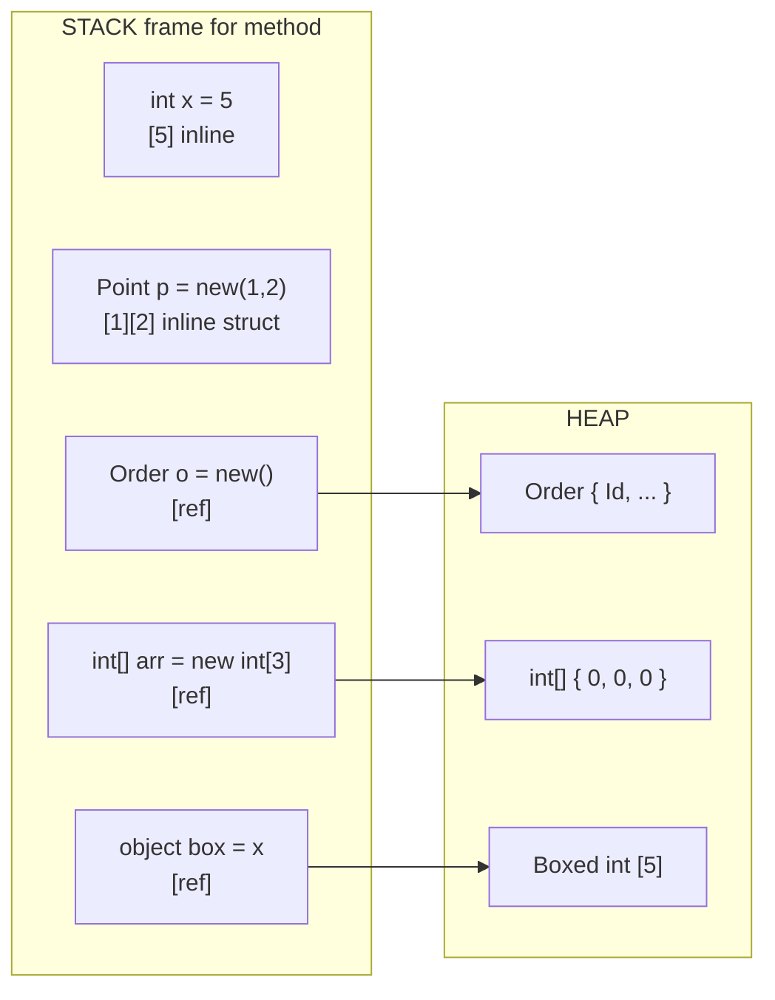

# Type System Deep Dive

> [Mastery Guide](../../README.md) › [Foundations](../README.md) › [C# Mastery](./README.md)

| Status | Priority | Phase | Last reviewed |
|---|---|---|---|
| Not Started | High | Phase 1 — Language & Runtime Fluency | 2026-05-07 |

## Contents
- [Why it matters](#why-it-matters)
- [Core concepts](#core-concepts)
  - [Value vs reference types — the foundational divide](#value-vs-reference-types--the-foundational-divide)
  - [Value vs reference — the full story (semantics, identity, equality)](#value-vs-reference--the-full-story-semantics-identity-equality)
  - [Stack vs heap (and why it's a half-truth)](#stack-vs-heap-and-why-its-a-half-truth)
  - [Boxing and unboxing](#boxing-and-unboxing)
  - [Structs](#structs)
  - [`readonly struct` and `readonly` members — defensive copy elimination](#readonly-struct-and-readonly-members--defensive-copy-elimination)
  - [Records — value-equality reference types](#records--value-equality-reference-types)
  - [Record structs](#record-structs)
  - [`record struct` vs `record class` vs `class` — picking the right shape](#record-struct-vs-record-class-vs-class--picking-the-right-shape)
  - [`ref struct` — stack-only types](#ref-struct--stack-only-types)
  - [`ref struct`, `Span<T>`, and `Memory<T>` — the stack-only family](#ref-struct-spant-and-memoryt--the-stack-only-family)
  - [`readonly` — immutability primitives](#readonly--immutability-primitives)
  - [`default(T)` — semantics across value types, reference types, and generics](#defaultt--semantics-across-value-types-reference-types-and-generics)
  - [Generic type identity at runtime — open vs closed generics](#generic-type-identity-at-runtime--open-vs-closed-generics)
  - [Nullable value types vs nullable reference types](#nullable-value-types-vs-nullable-reference-types)
  - [Tuples — value tuples vs `Tuple<T>`](#tuples--value-tuples-vs-tuplet)
  - [Choosing class vs struct vs record](#choosing-class-vs-struct-vs-record)
- [Code & diagrams](#code--diagrams)
- [Common pitfalls](#common-pitfalls)
- [Interview-ready summary](#interview-ready-summary)
- [Interview Cross-Questioning Drill](#interview-cross-questioning-drill)
- [Cheat Sheet](#cheat-sheet)
- [Walkthrough](#walkthrough--boxing-storm-in-a-hot-loop)
- [Self-test](#self-test)
- [Cross-references](#cross-references)
- [Sources](#sources)

---

## Why it matters

The single deepest fork in C# semantics is **value type vs reference type**. Get this wrong and you write code that allocates 10× more than necessary, mutates state you thought was a copy, fails equality checks for opaque reasons, or boxes inside a hot loop and pays GC pressure for nothing.

Modern C# (C# 10–14) added five new tools to the type-system toolbox: `record`, `record struct`, `readonly struct`, `ref struct`, and primary constructors. Each is a precise answer to a long-standing pain point. Knowing which to reach for — and *why* — separates engineers who guess from engineers who decide.

This file is also the foundation for everything in [`09-memory-and-performance.md`](./09-memory-and-performance.md). `Span<T>` is a `ref struct`. `ArrayPool<T>` returns reference-typed arrays. `string.Create` builds strings without allocation. None of those click without the type-system mental model first.

## Core concepts

### Value vs reference types — the foundational divide

Every C# type is either a **value type** or a **reference type**. The choice changes how the variable behaves under assignment, parameter passing, equality, and garbage collection.

**Value types** include all the numeric primitives, `bool`, `char`, all `struct`s, all `enum`s, and tuples. The variable *is* the value:

```csharp
int a = 5;
int b = a;        // b is a copy of a — independent storage
b = 10;
Console.WriteLine(a);  // 5 — a is untouched
```

**Reference types** include `class`, `interface`, `delegate`, `string`, `object`, arrays, and `record` (default). The variable holds a *reference* to a heap-allocated object:

```csharp
var x = new List<int> { 1, 2, 3 };
var y = x;        // y refers to the SAME list as x
y.Add(4);
Console.WriteLine(x.Count);  // 4 — x and y point at the same object
```

This single distinction drives most "why is my code behaving weirdly" questions.

| Aspect | Value types | Reference types |
|---|---|---|
| Storage | Where declared (often stack or inline in a containing object) | Heap (always); reference is where declared |
| Default value | All-zero bits | `null` |
| Assignment | Copies the bits | Copies the reference |
| Equality (`==`) | Bit-equality (or operator overload) | Reference identity (unless overridden — `string` and `record` override) |
| Generics with `default(T)` | Zero value | `null` |
| Pass by value | Full copy | Reference copy (object shared) |
| Pass by `ref` | Caller's storage referenced | Caller's reference variable referenced |
| Lifetime | Bound to scope | Until last reference + GC |
| Inheritance | Cannot inherit (sealed implicitly) | Single inheritance + multiple interfaces |
| Boxing | Yes (when stored as `object` / interface) | N/A |

### Value vs reference — the full story (semantics, identity, equality)

The previous table is the "what". This section is the "so what" — six independent dimensions where the value/reference choice changes program behavior. Senior interviewers don't ask "value vs reference"; they ask "two instances of `Money(100, USD)`, are they equal? Identical? Hashable?" and expect you to spell out which mechanism applies.

**Dimension 1 — Storage location.**

"Value type goes on the stack" is the lie everyone learns. The truth: a value lives wherever its containing storage lives.

```csharp
int local = 5;                  // local int on the stack
class Order { public int Id; }
Order o = new();                // 'o' is a stack-allocated reference; the Order object on the heap
                                // o.Id (an int) is INSIDE the Order object, so on the heap
int[] arr = new int[3];         // 'arr' is a stack reference; the array AND its 3 ints are on the heap
List<Point> list = new();       // each Point added is stored inline in the array backing List<T>;
                                // the array is on the heap, so the Points are on the heap
```

**Dimension 2 — Assignment semantics.**

```csharp
// Value: copies the bits
int a = 5;
int b = a;        // b is an independent copy
b = 10;
// a is still 5

// Reference: copies the reference, not the object
List<int> x = new() { 1, 2, 3 };
List<int> y = x;   // y points at the SAME list as x
y.Add(4);
// x.Count is 4 too — they share an object
```

**Dimension 3 — Parameter passing.**

| Mode | Value type | Reference type |
|---|---|---|
| (default) | Copy of bits passed | Copy of *reference* passed; object shared |
| `ref` | Caller's storage referenced | Caller's *reference variable* referenced — callee can reassign |
| `out` | Same as `ref` but callee must assign | Same as `ref` but callee must assign |
| `in` | Read-only reference (no copy, no mutation) | Same but rarely meaningful (reference is already small) |

**Dimension 4 — Default value.**

```csharp
class C { public int X; public string Y; public Point P; }
C c = new();
// c.X == 0          (value type — all-zero bits)
// c.Y == null       (reference type — null reference)
// c.P == new Point(0, 0)  (value type — all fields zero-init)

// For locals and parameters, you must assign before reading (definite assignment).
// For fields, the runtime guarantees zero-init on heap allocation.
```

**Dimension 5 — Identity vs equality.**

This is the subtle one. "Identity" = "are these the same object?" "Equality" = "do they represent the same value?" For reference types they're different concepts; for value types identity isn't even well-defined.

```csharp
// Reference type
class Person { public string Name; }
var a = new Person { Name = "Alice" };
var b = new Person { Name = "Alice" };
Console.WriteLine(ReferenceEquals(a, b));   // False — different objects (identity)
Console.WriteLine(a == b);                   // False — default '==' on class is reference equality
Console.WriteLine(a.Equals(b));              // False — default Equals is reference equality
// Override Equals/GetHashCode/== to make them value-equal.

// Value type (struct)
struct PointV { public int X, Y; }
var p = new PointV { X = 1, Y = 2 };
var q = new PointV { X = 1, Y = 2 };
// ReferenceEquals(p, q) — compile error: PointV is a value type, no reference identity
// (At a deep level, you could box and compare, but that defeats the question.)
Console.WriteLine(p.Equals(q));              // True — default struct Equals is field-wise (via reflection, slow)
Console.WriteLine(p == q);                   // Compile error unless you overload ==

// record (reference type, value equality auto-generated)
record PersonR(string Name);
var ra = new PersonR("Alice");
var rb = new PersonR("Alice");
Console.WriteLine(ReferenceEquals(ra, rb));  // False — distinct objects
Console.WriteLine(ra == rb);                  // True — record overrides == to compare fields
```

**Dimension 6 — Lifetime and garbage collection.**

Value types in stack frames die when the frame returns — no GC involvement, zero cost. Reference types live on the heap and are tracked by GC; cleanup happens at the next gen-0 collection (or later if the object survives). Value types as *fields* of reference types live with their container — same lifetime as the heap object.

```csharp
void Method()
{
    int local = 5;             // dies when Method returns; stack frame popped
    var list = new List<int>(); // list reference dies; the List<int> object survives on the heap
                                // until GC reclaims it (next gen-0 collection that finds no roots)
}
```

**The senior takeaway.** "Value vs reference" is not one decision — it's six independent behaviors that align in the value-type vs reference-type choice. When a behavior diverges from the default (e.g., you want a class with value equality), reach for the right tool: `record` for "reference type with value equality"; `struct` for "value type with reference-comparable behavior" (you implement IEquatable explicitly); `class` for "identity matters"; `readonly record struct` for "small immutable value with value equality."

### Stack vs heap (and why it's a half-truth)

The most common shorthand: "value types live on the stack, reference types live on the heap." This is **mostly wrong** as stated, and getting it precisely right matters for performance reasoning.

**The accurate rule:** a value-type *value* lives wherever its containing storage lives.

- A local `int x = 5;` — its containing storage is the method's stack frame, so the `int` lives on the stack.
- A field `class Order { int Total; }` — `Total` is *inline* inside the `Order` heap object. The `int` lives on the heap.
- An `int[] arr` — array elements live on the heap (the array is a heap object), even though `int` is a value type.
- A `Lazy<int>` cached field — same; on the heap.

**Reference types are always on the heap**, and the reference itself lives wherever it's declared (stack for locals, heap for fields).

```csharp
class Order {
    public int Id;            // Id lives in the Order heap object (inline)
    public string Name;       // Name is a reference, in the Order; the actual string on the heap
}

void Demo() {
    int x = 5;                // x on the stack
    Order o = new();          // 'o' (the reference) on the stack; new Order on the heap
    int[] arr = new int[3];   // 'arr' on the stack; the array (and all 3 ints) on the heap
}
```

For deeper coverage of how the GC manages heap objects, see [.NET Fundamentals › Garbage Collection](../01-net-core-deep-dive/01-net-fundamentals.md#3-garbage-collection-in-net-10).

### Boxing and unboxing

When a value type is assigned to a reference-typed slot (`object`, an interface, or a generic parameter without value-type constraint), the runtime **boxes** it: allocates a heap object, copies the value into it, and returns a reference. **Unboxing** copies back.

```csharp
int x = 42;
object boxed = x;          // BOXING — heap allocation
int y = (int)boxed;        // UNBOXING — copy back, throws InvalidCastException if wrong type

// Generic without value-type constraint also boxes if T is a value type AND
// the runtime stores it via object machinery — though modern generics for value types
// are JIT-specialized and don't box. Boxing happens primarily at .Net interface boundaries.
```

**Common unintentional boxing:**

```csharp
int n = 5;
Console.WriteLine("n = " + n);
// '+' invokes string.Concat(object, object) — n is boxed.
// Use string interpolation instead: $"n = {n}" — uses DefaultInterpolatedStringHandler,
// which has overloads for primitives (no boxing).

ArrayList list = new();
list.Add(5);                // ArrayList stores object; boxes the int.
// Use List<int> — generic, no boxing.

void LogNonGeneric(object o) => Console.WriteLine(o);
LogNonGeneric(42);          // boxes
void LogGeneric<T>(T v) => Console.WriteLine(v);
LogGeneric(42);             // does NOT box (T = int, JIT specializes)
```

**How to spot boxing:** look for `object`, non-generic collections (`ArrayList`, `Hashtable`), interface invocations on a value type via interface-typed variable, and string concatenation with `+` on values.

**Cost:** each boxing is a heap allocation (~24 bytes overhead + the value). In a hot loop, this is a meaningful GC pressure source.

### Structs

A `struct` is a value type with most of the syntactic conveniences of a class.

```csharp
public struct Point
{
    public int X;
    public int Y;

    public Point(int x, int y) => (X, Y) = (x, y);
    public double Distance() => Math.Sqrt(X * X + Y * Y);
}

var p = new Point(3, 4);
var q = p;           // copy — q is independent
q.X = 0;
Console.WriteLine(p.X);  // 3 — unaffected
```

**Rules:**
- All fields default to zero on `new T()`.
- Cannot inherit from another type (except implicitly `System.ValueType`).
- Can implement interfaces (but invoking via interface boxes — see above).
- No parameterless constructor *with body* until C# 10 (now allowed, but called only with explicit `new()`, not on default-initialization).
- A struct should be **small** (< 16 bytes by Microsoft guidance) and ideally **immutable**, otherwise mutation through copies confuses everyone.

**`record struct`** (C# 10) gives you value semantics + auto-generated equality/`with`/`ToString` (covered below).

### `readonly struct` and `readonly` members — defensive copy elimination

A `readonly struct` is a struct where **every field is implicitly `readonly`** and the compiler proves no method mutates `this`. This unlocks an optimization that's invisible until you measure it: defensive copies on `in` parameters and `readonly` field access disappear.

**The problem `readonly struct` solves.**

```csharp
public struct Counter
{
    public int Value;
    public int Get() => Value;        // not annotated — compiler MIGHT think it mutates
    public void Inc() => Value++;     // does mutate
}

public class Caller
{
    public readonly Counter _c = new();

    public int Read()
    {
        return _c.Get();
        //     ^^^^^^^ — compiler INSERTS a defensive copy of _c on the stack
        // because:
        //   1. _c is a readonly field — caller can't mutate
        //   2. Get() is non-readonly — might mutate
        //   3. Compiler chooses: copy _c so any mutation hits the copy, not the field
    }
}
```

The defensive copy happens **every call**, silently. For a 64-byte struct in a 10M ops/sec hot loop, that's 640 MB/sec of pointless stack traffic.

**Fix option 1: mark individual methods `readonly`.**

```csharp
public struct Counter
{
    public int Value;
    public readonly int Get() => Value;   // ✓ compiler proves no mutation
    public void Inc() => Value++;
}
```

Now `_c.Get()` skips the defensive copy. `_c.Inc()` is still a compile error because `_c` is readonly.

**Fix option 2: mark the entire struct `readonly`.**

```csharp
public readonly struct Counter
{
    public int Value { get; }
    public Counter(int v) { Value = v; }
    public int Get() => Value;            // implicitly readonly — no mutation possible
}
```

Every field is implicitly readonly. Every method is implicitly readonly. The compiler treats the entire struct as a non-mutating value. **No defensive copies anywhere.**

**Comparison:**

| | `struct` | `readonly struct` |
|---|---|---|
| Fields can be reassigned? | ✓ | ✗ |
| Methods can mutate `this`? | ✓ | ✗ |
| Defensive copy on `in` param? | ✓ (unless method is `readonly`) | ✗ |
| Defensive copy on `readonly` field access? | ✓ (unless method is `readonly`) | ✗ |
| Use case | Mutable POD types, builders | Immutable values, geometric primitives, `Money` |

**`in` parameter interaction.**

```csharp
// Mutable struct + 'in'
public void Process(in Counter c) => c.Inc();   // compile error: c is readonly via 'in'
public void Read(in Counter c)    => c.Get();   // defensive copy — Get() might mutate

// readonly struct + 'in'
public readonly struct MoneyR(decimal a, string c) { public decimal Amount { get; } = a; }
public void Process(in MoneyR m) => Use(m.Amount);   // no defensive copy — readonly struct
```

The combination `(in MoneyR m)` is the canonical "pass a small immutable value cheaply" idiom. The `in` says "by reference, read-only"; the `readonly` says "the type itself can't mutate." Together: zero copies, zero mutations, perfect for value-object passing in hot paths.

**Senior rule:** any struct meant to be immutable should be declared `readonly struct`. The runtime cost of skipping it is silent and easy to miss in profiles. The development cost of adding it is zero. Just do it.

### Records — value-equality reference types

`record` (C# 9) is a *reference type* (default) that gets value-based equality, immutability, and concise syntax for free.

```csharp
public record Person(string FirstName, string LastName, int Age);

var a = new Person("Alice", "Lin", 30);
var b = new Person("Alice", "Lin", 30);

Console.WriteLine(a == b);              // True — value equality (compares all properties)
Console.WriteLine(ReferenceEquals(a, b));  // False — different objects on heap
Console.WriteLine(a.GetHashCode() == b.GetHashCode());  // True

var older = a with { Age = 31 };        // 'with' copies + modifies (returns new instance)

// Compiler generates:
// - public string FirstName { get; init; }   ← init-only
// - public string LastName  { get; init; }
// - public int Age          { get; init; }
// - Equals/GetHashCode based on all properties
// - ToString showing all properties
// - Deconstruct method (so you can do: var (f, l, age) = person;)
// - Copy constructor (for 'with' expressions)
```

**Why use records:**
- DTOs / API contract types (immutable by design).
- Value objects in DDD.
- Snapshot/event types in CQRS or event sourcing.

**When NOT to use records:** when the type has identity beyond its data — e.g., an `Order` with a primary key and methods that mutate state should remain a class.

**Inheritance with records:**

```csharp
public abstract record Shape(string Color);
public record Circle(string Color, double Radius) : Shape(Color);
public record Square(string Color, double Side)   : Shape(Color);
```

Record equality respects the runtime type — `Circle` ≠ `Square` even with same color.

### Record structs

C# 10 added `record struct` — a *value type* with the same auto-generated equality / `with` / `ToString` surface:

```csharp
public readonly record struct Point(int X, int Y);

var p = new Point(1, 2);
var q = p with { Y = 5 };   // 'with' on a struct returns a new value (no heap allocation)
Console.WriteLine(p == q);  // False
```

`readonly record struct` is the strongest form: value type, immutable, value equality, no defensive copies. Excellent for small geometric / domain values.

| Form | Reference or value? | Mutable by default? | Equality |
|---|---|---|---|
| `class` | Reference | Yes | Reference |
| `record` (= `record class`) | Reference | `init`-only by default | Value |
| `struct` | Value | Yes | Bitwise (auto-generated, slow) |
| `record struct` | Value | Yes (mutable by default) | Value |
| `readonly record struct` | Value | No | Value |
| `readonly struct` | Value | No | Bitwise (auto-generated, slow) |

### `record struct` vs `record class` vs `class` — picking the right shape

Six type forms, one decision matrix. The table above showed mechanics; this section answers "I have a new type to model — which do I reach for?"

**The four common shapes:**

| Form | Reference/value? | Equality | Mutation | Allocation | Typical use |
|---|---|---|---|---|---|
| `class` | Reference | Identity | Mutable | Heap | Entities with identity, services, mutable models |
| `record` (= `record class`) | Reference | Value | `init`-only by default | Heap | DTOs, API contracts, event payloads |
| `record struct` | Value | Value | Mutable by default | Stack/inline | Hot-path value bundles, dictionary keys |
| `readonly record struct` | Value | Value | Immutable | Stack/inline | Small immutable values (`Money`, `Coord`, `DateRange`) |

**Performance characteristics:**

```csharp
// Class — one heap allocation per instance + GC pressure
class CMoney { public decimal Amount; public string Currency; }
new CMoney { Amount = 100, Currency = "USD" };   // heap alloc (~32 bytes overhead + fields)

// Record class — same allocation cost as a class; you save typing on equality
record RMoney(decimal Amount, string Currency);
new RMoney(100, "USD");   // heap alloc; value-equality auto-generated

// Record struct — zero heap allocation when used as local, parameter, or array element
record struct RsMoney(decimal Amount, string Currency);
RsMoney m = new(100, "USD");   // inline allocation; copies on assignment

// Readonly record struct — same as above + can't mutate fields + no defensive copies
readonly record struct RrsMoney(decimal Amount, string Currency);
RrsMoney m = new(100, "USD");  // inline; immutable; defensive copies elided
```

**Decision flowchart:**

```
Does the type have IDENTITY beyond its data (DB Id, lifecycle, mutable state)?
├── YES → class
└── NO → continues
    │
    Is it small (< ~16-24 bytes)? Used in hot paths or as a dictionary key?
    ├── YES → readonly record struct
    └── NO → continues
        │
        Is it a DTO, API contract, event, or domain value object?
        ├── YES → record (= record class)
        └── NO → continues
            │
            Will it be mutated frequently and treated as a "value bag"?
            ├── YES (hot path) → struct or record struct
            └── NO → class (default)
```

**Worked examples:**

| Domain type | Best fit | Reason |
|---|---|---|
| `User` (DB row, has `Id`) | `class` | Identity matters; reference equality is correct semantics |
| `CreateUserRequest` (API body) | `record` | Immutable contract, value equality for tests |
| `OrderPlacedEvent` (event-sourced) | `record` | Immutable history; value equality for replay |
| `Money(amount, currency)` | `readonly record struct` | Small, immutable, used everywhere |
| `(int X, int Y)` (transient pair) | tuple `(X, Y)` | Throwaway transport |
| `Coordinate(double, double)` (named) | `readonly record struct` | Named, immutable, hot path |
| `HttpClient` | `class` | Mutable state (handlers, connection pool), identity-based |
| `DbContext` derived | `class` | Framework requires; mutable state |
| `Span<T>` | `ref struct` | Stack-only; can hold managed pointers |
| `Memory<T>` | `readonly struct` | Cousin of Span; can be field of class, can cross await |

**Immutability defaults:**

- `record` (positional): properties are `init`-only. `with` creates new instances.
- `record struct` (positional): properties are `get; set;` — mutable by default. Use `readonly record struct` for immutability.
- `class`: no defaults. You write `init` / `set` explicitly per property.
- `struct`: same as class — explicit per field.

This is the most-cited "gotcha": `record struct` is **mutable by default**, despite `record` (= `record class`) being `init`-only by default. The reasoning: `record struct` is meant for cases where you want a value-typed bag with value equality but can still mutate per-field. If you want immutability, add `readonly`: `readonly record struct`.

### `ref struct` — stack-only types

A `ref struct` is a value type that the compiler **forbids from ever being heap-allocated**. This restriction is what makes `Span<T>` safe.

```csharp
public ref struct Buffer
{
    public Span<byte> Data;
}
```

**Restrictions on `ref struct`:**
- Cannot be a field of a non-`ref struct` class or struct.
- Cannot be boxed (i.e., assigned to `object`, an interface, or `dynamic`).
- Cannot be used as a generic type argument (until C# 13's `allows ref struct` constraint).
- Cannot be captured by a lambda or local function.
- Cannot be used in `async` methods or iterators (because the state machine would need to box).
- Cannot be the target of `await`.

In exchange, `ref struct` types can hold pointers / `ref T` fields safely — the compiler proves they never escape to the heap. `Span<T>` and `ReadOnlySpan<T>` are the canonical examples; both are `ref struct`s. Deep dive in [`09-memory-and-performance.md`](./09-memory-and-performance.md).

### `ref struct`, `Span<T>`, and `Memory<T>` — the stack-only family

`Span<T>` is the poster child for `ref struct`. Understanding *why* it had to be a `ref struct` — and what its `Memory<T>` cousin gives up to be more flexible — is a senior-interview staple.

**Why `Span<T>` is a `ref struct`.**

`Span<T>` holds a **managed pointer** (a `byref`, IL `T&`) into arbitrary memory:

```csharp
// Conceptually, Span<T> contains:
public readonly ref struct Span<T>
{
    private readonly ref T _pointer;   // a 'managed pointer' — can point into stack, heap, or unmanaged
    private readonly int _length;
}
```

The pointer can point into any of:
1. A heap-allocated array (`new int[100].AsSpan()`).
2. A stack-allocated buffer (`stackalloc int[100]`).
3. Native memory (`Marshal.AllocHGlobal`).

If a `Span<T>` ever **escaped to the heap** — as a field of a class, an async state machine, or a closure — disaster:

- **Pointing at the stack:** the underlying stack frame returns. The pointer dangles into reclaimed memory. Reads see arbitrary garbage.
- **Pointing at the heap:** the GC compacts and moves the array. Without GC awareness of the pointer, it's now pointing into the middle of *some other* object.
- **Pointing at unmanaged:** the unmanaged memory could be freed. Use-after-free.

By marking `Span<T>` a `ref struct`, the compiler **statically forbids** any of those escapes. The restrictions are not arbitrary — they're exactly the set of operations that would let a `Span<T>` outlive its source.

**The restrictions, with reasoning:**

```csharp
public ref struct MySpan<T> { /* ... */ }

// 1. Cannot be a field of a non-ref-struct class or struct
class Holder { public Span<int> _data; }   // ❌ CS8345: field is not a ref struct

// 2. Cannot be boxed
Span<int> s = stackalloc int[10];
object o = s;          // ❌ CS8350: cannot box ref struct
IEnumerable e = s;     // ❌ cannot implement non-ref interfaces

// 3. Cannot be a generic type argument (until C# 13)
List<Span<int>> list;  // ❌ CS9244: type 'Span<int>' must be a reference type to be a generic argument
// C# 13+ adds 'allows ref struct' constraint to opt-in.

// 4. Cannot be captured by a lambda or local function
void Demo()
{
    Span<int> s = stackalloc int[10];
    Action a = () => Console.WriteLine(s.Length);   // ❌ CS8175: cannot use ref-like in lambda
}

// 5. Cannot be used in async methods or iterators (the state machine boxes locals)
async Task ProcessAsync()
{
    Span<int> s = stackalloc int[10];   // ❌ CS4012: parameters/locals of ref struct type cannot be in async method
    await Task.Yield();
    Console.WriteLine(s[0]);
}

// 6. Cannot cross an `await` boundary
async Task Helper(Span<int> s)         // ❌ same as above
{
    await Task.Yield();
}
```

**`Memory<T>` — the heap-friendly cousin.**

`Memory<T>` exists for the cases where you genuinely need to pass span-like data across `await`, into async methods, or store as a class field. It pays for that flexibility by **not** holding a raw pointer — instead it holds a reference to an `IMemoryOwner<T>` (or wraps an array) and a length.

```csharp
public readonly struct Memory<T>
{
    private readonly object _object;       // an array, MemoryManager, or string
    private readonly int _index, _length;
}

// Memory<T> CAN:
class Cache { public Memory<byte> Buffer; }      // ✓ field of a class
async Task SendAsync(Memory<byte> data) { ... }  // ✓ async parameter
Memory<byte> m = arrayPool.Rent(1024);

// To do actual byte-level work, convert to Span temporarily:
Span<byte> s = m.Span;   // synchronous slice; the Span doesn't escape this scope
```

**Span vs Memory cheatsheet:**

| | `Span<T>` | `Memory<T>` |
|---|---|---|
| Stack or heap? | Stack-only (`ref struct`) | Can live anywhere |
| Holds | Managed pointer + length | Object reference + index + length |
| Can be field of a class? | ✗ | ✓ |
| Can cross `await`? | ✗ | ✓ |
| Can be lambda-captured? | ✗ | ✓ |
| Backed by `stackalloc`? | ✓ | ✗ |
| Backed by `string`? | ✓ (`ReadOnlySpan<char>`) | ✓ (`ReadOnlyMemory<char>`) |
| Indexer perf | Fastest (managed pointer math) | Slightly slower (object indirection) |

**The typical async pipeline pattern:**

```csharp
// API surface: take Memory<T> so the caller can pass any backing store
public async Task<int> ProcessAsync(Memory<byte> input)
{
    // For the actual byte work, slice into a Span — but don't hold it across await:
    int header = ParseHeader(input.Span);

    await Task.Yield();    // ← Span<T> would be illegal here; Memory<T> survives

    int payload = ParsePayload(input.Span);
    return header + payload;
}
```

This pattern — `Memory<T>` at API boundaries, `Span<T>` at the leaf computation — is how high-perf .NET libraries (Kestrel, `System.Text.Json`, `Microsoft.Data.SqlClient`) thread allocation-free data through async pipelines.

### `readonly` — immutability primitives

Several flavors of `readonly`, each with a different scope:

**`readonly` field:**
```csharp
public class Order
{
    private readonly int _id;          // assigned in declaration or constructor only
    public Order(int id) => _id = id;
}
```

**`readonly` struct (C# 7.2):**
```csharp
public readonly struct Money
{
    public decimal Amount { get; }
    public string Currency { get; }
    public Money(decimal a, string c) { Amount = a; Currency = c; }
}
```
All fields must be readonly; cannot mutate. Key benefit: when passed by `in`, the compiler knows the callee can't mutate, so no defensive copy is needed.

**`readonly` member on a struct (C# 8):**
```csharp
public struct Counter
{
    public int Value;
    public readonly int Get() => Value;          // doesn't mutate
    public void Increment() => Value++;          // does mutate
}
```
Marks an *individual* method or property as non-mutating. Useful for incrementally hardening a partially-mutable struct.

**`init` accessor (C# 9):**
```csharp
public class User
{
    public string Name { get; init; }
}

var u = new User { Name = "Alice" };  // ✓ in object initializer
u.Name = "Bob";                       // ❌ after construction
```
`init` allows assignment during object initialization but disallows mutation thereafter. Records use `init` by default.

**`required` (C# 11):**
```csharp
public class User
{
    public required string Email { get; init; }
}

var u = new User();                    // ❌ CS9035: required member 'Email' must be set
var v = new User { Email = "a@b.c" };  // ✓
```
Forces caller to set the property in the object initializer or constructor. Combined with `init`, gives "constructor-style" required arguments without writing a constructor.

### `default(T)` — semantics across value types, reference types, and generics

`default(T)` produces the "zero value" of any type. In non-generic code that's mostly intuitive; in generic code with an unconstrained `T`, it's the source of a half-dozen subtle bugs.

**Behavior table:**

| Type | `default(T)` |
|---|---|
| `int`, `long`, `byte`, `decimal`, ... | `0` |
| `bool` | `false` |
| `char` | `'\0'` |
| `float`, `double` | `0.0` |
| Any `enum` | the value `0` (whether or not it has a name) |
| `DateTime` | `0001-01-01 00:00:00 UTC` |
| Any reference type (`string`, `object`, class, interface, delegate) | `null` |
| Any `struct` | all fields recursively set to their `default(T)` |
| `Nullable<T>` (`int?`) | A `Nullable<T>` with `HasValue == false` |
| `T?` for reference type T (when nullable enabled) | `null` (same as plain `T`) |

**Short-hand:**

```csharp
int    a = default;   // 0
bool   b = default;   // false
string s = default;   // null
Point  p = default;   // new Point(0, 0)  (all fields zero)

// Equivalent to default(T) when target type is known
int x = default(int);          // 0 — explicit
List<int> l = default(List<int>);  // null
```

**Generic code with unconstrained `T`:**

```csharp
public T MakeDefault<T>() => default(T);

int    i = MakeDefault<int>();       // 0
string s = MakeDefault<string>();    // null
Point  p = MakeDefault<Point>();     // (0, 0)
DayOfWeek d = MakeDefault<DayOfWeek>();  // Sunday (the 0 enum value)
```

This is why generic code can be tricky to reason about: `default(T)` could be `null`, `0`, or `new T()`-equivalent depending on `T`. Code that does `if (item == default(T))` works for `int` and `string` but for value types calls bitwise-equality (often slow via reflection unless you implement `IEquatable<T>`).

**The "should I compare to default?" trap:**

```csharp
public bool IsEmpty<T>(T value) => EqualityComparer<T>.Default.Equals(value, default);
//                                ^^^^^^^^^^^^^^^^^^^^^^^^^^^^^^
// Right way for generic equality — picks IEquatable<T>.Equals if available,
// avoiding boxing and avoiding the slow reflection-based default Equals.

// Wrong way for value types:
public bool IsEmpty<T>(T value) => value.Equals(default(T));
// If T is a struct without IEquatable<T> implemented, this calls Object.Equals
// which boxes 'value' to compare. Allocates on every call.
```

**`T?` for value types vs reference types (with NRT enabled):**

```csharp
#nullable enable

public T? GetOrNull<T>(int id) => ...;
// If T is a reference type:  T? = nullable annotation; same type at runtime as T.
// If T is a value type:      T? = Nullable<T>; DIFFERENT type at runtime.

// Caller:
string? s = GetOrNull<string>(1);      // returns string or null
int? n = GetOrNull<int>(1);            // returns Nullable<int>
```

In generic code, `T?` has the unique property of meaning two different things at runtime — `Nullable<T>` for value types, `T` (with compiler annotation) for reference types. The compiler erases the `?` for the value-type case differently than for reference types. This is why generic constraints often need `where T : struct` or `where T : class` to make `T?` unambiguous.

**Default ≠ "uninitialized."** For locals, you must still satisfy definite-assignment:

```csharp
int x;
Console.WriteLine(x);        // ❌ CS0165 — even though default(int) is 0, the local isn't assigned

int y = default;
Console.WriteLine(y);        // ✓ — explicit assignment

class C { public int Field; }
new C().Field;                // ✓ — fields auto-default; no assignment needed
```

### Generic type identity at runtime — open vs closed generics

A subtle but high-yield interview topic: at runtime, **`List<int>` and `List<string>` are different types**. Specifically, they share no runtime identity, no instance, no `typeof()` token. This is unlike Java erasure where both are simply `List` at runtime.

**The CLR generic model:** every concrete generic instantiation is a separate type at runtime. The CLR specializes the IL per-`T` for value types and shares code for reference types — but the `Type` objects are always distinct.

```csharp
Type t1 = typeof(List<int>);
Type t2 = typeof(List<string>);
Type t3 = typeof(List<>);          // OPEN generic — the unbound List<T>

Console.WriteLine(t1 == t2);                       // False — different closed types
Console.WriteLine(t1.GetGenericTypeDefinition() == t3);    // True — both reduce to List<>
Console.WriteLine(t1.GetGenericTypeDefinition() == t2.GetGenericTypeDefinition());  // True
```

**Closed vs open generics:**

```csharp
typeof(List<int>)        // CLOSED generic — all type parameters are concrete
typeof(List<>)            // OPEN generic — type parameters are unbound (the "definition")
typeof(Dictionary<,>)     // OPEN — two unbound type parameters (note the comma)
typeof(Dictionary<int,>)  // ❌ ILLEGAL — can't have partial closure in C# syntax
```

You can construct a closed type from an open one via reflection:

```csharp
Type open = typeof(List<>);                  // List<T>
Type closed = open.MakeGenericType(typeof(int));  // List<int>
Console.WriteLine(closed == typeof(List<int>));    // True — same Type object
```

**Why this matters in practice:**

1. **DI containers register closed types** (`services.AddScoped<IRepo<User>, UserRepo>()`) or open types (`services.AddScoped(typeof(IRepo<>), typeof(GenericRepo<>))`). The open registration says "for any T, construct `GenericRepo<T>` when asked for `IRepo<T>`." The container constructs the closed type via `MakeGenericType` at resolve time.

2. **Caching keyed by `Type`** works because closed types are uniquely-identified — `ConcurrentDictionary<Type, X>` keyed by `typeof(MyHandler<Event>)` is safe.

3. **Reflection over inheritance** distinguishes open and closed. `typeof(MyList).BaseType` returns `List<int>` (closed); `typeof(List<>).BaseType` is `object` (the open `List<T>` inherits from `object`, generic args matter).

4. **Generic constraints are checked per closure.** `where T : new()` is verified when `MyClass<int>` is constructed, not at the open-type definition.

**Per-`T` JIT code (the implementation detail):**

```csharp
// For VALUE-TYPE T, the JIT generates a SEPARATE specialized assembly:
List<int>     →  uses int[] backing, int-typed everywhere — no boxing
List<double>  →  uses double[] backing, double-typed
List<Guid>    →  uses Guid[] backing, Guid-typed
// Each is a distinct chunk of machine code in memory.

// For REFERENCE-TYPE T, the JIT SHARES code (all references look alike at the metal):
List<string>, List<object>, List<MyClass>
// All share one IL implementation that operates on 'object' references.
// IL bloat is bounded by the number of *distinct value types*, not by total Ts.
```

This is why heavy use of `List<int>` and `List<double>` adds two JIT'd implementations to the process; heavy use of `List<string>`, `List<User>`, `List<Order>` adds only one shared implementation. For perf-critical code generators, this is an important consideration.

**`Type.GetGenericTypeDefinition()`** retrieves the open type from a closed one — useful for "register one handler for all `Message<T>`":

```csharp
public bool IsMessageType(Type t) =>
    t.IsGenericType && t.GetGenericTypeDefinition() == typeof(Message<>);
```

### Nullable value types vs nullable reference types

Two completely different mechanisms with similar `?` syntax.

**Nullable value type** (`int?`, `DateTime?`) — runtime feature since C# 2.0. It's syntactic sugar for `Nullable<T>`, a struct with a `HasValue` flag.

```csharp
int? n = null;
if (n.HasValue) Console.WriteLine(n.Value);
// Same as: Nullable<int> n = new();
```

`int?` is a different *type* from `int`. They don't unify; you must check / unwrap.

**Nullable reference type** (`string?`, `Order?`) — compile-time only feature, since C# 8. Enabled per-project (`<Nullable>enable</Nullable>` in `.csproj`) or per-file (`#nullable enable`).

```csharp
#nullable enable

string a = null;     // ⚠ CS8625: cannot convert null literal to non-nullable reference type
string? b = null;    // ✓
Console.WriteLine(b.Length);   // ⚠ CS8602: dereference of possibly-null reference

if (b is not null)
    Console.WriteLine(b.Length);  // ✓ flow analysis cleared the warning
```

The runtime treats `string` and `string?` as the same type — `?` is a hint to the compiler's flow analysis. There is no runtime null check unless you write one.

Deep dive in [`07-nullability-and-pattern-matching.md`](./07-nullability-and-pattern-matching.md).

### Tuples — value tuples vs `Tuple<T>`

Two tuple mechanisms; one is dead, one is alive.

**`Tuple<T1, T2, ...>`** (legacy, .NET 4.0) — reference type, properties named `Item1`, `Item2`. Avoid for new code.

**`ValueTuple<T1, T2, ...>`** (C# 7+) — value type, supports field naming, deconstruction, equality.

```csharp
// Construction
(int x, int y) point = (3, 4);          // value tuple with named fields
var named = (Latitude: 40.7, Longitude: -74.0);

// Returning multiple values
(string Name, int Age) GetUser() => ("Alice", 30);
var u = GetUser();
Console.WriteLine(u.Name);

// Deconstruction
var (name, age) = GetUser();
Console.WriteLine(name);

// Tuple equality (C# 7.3+)
var p1 = (1, 2);
var p2 = (1, 2);
Console.WriteLine(p1 == p2);   // True

// Type alias for tuple (C# 12)
using Coords = (double Lat, double Lng);
Coords office = (40.7, -74.0);
```

Use value tuples for *transient* multi-value returns. For long-lived data structures, prefer a `record` or `record struct` — the names survive across files and the type is searchable.

### Choosing class vs struct vs record

A decision rule you can apply quickly:

```
START
  │
  ├── Will the value have identity beyond its data (DB id, lifecycle)?
  │     └── YES → class (or record class only if equality should compare data)
  │
  ├── Is this a small immutable bundle (≤ 16 bytes, geometric / domain primitive)?
  │     └── YES → readonly record struct
  │
  ├── Is this a DTO / API contract / event payload?
  │     └── YES → record (= record class)
  │
  ├── Will you allocate millions in a hot path AND treat as a value?
  │     └── YES → struct (consider readonly struct)
  │
  └── Default → class
```

Sizing heuristic for structs: if the struct has more than 4 fields, or is bigger than 16 bytes, copy cost dominates and a `class` is usually faster overall.

## Code & diagrams

<details>
<summary>🧩 Click to expand — code samples and diagrams</summary>



**Boxing in the wild:**

```csharp
// ❌ Boxes inside the loop — one heap allocation per iteration
ArrayList list = new();
for (int i = 0; i < 1_000_000; i++) list.Add(i);

// ✓ No boxing — generic specialization for value types
List<int> list = new();
for (int i = 0; i < 1_000_000; i++) list.Add(i);
```

**Defensive copy — the silent struct cost:**

```csharp
public struct BigStruct { /* 64 bytes of fields */ }

public class Caller
{
    public readonly BigStruct _value = ...;

    public void Use()
    {
        _value.SomeMethod();
        // The compiler INSERTS a defensive copy of _value here, because:
        // - _value is readonly (cannot mutate)
        // - SomeMethod() might mutate (compiler doesn't know)
        // → Each call allocates 64 bytes on the stack just to forward the method.
    }
}

// Fix: make BigStruct a 'readonly struct' OR mark SomeMethod 'readonly'.
// Then the compiler proves no mutation and skips the copy.
```

</details>
## Common pitfalls

1. **Mutating a struct through a property.** `myDict["key"].Value = 5;` doesn't compile if `Value` is a struct returned by `this[]` — modifying a copy is meaningless, so the compiler refuses. The fix is to extract, modify, reassign: `var v = myDict["key"]; v.Value = 5; myDict["key"] = v;`.
2. **`record` for entities.** A `record User(int Id, string Name)` has *value* equality — two users with the same Id+Name are `==` even if they're different rows or have different audit info. For DB-backed entities, use a class with reference equality (or override `Equals` to compare only on Id).
3. **Boxing inside `string +` concatenation.** `"x = " + x` where `x` is `int` boxes. Use interpolation: `$"x = {x}"`.
4. **`object.Equals` on a struct without overriding `Equals` and `GetHashCode`** — the default uses reflection and is *very slow*. Override on any struct used in collections or hot paths. Or just use `record struct`, which auto-generates them.
5. **Adding a `ref struct` field to a class.** Compile error. `ref struct` types can only live on the stack; classes are heap-allocated. If you need to escape a `ref struct`, you generally can't — that's the whole point.
6. **Missing `init` vs `set`.** `public string Name { get; set; }` allows mutation forever. `init` allows it during construction only. Records use `init` automatically; classes don't.
7. **`required` without a parameterless constructor accessible to the caller.** If your class has only a non-parameterless constructor, the constructor must set the required member or the caller can't instantiate it (deadlock). Either provide a parameterless ctor or pass the required value through the existing one.
8. **Nullable value type vs nullable reference type confusion.** `int? x = null` is a runtime distinction (different type). `string? s = null` is a compile-time hint (same type). Don't expect `string?` to behave like `int?` at runtime — there's no `HasValue`.
9. **`Tuple<T>` instead of `ValueTuple`.** Old code uses `Tuple.Create(1, 2)`; new code should use `(1, 2)`. They are different types.
10. **Treating `dynamic` like `var`.** `dynamic` defers type checking to runtime — slower, no IntelliSense, and runtime errors. Use only for COM interop, JSON traversal, or DLR scenarios.

## Interview-ready summary

- **Value types** (struct, primitive, enum, tuple) — copy on assignment, default to zero, no `null`, equality is bitwise.
- **Reference types** (class, interface, delegate, string, array, record) — copy the reference, default to `null`, equality is identity (unless overridden).
- **Stack vs heap** — value types live where their containing storage lives. Stack is *one* place that storage might be; the heap is another (e.g., as a field in a class, or as an array element).
- **Boxing** = wrapping a value type into a heap object so it can be treated as `object`. Costs a heap allocation. Avoid in hot loops; use generic collections, interpolation, generic methods.
- **`record`** = reference type with value equality + `with` expression + auto-generated boilerplate. **`record struct`** = value type version. **`readonly record struct`** = small, immutable, value-equality value type — the geometric-primitive workhorse.
- **`ref struct`** = a value type that the compiler forbids from heap allocation. Span/ReadOnlySpan are ref structs. They can't be class fields, can't be boxed, can't cross `await`.
- **`readonly` flavors**: readonly field (assigned only in ctor); readonly struct (whole struct can't mutate); readonly member (one method can't mutate); `init` accessor (set during construction only); `required` (caller must set).
- **Nullable value type** (`int?`) — runtime; different type. **Nullable reference type** (`string?`) — compile-time hint; same type at runtime.
- **Decision rule**: identity → class; small immutable → readonly record struct; DTO/event → record; default → class.

## Interview Cross-Questioning Drill

<details>
<summary>📖 Click to expand — cross-question chains (~15-20 min, cover answers and write cold)</summary>

> ⚠️ **Honest caveat**: reading this section once doesn't make you interview-ready. Cover the answers, write them cold, then check. Pair with a senior for live mock cross-questioning. The guide removes "I never thought about that" surprises; mock interviews convert knowledge into reflex. Both are needed.

Each drill is **Q → A → Cross-Q → A → Cross-Q² → A**. Practice answering the cross-questions without re-reading. If you stumble on any cross-Q², go re-read the relevant section.
### Drill 1 — Value vs reference — what's on the stack, really

> **Q**: "Value types live on the stack, reference types live on the heap." True or false?
>
> **A**: Mostly false as stated. The accurate rule: a value-type *value* lives wherever its containing storage lives. A local `int` lives on the stack. A field `int Order.Id` lives inline on the heap, because the `Order` lives on the heap. An array element `int[] arr` lives on the heap. The stack is *one place* a value might be stored; it's not the definition of value-typed.
>
> **Cross-Q**: So where's the reference itself stored?
>
> **A**: The reference (a pointer-sized handle) lives wherever it was declared. If it's a local `var o = new Order()`, the reference is on the stack and the `Order` is on the heap. If it's a field `class C { Order O; }`, both the reference (`O`) and the target object live on the heap — the reference inline in `C`, the target as a separate heap allocation.
>
> **Cross-Q²**: What about `Span<int> s = stackalloc int[10]; var c = new Container(); c.Data = s;` — what would happen if that compiled?
>
> **A**: It doesn't compile — `Container.Data` (if it's a normal class field) can't be `Span<T>` because `Span<T>` is a `ref struct`. If it did compile, the `Container` (heap object) would outlive the stack frame where `stackalloc int[10]` was allocated, leaving a dangling pointer to reclaimed stack memory. The next stack frame to overwrite that memory would corrupt the span. This is exactly the bug the `ref struct` restriction prevents at compile time — the language refuses to let `Span<T>` escape its stack scope.

### Drill 2 — Why `Span<T>` is a `ref struct`

> **Q**: Why is `Span<T>` declared as a `ref struct`?
>
> **A**: Because it holds a *managed pointer* — a `byref` into arbitrary memory (heap, stack, or unmanaged). If `Span<T>` escaped to the heap, the GC could move the underlying array out from under it (heap source), the stack frame could return and free the memory (stack source), or unmanaged memory could be freed (unmanaged source). Marking it `ref struct` makes the compiler statically prove the span stays on the stack — exactly the lifetime the underlying pointer needs.
>
> **Cross-Q**: What can't I do with a `ref struct`?
>
> **A**: Six restrictions. (1) Can't be a field of a non-`ref struct` class or struct. (2) Can't be boxed (no assignment to `object` or interface). (3) Can't be a generic type argument (until C# 13's `allows ref struct`). (4) Can't be captured by a lambda or local function. (5) Can't be used in `async` methods or iterators (the state machine would box). (6) Can't cross an `await` boundary. Each restriction prevents one specific way the span could outlive its source.
>
> **Cross-Q²**: How does `Memory<T>` solve those problems?
>
> **A**: `Memory<T>` is a `readonly struct` (not `ref struct`) — it holds an *object reference* (to an array, MemoryManager, or string) plus an index and length, NOT a raw pointer. So the GC can track it normally. `Memory<T>` can be a field of a class, can cross `await`, can be captured. The trade-off: it's slightly less efficient (an extra indirection through the object reference) and you can't `stackalloc` into it. The typical pattern is `Memory<T>` at API boundaries (async, fields, lambdas) and `Span<T>` at the leaf computation, accessed via `Memory<T>.Span`.

### Drill 3 — `readonly struct` and defensive copy elimination

> **Q**: I have `public struct Counter { public int Value; public int Get() => Value; }` and I pass it as `in Counter c`, then call `c.Get()`. Does the compiler copy `c`?
>
> **A**: Yes — silently. `Get()` is non-`readonly`, so the compiler doesn't know whether it mutates. Since `in c` is read-only by contract, the compiler emits a **defensive copy** of `c` on the stack and calls `Get()` on the copy. The "avoid the copy" perf benefit of `in` is destroyed.
>
> **Cross-Q**: How do you fix it?
>
> **A**: Two options. (1) Annotate the method: `public readonly int Get() => Value;` — the compiler proves no mutation, skips the defensive copy. (2) Convert the whole struct: `public readonly struct Counter` — every field is implicitly readonly, every method is implicitly readonly, no defensive copies anywhere. Option 2 is cleaner for types that should be immutable.
>
> **Cross-Q²**: What's the cost of *not* fixing it, in practice?
>
> **A**: One stack copy per method call. For a 16-byte struct in a 10M ops/sec hot loop, that's ~160 MB/sec of stack traffic — invisible in functional tests, visible in CPU profiles as "memcpy hot." For a 64-byte struct, it's 640 MB/sec. For business logic called a few thousand times a request, it's nothing. For numerical kernels, geometry primitives, financial calculators looping millions of times — measurable. Profile before claiming the perf, but the fix has zero downsides, so just do it.

### Drill 4 — Boxing `Nullable<int>` — what's on the heap?

> **Q**: `int? x = 5; object o = x;` — what's stored in the box?
>
> **A**: An `int` with value `5` — NOT a `Nullable<int>`. The CLR has special-case boxing for nullable value types: if `HasValue` is true, it boxes the underlying value; if `HasValue` is false, it boxes to `null` (no allocation). So `(int?)5` boxes to a heap `int`-box; `(int?)null` boxes to the actual `null` reference.
>
> **Cross-Q**: How do you unbox it back?
>
> **A**: `int? y = (int?)o;` — the CLR's special unboxing handles both cases. If `o` is `null`, `y` becomes a `Nullable<int>` with `HasValue == false`. If `o` is an `int`-box, `y` becomes `Nullable<int>` with `HasValue == true` and the value. The symmetry is intentional — boxing/unboxing `Nullable<T>` round-trips correctly even though the boxed form drops the `HasValue` flag.
>
> **Cross-Q²**: What's the implication for `Dictionary<int?, X>`?
>
> **A**: Subtle. `Dictionary<int?, X>` uses `int?` as the key type. Lookups compare with `EqualityComparer<int?>.Default.Equals(...)` — no boxing on the hot path. But if you cast `(int?)5` to `object` and use that as a key in `Dictionary<object, X>`, you box once at insertion. Two boxes containing the same value are different references but value-equal, so the dictionary's hash + equals lookup still works correctly — at the cost of an allocation per insert. Always prefer typed dictionaries (`Dictionary<int?, X>`) over `Dictionary<object, X>` for value-typed keys.

### Drill 5 — `default(T)` for unconstrained generic

> **Q**: In `public T MakeDefault<T>() => default(T);`, what do you get back for `T = int`, `T = string`, `T = Point`?
>
> **A**: `0` for `int`, `null` for `string`, `new Point(0, 0)` for `Point` (a struct with all fields zero). `default(T)` produces the all-zeros bit pattern — which means `0` for numerics, `null` for references, and a struct with all-zero fields for value types.
>
> **Cross-Q**: How does `default(T) == default(T)` behave for an unconstrained generic?
>
> **A**: Compile error — `==` is not defined for an unconstrained `T`. To compare you must use `EqualityComparer<T>.Default.Equals(a, b)` or constrain `T : IEquatable<T>` and call `a.Equals(b)`. The reason: `==` is a static operator that needs to be defined per-type at compile time; generics can't dispatch to it unless the constraint provides one (C# 11+ static abstract members partially solve this).
>
> **Cross-Q²**: What's the difference between `default(T)` and `new T()` in generic code?
>
> **A**: `default(T)` works for any T — produces all-zeros. `new T()` requires the `where T : new()` constraint and invokes the parameterless constructor. For a value type they often produce the same value (the parameterless constructor of a struct zeroes all fields), but a `record struct` with a custom parameterless ctor could differ from `default(T)`. For a reference type, `default(T)` is `null` and `new T()` is a fresh object — completely different. Rule of thumb: use `default(T)` for "empty value", `new T()` for "fresh instance."

### Drill 6 — `typeof(List<int>) != typeof(List<string>)`

> **Q**: At runtime, is `typeof(List<int>) == typeof(List<string>)`?
>
> **A**: No — different closed generic types are *different* `System.Type` objects. The CLR generic model preserves type identity per closure, unlike Java which erases generics at runtime to a single raw type.
>
> **Cross-Q**: What does `typeof(List<int>).GetGenericTypeDefinition()` return?
>
> **A**: The open generic `typeof(List<>)` — the unbound `List<T>` definition. Both `typeof(List<int>)` and `typeof(List<string>)` share the same open definition. This is how DI containers register one open type and resolve any closed instantiation: `services.AddScoped(typeof(IRepository<>), typeof(EfRepository<>))`.
>
> **Cross-Q²**: What's the JIT-level difference between `List<int>` and `List<string>`?
>
> **A**: For value-typed `T` (like `int`), the JIT generates a *separate* specialized machine-code implementation — `List<int>` uses `int[]` backing storage, `int`-typed everywhere, no boxing. For reference-typed `T` (like `string`, `object`, `MyClass`), the JIT *shares* a single implementation operating on `object` references — IL bloat scales with the number of distinct value types, not the number of reference types. This is why heavy generic use over reference types is cheap; heavy use over many distinct value types can grow JIT memory.

### Drill 7 — Open vs closed generic types

> **Q**: What's the difference between `typeof(List<>)` and `typeof(List<int>)`?
>
> **A**: `List<>` is the **open** (unbound) generic — the type definition where `T` is still a placeholder. `List<int>` is a **closed** generic — `T` has been bound to `int`. Open types can't be instantiated (`new List<>()` is a compile error); you must close them first via `List<>.MakeGenericType(typeof(int))` or write `new List<int>()`.
>
> **Cross-Q**: Can you have a partially-closed generic like `Dictionary<int, >`?
>
> **A**: No — C# syntax doesn't allow it. You can construct it via reflection (`typeof(Dictionary<,>).MakeGenericType(typeof(int), typeof(string))`), but in source code you either fully close it (`Dictionary<int, string>`) or leave all parameters open (`Dictionary<,>`). The CLR supports partial closure internally but the C# language exposes only the two extremes.
>
> **Cross-Q²**: Why would you reach for `MakeGenericType` at runtime?
>
> **A**: Three scenarios. (1) DI containers resolving open registrations — `IRepository<T>` → `EfRepository<T>` requires constructing the closed `EfRepository<User>` at resolve time. (2) JSON / serializers that need to deserialize a `List<TItem>` where `TItem` is known only at runtime. (3) Mediator/handler patterns — `IMessageHandler<TMessage>` resolved by reflection over registered handler types. In each case you have the open generic + the closed type argument, you call `MakeGenericType`, and you reflect on the result.

### Drill 8 — `dynamic` vs `object` at runtime

> **Q**: What's the difference between `object o = 5;` and `dynamic d = 5;`?
>
> **A**: `o = 5` is a normal boxed `int` — `o` has static type `object` and member access requires casting (`((int)o)`). `d = 5` is also a boxed `int` at runtime, but `d` has static type `dynamic` — the compiler skips type-checking on member access and emits DLR (Dynamic Language Runtime) call sites that resolve members at runtime.
>
> **Cross-Q**: What does `d.NotARealMethod()` do at compile time and at runtime?
>
> **A**: Compile time: nothing — `dynamic` skips member checking. The compiler emits a DLR call site. Runtime: the DLR introspects the actual type of `d` (`int`), discovers there's no `NotARealMethod`, and throws `RuntimeBinderException`. With `object`, the same code would be a compile error: "CS1061: 'object' does not contain a definition for 'NotARealMethod'." `dynamic` defers all binding to runtime.
>
> **Cross-Q²**: What's the perf cost of `dynamic` member access vs `object` access + cast?
>
> **A**: Roughly 10-50× slower per access. The DLR caches resolved call sites per type, so the second access on the same runtime type is faster than the first — but still significantly slower than a static call. For COM interop, JSON traversal (`JsonElement`), and Python/JS interop scenarios, `dynamic` is invaluable. For application code, almost never; reach for `object` + pattern matching (`if (o is int n)`) or generics with constraints.

### Drill 9 — `record struct` equality vs `struct` equality

> **Q**: Two `struct Point(int X, int Y)` instances with the same X and Y — are they equal?
>
> **A**: Yes by value, but the default implementation is **slow**. Without overriding `Equals`/`GetHashCode`, structs use `ValueType.Equals` which uses **reflection** to compare each field — measurable allocations per call (reflection caches help but don't eliminate the cost). The fix is to implement `IEquatable<Point>` manually, or just use `record struct Point(int X, int Y)` which auto-generates a strongly-typed `Equals` and `GetHashCode`.
>
> **Cross-Q**: What's the difference in generated code between `struct` and `record struct`?
>
> **A**: `record struct` auto-generates: `Equals(T)` (strongly typed, no reflection), `Equals(object)`, `GetHashCode` (combines all fields), `==` and `!=` operators, `ToString` (prints `Point { X = 1, Y = 2 }`), `Deconstruct` (so `var (x, y) = p` works), a public copy of all fields via the constructor, and `IEquatable<T>` interface implementation. Plain `struct` generates none of these — `Equals` falls back to slow reflection-based `ValueType.Equals`.
>
> **Cross-Q²**: When would I use `struct` over `record struct`?
>
> **A**: When you want explicit control over equality semantics — e.g., a struct with a transient cache field that shouldn't participate in equality, or one where two instances should be equal based on a subset of fields (the canonical form is "DB-row struct with metadata; equal-by-ID only"). `record struct` always uses *all* fields for equality. For "pure value bundle, all fields define identity," `record struct` is strictly better than `struct`.

### Drill 10 — Identity of value-type instances

> **Q**: `int a = 5; int b = 5;` — is `a` the same instance as `b`?
>
> **A**: Trick question. Value types don't have *instance identity* — only values. Each variable holds its own copy of the bits. `a` and `b` are two independent storage locations both containing `5`. There's no `ReferenceEquals` semantics for value types (calling `ReferenceEquals(a, b)` boxes both — two distinct boxes — and returns `false`).
>
> **Cross-Q**: What does `ReferenceEquals(boxA, boxB)` return for `object boxA = 5; object boxB = 5;`?
>
> **A**: `False`. Each box is a separate heap allocation — distinct objects despite holding the same value. C# does *not* intern boxed integers (unlike Java's `Integer.valueOf` cache for `-128..127`). Every box is a fresh allocation. This is a common boxing-cost trap: code that compares boxed value types by reference always returns false for distinct sources.
>
> **Cross-Q²**: How do you intern a boxed value type if you really need reference equality?
>
> **A**: You don't, and the question reveals a design problem. The right answer is "compare by value (`Equals` / `==`)" or "don't box in the first place (use generics)." If you genuinely need a shared instance per value (e.g., for a pool), use a `Dictionary<int, object>` cache and `GetOrAdd` to return the existing box. But that's hand-rolled interning for a niche case; the default position is "boxing creates fresh objects every time, plan accordingly."

### Drill 11 — `(int, int)` tuple — value type or class?

> **Q**: Is `(int X, int Y)` a value type or reference type?
>
> **A**: Value type — it's syntactic sugar for `System.ValueTuple<int, int>`, a struct. So `(int, int) p = (1, 2)` is stack-allocated, copied on assignment, and follows value semantics. The named fields (`p.X`, `p.Y`) are just field names on the `ValueTuple` struct.
>
> **Cross-Q**: What's `System.Tuple<int, int>` then?
>
> **A**: The original tuple type from .NET 4.0 — a **reference type** (class) with members named `Item1`, `Item2`. Effectively obsolete. Modern C# tuples (C# 7+) are `ValueTuple`s. The two types are not interchangeable: `Tuple<int,int>` and `(int,int)` (= `ValueTuple<int,int>`) are different types, with different equality, different allocation behavior, and different runtime cost. Use `ValueTuple` (the `(...)` syntax) for everything new; `System.Tuple` is legacy.
>
> **Cross-Q²**: When should I use a tuple vs a record?
>
> **A**: Tuple for *transient* multi-value returns inside a method, especially when the receiver immediately deconstructs: `var (min, max) = FindRange();`. Record for *named, reusable, long-lived* data structures that travel through your codebase. The named-tuple fields don't survive across files — `(int X, int Y)` in one method is the same runtime type as `(int A, int B)` in another, only the local names differ. Records preserve names everywhere and are searchable in the IDE.

### Drill 12 — Why can't a struct have a parameterless constructor (pre-C# 10)?

> **Q**: Why couldn't `struct` have a parameterless constructor before C# 10?
>
> **A**: Because the CLR has always supported "default-initialization" of structs via `default(T)` and array allocation — `new int[10]` zeroes 10 `int`s without invoking any constructor. If a user-defined parameterless constructor existed, it would be skipped in those default-init scenarios, leading to invariant-breaking states. The design decision: forbid parameterless ctors, so `default(T)` and array-of-T have well-defined behavior (all-zero).
>
> **Cross-Q**: What changed in C# 10?
>
> **A**: C# 10 added user-defined parameterless ctors for structs — but with the caveat that they're invoked *only* through explicit `new T()`. Default-init (`default(T)`, `new T[N]`, struct as field auto-init) still uses the all-zero behavior and **skips** the user constructor. So a struct can now provide a non-zero default via `new()`, but you can't trust that constructor to always run.
>
> **Cross-Q²**: What's the implication for field initializers in a struct?
>
> **A**: They only run when an explicit constructor (parameterless or otherwise) is called. `default(T)` and array-init **skip** field initializers. So `struct S { int X = 5; }` will have `S.X == 5` only for `new S()`; `default(S).X == 0` and `new S[1][0].X == 0`. The senior takeaway: do NOT rely on struct field initializers as invariants. They're an ergonomic for the explicit-`new` path only; the all-zero path is always reachable.

</details>
## Cheat Sheet

- **Value type**: `struct`, primitive, `enum`, tuple — copied on assignment, no `null`, bitwise default.
- **Reference type**: `class`, `interface`, `delegate`, `string`, `record`, array — copies the pointer.
- **Stack vs heap**: storage *location*, not type — a struct field of a class lives on the heap.
- **Boxing**: value type → `object` allocates a heap wrapper; check IL for `box` opcode.
- **`record`**: reference type + value equality + `with` expression — DTO-shaped.
- **`record struct`**: value type with auto `Equals`/`GetHashCode`/`ToString`/deconstruct.
- **`readonly struct`**: whole struct immutable; defensive copies elided in `in`/method calls.
- **`ref struct`**: stack-only; cannot be field of class, cannot box, cannot cross `await`.
- **`int?`**: runtime `Nullable<int>` (boxes when cast to `object`); **`string?`**: compile-time hint only.
- **Decision rule**: identity → class; small immutable → `readonly record struct`; DTO → `record`.

## Walkthrough — Boxing storm in a hot loop

<details>
<summary>📖 Click to expand — worked walkthrough scenario</summary>

**Problem**: A pricing engine processes 5M trades/sec in production but only 200K/sec in staging with the same hardware. Memory profiler shows 8 GB/min allocations on Gen 0.

**Diagnosis**: Profile with `dotnet-counters monitor System.Runtime` — Gen 0 allocations per second is 50× the staging rate. Capture an allocation trace with `dotnet-trace collect --providers Microsoft-Windows-DotNETRuntime:0x1:5` (GC keyword + Verbose). PerfView shows ~95% of allocs are `System.Int32`/`System.Decimal` — these are *boxed* primitives. Search the hot path: `arrayList.Add(price)` (non-generic `ArrayList` boxes); `string.Format("Trade {0}", id)` (params object[] boxes the int); `Dictionary<object, X>` keyed by struct (boxing on lookup).

**Fix**: Replace each boxing source. (1) `ArrayList` → `List<decimal>`. (2) `string.Format` with int args → `$"Trade {id}"` (interpolation uses the InterpolatedStringHandler in modern C# — no boxing). (3) Generic `Dictionary<int, X>` keyed by the struct directly. (4) For LINQ over structs implementing an interface, prefer concrete-typed methods to avoid interface-call boxing.

```csharp
// Before: each Add boxes the decimal
var prices = new ArrayList();          prices.Add(123.45m);
// After: no allocation in steady state
var prices = new List<decimal>();      prices.Add(123.45m);
```

**Why it works**: A generic collection's storage is `T[]` — value types live inline, no `object` wrapper. Removing the box eliminates a heap allocation per item, which removes the Gen 0 pressure that was triggering frequent GCs and stalling the pipeline.

</details>
## Self-test

<details>
<summary>1. Why is `Span<T>` declared as a `ref struct`, and what restrictions does that impose?</summary>

`Span<T>` holds a managed pointer (a `byref`) into arbitrary memory — heap, stack, or unmanaged. If a `Span<T>` escaped to the heap (as a class field), the GC could move the underlying array while the span still pointed into the old location, or a `stackalloc`-backed span could outlive its stack frame — both unsafe. Marking it `ref struct` tells the compiler: stack-only. You can't box it, can't store it as a class field, can't capture it in a lambda/iterator/async method. The restrictions are exactly what makes the span safe.
</details>

<details>
<summary>2. Apply: I have `record User(int Id, string Name)` and use it as a key in `Dictionary<User, Order>`. Two distinct user records with the same Id+Name overwrite each other. Why, and how do I fix it?</summary>

Records have *value equality* generated from all positional fields — two `User(1, "Ada")` instances are `Equals` and have the same `GetHashCode`. The dictionary treats them as the same key. Fix options: (1) make `User` a `class` with default reference equality — distinct instances are distinct keys; (2) override `Equals`/`GetHashCode` on a class to compare only on identity (`Id`); (3) key the dictionary by `int` (the user's Id) instead of the user object. For DB-backed entities, prefer a class with identity equality.
</details>

<details>
<summary>3. Trade-off: when does `readonly record struct` beat `record`, and when does it lose?</summary>

Wins: small (≤ 16-24 bytes), immutable, equality-by-value types — `Money`, `Coordinate`, `DateRange`. Stack-allocated, no GC pressure, defensive copies elided due to `readonly`. Loses when (a) the struct is large — copying it on every method call is costlier than passing a reference; (b) you store many instances in collections of `object` or interfaces that box; (c) you need polymorphism — structs don't participate in inheritance. Rough rule: under ~16 bytes, immutable, and equality-comparable → `readonly record struct`; otherwise lean `record` or `class`.
</details>

<details>
<summary>4. Analyze: explain the output of `int x = 5; object o = x; x = 10; Console.WriteLine(o);`</summary>

Prints `5`. The assignment `object o = x` *boxes* `x` — allocates a heap object containing the value `5`. The local `x` and the boxed object are now independent. Mutating `x = 10` only changes the stack slot; the box still holds 5. Boxing is a snapshot. This demonstrates why boxing is expensive (heap alloc + copy) and why it can cause subtle bugs when you assume reference semantics: the boxed value is conceptually a different object from the source variable.
</details>

<details>
<summary>5. You see this: `public ref struct AsyncContext { ... }` and someone tries to `await` inside a method that uses it. Why doesn't it compile?</summary>

`await` causes the compiler to lower the method into a state machine — locals are stored as fields on a generated class (`<MethodName>d__0`). A `ref struct` can't be a class field (it's stack-only by design), so the lowering fails. The compile error is "Cannot use 'AsyncContext' as a parameter type/local in an async method." Fix options: (1) extract the `ref struct` work into a synchronous helper called before/after the await; (2) avoid `await` in scopes that hold the ref struct; (3) if you must persist the data across awaits, copy what you need into a normal struct/class first.
</details>

## Cross-references

- **Previous: [Fundamentals](./01-fundamentals.md)** — `var`, `dynamic`, primitive literal suffixes.
- **Next: [OOP & Polymorphism](./03-oop-and-polymorphism.md)** — what classes do that records don't.
- **[Modern C# Features](../01-net-core-deep-dive/12-modern-csharp.md)** — records, primary constructors, collection expressions in one place.
- **[Memory & Performance Idioms](./09-memory-and-performance.md)** — `Span<T>`, `stackalloc`, allocation-free patterns building on this file.
- **[Garbage Collection](../01-net-core-deep-dive/01-net-fundamentals.md#3-garbage-collection-in-net-10)** — what happens to heap allocations after they exist.

## Sources

<details>
<summary>📚 Click to expand — sources and further reading</summary>

- Microsoft Learn — [Value types](https://learn.microsoft.com/en-us/dotnet/csharp/language-reference/builtin-types/value-types) and [Reference types](https://learn.microsoft.com/en-us/dotnet/csharp/language-reference/keywords/reference-types).
- Microsoft Learn — [Records (C#)](https://learn.microsoft.com/en-us/dotnet/csharp/language-reference/builtin-types/record).
- Stephen Toub — *"Performance Improvements in .NET 8"* (devblogs) — many examples of `readonly struct` and `ref struct` paying off.
- Eric Lippert — [The truth about value types](https://ericlippert.com/2010/09/30/the-truth-about-value-types/) — historical clarification on stack-vs-heap.
- Joseph Albahari — *C# 12 in a Nutshell*, chapter on the type system.

</details>
<!-- nav-footer-start -->

---

[← Previous: C# Fundamentals](01-fundamentals.md) · [↑ Back to top](#type-system-deep-dive) · [Next: OOP & Polymorphism →](03-oop-and-polymorphism.md)

<!-- nav-footer-end -->
