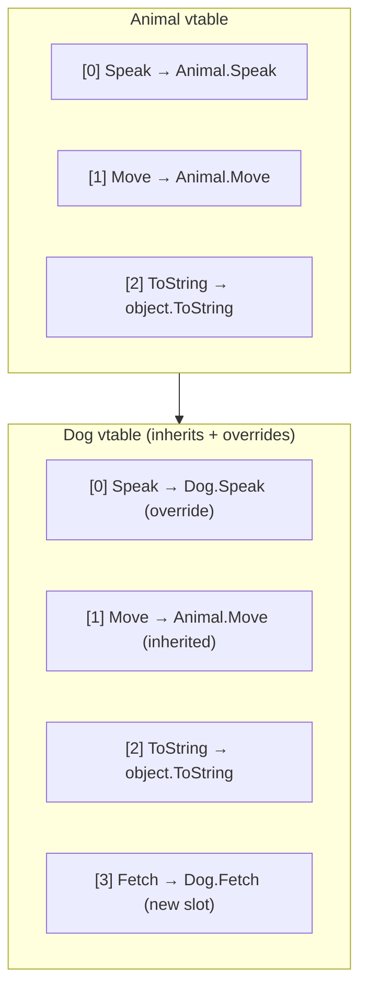
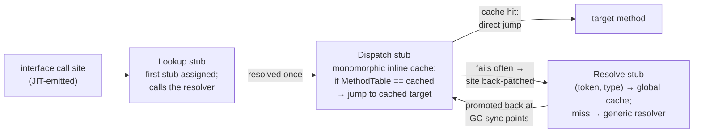
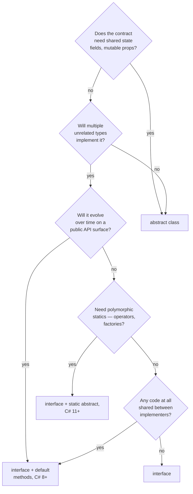

# OOP & Polymorphism

> [Mastery Guide](../../README.md) › [Foundations](../README.md) › [C# Mastery](./README.md)

| Status | Priority | Phase | Last reviewed |
|---|---|---|---|
| Not Started | High | Phase 1 — Language & Runtime Fluency | 2026-05-07 |

## Contents
- [Why it matters](#why-it-matters)
- [Core concepts](#core-concepts)
  - [Classes — the OOP workhorse](#classes--the-oop-workhorse)
  - [Constructors and chaining](#constructors-and-chaining)
  - [Constructor execution order — the full picture](#constructor-execution-order--the-full-picture)
  - [Primary constructors (C# 12)](#primary-constructors-c-12)
  - [Inheritance — `: base`](#inheritance---base)
  - [`virtual` / `override` / `new` / `sealed`](#virtual--override--new--sealed)
  - [Method dispatch — vtable internals](#method-dispatch--vtable-internals)
  - [Boxing, value types, and interfaces](#boxing-value-types-and-interfaces)
  - [Abstract classes vs interfaces](#abstract-classes-vs-interfaces)
  - [Default interface methods (C# 8)](#default-interface-methods-c-8)
  - [Explicit interface implementation](#explicit-interface-implementation)
  - [Static abstract members (C# 11)](#static-abstract-members-c-11)
  - [Equality, `GetHashCode`, and the records angle](#equality-gethashcode-and-the-records-angle)
  - [Liskov Substitution in code](#liskov-substitution-in-code)
  - [Reflection-based instantiation](#reflection-based-instantiation)
  - [Composition vs Inheritance — the senior verdict](#composition-vs-inheritance--the-senior-verdict)
  - [Polymorphism patterns](#polymorphism-patterns)
- [Code & diagrams](#code--diagrams)
- [Common pitfalls](#common-pitfalls)
- [Interview-ready summary](#interview-ready-summary)
- [Interview Cross-Questioning Drill](#interview-cross-questioning-drill)
- [Cheat Sheet](#cheat-sheet)
- [Walkthrough](#walkthrough--virtual-call-from-base-constructor)
- [Self-test](#self-test)
- [Cross-references](#cross-references)
- [Sources](#sources)

---

## Why it matters

C# is a multi-paradigm language but its OOP model is the most established. Every framework you'll touch (ASP.NET Core middleware, EF Core conventions, MediatR handlers, xUnit fixtures) is built around classes, inheritance, and interfaces. Senior interview questions often probe not "what is inheritance" but "when would you choose abstract over interface?" — a judgment call that requires understanding both deeply.

C# 8 added default interface methods. C# 11 added static abstract members and made interfaces effectively a substitute for abstract classes in many cases. C# 12 added primary constructors for classes. The OOP surface looks different in 2026 than it did in 2018; this file covers what's current and what each tool is genuinely *for*.

> 🌍 **In the real world**: the OOP question that separates candidates at senior level is almost never "what is polymorphism". It is a follow-up to something the candidate volunteered. Somebody says "we used an interface so it's testable", and the interviewer asks what happens when the base class already implemented that interface non-virtually and the derived class used `new`. Or somebody says "we sealed it for performance" and the interviewer asks what the JIT actually does differently. Ten years of writing C# daily gets you to the first answer comfortably; it does not get you to the second, because nothing in day-to-day work forces you to look. That gap is what this page is for — every section below has a mechanism underneath it that a cross-question can reach in two moves.

## Core concepts

### Classes — the OOP workhorse

A class is a reference type. It has fields, properties, methods, events, constructors, and finalizers, and it can inherit from one base class and implement any number of interfaces.

```csharp
public class Order
{
    // Fields (state)
    private readonly int _id;
    private decimal _total;

    // Properties (controlled access to state)
    public int Id => _id;                                  // expression-bodied, get-only
    public decimal Total                                   // full property
    {
        get => _total;
        private set => _total = value < 0 ? 0 : value;     // private setter validates
    }

    // Auto-property (compiler generates backing field)
    public string CustomerName { get; init; }

    // Constructor
    public Order(int id, string customer)
    {
        _id = id;
        CustomerName = customer;
    }

    // Method
    public void AddItem(decimal price)
    {
        if (price < 0) throw new ArgumentException(nameof(price));
        _total += price;
    }

    // Static member
    public static Order CreateEmpty(int id) => new(id, "(unknown)");
}
```

**Property forms:**

```csharp
// Auto-property
public string Name { get; set; }

// Auto-property with init (immutable after construction)
public string Email { get; init; }

// Get-only auto-property
public DateTime CreatedAt { get; }                      // assigned in ctor only

// Required (C# 11)
public required string Department { get; init; }

// Expression-bodied (computed)
public string FullName => $"{First} {Last}";

// Full property with backing field
private string _phone;
public string Phone
{
    get => _phone;
    set => _phone = value?.Replace(" ", "");
}

// Field-backed property (C# 14 — `field` keyword)
public string Notes
{
    get;
    set => field = value?.Trim() ?? string.Empty;
}
```

**Access modifiers:**
- `public` — accessible everywhere.
- `internal` — accessible within the same assembly.
- `protected` — accessible within the type and its subclasses.
- `private` — accessible only within the type (the default for class members).
- `protected internal` — protected OR internal (more permissive).
- `private protected` (C# 7.2) — protected AND internal (more restrictive — subclasses in the same assembly).
- `file` (C# 11) — visible only within the file (useful for source-generators avoiding name collisions).

### Constructors and chaining

Constructors initialize an object. A class can have multiple constructors, and one constructor can chain to another (or to a base) using `: this(...)` / `: base(...)`.

```csharp
public class HttpClientWrapper
{
    private readonly Uri _baseAddress;
    private readonly TimeSpan _timeout;

    public HttpClientWrapper(string baseAddress)
        : this(new Uri(baseAddress), TimeSpan.FromSeconds(30))
    {
        // delegates to the other ctor — body still runs after the chained call
    }

    public HttpClientWrapper(Uri baseAddress, TimeSpan timeout)
    {
        _baseAddress = baseAddress;
        _timeout = timeout;
    }
}

public class AuthenticatedHttpClient : HttpClientWrapper
{
    public AuthenticatedHttpClient(string baseAddress, string token)
        : base(baseAddress)            // chain to base class ctor
    {
        // ...
    }
}
```

**Static constructors:**

```csharp
public class Cache
{
    private static readonly Dictionary<string, byte[]> _items;

    static Cache()
    {
        // Runs once, before any static member or instance is touched.
        _items = LoadFromDisk();
    }
}
```

Static constructors run lazily on first use, are guaranteed to run exactly once, and are thread-safe by the runtime. Throwing in a static constructor disables the type for the rest of the process — be careful.

**Generic types get one static constructor run per closed type.** `Cache<int>` and `Cache<string>` are distinct runtime types with distinct static fields, so the static constructor runs once for each. This surprises people who use a static field on a generic type as a process-wide singleton — it is a singleton *per type argument*, which is sometimes exactly what you want (a per-`T` cached `MethodInfo`, a per-`T` compiled expression) and sometimes a silent multiplication of state you thought was shared.

> 🌍 **In the real world**: a service read its connection string in a static constructor so the work happened "once, at startup". It did — until the day a config provider was slow to warm and the first read threw. The static constructor wrapped it in `TypeInitializationException`, and from that moment every request that touched the type threw the *same* exception, forever, with a stack trace pointing at a line of config code that had long since started working. Restarting the pod fixed it, which is why it was filed as a transient blip three times before anyone read the exception type. The rule that comes out of this is narrow and worth memorising: a static constructor is the one place in C# where a single failure is permanently unrecoverable, so it must contain no I/O, no configuration access, and nothing that can throw on a bad day.

### Constructor execution order — the full picture

The exact ordering when `new DerivedDog("Rex")` executes is a classic interview cross-questioning target. Memorize it.

**The full rule** (top-down through the inheritance chain):

1. **Memory allocation** — the runtime allocates space for the most-derived type (method-table pointer + all fields, base + derived), and zeroes every field.
2. **Field initializers** (the `= value` on field declarations) run **in order from the most-derived class down to `object`**. A class's own field initializers run *before* it invokes its base constructor — which is why the derived class's initializers run first overall.
3. **Base constructor chain** — `: base(...)` chains run before the current ctor *body*. Constructor **bodies** therefore run bottom-up: `object` → `Animal` → `Dog`.
4. **Constructor body** of the current type runs.
5. After all that, the `new` expression returns the fully-constructed reference.

The two halves run in opposite directions, and that is the whole trick: **field initializers run top-down (derived first); constructor bodies run bottom-up (base first).**

**Precise per-class order** (for one class in the chain):
- This class's field initializers (in source order).
- Base ctor (which recursively does its field initializers, then its base ctor, etc.).
- This class's ctor body.

```csharp
public class Animal
{
    public string Species = LogInit("Animal.Species init");   // step (a)
    public Animal()
    {
        Console.WriteLine("Animal ctor body");                // step (b)
    }
    static string LogInit(string m) { Console.WriteLine(m); return m; }
}

public class Dog : Animal
{
    public string Breed = LogInit("Dog.Breed init");          // step (c)
    public Dog()
    {
        Console.WriteLine("Dog ctor body");                   // step (d)
    }
    static string LogInit(string m) { Console.WriteLine(m); return m; }
}

new Dog();
// Output:
//   Dog.Breed init          ← derived field initializers run FIRST
//   Animal.Species init     ← then base field initializers
//   Animal ctor body        ← then base ctor body
//   Dog ctor body           ← then derived ctor body
```

**Why this order surprises people**: derived field initializers run *before* the base ctor body, but the derived ctor *body* runs *after* it. So a virtual call made from the base constructor sees derived fields that had **initializers** but not derived fields assigned in the derived **constructor body**. That half-initialized window is the heart of the **"no virtual call from constructor"** anti-pattern.

**The `this(...)` exception nobody remembers.** A constructor runs the field initializers only if it does *not* chain to another constructor of the same class. `: base(...)` still runs them; `: this(...)` does not — the constructor at the end of the `this` chain runs them exactly once, so they are never executed twice.

```csharp
public class Report
{
    private readonly List<string> _lines = new();   // field initializer
    public int PageSize;

    public Report() { PageSize = 50; }               // no ctor initializer → runs _lines = new()
    public Report(int pageSize) : this() { PageSize = pageSize; }
    //                          ^^^^^^^^ field initializers do NOT run here;
    //                                   the chained Report() already ran them.
}
```

The rule exists so that side effects in initializers (allocating a backing collection, registering with a pool, incrementing a counter) happen exactly once per object no matter how deep the `this` chain is. The interview version of the question is "how many times does `new()` run if I construct through a three-deep `: this(...)` chain?" — once, in the constructor at the end of the chain.

> 🌍 **In the real world**: the reason the base-constructor-calls-virtual bug reads as intermittent is this exact split. A `ReportGeneratorBase` called `Configure()` from its constructor; `PdfGenerator` overrode it and touched two fields. One of them had a field initializer (`= new List<Section>()`) and was fine, because initializers run before the base constructor. The other was assigned in `PdfGenerator`'s constructor body and was `null`, because bodies run after. So the override worked for months on the code path that only used the first field, and threw a `NullReferenceException` the week someone added a line touching the second — and the change that "caused" it was a one-line addition to a method that had nothing to do with construction. Half-initialised is worse than uninitialised precisely because it looks like it works.

**Static constructors interleaved**:
- A static ctor for a type runs the first time that type is touched (instance creation, static-field access, static-method call).
- For `new Dog()`: `Animal`'s static ctor runs first (because constructing `Dog` triggers loading `Animal`'s metadata), then `Dog`'s static ctor, then instance construction proceeds.
- Static ctors are guaranteed thread-safe by the runtime (BeforeFieldInit semantics aside) — but if a static ctor throws, the type becomes unusable for the rest of the process. `TypeInitializationException` is the wrapper.
- A generic type's static ctor runs **once per closed type** — `Cache<int>` and `Cache<string>` each get their own run and their own static fields.

**The "no virtual call from ctor" anti-pattern** (this is *why* the cross-questioning matters):

```csharp
public class BaseShape
{
    public BaseShape() { Render(); }                         // virtual call from base ctor
    protected virtual void Render() => Console.WriteLine("BaseShape.Render");
}

public class Circle : BaseShape
{
    private readonly double _radius;
    public Circle(double radius)
    {
        _radius = radius;                                    // ← runs AFTER base ctor
    }
    protected override void Render() => Console.WriteLine($"Circle radius={_radius}");
}

new Circle(5.0);
// Output: "Circle radius=0"
// _radius hasn't been assigned yet when base ctor calls Render()
```

The derived `Render()` is dispatched (because the vtable for `Circle` is wired up at object allocation, before any ctor runs), but the derived field `_radius` is still its default value 0.0. **Never call virtual methods from constructors.** Lint rule: CA2214.

### Primary constructors (C# 12)

C# 12 added **primary constructors for classes**, mirroring records. Parameters declared on the class header are in scope for the entire body and act as captured-by-the-class state.

```csharp
public class OrderService(IRepo repo, ILogger<OrderService> logger)
{
    public Order Get(int id)
    {
        logger.LogInformation("Fetching order {Id}", id);  // 'logger' captured
        return repo.Find(id);
    }
}
```

**Important nuances:**
- Primary-ctor parameters are **not properties**. They're implicit private fields the compiler synthesizes only for parameters that are actually captured by methods.
- They are **mutable** — you can write `repo = newRepo;` from any method (this is rarely a good idea).
- If you need a property, declare one explicitly: `public IRepo Repo { get; } = repo;`.
- Combine well with DI — most services in modern ASP.NET Core can be expressed as one-liners.

> 🌍 **In the real world**: the primary-constructor pattern that costs a team a debugging session is capture-plus-mutation in a class registered as a singleton. `public class TokenCache(IHttpClientFactory http)` looks immutable, but `http` is a mutable field in every practical sense, and a helper method that reassigned it "temporarily" for a retry path left a singleton pointing at a disposed scope's factory. There is no `readonly` you can put on a primary-constructor parameter and no analyzer in the default rule set that objects. The convention that removes the whole class of problem is one line of ceremony: `private readonly IHttpClientFactory _http = http;` on any type whose lifetime outlives a request. Save the bare captured form for scoped and transient services where nobody can hold the instance long enough for it to matter.

```csharp
// Idiomatic DI with primary ctor (C# 12)
public class WeatherService(IHttpClientFactory http, IMemoryCache cache)
{
    public async Task<Weather> GetAsync(string city, CancellationToken ct = default)
    {
        if (cache.TryGetValue(city, out Weather w)) return w;

        var client = http.CreateClient("weather");
        var json = await client.GetStringAsync($"/v1/{city}", ct);
        w = JsonSerializer.Deserialize<Weather>(json)!;

        cache.Set(city, w, TimeSpan.FromMinutes(5));
        return w;
    }
}
```

### Inheritance — `: base`

C# supports **single inheritance** (only one base class) and **multiple interface implementation**.

```csharp
public class Animal
{
    public string Name { get; }
    public Animal(string name) => Name = name;

    public virtual string Speak() => "...";
}

public class Dog : Animal
{
    public Dog(string name) : base(name) { }   // chain to Animal's ctor

    public override string Speak() => "Woof!";
}
```

**Why no multiple class inheritance:** C++ has it; the diamond problem (two parents share a common ancestor) creates ambiguity that C# sidestepped from day one. Multiple interface implementation handles most of the use cases without the ambiguity, and default interface methods (C# 8) cover most of the remaining ones.

### `virtual` / `override` / `new` / `sealed`

These four keywords control **method dispatch**.

**`virtual`** — base-class method that subclasses *may* override. Dispatched at runtime via the type's vtable.

**`override`** — subclass method that replaces a `virtual` (or `abstract`) base member. Same name, signature, and accessibility.

**`new`** — *hides* a base member rather than overriding. The runtime dispatches based on the *static* type of the variable, not the runtime type. Almost always wrong; the compiler warns when you forget `new`.

**`sealed`** — when applied to a class, prevents inheritance. When applied to an `override` method, prevents further override.

```csharp
public class Animal
{
    public virtual string Speak() => "...";
    public virtual string Move() => "moves";
    public virtual string Eat()  => "eats";
}

public class Dog : Animal
{
    public override string Speak() => "Woof!";           // proper override
    public new string Move() => "runs";                  // hides — different static dispatch
    public sealed override string Eat() => "gnaws";      // overrides AND locks: no further override
}

public class Puppy : Dog
{
    // public override string Eat() => "...";  // ❌ CS0239 — Dog.Eat is sealed
}

Animal a = new Dog();
Console.WriteLine(a.Speak());   // "Woof!" — virtual dispatch
Console.WriteLine(a.Move());    // "moves" — Animal.Move(), because 'new' hides only

Dog d = (Dog)a;
Console.WriteLine(d.Move());    // "runs" — Dog's hiding member
```

**`new` is rarely the right tool.** Mostly you want `override`. The compiler-required `new` keyword exists so that adding a `virtual` method to a base class in a future version doesn't silently break the meaning of subclass methods that happened to have the same name.

> 🌍 **In the real world**: this is the *fragile base class* problem and it arrives as a NuGet upgrade. A team had `class OrderProcessor : ProcessorBase` with its own `public void Validate()` — a private-in-spirit helper that happened to have an obvious name. A minor version of the base library added `public virtual void Validate()` to `ProcessorBase` and started calling it from the base pipeline. The build produced CS0114 (*"hides inherited member … add the override keyword. Otherwise add the new keyword"*), which is a *warning*, and the CI log had hundreds of warnings from generated code, so it scrolled past. The derived `Validate` was now hiding a method the base was calling on itself — the base's own `Validate` ran, the derived checks never did, and orders that should have been rejected went through for two weeks. The whole defect lives in the gap between "warning" and "error". `<WarningsAsErrors>CS0114;CS0108</WarningsAsErrors>` in the project file, or a clean warning baseline so a new one is visible, is the control — and it is worth being able to name that trade-off in an interview, because "why is hiding a warning and not an error?" has a real answer: making it an error would mean any base library could break your compile by adding a method.

**`abstract override` — re-abstracting a virtual member.** An abstract class partway down a hierarchy can take a base implementation *away* and force every concrete descendant to supply one:

```csharp
public class Shape            { public virtual double Area() => 0; }
public abstract class Polygon : Shape
{
    public abstract override double Area();   // "there is no sensible default for a polygon"
}
public class Triangle : Polygon
{
    public double Base, Height;
    public override double Area() => 0.5 * Base * Height;   // required — no default to inherit
}
```

The interface equivalent — **re-abstraction** of a default interface method — is covered under [Default interface methods](#default-interface-methods-c-8).

**`base.Method()` is a non-virtual call.** Inside an override, `base.Render()` compiles to `call` (not `callvirt`) against the base's implementation — the only way in C# to reach a *specific* implementation rather than the most-derived one. The consequence worth knowing: you cannot reach a *grandparent* implementation. `base.base` does not exist, and there is no syntax for it; if `Derived.M` needs `GrandBase.M`'s logic and `Base.M` overrode it, the grandparent has to expose a `protected` non-virtual helper that both overrides call.

#### Covariant return types (C# 9, requires .NET 5+ runtime)

Since C# 9 an override may return a **more derived** type than the member it overrides — and a read-only property override may declare a more derived type. This removes the standard workaround of inventing a second differently-named method.

```csharp
public abstract class Document
{
    public virtual Document Clone() => throw new NotImplementedException();
    public virtual DocumentMetadata Metadata { get; } = new();
}

public sealed class Invoice : Document
{
    public override Invoice Clone() => new Invoice { /* ... */ };            // was: Document Clone()
    public override InvoiceMetadata Metadata { get; } = new();               // InvoiceMetadata : DocumentMetadata
}

Invoice copy = new Invoice().Clone();   // no cast — the static type is already Invoice
```

**The gates are two, and they are different gates**: the *language* gate is C# 9; the *runtime* gate is .NET 5, because the CLR had to learn to unify a MethodImpl slot whose signature no longer matches the base. Targeting an older runtime gives CS8830 ("target runtime doesn't support covariant return types"), not a language-version error. The compiler marks such overrides with `System.Runtime.CompilerServices.PreserveBaseOverridesAttribute`, whose documented job is to ensure "that any virtual call to the method, whether it uses the base signature or derived signature of the method, executes the most derived override."

**The restrictions are real and interviewers know them**: covariant returns work on **class** virtual methods and read-only properties only. They are not supported for interface members or for methods on value types, and they do not apply to `set`/`init` accessors (that direction would be unsound — a setter is an input position, so it would need contravariance).

> 🌍 **In the real world**: this is the feature that kills the `CreateBuilder()` / `CreateTypedBuilder()` twin-method pattern. A configuration library had `abstract class BuilderBase { public abstract BuilderBase WithRetry(int n); }`, so every fluent chain on a derived builder collapsed to the base type after the first call and every caller ended in a cast. The pre-C#-9 fix was a generic self-type (`class Builder<TSelf> where TSelf : Builder<TSelf>`), which works and which every reviewer has to re-derive from scratch each time they read it. Covariant returns replace the whole apparatus with one keyword change per override — but only for classes, so a library whose fluent surface is an *interface* still needs the self-type generic. Knowing which of the two you're looking at is the difference between a five-minute change and a redesign.

### Method dispatch — vtable internals

**The mechanism behind `virtual`/`override`/`new`.** Every reference type has a method table (vtable) — an array of function pointers. Each class lays out its vtable starting with the same slots as its base, then appends its own.



**Three dispatch flavors** in IL:

| Source | IL opcode | Dispatch |
|---|---|---|
| `animal.Speak()` (animal is `Animal`) | `callvirt Animal::Speak` | Looks up slot in *runtime* type's vtable |
| `animal.NonVirtualMethod()` | `call Animal::NonVirtualMethod` | Direct call — no vtable lookup |
| `new Animal().Move()` | `callvirt Animal::Move` (still!) | `callvirt` is also used for null-checking — even on non-virtual instance calls |
| `((Animal)d).Move()` where Dog `new`s Move | Dispatches via `Animal`'s slot | `new` doesn't add to base's slot, so `Animal.Move()` runs |
| `d.Move()` where d is `Dog`, Move is `new` | Dispatches via `Dog`'s separate slot | `Dog.Move()` runs |

**`override` semantics**: replaces the slot inherited from the base. Calls through *any* reference (base or derived) dispatch via the same slot, so the derived implementation wins.

**`new` semantics**: introduces a **separate slot** with the same name. The base's slot is unchanged. Calls through a `Base` reference hit the base's slot (base's implementation); calls through a `Derived` reference hit the derived's new slot (derived's implementation). This is **why `new` causes the dispatch ambiguity** — static type of the variable decides which slot is used.

```csharp
public class Base { public virtual void Foo() => Console.WriteLine("Base.Foo"); }
public class Derived1 : Base { public override void Foo() => Console.WriteLine("Derived1.Foo"); }
public class Derived2 : Base { public new void Foo() => Console.WriteLine("Derived2.Foo"); }

Base d1 = new Derived1();
Base d2 = new Derived2();
d1.Foo();   // "Derived1.Foo" — override replaces slot
d2.Foo();   // "Base.Foo"      — new is hidden when called through Base ref
((Derived2)d2).Foo();   // "Derived2.Foo" — but visible through Derived2 ref
```

**`sealed override`** — locks an override so further derived classes can't override it again. The JIT can then treat it as final, enabling **devirtualization** (replace the virtual call with a direct call). Same trick applies to a **`sealed class`** — all virtual calls on it can be devirtualized.

```csharp
public class Base { public virtual int Compute() => 1; }
public class Derived : Base { public sealed override int Compute() => 2; }
public class FurtherDerived : Derived { /* CAN'T override Compute() — sealed */ }
```

**Modern devirtualization** (.NET 7+):
- **Sealed types/methods** → the JIT knows the target is final, so it can emit a direct call and consider inlining it.
- **Whole-program analysis** in Native AOT → the compiler sees the closed set of types in the program, so anything with no overriding implementation anywhere in it can be treated as final.
- **Dynamic PGO** (Profile-Guided Optimization, on by default since .NET 8) — instruments hot call sites, observes which concrete type actually arrives, and emits a **guarded devirtualization**: a type check against the common case with a direct (often inlined) call on the hit path, and the ordinary dispatch on the miss path. Note the shape of the win: it does not remove the check, it replaces an indirect call with a predictable compare-and-branch plus inlinable code.

**The compiler warnings (CS0114 and CS0108)** — and they are two different warnings, which is worth knowing precisely:
- If the hidden base member is **virtual/abstract/override**, you get **CS0114**: *"'D.M()' hides inherited member 'B.M()'. To make the current member override that implementation, add the override keyword. Otherwise add the new keyword."*
- If the hidden base member is **non-virtual**, you get **CS0108**: *"'D.M()' hides inherited member 'B.M()'. Use the new keyword if hiding was intended."*

Either way it compiles and is treated as `new` implicitly. **Never ignore these** — make the intent explicit.

#### Interface dispatch is not a vtable lookup — it is Virtual Stub Dispatch

This is the single deepest thing on this page and the one most candidates get wrong, because the mental model everyone carries ("interfaces cost an extra hop through an interface map") describes neither what CoreCLR does nor why interface calls are cheap in the common case.

A class vtable works because every derived class lays out its base's slots at the same indices, so `Speak` is always at slot 0. Interfaces destroy that property: a type implements several unrelated interfaces, each with its own numbering, and no single linear layout can give every interface a fixed slot in every implementing type. CoreCLR solves it with **Virtual Stub Dispatch (VSD)** — the call site is patched at runtime with progressively better stubs rather than resolved by a table walk.



The three stubs, per the CoreCLR *Book of the Runtime*:

| Stub | Role | Behaviour |
|---|---|---|
| **Lookup stub** | Cold start | "These stubs are the first to be assigned to an interface dispatch call site, and are created when the JIT compiles an interface call site." Passes token + type to the generic resolver. |
| **Dispatch stub** | Monomorphic fast path | "Takes the type (MethodTable) of the object being invoked and compares it with its cached type, and upon success jumps to its cached target." A compare and a jump — that is the whole cost when one type dominates. |
| **Resolve stub** | Polymorphic path | "Use the key pair `<token, type>` to resolve the target in a global cache, where token is known at JIT time and type is determined at call time." On a global-cache miss it calls the generic resolver. |

Two behaviours follow that change how you reason about performance:

- **Demotion.** "When a dispatch stub fails frequently enough, the call site is deemed to be polymorphic and the resolve stub will back patch the call site to point directly to the resolve stub." The site stops paying for an inline cache that keeps missing.
- **Re-promotion.** "At sync points (currently the end of a GC), polymorphic sites will be randomly promoted back to monomorphic call sites" — the runtime periodically re-tests its assumption that a site is hopeless.

**The senior conclusion**: the cost of an interface call is not a property of *interfaces*, it is a property of the **call site**. A site that sees one concrete type (monomorphic) is a compare and a jump; a site that sees two or three is where dynamic PGO's guarded devirtualization earns its keep; a site that sees dozens (megamorphic) falls back to the global resolve cache and never gets inlined. "Should I use an abstract class instead of an interface for speed?" is the wrong question. "How many concrete types reach this call site?" is the right one — and it is answerable by reading your own DI registrations.

> 🌍 **In the real world**: a rules engine dispatched every inbound event through `IRule.Evaluate(context)` over a list that had grown to a few hundred registered rule types, in a loop that ran per message. Someone proposed converting `IRule` to an abstract base class "because interface calls are slower", which would have been a week of work across three repositories for no benefit — the site was megamorphic either way, and an abstract base would have moved it from a resolve-stub lookup to an equally unpredictable vtable indirect. What actually moved the number was changing the shape of the loop: index the rules by event type up front so each message touches the handful of rules that could match, which turned one megamorphic site into several sites each seeing one or two types. Same interface, same classes, same `Evaluate` method. The dispatch mechanism was never the problem; the number of distinct types arriving at one call site was.

> 🌍 **In the real world**: the `sealed` keyword is the cheapest performance change in .NET and the one most codebases have never applied. A serialization hot path spent its time in virtual `ToString()` and `Equals` calls on internal DTO types that nobody had ever subclassed and nobody ever would. Adding `sealed` to those classes is a mechanical change an analyzer will find for you — `CA1852` *Seal internal types*, introduced in .NET 7, flags every type "not accessible outside its assembly and has no subtypes within its containing assembly". It is **not enabled by default** (you set `dotnet_diagnostic.CA1852.severity` yourself), and it goes quiet entirely if the assembly uses `InternalsVisibleTo` unless you set `ignore_internalsvisibleto = true`, which is why most teams have never seen it fire. The fix is documented as non-breaking because the scope is internal types, and that scope is the point: sealing a **public** type is a permanent API commitment you cannot walk back in a minor version.

### Boxing, value types, and interfaces

Value types (`struct`) can implement interfaces, but the moment you call an interface method *through the interface reference*, the runtime **boxes** the value type — copies it onto the heap and wraps it in an `object` header. This is one of the silent perf killers in hot loops, and a classic interview cross-question.

```csharp
public struct Money : IComparable<Money>
{
    public decimal Amount;
    public int CompareTo(Money other) => Amount.CompareTo(other.Amount);
}

var m = new Money { Amount = 10 };

// Path 1: through the interface — BOXES
IComparable<Money> cmp = m;            // ← box happens here
cmp.CompareTo(new Money { Amount = 20 });   // virtual interface call

// Path 2: through the struct directly — NO BOX
m.CompareTo(new Money { Amount = 20 });     // direct call, no allocation

// Path 3: through a generic constraint — NO BOX (JIT specializes)
static int CompareGeneric<T>(T a, T b) where T : IComparable<T>
    => a.CompareTo(b);
CompareGeneric(m, new Money { Amount = 20 });   // JIT generates a Money-specific version, no box
```

**The key rule**: boxing happens **at the point of conversion to the interface type**, not at the call site. If you can keep the value typed as the struct (or as `T` constrained to the interface), you avoid the box.

#### The mechanism behind path 3: the `constrained.` IL prefix

Path 3 is not magic and it is not "the JIT is clever". It is a specific IL prefix, `constrained.`, emitted by the C# compiler in front of `callvirt` whenever the receiver is a type parameter. Its documented behaviour, per the CLI opcode reference, is a three-way rule evaluated once the concrete type is known:

- "If `thisType` is a **reference type** then `ptr` is dereferenced and passed as the 'this' pointer to the `callvirt` of `method`." — ordinary virtual/interface dispatch.
- "If `thisType` is a **value type and `thisType` implements `method`** then `ptr` is passed unmodified as the 'this' pointer to a **`call`** `method` instruction." — **direct call, by managed pointer, no box, no copy.**
- "If `thisType` is a **value type and `thisType` does not implement `method`** then `ptr` is dereferenced, **boxed**, and passed as the 'this' pointer to the `callvirt`."

That third bullet is the one to remember, because the docs are explicit about when it fires: "This last case can occur only when `method` was defined on `Object`, `ValueType`, or `Enum` and **not overridden by `thisType`**." In other words, a struct that does not override `ToString()`, `Equals(object)` or `GetHashCode()` gets **boxed on every such call from generic code**. That is why the BCL's own value types (`Int32`, `DateTime`, `Guid`, …) override all three, and why a struct you intend to put in a `Dictionary<TKey,…>` or a `HashSet<T>` should override `Equals` and `GetHashCode` — not only for correctness, but to keep the constrained call out of the boxing branch. It compounds with what the inherited implementation actually does: Microsoft Learn describes `ValueType.Equals(Object)` as calling "`Object.Equals(Object)` on each field of the current instance and `obj`", and advises that "particularly if your value type contains fields that are reference types, you should override the `Equals(Object)` method. This can improve performance." So the un-overridden path costs you a box on the receiver, a box on the argument (the parameter is `object`), and a per-field virtual `Equals` on top.

```csharp
// Struct with no overrides — generic code boxes it on every ToString/Equals/GetHashCode
public struct PointA { public int X, Y; }

// Struct that implements the members — constrained. resolves to a direct call, no allocation
public readonly struct PointB : IEquatable<PointB>
{
    public readonly int X, Y;
    public bool Equals(PointB other) => X == other.X && Y == other.Y;
    public override bool Equals(object? o) => o is PointB p && Equals(p);
    public override int GetHashCode() => HashCode.Combine(X, Y);
    public override string ToString() => $"({X},{Y})";
}
```

The docs also give the versioning rationale, which is a good cross-question answer: without `constrained.`, "different IL must be emitted depending on whether or not a value type overrides a method of System.Object", so adding or removing an override later would silently change the meaning of already-compiled callers.

**`IComparable` vs `IComparable<T>`**:
- `IComparable.CompareTo(object)` — non-generic; argument is `object`, so passing a struct boxes it.
- `IComparable<T>.CompareTo(T)` — generic; argument is `T`, no box for value types.
- BCL collections like `List<T>.Sort()` use the generic version when available — that's why `List<int>.Sort()` is fast.

**`using` over a struct that implements `IDisposable`** — interesting subtle case:

```csharp
public struct ScopedTimer : IDisposable
{
    public void Dispose() { /* ... */ }
}

using (var t = new ScopedTimer()) { /* ... */ }
//      ^^^^^^^^^^^^^^^^^^^^^^ — typed as struct, NO BOX. Dispose called directly.

IDisposable d = new ScopedTimer();
using (d) { /* ... */ }
//     ^ — typed as interface; box already happened above; Dispose dispatched via box
```

Modern C# 8+ `using var` declarations preserve the struct type → no box. Old `using ((IDisposable)x)` patterns box; avoid them.

**Identity gotcha**: each box produces a *new heap object*. Reference equality between two boxes of the same struct value is `false`, even though the underlying values are equal.

```csharp
int n = 42;
object a = n;
object b = n;
ReferenceEquals(a, b);   // false! Two separate boxes
a.Equals(b);             // true — Equals checks underlying value
```

> 🌍 **In the real world**: the boxing everybody eventually meets is the `List<T>` enumerator. `List<T>.GetEnumerator()` returns `public struct Enumerator`, and `foreach` over a variable *typed* as `List<T>` binds to it directly — no allocation per loop. Change the field's type to `IEnumerable<T>` "for testability" and `foreach` now goes through `IEnumerable<T>.GetEnumerator()`, which returns `IEnumerator<T>` — the struct is boxed, once per loop. On a request path that iterates a small list a few times per call, that is a steady drip of Gen 0 garbage traceable to a type annotation nobody thought was a performance decision. (The runtime source has a small mercy here: the explicit implementation returns a cached `SZGenericArrayEnumerator<T>.Empty` when `Count == 0`, so empty-list iteration does not allocate.) The general shape: **widening a field to its interface type moves value-type work onto the heap**, and the diff that does it looks like a design improvement.

#### The reference-type caveat on generic constraints

The standard senior takeaway is "prefer `where T : IFoo` over a parameter typed `IFoo`". It is good advice, but the reason people give for it is only half true, and interviewers push on exactly this.

CoreCLR **shares generic code across reference-type instantiations**. Per the runtime's shared-generics design doc, code sharing "is currently only supported for instantiations over reference types because they all have the same size/properties/layout", while "for instantiations over primitive types or value types, the runtime will generate separate code bodies for each instantiation." Every reference-type `T` runs the same canonical body, compiled for `__Canon`, and reaches type-specific information through a runtime generic dictionary.

The consequence:

| `T` in `void M<T>(T x) where T : IFoo` | What happens to `x.Bar()` |
|---|---|
| A **struct** (`Money`) | Dedicated JIT'd body; `constrained.` resolves to a direct `call`; no box; inlinable. |
| A **class** (`Order`) | Shared `__Canon` body; the call is a real interface dispatch, subject to VSD and PGO like any other. |

So the generic constraint's guaranteed win is **for value types**: no boxing, direct calls, per-instantiation specialization. For reference types the constraint buys you type safety and API clarity — which are excellent reasons — but not a free devirtualization. Saying "generic constraints make it a direct call" without the qualifier is the kind of half-right answer a cross-question is designed to find.

**Senior takeaway**: prefer generic methods with interface constraints (`where T : IFoo`) over methods that take `IFoo` directly — for value types it eliminates the box outright, and for reference types it costs nothing and reads better.

### Abstract classes vs interfaces

The classic .NET interview question — "abstract class or interface?" — has a deceptively simple framing. Both define contracts; both can have default implementations (since C# 8); both can mandate static members (since C# 11). The real question isn't "which feature does which" but **"is this behavior, capability, or both?"**

- **Behavior with shared state** — abstract class (state demands inheritance).
- **Pure capability** — interface (capabilities are orthogonal to type identity).
- **Capability with shared default behavior** — interface with default methods (since C# 8).
- **Multiple capabilities on one type** — multiple interfaces (only interfaces compose).

Everything else is downstream of that question.

#### Decision tree



#### Comparison table

| Feature | `abstract class` | `interface` |
|---|---|---|
| Instance fields / mutable state | Yes | No (only `static` since DIM) |
| Constructors | Yes | No |
| Access modifiers on members | Yes | Yes (since C# 8) |
| Can be instantiated | No | No |
| Inheritance | Single | Multiple |
| Default method implementations | Yes (virtual / non-virtual) | Yes (since C# 8 — DIM) |
| `static abstract` members | Indirectly via abstract base | Yes (since C# 11) |
| Memory per instance | Method-table pointer (already present on every object) | No extra per-instance cost; interface data hangs off the type |
| Dispatch mechanism | Vtable slot — fixed index, one indirection | Virtual Stub Dispatch — stub-cached, cost depends on how many types reach the call site |
| Generic constraint usage | `where T : BaseFoo` | `where T : IFoo` (much more common) |
| Versioning — adding member | Source-breaking unless virtual w/ body | Source-breaking unless `default` body |
| Diamond problem | Avoided (single inheritance) | Possible w/ DIM; resolved by explicit impl |
| Reflection cost | Equivalent | Equivalent |

#### When to choose abstract class

- The base needs to hold **state** (fields, properties with backing values, captured dependencies).
- You want a **template method pattern** — base orchestrates, subclasses fill in specific steps.
- The "is-a" relationship is **structural and mandatory** (an `Entity` *is an* entity — it has an Id, equality semantics, domain events).
- You want to **lock down extension** with `sealed`/`internal` patterns in a single hierarchy.
- The implementers are closely related; they share *more than just the contract*.

#### When to choose interface

- You're expressing a **capability** — `IDisposable`, `IComparable<T>`, `IEnumerable<T>`. Implementations are unrelated.
- A type needs to satisfy **multiple contracts** (`Stream` is `IDisposable`, `IAsyncDisposable`, etc.).
- You're designing an **extension point** with implementations across assemblies you don't control.
- You want **evolution-friendly public APIs** (add new members with default bodies).
- You need **polymorphic statics** — `static abstract` operators or factory methods (since C# 11).
- The implementing types are unrelated and share *only the contract*.

**Modern guidance**: prefer interfaces for contracts; reach for abstract classes only when shared state genuinely demands it. Records, primary constructors, and default interface methods have made simple-base-class scenarios less compelling than they were in 2018.

> 🌍 **In the real world**: the abstract base class that costs the most is the one that was right when it was written. A `ControllerBase`-style internal `ServiceBase` starts with a logger and a `ct` helper, and every reviewer who needs something in two services adds it there because that is where shared things go. Three years later it has a `DbContext`, an `IMemoryCache`, a `Guid CorrelationId`, and a `protected virtual OnBeforeExecute` that four of the nineteen subclasses override. Every unit test now constructs a database context to test a class that does arithmetic. Nothing about that trajectory is a bad decision at the point it is made — the base class is the path of least resistance for every individual change, which is exactly why the aggregate is bad. The review question that prevents it is not "is this shared?" but "will *every* subclass need this?", and the honest answer is usually no, at which point the thing being shared belongs in a component the two services that need it can hold.

#### 6 worked examples — same problem, both ways

**1. Logger — interface wins.**

```csharp
// ❌ Don't: abstract base
public abstract class LoggerBase
{
    public abstract void Log(string msg);
    public void LogError(string msg) => Log($"ERROR: {msg}");   // shared helper
}

// ✅ Do: interface with default method
public interface ILogger
{
    void Log(string msg);
    void LogError(string msg) => Log($"ERROR: {msg}");          // default helper
}
```
Why: a logger is a capability. Console / Serilog / Seq loggers have nothing structurally in common; an abstract base just blocks them from inheriting from anything else.

**2. Repository — interface for the contract; abstract base for shared SQL (optional).**

```csharp
// Contract — interface
public interface IRepository<T>
{
    Task<T?> GetByIdAsync(int id, CancellationToken ct);
    Task AddAsync(T entity, CancellationToken ct);
}

// Optional shared-SQL base — used by THIS implementation only
internal abstract class EfRepositoryBase<T> : IRepository<T> where T : class
{
    protected DbContext Db { get; }
    protected EfRepositoryBase(DbContext db) => Db = db;

    public virtual Task<T?> GetByIdAsync(int id, CancellationToken ct) =>
        Db.Set<T>().FindAsync(new object?[] { id }, ct).AsTask();

    public abstract Task AddAsync(T entity, CancellationToken ct);
}
```
Why: callers depend on the interface (testable, swappable). The base class is an *implementation detail* of the EF version — Mongo or in-memory implementations skip it.

**3. Domain entity — abstract base wins.**

```csharp
public abstract class Entity
{
    public Guid Id { get; protected set; }
    private readonly List<IDomainEvent> _events = new();

    public IReadOnlyList<IDomainEvent> DomainEvents => _events;
    protected void Raise(IDomainEvent e) => _events.Add(e);
    public void ClearEvents() => _events.Clear();

    public override bool Equals(object? obj) =>
        obj is Entity e && e.Id == Id && GetType() == e.GetType();
    public override int GetHashCode() => HashCode.Combine(Id, GetType());
}

public class Order : Entity { /* ... */ }
public class Customer : Entity { /* ... */ }
```
Why: the Id field, the events list, and the equality logic are **state**. Interfaces can't hold instance state. This is the canonical "abstract class earns its keep" scenario.

**4. HTTP handler — depends on the framework.**

```csharp
// MediatR — interface (capability + generics)
public interface IRequestHandler<TRequest, TResponse>
    where TRequest : IRequest<TResponse>
{
    Task<TResponse> Handle(TRequest request, CancellationToken ct);
}

// Razor Pages — abstract base (state: HttpContext, model binding)
public abstract class PageModel
{
    public HttpContext HttpContext { get; internal set; } = null!;
    public ModelStateDictionary ModelState { get; }
    // ... many helpers ...
}

// Minimal APIs — neither (just plain functions)
app.MapGet("/orders/{id}", (int id, IOrderService svc) => svc.GetAsync(id));
```
Why: MediatR's handler is pure capability + generic dispatch — interface. Razor Pages needs to inject framework state — abstract base. Minimal APIs sidestep both with delegate-based handlers — the most modern shape.

**5. Validation — FluentValidation's abstract base.**

```csharp
// FluentValidation chose abstract base — the rule-building DSL needs to capture state in the constructor
public class OrderValidator : AbstractValidator<Order>
{
    public OrderValidator()
    {
        RuleFor(o => o.CustomerId).GreaterThan(0);
        RuleFor(o => o.Items).NotEmpty();
    }
}
```
Why: `RuleFor(...)` mutates internal state inside `AbstractValidator<T>`. An interface couldn't hold that state. Confirmed: state-heavy DSL → abstract base.

**6. Strategy / Plugin — interface.**

```csharp
public interface IPaymentGateway
{
    Task<PaymentResult> ChargeAsync(decimal amount, string customerId, CancellationToken ct);
}

public class StripeGateway : IPaymentGateway { /* ... */ }
public class PaypalGateway : IPaymentGateway { /* ... */ }
public class MockGateway : IPaymentGateway { /* ... for tests ... */ }
```
Why: gateways are interchangeable behaviors with **no shared state** and **no kinship** between Stripe and PayPal SDKs. Trying to extract a `PaymentGatewayBase` to share code would force unnatural coupling.

#### Anti-patterns to avoid

```csharp
// ❌ ANTI-PATTERN 1: Marker interface (no members)
public interface ITransactional { }   // wrong — use an attribute

[Transactional]   // ✅ right — attribute carries the marker
public class OrderService { /* ... */ }

// ❌ ANTI-PATTERN 2: Capability disguised as inheritance
public abstract class Vehicle
{
    public abstract void Drive();
}
public class Truck : Vehicle, IDrivable { /* IDrivable has Drive() too */ }
// Drive() belongs on Vehicle OR on IDrivable, not both

// ❌ ANTI-PATTERN 3: 4+ level inheritance hierarchy
public abstract class Animal { }
public abstract class Mammal : Animal { }
public abstract class Carnivore : Mammal { }
public abstract class Cat : Carnivore { }
public class HouseCat : Cat { }
// composition + interfaces > deep hierarchies

// ❌ ANTI-PATTERN 4: Abstract class with no abstract members
public abstract class StringUtils
{
    public static string Reverse(string s) => new(s.Reverse().ToArray());
}
// just make it `static class StringUtils` — "abstract" here means nothing

// ❌ ANTI-PATTERN 5: DIM that mutates static fields
public interface IRequestCounter
{
    static int Count = 0;   // shared mutable state in an interface
    void Record() => Count++;
}
// DIM was for default behavior, not shared state. Use a regular class.
```

#### Performance — when it actually matters

Rank these by **mechanism**, not by invented nanosecond figures — the numbers depend on the CPU, the call site's type distribution, and whether the body inlines, and a candidate who quotes a multiplier will be asked where it came from.

| Call type | What the machine does | What determines the cost |
|---|---|---|
| Direct method call (non-virtual) | `call` to a known address | Nothing; usually inlined |
| Virtual call through abstract base | Load method-table pointer → fixed vtable slot → indirect call | One dependent load; not inlinable unless devirtualized |
| Interface call | Virtual Stub Dispatch (see above) | **How many concrete types reach this call site** |
| Generic-constrained call, `T` = struct | `constrained.` → direct `call` on a dedicated JIT'd body | Nothing; inlinable |
| Generic-constrained call, `T` = class | Shared `__Canon` body → ordinary interface/virtual dispatch | Same as an interface call |
| Sealed class / `sealed override` | JIT proves the target is final → direct `call` | Nothing; inlinable |

For the overwhelming majority of application code this ranking is irrelevant — the work inside the method dwarfs the dispatch. It starts mattering in **hot loops running millions of iterations per second**: math libraries, parsers, serializers, game loops. The levers, in order of effort: `sealed` on concrete internal types, generic constraints where the type argument is a struct, and restructuring so that hot call sites see few concrete types rather than many.

**Dynamic PGO** (on by default since .NET 8) narrows the gap by profiling which concrete type actually arrives at a call site and emitting a guarded direct call for it. It helps most where a site is monomorphic or nearly so, and cannot help a genuinely megamorphic site — which is the same conclusion the VSD section reaches from the other direction.

#### Versioning trade-offs — library-author perspective

| Change | Abstract class | Interface |
|---|---|---|
| Add abstract method | **Breaks all subclasses** | **Breaks all implementers** |
| Add virtual method with body | No break | N/A |
| Add member with default body | No break (use `virtual`) | No break (use `default`) — since C# 8 |
| Add `static abstract` member | N/A | **Breaks all implementers** |
| Remove member | Breaks consumers | Breaks consumers |
| Change signature | Breaks consumers | Breaks consumers |

**Library-author rule**: when shipping a public API you'll evolve over years, **prefer interface + default methods** over abstract base. You can add new members with default implementations later without breaking downstream code.

**Application-author rule**: internal abstract classes are fine; you control all the subclasses, so the break-on-add risk is contained.

> 🌍 **In the real world**: the versioning table understates one row. "Add member with default body — no break" is true at the *compile* level and can still be a behaviour break at the *semantic* level, and that is the failure mode teams actually hit. An `IAuditSink` gained `bool ShouldAudit(Operation op) => true;` with a default that made sense for the library's own sinks. Three consumers had sinks that were only ever meant to receive a subset of operations — they had been filtering upstream, at the registration site — and the new default quietly opted them into everything, so audit volume tripled overnight and one downstream store hit its retention quota. Nothing failed to compile and nothing threw. **A default implementation is a decision you are making on behalf of code you have never seen**, which is why the safest defaults are the ones that preserve existing behaviour (here: throw, or return the most conservative answer) rather than the ones that are most useful.

#### Common mistakes (8 senior interview red flags)

1. **`IDisposable` on contracts that don't manage resources** — bloats the contract; consumers wonder why they need `using`.
2. **Marker interface** like `ITransactional` with no members — use an attribute (queryable via reflection, no method-table overhead).
3. **God-base abstract class** — accumulating concerns into one base because "subclasses might need this." Splits cleanly into composition.
4. **Type-switching on interfaces** (`if (x is IFoo f) ...`) — usually a sign you should have added the behavior to the contract polymorphically.
5. **`new()` constraint just to call a constructor in generic code** — `static abstract` factory method (C# 11+) is cleaner.
6. **DIM calling `this.OtherMethod()`** — couples the default to implementer state in subtle ways; document the assumption or avoid.
7. **Mixing `virtual` and `abstract` without intent** — `abstract` = "must override, no default." `virtual` = "has default, can override." Make the choice deliberate.
8. **Inheritance for helper sharing** — if a base class exists just to give subclasses helper methods, extension methods or composition are usually cleaner.

#### Multi-interface composition

Interfaces compose freely; abstract classes can't:

```csharp
// The BCL's actual shape: Stream is the structural base and carries the capabilities,
// so FileStream inherits all three relationships from one declaration.
public abstract class Stream : MarshalByRefObject, IDisposable, IAsyncDisposable { /* ... */ }
public class FileStream : Stream { /* ... */ }

// Your own types layer capabilities the same way — one base, many interfaces:
public sealed class TenantScope : DisposableBase, IAsyncDisposable, IEquatable<TenantScope> { }
```

The BCL is built on this pattern: pick one structural base if needed, then layer capabilities. This is why senior code review feedback often says "split this base class into two interfaces" — to free types to implement them à la carte. Cross-link: **Interface Segregation Principle** in [SOLID Principles](../02-solid-principles.md).

#### Final decision matrix

| Need | Use |
|---|---|
| Express a capability — "can do X" | **Interface** |
| Multiple unrelated types share one contract | **Interface** |
| Shared default behavior, no state | **Interface + default methods (C# 8+)** |
| Shared state + skeleton (template method) | **Abstract class** |
| "Is-a" relationship is structural / mandatory | **Abstract class** |
| Polymorphic operators or factories | **Interface + `static abstract` (C# 11+)** |
| Public-API evolution-friendly | **Interface + default methods** |
| Locking down a closed hierarchy | **Abstract class** (with `sealed`/`internal`) |
| Plugin / extension point across assemblies | **Interface** |
| Marker (no members, just a tag) | **Attribute, NOT an interface** |
| State-heavy DSL (FluentValidation, builders) | **Abstract class** |
| Generic constraint for "any type with method X" | **Interface** |

#### What to remember

> **Interface for capability. Abstract class for shared state + skeleton. Default interface methods to evolve a public API without breaking. `static abstract` when you need polymorphic statics. Composition over deep inheritance, always.**

### Default interface methods (C# 8)

Interfaces can have *default* member implementations:

```csharp
public interface ILogger
{
    void Log(string message);

    // Default method — implementers don't have to provide one
    void LogError(string message) => Log($"ERROR: {message}");
}
```

**Why this matters:** before C# 8, adding a method to a public interface was a *breaking change* for every existing implementer. With default methods, you can ship an evolved interface without breaking consumers — they pick up the default until they choose to override.

**Caveat:** default interface methods are only callable through the interface, not through the implementing class. Microsoft's own tutorial states the rule flatly: *"the `SampleCustomer` class doesn't inherit members from its interfaces. That rule hasn't changed. In order to call any method declared and implemented in the interface, the variable must be the type of the interface."*

```csharp
ILogger logger = new ConsoleLogger();
logger.LogError("oops");          // ✓ calls the default
((ConsoleLogger)logger).LogError("oops");  // ❌ unless ConsoleLogger declares LogError itself
```

> 🌍 **In the real world**: the reason this rule bites is that it splits *implementers* from *consumers*, and only one of them notices. A platform team added `TryGetCorrelationId(out string id)` to a widely-used `IRequestContext` with a sensible default, shipped it as a minor version, and nothing broke — that half worked exactly as advertised. What they did not anticipate was every consumer that held the concrete type. Internal call sites written as `var ctx = new HttpRequestContext(); ctx.TryGetCorrelationId(...)` did not compile, and the fix in each place was to change a variable's type — dozens of one-line changes across the solution that read like unrelated churn in the PR. **A default interface method is a non-breaking change for implementers and a source-visible change for anyone holding the concrete type.** If your own code uses `var` over concrete types, you are that consumer.

#### The modifier rules nobody reads

Interface members are not "just methods with bodies". The C# 8 *default interface methods* feature specification defines a small set of rules that produce most of the surprises (all quotes below are from its "Modifiers in interfaces" section):

- **A member with a body is implicitly `virtual`.** *"An interface member whose declaration includes a body is a `virtual` member unless the `sealed` or `private` modifier is used."* You do not write `virtual`, and you cannot make it non-virtual by omission.
- **`sealed` makes it non-virtual.** *"A non-virtual member may be declared using the `sealed` keyword."* This is the tool for a helper that implementers must not replace.
- **`private` implies sealed** — *"It is an error for a `private` or `sealed` function member of an interface to have no body. A `private` function member may not have the modifier `sealed`."* A private interface method is an implementation detail of the other default members and cannot be overridden.
- **Access modifiers are allowed on interface members**, and `static` members (fields, methods, properties) are permitted. *"The default access level for all interface members is `public`."* (Note the separate rule for the *class* side: an explicit interface member implementation may carry no modifiers at all, so writing `public` on one is CS0106.)

```csharp
public interface IReportSource
{
    IEnumerable<Row> GetRows();                                   // abstract, must implement

    int Count => GetRows().Count();                               // virtual — implementers may replace
    sealed string Describe() => $"{Count} rows";                  // NOT overridable
    private static string Prefix => "report";                     // implementation detail
    protected static string BuildName(IReportSource s)            // reusable by implementers
        => $"{Prefix}-{s.Count}";
}

public sealed class SqlReportSource : IReportSource
{
    public IEnumerable<Row> GetRows() => /* ... */ Array.Empty<Row>();
    public int Count => 0;                                         // overrides the default
    // public string Describe() => "...";                          // would NOT override the sealed one
    public string Name => IReportSource.BuildName(this);           // protected static IS reachable here
}
```

That last line is the pattern from Microsoft's DIM tutorial and it is the answer to "how do implementers reuse the default's logic instead of reimplementing it": move the body into a `protected static` helper on the interface, have the default member call it, and let overriders call it too.

#### Re-abstraction — taking a default away

A derived interface can revoke a default it inherits, forcing implementers to supply one:

```csharp
public interface IDocumentSink
{
    void Save(Doc d) => File.WriteAllText(d.Path, d.Body);   // convenient default
}

public interface ITransactionalSink : IDocumentSink
{
    abstract void IDocumentSink.Save(Doc d);   // re-abstract: file-writing is wrong here
}
```

The syntax is explicit-implementation form with `abstract` and no body. It is the interface analogue of `abstract override` on a class, and it exists for exactly the case above — the default is right for the base contract and actively wrong for a specialisation of it.

#### The diamond rule, stated precisely

The page's mental model should be the spec's, not "two same-named methods clash". Every type needs a **unique most specific implementation** for each virtual interface member it inherits. One implementation is more specific than another if the type declaring it *contains the other's declaring type among its direct or indirect interfaces* (or if one is a class and the other an interface — classes win).

The practical reading:

```csharp
// ✅ COMPILES. Two unrelated interfaces, two distinct members. No ambiguity at all.
public interface IReader { void Save() => Console.WriteLine("reader");  }
public interface IBackup { void Save() => Console.WriteLine("backup"); }
public class Repo : IReader, IBackup { }

((IReader)new Repo()).Save();   // "reader"
((IBackup)new Repo()).Save();   // "backup"
// new Repo().Save();           // ❌ Repo has no member Save — DIMs aren't on the class surface

// ❌ CS8705. A real diamond: ONE member, IStore.Save, with two competing overrides,
//    neither of which is more specific than the other.
public interface IStore  { void Save() => Console.WriteLine("base"); }
public interface ILocal  : IStore { void IStore.Save() => Console.WriteLine("local"); }
public interface IRemote : IStore { void IStore.Save() => Console.WriteLine("remote"); }
public class Hybrid : ILocal, IRemote { }
//           ~~~~~~ CS8705: 'IStore.Save()' does not have a most specific implementation.

// ✅ Fix: the class supplies the most specific implementation itself (a class always wins).
public class Hybrid2 : ILocal, IRemote
{
    public void Save() => Console.WriteLine("hybrid");
}
```

Microsoft's own guidance on CS8705 names the shape: it *"typically occurs with diamond inheritance patterns where a class implements multiple interfaces that each provide default implementations for the same member."* **The same member** — a member inherited from a shared base interface — is the load-bearing phrase. Two unrelated interfaces each declaring their own `Save()` never produce this error.

> 🌍 **In the real world**: the diamond arrives during a library split, never during design. A single `IMessageHandler` with a default `HandleAsync` that logged-and-swallowed got carved into `IRetryableHandler` and `IDeadLetterHandler` for two different teams, each of which overrode the default for its own semantics. Neither team's code broke. The break landed on the one consumer that legitimately needed both behaviours, in a different repository, at upgrade time — a CS8705 on a class declaration whose own file had not changed in a year. The fix was one method on the class, which is fine; the lesson is where the cost fell. Default implementations move the ambiguity from the library authors, who understand the semantics, to the consumer, who has to invent a tiebreak. Re-abstracting in each derived interface rather than overriding would have turned a confusing error at the consumer into a clear one at each implementer.

#### The runtime gate

Default interface methods are one of the few C# 8 features that needed **runtime** support, not just compiler support — the CLR had to learn to resolve a call to a member with no implementation in the class. They require .NET Core 3.0 / .NET Standard 2.1 or later; targeting .NET Framework produces CS8701 *"target runtime doesn't support default interface implementation"*. Worth knowing if any of your solution still multi-targets `net48`.

### Explicit interface implementation

When a class implements multiple interfaces with the same member name, or when the implementing class wants to hide an interface member from its public surface, **explicit implementation** disambiguates:

```csharp
public interface ILoader { void Load(); }
public interface ISaver { void Save(); }

public class Repo : ILoader, ISaver
{
    void ILoader.Load() => Console.WriteLine("loaded");
    void ISaver.Save() => Console.WriteLine("saved");
}

var r = new Repo();
r.Load();              // ❌ doesn't compile — Load is not on Repo's public surface
((ILoader)r).Load();    // ✓ accessed via interface
```

Use explicit implementation when:
- Two interfaces share a method name with different semantics.
- You want callers to opt into using the interface rather than calling on the concrete type (often a deliberate API choice).
- The interface name is wrong for your domain. The language specification uses exactly this example: a class implementing a file abstraction exposes a `Close()` member that reads naturally to its callers, and implements `IDisposable.Dispose()` explicitly by delegating to it.

**An explicit implementation cannot be overridden.** The spec is blunt: *"It is a compile-time error for an explicit interface member implementation to include any modifiers other than `extern` or `async`."* No `virtual`, no `abstract`, no `override`, no access modifier — try one and you get CS0106 *"The modifier is not valid for this item"*. So a derived class has no way to change it — which is either the point (you are locking the contract) or a wall you hit later. (The one place `abstract` *is* legal in explicit-implementation form is inside a derived **interface**, where it means re-abstraction — see above. The rule quoted here is the class/struct rule.)

The standard escape hatch — and the shape of the BCL's own dispose pattern — is to make the explicit implementation a one-line forwarder to a `protected virtual` method:

```csharp
public class Repository : IDisposable
{
    // Explicit — keeps Dispose() off the public surface, but is itself un-overridable
    void IDisposable.Dispose()
    {
        Dispose(disposing: true);
        GC.SuppressFinalize(this);
    }

    // The extension point derived classes actually override
    protected virtual void Dispose(bool disposing) { /* release owned resources */ }
}

public class CachingRepository : Repository
{
    protected override void Dispose(bool disposing)
    {
        if (disposing) { /* release the cache too */ }
        base.Dispose(disposing);
    }
}
```

#### Interface mapping is separate from virtual dispatch — the two gotchas

This is the highest-value pair of facts in this section, because both are counterintuitive, both are spelled out in the language specification, and both come up as cross-questions.

**Gotcha 1 — `new` does not change the interface mapping.** If a base class implements an interface member with a *non-virtual* method, that mapping is fixed. A derived class that hides it with `new` changes what class-typed references see and nothing else. The spec's own example:

```csharp
interface IControl { void Paint(); }

class Control : IControl { public void Paint() { /* base */ } }      // non-virtual!

class TextBox : Control  { public new void Paint() { /* derived */ } }

Control c = new Control();
TextBox t = new TextBox();
IControl ic = c;
IControl it = t;

c.Paint();    // Control.Paint
t.Paint();    // TextBox.Paint
ic.Paint();   // Control.Paint
it.Paint();   // Control.Paint   ← the surprising one
```

The spec's wording: the derived `Paint` *"hides the `Paint` method in `Control`, but it does not alter the mapping of `Control.Paint` onto `IControl.Paint`."* And, generally: *"Without explicitly re-implementing an interface, a derived class cannot in any way alter the interface mappings it inherits from its base classes."*

The fix is one keyword — make the base method `virtual` and `override` it — because *"when an interface method is mapped onto a virtual method in a class, it is possible for derived classes to override the virtual method and alter the implementation of the interface."*

**Gotcha 2 — interface re-implementation.** A derived class *can* alter the mapping, by naming the interface again in its own base list. Per the spec: *"A class that inherits an interface implementation is permitted to re-implement the interface by including it in the base class list,"* and *"the inherited interface mapping has no effect whatsoever on the interface mapping established for the re-implementation."*

```csharp
interface IControl { void Paint(); }

class Control : IControl { void IControl.Paint() { /* base */ } }

class MyControl : Control, IControl        // ← re-lists IControl
{
    public void Paint() { /* derived */ }  // now THIS is IControl.Paint for MyControl
}
```

The mapping is rebuilt from scratch for `MyControl`, using its own members plus any inherited public or explicit members that still match. Two things follow: re-implementation is the only supported way to take over an interface a base class implemented non-virtually, and *"a re-implementation of an interface is also implicitly a re-implementation of all of the interface's base interfaces"* — so re-listing a derived interface silently reshuffles the base interfaces too.

> 🌍 **In the real world**: this is the bug that produces "the framework isn't calling my code". A base `HandlerBase` implemented `IDisposable` with a plain `public void Dispose()` — non-virtual, because nobody thought about it. A derived handler that owned a `SqlConnection` added `public new void Dispose()` (CS0108 asked for `new` — the base member was not virtual, so `override` was never on the table — and the warning went away). Direct calls in tests worked, because tests held the derived type. Production held `IDisposable` — the DI container disposes through the interface — so the base `Dispose` ran and the connections leaked until the pool was exhausted, hours later, under load, with an error message about connection timeouts that pointed at the database. The single-keyword fix (`virtual` on the base, `override` on the derived) is invisible in a diff; the reason to know this rule is that `new` on a method that participates in an interface mapping should read as a defect on sight.

### Static abstract members (C# 11)

C# 11 introduced **static abstract** members in interfaces — a member can be `static abstract`, requiring each implementing type to provide its own static implementation. This unlocks **generic math**.

```csharp
public interface IAddable<T> where T : IAddable<T>
{
    static abstract T operator +(T left, T right);
    static abstract T Zero { get; }
}

public readonly struct Money : IAddable<Money>
{
    public decimal Amount { get; }
    public Money(decimal a) => Amount = a;

    public static Money operator +(Money l, Money r) => new(l.Amount + r.Amount);
    public static Money Zero => new(0);
}

// Generic algorithm that works on any IAddable<T>
public static T Sum<T>(IEnumerable<T> items) where T : IAddable<T>
{
    T total = T.Zero;
    foreach (var item in items) total = total + item;
    return total;
}
```

The BCL ships `INumber<T>`, `IAdditionOperators<TSelf, TOther, TResult>`, `IParsable<TSelf>`, `ISpanParsable<TSelf>` and friends as the constraints to reach for when you need generic numeric or parsing code. Deep dive in [`04-generics-and-variance.md`](./04-generics-and-variance.md).

**The dispatch model is different from everything else on this page**, and this is the cross-question. The C# language reference for the `interface` keyword is explicit: *"The `static virtual` and `static abstract` methods declared in interfaces don't have a runtime dispatch mechanism analogous to `virtual` or `abstract` methods declared in classes. Instead, the compiler uses type information available at compile time."* There is no vtable slot for a static member and nothing to look up on an instance — you cannot call `T.Zero` through an `IAddable<Money>` reference, only through a **type parameter** constrained to the interface. That is why the self-referencing constraint `where T : IAddable<T>` is not decoration: it is the only channel through which the member is reachable.

The shared-generics caveat from the boxing section applies here too. For `T` = a struct, the JIT compiles a dedicated body and `T.Zero` becomes a direct call. For `T` = a class, the body is shared over `__Canon` and the target is reached through the runtime generic dictionary — still correct, still fast, but not the "zero-cost, fully monomorphised" story that gets told about generic math. Generic math is a value-type story first.

> 🌍 **In the real world**: the honest use case for `static abstract` in a line-of-business codebase is not arithmetic, it is **parsing and construction in generic infrastructure**. A team had twelve `TryParse`-style value objects (`OrderNumber`, `Sku`, `Iban`, …) and a generic minimal-API binder that needed "any type that knows how to build itself from a string". Before C# 11 that meant either a `new()` constraint plus an instance `Initialize` method, or a static registry of `Func<string, object>` populated by reflection at startup — the second of which fails at runtime, in production, when someone adds a thirteenth type and forgets to register it. `where T : IParsable<T>` moves that failure to the compiler. The win is not speed; it is that "you forgot to wire it up" stops being a runtime concept.

### Equality, `GetHashCode`, and the records angle

Equality is a senior-interview minefield. The wrong implementation silently breaks `Dictionary`, `HashSet`, `Distinct()`, EF Core's change tracker, and any LINQ operator that uses default equality. The full picture:

**The four equality APIs**:

1. **`object.Equals(object)`** — virtual on `object`; the foundation. Default for reference types: reference equality (`ReferenceEquals`). Override for value semantics.
2. **`object.GetHashCode()`** — virtual on `object`; must be consistent with `Equals`. Default for reference types: based on object identity (heap address-ish).
3. **`IEquatable<T>`** — generic, strongly-typed `Equals(T)`. Avoids boxing for value types and disambiguates from `object.Equals`. BCL collections check for it.
4. **`operator ==`** — overloadable for both reference and value types. Default for ref types: reference equality; for value types: not generated by default (must overload or use records).

**The contract** (memorize this; interviewers hammer it):

```
1. Reflexive:    x.Equals(x)        == true
2. Symmetric:    x.Equals(y)        == y.Equals(x)
3. Transitive:   if x.Equals(y) && y.Equals(z), then x.Equals(z) == true
4. Consistent:   successive calls return the same result (no mutation between)
5. Null check:   x.Equals(null)     == false (for non-null x)

GetHashCode rules:
- Equal objects MUST have equal hash codes.
- Unequal objects SHOULD have different hash codes (not required, but improves performance).
- Hash code MUST NOT change while the object is in a hash-based collection.
```

**Manual implementation** (the pre-records pattern):

```csharp
public class Money : IEquatable<Money>
{
    public decimal Amount { get; }
    public string Currency { get; }

    public bool Equals(Money? other) =>
        other is not null && Amount == other.Amount && Currency == other.Currency;

    public override bool Equals(object? obj) => obj is Money m && Equals(m);

    public override int GetHashCode() => HashCode.Combine(Amount, Currency);

    public static bool operator ==(Money? l, Money? r) =>
        l is null ? r is null : l.Equals(r);
    public static bool operator !=(Money? l, Money? r) => !(l == r);
}
```

That's ~15 lines to do equality right manually. Records generate all of this automatically.

**Records (C# 9+) — equality for free**:

```csharp
public record Money(decimal Amount, string Currency);

var a = new Money(10m, "USD");
var b = new Money(10m, "USD");

a == b;            // true (value equality auto-generated)
a.Equals(b);       // true
a.GetHashCode() == b.GetHashCode();   // true

// 'with' expression for non-destructive mutation
var c = a with { Amount = 20m };
```

Records auto-generate:
- `Equals(object)` + `Equals(T)` (implements `IEquatable<T>`)
- `GetHashCode()` based on all properties
- `op_Equality` / `op_Inequality`
- `ToString()` showing all properties
- `with` expression support (clones with overrides)
- Deconstructor (`var (amount, currency) = money;`)

**Record class vs record struct**:
- `record class` (the default with `record` keyword) — reference type, heap-allocated, but with value equality semantics.
- `record struct` (C# 10+) — value type, stack-friendly, also with value equality semantics. Best for small DTOs.
- `readonly record struct` — immutable value type, perfect for keys.

**Reference equality** — `object.ReferenceEquals(a, b)` bypasses any override and checks "are these the same heap object?" Useful for:
- Cache key identity checks ("is this the *exact* instance I cached?")
- Avoiding infinite recursion in `Equals` overrides on circular graphs.

**The mutability trap**:

```csharp
var key = new MutableKey { Id = 1 };
var dict = new Dictionary<MutableKey, string> { [key] = "hello" };

key.Id = 2;                    // mutate the key AFTER adding
dict.TryGetValue(key, out _);  // FALSE — hash bucket no longer matches!
dict.Count;                    // 1 — the entry is "lost" but still occupies memory
```

**Rule**: any object used as a dictionary key MUST be immutable for the duration of its membership. Records make this trivially safe (records are immutable by default).

> 🌍 **In the real world**: the mutable-key bug does not present as a lookup failure, it presents as a leak. An in-process cache keyed on a domain object worked for a year because nothing mutated the key. Then a feature let users rename a tenant, the rename path updated the same instance that was sitting in the dictionary, and from that moment every lookup for that tenant missed and inserted a fresh entry. Reads still returned correct data — the cache was doing its job, just never hitting — so the only symptom was a working-set graph that climbed all week and dropped on every deploy. The dictionary was the last place anyone looked, because the dictionary was not throwing. Two habits close this permanently: key on a `readonly record struct` or a primitive rather than an entity, and treat `GetHashCode` over a settable property as a code-review defect regardless of what the current callers do.

**Common mistakes**:
- Override `Equals` but forget `GetHashCode` → compiler warning CS0659. Listen to it.
- Override `==` but forget `Equals` → same operator, divergent results in LINQ.
- `GetHashCode` based on mutable fields → corrupted hashtables.
- Implement `IEquatable<T>` but not override `object.Equals` → boxing path uses default reference equality; non-boxed path uses your logic. Subtle inconsistency.
- `RuntimeHelpers.GetHashCode(obj)` — bypasses override; returns identity hash. Use only when you specifically need identity-based hashing (e.g., conditional weak table keys).

**Senior takeaway**: in 2026, **use `record` types for any "value-shaped" reference type** — DTOs, query results, value objects. Records eliminate ~15 lines of correct-but-tedious equality plumbing per class.

### Liskov Substitution in code

**The principle** (Barbara Liskov, 1987): if `S` is a subtype of `T`, then objects of type `T` should be replaceable with objects of type `S` without breaking the program. In English: derived classes shouldn't change the *meaning* of the base class's contract.

**Classic violation #1 — Rectangle/Square**:

```csharp
public class Rectangle
{
    public virtual int Width { get; set; }
    public virtual int Height { get; set; }
    public int Area => Width * Height;
}

public class Square : Rectangle
{
    public override int Width
    {
        get => base.Width;
        set { base.Width = value; base.Height = value; }   // sync sides
    }
    public override int Height
    {
        get => base.Height;
        set { base.Width = value; base.Height = value; }
    }
}

void StretchAndCheck(Rectangle r)
{
    r.Width = 5;
    r.Height = 10;
    Debug.Assert(r.Area == 50);   // fails when r is actually a Square — Area = 100
}
```

The `StretchAndCheck` method works on every `Rectangle` but fails on `Square` — `Square` strengthens the precondition that width and height move together. **LSP violation**.

**Fix**: don't model `Square` as a subtype of `Rectangle`. They share an abstract `IShape` (with `Area`), but `Square` and `Rectangle` are siblings.

**Classic violation #2 — Bird/Penguin**:

```csharp
public class Bird
{
    public virtual void Fly() => Console.WriteLine("Flying");
}

public class Penguin : Bird
{
    public override void Fly() => throw new NotSupportedException("Penguins can't fly");
}

void MakeAllBirdsFly(IEnumerable<Bird> birds)
{
    foreach (var b in birds) b.Fly();   // crashes on Penguin
}
```

The `Bird` contract implies "this method works." `Penguin` weakens the contract by throwing. **LSP violation**.

**Fix**: split capability from inheritance. `IFlyer` interface is implemented by `Eagle` and `Pigeon` but not `Penguin`. Or: rename `Fly` to `AttemptFly` and document that it may throw — but that's lipstick on the violation.

**Contract weakening anti-pattern** (general form):
- Derived class **strengthens preconditions** (accepts fewer inputs than base).
- Derived class **weakens postconditions** (returns less / weaker results than base).
- Derived class **throws new exception types** the base didn't declare.
- Derived class **mutates state the base wouldn't have**.

> 🌍 **In the real world**: `Penguin.Fly()` is a teaching example; the production version is `NotSupportedException` in an override, and it is everywhere. A `PaymentGateway` base declared `Task<Refund> RefundAsync(...)` because three of the four gateways supported refunds, and the fourth threw. Every caller acquired an `if (gateway is not ManualBankTransferGateway)` check, which is a type test wearing a polymorphism costume — and the day a fifth gateway was added without refunds, the checks were in eleven places and nine of them were updated. The tell that this is an LSP violation rather than an inconvenience: **the base class's contract is only true for some of its subtypes, so callers cannot be written against the base.** The repair is not a better exception; it is splitting `IRefundable` out so the type system carries the information the `if` was carrying. The BCL, notably, does not take its own advice here — `Stream.Seek` throws on a network stream and you are expected to check `CanSeek` — which is a fair interview answer as long as you can also say why the capability-flag pattern is the weaker of the two designs.

**A real-world LSP-friendly design — `IEnumerable<T>` covariance**:

```csharp
IEnumerable<Dog> dogs = new List<Dog>();
IEnumerable<Animal> animals = dogs;   // ✓ covariant — every IEnumerable<Dog> IS an IEnumerable<Animal>

void PrintAll(IEnumerable<Animal> animals)
{
    foreach (var a in animals) Console.WriteLine(a);
}
PrintAll(dogs);   // works — every Dog is an Animal, the contract is preserved
```

This works because `IEnumerable<T>` is `IEnumerable<out T>` — `T` only appears in *output* positions. Returning `Dog` where `Animal` is expected is safe (every Dog is an Animal). `List<T>` is invariant (T appears in input positions: `Add(T)`), so `List<Dog>` is NOT assignable to `List<Animal>` — preventing the unsafe `animals.Add(new Cat())` scenario. **LSP at the type-system level.**

Cross-link: [SOLID — Liskov Substitution Principle](../02-solid-principles.md) for the full essay treatment.

### Reflection-based instantiation

Reflection-based factories (`IServiceProvider`, JSON deserializers, ORMs, plugin loaders) instantiate types at runtime. Several rules and edge cases come up in senior interviews:

**`Activator.CreateInstance` — what works and what doesn't**:

```csharp
// ✅ Works: concrete class with public parameterless ctor
var u = Activator.CreateInstance(typeof(User));   // returns object; cast to User

// ✅ Works: generic helper
var u = Activator.CreateInstance<User>();          // returns User directly

// ❌ Throws MissingMethodException: abstract class
Activator.CreateInstance(typeof(EntityBase));      // "Cannot create an abstract class"

// ❌ Throws MissingMethodException: interface
Activator.CreateInstance(typeof(IRepository));     // "Cannot create an instance of an interface"

// ❌ Throws MissingMethodException: no public parameterless ctor
class Locked { private Locked() {} }
Activator.CreateInstance(typeof(Locked));          // unless you pass nonPublic: true

// ✅ Works with private ctor + nonPublic: true
Activator.CreateInstance(typeof(Locked), nonPublic: true);

// ✅ Works with ctor arguments
Activator.CreateInstance(typeof(User), new object[] { "Ahmed", 30 });

// ✅ Works on open generics if you provide type args first
var listType = typeof(List<>).MakeGenericType(typeof(int));
var list = Activator.CreateInstance(listType);
```

**`ConstructorInfo.Invoke`** — more control:

```csharp
var ctor = typeof(User).GetConstructor(new[] { typeof(string) });
if (ctor is null) throw new InvalidOperationException("No matching ctor");
var u = ctor.Invoke(new object[] { "Ahmed" });
```

**Common bug**: `GetConstructor` returns `null` when the signature doesn't match — common after a ctor change in upstream code that breaks reflection-based factories silently. Always null-check and throw a clear error.

> 🌍 **In the real world**: reflection-based instantiation is where "add a constructor parameter" becomes a runtime failure. A plugin host resolved handler types with `Activator.CreateInstance(type)` — the parameterless overload — and every plugin was written with a parameterless constructor because that was the documented rule. A plugin author later added a constructor taking an `ILogger`, which removed the implicit parameterless one, and the host threw `MissingMethodException` naming the plugin type with no hint about why. The instructive part is what the fix was **not**: adding `nonPublic: true` (there was no private ctor to find) or catching and skipping (which silently drops plugins). It was switching the host to `ActivatorUtilities.CreateInstance(serviceProvider, type)` from `Microsoft.Extensions.DependencyInjection.Abstractions`, which resolves constructor parameters from the container and turns "you must have a parameterless constructor" into "you may ask for anything registered". If you own a plugin host, that one API is the difference between a rule plugin authors must remember and a rule the framework enforces.

**Generic `new()` constraint**:

```csharp
public static T CreateDefault<T>() where T : new()
{
    return new T();   // OK
}

CreateDefault<User>();           // ✓
CreateDefault<int>();            // ✓ (all value types have implicit parameterless ctor)
CreateDefault<EntityBase>();     // ✗ compile error — abstract type doesn't satisfy new()
CreateDefault<IRepository>();    // ✗ compile error — interface doesn't satisfy new()
```

Under the hood, `new T()` in a generic method uses `Activator.CreateInstance<T>()`. Modern JIT specializes per concrete `T`, so the cost is near-zero for reference types.

**DI containers** (`Microsoft.Extensions.DependencyInjection`):
- Uses constructor reflection + parameter resolution.
- Picks the constructor with the most parameters it can satisfy from the container.
- Cannot instantiate abstract types or interfaces directly — they must be **registered** against a concrete implementation:
  ```csharp
  services.AddScoped<IRepository, EfRepository>();   // map interface to concrete
  ```
- Cannot resolve types with private constructors unless registered as factory functions:
  ```csharp
  services.AddScoped<Locked>(_ => Locked.Create());
  ```

**Cross-question gotcha**: "Why can't DI just call `Activator.CreateInstance(typeof(IRepository))`?" Because interfaces have no implementation — there's nothing to allocate. Reflection has the same constraint. The container *must* be told which concrete type to use.

**`Type.IsAbstract` / `Type.IsInterface`** — runtime checks to avoid the MissingMethodException:

```csharp
public static object SafeCreate(Type t)
{
    if (t.IsAbstract) throw new ArgumentException($"{t.Name} is abstract");
    if (t.IsInterface) throw new ArgumentException($"{t.Name} is interface");
    return Activator.CreateInstance(t) ?? throw new InvalidOperationException();
}
```

### Composition vs Inheritance — the senior verdict

**The principle**: *favor composition over inheritance*. Gang of Four (1994), still true in 2026. Inheritance creates tight coupling between base and derived; composition lets behavior vary at runtime and across types that don't share an "is-a" relationship.

**When inheritance IS the right tool**:
- Genuine "is-a" relationship with shared state — domain `Entity`, ASP.NET Core `PageModel`, EF Core's `DbContext`.
- Framework-mandated bases (Razor Pages, MVC controllers).
- Sealed final-form hierarchies with no extension needs (e.g., DDD value objects).

**When composition wins** (the 95% case):
- "Has-a" / "uses-a" / "depends-on" relationships.
- Behavior that should be swappable at runtime (Strategy pattern).
- Behavior shared across unrelated types (e.g., logging, caching, retry).
- Anything that might need to vary independently from the type hierarchy.

**Worked refactor — inheritance → composition**:

**Before** (inheritance-heavy):

```csharp
public abstract class LoggerBase
{
    protected abstract void WriteRaw(string line);

    public void Info(string msg) => WriteRaw($"[INFO] {msg}");
    public void Error(string msg) => WriteRaw($"[ERROR] {msg}");
}

public class ConsoleLogger : LoggerBase
{
    protected override void WriteRaw(string line) => Console.WriteLine(line);
}

public class FileLogger : LoggerBase
{
    private readonly string _path;
    public FileLogger(string path) => _path = path;
    protected override void WriteRaw(string line) => File.AppendAllText(_path, line + "\n");
}

// Problems:
// - Can't write to BOTH console AND file (single inheritance).
// - Can't reuse FileLogger logic in a different log format.
// - Subclasses are coupled to LoggerBase's level-prefix format.
```

**After** (composition):

```csharp
public interface IWriter { void Write(string line); }

public class ConsoleWriter : IWriter
{
    public void Write(string line) => Console.WriteLine(line);
}

public class FileWriter : IWriter
{
    private readonly string _path;
    public FileWriter(string path) => _path = path;
    public void Write(string line) => File.AppendAllText(_path, line + "\n");
}

public class CompositeWriter : IWriter
{
    private readonly IWriter[] _writers;
    public CompositeWriter(params IWriter[] writers) => _writers = writers;
    public void Write(string line) { foreach (var w in _writers) w.Write(line); }
}

public class Logger
{
    private readonly IWriter _writer;
    public Logger(IWriter writer) => _writer = writer;
    public void Info(string msg) => _writer.Write($"[INFO] {msg}");
    public void Error(string msg) => _writer.Write($"[ERROR] {msg}");
}

// Now you can:
var multi = new Logger(new CompositeWriter(new ConsoleWriter(), new FileWriter("app.log")));
// — write to BOTH console and file without changing Logger.
```

**The senior signal**: when you see a hierarchy more than 2 levels deep, ask "could this be composition?" Almost always yes. The Decorator pattern is the canonical example of composition replacing inheritance.

> 🌍 **In the real world**: the refactor above is not hypothetical — it is what `Microsoft.Extensions.Logging` and `HttpClient` both look like, and the reason is worth being able to say out loud. `HttpClient` does not have `RetryingHttpClient` and `LoggingHttpClient` subclasses; it takes a `HttpMessageHandler`, and handlers chain via `DelegatingHandler` — so retry, logging, auth headers and circuit-breaking compose in any order without a single new subclass. An inheritance design would need one class per combination, and the combinations are the product of the options, not the sum. That is the concrete version of "composition scales, inheritance multiplies": every capability you add by composition is one new type; every capability you add by inheritance is one new type *per existing branch of the hierarchy*. The interview version of this question is usually "why does `AddHttpClient` return a builder you attach handlers to instead of a client you subclass?" — and this is the answer.

**The exceptions** (when not to compose):
- The "wrapper" composition would just be ceremony — e.g., a `DomainEntity` is meaningfully a kind of entity; making `HasId` a separate component is over-engineering.
- Framework requires you inherit (you can't avoid `PageModel` if you're using Razor Pages).
- Performance: composition adds one indirection per call; in microsecond-sensitive code, inheritance may marginally win (rare in modern .NET).

Cross-link: [Design Patterns](../01-net-core-deep-dive/08-patterns-and-best-practices.md) — Decorator, Strategy, Composite all replace inheritance with composition.

### Polymorphism patterns

C# OOP gives you many ways to express "different behavior under the same call." The five most common in real code:

1. **Virtual override** (`Speak()` in the example above) — straight inheritance dispatch.
2. **Strategy pattern** — inject an interface, swap implementations at runtime.
   ```csharp
   public interface ITaxCalculator { decimal Calculate(decimal subtotal); }
   public class CartService(ITaxCalculator tax) { /* ... */ }
   // Compose with USTaxCalculator, EUVATCalculator, etc.
   ```
3. **Template method** — abstract class defines the skeleton; subclasses fill in steps.
   ```csharp
   public abstract class Pipeline
   {
       public void Run() { Setup(); Execute(); Teardown(); }
       protected abstract void Execute();
       protected virtual void Setup() { }
       protected virtual void Teardown() { }
   }
   ```
4. **Pattern matching dispatch** — type switch over a closed set of subtypes (often records).
   ```csharp
   public abstract record Shape;
   public record Circle(double R) : Shape;
   public record Square(double S) : Shape;

   double Area(Shape s) => s switch
   {
       Circle c => Math.PI * c.R * c.R,
       Square q => q.S * q.S,
       _ => throw new ArgumentException()
   };
   ```
5. **Static abstract / generic dispatch** — compile-time monomorphization, no virtual call cost. Used for high-perf code (numeric algorithms, parsers).

Each fits a niche. For new code, prefer **strategy** for runtime variation, **pattern matching** for closed hierarchies (especially with records), and **template method** when shared scaffolding genuinely justifies an abstract class.

> 🌍 **In the real world**: the choice between (1) virtual override and (4) pattern-matching dispatch is really a choice about *where you want to be forced to change code*, and it decides which kind of change is cheap for the next five years. Virtual dispatch makes **adding a type** cheap (write a new subclass, nothing else moves) and **adding an operation** expensive (touch every subclass). Pattern matching over a hierarchy inverts it: adding an operation is one new `switch`, adding a type means finding every `switch` — and here C# gives you less help than people assume. C# 14 has no closed/sealed-hierarchy exhaustiveness for classes (discriminated unions remain a language proposal), so the compiler cannot prove a switch over `Shape` is exhaustive and will emit CS8509 (*the switch expression does not handle all possible values of its input type*) whether or not you have covered every subtype. The practical discipline is therefore a `_ => throw new UnreachableException()` arm — a runtime failure that is loud and immediate — rather than a compiler guarantee that does not exist. So the question to ask about a domain is which axis actually grows. Payment *methods* keep being added and the operations are stable → virtual dispatch. A parsed expression tree has a fixed set of node types and grows new passes forever → pattern matching. Getting this backwards isn't a bug, it's a tax you pay on every feature.

## Code & diagrams

<details>
<summary>🧩 Click to expand — code samples and diagrams</summary>

```
┌──────────────────────────────────────────────────────────────┐
│        Method Dispatch: virtual / override / new              │
├──────────────────────────────────────────────────────────────┤
│                                                               │
│  Animal a = new Dog();                                        │
│       │                                                       │
│       ├── a.Speak()  ← virtual                                │
│       │   ├─→ Lookup vtable on actual type (Dog)              │
│       │   └─→ Calls Dog.Speak()                               │
│       │                                                       │
│       ├── a.Move()   ← 'new' (hides)                          │
│       │   ├─→ Static type is Animal                           │
│       │   └─→ Calls Animal.Move()                             │
│       │                                                       │
│       ├── a.Eat()    ← non-virtual base method                │
│       │   └─→ Calls Animal.Eat() (no override possible)       │
│                                                               │
│  Dog d = (Dog)a;                                              │
│       └── d.Move()   ← 'new' (hides)                          │
│           ├─→ Static type is Dog                              │
│           └─→ Calls Dog.Move()                                │
│                                                               │
└──────────────────────────────────────────────────────────────┘
```

**Diamond avoided via interfaces:**

```
        Animal               <- abstract / virtual base
       /      \
      /        \
    Dog       Cat
      \        /
       \      /
        ???              <- multiple inheritance not allowed in C#

vs.

   IBarker      IPurrer    <- two interfaces
       \        /
        \      /
         Pet              <- one class, both interfaces
```

**Interface mapping vs. hiding — where the arrows actually point:**

```
  BEFORE (Base.Do is NON-virtual, Derived hides with 'new')

    IWork.Do  ────────────────────────────┐
                                          ▼
    Base      : IWork  { public void Do }  ●  ← mapping fixed here, permanently
       ▲
       │ inherits
    Derived            { public new void Do }  ○  ← reachable only via a Derived-typed ref

    ((IWork)derived).Do()   →  Base.Do        ✗ not what the author meant
    derived.Do()            →  Derived.Do
    ((Base)derived).Do()    →  Base.Do


  AFTER (Base.Do is virtual, Derived overrides)

    IWork.Do  ────────────────────────────┐
                                          ▼
    Base      : IWork  { public virtual void Do }   ● slot N
       ▲                                            │ replaced by
    Derived            { public override void Do }  ● slot N

    ((IWork)derived).Do()   →  Derived.Do     ✓
    derived.Do()            →  Derived.Do     ✓
    ((Base)derived).Do()    →  Derived.Do     ✓
```

The interface mapping always points at a *slot*, not at a method body. If the slot is non-virtual, the mapping is nailed to one implementation forever; if the slot is virtual, overriding it moves the interface too.

**Where an interface call actually goes (CoreCLR, Virtual Stub Dispatch):**

```
  call site (JIT-emitted)
        │
        │  first execution
        ▼
  ┌──────────────┐   resolves once   ┌───────────────────────────────┐
  │ Lookup stub  │ ────────────────► │ Dispatch stub                 │
  └──────────────┘                   │  if (obj.MethodTable == T?)   │
                                     │      jmp cachedTarget   ← fast│
                                     └───────────┬───────────────────┘
                                                 │ misses too often
                                                 ▼
                                     ┌───────────────────────────────┐
                                     │ Resolve stub                  │
                                     │  global cache <token, type>   │
                                     │  miss → generic resolver      │
                                     └───────────┬───────────────────┘
                                                 │ randomly re-promoted
                                                 │ at GC sync points
                                                 └──────────► back to Dispatch stub

  monomorphic site  → compare + jump          (cheap, PGO can inline)
  polymorphic site  → guarded devirt by PGO   (check + direct call, fallback)
  megamorphic site  → resolve-stub lookup     (never inlined)
```

</details>
## Common pitfalls

1. **Forgetting `override`.** Without it, the compiler warns and your method *hides* the base; the polymorphism you expected silently doesn't happen. Always explicit `override` or `new`.
2. **Calling virtual methods from a constructor.** During base-class construction, the runtime type is the derived class but its fields aren't initialized yet. The virtual call dispatches to the derived override, which may use uninitialized fields. Avoid.
3. **Sealing too early.** Sealing a class is a backward-compat decision; if a future caller needs to subclass, you've blocked them. Default to `sealed` only for types that genuinely shouldn't be extended (records, value-like classes).
4. **Public fields instead of properties.** Hard to evolve. Adding validation, lazy loading, or notifications later requires changing every caller. Always use properties.
5. **Overriding `Equals` without `GetHashCode`.** A type with a custom `Equals` but default `GetHashCode` breaks dictionaries, hash sets, etc. Always override both (or neither).
6. **Treating an interface like a base class.** Default interface methods *are* virtual (a body without `sealed` or `private` makes them so), but they are not members of the implementing class — they're only invokable through an interface-typed reference. If you need the member on the class's own surface, the class must declare it.
7. **Multiple inheritance of state via interfaces with default methods.** It's tempting to put a default method that uses an abstract property, but interfaces cannot have backing *instance* state. The implementing class still owns all state; a `static` field in an interface is shared across every implementer in the process, which is almost never what the author meant.
8. **Primary constructor parameters captured by surprise.** If you write `public class S(IRepo repo) { /* never use repo */ }`, the compiler doesn't allocate a backing field. But adding `public IRepo Repo => repo;` later silently introduces a hidden field. For clarity in shared code, declare explicit properties: `public IRepo Repo { get; } = repo;`.
9. **Mutating primary-ctor parameters.** They're mutable variables, not read-only fields. `repo = null;` from anywhere in the class compiles. Treat them as readonly by convention or assign to a `readonly` field.
10. **`static abstract` member without a corresponding generic constraint.** Static abstracts are only callable through generic code with the constraint `where T : ITheInterface<T>`. There is no runtime dispatch for them — the compiler resolves them from the type argument — so without the constraint the member is simply unreachable. Pair them.
11. **`new` on a method that participates in an interface mapping.** If the base implements the interface member non-virtually, `new` in the derived class changes what class-typed callers see and leaves the interface mapping pointing at the base. Every framework that calls you through the interface — DI disposal, serializers, the ASP.NET Core pipeline — keeps running the base implementation. Make the base member `virtual` and `override` it, or re-implement the interface on the derived class.
12. **Explicit interface implementations that later need an extension point.** They cannot carry `virtual`, so no derived class can change them. If there is any chance a subclass needs to participate, forward from the explicit implementation to a `protected virtual` method on day one — retrofitting it is a breaking change for anyone who was calling through the interface.
13. **Assuming a generic constraint devirtualizes for reference types.** Reference-type instantiations share one `__Canon` body; only value-type instantiations get a dedicated, specialized one. `where T : IFoo` removes boxing and improves the API, but for `T = SomeClass` the call is still a normal interface dispatch.
14. **Reaching for an abstract base class to make a call site faster.** The cost of a dispatch is a property of the call site's type distribution, not of the interface keyword. If a site is megamorphic, a vtable indirection is no more predictable than a resolve-stub lookup. Change the shape of the dispatch (partition by key, cache a delegate, specialize the hot type) rather than the declaration keyword.

## Interview-ready summary

- C# supports **single class inheritance** + **multiple interface implementation**.
- **`virtual` / `override`** = polymorphic dispatch via vtable. **`new`** hides — almost always wrong.
- **Abstract class** = state + shared skeleton + single inheritance. **Interface** = capability + multiple inheritance + (since C# 8) default methods.
- **Default interface methods** (C# 8) let you evolve interfaces without breaking implementers; only callable through the interface type.
- **Static abstract members** (C# 11) enable generic math via constraints like `where T : INumber<T>`.
- **Primary constructors for classes** (C# 12) — class-header parameters captured by methods; not auto-properties; mutable; idiomatic for DI services.
- **`required`** (C# 11) forces caller to set in object initializer or constructor; works with `init` for "required immutable."
- **Five polymorphism patterns**: virtual override, strategy (inject interface), template method (abstract class skeleton), pattern matching (records + switch), static abstract / generic.
- **Override `Equals`? Override `GetHashCode`.** Always together.
- **Covariant returns** (C# 9 language gate, .NET 5 runtime gate): an override may return a more derived type; classes and read-only properties only, never interfaces or value types.
- **Interface dispatch is Virtual Stub Dispatch**, not a table walk. Cost is a property of how many concrete types reach the call site, not of the `interface` keyword.
- **Interface mapping ≠ virtual dispatch.** `new` cannot change a mapping the base established non-virtually; only `virtual`/`override` or re-implementing the interface can.
- **Explicit interface implementations take no modifiers** other than `extern`/`async`, so they can never be overridden — forward to a `protected virtual` if you want an extension point.
- **`constrained.` is the mechanism** behind non-boxing generic calls on structs — and it *does* box when the struct doesn't override the `object`/`ValueType` member being called.
- **Generic constraints specialize for value types only.** Reference-type instantiations share a `__Canon` body, so `where T : IFoo` over classes is still an ordinary interface dispatch.

## Interview Cross-Questioning Drill

<details>
<summary>📖 Click to expand — cross-question chains (~15-20 min, cover answers and write cold)</summary>

> ⚠️ **Honest caveat**: reading this section once doesn't make you interview-ready. Cover the answers, write them cold, then check. Pair with a senior for live mock cross-questioning. The guide removes "I never thought about that" surprises; mock interviews convert knowledge into reflex. Both are needed.

Each drill is **Q → A → Cross-Q → A → Cross-Q² → A**. Practice answering the cross-questions without re-reading. If you stumble on any cross-Q², go re-read the relevant section.
### Drill 1 — Abstract class vs interface

> **Q**: When would you choose an abstract class over an interface?
>
> **A**: When the contract needs to hold instance state (fields, mutable properties, captured dependencies) or share template-method skeleton logic across implementers that share a structural "is-a" relationship.
>
> **Cross-Q**: Since C# 11 added `static abstract` and C# 8 added default interface methods, can't interfaces do everything abstract classes can now?
>
> **A**: Almost. Interfaces still **cannot hold instance state** — only `static` fields via DIM. Abstract classes can hold instance fields and have constructors that initialize them. For state-carrying contracts (domain `Entity` with Id and domain-events list, framework-mandated bases like `PageModel`), abstract class is still the right answer. Everything else is interface territory.
>
> **Cross-Q²**: If two interfaces both define a default `Log()` method and a class implements both, which one runs?
>
> **A**: It depends on whether they are the *same member*, and the trap is to answer "CS8705" reflexively. If `IReader` and `IWriter` are unrelated and each declares its own `Log()`, there are two distinct members, each with exactly one implementation — it **compiles fine**, and the caller picks by which interface reference it holds: `((IReader)x).Log()` vs `((IWriter)x).Log()`. `x.Log()` on the class doesn't compile at all, because default members are never on the class's surface. CS8705 requires a real diamond: one member declared on a shared base interface, overridden by two derived interfaces, neither of which is more specific than the other. Then you must supply the most specific implementation yourself — and a class implementation always wins over an interface one.

### Drill 2 — Constructor execution order

> **Q**: In `new Dog("Rex")` where `Dog : Animal : object`, what's the exact execution order?
>
> **A**: Memory allocation → `Dog`'s field initializers → `Animal`'s field initializers → `object`'s ctor body → `Animal`'s ctor body → `Dog`'s ctor body.
>
> **Cross-Q**: If `Animal`'s ctor calls a virtual method `Render()` that `Dog` overrides, and `Dog`'s `Render()` reads a field that `Dog`'s ctor body would initialize, what happens?
>
> **A**: `Dog.Render()` runs (the vtable was wired up at allocation), but the field is at its default value because `Dog`'s ctor body hasn't run yet. This is the **"no virtual call from constructor"** anti-pattern — flagged by CA2214. The standard fix: don't call virtuals from ctors; initialize in a `protected virtual OnInitialized()` that callers invoke after construction.
>
> **Cross-Q²**: What if `Animal` has a static constructor that throws?
>
> **A**: First access to `Animal` triggers the static ctor; the throw becomes `TypeInitializationException`. Worse: the type is marked **broken for the rest of the AppDomain** — every subsequent attempt to use it (including subclassing `Dog`) throws immediately. Static-ctor exceptions are unrecoverable, which is why static-ctor logic must be bulletproof (no I/O, no config access, no allocation that could OOM).

### Drill 3 — Virtual dispatch

> **Q**: Walk me through `Animal a = new Dog(); a.Speak();` where `Animal.Speak` is virtual and `Dog` overrides it.
>
> **A**: The IL emits `callvirt Animal::Speak`. At runtime, the JIT looks up the `Speak` slot in the *runtime* type's vtable — which for `Dog` points to `Dog.Speak`. So `Dog.Speak()` runs, even through an `Animal` reference. That's polymorphism.
>
> **Cross-Q**: What changes if `Dog` uses `new void Speak()` instead of `override`?
>
> **A**: `new` introduces a *separate slot* in `Dog`'s vtable, not replacing the inherited slot. Calling `a.Speak()` (through `Animal` reference) dispatches via `Animal`'s slot → `Animal.Speak`. Calling `((Dog)a).Speak()` dispatches via `Dog`'s separate slot → `Dog.Speak`. This is **why `new` causes "which one runs?" ambiguity** — the answer depends on the variable's static type, not the object's runtime type.
>
> **Cross-Q²**: If I `sealed override Speak()` in `Dog`, what does the JIT do?
>
> **A**: The JIT knows no further class can override `Speak()`, so it can **devirtualize** the call — replace `callvirt` with a direct `call Dog::Speak`. The dispatch saving is the smaller half; the larger half is that a direct call to a known target becomes a candidate for **inlining**, after which constant propagation and dead-code elimination can work across what used to be a call boundary. That's why the payoff is impossible to state as a fixed number: it depends entirely on whether the body inlines and what the optimizer can then prove. Same trick applies to `sealed class Dog` — every virtual call through a `Dog`-typed reference can be devirtualized.

### Drill 4 — Boxing on value types

> **Q**: Does this code box? `Money m = new Money(); IComparable<Money> c = m; c.CompareTo(...)`.
>
> **A**: Yes. The assignment `IComparable<Money> c = m` boxes `m` — copies the struct to a new heap object wrapped in an `object` header. Subsequent `c.CompareTo` is a virtual interface call on the boxed object.
>
> **Cross-Q**: How would you call `CompareTo` on a value type without boxing?
>
> **A**: Two ways. (1) Call it through the struct type directly: `m.CompareTo(other)` — direct call, no box. (2) Pass through a generic method with an interface constraint: `static int Cmp<T>(T a, T b) where T : IComparable<T> => a.CompareTo(b);` — the JIT specializes per concrete `T`, so for `T = Money` it generates a Money-specific method with no box.
>
> **Cross-Q²**: Why does `List<int>.Sort()` not box, but `ArrayList.Sort()` does?
>
> **A**: `List<int>` is `List<T>` specialized for `int`. Its `Sort()` uses `Comparer<int>.Default`, which in turn uses `IComparable<int>.CompareTo(int)` — non-boxing generic interface call. `ArrayList` stores `object` references, so every element is already boxed when added. Its `Sort()` uses the non-generic `IComparable.CompareTo(object)`, which works on the boxed values. **`List<T>` is one of the strongest reasons to never use `ArrayList` in modern .NET.**

### Drill 5 — Equality

> **Q**: When should you override `Equals` on a class?
>
> **A**: When the class represents a "value" — equal-by-content rather than equal-by-identity. Examples: money, dates, value objects, immutable DTOs. For "entity" classes (Person with Id), reference equality is usually correct because two `Person(Id=42)` instances *should* be considered the same entity but you want to know if they're the same object reference.
>
> **Cross-Q**: What's the `GetHashCode` contract?
>
> **A**: Equal objects MUST have equal hash codes. Unequal objects SHOULD have different hash codes (not required, but improves dictionary perf). Hash code MUST NOT change while the object is in a hash-based collection (mutating a key after `Add` corrupts the dictionary — entry becomes "lost"). Implement `GetHashCode` from the same fields as `Equals`.
>
> **Cross-Q²**: I `Add` a mutable object as a `Dictionary<Foo, string>` key, then mutate a field that participates in `GetHashCode`. What happens to the entry?
>
> **A**: It's still in the dictionary (count is unchanged) but **`TryGetValue` with the same reference now returns false** — the entry is in the bucket for the old hash code, but the lookup goes to the new bucket. The entry is leaked (memory held, never findable, never collected as long as the dictionary lives). **Rule**: dictionary keys must be immutable. Records and `readonly record struct` make this trivially safe.

### Drill 6 — Liskov Substitution

> **Q**: What's a Liskov violation in `Square : Rectangle`?
>
> **A**: `Rectangle`'s contract allows width and height to vary independently. `Square` strengthens the precondition by forcing them to move together. Code that worked on every `Rectangle` (e.g., `r.Width = 5; r.Height = 10; assert(r.Area == 50)`) fails when given a `Square`.
>
> **Cross-Q**: How would you fix it?
>
> **A**: Don't model `Square` as a subtype of `Rectangle`. They share an abstraction (`IShape` with `Area`), but they're siblings, not parent-and-child. Mathematically a square *is* a rectangle, but mathematically immutable squares; in code, mutable squares break the rectangle contract. **The taxonomy of the real world doesn't always map to the type hierarchy that works in code.**
>
> **Cross-Q²**: Why does C# even let you compile `Square : Rectangle` with the broken behavior?
>
> **A**: The compiler enforces type compatibility (every `Square` IS a `Rectangle`-shaped reference), not semantic correctness. Liskov violations are *semantic* — about the contract intent, not the type signature. No compiler can catch them in general (would require full theorem proving). The defense is design review + integration tests that exercise base-class contracts on derived instances.

### Drill 7 — Reflection instantiation

> **Q**: Can `Activator.CreateInstance(typeof(IRepository))` create an instance?
>
> **A**: No — it throws `MissingMethodException`. Interfaces have no implementation, so there's nothing to allocate. Same for `Activator.CreateInstance(typeof(AbstractEntity))` — abstract classes can't be instantiated either.
>
> **Cross-Q**: How does ASP.NET Core's DI container then resolve `IRepository`?
>
> **A**: The container is **told** which concrete type to use: `services.AddScoped<IRepository, EfRepository>()`. When something asks for `IRepository`, the container looks up the registered concrete type, reflects on its constructors, picks the one with the most resolvable parameters, recursively resolves each parameter, and calls the chosen ctor.
>
> **Cross-Q²**: I have a class with a `private` ctor used by a static factory `Create()`. Can DI resolve it?
>
> **A**: Not by default — DI's reflection-based resolution requires a public ctor. You either (a) make the ctor public, (b) register a factory: `services.AddScoped<Locked>(_ => Locked.Create());`, or (c) use `ActivatorUtilities.CreateInstance` which can be configured to honor non-public ctors via `BindingFlags`. The factory approach is most idiomatic and keeps the ctor private.

### Drill 8 — Generic variance

> **Q**: Why is `IEnumerable<Dog>` assignable to `IEnumerable<Animal>` but `List<Dog>` isn't to `List<Animal>`?
>
> **A**: `IEnumerable<out T>` is **covariant** — `T` only appears in output positions (the `Current` property). Returning `Dog` where `Animal` is expected is safe (every Dog is an Animal). `List<T>` is **invariant** — `T` also appears in input positions (`Add(T)`). If `List<Dog>` were assignable to `List<Animal>`, you could `Add(new Cat())` through the `Animal`-typed reference. Type safety breaks. Compiler refuses.
>
> **Cross-Q**: When would you use `in T` (contravariance)?
>
> **A**: For interfaces that *consume* `T` only: `IComparer<in T>`, `Action<in T>`, predicates. An `IComparer<Animal>` can compare any two Animals — including Dogs. So `IComparer<Animal>` is assignable to `IComparer<Dog>` (contravariance: more general accepted where more specific is expected). The opposite of `out`/covariance.
>
> **Cross-Q²**: Arrays in C# are covariant — `Dog[]` is assignable to `Animal[]`. Is that safe?
>
> **A**: **No, and it's the classic .NET design wart.** `Animal[] a = new Dog[10]; a[0] = new Cat();` compiles but throws `ArrayTypeMismatchException` at runtime. Java has the same issue. Modern .NET added generics specifically to avoid it — generic collections (`List<T>`, `IList<T>`) are invariant, which is why `List<Dog>` to `List<Animal>` is correctly rejected at compile time.

### Drill 9 — `sealed`

> **Q**: What does `sealed override` mean?
>
> **A**: It overrides a virtual method **and** locks it — no further class in the chain can override it again. The class itself can still be subclassed; only that one method is final.
>
> **Cross-Q**: Why would the JIT care about that keyword?
>
> **A**: Because once the JIT knows no override is possible, it can **devirtualize** — replace the `callvirt` with a direct `call`, and potentially inline the method body. Without `sealed`, the JIT must assume any subclass could override and use vtable lookup.
>
> **Cross-Q²**: How would you quantify the win in a hot loop calling a virtual method a hundred million times?
>
> **A**: By measuring it with BenchmarkDotNet on the actual workload — and saying that is the correct answer, not a dodge, because the honest components don't compose into a number. One indirect call is removed (cheap on its own, and well branch-predicted when the site is monomorphic), plus whatever the optimizer gains once the target is known and the body inlines — which can be large, or exactly zero for a method the JIT declines to inline. Anyone quoting a fixed multiplier is quoting a microbenchmark of a method body that isn't yours. **Dynamic PGO** (on by default since .NET 8) already does much of this speculatively without `sealed`; explicit `sealed` makes it unconditional and free. The one claim you can make without measuring is that it never makes things slower.

### Drill 10 — Static constructors

> **Q**: When does the static constructor for `Dog` run, given `Dog : Animal`?
>
> **A**: Lazily, the first time `Dog` is touched: instance creation, static-field access, or static-method call. The runtime guarantees it runs exactly once per AppDomain and is thread-safe.
>
> **Cross-Q**: Does `Animal`'s static ctor run before `Dog`'s when I write `new Dog()`?
>
> **A**: Generally yes — `Animal`'s static ctor runs the first time anything triggers loading `Animal`'s type info, which happens when constructing `Dog` (the runtime needs the base type's metadata). The exact order depends on the `beforefieldinit` attribute: types without an explicit static ctor get optimized lazy initialization (might run later); types with an explicit static ctor run **before any access**.
>
> **Cross-Q²**: A static ctor throws. What's recoverable?
>
> **A**: Nothing. The exception is wrapped in `TypeInitializationException` and the type is **permanently broken for the rest of the AppDomain** — every subsequent attempt to use it (`new`, static access, even reflection on its members) re-throws the same `TypeInitializationException`. There is no API to "retry" the static ctor. This is why static ctors must be bulletproof — no I/O, no config access, no allocation paths that could OOM.

### Drill 11 — Default interface methods conflict

> **Q**: If `IReader` and `IBackup` both have a default method `void Save() => ...;` and `class Repo : IReader, IBackup` doesn't override it, what happens?
>
> **A**: It compiles. This is the trap in the question — two *unrelated* interfaces declaring `Save()` are two distinct members, each with exactly one implementation, so there is nothing to disambiguate. `((IReader)r).Save()` runs `IReader`'s default and `((IBackup)r).Save()` runs `IBackup`'s. The only thing that doesn't work is `r.Save()`, because default members never appear on the implementing class's surface.
>
> **Cross-Q**: Then what actually produces CS8705?
>
> **A**: A genuine diamond — **one** member, inherited from a shared base interface, with two competing overrides:
> ```csharp
> public interface IStore  { void Save() => Console.WriteLine("base"); }
> public interface ILocal  : IStore { void IStore.Save() => Console.WriteLine("local"); }
> public interface IRemote : IStore { void IStore.Save() => Console.WriteLine("remote"); }
> public class Hybrid : ILocal, IRemote { }   // CS8705 — no most specific implementation
> ```
> The rule is "every virtual interface member needs a unique **most specific** implementation", where one implementation is more specific if its declaring type has the other's declaring type among its interfaces. `ILocal` and `IRemote` are siblings, so neither wins. The fix: implement it on `Hybrid` itself — a class implementation always beats an interface one.
>
> **Cross-Q²**: Why didn't C# inherit C++'s "use the leftmost ancestor" rule?
>
> **A**: C# was designed (1999-2001) explicitly to avoid C++'s implicit-resolution pitfalls. The diamond problem in C++ is one of the most-cited reasons to avoid multiple inheritance. C# instead defines a partial order (most-specific-implementation) and errors when it isn't a total order for a given member, forcing the author to pick. The trade-off is a small amount of friction in DIM scenarios for a large amount of clarity — and note that it's the *consumer* who pays that friction, which is the design argument for re-abstracting rather than overriding in derived interfaces.

### Drill 12 — Records

> **Q**: What does `record` change about equality?
>
> **A**: Records auto-generate `Equals`, `GetHashCode`, and `==` for **value semantics** — two records with the same property values are equal, regardless of reference. For `record class` it's still a reference type with these auto-generated overrides; for `record struct` it's a value type with the same auto-generated semantics.
>
> **Cross-Q**: How does the `with` expression work?
>
> **A**: `var b = a with { Amount = 20 };` clones `a` and applies the property changes to the clone. Mechanically: the compiler generates a protected `<Clone>$()` method that does a memberwise copy via a synthesized copy ctor, then assigns the listed properties. The original `a` is unchanged (non-destructive mutation).
>
> **Cross-Q²**: What's the difference between `record class` and `record struct`?
>
> **A**: `record class` is a reference type with value-semantic equality (heap-allocated, but `==` compares contents). `record struct` is a value type with value-semantic equality (stack-friendly, but copied on assignment). Use `record class` for general DTOs and value objects; use `record struct` (especially `readonly record struct`) for small high-frequency values used as dictionary keys or in hot loops. **Tie-breaker**: if you're passing it around a lot through interfaces (boxing), prefer record class; if you're putting it in arrays/lists by value, prefer record struct.

### Drill 13 — The vtable

> **Q**: What's a vtable?
>
> **A**: A method table — an array of function pointers — that the runtime uses to resolve virtual method calls. Each class has one; derived classes inherit slots from the base and add their own.
>
> **Cross-Q**: Where does the runtime store the vtable pointer?
>
> **A**: In every object's header (the few bytes preceding the object's fields on the heap). On a 64-bit runtime, each object has ~16 bytes of header: 8 bytes sync block + 8 bytes method table pointer (which points to the vtable + type metadata). That's why every reference type allocation has a minimum ~24-byte footprint even for empty classes — header + a pointer + alignment.
>
> **Cross-Q²**: How does `new void Foo()` (hiding) affect the vtable?
>
> **A**: It adds a **separate slot** to the derived class's vtable for the hidden method, leaving the inherited slot untouched. The base's `Foo` is still at slot N (inherited); the derived's `Foo` lands at slot N+M (new). Dispatch through the base reference uses slot N → base method; dispatch through the derived reference uses slot N+M → derived method. This is why `new` causes "which one runs?" to depend on the static type of the variable.

### Drill 14 — Composition vs inheritance

> **Q**: When would you refactor an inheritance hierarchy to composition?
>
> **A**: When you find yourself wanting "two parents," when the hierarchy is more than 2 levels deep, when you need runtime-swappable behavior, or when a subclass uses only a fraction of the base's contract. Symptoms: cast-tests, `NotImplementedException` overrides, "is-a" relationships that feel forced.
>
> **Cross-Q**: Show me a 3-level inheritance refactored to composition.
>
> **A**: Logger → Decorator/Strategy. `class LoggerBase { abstract WriteRaw(); Info() => WriteRaw(...); }` → `class ConsoleLogger : LoggerBase`, `FileLogger : LoggerBase`. Composition version: `interface IWriter { Write(); }` + `class Logger(IWriter w)` + `CompositeWriter` to multiplex. Result: you can log to both console AND file simultaneously, which the inheritance version couldn't express.
>
> **Cross-Q²**: When is inheritance still the right call?
>
> **A**: Three places: (1) framework-mandated bases (Razor Pages `PageModel`, EF Core `DbContext`), (2) genuine state-carrying "is-a" relationships (domain `Entity` with Id and equality), and (3) closed hierarchies sealed at the leaves (DDD value objects). Everything else: prefer composition.

### Drill 15 — Modern C# changes

> **Q**: How do records, primary constructors, and `static abstract` change OOP interview answers from 2018?
>
> **A**: Records reduce the need to manually write `Equals`/`GetHashCode`/`==` for value-shaped types — fewer custom equality bugs. Primary constructors collapse boilerplate DI registration into one-liners. `static abstract` allows interfaces to require static members (operators, factories), which historically forced an abstract base class. Combined: fewer reasons to reach for abstract classes; "interface for capability, abstract class only for shared instance state" is now the default guidance.
>
> **Cross-Q**: With `record class`, `record struct`, primary constructors, `init` setters, and `required` members, when would you still write a plain class with explicit ctors?
>
> **A**: When the type has meaningful behavior (methods beyond data carriers), when it manages mutable state intentionally, when equality should be reference-based (entities with identity), or when you need fine-grained ctor logic (validation, normalization, side effects in the ctor). Pure data carriers — records. Mutable state with logic — class. Identity-based entities — class with `Id`-based `Equals`.
>
> **Cross-Q²**: Does using records prevent the need for `IEquatable<T>`?
>
> **A**: No — records implement `IEquatable<T>` for you. The generated `Equals(T)` IS the `IEquatable<T>` implementation. That's part of why records are the right choice in 2026 for value-typed reference equality: you get the strongly-typed non-boxing path automatically.

### Drill 16 — Interface dispatch mechanism

> **Q**: An interface call and a virtual call through an abstract base — which is faster, and why?
>
> **A**: Wrong framing, and saying so is the answer. A virtual call is a fixed vtable slot: one dependent load, then an indirect call. An interface call in CoreCLR uses **Virtual Stub Dispatch** — the call site is patched with a *dispatch stub* that caches one `MethodTable` and its target, so when a single concrete type dominates the site it is a compare and a jump. The cost is a property of the **call site**, not the keyword: monomorphic sites are cheap either way, megamorphic sites are unpredictable either way.
>
> **Cross-Q**: Why can't interfaces just use vtable slots like classes do?
>
> **A**: Because slot numbering can't be made consistent. A class vtable works because every derived type lays its base's slots out at the same indices. A type implements several unrelated interfaces, each numbering its own members from zero, and no single linear layout gives every interface a fixed index in every implementing type. VSD sidesteps the layout problem by resolving `<token, type>` pairs at runtime and caching the answer at the call site.
>
> **Cross-Q²**: What happens to a call site that sees fifty different concrete types?
>
> **A**: The dispatch stub's cached type keeps missing. Per the CoreCLR design doc, "when a dispatch stub fails frequently enough, the call site is deemed to be polymorphic and the resolve stub will back patch the call site to point directly to the resolve stub" — so it stops trying the inline cache and goes straight to the global `<token, type>` resolve cache. It isn't permanent: "at sync points (currently the end of a GC), polymorphic sites will be randomly promoted back to monomorphic call sites", so the runtime periodically re-tests its own assumption. Practically: a megamorphic site never inlines and dynamic PGO can't help it, so the fix is to split it into several sites that each see few types.

### Drill 17 — Interface mapping vs. hiding

> **Q**: `class Base : IWork { public void Do() {} }` and `class Derived : Base { public new void Do() {} }`. What does `((IWork)new Derived()).Do()` call?
>
> **A**: `Base.Do`. The interface mapping was established when `Base` declared `IWork`, and it maps `IWork.Do` onto the non-virtual `Base.Do`. The spec is explicit: "without explicitly re-implementing an interface, a derived class cannot in any way alter the interface mappings it inherits from its base classes." `new` changes what class-typed references see and nothing else.
>
> **Cross-Q**: Give me two ways to make `Derived.Do` the one the interface calls.
>
> **A**: (1) Make `Base.Do` `virtual` and `override` it in `Derived` — "when an interface method is mapped onto a virtual method in a class, it is possible for derived classes to override the virtual method and alter the implementation of the interface." (2) **Re-implement** the interface: write `class Derived : Base, IWork`, which rebuilds the mapping from scratch for `Derived` using its own members. Option 1 is what you want in almost every case; option 2 is the escape hatch when you don't own `Base`.
>
> **Cross-Q²**: Where does this bite in production?
>
> **A**: Anywhere a framework holds you by the interface rather than the class — DI container disposal (`IDisposable`/`IAsyncDisposable`), serializers, comparers, the ASP.NET Core middleware pipeline. Your tests hold the concrete type and pass; production holds the interface and silently runs the base implementation. `new` on a method that participates in an interface mapping should read as a defect on sight.

### Drill 18 — Covariant returns

> **Q**: Can an override return a more derived type than the method it overrides?
>
> **A**: Yes, since C# 9 — for methods and for read-only properties. `public override Invoice Clone()` overriding `public virtual Document Clone()` compiles, and callers statically receive `Invoice` with no cast.
>
> **Cross-Q**: What are the gates, and are they the same gate?
>
> **A**: No — two different gates, which is the point of the question. The **language** gate is C# 9. The **runtime** gate is .NET 5, because the type loader had to learn to unify a MethodImpl slot whose signature no longer matches the base member; the compiler marks such overrides with `PreserveBaseOverridesAttribute` so that "any virtual call to the method, whether it uses the base signature or derived signature, executes the most derived override". Targeting an older runtime with C# 9 gives CS8830, a *runtime* support error, not a language-version error.
>
> **Cross-Q²**: Does it work on interfaces?
>
> **A**: No. The feature is restricted to virtual methods and read-only properties on **reference types** — the runtime design doc says it "will only be applicable to methods on reference types. Methods on interfaces and value types will not be supported." So a fluent API whose surface is an interface still needs the old self-referencing-generic workaround (`interface IBuilder<TSelf> where TSelf : IBuilder<TSelf>`). It also doesn't apply to `set`/`init` accessors, and shouldn't: a setter is an input position, so covariance there would be unsound.

</details>
## Cheat Sheet

- **C# inheritance**: single base class, many interfaces — no diamond problem at the class level.
- **`virtual`/`override`**: vtable dispatch; **`new`** hides (warning without it) and breaks polymorphism.
- **`sealed` class**: no further subclassing; enables JIT devirtualization.
- **`abstract class`**: state + skeleton; one base; **interface**: capability; many.
- **DIM (C# 8)**: default interface method — callable only via interface reference.
- **`static abstract`** (C# 11): unlocks generic math via `where T : INumber<T>`.
- **Primary ctor (C# 12)**: header params captured into methods; *not* auto-properties.
- **`required`** (C# 11): caller must set in object initializer or pass via `[SetsRequiredMembers]` ctor.
- **Equals + GetHashCode**: override together; mismatch breaks `Dictionary`/`HashSet`.
- **Covariant returns** (C# 9 + .NET 5): classes and read-only properties only; not interfaces, not structs; CS8830 = runtime too old.
- **VSD**: interface calls are stub-cached per call site — lookup → dispatch (monomorphic cache) → resolve (global cache). Megamorphic sites never inline.
- **Interface mapping is fixed by the class that declares the interface.** `new` won't move it; `virtual`+`override` or re-implementation will.
- **`sealed` interface member** = non-virtual default; **`abstract void IBase.M();`** in a derived interface = re-abstraction.
- **CS8705 needs a real diamond** — one member from a shared base interface with two sibling overrides. Two unrelated same-named defaults compile fine.
- **Smell**: `if (x is Derived)` in many branches — switch to virtual or pattern dispatch.
- **Smell**: `new` on a method whose signature matches an interface member — near-certain defect.

## Walkthrough — Virtual call from base constructor

<details>
<summary>📖 Click to expand — worked walkthrough scenario</summary>

**Problem**: A `ReportGenerator` base class calls `BuildHeader()` (virtual) in its constructor. The new `PdfReportGenerator` subclass overrides `BuildHeader()` to use a `_logoBytes` field initialized in its own constructor. In production, PDFs occasionally render with a blank header and the logs show `NullReferenceException` deep inside `BuildHeader`.

**Diagnosis**: Repro by running the constructor under a debugger with first-chance exceptions enabled (`Debug → Exceptions → Common Language Runtime Exceptions`). The stack shows `PdfReportGenerator.BuildHeader` accessing `_logoBytes` while `this.GetType() == typeof(PdfReportGenerator)` but `_logoBytes` is `null`. Roslyn analyzer `CA2214` (`Do not call overridable methods in constructors`) would have flagged this at compile time. Inspect the IL: the base ctor calls the virtual method, dispatch lands on the override, but the derived field initializers (which run *after* base ctor returns) haven't executed yet.

**Fix**: Three options. (1) Mark `BuildHeader` non-virtual or seal it on the path called from the ctor. (2) Move the call out of the constructor into an `Initialize()` method or a factory `static Create(...)`. (3) Mark the base class `sealed` if subclassing isn't required.

```csharp
// Recommended: factory pattern keeps the virtual call out of construction
public abstract class ReportGenerator {
    protected ReportGenerator() { /* no virtual calls */ }
    public static T Create<T>() where T : ReportGenerator, new() {
        var r = new T(); r.BuildHeader(); return r;
    }
    protected virtual void BuildHeader() { }
}
```

**Why it works**: In C#, the runtime type is set at the start of base construction so virtual calls dispatch to the most-derived override — but derived field initializers and constructor body run *after* base ctor returns. Calling virtuals before fields are initialized is the canonical fragile-base-class trap.

</details>
## Self-test

<details>
<summary>1. When would you choose an `abstract class` over an `interface`, even after C# 8 added default interface methods?</summary>

Choose abstract class when you need: (a) shared *state* — fields, constructors, finalizers; interfaces still cannot hold instance state; (b) one canonical lifecycle (`protected virtual void OnInitialize`); (c) constructor coordination (`base(...)` chaining). Default interface methods provide *behavior* sharing for evolution but require an interface-typed reference to invoke. Abstract classes also still beat interfaces for `protected` visibility — interfaces only have public members. Trade-off: a class can extend exactly one abstract base, but implement many interfaces.
</details>

<details>
<summary>2. Apply: a colleague writes `public class Cache(IDb db) { public Task RefreshAsync() => db.LoadAsync(); }` and is confused why `Cache.db` isn't visible in another partial class file. Explain.</summary>

Primary-constructor parameters in classes (C# 12) are captured into a hidden compiler-generated field *only when used* by an instance member. They're not properties, not auto-fields with public/protected access — they're locals scoped to the type body. They're invisible across partial-class files unless you explicitly project them: `public IDb Db { get; } = db;`. The compiler emits a backing field with an unspeakable name that callers cannot reach. For DI services where you want explicit visibility, declare an explicit `private readonly IDb _db = db;` field.
</details>

<details>
<summary>3. Trade-off: when do `static abstract` interface members beat plain instance methods?</summary>

When the operation logically belongs to the *type* not an instance — parsers (`T.Parse(string)`), constants (`T.Zero`, `T.One`), factories. Without `static abstract`, generic code couldn't say "any `T` that knows how to parse itself." With it, `where T : IParseable<T>` lets you write `T.Parse(s)` in generic code. Trade-off: you lose polymorphism — there's no "vtable" for static methods, so each generic instantiation dispatches at compile time, growing IL. Use sparingly: mostly numeric types and parser libraries.
</details>

<details>
<summary>4. Analyze: `class A { public virtual void M() => Console.Write("A"); } class B : A { public new void M() => Console.Write("B"); }` — what does `((A)new B()).M()` print, and why?</summary>

Prints `A`. `B.M` is declared `new`, not `override` — it *hides* `A.M` rather than overriding it. The vtable slot for `M` still points at `A.M` for any instance whose declared type is `A`. Calling through an `A` reference uses the vtable; calling through a `B` reference uses the hidden `B.M` directly. This is exactly the "fragile base class" problem `new` was designed to mitigate at the language level, and it's almost always a bug. Senior code review rule: every `new` modifier on a method needs justification.
</details>

<details>
<summary>5. You're designing a plugin system. Compare three polymorphism strategies: abstract base, interface, generic constraint with static abstract.</summary>

(1) Abstract base — one inheritance slot consumed; great for plugins that share lifecycle/state; rigid (can't compose). (2) Interface — composable (multiple plugins can wear multiple "hats"); no shared state; ideal for capability-style plugins. (3) Generic with `static abstract` — type-level dispatch, zero runtime overhead, but each plugin variant generates its own JIT'd code (IL bloat) and can't be discovered at runtime by reflection alone. Choose: interfaces by default; abstract base when sharing skeleton; static abstract for generic-math/parser-style plugins where the operation belongs to the type itself.
</details>

## Cross-references

- **Previous: [Type System Deep Dive](./02-type-system.md)** — `record class`, `record struct`, immutability primitives.
- **Next: [Generics & Variance](./04-generics-and-variance.md)** — generic types, constraints, static abstract members in depth.
- **[Modern C# Features](../01-net-core-deep-dive/12-modern-csharp.md)** — primary constructors, records, collection expressions reference.
- **[SOLID Principles](../02-solid-principles.md)** — design contracts that this file's mechanisms enforce.
- **[Result Pattern](../../04-architecture-and-patterns/03-result-pattern.md)** — pattern-matching dispatch over a closed hierarchy.

## Sources

<details>
<summary>📚 Click to expand — sources and further reading</summary>

- Microsoft Learn — [Object-oriented programming (C#)](https://learn.microsoft.com/en-us/dotnet/csharp/fundamentals/object-oriented/).
- Microsoft Learn — [Default interface methods](https://learn.microsoft.com/en-us/dotnet/csharp/language-reference/proposals/csharp-8.0/default-interface-methods).
- Microsoft Learn — [Generic math support](https://learn.microsoft.com/en-us/dotnet/standard/generics/math).
- Mads Torgersen — *"Why C# doesn't have multiple inheritance"* — language design rationale.
- Joseph Albahari — *C# 12 in a Nutshell*, OOP chapters.

**Used for the mechanism sections on this page:**

- dotnet/runtime — [Virtual Stub Dispatch (Book of the Runtime)](https://github.com/dotnet/runtime/blob/main/docs/design/coreclr/botr/virtual-stub-dispatch.md) — lookup / dispatch / resolve stubs, call-site back-patching, promotion at GC sync points.
- dotnet/runtime — [Shared generics design](https://github.com/dotnet/runtime/blob/main/docs/design/coreclr/botr/shared-generics.md) — `__Canon`, why reference-type instantiations share a body and value types don't.
- dotnet/runtime — [Covariant return methods](https://github.com/dotnet/runtime/blob/main/docs/design/features/covariant-return-methods.md) — runtime restrictions; reference types only.
- Microsoft Learn — [`OpCodes.Constrained`](https://learn.microsoft.com/en-us/dotnet/api/system.reflection.emit.opcodes.constrained) — the three-way `constrained.` rule and when a value type still boxes.
- Microsoft Learn — [`PreserveBaseOverridesAttribute`](https://learn.microsoft.com/en-us/dotnet/api/system.runtime.compilerservices.preservebaseoverridesattribute).
- Microsoft Learn — [Safely update interfaces using default interface methods](https://learn.microsoft.com/en-us/dotnet/csharp/advanced-topics/interface-implementation/default-interface-methods-versions) — the "classes don't inherit members from their interfaces" rule and the `protected static` sharing pattern.
- Microsoft Learn — [`interface` keyword (C# reference)](https://learn.microsoft.com/en-us/dotnet/csharp/language-reference/keywords/interface) — no runtime dispatch mechanism for `static abstract`/`static virtual` members; dispatch resolved from the compile-time type.
- Microsoft Learn — [Explore static virtual members in C# interfaces](https://learn.microsoft.com/en-us/dotnet/csharp/advanced-topics/interface-implementation/static-virtual-interface-members) — the `INumber<T>` / `IAdditionOperators<TSelf, TOther, TResult>` worked example.
- csharplang — [C# 8 default interface methods feature specification](https://github.com/dotnet/csharplang/blob/main/proposals/csharp-8.0/default-interface-methods.md) — the "Modifiers in interfaces" rules: body ⇒ virtual, `sealed` ⇒ non-virtual, `public` default access.
- C# language specification — [Interfaces §19.6.6 Interface implementation inheritance, §19.6.7 Interface re-implementation](https://learn.microsoft.com/en-us/dotnet/csharp/language-reference/language-specification/interfaces).
- Microsoft Learn — [Interface implementation errors (CS8705 and friends)](https://learn.microsoft.com/en-us/dotnet/csharp/language-reference/compiler-messages/interface-implementation-errors).
- Microsoft Learn — [Covariant return types (C# 9 feature spec)](https://learn.microsoft.com/en-us/dotnet/csharp/language-reference/proposals/csharp-9.0/covariant-returns).
- Microsoft Learn — [CA1852: Seal internal types](https://learn.microsoft.com/en-us/dotnet/fundamentals/code-analysis/quality-rules/ca1852).

</details>
<!-- nav-footer-start -->

---

[← Previous: Type System Deep Dive](02-type-system.md) · [↑ Back to top](#oop--polymorphism) · [Next: Generics & Variance →](04-generics-and-variance.md)

<!-- nav-footer-end -->
