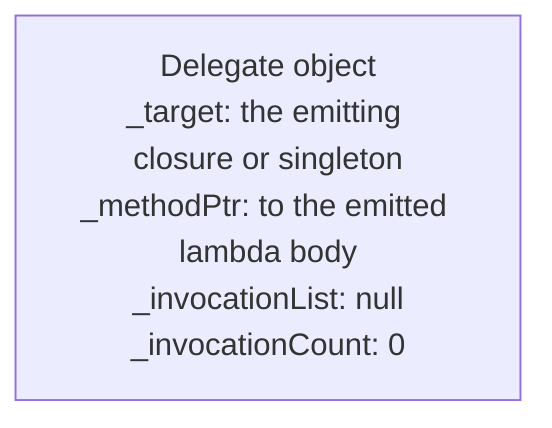
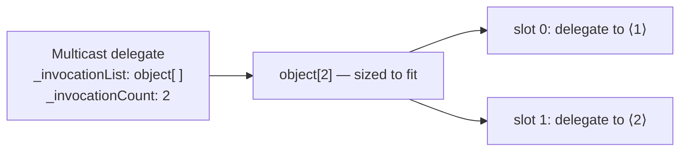

# Delegates, Events & Lambdas

> [Mastery Guide](../../README.md) › [Foundations](../README.md) › [C# Mastery](./README.md)

| Status | Priority | Phase | Last reviewed |
|---|---|---|---|
| Not Started | High | Phase 1 — Language & Runtime Fluency | 2026-05-07 |

## Contents
- [Why it matters](#why-it-matters)
- [Core concepts](#core-concepts)
  - [Delegates — type-safe method references](#delegates--type-safe-method-references)
  - [`Action`, `Func`, `Predicate` — the BCL trio](#action-func-predicate--the-bcl-trio)
  - [`Func<T>` vs `Action<T>` vs custom delegates — when each](#funct-vs-actiont-vs-custom-delegates--when-each)
  - [Multicast delegates](#multicast-delegates)
  - [Multicast exception behavior — the chain breaks](#multicast-exception-behavior--the-chain-breaks)
  - [Delegate variance — `in` and `out` rules](#delegate-variance--in-and-out-rules)
  - [Lambda expressions](#lambda-expressions)
  - [Method group vs lambda — what the compiler does differently](#method-group-vs-lambda--what-the-compiler-does-differently)
  - [Closures and capture rules](#closures-and-capture-rules)
  - [Closure capture mechanics — what the compiler emits](#closure-capture-mechanics--what-the-compiler-emits)
  - [Capturing `this` — the leak risk](#capturing-this--the-leak-risk)
  - [The `foreach` capture trap (and the C# 5 fix)](#the-foreach-capture-trap-and-the-c-5-fix)
  - [Expression trees — code as data](#expression-trees--code-as-data)
  - [Building an expression tree by hand](#building-an-expression-tree-by-hand)
  - [Events — pub/sub on top of delegates](#events--pubsub-on-top-of-delegates)
  - [Event vs delegate field — what protection events add](#event-vs-delegate-field--what-protection-events-add)
  - [Field-like events vs explicit add/remove accessors](#field-like-events-vs-explicit-addremove-accessors)
  - [Removing a lambda from an event — why it doesn't work](#removing-a-lambda-from-an-event--why-it-doesnt-work)
  - [Async lambdas — when `async` becomes `async void`](#async-lambdas--when-async-becomes-async-void)
  - [`[ThreadStatic]` and `AsyncLocal<T>` in closures](#threadstatic-and-asynclocalt-in-closures)
  - [Function pointers (`delegate*`, C# 9) vs delegates](#function-pointers-delegate-c-9-vs-delegates)
  - [Static lambdas (C# 9) and default parameters (C# 12)](#static-lambdas-c-9-and-default-parameters-c-12)
- [Code & diagrams](#code--diagrams)
- [Common pitfalls](#common-pitfalls)
- [Interview-ready summary](#interview-ready-summary)
- [Interview Cross-Questioning Drill](#interview-cross-questioning-drill)
- [Cheat Sheet](#cheat-sheet)
- [Walkthrough](#walkthrough--event-handler-memory-leak)
- [Self-test](#self-test)
- [Cross-references](#cross-references)
- [Sources](#sources)

---

## Why it matters

Delegates and lambdas are how C# expresses "code as a value" — pass a function, return a function, store a function in a list. Every LINQ operator, every `Task.Run(...)`, every event handler, every middleware in ASP.NET Core uses them. The tricky parts are **closure capture** (especially the `foreach` rule) and **expression trees** (which let `IQueryable` translate code to SQL). Both are senior-interview staples.

Modern C# made these features even easier: target-typing for delegates (C# 10), static lambdas (C# 9, no captures), default lambda parameters (C# 12), and `params` collections in lambdas (C# 13). Worth knowing what's modern vs. legacy.

## Core concepts

### Delegates — type-safe method references

A **delegate** is a type that represents a method signature. You can store a method reference in a delegate variable and invoke it later.

```csharp
// Delegate type declaration — names a signature
public delegate int BinaryOp(int a, int b);

// Methods that match the signature
int Add(int a, int b) => a + b;
int Multiply(int a, int b) => a * b;

// Assign and invoke
BinaryOp op = Add;
int sum = op(2, 3);          // 5

op = Multiply;
int product = op(2, 3);      // 6

// Methods are first-class values
BinaryOp[] ops = { Add, Multiply };
foreach (var f in ops) Console.WriteLine(f(4, 5));
```

Internally, every delegate derives from `MulticastDelegate` (which derives from `Delegate`), and an instance carries:
- **`_target`** — surfaced by the public `Target` property as the object the method is called against, or `null` for a static method.
- **`_methodPtr`** (plus `_methodPtrAux`) — the code address to call.
- **`_invocationList` / `_invocationCount`** — `null` and `0` for a single-target delegate. For a multicast delegate, `_invocationList` is an **`object[]` of the individual delegates** and `_invocationCount` is how many slots are live.

That last point is worth getting right, because it is a common wrong answer. **The invocation list is an array, not a linked list** — there is no `next` pointer chaining one delegate to the next. You can see this for yourself with reflection over `typeof(MulticastDelegate).GetFields(BindingFlags.Instance | BindingFlags.NonPublic)`, which prints six fields: `_invocationList` and `_invocationCount` (declared by `MulticastDelegate`), plus `_target`, `_methodBase`, `_methodPtr` and `_methodPtrAux` inherited from `Delegate` — they show up because they are `internal` rather than `private`, so reflection on the derived type still sees them. No `next` field anywhere in that list.

Combining two single-target delegates allocates an array sized exactly to fit (`new object[2]`). Growth from there is by **doubling once the array is full**, so a third handler moves the list into a four-slot array with `_invocationCount == 3` and a fourth reuses the spare slot. `_invocationCount`, not `Length`, is the number of live entries.

This layout explains the dispatch cost. Single-target invocation reads `_methodPtr` and makes **one indirect call** — not a virtual-table lookup, because the target is stored in the object rather than resolved through a type. Multicast invocation walks the array and calls each entry in turn. The real cost of a delegate call is usually not the indirection itself but the fact that **the JIT cannot inline through it** unless it can prove which target it holds; a two-line method that would have been inlined at a direct call site stays a real call behind a delegate.

> 🌍 **In the real world**: an ingestion service modelled its row pipeline as `List<Func<Row, Row>>` — trim, normalise, geocode, validate, enrich, project — and it was genuinely the clearest code in the repo. Under load, profiling put a surprising share of CPU in the pipeline itself rather than in any stage. Nothing was slow; there were six un-inlinable indirect calls per row, and each stage's body was two or three lines that the JIT would have folded away at a direct call site. The team kept the composable pipeline for the long tail of formats and hand-wrote a single method for the two formats that carried nearly all the volume. That is the honest shape of the trade: delegates cost you inlining, which matters exactly when the delegated work is small and the call count is large, and is irrelevant everywhere else.

### `Action`, `Func`, `Predicate` — the BCL trio

You almost never declare a custom delegate type anymore — the BCL ships generic delegate types that cover every signature.

| Delegate | Signature | Use |
|---|---|---|
| `Action` | `void()` | No args, no return |
| `Action<T>` | `void(T)` | One arg, no return |
| `Action<T1, T2>` | `void(T1, T2)` | ...up to 16 args |
| `Func<TResult>` | `TResult()` | No args, returns |
| `Func<T, TResult>` | `TResult(T)` | One arg, returns |
| `Func<T1, T2, TResult>` | `TResult(T1, T2)` | ...up to 16 args |
| `Predicate<T>` | `bool(T)` | One arg, bool return — used by `List<T>.Find`, `Array.Find`, etc. |

```csharp
// Use Func<,> instead of declaring your own
Func<int, int, int> add = (a, b) => a + b;
Func<int, int, int> mul = (a, b) => a * b;

// Action for fire-and-forget work
Action<string> log = Console.WriteLine;
log("hello");

// Predicate for filters
Predicate<int> isEven = n => n % 2 == 0;
var nums = new List<int> { 1, 2, 3, 4 };
var first = nums.Find(isEven);   // 2
```

`Predicate<T>` is older and largely superseded by `Func<T, bool>` (which LINQ uses uniformly). They describe the same shape, but they are **distinct types with no conversion between them** — `typeof(Func<int, bool>).IsAssignableFrom(typeof(Predicate<int>))` is `false`. You can bridge them only by re-wrapping (`new Func<int, bool>(myPredicate.Invoke)`), which allocates a second delegate whose target is the first.

> 🌍 **In the real world**: a rules engine was built around `Predicate<Order>` because the author had learned it from `List<T>.Find`. It worked fine for a year. The friction appeared when the same rules had to feed a LINQ query — `orders.Where(rule)` doesn't compile, because `Where` wants `Func<Order, bool>` — so a `ToFunc()` helper appeared, then a `ToPredicate()` helper for the other direction, then a rule that had been wrapped twice and could no longer be compared for equality against the original. The fix was a two-hour find-and-replace to `Func<Order, bool>` throughout. The lesson is small but general: pick the type the rest of the ecosystem speaks, even when a more descriptive one exists, because every boundary you create is a place where someone writes an adapter.

### `Func<T>` vs `Action<T>` vs custom delegates — when each

The BCL covers >99% of delegate needs. But "should I ever declare my own `delegate` type?" is a real interview question. Here's the answer matrix.

| Scenario | Use | Why |
|---|---|---|
| Returns a value | `Func<...>` | One line, no new type to introduce |
| Returns void | `Action<...>` | Same |
| Bool predicate over one item | `Func<T, bool>` (preferred) or `Predicate<T>` (legacy) | LINQ uses `Func<T,bool>`; matches everywhere |
| Parameter names matter for tooling / documentation | Custom delegate | `Func<int, int, int>` is anonymous; `delegate int Reducer(int acc, int item)` self-documents |
| Variance required on `out` / `in` for *your* type parameter | Custom delegate | You can declare your own `in` and `out` (the BCL trio already declares them for the common cases) |
| `ref` / `out` / `in` parameters | Custom delegate | `Func<>`/`Action<>` cannot express ref-kinds; declare `delegate bool TryParser<T>(string s, out T value);` |
| `params` array or default parameter values in delegate signature | Custom delegate | `Func<>`/`Action<>` parameters are positional with no defaults |
| Signature appears in *many* public APIs and you want a strong domain name | Custom delegate | `delegate Money Discount(Order o);` reads better than `Func<Order, Money>` everywhere |

```csharp
// Custom delegate: ref / out / parameter names you can't express with Func<>/Action<>
public delegate bool TryParse<T>(ReadOnlySpan<char> input, out T value);

// Custom delegate: in/out variance on your own type parameter
public delegate TResult Mapper<in TInput, out TResult>(TInput input);

// Custom delegate: meaningful name reused across a domain
public delegate decimal PricingRule(Order order, Customer customer);
```

**Rule of thumb:** start with `Func<>`/`Action<>`. Promote to a custom delegate when you find yourself writing the same `Func<Order, Customer, decimal>` in five places, or when you need `ref`/`out`, or when parameter names would help readers (`Func<int, int, int>` is genuinely confusing for `(acc, item) => acc + item`).

**C# 14 makes the `ref`/`out` case less painful.** Before C# 14, a lambda parameter carrying any modifier had to be fully typed. C# 14 allows modifiers on *simple* (untyped) lambda parameters, so the compiler infers the types from the delegate:

```csharp
delegate bool TryParse<T>(string text, out T result);

TryParse<int> parse1 = (text, out result) => int.TryParse(text, out result);   // C# 14
TryParse<int> parse2 = (string text, out int result) => int.TryParse(text, out result);  // required before C# 14
```

`params` is the exception — it still requires an explicitly typed parameter list. (Microsoft Learn, *Lambda expressions* and *What's new in C# 14*.)

### Multicast delegates

A delegate can hold **multiple targets**. Invoking it calls them all in sequence.

```csharp
Action a = () => Console.WriteLine("first");
a += () => Console.WriteLine("second");
a += () => Console.WriteLine("third");

a();
// first
// second
// third

a -= a.GetInvocationList()[0] as Action;  // remove first
a();
// second
// third
```

For `Func<>` returning a value, only the **last** target's return value is observed — the others run but their results are discarded. Use multicast almost exclusively for `Action`-shaped (void) chains; if you need all results, use a list of `Func<>` and aggregate manually.

**Delegates are immutable.** `+=` and `-=` do not mutate anything — they are sugar for `Delegate.Combine` and `Delegate.Remove`, each of which returns a **new** delegate instance and leaves the original untouched. That has three consequences a senior candidate should be able to state:

- **`+=` normally allocates** a new multicast delegate object. `Combine` can publish into spare capacity in the existing `object[]` when the array has room, so the array itself is not copied on every subscribe, but the wrapper is. The one free case is the *first* subscriber: `Combine(null, h)` just returns `h`, so `evt += h` on an empty event allocates nothing.
- **`-=` allocates when it actually removes something**, and is O(n): removal has to produce a new invocation list without the removed entry. Two cases short-circuit and allocate nothing — removing a handler that isn't in the list returns the original instance unchanged, and removing one of exactly two handlers returns the surviving delegate itself rather than wrapping it.
- **`GetInvocationList()` allocates a fresh `Delegate[]` on every call.** Two successive calls are never reference-equal. If you use the defensive-walk pattern below on a hot path, that array is per-raise garbage — cache the snapshot if you raise far more often than you subscribe.

Invocation runs **in subscription order** — `Combine` appends, and the language specification says the invocation list is called in order. It is deterministic, but designing a system where handler B only works because it runs after handler A is a coupling you cannot see in either handler's source.

Events build on multicast. Skip ahead if curious.

### Multicast exception behavior — the chain breaks

This is a question that catches juniors and even mids. **When a handler in a multicast chain throws, the remaining handlers do not run, and the exception propagates back to the caller.**

```csharp
Action chain = () => Console.WriteLine("first");
chain += () => throw new InvalidOperationException("boom");
chain += () => Console.WriteLine("third — never reached");

try { chain(); }
catch (InvalidOperationException) { Console.WriteLine("caught"); }

// Output:
// first
// caught
// (the "third" handler did NOT run)
```

**Why this is dangerous for events.** A naive `MyEvent?.Invoke(this, args)` is equivalent to chaining handlers — one buggy subscriber breaks every later subscriber. In a UI app: one bad event handler aborts the broadcast and the rest of the UI never updates. In a domain event bus: one slow handler throwing means downstream side-effects (logging, audit, projections) silently skip.

**Defensive invocation — walk the invocation list:**

```csharp
public event EventHandler<OrderEventArgs>? OrderPlaced;

protected void RaiseOrderPlaced(OrderEventArgs e)
{
    var handlers = OrderPlaced;
    if (handlers is null) return;

    var exceptions = new List<Exception>();
    foreach (EventHandler<OrderEventArgs> h in handlers.GetInvocationList())
    {
        try { h(this, e); }
        catch (Exception ex) { exceptions.Add(ex); }
    }

    if (exceptions.Count > 0)
        throw new AggregateException("One or more handlers failed", exceptions);
}
```

This pattern walks every entry in the invocation list independently, collects exceptions, and either rethrows as `AggregateException` or logs and continues — depending on whether handler failures are recoverable. The cost is a small amount of boilerplate plus the `Delegate[]` that `GetInvocationList()` allocates per raise; the benefit is **a misbehaving subscriber can't take down the publisher's broadcast.**

**Async multicast is even worse.** Invoking a multicast `Func<Task>` returns only the **last** handler's `Task`. The earlier handlers are started — their synchronous prefix runs — but their `Task`s are dropped on the floor. So an `await chain()` waits for one handler while the others race on unobserved, and any exception on a discarded `Task` surfaces nowhere at all: it becomes an unobserved task exception, visible only via `TaskScheduler.UnobservedTaskException`. This is strictly worse than the synchronous case, where at least the first failure reaches the caller. For async fan-out, don't use multicast — store handlers in a `List<Func<...>>` and invoke them explicitly, sequentially or with `Task.WhenAll`.

> 🌍 **In the real world**: an order service raised a domain event with four subscribers — audit, search-index projection, customer email, and a metrics counter. A schema change made the audit handler throw on orders with no billing address, which was rare. What got reported was not "audit is broken" but "search results are stale for some orders", because audit was second in the chain and the projection was third, so the throw stopped the walk before the projection ran. Two days went into the projection code before anyone looked at the publisher. The fix was ten lines — the defensive walk above — and the durable lesson is that in a multicast chain, **the symptom shows up in the handler that didn't run**, which is the one place nobody puts a breakpoint.

### Delegate variance — `in` and `out` rules

Delegates with generic parameters can be **variant** — assignable to delegate types with related (but not identical) generic arguments.

```csharp
class Animal { }
class Dog : Animal { }

// Func<out T> — covariant on the return type
Func<Dog> dogFactory = () => new Dog();
Func<Animal> animalFactory = dogFactory;     // ✓ — returning Dog where Animal is expected is safe
Animal a = animalFactory();                  // gets a Dog (which IS an Animal)

// Action<in T> — contravariant on the parameter type
Action<Animal> animalHandler = a => Console.WriteLine(a.GetType());
Action<Dog> dogHandler = animalHandler;      // ✓ — a method that handles ANY Animal can handle a Dog
dogHandler(new Dog());                       // animalHandler runs on the Dog

// Func<in T, out TResult> — contravariant in, covariant out
Func<Animal, Dog> f = a => new Dog();
Func<Dog, Animal> g = f;                     // ✓ — accepts Dog (subtype of Animal), returns Animal (supertype of Dog)
```

**The two questions:**
- Is `Func<Animal>` assignable to `Func<Dog>`? **No.** `Func<out T>` is covariant, so the *return type* must be more derived going one way. `Animal` is not assignable from `Dog` in the output position. (Reverse holds: `Func<Dog>` → `Func<Animal>` works.)
- Is `Action<Dog>` assignable to `Action<Animal>`? **No.** `Action<in T>` is contravariant, so the *parameter type* must be more general going one way. An `Action<Dog>` doesn't know how to handle a `Cat`, so accepting it as `Action<Animal>` would be unsafe. (Reverse holds: `Action<Animal>` → `Action<Dog>` works.)

**Mnemonic:** `out` = "**Goes** out — covariant — subtype OK"; `in` = "**Comes** in — contravariant — supertype OK." Or: the BCL's `IEnumerable<out T>` is covariant for the same reason `Func<out T>` is — both produce `T`s.

**Custom delegate variance:** declare your own with `in`/`out` modifiers:

```csharp
public delegate TResult Mapper<in TIn, out TOut>(TIn input);

Mapper<Animal, Dog> m1 = a => new Dog();
Mapper<Dog, Animal> m2 = m1;                 // ✓ — variance accepted
```

Variance only works for **reference types** (and interfaces / delegates). Value types are invariant — `IEnumerable<int>` is NOT assignable to `IEnumerable<object>` (boxing would be required to materialize each `object`, which the runtime won't insert for variance).

**Method-group conversion has its own, separate relaxation** — and it predates generic variance by two language versions: method-group covariance/contravariance arrived in **C# 2.0**, generic `in`/`out` variance not until **C# 4.0**. A *method group* binds to a delegate type if its parameters are more general and its return type more derived, regardless of whether the delegate declares `in`/`out`:

```csharp
public class OrderArgs : EventArgs { public int Id; }
delegate void Notify<T>(T args);                   // declares no `in`/`out` — invariant

void Handle(object? sender, EventArgs e) { }       // takes the BASE args type
void Log(object? args) { }                         // takes the BASE arg type

public event EventHandler<OrderArgs>? Placed;
Placed += Handle;                                  // ✓ relaxed method-group conversion

Notify<OrderArgs> a = Log;                         // ✓ same rule on an invariant delegate
Notify<object?>   b = Log;
Notify<OrderArgs> c = b;                           // ❌ CS0029 — a *value* assignment would
                                                   //    need variance, which Notify<T> lacks
```

The `Notify<T>` pair is the cleaner demonstration: the delegate declares no variance at all, yet the method group binds, while assigning one *delegate value* to the other does not. That is the whole distinction — generic variance converts a delegate value of one constructed type to another; method-group relaxation binds a method to a delegate type, and applies whether or not the delegate is variant. It is why one `void LogAnyEvent(object? sender, EventArgs e)` can be attached to every strongly typed event in a codebase.

**Don't cite `EventHandler<TEventArgs>` as the invariant example — .NET 10 changed it.** It is now declared `public delegate void EventHandler<in TEventArgs>(object? sender, TEventArgs e) where TEventArgs : allows ref struct;`. Through .NET 9 it was plain `EventHandler<TEventArgs>` with no variance annotation, so plenty of still-current writing (and plenty of interviewers) will call it invariant. Nothing above depends on which is true, because the `Placed += Handle` line is a method-group conversion either way, but on .NET 10 the value-level conversion `EventHandler<EventArgs>` → `EventHandler<OrderArgs>` now compiles as well.

The relaxation does **not** apply to a lambda: `EventHandler<OrderArgs> h = (object? s, EventArgs e) => { };` is an error (CS1661/CS1678), because an explicitly typed lambda's parameter types must match the delegate exactly.

> 🌍 **In the real world**: a diagnostics team wanted one handler wired to every event on a device-driver façade so that every state change was traced. The first attempt declared `Action<object, EventArgs>` and tried to assign it to each `EventHandler<TArgs>` field, which fails — delegate types don't convert to each other however compatible their signatures. The version that worked changed nothing but the shape: declare it as a *method*, `void Trace(object? sender, EventArgs e)`, and use `+=` on each event, letting the method-group rule do the widening. Same code, same signature; the difference is that a method group is converted at each use site and a delegate instance is not convertible at all.

### Lambda expressions

A **lambda** is an inline anonymous function. Two forms:

```csharp
// Expression lambda — single expression body, return inferred
Func<int, int> square = x => x * x;

// Statement lambda — block body
Func<int, int> squareLogged = x =>
{
    Console.WriteLine($"squaring {x}");
    return x * x;
};

// Multiple parameters need parentheses
Func<int, int, int> add = (a, b) => a + b;

// Zero parameters — empty parentheses
Func<int> rand = () => Random.Shared.Next();

// Explicit types (rarely needed but legal — useful when inference fails)
Func<int, int> sq = (int x) => x * x;
```

**Target typing (C# 10):** lambdas are inferred against the variable's declared type, including for `var`:

```csharp
var f = (int x) => x * x;          // Func<int, int>  (inferred)
var g = (int x, int y) => x + y;   // Func<int, int, int>
var h = void (int x) => Console.WriteLine(x);  // Action<int> (explicit return type, C# 10)
```

You can also annotate attributes and return types on lambdas:

```csharp
var divide = [Pure] (double a, double b) => a / b;        // attribute on lambda
var safeDivide = double (double a, double b) =>           // explicit return type
    b == 0 ? double.NaN : a / b;
```

Two caveats worth knowing before you reach for either:

- **Attributes on a lambda have no effect at runtime.** You invoke a lambda through the delegate's `Invoke` method, and `Invoke` does not consult attributes on the lambda. They exist for analyzers and for reflection over the compiler-generated method — nothing more. (Microsoft Learn, *Lambda expressions*: "Attributes don't have any effect when the lambda expression is invoked.") A consequence: `[Conditional]` cannot be applied to a lambda at all.
- **A natural type is not always a `Func`/`Action`.** The compiler picks a `Func`/`Action` if a suitable one exists and otherwise **synthesizes** a delegate type — which it must do for `ref`-kind parameters, default parameter values, and `params` parameters. A synthesized type is not convertible to `Func<>`, so `var` is the only reasonable way to hold it (see the default-parameter section at the end of this page).

### Method group vs lambda — what the compiler does differently

Subscribing to an event has two visually-similar forms:

```csharp
button.Click += Handler;                        // method group
button.Click += (s, e) => Handler(s, e);        // lambda wrapping the method
```

They look equivalent. They are not. The differences matter for unsubscription, allocation, and equality.

| Aspect | Method group (`button.Click += Handler`) | Lambda (`button.Click += (s,e) => Handler(s,e)`) |
|---|---|---|
| Delegate identity | Cached since C# 11 **for static methods**; an instance method group still produces a new delegate per conversion | Each occurrence is a *different* delegate instance |
| `-=` removes it? | Yes — `button.Click -= Handler` works (and always has: removal uses value equality, not reference identity) | **No** — `button.Click -= (s,e) => Handler(s,e)` creates a *new* lambda; the original is never matched |
| Allocations | Zero after the first, for a static target; one per conversion for an instance target | Delegate per occurrence; closure too, if it captures |
| Stack trace clarity | Shows `Handler` directly | Shows compiler-generated `<>c.<.ctor>b__0_0`, less readable |
| Captures? | No (unless `Handler` is a closed instance method; then the target *is* the instance) | Whatever the lambda body references |

**The unsubscription gotcha** (#1 cause of "I subscribed `-=` but my handler still fires"):

```csharp
class Subscriber
{
    public void Subscribe(Button b)
    {
        b.Click += (s, e) => OnClick(s, e);    // lambda A
    }

    public void Unsubscribe(Button b)
    {
        b.Click -= (s, e) => OnClick(s, e);    // lambda B — different instance, no-op
    }

    void OnClick(object? s, EventArgs e) { /* ... */ }
}
```

Lambdas A and B have the same body, but they are different delegate instances. The `-=` does nothing because the publisher's invocation list contains A, not B.

**Two fixes:**

```csharp
// Fix 1: subscribe with a method group
b.Click += OnClick;
b.Click -= OnClick;          // ✓ — same method group, same delegate

// Fix 2: store the lambda once
private EventHandler? _click;
public void Subscribe(Button b)
{
    _click = (s, e) => OnClick(s, e);
    b.Click += _click;
}
public void Unsubscribe(Button b)
{
    if (_click is not null) b.Click -= _click;   // ✓ — same instance
}
```

**What C# 11 actually changed — and what it did not.** C# 11's "improved method group conversion to delegate" lets the compiler *cache* the delegate produced by a method group conversion instead of allocating a fresh one every time the conversion is executed. It is purely an allocation optimisation.

Two corrections to the version of this story people usually tell:

1. **The cache only applies where a static cache field can work — i.e. static method groups.** An instance method group's delegate has to carry the receiver, and there is no single instance to cache, so `p.Handler` still allocates on every conversion. Verify it yourself:

   ```csharp
   static EventHandler MakeStatic() => StaticHandler;
   EventHandler MakeInstance() => InstanceHandler;

   ReferenceEquals(MakeStatic(),   MakeStatic());     // True  — cached (C# 11+)
   ReferenceEquals(p.MakeInstance(), p.MakeInstance()); // False — new delegate each time
   ```

2. **It did not change `-=` semantics, and `-=` never needed it.** `Delegate.Remove` matches on **value equality** — same `Target` and same `Method` — not on reference identity. `pub.Click -= Handler` found the previously added delegate in C# 1.0 and finds it now. The reason `-=` fails for lambdas is not a missing cache; it is that two lambda expressions are two *different compiler-generated methods*, so they are unequal by definition.

Delegate equality has one more edge that catches people: it also requires **the same delegate type**. Two delegates over the identical target and `MethodInfo` compare unequal if one is an `EventHandler` and the other an `Action<object?, EventArgs>` — `MulticastDelegate.Equals` rejects mismatched types before it ever looks at the target.

> 🌍 **In the real world**: a worker service subscribed to a message-broker client's `Disconnected` event with a lambda, inside the method that established the connection. Reconnects happened a few times a day and nobody noticed. After a week-long network flap the on-call engineer found a customer with 60-odd copies of the same "connection restored" notification, because every reconnect had run the subscribe line again and every lambda was a distinct delegate, so the chain grew without bound and nothing ever removed anything. The one-character version of the bug is that `-=` on a lambda is a silent no-op — it throws nothing, logs nothing, and returns the chain unchanged. Moving the handler to a named method made both `+=` and `-=` work, and the durable fix was to subscribe once at construction rather than once per connection.

### Closures and capture rules

A lambda can reference variables from its enclosing scope. The compiler **captures** them — moving them off the stack into a heap-allocated *closure object* so they outlive the enclosing method.

```csharp
Func<int> CounterFactory()
{
    int count = 0;
    return () => ++count;     // 'count' captured by reference (in a generated class)
}

var c = CounterFactory();
Console.WriteLine(c());  // 1
Console.WriteLine(c());  // 2
Console.WriteLine(c());  // 3
// 'count' lives as long as the lambda lives, even though CounterFactory() returned.
```

**What gets captured:**
- **Locals** — by reference. The lambda sees the *current* value of the variable, even if it changes after capture.
- **`this`** — captured implicitly when the lambda touches an instance field. Anchors the entire enclosing object.
- **`ref` / `out` / `in` parameters** — cannot be captured; compile error.
- **`ref` locals and `ref struct` values (`Span<T>`, `ReadOnlySpan<T>`)** — cannot be captured either. The closure is a heap object; a `ref struct` may not live on the heap, so the compiler refuses:

  ```csharp
  Span<int> buffer = stackalloc int[64];
  Func<int> len = () => buffer.Length;   // ❌ CS8175: cannot use ref local 'buffer'
                                         //    inside an anonymous method or lambda expression
  ```

  This is the collision that bites when you modernise a hot path: you rewrite an allocation-heavy method to use `Span<T>`, and the lambda or LINQ call sitting in the middle of it stops compiling. There is a way out — a **local function** that is never converted to a delegate can use the span (see below) — and no way out at all if the API you're calling wants a `Func<>`.

**Cost of capture:** the compiler generates a hidden class to hold the captured variables, and the lambda becomes an instance method on that class. One heap allocation **per entry into the scope that declares the captured variable** — plus one delegate allocation per lambda creation. Those are two different counts, and mixing them up is a common mis-statement:

```csharp
// One closure object for the whole loop (i belongs to the for-statement's scope),
// but one NEW delegate per iteration.
for (int i = 0; i < 1000; i++)
    DoWork(() => Process(i));           // 1 closure + 1000 delegates
                                        // (and all 1000 share one 'i' — see the for-trap below)

// A fresh local inside the body => a fresh closure per iteration.
for (int i = 0; i < 1000; i++)
{
    int captured = i;
    DoWork(() => Process(captured));    // 1000 closures + 1000 delegates
}
```

**The way out is not `static` — it is not capturing.** Pass the varying value as an argument so the lambda has nothing to close over:

```csharp
static void Process(int n) { /* ... */ }

for (int i = 0; i < 1000; i++)
    DoWork(i, static n => Process(n));  // no capture at all: the delegate is allocated ONCE, ever
```

**What `static` on a lambda really does** (C# 9) is worth being precise about, because the common claim — "`static` removes the allocation" — is not what happens. Roslyn already caches **any** non-capturing lambda in a static field on a generated `<>c` singleton class and reuses that one instance forever. Adding `static` to a lambda that already captured nothing changes no codegen at all:

```csharp
static Func<int,int> A() => x => x + 1;           // non-capturing
static Func<int,int> B() => static x => x + 1;    // non-capturing AND declared static

ReferenceEquals(A(), A());   // True — already cached without the keyword
ReferenceEquals(B(), B());   // True — identical
```

`static` is a **compile-time guarantee, not an optimisation**: it makes the compiler reject a capture you didn't intend, so an innocent edit ("just read `_threshold` here") can't silently reintroduce a per-call allocation into a hot path. That guarantee is the whole value, and it is a real one — but claim it as a guardrail, not a speed-up.

```csharp
Func<int, int> square = static x => x * x;   // OK — no capture
int factor = 3;
Func<int, int> times3 = static x => x * factor;  // ❌ CS8820: a static anonymous function
                                                 //    cannot contain a reference to 'factor'
```

**Passing state instead of capturing — the BCL gives you the overloads.** Once you know that a capture is an allocation, you start noticing that the framework offers a state-carrying overload almost everywhere a callback is taken, precisely so you can use a cached `static` lambda. All of these are real and current:

```csharp
// ThreadPool: generic TState, no boxing
ThreadPool.QueueUserWorkItem(static s => s.Set(), resetEvent, preferLocal: false);

// CancellationToken: object? state
token.Register(static s => ((Connection)s!).Abort(), connection);

// ConcurrentDictionary: factory argument threaded through
cache.GetOrAdd(key, static (k, arg) => Build(k, arg), expensiveArg);

// Timer and Task.Factory take a state object for the same reason
var t = new Timer(static s => ((Poller)s!).Tick(), poller, dueTime: 0, period: 1000);
Task.Factory.StartNew(static s => ((Job)s!).Run(), job);
```

The pattern is always the same: the callback becomes capture-free (so its delegate is allocated once for the lifetime of the process), and the per-call varying data rides in the `state` parameter instead of in a closure. Note the gap in the list — **`Task.Run` has no state overload**, which is why `Task.Run(() => Handle(item))` in a loop is one of the most common allocation sites in .NET server code. `Task.Factory.StartNew` does, at the price of having to get its scheduler and options arguments right.

`LoggerMessage.Define` is the same idea applied to logging, and it is the clearest example of the technique in the BCL. It returns a **cached delegate with the arguments in its signature**:

```csharp
// Built once, static readonly — the delegate and the parsed format string are reused forever.
private static readonly Action<ILogger, int, long, Exception?> _orderProcessed =
    LoggerMessage.Define<int, long>(
        LogLevel.Information, new EventId(1, "OrderProcessed"),
        "Order {OrderId} processed in {ElapsedMs}ms");

_orderProcessed(logger, orderId, elapsedMs, null);
```

Compare it with `logger.LogInformation("Order {OrderId} processed in {ElapsedMs}ms", orderId, elapsedMs)`, which binds to an overload taking `params object?[]` — so both value-type arguments are boxed and an array is allocated, **on every call, whether or not the level is enabled.** The generic `Define<T1,T2>` form keeps the arguments strongly typed all the way through. In modern code you'd normally get this from the `[LoggerMessage]` source generator rather than writing it by hand, but the generator emits precisely this shape, and knowing why is the interview-grade version of the answer.

> 🌍 **In the real world**: a team turned on structured logging across a high-throughput ingestion path and watched Gen-0 collection frequency climb sharply, with allocation profiles full of `object[]` and boxed `Int64`. The logging *level* was `Warning` in production, so almost none of these log lines produced output — but the argument array and the boxes were allocated at the call site, before any level check the logger could perform, because that's what `params object?[]` means. Moving the twelve hottest call sites to `[LoggerMessage]`-generated methods removed the allocation without changing a line of the message templates. The transferable insight is about where the work happens: **a level check inside the logger cannot save you from work the compiler already did at the call site**, which is also the reason `if (logger.IsEnabled(...))` guards exist at all.

### Closure capture mechanics — what the compiler emits

Capture-by-reference is the rule that breaks the most assumptions. **Locals are not snapshotted at the moment of lambda creation — the lambda sees the variable's *current* value at the moment of invocation.**

```csharp
int x = 10;
Func<int> f = () => x;          // captures the variable x, not the value 10
x = 20;
Console.WriteLine(f());         // prints 20 — the CURRENT value of x
```

**What the compiler actually does** (the classic interview "show me what's underneath"):

```csharp
// Source you wrote:
int x = 10;
Func<int> f = () => x;
x = 20;
int v = f();
```

```csharp
// What Roslyn emits (simplified):
class <>c__DisplayClass0_0
{
    public int x;                                   // hoisted local — now a field
    internal int <Main>b__0() => x;                 // the lambda body
}

var __closure = new <>c__DisplayClass0_0();
__closure.x = 10;
Func<int> f = __closure.<Main>b__0;
__closure.x = 20;
int v = f();                                        // reads __closure.x → 20
```

Two things to notice:
1. **`x` is no longer a local** — it's been *hoisted* into a field on a heap-allocated closure class. Every reference to `x` in the source (both the lambda body AND subsequent `x = 20`) now goes through `__closure.x`.
2. **One heap allocation per closure scope**, not per lambda invocation. If you create the lambda in a loop, the loop body shares the same closure — *unless* a fresh local is declared inside the loop (each iteration creates a new closure instance).

**Multiple lambdas can share one closure:**

```csharp
int counter = 0;
Action increment = () => counter++;
Func<int> read = () => counter;
// Both lambdas land as methods on the SAME generated closure class.
// 'counter' is one field; both methods reference it.

increment();
increment();
Console.WriteLine(read());   // 2 — shared state via the closure
```

**...which is exactly why a closure can extend the lifetime of things you never meant it to hold.** One display class per *scope*, shared by every lambda in that scope, means the fields of that display class are the union of everything captured in the scope — and the longest-lived delegate keeps all of them alive:

```csharp
static Func<int> Build()
{
    var payload = new byte[1024 * 1024];   // intended to be short-lived
    int id = 7;                            // intended to outlive the method

    Action scan = () => Inspect(payload);  // used and discarded right here
    scan();

    return () => id;                       // the only delegate that escapes
}
```

The returned lambda captures nothing but `id`. It is nevertheless holding the megabyte, because `payload` and `id` were captured from the same scope and therefore live on the same closure object. Confirm it in a scratch project:

```csharp
var f = Build();
f.Target!.GetType().GetFields().Select(x => x.FieldType.Name);   // Byte[], Int32
```

The fix is scoping, not cleverness — put the short-lived capture inside its own block (`{ var payload = ...; Inspect(payload); }`) so the compiler emits a separate display class for it, or set the local to `null` once you're done with it.

**A second surprise from the same mechanism: the closure is allocated when the scope is entered, not when the lambda is created.** The allocation happens even on a path where the lambda is never constructed:

```csharp
void Handle(Request r)
{
    var context = BuildContext(r);                    // captured below
    if (_logger.IsEnabled(LogLevel.Debug))
        _logger.LogDebug("ctx {C}", Describe(context));  // only this branch needs the closure
    Process(r);
}
```

If the logging branch uses a lambda that captures `context`, the display class is constructed on **every** call, including the overwhelming majority where debug logging is off. You can measure it without a profiler:

```csharp
long before = GC.GetAllocatedBytesForCurrentThread();
for (int i = 0; i < 1000; i++) Handle(request);
long perCall = (GC.GetAllocatedBytesForCurrentThread() - before) / 1000;
```

Run it with the branch condition forced false: a non-zero result is the closure you thought you were avoiding.

> 🌍 **In the real world**: a gateway service on a hosted plan started tripping its memory limit every few hours and recycling. Gen-2 was full of `byte[]` buffers, and the retention path went through a `<>c__DisplayClass` on a delegate parked in a response-cache entry. Nobody had cached a buffer. What had happened is the code above: the caching lambda captured a small cache key, a sibling lambda earlier in the same method had captured the deserialised request body for a validation step, and both landed on one closure object with a lifetime set by the longest-lived of the two. The change was four lines — wrap the validation step in its own braces — and the number that moved was the one nobody had connected to it: recycles per day, from six to zero. Worth internalising because it makes the guidance concrete: **the unit of closure lifetime is the scope, not the lambda.**

**Local functions are the same idea with a materially different cost model** — the single most useful thing to know here, and a frequent senior question. When a local function is only ever *called*, never converted to a delegate, Roslyn hoists the captured variables into a **`struct` display class passed by `ref`**, so there is no heap allocation at all:

```csharp
static int WithLocalFunction(int seed)
{
    int captured = seed;
    int Local() => captured + 1;     // never becomes a delegate
    return Local() + Local();        // ZERO bytes allocated
}

static int WithLambda(int seed)
{
    int captured = seed;
    Func<int> f = () => captured + 1;
    return f() + f();                // closure object + delegate allocated
}
```

Measure both with `GC.GetAllocatedBytesForCurrentThread()` and the first is flat zero. The moment you convert the local function to a delegate — `Func<int> f = Local;` — you are back to a class display and its allocation, because a delegate has to be able to outlive the stack frame.

| | Lambda | Local function |
|---|---|---|
| Closure storage | Always a heap class | `struct` by `ref` if never converted to a delegate; class if it is |
| Allocation when only called | Yes (closure + delegate) | **None** |
| Can capture `Span<T>` / `ref` locals | No | Yes, while it stays un-converted |
| `ref`/`out` parameters | Only through a delegate type that declares them — your own, or the one the compiler synthesizes for a `var`-typed lambda | Yes, natively |
| Recursion | Awkward (needs a pre-declared variable) | Natural |
| Generic in its own right | No | Yes |
| `static` modifier to forbid capture | C# 9 | C# 8 |
| Definite-assignment of captures | Must be assigned before the lambda | Must be assigned before the *call* |

The practical rule: **if the callee never leaves the method, write a local function.** Reach for a lambda when something else has to hold onto it. The two most valuable applications are the argument-validation wrapper (the eager checks run at call time rather than at first `MoveNext`, because the iterator lives in the local function) and hot-path helpers that would otherwise allocate per call.

**Captures and `using`/disposal:** if a lambda captures an `IDisposable` local, the local can be disposed but the closure still holds the reference. Calls to the disposed object then throw `ObjectDisposedException`:

```csharp
Action a;
using (var stream = new MemoryStream())
{
    a = () => stream.WriteByte(1);    // captures 'stream'
}
a();    // throws ObjectDisposedException — closure holds the disposed instance
```

### Capturing `this` — the leak risk

Any lambda that references an instance field or instance method **implicitly captures `this`**:

```csharp
public class HotPath
{
    private readonly string _name = "x";

    public Func<string> CreateGetter()
    {
        return () => _name;       // captures 'this' (not just _name) — the WHOLE instance is rooted
    }
}
```

The generated closure stores a reference to `this`, not to `_name` directly. The result: **as long as the returned `Func<string>` lives, the entire `HotPath` instance is reachable and can't be GC'd.**

**Real-world leak scenarios:**

1. **Subscribing to a static event with a lambda capturing `this`** — the static event keeps the instance alive forever.
2. **Caching a `Func<...>` in a long-lived dictionary** when the lambda captured `this` — the dictionary roots the instance.
3. **Background timer with a closure-over-`this` callback** — the timer (queued in the `ThreadPool`) roots the instance.

**Detection:** in a memory profiler, the leaked instance shows GC root `+ DelegateInvocationList -> <>c__DisplayClass -> this`. The closure class is always visible.

**Defenses:**

```csharp
// Defense 1: pull the field into a local before the lambda — captures ONLY the local
public Func<string> CreateGetterSafe()
{
    var name = _name;             // local — value of _name
    return () => name;            // captures 'name', not 'this'
}

// Defense 2: static lambda that takes the instance as a parameter — the CALLER
// supplies the instance per invocation, so the delegate holds no reference to it.
public static readonly Func<HotPath, string> GetName = static p => p._name;
// usage: GetName(instance)  — the delegate is cached once; nothing is rooted.

// Defense 3: weak reference for long-lived subscriptions
public Func<string?> CreateWeakGetter()
{
    var weak = new WeakReference<HotPath>(this);
    return () => weak.TryGetTarget(out var target) ? target._name : null;
}
```

**Roslyn does not do the "capture only the field" optimisation, and there is no version where it did.** A lambda mentioning `_name` captures `this`, full stop — the compiler cannot know whether the field will be reassigned before the lambda runs, and capturing the field's *value* would change the semantics. **When `this`-leak matters (long-lived caches, static-event subscriptions), pull fields into locals explicitly.**

> 🌍 **In the real world**: a service registered cache-population lambdas in a singleton `IMemoryCache` — `cache.GetOrCreateAsync(key, _ => LoadAsync(id))` — from inside a scoped request handler. `LoadAsync` was an instance method, so the lambda captured `this`, so the cache entry rooted the handler, which rooted the injected scoped `DbContext`. Symptoms were the worst kind: intermittent `ObjectDisposedException` on a `DbContext` "that we definitely never reuse", appearing only after a cache entry survived past the request that created it, and never once in a load test that ran with a warm cache. The fix was to hoist what the factory needed into locals (`var id = _order.Id; var db = _dbFactory;`) before writing the lambda. The general form is the one to remember: **a captured `this` turns a per-request object into a per-cache-entry object**, and DI scope lifetimes stop meaning what the DI container says they mean.

### The `foreach` capture trap (and the C# 5 fix)

Famous interview question. Pre-C# 5:

```csharp
var actions = new List<Action>();
foreach (var i in new[] { 1, 2, 3 })
    actions.Add(() => Console.WriteLine(i));

foreach (var a in actions) a();
// Pre-C# 5: 3 3 3   (!)
// C# 5+:    1 2 3
```

**Why pre-C# 5 was 3 3 3:** the `foreach` loop's variable `i` was a *single* slot reused across iterations. All three lambdas captured the *same* slot — by the time they ran, the loop had finished and `i` held its last value (3). The fix in C# 5 was to give `foreach` a *fresh* iteration variable on each pass, so each lambda captures a distinct `i`.

**The same trap still exists with `for`:**

```csharp
var actions = new List<Action>();
for (int i = 0; i < 3; i++)
    actions.Add(() => Console.WriteLine(i));

foreach (var a in actions) a();
// Output: 3 3 3   — even in modern C#!
```

To get 0 1 2, copy the loop variable into a fresh local:

```csharp
for (int i = 0; i < 3; i++)
{
    int captured = i;
    actions.Add(() => Console.WriteLine(captured));
}
// Output: 0 1 2
```

Or just use `foreach` with a range / collection, since `foreach` got fixed.

**Why this is far more dangerous asynchronously.** In the synchronous examples the lambdas run after the loop, so the wrong answer is at least *consistent* — everything sees the terminal value. Start the delegates on background threads and the value each one reads depends on how far the loop has advanced when that thread happens to get scheduled:

```csharp
// ❌ The bug: 'i' is one shared slot, and the tasks read it whenever they start.
List<Item> batch = ...;
var tasks = new List<Task>();
for (int i = 0; i < batch.Count; i++)
    tasks.Add(Task.Run(() => Process(batch[i])));   // some items processed twice,
await Task.WhenAll(tasks);                          // some never — and, once i reaches
                                                    // Count, an out-of-range throw
                                                    // (ArgumentOutOfRangeException from
                                                    //  List<T>; IndexOutOfRangeException
                                                    //  if batch were an array)

// ✓ Fix 1: fresh local per iteration
for (int i = 0; i < batch.Count; i++)
{
    int index = i;
    tasks.Add(Task.Run(() => Process(batch[index])));
}

// ✓ Fix 2: capture nothing — foreach the items, not the indices
foreach (var item in batch)
    tasks.Add(Task.Run(() => Process(item)));       // C# 5+ gives each iteration its own 'item'
```

> 🌍 **In the real world**: a nightly reconciliation job fanned out over a `for` loop with `Task.Run`, capturing the index. It ran green for months on a batch small enough that the loop finished before the thread pool got around to starting anything, so every task read the terminal index, threw `ArgumentOutOfRangeException` off the `List<T>` indexer, and — because the tasks were added to a list that a later refactor had stopped awaiting — the exceptions were never observed. The job reported success while processing nothing. It surfaced when finance asked why a month of reconciliations were all identical. Two separate defects compounded: the loop-variable capture, and the unawaited tasks that hid it. The fix for the first is one line; the fix for the second is to treat "a `Task` nobody awaits" as a review-blocking defect, because an unobserved task is where every other bug goes to hide.

### Expression trees — code as data

A lambda assigned to `Expression<Func<...>>` (instead of `Func<...>`) is **not compiled to IL**. The compiler converts it to an expression tree — a runtime data structure representing the AST.

```csharp
Func<int, int> compiled = x => x * x;
int v1 = compiled(5);                 // 25 — runs the IL

Expression<Func<int, int>> tree = x => x * x;
// 'tree' is a tree of Expression nodes — not directly callable.
Console.WriteLine(tree);              // x => (x * x)
Console.WriteLine(tree.Body);         // (x * x)

var compiledFromTree = tree.Compile();   // produces a Func<int,int> at runtime
Console.WriteLine(compiledFromTree(5));  // 25
```

**Why this matters: `IQueryable<T>` consumes expression trees**, not `Func`s. EF Core, LINQ-to-SQL, and any custom query provider walk the tree and translate it (e.g., to SQL) — they need access to the *structure* of `x => x.Age > 18`, not just an opaque function pointer.

```csharp
// IEnumerable<T>: takes Func — code, not data
list.Where(x => x.Age > 18);           // runs in-process

// IQueryable<T>: takes Expression<Func<>> — data, walked by the provider
db.Users.Where(x => x.Age > 18);       // translated to SQL: WHERE Age > 18
```

**What actually happens when you pass a `Func` to `db.Users.Where(...)`** is worth being precise about, because the usual explanation ("EF falls back to client evaluation, or throws in EF Core 3+") describes a different bug. `DbSet<T>` implements both `IQueryable<T>` and `IEnumerable<T>`. A `Func<T,bool>` argument doesn't match `Queryable.Where`, which needs `Expression<Func<T,bool>>` — so **overload resolution silently picks `Enumerable.Where` instead**, and the query provider is never involved at all:

```csharp
Func<User, bool> predicate = u => u.Age > 18;
var adults = db.Users.Where(predicate);      // binds to Enumerable.Where
// adults is IEnumerable<User>, NOT IQueryable<User> — check it:
//   adults is IQueryable  =>  false
```

There is no exception and no warning. `SELECT * FROM Users` streams the entire table to the client and the filter runs in memory. EF Core 3's "client evaluation throws" change is about fragments of a query tree EF *can* see but cannot translate; it does not apply here, because EF never sees this predicate. The tell at runtime is the `adults is IQueryable` check above; the tell at review time is a method signature taking `Func<T,bool>` where it meant `Expression<Func<T,bool>>`.

> 🌍 **In the real world**: a generic repository exposed `Task<List<T>> FindAsync(Func<T, bool> predicate)`. It was written that way because `Func` is what the author had seen in LINQ tutorials, and it passed every test — the test database had forty rows. In production the users table had several million, and the endpoint that called it was the one behind the customer search box. What made it hard to find was that the SQL looked innocent: a plain unfiltered `SELECT` on a table the team knew was large, which everyone assumed was some other feature's warm-up query. Changing one parameter type to `Expression<Func<T, bool>>` moved the predicate into the `WHERE` clause and the endpoint stopped timing out. This is the highest-value thing on this page for anyone who writes data-access code: **`Func` and `Expression<Func>` are not two spellings of the same thing, and the compiler will pick the wrong one for you in silence.**

**What the compiler refuses to put in an expression tree.** Compiler-built trees support roughly the C# 3-era expression language; most of what has been added to C# since is not representable. These are all compile errors, not runtime failures — and each one is a real question from someone whose EF Core predicate won't compile:

| You wrote | Error |
|---|---|
| `x => x = 5` (assignment) | CS0832 — an expression tree may not contain an assignment operator |
| `p => p.Manager?.Name` (null-propagating) | CS8072 — may not contain a null propagating operator |
| `p => p is { Age: > 18 }` (pattern) | CS8122 — may not contain an `is` pattern-matching operator |
| `x => x switch { 1 => "a", _ => "b" }` | CS8514 — may not contain a switch expression |
| `x => { return x * 2; }` (statement body) | CS0834 — a lambda with a statement body cannot be converted to an expression tree |
| `async x => { await ...; }` | CS1989 — async lambdas cannot be converted to expression trees |
| `() => [1, 2, 3]` (collection expression) | CS9175 — may not contain a collection expression |
| `x => throw new Exception()` | CS8188 — may not contain a throw-expression |
| `() => LocalFn()` | CS8110 — may not contain a reference to a local function |

Also unavailable: `ref`/`out` arguments, `dynamic`, and unsafe pointer operations. This is still true in C# 14 — the language has grown around expression trees rather than through them. Practically it means your EF Core predicates are written in an older dialect of C# than the rest of your file, and the workaround for a `switch` expression or a null-propagation is to spell it out with `&&`, `||` and `?:`, which the tree *can* represent.

Expression trees can also be **constructed manually** for codegen — e.g., a fast property getter:

```csharp
ParameterExpression x = Expression.Parameter(typeof(Person), "p");
MemberExpression  body = Expression.Property(x, "Age");
var lambda = Expression.Lambda<Func<Person, int>>(body, x);
Func<Person, int> getAge = lambda.Compile();
```

This is how libraries build accessors at runtime that beat per-call reflection. (Not every one of them uses expression trees for it — see the note on Dapper below.)

### Building an expression tree by hand

The compiler can build trees for you (`Expression<Func<...>>`), but you can also build them programmatically — needed when the source isn't known at compile time (dynamic filters from a UI, search-DSL parsers, codegen).

```csharp
// Goal: build the equivalent of  p => p.Age > 18  programmatically.

ParameterExpression p = Expression.Parameter(typeof(Person), "p");           // p
MemberExpression    age = Expression.Property(p, nameof(Person.Age));        // p.Age
ConstantExpression  threshold = Expression.Constant(18);                     // 18
BinaryExpression    gt = Expression.GreaterThan(age, threshold);             // p.Age > 18
Expression<Func<Person, bool>> tree = Expression.Lambda<Func<Person, bool>>(gt, p);

// Compile to executable Func
Func<Person, bool> compiled = tree.Compile();
compiled(new Person { Age = 21 });       // true

// Or hand to EF Core: it translates to SQL "WHERE Age > 18"
db.People.Where(tree).ToList();
```

**Building a property accessor (`p => p.PropertyName` where the name is a string):**

```csharp
public static Expression<Func<T, object?>> PropertyAccessor<T>(string propertyName)
{
    var param = Expression.Parameter(typeof(T), "x");
    var prop = Expression.PropertyOrField(param, propertyName);
    var converted = Expression.Convert(prop, typeof(object));     // box value types
    return Expression.Lambda<Func<T, object?>>(converted, param);
}

var getName = PropertyAccessor<Person>("Name").Compile();
getName(new Person { Name = "Alice" });   // "Alice"
```

**Compilation is expensive — cache the compiled `Func`** in a `ConcurrentDictionary<string, Delegate>` keyed by property name. Prefer the mechanism to a multiplier: `Compile()` walks the tree, emits IL into a `DynamicMethod`, and hands it to the JIT, which compiles it on first invocation. Invoking the result is then an ordinary delegate call. The two are different *kinds* of work, not the same work at different speeds — treat compilation as a startup or first-use cost and never put it on a per-request path.

**`Compile()` needs somewhere to put that IL, and NativeAOT doesn't have one.** `System.Linq.Expressions` ships an interpreter for exactly this case, and you can select it explicitly:

```csharp
Expression<Func<int, int>> t = x => x * 3;
Func<int, int> jitted      = t.Compile();                            // emits IL
Func<int, int> interpreted = t.Compile(preferInterpretation: true);  // walks the tree instead
```

Under NativeAOT there is no runtime IL generation, so tree-compiling libraries run interpreted. The behaviour is identical and the throughput is not, which is why the AOT-friendly successors to these libraries (Dapper.AOT, EF Core's compiled models, `[LoggerMessage]`, `System.Text.Json` source generation) moved the same work to **source generators** — building at compile time what expression trees build at runtime. If you are asked "how would you make this AOT-compatible?", that shift is the answer.

**Common builders in libraries:**
- AutoMapper builds member-by-member projection trees from `MapFrom(src => src.Foo)` overloads and compiles them, cached per type pair.
- EF Core composes `Where`/`Select` calls by combining caller-supplied trees with its own.
- **Dapper does *not* use expression trees** for its row materialisers — `SqlMapper` emits IL directly with `DynamicMethod` and `ILGenerator`, cached by the query's identity including the column schema. Worth knowing as a distinct point on the spectrum: expression trees are the readable, safe way to generate code at runtime, and hand-written `ILGenerator` is the faster-to-emit, much harder to maintain way. Both produce a cached delegate at the end.

**Rewriting trees: `ExpressionVisitor`.** Combining two predicates with `&&` is the canonical task, and it can't be done by just `AndAlso`-ing the bodies — each lambda has its **own** `ParameterExpression` instance, and a tree referencing a parameter the lambda doesn't declare will throw when compiled or translated. The framework's rewriting base class exists for this:

```csharp
sealed class ReplaceParameter : ExpressionVisitor
{
    private readonly ParameterExpression _from, _to;
    public ReplaceParameter(ParameterExpression from, ParameterExpression to) => (_from, _to) = (from, to);

    protected override Expression VisitParameter(ParameterExpression node) =>
        node == _from ? _to : base.VisitParameter(node);
}

public static Expression<Func<T, bool>> And<T>(
    Expression<Func<T, bool>> left, Expression<Func<T, bool>> right)
{
    var p = left.Parameters[0];
    var rightBody = new ReplaceParameter(right.Parameters[0], p).Visit(right.Body)!;
    return Expression.Lambda<Func<T, bool>>(Expression.AndAlso(left.Body, rightBody), p);
}

// And(x => x.Age > 18, y => y.Name.StartsWith("A"))
//   =>  x => ((x.Age > 18) AndAlso x.Name.StartsWith("A"))
```

`ExpressionVisitor` is the mechanism behind every predicate builder you have used (LinqKit's `PredicateBuilder`, specification-pattern libraries) and behind EF Core's own query pipeline. It visits every node, rebuilding only what a `Visit*` override changes — the default implementation returns the node unchanged, so a visitor is usually one overridden method.

> 🌍 **In the real world**: an admin grid supported sorting by any column, implemented by building `x => x.{column}` with `Expression.PropertyOrField` and calling `.Compile()` per request. It was correct, it passed review, and under a synthetic load test it was fine, because the load test sorted by one column. Real traffic sorted by nine, plus paging, and CPU sat high with a profile dominated by `System.Linq.Expressions` and the JIT rather than by anything resembling the application. Adding a `ConcurrentDictionary<string, Delegate>` keyed by column name turned per-request compilation into nine one-time compilations. The trap is not that compilation is slow — it is that the cost is invisible in any test that exercises one key, and every dynamic-expression bug has this shape.

### Events — pub/sub on top of delegates

An **event** is a delegate field with restricted access — only the declaring type can `raise` (invoke) it; outside code can only subscribe (`+=`) and unsubscribe (`-=`).

```csharp
public class Order
{
    // Conventional event with EventArgs
    public event EventHandler<OrderShippedEventArgs>? Shipped;

    public void Ship()
    {
        // do shipping work...
        Shipped?.Invoke(this, new OrderShippedEventArgs(DateTime.UtcNow));
    }
}

public class OrderShippedEventArgs(DateTime shippedAt) : EventArgs
{
    public DateTime ShippedAt { get; } = shippedAt;
}

// Consumer
var order = new Order();
order.Shipped += (sender, e) => Console.WriteLine($"Shipped at {e.ShippedAt}");
order.Ship();
```

**Convention: `EventHandler<TEventArgs>`.** Two parameters (`sender` and `e`); by convention `TEventArgs` derives from `EventArgs`. Note that it is only a convention now — the `where TEventArgs : EventArgs` constraint was removed from the delegate in .NET Framework 4.5 and is absent in modern .NET, so `public event EventHandler<int>? Ping;` compiles. (On .NET 10 the declaration went further: `EventHandler<in TEventArgs> … where TEventArgs : allows ref struct`.) Follow the convention anyway, because the whole ecosystem (designers, the relaxed method-group conversion shown earlier, every "log all events" helper) assumes it.

**Why `?.Invoke` and not `if (Shipped != null) Shipped(...)`.** This is a standard senior question and the answer is a race:

```csharp
// ❌ Broken: another thread can unsubscribe the last handler between the check and the call.
if (Shipped != null)
    Shipped(this, args);      // NullReferenceException — rare, load-dependent, unreproducible

// ✓ Correct: reads the field ONCE into a temporary, then null-checks and invokes the temporary.
Shipped?.Invoke(this, args);

// ✓ Identical, written out — this is what the compiler does:
var handlers = Shipped;
if (handlers is not null) handlers(this, args);
```

The snapshot is safe because **delegates are immutable**: `-=` on another thread builds a new delegate and assigns it to the field, and cannot alter the instance your temporary already points at.

The flip side is the part candidates usually miss, and interviewers usually ask: the snapshot means **a handler that has just unsubscribed can still be invoked**. It was in the list when you took the copy. There is no way to close that window — it is inherent to a lock-free raise — so the obligation lands on the subscriber: **an event handler must tolerate being called once after `-=` returns.** A handler that touches disposed state right after unsubscribing is a bug in the handler, not in the publisher, and "we unsubscribed first" is not a defence.

> 🌍 **In the real world**: a device-integration service threw `NullReferenceException` from a line reading `if (_dataReceived != null) _dataReceived(this, e);` roughly once a week, always in production, never in staging. It had been triaged three times and closed as "transient". It is not transient — it is the check-then-invoke race, and it needs a device to disconnect (unsubscribing the last handler) in the microseconds between the two operations, which is exactly why frequency scales with real-world device churn and never appears in a test rig with one simulated device. The fix is a single character: `?.`. Worth knowing precisely, because "just use `?.Invoke`" is repeated far more often than the reason, and the reason is what gets asked.

**Memory leak risk: forgetting `-=`.** If a consumer subscribes to a long-lived publisher's event and never unsubscribes, the publisher holds a reference to the consumer (via the captured `this` in the handler) and the consumer can't be GC'd. This is the classic "event memory leak."

Defensive patterns:
- `WeakEventManager` (WPF) for UI event subscriptions across long-lived models.
- `IDisposable` wrapper that subscribes on construction, unsubscribes on `Dispose`.
- Anonymous lambda subscribers + careful scope management.

```csharp
public class HealthMonitor : IDisposable
{
    private readonly Order _order;
    private readonly EventHandler<OrderShippedEventArgs> _handler;

    public HealthMonitor(Order order)
    {
        _order = order;
        _handler = (s, e) => Log(e);
        _order.Shipped += _handler;
    }

    public void Dispose() => _order.Shipped -= _handler;
}
```

### Event vs delegate field — what protection events add

A common interview question: "Why use `event EventHandler` instead of a public `EventHandler` field?" The answer is **encapsulation enforced by the language.**

```csharp
public class WithPublicDelegate
{
    public EventHandler<EventArgs>? OnSomething;     // raw public delegate field

    public void Trigger() => OnSomething?.Invoke(this, EventArgs.Empty);
}

public class WithEvent
{
    public event EventHandler<EventArgs>? OnSomething;  // event modifier

    public void Trigger() => OnSomething?.Invoke(this, EventArgs.Empty);
}

// Consumer code:
var a = new WithPublicDelegate();
a.OnSomething += Handler;       // ✓ allowed
a.OnSomething = null;           // ✓ ALSO allowed — wipes out everyone's subscriptions!
a.OnSomething.Invoke(...);      // ✓ ALSO allowed — outside code can RAISE the "event"!

var b = new WithEvent();
b.OnSomething += Handler;       // ✓ allowed
b.OnSomething = null;           // ❌ compile error: event can only appear on the left side of += or -=
b.OnSomething.Invoke(...);      // ❌ compile error: event cannot be raised outside its declaring type
```

**The `event` modifier enforces three restrictions on consumers:**

| Operation | Public delegate field | `event` |
|---|---|---|
| Subscribe (`+=`) | ✓ | ✓ |
| Unsubscribe (`-=`) | ✓ | ✓ |
| Assign (`=`) | ✓ | ✗ — only `+=`/`-=` allowed |
| Invoke from outside | ✓ | ✗ — only the declaring type can `Invoke` / `?.Invoke` |
| Pass as a `Delegate` parameter | ✓ | ✗ (outside the declaring type) — you must wrap or expose `GetInvocationList()` |
| Set to `null` to clear all handlers | ✓ | ✗ — declaring type can do this internally |

**Why these restrictions are right.** Without them, a buggy consumer can:
- Wipe out every other subscriber by doing `publisher.OnSomething = null;` or `publisher.OnSomething = MyHandler;` (which *replaces* the chain, not appends).
- Forge events by raising `publisher.OnSomething.Invoke(forgedSender, forgedArgs)` — the publisher loses control of when its own events fire.

**The event keyword turns a public field into a public *protocol*** — subscribers can come and go, but the publisher owns invocation. That's the encapsulation a class should not have to defend by code review alone.

> 🌍 **In the real world**: an in-process message bus exposed `public Action<Message>? OnMessage;` as a plain field because "the `event` keyword makes it harder to test." A test helper did exactly what plain fields invite — `bus.OnMessage = CaptureForAssertion;` — to isolate its assertions. That worked, because the bus was registered as a singleton and the assignment *replaced* every real subscriber rather than adding to it. When someone later ran the suite in parallel with `[Collection]` sharing that singleton, unrelated tests began failing in whichever order the runner picked, with symptoms that looked like flaky async. Adding `event` turned the offending line into a compile error and the flakiness into a five-minute fix. The keyword's whole job is to make "replace the chain" and "raise from outside" un-writable, and the objection it usually meets — that it complicates testing — is a sign the test is reaching for the publisher's internals instead of subscribing like everyone else.

### Field-like events vs explicit add/remove accessors

The `event` declaration has two forms.

**Field-like event** (what 99% of code uses):

```csharp
public event EventHandler<EventArgs>? OnSomething;
```

The compiler generates:
- A private backing delegate field.
- Public `add` / `remove` accessors that thread-safely combine/remove handlers (`Delegate.Combine` / `Delegate.Remove`).
- The class's *own* code can read the underlying field for invocation.

**Explicit `add` / `remove` accessors** (when you need custom storage or behavior):

```csharp
public class Publisher
{
    private readonly object _gate = new();
    private EventHandler<EventArgs>? _onSomething;

    public event EventHandler<EventArgs>? OnSomething
    {
        add
        {
            lock (_gate) _onSomething += value;
            Console.WriteLine("subscriber added");
        }
        remove
        {
            lock (_gate) _onSomething -= value;
            Console.WriteLine("subscriber removed");
        }
    }

    protected void Raise(EventArgs e)
    {
        EventHandler<EventArgs>? snapshot;
        lock (_gate) snapshot = _onSomething;
        snapshot?.Invoke(this, e);
    }
}
```

**When to use explicit accessors:**
- Custom storage (weak references for leak-resistant events, lazy allocation only when first subscriber arrives).
- Side effects on subscribe / unsubscribe (logging, telemetry, lazy resource setup).
- Combining multiple underlying events into one (a "facade" event that subscribes / unsubscribes from several sources internally).
- Backing store other than a delegate field (e.g., a `List<EventHandler>` for ordering, or a priority queue).

**Note:** field-like events already have a thread-safe `add`/`remove` (since C# 4) using a lock-free `Interlocked.CompareExchange` loop — earlier compilers emitted `lock(this)` / `lock(typeof(T))`, which could deadlock against unrelated user locks. You only need explicit accessors when you want behavior beyond combine/remove. **Explicit accessors are not automatically thread-safe** — the moment you write them, that guarantee is yours to reimplement, which is why the example above locks.

**C# 14 adds `partial` events**, which matters if you are generating publishers. A partial event has exactly one *defining* declaration — which looks like a field-like event — and one *implementing* declaration, which **must** supply `add` and `remove` accessors. That lets a source generator emit the storage and subscription behaviour while hand-written code declares the API surface, the same split that already existed for partial methods and properties.

> 🌍 **In the real world**: a plugin host used explicit `add`/`remove` accessors to keep a `List<IPlugin>` alongside the delegate so it could report which plugins were listening. The accessors were written without any synchronisation, because the original field-like event "was already thread-safe" and nobody registered that the guarantee came from the compiler-generated accessors, not from the `event` keyword. Plugins loaded in parallel at startup, two `add` calls interleaved, and one subscriber was silently lost — producing a plugin that loaded successfully and then never received anything. Nothing threw. The lesson generalises past events: **when you replace a compiler-generated member with a hand-written one, you inherit every guarantee it was quietly providing**, and thread safety is the one nobody writes down.

### Removing a lambda from an event — why it doesn't work

A subtle, painful gotcha. **You cannot unsubscribe a lambda by writing the same lambda again — each lambda expression is a fresh delegate instance.**

```csharp
publisher.OnSomething += (s, e) => Log(e);     // subscription A
publisher.OnSomething -= (s, e) => Log(e);     // subscription B — DIFFERENT instance
// A is still subscribed. B never matched anything in the invocation list.
```

The lambdas have identical *bodies*, but they compile to **two distinct delegate instances** (each with its own compiler-generated method). The invocation list contains A; `-=` searches for delegates equal to B; equality compares `(Target, Method)` pairs; the methods differ; no match; no removal.

**Fixes (in order of preference):**

```csharp
// Fix 1 — use a method group (only viable if the handler is a real named method)
publisher.OnSomething += OnSomethingHandler;
publisher.OnSomething -= OnSomethingHandler;        // ✓ same method group → same cached delegate

// Fix 2 — store the lambda once, reuse the same instance
EventHandler<EventArgs> handler = (s, e) => Log(e);
publisher.OnSomething += handler;
publisher.OnSomething -= handler;                   // ✓ same instance

// Fix 3 — IDisposable wrapper
public sealed class Subscription : IDisposable
{
    readonly Action _unsubscribe;
    public Subscription(Action subscribe, Action unsubscribe)
    {
        subscribe();
        _unsubscribe = unsubscribe;
    }
    public void Dispose() => _unsubscribe();
}

EventHandler<EventArgs> handler = (s, e) => Log(e);
using var sub = new Subscription(
    () => publisher.OnSomething += handler,
    () => publisher.OnSomething -= handler);
// At end of using, sub.Dispose() unsubscribes deterministically.
```

The Reactive Extensions library (`IObservable<T>.Subscribe`) is built entirely around the `IDisposable` subscription model — partly because it solves this gotcha at the API design level. `IChangeToken.RegisterChangeCallback` and `CancellationToken.Register` in the BCL return `IDisposable`/`CancellationTokenRegistration` for exactly the same reason: **the API hands you back the thing to dispose, so unsubscribing can't depend on you reconstructing an equal delegate.**

> 🌍 **In the real world**: a WPF shell wired `Loaded += (s, e) => ...` and `Unloaded += (s, e) => ...` on views built and torn down as the user navigated. The unsubscribe lines had been written by pattern-matching the subscribe lines, so they were syntactically perfect and semantically no-ops, and the invocation list grew by one entry per navigation. The visible symptom was not memory — it was that a form validation message appeared once, then twice, then five times, one per previous visit to the screen. Duplicate-handler bugs usually announce themselves as **repetition, not leakage**, and that's the shape to recognise: an effect happening N times where N is how many times some setup code has run. The fix was to store each handler in a field and dispose the subscription on teardown.

### Async lambdas — when `async` becomes `async void`

The most dangerous lambda pattern in C#. Async lambdas have three possible return shapes depending on the target delegate type:

```csharp
Func<Task> a1 = async () => { await Task.Delay(100); };               // returns Task — awaitable
Func<int, Task<int>> a2 = async x => { await Task.Yield(); return x; };  // Task<T> — awaitable, with value
Action a3 = async () => { await Task.Delay(100); };                   // returns void — async void — DANGER
```

The third form is the trap. **When you assign an `async` lambda to a delegate type whose return is `void` (any `Action<...>`, `EventHandler`, `EventHandler<TArgs>`), the lambda becomes `async void`.**

**Why `async void` is dangerous:**

1. **Exceptions are not on a Task** — they propagate to the `SynchronizationContext` (or `ThreadPool` if none). In ASP.NET Core, there's no `SynchronizationContext`, so the exception crashes the request thread; in WPF / WinForms, it crashes the UI thread.
2. **The caller can't `await` it** — you fire and forget. Any error timing is non-deterministic; the caller continues executing while the lambda is still running.
3. **It's hard to detect** — `Func<Task>` and `Action` look almost identical when written inline; the compiler picks based on what's expected.

**The classic bug — event handler:**

```csharp
public class OrderViewModel
{
    public event EventHandler? OrderPlaced;

    void OnButtonClick()
    {
        // Subscribing an async handler to a sync-shaped event
        OrderPlaced += async (s, e) =>
        {
            await PlaceOrderAsync();           // async work
            await SendEmailAsync();            // any throw here = async void exception = process risk
        };
    }
}
```

**The safe pattern — wrap the async work:**

```csharp
// Option 1: explicit async void with try/catch (acknowledges the constraint)
publisher.OrderPlaced += async (s, e) =>
{
    try
    {
        await PlaceOrderAsync();
        await SendEmailAsync();
    }
    catch (Exception ex)
    {
        _logger.LogError(ex, "OrderPlaced handler failed");
    }
};

// Option 2: change the event to async-shaped (Func<...>-style)
public event Func<object?, EventArgs, Task>? OrderPlacedAsync;

protected async Task RaiseOrderPlacedAsync(EventArgs e)
{
    var handlers = OrderPlacedAsync;
    if (handlers is null) return;
    foreach (Func<object?, EventArgs, Task> h in handlers.GetInvocationList())
        await h(this, e);
}

// Option 3: pub/sub library (MediatR's INotificationHandler, Channel<T>, IObservable<T>)
```

**Rule:** `async () => ...` is safe ONLY when the target delegate type returns `Task` or `Task<T>`. If it returns `void`, you've made `async void`. Inspect every `async` lambda you write next to its target type.

**How to spot it without reading types.** The give-away is a **void-returning** delegate type: `TimerCallback`, `EventHandler`, `Action`, `ParameterizedThreadStart` and `WaitCallback` all return `void`, so an `async` lambda handed to any of them is `async void`. Note that a *non-void, non-task* delegate is a different situation and a much safer one — `Predicate<T> p = async x => …;` doesn't silently become `async void`, it fails to compile with CS4010 ("An async lambda expression may return void, Task or Task&lt;T&gt;, none of which are convertible to `Predicate<T>`"). Only `void` is dangerous, because `void` is the one return type an async lambda *can* legally produce. Two APIs that trip people specifically:

```csharp
// System.Threading.Timer takes TimerCallback = void(object?) -> async void
var timer = new Timer(async _ => await PollAsync(), null, 0, 5000);   // ⚠️ fire-and-forget

// ThreadPool.QueueUserWorkItem takes WaitCallback = void(object?) -> async void
ThreadPool.QueueUserWorkItem(async _ => await WorkAsync());           // ⚠️ same
```

Neither overload has a `Task`-returning sibling, so there is no "correct type" to switch to — the design obligation is to wrap the whole body in `try/catch` and log, or to use a construct built for the job (`PeriodicTimer` with an `await foreach`-style loop, or a `BackgroundService`).

> 🌍 **In the real world**: a background service refreshed a cache on a `System.Threading.Timer` with `async _ => await RefreshAsync()`. When the upstream API began returning 503s, `RefreshAsync` threw, the exception went to the thread pool with no `Task` to land on, and the .NET default for an unhandled exception on a pool thread terminated the process. The container restarted, the timer fired, it crashed again — a crash loop whose logs contained nothing from the application, because the throw happened where no `catch` and no logging middleware existed. What made it expensive was the diagnosis, not the fix: the stack trace named `RefreshAsync`, which had a `try/catch` around its own body and demonstrably could not have thrown *there*. The throw was on the resumption after `await`, in a continuation whose caller was the thread pool. `async void` doesn't lose the exception; it delivers it somewhere your error handling isn't.

### `[ThreadStatic]` and `AsyncLocal<T>` in closures

A lambda captures locals. But what about **ambient state** — values that travel with the *call*, not the lambda's own scope? This is where `[ThreadStatic]` and `AsyncLocal<T>` differ, and the distinction matters whenever a closure crosses an `await`.

```csharp
[ThreadStatic] private static int _threadStaticValue;        // per-OS-thread
private static AsyncLocal<int> _asyncLocalValue = new();     // per-logical async flow

async Task Test()
{
    _threadStaticValue = 42;
    _asyncLocalValue.Value = 42;
    Console.WriteLine($"before: ts={_threadStaticValue}, al={_asyncLocalValue.Value}");

    await Task.Delay(50);    // may resume on a DIFFERENT thread

    Console.WriteLine($"after : ts={_threadStaticValue}, al={_asyncLocalValue.Value}");
    // ts may be 0 (different thread → different ThreadStatic slot)
    // al is still 42 — flows with the logical context
}
```

**Behavior summary:**

| Mechanism | Scope | Survives `await`? | Captured by closure? |
|---|---|---|---|
| Plain local | Method-scope | N/A — closure captures it as a normal variable | Yes |
| `[ThreadStatic]` static field | Per OS thread | **No** — after `await`, you may be on another thread; slot is fresh | Not captured (it's a static field reference) — value depends on the current thread at invocation |
| `AsyncLocal<T>` | Per logical async flow | **Yes** — `ExecutionContext` flows it across `await` | Not captured — `.Value` is read from the current `ExecutionContext` at invocation |
| `ThreadLocal<T>` | Per OS thread, initialized lazily per thread | **No** — same as `[ThreadStatic]` | Not captured directly |

**The closure-and-`await` interaction:**

```csharp
async Task Foo()
{
    int local = 10;
    Func<int> lambda = () => local;     // captures 'local'

    await Task.Delay(50);               // may resume on another thread

    local = 20;
    Console.WriteLine(lambda());        // 20 — closure capture survives await
                                        // (the closure object lives on the heap, accessible from any thread)
}
```

The closure object is heap-allocated. It survives the `await` because the awaiter resumption captures all closed-over state via the async state machine. **A closure capturing a plain local crosses `await` correctly**; what *doesn't* cross is the OS thread's `[ThreadStatic]` storage — which the closure doesn't capture in the first place.

**Practical implications:**

- **Correlation IDs, trace context, logging scopes** — use `AsyncLocal<T>`. This is not theoretical: `Activity.Current` (the backbone of distributed tracing and OpenTelemetry in .NET) is backed by a static `AsyncLocal<Activity?>`, `IHttpContextAccessor` stores the current `HttpContext` in an `AsyncLocal` holder, and `LoggerExternalScopeProvider` keeps `ILogger.BeginScope` state the same way. If you have ever wondered why a scope opened before an `await` is still attached to log lines written after it, that is the mechanism.
- **Hot-path counters, per-thread scratch buffers** — use `[ThreadStatic]` or `ThreadLocal<T>` AND don't await inside the region that depends on them.
- **Capturing a local that you'll mutate after `await`** — works as expected (the closure tracks the variable, not its value).

One trap specific to `AsyncLocal<T>`: the value flows **downward only**. `ExecutionContext` is captured and restored around each `await`, so a child task inherits what the parent set, but a value set *inside* a child does not propagate back out to the parent — a common source of "I set the correlation ID in the handler and the middleware can't see it." Set ambient values at the top of the flow, or use a mutable holder object (set the field on an object stored in the `AsyncLocal`) if you genuinely need writes to be visible upward.

> 🌍 **In the real world**: a platform team built request correlation on a `[ThreadStatic]` field because it was "the fast one" and correlation was on every request. It worked in every test and in a staging environment whose synchronous handlers never actually yielded. In production, log lines from after the first real `await` carried an empty correlation ID — not a wrong one, an empty one — so exactly the traces worth following (the ones that hit the database, i.e. the slow ones) were the traces that broke in the middle. The class of bug is worth naming: **`[ThreadStatic]` doesn't fail when you cross an `await`, it just quietly reverts to `default`**, and every code path that completes synchronously will keep working and keep hiding it.

### Function pointers (`delegate*`, C# 9) vs delegates

C# 9 introduced `delegate*` — true function pointers, leveraging .NET 5+'s function pointer types. They're a lower-level alternative to `Func`/`Action`/`delegate` for interop and ultra-hot paths.

```csharp
// Function pointer type — points to a static method matching the signature
static int Add(int a, int b) => a + b;       // must be static: &-of-method-name
                                             // requires a static target
unsafe                                       // required: a delegate* is a pointer type,
{                                            // so CS0214 without an unsafe context
    delegate*<int, int, int> add = &Add;
    int result = add(2, 3);         // 5 — no delegate allocation, direct indirect call
}
```

The `unsafe` block is not optional dressing: `delegate*` is a pointer type, so both the declaration and the call need an unsafe context and `<AllowUnsafeBlocks>true</AllowUnsafeBlocks>` in the project file.

**Differences from delegates:**

| Aspect | `delegate` / `Func<>` | `delegate*` |
|---|---|---|
| Heap allocation | One per instance (or cached for method groups) | **Zero** — value type, lives on the stack |
| Multicast | Yes (`+=`/`-=` chain) | **No** — single function only |
| Capturing locals (closures) | Yes | **No** — must be a free static function |
| Target object (`this`) | Carries a target | **None** by default (managed); unmanaged variant carries no managed state at all |
| Variance (`in`/`out`) | Yes for generic delegate types | **No** |
| Calling conventions | Managed only | Managed OR unmanaged (`Cdecl`, `Stdcall`, `Fastcall`) — needed for P/Invoke |
| GC interactions | Holds a reference to target; participates in GC | None — pure code address |
| Available where | Anywhere | `unsafe` blocks (or via `[UnmanagedCallersOnly]` interop) |

```csharp
unsafe
{
    delegate*<int, int, int> op = &Add;
    int r = op(2, 3);                    // a bare indirect call: no delegate object,
                                         // no target, nothing to allocate or trace
}

// Unmanaged calling convention — for native interop
unsafe
{
    delegate* unmanaged[Cdecl]<int, int, int> native = (delegate* unmanaged[Cdecl]<int, int, int>)LoadNativeFunction();
    int r = native(2, 3);                // calls into a C library directly
}
```

**When to use `delegate*` over `delegate`:**
- Dispatch loops hot enough that the delegate *object* — its allocation, its GC tracing, and the reference it keeps to a target — is itself the cost you're trying to remove. Measure first; the difference per call is small, and it is real only when the call count is enormous.
- Native interop where you'd otherwise use `Marshal.GetDelegateForFunctionPointer`, plus the ability to state a calling convention (`Cdecl`, `Stdcall`) that a managed delegate cannot express without `[UnmanagedFunctionPointer]` marshalling.
- Callbacks handed *to* native code, paired with `[UnmanagedCallersOnly]` — the AOT-safe replacement for pinning a delegate and passing its function pointer.

**When to stick with `delegate`/`Func`:**
- You need closures (capturing locals).
- You need multicast.
- You need variance.
- You're not in `unsafe` code and don't want to be.

99% of application code uses `Func`/`Action`/`delegate`. `delegate*` is for the lowest layer — runtime libraries, native interop wrappers, JIT-friendly hot loops.

### Static lambdas (C# 9) and default parameters (C# 12)

**`static` lambdas** — explicitly disallow captures. Useful in hot paths where the closure allocation would matter:

```csharp
Func<int, int> sq = static x => x * x;             // ✓
int n = 5;
Func<int, int> badSq = static x => x * n;          // ❌ CS8820: cannot capture in static
```

**Default lambda parameters (C# 12):**

```csharp
var greet = (string name, string greeting = "Hello") => $"{greeting}, {name}!";
greet("Alice");                    // "Hello, Alice!"
greet("Bob", "Hi");                // "Hi, Bob!"
```

**These lambdas do not have a `Func`/`Action` natural type** — a point the feature's own documentation makes explicitly ("Lambda expressions with default parameters or `params` collections as parameters don't have natural types that correspond to `Func<>` or `Action<>` types"), and one that is easy to get wrong because the `var` declaration looks so ordinary. The compiler **synthesizes** a delegate type instead, named something like `<>f__AnonymousDelegate0`, and a synthesized type does not convert to `Func<>`:

```csharp
Func<string, string, string> g = greet;   // ❌ CS0029: cannot implicitly convert
                                          //    type '<anonymous delegate>' to 'Func<...>'

Func<string, string, string> ok = greet.Invoke;   // ✓ method-group conversion, default lost

delegate string Greet(string name, string greeting = "Hello");   // ✓ your own delegate type
Greet named = (name, greeting) => $"{greeting}, {name}!";         //   keeps the default
```

The practical consequence: a defaulted lambda is usable through `var` at its declaration site, but the moment it has to cross an API boundary typed as `Func<>`, the default vanishes. If the default is part of the contract, declare a delegate type.

**`params` in lambdas — C# 12 for arrays, C# 13 for collections.** Two different gates that are easy to conflate:

```csharp
// C# 12: params ARRAY in a lambda, alongside default parameters
var sum = (params int[] xs) => xs.Sum();
sum(1, 2, 3, 4);                   // 10

// C# 13: params COLLECTIONS generalised the modifier beyond arrays,
// which is what makes these two legal
var sumList = (params List<int> xs) => xs.Sum();
var sumSeq  = (params IEnumerable<int> xs) => xs.Sum();
```

`params` is also the one modifier C# 14's "modifiers on simple lambda parameters" does **not** relax — a `params` parameter still requires an explicit type.

Together these make lambdas close to feature-parity with regular methods; the remaining gaps are that lambdas can't be generic and can't be recursive without a pre-declared variable — both of which local functions handle natively.

## Code & diagrams

<details>
<summary>🧩 Click to expand — code samples and diagrams</summary>

**Single delegate** (`Action a = () => Console.WriteLine("hi");`):



Invoking it is one indirect call through `_methodPtr`.

**After `a += () => Log("bye")` — a NEW delegate object holding an array:**



Invoking `a` walks the array from slot 0 → calls ⟨1⟩, then ⟨2⟩.

**Note what this is not: there is no `Next` field and no linked list.** Combining two single-target delegates sizes the array exactly; a *third* `+=` finds it full and doubles it to four slots, after which a fourth `+=` can publish into the spare slot instead of copying. `_invocationCount`, not the array's `Length`, says how many entries are live. The original single-target delegate is untouched either way — `+=` produced a new object, because delegates are immutable.

**Closure compilation (conceptual):**

```csharp
// What you wrote
Func<int> Counter()
{
    int n = 0;
    return () => ++n;
}

// What the compiler emits (simplified)
Func<int> Counter()
{
    var closure = new <>c__DisplayClass0 { n = 0 };
    return new Func<int>(closure.<Counter>b__0);
}

private sealed class <>c__DisplayClass0
{
    public int n;
    public int <Counter>b__0() => ++n;
}
```

The "closure object" is a real, anonymous class. The captured local becomes a field on it. This is why captures cost an allocation.

</details>
## Common pitfalls

1. **The `for` capture trap.** `foreach` was fixed in C# 5; `for` was not. Always copy the loop variable into a fresh local before capturing.
2. **Forgetting `-=`** on long-lived event subscriptions. Causes memory leaks. Pair every `+=` with a clear unsubscribe path.
3. **Multicast `Func<T>` and the lost return values.** Only the last invocation's result is observed. If you need all results, store delegates in a list and call them yourself.
4. **`Expression<Func<...>>` invoked directly.** It's a tree, not a function. You must `.Compile()` first (allocating an IL-emitting helper) — and compilation is *not* free, so cache the compiled `Func`.
5. **Capturing `this` accidentally.** A lambda referencing any instance field captures `this`. If the lambda outlives the object's normal lifetime (e.g., subscribed to a static event), the object can't be GC'd. Static lambdas + explicit args avoid this.
6. **Assuming a captured struct gets boxed. It doesn't.** A captured value-type local is *hoisted* — it becomes a strongly typed field of the display class, stored inline, no box. (Reflect over the closure's type and you'll see a field of the struct's own type.) The real cost is the display class allocation itself, plus the fact that the struct now lives on the heap for as long as the closure does. Boxing enters only when you convert it to `object` or a non-generic interface, which is a separate mistake.
7. **`async` lambdas returning `void`.** `async () => await ...` returns `Task`, but if assigned to `Action`, it becomes `async void` — fire-and-forget, exceptions disappear into `SynchronizationContext`. Always assign to `Func<Task>` for awaitability.
8. **Different signatures for same delegate type.** `Func<int, int>` and `Func<int, int>` declared in different lambdas are the same type. Don't redeclare custom delegates that already exist as `Func`/`Action`.
9. **Hand-rolled events when you could use `IObservable<T>`** (Reactive Extensions). For complex stream-like scenarios (multi-subscriber, cancellation, replay), Rx is often cleaner than raw events.
10. **Forgetting that delegates have value equality — and that it also requires the same delegate type.** Two delegates wrapping the same method on the same target are `==`, which is why `+=` of an already-subscribed handler silently creates a duplicate subscription rather than being a no-op (check first, or keep a `HashSet<>` of subscribers). The edge that surprises people: an `EventHandler` and an `Action<object?, EventArgs>` over the *identical* target and `MethodInfo` are **not** equal — `Equals` rejects mismatched delegate types before comparing anything else. If your unsubscribe logic stores handlers as `Delegate` and re-wraps them on the way out, it will never match.
11. **Writing `if (Evt != null) Evt(...)` instead of `Evt?.Invoke(...)`.** The first has a race between the check and the call; the second reads the field once into a temporary. Related, and more often missed: even the correct form can invoke a handler that has just unsubscribed, so handlers must tolerate one call after `-=` returns.
12. **Reaching for a lambda where a local function would do.** A local function that is never converted to a delegate captures through an ordinary `struct` display class passed by `ref` (not a `ref struct` — the distinction matters if you go looking for it in IL) and allocates nothing. If the callback never escapes the method, the lambda is pure overhead.

## Interview-ready summary

- A **delegate** is a typed method reference; an instance carries a **target** and a **method pointer**. Multicast adds an **`object[]` invocation list** plus a live count — an array, not a linked list, and no `next` field exists.
- Delegates are **immutable**: `+=`/`-=` are `Delegate.Combine`/`Remove` and each returns a new instance. `GetInvocationList()` allocates a fresh array every call.
- The **BCL trio** — `Action<>`, `Func<>`, `Predicate<>` — covers nearly all signatures. Declare a custom delegate for `ref`/`out`, meaningful parameter names, or a domain concept used across many APIs.
- **Lambdas** are syntactic sugar for delegate instantiation. Captured locals are moved into a heap-allocated closure object, **one per scope**, allocated on scope entry — so a long-lived lambda retains everything else captured in the same scope. **Static lambdas (C# 9)** are a compile-time guarantee against capture, not an optimisation: Roslyn already caches every non-capturing lambda.
- A **local function** that is never converted to a delegate captures via a plain `struct` display class passed by `ref`, and allocates nothing — prefer it whenever the callback doesn't escape the method.
- The **`foreach` capture bug** was fixed in C# 5 (each iteration gets a fresh variable). The **`for` capture bug** wasn't — copy the loop var into a fresh local before capturing.
- **Expression trees** (`Expression<Func<...>>`) represent code as data. `IQueryable<T>` providers walk them to translate (e.g., to SQL).
- **Events** are restricted-access multicast delegates. Forgetting `-=` causes memory leaks; pair subscribe with `IDisposable`-style unsubscribe.
- **Default lambda parameters (C# 12)** and **`params` lambdas (C# 13)** brought lambdas to feature parity with regular methods.
- Multicast `Func<>` discards all return values except the last — use a list of delegates if you need them all.

## Interview Cross-Questioning Drill

<details>
<summary>📖 Click to expand — cross-question chains (~15-20 min, cover answers and write cold)</summary>

> ⚠️ **Honest caveat**: reading this section once doesn't make you interview-ready. Cover the answers, write them cold, then check. Pair with a senior for live mock cross-questioning. The guide removes "I never thought about that" surprises; mock interviews convert knowledge into reflex. Both are needed.

Each drill is **Q → A → Cross-Q → A → Cross-Q² → A**. Practice answering the cross-questions without re-reading. If you stumble on any cross-Q², go re-read the relevant section.
### Drill 1 — Multicast exception behavior

> **Q**: A handler in the middle of a multicast `Action` chain throws. What happens to the remaining handlers?
>
> **A**: They don't run. The exception propagates out of the multicast invocation at the point of the failing handler — the chain halts mid-walk, every handler after the failure is skipped, and the caller sees the exception as if invoking the chain were a single call.
>
> **Cross-Q**: For events, that means one bad subscriber breaks the entire broadcast. How do you defend against it?
>
> **A**: Manually walk `delegate.GetInvocationList()` and wrap each handler invocation in a `try/catch`. Collect exceptions into a `List<Exception>` and either log them, swallow per-handler, or throw an `AggregateException` at the end. This isolates each subscriber: one buggy handler can't block the rest.
>
> **Cross-Q²**: Why doesn't .NET do this by default for `event` invocation?
>
> **A**: Because "swallow handler exceptions silently" would be the wrong default — it would hide bugs. Stopping the chain on first throw is the conservative choice: the publisher sees the failure, has to decide whether to recover. The trade-off is that subscribers can DoS each other, which is why the *defensive walk* pattern exists. For domain event buses (MediatR), the convention is each handler runs in isolation and exceptions surface to the dispatcher, which decides.

### Drill 2 — Event vs delegate field

> **Q**: A junior writes `public Action OnReady;` instead of `public event Action OnReady;`. Why is it wrong?
>
> **A**: With a plain delegate field, any caller can do `instance.OnReady = null` (wiping every other subscriber), `instance.OnReady = MyHandler` (replacing the chain instead of appending), or `instance.OnReady.Invoke()` (forging a fake event from outside). The `event` modifier locks these out at compile time — consumers can only `+=` and `-=`.
>
> **Cross-Q**: But the field is still there underneath, right? Can the declaring class still misuse it?
>
> **A**: Yes — the declaring class has full access to the backing field and can invoke or assign it freely. The encapsulation is enforced only against *external* consumers. The contract is "outside code may subscribe / unsubscribe; only I decide when this fires." Internal misuse is a code-review issue, not a language one.
>
> **Cross-Q²**: Show me when you'd use explicit `add`/`remove` accessors instead of a field-like event.
>
> **A**: Three real cases: (1) you want to log or telemetry-count subscriber adds/removes; (2) you want lazy backing storage (don't allocate the underlying delegate field until first subscriber); (3) you want a weak-reference store to avoid the classic event memory leak. The accessors give you a hook to insert custom logic between `+=` and the underlying combine.

### Drill 3 — `for` loop closure capture

> **Q**: `for (int i = 0; i < 3; i++) actions.Add(() => Console.Write(i));`. Then `foreach (var a in actions) a();`. What prints, and why?
>
> **A**: `333`. The `for` loop has *one* slot for `i`; every lambda captures the *same* variable. By the time the lambdas run, the loop has finished and `i` holds its terminal value `3`.
>
> **Cross-Q**: `foreach (int i in Enumerable.Range(0, 3)) actions.Add(() => Console.Write(i));`. Same trap?
>
> **A**: No — C# 5 changed `foreach` semantics so each iteration introduces a *fresh* loop variable. Each lambda captures its own `i`, so the output is `012`. The `for` loop was deliberately not changed because `i` is a programmer-declared variable with an explicit `for` scope, while `foreach` introduces the variable as part of its statement.
>
> **Cross-Q²**: I can't avoid `for` — give me the one-line fix.
>
> **A**: Declare a fresh local inside the loop body and capture *that*: `for (int i = 0; i < 3; i++) { int captured = i; actions.Add(() => Console.Write(captured)); }`. Each iteration creates a new `captured` slot, so each closure binds to its own. Modern alternative — `Enumerable.Range(0, 3).Select(i => (Action)(() => Console.Write(i))).ToList()` — also works because each LINQ projection produces a fresh scope.

### Drill 4 — `Func<int, int>` vs `Func<int>` vs `Action`

> **Q**: Walk me through `Func<int>`, `Func<int, int>`, and `Action`. When does each apply?
>
> **A**: `Func<int>` is "no args, returns int" (e.g., `() => 42`). `Func<int, int>` is "takes int, returns int" (e.g., `x => x * 2`). `Action` is "no args, returns void". The convention: in `Func<T1, T2, ..., TResult>` the *last* type parameter is the return type, the rest are arguments (up to 16). `Action<T1, ...>` always returns void.
>
> **Cross-Q**: Why does `Func<int, int>` mean `int → int` and not `(int, int) → void`?
>
> **A**: Because `Action` exists for void returns — separating "has-return" and "no-return" into two delegate families. `Func<>` always has at least one type parameter (the return); arity-zero void is `Action`. This separation also enables variance: `Func<in T, out TResult>` lets the return co-vary and the parameter contra-vary, but a hypothetical `Func<T1, T2>` that overloaded "two-arg void" with "one-arg int → int" would muddle the variance story.
>
> **Cross-Q²**: When would you ever declare a custom `delegate int Reducer(int acc, int item);` instead of using `Func<int, int, int>`?
>
> **A**: Three cases: (1) parameter names matter for documentation and IntelliSense — `Func<int, int, int>` is anonymous; `Reducer(int acc, int item)` self-explains; (2) you need `ref`/`out`/`in` or `params` in the signature — `Func<>`/`Action<>` cannot express ref-kinds (`delegate bool TryParse<T>(string s, out T v)` is the canonical example); (3) the delegate becomes a *domain concept* used across many APIs and you want a single named type. Otherwise, stick with the BCL trio.

### Drill 5 — `Expression<Func<T,bool>>` vs `Func<T,bool>`

> **Q**: When does LINQ care about the difference between `Func<Person, bool>` and `Expression<Func<Person, bool>>`?
>
> **A**: `IEnumerable<T>.Where` takes `Func<T,bool>` — it just invokes the delegate per element. `IQueryable<T>.Where` takes `Expression<Func<T,bool>>` — a tree representing the code. EF Core, MongoDB, and other providers *walk the tree* to translate it (to SQL, BSON, etc.) — they need structural access to `p.Age > 18`, not an opaque function pointer.
>
> **Cross-Q**: I assign a `Func<Person,bool>` predicate and pass it to `db.People.Where(...)`. What happens?
>
> **A**: EF never sees it at all — and this is the part most candidates get wrong. `DbSet<T>` implements `IQueryable<T>` *and* `IEnumerable<T>`. A `Func<Person,bool>` doesn't match `Queryable.Where` (which needs `Expression<Func<...>>`), so **overload resolution binds to `Enumerable.Where`** and the result isn't even an `IQueryable` any more. The whole table is streamed to the client and filtered in memory, with no exception and no warning. EF Core 3's "client evaluation now throws" change is about fragments inside a tree EF *can* see; it doesn't apply here, because there is no tree. The fix is to write the predicate inline as a lambda — the compiler then infers `Expression<Func<...>>` from the `Queryable.Where` overload — or to type the parameter as `Expression<Func<T,bool>>` from the start.
>
> **Cross-Q²**: How do I combine two `Expression<Func<T,bool>>` predicates with `&&`?
>
> **A**: Not with `&&` directly — that's a delegate-level operator, not an expression-tree operation. You build a new `BinaryExpression` with `Expression.AndAlso(left.Body, right.Body)`, but only after *rebinding* the parameter: each lambda declares its own `ParameterExpression` instance, and a body referencing a parameter its lambda doesn't declare throws when compiled or translated. The mechanism for the rebind is `ExpressionVisitor` — subclass it, override `VisitParameter` to swap the right-hand parameter for the left's, `Visit(right.Body)`, then `Expression.Lambda<Func<T,bool>>(Expression.AndAlso(left.Body, rewritten), left.Parameters[0])`. That is exactly what LinqKit's `PredicateBuilder.And/.Or` and every specification-pattern library do internally.

### Drill 6 — async lambda becoming `async void`

> **Q**: I write `button.Click += async (s, e) => await SaveAsync();`. What's the risk?
>
> **A**: `EventHandler` returns `void`, so the lambda becomes `async void`. If `SaveAsync()` throws, the exception doesn't surface as a faulted `Task` — it propagates to the `SynchronizationContext` (or `ThreadPool` in ASP.NET Core), crashing the request / UI thread. The caller can't `await` it and can't `try/catch` it from outside the lambda.
>
> **Cross-Q**: What if I wrap the body in `try/catch`?
>
> **A**: Then exceptions are contained, but the lambda is still `async void` — meaning the caller still doesn't know when it's done. For an event handler this is usually fine (events are fire-and-forget by nature), but you need to handle ALL exceptions inside the lambda — anything you forget escapes to the `SynchronizationContext`. The pattern is: subscribe an `async void` lambda only with a paranoid `try/catch (Exception ex) { _logger.LogError(ex, "..."); }` around the entire body.
>
> **Cross-Q²**: How would you redesign the event to support async handlers safely?
>
> **A**: Change the event type from `EventHandler` to `Func<object?, EventArgs, Task>`. Now subscribers return `Task`; the publisher's raise method does `foreach (var h in handlers.GetInvocationList()) await ((Func<object?, EventArgs, Task>)h)(this, e);` (sequential) or `await Task.WhenAll(...)` (parallel). Exceptions surface as faulted `Task`s the publisher can observe. Most modern frameworks (MediatR notifications, Channel-based pub/sub) take this shape instead of CLR events.

### Drill 7 — Removing a lambda from an event

> **Q**: I do `pub.OnX += (s, e) => Log();` and later `pub.OnX -= (s, e) => Log();`. The handler still fires. Why?
>
> **A**: Each lambda expression compiles to a *separate* delegate instance, even if the bodies are identical. The `+=` added delegate A to the chain; the `-=` searches for a delegate equal to delegate B; delegate equality compares `(Target, Method)`; the methods are different compiler-generated methods; no match; no removal.
>
> **Cross-Q**: Fix it.
>
> **A**: Three options. (1) Use a method group — `pub.OnX += MyHandler; pub.OnX -= MyHandler;` — C# 11 caches the method-group delegate, so both are the same instance. (2) Store the lambda once: `EventHandler<EventArgs> h = (s, e) => Log(); pub.OnX += h; pub.OnX -= h;`. (3) Use the `IDisposable` subscription pattern — wrap the subscribe and unsubscribe in an object whose `Dispose` does the `-=`.
>
> **Cross-Q²**: For options 1 and 2, what's the difference in stack traces during exceptions?
>
> **A**: Method group → the stack frame shows `MyHandler` directly. Lambda → the frame shows a compiler-generated name like `<>c__DisplayClass3_0.<.ctor>b__0`. The lambda also makes "find references" in the IDE find the *call site*, not the body — small but real ergonomic loss. For long-lived production handlers, prefer named methods.

### Drill 8 — `delegate*` (function pointers, C# 9) vs delegates

> **Q**: C# 9 added `delegate*`. How does it differ from a regular `delegate`?
>
> **A**: A `delegate*` is a true function pointer — a value type holding just the code address. No heap allocation, no multicast, no closures, no variance. A regular `delegate` is a reference type holding a target and a method pointer (plus, once it's multicast, an `object[]` invocation list and a live count) and supports all those features. `delegate*` exists for native interop and for dispatch loops where the delegate *object* — its allocation and the reference it keeps alive — is the cost you're removing.
>
> **Cross-Q**: When would I actually reach for `delegate*`?
>
> **A**: Three cases: (1) you're calling into native code with a specific calling convention — `delegate* unmanaged[Cdecl]<int, int, int>` lets the runtime emit the right ABI without marshalling; (2) you're handing a callback *to* native code, where `delegate*` plus `[UnmanagedCallersOnly]` replaces pinning a managed delegate; (3) a dispatch loop hot enough that the delegate object itself — its allocation, the reference it keeps alive, the GC tracing it costs — is what you're removing. Note what case 3 is not: it isn't "delegate calls are slow." It's that you've measured and the object, not the indirection, is the problem. Outside those, `Func`/`Action` is the right choice.
>
> **Cross-Q²**: Can I use a `delegate*` in a closure?
>
> **A**: No. A `delegate*` has no target (no `this`, no captured locals) — it's just a code address. You can put one *in a closure variable* (capture a `delegate*` value into a lambda), but you can't have the function pointer itself capture state — that's what regular delegates are for. The pointer can only target static methods (or instance methods via explicit conversion that loses the target).

### Drill 9 — Delegate variance

> **Q**: Is `Func<Animal>` assignable to `Func<Dog>`? Why or why not?
>
> **A**: No. `Func<out T>` is covariant on the return type, meaning you can go from a *more derived* return to a *less derived* one — `Func<Dog>` to `Func<Animal>` works, not the reverse. A `Func<Animal>` could legitimately return any `Animal`, including a `Cat`; treating it as `Func<Dog>` would mean "callers expect a `Dog` and might get a `Cat`" — unsafe.
>
> **Cross-Q**: What about `Action<Dog>` to `Action<Animal>`?
>
> **A**: Also no. `Action<in T>` is contravariant on the parameter type — you can go from a *less derived* input to a *more derived* one — `Action<Animal>` to `Action<Dog>` works (a method that handles any Animal certainly handles a Dog), not the reverse. An `Action<Dog>` doesn't know how to handle a `Cat`, so accepting it as `Action<Animal>` would let `Cat` slip in unsafely.
>
> **Cross-Q²**: Why don't value-type generic arguments participate in variance?
>
> **A**: Because variance is a runtime *type-identity* operation — the CLR treats `IEnumerable<Dog>` and `IEnumerable<Animal>` as reference-compatible, so the same object reference works as either with no conversion code anywhere. For value types that would be false: `int` and `object` have different representations, and bridging them requires a box per element, which variance has no place to insert. So `IEnumerable<int>` is NOT assignable to `IEnumerable<object>` despite `int : object`.
>
> Don't reach for `List<int>` → `List<object>` as the parallel, though — that's a *different* rule. Variance is only available on **interfaces and delegates**; classes are always invariant, so `List<string>` isn't assignable to `List<object>` either, even though both are reference types. `List<T>` fails on "it's a class", `IEnumerable<int>` fails on "T is a value type", and an interviewer probing this will ask which one applies.

### Drill 10 — `[ThreadStatic]` vs `AsyncLocal<T>` across `await`

> **Q**: I store a correlation ID in a `[ThreadStatic]` field, set it before `await SomeAsync()`, then read it after. What might I see?
>
> **A**: You might see `0` (the default) — the ID was set on the *original* OS thread, but after `await`, the continuation may run on a different `ThreadPool` thread that has its own `[ThreadStatic]` slot with no value set. `[ThreadStatic]` is per-OS-thread storage and does **not** flow across `await`.
>
> **Cross-Q**: What's the right tool for "value that travels with the request, across `await`"?
>
> **A**: `AsyncLocal<T>`. Its value is stored in `ExecutionContext`, which the runtime flows across every `await`. ASP.NET Core's `HttpContext` and EF Core's `DbContext` propagation rely on this. The cost is small — `ExecutionContext` is captured and restored on every `await`, but the values are reference-shared, not copied.
>
> **Cross-Q²**: A lambda captures a local `int x = 42;` and is invoked after `await`. Does the captured value survive?
>
> **A**: Yes. Captured locals live in a heap-allocated closure object — that object survives across `await` because the async state machine holds a reference to it. The closure is just a regular .NET object; it's threadsafe-by-isolation if the lambda is only called from one logical flow at a time. So capturing a local works across `await`; `[ThreadStatic]` does not. The distinction: closures capture *variables* (heap, flow with the lambda), `[ThreadStatic]` is per-OS-thread (does not flow).

### Drill 11 — Method group vs lambda

> **Q**: `button.Click += Handler;` vs `button.Click += (s, e) => Handler(s, e);`. Functionally identical?
>
> **A**: Visually identical, semantically different in three ways: (1) the lambda is a fresh delegate instance with a synthetic method body; the method group binds to `Handler` directly (and as of C# 11 is cached, so repeated subscriptions reuse the same delegate); (2) `-=` matching: method group can unsubscribe by `pub.Click -= Handler` symmetrically, lambda cannot (each lambda expression is a separate instance); (3) the lambda allocates a small closure if it captures anything from its enclosing scope; the method group does not unless the underlying method is an instance method (then `Target == this`).
>
> **Cross-Q**: Why did C# 11 add method-group caching?
>
> **A**: Purely to remove an allocation. Before C# 11, every execution of a method-group conversion built a new delegate object; in a loop or a per-request subscription path that was avoidable GC pressure. C# 11 lets the compiler cache and reuse it. Two caveats worth volunteering, because they're where the follow-up goes: the cache is a **static field, so it only helps static method groups** — an instance method group still allocates per conversion, since the delegate has to carry the receiver (`ReferenceEquals` on two conversions of `p.Handler` is `false`). And it changed **nothing** about `-=`: `Delegate.Remove` has always matched on value equality of `(Target, Method)`, so `pub.Click -= Handler` worked identically in C# 1.0. Lambdas fail to unsubscribe not for want of a cache but because two lambda expressions are two different compiler-generated methods.
>
> **Cross-Q²**: If I have `Action a = SomeMethod;` and `Action b = SomeMethod;`, is `a == b`?
>
> **A**: Yes (assuming `SomeMethod` is the same static method, or the same instance method on the same target). Delegate equality compares `(Target, Method)`. If `SomeMethod` is static, C# 11+ caching means `a` and `b` are likely the *same instance* as well; if it's an instance method, they're two distinct objects that are nonetheless `Equals`-true. One more condition that's easy to forget: equality also requires **the same delegate type**. `Action a = SomeMethod;` and `MyOwnVoidDelegate b = SomeMethod;` are never equal, whatever the target and method, because `Equals` compares delegate types before anything else.

### Drill 12 — Lambda capturing `this`

> **Q**: When does a lambda capture `this`, and when is that a leak risk?
>
> **A**: Any lambda that references an instance field or instance method captures `this` — even if the lambda only touches a single field. The closure object stores a reference to the entire enclosing instance. It becomes a leak when (a) the lambda is stored somewhere long-lived (static dictionary cache, singleton's event subscription), and (b) the enclosing instance was supposed to be GC-collectible. The lambda roots `this`, so the instance can't be collected.
>
> **Cross-Q**: Show me how to keep the lambda but NOT capture `this`.
>
> **A**: Pull the field into a local before the lambda: `var name = _name; return () => name;` — the closure captures the local `name`, not `this`. For zero-allocation in hot paths, use a `static` lambda with explicit state: `static (state) => state.Process(...)`, passing `this` as a parameter at the call site. The `static` modifier (C# 9) enforces "no implicit capture" at compile time.
>
> **Cross-Q²**: Profiler shows a leaked `OrderViewModel`. The path is `MarketData (static) → Delegate → <>c__DisplayClass → this`. What's the fix?
>
> **A**: The `OrderViewModel` subscribed to a static `MarketData.PriceChanged` event with a lambda that touched its own fields; the lambda captured `this`; the static event keeps the chain alive forever; the viewmodel is rooted. Three fixes (best to worst): (1) implement `IDisposable` on the viewmodel and unsubscribe in `Dispose`, called when the view closes; (2) use a `WeakReference<OrderViewModel>` inside the lambda so the GC can collect the viewmodel even with the subscription alive; (3) replace the static event with a weak event source (`WeakEventManager` in WPF, or hand-roll a `ConditionalWeakTable`-based pub/sub). The IDisposable fix is the simplest and what every framework documents.

### Drill 13 — Closure capture mechanics

> **Q**: `int x = 10; Func<int> f = () => x; x = 20;`. What does `f()` return?
>
> **A**: `20`. The lambda captures the *variable* `x`, not the value at the moment of capture. The compiler hoists `x` into a field on a generated closure class; both the lambda body and the subsequent `x = 20` assignment go through that field. The lambda reads the current value at invocation time.
>
> **Cross-Q**: Show me what Roslyn emits.
>
> **A**: A compiler-generated `<>c__DisplayClass0_0` class with a public `int x` field and a method whose body is the lambda's body, both referencing the same field. The original method allocates one instance of the class, assigns `x = 10`, creates the delegate pointing at the closure's method, then sets `x = 20` through the same closure field. The lambda's `() => x` becomes `() => closure.x` — reading the field at call time.
>
> **Cross-Q²**: What if two lambdas in the same method capture the same local? How many closure instances?
>
> **A**: One. Both lambdas land as methods on the same generated closure class, sharing the same field. This is how `Action inc = () => counter++; Func<int> read = () => counter;` work together — they both read/write `closure.counter`. The compiler picks one closure scope per "set of variables jointly captured by the same chain of lambdas." Disjoint capture sets get separate closures.

### Drill 14 — `Action<T>` returning void — can it `await`?

> **Q**: `Action<int> a = async x => await Task.Delay(x);`. Does this compile? What's it doing?
>
> **A**: It compiles. The lambda is marked `async`; the target is `Action<int>`, whose return is `void`; the lambda becomes `async void`. Awaiting inside is fine — the `await` machinery still runs — but the caller can't `await` the returned task (there isn't one), can't observe completion or exceptions, and unhandled exceptions inside the lambda crash the process via the `SynchronizationContext` or `ThreadPool`.
>
> **Cross-Q**: If I want awaitability, what's the fix?
>
> **A**: Change the delegate type. `Func<int, Task> a = async x => await Task.Delay(x);` returns `Task`, so the caller can `await a(100);`. Exceptions become faulted Tasks the caller can observe. This is the same fix as for events: anywhere you have an `async` body, the delegate type's return should be `Task` (or `ValueTask`), never `void`.
>
> **Cross-Q²**: Can `ValueTask` substitute for `Task`?
>
> **A**: Yes — `Func<int, ValueTask>` works the same way and avoids the small allocation per `Task`. Use `ValueTask` when (a) you have a fast-path that often completes synchronously (cache hit, no I/O needed), or (b) you're allocating millions of these per second. For typical "always async" handlers, `Task` is simpler and the marginal allocation cost is negligible. Either way, anything except `void` makes the result observable.

### Drill 15 — Building expression trees manually

> **Q**: I have a string `"Age"` at runtime and need `Expression<Func<Person, bool>>` equivalent to `p => p.Age > 18`. How?
>
> **A**: Build the tree node by node. `var p = Expression.Parameter(typeof(Person), "p");` then `var prop = Expression.Property(p, "Age");` then `var c = Expression.Constant(18);` then `var gt = Expression.GreaterThan(prop, c);` then `var lambda = Expression.Lambda<Func<Person, bool>>(gt, p);`. The result is a tree EF Core can translate to `WHERE Age > 18`.
>
> **Cross-Q**: What's the runtime cost of `lambda.Compile()`?
>
> **A**: A different order of work from invoking it — describe the mechanism rather than quoting a multiplier. `Compile()` walks the tree, emits IL into a `DynamicMethod`, and the JIT compiles that on first call; invoking the result is then an ordinary delegate call. **Cache the compiled `Func`** in a `ConcurrentDictionary<key, Delegate>` keyed by whatever varies (property name, type pair) — otherwise you pay code generation per request, and that cost is invisible in any test that exercises a single key. Also know the AOT answer: there is no runtime IL generation under NativeAOT, so `System.Linq.Expressions` falls back to its interpreter — which is what `Compile(preferInterpretation: true)` selects explicitly — and the AOT-friendly designs move the same work to a source generator instead.
>
> **Cross-Q²**: How would AutoMapper, Dapper, or EF Core build a property accessor?
>
> **A**: Same pattern, scaled up. Build a `ParameterExpression` for the source type, an `Expression.Property/Field` for each member, optionally an `Expression.Convert` for box/unbox, wrap in a lambda, compile once at startup or first use, cache by `(SourceType, DestinationType)` or `(Type, PropertyName)`. AutoMapper builds one projection expression per map; EF Core composes user predicates with its own. **Dapper is the instructive exception** — it doesn't use expression trees for materialisers at all, it emits IL directly with `DynamicMethod` and `ILGenerator`, cached per query identity including column schema. That's the spectrum worth naming: reflection per call (slowest, simplest), expression trees compiled once (readable, safe), raw `ILGenerator` (fastest to emit, hardest to maintain), source generators (no runtime codegen at all, and the only one that works under NativeAOT). The shared trick in the middle two: generate once, reuse via a cached delegate — rather than a multiplier, the point is that reflection re-does per call the work these do once.
>
> **Cheaper alternative worth knowing:** if all you need is "call this method as a delegate", you don't need a tree. `MethodInfo.CreateDelegate` turns a `MethodInfo` straight into a delegate, and for an instance method it produces an **open** delegate whose receiver becomes the first parameter:
>
> ```csharp
> var getName = (Func<Person, string>)typeof(Person).GetProperty("Name")!.GetMethod!
>                   .CreateDelegate(typeof(Func<Person, string>));
> getName.Target;                     // null — nothing captured
> getName(new Person { Name = "Alice" });   // "Alice"
> ```
>
> One cached `Func<Person,string>` replaces every `PropertyInfo.GetValue` call, with no IL emission, no `Compile()`, and no AOT problem. `Delegate.CreateDelegate(type, firstArgument, method)` gives you the *closed* form instead, binding a specific instance.

</details>
## Cheat Sheet

- **Delegate**: typed method pointer; instance holds `_target` + `_methodPtr`. Multicast adds `_invocationList` (an `object[]`) + `_invocationCount`. **No `next` field — it is not a linked list.**
- **BCL trio**: `Action<...>`, `Func<..., TResult>`, `Predicate<T>` — declare your own only for `ref`/`out`, named parameters, or a real domain concept.
- **Lambda capture**: lifts captured locals to a heap-allocated *closure class* — **one per scope, allocated on scope entry**, even on branches that never build the lambda.
- **`static` lambda** (C# 9): forbids capture. A guardrail, not a speed-up — Roslyn caches every non-capturing lambda in a `<>c` singleton with or without the keyword, and `Target` is that singleton, not `null`.
- **Local function**: `struct` display class passed by `ref` (not a `ref struct`), zero allocation — until you convert it to a delegate, at which point it costs what a lambda costs.
- **`foreach` fix (C# 5)**: each iteration gets a fresh variable; **`for` still bites** — copy first.
- **Expression tree**: `Expression<Func<...>>` is code-as-data; must `.Compile()` to invoke.
- **Multicast `Func<>`**: only the *last* return value survives; use a list of delegates for all.
- **Events**: scoped multicast delegate; forgetting `-=` is the canonical .NET memory leak.
- **`async () => ...`** assigned to `Action` becomes `async void` — exceptions vanish.
- **Default param** (C# 12): `(int x = 5) => ...` — but it's one lambda, not two overloads.

## Walkthrough — Event handler memory leak

<details>
<summary>📖 Click to expand — worked walkthrough scenario</summary>

**Problem**: A long-running WPF/WinForms app gradually consumes 4 GB after a day of use. Memory profiler shows millions of `OrderViewModel` instances retained, even though only ~50 are ever displayed at once.

**Diagnosis**: Capture a heap dump with `dotnet-gcdump collect -p <pid>` and open it in Visual Studio's Memory Usage tool or PerfView. Sort by retained-size; the top retainers are `OrderViewModel` objects rooted by `EventHandler` chains. Walk the GC root path: each `OrderViewModel` subscribes to `MarketDataService.PriceChanged += OnPriceChanged` in its constructor but never unsubscribes when the view closes. The static `MarketDataService` holds a reference to every `OrderViewModel` ever created — the publisher is keeping the subscribers alive.

**Fix**: Pair every `+=` with a `-=` in `Dispose`. Best practice: implement `IDisposable` on the view model, unsubscribe in `Dispose`, and ensure the host (window/page) calls `Dispose` on close. For weak-reference patterns, use `WeakEventManager` (WPF) or roll a `WeakReference<T>`-based handler.

```csharp
public sealed class OrderViewModel : IDisposable {
    public OrderViewModel(MarketDataService svc) { _svc = svc; _svc.PriceChanged += OnPriceChanged; }
    public void Dispose() => _svc.PriceChanged -= OnPriceChanged;   // critical
    private void OnPriceChanged(object? s, PriceArgs a) { /* update UI */ }
}
```

**Why it works**: Events are multicast delegates — the publisher holds a reference to each subscriber's `(target, method)` pair. As long as the publisher is alive, every subscriber is reachable, so the GC can't collect them. Unsubscribing removes the entry; the `WeakEventManager` pattern stores `WeakReference`s instead, allowing collection even if `-=` is forgotten.

</details>
## Self-test

<details>
<summary>1. What allocations does `list.Where(x => x > threshold).ToList()` make, and how does `static` change them?</summary>

The lambda captures `threshold`, so the compiler generates a *closure class* (`<>c__DisplayClass0_0`) with a `threshold` field; one instance is allocated per entry into the enclosing scope, plus a delegate pointing at the closure's method, plus `Where`'s iterator and the `List<T>` that `ToList` builds.

Now the part that's usually stated wrongly: **adding `static` changes nothing here, and removing the capture is what matters.** `list.Where(static x => x > 5)` allocates no closure and no delegate after the first call — but neither does `list.Where(x => x > 5)`, because Roslyn caches *every* non-capturing lambda in a `<>c` singleton regardless of the keyword. `static` is a compile-time assertion that no capture exists; it does not remove one and it does not remove an allocation that would otherwise happen. Its real value is that it fails the build if someone later edits the body to read `threshold`, which is exactly how a hot path silently regrows a per-call closure.
</details>

<details>
<summary>2. Apply: a colleague writes `for (int i = 0; i < 10; i++) actions.Add(() => Console.Write(i));`. After the loop, all delegates print `10`. Fix it without changing to `foreach`.</summary>

The `for` variable `i` is *one* slot mutated across iterations — every closure captures the same slot, sees the final value `10`. Fix by copying into a fresh local inside the loop: `for (int i = 0; i < 10; i++) { int captured = i; actions.Add(() => Console.Write(captured)); }`. Each iteration creates a new `captured` slot, so each closure binds to its own. The `foreach` form has the same fix baked in by the C# 5 spec change. Modern alternative: `Enumerable.Range(0, 10).Select(i => (Action)(() => Console.Write(i)))` — each LINQ iteration produces a fresh closure scope.
</details>

<details>
<summary>3. Trade-off: when do you choose `Expression<Func<T,bool>>` over `Func<T,bool>`?</summary>

`Expression<Func<T,bool>>` when the *consumer* needs to inspect the predicate — e.g., EF Core's `IQueryable.Where` walks the tree to translate to SQL; FluentValidation visits expression bodies to extract property names; specification patterns reify rules. Cost: building an expression allocates more (tree nodes), and invoking requires `.Compile()` (expensive — cache the result). `Func<T,bool>` when you just need to call the predicate — much faster, simpler, no compilation step. Rule: in-memory filtering → `Func`; database/analyzed predicates → `Expression`.
</details>

<details>
<summary>4. Analyze: `EventHandler<T>` vs `Func<T, Task>` for async pub/sub — which is correct, and what breaks?</summary>

`EventHandler<T>` is synchronous-shaped — its return is `void`. Subscribing an `async` handler makes it `async void`: exceptions can't be caught by the publisher's `try/catch` and may crash the process. `Func<T, Task>` (or a custom `AsyncEventHandler`) returns `Task`, so the publisher can `await` each handler in turn or run them with `Task.WhenAll`, observe exceptions, and apply backpressure. The .NET-idiomatic answer for true async fan-out: `Channel<T>` or `IObservable<T>` (Rx) — events are sync-shaped legacy; modern async pub/sub uses streams.
</details>

<details>
<summary>5. You see `delegate.Method` and `delegate.Target` in a debugger. Explain the relationship to closures, static lambdas, and method groups.</summary>

`Method` is the underlying `MethodInfo` invoked; `Target` is the `this` that `Method` is called against, and it is `null` only for a genuinely static target. For a method group like `obj.SomeMethod`, `Target = obj`. For a lambda capturing locals, `Target` is the compiler-generated `<>c__DisplayClass` instance and `Method` is its emitted method.

**The trap in this question is the `static` lambda.** `Target` is *not* `null` for one. Roslyn emits non-capturing lambdas — with or without the `static` keyword — as **instance** methods on a singleton `<>c` class, so `Target` is that `<>c` singleton and `Method.IsStatic` is `false`. Check it in a scratch project — note the lambda has to be given a delegate type first, since a bare lambda expression has no members to dot into:

```csharp
Func<int, int> sq = static x => x * x;
Console.WriteLine(sq.Target);          // Program+<>c   — not null
Console.WriteLine(sq.Method.IsStatic); // False
```

The `static` modifier constrains what you may write; it does not change how the lambda is emitted.

Two delegates are equal when `Method`, `Target`, **and the delegate type** all match — which is why double-`+=` of the same method group on the same instance creates a duplicate subscription, and why re-wrapping a handler in a different delegate type before `-=` never matches.
</details>

## Cross-references

- **Previous: [Generics & Variance](./04-generics-and-variance.md)** — `Action<in T>` and `Func<in T, out TResult>` use variance.
- **Next: [LINQ — Language Deep Dive](./06-linq-language-deep-dive.md)** — every operator is a delegate or expression-tree taking method.
- **[Async/Await](../01-net-core-deep-dive/03-async-and-threading.md)** — `async` lambdas, `Func<Task>` patterns.
- **[Modern C# Features](../01-net-core-deep-dive/12-modern-csharp.md)** — default lambda parameters, `params` collections.

## Sources

<details>
<summary>📚 Click to expand — sources and further reading</summary>

- Microsoft Learn — [Delegates](https://learn.microsoft.com/en-us/dotnet/csharp/programming-guide/delegates/) and [Lambda expressions](https://learn.microsoft.com/en-us/dotnet/csharp/language-reference/operators/lambda-expressions) (natural types, `static` lambdas, attributes-have-no-runtime-effect, C# 12 defaults and `params`, C# 14 modifiers on simple parameters).
- Microsoft Learn — [Expression trees](https://learn.microsoft.com/en-us/dotnet/csharp/advanced-topics/expression-trees/) and [`ExpressionVisitor`](https://learn.microsoft.com/en-us/dotnet/api/system.linq.expressions.expressionvisitor).
- Microsoft Learn — [What's new in C# 11](https://learn.microsoft.com/en-us/dotnet/csharp/whats-new/csharp-11) ("Improved method group conversion to delegate") and [What's new in C# 14](https://learn.microsoft.com/en-us/dotnet/csharp/whats-new/csharp-14) (simple lambda parameters with modifiers; partial events).
- `dotnet/runtime` — `System.Delegate` and `System.MulticastDelegate` source, for the real field layout (`_target`, `_methodBase`, `_methodPtr`, `_methodPtrAux` on `Delegate`; `_invocationList`, `_invocationCount` on `MulticastDelegate`) and for `CombineImpl`/`RemoveImpl`, which are where the array-growth and no-op-removal behaviour actually lives. Reflecting over `typeof(MulticastDelegate).GetFields(BindingFlags.Instance | BindingFlags.NonPublic)` prints all six in ten seconds.
- Eric Lippert — *"Closing over the loop variable considered harmful"*, [part one](https://ericlippert.com/2009/11/12/closing-over-the-loop-variable-considered-harmful-part-one/) (12 Nov 2009) and [part two](https://ericlippert.com/2009/11/16/closing-over-the-loop-variable-considered-harmful-part-two/) (16 Nov 2009) — the original write-up of the `foreach` issue and the breaking-change analysis behind the change that eventually shipped in C# 5.
- Jon Skeet — *C# in Depth*, chapter on closures (the canonical reference).
- *Pro .NET Memory Management* by Konrad Kokosa — closure costs in real workloads.
- Anything on this page about allocation is checkable locally with `GC.GetAllocatedBytesForCurrentThread()` around a loop, and anything about closure shape with `delegate.Target.GetType().GetFields()`. Prefer measuring to believing a guide.

</details>
<!-- nav-footer-start -->

---

[← Previous: Generics & Variance](04-generics-and-variance.md) · [↑ Back to top](#delegates-events--lambdas) · [Next: LINQ — Language Deep Dive →](06-linq-language-deep-dive.md)

<!-- nav-footer-end -->
