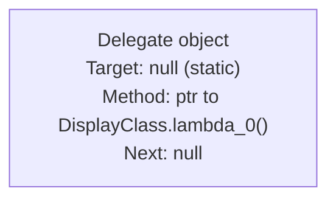
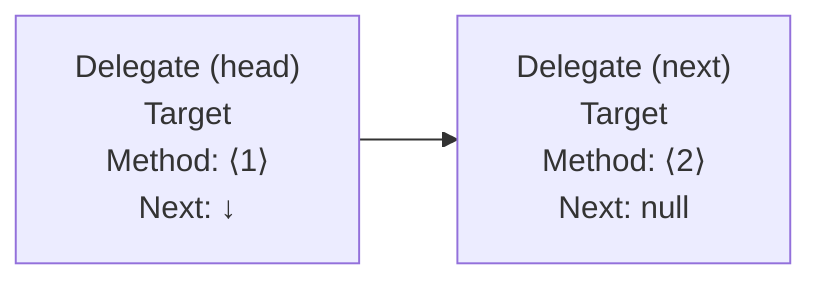

# Delegates, Events & Lambdas

> [Mastery Guide](../../README.md) › [Foundations](../README.md) › [C# Mastery](./README.md)

| Status | Priority | Phase | Last reviewed |
|---|---|---|---|
| Not Started | High | Phase 1 — Language & Runtime Fluency | 2026-05-07 |

## Contents
- [Why it matters](#why-it-matters)
- [Core concepts](#core-concepts)
  - [Delegates — type-safe method references](#delegates--type-safe-method-references)
  - [`Action`, `Func`, `Predicate` — the BCL trio](#action-func-predicate--the-bcl-trio)
  - [`Func<T>` vs `Action<T>` vs custom delegates — when each](#funct-vs-actiont-vs-custom-delegates--when-each)
  - [Multicast delegates](#multicast-delegates)
  - [Multicast exception behavior — the chain breaks](#multicast-exception-behavior--the-chain-breaks)
  - [Delegate variance — `in` and `out` rules](#delegate-variance--in-and-out-rules)
  - [Lambda expressions](#lambda-expressions)
  - [Method group vs lambda — what the compiler does differently](#method-group-vs-lambda--what-the-compiler-does-differently)
  - [Closures and capture rules](#closures-and-capture-rules)
  - [Closure capture mechanics — what the compiler emits](#closure-capture-mechanics--what-the-compiler-emits)
  - [Capturing `this` — the leak risk](#capturing-this--the-leak-risk)
  - [The `foreach` capture trap (and the C# 5 fix)](#the-foreach-capture-trap-and-the-c-5-fix)
  - [Expression trees — code as data](#expression-trees--code-as-data)
  - [Building an expression tree by hand](#building-an-expression-tree-by-hand)
  - [Events — pub/sub on top of delegates](#events--pubsub-on-top-of-delegates)
  - [Event vs delegate field — what protection events add](#event-vs-delegate-field--what-protection-events-add)
  - [Field-like events vs explicit add/remove accessors](#field-like-events-vs-explicit-addremove-accessors)
  - [Removing a lambda from an event — why it doesn't work](#removing-a-lambda-from-an-event--why-it-doesnt-work)
  - [Async lambdas — when `async` becomes `async void`](#async-lambdas--when-async-becomes-async-void)
  - [`[ThreadStatic]` and `AsyncLocal<T>` in closures](#threadstatic-and-asynclocalt-in-closures)
  - [Function pointers (`delegate*`, C# 9) vs delegates](#function-pointers-delegate-c-9-vs-delegates)
  - [Static lambdas (C# 9) and default parameters (C# 12)](#static-lambdas-c-9-and-default-parameters-c-12)
- [Code & diagrams](#code--diagrams)
- [Common pitfalls](#common-pitfalls)
- [Interview-ready summary](#interview-ready-summary)
- [Interview Cross-Questioning Drill](#interview-cross-questioning-drill)
- [Cheat Sheet](#cheat-sheet)
- [Walkthrough](#walkthrough--event-handler-memory-leak)
- [Self-test](#self-test)
- [Cross-references](#cross-references)
- [Sources](#sources)

---

## Why it matters

Delegates and lambdas are how C# expresses "code as a value" — pass a function, return a function, store a function in a list. Every LINQ operator, every `Task.Run(...)`, every event handler, every middleware in ASP.NET Core uses them. The tricky parts are **closure capture** (especially the `foreach` rule) and **expression trees** (which let `IQueryable` translate code to SQL). Both are senior-interview staples.

Modern C# made these features even easier: target-typing for delegates (C# 10), static lambdas (C# 9, no captures), default lambda parameters (C# 12), and `params` collections in lambdas (C# 13). Worth knowing what's modern vs. legacy.

## Core concepts

### Delegates — type-safe method references

A **delegate** is a type that represents a method signature. You can store a method reference in a delegate variable and invoke it later.

```csharp
// Delegate type declaration — names a signature
public delegate int BinaryOp(int a, int b);

// Methods that match the signature
int Add(int a, int b) => a + b;
int Multiply(int a, int b) => a * b;

// Assign and invoke
BinaryOp op = Add;
int sum = op(2, 3);          // 5

op = Multiply;
int product = op(2, 3);      // 6

// Methods are first-class values
BinaryOp[] ops = { Add, Multiply };
foreach (var f in ops) Console.WriteLine(f(4, 5));
```

Internally, a delegate instance carries:
- A **target** — the object instance the method belongs to (or `null` for static methods).
- A **method pointer** — what to call.
- A **next** field — for multicast (see below).

Calling a delegate has small overhead vs. a direct call (one indirection through a method table) but is dramatically faster than reflection-based invocation.

### `Action`, `Func`, `Predicate` — the BCL trio

You almost never declare a custom delegate type anymore — the BCL ships generic delegate types that cover every signature.

| Delegate | Signature | Use |
|---|---|---|
| `Action` | `void()` | No args, no return |
| `Action<T>` | `void(T)` | One arg, no return |
| `Action<T1, T2>` | `void(T1, T2)` | ...up to 16 args |
| `Func<TResult>` | `TResult()` | No args, returns |
| `Func<T, TResult>` | `TResult(T)` | One arg, returns |
| `Func<T1, T2, TResult>` | `TResult(T1, T2)` | ...up to 16 args |
| `Predicate<T>` | `bool(T)` | One arg, bool return — used by `List<T>.Find`, `Array.Find`, etc. |

```csharp
// Use Func<,> instead of declaring your own
Func<int, int, int> add = (a, b) => a + b;
Func<int, int, int> mul = (a, b) => a * b;

// Action for fire-and-forget work
Action<string> log = Console.WriteLine;
log("hello");

// Predicate for filters
Predicate<int> isEven = n => n % 2 == 0;
var nums = new List<int> { 1, 2, 3, 4 };
var first = nums.Find(isEven);   // 2
```

`Predicate<T>` is older and largely superseded by `Func<T, bool>` (which LINQ uses uniformly). They're functionally identical, just different type names.

### `Func<T>` vs `Action<T>` vs custom delegates — when each

The BCL covers >99% of delegate needs. But "should I ever declare my own `delegate` type?" is a real interview question. Here's the answer matrix.

| Scenario | Use | Why |
|---|---|---|
| Returns a value | `Func<...>` | One line, no new type to introduce |
| Returns void | `Action<...>` | Same |
| Bool predicate over one item | `Func<T, bool>` (preferred) or `Predicate<T>` (legacy) | LINQ uses `Func<T,bool>`; matches everywhere |
| Parameter names matter for tooling / documentation | Custom delegate | `Func<int, int, int>` is anonymous; `delegate int Reducer(int acc, int item)` self-documents |
| Variance required on `out` / `in` for *your* type parameter | Custom delegate | You can declare your own `in` and `out` (the BCL trio already declares them for the common cases) |
| `ref` / `out` / `in` parameters | Custom delegate | `Func<>`/`Action<>` cannot express ref-kinds; declare `delegate bool TryParser<T>(string s, out T value);` |
| `params` array or default parameter values in delegate signature | Custom delegate | `Func<>`/`Action<>` parameters are positional with no defaults |
| Signature appears in *many* public APIs and you want a strong domain name | Custom delegate | `delegate Money Discount(Order o);` reads better than `Func<Order, Money>` everywhere |

```csharp
// Custom delegate: ref / out / parameter names you can't express with Func<>/Action<>
public delegate bool TryParse<T>(ReadOnlySpan<char> input, out T value);

// Custom delegate: in/out variance on your own type parameter
public delegate TResult Mapper<in TInput, out TResult>(TInput input);

// Custom delegate: meaningful name reused across a domain
public delegate decimal PricingRule(Order order, Customer customer);
```

**Rule of thumb:** start with `Func<>`/`Action<>`. Promote to a custom delegate when you find yourself writing the same `Func<Order, Customer, decimal>` in five places, or when you need `ref`/`out`, or when parameter names would help readers (`Func<int, int, int>` is genuinely confusing for `(acc, item) => acc + item`).

### Multicast delegates

A delegate can hold **multiple targets**. Invoking it calls them all in sequence.

```csharp
Action a = () => Console.WriteLine("first");
a += () => Console.WriteLine("second");
a += () => Console.WriteLine("third");

a();
// first
// second
// third

a -= a.GetInvocationList()[0] as Action;  // remove first
a();
// second
// third
```

For `Func<>` returning a value, only the **last** target's return value is observed — the others run but their results are discarded. Use multicast almost exclusively for `Action`-shaped (void) chains; if you need all results, use a list of `Func<>` and aggregate manually.

Events build on multicast. Skip ahead if curious.

### Multicast exception behavior — the chain breaks

This is a question that catches juniors and even mids. **When a handler in a multicast chain throws, the remaining handlers do not run, and the exception propagates back to the caller.**

```csharp
Action chain = () => Console.WriteLine("first");
chain += () => throw new InvalidOperationException("boom");
chain += () => Console.WriteLine("third — never reached");

try { chain(); }
catch (InvalidOperationException) { Console.WriteLine("caught"); }

// Output:
// first
// caught
// (the "third" handler did NOT run)
```

**Why this is dangerous for events.** A naive `MyEvent?.Invoke(this, args)` is equivalent to chaining handlers — one buggy subscriber breaks every later subscriber. In a UI app: one bad event handler aborts the broadcast and the rest of the UI never updates. In a domain event bus: one slow handler throwing means downstream side-effects (logging, audit, projections) silently skip.

**Defensive invocation — walk the invocation list:**

```csharp
public event EventHandler<OrderEventArgs>? OrderPlaced;

protected void RaiseOrderPlaced(OrderEventArgs e)
{
    var handlers = OrderPlaced;
    if (handlers is null) return;

    var exceptions = new List<Exception>();
    foreach (EventHandler<OrderEventArgs> h in handlers.GetInvocationList())
    {
        try { h(this, e); }
        catch (Exception ex) { exceptions.Add(ex); }
    }

    if (exceptions.Count > 0)
        throw new AggregateException("One or more handlers failed", exceptions);
}
```

This pattern walks every entry in the invocation list independently, collects exceptions, and either rethrows as `AggregateException` or logs and continues — depending on whether handler failures are recoverable. The cost is a small amount of boilerplate; the benefit is **a misbehaving subscriber can't take down the publisher's broadcast.**

**Async multicast is even worse.** A `Func<Task> chain` doesn't return until you `await` it, and only the *last* `Task` is returned by the multicast invocation — every earlier handler's `Task` (including any exceptions on it) is discarded. For async fan-out, store handlers in a `List<Func<...>>` and call them explicitly with `Task.WhenAll(...)` (failure-isolated via `ContinueWith`) or sequentially.

### Delegate variance — `in` and `out` rules

Delegates with generic parameters can be **variant** — assignable to delegate types with related (but not identical) generic arguments.

```csharp
class Animal { }
class Dog : Animal { }

// Func<out T> — covariant on the return type
Func<Dog> dogFactory = () => new Dog();
Func<Animal> animalFactory = dogFactory;     // ✓ — returning Dog where Animal is expected is safe
Animal a = animalFactory();                  // gets a Dog (which IS an Animal)

// Action<in T> — contravariant on the parameter type
Action<Animal> animalHandler = a => Console.WriteLine(a.GetType());
Action<Dog> dogHandler = animalHandler;      // ✓ — a method that handles ANY Animal can handle a Dog
dogHandler(new Dog());                       // animalHandler runs on the Dog

// Func<in T, out TResult> — contravariant in, covariant out
Func<Animal, Dog> f = a => new Dog();
Func<Dog, Animal> g = f;                     // ✓ — accepts Dog (subtype of Animal), returns Animal (supertype of Dog)
```

**The two questions:**
- Is `Func<Animal>` assignable to `Func<Dog>`? **No.** `Func<out T>` is covariant, so the *return type* must be more derived going one way. `Animal` is not assignable from `Dog` in the output position. (Reverse holds: `Func<Dog>` → `Func<Animal>` works.)
- Is `Action<Dog>` assignable to `Action<Animal>`? **No.** `Action<in T>` is contravariant, so the *parameter type* must be more general going one way. An `Action<Dog>` doesn't know how to handle a `Cat`, so accepting it as `Action<Animal>` would be unsafe. (Reverse holds: `Action<Animal>` → `Action<Dog>` works.)

**Mnemonic:** `out` = "**Goes** out — covariant — subtype OK"; `in` = "**Comes** in — contravariant — supertype OK." Or: the BCL's `IEnumerable<out T>` is covariant for the same reason `Func<out T>` is — both produce `T`s.

**Custom delegate variance:** declare your own with `in`/`out` modifiers:

```csharp
public delegate TResult Mapper<in TIn, out TOut>(TIn input);

Mapper<Animal, Dog> m1 = a => new Dog();
Mapper<Dog, Animal> m2 = m1;                 // ✓ — variance accepted
```

Variance only works for **reference types** (and interfaces / delegates). Value types are invariant — `IEnumerable<int>` is NOT assignable to `IEnumerable<object>` (boxing would be required to materialize each `object`, which the runtime won't insert for variance).

### Lambda expressions

A **lambda** is an inline anonymous function. Two forms:

```csharp
// Expression lambda — single expression body, return inferred
Func<int, int> square = x => x * x;

// Statement lambda — block body
Func<int, int> squareLogged = x =>
{
    Console.WriteLine($"squaring {x}");
    return x * x;
};

// Multiple parameters need parentheses
Func<int, int, int> add = (a, b) => a + b;

// Zero parameters — empty parentheses
Func<int> rand = () => Random.Shared.Next();

// Explicit types (rarely needed but legal — useful when inference fails)
Func<int, int> sq = (int x) => x * x;
```

**Target typing (C# 10):** lambdas are inferred against the variable's declared type, including for `var`:

```csharp
var f = (int x) => x * x;          // Func<int, int>  (inferred)
var g = (int x, int y) => x + y;   // Func<int, int, int>
var h = void (int x) => Console.WriteLine(x);  // Action<int> (explicit return type, C# 10)
```

You can also annotate attributes and return types on lambdas:

```csharp
var divide = [Pure] (double a, double b) => a / b;        // attribute on lambda
var safeDivide = double (double a, double b) =>           // explicit return type
    b == 0 ? double.NaN : a / b;
```

### Method group vs lambda — what the compiler does differently

Subscribing to an event has two visually-similar forms:

```csharp
button.Click += Handler;                        // method group
button.Click += (s, e) => Handler(s, e);        // lambda wrapping the method
```

They look equivalent. They are not. The differences matter for unsubscription, allocation, and equality.

| Aspect | Method group (`button.Click += Handler`) | Lambda (`button.Click += (s,e) => Handler(s,e)`) |
|---|---|---|
| Delegate identity | Cached after C# 11 — same method group binds to the same delegate instance on repeated subscriptions | Each occurrence is a *different* delegate instance |
| `-=` removes it? | Yes — `button.Click -= Handler` works | **No** — `button.Click -= (s,e) => Handler(s,e)` creates a *new* lambda; the original is never matched |
| Allocations | One delegate allocation, then cached (C# 11+) | Lambda + closure (if captures) per occurrence |
| Stack trace clarity | Shows `Handler` directly | Shows compiler-generated `<>c.<.ctor>b__0_0`, less readable |
| Captures? | No (unless `Handler` is a closed instance method; then captures `this`) | Whatever the lambda body references |

**The unsubscription gotcha** (#1 cause of "I subscribed `-=` but my handler still fires"):

```csharp
class Subscriber
{
    public void Subscribe(Button b)
    {
        b.Click += (s, e) => OnClick(s, e);    // lambda A
    }

    public void Unsubscribe(Button b)
    {
        b.Click -= (s, e) => OnClick(s, e);    // lambda B — different instance, no-op
    }

    void OnClick(object? s, EventArgs e) { /* ... */ }
}
```

Lambdas A and B have the same body, but they are different delegate instances. The `-=` does nothing because the publisher's invocation list contains A, not B.

**Two fixes:**

```csharp
// Fix 1: subscribe with a method group
b.Click += OnClick;
b.Click -= OnClick;          // ✓ — same method group, same delegate

// Fix 2: store the lambda once
private EventHandler? _click;
public void Subscribe(Button b)
{
    _click = (s, e) => OnClick(s, e);
    b.Click += _click;
}
public void Unsubscribe(Button b)
{
    if (_click is not null) b.Click -= _click;   // ✓ — same instance
}
```

**Why C# 11 changed delegate caching:** before C# 11, even method groups allocated a fresh delegate on each `+=` (the JIT could elide some cases but not guarantee it). C# 11 introduced the *method group conversion cache* — repeated `button.Click += Handler` binds the same cached delegate instance. This made the event-leak pattern more forgiving and lambda-vs-method-group performance more predictable.

### Closures and capture rules

A lambda can reference variables from its enclosing scope. The compiler **captures** them — moving them off the stack into a heap-allocated *closure object* so they outlive the enclosing method.

```csharp
Func<int> CounterFactory()
{
    int count = 0;
    return () => ++count;     // 'count' captured by reference (in a generated class)
}

var c = CounterFactory();
Console.WriteLine(c());  // 1
Console.WriteLine(c());  // 2
Console.WriteLine(c());  // 3
// 'count' lives as long as the lambda lives, even though CounterFactory() returned.
```

**What gets captured:**
- **Locals** — by reference. The lambda sees the *current* value of the variable, even if it changes after capture.
- **`this`** — captured implicitly when the lambda touches an instance field. Anchors the entire enclosing object.
- **`ref` / `out` / `in` parameters** — cannot be captured; compile error.

**Cost of capture:** the compiler generates a hidden class to hold the captured variables, and the lambda becomes an instance method on that class. One heap allocation per closure. For tight loops, this is GC pressure you can usually avoid:

```csharp
// ❌ Allocates a closure per iteration (in older compilers; modern can hoist)
for (int i = 0; i < 1000; i++)
    DoWork(() => Process(i));   // 'i' captured

// ✓ No capture — pass parameters instead
for (int i = 0; i < 1000; i++)
    DoWork(i, static (n) => Process(n));  // static lambda + arg
```

`static` lambdas (C# 9) explicitly forbid any capture, eliminating the closure allocation:

```csharp
Func<int, int> square = static x => x * x;   // OK — no capture
int factor = 3;
Func<int, int> times3 = static x => x * factor;  // ❌ — 'factor' captured, can't be static
```

### Closure capture mechanics — what the compiler emits

Capture-by-reference is the rule that breaks the most assumptions. **Locals are not snapshotted at the moment of lambda creation — the lambda sees the variable's *current* value at the moment of invocation.**

```csharp
int x = 10;
Func<int> f = () => x;          // captures the variable x, not the value 10
x = 20;
Console.WriteLine(f());         // prints 20 — the CURRENT value of x
```

**What the compiler actually does** (the classic interview "show me what's underneath"):

```csharp
// Source you wrote:
int x = 10;
Func<int> f = () => x;
x = 20;
int v = f();
```

```csharp
// What Roslyn emits (simplified):
class <>c__DisplayClass0_0
{
    public int x;                                   // hoisted local — now a field
    internal int <Main>b__0() => x;                 // the lambda body
}

var __closure = new <>c__DisplayClass0_0();
__closure.x = 10;
Func<int> f = __closure.<Main>b__0;
__closure.x = 20;
int v = f();                                        // reads __closure.x → 20
```

Two things to notice:
1. **`x` is no longer a local** — it's been *hoisted* into a field on a heap-allocated closure class. Every reference to `x` in the source (both the lambda body AND subsequent `x = 20`) now goes through `__closure.x`.
2. **One heap allocation per closure scope**, not per lambda invocation. If you create the lambda in a loop, the loop body shares the same closure — *unless* a fresh local is declared inside the loop (each iteration creates a new closure instance).

**Multiple lambdas can share one closure:**

```csharp
int counter = 0;
Action increment = () => counter++;
Func<int> read = () => counter;
// Both lambdas land as methods on the SAME generated closure class.
// 'counter' is one field; both methods reference it.

increment();
increment();
Console.WriteLine(read());   // 2 — shared state via the closure
```

**Captures and `using`/disposal:** if a lambda captures an `IDisposable` local, the local can be disposed but the closure still holds the reference. Calls to the disposed object then throw `ObjectDisposedException`:

```csharp
Action a;
using (var stream = new MemoryStream())
{
    a = () => stream.WriteByte(1);    // captures 'stream'
}
a();    // throws ObjectDisposedException — closure holds the disposed instance
```

### Capturing `this` — the leak risk

Any lambda that references an instance field or instance method **implicitly captures `this`**:

```csharp
public class HotPath
{
    private readonly string _name = "x";

    public Func<string> CreateGetter()
    {
        return () => _name;       // captures 'this' (not just _name) — the WHOLE instance is rooted
    }
}
```

The generated closure stores a reference to `this`, not to `_name` directly. The result: **as long as the returned `Func<string>` lives, the entire `HotPath` instance is reachable and can't be GC'd.**

**Real-world leak scenarios:**

1. **Subscribing to a static event with a lambda capturing `this`** — the static event keeps the instance alive forever.
2. **Caching a `Func<...>` in a long-lived dictionary** when the lambda captured `this` — the dictionary roots the instance.
3. **Background timer with a closure-over-`this` callback** — the timer (queued in the `ThreadPool`) roots the instance.

**Detection:** in a memory profiler, the leaked instance shows GC root `+ DelegateInvocationList -> <>c__DisplayClass -> this`. The closure class is always visible.

**Defenses:**

```csharp
// Defense 1: pull the field into a local before the lambda — captures ONLY the local
public Func<string> CreateGetterSafe()
{
    var name = _name;             // local — value of _name
    return () => name;            // captures 'name', not 'this'
}

// Defense 2: static lambda + pass instance explicitly via state
public static Func<string> CreateGetterStatic(HotPath p) =>
    static () => "static-only";   // forbids any capture

// Defense 3: weak reference for long-lived subscriptions
public Func<string?> CreateWeakGetter()
{
    var weak = new WeakReference<HotPath>(this);
    return () => weak.TryGetTarget(out var target) ? target._name : null;
}
```

The compiler can sometimes detect "this lambda only captures a single field, hoist just the field" but historically does not — most lambdas referencing `_name` capture all of `this`. **When `this`-leak matters (long-lived caches, static-event subscriptions), pull fields into locals explicitly.**

### The `foreach` capture trap (and the C# 5 fix)

Famous interview question. Pre-C# 5:

```csharp
var actions = new List<Action>();
foreach (var i in new[] { 1, 2, 3 })
    actions.Add(() => Console.WriteLine(i));

foreach (var a in actions) a();
// Pre-C# 5: 3 3 3   (!)
// C# 5+:    1 2 3
```

**Why pre-C# 5 was 3 3 3:** the `foreach` loop's variable `i` was a *single* slot reused across iterations. All three lambdas captured the *same* slot — by the time they ran, the loop had finished and `i` held its last value (3). The fix in C# 5 was to give `foreach` a *fresh* iteration variable on each pass, so each lambda captures a distinct `i`.

**The same trap still exists with `for`:**

```csharp
var actions = new List<Action>();
for (int i = 0; i < 3; i++)
    actions.Add(() => Console.WriteLine(i));

foreach (var a in actions) a();
// Output: 3 3 3   — even in modern C#!
```

To get 0 1 2, copy the loop variable into a fresh local:

```csharp
for (int i = 0; i < 3; i++)
{
    int captured = i;
    actions.Add(() => Console.WriteLine(captured));
}
// Output: 0 1 2
```

Or just use `foreach` with a range / collection, since `foreach` got fixed.

### Expression trees — code as data

A lambda assigned to `Expression<Func<...>>` (instead of `Func<...>`) is **not compiled to IL**. The compiler converts it to an expression tree — a runtime data structure representing the AST.

```csharp
Func<int, int> compiled = x => x * x;
int v1 = compiled(5);                 // 25 — runs the IL

Expression<Func<int, int>> tree = x => x * x;
// 'tree' is a tree of Expression nodes — not directly callable.
Console.WriteLine(tree);              // x => (x * x)
Console.WriteLine(tree.Body);         // (x * x)

var compiledFromTree = tree.Compile();   // produces a Func<int,int> at runtime
Console.WriteLine(compiledFromTree(5));  // 25
```

**Why this matters: `IQueryable<T>` consumes expression trees**, not `Func`s. EF Core, LINQ-to-SQL, and any custom query provider walk the tree and translate it (e.g., to SQL) — they need access to the *structure* of `x => x.Age > 18`, not just an opaque function pointer.

```csharp
// IEnumerable<T>: takes Func — code, not data
list.Where(x => x.Age > 18);           // runs in-process

// IQueryable<T>: takes Expression<Func<>> — data, walked by the provider
db.Users.Where(x => x.Age > 18);       // translated to SQL: WHERE Age > 18
```

If you write `db.Users.Where(myDelegate)`, the provider can't introspect the delegate body — it falls back to client-side evaluation (slow) or throws.

Expression trees can also be **constructed manually** for codegen — e.g., a fast property getter:

```csharp
ParameterExpression x = Expression.Parameter(typeof(Person), "p");
MemberExpression  body = Expression.Property(x, "Age");
var lambda = Expression.Lambda<Func<Person, int>>(body, x);
Func<Person, int> getAge = lambda.Compile();
```

This is how high-perf libraries (AutoMapper, Dapper) build accessors at runtime that beat reflection.

### Building an expression tree by hand

The compiler can build trees for you (`Expression<Func<...>>`), but you can also build them programmatically — needed when the source isn't known at compile time (dynamic filters from a UI, search-DSL parsers, codegen).

```csharp
// Goal: build the equivalent of  p => p.Age > 18  programmatically.

ParameterExpression p = Expression.Parameter(typeof(Person), "p");           // p
MemberExpression    age = Expression.Property(p, nameof(Person.Age));        // p.Age
ConstantExpression  threshold = Expression.Constant(18);                     // 18
BinaryExpression    gt = Expression.GreaterThan(age, threshold);             // p.Age > 18
Expression<Func<Person, bool>> tree = Expression.Lambda<Func<Person, bool>>(gt, p);

// Compile to executable Func
Func<Person, bool> compiled = tree.Compile();
compiled(new Person { Age = 21 });       // true

// Or hand to EF Core: it translates to SQL "WHERE Age > 18"
db.People.Where(tree).ToList();
```

**Building a property accessor (`p => p.PropertyName` where the name is a string):**

```csharp
public static Expression<Func<T, object?>> PropertyAccessor<T>(string propertyName)
{
    var param = Expression.Parameter(typeof(T), "x");
    var prop = Expression.PropertyOrField(param, propertyName);
    var converted = Expression.Convert(prop, typeof(object));     // box value types
    return Expression.Lambda<Func<T, object?>>(converted, param);
}

var getName = PropertyAccessor<Person>("Name").Compile();
getName(new Person { Name = "Alice" });   // "Alice"
```

**Compilation is expensive — cache the compiled `Func`** in a `ConcurrentDictionary<string, Delegate>` keyed by property name. Compilation is ~10-100× the cost of a single invocation; the compiled delegate runs at ~1.5× the cost of a hand-written method (within 50 ns/call typically).

**Common builders in libraries:**
- AutoMapper builds member-by-member projection trees from `MapFrom(src => src.Foo)` overloads, compiles them once at startup.
- Dapper builds row-to-POCO materializers as expression trees, caches by `(Type, columnSchema)` key.
- EF Core composes `Where`/`Select` calls by combining caller-supplied trees with its own.

### Events — pub/sub on top of delegates

An **event** is a delegate field with restricted access — only the declaring type can `raise` (invoke) it; outside code can only subscribe (`+=`) and unsubscribe (`-=`).

```csharp
public class Order
{
    // Conventional event with EventArgs
    public event EventHandler<OrderShippedEventArgs>? Shipped;

    public void Ship()
    {
        // do shipping work...
        Shipped?.Invoke(this, new OrderShippedEventArgs(DateTime.UtcNow));
    }
}

public class OrderShippedEventArgs(DateTime shippedAt) : EventArgs
{
    public DateTime ShippedAt { get; } = shippedAt;
}

// Consumer
var order = new Order();
order.Shipped += (sender, e) => Console.WriteLine($"Shipped at {e.ShippedAt}");
order.Ship();
```

**Convention: `EventHandler<TEventArgs>`.** Two parameters (`sender` and `e`); `TEventArgs` derives from `EventArgs`. This pattern is consistent across the BCL.

**Memory leak risk: forgetting `-=`.** If a consumer subscribes to a long-lived publisher's event and never unsubscribes, the publisher holds a reference to the consumer (via the captured `this` in the handler) and the consumer can't be GC'd. This is the classic "event memory leak."

Defensive patterns:
- `WeakEventManager` (WPF) for UI event subscriptions across long-lived models.
- `IDisposable` wrapper that subscribes on construction, unsubscribes on `Dispose`.
- Anonymous lambda subscribers + careful scope management.

```csharp
public class HealthMonitor : IDisposable
{
    private readonly Order _order;
    private readonly EventHandler<OrderShippedEventArgs> _handler;

    public HealthMonitor(Order order)
    {
        _order = order;
        _handler = (s, e) => Log(e);
        _order.Shipped += _handler;
    }

    public void Dispose() => _order.Shipped -= _handler;
}
```

### Event vs delegate field — what protection events add

A common interview question: "Why use `event EventHandler` instead of a public `EventHandler` field?" The answer is **encapsulation enforced by the language.**

```csharp
public class WithPublicDelegate
{
    public EventHandler<EventArgs>? OnSomething;     // raw public delegate field

    public void Trigger() => OnSomething?.Invoke(this, EventArgs.Empty);
}

public class WithEvent
{
    public event EventHandler<EventArgs>? OnSomething;  // event modifier

    public void Trigger() => OnSomething?.Invoke(this, EventArgs.Empty);
}

// Consumer code:
var a = new WithPublicDelegate();
a.OnSomething += Handler;       // ✓ allowed
a.OnSomething = null;           // ✓ ALSO allowed — wipes out everyone's subscriptions!
a.OnSomething.Invoke(...);      // ✓ ALSO allowed — outside code can RAISE the "event"!

var b = new WithEvent();
b.OnSomething += Handler;       // ✓ allowed
b.OnSomething = null;           // ❌ compile error: event can only appear on the left side of += or -=
b.OnSomething.Invoke(...);      // ❌ compile error: event cannot be raised outside its declaring type
```

**The `event` modifier enforces three restrictions on consumers:**

| Operation | Public delegate field | `event` |
|---|---|---|
| Subscribe (`+=`) | ✓ | ✓ |
| Unsubscribe (`-=`) | ✓ | ✓ |
| Assign (`=`) | ✓ | ✗ — only `+=`/`-=` allowed |
| Invoke from outside | ✓ | ✗ — only the declaring type can `Invoke` / `?.Invoke` |
| Pass as a `Delegate` parameter | ✓ | ✗ (outside the declaring type) — you must wrap or expose `GetInvocationList()` |
| Set to `null` to clear all handlers | ✓ | ✗ — declaring type can do this internally |

**Why these restrictions are right.** Without them, a buggy consumer can:
- Wipe out every other subscriber by doing `publisher.OnSomething = null;` or `publisher.OnSomething = MyHandler;` (which *replaces* the chain, not appends).
- Forge events by raising `publisher.OnSomething.Invoke(forgedSender, forgedArgs)` — the publisher loses control of when its own events fire.

**The event keyword turns a public field into a public *protocol*** — subscribers can come and go, but the publisher owns invocation. That's the encapsulation a class should not have to defend by code review alone.

### Field-like events vs explicit add/remove accessors

The `event` declaration has two forms.

**Field-like event** (what 99% of code uses):

```csharp
public event EventHandler<EventArgs>? OnSomething;
```

The compiler generates:
- A private backing delegate field.
- Public `add` / `remove` accessors that thread-safely combine/remove handlers (`Delegate.Combine` / `Delegate.Remove`).
- The class's *own* code can read the underlying field for invocation.

**Explicit `add` / `remove` accessors** (when you need custom storage or behavior):

```csharp
public class Publisher
{
    private readonly object _gate = new();
    private EventHandler<EventArgs>? _onSomething;

    public event EventHandler<EventArgs>? OnSomething
    {
        add
        {
            lock (_gate) _onSomething += value;
            Console.WriteLine("subscriber added");
        }
        remove
        {
            lock (_gate) _onSomething -= value;
            Console.WriteLine("subscriber removed");
        }
    }

    protected void Raise(EventArgs e)
    {
        EventHandler<EventArgs>? snapshot;
        lock (_gate) snapshot = _onSomething;
        snapshot?.Invoke(this, e);
    }
}
```

**When to use explicit accessors:**
- Custom storage (weak references for leak-resistant events, lazy allocation only when first subscriber arrives).
- Side effects on subscribe / unsubscribe (logging, telemetry, lazy resource setup).
- Combining multiple underlying events into one (a "facade" event that subscribes / unsubscribes from several sources internally).
- Backing store other than a delegate field (e.g., a `List<EventHandler>` for ordering, or a priority queue).

**Note:** field-like events already have a thread-safe `add`/`remove` (since C# 4) using `Interlocked.CompareExchange`. You only need explicit accessors when you want behavior beyond combine/remove.

### Removing a lambda from an event — why it doesn't work

A subtle, painful gotcha. **You cannot unsubscribe a lambda by writing the same lambda again — each lambda expression is a fresh delegate instance.**

```csharp
publisher.OnSomething += (s, e) => Log(e);     // subscription A
publisher.OnSomething -= (s, e) => Log(e);     // subscription B — DIFFERENT instance
// A is still subscribed. B never matched anything in the invocation list.
```

The lambdas have identical *bodies*, but they compile to **two distinct delegate instances** (each with its own compiler-generated method). The invocation list contains A; `-=` searches for delegates equal to B; equality compares `(Target, Method)` pairs; the methods differ; no match; no removal.

**Fixes (in order of preference):**

```csharp
// Fix 1 — use a method group (only viable if the handler is a real named method)
publisher.OnSomething += OnSomethingHandler;
publisher.OnSomething -= OnSomethingHandler;        // ✓ same method group → same cached delegate

// Fix 2 — store the lambda once, reuse the same instance
EventHandler<EventArgs> handler = (s, e) => Log(e);
publisher.OnSomething += handler;
publisher.OnSomething -= handler;                   // ✓ same instance

// Fix 3 — IDisposable wrapper
public sealed class Subscription : IDisposable
{
    readonly Action _unsubscribe;
    public Subscription(Action subscribe, Action unsubscribe)
    {
        subscribe();
        _unsubscribe = unsubscribe;
    }
    public void Dispose() => _unsubscribe();
}

EventHandler<EventArgs> handler = (s, e) => Log(e);
using var sub = new Subscription(
    () => publisher.OnSomething += handler,
    () => publisher.OnSomething -= handler);
// At end of using, sub.Dispose() unsubscribes deterministically.
```

The Reactive Extensions library (`IObservable<T>.Subscribe`) is built entirely around the `IDisposable` subscription model — partly because it solves this gotcha at the API design level.

### Async lambdas — when `async` becomes `async void`

The most dangerous lambda pattern in C#. Async lambdas have three possible return shapes depending on the target delegate type:

```csharp
Func<Task> a1 = async () => { await Task.Delay(100); };               // returns Task — awaitable
Func<int, Task<int>> a2 = async x => { await Task.Yield(); return x; };  // Task<T> — awaitable, with value
Action a3 = async () => { await Task.Delay(100); };                   // returns void — async void — DANGER
```

The third form is the trap. **When you assign an `async` lambda to a delegate type whose return is `void` (any `Action<...>`, `EventHandler`, `EventHandler<TArgs>`), the lambda becomes `async void`.**

**Why `async void` is dangerous:**

1. **Exceptions are not on a Task** — they propagate to the `SynchronizationContext` (or `ThreadPool` if none). In ASP.NET Core, there's no `SynchronizationContext`, so the exception crashes the request thread; in WPF / WinForms, it crashes the UI thread.
2. **The caller can't `await` it** — you fire and forget. Any error timing is non-deterministic; the caller continues executing while the lambda is still running.
3. **It's hard to detect** — `Func<Task>` and `Action` look almost identical when written inline; the compiler picks based on what's expected.

**The classic bug — event handler:**

```csharp
public class OrderViewModel
{
    public event EventHandler? OrderPlaced;

    void OnButtonClick()
    {
        // Subscribing an async handler to a sync-shaped event
        OrderPlaced += async (s, e) =>
        {
            await PlaceOrderAsync();           // async work
            await SendEmailAsync();            // any throw here = async void exception = process risk
        };
    }
}
```

**The safe pattern — wrap the async work:**

```csharp
// Option 1: explicit async void with try/catch (acknowledges the constraint)
publisher.OrderPlaced += async (s, e) =>
{
    try
    {
        await PlaceOrderAsync();
        await SendEmailAsync();
    }
    catch (Exception ex)
    {
        _logger.LogError(ex, "OrderPlaced handler failed");
    }
};

// Option 2: change the event to async-shaped (Func<...>-style)
public event Func<object?, EventArgs, Task>? OrderPlacedAsync;

protected async Task RaiseOrderPlacedAsync(EventArgs e)
{
    var handlers = OrderPlacedAsync;
    if (handlers is null) return;
    foreach (Func<object?, EventArgs, Task> h in handlers.GetInvocationList())
        await h(this, e);
}

// Option 3: pub/sub library (MediatR's INotificationHandler, Channel<T>, IObservable<T>)
```

**Rule:** `async () => ...` is safe ONLY when the target delegate type returns `Task` or `Task<T>`. If it returns `void`, you've made `async void`. Inspect every `async` lambda you write next to its target type.

### `[ThreadStatic]` and `AsyncLocal<T>` in closures

A lambda captures locals. But what about **ambient state** — values that travel with the *call*, not the lambda's own scope? This is where `[ThreadStatic]` and `AsyncLocal<T>` differ, and the distinction matters whenever a closure crosses an `await`.

```csharp
[ThreadStatic] private static int _threadStaticValue;        // per-OS-thread
private static AsyncLocal<int> _asyncLocalValue = new();     // per-logical async flow

async Task Test()
{
    _threadStaticValue = 42;
    _asyncLocalValue.Value = 42;
    Console.WriteLine($"before: ts={_threadStaticValue}, al={_asyncLocalValue.Value}");

    await Task.Delay(50);    // may resume on a DIFFERENT thread

    Console.WriteLine($"after : ts={_threadStaticValue}, al={_asyncLocalValue.Value}");
    // ts may be 0 (different thread → different ThreadStatic slot)
    // al is still 42 — flows with the logical context
}
```

**Behavior summary:**

| Mechanism | Scope | Survives `await`? | Captured by closure? |
|---|---|---|---|
| Plain local | Method-scope | N/A — closure captures it as a normal variable | Yes |
| `[ThreadStatic]` static field | Per OS thread | **No** — after `await`, you may be on another thread; slot is fresh | Not captured (it's a static field reference) — value depends on the current thread at invocation |
| `AsyncLocal<T>` | Per logical async flow | **Yes** — `ExecutionContext` flows it across `await` | Not captured — `.Value` is read from the current `ExecutionContext` at invocation |
| `ThreadLocal<T>` | Per OS thread, initialized lazily per thread | **No** — same as `[ThreadStatic]` | Not captured directly |

**The closure-and-`await` interaction:**

```csharp
async Task Foo()
{
    int local = 10;
    Func<int> lambda = () => local;     // captures 'local'

    await Task.Delay(50);               // may resume on another thread

    local = 20;
    Console.WriteLine(lambda());        // 20 — closure capture survives await
                                        // (the closure object lives on the heap, accessible from any thread)
}
```

The closure object is heap-allocated. It survives the `await` because the awaiter resumption captures all closed-over state via the async state machine. **A closure capturing a plain local crosses `await` correctly**; what *doesn't* cross is the OS thread's `[ThreadStatic]` storage — which the closure doesn't capture in the first place.

**Practical implications:**

- **Logger correlation IDs, EF Core's `DbContext` scope, request-scoped data** — use `AsyncLocal<T>`. ASP.NET Core's `HttpContext` flows via `AsyncLocal` internally.
- **Hot-path counters, per-thread scratch buffers** — use `[ThreadStatic]` or `ThreadLocal<T>` AND don't await inside the region that depends on them.
- **Capturing a local that you'll mutate after `await`** — works as expected (the closure tracks the variable, not its value).

### Function pointers (`delegate*`, C# 9) vs delegates

C# 9 introduced `delegate*` — true function pointers, leveraging .NET 5+'s function pointer types. They're a lower-level alternative to `Func`/`Action`/`delegate` for interop and ultra-hot paths.

```csharp
// Function pointer type — points to a static method matching the signature
delegate*<int, int, int> add = &Add;

int Add(int a, int b) => a + b;     // must be static for &-of-method-name
// (instance methods need explicit conversion via a helper)

int result = add(2, 3);             // 5 — no delegate allocation, direct indirect call
```

**Differences from delegates:**

| Aspect | `delegate` / `Func<>` | `delegate*` |
|---|---|---|
| Heap allocation | One per instance (or cached for method groups) | **Zero** — value type, lives on the stack |
| Multicast | Yes (`+=`/`-=` chain) | **No** — single function only |
| Capturing locals (closures) | Yes | **No** — must be a free static function |
| Target object (`this`) | Carries a target | **None** by default (managed); unmanaged variant carries no managed state at all |
| Variance (`in`/`out`) | Yes for generic delegate types | **No** |
| Calling conventions | Managed only | Managed OR unmanaged (`Cdecl`, `Stdcall`, `Fastcall`) — needed for P/Invoke |
| GC interactions | Holds a reference to target; participates in GC | None — pure code address |
| Available where | Anywhere | `unsafe` blocks (or via `[UnmanagedCallersOnly]` interop) |

```csharp
unsafe
{
    delegate*<int, int, int> op = &Add;
    int r = op(2, 3);                    // direct indirect call — ~1 ns
}

// Unmanaged calling convention — for native interop
unsafe
{
    delegate* unmanaged[Cdecl]<int, int, int> native = (delegate* unmanaged[Cdecl]<int, int, int>)LoadNativeFunction();
    int r = native(2, 3);                // calls into a C library directly
}
```

**When to use `delegate*` over `delegate`:**
- Ultra-hot paths (millions of calls/sec) where the per-call ~3-5ns delegate dispatch overhead matters.
- Native interop where you'd otherwise use `Marshal.GetDelegateForFunctionPointer` (and pay marshaling).
- AOT scenarios (NativeAOT, .NET Native) where delegate creation is expensive.

**When to stick with `delegate`/`Func`:**
- You need closures (capturing locals).
- You need multicast.
- You need variance.
- You're not in `unsafe` code and don't want to be.

99% of application code uses `Func`/`Action`/`delegate`. `delegate*` is for the lowest layer — runtime libraries, native interop wrappers, JIT-friendly hot loops.

### Static lambdas (C# 9) and default parameters (C# 12)

**`static` lambdas** — explicitly disallow captures. Useful in hot paths where the closure allocation would matter:

```csharp
Func<int, int> sq = static x => x * x;             // ✓
int n = 5;
Func<int, int> badSq = static x => x * n;          // ❌ CS8820: cannot capture in static
```

**Default lambda parameters (C# 12):**

```csharp
var greet = (string name, string greeting = "Hello") => $"{greeting}, {name}!";
greet("Alice");                    // "Hello, Alice!"
greet("Bob", "Hi");                // "Hi, Bob!"

// Convertible to a delegate type (subject to delegate signature)
Func<string, string, string> g = greet;            // explicit conversion
```

**`params` in lambdas (C# 13):**

```csharp
var sum = (params int[] xs) => xs.Sum();
sum(1, 2, 3, 4);                   // 10

// Or with collection types (C# 13's params collections feature)
var sumList = (params List<int> xs) => xs.Sum();
sumList(1, 2, 3);
```

Both features make lambdas first-class with regular methods.

## Code & diagrams

<details>
<summary>🧩 Click to expand — code samples and diagrams</summary>

**Single delegate** (`Action a = () => Console.WriteLine("hi");`):



**After `a += () => Log("bye")` — invocation list (chain):**



Invoking `a` walks the chain → calls ⟨1⟩, then ⟨2⟩.

**Closure compilation (conceptual):**

```csharp
// What you wrote
Func<int> Counter()
{
    int n = 0;
    return () => ++n;
}

// What the compiler emits (simplified)
Func<int> Counter()
{
    var closure = new <>c__DisplayClass0 { n = 0 };
    return new Func<int>(closure.<Counter>b__0);
}

private sealed class <>c__DisplayClass0
{
    public int n;
    public int <Counter>b__0() => ++n;
}
```

The "closure object" is a real, anonymous class. The captured local becomes a field on it. This is why captures cost an allocation.

</details>
## Common pitfalls

1. **The `for` capture trap.** `foreach` was fixed in C# 5; `for` was not. Always copy the loop variable into a fresh local before capturing.
2. **Forgetting `-=`** on long-lived event subscriptions. Causes memory leaks. Pair every `+=` with a clear unsubscribe path.
3. **Multicast `Func<T>` and the lost return values.** Only the last invocation's result is observed. If you need all results, store delegates in a list and call them yourself.
4. **`Expression<Func<...>>` invoked directly.** It's a tree, not a function. You must `.Compile()` first (allocating an IL-emitting helper) — and compilation is *not* free, so cache the compiled `Func`.
5. **Capturing `this` accidentally.** A lambda referencing any instance field captures `this`. If the lambda outlives the object's normal lifetime (e.g., subscribed to a static event), the object can't be GC'd. Static lambdas + explicit args avoid this.
6. **Boxing inside a closure on a value-type local.** If you capture a struct, the compiler boxes it into the closure class. Profile if you suspect this.
7. **`async` lambdas returning `void`.** `async () => await ...` returns `Task`, but if assigned to `Action`, it becomes `async void` — fire-and-forget, exceptions disappear into `SynchronizationContext`. Always assign to `Func<Task>` for awaitability.
8. **Different signatures for same delegate type.** `Func<int, int>` and `Func<int, int>` declared in different lambdas are the same type. Don't redeclare custom delegates that already exist as `Func`/`Action`.
9. **Hand-rolled events when you could use `IObservable<T>`** (Reactive Extensions). For complex stream-like scenarios (multi-subscriber, cancellation, replay), Rx is often cleaner than raw events.
10. **Forgetting that delegates have value equality.** Two delegates wrapping the same method on the same target are `==`. Forgetting this can cause double-subscription bugs (`+=` an already-subscribed handler) — check first or use a `HashSet<>` of subscribers.

## Interview-ready summary

- A **delegate** is a typed method reference; an instance carries `(target, method, next)`.
- The **BCL trio** — `Action<>`, `Func<>`, `Predicate<>` — covers nearly all signatures. Don't declare custom delegates anymore.
- **Lambdas** are syntactic sugar for delegate instantiation. Captured locals are moved into a heap-allocated closure object. **Static lambdas (C# 9)** opt out of capture for zero allocation.
- The **`foreach` capture bug** was fixed in C# 5 (each iteration gets a fresh variable). The **`for` capture bug** wasn't — copy the loop var into a fresh local before capturing.
- **Expression trees** (`Expression<Func<...>>`) represent code as data. `IQueryable<T>` providers walk them to translate (e.g., to SQL).
- **Events** are restricted-access multicast delegates. Forgetting `-=` causes memory leaks; pair subscribe with `IDisposable`-style unsubscribe.
- **Default lambda parameters (C# 12)** and **`params` lambdas (C# 13)** brought lambdas to feature parity with regular methods.
- Multicast `Func<>` discards all return values except the last — use a list of delegates if you need them all.

## Interview Cross-Questioning Drill

<details>
<summary>📖 Click to expand — cross-question chains (~15-20 min, cover answers and write cold)</summary>

> ⚠️ **Honest caveat**: reading this section once doesn't make you interview-ready. Cover the answers, write them cold, then check. Pair with a senior for live mock cross-questioning. The guide removes "I never thought about that" surprises; mock interviews convert knowledge into reflex. Both are needed.

Each drill is **Q → A → Cross-Q → A → Cross-Q² → A**. Practice answering the cross-questions without re-reading. If you stumble on any cross-Q², go re-read the relevant section.
### Drill 1 — Multicast exception behavior

> **Q**: A handler in the middle of a multicast `Action` chain throws. What happens to the remaining handlers?
>
> **A**: They don't run. The exception propagates out of the multicast invocation at the point of the failing handler — the chain halts mid-walk, every handler after the failure is skipped, and the caller sees the exception as if invoking the chain were a single call.
>
> **Cross-Q**: For events, that means one bad subscriber breaks the entire broadcast. How do you defend against it?
>
> **A**: Manually walk `delegate.GetInvocationList()` and wrap each handler invocation in a `try/catch`. Collect exceptions into a `List<Exception>` and either log them, swallow per-handler, or throw an `AggregateException` at the end. This isolates each subscriber: one buggy handler can't block the rest.
>
> **Cross-Q²**: Why doesn't .NET do this by default for `event` invocation?
>
> **A**: Because "swallow handler exceptions silently" would be the wrong default — it would hide bugs. Stopping the chain on first throw is the conservative choice: the publisher sees the failure, has to decide whether to recover. The trade-off is that subscribers can DoS each other, which is why the *defensive walk* pattern exists. For domain event buses (MediatR), the convention is each handler runs in isolation and exceptions surface to the dispatcher, which decides.

### Drill 2 — Event vs delegate field

> **Q**: A junior writes `public Action OnReady;` instead of `public event Action OnReady;`. Why is it wrong?
>
> **A**: With a plain delegate field, any caller can do `instance.OnReady = null` (wiping every other subscriber), `instance.OnReady = MyHandler` (replacing the chain instead of appending), or `instance.OnReady.Invoke()` (forging a fake event from outside). The `event` modifier locks these out at compile time — consumers can only `+=` and `-=`.
>
> **Cross-Q**: But the field is still there underneath, right? Can the declaring class still misuse it?
>
> **A**: Yes — the declaring class has full access to the backing field and can invoke or assign it freely. The encapsulation is enforced only against *external* consumers. The contract is "outside code may subscribe / unsubscribe; only I decide when this fires." Internal misuse is a code-review issue, not a language one.
>
> **Cross-Q²**: Show me when you'd use explicit `add`/`remove` accessors instead of a field-like event.
>
> **A**: Three real cases: (1) you want to log or telemetry-count subscriber adds/removes; (2) you want lazy backing storage (don't allocate the underlying delegate field until first subscriber); (3) you want a weak-reference store to avoid the classic event memory leak. The accessors give you a hook to insert custom logic between `+=` and the underlying combine.

### Drill 3 — `for` loop closure capture

> **Q**: `for (int i = 0; i < 3; i++) actions.Add(() => Console.Write(i));`. Then `foreach (var a in actions) a();`. What prints, and why?
>
> **A**: `333`. The `for` loop has *one* slot for `i`; every lambda captures the *same* variable. By the time the lambdas run, the loop has finished and `i` holds its terminal value `3`.
>
> **Cross-Q**: `foreach (int i in Enumerable.Range(0, 3)) actions.Add(() => Console.Write(i));`. Same trap?
>
> **A**: No — C# 5 changed `foreach` semantics so each iteration introduces a *fresh* loop variable. Each lambda captures its own `i`, so the output is `012`. The `for` loop was deliberately not changed because `i` is a programmer-declared variable with an explicit `for` scope, while `foreach` introduces the variable as part of its statement.
>
> **Cross-Q²**: I can't avoid `for` — give me the one-line fix.
>
> **A**: Declare a fresh local inside the loop body and capture *that*: `for (int i = 0; i < 3; i++) { int captured = i; actions.Add(() => Console.Write(captured)); }`. Each iteration creates a new `captured` slot, so each closure binds to its own. Modern alternative — `Enumerable.Range(0, 3).Select(i => (Action)(() => Console.Write(i))).ToList()` — also works because each LINQ projection produces a fresh scope.

### Drill 4 — `Func<int, int>` vs `Func<int>` vs `Action`

> **Q**: Walk me through `Func<int>`, `Func<int, int>`, and `Action`. When does each apply?
>
> **A**: `Func<int>` is "no args, returns int" (e.g., `() => 42`). `Func<int, int>` is "takes int, returns int" (e.g., `x => x * 2`). `Action` is "no args, returns void". The convention: in `Func<T1, T2, ..., TResult>` the *last* type parameter is the return type, the rest are arguments (up to 16). `Action<T1, ...>` always returns void.
>
> **Cross-Q**: Why does `Func<int, int>` mean `int → int` and not `(int, int) → void`?
>
> **A**: Because `Action` exists for void returns — separating "has-return" and "no-return" into two delegate families. `Func<>` always has at least one type parameter (the return); arity-zero void is `Action`. This separation also enables variance: `Func<in T, out TResult>` lets the return co-vary and the parameter contra-vary, but a hypothetical `Func<T1, T2>` that overloaded "two-arg void" with "one-arg int → int" would muddle the variance story.
>
> **Cross-Q²**: When would you ever declare a custom `delegate int Reducer(int acc, int item);` instead of using `Func<int, int, int>`?
>
> **A**: Three cases: (1) parameter names matter for documentation and IntelliSense — `Func<int, int, int>` is anonymous; `Reducer(int acc, int item)` self-explains; (2) you need `ref`/`out`/`in` or `params` in the signature — `Func<>`/`Action<>` cannot express ref-kinds (`delegate bool TryParse<T>(string s, out T v)` is the canonical example); (3) the delegate becomes a *domain concept* used across many APIs and you want a single named type. Otherwise, stick with the BCL trio.

### Drill 5 — `Expression<Func<T,bool>>` vs `Func<T,bool>`

> **Q**: When does LINQ care about the difference between `Func<Person, bool>` and `Expression<Func<Person, bool>>`?
>
> **A**: `IEnumerable<T>.Where` takes `Func<T,bool>` — it just invokes the delegate per element. `IQueryable<T>.Where` takes `Expression<Func<T,bool>>` — a tree representing the code. EF Core, MongoDB, and other providers *walk the tree* to translate it (to SQL, BSON, etc.) — they need structural access to `p.Age > 18`, not an opaque function pointer.
>
> **Cross-Q**: I assign a `Func<Person,bool>` predicate and pass it to `db.People.Where(...)`. What happens?
>
> **A**: EF sees a delegate, not an expression. Depending on version: EF Core 2 used silent client-side evaluation (load everything, filter in memory — catastrophic for large tables); EF Core 3+ throws an exception saying "could not be translated." Either way, the SQL `WHERE` clause is not generated. The fix is to write the predicate inline as a lambda — the compiler infers `Expression<Func<...>>` based on the `IQueryable.Where` overload — or to declare it as `Expression<Func<T,bool>>` from the start.
>
> **Cross-Q²**: How do I combine two `Expression<Func<T,bool>>` predicates with `&&`?
>
> **A**: Not with `&&` directly — that's a delegate-level operator, not an expression-tree operation. You build a new `BinaryExpression` with `Expression.AndAlso(left.Body, right.Body)`, *rebinding* the parameter (since each lambda has its own `ParameterExpression` instance). Libraries like LinqKit (`PredicateBuilder.And/.Or`) automate this. Manually: `Expression.Lambda<Func<T, bool>>(Expression.AndAlso(left.Body, replaced.Body), left.Parameters);` after substituting the right's parameter for the left's.

### Drill 6 — async lambda becoming `async void`

> **Q**: I write `button.Click += async (s, e) => await SaveAsync();`. What's the risk?
>
> **A**: `EventHandler` returns `void`, so the lambda becomes `async void`. If `SaveAsync()` throws, the exception doesn't surface as a faulted `Task` — it propagates to the `SynchronizationContext` (or `ThreadPool` in ASP.NET Core), crashing the request / UI thread. The caller can't `await` it and can't `try/catch` it from outside the lambda.
>
> **Cross-Q**: What if I wrap the body in `try/catch`?
>
> **A**: Then exceptions are contained, but the lambda is still `async void` — meaning the caller still doesn't know when it's done. For an event handler this is usually fine (events are fire-and-forget by nature), but you need to handle ALL exceptions inside the lambda — anything you forget escapes to the `SynchronizationContext`. The pattern is: subscribe an `async void` lambda only with a paranoid `try/catch (Exception ex) { _logger.LogError(ex, "..."); }` around the entire body.
>
> **Cross-Q²**: How would you redesign the event to support async handlers safely?
>
> **A**: Change the event type from `EventHandler` to `Func<object?, EventArgs, Task>`. Now subscribers return `Task`; the publisher's raise method does `foreach (var h in handlers.GetInvocationList()) await ((Func<object?, EventArgs, Task>)h)(this, e);` (sequential) or `await Task.WhenAll(...)` (parallel). Exceptions surface as faulted `Task`s the publisher can observe. Most modern frameworks (MediatR notifications, Channel-based pub/sub) take this shape instead of CLR events.

### Drill 7 — Removing a lambda from an event

> **Q**: I do `pub.OnX += (s, e) => Log();` and later `pub.OnX -= (s, e) => Log();`. The handler still fires. Why?
>
> **A**: Each lambda expression compiles to a *separate* delegate instance, even if the bodies are identical. The `+=` added delegate A to the chain; the `-=` searches for a delegate equal to delegate B; delegate equality compares `(Target, Method)`; the methods are different compiler-generated methods; no match; no removal.
>
> **Cross-Q**: Fix it.
>
> **A**: Three options. (1) Use a method group — `pub.OnX += MyHandler; pub.OnX -= MyHandler;` — C# 11 caches the method-group delegate, so both are the same instance. (2) Store the lambda once: `EventHandler<EventArgs> h = (s, e) => Log(); pub.OnX += h; pub.OnX -= h;`. (3) Use the `IDisposable` subscription pattern — wrap the subscribe and unsubscribe in an object whose `Dispose` does the `-=`.
>
> **Cross-Q²**: For options 1 and 2, what's the difference in stack traces during exceptions?
>
> **A**: Method group → the stack frame shows `MyHandler` directly. Lambda → the frame shows a compiler-generated name like `<>c__DisplayClass3_0.<.ctor>b__0`. The lambda also makes "find references" in the IDE find the *call site*, not the body — small but real ergonomic loss. For long-lived production handlers, prefer named methods.

### Drill 8 — `delegate*` (function pointers, C# 9) vs delegates

> **Q**: C# 9 added `delegate*`. How does it differ from a regular `delegate`?
>
> **A**: A `delegate*` is a true function pointer — a value type holding just the code address. No heap allocation, no multicast, no closures, no variance. A regular `delegate` is a reference type holding `(target, method, next)` and supports all those features. `delegate*` exists for ultra-hot paths and native interop where the delegate object's allocation and dispatch overhead matters.
>
> **Cross-Q**: When would I actually reach for `delegate*`?
>
> **A**: Three cases: (1) you're calling into native code with a specific calling convention — `delegate* unmanaged[Cdecl]<int, int, int>` lets the runtime emit the right ABI; (2) you have a JIT-friendly hot loop dispatching millions of times per second where saving 3-5ns per call matters (math libraries, parsers); (3) NativeAOT scenarios where the per-call cost of `Delegate.Invoke` is amplified. Outside those, `Func`/`Action` is always the right choice.
>
> **Cross-Q²**: Can I use a `delegate*` in a closure?
>
> **A**: No. A `delegate*` has no target (no `this`, no captured locals) — it's just a code address. You can put one *in a closure variable* (capture a `delegate*` value into a lambda), but you can't have the function pointer itself capture state — that's what regular delegates are for. The pointer can only target static methods (or instance methods via explicit conversion that loses the target).

### Drill 9 — Delegate variance

> **Q**: Is `Func<Animal>` assignable to `Func<Dog>`? Why or why not?
>
> **A**: No. `Func<out T>` is covariant on the return type, meaning you can go from a *more derived* return to a *less derived* one — `Func<Dog>` to `Func<Animal>` works, not the reverse. A `Func<Animal>` could legitimately return any `Animal`, including a `Cat`; treating it as `Func<Dog>` would mean "callers expect a `Dog` and might get a `Cat`" — unsafe.
>
> **Cross-Q**: What about `Action<Dog>` to `Action<Animal>`?
>
> **A**: Also no. `Action<in T>` is contravariant on the parameter type — you can go from a *less derived* input to a *more derived* one — `Action<Animal>` to `Action<Dog>` works (a method that handles any Animal certainly handles a Dog), not the reverse. An `Action<Dog>` doesn't know how to handle a `Cat`, so accepting it as `Action<Animal>` would let `Cat` slip in unsafely.
>
> **Cross-Q²**: Why don't value-type generic arguments participate in variance?
>
> **A**: Because variance is a runtime *type-identity* operation — the CLR treats `IEnumerable<Dog>` and `IEnumerable<Animal>` as compatible at the assembly-cast level. For value types, this would require boxing on every element access (to bridge the representation difference). The runtime explicitly refuses: `IEnumerable<int>` is NOT assignable to `IEnumerable<object>` despite `int : object`. Generics on value types are *invariant*. This is the same reason `List<int>` is not assignable to `List<object>`.

### Drill 10 — `[ThreadStatic]` vs `AsyncLocal<T>` across `await`

> **Q**: I store a correlation ID in a `[ThreadStatic]` field, set it before `await SomeAsync()`, then read it after. What might I see?
>
> **A**: You might see `0` (the default) — the ID was set on the *original* OS thread, but after `await`, the continuation may run on a different `ThreadPool` thread that has its own `[ThreadStatic]` slot with no value set. `[ThreadStatic]` is per-OS-thread storage and does **not** flow across `await`.
>
> **Cross-Q**: What's the right tool for "value that travels with the request, across `await`"?
>
> **A**: `AsyncLocal<T>`. Its value is stored in `ExecutionContext`, which the runtime flows across every `await`. ASP.NET Core's `HttpContext` and EF Core's `DbContext` propagation rely on this. The cost is small — `ExecutionContext` is captured and restored on every `await`, but the values are reference-shared, not copied.
>
> **Cross-Q²**: A lambda captures a local `int x = 42;` and is invoked after `await`. Does the captured value survive?
>
> **A**: Yes. Captured locals live in a heap-allocated closure object — that object survives across `await` because the async state machine holds a reference to it. The closure is just a regular .NET object; it's threadsafe-by-isolation if the lambda is only called from one logical flow at a time. So capturing a local works across `await`; `[ThreadStatic]` does not. The distinction: closures capture *variables* (heap, flow with the lambda), `[ThreadStatic]` is per-OS-thread (does not flow).

### Drill 11 — Method group vs lambda

> **Q**: `button.Click += Handler;` vs `button.Click += (s, e) => Handler(s, e);`. Functionally identical?
>
> **A**: Visually identical, semantically different in three ways: (1) the lambda is a fresh delegate instance with a synthetic method body; the method group binds to `Handler` directly (and as of C# 11 is cached, so repeated subscriptions reuse the same delegate); (2) `-=` matching: method group can unsubscribe by `pub.Click -= Handler` symmetrically, lambda cannot (each lambda expression is a separate instance); (3) the lambda allocates a small closure if it captures anything from its enclosing scope; the method group does not unless the underlying method is an instance method (then `Target == this`).
>
> **Cross-Q**: Why did C# 11 add method-group caching?
>
> **A**: Before C# 11, `button.Click += Handler` allocated a new delegate every time the line ran. In a hot loop or tight event-subscription path, that was measurable GC pressure. C# 11 caches the delegate by `(Target, Method)` — repeated subscriptions reuse the same instance. This also tightened method-group equality: `pub.Click -= Handler` is now guaranteed to find the previously-added delegate, which made the "lambda unsubscribe doesn't work" gotcha less of a misleading regression.
>
> **Cross-Q²**: If I have `Action a = SomeMethod;` and `Action b = SomeMethod;`, is `a == b`?
>
> **A**: Yes (assuming `SomeMethod` is the same static method or the same instance method on the same target). Delegate equality compares `(Target, Method)`. With method-group caching (C# 11+), `a` and `b` may even be reference-equal — same cached instance. Without the caching (pre-C# 11), they would be `Equals`-true but not reference-equal — two delegate objects wrapping the same `(Target, Method)`.

### Drill 12 — Lambda capturing `this`

> **Q**: When does a lambda capture `this`, and when is that a leak risk?
>
> **A**: Any lambda that references an instance field or instance method captures `this` — even if the lambda only touches a single field. The closure object stores a reference to the entire enclosing instance. It becomes a leak when (a) the lambda is stored somewhere long-lived (static dictionary cache, singleton's event subscription), and (b) the enclosing instance was supposed to be GC-collectible. The lambda roots `this`, so the instance can't be collected.
>
> **Cross-Q**: Show me how to keep the lambda but NOT capture `this`.
>
> **A**: Pull the field into a local before the lambda: `var name = _name; return () => name;` — the closure captures the local `name`, not `this`. For zero-allocation in hot paths, use a `static` lambda with explicit state: `static (state) => state.Process(...)`, passing `this` as a parameter at the call site. The `static` modifier (C# 9) enforces "no implicit capture" at compile time.
>
> **Cross-Q²**: Profiler shows a leaked `OrderViewModel`. The path is `MarketData (static) → Delegate → <>c__DisplayClass → this`. What's the fix?
>
> **A**: The `OrderViewModel` subscribed to a static `MarketData.PriceChanged` event with a lambda that touched its own fields; the lambda captured `this`; the static event keeps the chain alive forever; the viewmodel is rooted. Three fixes (best to worst): (1) implement `IDisposable` on the viewmodel and unsubscribe in `Dispose`, called when the view closes; (2) use a `WeakReference<OrderViewModel>` inside the lambda so the GC can collect the viewmodel even with the subscription alive; (3) replace the static event with a weak event source (`WeakEventManager` in WPF, or hand-roll a `ConditionalWeakTable`-based pub/sub). The IDisposable fix is the simplest and what every framework documents.

### Drill 13 — Closure capture mechanics

> **Q**: `int x = 10; Func<int> f = () => x; x = 20;`. What does `f()` return?
>
> **A**: `20`. The lambda captures the *variable* `x`, not the value at the moment of capture. The compiler hoists `x` into a field on a generated closure class; both the lambda body and the subsequent `x = 20` assignment go through that field. The lambda reads the current value at invocation time.
>
> **Cross-Q**: Show me what Roslyn emits.
>
> **A**: A compiler-generated `<>c__DisplayClass0_0` class with a public `int x` field and a method whose body is the lambda's body, both referencing the same field. The original method allocates one instance of the class, assigns `x = 10`, creates the delegate pointing at the closure's method, then sets `x = 20` through the same closure field. The lambda's `() => x` becomes `() => closure.x` — reading the field at call time.
>
> **Cross-Q²**: What if two lambdas in the same method capture the same local? How many closure instances?
>
> **A**: One. Both lambdas land as methods on the same generated closure class, sharing the same field. This is how `Action inc = () => counter++; Func<int> read = () => counter;` work together — they both read/write `closure.counter`. The compiler picks one closure scope per "set of variables jointly captured by the same chain of lambdas." Disjoint capture sets get separate closures.

### Drill 14 — `Action<T>` returning void — can it `await`?

> **Q**: `Action<int> a = async x => await Task.Delay(x);`. Does this compile? What's it doing?
>
> **A**: It compiles. The lambda is marked `async`; the target is `Action<int>`, whose return is `void`; the lambda becomes `async void`. Awaiting inside is fine — the `await` machinery still runs — but the caller can't `await` the returned task (there isn't one), can't observe completion or exceptions, and unhandled exceptions inside the lambda crash the process via the `SynchronizationContext` or `ThreadPool`.
>
> **Cross-Q**: If I want awaitability, what's the fix?
>
> **A**: Change the delegate type. `Func<int, Task> a = async x => await Task.Delay(x);` returns `Task`, so the caller can `await a(100);`. Exceptions become faulted Tasks the caller can observe. This is the same fix as for events: anywhere you have an `async` body, the delegate type's return should be `Task` (or `ValueTask`), never `void`.
>
> **Cross-Q²**: Can `ValueTask` substitute for `Task`?
>
> **A**: Yes — `Func<int, ValueTask>` works the same way and avoids the small allocation per `Task`. Use `ValueTask` when (a) you have a fast-path that often completes synchronously (cache hit, no I/O needed), or (b) you're allocating millions of these per second. For typical "always async" handlers, `Task` is simpler and the marginal allocation cost is negligible. Either way, anything except `void` makes the result observable.

### Drill 15 — Building expression trees manually

> **Q**: I have a string `"Age"` at runtime and need `Expression<Func<Person, bool>>` equivalent to `p => p.Age > 18`. How?
>
> **A**: Build the tree node by node. `var p = Expression.Parameter(typeof(Person), "p");` then `var prop = Expression.Property(p, "Age");` then `var c = Expression.Constant(18);` then `var gt = Expression.GreaterThan(prop, c);` then `var lambda = Expression.Lambda<Func<Person, bool>>(gt, p);`. The result is a tree EF Core can translate to `WHERE Age > 18`.
>
> **Cross-Q**: What's the runtime cost of `lambda.Compile()`?
>
> **A**: Expensive — milliseconds, not nanoseconds. The expression tree is walked by `System.Linq.Expressions`'s compiler, which emits IL and JIT-compiles it. Calls to the compiled `Func` are then near-native speed (~1.5× hand-written). **Cache the compiled `Func`** in a `ConcurrentDictionary<key, Delegate>` keyed by whatever varies (property name, type) — otherwise you pay compilation on every call.
>
> **Cross-Q²**: How would AutoMapper, Dapper, or EF Core build a property accessor?
>
> **A**: Same pattern, scaled up. Build a `ParameterExpression` for the source type, an `Expression.Property/Field` for each member, optionally an `Expression.Convert` for box/unbox, wrap in a lambda, compile once at startup or first use, cache by `(SourceType, DestinationType)` or `(Type, PropertyName)`. AutoMapper builds one big projection expression per map; Dapper builds row-to-POCO materializers; EF Core composes user predicates with its own. The shared trick: tree → compile once → reuse via cached delegate. Reflection (`PropertyInfo.GetValue`) is 20-100× slower per call than a compiled expression.

</details>
## Cheat Sheet

- **Delegate**: typed method pointer; instance holds `(target, method, next)` triple.
- **BCL trio**: `Action<...>`, `Func<..., TResult>`, `Predicate<T>` — never declare custom delegate types.
- **Lambda capture**: lifts captured locals to a heap-allocated *closure class*; allocates per-call.
- **`static` lambda** (C# 9): forbids capture — zero allocation, JIT-cached singleton.
- **`foreach` fix (C# 5)**: each iteration gets a fresh variable; **`for` still bites** — copy first.
- **Expression tree**: `Expression<Func<...>>` is code-as-data; must `.Compile()` to invoke.
- **Multicast `Func<>`**: only the *last* return value survives; use a list of delegates for all.
- **Events**: scoped multicast delegate; forgetting `-=` is the canonical .NET memory leak.
- **`async () => ...`** assigned to `Action` becomes `async void` — exceptions vanish.
- **Default param** (C# 12): `(int x = 5) => ...` — but it's one lambda, not two overloads.

## Walkthrough — Event handler memory leak

<details>
<summary>📖 Click to expand — worked walkthrough scenario</summary>

**Problem**: A long-running WPF/WinForms app gradually consumes 4 GB after a day of use. Memory profiler shows millions of `OrderViewModel` instances retained, even though only ~50 are ever displayed at once.

**Diagnosis**: Capture a heap dump with `dotnet-gcdump collect -p <pid>` and open it in Visual Studio's Memory Usage tool or PerfView. Sort by retained-size; the top retainers are `OrderViewModel` objects rooted by `EventHandler` chains. Walk the GC root path: each `OrderViewModel` subscribes to `MarketDataService.PriceChanged += OnPriceChanged` in its constructor but never unsubscribes when the view closes. The static `MarketDataService` holds a reference to every `OrderViewModel` ever created — the publisher is keeping the subscribers alive.

**Fix**: Pair every `+=` with a `-=` in `Dispose`. Best practice: implement `IDisposable` on the view model, unsubscribe in `Dispose`, and ensure the host (window/page) calls `Dispose` on close. For weak-reference patterns, use `WeakEventManager` (WPF) or roll a `WeakReference<T>`-based handler.

```csharp
public sealed class OrderViewModel : IDisposable {
    public OrderViewModel(MarketDataService svc) { _svc = svc; _svc.PriceChanged += OnPriceChanged; }
    public void Dispose() => _svc.PriceChanged -= OnPriceChanged;   // critical
    private void OnPriceChanged(object? s, PriceArgs a) { /* update UI */ }
}
```

**Why it works**: Events are multicast delegates — the publisher holds a reference to each subscriber's `(target, method)` pair. As long as the publisher is alive, every subscriber is reachable, so the GC can't collect them. Unsubscribing removes the entry; the `WeakEventManager` pattern stores `WeakReference`s instead, allowing collection even if `-=` is forgotten.

</details>
## Self-test

<details>
<summary>1. What allocations does `list.Where(x => x > threshold).ToList()` make, and how does `static` change them?</summary>

The lambda captures `threshold` (local), so the compiler generates a *closure class* (`<>c__DisplayClass0_0`) with a `threshold` field; one instance is allocated per `Where` call to hold the captured value. Plus the delegate instance pointing at the closure's method. Adding `static`: `list.Where(static x => x > 5)` (no capture) — the compiler caches a single delegate in a static field; subsequent calls reuse it, allocations drop to zero. Capture-free hot paths should always use `static` lambdas.
</details>

<details>
<summary>2. Apply: a colleague writes `for (int i = 0; i < 10; i++) actions.Add(() => Console.Write(i));`. After the loop, all delegates print `10`. Fix it without changing to `foreach`.</summary>

The `for` variable `i` is *one* slot mutated across iterations — every closure captures the same slot, sees the final value `10`. Fix by copying into a fresh local inside the loop: `for (int i = 0; i < 10; i++) { int captured = i; actions.Add(() => Console.Write(captured)); }`. Each iteration creates a new `captured` slot, so each closure binds to its own. The `foreach` form has the same fix baked in by the C# 5 spec change. Modern alternative: `Enumerable.Range(0, 10).Select(i => (Action)(() => Console.Write(i)))` — each LINQ iteration produces a fresh closure scope.
</details>

<details>
<summary>3. Trade-off: when do you choose `Expression<Func<T,bool>>` over `Func<T,bool>`?</summary>

`Expression<Func<T,bool>>` when the *consumer* needs to inspect the predicate — e.g., EF Core's `IQueryable.Where` walks the tree to translate to SQL; FluentValidation visits expression bodies to extract property names; specification patterns reify rules. Cost: building an expression allocates more (tree nodes), and invoking requires `.Compile()` (expensive — cache the result). `Func<T,bool>` when you just need to call the predicate — much faster, simpler, no compilation step. Rule: in-memory filtering → `Func`; database/analyzed predicates → `Expression`.
</details>

<details>
<summary>4. Analyze: `EventHandler<T>` vs `Func<T, Task>` for async pub/sub — which is correct, and what breaks?</summary>

`EventHandler<T>` is synchronous-shaped — its return is `void`. Subscribing an `async` handler makes it `async void`: exceptions can't be caught by the publisher's `try/catch` and may crash the process. `Func<T, Task>` (or a custom `AsyncEventHandler`) returns `Task`, so the publisher can `await` each handler in turn or run them with `Task.WhenAll`, observe exceptions, and apply backpressure. The .NET-idiomatic answer for true async fan-out: `Channel<T>` or `IObservable<T>` (Rx) — events are sync-shaped legacy; modern async pub/sub uses streams.
</details>

<details>
<summary>5. You see `delegate.Method` and `delegate.Target` in a debugger. Explain the relationship to closures, static lambdas, and method groups.</summary>

`Method` is the underlying `MethodInfo` invoked; `Target` is the `this` that `Method` is called against (or `null` for static methods). For a method group like `obj.SomeMethod`, `Target = obj`, `Method = SomeMethod`. For a lambda capturing locals, `Target` is the compiler-generated closure instance and `Method` is its emitted method. For a `static` lambda (no capture), `Target` is `null`. Two delegates are equal when both `Method` and `Target` match — this is why double-`+=` of the same method group on the same instance creates a duplicate subscription.
</details>

## Cross-references

- **Previous: [Generics & Variance](./04-generics-and-variance.md)** — `Action<in T>` and `Func<in T, out TResult>` use variance.
- **Next: [LINQ — Language Deep Dive](./06-linq-language-deep-dive.md)** — every operator is a delegate or expression-tree taking method.
- **[Async/Await](../01-net-core-deep-dive/03-async-and-threading.md)** — `async` lambdas, `Func<Task>` patterns.
- **[Modern C# Features](../01-net-core-deep-dive/12-modern-csharp.md)** — default lambda parameters, `params` collections.

## Sources

<details>
<summary>📚 Click to expand — sources and further reading</summary>

- Microsoft Learn — [Delegates](https://learn.microsoft.com/en-us/dotnet/csharp/programming-guide/delegates/) and [Lambda expressions](https://learn.microsoft.com/en-us/dotnet/csharp/language-reference/operators/lambda-expressions).
- Microsoft Learn — [Expression trees](https://learn.microsoft.com/en-us/dotnet/csharp/advanced-topics/expression-trees/).
- Eric Lippert — *"The closure-of-the-loop-variable trap"* — original write-up of the `foreach` issue and its fix.
- Jon Skeet — *C# in Depth*, chapter on closures (the canonical reference).
- *Pro .NET Memory Management* by Konrad Kokosa — closure costs in real workloads.

</details>
<!-- nav-footer-start -->

---

[← Previous: Generics & Variance](04-generics-and-variance.md) · [↑ Back to top](#delegates-events--lambdas) · [Next: LINQ — Language Deep Dive →](06-linq-language-deep-dive.md)

<!-- nav-footer-end -->
