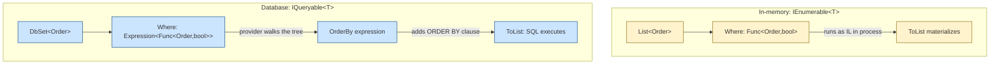
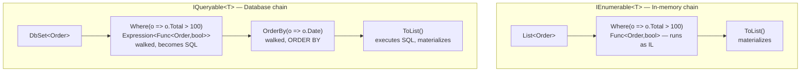

# LINQ — Language Deep Dive

> [Mastery Guide](../../README.md) › [Foundations](../README.md) › [C# Mastery](./README.md)

| Status | Priority | Phase | Last reviewed |
|---|---|---|---|
| Not Started | High | Phase 1 — Language & Runtime Fluency | 2026-05-07 |

## Contents
- [Why it matters](#why-it-matters)
- [Core concepts](#core-concepts)
  - [Two surface APIs — query syntax vs method syntax](#two-surface-apis--query-syntax-vs-method-syntax)
  - [Query syntax `let` and `join...into` — what they compile to](#query-syntax-let-and-joininto--what-they-compile-to)
  - [`IEnumerable<T>` vs `IQueryable<T>`](#ienumerablet-vs-iqueryablet)
  - [The `IQueryable` → `IEnumerable` boundary — silent client-side eval](#the-iqueryable--ienumerable-boundary--silent-client-side-eval)
  - [Deferred vs immediate execution](#deferred-vs-immediate-execution)
  - [Multiple-enumeration anti-pattern](#multiple-enumeration-anti-pattern)
  - [Mutating source between deferred query and iteration](#mutating-source-between-deferred-query-and-iteration)
  - [The operator catalog (by category)](#the-operator-catalog-by-category)
  - [Element retrieval semantics — `First`/`Single`/`SingleOrDefault`](#element-retrieval-semantics--firstsinglesingleordefault)
  - [`Count()` vs `Any()` and other common gotchas](#count-vs-any-and-other-common-gotchas)
  - [`OrderBy().OrderBy()` — the silent overwrite](#orderbyorderby--the-silent-overwrite)
  - [`GroupBy` — what it returns and when it surprises](#groupby--what-it-returns-and-when-it-surprises)
  - [`Where` then `Select` vs `Select` then `Where` — SQL implications](#where-then-select-vs-select-then-where--sql-implications)
  - [`ToDictionary` and duplicate keys](#todictionary-and-duplicate-keys)
  - [`yield return` and custom iterators](#yield-return-and-custom-iterators)
  - [Custom LINQ operators — `Chunk`, `Partition`, when to yield](#custom-linq-operators--chunk-partition-when-to-yield)
  - [`IAsyncEnumerable<T>` and `await foreach`](#iasyncenumerablet-and-await-foreach)
  - [`IAsyncEnumerable<T>` cancellation patterns](#iasyncenumerablet-cancellation-patterns)
  - [LINQ with records and pattern matching](#linq-with-records-and-pattern-matching)
  - [`null` in LINQ — NRT-aware predicates](#null-in-linq--nrt-aware-predicates)
  - [`Aggregate` — the general fold](#aggregate--the-general-fold)
  - [Custom LINQ operators (extension pattern)](#custom-linq-operators)
  - [Set operations and ordering](#set-operations-and-ordering)
  - [.NET 9 LINQ additions: `CountBy`, `AggregateBy`, `Index`](#net-9-linq-additions-countby-aggregateby-index)
- [Code & diagrams](#code--diagrams)
- [Common pitfalls](#common-pitfalls)
- [Interview-ready summary](#interview-ready-summary)
- [Interview Cross-Questioning Drill](#interview-cross-questioning-drill)
- [Cheat Sheet](#cheat-sheet)
- [Walkthrough](#walkthrough--n1-from-an-innocent-tolist)
- [Self-test](#self-test)
- [Cross-references](#cross-references)
- [Sources](#sources)

---

## Why it matters

LINQ is C#'s killer feature. One operator vocabulary works against in-memory collections, async streams, XML documents, and remote databases (via EF Core / IQueryable). Senior interviews probe it from two angles: (1) **operator semantics** — when does `Where` + `First` short-circuit; when does `OrderBy` materialize; (2) **the `IEnumerable` vs `IQueryable` boundary** — what gets translated to SQL, what falls back to client-side, what throws.

This file covers LINQ as a **language feature** — operators, deferred execution, expression trees, custom operators. The EF-specific angle (translation rules, parameter sniffing, `AsNoTracking`) lives in [.NET Core Deep Dive › Data Access](../01-net-core-deep-dive/05-data-access.md).

## Core concepts

### Two surface APIs — query syntax vs method syntax

Every LINQ query can be written two ways. The **query syntax** is closer to SQL; the **method syntax** is closer to functional programming. The compiler converts query syntax to method calls — they produce identical IL.

```csharp
var orders = new List<Order> { /* ... */ };

// Query syntax
var q1 = from o in orders
         where o.Total > 100
         orderby o.CreatedAt descending
         select new { o.Id, o.Total };

// Method syntax (identical result)
var q2 = orders
    .Where(o => o.Total > 100)
    .OrderByDescending(o => o.CreatedAt)
    .Select(o => new { o.Id, o.Total });
```

**Which to use:**
- **Method syntax** for one or two operators — terser.
- **Query syntax** when joins, group-bys, or `let` bindings make the SQL-like shape clearer.
- **Method syntax** for any operator query syntax doesn't have keywords for (`Take`, `Skip`, `Distinct`, `First`, `Aggregate`, etc.).

In practice, modern code is overwhelmingly method-syntax. Query syntax is mostly seen in textbook examples and complex multi-source joins.

### Query syntax `let` and `join...into` — what they compile to

Two query-syntax features have **no direct method-syntax equivalent** — they're the rare reason to reach for query syntax.

**`let` — introducing a named intermediate value:**

```csharp
// Query syntax
var q = from o in orders
        let totalWithTax = o.Total * 1.08m
        let isLarge = totalWithTax > 1000
        where isLarge
        orderby totalWithTax descending
        select new { o.Id, totalWithTax };
```

What the compiler emits:

```csharp
var q = orders
    .Select(o => new { o, totalWithTax = o.Total * 1.08m })       // capture o + first let
    .Select(t => new { t, isLarge = t.totalWithTax > 1000 })       // capture prior + second let
    .Where(t => t.isLarge)
    .OrderByDescending(t => t.t.totalWithTax)
    .Select(t => new { t.t.o.Id, t.t.totalWithTax });
```

Each `let` becomes a `Select` into a transparent identifier (the anonymous type `{ o, totalWithTax }`). Subsequent clauses see "everything in scope" because every `let` extends the transparent identifier. **Hand-written method syntax with `let` is painful** — you must manage these transparent identifiers manually.

**`join...into` — group join, the LEFT-JOIN building block:**

```csharp
// Query syntax — left outer join via group join + SelectMany + DefaultIfEmpty
var q = from c in customers
        join o in orders on c.Id equals o.CustomerId into customerOrders
        from co in customerOrders.DefaultIfEmpty()        // null if customer has no orders
        select new { c.Name, OrderId = co?.Id };
```

What the compiler emits:

```csharp
var q = customers.GroupJoin(
        orders,
        c => c.Id,
        o => o.CustomerId,
        (c, customerOrders) => new { c, customerOrders })
    .SelectMany(
        t => t.customerOrders.DefaultIfEmpty(),
        (t, co) => new { t.c.Name, OrderId = co?.Id });
```

Three operators (`GroupJoin`, `SelectMany`, `DefaultIfEmpty`) for one query-syntax `join...into`. **Multi-source / outer-join-shaped LINQ is the one place query syntax is genuinely more readable.**

**When to use query syntax (in 2026):**
- Two or more `let` bindings — anonymous-identifier wrangling is brutal in method syntax.
- Outer joins (`join...into` + `DefaultIfEmpty`).
- Three-or-more-source SQL-shape joins.
- Multi-criteria `orderby` reads close to SQL.

**When to use method syntax:**
- Anything with `Take`/`Skip`/`Distinct`/`First`/`Aggregate` (query syntax has no keyword).
- Single-operator or two-operator chains.
- Anywhere a code reviewer would prefer the functional shape.

### `IEnumerable<T>` vs `IQueryable<T>`

The most important distinction in LINQ. Both expose the same operator names, but they execute on totally different machinery.

| | `IEnumerable<T>` | `IQueryable<T>` |
|---|---|---|
| Lambda type | `Func<T, ...>` | `Expression<Func<T, ...>>` |
| Where it runs | In-process, in the calling thread | Translated by the provider (e.g., to SQL) and run remotely |
| Source | `List<T>`, `T[]`, `Dictionary<,>.Values`, etc. | `DbSet<T>` (EF Core), Mongo / Cosmos drivers, custom providers |
| Operators that don't translate | Throws `NotSupportedException` (when forced) — but on `IEnumerable`, anything works | Provider-specific |

```csharp
// IEnumerable — runs in process
var topInMemory = orders
    .Where(o => o.Total > 1000)              // Func<Order, bool> — runs as IL
    .ToList();

// IQueryable — translates to SQL
var topInDb = dbContext.Orders
    .Where(o => o.Total > 1000)              // Expression<Func<Order, bool>> — walked by EF, becomes WHERE Total > 1000
    .ToList();
```

**The translation boundary:** the moment an `IQueryable<T>` chain hits an operator that doesn't materialize (e.g., a custom method, an unsupported operation), EF Core decides what to do — either translate it, fall back to **client-side evaluation** (load partial data into memory and run the rest in process), or throw. EF Core 3+ throws by default (no silent client eval) — much safer.

**Casting `IQueryable<T>` to `IEnumerable<T>` materializes the query at that point** — every subsequent operator runs in memory:

```csharp
// First Where → SQL. ToList materializes. Second Where → in memory.
var bad = dbContext.Orders.Where(o => o.Active).ToList().Where(o => o.Total > 100);

// Better — both filters in SQL
var good = dbContext.Orders.Where(o => o.Active).Where(o => o.Total > 100).ToList();
```

### The `IQueryable` → `IEnumerable` boundary — silent client-side eval

The most expensive bug in EF Core 1/2 was **silent client-side evaluation**: an operator the provider couldn't translate would, instead of throwing, materialize the partial query and run the rest in memory. A `.Where(...)` you thought ran in SQL might actually be loading the whole table.

**EF Core 3+ throws by default**, but you can still trip over the boundary in subtler ways:

```csharp
// Case 1: explicit AsEnumerable() — voluntary boundary
var bad1 = db.Orders
    .Where(o => o.CustomerId == cid)        // SQL: WHERE CustomerId = @p0
    .AsEnumerable()                          // ★ EVERYTHING after this is in memory
    .Where(o => o.Total > 100)               // C#, in memory
    .Take(10)                                 // C#, in memory — BUT we already loaded all matching orders for the customer
    .ToList();

// Case 2: ToList() too early — same effect
var bad2 = db.Orders.Where(...).ToList().Where(...);    // entire materialized set, then filter

// Case 3: Subtle method call that doesn't translate
var bad3 = db.Orders
    .Where(o => MyHelper.IsBigSpender(o.Total))     // EF Core 3+: throws "could not be translated"
    .ToList();

// Case 4: Conditional that EF can't decompose
var includeArchived = GetFlag();
var query = db.Orders.AsQueryable();
if (includeArchived) query = query.Where(o => o.IsArchived);    // ✓ — composed BEFORE materialization
else                  query = query.Where(o => !o.IsArchived);
var result = await query.ToListAsync();    // single SQL with one WHERE clause based on the flag
```

**When `AsEnumerable()` is legitimately the right tool:**
- Small result set that needs C#-only operations afterwards (e.g., a 50-row config table where you need a `string.Format` projection).
- The provider truly can't translate the next operation and you've already filtered down to a manageable size.

**When `AsEnumerable()` is the wrong tool:**
- You're trying to get away with using a custom method in a predicate. Use `[DbFunction]` mapping or split the logic.
- You're avoiding the "can't translate" error by hiding the operation behind the boundary. You've turned a compile-time-error into a `select-everything-then-filter` performance bomb.

**The diagnostic recipe:** log EF Core SQL with `optionsBuilder.LogTo(Console.WriteLine).EnableSensitiveDataLogging();` in dev. If the SQL has no `WHERE` clause matching what you wrote, your operator landed in memory.

### Deferred vs immediate execution

Most LINQ operators are **deferred** — they don't execute when called; they return an iterator that executes on demand (when iterated, when `ToList`/`ToArray`/`Count`/`First`/etc. is called).

```csharp
var query = numbers.Where(n => {
    Console.WriteLine($"checking {n}");
    return n > 2;
});
// Nothing printed yet — query not executed.

var first = query.First();
// Prints "checking 1", "checking 2", "checking 3" — stops on first match (3).

var list = query.ToList();
// Prints again — for ALL elements. Iteration restarts on each materialization.
```

**Deferred operators** (return a new sequence): `Where`, `Select`, `OrderBy`, `Take`, `Skip`, `Distinct`, `GroupBy`, `Join`, `Concat`, `Reverse`, etc.

**Immediate operators** (return a value or fully-materialize): `ToList`, `ToArray`, `ToDictionary`, `First`, `Single`, `Any`, `All`, `Count`, `Sum`, `Average`, `Max`, `Min`, `Aggregate`.

**Implication: side effects in lambdas.** A `Select(x => Mutate(x))` doesn't run until the result is iterated. If you depend on the side effect, materialize with `ToList()`. If you don't want the lambda to ever run twice, materialize.

**Anti-pattern: re-iterating a deferred query.**

```csharp
var slow = ExpensiveSource.Where(x => Compute(x));
var count = slow.Count();             // iterates once
var first = slow.First();             // iterates AGAIN — Compute() called for every element again

// Materialize once
var materialized = slow.ToList();
var count = materialized.Count;       // O(1) — already a list
var first = materialized[0];          // O(1)
```

### Multiple-enumeration anti-pattern

The biggest practical risk of deferred execution. **Rider and ReSharper flag it as warning** "Possible multiple enumeration of IEnumerable" — the squiggle every senior recognizes.

```csharp
public void Process(IEnumerable<Order> orders)        // ★ parameter typed as IEnumerable
{
    if (!orders.Any()) return;                         // walks the source once
    var count = orders.Count();                        // walks AGAIN
    foreach (var o in orders) HandleOrder(o);          // walks a THIRD time
}
```

**What goes wrong:**
- If the source is a deferred LINQ chain (`db.Orders.Where(...)`), each enumeration **re-runs the entire chain** — re-issues SQL, re-allocates, re-applies predicates.
- If the source is a single-pass `IEnumerable<T>` (an iterator method that reads from a stream/network), the second enumeration is empty or throws — many iterator sources can only be enumerated once.
- If the source is a `Random()` generator or anything with side effects, each enumeration produces different values — silent non-determinism.

**Detection:** Rider/ReSharper warning. Or step through with the debugger: a deferred query type like `WhereSelectIteratorEnumerable<T>` is your hint the source isn't a materialized list.

**Fixes:**

```csharp
// Fix 1: materialize once at the boundary
public void Process(IEnumerable<Order> orders)
{
    var list = orders as IReadOnlyCollection<Order> ?? orders.ToList();   // avoid double-materializing if already a list
    if (list.Count == 0) return;
    foreach (var o in list) HandleOrder(o);
}

// Fix 2: change the parameter type to require already-materialized
public void Process(IReadOnlyList<Order> orders)
{
    if (orders.Count == 0) return;
    foreach (var o in orders) HandleOrder(o);
}

// Fix 3: streaming-aware — process in one pass
public void Process(IEnumerable<Order> orders)
{
    int count = 0;
    foreach (var o in orders) { count++; HandleOrder(o); }
    if (count == 0) { /* handle empty after the fact */ }
}
```

**Library design rule:** if your method may iterate the input more than once, **take `IReadOnlyList<T>` or `IReadOnlyCollection<T>`** in the signature — it signals the caller that materialization is expected, and you statically can't double-iterate a stream.

**Performance impact:** for an EF Core query that materializes 10,000 rows, double iteration is two round-trips to the database with full deserialization — easily 200ms doubled. For in-memory `Where`, each iteration is the predicate cost × element count. Either way, the cost is measurable and usually unintended.

### Mutating source between deferred query and iteration

Closely related to multiple-enumeration: **mutating the underlying collection after building a deferred query** changes the query's output.

```csharp
var list = new List<int> { 1, 2, 3 };
var q = list.Where(x => x > 1);          // deferred — looks at list at iteration time

list.Add(4);
list.Add(5);

foreach (var x in q) Console.Write($"{x} ");      // 2 3 4 5 — includes the added items
```

**Why:** `q` is a `WhereEnumerableIterator<int>` that holds a reference to `list`. On `foreach`, it calls `list.GetEnumerator()` *now*, which sees the current contents.

**Worse — modifying during iteration throws:**

```csharp
foreach (var x in q)
{
    if (x == 2) list.Add(99);    // throws InvalidOperationException — "Collection was modified"
}
```

**Worse still — race conditions in multithreaded code:**

```csharp
// Producer thread mutates 'list'; consumer thread iterates a deferred query over it.
// Behavior: undefined (CollectionWasModified, partial results, or duplicate items, depending on timing).
```

**Defenses:**
- Materialize immediately if you don't want to see future mutations: `var q = list.Where(...).ToList();`.
- For multi-threaded scenarios, use `ImmutableList<T>` / `FrozenSet<T>` (.NET 8+) — the snapshot is fixed.
- Or use a concurrent collection (`ConcurrentDictionary<,>`) with explicit snapshot semantics.

**The general rule:** deferred queries are *views into* the source, not *copies of* it. Treat them like database views — they reflect the current state of the underlying data each time they're enumerated.

### The operator catalog (by category)

LINQ's operators (in `System.Linq.Enumerable` and `System.Linq.Queryable`) split into ~9 categories. Memorizing them by category beats trying to remember all 70+.

**Filtering:** `Where`, `OfType<T>`, `Skip`, `SkipWhile`, `Take`, `TakeWhile`, `TakeLast` (.NET Core 2.0+), `SkipLast`.

**Projection:** `Select`, `SelectMany` (flatten nested sequences), `Cast<T>`, `Zip` (combine two sequences elementwise).

**Quantifier (return bool):** `Any`, `All`, `Contains`.

**Element retrieval:** `First`, `FirstOrDefault`, `Single`, `SingleOrDefault`, `Last`, `LastOrDefault`, `ElementAt`, `ElementAtOrDefault`. The `Single*` versions throw if more than one match — use them for "exactly one expected."

**Aggregation:** `Count`, `LongCount`, `Sum`, `Average`, `Max`, `MaxBy` (.NET 6+), `Min`, `MinBy`, `Aggregate` (general fold).

**Set operations:** `Distinct`, `DistinctBy` (.NET 6+), `Union`, `Intersect`, `Except`, `IntersectBy`, `ExceptBy`, `UnionBy`.

**Ordering:** `OrderBy`, `OrderByDescending`, `ThenBy`, `ThenByDescending`, `Reverse`, `Order` (.NET 7+, no-key shorthand).

**Grouping:** `GroupBy` (returns `IGrouping<TKey, TElement>`), `GroupJoin`, `Lookup<>` via `ToLookup`.

**Joining:** `Join` (inner), `GroupJoin` (left, returning groups). LINQ doesn't have an "outer join" operator natively; emulate via `GroupJoin` + `SelectMany` + `DefaultIfEmpty`.

**Generation:** `Range`, `Repeat`, `Empty<T>`.

**Materialization:** `ToList`, `ToArray`, `ToDictionary`, `ToHashSet`, `ToLookup`, `ToFrozenSet`, `ToFrozenDictionary` (.NET 8+).

**.NET 9 additions:** `CountBy`, `AggregateBy`, `Index` (covered below).

### Element retrieval semantics — `First`/`Single`/`SingleOrDefault`

Element-retrieval operators look interchangeable but have **dramatically different contracts.** Picking the wrong one buries bugs that show up only in production data.

| Operator | Behavior | When to use |
|---|---|---|
| `First()` | Returns the first match; throws `InvalidOperationException` if none | "I want any one match, error if none exists" |
| `FirstOrDefault()` | Returns the first match; returns `default(T)` if none | "Maybe none — and I'll handle the default" |
| `Single()` | Returns the one match; throws if zero OR more than one | "I expect EXACTLY one — anything else is a bug" |
| `SingleOrDefault()` | Returns the one match; returns `default(T)` if zero; throws if more than one | "Maybe one; never more — anything more is a bug" |
| `Last()` / `LastOrDefault()` | Same as `First`/`FirstOrDefault` but for the last match | Same but at the end |
| `ElementAt(n)` / `ElementAtOrDefault(n)` | Indexed access; throws or default-returns on out-of-range | When you genuinely want positional access |

**The interview question:** "When would you use `Single` instead of `First`?"

```csharp
// Wrong — finds the first user with that email; silently ignores duplicates
var user = db.Users.First(u => u.Email == email);

// Right — asserts the unique constraint at runtime
var user = db.Users.Single(u => u.Email == email);
```

`Single` is **a runtime assertion** — "if more than one user has this email, the data is broken; throw immediately so I find out." Using `First` masks the bug; you'd never know the constraint was violated until you queried with a different criterion and got a different "first."

**For nullable-friendly lookups:**

```csharp
// Wrong — returns the first user, which may be one of many duplicates
var user = db.Users.FirstOrDefault(u => u.Email == email);

// Right — null if no user; throws if multiple (data corruption)
var user = db.Users.SingleOrDefault(u => u.Email == email);
```

**Performance note:** `Single` and `SingleOrDefault` must enumerate at least *two* matches to know whether there's more than one. `First` short-circuits on the first match. For `IQueryable` against EF Core: both translate to `SELECT ... LIMIT 2` (or `TOP 2`); the additional row is the "is there a second?" probe. The performance difference is negligible at the DB level, but the *semantic* difference is huge — only `Single` enforces uniqueness.

**Defaults — be careful with value types:**

```csharp
var firstActive = orders.FirstOrDefault(o => o.IsActive);  // null for class, default(struct) for struct
// If 'orders' is IEnumerable<int>, default(int) == 0 — indistinguishable from a real zero in the data
```

For `int`-shaped sequences where 0 is a valid value, use `Cast<int?>().FirstOrDefault()` or check `Any` first. Records and `int?` make this cleaner.

### `Count()` vs `Any()` and other common gotchas

**The single most-cited LINQ performance gotcha.** Use `Any()` for existence, `Count()` for actual counts.

```csharp
// Wrong — walks the entire sequence to count, then compares
if (orders.Count() > 0) Process(orders);

// Right — short-circuits at the first match (O(1) for non-empty)
if (orders.Any()) Process(orders);
```

**For an in-memory `List<T>`**: `Count()` is O(1) because the LINQ overload checks for `ICollection<T>` and reads `Count` directly. **For a deferred sequence**: `Count()` is O(n) — walks the entire chain. **`Any()` is O(1)** regardless — it just needs one element.

**For `IQueryable` against EF Core:** both translate to SQL, but `Any` becomes `SELECT EXISTS (...)` (short-circuit) and `Count` becomes `SELECT COUNT(*) FROM ...` — usually similar performance for indexed columns, but `EXISTS` can short-circuit faster on unindexed predicates.

**Predicate variants — same rule:**

```csharp
// Wrong
if (orders.Count(o => o.IsActive) > 0) ...

// Right
if (orders.Any(o => o.IsActive)) ...
```

**Other common gotchas:**

| Gotcha | Why |
|---|---|
| `list.Count` (property) vs `list.Count()` (LINQ method) | The property is O(1); the method is O(1) for `ICollection<T>` and O(n) otherwise. Prefer the property when available. |
| `list.OrderBy(...).First()` | O(n log n) sort + take 1. Use `MinBy(...)` (.NET 6+) for O(n). |
| `list.Where(...).First()` vs `list.First(predicate)` | Identical results, identical performance — `First(p)` is a convenience overload. |
| `list.Select(...).Where(...)` vs `list.Where(...).Select(...)` | In-memory: same result, slightly different cost. SQL: very different (covered below). |
| `list.Reverse()` (LINQ) vs `list.Reverse()` (List.Reverse, in-place) | `IEnumerable.Reverse()` returns a new deferred sequence; `List<T>.Reverse()` mutates in place. Naming collision — read carefully. |
| `Contains(x)` vs `Any(e => e.Equals(x))` | `Contains` uses `EqualityComparer<T>.Default.Equals` — same as `Any`, but specialized for `HashSet<T>` / `SortedSet<T>` (O(1)). |

### `OrderBy().OrderBy()` — the silent overwrite

A bug I've seen multiple times in production. **Chaining two `OrderBy` calls discards the first sort.**

```csharp
var sorted = orders
    .OrderBy(o => o.CustomerId)       // sorted by customer
    .OrderBy(o => o.CreatedAt);        // ★ this OVERWRITES the first — now sorted only by CreatedAt
```

The intent — "by customer, then by date" — is **`OrderBy(...).ThenBy(...)`**, not `OrderBy(...).OrderBy(...)`:

```csharp
var sorted = orders
    .OrderBy(o => o.CustomerId)
    .ThenBy(o => o.CreatedAt);         // ✓ multi-key sort
```

**Why the API allows this:** `OrderBy` is a regular LINQ operator that takes any `IEnumerable<T>` and returns an `IOrderedEnumerable<T>`. Calling `OrderBy` again on an already-ordered sequence re-sorts from scratch — the previous order is lost. `ThenBy` is the operator that says "preserve the previous ordering as a tiebreaker."

**The interview tell:** if you see `OrderBy(...).OrderBy(...)` in a PR, ask "what was the intent?" Almost always: `ThenBy` was meant.

**For SQL via IQueryable:** the same rule applies — EF Core emits `ORDER BY` based on whichever `OrderBy/ThenBy` chain was built. Two `OrderBy` calls produce `ORDER BY CreatedAt` (last one wins); `OrderBy.ThenBy` produces `ORDER BY CustomerId, CreatedAt`.

**Descending variant:**

```csharp
var sorted = orders
    .OrderByDescending(o => o.Priority)
    .ThenBy(o => o.CreatedAt);         // ascending tie-breaker
```

### `GroupBy` — what it returns and when it surprises

`GroupBy` is the most-misunderstood LINQ operator. **It returns `IEnumerable<IGrouping<TKey, TElement>>`** — a sequence of groups, not a dictionary.

```csharp
var groups = orders.GroupBy(o => o.CustomerId);
// groups is IEnumerable<IGrouping<int, Order>>
// IGrouping<TKey, TElement> : IEnumerable<TElement>, has .Key

foreach (var g in groups)
{
    Console.WriteLine($"Customer {g.Key}: {g.Count()} orders");
    foreach (var o in g) { /* the orders for this customer */ }
}
```

**Surprises:**

**1. `GroupBy` materializes the entire source** — it must read every element to know all keys. On an infinite or very large sequence, this blocks indefinitely or runs out of memory. Use `CountBy` (.NET 9) / `AggregateBy` (.NET 9) for streaming-aware key-bucketing without full materialization.

**2. `GroupBy` is *deferred***, but each iteration is O(n) materialization. Re-iterating a `GroupBy` result re-buckets everything.

**3. With no aggregation, you get groups, not flat sequences:**

```csharp
// Wrong intent — wants "all orders sorted by customer"
var bad = orders.GroupBy(o => o.CustomerId);
// Returns groups of groups — to flatten, need SelectMany:

var flat = orders.GroupBy(o => o.CustomerId).SelectMany(g => g);
// Or just use OrderBy:
var flatBetter = orders.OrderBy(o => o.CustomerId);
```

**4. The key-equality is `EqualityComparer<TKey>.Default`.** Strings are case-sensitive by default:

```csharp
var groups = users.GroupBy(u => u.Email);
// "Alice@x.com" and "alice@x.com" land in DIFFERENT groups
// Fix: pass a custom comparer
var groups = users.GroupBy(u => u.Email, StringComparer.OrdinalIgnoreCase);
```

**5. For EF Core IQueryable:** `GroupBy` translation has historically been limited. EF Core 3+ supports `.GroupBy(key).Select(g => new { g.Key, Total = g.Sum(o => o.Total) })` — the projection must shape data the database can produce in a single query. `.GroupBy(...).ToList()` (no aggregation) does NOT translate in many versions; it falls back to client-side or throws. **Always aggregate in the `Select` after `GroupBy` for IQueryable.**

### `Where` then `Select` vs `Select` then `Where` — SQL implications

In-memory, the order matters only marginally. **In SQL, it's a different optimization story.**

**In-memory (`IEnumerable<T>`):**

```csharp
list.Where(o => o.IsActive).Select(o => new Dto(o))      // filters first, projects second
list.Select(o => new Dto(o)).Where(d => d.IsActive)      // projects first, filters second — wastes projection work
```

Same final result, slightly different cost (filter-first avoids projecting elements that get dropped). Both are O(n) on the underlying source.

**EF Core IQueryable:**

```csharp
// Both translate to roughly the same SQL — the query optimizer rearranges
db.Orders.Where(o => o.IsActive).Select(o => new OrderDto(o.Id, o.Total))
// SQL: SELECT Id, Total FROM Orders WHERE IsActive = 1

db.Orders.Select(o => new { o.Id, o.Total, o.IsActive }).Where(x => x.IsActive)
// SQL: SELECT t.Id, t.Total FROM (SELECT Id, Total, IsActive FROM Orders) t WHERE t.IsActive = 1
//                                                                                    ↑ database optimizer typically flattens this
```

**Where the order matters for IQueryable:**

```csharp
// Projection that drops join data — Where can no longer reference the dropped column
db.Orders
    .Select(o => new { o.Id, o.Total })          // drops o.CustomerId
    .Where(x => x.CustomerId == cid)              // ❌ compile error — CustomerId is no longer in scope
```

```csharp
// Filter first, project later — keeps the column accessible
db.Orders
    .Where(o => o.CustomerId == cid)
    .Select(o => new { o.Id, o.Total })
```

**The rule:** **`Where` before `Select`** is almost always correct for IQueryable — filter early to reduce the working set the projection has to materialize, and keep all source columns available for filter conditions.

### `ToDictionary` and duplicate keys

`ToDictionary` throws `ArgumentException` on the **second** duplicate key. The first one wins (gets inserted); the second one's collision triggers the exception:

```csharp
var orders = new[] { new { Id = 1, Email = "a@x" }, new { Id = 2, Email = "a@x" } };

var byEmail = orders.ToDictionary(o => o.Email);
// throws ArgumentException: "An item with the same key has already been added. Key: a@x"
```

**Fixes by intent:**

```csharp
// Intent: keep the first occurrence per key, drop duplicates
var first = orders
    .GroupBy(o => o.Email)
    .ToDictionary(g => g.Key, g => g.First());

// Intent: keep the last occurrence per key
var last = orders
    .GroupBy(o => o.Email)
    .ToDictionary(g => g.Key, g => g.Last());

// Intent: list of orders per email (one-to-many)
var byEmail = orders.ToLookup(o => o.Email);
// byEmail["a@x"] returns IEnumerable<Order>; missing keys return empty (not throw)

// Intent: I expect uniqueness — let it throw as a runtime assertion
var byId = orders.ToDictionary(o => o.Id);

// Intent: keep one, with explicit conflict resolution (e.g., highest amount wins)
var dedup = orders
    .GroupBy(o => o.Email)
    .ToDictionary(g => g.Key, g => g.OrderByDescending(o => o.Total).First());
```

**`ToLookup` vs `ToDictionary`** — both are immediate-execution; `ToLookup` allows one-to-many (multiple values per key) and never throws on duplicates; `ToDictionary` enforces uniqueness. For "indexed access by key with possible duplicates," use `ToLookup`. For "I assert this column is unique," use `ToDictionary` and let it throw.

### `yield return` and custom iterators

The compiler generates an iterator state machine for any method that uses `yield return` or `yield break`. The result is a deferred-execution sequence with no manual `IEnumerator` boilerplate.

```csharp
public static IEnumerable<int> Fibonacci()
{
    int a = 0, b = 1;
    while (true)
    {
        yield return a;
        (a, b) = (b, a + b);
    }
}

// Use it
foreach (var n in Fibonacci().Take(10))
    Console.WriteLine(n);   // 0 1 1 2 3 5 8 13 21 34
```

**Mechanics:** when called, an iterator method returns immediately with no work done — just an enumerator. Each `MoveNext` call resumes the state machine until the next `yield return` or `yield break`. State (locals, position) is preserved across resumes.

**Iterators compose with LINQ:**

```csharp
public static IEnumerable<int> EvenSquares()
{
    foreach (var n in Fibonacci().Take(20))
        if (n % 2 == 0)
            yield return n * n;
}
```

This produces the same machine code as the LINQ chain `Fibonacci().Take(20).Where(n => n % 2 == 0).Select(n => n * n)`, just with custom intermediate logic. Use iterators when LINQ operators don't express what you need cleanly.

**Iterator gotchas:**
- The body doesn't run until iterated. Argument validation must be in a non-iterator wrapper that *calls* the iterator method.
- Each iteration starts the state machine fresh. Don't expect persisted state between iterations of the same method call.

### Custom LINQ operators — `Chunk`, `Partition`, when to yield

Custom LINQ operators are extension methods on `IEnumerable<T>` that return `IEnumerable<T>` (or another sequence type). The interview question is **"when do you `yield return` vs eagerly build a list?"**

**Use `yield return` when:**
- The output is one-pass / streaming — consumers may stop early.
- The intermediate state is small (one element at a time).
- Materializing would defeat the lazy chain (e.g., `Where` should not buffer).

**Avoid `yield return` (eagerly materialize) when:**
- You need to look ahead or behind (multi-pass algorithm).
- You need argument validation BEFORE iteration starts (the body of an iterator doesn't run until the first `MoveNext`).
- The operator has true random-access semantics (e.g., `Reverse` needs the last element first — must buffer).

**Example: `Chunk` — split into fixed-size groups (built-in since .NET 6, but instructive):**

```csharp
public static IEnumerable<IReadOnlyList<T>> ChunkManual<T>(this IEnumerable<T> source, int size)
{
    if (source is null) throw new ArgumentNullException(nameof(source));
    if (size <= 0) throw new ArgumentOutOfRangeException(nameof(size));
    return ChunkIterator(source, size);
}

private static IEnumerable<IReadOnlyList<T>> ChunkIterator<T>(IEnumerable<T> source, int size)
{
    var bucket = new List<T>(size);
    foreach (var item in source)
    {
        bucket.Add(item);
        if (bucket.Count == size)
        {
            yield return bucket;        // streaming — consumer can stop
            bucket = new List<T>(size);  // fresh bucket for the next group
        }
    }
    if (bucket.Count > 0) yield return bucket;
}
```

**Note the validation/iteration split.** The public `ChunkManual` validates eagerly; the private iterator method is `yield return`-based and runs lazily. **If you put validation inside an iterator method, the `ArgumentNullException` doesn't fire until the consumer calls `MoveNext`** — surprising and hard to debug.

**`Partition` — return `(matching, not-matching)` in one pass:**

```csharp
public static (List<T> Matching, List<T> NotMatching) Partition<T>(
    this IEnumerable<T> source,
    Func<T, bool> predicate)
{
    var yes = new List<T>();
    var no = new List<T>();
    foreach (var item in source)
        (predicate(item) ? yes : no).Add(item);
    return (yes, no);
}

var (large, small) = orders.Partition(o => o.Total > 1000);
```

This one **doesn't** use `yield return` — it eagerly materializes two lists. If it were lazy, you'd be back to multi-pass: `source.Where(p)` and `source.Where(x => !p(x))` — two passes over the source. Partition trades laziness for single-pass efficiency.

**`WhereNotNull` — common helper:**

```csharp
public static IEnumerable<T> WhereNotNull<T>(this IEnumerable<T?> source) where T : class
{
    foreach (var item in source)
        if (item is not null) yield return item;
}

// Or for nullable value types
public static IEnumerable<T> WhereHasValue<T>(this IEnumerable<T?> source) where T : struct
{
    foreach (var item in source)
        if (item.HasValue) yield return item.Value;
}
```

**Built-in alternatives (.NET 6+):**
- `Chunk(size)` is in `System.Linq.Enumerable`.
- `MinBy` / `MaxBy` (.NET 6+).
- `DistinctBy` / `IntersectBy` / `ExceptBy` / `UnionBy` (.NET 6+).
- `Index()` (.NET 9+) pairs each item with its zero-based index.
- `TakeLast(n)` / `SkipLast(n)` (.NET Core 2.0+).

Check the BCL before writing your own — many "obviously missing" operators were added in 6+.

### `IAsyncEnumerable<T>` and `await foreach`

`IAsyncEnumerable<T>` is the async cousin of `IEnumerable<T>`, supported by `await foreach` (C# 8+). Use it for streaming sources where each element involves I/O.

```csharp
public static async IAsyncEnumerable<string> StreamLinesAsync(
    string path,
    [EnumeratorCancellation] CancellationToken ct = default)
{
    using var reader = new StreamReader(path);
    while (await reader.ReadLineAsync(ct) is { } line)
        yield return line;
}

await foreach (var line in StreamLinesAsync("big.log").WithCancellation(cts.Token))
    Process(line);
```

**LINQ-async parallel:** `System.Linq.Async` (NuGet package) provides operators on `IAsyncEnumerable<T>` — `WhereAwait`, `SelectAwait`, etc. The naming differs to avoid signature conflicts. EF Core 7+ also exposes a few async-LINQ operators (`ToListAsync`, `FirstAsync`, etc.) on `IQueryable<T>`.

For deeper async mechanics — state machines, `ConfigureAwait`, `ValueTask` — see [Async/Await deep dive](../01-net-core-deep-dive/03-async-and-threading.md).

**`IAsyncEnumerable<T>` vs `Task<List<T>>` — when each:**

| Aspect | `Task<List<T>>` | `IAsyncEnumerable<T>` |
|---|---|---|
| Memory | Holds the entire result in memory | Streams one element at a time |
| Time to first item | Waits for ALL items | First item available as soon as it's produced |
| Backpressure | None — producer runs to completion | Consumer controls pacing (one `MoveNextAsync` per element) |
| Re-iteration | Yes — list is materialized | No (typically) — single forward pass |
| Random access | Yes — `result[i]` | No — must enumerate sequentially |
| `Count` cheap? | Yes — `.Count` property | No — must walk the entire stream |
| Translates to SQL? | Yes — via `ToListAsync` | Yes — via `AsAsyncEnumerable` (streaming) |
| Cancellation | Single `CancellationToken` on the `Task` | `[EnumeratorCancellation]` + `WithCancellation` per iteration |

**Use `Task<List<T>>` when** the result fits comfortably in memory, you'll likely re-iterate, or you need `Count`/random access. **Use `IAsyncEnumerable<T>` when** the result might be huge, you want to start processing as items arrive, or the producer's pace is slower than the consumer's (the consumer can backpressure).

### `IAsyncEnumerable<T>` cancellation patterns

`IAsyncEnumerable<T>` cancellation has its own conventions because the `CancellationToken` needs to flow through both the source iterator and the consumer's `await foreach`.

**Producer — accept the token via `[EnumeratorCancellation]`:**

```csharp
public async IAsyncEnumerable<string> StreamLinesAsync(
    string path,
    [EnumeratorCancellation] CancellationToken ct = default)
{
    using var reader = new StreamReader(path);
    while (await reader.ReadLineAsync(ct) is { } line)
    {
        ct.ThrowIfCancellationRequested();   // optional but recommended at loop boundaries
        yield return line;
    }
}
```

The `[EnumeratorCancellation]` attribute (in `System.Runtime.CompilerServices`) tells the compiler "use this parameter as the cancellation token when the consumer calls `GetAsyncEnumerator(ct)`."

**Consumer — provide the token via `WithCancellation`:**

```csharp
using var cts = new CancellationTokenSource(TimeSpan.FromSeconds(30));

await foreach (var line in StreamLinesAsync("big.log").WithCancellation(cts.Token))
{
    Process(line);
}
```

`WithCancellation(ct)` wraps the source enumerable in a wrapper that passes `ct` to `GetAsyncEnumerator(ct)`. Without it, the producer's `ct` parameter remains `default(CancellationToken)` and cancellation is silently ignored.

**EF Core integration:**

```csharp
// AsAsyncEnumerable on IQueryable
await foreach (var order in db.Orders
    .Where(o => o.CustomerId == cid)
    .AsAsyncEnumerable()
    .WithCancellation(ct))
{
    await ProcessAsync(order, ct);
}
```

This streams the SQL result set row-by-row. The consumer can stop early (close the connection); EF Core's reader supports cancellation mid-stream.

**Two more patterns:**

```csharp
// ConfigureAwait inside an async iterator
public async IAsyncEnumerable<int> StreamWithConfig(
    [EnumeratorCancellation] CancellationToken ct = default)
{
    foreach (var i in Enumerable.Range(0, 100))
    {
        await Task.Delay(10, ct).ConfigureAwait(false);    // typical library practice
        yield return i;
    }
}
// Consumer: .ConfigureAwait(false) on the await foreach
await foreach (var x in StreamWithConfig(ct).ConfigureAwait(false))
    Process(x);
```

```csharp
// Combining multiple sources
await foreach (var line in Source1(ct).Concat(Source2(ct)).WithCancellation(ct))
    Process(line);
```

### LINQ with records and pattern matching

Records + pattern matching let LINQ projections express more sophisticated transforms with less boilerplate.

**`Select` with `switch` expressions:**

```csharp
public abstract record Shape;
public record Circle(double Radius) : Shape;
public record Square(double Side) : Shape;
public record Triangle(double Base, double Height) : Shape;

var shapes = new Shape[] { new Circle(3), new Square(4), new Triangle(3, 5) };

var areas = shapes.Select(s => s switch
{
    Circle { Radius: var r } => Math.PI * r * r,
    Square { Side: var s2 } => s2 * s2,
    Triangle { Base: var b, Height: var h } => 0.5 * b * h,
    _ => 0.0,
});
```

The switch expression is **exhaustive over the closed hierarchy**, so adding a new shape forces you to update the projection (good — type-driven evolution).

**Deconstruction in `Select`:**

```csharp
var orders = new[] { (1, 100m), (2, 200m), (3, 50m) };

// Tuple deconstruction in the lambda parameter
var totals = orders.Select(o => o switch
{
    (var id, > 100m) => $"Big: {id}",
    (var id, _)      => $"Small: {id}",
});
```

**`Where` with type patterns:**

```csharp
var circles = shapes.OfType<Circle>();         // built-in
var bigCircles = shapes.Where(s => s is Circle { Radius: > 10 });   // pattern in Where
```

**Records in `GroupBy` keys** — value equality means records work correctly as dictionary keys / group keys without overriding `Equals` / `GetHashCode`:

```csharp
public record Bucket(int HourOfDay, string Region);

var grouped = events.GroupBy(e => new Bucket(e.Timestamp.Hour, e.Region));
// Records implement value equality automatically — two Bucket(14, "US") values are equal
```

**`Index()` (.NET 9) + records + deconstruction:**

```csharp
var named = users.Index().Select(t => new IndexedUser(t.Index, t.Item.Name));
// or with foreach
foreach (var (i, user) in users.Index())
    Console.WriteLine($"{i}: {user.Name}");
```

**Pattern-aware projections compose** — a LINQ chain doing complex transforms reads more naturally with switch expressions than nested `if`/`else` in a statement lambda.

### `null` in LINQ — NRT-aware predicates

Nullable Reference Types (NRT) make LINQ predicates more honest about what's nullable, but there are corners to watch.

**`Where(x => x.Foo)` where `Foo` is `bool?`:**

```csharp
public record User(string Name, bool? IsActive);

var users = new List<User>
{
    new("alice", true),
    new("bob", null),
    new("eve", false),
};

// Compile error in modern C# — bool? is not bool
// var active = users.Where(u => u.IsActive);

// Right — pick the semantics explicitly
var active = users.Where(u => u.IsActive == true);   // null treated as not-active
var inactive = users.Where(u => u.IsActive == false);
var unknown = users.Where(u => u.IsActive is null);
```

**`Where(x => x.NullableString.Length > 0)`:**

```csharp
// With NRT on, if NullableString is string? — the compiler warns
var nonempty = users.Where(u => u.NullableString.Length > 0);   // CS8602: dereference of possibly null

// Fix — null check first
var nonempty = users.Where(u => u.NullableString is { Length: > 0 });
// or
var nonempty = users.Where(u => !string.IsNullOrEmpty(u.NullableString));
```

**`Select` projecting onto a non-null type from a nullable source:**

```csharp
var names = users.Select(u => u.NullableString);          // IEnumerable<string?>
var nonNull = users.Select(u => u.NullableString)
                   .Where(s => s is not null)
                   .Select(s => s!);                       // IEnumerable<string> — null-forgiveness after Where
```

**The .NET 6+ `WhereNotNull` extension cleans this up:**

```csharp
var nonNull = users.Select(u => u.NullableString).OfType<string>();  // OfType<T> filters nulls
```

`OfType<string>()` filters by type AND filters nulls — usually cleaner than `Where(s => s is not null).Select(s => s!)`.

**For EF Core IQueryable:** SQL has its own `NULL` semantics (`NULL == NULL` is `NULL`, not `true`). EF Core translates `where p == null` to `WHERE Foo IS NULL` and `where p == otherValue` to `WHERE Foo = @p0 AND Foo IS NOT NULL` (the IS NOT NULL is added to match C# `==` semantics). Generally this Just Works, but custom comparisons (`Equals(p, "x")`) may not translate. Use literal `==` / `!=` operators for IQueryable predicates.

**`null` in `OrderBy`:**

```csharp
// In-memory: nulls sort first (.NET's default comparer)
var sorted = items.OrderBy(x => x.Nullable);

// SQL: depends on the database — Postgres puts NULLs last in ASC, SQL Server puts them first
// EF Core does NOT normalize across providers — be explicit
var sorted = db.Items.OrderBy(x => x.Nullable == null ? 1 : 0).ThenBy(x => x.Nullable);
```

**NRT helps catch:** dereferencing a possibly-null projection (`u.NullableString.Length`), forgetting null-check before passing to a non-null parameter. NRT does NOT help catch: using `==` semantics in SQL differently than in C#, sort order surprises on NULLs.

### `Aggregate` — the general fold

`Aggregate` is the foundation that `Sum`, `Average`, `Min`, `Max`, `Count` are built on. It's a left-fold: apply a function to an accumulator and each element in turn.

```csharp
// Three overloads
nums.Aggregate((acc, x) => acc + x);                     // seed = first element
nums.Aggregate(0, (acc, x) => acc + x);                  // explicit seed
nums.Aggregate(0, (acc, x) => acc + x, acc => acc * 2);  // with final result selector

// Implementing Sum manually
public static int SumManual(IEnumerable<int> source)
    => source.Aggregate(0, (sum, x) => sum + x);

// Implementing Max
public static int MaxManual(IEnumerable<int> source)
    => source.Aggregate((max, x) => x > max ? x : max);

// Stateful aggregation — running total in projection
var runningSums = nums
    .Aggregate(
        new { Total = 0, Results = new List<int>() },
        (state, x) =>
        {
            var newTotal = state.Total + x;
            state.Results.Add(newTotal);
            return state with { Total = newTotal };
        })
    .Results;
```

**When to reach for `Aggregate`:**
- Custom fold not expressible by existing operators (e.g., "sum, but skip negative values silently").
- One-pass build of a complex result (state object accumulating multiple aspects).
- Functional-style algorithms where the accumulator IS the result.

**When NOT to reach for `Aggregate`:**
- Anything `Sum`/`Min`/`Max`/`Count` does — the specialized operators are clearer.
- Anything that fits a `GroupBy`/`Select` shape — `Aggregate` for grouping makes the intent obscure.

`AggregateBy` (.NET 9) is `Aggregate` *per key* — the streaming-friendly version of `GroupBy(...).Select(g => g.Aggregate(...))`. For per-bucket folds it beats `GroupBy` because it doesn't materialize the entire source.

### Custom LINQ operators

Any extension method on `IEnumerable<T>` is a LINQ operator from the consumer's POV. Writing your own is straightforward:

```csharp
public static class LinqExtensions
{
    public static IEnumerable<T> WhereNotNull<T>(this IEnumerable<T?> source) where T : class
    {
        foreach (var item in source)
            if (item is not null)
                yield return item;
    }

    public static IEnumerable<TSource> InterleaveWith<TSource>(
        this IEnumerable<TSource> first,
        IEnumerable<TSource> second)
    {
        using var e1 = first.GetEnumerator();
        using var e2 = second.GetEnumerator();
        bool has1 = e1.MoveNext(), has2 = e2.MoveNext();
        while (has1 || has2)
        {
            if (has1) { yield return e1.Current; has1 = e1.MoveNext(); }
            if (has2) { yield return e2.Current; has2 = e2.MoveNext(); }
        }
    }
}

var ints = new[] { 1, 3, 5 };
var more = new[] { 2, 4, 6 };
var weaved = ints.InterleaveWith(more);  // 1 2 3 4 5 6
```

**For `IQueryable<T>` providers**, custom operators are harder — you'd need to write expression-tree-translatable operators or build your own provider. Most teams stay in `IEnumerable<T>` for custom operators and rely on the BCL set for `IQueryable<T>`.

### Set operations and ordering

**Set operations** require a comparer (defaults to `EqualityComparer<T>.Default`):

```csharp
var setA = new[] { 1, 2, 3 };
var setB = new[] { 2, 3, 4 };

setA.Union(setB);        // 1, 2, 3, 4
setA.Intersect(setB);    // 2, 3
setA.Except(setB);       // 1

setA.Concat(setB);       // 1, 2, 3, 2, 3, 4 (no dedup)
setA.Distinct();         // 1, 2, 3
```

For non-default equality, pass `IEqualityComparer<T>` or use the `*By` variants (`DistinctBy`, `UnionBy`):

```csharp
var people = new[] {
    new { Name = "alice", Email = "a@a.com" },
    new { Name = "ALICE", Email = "a@a.com" },
};

people.DistinctBy(p => p.Email);        // .NET 6+ — keeps first match
```

**Stable sort:** `OrderBy` is stable (preserves relative order of equal-keyed elements). `Array.Sort` is not stable. Useful when sorting by a secondary criterion: pre-sort by the primary, then `ThenBy`.

### .NET 9 LINQ additions: `CountBy`, `AggregateBy`, `Index`

.NET 9 (Nov 2024) added three convenience operators:

```csharp
// CountBy — counts occurrences per key without an intermediate GroupBy
var counts = words.CountBy(w => w.Length);
// Returns IEnumerable<KeyValuePair<int, int>>: { (3, 5), (4, 2), ... }

// Pre-.NET 9 equivalent
var counts9 = words.GroupBy(w => w.Length).Select(g => new KeyValuePair<int, int>(g.Key, g.Count()));

// AggregateBy — generalized version for any aggregate
var sums = transactions.AggregateBy(
    keySelector: t => t.Account,
    seed: 0m,
    func: (acc, t) => acc + t.Amount);
// IEnumerable<KeyValuePair<string, decimal>>

// Index — pairs each element with its zero-based index
foreach (var (i, item) in items.Index())
    Console.WriteLine($"{i}: {item}");
```

`Index` replaces the common `Select((x, i) => (i, x))` idiom with a clearer shape.

## Code & diagrams

<details>
<summary>🧩 Click to expand — code samples and diagrams</summary>





**Common operator combinations and what they materialize:**

```csharp
list.Count()                          // O(n) — full iteration
list.Count(x => x.Active)             // O(n) — filtered

list.Where(...).First()               // short-circuits at first match
list.Where(...).Count()               // full iteration

list.OrderBy(...).First()             // O(n log n) full sort, then take 1 — wasteful
list.MinBy(...)                       // O(n) — better

list.Select(f).ToList()               // f runs n times, allocates new list
list.ToArray().Select(f).ToList()     // ToArray then Select then ToList — three allocations

list.GroupBy(k => k.Category).ToDictionary(g => g.Key, g => g.Count())
                                      // GroupBy materializes once, ToDictionary again — fine
```

</details>
## Common pitfalls

1. **Multiple iteration of a deferred query.** Each iteration re-runs lambdas. Materialize with `ToList`/`ToArray` if you'll iterate twice.
2. **Calling `ToList()` mid-`IQueryable<T>` chain.** Forces SQL execution at that point; subsequent operators run in memory. Often slower than letting EF translate the whole chain.
3. **Using `OrderBy().First()` instead of `MinBy`.** Sort is O(n log n); `MinBy` (.NET 6+) is O(n).
4. **`Single` vs `First` for "expected one match".** `Single` throws if more than one matches — that's the *point*. Don't reach for `First` to "skip the check"; that hides bugs.
5. **`Count() > 0` vs `Any()`.** `Any()` short-circuits on first match (O(1) for non-empty); `Count()` walks the whole sequence. Always prefer `Any` for existence checks.
6. **Async LINQ with EF Core: `ToList` on `IQueryable`.** Should be `ToListAsync`. Synchronous `ToList` blocks the request thread, defeating the async benefits.
7. **Custom operators on `IQueryable`.** They won't translate to SQL — provider sees an unknown method call and throws. Keep custom ops on `IEnumerable<T>`.
8. **Mutable closure variables in LINQ chains.** `int counter = 0; var x = items.Select(_ => counter++);` is a side-effecting projection. Works in `IEnumerable<T>` but won't be deterministic if the query is iterated more than once.
9. **`SelectMany` confusion.** `SelectMany(x => x.Children)` flattens `IEnumerable<IEnumerable<T>>` to `IEnumerable<T>`. People reach for nested `Select` and end up with the wrong shape.
10. **`GroupBy` materializes everything.** It must read the full sequence to know all keys. On infinite or huge sequences, prefer `CountBy` / `AggregateBy` (.NET 9+) for streaming aggregates.

## Interview-ready summary

- **Two API surfaces** — query syntax and method syntax — compile to identical IL. Method syntax dominates in modern code.
- **`IEnumerable<T>`** uses `Func<...>` and runs in-process. **`IQueryable<T>`** uses `Expression<Func<...>>` and gets translated by a provider (EF, Mongo, etc.).
- **Deferred execution** — most operators don't execute until iteration / materialization. Re-iteration re-runs lambdas; `ToList` materializes once.
- **Operator categories**: filtering, projection, quantifier, element retrieval, aggregation, set, ordering, grouping, joining, generation, materialization. Memorize by category.
- **`yield return`** generates an iterator state machine — same machinery LINQ uses internally.
- **`IAsyncEnumerable<T>`** + `await foreach` for I/O-streamed sequences. `System.Linq.Async` adds operators.
- **Custom operators** are easy on `IEnumerable<T>`; on `IQueryable<T>` they don't translate.
- **.NET 9 added** `CountBy`, `AggregateBy`, `Index` — streaming/key-aware shortcuts.
- **`Any()`** short-circuits; **`Count() > 0`** doesn't. Always prefer `Any`.
- **`MinBy` / `MaxBy`** beat `OrderBy().First()` for "extreme element" queries (O(n) vs O(n log n)).

## Interview Cross-Questioning Drill

<details>
<summary>📖 Click to expand — cross-question chains (~15-20 min, cover answers and write cold)</summary>

> ⚠️ **Honest caveat**: reading this section once doesn't make you interview-ready. Cover the answers, write them cold, then check. Pair with a senior for live mock cross-questioning. The guide removes "I never thought about that" surprises; mock interviews convert knowledge into reflex. Both are needed.

Each drill is **Q → A → Cross-Q → A → Cross-Q² → A**. Practice answering the cross-questions without re-reading. If you stumble on any cross-Q², go re-read the relevant section.
### Drill 1 — Deferred execution

> **Q**: I write `var q = list.Where(x => Side(x));` — when does `Side` run?
>
> **A**: Not when the `Where` line executes. `Where` returns a `WhereEnumerableIterator<T>` — a lazy iterator. `Side` runs only when something iterates `q`: a `foreach`, a `ToList()`, a `Count()`, a `First()`, etc. The `Where` itself is essentially a parameter-binding step.
>
> **Cross-Q**: If I do `q.Count()` and then `q.First()`, does `Side` run once per element or twice?
>
> **A**: Twice. Each materialization (`Count`, `First`, `ToList`, `foreach`) re-enumerates the source — `Side` is called freshly for every element on every iteration. If `Side` is expensive or has side effects, you'll see them multiplied. The fix is `var materialized = q.ToList();` then operate on the list.
>
> **Cross-Q²**: ReSharper / Rider flag this as a warning. Why does the IDE care?
>
> **A**: Because multiple-enumeration is the most common LINQ performance bug. The warning ("Possible multiple enumeration") catches the pattern of accepting `IEnumerable<T>` and then doing `Any()` + `Count()` + `foreach` on it. The fix is either to materialize with `.ToList()`, or to change the parameter type to `IReadOnlyList<T>` so the caller knows the API will iterate multiple times. The warning is the analyzer's way of saying "you've assumed this is a list, but the type doesn't promise that."

### Drill 2 — Multiple enumeration

> **Q**: What's the cost of multiple enumeration on an EF Core query?
>
> **A**: Each enumeration is a full database round-trip. If the query loaded 10,000 rows once, double iteration is 20,000 rows over the wire, 2× deserialization, 2× SQL execution. For a method that does `if (orders.Any()) ... foreach (var o in orders) ...`, that's two queries when one would do. ReSharper/Rider flag this; senior reviewers catch it.
>
> **Cross-Q**: Fix `void Process(IEnumerable<Order> orders) { if (!orders.Any()) return; foreach (var o in orders) Handle(o); }`.
>
> **A**: Either materialize at the start — `var list = orders as IReadOnlyCollection<Order> ?? orders.ToList(); if (list.Count == 0) return; foreach (var o in list) Handle(o);` — or change the parameter type to `IReadOnlyList<Order>` so the caller materializes before passing in. The materialize-at-start pattern is safer for library code; the parameter-type fix is cleaner for internal code where you can dictate the contract.
>
> **Cross-Q²**: When would multiple enumeration NOT be a bug?
>
> **A**: When the source is intentionally a "live view" you want to re-read each time (a `ConcurrentDictionary.Values`, a sensor feed that should be polled fresh). And when the source is a small in-memory `List<T>` — the LINQ overload for `Count()` short-circuits to `ICollection<T>.Count` (O(1)), so two enumerations are still cheap. **It's only a bug when the source is deferred (re-runs work) or single-pass (throws on second enumeration).**

### Drill 3 — `IQueryable` vs `IEnumerable`

> **Q**: What's the difference between `IQueryable<Order>` and `IEnumerable<Order>`?
>
> **A**: `IEnumerable<T>` is "things I can iterate one element at a time" — the operators take `Func<T, ...>` (a delegate) and run in-process. `IQueryable<T>` is "things I can describe a query against" — the operators take `Expression<Func<T, ...>>` (a tree) which a provider walks and translates to SQL/Mongo/etc. The source `DbSet<T>` is `IQueryable<T>` because EF Core wants to compose your `Where`/`Select` calls into SQL.
>
> **Cross-Q**: At what point does an EF Core chain switch from SQL to in-memory?
>
> **A**: When the chain hits a materialization operator (`ToList`, `ToArray`, `ToListAsync`, `First`, `Any`, etc.), or when you explicitly call `AsEnumerable()`. After that point, the rest of the chain operates on materialized objects in memory. The pre-materialization part runs as SQL; the post-materialization part runs as LINQ-to-Objects.
>
> **Cross-Q²**: Show me a subtle bug where someone thinks they're filtering in SQL but they're not.
>
> **A**: `db.Orders.Where(o => MyHelper.IsBigSpender(o)).ToList();` — `MyHelper.IsBigSpender` is a static C# method EF can't translate. In EF Core 2 (silent client eval), this loaded ALL orders into memory then filtered in C# — catastrophic on a large table. In EF Core 3+, it throws "could not be translated." The fix: inline the logic (`Where(o => o.Total > 1000)`), or use `[DbFunction]` for SQL-side equivalent, or accept materialization first if the result set is small.

### Drill 4 — `OrderBy().OrderBy()` overwrite

> **Q**: `orders.OrderBy(o => o.CustomerId).OrderBy(o => o.CreatedAt)` — what's the bug?
>
> **A**: The second `OrderBy` discards the first sort. The final result is ordered only by `CreatedAt`. The author probably meant `OrderBy(o => o.CustomerId).ThenBy(o => o.CreatedAt)` — multi-key sort.
>
> **Cross-Q**: Why does the API allow this without an error?
>
> **A**: Because `OrderBy` is just a regular LINQ operator returning `IOrderedEnumerable<T>`. Chaining `OrderBy` after it is technically valid — it re-sorts from scratch. `ThenBy` exists specifically to preserve the previous ordering. The API is consistent; the misuse is a domain knowledge issue. Modern analyzers (Roslyn, ReSharper) flag chained `OrderBy` as suspicious for this reason.
>
> **Cross-Q²**: For `IQueryable` via EF Core, does this generate one ORDER BY or two?
>
> **A**: One. EF Core's translator follows the last `OrderBy` chain — the first sort is shadowed. SQL `ORDER BY CreatedAt` is the only clause emitted. The "two sorts" intent is invisible in the generated SQL, which is exactly the problem: in code review you can't catch it by looking at SQL logs.

### Drill 5 — `Count()` vs `Any()`

> **Q**: When would I prefer `list.Count() > 0` over `list.Any()`?
>
> **A**: Never, with one nuance — if you actually need the count and want to check non-zero at the same time, store it: `var n = list.Count(); if (n > 0) { ... use n ... }`. For pure existence checks, `Any()` is always at least as good and often dramatically faster.
>
> **Cross-Q**: Why is `Any()` faster on a deferred sequence?
>
> **A**: `Any()` short-circuits on the first element — it advances the enumerator once, sees `MoveNext` returns true, returns true. `Count()` walks the entire sequence to count it. For an infinite sequence, `Any()` returns; `Count()` never returns. For a million-element sequence with a deferred filter, `Any()` is O(1) if any match exists; `Count()` is always O(n).
>
> **Cross-Q²**: What does EF Core generate for each?
>
> **A**: `Any()` → `SELECT EXISTS (SELECT 1 FROM Orders WHERE ...)` — the database short-circuits on first match. `Count()` → `SELECT COUNT(*) FROM Orders WHERE ...` — full scan or index-count. For an indexed column the difference is small; for a heavy predicate or unindexed column, `EXISTS` can be 10-100× faster because it stops at the first hit. **Always prefer `Any` for existence; use `Count` only when you need the number.**

### Drill 6 — `Single` vs `First` vs `SingleOrDefault`

> **Q**: I'm looking up a user by email. Which is right: `First`, `Single`, `FirstOrDefault`, or `SingleOrDefault`?
>
> **A**: Depends on the contract. If email is unique and you expect a match: `Single`. If email is unique but the user might not exist: `SingleOrDefault`. If you don't care about duplicates and just want any matching row: `First` / `FirstOrDefault`. The right answer asserts the data contract — `Single*` says "exactly one, or it's a bug."
>
> **Cross-Q**: Why use `Single` if `First` is faster?
>
> **A**: Because `Single` is a runtime assertion of uniqueness. If your data is supposed to be unique but isn't (constraint violation, bug, race), `First` silently picks one and hides the bug. `Single` throws, immediately surfacing the data corruption. The performance difference is negligible — `Single` reads at most two rows (the second is the "is there a duplicate?" probe); EF Core translates both to `SELECT TOP 2 ...` against the index. **Pick the operator that makes the invariant explicit.**
>
> **Cross-Q²**: For a `List<int>` where 0 is a valid value, what's wrong with `list.FirstOrDefault(x => x > someThreshold)`?
>
> **A**: The default for `int` is 0. If no element matches, you get `0` — indistinguishable from a real `0` in the data. Either (a) use `Cast<int?>().FirstOrDefault()` to get `null` for missing, or (b) check `Any` first, or (c) for nullable reference types where `null` is unambiguous, the issue doesn't arise. This is the same trap that makes `int? Find()` better than `int Find()` in many APIs.

### Drill 7 — `GroupBy` semantics

> **Q**: What does `orders.GroupBy(o => o.CustomerId)` return?
>
> **A**: `IEnumerable<IGrouping<int, Order>>` — a sequence of groups. Each `IGrouping<TKey, TElement>` has a `.Key` (the grouping value) and IS `IEnumerable<TElement>` (the items in the group). You can iterate groups with `foreach (var g in groups) foreach (var o in g) ...`. The grouping is deferred but each iteration materializes the entire source.
>
> **Cross-Q**: I want a `Dictionary<int, List<Order>>` instead. How?
>
> **A**: `orders.GroupBy(o => o.CustomerId).ToDictionary(g => g.Key, g => g.ToList())`. Or use `ToLookup`: `orders.ToLookup(o => o.CustomerId)` returns `ILookup<int, Order>` — basically a multi-dictionary, similar API but one operator instead of two.
>
> **Cross-Q²**: I `GroupBy` and `ToList` against EF Core's `DbSet<Order>` with no aggregation. Why does it sometimes fail to translate?
>
> **A**: EF Core's `GroupBy` translation requires the projection to shape data the database can produce in one query — typically `GroupBy(key).Select(g => new { g.Key, Count = g.Count() })` or other aggregates. **Just `GroupBy(...).ToList()`** asks the database to return "groups of full rows," which doesn't fit a SQL `GROUP BY` shape (SQL `GROUP BY` requires aggregates in the select). Older EF Core versions fell back to client-side eval (load everything, group in memory); EF Core 3+ throws. Fix: do the aggregation in the `Select` after the `GroupBy`.

### Drill 8 — `Where` then `Select` vs `Select` then `Where`

> **Q**: For EF Core, does it matter whether `Where` comes before or after `Select`?
>
> **A**: Functionally, the database optimizer typically flattens either form into the same plan, so the SQL is similar. **Semantically, `Where` before `Select` is almost always correct** because (a) `Select` can drop columns the `Where` needs, and (b) `Where` first limits the working set before projection.
>
> **Cross-Q**: Give me a case where `Select` first breaks the query.
>
> **A**: `db.Orders.Select(o => new { o.Id, o.Total }).Where(x => x.CustomerId == cid);` — the `Select` projects away `CustomerId`, so the subsequent `Where` doesn't compile (or, with dynamic LINQ, fails at runtime). The fix: filter first while all columns are still in scope, then project to the shape you want. The "filter first" pattern is the safe default.
>
> **Cross-Q²**: For in-memory `IEnumerable<T>`, does ordering matter?
>
> **A**: Marginally. `Where` first avoids projecting elements that get filtered out — saves the lambda invocations and tuple allocations. `Select` first invokes the projection lambda for every element, even those the `Where` will drop. For cheap projections it doesn't matter; for expensive projections (allocations, computation), filter first.

### Drill 9 — `IAsyncEnumerable<T>` vs `Task<List<T>>`

> **Q**: When would you return `IAsyncEnumerable<T>` instead of `Task<List<T>>`?
>
> **A**: When the result might be large enough that holding it all in memory is wasteful, or when you want the consumer to start processing as items arrive (streaming). Examples: a paginated API returning thousands of items, a SQL cursor over millions of rows, server-sent events, a long-running computation that emits incremental results.
>
> **Cross-Q**: What does the consumer lose with `IAsyncEnumerable<T>`?
>
> **A**: Random access (`result[i]`), cheap `Count` (must walk), easy re-iteration (typically a single forward pass), and the ability to use synchronous LINQ operators (`System.Linq.Async` exists but operator names differ — `WhereAwait` vs `Where`). The consumer commits to a streaming pattern: `await foreach (var x in source) ...` with no peeking ahead.
>
> **Cross-Q²**: How do I cancel an `await foreach` over an `IAsyncEnumerable<T>`?
>
> **A**: Pass a `CancellationToken` via `.WithCancellation(ct)` on the source. The producer must declare `[EnumeratorCancellation] CancellationToken ct = default` on its parameter for the token to actually flow through. Without `WithCancellation`, the producer's token stays `default`. The consumer can also `break` out of the `await foreach` to stop early; the runtime calls `DisposeAsync` on the enumerator, which lets the producer clean up.

### Drill 10 — Query syntax `let`

> **Q**: What does `let totalWithTax = o.Total * 1.08m` compile to in method syntax?
>
> **A**: `Select(o => new { o, totalWithTax = o.Total * 1.08m })` — a projection into a transparent anonymous type that carries both the original `o` and the new value. Subsequent query clauses see both, projected through this anonymous type. Each `let` adds another layer of this projection.
>
> **Cross-Q**: Why is method syntax awkward for multiple `let` bindings?
>
> **A**: Because you must manage these transparent identifiers manually — `Select(o => new { o, a })` then `Select(t => new { t, b })` then `Where(t => t.t.a > 0)` — and the dotted access (`t.t.a`) grows with each `let`. The compiler does this for you in query syntax; doing it by hand is error-prone and unreadable. **Multiple `let` bindings are the strongest argument for query syntax.**
>
> **Cross-Q²**: For an EF Core IQueryable, do `let` bindings translate to SQL?
>
> **A**: Yes — they become anonymous-type projections which EF Core can compose into the SQL `SELECT`. The let'd value either gets inlined into wherever it's referenced (if it's a simple expression) or becomes a subquery / CTE if used multiple times. Performance is usually identical to writing the expression inline; the let mostly aids readability.

### Drill 11 — Custom LINQ operator — `Chunk`

> **Q**: Before .NET 6 added `Chunk`, how would you implement it?
>
> **A**: An extension method on `IEnumerable<T>` that yields `IReadOnlyList<T>` buckets of the requested size. The body iterates the source, accumulates items into a `List<T>`, and `yield return`s the bucket each time it fills. After the loop, yield the final partial bucket if non-empty. The body MUST be wrapped in a non-iterator validating method — otherwise argument validation runs lazily, on the first `MoveNext`, not when the consumer calls `Chunk(...)`.
>
> **Cross-Q**: Show me the wrapper pattern for eager validation.
>
> **A**: ```csharp
> public static IEnumerable<IReadOnlyList<T>> Chunk<T>(this IEnumerable<T> source, int size)
> {
>     if (source is null) throw new ArgumentNullException(nameof(source));
>     if (size <= 0) throw new ArgumentOutOfRangeException(nameof(size));
>     return ChunkIterator(source, size);     // delegate to iterator
> }
>
> private static IEnumerable<IReadOnlyList<T>> ChunkIterator<T>(IEnumerable<T> source, int size)
> {
>     var bucket = new List<T>(size);
>     foreach (var item in source)
>     {
>         bucket.Add(item);
>         if (bucket.Count == size) { yield return bucket; bucket = new List<T>(size); }
>     }
>     if (bucket.Count > 0) yield return bucket;
> }
> ```
> The public method validates eagerly; the private iterator runs lazily. Without this split, a misuse like `Chunk(null, 5)` would only throw when the consumer iterated — surprising and hard to debug.
>
> **Cross-Q²**: When should a custom LINQ operator NOT use `yield return`?
>
> **A**: When the algorithm needs the whole source up front — `Reverse` (must know the last element first), `OrderBy` (must compare all elements), `Partition` (returns two disjoint sets in one pass), or any aggregate. `yield return` makes sense only for streaming, element-at-a-time operators. **The BCL's `Reverse` actually does buffer internally** — confirming the rule.

### Drill 12 — `ToDictionary` and duplicate keys

> **Q**: `orders.ToDictionary(o => o.CustomerId)` — what happens if two orders share a `CustomerId`?
>
> **A**: `ToDictionary` throws `ArgumentException` on the second duplicate. The first occurrence is inserted; the second triggers the collision, and the exception terminates the operation.
>
> **Cross-Q**: I want to keep the first one and silently drop duplicates. How?
>
> **A**: Either use `GroupBy` first — `orders.GroupBy(o => o.CustomerId).ToDictionary(g => g.Key, g => g.First())` — or use `ToLookup` if you want a one-to-many indexed structure: `orders.ToLookup(o => o.CustomerId)` returns an `ILookup<int, Order>`. `ToLookup` allows multiple values per key, never throws on duplicates, and gracefully returns empty for missing keys.
>
> **Cross-Q²**: Why does `ToDictionary` throw but `ToLookup` doesn't?
>
> **A**: Because `Dictionary<TKey, TValue>` is by definition unique-keyed — two values per key violates its contract; the only safe behavior is to throw. `ILookup<TKey, TElement>` is multi-keyed by design (each key maps to an `IEnumerable<TElement>`), so duplicates are expected. The naming is consistent: `Dictionary` = unique; `Lookup` = multi-valued index.

### Drill 13 — `EF.Functions.Like` vs `.Contains`

> **Q**: Why does EF Core have `EF.Functions.Like(name, "%pattern%")` when I can just write `name.Contains("pattern")`?
>
> **A**: `.Contains("x")` translates to `Name LIKE '%x%' COLLATE ...` in many databases (with EF Core inferring the database's default LIKE pattern). But you can't directly control the pattern — `_`, `%`, `[abc]` are reserved in SQL LIKE syntax. `EF.Functions.Like(name, "%a_e")` gives you direct access to the full LIKE expressiveness — single-char wildcard `_`, character classes, escape characters.
>
> **Cross-Q**: What about regex? Can I do `Regex.IsMatch(name, pattern)` in a `Where` clause?
>
> **A**: Not on most providers. `Regex.IsMatch` is a static .NET method EF Core can't translate to SQL because most relational databases don't have a built-in regex function (Postgres does — `EF.Functions.Like` has a Postgres-specific `EF.Functions.Match` extension; SQL Server has `LIKE` only without regex). For database-side regex, use the provider's specific extensions. For client-side, materialize first with `ToList()`, then filter with `Regex.IsMatch` in memory.
>
> **Cross-Q²**: SQL `LIKE 'foo'` and C# `==` "foo" — same?
>
> **A**: Close but not identical. Default SQL collation typically treats LIKE as case-insensitive (`'Foo' LIKE 'foo'` is true with default collation on SQL Server, false on Postgres). C# `==` on strings is case-sensitive. If you want guaranteed case-insensitive matching across providers, use `string.Equals(a, b, StringComparison.OrdinalIgnoreCase)` (in-memory) or explicitly `lower(a) = lower(b)` (SQL via `EF.Functions.ILike` on Postgres or `LOWER(col)`).

### Drill 14 — `null` in LINQ predicates

> **Q**: `users.Where(u => u.IsActive)` where `IsActive` is `bool?`. What does NRT tell you?
>
> **A**: Compile error — `bool?` is not implicitly convertible to `bool`. You must pick the semantics: `Where(u => u.IsActive == true)` (`null` is treated as inactive), `Where(u => u.IsActive == false)` (`null` is treated as not inactive — wait, no, `null != false` so this excludes null), or `Where(u => u.IsActive.GetValueOrDefault())` (null becomes false). Each has a different meaning; the compile error forces you to think about it.
>
> **Cross-Q**: What about `users.Where(u => u.Name.StartsWith("a"))` when `Name` is `string?`?
>
> **A**: With NRT on, the compiler warns: `CS8602: Dereference of a possibly null reference` (since `Name` might be null and calling `StartsWith` on null throws). Fix: `Where(u => u.Name?.StartsWith("a") == true)` (the `?.` short-circuits to null, and `null == true` is false) or `Where(u => u.Name is not null && u.Name.StartsWith("a"))`. NRT is the lightweight defense.
>
> **Cross-Q²**: For EF Core, does it translate `u.Name == null` differently than `u.Name == ""`?
>
> **A**: Yes — and this is a subtle source of bugs. EF Core translates `u.Name == null` to SQL `Name IS NULL`. For `u.Name == ""`, it generates `Name = ''` AND on some versions adds `Name IS NOT NULL` to match C# semantics (since C# `null == ""` is false but SQL `NULL = ''` is `NULL`/false anyway, the IS NOT NULL is sometimes redundant). The asymmetry: `"" == null` (false) vs `NULL = ''` (NULL). EF Core normalizes most cases, but custom comparisons may not — always use literal `==`/`!=` operators in predicates and test the generated SQL.

### Drill 15 — `Aggregate` for implementing `Sum`

> **Q**: Implement `Sum` for `IEnumerable<int>` using `Aggregate`.
>
> **A**: `source.Aggregate(0, (acc, x) => acc + x);` — start with seed 0, fold each element by adding it to the accumulator. The `Aggregate` overload with explicit seed is the right one because an empty sequence should return 0, not throw (which the no-seed overload would do).
>
> **Cross-Q**: How would you implement `Max` without using the no-seed overload that throws on empty?
>
> **A**: ```csharp
> source.Aggregate((max: int.MinValue, hasAny: false), (acc, x) =>
>     (x > acc.max ? x : acc.max, true)).hasAny ? max : throw new InvalidOperationException("Empty");
> ```
> Or, the more idiomatic version: check `Any()` first, then `Aggregate((max, x) => x > max ? x : max)` with the implicit-seed overload that uses the first element as seed. The implicit-seed overload throws on empty — which is `Max`'s contract.
>
> **Cross-Q²**: For .NET 6+, `MaxBy(keySelector)` exists. Why does it sometimes outperform `OrderByDescending(keySelector).First()`?
>
> **A**: Because `MaxBy` is a single-pass O(n) algorithm — walk every element, track the running maximum. `OrderByDescending(...).First()` is O(n log n) — sorts the entire sequence, then takes the first element. For large sequences (100k+ items), `MaxBy` is 10-100× faster. Same for `MinBy`. For `IQueryable`/EF Core both translate to `ORDER BY DESC LIMIT 1` plus index hints, so the difference disappears at the DB level — but in-memory, `MaxBy`/`MinBy` always wins.

</details>
## Cheat Sheet

- **`IEnumerable<T>`** = in-process `Func<>`; **`IQueryable<T>`** = expression tree → SQL/Mongo/etc.
- **Deferred execution**: operators don't run until iteration; `ToList`/`ToArray` materializes.
- **`Any()` > `Count() > 0`**: short-circuits on first match; `Count` walks entire sequence.
- **`MinBy`/`MaxBy` (.NET 6)** beat `OrderBy().First()` — O(n) vs O(n log n).
- **`First` vs `Single`**: `Single` *throws* if more than one; use intentionally.
- **`SelectMany`** flattens `IEnumerable<IEnumerable<T>>` to `IEnumerable<T>`.
- **`yield return`** lowers to an iterator state machine — same as LINQ internals.
- **`IAsyncEnumerable<T>` + `await foreach`** for streaming I/O; needs `System.Linq.Async` for ops.
- **EF gotcha**: custom `IQueryable` extension methods break translation — keep them on `IEnumerable<T>`.
- **.NET 9 additions**: `CountBy`, `AggregateBy`, `Index` — streaming-friendly group ops.

## Walkthrough — N+1 from an innocent `.ToList()`

<details>
<summary>📖 Click to expand — worked walkthrough scenario</summary>

**Problem**: A "View Orders" page renders in 8 seconds for a customer with 200 orders. APM (Application Insights / Datadog) shows 201 SQL queries per page load.

**Diagnosis**: Enable EF Core query logging — `optionsBuilder.EnableSensitiveDataLogging().LogTo(Console.WriteLine, LogLevel.Information)`. The log shows one `SELECT * FROM Orders WHERE CustomerId = @p0` followed by 200 `SELECT * FROM OrderItems WHERE OrderId = @p0`. Open the controller: `var orders = _db.Orders.Where(o => o.CustomerId == id).ToList();` — note `ToList` materializes Orders into memory; then a `foreach` accesses `order.Items` per row, each triggering a lazy load. The N+1 emerges from the *boundary* between `IQueryable` (still in EF) and `IEnumerable` (back in C#).

**Fix**: Either eager-load with `.Include()` or shape the projection with `Select`. The fastest is the projection — only the columns you need cross the wire.

```csharp
var orders = await _db.Orders
    .Where(o => o.CustomerId == id)
    .Include(o => o.Items)              // single LEFT JOIN; or:
    .Select(o => new OrderDto(o.Id, o.Total, o.Items.Select(i => new ItemDto(i.Sku, i.Qty))))
    .ToListAsync();
```

Verify the fix: query log shows one SQL query; APM page-render time drops to ~80 ms.

**Why it works**: `IQueryable` defers operator application until materialization, so the entire LINQ chain becomes one SQL statement when projected. Calling `ToList` early forces materialization and pulls subsequent operators into LINQ-to-Objects, which can't push them to the database — every subsequent property navigation becomes a fresh round-trip.

</details>
## Self-test

<details>
<summary>1. What's the difference between `Func<T,bool>` and `Expression<Func<T,bool>>` for `Where`, and when does each matter?</summary>

`IEnumerable<T>.Where` takes `Func<T,bool>` — a delegate; the body executes in-process. `IQueryable<T>.Where` takes `Expression<Func<T,bool>>` — a *tree* representing the code; the IQueryable provider walks the tree to translate (EF → SQL, MongoDB driver → BSON, etc.). The same source `e => e.Age > 18` compiles to either depending on what the receiver expects. If you assign `Func<T,bool>` first and pass it to `IQueryable.Where`, the provider sees `MethodCallExpression` and either ignores or rejects it — translation breaks.
</details>

<details>
<summary>2. Apply: `var query = items.Where(x => Console.Write("F"));`. The `F` doesn't print until later. Explain.</summary>

LINQ operators on `IEnumerable<T>` are *deferred* — `Where` returns a `WhereEnumerableIterator` that lazily applies the predicate during iteration. Until you `foreach`, `.ToList()`, `.Count()`, or otherwise enumerate, the predicate never runs. This is why side effects in lambdas are dangerous: re-enumerating runs them again. To force eager execution, materialize with `.ToList()`. To check this in the debugger, hover the variable — its type will be `WhereEnumerableIterator<T>`, not `T[]`/`List<T>`.
</details>

<details>
<summary>3. Trade-off: when do you reach for `IAsyncEnumerable<T>` over `Task<List<T>>`?</summary>

`Task<List<T>>` waits until *all* items are available, then returns the buffered list — high memory if items are large or many, but allows random access and re-iteration. `IAsyncEnumerable<T>` streams: each `await foreach` step awaits the next item; producer can backpressure; consumer can stop early without paying for unread items. Use `IAsyncEnumerable<T>` for: streaming SQL cursors, paginated APIs, server-sent events, large file processing where holding the whole set would exceed memory. Trade-off: forward-only, can't `Count()` cheaply, won't translate to SQL via EF.
</details>

<details>
<summary>4. Analyze: a teammate writes `customers.Where(c => c.IsActive).OrderBy(c => c.Name).First();`. On 1M rows it's slow. What's wrong and how would you fix?</summary>

`OrderBy` materializes the entire filtered sequence into a sorted buffer (O(n log n) + O(n) memory) just to take the first element. The intent — "the active customer with the smallest Name" — is a single-pass O(n) walk: `customers.Where(c => c.IsActive).MinBy(c => c.Name)`. For `IQueryable`, both translate to SQL `ORDER BY Name LIMIT 1`, but in-memory `MinBy` saves the sort. If `Name` has an index, it's already cheap; if not, indexing it changes nothing for the sort but accelerates `MinBy` via the database optimizer.
</details>

<details>
<summary>5. You see `IQueryable<User>.Where(u => MyHelper.IsAdult(u.Age))`. EF throws "could not be translated." Why, and what are three fixes?</summary>

`MyHelper.IsAdult` is a static C# method — EF's expression visitor doesn't know how to translate it to SQL because it's not in the provider's known-method set. Fixes: (1) inline the logic — `Where(u => u.Age >= 18)` translates trivially; (2) use a `[DbFunction]`-mapped function backed by a SQL function; (3) split the query — translate as much as possible (`Where(u => u.Age >= 18)`), materialize, then apply complex C# logic in-process (`AsEnumerable().Where(u => MyHelper.IsAdult(u.Age))`). Choice depends on data volume — option 3 is fine for small results, deadly for large.
</details>

## Cross-references

- **Previous: [Delegates, Events & Lambdas](./05-delegates-events-lambdas.md)** — expression trees and `Func<>` are the building blocks.
- **Next: [Nullability & Pattern Matching](./07-nullability-and-pattern-matching.md)** — patterns inside LINQ projections.
- **[EF Core / Data Access](../01-net-core-deep-dive/05-data-access.md)** — IQueryable translation, `AsNoTracking`, change tracking.
- **[Async/Await](../01-net-core-deep-dive/03-async-and-threading.md)** — async streams, `IAsyncEnumerable<T>` mechanics.
- **[Generics & Variance](./04-generics-and-variance.md)** — `IEnumerable<out T>` is covariant.

## Sources

<details>
<summary>📚 Click to expand — sources and further reading</summary>

- Microsoft Learn — [LINQ in C#](https://learn.microsoft.com/en-us/dotnet/csharp/linq/).
- Microsoft Learn — [Standard Query Operators](https://learn.microsoft.com/en-us/dotnet/csharp/programming-guide/concepts/linq/standard-query-operators-overview).
- Stephen Toub — *"Performance Improvements in .NET 9"* — `CountBy`/`AggregateBy` rationale.
- Jon Skeet — *EduLinq* — annotated re-implementation of LINQ-to-Objects, the best way to understand operator internals.
- Bart De Smet — *More LINQ* and reactive extensions blog series.

</details>
<!-- nav-footer-start -->

---

[← Previous: Delegates, Events & Lambdas](05-delegates-events-lambdas.md) · [↑ Back to top](#linq--language-deep-dive) · [Next: Nullability & Pattern Matching →](07-nullability-and-pattern-matching.md)

<!-- nav-footer-end -->
