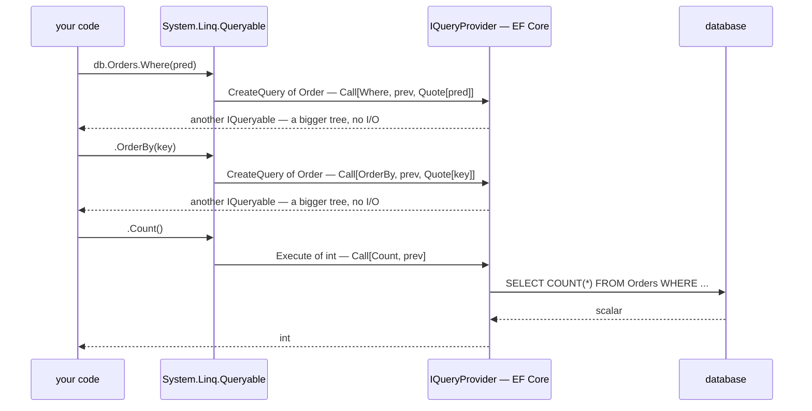
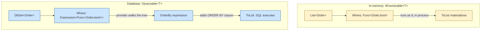
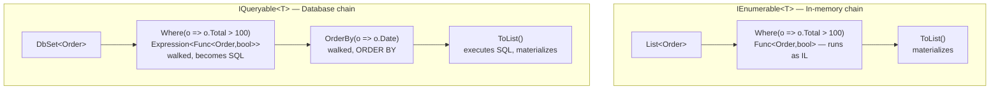
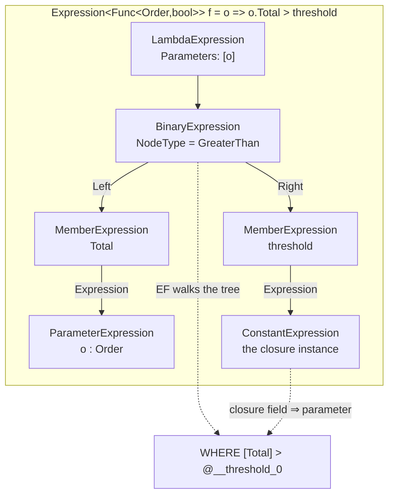

# LINQ — Language Deep Dive

> [Mastery Guide](../../README.md) › [Foundations](../README.md) › [C# Mastery](./README.md)

| Status | Priority | Phase | Last reviewed |
|---|---|---|---|
| Not Started | High | Phase 1 — Language & Runtime Fluency | 2026-05-07 |

## Contents
- [Why it matters](#why-it-matters)
- [Core concepts](#core-concepts)
  - [Two surface APIs — query syntax vs method syntax](#two-surface-apis--query-syntax-vs-method-syntax)
  - [Query syntax `let` and `join...into` — what they compile to](#query-syntax-let-and-joininto--what-they-compile-to)
  - [The query-expression pattern — query syntax is duck-typed](#the-query-expression-pattern--query-syntax-is-duck-typed)
  - [`IEnumerable<T>` vs `IQueryable<T>`](#ienumerablet-vs-iqueryablet)
  - [Expression trees — what `IQueryable` actually carries](#expression-trees--what-iqueryable-actually-carries)
  - [`IQueryProvider` — the four methods behind every query](#iqueryprovider--the-four-methods-behind-every-query)
  - [Composing expression trees — dynamic filters that still parameterize](#composing-expression-trees--dynamic-filters-that-still-parameterize)
  - [The `IQueryable` → `IEnumerable` boundary — silent client-side eval](#the-iqueryable--ienumerable-boundary--silent-client-side-eval)
  - [The one client evaluation EF Core still allows — the top-level projection](#the-one-client-evaluation-ef-core-still-allows--the-top-level-projection)
  - [Deferred vs immediate execution](#deferred-vs-immediate-execution)
  - [Streaming, buffering, immediate — the three execution shapes](#streaming-buffering-immediate--the-three-execution-shapes)
  - [Multiple-enumeration anti-pattern](#multiple-enumeration-anti-pattern)
  - [Mutating source between deferred query and iteration](#mutating-source-between-deferred-query-and-iteration)
  - [Operator fusion and the fast paths inside `System.Linq`](#operator-fusion-and-the-fast-paths-inside-systemlinq)
  - [The allocation profile of a LINQ chain](#the-allocation-profile-of-a-linq-chain)
  - [One object, two roles — the enumerator LINQ doesn't allocate](#one-object-two-roles--the-enumerator-linq-doesnt-allocate)
  - [PLINQ — what `AsParallel()` actually changes](#plinq--what-asparallel-actually-changes)
  - [The operator catalog (by category)](#the-operator-catalog-by-category)
  - [Element retrieval semantics — `First`/`Single`/`SingleOrDefault`](#element-retrieval-semantics--firstsinglesingleordefault)
  - [`Count()` vs `Any()` and other common gotchas](#count-vs-any-and-other-common-gotchas)
  - [`OrderBy().OrderBy()` — the silent overwrite](#orderbyorderby--the-silent-overwrite)
  - [`GroupBy` — what it returns and when it surprises](#groupby--what-it-returns-and-when-it-surprises)
  - [`Where` then `Select` vs `Select` then `Where` — SQL implications](#where-then-select-vs-select-then-where--sql-implications)
  - [`ToDictionary` and duplicate keys](#todictionary-and-duplicate-keys)
  - [`yield return` and custom iterators](#yield-return-and-custom-iterators)
  - [Custom LINQ operators — `Chunk`, `Partition`, when to yield](#custom-linq-operators--chunk-partition-when-to-yield)
  - [Making a custom operator visible to LINQ's fast paths](#making-a-custom-operator-visible-to-linqs-fast-paths)
  - [`IAsyncEnumerable<T>` and `await foreach`](#iasyncenumerablet-and-await-foreach)
  - [`IAsyncEnumerable<T>` cancellation patterns](#iasyncenumerablet-cancellation-patterns)
  - [LINQ with records and pattern matching](#linq-with-records-and-pattern-matching)
  - [`null` in LINQ — NRT-aware predicates](#null-in-linq--nrt-aware-predicates)
  - [`Aggregate` — the general fold](#aggregate--the-general-fold)
  - [Custom LINQ operators (extension pattern)](#custom-linq-operators)
  - [Set operations and ordering](#set-operations-and-ordering)
  - [.NET 9 LINQ additions: `CountBy`, `AggregateBy`, `Index`](#net-9-linq-additions-countby-aggregateby-index)
  - [.NET 10 LINQ additions: `LeftJoin`, `RightJoin`, `Shuffle`, `Sequence`](#net-10-linq-additions-leftjoin-rightjoin-shuffle-sequence)
- [Code & diagrams](#code--diagrams)
- [Common pitfalls](#common-pitfalls)
- [Interview-ready summary](#interview-ready-summary)
- [Interview Cross-Questioning Drill](#interview-cross-questioning-drill)
- [Cheat Sheet](#cheat-sheet)
- [Walkthrough](#walkthrough--n1-from-an-innocent-tolist)
- [Self-test](#self-test)
- [Cross-references](#cross-references)
- [Sources](#sources)

---

## Why it matters

LINQ is C#'s killer feature. One operator vocabulary works against in-memory collections, async streams, XML documents, and remote databases (via EF Core / IQueryable). Senior interviews probe it from two angles: (1) **operator semantics** — when does `Where` + `First` short-circuit; when does `OrderBy` materialize; (2) **the `IEnumerable` vs `IQueryable` boundary** — what gets translated to SQL, what falls back to client-side, what throws.

This file covers LINQ as a **language feature** — operators, deferred execution, expression trees, custom operators. The EF-specific angle (translation rules, parameter sniffing, `AsNoTracking`) lives in [.NET Core Deep Dive › Data Access](../01-net-core-deep-dive/05-data-access.md).

## Core concepts

### Two surface APIs — query syntax vs method syntax

Every LINQ query can be written two ways. The **query syntax** is closer to SQL; the **method syntax** is closer to functional programming. The compiler converts query syntax to method calls — they produce identical IL.

```csharp
var orders = new List<Order> { /* ... */ };

// Query syntax
var q1 = from o in orders
         where o.Total > 100
         orderby o.CreatedAt descending
         select new { o.Id, o.Total };

// Method syntax (identical result)
var q2 = orders
    .Where(o => o.Total > 100)
    .OrderByDescending(o => o.CreatedAt)
    .Select(o => new { o.Id, o.Total });
```

**Which to use:**
- **Method syntax** for one or two operators — terser.
- **Query syntax** when joins, group-bys, or `let` bindings make the SQL-like shape clearer.
- **Method syntax** for any operator query syntax doesn't have keywords for (`Take`, `Skip`, `Distinct`, `First`, `Aggregate`, etc.).

In practice, modern code is overwhelmingly method-syntax. Query syntax is mostly seen in textbook examples and complex multi-source joins.

### Query syntax `let` and `join...into` — what they compile to

Two query-syntax features have **no direct method-syntax equivalent** — they're the rare reason to reach for query syntax.

**`let` — introducing a named intermediate value:**

```csharp
// Query syntax
var q = from o in orders
        let totalWithTax = o.Total * 1.08m
        let isLarge = totalWithTax > 1000
        where isLarge
        orderby totalWithTax descending
        select new { o.Id, totalWithTax };
```

What the compiler emits:

```csharp
var q = orders
    .Select(o => new { o, totalWithTax = o.Total * 1.08m })       // capture o + first let
    .Select(t => new { t, isLarge = t.totalWithTax > 1000 })       // capture prior + second let
    .Where(t => t.isLarge)
    .OrderByDescending(t => t.t.totalWithTax)
    .Select(t => new { t.t.o.Id, t.t.totalWithTax });
```

Each `let` becomes a `Select` into a transparent identifier (the anonymous type `{ o, totalWithTax }`). Subsequent clauses see "everything in scope" because every `let` extends the transparent identifier. **Hand-written method syntax with `let` is painful** — you must manage these transparent identifiers manually.

**`join...into` — group join, the LEFT-JOIN building block:**

```csharp
// Query syntax — left outer join via group join + SelectMany + DefaultIfEmpty
var q = from c in customers
        join o in orders on c.Id equals o.CustomerId into customerOrders
        from co in customerOrders.DefaultIfEmpty()        // null if customer has no orders
        select new { c.Name, OrderId = co?.Id };
```

What the compiler emits:

```csharp
var q = customers.GroupJoin(
        orders,
        c => c.Id,
        o => o.CustomerId,
        (c, customerOrders) => new { c, customerOrders })
    .SelectMany(
        t => t.customerOrders.DefaultIfEmpty(),
        (t, co) => new { t.c.Name, OrderId = co?.Id });
```

Three operators (`GroupJoin`, `SelectMany`, `DefaultIfEmpty`) for one query-syntax `join...into`. **Multi-source / outer-join-shaped LINQ is the one place query syntax is genuinely more readable.**

**When to use query syntax (in 2026):**
- Two or more `let` bindings — anonymous-identifier wrangling is brutal in method syntax.
- Outer joins (`join...into` + `DefaultIfEmpty`).
- Three-or-more-source SQL-shape joins.
- Multi-criteria `orderby` reads close to SQL.

**When to use method syntax:**
- Anything with `Take`/`Skip`/`Distinct`/`First`/`Aggregate` (query syntax has no keyword).
- Single-operator or two-operator chains.
- Anywhere a code reviewer would prefer the functional shape.

### The query-expression pattern — query syntax is duck-typed

This is the answer to "what makes LINQ a *language* feature rather than a library?" and most candidates miss it.

Query syntax is a **purely syntactic rewrite performed before overload resolution**. The compiler has no knowledge of `IEnumerable<T>`, `IQueryable<T>`, or `System.Linq`. It mechanically rewrites clauses into method calls by name, then binds those calls with ordinary member lookup — including extension methods. The ECMA C# standard calls the set of names it expects *the query-expression pattern* (§12.20 *Query expressions*, §12.20.4 *The query-expression pattern*).

| Clause | Rewrites to |
|---|---|
| first `from x in src` | nothing — `src` becomes the receiver |
| second and later `from` | `SelectMany` |
| `where` | `Where` |
| `select` | `Select` (elided when it is a trivial identity projection and another operator follows) |
| `let` | `Select` into a transparent identifier |
| `orderby a, b descending` | `OrderBy(a).ThenByDescending(b)` |
| `join ... on ... equals ...` | `Join` |
| `join ... into g` | `GroupJoin` |
| `group x by k` | `GroupBy` |
| `into` continuation | a new query whose source is the previous result |

Two consequences fall out of "rewrite first, bind later."

**1. `DbSet<T>` is not special-cased.** `from o in db.Orders where ... select ...` works because `Queryable.Where` and `Queryable.Select` happen to have the right names and shapes. The compiler did not know it was talking to a database. That is also why a provider can be written entirely outside Microsoft and get query syntax for free.

**2. Any type with the right method names gets query syntax.** No interface, no attribute, no base class. This is how the "LINQ to *anything*" libraries work, and how `Task`, `Option`/`Maybe`, and `Result` types acquire `from`/`select` in functional C# codebases:

```csharp
public readonly record struct Maybe<T>(bool HasValue, T? Value)
{
    public static Maybe<T> None => default;
    public static Maybe<T> Some(T v) => new(true, v);
}

public static class MaybeQuery
{
    // The three methods the compiler looks for. Nothing here mentions IEnumerable.
    public static Maybe<TResult> Select<T, TResult>(this Maybe<T> m, Func<T, TResult> f)
        => m.HasValue ? Maybe<TResult>.Some(f(m.Value!)) : Maybe<TResult>.None;

    public static Maybe<T> Where<T>(this Maybe<T> m, Func<T, bool> p)
        => m.HasValue && p(m.Value!) ? m : Maybe<T>.None;

    public static Maybe<TResult> SelectMany<T, TMid, TResult>(
        this Maybe<T> m, Func<T, Maybe<TMid>> bind, Func<T, TMid, TResult> project)
    {
        if (!m.HasValue) return Maybe<TResult>.None;
        var mid = bind(m.Value!);
        return mid.HasValue ? Maybe<TResult>.Some(project(m.Value!, mid.Value!)) : Maybe<TResult>.None;
    }
}

// Query syntax over a type that is not a sequence at all:
var shipping =
    from customer in FindCustomer(id)          // Maybe<Customer>
    from address in customer.PrimaryAddress()   // Maybe<Address>
    where address.Country == "GB"
    select Quote(address);                      // Maybe<Quote>
// If any step is None, the whole expression is None — no null checks written by hand.
```

Note the **three-argument `SelectMany`**: the compiler always emits the overload that takes both a bind function and a result projection, because it needs to keep the outer range variable (`customer`) in scope for later clauses. A two-argument `SelectMany` alone will not satisfy a multi-`from` query.

**The hazard side of duck typing:** if you define a method named `Select` or `Where` on your own type — or an extension method on it that is *more specific* than `Enumerable.Where` — query syntax and method syntax silently bind to yours. There is no diagnostic saying "you have overridden LINQ." This is exactly how a badly-scoped extension method can make `db.Orders.Where(...)` stop translating to SQL: the compiler picked the `IEnumerable<T>` overload because someone's helper made it the better match.

> 🌍 **In the real world**: a team wrote `public static IEnumerable<T> Where<T>(this IEnumerable<T> src, Func<T, bool> p, bool applyFilter)` — a "conditional where" convenience with an extra `bool`. It never collided with `Enumerable.Where` because the arity differed, and it was used happily for months. Then someone added an overload with a default value for `applyFilter`, which made it applicable at two arguments as well. Applicable *and* better, because it lived in a namespace imported closer than `System.Linq`. Every `db.X.Where(...)` in files with that `using` quietly switched from `Queryable.Where` to the `IEnumerable` version — the `DbSet` was implicitly converted to `IEnumerable<T>`, the whole table was materialized, and the filter ran in memory. The SQL logs are what gave it away: `SELECT` with no `WHERE`. The fix was to rename the helper to `WhereIf`. The general lesson is that LINQ's binding is ordinary overload resolution, so anything that changes overload resolution — a new `using`, a new overload, a default parameter — can change which LINQ you are running.

### `IEnumerable<T>` vs `IQueryable<T>`

The most important distinction in LINQ. Both expose the same operator names, but they execute on totally different machinery.

| | `IEnumerable<T>` | `IQueryable<T>` |
|---|---|---|
| Lambda type | `Func<T, ...>` | `Expression<Func<T, ...>>` |
| Where it runs | In-process, in the calling thread | Translated by the provider (e.g., to SQL) and run remotely |
| Source | `List<T>`, `T[]`, `Dictionary<,>.Values`, etc. | `DbSet<T>` (EF Core), Mongo / Cosmos drivers, custom providers |
| Operators that don't translate | Throws `NotSupportedException` (when forced) — but on `IEnumerable`, anything works | Provider-specific |

```csharp
// IEnumerable — runs in process
var topInMemory = orders
    .Where(o => o.Total > 1000)              // Func<Order, bool> — runs as IL
    .ToList();

// IQueryable — translates to SQL
var topInDb = dbContext.Orders
    .Where(o => o.Total > 1000)              // Expression<Func<Order, bool>> — walked by EF, becomes WHERE Total > 1000
    .ToList();
```

**The translation boundary:** the moment an `IQueryable<T>` chain hits an operator that doesn't materialize (e.g., a custom method, an unsupported operation), EF Core decides what to do — either translate it, fall back to **client-side evaluation** (load partial data into memory and run the rest in process), or throw. EF Core 3+ throws for anything it cannot translate **except in the top-level projection**, where client evaluation is still supported by design — the precise rule and the trap inside it are [below](#the-one-client-evaluation-ef-core-still-allows--the-top-level-projection).

**Casting `IQueryable<T>` to `IEnumerable<T>` materializes the query at that point** — every subsequent operator runs in memory:

```csharp
// First Where → SQL. ToList materializes. Second Where → in memory.
var bad = dbContext.Orders.Where(o => o.Active).ToList().Where(o => o.Total > 100);

// Better — both filters in SQL
var good = dbContext.Orders.Where(o => o.Active).Where(o => o.Total > 100).ToList();
```

### Expression trees — what `IQueryable` actually carries

The table above says `IQueryable<T>` uses `Expression<Func<...>>`. That sentence is where most candidates stop, and where a good interviewer starts.

**The compiler emits different code for the same source text.** Assigning a lambda to a `Func<>` compiles a method. Assigning the *identical* lambda to an `Expression<Func<>>` compiles **code that builds a data structure describing that lambda** — the method body is never emitted at all:

```csharp
decimal threshold = 1000m;

Func<Order, bool> asDelegate   = o => o.Total > threshold;   // compiles to a method; call it
Expression<Func<Order, bool>> asTree = o => o.Total > threshold;   // compiles to tree-building code
```

Take the tree apart and the machinery is visible:

```csharp
var body = (BinaryExpression)asTree.Body;

body.NodeType          // ExpressionType.GreaterThan
body.Left              // MemberExpression:   o.Total
body.Right             // MemberExpression:   value(Prog+<>c__DisplayClass0_0).threshold
asTree.Parameters[0]   // ParameterExpression: o
```

**The right-hand side is the detail that matters.** `threshold` is a captured local, so it did *not* become `Expression.Constant(1000m)`. It became a **field access on the closure object**, wrapped as a constant reference to that object. The value is not in the tree — the *path to the value* is. Everything EF Core does with parameters follows from this:

| You write | Tree node | EF Core emits |
|---|---|---|
| `Where(o => o.Total > 1000m)` | `Constant(1000m)` | `WHERE Total > 1000.0` — a literal baked into the SQL |
| `Where(o => o.Total > threshold)` | closure field access | `WHERE Total > @__threshold_0` — a parameter |

Per the EF Core docs, two queries with different literals have **different expression trees, so EF compiles each separately and the database sees two different SQL strings** — two plans in the server's plan cache. Parameterize and both the EF query cache and the database plan cache hit. (EF Core 8 added `EF.Constant<T>()` to force the literal form where the database plans better with it; EF Core 9 added `EF.Parameter<T>()` to force the opposite. Details in [Data Access](../01-net-core-deep-dive/05-data-access.md).)

**`IQueryable<T>` is two properties and nothing else:**

```csharp
public interface IQueryable : IEnumerable
{
    Type ElementType { get; }
    Expression Expression { get; }      // the tree built so far
    IQueryProvider Provider { get; }    // who knows how to run it
}
```

`Queryable.Where` does not filter anything. It wraps your tree in a `MethodCallExpression` that says "`Where` was called with this predicate" and hands it to `Provider.CreateQuery<T>(...)`, which returns another `IQueryable<T>`. Composing ten operators builds a ten-node tree and touches no data. Enumerating — or calling `Provider.Execute` via `First`, `Count`, `ToListAsync` — is when the provider finally walks the tree and produces SQL. **Printing `query.Expression.ToString()` in the debugger shows exactly what the provider will be handed**, which is the fastest way to see whether the operator you added actually landed in the tree.

**What C# refuses to put in an expression tree.** This is the practical half of the topic, and the list is longer than people expect. Expression trees cannot gain new node types without breaking every library that interprets them, so most C# features added since C# 3 are simply unavailable. From the [expression trees documentation](https://learn.microsoft.com/en-us/dotnet/csharp/advanced-topics/expression-trees/), an expression-tree lambda may not contain:

- statement bodies (`{ ... }`) or any assignment
- the null-propagating operator `?.`, and null-coalescing assignment
- **pattern matching** — `is` patterns and `switch` expressions
- tuple literals, tuple `==`/`!=`, and `with` expressions
- interpolated strings
- collection expressions and dictionary/indexed-property initializers
- `Index`/`Range`, the `^` from-end operator, and `..`
- `async` lambdas and `await`
- `throw` expressions, `dynamic`, unsafe pointer ops, `ref`/`in`/`out` parameters and `ref struct` values
- references to local functions, method group expressions, `base` access
- calls using named, optional, or `params` arguments
- discard *expressions* — `out _`, `_ = x`, and deconstructing assignment (CS8207). A discard-named *parameter* (`_ => 42`) is fine; it is only a parameter name
- access to `static abstract` / `static virtual` interface members (CS8927) — so a predicate written against a generic-math interface (`x => x > T.Zero`) cannot be a tree
- lambdas that carry attributes (CS8972). A `"x"u8` literal is also rejected, but under the `ref struct` rule above — its type is `ReadOnlySpan<byte>`

Read that list against the [pattern-matching section below](#linq-with-records-and-pattern-matching): **every technique there is `IEnumerable`-only.** `shapes.Where(s => s is Circle { Radius: > 10 })` is idiomatic modern C# over a list and a compile error over a `DbSet`.

```csharp
// Fine on IEnumerable<Order>. Compile error on IQueryable<Order>.
orders.Where(o => o is { Status: OrderStatus.Open, ClosedAt: null });
orders.Where(o => o.Customer?.Region == "EU");
orders.Select(o => $"{o.Id}: {o.Total}");
orders.Where(o => (o.Region, o.Tier) == ("EU", 1));

// The IQueryable spellings
db.Orders.Where(o => o.Status == OrderStatus.Open && o.ClosedAt == null);
db.Orders.Where(o => o.Customer != null && o.Customer.Region == "EU");
db.Orders.Select(o => o.Id + ": " + o.Total);
db.Orders.Where(o => o.Region == "EU" && o.Tier == 1);
```

**Going the other way: `Compile()`.** `LambdaExpression.Compile()` turns a tree back into a delegate by emitting IL at runtime. That makes expression trees the engine behind mappers, serializers, DI containers, and mocking frameworks — build a tree once, compile it, and subsequent calls run at delegate speed instead of reflection speed. Three things to know:

- **Compile once, cache the delegate.** Every `Compile()` call re-walks the tree and emits fresh IL. Compiling inside the method you call per request throws away the entire benefit.
- **`Compile(preferInterpretation: true)`** produces an interpreted delegate instead — cheaper to create, slower to invoke. It is the right choice when a tree will be invoked once or twice.
- **Native AOT has no runtime code generation.** `RuntimeFeature.IsDynamicCodeSupported` is `false` there, `Compile` is annotated as requiring dynamic code, and the interpreter is what actually runs. Anything that leans on `Compile()` for speed needs a source generator instead when the target is AOT. See [Reflection, Attributes & Source Generators](./08-reflection-attributes-and-source-gen.md).

> 🌍 **In the real world**: a reporting service had a rule engine whose rules were `Expression<Func<Invoice, bool>>` values loaded from configuration and applied in memory. Someone noticed that the delegate was rebuilt on every evaluation — `rule.Compile()(invoice)` inside the per-invoice loop — and moved the `Compile()` to a `ConcurrentDictionary<Guid, Func<Invoice, bool>>` keyed by rule id, populated at load. Allocation traces before and after are the clearest evidence: the per-invoice case shows a steady stream of dynamic-method and delegate allocations proportional to invoice count; the cached case shows one allocation per rule at startup and nothing thereafter. The lesson generalises to every expression-tree library: **the tree is the cheap part and `Compile()` is the expensive part**, so the design question is always "where is the delegate cached?"

> 🌍 **In the real world**: a team shared domain predicates as static helpers — `public static bool IsOpen(Order o) => o is { Status: Open, ClosedAt: null };` — and used them everywhere in service code. When they tried to reuse the same helper in an EF query, they hit two walls in sequence: EF cannot translate a call to a static method, and rewriting it as `Expression<Func<Order, bool>> IsOpen = o => o is { ... }` does not compile at all, because pattern matching cannot exist in an expression tree. What they ended up with was one `Expression<Func<Order, bool>> OpenOrders` written in plain `&&`/`==` (the single source of truth, usable by EF), plus `OpenOrders.Compile()` cached in a static field for the in-memory callers. Sharing a *predicate* between LINQ-to-Objects and LINQ-to-SQL means writing it in the expression-tree subset of C# and compiling downward — never writing it in modern C# and hoping the provider copes.

### `IQueryProvider` — the four methods behind every query

The section above stops at "the provider walks the tree." The follow-up question is *when*, and the mechanism is small enough to hold in your head — it is one interface with four members, and every operator in `System.Linq.Queryable` is a short method that validates its arguments and then picks one of them.

```csharp
public interface IQueryProvider
{
    IQueryable CreateQuery(Expression expression);                 // compose, weakly typed
    IQueryable<TElement> CreateQuery<TElement>(Expression expression);   // compose
    object? Execute(Expression expression);                        // run, weakly typed
    TResult Execute<TResult>(Expression expression);               // run
}
```

**Composing operators call `CreateQuery`. Terminal operators call `Execute`.** Here is `Queryable.Where` from dotnet/runtime, in full:

```csharp
[DynamicDependency("Where`1", typeof(Enumerable))]
public static IQueryable<TSource> Where<TSource>(
    this IQueryable<TSource> source, Expression<Func<TSource, bool>> predicate)
{
    ArgumentNullException.ThrowIfNull(source);
    ArgumentNullException.ThrowIfNull(predicate);

    return source.Provider.CreateQuery<TSource>(
        Expression.Call(
            null,
            // the MethodInfo for Queryable.Where itself, obtained by making a delegate
            // to it and reading .Method — trim-safe, hence the [DynamicDependency]
            new Func<IQueryable<TSource>, Expression<Func<TSource, bool>>, IQueryable<TSource>>(Where).Method,
            source.Expression,               // everything composed so far
            Expression.Quote(predicate)));   // ★ your lambda, wrapped
}
```

Three things fall out of that body.

**1. The tree is a record of the calls you made, not a description of a filter.** The node `Where` produces is a `MethodCallExpression` whose `Method` is `Queryable.Where` and whose arguments are the previous tree plus your predicate. Providers match on that `MethodInfo`, which is why they recognise `Queryable.Where` and not `Enumerable.Where` — and why the accidental-overload bug in [the query-expression pattern](#the-query-expression-pattern--query-syntax-is-duck-typed) produces a `SELECT` with no `WHERE` rather than an error. The provider was never handed a filter to translate.

**2. `Expression.Quote(predicate)`, not `predicate`.** An argument of a `MethodCallExpression` has to be an `Expression`, and your lambda already *is* one — so it gets wrapped in a `UnaryExpression` of node type `Quote`, meaning "the value of this argument is the tree inside me." Every visitor over a queryable tree therefore begins with the same helper:

```csharp
private static LambdaExpression StripQuotes(Expression e)
{
    while (e.NodeType == ExpressionType.Quote) e = ((UnaryExpression)e).Operand;
    return (LambdaExpression)e;
}
```

If you have ever cast `call.Arguments[1]` straight to `LambdaExpression` and got an `InvalidCastException`, the `Quote` node is what you hit.

**3. Terminal operators are where the I/O happens.** The docs for [`Queryable.Count`](https://learn.microsoft.com/en-us/dotnet/api/system.linq.queryable.count) say it in as many words: the method *"generates a `MethodCallExpression` that represents calling `Count<TSource>(IQueryable<TSource>)` itself as a constructed generic method. It then passes the `MethodCallExpression` to the `Execute<TResult>(Expression)` method of the `IQueryProvider` represented by the `Provider` property of the `source` parameter."*



**`ToList()` takes the other door.** There is no `Queryable.ToList` — `ToList` is `Enumerable.ToList`, which enumerates the `IQueryable<T>` through its `IEnumerable<T>` face, and *that* is what makes the provider run. So a provider has two entry points: `Execute` for scalar/element operators, and `GetEnumerator` for sequence results. Both end up executing the same tree; only the shape of the answer differs.

**Async needed a fifth method, so EF Core defined its own interface.** `IQueryProvider.Execute<TResult>` is synchronous, and `System.Linq` never added an async counterpart, which is why `ToListAsync` lives in `Microsoft.EntityFrameworkCore` and not in `System.Linq`. EF's contract is:

```csharp
namespace Microsoft.EntityFrameworkCore.Query;

public interface IAsyncQueryProvider : IQueryProvider
{
    TResult ExecuteAsync<TResult>(Expression expression, CancellationToken cancellationToken = default);
}
```

EF's async terminal operators check the source for async support and throw `InvalidOperationException` when it is missing — that is the error you get when you call `ToListAsync()` on an `IQueryable<T>` produced by `list.AsQueryable()` in a unit test. The provider behind that queryable is `EnumerableQuery<T>`, which knows nothing about `IAsyncQueryProvider`.

> 🌍 **In the real world**: a team mocked their repository as `IQueryable<Order>` and returned `_seed.AsQueryable()`. Every test that reached a `ToListAsync()` failed with "the source `IQueryable` doesn't implement `IAsyncEnumerable`", so they did what the top search result suggests and wrote a `TestAsyncQueryProvider<T>` that implements `IAsyncQueryProvider` by delegating to `EnumerableQuery<T>`. The tests went green and stayed green for two years, and in that time the suite lost the ability to fail: the fake provider is LINQ-to-Objects, so a `Where` calling a client method, a `GroupBy` with no aggregate, and a `string.Format` inside a projection all pass in the test and throw at runtime in production. The bugs it did catch were bugs in the seed data. They eventually moved every query test onto a real database in a container and kept the mocked repository only for code that does no querying. **A fake `IQueryProvider` tests the query you wrote, not the query your provider can translate** — and translation is the only thing that was ever at risk.

### Composing expression trees — dynamic filters that still parameterize

Every senior .NET engineer eventually builds a search endpoint with a dozen optional filters. There are three ways to do it and only two are defensible.

**Way 1 — compose the `IQueryable`. Use this by default.**

```csharp
IQueryable<Order> q = db.Orders;

if (customerId is not null)  q = q.Where(o => o.CustomerId == customerId);
if (minTotal is not null)    q = q.Where(o => o.Total >= minTotal);
if (status is not null)      q = q.Where(o => o.Status == status);

var page = await q.OrderBy(o => o.CreatedAt).Skip(skip).Take(take).ToListAsync(ct);
```

Each `Where` appends a node to the tree; nothing executes until `ToListAsync`. Every filter value is a captured local, so every one becomes a SQL parameter. EF's own performance guidance is blunt about the alternative: *"Avoid constructing queries with the expression tree API unless you really need to."*

**Way 2 — build the tree by hand.** You need this only when composition cannot express the shape: **OR across filters** (chained `Where` is always AND), or a reusable predicate object passed between layers. Two traps sit here.

*Trap 1: you cannot `&&` two expression trees.* `a && b` does not compile for `Expression<Func<T, bool>>`, and the obvious fix is wrong:

```csharp
Expression<Func<Order, bool>> a = o => o.Total > 100;
Expression<Func<Order, bool>> b = o => o.Status == OrderStatus.Open;

// Compiles. Broken.
var body = Expression.AndAlso(a.Body, b.Body);
var bad = Expression.Lambda<Func<Order, bool>>(body, a.Parameters[0]);
```

`a` and `b` each declared their *own* `ParameterExpression` named `o`. They are different objects, and expression-tree parameters are matched by reference, not by name. The combined body references a parameter the lambda does not declare, so `Compile()` throws and EF cannot translate it. The fix is to rewrite one side's parameter into the other's — the canonical use of `ExpressionVisitor`:

```csharp
public static class PredicateComposer
{
    public static Expression<Func<T, bool>> And<T>(
        this Expression<Func<T, bool>> left, Expression<Func<T, bool>> right)
        => Combine(left, right, Expression.AndAlso);

    public static Expression<Func<T, bool>> Or<T>(
        this Expression<Func<T, bool>> left, Expression<Func<T, bool>> right)
        => Combine(left, right, Expression.OrElse);

    private static Expression<Func<T, bool>> Combine<T>(
        Expression<Func<T, bool>> left,
        Expression<Func<T, bool>> right,
        Func<Expression, Expression, BinaryExpression> op)
    {
        var parameter = left.Parameters[0];
        var rebound = new ParameterRebinder(right.Parameters[0], parameter).Visit(right.Body)!;
        return Expression.Lambda<Func<T, bool>>(op(left.Body, rebound), parameter);
    }

    private sealed class ParameterRebinder(ParameterExpression from, ParameterExpression to)
        : ExpressionVisitor
    {
        protected override Expression VisitParameter(ParameterExpression node)
            => node == from ? to : base.VisitParameter(node);
    }
}

// Now OR composes, and the result is one tree EF can translate.
Expression<Func<Order, bool>> filter = o => o.CustomerId == cid;
if (includeRefunds) filter = filter.Or(o => o.Type == OrderType.Refund);
var rows = await db.Orders.Where(filter).ToListAsync(ct);
```

`ExpressionVisitor` is the whole rewriting API: `Visit` dispatches on node type, you override the `VisitX` you care about, and the base implementation rebuilds the tree around whatever you return. Trees are immutable, so a visitor never mutates — it produces a new tree, returning the original node unchanged when nothing needs rewriting.

*Trap 2: hand-built trees default to constants.* `Expression.Constant(value)` bakes the value into the tree. Different value, different tree, different SQL — EF recompiles every time and the database's plan cache fills with near-identical plans. EF's docs show the fix: build a node that *looks like* a captured variable by taking the body of a trivial closure lambda.

```csharp
// Wrong — a literal in the SQL, a fresh compilation per value, plan-cache pollution
var wrong = Expression.Constant(url);

// Right — the same closure-field-access node the compiler emits for `o => o.Url == url`
Expression<Func<string>> capture = () => url;
var right = capture.Body;      // MemberExpression over the display class
```

**Way 3 — string concatenation into raw SQL.** Never for filters. It reintroduces injection and defeats parameterization at the same time.

> 🌍 **In the real world**: an order-search endpoint accepted eleven optional filters and built its `WHERE` clause by hand with `Expression.Constant` for each supplied value. Functionally perfect for two years. The symptom that eventually surfaced was on the database, not the app: SQL Server's plan cache was dominated by thousands of single-use plans for the same query shape, evicting the plans that mattered, and other endpoints got slower whenever search traffic spiked. Nobody was looking at the search endpoint, because the search endpoint was fine. The fix was mechanical — replace each `Expression.Constant(v)` with the closure-capture node above — and afterwards the shape collapsed to one parameterized plan. The transferable diagnostic: **if the database's plan cache has many plans that differ only in a literal, something upstream is putting values into query trees instead of parameters.**

### The `IQueryable` → `IEnumerable` boundary — silent client-side eval

The most expensive bug in EF Core 1/2 was **silent client-side evaluation**: an operator the provider couldn't translate would, instead of throwing, materialize the partial query and run the rest in memory. A `.Where(...)` you thought ran in SQL might actually be loading the whole table.

**EF Core 3+ throws by default** — everywhere [except the top-level projection](#the-one-client-evaluation-ef-core-still-allows--the-top-level-projection) — but you can still trip over the boundary in subtler ways:

```csharp
// Case 1: explicit AsEnumerable() — voluntary boundary
var bad1 = db.Orders
    .Where(o => o.CustomerId == cid)        // SQL: WHERE CustomerId = @p0
    .AsEnumerable()                          // ★ EVERYTHING after this is in memory
    .Where(o => o.Total > 100)               // C#, in memory
    .Take(10)                                 // C#, in memory — BUT we already loaded all matching orders for the customer
    .ToList();

// Case 2: ToList() too early — same effect
var bad2 = db.Orders.Where(...).ToList().Where(...);    // entire materialized set, then filter

// Case 3: Subtle method call that doesn't translate
var bad3 = db.Orders
    .Where(o => MyHelper.IsBigSpender(o.Total))     // EF Core 3+: throws "could not be translated"
    .ToList();

// Case 4: Conditional that EF can't decompose
var includeArchived = GetFlag();
var query = db.Orders.AsQueryable();
if (includeArchived) query = query.Where(o => o.IsArchived);    // ✓ — composed BEFORE materialization
else                  query = query.Where(o => !o.IsArchived);
var result = await query.ToListAsync();    // single SQL with one WHERE clause based on the flag
```

**When `AsEnumerable()` is legitimately the right tool:**
- Small result set that needs C#-only operations afterwards (e.g., a 50-row config table where you need a `string.Format` projection).
- The provider truly can't translate the next operation and you've already filtered down to a manageable size.

**When `AsEnumerable()` is the wrong tool:**
- You're trying to get away with using a custom method in a predicate. Use `[DbFunction]` mapping or split the logic.
- You're avoiding the "can't translate" error by hiding the operation behind the boundary. You've turned a compile-time-error into a `select-everything-then-filter` performance bomb.

**The diagnostic recipe:** log EF Core SQL with `optionsBuilder.LogTo(Console.WriteLine).EnableSensitiveDataLogging();` in dev. If the SQL has no `WHERE` clause matching what you wrote, your operator landed in memory.

> 🌍 **In the real world**: an admin endpoint listed "orders needing attention", where "needing attention" was a static helper combining half a dozen business rules. EF Core refused to translate the call, and the fastest way to make the build green was `.AsEnumerable()` before the `Where`. On the developer's seeded database the table had a few thousand rows and the page was instant. Eighteen months later the table had grown by three orders of magnitude, and that endpoint was reading the entire orders table into memory on every request, allocating an entity per row, and discarding almost all of them — a Gen2-pressure machine hiding behind a page nobody thought was expensive. The tell in the logs was a `SELECT` with no `WHERE`, which had been there since the day it shipped. The fix was to express the rules as one `Expression<Func<Order, bool>>` in translatable C#. **`AsEnumerable()` converts a compile error into a scaling problem** — it does not remove the problem, it just defers it until the table is big enough to hurt.

### The one client evaluation EF Core still allows — the top-level projection

"EF Core 3 stopped doing client evaluation" is the version everyone repeats, and it is wrong in one specific, deliberate place. The [EF Core docs](https://learn.microsoft.com/en-us/ef/core/querying/client-eval) state the rule exactly:

> "EF Core supports partial client evaluation in the top-level projection (essentially, the last call to `Select()`). If the top-level projection in the query can't be translated to the server, EF Core will fetch any required data from the server and evaluate remaining parts of the query on the client. If EF Core detects an expression, in any place other than the top-level projection, which can't be translated to the server, then it throws a runtime exception."

So the *same untranslatable method* is legal in one position and fatal in another:

```csharp
// ✓ Runs. StandardizeUrl executes in your process, once per row you were fetching anyway.
var ok = await db.Blogs
    .OrderByDescending(b => b.Rating)
    .Select(b => new { b.BlogId, Url = StandardizeUrl(b.Url) })
    .ToListAsync(ct);

// ✗ Throws "could not be translated". Same method, used as a filter.
var bad = await db.Blogs
    .Where(b => StandardizeUrl(b.Url).Contains("dotnet"))
    .ToListAsync(ct);
```

The asymmetry is not arbitrary, and being able to explain *why* is the difference between having memorised the rule and understanding it: a client-side **projection** costs one delegate call per row you were already going to fetch, so it is bounded by the result set. A client-side **filter** has to fetch the rows it is about to discard, so its cost is bounded by the *table*. Same reasoning as [the `AsEnumerable()` section above](#the-iqueryable--ienumerable-boundary--silent-client-side-eval).

**The trap inside the exception: constants that outlive the query.** Query compilation is expensive, so EF caches the compiled plan — and the client-evaluated part of a projection is a delegate cached along with it. Values EF can turn into parameters get swapped per execution; values it cannot stay in the plan as `ConstantExpression` nodes, and a cached plan lives as long as the context's service provider:

> "If the cached delegate contains such constants, then those objects can't be garbage collected since they're still being referenced. If such an object contains a DbContext or other services in it, then it could cause the memory usage of the app to grow over time. This behavior is generally a sign of a memory leak."

The mechanism is the one from [expression trees](#expression-trees--what-iqueryable-actually-carries): a lambda that calls an **instance** method captures `this`, and `this` becomes a constant in the tree.

```csharp
public class ReportService(AppDbContext db, IUrlFormatter formatter)
{
    // ✗ Instance method → 'this' (and therefore db + formatter) lands in the tree as a constant
    private string Format(string url) => formatter.Standardize(url);

    public Task<List<Row>> Bad(CancellationToken ct) =>
        db.Blogs.Select(b => new Row(b.Id, Format(b.Url))).ToListAsync(ct);

    // ✓ Static, with the dependency passed as an argument — nothing to capture
    private static string Format(string url, IUrlFormatter f) => f.Standardize(url);
}
```

EF now detects this and *"throws an exception whenever it comes across constants of a type that can't be mapped using current database provider"* — so on a modern version you usually get a loud, confusing error rather than a slow leak. The three documented fixes, in the order to try them:

1. **Make the method `static`.** If it doesn't use instance data, this is the whole fix.
2. **Pass the specific data it needs as arguments** rather than reaching through `this`, so the tree references mappable scalars.
3. **Assign anything else to a local first**, because a captured local becomes a parameter rather than a constant — the same closure-field-access node that makes `Where(o => o.Total > threshold)` parameterize.

The one thing not to do is what the error tempts you into: putting `.AsEnumerable()` in front of the `Select` to make it go away. That converts a projection EF was going to stream into a full materialization of every entity, which is a much larger problem than the one you started with.

> 🌍 **In the real world**: a reporting endpoint projected rows through an instance helper — `.Select(x => new Row(x.Id, Describe(x.Code)))` — and had worked since EF Core 2. After an upgrade it failed at query time with an exception naming a constant of type `ReportService` that the SQL Server provider could not map. The first fix attempted was `.AsEnumerable()` before the `Select`, which made the error disappear and turned a projection of three columns into a full entity materialization of the table; it passed review because the diff was one line and the tests only checked the output. It surfaced a week later as a memory and latency regression on the busiest report. The correct fix was six characters — `static` on the helper, with the formatter passed in as an argument. **When EF complains about a constant it cannot map, it is protecting its plan cache from rooting your DI graph**; the fix is always to make the tree reference values instead of objects, never to leave the tree.

### Deferred vs immediate execution

Most LINQ operators are **deferred** — they don't execute when called; they return an iterator that executes on demand (when iterated, when `ToList`/`ToArray`/`Count`/`First`/etc. is called).

```csharp
var query = numbers.Where(n => {
    Console.WriteLine($"checking {n}");
    return n > 2;
});
// Nothing printed yet — query not executed.

var first = query.First();
// Prints "checking 1", "checking 2", "checking 3" — stops on first match (3).

var list = query.ToList();
// Prints again — for ALL elements. Iteration restarts on each materialization.
```

**Deferred operators** (return a new sequence): `Where`, `Select`, `OrderBy`, `Take`, `Skip`, `Distinct`, `GroupBy`, `Join`, `Concat`, `Reverse`, etc.

**Immediate operators** (return a value or fully-materialize): `ToList`, `ToArray`, `ToDictionary`, `First`, `Single`, `Any`, `All`, `Count`, `Sum`, `Average`, `Max`, `Min`, `Aggregate`.

**Implication: side effects in lambdas.** A `Select(x => Mutate(x))` doesn't run until the result is iterated. If you depend on the side effect, materialize with `ToList()`. If you don't want the lambda to ever run twice, materialize.

**Anti-pattern: re-iterating a deferred query.**

```csharp
var slow = ExpensiveSource.Where(x => Compute(x));
var count = slow.Count();             // iterates once
var first = slow.First();             // iterates AGAIN — Compute() called for every element again

// Materialize once
var materialized = slow.ToList();
var count = materialized.Count;       // O(1) — already a list
var first = materialized[0];          // O(1)
```

> 🌍 **In the real world**: a nightly reconciliation job built one query per region inside a loop and enumerated them all afterwards, so that a single connection could be opened around the batch. The loop looked like this: `foreach (var r in regions) queries.Add(rows.Where(x => x.Region == region));` where `region` was a mutable local assigned at the top of each iteration rather than the loop variable itself — a leftover from an earlier refactor. Because `Where` is deferred, none of the predicates ran during the loop; they all ran afterwards, and by then `region` held the last value. Every region's report contained the last region's rows. The counts were plausible, so it survived a release. Two properties combined to hide it: the closure captures the *variable*, not its value, and deferred execution moves the read of that variable to a point after the loop has finished. Either one alone is harmless. The fix was one word — capture the loop variable itself — and the guard rail the team adopted was to materialize with `.ToList()` at the point a query is stored in a collection, on the grounds that anything you put in a list, you have stopped thinking of as lazy.

### Streaming, buffering, immediate — the three execution shapes

"Deferred vs immediate" is the version of this in every tutorial, and it is not enough to answer the follow-up questions. Deferred operators split into two families that behave completely differently:

| Shape | Operators | When work happens | Peak memory |
|---|---|---|---|
| **Streaming deferred** | `Where`, `Select`, `SelectMany`, `Take`, `Skip`, `TakeWhile`, `SkipWhile`, `Concat`, `Zip`, `Cast`, `OfType`, `DefaultIfEmpty`, `Index` | one element per `MoveNext` | O(1) |
| **Streaming with growing state** | `Distinct`, `DistinctBy`, `Union`, `UnionBy` | yields as it goes, but retains every key seen | O(distinct keys) |
| **Buffering deferred** | `OrderBy`/`ThenBy`, `GroupBy`, `Reverse`, and the *inner* side of `Join`/`GroupJoin`, the *second* sequence of `Except`/`Intersect` | nothing on the call — **the whole source is consumed on the first `MoveNext`** | O(n) |
| **Immediate** | `ToList`, `ToArray`, `ToDictionary`, `ToHashSet`, `ToLookup`, `Count`, `Sum`, `Min`, `Max`, `Aggregate`, `First`, `Single`, `Any`, `All` | on the call | varies |

The middle row is what interviewers are fishing for. "`GroupBy` is deferred" and "`GroupBy` reads the entire source" sound contradictory and are both true: the *call* does no work, and the *first* `MoveNext` does all of it. Three things follow.

**1. Infinite sequences.** A buffering operator anywhere in the chain turns a working query into a hang:

```csharp
Fibonacci().Where(n => n % 2 == 0).Take(5).ToList();   // ✓ streaming — returns
Fibonacci().Distinct().Take(5).ToList();               // ✓ yields as it goes
Fibonacci().OrderBy(n => n).Take(5).ToList();          // ✗ hangs — OrderBy must see the last element
Fibonacci().GroupBy(n => n % 2).First();               // ✗ hangs — GroupBy must find every key
Fibonacci().Reverse().Take(5).ToList();                // ✗ hangs — "the last element first"
```

**2. Memory.** A streaming chain over ten million rows holds one row at a time. Insert one `OrderBy` and it holds ten million. This is the single most common way a streaming export turns into an out-of-memory incident, and it never shows up in test data.

**3. Filter before you buffer.** `Where` in front of `OrderBy` reduces what gets buffered; `Where` after it does not. Same result, different peak memory:

```csharp
rows.OrderBy(r => r.Date).Where(r => r.IsActive)   // buffers everything, then filters
rows.Where(r => r.IsActive).OrderBy(r => r.Date)   // buffers only the survivors
```

**Deferral also relocates your exceptions.** The lambda runs during iteration, so a `try`/`catch` around the *query definition* catches nothing, and the stack trace points at `MoveNext` in a compiler-generated type, several frames from the code you would blame:

```csharp
IEnumerable<Row> Parse(string path)
{
    try
    {
        return File.ReadLines(path).Select(ParseRow);   // ★ catches nothing useful
    }
    catch (FormatException ex)
    {
        _log.Error(ex, "bad file {Path}", path);        // never runs — Select hasn't executed
        return [];
    }
}

// The FormatException surfaces here instead, with no idea which file it came from:
foreach (var row in Parse(path)) Handle(row);
```

The fix is to move the boundary: either materialize inside the `try` (`.ToList()`), or push the `try` down into the element-level work (`Select(line => TryParseRow(line, path))`). **Wherever you materialize is where your errors will be reported from** — pick it deliberately rather than letting it land wherever the last caller happened to call `ToList`.

> 🌍 **In the real world**: an export endpoint streamed rows from `IAsyncEnumerable` straight into the response body and had run for a year on flat memory. A ticket asked for the export to be sorted by date. The one-line change — an `OrderBy` before the write loop — turned an O(1) pipeline into one that buffered every row of the largest tenant's export before writing a single byte, and the pods started getting OOM-killed on exactly the exports customers cared most about. The team had a real choice to make, not a bug to fix: sort in the database and keep streaming (what they did), or keep the in-memory sort and cap the export size. The reason this class of change slips through review is that `OrderBy` looks like `Where` and `Select` — same call syntax, same deferred return type, completely different memory contract. **Knowing which operators buffer is not trivia; it is the difference between a streaming pipeline and a materializing one.**

### Multiple-enumeration anti-pattern

The biggest practical risk of deferred execution. **Rider and ReSharper flag it as warning** "Possible multiple enumeration of IEnumerable" — the squiggle every senior recognizes.

```csharp
public void Process(IEnumerable<Order> orders)        // ★ parameter typed as IEnumerable
{
    if (!orders.Any()) return;                         // walks the source once
    var count = orders.Count();                        // walks AGAIN
    foreach (var o in orders) HandleOrder(o);          // walks a THIRD time
}
```

**What goes wrong:**
- If the source is a deferred LINQ chain (`db.Orders.Where(...)`), each enumeration **re-runs the entire chain** — re-issues SQL, re-allocates, re-applies predicates.
- If the source is a single-pass `IEnumerable<T>` (an iterator method that reads from a stream/network), the second enumeration is empty or throws — many iterator sources can only be enumerated once.
- If the source is a `Random()` generator or anything with side effects, each enumeration produces different values — silent non-determinism.

**Detection:** Rider/ReSharper warning. Or look at the runtime type in the debugger: anything named `...WhereIterator<T>` / `...WhereSelectIterator<T>` (`.NET 9/10` names; `Enumerable+WhereEnumerableIterator<T>` and friends on .NET 8 and earlier) tells you the source is a live query, not a materialized list.

**Fixes:**

```csharp
// Fix 1: materialize once at the boundary
public void Process(IEnumerable<Order> orders)
{
    var list = orders as IReadOnlyCollection<Order> ?? orders.ToList();   // avoid double-materializing if already a list
    if (list.Count == 0) return;
    foreach (var o in list) HandleOrder(o);
}

// Fix 2: change the parameter type to require already-materialized
public void Process(IReadOnlyList<Order> orders)
{
    if (orders.Count == 0) return;
    foreach (var o in orders) HandleOrder(o);
}

// Fix 3: streaming-aware — process in one pass
public void Process(IEnumerable<Order> orders)
{
    int count = 0;
    foreach (var o in orders) { count++; HandleOrder(o); }
    if (count == 0) { /* handle empty after the fact */ }
}
```

**Library design rule:** if your method may iterate the input more than once, **take `IReadOnlyList<T>` or `IReadOnlyCollection<T>`** in the signature — it signals the caller that materialization is expected, and you statically can't double-iterate a stream.

**Cost model:** for an EF Core query, each enumeration is a **complete extra round trip** — the SQL is sent again, the rows come back over the wire again, and the materializer allocates a second set of entities. For an in-memory chain, each enumeration re-invokes every lambda for every element. The number depends entirely on your data, but the shape does not: `n` enumerations means `n` times the work, and it is almost never intended.

> 🌍 **In the real world**: an import pipeline took `IEnumerable<Row>` and started with `if (!rows.Any()) return;`. In every test, and for the first year in production, `rows` was a `List<Row>` and the guard was free. Then a new caller passed the result of a streaming CSV reader — an iterator method over a `StreamReader`. `Any()` opened the file, read the first row, and disposed the enumerator; the `foreach` that followed opened a second enumerator that started from the beginning of a stream that had already been consumed, and every import silently dropped its first record. The failure looked like a data problem, not a code problem, which is why it took a week: the code was unchanged, only the *shape* of an argument had changed. The durable fix was a signature change, not a `.ToList()` — the method now takes `IReadOnlyCollection<Row>`, and the type system stops anyone handing it a single-pass stream again. **`IEnumerable<T>` in a parameter is a promise you can enumerate it once; a method that enumerates twice is lying about its contract.**

### Mutating source between deferred query and iteration

Closely related to multiple-enumeration: **mutating the underlying collection after building a deferred query** changes the query's output.

```csharp
var list = new List<int> { 1, 2, 3 };
var q = list.Where(x => x > 1);          // deferred — looks at list at iteration time

list.Add(4);
list.Add(5);

foreach (var x in q) Console.Write($"{x} ");      // 2 3 4 5 — includes the added items
```

**Why:** `q` is a LINQ iterator object that holds a *reference to* `list`, not a copy of it. On `foreach`, it calls `list.GetEnumerator()` **at that moment**, which sees whatever the list contains then.

**Worse — modifying during iteration throws:**

```csharp
foreach (var x in q)
{
    if (x == 2) list.Add(99);    // throws InvalidOperationException — "Collection was modified"
}
```

**Worse still — race conditions in multithreaded code:**

```csharp
// Producer thread mutates 'list'; consumer thread iterates a deferred query over it.
// Behavior: undefined (CollectionWasModified, partial results, or duplicate items, depending on timing).
```

**Defenses:**
- Materialize immediately if you don't want to see future mutations: `var q = list.Where(...).ToList();`.
- For multi-threaded scenarios, use `ImmutableList<T>` (in `System.Collections.Immutable`) or `FrozenSet<T>` / `FrozenDictionary<,>` (.NET 8+, in `System.Collections.Frozen`) — the snapshot is fixed.
- Or use a concurrent collection (`ConcurrentDictionary<,>`) with explicit snapshot semantics.

**The general rule:** deferred queries are *views into* the source, not *copies of* it. Treat them like database views — they reflect the current state of the underlying data each time they're enumerated.

### Operator fusion and the fast paths inside `System.Linq`

The mental model of "each operator wraps the previous one, so a five-operator chain is five nested `MoveNext` calls" is how LINQ is taught and is **not** what `System.Linq` does. The implementation in `dotnet/runtime` rewrites chains as you build them.

**Adjacent operators fuse.** `Enumerable.Where` first checks whether its source is already one of LINQ's own iterators, and if so asks *that* iterator to absorb the new operator:

```csharp
// System.Linq/Where.cs — the shape of the dispatch
if (source is Iterator<TSource> iterator) return iterator.Where(predicate);
if (source is TSource[] array)             return new ArrayWhereIterator<TSource>(array, predicate);
if (source is List<TSource> list)          return new ListWhereIterator<TSource>(list, predicate);
return new IEnumerableWhereIterator<TSource>(source, predicate);
```

And the iterators override the absorb methods:

```csharp
// Two Wheres collapse into one iterator holding a combined predicate
public override IEnumerable<TSource> Where(Func<TSource, bool> predicate) =>
    new ArrayWhereIterator<TSource>(_source, CombinePredicates(_predicate, predicate));

// Where followed by Select collapses into a single fused iterator
public override IEnumerable<TResult> Select<TResult>(Func<TSource, TResult> selector) =>
    new ArrayWhereSelectIterator<TSource, TResult>(_source, _predicate, selector);
```

So `array.Where(p1).Where(p2).Select(f)` is **one** iterator over the array, not three wrappers. There are also source-specialised iterators for `T[]` and `List<T>` so the common cases never go through the `IEnumerable<T>` interface. (The type names moved in the .NET 9 rewrite of `System.Linq`: what the debugger shows as `IEnumerableWhereIterator<T>` on .NET 9/10 appeared as `Enumerable+WhereEnumerableIterator<T>` on .NET 8 and earlier. If a blog post uses the old names, it predates the rewrite.)

**Fusion is why the order of your own extension methods matters.** Fusion only happens when an operator is called directly on one of LINQ's iterators. Slip a custom operator into the middle and everything downstream of it goes back to plain wrapping:

```csharp
items.Where(p).Select(f).Where(q)      // fused: fewer objects, fewer MoveNext frames
items.Where(p).MyOperator().Select(f)  // MyOperator's iterator is opaque — no fusion across it
```

That is not a reason to avoid custom operators. It is a reason to put them at the **ends** of a chain rather than the middle when the chain is hot.

**`Count` and `Any` have non-enumerating paths.** `Count()` type-tests for `ICollection<T>` and reads `.Count`; `Any()` does the same to answer "is it empty" without touching the enumerator. `TryGetNonEnumeratedCount` (.NET 6+) exposes that test directly, which is exactly what you want in logging and diagnostics where forcing an enumeration would be a side effect:

```csharp
// Bad in a log line: runs the query a second time just to print a number
_log.Information("processing {Count} rows", rows.Count());

// Honest: reports a count when one is free, and never enumerates
_log.Information("processing {Count} rows",
    rows.TryGetNonEnumeratedCount(out var n) ? n.ToString() : "unknown");
```

**Ordering has fast paths too — and this one corrects a widely repeated claim.** In current `System.Linq`, `OrderBy(...).First()` does **not** sort. `Enumerable.First` type-tests the source for LINQ's `Iterator<T>` and calls its `TryGetFirst`, and the ordered iterator's override is a single linear pass tracking the running minimum ([`OrderedEnumerable.SpeedOpt.cs`](https://github.com/dotnet/runtime/blob/main/src/libraries/System.Linq/src/System/Linq/OrderedEnumerable.SpeedOpt.cs)):

```csharp
public override TElement? TryGetFirst(out bool found)
{
    CachingComparer<TElement> comparer = GetComparer();
    using IEnumerator<TElement> e = _source.GetEnumerator();
    if (!e.MoveNext()) { found = false; return default; }
    TElement value = e.Current;
    comparer.SetElement(value);
    while (e.MoveNext())
    {
        TElement x = e.Current;
        if (comparer.Compare(x, true) < 0) value = x;   // running minimum — no sort
    }
    found = true;
    return value;
}
```

Two more ordering behaviours worth knowing:

- **`OrderBy(...).Take(n)` partially sorts.** `Take`/`Skip` on an ordered sequence produce a range-limited iterator that runs `PartialQuickSort`, whose comment in the runtime reads *"Sorts the k elements between minIdx and maxIdx without sorting all elements. Time complexity: O(n + k log k) best and average case. O(n^2) worse case."* Top-N over a large sequence does not pay for a full sort.
- **The key selector runs once per element.** `OrderBy` computes all keys into an array up front (`ComputeKeys`) and sorts an index map against it — a Schwartzian transform. `List<T>.Sort(Comparison<T>)` with a key computed inside the comparison re-invokes that computation O(n log n) times instead. If the key is expensive (a `string.ToUpperInvariant()`, a date parse), `OrderBy` is the one that computes it fewer times.

**The caveats, so you can defend this under cross-questioning:**
- The fast path applies only when the ordered iterator is the **direct** receiver. `OrderBy(k).Where(p).First()` goes through `Where`'s iterator, which enumerates its source — and enumerating an ordered iterator sorts.
- These paths are compiled out when an app opts into the `System.Linq.Enumerable.IsSizeOptimized` feature switch (size-optimized trimming/AOT builds), which selects smaller, straightforward implementations.
- None of this applies to `IQueryable`: there, `OrderBy(...).First()` is whatever SQL your provider emits, typically `ORDER BY ... TOP 1` / `LIMIT 1`.

**So why still prefer `MinBy`?** Because it says what you mean in one operator, and because the reader does not have to know any of the above to trust it. `OrderBy().First()` is a correctness-neutral style preference on modern .NET, not the performance bug it is usually reported as.

> 🌍 **In the real world**: a PR was blocked on `customers.OrderBy(c => c.Name).First()` with the comment "O(n log n) — use `MinBy`." The author, unusually, benchmarked instead of complying, and found no meaningful difference; the reviewer's model was a decade old and the runtime had learned to special-case exactly this. The interesting part is what happened next: they kept the `MinBy` change anyway, on the grounds that "the smallest by name" is what the code means and a reader should not have to know about `TryGetFirst` to review it. That is the right resolution of a performance myth — **verify the claim, then decide on the merits that survive.** Repeating folklore in review costs a team more than the microseconds ever did.

### The allocation profile of a LINQ chain

LINQ's runtime cost is not the per-element work; that is the same work a `foreach` would do. The cost is the **fixed overhead per query construction**, which is invisible when a query runs once per request and dominant when it runs once per element of an outer loop.

What a chain allocates:

| Allocation | When | Notes |
|---|---|---|
| One iterator object per operator | on each operator call | fused operators share one object (above) |
| One delegate per lambda | on each operator call | but see closure caching below |
| One closure (display class) per capturing lambda scope | on each call of the enclosing method | this is the one that surprises people |
| One enumerator per enumeration | on each `foreach`/materialization | some are `struct`, most LINQ ones are classes |
| The destination collection | at `ToList`/`ToArray` | plus its resize copies if the count wasn't known |

**Non-capturing lambdas are free after the first call.** Roslyn caches a lambda that touches nothing from its enclosing scope in a static field and reuses that single delegate instance forever. A lambda that captures anything cannot be cached — it needs a closure holding the captured values, allocated per call of the enclosing method:

```csharp
// One delegate allocated for the lifetime of the process — the lambda captures nothing
items.Where(x => x.IsActive);

// One display class + one delegate per call of the enclosing method — `threshold` is captured
items.Where(x => x.Total > threshold);

// The C# 9 `static` modifier makes accidental capture a compile error
items.Where(static x => x.IsActive);      // ✓
items.Where(static x => x.Total > threshold);   // ✗ compile error: cannot capture
```

Marking hot-path lambdas `static` is the cheapest guard rail in this file: it costs nothing, it never changes behaviour, and it turns "did this allocate?" from a profiling question into a compiler question. When you *do* need the captured value, pass it through instead — several BCL APIs take a state argument for exactly this reason.

**Watch for enumerator boxing at generic boundaries.** `List<T>` has a `struct` enumerator, and `foreach` over a `List<T>` typed as `List<T>` uses it with no allocation. The moment the same list is seen through `IEnumerable<T>`, `foreach` calls the interface method, and the struct enumerator is boxed onto the heap:

```csharp
void Process(List<Order> orders)         { foreach (var o in orders) { } }   // no allocation
void Process(IEnumerable<Order> orders)  { foreach (var o in orders) { } }   // boxes the enumerator
```

One boxed enumerator is nothing. One boxed enumerator per call of a helper invoked per row of a batch is a Gen0 pressure source that profilers report as "`List<T>+Enumerator`" and that nobody can find in the source, because the allocation is in the `foreach` keyword.

**There is no LINQ over `Span<T>`.** `Span<T>` is a `ref struct` and does not implement `IEnumerable<T>`, so no standard query operator is available on it. Span-shaped equivalents live on `MemoryExtensions` — `IndexOf`, `Contains`, `SequenceEqual`, `BinarySearch` — and are the right tool when you are already in allocation-free territory. See [Memory & Performance](./09-memory-and-performance.md).

**When to actually care.** LINQ is the right default. Rewrite to loops when a query sits inside a per-element loop, inside a tight parser, or in a path a profiler has already named — and prove it with a measurement rather than a feeling. The shape of that measurement:

```csharp
[MemoryDiagnoser]                       // adds Gen0/Gen1/Gen2 and Allocated columns
public class SumOfActive
{
    private List<Order> _orders = null!;

    [Params(100, 10_000)]
    public int N;

    [GlobalSetup] public void Setup() => _orders = GenerateOrders(N);

    [Benchmark(Baseline = true)]
    public decimal Linq() => _orders.Where(static o => o.IsActive).Sum(static o => o.Total);

    [Benchmark]
    public decimal Loop()
    {
        decimal total = 0;
        foreach (var o in _orders) if (o.IsActive) total += o.Total;
        return total;
    }
}
```

Read the **Allocated** column before the Mean column: allocation differences are stable across machines and runs, timing differences at this scale often are not. And run it at more than one `N` — fixed per-query overhead and per-element work scale differently, and the crossover is the whole point.

> 🌍 **In the real world**: a pricing API scored several hundred candidate offers per request, and each candidate ran a handful of small LINQ queries over collections of five to twenty items — `.Any(...)`, `.Where(...).Select(...).ToList()`, `.OrderBy(...).First()`. Nothing was slow in isolation. What the team saw under load was Gen0 collections firing constantly and p99 latency dominated by GC pauses rather than by any method in the profile. The allocation trace made it obvious: display classes and iterators, hundreds per request, all of them living long enough to be promoted under load. They rewrote the innermost scoring function as plain loops with a preallocated buffer and left every other LINQ query in the codebase alone. **The lesson is about location, not about LINQ**: the same query is free in a request handler and expensive in the body of a loop that runs hundreds of times per request, and only one of those two places is worth making ugly.

> 🌍 **In the real world**: a batch importer had a helper `static bool HasAny<T>(IEnumerable<T> items) => items.Any();` used to validate each of hundreds of thousands of rows, always called with a `List<T>`. A memory profile blamed `List<Order>+Enumerator` for a large share of Gen0 traffic, which read as impossible — a struct enumerator does not allocate. It does when the list has been widened to `IEnumerable<T>` at the parameter, because `foreach` then goes through the interface and boxes it. Changing the parameter to `IReadOnlyList<T>` and testing `.Count > 0` removed the allocation and, as a bonus, removed a multiple-enumeration hazard. **A `struct` avoids allocation only as long as nothing widens it to an interface** — and a generic helper signature is the most common place that quietly happens.

### One object, two roles — the enumerator LINQ doesn't allocate

Two questions that sound unrelated have the same answer: *"does `foreach (var x in list.Where(p))` allocate an enumerator?"* and *"is one query object safe to hand to several threads?"*

Every LINQ iterator implements `IEnumerable<T>` **and** `IEnumerator<T>` on the same class, and `GetEnumerator` decides at call time whether the object can serve as its own enumerator:

```csharp
// System.Linq/Iterator.cs — the shared base of every LINQ iterator
private readonly int _threadId = Environment.CurrentManagedThreadId;

/// <summary>
/// Gets the enumerator used to yield values from this iterator.
/// </summary>
/// <remarks>
/// If <see cref="GetEnumerator"/> is called for the first time on the same thread
/// that created this iterator, the result will be this iterator. Otherwise, the result
/// will be a shallow copy of this iterator.
/// </remarks>
public Iterator<TSource> GetEnumerator()
{
    Iterator<TSource> enumerator = _state == 0 && _threadId == Environment.CurrentManagedThreadId ? this : Clone();
    enumerator._state = 1;
    return enumerator;
}
```

The compiler does exactly the same thing for your `yield return` methods. The generated state-machine class implements both interfaces, stores `<>l__initialThreadId` in its constructor, and its `GetEnumerator` returns `this` when the state is still the not-started sentinel (`-2`) and the thread matches — otherwise it news up a fresh instance. This is not a LINQ trick; it is the iterator lowering, and it has been there since C# 2.

Three consequences a senior candidate can use.

**1. The first enumeration is free; the second is not.** `foreach` over a freshly built query gets the query object back as its own enumerator — no second allocation. Enumerate the same object again and you pay for a clone *and* re-run the whole pipeline. So "materialize once and reuse" buys you the re-execution, not the first object.

**2. Handing one `IEnumerable<T>` to N threads runs it N times.** Every thread but the creating one gets a shallow clone, and each clone calls `GetEnumerator()` on the *source* — which, if the source is itself an iterator, clones again and restarts from the top. Nothing throws, nothing is shared, and no work is pooled. Over a `List<T>` that is merely wasteful. Over an iterator that reads a `StreamReader` or a `DbDataReader`, several restarted clones are pulling from one underlying resource and the result is interleaved, duplicated or missing elements.

**3. `Reset()` throws.** `void IEnumerator.Reset() => ThrowHelper.ThrowNotSupportedException();` — and compiler-generated iterators do the same. `IEnumerator.Reset` is a relic that essentially nothing in modern .NET implements; code that calls it works on `List<T>.Enumerator` and dies on everything LINQ or `yield` produces. To go round again, call `GetEnumerator()` again — which, per point 1, is the expensive path.

This is also the precise reason [multiple enumeration](#multiple-enumeration-anti-pattern) behaves the way it does. The query object is not a cursor you can rewind; it is a factory that hands out a fresh run each time it is asked.

> 🌍 **In the real world**: a batch job stored `IEnumerable<Record> pending = _repo.StreamPending();` in a field and handed it to a `Parallel.ForEach` with eight workers, reasoning that `IEnumerable<T>` was safe to read concurrently. Each worker's `foreach` called `GetEnumerator()`; one got the object itself and the other seven got shallow clones, and every clone restarted the underlying iterator — which wrapped a single `StreamReader` over a shared file. Records were processed two or three times, others not at all, and the totals differed on every run. No exception was ever thrown, so the first three investigations went into the downstream deduplication logic. The fix was to stop passing a lazy sequence across threads at all: one reader thread pushing into a `Channel<Record>`, N consumers reading from it. **An `IEnumerable<T>` is a recipe, not a dish** — give the same recipe to eight cooks and you get eight dinners, all made from one set of ingredients.

### PLINQ — what `AsParallel()` actually changes

`AsParallel()` is the third LINQ execution model after `IEnumerable<T>` and `IQueryable<T>`, and it is the one candidates most often have never used but are asked about anyway. The whole feature rests on the same binding mechanism as everything else in this file: `AsParallel()` returns a `ParallelQuery<T>`, and per the [PLINQ docs](https://learn.microsoft.com/en-us/dotnet/standard/parallel-programming/introduction-to-plinq) it *"binds the subsequent query operators … to the `System.Linq.ParallelEnumerable` implementations."* Your `Where` and `Select` are now different methods on a different static class. Query syntax works over it for free, because [query syntax binds by name](#the-query-expression-pattern--query-syntax-is-duck-typed).

```csharp
var hashes = files
    .AsParallel()
    .WithDegreeOfParallelism(4)
    .Select(f => (f, Hash: ComputeSha256(f)))   // CPU-bound, pure, no shared state
    .ToList();
```

**What changes underneath, in the order it tends to bite:**

| Behaviour | Sequential LINQ | PLINQ |
|---|---|---|
| Order of results | source order | **unspecified** unless you add `AsOrdered()` |
| Exceptions | thrown as-is | collected into an `AggregateException` |
| Cancellation | none built in | `WithCancellation(ct)` → `OperationCanceledException` |
| Delegate requirements | anything | must be thread-safe; no shared mutable state |
| Consumption | `foreach` | `foreach` merges back to one thread; `ForAll` doesn't |

**Unordered by default.** This is the single most common surprise. `AsOrdered()` restores source order, but the docs are explicit about the price — *"an `AsOrdered` sequence is still processed in parallel, but its results are buffered and sorted"* — so you have re-introduced a buffer into a pipeline you parallelised for throughput. `AsUnordered()` turns it back off downstream; `AsSequential()` drops out of PLINQ entirely for the rest of the chain.

**PLINQ decides whether to parallelise at all.** *"By default, PLINQ is conservative … If PLINQ has a choice between a potentially expensive parallel algorithm or an inexpensive sequential algorithm, it chooses the sequential algorithm by default."* So adding `.AsParallel()` and measuring no change does not mean parallelism didn't help — it may mean it never happened. `WithExecutionMode(ParallelExecutionMode.ForceParallelism)` overrides the heuristic, and is the right way to test the hypothesis rather than assume it.

**Partitioning is chosen for you, and the default is not load-balanced for arrays.** *"By default when it is passed an `IList` or an array, PLINQ always uses range partitioning without load balancing."* Each worker gets a contiguous index range up front and no work stealing, which is ideal when per-element cost is uniform and pathological when it isn't. For skewed workloads, hand PLINQ a chunk partitioner instead:

```csharp
// Static range partitioning — one slow region stalls the whole query
var a = items.AsParallel().Select(Work).ToList();

// Chunk partitioning with load balancing — workers come back for more
var b = Partitioner.Create(items, loadBalance: true).AsParallel().Select(Work).ToList();
```

**`WithDegreeOfParallelism` has documented limits**: `ArgumentOutOfRangeException` below 1 or above 512, and `InvalidOperationException` if you call it twice in one query. Default is all processors.

**`ForAll` skips the merge.** A `foreach` over a PLINQ query pulls every result back onto the consuming thread, which serialises the tail of your pipeline. `ForAll(action)` runs the action on the worker threads — faster, unordered, and it makes the action's thread-safety your problem (which is why the docs' own example writes into a `ConcurrentBag<T>`).

**Where PLINQ is the wrong tool:**

- **I/O-bound work.** PLINQ occupies thread-pool threads while they block. Use `Parallel.ForEachAsync` (.NET 6+) or bounded `Task.WhenAll` for anything that awaits.
- **On an `IQueryable`.** `db.Orders.AsParallel()` compiles, because `DbSet<T>` is also an `IEnumerable<T>` — and it materialises the entire table first, then parallelises the in-memory part. It is `AsEnumerable()` with extra threads.
- **Short or cheap sequences.** The partition/merge machinery is fixed overhead; the docs say plainly that "*a PLINQ query may be slower than a sequential LINQ to Objects query*" when the source is small or the delegate does little.
- **Anything with side effects.** `.AsParallel().Select(x => { _list.Add(x); return x; })` is a data race, and `List<T>` corrupts silently rather than throwing.

**Cancellation has a caveat worth quoting**: *"It is possible that a PLINQ query might continue to process some elements after the cancellation token is set."* Cancellation stops the query, not the delegate already running on each worker — so a long per-element delegate should check the token itself.

> 🌍 **In the real world**: a nightly job parsed a few thousand XML files with `files.AsParallel().Select(Parse).ToList()` on a sixteen-core box and spent most of its run with most of the machine idle. The files were an array, so PLINQ used static range partitioning; the input was sorted by name, and the handful of enormous files all began with the same prefix and landed in one partition. One worker was still parsing while fifteen had finished. Nothing in the code said "assign work up front" — that decision is made by the default partitioner based on the *type* of the source. Swapping in `Partitioner.Create(files, loadBalance: true)` let idle workers come back for more, and the wall-clock time collapsed toward the average rather than the worst partition. **The interesting lesson is that `AsParallel()` on an array and `AsParallel()` on an `IEnumerable<T>` are different scheduling strategies**, and nothing at the call site tells you which one you got.

> 🌍 **In the real world**: an enrichment step was changed from a `foreach` to `.AsParallel().Select(o => Lookup(o).Result)` because "it's CPU work anyway." `Lookup` was an HTTP call, and `.Result` blocked a thread-pool thread per element. Under load, the pool's injection rate could not keep up, unrelated request handlers stopped getting threads, and the service's p99 went vertical while CPU sat near idle — the classic thread-pool starvation signature. The rewrite was `Parallel.ForEachAsync` with `MaxDegreeOfParallelism` set to something the downstream service could survive. **PLINQ parallelises work across cores; it does nothing for work that is waiting**, and the two look identical in a LINQ chain.

### The operator catalog (by category)

LINQ's operators (in `System.Linq.Enumerable` and `System.Linq.Queryable`) split into ~9 categories. Memorizing them by category beats trying to remember all 70+.

**Filtering:** `Where`, `OfType<T>`, `Skip`, `SkipWhile`, `Take`, `TakeWhile`, `TakeLast` (.NET Core 2.0+), `SkipLast`.

**Projection:** `Select`, `SelectMany` (flatten nested sequences), `Cast<T>`, `Zip` (combine two sequences elementwise).

**Quantifier (return bool):** `Any`, `All`, `Contains`.

**Element retrieval:** `First`, `FirstOrDefault`, `Single`, `SingleOrDefault`, `Last`, `LastOrDefault`, `ElementAt`, `ElementAtOrDefault`. The `Single*` versions throw if more than one match — use them for "exactly one expected."

**Aggregation:** `Count`, `LongCount`, `Sum`, `Average`, `Max`, `MaxBy` (.NET 6+), `Min`, `MinBy`, `Aggregate` (general fold).

**Set operations:** `Distinct`, `DistinctBy` (.NET 6+), `Union`, `Intersect`, `Except`, `IntersectBy`, `ExceptBy`, `UnionBy`.

**Ordering:** `OrderBy`, `OrderByDescending`, `ThenBy`, `ThenByDescending`, `Reverse`, `Order` (.NET 7+, no-key shorthand).

**Grouping:** `GroupBy` (returns `IGrouping<TKey, TElement>`), `GroupJoin`, `Lookup<>` via `ToLookup`.

**Joining:** `Join` (inner), `GroupJoin` (returns groups), `LeftJoin` / `RightJoin` (.NET 10+). Before .NET 10 there was no outer-join operator and you emulated one with `GroupJoin` + `SelectMany` + `DefaultIfEmpty` — still the spelling query syntax uses, since there is no `left join` keyword.

**Generation:** `Range`, `Repeat`, `Empty<T>`, `Sequence` / `InfiniteSequence` (.NET 10+).

**Reordering:** `Shuffle` (.NET 10+) — random order via a non-cryptographic RNG.

**Materialization:** `ToList`, `ToArray`, `ToDictionary`, `ToHashSet`, `ToLookup`. `ToFrozenSet` / `ToFrozenDictionary` (.NET 8+) do the same job but live in `System.Collections.Frozen`, not `System.Linq` — they build a read-optimised collection that is expensive to construct and fast to query, for lookup tables built once at startup.

**.NET 9 additions:** `CountBy`, `AggregateBy`, `Index` (covered below).

**.NET 10 additions:** `LeftJoin`, `RightJoin`, `Shuffle`, `Sequence`, `InfiniteSequence` (covered below).

### Element retrieval semantics — `First`/`Single`/`SingleOrDefault`

Element-retrieval operators look interchangeable but have **dramatically different contracts.** Picking the wrong one buries bugs that show up only in production data.

| Operator | Behavior | When to use |
|---|---|---|
| `First()` | Returns the first match; throws `InvalidOperationException` if none | "I want any one match, error if none exists" |
| `FirstOrDefault()` | Returns the first match; returns `default(T)` if none | "Maybe none — and I'll handle the default" |
| `Single()` | Returns the one match; throws if zero OR more than one | "I expect EXACTLY one — anything else is a bug" |
| `SingleOrDefault()` | Returns the one match; returns `default(T)` if zero; throws if more than one | "Maybe one; never more — anything more is a bug" |
| `Last()` / `LastOrDefault()` | Same as `First`/`FirstOrDefault` but for the last match | Same but at the end |
| `ElementAt(n)` / `ElementAtOrDefault(n)` | Indexed access; throws or default-returns on out-of-range | When you genuinely want positional access |

**The interview question:** "When would you use `Single` instead of `First`?"

```csharp
// Wrong — finds the first user with that email; silently ignores duplicates
var user = db.Users.First(u => u.Email == email);

// Right — asserts the unique constraint at runtime
var user = db.Users.Single(u => u.Email == email);
```

`Single` is **a runtime assertion** — "if more than one user has this email, the data is broken; throw immediately so I find out." Using `First` masks the bug; you'd never know the constraint was violated until you queried with a different criterion and got a different "first."

**For nullable-friendly lookups:**

```csharp
// Wrong — returns the first user, which may be one of many duplicates
var user = db.Users.FirstOrDefault(u => u.Email == email);

// Right — null if no user; throws if multiple (data corruption)
var user = db.Users.SingleOrDefault(u => u.Email == email);
```

**Performance note:** `Single` and `SingleOrDefault` must enumerate at least *two* matches to know whether there's more than one. `First` short-circuits on the first match. For `IQueryable` against EF Core the difference is visible in the SQL: `First`/`FirstOrDefault` become `TOP 1` / `LIMIT 1`, while `Single`/`SingleOrDefault` become `TOP 2` / `LIMIT 2` — the second row is the "is there a duplicate?" probe that lets EF throw. Fetching one extra row from an index is negligible; the *semantic* difference is not — only `Single` enforces uniqueness.

**Defaults — be careful with value types:**

```csharp
var firstActive = orders.FirstOrDefault(o => o.IsActive);  // null for class, default(struct) for struct
// If 'orders' is IEnumerable<int>, default(int) == 0 — indistinguishable from a real zero in the data
```

For `int`-shaped sequences where 0 is a valid value, project to a nullable first — `orders.Select(o => (int?)o.Id).FirstOrDefault()` returns `null` when there's no match — or check `Any` first. Records and `int?` make this cleaner.

> 🌍 **In the real world**: a payments service looked up a transaction by idempotency key with `First(t => t.Key == key)`. The key column had a unique index in the design document and, because of a migration that ran with constraints disabled, no unique index in production. A retry storm created two rows with the same key. Two workers then read the "first" row and got *different* rows, because "first" without an `ORDER BY` is whatever the plan happens to return, and the two workers hit different plans. One saw a settled transaction and stopped; the other saw a pending one and settled it a second time. Switching to `Single` would not have prevented the duplicate rows, but it would have thrown at the first read instead of silently choosing — the incident would have been an exception in the logs on day one rather than a reconciliation discrepancy weeks later. `Single` **is** an assertion: use it wherever your schema claims uniqueness, and treat the exception as the schema telling you it lied.

### `Count()` vs `Any()` and other common gotchas

**The single most-cited LINQ performance gotcha.** Use `Any()` for existence, `Count()` for actual counts.

```csharp
// Wrong — walks the entire sequence to count, then compares
if (orders.Count() > 0) Process(orders);

// Right — short-circuits at the first match (O(1) for non-empty)
if (orders.Any()) Process(orders);
```

**For an in-memory `List<T>`**: `Count()` is O(1) because the LINQ overload type-tests for `ICollection<T>` and reads `Count` directly. **For a deferred sequence**: `Count()` is O(n) — it walks the entire chain. **`Any()` with no predicate** takes the same `ICollection<T>` shortcut, and otherwise stops after one `MoveNext`, so it is O(1) either way.

Be precise about the predicate overload, because this is where the glib version of the rule breaks: **`Any(predicate)` is O(1) only when a match is found early. With no match it walks the whole sequence, exactly like `Count(predicate)`.** The win is short-circuiting on success, not a different complexity class. `Any()` is still the right call — it can only be faster and never slower — but "`Any` is O(1)" is not a claim to make in front of an interviewer without the qualifier.

**For `IQueryable` against EF Core:** both translate, and the shapes differ. `Any` becomes an `EXISTS` subquery (on SQL Server, `SELECT CASE WHEN EXISTS (SELECT 1 FROM ...) THEN CAST(1 AS bit) ELSE CAST(0 AS bit) END`); `Count` becomes `SELECT COUNT(*) FROM ...`. `EXISTS` lets the database stop at the first qualifying row while `COUNT(*)` must visit them all, so the gap widens as the number of matching rows grows — but the actual plans depend on indexes and statistics, so read the execution plan rather than trusting the rule.

**Predicate variants — same rule:**

```csharp
// Wrong
if (orders.Count(o => o.IsActive) > 0) ...

// Right
if (orders.Any(o => o.IsActive)) ...
```

**Other common gotchas:**

| Gotcha | Why |
|---|---|
| `list.Count` (property) vs `list.Count()` (LINQ method) | The property is O(1); the method is O(1) for `ICollection<T>` and O(n) otherwise. Prefer the property when available. Use `TryGetNonEnumeratedCount` (.NET 6+) when you want a count only if it's free. |
| `list.OrderBy(...).First()` | Prefer `MinBy(...)` (.NET 6+) for intent. Contrary to the folklore, current `System.Linq` does **not** sort for this — see [operator fusion and fast paths](#operator-fusion-and-the-fast-paths-inside-systemlinq). |
| `list.Where(...).First()` vs `list.First(predicate)` | Identical results, identical performance — `First(p)` is a convenience overload. |
| `list.Select(...).Where(...)` vs `list.Where(...).Select(...)` | In-memory: same result, slightly different cost. SQL: very different (covered below). |
| `list.Reverse()` (LINQ) vs `list.Reverse()` (List.Reverse, in-place) | `IEnumerable.Reverse()` returns a new deferred sequence; `List<T>.Reverse()` mutates in place and returns `void`. Naming collision — read carefully. |
| `Contains(x)` vs `Any(e => e.Equals(x))` | `Enumerable.Contains` delegates to `ICollection<T>.Contains` when it can, so it's O(1) on `HashSet<T>` and O(log n) on `SortedSet<T>` while `Any(...)` is always O(n). But the delegation means the **set's own comparer** is used, not `EqualityComparer<T>.Default` — `hashSet.Contains("ABC")` on a set built with `StringComparer.OrdinalIgnoreCase` matches `"abc"`, and the same call written as `Any(e => e == "ABC")` does not. |

### `OrderBy().OrderBy()` — the silent overwrite

A bug I've seen multiple times in production. **Chaining two `OrderBy` calls discards the first sort.**

```csharp
var sorted = orders
    .OrderBy(o => o.CustomerId)       // sorted by customer
    .OrderBy(o => o.CreatedAt);        // ★ this OVERWRITES the first — now sorted only by CreatedAt
```

The intent — "by customer, then by date" — is **`OrderBy(...).ThenBy(...)`**, not `OrderBy(...).OrderBy(...)`:

```csharp
var sorted = orders
    .OrderBy(o => o.CustomerId)
    .ThenBy(o => o.CreatedAt);         // ✓ multi-key sort
```

**Why the API allows this:** `OrderBy` is a regular LINQ operator that takes any `IEnumerable<T>` and returns an `IOrderedEnumerable<T>`. Calling `OrderBy` again on an already-ordered sequence re-sorts from scratch — the previous order is lost. `ThenBy` is the operator that says "preserve the previous ordering as a tiebreaker."

**The interview tell:** if you see `OrderBy(...).OrderBy(...)` in a PR, ask "what was the intent?" Almost always: `ThenBy` was meant.

**For SQL via IQueryable:** the same rule applies — EF Core emits `ORDER BY` based on whichever `OrderBy/ThenBy` chain was built. Two `OrderBy` calls produce `ORDER BY CreatedAt` (last one wins); `OrderBy.ThenBy` produces `ORDER BY CustomerId, CreatedAt`.

> 🌍 **In the real world**: a paginated audit log sorted by timestamp only, on a table where thousands of rows shared the same second. Users reported seeing the same entry on page two that they had seen on page one, and other entries never appearing at all. Nothing was wrong with the pagination code: with a non-unique sort key, `ORDER BY Timestamp OFFSET 40 ROWS FETCH NEXT 20` is free to return the tied rows in a different order on each query, so rows shuffle across page boundaries between requests. The fix is the same shape as the `ThenBy` fix — **add a tiebreaker that is unique** (`.OrderByDescending(a => a.Timestamp).ThenBy(a => a.Id)`), which makes the ordering total and pagination deterministic. Any time you paginate, ask what happens when the sort key ties; a `ThenBy` on the primary key costs nothing and removes an entire class of "the data is wrong" tickets.

**Descending variant:**

```csharp
var sorted = orders
    .OrderByDescending(o => o.Priority)
    .ThenBy(o => o.CreatedAt);         // ascending tie-breaker
```

### `GroupBy` — what it returns and when it surprises

`GroupBy` is the most-misunderstood LINQ operator. **It returns `IEnumerable<IGrouping<TKey, TElement>>`** — a sequence of groups, not a dictionary.

```csharp
var groups = orders.GroupBy(o => o.CustomerId);
// groups is IEnumerable<IGrouping<int, Order>>
// IGrouping<TKey, TElement> : IEnumerable<TElement>, has .Key

foreach (var g in groups)
{
    Console.WriteLine($"Customer {g.Key}: {g.Count()} orders");
    foreach (var o in g) { /* the orders for this customer */ }
}
```

**Surprises:**

**1. `GroupBy` buffers the entire source** — it must read every element to know all keys, and it holds every element so each group can be enumerated. On an infinite sequence it never returns; on a very large one it is O(n) memory. `CountBy` / `AggregateBy` (.NET 9) still consume the whole source — nothing can produce a final count without reading everything — but they retain only **one accumulator per key** instead of every element, which is the memory difference that matters. Reach for them when you want per-key aggregates, not per-key element lists.

**2. `GroupBy` is *deferred***, but each iteration is O(n) materialization. Re-iterating a `GroupBy` result re-buckets everything.

**3. With no aggregation, you get groups, not flat sequences:**

```csharp
// Wrong intent — wants "all orders sorted by customer"
var bad = orders.GroupBy(o => o.CustomerId);
// Returns groups of groups — to flatten, need SelectMany:

var flat = orders.GroupBy(o => o.CustomerId).SelectMany(g => g);
// Or just use OrderBy:
var flatBetter = orders.OrderBy(o => o.CustomerId);
```

**4. The key-equality is `EqualityComparer<TKey>.Default`.** Strings are case-sensitive by default:

```csharp
var groups = users.GroupBy(u => u.Email);
// "Alice@x.com" and "alice@x.com" land in DIFFERENT groups
// Fix: pass a custom comparer
var groups = users.GroupBy(u => u.Email, StringComparer.OrdinalIgnoreCase);
```

**5. For EF Core IQueryable:** `GroupBy` translation has historically been limited. EF Core 3+ supports `.GroupBy(key).Select(g => new { g.Key, Total = g.Sum(o => o.Total) })` — the projection must shape data the database can produce in a single query. `.GroupBy(...).ToList()` (no aggregation) does NOT translate in many versions; it falls back to client-side or throws. **Always aggregate in the `Select` after `GroupBy` for IQueryable.**

**6. LINQ-to-Objects `GroupBy` has a documented ordering guarantee; SQL `GROUP BY` has none.** The [`Enumerable.GroupBy` docs](https://learn.microsoft.com/en-us/dotnet/api/system.linq.enumerable.groupby) state that groups are yielded *"in an order based on the order of the elements in `source` that produced the first key of each `IGrouping`"* and that elements within a group appear *"in the order that the elements that produced them appear in `source`"*. That is a contract you can rely on in memory — and one the database does not offer. If output order matters, sort explicitly rather than inheriting it.

> 🌍 **In the real world**: a settlement file was produced by grouping transactions in memory and writing one block per merchant. The downstream bank matched blocks positionally against a control file, and it worked for years because LINQ-to-Objects preserves first-encounter key order. When the same grouping was pushed into the database for performance — `GroupBy(...).Select(g => new { ... })` — the SQL had no `ORDER BY`, the plan changed to a hash aggregate, and merchant blocks came back in an order the file format did not expect. Nothing in the diff mentioned ordering; the change was described as "do the grouping in SQL". **The general rule: an ordering that a library documents is a contract, and an ordering you merely observed is a coincidence** — and moving work between LINQ-to-Objects and a provider is exactly where coincidences stop holding.

### `Where` then `Select` vs `Select` then `Where` — SQL implications

In-memory, the order matters only marginally. **In SQL, it's a different optimization story.**

**In-memory (`IEnumerable<T>`):**

```csharp
list.Where(o => o.IsActive).Select(o => new Dto(o))      // filters first, projects second
list.Select(o => new Dto(o)).Where(d => d.IsActive)      // projects first, filters second — wastes projection work
```

Same final result, slightly different cost (filter-first avoids projecting elements that get dropped). Both are O(n) on the underlying source.

**EF Core IQueryable:**

```csharp
// Both translate to roughly the same SQL — the query optimizer rearranges
db.Orders.Where(o => o.IsActive).Select(o => new OrderDto(o.Id, o.Total))
// SQL: SELECT Id, Total FROM Orders WHERE IsActive = 1

db.Orders.Select(o => new { o.Id, o.Total, o.IsActive }).Where(x => x.IsActive)
// SQL: SELECT t.Id, t.Total FROM (SELECT Id, Total, IsActive FROM Orders) t WHERE t.IsActive = 1
//                                                                                    ↑ database optimizer typically flattens this
```

**Where the order matters for IQueryable:**

```csharp
// Projection that drops join data — Where can no longer reference the dropped column
db.Orders
    .Select(o => new { o.Id, o.Total })          // drops o.CustomerId
    .Where(x => x.CustomerId == cid)              // ❌ compile error — CustomerId is no longer in scope
```

```csharp
// Filter first, project later — keeps the column accessible
db.Orders
    .Where(o => o.CustomerId == cid)
    .Select(o => new { o.Id, o.Total })
```

**The rule:** **`Where` before `Select`** is almost always correct for IQueryable — filter early to reduce the working set the projection has to materialize, and keep all source columns available for filter conditions.

### `ToDictionary` and duplicate keys

`ToDictionary` throws `ArgumentException` on the **second** duplicate key. The first one wins (gets inserted); the second one's collision triggers the exception:

```csharp
var orders = new[] { new { Id = 1, Email = "a@x" }, new { Id = 2, Email = "a@x" } };

var byEmail = orders.ToDictionary(o => o.Email);
// throws ArgumentException: "An item with the same key has already been added. Key: a@x"
```

**Fixes by intent:**

```csharp
// Intent: keep the first occurrence per key, drop duplicates
var first = orders
    .GroupBy(o => o.Email)
    .ToDictionary(g => g.Key, g => g.First());

// Intent: keep the last occurrence per key
var last = orders
    .GroupBy(o => o.Email)
    .ToDictionary(g => g.Key, g => g.Last());

// Intent: list of orders per email (one-to-many)
var byEmail = orders.ToLookup(o => o.Email);
// byEmail["a@x"] returns IEnumerable<Order>; missing keys return empty (not throw)

// Intent: I expect uniqueness — let it throw as a runtime assertion
var byId = orders.ToDictionary(o => o.Id);

// Intent: keep one, with explicit conflict resolution (e.g., highest amount wins)
var dedup = orders
    .GroupBy(o => o.Email)
    .ToDictionary(g => g.Key, g => g.OrderByDescending(o => o.Total).First());
```

**`ToLookup` vs `ToDictionary`** — both are immediate-execution; `ToLookup` allows one-to-many (multiple values per key) and never throws on duplicates; `ToDictionary` enforces uniqueness. For "indexed access by key with possible duplicates," use `ToLookup`. For "I assert this column is unique," use `ToDictionary` and let it throw.

> 🌍 **In the real world**: a tenant-configuration cache was built at startup with `settings.ToDictionary(s => s.Key)`. A migration introduced a per-environment override row, which meant two rows could share a key. The first deployment after that migration failed to start — `ArgumentException` from a static constructor, wrapped in `TypeInitializationException`, with a message naming a key nobody recognised. Two hours of the incident went into decoding the exception chain rather than the actual problem. The interesting part of the postmortem was that `ToDictionary` had behaved **correctly**: the data really did violate the uniqueness the code assumed, and failing at startup is strictly better than serving one tenant another tenant's setting. What changed was the *intent* — keys were now one-to-many — and the code was updated to `ToLookup` with an explicit "most specific override wins" rule. **Choose the materializer that encodes your uniqueness assumption**, and when it throws, check whether the assumption or the data is the thing that moved.

### `yield return` and custom iterators

The compiler generates an iterator state machine for any method that uses `yield return` or `yield break`. The result is a deferred-execution sequence with no manual `IEnumerator` boilerplate.

```csharp
public static IEnumerable<int> Fibonacci()
{
    int a = 0, b = 1;
    while (true)
    {
        yield return a;
        (a, b) = (b, a + b);
    }
}

// Use it
foreach (var n in Fibonacci().Take(10))
    Console.WriteLine(n);   // 0 1 1 2 3 5 8 13 21 34
```

**Mechanics:** when called, an iterator method returns immediately with no work done — just an enumerator. Each `MoveNext` call resumes the state machine until the next `yield return` or `yield break`. State (locals, position) is preserved across resumes.

**Iterators compose with LINQ:**

```csharp
public static IEnumerable<int> EvenSquares()
{
    foreach (var n in Fibonacci().Take(20))
        if (n % 2 == 0)
            yield return n * n;
}
```

This is the same *lazy pipeline shape* as `Fibonacci().Take(20).Where(n => n % 2 == 0).Select(n => n * n)` — one element flows through per `MoveNext`, nothing is buffered — implemented by a compiler-generated state machine rather than by LINQ's iterators. Use iterators when LINQ operators don't express what you need cleanly.

**Iterator gotchas:**
- The body doesn't run until iterated. Argument validation must be in a non-iterator wrapper that *calls* the iterator method.
- Each call to `GetEnumerator()` starts the state machine fresh, from the top of the method. Don't expect persisted state between iterations of the same method call.
- **`yield return` cannot appear inside a `try` block that has a `catch`**, nor inside a `catch` or `finally` block. It *is* allowed in a `try`/`finally`. The restriction exists because the compiler cannot resume into the middle of an exception-handling region, and it is the reason error handling in iterators tends to be structured as "validate before, handle around."
- **`finally` and `using` inside an iterator run when the enumerator is disposed**, which `foreach` does even when you `break` early or throw. This is the mechanism that makes a streaming file reader safe: the consumer stopping halfway still closes the handle.

```csharp
public static IEnumerable<string> ReadUntilBlank(string path)
{
    using var reader = new StreamReader(path);      // disposed when the consumer stops
    while (reader.ReadLine() is { } line)
    {
        if (line.Length == 0) yield break;
        yield return line;
    }
}

foreach (var line in ReadUntilBlank(path))
{
    if (line.StartsWith("STOP")) break;   // foreach calls Dispose → the using closes the file
    Handle(line);
}
```

The corollary is that anything which grabs an enumerator *without* a `foreach` — manual `GetEnumerator()`, storing an enumerator in a field — takes on the disposal responsibility, and a leaked iterator holding a `FileStream` is a file handle that stays open until finalization.

> 🌍 **In the real world**: a shared library exposed `ParseCatalog(string path)` as an iterator method, with the argument checks written naturally at the top of the method body. When a caller passed a path that didn't exist, the `FileNotFoundException` was thrown not from `ParseCatalog` but from a `foreach` in a completely different assembly, several frames and one `async` boundary away. The team's error telemetry grouped exceptions by throwing method, so every one of these was attributed to the consumer's loop, and three separate teams independently investigated "their" bug. Splitting the method into an eagerly-validating wrapper plus a private iterator moved the exception back to the call that caused it, and the telemetry groupings resolved themselves. **In an iterator method, nothing you write before the first `yield return` runs when the caller calls you** — which makes eager-validation wrappers a library-design rule, not a style preference.

### Custom LINQ operators — `Chunk`, `Partition`, when to yield

Custom LINQ operators are extension methods on `IEnumerable<T>` that return `IEnumerable<T>` (or another sequence type). The interview question is **"when do you `yield return` vs eagerly build a list?"**

**Use `yield return` when:**
- The output is one-pass / streaming — consumers may stop early.
- The intermediate state is small (one element at a time).
- Materializing would defeat the lazy chain (e.g., `Where` should not buffer).

**Avoid `yield return` (eagerly materialize) when:**
- You need to look ahead or behind (multi-pass algorithm).
- You need argument validation BEFORE iteration starts (the body of an iterator doesn't run until the first `MoveNext`).
- The operator has true random-access semantics (e.g., `Reverse` needs the last element first — must buffer).

**Example: `Chunk` — split into fixed-size groups (built-in since .NET 6, but instructive):**

```csharp
public static IEnumerable<IReadOnlyList<T>> ChunkManual<T>(this IEnumerable<T> source, int size)
{
    if (source is null) throw new ArgumentNullException(nameof(source));
    if (size <= 0) throw new ArgumentOutOfRangeException(nameof(size));
    return ChunkIterator(source, size);
}

private static IEnumerable<IReadOnlyList<T>> ChunkIterator<T>(IEnumerable<T> source, int size)
{
    var bucket = new List<T>(size);
    foreach (var item in source)
    {
        bucket.Add(item);
        if (bucket.Count == size)
        {
            yield return bucket;        // streaming — consumer can stop
            bucket = new List<T>(size);  // fresh bucket for the next group
        }
    }
    if (bucket.Count > 0) yield return bucket;
}
```

**Note the validation/iteration split.** The public `ChunkManual` validates eagerly; the private iterator method is `yield return`-based and runs lazily. **If you put validation inside an iterator method, the `ArgumentNullException` doesn't fire until the consumer calls `MoveNext`** — surprising and hard to debug.

**`Partition` — return `(matching, not-matching)` in one pass:**

```csharp
public static (List<T> Matching, List<T> NotMatching) Partition<T>(
    this IEnumerable<T> source,
    Func<T, bool> predicate)
{
    var yes = new List<T>();
    var no = new List<T>();
    foreach (var item in source)
        (predicate(item) ? yes : no).Add(item);
    return (yes, no);
}

var (large, small) = orders.Partition(o => o.Total > 1000);
```

This one **doesn't** use `yield return` — it eagerly materializes two lists. If it were lazy, you'd be back to multi-pass: `source.Where(p)` and `source.Where(x => !p(x))` — two passes over the source. Partition trades laziness for single-pass efficiency.

**`WhereNotNull` — common helper:**

```csharp
public static IEnumerable<T> WhereNotNull<T>(this IEnumerable<T?> source) where T : class
{
    foreach (var item in source)
        if (item is not null) yield return item;
}

// Or for nullable value types
public static IEnumerable<T> WhereHasValue<T>(this IEnumerable<T?> source) where T : struct
{
    foreach (var item in source)
        if (item.HasValue) yield return item.Value;
}
```

**Built-in alternatives — check before you write:**
- `Chunk(size)` (.NET 6+) is in `System.Linq.Enumerable`. Note the real signature returns `IEnumerable<TSource[]>` — arrays, one per chunk, not the reused `List<T>` above; if you are migrating off a hand-rolled version, check nobody was relying on the buffer identity.
- `MinBy` / `MaxBy` (.NET 6+).
- `DistinctBy` / `IntersectBy` / `ExceptBy` / `UnionBy` (.NET 6+).
- `TryGetNonEnumeratedCount` (.NET 6+).
- `Order()` / `OrderDescending()` (.NET 7+) — sort by the element itself, no key selector.
- `CountBy` / `AggregateBy` / `Index()` (.NET 9+).
- `LeftJoin` / `RightJoin` / `Shuffle` / `Sequence` / `InfiniteSequence` (.NET 10+).

Many "obviously missing" operators arrived between .NET 6 and .NET 10, and a hand-rolled version of one is now a maintenance liability plus a fusion barrier.

**C# 14 gives custom operators a second syntax.** Extension *blocks* let you group members for one receiver type and add extension **properties**, not just methods — which is the natural shape for the "is this sequence empty" style of helper:

```csharp
public static class SequenceExtensions
{
    // The receiver's type parameter goes on the `extension` declaration...
    extension<T>(IEnumerable<T> source)
    {
        // extension method — same IL as the `this`-parameter form
        public IEnumerable<T> WhereNotNull() => source.Where(static x => x is not null);

        // extension property — not expressible with the old syntax at all
        public bool IsEmpty => !source.Any();

        // ...and any *extra* type parameter goes on the member. Never both.
        public IEnumerable<TResult> MapNotNull<TResult>(Func<T, TResult?> f) where TResult : class
            => source.Select(f).OfType<TResult>();
    }
}

if (rows.IsEmpty) return;
```

Type-parameter placement is the one rule to remember: the receiver's parameter goes on `extension<T>(...)`, an extra parameter used only by one member goes on that member, and you cannot repeat the same one in both places. The classic `this`-parameter syntax is not deprecated and the two forms are source- and binary-compatible, so this is a readability choice rather than a migration. What it does *not* change: an extension property still lowers to a static method taking the receiver, so it is invisible to `IQueryable` translation and to operator fusion, exactly like an extension method.

### Making a custom operator visible to LINQ's fast paths

[Operator fusion](#operator-fusion-and-the-fast-paths-inside-systemlinq) explained why a custom operator is an optimization barrier. This is the other half of the answer — *why* you can't opt into the good parts, and what you **can** opt into instead. It is the follow-up question after "custom operators break fusion," and almost nobody has one.

**The fast paths that are closed to you.** Fusion, `TryGetFirst`, the partial sort for `Take` on an ordered sequence, and the cheap-count probe all live on one type:

```csharp
// System.Linq/Iterator.cs
private abstract partial class Iterator<TSource> : IEnumerable<TSource>, IEnumerator<TSource>
```

`private` — not internal, not protected. It is a private nested class of `Enumerable`, in one assembly. No operator you write can ever *be* a LINQ iterator, so `source.Where(p).MyOp()` can absorb nothing and `MyOp().Select(f)` can be absorbed by nothing. That is a much better answer than "LINQ doesn't know about it," and it also tells you the limit is structural rather than something a future release will relax for you.

**The fast paths that are open to you: the collection interfaces.** The materializing operators type-test public interfaces, in a fixed order you can read off the source in `dotnet/runtime` (it is an implementation detail, not a documented contract — but it has been stable for years):

| Operator | Type tests, in order |
|---|---|
| `Count()` | `ICollection<T>` → `Iterator<T>` → non-generic `ICollection` → enumerate everything |
| `TryGetNonEnumeratedCount(out n)` | the same three, then returns `false` |
| `ToArray()` | `Iterator<T>` → `ICollection<T>` (allocates the exact size and calls `CopyTo`) → a segmented builder that grows |
| `ToList()` | `Iterator<T>` → `new List<T>(source)`, whose constructor takes the same `ICollection<T>` / `CopyTo` path |
| `Contains(x)` | `ICollection<T>.Contains` — which is why the *collection's own* comparer wins, per [the gotchas table](#count-vs-any-and-other-common-gotchas) |

**`IReadOnlyCollection<T>` appears in none of those lists.** A type that implements only the read-only interfaces gets counted by walking it, element by element. You rarely notice, because the object at the other end is usually a `List<T>` or an array and those implement `ICollection<T>` as well — but a wrapper *you* wrote will not, unless you say so. This is worth knowing precisely because the [multiple-enumeration fix](#multiple-enumeration-anti-pattern) in this file recommends `IReadOnlyCollection<T>` parameters: that advice is about the *contract*, and it does not by itself make `Enumerable.Count()` cheap. Read the `.Count` property, which is O(1) on the interface, rather than calling the extension method.

So when your operator's length is genuinely known without enumerating, implement `ICollection<T>`:

```csharp
// A projection over a collection: same length as its source, known up front.
private sealed class SelectCollection<TSource, TResult>(
    ICollection<TSource> source, Func<TSource, TResult> selector)
    : ICollection<TResult>, IReadOnlyCollection<TResult>
{
    public int Count => source.Count;              // ★ Count(), TryGetNonEnumeratedCount, ToList/ToArray sizing
    public bool IsReadOnly => true;

    public IEnumerator<TResult> GetEnumerator()
    {
        foreach (var item in source) yield return selector(item);
    }
    IEnumerator IEnumerable.GetEnumerator() => GetEnumerator();

    public void CopyTo(TResult[] array, int index)  // ★ ToArray fills one exact-size array, no resizes
    {
        foreach (var item in source) array[index++] = selector(item);
    }

    public bool Contains(TResult item) => this.Any(x => EqualityComparer<TResult>.Default.Equals(x, item));
    public void Add(TResult item) => throw new NotSupportedException();
    public void Clear() => throw new NotSupportedException();
    public bool Remove(TResult item) => throw new NotSupportedException();
}
```

The cost of that decision is a promise: you have told every caller that `Count` is free and correct, so it must stay both — including when the underlying source is mutated behind you. **Only claim it when the count is genuinely O(1)**; a "cheap-ish" count is a lie that surfaces as an O(n) walk inside somebody's log statement.

**The option most people skip: don't write an iterator at all.** If your operator can be expressed as a composition of standard operators, return that composition. Your method still runs at composition time, and what it hands back is a `System.Linq` iterator — so the `Iterator<T>` type tests downstream still hit, and whatever fusion the runtime implements for that pair of operators still applies. A hand-written `yield` method forfeits both:

```csharp
// ✗ A hand-written iterator — opaque to fusion and to every fast path
public static IEnumerable<T> WhereNotNull<T>(this IEnumerable<T?> src) where T : class
{
    foreach (var x in src) if (x is not null) yield return x;
}

// ✓ A composition — the result is a System.Linq iterator, so the fast paths still see it
public static IEnumerable<T> WhereNotNull<T>(this IEnumerable<T?> src) where T : class
    => src.OfType<T>();
```

The same rule that makes [`IQueryable<T>` custom operators work](#custom-linq-operators) applies here: **compose, don't execute.** On the queryable side that keeps your operator translatable; on the enumerable side it keeps it fast. One rule, two payoffs.

> 🌍 **In the real world**: a domain layer wrapped its collections in `ValueCollection<T> : IReadOnlyCollection<T>` to stop callers mutating them, which was a good decision that held for years. A metrics call added to a hot path read `items.Count()` — the LINQ extension method, picked by autocomplete, not the `Count` property one line up in IntelliSense — and a profile later showed that call walking whole collections on every request. The fix was a one-character-per-site change from `Count()` to `Count`, and the team added an analyzer rule for it. The general point survives the specific bug: **`Enumerable.Count()` and a `Count` property are different code paths**, and the extension method only shortcuts for the interfaces it type-tests — `ICollection<T>` and the non-generic `ICollection`, never `IReadOnlyCollection<T>`.

### `IAsyncEnumerable<T>` and `await foreach`

`IAsyncEnumerable<T>` is the async cousin of `IEnumerable<T>`, supported by `await foreach` (C# 8+). Use it for streaming sources where each element involves I/O.

```csharp
public static async IAsyncEnumerable<string> StreamLinesAsync(
    string path,
    [EnumeratorCancellation] CancellationToken ct = default)
{
    using var reader = new StreamReader(path);
    while (await reader.ReadLineAsync(ct) is { } line)
        yield return line;
}

await foreach (var line in StreamLinesAsync("big.log").WithCancellation(cts.Token))
    Process(line);
```

**LINQ over async streams is in the box as of .NET 10.** The `System.Linq.AsyncEnumerable` class (namespace `System.Linq`) ships with the platform and provides the standard operators over `IAsyncEnumerable<T>`. It replaces the community `System.Linq.Async` package from Ix.NET, and the two conflict — if you upgrade to .NET 10, remove the old package reference (or move to its 7.0.0 release); if you multi-target older frameworks, reference the `System.Linq.AsyncEnumerable` NuGet package instead so the same API is available everywhere.

The shape is worth noting because it differs from the package it replaces: **there are no `*Await` method names.** Sync and async selectors are plain overloads of the same operator, with the async form taking a `CancellationToken`:

```csharp
// Both of these are called Select.
IAsyncEnumerable<Dto> a = source.Select(o => new Dto(o.Id));
IAsyncEnumerable<Dto> b = source.Select(async (o, ct) => await EnrichAsync(o, ct));

// Terminal operators are *Async and return ValueTask<T>
List<Order> big = await source.Where(o => o.Total > 1000).ToListAsync(ct);
bool anyOpen    = await source.AnyAsync(o => o.ClosedAt is null, ct);
```

Not every Ix.NET operator was brought across — some remain in `System.Interactive.Async` — so check the API list before assuming parity with old code. Separately, EF Core has exposed async terminal operators on `IQueryable<T>` (`ToListAsync`, `FirstAsync`, `AnyAsync`, …) since its first release; those are EF's own extension methods in the `Microsoft.EntityFrameworkCore` namespace, not part of `System.Linq`, and they only work on EF queryables.

> 🌍 **In the real world**: a CSV export endpoint materialized the result with `ToListAsync()` and then serialized it. It worked until a customer with a very large account requested a full export, at which point the pod hit its memory limit and was killed — twice, because the customer retried. Switching to `AsAsyncEnumerable()` and writing rows to the response stream as they arrived flattened memory, but it created a second problem the team did not anticipate: the database connection now stayed open for the entire duration of the download, and a handful of slow clients on big exports drained the connection pool and degraded unrelated endpoints. The final design used streaming *plus* a bounded number of concurrent exports and a server-side row cap with pagination beyond it. **Streaming does not remove the resource cost, it changes which resource you spend** — memory for connection-holding time — and that trade only pays if you also bound the new one.

For deeper async mechanics — state machines, `ConfigureAwait`, `ValueTask` — see [Async/Await deep dive](../01-net-core-deep-dive/03-async-and-threading.md).

**`IAsyncEnumerable<T>` vs `Task<List<T>>` — when each:**

| Aspect | `Task<List<T>>` | `IAsyncEnumerable<T>` |
|---|---|---|
| Memory | Holds the entire result in memory | Streams one element at a time |
| Time to first item | Waits for ALL items | First item available as soon as it's produced |
| Backpressure | None — producer runs to completion | Consumer controls pacing (one `MoveNextAsync` per element) |
| Re-iteration | Yes — list is materialized | No (typically) — single forward pass |
| Random access | Yes — `result[i]` | No — must enumerate sequentially |
| `Count` cheap? | Yes — `.Count` property | No — must walk the entire stream |
| Translates to SQL? | Yes — via `ToListAsync` | Yes — via `AsAsyncEnumerable` (streaming) |
| Cancellation | Single `CancellationToken` on the `Task` | `[EnumeratorCancellation]` + `WithCancellation` per iteration |

**Use `Task<List<T>>` when** the result fits comfortably in memory, you'll likely re-iterate, or you need `Count`/random access. **Use `IAsyncEnumerable<T>` when** the result might be huge, you want to start processing as items arrive, or the producer's pace is slower than the consumer's (the consumer can backpressure).

### `IAsyncEnumerable<T>` cancellation patterns

`IAsyncEnumerable<T>` cancellation has its own conventions because the `CancellationToken` needs to flow through both the source iterator and the consumer's `await foreach`.

**Producer — accept the token via `[EnumeratorCancellation]`:**

```csharp
public async IAsyncEnumerable<string> StreamLinesAsync(
    string path,
    [EnumeratorCancellation] CancellationToken ct = default)
{
    using var reader = new StreamReader(path);
    while (await reader.ReadLineAsync(ct) is { } line)
    {
        ct.ThrowIfCancellationRequested();   // optional but recommended at loop boundaries
        yield return line;
    }
}
```

The `[EnumeratorCancellation]` attribute (in `System.Runtime.CompilerServices`) tells the compiler "use this parameter as the cancellation token when the consumer calls `GetAsyncEnumerator(ct)`."

**Consumer — provide the token via `WithCancellation`:**

```csharp
using var cts = new CancellationTokenSource(TimeSpan.FromSeconds(30));

await foreach (var line in StreamLinesAsync("big.log").WithCancellation(cts.Token))
{
    Process(line);
}
```

`WithCancellation(ct)` wraps the source enumerable in a wrapper that passes `ct` to `GetAsyncEnumerator(ct)`. Without it, the producer's `ct` parameter remains `default(CancellationToken)` and cancellation is silently ignored.

**EF Core integration:**

```csharp
// AsAsyncEnumerable on IQueryable
await foreach (var order in db.Orders
    .Where(o => o.CustomerId == cid)
    .AsAsyncEnumerable()
    .WithCancellation(ct))
{
    await ProcessAsync(order, ct);
}
```

This streams the SQL result set row-by-row. The consumer can stop early (close the connection); EF Core's reader supports cancellation mid-stream.

**Two more patterns:**

```csharp
// ConfigureAwait inside an async iterator
public async IAsyncEnumerable<int> StreamWithConfig(
    [EnumeratorCancellation] CancellationToken ct = default)
{
    foreach (var i in Enumerable.Range(0, 100))
    {
        await Task.Delay(10, ct).ConfigureAwait(false);    // typical library practice
        yield return i;
    }
}
// Consumer: .ConfigureAwait(false) on the await foreach
await foreach (var x in StreamWithConfig(ct).ConfigureAwait(false))
    Process(x);
```

```csharp
// Combining multiple sources
await foreach (var line in Source1(ct).Concat(Source2(ct)).WithCancellation(ct))
    Process(line);
```

### LINQ with records and pattern matching

Records + pattern matching let LINQ projections express more sophisticated transforms with less boilerplate.

**`Select` with `switch` expressions:**

```csharp
public abstract record Shape;
public record Circle(double Radius) : Shape;
public record Square(double Side) : Shape;
public record Triangle(double Base, double Height) : Shape;

var shapes = new Shape[] { new Circle(3), new Square(4), new Triangle(3, 5) };

var areas = shapes.Select(s => s switch
{
    Circle { Radius: var r } => Math.PI * r * r,
    Square { Side: var s2 } => s2 * s2,
    Triangle { Base: var b, Height: var h } => 0.5 * b * h,
    _ => 0.0,
});
```

The switch expression is **exhaustive over the closed hierarchy**, so adding a new shape forces you to update the projection (good — type-driven evolution).

**Deconstruction in `Select`:**

```csharp
var orders = new[] { (1, 100m), (2, 200m), (3, 50m) };

// Tuple deconstruction in the lambda parameter
var totals = orders.Select(o => o switch
{
    (var id, > 100m) => $"Big: {id}",
    (var id, _)      => $"Small: {id}",
});
```

**`Where` with type patterns:**

```csharp
var circles = shapes.OfType<Circle>();         // built-in
var bigCircles = shapes.Where(s => s is Circle { Radius: > 10 });   // pattern in Where
```

**Records in `GroupBy` keys** — value equality means records work correctly as dictionary keys / group keys without overriding `Equals` / `GetHashCode`:

```csharp
public record Bucket(int HourOfDay, string Region);

var grouped = events.GroupBy(e => new Bucket(e.Timestamp.Hour, e.Region));
// Records implement value equality automatically — two Bucket(14, "US") values are equal
```

**`Index()` (.NET 9) + records + deconstruction:**

```csharp
var named = users.Index().Select(t => new IndexedUser(t.Index, t.Item.Name));
// or with foreach
foreach (var (i, user) in users.Index())
    Console.WriteLine($"{i}: {user.Name}");
```

**Pattern-aware projections compose** — a LINQ chain doing complex transforms reads more naturally with switch expressions than nested `if`/`else` in a statement lambda.

### `null` in LINQ — NRT-aware predicates

Nullable Reference Types (NRT) make LINQ predicates more honest about what's nullable, but there are corners to watch.

**`Where(x => x.Foo)` where `Foo` is `bool?`:**

```csharp
public record User(string Name, bool? IsActive);

var users = new List<User>
{
    new("alice", true),
    new("bob", null),
    new("eve", false),
};

// Compile error in modern C# — bool? is not bool
// var active = users.Where(u => u.IsActive);

// Right — pick the semantics explicitly
var active = users.Where(u => u.IsActive == true);   // null treated as not-active
var inactive = users.Where(u => u.IsActive == false);
var unknown = users.Where(u => u.IsActive is null);
```

**`Where(x => x.NullableString.Length > 0)`:**

```csharp
// With NRT on, if NullableString is string? — the compiler warns
var nonempty = users.Where(u => u.NullableString.Length > 0);   // CS8602: dereference of possibly null

// Fix — null check first
var nonempty = users.Where(u => u.NullableString is { Length: > 0 });
// or
var nonempty = users.Where(u => !string.IsNullOrEmpty(u.NullableString));
```

**`Select` projecting onto a non-null type from a nullable source:**

```csharp
var names = users.Select(u => u.NullableString);          // IEnumerable<string?>
var nonNull = users.Select(u => u.NullableString)
                   .Where(s => s is not null)
                   .Select(s => s!);                       // IEnumerable<string> — null-forgiveness after Where
```

**`OfType<T>()` is the built-in trick — there is no `WhereNotNull` in the BCL:**

```csharp
var nonNull = users.Select(u => u.NullableString).OfType<string>();  // IEnumerable<string>
```

`OfType<T>()` filters by type, and a `null` matches no type, so nulls drop out and the result is non-nullable with no `!` anywhere. Cleaner than `Where(s => s is not null).Select(s => s!)`, whose null-forgiving operator is a claim the compiler cannot check. `WhereNotNull` is a very common *hand-written* helper (see [custom operators](#custom-linq-operators--chunk-partition-when-to-yield) above) — just don't expect to find it in `System.Linq`.

**For EF Core IQueryable:** SQL uses three-valued logic — `NULL = NULL` is `NULL`, not `true` — while C# `==` is two-valued and says `null == null` is `true`. EF Core bridges the gap by adding null-handling terms to the generated SQL where the naive translation would disagree with C#; `x == null` becomes `IS NULL`, and comparisons involving nullable columns (especially `!=`, and column-to-column comparisons) pick up extra `IS NULL` / `IS NOT NULL` predicates. The generated SQL is therefore sometimes more verbose than what you would have written by hand, and that verbosity is deliberate. Two practical rules: use the literal `==` / `!=` operators rather than `Equals`/`Compare` helpers, which may not translate at all; and read the SQL for any predicate over a nullable column, because null semantics is the area where "it looks right" is least reliable.

**`null` in `OrderBy`:**

```csharp
// In-memory: nulls sort first (.NET's default comparer)
var sorted = items.OrderBy(x => x.Nullable);

// SQL: depends on the database — Postgres puts NULLs last in ASC, SQL Server puts them first
// EF Core does NOT normalize across providers — be explicit
var sorted = db.Items.OrderBy(x => x.Nullable == null ? 1 : 0).ThenBy(x => x.Nullable);
```

**NRT helps catch:** dereferencing a possibly-null projection (`u.NullableString.Length`), forgetting null-check before passing to a non-null parameter. NRT does NOT help catch: using `==` semantics in SQL differently than in C#, sort order surprises on NULLs.

### `Aggregate` — the general fold

`Aggregate` is the foundation that `Sum`, `Average`, `Min`, `Max`, `Count` are built on. It's a left-fold: apply a function to an accumulator and each element in turn.

```csharp
// Three overloads
nums.Aggregate((acc, x) => acc + x);                     // seed = first element
nums.Aggregate(0, (acc, x) => acc + x);                  // explicit seed
nums.Aggregate(0, (acc, x) => acc + x, acc => acc * 2);  // with final result selector

// Implementing Sum manually
public static int SumManual(IEnumerable<int> source)
    => source.Aggregate(0, (sum, x) => sum + x);

// Implementing Max
public static int MaxManual(IEnumerable<int> source)
    => source.Aggregate((max, x) => x > max ? x : max);

// Stateful aggregation — running total in projection
var runningSums = nums
    .Aggregate(
        new { Total = 0, Results = new List<int>() },
        (state, x) =>
        {
            var newTotal = state.Total + x;
            state.Results.Add(newTotal);
            return state with { Total = newTotal };
        })
    .Results;
```

**When to reach for `Aggregate`:**
- Custom fold not expressible by existing operators (e.g., "sum, but skip negative values silently").
- One-pass build of a complex result (state object accumulating multiple aspects).
- Functional-style algorithms where the accumulator IS the result.

**When NOT to reach for `Aggregate`:**
- Anything `Sum`/`Min`/`Max`/`Count` does — the specialized operators are clearer.
- Anything that fits a `GroupBy`/`Select` shape — `Aggregate` for grouping makes the intent obscure.

`AggregateBy` (.NET 9) is `Aggregate` *per key* — a one-operator replacement for `GroupBy(...).Select(g => g.Aggregate(...))`. It still reads the entire source (no per-key total can be final before the last element), but it retains only **one accumulator per key** rather than every element of every group, so its memory is O(keys) instead of O(elements). That is the reason to prefer it for per-bucket folds — not laziness.

### Custom LINQ operators

Any extension method on `IEnumerable<T>` is a LINQ operator from the consumer's POV. Writing your own is straightforward:

```csharp
public static class LinqExtensions
{
    public static IEnumerable<T> WhereNotNull<T>(this IEnumerable<T?> source) where T : class
    {
        foreach (var item in source)
            if (item is not null)
                yield return item;
    }

    public static IEnumerable<TSource> InterleaveWith<TSource>(
        this IEnumerable<TSource> first,
        IEnumerable<TSource> second)
    {
        using var e1 = first.GetEnumerator();
        using var e2 = second.GetEnumerator();
        bool has1 = e1.MoveNext(), has2 = e2.MoveNext();
        while (has1 || has2)
        {
            if (has1) { yield return e1.Current; has1 = e1.MoveNext(); }
            if (has2) { yield return e2.Current; has2 = e2.MoveNext(); }
        }
    }
}

var ints = new[] { 1, 3, 5 };
var more = new[] { 2, 4, 6 };
var weaved = ints.InterleaveWith(more);  // 1 2 3 4 5 6
```

**For `IQueryable<T>`, the rule is not "custom operators don't work" — it's "custom operators must compose, never execute."** This distinction is worth getting exactly right, because the blanket version of the rule is repeated everywhere and it is wrong.

A custom operator that takes an `IQueryable<T>` and returns one built from *standard* operators works perfectly. Your method runs at composition time, on the client, and all the provider ever sees is the tree your method appended:

```csharp
// ✓ Works. Translates. Composes with everything else.
public static IQueryable<T> NotDeleted<T>(this IQueryable<T> source) where T : ISoftDeletable
    => source.Where(x => x.DeletedAt == null);

public static IQueryable<Order> ForTenant(this IQueryable<Order> source, Guid tenantId)
    => source.Where(o => o.TenantId == tenantId);

var page = await db.Orders.ForTenant(tid).NotDeleted().OrderBy(o => o.Id).Take(50).ToListAsync(ct);
// One SQL statement. EF never learns that ForTenant or NotDeleted existed.
```

A custom method *called inside a lambda* does not work, because that call becomes a `MethodCallExpression` node in the tree and the provider has no translation for it:

```csharp
// ✗ Throws "could not be translated" — the node reaches the provider
db.Orders.Where(o => o.IsBigSpender());
db.Orders.Where(o => MyRules.IsOpen(o));
```

The middle ground is a method that returns a **predicate tree** rather than a boolean, which the caller splices into a `Where`. This is how you share one business rule between the database and memory:

```csharp
public static class OrderRules
{
    // The single source of truth, written in the expression-tree subset of C#
    public static Expression<Func<Order, bool>> IsOpen =>
        o => o.ClosedAt == null && o.Status != OrderStatus.Cancelled;

    // Compiled once for in-memory callers
    private static readonly Func<Order, bool> _isOpenCompiled = IsOpen.Compile();
    public static bool IsOpenNow(this Order o) => _isOpenCompiled(o);
}

await db.Orders.Where(OrderRules.IsOpen).ToListAsync(ct);   // translates
cachedOrders.Where(o => o.IsOpenNow());                      // runs in memory, same rule
```

Three escape hatches for when the logic genuinely has to run in the database: map a SQL function with `[DbFunction]` / `HasDbFunction`; use provider-specific translations (`EF.Functions.*`); or write raw SQL with `FromSql` and compose LINQ on top of it. All three are EF territory — see [Data Access](../01-net-core-deep-dive/05-data-access.md).

> 🌍 **In the real world**: a multi-tenant service added `ForTenant(tenantId)` and `NotDeleted()` as `IQueryable` extension methods and made them mandatory in review, precisely because they compose into the tree instead of running client-side. That worked. What broke, a year later, was a well-meaning addition to the same static class: `public static bool MatchesSearch(this Order o, string term)`, used as `db.Orders.ForTenant(t).Where(o => o.MatchesSearch(term))`. It sat next to the two working helpers, in the same file, with the same look — and it threw at runtime on the first request, because it is called *inside* a lambda rather than *on* the queryable. The team's rule afterwards was mechanical and easy to review: **an `IQueryable` helper's parameter and return type must both be `IQueryable<T>`.** Anything that takes an entity and returns a `bool` belongs in a different class, so that nobody reaches for it by autocomplete.

### Set operations and ordering

**Set operations** require a comparer (defaults to `EqualityComparer<T>.Default`):

```csharp
var setA = new[] { 1, 2, 3 };
var setB = new[] { 2, 3, 4 };

setA.Union(setB);        // 1, 2, 3, 4
setA.Intersect(setB);    // 2, 3
setA.Except(setB);       // 1

setA.Concat(setB);       // 1, 2, 3, 2, 3, 4 (no dedup)
setA.Distinct();         // 1, 2, 3
```

For non-default equality, pass `IEqualityComparer<T>` or use the `*By` variants (`DistinctBy`, `UnionBy`):

```csharp
var people = new[] {
    new { Name = "alice", Email = "a@a.com" },
    new { Name = "ALICE", Email = "a@a.com" },
};

people.DistinctBy(p => p.Email);        // .NET 6+ — keeps first match
```

**Stable sort:** `OrderBy` is documented as stable — elements with equal keys keep their relative input order. `Array.Sort` and `List<T>.Sort` are **not** stable (they use an introsort), which is a real behavioural difference when you migrate code between them. Prefer `OrderBy(...).ThenBy(...)` over "sort twice" for multi-key ordering anyway; relying on stability to carry a previous sort forward works but encodes the intent nowhere.

**Order guarantees across the set operators — know which are documented:**

| Operator | What the docs promise |
|---|---|
| `OrderBy` / `ThenBy` | stable ordering by the keys |
| `GroupBy` | groups in first-encounter key order; elements in source order within each group |
| `Distinct` | *"The result sequence is unordered."* The implementation happens to yield first occurrences in source order — but that is not a contract, and `Distinct` on an `IQueryable` is whatever the database returns |
| `Union` / `Intersect` / `Except` | no ordering promise |

That `Distinct` row is the interesting one: the observed behaviour has been "first occurrence, source order" for as long as anyone can remember, and the documentation explicitly declines to promise it. If your output depends on it, sort explicitly. **Documented order is a contract; observed order is a coincidence that survives until a provider, a version, or a parallel implementation changes.**

**One more asymmetry:** `Except` and `Intersect` fully enumerate their *second* sequence before yielding anything, then stream the first. `Union` streams both while accumulating a set of everything seen. So `infinite.Union(small)` works and `small.Except(infinite)` hangs — the operator is not symmetric even when the set operation it models is.

### .NET 9 LINQ additions: `CountBy`, `AggregateBy`, `Index`

.NET 9 (Nov 2024) added three convenience operators:

```csharp
// CountBy — counts occurrences per key without an intermediate GroupBy
var counts = words.CountBy(w => w.Length);
// Returns IEnumerable<KeyValuePair<int, int>>: { (3, 5), (4, 2), ... }

// Pre-.NET 9 equivalent
var counts9 = words.GroupBy(w => w.Length).Select(g => new KeyValuePair<int, int>(g.Key, g.Count()));

// AggregateBy — generalized version for any aggregate
var sums = transactions.AggregateBy(
    keySelector: t => t.Account,
    seed: 0m,
    func: (acc, t) => acc + t.Amount);
// IEnumerable<KeyValuePair<string, decimal>>

// Index — pairs each element with its zero-based index
foreach (var (i, item) in items.Index())
    Console.WriteLine($"{i}: {item}");
```

`Index` replaces the common `Select((x, i) => (i, x))` idiom with a clearer shape.

### .NET 10 LINQ additions: `LeftJoin`, `RightJoin`, `Shuffle`, `Sequence`

.NET 10 closed the most conspicuous gap in the operator set — LINQ finally has outer joins as first-class operators, on both `Enumerable` and `Queryable`.

```csharp
// Before .NET 10: three operators for one concept
var before = customers
    .GroupJoin(orders, c => c.Id, o => o.CustomerId, (c, os) => new { c, os })
    .SelectMany(t => t.os.DefaultIfEmpty(), (t, o) => new { t.c.Name, OrderId = o?.Id });

// .NET 10
var after = customers.LeftJoin(
    orders,
    c => c.Id,
    o => o.CustomerId,
    (c, o) => new { c.Name, OrderId = o?.Id });   // ★ o is TInner? — null when unmatched
```

The result selector's inner parameter is declared `TInner?`, which is the signature telling you what an outer join means: every element of the first sequence appears, with `null` where there was no match. `RightJoin` is the mirror image. Both are deferred, both use `EqualityComparer<TKey>.Default` unless you pass a comparer, and both have `Queryable` counterparts — though **whether your provider translates them is a provider question**; read the generated SQL before assuming EF turns `LeftJoin` into `LEFT JOIN`.

Note that **query syntax gained no keyword for this.** `from c in customers left join ...` does not exist; a query expression still spells an outer join as `join ... into` + `DefaultIfEmpty`, which is now the one remaining reason to reach for that construct.

The other three additions:

```csharp
// Shuffle — randomized order, non-cryptographic RNG. Don't use it to draw lottery numbers.
var sample = candidates.Shuffle().Take(10);

// Sequence — like Range, but any numeric type and any step, with an inclusive end
foreach (var x in Enumerable.Sequence(0.0, 1.0, 0.25))   // 0, 0.25, 0.5, 0.75, 1.0
    Plot(x);

// InfiniteSequence — same, with no end. Deferred, so pair it with Take/TakeWhile.
var ids = Enumerable.InfiniteSequence(1000L, 1L).Take(50);
```

`Sequence` is the answer to "why is `Range` `int`-only?" — it is generic over numeric types and takes an explicit step, so `Enumerable.Range` stops being a workaround you cast out of.

**What is *not* in .NET 10, so you don't claim it in an interview:** there is no `FullJoin`. A full outer join is still `LeftJoin` plus the unmatched right side, or the `GroupJoin` spelling. `FullJoin` — along with tuple-returning overloads of `Join`, `LeftJoin`, `RightJoin` and `GroupJoin` — arrived in **.NET 11 Preview 5**, across `Enumerable`, `Queryable` and `AsyncEnumerable` ([dotnet/core release notes](https://github.com/dotnet/core/blob/main/release-notes/11.0/preview/preview5/libraries.md)). Knowing which release something landed in is a cheap signal of whether you've been reading release notes or blog posts.

## Code & diagrams

<details>
<summary>🧩 Click to expand — code samples and diagrams</summary>





**The expression tree the compiler builds for one predicate** — note that the captured local is a *path to a value*, not the value:



Swap `threshold` for the literal `1000m` and the right-hand node becomes `ConstantExpression(1000m)` — EF then emits `WHERE [Total] > 1000.0`, a different SQL string for every value, and a new plan in the database's cache each time.

**Common operator combinations and what they cost** (`list` is a `List<T>`):

```csharp
list.Count()                          // O(1) — the ICollection<T> fast path reads .Count
someQuery.Count()                     // O(n) — a deferred chain has to be walked
list.Count(x => x.Active)             // O(n) — a predicate always means a walk
list.TryGetNonEnumeratedCount(out _)  // O(1) or false — never enumerates

list.Where(...).First()               // short-circuits at the first match
list.Where(...).Any()                 // same walk, stops at the first match
list.Where(...).Count()               // always walks everything

list.OrderBy(k).First()               // O(n) — linear min scan, no sort (see fast paths above)
list.MinBy(k)                         // O(n) — same cost, clearer intent
list.OrderBy(k).Take(10)              // partial sort: O(n + k log k) average
list.OrderBy(k).ToList()              // full sort — the case that really is O(n log n)
list.OrderBy(k).Where(p).First()      // full sort — Where hides the ordered iterator

list.Where(p).Select(f)               // ONE fused iterator, not two wrappers
list.Where(p).MyOperator().Select(f)  // fusion broken at MyOperator

list.Select(f).ToList()               // f runs n times, one list allocated (+ resizes)
list.ToArray().Select(f).ToList()     // array, iterator, list — three allocations for one result

list.GroupBy(k => k.Category).ToDictionary(g => g.Key, g => g.Count())
                                      // GroupBy buffers once, ToDictionary walks the groups — fine
```

</details>
## Common pitfalls

1. **Multiple iteration of a deferred query.** Each iteration re-runs lambdas. Materialize with `ToList`/`ToArray` if you'll iterate twice.
2. **Calling `ToList()` mid-`IQueryable<T>` chain.** Forces SQL execution at that point; subsequent operators run in memory. Often slower than letting EF translate the whole chain.
3. **Using `OrderBy().First()` instead of `MinBy`.** Prefer `MinBy` for clarity — but know that on current .NET this is *not* a performance bug: `System.Linq` answers `OrderBy(k).First()` with a linear min scan. Don't repeat the O(n log n) claim in a code review without checking it.
4. **`Single` vs `First` for "expected one match".** `Single` throws if more than one matches — that's the *point*. Don't reach for `First` to "skip the check"; that hides bugs.
5. **`Count() > 0` vs `Any()`.** `Any()` short-circuits at the first match; `Count()` always walks the whole sequence. Prefer `Any` for existence checks — but the win is short-circuiting, not a complexity class: `Any(predicate)` with no match walks everything too.
6. **Async LINQ with EF Core: `ToList` on `IQueryable`.** Should be `ToListAsync`. Synchronous `ToList` blocks the request thread, defeating the async benefits.
7. **Calling your own method *inside* a lambda on `IQueryable`.** The provider sees a `MethodCallExpression` it can't translate and throws. Note the precise rule: a custom operator that takes and returns `IQueryable<T>` and composes standard operators works fine — it runs at composition time. It's `Where(o => MyHelper(o))` that breaks, not `.MyFilter()`.
8. **Mutable closure variables in LINQ chains.** `int counter = 0; var x = items.Select(_ => counter++);` is a side-effecting projection. Works in `IEnumerable<T>` but won't be deterministic if the query is iterated more than once.
9. **`SelectMany` confusion.** `SelectMany(x => x.Children)` flattens `IEnumerable<IEnumerable<T>>` to `IEnumerable<T>`. People reach for nested `Select` and end up with the wrong shape.
10. **Buffering operators in a streaming pipeline.** `OrderBy`, `GroupBy` and `Reverse` are deferred but consume the entire source on the first `MoveNext`. One of them dropped into a streaming export converts O(1) memory into O(n) with no visible change in call syntax.
11. **Argument validation inside an iterator method.** It runs on the first `MoveNext`, so the exception surfaces at the caller's `foreach` — often in another assembly. Split into an eager wrapper plus a private iterator.
12. **Assuming modern C# works in an expression tree.** Pattern matching, `?.`, interpolated strings, tuple literals, `with`, collection expressions and `Index`/`Range` are all rejected in `Expression<Func<...>>`. Predicates meant for a provider must be written in the expression-tree subset.
13. **`Expression.Constant` in a hand-built query.** Bakes the value into the tree: EF recompiles per value and the database's plan cache fills with near-duplicates. Use a closure-capture node instead — or, far better, compose `IQueryable` with `if` statements and skip the Expression API.
14. **`Compile()` inside the hot path.** Every call re-emits IL. Compile once, cache the delegate — and remember that under Native AOT there's no runtime code generation at all, so the interpreter is doing the work.
15. **"EF Core 3 stopped client-evaluating."** It didn't, in the top-level projection — that is documented, supported behaviour. The failure mode there isn't a scan, it's a *constant of an unmappable type* pinned in the cached query plan; make the helper `static` rather than reaching for `AsEnumerable()`.
16. **Sharing one lazy `IEnumerable<T>` across threads.** Every thread but the creating one gets a shallow clone that re-runs the pipeline from the top. Over a shared `StreamReader` or reader-backed source that silently duplicates and drops elements. Materialize, or push through a `Channel<T>`.
17. **`Enumerable.Count()` on a type that only implements `IReadOnlyCollection<T>`.** The extension method type-tests `ICollection<T>` and non-generic `ICollection` — never the read-only interfaces. Read the `.Count` property instead.
18. **`.AsParallel()` as a performance fix.** It changes result order, wraps exceptions in `AggregateException`, may decline to parallelise at all, uses non-load-balanced range partitioning over arrays, and does nothing for I/O-bound work — where it actively starves the thread pool.

## Interview-ready summary

- **Two API surfaces** — query syntax and method syntax — compile to identical IL. Method syntax dominates in modern code.
- **`IEnumerable<T>`** uses `Func<...>` and runs in-process. **`IQueryable<T>`** uses `Expression<Func<...>>` and gets translated by a provider (EF, Mongo, etc.).
- **Deferred execution** — most operators don't execute until iteration / materialization. Re-iteration re-runs lambdas; `ToList` materializes once.
- **Operator categories**: filtering, projection, quantifier, element retrieval, aggregation, set, ordering, grouping, joining, generation, materialization. Memorize by category.
- **Query syntax is duck-typed.** The compiler rewrites clauses to method calls by *name* before binding, so any type with `Select`/`Where`/`SelectMany` gets query syntax. `DbSet<T>` is not special-cased.
- **Three execution shapes, not two**: streaming deferred (`Where`, `Select`), buffering deferred (`OrderBy`, `GroupBy`, `Reverse` — deferred call, whole source consumed on the first `MoveNext`), and immediate.
- **An expression tree stores a path, not a value.** A captured local becomes a closure field access, which is why EF parameterizes it; a literal becomes a `ConstantExpression`, which is why it lands in the SQL and multiplies query plans.
- **Expression trees can't hold modern C#** — no pattern matching, `?.`, interpolated strings, tuple literals, `with`, collection expressions, `Index`/`Range`, `await`. Provider-bound predicates live in the C# 3 subset.
- **Compose `IQueryable`, don't build trees.** `if (x is not null) q = q.Where(...)` handles almost every dynamic-filter case; reach for `ExpressionVisitor` only for OR-composition, and rebind parameters when you do.
- **`yield return`** generates an iterator state machine — same lazy shape LINQ's own iterators produce. Validate eagerly in a wrapper.
- **`IAsyncEnumerable<T>`** + `await foreach` for I/O-streamed sequences. **.NET 10 ships `System.Linq.AsyncEnumerable` in the box** — no `System.Linq.Async` package, no `*Await` names, sync and async selectors are overloads.
- **Custom operators on `IQueryable<T>` work if they compose** (`IQueryable<T>` in, `IQueryable<T>` out). What breaks is calling your method *inside* a lambda.
- **.NET 9 added** `CountBy`, `AggregateBy`, `Index`; **.NET 10 added** `LeftJoin`, `RightJoin`, `Shuffle`, `Sequence`, `InfiniteSequence`.
- **`Any()`** short-circuits; **`Count() > 0`** doesn't. Always prefer `Any` — while being precise that `Any(predicate)` still walks everything when nothing matches.
- **`MinBy` / `MaxBy`** over `OrderBy().First()` for clarity. On current .NET both are a single linear pass — `System.Linq` special-cases `First`/`Take` on ordered sequences.
- **LINQ costs per query, not per element.** Iterators, delegates and closures are the allocations; `static` lambdas and awareness of enumerator boxing at `IEnumerable<T>` boundaries are the cheap defences.
- **`IQueryProvider` is four methods.** Composing operators call `CreateQuery`, terminal operators call `Execute<TResult>`, lambdas arrive wrapped in `Expression.Quote`, and EF adds `IAsyncQueryProvider.ExecuteAsync` because `System.Linq` has no async execute.
- **EF Core still client-evaluates the top-level projection** — by design, because a client projection is bounded by the result set and a client filter is bounded by the table. The hazard there is an instance method putting `this` into the cached plan as a constant.
- **A LINQ iterator is its own enumerator on the creating thread**, and a shallow clone on any other. That is why the first `foreach` is allocation-free, why re-enumeration re-runs everything, and why `Reset()` throws.
- **`AsParallel()` rebinds the chain to `ParallelEnumerable`** — unordered by default, `AggregateException` on failure, conservative about parallelising at all, and useless for I/O.

## Interview Cross-Questioning Drill

<details>
<summary>📖 Click to expand — cross-question chains (~15-20 min, cover answers and write cold)</summary>

> ⚠️ **Honest caveat**: reading this section once doesn't make you interview-ready. Cover the answers, write them cold, then check. Pair with a senior for live mock cross-questioning. The guide removes "I never thought about that" surprises; mock interviews convert knowledge into reflex. Both are needed.

Each drill is **Q → A → Cross-Q → A → Cross-Q² → A**. Practice answering the cross-questions without re-reading. If you stumble on any cross-Q², go re-read the relevant section.
### Drill 1 — Deferred execution

> **Q**: I write `var q = list.Where(x => Side(x));` — when does `Side` run?
>
> **A**: Not when the `Where` line executes. `Where` returns one of LINQ's lazy iterator types — on .NET 10 you'll see `ListWhereIterator<T>` / `ArrayWhereIterator<T>` / `IEnumerableWhereIterator<T>` in the debugger depending on the source (`Enumerable+WhereListIterator<T>` and friends on .NET 8 and earlier). `Side` runs only when something iterates `q`: a `foreach`, a `ToList()`, a `Count()`, a `First()`, etc. The `Where` call itself just captures the source and the delegate.
>
> **Cross-Q**: If I do `q.Count()` and then `q.First()`, does `Side` run once per element or twice?
>
> **A**: Twice. Each materialization (`Count`, `First`, `ToList`, `foreach`) re-enumerates the source — `Side` is called freshly for every element on every iteration. If `Side` is expensive or has side effects, you'll see them multiplied. The fix is `var materialized = q.ToList();` then operate on the list.
>
> **Cross-Q²**: ReSharper / Rider flag this as a warning. Why does the IDE care?
>
> **A**: Because multiple-enumeration is the most common LINQ performance bug. The warning ("Possible multiple enumeration") catches the pattern of accepting `IEnumerable<T>` and then doing `Any()` + `Count()` + `foreach` on it. The fix is either to materialize with `.ToList()`, or to change the parameter type to `IReadOnlyList<T>` so the caller knows the API will iterate multiple times. The warning is the analyzer's way of saying "you've assumed this is a list, but the type doesn't promise that."

### Drill 2 — Multiple enumeration

> **Q**: What's the cost of multiple enumeration on an EF Core query?
>
> **A**: Each enumeration is a full database round-trip. If the query loaded 10,000 rows once, double iteration is 20,000 rows over the wire, 2× deserialization, 2× SQL execution. For a method that does `if (orders.Any()) ... foreach (var o in orders) ...`, that's two queries when one would do. ReSharper/Rider flag this; senior reviewers catch it.
>
> **Cross-Q**: Fix `void Process(IEnumerable<Order> orders) { if (!orders.Any()) return; foreach (var o in orders) Handle(o); }`.
>
> **A**: Either materialize at the start — `var list = orders as IReadOnlyCollection<Order> ?? orders.ToList(); if (list.Count == 0) return; foreach (var o in list) Handle(o);` — or change the parameter type to `IReadOnlyList<Order>` so the caller materializes before passing in. The materialize-at-start pattern is safer for library code; the parameter-type fix is cleaner for internal code where you can dictate the contract.
>
> **Cross-Q²**: When would multiple enumeration NOT be a bug?
>
> **A**: When the source is intentionally a "live view" you want to re-read each time (a `ConcurrentDictionary.Values`, a sensor feed that should be polled fresh). And when the source is a small in-memory `List<T>` — the LINQ overload for `Count()` short-circuits to `ICollection<T>.Count` (O(1)), so two enumerations are still cheap. **It's only a bug when the source is deferred (re-runs work) or single-pass (throws on second enumeration).**

### Drill 3 — `IQueryable` vs `IEnumerable`

> **Q**: What's the difference between `IQueryable<Order>` and `IEnumerable<Order>`?
>
> **A**: `IEnumerable<T>` is "things I can iterate one element at a time" — the operators take `Func<T, ...>` (a delegate) and run in-process. `IQueryable<T>` is "things I can describe a query against" — the operators take `Expression<Func<T, ...>>` (a tree) which a provider walks and translates to SQL/Mongo/etc. The source `DbSet<T>` is `IQueryable<T>` because EF Core wants to compose your `Where`/`Select` calls into SQL.
>
> **Cross-Q**: At what point does an EF Core chain switch from SQL to in-memory?
>
> **A**: When the chain hits a materialization operator (`ToList`, `ToArray`, `ToListAsync`, `First`, `Any`, etc.), or when you explicitly call `AsEnumerable()`. After that point, the rest of the chain operates on materialized objects in memory. The pre-materialization part runs as SQL; the post-materialization part runs as LINQ-to-Objects.
>
> **Cross-Q²**: Show me a subtle bug where someone thinks they're filtering in SQL but they're not.
>
> **A**: `db.Orders.Where(o => MyHelper.IsBigSpender(o)).ToList();` — `MyHelper.IsBigSpender` is a static C# method EF can't translate. In EF Core 2 (silent client eval), this loaded ALL orders into memory then filtered in C# — catastrophic on a large table. In EF Core 3+, it throws "could not be translated." The fix: inline the logic (`Where(o => o.Total > 1000)`), or use `[DbFunction]` for SQL-side equivalent, or accept materialization first if the result set is small.

### Drill 4 — `OrderBy().OrderBy()` overwrite

> **Q**: `orders.OrderBy(o => o.CustomerId).OrderBy(o => o.CreatedAt)` — what's the bug?
>
> **A**: The second `OrderBy` discards the first sort. The final result is ordered only by `CreatedAt`. The author probably meant `OrderBy(o => o.CustomerId).ThenBy(o => o.CreatedAt)` — multi-key sort.
>
> **Cross-Q**: Why does the API allow this without an error?
>
> **A**: Because `OrderBy` is just a regular LINQ operator returning `IOrderedEnumerable<T>`. Chaining `OrderBy` after it is technically valid — it re-sorts from scratch. `ThenBy` exists specifically to preserve the previous ordering. The API is consistent; the misuse is a domain knowledge issue. Modern analyzers (Roslyn, ReSharper) flag chained `OrderBy` as suspicious for this reason.
>
> **Cross-Q²**: For `IQueryable` via EF Core, does this generate one ORDER BY or two?
>
> **A**: One. EF Core's translator follows the last `OrderBy` chain — the first sort is shadowed. SQL `ORDER BY CreatedAt` is the only clause emitted. The "two sorts" intent is invisible in the generated SQL, which is exactly the problem: in code review you can't catch it by looking at SQL logs.

### Drill 5 — `Count()` vs `Any()`

> **Q**: When would I prefer `list.Count() > 0` over `list.Any()`?
>
> **A**: Never, with one nuance — if you actually need the count and want to check non-zero at the same time, store it: `var n = list.Count(); if (n > 0) { ... use n ... }`. For pure existence checks, `Any()` is always at least as good and often dramatically faster.
>
> **Cross-Q**: Why is `Any()` faster on a deferred sequence?
>
> **A**: `Any()` short-circuits on the first element — it advances the enumerator once, sees `MoveNext` returns true, returns true. `Count()` walks the entire sequence to count it. For an infinite sequence, `Any()` returns; `Count()` never returns. For a million-element sequence with a deferred filter, `Any()` is O(1) if any match exists; `Count()` is always O(n).
>
> **Cross-Q²**: What does EF Core generate for each?
>
> **A**: `Any()` → an `EXISTS` subquery (on SQL Server, `SELECT CASE WHEN EXISTS (SELECT 1 FROM Orders WHERE ...) THEN CAST(1 AS bit) ELSE CAST(0 AS bit) END`) — the database is free to stop at the first qualifying row. `Count()` → `SELECT COUNT(*) FROM Orders WHERE ...` — it must visit every matching row. For a selective indexed predicate the two are close; the gap grows with the number of rows that match, because only one of them can stop early. Don't quote a multiplier — read the execution plan for your predicate. **Prefer `Any` for existence; use `Count` only when you need the number.**

### Drill 6 — `Single` vs `First` vs `SingleOrDefault`

> **Q**: I'm looking up a user by email. Which is right: `First`, `Single`, `FirstOrDefault`, or `SingleOrDefault`?
>
> **A**: Depends on the contract. If email is unique and you expect a match: `Single`. If email is unique but the user might not exist: `SingleOrDefault`. If you don't care about duplicates and just want any matching row: `First` / `FirstOrDefault`. The right answer asserts the data contract — `Single*` says "exactly one, or it's a bug."
>
> **Cross-Q**: Why use `Single` if `First` is faster?
>
> **A**: Because `Single` is a runtime assertion of uniqueness. If your data is supposed to be unique but isn't (constraint violation, bug, race), `First` silently picks one and hides the bug. `Single` throws, immediately surfacing the data corruption. The performance difference is one extra row: EF Core emits `TOP 1` / `LIMIT 1` for `First` and `TOP 2` / `LIMIT 2` for `Single`, where the second row is the "is there a duplicate?" probe. Reading one extra row from an index is not a reason to pick the weaker contract. **Pick the operator that makes the invariant explicit.**
>
> **Cross-Q²**: For a `List<int>` where 0 is a valid value, what's wrong with `list.FirstOrDefault(x => x > someThreshold)`?
>
> **A**: The default for `int` is 0. If no element matches, you get `0` — indistinguishable from a real `0` in the data. Either (a) use `Cast<int?>().FirstOrDefault()` to get `null` for missing, or (b) check `Any` first, or (c) for nullable reference types where `null` is unambiguous, the issue doesn't arise. This is the same trap that makes `int? Find()` better than `int Find()` in many APIs.

### Drill 7 — `GroupBy` semantics

> **Q**: What does `orders.GroupBy(o => o.CustomerId)` return?
>
> **A**: `IEnumerable<IGrouping<int, Order>>` — a sequence of groups. Each `IGrouping<TKey, TElement>` has a `.Key` (the grouping value) and IS `IEnumerable<TElement>` (the items in the group). You can iterate groups with `foreach (var g in groups) foreach (var o in g) ...`. The grouping is deferred but each iteration materializes the entire source.
>
> **Cross-Q**: I want a `Dictionary<int, List<Order>>` instead. How?
>
> **A**: `orders.GroupBy(o => o.CustomerId).ToDictionary(g => g.Key, g => g.ToList())`. Or use `ToLookup`: `orders.ToLookup(o => o.CustomerId)` returns `ILookup<int, Order>` — basically a multi-dictionary, similar API but one operator instead of two.
>
> **Cross-Q²**: I `GroupBy` and `ToList` against EF Core's `DbSet<Order>` with no aggregation. Why does it sometimes fail to translate?
>
> **A**: EF Core's `GroupBy` translation requires the projection to shape data the database can produce in one query — typically `GroupBy(key).Select(g => new { g.Key, Count = g.Count() })` or other aggregates. **Just `GroupBy(...).ToList()`** asks the database to return "groups of full rows," which doesn't fit a SQL `GROUP BY` shape (SQL `GROUP BY` requires aggregates in the select). Older EF Core versions fell back to client-side eval (load everything, group in memory); EF Core 3+ throws. Fix: do the aggregation in the `Select` after the `GroupBy`.

### Drill 8 — `Where` then `Select` vs `Select` then `Where`

> **Q**: For EF Core, does it matter whether `Where` comes before or after `Select`?
>
> **A**: Functionally, the database optimizer typically flattens either form into the same plan, so the SQL is similar. **Semantically, `Where` before `Select` is almost always correct** because (a) `Select` can drop columns the `Where` needs, and (b) `Where` first limits the working set before projection.
>
> **Cross-Q**: Give me a case where `Select` first breaks the query.
>
> **A**: `db.Orders.Select(o => new { o.Id, o.Total }).Where(x => x.CustomerId == cid);` — the `Select` projects away `CustomerId`, so the subsequent `Where` doesn't compile (or, with dynamic LINQ, fails at runtime). The fix: filter first while all columns are still in scope, then project to the shape you want. The "filter first" pattern is the safe default.
>
> **Cross-Q²**: For in-memory `IEnumerable<T>`, does ordering matter?
>
> **A**: Marginally. `Where` first avoids projecting elements that get filtered out — saves the lambda invocations and tuple allocations. `Select` first invokes the projection lambda for every element, even those the `Where` will drop. For cheap projections it doesn't matter; for expensive projections (allocations, computation), filter first.

### Drill 9 — `IAsyncEnumerable<T>` vs `Task<List<T>>`

> **Q**: When would you return `IAsyncEnumerable<T>` instead of `Task<List<T>>`?
>
> **A**: When the result might be large enough that holding it all in memory is wasteful, or when you want the consumer to start processing as items arrive (streaming). Examples: a paginated API returning thousands of items, a SQL cursor over millions of rows, server-sent events, a long-running computation that emits incremental results.
>
> **Cross-Q**: What does the consumer lose with `IAsyncEnumerable<T>`?
>
> **A**: Random access (`result[i]`), cheap `Count` (must walk), and easy re-iteration (typically a single forward pass). Operators are no longer a differentiator: as of .NET 10, `System.Linq.AsyncEnumerable` ships in the box with the standard operators over `IAsyncEnumerable<T>`, using plain overloads for sync and async selectors and `*Async` terminals (`ToListAsync`, `AnyAsync`). Before .NET 10 you needed the `System.Linq.Async` package with its `WhereAwait`/`SelectAwait` naming — mention that only as history, and remove the package reference when you upgrade, because it conflicts with the in-box version. What the consumer really commits to is the streaming pattern: `await foreach (var x in source) ...`, no peeking ahead, and a resource (connection, file handle) held open for the duration.
>
> **Cross-Q²**: How do I cancel an `await foreach` over an `IAsyncEnumerable<T>`?
>
> **A**: Pass a `CancellationToken` via `.WithCancellation(ct)` on the source. The producer must declare `[EnumeratorCancellation] CancellationToken ct = default` on its parameter for the token to actually flow through. Without `WithCancellation`, the producer's token stays `default`. The consumer can also `break` out of the `await foreach` to stop early; the runtime calls `DisposeAsync` on the enumerator, which lets the producer clean up.

### Drill 10 — Query syntax `let`

> **Q**: What does `let totalWithTax = o.Total * 1.08m` compile to in method syntax?
>
> **A**: `Select(o => new { o, totalWithTax = o.Total * 1.08m })` — a projection into a transparent anonymous type that carries both the original `o` and the new value. Subsequent query clauses see both, projected through this anonymous type. Each `let` adds another layer of this projection.
>
> **Cross-Q**: Why is method syntax awkward for multiple `let` bindings?
>
> **A**: Because you must manage these transparent identifiers manually — `Select(o => new { o, a })` then `Select(t => new { t, b })` then `Where(t => t.t.a > 0)` — and the dotted access (`t.t.a`) grows with each `let`. The compiler does this for you in query syntax; doing it by hand is error-prone and unreadable. **Multiple `let` bindings are the strongest argument for query syntax.**
>
> **Cross-Q²**: For an EF Core IQueryable, do `let` bindings translate to SQL?
>
> **A**: Yes — they become anonymous-type projections which EF Core can compose into the SQL `SELECT`. The let'd value either gets inlined into wherever it's referenced (if it's a simple expression) or becomes a subquery / CTE if used multiple times. Performance is usually identical to writing the expression inline; the let mostly aids readability.

### Drill 11 — Custom LINQ operator — `Chunk`

> **Q**: Before .NET 6 added `Chunk`, how would you implement it?
>
> **A**: An extension method on `IEnumerable<T>` that yields `IReadOnlyList<T>` buckets of the requested size. The body iterates the source, accumulates items into a `List<T>`, and `yield return`s the bucket each time it fills. After the loop, yield the final partial bucket if non-empty. The body MUST be wrapped in a non-iterator validating method — otherwise argument validation runs lazily, on the first `MoveNext`, not when the consumer calls `Chunk(...)`.
>
> **Cross-Q**: Show me the wrapper pattern for eager validation.
>
> **A**: ```csharp
> public static IEnumerable<IReadOnlyList<T>> Chunk<T>(this IEnumerable<T> source, int size)
> {
>     if (source is null) throw new ArgumentNullException(nameof(source));
>     if (size <= 0) throw new ArgumentOutOfRangeException(nameof(size));
>     return ChunkIterator(source, size);     // delegate to iterator
> }
>
> private static IEnumerable<IReadOnlyList<T>> ChunkIterator<T>(IEnumerable<T> source, int size)
> {
>     var bucket = new List<T>(size);
>     foreach (var item in source)
>     {
>         bucket.Add(item);
>         if (bucket.Count == size) { yield return bucket; bucket = new List<T>(size); }
>     }
>     if (bucket.Count > 0) yield return bucket;
> }
> ```
> The public method validates eagerly; the private iterator runs lazily. Without this split, a misuse like `Chunk(null, 5)` would only throw when the consumer iterated — surprising and hard to debug.
>
> **Cross-Q²**: When should a custom LINQ operator NOT use `yield return`?
>
> **A**: When the algorithm needs the whole source up front — `Reverse` (must know the last element first), `OrderBy` (must compare all elements), `Partition` (returns two disjoint sets in one pass), or any aggregate. `yield return` makes sense only for streaming, element-at-a-time operators. **The BCL's `Reverse` actually does buffer internally** — confirming the rule.

### Drill 12 — `ToDictionary` and duplicate keys

> **Q**: `orders.ToDictionary(o => o.CustomerId)` — what happens if two orders share a `CustomerId`?
>
> **A**: `ToDictionary` throws `ArgumentException` on the second duplicate. The first occurrence is inserted; the second triggers the collision, and the exception terminates the operation.
>
> **Cross-Q**: I want to keep the first one and silently drop duplicates. How?
>
> **A**: Either use `GroupBy` first — `orders.GroupBy(o => o.CustomerId).ToDictionary(g => g.Key, g => g.First())` — or use `ToLookup` if you want a one-to-many indexed structure: `orders.ToLookup(o => o.CustomerId)` returns an `ILookup<int, Order>`. `ToLookup` allows multiple values per key, never throws on duplicates, and gracefully returns empty for missing keys.
>
> **Cross-Q²**: Why does `ToDictionary` throw but `ToLookup` doesn't?
>
> **A**: Because `Dictionary<TKey, TValue>` is by definition unique-keyed — two values per key violates its contract; the only safe behavior is to throw. `ILookup<TKey, TElement>` is multi-keyed by design (each key maps to an `IEnumerable<TElement>`), so duplicates are expected. The naming is consistent: `Dictionary` = unique; `Lookup` = multi-valued index.

### Drill 13 — `EF.Functions.Like` vs `.Contains`

> **Q**: Why does EF Core have `EF.Functions.Like(name, "%pattern%")` when I can just write `name.Contains("pattern")`?
>
> **A**: `.Contains("x")` translates to `Name LIKE '%x%' COLLATE ...` in many databases (with EF Core inferring the database's default LIKE pattern). But you can't directly control the pattern — `_`, `%`, `[abc]` are reserved in SQL LIKE syntax. `EF.Functions.Like(name, "%a_e")` gives you direct access to the full LIKE expressiveness — single-char wildcard `_`, character classes, escape characters.
>
> **Cross-Q**: What about regex? Can I do `Regex.IsMatch(name, pattern)` in a `Where` clause?
>
> **A**: It depends entirely on the provider, and this is a good example of "translation is a provider capability, not a LINQ feature." On SQL Server there is no built-in regex, so `Regex.IsMatch` doesn't translate and EF Core throws. On PostgreSQL it does: the Npgsql provider translates `Regex.IsMatch(column, "^A")` to the database's own regex operator, `column ~ '^A'`, so the filter runs server-side and can still use indexes. The portable answer is to write the predicate with translatable operators (`StartsWith`, `Contains`, `EF.Functions.Like`) where you can, use provider-specific translations deliberately when you can't, and only fall back to materialize-then-`Regex.IsMatch` when the result set is already small.
>
> **Cross-Q²**: SQL `LIKE 'foo'` and C# `==` "foo" — same?
>
> **A**: Close but not identical. Default SQL collation typically treats LIKE as case-insensitive (`'Foo' LIKE 'foo'` is true with default collation on SQL Server, false on Postgres). C# `==` on strings is case-sensitive. If you want guaranteed case-insensitive matching across providers, use `string.Equals(a, b, StringComparison.OrdinalIgnoreCase)` (in-memory) or explicitly `lower(a) = lower(b)` (SQL via `EF.Functions.ILike` on Postgres or `LOWER(col)`).

### Drill 14 — `null` in LINQ predicates

> **Q**: `users.Where(u => u.IsActive)` where `IsActive` is `bool?`. What does NRT tell you?
>
> **A**: Compile error — `bool?` is not implicitly convertible to `bool`. You have to pick the semantics for `null` explicitly, and each spelling means something different: `Where(u => u.IsActive == true)` keeps only the definitely-active (`null` excluded); `Where(u => u.IsActive == false)` keeps only the definitely-inactive (`null` also excluded, since `null != false`); `Where(u => u.IsActive != true)` keeps inactive **and** unknown; `Where(u => u.IsActive.GetValueOrDefault())` treats unknown as inactive. Three-valued data has three answers and the compile error is the language forcing you to choose one.
>
> **Cross-Q**: What about `users.Where(u => u.Name.StartsWith("a"))` when `Name` is `string?`?
>
> **A**: With NRT on, the compiler warns: `CS8602: Dereference of a possibly null reference` (since `Name` might be null and calling `StartsWith` on null throws). Fix: `Where(u => u.Name?.StartsWith("a") == true)` (the `?.` short-circuits to null, and `null == true` is false) or `Where(u => u.Name is not null && u.Name.StartsWith("a"))`. NRT is the lightweight defense.
>
> **Cross-Q²**: For EF Core, does it translate `u.Name == null` differently than `u.Name == ""`?
>
> **A**: Yes — and this is a subtle source of bugs. EF Core translates `u.Name == null` to SQL `Name IS NULL`. For `u.Name == ""`, it generates `Name = ''` AND on some versions adds `Name IS NOT NULL` to match C# semantics (since C# `null == ""` is false but SQL `NULL = ''` is `NULL`/false anyway, the IS NOT NULL is sometimes redundant). The asymmetry: `"" == null` (false) vs `NULL = ''` (NULL). EF Core normalizes most cases, but custom comparisons may not — always use literal `==`/`!=` operators in predicates and test the generated SQL.

### Drill 15 — `Aggregate` for implementing `Sum`

> **Q**: Implement `Sum` for `IEnumerable<int>` using `Aggregate`.
>
> **A**: `source.Aggregate(0, (acc, x) => acc + x);` — start with seed 0, fold each element by adding it to the accumulator. The `Aggregate` overload with explicit seed is the right one because an empty sequence should return 0, not throw (which the no-seed overload would do).
>
> **Cross-Q**: How would you implement `Max` without using the no-seed overload that throws on empty?
>
> **A**: Fold a state tuple that records whether anything was seen, then decide at the end:
> ```csharp
> public static int MaxOrThrow(IEnumerable<int> source)
> {
>     var (max, hasAny) = source.Aggregate(
>         (Max: int.MinValue, HasAny: false),
>         (acc, x) => (x > acc.Max ? x : acc.Max, true));
>
>     return hasAny ? max : throw new InvalidOperationException("Sequence contains no elements");
> }
> ```
> Note the seed overload is required — the no-seed overload uses the first element as the seed and throws on an empty sequence before your fold ever runs. The idiomatic alternative is to let that happen: `source.Aggregate((max, x) => x > max ? x : max)` throws on empty, which is exactly `Max`'s documented contract.
>
> **Cross-Q²**: For .NET 6+, `MaxBy(keySelector)` exists. Is `OrderByDescending(keySelector).First()` slower?
>
> **A**: This is a trap question, and the confident wrong answer is "yes, O(n log n) versus O(n)." On current .NET, `Enumerable.First` type-tests its source for LINQ's internal iterator type and calls its `TryGetFirst`; the ordered iterator's override is a **single linear pass tracking the running extreme, with no sort at all** — you can read it in `OrderedEnumerable.SpeedOpt.cs` in dotnet/runtime. Same for `Take(n)` on an ordered sequence, which runs a partial quicksort documented as O(n + k log k) average rather than a full sort. The fast path is lost if anything sits between the ordering and the `First` (`OrderBy(k).Where(p).First()` does sort), and it isn't compiled in under the size-optimized LINQ feature switch. So: prefer `MaxBy` because it states the intent in one operator, not because the alternative is asymptotically worse. **The senior signal here is refusing to repeat a performance claim you haven't checked.**

### Drill 16 — Expression trees

> **Q**: `Func<Order,bool> f = o => o.Total > x;` and `Expression<Func<Order,bool>> e = o => o.Total > x;` — same source text. What does the compiler emit for each?
>
> **A**: For the `Func`, a method (usually on a compiler-generated closure class) plus a delegate pointing at it — the body becomes IL. For the `Expression`, no method body is emitted at all; instead the compiler emits *calls into `System.Linq.Expressions`* that construct a tree at runtime: a `LambdaExpression` whose body is a `BinaryExpression` of node type `GreaterThan`, with a `MemberExpression` for `o.Total` on the left and, on the right, a `MemberExpression` reading the field `x` from a `ConstantExpression` holding the closure instance. The lambda is data, not code.
>
> **Cross-Q**: Why does that right-hand side matter to EF Core?
>
> **A**: Because it's the difference between a parameter and a literal. A captured local produces a field-access node, and EF turns that into `@__x_0` — the SQL string is the same for every value, so EF's query cache and the database's plan cache both hit. Writing the value inline (`o.Total > 1000m`) produces a `ConstantExpression`, and EF bakes `1000.0` into the SQL — a different expression tree and a different SQL string per value, so EF recompiles and the server accumulates near-identical plans. It's also why hand-building trees with `Expression.Constant` is a documented performance trap, and why EF Core 8/9 added `EF.Constant` and `EF.Parameter` to override the default in each direction.
>
> **Cross-Q²**: You want to reuse one predicate for both a `DbSet` and an in-memory cache. How?
>
> **A**: Write it once as `Expression<Func<Order,bool>>`, pass it directly to `db.Orders.Where(...)`, and keep a `.Compile()`d `Func<Order,bool>` in a static field for the in-memory callers. What you cannot do is write it as a `Func` and hope EF copes — a delegate is opaque to the provider. And you must write it in the expression-tree subset of C#: no pattern matching, no `?.`, no interpolated strings, no tuple literals. The direction of travel is always tree → delegate, never the reverse.

### Drill 17 — Streaming vs buffering

> **Q**: `GroupBy` is documented as deferred, and also described as reading the whole source. Which is it?
>
> **A**: Both, and they aren't in tension. Calling `GroupBy` does no work — it returns an object. The *first* `MoveNext` on that object consumes the entire source to discover every key and bucket every element. So it's deferred in the "nothing happens on the call" sense and eager in the "one `MoveNext` costs O(n) time and O(n) memory" sense. `OrderBy` and `Reverse` are the same shape. `Where`, `Select` and `Take` are the genuinely streaming operators: one element per `MoveNext`, O(1) memory.
>
> **Cross-Q**: Which of these terminate — `Fib().Where(even).Take(5)`, `Fib().OrderBy(n => n).Take(5)`, `Fib().Distinct().Take(5)`?
>
> **A**: The first and third. `Where`/`Take` are streaming, so five even Fibonacci numbers come out and iteration stops. `Distinct` yields each new element as it sees it — it accumulates a set of seen values, so memory grows, but it produces output immediately, and `Take(5)` stops it. `OrderBy` cannot yield anything until it has seen the last element, and there isn't one, so it hangs. The rule of thumb: **any operator that needs to compare or group across the whole sequence must buffer it, and buffering plus infinite equals hang.**
>
> **Cross-Q²**: An export streams rows to the response with O(1) memory. Someone adds `.OrderBy(r => r.Date)`. What breaks, and what are the options?
>
> **A**: Peak memory becomes O(n) — every row is buffered before the first byte is written — so the largest exports, the ones that most need streaming, are the ones that OOM. The options in order of preference: sort in the database and keep streaming (`ORDER BY` costs the server, not your process); sort by a key you can stream on, e.g. read in an order the source already provides; or accept the buffering and bound the export size explicitly. What isn't an option is leaving it and hoping — the change looks identical in call syntax to a `Where`, which is exactly why it passes review.

### Drill 18 — Custom operators and `IQueryable`

> **Q**: "You can't write custom LINQ operators for `IQueryable` — they don't translate." Is that right?
>
> **A**: It's too broad. `public static IQueryable<T> NotDeleted<T>(this IQueryable<T> q) => q.Where(x => x.DeletedAt == null);` works perfectly: your method runs at composition time, on the client, and appends standard nodes to the tree. The provider never learns that `NotDeleted` existed. What genuinely breaks is calling your own method *inside* a lambda — `Where(o => o.IsBigSpender())` — because that becomes a `MethodCallExpression` the provider has no translation for. The reviewable rule is about the signature: `IQueryable<T>` in and `IQueryable<T>` out is safe; entity in and `bool` out is not.
>
> **Cross-Q**: What does a custom operator cost on the `IEnumerable` side?
>
> **A**: It's an opaque iterator, so it breaks LINQ's operator fusion. `Where(p).Select(f)` collapses into one fused iterator inside `System.Linq`; `Where(p).MyOp().Select(f)` cannot, so you pay an extra object and an extra `MoveNext` frame per element for everything downstream. Irrelevant almost everywhere, worth knowing in a hot loop — put custom operators at the ends of a hot chain rather than the middle.
>
> **Cross-Q²**: Your custom operator has to buffer — say, "sort each key's group and take the top 3." Where does the argument validation go, and why?
>
> **A**: In a non-iterator public wrapper that validates and then returns the private iterator method. If you validate inside the iterator, the body doesn't run until the consumer's first `MoveNext`, so an `ArgumentOutOfRangeException` for `take: -1` is thrown from a `foreach` in somebody else's assembly rather than from the call that was wrong. That's a genuine library-design rule and it's what `System.Linq` itself does for every operator with arguments to check.

### Drill 19 — Who actually runs an `IQueryable`

> **Q**: I call `db.Orders.Where(p).OrderBy(k)` and nothing happens. Then I call `.Count()` and SQL runs. Walk me through the machinery.
>
> **A**: `Queryable.Where` doesn't filter — it calls `source.Provider.CreateQuery<Order>(...)` with a `MethodCallExpression` whose `Method` is `Queryable.Where` itself, whose first argument is the tree built so far, and whose second is your lambda wrapped in `Expression.Quote`. That returns another `IQueryable<Order>` and touches no data. `OrderBy` does the same again. `Count()` is a *terminal* operator, so it calls `Provider.Execute<int>(...)` instead — and that is the call that translates the tree and issues SQL. `ToList()` goes through the other door: there's no `Queryable.ToList`, so it's `Enumerable.ToList` enumerating the queryable through its `IEnumerable<T>` face, which triggers the provider's enumeration path.
>
> **Cross-Q**: Why does every expression visitor over a queryable tree start with a `StripQuotes` helper?
>
> **A**: Because the arguments of a `MethodCallExpression` must themselves be `Expression`s, and a lambda already is one — so `Queryable` wraps it in a `UnaryExpression` of node type `Quote`. `call.Arguments[1]` is therefore a `Quote` node, not a `LambdaExpression`, and casting it directly is an `InvalidCastException`. `StripQuotes` unwraps `.Operand` until the node type is no longer `Quote`.
>
> **Cross-Q²**: `list.AsQueryable().ToListAsync()` throws. Why, and what does that tell you about mocking `DbSet`?
>
> **A**: `AsQueryable()` over an in-memory list gives you `EnumerableQuery<T>`, whose provider is `IQueryProvider` and nothing more. EF's async operators need the source to support async — EF defines `IAsyncQueryProvider : IQueryProvider` with `ExecuteAsync<TResult>` for exactly this — so they throw `InvalidOperationException`. The deeper point is about test design: you can write a fake async provider that delegates to LINQ-to-Objects and make the error go away, but then your tests run LINQ-to-Objects, which translates everything. A `Where` calling a client method, a `GroupBy` with no aggregate, an interpolated string in a `Select` — all pass in the fake and throw in production. **Query tests belong against a real provider**; mock the things that aren't queries.

### Drill 20 — `AsParallel()`

> **Q**: A colleague adds `.AsParallel()` to a LINQ chain and the numbers don't move. What are the possible reasons?
>
> **A**: In rough order of likelihood: (1) PLINQ decided not to parallelise — it's conservative by default and picks the sequential algorithm when the parallel one looks expensive, so nothing ran in parallel at all; use `WithExecutionMode(ParallelExecutionMode.ForceParallelism)` to test the hypothesis. (2) The work is I/O-bound, so extra threads just wait. (3) The sequence is short or the delegate is cheap, and the partition-and-merge overhead ate the gain. (4) The chain ends in a `foreach`, which merges all results back onto one thread — `ForAll` avoids that merge. (5) One partition has all the expensive elements.
>
> **Cross-Q**: Explain (5). How can partitioning alone ruin the speedup?
>
> **A**: The default strategy depends on the *type* of the source. For an array or `IList`, PLINQ uses range partitioning with no load balancing: each worker is handed a contiguous index range up front and there is no work stealing, so if the expensive elements cluster — sorted input often makes them cluster — one worker runs long while the rest idle, and the query takes as long as the worst partition. For a non-indexable `IEnumerable<T>` it uses chunk partitioning, which is self-balancing because workers come back for more. The fix for the skewed array case is to pass `Partitioner.Create(source, loadBalance: true)` as the query's source.
>
> **Cross-Q²**: What changes about *correctness*, not speed, when you add `AsParallel()`?
>
> **A**: Four things. Result order becomes unspecified unless you add `AsOrdered()` — which buffers and sorts, partly undoing the point. Exceptions come back wrapped in an `AggregateException` rather than as themselves, so existing `catch (FormatException)` blocks stop matching. Your delegates must be thread-safe and side-effect-free; `Select(x => { list.Add(x); return x; })` is a data race that corrupts a `List<T>` silently. And cancellation is cooperative at the query level — the docs warn a cancelled query "might continue to process some elements after the cancellation token is set", so a long per-element delegate has to check the token itself.

</details>
## Cheat Sheet

- **`IEnumerable<T>`** = in-process `Func<>`; **`IQueryable<T>`** = expression tree + provider → SQL/Mongo/etc.
- **Query syntax is a syntactic rewrite** bound by method *name*, not by interface. Any type with `Select`/`Where`/`SelectMany` gets `from`/`select`.
- **Three shapes**: streaming deferred (`Where`, `Select`), buffering deferred (`OrderBy`, `GroupBy`, `Reverse` — all of it on the first `MoveNext`), immediate (`ToList`, `Count`, `First`).
- **Captured local → SQL parameter; literal → SQL constant.** The tree holds a closure field access, not the value.
- **Expression trees reject modern C#**: no patterns, `?.`, interpolated strings, tuple literals, `with`, collection expressions, `Index`/`Range`, `await`.
- **Dynamic filters**: compose `IQueryable` with `if`. Reach for `ExpressionVisitor` only to OR predicates — and rebind the parameter when you do.
- **`Any()` > `Count() > 0`**: short-circuits on the first match. (`Any(predicate)` with no match still walks everything.)
- **`MinBy`/`MaxBy` (.NET 6+)** for intent — not for speed: `OrderBy(k).First()` is already a linear min scan in `System.Linq`.
- **`First` vs `Single`**: `Single` *throws* if more than one — `TOP 1` vs `TOP 2` in EF. Use it as an assertion.
- **`SelectMany`** flattens `IEnumerable<IEnumerable<T>>` to `IEnumerable<T>`, and is what a second `from` clause compiles to.
- **`yield return`** lowers to an iterator state machine; validate eagerly in a wrapper; no `yield` in a `try` with a `catch`.
- **`IAsyncEnumerable<T>` + `await foreach`** for streaming I/O. **.NET 10 ships `System.Linq.AsyncEnumerable` in-box** — drop the `System.Linq.Async` package.
- **Custom `IQueryable` operators**: `IQueryable<T>` in, `IQueryable<T>` out is fine. Calling your method inside a lambda is what breaks.
- **.NET 9 additions**: `CountBy`, `AggregateBy`, `Index`. **.NET 10 additions**: `LeftJoin`, `RightJoin`, `Shuffle`, `Sequence`, `InfiniteSequence`.
- **Cost is per query, not per element**: one iterator + one delegate + one closure per capturing lambda. `static` lambdas prevent accidental capture.
- **`IQueryProvider`**: `CreateQuery` to compose, `Execute<TResult>` to run, lambdas arrive wrapped in `Expression.Quote` (hence `StripQuotes`). EF adds `IAsyncQueryProvider.ExecuteAsync`.
- **EF Core 3+ throws for untranslatable code everywhere *except* the top-level projection.** There, the risk is an instance method pinning `this` in the cached plan — make it `static`.
- **A LINQ iterator is its own enumerator** on the creating thread and a shallow clone elsewhere. `Reset()` throws. Sharing one lazy sequence across threads re-runs it per thread.
- **Fast paths type-test `ICollection<T>` and non-generic `ICollection` — never `IReadOnlyCollection<T>`.** `Iterator<T>` is `private` inside `Enumerable`, so a custom operator can never join fusion.
- **`AsParallel()`** rebinds to `ParallelEnumerable`: unordered, `AggregateException`, conservative, range-partitioned over arrays, wrong for I/O.

## Walkthrough — N+1 from an innocent `.ToList()`

<details>
<summary>📖 Click to expand — worked walkthrough scenario</summary>

**Problem**: A "View Orders" page is slow, and gets linearly slower for customers with more orders. APM (Application Insights / Datadog) shows the page issuing one query plus one more per order rendered — 201 SQL round trips for a customer with 200 orders. Round-trip count, not row count, is the number that tracks the slowness.

**Diagnosis**: Enable EF Core query logging — `optionsBuilder.EnableSensitiveDataLogging().LogTo(Console.WriteLine, LogLevel.Information)`. The log shows one `SELECT * FROM Orders WHERE CustomerId = @p0` followed by 200 `SELECT * FROM OrderItems WHERE OrderId = @p0`. Open the controller: `var orders = _db.Orders.Where(o => o.CustomerId == id).ToList();` — note `ToList` materializes Orders into memory; then a `foreach` accesses `order.Items` per row, each triggering a lazy load. The N+1 emerges from the *boundary* between `IQueryable` (still in EF) and `IEnumerable` (back in C#).

**Fix**: Either eager-load with `.Include()` or shape the projection with `Select`. The fastest is the projection — only the columns you need cross the wire.

```csharp
var orders = await _db.Orders
    .Where(o => o.CustomerId == id)
    .Include(o => o.Items)              // single LEFT JOIN; or:
    .Select(o => new OrderDto(o.Id, o.Total, o.Items.Select(i => new ItemDto(i.Sku, i.Qty))))
    .ToListAsync();
```

Verify the fix the same way you found it: the query log now shows **one** SQL statement per page load instead of `1 + n`, and APM's dependency-call count for the page becomes flat as the order count grows. Assert on the round-trip count rather than on a wall-clock number — the count is the thing that was wrong, and it's the thing a regression test can pin.

**Why it works**: `IQueryable` defers operator application until materialization, so the entire LINQ chain becomes one SQL statement when projected. Calling `ToList` early forces materialization and pulls subsequent operators into LINQ-to-Objects, which can't push them to the database — every subsequent property navigation becomes a fresh round-trip.

</details>
## Self-test

<details>
<summary>1. What's the difference between `Func<T,bool>` and `Expression<Func<T,bool>>` for `Where`, and when does each matter?</summary>

`IEnumerable<T>.Where` takes `Func<T,bool>` — a delegate; the body executes in-process. `IQueryable<T>.Where` takes `Expression<Func<T,bool>>` — a *tree* representing the code, which the provider walks to translate (EF → SQL, MongoDB driver → BSON, etc.). The same source text `e => e.Age > 18` compiles to either, depending on what the receiver expects: to a method plus a delegate for the first, to tree-building calls into `System.Linq.Expressions` for the second.

The trap is what happens if you build the `Func<T,bool>` into a variable first and then pass it to a `DbSet`. It does **not** fail to compile and it does not throw. `Queryable.Where` isn't applicable, so overload resolution falls back to `Enumerable.Where` via `IQueryable<T>`'s `IEnumerable<T>` base — the whole table is materialized and the predicate runs in memory, silently. The tell is in the SQL log: a `SELECT` with no `WHERE`. Declare shared predicates as `Expression<Func<T,bool>>` and `.Compile()` them for the in-memory callers, never the other way round.
</details>

<details>
<summary>2. Apply: `var query = items.Where(x => Console.Write("F"));`. The `F` doesn't print until later. Explain.</summary>

LINQ operators on `IEnumerable<T>` are *deferred* — `Where` returns one of LINQ's lazy iterator objects that applies the predicate during iteration. Until you `foreach`, `.ToList()`, `.Count()`, or otherwise enumerate, the predicate never runs. This is why side effects in lambdas are dangerous: re-enumerating runs them again. To force eager execution, materialize with `.ToList()`. To check this in the debugger, hover the variable — its runtime type is an iterator (`ListWhereIterator<T>` and friends on .NET 9/10, `Enumerable+WhereListIterator<T>` on earlier versions), not `T[]`/`List<T>`.
</details>

<details>
<summary>3. Trade-off: when do you reach for `IAsyncEnumerable<T>` over `Task<List<T>>`?</summary>

`Task<List<T>>` waits until *all* items are available, then returns the buffered list — high memory if items are large or many, but allows random access and re-iteration. `IAsyncEnumerable<T>` streams: each `await foreach` step awaits the next item; the producer can backpressure; the consumer can stop early without paying for unread items. Use `IAsyncEnumerable<T>` for: streaming SQL cursors, paginated APIs, server-sent events, large file processing where holding the whole set would exceed memory. Trade-offs: forward-only, no cheap `Count`, and — the one people miss — **the underlying resource stays open for the whole consumption**, so a slow consumer holds a database connection for the duration. (EF Core does stream SQL results this way via `AsAsyncEnumerable()`; what doesn't happen is *further* LINQ over the async stream being pushed into SQL — once you're in `IAsyncEnumerable`, the operators from `System.Linq.AsyncEnumerable` run in your process.)
</details>

<details>
<summary>4. Analyze: a teammate writes `customers.Where(c => c.IsActive).OrderBy(c => c.Name).First();`. On 1M rows it's slow. What's wrong and how would you fix?</summary>

Answer the question the interviewer is actually asking, which is whether you know how `System.Linq` behaves rather than whether you can recite Big-O. **If `customers` is `IEnumerable<T>`, this is not the bug it looks like**: `Where(...)` returns a LINQ iterator, `OrderBy` wraps it in an ordered iterator, and `First()` type-tests for that iterator and calls its `TryGetFirst`, which is a single linear pass tracking the running minimum — no sort happens. Rewriting it as `customers.Where(c => c.IsActive).MinBy(c => c.Name)` is a readability win, not a complexity win.

Where it *is* a real problem: (a) if the ordered sequence is consumed by anything other than `First`/`Take`/`ElementAt` — `.OrderBy(k).Where(p).First()` sorts, because `Where` hides the ordered iterator; (b) if the app runs with the size-optimized LINQ feature switch, which compiles the fast paths out; (c) if it's `List<T>.Sort` or `Array.Sort` rather than LINQ. And if `customers` is `IQueryable`, none of this applies — it's `ORDER BY Name` with `TOP 1`/`LIMIT 1`, and the fix is a database index on `Name`, not a LINQ operator. **So the correct answer is "on 1M in-memory rows, probably nothing — show me the profile, and let's check whether this is even the slow part."**
</details>

<details>
<summary>5. You see `IQueryable<User>.Where(u => MyHelper.IsAdult(u.Age))`. EF throws "could not be translated." Why, and what are three fixes?</summary>

`MyHelper.IsAdult` is a static C# method — EF's expression visitor doesn't know how to translate it to SQL because it's not in the provider's known-method set. Fixes: (1) inline the logic — `Where(u => u.Age >= 18)` translates trivially; (2) use a `[DbFunction]`-mapped function backed by a SQL function; (3) split the query — translate as much as possible (`Where(u => u.Age >= 18)`), materialize, then apply complex C# logic in-process (`AsEnumerable().Where(u => MyHelper.IsAdult(u.Age))`). Choice depends on data volume — option 3 is fine for small results, deadly for large. A fourth option is often the best one for shared rules: expose the rule as a `static Expression<Func<User,bool>> IsAdult => u => u.Age >= 18;` and pass it to `Where` directly, with a cached `.Compile()` for in-memory callers.
</details>

<details>
<summary>6. Explain what the compiler emits for `Expression&lt;Func&lt;Order,bool&gt;&gt; e = o =&gt; o.Total &gt; threshold;` and why the `threshold` node is the interesting one.</summary>

No method body is emitted. The compiler emits calls into `System.Linq.Expressions` that build a `LambdaExpression` at runtime: a `BinaryExpression` of node type `GreaterThan`, `MemberExpression(o.Total)` on the left, and — this is the part that matters — **not** `Expression.Constant(1000m)` on the right, but a `MemberExpression` reading the captured field from a `ConstantExpression` holding the closure instance. The tree stores the *path to* the value, not the value. That's what lets EF Core emit `WHERE Total > @__threshold_0` instead of baking a literal in, which in turn is what lets EF's query cache and the database's plan cache hit across calls. Write the number inline instead and you get a `ConstantExpression`, a different SQL string per value, and a plan-cache entry per value.
</details>

<details>
<summary>7. Name three constructs that compile fine in a lambda over `List&lt;T&gt;` and won't compile in a lambda over `DbSet&lt;T&gt;`.</summary>

Any three of: pattern matching (`o is { Status: Open }`, `switch` expressions), the null-conditional operator `?.`, interpolated strings, tuple literals and tuple `==`, `with` expressions, collection expressions, `Index`/`Range` (`^1`, `..`), `throw` expressions, `await`, statement-bodied lambdas, calls with named or optional arguments. The reason is structural rather than incidental: expression trees can't gain new node types without breaking every library that interprets them, so most C# features added after C# 3 are simply unrepresentable. The practical consequence is that a predicate you intend to share with a provider has to be written in the C# 3 subset, and any "let's modernize this lambda" refactor can turn a working query into a compile error — or, worse, into a `Func` that silently binds to `Enumerable.Where`.
</details>

<details>
<summary>8. A teammate says "we should stop using LINQ, it allocates." How do you respond?</summary>

Ask where. A LINQ chain allocates once per *construction* — an iterator per operator (fewer, because adjacent `Where`/`Select` calls fuse into a single iterator inside `System.Linq`), a delegate per lambda, and a closure object per capturing lambda scope. That's a fixed cost paid once per query, which is irrelevant in a request handler that runs one query and dominant in a query built inside a loop that runs thousands of times per request. So the response is: keep LINQ everywhere, and rewrite as loops only where a profiler has named the site. Two cheap defences in the meantime — mark hot-path lambdas `static` so accidental captures become compile errors, and watch for helpers typed `IEnumerable<T>` that box a `List<T>`'s struct enumerator on every call. Measure with `[MemoryDiagnoser]` and read the **Allocated** column, which is stable across machines, before the Mean column, which isn't.
</details>

## Cross-references

- **Previous: [Delegates, Events & Lambdas](./05-delegates-events-lambdas.md)** — expression trees and `Func<>` are the building blocks.
- **Next: [Nullability & Pattern Matching](./07-nullability-and-pattern-matching.md)** — patterns inside LINQ projections.
- **[EF Core / Data Access](../01-net-core-deep-dive/05-data-access.md)** — IQueryable translation, `AsNoTracking`, change tracking.
- **[Async/Await](../01-net-core-deep-dive/03-async-and-threading.md)** — async streams, `IAsyncEnumerable<T>` mechanics.
- **[Generics & Variance](./04-generics-and-variance.md)** — `IEnumerable<out T>` is covariant.

## Sources

<details>
<summary>📚 Click to expand — sources and further reading</summary>

- Microsoft Learn — [LINQ in C#](https://learn.microsoft.com/en-us/dotnet/csharp/linq/).
- Microsoft Learn — [Standard Query Operators](https://learn.microsoft.com/en-us/dotnet/csharp/programming-guide/concepts/linq/standard-query-operators-overview).
- Microsoft Learn — [Expression Trees (C#)](https://learn.microsoft.com/en-us/dotnet/csharp/advanced-topics/expression-trees/) — including the authoritative list of C# constructs that cannot appear in an expression tree.
- ECMA C# standard — *Expressions*, §12.20 *Query expressions* and §12.20.4 *The query-expression pattern* ([dotnet/csharpstandard](https://github.com/dotnet/csharpstandard)) — the normative statement that query syntax is a name-based syntactic rewrite.
- Microsoft Learn — [`System.Linq.AsyncEnumerable`](https://learn.microsoft.com/en-us/dotnet/api/system.linq.asyncenumerable) and the [.NET 10 breaking change](https://learn.microsoft.com/en-us/dotnet/core/compatibility/core-libraries/10.0/asyncenumerable) covering the `System.Linq.Async` migration.
- Microsoft Learn — [`Enumerable.LeftJoin`](https://learn.microsoft.com/en-us/dotnet/api/system.linq.enumerable.leftjoin), [`Shuffle`](https://learn.microsoft.com/en-us/dotnet/api/system.linq.enumerable.shuffle), [`Sequence`](https://learn.microsoft.com/en-us/dotnet/api/system.linq.enumerable.sequence) — the .NET 10 additions.
- Microsoft Learn — [`Enumerable.TryGetNonEnumeratedCount`](https://learn.microsoft.com/en-us/dotnet/api/system.linq.enumerable.trygetnonenumeratedcount) (.NET 6+).
- dotnet/runtime source — [`Where.cs`](https://github.com/dotnet/runtime/blob/main/src/libraries/System.Linq/src/System/Linq/Where.cs) (operator fusion and source specialization) and [`OrderedEnumerable.SpeedOpt.cs`](https://github.com/dotnet/runtime/blob/main/src/libraries/System.Linq/src/System/Linq/OrderedEnumerable.SpeedOpt.cs) (`TryGetFirst` linear scan, partial quicksort for `Take`/`Skip`).
- dotnet/runtime source — [`Iterator.cs`](https://github.com/dotnet/runtime/blob/main/src/libraries/System.Linq/src/System/Linq/Iterator.cs) (the `private abstract` iterator base, the thread-id `GetEnumerator` reuse, `Reset` throwing), [`Count.cs`](https://github.com/dotnet/runtime/blob/main/src/libraries/System.Linq/src/System/Linq/Count.cs) and [`ToCollection.cs`](https://github.com/dotnet/runtime/blob/main/src/libraries/System.Linq/src/System/Linq/ToCollection.cs) (which interfaces the fast paths actually type-test).
- dotnet/runtime source — [`Queryable.cs`](https://github.com/dotnet/runtime/blob/main/src/libraries/System.Linq.Queryable/src/System/Linq/Queryable.cs) — every operator is `Provider.CreateQuery` or `Provider.Execute` over a `MethodCallExpression`, with `Expression.Quote` around the lambda.
- Microsoft Learn — [`Queryable.Count`](https://learn.microsoft.com/en-us/dotnet/api/system.linq.queryable.count) — the Remarks are the normative statement that terminal operators go through `IQueryProvider.Execute<TResult>`.
- Microsoft Learn — [Client vs. server evaluation (EF Core)](https://learn.microsoft.com/en-us/ef/core/querying/client-eval) — the top-level-projection exception, and the "potential memory leak in client evaluation" section on unmappable constants in cached plans.
- Microsoft Learn — [Introduction to PLINQ](https://learn.microsoft.com/en-us/dotnet/standard/parallel-programming/introduction-to-plinq), [Custom partitioners for PLINQ and TPL](https://learn.microsoft.com/en-us/dotnet/standard/parallel-programming/custom-partitioners-for-plinq-and-tpl) (range vs chunk partitioning defaults) and [`WithDegreeOfParallelism`](https://learn.microsoft.com/en-us/dotnet/api/system.linq.parallelenumerable.withdegreeofparallelism) (the 1–512 range and the once-per-query rule).
- Microsoft Learn — [EF Core advanced performance topics](https://learn.microsoft.com/en-us/ef/core/performance/advanced-performance-topics) — query caching and parameterization, dynamically-constructed queries, and the recommended closure-capture node instead of `Expression.Constant`.
- Microsoft Learn — [C# 14 extension members](https://learn.microsoft.com/en-us/dotnet/csharp/language-reference/keywords/extension) — `extension` blocks, extension properties.
- Microsoft Learn — [Introduction to AOT warnings](https://learn.microsoft.com/en-us/dotnet/core/deploying/native-aot/fixing-warnings) — why `Expression.Compile()` is a dynamic-code dependency.
- Stephen Toub — *"Performance Improvements in .NET 9"* — `CountBy`/`AggregateBy` rationale and the `System.Linq` internals rewrite.
- Jon Skeet — *EduLinq* — annotated re-implementation of LINQ-to-Objects, the best way to understand operator internals.
- Bart De Smet — *More LINQ* and reactive extensions blog series.

</details>
<!-- nav-footer-start -->

---

[← Previous: Delegates, Events & Lambdas](05-delegates-events-lambdas.md) · [↑ Back to top](#linq--language-deep-dive) · [Next: Nullability & Pattern Matching →](07-nullability-and-pattern-matching.md)

<!-- nav-footer-end -->
