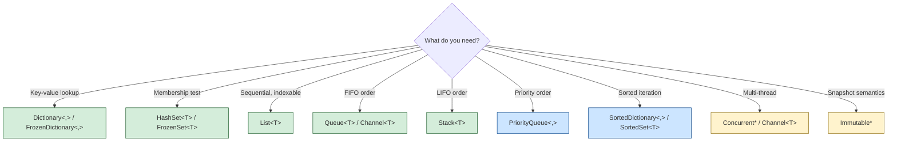

# Data Structures

> [Mastery Guide](../../README.md) › [Foundations](../README.md) › [DSA](./README.md) › Data Structures

| Status | Priority | Phase | Last reviewed |
|---|---|---|---|
| Complete | High | Phase 11 — Craft & Interview Prep | 2026-08-10 |

## Contents
- [Why it matters](#why-it-matters)
- [Core concepts](#core-concepts)
  - [Arrays and `List<T>`](#arrays-and-listt)
  - [Linked lists](#linked-lists)
  - [Stacks and queues](#stacks-and-queues)
  - [Hash tables — `Dictionary<TKey, TValue>` and `HashSet<T>`](#hash-tables--dictionarytkey-tvalue-and-hashsett)
  - [Frozen collections (.NET 8+)](#frozen-collections-net-8)
  - [Trees](#trees)
  - [Heaps and priority queues](#heaps-and-priority-queues)
  - [Tries](#tries)
  - [Graphs](#graphs)
  - [Concurrent collections](#concurrent-collections)
  - [Immutable collections](#immutable-collections)
  - [Choosing the right collection](#choosing-the-right-collection)
- [Code & diagrams](#code--diagrams)
- [Common pitfalls](#common-pitfalls)
- [Interview-ready summary](#interview-ready-summary)
- [Interview Cross-Questioning Drill](#interview-cross-questioning-drill)
- [Cheat Sheet](#cheat-sheet)
- [Walkthrough](#walkthrough--dictionary-collisions-from-a-bad-gethashcode)
- [Self-test](#self-test)
- [Cross-references](#cross-references)
- [Sources](#sources)

---

## Why it matters

Picking the right data structure is the single highest-leverage performance decision in most code. Choosing `List<T>` where you need `HashSet<T>` turns O(1) lookup into O(n); choosing `Dictionary<,>` where you need `SortedDictionary<,>` makes ordered iteration impossible; choosing `ConcurrentDictionary<,>` where a plain `lock` would suffice pays for per-operation synchronization you don't need, and still won't give you atomicity across a multi-step read-compute-write.

Senior interviews probe data-structure judgment relentlessly: "what would you use to deduplicate a stream"; "how does `Dictionary<,>` handle collisions"; "when would you reach for `PriorityQueue<,>`"; "what's the cost of `ImmutableList<T>.Add`."

This file maps the algorithm-textbook data structures to their .NET BCL implementations, with complexity, allocation profile, and choice criteria for each. The goal is not to teach you to implement a hash table from scratch (you almost never will) — it's to know what's already there, when to reach for it, and what the gotchas are.

When NOT to over-think: simple business code with small N (<1000). The collection choice rarely matters at that scale; readability wins. Optimize when N is large or the path is hot.

## Core concepts

### Arrays and `List<T>`

The most-used data structure. Backing array + count tracker.

```csharp
var list = new List<int>();          // capacity 0 initially
list.Add(1);                         // capacity grows to 4
list.Add(2); list.Add(3); list.Add(4);
list.Add(5);                         // capacity doubles to 8
```

**`List<T>` mechanics:**
- Backing `T[] _items` array, plus an `int _size` (the count of in-use slots).
- `Add(item)` is **amortized O(1)**: most adds are O(1) (write to next slot, increment count); occasional resize is O(n) (allocate new array of double size, copy elements). Average over n adds = O(1) per add.
- `Insert(index, item)` and `RemoveAt(index)` are **O(n)** — shift subsequent elements.
- `IndexOf` / `Contains` is **O(n)** — linear scan.
- Random access by index `list[i]` is **O(1)**.

**Capacity tuning** (.NET 6+):

```csharp
// If you know the size in advance, presize:
var list = new List<int>(capacity: 10_000);

// Or post-hoc:
list.EnsureCapacity(10_000);     // .NET 6+; resize once instead of log₂(n) times
```

Skipping this for a known-large list adds **log₂(n)** intermediate allocations and **n** copies — meaningful in hot paths.

**`List<T>` vs `T[]`:**
- `T[]` — fixed size; cannot grow. Slightly faster (no `_size` indirection). Use when size is known and constant.
- `List<T>` — resizable. Default for general use.

For `Span<T>`-based hot paths, `T[]` is often preferable since `AsSpan()` is direct on arrays.

### Linked lists

`LinkedList<T>` — a doubly-linked list of `LinkedListNode<T>`.

```csharp
var ll = new LinkedList<int>();
ll.AddLast(1);
ll.AddLast(2);
ll.AddFirst(0);
var middle = ll.AddAfter(ll.First!, 99);   // 0, 99, 1, 2
ll.Remove(middle);                          // 0, 1, 2
```

**Mechanics:**
- O(1) insert / remove at known node positions.
- O(n) random access (`ll.ElementAt(i)` walks from the head).
- O(n) `Contains` / `IndexOf`.
- Each node is a separate heap allocation — ~48 bytes on x64 *including* a small payload (16-byte object header + `_list`, `_next`, `_prev` references + the item); cache-unfriendly.

**When to use `LinkedList<T>`:** rarely. The classic textbook examples (insert-in-middle, splice subsequences) usually run faster on `List<T>` despite the O(n) shift, because cache-friendly arrays beat pointer-chasing lists for typical N. Use only when you have node references already (e.g., a custom LRU cache where you store the node alongside) or genuinely need O(1) splice.

### Stacks and queues

```csharp
var stack = new Stack<int>();
stack.Push(1); stack.Push(2);
int top = stack.Peek();      // 2
int pop = stack.Pop();       // 2

var queue = new Queue<int>();
queue.Enqueue(1); queue.Enqueue(2);
int front = queue.Peek();    // 1
int dq = queue.Dequeue();    // 1
```

**`Stack<T>` and `Queue<T>` mechanics:**
- `Stack<T>` is a plain `T[] _array` plus an `int _size`; pushes write at `_size` and pops decrement it. `Queue<T>` is a **circular** array with head and tail indices, so dequeuing from the front costs nothing. Both resize on full.
- `Push`/`Pop` (Stack) and `Enqueue`/`Dequeue` (Queue) are **amortized O(1)** — O(n) only on the resize.
- Iteration order: Stack is LIFO; Queue is FIFO.

**Deque (double-ended queue):**
- No first-class `Deque<T>` in the BCL.
- `LinkedList<T>` works (`AddFirst`, `AddLast`, `RemoveFirst`, `RemoveLast`, all O(1)).
- For `ImmutableQueue<T>` use cases, see immutable collections below.

For most algorithm work: `Stack<T>` for DFS / parenthesis matching / undo; `Queue<T>` for BFS / level-order traversal / producer-consumer.

### Hash tables — `Dictionary<TKey, TValue>` and `HashSet<T>`

The workhorse of fast lookups.

```csharp
var dict = new Dictionary<string, User>();
dict["alice"] = new User { Name = "Alice" };
if (dict.TryGetValue("alice", out var user)) { /* ... */ }

var set = new HashSet<string>();
set.Add("apple");
set.Add("apple");                  // ignored — already present
bool has = set.Contains("apple");
```

**Mechanics** (covered in depth in [.NET Core Deep Dive › Hash-based lookup table](../01-net-core-deep-dive/08-patterns-and-best-practices.md#15-hash-based-lookup-table); summarized here):

- Internal: array of buckets; each bucket holds a chain of `(hashCode, next, key, value)` entries.
- Insert: compute `key.GetHashCode()`, mod into bucket index, append to chain.
- Lookup: same bucket index, walk the chain comparing `Equals`.
- **Average O(1)**; **worst O(n)** if all keys collide (which means a bad hash).
- Resize when load factor (count/capacity) exceeds ~1.0; doubles capacity to next prime.

**Key requirements:**
- `GetHashCode()` must be consistent (same hash for `Equals`-equal objects).
- `GetHashCode()` should distribute uniformly (otherwise collisions kill performance).
- Mutating a key after insertion (changing fields that affect the hash) breaks lookup.

**`HashSet<T>`** is `Dictionary<T, bool>` simplified — the same internal mechanics, no value, just key membership.

**When to use:**
- Need lookup by key → `Dictionary<,>`.
- Need to deduplicate / membership-test → `HashSet<T>`.
- Need both → `Dictionary<,>` (keys form a set).

**When NOT:**
- Need ordered iteration → `SortedDictionary<,>` (red-black tree, O(log n) ops).
- Read-only after build, max performance → `FrozenDictionary<,>` (next).

### Frozen collections (.NET 8+)

`FrozenDictionary<,>` and `FrozenSet<T>` (and their array-backed variants) are **read-only-optimized** hash structures.

```csharp
// Build a regular dictionary, then freeze it
var dict = new Dictionary<string, int> { ["a"] = 1, ["b"] = 2 };
var frozen = dict.ToFrozenDictionary();

// Lookup is faster than Dictionary<,>; build is slower
int v = frozen["a"];
```

**Trade-off** (per the [docs](https://learn.microsoft.com/dotnet/api/system.collections.frozen.frozendictionary-2): "relatively high cost to create but provides excellent lookup performance"):
- Construction is **slower** — the factory inspects the whole key set and returns one of several private implementations tuned to those keys: a plain linear scan for very small sets (`SmallFrozenDictionary`), integer-specialized layouts (`Int32FrozenDictionary`), string layouts that bucket by length, or that hash only a distinguishing substring while still comparing the full key on a hash hit (`LengthBucketsFrozenDictionary`, `OrdinalString*`), and `FrozenHashTable` for the general case.
- Lookups are **faster** than `Dictionary<,>`, because the key set is closed at build time: the table is sized and laid out to minimize collisions up front, so the read path does less work.
- Cannot mutate.

**Use when:** the dictionary is built once (startup, configuration, lookup tables) and queried many times. Don't use for collections that change.

### Trees

Several tree flavors in the BCL and in algorithm work.

**Binary Search Tree (BST)** — abstract concept; left children < node < right children.

**Self-balancing BST** — `SortedDictionary<TKey, TValue>` and `SortedSet<T>` are red-black trees in .NET. Operations:
- Insert / Delete / Lookup: O(log n).
- Ordered iteration: O(n).
- Range queries: O(log n + k) where k is the result size.

```csharp
var sorted = new SortedDictionary<int, string>();
sorted[3] = "three"; sorted[1] = "one"; sorted[2] = "two";
foreach (var kvp in sorted) Console.WriteLine(kvp);   // 1, 2, 3 in order

var sortedSet = new SortedSet<int> { 5, 1, 3, 2, 4 };
var range = sortedSet.GetViewBetween(2, 4);   // 2, 3, 4
```

**B-tree** — used by databases; high fan-out, optimized for disk I/O. Indexes in SQL Server / PostgreSQL / Cosmos DB are B-trees or B+trees. Not in the .NET BCL — you'd interact via the database, not implement.

**Trie (prefix tree)** — covered separately below.

**Suffix tree / suffix array** — for string algorithms (longest repeated substring, full-text search internals). Library implementations only; rarely hand-rolled.

### Heaps and priority queues

`PriorityQueue<TElement, TPriority>` (.NET 6+) — an array-backed **quaternary (4-ary) min-heap**. Note: it is *not* stable; equal priorities have no guaranteed order.

```csharp
var pq = new PriorityQueue<string, int>();
pq.Enqueue("urgent",  1);
pq.Enqueue("normal",  5);
pq.Enqueue("trivial", 9);

while (pq.Count > 0)
    Console.WriteLine(pq.Dequeue());      // urgent, normal, trivial

// Custom comparer for max-heap:
var maxHeap = new PriorityQueue<string, int>(Comparer<int>.Create((a, b) => b - a));
```

**Mechanics:**
- Backing array. Because the heap is 4-ary (`Arity = 4`), the children of `i` are at `4i+1 … 4i+4` and the parent is at `(i-1)/4` — *not* the textbook binary `2i+1`/`2i+2`. Higher fan-out means a shallower tree (fewer sift-down levels) at the cost of more comparisons per level; it benchmarked better than binary for the BCL.
- `Enqueue` is O(log n) — bubble up.
- `Dequeue` is O(log n) — sift down.
- `Peek` is O(1).
- `Remove(element, out removed, out priority)` (.NET 9+) is **O(n)** — it linearly scans the heap for a matching element.

**When to use:**
- Dijkstra's algorithm (next file).
- A* pathfinding.
- Top-K problems ("find the 10 highest-rated items in a stream").
- Merge K sorted streams.
- Task scheduling by priority.

Pre-.NET 6: hand-roll a heap or use third-party (`OptimizedPriorityQueue`). Now first-class.

### Tries

A tree where each node represents a character, and paths from root to leaves spell words. Used for:
- Autocomplete / typeahead.
- Spell check.
- IP routing tables.
- Aho-Corasick multi-pattern string search.

```csharp
public class TrieNode
{
    public Dictionary<char, TrieNode> Children { get; } = new();
    public bool IsTerminal { get; set; }
}

public class Trie
{
    private readonly TrieNode _root = new();

    public void Insert(string word)
    {
        var node = _root;
        foreach (var c in word)
        {
            if (!node.Children.TryGetValue(c, out var next))
            {
                next = new TrieNode();
                node.Children[c] = next;
            }
            node = next;
        }
        node.IsTerminal = true;
    }

    public bool Contains(string word)
    {
        var node = _root;
        foreach (var c in word)
        {
            if (!node.Children.TryGetValue(c, out var next)) return false;
            node = next;
        }
        return node.IsTerminal;
    }

    public IEnumerable<string> WordsWithPrefix(string prefix)
    {
        var node = _root;
        foreach (var c in prefix)
        {
            if (!node.Children.TryGetValue(c, out var next)) yield break;
            node = next;
        }
        // DFS from `node`, yielding terminal nodes
        foreach (var word in DfsWords(node, prefix)) yield return word;
    }

    private static IEnumerable<string> DfsWords(TrieNode node, string accum)
    {
        if (node.IsTerminal) yield return accum;
        foreach (var (c, child) in node.Children)
            foreach (var w in DfsWords(child, accum + c)) yield return w;
    }
}
```

**Complexity:**
- Insert / lookup: O(L) where L is word length.
- Prefix queries: O(L + k) where k is matching words.
- Space: roughly O(total characters across all words), often less due to shared prefixes.

No standard `Trie<T>` in the BCL. Hand-roll for autocomplete; use third-party (e.g., `rm.Trie`) if it's central to the product.

### Graphs

A graph is a set of vertices + a set of edges. Three common representations:

**Adjacency list** (most common for sparse graphs):

```csharp
public class Graph<T>
{
    private readonly Dictionary<T, List<T>> _adj = new();

    public void AddEdge(T from, T to)
    {
        if (!_adj.ContainsKey(from)) _adj[from] = new();
        _adj[from].Add(to);
        if (!_adj.ContainsKey(to)) _adj[to] = new();   // ensure isolated vertices exist
    }

    public IEnumerable<T> Neighbors(T v) =>
        _adj.TryGetValue(v, out var list) ? list : [];
}
```

Space: O(V + E) where V = vertices, E = edges. Iterating a vertex's neighbors: O(degree(v)).

**Adjacency matrix** (for dense graphs or fast edge-existence check):

```csharp
bool[,] adj = new bool[V, V];
adj[0, 1] = true;       // edge from 0 to 1
bool hasEdge = adj[0, 1];
```

Space: O(V²). Edge check: O(1). Iterating neighbors: O(V) (regardless of actual degree).

**Edge list** (preferred for some algorithms like Kruskal):

```csharp
public record Edge<T>(T From, T To, int Weight);
List<Edge<int>> edges = [new(0, 1, 5), new(1, 2, 3), ...];
```

Choice:
- **Sparse graph (E ≪ V²)**: adjacency list.
- **Dense graph (E ≈ V²)** or many edge-existence checks: matrix.
- **Algorithms processing all edges (Kruskal, Bellman-Ford)**: edge list.

Graph algorithms (BFS, DFS, Dijkstra, etc.) are covered in [`05-graph-algorithms.md`](./05-graph-algorithms.md).

### Concurrent collections

Thread-safe variants in `System.Collections.Concurrent`:

| Type | Use | Notes |
|---|---|---|
| `ConcurrentDictionary<,>` | Multi-reader/writer key-value | Most common; lock-striping internally |
| `ConcurrentQueue<T>` | Producer-consumer FIFO | Lock-free |
| `ConcurrentStack<T>` | Producer-consumer LIFO | Lock-free |
| `ConcurrentBag<T>` | Order-agnostic; per-thread storage | Best when each thread mostly enqueues + dequeues from its own |
| `BlockingCollection<T>` | Bounded; blocks producers when full / consumers when empty | Wraps any `IProducerConsumerCollection<T>` |
| `Channel<T>` (System.Threading.Channels) | Modern producer-consumer | Bounded/unbounded variants; first-class async support |

**`ConcurrentDictionary<,>` gotchas:**

```csharp
var cd = new ConcurrentDictionary<string, int>();

// GetOrAdd with a factory: factory may run multiple times under contention
int v = cd.GetOrAdd("k", _ => ExpensiveComputation());
// If two threads race, ExpensiveComputation may run twice. Only one wins the slot.

// Use Lazy<T> to ensure single execution:
var cdLazy = new ConcurrentDictionary<string, Lazy<int>>();
int v2 = cdLazy.GetOrAdd("k", _ => new Lazy<int>(ExpensiveComputation)).Value;
```

**`Channel<T>`** is the modern recommendation for producer-consumer:

```csharp
var channel = Channel.CreateBounded<int>(capacity: 100);

// Producer
_ = Task.Run(async () =>
{
    for (int i = 0; i < 1000; i++)
        await channel.Writer.WriteAsync(i);
    channel.Writer.Complete();
});

// Consumer
await foreach (var item in channel.Reader.ReadAllAsync())
    Process(item);
```

Cleaner than `BlockingCollection<T>`; integrates with async; supports backpressure naturally.

### Immutable collections

`System.Collections.Immutable` — collections where every "mutation" returns a new instance, sharing structure with the original.

```csharp
var list = ImmutableList.Create(1, 2, 3);
var list2 = list.Add(4);                     // returns new instance
// list still has 3 items; list2 has 4

var dict = ImmutableDictionary<string, int>.Empty;
var dict2 = dict.Add("a", 1);
```

**Mechanics:**
- Backed by persistent data structures. In .NET specifically these are **AVL trees** — `ImmutableList<T>` is an AVL tree of elements, `ImmutableDictionary<,>` an AVL tree of hash buckets. (They are *not* hash array mapped tries, the structure Clojure/Scala use for the same job.)
- "Mutation" creates a new path through the tree; unchanged nodes are shared.
- Operations are O(log n), not O(1).

**When to use:**
- Functional-style code where you want mathematical guarantees.
- Multi-reader scenarios where readers shouldn't see mid-mutation state.
- Snapshot semantics (e.g., reactive state).

**When NOT:**
- Hot paths (O(log n) per "mutation" + allocation per change is slower than `List<T>` mutation).
- Most application code.

For most teams: prefer `IReadOnlyList<T>` / `IReadOnlyDictionary<,>` (read-only views over a regular collection) for "I won't mutate this" intent; reach for `Immutable*` only when structural sharing genuinely matters.

### Choosing the right collection

A decision tree:

```
Need ordered iteration?
├── Yes → Need fast lookup too?
│         ├── Yes → SortedDictionary<TKey, TValue> (O(log n) all ops)
│         └── No  → Need stable insertion order?
│                   ├── Yes → List<T>  (preserves order; O(1) random access)
│                   └── No  → SortedSet<T> (sorted; O(log n))
│
└── No  → Need key-value pairs?
          ├── Yes → Read-mostly after build?
          │         ├── Yes → FrozenDictionary<,>  (.NET 8+; fastest reads)
          │         └── No  → Concurrent reads/writes?
          │                   ├── Yes → ConcurrentDictionary<,>
          │                   └── No  → Dictionary<,>
          │
          └── No  → Just membership?
                    ├── Yes → HashSet<T> or FrozenSet<T> (read-mostly)
                    └── No  → Need FIFO?
                              ├── Yes → Queue<T> (single-threaded) or Channel<T> (async)
                              └── No  → Stack<T> for LIFO; PriorityQueue<,> for priority
```

For most application code, the answers are `Dictionary<,>`, `List<T>`, `HashSet<T>`. Reach for the others when their specific property earns the trade-off.

## Code & diagrams

<details>
<summary>🧩 Click to expand — code samples and diagrams</summary>



**Complexity matrix** (typical .NET BCL behavior):

| Op | `T[]` | `List<T>` | `LinkedList<T>` | `Stack<T>` / `Queue<T>` | `Dictionary<,>` | `SortedDictionary<,>` | `HashSet<T>` | `PriorityQueue<,>` |
|---|---|---|---|---|---|---|---|---|
| Add (end) | n/a (fixed) | O(1) amortized | O(1) | O(1) amortized | O(1) avg | O(log n) | O(1) avg | O(log n) |
| Add (head) | n/a | O(n) | O(1) | (use `Stack`/`Queue` semantics) | n/a | n/a | n/a | n/a |
| Remove (end) | n/a | O(1) | O(1) | O(1) | n/a | n/a | n/a | O(log n) for top |
| Remove (middle) | n/a | O(n) | O(1) at known node | n/a | O(1) avg by key | O(log n) | O(1) avg | n/a |
| Contains | O(n) | O(n) | O(n) | O(n) | O(1) avg | O(log n) | O(1) avg | O(n) |
| Index access | O(1) | O(1) | O(n) | n/a | n/a | n/a | n/a | n/a |
| Sorted iter | O(n log n) (need sort) | O(n log n) | O(n log n) | n/a | O(n log n) | O(n) | O(n log n) | O(n log n) |

**Memory overhead** (approximate, per element on x64):

```
T[]                      sizeof(T) per slot, plus 24-byte header
List<T>                  sizeof(T) per slot, plus 24-byte header, plus capacity may exceed count
LinkedList<T> node       ~48 bytes per node on x64, payload included for small T
Dictionary<TKey,TValue>  12 bytes bookkeeping per slot + sizeof(TKey) + sizeof(TValue) + padding (derived below)
ConcurrentDictionary     ~50 bytes per entry (more overhead for lock-striping)
ImmutableList<T>         AVL tree nodes; ~50 bytes per element
SortedDictionary<,>      Red-black tree nodes; ~56 bytes per entry + key + value
HashSet<T>               12 bytes bookkeeping per slot + sizeof(T) + padding
```

**Deriving the `Dictionary<,>` figure** (don't memorize a round number — derive it from the layout in [`Dictionary.cs`](https://github.com/dotnet/runtime/blob/main/src/libraries/System.Private.CoreLib/src/System/Collections/Generic/Dictionary.cs)):

```csharp
private struct Entry
{
    public uint hashCode;   // 4 bytes
    public int next;        // 4 bytes
    public TKey key;        // sizeof(TKey)
    public TValue value;    // sizeof(TValue)
}
```

`Initialize` and `Resize` allocate `int[] buckets` and `Entry[] entries` at the **same** length, so each entry slot also carries one 4-byte bucket `int`. Fixed bookkeeping is therefore **12 bytes per slot** (4 hashCode + 4 next + 4 bucket), plus the key and value, plus padding up to the alignment of the widest field. On x64:

- `Dictionary<int, int>` → Entry = 4 + 4 + 4 + 4 = 16 bytes, + 4-byte bucket = **20 bytes per slot**.
- `Dictionary<string, string>` → Entry = 4 + 4 + 8 + 8 = 24 bytes (object references are 8 bytes; 24 is already 8-aligned), + 4-byte bucket = **28 bytes per slot** — and that *excludes* the string objects themselves, which are separate heap allocations.

So the commonly-quoted "~32 bytes per entry" overstates the bookkeeping: it's 12 bytes, and the rest is whatever your key and value actually are. `HashSet<T>` is the same derivation minus the value — its entry is `int HashCode; int Next; T Value;`, so `HashSet<int>` is 12 + 4 = **16 bytes per slot**. One caveat that matters more than the per-slot number: multiply by **capacity, not count**. Both arrays are sized to a prime ≥ count, so right after a growth the table can be nearly twice the live entry count.

Working the arithmetic for `int`: `List<int>` is ~4 bytes per element against ~48 bytes per `LinkedListNode<int>`, i.e. roughly an order of magnitude more memory for the linked list, plus heap fragmentation.

</details>
## Common pitfalls

1. **`List<T>` without presizing for known sizes.** Default capacity 0 → grows 0, 4, 8, 16, ... → log₂(n) allocations + copies. `new List<int>(1_000_000)` or `EnsureCapacity` once.
2. **Mutable struct as `Dictionary<,>` key.** `Dictionary<MyStruct, int>` where `MyStruct` is mutated after insert breaks lookup (hash now different). Use `record struct` (immutable) or `class` with overridden `Equals`/`GetHashCode`.
3. **Default `GetHashCode` on a class.** Inherits from `object` → reference identity. Two equal-by-value objects have different hashes; `Dictionary` lookup fails. Always override `GetHashCode` when overriding `Equals`. Records auto-generate both.
4. **`ConcurrentDictionary.GetOrAdd` running the factory multiple times.** Under contention, multiple threads compute the value; only one wins the slot, the rest is wasted work. Use `Lazy<T>` for expensive initialization.
5. **`LinkedList<T>` for "fast inserts in the middle."** Looks textbook-correct; in practice, `List<T>` with O(n) shift beats `LinkedList<T>` for typical N (<10K) due to cache effects. Profile.
6. **`SortedDictionary<,>` when you need fast lookup by a non-key field.** SortedDictionary is O(log n) by *key*. Lookup by value or by a different field is O(n). Add a secondary `Dictionary<,>` indexed by what you query.
7. **`ConcurrentBag<T>` for general producer-consumer.** It's optimized for "each thread enqueues and dequeues from its own bag"; cross-thread access is slow. Use `ConcurrentQueue<T>` or `Channel<T>`.
8. **Iterating a `Dictionary<,>` and mutating it.** Throws `InvalidOperationException`. Snapshot keys: `foreach (var key in dict.Keys.ToList()) { ... }`.
9. **`ImmutableList<T>.Add` in a tight loop.** Each `Add` returns a new instance — O(log n) per add, plus allocations. Use `Builder` pattern: `var b = ImmutableList.CreateBuilder<int>(); ... b.ToImmutable();`.
10. **`HashSet<T>` ordering assumed.** No defined iteration order; can change between runs. If you need order, `SortedSet<T>` or `List<T>` after dedup.
11. **`Queue<T>.Dequeue()` on empty.** Throws `InvalidOperationException`. Use `TryDequeue` (.NET Core 2.0+).
12. **Custom `Equals` without `GetHashCode`.** Same hash, different equals = consistent collisions; performance crashes. The compiler / analyzers warn — don't suppress.

## Interview-ready summary

- **`List<T>`** = resizable backing array. Amortized O(1) add at end; O(n) middle ops; O(1) random access. Presize when known.
- **`Dictionary<TKey, TValue>`** = hash table. O(1) average add/lookup/remove; O(n) worst on bad hash. Override `Equals` + `GetHashCode` together.
- **`HashSet<T>`** = `Dictionary` for membership; same complexity profile.
- **`SortedDictionary<,>` / `SortedSet<T>`** = red-black trees. O(log n) all ops; sorted iteration for free; range queries via `GetViewBetween`.
- **`PriorityQueue<TElement, TPriority>`** (.NET 6+) = min-heap by default; O(log n) enqueue/dequeue; backbone of Dijkstra and top-K problems.
- **`FrozenDictionary<,>` / `FrozenSet<T>`** (.NET 8+) = build once, query many; faster reads than Dictionary, slower build.
- **`ConcurrentDictionary<,>`** for multi-thread; **`Channel<T>`** for async producer-consumer; **`ConcurrentBag<T>`** only for thread-local-mostly scenarios.
- **`ImmutableList`/`ImmutableDictionary`** for snapshot semantics; O(log n) per "mutation"; use `Builder` for bulk construction.
- **Trie** for prefix queries (autocomplete, IP routing); not in BCL — hand-roll.
- **Choosing**: identity / hash → Dictionary or HashSet; ordered → Sorted*; priority → PriorityQueue; multi-thread → Concurrent* / Channel; snapshot → Immutable*.

## Interview Cross-Questioning Drill

<details>
<summary>📖 Click to expand — cross-question chains (~15-20 min, cover answers and write cold)</summary>

> ⚠️ **Honest caveat**: reading this once doesn't make you interview-ready. Cover the answers, write them cold, then check. Pair with a senior for live mock cross-questioning. The guide removes "I never thought about that" surprises; mock interviews convert knowledge into reflex. Both are needed.

Each drill is **Q → A → Cross-Q → A → Cross-Q² → A**.
### Drill 1 — `List<T>` vs `T[]`

> **Q**: When would you use `T[]` over `List<T>`?
>
> **A**: When the size is **known and constant** — function signatures with a fixed-shape return, P/Invoke marshaling boundaries, hot loops where the slightly faster index access matters, and any path where you want `AsSpan()` directly without a `CollectionsMarshal.AsSpan(list)` hop. `List<T>` is the default; `T[]` is the optimization for known-size scenarios.
>
> **Cross-Q**: Is `List<T>[i]` actually slower than `arr[i]`?
>
> **A**: Marginally — `List<T>[i]` does a bounds check against `_size` (not the array's `Length`), plus an indirection through the `_items` field. The JIT often inlines and eliminates the bounds check in tight loops, narrowing the gap. Difference is single-digit nanoseconds; matters in tight numeric loops, negligible in typical app code.
>
> **Cross-Q²**: How do I get the underlying array from a `List<T>` for `Span<T>` use?
>
> **A**: `CollectionsMarshal.AsSpan(list)` (.NET 5+). Returns a `Span<T>` over the internal `_items` array, length = `_size`. Caveat: mutations to the list (Add, Remove) can resize the backing array, invalidating the span — pin the span to a snapshot and don't mutate the list while iterating.

### Drill 2 — `LinkedList<T>` — does it ever win?

> **Q**: Textbook says `LinkedList<T>` is O(1) for middle insert vs `List<T>` O(n). When does that translate to a real win?
>
> **A**: Almost never for typical N. `List<T>` is cache-friendly contiguous memory; `LinkedList<T>` is pointer-chasing scattered across the heap. Modern CPUs move 64 bytes per cache line in nanoseconds but stall ~100 ns on a cache miss. The "O(n) shift" of `List<T>` is fast; the "O(1) chase" of `LinkedList<T>` is slow per element. **Empirically, `LinkedList<T>` only wins for N > 10⁴ AND you have node references in hand AND you splice frequently without traversing.**
>
> **Cross-Q**: Where does `LinkedList<T>` show up in real .NET code?
>
> **A**: Almost nowhere in app code. The classic legit case: hand-rolled LRU cache where you store `(LinkedListNode<TKey>, TValue)` so you can move a node to the head in O(1). Even there, modern alternative: use `MemoryCache` / `IDistributedCache` / a library cache; let it pick the right structure.
>
> **Cross-Q²**: What's the memory difference between `LinkedList<int>` and `List<int>` for 1M entries?
>
> **A**: `List<int>` ≈ 4 MB (int per slot + headers). `LinkedList<int>` ≈ 48 MB (each node has prev/next pointers + the int + object header + alignment, ~48 bytes on x64). 12× more memory plus heap fragmentation. For 100M entries, that's the difference between "fits" and "OOM."

### Drill 3 — `Dictionary<TKey, TValue>` internals

> **Q**: How does .NET's `Dictionary<TKey, TValue>` handle a hash collision?
>
> **A**: **Separate chaining**, not open addressing — but the chain lives in an array, not in per-node objects. Backing: an `int[] _buckets` (each slot stores a 1-based index of the chain head; 0 = empty) and an `Entry[] _entries` (each entry is `{uint hashCode; int next; TKey key; TValue value}`, where `next` is the 0-based index of the next entry in the chain and `-1` ends it). On `Add`: compute `key.GetHashCode()`, map into a bucket, link the new entry at the chain head. On lookup: same bucket, walk the `next` chain comparing `Equals` until match or end. Collisions degrade to O(chain length). No probing sequence is ever used — a colliding key never occupies a different key's slot.
>
> **Cross-Q**: When does the bucket array resize, and to what size?
>
> **A**: When count exceeds capacity (load factor ~1.0). The new capacity is the next prime ≥ 2×old capacity. Primes give better hash distribution than powers of two. All existing entries are rehashed into the new bucket array — O(n) work for a single Add that triggers the resize, amortized O(1) across all Adds.
>
> **Cross-Q²**: I'm doing 1M adds with a known size. How do I avoid resize work?
>
> **A**: `new Dictionary<TKey, TValue>(capacity: 1_000_000)` presizes both arrays — the constructor picks the next prime ≥ 1M and no resize ever runs.
>
> **The answer they're testing is the amortization argument, so lead with it**: each resize copies the *old* capacity, and capacity grows geometrically, so the copy counts form a geometric series dominated by its last term. The total is Θ(n), not (number of resizes) × n. That's precisely why a single resize being O(n) still leaves `Add` at amortized O(1) — the expensive adds are rare enough, and each one is only as expensive as the table was *before* it grew.
>
> If pressed for the real number, note that **.NET does not double**. `HashHelpers.ExpandPrime` computes `GetPrime(2 × oldSize)`, which snaps to the next entry in a fixed prime table — roughly 2× each time, but not exactly. From the default constructor the capacities are 3, 7, 17, 37, 89, 197, 431, 919, 1931, 4049, 8419, 17519, 36353, 75431, 156437, 324449, 672827, 1395263 — **17 resizes** to hold 1M entries. Summing every capacity except the last (you copy the *old* table each time) gives **1,299,115 entry copies** ≈ 1.3 n. Both the old "~30 million" and a glib "2n because it doubles" are wrong; the Θ(n) reasoning is what earns the point, and the exact figure only confirms it.

### Drill 4 — `Dictionary` vs `SortedDictionary` vs `SortedList`

> **Q**: Three sorted-ish dictionaries — when each?
>
> **A**: `Dictionary` is unsorted; O(1) lookup. `SortedDictionary<,>` is a red-black tree; O(log n) lookup/insert, in-order iteration free, range queries via `GetViewBetween`. `SortedList<,>` is two parallel sorted arrays; O(log n) lookup (binary search), O(n) insert (shift array), but smaller memory footprint and faster iteration than the tree.
>
> **Cross-Q**: My data is mostly built once at startup, queried in sorted order forever. Which one?
>
> **A**: `SortedList<,>` — build once (sorts at the end is O(n log n) total; insertions during build incur shifts but you can populate from a sorted source for O(n)), then it's faster to iterate than `SortedDictionary` (contiguous arrays vs scattered tree nodes), and lookup is O(log n) binary search. **Modern alternative**: `FrozenDictionary<,>` if you don't need ordering, or `ImmutableSortedDictionary<,>` if you want thread-safe snapshots.
>
> **Cross-Q²**: When does `SortedList<,>` lose to `SortedDictionary<,>`?
>
> **A**: When inserts/removes happen frequently after build. Every insert in `SortedList` shifts ~n/2 elements (the array tail) — O(n) per insert. `SortedDictionary` (red-black tree) is O(log n) per insert. For build-once / query-many: `SortedList`. For ongoing mutation: `SortedDictionary`.

### Drill 5 — `HashSet<T>` vs `List<T>.Contains` — perf delta

> **Q**: I have 10K items and I want to check membership in a loop of 1M iterations. `List` or `HashSet`?
>
> **A**: `HashSet<T>`. `List<T>.Contains` is O(n) — linear scan. `HashSet<T>.Contains` is O(1) average. For 10K items × 1M loops that's ~10¹⁰ element comparisons for the list versus ~10⁶ hash lookups for the set — four orders of magnitude fewer operations. Don't quote wall-clock numbers you haven't measured; the asymptotic gap is the answer, and it's decisive.
>
> **Cross-Q**: At what N does HashSet stop being worth the build cost?
>
> **A**: Answer by mechanism, not by a threshold — the deciding variable is **how many times you query**, not N. Building a `HashSet<T>` of N items allocates two arrays (an `int[]` bucket array and an `Entry[]`, both sized to a prime ≥ N) and computes N hash codes to populate them; that cost is paid **once**. `List<T>.Contains` allocates nothing and walks a contiguous block — branch-predictable, prefetcher-friendly, and it can exit early on a hit; that cost is paid **per query**. So the single defensible claim is: for a **one-shot** membership check the set is never worth building, because you compute N hash codes to answer a question that at most N cheaper comparisons already answer. Once you query repeatedly, the O(1) lookup amortizes the build and the set wins by an unbounded margin.
>
> Note that hashing is not a fixed small constant either: `string.GetHashCode` reads the entire string, so for long string keys one hash can cost more than several early-exiting comparisons — which is why the crossover moves with the key type. Where it actually lands depends on `T`, the comparer, key length, and whether the set is reused across calls, so **measure your own case** rather than carrying a number into the interview.
>
> **Cross-Q²**: My items are custom classes without overridden `Equals`/`GetHashCode`. What happens?
>
> **A**: HashSet falls back to reference equality (`object.Equals` and `object.GetHashCode`). Two value-equal but distinct instances are treated as different — deduplication fails silently. The List approach (with custom comparer or `Where`) at least lets you specify equality. The fix: override `Equals` + `GetHashCode` (together) or use `record`, or pass an `IEqualityComparer<T>` to the HashSet constructor.

### Drill 6 — `ImmutableList<T>` vs `List<T>` — when worth it

> **Q**: Why would I use `ImmutableList<T>` if every "mutation" allocates?
>
> **A**: When you need snapshot semantics — readers see a consistent point-in-time view that can't be mutated under them. Examples: reactive state in UI frameworks, multi-reader caches where you swap whole snapshots, audit trails where each version is a permanent record. `ImmutableList<T>.Add` returns a new instance; the old reference is still valid and unchanged.
>
> **Cross-Q**: What's the cost per "mutation"?
>
> **A**: O(log n) time + O(log n) allocations. `ImmutableList<T>` is backed by an AVL tree with structural sharing — `Add` clones the path from root to insertion point (~log n nodes), leaves the rest shared. For 1M elements: ~20 nodes allocated per Add, not 1M.
>
> **Cross-Q²**: For bulk construction (build a 1M-element immutable list from a stream), do I really pay log n per Add?
>
> **A**: No — use the builder. `var b = ImmutableList.CreateBuilder<int>(); foreach (...) b.Add(x); var result = b.ToImmutable();`. The builder is mutable internally; `ToImmutable` materializes the AVL tree once. Bulk construction is O(n) total, not O(n log n). Same pattern for `ImmutableDictionary<,>.CreateBuilder` and the other immutable collections.

### Drill 7 — `Stack<T>` vs `Queue<T>` — interview classic

> **Q**: Implement a queue using two stacks.
>
> **A**: Two stacks — `inbox` and `outbox`. `Enqueue`: push to `inbox`. `Dequeue`: if `outbox` is empty, drain `inbox` into `outbox` (reversing order); then pop from `outbox`. Amortized O(1) per operation; each element moves through both stacks exactly once.
>
> **Cross-Q**: What's the worst-case complexity per `Dequeue`?
>
> **A**: O(n) — when `outbox` is empty and you have to drain `inbox` of n elements. But amortized: each element is pushed to `inbox` once, transferred to `outbox` once, popped once = 3 ops over its lifetime. Total work for n operations: O(n). Per operation amortized: O(1).
>
> **Cross-Q²**: Why does .NET's `Queue<T>` not use two stacks under the hood?
>
> **A**: Because a single circular array is simpler and has better constants. Two stacks have an occasional O(n) spike (the drain); circular array `Queue<T>` is O(1) per op except for the doubling resize (also amortized O(1)). The two-stack technique is an interview chestnut for "compose primitives" — in production, you reach for the BCL `Queue<T>` directly.

### Drill 8 — `ConcurrentDictionary` vs `lock` + Dictionary

> **Q**: Multi-threaded read-heavy cache. `ConcurrentDictionary` or `lock(_dict) + Dictionary`?
>
> **A**: `ConcurrentDictionary` for read-heavy. Per the docs, it "uses fine-grained locking to ensure thread safety" for writes, while "read operations on the dictionary are performed in a lock-free manner" — so readers never block readers or writers. Writes are **lock-striped** across an array of internal locks so writes to different buckets don't contend. Careful with the default stripe count in interviews: on .NET Framework it was `4 × ProcessorCount`, but .NET Core removed that multiplier, and `DefaultConcurrencyLevel => Environment.ProcessorCount` today (the 4× cost too much memory for too little write throughput). A single `lock` over a `Dictionary` serializes *all* operations through one mutex; reads block reads.
>
> **Cross-Q**: When does `lock + Dictionary` actually win?
>
> **A**: When the critical section spans multiple operations atomically — "check, then update, then notify." `ConcurrentDictionary.GetOrAdd` is atomic for that pattern, but multi-step compound updates (read X, compute Y, write Z) aren't. With `lock`, you wrap the whole transaction; with `ConcurrentDictionary` you'd need `AddOrUpdate` with a careful factory or end up with race conditions.
>
> **Cross-Q²**: What's the `GetOrAdd` factory gotcha?
>
> **A**: Under contention, the factory may execute multiple times — only one result wins the slot, but the others are wasted work. Bad if the factory has side effects (DB call, file write, expensive computation). Fix: wrap with `Lazy<T>`: `cd.GetOrAdd(key, _ => new Lazy<TValue>(Factory)).Value` — `Lazy<T>` ensures the factory runs exactly once even under concurrent first-access.

### Drill 9 — `PriorityQueue<TElement, TPriority>` — Dijkstra

> **Q**: How does `PriorityQueue<TElement, TPriority>` (.NET 6+) power Dijkstra?
>
> **A**: Min-heap by priority. Dijkstra pulls the closest unvisited vertex; that's a min-priority dequeue. `pq.Enqueue(neighbor, distance)` adds a candidate; `pq.Dequeue()` returns the cheapest. The heap maintains the min-priority invariant with O(log n) enqueue/dequeue.
>
> **Cross-Q**: `PriorityQueue<,>` doesn't have `DecreaseKey`. How do you handle "found a shorter path to v"?
>
> **A**: You don't update — you just `Enqueue` again with the new (shorter) priority. The old (longer) entry stays in the heap. On dequeue, check `if (poppedDistance > dist[v]) continue;` — the stale entry is silently skipped. Cost: heap grows to ~E entries instead of V, but the asymptotic O((V+E) log V) is preserved.
>
> **Cross-Q²**: Why didn't Microsoft add `DecreaseKey`?
>
> **A**: It requires finding an entry by value (not priority), which a heap doesn't support efficiently — finding by value is O(n). Some libraries maintain a side dictionary for `value → heap index`, but that doubles memory and complicates the implementation. Microsoft chose API simplicity + the stale-entry pattern that's idiomatic for Dijkstra. .NET 9 did add `Remove(element, out removedElement, out priority)`, but the docs describe it as "a linear-time scan of every element in the heap" — so it is not a `DecreaseKey` substitute in an inner loop.

### Drill 10 — `Span<T>` vs `Memory<T>` — boundary

> **Q**: When do I use `Span<T>` vs `Memory<T>`?
>
> **A**: `Span<T>` for **synchronous, non-await code paths**. It's a `ref struct` — must live on the stack, can't be a field of a class or boxed, can't cross an `await`. `Memory<T>` for **async or stored-as-field scenarios** — it's a regular struct, can be a field, can cross `await`. You typically take `Span<T>` in inner loops and convert from `Memory<T>` via `.Span` when entering a sync hot path.
>
> **Cross-Q**: Why can't `Span<T>` cross `await`?
>
> **A**: `await` may suspend the method and resume on a different thread. The compiler hoists local variables into a state-machine class on the heap. `Span<T>` is a `ref struct` — can't be a field of a class — so the compiler refuses to compile. The deeper reason: a span over a stack-allocated buffer would become dangling if the stack unwinds during suspension.
>
> **Cross-Q²**: I want to pass a slice into an async method. How?
>
> **A**: Take `ReadOnlyMemory<T>` (or `Memory<T>`). The async method can do `var span = memory.Span;` for sync inner work, but the parameter / state-machine field is the `Memory<T>` (heap-safe). Pattern: `async Task ParseAsync(ReadOnlyMemory<byte> data) { ProcessSync(data.Span); await DoIoAsync(); }`.

### Drill 11 — `FrozenDictionary` (.NET 8+)

> **Q**: When is `FrozenDictionary<,>` worth the slower build?
>
> **A**: When the dictionary is built once (startup, config, lookup tables) and queried many times in a hot path. Microsoft's own framing: "relatively high cost to create but provides excellent lookup performance." Build is materially slower because the factory analyzes the keys to pick a specialized internal layout; lookups are faster than `Dictionary`. The amortization wins when query count >> build count. (Quote a multiplier in an interview only if you measured it yourself on your keys — the published figures vary widely by key type and set size.)
>
> **Cross-Q**: *Why* is the read path faster if it's still hashing?
>
> **A**: Because the key set is closed at construction, the implementation can do work that `Dictionary` can't. It sizes the table and assigns hash codes to minimize (often eliminate) collisions for exactly these keys, so the read path usually hits its entry directly instead of walking a chain. For very small sets it skips hashing altogether and does a linear scan, which is cheaper than computing a hash. For string keys it may hash only the substring that actually distinguishes the keys (the `OrdinalString*Substring` layouts hash `s.AsSpan(hashIndex, hashCount)`; the final `Equals` is still a full string comparison), or bucket by length first and skip everything of the wrong length.
>
> **Cross-Q²**: When does it NOT win?
>
> **A**: When you mutate the dictionary (you can't — it's immutable, so each "change" rebuilds the whole thing — death). When N is very large (build cost dominates) or query count is low (build overhead exceeds query savings). And when keys have poor hash distribution that even the analyzer can't improve. **Rule**: build once at startup, query forever — yes. Anything else — `Dictionary`.

### Drill 12 — Custom `IEqualityComparer<T>`

> **Q**: When do I implement `IEqualityComparer<T>` instead of overriding `Equals` / `GetHashCode`?
>
> **A**: When the equality definition is **context-dependent** rather than intrinsic to the type. `User.Equals` should encode "two Users are the same User" (Id-based identity). But for a deduplication pass keyed by `Email`, you want `new HashSet<User>(new UserEmailComparer())` — context-specific equality without touching the User class.
>
> **Cross-Q**: What's the contract for `IEqualityComparer<T>`?
>
> **A**: Same as `Equals`/`GetHashCode`: `Equals(x, y) == true ⟹ GetHashCode(x) == GetHashCode(y)`. Reflexive (`Equals(x, x) == true`), symmetric (`Equals(x, y) == Equals(y, x)`), transitive. `GetHashCode` should distribute well; `Equals` must be consistent with `GetHashCode`. Violating these breaks `HashSet`, `Dictionary`, `Distinct`, `GroupBy` — entries become unfindable.
>
> **Cross-Q²**: I have a `Dictionary<string, T>` and want case-insensitive lookup. `IEqualityComparer<string>`?
>
> **A**: Yes — but use `StringComparer.OrdinalIgnoreCase` (built-in static; no per-comparer allocation, ordinal byte comparison is fastest for non-cultural matching). `new Dictionary<string, T>(StringComparer.OrdinalIgnoreCase)`. Avoid `StringComparer.CurrentCultureIgnoreCase` for keys (culture-dependent → different keys on different machines/locales → bugs). Avoid `StringComparer.InvariantCultureIgnoreCase` (slower than Ordinal; rarely what you want for keys).

### Drill 13 — `Dictionary` after deletes — bucket reuse

> **Q**: I `Remove` half my dictionary entries. Does the capacity shrink?
>
> **A**: No. `Dictionary<,>` never shrinks its bucket array — removed entries leave "free slots" reusable by future adds. The memory stays allocated. To reclaim: `TrimExcess()` (.NET Core 2.0+), which copies the live entries into a smaller bucket array and discards the old.
>
> **Cross-Q**: What if I add new entries after deletes — does it reuse the freed slots?
>
> **A**: Yes. The implementation tracks a `_freeList` of recently-removed entry indices. Adds prefer reused slots before extending. This keeps `Add` cheap after a Remove-heavy workload — no resize unless the working set exceeds capacity again.
>
> **Cross-Q²**: I see a `_version` field in the implementation — what's that for?
>
> **A**: Enumeration invalidation. Every mutation (Add, Remove, Clear) increments `_version`. Iterators capture the version on creation; on `MoveNext`, they compare current version with captured. If different → throw `InvalidOperationException("Collection was modified")`. This catches the "mutate during foreach" bug — defensive design preserved across .NET versions.

### Drill 14 — Tree vs hash — when each

> **Q**: I need a key-value store with O(log n) bounded operations. Why would I pick a tree over a hash?
>
> **A**: Three reasons. (1) **Sorted iteration**: `SortedDictionary` gives in-order traversal free; hash requires a sort. (2) **Range queries**: `GetViewBetween(low, high)` is O(log n + k); hash requires a full scan. (3) **Predictable worst case**: tree is always O(log n); hash is O(1) average but O(n) worst case under adversarial input (or terrible `GetHashCode`).
>
> **Cross-Q**: What about cache locality?
>
> **A**: Hash wins for typical access patterns — bucket array is contiguous. Tree nodes are scattered. For iteration in random key order, hash is faster; for ordered iteration, tree is faster (sequential nodes via the tree's in-order walk are typically close in memory due to allocation order, plus the iteration is the use case the tree is optimized for).
>
> **Cross-Q²**: B-trees vs binary search trees?
>
> **A**: B-trees (used by SQL Server, PostgreSQL indexes) have high fan-out (hundreds of children per node). Optimized for disk I/O — one node read fetches hundreds of keys, minimizing seeks. In-memory binary search trees (red-black, AVL) have fan-out of 2; optimal for in-memory but disastrous for disk. **.NET BCL has no B-tree** — they're a database concern; you interact via the database engine, not your own implementation.

### Drill 15 — Bloom filter — when right

> **Q**: When is a Bloom filter the right tool?
>
> **A**: When you want a **fast probabilistic membership check** with no false negatives (definitely-not-present is reliable) but possible false positives (might-be-present requires confirmation). Use case: "is this URL in the cache?" — if Bloom says no, skip the cache (definitely not there); if Bloom says yes, do the actual cache lookup (might be there). Avoids cache lookups for the vast majority of misses.
>
> **Cross-Q**: How does it work mechanically?
>
> **A**: A bit array + k hash functions. To add x: compute k hashes, set those k bits. To check x: compute k hashes, check those k bits. All set → "maybe present"; any unset → "definitely not present." False positive rate depends on bit-array size, k, and N — typically ~1% with reasonable sizing. Memory is tiny (~10 bits per item for 1% FPR).
>
> **Cross-Q²**: Why isn't `BloomFilter<T>` in the BCL?
>
> **A**: Niche. The BCL favors general-purpose collections. Bloom filters need tuning (FPR target, size, hash count), which makes a one-size-fits-all API awkward. Third-party libraries (`BloomFilter.NetCore`, `Lib.AspNetCore.Mvc.Security.BloomFilter`) provide them. **Modern alternative**: `FrozenSet<T>` for membership where the set is small and known, `RedisBloom` for distributed. Bloom filter is right when the dataset is too large to fit in memory but you want sub-microsecond rejection of the absent majority.

</details>
## Cheat Sheet

- **`List<T>`**: resizable array; amortized O(1) append, O(n) insert/remove middle, O(1) index.
- **`Dictionary<K,V>`**: separate-chaining hash table (buckets index into an entries array); O(1) avg, O(n) worst (bad hash); not thread-safe.
- **`HashSet<T>`**: `Dictionary` minus the value; membership/dedup at O(1) avg.
- **`SortedDictionary<,>`**: red-black tree; O(log n) all ops; in-order iteration free.
- **`PriorityQueue<E,P>`** (.NET 6): array-backed quaternary min-heap; O(log n) enqueue/dequeue; `Remove` by element exists (.NET 9+) but is an O(n) scan, and there is still no `DecreaseKey`.
- **`FrozenDictionary<,>`** (.NET 8): immutable, expensive to build, faster reads — config/lookup tables.
- **`ConcurrentDictionary<,>`**: striped locking + lock-free reads; `GetOrAdd` is atomic.
- **`Channel<T>`**: async producer-consumer with backpressure; replaces `BlockingCollection` for async.
- **`ImmutableList<T>`**: AVL tree under the hood; O(log n) per "mutation"; use `Builder` for bulk.
- **Override `Equals` ⟹ override `GetHashCode`**: mismatch = O(n) lookups and silent dedup bugs.

## Walkthrough — Dictionary collisions from a bad `GetHashCode`

<details>
<summary>📖 Click to expand — worked walkthrough scenario</summary>

**Problem**: A telemetry service uses `Dictionary<EventKey, Counter>` where `EventKey` is `class EventKey(string Region, string Tenant)`. Performance is fine in dev (10 keys); production sees 50K distinct keys and CPU pegs at 100% during dictionary lookups.

**Diagnosis**: Capture a CPU profile with `dotnet-trace collect --profile cpu-sampling -p <pid>`; flame graph shows ~80% in `EqualityComparer<EventKey>.Default.Equals`. That's the *collision* path — the dictionary is degenerating into long chain walks because too many keys hash to the same bucket. Inspect `EventKey`: no `Equals`/`GetHashCode` override, so the runtime uses *reference equality* — but the team is constructing fresh `EventKey` instances per event, so each new key is a new bucket and the existing key is never found, growing the dictionary unboundedly. Fix candidates depend on whether equality should be value-based or identity-based.

**Fix**: Convert to a `record` (auto-generated value `Equals`/`GetHashCode` over fields) or override both manually. For best performance, also implement `IEquatable<EventKey>` to avoid boxing in the comparer.

```csharp
public sealed record EventKey(string Region, string Tenant);
// or
public sealed class EventKey(string Region, string Tenant) : IEquatable<EventKey> {
    public bool Equals(EventKey? o) => o is not null && Region == o.Region && Tenant == o.Tenant;
    public override int GetHashCode() => HashCode.Combine(Region, Tenant);
    public override bool Equals(object? o) => o is EventKey k && Equals(k);
}
```

After: dictionary size stabilizes; CPU drops to ~5% on the hot path.

**Why it works**: `Dictionary<K,V>` requires `GetHashCode` to distribute keys evenly across buckets and `Equals` to confirm matches within a bucket. Without value equality, every `new EventKey("us-east", "acme")` is a distinct key — semantically wrong and pathologically slow as the table grows. `HashCode.Combine` produces a high-quality, randomized hash designed to thwart collision-based DoS.

</details>
## Self-test

<details>
<summary>1. What does `Dictionary<K,V>` do when two keys collide on `GetHashCode()`, and why does this make a bad hash function catastrophic?</summary>

.NET's `Dictionary<K,V>` uses *separate chaining over an array of entries*: each bucket stores the index of a chain head, and each entry `(hash, key, value, next)` points at the next entry in its chain. On collision, lookup walks the chain calling `Equals` on each entry until match or end. With a *good* hash, chains are length 1-2 — O(1) amortized. With a bad hash (e.g., `GetHashCode() => 0`), all keys land in one bucket; the chain is length n; every lookup is O(n). This was historically a DoS vector — sending crafted keys could pin a server's CPU at 100%; modern .NET adds randomized hashing in some collections to mitigate.
</details>

<details>
<summary>2. Apply: you have a 1M-row config dictionary, read 50K times per request, never written after startup. Which collection?</summary>

`FrozenDictionary<K,V>` (.NET 8+). It pays a materially more expensive build in exchange for faster lookups — the docs' own trade-off: "relatively high cost to create but provides excellent lookup performance." With 50K reads per request against a dictionary written only at startup, read performance dominates and the build cost is paid once. Build at startup (singleton DI), query forever. If keys are strings, `FrozenDictionary` selects from multiple internal layouts for best speed — bucketing by length, or hashing only a distinguishing substring. Be precise about that last one: the substring narrows the *hash* only; a hash hit is still confirmed with a full-key `Equals`. Avoid `ConcurrentDictionary` here — its overhead is unjustified when there are no writes after startup.
</details>

<details>
<summary>3. Trade-off: `LinkedList<T>` vs `List<T>` for "lots of inserts in the middle."</summary>

Textbook says `LinkedList<T>` wins — O(1) insert vs O(n) shift. Reality: for typical N (< ~10K) on modern CPUs, `List<T>` beats `LinkedList<T>` because (a) `List<T>` is contiguous memory, prefetched and cached; (b) `LinkedList<T>` allocates a node per element, fragmenting memory and missing cache; (c) modern CPUs move bytes faster than they chase pointers. `LinkedList<T>` only wins for very large N with frequent middle inserts/removes *and* you don't traverse often. Default to `List<T>`; reach for `LinkedList<T>` only after profiling proves the shift is the bottleneck.
</details>

<details>
<summary>4. Analyze: `ImmutableDictionary<K,V>.Add(k, v)` returns a new dictionary in O(log n). How?</summary>

`ImmutableDictionary` is implemented as a balanced tree (AVL variant) with *structural sharing*: `Add` doesn't copy the whole tree — it walks down the path to the insertion point (~log n nodes) and clones only the nodes along that path. The unmodified subtrees are shared between old and new instances. Result: log n new nodes allocated, O(log n) time, both old and new dictionaries remain valid and independent. Cost: every individual `Add` is slower than `Dictionary.Add` (which is O(1) amortized). For bulk construction, use `ImmutableDictionary.CreateBuilder<K,V>()` — it adds in O(1) into a mutable builder, then `ToImmutable()` materializes the final tree once.
</details>

<details>
<summary>5. You see `var seen = new HashSet<User>(); foreach (var u in users) if (seen.Add(u)) { ... }` and equality is wrong. Walk through the bug.</summary>

`HashSet<T>` uses `EqualityComparer<T>.Default` which falls back to `object.Equals` (reference equality) for classes without an `Equals` override. Two different `User` instances with the same `Id`+`Name` are treated as distinct, so dedup fails. Fix: (1) make `User` a `record` for value equality; (2) override `Equals`/`GetHashCode` on the class; or (3) pass an explicit comparer: `new HashSet<User>(new UserIdComparer())` where the comparer keys on `Id` only. Option 3 is best when you want equality semantics that vary by use case (e.g., dedup-by-id here, but full value-equality elsewhere).
</details>

## Cross-references

- **Next: [Complexity Analysis](./02-complexity-analysis.md)** — formalize the Big-O claims here.
- **[Hash-based lookup table deep dive](../01-net-core-deep-dive/08-patterns-and-best-practices.md#15-hash-based-lookup-table)** — `Dictionary<,>` internals.
- **[Memory & Performance](../05-csharp-mastery/09-memory-and-performance.md)** — `Span<T>`, `stackalloc`, `ArrayPool` for hot-path scenarios.
- **[Generics & Variance](../05-csharp-mastery/04-generics-and-variance.md)** — why `List<int>` outperforms `ArrayList` so dramatically.
- **[SQL › Indexes](../../03-data-and-persistence/03-sql/06-indexes-and-query-optimization.md)** — B-trees in databases.

## Sources

<details>
<summary>📚 Click to expand — sources and further reading</summary>

- *Introduction to Algorithms* (CLRS, MIT Press, 4th ed. 2022) — chapters 10-22.
- *Algorithms* by Robert Sedgewick (Addison-Wesley, 4th ed. 2011) — accessible, .NET-adjacent treatment.
- Microsoft Learn — [.NET Generic Collections](https://learn.microsoft.com/en-us/dotnet/standard/generics/) and [`System.Collections.Concurrent`](https://learn.microsoft.com/en-us/dotnet/api/system.collections.concurrent).
- dotnet/runtime source — [`Dictionary.cs`](https://github.com/dotnet/runtime/blob/main/src/libraries/System.Private.CoreLib/src/System/Collections/Generic/Dictionary.cs) (separate chaining: `int[] _buckets` + `Entry[] _entries` with a `next` index; `Entry` is `uint hashCode, int next, TKey key, TValue value`, and `Initialize`/`Resize` allocate buckets and entries at equal length — the basis for the per-slot memory arithmetic above), [`HashSet.cs`](https://github.com/dotnet/runtime/blob/main/src/libraries/System.Private.CoreLib/src/System/Collections/Generic/HashSet.cs) (`Entry` is `int HashCode, int Next, T Value`), [`Stack.cs`](https://github.com/dotnet/runtime/blob/main/src/libraries/System.Collections/src/System/Collections/Generic/Stack.cs) (plain array, not circular), [`PriorityQueue.cs`](https://github.com/dotnet/runtime/blob/main/src/libraries/System.Collections/src/System/Collections/Generic/PriorityQueue.cs) (`Arity = 4`).
- dotnet/runtime source — [`HashHelpers.cs`](https://github.com/dotnet/runtime/blob/main/src/libraries/System.Private.CoreLib/src/System/Collections/HashHelpers.cs) — the `s_primes` table and `ExpandPrime` (= `GetPrime(2 × oldSize)`). Growth snaps to the prime table, so capacity roughly but *not exactly* doubles — the source for the 3 → 7 → 17 → … → 1395263 sequence and the 1,299,115-copy total in Drill 3.
- dotnet/runtime source — [`OrdinalStringFrozenDictionary_LeftJustifiedSubstring.cs`](https://github.com/dotnet/runtime/blob/main/src/libraries/System.Collections.Immutable/src/System/Collections/Frozen/String/OrdinalStringFrozenDictionary_LeftJustifiedSubstring.cs) — `GetHashCode` hashes `s.AsSpan(HashIndex, HashCount)` while `Equals` calls `string.Equals(x, y)` on the full strings. The distinguishing substring is a **hashing** optimization; comparison is never truncated.
- Microsoft Learn — [`ConcurrentDictionary<TKey,TValue>`](https://learn.microsoft.com/en-us/dotnet/api/system.collections.concurrent.concurrentdictionary-2) — fine-grained write locking, lock-free reads, factory delegates called outside the locks.
- Microsoft Learn — [`PriorityQueue<TElement,TPriority>.Remove`](https://learn.microsoft.com/en-us/dotnet/api/system.collections.generic.priorityqueue-2.remove) (.NET 9+) — "a linear-time scan of every element in the heap."
- Microsoft Learn — [`SortedList<TKey,TValue>`](https://learn.microsoft.com/en-us/dotnet/api/system.collections.generic.sortedlist-2) — O(log n) retrieval, O(n) insert/remove for unsorted data, less memory than `SortedDictionary<,>`.
- Stephen Toub — *"Performance Improvements in .NET 8"* (devblogs) — `FrozenDictionary` motivation and benchmarks.
- *Pro .NET Memory Management* by Konrad Kokosa (Apress, 2018) — collection memory profiles.

</details>
<!-- nav-footer-start -->

---

[← Previous: Data Structures & Algorithms (DSA)](README.md) · [↑ Back to top](#data-structures) · [Next: Complexity Analysis →](02-complexity-analysis.md)

<!-- nav-footer-end -->
