# Complexity Analysis

> [Mastery Guide](../../README.md) › [Foundations](../README.md) › [DSA](./README.md) › Complexity Analysis

| Status | Priority | Phase | Last reviewed |
|---|---|---|---|
| Not Started | High | Phase 11 — Craft & Interview Prep | 2026-05-07 |

## Contents
- [Why it matters](#why-it-matters)
- [Core concepts](#core-concepts)
  - [Big-O notation](#big-o-notation)
  - [Big-Ω and Big-Θ](#big-ω-and-big-θ)
  - [Common complexity classes](#common-complexity-classes)
  - [Amortized analysis](#amortized-analysis)
  - [Worst case vs average vs best](#worst-case-vs-average-vs-best)
  - [Space complexity](#space-complexity)
  - [Reading complexity from code](#reading-complexity-from-code)
  - [.NET-specific cost gotchas](#net-specific-cost-gotchas)
- [Code & diagrams](#code--diagrams)
- [Common pitfalls](#common-pitfalls)
- [Interview-ready summary](#interview-ready-summary)
- [Interview Cross-Questioning Drill](#interview-cross-questioning-drill)
- [Cheat Sheet](#cheat-sheet)
- [Walkthrough](#walkthrough--quadratic-blowup-from-listcontains)
- [Self-test](#self-test)
- [Cross-references](#cross-references)
- [Sources](#sources)

---

## Why it matters

Complexity analysis is the language for talking about scaling: "this function is O(n)" tells everyone how cost grows with input size, independent of hardware speed or programming language. In interviews, "what's the complexity" is asked after every algorithm question. In production, "why is this slow at 10M rows" is answered with complexity reasoning.

The senior signal: **knowing both the textbook complexity and the .NET-specific real-world cost** — that quicksort is O(n log n) average AND that `Array.Sort` uses introsort + insertion-sort hybrid AND that for small N, allocations and JIT warmup dominate the asymptotic. Complexity is the floor; constants and constants-of-constants build the building.

When NOT to obsess over complexity: small N where O(n²) and O(n log n) are both <1ms; readability beats cleverness. Optimize when N is large or the path is hot.

## Core concepts

### Big-O notation

A **formal upper bound** on growth rate. `f(n) = O(g(n))` means: there exist constants `c > 0` and `n₀` such that `f(n) ≤ c · g(n)` for all `n ≥ n₀`.

Plain English: "for big enough n, f grows no faster than g, ignoring constant factors and lower-order terms."

```
f(n) = 3n² + 5n + 100  →  f(n) = O(n²)
```

We drop:
- **Constants** — `3n² → n²`. The coefficient doesn't change the asymptotic shape.
- **Lower-order terms** — `+ 5n + 100` is dominated by `n²` as n grows.

We keep the **dominant term** that drives growth.

**The intuition**: doubling n multiplies cost by some factor that depends only on the complexity class.

| Complexity | Doubling n multiplies cost by |
|---|---|
| O(1) | 1 (no change) |
| O(log n) | +1 (additive) |
| O(n) | 2 |
| O(n log n) | slightly more than 2 |
| O(n²) | 4 |
| O(2ⁿ) | 2ⁿ (catastrophic) |

### Big-Ω and Big-Θ

Less commonly used in informal discourse, but interview-relevant:

- **Big-Ω (Omega)** — *lower bound*. `f(n) = Ω(g(n))` means f grows at least as fast as g.
- **Big-Θ (Theta)** — *tight bound*. `f(n) = Θ(g(n))` means f and g grow at the same rate (both Big-O and Big-Ω).

In practice:
- We say "O(n²)" colloquially when we mean Θ(n²) (tight).
- We use Ω when arguing **lower bounds** ("any comparison sort is Ω(n log n)").

For day-to-day work: Big-O is enough. Big-Ω/Big-Θ matter for theoretical proofs and lower-bound arguments.

### Common complexity classes

The 8 you'll see most often:

| Class | Name | Growth at n=10⁶ | Examples |
|---|---|---|---|
| **O(1)** | Constant | 1 op | Dictionary lookup, array index |
| **O(log n)** | Logarithmic | ~20 ops | Binary search, balanced BST ops |
| **O(n)** | Linear | 10⁶ ops | Single loop, linear search |
| **O(n log n)** | Linearithmic | ~2 × 10⁷ ops | Mergesort, quicksort, heapsort |
| **O(n²)** | Quadratic | 10¹² ops (~minutes) | Bubble sort, naive matrix multiply |
| **O(n³)** | Cubic | 10¹⁸ ops (~years) | Floyd-Warshall, naive matrix multiply |
| **O(2ⁿ)** | Exponential | astronomical | Subsets, brute-force NP-hard |
| **O(n!)** | Factorial | astronomical | Permutations, brute-force TSP |

**Rule of thumb for n=10⁶ on modern hardware**:

```
O(1) / O(log n)        — instant
O(n)                    — milliseconds
O(n log n)              — milliseconds to seconds
O(n²)                   — minutes (don't ship this for n=10⁶)
O(n³) and above         — don't even start
```

For interview problems with n ≤ 100, O(n³) is fine. For n ≤ 10⁵, O(n log n) is the target. For n ≥ 10⁶, you need O(n) or O(log n).

### Amortized analysis

Some operations have varying cost; **amortized** averages the cost over a sequence.

**Classic example: `List<T>.Add`.**

- Most adds are O(1) — write to slot, increment count.
- When capacity is hit, resize: allocate new array of double size, copy all elements. That single add is O(n).

Worst-case for one add is O(n). But over a sequence of n adds:

```
Adds 0-3:       4 ops, capacity = 4
Add 4:          1 op + copy 4 elements = 5 ops, capacity = 8
Adds 5-7:       3 ops
Add 8:          1 + copy 8 = 9 ops, capacity = 16
Adds 9-15:      7 ops
Add 16:         1 + copy 16 = 17 ops, capacity = 32
...

Total ops ≈ n + sum of geometric series ≈ 3n
Per add: 3 ops on average → O(1) amortized
```

The geometric resizing is what makes it O(1) amortized — each element is copied at most ~log₂(n) times across all resizes, but each *copy operation* is shared across many adds.

**Another example: `Stack<T>`/`Queue<T>` ops** — same logic, O(1) amortized.

**Why it matters**: a method documented as O(1) amortized may have rare O(n) spikes. For latency-sensitive code (real-time, p99-bound), worst-case matters more than amortized.

### Worst case vs average vs best

For non-deterministic algorithms (or those whose performance depends on input):

| | Best | Average | Worst |
|---|---|---|---|
| **Quicksort** | O(n log n) | O(n log n) | O(n²) (already sorted with bad pivot) |
| **`Dictionary<,>` lookup** | O(1) | O(1) | O(n) (all keys collide) |
| **Linear search** | O(1) | O(n) | O(n) |
| **Binary search** | O(1) | O(log n) | O(log n) |
| **BST operations** | O(log n) | O(log n) | O(n) (degenerate to linked list) |

**For interviews**: state worst-case unless asked otherwise. "Quicksort is O(n²) in the worst case but O(n log n) average — Introsort (used by `Array.Sort`) avoids the worst case by switching to heapsort when recursion depth gets too deep."

**For production**: average matters for throughput; worst-case matters for latency SLOs (p99/p99.9).

### Space complexity

How memory scales with input.

- **In-place algorithms** — O(1) extra space (mutate input). Quicksort partitioning is in-place; mergesort isn't.
- **Auxiliary space** — explicitly allocated. Mergesort needs O(n) auxiliary array; recursive algorithms need O(depth) stack.
- **Total space** — input + auxiliary.

```csharp
// In-place reverse: O(n) input, O(1) auxiliary
void Reverse<T>(T[] arr)
{
    for (int i = 0, j = arr.Length - 1; i < j; i++, j--)
        (arr[i], arr[j]) = (arr[j], arr[i]);
}

// Not in-place: O(n) input, O(n) auxiliary
T[] Reversed<T>(T[] arr) => arr.Reverse().ToArray();
```

For .NET, **allocation = GC pressure**. An algorithm that's O(n) time but allocates O(n) auxiliary may be slower than an O(n log n) in-place algorithm at scale. See [Memory & Performance](../05-csharp-mastery/09-memory-and-performance.md).

### Reading complexity from code

A few patterns that go a long way:

**Single loop**:
```csharp
for (int i = 0; i < n; i++) DoConstantWork();   // O(n)
```

**Nested loops**:
```csharp
for (int i = 0; i < n; i++)
    for (int j = 0; j < n; j++)
        DoConstantWork();                         // O(n²)
```

**Loop with halving**:
```csharp
while (n > 0) { DoConstantWork(); n /= 2; }       // O(log n)
```

**Loop with multiplying** (less common):
```csharp
for (int i = 1; i < n; i *= 2) DoConstantWork();  // O(log n)
```

**Recursive with halving (divide and conquer)**:
```csharp
int Search(T[] arr, int low, int high, T target)
{
    if (low > high) return -1;
    int mid = (low + high) / 2;
    if (arr[mid].Equals(target)) return mid;
    return target.CompareTo(arr[mid]) < 0
        ? Search(arr, low, mid - 1, target)
        : Search(arr, mid + 1, high, target);
}                                                  // O(log n) — each call halves the range
```

**Recursive with branching**:
```csharp
int Fib(int n)
{
    if (n <= 1) return n;
    return Fib(n - 1) + Fib(n - 2);                // O(2ⁿ) without memoization
}
```

Each call spawns 2 sub-calls; recursion tree has ~2ⁿ nodes.

**Master theorem** (recurrence analysis) — the formal tool for divide-and-conquer:

```
T(n) = a · T(n/b) + f(n)

If a = b^k (where k is the exponent in f(n)):
  - f(n) = O(n^(log_b(a) - ε)) → T(n) = Θ(n^(log_b(a)))
  - f(n) = Θ(n^(log_b(a)))     → T(n) = Θ(n^(log_b(a)) · log n)
  - f(n) = Ω(n^(log_b(a) + ε)) → T(n) = Θ(f(n))
```

Examples:
- Mergesort: `T(n) = 2 T(n/2) + O(n)` → `T(n) = O(n log n)`
- Binary search: `T(n) = T(n/2) + O(1)` → `T(n) = O(log n)`
- Karatsuba multiplication: `T(n) = 3 T(n/2) + O(n)` → `T(n) = O(n^log₂3) ≈ O(n^1.585)`

**Helper-method costs** — easy to miss:

```csharp
foreach (var item in source)
    if (target.Contains(item))                     // ← O(target.Count)
        ...
```

If `target` is a `List<T>`, this is O(n × m). If a `HashSet<T>`, O(n).

### .NET-specific cost gotchas

Big-O is asymptotic. .NET adds constant factors that matter at the scales most code runs at:

**Boxing in generic methods (rare in practice with modern generics, but happens via interfaces)**:
```csharp
void Process<T>(IList<T> list) { /* ... */ }
// vs.
void Process(IList list) { /* ... */ }            // boxing every value-type access
```

The non-generic version boxes value types — 24+ bytes allocated per call.

**LINQ allocation costs**:
```csharp
var result = source.Where(x => x > 0).Select(x => x * 2).ToList();
// Each operator allocates an iterator + delegate; ToList allocates the result list.
// Compare to a manual loop:
var result = new List<int>();
foreach (var x in source) if (x > 0) result.Add(x * 2);
```

For tight inner loops, the manual version is ~10× faster on small N due to fewer allocations + better inlining. For large N, the allocation overhead amortizes; LINQ is fine.

**Virtual call cost** — typically ~1-2ns extra vs direct call. Negligible per call; meaningful in tight inner loops over millions of items.

**JIT warmup** — the first call to a method runs through Tier 0 JIT (fast compile, slower code); after enough invocations, Tier 1 (slow compile, fast code) replaces it. Microbenchmarks include warmup; production traffic absorbs it naturally.

**Cache friendliness** — iterating a `T[]` is dramatically faster than `LinkedList<T>` even though both are theoretically O(n), because the array sits contiguously in cache. Constants matter.

**GC pressure** — algorithms with O(n) auxiliary space allocate O(n) → trigger GC → STW pauses. For latency-sensitive code, in-place algorithms can outperform asymptotically-cheaper allocating ones.

For deep coverage of these effects: [Memory & Performance](../05-csharp-mastery/09-memory-and-performance.md) and [Garbage Collection](../01-net-core-deep-dive/01-net-fundamentals.md#3-garbage-collection-in-net-10).

## Code & diagrams

<details>
<summary>🧩 Click to expand — code samples and diagrams</summary>

```
                                              n = 1000
                                              n = 10^6
                                              n = 10^9
─────────────────────────────────────────────────────────
O(1)              ████                        constant
O(log n)          ████████                    ~10        ~20         ~30
O(n)              ██████████                  10³        10⁶         10⁹
O(n log n)        ████████████                10⁴        2×10⁷       3×10¹⁰
O(n²)             ████████████████            10⁶        10¹²        10¹⁸
O(2ⁿ)             explodes                    astronomical
─────────────────────────────────────────────────────────
                  growth rate visualized
```



```mermaid
flowchart LR
    n10[n=10] --> A1[O&#40;1&#41;: 1]
    n10 --> A2[O&#40;log n&#41;: ~3]
    n10 --> A3[O&#40;n&#41;: 10]
    n10 --> A4[O&#40;n²&#41;: 100]
    n10 --> A5[O&#40;2ⁿ&#41;: 1024]
    n1k[n=1000] --> B1[O&#40;1&#41;: 1]
    n1k --> B2[O&#40;log n&#41;: ~10]
    n1k --> B3[O&#40;n&#41;: 1000]
    n1k --> B4[O&#40;n²&#41;: 1M]
    n1k --> B5[O&#40;2ⁿ&#41;: astronomical]
    n1m[n=1M] --> C1[O&#40;1&#41;: 1]
    n1m --> C2[O&#40;log n&#41;: ~20]
    n1m --> C3[O&#40;n&#41;: 1M]
    n1m --> C4[O&#40;n²&#41;: 10¹²]
    n1m --> C5[O&#40;2ⁿ&#41;: cosmic]
    classDef ok fill:#d4edda,stroke:#155724
    classDef warn fill:#fff3cd,stroke:#856404
    classDef bad fill:#f8d7da,stroke:#721c24
    class A1,A2,A3,A4,A5,B1,B2,B3,B4,C1,C2,C3 ok
    class B4 warn
    class B5,C4,C5 bad
```

**Algorithm complexities at a glance** (focused on .NET BCL):

| Algorithm | Time | Space | Stable | In-place |
|---|---|---|---|---|
| `Array.Sort` (introsort/TimSort hybrid) | O(n log n) avg | O(log n) stack | depends | Yes |
| `OrderBy` (LINQ) | O(n log n) | O(n) | Yes | No |
| `List<T>.Sort` | O(n log n) | O(log n) | No | Yes |
| `Array.BinarySearch` | O(log n) | O(1) | n/a | n/a |
| `Dictionary<,>.Add` | O(1) avg | (amortized growth) | n/a | n/a |
| `Dictionary<,>.TryGetValue` | O(1) avg, O(n) worst | O(1) | n/a | n/a |
| BFS / DFS | O(V + E) | O(V) | n/a | n/a |
| Dijkstra (with PQ) | O((V+E) log V) | O(V) | n/a | n/a |
| Mergesort | O(n log n) | O(n) | Yes | No |
| Quicksort | O(n log n) avg, O(n²) worst | O(log n) avg | No | Yes |

</details>
## Common pitfalls

1. **Confusing Big-O with actual time.** "This is O(n)" doesn't mean it's fast — constants matter. An O(n) algorithm with 1000 ops per element loses to an O(n log n) algorithm with 5 ops per element until n is large.
2. **Ignoring lower-order terms at small n.** `f(n) = 0.001n² + 100000` is O(n²), but the constant dominates until n > ~10000.
3. **Treating amortized as worst-case.** For latency SLOs, O(1) amortized can have rare O(n) spikes. Real-time systems care about worst case.
4. **Forgetting space complexity.** "O(n) time" but allocates O(n²) memory; runs out of RAM before time becomes the bottleneck.
5. **Counting helper-method calls as O(1).** `if (list.Contains(x))` inside a loop turns O(n) into O(n × m).
6. **Recursion depth = stack space.** Recursive algorithms with O(log n) depth are fine; O(n) depth (linear recursion) blows the stack at n ~ 10⁵.
7. **Big-O inside Big-O.** `for (int i = 0; i < n; i++) BinarySearch(arr, target);` is O(n log n), not O(n) + O(log n).
8. **Comparing different inputs.** Mergesort is O(n log n); insertion sort is O(n²) — but on a near-sorted array of n=100, insertion sort wins because its constant is smaller.
9. **`foreach` over `IEnumerable<T>` re-evaluating.** If the IEnumerable is the result of `Where`/`Select` over an expensive source, two `foreach` passes re-run the chain. Materialize with `ToList`/`ToArray` if iterating multiple times.
10. **Confusing input size with input value.** "Find primes up to N" — N is the *value*, not the *size*. Algorithms scaling in N are pseudo-polynomial; true input size is log(N).
11. **Optimizing the wrong asymptotic.** "I made it O(n log n) instead of O(n²)" — but the actual bottleneck was a network call. Profile first.
12. **Treating `O(log n)` as essentially constant.** Yes, log₂(10⁹) ≈ 30, so it's small. But on hot paths called billions of times, it adds up.

## Interview-ready summary

- **Big-O = upper bound on growth rate**, ignoring constants and lower-order terms. `f(n) = O(g(n))` means f grows no faster than g for large n.
- **Big-Ω = lower bound, Big-Θ = tight bound.** Most informal usage of "O(...)" is actually Θ.
- **Common classes (memorize)**: O(1), O(log n), O(n), O(n log n), O(n²), O(2ⁿ), O(n!).
- **Amortized analysis**: average over a sequence. `List<T>.Add` is amortized O(1) despite occasional O(n) resize.
- **Worst vs average**: state worst unless asked. Quicksort O(n²) worst; Dictionary O(n) worst; both O(1) / O(n log n) average.
- **Space complexity matters in .NET** — allocation = GC pressure. In-place often wins despite higher asymptotic time.
- **Reading code**: nested loops compound (O(n) × O(m) = O(n × m)); halving = log; recursion needs master theorem or recursion-tree analysis.
- **.NET gotchas**: boxing, LINQ allocation, virtual call cost, JIT warmup, cache locality, GC pauses. Big-O is the floor; constants are the ceiling.
- **Practical sizing**: n ≤ 100 → any algorithm; n ≤ 10⁵ → O(n log n) target; n ≥ 10⁶ → O(n) or O(log n) required.
- **Profile first.** Asymptotic analysis tells you what scales; profiling tells you what's slow today.

## Interview Cross-Questioning Drill

<details>
<summary>📖 Click to expand — cross-question chains (~15-20 min, cover answers and write cold)</summary>

> ⚠️ **Honest caveat**: reading this once doesn't make you interview-ready. Cover the answers, write them cold, then check. Pair with a senior for live mock cross-questioning. The guide removes "I never thought about that" surprises; mock interviews convert knowledge into reflex. Both are needed.

Each drill is **Q → A → Cross-Q → A → Cross-Q² → A**.
### Drill 1 — Big-O formal vs colloquial

> **Q**: What's the formal definition of `f(n) = O(g(n))`?
>
> **A**: There exist constants `c > 0` and `n₀ ≥ 0` such that `f(n) ≤ c · g(n)` for all `n ≥ n₀`. Plain English: "for large enough n, f grows no faster than g, ignoring constant factors."
>
> **Cross-Q**: Most people say "O(n)" when they actually mean Θ(n) (tight bound). Why does the distinction matter?
>
> **A**: Because "O" only bounds *above*. Saying "quicksort is O(n²)" is technically true (the worst case fits), but "quicksort is Θ(n log n)" is what people *mean* about the average case. Mixing them confuses lower bounds with upper bounds. In academic papers, Θ is the precise claim; in interviews, "O" is used colloquially for Θ — pin down the speaker if precision matters.
>
> **Cross-Q²**: What's "Ω"? Why do we need a separate symbol?
>
> **A**: `f(n) = Ω(g(n))` is the **lower bound** — f grows at least as fast as g. We need it for impossibility arguments: "any comparison sort is Ω(n log n)" means *no* comparison-based algorithm can do better. Without Ω, we can't prove lower bounds. In practice, Ω appears mostly in proofs and competitive programming; day-to-day analysis is dominated by O.

### Drill 2 — Amortized vs worst-case

> **Q**: `List<T>.Add` is "amortized O(1)" — what does that actually mean and when does it matter?
>
> **A**: It means the *average* cost across a sequence of operations is O(1), even though individual operations may be O(n). For `List<T>.Add`: most adds are O(1) (write to next slot); occasional resize is O(n) (allocate double, copy). Over n adds, total cost is ~3n, so per-add average is constant.
>
> **Cross-Q**: When does amortized analysis lie to you?
>
> **A**: When you care about **latency** rather than throughput. P99 latency-sensitive code (real-time, games, trading) cares about the single O(n) spike — that resize can pause for milliseconds while the JIT copies a million elements. Worst-case-bounded structures (`SortedDictionary` with always-O(log n) operations) sometimes beat amortized-O(1) in latency-sensitive contexts even with worse throughput.
>
> **Cross-Q²**: How do you eliminate the resize spike for known-size workloads?
>
> **A**: Presize: `new List<int>(capacity: 1_000_000)` or `list.EnsureCapacity(1_000_000)` (.NET 6+). Allocates the backing array once at the target size; subsequent adds are guaranteed O(1) with no resize. Same trick applies to `Dictionary<,>`, `HashSet<T>`, `StringBuilder` — every doubling-based collection benefits from a size hint.

### Drill 3 — `List<T>.Add` deep dive on amortization

> **Q**: Walk through why `List<T>.Add` averages O(1) given the doubling-resize strategy.
>
> **A**: Starting from capacity 0, the resizes happen at sizes 4, 8, 16, ..., 2^k. Each resize at size 2^k copies 2^k elements. Total copy work across all resizes up to size n: 1 + 2 + 4 + ... + n/2 = ~n. Adding the n "write to slot" operations gives ~2n total work. Divide by n adds → O(1) amortized.
>
> **Cross-Q**: What if the growth factor were 1.5 instead of 2?
>
> **A**: Still amortized O(1) — any constant growth factor > 1 gives amortized O(1) (geometric series sum is bounded). 1.5 is the C++ STL choice; it allocates less peak memory at the cost of slightly more frequent resizes. .NET picked 2 for simpler bit-shift math; the constant-factor difference is rarely material.
>
> **Cross-Q²**: What if growth were *linear* (e.g., +10 per resize)?
>
> **A**: That breaks amortization. Resize work becomes 10 + 20 + 30 + ... + n ≈ n²/20 — quadratic total. Per-add amortized: O(n). Linear growth is the textbook "wrong" choice; geometric growth is the right one. Same lesson applies to your own resizing code — if you're growing a buffer, double it, don't add a constant.

### Drill 4 — Average vs worst for HashSet

> **Q**: When does `HashSet<T>.Add` diverge from O(1) average to O(n) worst?
>
> **A**: When `GetHashCode()` produces collisions. With a *good* hash, each bucket has ~1-2 entries; lookup walks ≤ 2 entries → O(1). With a *bad* hash (e.g., `GetHashCode() => 0`), all keys collide into one bucket; lookup walks all n entries → O(n). The average-vs-worst gap depends entirely on hash quality.
>
> **Cross-Q**: How does modern .NET defend against pathological inputs?
>
> **A**: Some hash-based collections (notably `Dictionary<,>` with `RandomizedStringComparer`) use randomized hashing — the hash function includes a per-process random seed, so an adversary can't predict collision-causing keys. This was added as a DoS mitigation (historical attack: send HTTP form fields whose names all hash to the same bucket, pinning the server's CPU at 100%).
>
> **Cross-Q²**: For my own types, what makes a good `GetHashCode`?
>
> **A**: Combine fields with `HashCode.Combine(a, b, c)` — modern .NET API that produces high-quality distribution using xxHash-style mixing. **Don't** XOR raw values (`a.GetHashCode() ^ b.GetHashCode()`) — collisions for swapped fields (`(a, b)` vs `(b, a)`). **Don't** return a constant. For records, the auto-generated `GetHashCode` is high-quality — use `record` when possible.

### Drill 5 — Big-O vs constants

> **Q**: When do constants dominate Big-O in real systems?
>
> **A**: At small N or when the constant is huge. (1) `O(n log n)` mergesort beats `O(n²)` insertion sort only for n ≥ ~16 — below that, insertion sort wins on constants. (2) `O(n)` allocation-heavy algorithm can lose to `O(n log n)` in-place algorithm at any N because allocations trigger GC. (3) Cache-friendly `O(n)` array iteration beats cache-hostile `O(n)` linked-list iteration by ~100× — same Big-O, vastly different constants.
>
> **Cross-Q**: How do you detect when constants matter?
>
> **A**: Profile. `dotnet-trace collect --profile cpu-sampling`, BenchmarkDotNet, or the new `dotnet-counters`. Big-O reasoning narrows candidates; profiling picks the winner. Senior judgment: use Big-O to *rule out* options (avoid O(n²) on n=10⁶), then benchmark to *choose* among Big-O-equivalent options.
>
> **Cross-Q²**: Give an example where the better Big-O loses in practice.
>
> **A**: KMP string search vs `string.IndexOf`. KMP is O(n+m) worst case; naive search is O(n×m). For typical patterns and texts in .NET 8+, `string.IndexOf` (SIMD-vectorized naive) beats KMP by 4-16× because it compares 16-32 bytes per cycle. KMP's better asymptotic only wins on pathological inputs (self-similar patterns like `aaaab` in `aaaa...a`). Lesson: vector-friendly algorithms beat scalar algorithms even at worse Big-O on typical data.

### Drill 6 — Space complexity: auxiliary vs total

> **Q**: What's the difference between auxiliary space and total space?
>
> **A**: **Total space** = input + everything else. **Auxiliary space** = everything *except* the input. Quicksort: input is O(n); auxiliary is O(log n) stack (recursion depth). Total O(n) (dominated by input); auxiliary O(log n). When papers say "in-place" they mean auxiliary O(1); total is still O(n) because the input exists.
>
> **Cross-Q**: Why does the distinction matter?
>
> **A**: For "can I sort this 10 GB file with 1 GB of RAM" — total space is irrelevant (the file is on disk), but auxiliary tells you whether the *algorithm* fits in RAM. Mergesort needs O(n) auxiliary → doesn't fit. Heapsort needs O(1) → fits. External sort uses O(K) auxiliary to merge K sorted runs.
>
> **Cross-Q²**: What's the .NET-specific gotcha with "auxiliary space"?
>
> **A**: Allocations trigger GC. An algorithm with O(n) auxiliary may be slower than one with O(n log n) time and O(1) auxiliary, because the GC pauses for the allocations. For latency-sensitive code (game loops, real-time pipelines), prefer in-place / `Span<T>` / `stackalloc` algorithms even at worse asymptotic time — the lack of GC churn dominates.

### Drill 7 — Recursion stack as space

> **Q**: Does recursion depth count as space complexity?
>
> **A**: Yes. Each stack frame is ~50-200 bytes (method args, locals, return address). Recursion of depth d allocates O(d) stack space. For mergesort: recursion depth = log n → O(log n) auxiliary. For naive quicksort with worst-case input: depth = n → O(n) auxiliary AND stack overflow at n > ~10⁵ on default .NET stack (1 MB).
>
> **Cross-Q**: How does the .NET runtime guard against stack overflow in recursive algorithms?
>
> **A**: It doesn't, beyond throwing `StackOverflowException` which is **unrecoverable** — the AppDomain crashes. There's no try/catch that saves you. The defense is on you: for unbounded recursion depth, convert to iterative with an explicit `Stack<T>` (heap-allocated, can grow arbitrarily large) or use tail-recursive helpers (the C# compiler doesn't guarantee tail-call optimization; F# does).
>
> **Cross-Q²**: When is the recursive form fine despite the stack risk?
>
> **A**: When depth is bounded by log n — balanced trees, divide-and-conquer with halving, mergesort, well-implemented quicksort with median-of-three pivot. For n = 10⁹, depth = 30. The recursion is clear and the stack is fine. Worry when depth could approach n: linear recursion, unbounded linked-list traversal, parsing deeply-nested user input.

### Drill 8 — Why is sorting Ω(n log n)?

> **Q**: Prove that any comparison-based sort is Ω(n log n).
>
> **A**: Decision-tree argument. Any comparison-based sort can be modeled as a binary decision tree — each internal node is a comparison, each leaf is a permutation of the input. To sort, the tree must distinguish all n! permutations, so it has ≥ n! leaves. A binary tree with n! leaves has depth ≥ log₂(n!) ≈ n log₂ n − n / ln 2 = Θ(n log n). The longest root-to-leaf path is the worst-case comparison count.
>
> **Cross-Q**: How do counting sort and radix sort beat the bound?
>
> **A**: They're not comparison-based. Counting sort uses the *value* of keys to index into a counter array — no comparisons. Radix sort processes digit by digit, again without pairwise comparison. The Ω(n log n) lower bound applies only to algorithms whose decisions are based on element comparisons; bucketing/keying algorithms operate on a different model.
>
> **Cross-Q²**: Why doesn't .NET's `Array.Sort<int>` just use counting sort for ints?
>
> **A**: Range. Counting sort needs O(range) auxiliary memory. For `int` (range = 2³² ≈ 4 billion), that's 16 GB of counter array — won't fit. Radix sort handles this in 4 passes (one byte at a time), but the constants are higher than introsort for typical data. .NET's introsort is the safe default; if you know your range is small (e.g., ages 0-150), you can implement counting sort yourself and win.

### Drill 9 — Counting / radix — below n log n

> **Q**: When can you sort below O(n log n)?
>
> **A**: When keys are bounded-range integers (or convertible). Counting sort: O(n + k) where k = range; wins when k = O(n). Radix sort: O(d × n) where d = digits; wins when d is small (32-bit ints = 4 bytes = 4 passes). Bucket sort: O(n) average for uniformly-distributed reals in a known range.
>
> **Cross-Q**: Why doesn't this contradict the Ω(n log n) lower bound?
>
> **A**: The lower bound is for *comparison-based* sorts. Counting and radix don't compare elements — they index by key value directly. The bound is information-theoretic about comparison decisions; non-comparison algorithms aren't constrained by it. They trade information-theoretic optimality for assumptions about the data (bounded range, fixed-length keys).
>
> **Cross-Q²**: What's the catch for counting sort?
>
> **A**: Memory. A 10⁶-element array with values in [0, 10⁹) needs 4 GB counter array → won't allocate. The "n + k" only wins when k is bounded. Practical sweet spot: integer arrays where k is comparable to n (e.g., sort 10⁶ student grades 0-100 — k = 100, n = 10⁶, counting sort blazes). For wide ranges: radix sort (handles each digit independently) or back to comparison sorts.

### Drill 10 — `O(n)` vs `O(n + k)`

> **Q**: When does `O(n + k)` differ from `O(n)`?
>
> **A**: When k can grow independently of n. Counting sort is O(n + k); if k = O(n), the whole thing is O(n). If k = O(n²), it's O(n²). The distinction matters when discussing whether an algorithm is **truly linear** in input size or only linear plus a range-dependent term.
>
> **Cross-Q**: Give an example where collapsing O(n + k) to O(n) is wrong.
>
> **A**: Counting sort over a sparse range. n = 1000 elements, range [0, 10⁹). The algorithm needs a 4 GB counter array — k dominates. Calling this "O(n)" hides the 10⁶× memory blowup. The right characterization: O(n + k), and pick a different algorithm if k >> n.
>
> **Cross-Q²**: In Big-O notation, when do we drop one of two additive terms?
>
> **A**: When one is asymptotically dominated by the other. `O(n + log n) → O(n)` (log n is dominated). `O(n + k)` doesn't simplify because k is a free parameter — its relationship to n isn't specified. Big-O drops *constants* and *dominated terms*; free parameters stay.

### Drill 11 — P vs NP — interview surface

> **Q**: What's P vs NP in 30 seconds?
>
> **A**: **P** = problems solvable in polynomial time on a deterministic machine. **NP** = problems where a *proposed* solution is verifiable in polynomial time. **P = NP?** is the open question: can every easily-verified problem also be easily solved? Most believe P ≠ NP, but it's unproven. **NP-complete** problems (SAT, TSP, Knapsack, Graph Coloring) are the hardest in NP — if any one has a polynomial solution, all do.
>
> **Cross-Q**: When does P vs NP show up in interviews?
>
> **A**: As a "what's the complexity" curveball. "Find the Hamiltonian path" → NP-complete; no known polynomial algorithm. "Is this graph 3-colorable" → NP-complete. The senior answer: recognize the problem as NP-complete, state "no known polynomial solution; we'd use heuristics (greedy, simulated annealing), approximation algorithms, or exact algorithms with exponential worst case but acceptable for small N." Don't invent a polynomial algorithm — interviewers know the problem is hard.
>
> **Cross-Q²**: What about TSP for small N?
>
> **A**: For N ≤ 20, bitmask DP gives O(N² × 2^N) exact solution — practical. For larger N, exact is impossible; use approximations (Christofides for metric TSP: 1.5-approximation; nearest neighbor heuristic; or-tools / LKH library). Production code rarely solves exact TSP — it uses approximations sized to the time budget.

### Drill 12 — Master theorem

> **Q**: When does the master theorem apply?
>
> **A**: For recurrences of the form `T(n) = a · T(n/b) + f(n)` where a ≥ 1, b > 1. It gives `T(n)` in closed form by comparing `f(n)` with `n^(log_b a)`. Three cases: (1) if f is smaller → T = Θ(n^(log_b a)); (2) if f matches → T = Θ(n^(log_b a) · log n); (3) if f is bigger and regularity holds → T = Θ(f(n)).
>
> **Cross-Q**: Solve `T(n) = 2T(n/2) + n`.
>
> **A**: a = 2, b = 2, f(n) = n. Compute `n^(log_b a) = n^1 = n`. f(n) matches → case 2 → T(n) = Θ(n log n). This is the mergesort recurrence. Same shape: `T(n) = 4T(n/2) + n²` → a = 4, b = 2, f = n² = n^(log_2 4) → Θ(n² log n) (matrix mult naive). `T(n) = T(n/2) + 1` → a = 1, b = 2, f = 1 = n^0 = match → Θ(log n) (binary search).
>
> **Cross-Q²**: When does master theorem NOT apply?
>
> **A**: When subproblems aren't equal-sized (`T(n) = T(n/3) + T(2n/3) + n` — Akra-Bazzi instead), when f is non-polynomial (`T(n) = T(n/2) + log n` — handled by extensions), or when a < 1 / b ≤ 1 (degenerate). For interview problems, master theorem covers ~80% of divide-and-conquer recurrences; the rest yield to recursion-tree analysis or substitution method.

### Drill 13 — Cache friendliness — when big-O lies

> **Q**: Why is `O(n)` array iteration so much faster than `O(n)` linked-list iteration?
>
> **A**: Cache locality. Array elements are contiguous in memory — one cache-line read (64 bytes) prefetches 8-16 elements. Linked-list nodes are scattered — each next-pointer chase incurs a likely cache miss (~100 ns stall). For 10⁶ elements: array ~1 ms; linked list ~100 ms. Same Big-O, 100× constant.
>
> **Cross-Q**: How does the JIT exploit cache friendliness?
>
> **A**: It doesn't directly, but the JIT generates code that benefits from the underlying hardware prefetcher. Sequential array access triggers prefetch — the CPU pulls future cache lines speculatively. Pointer chasing has no prefetch hint until the next pointer is dereferenced. Beyond hardware: the JIT can vectorize sequential array loops (`Vector256<int>` does 8 ints per cycle) — impossible on linked lists.
>
> **Cross-Q²**: Are there cases where linked-list cache pattern doesn't hurt?
>
> **A**: When the working set fits in L1/L2 cache (~32-256 KB). For a 100-node linked list, all nodes likely fit in cache after one warmup pass; subsequent iterations are fast. But this is a corner case; for typical N > ~10⁴, the cache thrashes and array wins.

### Drill 14 — .NET-specific allocation overhead

> **Q**: How does allocation overhead show up in Big-O analysis?
>
> **A**: It doesn't, formally — Big-O is hardware-agnostic. But in .NET, every allocation triggers GC bookkeeping, occasional Gen0 collection (sub-millisecond), occasional Gen2 collection (10-100 ms STW). An algorithm that's O(n) time but allocates O(n) objects can be slower than an O(n log n) in-place algorithm at production scale.
>
> **Cross-Q**: Give a concrete example.
>
> **A**: LINQ's `source.Where(p).Select(f).ToList()` over a large array. Asymptotically O(n) (one pass). In reality: allocates iterator state, delegate closures, intermediate enumerable wrappers, and the result list. Compared to a manual `for` loop with `Add`, the LINQ version is 5-10× slower for primitive types at N=10⁶ — pure constant-factor cost from allocations.
>
> **Cross-Q²**: When does the allocation cost not matter?
>
> **A**: When the inner work per element dominates. If `f(x)` is a database call or a 100-microsecond computation, the allocation overhead is negligible. LINQ is fine for I/O-bound or compute-heavy pipelines. The trap is using LINQ in tight CPU-bound loops on primitive arrays — there, `Span<T>` + manual loops win.

### Drill 15 — Tail-recursive vs iterative

> **Q**: A tail-recursive function and its iterative equivalent both have the same Big-O. So why prefer iterative in C#?
>
> **A**: Because **C# doesn't guarantee tail-call optimization**. The JIT *can* TCO in release mode but not always — and never in debug. The recursive version may grow the stack despite being structurally tail-recursive. F# (`tail.` IL prefix) guarantees TCO; C# does not. For arbitrary recursion depth, write iterative.
>
> **Cross-Q**: Can I force tail-call optimization in C#?
>
> **A**: Not directly. You can write IL with the `tail.` prefix using `System.Reflection.Emit` (insane). You can rewrite as an explicit loop with an accumulator (the standard fix). You can use `Func<T>` thunks and a manual trampoline (functional-style "step until done") — preserves the recursive structure with bounded stack.
>
> **Cross-Q²**: Is iterative always faster than non-tail recursion?
>
> **A**: Usually marginally — saves the call-frame allocation and prologue/epilogue. But the JIT inlines small recursive methods sometimes, eliminating the gap. The bigger win is **safety**: iterative is bounded by available heap (huge), recursive is bounded by stack (~10⁵ frames). For unbounded data structures (deep trees, long linked lists, large graphs), iterative is the correct choice independent of perf.

</details>
## Cheat Sheet

- **O(1)** const, **O(log n)** halving, **O(n)** linear, **O(n log n)** sort/divide-conquer, **O(n²)** nested.
- **Amortized**: average over a sequence — `List.Add` is amortized O(1) despite occasional resize.
- **Worst vs avg**: quicksort O(n²) worst, O(n log n) avg; `Dictionary` O(n) worst, O(1) avg.
- **Big-O ignores constants**: O(2n) ≡ O(n); but a 10× constant matters in production.
- **Sizing rule**: n ≤ 100 → any; n ≤ 10⁵ → O(n log n); n ≥ 10⁶ → O(n) or better.
- **Pseudo-polynomial**: "primes up to N" — N is value, input size is log N.
- **Master theorem**: `T(n) = aT(n/b) + f(n)` solves recursive divide-and-conquer.
- **Space matters**: O(n) memory may exhaust before O(n²) time hurts.
- **Cache locality**: contiguous (`List`) beats pointer-chase (`LinkedList`) for typical n.
- **JIT warmup**: first call is 10-100× slower than steady state — warm benchmarks before measuring.

## Walkthrough — Quadratic blowup from `List.Contains`

<details>
<summary>📖 Click to expand — worked walkthrough scenario</summary>

**Problem**: A nightly job that reconciles two CSVs of orders runs in 3 minutes for 10K rows in dev. In production with 5M rows, it's still running 6 hours later. CPU is at 100%, no I/O wait.

**Diagnosis**: Capture a CPU sample with `dotnet-trace collect --profile cpu-sampling -p <pid>` and view in PerfView or `dotnet-counters`. Hot path: 99% of CPU in `List<string>.Contains` inside the reconciliation loop. Read the code — it's `for (var row in left) if (right.Contains(row.OrderId)) match.Add(row);`. `List<string>.Contains` is O(n); inside an O(n) loop, that's O(n²). At 10K × 10K = 10⁸ ops it ran in 3 minutes; at 5M × 5M = 2.5 × 10¹³, it would take ~5 days. Sanity-check with the master heuristic: 10⁹ simple ops/sec on a modern CPU; 2.5 × 10¹³ ÷ 10⁹ = 25,000 seconds = ~7 hours, matching the observed time.

**Fix**: Replace `List.Contains` with `HashSet.Contains` — O(1) average, dropping the algorithm from O(n²) to O(n).

```csharp
var rightIds = right.Select(r => r.OrderId).ToHashSet();      // O(n) build
var matches = left.Where(l => rightIds.Contains(l.OrderId));  // O(n) probe
```

After: reconciliation finishes in ~30 seconds for 5M rows. Memory bumps by ~200 MB (the hash set), well within budget — *space-time trade-off* applied.

**Why it works**: The complexity is dominated by the membership test. `List.Contains` does a linear scan because there's no auxiliary index; `HashSet.Contains` hashes the key and probes one bucket. The build cost (O(n)) is paid once; queries become O(1) instead of O(n). Net: total work drops from O(n²) to O(n), turning a 7-hour run into 30 seconds.

</details>
## Self-test

<details>
<summary>1. Why is `List<T>.Add` "amortized O(1)" rather than just "O(1)" or "O(n)"?</summary>

`List<T>` has a backing array of capacity ≥ count. Most `Add` calls just write to the next slot — O(1). When count == capacity, the list allocates a new array of *double* the size and copies all existing elements — that single Add is O(n). The amortized analysis: across n Adds, total resize work is n + n/2 + n/4 + ... + 1 = ~2n. Average per Add is 2 — constant. Worst-case individual Add is still O(n), but if you `Add` n times the total cost is O(n), so the *amortized* cost per Add is O(1). The doubling strategy is what makes this work; linear growth (e.g., +10 per resize) gives O(n) amortized.
</details>

<details>
<summary>2. Apply: code does `for (int i = 0; i < n; i++) list.Insert(0, items[i]);` — what's the complexity, and how do you fix it?</summary>

`List.Insert(0, x)` shifts every existing element right by one — O(n) per call. Inside an outer loop of n, total work is O(n²). At n = 100K, that's 10¹⁰ shifts — minutes. Fix options: (1) `list.AddRange(items.Reverse())` — O(n) total; (2) build a `LinkedList<T>` if true head-inserts dominate (O(1) per insert); (3) use a `Stack<T>` if order semantics fit (O(1) push); (4) build the result in reverse, then `list.Reverse()` once at the end — O(n). The textbook lesson: any operation at index 0 of a `List<T>` should be rare or avoided; head-insert is the canonical anti-pattern.
</details>

<details>
<summary>3. Trade-off: when does an O(n²) algorithm beat O(n log n) in practice?</summary>

Small n with low constants. Insertion sort is O(n²) but has tiny constants and cache-friendly access — for n ≤ 16 it beats merge/quicksort. .NET's `Array.Sort` exploits this: it's *introsort* + falls back to *insertion sort* when partition size drops below ~16. Other examples: brute-force string match O(nm) often beats KMP O(n+m) for small patterns due to constant-factor advantage; nested loops over small arrays are sometimes faster than building a hash table. Rule of thumb: asymptotic wins matter at n ≥ ~100; below that, profile.
</details>

<details>
<summary>4. Analyze: a recursive function `T(n) = 2T(n/2) + n` — solve it.</summary>

Master theorem case 2: `a = 2`, `b = 2`, `f(n) = n`. Compute `n^(log_b a) = n^1 = n`. Since `f(n) = Θ(n^(log_b a))`, we're in case 2 — solution is `T(n) = Θ(n log n)`. This is the merge-sort recurrence: split into halves (`2T(n/2)`), merge in linear time (`+ n`), total O(n log n). Same shape applies to `Array.Sort` (introsort), `OrderBy` (LINQ stable sort), and balanced-tree operations. Recognize this recurrence on sight in interviews.
</details>

<details>
<summary>5. You see `dictionary[key] += 1;` in a hot loop. Is this O(1)? What hidden costs are there?</summary>

Algorithmically, yes — `Dictionary[key]` is amortized O(1) for both read and write. Hidden costs: (a) it does *two* lookups — one for the indexer get, another for the set; modern alternative is `CollectionsMarshal.GetValueRefOrAddDefault` (.NET 6+) which returns a `ref int` doing a single lookup. (b) Boxing if `TKey` is an interface type. (c) Hash quality — bad `GetHashCode` makes both lookups O(n) under collision. (d) `KeyNotFoundException` if `key` doesn't exist on the get path; you typically want `TryGetValue`. The tight version: `ref var slot = ref CollectionsMarshal.GetValueRefOrAddDefault(dict, key, out _); slot++;` — single lookup, no boxing, ~2× faster.
</details>

## Cross-references

- **Previous: [Data Structures](./01-data-structures.md)** — complexity claims here, justified there.
- **Next: [Searching Algorithms](./03-searching-algorithms.md)** — applied complexity.
- **[Memory & Performance Idioms](../05-csharp-mastery/09-memory-and-performance.md)** — `Span<T>`, allocation-free patterns; constant-factor wins.
- **[Performance Testing](../../09-testing/05-performance-testing.md)** — measuring real-world cost (BenchmarkDotNet).
- **[Garbage Collection](../01-net-core-deep-dive/01-net-fundamentals.md#3-garbage-collection-in-net-10)** — GC pressure as hidden cost.

## Sources

<details>
<summary>📚 Click to expand — sources and further reading</summary>

- *Introduction to Algorithms* (CLRS, MIT Press, 4th ed. 2022) — chapters 2-4.
- *Algorithms* by Robert Sedgewick (Addison-Wesley, 4th ed. 2011) — chapter 1 on analysis.
- *The Algorithm Design Manual* by Steven Skiena (Springer, 3rd ed. 2020) — chapter 2.
- *Concrete Mathematics* by Graham, Knuth, Patashnik (Addison-Wesley, 1994) — for the deep dive into recurrences.
- Donald Knuth — *The Art of Computer Programming, Vol. 1* — the canonical analysis treatment.
- Microsoft Learn — [.NET data structures performance characteristics](https://learn.microsoft.com/en-us/dotnet/standard/collections/) (links to per-collection docs with complexity tables).

</details>
<!-- nav-footer-start -->

---

[← Previous: Data Structures](01-data-structures.md) · [↑ Back to top](#complexity-analysis) · [Next: Searching Algorithms →](03-searching-algorithms.md)

<!-- nav-footer-end -->
