# Searching Algorithms

> [Mastery Guide](../../README.md) › [Foundations](../README.md) › [DSA](./README.md) › Searching Algorithms

| Status | Priority | Phase | Last reviewed |
|---|---|---|---|
| Complete | High | Phase 11 — Craft & Interview Prep | 2026-08-10 |

## Contents
- [Why it matters](#why-it-matters)
- [Core concepts](#core-concepts)
  - [Linear search](#linear-search)
  - [Binary search](#binary-search)
  - [Variants — lower bound, upper bound, exponential search](#variants--lower-bound-upper-bound-exponential-search)
  - [Interpolation search](#interpolation-search)
  - [Hash-based lookup](#hash-based-lookup)
  - [Tree search](#tree-search)
  - [Graph search (BFS / DFS)](#graph-search-bfs--dfs)
  - [String search algorithms](#string-search-algorithms)
- [Code & diagrams](#code--diagrams)
- [Common pitfalls](#common-pitfalls)
- [Interview-ready summary](#interview-ready-summary)
- [Interview Cross-Questioning Drill](#interview-cross-questioning-drill)
- [Cheat Sheet](#cheat-sheet)
- [Walkthrough](#walkthrough--off-by-one-in-a-binary-search-find-first)
- [Self-test](#self-test)
- [Cross-references](#cross-references)
- [Sources](#sources)

---

## Why it matters

Search is the most-asked algorithm category in interviews — `Two Sum`, `Find First/Last Position`, `Search in Rotated Array` are staples. Production code is full of search: `Dictionary` lookup is search; `IndexOf` is search; database index probes are search; pattern matching is search.

This file covers the search algorithms beyond the BCL primitives — the implementations behind `Array.BinarySearch`, the techniques to find a boundary in a sorted range, the string-search algorithms behind `IndexOf` / `Regex`. Most you'll never hand-roll, but understanding the mechanics:
- Lets you pick the right BCL primitive.
- Surfaces the off-by-one errors that even senior engineers hit.
- Prepares you for interview problems where you'll write search by hand.

## Core concepts

### Linear search

The simplest. Walk the collection; return the first match.

```csharp
public static int LinearSearch<T>(IList<T> list, T target) where T : IEquatable<T>
{
    for (int i = 0; i < list.Count; i++)
        if (list[i].Equals(target)) return i;
    return -1;
}
```

**Complexity**: O(n) time, O(1) space. Best case O(1) (first element); worst/average O(n).

**.NET BCL equivalents**:
- `Array.IndexOf(array, value)` — linear search.
- `List<T>.IndexOf(value)` — same.
- `Span<T>.IndexOf(value)` — same, but **vectorized** (SIMD) for bitwise-equatable primitives. This is not a .NET 8 feature: `String.IndexOf`/`LastIndexOf` were vectorized in .NET Core 2.1, `Array.IndexOf` for bytes and chars in .NET Core 3.0, and the value-type fast paths have widened since. `Array.IndexOf<T>` dispatches to `SpanHelpers.IndexOfValueType` when `RuntimeHelpers.IsBitwiseEquatable<T>()` holds, so `Array`/`List<T>`/`Span<T>` all land on the same vectorized helper.
- `MemoryExtensions.IndexOfAny(span, values)` — multi-target search.
- `SearchValues<T>` — precomputed needle set; hoist it to a `static readonly` field and pass it to `IndexOfAny` so the set is analysed once instead of per call. `SearchValues.Create(ReadOnlySpan<byte>)` / `(ReadOnlySpan<char>)` are .NET 8+; the multi-*substring* overload `Create(ReadOnlySpan<string>, StringComparison)` is .NET 9+ and is the BCL's answer to "Aho-Corasick, but built in" (ordinal / ordinal-ignore-case only).

**When linear is the right choice**:
- Small N (cache-friendly; the constant beats fancier algorithms).
- Unsorted data (sorting first to use binary search adds O(n log n) you don't recoup unless you search many times).
- Short-circuit semantics (`Any` / `First` are linear searches that stop on first match).

### Binary search

Requires sorted input. Halve the search range each step.

```csharp
public static int BinarySearch<T>(IList<T> sorted, T target) where T : IComparable<T>
{
    int low = 0, high = sorted.Count - 1;
    while (low <= high)
    {
        int mid = low + (high - low) / 2;       // ← avoids overflow on huge arrays
        int cmp = sorted[mid].CompareTo(target);
        if (cmp == 0) return mid;
        if (cmp < 0) low = mid + 1;
        else high = mid - 1;
    }
    return -1;                                   // or ~low for "where it would be inserted"
}
```

**Complexity**: O(log n) time, O(1) space (iterative). O(log n) stack space recursive.

**The classic bug**: `int mid = (low + high) / 2;` overflows when `low + high > int.MaxValue`. Use `low + (high - low) / 2` for safety. Joshua Bloch's famous bug-fix to Java's `Arrays.binarySearch` in 2006.

**.NET BCL**:
- `Array.BinarySearch(array, value)` — returns index of match, or `~insertion_point` if not found (negative number; bitwise complement gives where to insert).
- `List<T>.BinarySearch(value)` — same shape.
- `SortedSet<T>` and `SortedDictionary<,>` use balanced trees, not binary search on arrays — same O(log n) but different mechanics.

```csharp
int[] sorted = { 1, 3, 5, 7, 9 };
int idx = Array.BinarySearch(sorted, 5);          // 2
int notFound = Array.BinarySearch(sorted, 4);     // -3 (insert at index 2 = ~(-3))
int insertAt = ~notFound;                          // 2
```

The `~` (bitwise complement) trick is .NET-idiomatic; surprises engineers seeing it for the first time. Treat negative return as "not found, insert at `~result`."

### Variants — lower bound, upper bound, exponential search

**Lower bound** — first index where `arr[i] >= target` (the smallest insertion point preserving sort order).

```csharp
public static int LowerBound<T>(IList<T> sorted, T target) where T : IComparable<T>
{
    int low = 0, high = sorted.Count;
    while (low < high)
    {
        int mid = low + (high - low) / 2;
        if (sorted[mid].CompareTo(target) < 0) low = mid + 1;
        else high = mid;
    }
    return low;     // sorted[low] is the first element ≥ target (or low == Count)
}
```

**Upper bound** — first index where `arr[i] > target`. Identical loop, comparison is `<= 0` instead of `< 0`.

**Use cases**:
- Find range of equal elements: `[lower, upper)` is the range where elements equal target.
- Insert into a sorted list maintaining order: `LowerBound`.

C++'s STL has these directly (`std::lower_bound`, `std::upper_bound`). .NET doesn't, but they're a 10-line implementation.

**Exponential search** — for **unbounded** sorted streams (you don't know the size upfront, or N is very large and you expect target near the start).

```csharp
public static int ExponentialSearch<T>(IList<T> sorted, T target) where T : IComparable<T>
{
    if (sorted.Count == 0) return -1;
    if (sorted[0].CompareTo(target) == 0) return 0;

    int bound = 1;
    while (bound < sorted.Count && sorted[bound].CompareTo(target) < 0)
        bound *= 2;

    int low = bound / 2;
    int high = Math.Min(bound, sorted.Count - 1);
    return BinarySearch(sorted, target, low, high);   // the loop above, bounded to [low, high]
}
```

**Complexity**: O(log i) where i is target's index. Better than vanilla binary search when target is near the start of a huge sorted range.

### Interpolation search

For uniformly-distributed sorted numeric data, estimate the target's position by linear interpolation rather than always probing the middle.

```csharp
public static int InterpolationSearch(int[] sorted, int target)
{
    int low = 0, high = sorted.Length - 1;
    while (low <= high && target >= sorted[low] && target <= sorted[high])
    {
        if (low == high) return sorted[low] == target ? low : -1;

        // Estimate position by linear interpolation
        int pos = low + (int)((double)(target - sorted[low]) / (sorted[high] - sorted[low]) * (high - low));

        if (sorted[pos] == target) return pos;
        if (sorted[pos] < target) low = pos + 1;
        else high = pos - 1;
    }
    return -1;
}
```

**Complexity**: O(log log n) on uniform data; O(n) worst case on non-uniform.

Rarely seen in practice. Mentioned in interviews; almost never the right tool over plain binary search.

### Hash-based lookup

Already covered in [Data Structures](./01-data-structures.md) and [.NET Core Deep Dive › Hash-based lookup table](../01-net-core-deep-dive/08-patterns-and-best-practices.md#15-hash-based-lookup-table). Summary:

- `Dictionary<TKey, TValue>` and `HashSet<T>` are hash tables.
- Lookup: O(1) average, O(n) worst (all keys collide).
- Requires `GetHashCode()` consistent with `Equals()`.
- Beats binary search when N is large AND you can afford the upfront indexing cost AND iteration order doesn't matter.

**Choice between binary search and hash lookup**:
- **Binary search** when data is already sorted or you need range queries / ordered iteration.
- **Hash lookup** when you only need point lookups and order doesn't matter — typically faster (O(1) vs O(log n)).

### Tree search

In a balanced binary search tree (red-black tree, AVL tree), search is O(log n) — at each node, go left or right based on key comparison.

```csharp
public class BstNode<T> where T : IComparable<T>
{
    public T Value { get; set; }
    public BstNode<T>? Left { get; set; }
    public BstNode<T>? Right { get; set; }
}

public static BstNode<T>? Search<T>(BstNode<T>? node, T target) where T : IComparable<T>
{
    if (node is null) return null;
    int cmp = target.CompareTo(node.Value);
    if (cmp == 0) return node;
    return cmp < 0
        ? Search(node.Left, target)
        : Search(node.Right, target);
}
```

**Complexity**: O(log n) for balanced trees; O(n) for unbalanced (degenerate to a linked list).

**.NET BCL**:
- `SortedSet<T>` and `SortedDictionary<TKey, TValue>` are red-black trees (`SortedDictionary<,>` wraps an internal `TreeSet<KeyValuePair<,>>`, which derives from `SortedSet<T>`). Microsoft Learn documents `SortedDictionary<,>` as "a binary search tree with O(log n) retrieval".
- `SortedSet<T>.Contains` is O(log n).
- `SortedSet<T>.GetViewBetween(low, high)` for range queries — **`SortedDictionary<,>` has no `GetViewBetween`**; if you need a keyed range view, use `SortedSet<T>` with a comparer, or `SortedList<,>` + `BinarySearch` over `Keys`.

For most practical cases: don't hand-roll a BST; use `SortedSet<T>` or `SortedDictionary<,>`.

**B-trees** (used in databases) are similar but with high fan-out (children per node = hundreds vs 2). The math is similar; in practice, B-trees minimize disk I/O by reading large chunks per node access.

### Graph search (BFS / DFS)

Search a graph for a target vertex, or for a path from source to target.

**BFS (Breadth-First Search)** — explore level by level using a queue.

```csharp
public static IEnumerable<T> Bfs<T>(Func<T, IEnumerable<T>> neighbors, T start)
{
    var visited = new HashSet<T> { start };
    var queue = new Queue<T>();
    queue.Enqueue(start);

    while (queue.Count > 0)
    {
        var v = queue.Dequeue();
        yield return v;
        foreach (var n in neighbors(v))
            if (visited.Add(n))
                queue.Enqueue(n);
    }
}
```

**Complexity**: O(V + E) where V = vertices visited, E = edges traversed.

**Use BFS for**:
- Shortest path in **unweighted** graphs.
- Level-order traversal of trees.
- Connected components.
- Detecting bipartite graphs.

**DFS (Depth-First Search)** — explore as deep as possible before backtracking, using a stack (or recursion).

```csharp
public static IEnumerable<T> Dfs<T>(Func<T, IEnumerable<T>> neighbors, T start)
{
    var visited = new HashSet<T>();
    var stack = new Stack<T>();
    stack.Push(start);

    while (stack.Count > 0)
    {
        var v = stack.Pop();
        if (!visited.Add(v)) continue;
        yield return v;
        foreach (var n in neighbors(v))
            if (!visited.Contains(n))
                stack.Push(n);
    }
}
```

Or recursive (cleaner, but limited by stack depth):

```csharp
public static void DfsRecursive<T>(T v, Func<T, IEnumerable<T>> neighbors, HashSet<T> visited)
{
    if (!visited.Add(v)) return;
    Process(v);
    foreach (var n in neighbors(v))
        DfsRecursive(n, neighbors, visited);
}
```

**Complexity**: O(V + E).

**Use DFS for**:
- Cycle detection.
- Topological sort.
- Strongly-connected components.
- Path-finding when any path will do.
- Pre-order / in-order / post-order tree traversals.

Deep dive in [`05-graph-algorithms.md`](./05-graph-algorithms.md).

### String search algorithms

Find a pattern P (length m) inside a text T (length n).

**Naive search** — O(n × m). For each position in T, compare with P character by character.

```csharp
public static int NaiveSearch(string text, string pattern)
{
    int n = text.Length, m = pattern.Length;
    for (int i = 0; i <= n - m; i++)
    {
        int j = 0;
        while (j < m && text[i + j] == pattern[j]) j++;
        if (j == m) return i;
    }
    return -1;
}
```

In practice fine for short patterns and short texts.

**KMP (Knuth-Morris-Pratt)** — O(n + m). Preprocess the pattern to build a "failure function" that lets you skip ahead on mismatch.

```csharp
public static int KmpSearch(string text, string pattern)
{
    if (pattern.Length == 0) return 0;
    int[] fail = BuildFailureFunction(pattern);
    int i = 0, j = 0;
    while (i < text.Length)
    {
        if (text[i] == pattern[j])
        {
            if (j == pattern.Length - 1) return i - j;
            i++; j++;
        }
        else if (j > 0) j = fail[j - 1];
        else i++;
    }
    return -1;
}

private static int[] BuildFailureFunction(string p)
{
    int[] fail = new int[p.Length];
    int k = 0;
    for (int i = 1; i < p.Length; i++)
    {
        while (k > 0 && p[k] != p[i]) k = fail[k - 1];
        if (p[k] == p[i]) k++;
        fail[i] = k;
    }
    return fail;
}
```

**Boyer-Moore** — O(n / m) average (sublinear!), O(n × m) worst. Compares from the *end* of the pattern; on mismatch, uses bad-character / good-suffix rules to skip many characters.

Used by GNU `grep`. Faster than KMP in practice for typical patterns.

**Rabin-Karp** — O(n + m) average. Uses a rolling hash; matches when hashes match (then verifies). Useful for **multiple patterns** simultaneously (hash set of pattern hashes).

**Aho-Corasick** — O(n + m + z) where z = number of matches. For finding **many patterns** at once. Used in:
- Antivirus pattern scanning.
- Network intrusion detection.
- Plagiarism detection.

**.NET BCL**:
- `string.IndexOf(string, StringComparison.Ordinal)` — SIMD-vectorized: it scans for the first element of the needle, then verifies the tail with `SequenceEqual`. Constant factors far better than naive, but still O(n × m) in theory — it is neither KMP nor Boyer-Moore. **Gotcha**: the bare `string.IndexOf(string)` overload is *culture-sensitive* (current culture, via ICU), not ordinal, and does not take that fast path. Microsoft Learn, on exactly these overloads: "We recommend that you select an overload that doesn't use default values."
- `Span<char>.IndexOf(ReadOnlySpan<char>)` — same vectorized helper, and always ordinal (spans have no culture).
- `Regex` — `RegexOptions.Compiled` is for patterns executed **many** times: it pays extra construction and JIT cost up front to make every later match faster, so it is exactly the wrong choice for a one-shot pattern. Prefer the `[GeneratedRegex]` source generator (.NET 7+) where the pattern is known at compile time; Microsoft Learn: "Where possible, use source-generated regular expressions instead of compiling regular expressions using the `RegexOptions.Compiled` option."
- .NET 7 **deleted** the Boyer-Moore implementation `Regex` had used since its earliest days, replacing it with vectorized `IndexOf`. Microsoft's reasoning: modern hardware "can examine 8 or 16 16-bit `char`s in just a few instructions", whereas Boyer-Moore can never skip more than the pattern's own length in one jump and in real text rarely skips even that far — so a single vector compare usually covers more ground than a Boyer-Moore shift.
- For multiple patterns: build with `[GeneratedRegex(...)]`, use `SearchValues<T>` for single-character needle sets, or an Aho-Corasick library if scale demands.

For most application code: `string.IndexOf` / `Regex` is fine. Reach for KMP / Boyer-Moore / Aho-Corasick when:
- You're implementing a search engine.
- Working with very long texts.
- Searching for many patterns concurrently.

## Code & diagrams

```mermaid
flowchart LR
    subgraph linear [Linear: O&#40;n&#41;]
        L1[Walk array] -->|match found| L2[Return index]
    end
    subgraph binary [Binary: O&#40;log n&#41;, sorted required]
        B1[low, high] --> B2[mid = low + &#40;high-low&#41;/2]
        B2 -->|cmp&lt;0| B3[low = mid+1]
        B2 -->|cmp&gt;0| B4[high = mid-1]
        B2 -->|cmp==0| B5[Return mid]
    end
    subgraph hash [Hash: O&#40;1&#41; avg]
        H1[Compute hash] --> H2[Probe bucket]
        H2 --> H3[Verify Equals]
    end
    classDef ok fill:#d4edda,stroke:#155724
    class L1,L2,B1,B2,B3,B4,B5,H1,H2,H3 ok
```

<details>
<summary>🧩 Click to expand — code samples and diagrams</summary>



**Binary search trace** for `target = 7` in `[1, 3, 5, 7, 9, 11, 13]` (n=7):

```
Step 1: low=0, high=6, mid=3. arr[3]=7. Match. Return 3.
        [1, 3, 5, *7*, 9, 11, 13]
              ^^^
              found

If target = 11 (not 7):
Step 1: low=0, high=6, mid=3. arr[3]=7 < 11. low=4.
        [1, 3, 5, 7, |9, 11, 13]
                      ^^^
                      search here next
Step 2: low=4, high=6, mid=5. arr[5]=11. Match. Return 5.
```

Each step halves the range — log₂(7) ≈ 3 steps maximum.

**KMP failure function for pattern "ABABCAB"**:

```
Index:    0  1  2  3  4  5  6
Char:     A  B  A  B  C  A  B
Fail:     0  0  1  2  0  1  2

Meaning: at position i, if we mismatch with text, we can skip
        forward by `fail[i-1]` rather than restarting at 0.
```

**String-search algorithm comparison**:

```
Algorithm        Best     Average    Worst       Use case
─────────────────────────────────────────────────────────
Naive            O(n)     O(n×m)     O(n×m)      short patterns / texts
KMP              O(n+m)   O(n+m)     O(n+m)      single pattern, repeated chars
Boyer-Moore      O(n/m)   O(n/m)     O(n×m)      typical text searches; grep-like
Rabin-Karp       O(n+m)   O(n+m)     O(n×m)      multiple patterns
Aho-Corasick     O(n+m+z) O(n+m+z)   O(n+m+z)    many patterns concurrently
```

The BCL is in the "Naive" row — vectorized. `string.IndexOf` (ordinal) scans for the
needle's first element with SIMD, then verifies the tail; it is not KMP, and since
.NET 7 `Regex` is no longer Boyer-Moore either.

</details>
## Common pitfalls

1. **Integer overflow in `(low + high) / 2`.** On huge arrays, `low + high` exceeds `int.MaxValue`. Use `low + (high - low) / 2`.
2. **Off-by-one in binary-search loop bounds.** `while (low < high)` vs `while (low <= high)` vs initial `high = Count` vs `Count - 1` — pick one convention; be consistent. The "lower bound" pattern uses `low < high` with `high = Count` (exclusive).
3. **Binary searching unsorted data.** `Array.BinarySearch` returns garbage. Always confirm input is sorted.
4. **Forgetting `Array.BinarySearch` returns `~insertionPoint` when not found.** Negative number; bitwise complement to get insertion index.
5. **Linear search where hash lookup would work.** `list.Contains(x)` in a hot loop on a long list is O(n × loops); a `HashSet` is O(1) per lookup. The "convert once, query many" win.
6. **Custom comparer mismatched with sorted state.** Sorting with one comparer, searching with another → undefined behavior. The same `IComparer<T>` must be used for sort + binary search.
7. **`Regex` recompilation per call.** `new Regex(pattern)` inside a loop = parsing the pattern n times. Use a cached static (with `RegexOptions.Compiled` if it runs often enough to earn the construction cost), or `[GeneratedRegex]` on .NET 7+.
8. **DFS stack overflow on deep graphs.** Recursive DFS on a long path exhausts the thread stack once frames reach the tens of thousands; the exact depth depends on frame size and stack size, so treat any unbounded depth as unsafe. Iterative DFS with an explicit `Stack<T>` is heap-bound and safe at any depth.
9. **BFS with `List<T>` instead of `Queue<T>`.** `List<T>.RemoveAt(0)` is O(n); makes BFS O(V × E). Use `Queue<T>` (`Dequeue` is O(1) amortized).
10. **Visited-set forgotten in graph search.** Cycles cause infinite loops. Always track visited.
11. **String search with `Substring` in a loop.** `text.Substring(i, m) == pattern` allocates a new string per iteration. `Span<char>.SequenceEqual` over slices avoids the allocation.
12. **Assuming `string.IndexOf` is O(n).** It's O(n × m) worst case (naive), but the BCL version is heavily optimized (SIMD); in practice fast. For pathological patterns and very long texts, KMP/Boyer-Moore wins.

## Interview-ready summary

- **Linear search**: O(n). When data is unsorted, small, or you need short-circuit semantics.
- **Binary search**: O(log n) on **sorted** data. The off-by-one classics: `low + (high - low) / 2` (overflow safe), `low <= high` vs `low < high`, `high = Count - 1` vs `Count`.
- **`Array.BinarySearch` returns `~insertionPoint` when not found**; negative result → bitwise complement to get insert position.
- **Lower bound** = first `arr[i] >= target`; **upper bound** = first `arr[i] > target`. Range of equal elements is `[lower, upper)`.
- **Hash lookup**: O(1) average, O(n) worst. Beats binary search when order doesn't matter; needs proper `Equals`/`GetHashCode`.
- **Tree search** (BST, red-black): O(log n) balanced, O(n) degenerate. `SortedSet<T>` / `SortedDictionary<,>` are red-black trees in .NET.
- **BFS** (queue) for shortest path in unweighted graphs; **DFS** (stack/recursion) for cycle detection, topological sort, deep exploration.
- **String search**: naive O(n × m); KMP O(n + m) with preprocessed failure function; Boyer-Moore O(n/m) average but O(n × m) worst; Aho-Corasick O(n + m + z) for many patterns at once.
- **`Regex` compilation cost**: `RegexOptions.Compiled` only for patterns run many times (it front-loads construction + JIT); `[GeneratedRegex]` (.NET 7+) is the preferred replacement when the pattern is a compile-time constant.
- **.NET vectorization**: `Span<T>.IndexOf` uses SIMD on bitwise-equatable primitives and beats a scalar loop — but that predates .NET 8 (`String.IndexOf` in .NET Core 2.1, `Array.IndexOf` in .NET Core 3.0). What .NET 8 *added* is `SearchValues<T>` for reusable needle sets. Don't quote a speedup multiplier you haven't benchmarked on your own data.

## Interview Cross-Questioning Drill

<details>
<summary>📖 Click to expand — cross-question chains (~15-20 min, cover answers and write cold)</summary>

> ⚠️ **Honest caveat**: reading this once doesn't make you interview-ready. Cover the answers, write them cold, then check. Pair with a senior for live mock cross-questioning. The guide removes "I never thought about that" surprises; mock interviews convert knowledge into reflex. Both are needed.

Each drill is **Q → A → Cross-Q → A → Cross-Q² → A**.
### Drill 1 — Linear vs binary

> **Q**: When is linear search actually faster than binary search?
>
> **A**: For very small N (< ~16-32 elements) where the constant factor of binary's branching beats linear's straight scan, especially when the data is cache-resident. Also when the data is unsorted and you only search once — sorting first costs O(n log n) which dominates O(n) linear, unless you'll search many times.
>
> **Cross-Q**: With SIMD-vectorized `Span<int>.IndexOf`, where does the crossover move?
>
> **A**: Upward, and the honest answer is "measure it on your data." A vector register tests a whole batch of elements per comparison and the loop is branch-light, while binary search does a data-dependent, branch-heavy, cache-unfriendly jump per step — so vectorized linear stays competitive over ranges far larger than the classic hand-waved cut-off. For reference types the vectorized path doesn't apply at all (each comparison is an `Equals` / virtual call), so binary search wins much sooner. Don't quote a number you haven't benchmarked; the interviewer is testing whether you know *why* the crossover moves.
>
> **Cross-Q²**: Why doesn't .NET's `Array.IndexOf` use binary search automatically when the array is sorted?
>
> **A**: Because `Array.IndexOf` doesn't know if the array is sorted — sortedness isn't a property of the type. The caller must opt into `Array.BinarySearch`, which assumes sorted input (and returns garbage if it isn't). Modern alternative: `Array.BinarySearch` on sorted; `Span<T>.IndexOf` (SIMD-accelerated) for general; let the caller pick based on what they know.

### Drill 2 — Binary search edge cases

> **Q**: Write binary search and explain the three off-by-one traps.
>
> **A**: `int lo = 0, hi = arr.Length - 1; while (lo <= hi) { int mid = lo + (hi - lo) / 2; if (arr[mid] == target) return mid; if (arr[mid] < target) lo = mid + 1; else hi = mid - 1; } return -1;`. Three traps: (1) `mid = (lo + hi) / 2` overflows on huge arrays — use `lo + (hi - lo) / 2`; (2) `while (lo <= hi)` vs `lo < hi` — must match `hi = mid - 1` vs `hi = mid`; (3) initializing `hi = Length` (exclusive) vs `Length - 1` (inclusive) — must match the loop and the update.
>
> **Cross-Q**: Convert this to lower-bound (find first `arr[i] >= target`).
>
> **A**: Convention shift: `int lo = 0, hi = arr.Length;` (hi exclusive). `while (lo < hi) { int mid = lo + (hi - lo) / 2; if (arr[mid] < target) lo = mid + 1; else hi = mid; } return lo;`. Returns `arr.Length` if all elements are less than target. The single difference from upper-bound: `<` instead of `<=` in the comparison.
>
> **Cross-Q²**: What does Joshua Bloch's famous binary search bug have to do with this?
>
> **A**: Bloch found in 2006 that Java's `Arrays.binarySearch` and most binary search implementations in textbooks had `mid = (low + high) / 2` — overflows for arrays larger than 2³¹/2 elements. Fixed by `low + (high - low) / 2`. The bug had been in the JDK since 1.0; in mergesort too. Now standard knowledge; if you write `(low + high) / 2` in an interview, expect to be corrected.

### Drill 3 — Find-first vs find-last

> **Q**: How do the binary searches differ when the array has duplicates and you want the first occurrence vs the last?
>
> **A**: Find-first = lower-bound with equality fallthrough. When `arr[mid] >= target`, don't return — narrow `hi = mid` (keep searching left). When `arr[mid] < target`, `lo = mid + 1`. At loop end, `lo` is the first index where `arr[i] >= target`; check `arr[lo] == target` to confirm match. Find-last = upper-bound minus 1. Upper-bound finds first `arr[i] > target`; the last occurrence is `upper - 1`. Pattern: same loop, different comparison.
>
> **Cross-Q**: Show the comparison difference in one symbol.
>
> **A**: Lower-bound uses `<`: `if (arr[mid] < target) lo = mid + 1; else hi = mid;`. Upper-bound uses `<=`: `if (arr[mid] <= target) lo = mid + 1; else hi = mid;`. Just `<` vs `<=`. Equal-element count = `upper_bound - lower_bound`.
>
> **Cross-Q²**: Does `Array.BinarySearch` give first or last when duplicates exist?
>
> **A**: Neither — it returns *some* matching index, unspecified which. For deterministic first/last on duplicates, implement lower-bound / upper-bound yourself. This is the #1 cause of "intermittent wrong tier" bugs in pricing / threshold lookups (see the walkthrough section).

### Drill 4 — Binary search on rotated sorted array

> **Q**: Given a sorted array rotated at an unknown pivot (e.g., `[4,5,6,7,0,1,2]`), find a target in O(log n).
>
> **A**: Modified binary search. At each step, one half is sorted; the other is rotated. Determine which by comparing `arr[lo]` with `arr[mid]`: if `arr[lo] <= arr[mid]`, left half is sorted; else right half is. Check if target is in the sorted half (compare against its endpoints); if yes, search there; otherwise, the other half.
>
> **Cross-Q**: What if duplicates are allowed?
>
> **A**: Edge case: `arr[lo] == arr[mid] == arr[hi]` — can't determine which half is sorted. Fall back to incrementing `lo` and decrementing `hi` (linear shrink at the boundary). Worst case becomes O(n) — duplicates can defeat the divide-and-conquer. Without duplicates, strict comparison saves us.
>
> **Cross-Q²**: How do you find the pivot index itself?
>
> **A**: Same modified binary search, but instead of comparing to target, compare to `arr[hi]`. If `arr[mid] > arr[hi]`, pivot is in right half (`lo = mid + 1`); else in left half including mid (`hi = mid`). Loop until `lo == hi` — that index is the pivot (the smallest element). O(log n), then you know the rotation offset and can do regular binary search adjusted by the offset.

### Drill 5 — Boyer-Moore intuition

> **Q**: How does Boyer-Moore achieve sub-linear average-case string search?
>
> **A**: It compares the pattern *right-to-left* against the text. On a mismatch, it uses two heuristics: (1) **bad-character rule** — skip ahead so the mismatched text character aligns with its rightmost occurrence in the pattern (or skip entire pattern length if it doesn't appear); (2) **good-suffix rule** — if a suffix of the pattern matched, shift to align the next occurrence of that suffix. Combined, skips average ~m/2 characters per mismatch, giving O(n/m) average.
>
> **Cross-Q**: What's the worst case?
>
> **A**: O(n × m) — pathological patterns and texts (e.g., pattern = `aaaab`, text = `aaaaaaaa...`) reduce skips to 1 per step. Boyer-Moore is great average-case but doesn't beat KMP's worst-case guarantee. GNU `grep` uses Boyer-Moore variants because real text rarely hits worst case.
>
> **Cross-Q²**: Why does .NET's `string.IndexOf` not use Boyer-Moore?
>
> **A**: SIMD beats it, and .NET decided this explicitly. `Regex` used Boyer-Moore from its earliest days; **.NET 7 deleted that implementation** and switched to vectorized `IndexOf`. Microsoft's stated reasoning: "Boyer-Moore was created at a time when vector instruction sets weren't yet a reality. Most modern hardware can examine 8 or 16 16-bit chars in just a few instructions, whereas with Boyer-Moore, it's rare to be able to skip that many at a time" — and a vectorized scan can compare several positions at once (e.g. first *and* last char of the prefix), staying in the inner loop longer. So `string.IndexOf` searches for the needle's first element with a vector loop, then verifies the tail with `SequenceEqual`. Boyer-Moore still has a case for very long patterns where skips exceed a vector width; for typical needles in real text, SIMD wins.

### Drill 6 — KMP failure function

> **Q**: What does KMP's failure function compute?
>
> **A**: For each position `i` in the pattern, `fail[i]` is the length of the longest proper prefix of `pattern[0..i]` that's also a suffix. On a mismatch at position `i+1` in the text, we know `pattern[0..fail[i]]` already matched (it's a prefix that we just slid into a suffix position), so we can resume comparison at `pattern[fail[i]]` without rescanning the text.
>
> **Cross-Q**: Trace the failure function for pattern `"ABABCAB"`.
>
> **A**: `A` → 0, `AB` → 0 (no proper prefix is a suffix), `ABA` → 1 (`A` is both prefix and suffix), `ABAB` → 2 (`AB`), `ABABC` → 0 (the `C` breaks any prefix-suffix match), `ABABCA` → 1 (`A`), `ABABCAB` → 2 (`AB`). So fail = [0, 0, 1, 2, 0, 1, 2].
>
> **Cross-Q²**: How does KMP achieve O(n + m)?
>
> **A**: The text pointer `i` never goes backward. On a mismatch, only the pattern pointer `j` resets via `fail`. Each text character is examined at most twice (once moving forward, possibly once during a backtrack via `fail`). Total work: O(n) for the search loop + O(m) for the failure-function preprocessing = O(n + m).

### Drill 7 — `Array.BinarySearch` vs writing your own

> **Q**: When should I use `Array.BinarySearch` vs hand-roll?
>
> **A**: Use `Array.BinarySearch` for generic match-or-not lookups on sorted arrays — it's tested, optimized, and handles `IComparer<T>` properly. Hand-roll when you need lower-bound, upper-bound, find-first, find-last, or any variant. `Array.BinarySearch` returns *some* matching index but doesn't guarantee first/last on duplicates — for those, you need explicit lower/upper-bound implementations.
>
> **Cross-Q**: What's the `~insertionPoint` convention?
>
> **A**: When the target isn't found, `Array.BinarySearch` returns the bitwise complement of where the target would be inserted to maintain sort order. `~result` (or `-result - 1`) gives the insertion index. Surprises C++ developers expecting `-1` for not-found. **Pattern**: `int idx = Array.BinarySearch(arr, target); if (idx < 0) idx = ~idx; // now idx is the insert position`.
>
> **Cross-Q²**: Are there bugs in `Array.BinarySearch` to watch for?
>
> **A**: Two. (1) **Comparer mismatch**: if you sort with `IComparer<T>` X and binary-search with Y, undefined behavior — same comparer must be used for both. (2) **Unsorted input**: `Array.BinarySearch` returns garbage on unsorted; no validation. Validate sortedness if the source is untrusted, or sort + cache the comparer in a single place to keep them paired.

### Drill 8 — Interpolation search

> **Q**: When does interpolation search beat binary search?
>
> **A**: On uniformly-distributed sorted numeric data, interpolation search estimates target position by linear interpolation: `mid = lo + (target - arr[lo]) * (hi - lo) / (arr[hi] - arr[lo])` — guesses where target lives. On uniform data, hits in O(log log n) — vastly better than binary's O(log n).
>
> **Cross-Q**: When does it degenerate?
>
> **A**: On non-uniform data (clustered values, exponential distributions, gaps), the interpolation estimate is wrong, and the search degrades to O(n) worst case. Binary search has predictable O(log n) regardless of distribution. Interpolation is a "use only if you can guarantee uniformity" tool.
>
> **Cross-Q²**: Real-world use?
>
> **A**: Rare in production. Database engines sometimes use interpolation-style page jumps for B-tree leaf scans. Telephone-directory searches (alphabetic data is roughly uniform). For typical sorted arrays (timestamps with bursty arrivals, prices with gaps, log files), binary search wins because its worst case is predictable. Interpolation is more of an interview "did you know" than a daily tool.

### Drill 9 — Search in 2D matrix

> **Q**: Given an m×n matrix where rows AND columns are sorted, find a target.
>
> **A**: Start at top-right (or bottom-left). At each step: if current cell > target, move left (smaller column); if current cell < target, move down (larger row); if equal, found. Each step eliminates a row or a column. O(m + n) time, O(1) space. Beats naive O(m × n).
>
> **Cross-Q**: Why does starting in a corner work?
>
> **A**: At top-right, you can go left (decrease) or down (increase). Each move eliminates one possibility along that axis. Starting in the middle gives four directions and the eliminated region is unclear. Top-right (and bottom-left) are the only corners where each step is monotonic.
>
> **Cross-Q²**: What if only rows are sorted (not columns)?
>
> **A**: Binary search per row: O(m log n). For "fully sorted in row-major" (each row's last < next row's first, like a flattened sorted array), one binary search on the linearized matrix: O(log(m × n)). The "rows AND columns both sorted but not flattened" case is the staircase O(m+n) variant.

### Drill 10 — Bloom filter — probabilistic search

> **Q**: What's a Bloom filter used for?
>
> **A**: Fast probabilistic membership test with bounded memory and zero false negatives. A bit array + k hash functions; "Add" sets k bits; "Contains" checks k bits — all set → "maybe present", any unset → "definitely not". False positive rate tunable via size + k. Used for cache-existence checks, distributed system "do I have this key" filtering, URL crawlers' visited-set.
>
> **Cross-Q**: Why probabilistic instead of a HashSet?
>
> **A**: Memory, and you can derive the gap rather than quote one. The optimal Bloom filter size is `m = -n·ln(p) / (ln 2)²` bits — at p = 1% that is ≈ 9.6 bits per item *regardless of how big the items are*, so 10⁹ items cost on the order of a gigabyte. A `HashSet<string>` must store every key plus object header, length, and bucket/entry overhead, so its cost scales with the *keys themselves* — orders of magnitude more for real strings. That asymmetry — bits-per-item vs bytes-per-key — is the whole argument, and it justifies false positives whenever the cost of a false positive is small (one extra authoritative lookup to confirm).
>
> **Cross-Q²**: Why no false negatives?
>
> **A**: Because if x was added, the k bits at positions h₁(x)...hₖ(x) were set. They remain set forever (Bloom filters don't support delete). On lookup, the same k positions are checked; all set → consistent with "added". False positives come from *other* additions collectively setting all k bits without x ever being added. **Variant**: Counting Bloom filter (bytes instead of bits) supports delete, at higher memory cost.

### Drill 11 — Hash lookup — O(1) caveat

> **Q**: `Dictionary<,>` is "O(1) average". What's the worst case and when does it bite?
>
> **A**: O(n) when all keys collide on `GetHashCode()`. Real-world causes: (1) bad `GetHashCode` (always returns 0 or a small constant); (2) adversarial input designed to collide (DoS attacks); (3) reusing hash codes across types where two types' hashes overlap heavily. The dictionary degenerates from constant-time to linear scan.
>
> **Cross-Q**: How does modern .NET defend?
>
> **A**: Adaptive randomized hashing for strings — and note the type names, because the naming is counter-intuitive. `Dictionary<string, V>` *starts* with `NonRandomizedStringEqualityComparer` (fast, no random seed). The runtime's own comment: it "doesn't use the randomized string hashing which keeps the performance not affected till we hit collision threshold and then we switch to the comparer which is using randomized string hashing." Once one bucket's collision chain crosses that threshold, the dictionary rehashes with the randomized Marvin hash, whose per-process seed an adversary can't precompute. For custom types, `HashCode` also mixes in a per-process random seed.
>
> **Cross-Q²**: When should I worry about hash quality in production?
>
> **A**: When (a) keys come from untrusted input (web parameters, JSON bodies, file uploads), (b) you're using a custom type as a key with hand-rolled `GetHashCode`, (c) the dictionary is large (~10⁵+) and on a hot path. Mitigation: use `record` (auto good hash), `HashCode.Combine` if you must hand-roll, validate distribution under load test, consider `FrozenDictionary` for build-once-query-many to get perfect hashing.

### Drill 12 — Trie vs hash for string searches

> **Q**: When is a trie better than a `HashSet<string>` for string lookups?
>
> **A**: When you need **prefix queries** — "all words starting with 'pre'". HashSet can only do O(1) exact lookup; finding all prefixes requires O(n) full scan. Trie does prefix in O(L + k) where L = prefix length, k = matches. Use cases: autocomplete, spell-check candidates, IP routing (longest-prefix match), tab-completion.
>
> **Cross-Q**: What's the memory trade-off?
>
> **A**: Trie shares prefixes — "the", "this", "they" share the `t-h-` prefix nodes. For a vocabulary with heavy prefix overlap (English words), trie memory is comparable to or less than HashSet. For dissimilar strings, trie has more overhead (each character = node + child dictionary). Rule of thumb: trie wins for natural-language vocabularies; loses for random or hashes-of-strings.
>
> **Cross-Q²**: Why isn't there a `Trie<T>` in the BCL?
>
> **A**: Niche enough. Most C# code does exact-match lookups (`Dictionary`/`HashSet`) and doesn't need prefix support. Tries are common in compilers, search engines, IDE autocomplete — but those domains use specialized libraries. For .NET: hand-roll a basic trie (50 lines) for one-off use; reach for `rm.Trie` or similar libraries for serious use. Modern alternative for prefix search: `FrozenDictionary` with prefix-indexed entries, or just `Dictionary<string, T>` + LINQ `Where(k => k.StartsWith(prefix))` (works for small N but is O(n × L)).

### Drill 13 — Spell checker — what algorithm

> **Q**: How would you build a spell checker?
>
> **A**: Two passes. (1) **Membership check**: word in dictionary? Use a `HashSet<string>` or `FrozenSet<string>`. If yes, done. (2) **Suggestion**: for misspellings, find dictionary words within edit distance 2 (Damerau-Levenshtein). Naive: compute distance for every dictionary word — O(D × L²) where D = dictionary size, L = avg word length. Too slow for D = 10⁵.
>
> **Cross-Q**: How do you speed up the suggestion step?
>
> **A**: Three approaches. (1) **BK-tree** — tree organized by edit distance; pruning lets you skip subtrees that can't contain candidates. (2) **SymSpell** — precompute all deletions of each dictionary word; lookup is then dictionary-keyed by deletion. Fast O(L²) lookup independent of D. (3) **Trie + edit distance walk** — explore the trie with bounded edit-distance budget; prune subtrees that can't match.
>
> **Cross-Q²**: In .NET, what library?
>
> **A**: SymSpell for fast suggestion — the reference implementation is C#, so it drops straight into .NET. Or `NHunspell`, a managed wrapper over Hunspell (the spell-check engine used by LibreOffice and Firefox). For most apps, the dictionary is small enough that naive Levenshtein with early termination at distance > 2 works fine. Optimize only when you're indexing millions of words or doing real-time suggestion at scale.

### Drill 14 — Substring search in a stream

> **Q**: How do you search for a pattern in a stream you can't fully buffer?
>
> **A**: KMP. The failure function lets you maintain a small state (current match position in pattern, ≤ m chars) and stream the text one char at a time. On match: report the match position. On EOF: done. Memory: O(m), independent of n. Boyer-Moore doesn't stream as cleanly because it needs to read ahead.
>
> **Cross-Q**: What about multiple patterns simultaneously?
>
> **A**: Aho-Corasick. Build a trie of patterns, augment with "failure links" (KMP-generalized to a tree). Streaming through text, the automaton state moves char by char; matches are reported when the state hits a terminal node. O(n + m + z) where z = matches. Used for antivirus signature matching, intrusion detection.
>
> **Cross-Q²**: .NET options?
>
> **A**: `Regex` with a small pattern works for streaming via `Regex.Match` over chunks (with care at chunk boundaries — overlap each chunk by m-1 chars or you'll miss straddling matches). For multi-pattern on .NET 9+, `SearchValues.Create(ReadOnlySpan<string>, StringComparison.Ordinal)` gives you a built-in optimized multi-substring searcher; below that, hand-roll Aho-Corasick or take a library dependency. For simple single-pattern across chunks: maintain a sliding buffer of size m and search it each time you append.

### Drill 15 — Fuzzy search — Levenshtein

> **Q**: Implement a "find all dictionary words within edit distance 2 of a query."
>
> **A**: Brute force: for each dictionary word, compute `EditDistance(query, word)`; keep if ≤ 2. O(D × L²) where D = dictionary size, L = word length. Optimization: early termination — if the DP table's minimum exceeds 2 anywhere, stop computing that pair.
>
> **Cross-Q**: What's the Levenshtein DP recurrence?
>
> **A**: `dp[i, j] = dp[i-1, j-1]` if `s[i-1] == t[j-1]`; else `1 + min(dp[i-1, j-1] /* substitute */, dp[i-1, j] /* delete */, dp[i, j-1] /* insert */)`. Base: `dp[i, 0] = i`, `dp[0, j] = j`. Result: `dp[m, n]` is the minimum number of single-character edits.
>
> **Cross-Q²**: For real-time autocomplete with millions of words, what's the right structure?
>
> **A**: SymSpell — precompute all deletions of dictionary words (up to edit distance 2). Lookup: compute deletions of the query; intersect with the precomputed deletions table. O(L²) per query, independent of dictionary size. The trade is memory: the deletion table is many entries per dictionary word, so it dwarfs the dictionary itself — budget for it and measure, don't assume a multiplier. For smaller scale (≤ 10⁴ words), brute-force Levenshtein with early termination works fine.

</details>
## Cheat Sheet

- **Linear**: O(n); use when unsorted, small, or short-circuit on first match.
- **Binary**: O(log n) on **sorted** data; pivot via `low + (high - low) / 2` to avoid overflow.
- **`Array.BinarySearch`**: returns `~insertionPoint` when not found — bitwise NOT for insert index.
- **Lower bound**: first `>= target`; **upper bound**: first `> target`; equal range = `[lower, upper)`.
- **Hash lookup**: O(1) avg; needs `Equals`+`GetHashCode`; collisions degrade to O(n).
- **Tree search**: `SortedSet`/`SortedDictionary` are red-black trees — O(log n) balanced, O(n) degenerate. `GetViewBetween` is on `SortedSet<T>` only.
- **BFS**: `Queue<T>` for shortest path on unweighted graphs.
- **DFS**: `Stack<T>` (or recursion); recursion depth in the tens of thousands of frames can exhaust the thread stack — use the iterative form when depth is unbounded.
- **String search**: BCL `IndexOf` (ordinal) is SIMD-vectorized — beats hand-rolled KMP for typical inputs; .NET 7 dropped Boyer-Moore from `Regex` for the same reason.
- **`Regex`**: compile-time pattern → `[GeneratedRegex]` (.NET 7+); runtime-built pattern reused many times → cached static + `RegexOptions.Compiled`.

## Walkthrough — Off-by-one in a binary search "find first"

<details>
<summary>📖 Click to expand — worked walkthrough scenario</summary>

**Problem**: A pricing service does `Array.BinarySearch` to locate the price-tier for a customer's spend, then returns the matching tier. For exact boundary values (e.g., spend == $10000.00), users intermittently get the *wrong* tier; the bug is reproducible 1 in 50 calls.

**Diagnosis**: Reproduce with a unit test using a fixed RNG seed: `[InlineData(10000.00, "Gold")]` fails — returns "Silver." Inspect `Array.BinarySearch` semantics: it doesn't promise to return the *first* match when duplicates exist; for `[1000, 5000, 10000, 10000, 10000, 50000]` searching for `10000`, it can return any of indices 2, 3, 4. The price-tier mapping has duplicates at the boundary (a row each for "first cent of Gold" and "first cent of Platinum"), so the result is non-deterministic.

**Fix**: Implement *lower bound* — find the *first* index where `arr[i] >= target`:

```csharp
static int LowerBound(decimal[] a, decimal target) {
    int lo = 0, hi = a.Length;       // hi is exclusive
    while (lo < hi) {
        int mid = lo + (hi - lo) / 2;     // overflow-safe pivot
        if (a[mid] < target) lo = mid + 1;
        else                  hi = mid;   // keep mid in range
    }
    return lo;                         // first i where a[i] >= target, or a.Length if all <
}
```

Use `LowerBound(spend) - 1` to find the tier index (the largest tier whose threshold is ≤ spend). Add property-based tests with FsCheck/Verify to confirm monotonicity for 10K random spends.

**Why it works**: Lower-bound binary search is the deterministic primitive — given equal elements, it always returns the leftmost. The classic three off-by-one traps: (1) `mid = (lo + hi) / 2` can overflow for huge arrays — use `lo + (hi - lo) / 2`; (2) `hi = mid` (not `mid - 1`) keeps the pivot in the candidate range when narrowing toward the left bound; (3) the loop invariant `lo < hi` (not `<=`) terminates when the range is empty. Master these and binary-search bugs vanish.

</details>
## Self-test

<details>
<summary>1. Write the upper-bound binary search and explain how it differs from lower-bound by one symbol.</summary>

```csharp
static int UpperBound(int[] a, int target) {
    int lo = 0, hi = a.Length;
    while (lo < hi) {
        int mid = lo + (hi - lo) / 2;
        if (a[mid] <= target) lo = mid + 1;   // <= instead of <
        else                   hi = mid;
    }
    return lo;
}
```

The single change is `<` → `<=` in the comparison. Lower bound finds the first `>=`; upper bound finds the first `>`. Equal-range count = `UpperBound - LowerBound`. Both are O(log n) with the same invariants.
</details>

<details>
<summary>2. Apply: you need to find all log entries between two timestamps in a sorted array of 10M entries. Compare four approaches.</summary>

(1) Linear scan O(n) — too slow at 10M. (2) Two `Array.BinarySearch` calls (one for start, one for end) — O(log n) each, O(k) to copy results, but `BinarySearch` doesn't promise *first*/*last* on ties. (3) Lower bound + upper bound — O(log n) each, deterministic, returns range `[lo, hi)`. (4) `SortedSet<LogEntry>.GetViewBetween(start, end)` with a timestamp comparer — clean API, O(log n + k) where k is the result size. (`SortedDictionary<,>` has no `GetViewBetween`; that's a common misremembering.) For arrays choose option 3; for a tree-backed collection choose option 4. Either way the probe is ~log₂(10⁷) ≈ 23 comparisons instead of 10⁷ — the asymptotic gap is the point, not any particular benchmark number.
</details>

<details>
<summary>3. Trade-off: when do you choose interpolation search over binary search?</summary>

Interpolation search uses the formula `mid = lo + (target - a[lo]) * (hi - lo) / (a[hi] - a[lo])` — guesses where target lives based on linear interpolation. On *uniformly distributed* sorted data it's O(log log n) — much better than binary's O(log n). On non-uniform data (clustered values, skewed distributions) it degenerates to O(n) — far worse. Use only when you can guarantee uniform distribution and the data is large enough for the constant-factor improvement to matter (n ≥ 10⁶). For typical sorted arrays in production (timestamps with bursts, prices with gaps) binary search wins because of its predictable worst case.
</details>

<details>
<summary>4. Analyze: why does ordinal `string.IndexOf` in modern .NET outperform a hand-rolled KMP implementation for typical inputs?</summary>

`string.IndexOf` with `StringComparison.Ordinal` vectorizes: it scans for the needle's first element a whole vector register at a time, then verifies the tail with `SequenceEqual`, dropping to scalar work only on a candidate. A KMP loop, by contrast, examines one character per iteration no matter how good its skip table is — so the vectorized scan does far fewer instructions per byte of text even though it does more *comparisons* in theory. KMP wins asymptotically (O(n+m) vs O(n × m) worst case), but the constant-factor advantage dominates until pathological inputs (highly-self-similar patterns like `aaaaab` in `aaaaaaaa...`). .NET made this call at the framework level: **.NET 7 deleted `Regex`'s Boyer-Moore implementation** in favour of vectorized `IndexOf`. For real-world strings — log lines, JSON, HTML — vectorized scanning wins, and custom KMP is rarely worth it in modern .NET. If you want a number, benchmark it; don't quote one. (Note the trap in the question's premise: the *bare* `string.IndexOf(string)` overload is culture-sensitive and does not take the vectorized ordinal path at all.)
</details>

<details>
<summary>5. You see iterative DFS using `Stack<int>`. Explain why it can produce a different traversal order than recursive DFS, and how to match them.</summary>

Recursive DFS visits children in the order they appear; iterative DFS pushes children onto the stack and pops them — the *last pushed* is visited first (LIFO), so the traversal is reversed at each level. To make iterative match recursive ordering, push children in *reverse* order: `for (int i = children.Count - 1; i >= 0; i--) stack.Push(children[i]);` — now the first child is on top, popped first. The order matters when DFS has side effects (e.g., topological sort, lexicographic ordering of paths). For correctness in cycle detection it doesn't matter; for reproducibility it does.
</details>

## Cross-references

- **Previous: [Complexity Analysis](./02-complexity-analysis.md)** — the formal underpinnings.
- **Next: [Sorting Algorithms](./04-sorting-algorithms.md)** — sorting enables binary search.
- **[Data Structures](./01-data-structures.md)** — `Dictionary`, `HashSet`, `SortedSet`, `SortedDictionary`.
- **[Graph Algorithms](./05-graph-algorithms.md)** — BFS / DFS in depth.
- **[Modern C# Features](../01-net-core-deep-dive/12-modern-csharp.md)** — `[GeneratedRegex]`.

## Sources

<details>
<summary>📚 Click to expand — sources and further reading</summary>

- *Introduction to Algorithms* (CLRS, MIT Press, 4th ed. 2022) — Ch. 2 (binary search), 11 (hash tables), 12 (BSTs), 20 (BFS/DFS), 22 (Dijkstra), 32 (string matching). Chapter numbers differ in the 3rd edition.
- Joshua Bloch — *"Extra, Extra - Read All About It: Nearly All Binary Searches and Mergesorts are Broken"* (Google Research blog, 2006) — the canonical write-up of the mid-overflow bug.
- Donald Knuth — *The Art of Computer Programming, Vol. 3: Sorting and Searching* — definitive treatment.
- Dan Gusfield — *Algorithms on Strings, Trees, and Sequences* (Cambridge, 1997) — KMP, Boyer-Moore, suffix structures.
- Stephen Toub — [*Performance Improvements in .NET Core 2.1*](https://devblogs.microsoft.com/dotnet/performance-improvements-in-net-core-2-1/): "`String.IndexOf` and `String.LastIndexOf` are similarly vectored" (PR dotnet/coreclr#16392) — the vectorization predates .NET 8 by more than five years.
- Stephen Toub — [*Regular Expression Improvements in .NET 7*](https://devblogs.microsoft.com/dotnet/regular-expression-improvements-in-dotnet-7/): `Regex` dropped Boyer-Moore for vectorized `IndexOf`; "Most modern hardware can examine 8 or 16 16-bit chars in just a few instructions."
- Microsoft Learn — [`Array.BinarySearch`](https://learn.microsoft.com/en-us/dotnet/api/system.array.binarysearch) (returns the bitwise complement of the insertion point; on duplicates returns "the index of only one of the occurrences, and not necessarily the first one"), [`Regex`](https://learn.microsoft.com/en-us/dotnet/api/system.text.regularexpressions.regex), [`SortedDictionary<TKey,TValue>`](https://learn.microsoft.com/en-us/dotnet/api/system.collections.generic.sorteddictionary-2) (no `GetViewBetween`), [`SearchValues<T>`](https://learn.microsoft.com/en-us/dotnet/api/system.buffers.searchvalues-1) (.NET 8+), [`GeneratedRegexAttribute`](https://learn.microsoft.com/en-us/dotnet/api/system.text.regularexpressions.generatedregexattribute) (.NET 7+), and [`String.IndexOf`](https://learn.microsoft.com/en-us/dotnet/api/system.string.indexof) (the parameterless-comparison overload is culture-sensitive).
- Microsoft Learn — [Best practices for comparing strings in .NET](https://learn.microsoft.com/en-us/dotnet/standard/base-types/best-practices-strings): `IndexOf(String)` "by default performs a case-sensitive and culture-sensitive search", while `IndexOf(Char)` "by default performs an ordinal (case-sensitive and culture-insensitive) search"; "We recommend that you select an overload that doesn't use default values."
- Microsoft Learn — [.NET regular expression source generators](https://learn.microsoft.com/en-us/dotnet/standard/base-types/regular-expression-source-generators): `RegexOptions.Compiled` "represents a fundamental tradeoff between overheads on the first use and overheads on every subsequent use."
- dotnet/runtime source — [`SpanHelpers.T.cs`](https://github.com/dotnet/runtime/blob/main/src/libraries/System.Private.CoreLib/src/System/SpanHelpers.T.cs) (substring search = vectorized first-element scan + `SequenceEqual` tail check, not KMP/Boyer-Moore) and [`NonRandomizedStringEqualityComparer.cs`](https://github.com/dotnet/runtime/blob/main/src/libraries/System.Private.CoreLib/src/System/Collections/Generic/NonRandomizedStringEqualityComparer.cs) (the default `Dictionary<string,V>` comparer, and the switch to randomized hashing at the collision threshold).

</details>
<!-- nav-footer-start -->

---

[← Previous: Complexity Analysis](02-complexity-analysis.md) · [↑ Back to top](#searching-algorithms) · [Next: Sorting Algorithms →](04-sorting-algorithms.md)

<!-- nav-footer-end -->
