# Sorting Algorithms

> [Mastery Guide](../../README.md) › [Foundations](../README.md) › [DSA](./README.md) › Sorting Algorithms

| Status | Priority | Phase | Last reviewed |
|---|---|---|---|
| Not Started | High | Phase 11 — Craft & Interview Prep | 2026-05-07 |

## Contents
- [Why it matters](#why-it-matters)
- [Core concepts](#core-concepts)
  - [Comparison sorts](#comparison-sorts)
  - [Mergesort](#mergesort)
  - [Quicksort](#quicksort)
  - [Heapsort](#heapsort)
  - [Hybrid sorts — Introsort and TimSort](#hybrid-sorts--introsort-and-timsort)
  - [Non-comparison sorts](#non-comparison-sorts)
  - [Stability](#stability)
  - [In-place vs not](#in-place-vs-not)
  - [External sorting](#external-sorting)
  - [.NET sorting APIs](#net-sorting-apis)
- [Code & diagrams](#code--diagrams)
- [Common pitfalls](#common-pitfalls)
- [Interview-ready summary](#interview-ready-summary)
- [Interview Cross-Questioning Drill](#interview-cross-questioning-drill)
- [Cheat Sheet](#cheat-sheet)
- [Walkthrough](#walkthrough--unstable-multi-key-sort-clobbering-orders)
- [Self-test](#self-test)
- [Cross-references](#cross-references)
- [Sources](#sources)

---

## Why it matters

Sorting is one line in production code (`Array.Sort(arr)`); understanding what's underneath is interview gold and occasional production debugging gold. The senior signal is knowing:

- **Why `Array.Sort` is fast** — it's not vanilla quicksort; it's introsort (quicksort + heapsort fallback + insertion sort for small partitions), and for the built-in numeric types with the default comparer it compares with the raw `<`/`>` operators rather than through `IComparable<T>`.
- **Why `OrderBy` is stable but `List<T>.Sort` is not** — and that `OrderBy` gets its stability from the *comparison function*, not from a stable algorithm. It runs the same unstable introsort over an `int[]` index map and breaks ties on the index.
- **When to use comparison sort vs counting/radix** — knowing the input distribution earns big wins.
- **Lower bound on comparison sort** — Ω(n log n). You can't beat it for general comparison-based sorting (information-theoretic argument).
- **What the comparer contract actually requires** — and what the BCL does when you break it. Most production sorting bugs are comparer bugs, not algorithm bugs.

For interviews, expect "implement quicksort," "trace mergesort," "what's the worst case for quicksort and how do you avoid it." For production, mostly: pick the right BCL API, get the comparer right, and move on.

When NOT to obsess: small arrays. `Array.Sort` itself stops recursing and switches to insertion sort at 16 elements or fewer ([`Array.IntrosortSizeThreshold`](https://github.com/dotnet/runtime/blob/main/src/libraries/System.Private.CoreLib/src/System/Array.cs)), which is a decent proxy for "below this, constant factors are all that matter."

> 🌍 **In the real world**: a reporting API sorted a page of rows with `list.Sort((a, b) => a.Priority > b.Priority ? 1 : -1)`. It shipped, passed review twice, and worked for eight months — because the default page size was 10 and the largest realistic page was 20. Then a customer requested a 500-row export and the endpoint started throwing `ArgumentException: Unable to sort because the IComparer.Compare() method returns inconsistent results.` Nobody had changed the comparer. The comparer had always been wrong: it never returns 0, so `Compare(x, x)` reports "greater", which is not a valid ordering. What changed was which branch of introsort ran it. Below 16 elements the BCL runs an insertion sort, whose shifting loop is bounded by an explicit `j >= 0` check — a comparer that reports "less" for equal elements just shifts them all the way to the front, producing a *quietly wrong order* and no exception, and nobody was checking the relative order of equal-priority rows. Above 16 it runs the partitioning quicksort, whose two scan loops have no index check at all because they are bounded by *sentinel elements* placed by the median-of-three step, so a comparer that never reports equality walks the left scan straight past the parked pivot and off the end of the array; the BCL catches the resulting `IndexOutOfRangeException` and rethrows it as the message above. The one-line fix was `a.Priority.CompareTo(b.Priority)`. The generalisable lesson is the one that makes this worth an interview answer: a broken comparer has two different failure modes depending on collection size, and the silent one is the one you ship.

## Core concepts

### Comparison sorts

Sort by comparing pairs of elements (using `<`, `>`, or a comparer). The information-theoretic lower bound for any comparison sort is **Ω(n log n)** — provable from the decision tree of n! permutations.

| Algorithm | Best | Average | Worst | Space | Stable | In-place |
|---|---|---|---|---|---|---|
| Bubble | O(n) | O(n²) | O(n²) | O(1) | Yes | Yes |
| Selection | O(n²) | O(n²) | O(n²) | O(1) | No | Yes |
| Insertion | O(n) | O(n²) | O(n²) | O(1) | Yes | Yes |
| Mergesort | O(n log n) | O(n log n) | O(n log n) | O(n) | Yes | No |
| Quicksort | O(n log n) | O(n log n) | O(n²) | O(log n) avg | No | Yes |
| Heapsort | O(n log n) | O(n log n) | O(n log n) | O(1) | No | Yes |

**Insertion sort** at small N is genuinely fast. Used as base case for hybrid sorts when partition size is small.

**Two costs, not one.** Every comparison sort pays for *comparisons* and for *moves*, and the table above only counts comparisons. The distinction is invisible for `int[]` and decisive for anything large: a swap of two elements in `Array.Sort` is three assignments of `T`, so for a 96-byte struct each swap copies roughly 288 bytes. Mergesort makes n log n *copies* but relatively few swaps; quicksort's partition makes few copies but its swap moves whole elements. When the element is big, you reduce the move cost by not moving the elements at all — sort a permutation instead (see [.NET sorting APIs](#net-sorting-apis)).

> 🌍 **In the real world**: a market-data service kept the current order book in a `Quote[]` where `Quote` was a `struct` with a decimal price, two longs, a `DateTime` and a fixed instrument code — deliberately a struct, to keep the book contiguous and off the GC's radar. That decision was right. The re-sort on every tick was not: `Array.Sort(quotes, PriceComparer)` moved the entire struct on every swap, so the sort's cost was dominated by memcpy rather than by comparisons, and the profiler showed it as time inside `Array.Sort` with no obvious culprit. The rewrite kept the struct array immobile and sorted a parallel `int[]` of indices — build `prices` and `indices` once, call `Array.Sort(prices, indices)`, then read the book through `indices`. Comparisons were unchanged; every swap now moved a 16-byte `decimal` key and a 4-byte index instead of two 96-byte structs. What makes this worth remembering is the shape of the mistake: choosing a struct for locality and then handing it to an algorithm whose primitive operation is "copy an element" undoes the reason you chose the struct, and Big-O has nothing to say about it because the comparison count never changed.

### Mergesort

Divide and conquer: split, recursively sort halves, merge.

```csharp
public static void MergeSort<T>(T[] arr) where T : IComparable<T>
{
    var temp = new T[arr.Length];
    MergeSortInternal(arr, temp, 0, arr.Length - 1);
}

private static void MergeSortInternal<T>(T[] arr, T[] temp, int low, int high)
    where T : IComparable<T>
{
    if (low >= high) return;
    int mid = low + (high - low) / 2;
    MergeSortInternal(arr, temp, low, mid);
    MergeSortInternal(arr, temp, mid + 1, high);
    Merge(arr, temp, low, mid, high);
}

private static void Merge<T>(T[] arr, T[] temp, int low, int mid, int high)
    where T : IComparable<T>
{
    for (int k = low; k <= high; k++) temp[k] = arr[k];
    int i = low, j = mid + 1;
    for (int k = low; k <= high; k++)
    {
        if (i > mid)                                   arr[k] = temp[j++];
        else if (j > high)                              arr[k] = temp[i++];
        else if (temp[i].CompareTo(temp[j]) <= 0)       arr[k] = temp[i++];
        else                                            arr[k] = temp[j++];
    }
}
```

**Properties**:
- **Stable** (key reason to choose it).
- **O(n log n)** worst case (no input that makes it slow).
- **O(n) auxiliary space** — needs the temp array.
- **Not in-place**.

**Strengths**: predictable, stable, parallelizable (sort halves in parallel).
**Weaknesses**: O(n) extra memory; slower than quicksort in cache-friendly contexts.

### Quicksort

Pick a pivot; partition into elements less / greater; recursively sort each partition.

```csharp
public static void QuickSort<T>(T[] arr) where T : IComparable<T>
    => QuickSortInternal(arr, 0, arr.Length - 1);

private static void QuickSortInternal<T>(T[] arr, int low, int high)
    where T : IComparable<T>
{
    if (low >= high) return;
    int pivotIdx = Partition(arr, low, high);
    QuickSortInternal(arr, low, pivotIdx - 1);
    QuickSortInternal(arr, pivotIdx + 1, high);
}

// Lomuto partition (simple, slightly slower than Hoare)
private static int Partition<T>(T[] arr, int low, int high)
    where T : IComparable<T>
{
    T pivot = arr[high];
    int i = low - 1;
    for (int j = low; j < high; j++)
    {
        if (arr[j].CompareTo(pivot) <= 0)
        {
            i++;
            (arr[i], arr[j]) = (arr[j], arr[i]);
        }
    }
    (arr[i + 1], arr[high]) = (arr[high], arr[i + 1]);
    return i + 1;
}
```

**Properties**:
- **O(n log n) average** with random pivots; **O(n²) worst** with bad pivots.
- **In-place** — O(log n) stack space (recursion depth on balanced partitions).
- **Not stable** (swaps don't preserve relative order of equal elements).

**Pivot selection** is crucial. Four common strategies:

1. **First / last element** (worst): O(n²) on already-sorted input.
2. **Random pivot**: O(n log n) expected; common in practice.
3. **Median of three** (first, middle, last): avoids worst case on sorted/near-sorted inputs. **This is what the BCL uses.**
4. **Median of medians**: guarantees O(n log n) worst, but slow constant factor; rarely used in practice.

**Hoare vs Lomuto partitioning**: Hoare is the classic, with fewer swaps; Lomuto is simpler and shown above. Both are O(n) per partition. The BCL uses the Hoare shape, and the *way* it does so is the single most useful piece of sorting internals to carry into an interview, because it explains a production exception you will eventually see.

**What `PickPivotAndPartition` actually does** ([ArraySortHelper.cs](https://github.com/dotnet/runtime/blob/main/src/libraries/System.Private.CoreLib/src/System/Collections/Generic/ArraySortHelper.cs)):

1. `SwapIfGreater` on `(lo, mid)`, `(lo, hi)`, `(mid, hi)` — three comparisons that leave the three sampled elements in order. The middle one is now the median of three, and `lo` and `hi` now hold values that are respectively ≤ and ≥ the pivot.
2. Take `keys[mid]` as the pivot and **swap it to `hi - 1`**, parking it just inside the right end.
3. Scan with two pointers from `lo` and `hi - 1` inwards: `while (comparer(keys[++left], pivot) < 0);` and `while (comparer(pivot, keys[--right]) < 0);`, swapping when both stop, until they cross.
4. Put the pivot back at the crossing point and return that index.

The scan loops in step 3 have **no bounds check**. They cannot run away, because step 1 guaranteed the elements sitting at each end stop them: the value at `lo` is not greater than the pivot, the parked pivot at `hi - 1` compares equal to itself, so the left scan is guaranteed to halt. That is the definition of a *sentinel*, and it is why the loop is fast.

It is also why the whole thing rests on the comparer being a **strict weak ordering**:

- **Reflexive on equality**: `Compare(x, x) == 0`. Break this and the left scan blows past the parked pivot and off the end of the array.
- **Antisymmetric**: `Compare(a, b)` and `Compare(b, a)` have opposite signs.
- **Transitive**, *including transitivity of equivalence*: if `a == b` and `b == c` then `a == c`.
- **Pure**: the same pair must always give the same answer. A comparer that consults mutable state, a clock, or a random number generator is not a comparer.

The BCL does not validate any of this — validating it would cost more than the sort. Instead, `Array.Sort` wraps the whole sort in a `try`/`catch` and translates:

| What escapes the sort | What you see | What it usually means |
|---|---|---|
| `IndexOutOfRangeException` | `ArgumentException` — *"Unable to sort because the IComparer.Compare() method returns inconsistent results…"* | The scan ran off the end. Your comparer is not a valid ordering (most often: it never returns 0). |
| Any other exception from your comparer | `InvalidOperationException`, with your exception in `InnerException` | Your comparer threw — a `NullReferenceException` on a nullable key is the classic. **Look at `InnerException`**; the outer message says nothing useful. |
| `null` element, no comparer | `InvalidOperationException` — element does not implement `IComparable` | Only for the `Comparer<T>.Default` path. |

Two consequences worth stating out loud. First, the `ArgumentException` is *incidental detection*, not a check — you get it when the bug happens to corrupt an index, not whenever the comparer is wrong. Second, because introsort runs insertion sort below 16 elements and that path has no sentinel, **the same broken comparer misorders small collections silently and throws on large ones**. A unit test with five items will pass.

> 🌍 **In the real world**: an admin screen sorted users by an optional display name — `users.Sort((a, b) => a.DisplayName.CompareTo(b.DisplayName))` — and started throwing `InvalidOperationException: Failed to compare two elements in the array.` after a data import created accounts with no display name. The team spent most of a morning on the message, reading it as "the sort algorithm failed" and looking for a corrupt array, a threading problem, a runtime bug. The actual exception was a `NullReferenceException` thrown by the lambda on the first null `DisplayName`, sitting in `InnerException` where the logging call had not been asked to look (`_logger.LogError(ex, ex.Message)` logs the outer message and drops the chain unless the sink is configured to expand it). The fix was two changes rather than one: make the comparer null-safe with `string.Compare(a.DisplayName, b.DisplayName, StringComparison.Ordinal)`, which defines null as smaller than everything instead of throwing, and change the log call to record the full exception chain. The transferable part: `Array.Sort` and `List<T>.Sort` deliberately swallow and re-wrap whatever your comparer throws, so a comparer stack trace is always one level down, and any log line that records only `ex.Message` for a sort failure is guaranteed to be useless.

### Heapsort

Build a max-heap; repeatedly extract the max → sorted from the back.

```csharp
public static void HeapSort<T>(T[] arr) where T : IComparable<T>
{
    int n = arr.Length;
    // Build max-heap
    for (int i = n / 2 - 1; i >= 0; i--)
        SiftDown(arr, i, n);
    // Extract max one by one
    for (int i = n - 1; i > 0; i--)
    {
        (arr[0], arr[i]) = (arr[i], arr[0]);          // move max to end
        SiftDown(arr, 0, i);                           // re-heapify [0..i)
    }
}

private static void SiftDown<T>(T[] arr, int start, int end) where T : IComparable<T>
{
    int root = start;
    while (2 * root + 1 < end)
    {
        int child = 2 * root + 1;
        if (child + 1 < end && arr[child].CompareTo(arr[child + 1]) < 0) child++;
        if (arr[root].CompareTo(arr[child]) >= 0) return;
        (arr[root], arr[child]) = (arr[child], arr[root]);
        root = child;
    }
}
```

**Properties**:
- **O(n log n) worst case** (no bad inputs).
- **In-place** — O(1) auxiliary.
- **Not stable**.
- **Slower in practice than quicksort** despite better worst case (cache-unfriendly access patterns).

**When to use**: when worst-case O(n log n) matters more than typical-case speed (latency-sensitive, real-time). And as the fallback in **Introsort** when quicksort recursion gets too deep.

**The BCL's heapsort** is a 1-based `DownHeap` over the 0-based array — it builds from `i = n >> 1` down to `1` and indexes children at `2 * i` and `2 * i + 1`, subtracting one on every array access. Worth knowing for one reason: it is *only* reachable through the depth-limit fallback. If you are staring at a sort that got slow, "we crossed the depth limit and are now running heapsort" is a real possibility, and it is invisible in a stack trace taken after the switch, because `HeapSort` is called from the same `IntroSort` frame.

### Hybrid sorts — Introsort and TimSort

Real-world sorts blend algorithms.

**Introsort** = Quicksort + Heapsort + Insertion sort.
- Start with quicksort.
- If recursion depth exceeds a budget derived from log₂(n), switch to heapsort (avoids O(n²) worst case).
- For small partitions (≤ 16 elements), use insertion sort (lower constants).

This is **what `Array.Sort`, `List<T>.Sort` and `Span<T>.Sort` use in .NET today**, and have used since .NET Framework 4.5. O(n log n) worst case (heapsort fallback), but typical runs at quicksort speed. [Microsoft Learn documents it explicitly](https://learn.microsoft.com/en-us/dotnet/api/system.array.sort) on `Array.Sort`: insertion sort at ≤ 16 elements, heapsort past `2 * Log N` partitions, quicksort otherwise, and "this implementation performs an unstable sort."

**The exact loop**, from [ArraySortHelper.cs](https://github.com/dotnet/runtime/blob/main/src/libraries/System.Private.CoreLib/src/System/Collections/Generic/ArraySortHelper.cs), because the details are all interview-answerable:

```text
IntroSort(span, depthLimit = 2 * (BitOperations.Log2((uint)span.Length) + 1))

while partitionSize > 1:
    if partitionSize <= 16:                      // Array.IntrosortSizeThreshold
        partitionSize == 2  -> one SwapIfGreater, return
        partitionSize == 3  -> three SwapIfGreater (a sorting network), return
        otherwise           -> InsertionSort, return
    if depthLimit == 0:
        HeapSort(partition), return              // the O(n log n) guarantee
    depthLimit--
    p = PickPivotAndPartition(partition)         // median-of-three + Hoare scan
    IntroSort(right half [p+1 ..])               // recurse right
    partitionSize = p                            // loop on the left half
```

Four things a senior candidate should be able to say about this without notes:

- **The depth budget is `2 * (log₂ n + 1)`, not `2 log₂ n`.** For n = 1,000,000 that is 40 levels of partitioning before heapsort takes over. It is a budget for the whole descent, decremented once per partition, so it is not "the recursion got deep here" so much as "we have spent too many partitions and the pivots must be bad."
- **It recurses on the right partition and loops on the left.** Half the recursion is eliminated by hand. Combined with the depth limit, stack depth is bounded by the budget — `Array.Sort` cannot blow the stack the way a naive recursive quicksort can.
- **n = 2 and n = 3 are hardcoded sorting networks**, not calls into insertion sort. Below 16, calling insertion sort at all is a branch worth avoiding.
- **The threshold and the budget are the whole safety story.** There is no randomised pivot, so a *deliberately* adversarial input can still force median-of-three into bad splits — it just cannot force quadratic time, because heapsort catches it. If you are sorting attacker-controlled data and worst-case latency matters, that distinction is the answer.

**TimSort** = Mergesort + Insertion sort + run detection.
- Identifies natural ascending or descending "runs" in the input.
- Merges runs efficiently; uses binary insertion sort to extend short runs to a minimum run length (CPython computes a `minrun` between 32 and 64 — see [listsort.txt](https://github.com/python/cpython/blob/main/Objects/listsort.txt)).
- **Stable** and adaptive (faster on near-sorted inputs).

**.NET does not use TimSort anywhere.** This is worth being precise about, because it is a commonly repeated error and it is exactly the kind of claim an interviewer will push on. Java's `Arrays.sort` uses TimSort for object arrays (and dual-pivot quicksort for primitives); CPython's `list.sort` uses TimSort. .NET's `Array.Sort` is plain introsort with no run detection and no adaptivity — feeding it already-sorted input does not make it faster, it just makes median-of-three pick good pivots.

**`OrderBy` is not TimSort either, and it is not a mergesort.** It is the *same* unstable introsort, run over an `int[]` of indices, with stability supplied by the comparison function rather than by the algorithm. Details in [.NET sorting APIs](#net-sorting-apis) below — this is the single most misreported fact about sorting in .NET.

> 🌍 **In the real world**: a batch service had a hand-rolled quicksort dating from a .NET Framework 2.0 codebase, kept "because we know what it does." It took the last element as the pivot. It ran nightly over a list of transactions that came straight out of a SQL query with `ORDER BY posted_at` — already sorted, which is the exact worst case for a last-element pivot. For years the batch was small enough that nobody noticed the quadratic behaviour; when a backfill pushed one night's list past a hundred thousand rows the process died with a `StackOverflowException`, which kills the process outright and produced no exception in the logs, only a container restart. Two things had gone wrong at once and both are instructive. The obvious one: the worst case for a naive quicksort is not an exotic adversarial input, it is *the most common real input shape*, because upstream systems hand you sorted data all the time. The subtler one: the failure was recursion depth, not time — a partition of sizes `[0, n-1]` recurses n deep, and the fix people reach for first ("cache the result", "raise the timeout") addresses the wrong symptom. Deleting the function and calling `Array.Sort` fixed both, because introsort's depth budget bounds the stack by construction.

### Non-comparison sorts

Beat the Ω(n log n) lower bound by leveraging properties of the data.

**Counting sort** — O(n + k) where k is the range of input values.

```csharp
public static void CountingSort(int[] arr, int min, int max)
{
    int range = max - min + 1;
    int[] counts = new int[range];
    foreach (var v in arr) counts[v - min]++;
    int idx = 0;
    for (int i = 0; i < range; i++)
        while (counts[i]-- > 0) arr[idx++] = i + min;
}
```

When to use: small range of integer keys. "Sort 10⁶ integers in [0, 1000]" → O(n) instead of O(n log n).

**Radix sort** — O(d × (n + k)) where d is the number of digits. Sorts by individual digits using counting sort as a sub-routine.

When to use: fixed-length integer / string keys. Used internally by some database engines for index sorting.

**Bucket sort** — distribute elements into buckets, sort each bucket, concatenate. O(n) average for uniformly-distributed data; O(n²) worst.

When to use: floating-point data uniformly distributed in a known range.

**Trade-off**: non-comparison sorts use O(k) space (where k is the range). For small range, they win; for large range, they lose to comparison sorts.

**The BCL has no counting-sort path.** `Array.Sort(byte[])` runs the same introsort as `Array.Sort(string[])` — it specialises the *comparison* for primitive types, not the *algorithm*. There is no size or range check that diverts to a histogram. So counting sort is one of the few places where hand-rolling genuinely beats the framework, and recognising the shape is the whole skill: if your key is a `byte`, an `enum`, an HTTP status code, a day of week, a rating out of five, or any other small closed set, you are one array of counters away from a single linear pass with no comparisons at all.

> 🌍 **In the real world**: a log-aggregation service grouped a batch of request records by HTTP status so it could emit per-status percentiles, and did it with `records.OrderBy(r => r.StatusCode).ToArray()` on batches of a few million. It was the top allocator in the service and the second-largest CPU consumer, and every review had approved it because it is the obvious way to write the sentence. The realisation that changed it was that the sort had at most a few dozen distinct keys — the entire codomain of `StatusCode` in practice is about fifteen values — so the ordering carried almost no information and the O(n log n) was buying nothing. Two rewrites followed, and only the second was right. The first replaced the sort with a `Dictionary<int, List<Record>>`, which removed the log factor and added a dictionary lookup plus list growth per record. The second removed the grouping *and* the sort: one pass to count occurrences of each status into a `int[600]`, a prefix sum to turn counts into offsets, a second pass to place each record — a counting sort, two linear passes, one allocation of a fixed-size counter array that could be stack-allocated or pooled. The reusable diagnostic: when a sort's key has far fewer distinct values than the collection has elements, you are paying for a total order you do not need, and the number of distinct keys is the thing to measure first.

### Stability

A sort is **stable** if equal-keyed elements preserve their relative order.

```csharp
record Person(string Name, int Age);
var people = new[]
{
    new Person("Alice", 30),
    new Person("Bob",   25),
    new Person("Carol", 30)
};

// Sort by age — Alice and Carol both 30
var sorted = people.OrderBy(p => p.Age).ToArray();
// Stable: [Bob(25), Alice(30), Carol(30)]  ← Alice still before Carol
// Unstable: [Bob(25), Carol(30), Alice(30)]  ← order between Alice and Carol unspecified
```

**Why stability matters**: secondary-key sorting via stable sort. Sort by Age (stable) → result is Alice, Carol in original order; if you previously sorted by Name, you now have age-then-name ordering.

**Stable in .NET**:
- `Enumerable.OrderBy` / `OrderByDescending` / `ThenBy` — **stable**, and documented as such.
- `Array.Sort`, `List<T>.Sort`, `Span<T>.Sort` — **not** stable (introsort), and documented as such.

**How `OrderBy` is stable, given that it runs an unstable sort.** This is the mechanism, and it is a better answer than "it uses a stable algorithm" because that answer is false. From [OrderedEnumerable.cs](https://github.com/dotnet/runtime/blob/main/src/libraries/System.Linq/src/System/Linq/OrderedEnumerable.cs):

1. Buffer the source into a `TElement[]`.
2. Compute a `TKey[]` by invoking the key selector **once per element** (`ComputeKeys`), one such array per `OrderBy`/`ThenBy` in the chain.
3. Build an `int[] map` filled with `0, 1, 2, … n-1`.
4. Sort **the map**, not the elements, with `new Span<int>(map, …).Sort(comparison)` — the ordinary unstable introsort.
5. The comparison compares `keys[index1]` against `keys[index2]`; **when they tie and there is no `ThenBy` left in the chain, it returns `index1 - index2`.**

Step 5 is the whole trick. Two elements are never "equal" to the comparison, because their original positions break the tie, so the sort has a *total order* and cannot produce two different valid answers. The runtime source labels the line `// ensure stability of sort`.

Three things follow directly, and each is a good interview follow-up:

- **Stability is a property of the comparison, not of the algorithm.** You can give `Array.Sort` the same guarantee by giving it the same total order: pair each element with its index and break ties on the index. That is the only way to get a stable in-place sort out of the BCL.
- **`ThenBy` is a linked chain, not a second sort.** Each `ThenBy` adds an `EnumerableSorter` node; the comparison walks the chain on ties and only falls through to the index tiebreak at the end. One sort, n comparisons deep in key selectors — not one sort per clause.
- **Descending never negates the comparison result.** The source normalises to ±1 (`(_descending != (c > 0)) ? 1 : -1`) with an explicit comment that `-c` is wrong for `int.MinValue`, since `-int.MinValue == int.MinValue`. This matters to you because it means a comparer that returns `int.MinValue` — which a subtraction-based comparer does return, on the right inputs — would break `OrderByDescending` if the implementation had taken the obvious shortcut. It is the same overflow trap as `a - b`, seen from the framework's side.

If you need a stable in-place sort: use `OrderBy(...).ToArray()` and accept the allocation, or sort with an explicit index tiebreak.

> 🌍 **In the real world**: a paginated orders endpoint returned `query.OrderBy(o => o.CreatedAt).Skip(page * 50).Take(50)` against SQL Server. Support reported, intermittently and only for high-volume customers, that an order appeared on two consecutive pages while a different one appeared on neither. There was no bug in the paging arithmetic and no concurrency: the problem was that `CreatedAt` had second granularity and bulk imports created dozens of orders per second, so the sort key was not unique, and neither the database's sort nor .NET's is stable for equal keys. Page 1 and page 2 were two separate queries, each free to order the tied rows differently, so a row that sat at the page boundary could land on either side. Adding `.ThenBy(o => o.Id)` fixed it permanently — one clause, no index change, no extra query. The general statement is worth memorising because it generalises past pagination: **a sort key that is not unique does not define an order, it defines a set of acceptable orders**, and any feature that assumes two separate sorts agree — pagination, cursor tokens, diffing two exports, a checksum over sorted output, a golden-file test — needs the key extended to a total order. "Add a unique tiebreaker to every `ORDER BY` you paginate" is a rule with no exceptions.

### In-place vs not

**In-place** = O(1) auxiliary space; mutates the input array.

| Algorithm | In-place? |
|---|---|
| Bubble, selection, insertion | Yes |
| Quicksort | Yes (with O(log n) stack) |
| Heapsort | Yes |
| Mergesort | No (O(n) auxiliary) |
| TimSort | No — O(n) auxiliary in the worst case for the merge buffer |

For large arrays, in-place algorithms avoid allocation pressure. For small arrays, doesn't matter much.

**What each BCL sort actually allocates.** "In-place" is the algorithmic property; this is the number your GC dashboard sees. Note the units: some rows are *one object per call*, some are *O(n) per call*.

| Call | Allocations |
|---|---|
| `Array.Sort(arr)`, `arr.AsSpan().Sort()` | none |
| `list.Sort()` | none |
| `Array.Sort(arr, Comparer<T>.Default)` | none — the BCL explicitly tests for `Comparer<T>.Default` and treats it as `null` |
| `Array.Sort(arr, comparer)` for any other cached comparer instance | one `Comparison<T>` delegate per call — the BCL calls `IntrospectiveSort(keys, comparer.Compare)`, and a method-group conversion on an *instance* method must capture the receiver, so the compiler cannot cache it |
| `Array.Sort(arr, (a, b) => …)` with a non-capturing lambda | none per call (the compiler caches the delegate in a static field) |
| `Array.Sort(arr, (a, b) => … x …)` capturing a local | one display class + one delegate per call |
| `list.Sort(Comparison<T>)` | same as the lambda cases above |
| `list.OrderBy(k).ToArray()` | source buffer `T[]`, one `TKey[]`, one `int[]` map, the result array, plus the iterator and sorter objects |
| each additional `.ThenBy(k2)` | one more `TKey[]` of length n, and one more sorter object |
| `Order()` / `OrderDescending()` on `int`, `long`, `char`, an enum, … | source buffer only — no keys array, no map (see [.NET sorting APIs](#net-sorting-apis)) |

> 🌍 **In the real world**: a dashboard endpoint returned a grid of roughly forty thousand rows already held in memory, ordered with `rows.OrderBy(r => r.Region).ThenBy(r => r.Team).ThenBy(r => r.Name).ThenBy(r => r.Id).ToList()`. It was expressive, correct, reviewed, and the largest single source of Gen 1 and Gen 2 pressure in the service. The count is the thing nobody had done: one buffered `Row[]`, four `TKey[]` arrays (three `string[]`, one `int[]`), one `int[]` map, and the result `List<Row>` — seven arrays of forty thousand elements per request, four of them existing only to hold keys the sort reads twice each. Under concurrency the live set was that times the number of in-flight requests, and the `string[]` arrays crossed the 85,000-byte large-object-heap threshold, which means they were only collected by a gen-2 GC. The fix was not "stop using LINQ": it was to notice that the grid's sort order was fixed, cache a single `sealed class RowComparer : IComparer<Row>` as a static, and call `rows.Sort(RowComparer.Instance)` in place on a list the endpoint already owned — one delegate allocation per request, no key arrays, no map, no copy. The transferable framing: `ThenBy` reads like free composition and costs an O(n) array each time, so a four-clause LINQ ordering is a seven-array operation, and that is a sentence worth being able to say in a design review.

### External sorting

When data exceeds memory:

1. **Read chunks** that fit in memory.
2. **Sort each chunk** in-memory; write to disk as a sorted run.
3. **Merge** sorted runs (k-way merge using a min-heap of size k).

For sorting a 100 GB file with 8 GB RAM:
- 13 sorted runs of ~7.7 GB each.
- K-way merge with k=13 using a `PriorityQueue<,>`.

Used by: database engines (sort-merge join), large-scale ETL, MapReduce shuffle phase.

**Two things about `PriorityQueue<TElement, TPriority>` that matter for the merge step**, both from [its own source](https://github.com/dotnet/runtime/blob/main/src/libraries/System.Collections/src/System/Collections/Generic/PriorityQueue.cs):

- **It is a quaternary min-heap, not a binary one** — `Arity = 4`, `Log2Arity = 2`. Four children per node means a shallower tree (log₄ n levels), so sift-*down* does more comparisons per level and sift-*up* traverses fewer levels. For a k-way merge that is exactly the right trade, because the loop is dequeue-then-enqueue and the enqueue path is the one that benefits. Do not answer "binary heap" if asked — the sibling files in this chapter were corrected for exactly that.
- **Ties are arbitrary and not even stable within a process**, because the resolution order depends on the internal array layout, which depends on insertion history. For a merge this is not academic: if two runs contain records with the same key, the merged output order depends on which run happened to be sifted where. If your output has to be reproducible — a checksum, a golden file, an idempotent re-run — enqueue `(key, runIndex)` through a comparer so ties resolve on run index, which also makes the merge *stable* with respect to the original run order.

Also worth knowing: `EnqueueRange` on an **empty** queue heapifies in one pass rather than enqueuing element by element, so seeding the merge with one item per run is cheaper as a single call than as k calls. And `UnorderedItems` is exactly what it says — the documentation notes it enumerates "following the internal array heap layout" because ordering it would cost O(n log n) and O(n) space. It is not "nearly sorted"; do not pass it to something that expects order.

> 🌍 **In the real world**: a nightly job produced a compliance extract by loading a day's events into a `List<Event>`, sorting, and writing. It ran for two years, then the business enabled a new event type and the job started getting OOM-killed at around 02:30 with no stack trace — the container simply vanished, because the Linux OOM killer sends `SIGKILL` and .NET gets no chance to log. The list was the whole problem: it grew to whatever the day's volume was, and the sort needed the entire day resident at once. The rewrite was textbook external sort and took an afternoon: read in fixed-size chunks, `Array.Sort` each chunk, write each as a temporary run, then merge the runs with a `PriorityQueue<(IEnumerator<Event> Reader, Event Value), (DateTime, int)>` where the priority is the event timestamp *plus the run index*, streaming straight to the output writer. Peak memory became a function of chunk size and run count — a number the team chose — instead of a function of business volume, which is a number nobody controls. Two details earned their keep. The run index in the priority made the output byte-identical across re-runs, which the compliance team had been quietly relying on without knowing it. And the chunk size was made a configuration value rather than a constant, because the correct value is "whatever fits in this container's memory limit", and that changes. The lesson generalises to any batch job: if peak memory is proportional to input size, the job has an expiry date, and the date is set by someone else's growth curve.

### .NET sorting APIs

| API | Stable? | In-place? | Notes |
|---|---|---|---|
| `Array.Sort(arr)` | No | Yes | Introsort hybrid; `IComparable<T>` or `Comparer<T>.Default` |
| `Array.Sort(arr, comparer)` | No | Yes | Custom `IComparer<T>` |
| `Array.Sort(arr, index, length)` | No | Yes | Sort a subrange only |
| `Array.Sort(keys, items)` | No | Yes | Sort `keys`; reorder `items` in lockstep |
| `List<T>.Sort()` | No | Yes | Delegates to `Array.Sort` over the backing array |
| `List<T>.Sort(Comparison<T>)` | No | Yes | Lambda comparer — **does not** take the primitive fast path |
| `span.Sort()` (.NET 5+) | No | Yes | Extension method on `Span<T>` — `MemoryExtensions.Sort`, not a member of the type |
| `CollectionsMarshal.AsSpan(list).Sort()` | No | Yes | Sorts a `List<T>` through the span path; does **not** bump the list's version, so live enumerators are silently invalidated |
| `Order()` / `OrderDescending()` (.NET 7+) | **Yes** | No | Sort by the element itself; no key selector |
| `OrderBy` / `OrderByDescending` (LINQ) | **Yes** | No | Stable; allocates new sequence |
| `ThenBy` / `ThenByDescending` | Stable composition | No | Multi-key sort; one `TKey[]` each |
| `AsParallel().OrderBy(…)` (PLINQ) | **No** | No | The only parallel sort in the BCL — and *unstable*, unlike sequential `OrderBy` |
| `SortedSet<T>` / `SortedDictionary<,>` | n/a | n/a | Red-black tree — sorted *on insert*, `Comparer<T>.Default` by default |
| `SortedList<TKey,TValue>` | n/a | n/a | Sorted arrays — O(log n) lookup, O(n) insert |

**Which comparison path does your call actually take?** This is where "same engine" stops being true, and it is the difference between a comparison compiling to one machine instruction and a comparison being a delegate invocation. The dispatch happens in two steps.

*Step one* — which helper class. `ArraySortHelper<T>.Default` picks the implementation once per closed generic type, on this test: `typeof(IComparable<T>).IsAssignableFrom(typeof(T))`. If `T` implements `IComparable<T>` you get `GenericArraySortHelper<T>`; otherwise the general `ArraySortHelper<T>`.

*Step two* — inside `GenericArraySortHelper<T>.Sort(Span<T>, IComparer<T>?)`, the condition is `comparer == null || comparer == Comparer<T>.Default`. If it holds, you stay on the specialised path. If it does not, the call is handed straight to `ArraySortHelper<T>.IntrospectiveSort(keys, comparer.Compare)` — the general path, with your comparer flattened into a `Comparison<T>` delegate.

| What you write | What compares |
|---|---|
| `Array.Sort(ints)` | `GenericArraySortHelper<int>` — raw `<` / `>` operators on the element |
| `Array.Sort(ints, Comparer<int>.Default)` | identical to the above; the `== Comparer<T>.Default` test catches it |
| `Array.Sort(ints, myComparer)` | `Comparison<int>` delegate call per comparison |
| `Array.Sort(ints, (a, b) => a.CompareTo(b))` | `Comparison<int>` delegate call per comparison — *not* the same code as `Array.Sort(ints)` |
| `list.Sort()` on a `List<int>` | routes through `Array.Sort` → the fast path |
| `list.Sort((a, b) => a.CompareTo(b))` on a `List<int>` | goes directly to the `Comparison<T>` path, bypassing the fast path entirely |
| `Array.Sort(myClasses)` where the class implements `IComparable<T>` | `GenericArraySortHelper<T>` — constrained call to `CompareTo`, devirtualisable |
| `Array.Sort(myStructs)` where the struct implements `IComparable<T>` | same, and the constrained call is resolved at JIT time with no boxing |

The specialised path matters because of one detail most people never see. `GenericArraySortHelper<T>` does not call `CompareTo` at all for the built-in numeric types: it routes every comparison through static `LessThan` / `GreaterThan` helpers that begin with a chain of `if (typeof(T) == typeof(int)) return (int)(object)left < (int)(object)right;` tests, covering `byte`, `sbyte`, `short`, `ushort`, `int`, `uint`, `long`, `ulong`, `nint`, `nuint`, `float`, `double`, `Half`, and falling back to `left.CompareTo(right)` for everything else. Those `typeof(T) ==` tests are constant-folded away when the JIT specialises the generic for a value type, so the comparison becomes a single `cmp` instruction. That is the mechanism behind "`Array.Sort` on an `int[]` is fast" — not a better algorithm, a comparison with no call in it.

> 🌍 **In the real world**: a matching engine held candidate ids in a large `int[]` and sorted it on every request with `Array.Sort(ids)`. During a "consistency" cleanup someone changed every sort call in the codebase to pass an explicit comparer so the intent was visible in the code — `Array.Sort(ids, Comparer<int>.Default)` in most places, and in this one file `Array.Sort(ids, IdComparer.Instance)`, a one-line `IComparer<int>` wrapping `CompareTo`. The diff was three characters longer per line and looked like pure documentation. p99 latency moved, and the flame graph showed time inside `ArraySortHelper<Int32>` where it had previously shown `GenericArraySortHelper<Int32>` — two different types, which is the only visible symptom. The explicit `Comparer<int>.Default` calls were genuinely free, because the BCL tests for that exact instance and treats it as `null`. The custom comparer was not: it dropped the sort onto the general path, where every one of the n log n comparisons became a delegate invocation instead of a `cmp`. The change was reverted for `int[]`, and the reusable rule is narrow but real: for arrays of built-in numeric types, *any* comparer other than `Comparer<T>.Default` gives up a type-specialised comparison, so "make the comparer explicit" is a readability change with a performance price, and the price is paid in the hottest loop you have.

**Floating point: why `Array.Sort(double[])` starts by moving NaNs.** Before it sorts, the specialised path checks `typeof(T) == typeof(double) || typeof(T) == typeof(float) || typeof(T) == typeof(Half)` and, if so, calls `SortUtils.MoveNansToFront` to partition every NaN to the front of the span, then sorts only the remainder. The reason is the `LessThan` helper above: it uses the `<` operator, and IEEE 754 says every comparison involving NaN is false, so `<` is not a valid ordering when NaN is present — with NaN in the array the sentinel scans have nothing to stop them. Moving NaNs out first makes the remaining span NaN-free, so `<` is safe again. There is a matching pre-pass in the `Array.Sort(keys, items)` helper.

Two consequences you can use:

- **`Array.Sort(double[])` is well-defined with NaNs present**, and puts them first — consistent with `double.CompareTo`, which [documents](https://learn.microsoft.com/en-us/dotnet/api/system.double.compareto) NaN as less than any number and `NaN.CompareTo(NaN) == 0`. `IComparable<double>` gives you a total order that the `<` operator does not.
- **Your hand-written comparer does not get that for free.** A comparer written as `(a, b) => a.Value < b.Value ? -1 : a.Value > b.Value ? 1 : 0` reports "equal" for every pair involving NaN, so NaN is simultaneously equal to 3 and equal to 5 while 3 < 5 — equivalence is not transitive, the comparer is invalid, and the sort is entitled to do anything. Use `a.Value.CompareTo(b.Value)`.

> 🌍 **In the real world**: an industrial telemetry service ranked sensors by a computed efficiency ratio, sorting with a comparer written as `(a, b) => a.Ratio < b.Ratio ? -1 : a.Ratio > b.Ratio ? 1 : 0` — deliberately, by someone avoiding `CompareTo` because they had read that it was slower. The ratio was a division, and a sensor reporting zero throughput produced `0.0 / 0.0`, which is NaN rather than an exception. The visible symptom was that one plant's dashboard showed sensors in an order that changed between refreshes with identical data, and occasionally a `ArgumentException` from `List<T>.Sort`. The comparer was the whole bug: with a single NaN in the list it reports "equal" against every other value, which makes equality non-transitive and the ordering invalid, and the BCL's sentinel scan then either walks off the end (the exception) or terminates somewhere arbitrary (the shuffling). The fix was `a.Ratio.CompareTo(b.Ratio)`, which places NaN below everything and is a genuine total order; the sensors with no throughput sorted to the bottom, which was also the answer the business wanted. Two lessons, and the second is the interview one. Guard the division — `double.IsFinite` before you rank on a computed value. And know that `CompareTo` on a floating-point type is not a slower `<`, it is a *different function*: `<` implements IEEE comparison, `CompareTo` implements a total order, and a sort needs the second one. The BCL agrees with you on this so strongly that it pre-scans the array to remove NaNs before it dares use `<`.

**Culture: `Array.Sort(string[])` is not ordinal.** The default comparer for `string` is `Comparer<string>.Default`, which calls `string.CompareTo`, which Microsoft [documents](https://learn.microsoft.com/en-us/dotnet/api/system.string.compareto) as "a word (case-sensitive and culture-sensitive) comparison using the current culture." Three concrete consequences:

- **The order depends on the machine and the runtime.** [Since .NET 5, globalization on Windows uses ICU rather than NLS](https://learn.microsoft.com/en-us/dotnet/core/compatibility/globalization/5.0/icu-globalization-api), and that breaking-change document names the affected APIs explicitly: `Array.Sort` when sorting strings, `List<T>.Sort()` when the elements are strings, and `SortedDictionary`, `SortedList` and `SortedSet` when the keys are strings. An upgrade, a base-image change, or a container without ICU installed can change your sort order with no code change.
- **Culture-equal is not identical.** Under a culture-sensitive comparison, `"ani­mal"` (with a soft hyphen) and `"animal"` compare *equal* — the docs give exactly this example. Two distinguishable strings that tie, in an unstable sort, come out in unspecified order.
- **LINQ has noticed the cost.** `OrderBy` special-cases the string default comparer, substituting `StringComparer.CurrentCulture` because — in the source's own words — `Comparer<string>.Default` "checks the thread's Culture on each call which is an overhead which is not required."

The rule: for anything that is compared, persisted, paginated, checksummed, or diffed, sort with `StringComparer.Ordinal` (or `OrdinalIgnoreCase`). Reserve culture-sensitive ordering for text a human reads, and set the culture deliberately rather than inheriting `CurrentCulture` from whatever thread you happen to be on.

> 🌍 **In the real world**: a licensing service kept a sorted array of feature codes and looked them up with `Array.BinarySearch`. The array was built with `Array.Sort(codes)` at startup, and the lookup was `Array.BinarySearch(codes, code, StringComparer.Ordinal)` — added later by someone who had correctly read that ordinal comparison is the right default for identifiers. The two calls now used different orderings, and binary search on an array sorted by a different comparer does not fail loudly; it silently fails to find things. Roughly a fifth of lookups returned "feature not licensed" for features that were licensed, and only for codes containing a hyphen or an underscore, because those are precisely the characters a culture-sensitive comparison treats differently from an ordinal one. It reproduced on no developer machine, because the seeded test data used plain alphanumerics. The fix was one word — pass `StringComparer.Ordinal` to the `Sort` as well — but the durable change was to stop passing comparers at call sites at all: one `static readonly StringComparer CodeComparer = StringComparer.Ordinal` used by every call that sorts or searches this array. The rule this teaches is worth carrying verbatim: **a sort and the binary search over its result are one algorithm with one comparer**, and a comparer specified at two call sites is a comparer that will eventually disagree with itself.

**How `OrderBy` and friends really execute.** All of this is in [OrderedEnumerable.cs](https://github.com/dotnet/runtime/blob/main/src/libraries/System.Linq/src/System/Linq/OrderedEnumerable.cs) and each item is a plausible interview follow-up:

- **Nothing happens until you enumerate.** The first `MoveNext` buffers the source with `ToArray()`, computes the keys, builds the map, and sorts. Enumerating twice sorts twice.
- **Key selectors run exactly once per element**, into a `TKey[]`. They are *not* invoked during comparisons — a widely repeated claim that the source disproves. An expensive key selector therefore costs O(n) invocations, not O(n log n).
- **`Order()` and `OrderDescending()` (.NET 7+) can skip the map entirely.** For element types where "unstable is observably stable" — the integral primitives and their enums, checked by an internal `TypeIsImplicitlyStable<T>()` — LINQ uses an `ImplicitlyStableOrderedIterator` that buffers the source and calls `span.Sort()` on it directly. No keys array, no index map. If you are ordering `int`s by themselves, `Order()` is strictly less work than `OrderBy(x => x)`.
- **`ElementAt` on an ordered sequence does not sort.** `EnumerableSorter.ElementAt` runs a **quickselect** over the map — O(n) average rather than O(n log n). So `values.Order().ElementAt(k)` is already the good algorithm for "the k-th smallest", and rewriting it as a full sort plus an index is a pessimisation.
- **`Skip`/`Take` over an ordered sequence partially sorts.** It calls `PartialQuickSort`, which the source annotates as "O(n + k log k) best and average case". Top-N over a large sequence is cheaper than a full sort without you doing anything.
- **`TryGetFirst`/`TryGetLast` scan once** with a chained `CachingComparer` instead of sorting — the same reason `OrderBy(…).First()` is O(n).

> 🌍 **In the real world**: a latency-reporting service computed a per-endpoint median from an in-memory array of the last few million samples with `samples.Order().ElementAt(samples.Length / 2)`. In a performance sprint someone rewrote it as "the obvious optimisation" — `var copy = samples.ToArray(); Array.Sort(copy); return copy[copy.Length / 2];` — reasoning that avoiding LINQ must be faster. It was slower, and it took a while to believe. The LINQ version was never doing a full sort: `ElementAt` on an ordered sequence runs quickselect over the index map, which is O(n) on average and touches each element roughly twice; the rewrite replaced that with a genuine O(n log n) introsort, and added the copy the LINQ version was already doing. Reverting it also removed a bug the rewrite had introduced, because `ToArray` plus `Array.Sort` on the live samples buffer had been written against the field directly in one earlier draft and mutated the very array other threads were appending to. What makes this worth an interview answer is the framing: *selection is not sorting*, `OrderBy(…).ElementAt(k)`, `OrderBy(…).First()` and `OrderBy(…).Skip(a).Take(b)` are all cheaper than the full sort they look like, and replacing LINQ with hand-written code is only an optimisation if you know which of these the implementation was already doing.

**For multi-key sort** with `OrderBy` + `ThenBy`:

```csharp
// Sort by Age ascending, then Name ascending
var sorted = people
    .OrderBy(p => p.Age)
    .ThenBy(p => p.Name)
    .ToArray();
```

LINQ's `ThenBy` works because `OrderBy` returns `IOrderedEnumerable<T>`, whose `CreateOrderedEnumerable` lets each clause wrap the previous one; at enumeration time that chain becomes a linked list of `EnumerableSorter` nodes that the comparison consults on ties. There is no compiler magic and no "composite key" object — just a chain of comparisons ending in the index tiebreak.

**For multi-key in-place sort**, custom comparer:

```csharp
Array.Sort(people, (a, b) =>
{
    int byAge = a.Age.CompareTo(b.Age);
    return byAge != 0 ? byAge : string.Compare(a.Name, b.Name, StringComparison.Ordinal);
});
```

**Cache the comparer, and cache it as a class.** Two related points, one obvious and one not.

The obvious one: a lambda that captures anything allocates a display class and a delegate on every call. In a loop that sorts once per tenant, per file, per batch, that is one allocation pair per iteration to carry state that never changes within the iteration.

The non-obvious one: **making the comparer a `readonly struct` does not avoid the allocation.** The generic overload looks like it should — `MemoryExtensions.Sort<T, TComparer>(this Span<T> span, TComparer comparer) where TComparer : IComparer<T>` is generic over the comparer type, which is exactly the pattern that normally lets the JIT specialise and inline. It does not here, and the runtime source says so on the line itself:

```csharp
// MemoryExtensions.cs, verbatim comment from dotnet/runtime:
ArraySortHelper<T>.Default.Sort(span, comparer); // value-type comparer will be boxed
```

The span overload forwards to the same `IArraySortHelper<T>` interface that `Array.Sort` uses, so a struct comparer is boxed once per call and every comparison then goes through the interface. So the right shape is a **cached singleton class comparer**:

```csharp
sealed class PersonComparer : IComparer<Person>
{
    public static readonly PersonComparer Instance = new();
    private PersonComparer() { }

    public int Compare(Person? a, Person? b)
    {
        if (ReferenceEquals(a, b)) return 0;
        if (a is null) return -1;
        if (b is null) return 1;
        int byAge = a.Age.CompareTo(b.Age);
        return byAge != 0 ? byAge : string.Compare(a.Name, b.Name, StringComparison.Ordinal);
    }
}

people.Sort(PersonComparer.Instance);   // one delegate per call, nothing else
```

> 🌍 **In the real world**: a nightly job produced one report per tenant and sorted each tenant's rows inside the loop with `rows.Sort((a, b) => string.Compare(a.Label, b.Label, StringComparison.Ordinal) is var c && c != 0 ? c : a.Rank.CompareTo(b.Rank))`. It captured nothing at first, so the compiler cached the delegate in a static field and the code was allocation-free. Then a feature added per-tenant label ordering, and the lambda grew a `tenant.LabelOrder` reference — one captured variable, one word longer. The delegate could no longer be cached: every iteration now allocated a display class and a delegate, and for six thousand tenants that was twelve thousand short-lived objects, which on its own is nothing. What made it visible was that the job also ran the sort on a very small list for most tenants, so the allocation was a real fraction of the work, and the Gen 0 rate roughly doubled in a job the team had been tuning for allocation. The fix was a `Dictionary<LabelOrder, IComparer<Row>>` of cached comparer instances built once at the top of the job — five lines, and the sort became allocation-free again. Someone then proposed the tidier-looking `readonly struct` comparer with `CollectionsMarshal.AsSpan(rows).Sort(comparer)`, which was rejected once they read the BCL line above: the span overload boxes value-type comparers, so the struct version allocates exactly as much as the class version and loses the singleton. The generalisable lesson is that "the delegate is cached" is a property of *whether the lambda captures*, not of the lambda, so adding one captured variable silently converts a zero-allocation call site into a per-call allocation — and it is invisible in the diff.

**Sorting is not shuffling.** The corresponding mistake in the other direction: randomising a collection by sorting it on a random key.

```csharp
// Works, but does O(n log n) comparisons and allocates a Guid per element
// to accomplish an O(n) job.
var shuffled = items.OrderBy(_ => Guid.NewGuid()).ToList();

// BROKEN: not a comparer. Same pair gives different answers, so this is
// not an ordering at all — expect ArgumentException or garbage.
items.Sort((a, b) => Random.Shared.Next(-1, 2));

// Correct: Fisher-Yates, in place, O(n). .NET 8+.
Random.Shared.Shuffle(CollectionsMarshal.AsSpan(items));
```

The middle one is the interesting one, because it is the comparer contract failing on *purity* rather than on reflexivity or transitivity: a comparer must be a function of its two arguments and nothing else. The `OrderBy` version is not broken — LINQ computes each key exactly once into a `TKey[]`, so the random key is fixed for the duration of the sort — it is merely the expensive way. [`Random.Shuffle`](https://learn.microsoft.com/en-us/dotnet/api/system.random.shuffle) (.NET 8+) exists for this, takes a `Span<T>` or a `T[]`, and is documented as O(n).

**Parallel sort**: `Array.Sort` is single-threaded. The only parallel sort in the BCL is PLINQ's — `source.AsParallel().OrderBy(k)` — and it comes with a trap that is worth memorising, because "add `.AsParallel()`" is a change reviewers wave through. [Microsoft's own remarks](https://learn.microsoft.com/en-us/dotnet/api/system.linq.parallelenumerable.orderby) on `ParallelEnumerable.OrderBy`: *"In contrast to the sequential implementation, this is not a stable sort."* The documented workaround is to make the index part of the key yourself:

```csharp
// PLINQ OrderBy is UNSTABLE. Restore stability by carrying the index, as the docs advise.
var ordered = source
    .Select((e, i) => new { E = e, I = i })
    .AsParallel()
    .OrderBy(v => v.E.Region)
    .ThenBy(v => v.I)              // the index tiebreak sequential OrderBy adds for free
    .Select(v => v.E);
```

Which is the same trick sequential `OrderBy` performs internally — see [Stability](#stability). Otherwise: manual divide-and-conquer with `Parallel.Invoke` and a final merge can use multiple cores, but it is rarely worth it for an in-memory sort; the case for it is workloads where the comparison itself is expensive, not workloads that are merely large.

**Measuring a sort — the shape of the benchmark.** Two mistakes make most hand-rolled sort measurements meaningless, and both are structural rather than numerical, so the fix is a template rather than a number:

```csharp
[MemoryDiagnoser]
public class SortBenchmarks
{
    private int[] _pristine = null!;   // generated once
    private int[] _working  = null!;   // what the benchmark actually sorts

    [Params(1_000, 100_000, 10_000_000)]
    public int N;

    [GlobalSetup]
    public void Setup()
    {
        var rng = new Random(12345);           // fixed seed: same input every run
        _pristine = new int[N];
        for (int i = 0; i < N; i++) _pristine[i] = rng.Next();
        _working = new int[N];
    }

    // MISTAKE 1: without this, iteration 2 onward sorts an ALREADY SORTED array,
    // which is a different input and a different code path through median-of-three.
    [IterationSetup]
    public void ResetInput() => Array.Copy(_pristine, _working, N);

    [Benchmark(Baseline = true)] public void ArraySort() => Array.Sort(_working);
    [Benchmark] public void ArraySortWithLambda() => Array.Sort(_working, (a, b) => a.CompareTo(b));
    [Benchmark] public int[] OrderByToArray() => _working.OrderBy(x => x).ToArray();
    [Benchmark] public int[] OrderToArray() => _working.Order().ToArray();
}
```

- **Mistake 1** is not restoring the input. A sort is destructive, so the second iteration measures sorting sorted data. BenchmarkDotNet's `[IterationSetup]` is the fix; note it forces one-iteration-per-invocation, which raises measurement overhead — for a very fast sort, prefer restoring inside the benchmark and subtracting a copy-only baseline.
- **Mistake 2** is one input distribution. Sorted, reverse-sorted, all-equal, few-distinct-values and random are five different problems for introsort: all-equal exercises the partition's equal-element handling, sorted exercises median-of-three's best case, and an adversarial pattern is the only one that reaches the heapsort fallback. A single random array tells you nothing about your worst case.

Also measure allocations (`[MemoryDiagnoser]`), because that is the axis on which `Array.Sort` and `OrderBy` differ most and the axis a `Stopwatch` cannot see.

## Code & diagrams

```mermaid
flowchart TB
    Input[Unsorted array] --> Branch{Algorithm choice}
    Branch -->|small N <16| Insertion[Insertion sort]
    Branch -->|stable required| Mergesort[Mergesort/TimSort]
    Branch -->|in-place + general| Introsort[Introsort: quicksort + heapsort fallback]
    Branch -->|integer keys, small range| Counting[Counting sort: O&#40;n+k&#41;]
    Branch -->|fixed-length keys| Radix[Radix sort: O&#40;d × n&#41;]
    Branch -->|huge data, doesn't fit memory| External[External sort + k-way merge]
    Insertion --> Output[Sorted]
    Mergesort --> Output
    Introsort --> Output
    Counting --> Output
    Radix --> Output
    External --> Output
    classDef cmp fill:#cce5ff,stroke:#004085
    classDef noncmp fill:#d4edda,stroke:#155724
    classDef big fill:#fff3cd,stroke:#856404
    class Insertion,Mergesort,Introsort cmp
    class Counting,Radix noncmp
    class External big
```

<details>
<summary>🧩 Click to expand — code samples and diagrams</summary>



**Mergesort recursion tree** for `[5, 2, 8, 1, 9, 3, 7, 4]` (n=8):

```
Level 0:                [5, 2, 8, 1, 9, 3, 7, 4]
                              /            \
Level 1:           [5, 2, 8, 1]         [9, 3, 7, 4]
                     /        \           /        \
Level 2:        [5, 2]      [8, 1]    [9, 3]      [7, 4]
                 /   \       /   \     /   \       /   \
Level 3:       [5] [2]    [8] [1]   [9] [3]    [7] [4]
                                          merge ↑
Level 3→2:    [2,5]    [1,8]      [3,9]    [4,7]
                                          merge ↑
Level 2→1:    [1, 2, 5, 8]      [3, 4, 7, 9]
                                          merge ↑
Level 1→0:    [1, 2, 3, 4, 5, 7, 8, 9]

Levels of recursion: log₂(8) = 3
Work per level: O(n) for merging
Total: O(n log n)
```

**Quicksort partitioning trace** for `[3, 6, 8, 1, 4, 9, 2, 7, 5]` with pivot = 5:

```
Initial:       [3, 6, 8, 1, 4, 9, 2, 7, 5]
Partition by 5:
  [3, 1, 4, 2] | 5 | [6, 8, 9, 7]
   ↑ less                ↑ greater
Recurse left + right.
```

**Sorting algorithm decision tree**:

```
What are you sorting?
├── Integers, small range → Counting sort O(n+k)
├── Strings, fixed length → Radix sort
├── Arbitrary types       → Comparison sort
                              ↓
                            What matters most?
                            ├── Worst-case bound      → Heapsort or Mergesort
                            ├── Stability             → Mergesort / OrderBy
                            ├── No extra memory       → Heapsort / Quicksort
                            ├── General fast          → Introsort (Array.Sort)
                            ├── Near-sorted input     → TimSort / Insertion
                            └── Doesn't fit in memory → External sort
```

Two branches of that tree have **no BCL implementation**, which is the practically useful thing to notice. "Near-sorted input → TimSort" has none: .NET's sort is not adaptive, and [the request for one](https://github.com/dotnet/runtime/issues/14800) is still open. "Integers, small range → counting sort" has none either: `Array.Sort(byte[])` is the same introsort as everything else. Those two are where hand-rolling is justified. Every other branch is a BCL call.

**What one call to `Array.Sort` actually does** — the BCL's dispatch and per-partition decision, in one picture:

```mermaid
flowchart TB
    Call["Array.Sort&#40;arr, comparer?&#41;"] --> Which{"typeof&#40;IComparable&lt;T&gt;&#41;<br/>.IsAssignableFrom&#40;typeof&#40;T&#41;&#41;?"}
    Which -->|no| Gen["ArraySortHelper&lt;T&gt;<br/>comparer ??= Comparer&lt;T&gt;.Default<br/>IntrospectiveSort&#40;keys, comparer.Compare&#41;"]
    Which -->|yes| Spec{"comparer is null<br/>or Comparer&lt;T&gt;.Default?"}
    Spec -->|no| Gen
    Spec -->|yes| Nan{"T is double,<br/>float or Half?"}
    Nan -->|yes| Move["SortUtils.MoveNansToFront<br/>then sort the NaN-free suffix"]
    Nan -->|no| Intro
    Move --> Intro["IntroSort&#40;span, 2 × &#40;log₂ n + 1&#41;&#41;<br/>compares with raw &lt; / &gt;"]
    Gen --> Intro2["IntroSort&#40;span, 2 × &#40;log₂ n + 1&#41;&#41;<br/>compares via Comparison&lt;T&gt; delegate"]

    Intro --> Loop{"partition size?"}
    Intro2 --> Loop
    Loop -->|"2 or 3"| Net["Hardcoded SwapIfGreater network"]
    Loop -->|"4..16"| Ins["InsertionSort — return"]
    Loop -->|"&gt; 16, depthLimit = 0"| Heap["HeapSort — the O&#40;n log n&#41; guarantee"]
    Loop -->|"&gt; 16, budget left"| Part["PickPivotAndPartition:<br/>median-of-three, pivot parked at hi-1,<br/>two-pointer Hoare scan &#40;no bounds check&#41;"]
    Part --> Rec["recurse RIGHT, loop LEFT,<br/>depthLimit--"]
    Rec --> Loop

    classDef fast fill:#d4edda,stroke:#155724
    classDef slow fill:#f8d7da,stroke:#721c24
    classDef guard fill:#fff3cd,stroke:#856404
    class Intro,Net,Ins fast
    class Gen,Intro2 slow
    class Move,Heap guard
```



Read the two colours as the practical takeaway: green is the type-specialised comparison path, red is the delegate path, and the only thing that decides which you get is whether you passed a comparer that is not `Comparer<T>.Default`.

**How `OrderBy` gets a stable result from an unstable sort**:

```
source:   [ C:2   A:1   D:2   B:1 ]        (Name:Key)

1. buffer            elements = [ C:2, A:1, D:2, B:1 ]      TElement[]
2. ComputeKeys       keys     = [  2 ,  1 ,  2 ,  1  ]      TKey[]   (selector runs ONCE per element)
3. FillIncrementing  map      = [  0 ,  1 ,  2 ,  3  ]      int[]
4. map.Sort(cmp) where cmp(i, j) =
       c = Compare(keys[i], keys[j])
       c != 0        -> c
       next != null  -> next.CompareAnyKeys(i, j)      // the ThenBy chain
       else          -> i - j                          // "ensure stability of sort"

   comparing map entries 1 and 3:  keys[1] == keys[3] == 1, no ThenBy  ->  1 - 3 = -2
   so index 1 (A) must precede index 3 (B) — the tie CANNOT go the other way

5. map after sort =  [ 1, 3, 0, 2 ]
6. yield elements[map[i]]  ->  A:1, B:1, C:2, D:2      original order preserved within each key

The sort itself is the same unstable introsort. Stability comes from step 4's
last line: with the index as a final tiebreak the comparison is a TOTAL order,
so there is exactly one valid answer and the algorithm cannot pick another.
```

</details>
## Common pitfalls

1. **Quicksort on already-sorted data with first-element pivot.** O(n²) instead of O(n log n). Use random pivot or median-of-three. Introsort avoids this by switching to heapsort.
2. **Confusing stable vs unstable sorts.** "Sort by name then age" — works only if both sorts are stable. `Array.Sort` is unstable; use `OrderBy(...).ThenBy(...)`.
3. **Custom `IComparer<T>` returning wrong sign.** `return a - b;` overflows for `int.MaxValue` and `int.MinValue`. Use `a.CompareTo(b)` or `Comparer<int>.Default.Compare`. Note that `a - b` can return `int.MinValue`, whose negation is itself — which is why LINQ's own descending path normalises to ±1 rather than negating your result.
4. **`IComparer<T>` violating transitivity.** If A < B and B < C but C < A, sort produces unspecified results. Comparers must implement a strict weak ordering — including transitivity *of equality*: if `Compare(a,b) == 0` and `Compare(b,c) == 0` then `Compare(a,c)` must be 0. The most common concrete instance is a comparer that **never returns 0** — `(a, b) => a.X > b.X ? 1 : -1` reports `Compare(x, x) > 0`, which breaks the sentinel in the BCL's partition scan. Below 16 elements it silently misorders; above 16 it throws `ArgumentException: Unable to sort because the IComparer.Compare() method returns inconsistent results.` Your five-element unit test will pass.
5. **Sorting a copy when in-place was needed.** `arr.OrderBy(x => x).ToArray()` creates a new array; `Array.Sort(arr)` modifies in place.
6. **Sorting before binary searching with a different comparer.** Sort with `IComparer<T>` X; binary-search with comparer Y → wrong result. Same comparer for both.
7. **Recursive quicksort blowing the stack.** Depth in worst case is O(n) (already-sorted with bad pivot). Iterative or hybrid (Introsort) avoid this.
8. **Counting sort on signed range.** `int[] counts = new int[max - min + 1]` requires `max - min + 1` to fit in memory. For range of 10⁹, you need 4 GB array — counting sort wrong tool.
9. **`OrderBy` re-evaluating per consumer.** It's deferred LINQ; iterating twice sorts twice. Materialize with `ToList()`/`ToArray()`.
10. **Radix sort assuming positive integers.** Standard radix doesn't handle negatives directly. Either offset values to be non-negative, or split into negative + positive runs.
11. **Treating `OrderBy` as in-place.** It allocates a new sequence; original is unchanged. For in-place behavior on a `List<T>`, use `list.Sort()`.
12. **Multi-key custom comparer with allocations.** Composing comparers with `Comparer<T>.Create((a,b) => ...)` per call allocates the comparer; cache it as a static.
13. **Assuming the default string order is ordinal.** `Comparer<string>.Default` calls `string.CompareTo`, which is a culture-sensitive word comparison using the *current culture*. `Array.Sort(string[])`, `List<string>.Sort()`, and `SortedSet`/`SortedList`/`SortedDictionary` keyed by string are all named in the [.NET 5 ICU breaking change](https://learn.microsoft.com/en-us/dotnet/core/compatibility/globalization/5.0/icu-globalization-api) as affected APIs. Pass `StringComparer.Ordinal` for anything persisted, paginated, checksummed, or compared across processes.
14. **A hand-written comparer over `double` or `float` using `<` and `>`.** Every comparison involving `NaN` is false, so such a comparer reports "equal" for NaN against everything — equality stops being transitive and the sort is undefined. Use `CompareTo`, which defines a total order with NaN below all numbers. The BCL's own primitive fast path pre-scans and moves NaNs to the front precisely so it can use `<` safely.
15. **Adding `.AsParallel()` to an `OrderBy`.** PLINQ's `OrderBy` is documented as **not** stable, in contrast to the sequential one. Any multi-key sort that relied on stability breaks silently.
16. **Sorting through `CollectionsMarshal.AsSpan(list)` while something is enumerating the list.** The span path mutates the backing array without incrementing `List<T>`'s version field, so live enumerators do not throw — they just yield a scrambled, possibly duplicated view. Also: the span is invalidated by any operation that reallocates the backing array.
17. **Treating `PriorityQueue<,>.UnorderedItems` as sorted.** It enumerates the internal quaternary-heap array layout. Only the root is guaranteed minimal.
18. **Reading only `ex.Message` when a sort throws.** `Array.Sort` catches whatever your comparer throws and rethrows `InvalidOperationException: Failed to compare two elements in the array.` The real exception is in `InnerException`.
19. **Benchmarking a sort without restoring the input.** A sort is destructive; iteration two sorts sorted data, which is a different input *and* a different path through median-of-three.

## Interview-ready summary

- **Lower bound for comparison sort**: Ω(n log n). Provable from decision-tree argument.
- **Mergesort**: O(n log n) worst, **stable**, O(n) auxiliary, **not in-place**. Great for stable + worst-case-bounded.
- **Quicksort**: O(n log n) average, **O(n²) worst** with bad pivots, in-place, **not stable**. Median-of-three pivot or randomization avoids worst case.
- **Heapsort**: O(n log n) worst, in-place, **not stable**. Used as fallback in Introsort.
- **Introsort** = quicksort + heapsort fallback + insertion sort for small partitions. **What `Array.Sort`, `List<T>.Sort` and `Span<T>.Sort` use**, since .NET Framework 4.5. Insertion sort at ≤ 16 (`Array.IntrosortSizeThreshold`), depth budget `2 × (log₂ n + 1)`, median-of-three pivot parked at `hi - 1` as a sentinel, Hoare-style two-pointer scan, recurse right and loop left.
- **TimSort** = mergesort + insertion + run detection. Stable; adaptive (faster on near-sorted). **.NET does not use it anywhere** — that's Java (object arrays) and CPython. `Array.Sort` has no run detection and is not adaptive.
- **`OrderBy` is stable, but not because the algorithm is.** It buffers the source, computes one `TKey[]` per clause, and sorts an `int[]` index map with the *same unstable introsort* — supplying stability by returning `index1 - index2` when keys tie. Stability is a property of the comparison, not the algorithm; you can give `Array.Sort` the same guarantee with an index tiebreak.
- **Non-comparison sorts** beat Ω(n log n) by exploiting data properties: counting sort O(n+k) for small integer ranges; radix O(d × n) for fixed-length keys. The BCL has **no** counting-sort path — `Array.Sort(byte[])` is still introsort.
- **Stability**: `OrderBy`/`ThenBy` stable; `Array.Sort` / `List<T>.Sort` / `Span<T>.Sort` not; **PLINQ's `OrderBy` not** (documented). Multi-key sort needs stable sorts or composite comparers.
- **In-place**: bubble, selection, insertion, quicksort, heapsort. Mergesort needs O(n) extra.
- **The comparer contract is the real subject.** Strict weak ordering: `Compare(x,x) == 0`, antisymmetric, transitive *including on equality*, and pure. Break it and `Array.Sort` misorders silently below 16 elements and throws `ArgumentException` above it, because the partition scan is bounded by a sentinel rather than an index check.
- **Comparer overflow gotcha**: `return a - b;` overflows on extremes, and can return `int.MinValue`, which cannot be negated. Always `a.CompareTo(b)`.
- **Type specialisation**: for the built-in numeric types with `null` or `Comparer<T>.Default`, `GenericArraySortHelper<T>` compares with the raw `<`/`>` operators. Any other comparer drops you onto a `Comparison<T>` delegate per comparison. `Array.Sort(ints)` and `Array.Sort(ints, (a,b) => a.CompareTo(b))` are not the same code.
- **Floating point**: the primitive path pre-scans `double`/`float`/`Half` with `SortUtils.MoveNansToFront`, because `<` is not an ordering when NaN is present. `CompareTo` puts NaN below everything and `NaN.CompareTo(NaN) == 0`.
- **Culture**: the default `string` order is culture-sensitive and changed with the [.NET 5 NLS→ICU switch](https://learn.microsoft.com/en-us/dotnet/core/compatibility/globalization/5.0/icu-globalization-api). Use `StringComparer.Ordinal` for identifiers, and use the *same* comparer for `Sort` and `BinarySearch`.
- **Selection is not sorting**: `OrderBy(…).ElementAt(k)` runs quickselect; `.First()` scans once; `.Skip(a).Take(b)` partially sorts. LINQ already avoids the full sort in all three.
- **External sort** for data exceeding memory: chunk + sort + k-way merge. `PriorityQueue<,>` is a **quaternary** min-heap with arbitrary tie order — add a run index to the priority for a reproducible merge.

## Interview Cross-Questioning Drill

<details>
<summary>📖 Click to expand — cross-question chains (~15-20 min, cover answers and write cold)</summary>

> ⚠️ **Honest caveat**: reading this once doesn't make you interview-ready. Cover the answers, write them cold, then check. Pair with a senior for live mock cross-questioning. The guide removes "I never thought about that" surprises; mock interviews convert knowledge into reflex. Both are needed.

Each drill is **Q → A → Cross-Q → A → Cross-Q² → A**.
### Drill 1 — Quicksort partition strategy

> **Q**: Walk through Lomuto partition for `[3, 6, 8, 1, 4, 9, 2, 7, 5]` with pivot = 5 (last element).
>
> **A**: Maintain index `i = lo - 1` (boundary between ≤-pivot and >-pivot). Scan with `j` from lo to hi-1: if `arr[j] <= pivot`, increment i, swap `arr[i]` with `arr[j]`. Finally swap `arr[i+1]` with the pivot. Trace: i=-1, j=0..7. j=0 (arr[0]=3 ≤ 5): i=0, swap; j=1 (6>5) skip; j=2 (8>5) skip; j=3 (1 ≤ 5): i=1, swap; j=4 (4 ≤ 5): i=2, swap; j=5 (9>5) skip; j=6 (2 ≤ 5): i=3, swap; j=7 (7>5) skip. Final swap of arr[4] and arr[8]: result `[3,1,4,2,5,9,6,8,7]`. Pivot index = 4.
>
> **Cross-Q**: What's wrong with Lomuto vs Hoare?
>
> **A**: Lomuto does more swaps than Hoare — for each ≤-pivot element, one swap, even if that element is already in the right place. Hoare uses two pointers converging from both ends and swaps only when *both* find an out-of-place element, so on random input it performs fewer swaps for the same number of comparisons. That matters more the larger the element is, since a swap moves whole elements. Lomuto wins on simplicity (one index, easy to verify); Hoare wins on work done, which is why the BCL's `PickPivotAndPartition` is the Hoare shape. The BCL adds a second reason to prefer it: with the median-of-three pre-sort leaving guard values at both ends and the pivot parked at `hi - 1`, the two scan loops need no bounds checks at all.
>
> **Cross-Q²**: How does the partition affect quicksort's stability?
>
> **A**: Partition swaps equal elements past each other — not stable. The "swap with `arr[j]`" doesn't preserve relative order of `<= pivot` elements. For stability, you need a different algorithm (mergesort) or a stable partition variant (extra space). Quicksort is *inherently* unstable due to its partition mechanic.

### Drill 2 — Quicksort worst case

> **Q**: When does quicksort hit O(n²)?
>
> **A**: When the pivot consistently lands at an extreme (smallest or largest). With first-element pivot on already-sorted data: pivot is always min, partition produces sizes [0, n-1], recursion depth = n, total work = n². Same with reverse-sorted. Median-of-three pivot avoids this for sorted/reverse-sorted but adversarial inputs can still target it.
>
> **Cross-Q**: How does Introsort defend against worst case?
>
> **A**: Hybrid. Start with quicksort with a partition budget of `2 × (log₂ n + 1)`, decremented once per partition; when it hits zero, switch to **heapsort** for the remaining partition. Heapsort guarantees O(n log n) worst case, so the overall worst case is bounded — and because the budget also bounds recursion depth, the stack is bounded too, which a naive recursive quicksort cannot promise. For partitions of ≤ 16 elements, switch to **insertion sort** (lower constants), with hardcoded swap networks for exactly 2 and 3 elements. Used by `Array.Sort`, `List<T>.Sort` and `Span<T>.Sort` in .NET. Note what it does *not* do: there is no randomised pivot, so an adversary who knows median-of-three can still force bad splits — they just cannot force quadratic time.
>
> **Cross-Q²**: Why heapsort as the fallback and not mergesort?
>
> **A**: In-place. Mergesort needs O(n) auxiliary space; heapsort is O(1) auxiliary. Introsort's whole pitch is "quicksort speed in average case + bounded worst case + in-place". Mergesort fallback would allocate, defeating the in-place promise. Heapsort is slower than quicksort in practice (cache-unfriendly heap access) but the constant-factor hit is acceptable for the worst-case guarantee.

### Drill 3 — Mergesort over quicksort

> **Q**: When do you choose mergesort over quicksort?
>
> **A**: Three cases. (1) **Stability required** — mergesort is stable; quicksort isn't. Multi-key sort or order-preserving dedup needs stable. (2) **Worst-case guarantee** — mergesort is always O(n log n); quicksort is O(n²) on bad pivots (mitigated by introsort). (3) **Linked lists** — mergesort is natural; quicksort needs random access which linked lists don't provide.
>
> **Cross-Q**: Why is mergesort slower than quicksort in practice despite same Big-O?
>
> **A**: (a) Cache pattern — mergesort allocates an auxiliary buffer and copies between buffers, doubling memory traffic. Quicksort works in-place with great cache locality (partition is sequential reads/writes on one array). (b) Mergesort's constants in the merge step (compare + copy per element) are higher than quicksort's partition. (c) GC pressure — mergesort allocates the temp array.
>
> **Cross-Q²**: When does mergesort beat quicksort even on speed?
>
> **A**: External sorting (data exceeds RAM). Mergesort's merge step is naturally streamed — read sorted runs from disk, merge with a small in-memory window. Quicksort needs random access to the full data set. Database engines, MapReduce shuffle, large file sorters all use external mergesort.

### Drill 4 — Heapsort and the heap property

> **Q**: What's the heap property and how does heapsort use it?
>
> **A**: Max-heap property: parent ≥ children. Stored as an array: parent at i, children at 2i+1 and 2i+2. **Heapsort**: (1) build a max-heap from the array (O(n) using sift-down from middle to start); (2) repeatedly swap root (max) with last element, shrink the heap by 1, sift-down to restore heap. After n iterations, the array is sorted in ascending order.
>
> **Cross-Q**: Why does build-heap take O(n), not O(n log n)?
>
> **A**: Sift-down from each non-leaf takes O(h) where h is that node's height. Leaves are h=0 (most of the tree); root is h=log n. Total: Σ h × (nodes at height h) = n/2 × 0 + n/4 × 1 + n/8 × 2 + ... = O(n) by series convergence. Counterintuitive but true: building bottom-up is linear, even though sorting from the heap is O(n log n).
>
> **Cross-Q²**: Why is heapsort slower than quicksort in practice?
>
> **A**: Cache-hostile access pattern. Sift-down at node i accesses children at 2i+1, 2i+2 — these are far in memory for large heaps. Each comparison can cache miss. Quicksort's partition is sequential and cache-friendly. Heapsort wins on worst-case guarantee and O(1) auxiliary; loses on average-case speed.

### Drill 5 — Stability — which sorts are stable

> **Q**: What does "stable sort" mean and which BCL sorts are stable?
>
> **A**: A sort is stable if elements with equal keys preserve their *relative order* from the input. **.NET stability**: `Enumerable.OrderBy` / `OrderByDescending` / `ThenBy` are **stable**, and documented as such. `Array.Sort`, `List<T>.Sort`, `Span<T>.Sort` are **not** stable (they use introsort), and are documented as such. `ParallelEnumerable.OrderBy` — that is, `AsParallel().OrderBy(…)` — is **not** stable either, which the docs call out explicitly as a contrast with the sequential version. Also `SortedSet<T>` and `SortedDictionary<,>` have no notion of stability at all: anything that compares equal to an existing element is a *duplicate*, so `SortedSet<T>.Add` returns `false` and `SortedDictionary<,>.Add` throws. That makes comparer/equality consistency a correctness requirement there rather than an ordering nicety.
>
> **Cross-Q**: Why does stability matter for multi-key sort?
>
> **A**: Stable sort lets you chain: sort by secondary key first (stable), then by primary (stable) → final order is "primary, then secondary as tiebreaker." Unstable sort scrambles the secondary order on the second pass. The classic bug: `list.Sort((a,b) => a.Date.CompareTo(b.Date)); list.Sort((a,b) => a.Customer.CompareTo(b.Customer));` produces customer-ordered data with date order *scrambled* within each customer group. Use `OrderBy(p).ThenBy(s)` instead.
>
> **Cross-Q²**: If `Array.Sort` is unstable, how does the BCL provide stable behavior?
>
> **A**: Not by using a stable *algorithm* — this is the part almost everyone gets wrong. `OrderBy` buffers the source into a `TElement[]`, computes a `TKey[]` by running the key selector once per element, builds an `int[] map` of `0..n-1`, and then sorts **the map** with `Span<int>.Sort` — the same unstable introsort. Stability comes from the comparison: when two keys tie and there is no `ThenBy` left in the chain, it returns `index1 - index2`, which the runtime source annotates `// ensure stability of sort`. Because the original index is a final tiebreak, the comparison is a total order, so there is exactly one valid answer and no unstable algorithm can produce a different one. For an in-place stable sort you apply the same idea yourself: a composite comparer whose last tiebreak is an index or another unique key, then `Array.Sort` / `List<T>.Sort`. Or accept the allocation and use `arr.OrderBy(x => x).ToArray()`.

### Drill 6 — In-place sorts

> **Q**: Which sorts are in-place (O(1) auxiliary space)?
>
> **A**: Bubble, selection, insertion, quicksort (with O(log n) stack), heapsort. **Not in-place**: mergesort (O(n) auxiliary), TimSort (some auxiliary for merging). The BCL `Array.Sort` is in-place because introsort is in-place.
>
> **Cross-Q**: Is "in-place" the same as "no allocations"?
>
> **A**: No, and the distinction is worth being precise about in .NET. In-place means O(1) auxiliary *data structure* space (excluding recursion stack) — it says nothing about small fixed allocations. `Array.Sort(arr)` with no comparer is genuinely zero-allocation. `Array.Sort(arr, comparer)` is in-place but allocates **one `Comparison<T>` delegate per call**, because the BCL calls `IntrospectiveSort(keys, comparer.Compare)` and a method-group conversion on an instance method has to capture the receiver. A capturing lambda comparer adds a display class on top of that. And `Span<T>.Sort<T, TComparer>(comparer)` boxes a value-type comparer — the runtime source carries the comment `// value-type comparer will be boxed` on that exact line. So: in-place, yes; allocation-free, only on the `Comparer<T>.Default` path.
>
> **Cross-Q²**: When does the "in-place" property matter in .NET?
>
> **A**: GC-sensitive code, and specifically the large-object heap. An O(n) auxiliary array for a 10⁶-element `int` sort is 4 MB, well past the 85,000-byte LOH threshold, and the LOH is only collected by a gen-2 GC — so an allocating sort in a per-request path converts a temporary into full-GC work. The mechanism, not a number, is the interview answer: for latency-sensitive code (p99-bound) prefer in-place; for batch/throughput code the allocation amortises and mergesort's buffer is fine. If you need the auxiliary buffer and the latency, rent it from `ArrayPool<T>.Shared` rather than allocating it — but then carry the logical length separately, because `Rent` returns an array at least as large as you asked for.

### Drill 7 — `Array.Sort` internals — introsort

> **Q**: What algorithm does `Array.Sort` use in .NET?
>
> **A**: Introsort (introspective sort) — hybrid of quicksort + heapsort + insertion sort. Starts with quicksort, median-of-three pivot. Carries a partition budget of `2 × (log₂ n + 1)`, decremented per partition; at zero it switches to heapsort, which bounds the worst case at O(n log n). For partitions of ≤ 16 elements (`Array.IntrosortSizeThreshold`) it stops recursing and runs insertion sort, with hardcoded swap networks for exactly 2 and 3 elements. It recurses on the right partition and loops on the left, so half the recursion is eliminated by hand. On top of that, for the built-in numeric types with the default comparer, comparisons go through `LessThan`/`GreaterThan` helpers that use the raw `<`/`>` operators rather than `IComparable<T>.CompareTo` — and for `double`, `float` and `Half` that requires a pre-pass (`SortUtils.MoveNansToFront`) because `<` is not an ordering when NaN is present.
>
> **Cross-Q**: Why 16 as the insertion-sort threshold?
>
> **A**: Empirically tuned, and the tuning is per-runtime rather than universal. Below roughly that size, insertion sort's zero-overhead inner loop and cache-friendly contiguous access beat quicksort's pivot selection and partition setup; above it the O(n²) starts to bite. Other runtimes land in the same neighbourhood by their own measurement — CPython's TimSort computes a `minrun` between 32 and 64 and binary-insertion-sorts within it ([listsort.txt](https://github.com/python/cpython/blob/main/Objects/listsort.txt)), and Java's dual-pivot quicksort has its own insertion-sort threshold for primitives. The number itself is not the interesting part; what matters is that the threshold exists at all, which is the admission that asymptotic analysis stops describing reality at small n.
>
> **Cross-Q²**: Did `Array.Sort` always use introsort?
>
> **A**: No. Through .NET Framework 4.0 it was straight quicksort with no fallback, vulnerable to O(n²) on adversarial or already-sorted input; it switched to introsort in **.NET Framework 4.5**, and `List<T>.Sort` with it. One behavioural side effect from Microsoft's own compatibility notes: sorts that previously threw `ArgumentException` for a bad comparer may now complete without throwing, because the two algorithms notice comparer inconsistency in different places. What did *not* change is the algorithm family — .NET 5 through .NET 10 all run introsort, so any claim that modern .NET uses an adaptive or TimSort-like variant, or a stable variant for reference types, is wrong. What .NET 5 actually changed was the *implementation*: the remaining native primitive-array sort was removed in favour of the managed span-based one, which is what made `Span<T>.Sort` possible as public API. Microsoft still documents the algorithm as an implementation detail, so do not rely on `Array.Sort` being unstable in some particular way either — rely only on the documented fact that it is not stable.

### Drill 8 — Sort a million ints

> **Q**: I have 1M random 32-bit ints in [0, 10⁹). Which sort?
>
> **A**: `Array.Sort` (introsort), and specifically `Array.Sort(arr)` with no comparer so you get the `int`-specialised path where each comparison is a raw `<`. It is O(n log n) with about 20 levels of partitioning for n = 10⁶, zero allocations, and one line. For specialised scenarios: if the range were small (say 0–1000), counting sort would be O(n) with a 1000-entry counter and no comparisons at all — a clear win. If the data were near-sorted, an adaptive sort would help, but .NET does not have one, so you would be writing it. For 1M random values in a wide range, introsort is the right trade and there is nothing to reach for. Say what you would *measure* rather than quoting a time: sorted / reverse-sorted / all-equal / few-distinct / random are five different inputs for this algorithm.
>
> **Cross-Q**: What if it's 10 billion ints (doesn't fit in RAM)?
>
> **A**: External sort. (1) Chunk into RAM-sized pieces (e.g., 100M ints = 400 MB each). (2) Sort each chunk in-memory with `Array.Sort`; write sorted runs to disk. (3) K-way merge the runs using a `PriorityQueue<,>` of size K (K = number of runs). Memory bounded by chunk size + K × buffer size. This is what databases do for ORDER BY on huge tables.
>
> **Cross-Q²**: What if it's 1M but I have only 1 MB RAM?
>
> **A**: External sort applies even for smaller datasets — chunk to whatever fits, sort, merge. Or **radix sort** if ints have a fixed digit length: 4-byte ints sorted by 4 passes of counting sort over each byte → O(d × n) = O(n). Radix sort can be in-place with care; if not, the temp array fits if you split the input into chunks.

### Drill 9 — Sort with multiple keys

> **Q**: Sort `Person` by Age ascending, then Name descending, then Id ascending.
>
> **A**: LINQ chains: `people.OrderBy(p => p.Age).ThenByDescending(p => p.Name).ThenBy(p => p.Id).ToList()`. There is one sort, not three: each clause adds an `EnumerableSorter` node to a linked chain, and the comparison walks the chain on ties. The compiler does nothing special here — `OrderBy` returns `IOrderedEnumerable<T>`, and `ThenBy` calls its `CreateOrderedEnumerable` to wrap it. The cost is one `TKey[]` of length n per clause, computed once per element up front, plus the buffered source and the `int[]` map.
>
> **Cross-Q**: Why does `OrderBy().ThenBy()` work but two separate `Sort` calls don't?
>
> **A**: `OrderBy().ThenBy()` produces a *single* comparison function that consults all keys in order and ends in an index tiebreak, so it never needs stability from the algorithm. Two separate `Sort` calls on a `List<T>` — `Sort(by Age)` then `Sort(by Name)` — rely on the second sort preserving the first's ordering among ties, which only a stable sort does. `List<T>.Sort` is introsort and unstable → the first ordering is scrambled. The general rule: **chained sorts require stability; a composite comparer does not.** Prefer the composite comparer, because it does not depend on a property the API does not promise.
>
> **Cross-Q²**: How would you do this with a custom `IComparer<Person>` for in-place sort?
>
> **A**: A cached singleton comparer chaining the three keys, with the middle one reversed: `int c = a.Age.CompareTo(b.Age); if (c != 0) return c; c = string.Compare(b.Name, a.Name, StringComparison.Ordinal); if (c != 0) return c; return a.Id.CompareTo(b.Id);` — then `list.Sort(PersonComparer.Instance)`. Three points to make. Use `string.Compare` with an explicit `StringComparison` rather than `CompareTo`, which is culture-sensitive and null-hostile. Cache the instance as a `static readonly` — `list.Sort(new PersonComparer())` allocates a comparer per call, and the BCL then allocates a `Comparison<T>` delegate on top. And it avoids LINQ's four O(n) arrays rather than being "faster" in some general sense: the comparison work is similar, the allocation is not. Use LINQ for clarity; reach for `IComparer<T>` when the sort is on a hot path or the allocation profile matters.

### Drill 10 — External sort

> **Q**: When data exceeds RAM, how do you sort?
>
> **A**: External sort. (1) Read chunks that fit in memory; (2) sort each chunk in-memory (write as a sorted run to disk); (3) k-way merge the runs using a min-heap of size k. For 100 GB file with 8 GB RAM: ~13 sorted runs of ~7.7 GB each; merge them streaming.
>
> **Cross-Q**: What's the I/O complexity?
>
> **A**: O(n) reads and writes for the chunk-sort phase (each byte read once, written once). O(n) reads and writes per merge level — for k-way merge of K runs, one level. Total I/O: O(n) per phase × 2 phases = O(n). The CPU is also O(n log n) (in-memory sort within each chunk). Disk I/O usually dominates total time.
>
> **Cross-Q²**: How does the choice of k affect performance?
>
> **A**: It is a trade between merge passes and per-stream buffer size, and the correct value is derived rather than looked up. Larger k means fewer passes — one pass instead of two once k ≥ the number of runs — but the memory you have is divided among k read buffers, so a larger k means smaller buffers and more seeking per byte read. The number you actually optimise is "reads per byte", and the derivation is: given a memory budget M and a minimum sequential read size B that keeps the device happy, k is at most M/B. That is why the answer is a calculation on the hardware and not a constant. .NET implementation: `PriorityQueue<(IEnumerator<T> Reader, T Value), (TKey Key, int RunIndex)>` — dequeue the min, advance that reader, enqueue its next value. The `RunIndex` in the priority is not decoration: `PriorityQueue<,>` gives no tie guarantee, so without it a re-run of the same merge can emit equal-keyed records in a different order.

### Drill 11 — Counting / radix sort

> **Q**: When does counting sort apply?
>
> **A**: Bounded-range integer keys. Range k must be O(n) or smaller for memory to fit. Time O(n + k); ideal for sorting many elements over a small value range — sort 10M user ages (range [0, 150]) in two linear passes over the data plus one pass over a 151-entry counter, with no comparisons at all. The diagnostic to state out loud: compare the number of *distinct keys* to the number of elements. When distinct keys ≪ n, a comparison sort is paying for a total order the data does not contain.
>
> **Cross-Q**: What about negative numbers?
>
> **A**: Offset. Find min value, subtract from all keys (or use `min` as the array origin). Allocate `counts[max - min + 1]`. For unbounded range or very wide ranges (e.g., signed int with realistic data spanning 10⁹), counting sort needs too much memory. Switch to radix sort.
>
> **Cross-Q²**: When radix sort beats counting sort?
>
> **A**: When key range is too large for counting but keys have fixed digit length. 32-bit ints: 4 passes of counting sort (one byte each); O(4 × n) = O(n) without the memory blowup. Radix sort handles each digit's range independently — each pass needs only O(256) counter array (one byte). Used for sorting large arrays of integers in O(n) effective time when n >> 256.

### Drill 12 — Sorting a linked list

> **Q**: How do you sort a `LinkedList<T>` efficiently?
>
> **A**: Mergesort. Quicksort needs random access (pivot, partition by index) which linked lists don't support without O(n) traversal. Mergesort splits via slow/fast pointer (find middle in O(n)), recursively sorts halves, merges in O(n). Total O(n log n) time, O(log n) stack space.
>
> **Cross-Q**: Why is mergesort *especially* good for linked lists?
>
> **A**: Merge of two sorted linked lists is in-place (just rewire pointers, no copying). Mergesort on arrays needs auxiliary space for merge; on linked lists, no aux space needed. The "split" is a slow/fast walk; the "merge" is pointer-relinking. Clean O(n log n) algorithm with O(1) extra space (excluding stack).
>
> **Cross-Q²**: In .NET, what's the practical recommendation?
>
> **A**: Convert to an array, sort, build new linked list: `var sorted = ll.OrderBy(x => x).ToArray(); ll.Clear(); foreach (var x in sorted) ll.AddLast(x);`. Two allocations (the array and rebuilt list), but `Array.Sort` is highly optimized. Hand-rolled linked-list mergesort is rarely worth it unless you can't afford the array copy.

### Drill 13 — Top-K elements

> **Q**: Find the top 10 highest scores in an array of 10⁹ scores. Best approach?
>
> **A**: Min-heap of size K=10. Iterate the array; push each score onto the heap; if heap size exceeds 10, pop the minimum. After all scores, the heap holds the top 10. Time O(n log k); space O(k). Beats sorting (O(n log n)) for k ≪ n.
>
> **Cross-Q**: When does partial sort beat heap?
>
> **A**: When you can mutate the input. **Quickselect** (Hoare's selection algorithm) finds the K-th element in O(n) average time — partition around a pivot, recurse only on the side containing K. Once you have the K-th element, the top K is the prefix (or suffix). O(n) vs O(n log k) — heap wins for very small K; quickselect for moderate K. For K = 10 out of 10⁹, both are sub-second; heap is simpler.
>
> **Cross-Q²**: In .NET 6+, what's the modern API?
>
> **A**: `PriorityQueue<int, int>` (.NET 6+) for the heap approach: `var heap = new PriorityQueue<int, int>(); foreach (var s in scores) { heap.Enqueue(s, s); if (heap.Count > 10) heap.Dequeue(); } return heap.UnorderedItems.Select(e => e.Element).Order().ToArray();`. Two things to get right that most candidates miss. `UnorderedItems` means what it says — the docs note it enumerates "following the internal array heap layout" because ordering it would cost O(n log n) and O(n) space — so if the caller wants the top 10 *in order*, you sort those 10 at the end. And `PriorityQueue<,>` is a **quaternary** min-heap (`Arity = 4`), not a binary one; shallower tree, more comparisons per sift-down level, fewer levels on sift-up. Note also that `scores.OrderByDescending(s => s).Take(10)` is not the full O(n log n) it looks like — LINQ's `Skip`/`Take` over an ordered sequence runs `PartialQuickSort`, documented in the source as O(n + k log k) — so the honest comparison for k = 10 is "both are effectively linear; the heap has bounded O(k) memory and needs no buffering of the source."

### Drill 14 — Stable sort — why important for multi-key

> **Q**: Walk through a multi-key sort that fails with unstable sort.
>
> **A**: Data: `(Alice, 25), (Bob, 30), (Carol, 25), (Dave, 30)`. Sort by Age then Name. With stable sort: sort by Name first → `(Alice, 25), (Bob, 30), (Carol, 25), (Dave, 30)`. Then sort by Age (stable) → `(Alice, 25), (Carol, 25), (Bob, 30), (Dave, 30)`. Final: age primary, name secondary. With unstable sort: sort by Name → same; sort by Age (unstable) → `(Carol, 25), (Alice, 25), (Dave, 30), (Bob, 30)`. Name ordering scrambled within each age group.
>
> **Cross-Q**: How do you do multi-key sort correctly?
>
> **A**: Three options. (1) **LINQ chain**: `OrderBy(p => p.Age).ThenBy(p => p.Name)` — both stable, one sort under the hood. (2) **Composite comparer**: `Array.Sort(people, (a, b) => { int c = a.Age.CompareTo(b.Age); return c != 0 ? c : a.Name.CompareTo(b.Name); })` — one comparison call; no stability requirement. (3) **Stable two-pass** — only if you have a stable sort algorithm.
>
> **Cross-Q²**: Why does `List<T>.Sort` not provide a stable option?
>
> **A**: Implementation choice, and it is the right one once you see how LINQ gets stability. Stable *algorithms* (mergesort, TimSort) need O(n) auxiliary memory, which would make `List<T>.Sort` allocate — the one thing it currently never does on the default path. So the BCL splits the two cases: `Array.Sort`/`List<T>.Sort` are in-place and unstable, and `OrderBy` buys stability with three O(n) arrays. Notice that `OrderBy` does *not* use a stable algorithm either — it runs the same introsort and makes the comparison a total order by tiebreaking on the original index. That means the API you are asking for already exists, just not as a flag: pass `List<T>.Sort` a comparer whose final tiebreak is a unique key, and you have a stable in-place sort. The split is intentional; pick the right tool, or build the third one out of the first.

### Drill 15 — `IComparer<T>` vs `Comparison<T>`

> **Q**: When do I use `IComparer<T>` vs `Comparison<T>` delegate?
>
> **A**: `Comparison<T>` is a lambda-friendly delegate: `Array.Sort(arr, (a, b) => a.CompareTo(b))`. Concise for one-off comparisons. `IComparer<T>` is an interface, instantiated as a class: useful when you want to cache the comparer, name it, share it, inject it via DI, or implement it efficiently with state. Both are accepted by `Array.Sort`, `List<T>.Sort`, etc.
>
> **Cross-Q**: Is there a perf difference?
>
> **A**: Yes, and it is not the direction most people guess. Three separate effects:
>
> 1. **Fast-path loss.** For `T` implementing `IComparable<T>`, `GenericArraySortHelper<T>` takes a specialised path *only* when the comparer is `null` or exactly `Comparer<T>.Default`. Any other `IComparer<T>` — including a hand-written one that just forwards to `CompareTo` — sends the sort to `ArraySortHelper<T>`, where every comparison is a delegate invocation. For the built-in numeric types the specialised path compares with the raw `<` operator, so this is the largest of the three effects.
> 2. **Allocation.** A non-capturing lambda is cached by the compiler in a static field, so `Array.Sort(arr, (a, b) => a.CompareTo(b))` allocates nothing per call. A **capturing** lambda allocates a display class and a delegate per call. A cached `IComparer<T>` singleton allocates nothing itself, but the BCL then allocates one `Comparison<T>` delegate per `Sort` call from `comparer.Compare`, because an instance method group has to capture its receiver.
> 3. **What does *not* help.** Making the comparer a `readonly struct` and calling `span.Sort(comparer)` looks like it should get devirtualisation from the generic `TComparer` constraint. It does not — the runtime source line reads `ArraySortHelper<T>.Default.Sort(span, comparer); // value-type comparer will be boxed`.
>
> Practical order of preference for a hot path over a primitive: `Array.Sort(arr)` with no comparer at all; then a non-capturing `Comparison<T>`; then a cached `IComparer<T>` singleton. Avoid capturing lambdas inside loops, and never `new` a comparer per call.
>
> **Cross-Q²**: What about `IComparable<T>` (on the type itself)?
>
> **A**: That's a *third* thing — implementing `IComparable<T>` on the element type itself gives natural ordering, and it is also what selects the specialised sort helper: `ArraySortHelper<T>.Default` is chosen once per closed generic type on the test `typeof(IComparable<T>).IsAssignableFrom(typeof(T))`. So implementing `IComparable<T>` on your own type is not just documentation, it changes which code path `Array.Sort` runs. Use `IComparable<T>` for "this type has one obvious sort order" (`DateTime`, a money type, a version number) and implement the non-generic `IComparable` alongside it only for legacy interop, since that one boxes. Use `IComparer<T>` for context-specific orderings ("sort by display priority for this UI"), cached as a singleton. Use `Comparison<T>` for inline one-off sorts. One caution: if you implement `IComparable<T>`, keep it consistent with `Equals` — `CompareTo(x) == 0` and `Equals(x)` disagreeing is a contract violation that breaks `SortedSet<T>`, `BinarySearch`, and anything that dedupes by comparison.

</details>
## Cheat Sheet

- **Comparison sort lower bound**: Ω(n log n) — provable from decision tree.
- **Mergesort**: O(n log n) worst, **stable**, O(n) extra space — good for stable + bounded worst case.
- **Quicksort**: O(n log n) avg, **O(n²) worst**, in-place, *not stable* — pivot choice matters.
- **Heapsort**: O(n log n) worst, in-place, *not stable* — Introsort fallback.
- **Introsort**: quicksort + heapsort fallback + insertion-sort for ≤ 16 — `Array.Sort` uses this. Depth budget `2 × (log₂ n + 1)`; median-of-three; recurse right, loop left.
- **TimSort**: stable adaptive hybrid — used by **Java** (object arrays) and **CPython**, *not* by .NET.
- **`OrderBy` is stable**; `Array.Sort` / `List.Sort` / `Span.Sort` / **PLINQ `OrderBy`** are *not*.
- **`OrderBy`'s stability mechanism**: sorts an `int[]` index map with the unstable introsort, tiebreaking on `index1 - index2`.
- **Counting sort**: O(n+k) for small integer ranges; useless when range ≫ n. Not in the BCL — write it yourself.
- **Radix sort**: O(d×n) for fixed-length keys; doesn't handle negatives without offset.
- **Comparer trap**: `return a - b` can overflow — always `a.CompareTo(b)`.
- **Comparer contract**: reflexive on equality, antisymmetric, transitive on equality, pure. Break it → silent misorder under 16 elements, `ArgumentException` above.
- **Fast path**: raw `<`/`>` for built-in numerics with `null` or `Comparer<T>.Default`; any other comparer → a delegate call per comparison.
- **NaN**: `Array.Sort(double[])` moves NaNs to the front first; `<`-based comparers over `double` are invalid.
- **Strings**: default order is culture-sensitive and ICU-dependent since .NET 5. Use `StringComparer.Ordinal`; use the same comparer for `Sort` and `BinarySearch`.
- **`Span<T>.Sort<T,TComparer>` boxes a value-type comparer** — the runtime source says so on the line. Cache a class comparer instead.
- **Selection ≠ sorting**: `Order().ElementAt(k)` is quickselect (O(n) avg), `.First()` is a single scan, `.Skip/.Take` partially sorts.
- **Shuffling ≠ sorting**: `Random.Shared.Shuffle(span)` (.NET 8+), not a random comparer.
- **`PriorityQueue<,>`**: quaternary min-heap; `UnorderedItems` is heap layout, not order; ties are arbitrary.

## Walkthrough — Unstable multi-key sort clobbering orders

<details>
<summary>📖 Click to expand — worked walkthrough scenario</summary>

**Problem**: A grid view shows orders sorted first by Customer (column header click), then by Date (second click). After the second sort, customer groupings are scrambled — orders for the same customer appear non-contiguously even though they were grouped a moment ago.

**Diagnosis**: Inspect the sort code: `orders.Sort((a, b) => a.Date.CompareTo(b.Date));` then `orders.Sort((a, b) => a.Customer.CompareTo(b.Customer));`. `List<T>.Sort` is **not stable** (introsort under the hood) — sorting by Customer doesn't preserve the prior Date ordering within ties. Confirm by sorting a list of `(Customer="A", Date=3), (Customer="A", Date=1), (Customer="A", Date=2)` by Customer alone — the original date order is lost.

**Fix**: Two correct approaches. (1) Use `OrderBy().ThenBy()` — both stable; specify all keys in one expression. (2) Use a *composite comparer* that compares Customer then Date as tiebreaker. Both produce the intended "primary by Customer, secondary by Date" ordering deterministically.

```csharp
// Approach 1 — LINQ, stable, expressive
var sorted = orders
    .OrderBy(o => o.Customer)
    .ThenBy(o => o.Date)
    .ToList();

// Approach 2 — composite comparer for in-place List<T>.Sort
orders.Sort((a, b) => {
    int c = a.Customer.CompareTo(b.Customer);
    return c != 0 ? c : a.Date.CompareTo(b.Date);
});
```

**Why it works**: A stable sort preserves the relative order of elements with equal keys; an unstable one may not. For multi-column UIs, the user's mental model is "the previous sort is still there as a tiebreaker" — only stable sorts (or explicit composite comparers) deliver that. `Array.Sort`/`List.Sort` use introsort and explicitly do not promise stability. `OrderBy` *does* promise it, but not by using a stable algorithm — it runs the same introsort over an `int[]` index map and breaks ties on the original index, which turns the comparison into a total order. Approach 2 is the same idea expressed by hand: once the comparer has no ties, no algorithm can produce two different answers, so stability stops being something you have to depend on.

**A third fix, and the one to prefer for a grid.** Both approaches above still recompute the full multi-key order on every header click. A grid's real requirement is "primary is the newest click, previous clicks are tiebreakers in order", which is a *stack of sort keys*, not a sort algorithm. Model it as one:

```csharp
// The grid owns an ordered list of active sort keys, most recent first.
private readonly List<SortKey> _sortKeys = new();

void OnHeaderClick(SortKey key)
{
    _sortKeys.RemoveAll(k => k.Column == key.Column);   // re-clicking a column re-promotes it
    _sortKeys.Insert(0, key);
    if (_sortKeys.Count > 3) _sortKeys.RemoveRange(3, _sortKeys.Count - 3);
}

IComparer<Order> BuildComparer() => Comparer<Order>.Create((a, b) =>
{
    foreach (var k in _sortKeys)
    {
        int c = k.Compare(a, b);
        if (c != 0) return k.Descending ? -c : c;
    }
    return a.Id.CompareTo(b.Id);        // final tiebreak: a total order, always
});
```

Note the last line. The `a.Id` tiebreak is what makes the comparer a total order regardless of which columns the user has clicked, which means the grid is deterministic even for rows that tie on every visible column — the same requirement that makes server-side pagination correct. Note also `k.Descending ? -c : c`: safe here because `k.Compare` returns a `CompareTo` result, but if any column comparer could return `int.MinValue` (a subtraction-based one can), negating it is a bug — which is exactly why LINQ normalises to ±1 instead of negating.

</details>
## Self-test

<details>
<summary>1. Why is the lower bound for comparison-based sorting Ω(n log n)?</summary>

Decision-tree argument: any comparison-based sort can be modeled as a binary tree where each internal node is a comparison and each leaf is a permutation of the input. Sorting n elements requires distinguishing n! permutations, so the tree has ≥ n! leaves. A binary tree with n! leaves has depth ≥ log₂(n!) ≈ n log n − n / ln 2 = Θ(n log n). The longest root-to-leaf path corresponds to the worst-case number of comparisons. Therefore, no comparison sort can do better than Θ(n log n) in the worst case. Counting/radix sorts beat this bound by *not* being comparison-based — they use the structure of the keys instead.
</details>

<details>
<summary>2. Apply: you need to sort 100M 32-bit integers (range 0 to 10⁶). Compare options.</summary>

Compare *operation counts and memory*, not wall-clock times you have not measured. (1) `Array.Sort` (introsort): O(n log n) ≈ 100M × 27 ≈ 2.7 × 10⁹ comparisons, each one a raw `<` on the int-specialised path, zero allocations, in place. (2) Counting sort: O(n + k) with k = 10⁶, so ≈ 100M increments plus a 10⁶ prefix-sum pass plus 100M placements — no comparisons at all — and it allocates a 10⁶-`int` counter (4 MB, which lands on the large object heap) plus, unless you do it cleverly, an output array. (3) Radix sort: O(d × n) with d = 4 bytes, so four counting passes ≈ 400M placements, each pass needing only a 256-entry counter, plus one scratch array of length n. Counting sort does the fewest operations here; radix is close and uses far less counter memory; introsort does billions of comparisons where the others do hundreds of millions of array writes — different operations, so that ratio is an operation-count ratio, not a speed ratio — but it allocates nothing. Which wins depends on whether you are optimising operations or allocations — say that rather than guessing a millisecond figure. The structural insight is the point: bounded-range integers admit non-comparison sorts. If the range were 10⁹ instead of 10⁶, counting sort needs a 4 GB counter and is dead; radix or introsort wins. The rule: counting sort wins when k = O(n).
</details>

<details>
<summary>3. Trade-off: when is `OrderBy().ThenBy()` worse than a custom `IComparer<T>`?</summary>

First, correct a claim you will hear often and which the runtime source disproves: `ThenBy` does **not** invoke the key selector during comparisons. `EnumerableSorter.ComputeKeys` runs each selector exactly once per element, up front, into a `TKey[]`. Nor does it box value-typed keys — `TKey[]` is a typed array. So the cost of `OrderBy().ThenBy()` is not repeated projection; it is **memory and indirection**. Each clause allocates one `TKey[]` of length n, on top of the buffered source `TElement[]`, the `int[]` map, and the result you materialise. A four-clause ordering over n rows is seven arrays of length n. Beyond a certain size those arrays cross the 85,000-byte large-object-heap threshold and are only reclaimed by a gen-2 collection, so a per-request LINQ ordering over a large collection turns into full-GC work under concurrency. A single cached `IComparer<T>` doing all key comparisons inline avoids every one of those arrays and lets you sort in place on a collection you already own. Trade-off: harder to read, and easy to get the multi-key logic wrong — particularly the descending clauses, and particularly the final tiebreak, which LINQ gives you for free and a hand-written comparer must add explicitly if the result has to be deterministic. Use LINQ for clarity; reach for `IComparer<T>` when the sort is on a hot path or the allocation profile matters, and measure allocations rather than only time.
</details>

<details>
<summary>4. Analyze: why does `Array.Sort` switch to insertion sort for small partitions?</summary>

Insertion sort is O(n²) but with very small constants — at small n it beats quicksort and mergesort due to (a) zero recursion overhead, (b) cache-friendly contiguous access, (c) no pivot selection or partition step, (d) it's adaptive — runs in O(n) on already-sorted data. Introsort exploits this: when the partition size drops to 16 or fewer, it stops recursing and runs a single insertion sort pass, with hardcoded swap networks for exactly 2 and 3 elements so even the call into insertion sort is avoided at the very bottom. Why it matters at all: the number of subproblems doubles at each level of the recursion, so **most partitions are small ones** — about half of all the partition calls a quicksort ever makes are at the bottom level. The per-call overhead (pivot selection, three `SwapIfGreater` comparisons, a recursive call) is therefore paid overwhelmingly on tiny inputs, where it dwarfs the comparisons it is meant to save. That is the argument for having a threshold; it is not an argument for any particular value. The threshold is empirically tuned per runtime: .NET uses 16 (`Array.IntrosortSizeThreshold`); CPython's TimSort computes a `minrun` between 32 and 64 and binary-insertion-sorts within it. Do not quote a speedup percentage for the optimisation — it depends entirely on n, element size and comparison cost, and any single figure is a figure about one benchmark. One consequence worth carrying instead: because the insertion-sort branch has no sentinel and the partition branch does, a broken comparer behaves differently on either side of the threshold.
</details>

<details>
<summary>5. You see `arr.Sort((a, b) => a.Score - b.Score);` where `Score` is `int`. What's wrong?</summary>

Integer overflow. If `a.Score = int.MinValue` and `b.Score = 1`, the subtraction overflows to a positive number, so the comparer reports `a > b` when it should report `a < b`. The comparer is then not antisymmetric and not transitive, so the sort's result is unspecified — and in the BCL, the concrete failure is that the sentinel-bounded partition scan can walk off the end of the array, producing `ArgumentException: Unable to sort because the IComparer.Compare() method returns inconsistent results.` Always use `a.Score.CompareTo(b.Score)`, which is overflow-safe and returns -1/0/1. The same trap appears with `long` differences, `DateTime`/`TimeSpan` ticks, and anything you subtract to get a sign.

There is a second, subtler reason to avoid it that shows the framework agrees: a subtraction can return `int.MinValue`, and `-int.MinValue == int.MinValue`, so a caller who tries to reverse your comparer by negating its result gets the wrong sign. LINQ's `OrderByDescending` avoids exactly this by normalising to ±1 rather than negating — `return (_descending != (c > 0)) ? 1 : -1;` — with a source comment saying so. Any code of yours that reverses a comparer with `-comparer.Compare(a, b)` inherits the bug.

There is no Roslyn analyzer for subtraction-as-comparer — do not expect the compiler to catch it. (`CA1310` and `CA1309` are about specifying `StringComparison`, which is a different, also-worth-fixing problem.) Treat any subtraction used as a comparison result as a review finding, and test comparers with `int.MinValue`/`int.MaxValue` and with a collection of more than 16 elements, since a smaller one takes the insertion-sort path and can pass while wrong.
</details>

## Cross-references

- **Previous: [Searching Algorithms](./03-searching-algorithms.md)** — sorted data enables binary search.
- **Next: [Graph Algorithms](./05-graph-algorithms.md)** — graphs use heaps (PriorityQueue) for Dijkstra.
- **[Data Structures](./01-data-structures.md)** — `PriorityQueue<,>` powers heapsort and external sort.
- **[Complexity Analysis](./02-complexity-analysis.md)** — formal Ω lower bound.
- **[Performance Testing](../../09-testing/05-performance-testing.md)** — BenchmarkDotNet for measuring real `Array.Sort` performance.

## Sources

<details>
<summary>📚 Click to expand — sources and further reading</summary>

- *Introduction to Algorithms* (CLRS, MIT Press, 4th ed. 2022) — chapters 6-9.
- *Algorithms* by Robert Sedgewick (Addison-Wesley, 4th ed. 2011) — chapters 2-3, very clean treatment.
- Donald Knuth — *The Art of Computer Programming, Vol. 3* — encyclopedic.
- Tim Peters — TimSort design notes (CPython source) — [github.com/python/cpython/blob/main/Objects/listsort.txt](https://github.com/python/cpython/blob/main/Objects/listsort.txt). The source of the `minrun` 32–64 figure.
- Joshua Bloch — *"Extra, Extra - Read All About It"* (Google Research, 2006) — the binary-search bug post; also relevant for sort-related off-by-one.

**Primary sources for every BCL claim on this page** (verify rather than trust — several widely repeated "facts" about .NET sorting are wrong):

- [`ArraySortHelper.cs`](https://github.com/dotnet/runtime/blob/main/src/libraries/System.Private.CoreLib/src/System/Collections/Generic/ArraySortHelper.cs) — `IntroSort`, the `2 * (BitOperations.Log2(n) + 1)` depth budget, `PickPivotAndPartition`, `InsertionSort`, the 1-based `HeapSort`/`DownHeap`, `GenericArraySortHelper<T>`'s `LessThan`/`GreaterThan` primitive specialisation, `SortUtils.MoveNansToFront`, and the `try`/`catch` that turns comparer failures into `ArgumentException`/`InvalidOperationException`.
- [`ArraySortHelper.CoreCLR.cs`](https://github.com/dotnet/runtime/blob/main/src/coreclr/System.Private.CoreLib/src/System/Collections/Generic/ArraySortHelper.CoreCLR.cs) — the `typeof(IComparable<T>).IsAssignableFrom(typeof(T))` dispatch that chooses the specialised helper.
- [`Array.cs`](https://github.com/dotnet/runtime/blob/main/src/libraries/System.Private.CoreLib/src/System/Array.cs) — `internal const int IntrosortSizeThreshold = 16;`.
- [`MemoryExtensions.cs`](https://github.com/dotnet/runtime/blob/main/src/libraries/System.Private.CoreLib/src/System/MemoryExtensions.cs) — the `Span<T>.Sort` overloads, including the `// value-type comparer will be boxed` comment on the generic-comparer path.
- [`OrderedEnumerable.cs`](https://github.com/dotnet/runtime/blob/main/src/libraries/System.Linq/src/System/Linq/OrderedEnumerable.cs) — `ComputeKeys`, `ComputeMap`, `CompareAnyKeys` and its `// ensure stability of sort` index tiebreak, the `CompareAnyKeys_DefaultComparer_NoNext_*` specialisations, `PartialQuickSort`, `QuickSelect`, `ImplicitlyStableOrderedIterator`, and the `Comparer<string>.Default` → `StringComparer.CurrentCulture` substitution.
- [`OrderBy.cs`](https://github.com/dotnet/runtime/blob/main/src/libraries/System.Linq/src/System/Linq/OrderBy.cs) — `TypeIsImplicitlyStable<T>()` and how `Order()`/`OrderDescending()` use it.
- [`PriorityQueue.cs`](https://github.com/dotnet/runtime/blob/main/src/libraries/System.Collections/src/System/Collections/Generic/PriorityQueue.cs) — `Arity = 4` (quaternary min-heap), the `UnorderedItems` layout note, `EnqueueRange` heapify.
- Microsoft Learn — [`Array.Sort`](https://learn.microsoft.com/en-us/dotnet/api/system.array.sort) (documents the introsort thresholds and the unstable guarantee), [`MemoryExtensions.Sort`](https://learn.microsoft.com/en-us/dotnet/api/system.memoryextensions.sort) (.NET 5+), [`ParallelEnumerable.OrderBy`](https://learn.microsoft.com/en-us/dotnet/api/system.linq.parallelenumerable.orderby) ("in contrast to the sequential implementation, this is not a stable sort"), [`Double.CompareTo`](https://learn.microsoft.com/en-us/dotnet/api/system.double.compareto) (NaN total order), [`String.CompareTo`](https://learn.microsoft.com/en-us/dotnet/api/system.string.compareto) (culture-sensitive word comparison), [`Random.Shuffle`](https://learn.microsoft.com/en-us/dotnet/api/system.random.shuffle) (.NET 8+).
- Microsoft Learn — [Globalization APIs use ICU libraries on Windows 10 (.NET 5 breaking change)](https://learn.microsoft.com/en-us/dotnet/core/compatibility/globalization/5.0/icu-globalization-api) — names `Array.Sort`, `List<T>.Sort`, `SortedSet`, `SortedList` and `SortedDictionary` over strings as affected APIs.
- [microsoft/dotnet — `list_sort-algorithm-changed.md`](https://github.com/microsoft/dotnet/blob/main/Documentation/compatibility/list_sort-algorithm-changed.md) — the .NET Framework 4.5 quicksort → introsort change, and its effect on when `ArgumentException` is thrown.
- [dotnet/runtime issue #14800 — "Provide a sorting algorithm with good behavior on nearly-sorted inputs"](https://github.com/dotnet/runtime/issues/14800) — still open, which is the cleanest evidence that .NET's sort is *not* adaptive and not TimSort.
- Stephen Toub — [Performance Improvements in .NET 5](https://devblogs.microsoft.com/dotnet/performance-improvements-in-net-5/) and [dotnet/runtime#35297](https://github.com/dotnet/runtime/pull/35297) — the managed `Array.Sort` work (`Unsafe` in `PickPivotAndPartition`, `AggressiveInlining` on `SwapIfGreater`) that accompanied the move off the native primitive sort.

</details>
<!-- nav-footer-start -->

---

[← Previous: Searching Algorithms](03-searching-algorithms.md) · [↑ Back to top](#sorting-algorithms) · [Next: Graph Algorithms →](05-graph-algorithms.md)

<!-- nav-footer-end -->
