# Sorting Algorithms

> [Mastery Guide](../../README.md) › [Foundations](../README.md) › [DSA](./README.md) › Sorting Algorithms

| Status | Priority | Phase | Last reviewed |
|---|---|---|---|
| Not Started | High | Phase 11 — Craft & Interview Prep | 2026-05-07 |

## Contents
- [Why it matters](#why-it-matters)
- [Core concepts](#core-concepts)
  - [Comparison sorts](#comparison-sorts)
  - [Mergesort](#mergesort)
  - [Quicksort](#quicksort)
  - [Heapsort](#heapsort)
  - [Hybrid sorts — Introsort and TimSort](#hybrid-sorts--introsort-and-timsort)
  - [Non-comparison sorts](#non-comparison-sorts)
  - [Stability](#stability)
  - [In-place vs not](#in-place-vs-not)
  - [External sorting](#external-sorting)
  - [.NET sorting APIs](#net-sorting-apis)
- [Code & diagrams](#code--diagrams)
- [Common pitfalls](#common-pitfalls)
- [Interview-ready summary](#interview-ready-summary)
- [Interview Cross-Questioning Drill](#interview-cross-questioning-drill)
- [Cheat Sheet](#cheat-sheet)
- [Walkthrough](#walkthrough--unstable-multi-key-sort-clobbering-orders)
- [Self-test](#self-test)
- [Cross-references](#cross-references)
- [Sources](#sources)

---

## Why it matters

Sorting is one line in production code (`Array.Sort(arr)`); understanding what's underneath is interview gold and occasional production debugging gold. The senior signal is knowing:

- **Why `Array.Sort` is fast** — it's not vanilla quicksort; it's a hybrid (Introsort or TimSort depending on .NET version and type).
- **Why `OrderBy` is stable but `List<T>.Sort` is not** — implementation differs.
- **When to use comparison sort vs counting/radix** — knowing the input distribution earns big wins.
- **Lower bound on comparison sort** — Ω(n log n). You can't beat it for general comparison-based sorting (information-theoretic argument).

For interviews, expect "implement quicksort," "trace mergesort," "what's the worst case for quicksort and how do you avoid it." For production, mostly: pick the right BCL API and move on.

When NOT to obsess: small arrays (<100). Insertion sort is competitive at small scales. The constant-factor analysis matters more than asymptotic.

## Core concepts

### Comparison sorts

Sort by comparing pairs of elements (using `<`, `>`, or a comparer). The information-theoretic lower bound for any comparison sort is **Ω(n log n)** — provable from the decision tree of n! permutations.

| Algorithm | Best | Average | Worst | Space | Stable | In-place |
|---|---|---|---|---|---|---|
| Bubble | O(n) | O(n²) | O(n²) | O(1) | Yes | Yes |
| Selection | O(n²) | O(n²) | O(n²) | O(1) | No | Yes |
| Insertion | O(n) | O(n²) | O(n²) | O(1) | Yes | Yes |
| Mergesort | O(n log n) | O(n log n) | O(n log n) | O(n) | Yes | No |
| Quicksort | O(n log n) | O(n log n) | O(n²) | O(log n) avg | No | Yes |
| Heapsort | O(n log n) | O(n log n) | O(n log n) | O(1) | No | Yes |

**Insertion sort** at small N is genuinely fast. Used as base case for hybrid sorts when partition size is small.

### Mergesort

Divide and conquer: split, recursively sort halves, merge.

```csharp
public static void MergeSort<T>(T[] arr) where T : IComparable<T>
{
    var temp = new T[arr.Length];
    MergeSortInternal(arr, temp, 0, arr.Length - 1);
}

private static void MergeSortInternal<T>(T[] arr, T[] temp, int low, int high)
    where T : IComparable<T>
{
    if (low >= high) return;
    int mid = low + (high - low) / 2;
    MergeSortInternal(arr, temp, low, mid);
    MergeSortInternal(arr, temp, mid + 1, high);
    Merge(arr, temp, low, mid, high);
}

private static void Merge<T>(T[] arr, T[] temp, int low, int mid, int high)
    where T : IComparable<T>
{
    for (int k = low; k <= high; k++) temp[k] = arr[k];
    int i = low, j = mid + 1;
    for (int k = low; k <= high; k++)
    {
        if (i > mid)                                   arr[k] = temp[j++];
        else if (j > high)                              arr[k] = temp[i++];
        else if (temp[i].CompareTo(temp[j]) <= 0)       arr[k] = temp[i++];
        else                                            arr[k] = temp[j++];
    }
}
```

**Properties**:
- **Stable** (key reason to choose it).
- **O(n log n)** worst case (no input that makes it slow).
- **O(n) auxiliary space** — needs the temp array.
- **Not in-place**.

**Strengths**: predictable, stable, parallelizable (sort halves in parallel).
**Weaknesses**: O(n) extra memory; slower than quicksort in cache-friendly contexts.

### Quicksort

Pick a pivot; partition into elements less / greater; recursively sort each partition.

```csharp
public static void QuickSort<T>(T[] arr) where T : IComparable<T>
    => QuickSortInternal(arr, 0, arr.Length - 1);

private static void QuickSortInternal<T>(T[] arr, int low, int high)
    where T : IComparable<T>
{
    if (low >= high) return;
    int pivotIdx = Partition(arr, low, high);
    QuickSortInternal(arr, low, pivotIdx - 1);
    QuickSortInternal(arr, pivotIdx + 1, high);
}

// Lomuto partition (simple, slightly slower than Hoare)
private static int Partition<T>(T[] arr, int low, int high)
    where T : IComparable<T>
{
    T pivot = arr[high];
    int i = low - 1;
    for (int j = low; j < high; j++)
    {
        if (arr[j].CompareTo(pivot) <= 0)
        {
            i++;
            (arr[i], arr[j]) = (arr[j], arr[i]);
        }
    }
    (arr[i + 1], arr[high]) = (arr[high], arr[i + 1]);
    return i + 1;
}
```

**Properties**:
- **O(n log n) average** with random pivots; **O(n²) worst** with bad pivots.
- **In-place** — O(log n) stack space (recursion depth on balanced partitions).
- **Not stable** (swaps don't preserve relative order of equal elements).

**Pivot selection** is crucial. Three common strategies:

1. **First / last element** (worst): O(n²) on already-sorted input.
2. **Random pivot**: O(n log n) expected; common in practice.
3. **Median of three** (first, middle, last): avoids worst case on sorted/near-sorted inputs.
4. **Median of medians**: guarantees O(n log n) worst, but slow constant factor; rarely used in practice.

**Hoare vs Lomuto partitioning**: Hoare is the classic, slightly faster (fewer swaps); Lomuto is simpler and shown above. Both are O(n) per partition.

### Heapsort

Build a max-heap; repeatedly extract the max → sorted from the back.

```csharp
public static void HeapSort<T>(T[] arr) where T : IComparable<T>
{
    int n = arr.Length;
    // Build max-heap
    for (int i = n / 2 - 1; i >= 0; i--)
        SiftDown(arr, i, n);
    // Extract max one by one
    for (int i = n - 1; i > 0; i--)
    {
        (arr[0], arr[i]) = (arr[i], arr[0]);          // move max to end
        SiftDown(arr, 0, i);                           // re-heapify [0..i)
    }
}

private static void SiftDown<T>(T[] arr, int start, int end) where T : IComparable<T>
{
    int root = start;
    while (2 * root + 1 < end)
    {
        int child = 2 * root + 1;
        if (child + 1 < end && arr[child].CompareTo(arr[child + 1]) < 0) child++;
        if (arr[root].CompareTo(arr[child]) >= 0) return;
        (arr[root], arr[child]) = (arr[child], arr[root]);
        root = child;
    }
}
```

**Properties**:
- **O(n log n) worst case** (no bad inputs).
- **In-place** — O(1) auxiliary.
- **Not stable**.
- **Slower in practice than quicksort** despite better worst case (cache-unfriendly access patterns).

**When to use**: when worst-case O(n log n) matters more than typical-case speed (latency-sensitive, real-time). And as the fallback in **Introsort** when quicksort recursion gets too deep.

### Hybrid sorts — Introsort and TimSort

Real-world sorts blend algorithms.

**Introsort** = Quicksort + Heapsort + Insertion sort.
- Start with quicksort.
- If recursion depth exceeds 2 × log₂(n), switch to heapsort (avoids O(n²) worst case).
- For small partitions (<16 elements), use insertion sort (lower constants).

This is **what `Array.Sort` and `List<T>.Sort` use in .NET pre-5** for arrays of value types and reference types. O(n log n) worst case (heapsort fallback), but typical runs at quicksort speed.

**TimSort** = Mergesort + Insertion sort + run detection.
- Identifies natural ascending or descending "runs" in the input.
- Merges runs efficiently; uses insertion sort for short runs.
- **Stable** and adaptive (faster on near-sorted inputs).

**.NET 5+** uses an adaptive Introsort variant that's similar in spirit to TimSort for some types — exact algorithm depends on type and size. The key insight: Microsoft has put significant engineering into making `Array.Sort` and friends fast across realistic inputs; you should rarely need to hand-roll.

`OrderBy` LINQ uses a stable sort (a variant of mergesort historically; modern .NET uses an introsort + stable post-pass approach).

### Non-comparison sorts

Beat the Ω(n log n) lower bound by leveraging properties of the data.

**Counting sort** — O(n + k) where k is the range of input values.

```csharp
public static void CountingSort(int[] arr, int min, int max)
{
    int range = max - min + 1;
    int[] counts = new int[range];
    foreach (var v in arr) counts[v - min]++;
    int idx = 0;
    for (int i = 0; i < range; i++)
        while (counts[i]-- > 0) arr[idx++] = i + min;
}
```

When to use: small range of integer keys. "Sort 10⁶ integers in [0, 1000]" → O(n) instead of O(n log n).

**Radix sort** — O(d × (n + k)) where d is the number of digits. Sorts by individual digits using counting sort as a sub-routine.

When to use: fixed-length integer / string keys. Used internally by some database engines for index sorting.

**Bucket sort** — distribute elements into buckets, sort each bucket, concatenate. O(n) average for uniformly-distributed data; O(n²) worst.

When to use: floating-point data uniformly distributed in a known range.

**Trade-off**: non-comparison sorts use O(k) space (where k is the range). For small range, they win; for large range, they lose to comparison sorts.

### Stability

A sort is **stable** if equal-keyed elements preserve their relative order.

```csharp
record Person(string Name, int Age);
var people = new[]
{
    new Person("Alice", 30),
    new Person("Bob",   25),
    new Person("Carol", 30)
};

// Sort by age — Alice and Carol both 30
var sorted = people.OrderBy(p => p.Age).ToArray();
// Stable: [Bob(25), Alice(30), Carol(30)]  ← Alice still before Carol
// Unstable: [Bob(25), Carol(30), Alice(30)]  ← order between Alice and Carol unspecified
```

**Why stability matters**: secondary-key sorting via stable sort. Sort by Age (stable) → result is Alice, Carol in original order; if you previously sorted by Name, you now have age-then-name ordering.

**Stable in .NET**:
- `Enumerable.OrderBy` / `OrderByDescending` — **stable**.
- `Array.Sort`, `List<T>.Sort` — **not** stable (introsort).

If you need stable in-place sort: stable sort to a new array, or use `OrderBy(...).ToArray()`.

### In-place vs not

**In-place** = O(1) auxiliary space; mutates the input array.

| Algorithm | In-place? |
|---|---|
| Bubble, selection, insertion | Yes |
| Quicksort | Yes (with O(log n) stack) |
| Heapsort | Yes |
| Mergesort | No (O(n) auxiliary) |
| TimSort | "Mostly in-place" (some auxiliary for merging) |

For large arrays, in-place algorithms avoid allocation pressure. For small arrays, doesn't matter much.

### External sorting

When data exceeds memory:

1. **Read chunks** that fit in memory.
2. **Sort each chunk** in-memory; write to disk as a sorted run.
3. **Merge** sorted runs (k-way merge using a min-heap of size k).

For sorting a 100 GB file with 8 GB RAM:
- 13 sorted runs of ~7.7 GB each.
- K-way merge with k=13 using a `PriorityQueue<,>`.

Used by: database engines (sort-merge join), large-scale ETL, MapReduce shuffle phase.

### .NET sorting APIs

| API | Stable? | In-place? | Notes |
|---|---|---|---|
| `Array.Sort(arr)` | No | Yes | Introsort hybrid; `IComparable` or `Comparer<T>.Default` |
| `Array.Sort(arr, comparer)` | No | Yes | Custom `IComparer<T>` |
| `Array.Sort(keys, items)` | No | Yes | Sort `keys`; reorder `items` parallel |
| `List<T>.Sort()` | No | Yes | Same engine as Array.Sort |
| `List<T>.Sort(Comparison<T>)` | No | Yes | Lambda comparer |
| `Span<T>.Sort()` (.NET 5+) | No | Yes | Sort a span in-place |
| `OrderBy` / `OrderByDescending` (LINQ) | **Yes** | No | Stable; allocates new sequence |
| `ThenBy` / `ThenByDescending` | Stable composition | No | Multi-key sort |

**For multi-key sort** with `OrderBy` + `ThenBy`:

```csharp
// Sort by Age ascending, then Name ascending
var sorted = people
    .OrderBy(p => p.Age)
    .ThenBy(p => p.Name)
    .ToArray();
```

LINQ's `ThenBy` works because `OrderBy` returns `IOrderedEnumerable<T>`, which exposes the comparison chain.

**For multi-key in-place sort**, custom comparer:

```csharp
Array.Sort(people, (a, b) =>
{
    int byAge = a.Age.CompareTo(b.Age);
    return byAge != 0 ? byAge : string.Compare(a.Name, b.Name, StringComparison.Ordinal);
});
```

**Parallel sort**: `Array.Sort` is single-threaded. For large arrays, manual divide-and-conquer with `Parallel.Invoke` and final merge can use multiple cores. Rarely worth it for in-memory sort; relevant for very large workloads.

## Code & diagrams

```mermaid
flowchart TB
    Input[Unsorted array] --> Branch{Algorithm choice}
    Branch -->|small N <16| Insertion[Insertion sort]
    Branch -->|stable required| Mergesort[Mergesort/TimSort]
    Branch -->|in-place + general| Introsort[Introsort: quicksort + heapsort fallback]
    Branch -->|integer keys, small range| Counting[Counting sort: O&#40;n+k&#41;]
    Branch -->|fixed-length keys| Radix[Radix sort: O&#40;d × n&#41;]
    Branch -->|huge data, doesn't fit memory| External[External sort + k-way merge]
    Insertion --> Output[Sorted]
    Mergesort --> Output
    Introsort --> Output
    Counting --> Output
    Radix --> Output
    External --> Output
    classDef cmp fill:#cce5ff,stroke:#004085
    classDef noncmp fill:#d4edda,stroke:#155724
    classDef big fill:#fff3cd,stroke:#856404
    class Insertion,Mergesort,Introsort cmp
    class Counting,Radix noncmp
    class External big
```

<details>
<summary>🧩 Click to expand — code samples and diagrams</summary>



**Mergesort recursion tree** for `[5, 2, 8, 1, 9, 3, 7, 4]` (n=8):

```
Level 0:                [5, 2, 8, 1, 9, 3, 7, 4]
                              /            \
Level 1:           [5, 2, 8, 1]         [9, 3, 7, 4]
                     /        \           /        \
Level 2:        [5, 2]      [8, 1]    [9, 3]      [7, 4]
                 /   \       /   \     /   \       /   \
Level 3:       [5] [2]    [8] [1]   [9] [3]    [7] [4]
                                          merge ↑
Level 3→2:    [2,5]    [1,8]      [3,9]    [4,7]
                                          merge ↑
Level 2→1:    [1, 2, 5, 8]      [3, 4, 7, 9]
                                          merge ↑
Level 1→0:    [1, 2, 3, 4, 5, 7, 8, 9]

Levels of recursion: log₂(8) = 3
Work per level: O(n) for merging
Total: O(n log n)
```

**Quicksort partitioning trace** for `[3, 6, 8, 1, 4, 9, 2, 7, 5]` with pivot = 5:

```
Initial:       [3, 6, 8, 1, 4, 9, 2, 7, 5]
Partition by 5:
  [3, 1, 4, 2] | 5 | [6, 8, 9, 7]
   ↑ less                ↑ greater
Recurse left + right.
```

**Sorting algorithm decision tree**:

```
What are you sorting?
├── Integers, small range → Counting sort O(n+k)
├── Strings, fixed length → Radix sort
├── Arbitrary types       → Comparison sort
                              ↓
                            What matters most?
                            ├── Worst-case bound      → Heapsort or Mergesort
                            ├── Stability             → Mergesort / OrderBy
                            ├── No extra memory       → Heapsort / Quicksort
                            ├── General fast          → Introsort (Array.Sort)
                            ├── Near-sorted input     → TimSort / Insertion
                            └── Doesn't fit in memory → External sort
```

</details>
## Common pitfalls

1. **Quicksort on already-sorted data with first-element pivot.** O(n²) instead of O(n log n). Use random pivot or median-of-three. Introsort avoids this by switching to heapsort.
2. **Confusing stable vs unstable sorts.** "Sort by name then age" — works only if both sorts are stable. `Array.Sort` is unstable; use `OrderBy(...).ThenBy(...)`.
3. **Custom `IComparer<T>` returning wrong sign.** `return a - b;` overflows for `int.MaxValue` and `int.MinValue`. Use `a.CompareTo(b)` or `Comparer<int>.Default.Compare`.
4. **`ICompare<T>` violating transitivity.** If A < B and B < C but C < A, sort produces unspecified results. Comparers must implement a total order.
5. **Sorting a copy when in-place was needed.** `arr.OrderBy(x => x).ToArray()` creates a new array; `Array.Sort(arr)` modifies in place.
6. **Sorting before binary searching with a different comparer.** Sort with `IComparer<T>` X; binary-search with comparer Y → wrong result. Same comparer for both.
7. **Recursive quicksort blowing the stack.** Depth in worst case is O(n) (already-sorted with bad pivot). Iterative or hybrid (Introsort) avoid this.
8. **Counting sort on signed range.** `int[] counts = new int[max - min + 1]` requires `max - min + 1` to fit in memory. For range of 10⁹, you need 4 GB array — counting sort wrong tool.
9. **`OrderBy` re-evaluating per consumer.** It's deferred LINQ; iterating twice sorts twice. Materialize with `ToList()`/`ToArray()`.
10. **Radix sort assuming positive integers.** Standard radix doesn't handle negatives directly. Either offset values to be non-negative, or split into negative + positive runs.
11. **Treating `OrderBy` as in-place.** It allocates a new sequence; original is unchanged. For in-place behavior on a `List<T>`, use `list.Sort()`.
12. **Multi-key custom comparer with allocations.** Composing comparers with `Comparer<T>.Create((a,b) => ...)` per call allocates the comparer; cache it as a static.

## Interview-ready summary

- **Lower bound for comparison sort**: Ω(n log n). Provable from decision-tree argument.
- **Mergesort**: O(n log n) worst, **stable**, O(n) auxiliary, **not in-place**. Great for stable + worst-case-bounded.
- **Quicksort**: O(n log n) average, **O(n²) worst** with bad pivots, in-place, **not stable**. Median-of-three pivot or randomization avoids worst case.
- **Heapsort**: O(n log n) worst, in-place, **not stable**. Used as fallback in Introsort.
- **Introsort** = quicksort + heapsort fallback + insertion sort for small partitions. **What `Array.Sort` uses in .NET**.
- **TimSort** = mergesort + insertion + run detection. Stable; adaptive (faster on near-sorted). LINQ's `OrderBy` is similar in spirit.
- **Non-comparison sorts** beat Ω(n log n) by exploiting data properties: counting sort O(n+k) for small integer ranges; radix O(d × n) for fixed-length keys.
- **Stability**: `OrderBy` is stable; `Array.Sort` / `List<T>.Sort` is not. Multi-key sort needs stable sorts (or composite comparers).
- **In-place**: bubble, selection, insertion, quicksort, heapsort. Mergesort needs O(n) extra.
- **Comparer overflow gotcha**: `return a - b;` overflows on extremes. Always `a.CompareTo(b)`.
- **External sort** for data exceeding memory: chunk + sort + k-way merge.

## Interview Cross-Questioning Drill

<details>
<summary>📖 Click to expand — cross-question chains (~15-20 min, cover answers and write cold)</summary>

> ⚠️ **Honest caveat**: reading this once doesn't make you interview-ready. Cover the answers, write them cold, then check. Pair with a senior for live mock cross-questioning. The guide removes "I never thought about that" surprises; mock interviews convert knowledge into reflex. Both are needed.

Each drill is **Q → A → Cross-Q → A → Cross-Q² → A**.
### Drill 1 — Quicksort partition strategy

> **Q**: Walk through Lomuto partition for `[3, 6, 8, 1, 4, 9, 2, 7, 5]` with pivot = 5 (last element).
>
> **A**: Maintain index `i = lo - 1` (boundary between ≤-pivot and >-pivot). Scan with `j` from lo to hi-1: if `arr[j] <= pivot`, increment i, swap `arr[i]` with `arr[j]`. Finally swap `arr[i+1]` with the pivot. Trace: i=-1, j=0..7. j=0 (arr[0]=3 ≤ 5): i=0, swap; j=1 (6>5) skip; j=2 (8>5) skip; j=3 (1 ≤ 5): i=1, swap; j=4 (4 ≤ 5): i=2, swap; j=5 (9>5) skip; j=6 (2 ≤ 5): i=3, swap; j=7 (7>5) skip. Final swap of arr[4] and arr[8]: result `[3,1,4,2,5,9,6,8,7]`. Pivot index = 4.
>
> **Cross-Q**: What's wrong with Lomuto vs Hoare?
>
> **A**: Lomuto does more swaps than Hoare on average — for each ≤-pivot element, one swap (even if it's in the right place). Hoare uses two pointers converging from both ends, swapping only when both find out-of-place elements — fewer swaps total, ~3× faster in benchmarks. Lomuto wins on simplicity (one index, easy to verify); Hoare wins on perf (used in actual library implementations).
>
> **Cross-Q²**: How does the partition affect quicksort's stability?
>
> **A**: Partition swaps equal elements past each other — not stable. The "swap with `arr[j]`" doesn't preserve relative order of `<= pivot` elements. For stability, you need a different algorithm (mergesort) or a stable partition variant (extra space). Quicksort is *inherently* unstable due to its partition mechanic.

### Drill 2 — Quicksort worst case

> **Q**: When does quicksort hit O(n²)?
>
> **A**: When the pivot consistently lands at an extreme (smallest or largest). With first-element pivot on already-sorted data: pivot is always min, partition produces sizes [0, n-1], recursion depth = n, total work = n². Same with reverse-sorted. Median-of-three pivot avoids this for sorted/reverse-sorted but adversarial inputs can still target it.
>
> **Cross-Q**: How does Introsort defend against worst case?
>
> **A**: Hybrid. Start with quicksort. Track recursion depth; if it exceeds `2 × log₂(n)`, switch to **heapsort** for the remaining partition. Heapsort guarantees O(n log n) worst case, so the overall worst case is bounded. For small partitions (< 16), switch to **insertion sort** (lower constants). Used by `Array.Sort` and `List<T>.Sort` in .NET.
>
> **Cross-Q²**: Why heapsort as the fallback and not mergesort?
>
> **A**: In-place. Mergesort needs O(n) auxiliary space; heapsort is O(1) auxiliary. Introsort's whole pitch is "quicksort speed in average case + bounded worst case + in-place". Mergesort fallback would allocate, defeating the in-place promise. Heapsort is slower than quicksort in practice (cache-unfriendly heap access) but the constant-factor hit is acceptable for the worst-case guarantee.

### Drill 3 — Mergesort over quicksort

> **Q**: When do you choose mergesort over quicksort?
>
> **A**: Three cases. (1) **Stability required** — mergesort is stable; quicksort isn't. Multi-key sort or order-preserving dedup needs stable. (2) **Worst-case guarantee** — mergesort is always O(n log n); quicksort is O(n²) on bad pivots (mitigated by introsort). (3) **Linked lists** — mergesort is natural; quicksort needs random access which linked lists don't provide.
>
> **Cross-Q**: Why is mergesort slower than quicksort in practice despite same Big-O?
>
> **A**: (a) Cache pattern — mergesort allocates an auxiliary buffer and copies between buffers, doubling memory traffic. Quicksort works in-place with great cache locality (partition is sequential reads/writes on one array). (b) Mergesort's constants in the merge step (compare + copy per element) are higher than quicksort's partition. (c) GC pressure — mergesort allocates the temp array.
>
> **Cross-Q²**: When does mergesort beat quicksort even on speed?
>
> **A**: External sorting (data exceeds RAM). Mergesort's merge step is naturally streamed — read sorted runs from disk, merge with a small in-memory window. Quicksort needs random access to the full data set. Database engines, MapReduce shuffle, large file sorters all use external mergesort.

### Drill 4 — Heapsort and the heap property

> **Q**: What's the heap property and how does heapsort use it?
>
> **A**: Max-heap property: parent ≥ children. Stored as an array: parent at i, children at 2i+1 and 2i+2. **Heapsort**: (1) build a max-heap from the array (O(n) using sift-down from middle to start); (2) repeatedly swap root (max) with last element, shrink the heap by 1, sift-down to restore heap. After n iterations, the array is sorted in ascending order.
>
> **Cross-Q**: Why does build-heap take O(n), not O(n log n)?
>
> **A**: Sift-down from each non-leaf takes O(h) where h is that node's height. Leaves are h=0 (most of the tree); root is h=log n. Total: Σ h × (nodes at height h) = n/2 × 0 + n/4 × 1 + n/8 × 2 + ... = O(n) by series convergence. Counterintuitive but true: building bottom-up is linear, even though sorting from the heap is O(n log n).
>
> **Cross-Q²**: Why is heapsort slower than quicksort in practice?
>
> **A**: Cache-hostile access pattern. Sift-down at node i accesses children at 2i+1, 2i+2 — these are far in memory for large heaps. Each comparison can cache miss. Quicksort's partition is sequential and cache-friendly. Heapsort wins on worst-case guarantee and O(1) auxiliary; loses on average-case speed.

### Drill 5 — Stability — which sorts are stable

> **Q**: What does "stable sort" mean and which BCL sorts are stable?
>
> **A**: A sort is stable if elements with equal keys preserve their *relative order* from the input. **.NET stability**: `Enumerable.OrderBy` / `OrderByDescending` / `ThenBy` are **stable**. `Array.Sort`, `List<T>.Sort`, `Span<T>.Sort` are **not** stable (they use introsort).
>
> **Cross-Q**: Why does stability matter for multi-key sort?
>
> **A**: Stable sort lets you chain: sort by secondary key first (stable), then by primary (stable) → final order is "primary, then secondary as tiebreaker." Unstable sort scrambles the secondary order on the second pass. The classic bug: `list.Sort((a,b) => a.Date.CompareTo(b.Date)); list.Sort((a,b) => a.Customer.CompareTo(b.Customer));` produces customer-ordered data with date order *scrambled* within each customer group. Use `OrderBy(p).ThenBy(s)` instead.
>
> **Cross-Q²**: If `Array.Sort` is unstable, how does the BCL provide stable behavior?
>
> **A**: LINQ's `OrderBy` allocates intermediate sequences and uses a stable sort algorithm internally (historically a variant of mergesort; modern .NET uses a stable hybrid). For in-place stable sort: use a composite comparer that breaks ties on a secondary key, or sort to a new array via `arr.OrderBy(x => x).ToArray()`.

### Drill 6 — In-place sorts

> **Q**: Which sorts are in-place (O(1) auxiliary space)?
>
> **A**: Bubble, selection, insertion, quicksort (with O(log n) stack), heapsort. **Not in-place**: mergesort (O(n) auxiliary), TimSort (some auxiliary for merging). The BCL `Array.Sort` is in-place because introsort is in-place.
>
> **Cross-Q**: Is "in-place" the same as "no allocations"?
>
> **A**: Almost. In-place means O(1) auxiliary *data structure* space (excluding recursion stack). Quicksort with median-of-three pivot may still allocate (for pivot selection if implemented naively), but the BCL implementations are zero-alloc. Heapsort and pure in-place quicksort allocate exactly nothing.
>
> **Cross-Q²**: When does the "in-place" property matter in .NET?
>
> **A**: GC-sensitive code. Allocating an O(n) auxiliary array for a 10⁶-element sort = 4 MB on the Large Object Heap, triggers Gen2 GC, ~10-100 ms STW pause. For latency-sensitive code (real-time, p99-bound), in-place sort matters. For batch / throughput code, the GC cost amortizes; mergesort's allocation is fine.

### Drill 7 — `Array.Sort` internals — introsort

> **Q**: What algorithm does `Array.Sort` use in .NET?
>
> **A**: Introsort (introspective sort) — hybrid of quicksort + heapsort + insertion sort. Starts with quicksort (median-of-three pivot). Tracks recursion depth; if it exceeds 2 × log₂(n), switches to heapsort (avoids O(n²) on adversarial input). For partition size < 16, uses insertion sort (lower constants on small arrays).
>
> **Cross-Q**: Why 16 as the insertion-sort threshold?
>
> **A**: Empirically tuned. Below ~16, insertion sort's zero-overhead inner loop + cache-friendly contiguous access beats quicksort's pivot/partition overhead. Above ~16, the O(n²) starts to bite. Different runtimes pick different thresholds (Java's `Arrays.sort` uses 7 or 47 depending on type; CPython's TimSort uses 7) — all in the same order of magnitude.
>
> **Cross-Q²**: Did `Array.Sort` always use introsort?
>
> **A**: No. Pre-.NET 4.5, it was straight quicksort with no fallback — vulnerable to O(n²) on adversarial input. Switched to introsort in 4.5. .NET 5+ uses an adaptive variant that's introsort for value types and a stable variant for reference types in some cases. Microsoft documents the algorithm choice as implementation detail — don't rely on stability of `Array.Sort` because it isn't guaranteed.

### Drill 8 — Sort a million ints

> **Q**: I have 1M random 32-bit ints in [0, 10⁹). Which sort?
>
> **A**: `Array.Sort` (introsort) is the safe default — O(n log n), ~30-50 ms on modern hardware. Sub-second. For specialized scenarios: if the range were smaller (e.g., 0-1000), counting sort would be O(n) ~5 ms. If the data were near-sorted, TimSort-style adaptive would beat plain introsort. For 1M random in a wide range, introsort wins by being the right tradeoff.
>
> **Cross-Q**: What if it's 10 billion ints (doesn't fit in RAM)?
>
> **A**: External sort. (1) Chunk into RAM-sized pieces (e.g., 100M ints = 400 MB each). (2) Sort each chunk in-memory with `Array.Sort`; write sorted runs to disk. (3) K-way merge the runs using a `PriorityQueue<,>` of size K (K = number of runs). Memory bounded by chunk size + K × buffer size. This is what databases do for ORDER BY on huge tables.
>
> **Cross-Q²**: What if it's 1M but I have only 1 MB RAM?
>
> **A**: External sort applies even for smaller datasets — chunk to whatever fits, sort, merge. Or **radix sort** if ints have a fixed digit length: 4-byte ints sorted by 4 passes of counting sort over each byte → O(d × n) = O(n). Radix sort can be in-place with care; if not, the temp array fits if you split the input into chunks.

### Drill 9 — Sort with multiple keys

> **Q**: Sort `Person` by Age ascending, then Name descending, then Id ascending.
>
> **A**: LINQ chains: `people.OrderBy(p => p.Age).ThenByDescending(p => p.Name).ThenBy(p => p.Id).ToList()`. Each `Then*` is stable (preserves the prior ordering as tiebreaker). Compiler combines them into a single sort using the composite key.
>
> **Cross-Q**: Why does `OrderBy().ThenBy()` work but two separate `Sort` calls don't?
>
> **A**: `OrderBy().ThenBy()` builds an `IOrderedEnumerable<T>` that exposes the full comparison chain; the single sort under the hood compares all keys in order. Two separate `Sort` calls on a `List<T>` with `Sort((a,b) => a.Age...)` then `Sort((a,b) => a.Name...)` would work *only if* both sorts are stable. `List<T>.Sort` is unstable → broken.
>
> **Cross-Q²**: How would you do this with a custom `IComparer<Person>` for in-place sort?
>
> **A**: `class PersonComparer : IComparer<Person> { public int Compare(Person a, Person b) { int c = a.Age.CompareTo(b.Age); if (c != 0) return c; c = b.Name.CompareTo(a.Name); /* reversed */ if (c != 0) return c; return a.Id.CompareTo(b.Id); } } list.Sort(new PersonComparer());`. Faster than LINQ's chain (no intermediate allocations), but less readable. Use LINQ for clarity; reach for `IComparer` only when profiling shows the sort is the bottleneck.

### Drill 10 — External sort

> **Q**: When data exceeds RAM, how do you sort?
>
> **A**: External sort. (1) Read chunks that fit in memory; (2) sort each chunk in-memory (write as a sorted run to disk); (3) k-way merge the runs using a min-heap of size k. For 100 GB file with 8 GB RAM: ~13 sorted runs of ~7.7 GB each; merge them streaming.
>
> **Cross-Q**: What's the I/O complexity?
>
> **A**: O(n) reads and writes for the chunk-sort phase (each byte read once, written once). O(n) reads and writes per merge level — for k-way merge of K runs, one level. Total I/O: O(n) per phase × 2 phases = O(n). The CPU is also O(n log n) (in-memory sort within each chunk). Disk I/O usually dominates total time.
>
> **Cross-Q²**: How does the choice of k affect performance?
>
> **A**: Larger k = fewer merge passes (one pass instead of two if k ≥ runs). But larger k = larger heap + more file handles + smaller per-file buffer (less efficient disk reads). Sweet spot: k around 10-50 for typical workloads. .NET implementation: `PriorityQueue<(StreamReader, T), T>` where each entry is the next value from a stream; dequeue the min, advance that stream, enqueue the next value.

### Drill 11 — Counting / radix sort

> **Q**: When does counting sort apply?
>
> **A**: Bounded-range integer keys. Range k must be O(n) or smaller for memory to fit. Time O(n + k); ideal for sorting many elements over a small value range — e.g., sort 10M user ages (range [0, 150]): 10M operations, ~10 ms. Linear time, no comparison overhead.
>
> **Cross-Q**: What about negative numbers?
>
> **A**: Offset. Find min value, subtract from all keys (or use `min` as the array origin). Allocate `counts[max - min + 1]`. For unbounded range or very wide ranges (e.g., signed int with realistic data spanning 10⁹), counting sort needs too much memory. Switch to radix sort.
>
> **Cross-Q²**: When radix sort beats counting sort?
>
> **A**: When key range is too large for counting but keys have fixed digit length. 32-bit ints: 4 passes of counting sort (one byte each); O(4 × n) = O(n) without the memory blowup. Radix sort handles each digit's range independently — each pass needs only O(256) counter array (one byte). Used for sorting large arrays of integers in O(n) effective time when n >> 256.

### Drill 12 — Sorting a linked list

> **Q**: How do you sort a `LinkedList<T>` efficiently?
>
> **A**: Mergesort. Quicksort needs random access (pivot, partition by index) which linked lists don't support without O(n) traversal. Mergesort splits via slow/fast pointer (find middle in O(n)), recursively sorts halves, merges in O(n). Total O(n log n) time, O(log n) stack space.
>
> **Cross-Q**: Why is mergesort *especially* good for linked lists?
>
> **A**: Merge of two sorted linked lists is in-place (just rewire pointers, no copying). Mergesort on arrays needs auxiliary space for merge; on linked lists, no aux space needed. The "split" is a slow/fast walk; the "merge" is pointer-relinking. Clean O(n log n) algorithm with O(1) extra space (excluding stack).
>
> **Cross-Q²**: In .NET, what's the practical recommendation?
>
> **A**: Convert to an array, sort, build new linked list: `var sorted = ll.OrderBy(x => x).ToArray(); ll.Clear(); foreach (var x in sorted) ll.AddLast(x);`. Two allocations (the array and rebuilt list), but `Array.Sort` is highly optimized. Hand-rolled linked-list mergesort is rarely worth it unless you can't afford the array copy.

### Drill 13 — Top-K elements

> **Q**: Find the top 10 highest scores in an array of 10⁹ scores. Best approach?
>
> **A**: Min-heap of size K=10. Iterate the array; push each score onto the heap; if heap size exceeds 10, pop the minimum. After all scores, the heap holds the top 10. Time O(n log k); space O(k). Beats sorting (O(n log n)) for k ≪ n.
>
> **Cross-Q**: When does partial sort beat heap?
>
> **A**: When you can mutate the input. **Quickselect** (Hoare's selection algorithm) finds the K-th element in O(n) average time — partition around a pivot, recurse only on the side containing K. Once you have the K-th element, the top K is the prefix (or suffix). O(n) vs O(n log k) — heap wins for very small K; quickselect for moderate K. For K = 10 out of 10⁹, both are sub-second; heap is simpler.
>
> **Cross-Q²**: In .NET 6+, what's the modern API?
>
> **A**: `PriorityQueue<int, int>` for the heap approach: `var heap = new PriorityQueue<int, int>(); foreach (var s in scores) { heap.Enqueue(s, s); if (heap.Count > 10) heap.Dequeue(); } return heap.UnorderedItems;`. No first-class `Top10` in LINQ. `scores.OrderByDescending(s => s).Take(10)` is O(n log n) — works but slower. Heap is the senior answer.

### Drill 14 — Stable sort — why important for multi-key

> **Q**: Walk through a multi-key sort that fails with unstable sort.
>
> **A**: Data: `(Alice, 25), (Bob, 30), (Carol, 25), (Dave, 30)`. Sort by Age then Name. With stable sort: sort by Name first → `(Alice, 25), (Bob, 30), (Carol, 25), (Dave, 30)`. Then sort by Age (stable) → `(Alice, 25), (Carol, 25), (Bob, 30), (Dave, 30)`. Final: age primary, name secondary. With unstable sort: sort by Name → same; sort by Age (unstable) → `(Carol, 25), (Alice, 25), (Dave, 30), (Bob, 30)`. Name ordering scrambled within each age group.
>
> **Cross-Q**: How do you do multi-key sort correctly?
>
> **A**: Three options. (1) **LINQ chain**: `OrderBy(p => p.Age).ThenBy(p => p.Name)` — both stable, one sort under the hood. (2) **Composite comparer**: `Array.Sort(people, (a, b) => { int c = a.Age.CompareTo(b.Age); return c != 0 ? c : a.Name.CompareTo(b.Name); })` — one comparison call; no stability requirement. (3) **Stable two-pass** — only if you have a stable sort algorithm.
>
> **Cross-Q²**: Why does `List<T>.Sort` not provide a stable option?
>
> **A**: Implementation choice. Stable sorts (mergesort, TimSort) need O(n) auxiliary memory or have higher constants than introsort. Microsoft chose performance + in-place over stability for `Array.Sort` / `List<T>.Sort`. LINQ's `OrderBy` exists for the stable case. The split (in-place unstable vs allocating stable) is intentional; pick the right tool.

### Drill 15 — `IComparer<T>` vs `Comparison<T>`

> **Q**: When do I use `IComparer<T>` vs `Comparison<T>` delegate?
>
> **A**: `Comparison<T>` is a lambda-friendly delegate: `Array.Sort(arr, (a, b) => a.CompareTo(b))`. Concise for one-off comparisons. `IComparer<T>` is an interface, instantiated as a class: useful when you want to cache the comparer, name it, share it, inject it via DI, or implement it efficiently with state. Both are accepted by `Array.Sort`, `List<T>.Sort`, etc.
>
> **Cross-Q**: Is there a perf difference?
>
> **A**: Marginally. Lambda-based `Comparison<T>` creates a delegate per call site; static-method-based `Comparison<T>` is allocation-free. `IComparer<T>` as a singleton instance has no per-call allocation. For sort-heavy hot paths, cache an `IComparer<T>` instance as a static field. For one-off sorts, the lambda is fine.
>
> **Cross-Q²**: What about `IComparable<T>` (on the type itself)?
>
> **A**: That's a *third* thing — implementing `IComparable<T>` on the element type itself gives natural ordering. `Array.Sort(arr)` (without comparer) uses `Comparer<T>.Default`, which uses `IComparable<T>` if implemented. Use `IComparable<T>` for "this type has a natural sort order" (DateTime, Money, version numbers). Use `IComparer<T>` for context-specific orderings ("sort by display priority for this UI"). Use `Comparison<T>` for inline one-off sorts.

</details>
## Cheat Sheet

- **Comparison sort lower bound**: Ω(n log n) — provable from decision tree.
- **Mergesort**: O(n log n) worst, **stable**, O(n) extra space — good for stable + bounded worst case.
- **Quicksort**: O(n log n) avg, **O(n²) worst**, in-place, *not stable* — pivot choice matters.
- **Heapsort**: O(n log n) worst, in-place, *not stable* — Introsort fallback.
- **Introsort**: quicksort + heapsort fallback + insertion-sort for ≤ 16 — `Array.Sort` uses this.
- **TimSort**: stable hybrid; adaptive; LINQ `OrderBy` uses similar approach.
- **`OrderBy` is stable**; `Array.Sort` / `List.Sort` are *not*.
- **Counting sort**: O(n+k) for small integer ranges; useless when range ≫ n.
- **Radix sort**: O(d×n) for fixed-length keys; doesn't handle negatives without offset.
- **Comparer trap**: `return a - b` can overflow — always `a.CompareTo(b)`.

## Walkthrough — Unstable multi-key sort clobbering orders

<details>
<summary>📖 Click to expand — worked walkthrough scenario</summary>

**Problem**: A grid view shows orders sorted first by Customer (column header click), then by Date (second click). After the second sort, customer groupings are scrambled — orders for the same customer appear non-contiguously even though they were grouped a moment ago.

**Diagnosis**: Inspect the sort code: `orders.Sort((a, b) => a.Date.CompareTo(b.Date));` then `orders.Sort((a, b) => a.Customer.CompareTo(b.Customer));`. `List<T>.Sort` is **not stable** (introsort under the hood) — sorting by Customer doesn't preserve the prior Date ordering within ties. Confirm by sorting a list of `(Customer="A", Date=3), (Customer="A", Date=1), (Customer="A", Date=2)` by Customer alone — the original date order is lost.

**Fix**: Two correct approaches. (1) Use `OrderBy().ThenBy()` — both stable; specify all keys in one expression. (2) Use a *composite comparer* that compares Customer then Date as tiebreaker. Both produce the intended "primary by Customer, secondary by Date" ordering deterministically.

```csharp
// Approach 1 — LINQ, stable, expressive
var sorted = orders
    .OrderBy(o => o.Customer)
    .ThenBy(o => o.Date)
    .ToList();

// Approach 2 — composite comparer for in-place List<T>.Sort
orders.Sort((a, b) => {
    int c = a.Customer.CompareTo(b.Customer);
    return c != 0 ? c : a.Date.CompareTo(b.Date);
});
```

**Why it works**: A stable sort preserves the relative order of elements with equal keys; an unstable one may not. For multi-column UIs, the user's mental model is "the previous sort is still there as a tiebreaker" — only stable sorts (or explicit composite comparers) deliver that. `OrderBy` is implemented with a stable hybrid mergesort; `Array.Sort`/`List.Sort` use introsort and explicitly do not promise stability.

</details>
## Self-test

<details>
<summary>1. Why is the lower bound for comparison-based sorting Ω(n log n)?</summary>

Decision-tree argument: any comparison-based sort can be modeled as a binary tree where each internal node is a comparison and each leaf is a permutation of the input. Sorting n elements requires distinguishing n! permutations, so the tree has ≥ n! leaves. A binary tree with n! leaves has depth ≥ log₂(n!) ≈ n log n − n / ln 2 = Θ(n log n). The longest root-to-leaf path corresponds to the worst-case number of comparisons. Therefore, no comparison sort can do better than Θ(n log n) in the worst case. Counting/radix sorts beat this bound by *not* being comparison-based — they use the structure of the keys instead.
</details>

<details>
<summary>2. Apply: you need to sort 100M 32-bit integers (range 0 to 10⁶). Compare options.</summary>

(1) `Array.Sort` (Introsort): O(n log n) ≈ 100M × 27 ≈ 2.7 × 10⁹ comparisons — about 30-60 seconds. (2) Counting sort: O(n + k) where k=10⁶, so O(100M + 1M) ≈ 100M operations — sub-second. Allocates a 10⁶-int counter (4 MB — fine). (3) Radix sort: O(d × n) with d=4 (bytes), so 400M ops, ~5-10 seconds. Counting sort wins. The trick is recognizing that bounded-range integers admit non-comparison sorts. If the range were 10⁹ instead of 10⁶, counting sort needs a 4 GB counter and is dead — Radix sort or Introsort wins. The rule: counting sort wins when k = O(n).
</details>

<details>
<summary>3. Trade-off: when is `OrderBy().ThenBy()` worse than a custom `IComparer<T>`?</summary>

`OrderBy().ThenBy()` is stable, expressive, and LINQ-deferred — but each `ThenBy` invokes the key selector during sort comparisons, allocating closures and possibly reading the key multiple times per element. For sort-heavy workloads (e.g., real-time dashboards refreshing every 100 ms over 1M rows), a single `IComparer<T>` that does all key comparisons inline is faster — fewer delegate invocations, no per-key projections, no boxing of value-typed keys. Trade-off: harder to read, easy to get the multi-key logic wrong. Use LINQ for clarity; reach for `IComparer<T>` only after profiling proves sort time is the bottleneck.
</details>

<details>
<summary>4. Analyze: why does `Array.Sort` switch to insertion sort for small partitions?</summary>

Insertion sort is O(n²) but with very small constants — for n ≤ ~16 it beats quicksort and mergesort due to (a) zero recursion overhead, (b) cache-friendly contiguous access, (c) no pivot selection or partition step, (d) it's adaptive — runs in O(n) on already-sorted data. Introsort exploits this: when the recursive partition size drops below 16, it stops recursing and runs a single insertion sort pass. The constant factor improvement on the leaves cascades into a measurable end-to-end speedup of 10-30% on real workloads. The threshold (16 in .NET, 7 in Python's TimSort) is empirically tuned per platform.
</details>

<details>
<summary>5. You see `arr.Sort((a, b) => a.Score - b.Score);` where `Score` is `int`. What's wrong?</summary>

Integer overflow. If `a.Score = int.MinValue` and `b.Score = 1`, the subtraction overflows to a positive number, so the comparer reports `a > b` when it should report `a < b`. The sort then violates transitivity, producing unspecified results — possibly hanging, crashing, or scrambling the data. Always use `a.Score.CompareTo(b.Score)` which is overflow-safe (returns -1/0/1). Same trap appears with `DateTime` differences, `long`, etc. The Roslyn analyzer `CA1310` (or `CA1309` for `string`) catches some forms; treat any subtraction-as-comparer as suspect during code review.
</details>

## Cross-references

- **Previous: [Searching Algorithms](./03-searching-algorithms.md)** — sorted data enables binary search.
- **Next: [Graph Algorithms](./05-graph-algorithms.md)** — graphs use heaps (PriorityQueue) for Dijkstra.
- **[Data Structures](./01-data-structures.md)** — `PriorityQueue<,>` powers heapsort and external sort.
- **[Complexity Analysis](./02-complexity-analysis.md)** — formal Ω lower bound.
- **[Performance Testing](../../09-testing/05-performance-testing.md)** — BenchmarkDotNet for measuring real `Array.Sort` performance.

## Sources

<details>
<summary>📚 Click to expand — sources and further reading</summary>

- *Introduction to Algorithms* (CLRS, MIT Press, 4th ed. 2022) — chapters 6-9.
- *Algorithms* by Robert Sedgewick (Addison-Wesley, 4th ed. 2011) — chapters 2-3, very clean treatment.
- Donald Knuth — *The Art of Computer Programming, Vol. 3* — encyclopedic.
- Tim Peters — TimSort design notes (CPython source) — [github.com/python/cpython/blob/main/Objects/listsort.txt](https://github.com/python/cpython/blob/main/Objects/listsort.txt).
- Microsoft Learn — [`Array.Sort`](https://learn.microsoft.com/en-us/dotnet/api/system.array.sort).
- Stephen Toub — *Performance Improvements in .NET* posts — `Array.Sort` algorithm evolution.
- Joshua Bloch — *"Extra, Extra - Read All About It"* (Google Research, 2006) — the binary-search bug post; also relevant for sort-related off-by-one.

</details>
<!-- nav-footer-start -->

---

[← Previous: Searching Algorithms](03-searching-algorithms.md) · [↑ Back to top](#sorting-algorithms) · [Next: Graph Algorithms →](05-graph-algorithms.md)

<!-- nav-footer-end -->
