# Graph Algorithms

> [Mastery Guide](../../README.md) › [Foundations](../README.md) › [DSA](./README.md) › Graph Algorithms

| Status | Priority | Phase | Last reviewed |
|---|---|---|---|
| Not Started | High | Phase 11 — Craft & Interview Prep | 2026-05-07 |

## Contents
- [Why it matters](#why-it-matters)
- [Core concepts](#core-concepts)
  - [Graph representations](#graph-representations)
  - [BFS — breadth-first search](#bfs--breadth-first-search)
  - [DFS — depth-first search](#dfs--depth-first-search)
  - [Topological sort](#topological-sort)
  - [Shortest paths — Dijkstra](#shortest-paths--dijkstra)
  - [Bellman-Ford for negative weights](#bellman-ford-for-negative-weights)
  - [A* — heuristic-guided search](#a--heuristic-guided-search)
  - [Floyd-Warshall — all-pairs shortest paths](#floyd-warshall--all-pairs-shortest-paths)
  - [Minimum spanning tree — Prim and Kruskal](#minimum-spanning-tree--prim-and-kruskal)
  - [Strongly-connected components](#strongly-connected-components)
- [Code & diagrams](#code--diagrams)
- [Common pitfalls](#common-pitfalls)
- [Interview-ready summary](#interview-ready-summary)
- [Interview Cross-Questioning Drill](#interview-cross-questioning-drill)
- [Cheat Sheet](#cheat-sheet)
- [Walkthrough](#walkthrough--circular-dependency-in-msbuild-graph)
- [Self-test](#self-test)
- [Cross-references](#cross-references)
- [Sources](#sources)

---

## Why it matters

Graphs model relationships everywhere: package dependencies (NuGet), build orders (MSBuild), state machines, social networks, route planning, network reliability, IDE include analysis, recommendation engines. Senior interview problems often disguise a graph as something else; recognizing "this is a graph problem" is half the battle.

This file covers the algorithms you should be able to either explain at interview or recognize when a third-party library implements them on your behalf:
- BFS/DFS — fundamentals, used everywhere.
- Topological sort — dependency resolution.
- Dijkstra/A* — shortest paths.
- MST (Prim/Kruskal) — network design.
- SCC (Tarjan/Kosaraju) — strongly-connected components.

For interviews, expect at least one graph problem in any senior round. For production, recognize when an in-house "topological-sort-like" thing should be replaced with a real algorithm.

When NOT to over-engineer: small graphs (<1000 vertices) where O(V²) algorithms work fine. The constants matter less than knowing which algorithm to pick.

## Core concepts

### Graph representations

A graph G = (V, E) where V is vertices, E is edges. Edges may be:
- **Directed** (one-way) or **undirected** (two-way).
- **Weighted** (each edge has a numeric cost) or **unweighted**.
- **Cyclic** or **acyclic** (DAG = directed acyclic graph).

Three common in-memory representations:

**Adjacency list** — for each vertex, a list of neighbors.

```csharp
public class Graph<T> where T : notnull
{
    private readonly Dictionary<T, List<(T Neighbor, double Weight)>> _adj = new();

    public void AddVertex(T v) => _adj.TryAdd(v, new());
    public void AddEdge(T from, T to, double weight = 1.0, bool directed = true)
    {
        AddVertex(from);
        AddVertex(to);
        _adj[from].Add((to, weight));
        if (!directed) _adj[to].Add((from, weight));
    }
    public IEnumerable<(T Neighbor, double Weight)> Neighbors(T v) =>
        _adj.TryGetValue(v, out var list) ? list : [];
    public IEnumerable<T> Vertices => _adj.Keys;
}
```

**Space**: O(V + E). **Iterating neighbors**: O(degree(v)). **Checking edge existence**: O(degree(v)).

**Adjacency matrix** — `bool[V, V]` or `double[V, V]`.

```csharp
double[,] adj = new double[V, V];
for (int i = 0; i < V; i++)
    for (int j = 0; j < V; j++)
        adj[i, j] = double.PositiveInfinity;       // no edge
adj[0, 1] = 5.0;                                    // edge from 0 to 1, weight 5
```

**Space**: O(V²). **Edge existence check**: O(1). **Iterating neighbors**: O(V).

**Edge list** — list of `(from, to, weight)` tuples.

```csharp
public record Edge<T>(T From, T To, double Weight);
List<Edge<int>> edges = [new(0, 1, 5), new(1, 2, 3), ...];
```

**Choice**:
- **Sparse graph (E ≪ V²)**: adjacency list — most common.
- **Dense graph (E ≈ V²) or many edge-existence checks**: adjacency matrix.
- **Algorithms processing all edges (Kruskal, Bellman-Ford)**: edge list.

### BFS — breadth-first search

Explore vertices level by level using a queue. Finds shortest paths in **unweighted** graphs.

```csharp
public static Dictionary<T, T?> Bfs<T>(Graph<T> graph, T start) where T : notnull
{
    var parent = new Dictionary<T, T?> { [start] = default };
    var queue = new Queue<T>();
    queue.Enqueue(start);

    while (queue.Count > 0)
    {
        var v = queue.Dequeue();
        foreach (var (n, _) in graph.Neighbors(v))
        {
            if (parent.ContainsKey(n)) continue;
            parent[n] = v;
            queue.Enqueue(n);
        }
    }
    return parent;          // parent[u] = previous vertex on shortest path from start to u
}

public static IEnumerable<T> ReconstructPath<T>(Dictionary<T, T?> parent, T target)
    where T : notnull
{
    var path = new Stack<T>();
    var current = target;
    while (current is not null && parent.ContainsKey(current))
    {
        path.Push(current);
        current = parent[current];
    }
    return path;
}
```

**Complexity**: O(V + E) time, O(V) space (queue + visited set).

**Use BFS for**:
- Shortest path in unweighted graphs.
- Level-order tree traversal.
- Finding connected components.
- Bipartiteness check.
- Web crawler ordering.

**Bidirectional BFS** — search from start and target simultaneously; meet in the middle. Roughly O(V^(d/2)) instead of O(V^d) where d is the path length. Used in word-ladder problems and social-network "degrees of separation."

### DFS — depth-first search

Explore as deep as possible, backtrack when stuck. Stack-based or recursive.

```csharp
public static IEnumerable<T> DfsRecursive<T>(Graph<T> graph, T start) where T : notnull
{
    var visited = new HashSet<T>();
    return DfsHelper(graph, start, visited);
}

private static IEnumerable<T> DfsHelper<T>(Graph<T> graph, T v, HashSet<T> visited)
    where T : notnull
{
    if (!visited.Add(v)) yield break;
    yield return v;
    foreach (var (n, _) in graph.Neighbors(v))
        foreach (var x in DfsHelper(graph, n, visited)) yield return x;
}

public static IEnumerable<T> DfsIterative<T>(Graph<T> graph, T start) where T : notnull
{
    var visited = new HashSet<T>();
    var stack = new Stack<T>();
    stack.Push(start);
    while (stack.Count > 0)
    {
        var v = stack.Pop();
        if (!visited.Add(v)) continue;
        yield return v;
        foreach (var (n, _) in graph.Neighbors(v))
            if (!visited.Contains(n)) stack.Push(n);
    }
}
```

**Complexity**: O(V + E) time, O(V) space (stack + visited).

**Recursive DFS depth limit**: stack depth ≈ V on a chain. .NET stack ~1 MB; ~10⁵ frames before overflow. For deep graphs, use iterative.

**Use DFS for**:
- Cycle detection (track currently-on-stack vs fully-visited).
- Topological sort.
- Strongly-connected components (Tarjan, Kosaraju).
- Path-finding when any path will do (no shortest-path requirement).
- Tree traversals (pre-order, in-order, post-order).
- Maze-solving / backtracking algorithms.

**Pre-order vs post-order**:
- **Pre-order** — emit vertex *before* recursing into children. Parent before children.
- **Post-order** — emit vertex *after* all children visited. Children before parent. Topological sort uses post-order on a DAG.

### Topological sort

Order the vertices of a DAG such that for every edge (u → v), u comes before v. Use cases:
- Build order (compile dependencies first).
- Course prerequisites.
- Task scheduling.
- Spreadsheet recalculation order.
- Package-dependency resolution.

**Two algorithms**:

**Kahn's algorithm (BFS-based, in-degree)**:

```csharp
public static List<T>? TopologicalSort<T>(Graph<T> graph) where T : notnull
{
    var inDegree = new Dictionary<T, int>();
    foreach (var v in graph.Vertices) inDegree[v] = 0;
    foreach (var v in graph.Vertices)
        foreach (var (n, _) in graph.Neighbors(v))
            inDegree[n] = inDegree.GetValueOrDefault(n) + 1;

    var queue = new Queue<T>();
    foreach (var (v, d) in inDegree) if (d == 0) queue.Enqueue(v);

    var result = new List<T>();
    while (queue.Count > 0)
    {
        var v = queue.Dequeue();
        result.Add(v);
        foreach (var (n, _) in graph.Neighbors(v))
        {
            inDegree[n]--;
            if (inDegree[n] == 0) queue.Enqueue(n);
        }
    }

    return result.Count == inDegree.Count ? result : null;     // null = cycle detected
}
```

**DFS-based** — post-order DFS produces reverse topological order; reverse the list.

**Complexity**: O(V + E) for both. **Cycle detection**: Kahn's signals via "didn't visit all vertices"; DFS-based detects via "node currently on the recursion stack."

For a typical .NET use case (e.g., resolving a build order across 1000 projects), Kahn's algorithm is straightforward and easy to implement.

### Shortest paths — Dijkstra

For graphs with **non-negative** edge weights, find shortest path from source to all vertices.

```csharp
public static Dictionary<T, double> Dijkstra<T>(Graph<T> graph, T source) where T : notnull
{
    var dist = new Dictionary<T, double>();
    foreach (var v in graph.Vertices) dist[v] = double.PositiveInfinity;
    dist[source] = 0;

    var pq = new PriorityQueue<T, double>();
    pq.Enqueue(source, 0);

    while (pq.TryDequeue(out var u, out var uDist))
    {
        if (uDist > dist[u]) continue;          // skip stale entry
        foreach (var (v, w) in graph.Neighbors(u))
        {
            var alt = dist[u] + w;
            if (alt < dist[v])
            {
                dist[v] = alt;
                pq.Enqueue(v, alt);
            }
        }
    }
    return dist;
}
```

**Complexity**: O((V + E) log V) with binary heap; O(E + V log V) with Fibonacci heap (theoretically optimal; rarely implemented).

**.NET advantage**: `PriorityQueue<TElement, TPriority>` (.NET 6+) makes this clean. Pre-.NET 6, you needed third-party heap.

**Why no negative weights**: Dijkstra commits a vertex's distance when it's first dequeued (greedy). Negative weights can later improve the path, but Dijkstra has already moved on.

**Variants**:
- **Single-target**: stop early when target is dequeued.
- **All-pairs**: run Dijkstra from each vertex (O(V × (V + E) log V)) or use Floyd-Warshall.

**Use cases**:
- Network routing.
- Shortest path in road networks (with A* heuristic for huge maps).
- Resource scheduling.
- Word-ladder shortest path.

### Bellman-Ford for negative weights

Handles negative edge weights; detects negative cycles.

```csharp
public static (Dictionary<T, double> dist, bool hasNegativeCycle) BellmanFord<T>(
    List<Edge<T>> edges, IEnumerable<T> vertices, T source) where T : notnull
{
    var dist = new Dictionary<T, double>();
    foreach (var v in vertices) dist[v] = double.PositiveInfinity;
    dist[source] = 0;

    int n = dist.Count;
    for (int i = 0; i < n - 1; i++)
        foreach (var e in edges)
            if (dist[e.From] + e.Weight < dist[e.To])
                dist[e.To] = dist[e.From] + e.Weight;

    // One more iteration: if anything still relaxes, there's a negative cycle
    foreach (var e in edges)
        if (dist[e.From] + e.Weight < dist[e.To])
            return (dist, true);

    return (dist, false);
}
```

**Complexity**: O(V × E). Slower than Dijkstra; correct on negative weights.

**Use cases**:
- Shortest path with negative weights (financial transactions with fees, currency arbitrage detection).
- Distance-vector routing protocols (RIP).

### A* — heuristic-guided search

Like Dijkstra but uses a **heuristic** to bias search toward the target. The heuristic h(v) estimates the distance from v to target. If h is admissible (never overestimates), A* finds the optimal path.

```csharp
public static List<T>? AStar<T>(
    Graph<T> graph, T start, T target,
    Func<T, double> heuristic) where T : notnull
{
    var gScore = new Dictionary<T, double>();
    foreach (var v in graph.Vertices) gScore[v] = double.PositiveInfinity;
    gScore[start] = 0;

    var parent = new Dictionary<T, T>();
    var openSet = new PriorityQueue<T, double>();
    openSet.Enqueue(start, heuristic(start));

    while (openSet.TryDequeue(out var current, out _))
    {
        if (current!.Equals(target)) return Reconstruct(parent, current);

        foreach (var (n, w) in graph.Neighbors(current))
        {
            var tentative = gScore[current] + w;
            if (tentative < gScore[n])
            {
                parent[n] = current;
                gScore[n] = tentative;
                openSet.Enqueue(n, tentative + heuristic(n));
            }
        }
    }
    return null;
}

private static List<T> Reconstruct<T>(Dictionary<T, T> parent, T target) where T : notnull
{
    var path = new List<T> { target };
    while (parent.TryGetValue(target, out var prev))
    {
        target = prev;
        path.Add(target);
    }
    path.Reverse();
    return path;
}
```

**Complexity**: depends on heuristic. With a perfect heuristic, O(d) where d is path length. With a useless heuristic (always 0), degenerates to Dijkstra.

**Common heuristics**:
- Euclidean distance (geographic maps).
- Manhattan distance (grids).
- Chebyshev distance (8-directional grid).

**Use cases**:
- Pathfinding in games (grid-based or tile-based maps).
- Route planning (with road-distance heuristics).
- Puzzle solving (15-puzzle, sliding puzzles).

### Floyd-Warshall — all-pairs shortest paths

Computes shortest path between every pair of vertices.

```csharp
public static double[,] FloydWarshall(double[,] graph)
{
    int V = graph.GetLength(0);
    var dist = (double[,])graph.Clone();
    for (int k = 0; k < V; k++)
        for (int i = 0; i < V; i++)
            for (int j = 0; j < V; j++)
                if (dist[i, k] + dist[k, j] < dist[i, j])
                    dist[i, j] = dist[i, k] + dist[k, j];
    return dist;
}
```

**Complexity**: O(V³) time, O(V²) space.

When to use:
- Dense graphs where you need many pair-wise distances.
- Small V (< 500). Cubic blows up fast.

For sparse graphs with all-pairs needs: Johnson's algorithm (V Dijkstra runs after a single Bellman-Ford) — O(V × E log V).

### Minimum spanning tree — Prim and Kruskal

A **spanning tree** of a connected undirected graph is a subset of edges that connects all vertices with no cycles. The **minimum** spanning tree minimizes total edge weight.

**Use cases**: network design, clustering, approximation algorithms for TSP.

**Prim's algorithm** — grow the tree from a starting vertex.

```csharp
public static double Prim<T>(Graph<T> graph, T start) where T : notnull
{
    var inMst = new HashSet<T> { start };
    var pq = new PriorityQueue<(T from, T to), double>();
    foreach (var (n, w) in graph.Neighbors(start)) pq.Enqueue((start, n), w);

    double total = 0;
    while (pq.TryDequeue(out var edge, out var weight))
    {
        if (!inMst.Add(edge.to)) continue;
        total += weight;
        foreach (var (n, w) in graph.Neighbors(edge.to))
            if (!inMst.Contains(n)) pq.Enqueue((edge.to, n), w);
    }
    return total;
}
```

**Complexity**: O((V + E) log V) with priority queue.

**Kruskal's algorithm** — sort edges by weight; add each if it doesn't form a cycle (use union-find).

```csharp
public static double Kruskal<T>(List<Edge<T>> edges, IEnumerable<T> vertices) where T : notnull
{
    var uf = new UnionFind<T>(vertices);
    double total = 0;
    foreach (var e in edges.OrderBy(x => x.Weight))
    {
        if (uf.Union(e.From, e.To)) total += e.Weight;
    }
    return total;
}

public class UnionFind<T> where T : notnull
{
    private readonly Dictionary<T, T> _parent = new();
    private readonly Dictionary<T, int> _rank = new();
    public UnionFind(IEnumerable<T> elements)
    {
        foreach (var e in elements) { _parent[e] = e; _rank[e] = 0; }
    }
    public T Find(T x)
    {
        if (!_parent[x].Equals(x)) _parent[x] = Find(_parent[x]);   // path compression
        return _parent[x];
    }
    public bool Union(T a, T b)
    {
        var ra = Find(a); var rb = Find(b);
        if (ra.Equals(rb)) return false;
        if (_rank[ra] < _rank[rb]) (ra, rb) = (rb, ra);
        _parent[rb] = ra;
        if (_rank[ra] == _rank[rb]) _rank[ra]++;
        return true;
    }
}
```

**Complexity**: O(E log E) — sort edges + nearly O(E α(V)) for union-find. α is the inverse Ackermann function; effectively constant.

**Choice**: Prim is faster on dense graphs (PQ-based); Kruskal is simpler with union-find and works well for sparse graphs and easy parallelization.

### Strongly-connected components

In a directed graph, a strongly-connected component (SCC) is a maximal set of vertices where each vertex is reachable from every other. Use cases: dead-code analysis, compiler optimization, dependency analysis.

**Two classic algorithms**:

**Tarjan's algorithm** — single DFS pass, tracks lowlink values. O(V + E).

**Kosaraju's algorithm** — DFS on G to get finish order; reverse all edges; DFS on reverse graph in reverse finish order. SCCs emerge as DFS trees. O(V + E).

Both produce the same answer; Tarjan does it in one pass; Kosaraju is conceptually simpler.

For most application work, you'll use a library that already implements these (e.g., `QuickGraph`, `Graphs.NET`) rather than hand-roll.

## Code & diagrams

```mermaid
flowchart TB
    Problem[Graph problem] --> Q1{Weighted edges?}
    Q1 -->|No| BFS[BFS for shortest path<br/>O&#40;V+E&#41;]
    Q1 -->|Yes, non-negative| Q2{Need shortest path<br/>or all paths?}
    Q1 -->|Yes, with negatives| BF[Bellman-Ford<br/>O&#40;V×E&#41;]
    Q2 -->|Single source| Dijkstra[Dijkstra + PQ<br/>O&#40;V+E log V&#41;]
    Q2 -->|All pairs| FW[Floyd-Warshall<br/>O&#40;V³&#41;]
    Q2 -->|Heuristic-guided<br/>single target| AStar[A*]
    Problem --> Q3{Cycle detection<br/>topological order?}
    Q3 -->|Topological| Topo[Kahn's algorithm or DFS<br/>O&#40;V+E&#41;]
    Q3 -->|Cycle in directed| DFSCycle[DFS with stack-state<br/>tracking]
    Problem --> Q4{Connectivity?}
    Q4 -->|Strongly connected| SCC[Tarjan or Kosaraju<br/>O&#40;V+E&#41;]
    Q4 -->|Min spanning tree| MST{Prim or Kruskal}
    classDef alg fill:#cce5ff,stroke:#004085
    class BFS,Dijkstra,BF,FW,AStar,Topo,DFSCycle,SCC alg
```

<details>
<summary>🧩 Click to expand — code samples and diagrams</summary>



**BFS level-order example** on a tree:

```
     1
    / \
   2   3
  /|   |\
 4 5   6 7

BFS from 1: 1, 2, 3, 4, 5, 6, 7
        ^ level 0
           ^^^^ level 1
                 ^^^^^^^^^^ level 2
```

**Dijkstra step-by-step** on a 4-vertex graph (`A → B = 1, A → C = 4, B → C = 2, B → D = 5, C → D = 1`):

```
Step    Visit  Distance  Updates
───────────────────────────────────────────
0       —       A=0, B=∞, C=∞, D=∞     init
1       A       A=0, B=1, C=4, D=∞     dequeue A; relax B(1), C(4)
2       B       A=0, B=1, C=3, D=6     dequeue B; relax C(1+2=3), D(1+5=6)
3       C       A=0, B=1, C=3, D=4     dequeue C; relax D(3+1=4)
4       D       A=0, B=1, C=3, D=4     dequeue D; done
```

**Topological-sort Kahn's algorithm** on a DAG of build dependencies:

```
Vertices: A, B, C, D, E
Edges:    A→B, A→C, B→D, C→D, D→E

In-degree counts: A=0, B=1, C=1, D=2, E=1
Queue starts with vertices of in-degree 0: [A]

Step 1: dequeue A. Decrement in-degrees of B (1→0), C (1→0). Queue: [B, C].
Step 2: dequeue B. Decrement in-degrees of D (2→1). Queue: [C].
Step 3: dequeue C. Decrement in-degrees of D (1→0). Queue: [D].
Step 4: dequeue D. Decrement in-degrees of E (1→0). Queue: [E].
Step 5: dequeue E. Queue empty.

Result: A, B, C, D, E (one valid order; A, C, B, D, E also valid)
```

</details>
## Common pitfalls

1. **BFS for weighted shortest path.** BFS assumes uniform edge cost. For weighted graphs, use Dijkstra.
2. **Dijkstra on graphs with negative weights.** Wrong answer (Dijkstra commits early). Use Bellman-Ford.
3. **Recursive DFS overflow.** Default .NET stack ~1 MB, ~10⁵ frames. Long chains blow it. Use iterative DFS with explicit `Stack<T>`.
4. **Forgetting visited set in graph search.** Cycles cause infinite loops. Always track visited.
5. **Topological sort on a graph with cycles.** Output is incomplete or undefined. Check: did you visit all vertices? If not, cycle exists.
6. **`Dictionary<T, int>` lookup of in-degree without ensuring entry exists.** `inDegree[v]` throws on missing key. Use `GetValueOrDefault` or initialize all vertices upfront.
7. **PQ stale entries in Dijkstra.** When you find a shorter path, the old (longer) entry remains in the PQ. Don't `DecreaseKey` (not supported by `PriorityQueue<,>`); just enqueue again and skip stale entries on dequeue (`if (uDist > dist[u]) continue;`).
8. **A* with non-admissible heuristic.** Returns suboptimal paths. Heuristic must never *overestimate* the true distance.
9. **Adjacency matrix for sparse graphs.** O(V²) memory wasted. For 10⁶-vertex sparse graph, that's terabytes. Adjacency list.
10. **Mutating graph during traversal.** Adding/removing vertices mid-BFS/DFS breaks invariants. Snapshot the graph or finish the traversal first.
11. **Treating an undirected graph as directed in Dijkstra.** Forgot to add the reverse edge; algorithm misses paths through the "wrong direction." Add both directions explicitly.
12. **Off-by-one on `dist` initialization.** Using `int.MaxValue` instead of `double.PositiveInfinity` and then adding to it overflows. Use `double` with infinity or check before adding.

## Interview-ready summary

- **Graph representations**: adjacency list (sparse, O(V+E) space), adjacency matrix (dense, O(V²)), edge list (algorithms processing all edges).
- **BFS**: queue-based, O(V+E), shortest path in unweighted graphs.
- **DFS**: stack/recursion, O(V+E), cycle detection, topological sort, SCC.
- **Topological sort**: Kahn's (BFS, in-degree-based) or DFS-based (post-order). Detects cycles.
- **Dijkstra**: O((V+E) log V) with PriorityQueue. **Non-negative weights only.** Single source → all vertices.
- **Bellman-Ford**: O(V×E). Handles negative weights; detects negative cycles.
- **A***: heuristic-guided Dijkstra. Optimal with admissible (never overestimating) heuristic. Used in pathfinding.
- **Floyd-Warshall**: O(V³) all-pairs shortest paths. Dense graphs, small V.
- **MST**: Prim (PQ-based, faster on dense), Kruskal (sort edges + union-find, simpler, sparse-friendly).
- **SCC**: Tarjan (one DFS pass, O(V+E)), Kosaraju (two DFS passes).
- **PriorityQueue<TElement, TPriority>** (.NET 6+) is the workhorse for Dijkstra/Prim/A*.
- **No DecreaseKey in `PriorityQueue<,>`**: enqueue again with new priority; skip stale entries on dequeue.

## Interview Cross-Questioning Drill

<details>
<summary>📖 Click to expand — cross-question chains (~15-20 min, cover answers and write cold)</summary>

> ⚠️ **Honest caveat**: reading this once doesn't make you interview-ready. Cover the answers, write them cold, then check. Pair with a senior for live mock cross-questioning. The guide removes "I never thought about that" surprises; mock interviews convert knowledge into reflex. Both are needed.

Each drill is **Q → A → Cross-Q → A → Cross-Q² → A**.
### Drill 1 — BFS vs DFS — when each

> **Q**: I have a graph. When do I use BFS vs DFS?
>
> **A**: **BFS** (queue, level-by-level): shortest path in unweighted graphs, level-order tree traversal, bipartite check, connected components in undirected graphs. **DFS** (stack/recursion, deep-first): cycle detection, topological sort, strongly-connected components, path-finding when any path works, tree pre/in/post-order traversals.
>
> **Cross-Q**: Why doesn't BFS work for shortest path in *weighted* graphs?
>
> **A**: BFS commits a vertex to its level when first dequeued — equivalent to "shortest in *hops*." A weighted graph can have a 3-hop path of cost 1+1+1=3 that's shorter than a 1-hop path of cost 10. BFS would finalize the 1-hop neighbor at distance "1 hop = whatever weight" and miss the cheaper multi-hop. Dijkstra (with priority queue) generalizes BFS to weighted by extracting minimum *weight*, not minimum *hops*.
>
> **Cross-Q²**: When does DFS need explicit-stack iterative form?
>
> **A**: When depth exceeds .NET's default ~10⁵-frame stack. For chained linked lists, deeply-nested JSON, package-dependency graphs with long chains, recursive DFS hits `StackOverflowException`. Convert to iterative with explicit `Stack<T>` — heap-allocated, can grow arbitrarily.

### Drill 2 — Cycle detection: directed vs undirected

> **Q**: How does cycle detection differ for directed vs undirected graphs?
>
> **A**: **Undirected**: DFS — when visiting neighbor v from u, if v is already visited and v ≠ parent(u), there's a cycle. Parent check filters out the "back to where I came from" trivial back-edge. **Directed**: DFS with three colors (white, gray, black). Gray = currently on the DFS stack. Hitting a gray vertex = cycle (back-edge in DFS tree).
>
> **Cross-Q**: Why three colors for directed?
>
> **A**: Because "visited" alone is ambiguous. In directed graphs, a node can be visited and processed (black) without participating in the current path. Only gray nodes are on the current DFS path; reaching one means we've come back to where we started. Two colors (visited/unvisited) would false-positive on diamond shapes (`A → B → D, A → C → D` — re-encountering D from a different path isn't a cycle).
>
> **Cross-Q²**: Can you detect a directed cycle without DFS?
>
> **A**: Yes — Kahn's algorithm (in-degree BFS). Repeatedly remove in-degree-0 vertices and decrement their neighbors. If all vertices are processed → no cycle. If some vertices remain (in-degree > 0 trapped) → cycle exists. Kahn's is simpler than three-color DFS and gives topological order as a side effect when there's no cycle. Doesn't reconstruct the cycle path; three-color DFS does.

### Drill 3 — Topological sort

> **Q**: When is topological sort valid? When isn't it?
>
> **A**: Valid: directed acyclic graphs (DAGs). Output: any linear order respecting "u before v" for every edge u → v. Invalid: graphs with cycles — no linear order can satisfy a cycle (if A → B → A, A must come before B AND B before A, contradiction). Algorithms: Kahn's (BFS in-degree) or DFS post-order reversed.
>
> **Cross-Q**: How do you detect a cycle while doing Kahn's?
>
> **A**: Count vertices added to the result. If result count < total vertex count, some vertices remained trapped (in-degree > 0 forever) — cycle exists. The "trapped" vertices form the cycle (and any descendants). Kahn's doesn't reconstruct the cycle path; you'd need three-color DFS for that.
>
> **Cross-Q²**: Are topological orders unique?
>
> **A**: No — any valid order works. `A → B, A → C, B → D, C → D` has both `A, B, C, D` and `A, C, B, D` as valid orders. To get a deterministic order: use a priority queue keyed by vertex identifier (lexicographic), or document that the order is implementation-defined. Real-world MSBuild project order is deterministic via consistent tie-breaking, not because the order is unique.

### Drill 4 — Dijkstra vs Bellman-Ford

> **Q**: When does Bellman-Ford win over Dijkstra?
>
> **A**: When the graph has **negative-weight edges**. Dijkstra commits a vertex's distance when first dequeued (greedy) — a later-discovered negative edge could provide a shorter path, but Dijkstra has moved on. Bellman-Ford does V-1 relaxation rounds, allowing negative weights to propagate through the graph. Also: Bellman-Ford detects **negative cycles** (running one extra round; if any distance still decreases, a negative cycle exists).
>
> **Cross-Q**: What's the cost?
>
> **A**: Bellman-Ford is O(V × E) — slower than Dijkstra's O((V+E) log V). For sparse graphs (E ≈ V), that's O(V²) vs O(V log V) — order-of-magnitude slower. Use Dijkstra by default; reach for Bellman-Ford only when negative weights are inherent.
>
> **Cross-Q²**: Real-world negative weights — where?
>
> **A**: Currency arbitrage detection (negative cycle = profitable arbitrage loop). Energy minimization in physics simulations. Profit-maximization graphs (find maximum-profit path = negate weights and find shortest path). Routing protocols with cost adjustments. Rare in app code; common in optimization research.

### Drill 5 — A* vs Dijkstra — heuristic role

> **Q**: What does A*'s heuristic do that Dijkstra doesn't have?
>
> **A**: A* prioritizes vertices by `g(v) + h(v)` where `g` is actual distance from source (Dijkstra has this) and `h` is *estimated* distance to target. The heuristic biases exploration toward the target, exploring fewer vertices than Dijkstra. With a perfect heuristic, A* visits only the optimal path's vertices.
>
> **Cross-Q**: What makes a heuristic "admissible"?
>
> **A**: It never *overestimates* the true distance to target. For grid pathfinding: Manhattan distance is admissible (you can never go faster than Manhattan in a grid with unit moves). Euclidean is admissible for any geometric graph. Straight-line distance is admissible for road networks. **Non-admissible heuristics produce suboptimal paths** — A* finds *a* path, not the shortest.
>
> **Cross-Q²**: When does A* degenerate to Dijkstra?
>
> **A**: When the heuristic always returns 0 — `h(v) = 0` is trivially admissible but useless. A* then prioritizes purely on `g`, becoming Dijkstra. When the heuristic equals the true distance, A* is perfect (one straight-line exploration). Real heuristics fall between — the closer to true distance, the faster A* runs.

### Drill 6 — Floyd-Warshall

> **Q**: When do you use Floyd-Warshall?
>
> **A**: All-pairs shortest path on dense graphs with small V (< ~500). Three nested loops, O(V³) time, O(V²) space — easy to implement and parallelize. For sparse graphs, Johnson's algorithm (V Dijkstra runs after a Bellman-Ford preprocessing) is O(V² log V + VE) — faster.
>
> **Cross-Q**: Does Floyd-Warshall handle negative edges?
>
> **A**: Yes (without negative cycles). The recurrence `d[i,j] = min(d[i,j], d[i,k] + d[k,j])` works for any edge weights. To detect negative cycles: after running, check if any `d[i, i] < 0` — that means there's a negative-cost path from i back to itself, i.e., a negative cycle involving i.
>
> **Cross-Q²**: Why O(V³) and not faster?
>
> **A**: The algorithm considers each vertex k as a potential intermediate in the shortest path between every (i, j) pair. Three nested loops over V. There's no known faster all-pairs algorithm for general weighted graphs — the bound is essentially tight. For dense graphs at small V (e.g., 500 cities), 500³ = 10⁸ ops = ~100 ms — practical. For V = 10⁴, it's 10¹² = ~minutes — switch to Johnson's or sparse-specific approaches.

### Drill 7 — MST: Prim vs Kruskal

> **Q**: When does Prim's algorithm beat Kruskal's for MST?
>
> **A**: Dense graphs. Prim grows the tree one edge at a time using a priority queue of frontier edges; O((V+E) log V). Kruskal sorts all edges by weight, then adds them in order if they don't create a cycle (using union-find); O(E log E). Dense E ≈ V² → Prim wins. Sparse E ≈ V → Kruskal wins.
>
> **Cross-Q**: What does union-find do in Kruskal?
>
> **A**: Maintains connected components incrementally. Each vertex starts in its own component. When considering an edge (u, v): if `Find(u) == Find(v)`, they're already connected — adding this edge creates a cycle, skip. Else `Union(u, v)` — merges their components. After processing all edges (in sorted order), the kept edges form the MST.
>
> **Cross-Q²**: Why is union-find effectively O(1)?
>
> **A**: With path compression + union-by-rank, the amortized complexity is O(α(n)) where α is the inverse Ackermann function. α grows so slowly that for any practical n (≤ 2^65536), α(n) ≤ 4. So *amortized* O(1) for all practical inputs, though worst-case for a single op is O(log n).

### Drill 8 — SCC — Tarjan vs Kosaraju

> **Q**: Strongly-connected components — Tarjan or Kosaraju?
>
> **A**: Both are O(V + E). **Tarjan**: single DFS pass, tracks `lowlink` (smallest index reachable from this node). Conceptually denser. **Kosaraju**: two DFS passes — first on G to get finish order, second on G-reversed in reverse finish order. Each DFS tree in the second pass is one SCC. Conceptually simpler; easier to remember.
>
> **Cross-Q**: When is the distinction practically relevant?
>
> **A**: Rarely in app code. Both have constant-factor differences (Tarjan slightly faster, Kosaraju easier to parallelize because the two passes are independent). For interview: knowing both exists and they're O(V+E) is enough; implementation often deferred to libraries (`QuickGraph`).
>
> **Cross-Q²**: What problems are SCC solutions used for?
>
> **A**: Compiler optimization (each SCC in the call graph can be analyzed as a single unit), dead-code elimination (unreachable SCCs are dead), 2-SAT (implication graph SCCs determine satisfiability), social-network "communities" (loose SCC variant), web graph "cycles" of mutually-linking pages. Most app code never needs SCC; recognize the pattern in academic / systems contexts.

### Drill 9 — Bipartite check

> **Q**: How do you check if a graph is bipartite?
>
> **A**: BFS or DFS with 2-coloring. Start at any vertex, color it 0. Color all neighbors 1; their neighbors 0; etc. If you ever encounter a neighbor that's already colored the *same* as the current vertex, not bipartite. If the BFS completes without a same-color conflict, bipartite.
>
> **Cross-Q**: What if the graph is disconnected?
>
> **A**: Run the BFS from each unvisited vertex (across all components). The graph is bipartite iff every component is bipartite. A disconnected forest of bipartite components is itself bipartite.
>
> **Cross-Q²**: What's a real-world use of bipartite check?
>
> **A**: Job assignment (workers vs tasks — bipartite if you can model them as two groups with edges meaning compatibility). Conflict scheduling (two teams, edges meaning "can't be in the same group"). Cross-platform tests (server vs client — bipartite means tests don't cross types). Less common: chemical compound matching, document classification with two classes.

### Drill 10 — Graph representation — list vs matrix

> **Q**: When do you use adjacency list vs adjacency matrix?
>
> **A**: **Adjacency list** for **sparse graphs** (E ≪ V²) — memory O(V + E). Iterating a vertex's neighbors is O(degree(v)). Edge existence check is O(degree(v)). **Adjacency matrix** for **dense graphs** (E ≈ V²) or **fast edge-existence check** — memory O(V²). Edge check is O(1); neighbor iteration is O(V) regardless of degree.
>
> **Cross-Q**: For 10⁶ vertices and 10⁷ edges, which?
>
> **A**: Adjacency list — clearly. Matrix would be 10¹² booleans = 1 TB (or 125 GB at 1 bit/entry). Won't allocate. List: O(V + E) = 10⁶ + 10⁷ = 11M entries × ~16 bytes ≈ 176 MB. Fits in RAM with headroom.
>
> **Cross-Q²**: Are there hybrids?
>
> **A**: Yes. **Compressed sparse row (CSR)** — used in scientific computing. Two arrays: `rowPtr[V+1]` (offset into adjacency list) and `colIdx[E]` (neighbor vertices). O(V + E) memory like adj list, but more cache-friendly (contiguous arrays). Iterating neighbors of v is `colIdx[rowPtr[v]..rowPtr[v+1]]` — sequential read. Common in graph databases and ML graph libraries.

### Drill 11 — Union-find / disjoint set

> **Q**: What problems naturally fit disjoint-set / union-find?
>
> **A**: Anything involving **dynamic connectivity** — "are these two things in the same group?" Examples: Kruskal's MST (group vertices into connected components), network connectivity (online queries: is A reachable from B?), image segmentation (group pixels by similarity), social-network "is this person in any of these communities?", cycle detection in incremental edge addition.
>
> **Cross-Q**: How does path compression speed things up?
>
> **A**: When finding the root of a tree, point every node on the path directly to the root. Subsequent `Find` on those nodes is O(1) instead of walking the chain. Combined with union-by-rank (always attach the smaller tree under the larger), total amortized cost is O(α(n)) per operation.
>
> **Cross-Q²**: How would I implement union-find in 20 lines of C#?
>
> **A**: `class UnionFind { int[] parent; int[] rank; public UnionFind(int n) { parent = Enumerable.Range(0, n).ToArray(); rank = new int[n]; } public int Find(int x) { if (parent[x] != x) parent[x] = Find(parent[x]); return parent[x]; } public bool Union(int a, int b) { int ra = Find(a); int rb = Find(b); if (ra == rb) return false; if (rank[ra] < rank[rb]) (ra, rb) = (rb, ra); parent[rb] = ra; if (rank[ra] == rank[rb]) rank[ra]++; return true; } }`. Path compression in `Find`; union-by-rank in `Union`.

### Drill 12 — Eulerian vs Hamiltonian

> **Q**: What's the difference between Eulerian and Hamiltonian paths, and which is NP?
>
> **A**: **Eulerian path**: visit every *edge* exactly once. **Hamiltonian path**: visit every *vertex* exactly once. Eulerian: O(V + E) — exists iff exactly 0 or 2 vertices have odd degree (undirected). Hamiltonian: **NP-complete** — no known polynomial algorithm. The asymmetry is famous: traversing edges is easy; traversing vertices is hard.
>
> **Cross-Q**: How do you find an Eulerian circuit?
>
> **A**: Hierholzer's algorithm. Start at any vertex; follow edges, removing them as you traverse, until you return to start (Eulerian *circuit* — closed loop). If the original graph still has edges, splice in another circuit from a vertex that's already in your circuit. O(V + E) total. The classic example: solving the Königsberg bridges problem (Euler's 1736 origin of graph theory).
>
> **Cross-Q²**: Why is Hamiltonian hard while Eulerian is easy?
>
> **A**: Information theoretic. Eulerian's degree-parity condition is a *local* property — each vertex checks its own degree. Hamiltonian requires a global tour where each vertex is constrained by every other vertex's tour position. The decision tree has n! permutations to consider; no shortcut is known. Hamiltonian is NP-complete; TSP (Hamiltonian + minimize weight) is its weighted variant.

### Drill 13 — Recursive DFS stack overflow

> **Q**: When does recursive DFS blow the stack?
>
> **A**: Default .NET stack is ~1 MB; each frame is ~100-200 bytes; ~5K-10K deep frames before overflow. For graphs with linear chains (`1 → 2 → 3 → ... → n`), DFS depth = n. At n = 10⁴, you're at the limit; at n = 10⁵+, guaranteed `StackOverflowException`.
>
> **Cross-Q**: How do you fix it?
>
> **A**: Convert to iterative with explicit `Stack<T>`. Heap-allocated, can grow to gigabytes. Pattern: `var stack = new Stack<T>(); stack.Push(start); while (stack.Count > 0) { var v = stack.Pop(); if (!visited.Add(v)) continue; foreach (var n in neighbors(v)) if (!visited.Contains(n)) stack.Push(n); }`.
>
> **Cross-Q²**: What about `Task.Run` to get a larger stack?
>
> **A**: Doesn't help — `Task.Run` uses thread-pool threads with the same default stack. To get a custom stack: `new Thread(start) { StackSize = 32 * 1024 * 1024 }.Start();` — explicit 32 MB stack. Crude but works. Better: rewrite to iterative; the stack is unbounded and you don't tie up a thread.

### Drill 14 — Shortest path in unweighted

> **Q**: I have an unweighted graph (or all weights are 1). What's the shortest-path algorithm?
>
> **A**: BFS. Since every edge has the same cost, BFS's level-by-level exploration is exactly shortest-path. `parent[v]` tracks where each vertex was reached from; reconstruct path by walking parent pointers from target back to source. O(V + E) time, O(V) space.
>
> **Cross-Q**: Can I use Dijkstra instead?
>
> **A**: Yes, but it's overkill — Dijkstra's priority queue is unnecessary when all weights are equal. BFS's plain queue gives the same answer with less overhead. Dijkstra on unweighted is O((V+E) log V); BFS is O(V+E). Use BFS.
>
> **Cross-Q²**: 0-1 weights — both 0 and 1 only?
>
> **A**: **0-1 BFS** with a deque. When relaxing an edge: if weight 0, add neighbor to *front* of deque; if weight 1, add to *back*. The deque maintains the "process in distance order" invariant without a priority queue. O(V + E) — better than Dijkstra's O((V+E) log V). Common in grid-based pathfinding with "teleport" (weight 0) edges.

### Drill 15 — Dependency resolution — topo sort

> **Q**: How does NuGet / MSBuild resolve dependencies?
>
> **A**: Build a directed graph: each package/project is a vertex; "A depends on B" is an edge A → B. Topological sort the graph — B builds before A. Cycles = error ("circular dependency"). Use Kahn's algorithm (BFS in-degree): start with vertices of in-degree 0 (no deps); add to result; decrement neighbors' in-degree; repeat. Result is build order; missing vertices → cycle.
>
> **Cross-Q**: What if there are multiple valid topological orders?
>
> **A**: Pick one deterministically — sort the candidates by name/identifier when multiple are ready (in-degree 0 simultaneously). NuGet typically does this for reproducibility — same dependency set always produces the same build order. Non-deterministic order would surface as "this build sometimes fails on machine X" due to ordering-sensitive scripts.
>
> **Cross-Q²**: How does dependency resolution handle versions?
>
> **A**: It doesn't fit neatly into pure topological sort — versions create a constraint-satisfaction problem. NuGet's resolver picks compatible versions across the dependency tree (e.g., "library A requires B 1.x, library C requires B 1.5+"). Resolution is NP-hard in general (similar to SAT); NuGet uses heuristics. The topological sort step *follows* version resolution — once versions are pinned, build order is a simple topo sort.

</details>
## Cheat Sheet

- **Adjacency list**: O(V+E) space — default for sparse graphs.
- **Adjacency matrix**: O(V²) space — only for dense graphs or fast edge-existence checks.
- **BFS**: `Queue<T>`, O(V+E); shortest path on **unweighted** graphs only.
- **DFS**: `Stack<T>` or recursion, O(V+E); cycle detection, topo sort, SCC.
- **Topological sort**: Kahn's (in-degree BFS) or DFS post-order; cycles → no topo order.
- **Dijkstra**: `PriorityQueue<,>`, O((V+E) log V); **non-negative weights only**.
- **Bellman-Ford**: O(V×E); handles negative weights; detects negative cycles.
- **A***: Dijkstra + heuristic; **must be admissible** (never overestimate) for optimal path.
- **Floyd-Warshall**: O(V³) all-pairs; small dense graphs.
- **`PriorityQueue<,>` quirk**: no `DecreaseKey` — enqueue duplicate, skip stale on dequeue.

## Walkthrough — Circular dependency in MSBuild graph

<details>
<summary>📖 Click to expand — worked walkthrough scenario</summary>

**Problem**: A team's monorepo has 200 .csproj files. Build fails with "circular dependency between A.csproj and B.csproj." MSBuild stops; Visual Studio's error message points at A → B but doesn't show the rest of the cycle, which actually involves five projects: A → B → C → D → E → A.

**Diagnosis**: This is a directed-graph cycle-detection problem. Build the dependency graph by parsing each `.csproj` for `<ProjectReference>` elements. Run DFS with three colors: white (unvisited), gray (on current stack), black (done). When DFS hits a gray vertex, the path from that vertex back to itself is the cycle. Implement once, then run on every PR via CI to prevent recurrence.

```csharp
enum Color { White, Gray, Black }
bool HasCycle(Dictionary<string, List<string>> g, string v, Dictionary<string, Color> color, List<string> path) {
    color[v] = Color.Gray; path.Add(v);
    foreach (var u in g[v]) {
        if (color[u] == Color.Gray) {                          // cycle: u is the cycle start
            int idx = path.IndexOf(u);
            Console.WriteLine("CYCLE: " + string.Join(" → ", path.Skip(idx).Append(u)));
            return true;
        }
        if (color[u] == Color.White && HasCycle(g, u, color, path)) return true;
    }
    path.RemoveAt(path.Count - 1); color[v] = Color.Black;
    return false;
}
```

Output: `CYCLE: A → B → C → D → E → A`. The team can now see the full path and break it (typically by extracting the shared interface into a sixth project that all five depend on).

**Fix**: Break the cycle by introducing an abstraction. The most common pattern: identify the "lowest common subset" of types that two of the projects need from each other, extract them into `Shared.csproj`, and have both projects depend on `Shared` instead of each other. Repeat until the graph is acyclic.

**Why it works**: A directed graph has a topological ordering iff it has no cycles. The three-color DFS is the canonical algorithm: gray vertices represent "currently being explored along this path," so seeing a gray vertex means we've come back to where we started — a cycle. The path from the gray vertex through the recursion stack back to itself reconstructs the full cycle. Use Kahn's algorithm (in-degree BFS) when you don't need the cycle path — it's simpler but only tells you a cycle *exists*.

</details>
## Self-test

<details>
<summary>1. When does Dijkstra produce wrong results, and what's the fix?</summary>

Dijkstra fails on graphs with negative-weight edges. It assumes that once a vertex is finalized (lowest known distance), no shorter path can be found — but a negative edge could provide one. Example: source → A (weight 5) → target, source → target (weight 6, with B → target weight -3 reachable from A). Dijkstra finalizes target at 6, missing the 5 + (-3) = 2 path through B. Fix: Bellman-Ford — O(V×E) but handles negative weights and detects negative cycles. For most production cases (road networks, network latency, shipping costs) all weights are non-negative; Dijkstra wins on speed. Reach for Bellman-Ford only when negative weights are inherent (currency arbitrage, energy gradients, profit-maximization graphs).
</details>

<details>
<summary>2. Apply: implement topological sort using Kahn's algorithm.</summary>

```csharp
List<T> TopoSort<T>(Dictionary<T, List<T>> graph) where T : notnull {
    var inDegree = graph.Keys.ToDictionary(k => k, _ => 0);
    foreach (var (_, deps) in graph) foreach (var d in deps) inDegree[d]++;
    var queue = new Queue<T>(inDegree.Where(kv => kv.Value == 0).Select(kv => kv.Key));
    var result = new List<T>();
    while (queue.TryDequeue(out var v)) {
        result.Add(v);
        foreach (var u in graph[v]) if (--inDegree[u] == 0) queue.Enqueue(u);
    }
    return result.Count == graph.Count ? result : throw new InvalidOperationException("cycle");
}
```

The algorithm: start with vertices that have no incoming edges (in-degree 0); enqueue, dequeue, decrement neighbors' in-degrees, enqueue any that hit 0. If the result has fewer vertices than the graph, a cycle exists.
</details>

<details>
<summary>3. Trade-off: when does A* beat Dijkstra?</summary>

A* uses a heuristic `h(v)` to *guide* the search toward the goal, exploring fewer vertices than uninformed Dijkstra. It wins when (a) you have a single source-target pair (not all-pairs); (b) you have a meaningful, *admissible* heuristic — for road maps, straight-line distance; for grids, Manhattan distance; for puzzles, # of misplaced tiles. Loses when no good heuristic exists (abstract graphs, social networks) — A* with a constant-zero heuristic degenerates to Dijkstra. Trade-off: A* is harder to implement correctly (admissibility, consistency), and using a *non-admissible* heuristic can return a suboptimal path. Choose Dijkstra for correctness-critical paths; A* for performance-critical paths where the heuristic is well-known.
</details>

<details>
<summary>4. Analyze: why does .NET's `PriorityQueue<,>` not support `DecreaseKey`, and what's the workaround in Dijkstra?</summary>

`DecreaseKey` requires finding an existing entry by value (not priority), which a heap doesn't support efficiently — finding by value is O(n). Some libraries maintain a side dictionary for `value → heap-index`, but that doubles memory and complicates the implementation. .NET's design choice: keep the API simple, let users handle stale entries. Workaround in Dijkstra: don't try to update; just enqueue the new (shorter) distance, and on dequeue check `if (popped.Priority > dist[v]) continue;` — the stale entry is silently skipped. Cost: more enqueues (up to E instead of V), so the heap may temporarily hold V + E entries. Net: still O((V+E) log V), barely worse than textbook Dijkstra.
</details>

<details>
<summary>5. You see a graph with 1M vertices stored as `bool[1M, 1M]`. Why is this catastrophic, and what's the fix?</summary>

Adjacency matrix at 10⁶ × 10⁶ = 10¹² booleans = 1 TB of memory (or 125 GB even at 1 bit per entry). Won't allocate; if it did, every cache miss would tank performance. The fix is an adjacency list — `Dictionary<int, List<int>>` or `int[][]` — sized at O(V + E). Most real-world graphs are sparse (avg degree ≪ V), so the list representation uses orders of magnitude less memory: a 10⁶-vertex graph with average degree 10 fits in ~80 MB. Adjacency matrix only wins when (a) graphs are dense (E ≈ V²) and (b) V is small (≤ ~1000), where O(1) edge existence checks matter and the memory is tractable.
</details>

## Cross-references

- **Previous: [Sorting Algorithms](./04-sorting-algorithms.md)** — Kruskal needs sorted edges.
- **Next: [Dynamic Programming](./06-dynamic-programming.md)** — Floyd-Warshall is DP applied to graphs.
- **[Data Structures](./01-data-structures.md)** — `PriorityQueue<,>`, union-find pattern.
- **[NuGet / build dependency](./07-interview-problems.md)** — practical topological sort.
- **[Microservices Architecture](../../05-microservices-and-messaging/01-microservices.md)** — service dependency graphs.

## Sources

<details>
<summary>📚 Click to expand — sources and further reading</summary>

- *Introduction to Algorithms* (CLRS, MIT Press, 4th ed. 2022) — chapters 22-26.
- *Algorithms* by Robert Sedgewick (Addison-Wesley, 4th ed. 2011) — chapter 4 (graphs).
- *The Algorithm Design Manual* by Steven Skiena (Springer, 3rd ed. 2020) — chapter 5 (graph traversal).
- Microsoft Learn — [`PriorityQueue<TElement, TPriority>`](https://learn.microsoft.com/en-us/dotnet/api/system.collections.generic.priorityqueue-2).
- *Graph Algorithms* by Mark Needham + Amy Hodler (O'Reilly, 2019) — practical, with neo4j examples; concepts transfer.
- QuickGraph .NET library — [github.com/YaccConstructor/QuickGraph](https://github.com/YaccConstructor/QuickGraph) — production-ready graph algorithms in .NET.

</details>
<!-- nav-footer-start -->

---

[← Previous: Sorting Algorithms](04-sorting-algorithms.md) · [↑ Back to top](#graph-algorithms) · [Next: Dynamic Programming →](06-dynamic-programming.md)

<!-- nav-footer-end -->
