# Graph Algorithms

> [Mastery Guide](../../README.md) › [Foundations](../README.md) › [DSA](./README.md) › Graph Algorithms

| Status | Priority | Phase | Last reviewed |
|---|---|---|---|
| Not Started | High | Phase 11 — Craft & Interview Prep | 2026-05-07 |

## Contents
- [Why it matters](#why-it-matters)
- [Core concepts](#core-concepts)
  - [Graph representations](#graph-representations)
  - [BFS — breadth-first search](#bfs--breadth-first-search)
  - [DFS — depth-first search](#dfs--depth-first-search)
  - [Topological sort](#topological-sort)
  - [Shortest paths — Dijkstra](#shortest-paths--dijkstra)
  - [Bellman-Ford for negative weights](#bellman-ford-for-negative-weights)
  - [A* — heuristic-guided search](#a--heuristic-guided-search)
  - [Floyd-Warshall — all-pairs shortest paths](#floyd-warshall--all-pairs-shortest-paths)
  - [Minimum spanning tree — Prim and Kruskal](#minimum-spanning-tree--prim-and-kruskal)
  - [Strongly-connected components](#strongly-connected-components)
- [Code & diagrams](#code--diagrams)
- [Common pitfalls](#common-pitfalls)
- [Interview-ready summary](#interview-ready-summary)
- [Interview Cross-Questioning Drill](#interview-cross-questioning-drill)
- [Cheat Sheet](#cheat-sheet)
- [Walkthrough](#walkthrough--circular-dependency-in-msbuild-graph)
- [Self-test](#self-test)
- [Cross-references](#cross-references)
- [Sources](#sources)

---

## Why it matters

Graphs model relationships everywhere: package dependencies (NuGet), build orders (MSBuild), state machines, social networks, route planning, network reliability, IDE include analysis, recommendation engines. Senior interview problems often disguise a graph as something else; recognizing "this is a graph problem" is half the battle.

This file covers the algorithms you should be able to either explain at interview or recognize when a third-party library implements them on your behalf:
- BFS/DFS — fundamentals, used everywhere.
- Topological sort — dependency resolution.
- Dijkstra/A* — shortest paths.
- MST (Prim/Kruskal) — network design.
- SCC (Tarjan/Kosaraju) — strongly-connected components.

For interviews, expect at least one graph problem in any senior round. For production, recognize when an in-house "topological-sort-like" thing should be replaced with a real algorithm.

When NOT to over-engineer: small graphs (<1000 vertices) where O(V²) algorithms work fine. The constants matter less than knowing which algorithm to pick.

**The graph algorithms you already depend on.** A senior .NET candidate should be able to name where these run inside the tools they use daily, because that is where the interview conversation goes after the whiteboard question:

| Framework | Algorithm | Observable surface |
|---|---|---|
| `Microsoft.Extensions.DependencyInjection` | Cycle detection over the service-resolution chain (`CallSiteChain`) | `InvalidOperationException`: "A circular dependency was detected for the service of type …", followed by the `A -> B -> C -> A` resolution path |
| EF Core `SaveChanges` | Topological sort of pending INSERT/UPDATE/DELETE commands so FK and unique constraints hold inside one transaction (`CommandBatchPreparer` → `Multigraph.BatchingTopologicalSort`) | `InvalidOperationException` built from `CoreStrings.CircularDependency`: "Unable to save changes because a circular dependency was detected in the data to be saved: '{cycle}'." |
| MSBuild static graph (`/graph`) | Topological sort of evaluated projects | [`ProjectGraph.ProjectNodesTopologicallySorted`](https://learn.microsoft.com/en-us/dotnet/api/microsoft.build.graph.projectgraph.projectnodestopologicallysorted) — documented as "Referenced projects appear before the referencing projects" |
| Roslyn workspaces | Topological sort + SCC-style grouping of projects | [`ProjectDependencyGraph.GetTopologicallySortedProjects`](https://learn.microsoft.com/en-us/dotnet/api/microsoft.codeanalysis.projectdependencygraph.gettopologicallysortedprojects) and `GetDependencySets` ("each set contains items with shared interdependency … sorted in topological order") |

> 🌍 **In the real world**: a background worker registered an `IOutboxPublisher` that took `IMessageBus`, and a separate feature added an `IMessageBus` decorator that took `IOutboxPublisher` so it could record what it sent. Neither registration looked wrong in isolation — the cycle lived in the *composition*, across two `IServiceCollection` extension methods written by different people six weeks apart. The worker built its own container by hand (`new ServiceCollection()…BuildServiceProvider()`), so it got none of the host builder's validation defaults, and the container builds call sites lazily: `BuildServiceProvider()` returned happily and the failure arrived on the first message processed, as `InvalidOperationException: A circular dependency was detected for the service of type IMessageBus`. The container is running exactly the three-colour DFS in the [Walkthrough](#walkthrough--circular-dependency-in-msbuild-graph) below: the resolution chain is the grey set, and hitting a service already on the chain is a back-edge. The permanent fix was a switch, not a code change — [`ServiceProviderOptions.ValidateOnBuild`](https://learn.microsoft.com/en-us/dotnet/api/microsoft.extensions.dependencyinjection.serviceprovideroptions.validateonbuild), which forces call-site construction for every registered service at build time and converts a run-time failure into a boot-time crash CI catches. (Its default is `IHostEnvironment.IsDevelopment()` when you go through the generic host, which is why apps that use `Host.CreateApplicationBuilder` rarely hit this; the docs also note open generic registrations are not validated, so it is a strong net rather than a complete one.) The generalisable point: the cycle was undetectable by reading either file — only the graph shows it.

## Core concepts

### Graph representations

A graph G = (V, E) where V is vertices, E is edges. Edges may be:
- **Directed** (one-way) or **undirected** (two-way).
- **Weighted** (each edge has a numeric cost) or **unweighted**.
- **Cyclic** or **acyclic** (DAG = directed acyclic graph).

Three common in-memory representations:

**Adjacency list** — for each vertex, a list of neighbors.

```csharp
public class Graph<T> where T : notnull
{
    private readonly Dictionary<T, List<(T Neighbor, double Weight)>> _adj = new();

    public void AddVertex(T v) => _adj.TryAdd(v, new());
    public void AddEdge(T from, T to, double weight = 1.0, bool directed = true)
    {
        AddVertex(from);
        AddVertex(to);
        _adj[from].Add((to, weight));
        if (!directed) _adj[to].Add((from, weight));
    }
    public IEnumerable<(T Neighbor, double Weight)> Neighbors(T v) =>
        _adj.TryGetValue(v, out var list) ? list : [];
    public IEnumerable<T> Vertices => _adj.Keys;
}
```

**Space**: O(V + E). **Iterating neighbors**: O(degree(v)). **Checking edge existence**: O(degree(v)).

**Adjacency matrix** — `bool[V, V]` or `double[V, V]`.

```csharp
double[,] adj = new double[V, V];
for (int i = 0; i < V; i++)
    for (int j = 0; j < V; j++)
        adj[i, j] = double.PositiveInfinity;       // no edge
adj[0, 1] = 5.0;                                    // edge from 0 to 1, weight 5
```

**Space**: O(V²). **Edge existence check**: O(1). **Iterating neighbors**: O(V).

**Edge list** — list of `(from, to, weight)` tuples.

```csharp
public record Edge<T>(T From, T To, double Weight);
List<Edge<int>> edges = [new(0, 1, 5), new(1, 2, 3), ...];
```

**Choice**:
- **Sparse graph (E ≪ V²)**: adjacency list — most common.
- **Dense graph (E ≈ V²) or many edge-existence checks**: adjacency matrix.
- **Algorithms processing all edges (Kruskal, Bellman-Ford)**: edge list.

**What the `Dictionary<T, List<(T, double)>>` above actually costs.** The `Graph<T>` class at the top of this section is the right teaching shape and the wrong production shape, and being able to say *why* separates a senior answer from a textbook one. Every `Neighbors(v)` call does a hash of `T`, a bucket probe, and a possible chain walk to find the `List<>`; then iterating that list dereferences a second object on the heap, whose backing array holds `(T, double)` tuples that are themselves references when `T` is a reference type. For an algorithm whose inner loop *is* "visit neighbours", that is one hash and at least two pointer dereferences per vertex expansion, with the neighbour data scattered wherever the allocator happened to put each `List<>`. The asymptotics are unchanged — it is still O(V + E) — but the constant is dominated by cache misses, and the profile shows time in `Dictionary.FindValue` rather than in your algorithm.

**Compressed sparse row (CSR)** is the standard fix and the representation every serious graph library, graph database, and GPU kernel uses. Number the vertices `0..V-1` once, then store the whole graph in two flat arrays:

```csharp
// rowPtr has V+1 entries; the neighbours of v live at colIdx[rowPtr[v] .. rowPtr[v+1]).
public sealed class CsrGraph
{
    public required int[] RowPtr { get; init; }        // length V + 1
    public required int[] ColIdx { get; init; }        // length E
    public required double[] Weight { get; init; }     // length E, parallel to ColIdx

    public int VertexCount => RowPtr.Length - 1;

    // No hashing, no dereference: two array reads and a slice.
    public ReadOnlySpan<int> Neighbors(int v) =>
        ColIdx.AsSpan(RowPtr[v], RowPtr[v + 1] - RowPtr[v]);

    public ReadOnlySpan<double> Weights(int v) =>
        Weight.AsSpan(RowPtr[v], RowPtr[v + 1] - RowPtr[v]);

    // Counting sort by source vertex — one pass to count, a prefix sum, one pass to place.
    public static CsrGraph Build(int vertexCount, ReadOnlySpan<(int From, int To, double W)> edges)
    {
        var rowPtr = new int[vertexCount + 1];
        foreach (var e in edges) rowPtr[e.From + 1]++;
        for (int v = 0; v < vertexCount; v++) rowPtr[v + 1] += rowPtr[v];   // prefix sum

        var colIdx = new int[edges.Length];
        var weight = new double[edges.Length];
        var cursor = rowPtr.AsSpan(0, vertexCount).ToArray();               // per-vertex write head
        foreach (var e in edges)
        {
            int slot = cursor[e.From]++;
            colIdx[slot] = e.To;
            weight[slot] = e.W;
        }
        return new CsrGraph { RowPtr = rowPtr, ColIdx = colIdx, Weight = weight };
    }
}
```

Before and after, for the inner loop of any traversal:

```
Dictionary<T, List<(T, double)>>          CsrGraph
─────────────────────────────────────    ─────────────────────────────────────
hash(v)                                   RowPtr[v]        (one array read)
probe bucket, maybe walk chain            RowPtr[v + 1]    (adjacent, same cache line)
deref List<T>                             slice of ColIdx  (contiguous, prefetchable)
deref List's backing array
read (T, double) — T may be a reference
```

The trade is that CSR is **immutable in shape**: adding an edge means rebuilding, because every `rowPtr` entry after the insertion point shifts. That is exactly the right trade for the common case — a graph built once from a database, a manifest, or a set of `.csproj` files, then traversed many times. It is the wrong trade for a graph edited during traversal.

Two supporting .NET details worth knowing. Mapping your real vertex keys (`string` project paths, `Guid` ids) to `0..V-1` is a one-time dictionary build; a [`FrozenDictionary<TKey, int>`](https://learn.microsoft.com/en-us/dotnet/api/system.collections.frozen.frozendictionary-2) (.NET 8+) is built for exactly this shape — expensive to construct, optimised for read-only lookup afterwards. And once vertices are dense integers, the `HashSet<T> visited` in every algorithm below becomes a `bool[V]` — one byte and no hashing per test — which is usually a bigger win than the CSR conversion itself because `visited` is touched more often than `Neighbors`.

> 🌍 **In the real world**: an internal "who calls what" service loaded a call graph of roughly a million methods from a Roslyn analysis run into a `Dictionary<string, List<string>>` keyed by fully-qualified method name, then answered reachability queries with BFS. It worked, and each query took long enough that the team put a spinner on it. A memory dump explained the shape of the problem before any profiler did: the dictionary held a million `List<string>` instances plus a million backing arrays, and every edge was a `string` reference into a pool of largely duplicated names — so a graph whose *information content* was about 10 million integers occupied several gigabytes and put constant pressure on Gen 2. Interning method names into `int` ids and rebuilding the adjacency as two `int[]` arrays did not change the algorithm or its complexity by one character; it changed what the CPU was doing during the algorithm, from chasing pointers across the heap to reading a contiguous run of integers. The reusable framing: for graphs, the representation *is* the optimisation, and it is usually available without touching the algorithm.

**The fourth representation: none at all.** All three shapes above assume the graph is built before the algorithm starts. A large share of interview problems — and a fair amount of production code — runs on graphs that are never materialised, where "the graph" is a *function* you call. A grid is the cleanest case: the vertices are `(row, col)` pairs and `Neighbors` is arithmetic, not a lookup.

```csharp
private static readonly (int dr, int dc)[] Steps = [(-1, 0), (1, 0), (0, -1), (0, 1)];

static IEnumerable<(int R, int C)> Neighbors(char[,] grid, (int R, int C) cell)
{
    foreach (var (dr, dc) in Steps)
    {
        int r = cell.R + dr, c = cell.C + dc;
        // One unsigned compare per bound instead of two signed ones: a negative int
        // reinterpreted as uint is enormous, so `< length` also rejects negatives.
        // Same trick Span<T>'s own indexer bounds check uses in dotnet/runtime.
        if ((uint)r < (uint)grid.GetLength(0) && (uint)c < (uint)grid.GetLength(1) && grid[r, c] != '#')
            yield return (r, c);
    }
}
```

Nothing about BFS, DFS, Dijkstra or A\* changes — every algorithm in this file only ever asks the graph for a vertex's neighbours, and it does not care whether the answer comes from an array or a computation. What changes is the resource profile, in three ways worth having ready:

- **The visited set becomes the memory bound.** With an explicit graph, `HashSet<T> visited` is O(V) against a V you already paid for. With an implicit one there is no V — a sliding-puzzle state space or a workflow state machine can be astronomically large or genuinely infinite, and the search terminates when it exhausts memory rather than when it exhausts the graph. That is the entire reason **iterative deepening** exists: re-run a depth-limited DFS at increasing limits, keeping only O(depth) state and re-expanding the shallow levels each round. You pay the shallow work repeatedly and you get BFS's shortest-path guarantee at DFS's memory cost — a trade that is absurd on a graph you can hold and correct on one you cannot. (IDA\* is the same idea with an `f`-cost limit instead of a depth limit.)
- **Vertex equality is now yours to define, and getting it wrong is silent.** `(int, int)` value tuples and `record` types give you structural equality and a usable `GetHashCode` for free. A mutable `class` state with no `Equals`/`GetHashCode` override gives you *reference* equality, so `visited.Add(state)` succeeds every time, no state is ever recognised as already seen, and the search re-expands the same position until the process dies. It never throws and it never reports a wrong answer — it just never finishes. This is the most common bug in state-space BFS and it is a C# bug, not a graph bug.
- **Hashing the state can dominate.** If a vertex is a whole board or a whole document, `GetHashCode` walks it on every `visited` probe — and `visited` is probed once per edge. Compute a canonical encoding once when the state is created (a `long` bitboard, an interned string, a precomputed hash carried in a field) and let equality compare that.

The extreme case is a graph whose edges require I/O — a crawler, a package registry, a paginated API. There you cannot even enumerate neighbours synchronously, which changes the shape of the traversal loop rather than the algorithm; see the concurrency section at the end of [BFS](#bfs--breadth-first-search) below.

> ⚠️ **Real graph data has self-loops and parallel edges; textbook graphs do not.** A dependency table joined to itself will hand you `A → A` rows; a `.csproj` merged badly will carry the same `<ProjectReference>` twice; a road network will have two segments between the same pair of junctions. Each algorithm reacts differently and mostly quietly. BFS and Dijkstra are unbothered (a self-loop never improves a distance; a duplicate edge is relaxed twice to the same result). Topological sort is not: a self-loop `A → A` gives `A` an in-degree it can never shed, so Kahn's reports a cycle — correctly, since a self-loop *is* a cycle of length one, but the error message says "circular dependency" about a single node and reads like a bug in the sorter. Bridge detection breaks in the other direction, reporting a bridge where two parallel edges make one impossible. Decide once, at load time, whether duplicates are collapsed (`HashSet<(int, int)>` over the edge pairs) or kept, and whether self-loops are dropped or are an input validation error — and write that decision down, because every later reader will assume the opposite one.

### BFS — breadth-first search

Explore vertices level by level using a queue. Finds shortest paths in **unweighted** graphs.

```csharp
public static Dictionary<T, T> Bfs<T>(Graph<T> graph, T start) where T : notnull
{
    var parent = new Dictionary<T, T>();            // start deliberately has NO entry
    var visited = new HashSet<T> { start };
    var queue = new Queue<T>();
    queue.Enqueue(start);

    while (queue.TryDequeue(out var v))
    {
        foreach (var (n, _) in graph.Neighbors(v))
        {
            if (!visited.Add(n)) continue;          // mark on ENQUEUE, not on dequeue
            parent[n] = v;
            queue.Enqueue(n);
        }
    }
    return parent;          // parent[u] = previous vertex on a shortest path from start to u
}

public static List<T> ReconstructPath<T>(Dictionary<T, T> parent, T target) where T : notnull
{
    var path = new List<T> { target };
    var current = target;
    while (parent.TryGetValue(current, out var prev))   // terminates: start has no entry
    {
        current = prev;
        path.Add(current);
    }
    path.Reverse();
    return path;
}
```

> ⚠️ **Why the start vertex has no `parent` entry.** The tempting shape is `Dictionary<T, T?>` with `parent[start] = default` as a sentinel, and the reconstruction loop `while (current is not null) { …; current = parent[current]; }`. That works for `T = string` and hangs forever for `T = int`. `T?` where `T : notnull` is a *nullable annotation*, not a nullable value type: for `int` it is still `int`, `default` is `0`, and `current is not null` is a compile-time-constant `true`. If vertex `0` exists — and it usually does, because vertices are usually numbered from zero — the loop pushes `0` onto the path forever until the process runs out of memory. Using "absent key" as the terminator instead of "null value" is correct for every `T`, and `TryGetValue` makes the termination condition the same expression as the lookup.

**Complexity**: O(V + E) time, O(V) space (queue + visited set).

**Mark visited on enqueue, not on dequeue.** This is the single most common BFS bug that still produces *correct output*. If you only add to `visited` when a vertex comes off the queue, a vertex with `k` in-edges gets enqueued `k` times before the first copy is processed, so the queue holds O(E) entries rather than O(V) and the work is duplicated. The distances are still right, which is why it survives review and unit tests, and why it only shows up as a memory spike on a graph with high in-degree.

**Use BFS for**:
- Shortest path in unweighted graphs.
- Level-order tree traversal.
- Finding connected components.
- Bipartiteness check.
- Web crawler ordering.

**Multi-source BFS** — the highest-value BFS variant for application work and the one candidates most often miss. To find, for every vertex, the distance to the *nearest* member of a set S, do not run |S| separate searches: seed the queue with all of S at distance 0 and run one BFS. The frontier expands from all sources simultaneously, so the first time a vertex is reached it is reached from its closest source. Cost is O(V + E) total rather than O(|S| × (V + E)).

```csharp
public static Dictionary<T, int> MultiSourceBfs<T>(Graph<T> graph, IEnumerable<T> sources)
    where T : notnull
{
    var dist = new Dictionary<T, int>();
    var queue = new Queue<T>();
    foreach (var s in sources) if (dist.TryAdd(s, 0)) queue.Enqueue(s);

    while (queue.TryDequeue(out var v))
        foreach (var (n, _) in graph.Neighbors(v))
            if (dist.TryAdd(n, dist[v] + 1)) queue.Enqueue(n);

    return dist;
}
```

The pattern shows up as "distance from every warehouse to its nearest depot", "how many hops is each service from something that touches the database", "rot spreading from several starting cells" — anywhere the question is *nearest of many*, not *shortest from one*.

**Level-by-level BFS** — when you need the distance as well as the path, or need to process one whole frontier before the next (rate limiting a crawler, batching a fan-out), snapshot `queue.Count` at the top of each round and drain exactly that many:

```csharp
int depth = 0;
while (queue.Count > 0)
{
    int levelSize = queue.Count;                 // capture BEFORE enqueueing children
    for (int i = 0; i < levelSize; i++) { /* process queue.Dequeue(), enqueue children */ }
    depth++;
}
```

Reading `queue.Count` inside the inner loop instead of capturing it first merges every level into one and silently turns level-order into plain BFS.

**Bidirectional BFS** — search from start and target simultaneously; meet in the middle. If the graph has branching factor *b* and the shortest path has length *d*, one-directional BFS explores O(b^d) vertices while two searches of depth d/2 explore O(b^(d/2)) each — the exponent halves. Two requirements are easy to miss: you need the reverse adjacency (in-edges) to search backwards, and the meeting test must run when a vertex is *enqueued* by one side and already *seen* by the other. Used in word-ladder problems and social-network "degrees of separation."

**Direction-optimizing BFS** — worth knowing by name for graphs with a large, low-diameter frontier (social graphs, web graphs). Once the frontier grows large, it becomes cheaper to iterate *unvisited* vertices and ask "does any of my in-neighbours sit in the frontier?" (bottom-up, and you can stop at the first hit) than to iterate the frontier and push all its out-neighbours (top-down). Switching between the two directions per level is Beamer, Asanović and Patterson's contribution (*Direction-optimizing Breadth-First Search*, SC '12); it is the reason the Graph500 reference implementations look nothing like the textbook loop.

> 🌍 **In the real world**: an authorisation service answered "can this user see this document?" by walking a group-membership graph with BFS from the user, and it was fast until an enterprise customer arrived whose directory had users in a few hundred nested groups each. Latency was fine at p50 and terrible at p99, and the traces showed the p99 requests doing an order of magnitude more work than the p50 ones on graphs of similar size. The code added to `visited` when a vertex was *dequeued* rather than when it was *enqueued*, so in a graph with heavy fan-in — which is exactly what nested group membership is — the same group was enqueued once per path that reached it and processed once per copy. Every answer was correct, which is why it had survived two years and a full test suite: the bug is invisible in the output and visible only in the queue depth. Moving `visited.Add(n)` to the enqueue site was a one-line change. The interviewable lesson is that a correct-but-slow BFS is usually not an algorithm choice at all — it is the visited set being maintained at the wrong moment.

**BFS when every edge is a network call.** Crawling a site, walking a package registry's dependency tree, expanding an org chart from a directory API, listing an object store prefix-by-prefix: the algorithm is still BFS, but the cost per vertex is now latency, so the only way to finish in reasonable time is to expand many vertices at once. Three things change and none of them is the algorithm.

**1. `HashSet<T> visited` stops being usable, and not in the way people assume.** The risk is not a stale read. `HashSet<T>.Add` from two threads can interleave inside the bucket and entry arrays and leave the set structurally broken — entries lost, a bucket chain pointing at itself, a `Contains` that never returns. And the shape people reach for instead is racy even against a perfectly thread-safe set:

```csharp
if (!visited.Contains(n)) { visited.Add(n); await FetchAsync(n); }   // check-then-act: both threads pass
```

You need one **atomic claim** — a single operation that tells exactly one caller "you got it". That is `ConcurrentDictionary<T, byte>.TryAdd`, which returns `true` to precisely one of any number of concurrent callers for the same key. (The BCL has no `ConcurrentHashSet`; `ConcurrentDictionary<T, byte>` is the standing idiom for one.)

**2. The queue becomes a `Channel<T>`, and termination stops being obvious.** Single-threaded BFS ends when the queue is empty. Concurrent BFS cannot use that test, because "empty" and "eight workers are mid-fetch and about to write more" look identical. You need a count of *published but not yet finished* vertices, incremented **before** the write and decremented in a `finally`:

```csharp
var seen      = new ConcurrentDictionary<string, byte>();
var frontier  = Channel.CreateUnbounded<string>();          // System.Threading.Channels
int outstanding = 0;

void Publish(string v)
{
    if (!seen.TryAdd(v, 0)) return;                          // atomic claim: exactly one winner
    Interlocked.Increment(ref outstanding);                  // BEFORE the write, never after
    frontier.Writer.TryWrite(v);                             // unbounded: always succeeds
}

Publish(start);

await Parallel.ForEachAsync(
    frontier.Reader.ReadAllAsync(ct),                        // IAsyncEnumerable overload
    new ParallelOptions { MaxDegreeOfParallelism = 8, CancellationToken = ct },
    async (v, token) =>
    {
        try
        {
            foreach (var n in await FetchNeighborsAsync(v, token)) Publish(n);
        }
        finally
        {
            // The last worker to finish with nothing left outstanding closes the channel,
            // which is what ends ReadAllAsync and therefore ForEachAsync.
            if (Interlocked.Decrement(ref outstanding) == 0) frontier.Writer.Complete();
        }
    });
```

Get the increment/decrement order wrong — increment after writing — and a worker can drain the channel, see the count at zero and complete it while another worker is still about to publish, so the crawl stops early and silently returns a partial graph. Put the decrement outside a `finally` and one thrown fetch leaks the count, so the channel is never completed and the whole traversal hangs. Both failures look like "it works on my small test graph".

**3. A bounded channel here can deadlock, and it is a good interview trap.** If you swap `CreateUnbounded` for `CreateBounded` and the workers write with `await WriteAsync`, then when the channel fills, every worker blocks inside `WriteAsync` — and the only readers are those same workers. Nothing drains, nothing progresses. Backpressure has to come from somewhere that is not the consumer: bound the *concurrency* with `MaxDegreeOfParallelism` (which is also your rate limit against someone else's service, and should be a config value, not a literal) and leave the channel unbounded, or keep the bound and use non-blocking `TryWrite` with an explicit policy for rejection. The general rule is that a bounded queue is only safe when producers and consumers are different threads.

> 🌍 **In the real world**: an internal tool built a dependency tree by BFS over a package feed, one HTTP call per package, and it was rewritten from a `foreach` to `Parallel.ForEachAsync` when it got too slow to run in CI. It got faster and it also started producing a slightly different tree on each run — usually the same, occasionally missing a leaf, once missing a whole subtree. The `visited` set was still the original `HashSet<string>`, now written from eight threads: most of the time the interleavings were benign, and the run where a whole subtree vanished was a lost bucket entry that made an already-fetched package look unfetched, which re-published it and re-claimed it under a different path. There was a second bug hiding behind the first — `if (!visited.Contains(id)) { visited.Add(id); … }`, which stays wrong even after you make the set thread-safe, because two threads can both pass the `Contains`. The fix was one type change and one line: `ConcurrentDictionary<string, byte>` and `if (!seen.TryAdd(id, 0)) return;`. The transferable point is that parallelising a graph traversal is almost never about the traversal — every graph algorithm in this file keeps exactly one piece of mutable shared state, the visited set, and that one piece has to become a single atomic claim rather than a check followed by an act.

### DFS — depth-first search

Explore as deep as possible, backtrack when stuck. Stack-based or recursive.

```csharp
public static IEnumerable<T> DfsRecursive<T>(Graph<T> graph, T start) where T : notnull
{
    var visited = new HashSet<T>();
    return DfsHelper(graph, start, visited);
}

private static IEnumerable<T> DfsHelper<T>(Graph<T> graph, T v, HashSet<T> visited)
    where T : notnull
{
    if (!visited.Add(v)) yield break;
    yield return v;
    foreach (var (n, _) in graph.Neighbors(v))
        foreach (var x in DfsHelper(graph, n, visited)) yield return x;
}

public static IEnumerable<T> DfsIterative<T>(Graph<T> graph, T start) where T : notnull
{
    var visited = new HashSet<T>();
    var stack = new Stack<T>();
    stack.Push(start);
    while (stack.Count > 0)
    {
        var v = stack.Pop();
        if (!visited.Add(v)) continue;
        yield return v;
        foreach (var (n, _) in graph.Neighbors(v))
            if (!visited.Contains(n)) stack.Push(n);
    }
}
```

**Complexity**: O(V + E) time, O(V) space (stack + visited).

**Recursive DFS depth limit — and why it is worse than an exception.** Recursion depth on a chain graph is V, and the stack is finite. Three facts a senior candidate should have straight, because the usual retelling gets all three wrong:

1. **The limit is not a fixed frame count.** The `Thread` constructor's `maxStackSize` parameter is documented as "the maximum stack size, in bytes, to be used by the thread, **or 0 to use the default maximum stack size specified in the header for the executable**" — so the default comes from the PE header on Windows (Microsoft's docs quote 1 MB as that default) and from the ulimit on Linux. How many frames fit depends on how many locals and spilled registers each frame holds, whether the method was inlined, and whether it is running under a debugger with a JIT that spills more aggressively. Any specific frame count you have seen quoted is a measurement of one program, not a property of the runtime.
2. **You cannot catch it.** Microsoft's [`StackOverflowException` documentation](https://learn.microsoft.com/en-us/dotnet/api/system.stackoverflowexception) is explicit: "You can't catch a `StackOverflowException` object with a `try`/`catch` block, and the corresponding process is terminated by default." No `catch`, no `finally`, no `AppDomain.UnhandledException`, no flush of your buffered logs. In an ASP.NET Core service this is not "one request fails" — it is the whole worker process disappearing, taking every in-flight request with it, which is why deep recursion on untrusted input is a denial-of-service bug and not merely a robustness bug.
3. **If you must recurse, probe.** [`RuntimeHelpers.TryEnsureSufficientExecutionStack()`](https://learn.microsoft.com/en-us/dotnet/api/system.runtime.compilerservices.runtimehelpers.tryensuresufficientexecutionstack) returns `false` when there is not enough stack left "to execute the average .NET function"; the paired `EnsureSufficientExecutionStack()` throws `InsufficientExecutionStackException` instead. Both are catchable, which is the entire point — they convert an unrecoverable process kill into an ordinary error you can turn into a 400. This is how the BCL itself defends recursive descent over untrusted input.

```csharp
private static void DfsGuarded<T>(Graph<T> g, T v, HashSet<T> visited) where T : notnull
{
    if (!RuntimeHelpers.TryEnsureSufficientExecutionStack())
        throw new InvalidOperationException("Graph too deep for recursive traversal.");
    if (!visited.Add(v)) return;
    foreach (var (n, _) in g.Neighbors(v)) DfsGuarded(g, n, visited);
}
```

For anything that traverses data you did not author, prefer the iterative form outright — the explicit `Stack<T>` lives on the heap, grows as `List<T>` does, and fails with a catchable `OutOfMemoryException` rather than by deleting the process.

**Iterative DFS does not produce the same order as recursive DFS.** The `DfsIterative` above pushes neighbours in adjacency order, so the *last* neighbour is popped first — sibling order comes out reversed relative to `DfsRecursive`. If the order is part of your contract (a deterministic build order, a golden-file test, a UI tree), push the neighbours in reverse: `foreach (var (n, _) in graph.Neighbors(v).Reverse())`. Second difference: the iterative version can hold the same vertex in the stack several times before the first copy is popped (it is checked on pop, not on push), so on a dense graph the stack can reach O(E) rather than O(V). Recursive DFS cannot, because the visited check happens before the recursive call. Neither is a correctness bug; both are surprises under load.

**`DfsRecursive` has a second cost, and it is pure C#: nested iterators are quadratic.** Look at the delegation line in `DfsHelper`:

```csharp
foreach (var x in DfsHelper(graph, n, visited)) yield return x;
```

Every element produced at depth *d* has to be pulled up through *d* enclosing `MoveNext` calls before it reaches the caller — one delegation per level of recursion, paid on **every single element**, not once per level. On a chain graph that is O(V) overhead per vertex and O(V²) for a traversal whose advertised complexity is O(V + E). C# has no `yield foreach` to collapse the chain (F#'s `yield!` does exactly this; the feature has been proposed for C# repeatedly and has never shipped), so this is structural, not a missing optimisation you can turn on. It is also invisible in a profile that only shows your own method names, because the time is spent inside compiler-generated `MoveNext` frames.

The allocation story is the same shape. Iterators compile to *classes*, so they are always heap objects: one state machine per `DfsHelper` call, meaning V allocations over the traversal, with a chain of them as deep as the current recursion held live at any moment — plus the cascading `Dispose` when the enumeration ends early.

Two ways out, and the choice tells the interviewer what you optimise for:

| Shape | What you get | What you pay |
|---|---|---|
| Iterative with an explicit `Stack<T>` (`DfsIterative` above) | Lazy, one state machine total, no delegation chain, no recursion depth | Sibling order reverses unless you push in reverse |
| Recurse into an accumulator: `void Visit(T v) { visited.Add(v); result.Add(v); foreach … Visit(n); }` | Simplest code, linear, natural sibling order | Not lazy — the whole result is materialised, and the stack-depth problem is still there |

What you should not do is keep the recursive-iterator form because it "reads nicely". It combines the worst property of each: the depth liability of recursion and a hidden quadratic factor, in exchange for a laziness the iterative version also has.

**Use DFS for**:
- Cycle detection (track currently-on-stack vs fully-visited).
- Topological sort.
- Strongly-connected components (Tarjan, Kosaraju).
- Path-finding when any path will do (no shortest-path requirement).
- Tree traversals (pre-order, in-order, post-order).
- Maze-solving / backtracking algorithms.

**Pre-order vs post-order**:
- **Pre-order** — emit vertex *before* recursing into children. Parent before children.
- **Post-order** — emit vertex *after* all children visited. Children before parent. Topological sort uses post-order on a DAG.

Getting post-order out of an *iterative* DFS is the part people fumble at a whiteboard. You cannot just move the emit line, because when a vertex is popped its descendants have not been processed yet. The clean form pushes each vertex twice with a flag — once to enter, once to exit — so the exit copy is popped only after everything pushed between the two has been drained:

```csharp
public static List<T> DfsPostOrder<T>(Graph<T> graph, T start) where T : notnull
{
    var order = new List<T>();
    var visited = new HashSet<T>();
    var stack = new Stack<(T Vertex, bool Exiting)>();
    stack.Push((start, false));

    while (stack.TryPop(out var frame))
    {
        if (frame.Exiting) { order.Add(frame.Vertex); continue; }   // all children done
        if (!visited.Add(frame.Vertex)) continue;
        stack.Push((frame.Vertex, true));                           // exit marker first…
        foreach (var (n, _) in graph.Neighbors(frame.Vertex))       // …children on top of it
            if (!visited.Contains(n)) stack.Push((n, false));
    }
    return order;
}
```

That `(vertex, exiting)` frame is the general trick for converting *any* recursion into a loop: the flag is the program counter of the recursive version, telling you which side of the call site you are on. Reverse `order` and you have a topological sort; keep it as is and you have the finish order Kosaraju's algorithm needs.

> 🌍 **In the real world**: a document service serialised a folder tree with a recursive walk and had done so for years. A customer's sync client, running with a broken symlink policy, created a directory structure a few tens of thousands of levels deep, and the API pods started dying — not returning 500s, *dying*, with the container restarting and no exception in the logs, because a `StackOverflowException` terminates the process before any `catch` or logging sink runs. The only artefact was Kubernetes reporting exit code 134 and a "Stack overflow." line on stdout naming a repeating frame. The team's first instinct was to wrap the walk in `try`/`catch`, which changed nothing, and their second was to run it on a thread with a bigger stack, which moved the cliff without removing it. The fix that held was structural: rewrite the walk with an explicit `Stack<string>`, and cap depth at a documented limit that returns 422 with the offending path. The interview-ready framing: recursion depth driven by user-controlled data is an availability bug, because the failure mode is process death rather than a request failure.

### Topological sort

Order the vertices of a DAG such that for every edge (u → v), u comes before v. Use cases:
- Build order (compile dependencies first).
- Course prerequisites.
- Task scheduling.
- Spreadsheet recalculation order.
- Package-dependency resolution.

> ⚠️ **Edge orientation decides whether your build order is right or exactly backwards.** This is the mistake that gets made in real code and missed in real interviews, so state it explicitly before writing any of it down. A topological sort emits **u before v** for every edge **u → v**. So if you draw the natural sentence — "`App` depends on `Core`" — as `App → Core`, the sort hands you `App, Core`: the dependency comes *last*, which is the reverse of the build order you wanted. Two ways out, and you must pick one deliberately:
>
> - **Orient edges dependency → dependent** (`Core → App`, read as "Core enables App"). Kahn's algorithm then starts from the vertices nothing depends on — the leaves of the dependency tree — and the output is directly a build order.
> - **Keep `App → Core` and reverse the result**, or equivalently run Kahn's on in-degree computed over the reversed graph.
>
> The frameworks state their choice in the documentation, which is how you check yourself: MSBuild's [`ProjectGraph.ProjectNodesTopologicallySorted`](https://learn.microsoft.com/en-us/dotnet/api/microsoft.build.graph.projectgraph.projectnodestopologicallysorted) is documented as "Referenced projects appear before the referencing projects", and Roslyn's [`ProjectDependencyGraph.GetTopologicallySortedProjects`](https://learn.microsoft.com/en-us/dotnet/api/microsoft.codeanalysis.projectdependencygraph.gettopologicallysortedprojects) as "Projects that depend on other projects will always show up later in this sequence than the projects they depend on." Both are describing the *second* orientation. When you implement this yourself, write the assertion the same way — a unit test that asserts `IndexOf("Core") < IndexOf("App")` catches a reversed graph immediately, and reading the code will not.

**Two algorithms**:

**Kahn's algorithm (BFS-based, in-degree)**:

```csharp
public static List<T>? TopologicalSort<T>(Graph<T> graph) where T : notnull
{
    var inDegree = new Dictionary<T, int>();
    foreach (var v in graph.Vertices) inDegree[v] = 0;
    foreach (var v in graph.Vertices)
        foreach (var (n, _) in graph.Neighbors(v))
            inDegree[n] = inDegree.GetValueOrDefault(n) + 1;

    var queue = new Queue<T>();
    foreach (var (v, d) in inDegree) if (d == 0) queue.Enqueue(v);

    var result = new List<T>();
    while (queue.Count > 0)
    {
        var v = queue.Dequeue();
        result.Add(v);
        foreach (var (n, _) in graph.Neighbors(v))
        {
            inDegree[n]--;
            if (inDegree[n] == 0) queue.Enqueue(n);
        }
    }

    return result.Count == inDegree.Count ? result : null;     // null = cycle detected
}
```

**DFS-based** — post-order DFS produces reverse topological order; reverse the list.

**Complexity**: O(V + E) for both. **Cycle detection**: Kahn's signals via "didn't visit all vertices"; DFS-based detects via "node currently on the recursion stack."

For a typical .NET use case (e.g., resolving a build order across 1000 projects), Kahn's algorithm is straightforward and easy to implement.

**Determinism: swap the `Queue` for a `PriorityQueue`.** Kahn's algorithm as written above is correct and *non-deterministic in output*: whenever several vertices reach in-degree 0 in the same round, the order they were enqueued in decides the order they come out, and that order comes from `Dictionary` enumeration — which is unspecified and can change with insertion history, capacity, or a runtime upgrade. For a build order this is the difference between a reproducible pipeline and "it only fails on the build agent". Making it deterministic costs one type change:

```csharp
var ready = new PriorityQueue<T, T>(comparer: Comparer<T>.Default);   // key on the vertex itself
foreach (var (v, d) in inDegree) if (d == 0) ready.Enqueue(v, v);
// …inside the loop:
if (--inDegree[n] == 0) ready.Enqueue(n, n);
```

You now get the *lexicographically smallest* topological order — the same answer on every machine, every run, for the same input graph. Note what this does **not** do: it does not make the order unique in the mathematical sense (many valid orders still exist), it makes your *choice among them* a function of the input alone. That distinction is a good one to draw out loud in an interview, because the interviewer is usually probing whether you understand that "deterministic" and "unique" are different claims.

**Kahn's algorithm can name the cycle after all.** The usual line — "Kahn's tells you a cycle exists but not where" — is only true if you throw away the state. When the loop ends, every vertex still holding in-degree > 0 is either *in* a cycle or *downstream* of one; that leftover set is a subgraph in which every vertex has an incoming edge, so walking predecessors from any of them must revisit a vertex within V steps, and the segment between the two visits is a genuine cycle:

```csharp
// After Kahn's has finished and result.Count < inDegree.Count:
var stuck = inDegree.Where(kv => kv.Value > 0).Select(kv => kv.Key).ToHashSet();

// Walk PREDECESSORS, not successors. Every stuck vertex has a stuck in-neighbour — that is
// exactly what "in-degree never reached 0" means — so a backward walk can never dead-end.
// A forward walk can: a vertex merely *downstream* of a cycle is stuck too and may be a sink.
var pred = new Dictionary<T, T>();
foreach (var u in stuck)
    foreach (var (v, _) in graph.Neighbors(u))
        if (stuck.Contains(v)) pred[v] = u;                 // any one predecessor will do

var seen = new Dictionary<T, int>();
var walk = new List<T>();
var current = stuck.First();
while (!seen.ContainsKey(current))
{
    seen[current] = walk.Count;
    walk.Add(current);
    current = pred[current];                                // guaranteed present
}
var cycle = walk.Skip(seen[current]).Append(current).Reverse();   // e.g. C → D → E → C
```

That `.Reverse()` at the end is not decoration: the walk ran backwards along the edges, so the raw
segment reads `C → E → D → C` and only the reversed form matches the direction the edges actually
point — which is the direction the error message has to print if it is going to be useful.

The error message matters more than the algorithm here. "Circular dependency detected" costs an engineer an afternoon; "Circular dependency: `Billing → Shared → Accounts → Billing`" costs them a minute. EF Core makes exactly this choice — its message is templated as "Unable to save changes because a circular dependency was detected in the data to be saved: '{cycle}'", with the cycle interpolated in.

**Longest path in a DAG — the critical path.** Topological order is not only for ordering; it is the enabling step for dynamic programming on a DAG, because processing vertices in topological order guarantees every predecessor is already final when you reach a vertex. The most useful instance is the **critical path**: the longest chain of dependent work, which is the floor on how long the whole job can possibly take no matter how many cores you throw at it. Longest path is NP-hard on a general graph and linear on a DAG, and this is the whole reason DAG-ness is worth enforcing.

```csharp
// cost[v] = how long v itself takes. Edges point dependency → dependent.
public static (double Length, List<T> Path) CriticalPath<T>(
    Graph<T> graph, List<T> topoOrder, Func<T, double> cost) where T : notnull
{
    var finish = new Dictionary<T, double>();
    var prev = new Dictionary<T, T>();
    foreach (var v in topoOrder) finish[v] = cost(v);            // no predecessors yet seen

    foreach (var u in topoOrder)                                  // predecessors are final here
        foreach (var (v, _) in graph.Neighbors(u))
            if (finish[u] + cost(v) > finish[v])
            {
                finish[v] = finish[u] + cost(v);
                prev[v] = u;
            }

    var end = topoOrder.MaxBy(v => finish[v])!;
    var path = new List<T> { end };
    while (prev.TryGetValue(path[^1], out var p)) path.Add(p);
    path.Reverse();
    return (finish[end], path);
}
```

Run this over a project graph with per-project build times and you get the answer to "why does the build still take eleven minutes on a 32-core agent" — a chain of six projects that must run one after another. No amount of parallelism helps; only breaking a link in that chain does.

**Level sets: what to parallelise.** The same in-degree loop gives you the parallel schedule for free. Instead of dequeuing one vertex per round, take the *entire* current in-degree-0 set as one level — every vertex in it is mutually independent and can run concurrently — then decrement and form the next level. The number of levels is the length of the critical path in hops, and the widest level is the maximum useful parallelism.

```csharp
var level = inDegree.Where(kv => kv.Value == 0).Select(kv => kv.Key).ToList();
while (level.Count > 0)
{
    await Parallel.ForEachAsync(level, ct, async (v, t) => await BuildAsync(v, t));
    var next = new List<T>();
    foreach (var v in level)
        foreach (var (n, _) in graph.Neighbors(v))
            if (--inDegree[n] == 0) next.Add(n);
    level = next;                                    // barrier between levels
}
```

This is a *level-synchronous* schedule: simple, easy to reason about, and slightly wasteful, because a fast vertex in level 3 waits at the barrier for the slowest vertex in level 2 even when it has no dependency on it. The barrier-free alternative — start each vertex the moment its own in-degree hits zero, using an `ActionBlock` or a semaphore-bounded task set — keeps every core busy but is much harder to debug and to make deterministic. Knowing which one you built, and why, is the senior answer.

**Incremental topological sort.** Build systems and IDEs re-sort on every file save, and re-running Kahn's over the whole graph for one added edge is O(V + E) each time. The standard answer is the Pearce–Kelly algorithm (*A Dynamic Topological Sort Algorithm for Directed Acyclic Graphs*, ACM Journal of Experimental Algorithmics 11, 2007), which repairs only the vertices between the endpoints of the new edge and reports a cycle if the repair region closes on itself. Worth naming rather than implementing; the recognisable signal is knowing that "re-sort the whole graph on every keystroke" has a published alternative.

> 🌍 **In the real world**: a team's nightly job imported an order file, and `SaveChanges` began failing with `InvalidOperationException: Unable to save changes because a circular dependency was detected in the data to be saved`. Nobody had written a graph or a sort — EF Core builds one internally on every `SaveChanges` (`CommandBatchPreparer` → `Multigraph.BatchingTopologicalSort`) so that INSERTs land in an order that satisfies foreign keys inside the transaction. The model had `Customer.PrimaryAddressId → Address` and `Address.CustomerId → Customer`, both required, both non-nullable: a genuine two-node cycle, unsatisfiable in a single round of INSERTs because each row needs the other's key. It had worked for two years because every previous import created addresses for existing customers, never both at once. The fix was the one the topology forces rather than the one the domain suggests: make one side of the pair nullable, insert in two `SaveChanges` calls, and set the back-reference in the second. The transferable lesson is that a circular FK is a *modelling* error whose symptom surfaces as an algorithm error deep in a framework — and that recognising the framework's message as "your dependency graph has a cycle" is what turns a day of confusion into a ten-minute fix.

### Shortest paths — Dijkstra

For graphs with **non-negative** edge weights, find shortest path from source to all vertices.

```csharp
public static Dictionary<T, double> Dijkstra<T>(Graph<T> graph, T source) where T : notnull
{
    var dist = new Dictionary<T, double>();
    foreach (var v in graph.Vertices) dist[v] = double.PositiveInfinity;
    dist[source] = 0;

    var pq = new PriorityQueue<T, double>();
    pq.Enqueue(source, 0);

    while (pq.TryDequeue(out var u, out var uDist))
    {
        if (uDist > dist[u]) continue;          // skip stale entry
        foreach (var (v, w) in graph.Neighbors(u))
        {
            var alt = dist[u] + w;
            if (alt < dist[v])
            {
                dist[v] = alt;
                pq.Enqueue(v, alt);
            }
        }
    }
    return dist;
}
```

**Complexity**: O((V + E) log V) with a comparison-based heap; O(E + V log V) with a Fibonacci heap (better asymptotics, constant factors bad enough that essentially nobody ships one).

**.NET advantage**: `PriorityQueue<TElement, TPriority>` (.NET 6+) makes this clean. Pre-.NET 6, you needed a third-party heap.

**What `PriorityQueue<,>` actually is, and the three things that follow.** Verify this against the source rather than the folklore — dotnet/runtime's [`PriorityQueue.cs`](https://github.com/dotnet/runtime/blob/main/src/libraries/System.Collections/src/System/Collections/Generic/PriorityQueue.cs) declares `Arity = 4` / `Log2Arity = 2` and opens with "Implements an array-backed **quaternary** min-heap." Not a binary heap. Three consequences you can be asked about:

1. **It is 4-ary, so the tree is shallower.** With four children per node the depth is log₄n instead of log₂n, so `Enqueue` (which sifts *up*, comparing once per level) walks fewer levels, and the four children of any node are contiguous in the backing array — one or two cache lines rather than a scattered pair. `Dequeue` sifts *down* and must find the minimum of four children per level, so it does more comparisons per level and fewer levels. That is the trade the runtime chose: cheaper insertion and better locality, paid for with more comparisons per extraction. Dijkstra with lazy re-insertion does far more `Enqueue`s than `Dequeue`s, so the trade happens to suit it.
2. **There is no `DecreaseKey`, and there still isn't.** .NET 9 added [`Remove(element, out removedElement, out priority, comparer)`](https://learn.microsoft.com/en-us/dotnet/api/system.collections.generic.priorityqueue-2.remove), which lets you write `Remove(v, out _, out _); Enqueue(v, better);` — a decrease-key in spirit. Do not do it in Dijkstra's inner loop: `Remove` is documented as a linear scan for the matching element, so you would trade an O(log V) insert for an O(V) search and turn the algorithm quadratic. `Remove` is for the rare surgical deletion (cancel this one scheduled item), not for relaxation.
3. **Equal priorities are not stably ordered.** The heap is not stable and the docs make no ordering promise for ties; `UnorderedItems` enumerates in heap-array order, not priority order. If two paths tie, which one you report depends on the internal array layout. For a routing API that must return the same route twice, break ties yourself — enqueue a composite priority such as `(distance, vertexId)` with a comparer, so the tie-break is a property of the input rather than of the heap.

**Lazy deletion, and why the complexity survives it.** Because there is no decrease-key, the code above enqueues a *new* entry every time it finds a shorter path and skips stale ones on the way out (`if (uDist > dist[u]) continue;`). Each edge can trigger at most one insertion, so the heap holds O(E) entries rather than O(V), and the bound is O(E log E). Since E ≤ V², log E ≤ 2 log V, so O(E log E) = O(E log V) — the textbook bound is unchanged and the memory is not. On a graph with tens of millions of edges that constant is the difference between fitting in RAM and not, which is when people reach for the bucket-queue variant below.

**Why no negative weights — and what "Dijkstra is wrong" precisely means.** The settled-set formulation commits a vertex the first time it is dequeued and never revisits it. Four vertices are enough to break it, and the example is worth memorising because "Dijkstra fails on negative edges" is asked constantly and demonstrated rarely:

```
S → A  weight  1          true dist(A) = min(1, 2 + (-2)) = 0
S → B  weight  2          true dist(T) = 0 + 10           = 10
B → A  weight -2
A → T  weight 10

Settled-set Dijkstra:
  pop S(0)  → dist[A] = 1, dist[B] = 2
  pop A(1)  → A is now SETTLED at 1;  dist[T] = 11
  pop B(2)  → relax B→A gives 2 + (-2) = 0 < 1 … but A is settled, so it is discarded
  pop T(11) → reports 11.   The true answer is 10.
```

The negative edge arrived *after* A had been committed, which is exactly the case the greedy argument rules out when weights are non-negative. Note that the damage is not confined to A: every distance computed through A inherits the error, so one negative edge can corrupt an arbitrarily large part of the output.

Now the subtlety that separates a memorised answer from an understood one: **the lazy version in this file has no settled set.** It re-opens any vertex whose distance improves, so on a graph with negative edges but no negative cycle it eventually converges to the correct distances. It is still the wrong algorithm, for a different reason — the number of re-expansions is no longer bounded. Johnson's 1973 note (*A note on Dijkstra's shortest path algorithm*, JACM 20(3)) exhibits graphs on which the re-insertion variant takes exponentially many steps. And on a genuine negative cycle it never terminates at all, because nothing counts rounds. Bellman-Ford's V−1 rounds are precisely the missing bound. The interview-safe sentence: *with negative edges, Dijkstra is either wrong (settled-set form) or unbounded (re-insertion form); Bellman-Ford is neither, and it can tell you a negative cycle exists.*

**Early exit is correct — but only on dequeue.** For a single source-target query, `if (u.Equals(target)) break;` inside the `while (pq.TryDequeue(...))` loop is safe: a vertex's distance is final at the moment it is *dequeued*, because everything still in the heap has priority ≥ its own and all weights are non-negative. Breaking when the target is first *relaxed* — that is, inside the `foreach` over neighbours — is a bug: at that moment you have found *a* path, not the shortest one. The two lines look almost identical in a diff and differ in correctness.

**Prefer integer weights.** `double` weights make two mathematically equal paths compare unequal after accumulation, so ties resolve arbitrarily and results drift between runs of the same query with a different relaxation order. The second hazard is `NaN`. Note precisely where it comes from, because the usual telling gets this wrong: in the loop above it is *not* the infinity sentinel — `∞ + finite` is `∞`, and `∞ < ∞` is `false`, which is the behaviour you wanted. `NaN` gets in through the **weights**, from `0.0 / 0.0`, from `∞ - ∞` or `∞ * 0` in a cost formula, from `Math.Log(0)` feeding a subtraction, from a `double.Parse` of `"NaN"`, or from a JSON payload whose serializer round-tripped one. Once a single `NaN` weight exists, `alt` is `NaN`, every comparison against `NaN` is `false`, so `if (alt < dist[v])` silently never fires: that edge is invisible, the vertex may stay unreachable, and nothing throws anywhere. Model latency in milliseconds, money in minor units, distance in metres: use `long`, initialise to `long.MaxValue`, and guard the addition (`if (dist[u] != long.MaxValue && dist[u] + w < dist[v])`) so the sentinel cannot overflow. If you must keep `double`, validate at the boundary with `double.IsFinite(w)` when the graph is built — one check per edge, once, instead of a silent wrong answer per query.

**Bucket queue (Dial's algorithm) — when weights are small integers.** If every edge weight is an integer in `0..C`, you do not need a comparison heap at all. Keep an array of C·V+1 buckets indexed by distance and sweep the index upward; each vertex enters and leaves a bucket a constant number of times, giving O(E + V·C) with no logarithms and no comparisons (R. B. Dial, CACM 12(11), 1969). This is the right structure for road networks measured in whole seconds and for grid pathfinding with a handful of terrain costs. The degenerate case C = 1 collapses to plain BFS; the case C ∈ {0, 1} is the 0-1 BFS in [Drill 14](#drill-14--shortest-path-in-unweighted).

The `C·V + 1` array is the naive sizing, and the refinement is the part that makes it practical: at the moment you extract at distance `d`, every key still in or about to enter the queue lies in `[d, d + C]`, because you can only ever insert `d + w` with `w ≤ C`. So `C + 1` buckets used **cyclically** — index by `distance % (C + 1)` — hold the entire live queue no matter how large the graph or how long the paths. Memory drops from proportional-to-V to proportional-to-C, which is what turns "a nice idea for a toy graph" into something you would put in a routing service.

**Variants**:
- **Single-target**: stop early when target is dequeued (see above).
- **Bidirectional Dijkstra**: alternate a forward search from the source with a backward search from the target over the reverse graph, and stop when the two settled sets meet. The stopping rule is the trap — you must continue until the sum of the two frontier distances exceeds the best complete path found so far, not merely until a vertex is settled by both sides.
- **All-pairs**: run Dijkstra from each vertex (O(V × (V + E) log V)) or use Floyd-Warshall.

**Is Dijkstra optimal? No longer, in theory.** For decades the answer to "can you beat O(E + V log V) for single-source shortest paths with real non-negative weights?" was no. Duan, Mao, Mao, Shu and Yin's *Breaking the Sorting Barrier for Directed Single-Source Shortest Paths* (STOC 2025 best paper, arXiv:2504.17033) gives a deterministic O(E · log^(2/3) V) algorithm for directed graphs in the comparison-addition model, by decomposing into recursive subproblems instead of maintaining one global priority queue. Nothing about this changes what you should write on Monday — Dijkstra with a heap remains the right code — but knowing that the "Dijkstra is optimal" claim was retired is a cheap, current signal that you follow the field.

**Use cases**:
- Network routing.
- Shortest path in road networks (with A* heuristic for huge maps).
- Resource scheduling.
- Word-ladder shortest path.

> 🌍 **In the real world**: a logistics API computed cheapest routes over a carrier network with Dijkstra and `double` costs, and support reported that the same origin-destination pair occasionally quoted two different carriers on refresh — same data, same day, different answer. Two routes cost the same to the cent, so the winner was whichever the heap happened to hand back first, and `PriorityQueue<,>` promises nothing about ties. It was not even stable within one process: the internal array layout depends on insertion history, so a warm cache that changed the relaxation order changed the answer. There were two bugs stacked on one symptom. The costs were accumulated in `double` from per-leg decimal rates, so quotes that *should* have been identical differed in the last bits and ordered arbitrarily; and even with exact arithmetic, nothing broke the genuine ties. The fix addressed both: accumulate in `long` minor units, and enqueue `(cost, carrierId)` through a comparer so an exact tie resolves on carrier id. The reusable idea is that "non-deterministic output" is nearly always a missing total order, not a concurrency bug — and the interview question underneath it is whether you know your priority queue is unstable.

### Bellman-Ford for negative weights

Handles negative edge weights; detects negative cycles.

```csharp
public static (Dictionary<T, double> dist, bool hasNegativeCycle) BellmanFord<T>(
    List<Edge<T>> edges, IEnumerable<T> vertices, T source) where T : notnull
{
    var dist = new Dictionary<T, double>();
    foreach (var v in vertices) dist[v] = double.PositiveInfinity;
    dist[source] = 0;

    int n = dist.Count;
    for (int i = 0; i < n - 1; i++)
        foreach (var e in edges)
            if (dist[e.From] + e.Weight < dist[e.To])
                dist[e.To] = dist[e.From] + e.Weight;

    // One more iteration: if anything still relaxes, there's a negative cycle
    foreach (var e in edges)
        if (dist[e.From] + e.Weight < dist[e.To])
            return (dist, true);

    return (dist, false);
}
```

**Complexity**: O(V × E). Slower than Dijkstra; correct on negative weights.

**Three corrections to the code above, in order of how often they bite.**

1. **`dist[e.From] + e.Weight` when `dist[e.From]` is `PositiveInfinity`.** With `double` this happens to work (∞ + finite = ∞, and ∞ < ∞ is false). With the `int.MaxValue` sentinel people reach for instead, it overflows to a large negative number and every unreachable vertex acquires a spurious short path. This is the single most common Bellman-Ford bug. Guard it explicitly — `if (dist[e.From] != Unreachable && …)` — so the code is correct regardless of which sentinel a future edit picks.
2. **Stop early when a round changes nothing.** V−1 rounds is the worst case, not the usual one. Track a `bool changed` per round and `break` when it stays false; on a graph whose shortest-path tree stabilises after three rounds you do three rounds instead of V−1. The worst case is unchanged, which is why this is a constant-factor fix rather than an asymptotic one — but on real graphs it is often the difference between usable and not.
3. **Return *which* cycle, not just whether one exists.** The version above answers `true`/`false`, and "there is a negative cycle somewhere in your fee schedule" is not actionable. Keep a `predecessor` map alongside `dist`. If the V-th round still relaxes an edge into vertex `x`, then `x` is reachable from a negative cycle but is not necessarily on it — so walk predecessors V times from `x` to guarantee you have stepped *into* the cycle, then walk again until you revisit a vertex; the segment between the two visits is the cycle itself.

```csharp
// After the V-th round relaxed an edge into `x`:
var v = x;
for (int i = 0; i < n; i++) v = predecessor[v];      // guaranteed to land inside the cycle
var cycle = new List<T> { v };
for (var u = predecessor[v]; !u.Equals(v); u = predecessor[u]) cycle.Add(u);
cycle.Reverse();                                      // e.g. USD → EUR → JPY → USD
```

**The edge list is the hottest loop in this file, and `Edge<T>` as declared is a class.** Bellman-Ford touches every edge V−1 times; nothing else here has an inner loop that hot. The declaration back in [Graph representations](#graph-representations) is `public record Edge<T>(T From, T To, double Weight);` — a positional **record class**, so every edge is a separate heap object. Each of those V−1 × E iterations therefore dereferences a pointer to wherever the allocator happened to put that edge, the `T From`/`T To` fields are themselves references when `T` is a reference type, and the GC has E objects to trace on every collection. Declaring the edge as a `readonly record struct` over integer vertex ids puts the whole edge list inline in one contiguous array, which the prefetcher walks perfectly and the GC never has to visit.

That change introduces the opposite trap, which is the one that actually gets shipped: **a struct in a `List<T>` is copied on every read.** `foreach (var e in edges)` over a `List<Edge>` goes through the list's enumerator and copies the entire struct into `e` once per iteration — invisible for one pass, paid V−1 times per edge here. Iterate the storage, not the list:

```csharp
public readonly record struct Edge(int From, int To, double Weight);

var span = CollectionsMarshal.AsSpan(edges);      // System.Runtime.InteropServices, .NET 5+
var dist = new double[n];                         // int ids ⇒ array, not Dictionary
Array.Fill(dist, double.PositiveInfinity);
dist[source] = 0;

for (int round = 0; round < n - 1; round++)
{
    bool changed = false;
    foreach (ref readonly var e in span)          // ref iteration: no per-element copy
    {
        if (double.IsPositiveInfinity(dist[e.From])) continue;   // guard the sentinel — see (1)
        double alt = dist[e.From] + e.Weight;
        if (alt < dist[e.To]) { dist[e.To] = alt; changed = true; }
    }
    if (!changed) break;                          // see (2)
}
```

Three details that make this correct rather than merely fast.

- **`readonly record struct`, not `record struct`.** On a non-readonly struct the compiler inserts a **defensive copy** every time you touch a member through an `in` or `ref readonly` reference, because it cannot prove the member does not mutate the receiver. You would pay for exactly the copy you were trying to avoid, and nothing in the source would show it. Marking the type `readonly` is what makes `ref readonly` iteration actually free.
- **`CollectionsMarshal.AsSpan` hands you a view over the list's live backing array.** Any `Add`, `Remove` or capacity change invalidates it. That is safe here — Bellman-Ford never modifies the edge list — and is a use-after-free-shaped bug the moment someone adds an edge inside the loop. The method lives in `InteropServices` and is named `Marshal` for a reason.
- **The `dist` container matters more than the edge container.** Keeping `Dictionary<T, double>` while optimising the edge layout is the classic half-fix: you removed a pointer chase per edge and left two hash lookups per edge in place. Integer vertex ids are the precondition for both.

> 🌍 **In the real world**: a settlement job priced transfers over a fee graph with Bellman-Ford (negative edges were real — rebates), and its allocation profile was dominated by the edge list: a `List<Edge>` of a few million positional `record` objects, rebuilt every night, every one of them surviving into Gen 2 because the run outlived two collections. Someone changed one word, `record` to `record struct`, and the allocations vanished exactly as expected. Wall-clock got *worse*. By then the edge type had grown from three fields to five — an effective-from `DateOnly` and a currency id had been added months earlier — and `foreach (var e in edges)` was now copying the whole struct out of the list once per edge per round, V−1 rounds deep. The profiler attributed the time to the `foreach` line, which read as "iterating a list is slow" and sent the first investigation in the wrong direction. Two changes fixed it: mark the struct `readonly` (so member access through a reference does not force a defensive copy back) and iterate `CollectionsMarshal.AsSpan(edges)` with `foreach (ref readonly var e in span)`. The generalisable lesson is that `class → struct` is not a one-word optimisation — it moves the cost from the allocator to every copy site, and a hot loop is nothing but copy sites.

**SPFA — know the name and the caveat.** The "shortest path faster algorithm" replaces the blind V−1 sweeps with a queue of vertices whose distance changed, relaxing only their out-edges. It is a genuinely useful constant-factor improvement on sparse graphs and is what most competitive-programming Bellman-Ford implementations actually are. Its worst case is still O(V × E), and adversarial graphs that hit that worst case are easy to construct — so it is a heuristic wearing an algorithm's name, and presenting it as an asymptotic improvement is a mark against you rather than for you.

**Johnson's algorithm — the reweighting trick, properly.** [Floyd-Warshall](#floyd-warshall--all-pairs-shortest-paths) below mentions Johnson's as the sparse-graph all-pairs answer, but the mechanism is the interesting part and it is a favourite follow-up. You want to run Dijkstra V times, but Dijkstra cannot see negative edges. So make them non-negative without changing which paths are shortest:

1. Add a virtual vertex `q` with a zero-weight edge to every real vertex. This cannot create a negative cycle (nothing points back at `q`).
2. Run one Bellman-Ford from `q` to get `h(v)` = shortest distance from `q` to `v`. Bellman-Ford is used exactly once, for this.
3. Reweight every edge: `w'(u, v) = w(u, v) + h(u) − h(v)`. Every `w'` is non-negative, because `h(v) ≤ h(u) + w(u, v)` is the triangle inequality Bellman-Ford just established.
4. Run Dijkstra from each vertex on the reweighted graph, then undo: `d(u, v) = d'(u, v) − h(u) + h(v)`.

The reason this preserves shortest paths rather than merely making the weights positive is that the `h` terms **telescope**: along any path `u → x → y → v`, the added terms are `(h(u)−h(x)) + (h(x)−h(y)) + (h(y)−h(v))`, and every intermediate cancels, leaving `h(u) − h(v)` — a constant that depends only on the endpoints. Every path between the same two vertices is shifted by the same amount, so their *relative* order is untouched. That telescoping argument is the answer to "why doesn't reweighting change the answer?", and it is the same argument that makes an A\* heuristic *consistent* (see below): a consistent heuristic is exactly a valid Johnson potential. Complexity: O(V·E) for the one Bellman-Ford plus O(V·(E + V log V)) for the V Dijkstras (CLRS, 4th ed., §23.3 — the 4th edition renumbered graph algorithms to chapters 20-25, so a reference to §25.3 is the 3rd edition).

One caveat the four steps above hide: `h(v)` is `∞` for any vertex unreachable from `q` — which cannot happen here, because `q` has an edge to everything, and that is *why* step 1 adds the virtual vertex rather than picking a real source. If you skip that step and seed Bellman-Ford from an arbitrary real vertex instead, unreachable vertices keep `h = ∞`, the reweighting computes `w + ∞ − ∞`, and every affected edge weight becomes `NaN`. That is the one place in this file where the `∞ − ∞` arithmetic genuinely occurs.

**Use cases**:
- Shortest path with negative weights (financial transactions with fees, currency arbitrage detection).
- Distance-vector routing protocols (RIP).

> 🌍 **In the real world**: a payments team modelled currency conversion as a graph — vertices are currencies, edge weight is `-log(rate)` so that multiplying rates becomes adding weights — specifically to detect arbitrage, since a cycle whose weights sum below zero is a loop that ends with more money than it started with. The detector shipped, found nothing for months, and was quietly assumed to be working. It was not: the implementation ran Bellman-Ford from a single chosen source currency, and Bellman-Ford's extra round only detects negative cycles *reachable from the source*. Two thinly-traded currencies formed an arbitrage loop in a component with no path from the source at all, so `dist` for both stayed at infinity and no relaxation ever fired. The fix is the same virtual-source trick Johnson's algorithm uses for the same reason — add a synthetic vertex with a zero-weight edge to every currency, and run from there, so every vertex is reachable by construction. The reusable lesson has nothing to do with finance: any "does a bad cycle exist anywhere?" question run from one source is silently answering a narrower question, and the standard repair is a virtual source.

### A* — heuristic-guided search

Like Dijkstra but uses a **heuristic** to bias search toward the target. The heuristic h(v) estimates the distance from v to target. If h is admissible (never overestimates), A* finds the optimal path.

```csharp
public static List<T>? AStar<T>(
    Graph<T> graph, T start, T target,
    Func<T, double> heuristic) where T : notnull
{
    var gScore = new Dictionary<T, double>();
    foreach (var v in graph.Vertices) gScore[v] = double.PositiveInfinity;
    gScore[start] = 0;

    var parent = new Dictionary<T, T>();
    var openSet = new PriorityQueue<T, double>();
    openSet.Enqueue(start, heuristic(start));

    while (openSet.TryDequeue(out var current, out _))
    {
        if (current!.Equals(target)) return Reconstruct(parent, current);

        foreach (var (n, w) in graph.Neighbors(current))
        {
            var tentative = gScore[current] + w;
            if (tentative < gScore[n])
            {
                parent[n] = current;
                gScore[n] = tentative;
                openSet.Enqueue(n, tentative + heuristic(n));
            }
        }
    }
    return null;
}

private static List<T> Reconstruct<T>(Dictionary<T, T> parent, T target) where T : notnull
{
    var path = new List<T> { target };
    while (parent.TryGetValue(target, out var prev))
    {
        target = prev;
        path.Add(target);
    }
    path.Reverse();
    return path;
}
```

**Complexity**: depends on heuristic. With a perfect heuristic, O(d) where d is path length. With a useless heuristic (always 0), degenerates to Dijkstra.

**Admissible is not the same as consistent, and the difference is a real bug.** Almost every A\* explanation stops at "admissible = never overestimates", and almost every A\* implementation that has a closed set needs the stronger property. Both definitions, precisely:

- **Admissible**: `h(v) ≤ h*(v)` for every vertex, where `h*` is the true remaining cost. It never overestimates.
- **Consistent** (also called *monotone*): `h(u) ≤ w(u, v) + h(v)` for every edge `u → v`, and `h(goal) = 0`. It is a triangle inequality on the heuristic itself — a single step can never reduce the estimate by more than that step actually costs.

Consistency implies admissibility; the converse is false. What consistency buys is the property that `f(v) = g(v) + h(v)` never decreases along a path, which in turn means **a vertex's `g` is final the first time it is popped** — exactly the invariant that makes a closed set safe. With a merely admissible, inconsistent heuristic, a shorter route to an already-closed vertex can be discovered later, and an implementation that skips closed vertices returns a suboptimal path. This is not obscure trivia: it is the erratum Hart, Nilsson and Raphael themselves published (*Correction to "A Formal Basis for the Heuristic Determination of Minimum Cost Paths"*, SIGART Newsletter 37, 1972) after the 1968 original.

You have three options and should be able to name which one your code took:

| Option | What you do | Cost |
|---|---|---|
| Consistent heuristic | Use one of the standard geometric heuristics (they are all consistent) | Nothing — this is the normal case |
| Re-open closed vertices | Drop the closed-set skip; if a better `g` appears, push again | Possibly exponential re-expansions, same failure mode as Dijkstra with re-insertion |
| Repair the heuristic | Use `h'(v) = max(h(v), h(parent) − w(parent, v))` — "pathmax" — propagating the parent's estimate down | Restores consistency along the search tree only |

Where do inconsistent-but-admissible heuristics come from in practice? Almost always from taking the maximum of several heuristics that were each tuned or cached separately, or from a learned/estimated heuristic, or from a landmark heuristic where only some landmarks are loaded. Straight-line distance, Manhattan, Chebyshev and any distance derived from a metric are all consistent, which is why the bug is rare in game pathfinding and common in "we replaced the heuristic with a model".

**The code above has no closed set — read it again.** `AStar` here re-opens: the only guard is `if (tentative < gScore[n])`, so a vertex whose `g` improves is enqueued again. That makes it correct for any admissible heuristic, at the cost of the unbounded re-expansion described for Dijkstra. It also means stale heap entries accumulate exactly as in Dijkstra, and the loop discards the priority (`out _`) so it cannot skip them. Capture it instead — `while (openSet.TryDequeue(out var current, out var f))` followed by `if (f > gScore[current] + heuristic(current)) continue;` — and the wasted expansions disappear. The goal test on dequeue (`if (current.Equals(target))`) is the correct placement and is safe as long as `h` is admissible.

**Tie-breaking changes how much of the map you touch.** When many vertices share the same `f`, preferring the one with the larger `g` — that is, the one deeper along a path — drives the search toward the goal instead of fanning out across an equal-cost plateau. It changes no answer and can dramatically change the number of expansions on uniform-cost grids, which is exactly the situation where naive A\* explores a diamond-shaped region for no benefit. Implement it by enqueuing a composite priority `(f, -g)` with a comparer rather than a bare `double`.

**Weighted A\* — buying speed with a bounded amount of wrong.** Priority `g(v) + ε·h(v)` for `ε > 1` inflates the heuristic, making it inadmissible on purpose (Pohl, *First Results on the Effect of Error in Heuristic Search*, Machine Intelligence 5, 1970). The result is not arbitrary: the path found is guaranteed to cost at most ε times the optimum. That bounded-suboptimality guarantee is what makes it usable in production — "at most 20 % longer, found much sooner" is a decision a product owner can sign off on, where "some unknown amount longer" is not. Knowing that a *deliberately* inadmissible heuristic has a stated bound is a strong senior signal, because the usual answer stops at "inadmissible = wrong".

**Common heuristics**:
- Euclidean distance (geographic maps).
- Manhattan distance (grids with 4-directional movement).
- Chebyshev distance (8-directional grid).
- Octile distance (8-directional grid where diagonals cost √2 rather than 1 — Chebyshev underestimates there, so it is admissible but loose; octile is the tight one).

A heuristic must be in the **same units as the edge weights**, and this is where real implementations break. If edges are travel *times* in seconds and the heuristic returns straight-line *metres*, the heuristic overestimates wildly, A\* becomes a greedy best-first search, and it returns whatever path it stumbles into. For time-weighted road networks the admissible heuristic is `straight_line_distance / max_possible_speed` — divided by the fastest speed anywhere in the network, not the average, because any faster assumption would overestimate.

**Use cases**:
- Pathfinding in games (grid-based or tile-based maps).
- Route planning (with road-distance heuristics).
- Puzzle solving (15-puzzle, sliding puzzles).

> 🌍 **In the real world**: a warehouse routing service used A\* over a floor grid with Manhattan distance and had run correctly for two years. Then aisles gained per-segment traversal costs to model congestion, and someone added a second heuristic term — an estimate of expected congestion between here and the goal, read from a cache updated every few seconds — combined as `max(manhattan, congestionEstimate)`. Routes started coming back slightly longer than the ones the old system produced, on maybe one request in fifty, and only when the floor was busy. The combined heuristic was still admissible (each term was), but it was no longer *consistent*: the congestion term could drop sharply between two adjacent cells when the cache refreshed mid-search, and the implementation had a closed set. A vertex closed early with a high estimate was never reconsidered when a cheaper route to it appeared. Nothing threw, no test failed, and the suboptimality was small enough to look like noise. The fix was to snapshot the congestion map once per search — making the heuristic a fixed function for the duration, hence consistent — rather than reading a live cache inside the inner loop. The general shape is worth carrying: a heuristic that reads mutable state is not a function, and A\*'s guarantees are all statements about a function.

### Floyd-Warshall — all-pairs shortest paths

Computes shortest path between every pair of vertices.

```csharp
public static double[,] FloydWarshall(double[,] graph)
{
    int V = graph.GetLength(0);
    var dist = (double[,])graph.Clone();
    for (int k = 0; k < V; k++)
        for (int i = 0; i < V; i++)
            for (int j = 0; j < V; j++)
                if (dist[i, k] + dist[k, j] < dist[i, j])
                    dist[i, j] = dist[i, k] + dist[k, j];
    return dist;
}
```

**Complexity**: O(V³) time, O(V²) space.

> ⚠️ **The diagonal must start at zero.** The adjacency-matrix snippet earlier in this file initialises *every* cell to `double.PositiveInfinity`, including `adj[i, i]`. Feed that matrix to `FloydWarshall` unchanged and `dist[i, i]` stays `∞` — which breaks the negative-cycle test (`dist[i, i] < 0` can never fire) and can produce wrong distances on graphs where the shortest route legitimately passes through a vertex twice in the recurrence's bookkeeping. Always set `dist[i, i] = 0` before the triple loop. It is one line and it is missing from most implementations found by searching.

**The loop order is not a style choice.** `k` must be the outermost loop. The recurrence's meaning is "the best path from `i` to `j` using only vertices `0..k` as intermediates", and that invariant only holds if the entire matrix is updated for one `k` before moving to the next. Writing `for i { for j { for k { … } } }` compiles, runs, produces plausible-looking output, and is wrong — some pairs get a `k` applied before a shorter route through an earlier `k` was known. It is a favourite interview trap precisely because the code diff is three tokens.

**Reconstructing the path, not just the distance.** Keep a parallel `next[i, j]` matrix: initialise `next[i, j] = j` for every direct edge, and whenever the relaxation fires, `next[i, j] = next[i, k]`. Then the path from `i` to `j` is the walk `i, next[i, j], next[next[i,j], j], …`. This costs another O(V²) of memory and nothing in time.

**Why it beats an asymptotically better algorithm at moderate V.** Floyd-Warshall's inner loop is three array reads, an add, a compare, and a conditional store over a contiguous `double[,]` — no pointers, no heap, no allocation, and a memory access pattern the prefetcher handles perfectly. Johnson's algorithm has better asymptotics on sparse graphs but pays per-vertex priority-queue overhead V times over. Which one actually wins at your V is a benchmark question, not a complexity question. If you run that benchmark, the shape to use is a `[Params(64, 128, 256, 512, 1024)]` sweep over V in BenchmarkDotNet with `[MemoryDiagnoser]`, comparing Floyd-Warshall against V-times-Dijkstra on the *same* generated graph at a fixed density — and the number you report is the crossover V, because that is the only number that transfers to someone else's machine. One .NET-specific tweak worth including as a third arm: flatten `double[,]` to a `double[]` with manual `i * V + j` indexing. The 2-D array form does a multiply and two bounds checks per access and the JIT does not hoist them as readily as it does for a single-dimensional array walked with a `Span<double>`.

When to use:
- Dense graphs where you need many pair-wise distances.
- Small V. Cubic growth means each doubling of V costs eight times as much work — measure where your budget runs out rather than trusting a remembered threshold.
- **Transitive closure**, which is the underrated use. Replace `min`/`+` with `||`/`&&` and you get "can `i` reach `j` at all" for every pair (Warshall's algorithm). This is the version worth writing out, because packing it into bitsets changes the shape of the work rather than shaving a constant:

```csharp
// One bit per (source, target). Row i occupies words [i*words, (i+1)*words).
int words = (V + 63) / 64;
var reach = new ulong[V * words];

// v >> 6 is v / 64 (which word); v & 63 is v % 64 (which bit).
for (int v = 0; v < V; v++)                                  // every vertex reaches itself
    reach[v * words + (v >> 6)] |= 1UL << (v & 63);
foreach ((int u, int v) in edgePairs)                        // and each direct successor
    reach[u * words + (v >> 6)] |= 1UL << (v & 63);

for (int k = 0; k < V; k++)                                   // k OUTERMOST, same as Floyd-Warshall
    for (int i = 0; i < V; i++)
        if ((reach[i * words + (k >> 6)] & (1UL << (k & 63))) != 0)   // if i reaches k…
            for (int t = 0; t < words; t++)                            // …i reaches all k reaches
                reach[i * words + t] |= reach[k * words + t];
```

The innermost loop is now `words = ⌈V/64⌉` iterations instead of V, because one `ulong` OR settles 64 reachability questions at once — that is exact arithmetic about the data layout, not a benchmark claim. `System.Numerics.Vector<ulong>` widens it further by `Vector<ulong>.Count` words per step, whatever the hardware reports. The `if` guard is the Warshall short-circuit and matters: without it you OR every row into every other row unconditionally and lose the whole saving. This is how "which services can transitively reach the payments database?" gets answered for a whole architecture at once, and the answer is a bitset per service that you can then intersect, count with `BitOperations.PopCount`, or diff against last week's.

For sparse graphs with all-pairs needs: Johnson's algorithm (V Dijkstra runs after a single Bellman-Ford) — see the mechanism under [Bellman-Ford](#bellman-ford-for-negative-weights) above.

> 🌍 **In the real world**: a platform team exposed a "blast radius" endpoint — given a service, which other services transitively depend on it — over a graph of a few hundred services parsed from deployment manifests. The implementation ran a fresh BFS per request, allocating a `Dictionary<string, int>`, a `HashSet<string>` and a `Queue<string>` each time, and a dashboard that rendered the blast radius for every service on one page fanned that out into hundreds of BFS runs per page load. The graph was tiny; the endpoint was not slow in any single call; the symptom was Gen 0 collections climbing with dashboard traffic and p99 latency across the *whole* pod degrading, because everything else was paying for the collections this endpoint triggered. Nobody looked at it as a graph problem — it looked like a GC problem, which is why it sat for a quarter. The rewrite computed the full transitive closure once as a `ulong[]` bitset matrix, rebuilt on a timer when manifests changed, and answered a request by reading one row: no allocation on the request path at all. The general shape is worth carrying: when V is small and the same reachability question is asked repeatedly, all-pairs is not the expensive option — it is the *cheap* one, because you pay O(V³/64) once instead of O(V + E) per request forever, and per-request allocation is a cost the whole process shares.

### Minimum spanning tree — Prim and Kruskal

A **spanning tree** of a connected undirected graph is a subset of edges that connects all vertices with no cycles. The **minimum** spanning tree minimizes total edge weight.

**Use cases**: network design, clustering, approximation algorithms for TSP.

**Prim's algorithm** — grow the tree from a starting vertex.

```csharp
public static double Prim<T>(Graph<T> graph, T start) where T : notnull
{
    var inMst = new HashSet<T> { start };
    var pq = new PriorityQueue<(T from, T to), double>();
    foreach (var (n, w) in graph.Neighbors(start)) pq.Enqueue((start, n), w);

    double total = 0;
    while (pq.TryDequeue(out var edge, out var weight))
    {
        if (!inMst.Add(edge.to)) continue;
        total += weight;
        foreach (var (n, w) in graph.Neighbors(edge.to))
            if (!inMst.Contains(n)) pq.Enqueue((edge.to, n), w);
    }
    return total;
}
```

**Complexity**: O((V + E) log V) with priority queue.

**Kruskal's algorithm** — sort edges by weight; add each if it doesn't form a cycle (use union-find).

```csharp
public static double Kruskal<T>(List<Edge<T>> edges, IEnumerable<T> vertices) where T : notnull
{
    var uf = new UnionFind<T>(vertices);
    double total = 0;
    foreach (var e in edges.OrderBy(x => x.Weight))
    {
        if (uf.Union(e.From, e.To)) total += e.Weight;
    }
    return total;
}

public class UnionFind<T> where T : notnull
{
    private readonly Dictionary<T, T> _parent = new();
    private readonly Dictionary<T, int> _rank = new();
    public UnionFind(IEnumerable<T> elements)
    {
        foreach (var e in elements) { _parent[e] = e; _rank[e] = 0; }
    }
    public T Find(T x)
    {
        if (!_parent[x].Equals(x)) _parent[x] = Find(_parent[x]);   // path compression
        return _parent[x];
    }
    public bool Union(T a, T b)
    {
        var ra = Find(a); var rb = Find(b);
        if (ra.Equals(rb)) return false;
        if (_rank[ra] < _rank[rb]) (ra, rb) = (rb, ra);
        _parent[rb] = ra;
        if (_rank[ra] == _rank[rb]) _rank[ra]++;
        return true;
    }
}
```

**Complexity**: O(E log E) — sort edges + nearly O(E α(V)) for union-find. α is the inverse Ackermann function; effectively constant.

**Choice**: Prim is faster on dense graphs (PQ-based); Kruskal is simpler with union-find and works well for sparse graphs and easy parallelization.

**Three things the code above does not tell you.**

- **`Prim` silently returns the wrong answer on a disconnected graph.** It grows from `start` and stops when the frontier empties, so on a graph with two components it returns the spanning tree of one of them and no indication that it did. A minimum spanning *tree* only exists for a connected graph; for a disconnected one the object you want is a minimum spanning *forest*. The cheap guard is to compare `inMst.Count` against the vertex count and throw — or to loop Prim over every unvisited vertex if a forest is what you meant.
- **`edges.OrderBy(x => x.Weight)` materialises the entire sorted sequence.** LINQ's `OrderBy` is a stable sort that buffers all elements and allocates keys and an index array before yielding the first item. Kruskal usually stops long before consuming all E edges — it needs only V−1 successful unions — so a full sort is work you may not need. For large edge lists, `Array.Sort(keys, items)` avoids the LINQ buffering (introsort, unstable, in place), and a heap-based lazy selection avoids sorting the tail at all. Stability is irrelevant here, so you give up nothing.
- **`UnionFind.Find` recurses.** With union-by-rank the tree depth is O(log n), so this is safe in practice — but it is worth being able to say *why* it is safe rather than assuming it, and the two-line iterative alternative (path halving: `while (!_parent[x].Equals(x)) { _parent[x] = _parent[_parent[x]]; x = _parent[x]; }`) removes the question entirely while keeping near-constant amortised cost.

> 🌍 **In the real world**: a telemetry pipeline deduplicated device records by "same device" evidence — shared serial number, shared MAC, shared install id — and the first implementation compared every pair, which is quadratic and fell over past a few hundred thousand devices. The rewrite was union-find and it was three lines of real logic: for each piece of shared evidence, `Union(a, b)`; at the end, group by `Find(x)`. What made it a good decision rather than a clever one was that the structure matched the problem's actual shape — evidence arrives incrementally and unordered, and union-find is the data structure whose *only* question is "are these two in the same group yet?" The trap the team walked into first was calling `Find` on both endpoints, comparing the roots, and then calling `Union` anyway — doing the same path walks twice per edge. `Union` already returns whether a merge happened, so the correct pattern is `if (uf.Union(a, b)) { /* they were separate */ }`. That return value is also the whole of Kruskal's cycle test, which is the connection worth naming out loud: dedup-by-evidence and minimum-spanning-tree are the same algorithm with different edge orderings.

### Strongly-connected components

In a directed graph, a strongly-connected component (SCC) is a maximal set of vertices where each vertex is reachable from every other. Use cases: dead-code analysis, compiler optimization, dependency analysis.

**Two classic algorithms**:

**Tarjan's algorithm** — single DFS pass, tracks lowlink values. O(V + E).

**Kosaraju's algorithm** — DFS on G to get finish order; reverse all edges; DFS on reverse graph in reverse finish order. SCCs emerge as DFS trees. O(V + E).

Both produce the same answer; Tarjan does it in one pass; Kosaraju is conceptually simpler.

**What `lowlink` actually is — the one mechanism to learn here.** "Tracks lowlink values" is the phrase everyone repeats and almost nobody unpacks, and unpacking it is what makes the rest of this section usable. Tarjan's DFS assigns each vertex two numbers:

- `index[v]` — the order `v` was discovered. Assigned once, never changed.
- `lowlink[v]` — the **smallest `index` reachable from `v`** by going down zero or more tree edges into `v`'s subtree and then taking **at most one** edge back up to a vertex that is still on the stack.

Everything else is that definition plus a single test. When `v`'s recursive call is about to return, if `lowlink[v] == index[v]` then nothing in `v`'s subtree found a route to anything discovered earlier and still open — so no vertex above `v` can be in `v`'s component, `v` is the *root* of a strongly-connected component, and that component is exactly the run of vertices sitting above `v` on the stack.

```csharp
public static List<List<int>> Tarjan(CsrGraph g)
{
    int n = g.VertexCount, next = 0;
    var index   = new int[n];  Array.Fill(index, -1);       // -1 = undiscovered
    var low     = new int[n];
    var onStack = new bool[n];
    var stack   = new Stack<int>();
    var components = new List<List<int>>();

    for (int v = 0; v < n; v++) if (index[v] < 0) StrongConnect(v);
    return components;

    void StrongConnect(int v)
    {
        index[v] = low[v] = next++;
        stack.Push(v); onStack[v] = true;

        foreach (int w in g.Neighbors(v))
        {
            if (index[w] < 0)                               // tree edge: recurse, then absorb
            {
                StrongConnect(w);
                low[v] = Math.Min(low[v], low[w]);
            }
            else if (onStack[w])                            // edge back into the OPEN part
            {
                low[v] = Math.Min(low[v], index[w]);        // index[w], not low[w] — see below
            }
            // else: w is in an already-closed component. Ignore it entirely.
        }

        if (low[v] == index[v])                             // v roots an SCC
        {
            var scc = new List<int>();
            int w;
            do { w = stack.Pop(); onStack[w] = false; scc.Add(w); } while (w != v);
            components.Add(scc);
        }
    }
}
```

Three claims about that code you should be able to defend, because they are exactly where the follow-up questions land:

1. **`onStack`, not `visited`.** The `else if` is the whole reason SCC needs a third state rather than the usual two. An edge into a vertex that is discovered *and already closed* points into a finished component; absorbing its low value would leak a number backwards and merge two genuinely separate components into one. `onStack` distinguishes "discovered and still open" from "discovered and done" — the same distinction the three-colour DFS in the [Walkthrough](#walkthrough--circular-dependency-in-msbuild-graph) draws with grey and black, which is why the same skeleton detects cycles, finds SCCs and produces post-order.
2. **`index[w]`, not `low[w]`, on the non-tree edge.** The `low[w]` variant is widespread and still computes the correct SCCs, so it survives testing. What it loses is that `low` no longer means what its definition says — it becomes a number that happens to work for this one test. The moment you reuse the same skeleton for anything else that reads `low` (bridges and articulation points, next) the substitution is wrong. Write the definition, not the shortcut.
3. **The components come out in reverse topological order of the condensation, for free.** Tarjan closes a component only when nothing inside it can still reach anything open, which means every component it can reach was already emitted. So `components` is the condensation's vertices listed successors-first; reverse the list and you have a topological order of the condensation without running a second sort. That is the difference between "I know what Tarjan returns" and "I know why I would use Tarjan instead of Kosaraju".

The recursion carries exactly the liability described under [DFS](#dfs--depth-first-search): depth is graph-driven and `StackOverflowException` kills the process. Converting `StrongConnect` to a loop is the `(vertex, exiting)` frame pattern again — the "exiting" half is where `low[v] = Math.Min(low[v], low[w])` and the root test go.

**Bridges and articulation points — the same machinery, one symbol different.** This is the part of low-link that senior candidates almost never have, and it answers a question that comes up constantly in infrastructure work. In an **undirected** graph, a **bridge** is an edge whose removal disconnects the graph, and an **articulation point** (cut vertex) is a vertex whose removal disconnects it. Those are the single-point-of-failure questions in graph form: *which one link, if it drops, splits the network in two? which one node, if it dies, isolates a set of services?*

Same DFS, same pair of numbers, undirected instead of directed. (`disc` below is the same discovery index called `index` in the SCC code — the undirected literature spells it `disc`, and matching the literature is worth more than internal consistency when you are reading a paper at 2 a.m.) There is no stack of open components now, because there are no components to close, so `low[v]` simplifies to "the earliest discovery time reachable from `v`'s subtree using at most one back edge":

```csharp
low[v] = Math.Min(low[v], low[w]);       // w is a child (tree edge)
low[v] = Math.Min(low[v], disc[w]);      // w already discovered (back edge), not via the parent edge
```

and the two tests differ by one character:

| Question | Test on tree edge `u → v` | Reading |
|---|---|---|
| Is `u → v` a **bridge**? | `low[v] > disc[u]` | `v`'s subtree has no route back to `u` *or above it* — this edge is its only connection |
| Is `u` an **articulation point**? (`u` not the DFS root) | `low[v] >= disc[u]` for some child `v` | `v`'s subtree can reach `u` at best, never past it — delete `u` and the subtree is cut off |
| Is the DFS **root** an articulation point? | it has ≥ 2 children in the DFS tree | the root's subtrees are joined only through the root itself |

`>` versus `>=` is the entire difference, and it is a difference with a meaning: a subtree that can climb back to `u` *itself* still gets severed when you delete `u`, but the edge you came in on is no longer the only way in. The root needs its own rule because it has no parent to be cut off from.

> ⚠️ **Exclude the parent *edge*, not the parent *vertex*.** Almost every implementation on the internet skips "any neighbour equal to the parent", and that is wrong the moment the data has **parallel edges** — two physical links between the same pair of routers, the same `<ProjectReference>` twice after a bad merge, two rows in a join table. With two edges between `u` and `v`, neither is a bridge, because removing one leaves the other. But skipping by parent *vertex* discards the second edge along with the first, `low[v]` never learns it can get back to `u`, and the algorithm confidently reports a bridge that does not exist — precisely the wrong answer in a redundancy audit, where a false "you have a single point of failure" is expensive and a missed one is worse. Carry the edge id you arrived on and skip exactly that one. Self-loops are never bridges and must be skipped too. (Tarjan's original 1972 paper covers both biconnectivity and strong connectivity in the same DFS framework — they are one algorithm with two readings of `low`.)

**The condensation is the thing you actually want.** Neither algorithm's raw output — a partition of vertices into components — is what solves a problem. Collapse each SCC to a single super-vertex and keep the edges between different components, and you get the **condensation graph**, which is *always* a DAG (if two components had a cycle between them they would be one component). That is the move that makes cyclic graphs tractable: you can topologically sort the condensation, so any DAG algorithm — topological order, longest path, DP — applies to an arbitrary directed graph once you condense it.

Concretely, this is the right answer to the [Walkthrough](#walkthrough--circular-dependency-in-msbuild-graph) at the end of this file. A monorepo whose project graph has cycles is not "broken in one place"; run Tarjan over it and you get every tangle at once, each as a set of projects that must be untangled together, plus a valid build order for everything else. A single-cycle DFS report finds one, you fix it, and the next build finds the next one. The condensation turns an iterative game of whack-a-mole into a work list you can size and plan.

The other headline use is **2-SAT**: build an implication graph where each clause `(a ∨ b)` contributes `¬a → b` and `¬b → a`; the formula is satisfiable iff no variable shares an SCC with its own negation, and reading the components in reverse topological order yields a satisfying assignment. Linear time for a problem whose general form (3-SAT) is NP-complete — a clean example of "the structure, not the size, decides tractability", and a good thing to have ready when an interviewer asks whether you have ever used SCC for anything.

For most application work, you'll use a library rather than hand-roll. Note the naming trap: the original **QuickGraph** on CodePlex has been unmaintained for years; the live fork is [**QuikGraph**](https://github.com/KeRNeLith/QuikGraph) (note the spelling), which targets .NET Standard/.NET Core and ships BFS, DFS, A\*, shortest paths, k-shortest paths, maximum flow and more.

> 🌍 **In the real world**: after an incident where one internal service went down and took four unrelated products with it, a platform team was asked to produce a list of single points of failure across their service graph. The first attempt was the obvious one: for each of the couple of hundred services, remove it from the graph, run a connectivity check over what remains, and record whether the graph fell apart. That is V separate traversals, each allocating a fresh `Dictionary`, `HashSet` and `Queue`, and it ran as a nightly job that gradually stopped finishing before the morning standup as the graph grew — the cost is O(V·(V + E)) and the allocation is O(V) collections per night, which is a lot of Gen 2 for a report nobody read on time. It was also the wrong answer twice over: it treated the graph as undirected when half the dependencies were one-way, and it found only *vertex* failures, so it never once flagged the redundant-looking pair of links that were in fact the same physical path. The rewrite was two passes over the same DFS skeleton — Tarjan's SCC to find the mutually-dependent tangles that have to be deployed together, and an articulation-point/bridge pass to find the services and links whose loss partitions the graph — both O(V + E), both finishing in the time the old job took to warm up. The transferable framing is the one worth saying in an interview: "remove one thing and re-run the check" is the brute-force form of a question that low-link answers in a single traversal, and recognising the brute-force shape is what tells you a linear algorithm exists.

## Code & diagrams

```mermaid
flowchart TB
    Problem[Graph problem] --> Q1{Weighted edges?}
    Q1 -->|No| BFS[BFS for shortest path<br/>O&#40;V+E&#41;]
    Q1 -->|Yes, non-negative| Q2{Need shortest path<br/>or all paths?}
    Q1 -->|Yes, with negatives| BF[Bellman-Ford<br/>O&#40;V×E&#41;]
    Q2 -->|Single source| Dijkstra[Dijkstra + PQ<br/>O&#40;V+E log V&#41;]
    Q2 -->|All pairs| FW[Floyd-Warshall<br/>O&#40;V³&#41;]
    Q2 -->|Heuristic-guided<br/>single target| AStar[A*]
    Problem --> Q3{Cycle detection<br/>topological order?}
    Q3 -->|Topological| Topo[Kahn's algorithm or DFS<br/>O&#40;V+E&#41;]
    Q3 -->|Cycle in directed| DFSCycle[DFS with stack-state<br/>tracking]
    Problem --> Q4{Connectivity?}
    Q4 -->|Strongly connected| SCC[Tarjan or Kosaraju<br/>O&#40;V+E&#41;]
    Q4 -->|Min spanning tree| MST{Prim or Kruskal}
    classDef alg fill:#cce5ff,stroke:#004085
    class BFS,Dijkstra,BF,FW,AStar,Topo,DFSCycle,SCC alg
```

<details>
<summary>🧩 Click to expand — code samples and diagrams</summary>



**BFS level-order example** on a tree:

```
     1
    / \
   2   3
  /|   |\
 4 5   6 7

BFS from 1: 1, 2, 3, 4, 5, 6, 7
        ^ level 0
           ^^^^ level 1
                 ^^^^^^^^^^ level 2
```

**Dijkstra step-by-step** on a 4-vertex graph (`A → B = 1, A → C = 4, B → C = 2, B → D = 5, C → D = 1`):

```
Step    Visit  Distance  Updates
───────────────────────────────────────────
0       —       A=0, B=∞, C=∞, D=∞     init
1       A       A=0, B=1, C=4, D=∞     dequeue A; relax B(1), C(4)
2       B       A=0, B=1, C=3, D=6     dequeue B; relax C(1+2=3), D(1+5=6)
3       C       A=0, B=1, C=3, D=4     dequeue C; relax D(3+1=4)
4       D       A=0, B=1, C=3, D=4     dequeue D; done
```

**Topological-sort Kahn's algorithm** on a DAG of build dependencies:

```
Vertices: A, B, C, D, E
Edges:    A→B, A→C, B→D, C→D, D→E

In-degree counts: A=0, B=1, C=1, D=2, E=1
Queue starts with vertices of in-degree 0: [A]

Step 1: dequeue A. Decrement in-degrees of B (1→0), C (1→0). Queue: [B, C].
Step 2: dequeue B. Decrement in-degrees of D (2→1). Queue: [C].
Step 3: dequeue C. Decrement in-degrees of D (1→0). Queue: [D].
Step 4: dequeue D. Decrement in-degrees of E (1→0). Queue: [E].
Step 5: dequeue E. Queue empty.

Result: A, B, C, D, E (one valid order; A, C, B, D, E also valid)
```

**How to test graph code: verify the output, not the algorithm.** Graph bugs hide in shapes you did not think to write down, so example-based tests with hand-written expected answers cover the graphs you already understood. The way out is that nearly every graph result is **cheap to check even when it is expensive to compute** — so generate graphs and assert the invariant.

| Result | Invariant to assert on the output |
|---|---|
| Topological order | for every edge `u → v`, `pos[u] < pos[v]`; and every vertex appears exactly once |
| Dijkstra distances | `dist[source] == 0`; for every edge `u → v`, `dist[v] <= dist[u] + w`; every finite `dist[v]` is realised by the path you can rebuild from `parent` |
| MST | exactly V−1 edges; all vertices land in one union-find component; every *non*-tree edge weighs at least as much as the heaviest edge on the tree path between its endpoints (the cycle property) |
| SCC partition | every vertex in exactly one component; for a representative of each, mutual reachability by two BFS runs; the condensation is acyclic |
| Bipartite 2-colouring | no edge has both endpoints the same colour |
| Max flow | conservation at every non-terminal vertex; capacity respected on every edge; value equals the capacity of the cut induced by the residual-reachable set |

The Dijkstra row is the one to internalise, because it is the general pattern. "For every edge, `dist[v] <= dist[u] + w`" is precisely the statement *no edge can still be relaxed*, which is the definition of a shortest-path solution — so an O(E) loop with no algorithm in it certifies the answer of an O(E log V) algorithm. That is a **certificate**, and reaching for a certificate instead of a golden file is a senior instinct worth demonstrating out loud: it survives a rewrite of the algorithm, it works on inputs nobody hand-wrote, and when it fails it names the offending edge instead of printing a diff of two long lists.

Pair the generator with a short list of shapes chosen by hand, because random sparse graphs miss all of them: one vertex; a chain; a complete graph; two disconnected components; a self-loop; a duplicate edge; a vertex with no outgoing edges that appears only as a target. Seed the random generator and log the seed, so a failure is a bug report rather than a rumour.

</details>
## Common pitfalls

1. **BFS for weighted shortest path.** BFS assumes uniform edge cost. For weighted graphs, use Dijkstra.
2. **Dijkstra on graphs with negative weights.** Wrong answer (Dijkstra commits early). Use Bellman-Ford.
3. **Recursive DFS overflow.** The default stack size comes from the executable header (Microsoft's docs cite 1 MB), and how many frames fit depends on each frame's locals — there is no fixed frame count. The part that matters: `StackOverflowException` cannot be caught and the process is terminated, so this is an availability bug, not a request-level one. Use iterative DFS with an explicit `Stack<T>`, or probe with `RuntimeHelpers.TryEnsureSufficientExecutionStack()`.
4. **Forgetting visited set in graph search.** Cycles cause infinite loops. Always track visited.
5. **Topological sort on a graph with cycles.** Output is incomplete or undefined. Check: did you visit all vertices? If not, cycle exists.
6. **`Dictionary<T, int>` lookup of in-degree without ensuring entry exists.** `inDegree[v]` throws on missing key. Use `GetValueOrDefault` or initialize all vertices upfront.
7. **PQ stale entries in Dijkstra.** When you find a shorter path, the old (longer) entry remains in the PQ. There is no `DecreaseKey` on `PriorityQueue<,>`; just enqueue again and skip stale entries on dequeue (`if (uDist > dist[u]) continue;`). .NET 9's `Remove` is *not* the fix — it is documented as a linear scan, so using it per relaxation makes the algorithm quadratic.
8. **A* with non-admissible heuristic.** Returns suboptimal paths. Heuristic must never *overestimate* the true distance.
9. **Adjacency matrix for sparse graphs.** O(V²) memory wasted. For 10⁶-vertex sparse graph, that's terabytes. Adjacency list.
10. **Mutating graph during traversal.** Adding/removing vertices mid-BFS/DFS breaks invariants. Snapshot the graph or finish the traversal first.
11. **Treating an undirected graph as directed in Dijkstra.** Forgot to add the reverse edge; algorithm misses paths through the "wrong direction." Add both directions explicitly.
12. **Off-by-one on `dist` initialization.** Using `int.MaxValue` instead of `double.PositiveInfinity` and then adding to it overflows. Use `double` with infinity or check before adding.
13. **Topological sort emitted in the reverse of the intended order.** Drawing "A depends on B" as `A → B` and sorting gives `A, B` — dependency last. Decide the orientation deliberately and assert it in a test; reading the code will not catch it. See the callout under [Topological sort](#topological-sort).
14. **Marking `visited` on dequeue instead of on enqueue in BFS.** The output is still correct, so tests pass; the queue grows to O(E) and every high-in-degree vertex is processed repeatedly. Shows up as a memory spike, never as a wrong answer.
15. **`NaN` swallowing a relaxation.** Not from the infinity sentinel — `∞ + finite` is `∞` and behaves correctly. It comes from a `NaN` *weight* (`0.0/0.0`, `∞ - ∞` in a cost formula, a parsed `"NaN"`), and every comparison with `NaN` is `false`, so `if (alt < dist[v])` silently never fires. No exception, no log line, one invisible edge. Prefer integer weights, or validate with `double.IsFinite` when the graph is built.
16. **A\* with a closed set and a merely admissible heuristic.** Admissibility guarantees optimality only if you allow closed vertices to be re-opened; with a closed set you need *consistency*. The classic trigger is combining two heuristics with `max`, or reading a live cache from inside the heuristic.
17. **Assuming `PriorityQueue<,>` breaks ties consistently.** It does not, and `UnorderedItems` is heap-array order, not priority order. If two paths tie and the API must be reproducible, make the priority a composite that includes a unique id.
18. **Floyd-Warshall with the loop order rearranged, or with an `∞` diagonal.** `k` must be outermost, and `dist[i, i]` must start at 0. Both produce output that looks reasonable.
19. **Prim on a disconnected graph.** Returns the MST of the component containing `start` with no error. Check that every vertex ended up in the tree.
20. **Relying on `Dictionary` enumeration order for anything user-visible.** Kahn's seeded from `foreach (var (v, d) in inDegree)` produces a valid order that can change between runs, framework versions, or insertion histories. Use a `PriorityQueue` keyed on the vertex when the order is a contract.
21. **Recursive DFS written as a recursive iterator.** `foreach (var x in DfsHelper(...)) yield return x;` pulls every element through one `MoveNext` per level of recursion, so an O(V + E) traversal becomes O(V·depth), plus one heap-allocated state machine per call. Invisible in a profile that only shows your own method names. Use the explicit-stack form, or recurse into a `List<T>` accumulator.
22. **Sharing a `HashSet<T> visited` across parallel workers.** Not "slightly stale" — concurrent `Add` can corrupt the bucket and entry arrays. And `if (!visited.Contains(n)) { visited.Add(n); … }` stays wrong after you make the set thread-safe, because two threads can both pass the check. Use one atomic claim: `ConcurrentDictionary<T, byte>.TryAdd`.
23. **A bounded `Channel<T>` as the frontier when the workers are both producers and consumers.** When it fills, every worker blocks in `WriteAsync` and the only readers are those same workers. Bound the concurrency instead and leave the channel unbounded, or use `TryWrite` with an explicit rejection policy.
24. **Skipping the parent *vertex* instead of the parent *edge* in bridge detection.** With two parallel edges between `u` and `v` neither is a bridge, but the by-vertex form discards both, so `low[v]` never learns it can climb back and the code reports a single point of failure that does not exist.
25. **A non-`readonly` `record struct` edge accessed through `in` / `ref readonly`.** The compiler inserts a defensive copy on every member access because it cannot prove the member does not mutate — you pay exactly the copy you switched to a struct to avoid, and nothing in the source shows it.
26. **A mutable `class` as the vertex in a state-space search.** With no `Equals`/`GetHashCode` override you get reference equality, so `visited.Add(state)` always succeeds, nothing is ever recognised as seen, and the search runs until it exhausts memory. No exception, no wrong answer, no termination.
27. **Self-loops reaching a topological sort.** `A → A` gives `A` an in-degree it can never shed, so Kahn's reports a cycle — technically correct, and the resulting "circular dependency involving A" message reads like a bug in the sorter. Decide at load time whether self-loops are dropped or are a validation error.
28. **Using `low[w]` instead of `index[w]` on Tarjan's non-tree edge.** The SCCs still come out right, so it passes every test you write. What breaks is `low` itself, which stops matching its definition — and the bug surfaces later, in whatever else you build on the same DFS skeleton.

## Interview-ready summary

- **Graph representations**: adjacency list (sparse, O(V+E) space), adjacency matrix (dense, O(V²)), edge list (algorithms processing all edges).
- **BFS**: queue-based, O(V+E), shortest path in unweighted graphs.
- **DFS**: stack/recursion, O(V+E), cycle detection, topological sort, SCC.
- **Topological sort**: Kahn's (BFS, in-degree-based) or DFS-based (post-order). Detects cycles.
- **Dijkstra**: O((V+E) log V) with PriorityQueue. **Non-negative weights only.** Single source → all vertices.
- **Bellman-Ford**: O(V×E). Handles negative weights; detects negative cycles.
- **A***: heuristic-guided Dijkstra. Optimal with admissible (never overestimating) heuristic. Used in pathfinding.
- **Floyd-Warshall**: O(V³) all-pairs shortest paths. Dense graphs, small V.
- **MST**: Prim (PQ-based, faster on dense), Kruskal (sort edges + union-find, simpler, sparse-friendly).
- **SCC**: Tarjan (one DFS pass, O(V+E)), Kosaraju (two DFS passes).
- **PriorityQueue<TElement, TPriority>** (.NET 6+) is the workhorse for Dijkstra/Prim/A*. It is an array-backed **quaternary** min-heap (`Arity = 4` in dotnet/runtime), not a binary one, and it is **not stable** on equal priorities.
- **No DecreaseKey in `PriorityQueue<,>`**: enqueue again with new priority; skip stale entries on dequeue. .NET 9 added `Remove`, but it is a linear scan — not a decrease-key substitute in a hot loop.
- **Topological sort emits u before v for edge u → v.** Orient dependency edges deliberately; MSBuild's `ProjectNodesTopologicallySorted` and Roslyn's `GetTopologicallySortedProjects` both put dependencies first, which means their edges run dependent → dependency and the result is reversed relative to a naive sort.
- **Kahn's + a `PriorityQueue` keyed on the vertex** gives a deterministic (lexicographically smallest) order; the plain `Queue` version is valid but unrepeatable.
- **Topological order enables DP on a DAG**: longest path / critical path is linear on a DAG and NP-hard in general. Level sets from the same in-degree loop give the parallel schedule.
- **Multi-source BFS**: seed the queue with every source at distance 0 — one O(V+E) pass answers "distance to the nearest of these", not |S| passes.
- **A\*: admissible ⇒ optimal only without a closed set; consistent ⇒ optimal with one.** Consistency is `h(u) ≤ w(u,v) + h(v)`. Weighted A\* (`g + ε·h`) is deliberately inadmissible with a bounded ε-suboptimality guarantee.
- **CSR (two flat arrays: `rowPtr`, `colIdx`)** is the production representation — same O(V+E), no hashing, contiguous neighbour reads; immutable in shape.
- **SCC → condensation → DAG**: collapsing each strongly-connected component always yields a DAG, which is how DAG algorithms are applied to arbitrary directed graphs. Also the basis of linear-time 2-SAT.
- **Dijkstra is no longer known to be optimal**: Duan et al., STOC 2025, deterministic O(E·log^(2/3) V) for directed SSSP. Theory only — keep shipping the heap.
- **`lowlink[v]` = the smallest discovery index reachable from `v`'s subtree via at most one edge back to a vertex still on the stack.** `lowlink[v] == index[v]` ⇒ `v` roots an SCC. Use `index[w]`, not `low[w]`, on non-tree edges, and `onStack` rather than `visited` — an edge into a closed component must be ignored. Tarjan emits components in reverse topological order of the condensation, so reversing the list is a free topological sort.
- **Bridges and articulation points are the same low-link, undirected**: bridge iff `low[v] > disc[u]`; articulation point iff `low[v] >= disc[u]` for some child (root: ≥ 2 DFS children). These are the single-point-of-failure questions. Exclude the parent *edge*, not the parent *vertex*, or parallel edges produce phantom bridges.
- **Implicit graphs**: the graph can be a function, not a structure (grids, state spaces, API-backed walks). The algorithms are unchanged; the visited set becomes the memory bound, and vertex `Equals`/`GetHashCode` becomes yours to get right. Iterative deepening trades repeated work for O(depth) memory when the state space will not fit.
- **Concurrent traversal has exactly one piece of shared mutable state — the visited set.** Make it a single atomic claim (`ConcurrentDictionary<T, byte>.TryAdd`), use a `Channel<T>` frontier, and terminate on an `Interlocked` count of outstanding work incremented *before* the write, because "channel empty" is not "traversal done".
- **Recursive iterators are quadratic**: `foreach (…) yield return x;` inside a recursive method pulls each element through one `MoveNext` per level. C# has no `yield foreach`. Use an explicit stack.
- **Verify graph output with a certificate, not a golden file**: for Dijkstra, `dist[v] <= dist[u] + w` on every edge is O(E) and proves optimality; for a topological order, `pos[u] < pos[v]` on every edge.
- **Bucket queue (Dial)**: integer weights bounded by C need only `C + 1` buckets used cyclically, because the live queue always spans `[d, d + C]`. O(E + V·C), no comparisons.

## Interview Cross-Questioning Drill

<details>
<summary>📖 Click to expand — cross-question chains (~15-20 min, cover answers and write cold)</summary>

> ⚠️ **Honest caveat**: reading this once doesn't make you interview-ready. Cover the answers, write them cold, then check. Pair with a senior for live mock cross-questioning. The guide removes "I never thought about that" surprises; mock interviews convert knowledge into reflex. Both are needed.

Each drill is **Q → A → Cross-Q → A → Cross-Q² → A**.
### Drill 1 — BFS vs DFS — when each

> **Q**: I have a graph. When do I use BFS vs DFS?
>
> **A**: **BFS** (queue, level-by-level): shortest path in unweighted graphs, level-order tree traversal, bipartite check, connected components in undirected graphs. **DFS** (stack/recursion, deep-first): cycle detection, topological sort, strongly-connected components, path-finding when any path works, tree pre/in/post-order traversals.
>
> **Cross-Q**: Why doesn't BFS work for shortest path in *weighted* graphs?
>
> **A**: BFS commits a vertex to its level when first dequeued — equivalent to "shortest in *hops*." A weighted graph can have a 3-hop path of cost 1+1+1=3 that's shorter than a 1-hop path of cost 10. BFS would finalize the 1-hop neighbor at distance "1 hop = whatever weight" and miss the cheaper multi-hop. Dijkstra (with priority queue) generalizes BFS to weighted by extracting minimum *weight*, not minimum *hops*.
>
> **Cross-Q²**: When does DFS need explicit-stack iterative form?
>
> **A**: Whenever the depth is driven by data you did not author — chained linked lists, deeply-nested JSON, package-dependency graphs with long chains. There is no fixed frame budget to quote: the default stack size comes from the executable header (Microsoft's docs cite 1 MB as that default) and frame size depends on each method's locals. What makes it non-negotiable is the failure mode, not the threshold: `StackOverflowException` cannot be caught and the process is terminated, so one malicious or malformed input takes down every in-flight request on that worker. Convert to iterative with an explicit `Stack<T>` — heap-allocated, growable, and failing with a catchable `OutOfMemoryException`. If you must stay recursive, guard with `RuntimeHelpers.TryEnsureSufficientExecutionStack()`, which returns `false` while you still have a stack to return `false` on.

### Drill 2 — Cycle detection: directed vs undirected

> **Q**: How does cycle detection differ for directed vs undirected graphs?
>
> **A**: **Undirected**: DFS — when visiting neighbor v from u, if v is already visited and v ≠ parent(u), there's a cycle. Parent check filters out the "back to where I came from" trivial back-edge. **Directed**: DFS with three colors (white, gray, black). Gray = currently on the DFS stack. Hitting a gray vertex = cycle (back-edge in DFS tree).
>
> **Cross-Q**: Why three colors for directed?
>
> **A**: Because "visited" alone is ambiguous. In directed graphs, a node can be visited and processed (black) without participating in the current path. Only gray nodes are on the current DFS path; reaching one means we've come back to where we started. Two colors (visited/unvisited) would false-positive on diamond shapes (`A → B → D, A → C → D` — re-encountering D from a different path isn't a cycle).
>
> **Cross-Q²**: Can you detect a directed cycle without DFS?
>
> **A**: Yes — Kahn's algorithm (in-degree BFS). Repeatedly remove in-degree-0 vertices and decrement their neighbors. If all vertices are processed → no cycle. If some vertices remain (in-degree > 0 trapped) → cycle exists. Kahn's is simpler than three-color DFS and gives topological order as a side effect when there's no cycle. Doesn't reconstruct the cycle path; three-color DFS does.

### Drill 3 — Topological sort

> **Q**: When is topological sort valid? When isn't it?
>
> **A**: Valid: directed acyclic graphs (DAGs). Output: any linear order respecting "u before v" for every edge u → v. Invalid: graphs with cycles — no linear order can satisfy a cycle (if A → B → A, A must come before B AND B before A, contradiction). Algorithms: Kahn's (BFS in-degree) or DFS post-order reversed.
>
> **Cross-Q**: How do you detect a cycle while doing Kahn's?
>
> **A**: Count vertices added to the result. If result count < total vertex count, some vertices remained trapped (in-degree > 0 forever) — cycle exists. The trapped set contains every cycle plus everything downstream of one. It is *not* true that you must switch to three-colour DFS to name the cycle: within the trapped set every vertex has an incoming edge, so following predecessors from any of them must revisit a vertex within V steps, and the segment between the two visits is a real cycle. Three-colour DFS is more direct, but "Kahn's can't tell you where" is a myth worth being able to correct.
>
> **Cross-Q²**: Are topological orders unique?
>
> **A**: No — any valid order works. `A → B, A → C, B → D, C → D` has both `A, B, C, D` and `A, C, B, D` as valid orders. To get a *deterministic* order: replace the `Queue<T>` with a `PriorityQueue<T, T>` keyed on the vertex itself, which yields the lexicographically smallest valid order. Be precise about what that claims — determinism means "the same input always produces the same output", not "only one output is correct". Two different implementations can both be right and disagree, which is why comparing your build order against another tool's is not a test.

### Drill 4 — Dijkstra vs Bellman-Ford

> **Q**: When does Bellman-Ford win over Dijkstra?
>
> **A**: When the graph has **negative-weight edges**. Dijkstra commits a vertex's distance when first dequeued (greedy) — a later-discovered negative edge could provide a shorter path, but Dijkstra has moved on. Bellman-Ford does V-1 relaxation rounds, allowing negative weights to propagate through the graph. Also: Bellman-Ford detects **negative cycles** (running one extra round; if any distance still decreases, a negative cycle exists).
>
> **Cross-Q**: What's the cost?
>
> **A**: Bellman-Ford is O(V × E) — slower than Dijkstra's O((V+E) log V). For sparse graphs (E ≈ V), that's O(V²) vs O(V log V) — order-of-magnitude slower. Use Dijkstra by default; reach for Bellman-Ford only when negative weights are inherent.
>
> **Cross-Q²**: Real-world negative weights — where?
>
> **A**: Currency arbitrage detection (negative cycle = profitable arbitrage loop). Energy minimization in physics simulations. Profit-maximization graphs (find maximum-profit path = negate weights and find shortest path). Routing protocols with cost adjustments. Rare in app code; common in optimization research.

### Drill 5 — A* vs Dijkstra — heuristic role

> **Q**: What does A*'s heuristic do that Dijkstra doesn't have?
>
> **A**: A* prioritizes vertices by `g(v) + h(v)` where `g` is actual distance from source (Dijkstra has this) and `h` is *estimated* distance to target. The heuristic biases exploration toward the target, exploring fewer vertices than Dijkstra. With a perfect heuristic, A* visits only the optimal path's vertices.
>
> **Cross-Q**: What makes a heuristic "admissible"?
>
> **A**: It never *overestimates* the true distance to target. For grid pathfinding: Manhattan distance is admissible (you can never go faster than Manhattan in a grid with unit moves). Euclidean is admissible for any geometric graph. Straight-line distance is admissible for road networks. **Non-admissible heuristics produce suboptimal paths** — A* finds *a* path, not the shortest.
>
> **Cross-Q²**: When does A* degenerate to Dijkstra?
>
> **A**: When the heuristic always returns 0 — `h(v) = 0` is trivially admissible but useless. A* then prioritizes purely on `g`, becoming Dijkstra. When the heuristic equals the true distance, A* is perfect (one straight-line exploration). Real heuristics fall between — the closer to true distance, the faster A* runs.

### Drill 6 — Floyd-Warshall

> **Q**: When do you use Floyd-Warshall?
>
> **A**: All-pairs shortest path on dense graphs where V is small enough that V³ fits your budget — measure that rather than quoting a threshold, since the constant is a few array reads and an add. Three nested loops, O(V³) time, O(V²) space — easy to implement and parallelize. For sparse graphs, Johnson's algorithm (V Dijkstra runs after a Bellman-Ford preprocessing) is O(V² log V + VE) — faster.
>
> **Cross-Q**: Does Floyd-Warshall handle negative edges?
>
> **A**: Yes (without negative cycles). The recurrence `d[i,j] = min(d[i,j], d[i,k] + d[k,j])` works for any edge weights. To detect negative cycles: after running, check if any `d[i, i] < 0` — that means there's a negative-cost path from i back to itself, i.e., a negative cycle involving i.
>
> **Cross-Q²**: Why O(V³) and not faster?
>
> **A**: The algorithm considers each vertex k as a potential intermediate in the shortest path between every (i, j) pair. Three nested loops over V. There's no known *substantially* faster combinatorial all-pairs algorithm for general dense weighted graphs — the known improvements shave sub-polynomial factors and are not practical. Reason about the growth rather than quoting a runtime: the work is V³, so each doubling of V is eight times the work. Measure once at a V you have, then scale by the cube to find where your budget runs out; the constant per operation is a few array reads and an add, so the arithmetic transfers reasonably well across machines. Beyond that point, switch to Johnson's or a sparse-specific approach.
>
> **Cross-Q³**: What's the one-token bug people ship in Floyd-Warshall?
>
> **A**: Putting `k` anywhere but the outermost loop. The invariant is "best `i → j` route using only `0..k` as intermediates", which requires the whole matrix to be updated for one `k` before the next begins. `for i { for j { for k } } }` compiles and produces plausible output that is wrong for some pairs. The close second is leaving `dist[i, i]` at infinity, which silently disables the `dist[i, i] < 0` negative-cycle test.

### Drill 7 — MST: Prim vs Kruskal

> **Q**: When does Prim's algorithm beat Kruskal's for MST?
>
> **A**: Dense graphs. Prim grows the tree one edge at a time using a priority queue of frontier edges; O((V+E) log V). Kruskal sorts all edges by weight, then adds them in order if they don't create a cycle (using union-find); O(E log E). Dense E ≈ V² → Prim wins. Sparse E ≈ V → Kruskal wins.
>
> **Cross-Q**: What does union-find do in Kruskal?
>
> **A**: Maintains connected components incrementally. Each vertex starts in its own component. When considering an edge (u, v): if `Find(u) == Find(v)`, they're already connected — adding this edge creates a cycle, skip. Else `Union(u, v)` — merges their components. After processing all edges (in sorted order), the kept edges form the MST.
>
> **Cross-Q²**: Why is union-find effectively O(1)?
>
> **A**: With path compression + union-by-rank, the amortized complexity is O(α(n)) where α is the inverse Ackermann function. α grows so slowly that for any practical n (≤ 2^65536), α(n) ≤ 4. So *amortized* O(1) for all practical inputs, though worst-case for a single op is O(log n).

### Drill 8 — SCC — Tarjan vs Kosaraju

> **Q**: Strongly-connected components — Tarjan or Kosaraju?
>
> **A**: Both are O(V + E). **Tarjan**: single DFS pass, tracks `lowlink` (smallest index reachable from this node). Conceptually denser. **Kosaraju**: two DFS passes — first on G to get finish order, second on G-reversed in reverse finish order. Each DFS tree in the second pass is one SCC. Conceptually simpler; easier to remember.
>
> **Cross-Q**: When is the distinction practically relevant?
>
> **A**: Rarely in app code. Both have constant-factor differences (Tarjan slightly faster, Kosaraju easier to parallelize because the two passes are independent). For interview: knowing both exists and they're O(V+E) is enough; implementation often deferred to libraries — [QuikGraph](https://github.com/KeRNeLith/QuikGraph), not the unmaintained CodePlex-era `QuickGraph` whose name it deliberately misspells.
>
> **Cross-Q²**: What problems are SCC solutions used for?
>
> **A**: Compiler optimization (each SCC in the call graph can be analyzed as a single unit), dead-code elimination (unreachable SCCs are dead), 2-SAT (implication graph SCCs determine satisfiability), social-network "communities" (loose SCC variant), web graph "cycles" of mutually-linking pages. Most app code never needs SCC; recognize the pattern in academic / systems contexts.

### Drill 9 — Bipartite check

> **Q**: How do you check if a graph is bipartite?
>
> **A**: BFS or DFS with 2-coloring. Start at any vertex, color it 0. Color all neighbors 1; their neighbors 0; etc. If you ever encounter a neighbor that's already colored the *same* as the current vertex, not bipartite. If the BFS completes without a same-color conflict, bipartite.
>
> **Cross-Q**: What if the graph is disconnected?
>
> **A**: Run the BFS from each unvisited vertex (across all components). The graph is bipartite iff every component is bipartite. A disconnected forest of bipartite components is itself bipartite.
>
> **Cross-Q²**: What's a real-world use of bipartite check?
>
> **A**: Job assignment (workers vs tasks — bipartite if you can model them as two groups with edges meaning compatibility). Conflict scheduling (two teams, edges meaning "can't be in the same group"). Cross-platform tests (server vs client — bipartite means tests don't cross types). Less common: chemical compound matching, document classification with two classes.

### Drill 10 — Graph representation — list vs matrix

> **Q**: When do you use adjacency list vs adjacency matrix?
>
> **A**: **Adjacency list** for **sparse graphs** (E ≪ V²) — memory O(V + E). Iterating a vertex's neighbors is O(degree(v)). Edge existence check is O(degree(v)). **Adjacency matrix** for **dense graphs** (E ≈ V²) or **fast edge-existence check** — memory O(V²). Edge check is O(1); neighbor iteration is O(V) regardless of degree.
>
> **Cross-Q**: For 10⁶ vertices and 10⁷ edges, which?
>
> **A**: Adjacency list — clearly. A matrix would need 10¹² entries, which exceeds the runtime's own limit before it exceeds your RAM: the maximum number of elements in a .NET array is `UInt32.MaxValue` (≈ 4.29 × 10⁹), a cap that even enabling `gcAllowVeryLargeObjects` explicitly does not lift. Count the list instead of quoting a figure: as CSR the whole graph is `int[] rowPtr` of 10⁶ + 1 entries plus `int[] colIdx` of 10⁷ entries, so 1.1 × 10⁷ × 4 bytes ≈ 44 MB in two allocations. As `Dictionary<int, List<int>>` the same information costs the same 4 bytes per edge *plus* a million `List<int>` objects, a million backing arrays, and a million dictionary entries — same asymptotics, an order of magnitude more bytes, and a GC that has to walk every one of those objects.
>
> **Cross-Q²**: Are there hybrids?
>
> **A**: Yes. **Compressed sparse row (CSR)** — used in scientific computing. Two arrays: `rowPtr[V+1]` (offset into adjacency list) and `colIdx[E]` (neighbor vertices). O(V + E) memory like adj list, but more cache-friendly (contiguous arrays). Iterating neighbors of v is `colIdx[rowPtr[v]..rowPtr[v+1]]` — sequential read. Common in graph databases and ML graph libraries.

### Drill 11 — Union-find / disjoint set

> **Q**: What problems naturally fit disjoint-set / union-find?
>
> **A**: Anything involving **dynamic connectivity** — "are these two things in the same group?" Examples: Kruskal's MST (group vertices into connected components), network connectivity (online queries: is A reachable from B?), image segmentation (group pixels by similarity), social-network "is this person in any of these communities?", cycle detection in incremental edge addition.
>
> **Cross-Q**: How does path compression speed things up?
>
> **A**: When finding the root of a tree, point every node on the path directly to the root. Subsequent `Find` on those nodes is O(1) instead of walking the chain. Combined with union-by-rank (always attach the smaller tree under the larger), total amortized cost is O(α(n)) per operation.
>
> **Cross-Q²**: How would I implement union-find in 20 lines of C#?
>
> **A**: `class UnionFind { int[] parent; int[] rank; public UnionFind(int n) { parent = Enumerable.Range(0, n).ToArray(); rank = new int[n]; } public int Find(int x) { if (parent[x] != x) parent[x] = Find(parent[x]); return parent[x]; } public bool Union(int a, int b) { int ra = Find(a); int rb = Find(b); if (ra == rb) return false; if (rank[ra] < rank[rb]) (ra, rb) = (rb, ra); parent[rb] = ra; if (rank[ra] == rank[rb]) rank[ra]++; return true; } }`. Path compression in `Find`; union-by-rank in `Union`.

### Drill 12 — Eulerian vs Hamiltonian

> **Q**: What's the difference between Eulerian and Hamiltonian paths, and which is NP?
>
> **A**: **Eulerian path**: visit every *edge* exactly once. **Hamiltonian path**: visit every *vertex* exactly once. Eulerian: O(V + E) — exists iff **all edges lie in a single connected component** *and* exactly 0 or 2 vertices have odd degree (undirected). Quoting the degree condition without the connectivity condition is the standard slip: two disjoint triangles have every vertex at even degree and no Eulerian path at all. Hamiltonian: **NP-complete** — no known polynomial algorithm. The asymmetry is famous: traversing edges is easy; traversing vertices is hard.
>
> **Cross-Q**: How do you find an Eulerian circuit?
>
> **A**: Hierholzer's algorithm. Start at any vertex; follow edges, removing them as you traverse, until you return to start (Eulerian *circuit* — closed loop). If the original graph still has edges, splice in another circuit from a vertex that's already in your circuit. O(V + E) total. The classic example: solving the Königsberg bridges problem (Euler's 1736 origin of graph theory).
>
> **Cross-Q²**: Why is Hamiltonian hard while Eulerian is easy?
>
> **A**: Information theoretic. Eulerian's degree-parity condition is a *local* property — each vertex checks its own degree. Hamiltonian requires a global tour where each vertex is constrained by every other vertex's tour position. The decision tree has n! permutations to consider; no shortcut is known. Hamiltonian is NP-complete; TSP (Hamiltonian + minimize weight) is its weighted variant.

### Drill 13 — Recursive DFS stack overflow

> **Q**: When does recursive DFS blow the stack?
>
> **A**: When depth is unbounded by anything you control. On a chain graph (`1 → 2 → 3 → … → n`) DFS depth is n. Resist quoting a frame count: the `Thread` constructor documents `maxStackSize` as "the maximum stack size, in bytes … or 0 to use the default maximum stack size specified in the header for the executable", so the default is a PE-header value on Windows (Microsoft's docs cite 1 MB) and a ulimit on Linux; how many frames fit depends on locals, spills, and inlining. The number that matters is not a threshold but a consequence: per Microsoft's docs, "You can't catch a `StackOverflowException` object with a `try`/`catch` block, and the corresponding process is terminated by default."
>
> **Cross-Q**: How do you fix it?
>
> **A**: Convert to iterative with explicit `Stack<T>`. Heap-allocated, grows like a `List<T>`, and fails with a catchable `OutOfMemoryException`. Pattern: `var stack = new Stack<T>(); stack.Push(start); while (stack.TryPop(out var v)) { if (!visited.Add(v)) continue; foreach (var n in neighbors(v)) if (!visited.Contains(n)) stack.Push(n); }`. If you genuinely need recursion (post-order over a tree with lots of per-frame state, say), guard each call with `RuntimeHelpers.TryEnsureSufficientExecutionStack()`, which returns `false` rather than killing the process, or cap the depth explicitly and return a 4xx.
>
> **Cross-Q²**: What about `Task.Run` to get a larger stack?
>
> **A**: It doesn't help — `Task.Run` schedules onto thread-pool threads, which take the same default stack size. There is no `StackSize` *property* on `Thread`; the size is a constructor argument only, so the crude fix is `new Thread(Work, 32 * 1024 * 1024).Start();`. Microsoft's own remarks on that overload say "Avoid using this constructor overload… If a thread has memory problems, the most likely cause is programming error, such as infinite recursion" — which is the interviewer's point. A bigger stack moves the cliff without removing it, and you have now dedicated a whole thread and 32 MB of reserved address space to postponing the crash. Rewrite to iterative.

### Drill 14 — Shortest path in unweighted

> **Q**: I have an unweighted graph (or all weights are 1). What's the shortest-path algorithm?
>
> **A**: BFS. Since every edge has the same cost, BFS's level-by-level exploration is exactly shortest-path. `parent[v]` tracks where each vertex was reached from; reconstruct path by walking parent pointers from target back to source. O(V + E) time, O(V) space.
>
> **Cross-Q**: Can I use Dijkstra instead?
>
> **A**: Yes, but it's overkill — Dijkstra's priority queue is unnecessary when all weights are equal. BFS's plain queue gives the same answer with less overhead. Dijkstra on unweighted is O((V+E) log V); BFS is O(V+E). Use BFS.
>
> **Cross-Q²**: 0-1 weights — both 0 and 1 only?
>
> **A**: **0-1 BFS** with a deque. When relaxing an edge: if weight 0, add neighbor to *front* of deque; if weight 1, add to *back*. The deque maintains the "process in distance order" invariant without a priority queue. O(V + E) — better than Dijkstra's O((V+E) log V). Common in grid-based pathfinding with "teleport" (weight 0) edges.

### Drill 15 — Dependency resolution — topo sort

> **Q**: How does NuGet / MSBuild resolve dependencies?
>
> **A**: Build a directed graph where each package/project is a vertex, then topologically sort it. **State the edge orientation before anything else, because it decides whether the answer is right or exactly backwards.** A topological sort emits `u` before `v` for every edge `u → v`. So if you draw "A depends on B" as `A → B`, the sort gives `A, B` — dependency last, which is the reverse of a build order. Either orient edges *dependency → dependent* (`B → A`, "B enables A"), or keep `A → B` and reverse the result. MSBuild states its convention in the API surface: [`ProjectGraph.ProjectNodesTopologicallySorted`](https://learn.microsoft.com/en-us/dotnet/api/microsoft.build.graph.projectgraph.projectnodestopologicallysorted) is documented as "Referenced projects appear before the referencing projects." With the orientation fixed, Kahn's algorithm does the rest: start with in-degree-0 vertices, append to the result, decrement neighbours' in-degrees, repeat; if the result is shorter than the vertex count, there is a cycle.
>
> **Cross-Q**: What if there are multiple valid topological orders?
>
> **A**: Pick one deterministically — replace the `Queue<T>` with a `PriorityQueue<T, T>` keyed on the vertex identifier, so whenever several vertices are simultaneously ready the smallest name wins. That makes the output a function of the input alone, which is what reproducible builds require; without it, the seed order comes from `Dictionary` enumeration and can change with insertion history or a runtime upgrade. Non-determinism here surfaces as "this build only fails on agent 3" in ordering-sensitive scripts, which is among the worst classes of bug to chase. Note the distinction the interviewer is probing: deterministic ≠ unique. Many valid orders still exist; you have only made your choice among them stable.
>
> **Cross-Q²**: How does dependency resolution handle versions?
>
> **A**: It doesn't fit neatly into pure topological sort — versions create a constraint-satisfaction problem. NuGet's resolver picks compatible versions across the dependency tree (e.g., "library A requires B 1.x, library C requires B 1.5+"). Resolution is NP-hard in general (similar to SAT); NuGet uses heuristics. The topological sort step *follows* version resolution — once versions are pinned, build order is a simple topo sort.

### Drill 16 — `PriorityQueue<,>` internals

> **Q**: You're using `PriorityQueue<TElement, TPriority>` for Dijkstra. What is it internally, and what does that cost you?
>
> **A**: An array-backed **quaternary** min-heap — dotnet/runtime's `PriorityQueue.cs` declares `Arity = 4` / `Log2Arity = 2` and says so in the header comment. Four children per node means depth log₄n instead of log₂n, so `Enqueue` (sift up, one comparison per level) walks fewer levels and the four children of any node are contiguous in the backing array. `Dequeue` (sift down) pays for it with more comparisons per level. Since Dijkstra with lazy re-insertion does many more enqueues than dequeues, the trade suits it. Be ready to say "not a binary heap" — that is the whole point of the question.
>
> **Cross-Q**: There's no `DecreaseKey`. .NET 9 added `Remove` — can you build one from it?
>
> **A**: Mechanically yes, `Remove(v, out _, out _)` then `Enqueue(v, better)`. Do not. The docs describe `Remove` as locating the *first* matching element, which is a linear scan of the heap array, so a decrease-key built on it is O(V) and turns Dijkstra quadratic. The correct pattern is unchanged: enqueue the improved entry and skip stale ones on dequeue with `if (uDist > dist[u]) continue;`. `Remove` exists for one-off surgical deletions — cancelling a scheduled item — not for relaxation.
>
> **Cross-Q²**: Your routing API returns different-but-equal-cost routes on repeated identical calls. Where's the bug?
>
> **A**: Not a concurrency bug — a missing total order. The heap is not stable and makes no promise about equal priorities, so the winner among tied paths is whatever the internal array layout produces, and that layout depends on insertion history. Two fixes stack: accumulate costs in an exact integer type so paths that *should* tie actually do (accumulated `double`s tie only by luck), and enqueue a composite priority such as `(cost, carrierId)` with an `IComparer<T>` so genuine ties resolve on a property of the input. Related trap: `UnorderedItems` enumerates in heap-array order, not priority order — the name is the documentation.

### Drill 17 — Representation as the optimisation

> **Q**: Your BFS over a million-vertex graph is slow, and the profiler shows most of the time in `Dictionary.FindValue`. The algorithm is textbook-correct. What now?
>
> **A**: The algorithm is not the problem; the representation is. `Dictionary<T, List<(T, double)>>` costs a hash, a bucket probe and a possible chain walk per vertex expansion, then two dereferences to reach neighbour data scattered wherever the allocator put each `List<>`. Convert to **CSR**: number the vertices `0..V-1` once, then hold `int[] rowPtr` of length V+1 and `int[] colIdx` of length E, where the neighbours of `v` are `colIdx[rowPtr[v] .. rowPtr[v+1])`. Neighbour lookup becomes two array reads and a `Span<int>` slice — no hashing, no pointer chasing, and the neighbour run is contiguous so the prefetcher works. Complexity is identical; what changes is what the CPU spends its time on.
>
> **Cross-Q**: What do you give up?
>
> **A**: Mutability of shape. Inserting an edge shifts every `rowPtr` entry after the insertion point, so CSR means rebuild-on-change. That is the right trade whenever a graph is loaded once and traversed many times — from a database, a manifest, a set of `.csproj` files — and the wrong trade for a graph edited during traversal. Building it is cheap: count edges per source into `rowPtr`, prefix-sum, then place each edge with a per-vertex write cursor. Two linear passes, no comparisons.
>
> **Cross-Q²**: What's the bigger win you get for free once vertices are integers?
>
> **A**: `visited` becomes a `bool[V]` instead of a `HashSet<T>` — one byte and an array index instead of a hash and a probe. That usually matters more than the CSR conversion itself, because `visited` is tested once per *edge* while `Neighbors` is called once per *vertex*. For the vertex-key-to-index map that you build once and then only read, a `FrozenDictionary<TKey, int>` (.NET 8+) is the type designed for exactly that access pattern.

### Drill 18 — Critical path and parallel build order

> **Q**: A 300-project solution builds in eleven minutes on a 32-core agent, and CPU sits mostly idle. Where do you look?
>
> **A**: At the **critical path** — the longest chain of dependent work through the project DAG. No amount of parallelism can beat it, because each link cannot start until the previous finishes. Compute it by relaxing in topological order with `max` instead of `min`: `finish[v] = cost(v) + max over predecessors u of finish[u]`. Because topological order guarantees every predecessor is final when you reach `v`, this is one linear pass. Keep a `prev` pointer to recover the chain itself, which is the actionable output: "these six projects, in series, are your eleven minutes."
>
> **Cross-Q**: Longest path is NP-hard. Why is this linear?
>
> **A**: Longest *simple* path is NP-hard on general graphs because the search must avoid revisiting vertices, and on a graph with cycles you can inflate a path indefinitely by looping. On a DAG neither problem exists: there are no cycles to loop, so every path is automatically simple, and topological order gives a valid evaluation order for the DP. Same reason you can negate all weights and run a shortest-path relaxation on a DAG but not on a general graph. This is the cleanest available example of "the structure decides tractability, not the size".
>
> **Cross-Q²**: How would you actually schedule the parallel build?
>
> **A**: Two options with a real trade-off. **Level-synchronous**: take the whole in-degree-0 set as one level, run it with `Parallel.ForEachAsync`, decrement, form the next level. Simple, deterministic, easy to log — and wasteful, because every project in level 3 waits at a barrier for the slowest project in level 2 even with no dependency on it. **Barrier-free**: start each project the instant its own in-degree hits zero, with a bounded task set or a TPL Dataflow `ActionBlock`. Keeps cores busy, much harder to debug and to reproduce. The number of levels is the critical path in hops; the widest level is the maximum parallelism the graph can ever use, which tells you whether a bigger agent would help at all.

### Drill 19 — Max flow and bipartite matching

> **Q**: You have 40 engineers, 40 on-call shifts, and a table of who is eligible for which. Assign as many shifts as possible. What is this?
>
> **A**: Maximum **bipartite matching** — engineers on one side, shifts on the other, an edge for each eligibility. The standard reduction is to maximum flow: add a source with a capacity-1 edge to every engineer, a sink with a capacity-1 edge from every shift, capacity-1 on each eligibility edge, and run any max-flow algorithm. The unit capacities force each engineer and each shift into at most one pairing, so the maximum flow value *is* the size of the maximum matching. Edmonds-Karp (BFS-augmenting Ford-Fulkerson) is O(V·E²) in general; the specialised Hopcroft-Karp runs in O(E·√V) for bipartite graphs (CLRS 4th ed., ch. 24-25).
>
> **Cross-Q**: What makes flow algorithms work at all — why isn't greedy enough?
>
> **A**: **Residual edges.** Greedy pairing gets stuck: assign engineer A to shift 1, and if A was the only person eligible for shift 2 while several people could cover shift 1, you have lost a shift with no local move that recovers it. Flow algorithms add a backward residual edge of capacity equal to the flow already pushed, so a later augmenting path can route *through* that reverse edge — which is exactly "un-assign A from shift 1, put someone else there, move A to shift 2". Every augmenting path found this way increases the total by one, and the algorithm stops only when no path remains. Undoing an earlier decision without backtracking is the whole idea.
>
> **Cross-Q²**: Where else does max-flow show up, and what's the theorem?
>
> **A**: The **max-flow min-cut theorem**: the maximum flow from source to sink equals the minimum total capacity of any set of edges whose removal disconnects them. That duality is why flow answers questions phrased as *cuts* — "what is the cheapest set of links an attacker must sever to isolate this datacentre?", "what is the least-cost way to partition these images into foreground and background?" (image segmentation is min-cut), "can this network survive any two link failures?" (edge connectivity is a max-flow computation). For bipartite graphs it also gives you König's theorem: the maximum matching equals the minimum vertex cover, which turns "assign the most people" and "cover every eligibility with the fewest people" into the same computation.

### Drill 20 — Cycles you didn't write

> **Q**: `SaveChanges` throws "a circular dependency was detected in the data to be saved", and you never wrote a graph algorithm. Explain what happened.
>
> **A**: EF Core builds a dependency graph of the pending INSERT/UPDATE/DELETE commands on every `SaveChanges` and topologically sorts it (`CommandBatchPreparer` → `Multigraph.BatchingTopologicalSort`) so that the batch is emitted in an order that satisfies foreign keys and unique constraints inside the transaction. If the sort finds a cycle it throws, with the message templated from `CoreStrings.CircularDependency`: "Unable to save changes because a circular dependency was detected in the data to be saved: '{cycle}'." The usual cause is two entities inserted in the same call with required FKs pointing at each other — `Customer.PrimaryAddressId` non-nullable and `Address.CustomerId` non-nullable — which genuinely cannot be satisfied by any ordering, because each row needs a key that does not exist yet.
>
> **Cross-Q**: How do you fix it, and why is "just reorder the `Add` calls" wrong?
>
> **A**: Because the order you call `Add` in has no effect — EF Core computes the order itself from the model, which is the entire purpose of the sort. The fix has to change the graph, not the calling code: make one side of the pair nullable and write in two `SaveChanges` calls, inserting the rows first and setting the back-reference second. Same shape as breaking a project-reference cycle: you cannot reorder your way out of a cycle, you can only remove an edge.
>
> **Cross-Q²**: Name two other graph algorithms running inside tools you use daily.
>
> **A**: Microsoft's DI container runs cycle detection over the service-resolution chain (`CallSiteChain`), which is a three-colour DFS in disguise — the chain is the grey set, and resolving a service already on it is a back-edge; the exception even prints the `A -> B -> C -> A` path. MSBuild's static graph mode topologically sorts evaluated projects (`ProjectGraph.ProjectNodesTopologicallySorted`), and Roslyn's `ProjectDependencyGraph` exposes both `GetTopologicallySortedProjects` and `GetDependencySets` — the latter returning groups "with shared interdependency", which is a condensation by another name.

### Drill 21 — Multi-source BFS

> **Q**: For every warehouse, find the distance to its nearest depot. There are 5,000 warehouses and 40 depots on a road graph with uniform-cost segments. How?
>
> **A**: One **multi-source BFS**, not forty single-source ones. Seed the queue with all 40 depots at distance 0 and run a single BFS; because all sources start on the same frontier, the first time any vertex is reached it is reached from its nearest depot. Total cost O(V + E) instead of O(40 × (V + E)). The mental model is a single virtual super-source with zero-cost edges to every depot — same trick Johnson's algorithm uses for reweighting and the same trick that fixes single-source negative-cycle detection.
>
> **Cross-Q**: Now the segments have travel times. What changes?
>
> **A**: BFS becomes Dijkstra, and the seeding is identical: enqueue every depot with priority 0 instead of one source. Everything else — the relaxation, the stale-entry skip — is unchanged. If you also need to know *which* depot won, carry it alongside: `owner[v] = owner[u]` whenever you relax `u → v`. That gives you the depot's service area for free, which is a Voronoi partition of the road network and usually the thing the business actually asked for.
>
> **Cross-Q²**: Same question, but you need the distance from every warehouse to every depot, not just the nearest.
>
> **A**: Now it is 40 separate Dijkstras — one per depot — because the "nearest wins" collapse is exactly what multi-source throws away. Run them from the *depots*, not the warehouses: 40 runs versus 5,000. On an undirected road graph distance is symmetric so this is free; on a directed one you run each Dijkstra on the reverse graph to get "distance *to* the depot". Choosing which side to run from is worth saying out loud — it is a two-orders-of-magnitude decision that costs one line.

### Drill 22 — Low-link: what it means and what else it buys

> **Q**: Tarjan's algorithm "tracks lowlink values". Define `lowlink` precisely and say what the algorithm does with it.
>
> **A**: Two numbers per vertex. `index[v]` is the order `v` was discovered, assigned once. `lowlink[v]` is the smallest `index` reachable from `v` by descending zero or more tree edges into `v`'s subtree and then taking **at most one** edge back up to a vertex **still on the stack**. The algorithm is that definition plus one test: when `v`'s call returns, `lowlink[v] == index[v]` means nothing in `v`'s subtree found a route to anything discovered earlier and still open, so `v` roots a strongly-connected component and the component is the run of vertices above `v` on the stack. Two details carry the correctness: the check is `onStack[w]`, not `visited[w]` — an edge into an already-*closed* component must be ignored entirely, or its low value leaks backwards and merges two separate components — and the non-tree edge absorbs `index[w]`, not `low[w]`. The `low[w]` variant produces correct SCCs and destroys the meaning of `low`, which matters the moment you reuse the skeleton.
>
> **Cross-Q**: Why would you pick Tarjan over Kosaraju, given both are O(V + E)?
>
> **A**: One pass instead of two, and no reverse graph to build — Kosaraju needs the transpose, which is another O(V + E) of memory you may not want on a large graph. The bigger reason is the ordering: Tarjan closes a component only when nothing in it can reach anything still open, so every component it emits has already had all of its successors emitted. The output list is therefore the condensation in **reverse topological order** — reverse it and you have both the DAG and a valid order over it from a single traversal, with no second sort. Kosaraju's first pass gives you a finish order, but the components come out in the order the second DFS happens to find them.
>
> **Cross-Q²**: Same DFS skeleton, undirected graph. What else can `low` tell you?
>
> **A**: Bridges and articulation points — the single-point-of-failure questions. With `low[v]` redefined as "earliest discovery time reachable from `v`'s subtree via at most one back edge", a tree edge `u → v` is a **bridge** iff `low[v] > disc[u]`, and a non-root `u` is an **articulation point** iff some child `v` has `low[v] >= disc[u]`; the DFS root is one iff it has two or more children in the tree. The `>` versus `>=` is the whole distinction: a subtree that can climb back to `u` itself is still severed by deleting `u`, but the edge is no longer its only way in. The trap worth naming unprompted is that you must skip the parent **edge**, not the parent **vertex** — with two parallel links between `u` and `v` neither is a bridge, but the by-vertex form throws away both and reports one. In a redundancy audit that is the most expensive possible wrong answer.

### Drill 23 — Traversing a graph whose edges are network calls

> **Q**: You need to crawl a dependency tree where fetching a node's children is an HTTP call. You parallelise the BFS with `Parallel.ForEachAsync` and the results become non-deterministic — occasionally a missing subtree. What broke?
>
> **A**: The visited set. `HashSet<T>` is not safe for concurrent writes, and the failure is not a stale read — interleaved `Add` calls can leave the bucket and entry arrays structurally inconsistent, so a node that was already fetched can look unfetched and get re-claimed down a different path. There is a second bug underneath that survives making the set thread-safe: `if (!visited.Contains(n)) { visited.Add(n); … }` is check-then-act, and two threads can both pass the `Contains`. What a concurrent traversal needs is a single **atomic claim** — one operation that returns `true` to exactly one caller. `ConcurrentDictionary<T, byte>.TryAdd` is that operation; the BCL has no `ConcurrentHashSet`, and `ConcurrentDictionary<T, byte>` is the standing idiom for one.
>
> **Cross-Q**: You replace the queue with a `Channel<T>`. How does the traversal know it is finished?
>
> **A**: Not by the channel being empty — empty and "eight workers are mid-fetch and about to publish more" are indistinguishable. Keep an `Interlocked` counter of vertices published but not yet finished. Increment it **before** writing to the channel and decrement it in a `finally`; the worker that takes it to zero completes the writer, which ends `ReadAllAsync` and therefore `ForEachAsync`. Both orderings people get wrong have quiet failure modes: incrementing *after* the write lets a worker see zero while another is about to publish, so the crawl stops early and returns a partial graph that looks plausible; decrementing outside a `finally` leaks the count on any thrown fetch, so the channel is never completed and the traversal hangs forever.
>
> **Cross-Q²**: Why not use a bounded channel for backpressure?
>
> **A**: Because here the producers and the consumers are the same workers. When the channel fills, every worker blocks inside `WriteAsync`, and the only thing that could drain it is a worker. That is a deadlock, and it will not reproduce on your small test graph. Backpressure has to come from somewhere other than the consumer: bound the concurrency with `MaxDegreeOfParallelism` — which is simultaneously your rate limit against someone else's service and belongs in configuration, not as a literal — and leave the channel unbounded. If you must bound it, use non-blocking `TryWrite` and decide explicitly what happens when it is rejected. The rule generalises: a bounded queue is only safe when producers and consumers are distinct.

</details>
## Cheat Sheet

- **Adjacency list**: O(V+E) space — default for sparse graphs.
- **Adjacency matrix**: O(V²) space — only for dense graphs or fast edge-existence checks.
- **BFS**: `Queue<T>`, O(V+E); shortest path on **unweighted** graphs only.
- **DFS**: `Stack<T>` or recursion, O(V+E); cycle detection, topo sort, SCC.
- **Topological sort**: Kahn's (in-degree BFS) or DFS post-order; cycles → no topo order.
- **Dijkstra**: `PriorityQueue<,>`, O((V+E) log V); **non-negative weights only**.
- **Bellman-Ford**: O(V×E); handles negative weights; detects negative cycles.
- **A***: Dijkstra + heuristic; **must be admissible** (never overestimate) for optimal path.
- **Floyd-Warshall**: O(V³) all-pairs; small dense graphs. `k` outermost; `dist[i, i] = 0`.
- **`PriorityQueue<,>` quirk**: no `DecreaseKey` — enqueue duplicate, skip stale on dequeue. Quaternary heap, unstable ties, `Remove` (.NET 9) is O(n).
- **CSR**: `rowPtr[V+1]` + `colIdx[E]`; `Neighbors(v) => colIdx.AsSpan(rowPtr[v], rowPtr[v+1] - rowPtr[v])`.
- **Multi-source BFS**: seed all sources at distance 0 in one queue — one pass, not |S| passes.
- **Critical path**: relax in topological order with `max` instead of `min`; the answer is the floor on wall-clock no matter how many cores.
- **A\***: admissible = never overestimates (needs re-opening); consistent = `h(u) ≤ w(u,v) + h(v)` (safe with a closed set).
- **Condensation**: SCC-collapse any directed graph and the result is a DAG.
- **Stack overflow**: uncatchable, kills the process. `RuntimeHelpers.TryEnsureSufficientExecutionStack()` is the catchable probe.
- **Low-link**: `low[v]` = earliest `index` reachable from `v`'s subtree via ≤ 1 edge back up. SCC root iff `low[v] == index[v]`. Non-tree edge absorbs `index[w]`; guard with `onStack`, not `visited`.
- **Bridge** `low[v] > disc[u]`; **articulation point** `low[v] >= disc[u]` (root: ≥ 2 children). Skip the parent *edge*, not the parent *vertex*.
- **Concurrent traversal**: `ConcurrentDictionary<T, byte>.TryAdd` for `visited`, `Channel<T>` for the frontier, `Interlocked` outstanding-count for termination. Never a bounded channel when workers are both ends.
- **Recursive iterators**: `yield return` through a recursive `foreach` costs one `MoveNext` per level per element. Explicit stack instead.
- **Edge structs**: `readonly record struct` + `CollectionsMarshal.AsSpan` + `foreach (ref readonly var e in span)`. Non-`readonly` structs get defensive copies through `in`.
- **Certificate over golden file**: Dijkstra is correct iff `dist[v] <= dist[u] + w` for every edge — an O(E) check with no algorithm in it.

## Walkthrough — Circular dependency in MSBuild graph

<details>
<summary>📖 Click to expand — worked walkthrough scenario</summary>

**Problem**: A team's monorepo has 200 .csproj files. Build fails with "circular dependency between A.csproj and B.csproj." MSBuild stops; Visual Studio's error message points at A → B but doesn't show the rest of the cycle, which actually involves five projects: A → B → C → D → E → A.

**Diagnosis**: This is a directed-graph cycle-detection problem. Build the dependency graph by parsing each `.csproj` for `<ProjectReference>` elements. Run DFS with three colors: white (unvisited), gray (on current stack), black (done). When DFS hits a gray vertex, the path from that vertex back to itself is the cycle. Implement once, then run on every PR via CI to prevent recurrence.

```csharp
enum Color { White, Gray, Black }                              // White = 0 = default, deliberately
bool HasCycle(Dictionary<string, List<string>> g, string v, Dictionary<string, Color> color, List<string> path) {
    color[v] = Color.Gray; path.Add(v);
    // TryGetValue, not g[v]: a leaf project has no <ProjectReference> and so no key at all.
    if (!g.TryGetValue(v, out var refs)) refs = [];
    foreach (var u in refs) {
        // GetValueOrDefault, not color[u]: a project only ever seen as a reference target
        // was never seeded, and default(Color) is White — which is exactly what it is.
        var cu = color.GetValueOrDefault(u);
        if (cu == Color.Gray) {                                // cycle: u is the cycle start
            int idx = path.IndexOf(u);
            Console.WriteLine("CYCLE: " + string.Join(" → ", path.Skip(idx).Append(u)));
            return true;
        }
        if (cu == Color.White && HasCycle(g, u, color, path)) return true;
    }
    path.RemoveAt(path.Count - 1); color[v] = Color.Black;
    return false;
}
```

Those two guards are not defensive padding — they are the same "seed every vertex, including the ones that only ever appear as a target" mistake called out in [self-test 2](#self-test), and on a real 200-project graph the un-guarded version throws `KeyNotFoundException` on the first leaf project it reaches, long before it ever finds a cycle.

Output: `CYCLE: A → B → C → D → E → A`. The team can now see the full path and break it (typically by extracting the shared interface into a sixth project that all five depend on).

**Fix**: Break the cycle by introducing an abstraction. The most common pattern: identify the "lowest common subset" of types that two of the projects need from each other, extract them into `Shared.csproj`, and have both projects depend on `Shared` instead of each other. Repeat until the graph is acyclic.

**Why it works**: A directed graph has a topological ordering iff it has no cycles. The three-color DFS is the canonical algorithm: gray vertices represent "currently being explored along this path," so seeing a gray vertex means we've come back to where we started — a cycle. The path from the gray vertex through the recursion stack back to itself reconstructs the full cycle. Use Kahn's algorithm (in-degree BFS) when you don't need the cycle path — it's simpler, and its leftover in-degree > 0 set still lets you recover *a* cycle if you need one.

**Two upgrades that turn this from a one-off script into infrastructure.** First, `HasCycle` above returns after the *first* cycle. A 200-project monorepo that has grown cycles usually has several, and fixing them one CI run at a time is a long month. Run **Tarjan's SCC** over the whole graph instead: every strongly-connected component with more than one project is one tangle, and you get all of them in a single O(V + E) pass, sized and enumerable, plus a valid build order for everything not in a tangle. That is a work list you can plan against rather than a game of whack-a-mole.

Second, the recursion is the same liability described under [DFS](#dfs--depth-first-search): on a monorepo with a long reference chain this is user-data-driven recursion depth, and the failure mode is the CI process being terminated with no catchable exception. For a check that runs on every PR, use the explicit-stack form with the `(vertex, exiting)` frame — it also gives you the post-order you need for Tarjan or Kosaraju.

Once the cycle is identified, the fix is structural and the graph tells you which edge to cut: in a cycle of five, the edge to remove is the one whose *reverse* direction is most defensible in the domain. Extracting a `Shared.csproj` is the mechanical version of that — it replaces the edge `A → B` with `A → Shared ← B`, breaking the cycle by introducing a vertex with out-degree zero.

</details>
## Self-test

<details>
<summary>1. When does Dijkstra produce wrong results, and what's the fix?</summary>

Dijkstra fails on graphs with negative-weight edges. The settled-set formulation assumes that once a vertex is dequeued its distance is final — but a negative edge discovered later can beat it. Concrete four-vertex counterexample:

```
S → A =  1        S → B = 2        B → A = -2        A → T = 10

pop S(0)  → dist[A] = 1, dist[B] = 2
pop A(1)  → A settled at 1;  dist[T] = 11
pop B(2)  → relax B→A gives 2 + (-2) = 0 < 1, but A is settled → discarded
pop T(11) → reports 11.   True answer: dist(A) = 0, dist(T) = 10.
```

Note that the error propagates: every distance computed *through* A inherits it. Second-order point worth having ready — the lazy formulation in this file has *no* settled set (it re-enqueues whenever a distance improves), so on this graph it happens to converge to the right answer. It is still the wrong algorithm, because the re-expansion count is unbounded (Johnson, JACM 20(3), 1973, exhibits graphs that take exponentially many steps) and it never terminates on a negative cycle. Fix: Bellman-Ford — O(V×E), whose V−1 rounds are precisely the missing bound, and whose V-th round detects negative cycles. For most production cases (road networks, network latency, shipping costs) all weights are non-negative; Dijkstra wins on speed. Reach for Bellman-Ford only when negative weights are inherent (currency arbitrage, energy gradients, profit-maximization graphs).
</details>

<details>
<summary>2. Apply: implement topological sort using Kahn's algorithm.</summary>

```csharp
// `graph[u]` lists the successors of u. An edge u → v means "u must come before v",
// so for a build order the edges run dependency → dependent.
List<T> TopoSort<T>(Dictionary<T, List<T>> graph) where T : notnull {
    // Seed EVERY vertex, including sinks that never appear as a key.
    var inDegree = new Dictionary<T, int>();
    foreach (var (u, succ) in graph) {
        inDegree.TryAdd(u, 0);
        foreach (var v in succ) inDegree[v] = inDegree.GetValueOrDefault(v) + 1;
    }

    // PriorityQueue, not Queue: makes the output a function of the input alone.
    var ready = new PriorityQueue<T, T>(Comparer<T>.Default);
    foreach (var (v, d) in inDegree) if (d == 0) ready.Enqueue(v, v);

    var result = new List<T>();
    while (ready.TryDequeue(out var v, out _)) {
        result.Add(v);
        if (!graph.TryGetValue(v, out var succ)) continue;        // sink: no outgoing edges
        foreach (var u in succ) if (--inDegree[u] == 0) ready.Enqueue(u, u);
    }
    return result.Count == inDegree.Count
        ? result
        : throw new InvalidOperationException("cycle");
}
```

The algorithm: start with vertices that have no incoming edges (in-degree 0); dequeue, append, decrement successors' in-degrees, enqueue any that hit 0. If the result has fewer vertices than the graph, a cycle exists.

Three details that separate this from the version most candidates write. **Seed every vertex**, not just the dictionary keys — a sink vertex that only ever appears inside a successor list has no key of its own, so `graph.Keys.ToDictionary(…)` misses it and `inDegree[d]++` throws `KeyNotFoundException`. **Guard `graph[v]`** with `TryGetValue` for the same reason. And **compare against `inDegree.Count`, not `graph.Count`** — once sinks are included, those two numbers differ, and using the wrong one reports a phantom cycle on every graph that has a leaf. Swapping `Queue` for `PriorityQueue<T, T>` is the fourth: it costs a `log V` factor and buys a reproducible build order.
</details>

<details>
<summary>3. Trade-off: when does A* beat Dijkstra?</summary>

A* uses a heuristic `h(v)` to *guide* the search toward the goal, exploring fewer vertices than uninformed Dijkstra. It wins when (a) you have a single source-target pair (not all-pairs); (b) you have a meaningful, *admissible* heuristic — for road maps, straight-line distance; for grids, Manhattan distance; for puzzles, # of misplaced tiles. Loses when no good heuristic exists (abstract graphs, social networks) — A* with a constant-zero heuristic degenerates to Dijkstra. Trade-off: A* is harder to implement correctly (admissibility, consistency), and using a *non-admissible* heuristic can return a suboptimal path. Choose Dijkstra for correctness-critical paths; A* for performance-critical paths where the heuristic is well-known.
</details>

<details>
<summary>4. Analyze: why does .NET's `PriorityQueue<,>` not support `DecreaseKey`, and what's the workaround in Dijkstra?</summary>

`DecreaseKey` requires finding an existing entry by value (not priority), which a heap doesn't support efficiently — finding by value is O(n). Some libraries maintain a side dictionary for `value → heap-index`, but that doubles memory and complicates the implementation. .NET's design choice: keep the API simple, let users handle stale entries. Workaround in Dijkstra: don't try to update; just enqueue the new (shorter) distance, and on dequeue check `if (popped.Priority > dist[v]) continue;` — the stale entry is silently skipped. Cost: more enqueues (up to E instead of V), so the heap may temporarily hold V + E entries. Net: still O((V+E) log V), barely worse than textbook Dijkstra.
</details>

<details>
<summary>5. You see a graph with 1M vertices stored as `bool[1M, 1M]`. Why is this catastrophic, and what's the fix?</summary>

Adjacency matrix at 10⁶ × 10⁶ = 10¹² booleans = 1 TB of memory (or 125 GB even at 1 bit per entry). It also cannot be allocated as a single .NET array at any memory budget: the runtime caps the **total number of elements in an array at `UInt32.MaxValue`** — about 4.29 × 10⁹, documented alongside [`gcAllowVeryLargeObjects`](https://learn.microsoft.com/en-us/dotnet/framework/configure-apps/file-schema/runtime/gcallowverylargeobjects-element) as a limit that lifting the 2 GB object-size cap explicitly does *not* change. So `new bool[1_000_000, 1_000_000]` is 10¹² elements and fails on the runtime's terms before it ever fails on RAM.

The fix is an adjacency list sized at O(V + E). Most real-world graphs are sparse (average degree ≪ V), so count the storage explicitly rather than quoting a figure: at average degree 10 there are 10⁷ edges, which as `int[][]` is 10⁷ × 4 bytes = 40 MB of neighbour data plus 10⁶ array headers, and as CSR (`int[] rowPtr` + `int[] colIdx`) is 40 MB plus 4 MB with no per-vertex object at all. Two flat arrays versus a million small ones is also the difference between a graph the GC never has to walk and one it does. Adjacency matrix only wins when (a) the graph is dense (E ≈ V²) and (b) V is small enough that V² of your element type fits comfortably, where O(1) edge-existence checks pay for the memory.
</details>

<details>
<summary>6. Your service exposes an endpoint that walks a user-supplied tree structure recursively. Why is this an availability bug rather than a robustness bug, and what are the two fixes?</summary>

Because `StackOverflowException` is not an exception you can handle. Microsoft's documentation states it plainly: "You can't catch a `StackOverflowException` object with a `try`/`catch` block, and the corresponding process is terminated by default." No `catch`, no `finally`, no logging sink flush, no graceful 500. In a hosted service the whole worker process dies and takes every concurrent in-flight request with it, so a single crafted payload is a denial-of-service vector against every other user on that instance. Compare with a deep-but-bounded recursion that throws `InvalidOperationException`: one request fails, everyone else is unaffected.

Two fixes, in order of preference. **Rewrite iteratively** with an explicit `Stack<T>` — the stack then lives on the heap, grows like a `List<T>`, and its failure mode is a catchable `OutOfMemoryException`. Use the `(node, exiting)` frame pattern if you need post-order. **Or probe before recursing** with `RuntimeHelpers.TryEnsureSufficientExecutionStack()`, which returns `false` while there is still stack left to return on (the paired `EnsureSufficientExecutionStack()` throws `InsufficientExecutionStackException` instead). Either converts an uncatchable process kill into an ordinary error you can map to a 4xx. What is *not* a fix: `try`/`catch` (does nothing), `Task.Run` (thread-pool threads take the same default stack size), or `new Thread(work, 32 * 1024 * 1024)` — a bigger stack moves the cliff without removing it, and Microsoft's own remarks on that overload say to avoid it because "if a thread has memory problems, the most likely cause is programming error, such as infinite recursion."
</details>

<details>
<summary>7. Design: your build tool topologically sorts 300 projects and the order it produces differs between the developer machine and the CI agent. Nothing is multi-threaded. Explain and fix.</summary>

Both orders are almost certainly *valid*; topological order is not unique, and Kahn's algorithm resolves the choice among simultaneously-ready vertices by queue insertion order. If the initial in-degree-0 set is collected with `foreach (var (v, d) in inDegree)`, that order comes from `Dictionary<TKey, TValue>` enumeration, which is unspecified — it reflects insertion history, resize history, and the hash implementation, and is free to change between runtime versions. A different file-enumeration order on the CI agent is enough to change it.

The fix is to make the tie-break a function of the input: replace `Queue<T>` with `PriorityQueue<T, T>` keyed on the vertex identifier, so among simultaneously-ready vertices the lexicographically smallest always wins. Cost is a `log V` factor on an O(V + E) algorithm; benefit is a build order that is byte-identical everywhere, which is a precondition for cached and reproducible builds.

Be precise about the claim when you say it out loud: this makes the output *deterministic*, not *unique*. Many valid orders still exist and another correct implementation may pick a different one — so "our order differs from tool X's" is not evidence of a bug in either. The property you now have is that your own output is a pure function of your own input, which is the one the build cache actually needs.
</details>

<details>
<summary>8. Trade-off: when does converting a graph from `Dictionary<T, List<T>>` to CSR pay for itself, and when is it the wrong call?</summary>

CSR replaces per-vertex hashing and pointer-chasing with two array reads and a contiguous slice, so it pays whenever the traversal inner loop dominates and the graph is read far more often than it is written: a call graph loaded from an analysis run, a road network loaded at startup, a project graph parsed from disk, anything served repeatedly from memory. The complexity does not change — it is O(V + E) before and after — which is exactly why this is a *representation* decision rather than an *algorithm* decision, and why the profiler shows it as time in `Dictionary.FindValue` rather than as a complexity problem. The secondary win is often larger than the primary one: once vertices are integers `0..V-1`, `visited` becomes a `bool[V]`, and `visited` is touched once per edge while `Neighbors` is touched once per vertex.

It is the wrong call when the graph mutates during traversal, because inserting an edge shifts every `rowPtr` entry after the insertion point and forces a rebuild; when V is small enough that the whole graph fits in cache regardless, where you would be trading readability for nothing; or when vertex identity is genuinely dynamic (vertices created and destroyed at run time), since the `0..V-1` numbering is the thing CSR is built on. The honest senior answer names the measurement that would settle it: benchmark both representations on the same graph across a sweep of V with `[MemoryDiagnoser]`, and report the crossover rather than a speedup, because the crossover transfers to other machines and the speedup does not.
</details>

## Cross-references

- **Previous: [Sorting Algorithms](./04-sorting-algorithms.md)** — Kruskal needs sorted edges.
- **Next: [Dynamic Programming](./06-dynamic-programming.md)** — Floyd-Warshall is DP applied to graphs.
- **[Data Structures](./01-data-structures.md)** — `PriorityQueue<,>`, union-find pattern.
- **[NuGet / build dependency](./07-interview-problems.md)** — practical topological sort.
- **[Microservices Architecture](../../05-microservices-and-messaging/01-microservices.md)** — service dependency graphs.

## Sources

<details>
<summary>📚 Click to expand — sources and further reading</summary>

**Textbooks**

- *Introduction to Algorithms* (CLRS, MIT Press, 4th ed. 2022) — Part VI *Graph Algorithms* is chapters 20-25; Johnson's reweighting is §23.3, max-flow is ch. 24 and matchings in bipartite graphs ch. 25. Watch the edition: the 4th renumbered every graph chapter down by two, so §25.3 and "chapter 22 elementary graph algorithms" are 3rd-edition references.
- *Algorithms* by Robert Sedgewick (Addison-Wesley, 4th ed. 2011) — chapter 4 (graphs).
- *The Algorithm Design Manual* by Steven Skiena (Springer, 3rd ed. 2020) — chapter 5 (graph traversal).
- *Graph Algorithms* by Mark Needham + Amy Hodler (O'Reilly, 2019) — practical, with neo4j examples; concepts transfer.

**.NET / BCL — verify claims against these, not against what is widely repeated**

- dotnet/runtime — [`PriorityQueue.cs`](https://github.com/dotnet/runtime/blob/main/src/libraries/System.Collections/src/System/Collections/Generic/PriorityQueue.cs): `Arity = 4`, "array-backed quaternary min-heap".
- Microsoft Learn — [`PriorityQueue<TElement, TPriority>`](https://learn.microsoft.com/en-us/dotnet/api/system.collections.generic.priorityqueue-2) and [`.Remove`](https://learn.microsoft.com/en-us/dotnet/api/system.collections.generic.priorityqueue-2.remove) (added .NET 9; linear scan).
- Microsoft Learn — [`StackOverflowException`](https://learn.microsoft.com/en-us/dotnet/api/system.stackoverflowexception) (cannot be caught; process terminated) and [`RuntimeHelpers.TryEnsureSufficientExecutionStack`](https://learn.microsoft.com/en-us/dotnet/api/system.runtime.compilerservices.runtimehelpers.tryensuresufficientexecutionstack).
- Microsoft Learn — [`Thread(ThreadStart, Int32)`](https://learn.microsoft.com/en-us/dotnet/api/system.threading.thread.-ctor) for the `maxStackSize` semantics (there is no `StackSize` property on `Thread`).
- Microsoft Learn — [`ProjectGraph.ProjectNodesTopologicallySorted`](https://learn.microsoft.com/en-us/dotnet/api/microsoft.build.graph.projectgraph.projectnodestopologicallysorted) (MSBuild) and [`ProjectDependencyGraph`](https://learn.microsoft.com/en-us/dotnet/api/microsoft.codeanalysis.projectdependencygraph) (Roslyn) for the documented edge orientation.
- Microsoft Learn — [`ServiceProviderOptions.ValidateOnBuild`](https://learn.microsoft.com/en-us/dotnet/api/microsoft.extensions.dependencyinjection.serviceprovideroptions.validateonbuild) for boot-time DI cycle detection.
- dotnet/efcore — `CoreStrings.CircularDependency` ("Unable to save changes because a circular dependency was detected in the data to be saved: '{cycle}'"), thrown from `Multigraph.BatchingTopologicalSort` via `CommandBatchPreparer`.
- Microsoft Learn — [`ConcurrentDictionary<TKey,TValue>.TryAdd`](https://learn.microsoft.com/en-us/dotnet/api/system.collections.concurrent.concurrentdictionary-2.tryadd) (the atomic claim a concurrent `visited` set needs) and [`Parallel.ForEachAsync`](https://learn.microsoft.com/en-us/dotnet/api/system.threading.tasks.parallel.foreachasync) (.NET 6+, including the `IAsyncEnumerable` overloads).
- Microsoft Learn — [`System.Threading.Channels`](https://learn.microsoft.com/en-us/dotnet/core/extensions/channels) for the frontier, and [`CollectionsMarshal.AsSpan`](https://learn.microsoft.com/en-us/dotnet/api/system.runtime.interopservices.collectionsmarshal.asspan) for iterating a `List<T>` of structs without per-element copies.
- Microsoft Learn — [write-safe `readonly` struct members](https://learn.microsoft.com/en-us/dotnet/csharp/language-reference/builtin-types/struct) for why a non-`readonly` struct accessed through `in` / `ref readonly` gets a defensive copy.
- [QuikGraph](https://github.com/KeRNeLith/QuikGraph) — the maintained .NET graph library (BFS, DFS, A\*, shortest paths, max flow). Note the spelling: the original **QuickGraph** on CodePlex is unmaintained.

**Papers, for the claims that need one**

- R. E. Tarjan, *Depth-First Search and Linear Graph Algorithms*, SIAM J. Comput. 1(2), 1972 — the source of low-link, covering **both** strong connectivity and biconnectivity (bridges and articulation points) in one DFS framework. See also Hopcroft & Tarjan, *Algorithm 447: Efficient Algorithms for Graph Manipulation*, CACM 16(6), 1973.
- P. E. Hart, N. J. Nilsson, B. Raphael, *A Formal Basis for the Heuristic Determination of Minimum Cost Paths*, IEEE Trans. SSC-4(2), 1968 — plus the authors' own *Correction*, SIGART Newsletter 37, 1972, which is where the admissible-vs-consistent distinction is settled.
- I. Pohl, *First Results on the Effect of Error in Heuristic Search*, Machine Intelligence 5, 1970 — the origin of weighted A\* (`g + ε·h`) and its ε-bounded suboptimality guarantee.
- D. B. Johnson, *A note on Dijkstra's shortest path algorithm*, JACM 20(3), 1973 — graphs on which Dijkstra-with-re-insertion takes exponentially many steps on negative edges.
- R. B. Dial, *Algorithm 360: Shortest-Path Forest with Topological Ordering*, CACM 12(11), 1969 — the bucket queue, O(E + V·C) for integer weights bounded by C.
- S. Beamer, K. Asanović, D. Patterson, *Direction-optimizing Breadth-First Search*, SC '12 — the top-down/bottom-up hybrid frontier.
- D. J. Pearce, P. H. J. Kelly, *A Dynamic Topological Sort Algorithm for Directed Acyclic Graphs*, ACM JEA 11, 2007 — incremental re-sorting for build systems and IDEs.
- R. Duan, J. Mao, X. Mao, X. Shu, L. Yin, *Breaking the Sorting Barrier for Directed Single-Source Shortest Paths*, STOC 2025 (best paper; arXiv:2504.17033) — deterministic O(E·log^(2/3) V), retiring "Dijkstra is optimal".

</details>
<!-- nav-footer-start -->

---

[← Previous: Sorting Algorithms](04-sorting-algorithms.md) · [↑ Back to top](#graph-algorithms) · [Next: Dynamic Programming →](06-dynamic-programming.md)

<!-- nav-footer-end -->
