# Dynamic Programming

> [Mastery Guide](../../README.md) › [Foundations](../README.md) › [DSA](./README.md) › Dynamic Programming

| Status | Priority | Phase | Last reviewed |
|---|---|---|---|
| Not Started | High | Phase 11 — Craft & Interview Prep | 2026-05-07 |

## Contents
- [Why it matters](#why-it-matters)
- [Core concepts](#core-concepts)
  - [DP fundamentals — overlapping subproblems + optimal substructure](#dp-fundamentals--overlapping-subproblems--optimal-substructure)
  - [Memoization vs tabulation](#memoization-vs-tabulation)
  - [State design](#state-design)
  - [Classic problems](#classic-problems)
  - [DP vs greedy vs divide-and-conquer](#dp-vs-greedy-vs-divide-and-conquer)
  - [Space optimization](#space-optimization)
  - [Bitmask DP](#bitmask-dp)
- [Code & diagrams](#code--diagrams)
- [Common pitfalls](#common-pitfalls)
- [Interview-ready summary](#interview-ready-summary)
- [Interview Cross-Questioning Drill](#interview-cross-questioning-drill)
- [Cheat Sheet](#cheat-sheet)
- [Walkthrough](#walkthrough--exponential-recursion-on-coin-change)
- [Self-test](#self-test)
- [Cross-references](#cross-references)
- [Sources](#sources)

---

## Why it matters

DP is the technique for problems with two properties:
1. **Optimal substructure** — the optimal solution can be composed from optimal sub-solutions.
2. **Overlapping subproblems** — naive recursion would solve the same subproblem many times.

Recognizing DP is half the battle. Once recognized, the implementation is mechanical: identify state, identify transitions, identify base cases. The signature DP problems — Fibonacci, LCS, edit distance, coin change, knapsack, LIS — appear constantly in interviews.

For senior engineers in production: DP shows up in route planning (Bellman-Ford is DP), regex matching, query optimization (CTE-based DP in SQL), parsing (Earley algorithm), and bioinformatics. The pattern is widely useful even when not labeled "DP."

When NOT to use DP: when greedy works (and is simpler), when the problem isn't recursive, when N is small enough that brute force is fine. Recognize when the recursion tree has overlapping subproblems; otherwise it's just divide-and-conquer.

## Core concepts

### DP fundamentals — overlapping subproblems + optimal substructure

**Overlapping subproblems** is the key indicator. Naive recursive Fibonacci:

```csharp
int Fib(int n) => n <= 1 ? n : Fib(n - 1) + Fib(n - 2);
```

Trace `Fib(5)`:

```
Fib(5)
├── Fib(4)
│   ├── Fib(3)
│   │   ├── Fib(2)
│   │   │   ├── Fib(1) = 1
│   │   │   └── Fib(0) = 0
│   │   └── Fib(1) = 1
│   └── Fib(2)               ← already computed
│       ├── Fib(1) = 1
│       └── Fib(0) = 0
└── Fib(3)                    ← already computed
    ├── Fib(2)                ← already computed
    │   ...
    └── Fib(1) = 1
```

`Fib(2)` is computed 3 times; `Fib(3)` is computed 2 times. For `Fib(50)`, naive recursion makes ~10⁹ calls.

**With memoization**:

```csharp
int Fib(int n)
{
    var memo = new Dictionary<int, int>();
    return FibHelper(n, memo);

    static int FibHelper(int n, Dictionary<int, int> memo)
    {
        if (n <= 1) return n;
        if (memo.TryGetValue(n, out var cached)) return cached;
        int result = FibHelper(n - 1, memo) + FibHelper(n - 2, memo);
        memo[n] = result;
        return result;
    }
}
```

`Fib(50)` now makes ~50 calls. From O(2ⁿ) to O(n).

**Optimal substructure** — the optimal solution to the whole is built from optimal solutions to parts. For Fibonacci: `Fib(n) = Fib(n-1) + Fib(n-2)`. For shortest path: shortest path from A to C = (shortest path from A to B) + (shortest path from B to C) for some intermediate B.

If you can write a recurrence relation expressing the answer in terms of smaller answers, you have optimal substructure.

### Memoization vs tabulation

Two ways to implement DP:

**Memoization (top-down)** — recursive solution + cache. Solve big problem; recurse into subproblems; cache as you go.

**Tabulation (bottom-up)** — iterative; build table from base cases up.

```csharp
// Tabulation Fibonacci
int FibTab(int n)
{
    if (n <= 1) return n;
    var dp = new int[n + 1];
    dp[0] = 0; dp[1] = 1;
    for (int i = 2; i <= n; i++)
        dp[i] = dp[i - 1] + dp[i - 2];
    return dp[n];
}
```

| | Memoization | Tabulation |
|---|---|---|
| **Style** | Top-down recursion | Bottom-up iteration |
| **Code** | Often shorter, mirrors recurrence | More setup, but explicit |
| **Stack** | Recursion depth | None |
| **Computes** | Only needed subproblems | All subproblems |
| **Space optimization** | Hard | Easy (rolling arrays) |

**When to pick which**:
- Memoization is easier to write from a recursive solution; great for sparse subproblem space.
- Tabulation is preferred when stack depth matters or when space optimization (next) is desired.

For most interview answers: write memoization first (faster to derive); convert to tabulation if asked to optimize space.

### State design

The hardest part of DP is figuring out what the **state** is. State = the parameters that uniquely identify a subproblem.

**Examples**:

| Problem | State | DP shape |
|---|---|---|
| Fibonacci | `i` (index) | 1D: `dp[i]` |
| Climb stairs (1 or 2 steps at a time) | `i` | 1D |
| House robber (no two adjacent) | `i` | 1D |
| Coin change (min coins for amount) | `amount` | 1D |
| Knapsack 0/1 | `(i, capacity)` | 2D: `dp[i, c]` |
| Edit distance | `(i, j)` (positions in two strings) | 2D |
| LCS | `(i, j)` | 2D |
| Matrix chain mult | `(i, j)` (range) | 2D |
| LIS | `i` | 1D |
| Bitmask TSP | `(i, mask)` (current city + visited set) | 2D, bitmask |

**Process for designing state**:
1. Define what "the answer for the smallest subproblem" is.
2. Identify what parameters change between subproblems.
3. Write the recurrence.
4. Identify base cases.

For interview problems, ~80% of DP problems fit one of: 1D index, 2D `(i, j)`, knapsack-style `(item, capacity)`, bitmask.

### Classic problems

#### Fibonacci

Already shown above. O(n) time, O(n) space (memo) or O(1) space (rolling).

```csharp
int Fib(int n)
{
    if (n <= 1) return n;
    int prev = 0, curr = 1;
    for (int i = 2; i <= n; i++)
        (prev, curr) = (curr, prev + curr);
    return curr;
}
```

#### Climbing stairs

`n` steps, take 1 or 2 at a time. How many ways to reach the top?

State: `i` (current step). Transition: `dp[i] = dp[i-1] + dp[i-2]` (came from i-1 or i-2). Base: `dp[0] = 1, dp[1] = 1`.

This is Fibonacci with different base. Same shape.

#### House robber

Houses in a row; each has loot; can't rob two adjacent. Max loot?

State: `i`. Transition: `dp[i] = max(dp[i-1], dp[i-2] + loot[i])` (skip house i, or rob house i and add to dp[i-2]). Base: `dp[0] = loot[0], dp[1] = max(loot[0], loot[1])`.

#### Coin change — minimum coins for amount

Given coins and an amount; find minimum coins to make the amount (or -1 if impossible).

State: `amount`. Transition: `dp[a] = min(dp[a - c] + 1 for c in coins if a - c >= 0)`. Base: `dp[0] = 0`.

```csharp
int CoinChange(int[] coins, int amount)
{
    var dp = new int[amount + 1];
    Array.Fill(dp, amount + 1);            // sentinel for "impossible"
    dp[0] = 0;
    for (int a = 1; a <= amount; a++)
        foreach (var c in coins)
            if (a - c >= 0 && dp[a - c] + 1 < dp[a])
                dp[a] = dp[a - c] + 1;
    return dp[amount] > amount ? -1 : dp[amount];
}
```

O(amount × coins.Length) time, O(amount) space.

#### Longest Common Subsequence (LCS)

Given two strings; find length of longest sequence that appears in both (as a subsequence, not necessarily contiguous).

State: `(i, j)` = LCS of `s1[0..i]` and `s2[0..j]`.

Transition:
- If `s1[i-1] == s2[j-1]`: `dp[i, j] = dp[i-1, j-1] + 1`.
- Else: `dp[i, j] = max(dp[i-1, j], dp[i, j-1])`.

Base: `dp[0, *] = dp[*, 0] = 0`.

```csharp
int Lcs(string s1, string s2)
{
    int m = s1.Length, n = s2.Length;
    var dp = new int[m + 1, n + 1];
    for (int i = 1; i <= m; i++)
        for (int j = 1; j <= n; j++)
            dp[i, j] = s1[i - 1] == s2[j - 1]
                ? dp[i - 1, j - 1] + 1
                : Math.Max(dp[i - 1, j], dp[i, j - 1]);
    return dp[m, n];
}
```

O(m × n) time, O(m × n) space (reducible to O(min(m, n)) with rolling).

**Use cases**: diff tools, version control, plagiarism detection, DNA alignment.

#### Edit distance (Levenshtein)

Minimum operations (insert, delete, substitute) to transform `s1` to `s2`.

State: `(i, j)`. Transition:
- If `s1[i-1] == s2[j-1]`: `dp[i, j] = dp[i-1, j-1]`.
- Else: `dp[i, j] = 1 + min(dp[i-1, j], dp[i, j-1], dp[i-1, j-1])` (delete, insert, substitute).

Base: `dp[i, 0] = i, dp[0, j] = j`.

```csharp
int EditDistance(string s1, string s2)
{
    int m = s1.Length, n = s2.Length;
    var dp = new int[m + 1, n + 1];
    for (int i = 0; i <= m; i++) dp[i, 0] = i;
    for (int j = 0; j <= n; j++) dp[0, j] = j;
    for (int i = 1; i <= m; i++)
        for (int j = 1; j <= n; j++)
            dp[i, j] = s1[i - 1] == s2[j - 1]
                ? dp[i - 1, j - 1]
                : 1 + Math.Min(dp[i - 1, j - 1], Math.Min(dp[i - 1, j], dp[i, j - 1]));
    return dp[m, n];
}
```

**Use cases**: spell-check, fuzzy search, autocorrect, biological sequence alignment.

#### Knapsack (0/1)

`n` items, each with weight and value; pick subset maximizing value subject to weight ≤ capacity.

State: `(i, c)` = max value using first `i` items with capacity `c`.

Transition:
- Skip item i: `dp[i, c] = dp[i-1, c]`.
- Take item i (if fits): `dp[i, c] = max(dp[i-1, c], dp[i-1, c - w[i]] + v[i])`.

```csharp
int Knapsack(int[] weights, int[] values, int capacity)
{
    int n = weights.Length;
    var dp = new int[n + 1, capacity + 1];
    for (int i = 1; i <= n; i++)
        for (int c = 0; c <= capacity; c++)
        {
            dp[i, c] = dp[i - 1, c];
            if (c >= weights[i - 1])
                dp[i, c] = Math.Max(dp[i, c], dp[i - 1, c - weights[i - 1]] + values[i - 1]);
        }
    return dp[n, capacity];
}
```

O(n × capacity) time. Note: this is **pseudo-polynomial** — capacity is a value, not the input size; for huge capacity, this isn't truly polynomial.

**Variants**:
- **Unbounded knapsack** — unlimited copies. Coin change is a knapsack variant.
- **Fractional knapsack** — items can be split. **Greedy** wins (sort by value/weight); not DP.

#### Longest Increasing Subsequence (LIS)

Given an array, find the longest strictly increasing subsequence.

**O(n²) DP**: `dp[i]` = length of LIS ending at index `i`. Transition: `dp[i] = 1 + max(dp[j] for j < i if arr[j] < arr[i])`.

```csharp
int LisN2(int[] arr)
{
    int n = arr.Length;
    var dp = new int[n];
    for (int i = 0; i < n; i++)
    {
        dp[i] = 1;
        for (int j = 0; j < i; j++)
            if (arr[j] < arr[i] && dp[j] + 1 > dp[i])
                dp[i] = dp[j] + 1;
    }
    return dp.DefaultIfEmpty().Max();
}
```

**O(n log n)** trick: maintain a "tails" array where `tails[i]` is the smallest tail of any increasing subsequence of length `i + 1`. Use binary search to insert.

```csharp
int LisNlogN(int[] arr)
{
    var tails = new List<int>();
    foreach (var x in arr)
    {
        int idx = tails.BinarySearch(x);
        if (idx < 0) idx = ~idx;
        if (idx == tails.Count) tails.Add(x);
        else tails[idx] = x;
    }
    return tails.Count;
}
```

This is one of the few DP problems where binary search hides a DP underneath.

#### Word break

Given a string and a dictionary; can the string be segmented into dictionary words?

State: `dp[i]` = true if `s[0..i]` can be segmented. Transition: `dp[i] = OR over j in [0, i) of (dp[j] AND s[j..i] in dict)`.

```csharp
bool WordBreak(string s, IList<string> wordDict)
{
    var set = new HashSet<string>(wordDict);
    var dp = new bool[s.Length + 1];
    dp[0] = true;
    for (int i = 1; i <= s.Length; i++)
        for (int j = 0; j < i; j++)
            if (dp[j] && set.Contains(s[j..i]))
            {
                dp[i] = true;
                break;
            }
    return dp[s.Length];
}
```

#### Matrix chain multiplication

Given dimensions `p[0..n]`, find min scalar multiplications to compute the product `M₁ × M₂ × ... × Mₙ`.

State: `(i, j)` = min ops to multiply matrices `i` through `j`.

Transition: `dp[i, j] = min over k in [i, j) of (dp[i, k] + dp[k+1, j] + p[i-1] × p[k] × p[j])`.

Classic interval DP.

### DP vs greedy vs divide-and-conquer

| Approach | Optimal substructure? | Overlapping subproblems? |
|---|---|---|
| **DP** | Yes | Yes |
| **Greedy** | Yes | No (each choice is local) |
| **Divide and conquer** | Yes | No (subproblems are independent) |

**Greedy** makes the locally-optimal choice and never looks back. Examples: Dijkstra, Huffman coding, fractional knapsack, activity selection. Greedy works when local choices compose to global optimum (provable via exchange arguments).

**When greedy fails**: 0/1 knapsack with `weights = [3, 5, 7], values = [3, 5, 9], capacity = 10`. Greedy by value/weight picks `7 (value 9)` then `3 (value 3)` = total 12. Optimal: `5 + 5` (no, only one each)... actually `3 + 7 = value 12`. With weights = `[2, 3, 4], values = [3, 4, 5], capacity = 5`: greedy by value/weight (4/3 ≈ 1.33) picks 3, then can fit 2 → value 7. Optimal: 3 + 2 = value 7 too. Bad example. The famous failing case: coin change with denominations `[1, 3, 4]` and amount 6 — greedy picks 4 then 1+1 = 3 coins; DP gets 3+3 = 2 coins.

**Divide and conquer** splits, solves recursively, combines — but subproblems don't overlap. Mergesort, binary search, FFT.

**Recognition**: if your recursion tree shows duplicate subproblems, it's DP. If subproblems are independent, it's divide-and-conquer.

### Space optimization

Many DP solutions can be space-optimized via **rolling arrays**.

**Fibonacci**: `dp[i]` only depends on `dp[i-1]` and `dp[i-2]`. Two variables suffice.

**LCS**: `dp[i, j]` depends on `dp[i-1, j-1]`, `dp[i-1, j]`, `dp[i, j-1]`. Two rows suffice (current + previous).

```csharp
int LcsRolling(string s1, string s2)
{
    int m = s1.Length, n = s2.Length;
    var prev = new int[n + 1];
    var curr = new int[n + 1];
    for (int i = 1; i <= m; i++)
    {
        for (int j = 1; j <= n; j++)
            curr[j] = s1[i - 1] == s2[j - 1]
                ? prev[j - 1] + 1
                : Math.Max(prev[j], curr[j - 1]);
        (prev, curr) = (curr, prev);
        Array.Clear(curr);
    }
    return prev[n];
}
```

O(m × n) time, **O(n) space**.

For 0/1 knapsack: even better — iterate capacity in reverse and use **one** row.

```csharp
int KnapsackOptimized(int[] weights, int[] values, int capacity)
{
    var dp = new int[capacity + 1];
    for (int i = 0; i < weights.Length; i++)
        for (int c = capacity; c >= weights[i]; c--)
            dp[c] = Math.Max(dp[c], dp[c - weights[i]] + values[i]);
    return dp[capacity];
}
```

O(n × capacity) time, **O(capacity) space**.

### Bitmask DP

When state includes a subset of N items, encode the subset as a bitmask (N ≤ 20-25 typical).

**Example: TSP (Traveling Salesman)** — visit all cities exactly once, return to start, minimize total distance.

State: `(mask, current)` where `mask` is the bitmask of visited cities, `current` is the current city.

```csharp
int Tsp(double[,] dist)
{
    int n = dist.GetLength(0);
    var dp = new double[1 << n, n];
    for (int i = 0; i < (1 << n); i++)
        for (int j = 0; j < n; j++)
            dp[i, j] = double.PositiveInfinity;
    dp[1, 0] = 0;     // start at city 0; mask = 0001 (only city 0 visited)

    for (int mask = 1; mask < (1 << n); mask++)
        for (int u = 0; u < n; u++)
        {
            if ((mask & (1 << u)) == 0) continue;          // u not in mask
            if (double.IsPositiveInfinity(dp[mask, u])) continue;
            for (int v = 0; v < n; v++)
            {
                if ((mask & (1 << v)) != 0) continue;       // v already visited
                int newMask = mask | (1 << v);
                double cand = dp[mask, u] + dist[u, v];
                if (cand < dp[newMask, v]) dp[newMask, v] = cand;
            }
        }

    double answer = double.PositiveInfinity;
    int full = (1 << n) - 1;
    for (int u = 1; u < n; u++)
        if (dp[full, u] + dist[u, 0] < answer)
            answer = dp[full, u] + dist[u, 0];
    return (int)answer;
}
```

O(N² × 2^N) time, O(N × 2^N) space. Practical for N ≤ 20 or so.

NP-hard problems often have bitmask DP solutions for small N.

## Code & diagrams

```mermaid
flowchart TB
    Q1{Recursion tree has<br/>repeated subproblems?}
    Q1 -->|No| DnC[Divide & conquer]
    Q1 -->|Yes| Q2{Optimal substructure?}
    Q2 -->|No| Other[Different approach<br/>backtracking, branch-and-bound]
    Q2 -->|Yes| DP[Dynamic Programming]
    DP --> Q3{State definition?}
    Q3 -->|1 var| OneD[1D DP: dp&#91;i&#93;]
    Q3 -->|2 vars| TwoD[2D DP: dp&#91;i,j&#93;]
    Q3 -->|"i + capacity"| KS[Knapsack-style]
    Q3 -->|subset of items| BM[Bitmask DP: dp&#91;mask, ...&#93;]
    Q3 -->|"&#91;i, j&#93; range"| Range[Interval DP]
    DP --> Q4{Top-down or bottom-up?}
    Q4 -->|Sparse subproblems| Memo[Memoization recursive]
    Q4 -->|Dense subproblems<br/>or stack concern| Tab[Tabulation iterative]
```

<details>
<summary>🧩 Click to expand — code samples and diagrams</summary>



**LCS DP table** for `s1 = "ABCBDAB"` and `s2 = "BDCAB"`:

```
        ""  B  D  C  A  B
    ""   0  0  0  0  0  0
    A    0  0  0  0  1  1
    B    0  1  1  1  1  2
    C    0  1  1  2  2  2
    B    0  1  1  2  2  3
    D    0  1  2  2  2  3
    A    0  1  2  2  3  3
    B    0  1  2  2  3  4

Answer: dp[7, 5] = 4 (LCS = "BCAB" or "BDAB")
```

**Coin change DP** for `coins = [1, 3, 4], amount = 6`:

```
amount:  0  1  2  3  4  5  6
dp:      0  1  2  1  1  2  2

dp[6] = min(dp[6-1]+1, dp[6-3]+1, dp[6-4]+1) = min(2+1, 1+1, 1+1) = 2
   → 3 + 3 (two 3-coins) or 2 + 4 (impossible, no 2-coin) → use [3,3]
```

**Knapsack DP** for `weights = [2, 3, 4, 5], values = [3, 4, 5, 6], capacity = 5`:

```
          c=0  c=1  c=2  c=3  c=4  c=5
no items:  0    0    0    0    0    0
+item 0:   0    0    3    3    3    3   (weight 2, value 3)
+item 1:   0    0    3    4    4    7   (weight 3, value 4 → 3+4=7 at c=5)
+item 2:   0    0    3    4    5    7   (weight 4, value 5 → 5 at c=4 wins)
+item 3:   0    0    3    4    5    7   (weight 5, value 6 → 6 at c=5 loses to 7)

Answer: dp[4, 5] = 7 (items 0 and 1).
```

</details>
## Common pitfalls

1. **No memoization on recursive solution.** Naive recursion is O(2ⁿ); memoized is O(n) or O(n × m). The transformation is mechanical; always check for overlapping subproblems before submitting "exponential" as the answer.
2. **Off-by-one in tabulation.** `dp` array size n+1 vs n; loop bounds `<=` vs `<`. Pick a convention (1-indexed or 0-indexed) and stay consistent.
3. **Forgotten base cases.** `dp[0]` left at default 0 when it should be `int.MaxValue` (impossible) — DP propagates the wrong value. Always initialize all base cases explicitly.
4. **Wrong direction of iteration.** For 0/1 knapsack with single row: capacity iterates **reverse** (so item-i isn't double-counted). For unbounded knapsack: forward. Easy to flip and get wrong answer.
5. **State that misses a dimension.** Solving "min cost to reach (i, j) on a grid" with `dp[i, j]` works. Adding a constraint "with at most K right moves" needs `dp[i, j, k]`. Forgetting a dimension makes the recurrence wrong.
6. **Memoization key collision.** If state is `(i, j)`, key into `Dictionary<(int, int), int>`. Mixing two state schemes into one dictionary causes wrong cache hits.
7. **Recursion stack overflow on memoized recursion.** Memoization stores results, but each call still uses stack. For depth > 10⁵, convert to tabulation.
8. **DP where greedy works.** Activity selection (greedy by end time) is O(n log n); writing a DP makes it O(n²). Recognize greedy.
9. **DP where divide-and-conquer works.** Mergesort isn't DP — subproblems don't overlap. Don't shoehorn DP onto problems with independent subproblems.
10. **Bitmask DP with n > 25.** 2^30 = 10⁹ states; doesn't fit. Bitmask DP only works for small n.
11. **Mutable state in memoization.** If subproblem result depends on a mutable accumulator (e.g., a path list), memoization gives wrong results. Either copy state or design a pure recurrence.
12. **Reconstructing the actual solution from DP table.** DP gives the *value* of the optimal; reconstructing the actual choices requires backtracking through the table or storing decisions.

## Interview-ready summary

- **DP requirements**: optimal substructure + overlapping subproblems.
- **Recognition**: recursive solution where the same subproblem is computed many times.
- **Two implementations**: memoization (top-down recursive + cache) or tabulation (bottom-up iterative).
- **State design**: identify what parameters change between subproblems. Common: 1D index, 2D `(i, j)`, knapsack `(item, capacity)`, bitmask for subsets, interval `(i, j)` for ranges.
- **Classic problems** (memorize the recurrences):
  - Fibonacci, climbing stairs, house robber: 1D, O(n).
  - Coin change: 1D, O(amount × coins).
  - LCS, edit distance: 2D, O(m × n).
  - Knapsack 0/1: 2D, O(n × capacity).
  - LIS: O(n²) DP or O(n log n) with binary search.
  - Word break: 1D, O(n²).
  - Matrix chain multiplication: 2D interval DP, O(n³).
- **DP vs greedy**: greedy works when local optima compose; DP needed otherwise. Coin change with `[1, 3, 4]` is the classic where greedy fails.
- **Space optimization**: rolling arrays. LCS goes from O(m × n) to O(min(m, n)). Knapsack from 2D to 1D (with reverse iteration for 0/1).
- **Bitmask DP**: state encodes a subset; O(2^n × n²) typical; works for n ≤ 20-25.
- **Reconstruction**: DP gives the value; backtrack through the table for the actual choices.

## Interview Cross-Questioning Drill

<details>
<summary>📖 Click to expand — cross-question chains (~15-20 min, cover answers and write cold)</summary>

> ⚠️ **Honest caveat**: reading this once doesn't make you interview-ready. Cover the answers, write them cold, then check. Pair with a senior for live mock cross-questioning. The guide removes "I never thought about that" surprises; mock interviews convert knowledge into reflex. Both are needed.

Each drill is **Q → A → Cross-Q → A → Cross-Q² → A**.
### Drill 1 — DP problem recognition

> **Q**: How do you recognize a DP problem in the first 30 seconds of an interview?
>
> **A**: Two signals. (1) **Overlapping subproblems** — write the natural recursive solution; if the same subproblem appears in multiple branches of the recursion tree, you have overlapping subproblems → DP. (2) **Optimal substructure** — the answer to the whole is built from optimal answers to parts (`min/max/count` of sub-answers). Both signals together = DP. Bonus: keywords like "longest," "shortest," "minimum/maximum," "count the number of ways," "can we partition" often signal DP.
>
> **Cross-Q**: What problems *look* like DP but aren't?
>
> **A**: Divide-and-conquer (mergesort, binary search, FFT) has optimal substructure but no overlapping subproblems — each subproblem is independent. Greedy problems (activity selection, Huffman coding, Dijkstra) have optimal substructure but local choices suffice — no need for the table of all subproblems. If you can prove the greedy choice is always safe, skip DP for the cheaper greedy.
>
> **Cross-Q²**: What if I'm not sure?
>
> **A**: Write the brute-force recursion. Trace it for n=4 or n=5. Are subproblem calls repeated? If yes → DP. If subproblems are independent → divide-and-conquer or greedy. The brute-force trace is the cheapest test for DP applicability.

### Drill 2 — Memoization vs tabulation

> **Q**: When do I pick memoization (top-down) vs tabulation (bottom-up)?
>
> **A**: **Memoization** for prototyping and sparse state spaces — it mirrors the recursion you'd write anyway; only the states actually visited are computed and stored. **Tabulation** for production hot paths and deep state spaces — no recursion-stack risk, easier to space-optimize (rolling arrays), better cache locality. For interview: memoize first; convert to tabulation if asked to optimize space or remove stack.
>
> **Cross-Q**: Same Big-O — what's the constant-factor difference?
>
> **A**: Memoization has function-call overhead + dictionary/array lookup overhead per state visit. Tabulation has a tight loop with array indexing. For tight inner loops at n = 10⁶+, tabulation is typically 2-5× faster on constants alone. For one-time interview-scale problems (n ≤ 10⁴), either works.
>
> **Cross-Q²**: When does memoization actually win on perf?
>
> **A**: When the state space is sparse — only ~10% of all theoretical states are reachable. Tabulation iterates *all* states (even unreachable ones); memoization only computes reachable ones. For graph-shaped DP where only some `(node, state)` combinations are valid, memoization can be 10× faster despite the dictionary overhead.

### Drill 3 — Space optimization

> **Q**: What's space optimization in DP?
>
> **A**: When the recurrence only depends on the previous row/column, drop the unused dimensions. Fibonacci: `dp[i]` only needs `dp[i-1]` and `dp[i-2]` → two variables. LCS 2D `dp[i, j]` needs only row `i-1` and row `i` → two 1D arrays (or rolling). Knapsack: cleverly drop to a single 1D array using reverse iteration. Memory drops from O(n²) to O(n) or O(1).
>
> **Cross-Q**: What's the trade-off?
>
> **A**: You lose the ability to reconstruct the actual solution (just the value). For "minimum edit distance = 5" you still get 5, but to recover the specific edit sequence you need the full table. For length-only / value-only queries, optimize freely. For reconstruction, keep the full table or recompute on demand.
>
> **Cross-Q²**: Knapsack 1D — why iterate capacity in reverse?
>
> **A**: To prevent double-counting an item. 1D rolling `dp[c]` holds "best with items 0..i-1, capacity c." Updating `dp[c] = max(dp[c], dp[c - w[i]] + v[i])` for item `i`: if we iterate forward, `dp[c - w[i]]` may have already been updated with item `i`, so the second add of item `i` double-counts. Reverse iteration ensures `dp[c - w[i]]` still reflects "best WITHOUT item i," so the update represents "include item i once."

### Drill 4 — 0/1 knapsack recurrence

> **Q**: Write the 0/1 knapsack recurrence.
>
> **A**: State: `dp[i, c]` = max value using first `i` items with capacity `c`. Transitions: skip item i → `dp[i, c] = dp[i-1, c]`; take item i (if fits) → `dp[i, c] = max(dp[i-1, c], dp[i-1, c - w[i]] + v[i])`. Base: `dp[0, c] = 0` for all c. Time O(n × C), space O(n × C) or O(C) with rolling.
>
> **Cross-Q**: What's the difference between 0/1 and unbounded knapsack?
>
> **A**: 0/1 = each item picked 0 or 1 times. Unbounded = unlimited copies. The recurrence changes: unbounded takes from `dp[i, c - w[i]]` (same item index — allows reuse), not `dp[i-1, c - w[i]]`. In 1D rolling: 0/1 iterates capacity *reverse*; unbounded iterates *forward*. Coin change (minimum coins for amount) is unbounded knapsack.
>
> **Cross-Q²**: Why is knapsack called "pseudo-polynomial"?
>
> **A**: The complexity O(n × C) is polynomial in n (item count) and C (capacity *value*). But the *input size* of C is log(C) bits — not C itself. As C grows exponentially in input size (e.g., 32-bit capacity = 4 billion), the algorithm is exponential in input size, even though it's polynomial in C's value. **True polynomial** algorithms (in input size) for knapsack don't exist; it's NP-hard.

### Drill 5 — Coin change variations

> **Q**: Coin change — two common variants. Differentiate.
>
> **A**: (1) **Minimum coins for amount**: `dp[a] = min(dp[a-c] + 1 for c in coins if a-c >= 0)`. Base `dp[0] = 0`. Returns minimum count (or impossible). (2) **Count ways to make amount**: `dp[a] = sum(dp[a-c] for c in coins if a-c >= 0)` — but this double-counts orderings (3+2 and 2+3 are different paths). For *combinations* (unordered), iterate coins outer, amount inner: `for c in coins: for a in [c..target]: dp[a] += dp[a-c]`.
>
> **Cross-Q**: Why does iterating coins outside vs inside matter for counting?
>
> **A**: Coins outside (outer loop) enforces "consider coin c only after committing to use coins 0..c-1 zero or more times." This gives combinations (no duplicate orderings). Amount outside (outer) considers all coins for each amount → counts permutations (orderings matter). Subtle but huge difference; classic interview trap.
>
> **Cross-Q²**: Greedy works for US coins `[1, 5, 10, 25]` — when fails?
>
> **A**: For non-canonical denomination sets. Classic: `[1, 3, 4]` and amount 6 — greedy picks 4 + 1 + 1 = 3 coins; DP finds 3 + 3 = 2 coins. The greedy choice property fails when small-coin combinations can match what a single bigger coin can do at lower count. DP is the safe general solution; greedy is a valid optimization *only* when you can prove the denomination set is "canonical" (Dijkstra's coin problem).

### Drill 6 — LCS recurrence

> **Q**: Longest Common Subsequence — state and recurrence.
>
> **A**: State: `dp[i, j]` = length of LCS of `s1[0..i]` and `s2[0..j]`. Recurrence: if `s1[i-1] == s2[j-1]`: `dp[i, j] = dp[i-1, j-1] + 1`. Else: `dp[i, j] = max(dp[i-1, j], dp[i, j-1])`. Base: `dp[0, *] = dp[*, 0] = 0`. Returns `dp[m, n]`.
>
> **Cross-Q**: How do you reconstruct the actual subsequence?
>
> **A**: Backtrack from `dp[m, n]`. If `s1[i-1] == s2[j-1]`: this char is in LCS; move to `dp[i-1, j-1]`. Else: move to whichever neighbor has the same value (`dp[i-1, j]` or `dp[i, j-1]`). Collect matched chars; reverse at the end. O(m + n) backtracking.
>
> **Cross-Q²**: LCS vs longest common substring — what's the difference in recurrence?
>
> **A**: LCS allows gaps (chars need not be contiguous). LCSubstring requires contiguous match. Recurrence change: if chars match → `dp[i, j] = dp[i-1, j-1] + 1`. If they don't → **reset to 0** (substring broken). LCS keeps the max via the `else` branch; substring restarts. Track max(dp[i, j]) across all (i, j) — that's the answer. Both O(m × n), different recurrence.

### Drill 7 — Edit distance (Levenshtein)

> **Q**: Write the edit distance recurrence.
>
> **A**: State: `dp[i, j]` = min edits to transform `s1[0..i]` into `s2[0..j]`. If chars match: `dp[i, j] = dp[i-1, j-1]` (no edit needed). Else: `dp[i, j] = 1 + min(dp[i-1, j-1] /* substitute */, dp[i-1, j] /* delete from s1 */, dp[i, j-1] /* insert into s1 */)`. Base: `dp[i, 0] = i` (delete all of s1), `dp[0, j] = j` (insert all of s2). O(m × n).
>
> **Cross-Q**: How does Levenshtein vary from Damerau-Levenshtein?
>
> **A**: Damerau-Levenshtein adds **transposition** of adjacent characters as a single edit. Recurrence: also check `dp[i-2, j-2] + 1` if `s1[i-1] == s2[j-2] && s1[i-2] == s2[j-1]`. Spell-checkers use Damerau-Levenshtein because typos are often transpositions (e.g., "teh" for "the").
>
> **Cross-Q²**: How would I make it support insert/delete with different costs?
>
> **A**: Weighted edit distance. Replace the `1 + min(...)` with `min(dp[i-1, j-1] + sub_cost(s1[i-1], s2[j-1]), dp[i-1, j] + del_cost(s1[i-1]), dp[i, j-1] + ins_cost(s2[j-1]))`. Same O(m × n). Used for DNA alignment (insertion/deletion of gaps cost differently than substitutions), OCR error models, plagiarism detection.

### Drill 8 — Climbing stairs vs Fibonacci

> **Q**: How are climbing stairs and Fibonacci related?
>
> **A**: Same problem. Climbing stairs: n stairs, take 1 or 2 at a time, count ways to reach top. Recurrence: `ways(n) = ways(n-1) + ways(n-2)`. Base: `ways(0) = ways(1) = 1`. That's Fibonacci shifted by one. Both are O(n) time with DP, O(1) space with rolling variables.
>
> **Cross-Q**: What if you can take 1, 2, OR 3 steps?
>
> **A**: Tribonacci. `ways(n) = ways(n-1) + ways(n-2) + ways(n-3)`. Same DP shape; window of three instead of two. Generalizes: "take k different step sizes" → recurrence with k terms. O(n × k) time, O(k) space.
>
> **Cross-Q²**: Why not a closed-form Binet's formula for Fibonacci?
>
> **A**: `Fib(n) = (φⁿ - ψⁿ) / √5` is closed form (φ = golden ratio). Computes in O(1) with floating point, BUT loses precision for n > ~70 (double overflow / rounding). For exact arbitrary-precision integers, iterative O(n) DP wins. Matrix exponentiation gives O(log n) exact — for n = 10⁹, that's ~30 steps vs 10⁹.

### Drill 9 — House robber

> **Q**: Houses in a row, can't rob adjacent. Recurrence?
>
> **A**: State: `dp[i]` = max loot considering first i houses. Transitions: skip house i → `dp[i] = dp[i-1]`; rob house i → `dp[i] = dp[i-2] + loot[i]`. Combined: `dp[i] = max(dp[i-1], dp[i-2] + loot[i])`. Base: `dp[0] = loot[0], dp[1] = max(loot[0], loot[1])`. O(n) time, O(1) space.
>
> **Cross-Q**: What if houses are in a *circle* (first and last are adjacent)?
>
> **A**: Run the linear DP twice: once excluding the last house (can rob first) and once excluding the first house (can rob last). Take max of the two. The constraint "first and last adjacent" forces this case-split.
>
> **Cross-Q²**: What if you can rob k apart (e.g., must skip at least 2 between robberies)?
>
> **A**: `dp[i] = max(dp[i-1], dp[i-k-1] + loot[i])`. The recurrence depends on k. State remains 1D. Same O(n) time. The general "adjacency constraint" is a sliding window of k positions you can't pick.

### Drill 10 — Subset sum / knapsack relation

> **Q**: How is subset sum related to knapsack?
>
> **A**: Subset sum is 0/1 knapsack with `value[i] = weight[i]` and asking "is there a subset summing to target?" Recurrence: `dp[i, s]` = true if some subset of items 0..i-1 sums to s. Transitions: skip item i → `dp[i, s] = dp[i-1, s]`; include item i → `dp[i, s] = dp[i-1, s] OR dp[i-1, s - w[i]]`. Base: `dp[*, 0] = true`. O(n × target).
>
> **Cross-Q**: What's the space optimization?
>
> **A**: Same 1D rolling trick as knapsack. `dp[s]` bool array. For each item: iterate s reverse from target down to w[i]; `dp[s] |= dp[s - w[i]]`. Reverse iteration avoids reusing item i. O(target) space.
>
> **Cross-Q²**: Partition into two equal-sum subsets — variation?
>
> **A**: Compute total sum; if odd, impossible. Else target = total/2. Run subset sum looking for target. If `dp[target]` is true, partition exists. O(n × total) time. Used in fair partitioning, balanced load distribution, equal-task scheduling.

### Drill 11 — DP vs greedy

> **Q**: When do you pick DP over greedy?
>
> **A**: When local choices don't compose to a global optimum. Greedy: activity selection (sort by end time, pick non-conflicting) — provably optimal via exchange argument. DP: 0/1 knapsack — greedy by value/weight ratio fails (counterexample exists). The test: can you prove greedy correctness? If yes, use it (O(n log n) typically); if not, fall back to DP (O(n × W) or worse).
>
> **Cross-Q**: Coin change — when can greedy work?
>
> **A**: Only for "canonical" denomination sets. US coins `[1, 5, 10, 25]` — greedy works (provable via matroid theory). Arbitrary set `[1, 3, 4]` for amount 6 — greedy picks 4+1+1=3 coins; DP finds 3+3=2. Greedy validity depends on the *specific denominations*, not just the problem shape. If unsure: DP is safe.
>
> **Cross-Q²**: Fractional knapsack vs 0/1 — different answer?
>
> **A**: Fractional (can split items) is greedy: sort by value/weight ratio descending; take items until full; take a fraction of the last. Provably optimal. 0/1 (can't split) is DP: greedy fails. The "fractional" constraint is what unlocks greedy. **Lesson**: the same problem with different constraints can be greedy or DP — recognize the variant.

### Drill 12 — Top-down vs bottom-up — same complexity?

> **Q**: Memoization and tabulation have the same Big-O. Are they equivalent?
>
> **A**: Asymptotically yes; practically not always. Memoization may skip unreachable states; tabulation computes all states. For dense state spaces (every state reachable), tabulation is faster constants. For sparse state spaces, memoization saves time AND memory by only computing reachable states.
>
> **Cross-Q**: What about cache locality?
>
> **A**: Tabulation usually wins — iterates the DP array sequentially, cache-friendly. Memoization's dictionary lookups + recursion scatters access — cache-unfriendly. For tight CPU-bound loops at large n, tabulation can be 5-10× faster on constants alone despite identical Big-O.
>
> **Cross-Q²**: What's the deciding factor in production?
>
> **A**: Stack risk. Memoization recurses; for state depth > 10⁴, you risk `StackOverflowException`. Tabulation iterates; no stack risk. For production-grade DP with potentially deep states (long strings, large numbers), tabulation is the safer choice. Use memoization for prototyping; harden to tabulation if the path is hot.

### Drill 13 — State definition — the hardest part

> **Q**: Why is "defining the state" called the hardest part of DP?
>
> **A**: Because the recurrence is mechanical once the state is right, but the state is creative. Common mistakes: too few dimensions (recurrence wrong), too many (extra dimensions slow it down). The state must (a) **uniquely identify a subproblem** so memoization works, (b) **be small enough** that the state space is tractable, (c) **expose the recurrence** — adjacent states should relate via a few options.
>
> **Cross-Q**: Give a problem where state design matters.
>
> **A**: "Burst balloons" — pop balloons in some order to maximize coin score (coins depend on neighbors). Natural state `dp[i]` (last popped) doesn't capture which balloons remain. Right state: `dp[i, j]` = max coins from popping all balloons in range (i, j) exclusive. Decision: which balloon to pop *last*. This inverted thinking ("pop last, not first") is the key insight; without it, the recurrence is wrong.
>
> **Cross-Q²**: How do you know if your state is right?
>
> **A**: Test with small n by hand. n=3 or n=4. Write what the answer should be; check if your recurrence produces it. If the recurrence gives a wrong answer for small n, the state is missing something. **The trap**: passing all unit tests on n ≤ 10 doesn't mean correctness — DP bugs often hide at specific state combinations only triggered by larger inputs.

### Drill 14 — Bitmask DP

> **Q**: When is bitmask DP applicable?
>
> **A**: When state includes a subset of N items and N ≤ ~20-25. Encode the subset as a bitmask (32-bit int). Use cases: TSP (visited cities mask), assignment problem (assigned tasks mask), subset-sum variants, "best path visiting these nodes." Beyond N = 25, 2^25 ≈ 33M states explodes.
>
> **Cross-Q**: Walk through bitmask state for TSP.
>
> **A**: State: `dp[mask, current]` = min cost of a path visiting cities in `mask`, ending at `current`. Transition: from `dp[mask, u]`, try adding city v not in mask: `dp[mask | (1<<v), v] = min(dp[..., v], dp[mask, u] + dist[u, v])`. Base: `dp[{start}, start] = 0`. Answer: `min over u of dp[fullMask, u] + dist[u, start]` (return to start).
>
> **Cross-Q²**: Why N=25 limit?
>
> **A**: 2^N states × N transitions = 2^25 × 25 ≈ 800M ops. At ~100M ops/sec for C# array indexing, that's ~10 seconds. Beyond N=25, both memory (2^N × N bits × bytes) and time explode. For N=20: 1M states × 20 = 20M ops ≈ 200 ms — fast. Bitmask DP shines at the small-N-but-hard-problem boundary.

### Drill 15 — DP on trees

> **Q**: What's "DP on trees" and how does it work?
>
> **A**: DFS on the tree; at each node, compute the answer as a function of its children's answers. State: `dp[node]` or `dp[node, state]`. Recurrence: combine children's results. Example: longest path in a tree — at each node, the longest path through it is `max_child_depth(left) + max_child_depth(right) + 1`; global answer is max over all nodes. O(N) — one DFS.
>
> **Cross-Q**: Concrete example?
>
> **A**: "Maximum sum of a path from any node to any node in a tree." For each node u: `down(u)` = max sum of a path from u down to some descendant. Recurrence: `down(u) = max(0, max over children c of (val(u) + down(c)))`. Global answer: max over all u of `val(u) + max two highest down(c) values`. The "path through u" connects two of u's subtrees. O(N) single DFS.
>
> **Cross-Q²**: When is DP on trees harder than DP on arrays?
>
> **A**: When state requires multiple values per node. Example: "house robber on a tree" — at each node, track two states: `(max if not robbed, max if robbed)`. Returning a tuple from the recursive call. The recurrence: `notRobbed = max(child.notRobbed, child.robbed) summed over children; robbed = node.val + sum of child.notRobbed`. Compose carefully; the tuple is essentially the state's second dimension.

</details>
## Cheat Sheet

- **DP requires**: optimal substructure + overlapping subproblems.
- **Top-down**: recursion + memoization (`Dictionary<state, value>`); intuitive, stack risk.
- **Bottom-up**: tabulation; iterative, no stack risk, easier to space-optimize.
- **State**: parameters that uniquely identify a subproblem — index, capacity, mask.
- **Knapsack 0/1**: 2D `dp[i, w]`; capacity loop **reverse** in 1D rolling form.
- **Knapsack unbounded**: 1D `dp[w]`; capacity loop forward.
- **LCS / edit distance**: 2D O(m×n); space-optimize to two rows.
- **LIS**: O(n²) DP or O(n log n) with patience-sort + binary search.
- **Bitmask DP**: state = subset bitmap; n ≤ ~20 (2^n states).
- **Greedy ≠ DP**: greedy works only when local optima compose globally — coin change with `[1,3,4]` breaks it.

## Walkthrough — Exponential recursion on coin change

<details>
<summary>📖 Click to expand — worked walkthrough scenario</summary>

**Problem**: A subscription billing service computes the *minimum* number of coupon stacks (in denominations `[1, 5, 10, 25, 50]`) to cover a refund amount. Naive recursion `int Min(int amount) => coins.Where(c => c <= amount).Min(c => 1 + Min(amount - c));` works for amounts ≤ 30 but hangs for amount = 100 in production. CPU at 100% for 60+ seconds.

**Diagnosis**: Add a counter inside the recursive function and run for amount = 30 in a unit test — counter reads ~10⁶ calls. For amount = 100, it would be ~10²⁰ — exceeding the age of the universe in seconds. Recognize the structure: `Min(100)` calls `Min(99), Min(95), Min(90), Min(75), Min(50)`; `Min(99)` calls `Min(98), Min(94), Min(89), Min(74), Min(49)`. The same subproblems (`Min(75)`, `Min(50)`, etc.) are recomputed exponentially. This is *overlapping subproblems* — the canonical DP signal.

**Fix**: Add memoization (top-down) or tabulation (bottom-up). Both are O(amount × coins).

```csharp
// Top-down with memoization
int[] memo = new int[amount + 1];
Array.Fill(memo, -1);
int Min(int a) {
    if (a == 0) return 0;
    if (memo[a] != -1) return memo[a];
    int best = int.MaxValue;
    foreach (var c in coins) if (c <= a) {
        int sub = Min(a - c);
        if (sub != int.MaxValue) best = Math.Min(best, 1 + sub);
    }
    return memo[a] = best;
}

// Bottom-up tabulation — no recursion, no stack risk
int[] dp = new int[amount + 1];
Array.Fill(dp, int.MaxValue);
dp[0] = 0;
for (int a = 1; a <= amount; a++)
    foreach (var c in coins) if (c <= a && dp[a - c] != int.MaxValue)
        dp[a] = Math.Min(dp[a], 1 + dp[a - c]);
return dp[amount];
```

amount = 100 now runs in microseconds.

**Why it works**: Memoization caches each subproblem's answer the first time it's computed; subsequent calls hit the cache in O(1). The total work shrinks from O(coins^amount) to O(amount × coins) — for amount=100, coins=5, that's 500 operations instead of 5¹⁰⁰. Note that *greedy* (always pick the largest coin ≤ remaining) gives the right answer for `[1, 5, 10, 25, 50]` but breaks for arbitrary denominations — DP is the safe general solution.

</details>
## Self-test

<details>
<summary>1. What's the difference between memoization and tabulation, and when do you choose each?</summary>

Memoization is *top-down*: write the natural recursion, cache results in a dictionary or array keyed by state. Tabulation is *bottom-up*: explicitly iterate from base cases to the final answer, filling a table. Memoization is faster to write (mirrors the recursion you'd have written anyway), handles sparse state spaces (only computed states use memory), and is easier to debug. Tabulation has no recursion-stack overhead (safer for deep chains, n > 10⁵), allows space optimization (rolling arrays — drop dimensions you don't need), and often has better cache locality. Choose memoization for prototyping or sparse states; tabulation for production hot paths or when stack depth matters.
</details>

<details>
<summary>2. Apply: solve "longest increasing subsequence" in O(n log n).</summary>

Maintain `tails[k]` = smallest possible tail of any increasing subsequence of length `k+1`. For each `a[i]`, binary-search the position in `tails` where `a[i]` would go (lower-bound, replacing the first `tails[j] >= a[i]`). If `a[i]` exceeds all tails, append it (subsequence is one longer). Final answer: `tails.Count`.
```csharp
int LIS(int[] a) {
    var tails = new List<int>();
    foreach (var x in a) {
        int lo = 0, hi = tails.Count;
        while (lo < hi) { int m = (lo+hi)/2; if (tails[m] < x) lo=m+1; else hi=m; }
        if (lo == tails.Count) tails.Add(x); else tails[lo] = x;
    }
    return tails.Count;
}
```
This isn't a literal LIS — `tails` doesn't hold the actual subsequence — but the count is correct. The O(n log n) comes from binary search inside an O(n) loop.
</details>

<details>
<summary>3. Trade-off: when does greedy beat DP?</summary>

Greedy wins when (a) the problem has the *greedy choice property* — locally optimal choices always lead to a globally optimal solution; (b) you can prove the property (exchange argument or matroid theory). Examples: activity selection (sort by end time, take non-conflicting), Dijkstra's relaxation (always extract min), Huffman coding, MST (Prim/Kruskal). Greedy is O(n log n) typically vs DP's O(n²) or O(n × W). Greedy fails on coin change with non-canonical denominations (`[1, 3, 4]`, target 6: greedy picks 4+1+1=3 coins, DP finds 3+3=2 coins). Rule: try greedy first if you can prove correctness; fall back to DP when local choices interact non-trivially.
</details>

<details>
<summary>4. Analyze: explain space optimization for the LCS problem from O(m×n) to O(min(m,n)).</summary>

LCS recurrence: `dp[i, j] = dp[i-1, j-1] + 1` if match, else `max(dp[i-1, j], dp[i, j-1])`. Notice the recurrence only references row `i-1` (previous) and row `i` (current). You don't need rows `0..i-2` ever again. Replace the 2D table with two 1D arrays (`prev`, `curr`); after computing `curr` for row `i`, swap them. Memory drops from O(m×n) to O(2 × min(m,n)) ≈ O(min(m,n)). For m,n=10⁴, that's 80 KB instead of 800 MB. Trade-off: you lose the table needed to reconstruct the actual subsequence (only the length survives). For length-only queries, do the optimization; for reconstruction, keep the full table or recompute on demand.
</details>

<details>
<summary>5. You see a memoization that uses `Dictionary<(int, int, int), int>` and is slower than expected. Hypothesize why.</summary>

Several costs: (a) `Dictionary` lookup hashes the tuple and probes a bucket — much slower than array indexing; (b) `(int, int, int)` boxing is avoided with `ValueTuple` but `GetHashCode` for value tuples isn't always stellar; (c) cache misses — dictionary entries are scattered in memory. If the state ranges are bounded (e.g., `0 ≤ i ≤ 1000`, `0 ≤ j ≤ 1000`, `0 ≤ k ≤ 100`), replace the dictionary with `int[1001, 1001, 101]` initialized to a sentinel (`-1`). Lookup becomes O(1) array indexing with predictable cache behavior — typically 5-50× faster than dictionary memoization. Use a dictionary only when state is sparse or the keys are unbounded.
</details>

## Cross-references

- **Previous: [Graph Algorithms](./05-graph-algorithms.md)** — Bellman-Ford and Floyd-Warshall are DP applied to graphs.
- **Next: [Interview Problems](./07-interview-problems.md)** — applied DP problems with C# solutions.
- **[Searching Algorithms](./03-searching-algorithms.md)** — LIS uses binary search to achieve O(n log n).
- **[Data Structures](./01-data-structures.md)** — `Dictionary<,>` for memoization caches.
- **[Complexity Analysis](./02-complexity-analysis.md)** — DP transforms exponential to polynomial.

## Sources

<details>
<summary>📚 Click to expand — sources and further reading</summary>

- *Introduction to Algorithms* (CLRS, MIT Press, 4th ed. 2022) — chapter 14.
- *Algorithms* by Robert Sedgewick (Addison-Wesley, 4th ed. 2011) — DP coverage in chapter 5.
- *Dynamic Programming for Coding Interviews* by Meenakshi + Kamal Rawat — practical problem-driven.
- *Competitive Programmer's Handbook* by Antti Laaksonen (free PDF) — DP chapters with elegant treatments.
- Erickson, *Algorithms* (free PDF) — chapter on DP, particularly the "smart" insights about recurrence design.
- LeetCode — *Dynamic Programming I* and *II* learn paths.
- NeetCode YouTube channel — DP problem walkthroughs.

</details>
<!-- nav-footer-start -->

---

[← Previous: Graph Algorithms](05-graph-algorithms.md) · [↑ Back to top](#dynamic-programming) · [Next: Interview Problems →](07-interview-problems.md)

<!-- nav-footer-end -->
