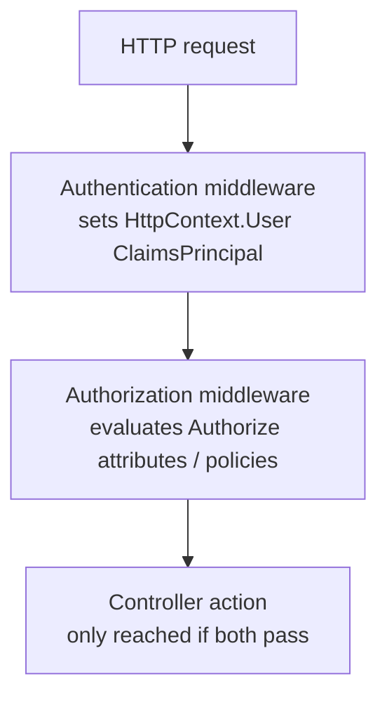
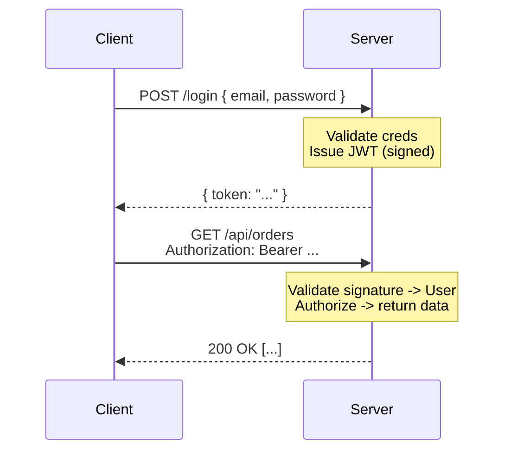
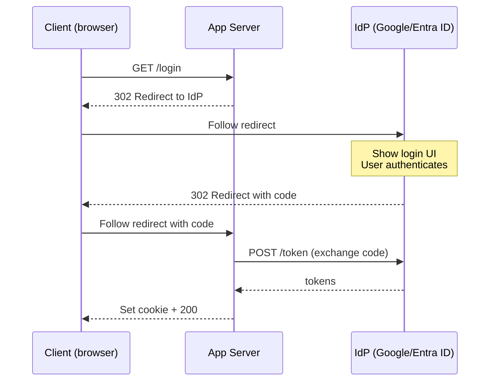
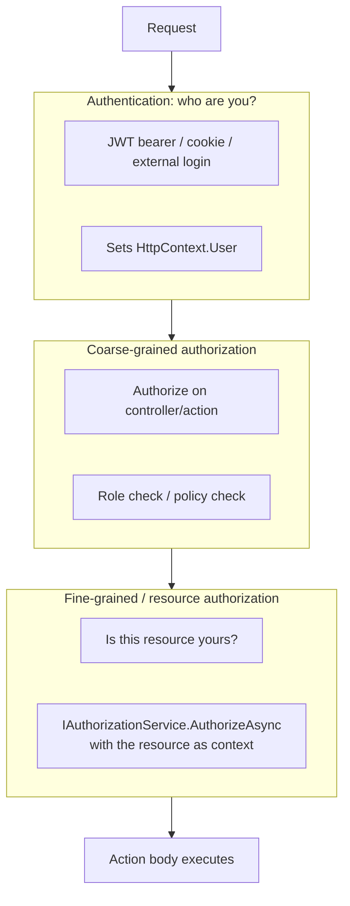

# Authentication & Authorization

> [Mastery Guide](../README.md) › [API Development](./README.md)

| Status | Priority | Phase | Last reviewed |
|---|---|---|---|
| Not Started | High | Phase 4 — Auth & API Security | 2026-05-07 |

## Contents
- [Why it matters](#why-it-matters)
- [Core concepts](#core-concepts)
  - [Authentication vs Authorization](#authentication-vs-authorization)
  - [JWT (covered in deep-dive)](#jwt-covered-in-deep-dive)
  - [OpenID Connect (OIDC)](#openid-connect-oidc)
  - [Authentication schemes and how one gets chosen](#authentication-schemes-and-how-one-gets-chosen)
  - [Multi-tenant issuer validation](#multi-tenant-issuer-validation)
  - [OAuth 2.0 flows](#oauth-20-flows)
  - [Machine identity and client-credentials token caching](#machine-identity-and-client-credentials-token-caching)
  - [ASP.NET Core Identity](#aspnet-core-identity)
  - [Identity for APIs, second factors, and passkeys](#identity-for-apis-second-factors-and-passkeys)
  - [Cookie authentication in production](#cookie-authentication-in-production)
  - [Sign-out and session lifecycle](#sign-out-and-session-lifecycle)
  - [Claim mapping and the handler underneath](#claim-mapping-and-the-handler-underneath)
  - [Claims-based authorization](#claims-based-authorization)
  - [Policy-based authorization](#policy-based-authorization)
  - [Challenge and Forbid: how a denial is produced](#challenge-and-forbid-how-a-denial-is-produced)
  - [Secure by default: DefaultPolicy and FallbackPolicy](#secure-by-default-defaultpolicy-and-fallbackpolicy)
  - [Fine-grained authorization at scale](#fine-grained-authorization-at-scale)
  - [Authorization beyond the HTTP edge](#authorization-beyond-the-http-edge)
- [Code & diagrams](#code--diagrams)
- [Common pitfalls](#common-pitfalls)
- [Interview-ready summary](#interview-ready-summary)
- [Interview Cross-Questioning Drill](#interview-cross-questioning-drill)
- [Cheat Sheet](#cheat-sheet)
- [Walkthrough](#walkthrough--stolen-jwt-replayed-from-attacker-ip)
- [Self-test](#self-test)
- [Cross-references](#cross-references)
- [Sources](#sources)

---

## Why it matters

Auth is the gate every request passes through. Get it wrong and you have either an open door (authn bypass) or a locked-out user base (authz too strict). The blast radius of an auth bug is total — a single missing `[Authorize]` attribute can expose every record in your system. This is why senior engineers treat auth as critical-path code: pair-reviewed, automated-tested, and ideally outsourced to a battle-tested library or identity provider rather than rolled by hand.

Why interviewers ask: auth is the cheapest way to test whether a candidate has shipped real systems. Vocabulary alone — "JWT vs session", "authentication vs authorization", "OIDC vs OAuth2" — separates juniors from intermediates instantly. Designing a multi-tenant, role-based authorization layer separates intermediates from seniors.

When to roll your own: almost never. Use ASP.NET Core's built-in JWT bearer + a managed identity provider (Auth0, Microsoft Entra ID, Okta, Cognito) or ASP.NET Core Identity for self-hosted. Hand-rolling password hashing, token issuance, or token validation is how data breaches happen.

## Core concepts

### Authentication vs Authorization

- **Authentication (authn):** *who are you?* — verify identity. Login, JWT validation, certificate, biometric.
- **Authorization (authz):** *are you allowed?* — check permissions. Role check, policy evaluation, resource ownership.

Authn always happens first. Authz uses the identity established by authn to make access decisions.



### JWT (covered in deep-dive)

JSON Web Tokens are the dominant API auth mechanism in 2026. Self-contained signed tokens carrying claims; server validates signature without a database hit. Full coverage including .NET configuration, token generation, claim extraction, and OWASP Top-10 mitigations is in the deep-dive: **[Security & Authentication](../01-foundations/01-net-core-deep-dive/09-security.md)**.

Quick refresher of what's there:
- JWT structure: `header.payload.signature` base64-url-encoded.
- Validation: signature, issuer, audience, expiry, not-before.
- Common claims: `sub` (subject), `iat`, `exp`, `iss`, `aud`, plus custom (`role`, `tenant`).
- Refresh tokens: long-lived, stored server-side, traded for new short-lived JWTs.

This file extends with topics not in the deep-dive: OIDC, OAuth 2.0 flows, ASP.NET Core Identity, claims-based and policy-based authorization.

### OpenID Connect (OIDC)

OIDC is an **identity layer on top of OAuth 2.0**. Where OAuth 2.0 answers "this app may access this resource on the user's behalf," OIDC adds "and here's who the user is."

The protocol returns two tokens:
- **Access token** (OAuth 2.0): used to call APIs.
- **ID token** (OIDC): a JWT containing user identity claims (`sub`, `email`, `name`, `picture`).

OIDC is what every "Sign in with Google / Microsoft / Apple" button uses under the hood. The flow is essentially OAuth 2.0 Authorization Code with `scope=openid` added.

ASP.NET Core OIDC client setup:

```csharp
builder.Services.AddAuthentication(options =>
{
    options.DefaultScheme = CookieAuthenticationDefaults.AuthenticationScheme;
    options.DefaultChallengeScheme = OpenIdConnectDefaults.AuthenticationScheme;
})
.AddCookie()
.AddOpenIdConnect(options =>
{
    options.Authority = "https://login.microsoftonline.com/{tenant-id}/v2.0";
    // "AzureAd" is only the configuration section name here — match it to your own config file.
    options.ClientId = builder.Configuration["AzureAd:ClientId"];
    options.ClientSecret = builder.Configuration["AzureAd:ClientSecret"];
    options.ResponseType = "code";
    options.SaveTokens = true;
    options.Scope.Add("openid");
    options.Scope.Add("profile");
    options.Scope.Add("email");
});
```

After login, `HttpContext.User` contains the ID token's claims. Access tokens for downstream APIs are stored via `SaveTokens = true` and retrievable via `await HttpContext.GetTokenAsync("access_token")`.

### Authentication schemes and how one gets chosen

A *scheme* is a named handler registration. `AddCookie()` registers one under the name `Cookies`, `AddJwtBearer()` under `Bearer`, `AddOpenIdConnect()` under `OpenIdConnect` — and you can register the same handler type more than once under different names, two `AddJwtBearer` calls pointing at two different issuers, say. As soon as more than one exists, every part of the pipeline has to answer the same question: which handler runs for this request?

The two lines at the top of the OIDC block above are where that gets decided, and they carry far more meaning than their length suggests. `DefaultScheme = Cookies` says that on an ordinary request, identity comes from reading the cookie. `DefaultChallengeScheme = OpenIdConnect` says that when an unauthenticated caller reaches a protected endpoint, the way to *start* giving them an identity is an OIDC redirect. So OIDC runs once, at login; the cookie carries the session from then on. Point `DefaultScheme` at OIDC instead and you have asked for the full redirect dance on every single request. `AddAuthentication` also exposes per-operation defaults — `DefaultAuthenticateScheme`, `DefaultChallengeScheme`, `DefaultForbidScheme`, `DefaultSignInScheme`, `DefaultSignOutScheme` — and `DefaultScheme` is the fallback for whichever of those you leave unset.

Overriding per endpoint is a comma-separated list on the attribute. `[Authorize(AuthenticationSchemes = "Bearer")]` runs only the bearer handler and ignores any cookie identity that happens to be present; naming two schemes lets both run and each contribute an identity. The same choice can live in a policy instead, through `policy.AuthenticationSchemes.Add(...)`, which is the better home once several endpoints share it.

When the decision has to be made per request rather than per endpoint — an API that accepts tokens from two issuers, where only the token says which — register a **policy scheme**. `AddPolicyScheme` creates a scheme that performs no authentication of its own; you set `ForwardDefaultSelector` on it, a delegate that receives the `HttpContext` and returns the name of the real scheme to forward to. Forwarding can also be set per operation via `ForwardAuthenticate`, `ForwardChallenge`, `ForwardForbid`, `ForwardSignIn` and `ForwardSignOut`; those are consulted first, then `ForwardDefaultSelector`, then `ForwardDefault`, and the first non-null result wins.

```csharp
builder.Services.AddAuthentication(options =>
{
    options.DefaultScheme = "MultiIssuer";
    options.DefaultChallengeScheme = "MultiIssuer";
})
.AddJwtBearer("Partner", o => { /* partner authority + audience */ })
.AddJwtBearer("Internal", o => { /* internal authority + audience */ })
.AddPolicyScheme("MultiIssuer", "MultiIssuer", options =>
{
    options.ForwardDefaultSelector = context =>
    {
        // Inspect the request — usually the token's issuer — and name a real scheme.
        return LooksLikePartnerToken(context.Request) ? "Partner" : "Internal";
    };
});
```

> 🌍 **In the real world**: a team adds ASP.NET Core Identity to an API that already used JWT bearer, and the API starts returning HTML. `AddIdentity<TUser, TRole>()` calls `AddAuthentication` itself and sets `DefaultAuthenticateScheme` and `DefaultChallengeScheme` to `IdentityConstants.ApplicationScheme` — Identity's cookie. Unauthenticated API calls now get the cookie handler's challenge, which is a redirect to a login page, and mobile clients dutifully follow it and try to parse a login form. Nothing in the API changed; the default moved out from under it. The fix is to stop depending on the default at all — name the scheme on the API endpoints, or build a default policy listing the schemes you actually accept.

### Multi-tenant issuer validation

The OIDC sample above hardcodes one tenant in its authority, which is the easy case: the discovery document names exactly one issuer, and issuer validation is a string comparison. Multi-tenant apps do not get that. Pointing the authority at a shared endpoint — Microsoft Entra ID's `/common` or `/organizations`, for instance — means the discovery document cannot name a concrete issuer, because the issuer differs per tenant; it returns a templated value with a `{tenantid}` placeholder instead. A configuration that does not account for that either compares against the placeholder or, worse, has issuer validation quietly switched off to make the errors go away.

That is a real privilege boundary, not a configuration nicety. When one identity provider serves many tenants and signs with the same keys, a token minted in *any* tenant passes the signature, expiry and audience checks against your API. The issuer claim is the only thing that distinguishes them. Skip it on a shared authority and you have shipped an API that accepts tokens from anyone who can create a tenant with that provider.

Two supported fixes, both on `TokenValidationParameters`. If you know your tenants — an enterprise product with a customer list — set `ValidIssuers` to their issuer URLs and let the library do a set-membership check. If you cannot enumerate them, supply an `IssuerValidator` delegate: it receives the issuer and the token, and you decide. The usual implementation pulls the tenant identifier out of the token, looks it up in your own tenant table, reconstructs the issuer URL the provider *should* have used for that tenant, and compares. `Microsoft.Identity.Web` ships this logic rather than leaving it to callers. One behavioural detail worth remembering: if `IssuerValidator` is set it runs regardless of the `ValidateIssuer` flag, so supplying the delegate is the stronger of the two switches.

Keep the two questions separate. Issuer validation proves which tenant issued the token. A lookup against your own database proves that tenant is a customer of yours. Passing the first does not imply the second, and only checking the first is how a stranger's tenant ends up authenticated against your API.

> 🌍 **In the real world**: the same trap gets handled at the gateway in some architectures — [API Management](./16-api-management.md) covers the `validate-jwt` policy with an explicit issuers list. Doing it there does not remove the need to do it in the API, unless you can prove nothing else can reach the API. Two independent checks is the point.

### OAuth 2.0 flows

Pick the flow based on your client type:

| Flow | Use case | Browser exposure | Refresh tokens |
|---|---|---|---|
| **Authorization Code + PKCE** | SPAs, mobile apps, server-side web apps | Browser sees code only (not secret) | Yes |
| **Client Credentials** | Service-to-service (no user) | N/A | Optional |
| **Device Code** | TVs, CLIs (devices that can't easily input credentials) | Code displayed for user to enter elsewhere | Yes |
| **Resource Owner Password** | Legacy only — DEPRECATED | Client sees password directly | Yes |
| **Implicit** | Old SPA flow — DEPRECATED | Token in URL fragment (insecure) | No |

**Authorization Code + PKCE** is the modern default for any user-facing app. PKCE (Proof Key for Code Exchange) defeats authorization-code-interception attacks on public clients (mobile apps, SPAs).

### Machine identity and client-credentials token caching

Client Credentials is one row in the table above and the flow most likely to be in your actual day job, so it deserves more than a row. Two decisions separate a working implementation from a sound one: where the client's own credential comes from, and what you do with the token once you have it.

**The credential.** The default is a client secret — a string in configuration that your service posts to the token endpoint. It is a password with every problem a password has: it must be stored, rotated, and kept out of logs, and it is equally usable by anybody who reads it. Two better options exist. A *certificate credential* replaces the shared string with a signed assertion: instead of `client_secret`, the client sends `client_assertion` and `client_assertion_type`, where the assertion is a short-lived JWT signed by the client's private key. RFC 7523 (JSON Web Token (JWT) Profile for OAuth 2.0 Client Authentication and Authorization Grants) is the standard behind that, and nothing replayable crosses the wire. Better again, where the platform supports it, is having no credential to store at all: Azure managed identity and Microsoft Entra's workload identity federation both let the hosting platform vouch for the workload, with federation exchanging a token issued by another identity provider — a Kubernetes service account, a CI pipeline run — for a provider token, using the same client-assertion mechanism underneath.

**The token.** A client-credentials access token belongs to the service, not to a user, and is valid for its whole lifetime. It should be acquired once and reused until shortly before it expires. Fetching a fresh one per outbound call is a common and expensive mistake: every business call becomes two network round trips, the token endpoint joins your hot path as a hard dependency, and identity providers throttle. Rolling your own cache in a `DelegatingHandler` is where the subtleties bite — expiry, clock skew, and several threads all discovering an expired token at once. `Microsoft.Identity.Web` exposes `ITokenAcquisition.GetAccessTokenForAppAsync`, backed by MSAL's application token cache. Duende's `Duende.AccessTokenManagement` package registers the same concern via `AddClientCredentialsTokenManagement()`, can attach the token to a named `HttpClient` for you, and subtracts a configurable buffer from the token lifetime so a cached token never expires mid-flight.

> 🌍 **In the real world**: a service that acquires a token per outbound call looks fine in test, where load is low and the provider is generous. Under production traffic the token endpoint starts refusing requests, and because token acquisition sits in front of *every* call, it does not look like a token problem — it looks like every downstream dependency going slow at the same moment. The give-away is that outbound request count to the identity provider tracks business traffic one-for-one instead of flattening out.

### ASP.NET Core Identity

ASP.NET Core Identity is Microsoft's full-featured user management framework: registration, login, password reset, 2FA, external logins, role management, lockout, account confirmation. It backs to EF Core (SQL by default; can swap stores).

When to use it:
- You're building a self-hosted system that owns its users.
- You want password-based or external-login auth without integrating Auth0/Entra ID.
- You need 2FA, account lockout, email confirmation, configurable password policy.

When NOT to use it:
- You're using a managed identity provider — let them own users.
- You need JWTs specifically — Identity's own token endpoints issue opaque bearer tokens, not JWTs, so other services can't validate them offline. Note that "no cookies" on its own is no longer a reason to rule Identity out: since .NET 8, `AddIdentityApiEndpoints<TUser>()` plus `MapIdentityApi<TUser>()` expose register/login/refresh endpoints backed by a bearer-token handler for exactly this case.

Setup:

```csharp
builder.Services.AddDbContext<AppDbContext>(opt =>
    opt.UseSqlServer(connectionString));

builder.Services.AddIdentity<ApplicationUser, IdentityRole>(options =>
{
    options.Password.RequireDigit = true;
    options.Password.RequireLowercase = true;
    options.Password.RequireUppercase = true;
    options.Password.RequiredLength = 12;
    options.Lockout.MaxFailedAccessAttempts = 5;
    options.Lockout.DefaultLockoutTimeSpan = TimeSpan.FromMinutes(15);
    options.SignIn.RequireConfirmedEmail = true;
})
.AddEntityFrameworkStores<AppDbContext>()
.AddDefaultTokenProviders();

// In a controller / Razor Page:
public class AccountController(SignInManager<ApplicationUser> signIn, UserManager<ApplicationUser> users)
{
    [HttpPost("/login")]
    public async Task<IActionResult> Login(LoginRequest req)
    {
        var result = await signIn.PasswordSignInAsync(
            req.Email, req.Password, isPersistent: false, lockoutOnFailure: true);
        if (result.Succeeded) return Ok();
        if (result.IsLockedOut) return Unauthorized("Account locked");
        return Unauthorized();
    }
}
```

Identity stores hashed passwords using PBKDF2 with HMAC-SHA-512 and 100,000 iterations by default (`PasswordHasherOptions.IterationCount`). You should never see plaintext passwords in your code.

### Identity for APIs, second factors, and passkeys

The section above describes Identity as a login-form framework, which is how it started. Two additions change what it can be pointed at.

`AddIdentityApiEndpoints<TUser>()` plus `app.MapIdentityApi<TUser>()` map a set of JSON endpoints onto the same user store: `POST /register`, `POST /login`, `POST /refresh`, `GET /confirmEmail`, `POST /resendConfirmationEmail`, `POST /forgotPassword`, `POST /resetPassword`, `POST /manage/2fa` and `GET /manage/info`. `/login` takes a `useCookies` query-string parameter: call it with `useCookies=true` and the response sets a cookie; call it with `useCookies=false` and the response body carries an access token plus a longer-lived refresh token, sent afterwards as `Authorization: Bearer <token>`. The caveat is the one the main section already makes, and Microsoft's documentation states it plainly: those tokens are proprietary to ASP.NET Core Identity and are deliberately not JWTs, because the feature is meant as a cookie alternative for clients that cannot use cookies, not as an identity provider. A second service cannot validate one offline. If another service has to verify your tokens, you need a token server, not Identity.

Second factors are wired through the same endpoints. `POST /manage/2fa` returns a shared key for an authenticator app; you enable it by calling the endpoint again with a current time-based one-time password, and the response includes recovery codes. Logging in afterwards means posting the one-time password — or a recovery code — alongside the password.

.NET 10 adds passkeys, meaning WebAuthn credentials, to Identity directly. Registration is three calls: `SignInManager.MakePasskeyCreationOptionsAsync` produces the challenge the browser hands to `navigator.credentials.create()`, `PerformPasskeyAttestationAsync` verifies what comes back, and `UserManager.AddOrUpdatePasskeyAsync` stores the resulting public key. Sign-in mirrors it: `MakePasskeyRequestOptionsAsync` produces the options for `navigator.credentials.get()`, and `PasskeySignInAsync` validates the assertion and signs the user in. `IdentityPasskeyOptions` configures the behaviour, most importantly `ServerDomain`, which is the WebAuthn relying-party identifier. Three limits are worth knowing before you promise passkeys in a design review: attestation statements are not validated by default, passkeys are treated as a primary factor rather than a second one, and template support ships in the Blazor Web App template only.

> 🌍 **In the real world**: if `ServerDomain` is not set, it is inferred from the host header — and a passkey registered on `app.contoso.com` also works across its subdomains. That makes host-header validation part of your authentication security rather than a hygiene item, and it puts every subdomain serving untrusted content inside the credential's blast radius. Set `ServerDomain` explicitly instead of letting whatever hostname the deployment happens to answer on decide it for you.

### Cookie authentication in production

This file recommends httpOnly cookies in several places without ever saying what is inside one. An ASP.NET Core authentication cookie is not a session identifier by default. It is the serialised `ClaimsPrincipal` and its `AuthenticationProperties`, encrypted and signed, sent to the browser and read back on every request. That one design choice explains most of the operational surprises.

**It is encrypted with a Data Protection key.** Keys live in the app's key ring, which by default is local to the machine or container. Two instances behind a load balancer that do not share a key ring cannot read each other's cookies, and a redeploy that discards the key ring invalidates every cookie in existence. Microsoft's own guidance for apps on multiple machines is explicit: configure Data Protection to use the same key ring and the same application identifier across instances.

**It grows with the identity.** Claims go into the cookie, so a user carrying a lot of group or role claims produces a large one. The default `CookieManager` is `ChunkingCookieManager`, which splits an oversized cookie into numbered chunks on the way out and reassembles them on the way in — invisible until something in the request path enforces a header-size limit, at which point you get failures that look nothing like an authentication problem. The proper answer for large identities is `CookieAuthenticationOptions.SessionStore`, an `ITicketStore` implementation: the ticket stays server-side and only a session identifier reaches the browser. That reintroduces server-side state, which is precisely the trade — a small cookie and real revocation, in exchange for a store that now has to be shared and available.

**Its lifetime has two knobs.** `ExpireTimeSpan` sets how long the ticket is valid; `SlidingExpiration` decides whether presenting it partway through the window re-issues it with a fresh expiry. Sliding is the difference between "signed out after twenty minutes of inactivity" and "signed out twenty minutes after signing in". An `ExpiresUtc` set on `AuthenticationProperties` at sign-in overrides `ExpireTimeSpan` for that ticket.

**It cares which scheme and host the request arrived on.** Behind a reverse proxy or ingress that terminates TLS, the app sees plain HTTP unless `UseForwardedHeaders` is configured to honour `X-Forwarded-Proto` and `X-Forwarded-Host`. Every URL the app builds for itself is then wrong in the same way — including the OIDC `redirect_uri`.

> 🌍 **In the real world**: two failures from this section account for a great many "but it works locally" auth tickets. The first is the deploy where everyone is signed out at once — new instances, new key rings, every outstanding cookie undecryptable. The second is the OIDC login that only breaks once deployed: the app composes an `http://` redirect URI because it does not trust forwarded headers, the provider rejects it as not matching the registered reply URL, and local testing cannot reproduce it because locally there is no proxy. Its close cousin is the "Correlation failed" error on the callback, where the short-lived correlation cookie the handler set on the way out did not come back — typically because the cookie's attributes were unsatisfiable for an app that believes it is serving plain HTTP, or because the callback landed on an instance with a different key ring.

### Sign-out and session lifecycle

Signing in is per scheme, so signing out is too. `HttpContext.SignOutAsync(scheme)` tells one handler to end its session, and the cookie handler deletes its cookie. In an app that logs in through OIDC that is only half the job, because the identity provider still holds its own session. The user clicks "log out", clicks "log in" again, and is signed straight back in without being asked for anything. It looks exactly like a logout button that does nothing.

The complete sequence signs out of both — the local cookie scheme *and* the OIDC scheme. Calling `SignOutAsync` for the OIDC scheme makes the handler redirect the browser to the provider's `end_session_endpoint`, which is advertised in the discovery document; the provider ends its session and returns the user to the app's `SignedOutCallbackPath` for local cleanup, and from there to the configured signed-out redirect.

The reverse direction matters too. When the user signs out at the provider, or from a different application federated to it, the provider notifies your app. `OpenIdConnectOptions.RemoteSignOutPath` is the path the handler intercepts for that, and the `OnRemoteSignOut` event is where you hook it. There are no redirects on that path — it exists only to drop your local session. Note that this is front-channel logout, driven through the user's browser and therefore dependent on that browser making the calls. OpenID Connect also defines a back-channel logout profile in which the provider calls your endpoint server to server; that is a separate mechanism, and whether your stack implements it is something to check rather than assume.

None of that answers the harder question: once you change something about a user, how long until it bites? For Identity there is a specific mechanism. Every user row carries a *security stamp*, regenerated when something security-sensitive changes — a password reset, a change to their roles. `SecurityStampValidator` re-checks the stamp against the store periodically rather than on every request, and `SecurityStampValidatorOptions.ValidationInterval` defaults to thirty minutes. For Identity's token-based mode the equivalent bound is `BearerTokenOptions.BearerTokenExpiration`. Shortening the interval buys faster revocation and costs a database read per interval per user; Microsoft's documentation frames it as exactly that balance.

> 🌍 **In the real world**: "we removed his admin role and he was still an admin" is a support ticket, not a bug. With an Identity cookie the demotion takes effect at the next security-stamp revalidation — by default up to half an hour later. With a JWT it takes effect when the token expires, which is the revocation problem Drill 15 covers. Both are design choices with a dial on them. The failure is having neither set the dial deliberately nor the answer ready when someone asks.

### Claim mapping and the handler underneath

The code in this file reads user identity with `User.FindFirst(ClaimTypes.NameIdentifier)`. That works, and the reason it works is not obvious: the token said `sub`, not `ClaimTypes.NameIdentifier`. Something between the wire and the `ClaimsPrincipal` rewrote the claim types.

That something is inbound claim mapping, a legacy of WS-Federation, and it maps short JWT claim names onto long XML-schema URIs — `sub` becomes the URI that the `ClaimTypes.NameIdentifier` constant holds. It is on by default: `JwtBearerOptions.MapInboundClaims` defaults to `true`, and the mapping table is `JsonWebTokenHandler.DefaultInboundClaimTypeMap`. There are two ways to switch it off — clear that static table at startup, which is global to the process, or set `MapInboundClaims = false` on one scheme's options, which is scoped to that scheme. Turn it off and your lookups have to use the raw names the token actually carries.

A second layer sits on top. `User.Identity.Name` and `User.IsInRole` do not read fixed claim types; they read whichever types the identity was built with, controlled by `TokenValidationParameters.NameClaimType` and `RoleClaimType`. A provider that emits roles under a claim name your configuration does not expect produces the most confusing failure in this whole area: the claim is visibly present in `User.Claims`, and `IsInRole` returns false anyway.

It is also worth knowing which handler is doing the work. Since .NET 8 the default token handler is `JsonWebTokenHandler`, replacing the older `JwtSecurityTokenHandler`. They are not drop-in equivalents in one detail: the two types ship different defaults for `MapInboundClaims` — `true` on `JwtSecurityTokenHandler`, `false` on `JsonWebTokenHandler`. `JwtBearerOptions` papers over that by seeding its handler from the old handler's default, so JWT bearer keeps mapping across the upgrade; code that constructs a `JsonWebTokenHandler` itself does not, so advice written against the old handler can be entirely correct and still not describe your app.

Finally, when you need claims that no token carries — permissions from your own database, say — `IClaimsTransformation` is the framework's hook. Implement `TransformAsync`, register it in DI, and it runs after authentication and before authorization. The documented caveat is that it may be called more than once for a request, so it must be idempotent: check whether the claim is already there before adding it. It is also the wrong home for an unguarded database call, since that call lands on every request that passes through.

> 🌍 **In the real world**: a team migrates from one identity provider to another, keeps every `[Authorize(Roles = "Admin")]` attribute untouched, and all the admins lose access at cut-over. The new tokens contain the roles. The old provider emitted them under a name the mapping table recognised; the new one emits a name that nothing maps to `ClaimTypes.Role`. The repair is one line setting `RoleClaimType`, and finding that line costs a day if you do not know this layer exists.

### Claims-based authorization

A `ClaimsPrincipal` is a bag of claims. A claim is a key-value pair asserting something about the user (`role: Admin`, `tenant: Acme`, `subscription: Premium`).

```csharp
[Authorize]
[HttpGet("/profile")]
public IActionResult GetProfile()
{
    var userId = User.FindFirst(ClaimTypes.NameIdentifier)?.Value;
    var email  = User.FindFirst(ClaimTypes.Email)?.Value;
    var roles  = User.FindAll(ClaimTypes.Role).Select(c => c.Value);
    return Ok(new { userId, email, roles });
}
```

Role-based shortcut:

```csharp
[Authorize(Roles = "Admin,Manager")]
[HttpDelete("/users/{id}")]
public IActionResult DeleteUser(int id) => Ok();
```

Roles are just claims of type `ClaimTypes.Role`. Behind the scenes, `[Authorize(Roles = "Admin")]` checks `User.IsInRole("Admin")`.

### Policy-based authorization

Policies encode complex rules that go beyond "has role." Define once, attach via `[Authorize(Policy = "...")]`.

```csharp
builder.Services.AddAuthorization(options =>
{
    // Simple claim requirement
    options.AddPolicy("Premium", policy =>
        policy.RequireClaim("subscription", "premium", "platinum"));

    // Custom requirement with handler
    options.AddPolicy("OwnerOnly", policy =>
        policy.Requirements.Add(new ResourceOwnerRequirement()));
});

// Custom requirement
public class ResourceOwnerRequirement : IAuthorizationRequirement { }

public class ResourceOwnerHandler : AuthorizationHandler<ResourceOwnerRequirement, Order>
{
    protected override Task HandleRequirementAsync(
        AuthorizationHandlerContext context,
        ResourceOwnerRequirement requirement,
        Order resource)
    {
        var userId = context.User.FindFirst(ClaimTypes.NameIdentifier)?.Value;
        if (userId == resource.OwnerId.ToString())
            context.Succeed(requirement);
        return Task.CompletedTask;
    }
}

// Resource-based check inside a controller
[HttpGet("/orders/{id}")]
public async Task<IActionResult> Get(int id, [FromServices] IAuthorizationService auth)
{
    var order = await _repo.GetAsync(id);
    var result = await auth.AuthorizeAsync(User, order, "OwnerOnly");
    if (!result.Succeeded) return Forbid();
    return Ok(order);
}
```

Resource-based authorization is the pattern for "user X can only see their own orders" — you can't decide that from the URL alone; you need the resource.

### Challenge and Forbid: how a denial is produced

The status codes themselves are the well-known part — a missing or invalid credential is 401, a valid credential with insufficient permission is 403, and the [security deep-dive](../01-foundations/01-net-core-deep-dive/09-security.md) answers that question directly. What is worth knowing here is the machinery that picks between them, because the machinery is what you configure.

Authorization failure does not produce a status code. It produces one of two *operations*, and the framework chooses between them on a single test: if authentication succeeded, the result is Forbid; if it did not, the result is Challenge. That is the entire rule. Challenge means "I do not know who you are, go and establish that". Forbid means "I know exactly who you are and the answer is still no". Each is then handed to the relevant authentication handler, and the handler decides what an HTTP response for that operation looks like.

Which is why the status code depends on the handler, not on the authorization layer. The JWT bearer handler turns a challenge into a 401 with a `WWW-Authenticate` header and a forbid into a 403. The cookie handler turns a challenge into a redirect to `LoginPath` and a forbid into a redirect to `AccessDeniedPath`, because for a browser that is the right answer. Put a cookie handler in front of an API and an unauthorised call returns a redirect followed by an HTML login page — which, to any client that follows redirects, looks like a successful 200 with a strange body. (Requests identifying themselves as `XMLHttpRequest` were always exempt and got 401/403.) From .NET 10 the framework also recognises API-shaped endpoints — `[ApiController]` controllers, minimal API endpoints that read JSON request bodies or write JSON responses, endpoints returning `TypedResults`, and SignalR — and returns 401 or 403 for them instead of redirecting, which removes the most common form of that bug without changing the underlying model.

In your own code the two operations are two methods: `ChallengeAsync` and `ForbidAsync` on `HttpContext`, surfaced on `ControllerBase` as `Challenge()` and `Forbid()`. `Forbid()` is not the same as returning `Unauthorized()` or a hardcoded 403 — it routes back through the handler and lets it shape the response, which is what keeps behaviour consistent when the scheme changes. Use `Forbid()` when you have identified the caller and are refusing them.

When the default responses are not good enough — you want a body explaining which policy failed rather than an empty 403 — the extension point is `IAuthorizationMiddlewareResultHandler`. Its single method receives the request delegate, the `HttpContext`, the `AuthorizationPolicy` that was evaluated and the policy result, so you can inspect the failure carried on that result and write your own response, or hand the cases you do not care about to the default handler. Register your implementation in DI and the authorization middleware uses it.

> 🌍 **In the real world**: an endpoint returns 403 and nobody can say why. The policy has four requirements, the response body is empty, and the log line says authorization failed. A custom result handler that reads the failed requirements off the result and returns them in a Problem Details payload turns that into a ten-second diagnosis — in non-production environments only, because telling an attacker precisely which check they failed is a gift.

### Secure by default: DefaultPolicy and FallbackPolicy

This file opens by saying a single missing `[Authorize]` can expose every record in the system. The framework has a direct answer to that, and it is two settings that sound identical and are not.

`DefaultPolicy` is what a bare `[Authorize]` means when it names no policy and no roles. Out of the box it requires an authenticated user. You change it when you want every explicit `[Authorize]` in the codebase to mean something stronger — accepting only certain authentication schemes, say, or demanding an extra claim.

`FallbackPolicy` is what applies to an endpoint carrying *no* authorization metadata at all. It is null by default, which is exactly why a controller with no attribute is open to the world. Set it and the default flips: anything not explicitly marked is protected, and exposing an endpoint becomes `[AllowAnonymous]` — a deliberate, greppable, reviewable act rather than an omission. The important detail is that the fallback applies only in the absence of authorization metadata; the moment an endpoint carries any, that metadata is evaluated and the fallback is not consulted. So `[AllowAnonymous]` on your health check and login endpoints behaves exactly as you would want. Note also that the fallback is a concern of the authorization *middleware* — it is not applied to `IAuthorizationService` calls you make yourself.

`AddAuthorizationBuilder()` is the fluent surface for both, alongside `AddPolicy`:

```csharp
builder.Services.AddAuthorizationBuilder()
    .SetFallbackPolicy(new AuthorizationPolicyBuilder()
        .RequireAuthenticatedUser()
        .Build())
    .AddPolicy("Premium", policy =>
        policy.RequireClaim("subscription", "premium", "platinum"));
```

The equivalent on the older `AddAuthorization(options => ...)` overload is `options.FallbackPolicy` and `options.DefaultPolicy`. Same settings, more ceremony.

> 🌍 **In the real world**: the endpoint that shipped without `[Authorize]` is almost never caught in review, because reviewers read what is written and this defect is an absence. It gets found by a scanner, a penetration test, or an incident. A fallback policy converts a whole class of "someone forgot" into an impossible state, and it changes the review question from "did you remember to protect this?" — which nobody can reliably answer — to "why is this marked anonymous?", which anybody can.

### Fine-grained authorization at scale

Everything above puts permissions in the token or the cookie. That works up to a point, and the point is worth naming because it arrives suddenly.

Permissions-as-claims means the credential carries the answers. Every check is local, needs no I/O, and cannot fail for reasons outside the process — which is precisely why it is the default. The costs are two. Size: claims travel on every request, and a user carrying a large number of group or permission claims produces a token or cookie big enough to run into header and cookie size limits, failing in ways that look nothing like an authorization problem. Staleness: a permission granted or revoked after the credential was issued does not apply until the credential is reissued.

Permissions-as-data means the credential carries identity only, and the permission lookup happens against a store at decision time. Size stops being a constraint and revocation becomes immediate. What you buy in exchange is a lookup on the request path, which needs caching, a timeout, and above all a decision about what happens when it fails. Fail-closed is the correct default, and it makes your authorization store a hard dependency of every request. Anyone proposing this design should be able to say that sentence out loud without flinching.

The relationship-based branch of this is worth knowing by name. Google's Zanzibar paper describes a system that stores authorization as relationship tuples — this user is an editor of this document, this folder is the parent of that document — and answers "may X do Y to Z" by walking those relationships. It fits anything with nested containers or sharing, where a permission is derived rather than assigned. OpenFGA is an open-source implementation of those ideas and is a CNCF project. On the policy-language side, AWS's Cedar is an open-source language and evaluation engine for expressing permissions as policies, and is what Amazon Verified Permissions runs on; Open Policy Agent, with its Rego language, is the general-purpose policy engine most teams meet first through infrastructure policy and can also serve as an application decision point.

Whichever you pick, the ASP.NET Core integration point does not change. The external system is a policy decision point; your `AuthorizationHandler` is what calls it. Handlers can inject scoped services and do asynchronous work, so a call to a decision service fits the model you already have — with the caching, timeout and failure handling you would apply to any other network dependency sitting in the request path.

> 🌍 **In the real world**: permission models grow in one direction only. Three roles becomes ten as features ship, then someone needs "admin but not billing" and the count starts multiplying. Moving to permission claims fixes the combinatorics and relocates the problem to credential size. Moving to a lookup fixes size and relocates the problem to latency and availability. There is no arrangement without a cost — the senior answer is knowing which cost you are currently paying and what the next one would be.

### Authorization beyond the HTTP edge

Every authorization example in this file runs inside a controller, with an `HttpContext` and a populated `User`. A large part of a real system runs where neither exists.

A queue consumer has no request. A nightly job has no user. A gRPC call does still have an `HttpContext` underneath — ASP.NET Core supports `[Authorize]` on gRPC services and methods, and the principal is reachable through `ServerCallContext.GetHttpContext().User` — but the moment work is handed to a background service or a message broker, the principal stops flowing. Nothing dropped it; nothing was ever carrying it.

Three honest options, and the mistake is picking one without saying which.

**Carry the user forward.** Put the identity into the message envelope, and carry something the consumer can verify rather than a bare user ID. If the consumer trusts an unverified field, then anyone who can write to the queue can act as anyone. The queue has become part of your trust boundary and should be reasoned about as one.

**Run as a system identity.** The job authenticates as itself, with its own machine identity, and its permissions are the job's rather than any user's. The originating user, if there was one, is recorded for audit and never consulted for a decision. This is usually right for scheduled work, and it forces a useful question: what should this job be allowed to do when nobody asked for it?

**Decide before enqueueing.** Authorise at the edge, where the user is present, and put only already-authorised work on the queue. Simple and often correct, with one caveat: permission may have been revoked between enqueue and execution, so it is the wrong choice for anything long-delayed or high-value.

Underneath all three sits the question of whether authorization is an edge concern or a domain invariant. "Only the owner may cancel this order" enforced in a controller is a rule about one HTTP endpoint. The same rule expressed on the domain operation holds whoever calls it — controller, consumer, job, or a service that does not exist yet. The edge check gives you the right status code and a cheap early rejection; the domain check is what stops the next entry point from quietly bypassing it.

> 🌍 **In the real world**: an export endpoint is properly authorised — it checks tenant and ownership — and hands the work to a background job that reads the requested resource IDs and writes a file. The job has database access and no notion of a user. Six months later a second producer starts putting messages on the same queue with less careful validation upstream, and the job cheerfully exports across tenants. The authorization was real. It was just attached to one entry point rather than to the operation.

## Code & diagrams

<details>
<summary>🧩 Click to expand — code samples and diagrams</summary>

### Auth flow comparison

JWT BEARER (stateless API auth):



OIDC AUTHORIZATION CODE (web app login with external IdP):



### Authorization layers



### Multi-tenant authorization

```csharp
// Tenant claim issued at login
var claims = new[]
{
    new Claim(ClaimTypes.NameIdentifier, user.Id),
    new Claim("tenant", user.TenantId.ToString())
};

// Policy
options.AddPolicy("SameTenant", policy =>
    policy.Requirements.Add(new SameTenantRequirement()));

// Handler enforces tenant match for ANY resource
public class SameTenantHandler : AuthorizationHandler<SameTenantRequirement, ITenantOwned>
{
    protected override Task HandleRequirementAsync(
        AuthorizationHandlerContext context,
        SameTenantRequirement requirement,
        ITenantOwned resource)
    {
        var userTenant = context.User.FindFirst("tenant")?.Value;
        if (userTenant == resource.TenantId.ToString())
            context.Succeed(requirement);
        return Task.CompletedTask;
    }
}
```

</details>

## Common pitfalls

1. **Storing JWTs in localStorage.** Vulnerable to XSS — any injected script can read the token. Use httpOnly cookies for browser apps, or accept the XSS risk and aggressively CSP.
2. **No expiry / very long expiry on access tokens.** Stolen tokens stay valid forever. Use short-lived (15 min) access tokens + long-lived refresh tokens.
3. **Refresh token in localStorage.** Same problem as access tokens — defeats the point of having two tokens. Refresh tokens belong in httpOnly cookies or secure native storage.
4. **Mixing authn and authz.** "User has email confirmed" is not authentication — it's a fact about the authenticated user, used in authorization. Don't conflate.
5. **Relying on `[Authorize(Roles = "Admin")]` for everything.** Roles don't scale. As permissions grow (Admin can do X but not Y, Manager can do Y but not Z), policies and resource-based authz become necessary.
6. **Authorization based on URL parameters.** "User can edit `/orders/{id}` if they own it" — but the URL alone doesn't tell you who owns it. You need the resource. Use `IAuthorizationService.AuthorizeAsync(User, resource, policy)`.
7. **Forgetting to validate `aud` (audience) on JWT.** A token issued for service A should not be accepted by service B. The `aud` claim prevents this.
8. **Rolling your own password hashing.** Use Identity's defaults (PBKDF2) or Argon2 via a library. Never plain MD5 or SHA-1.
9. **No password reset rate limit.** An attacker can brute-force the reset endpoint to enumerate valid emails. Rate limit + always return identical response regardless of email validity.
10. **Trusting client-sent claims.** A client can send any JSON in a JWT body — only the signature stops tampering. Validate the signature *every request*, never trust the body alone.
11. **Storing API keys in source control.** Even private repos. Use environment variables, Azure Key Vault, AWS Secrets Manager, or User Secrets in dev.
12. **Returning different errors for "user not found" vs "wrong password".** Enables user enumeration. Return identical "Invalid credentials" for both.

## Interview-ready summary

- **Authn = identity. Authz = permissions.** Always in that order.
- **JWT** for stateless API auth (covered in [deep-dive](../01-foundations/01-net-core-deep-dive/09-security.md)). **Cookies** for traditional web apps. **OIDC** for "Sign in with X" external providers.
- **OAuth 2.0 Authorization Code + PKCE** is the default flow for user-facing apps in 2026.
- **ASP.NET Core Identity** = full user management framework (passwords, 2FA, lockout). Use it when you self-host users; skip it when you delegate to an IdP.
- **Claims-based authz**: `User.HasClaim(...)`, `[Authorize(Roles = ...)]`. **Policy-based authz**: `[Authorize(Policy = "X")]` with custom requirements + handlers. **Resource-based authz**: `IAuthorizationService.AuthorizeAsync` with the resource.

**Expected interview questions:**

1. *"Authentication vs Authorization — example?"* — Authn: validating a JWT signature to know the user is "Ahmed". Authz: checking that "Ahmed" has the `Admin` role before letting him delete a user.
2. *"Why is JWT preferred over server-side sessions?"* — Stateless: no server-side session store, scales horizontally without sticky sessions or shared cache. Trade-off: harder to invalidate (refresh tokens are the workaround).
3. *"Walk me through OAuth Authorization Code + PKCE."* — Client redirects to IdP with code_challenge (hash of code_verifier). User authenticates. IdP redirects back with auth code. Client posts code + code_verifier to token endpoint; IdP verifies hash matches and returns tokens. PKCE prevents code interception attacks.
4. *"Difference between OAuth 2.0 and OIDC?"* — OAuth 2.0 is for *delegated authorization* (app accesses resources on user's behalf). OIDC adds an ID token with identity claims, so the app knows who the user is.
5. *"How do you implement 'user can only see their own orders'?"* — Resource-based authorization with a custom `IAuthorizationHandler` that checks `resource.OwnerId == User.GetUserId()`. Don't filter only in the database; enforce in code too.
6. *"Where do you store JWTs in a browser?"* — httpOnly cookie (best — XSS-immune). Or memory only (cleared on refresh; need to re-login). Avoid localStorage — XSS reads it.
7. *"How do you revoke a JWT?"* — You don't, directly — that's the trade-off of stateless tokens. Workarounds: short expiry + refresh-token rotation, or maintain a server-side blocklist of revoked JTI claims (gives up some statelessness).
8. *"Roles vs Policies vs Claims?"* — Claims are key-value facts about the user. Roles are shorthand for one type of claim. Policies are rules that combine claims (and possibly resource state) into yes/no decisions.

## Interview Cross-Questioning Drill

<details>
<summary>📖 Click to expand — cross-question chains (~15-20 min, cover answers and write cold)</summary>

> **Honest caveat**: reading this section once doesn't make you interview-ready. Cover the answers, write them cold, then check. Pair with a senior for live mock cross-questioning. The guide removes "I never thought about that" surprises; mock interviews convert knowledge into reflex. Both are needed.

Each drill is **Q → A → Cross-Q → A → Cross-Q² → A**. Practice answering the cross-questions without re-reading. If you stumble on any cross-Q², go re-read the relevant section.

### Drill 1 — JWT validation

> **Q**: List every step required to validate an incoming JWT on the server.
>
> **A**: (1) Verify signature against the issuer's public key (RS256) or shared secret (HS256). (2) Verify `iss` (issuer) matches an expected value. (3) Verify `aud` (audience) is your service. (4) Verify `exp` (expiry) is in the future. (5) Verify `nbf` (not-before) is in the past. (6) Verify `alg` matches what you expect (NOT what the token claims — reject `none` and any `alg` you didn't configure).
>
> **Cross-Q**: A junior validates signature, `exp`, and `iss` but skips `aud`. What's the attack?
>
> **A**: Token-confusion attack. If your auth server issues tokens for `service-a` and `service-b`, both signed with the same key — a valid token for `service-a` will pass signature, issuer, and expiry checks at `service-b`. Without `aud` validation, `service-b` accepts a token that was *never meant for it*. An attacker who has a low-privilege token for `service-a` can replay it against `service-b` and gain whatever access `service-b` grants based on the user's claims. Always validate `aud`.
>
> **Cross-Q²**: What if `aud` is an array (multi-audience token)?
>
> **A**: Check membership: `aud_array.contains(your_service_id)`. The JWT spec allows `aud` to be a string or array. ASP.NET Core's `JwtBearerOptions.TokenValidationParameters.ValidAudiences` (plural) handles both — it succeeds if any of your valid audiences appears in the token's audience claim. Multi-audience tokens are common in OIDC federation where one token grants access to multiple resource servers; don't reject them by assuming `aud` is always a string.

### Drill 2 — JWT alg none

> **Q**: Why is `alg: none` in JWT a critical vulnerability?
>
> **A**: It tells the verifier "this token is unsigned — skip signature check." If your validator naively honors the header's `alg`, an attacker can craft a token with arbitrary claims, set `alg: none`, leave the signature empty, and your server accepts it as authentic. This was a real CVE class in early JWT libraries — `jsonwebtoken` (Node), `python-jose`, and others all shipped with this footgun.
>
> **Cross-Q**: How do you defend against it in ASP.NET Core?
>
> **A**: Set `TokenValidationParameters.ValidAlgorithms` to a hardcoded list of allowed algorithms (e.g., `["RS256"]`). The library will reject any token whose `alg` header doesn't match — `none`, `HS256` when you expect `RS256`, anything unexpected. *Never* read the algorithm from the token to decide how to verify it; that's the whole vulnerability. Configure the expected algorithm at startup and refuse anything else.
>
> **Cross-Q²**: There's also an `HS256` confusion attack against `RS256` setups. What is it?
>
> **A**: If your server validates with the issuer's *public* RSA key but doesn't pin the algorithm, an attacker creates a token with `alg: HS256` and signs it using the *public key as the HMAC secret* (public keys are, well, public). A naive validator sees `alg: HS256`, loads the configured "key" (the RSA public key bytes), and runs HMAC-SHA256 — which validates because that's what the attacker did. The fix is identical: pin `ValidAlgorithms` to exactly what you expect. Never let the token dictate the verification algorithm.

### Drill 3 — OAuth 2.0 vs OIDC

> **Q**: What does OIDC add on top of OAuth 2.0?
>
> **A**: OAuth 2.0 is *delegated authorization* — "this app may access this resource on the user's behalf." It returns an opaque access token; the app calls APIs with it. OIDC adds an **ID token** (a signed JWT with user identity claims: `sub`, `email`, `name`, `picture`) and standard claims/scopes (`openid`, `profile`, `email`). So OAuth answers "can the app act?"; OIDC additionally answers "who is the user?".
>
> **Cross-Q**: Could I just decode the access token to learn user identity?
>
> **A**: No — that's the trap. OAuth 2.0 makes no guarantee about access token format; many providers issue opaque random strings (Auth0 by default, GitHub, Twitter). Even when access tokens *are* JWTs (Microsoft, Google), the spec says clients must treat them as opaque — only the resource server is supposed to read them. OIDC's contribution is the ID token, which is *explicitly* for the client to decode and use for user identity. Use the ID token for "who is the user," the access token for "call APIs."
>
> **Cross-Q²**: A team is using OAuth 2.0 without OIDC and pulling user identity from the `userinfo` endpoint. Why is that fine?
>
> **A**: It works because OAuth 2.0 doesn't *forbid* user info — many providers expose `/userinfo` accepting an access token and returning user details. This was the de-facto pattern pre-OIDC. OIDC formalizes it: the same `/userinfo` endpoint, standardized claims, plus an ID token so you don't even need the round-trip on every login (ID token contains the claims directly). The trade-off: extra HTTP call per login vs JWT payload size. Most modern flows use OIDC for the ID token; `userinfo` is a fallback for refreshing stale claims.

### Drill 4 — Authorization Code + PKCE

> **Q**: Walk me through OAuth 2.0 Authorization Code + PKCE end-to-end.
>
> **A**: (1) Client generates `code_verifier` (random 43-128 char string) and `code_challenge = SHA256(code_verifier)` base64url-encoded. (2) Client redirects user to authorization endpoint with `code_challenge` and `code_challenge_method=S256`. (3) User authenticates at the IdP. (4) IdP redirects back to client with `authorization_code`. (5) Client POSTs to token endpoint with `authorization_code` *and* `code_verifier` (the original random string). (6) IdP recomputes SHA256(code_verifier), compares to the stored code_challenge — match → issue tokens; mismatch → reject. Tokens returned: access token, ID token (if OIDC), refresh token.
>
> **Cross-Q**: Why do we need PKCE if the client already has a client secret?
>
> **A**: Defense-in-depth. Client secrets leak through environment dumps, git accidents, CI logs, container metadata service compromise. PKCE binds the authorization code to a fresh per-request `code_verifier` that exists *only in the legitimate client's memory* during the flow. Even if an attacker steals your long-lived client secret AND intercepts the authorization code, they can't exchange the code without the matching `code_verifier`. RFC 9700 (OAuth 2.0 Security Best Current Practice, BCP 240, January 2025) makes PKCE mandatory for public clients and recommends it for confidential ones; the OAuth 2.1 draft — still an IETF draft, not a published RFC — requires it for *essentially every* client type. The cost is one SHA-256 hash, the benefit is no longer relying on secret confidentiality alone.
>
> **Cross-Q²**: Where does PKCE not help?
>
> **A**: PKCE protects the authorization code from being exchanged by an attacker who intercepts it. It does *not* protect against: (1) Token theft after issuance — if the access token is exfiltrated post-flow (XSS, malware), PKCE is over. Defense: short expiry + DPoP. (2) Compromised authorization server — if the IdP itself is malicious or breached, it can issue tokens to anyone; PKCE doesn't apply. (3) Authorization request redirect to attacker URL — if `redirect_uri` validation is loose, the attacker receives the code *with* the verifier. Defense: strict `redirect_uri` allowlist at the IdP.

### Drill 5 — Refresh token rotation

> **Q**: What does refresh token rotation do, and what does reuse detection catch?
>
> **A**: On rotation: every time the client uses a refresh token, the server issues a *new* refresh token and invalidates the old one. The client must use the new one next time. Reuse detection: if a refresh token is presented twice (the old one after it should have been invalidated), the server knows it's been stolen — both copies exist somewhere — and revokes the entire refresh token family for that user.
>
> **Cross-Q**: What's the threat model that justifies the complexity?
>
> **A**: Refresh tokens are long-lived (days to months). If a refresh token is exfiltrated (XSS, log file, memory dump), the attacker can mint access tokens indefinitely. Rotation alone reduces the window: the attacker has to use the token *immediately* before the legitimate client rotates it. Reuse detection adds the kill switch: the moment the legitimate client tries to use what was the "valid" refresh token but it's already been used (by the attacker), the server detects the collision and revokes the family. The attacker loses access; the user gets logged out and re-authenticates.
>
> **Cross-Q²**: What if the legitimate client crashes mid-rotation — does that trigger a false positive?
>
> **A**: Yes, that's the trade-off. Race conditions: client A starts rotation, gets the new refresh token, then crashes before storing it. On next launch, client A retries with the old refresh token (still in its persisted store) — server sees reuse, revokes the family. User has to log in again. This is acceptable for the security gain; in practice you minimize it by: (1) durable storage of new token before discarding old, (2) atomic swap on the client, (3) grace period (some implementations allow one reuse within 30 seconds to absorb retries). Auth0 and Okta both implement grace windows for this reason.

### Drill 6 — Authentication vs Authorization

> **Q**: Define authentication and authorization with an example.
>
> **A**: Authentication = "who are you?" — verify identity. Example: validating a JWT's signature and extracting `sub: user-42`. Authorization = "are you allowed?" — check permissions. Example: confirming that user-42 has the `Admin` role before letting them call `DELETE /users/{id}`. Authn always runs first; authz uses the identity established by authn to make decisions.
>
> **Cross-Q**: A junior says "the user is authenticated as Admin." What's wrong with that phrase?
>
> **A**: Conflation. Authentication establishes *who* — "the user is authenticated as Ahmed (user-42)." `Admin` is an authorization fact about Ahmed, not an authentication state. The clean phrasing: "the user is authenticated; their claims include `role: Admin`." This matters because: roles can change without re-authentication — though not on the next request, which is the part people get wrong. A demoted admin keeps the `Admin` role claim in a JWT until that token's `exp` (the revocation problem Drill 15 covers), and in an Identity cookie until that cookie is next revalidated, which defaults to every 30 minutes. Also, the same authenticated user has different authz outcomes per endpoint (Admin for `/users`, regular for `/orders`).
>
> **Cross-Q²**: In ASP.NET Core, where does this distinction live in code?
>
> **A**: `app.UseAuthentication()` populates `HttpContext.User` with a `ClaimsPrincipal` (identity + claims). `app.UseAuthorization()` evaluates `[Authorize]` attributes, policies, and `IAuthorizationService` calls against that principal. They're separate middleware, deliberately — you can have endpoints that authenticate but don't authorize (`[AllowAnonymous]` reads `User` if present but doesn't require it) and you can never have authorization without authentication first (no claims → nothing to evaluate against). Middleware order: `UseAuthentication()` *must* come before `UseAuthorization()`.

### Drill 7 — Claims vs roles vs policies

> **Q**: Claims vs roles vs policies — when do you reach for each?
>
> **A**: Claims are raw facts on `ClaimsPrincipal` (`subscription: premium`, `tenant: acme`). Roles are a conventional shortcut for one common claim type (`ClaimTypes.Role`), useful when you have <10 well-known roles. Policies wrap arbitrary logic — combine multiple claims, evaluate against a resource, integrate external data. Heuristic: claim if it's just a tag, role if it's a coarse-grained access tier, policy when the decision involves logic beyond "has X."
>
> **Cross-Q**: When do roles stop scaling?
>
> **A**: When permissions diverge from role boundaries. Example: `Admin` can do everything except billing; `BillingAdmin` can do billing but not user management; some users are both. Express this as roles → you get `AdminWithBilling`, `BillingOnly`, `Admin`, exponential combinations. Express it as fine-grained claims (`can_billing: true`, `can_users: true`) checked by policies → linear in features. Past ~10 distinct roles, the role enum becomes a maintenance burden — switch to permission-claims + policies.
>
> **Cross-Q²**: Show me a policy that needs the *resource*, not just claims.
>
> **A**: "User can edit order if they own it." The claim `user_id: 42` alone doesn't tell you if order-99 belongs to user-42 — you need the order resource. Pattern: `IAuthorizationService.AuthorizeAsync(User, order, "OwnerOnly")` — pass the resource as the second argument; the policy's `AuthorizationHandler<OwnerRequirement, Order>` receives both the principal and the resource. This is resource-based authorization, the senior pattern for anything beyond role checks. Cannot be expressed in `[Authorize(Roles=...)]` at all.

### Drill 8 — Cookie auth vs JWT for SPAs

> **Q**: For a new SPA, do you pick cookie auth or JWT-in-localStorage?
>
> **A**: Cookie auth (httpOnly, Secure, SameSite=Lax) is the security-preferred default in 2026. Lax rather than Strict: a Strict cookie is not sent on cross-site top-level navigation, so any login that returns from an external IdP breaks. JS-readable storage (localStorage, sessionStorage) is XSS-vulnerable — any injected script can exfiltrate tokens. httpOnly cookies are not readable from JavaScript at all; XSS can still issue requests (using the cookie's auto-included Authority), but it can't steal the token to replay from another origin.
>
> **Cross-Q**: But the SPA is on `app.example.com` and the API is on `api.example.com`. Cookie auth means CSRF risk and CORS complexity. How do you handle it?
>
> **A**: CSRF: a CSRF token in a custom header that the server verifies. CORS: configure `Access-Control-Allow-Credentials: true` on the API and `credentials: 'include'` on the client fetch. The BFF pattern is even cleaner: SPA talks to its own backend (same origin, no CORS) which holds the access token server-side and proxies to APIs. Auth0 and Microsoft both publish BFF templates for exactly this.
>
> **Cross-Q²**: When is JWT-in-memory the right answer?
>
> **A**: When you have a true SPA-only architecture with no BFF, accept the trade-offs, and store the access token in JavaScript *memory* (not localStorage) — it's cleared on refresh, requires silent re-auth via the IdP, but isn't exfiltrable via persistent XSS. Pair with a refresh token in an httpOnly cookie on the IdP's domain (the SPA never sees it; only the IdP can use it) — but that cookie is cross-site from your origin, and Safari blocks cross-site cookies by default, so anything relying on it (hidden-iframe silent renew, `prompt=none`) is no longer dependable. Strictly speaking it's still less safe than cookie-to-BFF, but it works for purely-static SPAs that can't run server-side code.

### Drill 9 — Where to store tokens

> **Q**: Rank the storage options for access tokens in a browser, worst to best.
>
> **A**: Worst: localStorage / sessionStorage — JS-readable, exfiltrable via any XSS. Middle: in-memory JS variable — not persisted, XSS can still read it during the page lifetime but not exfiltrate persistently. Best: httpOnly cookie — not readable from JS at all; only auto-included on requests by the browser. For refresh tokens, the bar is even higher — never JS-readable; httpOnly cookie or server-side store is mandatory.
>
> **Cross-Q**: But the SPA needs to attach the token to requests — how does that work with httpOnly cookies?
>
> **A**: The browser auto-includes the cookie on every request to the cookie's domain — no JS involvement needed. The server reads `Cookie` header, extracts the session ID (or signed JWT), validates it server-side. The SPA doesn't manually attach anything; it just makes requests with `credentials: 'include'`. This is why cookie auth is XSS-resistant: even if an attacker injects script, the token is invisible to JS; the attacker can make *authenticated requests* from the page, but they can't exfiltrate the cookie to replay it elsewhere.
>
> **Cross-Q²**: What about Web Worker / Service Worker storage?
>
> **A**: Service Workers are an interesting middle option — JS but isolated from the page's main thread. Tokens stored in Service Worker memory are not directly readable by injected scripts in the main page (different execution context). But: the SW can be unregistered and replaced via the same XSS that compromised the page, so it's defense-in-depth not absolute. Pattern: SW holds the access token in memory; intercepts `fetch` calls; adds `Authorization` header; SPA never sees the token at all. Auth0 ships a Service Worker variant for high-security SPAs. Real-world adoption is low because the complexity outweighs the gain for most apps.

### Drill 10 — Multi-tenant authorization

> **Q**: A SaaS has tenants Acme and Globex. How do you ensure an Acme user can't read Globex's data?
>
> **A**: (1) Issue a `tenant: acme` claim in the JWT at login. (2) Create a `SameTenantRequirement` and a resource-based handler that compares the resource's `TenantId` to the user's claim. (3) On every endpoint that returns tenant-scoped data, call `IAuthorizationService.AuthorizeAsync(User, resource, "SameTenant")` before returning. (4) Defense-in-depth: filter every query by tenant at the data layer too — global query filter in EF Core (`HasQueryFilter(o => o.TenantId == _currentTenant)`) so even a buggy controller can't leak.
>
> **Cross-Q**: An admin user has access to multiple tenants. How does that change the design?
>
> **A**: Claim becomes `tenants: ["acme", "globex"]` (array) or the user has multiple tokens — one per tenant. Pattern: tenant context lives in the *request*, not just the user. URL or header carries `X-Tenant-Id: acme`; the policy verifies the user has access to *that* tenant (membership check), then sets the request's tenant context. Resource queries filter by request-tenant, not user-default. This separates "who you are" (user identity, multi-tenant) from "what tenant context you're operating in right now" (per-request).
>
> **Cross-Q²**: A junior queries `_db.Orders.Where(o => o.TenantId == userClaim).ToList()` directly in the controller. Why is that fragile?
>
> **A**: Single line, easy to forget on the next endpoint. Engineer adds `GET /reports` and forgets the WHERE — instantly leaks across tenants. The robust pattern: global query filter at `DbContext` level so every query auto-filters; controllers can't accidentally bypass it. EF Core: `modelBuilder.Entity<Order>().HasQueryFilter(o => o.TenantId == _tenantContext.CurrentTenantId)` — applied to every query unless explicitly `IgnoreQueryFilters()`. Combined with resource-based authz, you have two independent layers that both have to fail to leak. The "secure by default" stance.

### Drill 11 — Resource-based authorization

> **Q**: When do you reach for resource-based authorization over role-based?
>
> **A**: When the decision depends on the *resource's relationship to the user*, not just the user's general permissions. "User can edit any order" → role-based (`[Authorize(Roles="Editor")]`). "User can edit *their own* orders" → resource-based (must check `order.OwnerId == User.Id`). Resource-based authz expresses ownership, team membership, project access, tenant-scoping — anything where you can't decide from claims alone.
>
> **Cross-Q**: Can't you just filter in the database — `SELECT * FROM orders WHERE owner = current_user`?
>
> **A**: That works for *list* endpoints (the user sees only their own). It fails for *direct-by-ID* endpoints: `GET /orders/42` returns the order if it exists, regardless of ownership; the controller has to check `if (order.OwnerId != User.Id) return Forbid();` *after* fetching. The pattern is: filter at the data layer for performance and defense-in-depth, AND check resource ownership at the authorization layer for correctness. `IAuthorizationService.AuthorizeAsync(User, order, "OwnerPolicy")` formalizes the post-fetch check.
>
> **Cross-Q²**: How do you handle "user can see order if they're the owner OR a team member of the seller"?
>
> **A**: Multi-step handler. The `AuthorizationHandler<OwnerOrTeamMember, Order>` checks: (1) `if (order.OwnerId == userId) succeed`; else (2) `if (await _teamRepo.IsMember(userId, order.SellerId)) succeed`. The handler can do async I/O (DB lookups, external service calls), but watch for performance — cache team memberships at request scope so repeated authz checks within one request don't re-hit the DB. ASP.NET Core's `IAuthorizationService` is designed for this; the handler can inject scoped services.

### Drill 12 — mTLS

> **Q**: When would you choose mTLS over JWT bearer for authentication?
>
> **A**: Service-to-service in a trusted network where both ends control their certificates. mTLS authenticates *connections* (both server and client present certs that validate against shared CA) rather than per-request tokens. Use cases: internal microservices, gateway-to-service auth, regulated industries (banking, healthcare) where every connection must be cryptographically pinned. Bonus: prevents replay because the connection itself is authenticated, not just a token in the request.
>
> **Cross-Q**: Why not use mTLS for browser→API?
>
> **A**: Certificate distribution and management. Browsers can present client certificates, but provisioning them to end users is painful (manual install, OS-specific, lost on device wipe). mTLS at scale to consumer devices is an enterprise-IT problem. JWT bearer wins for user-facing APIs because the user authenticates once at the IdP and the token is portable. mTLS shines where machine identities are managed by infrastructure (Kubernetes service mesh issues per-pod certs via SPIFFE/SPIRE) — both ends are non-human.
>
> **Cross-Q²**: Can you combine mTLS and JWT?
>
> **A**: Yes — common in zero-trust architectures. mTLS authenticates the *service identity* (this connection is from service-A, verified by infrastructure). JWT authenticates the *user* (the original end-user on whose behalf service-A is acting). Pattern: gateway terminates mTLS from upstream services, validates JWT for end-user context, passes both to the application. RFC 8705 (OAuth 2.0 Mutual-TLS Client Authentication) formalizes this — JWT carries `cnf.x5t#S256` claim (thumbprint of client cert), and the resource server verifies the connection's cert matches. Stops bearer token replay from a different client.

### Drill 13 — Identity vs hand-rolled

> **Q**: When do you use ASP.NET Core Identity vs hand-rolled auth?
>
> **A**: Identity when: self-hosted app owns its users, you need password + lockout + 2FA + email confirmation + external login support, you don't want to integrate Auth0/Entra ID. Hand-rolled when: you have a managed identity provider (Auth0, Entra ID, Cognito) that owns users, you need JWTs specifically (Identity's `MapIdentityApi` endpoints do serve token-based clients since .NET 8, but with opaque bearer tokens, not JWTs), or you have unusual requirements (custom MFA hardware, biometrics) Identity doesn't model.
>
> **Cross-Q**: Why is "hand-rolling password hashing" the canonical anti-pattern?
>
> **A**: Because it's deceptively easy to get wrong and the failure modes are silent. Common mistakes: using MD5/SHA-1 (broken — collision-vulnerable), using fast hashes without salting (rainbow-table attacks), homemade iteration counts (too low — GPU-crackable), comparing hashes with `==` (timing attack), storing salt alongside but reusing the same salt (rainbow tables again). Identity ships with PBKDF2-HMAC-SHA-512, 100,000 iterations, per-user random salt, constant-time comparison — battle-tested. Don't reinvent.
>
> **Cross-Q²**: Identity's default is PBKDF2; OWASP 2026 prefers Argon2id. Do you switch?
>
> **A**: For new systems: yes. Plug a custom `IPasswordHasher<TUser>` using `Konscious.Security.Cryptography.Argon2` with m=64MB, t=3, p=1. Argon2id is memory-hard — GPU/ASIC cracking is much harder than PBKDF2's compute-only cost. Migration of existing stores: rehash on next login (versioned hash format — `$argon2id$...` vs `$pbkdf2$...`); users who never log in stay on PBKDF2 until they do. The cost: more memory per login (~64MB transient) — acceptable for human logins, fits modern servers easily.

### Drill 14 — API keys vs OAuth tokens

> **Q**: When is an API key still the right choice in 2026?
>
> **A**: Server-to-server with a single trust relationship — your service to a third-party API (Stripe, Twilio, SendGrid). The key authenticates *the integrating service* as a whole; there's no end user, no delegated authorization, no token expiry concerns. Long-lived, stored as a secret, rotated periodically. OAuth Client Credentials flow can replace it but adds complexity (token endpoint, refresh, expiry handling) without proportional gain when both ends are servers and there are no users.
>
> **Cross-Q**: What's the failure mode if you use API keys for user-facing requests?
>
> **A**: The key is on the client. A mobile app or SPA bundles the API key → anyone who decompiles the binary or opens DevTools sees it → unlimited abuse. API keys assume the holder is trusted; client-side code is by definition not trusted (the user controls it). For user-facing apps, you need per-user tokens with delegated scope — OAuth 2.0 access tokens. Use API keys for the *backend* talking to third-party APIs on the user's behalf, never put them in client code.
>
> **Cross-Q²**: How do you scope an API key to "read-only"?
>
> **A**: At the issuer side — when you generate the key, attach metadata: `{scopes: ["read"], rate_limit: 1000/hr}`. Every request validates: parse key → look up metadata → check requested operation is in scope. Stripe does this with restricted keys (`rk_test_...` for read-only). OAuth scopes (`scope=orders:read`) are the same idea, transmitted in the access token instead of being a property of the key itself. API keys + scope metadata = poor man's OAuth Client Credentials with custom scopes.

### Drill 15 — JWT logout

> **Q**: A user clicks "logout" in your JWT-based SPA. What happens?
>
> **A**: Client side: delete the token from wherever it's stored (memory, cookie). Server side: nothing — the JWT is still cryptographically valid until `exp`. If someone copied the token before logout (via XSS, network sniffing, log captures), they can keep using it. JWT logout is a *client convention*, not a server-enforced revocation, by design (stateless tokens trade revocability for scalability).
>
> **Cross-Q**: That sounds dangerous. How do you actually invalidate?
>
> **A**: Three options, increasing in cost: (1) Short access token expiry (5-15 min) + revoke the *refresh token* — within minutes the access token expires; refresh fails; user is out. The standard pattern. (2) Maintain a server-side `jti` blocklist — every request looks up `jti` in Redis; revoked tokens fail immediately. Sacrifices statelessness for instant revocation. (3) Sign with a per-user key — change the key to revoke all of that user's tokens. Used by Auth0 for "log out everywhere" features.
>
> **Cross-Q²**: A user reports "I logged out but the old session still works on my other device for 10 minutes." Bug or feature?
>
> **A**: Feature, by design — but you should communicate it. With short-lived access tokens (5-15 min) and refresh-token revocation, the access token continues to work until its `exp`. The 10-minute window is the intentional cost of stateless JWTs. The fix: if instant revocation matters (financial apps, healthcare), you accept the stateless trade-off and add a per-user token-revoked-at timestamp checked on every request, or move to opaque tokens + introspection (each request asks the IdP "is this still valid?"). Auth0 has a "Sessions API" for exactly this UX requirement.

</details>

## Cheat Sheet

- **Authn vs authz**: who you are, then what you can do — never mix in the same handler.
- **JWT validation per request**: signature + `iss` + `aud` + `exp` + `nbf`; missing any one is the breach pattern.
- **Default flow** = Authorization Code + PKCE — mandatory for public clients under RFC 9700 (BCP 240), recommended by it for confidential ones; the OAuth 2.1 draft requires it for essentially every client type.
- **OIDC = OAuth 2.0 + ID token** (signed JWT) — that's the only protocol-level addition.
- **httpOnly + Secure + SameSite=Lax cookie** beats localStorage every time for browser tokens — `Strict` breaks the return leg of an external-IdP login.
- **Roles are just claims** of type `ClaimTypes.Role`; `[Authorize(Roles = "...")]` is sugar over `User.IsInRole`.
- **Resource-based authz** = `IAuthorizationService.AuthorizeAsync(user, resource, policy)` — URL alone never proves ownership.
- **Refresh tokens belong server-side** (httpOnly cookie or backend store), never in JS-readable storage.
- **JWT can't be revoked stateless** — short expiry + refresh rotation + optional `jti` blocklist is the workaround.
- **Same response for "user not found" and "wrong password"** — different responses enable user enumeration.

## Walkthrough — Stolen JWT replayed from attacker IP

<details>
<summary>📖 Click to expand — worked walkthrough scenario</summary>

**Problem**: SOC alerts on a high-value account: 200 successful API calls in 90 seconds from an IP in a country the user has never logged in from. The user is actively working from their normal IP simultaneously. Both sets of calls present a valid signed JWT.

**Diagnosis**: Pull the token from a request in Application Insights and decode it *locally* — a scratch console over `new JsonWebToken(raw)`, or any offline decoder. Never paste a live token for a compromised high-value account into a third-party web page such as jwt.io; you are handing the account to whoever runs that page. The `aud` matches and `exp` is 50 minutes out. Both IPs are using the *same* `jti`. Check the SPA: tokens are persisted in `localStorage` and the site loads a third-party analytics script from a CDN that was compromised the previous week. The attacker exfiltrated the token via XSS-on-trusted-script and is now replaying it from anywhere — bearer tokens are bearer for a reason.

**Fix**: Two layers. Short-term: rotate the signing key — publish the new key alongside the old under a new `kid`, wait out consumers' JWKS metadata caches, then retire the old key, at which point every token signed with it stops validating. Pulling the old key immediately instead causes avoidable rejections: consumers still holding cached metadata reject tokens until they refresh. Push a hotfix alongside it that moves the token out of `localStorage` into a same-site `httpOnly` cookie via the BFF. Long-term: enable DPoP (RFC 9449) so each request must include a fresh JWT signed by an in-memory key the SPA never exfiltrates:

```csharp
services.AddAuthentication("Bearer")
    .AddJwtBearer(options =>
    {
        options.TokenValidationParameters.ValidateIssuerSigningKey = true;
        options.Events = new JwtBearerEvents { OnTokenValidated = ValidateDPoPProof };
    });
```

**Why it works**: A stolen access token alone is now useless — the attacker also needs the private key bound via the `cnf.jkt` claim, which never leaves the legitimate browser. The cookie change defeats the original XSS exfiltration vector; DPoP stops a token being *replayed from somewhere else*. Know its boundary: RFC 9449 scopes DPoP to exfiltrated tokens used by a different client. A script still executing in the page can ask the non-extractable key for fresh proofs in place, and so can device malware — DPoP narrows token theft to "while I still have code running on your machine" rather than eliminating it.

</details>

## Self-test

<details>
<summary>1. A junior says "we'll just put the role in the JWT and check it server-side." Why is that incomplete for a multi-tenant SaaS?</summary>

Roles are coarse — `Admin` of which tenant? You need at minimum a `tenant` claim and a `SameTenantRequirement` resource-based handler that compares the resource's `TenantId` to the user's claim before any controller returns data. Otherwise an Acme Admin token can read Globex's orders just by guessing IDs. Defense-in-depth: also filter every query by tenant at the data layer.
</details>

<details>
<summary>2. Why is validating only the JWT signature insufficient?</summary>

Signature proves "issued by someone holding the signing key." It doesn't prove the token was issued *for your service*. Without `aud` validation, a token issued for `service-a` works against `service-b` if both trust the same IdP. Without `iss`, a parallel attacker IdP could issue valid tokens. Without `exp`/`nbf`, captured tokens stay valid forever. The four checks are a single transactional unit — never split.
</details>

<details>
<summary>3. Compare claims vs roles vs policies. When do you reach for each?</summary>

Claims are raw key-value facts on `ClaimsPrincipal` (e.g., `subscription=premium`). Roles are a conventional shortcut for one common claim type, useful when you have <10 well-known roles. Policies wrap arbitrary logic — combine multiple claims, evaluate against a resource, integrate external data. Roles scale poorly past a dozen; policies + resource-based authz is the senior pattern for anything non-trivial.
</details>

<details>
<summary>4. ASP.NET Core Identity's password storage uses PBKDF2-HMAC-SHA512 by default. Is that still acceptable in 2026, and what's the alternative?</summary>

PBKDF2 is acceptable but trailing-edge — Argon2id is the OWASP-preferred algorithm in 2026 because it's memory-hard (resists GPU/ASIC cracking better than PBKDF2's compute-only cost). You can plug a custom `IPasswordHasher<TUser>` using `Konscious.Security.Cryptography.Argon2`. For new systems pick Argon2id with m=64MB, t=3, p=1 minimum. Migrating Identity stores requires hashing on next login (versioned hash format).
</details>

<details>
<summary>5. Why is PKCE recommended even for confidential clients that have a client secret?</summary>

Defense-in-depth. Client secrets leak through environment-variable dumps, git accidents, container metadata services, log captures, and SSRF. PKCE binds the authorization code to a fresh per-request `code_verifier` known only to the legitimate client process — leaking the long-lived secret no longer lets an attacker exchange intercepted codes. The cost is essentially zero (one SHA-256), so RFC 9700 recommends it for confidential clients as well, and the OAuth 2.1 draft (not yet a published RFC) requires it for essentially every client type rather than tracking which client types "need" it.
</details>

## Cross-references

- **Deep-dive: [Security & Authentication](../01-foundations/01-net-core-deep-dive/09-security.md)** — JWT setup, generation, validation, OWASP Top 10 in .NET.
- [Advanced Auth](./17-advanced-auth.md) — where this file's loose ends are resolved: OAuth 2.1, DPoP and sender-constrained tokens, introspection, PAR, token exchange, JWKS rotation, scope-vs-role and step-up authentication.
- [API Security](./04-api-security.md) — broader API security beyond auth (rate limiting, IP whitelisting, CSRF).
- [API Management](./16-api-management.md) — gateway-side `validate-jwt` policy, including the explicit issuers list.
- [Configuration Deep Dive](../01-foundations/01-net-core-deep-dive/15-configuration.md) — where secrets live (User Secrets, Key Vault).
- [Middleware](../01-foundations/01-net-core-deep-dive/04-middleware.md) — `UseAuthentication` and `UseAuthorization` placement matters.

_Add chapter-specific notes or extensions below as you study._

## Sources

<details>
<summary>📚 Click to expand — sources and further reading</summary>

- Microsoft Learn — [Authentication and authorization in ASP.NET Core](https://learn.microsoft.com/en-us/aspnet/core/security/).
- Microsoft Learn — [ASP.NET Core Identity overview](https://learn.microsoft.com/en-us/aspnet/core/security/authentication/identity).
- IETF RFC 6749 (OAuth 2.0), RFC 7636 (PKCE), RFC 9700 (OAuth 2.0 Security Best Current Practice — BCP 240, January 2025), RFC 8705 (OAuth 2.0 mutual-TLS client authentication), RFC 9449 (DPoP), and the OpenID Connect Core 1.0 spec.
- *OAuth 2 in Action* by Justin Richer & Antonio Sanso (Manning, 2017).
- Auth0 docs — [Auth0 documentation](https://auth0.com/docs) — exceptionally well-written, library-agnostic.

<!-- nav-footer-start -->

---

[← Previous: REST & Web API](01-rest-and-web-api.md) · [↑ Back to top](#authentication--authorization) · [Next: API Design Principles →](03-api-design-principles.md)

<!-- nav-footer-end -->

</details>
