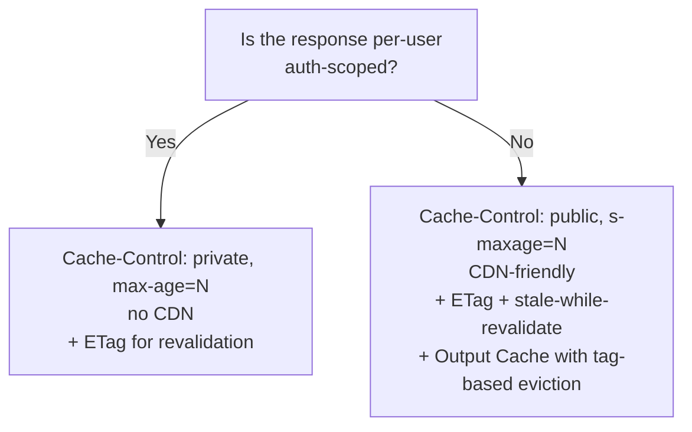
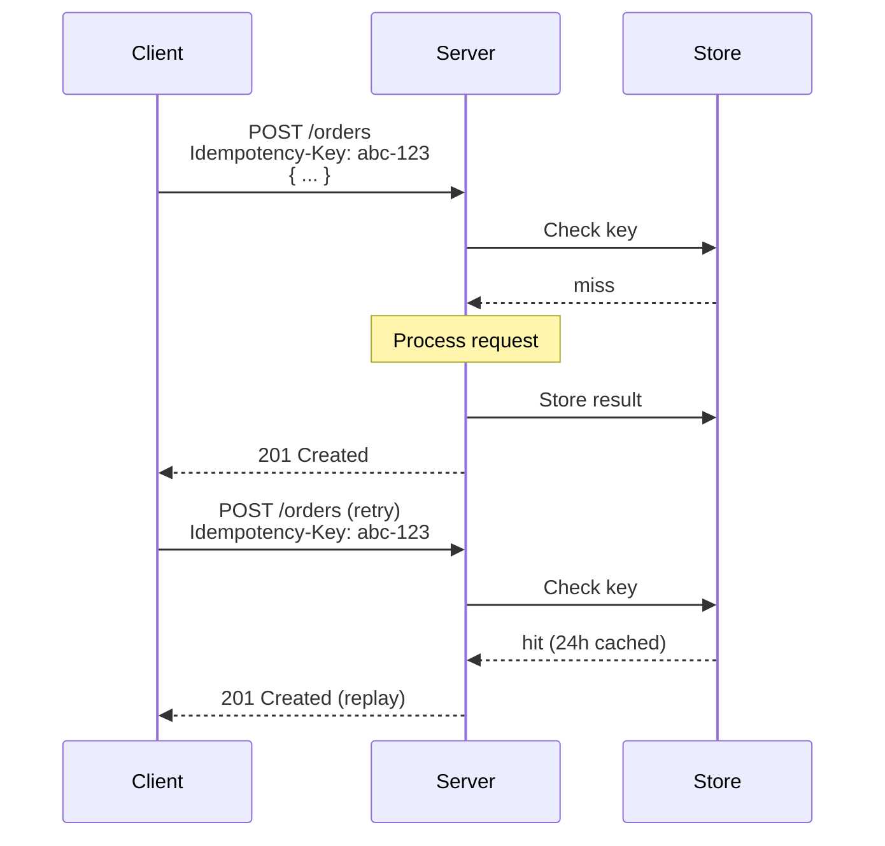
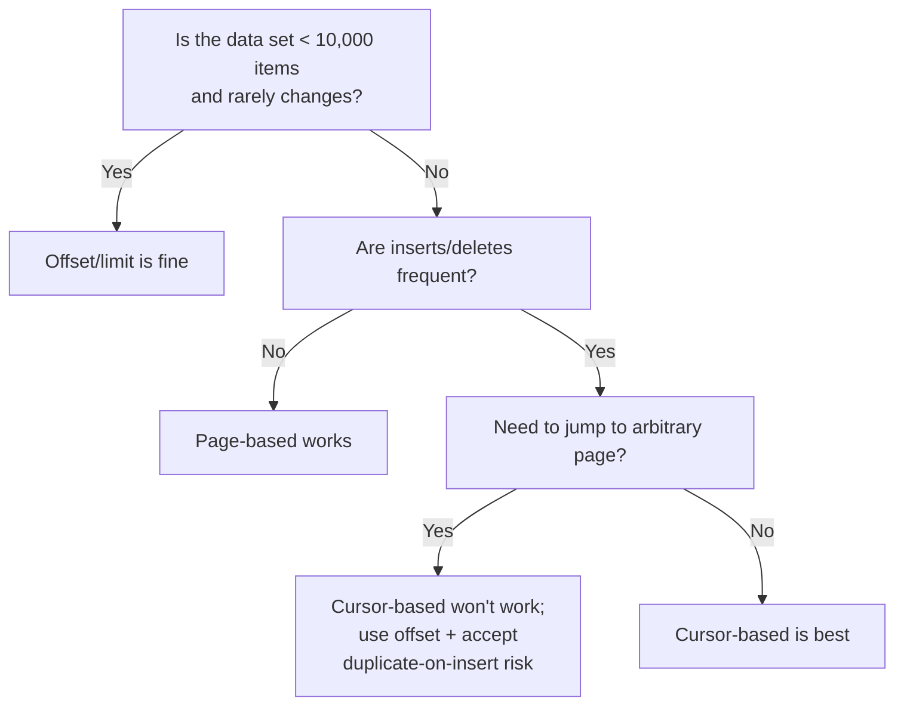

# API Design Principles

> [Mastery Guide](../README.md) › [API Development](./README.md)

| Status | Priority | Phase | Last reviewed |
|---|---|---|---|
| Not Started | High | Phase 4 — Auth & API Security | 2026-05-08 |

## Contents
- [Why it matters](#why-it-matters)
- [Core concepts](#core-concepts)
  - [1. Statelessness](#1-statelessness)
  - [2. Caching](#2-caching)
  - [3. Versioning](#3-versioning)
  - [4. Idempotency](#4-idempotency)
  - [5. Pagination](#5-pagination)
  - [6. Error handling](#6-error-handling)
  - [7. Resource-based URIs](#7-resource-based-uris)
  - [8. Mandatory conditional writes](#8-mandatory-conditional-writes)
  - [9. Hardening the idempotency key](#9-hardening-the-idempotency-key)
  - [10. Cursors are signed tokens, not offsets](#10-cursors-are-signed-tokens-not-offsets)
  - [11. Payload conventions on the wire](#11-payload-conventions-on-the-wire)
  - [12. Absent, null, and empty](#12-absent-null-and-empty-are-three-states-not-one)
- [Code & diagrams](#code--diagrams)
- [Common pitfalls](#common-pitfalls)
- [Interview-ready summary](#interview-ready-summary)
- [Interview Cross-Questioning Drill](#interview-cross-questioning-drill)
- [Cheat Sheet](#cheat-sheet)
- [Walkthrough](#walkthrough--stale-cdn-responses-after-a-write)
- [Self-test](#self-test)
- [Cross-references](#cross-references)
- [Sources](#sources)

---

## Why it matters

API design is the contract between your service and every consumer that will ever exist. Bad design is forever — once a third-party app depends on `POST /createOrder` returning `{success: true, id: 42}`, you cannot change that response shape without breaking them. Good design — statelessness, predictable URIs, semantic verbs and status codes, clean error formats — buys you years of evolution without breaking changes.

Why interviewers ask: design questions surface judgment that code-syntax questions can't. "Design Twitter's tweet API" reveals whether you think about pagination shape, idempotency for retry-safe POSTs, error format consistency, and versioning strategy. The seven principles below are the checklist a senior reaches for instinctively.

When NOT to optimize: an internal-only API with one client doesn't need elaborate versioning or hypermedia. The principles scale with stakes — apply more rigor as the audience widens.

## Core concepts

### 1. Statelessness

**Definition:** Each request contains all the information needed to process it. The server keeps no client-specific session state between requests.

This is REST's most under-appreciated tenet. Statelessness is what enables horizontal scaling — any server can handle any request because there's no "session affinity" to preserve. It's why you can put a load balancer in front of 100 instances and they're interchangeable.

The token (JWT, session cookie that maps to a stateless lookup) carries identity. Headers carry preferences (`Accept-Language`, `Content-Type`). Body or query string carries the operation. The server doesn't need to remember "this user was looking at page 3 of orders" — that's the client's job.

```csharp
// ❌ Stateful: server tracks "current page" per user
[HttpGet("/orders/next")]
public IActionResult Next() => Ok(_session.GetNextPage());  // requires sticky sessions

// ✅ Stateless: client tracks page; server is interchangeable
[HttpGet("/orders")]
public IActionResult Get(int page = 1, int pageSize = 50) => Ok(_repo.GetPage(page, pageSize));
```

> 🌍 **In the real world**: statelessness is rarely broken deliberately. Someone parks a half-finished checkout in in-process memory, the load balancer's affinity cookie hides it because every request from that browser keeps landing on the same instance, and it works for months. Then a rolling deploy drains that instance and everyone mid-checkout is back to an empty basket — during a deploy, which is exactly when a dip in conversions gets attributed to the deploy rather than investigated. The affinity cookie was never the fix for that; it is the thing that let it ship.

### 2. Caching

**Definition:** responses declare whether/how they may be cached so clients, intermediaries (CDNs, proxies), and the server itself can skip work. Done well, caching is the single biggest perf and cost lever in an HTTP API. Done poorly, it's the source of "stale data" bugs and "why are we serving this to users in another country."

HTTP has a layered caching model standardized by **RFC 9111 (HTTP Caching)**. Three orthogonal concerns: **what to cache** (`Cache-Control`), **how to revalidate** (`ETag` / `Last-Modified`), and **how to invalidate**.

#### `Cache-Control` directives

The directive vocabulary you'll use 95% of the time:

| Directive | Effect |
|---|---|
| `public` | Any cache (browser, CDN, proxy) may store |
| `private` | Only the user's browser; CDNs and shared proxies must not store |
| `no-cache` | Cache may store, but **must revalidate** (with `ETag`) before reusing |
| `no-store` | Never store (sensitive: tokens, PII responses) |
| `max-age=N` | Fresh for N seconds in any cache |
| `s-maxage=N` | Fresh for N seconds in **shared** caches (CDN); overrides `max-age` for them |
| `must-revalidate` | After expiry, cache must revalidate before serving stale |
| `stale-while-revalidate=N` | After expiry, serve stale up to N seconds while revalidating in background — huge UX win for tail-latency endpoints |
| `stale-if-error=N` | Serve stale up to N seconds if origin returns 5xx — resilience pattern |
| `immutable` | Response body is byte-identical for life of `max-age` (versioned URLs) |

```
Cache-Control: public, max-age=60, s-maxage=3600, stale-while-revalidate=86400
                                                  ↑ serve stale for 24h while refreshing
```

This combination = "browsers cache 1 minute; CDN caches 1 hour; if it goes stale, keep serving stale up to a day in the background while we refresh." Standard pattern for content APIs.

#### `Vary` header

Tells caches "the response depends on these request headers." Without `Vary`, a cache might serve a French response to an English client because the URL matched.

```
Vary: Accept, Accept-Encoding, Accept-Language, Authorization
```

`Vary: Authorization` is the per-user split — necessary for any endpoint where two users would get different responses.

> 🌍 **In the real world**: a catalogue endpoint returns localised product copy and is marked `public, max-age=300`, but nobody adds `Accept-Language` to `Vary`. Whichever request arrives first after each expiry decides the language everyone else sees until the entry goes stale, so the reports come in as "the site is randomly in German" and cannot be reproduced on a developer machine, which never shares a cache with anybody. Nothing in the stack is malfunctioning. The cache key simply did not include the one header the response depended on.

#### Validation: `ETag` + `If-None-Match`

The **revalidation** flow. The client has a cached copy with an ETag; sends it back; server says "still fresh" (304) or "here's a new version" (200).

```
Request 1:
  GET /orders/42
  → 200 OK
    ETag: "v17-abc"
    body: {...}

Request 2 (later):
  GET /orders/42
  If-None-Match: "v17-abc"
  → 304 Not Modified                 ← no body; client reuses cached copy
```

**Strong vs weak ETags**:
- **Strong** (`"abc"`) — bytes match exactly. Use for static or precisely-versioned resources.
- **Weak** (`W/"abc"`) — semantically equivalent but bytes may differ (e.g., whitespace). Use when `Equals` matters, not `Equal-bytes`.

ETag generation strategies:
- **Version field** — `ETag: "v17"` from your aggregate's version/rowversion. Best.
- **Hash** — `ETag: SHA-256(body)`. Simple but pays the hash cost.
- **Last-modified timestamp** — coarser; multiple updates within one second collide.

#### Time-based: `Last-Modified` + `If-Modified-Since`

Older mechanism. Use when the resource has a clear "modified at" timestamp and second-level granularity is enough.

```
Response: Last-Modified: Wed, 07 May 2026 10:00:00 GMT
Request:  If-Modified-Since: Wed, 07 May 2026 10:00:00 GMT
Server:   compare; return 304 if unchanged.
```

Modern preference: ETag is more precise and easier to generate from a row version. Use Last-Modified when the resource is genuinely time-sourced (file modification, log entries).

#### Conditional writes: `If-Match` for optimistic concurrency

ETags also enforce **optimistic concurrency** on writes. Client sends "update if your version is still X."

```
Client:
  PUT /orders/42
  If-Match: "v17-abc"
  body: {updated...}

Server:
  - If current ETag == "v17-abc" → process update; return new ETag.
  - If current ETag changed → 412 Precondition Failed (someone else updated; client must re-fetch + retry).
  - If no If-Match sent at all → 428 Precondition Required (RFC 6585); otherwise the
    client silently gets last-write-wins, which is the bug this whole section prevents.
```

This is the HTTP-layer expression of the optimistic-concurrency pattern that maps directly to EF Core's `[ConcurrencyCheck]` / `RowVersion` (see [EF Core deep dive](../01-foundations/01-net-core-deep-dive/05-data-access.md)).

```csharp
[HttpPut("{id}")]
public async Task<IActionResult> Update(int id, [FromBody] UpdateOrderDto dto)
{
    var order = await _repo.GetAsync(id);
    if (order == null) return NotFound();

    // RowVersion is a byte[] — Convert.ToBase64String, not a .ToBase64() method
    var currentEtag = new EntityTagHeaderValue($"\"{Convert.ToBase64String(order.RowVersion)}\"");

    // IfMatch is a list: it can hold several tags, or the wildcard `*`
    var ifMatch = Request.GetTypedHeaders().IfMatch;
    if (ifMatch.Count == 0)
        return StatusCode(428);  // Precondition Required — refuse the blind write

    var satisfied = ifMatch.Any(tag =>
        tag.Equals(EntityTagHeaderValue.Any) ||           // `*` = any current representation
        tag.Compare(currentEtag, useStrongComparison: true));  // If-Match requires strong comparison
    if (!satisfied)
        return StatusCode(412);  // Precondition Failed

    order.Apply(dto);
    await _repo.SaveAsync(order);

    Response.Headers.ETag = $"\"{Convert.ToBase64String(order.RowVersion)}\"";
    return NoContent();
}
```

**412 vs 409 for concurrency conflicts**: 412 says "your precondition failed"; 409 says "your update conflicts with current state." Both seen in the wild; 412 is more semantically correct when triggered by `If-Match`.

> 🌍 **In the real world**: a team switches on `If-Match` for a settings screen and support starts reporting that the first save works and every save after it returns 412 until the page is reloaded. The server is behaving correctly. The client read the `ETag` once when the page loaded and threw away the new one its own successful `PUT` handed back, so every later attempt is presenting the version from before its own edit. The `ETag` on a write response is part of the contract rather than a courtesy: any client holding a local copy has to refresh its validator from every write it makes.

#### ASP.NET Core caching layers

Four mechanisms; pick by where caching should happen:

| Mechanism | Where it lives | When |
|---|---|---|
| `[ResponseCache]` attribute | Response headers only — the **client/CDN** cache directives | Set `Cache-Control` declaratively |
| `app.UseResponseCaching()` | Middleware that **stores responses on the server** based on response headers | Single-instance server-side cache |
| `app.UseOutputCache()` (.NET 7+) | Middleware with **explicit policy + tags + eviction** | The modern recommendation for server-side caching |
| `IDistributedCache` | Pluggable distributed cache (Redis, SQL Server, etc.) | Multi-instance shared state |

**Output Caching (.NET 7+)** is the workhorse for new code:

```csharp
// Program.cs
builder.Services.AddOutputCache(options =>
{
    options.AddPolicy("Orders", b => b.Tag("orders").Expire(TimeSpan.FromMinutes(5)));
    options.AddPolicy("OrdersByLocale", b => b
        .Tag("orders")
        .SetVaryByQuery("page", "size")
        .SetVaryByHeader("Accept-Language")
        .Expire(TimeSpan.FromMinutes(1)));
});
app.UseOutputCache();

// Controller / endpoint
[HttpGet]
[OutputCache(PolicyName = "Orders")]
public async Task<IActionResult> List() => Ok(await _svc.ListAsync());

// Eviction on writes
[HttpPost]
public async Task<IActionResult> Create([FromBody] OrderDto dto, IOutputCacheStore cache, CancellationToken ct)
{
    var order = await _svc.CreateAsync(dto);
    await cache.EvictByTagAsync("orders", ct);   // bust the tag
    return CreatedAtAction(nameof(Get), new { id = order.Id }, order);
}
```

**Why Output Cache over Response Caching middleware**:
- Tag-based eviction (`EvictByTagAsync`) — surgical invalidation on writes.
- Configurable backing store (memory by default; pluggable via `IOutputCacheStore` for Redis/SQL).
- Per-policy `VaryByQuery` / `VaryByHeader` / `VaryByValue` — fine-grained cache keys.
- Lock-free coordination — under load, only one request computes; concurrent waiters share the result.

**Anonymous-only by default**: the built-in default policy refuses to cache a request that carries an `Authorization` header or an authenticated user, and refuses responses that set cookies. So a policy of `SetVaryByHeader("Authorization")` bolted onto the default doesn't give you a per-user cache — it silently caches nothing. Per-user output caching needs a custom `IOutputCachePolicy` that overrides that decision, and then the cache key becomes yours to get right.

For Redis-backed Output Cache (multi-instance):

```csharp
builder.Services.AddStackExchangeRedisOutputCache(options =>
{
    options.Configuration = builder.Configuration.GetConnectionString("Redis");
    options.InstanceName = "MyApp:";
});
```

> 🌍 **In the real world**: an endpoint that assembles a user's dashboard is slow, so someone adds `[OutputCache]` with a policy that varies by `Authorization`, and the change ships. Latency does not move. There is no exception, no warning and no failed request to look at — the default policy declines to cache a request that arrives authenticated, so every single call is a miss and the feature is a no-op that looks configured. Cache hit-rate is the metric that would have caught it on day one, which is the argument for graphing it before you think you need it.

#### Cache invalidation patterns

The hard problem. Three patterns, in order of preference:

1. **Tag-based eviction** — `cache.EvictByTagAsync("orders", ct)` on writes. Surgical, simple to reason about. **Use this when possible.**
2. **TTL with `stale-while-revalidate`** — accept eventual consistency; serve stale briefly while refreshing. Best for read-heavy content where slight staleness is OK.
3. **Versioned URIs** — `/v17/orders/42`. The bump-the-version cache-bust. Most common with static assets (JS/CSS); rare for APIs.

**Anti-pattern**: writing through to evict on every conceivable cache key. The cache becomes a coordination headache; Murphy's law says you'll miss one.

#### CDN integration

When the API is behind a CDN (Azure Front Door, CloudFront, Cloudflare, Fastly):

- **`Cache-Control: public`** is required for CDN caching. `private` skips the CDN.
- **`s-maxage`** separates CDN TTL from browser TTL: `Cache-Control: max-age=60, s-maxage=3600` = 1 min in browser, 1 hour at CDN.
- **`Surrogate-Control`** (Fastly, Akamai) = CDN-only directives that browsers ignore. Good for "cache 1 day at CDN, never in browser": `Cache-Control: no-store` + `Surrogate-Control: max-age=86400`.
- **CDN purge APIs** for cache invalidation on writes — most CDNs support tag/path purge.
- **Cache key rules** — be explicit about which headers contribute. CDN configs often default to ignoring `Authorization`, which means user-specific responses get shared. Test.

#### Quick decision tree



For most APIs: server-side Output Cache + ETag for clients + CDN with `s-maxage` is the production-grade setup.

### 3. Versioning

**Definition:** Provide a stable contract per version; allow new versions to evolve without breaking existing clients.

Four common strategies — covered in detail in [API Versioning](./05-api-versioning.md):
- **URI path:** `/v2/orders`
- **Header:** `X-API-Version: 2` or `Accept: application/vnd.myapi.v2+json`
- **Query string:** `/orders?api-version=2`
- **Content negotiation:** via the `Accept` header's vendor prefix

The principle: **never silently break a v1 contract**. Add v2 when the change is breaking. Deprecate v1 with a sunset date communicated in headers (`Sunset: Sat, 31 Dec 2026 23:59:59 GMT`).

> 🌍 **In the real world**: versioning stops being an abstraction the moment a mobile app is one of your clients. An installed app updates when the user allows it, and some never do, so v1 lives as long as the oldest handset still talking to you — long after the last person who wrote any of it has left the team. That is why publishing the `Sunset` date is the easy half and the reporting is the hard half: unless you can break the traffic still hitting v1 down by client and by version, the date arrives, the graph is not at zero, nobody can say whose integration would break, and the shutdown slips again.

### 4. Idempotency

**Definition:** Calling an operation N times has the same observable effect as calling it once.

GET, PUT, DELETE are idempotent by HTTP spec. POST is *not*. PATCH depends.

For non-idempotent operations (typically `POST /orders`), use the **Idempotency-Key** header pattern:

```csharp
[HttpPost]
public async Task<IActionResult> Create(
    CreateOrderRequest req,
    [FromHeader(Name = "Idempotency-Key")] Guid? idempotencyKey)
{
    if (idempotencyKey is { } key)
    {
        var existing = await _idempotencyStore.GetAsync(key);
        if (existing != null) return existing;  // replay original response
    }

    var order = await _svc.CreateAsync(req);
    var response = Created($"/orders/{order.Id}", order);

    if (idempotencyKey is { } k)
        await _idempotencyStore.SaveAsync(k, response, TimeSpan.FromHours(24));

    return response;
}
```

This makes retries safe — flaky network, lost responses, or client crashes can replay the request without duplicating side effects.

> 🌍 **In the real world**: the scenario this is built for is a customer tapping Pay as the train enters a tunnel. The charge is authorised and the order is written; the 201 never reaches the phone. The customer sees a spinner, then an error, and taps again — and from the server's side that second request is indistinguishable from somebody genuinely placing a second identical order, because it is the same body from the same account moments apart. The `Idempotency-Key` is the only thing in the whole exchange that says "this is the same attempt, not a new intent".

### 5. Pagination

**Definition:** Large collections must paginate; clients must know how to fetch the next page.

Three strategies:

**Offset/limit** — simplest, but breaks under concurrent insertions:
```
GET /orders?offset=100&limit=50     → items 100–149

❌ Issue: if 10 new orders arrive between page 1 and page 2,
   you'll see duplicates from page 1 in page 2.
```

**Page-based** — same trade-offs as offset/limit:
```
GET /orders?page=3&pageSize=50      → page 3 of 50-item pages
```

**Cursor-based (recommended for high-volume / changing data)**:
```
GET /orders?limit=50               → items + cursor: "eyJpZCI6MTAwfQ"
GET /orders?limit=50&cursor=eyJpZCI6MTAwfQ   → next 50 items
```

The cursor encodes the position deterministically (e.g., last item's ID + sort key). Stable across inserts. Used by Twitter, Stripe, GitHub.

```csharp
public record PageResult<T>(IReadOnlyList<T> Items, string? NextCursor);

[HttpGet]
public async Task<PageResult<Order>> List(string? cursor, int limit = 50)
{
    limit = Math.Clamp(limit, 1, 200);  // never trust client

    var query = _db.Orders.OrderByDescending(o => o.Id);
    if (cursor != null)
    {
        var lastId = DecodeCursor(cursor);
        query = query.Where(o => o.Id < lastId);
    }

    var items = await query.Take(limit + 1).ToListAsync();
    var hasMore = items.Count > limit;
    var page = items.Take(limit).ToList();

    return new PageResult<Order>(page, hasMore ? EncodeCursor(page.Last().Id) : null);
}
```

Always return the page metadata (next cursor or `total + page`) — clients can't paginate blindly.

> 🌍 **In the real world**: the offset defect rarely announces itself in a UI, where a row appearing twice looks like a rendering glitch and gets closed as unreproducible. It announces itself in an export. A nightly job walks `/orders?offset=…&limit=500` newest-first to build a finance file; orders keep arriving while it walks, each new one pushes the whole list down by a row, and rows already written to the file come round again and get written a second time. The job succeeds, the file parses, and the defect surfaces as a revenue total that is too high by an amount nobody can attribute to a transaction.

### 6. Error handling

**Definition:** Errors must be machine-readable, consistent across the API, and informative without leaking internals.

The standard is **RFC 9457 — Problem Details for HTTP APIs**, which obsoleted RFC 7807 in 2023 (covered in the deep-dive's [Exception Handling](../01-foundations/01-net-core-deep-dive/13-exception-handling.md)). Same five members as 7807, plus an IANA problem-type registry and explicit guidance on extension members:

```json
{
  "type": "https://api.example.com/errors/order-not-found",
  "title": "Order not found",
  "status": 404,
  "detail": "Order with ID 42 does not exist.",
  "instance": "/orders/42"
}
```

ASP.NET Core has built-in support:

```csharp
builder.Services.AddProblemDetails();
app.UseExceptionHandler();
app.UseStatusCodePages();

// In a controller
return Problem(
    detail: "Order with ID 42 does not exist.",
    statusCode: StatusCodes.Status404NotFound,
    title: "Order not found");
```

Validation errors: `ValidationProblemDetails` extends Problem Details with a `errors` dict mapping field names to error messages.

Critical rules:
- **One error format across the entire API.** Mixing `{error: "..."}`, `{message: "..."}`, and `ProblemDetails` makes clients miserable.
- **Don't leak stack traces in production.** `IsDevelopment()` only.
- **Don't return 200 with `{success: false}`.** That defeats every retry middleware. Use the right status code.

> 🌍 **In the real world**: the reason "200 with `{success: false}`" earns its own rule is what it does to everything watching. The availability panel is computed from status codes, so it reads clean. The retry policy in the client SDK sees a success and does not retry. The alert that fires on 5xx rate never fires. Orders can fail all evening with every dashboard in the building green, and the first person to notice is a customer — which costs a team its trust in its own monitoring long after the endpoint is fixed.

### 7. Resource-based URIs

**Definition:** URIs identify resources (nouns), not actions (verbs).

```
❌ Action-based:                  ✅ Resource-based:
POST /createOrder                  POST /orders
POST /cancelOrder?id=42            POST /orders/42/cancel
GET /getOrderById?id=42            GET /orders/42
GET /listOrders                    GET /orders
POST /addItemToOrder               POST /orders/42/items
```

Conventions that pay off:
- **Plurals:** `/orders` not `/order`. Consistency > pedantry.
- **Hierarchy:** `/orders/42/items/7` for nested resources.
- **Lowercase, hyphens not underscores:** `/customer-addresses` not `/customer_addresses` or `/CustomerAddresses`.
- **No file extensions:** `/orders/42` not `/orders/42.json`. Use `Accept` header for format negotiation.
- **Sub-actions for state transitions:** `POST /orders/42/cancel` is the pragmatic exception — better than `PATCH /orders/42 {status: "Cancelled"}` because cancellation often has side effects (refund, email).

> 🌍 **In the real world**: verbs in the path do not merely read badly, they take the infrastructure out of the game. A gateway rate-limit rule written for `/orders/*` does not match `/getOrders`, `/searchOrders`, or the `/exportOrders` endpoint somebody adds next quarter — so the most expensive one is the one nobody remembered to protect. And a read shipped as `POST /searchOrders` gives up edge caching, which keys off the method, along with any proxy rule that routes GET traffic to read replicas. The method and the path are the only things those layers have to go on, and an action-shaped URI throws both away.

### 8. Mandatory conditional writes

**Definition:** the server refuses a write that carries no precondition, instead of silently accepting last-write-wins.

Section 2 showed `ETag` and `If-Match` being used to make an update conditional. What it did not settle is whether the client is *allowed* to skip the condition. That is a design decision, and on anything with a shared editing surface the answer should be no.

The failure this prevents has no error message, which is why it survives so long in production. Two support agents open order 42 in an admin tool at roughly the same time. The first changes the shipping address and saves. Ninety seconds later the second changes the price and saves — but the object their browser is posting was loaded before the address change, so the address quietly reverts. Both writes returned 204. The audit log shows two successes. The parcel goes to the wrong street, and the only signal anyone gets is the complaint.

RFC 6585 §3 exists for exactly this. It defines **428 Precondition Required**, whose definition is that "the origin server requires the request to be conditional", and whose stated typical use is to avoid the lost update problem — a client GETs a resource's state, modifies it, and PUTs it back, while meanwhile a third party has modified the state on the server. Two rules come with the code, and they are not the same strength: a 428 response **SHOULD** explain how to resubmit the request successfully — which a Problem Details body naming `If-Match` does neatly — and it **MUST NOT** be stored by a cache. So a write endpoint on shared data has a three-way rule: no `If-Match` at all is **428**; an `If-Match` that no longer matches is **412**; a match proceeds and returns the new `ETag`.

The mirror image of that is creation. `If-Match` asks "only if the current version is this one". `If-None-Match: *` asks "only if there is nothing here at all". RFC 9110 §13.1.2 states it as a condition: when the field value is `*`, "the condition is false if the origin server has a current representation for the target resource". The spec's stated use is "to prevent an unsafe request method (e.g., PUT) from inadvertently modifying an existing representation of the target resource when the client believes that the resource does not have a current representation" — which it calls a variation on the lost update problem that arises when more than one client tries to create the initial representation. So if the resource already exists the condition is false, the origin server must not perform the method, and it must answer 412 for any method other than GET or HEAD. That turns a client-chosen-identifier PUT into a safe create — the client generates the id, retries as often as the network makes it, and the second attempt gets a 412 instead of a second order. It is the same guarantee an `Idempotency-Key` buys, obtained from the protocol rather than from a side table, and it is available whenever the client can choose the identifier.

One detail interviewers reach for, because you only know it if you have read the spec: the two headers compare differently. RFC 9110 §13.1.1 requires an origin server to use the **strong** comparison function for `If-Match`; §13.1.2 requires a recipient — cache or origin server — to use the **weak** comparison function for `If-None-Match`. The asymmetry is deliberate. `If-Match` guards a write, so "semantically equivalent but not byte-identical" is not a good enough basis on which to overwrite someone else's data. `If-None-Match` mostly guards a cached read, where semantic equivalence is precisely what you want — which is why a weak validator like `W/"v17"` still earns a 304.

ASP.NET Core exposes both through the same typed-header surface the `If-Match` sample used: `Request.GetTypedHeaders()` returns a `RequestHeaders` carrying both an `IfMatch` and an `IfNoneMatch` property, each a list of `EntityTagHeaderValue`, with `EntityTagHeaderValue.Any` standing for `*`.

```csharp
// PUT /orders/{id} where the client chooses the id — create only if absent
var ifNoneMatch = Request.GetTypedHeaders().IfNoneMatch;
if (ifNoneMatch.Any(tag => tag.Equals(EntityTagHeaderValue.Any)) && await _repo.ExistsAsync(id))
    return StatusCode(412);   // RFC 9110 §13.1.2 — something is already there; don't create a duplicate
```

> 🌍 **In the real world**: the deploy that starts returning 428 is how a team finds out how many of its clients were writing blind — and the first one on the list is usually its own nightly batch job, which was never taught to read an `ETag`. That is the argument for rolling this out per route, with a warning-only period that logs the missing precondition before it starts rejecting, rather than flipping it for the whole API in one release.

### 9. Hardening the idempotency key

**Definition:** the replay store has to answer three questions, not one — is this key known, is it the *same* request, and whose key is it?

Section 4 gives the shape: store key to response, replay on a repeat. Drill 3 handles the two-requests-at-once race. Two more failure modes separate a working implementation from a demo, and both arrive as follow-up questions.

**The same key with a different body.** A client generates a key, sends the order, and the connection times out. The user, seeing no confirmation, edits the quantity and submits again — and the client, doing exactly what it was told, reuses the key. A naive store finds the key and replays the original response, so the API returns a cheerful 201 for an order that does not match what was just submitted, and nobody learns about it until reconciliation. The fix is to store a fingerprint of the request alongside the key on first use and compare it on every replay. The IETF httpapi working group's Internet-Draft *The Idempotency-Key HTTP Header Field* (`draft-ietf-httpapi-idempotency-key-header`) calls this an **idempotency fingerprint** and lists several acceptable ways to compute one — a checksum of the whole payload, a checksum of selected elements, or a request digest or signature — deliberately without mandating an algorithm. Its status codes are worth memorising because they are not the ones people guess: the draft says a key reused with a *different* payload SHOULD get **422**, and a request retried while the original is *still being processed* SHOULD get **409 Conflict**. It is an Internet-Draft, not an RFC — and its latest revision (-07, October 2025) has since expired without being published as one — so say "draft" when you cite it and expect to be asked what the difference is.

Stripe's documented behaviour is the concrete instance of the same rule: its idempotency layer "compares incoming parameters to those of the original request and errors if they're not the same to prevent accidental misuse". Three further details from that same page are the ones candidates get wrong. Stripe saves the status code and body of the first request for a given key "regardless of whether it succeeds or fails" — so a replay hands back the original 500 too, which is correct and surprises people. Results are only saved once execution of the endpoint has begun, so a request rejected at validation leaves no record and can simply be retried. And keys may be removed once they are at least 24 hours old, with a key reused after pruning treated as a brand-new request — meaning the retry window is a property of your store's retention, not of the key.

**Scope.** A key is only as unique as the namespace you file it under. Store it under the raw header value alone and two things go wrong. A client that generates one UUID and reuses it across endpoints gets a replayed response belonging to a different operation. Worse, the stored response body belongs to whoever created that key first, so a caller who submits somebody else's key is handed somebody else's data. The store key should be a composite of the authenticated principal or account, the route, and the client's key — which is also why Stripe's guidance is to avoid using anything sensitive, such as an email address, as the key value itself.

```csharp
// What you store on first use — not just key → response
public record IdempotencyRecord(
    string Account,        // scope: whose key this is
    string Route,          // scope: which operation it was issued against
    string Key,            // the client's Idempotency-Key header value
    string Fingerprint,    // hash of the canonical request body
    bool   InFlight,       // still executing → a second arrival gets 409
    int    StatusCode,     // replayed verbatim, success or failure
    string Body,
    DateTimeOffset ExpiresAt);
```

On a hit whose `Fingerprint` differs from the incoming request's, return 422 instead of replaying. On a hit still marked `InFlight`, return 409. Only on a hit that matches on both counts do you replay the stored status and body.

> 🌍 **In the real world**: a payments team ships idempotency keys, watches duplicate charges go to zero, and considers the work finished. Months later a mobile release changes the retry logic to generate a fresh key on each attempt. Every key is unique, every retry is a first-use, duplicates come back — and nothing errors anywhere, because the store is working perfectly and simply never sees a repeat. The key belongs to the logical operation, not to the HTTP attempt, and the server-side metric worth alerting on is the ratio of replays to first-uses: when replays fall off a cliff, a client has stopped retrying correctly.

### 10. Cursors are signed tokens, not offsets

**Definition:** a cursor is server-issued state handed to an untrusted party and handed back — so it needs the same treatment as any other such token.

The cursor in section 5 is base64 over a record id. Base64 is a transport encoding, not a lock: anyone can decode it, change the number, and encode it again. That matters because of what the server does next — the paginated template in this chapter decodes the cursor straight into `query.Where(o => o.Id < DecodeCursor(cursor))`. The client is, in effect, writing part of your predicate.

Three properties make that safe to expose.

**Integrity.** Sign the payload and verify the signature before the value reaches a query. Compute an HMAC over the payload bytes with a server-side key, append it to the token, and on the way back in recompute and compare. In .NET that is `HMACSHA256.HashData(key, payload)`, a static method so there is no `HMAC` instance to allocate or dispose, and the comparison must be `CryptographicOperations.FixedTimeEquals` rather than an ordinary sequence comparison — because an ordinary comparison returns as soon as two bytes differ, and that difference in timing tells an attacker how much of a forged tag was correct. Encode the result with `System.Buffers.Text.Base64Url`, added in .NET 9 and available for older targets through the `Microsoft.Bcl.Memory` package, so the token survives a query string without percent-encoding. If you would rather not manage a key yourself, ASP.NET Core's data protection stack does encryption and tamper-proofing together: `IDataProtectionProvider.CreateProtector("<purpose>")` returns an `IDataProtector` whose `Protect` and `Unprotect` work on strings as well as byte arrays, throw `CryptographicException` on a tampered or foreign payload, and — because the purpose string isolates protectors — will not accept a token minted for a different purpose. The cost is operational: every instance that has to read a cursor must share the same data-protection key ring, so a multi-instance deployment has to persist that ring somewhere shared.

**Binding.** Signing stops forgery; it does not stop replay in the wrong context. A cursor issued for `GET /orders?status=open` is a position in *that* result set. Nothing stops a client sending it back alongside `?status=cancelled`, and the template in this file shows exactly why nothing catches it: the filter and the cursor are applied as two independent `Where` clauses that know nothing about each other. What comes back is neither a correct continuation of the first query nor a correct first page of the second, and no error is raised. The fix is to put the sort key and a hash of the filter set inside the signed payload and reject the request — 400, with a Problem Details body — when they do not match the query that just arrived. That is also what makes "the cursor is opaque" a real promise instead of a slogan: if the client cannot influence what is inside it, you stay free to change what is inside it.

**A version marker.** Put a format version at the front of the payload. The first time you add a field to the cursor — a secondary sort key, a tenant id — every cursor issued by the previous deployment is still sitting in somebody's client. Without a version marker the parser either throws or, worse, reads the old layout as though it were the new one. With it, the parser recognises version 1, handles or refuses it deliberately, and you get an explicit deprecation window instead of a silent corruption.

```csharp
// payload carries Version, SortKey, FilterHash, LastId
private string Encode(CursorPayload payload)
{
    var body  = JsonSerializer.SerializeToUtf8Bytes(payload);
    var tag   = HMACSHA256.HashData(_key, body);          // always 32 bytes for SHA-256
    var token = new byte[body.Length + tag.Length];
    body.CopyTo(token, 0);
    tag.CopyTo(token, body.Length);
    return Base64Url.EncodeToString(token);
}

private CursorPayload? Decode(string cursor)
{
    var raw = Base64Url.DecodeFromChars(cursor);
    if (raw.Length <= 32) return null;

    var body = raw.AsSpan(0, raw.Length - 32);
    var tag  = raw.AsSpan(raw.Length - 32);
    return CryptographicOperations.FixedTimeEquals(tag, HMACSHA256.HashData(_key, body))
        ? JsonSerializer.Deserialize<CursorPayload>(body)
        : null;                                            // tampered — 400, and never a query
}
```

> 🌍 **In the real world**: this is a standard penetration-test finding. The tester pages through a list, decodes the cursor, sees a plain record id, edits it and gets a response. Even when it turns out not to be exploitable — because a tenant filter elsewhere in the query saved you — the finding stands: a client-controlled value reached the data layer without validation. "It's base64" has never once been accepted as the answer.

### 11. Payload conventions on the wire

**Definition:** the JSON shape of individual values is part of the contract, and changing one later is a versioned migration.

URIs and status codes get the design attention, but the thing clients actually break on is the representation of the values inside the body. Four conventions, each cheap on day one and expensive afterwards.

**Timestamps.** Send an instant in a format that carries an unambiguous offset, and prefer `Z`. RFC 3339 is the profile of ISO 8601 the web uses for this, and its §5.6 grammar is what a log pipeline or an OpenAPI `date-time` format means by a timestamp. The failure is emitting local wall-clock time with no offset at all: the receiver has to guess a zone, and it will eventually guess wrong — a daylight-saving transition on one side of the wire and not the other is all it takes. In .NET this is precisely the difference between `DateTime` and `DateTimeOffset`. System.Text.Json reads and writes both according to the extended ISO 8601-1:2019 profile, and Microsoft's own documentation notes that at full date-and-time granularity that profile is compliant with RFC 3339 §5.6 — but a `DateTime` whose `Kind` is Unspecified serialises with no offset, as `"2019-07-26T00:00:00"`, which is the ambiguous form. `DateTimeOffset` always carries one. Three documented narrowings are worth knowing if you write a client against a .NET API: the profile requires an uppercase `T` and `Z`, refuses a space where the `T` should be, and although it accepts up to sixteen fractional-second digits it parses only the first seven.

There is one case an offset genuinely cannot express, and RFC 9557 (April 2024) is the answer to it. It *updates* RFC 3339 with the Internet Extended Date/Time Format, which appends a bracketed zone name — `1996-12-19T16:39:57-08:00[America/Los_Angeles]`. The distinction matters for anything scheduled in the future. A meeting booked for next March in London is not an instant; it is a wall-clock time in a zone, and the offset that will apply by then is a political decision that may not have been taken yet. Do not assume a given consumer parses the bracketed form — it is recent — but know that the correct shape for a future event is a local time plus a zone identifier, not an instant.

**Money.** Never a JSON floating-point number: binary64 cannot represent most decimal fractions exactly, and the rounding error is eventually discovered by a finance team rather than by you. Two shapes are defensible — an integer count of minor units with the currency code alongside it, or a decimal serialised as a string and parsed as a decimal at both ends. Minor units only work if the currency travels with the amount, because the exponent is not universally two: ISO 4217 records a minor-unit exponent per currency, and it is 0 for the Japanese yen and 3 for the Kuwaiti dinar. So `{"amount": 1999, "currency": "GBP"}` is £19.99 while `{"amount": 1999, "currency": "JPY"}` is ¥1999. Stripe takes this route and documents it explicitly: all API requests expect `amount` in the currency's minor unit — 1099 to charge 10.99 USD, 10 to charge 10 JPY. If you take the decimal-as-string route in .NET, `JsonNumberHandling.WriteAsString` writes numbers with quotes and `AllowReadingFromString` accepts them coming back, set per property or type with the `[JsonNumberHandling]` attribute or globally through `JsonSerializerOptions.NumberHandling`. Read Microsoft's caveat before you do: that behaviour "is not defined by the JSON specification", and altering the default number handling "can potentially produce JSON that cannot be parsed by other JSON implementations". It is a contract decision to document in your schema, not a switch to flip quietly.

**Large identifiers.** RFC 8259 §6 draws the line explicitly: because software implementing IEEE 754 binary64 is what is generally available, integers in the range `[-(2**53)+1, (2**53)-1]` "are interoperable in the sense that implementations will agree exactly on their numeric values". A 64-bit database identity or a snowflake-style id is outside that range, and a JavaScript client parsing one gets back a *different number* with no error whatsoever — two adjacent ids collapse onto the same value. Twitter hit this in public: its v1.1 API returned ID values in two forms, `id` as a number and `id_str` as a string, so that clients in environments which cannot represent every 64-bit integer exactly — JavaScript among them — had a lossless form to read; the v2 API returns ids as strings. The rule is simple. Any identifier that can exceed 2^53−1 goes on the wire as a string, from the first release — because turning a JSON number into a JSON string later is a field type change, which Drill 6 lists as breaking.

**Enums.** System.Text.Json writes enums as numbers by default, and the number is the C# ordinal. That is the worst of both worlds: the payload is unreadable in a log, and a colleague inserting a member into the middle of the enum silently renumbers your public contract without touching a line of API code. Serialise the names instead — `JsonStringEnumConverter`, or the generic `JsonStringEnumConverter<TEnum>` added in .NET 8, which is the only form supported under Native AOT — applied with `[JsonConverter]` on the enum or property, or by adding the converter to `JsonSerializerOptions.Converters`. From .NET 9, `[JsonStringEnumMemberName]` decouples the wire name from the C# member name, which is what you want when a member gets renamed and the wire value must not move. On the reading side, decide deliberately what an unknown value does: Drill 6 already flags that adding an enum member is only non-breaking if your clients tolerate values they have never seen, and that tolerance is a property of the deserialiser you shipped them.

```csharp
public sealed record OrderDto
{
    // string, not long — an int64 id can leave JSON's interoperable range (RFC 8259 §6)
    public string Id { get; init; } = "";

    // DateTimeOffset, not DateTime — always carries an offset
    public DateTimeOffset CreatedAt { get; init; }

    // minor units, plus the currency that tells you the exponent
    public long AmountMinorUnits { get; init; }
    public string Currency { get; init; } = "GBP";

    // the name on the wire, not the C# ordinal
    [JsonConverter(typeof(JsonStringEnumConverter<OrderStatus>))]
    public OrderStatus Status { get; init; }
}
```

> 🌍 **In the real world**: an integration goes live and one customer reports that a handful of orders "do not exist". The id shown in their UI ends in a different digit from the id in the API response. The API is emitting int64 ids as JSON numbers, the customer's browser client parses them as doubles, and every id past 2^53−1 lands on an even neighbour. Nothing throws; the ids are simply wrong. The fix is a breaking change to the response schema, which is the whole argument for getting this right in the first version rather than the second.

### 12. Absent, null, and empty are three states, not one

**Definition:** a member can be missing from the object, present with the value `null`, or present with an empty value — and a contract that does not say which it means will receive all three.

Section 11 covered how individual values are shaped. This is the question one level up: what it means for a member to be *there*. On a response the three states are mostly a nuisance — a client that treats a missing array and an empty array the same way is not wrong about much. On a write they are three different instructions, and the API that conflates them silently discards user input.

Partial updates are where it bites, because merge-patch semantics assign each state a distinct meaning: absent means leave it alone, `null` means remove it, and a value means replace it. That is RFC 7396, and it is the reason merge patch cannot set a member *to* null — the guide's [patch format coverage](./01-rest-and-web-api.md) works through the consequences and the `Content-Type` that selects between merge patch and RFC 6902 JSON Patch. What matters here is that those semantics only work if the three states survive the round trip on both ends. They usually do not.

**The serialiser erases the distinction by default, in both directions.** Writing, System.Text.Json's `JsonSerializerOptions.DefaultIgnoreCondition = JsonIgnoreCondition.WhenWritingNull` — or `[JsonIgnore(Condition = JsonIgnoreCondition.WhenWritingNull)]` on a single member — turns "present and null" into "absent" for every member it applies to. That is a wire-contract decision hiding in a serialiser setting. Reading, the problem is worse and there is no flag for it: deserialising `{}` and deserialising `{"tags": null}` into a `List<string>? Tags` property both leave `Tags` sitting at its CLR default, so the handler cannot tell "don't touch tags" from "clear tags". Modelling the member as a `JsonElement` keeps the distinction, because the property of an object that was never populated has `ValueKind` of `Undefined` while an explicit null deserialises to `JsonValueKind.Null`.

```csharp
public sealed class PatchOrderRequest
{
    // A List<string>? cannot distinguish {} from {"tags": null} — both arrive as null.
    // JsonElement can: an untouched property is Undefined.
    [JsonPropertyName("tags")]
    public JsonElement Tags { get; init; }
}

// In the handler
switch (req.Tags.ValueKind)
{
    case JsonValueKind.Undefined: break;                       // absent → leave alone
    case JsonValueKind.Null:      order.ClearTags(); break;    // explicit null → remove
    default:                      order.SetTags(req.Tags); break;
}
```

**Pick a convention for empty collections and hold it.** The workable default is to always emit the empty array rather than omitting the member or sending `null`: clients iterate without a presence check, and "absent" is then free to carry a real meaning of its own — the field was not requested, not computed, or not visible to this caller. What you cannot afford is emitting `[]` from one endpoint and omitting the member from another for the same logical field, because a client that got away with `response.tags.length` for a year will crash on the endpoint that finally omits it.

**Say it in the schema, because presence and nullability are separate keywords.** In JSON Schema, and therefore in OpenAPI, whether a member must be present is `required`, while whether it may hold `null` is part of its type — OpenAPI 3.0 spells that `nullable: true`, and 3.1 uses a JSON Schema type union that includes `"null"`. The four combinations are all legal and all mean different things, so a member can be required and nullable at once. Getting the two keywords right is what lets a generated client model the distinction instead of guessing at it — and moving a field between those states later is a compatibility event, which is where [API Versioning](./05-api-versioning.md) picks it up.

> 🌍 **In the real world**: a client library serialises its whole model back to the API on every save, and it was configured long ago with `WhenWritingNull` so the payloads would look tidy. Against a PUT endpoint that is harmless. Point the same client at a merge-patch endpoint and it becomes data loss in reverse: the fields the user just cleared are precisely the ones now holding null, so they are the ones dropped from the payload — and dropping them means "leave alone". The user clears a field, saves, watches the old value come back, and reports it as a caching bug, which is where the next three days go.

## Code & diagrams

<details>
<summary>🧩 Click to expand — code samples and diagrams</summary>

### Designing a paginated endpoint — full template

```csharp
[HttpGet]
[OutputCache(Duration = 60, VaryByQueryKeys = new[] { "cursor", "limit", "status" })]
public async Task<ActionResult<PageResult<OrderDto>>> List(
    string? cursor = null,
    int limit = 50,
    string? status = null,
    CancellationToken ct = default)
{
    limit = Math.Clamp(limit, 1, 200);

    var query = _db.Orders.AsNoTracking().OrderByDescending(o => o.Id);
    if (status != null) query = query.Where(o => o.Status == status);
    if (cursor != null) query = query.Where(o => o.Id < DecodeCursor(cursor));

    var raw = await query.Take(limit + 1).ToListAsync(ct);
    var hasMore = raw.Count > limit;

    return Ok(new PageResult<OrderDto>(
        raw.Take(limit).Select(MapToDto).ToList(),
        hasMore ? EncodeCursor(raw[limit - 1].Id) : null));
}
```

### Idempotency-Key implementation



### Decision tree: choosing pagination strategy



</details>

## Common pitfalls

1. **Returning 200 with success: false body.** Breaks every HTTP-aware client (retry middleware, monitoring tools). Use the right status code.
2. **Action verbs in URIs.** `/getOrders`, `/createUser`. URI is the noun; HTTP method is the verb.
3. **Inconsistent error formats.** Some endpoints return `{error}`, some `{message}`, some `ProblemDetails`. Pick one.
4. **No pagination on potentially-large collections.** "It works in dev with 50 rows" → "production has 5M rows" → outage.
5. **Offset pagination with concurrent writes.** Returns duplicates or skipped items. Use cursor-based when data churns.
6. **No idempotency-key support on non-idempotent operations.** Network retries cause duplicate orders, double charges.
7. **Client-controllable page size with no max.** `?limit=999999999` → server OOM. Always clamp.
8. **Leaking internals in error messages.** Stack traces, SQL fragments, internal IDs. Production responses must be sanitized.
9. **PATCH that's actually a full replace.** Confusing for clients. PATCH = partial. Use PUT for replace.
10. **No `Last-Modified` / `ETag` headers on cacheable responses.** Misses easy bandwidth and latency wins.
11. **Versioning by environment instead of by contract.** "Dev v2 differs from prod v1" — clients can't tell. Version the contract.
12. **Returning entities directly (no DTO).** Schema changes leak into API. DTOs decouple them.

## Interview-ready summary

- **Stateless** so any server can handle any request. Token in header, no server-side session.
- **Cacheable** via `Cache-Control` + `ETag`. Use `[OutputCache]` in ASP.NET Core 7+.
- **Versioned** with a clear, stable strategy (URI path is most common).
- **Idempotent** for GET/PUT/DELETE; use `Idempotency-Key` header for safe POST retries.
- **Paginated** with cursors for changing data, offset/page for static.
- **Error responses** in RFC 9457 Problem Details format (obsoletes RFC 7807), consistent across the API.
- **Resource URIs** — plural nouns, lowercase, hyphens, no verbs.

**Expected interview questions:**

1. *"What does 'stateless' mean for a REST API?"* — Each request self-contained; server holds no per-client session. Enables horizontal scaling and request-level retries.
2. *"How do you make a POST endpoint safe to retry?"* — Idempotency-Key header. Server stores key→response for 24h; replay on duplicate.
3. *"Compare offset vs cursor pagination."* — Offset simple but unstable under concurrent writes (duplicates/skips). Cursor stable, scales, but can't jump to arbitrary page.
4. *"Why use ETag instead of Last-Modified?"* — ETag is content-based (any change → new tag); Last-Modified has 1-second resolution and ignores semantically-relevant changes that don't update the timestamp.
5. *"Walk me through Problem Details (RFC 9457)."* — Standard JSON error shape: `type`, `title`, `status`, `detail`, `instance`. RFC 9457 obsoletes RFC 7807 — say 9457, and know it kept the same five members. Built into ASP.NET Core via `AddProblemDetails()`. Validation errors extend with `errors` map.
6. *"How do you handle a client requesting page size of 1 million?"* — Clamp server-side. `Math.Clamp(limit, 1, 200)`. Never trust client input.
7. *"What's the difference between PUT and PATCH?"* — PUT replaces the entire resource (idempotent). PATCH partially updates (idempotent for merge semantics, not for ops semantics).

## Interview Cross-Questioning Drill

<details>
<summary>📖 Click to expand — cross-question chains (~15-20 min, cover answers and write cold)</summary>

> **Honest caveat**: reading this section once doesn't make you interview-ready. Cover the answers, write them cold, then check. Pair with a senior for live mock cross-questioning. The guide removes "I never thought about that" surprises; mock interviews convert knowledge into reflex. Both are needed.

Each drill is **Q → A → Cross-Q → A → Cross-Q² → A**. Practice answering the cross-questions without re-reading. If you stumble on any cross-Q², go re-read the relevant section.

### Drill 1 — Richardson Maturity Model

> **Q**: Name the four levels of the Richardson Maturity Model.
>
> **A**: Level 0 — single URI, single verb (SOAP-over-HTTP, RPC-style POST to one endpoint). Level 1 — resource URIs (`/orders/42`, `/customers/7`) but still one verb. Level 2 — correct HTTP verbs (GET, POST, PUT, DELETE) + correct status codes. Level 3 — hypermedia (HATEOAS): responses include links to next legal actions.
>
> **Cross-Q**: Where do most production APIs sit on the model?
>
> **A**: Level 2. Resource URIs + correct verbs + correct status codes is the pragmatic ceiling. Level 3 (HATEOAS) is rare because clients are written by humans against documentation, not generic agents following links. The cost of `_links` payloads exceeds the benefit when every client has hard-coded the URLs anyway.
>
> **Cross-Q²**: Is "Level 2 only" still "REST" per Fielding's definition?
>
> **A**: No, strictly speaking. Fielding's PhD thesis defined REST as hypermedia-driven (HATEOAS is not optional in the original definition). The industry has redefined "REST API" to mean Level 2, and Fielding has written angry blog posts about the term being co-opted. For interview purposes: know the gap; in practice, "REST API" almost always means Level 2 HTTP API, and that's the pragmatic ceiling unless you're building a true evolving hypermedia API.

### Drill 2 — Pagination

> **Q**: Offset vs cursor vs keyset pagination — when each?
>
> **A**: Offset (`?offset=100&limit=50`): simple, works on small static sets; breaks under concurrent inserts (duplicates/skips), slow as offset grows (DB physically scans + skips). Cursor (`?cursor=abc&limit=50`): stable under inserts, fast (uses index range scan via `WHERE id < lastId`); can't jump to arbitrary page. Keyset (a variant of cursor using natural keys like `WHERE (created_at, id) < (last_created, last_id)`): cursor-equivalent at the SQL layer, exposes the key explicitly rather than encoding it.
>
> **Cross-Q**: Why does offset get slow with large offsets?
>
> **A**: SQL `OFFSET 1000000 LIMIT 50` requires the DB to *generate* the first 1,000,000 rows then discard them — there's no shortcut. As offset grows, query time grows linearly. Cursor pagination's `WHERE id > lastId` uses an index range scan: jump directly to position via B-tree, return next 50, done — constant time regardless of how deep into the result set. For any collection that might exceed 10,000 rows, cursor is the default; offset is fine only for small static lists where the user expects to see "page 5" UI.
>
> **Cross-Q²**: A junior wraps cursor pagination over an unstable sort (`ORDER BY updated_at DESC`). What goes wrong?
>
> **A**: Items can move between pages as their `updated_at` changes. User sees page 1, an item's `updated_at` updates and moves to the top, next page request misses it. The fix: cursor must encode a *stable*, *total order* — typically `(updated_at, id)` tuple so ties on `updated_at` are broken by `id`. The cursor encodes both: `WHERE (updated_at, id) < (last_updated, last_id)`. The unstable-sort bug is the most common cursor pagination mistake; teams discover it when QA reports "items disappear when scrolling fast."

### Drill 3 — Idempotency keys

> **Q**: A client sends `Idempotency-Key: abc-123` twice. What happens server-side?
>
> **A**: First request: server checks its idempotency store, key not found, processes the request, stores `{key: "abc-123", response: <serialized>, ttl: 24h}`, returns the response. Second request (retry): server checks store, finds the key, returns the *original* stored response without re-executing any side effects. The client gets the exact same response — same status code, same body, same headers (minus per-request things like timestamps).
>
> **Cross-Q**: What if two parallel requests with the same key hit at the same time?
>
> **A**: Race condition without locking. Two servers both check store, both find "not present," both process the request → duplicate side effects (the bug you were trying to prevent). The fix: insert-or-fail with a unique constraint on the key. First request inserts `{key, status: "processing", response: null}`; second tries to insert and hits unique violation — it waits (with timeout) for the first to complete, then reads the response. Or, simpler: first request locks the key in Redis with `SET NX EX 60`; second sees the lock and either waits or returns `409 Conflict` for the client to retry after a short delay.
>
> **Cross-Q²**: How long do you keep idempotency records, and why?
>
> **A**: 24 hours is the industry default (Stripe's choice). Long enough to absorb realistic retry windows (network blips, mobile background tasks, client crashes), short enough to keep storage bounded. Some APIs go 7 days for high-value writes (payments). Trade-off: longer TTL = more storage cost but more retry safety; shorter TTL = risk of "old" retries being re-processed as new requests. Don't go below 1 hour — mobile devices reconnect after long offline windows and retry old requests.

### Drill 4 — RFC 9457 Problem Details

> **Q**: What fields does Problem Details define?
>
> **A**: Five standard fields: `type` (URI identifying the error type), `title` (human-readable summary), `status` (HTTP status code, integer), `detail` (specific explanation for this occurrence), `instance` (URI of the specific failed request). Extensions allowed via additional members — `traceId`, `errors` (for validation), `code` (for machine matching). Cite **RFC 9457**, not 7807: 9457 obsoleted 7807 in 2023, keeping the same five members and adding an IANA problem-type registry plus guidance on extension members.
>
> **Cross-Q**: Why have `title` AND `detail`?
>
> **A**: `title` is the *class* of error — same for every occurrence ("Order not found"). `detail` is the *specifics* of this occurrence ("Order with ID 42 does not exist"). Clients group by `title` for monitoring/error catalogs; users see `detail` to understand what happened. Don't include user-specific info in `title` (it becomes high-cardinality and useless for grouping); don't omit `detail` (the user needs to know what went wrong).
>
> **Cross-Q²**: What about validation errors with multiple field failures?
>
> **A**: `ValidationProblemDetails` extends ProblemDetails with `errors: {field: [messages]}`. Example: `{"errors": {"email": ["invalid format"], "age": ["must be positive", "must be < 150"]}, "title": "Validation failed", "status": 400}`. ASP.NET Core emits this automatically when model binding fails. The pattern: one ProblemDetails per response, validation errors aggregated in the `errors` member. Don't return 400 with `{"error": "Email invalid"}` separately from `{"error": "Age invalid"}` — clients can't display them together.

### Drill 5 — Request ID propagation

> **Q**: A request fans out to 5 downstream services. How do you correlate logs across all 6 hops?
>
> **A**: W3C Trace Context — every request carries a `traceparent` header (`00-<trace-id>-<span-id>-<flags>`). The original gateway generates the trace-id; each service propagates the trace-id, generates its own span-id for the work it does, and emits it on outgoing requests. Logs include `traceId` + `spanId`; APM tools (App Insights, Datadog, Jaeger) assemble the full trace from log records.
>
> **Cross-Q**: What's the difference between `traceparent`, `X-Correlation-ID`, and `X-Request-ID`?
>
> **A**: `traceparent` (W3C standard) is structured — includes trace-id, span-id, sampling flags — and supports distributed tracing tooling. `X-Correlation-ID` / `X-Request-ID` are conventional, unstructured single IDs — fine for a single team's log search but not built for distributed tracing. Modern .NET: use W3C Trace Context (default in ASP.NET Core via `Activity` / `OpenTelemetry`). Custom headers like `X-Correlation-ID` are still common as a human-friendly synonym (logged alongside traceId).
>
> **Cross-Q²**: A client makes a request with no traceparent header. What does the server do?
>
> **A**: Generate one. The traceparent should be present on every internal request; if missing (first hop, external caller), the entry point generates a fresh trace-id and span-id. ASP.NET Core's `Microsoft.AspNetCore.Hosting` middleware auto-generates an `Activity` per request — if the incoming `traceparent` is absent, it creates one; if present, it continues the existing trace. You should never have to do this manually unless you're outside the request pipeline (background workers, message handlers).

### Drill 6 — Breaking vs non-breaking changes

> **Q**: List five changes that are non-breaking and five that are breaking.
>
> **A**: **Non-breaking**: (1) Add an optional field to a response. (2) Add a new endpoint. (3) Add a new optional query parameter. (4) Add a new value to an enum (if clients tolerate unknown values — many don't). (5) Relax validation (accept more inputs than before). **Breaking**: (1) Remove or rename a response field. (2) Change a field's type (`string` → `int`). (3) Add a required request parameter. (4) Tighten validation (reject inputs previously accepted). (5) Change error response shape or status codes for existing error conditions.
>
> **Cross-Q**: Adding an enum value — non-breaking or breaking?
>
> **A**: Subtle. Strictly: it's breaking if clients have exhaustive switch statements (Java's `default` clause may throw, TypeScript's `never` type fails compile, C#'s switch may not handle the new value). In practice: most clients log-and-continue on unknown enum values, treating it as additive. The robust stance: assume it's breaking unless you've explicitly documented "clients must tolerate unknown enum values." Add a major version when in doubt.
>
> **Cross-Q²**: How do you communicate a deprecation in headers?
>
> **A**: Two separate RFCs. `Sunset` is **RFC 8594** — an HTTP-date saying when the endpoint will be removed: `Sunset: Sat, 31 Dec 2026 23:59:59 GMT`. `Deprecation` is **RFC 9745** (2025) — a structured-field Date (RFC 9651) saying when it became, or becomes, deprecated — an `@` followed by a Unix timestamp (`Deprecation: @<seconds-since-epoch>`). Note it is *not* `Deprecation: true`; that was a pre-RFC draft form still shown in most material online. RFC 9745 also registers the `deprecation` link relation, so pair it with `Link: <https://api/docs/migration>; rel="deprecation"` pointing to migration docs. Clients can detect these programmatically and surface warnings. ASP.NET Core: middleware adds these headers to v1 routes; observability tools alert when traffic on deprecated endpoints stays high near the sunset date.

### Drill 7 — Contract-first vs code-first

> **Q**: Contract-first vs code-first API design — when each?
>
> **A**: Contract-first: write the OpenAPI spec first; generate server stubs and client SDKs from it. Forces design discipline; teams can build in parallel from a frozen contract. Use when multiple consumers / teams depend on the API. Code-first: write controllers in C#; auto-generate OpenAPI from attributes (Swagger). Faster to iterate; smaller teams; the code IS the contract. Use when one team owns both ends or for rapid prototyping.
>
> **Cross-Q**: Why is contract-first the recommendation for public APIs?
>
> **A**: The contract is the product. If you ship code-first, every refactor risks accidentally changing the wire shape (renaming a DTO property → JSON key changes → all clients break). With contract-first, the spec is the source of truth; code is generated/validated against it; you can't accidentally change the contract because the generator regenerates from spec, not from code. CI fails when code diverges from spec.
>
> **Cross-Q²**: A team is on code-first and wants to "go contract-first" — how do they migrate?
>
> **A**: Step 1: lock the current generated OpenAPI as the "v1 contract" — commit it. Step 2: install contract-conformance tests in CI (`Spectral` or `openapi-diff`) that diff current generated spec against the locked spec — block PRs that change the wire shape unintentionally. Step 3: for new endpoints, write the spec first, then implement against it (still in C#; just human-driven discipline instead of generation). Step 4 (optional): switch to true generation (`NSwag`, `Refit`) for new modules. The intermediate state is the most valuable — discipline without the tooling cost.

### Drill 8 — Nested vs flat resources

> **Q**: `/orders/{id}/items` vs `/items?orderId={id}` — which and why?
>
> **A**: Both are valid. Nested (`/orders/{id}/items`) emphasizes the parent-child relationship; URL conveys ownership; good when items don't exist outside an order. Flat (`/items?orderId=42`) keeps the resource a first-class top-level entity; better when items might be queried by multiple parents (customer's items, order's items, supplier's items). Convention: nest if the resource is *naturally* scoped to the parent and has no independent identity; flatten otherwise.
>
> **Cross-Q**: A team has `/orders/42/items` AND `/items/7`. Is that fine?
>
> **A**: Yes — many APIs expose both. `/orders/42/items` (list within parent context, parent-aware operations like "add to order"); `/items/7` (direct access by ID, regardless of parent). The same item is reachable via both URLs. The risk: ambiguity around what's *canonical*. Document one as the canonical reference (usually the direct path `/items/7`); the nested form is a convenience. Stripe does this — `/customers/cus_X/invoices` and `/invoices/in_X` both work; `/invoices/in_X` is canonical.
>
> **Cross-Q²**: How deep should nesting go?
>
> **A**: Two levels is the practical limit. `/orders/{id}/items/{itemId}` is fine. `/customers/{id}/orders/{orderId}/items/{itemId}/refunds/{refundId}` is hostile — long URLs, hard to remember, parent-child relationships need only one level for context. After 2 levels, switch to flat with query params. The reason: each nesting level requires the URL to encode information that's already implied (an item ID is unique globally; you don't need the order ID to find it). Beyond 2 levels, you're encoding the database join graph into the URL, which couples consumers to your schema.

### Drill 9 — Mobile API design

> **Q**: What should you do differently when designing an API primarily for mobile?
>
> **A**: (1) Minimize payload size — sparse fieldsets (`?fields=id,title,price`), pagination, compression. Mobile bandwidth is metered and unreliable. (2) Reduce round-trips — fewer chatty endpoints; consider GraphQL or BFF for client-shaped composition. (3) Idempotency-Key on every write — mobile networks drop. (4) Aggressive caching with stale-while-revalidate — flaky connectivity benefits from "show stale, refresh in background." (5) Resumable uploads for large media. (6) Push notifications instead of polling.
>
> **Cross-Q**: A team measures mobile API perf and finds 80% of latency is "request setup" not "response payload." What's happening?
>
> **A**: TLS handshake + TCP connect + DNS lookup dominates over the actual response time. Mitigations: HTTP/2 connection reuse (multiple requests over one connection), HTTP/3 / QUIC (handshake-during-data, faster mobile recovery), connection keep-alive, edge POP closer to user (CDN/regional). The "chatty API" problem amplifies this — 10 requests with TLS setup each is way slower than 1 batch request. This is why mobile-first APIs lean toward GraphQL or BFF: one round-trip to get all the data the screen needs.
>
> **Cross-Q²**: What's the trade-off of using GraphQL specifically for mobile?
>
> **A**: Pros: one round-trip per screen; client requests only fields it needs (less payload, less battery from parsing); evolution without versioning (deprecate fields with `@deprecated` annotation). Cons: harder to cache at HTTP layer (every query is a POST to the same endpoint with different body — HTTP caches can't distinguish); APM tools have less visibility (single endpoint hides per-operation metrics); easier for malicious clients to issue expensive queries (need query complexity limits). Pick GraphQL when client-shape flexibility outweighs caching loss; pick REST when caching matters more.

### Drill 10 — Filtering and sorting

> **Q**: Convention for filtering and sorting in query strings?
>
> **A**: Filter: `?status=active&customer_id=42` for exact match; `?created_after=2026-01-01` for ranges. Sort: `?sort=created_at` (ascending) or `?sort=-created_at` (descending, leading minus). Multi-field sort: `?sort=status,-created_at`. JSON:API standardizes this; most APIs follow similar conventions.
>
> **Cross-Q**: A junior implements `?filter={"status":"active","price":{"$gte":100}}` (Mongo-style query in JSON). What's the trade-off?
>
> **A**: Expressive (supports operators, nested fields, OR/AND), but harder to learn, harder to validate, easy to abuse (`{"$where": "..."}`), unfriendly to URL caching (query string is opaque to caches), unparseable in a browser address bar. Most public APIs reject this in favor of flat key-value conventions: more verbose but more discoverable. The exception: search/analytics APIs (Elasticsearch, Algolia) where expressive query is the product.
>
> **Cross-Q²**: How do you handle "filter by multiple values for the same field"?
>
> **A**: Two conventions: (1) Repeat the key: `?status=active&status=pending` — most servers parse this as a list. (2) Comma-separated: `?status=active,pending` — friendlier to read, requires server-side split. ASP.NET Core's model binding handles both (`[FromQuery] string[] status` for repeats; manual parse for comma). Document which you support; clients break when they assume the other.

### Drill 11 — Sparse fieldsets

> **Q**: Why support `?fields=id,title,price`?
>
> **A**: Bandwidth — client requests only the fields it needs; smaller payloads for mobile, faster parse, less bandwidth cost. Especially valuable when the resource has many fields and clients use small subsets (mobile list view: id + title + thumbnail; desktop detail view: everything).
>
> **Cross-Q**: How do you implement this without leaking the underlying ORM?
>
> **A**: Parse `fields` into a whitelist; project at the DTO/serializer layer, not at the EF Core query. `data.Select(x => new ResponseDto { Id = x.Id, Title = include("title") ? x.Title : null })`. Reason: pushing field selection to EF Core means the SQL changes per request — uncacheable, fragile, blocks index covering. Project after fetch from a stable query. The performance overhead of fetching unused fields is usually negligible vs the complexity of dynamic SQL.
>
> **Cross-Q²**: A junior implements sparse fields by literally trimming JSON in middleware after serialization. Why is that wasteful?
>
> **A**: The full DTO was already constructed, serialized, then trimmed — all the CPU work was done; only network bandwidth saved. Better: build the DTO conditionally — `if (include("relations")) dto.Relations = await LoadRelations()` — so you skip the expensive work (DB call for related entities, conversion logic). Sparse fields shines when you avoid the work that would have produced the omitted fields, not when you just hide them at the end.

### Drill 12 — Long polling vs SSE vs WebSocket

> **Q**: Decision criteria for long polling, SSE, and WebSocket?
>
> **A**: **Long polling**: client opens connection; server holds it until data is available (or timeout); client reconnects. Use when you have rare events and want HTTP-only infrastructure (no upgrade negotiation). **SSE (Server-Sent Events)**: one-way server→client stream over HTTP; auto-reconnect built into browsers; text-only. Use when only the server pushes (notifications, log streams, LLM tokens). **WebSocket**: bidirectional persistent connection; binary or text. Use when client also needs to push frequently (collaboration apps, chat, multiplayer games).
>
> **Cross-Q**: SSE seems simpler than WebSocket — why isn't it the default?
>
> **A**: One-way only (server→client). Anything client→server has to be a separate HTTP request, which adds latency for interactive flows. Also: SSE is HTTP — load balancers, CDNs, and proxies handle it natively, but each connection holds a server thread/socket (same as WebSocket; doesn't scale to millions without async-everywhere). For pure server-push (notifications, real-time dashboards), SSE wins on simplicity. For chat/games, WebSocket wins on bidirectionality.
>
> **Cross-Q²**: A team picks WebSocket "because it's modern" for one-way notifications. What's the cost?
>
> **A**: Lost HTTP affordances. WebSocket bypasses HTTP middleware (auth, rate limiting, CORS, observability) — each is re-implemented inside the WebSocket protocol or middleware. Reverse proxies sometimes mishandle the Upgrade negotiation. Bearer auth becomes tricky (header sent only on initial handshake; token expiry mid-connection requires custom handling). Reconnection logic is manual. SSE gets all of this for free because it's just an HTTP response with `Content-Type: text/event-stream` — every HTTP tool works. For one-way push, SSE is the senior pick.

### Drill 13 — Response envelope

> **Q**: `{data: [...], meta: {...}}` vs just `[...]` — when is each right?
>
> **A**: Bare array: simplest, REST-clean, body is the resource. Pagination metadata goes in headers (`Link`, `X-Total-Count`). Envelope: container with `data`, `meta` (pagination, totals), maybe `links` (HATEOAS). Easier to log/debug (all info in body), survives proxies that strip headers, but adds noise to every response.
>
> **Cross-Q**: Why do GitHub and Stripe disagree on this?
>
> **A**: GitHub uses Link header (bare array body); Stripe uses envelope (`{data: [...], has_more: true}`). GitHub's audience is developers using curl-friendly tools; envelope is overhead. Stripe's audience is enterprise integrations through middleboxes that might strip headers; envelope guarantees pagination info survives every hop. Both are correct for their use case. The pragmatic guideline: envelope if you need to evolve to include cursor metadata, errors, or warnings; bare if it's a stable read-only resource.
>
> **Cross-Q²**: A team uses envelope for collections but bare for single resources. Is that consistent?
>
> **A**: Common pattern, defensible. Single resources `GET /orders/42` return `{id, status, ...}` — just the resource; no pagination needed. Collections `GET /orders` return `{data: [...], next_cursor: ...}` — envelope for pagination metadata. Most APIs do this. Strict consistency (`{data: <object or array>}` everywhere) is "purer" but means every single-resource client unwraps `.data` for no reason. Pick one *per response category* and stay consistent within that category.

### Drill 14 — Soft delete

> **Q**: How do you expose soft-deleted records in your API?
>
> **A**: Default to hiding them — `GET /orders/42` returns `404` if soft-deleted. Allow opt-in retrieval via query param or header for admin use cases: `GET /orders/42?include_deleted=true` returns `{id, deletedAt: "2026-01-01", ...}`. Restore via explicit action: `POST /orders/42/restore`. Hard delete via DELETE with elevated permissions or after a retention period.
>
> **Cross-Q**: A junior implements soft delete by adding `IsDeleted = true` but doesn't filter queries. What goes wrong?
>
> **A**: Deleted records show up in every list endpoint, search, foreign-key navigation. Customers see "ghost" orders, statistics double-count, integrations fail because they expected deletion to be permanent. The fix: global query filter in EF Core (`HasQueryFilter(o => !o.IsDeleted)`) so every query auto-filters; explicit `IgnoreQueryFilters()` only on admin endpoints that need them. The defense: soft delete should be invisible to normal API consumers; it's a *retention* mechanism, not a UX feature.
>
> **Cross-Q²**: Unique constraints conflict with soft delete — user A is soft-deleted with email `a@b.com`; user B tries to register with the same email. What happens?
>
> **A**: Without thought: unique constraint rejects the insert because the soft-deleted row still has that email. Fix options: (1) Nullify or anonymize email on soft delete (`a@b.com` → `deleted-1234@example.invalid`) so the live email is free. (2) Filtered unique index (`UNIQUE WHERE NOT is_deleted`) — supported in PostgreSQL, SQL Server, not MySQL. (3) Hard-delete after a grace period (real DELETE after 30 days) so soft-deleted is temporary. Most production systems use a combination: anonymize on soft-delete + hard-delete after retention period for GDPR compliance.

### Drill 15 — Rate limit headers

> **Q**: What rate limit headers should an API return, and what's the convention?
>
> **A**: De-facto standard: `X-RateLimit-Limit` (allowance per window), `X-RateLimit-Remaining` (calls left), `X-RateLimit-Reset` (when allowance resets — Unix timestamp or seconds). On 429 (the status code itself comes from RFC 6585): `Retry-After` — number of seconds (or HTTP date) before retry is allowed, defined in RFC 9110 §10.2.3, not in 6585. Clients use Remaining + Reset to throttle proactively; Retry-After to back off on 429.
>
> **Cross-Q**: There's now a proposed RFC for rate-limit headers — what does it add?
>
> **A**: The IETF httpapi working group's `RateLimit` and `RateLimit-Policy` headers ("RateLimit Header Fields for HTTP"). It replaces the ad-hoc `X-RateLimit-*` with HTTP structured fields: `RateLimit-Policy: "default";q=100;w=60` (quota 100 per 60-second window) and `RateLimit: "default";r=42;t=30` (42 remaining, resets in 30 seconds). Treat the exact syntax as a moving target — earlier revisions used the flat `limit=100, remaining=42, reset=60` form, so check the current revision before quoting it. Adoption: Cloudflare, GitHub (newer endpoints), some others. Modern .NET: the built-in rate limiting middleware (`Microsoft.AspNetCore.RateLimiting`, .NET 7+) emits **no** rate-limit headers at all — neither `X-RateLimit-*` nor the structured ones. You write them yourself in `OnRejected`, reading the rejected lease's `MetadataName.RetryAfter` (`context.Lease.TryGetMetadata(...)`, populated by the window and token-bucket limiters). And note `RateLimiterOptions.RejectionStatusCode` defaults to **503**, not 429 — you have to set that too.
>
> **Cross-Q²**: A client gets `429 Too Many Requests` with `Retry-After: 60`. What should it do?
>
> **A**: Wait at least 60 seconds before retrying — and ideally use exponential backoff with jitter on subsequent 429s (the client and server are negotiating). Naive retry-without-wait amplifies the overload — every client retrying immediately causes a thundering herd. The senior pattern: parse `Retry-After`, wait that long, then retry once; on subsequent 429s, double the wait + add randomness (jitter) so clients don't synchronize. In .NET you get this from `Microsoft.Extensions.Http.Resilience` — `AddStandardResilienceHandler()` on the typed client, whose Polly v8 `HttpRetryStrategyOptions` reads `Retry-After` and honors it automatically. Hand-rolling it means a Polly v8 `ResiliencePipelineBuilder<HttpResponseMessage>` with a `DelayGenerator` that parses the header — the generic form, so the generator gets the response to read `Retry-After` from. Don't loop-retry without honoring `Retry-After` — you'll get IP-banned.

</details>

## Cheat Sheet

- **Stateless** = token in header, zero session affinity; the load balancer can pick any pod.
- **`Cache-Control: public, max-age=N, s-maxage=M, stale-while-revalidate=K`** is the production combo for content APIs.
- **`ETag` + `If-None-Match`** for revalidation; **`If-Match` + 412** for optimistic concurrency on writes, **428** when `If-Match` is missing entirely.
- **Output Cache (.NET 7+)** beats `[ResponseCache]` because of tag-based eviction (`EvictByTagAsync`).
- **Cursor pagination** is stable under churn; **offset** is fine only on small static sets.
- **`Math.Clamp(limit, 1, 200)`** on every page size — never trust the client.
- **RFC 9457 Problem Details** (obsoletes 7807) as the only error shape; `AddProblemDetails()` + `UseExceptionHandler()`.
- **Idempotency-Key + 24h replay store** = retry-safe POST.
- **Sub-action POST for state transitions** (`/orders/42/cancel`) > squeezing them into PATCH.
- **Plural lowercase nouns, hyphens not underscores, no file extensions** in URIs.

## Walkthrough — Stale CDN responses after a write

<details>
<summary>📖 Click to expand — worked walkthrough scenario</summary>

**Problem**: Marketing publishes a new homepage banner via `PUT /banners/current`. The new banner appears in the dev environment immediately, but production users keep seeing the old banner for 30+ minutes despite the engineer pressing F5.

**Diagnosis**: Run `curl -I https://api.example.com/banners/current` from a terminal — response shows `Cache-Control: public, max-age=60, s-maxage=1800` and `Age: 1450`. Re-run from a different region: same `Age` header, meaning the CDN PoP is serving a 24-minute-old copy. Check the CDN dashboard (Cloudflare / Front Door) — the banner asset is cached with a 30-minute `s-maxage` and there's no purge tied to the write path. F5 only revalidates the browser cache, not the CDN.

**Fix**: Two layers. Server-side, switch from blind TTL to tag-based output caching with eviction on write:

```csharp
options.AddPolicy("Banners", b => b.Tag("banners").Expire(TimeSpan.FromMinutes(30)));

[HttpPut("/banners/current")]
public async Task<IActionResult> Update(BannerDto dto, IOutputCacheStore cache, CancellationToken ct)
{
    await _svc.UpdateAsync(dto);
    await cache.EvictByTagAsync("banners", ct);
    await _cdn.PurgeByTagAsync("banners", ct);   // Cloudflare/Front Door tag purge
    return NoContent();
}
```

Edge layer: tag the CDN response with `Cache-Tag: banners` (Cloudflare) / `surrogate-key` (Fastly) and call the purge API on write.

**Why it works**: TTL alone trades freshness for hit-rate — fine for things that genuinely tolerate staleness. Tag-based purge gives surgical invalidation: the moment the write commits, both server and CDN evict, the next request repopulates with the new version. Combined with `stale-while-revalidate`, users never see a cold-cache latency spike during the purge window.

</details>

## Self-test

<details>
<summary>1. Why does cursor-based pagination beat offset under heavy concurrent inserts?</summary>

Offset (`?page=2&limit=50`) re-runs the query each call and skips N rows from the current result set. If 10 new rows land between page 1 and page 2, those 10 push the previous page-2 rows down — you'll re-see 10 items from page 1 on page 2 (or skip 10, depending on sort direction). Cursor pagination encodes the last seen sort key (`WHERE id < lastId ORDER BY id DESC`) so new rows above the cursor never affect the next page. Trade-off: you can't "jump to page 47."
</details>

<details>
<summary>2. When would you choose 412 Precondition Failed over 409 Conflict?</summary>

412 specifically means "your `If-Match` / `If-Unmodified-Since` precondition didn't match" — it's a protocol-level signal tied to the conditional request feature. 409 is broader: "your operation conflicts with current state" and covers cases without preconditions (duplicate key insert, illegal state transition, optimistic-lock failure detected at the DB layer). Convention: use 412 when the client explicitly sent a precondition header; use 409 when the conflict was discovered server-side without the client opting in. And the third case neither code covers: the client sent *no* `If-Match` at all — that's `428 Precondition Required` (RFC 6585), refusing the blind write instead of letting it silently become last-write-wins.
</details>

<details>
<summary>3. Your team wants to expose `Cache-Control: private, max-age=300` on per-user dashboards. Why might that still leak data through a CDN?</summary>

`private` instructs *shared* caches to skip storing — but only if your CDN respects it. Some configurations (especially aggressive "ignore origin headers" rules) cache `private` responses anyway. And without `Vary: Authorization`, two users hitting the same path with different bearer tokens may share a cache key. Always combine `private` with `Vary: Authorization` and verify the CDN's actual behavior with a test rig that issues two different tokens.
</details>

<details>
<summary>4. The team uses RFC 7396 JSON Merge Patch. A field "tags" is set to `null` in a PATCH body. What's the effect, and why does this commonly surprise teams?</summary>

In Merge Patch semantics, `null` means "remove this field" — not "set to null." So `PATCH { "tags": null }` deletes the tags collection entirely. Teams expecting "set to null" reach for JSON Patch (RFC 6902) ops instead, or document that the API rejects `null` and accepts only `[]` to mean empty. Mixing the two semantics across endpoints is the chaos pattern; pick one per API and document it.
</details>

<details>
<summary>5. Why is `OutputCache` with `IOutputCacheStore` preferred over `[ResponseCache]` for production .NET 8+ services?</summary>

`[ResponseCache]` only emits `Cache-Control` headers — it relies on the client/CDN to actually store. `OutputCache` runs server-side, so a single cache hit short-circuits the entire pipeline (no DB call). It also supports tag-based eviction (`EvictByTagAsync("orders")`), pluggable Redis backing for multi-instance deployments, and lock-free coordination so a single computation feeds all concurrent waiters. `[ResponseCache]` is a labeling tool; `OutputCache` is an actual cache.
</details>

## Cross-references

- [REST & Web API](./01-rest-and-web-api.md) — Richardson Maturity, HATEOAS, content negotiation.
- [API Security](./04-api-security.md) — security-related design (rate limiting, throttling).
- [API Versioning](./05-api-versioning.md) — deep dive on versioning strategies.
- [Exception Handling & Result Pattern](../01-foundations/01-net-core-deep-dive/13-exception-handling.md) — Problem Details implementation.
- [Caching Strategies](../01-foundations/01-net-core-deep-dive/10-caching.md) — output caching, distributed caching, invalidation.

## Sources

<details>
<summary>📚 Click to expand — sources and further reading</summary>

- Microsoft Learn — [Web API design best practices](https://learn.microsoft.com/en-us/azure/architecture/best-practices/api-design).
- IETF RFC 9457 — Problem Details for HTTP APIs (obsoletes RFC 7807).
- IETF RFC 5861 — `stale-while-revalidate` caching.
- Stripe API documentation — gold standard for production REST design.
- *Designing Web APIs* by Brenda Jin et al. (O'Reilly, 2018).

<!-- nav-footer-start -->

---

[← Previous: Authentication & Authorization](02-authentication-and-authorization.md) · [↑ Back to top](#api-design-principles) · [Next: API Security →](04-api-security.md)

<!-- nav-footer-end -->

</details>
