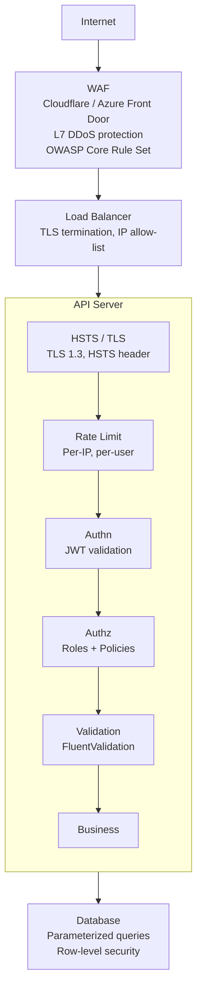

# API Security

> [Mastery Guide](../README.md) › [API Development](./README.md)

| Status | Priority | Phase | Last reviewed |
|---|---|---|---|
| Not Started | High | Phase 4 — Auth & API Security | 2026-05-08 |

## Contents
- [Why it matters](#why-it-matters)
- [Core concepts](#core-concepts)
  - [1. SSL/TLS encryption](#1-ssltls-encryption)
  - [2. Input validation](#2-input-validation)
  - [3. Rate limiting](#3-rate-limiting)
  - [4. Access control (RBAC / ABAC)](#4-access-control-rbac--abac)
  - [5. Throttling](#5-throttling)
  - [6. IP whitelisting](#6-ip-whitelisting)
  - [7. CSRF protection](#7-csrf-protection)
  - [8. Server-Side Request Forgery (SSRF)](#8-server-side-request-forgery-ssrf)
  - [9. Resource-consumption limits](#9-resource-consumption-limits)
  - [10. File upload security](#10-file-upload-security)
  - [11. Deserialisation and parser hardening](#11-deserialisation-and-parser-hardening)
  - [12. API key validation mechanics](#12-api-key-validation-mechanics)
  - [13. What a JSON endpoint says about itself](#13-what-a-json-endpoint-says-about-itself)
  - [14. What a WAF actually does — and what it misses](#14-what-a-waf-actually-does--and-what-it-misses)
  - [15. Supply-chain security for your dependencies](#15-supply-chain-security-for-your-dependencies)
  - [16. Audit logging for security events](#16-audit-logging-for-security-events)
  - [17. Denial of wallet — cost as an attack surface](#17-denial-of-wallet--cost-as-an-attack-surface)
- [Code & diagrams](#code--diagrams)
- [Common pitfalls](#common-pitfalls)
- [Interview-ready summary](#interview-ready-summary)
- [Interview Cross-Questioning Drill](#interview-cross-questioning-drill)
- [Cheat Sheet](#cheat-sheet)
- [Walkthrough](#walkthrough--credential-stuffing-on-login)
- [Self-test](#self-test)
- [Cross-references](#cross-references)
- [Sources](#sources)

---

## Why it matters

Every public API is under continuous attack. Bots scan for misconfigured endpoints within minutes of deployment; credential stuffing, brute-force, scraping, and DoS attempts hit the moment your service has a DNS name. Security is not a feature you bolt on at the end — it's seven concentric layers, each defeating a class of attacks the others miss. Defense-in-depth means a single gap doesn't compromise the system.

Why interviewers ask: API security questions reveal threat-modeling depth. A junior says "I'd use HTTPS." A senior says "TLS 1.3 with HSTS, plus input validation against injection, plus rate limiting against credential stuffing, plus RBAC, plus a WAF in front, plus structured error responses that don't leak internals." Each layer has a known attack class it counters.

When NOT to over-engineer: an internal back-office API behind a VPN doesn't need IP whitelisting at the app layer (network handles it) or CSRF tokens (no browser clients). The principles scale with exposure.

## Core concepts

### 1. SSL/TLS encryption

**What it does:** encrypts traffic between client and server, prevents eavesdropping (passive) and tampering (active).

**Modern baseline (2026):**
- **TLS 1.2 as the floor, TLS 1.3 preferred** — TLS 1.0 and 1.1 disabled entirely.
- **HSTS (`Strict-Transport-Security`)** header forcing HTTPS for the domain.
- **Certificate pinning** for mobile clients only — browser pinning (HPKP) was removed from browsers years ago; Certificate Transparency is what browsers enforce instead.
- **HTTP/2 or HTTP/3** for performance; both require TLS.

```csharp
// Program.cs
app.UseHttpsRedirection();
app.UseHsts();   // HTTP Strict Transport Security
```

In `appsettings.json`:

```json
{
  "Kestrel": {
    "Endpoints": {
      "Https": {
        "Url": "https://*:443",
        "Protocols": "Http1AndHttp2AndHttp3"
      }
    }
  }
}
```

Leave `SslProtocols` unset. The default (`SslProtocols.None`) hands protocol selection to the operating system, so the service picks up new protocol versions and cipher suites without a redeploy and stays aligned with the org-wide crypto policy. Pinning `["Tls12", "Tls13"]` in config is valid but freezes you at redeploy granularity.

Get certificates from **Let's Encrypt** (free, automated) for public APIs, or your enterprise CA for internal. Never use self-signed certs in production. Automate renewal with ACME: CA/Browser Forum ballot SC-081v3 is ratcheting the maximum public TLS certificate lifetime down from 398 days to 200 (March 2026), 100 (March 2027) and 47 (March 2029), so any manual renewal process for public certificates is the first thing that breaks.

### 2. Input validation

**What it does:** rejects malformed or malicious payloads at the boundary, before they reach business logic.

**The three rules:**
1. **Validate at the boundary, not deep inside the call stack.** Once a value is in your domain layer, treat it as trusted.
2. **Whitelist, don't blacklist.** Define what's *allowed*; reject everything else. Blacklists always miss new attack vectors.
3. **Validate type, length, range, format.** Don't just check "is it a string" — check "is it ≤ 200 chars, matches `[a-zA-Z]+`, etc."

```csharp
// Data annotations on the DTO
public class CreateOrderRequest
{
    [Required, StringLength(200, MinimumLength = 1)]
    public string CustomerName { get; init; } = "";

    [Range(1, 1000)]
    public int Quantity { get; init; }

    [EmailAddress, StringLength(254)]
    public string Email { get; init; } = "";
}

// FluentValidation (more powerful for complex rules)
public class CreateOrderRequestValidator : AbstractValidator<CreateOrderRequest>
{
    public CreateOrderRequestValidator()
    {
        RuleFor(x => x.CustomerName).NotEmpty().MaximumLength(200);
        RuleFor(x => x.Email).EmailAddress();
        RuleFor(x => x.Quantity).InclusiveBetween(1, 1000);
    }
}

// Controller with [ApiController] auto-validates and returns 400 on failure
[ApiController]
public class OrdersController : ControllerBase
{
    [HttpPost]
    public IActionResult Create(CreateOrderRequest req)
    {
        // Validation already happened; if we got here, req is valid
        return Ok();
    }
}
```

**Specific injection mitigations:**
- **SQL injection:** EF Core / parameterized queries. **Never** string-concatenate SQL.
- **NoSQL injection:** parameterized queries on Mongo/Cosmos.
- **Command injection:** never pass user input to `Process.Start` shell commands.
- **XSS:** Razor auto-encodes `@variable`. Don't use `Html.Raw` on user input.
- **Path traversal:** `Path.Combine` + `Path.GetFullPath` + reject results outside intended directory.

### 3. Rate limiting

**What it does:** caps how many requests a client can make per time window; defeats brute-force, scraping, and accidental DoS.

```csharp
builder.Services.AddRateLimiter(options =>       // AddRateLimiter is .NET 7+
{
    // Per-IP fixed window — the partition key is what makes it per-IP
    options.AddPolicy("PerIp", ctx =>
        RateLimitPartition.GetFixedWindowLimiter(
            partitionKey: ctx.Connection.RemoteIpAddress?.ToString() ?? "unknown",
            factory: _ => new FixedWindowRateLimiterOptions
            {
                PermitLimit = 100,
                Window = TimeSpan.FromMinutes(1)
            }));

    // Per-user sliding window (after auth)
    options.AddPolicy("PerUser", ctx =>
        RateLimitPartition.GetSlidingWindowLimiter(
            partitionKey: ctx.User.Identity?.Name ?? "anonymous",
            factory: _ => new SlidingWindowRateLimiterOptions
            {
                PermitLimit = 1000,
                Window = TimeSpan.FromHours(1),
                SegmentsPerWindow = 6
            }));

    // Token bucket for burst-friendly limiting, per IP
    options.AddPolicy("LoginAttempts", ctx =>
        RateLimitPartition.GetTokenBucketLimiter(
            partitionKey: ctx.Connection.RemoteIpAddress?.ToString() ?? "unknown",
            factory: _ => new TokenBucketRateLimiterOptions
            {
                TokenLimit = 5,
                TokensPerPeriod = 1,
                ReplenishmentPeriod = TimeSpan.FromMinutes(1),
                AutoReplenishment = true
            }));

    options.RejectionStatusCode = 429;
});

app.UseRateLimiter();

// Apply to specific endpoints
app.MapPost("/login", LoginHandler).RequireRateLimiting("LoginAttempts");
app.MapGet("/api/{**path}", ApiHandler).RequireRateLimiting("PerIp");
```

**The partition key is the whole point.** The convenience overloads — `AddFixedWindowLimiter("PerIp", …)`, `AddSlidingWindowLimiter`, `AddTokenBucketLimiter` — build **one** limiter shared by every caller of that policy; there is no partition key anywhere in them. A token bucket of five registered that way is five logins per minute *across your entire user base*, so one attacker 429s all legitimate logins. Per-caller limiting needs `AddPolicy` with a `RateLimitPartition`, as above. Two further consequences worth knowing: an endpoint gets exactly one *named* policy — `RequireRateLimiting` *replaces* whatever policy is already on the endpoint rather than adding to it — and partition keys built from attacker-controlled input are unbounded, so key them off something you control or hash and bound them. Client IP, as in the snippets above, is the pragmatic choice rather than a key you control, which is why nothing on this page relies on a per-IP limit alone (see Drill 3 and the walkthrough).

**Algorithm choice:**
- **Fixed window:** simple, but burst at window edges (2× limit briefly possible).
- **Sliding window:** smoother, more memory.
- **Token bucket:** allows bursts up to bucket size, then steady drip. Best for human-paced APIs.
- **Concurrency limit:** caps simultaneous in-flight requests rather than rate. Useful for expensive operations.

Always include `Retry-After` header on 429:

```csharp
options.OnRejected = (context, _) =>
{
    // Read the real value from the lease rather than hardcoding one — it stays
    // correct when window sizes change. Not every limiter supplies the metadata
    // (the concurrency limiter doesn't), hence the TryGetMetadata guard.
    if (context.Lease.TryGetMetadata(MetadataName.RetryAfter, out var retryAfter))
    {
        context.HttpContext.Response.Headers.RetryAfter =
            ((int)retryAfter.TotalSeconds).ToString(NumberFormatInfo.InvariantInfo);
    }
    return ValueTask.CompletedTask;
};
```

### 4. Access control (RBAC / ABAC)

Covered in [Authentication & Authorization](./02-authentication-and-authorization.md). Quick recap:

- **RBAC (Role-Based):** users have roles (`Admin`, `Manager`); endpoints require roles. Simple, scales to ~10 roles.
- **ABAC (Attribute-Based):** decisions based on attributes of user + resource + action + context. Scales to millions of policies.
- **Resource-based:** "user can edit *their own* order" — depends on resource state.

```csharp
[Authorize(Roles = "Admin")]                                 // RBAC
[Authorize(Policy = "PremiumUser")]                          // ABAC via policy
[Authorize(Policy = "OwnerOnly")] /* + resource check */     // resource-based
```

The principle: **authorize at every layer** — endpoint, service, data layer (filter queries to user's tenant/scope). Defense-in-depth.

### 5. Throttling

**Throttling vs Rate limiting:**
- **Rate limiting** rejects excess requests with 429.
- **Throttling** *slows* requests when load is high — queue, delay, but don't reject.

Used for: protecting downstream resources, shaping traffic during peak loads.

```csharp
options.AddConcurrencyLimiter("HeavyOp", o =>
{
    o.PermitLimit = 10;          // 10 concurrent
    o.QueueLimit = 50;           // queue up to 50 more; reject beyond
    o.QueueProcessingOrder = QueueProcessingOrder.OldestFirst;
});
```

For service-to-service calls, **circuit breakers + retry-with-backoff** (Polly) are the throttling mechanism — see [HttpClient & Resilience](../01-foundations/01-net-core-deep-dive/14-httpclient-resilience.md).

### 6. IP whitelisting

**What it does:** restricts the API to specific IP addresses or CIDR ranges. Mostly for back-office, admin, or partner-only endpoints.

```csharp
public class IpWhitelistMiddleware(RequestDelegate next, IOptions<WhitelistOptions> opts)
{
    public async Task InvokeAsync(HttpContext context)
    {
        var ip = context.Connection.RemoteIpAddress;
        if (ip is null || !opts.Value.AllowedRanges.Any(r => r.Contains(ip)))
        {
            context.Response.StatusCode = 403;
            return;
        }
        await next(context);
    }
}

// Behind a load balancer, configure forwarded headers first
builder.Services.Configure<ForwardedHeadersOptions>(opts =>
{
    // XForwardedProto matters too — it's what restores Request.Scheme behind a
    // TLS-terminating proxy, and UseHttpsRedirection reads Request.Scheme
    opts.ForwardedHeaders = ForwardedHeaders.XForwardedFor | ForwardedHeaders.XForwardedProto;
    opts.KnownProxies.Add(IPAddress.Parse("10.0.0.1"));
});
```

**Critical:** if you're behind a load balancer or reverse proxy, the immediate `RemoteIpAddress` is the LB, not the client. You need `X-Forwarded-For` + a list of trusted proxies. Get this wrong and your "whitelist" lets everyone through.

In practice, prefer **network-layer enforcement** (Azure NSG, AWS Security Group, Cloudflare WAF). Use app-layer whitelisting only when network-layer isn't possible.

### 7. CSRF protection

**What it does:** prevents Cross-Site Request Forgery — a malicious site triggering authenticated requests to your API on the user's behalf.

**When you need it:**
- ✅ Cookie-based auth (browser sends cookies automatically).
- ❌ JWT in `Authorization` header — exempt; the malicious site can't add the header. Two qualifications a senior is expected to add: the exemption dies the moment the same endpoint *also* accepts a cookie (dual-auth endpoints are the usual regression), and the protection comes from that missing header, not from CORS — a cross-site form-encoded POST is a "simple" request, needs no preflight, and still reaches your handler.

```csharp
builder.Services.AddAntiforgery(options =>
{
    options.HeaderName = "X-XSRF-TOKEN";
    options.Cookie.SecurePolicy = CookieSecurePolicy.Always;
    options.Cookie.SameSite = SameSiteMode.Strict;
});

app.UseAntiforgery();   // .NET 8+
```

```cshtml
@* Razor / MVC view emits the token *@
@Html.AntiForgeryToken()
```

```csharp
// Two hosting styles in one block — an MVC action first, minimal-API routes after.

// MVC controllers: the filter attribute
[HttpPost, ValidateAntiForgeryToken]
public IActionResult Transfer(TransferRequest req) => Ok();

// Minimal APIs: [ValidateAntiForgeryToken] is an MVC filter and has no effect here.
// Since .NET 8 the mechanism is UseAntiforgery(), which validates automatically for
// endpoints that bind *form* data — and only those.
app.MapPost("/transfer", ([FromForm] TransferRequest req) => Results.Ok());      // validated
app.MapPost("/api/transfer", ([FromBody] TransferRequest req) => Results.Ok());  // NOT validated
app.MapPost("/webhook", WebhookHandler).DisableAntiforgery();                    // explicit opt-out
```

The form-binding restriction is the subtlety that catches people: a JSON-bound minimal API endpoint gets no automatic antiforgery validation at all. If such an endpoint must be CSRF-protected — because it also accepts a cookie — inject `IAntiforgery` and call `ValidateRequestAsync(httpContext)` from an endpoint filter.

For SPAs:
1. Server sets `XSRF-TOKEN` cookie on login.
2. JS reads the cookie, sends it back in `X-XSRF-TOKEN` header on each state-changing request.
3. Server verifies header value matches cookie value.

**Easier alternative:** `SameSite=Strict` cookies stop the classic attack in modern browsers — the cookie isn't sent on requests initiated from another *site*. Note the boundary: `SameSite` is a *site* boundary, not an *origin* boundary. Anything on the same registrable domain counts as same-site, so a compromised or attacker-controlled sibling subdomain still gets the cookie attached. Use it as the default; antiforgery tokens remain belt-and-suspenders.

### 8. Server-Side Request Forgery (SSRF)

**What it does:** turns your API into the attacker's HTTP client. OWASP catalogues it as **API7:2023 Server Side Request Forgery** in the API Security Top 10, and the definition is exactly the shape of the bug: SSRF flaws occur when an API fetches a remote resource without validating the user-supplied URL.

Any endpoint that accepts a URL is a candidate — "import my avatar from this address", "register this webhook and we'll call it", "render a preview of this link", "load the OpenAPI document at this address". The mistake is imagining the attacker wants your server to fetch *their* site. They want it to fetch *yours*. Your service already sits inside the network the firewall was protecting, so it can reach admin consoles on private addresses, sidecars listening on localhost, and internal services whose authentication story is "it's only reachable from inside the cluster".

The prize in a cloud deployment is the instance metadata service. Azure's IMDS and AWS's IMDS both answer on the link-local address `169.254.169.254`, are reachable from any process on the instance, and hand out credentials for the instance's own identity. Both providers have hardened it in the same way — by requiring something a naive URL fetch cannot produce. Azure requires the header `Metadata: true` and returns 400 without it, and rejects any request carrying an `X-Forwarded-For` header. AWS's IMDSv2 is session-oriented: you first `PUT` to `/latest/api/token` with an `X-aws-ec2-metadata-token-ttl-seconds` header, then send the returned token back as `X-aws-ec2-metadata-token` on every `GET`; the `PUT` is refused if it carries `X-Forwarded-For`, and the token response ships with an IP-level hop limit of 1 by default so it can't survive a hop through a proxy. Notice what that buys and what it doesn't: it defeats "attacker supplies a URL", not "attacker supplies a URL *and* headers". It is a second layer, not the fix.

The fix is on your side, and OWASP's prevention list for API7 is a good spine for it: isolate the fetching component from the internal network; allow-list the origins, schemes, ports and media types you expect; disable HTTP redirect following; use a well-tested URL parser rather than your own; and don't hand the raw upstream response back to the caller.

Two of those need .NET-specific care. First, redirects: `HttpClient` follows them by default, so if you validate `https://images.example.com/a.png` and it answers `302` pointing at a private address, your validation was applied to a URL you never actually fetched. Set `AllowAutoRedirect = false` on the handler and follow redirects yourself, re-validating each hop. Second, and more subtly, validating a *hostname* and then connecting by *hostname* leaves a gap between the check and the use: the name can resolve to a private address in the first place, and DNS can answer differently the second time, which is DNS rebinding. Close it by resolving the name yourself, checking the returned addresses, and connecting to the address you checked. `SocketsHttpHandler.ConnectCallback` is the hook — it hands you the `DnsEndPoint` and expects a connected `Stream` back, so the socket that carries the request is the one you approved.

```csharp
// IsPublicAddress is yours: reject loopback (127.0.0.0/8, ::1), link-local
// (169.254.0.0/16, fe80::/10), the RFC 1918 ranges (10/8, 172.16/12,
// 192.168/16) and IPv6 unique-local (fc00::/7). Reject non-http(s) schemes
// before you get here — a URL parser will happily accept file: and ftp:.
var handler = new SocketsHttpHandler
{
    AllowAutoRedirect = false,
    ConnectCallback = async (ctx, ct) =>
    {
        var addresses = await Dns.GetHostAddressesAsync(
            ctx.DnsEndPoint.Host, ctx.DnsEndPoint.AddressFamily, ct);

        var target = addresses.FirstOrDefault(IsPublicAddress)
            ?? throw new HttpRequestException("Destination is not a public address.");

        var socket = new Socket(SocketType.Stream, ProtocolType.Tcp) { NoDelay = true };
        try
        {
            await socket.ConnectAsync(target, ctx.DnsEndPoint.Port, ct);
            return new NetworkStream(socket, ownsSocket: true);
        }
        catch { socket.Dispose(); throw; }
    }
};
```

> 🌍 **In the real world**: a document API grows an "import from URL" convenience. The validation checks one thing — that the host isn't `169.254.169.254` — because that's the SSRF example everybody has read. An attacker points it at an internal reporting service on a private address that has no authentication at all, because it was only ever reachable from inside the cluster. The import succeeds and the internal service's response is stored as the imported document, then served back to the attacker. No metadata service was involved. The private network was the prize, and a deny-list of one address was never going to protect it.

### 9. Resource-consumption limits

Rate limiting caps how *often* a caller can ask. This caps how *much* each request may cost. OWASP names the class **API4:2023 Unrestricted Resource Consumption** and lists what's actually being consumed: network bandwidth, CPU, memory, and storage. A single request is enough to exhaust any of them if nothing bounds it.

Kestrel ships defaults for most of this, and knowing the numbers is the difference between "we set limits" and a real answer. `MaxRequestBodySize` defaults to 30,000,000 bytes — roughly 28.6 MB. That is not unlimited, but a JSON endpoint that updates one field has no business accepting twenty-eight megabytes, and the cost of accepting it is paid in memory before your validation ever runs. `MinRequestBodyDataRate` defaults to 240 bytes per second with a five-second grace period, and it is the Slowloris defence: Kestrel checks each second whether the body is arriving at the minimum rate and times the connection out if it isn't, with the grace period there so TCP slow-start doesn't kill honest clients. `MinResponseDataRate` is the mirror image, for a client that reads your response one byte at a time to hold a thread. `RequestHeadersTimeout` defaults to 30 seconds and bounds how long the server will sit receiving headers. `KeepAliveTimeout` defaults to 130 seconds, and `MaxConcurrentConnections` is unlimited (`null`) by default.

Two footnotes a cross-examiner enjoys. None of those timeouts or data-rate limits are enforced while a debugger is attached, which is why "it works on my machine" is the wrong way to test them. And when the app runs out-of-process behind the ASP.NET Core Module in IIS, IIS sets the limit and Kestrel's body-size limit is disabled entirely — so the number you configured in `Program.cs` is not the number in force.

```csharp
builder.WebHost.ConfigureKestrel(o =>
{
    o.Limits.MaxRequestBodySize = 1 * 1024 * 1024;             // default: 30,000,000 bytes
    o.Limits.RequestHeadersTimeout = TimeSpan.FromSeconds(15); // default: 30 seconds
    o.Limits.MinRequestBodyDataRate =                          // this *is* the default
        new MinDataRate(bytesPerSecond: 240, gracePeriod: TimeSpan.FromSeconds(5));
});
```

Per-endpoint overrides exist because one global number is always wrong somewhere: `[RequestSizeLimit]` on an MVC action sets the body cap for that action, and `IHttpMaxRequestBodySizeFeature` sets it from middleware — but it throws if you set it after reading has begun, so check its `IsReadOnly` property first.

Time is the limit Kestrel doesn't give you, because request durations vary too much for a server-wide default to be meaningful. Since .NET 8 there is dedicated middleware for it in `Microsoft.AspNetCore.Http.Timeouts`: `AddRequestTimeouts()` registers it, `UseRequestTimeouts()` puts it in the pipeline (after `UseRouting` if you call routing explicitly), and then a timeout attaches per endpoint via `WithRequestTimeout(...)`, the `[RequestTimeout]` attribute, or a named policy. The behaviour is worth stating precisely because it surprises people: hitting the limit cancels the token in `HttpContext.RequestAborted`, it does not abort the request. Your handler can still finish and write a response; if it doesn't handle the cancellation at all, the default response is 504. Like the Kestrel limits, it does not trigger under a debugger.

```csharp
builder.Services.AddRequestTimeouts(o =>
{
    o.DefaultPolicy = new RequestTimeoutPolicy { Timeout = TimeSpan.FromSeconds(10) };
    o.AddPolicy("Reports", TimeSpan.FromMinutes(2));
});

app.UseRequestTimeouts();
app.MapGet("/reports/{id}", ReportHandler).WithRequestTimeout("Reports");
```

Pagination is the same control at the application layer, and it is the one no framework can apply for you. An unbounded `pageSize` query parameter passed to `Take()` is a resource-consumption bug the server-level limits cannot see, because the expensive part is the response, not the request. Clamp it server-side to a maximum you chose, and treat an over-large request as a request for the maximum rather than an error — clients that ask for a million rows are almost never attacking you, they just read the docs badly.

> 🌍 **In the real world**: an export endpoint accepts `?pageSize=` and hands it straight to the query. A partner's nightly job has a retry loop with no backoff and a bug that sets the page size to a million. Every Kestrel limit in the service is satisfied — the request is a couple of hundred bytes and arrives in milliseconds — while the database plans a table scan and the API buffers the result set. The service falls over under load it invited. The missing control was a single `Math.Min` on a query parameter.

### 10. File upload security

Three pieces of an upload are attacker-supplied strings and none of them may be trusted: the file name, the extension, and the declared content type. Microsoft's own guidance on this is unusually blunt — do not use the `FileName` property of `IFormFile` for anything other than display and logging. Strip any directory component with `Path.GetFileName`, HTML-encode it before it is ever displayed, and generate the name you actually store with something like `Path.GetRandomFileName()`, keeping the original only as a display label in your own database.

Where the bytes land matters as much as what they are. The guidance is a dedicated upload area, preferably on a non-system drive, outside the app's own directory tree, with execute permission removed. The reason is mechanical: a web shell that is never reachable by URL and never executable is inert. Most upload vulnerabilities are really two bugs — a file that shouldn't have been accepted, and a place it shouldn't have been stored — and fixing the storage location alone neuters a large fraction of them.

For what is in the file, the extension allow-list is necessary and not sufficient. Read the leading bytes and compare them against the known signature for each type you accept — the magic-byte check — so that a file called `report.pdf` that begins with `<html>` is refused at the boundary. Then scan for malware before the file is stored; the practical shape is to quarantine, scan out of band, and promote only on a clean result, because an inline scan on the request thread is a denial-of-service lever.

Size is where the API surface catches people, because there are two limits and they are not the same one. Kestrel's `MaxRequestBodySize` bounds the whole request. `FormOptions.MultipartBodyLengthLimit` bounds a buffered form file and defaults to 134,217,728 bytes — 128 MB, which is *larger* than Kestrel's default body limit, so tuning one without the other produces a confusing pair of failures. A form section that exceeds the limit throws `InvalidDataException`. Both have per-endpoint attributes.

```csharp
[HttpPost("documents")]
[RequestSizeLimit(20 * 1024 * 1024)]                             // the whole request
[RequestFormLimits(MultipartBodyLengthLimit = 20 * 1024 * 1024)] // one buffered form file
public Task<IActionResult> Upload(IFormFile file) => …;
```

Archives deserve their own sentence, because an accepted zip is a size limit you forgot to apply. `ZipArchiveEntry.Length` reports the entry's uncompressed size — but that number is read out of the archive's own headers, which is to say the attacker wrote it. The check that works is a budget: decide how many bytes total you are willing to decompress, and count them as they come out of the stream, aborting when you cross it. A small upload that expands until the disk is full is the decompression-bomb shape, and it defeats every limit that only looked at the request.

> 🌍 **In the real world**: a claims API accepts scanned evidence. Validation checks the extension is `.pdf` and the declared content type is `application/pdf`. Someone uploads an HTML file named `evidence.pdf`, and it lands under the app's static-files root because that was the easiest place to serve it from. A caseworker opens the link, the browser sniffs the bytes rather than believing the extension, and the script inside runs in the application's own origin with the caseworker's session. Two independent fixes would each have stopped it: the magic-byte check would have refused the file at upload, and storing it outside the webroot behind a controller that sets `nosniff` and `Content-Disposition: attachment` would have made serving it harmless.

### 11. Deserialisation and parser hardening

The parser runs before your code does. Everything in the input-validation section assumed a payload that had already been turned into an object — but the turning is itself attack surface, and the classic failures there are worse than anything a validator catches, because they end in code execution rather than bad data.

**Depth.** `System.Text.Json` bounds nesting through `JsonSerializerOptions.MaxDepth`, whose default value of `0` means a maximum depth of 64; going past it throws a `JsonException`. That default exists because deeply nested JSON is a very cheap way to spend a lot of stack and CPU from a very small payload — the request passes every size limit you configured. If your DTOs are three levels deep, sixty-four is sixty-one levels of slack you gave away for nothing. Set it where you configure JSON: `AddJsonOptions` for controllers, `ConfigureHttpJsonOptions` for minimal APIs.

**Type resolution.** The dangerous shape is any deserialiser that lets the *payload* name the type to construct. In `Newtonsoft.Json` that is `TypeNameHandling` set to anything other than `None`, and it is the classic route from "we accept JSON" to remote code execution, because the attacker picks a type whose construction has side effects. `System.Text.Json` does not do this: polymorphism is opt-in per contract with `[JsonDerivedType]` from `System.Text.Json.Serialization` (.NET 7 onwards), where you list the permitted derived types and choose the discriminator. The payload can only select among types you wrote down, which is the whitelist principle from concept 2 applied to the type system.

**`BinaryFormatter`.** Obsoleted as a warning in .NET 5 under `SYSLIB0011` and as an *error* from .NET 7; from .NET 8 `Serialize` and `Deserialize` also throw at runtime on most project types; and in .NET 9 the in-box implementation was removed entirely, so the APIs still exist but throw `PlatformNotSupportedException`. There is an unsupported `System.Runtime.Serialization.Formatters` NuGet package that restores the old behaviour. Needing it is a migration signal, not a solution — you are re-enabling a format whose design allows the payload to choose types.

**XML.** The good news is that modern .NET defaults are safe: `XmlReaderSettings.DtdProcessing` defaults to `Prohibit`, which throws an `XmlException` the moment a DTD appears, so `XmlReader.Create` with default settings is not vulnerable to XXE. That means XXE in a .NET codebase is almost always an explicit change someone made — setting `DtdProcessing.Parse` and supplying a resolver, usually to make one partner's document parse. Note the third value: `Ignore` disables DTD processing without warning or exception, which is safe against XXE but silently drops the DOCTYPE from the document, so it is not the same decision as refusing the input.

The general principle underneath all four is that size is the wrong limit for a parser. A payload can be tiny and still be quadratic to parse, deeply nested, or type-confusing. Bound the *shape* — depth, element counts, collection sizes, the set of types the payload may name — not just the byte count.

> 🌍 **In the real world**: a legacy endpoint still accepts XML because one partner never migrated off it. A support ticket says their submissions fail; the document has a DOCTYPE, so someone sets `DtdProcessing = DtdProcessing.Parse` and wires up a resolver, and the ticket closes. The endpoint now reads local files and makes outbound requests on behalf of anyone who can POST XML to it — which is concept 8 arriving through the parser rather than through a URL parameter. The fix that should have shipped was rejecting the DOCTYPE and telling the partner to remove it.

### 12. API key validation mechanics

Drills 8 and 10 argue about *whether* to use API keys and what happens when one leaks. This is the part nobody writes down: how you actually check one.

**Store a hash, not the key.** The reasoning is the same as for passwords — someone who reads your database should not walk away with working credentials — but the threat model is narrower and that changes the mechanism. An API key you issued is high-entropy random data, not a human-chosen secret, so there is nothing to guess offline and no dictionary to defend against. A single fast hash over the key is the appropriate choice; the deliberately slow, salted key-derivation function a password needs is solving a problem you don't have.

**Give keys a prefix, and store it in the clear.** A fixed recognisable prefix on every key you issue does three jobs at once. It gives you an indexed lookup column, so validation is one row read rather than a scan that hashes every candidate. It lets support identify which key a customer pasted into a ticket without ever seeing the secret. And it lets automated secret scanners recognise your keys when one is committed to a public repository — a scanner can only look for a pattern you gave it.

**Compare in constant time.** `CryptographicOperations.FixedTimeEquals` is the API, and the documentation is precise about the guarantee: it determines equality in an amount of time that depends on the length of the sequences but not on their values, and it short-circuits only when the lengths differ. An ordinary `==` or `SequenceEqual` returns the moment it finds a byte that doesn't match, and that difference is measurable across enough requests — which is how an attacker recovers a secret one byte at a time rather than by guessing the whole thing. See [Webhooks](./09-webhooks.md) for the same primitive applied to signature verification, where the explanation of *why* timing leaks matter is worked through properly.

```csharp
// Row: Prefix (clear, indexed) + Hash (SHA-256 of the whole key, as bytes)
public async Task<ApiKeyRecord?> ValidateAsync(string presented)
{
    if (presented.Length < PrefixLength) return null;

    var record = await _db.ApiKeys
        .SingleOrDefaultAsync(k => k.Prefix == presented[..PrefixLength]);
    if (record is null) return null;

    var presentedHash = SHA256.HashData(Encoding.UTF8.GetBytes(presented));
    return CryptographicOperations.FixedTimeEquals(presentedHash, record.Hash)
        ? record
        : null;
}
```

Rotation falls out of this design almost for free: allow two active keys per client rather than one, so a customer can create the new key, deploy it, and revoke the old one without a window where nothing works. Rotation that requires downtime is rotation that doesn't happen, which is Drill 8's fourth risk in a different sentence.

> 🌍 **In the real world**: a partner integration where validation is one line — `_db.ApiKeys.FirstOrDefault(k => k.Value == supplied)`. It works, it is fast, and it means every key your platform has ever issued is sitting in a table in plain text, readable by anyone with a database connection, a backup file, or a read replica used for reporting. The rewrite is the same one line split into three: take the prefix, load the single row it identifies, hash what was presented, and compare the hashes with `FixedTimeEquals`. Nothing about the API contract changes and the stored data stops being a credential.

### 13. What a JSON endpoint says about itself

Two response headers do real work on an API that never renders a page, and both are usually missing because "we return JSON, the browser isn't rendering anything".

`X-Content-Type-Options: nosniff`, defined by the WHATWG Fetch Standard, tells the browser to believe your declared `Content-Type` rather than guessing from the bytes. That has two consequences on an API. First, a response you labelled `application/json` that happens to begin with a `<` cannot be re-interpreted as HTML and executed — which is exactly the upload scenario from concept 10, closed from the serving side. Second, Chromium's Cross-Origin Read Blocking uses the header as its signal: a cross-origin HTML, XML or JSON response that carries `nosniff` and that CORS does not explicitly permit is withheld from the requesting renderer process entirely. Without the header the browser falls back to sniffing the start of the response and protecting it on a best-effort basis, and Chromium's own guidance to developers is to send the header rather than depend on that fallback.

That is the modern answer to the JSON-hijacking family of interview questions. A cross-site `<script src="https://api.example.com/orders">` still *issues* the request — your handler cannot stop it arriving — and whether it carries the user's cookies now depends on `SameSite`, which Chromium browsers already default to `Lax` and which therefore withholds the cookie on a subresource load like that one. The defence against the *response* being readable by the attacker's page is a separate question, and the answer is the correct content type plus `nosniff`, enforced by the browser. It is the same shape as the CSRF conclusion: the forged request arrives either way; what you control is whether it carries credentials and whether the answer comes back readable.

`Content-Disposition: attachment` (RFC 6266) belongs on every endpoint that returns bytes a caller supplied — downloads, exports, avatars, attachments. It tells the browser to save rather than render, so stored HTML or SVG never executes in your origin. SVG is the one people forget: it is XML, it can carry script, and a browser that renders it *as a document* — a direct navigation to the URL, an iframe — runs that script.

The wider header set — `Content-Security-Policy`, `Cross-Origin-Resource-Policy`, `Cross-Origin-Opener-Policy`, `Permissions-Policy` — belongs to the response-hardening discussion in [Security & Authentication (deep-dive)](../01-foundations/01-net-core-deep-dive/09-security.md) rather than being repeated here.

> 🌍 **In the real world**: an avatar endpoint streams the stored file back and sets `Content-Type` from whatever the upload record says. A user uploads an SVG. Every later request for that avatar renders attacker-controlled XML in the application's own origin, script and all, with the viewer's session cookie attached. The upload validation was the first missed control; serving user bytes without `nosniff` and without `Content-Disposition: attachment` — ideally from a separate origin entirely — was the second, and it is the one that turned a bad file into a working exploit.

### 14. What a WAF actually does — and what it misses

This chapter puts a WAF in the opening sentence and in the architecture diagram. Here is what to say when the interviewer follows up.

A WAF is a rule engine in front of your service. The open reference implementation is the OWASP Core Rule Set, and two of its concepts are what an interviewer means when they ask whether you have actually run one.

**Paranoia levels.** CRS sorts its rules into four levels. PL1 is the baseline aimed at any internet-facing server, with minimal tuning expected. PL2 adds rules appropriate where real user data is involved, and the project's own documentation says to expect false positives. PL3 is described as online-banking-level security with lots of false positives, and PL4 is for crown-jewel systems at your own risk. The cost curve is the whole point: each level catches more attacks and blocks more legitimate traffic, and there is no level that does one without the other. CRS separates the *executing* paranoia level from the *blocking* one precisely so you can run the higher level in log-only mode, work through the alerts it raises on real traffic, and then promote it — rather than the older and worse trick of temporarily loosening the score threshold.

**Anomaly scoring.** CRS does not block on a single rule match. Rules contribute points by severity — critical 5, error 4, warning 3, notice 2 — the points accumulate across the request, and blocking happens only when the total crosses a threshold, with defaults of 5 inbound and 4 outbound. Detection is deliberately decoupled from blocking. A WAF configured to block on any single rule match is a WAF you will have switched off by the end of the week.

Then the limits, which matter more than the features because they are where a WAF quietly stops being a control:

- **It has to be able to read the traffic.** A WAF inspects plaintext, so it must sit at or after TLS termination. If TLS terminates at the load balancer and the WAF is somewhere else in the path, it is looking at ciphertext.
- **It has to be able to parse the body.** ModSecurity must be told to treat a body as JSON — `ctl:requestBodyProcessor=JSON` — or the rules that inspect argument values see nothing to inspect. The CRS project has documented that disabling request-body access in ModSecurity v3 produces a complete bypass.
- **Body-size limits are a bypass, not just a limit.** `SecRequestBodyLimit` bounds how much of a body the engine will handle, and `SecRequestBodyLimitAction` chooses `Reject` (the default) or `ProcessPartial`. `ProcessPartial` inspects the first part of the body and passes the rest through unexamined, so an attacker who can pad a payload can push the interesting bytes past the inspection window. `SecRequestBodyNoFilesLimit` is the same bound excluding file-upload content in multipart requests.
- **It is signature-shaped.** A WAF is good at recognising the *syntax* of an attack — the SQL keyword, the script tag, the traversal sequence. It has no way of knowing that user 42 asked for order 99. Broken object level authorization, which Drill 1 identifies as the number one API vulnerability and the one that never gets fixed, is entirely invisible to it.

So the honest summary is: a WAF buys time against known attack syntax and removes most of the automated background noise. It does not replace a single other control in this chapter, and a team that treats it as a substitute has bought a very expensive log source.

> 🌍 **In the real world**: the WAF goes from log-only to blocking at PL2 on a Friday afternoon. By Monday the support queue is full — users whose surname contains an apostrophe cannot update their profile, and a support agent's message containing the word `select` is rejected as SQL injection. The team's instinct is to switch the WAF off, and it usually stays off. The procedure that works is the one the CRS design already anticipates: raise the *executing* level without raising the blocking level, collect which rules fire on real traffic, write narrow exclusions for those rules on those parameters, and only then move the blocking level.

### 15. Supply-chain security for your dependencies

Your dependency graph is an input you never validated. The 2025 web Top 10 gives it its own category — **A03:2025 Software Supply Chain Failures** — which is a fair signal of where the industry now puts the risk, and .NET has concrete tooling for it that most candidates cannot name.

**Known vulnerabilities: NuGet Audit.** Since the .NET 8 SDK (8.0.100, NuGet 6.8), `restore` checks your resolved packages against a vulnerability database and emits warnings by severity — NU1901 low, NU1902 moderate, NU1903 high, NU1904 critical, with NU1900 when a source could not be reached for vulnerability data. Three MSBuild properties control it: `NuGetAudit` (default `true`), `NuGetAuditLevel` (default `low`, the minimum severity reported), and `NuGetAuditMode`, which takes `direct` or `all`. That last default moved: `NuGetAuditMode` defaults to `all` when a project targets `net10.0` or higher, and to `direct` otherwise. So a `net8.0` project is auditing only the packages you chose yourself, and the transitive ones — the packages nobody in your team ever decided to take on — are unaudited unless you set the property.

Making it a gate is a policy decision worth articulating, because audit warnings behave like any other MSBuild warning. `WarningsAsErrors` can promote NU1903 and NU1904 to errors while leaving low and moderate as warnings. But an advisory published overnight can fail a build that compiled yesterday with no change from you, so NuGet's own documentation suggests putting the strict configuration behind an MSBuild condition and running it in a dedicated audit pipeline — the vulnerability still breaks a build, just not everyone's.

**Dependency confusion: package source mapping.** By default NuGet searches every configured source, and Microsoft's documentation states the consequence plainly: when a package exists on multiple sources, it may not be deterministic which source it is downloaded from. That is the whole vulnerability. An attacker who learns an internal package ID — from a leaked build log, a stack trace, a public repository — can publish that ID to nuget.org and wait. The answer is a `<packageSourceMapping>` element in `nuget.config`, with a `<packageSource key="…">` per source and `<package pattern="…" />` entries beneath it, so `Contoso.*` can only ever come from the internal feed and `*` comes from nuget.org. Two consequences to know before you enable it: once the element exists, *every* package must match a pattern, transitive ones included, so onboarding an existing repository is real work; and if a package is already in the global packages folder no source lookup happens at all, which is why the docs recommend a repo-local global packages folder to get the full benefit.

```xml
<packageSourceMapping>
  <packageSource key="nuget.org">
    <package pattern="*" />
  </packageSource>
  <packageSource key="contoso.com">
    <package pattern="Contoso.*" />
  </packageSource>
</packageSourceMapping>
```

**Reproducibility: the lock file.** `RestorePackagesWithLockFile` makes restore write a `packages.lock.json` recording the full resolved closure. `RestoreLockedMode` — or `dotnet restore --locked-mode` — then makes restore either produce exactly the packages in that lock file or fail, rather than quietly resolving something new because a version appeared or disappeared upstream. Check it in for applications; the docs advise against checking it in for library projects, because a library's lock file has no say over what its consumers resolve. There is also an `<auditSources>` element for teams that upstream everything through a single internal feed: it lets you take vulnerability data from nuget.org without configuring nuget.org as a package source.

> 🌍 **In the real world**: an internal package called `Contoso.Payments.Client` that has existed on the private feed for years. Someone publishes a package with that exact ID to nuget.org. A build agent has both feeds configured and no source mapping, and one restore later the build is compiling against code nobody at the company wrote — on a machine that holds deployment credentials. Notice where the compromise landed. It was not the API, and none of the controls in the first seven sections of this chapter were in the path.

### 16. Audit logging for security events

Drill 15 owns log hygiene and redaction, and Drill 3 owns anomaly thresholds. This is the different thing, and the 2025 web Top 10 keeps a category for it — **A09:2025 Security Logging and Alerting Failures**: the record you will be reading six months from now, in a meeting, to answer a question you did not anticipate.

**Design the schema before the volume.** Application logs answer "what went wrong". An audit log answers "who did what, to which record, in which tenant, and did it succeed" — and it is read by someone who was not there when it was written. Every event carries the same fields: the actor (the authenticated principal, plus the calling application separately if a service acted on a user's behalf), the action as a stable verb from a closed set rather than a free-text message, the resource type and identifier, the tenant, the outcome including *why* it was denied, the timestamp, and a correlation identifier tying it back to the request. The closed set of verbs is the field people skip and regret: leave the action as free text and in six months there are four spellings of "delete", and no query over the audit log returns the truth.

**401 and 403 are different events and both belong in it.** ASP.NET Core's authorization pipeline distinguishes them already — a challenge when there is no usable credential, a forbid when there is a valid credential that is not permitted — and the two tell completely different stories. A burst of 401s is somebody trying to get in. A burst of 403s from one authenticated account is somebody who is already in, mapping what they can reach, which is Drill 2's enumeration attack seen from the defender's side and the more urgent of the two. Registering an `IAuthorizationMiddlewareResultHandler` gives you a single place both outcomes pass through, with the policy and the `PolicyAuthorizationResult` in hand, instead of a log statement scattered through every handler and missing from whichever ones nobody remembered.

**Tamper-evidence.** An audit log the application can rewrite is evidence of nothing, because editing it is the first thing an attacker with application access does. Two mechanisms, usually together. Append-only shipping: the application's credentials grant write to the sink and nothing else — no delete, no update — so the process that generates records cannot revise them. And write-once storage on the receiving side, the object-lock style arrangement where a retention policy rather than the caller decides when something may be removed. If you want the log to *detect* tampering rather than merely resist it, chain each record's hash into the next, so a removed or altered record breaks the chain at an identifiable point.

**Honeytokens.** A credential, record or endpoint that has no legitimate use, so that any access to it is a signal with no false-positive rate at all: a dormant administrator account nobody uses, an API key issued to no partner, a customer record with a distinctive identifier. It is the cheapest detection you will ever deploy, because it generates exactly zero noise until the day it matters. The only real work is wiring the alert into a channel a human reads — a honeytoken that fires into a dashboard nobody opens is decoration.

> 🌍 **In the real world**: an incident review asks the only question that matters — did the attacker *read* customer records, or only list them? The application logs have paths and status codes, so you can see a 200 came back from `/customers/{id}`. But those lines were written by whichever handler happened to have a logger injected, two of the five read paths log nothing, and no line records which tenant the caller was acting in. The answer becomes "probably not, we think", which is the answer that turns an incident into a regulatory finding. The missing control was the schema, not the volume — they had gigabytes of logs.

### 17. Denial of wallet — cost as an attack surface

Everything in this chapter has treated rate limiting as an availability control: keep the service up, keep the database alive, keep real users served. There is a second failure mode in which the service stays up perfectly, every request succeeds, every dashboard is green, and the damage arrives on an invoice.

OWASP puts it inside API4:2023 explicitly: resources are sometimes made available by service providers via API integrations and paid for per request — sending emails, SMS, phone calls, biometric validation. Its first worked scenario is exactly this failure: an attacker scripts one API call tens of thousands of times, the back end obediently sends tens of thousands of text messages through the provider, and in OWASP's own words the company loses thousands of dollars in a matter of minutes. Modern hosting widens the surface considerably: consumption-plan compute, per-invocation serverless billing, egress bandwidth, per-call third-party APIs, per-token model inference. Autoscaling is the amplifier, and the uncomfortable part is that it is the *same* mechanism you added for availability. The control that absorbs a traffic spike is the control that converts a traffic spike into spend, and it has no opinion about how much.

Three things to add, and they are not more rate limits:

1. **A hard cap somewhere the application cannot raise.** OWASP's first prevention item for this category is exactly this — configure spending limits with every provider you pay per request, and where a provider offers no limit, configure billing alerts instead. The distinction that matters: a cap in your own code is a cap an attacker reaches through a bug in your own code. A cap at the provider is one they cannot.
2. **Attribute cost to a caller.** Availability limits are keyed on IP or user because that is what availability is threatened by. Cost limits have to be keyed on the *billed* dimension — messages sent, tokens consumed, gigabytes egressed, third-party calls made — because a caller can sit comfortably under your request-rate limit and still be your largest line item. You cannot enforce a budget you cannot attribute, so the metering has to exist before the limit does.
3. **A kill switch someone has actually used.** Deciding to stop serving a customer rather than keep billing on their behalf is a business decision, not an engineering one, and making it for the first time in the middle of an incident is what turns a short outage into a long one. Note that this inverts the usual advice in this chapter: for an availability control, failing open is frequently the right choice, and Drill 4 argues exactly that for a degraded rate limiter. For a cost control, failing open *is* the attack.

Chapter 11's [LLM integration patterns](../11-ai-integration/03-llm-integration-patterns.md) treat per-token spend as an operations concern. It is also a security concern, and it belongs to the same threat model as everything above.

> 🌍 **In the real world**: a "resend verification code" button with no per-account cap. The per-IP rate limit exists and works exactly as designed; the attacker stays comfortably under it, spread across many addresses, targeting many numbers in an expensive international destination. Every request is legitimate-looking and every one succeeds. Nothing pages anyone, because latency, error rate and availability are all healthy — the only signal is a bill at the end of the month. The controls that would have caught it are a per-account send cap and a provider-side spending limit. Another request-rate limit would not have made any difference at all.

## Code & diagrams

<details>
<summary>🧩 Click to expand — code samples and diagrams</summary>

### Defense-in-depth layers



### Production middleware order

```csharp
// Program.cs — order matters
app.UseExceptionHandler();           // catch errors first (outer scope)
app.UseForwardedHeaders();           // restore real scheme + client IP before anything reads them
app.UseHsts();                       // tell browsers to enforce HTTPS
app.UseHttpsRedirection();           // redirect HTTP to HTTPS
app.UseStaticFiles();                // short-circuit for static
app.UseRouting();
app.UseCors();
app.UseRateLimiter();                // before auth — rate-limit anonymous traffic too
app.UseAuthentication();             // who is the user?
app.UseAuthorization();              // can they do this?
app.UseAntiforgery();                // CSRF check (after authn)
app.MapControllers();
```

`UseForwardedHeaders` goes before anything that reads `Request.Scheme` or `RemoteIpAddress`. Behind a TLS-terminating load balancer, `UseHttpsRedirection` running first sees `http` on every request — because the scheme hasn't been restored yet — and redirects forever. That infinite redirect loop is the classic production incident.

### Threat model: what each layer defeats

```
TLS / HSTS                  → eavesdropping, MitM, downgrade attacks
Input validation            → SQL/NoSQL/command injection, XSS, path traversal
Rate limiting               → credential stuffing, brute force, scraping, DoS
Throttling                  → resource exhaustion, cascading failure
RBAC / ABAC                 → privilege escalation, IDOR
IP whitelisting             → unauthorized access to admin endpoints
CSRF + SameSite             → cross-site request forgery (browser cookies)
Output encoding (Razor)     → reflected XSS
Problem Details             → information disclosure via error messages
Structured logging          → forensics, anomaly detection
Secrets management          → credential leaks, source-control accidents
```

</details>

## Common pitfalls

1. **Trusting `RemoteIpAddress` behind a proxy.** The LB's IP shows, not the client's. Configure `ForwardedHeaders` + trusted proxy list.
2. **Rate limiting after authentication.** Anonymous requests (login, password reset) are the *biggest* attack surface. Rate-limit before auth.
3. **Same rate limit for all endpoints.** Login should be 5/min/IP. List endpoint can be 1000/min/user. One-size-fits-all is wrong.
4. **`SameSite=None` cookies without good reason.** Disables CSRF defense. Use `Strict` or `Lax`; only relax for explicit cross-site needs, and note `None` requires `Secure`. Know the baseline: Chromium browsers already treat a cookie with no `SameSite` attribute as `Lax`, so "you must configure SameSite" really means deciding whether you need something stricter or looser than `Lax`.
5. **Returning detailed errors in production.** "Connection to db.internal:1433 failed" reveals topology. Sanitize via `IsDevelopment()` checks.
6. **Allowing `eval` / dynamic SQL / shell exec on user input.** Categorical avoid. Use parameterized queries, `Process.Start` with explicit arg arrays.
7. **CORS `AllowAnyOrigin` + `AllowCredentials`.** The browser refuses this combination — but the misconfiguration suggests other auth mistakes.
8. **JWT without `aud` validation.** A token issued for service A is accepted by service B. Always validate `aud`.
9. **Logging sensitive data.** PII, tokens, passwords end up in logs → in log aggregators → searchable. Filter at source.
10. **Throwing raw `Exception.Message` in API responses.** Stack traces, SQL errors, internal paths leak. Use Problem Details with sanitized `detail`.
11. **No `Retry-After` on 429 / 503.** Clients hammer harder. Always include the header.
12. **HTTPS only at the LB, plain HTTP behind it.** The LB-to-server hop is on a "trusted network" — until someone compromises the network. Use HTTPS end-to-end where feasible.

## Interview-ready summary

- **Defense-in-depth:** TLS → WAF → rate limit → authn → authz → input validation → parameterized queries.
- **TLS 1.2 as the floor, TLS 1.3 preferred** + HSTS + `SameSite=Strict` cookies as defaults.
- **Rate limit before auth** (login is the biggest attack surface).
- **Validate at the boundary** with whitelist patterns.
- **CSRF** matters for cookie auth, not bearer tokens — unless the endpoint accepts both, which puts the cookie path back in scope.
- **IP whitelisting** at network layer when possible; app layer with care for trusted proxies.
- **Never trust client input** — `RemoteIpAddress`, headers, body, query strings all need scrutiny.

**Expected interview questions:**

1. *"Walk me through the OWASP Top 10 mitigations in .NET."* — A01 broken access control → policies + resource-based authz; A02 security misconfiguration → environment-aware config and secrets; A05 injection → EF Core parameterization; A07 authentication failures → ASP.NET Identity + JWT validation. *(Numbering is the 2025 edition, which moved misconfiguration up to A02, injection down to A05, and added A03 Software Supply Chain Failures as a new category. Quote the category name, not just the letter — the letters move every cycle.)*
2. *"How would you protect a login endpoint from credential stuffing?"* — Token-bucket rate limit per IP (5/min), per-account lockout after N failures, CAPTCHA after threshold, log + alert on patterns. JWT with short expiry to limit damage.
3. *"When do you need CSRF protection?"* — Cookie-based authentication. Skip for bearer tokens, unless the endpoint also accepts a cookie. Even better: `SameSite=Strict` — remembering that's a site, not an origin, boundary.
4. *"What's the difference between rate limiting and throttling?"* — Rate limiting rejects (429); throttling slows (queue, delay). Both useful — rate limit external clients, throttle expensive internal ops.
5. *"How do you prevent SQL injection?"* — Parameterized queries (EF Core does this automatically). Never string-concatenate SQL. `FromSqlInterpolated` is safe; `FromSqlRaw` with `$"..."` is not.
6. *"Where do you store API secrets?"* — Dev: `dotnet user-secrets`. Production: Azure Key Vault / AWS Secrets Manager / HashiCorp Vault. Never source control. Never `appsettings.json`.
7. *"What's HSTS and why does it matter?"* — `Strict-Transport-Security` header tells browsers "always use HTTPS for this domain for the next N seconds." Prevents downgrade attacks where an attacker strips the upgrade-to-HTTPS redirect.

## Interview Cross-Questioning Drill

<details>
<summary>📖 Click to expand — cross-question chains (~15-20 min, cover answers and write cold)</summary>

> ⚠️ **Honest caveat**: reading this once doesn't make you interview-ready. Cover the answers, write them cold, then check. Pair with a senior for live mock cross-questioning. The guide removes "I never thought about that" surprises; mock interviews convert knowledge into reflex. Both are needed.

Each drill is **Q → A → Cross-Q → A → Cross-Q² → A**.

### Drill 1 — OWASP API Top 10

> **Q**: Name the most-asked five from the OWASP API Security Top 10 (2023) and what each defends against.
>
> **A**: API1 Broken Object Level Authorization (BOLA) — accessing another user's resource by ID guess; API2 Broken Authentication — weak tokens, credential stuffing, JWT misuse; API3 Broken Object Property Level Authorization — mass assignment and excessive data exposure merged into one category; API5 Broken Function Level Authorization — admin endpoints missing role checks; API4 Unrestricted Resource Consumption — no rate limit, no pagination, no payload size cap.
>
> **Cross-Q**: BOLA is consistently #1 every cycle. Why does this class never get fixed industry-wide?
>
> **A**: Because authorization is *contextual* — frameworks can authenticate (verify who you are) generically, but "user 42 may read order 99 only if they own it or are a manager in the order's tenant" is business logic that no framework can write for you. Developers reach for `[Authorize]` and stop there; the resource-scope check has to be hand-coded in every handler, and missing one is invisible until exploited.
>
> **Cross-Q²**: What's the systematic defense — not "remember to write the check," but a structural fix?
>
> **A**: Three layers. (1) Centralized resource authorization via `IAuthorizationService.AuthorizeAsync(user, resource, "Read")` against named policies so the check is mandatory boilerplate, lintable in code review. (2) Row-level security at the database — Postgres RLS or SQL Server security predicates — so even if the handler forgets the check, the query returns zero rows. (3) Static analysis (Roslyn analyzer, CodeQL query) that flags handlers reading resources by ID without an authorization call in the same method. Defense-in-depth.

### Drill 2 — BOLA detection and prevention

> **Q**: Walk me through how you'd detect existing BOLA bugs in an API you inherited.
>
> **A**: Two angles. Offensive: spin up two test accounts, capture a legitimate request from user A for "their" resource, replay it with user B's token and the path-id from A. If you get 200 instead of 403/404, that's BOLA. Defensive: grep the controllers for handlers that take an `int id` / `Guid id` route param, then check whether each handler calls `_authz.AuthorizeAsync(user, resource, ...)` or a tenant-scoped query. Any gap is a candidate.
>
> **Cross-Q**: A handler does `_db.Orders.FindAsync(id)` then returns. The fix is filter by user — but tenants in our system have managers who can see *some* but not *all* tenant orders. How do you encode that?
>
> **A**: Resource-based authorization. Don't change the query; instead after fetch, call `await _authz.AuthorizeAsync(User, order, OrderOperations.Read)`. The policy handler reads `order.TenantId`, `order.OwnerId`, the user's roles within that tenant, and returns success/failure. The handler returns 404 (not 403) on failure to avoid leaking existence of resources outside the user's scope.
>
> **Cross-Q²**: Why 404 not 403, and when does this preference flip?
>
> **A**: 403 confirms "the resource exists but you can't see it" — useful intel for enumeration attacks (guess IDs, get 403s for valid resources, 404s for invalid; now you have a list of valid IDs to social-engineer against). 404 leaks no existence info. Flip to 403 when authorization is a *gate*, not a *filter* — e.g., admin endpoints where the URL is public-knowledge (`/admin`), but the user must be an admin. Showing 404 there would be silly.

### Drill 3 — Token bucket vs sliding window

> **Q**: Compare token bucket and sliding window for rate limiting.
>
> **A**: Token bucket: a bucket holds N tokens, replenishes M per second; each request consumes one; empty → 429. Allows bursts up to bucket size, then steady drip. Sliding window: count requests in a rolling time window; if count ≥ limit, reject. Smoother than fixed window (no edge-burst), more memory than token bucket (must remember timestamps).
>
> **Cross-Q**: You're protecting `/login`. Which algorithm and why?
>
> **A**: Token bucket with a small bucket. A real user might fail login twice in a row (typo on password manager), so allow bursts of 3-5. An attacker doing credential stuffing wants sustained throughput — token bucket's steady-drip refill (1 token/min) makes that uneconomical. Sliding window works too but spends memory tracking per-IP timestamps unnecessarily when the bucket abstraction is sufficient.
>
> **Cross-Q²**: An attacker rotates across 600 residential-proxy IPs at 5 req/min/IP — under your per-IP token bucket. How do you catch that?
>
> **A**: Layer the limit. Per-IP token bucket catches naive attacks; per-account sliding window (5 failures / 15 min / email) catches distributed credential stuffing because the *target email* is the same regardless of source IP. Plus a global anomaly threshold ("login error rate above 5% across all IPs in 5 min") triggers CAPTCHA enrollment for everyone. Single-axis rate limits always lose to attackers who can rotate that axis.

### Drill 4 — Distributed rate limiting with Redis

> **Q**: Your API runs on 10 instances behind a load balancer. The in-process token bucket on each gives you 10× the intended limit. How do you fix this?
>
> **A**: Move the counter to a shared store — Redis is canonical. Each request executes a Lua script atomically: decrement-token-if-positive, return current count. The 10 instances share one source of truth.
>
> **Cross-Q**: Redis is single-threaded but you're hitting it 10,000 times/second. What's the failure mode?
>
> **A**: Two: (1) network round-trip per request adds 0.5-2ms latency on top of API processing — measurable at scale; (2) Redis becomes the bottleneck if you're not pipelining. Mitigations: use Redis cluster with hash-tagged keys (`{user:42}:tokens`) so per-user counters shard, use pipelined INCRBY for batch updates, and run a *local* token bucket as fast-path that periodically reconciles with Redis ("approximate distributed rate limit") — accepts some imprecision (10 instances × 10-token slack = 100-request overshoot) in exchange for not consulting Redis on every request.
>
> **Cross-Q²**: Redis goes down. What should your rate limiter do?
>
> **A**: Fail open or fail closed — both are legitimate. Fail open (allow all traffic when Redis is down) keeps the API available but invites abuse during the outage. Fail closed (reject all traffic) protects the API but takes the service down with Redis. The standard compromise: short timeout (50ms) on Redis calls; on timeout, fall back to *local* rate limiter (less precise, allows over-limit traffic but bounded per-instance) with a metric `rate_limiter_degraded`. Alert on the metric so ops sees the dependency failure.

### Drill 5 — CSRF for JWT vs cookie auth

> **Q**: When does an API need CSRF protection?
>
> **A**: When auth credentials are sent automatically by the browser — i.e., cookies. CSRF works because attacker's malicious site triggers a request to your domain, the browser attaches the user's session cookie automatically, and the server thinks it's a legitimate request. JWTs in the `Authorization: Bearer` header are immune because the browser doesn't attach the header on cross-origin requests; the attacker would need XSS on your domain to read the token from storage. Two precisions: the forged request still *arrives*, it just arrives without credentials, so any endpoint that also accepts a cookie is back in scope — and it's the missing header doing the work, not CORS, since a form-encoded POST is a simple request that needs no preflight.
>
> **Cross-Q**: A team stores JWTs in `HttpOnly Secure` cookies "for security against XSS." Do they need CSRF protection now?
>
> **A**: Yes. The moment the JWT is in a cookie, the browser attaches it on cross-origin requests like any other cookie — back to the classic CSRF threat model. `HttpOnly` prevents JS access (XSS mitigation) but doesn't prevent cross-origin submission. You now need either `SameSite=Strict` (withholds the cookie on cross-site requests, which also breaks legitimate cross-site links) or antiforgery tokens (double-submit cookie pattern) layered on top.
>
> **Cross-Q²**: `SameSite=Strict` solves CSRF for free in modern browsers. Why does antiforgery still exist?
>
> **A**: Four reasons. (1) Older browsers (IE 11, old mobile WebViews) don't honor `SameSite` — if your audience includes those, the cookie travels cross-origin anyway. (2) `Strict` breaks legitimate cross-site links: a user clicking a link from email to your site sees a logged-out state because the cookie isn't sent on the cross-site GET. Many sites use `Lax` (sent on top-level navigation, and what Chromium browsers already apply to a cookie with no explicit `SameSite` attribute) which is weaker against CSRF on simple GET-with-side-effects bugs. (3) `SameSite` is a *site* boundary, not an *origin* boundary — a compromised or attacker-controlled sibling host on the same registrable domain issues same-site requests and the cookie rides along; a per-session token doesn't. (4) Defense-in-depth — antiforgery tokens catch CSRF even if the cookie config regresses in a future change. Belt-and-suspenders.

### Drill 6 — Security headers

> **Q**: Name the security headers you'd set on every API response and what each defends against.
>
> **A**: `Strict-Transport-Security` (HSTS) — forces HTTPS, prevents downgrade attacks. `X-Content-Type-Options: nosniff` — prevents browsers from guessing content-type when the server's declared type is "wrong" (defeats MIME-confusion attacks on user uploads). `Content-Security-Policy` — restricts which origins can supply scripts, styles, images (XSS mitigation, mostly for HTML responses). `Referrer-Policy: strict-origin-when-cross-origin` — limits Referer header leakage to other sites. `X-Frame-Options: DENY` or CSP's `frame-ancestors 'none'` — prevents clickjacking via iframe embedding.
>
> **Cross-Q**: HSTS has a `preload` directive. What does it do and what's the catch?
>
> **A**: With `Strict-Transport-Security: max-age=31536000; includeSubDomains; preload` plus submission to the [HSTS preload list](https://hstspreload.org/), browsers ship with your domain hard-coded as HTTPS-only. Even a brand-new browser that's never visited your site will refuse HTTP. Catch: removal takes 6-12 months to propagate to all browsers' bundled lists; if you ever need to host non-HTTPS content (legacy subdomain, debugging), you're stuck. Stage it carefully — start with `max-age=300`, ramp up to a year, *then* preload.
>
> **Cross-Q²**: A team's CSP includes `'unsafe-inline'` for scripts. Why is this nearly equivalent to no CSP?
>
> **A**: CSP's main XSS defense is blocking *inline* `<script>` tags injected by attackers. `'unsafe-inline'` whitelists exactly that vector, so any successful HTML injection becomes script execution. The fix is nonces or hashes: server emits `<script nonce="random-per-response">` and CSP says `'nonce-randomvalue'`. Attacker's injected `<script>` lacks the nonce → blocked. Strict-dynamic + nonces is the modern pattern.

### Drill 7 — mTLS vs JWT

> **Q**: When would you use mutual TLS over JWT for service-to-service authentication?
>
> **A**: mTLS authenticates the *connection* — both sides present X.509 certificates verified by a CA. JWT authenticates the *request* — the caller proves identity by presenting a signed token. Use mTLS when (a) you control both endpoints and the network is the trust boundary (private mesh), (b) you want to authenticate the calling *service*, not the user it's acting on behalf of, (c) the threat model includes "stolen tokens replayed by attacker who controls the network." JWT excels when (a) you have many short-lived callers (browser, mobile), (b) you need to convey user-level claims and scopes, (c) you don't want every caller to manage a certificate.
>
> **Cross-Q**: A team uses mTLS for service-to-service and JWT inside the request to identify the end user. What's this pattern called and why does it work?
>
> **A**: "On-behalf-of" or "actor + subject" auth. mTLS proves *service A* called *service B* (peer identity); the JWT in the request body or header proves *user X* is the principal the call is acting for. This separates network-level peer authentication from app-level authorization — service mesh handles the certificate dance, application logic reads the JWT for `sub` and `scope`. Istio, Linkerd, AWS App Mesh implement this pattern natively.
>
> **Cross-Q²**: Certificate rotation in mTLS — what's the operational pain and how do production meshes handle it?
>
> **A**: Without automation, certificate expiry causes silent outages: certs work until they don't. Manual rotation across hundreds of services is unworkable. Production patterns: (1) short-lived certs (1-24 hours) issued by an internal CA (SPIRE/SPIFFE, HashiCorp Vault, cert-manager + cert-issuer) — services auto-rotate well before expiry; (2) sidecars (Envoy in Istio) handle the cert lifecycle outside application code; (3) PKI infrastructure must itself be HA — if the issuer goes down, you have a hard ceiling on cluster operation time equal to the longest unexpired cert.

### Drill 8 — API keys vs OAuth

> **Q**: When do API keys still make sense over OAuth 2.0?
>
> **A**: Three legitimate cases. (1) Server-to-server with a *single tenant* — your batch job calling your data warehouse doesn't need user-delegated access or scopes; an API key is simpler. (2) Webhooks where you sign the *request*, not the user — the receiver verifies an HMAC with a shared secret rather than introspecting a token. (3) Pre-OAuth integrations and partner programs where the partner's stack predates modern auth — Stripe, SendGrid, Twilio still issue API keys because that's what partners can integrate.
>
> **Cross-Q**: A team uses long-lived API keys for everything because "OAuth is too complex." What concrete risks are they accepting?
>
> **A**: Five risks. (1) No expiry → key compromise is forever until manual rotation. (2) No scopes → a leaked key has full access; OAuth scopes allow limiting damage (`read:orders` only). (3) No user identity → audit logs say "API key 7 did X," not "Alice's session did X." (4) Rotation is high-friction (coordinate across all callers); OAuth refresh tokens automate this. (5) Keys in URLs or logs (which happens) are catastrophic; OAuth bearer tokens belong in the `Authorization` header and rotate fast enough that one logged token is short-lived intel.
>
> **Cross-Q²**: A partner sends their API key in the query string because their HTTP client makes header injection awkward. What do you do?
>
> **A**: Reject the request and return 400 with a documented requirement to use the header. Why: query strings end up in proxy logs, browser history, Referer headers leaked to third parties, and CDN access logs (which often have weaker access control than app logs). Even one logged secret is a treat for an attacker who later gains log access. Document the requirement in onboarding, return a clear error, and provide example HTTP clients in your SDK docs. Compromise is occasionally to *also* accept the key in a header named after your product (`X-Api-Key`) to ease the migration, never *only* in the query.

### Drill 9 — Mass assignment

> **Q**: What is mass assignment and how does it manifest in ASP.NET Core?
>
> **A**: Mass assignment happens when the framework binds untrusted input directly to a domain model, letting attackers set fields they shouldn't (like `IsAdmin` or `UserId`). In ASP.NET Core: `public IActionResult Create([FromBody] User user)` — if `User` has `IsAdmin`, the JSON `{"name":"Alice","isAdmin":true}` sets the admin flag because the binder fills every settable property.
>
> **Cross-Q**: The fix is "use DTOs." What does that look like in practice and why is it not enough on its own?
>
> **A**: Define request DTOs with only the fields the client is allowed to set: `record CreateUserRequest(string Name, string Email)` — no `IsAdmin`, no `Id`. Controller binds the DTO; service maps DTO → domain. Why DTOs alone aren't enough: developers add fields to DTOs over time without thinking, and the original `User` model still has writable `IsAdmin`. Add a code-review checklist: any DTO change requires explicit reasoning about "should clients be able to set this?" Combine with `init`-only properties on domain models and constructor-based mapping so privilege fields can't be set after creation.
>
> **Cross-Q²**: A team uses AutoMapper to project `CreateUserRequest` → `User`. The mapping config has `ForMember(u => u.IsAdmin, opt => opt.Ignore())`. Two months later someone removes the `Ignore()` line "because IsAdmin was being added everywhere else in the codebase." How do you catch this in CI?
>
> **A**: Two structural fixes. (1) An architectural test (NetArchTest or similar) that asserts "no AutoMapper profile maps a request DTO to a property named `IsAdmin`, `Role`, `Permissions`, or `UserId`" — codifies the rule beyond code review memory. (2) Replace AutoMapper for privilege-sensitive entities with explicit hand-written mappers — the line `user.IsAdmin = request.IsAdmin` is impossible to write accidentally because there's no source field. The combination prevents the "I removed the Ignore not realizing why" failure mode.

### Drill 10 — Secrets in URLs

> **Q**: Why is putting an API key in a URL bad even over HTTPS?
>
> **A**: HTTPS encrypts only the transport — the request still touches many systems unencrypted at rest. URLs end up in: server access logs (NGINX, IIS, CloudFront), browser history, browser DevTools network panel, Referer headers (sent to any link your page navigates to or any asset loaded from another origin), and analytics dumps. Each is a place where a secret in the URL becomes plaintext intel.
>
> **Cross-Q**: A partner's webhook signature spec puts the signature in a query parameter because "the client's HTTP library doesn't support custom headers." Acceptable?
>
> **A**: Tolerable for HMAC signatures of a request body (the signature only verifies one request — it's not a long-lived bearer credential), unacceptable for API keys. The signature in a URL still leaks via the channels above, but the leaked value can only validate the one already-completed request; the attacker can't replay it for anything new. For API keys (long-lived auth material), absolutely not — push the partner to use `X-Api-Key` header even if you need to ship a tiny middleware that translates query → header internally during their migration.
>
> **Cross-Q²**: Imagine you find an API key was logged in your access logs for two weeks before you rotated it. The downstream log analytics pipeline has retention for 90 days. What's your remediation timeline?
>
> **A**: (1) Hour 0: rotate the key immediately; revoke the old one. (2) Hour 1-4: audit the new key's usage to verify legitimate callers updated successfully. (3) Hour 4-24: investigate access patterns on the old key during the leak window for anomalies — IPs not matching expected callers, off-hours activity, novel User-Agents. (4) Day 1-7: purge or mask the key from the analytics pipeline and any downstream copies (S3 archives, ElasticSearch indices). (5) Document the incident, the controls that failed, and add a regex log-scrubber so any future occurrence of `key=` in URLs is masked at write time before storage. Don't trust that this was a one-off.

### Drill 11 — CORS misconfiguration

> **Q**: Why is `Access-Control-Allow-Origin: *` combined with `Access-Control-Allow-Credentials: true` a problem?
>
> **A**: Browsers actually reject the combination outright — credentialed requests (cookies, HTTP auth) require an exact origin in `Allow-Origin`, not `*`. But the *attempt* to configure it that way is the signal: developers wanted "any origin can call me with credentials," which means any malicious site can issue authenticated requests using the user's cookies. The fix is to enumerate allowed origins explicitly or reflect the `Origin` header *after validation* against an allow-list.
>
> **Cross-Q**: A team's CORS middleware reflects every `Origin` header back as `Allow-Origin`. Why is this functionally identical to wildcard for credentialed APIs?
>
> **A**: Reflect-without-validation means any origin gets approval. Attacker hosts `evil.com`, user is logged in to your app, attacker's page makes a credentialed cross-origin request → browser sends user's cookie, server reflects `evil.com` back, browser accepts the response. The mitigation `Allow-Origin: *` was designed to prevent — explicit per-origin trust — is bypassed by lazy reflection. The fix: hardcoded allow-list, or reflect only after `if (allowedOrigins.Contains(origin))`.
>
> **Cross-Q²**: Your CORS policy lists 12 partner origins. One is `https://partner.example.com`. An attacker registers `https://partner.example.com.attacker.com`. What's the bug class and the prefix-match trap?
>
> **A**: String-prefix or substring matching of origins is unsafe. `if (origin.StartsWith("https://partner.example.com"))` accepts the attacker's subdomain because their full origin is a superstring of the trusted prefix. The fix is exact-equality match on full origin including scheme: `origin == "https://partner.example.com"`. Better: parse to a `Uri` and compare host + scheme + port explicitly. The same trap exists in cookie scope, OAuth redirect URI matching, and OpenID `iss` validation — anywhere origin comparison is "string starts with" it's a vulnerability.

### Drill 12 — JWT signature stripping

> **Q**: Walk through the `alg: none` JWT vulnerability and what defends against it.
>
> **A**: A naive JWT validator accepts the algorithm declared in the JWT header. Attacker crafts `{"alg":"none","typ":"JWT"}.{payload}.` (empty signature), server reads `alg: none`, performs no signature verification, accepts the forged token. Defense: validator must use a *server-side allow-list* of acceptable algorithms (`HS256`, `RS256`, etc.) and reject `none` and anything not on the list. Modern libraries (`Microsoft.IdentityModel.Tokens`) require explicit algorithm specification — `alg: none` is rejected by default.
>
> **Cross-Q**: Related attack: HMAC-vs-RSA confusion. Walk through it.
>
> **A**: A server using RSA (`RS256`) validates with the public key. Attacker takes the public key (publicly available — that's the point of RSA), uses it as an *HMAC secret*, signs a forged token with `alg: HS256` and the public key as the HMAC key. If the server's validator picks the algorithm from the JWT header and looks up the verification key by `kid` without checking algorithm-key compatibility, it'll attempt to validate the HMAC signature using the RSA public key as the HMAC secret — which succeeds because the attacker computed the HMAC with exactly that key. Defense: tie the expected algorithm to the key type at validation time; never let `alg` from the token decide.
>
> **Cross-Q²**: JWT best practice is "use short-lived tokens with refresh tokens." Why does that mitigate the *consequence* of even a successful forgery?
>
> **A**: Short expiry (5-15 min) bounds the attacker's window. A forged token that bypasses validation for 10 minutes is bad; one that's good for 24 hours is catastrophic. Refresh tokens are revocable server-side; if you detect compromise, revoke the refresh token and within one access-token-expiry cycle the attacker is locked out without needing to invalidate every access token globally. The asymmetry — short access, long refresh, revocable refresh — is why the pattern won industry-wide despite the operational complexity.

### Drill 13 — SQL injection with an ORM

> **Q**: Does using EF Core fully prevent SQL injection?
>
> **A**: Mostly, but not entirely. EF Core parameterizes LINQ-translated queries automatically — `_db.Users.Where(u => u.Email == email)` is safe even with attacker-controlled `email`. The gaps: `FromSqlRaw($"SELECT * FROM Users WHERE Email = '{email}'")` is *string interpolation into raw SQL* and is vulnerable. `FromSqlInterpolated($"... WHERE Email = {email}")` looks similar but is safe because EF parameterizes the FormattableString. `ExecuteSqlRaw` has the same trap.
>
> **Cross-Q**: What about dynamic ordering — `ORDER BY {sortColumn}` where the column is user-supplied?
>
> **A**: Identifiers (column and table names) can't be parameterized by the database engine. EF Core cannot parameterize an `ORDER BY` column name; you must validate it against an allow-list before interpolating: `var allowed = new[] {"Name", "Email", "CreatedAt"}; if (!allowed.Contains(sortColumn)) throw;`. Same trap exists in stored procedures and any dynamic-SQL builder. Some teams generate `OrderBy(Expression<Func<T, object>>)` from the allowed string set, sidestepping raw-SQL entirely.
>
> **Cross-Q²**: A junior writes `_db.Orders.Where($"Status = '{userInput}'")` — passing a string into the Where() overload that takes a string predicate (Dynamic LINQ). Same vulnerability class?
>
> **A**: Yes. Dynamic LINQ (`System.Linq.Dynamic.Core`) parses the string at runtime and the string can contain expressions, function calls, comparisons against typed values — but it's still string-interpolation of user input into a query language interpreter. The same injection class manifests as Dynamic LINQ injection (e.g., `"Status = 'x' OR 1=1"`). The fix is parameterization within Dynamic LINQ: `Where("Status = @0", userInput)`. The general principle: anywhere user input is concatenated into a query/expression *string*, regardless of how high-level the abstraction looks, parameterize.

### Drill 14 — Where to validate input

> **Q**: Validation can happen at the gateway, the controller, or deep in the service layer. Where should it live and why?
>
> **A**: Layered, with primary responsibility at the controller/DTO boundary. Gateway-level validation (Cloudflare WAF, API Gateway) catches obvious malformed traffic before it hits your service — payload size limits, header validation, OWASP Core Rule Set. Controller-level (DataAnnotations or FluentValidation) catches all input-shape violations with rich error messages tailored to the client. Service-level validation enforces business invariants ("order total must equal sum of line items") that the controller couldn't know without doing service work.
>
> **Cross-Q**: Why not "validate everywhere, defense in depth?"
>
> **A**: Validation duplication causes drift: the gateway rejects emails over 200 chars, the controller allows 254 (RFC 5321), the service truncates to 100. Each layer has slightly different rules, and the system as a whole accepts whatever the most lenient layer allows. Worse: when a rule changes, you must update three places consistently or you have a bug. Defense in depth applies to *security primitives* (authn, authz, encryption) where each layer defeats a distinct attack class. Validation is a *correctness* primitive — own it in one place with confidence.
>
> **Cross-Q²**: A team has FluentValidation rules but the service layer also does ad-hoc `if (string.IsNullOrEmpty(...))` checks. What's the underlying smell and how do you fix it?
>
> **A**: The service can't trust its inputs — it's defending against bugs in the controller layer. Three remedies. (1) Make domain types nominal: `RecipientEmail` instead of `string`, with a constructor that validates and a private field — the domain never sees an invalid value because the type can't represent one. (2) Move validation rules into the domain (`Result.Try(() => new Email(s))`) so the controller's job is only to translate validation results into HTTP responses. (3) Architectural test: services never `throw new ArgumentException` for empty strings — those checks signal mistrust of upstream, replace with type constraints.

### Drill 15 — Logging secrets

> **Q**: A developer logs the full incoming request for debugging, including the `Authorization` header. Why is this catastrophic and how do you systematically prevent it?
>
> **A**: Catastrophic because: (1) logs aggregate in centralized systems (ELK, Splunk, Datadog) with much wider access than the API service itself; (2) any engineer with log access now has every active token in clear text; (3) tokens often outlive the log line — even a 1-hour token is enough for lateral movement; (4) compliance-wise this is a personal-data breach under GDPR/CCPA. Prevention: configure the logger to redact known-sensitive fields globally — Serilog's `Destructure.ByTransforming<HttpRequest>(...)` or `LogDestructurer` plus a hard-coded list of header names (`Authorization`, `Cookie`, `X-Api-Key`) that get replaced with `[REDACTED]` before serialization.
>
> **Cross-Q**: The team adds the redaction filter. Six months later a new `X-Internal-Token` header is added for service-to-service calls and isn't in the filter list. How do you avoid this drift?
>
> **A**: Inversion: instead of a deny-list of fields to redact, use an *allow-list* of fields to log, and redact everything else by default. `headers.Where(h => loggableHeaderNames.Contains(h.Key))` rather than `headers.Where(h => !sensitiveHeaderNames.Contains(h.Key))`. New headers are private by default; explicit reasoning required to log them. Same pattern for request bodies — log a schema-validated subset, never the raw payload.
>
> **Cross-Q²**: A production incident requires raw request logs to diagnose. How do you enable them without leaking secrets?
>
> **A**: Three patterns. (1) Time-bounded debug logging gated by a feature flag — turn on for 5 minutes during an investigation, automatic shutoff. (2) Restricted-access log stream — debug logs go to a separate sink with stricter ACLs (only on-call SRE access, audit-logged reads). (3) Cryptographic redaction at write — log a hash of the token (`SHA-256("Bearer eyJ...")`), not the token itself; investigators can compare against known-bad hashes from threat intel without ever having the raw value. The pattern that wins depends on your incident-response maturity; the failure mode you're protecting against is "convenient debug logging becomes a permanent backdoor."

</details>

## Cheat Sheet

- **Defense-in-depth order**: TLS → WAF → rate limit → authn → authz → validation → parameterized queries.
- **TLS 1.2 floor, TLS 1.3 preferred + HSTS + `SameSite=Strict`** for any browser-facing API.
- **Rate-limit before auth** — login and password-reset are the *biggest* attack surface, and they're anonymous.
- **Token-bucket on `/login`**: 5 requests / minute / IP, plus per-account lockout, beats credential stuffing — but only if the limiter is **partitioned** by IP (`AddPolicy` + `RateLimitPartition`); the plain `AddTokenBucketLimiter` overload shares one bucket across every caller.
- **Whitelist input, never blacklist** — define what's allowed; reject everything else.
- **`ForwardedHeaders` + `KnownProxies`** is required behind any LB or you "whitelist" your own load balancer.
- **`SameSite=Strict` cookies** stop the classic attack by withholding the cookie on requests initiated from another *site* — but that's a site, not an origin, boundary, so a sibling host on the same registrable domain still gets the cookie; antiforgery tokens stay belt-and-suspenders.
- **CSRF only matters with cookie auth** — bearer-token APIs are exempt because attackers can't add the header; the exemption is void if the endpoint also accepts a cookie.
- **`FromSqlRaw` with `$"..."` is SQL injection**; use `FromSqlInterpolated` or LINQ.
- **Always include `Retry-After`** on 429/503 — without it, well-behaved clients hammer harder.

## Walkthrough — Credential stuffing on /login

<details>
<summary>📖 Click to expand — worked walkthrough scenario</summary>

**Problem**: Detection rule fires: 14,000 failed login attempts to `/login` over 8 minutes from 600 distinct IPs, mostly residential proxies. A handful succeed — those accounts get drained of loyalty points before support catches up.

**Diagnosis**: Pull a 5-minute slice of NGINX access logs into `goaccess` or query App Insights — request rate per IP is suspiciously low (10/min/IP) which is exactly under naive per-IP rate limits. Source IPs match a known residential-proxy CIDR list. The successful logins all use email addresses leaked in a recent third-party breach (verified against [Have I Been Pwned](https://haveibeenpwned.com)). The `/login` endpoint has no rate limiting at all because the dev "didn't want to lock out real users on shared corporate IPs."

**Fix**: Layered. Token-bucket per-IP at the edge (5/min, burst 10), plus per-account lockout after 5 failures in 15 min, plus a CAPTCHA challenge after the third failure for the *email*:

```csharp
// Per-IP token bucket, partitioned, as the endpoint policy.
// Fragment: this AddPolicy call lives inside AddRateLimiter(options => …) as shown earlier.
options.AddPolicy("LoginIp", ctx =>
    RateLimitPartition.GetTokenBucketLimiter(
        partitionKey: ctx.Connection.RemoteIpAddress?.ToString() ?? "unknown",
        factory: _ => new TokenBucketRateLimiterOptions
        {
            TokenLimit = 10,
            TokensPerPeriod = 5,
            ReplenishmentPeriod = TimeSpan.FromMinutes(1)
        }));

app.MapPost("/login", LoginHandler).RequireRateLimiting("LoginIp");

// The per-email limit lives inside the handler, after model binding.
// ILoginAttemptStore is your own interface over the Redis-backed counter from
// Drill 4, not a framework type — supply it (and LoginRequest) yourself.
static async Task<IResult> LoginHandler(LoginRequest req, ILoginAttemptStore store)
{
    // Hash the email: fixed-width, pseudonymous key, and the store gives it a TTL so
    // counters expire instead of accumulating one per address the attacker invents
    var key = Convert.ToHexString(
        SHA256.HashData(Encoding.UTF8.GetBytes(req.Email.ToLowerInvariant())));

    if (!await store.TryAcquireAsync(key, permitLimit: 5, window: TimeSpan.FromMinutes(15)))
        return Results.StatusCode(StatusCodes.Status429TooManyRequests);

    // ... verify credentials
    return Results.Ok();
}
```

Three things this deliberately avoids. It does not read `ctx.Request.Form["email"]` inside a rate-limiter partitioner: the partitioner runs before the endpoint, so reading the form buffers the request body — and throws outright on a JSON login endpoint, which `/login` is. It does not use the raw email as a partition key: partition keys built from attacker-controlled input are unbounded, so an attacker who invents addresses at will grows the limiter's own bookkeeping, turning the defense into the resource-exhaustion attack you were trying to prevent. And it does not chain `.RequireRateLimiting("LoginIp").RequireRateLimiting("LoginEmail")`: an endpoint policy *replaces* the one already there, so only the last call would apply and the layered design would silently be single-axis. If you want two limiters enforced by the middleware itself, combine them with `PartitionedRateLimiter.CreateChained` on `options.GlobalLimiter`.

Add a deny-list of breached-credential hashes (k-anonymity API) so leaked passwords can't be used at all.

**Why it works**: Per-IP alone fails against distributed botnets. Per-email lockout makes the attack uneconomical regardless of source IP, since attackers can't cycle through 10M passwords against one account anymore. Always include `Retry-After` on 429s — from the lease metadata, not a hardcoded constant — and an identical "Invalid credentials" response for unknown email vs wrong password to defeat user enumeration.

</details>

## Self-test

<details>
<summary>1. Why is `RemoteIpAddress` unreliable for IP whitelisting in cloud deployments?</summary>

In Azure App Service, AKS behind an Application Gateway, AWS behind an ALB, or any reverse-proxy topology, `Connection.RemoteIpAddress` is the *proxy's* IP, not the client's. The real client IP rides in `X-Forwarded-For`. You must call `app.UseForwardedHeaders()` with `KnownProxies` or `KnownNetworks` populated; otherwise an attacker can spoof the header from inside a misconfigured cluster, or your "whitelist" rejects everyone. Network-layer enforcement (NSG, security group, Cloudflare WAF) is more robust where available.
</details>

<details>
<summary>2. Walk through how Razor's auto-encoding defeats reflected XSS, and where it falls short.</summary>

`@variable` in Razor calls `HtmlEncoder.Default.Encode` before emitting — `<script>alert(1)</script>` becomes `&lt;script&gt;...`. This defeats reflected XSS for content rendered into HTML body. It does NOT cover: (a) `Html.Raw(userInput)` — explicit opt-out, (b) attribute contexts inside JavaScript blocks (need JS encoder, not HTML), (c) URL contexts (need URL encoder), (d) JSON embedded in `<script>` tags (need JSON encoder + careful CSP). Razor only covers the most common path; the rest needs deliberate encoder selection plus a strict Content-Security-Policy.
</details>

<details>
<summary>3. Throttling vs rate limiting — give a concrete production scenario for each.</summary>

Rate limiting (rejection) on `/login`: better to drop excess attempts at 429 than queue them — queueing helps the attacker, since they can flood the queue and starve real users. Throttling (queue/slow) on a heavy report-export endpoint: legitimate users hit it occasionally; queuing 50 concurrent requests with 10 in-flight protects the DB without users seeing failures. Rule of thumb: reject when load is hostile, throttle when load is legitimate-but-spiky.
</details>

<details>
<summary>4. Why does middleware order — specifically `UseRateLimiter` before `UseAuthentication` — matter?</summary>

Rate-limit-after-auth means anonymous attackers can flood the auth pipeline (token validation, OIDC introspection, DB lookups) before being rejected — that's exactly the cycle credential-stuffing exploits. Putting rate limit first means the cheap rejection path runs before any expensive work. The same logic applies to `UseExceptionHandler` (must be outermost to catch errors from anything inside) and `UseHsts` / `UseHttpsRedirection` (early to prevent downgrade — but after `UseForwardedHeaders`, or behind a TLS-terminating proxy the redirect loops forever).
</details>

<details>
<summary>5. A team protests that adding HSTS will "break" their HTTP fallback for an internal admin tool. How do you respond?</summary>

HSTS is per-domain — apply it to public domains only, not internal hostnames. The header tells browsers "always use HTTPS for this domain for the next N seconds"; it doesn't affect other domains. Set `max-age=300` initially, verify nothing breaks, then ramp to `max-age=31536000; includeSubDomains; preload` and submit to the HSTS preload list. Internal admin tools on a separate domain or behind VPN don't see the header at all. The "we need HTTP fallback" objection is almost always a sign of unrelated TLS misconfiguration that should be fixed independently.
</details>

## Cross-references

- [Authentication & Authorization](./02-authentication-and-authorization.md) — RBAC, ABAC, JWT validation.
- [Security & Authentication (deep-dive)](../01-foundations/01-net-core-deep-dive/09-security.md) — JWT setup, OWASP Top 10 details.
- [API Versioning](./05-api-versioning.md) — versioning is part of secure deprecation.
- [Middleware](../01-foundations/01-net-core-deep-dive/04-middleware.md) — pipeline order matters for security.
- [Configuration Deep Dive](../01-foundations/01-net-core-deep-dive/15-configuration.md) — secrets management.
- [Advanced Auth](./17-advanced-auth.md) — OAuth 2.1, DPoP, sender-constrained tokens.
- [API Management & Gateway](./16-api-management.md) — the gateway and WAF layer drawn in the diagram above.
- [Webhooks](./09-webhooks.md) — HMAC signature verification, and why constant-time comparison matters.
- [Secret Management](../10-devops-and-cicd/05-secret-management.md) — managed identity, workload identity federation, rotation, leak detection.
- [LLM Integration Patterns](../11-ai-integration/03-llm-integration-patterns.md) — per-token spend caps, read here as a cost-abuse control.

## Sources

<details>
<summary>📚 Click to expand — sources and further reading</summary>

- OWASP — [API Security Top 10 (2023)](https://owasp.org/API-Security/editions/2023/en/0x11-t10/) — still the current API edition.
- OWASP — [Top 10 (2025)](https://owasp.org/Top10/2025/) — the web list; renumbered from 2021.
- Microsoft Learn — [ASP.NET Core security overview](https://learn.microsoft.com/en-us/aspnet/core/security/).
- Microsoft Learn — [Rate limiting middleware](https://learn.microsoft.com/en-us/aspnet/core/performance/rate-limit).
- IETF RFC 6797 — HTTP Strict Transport Security (HSTS).
- *The Tangled Web* by Michal Zalewski (2011) — still the best book on browser security model and CSRF/XSS.

<!-- nav-footer-start -->

---

[← Previous: API Design Principles](03-api-design-principles.md) · [↑ Back to top](#api-security) · [Next: API Versioning →](05-api-versioning.md)

<!-- nav-footer-end -->

</details>
