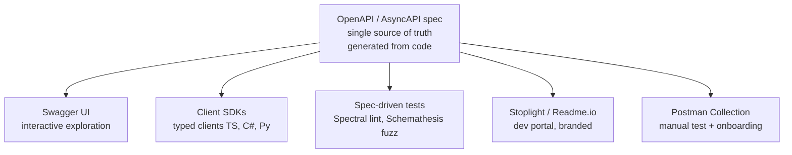

# API Documentation

> [Mastery Guide](../README.md) › [API Development](./README.md)

| Status | Priority | Phase | Last reviewed |
|---|---|---|---|
| Not Started | Low | Phase 6 — API Mastery | 2026-08-07 (coverage stops at .NET 10 / OpenAPI 3.1) |

## Contents
- [Why it matters](#why-it-matters)
- [Core concepts](#core-concepts)
  - [1. OpenAPI / Swagger](#1-openapi--swagger)
  - [2. The version landscape: 3.0, 3.1 and 3.2](#2-the-version-landscape-30-31-and-32)
  - [3. Webhooks and callbacks](#3-webhooks-and-callbacks)
  - [4. Multi-file specs, `$ref` and bundling](#4-multi-file-specs-ref-and-bundling)
  - [5. Overlays — enriching a spec you generate](#5-overlays--enriching-a-spec-you-generate)
  - [6. Arazzo — documenting multi-step workflows](#6-arazzo--documenting-multi-step-workflows)
  - [7. AsyncAPI (for event-driven)](#7-asyncapi-for-event-driven)
  - [8. Schema registries — the enforcement layer under AsyncAPI](#8-schema-registries--the-enforcement-layer-under-asyncapi)
  - [9. Transformers — the .NET customisation model](#9-transformers--the-net-customisation-model)
  - [10. Documenting minimal APIs](#10-documenting-minimal-apis)
  - [11. Build-time document generation](#11-build-time-document-generation)
  - [12. Multiple documents — public and internal specs](#12-multiple-documents--public-and-internal-specs)
  - [13. Postman Collections](#13-postman-collections)
  - [14. The spec at runtime — gateway validation and security scanning](#14-the-spec-at-runtime--gateway-validation-and-security-scanning)
  - [15. The spec as an agent tool catalogue](#15-the-spec-as-an-agent-tool-catalogue)
  - [16. SDKs as a shipped product](#16-sdks-as-a-shipped-product)
  - [17. Governance and discovery at scale](#17-governance-and-discovery-at-scale)
  - [18. API Blueprint](#18-api-blueprint)
  - [19. RAML](#19-raml)
  - [20. Stoplight](#20-stoplight)
  - [21. Readme.io](#21-readmeio)
- [Code & diagrams](#code--diagrams)
- [Common pitfalls](#common-pitfalls)
- [Interview-ready summary](#interview-ready-summary)
- [Interview Cross-Questioning Drill](#interview-cross-questioning-drill)
- [Cheat Sheet](#cheat-sheet)
- [Walkthrough](#walkthrough--generated-sdk-breaks-because-docs-lied)
- [Self-test](#self-test)
- [Cross-references](#cross-references)
- [Sources](#sources)

---

## Why it matters

An undocumented API is an unusable API. Developers spend more time reading docs than reading code, and a missing example or unclear status code costs every consumer the same minutes. Good documentation is *generated from the source of truth* (the code) so it never drifts out of sync — manually-maintained docs lie within weeks of any change.

Why interviewers ask: documentation surfaces operational maturity. "We have Swagger" is the floor. "Our OpenAPI spec is the contract — generated client SDKs, contract-tested, versioned per release" is what enterprise API teams actually do. AsyncAPI for events, Postman collections for partner onboarding, dev portals built on Stoplight or Readme — these are the production-grade signals.

When NOT to over-invest: an internal API consumed by one team can survive on Swagger UI alone. Heavy doc tooling (Stoplight, Readme.io) is for public APIs and partner programs.

## Core concepts

### 1. OpenAPI / Swagger

**OpenAPI** is the industry-standard machine-readable API description format (JSON or YAML). Swagger is the original toolset that became OpenAPI v2; modern OpenAPI (v3.0, v3.1) is a superset.

In ASP.NET Core, OpenAPI generation is built-in (`Microsoft.AspNetCore.OpenApi`, from .NET 9). From .NET 10 that package emits **OpenAPI 3.1 by default** (3.0 is opt-in via `options.OpenApiVersion = OpenApiSpecVersion.OpenApi3_0`), serves YAML as well as JSON (`app.MapOpenApi("/openapi/{documentName}.yaml")`), and reads XML doc comments natively through a source generator — but only once `<GenerateDocumentationFile>` is enabled in the project, since without it there is nothing for the generator to read. Swashbuckle is the older third-party library still widely used for Swagger UI; .NET 9 removed it from the Web API template after a gap in its maintenance during the .NET 8 cycle, which is why new projects have no Swagger UI by default and why Scalar adoption climbed. Its releases have since resumed — the Swashbuckle 10 note below describes the current line.

```csharp
// .NET 9+ — built-in
builder.Services.AddOpenApi();
app.MapOpenApi();   // serves /openapi/v1.json

// Swashbuckle (still common; adds Swagger UI)
builder.Services.AddSwaggerGen(options =>
{
    options.SwaggerDoc("v1", new OpenApiInfo
    {
        Title = "Orders API",
        Version = "v1",
        Description = "Manage customer orders.",
        Contact = new OpenApiContact { Email = "api@example.com" }
    });
    // Swashbuckle-only step — the built-in package picks up XML comments
    // without this once <GenerateDocumentationFile> is on.
    options.IncludeXmlComments(Path.Combine(AppContext.BaseDirectory, "Orders.xml"));
});

app.UseSwagger();
app.UseSwaggerUI(c => c.SwaggerEndpoint("/swagger/v1/swagger.json", "Orders v1"));
```

Decorate endpoints to enrich the generated docs:

```csharp
/// <summary>Create a new order.</summary>
/// <param name="request">The order details.</param>
/// <returns>The created order.</returns>
/// <response code="201">Order created.</response>
/// <response code="400">Validation failed.</response>
[HttpPost]
[ProducesResponseType(typeof(OrderResponse), StatusCodes.Status201Created)]
[ProducesResponseType(typeof(ValidationProblemDetails), StatusCodes.Status400BadRequest)]
public async Task<IActionResult> Create(CreateOrderRequest request) { /* ... */ }
```

The OpenAPI document feeds:
- **Swagger UI** — interactive API explorer.
- **Client SDK generation** — NSwag, OpenAPI Generator produce typed clients in C#, TypeScript, Python, etc.
- **Spec-driven testing** — Spectral lints the spec; Schemathesis fuzz-tests against it. Note Pact is *not* derived from the spec: Pact contracts are produced by consumer tests. Only bi-directional contract testing compares a Pact contract against an OpenAPI document.

### 2. The version landscape: 3.0, 3.1 and 3.2

Most guides stop at 3.1, and most .NET stacks legitimately sit there. But the OpenAPI Initiative published **3.2.0** in September 2025, and a senior candidate should be able to say what moved rather than only what 3.1 fixed.

The headline is that 3.2 stopped pretending the web is only ever request-and-response over the eight familiar verbs. A Path Item Object gains `additionalOperations`, a map whose key is the HTTP method exactly as it goes on the wire — so a method outside the fixed set is describable rather than shoehorned into an extension. Alongside it there is a first-class `query` field for the QUERY method, which the specification defines by reference to the most recent IETF draft or its RFC successor; the idea is a read that carries a body, so a complicated search no longer has to be a POST that lies about being a mutation.

The second theme is streaming. Before 3.2, describing a Server-Sent Events endpoint meant declaring the response as a string and explaining the real shape in prose. Now a Media Type Object can carry `itemSchema`, which describes one item of a sequence rather than the whole body, and the specification names sequential media types it applies to, among them `text/event-stream`, `application/jsonl`, `application/json-seq` and `multipart/mixed`. That is the difference between a generated SDK knowing your event shape and a generated SDK handing the caller a string.

The third is organisation and identity. The Tag Object gains `summary`, `parent` and `kind` — `parent` lets tags nest into a hierarchy instead of one flat list, and `kind` classifies a tag so tooling can decide which tags to render and which to ignore. The OpenAPI Object gains `$self`, a self-assigned URI which also serves as the document's base URI for resolving relative references. On security, 3.2 adds the OAuth 2.0 Device Authorization Flow — the flow for televisions, kiosks and anything without a usable keyboard — and an `oauth2MetadataUrl` field pointing at OAuth 2.0 Server Metadata, which is the structural fix for the mismatched-URL failure Drill 12 describes.

The practical answer to "which version do you use?" is still driven by your consumers' tooling, not by the newest number. ASP.NET Core's built-in package defaults to 3.1 in .NET 10 and to 3.2 in .NET 11; either way the version is explicit via `options.OpenApiVersion`, for example `options.OpenApiVersion = OpenApiSpecVersion.OpenApi3_0`. Before moving up a version, check every generator, linter and gateway importer in the chain, exactly as Drill 1 prescribes for the 3.0-to-3.1 hop.

```yaml
# 3.2 — one event, described properly
paths:
  /orders/stream:
    get:
      responses:
        '200':
          content:
            text/event-stream:
              itemSchema:
                $ref: '#/components/schemas/OrderEvent'
```

> 🌍 **In the real world**: a team ships an SSE endpoint that pushes order status changes. On 3.1 the response is `type: string`, so the generated TypeScript client returns raw text and every consumer writes its own parser — three consumers, three subtly different parsers, and no compile error when a field is renamed. `itemSchema` puts the event shape back inside the contract.

### 3. Webhooks and callbacks

OpenAPI has two different ways to describe a request your service makes *to* the consumer, and candidates routinely conflate them.

`callbacks` is a field on an **Operation** Object. The specification describes it as a map of out-of-band callbacks related to the parent operation — a request the API provider may initiate, with its expected responses. It is request-scoped: the subscription that triggers the callback is the very operation the `callbacks` object hangs off, so the document can express "when you call POST /subscriptions with this URL, we will later POST this payload to it."

`webhooks` is a **top-level** field on the OpenAPI Object, added in 3.1. The specification describes it as the incoming webhooks that may be received as part of this API, describing requests initiated other than by an API call — for example by an out-of-band registration. It is service-scoped: the consumer registers in a dashboard, a support ticket or a contract, and the document simply declares the shapes your service will send.

The test is where registration happens. Subscribed by calling an endpoint in this same API? `callbacks` on that operation. Registered somewhere else entirely? Top-level `webhooks`.

That also draws the line against AsyncAPI, which this chapter otherwise treats as the async format. A webhook is still HTTP request-and-response: one sender, one receiver-supplied URL, a status code coming back. That fits OpenAPI's model, and describing it in AsyncAPI usually costs more than it earns. AsyncAPI earns its place when a broker sits in the middle — topics, offsets, consumer groups, fan-out to N consumers you do not know about. Broker in the path, AsyncAPI; direct HTTP callback, OpenAPI.

Whichever you pick, the schema is the easy half. The parts consumers actually get wrong are not expressible as a schema and belong in prose beside it: which header carries the signature and what exactly is signed, how long a receiver has to respond before you consider it failed, the retry and backoff schedule, whether delivery is at-least-once so the receiver must dedupe on an event ID, and how replay works after an outage. Undocumented, every one of those becomes a support ticket.

> 🌍 **In the real world**: a payments webhook receiver returns 500 for an hour during a deploy. The receiving team has no idea whether those events are queued for retry or gone forever, so they spend the outage arguing about whether to reconcile from a report — a question one documented sentence about retry semantics would have answered.

### 4. Multi-file specs, `$ref` and bundling

Pitfall 7 says a 200-endpoint document is hard to navigate and suggests splitting it. Here is how splitting actually works and why it bites.

References come in two kinds. An internal reference — `$ref: '#/components/schemas/Order'` — points inside the same document and is resolved by everything. An external reference — `$ref: './schemas/order.yaml'`, optionally with a `#/...` fragment — points at another file. Authoring against external references is pleasant: one schema per file, reviewable diffs, no 12,000-line YAML. Consuming them is where it falls apart, because a great deal of tooling expects a single self-contained document. SDK generators and gateway importers are the usual offenders, and the failure is rarely a clean error message.

So the working rule is: **author split, publish bundled.** Redocly CLI's `bundle` command takes a root file, follows every `$ref` and emits one self-contained document; its `join` command combines several separate API descriptions into one. Bundling is not free of surprises — when two files define different schemas under the same name, Redocly CLI warns and renames one by default, and a renamed schema means a renamed type in every generated SDK. That is worth catching in CI rather than in a partner's build.

The fragment after `#` is a **JSON Pointer**, defined by RFC 6901 (April 2013), and it has one escaping rule that reads like a typo if you have not met it. Because `/` separates tokens, a literal `/` inside a key is written `~1`, and a literal `~` is written `~0`. When unescaping you must replace `~1` first and `~0` second — do it the other way and `~01` wrongly becomes `/` instead of `~1`. This is why the AsyncAPI sample further down writes `#/channels/order~1created`: the channel is genuinely named `order/created`, and the slash inside its name has to be escaped so it is not mistaken for another level of nesting.

OpenAPI 3.2's `$self` helps here too — giving a document its own URI means relative references resolve against something stated rather than against whatever directory the tool happened to run in.

> 🌍 **In the real world**: a team splits one spec into forty files, and the SDK pipeline starts failing on a build agent that checks out only the API project. The relative `$ref`s point at a sibling directory that is not there. Nothing is wrong with the spec; the pipeline was consuming the authoring form instead of a bundled artefact.

### 5. Overlays — enriching a spec you generate

Code-first generation gives you an accurate document and creates a publishing problem: the generated spec is correct but bare, and everything you want to add for a public audience — partner-facing prose, curated examples, `x-` extensions, a licence block — either has to be pushed back into the codebase as annotations or hand-edited into the output. Hand-editing the output is precisely the drift this chapter spends twelve pitfalls warning about.

The OpenAPI Initiative's **Overlay Specification 1.0.0** is the third option. An overlay is a separate document describing edits to apply to a target OpenAPI description. Its root fields are `overlay` (the Overlay Specification version), `info`, an optional `extends` (a URI reference identifying the document it was designed to update), and `actions` — an array that must contain at least one entry, applied in sequential order so the outcome is deterministic. Each Action Object has a `target`, a JSONPath expression (as defined by RFC 9535) selecting the nodes to act on, an optional `description`, and then either `update` — an object or array merged into or appended at the target — or `remove`, a boolean defaulting to false that deletes the selected node.

The workflow this enables: generate the document from code, leave it untouched, keep the enrichment in a reviewed overlay file next to it, and apply the overlay at publish time. The generated artefact stays honest, the additions stay in source control, and neither one is edited by hand. It is the same additive pattern Drill 10 recommends for regenerated Postman collections — hand-written material overlaid on a machine-generated shell — except that here the format is standardised rather than a script somebody wrote.

```yaml
overlay: 1.0.0
info:
  title: Partner-facing enrichment
  version: 1.0.0
actions:
  - target: $.info
    update:
      description: Public Orders API. See the integration guide before you start.
  - target: $.paths['/internal/reindex']
    remove: true
```

> 🌍 **In the real world**: marketing wants friendlier descriptions on the six endpoints partners actually use. The alternative to an overlay is XML doc comments written for partners sitting in the C# source, read by every developer who opens the class and reviewed by nobody who writes partner copy. The overlay puts that text where the people who own it can edit it.

### 6. Arazzo — documenting multi-step workflows

Drill 15 lists "what's a real end-to-end workflow?" as something autogeneration cannot capture, and Drill 10 describes Postman and Bruno collections as executable example workflows — login, then use the token in the next request. Both are pointing at the same hole: OpenAPI describes operations one at a time and has nothing to say about order or data flowing between them. The OpenAPI Initiative's **Arazzo Specification** fills it. The version published at `spec.openapis.org/arazzo/latest.html` at the time of writing is 1.1.0, dated 17 May 2026.

An Arazzo document names the APIs it drives in `sourceDescriptions` — a required list with at least one entry, pointing at OpenAPI or other Arazzo documents — and then defines `workflows`, also required with at least one entry. A Workflow Object has a `workflowId`, `inputs` described as a JSON Schema, a required ordered list of `steps`, and optional `dependsOn`, `successActions`, `failureActions` and `outputs`. Each Step Object has a `stepId` and references what it calls: `operationId`, or `operationPath` (a JSON Pointer into a source description), or another `workflowId` for a nested workflow. A step also carries `parameters`, `requestBody`, `successCriteria` — the assertions that decide whether the step passed — plus `onSuccess`, `onFailure` and its own `outputs`.

The load-bearing idea is that a step's `outputs` feed the next step's `parameters`. "Create an order, poll until it is paid, then fetch the receipt" becomes a machine-readable artefact with the order ID flowing from step one into steps two and three, rather than a numbered list in a tutorial that nobody re-runs. From one document you can drive a generated tutorial, an integration smoke test, and — increasingly the reason people care — a plan an agent can execute.

Set expectations honestly in an interview: Arazzo's tooling ecosystem is far younger than OpenAPI's. Treat it as design and testing input, and evaluate the specific tools before putting it in a release pipeline.

> 🌍 **In the real world**: a partner onboarding guide says "first create a customer, then a payment method, then a subscription." The API changes so that a payment method now requires a customer *and* a billing address, and the guide is updated three sprints later — after four partners have hit the same 422. A workflow document with declared inputs and success criteria is testable; a numbered list in Markdown is not.

### 7. AsyncAPI (for event-driven)

OpenAPI describes request/response APIs. **AsyncAPI** does the same job for event-driven systems: Kafka topics, RabbitMQ queues, WebSocket streams, MQTT topics.

```yaml
# asyncapi.yaml
asyncapi: 3.0.0
info:
  title: Order Events
  version: 1.0.0
servers:
  production:
    host: kafka.example.com:9092
    protocol: kafka
channels:
  order/created:
    messages:
      OrderCreated:
        payload:
          type: object
          properties:
            id:    { type: integer }
            total: { type: number }
operations:
  publishOrderCreated:
    action: send
    channel: { $ref: '#/channels/order~1created' }
    messages: [{ $ref: '#/channels/order~1created/messages/OrderCreated' }]
```

Use AsyncAPI when your service publishes/subscribes to events. Tooling lags behind OpenAPI but is catching up — there's a Studio and code generators for Java/TS/Python. For .NET there's `AsyncAPI.NET` (the document object model plus reader and writer) and `Saunter` — check Saunter's current status before committing to it, its last release was in 2024.

### 8. Schema registries — the enforcement layer under AsyncAPI

An AsyncAPI document tells a human what a topic carries. It does not stop anyone publishing something else. Nothing in the document is consulted at runtime, so a producer can deploy a serialiser emitting a payload the document never described, and the first thing that notices is a consumer failing to deserialise at three in the morning.

A **schema registry** is the piece that makes the contract binding. Producers and consumers resolve schemas by ID from a central service — Confluent Schema Registry and Apicurio Registry are the two commonly encountered — and the registry refuses to register a new schema version that violates the compatibility rule configured for that subject. Avro, Protobuf and JSON Schema are the formats these registries typically hold.

The compatibility modes are the part interviewers probe. Using Confluent's naming: **BACKWARD**, the default, means a consumer running the new schema can read data written with the previous schema. **FORWARD** means a consumer running the previous schema can read data written with the new one. **FULL** requires both. Each has a transitive variant: the non-transitive check compares the new schema only against the immediately previous version, while the transitive check compares it against every previous version. Choosing between them is a deployment-order question — backward compatibility lets you upgrade consumers first, forward compatibility lets you upgrade producers first.

The follow-up worth rehearsing is "which one actually blocks a bad deploy?" The registry does. AsyncAPI is the readable contract; the registry's compatibility check is the gate that fails a producer's pipeline before anything reaches the broker. Run both, and point the AsyncAPI message payload at the registry's copy of the schema by reference rather than restating it inline, so the document and the enforced schema cannot drift apart.

> 🌍 **In the real world**: a producer adds a required field with no default to an order event. Consumers still on the previous schema have no value to supply for it and fail to deserialise. With BACKWARD compatibility set on the subject, the registry rejects the schema at registration time and the producer's build fails — the incident becomes a red pipeline instead of a night of dead-lettered messages.

### 9. Transformers — the .NET customisation model

Swashbuckle customisation meant filters: `ISchemaFilter`, `IOperationFilter`, `IDocumentFilter`, registered on `SwaggerGenOptions`. `Microsoft.AspNetCore.OpenApi` replaces all three with **transformers**, and the migration question — "we have twenty filters, where do they go?" — comes up constantly.

The mapping is one-to-one: `ISchemaFilter` becomes `IOpenApiSchemaTransformer`, `IOperationFilter` becomes `IOpenApiOperationTransformer`, `IDocumentFilter` becomes `IOpenApiDocumentTransformer`. All three are registered on `OpenApiOptions` inside `AddOpenApi`, via `AddSchemaTransformer`, `AddOperationTransformer` and `AddDocumentTransformer`. Each of those accepts three forms: a plain delegate, an already-constructed instance, or a generic type argument that the framework activates from dependency injection. That third form is the one that matters, because a transformer with constructor dependencies can make decisions from real services rather than hard-coded assumptions — Microsoft's own worked example injects `IAuthenticationSchemeProvider` and adds the Bearer security scheme only if a Bearer scheme is actually registered in the app.

The second real difference from filters is that transformers are asynchronous. The interface method is `TransformAsync`, taking the object being transformed, a context and a `CancellationToken`, and returning a `Task`. A filter cannot await anything; a transformer can.

Ordering is defined and worth knowing. Schema transformers run first, as each schema is registered, and all schemas are added before any operation is processed. Operation transformers run next, as each operation is added, and all operations are added before any document transformer runs. Document transformers run last, on the final pass over the complete document. Within a category they run in the order they were registered. When an app generates several documents, transformers run for each document independently.

Two more pieces of surface. `AddOpenApiOperationTransformer` attaches a transformer to a single endpoint rather than every operation in the document — the natural home for one-off tweaks like marking one route deprecated. And from .NET 10 the transformer contexts expose `GetOrCreateSchemaAsync`, which builds a schema for a CLR type using the framework's own generation logic, together with a `Document` property so the transformer can register that schema with `AddComponent` and then reference it. Separately, `OpenApiOptions.CreateSchemaReferenceId` controls which schemas get lifted into `components.schemas` behind a `$ref` and which stay inline.

```csharp
builder.Services.AddOpenApi(options =>
{
    options.AddOperationTransformer<AddCorrelationHeader>();   // DI-activated
});

internal sealed class AddCorrelationHeader(ILogger<AddCorrelationHeader> logger)
    : IOpenApiOperationTransformer
{
    public Task TransformAsync(OpenApiOperation operation,
        OpenApiOperationTransformerContext context, CancellationToken ct)
    {
        // context carries the document name, the ApiDescription and the IServiceProvider
        return Task.CompletedTask;
    }
}
```

> 🌍 **In the real world**: a team migrating off Swashbuckle finds one filter that reads a database to populate an enum's allowed values, and had been doing it with `.Result` because filters are synchronous. The transformer equivalent awaits properly — the deadlock risk that filter carried disappears as a side effect of the migration.

### 10. Documenting minimal APIs

Every code sample in this chapter so far is controller-based, and the attribute vocabulary — `[ProducesResponseType]`, `[HttpPost]` — does not apply to a lambda. Minimal APIs have their own equivalents, and teams that assume documentation "just works" end up publishing a spec with no summaries and no error shapes.

The metadata comes from extension methods on the endpoint builder: `.WithSummary()` and `.WithDescription()` for prose, `.WithTags()` for grouping, `.Produces<T>(statusCode)` for a typed success response, `.ProducesProblem(statusCode)` and `.ProducesValidationProblem()` for error bodies, and `.ExcludeFromDescription()` to keep an endpoint out of the document entirely. The same summary and description can be supplied as `[EndpointSummary]` and `[EndpointDescription]` attributes if you prefer attributes on a handler method. `.WithName()` sets the endpoint's name metadata, which is treated as the operation ID — that is the fluent counterpart to the `[EndpointName("GetOrder")]` fix Drill 14 gives for auto-generated operation IDs, and Drill 14's warning transfers exactly: a name change is a breaking change for every generated SDK.

Two things minimal APIs get wrong more often than controllers. First, error shapes. A lambda that returns `Results.Problem(...)` produces nothing in the document unless you declare it, so consumers see an endpoint that apparently only ever returns 200. Returning `TypedResults` instead — or a `Results<Ok<Order>, NotFound>` union — puts the status codes and payload types into the handler's signature where the framework can read them, so the document gets the responses without a separate declaration. It only covers the statuses the signature actually names, which is a good reason to name them.

Second, repetition. Applying `.WithTags("Orders")` to a `MapGroup` makes every endpoint in the group inherit it, rather than repeating the tag on twenty routes and getting nineteen of them right.

```csharp
var orders = app.MapGroup("/orders").WithTags("Orders");

orders.MapGet("/{id:int}", async (int id, IOrderStore store) =>
        await store.Find(id) is { } order
            ? TypedResults.Ok(order)
            : Results.NotFound())
    .WithName("GetOrder")                       // operation ID — part of the contract
    .WithSummary("Fetch a single order by ID.")
    .Produces<Order>(StatusCodes.Status200OK)
    .ProducesProblem(StatusCodes.Status404NotFound);
```

> 🌍 **In the real world**: a service is rewritten from controllers to minimal APIs over a weekend, tests pass, and the published spec quietly loses every `400` response shape because `[ProducesResponseType(typeof(ValidationProblemDetails), 400)]` had no replacement in the new handlers. The partner SDK regenerates with a generic exception for all failures, and nobody notices until a validation error reaches a customer as "an error occurred".

### 11. Build-time document generation

This chapter's own walkthrough starts the app, sleeps five seconds and curls the OpenAPI endpoint. It works, and it is fragile: the sleep is a guess, the port is a guess, and a startup failure surfaces as a confusing curl error rather than a build failure. There is a supported alternative.

Adding the `Microsoft.Extensions.ApiDescription.Server` package makes document generation part of `dotnet build`. The build runs a **GetDocument** step that produces the OpenAPI file directly — no server listening, no HTTP request, no race. The document becomes an ordinary build output, which is exactly what you want if it is going to be linted, diffed with `oasdiff`, committed for reference, fed to an SDK pipeline, or served as a static file.

The behaviour is controlled by MSBuild properties. `OpenApiDocumentsDirectory` sets where the file is written and is resolved relative to the project file; without it the document lands in the app's output directory. `OpenApiGenerateDocumentsOptions` carries arguments: `--file-name` changes the file name, which otherwise matches the project name; `--document-name` emits only one of several configured documents instead of all of them; and `--openapi-version` selects the specification version at build time, the build-time counterpart to `options.OpenApiVersion`.

Two caveats to keep you honest. Generating YAML at build time is not supported — Microsoft's documentation lists it as planned for a future preview — so YAML still comes from the runtime endpoint served by `MapOpenApi("/openapi/{documentName}.yaml")`. And the GetDocument progress messages are not visible under the .NET Terminal Logger at default verbosity from .NET 8 onwards, so when a build-time generation problem needs diagnosing, raise the verbosity with `-tlp v=d` rather than concluding nothing ran.

```xml
<ItemGroup>
  <PackageReference Include="Microsoft.Extensions.ApiDescription.Server" Version="..." />
</ItemGroup>

<PropertyGroup>
  <OpenApiDocumentsDirectory>./artifacts</OpenApiDocumentsDirectory>
  <OpenApiGenerateDocumentsOptions>--document-name public --file-name orders-public</OpenApiGenerateDocumentsOptions>
</PropertyGroup>
```

> 🌍 **In the real world**: a CI job that started the API and curled it passes on a fast agent and fails intermittently on a loaded one, because five seconds was not always enough. The team's first instinct is to raise the sleep to fifteen, which makes every build slower and the failure rarer rather than absent. Build-time generation deletes the class of bug.

### 12. Multiple documents — public and internal specs

Pitfall 7 says to consider splitting a large spec and stops there. `Microsoft.AspNetCore.OpenApi` supports doing it from one codebase: call `AddOpenApi` more than once, each time with a document name — `AddOpenApi("public")`, `AddOpenApi("internal")` — and each invocation gets its own options, so each document can have its own transformers and its own version. `MapOpenApi()` then serves them per name, and build-time generation can emit one of them with `--document-name`.

What decides which endpoints land in which document is `OpenApiOptions.ShouldInclude`, a delegate over the endpoint's `ApiDescription`. The framework's rule is to include endpoints with no group name plus those whose group name matches the document name — so `.WithGroupName("internal")` on a minimal API endpoint, or `[ApiExplorerSettings(GroupName = "internal")]` on a controller, is enough for the common case. Replace the delegate when you want to select on something else: a route prefix, the presence of an attribute, an authorisation policy. `ExcludeFromDescription()` remains the blunter lever — it removes an endpoint from every document rather than steering it into one.

The governance point matters more than the mechanics. A partner-facing document is a security and product boundary, not a filtered view for convenience. Every path, parameter name and enum value in it is something a partner can discover, will read, and will eventually build against — including things you only meant to expose to your own front end. Treat the contents of the public document as a reviewed decision, because once partners have found an endpoint there, removing it is a breaking change in practice even if the endpoint keeps working.

> 🌍 **In the real world**: an internal admin controller with a bulk-reindex endpoint ends up in the published spec because nobody set a group name. A partner's engineer finds it in the docs portal, assumes it is supported, and builds a nightly job around it. Six months later the endpoint is deleted in a refactor and the partner's integration breaks — over an endpoint that was never meant to be public.

### 13. Postman Collections

A **Postman Collection** is a JSON file with grouped request examples — pre-filled headers, bodies, query parameters, environment variables, and tests.

When to use:
- **Partner onboarding:** "Here's our Postman collection — import it and you can call every endpoint with sample data."
- **Manual testing during development.**
- **Sharing API patterns with non-technical stakeholders** (product, support).

You can generate a Postman Collection from your OpenAPI spec automatically — Postman has built-in import, or use `openapi-to-postman` CLI.

### 14. The spec at runtime — gateway validation and security scanning

Everything covered so far consumes the spec to *produce* something: a page, a client, a test report. The spec can also be an enforcement artefact that sits in the request path.

**Validation at the gateway.** Import the OpenAPI document into your API gateway and let the gateway reject traffic that does not conform, before it reaches your service. In Azure API Management the relevant policy is `validate-content`, which validates the size or content of a request or response body against one or more schemas — and those schemas are generated automatically when the API is imported from an OpenAPI definition. It checks that required properties are present, that additional properties are or are not allowed, and that property types match. There are sibling validation policies for headers, parameters and status code. Microsoft documents a maximum schema size of 4 MB for these policies, which is a real constraint on a large spec and a good argument for the split-documents approach above. Kong and Apigee offer comparable request-validation features.

The trade-off is worth stating rather than assuming. Validation at the edge costs work on every request, and it moves a class of failure out of your handlers — which is a benefit only if you decide where the rejection happens. Validating in both the gateway and the service means the same malformed request produces two different error bodies depending on which layer catches it first, and consumers will find the inconsistency before you do.

**Security scanning driven by the spec.** The document is also an input to security tooling. 42Crunch's Audit statically analyses an OpenAPI definition — structure, semantics, and security issues including those in the OWASP API Security Top 10 — and its Conformance Scan sends traffic derived from the contract against the running API to check the implementation actually matches what the contract promises. That second step catches the failure no unit test looks for: not the API rejecting something it should accept, but the API cheerfully accepting something the contract says is impossible.

> 🌍 **In the real world**: a spec declares `maxItems: 100` on a bulk endpoint's array parameter. The handler never checks, because the developer assumed the framework enforced the spec. A caller sends 50,000 items and the service spends four minutes on one request. Either the gateway enforces the contract or the handler does — the mistake is believing that writing it in the document was enough.

### 15. The spec as an agent tool catalogue

This is the 2026 consumer of OpenAPI that did not exist when most documentation advice was written. Several API tooling vendors and independent projects now ship converters that turn an OpenAPI description into a set of tools an LLM agent can call, commonly exposed through the Model Context Protocol (MCP), which standardises how a model discovers and invokes external tools.

The mechanics are unglamorous, and that is the point: each operation becomes a tool, the `operationId` typically becomes the tool name, and the parameter and request-body schemas become the tool's input schema. Where an operation has no `operationId`, generators fall back to a name derived from the method and path — which is why unique, deliberate operation IDs matter here.

What changes is what your document is *for*, in four specific ways.

First, `summary` and `description` stop being documentation and become the selection prompt. A model chooses between tools by reading them, with no ability to click through to a guide. "Gets orders" is not a description; "returns orders for one customer, most recent first — use the customer search operation first if you only have an email address" is.

Second, `operationId` is now a name a model reasons about as well as an SDK method name. Drill 14's argument that it belongs to the public contract applies twice over.

Third, size becomes a budget rather than a navigability problem. Pitfall 7 frames a 200-endpoint document as hard for a human to browse. For an agent, every exposed tool consumes context and widens the choice the model has to make, which makes wrong selections more likely. Curating a small, well-described subset beats exposing everything.

Fourth, examples become few-shot material. The realistic `examples` this chapter already argues for — the ones that replace a paragraph of explanation for a human — do the same job for a model deciding how to shape a call.

And there is a governance consequence. Exposing an internal spec as agent tools grants a model the reach of an authenticated developer without the judgement. The multiple-documents mechanism is the right lever: generate an agent-facing document deliberately, with the same review you would give a partner-facing one.

> 🌍 **In the real world**: a team wires their whole internal spec into an agent and finds it repeatedly calling the wrong endpoint, because two operations both have the summary "Get orders" — one filtered by customer, one by warehouse. Nothing is broken; the descriptions were written for a human who could see the path, and the model cannot.

### 16. SDKs as a shipped product

`nswag openapi2csclient` produces a file. A published SDK is a package with a version, a changelog, a release pipeline and a support commitment, and the distance between those two things is where most SDK programmes quietly fail. Drill 3 covers picking a generator; this is what happens after.

Four questions the generate command does not answer.

**Where does it get published, and by whom?** Managed SDK vendors exist precisely to close this gap — Speakeasy, Fern and Stainless are the ones usually named — generating from the spec and pushing versioned packages to registries such as npm, PyPI and NuGet, driven from a repository integration rather than someone's laptop. They differ in how much of the publish pipeline they actually own, so verify that against your own requirements rather than assuming parity.

**How is the SDK versioned relative to the API?** There are two clocks. The API has its version; the package has its own semver, which describes the SDK's public surface. They do not move together, and pretending they do produces a v2 SDK that nobody can map to an API version. The usual convention is that the package version tracks the SDK surface and the API version it targets is recorded in the changelog and package metadata.

**Is regenerating a breaking change?** Sometimes, and not because the API changed. Upgrading the generator can rename a type, alter nullability handling or restructure namespaces. That churn is a breaking change for consumers even though the contract is untouched, so it belongs in a MAJOR SDK release — which is why teams pin the generator version and treat upgrading it as a deliberate change with its own release note.

**Who fixes a bug in generated code?** If the rule is that nobody hand-edits generated output — and it should be, or you have reinvented drift — then every fix is a spec change or a generator change. That is a fine rule, but it needs saying out loud before a customer reports a serialisation bug on a Friday.

> 🌍 **In the real world**: a team ships an SDK release announced as "no API changes, dependency updates only". A generator upgrade in that release renames a model from `OrderResponse` to `Order`, and every partner's build fails on a patch bump. The API really had not changed — but the SDK's public surface had, and that is what the package version is supposed to describe.

### 17. Governance and discovery at scale

One team can lint its own spec in CI. Twenty teams need the same rules, and someone has to be able to find out what already exists.

**Shared rules.** A Spectral ruleset can extend another ruleset by URL or package, so a platform team publishes the organisation's style guide once and each service's `.spectral.yaml` extends it and adds local rules. Changing a shared rule then changes it everywhere, which is the whole point — and also the reason to ship new rules as warnings first and promote them to errors once existing specs comply, rather than breaking twenty pipelines on a Tuesday.

**Design review.** Linting checks shape: naming, mandatory descriptions, response coverage. It cannot tell you that an operation belongs in a different service, that a resource has been modelled as a verb, or that this team's error taxonomy contradicts everyone else's. Those need a human review step before implementation, which is the schema-first argument from Drill 2 applied at organisation scale.

**Inventory.** Azure API Center is Microsoft's API inventory service, and it runs analysis over the definitions it holds. Its managed analysis lints each OpenAPI or AsyncAPI definition with Spectral — the built-in `spectral:oas` ruleset by default — under an *analysis profile* whose ruleset you can customise; results surface as an analysis report per API definition. If you would rather own the engine, self-managed analysis overrides the built-in path by running Spectral in your own function app, triggered by API Center events. Comparable products exist elsewhere, and Backstage — already named in the self-test below as a federation layer — plays the catalogue role for organisations that already run it.

**Discovery.** There is now a standard for this, and it is small enough to be worth knowing by number. RFC 9727, published June 2025, defines the `api-catalog` well-known URI and link relation: a publisher exposes `/.well-known/api-catalog`, and a request to it returns a document listing and linking to that publisher's APIs. The location must support the Linkset format of RFC 9264 (`application/linkset+json`) and may offer other formats via content negotiation, with each API appearing as an item sharing the catalogue's context anchor. It is a modest standard that solves a genuinely annoying problem, and naming it is a cheap signal of currency in an interview.

> 🌍 **In the real world**: an engineer needs customer address validation and cannot find out whether it exists, so they ask in a Slack channel, get no reply by lunchtime, and write their own. Two years later there are three address validators with three different country-code enums, and the migration to fix it costs more than the governance would have.

### 18. API Blueprint

A markdown-based API description format. Once popular (driven by Apiary, since acquired by Oracle), now legacy. **OpenAPI has won** — Blueprint is mentioned mostly for completeness in interview contexts.

```apib
# Group Orders

## Order [/orders/{id}]

+ Parameters
    + id (number) - The order ID

### Get an order [GET]

+ Response 200 (application/json)
    + Body
        { "id": 42, "status": "Pending" }
```

Skip unless you inherit a Blueprint-based API. Migrate to OpenAPI.

### 19. RAML

**RESTful API Modeling Language** — YAML-based, MuleSoft-driven. Same fate as Blueprint: lost the battle to OpenAPI. Still seen in MuleSoft / Salesforce ecosystems.

```yaml
#%RAML 1.0
title: Orders API
version: v1
/orders:
  get:
    responses:
      200:
        body:
          application/json:
            type: array
            items: Order
```

Mention in interviews if asked; don't choose RAML for new APIs.

### 20. Stoplight

A **dev-portal product** that builds on top of OpenAPI. Provides:
- Visual editor for OpenAPI specs (no hand-writing YAML).
- Mock servers from the spec.
- Hosted, branded developer portal.
- Spec validation and linting (Spectral).

Used by API-first companies (Twilio, Plaid use similar tools). The OpenAPI spec is still the source of truth; Stoplight is the publishing layer.

### 21. Readme.io

Another **dev-portal-as-a-service**. Strengths:
- Beautiful generated docs from OpenAPI.
- "Try it" interactive console with auth.
- Versioning and changelogs.
- Analytics on doc usage (which endpoints get read most).

Used by Algolia, GitHub Marketplace partners, Box. Comparable to Stoplight; pick on UX preference and pricing.

## Code & diagrams

<details>
<summary>🧩 Click to expand — code samples and diagrams</summary>

### Documentation tool ecosystem



### Generating client SDKs

```bash
# NSwag — generate C# client from OpenAPI
nswag openapi2csclient /input:swagger.json /output:OrdersClient.cs /classname:OrdersClient

# OpenAPI Generator — generate TypeScript client
openapi-generator-cli generate -i swagger.json -g typescript-axios -o ./client/

# Result: typed API client matching the server's contract
const client = new OrdersApi();
const order = await client.getOrder({ id: 42 });   // typed: order is Order
```

Generated clients eliminate hand-coded HTTP calls and stay in sync with the spec.

### Documenting authentication in OpenAPI

```csharp
options.AddSecurityDefinition("Bearer", new OpenApiSecurityScheme
{
    Name = "Authorization",
    Type = SecuritySchemeType.Http,
    Scheme = "bearer",
    BearerFormat = "JWT",
    Description = "Enter JWT token"
});

// Microsoft.OpenApi 2.0 — the model behind .NET 10's OpenAPI package and
// Swashbuckle 10 — replaced the old
//   new OpenApiSecurityScheme { Reference = new OpenApiReference { Type = ReferenceType.SecurityScheme, Id = "Bearer" } }
// with typed reference classes. The v1 form no longer compiles:
// OpenApiSecurityScheme has no Reference property, and
// OpenApiSecurityRequirement is now Dictionary<OpenApiSecuritySchemeReference, List<string>>.
// AddSecurityRequirement also changed shape — it now takes a
// Func<OpenApiDocument, OpenApiSecurityRequirement>, so the document is passed
// to the reference and the requirement is built inside the lambda.
options.AddSecurityRequirement(document => new OpenApiSecurityRequirement
{
    [new OpenApiSecuritySchemeReference("Bearer", document)] = new List<string>()
});
```

Now Swagger UI shows an "Authorize" button; users paste their token once and every "Try it" request is authenticated.

### Documenting examples (the part developers actually read)

```csharp
[HttpPost]
[SwaggerRequestExample(typeof(CreateOrderRequest), typeof(CreateOrderRequestExample))]
[SwaggerResponseExample(StatusCodes.Status201Created, typeof(OrderResponseExample))]
public async Task<IActionResult> Create(CreateOrderRequest request) { /* ... */ }

public class CreateOrderRequestExample : IExamplesProvider<CreateOrderRequest>
{
    public CreateOrderRequest GetExamples() => new()
    {
        CustomerName = "Ahmed Liaqat",
        Email = "ahmed@example.com",
        Items = new[] { new OrderItem { ProductId = 42, Quantity = 2 } }
    };
}
```

Realistic examples are the highest-ROI docs investment. A good example replaces a paragraph of explanation.

</details>

## Common pitfalls

1. **Docs maintained separately from code.** They drift within weeks. Generate from code annotations + DTO shapes always.
2. **No examples.** Schema alone isn't enough. Show a realistic request and response per endpoint.
3. **Missing error response shapes.** Document 400, 401, 403, 404, 409, 422, 429, 500 with example bodies.
4. **No auth flow documentation.** OAuth flows, where to get tokens, scopes — these need their own page.
5. **No changelog / versioning notes.** Consumers want to know what changed in v2.3.0 vs v2.2.5. Maintain a `CHANGELOG.md`.
6. **Swagger UI exposed in production with no auth.** Reveals every endpoint to attackers. Either disable in prod or protect with auth.
7. **One giant OpenAPI spec for 200 endpoints.** Hard to navigate. Group with `tags` and consider splitting (e.g., per-bounded-context).
8. **Sample data with real PII.** Test data leaks customer info into public docs. Use clearly-fake data ("Jane Doe", "test@example.com").
9. **Documenting only happy paths.** Edge cases (rate limit response, validation error format, idempotency replay) deserve docs too.
10. **No SDK for clients.** Forcing every consumer to hand-roll HTTP is unkind. Generate SDKs from the spec for at least 1-2 popular languages.
11. **Tooling sprawl.** Swagger UI + Stoplight + Readme.io + custom portal — pick one publishing layer.
12. **Spec without lint.** Spectral catches naming inconsistencies, missing examples, broken refs. Run it in CI.

## Interview-ready summary

- **OpenAPI is the standard** for synchronous REST APIs. Generate from code; never maintain by hand.
- **AsyncAPI** is OpenAPI's sibling for event-driven systems (Kafka, MQTT, WebSocket).
- **Swagger UI** is the bundled interactive explorer. Disable / protect in production.
- **Postman Collections** for manual testing and partner onboarding.
- **Client SDK generation** (NSwag, OpenAPI Generator) keeps clients in sync with the contract.
- **Stoplight / Readme.io** are dev-portal SaaS products; OpenAPI is still the source of truth.
- **API Blueprint, RAML** lost to OpenAPI; legacy only.

**Expected interview questions:**

1. *"What's the difference between OpenAPI and Swagger?"* — Swagger was the original spec (now OpenAPI 2.0). OpenAPI 3.x is the modern standard. Swagger is also the toolset (Swagger UI, Swagger Codegen).
2. *"How do you keep API docs in sync with code?"* — Generate from code. ASP.NET Core's built-in OpenAPI + XML comments + DataAnnotations. Run Spectral lint in CI to enforce consistency.
3. *"How do you document an event-driven API?"* — AsyncAPI — the OpenAPI of events. Defines channels (topics/queues), messages (payloads), operations (publish/subscribe).
4. *"Should Swagger UI be enabled in production?"* — Generally no. Either disable in non-dev environments or place behind auth. The OpenAPI JSON itself can be public if intentional; the interactive UI is risky.
5. *"How do you document authentication in OpenAPI?"* — `securityDefinitions` (v2) / `securitySchemes` (v3) — define Bearer, OAuth2, ApiKey schemes; reference them at endpoint or global level.
6. *"What's the value of generating client SDKs from OpenAPI?"* — Type-safe clients in C#/TS/Python, no hand-coded HTTP, contract drift caught at compile time, faster partner onboarding.
7. *"How do you communicate breaking changes?"* — Changelog with semver, deprecation headers — RFC 9745 defines `Deprecation` as a structured-field date (`Deprecation: @1735689600`), paired with `Link: <uri>; rel="deprecation"` pointing at the notice, alongside `Sunset: <HTTP-date>` from RFC 8594 — plus email/blog for major versions and a dev portal banner.

## Interview Cross-Questioning Drill

<details>
<summary>📖 Click to expand — cross-question chains (~15-20 min, cover answers and write cold)</summary>

> ⚠️ **Honest caveat**: reading this once doesn't make you interview-ready. Cover the answers, write them cold, then check. Pair with a senior for live mock cross-questioning. The guide removes "I never thought about that" surprises; mock interviews convert knowledge into reflex. Both are needed.

Each drill is **Q → A → Cross-Q → A → Cross-Q² → A**.

### Drill 1 — OpenAPI 3.1 vs 3.0

> **Q**: What changed in OpenAPI 3.1 vs 3.0?
>
> **A**: Three big shifts. (1) Full alignment with JSON Schema 2020-12 — previously OpenAPI used a JSON-Schema-inspired-but-not-identical subset; 3.1 just uses JSON Schema directly, so any JSON Schema validator works on OpenAPI 3.1 specs. (2) `webhooks` is a first-class top-level object — describe webhooks the server emits, not just endpoints clients call. (3) `null` is a proper type (`type: ["string", "null"]`) rather than the awkward 3.0 `nullable: true` keyword.
>
> **Cross-Q**: A team's tooling supports OpenAPI 3.0 but not 3.1. How do you handle the gap?
>
> **A**: Stick with 3.0 until tooling catches up — most generators (NSwag, openapi-generator) added 3.1 support but with edge cases around nullable types and schema-composition keywords. Check your downstream tooling matrix: SDK generators, lint tools (Spectral supports both but with separate rulesets), API gateway importers, dev portal renderers. The migration is mostly low-risk for simple specs; complex schemas with `oneOf`/`allOf`/`anyOf` may exhibit subtle differences worth verifying with a side-by-side generation test.
>
> **Cross-Q²**: A 3.0 spec uses `nullable: true` on a property. Converting to 3.1 — what's the trap?
>
> **A**: `nullable: true` in 3.0 + `type: string` means "string or null." In 3.1, `nullable` is gone; you write `type: ["string", "null"]`. Automated converters mostly handle this, but if the original spec also had `enum: ["A", "B"]`, the conversion must produce `type: ["string", "null"], enum: ["A", "B", null]` — many tools forget to add `null` to the enum, breaking the contract. Always validate converted specs against real responses (round-trip test) and re-run linters.

### Drill 2 — Code-first vs schema-first

> **Q**: Code-first vs schema-first OpenAPI generation — when do you use each?
>
> **A**: Code-first (Swashbuckle, `Microsoft.AspNetCore.OpenApi`) — annotate code (attributes, XML comments), framework generates spec at runtime or build time. Win when the team owns both the spec and the implementation, and developers prefer working in code. Schema-first — author the spec by hand or via tools (Stoplight, Swagger Editor), generate server stubs and client SDKs from it. Win when the spec is the *contract* negotiated cross-team before implementation, or when multiple implementations (different languages/services) must conform to the same shape.
>
> **Cross-Q**: A team uses code-first. They want to enforce that the spec follows their naming conventions ("camelCase paths, kebab-case headers, all responses must have description"). How?
>
> **A**: Lint the generated spec, not the code. Run Spectral with a custom ruleset on the output JSON from `/openapi/v1.json`: rules can enforce path naming, header conventions, mandatory descriptions, response shape coverage. Failing the build on lint violations forces developers to add the missing annotations or fix the conventions. Code-first doesn't mean "no spec discipline"; it means "spec discipline applied to the generated artifact."
>
> **Cross-Q²**: Schema-first generates server stubs. Two months later the spec evolves but the server's implementation diverges from regenerated stubs. How do teams typically handle that?
>
> **A**: Several patterns. (1) Always regenerate from the spec and let the build show compile errors where implementation diverged — forces immediate alignment but breaks the build with every spec change. (2) Generate only interfaces; implementation classes are hand-written and use the generated interface as a contract — refactor-friendly, but doesn't catch missing endpoints unless you have an architectural test. (3) Generate the spec from the implementation (code-first), and use the schema-first spec as a *target* — diff the two via `oasdiff`, fail CI on drift. The third pattern is increasingly common: spec-first design, code-first generation, lint-and-diff for alignment.

### Drill 3 — Generated SDKs

> **Q**: Refit, Kiota, NSwag — when do you use each?
>
> **A**: Refit — declarative C# client via interface attributes (`[Get("/orders/{id}")]`), no codegen step; just an interface and DI registration. Good for small consumer apps where you write the client by hand from the spec and want type safety. Kiota — Microsoft's spec-first SDK generator (cross-language: C#, TS, Java, Python, Go), produces fluent request builders matching path structure. Designed for very-large APIs (Microsoft Graph) where path navigation as a builder pattern scales. NSwag — generates an `HttpClient`-based client class from OpenAPI; idiomatic C# with strongly-typed methods, integrates well with ASP.NET Core via MSBuild tasks.
>
> **Cross-Q**: A team uses NSwag-generated clients. They want to add retry policies. Where do they hook in?
>
> **A**: NSwag generates clients that accept an `HttpClient` (or `HttpClientFactory`) — so the standard `IHttpClientFactory` + Polly pattern applies. Configure the client factory with `AddPolicyHandler(...)` for retries, circuit breakers, timeouts. The generated client doesn't know or care about resilience; that's a property of the `HttpClient` it consumes. Same pattern works for Kiota (`HttpClientBuilder` accepts handlers). Refit is similar — built on `HttpClient`, accepts handlers via `RefitSettings.HttpMessageHandlerFactory`.
>
> **Cross-Q²**: A team picks Refit because "no codegen step." Six months in, the API has 200 endpoints. What's the cost?
>
> **A**: 200 hand-written interface definitions, each with attributes that must mirror the spec. Drift is constant — spec changes, interface doesn't, runtime errors surface only when the endpoint is called. The "no codegen" win evaporates at scale. Refit shines for 10-30 endpoint clients (manageable hand-maintenance); beyond that, codegen wins because the SDK regenerates from the spec on every release. Pick the tool by API size: Refit small, NSwag/Kiota at scale.

### Drill 4 — Swagger UI alternatives

> **Q**: Swagger UI alternatives — Scalar, Redoc, RapiDoc. When do you reach for each?
>
> **A**: Swagger UI — the default, interactive "Try it" console, decent for small APIs, ugly for large ones. Redoc — three-pane layout (nav, content, samples), beautiful for large APIs, read-only (no "Try it"), great for public reference docs. Scalar — newer alternative, polished UI, fast loading, interactive, increasingly popular as a Swagger UI replacement. RapiDoc — customizable web component, embed in your own site, supports both interactive and read-only modes.
>
> **Cross-Q**: A team wants public docs that look professional but doesn't want the Swagger UI brand. Easiest swap?
>
> **A**: Replace `app.UseSwaggerUI()` with `Scalar.AspNetCore` middleware (`app.MapScalarApiReference()` from the `Scalar.AspNetCore` NuGet package) — same OpenAPI source, different renderer, modern look out of the box. For static-site flexibility, host Redoc by pointing it at the OpenAPI URL: one HTML file with a `<redoc spec-url="..."></redoc>` tag. Both pull from the same OpenAPI spec; the renderer is the only swap.
>
> **Cross-Q²**: Why is Swagger UI's interactive console concerning in production?
>
> **A**: It encourages anyone with the URL to send arbitrary requests against the production API — convenient for dev, gift to attackers. Even if endpoints are auth-protected, the UI itself reveals: full endpoint catalogue (reconnaissance), parameter validation rules (boundary testing), example requests (social engineering). Standard mitigation: disable in non-Development environments, expose only the JSON spec on a separate ops-only domain, or front the UI with the same auth as the API plus an internal-IP allow-list.

### Drill 5 — Examples in OpenAPI

> **Q**: `example` (singular) vs `examples` (plural) in OpenAPI — when do you use each?
>
> **A**: `example` (singular) is a single inline example value for a schema, parameter, or response — quick and simple. `examples` (plural) is a *map of named examples*, each with `summary`, `description`, `value` — multiple scenarios for the same endpoint. Use singular for a single canonical case; plural when you want to show happy path + validation error + edge case side-by-side.
>
> **Cross-Q**: How do you wire OpenAPI examples in ASP.NET Core code-first?
>
> **A**: Two patterns. (1) Swashbuckle's `[SwaggerRequestExample]` / `[SwaggerResponseExample]` attributes + `IExamplesProvider<T>` classes — declarative, ties example data to DTO type. (2) `Microsoft.AspNetCore.OpenApi` (.NET 9+) uses transformer hooks: implement `IOpenApiOperationTransformer` and inject `OpenApiExample` entries programmatically. Pattern (1) is more discoverable per-endpoint; pattern (2) is more flexible for cross-cutting example generation.
>
> **Cross-Q²**: A team's examples use real customer names and emails from staging data. Why is that a problem and what's the fix?
>
> **A**: Real-looking PII in examples (a) violates GDPR/CCPA if it matches a real person, (b) makes examples indistinguishable from real records in logs and screenshots, (c) sets the wrong precedent for new examples. Use clearly synthetic data: `Jane Doe`, `test@example.com`, IDs starting with `00000000`. The `example.com`, `example.org`, `example.net` domains are reserved by IETF (RFC 6761) specifically for documentation. Lint rule: Spectral check that examples don't use known real domains (`spectral.io` says nothing about this OOTB; write a custom rule).

### Drill 6 — Breaking-change detection (oasdiff)

> **Q**: How do you detect breaking changes between two versions of an OpenAPI spec automatically?
>
> **A**: `oasdiff` — a CLI that diffs two specs and classifies changes by breaking/non-breaking. `oasdiff breaking base.yaml head.yaml` outputs only breaking changes; `--fail-on-diff` returns non-zero exit code for CI integration. It catches removed endpoints, removed required parameters, tightened type/format, renamed fields — the changes that wreck consumer code.
>
> **Cross-Q**: A team's CI runs `oasdiff breaking origin/main:openapi.json openapi.json --fail-on-diff` on every PR. A legitimate breaking change is needed (API v2 launch). How do they ship it?
>
> **A**: Three patterns. (1) Override: a PR label like `breaking-change-approved` that gates the lint step; reviewers explicitly opt in. (2) Spec branching: v2 spec lives in a separate file (`openapi-v2.json`); v1 spec doesn't change, so oasdiff still passes against it. (3) Version-aware diff: oasdiff compares each version of the spec against its own prior — `openapi-v1.json` against main's `openapi-v1.json`, etc. Pattern (3) is most operationally clean for long-lived multi-version APIs.
>
> **Cross-Q²**: Oasdiff reports a breaking change that the team believes is actually safe ("we tightened a regex pattern but no one was using the rejected values"). How do you handle?
>
> **A**: Three reactions. (1) Document the exception in a PR comment, get reviewer sign-off, override with the label/flag. (2) Verify the claim with telemetry — search 30 days of access logs for requests matching the rejected pattern; if zero, the team is right and the change is empirically safe. (3) Add the override to a config file (`.oasdiff-exceptions.yaml`) listing pre-approved breaking changes with justification — turns a one-off override into an audit trail. The trap: silent overrides ("we just added `--ignore`") erode the value of the check. Make exceptions explicit and reviewed.

### Drill 7 — Reference data (enums, codes)

> **Q**: How do you document reference data — enums of status codes, country codes, currency codes?
>
> **A**: Three approaches. (1) Inline `enum` in the OpenAPI schema — `type: string, enum: [USD, EUR, GBP]` — explicit, machine-readable, generated SDK gets a typed enum. (2) Reference to a separate `components/schemas/Currency` — DRY when the enum is used in many places. (3) For large or volatile enums (200 country codes), reference an external standard (`format: iso-4217`) and document the rule in prose rather than enumerating values — keeps the spec small.
>
> **Cross-Q**: A team's API uses status codes like `PENDING`, `COMPLETE`, `CANCELLED` as enum strings. They want to add `IN_REVIEW`. Breaking for SDK consumers?
>
> **A**: Subtle. Existing consumers with strict typed deserialization (some Java/Kotlin defaults) reject unknown enum values — adding `IN_REVIEW` breaks them when the API returns the new value. C# `System.Text.Json` is more permissive; depends on the converter. Mitigation: (a) configure SDK codegen to deserialize unknown enums as a fallback value rather than throw; (b) treat enum additions as MINOR-version changes and communicate in changelog; (c) for SDK consumers, ensure documented codegen options include lenient enum handling.
>
> **Cross-Q²**: A team uses integer enums in the API (`status: 0` = pending, `1` = complete). What's wrong?
>
> **A**: Integer enums are anti-self-documenting. A client reading the response can't tell what `2` means without consulting docs; adding a new value (`4` = ON_HOLD) doesn't conflict with existing values but is opaque. String enums (`"PENDING"`, `"COMPLETE"`) are self-documenting in logs, dashboards, and curl output. Integer enums save bytes but cost clarity; only worth it for very high-throughput APIs where every byte matters. Most APIs should default to string enums.

### Drill 8 — Versioning the OpenAPI spec

> **Q**: How do you version the OpenAPI spec alongside the API?
>
> **A**: Two patterns. (1) Path-based: separate spec per API major version — `/openapi/v1.json`, `/openapi/v2.json`. Each spec describes its version's endpoints; SDK generation per version is straightforward. (2) Merged spec with multi-version tagging: one spec describes all live versions; endpoints are tagged with their version; SDKs filter by tag. Pattern (1) is more common because tooling expects one spec per version; pattern (2) works when versions overlap heavily in shape.
>
> **Cross-Q**: A team checks `openapi.json` into git "as the source of truth." Why is that risky?
>
> **A**: The spec in git can drift from the running server's actual behavior. Common drift sources: developer adds a controller, forgets to update spec; developer renames a property in code, doesn't regenerate spec; spec hand-edited for "clarity" without changing code. Move spec generation into the build: build pipeline starts the API, hits `/openapi/v1.json`, captures the result, publishes as a build artifact. The checked-in version (if any) becomes a historical reference, not the canonical source.
>
> **Cross-Q²**: A team generates spec at build time but partners consume the latest published spec from a CDN. How do you avoid partners pulling a spec that doesn't match the deployed API?
>
> **A**: Tie spec publication to deployment events. Pattern: the build artifact (`openapi.json`) is uploaded to a CDN keyed by deployment version (`https://docs.example.com/openapi/v1.0.42.json`). The "latest" symlink only updates after successful deployment of that version to production. Partners reading "latest" always get the spec matching what's deployed. SDK regeneration pipelines pin to specific versions for reproducibility. The trap is "publish on PR merge" — that gets you the spec for a build that may never deploy.

### Drill 9 — API portal products

> **Q**: Stoplight, ReadMe, Mintlify — when do you reach for each over hosting Swagger UI yourself?
>
> **A**: Stoplight — combines visual spec editor, mock server, and hosted dev portal. Win for teams that want to design the spec without hand-writing YAML. ReadMe — beautiful generated docs, "Try it" with auth, analytics on doc usage, versioning and changelogs. Win for public APIs with paying partners. Mintlify — modern docs-as-code platform with Markdown + components, good for prose-heavy docs that incorporate OpenAPI. Win when docs are more than just the API reference (concept guides, tutorials, runbooks).
>
> **Cross-Q**: A team uses ReadMe's "Try it" feature so users can test endpoints in the docs. How do they handle auth without exposing credentials?
>
> **A**: ReadMe supports OAuth flows in the doc page: the docs initiate the OAuth dance, the user logs in via their own credentials, the access token is held only in the user's browser session (never sent to ReadMe servers). The token populates the "Try it" widget for subsequent requests. For API key auth, ReadMe encourages users to paste their *own* API key once per session. Never put a shared key in the docs — that key gets scraped within hours of publication.
>
> **Cross-Q²**: A team's docs portal cost (ReadMe Enterprise) is $50K/year. Engineering wants to self-host. Trade-off?
>
> **A**: Self-hosting saves money but adds engineering ownership: someone maintains the portal app, the hosting, the upgrades, the analytics, the search index, the "Try it" widget security. The crossover point is roughly "1 engineer-year > $50K" — depends on local salary. The strategic question is "do we want our engineers building a dev portal, or building features?" Most product teams pay for ReadMe/Stoplight; platform teams with strong build-vs-buy preferences sometimes self-host with tools like Slate or Docusaurus + OpenAPI plugin.

### Drill 10 — Postman vs Bruno collections

> **Q**: Postman Collections, Bruno collections, vs OpenAPI — what role does each play?
>
> **A**: OpenAPI is the *machine-readable contract* — generates SDKs, drives tools, validates requests. Postman / Bruno collections are *executable example workflows* — pre-filled requests with environment variables, tests, chained calls (login → use token in next request). Both can be exported from OpenAPI (Postman has built-in import; `openapi-to-postman` CLI). Collections shine for partner onboarding ("import this, run it, you've made 10 API calls successfully") where OpenAPI alone is too abstract.
>
> **Cross-Q**: Why is Bruno gaining adoption over Postman?
>
> **A**: Bruno's collections are stored as *plain text* in your git repository, not in a proprietary cloud service. Postman 11+ requires a cloud account for collection sync, making it hard to version collections alongside code. Bruno's `.bru` files are diffable, reviewable, branchable — collections become normal source artifacts. For teams that treat collections as documentation, this is a major shift. Postman remains dominant for individual exploration; Bruno wins for collections-in-source-control workflows.
>
> **Cross-Q²**: A team exports their Postman collection from OpenAPI nightly. Six months in, partners say the collection examples don't match real API behavior. Diagnosis?
>
> **A**: The collection has hand-edited additions (auth tokens, helpful test scripts) that get clobbered by nightly regeneration, or the auto-export is misconfigured and missing recent endpoints. Fixes: (1) Make the collection regeneration *additive* — overlay hand-edited test scripts onto the auto-generated request shells; (2) Lock the export pipeline so the collection always matches the published OpenAPI spec; (3) Treat collections as ephemeral artifacts — regenerate per release, don't maintain across versions. The architectural decision: collections are either "always regenerated" (cheap but no customization) or "hand-curated" (rich but drift-prone). Pick one explicitly.

### Drill 11 — Documenting errors

> **Q**: How do you document error responses in OpenAPI?
>
> **A**: For each endpoint, enumerate the status codes returned and describe the response body for each. Standard codes: 400 (validation), 401 (unauthenticated), 403 (unauthorized), 404 (resource not found), 409 (conflict), 422 (validation with business semantics), 429 (rate limit), 500 (server error). Each should have a `description`, a `content` schema (often `ProblemDetails` per RFC 9457, which obsoleted RFC 7807 in 2023), and ideally an `example`. The error schema itself can be a shared `components/responses/ProblemDetails` referenced from every endpoint to avoid duplication.
>
> **Cross-Q**: A team documents only 200 responses ("clients shouldn't need to handle errors specifically"). What goes wrong?
>
> **A**: Generated SDKs assume any non-200 throws a generic exception, so consumers lose type-safe error handling. Documentation users don't know what to expect for failures and either over-handle (catch every status code defensively) or under-handle (assume 200 is the only response). Specifically, missing 400 docs means consumers don't know the validation-error shape; missing 429 docs means they don't know to back off. Document all status codes the endpoint *intends* to return.
>
> **Cross-Q²**: ProblemDetails (RFC 9457, which obsoleted RFC 7807) vs custom error shapes — when do you deviate?
>
> **A**: ProblemDetails (`{type, title, status, detail, instance}` plus extensions) is the standard; most tooling expects it. Deviate when (a) your API serves clients in an ecosystem with its own error convention (Google Cloud's `{code, message, errors[]}`, JSON:API's `{errors: [{status, source, detail}]}`); (b) you need richer error structure that ProblemDetails extensions can't express cleanly. The default should be ProblemDetails; custom shapes carry the burden of explaining themselves. ASP.NET Core emits ProblemDetails natively via `Results.Problem(...)`, so it's the path of least resistance.

### Drill 12 — Security schemes

> **Q**: How do you document authentication in OpenAPI?
>
> **A**: `components.securitySchemes` defines the auth schemes (Bearer JWT, OAuth2, API key, OpenID Connect); each endpoint or the global `security` field references them. Example: `securitySchemes: { Bearer: { type: http, scheme: bearer, bearerFormat: JWT } }`. Endpoint requirement: `security: [{ Bearer: [] }]`. For OAuth2: define flows (`authorizationCode`, `clientCredentials`), scopes, token URLs.
>
> **Cross-Q**: A team adds the security scheme but Swagger UI doesn't show an "Authorize" button. What's missing?
>
> **A**: Two common causes. (1) The scheme is defined but no `security` requirement is attached to any endpoint or globally — Swagger UI needs at least one endpoint reference to render the button. (2) Swashbuckle's `AddSwaggerGen` needs both `AddSecurityDefinition` *and* `AddSecurityRequirement` calls; just defining without requiring leaves the button absent. Fix: ensure both calls are present and the requirement matches the scheme name. For `Microsoft.AspNetCore.OpenApi` (.NET 9+), implement `IOpenApiOperationTransformer` to attach security per operation, or `IOpenApiDocumentTransformer` to set it globally.
>
> **Cross-Q²**: OAuth2 flows in OpenAPI are notoriously fiddly. What's the common failure mode?
>
> **A**: Mismatched URL paths. The OpenAPI spec declares `authorizationUrl: https://auth.example.com/authorize`, `tokenUrl: https://auth.example.com/token`. The real OAuth server is at `https://auth.example.com/oauth2/authorize` and `/oauth2/token`. Swagger UI's "Authorize" launches a popup to the wrong URL, user sees a generic error, no useful diagnostic. Fix: verify the URLs in the spec match the OAuth server's actual endpoints; check the OIDC discovery document (`/.well-known/openid-configuration`) for canonical values. Better: reference the OpenID Connect discovery URL via `openIdConnectUrl` so Swagger UI auto-discovers the endpoints.

### Drill 13 — Server URLs

> **Q**: How do you document multiple environments (dev, staging, prod) in OpenAPI?
>
> **A**: `servers` array at the top of the spec, each entry with `url`, `description`, and optional `variables`.
>
> ```yaml
> servers:
>   - url: https://api.example.com
>     description: Production
>   - url: https://staging.api.example.com
>     description: Staging
>   - url: https://{customerSubdomain}.api.example.com
>     description: Customer-specific
>     variables:
>       customerSubdomain:
>         default: demo
>         enum: [demo, customer1, customer2]
> ```
>
> Swagger UI lets users pick from the list; "Try it" hits the selected base URL.
>
> **Cross-Q**: A team publishes a single OpenAPI spec that includes both staging and production server URLs. What's the risk?
>
> **A**: A user reading the docs might accidentally test against production from the "Try it" widget. For destructive endpoints (DELETE, POST that creates real charges), this can damage real data. Mitigations: (a) publish a separate spec per environment, hosted under the corresponding domain; (b) include only the non-destructive server in the public spec, with prose pointing users to internal docs for production access; (c) configure the dev portal to default to a sandbox environment regardless of spec ordering.
>
> **Cross-Q²**: Server URLs with variables (`{customerSubdomain}`) — when is this useful and when does it cause problems?
>
> **A**: Useful for white-labeled APIs where each customer has their own subdomain — one spec, parameterized base URL. Problematic when (a) consumers misinterpret variables as path templates (they're not — they're substitution in the base URL); (b) some endpoints differ per customer (one customer has feature X, another doesn't) and a single spec implies homogeneity; (c) URL variables don't work cleanly with CDN caching. For multi-tenant SaaS, per-customer specs hosted at each subdomain are clearer than one parameterized spec.

### Drill 14 — Tags vs operationId

> **Q**: What do generators use from `tags` and `operationId`?
>
> **A**: `tags` group operations in the rendered docs (Swagger UI sections, Redoc nav groups) and often map to SDK class names (`OrdersApi`, `UsersApi`). `operationId` is the unique identifier for the operation — generators use it as the method name in SDK classes (`OrdersApi.getOrder`, `OrdersApi.createOrder`). Both should be deliberate and stable; changes break SDK consumers.
>
> **Cross-Q**: A team auto-generates `operationId` from controller/method names (`GetOrder_OrdersController`). What's the issue?
>
> **A**: Two issues. (1) Auto-generated IDs are verbose and ugly in generated SDKs (`OrdersClient.GetOrder_OrdersController()` instead of `OrdersClient.GetOrder()`). (2) They change whenever code changes — renaming a controller method silently breaks generated SDK method names, breaking consumer code. Fix: explicit `[EndpointName("GetOrder")]` or Swashbuckle's `OperationIdFilter` to set predictable IDs. Document the IDs as part of the API contract; treat changes as breaking.
>
> **Cross-Q²**: One operation has three tags (`orders`, `admin`, `internal`). What's the consequence for SDK generation?
>
> **A**: Most generators put the operation in the *first* tag's class — so `OrdersApi.getOrder`. Some generators (openapi-generator) duplicate the operation across all tagged classes; you'd get `OrdersApi.getOrder`, `AdminApi.getOrder`, `InternalApi.getOrder`. Either way, the SDK shape is awkward and consumers don't know which to call. Convention: one primary tag per operation for SDK grouping; additional tags reserved for filtering in dev portal UI (`x-internal: true` extension is preferred for "internal-only" marking that some generators understand).

### Drill 15 — Hand-written vs autogenerated docs

> **Q**: When does autogenerated documentation fall short, and where do hand-written docs win?
>
> **A**: Autogeneration captures the *reference* layer — endpoints, parameters, schemas, status codes. It misses conceptual content: "what's the auth flow?", "how do I handle pagination cursors?", "what's the rate-limiting strategy?", "what are the integration patterns?", "what's a real end-to-end workflow?". Hand-written prose, tutorials, and conceptual guides answer those. Best docs combine both: autogenerated reference for accuracy, hand-written guides for usability.
>
> **Cross-Q**: A team's hand-written docs drift from the API behavior within months. How do you keep them current?
>
> **A**: Three structural fixes. (1) Test the prose against the API — embed real `curl` examples in docs and run them in CI; failures fail the docs build. (2) Date the prose ("last reviewed: 2026-05-01") and require quarterly review for any page over 90 days old. (3) Reduce hand-written content to the minimum that adds value — concept docs and tutorials, not endpoint-by-endpoint description that duplicates the spec. The more hand-written content, the more drift; keep prose narrow.
>
> **Cross-Q²**: A team uses Mintlify with `.mdx` files in git containing both prose and embedded OpenAPI references. What's the workflow win?
>
> **A**: Docs live alongside code in the same repo; PRs that change code can also update docs; review process catches doc drift at PR time. The `.mdx` files reference the OpenAPI spec for endpoint reference (`<EndpointGenerator endpoint="POST /orders" />` or similar), so the prose surrounds machine-generated reference content. Concept guides, error-handling tutorials, integration patterns live as Markdown alongside the API code. The workflow: code change + spec regeneration + docs update in one PR, single review. Versus the separate-docs-repo pattern where the API team ships and the docs team catches up weeks later.

</details>

## Cheat Sheet

- **OpenAPI 3.x is the standard**; Swagger 2.0 is legacy, API Blueprint and RAML are dead.
- **Generate from code**, never maintain by hand — drift kills doc trust within weeks.
- **`Microsoft.AspNetCore.OpenApi`** (.NET 9+) is the built-in — OpenAPI 3.1 by default from .NET 10, plus YAML and native XML doc comments (once `<GenerateDocumentationFile>` is enabled); **Swashbuckle** still common for Swagger UI, but dropped from the template in .NET 9.
- **`AsyncAPI`** is OpenAPI's sibling for events (Kafka, MQTT, WebSocket); for .NET, `AsyncAPI.NET` or `Saunter` (check its maintenance status — last released 2024).
- **Generate client SDKs**: NSwag (C#), `openapi-generator` (TS/Python/Java) — kills hand-rolled HTTP.
- **`securitySchemes`** in OpenAPI v3 — define Bearer/OAuth2/ApiKey, reference per operation.
- **Realistic examples** beat schemas — one good example replaces a paragraph of explanation.
- **Spectral** lints OpenAPI specs in CI — catches naming inconsistencies and missing examples.
- **Disable Swagger UI in prod** or put it behind auth — exposing every endpoint to attackers is a gift.
- **Postman Collections** for partner onboarding; export from OpenAPI with `openapi-to-postman`.

## Walkthrough — Generated SDK breaks because docs lied

<details>
<summary>📖 Click to expand — worked walkthrough scenario</summary>

**Problem**: Partner team complains their generated TypeScript SDK is throwing `TypeError: Cannot read property 'amount' of undefined` on every successful response. They regenerated from `openapi.json` two days ago after our v2 release.

**Diagnosis**: Run `curl https://api.example.com/v2/orders/42` → real response has `payment: { amountCents: 9950 }`. Open `openapi.json` from `/openapi/v2.json` → spec declares `payment: { amount: number }`. Diff against the deployed `OrderResponse.cs` DTO — the C# property was renamed `Amount` → `AmountCents` last sprint, but the OpenAPI spec was hand-edited months ago and never regenerated. The OpenAPI doc is stale because team uses an `openapi.json` checked into git rather than the auto-generated one. Run `dotnet run --urls https://localhost:5001 & curl https://localhost:5001/openapi/v2.json | jq '.components.schemas.OrderResponse'` to confirm the live shape matches the code.

**Fix**: Move OpenAPI generation into the build, not the spec into git. Wire Spectral lint + `oasdiff` breaking-change check into CI:

```yaml
# GitHub Actions
- name: Generate spec from running API
  run: |
    dotnet run --no-build --project src/Api &
    sleep 5
    curl http://localhost:5000/openapi/v2.json > openapi.json
- name: Lint with Spectral
  run: npx @stoplight/spectral-cli lint openapi.json --ruleset .spectral.yaml
- name: Detect breaking changes vs main
  run: oasdiff breaking origin/main:openapi.json openapi.json --fail-on-diff
```

Publish `openapi.json` as a build artifact; partner SDK pipeline pulls it from the latest release tag, not git. Add Swashbuckle examples or `IExamplesProvider<T>` so generated docs include realistic payloads:

```csharp
[ProducesResponseType(typeof(OrderResponse), 200)]
[SwaggerResponseExample(200, typeof(OrderResponseExample))]
```

**Why it works**: The spec is now produced from the same code that handles requests — they cannot diverge. CI gates breaking changes before merge, so partners learn about renames in PR review, not in production exception logs. Spectral catches missing descriptions and inconsistent naming early.

</details>

## Self-test

<details>
<summary>1. Why does Swagger UI in production raise concerns even when the API itself is auth-protected?</summary>

Swagger UI exposes the full endpoint catalogue, request/response shapes, parameter ranges, and example payloads — a reconnaissance dream. Attackers map your attack surface in seconds. The auth wall on individual endpoints doesn't help if the UI itself is anonymous. Either disable in non-Development environments (`if (app.Environment.IsDevelopment())`), put it behind the same auth as the API plus an additional internal-IP allow-list, or expose only the JSON spec on a separate ops domain.
</details>

<details>
<summary>2. AsyncAPI describes Kafka topics. What does it model that OpenAPI can't?</summary>

OpenAPI's mental model is request → response: there's a path, an HTTP method, an input, a response. Async messaging has no response on the wire — a publisher emits a message; subscribers consume independently. AsyncAPI models channels (topics/queues), messages (payload schemas), operations (`send`/`receive`), bindings (Kafka, AMQP, MQTT, WebSocket transport details), and security per channel. It's the contract between a producer and N consumers across a broker, not a synchronous call.
</details>

<details>
<summary>3. NSwag vs OpenAPI Generator — when do you pick each?</summary>

NSwag is C#-first: tighter integration with ASP.NET Core, runs as a build task, generates idiomatic C# and TS clients with `HttpClient` factory hooks, supports MSBuild-time generation. OpenAPI Generator is language-agnostic with templates for ~40 languages, more mature for non-.NET targets (Java, Python, Go), but the generated code can feel less idiomatic per-language. Pick NSwag for .NET-only stacks; OpenAPI Generator when you serve diverse client languages and need uniform tooling across them.
</details>

<details>
<summary>4. A team puts test customer names like "Mr. Real Person" with real emails in the OpenAPI examples. What's wrong?</summary>

Examples ship to the public docs site. Real-looking PII in examples (a) violates GDPR/CCPA if it matches a real person, (b) makes the test data indistinguishable from real records in logs and screenshots, (c) sets a bad pattern for new examples. Use clearly synthetic data: `Jane Doe`, `test@example.com`, IDs starting with `00000000`. The `example.com` domain is reserved by IETF specifically for documentation. If your examples need to look realistic for client testing, generate them with a name-faker keyed off `RFC 6761` reserved domains.
</details>

<details>
<summary>5. Your org has 200 endpoints across 8 microservices. One giant OpenAPI doc or per-service docs?</summary>

Per-service primary docs, with a federated developer portal that aggregates them. Reasons: (a) single 200-endpoint doc is unbrowsable, (b) each service team owns its own spec lifecycle and versioning, (c) per-service generation cycle is faster, (d) clients can pull the SDK they need without bloating their dependency. The federation layer (Stoplight, Backstage, custom portal) handles cross-service search and onboarding. The pattern matches Conway's law — your docs match your team boundaries.
</details>

## Cross-references

- [API Versioning](./05-api-versioning.md) — versioning informs documentation structure.
- [REST & Web API](./01-rest-and-web-api.md) — REST conventions are what you document.
- [Authentication & Authorization](./02-authentication-and-authorization.md) — auth flows are part of API docs.
- [Event-Driven Architecture](./13-event-driven-architecture.md) — AsyncAPI documents event-driven contracts.
- [APIs & Microservices (deep-dive)](../01-foundations/01-net-core-deep-dive/06-apis-and-microservices.md).

## Sources

<details>
<summary>📚 Click to expand — sources and further reading</summary>

- OpenAPI Initiative — [openapi spec](https://www.openapis.org/).
- Microsoft Learn — [Generate OpenAPI documents in ASP.NET Core](https://learn.microsoft.com/en-us/aspnet/core/fundamentals/openapi).
- AsyncAPI Initiative — [asyncapi.com](https://www.asyncapi.com/).
- Spectral — [stoplight.io/open-source/spectral](https://stoplight.io/open-source/spectral) — OpenAPI linter.
- *Designing Web APIs* by Brenda Jin et al. (O'Reilly, 2018) — chapter on documentation strategy.

<!-- nav-footer-start -->

---

[← Previous: API Testing](06-api-testing.md) · [↑ Back to top](#api-documentation) · [Next: GraphQL →](08-graphql.md)

<!-- nav-footer-end -->

</details>
