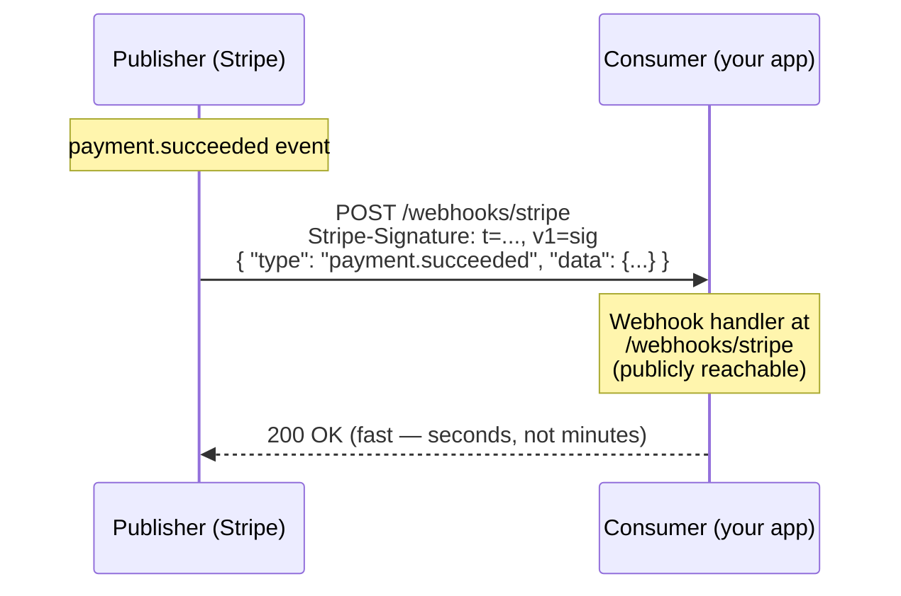
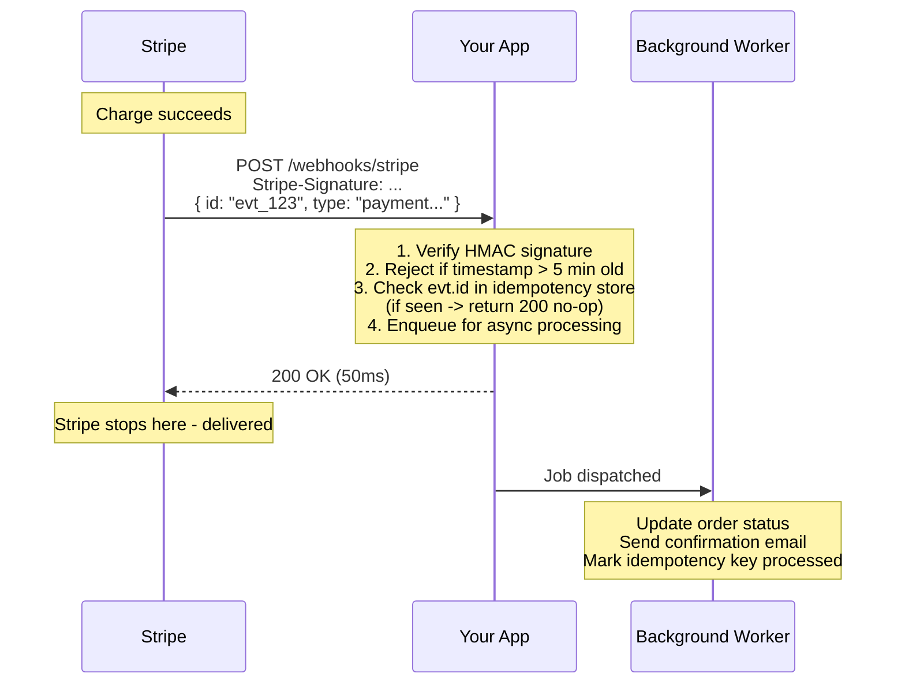

# Webhooks

> [Mastery Guide](../README.md) › [API Development](./README.md)

| Status | Priority | Phase | Last reviewed |
|---|---|---|---|
| Not Started | Low | Phase 8 — Microservices & Messaging | 2026-05-07 |

## Contents
- [Why it matters](#why-it-matters)
- [Core concepts](#core-concepts)
  - [What a webhook is](#what-a-webhook-is)
  - [Webhook delivery semantics](#webhook-delivery-semantics)
  - [Ordering, and what to do without it](#ordering-and-what-to-do-without-it)
  - [Event envelopes: CloudEvents and Standard Webhooks](#event-envelopes-cloudevents-and-standard-webhooks)
  - [Signing and verification](#signing-and-verification)
  - [Signatures beyond the shared secret: RFC 9421 and RFC 9530](#signatures-beyond-the-shared-secret-rfc-9421-and-rfc-9530)
  - [When HMAC is not on the table: mTLS and token-based delivery](#when-hmac-is-not-on-the-table-mtls-and-token-based-delivery)
  - [When your verifier is right and the signature still fails](#when-your-verifier-is-right-and-the-signature-still-fails)
  - [Retry strategy](#retry-strategy)
  - [Reconciliation: webhooks are a latency optimisation, not a source of truth](#reconciliation-webhooks-are-a-latency-optimisation-not-a-source-of-truth)
  - [Subscription management](#subscription-management)
  - [Proving the endpoint wants the traffic: the validation handshake](#proving-the-endpoint-wants-the-traffic-the-validation-handshake)
  - [Validating the subscriber URL: the publisher's SSRF problem](#validating-the-subscriber-url-the-publishers-ssrf-problem)
  - [Designing the delivery fleet](#designing-the-delivery-fleet)
  - [Observability for a webhook pipeline](#observability-for-a-webhook-pipeline)
  - [Testing beyond the tunnel](#testing-beyond-the-tunnel)
  - [Build or buy](#build-or-buy)
- [Code & diagrams](#code--diagrams)
- [Common pitfalls](#common-pitfalls)
- [Interview-ready summary](#interview-ready-summary)
- [Interview Cross-Questioning Drill](#interview-cross-questioning-drill)
- [Cheat Sheet](#cheat-sheet)
- [Walkthrough](#walkthrough--webhook-receiver-hammered-by-7-day-replay)
- [Self-test](#self-test)
- [Cross-references](#cross-references)
- [Sources](#sources)

---

## Why it matters

A webhook is the inversion of polling: instead of "tell me every 5 seconds if anything changed," it's "call me when something happens." This is how Stripe notifies you of completed payments, GitHub of pushed commits, Shopify of new orders. Webhooks are the dominant integration pattern between SaaS products — most modern services offer them.

Why interviewers ask: webhooks reveal whether a candidate has shipped real integrations. The questions aren't about HTTP — they're about what happens when the receiver is down (retries), how you prove the request is legitimate (signing), and how you handle "did this webhook process or not?" (idempotency keys). These are the operational concerns that separate a working integration from a reliable one.

When NOT to use webhooks: if the consumer needs guaranteed delivery and ordering (use a message queue with a polling consumer instead). If the consumer is behind a NAT that can't accept inbound HTTP. If real-time bidirectional communication is needed (use WebSockets).

## Core concepts

### What a webhook is

An HTTP POST callback to a consumer-supplied URL when an event happens on the publisher. The consumer registers their URL once; the publisher fires POSTs forever after.



Compare to polling: polling wastes round-trips when nothing changed and adds latency when something did. Webhooks are zero-cost-when-quiet and instant-when-active.

### Webhook delivery semantics

Most webhook publishers offer **at-least-once delivery**. Your handler will see each event at least once, but may see it multiple times. Implications:

- **Idempotency is mandatory.** Process the same event twice without side effects. Use the event ID as a dedup key.
- **Ordering is not guaranteed.** Event A and event B might arrive A→B, B→A, or interleaved with retries.
- **No transactions span the boundary.** The publisher commits the event (charge succeeded → DB updated → webhook queued); your processing is independent.

```csharp
[HttpPost("/webhooks/stripe")]
public async Task<IActionResult> ReceiveStripeWebhook(
    [FromBody] StripeEvent evt,
    [FromServices] IWebhookProcessor processor)
{
    // Idempotency check
    if (await _store.HasProcessedAsync(evt.Id))
        return Ok();   // already done; ignore

    await processor.ProcessAsync(evt);
    await _store.MarkProcessedAsync(evt.Id, ttl: TimeSpan.FromDays(7));

    return Ok();
}
```

### Ordering, and what to do without it

"Ordering is not guaranteed" is easy to nod along to and hard to design for. Stripe states plainly that it doesn't guarantee delivery of events in the order they were generated, and gives creating a subscription as the example: it produces `customer.subscription.created`, `invoice.created`, `invoice.paid` and a `charge.created`, and they can arrive in any sequence. Their advice is not to depend on order, and to retrieve any missing objects from the API.

The damage from ignoring this is quiet rather than loud. A `subscription.deleted` overtakes the `subscription.updated` that preceded it; you apply the delete, then the update lands and writes the subscription back to active. Nothing errors. The customer is cancelled in the publisher's system and billed by yours for another month, and you find out from a chargeback.

There are three defences, in increasing strength.

The weakest is to make handlers commutative — each event type only writes fields it exclusively owns, so no two handlers can overwrite each other. This works until two event types touch the same field, which is usually soon.

The version guard is the real answer where the publisher gives you one. If the payload carries a monotonically increasing sequence or version number for the aggregate, store the last version you applied next to the aggregate, and make the write conditional on the incoming version being higher — in the same transaction as the change, so two workers racing can't both win. It's last-write-wins by version rather than by arrival time. Do not substitute a timestamp for a version: events created in the same second tie, and clocks across a publisher's shards are not a total order.

```sql
UPDATE subscriptions
SET status = @status, last_event_version = @version
WHERE id = @id AND last_event_version < @version;
-- zero rows affected means the event is stale — discard it, return success
```

The strongest is to stop trusting the payload for state at all. Drill 7 introduces this as thin events: the webhook says *something changed on object 42*, and you fetch the current object from the publisher's API. It is also the complete answer to ordering, because a fetch always returns the newest state, so arrival order stops mattering entirely. You pay an extra API call per event and you lose the ability to observe intermediate states — which matters if your business logic cares that a payment was briefly `requires_action`.

> 🌍 **In the real world**: a subscription upgrade fires `updated`, and a cancellation seconds later fires `deleted`. Both retry once through a brief outage, and the retry of `updated` lands after `deleted`. The version guard turns that into a discarded no-op row; without it, the customer keeps their seat and the invoice keeps going out.

### Event envelopes: CloudEvents and Standard Webhooks

Two portable specifications exist, and they solve different halves of the problem. Knowing which one covers what is a cheap way to sound like you have integrated more than one publisher.

**CloudEvents** (a CNCF specification) standardises the metadata *around* your payload. Every event carries four required context attributes — `id`, `source`, `specversion` and `type` — plus optional ones such as `time` and `subject`. Its HTTP binding defines three content modes — binary, structured and batched — and the first two are the ones that shape your signing decision. In **binary mode** the context attributes travel as HTTP headers prefixed `ce-` (`ce-id`, `ce-type`, `ce-specversion`) and your data sits in the body untouched, which is efficient and works for any payload shape. In **structured mode** the whole event — attributes and data together — is a single JSON document with content type `application/cloudevents+json`, which survives being forwarded across hops and protocols.

That choice has a security consequence nobody mentions until it bites. In binary mode the attributes are in headers, so an HMAC computed over the body alone covers none of them: the same signed body can be re-labelled with a different `ce-type`. Structured mode puts everything inside the bytes you already sign. If you deliver in binary mode, your signature has to cover the headers too — which is exactly the problem the next section's RFC solves.

**Standard Webhooks** covers the layer CloudEvents deliberately leaves open: the signature. It is a community specification with a technical steering committee drawn from companies including Svix, Zapier and Twilio. It is *not* an IETF document and not an RFC — calling it one in an interview is the kind of small error that costs you the room. It defines three headers, `webhook-id`, `webhook-timestamp` and `webhook-signature`. The signed content is `{id}.{timestamp}.{payload}`, joined by full stops. The signature header holds a space-delimited list of entries, each prefixed with a version: `v1,<base64>` for symmetric HMAC, `v1a,<base64>` for asymmetric. Symmetric secrets are base64 with a `whsec_` prefix. The list is a list on purpose — it is how the spec supports zero-downtime secret rotation, with the receiver trying each signature until one matches.

Compare that with the `timestamp.body` scheme this chapter teaches for Stripe. Standard Webhooks binds the message ID into the signature itself, so the dedup key is authenticated rather than merely present somewhere in the JSON. It is a small design improvement with a real payoff: there is one canonical, spec-named place to look for the idempotency key, instead of a different field name per publisher.

> 🌍 **In the real world**: you are the publisher, and your third integrator asks for CloudEvents because their platform already routes on `ce-type`. Adopting structured mode costs you a body-format change and nothing else. Adopting binary mode costs you a new signing scheme, because your existing HMAC-over-body no longer protects the event type.

### Signing and verification

The publisher signs each request so the consumer can verify it's genuine. Two common schemes:

**HMAC-SHA256 over the body + timestamp** (Stripe, GitHub):

```
POST /webhooks/stripe
Stripe-Signature: t=1697040000,v1=5257a869e7ecebeda32affa62cdca3fa51cad7e77a0e56ff536d0ce8e108d8bd
Content-Type: application/json

{"id":"evt_123","type":"payment.succeeded",...}
```

Verification:
```csharp
public bool VerifyStripeSignature(string body, string signatureHeader, string secret)
{
    var parts = signatureHeader.Split(',').Select(p => p.Split('=')).ToDictionary(a => a[0], a => a[1]);
    var timestamp = long.Parse(parts["t"]);
    var providedSig = parts["v1"];

    // Reject anything older than 5 minutes
    if (Math.Abs(DateTimeOffset.UtcNow.ToUnixTimeSeconds() - timestamp) > 300)
        return false;

    var signedPayload = $"{timestamp}.{body}";
    var computed = ComputeHmacSha256Hex(signedPayload, secret);
    return CryptographicOperations.FixedTimeEquals(
        Encoding.UTF8.GetBytes(computed),
        Encoding.UTF8.GetBytes(providedSig));
}
```

**Public-key signing** (less common): publisher signs with private key, consumer verifies with public key. More overhead but useful when secrets can't be shared.

**Always use constant-time comparison** — `FixedTimeEquals` not `==`. Prevents timing-attack signature recovery.

### Signatures beyond the shared secret: RFC 9421 and RFC 9530

A shared-secret HMAC has two structural limits. Both parties hold the same key, so neither can prove to a third party who produced a given message — there is no non-repudiation. And it covers only the request body, so anything in the headers, the method or the URL is unprotected.

**RFC 9421, HTTP Message Signatures** (February 2024) is the IETF's answer. Instead of hashing one blob, you nominate a list of covered components: real header names, plus *derived components* whose names begin with an at sign — `@method`, `@target-uri`, `@authority`, `@scheme`, `@path`, `@query`, `@query-param`, `@request-target` and `@status`. That list, together with the signature parameters, goes in a `Signature-Input` field; the signature bytes go in `Signature`. There is also `Accept-Signature`, for a receiver to state what it expects.

The signature parameters are worth naming because they are the replay controls this chapter has otherwise been hand-rolling: `created` and `expires` for freshness, `nonce` for single-use, `alg` for the algorithm, `keyid` to say which key was used, and `tag` for an application-specific label. `keyid` in particular removes the try-both-secrets loop during rotation — the sender tells you which key it used.

RFC 9421 is explicit, in its introduction, that it does *not* define a way to cover the body directly; it relies on the digest specification instead. That specification is **RFC 9530, Digest Fields** (also February 2024), which obsoletes RFC 3230 and the old `Digest` and `Want-Digest` fields. It defines `Content-Digest` and `Repr-Digest`, plus `Want-Content-Digest` and `Want-Repr-Digest` for negotiation. The value is a structured-field dictionary keyed by algorithm — `sha-256` and `sha-512` are among those registered — with the digest itself as a byte sequence. `Content-Digest` covers the actual bytes on the wire; `Repr-Digest` covers the selected representation, which is what you want when transfer encoding or range requests mean the wire bytes and the resource bytes differ.

The two compose: put `content-digest` in the covered component list, and the signature now protects a hash of the body rather than the body itself. Given how hard this chapter leans on raw bytes elsewhere, the practical consequence deserves saying out loud — verification splits into two separable questions. *Does the body still hash to the digest the sender declared?* and *is the signed header set authentic?* When something goes wrong you learn which of those failed, instead of staring at one boolean and guessing.

Be careful how you pitch this. Most SaaS webhooks still ship bespoke HMAC schemes and will for years; RFC 9421 shows up mainly in newer standards work and in bank-to-bank contexts. What marks you out is knowing the RFC number, what it covers, and why it needs 9530 alongside it.

> 🌍 **In the real world**: a partner insists the signature must cover the destination URL, because their gateway fans one signed request out to several internal paths and they need to prove which one was intended. Body-only HMAC cannot express that. `@target-uri` in the covered component list can.

### When HMAC is not on the table: mTLS and token-based delivery

Every scheme so far assumes both sides can share a secret. Sometimes they cannot — because whoever holds the secret can mint messages, and the receiving organisation will not accept a credential that lets them forge the sender's traffic, or because their security policy requires an identity issued by a corporate identity provider rather than a string pasted into a vault. Banking and other regulated integrations tend to land here.

Two options, and they solve different things.

**Client certificates (mTLS).** The publisher presents a certificate during the TLS handshake; the receiver's edge validates it against a known certificate authority and checks the subject. The mechanics are covered in [API Security](./04-api-security.md) — what matters for webhooks is the operational cost. Certificate expiry becomes a scheduled outage unless someone owns renewal, and rotation is per-subscriber, so a fleet of a thousand endpoints is a thousand expiry dates. There is also a plumbing trap: the receiver's load balancer or CDN usually terminates TLS, so the client identity has to be forwarded to the application as a header — and that header must be trusted only when it arrives from the edge, otherwise anyone can set it themselves. On the .NET delivery side, the client certificate lives on `SocketsHttpHandler.SslOptions`, the handler's client TLS authentication options.

**Signed bearer tokens.** The publisher obtains a token from an identity provider and sends it as an `Authorization: Bearer` header; the receiver validates it like any other JWT — issuer, audience, signature, expiry. Azure Event Grid is the concrete, documented example: it can deliver to a webhook protected by Microsoft Entra ID, obtaining the token via a system-assigned or user-assigned managed identity enabled on the Event Grid topic, domain or namespace, and Microsoft's guidance is that Event Grid passes the bearer token on every message and your webhook must validate it. Note what that buys operationally — with a managed identity there is no bootstrap secret at either end to store, distribute or rotate. The platform issues the credential and expires it.

The point to make in an interview is that these authenticate the *transport*, not the *message*. mTLS proves the connection came from a holder of that certificate; it says nothing about the bytes once TLS is terminated at a proxy. A bearer token is bearer — anyone who captures it can replay it until it expires. Neither replaces the idempotency store, and in the highest-assurance setups you will see a signature over the message *as well*, which is where RFC 9421 reappears.

> 🌍 **In the real world**: the payments partner's security review rejects a shared secret outright, and you discover your delivery workers run behind a proxy that strips client certificates. The fix is not a code change — it's an architecture change, moving TLS origination to the workers themselves, and it is much cheaper to find during design than during onboarding.

### When your verifier is right and the signature still fails

This is a different failure from the re-serialisation trap covered elsewhere in this chapter. There, you broke your own signature by hashing a reparsed object. Here your verification code is provably correct — it passes unit tests against captured fixtures — and every single live signature fails, because something between the publisher and your handler changed the bytes.

Stripe states the constraint bluntly: it requires the raw body for signature verification, and any manipulation of the raw body causes verification to fail. Several intermediaries manipulate it as designed.

An AWS API Gateway with a Lambda proxy integration base64-encodes the request body when the content type matches a configured binary media type, and signals this with `isBase64Encoded` on the event. A handler that hashes the body field is hashing base64 text, not the JSON that was signed. A web application firewall that parses JSON to inspect it and then re-emits its own serialisation changes key order and whitespace. A proxy configured to normalise character encoding rewrites non-ASCII bytes in customer names. Each of these is a component doing its job.

There is a related failure that never even reaches your verifier: a redirect. Stripe treats redirect responses to webhook requests as failures and tells you to register the URL the redirect resolves to. So an `http` to `https` 301 sitting in front of your endpoint is not a signature problem — it is a delivery that is silently never made.

The reason this one is worth rehearsing is that you cannot debug it from inside the handler. The handler sees only the mangled bytes, and everything about them looks internally consistent. The diagnostic that works is to capture the byte length and a hash of the body at the outermost point you control and again at the handler, and compare both against the content length shown in the publisher's own delivery log. A length mismatch names the culprit in one step; if the received length is roughly four-thirds of the sent length, you are looking at base64 encoding.

The fix is to verify at the outermost component that still holds the original bytes, or to configure the intermediary to pass the body through untouched. Then put a synthetic signed request into the deployment smoke test, so the next infrastructure change fails in the pipeline rather than in production at the start of a billing run.

> 🌍 **In the real world**: verification works in staging and fails in production, and the only difference is that production sits behind the WAF. Nobody suspects it for two days because the WAF is not in the application's architecture diagram — it was added by the platform team, correctly, and it is the only component in the path that reads the body.

### Retry strategy

When the consumer returns non-2xx or times out, the publisher retries:

| Publisher | Retry schedule |
|---|---|
| Stripe | Exponential backoff over ~3 days in live mode; test mode is a handful of attempts over hours |
| Shopify | Up to 8 attempts over ~4 hours with exponential backoff (changed Sept 2024 — it used to be much longer) |

Exact attempt counts and windows drift — check the publisher's current docs rather than quoting numbers in an interview. What's stable is the shape: exponentially growing gaps and a cap on total attempts.

Implications for your handler:
- **Return 2xx fast** (within 5–30s, depending on publisher). Don't process synchronously if it's slow — enqueue.
- **Retry semantics are publisher-specific — read their docs.** Stripe retries *any* non-2xx response, so a 400 is retried on the same schedule as a 500; don't assume a 4xx is terminal anywhere else without checking. Return 5xx when you genuinely want a retry (your DB is down). For an event you will never be able to process, returning 2xx and recording it is the only reliable way to stop redelivery — idempotency, not the status code, is the control you actually have.
- **Track retried events.** A spike in retries means your handler is broken.

```csharp
[HttpPost("/webhooks/stripe")]
public async Task<IActionResult> Receive([FromBody] StripeEvent evt)
{
    if (!VerifySignature(...)) return BadRequest();   // 400 — refuse it (Stripe still retries)

    // Quick acceptance: enqueue for processing
    await _queue.EnqueueAsync(evt);

    return Ok();   // 200 within ms
}

// Background worker processes off the queue, with its own retry/idempotency
```

### Reconciliation: webhooks are a latency optimisation, not a source of truth

Everything above makes delivery highly probable. Nothing makes it certain. Your TLS certificate expires on a Sunday, a bad deploy returns 502 for eleven minutes, someone disables the endpoint during a migration and forgets it. Retries have a budget, and then they stop. If webhooks are your only path, the events inside that window are simply gone.

The senior answer is a **reconciliation sweep**: a scheduled job that reads the publisher's own event list and processes anything your dedup store has never seen. It is the same idea as a polling consumer, running alongside the webhook path rather than instead of it, and its cost is one paginated API call per cycle when nothing is wrong.

Stripe supports this directly. `GET /v1/events` returns events created in the last 30 days, filtered by `type` or `types`, by a `created` range, and — the useful one — by `delivery_success`, which when set to `false` returns only events that failed delivery to at least one of your endpoints. Their own guide for processing undelivered events pages with `ending_before` plus auto-pagination, which returns events in chronological order so you can process them in the order they were created. For individual events there is manual redelivery too: the dashboard's **Resend** works for up to 15 days after event creation, and the CLI's `stripe events resend <event_id> --webhook-endpoint=<endpoint_id>` for up to 30 days.

GitHub makes the case for reconciliation even more starkly, because it does not retry at all. Its documentation states that GitHub does not automatically redeliver failed webhook deliveries, and that a server which is down or takes longer than 10 seconds to respond has the delivery recorded as a failure. Recovery is entirely the consumer's job, through the deliveries APIs — list what was attempted since your last run, then trigger a redelivery by posting to the attempts endpoint: `/repos/{owner}/{repo}/hooks/{hook_id}/deliveries/{delivery_id}/attempts` for a repository hook, `/orgs/{org}/hooks/{hook_id}/deliveries/{delivery_id}/attempts` for an organisation hook, and `/app/hook/deliveries/{delivery_id}/attempts` for a GitHub App. Check the current docs for how far back the delivery history reaches, because that window is what bounds your recovery.

One trap that Stripe documents explicitly and candidates routinely miss: manually processing an event does **not** stop the automatic retries. Stripe still considers it undelivered and keeps retrying; the retry arrives, and your dedup store is what makes it a no-op. Reconciliation and idempotency are not two features — they are the same mechanism used twice.

Design the sweep to run more often than the publisher's retention window is long, keep a cursor so each run resumes where the last one stopped, and alert when it finds anything. A sweep that regularly picks up events is not a safety net doing its job; it is telling you the webhook path is broken.

> 🌍 **In the real world**: a certificate renewal fails overnight and every delivery is rejected at the TLS handshake for nine hours. Nobody notices until the morning, by which time the earliest events are close to the end of their retry budget. The nightly sweep with `delivery_success=false` recovers all of them before anyone has to explain the gap to finance.

### Subscription management

Consumers register webhook URLs through:
- **API endpoints:** `POST /v1/webhook_endpoints` with URL, event types, optional secret.
- **Dashboard UI:** Stripe, GitHub, Shopify all have one.

Lifecycle:
1. **Create:** consumer provides URL + selects event types. Publisher returns the signing secret (one-time display).
2. **Verify:** publisher may send a test event (`X-Webhook-Test: true`) before activating.
3. **Update / pause:** consumer can disable temporarily during deploys.
4. **Delete:** unsubscribe.

Some publishers send a "ping" challenge on subscription — receiver echoes back to prove URL is live.

### Proving the endpoint wants the traffic: the validation handshake

That ping is worth understanding properly, because it exists for a reason that is not "check the URL is live". Any system that will POST to an arbitrary URL a stranger typed in is a denial-of-service amplifier: register a victim's address, generate events, and the publisher attacks them on your behalf with its own reputation and IP ranges. The CloudEvents HTTP webhook specification says it directly in its abuse protection section — a legitimate delivery target needs to indicate that it agrees with notifications being delivered to it. It is equally explicit about what the handshake is *not*: it does not establish authentication or authorisation. It only stops the sender being pointed at someone who never asked.

The CloudEvents form of the handshake uses **HTTP OPTIONS** against the exact target URI being registered. The sender includes `WebHook-Request-Origin`, a DNS name identifying the sending system such as `eventemitter.example.com`, and may include `WebHook-Request-Rate` to ask permission for a given number of requests per minute, or `WebHook-Request-Callback` to let the target grant permission asynchronously over a separate HTTPS call. The target consents by returning `WebHook-Allowed-Origin` — either echoing the requested origin or a bare asterisk — alongside `WebHook-Allowed-Rate`. Consent deliberately cannot be inferred from the status code, because plenty of servers answer OPTIONS without meaning anything by it; a target that does not implement the handshake should return 405. Once permission is granted, the sender must send `WebHook-Request-Origin` on every delivery, carrying the same value it used in the handshake.

Azure Event Grid implements exactly this when the subscription's output schema is CloudEvents. With its own Event Grid schema it does something different and worth knowing by name: it POSTs a validation event carrying the header `aeg-event-type: SubscriptionValidation`, with an `eventType` of `Microsoft.EventGrid.SubscriptionValidationEvent`, whose `data` contains a randomly generated `validationCode`. Your endpoint echoes it back as `{"validationResponse": "<code>"}` with an HTTP **200** — Microsoft's docs note that 202 Accepted is explicitly not recognised — and the request must complete within 30 seconds, after which the operation is cancelled and reattempted 5 seconds later. There is an asynchronous route for endpoints that cannot answer programmatically: the same `data` carries a `validationUrl`, valid for 10 minutes and served on port 553, which a human can simply GET from a browser.

Two receiver-side details make this a good interview answer rather than a recitation. First, Microsoft's guidance is to check the `aeg-subscription-name` header and consent only to subscriptions you actually created — otherwise you are echoing validation codes back to anyone who guessed your URL, which defeats the whole point. Second, the same documentation is candid that the handshake does not stop a bad actor replaying deliveries afterwards; that is what Entra-protected delivery is for. Ownership and authenticity are separate problems, solved by separate mechanisms.

> 🌍 **In the real world**: a team ships an endpoint that returns 200 to everything, including OPTIONS and validation events. Subscription creation succeeds on the first try and everyone moves on. Six months later a different team's misconfiguration points a second event source at the same URL, and it validates instantly, because the endpoint never checked whether it had asked for that subscription.

### Validating the subscriber URL: the publisher's SSRF problem

Now flip the chapter around. Everything so far is the receiver's view. The moment you let customers register a URL, your delivery fleet becomes an HTTP client sitting inside your network, with your credentials and your network position, that strangers get to aim.

The attack is server-side request forgery. A customer registers `http://169.254.169.254/latest/meta-data/` — the cloud instance metadata address, on the link-local range defined by RFC 3927 — and your delivery worker fetches it. Or they register an RFC 1918 private address (`10.0.0.0/8`, `172.16.0.0/12`, `192.168.0.0/16`), or loopback (`127.0.0.0/8`, `::1/128`), and reach an internal admin API that trusts anything originating inside the VPC. Even when no response body ever comes back to the attacker, the difference between a connection refused in 2 milliseconds and a timeout after 30 seconds tells them whether a host and port exist. You have built them a port scanner.

A blocklist of literal IP addresses does not solve it, for three reasons.

**Hostnames.** `internal.attacker.com` resolves to `127.0.0.1`. Inspecting the URL string tells you nothing at all.

**DNS rebinding, and the time-of-check to time-of-use gap.** You resolve the name during registration and it answers with a perfectly ordinary public address, so it passes. When the delivery actually goes out, the client resolves again — a fresh lookup, seconds or days later, with a one-second TTL — and this time it answers `169.254.169.254`. The check and the use were two different resolutions, so validating the first one proves nothing about the second.

**Redirects.** The registered URL is genuinely fine and returns 302 to the metadata service. Following redirects hands the attacker a second destination that your validation never saw.

What actually works is layered, and each layer covers a different one of those.

Resolve the hostname yourself, validate every address it returns against the deny list, and then connect to *that validated address* rather than to a fresh lookup. This is DNS pinning, and in .NET it is precisely what `SocketsHttpHandler.ConnectCallback` exists for — it hands you control of opening the connection, so the socket goes to the IP you checked.

```csharp
handler.ConnectCallback = async (ctx, ct) =>
{
    var addresses = await Dns.GetHostAddressesAsync(ctx.DnsEndPoint.Host, ct);
    var target = addresses.FirstOrDefault(IsPubliclyRoutable)
        ?? throw new InvalidOperationException("subscriber URL resolves to a blocked address");

    var socket = new Socket(SocketType.Stream, ProtocolType.Tcp) { NoDelay = true };
    await socket.ConnectAsync(target, ctx.DnsEndPoint.Port, ct);   // the address we validated
    return new NetworkStream(socket, ownsSocket: true);
};
```

Turn redirect following off — `SocketsHttpHandler.AllowAutoRedirect = false`. A 3xx then counts as a failed delivery, which is the correct outcome and matches what Stripe does: it treats redirect responses to webhook requests as failures and tells the subscriber to register the resolved URL instead.

Finally, run deliveries through an egress proxy on a network segment with no route to anything internal, so that a bug in the validation layer still cannot reach a private host. Convoy's guide on tackling SSRF recommends exactly this pairing — resolve-and-validate before connecting, plus an isolated egress proxy such as Smokescreen — on the grounds that each layer is there for when the other one fails.

Require HTTPS and a publicly resolvable hostname at registration, and re-run validation at send time as well as at registration time. A URL that was safe when it was added is not necessarily safe today.

> 🌍 **In the real world**: a support engineer adds a webhook URL on a customer's behalf from a ticket, bypassing the registration API and its validation. The URL is a hostname that resolves inside your own VPC. Nothing breaks, nothing alerts, and the delivery worker cheerfully POSTs signed customer events to an internal service for months.

### Designing the delivery fleet

Once you are the publisher with thousands of subscribers, the interesting problems stop being about signatures and become entirely about isolation.

**Head-of-line blocking is the first one.** A single outbound queue means the customer whose endpoint takes 25 seconds and then times out sets the pace for everyone else. Partition the work per endpoint — a queue, or a partition key, per subscription — so a slow tenant delays only their own events, and whatever ordering you do offer stays intact within that tenant. Then weight the workers so no single endpoint can occupy the whole pool: the failure you are designing against is one customer's outage becoming everyone's latency.

**Second, stop hammering endpoints that are plainly down.** A per-endpoint circuit breaker — count consecutive failures, open the circuit, send a probe on a schedule, close on success — turns a customer's day-long outage from tens of thousands of doomed requests into a handful of probes. After the circuit has been open long enough, disable the subscription and notify its owner rather than retrying indefinitely. Convoy, an open-source webhook gateway, ships circuit breaking as a first-class feature for outbound delivery, which is a fair signal that this is table stakes rather than gold plating.

**Third, health scoring.** Keep per-endpoint success rate, response-time percentiles and consecutive failure count. Use it to set concurrency per endpoint, to prioritise healthy destinations when the fleet is saturated, and — most valuably — to expose it to the customer. A customer-visible delivery log with status codes and timings is the difference between a support ticket that says "your webhooks are broken" and one that says "our endpoint started returning 500 at 14:02".

**Fourth, connection reuse.** Every delivery to a cold endpoint pays a TCP handshake and a TLS handshake before a single byte of payload moves, and at fleet scale that is the dominant cost of a small POST. Pool connections per endpoint: `SocketsHttpHandler` exposes `PooledConnectionLifetime` and `MaxConnectionsPerServer` for this, and `EnableMultipleHttp2Connections` for when a receiver's HTTP/2 concurrent-stream limit becomes the constraint rather than the connection count. What you must not do is share one default-configured `HttpClient` across the whole fleet, because a single slow endpoint will then exhaust the shared connection pool for everyone.

On the .NET side, `Microsoft.Extensions.Http.Resilience` gives you `AddStandardResilienceHandler`, which layers a rate limiter, a total timeout, retry, a circuit breaker and a per-attempt timeout onto an `IHttpClientFactory` client. Before reaching for it, check the scope of the breaker's state against your design: a delivery fleet needs one breaker per subscriber endpoint, not one per named client, and getting that wrong means one failing customer opens the circuit for all of them.

> 🌍 **In the real world**: a single enterprise customer deploys a bad release and their endpoint starts taking the full timeout on every request. With one shared queue and one shared connection pool, delivery latency for every other customer triples within minutes, and the incident looks like a platform outage until someone graphs latency grouped by subscriber.

### Observability for a webhook pipeline

Retry rate and dead-letter alerts are covered elsewhere in this chapter. Four more signals separate a pipeline someone operates from one someone merely deployed.

**Delivery lag, which is not handler duration.** Measure now minus the event's own creation timestamp — Stripe's Event object carries `created`, and CloudEvents carries a `time` attribute. Handler duration can sit at 40 milliseconds while the events you are handling are four hours old, because they have been circling the publisher's retry queue the whole time. Only the lag tells you that. Track it as a distribution per event type; a growing tail is the earliest indication that something upstream of your code is failing.

**Dedup hit rate.** In steady state this sits near zero. A jump means you are being redelivered — and it moves *before* your error rate does, because the retries are succeeding, they are just redundant. It is the cheapest retry-storm alarm available, and it costs nothing extra, because you are already doing the lookup on every request.

**Dead-letter depth and the age of the oldest item.** Depth alone hides the slow case, where a trickle of poison events has been quietly accumulating for a fortnight without ever crossing a depth threshold. Age is the metric that tells you whether anyone is actually working the queue. Alert on both.

**Trace correlation.** W3C Trace Context defines the `traceparent` and `tracestate` headers, and most publishers will not send them, because the trace that produced the event lives in their system and ends when they enqueue it. So a webhook delivery is genuinely a new root — but you can still join the two halves when the context is available. CloudEvents defines a distributed tracing extension that carries `traceparent` and `tracestate` as event attributes; the extension itself states that it holds the *parent* trace for diagnosing failures and is not a replacement for the protocol's own tracing headers.

Where you do receive it, the correct .NET shape is a new root activity with a **link** to the parent context, not a child span. `ActivityContext.Parse(traceparent, tracestate)` gives you the context; the `ActivitySource.StartActivity` overload that accepts an `IEnumerable<ActivityLink>` attaches it. The distinction matters semantically: a link means "caused by", a parent means "part of the same operation", and a delivery that happens three hours after the event through two retries is emphatically not part of the same operation. Where there is no trace context at all, tag the span with the publisher's delivery ID and event ID — when the publisher's support team asks for a delivery ID, that tag is your join key.

> 🌍 **In the real world**: every dashboard is green — handler p99 under 50 milliseconds, zero errors, no dead letters — while orders are confirming six hours late. Nothing being measured could have shown it, because every metric in the pipeline started its clock the moment the request arrived.

### Testing beyond the tunnel

A tunnel gets you a URL. It does not get you a test suite, and "I ran ngrok" is not an answer to "how do you test this?".

**Synthetic events from the publisher** are the highest-value thing and the easiest to reach. `stripe trigger payment_intent.succeeded` creates the underlying API objects and fires the resulting events at whatever `stripe listen` is forwarding to. Two properties are worth knowing. It has real side effects — the objects genuinely get created in the sandbox, because triggering works by issuing API requests. And one trigger commonly produces several events; triggering `payment_intent.succeeded` also produces `payment_intent.created`. That cascade is free test coverage for the unexpected-event-type and out-of-order paths you would otherwise never exercise.

**Captured production payloads replayed into staging** are the next step up, and there are two obstacles, both solvable. The bodies contain customer data, so fixtures belong in a restricted store with a retention policy rather than in the repository — this chapter's own warning about logging bodies applies just as much to test fixtures. And the signature will not verify, because signing secrets differ per environment. Re-sign the captured body with the staging secret at replay time; the tempting shortcut of injecting past the verifier leaves the verifier itself permanently untested, which is exactly the component that will fail you.

**Fixtures per documented event type in CI** are already named in Drill 12 as a defence against schema drift. The pipeline story around them is that the fixture set gets regenerated from the publisher's documented event types on a schedule, so a newly added enum value or field appears as a failing build rather than as an exception at three in the morning.

**A signed synthetic request in the deployment smoke test**, run against each environment after deploy, catches the infrastructure-level body mangling described earlier before customers do.

Finally, the failure mode with a name: *works locally, 400s in production*. `stripe listen` prints a signing secret belonging to that CLI session, and Stripe's documentation states that an endpoint used with both test and live API keys has a different secret for each. Configuration that resolves one secret for all environments passes every local test and rejects every live event. Assert at startup that the configured secret is present and environment-specific, and fail fast if it is not — a service that refuses to start beats a service that returns 400 to a payment processor for three days.

> 🌍 **In the real world**: the local secret gets committed into an `appsettings.json` default during a rushed spike, production picks it up because nobody set the environment variable, and the first live payment webhook fails signature verification. Stripe retries it for three days while the team debugs their perfectly correct HMAC code.

### Build or buy

Two separate questions hide under this heading, and conflating them is a common stumble.

**Do you hand-roll signature verification?** Almost always no, and there is a concrete reason rather than a stylistic one. Stripe's `Stripe-Signature` header is not one signature — it is a list. When you roll an endpoint's secret you can keep the previous one active for up to 24 hours, and during that window Stripe generates one signature per active secret, so you receive two `v1=` entries. Stripe also sends an extra signature with a deliberately fake `v0` scheme on test events, and its documentation tells you to ignore every scheme that is not `v1` in order to prevent downgrade attacks. A hand-written parser that splits on commas and builds a dictionary keyed by prefix throws on the duplicate `v1` key — during a secret rotation, which is precisely the moment you least want your verifier to fail. The official library handles the list, the scheme filter and the timestamp tolerance: in .NET that is `EventUtility.ConstructEvent(json, signatureHeader, secret)` from Stripe.net, which throws on failure rather than returning a boolean you can forget to check. Write the manual version once, in an interview, to prove you know what it does — then use the library.

**Do you build the delivery platform?** If you are the publisher and webhooks are a product surface, look at the checklist this chapter has accumulated: per-tenant queues, circuit breaking and auto-disable, SSRF-safe egress, secret rotation with an overlap window, a customer-visible delivery log with replay, retention policy, per-subscriber observability. None of it is your differentiator, and all of it is a full-time component. The available options split by direction of travel — Svix sells outbound delivery with an embeddable management portal for your customers; Hookdeck sits in front of your receivers to ingest, buffer, route and retry inbound webhooks; Convoy is an open-source gateway you can self-host that handles both directions and ships circuit breaking and SSRF protection.

The answer that lands in an interview is a boundary rather than a preference. Buy — or self-host something purpose-built — when you are *sending* webhooks to many tenants you do not control, because every hard problem there is a tenant-isolation problem and you will rebuild the same queue-per-endpoint machinery worse. Build when you are *receiving* from a handful of known publishers, because verify, dedup, enqueue is a couple of hundred lines you fully understand, and inserting a managed gateway in front of it adds a dependency, a hop and a second place for the raw bytes to be mangled.

> 🌍 **In the real world**: a team builds outbound webhooks in a sprint, ships to twelve customers, and it works fine. At two hundred customers they are on their third incident caused by one slow endpoint, and the rebuild — queues per subscriber, breakers, a delivery log customers can self-serve — takes a quarter that was not in any roadmap.

## Code & diagrams

<details>
<summary>🧩 Click to expand — code samples and diagrams</summary>

### End-to-end webhook flow



### Idempotent webhook handler template

```csharp
public class WebhookHandler(
    IWebhookSignatureVerifier verifier,
    IIdempotencyStore idempotency,
    IBackgroundQueue queue,
    ILogger<WebhookHandler> log)
{
    public async Task<IResult> HandleAsync(HttpRequest req, CancellationToken ct)
    {
        // 1. Read raw body for signature verification
        using var reader = new StreamReader(req.Body);
        var body = await reader.ReadToEndAsync(ct);

        // 2. Verify signature (fail-fast, return 400 on tampering)
        if (!verifier.Verify(body, req.Headers["Stripe-Signature"]!))
        {
            log.LogWarning("Webhook signature verification failed");
            return Results.BadRequest();
        }

        // 3. Parse event
        var evt = JsonSerializer.Deserialize<StripeEvent>(body)!;

        // 4. Idempotency check
        if (await idempotency.HasProcessedAsync(evt.Id, ct))
        {
            log.LogInformation("Duplicate webhook {EventId}; ignoring", evt.Id);
            return Results.Ok();
        }

        // 5. Enqueue for processing
        await queue.EnqueueAsync(new WebhookJob(evt), ct);

        // 6. Mark accepted (NOT processed — that happens in the worker)
        await idempotency.MarkAcceptedAsync(evt.Id, TimeSpan.FromDays(7), ct);

        return Results.Ok();
    }
}
```

### When a webhook is wrong: retry storm vs DLQ

```
Bad handler (no idempotency, intermittent failures):

t=0     POST evt_123  → 500 (DB down)
t=1m    POST evt_123  → 500 (still down)         ← retry
t=10m   POST evt_123  → 200 (DB back; processed)  ← success but...
t=15m   POST evt_123  → 200 (processed AGAIN!)    ← Stripe retries because it didn't see 200 fast
                                                    enough on attempt 2 (timeout)
                                                    Order shipped twice!

Fix: idempotency store keyed by evt.Id ensures second processing is a no-op.
```

### Signature verification timing safety

```csharp
// ❌ Vulnerable to timing attack
if (computed != provided) return false;

// ✅ Constant-time comparison
if (!CryptographicOperations.FixedTimeEquals(
    Encoding.UTF8.GetBytes(computed),
    Encoding.UTF8.GetBytes(provided)))
    return false;
```

The naive `==` comparison short-circuits on first different character — measuring response time across many guesses leaks the secret one byte at a time.

</details>

## Common pitfalls

1. **Synchronous processing inside the handler.** Webhook processing taking 30 seconds → publisher times out, retries, you process again. Always enqueue and return 200 fast.
2. **No signature verification.** Anyone can POST to your `/webhooks/stripe` with fake events. Verify the HMAC every time.
3. **Verifying signature against parsed JSON.** Re-serialization changes whitespace/key order — signature won't match. Verify against the **raw bytes** of the body.
4. **No idempotency.** Retries process the same event twice. Use `evt.Id` as the dedup key with a 7+ day TTL.
5. **Assuming the status code switches retries off.** Whether a 4xx is terminal is publisher-specific — read their docs; with Stripe every non-2xx is retried, so returning 400 for an event you can never process just replays the same failure for three days. Log it, return 2xx, and let the dedup store hold it.
6. **Webhook URL not publicly reachable.** Localhost can't receive webhooks. Use ngrok / cloudflared in dev; a real domain in prod.
7. **Logging the entire request body.** Webhook bodies often contain customer data, payment info. Log only event ID and type.
8. **No timestamp check.** A captured webhook can be replayed weeks later. Reject events older than ~5 minutes.
9. **Handler doing too much.** Email, DB write, third-party call all in the request. Enqueue and let workers do the work; rollback is impossible across HTTP.
10. **Not handling out-of-order events.** A `payment.succeeded` arrives before `payment.created` due to retries. Reconstruct state from the event payload, don't rely on order.
11. **No monitoring on retry rate.** Silent failures in your handler trigger millions of retries; you discover via the publisher's email that you've been suspended.
12. **Storing the signing secret in source control.** Use Key Vault / Secrets Manager. Rotate periodically.

## Interview-ready summary

- **Webhook = HTTP POST callback** when an event happens. Inverts polling.
- **At-least-once delivery** is the norm. Idempotency is mandatory.
- **HMAC-SHA256 + timestamp** is the standard signing scheme. Verify against raw body bytes; use constant-time comparison.
- **Return 2xx fast.** Enqueue for async processing.
- **Reject events** older than ~5 minutes (replay protection).
- **Status codes don't reliably stop retries.** Stripe retries any non-2xx; whether a 4xx is terminal is publisher-specific — read their docs.

**Expected interview questions:**

1. *"Design a webhook receiver for Stripe payment events."* — Public POST endpoint → verify HMAC against raw body → check `evt.id` in idempotency store → enqueue for async processing → return 200. Background worker does the actual business logic with its own retry/error handling.
2. *"What if the same webhook arrives twice?"* — Idempotency store keyed by event ID. If seen, return 200 (no-op). The 7-day retention covers retry windows.
3. *"How do you verify a webhook is legitimate?"* — HMAC-SHA256 over `timestamp.body` using shared secret. Compare in constant time. Reject if signature doesn't match or timestamp > 5 min old (replay protection).
4. *"What status code if the body is malformed?"* — 400 for a request you refuse (bad signature, unparseable body); 5xx only for transient problems you want retried (your DB is down). Say the caveat too: Stripe retries any non-2xx, so a 400 doesn't stop redelivery — for an event you can never process, 2xx plus a durable log is what ends it.
5. *"How do you make webhook processing reliable?"* — Verify signature → idempotency check → enqueue → return 200 quickly. The actual work happens in workers with their own retry policies. Decouples webhook acknowledgment from business processing.
6. *"Webhooks vs polling vs message queues?"* — Webhooks: real-time, zero-cost when quiet, requires public endpoint, at-least-once. Polling: simple but wasteful and laggy. Message queues: guaranteed delivery + ordering, but consumer must poll the queue.
7. *"How do you debug webhooks in development?"* — `ngrok http 5000` gives a public URL forwarding to localhost. Stripe CLI also has `stripe listen --forward-to localhost:5000/webhooks/stripe`.

## Interview Cross-Questioning Drill

<details>
<summary>📖 Click to expand — cross-question chains (~15-20 min, cover answers and write cold)</summary>

> ⚠️ **Honest caveat**: reading this once doesn't make you interview-ready. Cover the answers, write them cold, then check. Pair with a senior for live mock cross-questioning. The guide removes "I never thought about that" surprises; mock interviews convert knowledge into reflex. Both are needed.

Each drill is **Q → A → Cross-Q → A → Cross-Q² → A**.

### Drill 1 — HMAC signature verification

> **Q**: A partner sends webhooks signed with HMAC-SHA256 over `timestamp.body`. Walk me through verification.
>
> **A**: Read the raw request body bytes (before model binding), extract the `timestamp` and `signature` from a header like `X-Signature: t=...,v1=...`, compute `HMACSHA256(secret, timestamp + "." + raw_body)`, hex-encode it, compare to the provided signature using `CryptographicOperations.FixedTimeEquals`. Reject the request if the comparison fails.
>
> **Cross-Q**: Why specifically `FixedTimeEquals` and not `==`?
>
> **A**: `==` (or `string.Equals`) short-circuits on the first byte that differs. An attacker measures response time across many guesses; the request that takes microseconds longer is the one that matched one more byte. Repeat byte-by-byte and the signature falls out. `FixedTimeEquals` compares all bytes regardless of mismatches — the runtime is identical whether you matched zero bytes or 31 of 32. Same reason JWT validation, password hash comparison, and TLS MAC checking all use constant-time compare.
>
> **Cross-Q²**: I verify against `JsonSerializer.Deserialize<T>(body)` rather than the raw bytes. Why does this fail?
>
> **A**: Re-serializing the parsed object produces semantically-equivalent but byte-different JSON — different whitespace, key order, escape sequences, decimal precision, trailing newlines. The HMAC is over the **exact bytes** the publisher sent. Even a single space difference produces a totally different hash. Capture raw bytes via `request.EnableBuffering()` + `StreamReader.ReadToEndAsync()` **before** model binding, verify against those exact bytes, *then* deserialize the same string for application use.

### Drill 2 — Replay attacks

> **Q**: HMAC signatures are valid forever — how does the timestamp + window prevent replay attacks?
>
> **A**: Reject any event whose timestamp differs from server time by more than ~5 minutes. A captured webhook (from log files, a compromised proxy, a leaked CI artifact) is cryptographically valid forever, but expiring it by time means the attacker has at most 5 minutes from capture to replay. Without the window, an attacker who captured a `payment.succeeded` webhook 2 years ago could replay it today and credit the same payment again.
>
> **Cross-Q**: Why is the timestamp part of the signed payload, not just a separate header?
>
> **A**: If the timestamp were unsigned, the attacker could **rewrite it** to be current and pass the freshness check while keeping the original body and signature — but the signature only covers the body, so the rewrite goes undetected. By signing `timestamp.body`, any tampering with timestamp invalidates the signature. The two checks (signature valid + timestamp fresh) only work together when the timestamp is inside the signed envelope.
>
> **Cross-Q²**: What if the publisher's clock and yours drift by 10 minutes?
>
> **A**: Every webhook fails the freshness check, even legitimate ones. NTP keeps server clocks within milliseconds in practice; if you're seeing 10-minute drift, something is broken (VM clock, container time, deliberate skew). The 5-minute window accommodates real-world drift up to ~2-3 minutes; widening to 30 minutes degrades security. The right fix is server clock discipline (NTP, chrony, AWS Time Sync), not loosening the window.

### Drill 3 — Retry strategy with exponential backoff

> **Q**: What's the standard retry strategy for a webhook publisher when the consumer fails?
>
> **A**: Exponential backoff with jitter, capped at a max delay, capped at a max total attempts/duration. Stripe spreads its retries over ~3 days with exponentially growing gaps; Shopify does up to 8 attempts over ~4 hours — quote the shape, not the counts, because they drift (Shopify's own numbers changed in September 2024). Jitter prevents retry storms — without it, many simultaneous failures would all retry at the same instant on subsequent backoff cycles.
>
> **Cross-Q**: Why does the consumer's HTTP response code shape the retry behavior?
>
> **A**: Up to a point, and the point is publisher-specific. `2xx` means delivered, stop. `5xx` and timeouts are normally read as transient and retried. `4xx` is where publishers diverge — don't assume it's terminal without reading their docs; Stripe retries any non-2xx, so a 400 is retried on exactly the same schedule as a 500. So choose codes for what they mean, not for the retry behaviour you hope to trigger: 400 for a bad signature, 500/503 for "DB is down" (please retry), 429 for "I'm rate-limited" (back off, retry later). Returning 200 to mean "I crashed but I don't want spam" is still the worst case — silent data loss. And for an event you will genuinely never process — unknown type, tenant deleted — 2xx plus a durable record is the right answer, because no 4xx is guaranteed to stop the retries.
>
> **Cross-Q²**: Jitter is added — but where exactly in the formula?
>
> **A**: Two common patterns. **Full jitter**: `delay = random_between(0, base * 2^attempt)` — high variance, best for thundering-herd avoidance. **Decorrelated jitter** (AWS): `delay = random_between(base, previous_delay * 3)`, capped at `max` — smoother, still avoids correlation. The trap is "equal jitter" `base*2^attempt/2 + random(0, base*2^attempt/2)` which adds variance but keeps the mean correlated. AWS's blog post on jitter is the canonical reference; the takeaway: any randomization is better than none, full jitter is good enough for most cases.

### Drill 4 — Idempotency keys

> **Q**: A webhook is delivered at-least-once. How does the consumer dedup?
>
> **A**: Treat the publisher's event ID (`evt_123` for Stripe, the GitHub delivery UUID) as the dedup key. Maintain a store (Redis, table with a unique index) of processed event IDs with a TTL covering the publisher's retry window (7+ days). On receipt: check the store first, if seen return 200 immediately, else process and mark.
>
> **Cross-Q**: A redelivered event arrives during the original's processing — what happens?
>
> **A**: Race condition. The dedup check sees "not processed" for both, both start processing. Two fixes layered: **(1) HTTP layer**: optimistic mark — write to dedup store with `INSERT ON CONFLICT DO NOTHING`; the second one fails the insert and returns 200 without processing. **(2) Application layer**: the actual side-effect (e.g., charging the customer) uses a **DB unique constraint** on `processed_events(event_id)` *in the same transaction* as the side effect. If two workers race past the HTTP check, the DB constraint serializes them — only one commit succeeds. HTTP layer is fast happy-path; DB constraint is the correctness safety net.
>
> **Cross-Q²**: How long should the dedup TTL be?
>
> **A**: Longer than the publisher's longest retry window. Stripe retries for up to three days, so 7 days is comfortable. Anything shorter risks dedup-store expiry between the original delivery and a late retry → reprocessing. Storage cost is trivial (one row per event, 4M events/day × 7 days = 28M rows = tiny in any modern DB). The legitimate reason to keep it tight (cost, table size) almost never outweighs the correctness risk of premature expiry.

### Drill 5 — Dead-letter handling

> **Q**: After N retries the webhook still fails. What now?
>
> **A**: Move to a **dead-letter queue (DLQ)** — a separate store for events that exhausted retries. Triggers an alert. A human investigates: is it a parser bug (fix code, replay from DLQ), schema drift (update model, replay), legitimately bad data (skip, document)? The DLQ is the bridge between "automatic retries" and "human attention" — you never silently drop events.
>
> **Cross-Q**: Stripe and GitHub don't expose a DLQ to consumers. So where do you put unprocessable events?
>
> **A**: On the consumer side. Each event that fails N internal worker retries gets persisted to a `failed_webhooks` table or a Redis sorted-set keyed by retry-eligible-time, with the full original payload, signature, headers, and the last exception. Alerting + manual UI for inspection and replay. The publisher's retry budget is one dimension; your internal processing pipeline has its own DLQ for events that pass HMAC + idempotency but fail business logic.
>
> **Cross-Q²**: A `payment.succeeded` event lands in the DLQ because of a transient outage. Two weeks later you fix it and "replay" it — what could go wrong?
>
> **A**: (1) **Stale state** — the customer might have refunded, churned, or been deleted in the interim; replaying naïvely re-credits a closed account. (2) **Idempotency keys expired** — your dedup store cleared the original `evt_id` after 7 days, so replay processes it again, but the publisher might also have stopped retrying so this is the only delivery. (3) **Downstream side effects** — emails, inventory holds, fraud-system signals all replay too. The right pattern: DLQ replay is **manual and audited**, with idempotent business logic that re-checks current state before acting (don't ship an order that's already cancelled).

### Drill 6 — Webhook URL discovery

> **Q**: How does the publisher know where to send the webhook?
>
> **A**: Two patterns. **Registration API**: consumer calls `POST /v1/webhook_endpoints` with their URL + event types + (sometimes) a custom secret. Publisher stores it and starts firing. **Dashboard UI**: human goes to Stripe/GitHub/Shopify settings, pastes URL, picks events. Hardcoded URLs are rare — only seen in tight bilateral integrations where ops manages the URL out-of-band.
>
> **Cross-Q**: Why does the publisher return the signing secret only once, at creation?
>
> **A**: Treat it like an API key — show on creation, hash and discard on the publisher side, can't be retrieved later. If the consumer loses it, they must rotate (delete the endpoint, create a new one with a new secret). This matches modern secret-management practice (Stripe API keys, AWS access keys, GitHub PATs all work this way). The principle: secrets in the publisher's DB at rest is a breach risk; show once, store the hash for verification only.
>
> **Cross-Q²**: How do you rotate a webhook secret without dropping events?
>
> **A**: Stripe-style **overlap window** — the publisher supports multiple active secrets per endpoint for ~24h during rotation. Consumer accepts signatures from either old or new secret. Steps: (1) Publisher generates new secret, returns it. (2) Consumer adds new secret to its verifier list (still accepts both). (3) Publisher switches to signing with new only. (4) After overlap window, consumer drops old secret from list. Without the overlap, there's an inevitable seam where in-flight events signed with the old key get rejected by the new-only consumer.

### Drill 7 — Polling vs webhooks

> **Q**: When is polling the right choice and when are webhooks?
>
> **A**: **Webhooks** when (1) events are rare and bursty (wasteful to poll constantly), (2) low-latency push matters (payment confirmation in <1 second), (3) consumer can expose a public endpoint. **Polling** when (1) consumer is behind a firewall/NAT (can't accept inbound HTTP), (2) the publisher doesn't offer webhooks, (3) the consumer needs guaranteed-eventual-delivery and can checkpoint progress (poll a queue with a cursor), (4) traffic is high and steady — webhook overhead per event > polling overhead.
>
> **Cross-Q**: A hybrid pattern uses both. What does it look like?
>
> **A**: **Webhook for the notification, polling for the data.** The webhook says "something changed at order 42," it doesn't include the order data. The consumer fetches the current state from a REST API. This pattern (Stripe's "thin events", GitHub's webhook → REST workflow) avoids the dual-write/payload-staleness problem — if the consumer is slow processing webhooks, what matters is that they eventually fetch and process; the webhook payload itself can't be out of date because it doesn't carry state.
>
> **Cross-Q²**: Webhooks beat polling for low latency. But what's the failure mode polling avoids?
>
> **A**: Webhooks fail when the consumer endpoint is unreachable — even with retries, prolonged outages bottleneck the publisher's queue and eventually they suspend the integration. Polling fails *by the consumer not running* — but as soon as they start, they catch up by reading from the publisher's queue with a cursor. Polling has **better failure semantics for long outages**; webhooks have better steady-state latency. Public SaaS (Stripe, GitHub) use webhooks because most consumers are always-on; internal cross-system integration often uses polling because consumer uptime can't be guaranteed.

### Drill 8 — Webhook security checklist

> **Q**: A new webhook endpoint goes to prod tomorrow. What security checks must be in place?
>
> **A**: (1) **TLS only** — `https://`, HSTS, modern ciphers. (2) **Signature verification** on every request — HMAC-SHA256 + raw bytes + `FixedTimeEquals`. (3) **Timestamp window** — reject events older than 5 minutes. (4) **Origin allowlist** — accept only the publisher's documented IP ranges (firewall or middleware check). (5) **Secrets in vault** — not in source, not in env vars (Key Vault, Secrets Manager). (6) **Rate limit** at the edge — even legitimate publishers can have bursts that overwhelm you. (7) **Logging without secrets** — never log signature header values, never log full body if it contains PII.
>
> **Cross-Q**: Origin allowlist by IP — what's the risk and is it worth it?
>
> **A**: IP allowlists drift — Stripe, GitHub publish their IP ranges but they change. Keeping the allowlist current is operational work; missing an update silently drops legitimate events. Risk if not maintained: events lost during a publisher's IP migration. Worth it as **defense in depth**, not as primary auth — the HMAC signature is the auth, the IP allowlist filters obvious garbage at the edge so your endpoint isn't hammered by drive-by scanners. Don't treat it as your only line of defense.
>
> **Cross-Q²**: A webhook is replayed within the 5-minute window, signature is valid. What stops it?
>
> **A**: **Idempotency**. Signature + freshness can't tell a "first delivery" from a "replay 4 minutes later" — both look identical (same body, same valid signature, both timestamps within window). The dedup store keyed by `evt_id` is the only defense for in-window replay. This is why the three checks compose: (signature) prevents forgery, (timestamp) prevents long-window replay, (idempotency) prevents short-window replay. Removing any one leaves a gap.

### Drill 9 — Local webhook testing

> **Q**: A developer's webhook handler runs on `localhost:5000`. How do they receive webhooks in development?
>
> **A**: Expose localhost via a tunnel — **ngrok** (`ngrok http 5000` gives a public `https://<random>.ngrok-free.app` URL forwarding to local — the old `*.ngrok.io` free subdomains are gone), **cloudflared tunnel**, **Stripe CLI** (`stripe listen --forward-to localhost:5000/webhooks/stripe` signs and forwards Stripe events to local), **smee.io** (a free relay from the Probot community project, not a GitHub product — point your GitHub webhook at smee.io, smee.io forwards to a local client), **VS Dev Tunnels** in IDE.
>
> **Cross-Q**: What's the security risk of leaving an ngrok tunnel open?
>
> **A**: Anyone with the URL can POST to your local handler — random scanners, port-scrapers, sometimes someone who recognizes the URL pattern. Mitigations: (1) Verify the signature in dev exactly as you do in prod, so unsigned drive-by traffic is rejected anyway, (2) Use the Stripe CLI, which only forwards Stripe-signed events, (3) Tear down the tunnel when you're done — most devs leave them running indefinitely.
>
> **Cross-Q²**: Stripe CLI vs ngrok — when each?
>
> **A**: **Stripe CLI** when you only test Stripe — it bypasses ngrok entirely, uses a long-poll connection to Stripe's API, signs events locally with your test webhook secret, and forwards them to localhost. Much simpler, no public URL, no random traffic. **ngrok** when you test multiple publishers or want a real public URL (testing OAuth callback URLs, sharing a dev site with a designer). For Stripe-only dev work, CLI is strictly better; for everything else, ngrok.

### Drill 10 — WebSub (hub model)

> **Q**: How does WebSub extend the simple webhook pattern?
>
> **A**: WebSub (formerly PubSubHubbub) adds a **hub** between publisher and subscriber. Publisher pings the hub "I updated"; the hub fans out to all subscribers. Subscribers register with the hub once (with discovery via `<link rel="hub">` HTML tag). Used in podcast feeds, blog feeds, ActivityPub. Solves: one publisher → many subscribers, where the publisher doesn't want to maintain N webhook configs and N retry loops.
>
> **Cross-Q**: How is WebSub different from server-side pub/sub (Kafka, Redis pub/sub)?
>
> **A**: WebSub is **over HTTP, pull-based discovery, push-based delivery, internet-scale**. It's designed for cross-organization fan-out (RSS at scale) where subscribers come and go and the publisher doesn't control the infrastructure. Kafka/Redis are internal infra — single-org, controlled cluster, lower latency, ordering guarantees, much higher throughput. WebSub trades performance for federation; Kafka trades federation for performance.
>
> **Cross-Q²**: Why is WebSub mostly absent from modern SaaS (Stripe, GitHub use direct webhooks, not WebSub)?
>
> **A**: SaaS publishers want **control** — over signing keys, retry policy, observability ("which customer's endpoint is failing?"), rate limiting per-subscriber. WebSub abstracts this away through the hub, losing per-subscriber telemetry and policy. Direct webhooks let Stripe know exactly when customer X's endpoint started returning 500s and surface that to the customer's dashboard. WebSub thrives in **federated** ecosystems (Fediverse, RSS) where no single org owns the publishers; SaaS thrives on direct delivery where the publisher *is* the platform.

### Drill 11 — Backpressure when consumer can't keep up

> **Q**: A consumer's endpoint is healthy but slow — webhooks pile up faster than they process. What happens?
>
> **A**: The publisher's queue for that consumer grows. If the consumer returns 200s slowly, the publisher's per-customer concurrency limit fills, new events queue, eventually queue depth alerts fire on the publisher side and they may **rate-limit or suspend** delivery.
>
> **Cross-Q**: What's the consumer-side fix?
>
> **A**: **Decouple acceptance from processing.** The webhook handler must do almost nothing — verify signature, dedup-check, enqueue to internal Kafka/RabbitMQ/SQS, return 200 in under 100ms. Internal workers process at their own pace, scale horizontally, retry independently. The publisher only sees "delivered" instantly; backpressure happens inside your own infra where you control it. The walkthrough in this chapter is this exact pattern.
>
> **Cross-Q²**: What if internal queue fills up faster than workers can drain?
>
> **A**: Now you're back to backpressure, just one layer in. Solutions in order: (1) **Scale workers horizontally** — typically the right answer. (2) **Process in batches** — workers pull 100 events, process in one bulk operation. (3) **Shed load** at the edge — if queue depth > N, return 503 to publisher (Stripe will retry with backoff). (4) **Drop low-priority event types** if business permits. Avoid: synchronous processing in the webhook handler (you'll cascade-fail), and unbounded queues (you'll OOM the worker pool).

### Drill 12 — Versioning webhook payloads

> **Q**: How do you version webhook payloads as the schema evolves?
>
> **A**: Multiple strategies. (1) **Version in the event type**: `payment.succeeded.v2` vs `payment.succeeded`. Consumers register for the version they understand. (2) **Version in the payload**: a top-level `version` field; consumers branch on it. (3) **Per-endpoint version pinning** (Stripe's classic model): the consumer pins their endpoint to a specific dated API version; Stripe sends every event in that version's schema until the consumer migrates. Pinning is the most consumer-friendly because it doesn't require simultaneous consumer/publisher upgrades.
>
> **Cross-Q**: How is webhook versioning different from REST API versioning?
>
> **A**: REST consumers pull on their schedule and pick versions per call. Webhooks **push** — the consumer's processing window starts the moment the event is sent. If the publisher silently changes the schema, the consumer's parser breaks at runtime with no warning. So webhooks need **additive-only evolution** between minor versions (new optional fields fine, removing fields or changing types breaking) and explicit versioned event types for breaking changes.
>
> **Cross-Q²**: A consumer ignores the version field and parses with old code. New optional field appears in v2 payloads. What breaks?
>
> **A**: Nothing immediately, if the consumer uses lenient JSON parsing (`System.Text.Json` defaults to ignoring unknown properties). It breaks when v3 adds a required field, or when v2 adds a new value to an enum the consumer treats as exhaustive (a `switch` without a default case → `ArgumentException`). Defenses: (1) always-ignore-unknown-properties on the JSON deserializer, (2) treat enums as open sets (`switch` always has a `default` that logs and falls through to a safe behavior, never throws), (3) integration tests against fixtures of every documented event type.

### Drill 13 — At-least-once delivery

> **Q**: Publishers offer at-least-once delivery. What's the consumer contract this implies?
>
> **A**: Every event handler **must be idempotent**. Re-processing the same event must not produce different observable behavior. This propagates from the webhook handler to every downstream side effect — DB writes, emails, third-party calls. The consumer can't push back ("please only deliver once") — the network and publisher infrastructure make exactly-once delivery undecidable in general (Stripe might receive your 200 ack but your DB rollback was after; was the event "delivered"?).
>
> **Cross-Q**: What about "exactly-once" semantics — when is that actually achievable?
>
> **A**: Exactly-once **delivery** is impossible in distributed systems (two generals problem). Exactly-once **processing** is achievable *if the side effects are transactional with the dedup state*. Pattern: in one DB transaction, INSERT into `processed_events(event_id)` with a unique constraint AND apply the side effect. If the constraint violates, transaction rolls back, no side effect, return 200 — the dedup of the first try is intact. The trick is making the side effect itself transactional with the dedup write; if it spans systems (email + DB), use the outbox pattern.
>
> **Cross-Q²**: Exactly-once processing requires the dedup state and side effect in the same transaction — what if the side effect is sending an email?
>
> **A**: Use the **outbox pattern**: the transaction writes both the dedup row and an outbox row (`{ "type": "send_email", "payload": ... }`). A separate worker reads outbox rows and dispatches them, marking each one sent. Email itself isn't transactional, but its *intent* is now durable. If the worker fails mid-send, on restart it sees the outbox row, retries (the email provider must handle dup, often via the worker's own idempotency key). Three steps to atomicity: webhook handler writes dedup + outbox in one tx → returns 200 → outbox processor handles the side effect with its own dedup.

### Drill 14 — Dual-write problem

> **Q**: My webhook handler does `db.Save(order); publishWebhook(order);`. Why is this a problem?
>
> **A**: The save and publish aren't atomic. If the process crashes between them, the DB is updated but no webhook fires — your downstream consumers (your own services or third parties subscribed to your webhooks) miss the event permanently. Conversely, if the webhook fires before commit and the commit fails, you've notified about an event that didn't happen. This is the **dual-write problem** — coordinating two systems that don't share a transaction.
>
> **Cross-Q**: What's the right pattern?
>
> **A**: **Transactional outbox**. The transaction that writes the order also writes an outbox row in the same DB. A background relay reads the outbox and publishes to webhook subscribers (or Kafka, or wherever). The DB transaction is atomic — both rows or neither. The publish is best-effort with retries; consumers get at-least-once delivery. This decouples the application's write from the network publish, eliminates the lost-update window, and gives you a retry buffer.
>
> **Cross-Q²**: Can change-data-capture (CDC) tools like Debezium replace the outbox?
>
> **A**: Yes, for many cases. Debezium reads the DB's transaction log (Postgres WAL, MySQL binlog) and emits Kafka events for every row change. No application code change — the DB itself is the source of truth, and the events are derived from committed transactions. Trade-offs: (1) you lose control over event shape — you get raw row changes, not domain events. (2) Schema changes leak (column rename → consumer breaks). (3) Operational overhead of running Debezium. Outbox gives you domain events, CDC gives you data events. Many production setups use Debezium for the *transport* layer, with the outbox table as the **source** (so domain events live there, Debezium reads them) — best of both.

### Drill 15 — Receiver scale (10K events/sec)

> **Q**: Architect a webhook receiver that handles 10K events/second.
>
> **A**: (1) **Edge tier** (stateless): ASP.NET handlers behind a load balancer. Their only job is verify signature + dedup-check + enqueue + return 200. Each handler should complete in <50ms. Scale horizontally — 10K rps over 50ms is 500 concurrent operations, comfortably under what one pod handles. (2) **Internal broker**: Kafka or SQS with partitioning by event type or customer ID. (3) **Workers**: consumer group on the broker, scale horizontally based on lag. Use bulk processing where business logic allows. (4) **Dedup store**: Redis (in-memory, sub-millisecond) for the hot dedup check, with a TTL of 7 days. Promoted to a persistent DB unique-index for the durability-critical dedup at processing time.
>
> **Cross-Q**: What's the bottleneck first to hit, and how do you know?
>
> **A**: Usually **the dedup store**. At 10K rps the hot Redis takes the brunt — every event hits it. Track p99 latency on the dedup lookup; if it climbs above 5ms, Redis is the limit. Scale: Redis cluster, sharding by `evt_id` hash. If the dedup store is fine, next bottleneck is typically the verifier's HMAC compute (10K HMACs/sec × ~1KB body is real CPU — but one core handles much more, so it's rarely first). After that, the internal broker's ingestion rate, then worker scaling.
>
> **Cross-Q²**: 10K events/sec for 7 days = 6 billion dedup keys. How do you size storage?
>
> **A**: With TTL, the steady-state working set is ~6 billion keys. Redis stores each key + tiny value at ~100 bytes, so ~600GB — too much for a single Redis instance. Solutions: (1) **Shard Redis** across N instances by `evt_id` hash. (2) **Tiered**: hot cache in Redis for recent keys (last hour, ~3.6M keys), cold check in a partitioned table in Postgres/DynamoDB for older keys. (3) **Bloom filter** as a fast-no-false-negative pre-check — Bloom says "definitely not seen" → skip the deeper lookup (rare), Bloom says "maybe seen" → check the real store. A 10-billion-key Bloom filter at 1% FP rate is ~12GB — fits in memory. The Bloom filter cuts ~99% of dedup lookups before they hit storage.

</details>

## Cheat Sheet

- **Webhook = HTTP POST callback** when an event fires; inverse of polling.
- **At-least-once delivery** is the norm — design every handler idempotent by event ID.
- **HMAC-SHA256 over `timestamp.body`** is the standard Stripe-style signing scheme.
- **Verify against raw bytes**, never re-serialized JSON — whitespace changes break the signature.
- **`CryptographicOperations.FixedTimeEquals`** — never `==` on signature comparison (timing attack).
- **Reject events older than ~5 minutes** to prevent replay of captured webhooks.
- **Return 2xx in <30 seconds**; enqueue work, let a background worker process. Don't process inline.
- **Status codes don't reliably stop retries** — Stripe retries any non-2xx; whether a 4xx is terminal is publisher-specific, so read their docs. Idempotency is the control, not the status code.
- **Idempotency store keyed by `evt.Id`** with 7+ day TTL comfortably covers the retry windows quoted above (Stripe up to ~3 days, Shopify ~4 hours).
- **`ngrok` / `cloudflared` / Stripe CLI `stripe listen`** for local development; webhooks need a public URL.

## Walkthrough — Webhook receiver hammered by 7-day replay

<details>
<summary>📖 Click to expand — worked walkthrough scenario</summary>

**Problem**: Stripe issued a status-page incident — they replayed 7 days of webhook events to all customers after a bug was fixed in their pipeline. Your `/webhooks/stripe` endpoint receives 4 million events in 30 minutes, the consumer database CPU pegs at 100%, and orders that were already processed get re-charged because the handler doesn't dedup.

**Diagnosis**: Open Application Insights → 500 errors from `/webhooks/stripe` with `SqlException: deadlock victim`. The handler was processing events synchronously: signature verify → DB lookup → write order → send email → return 200. Each event took ~400ms; under 4M events that's hours of work, but Stripe times out long before that and retries — so each event got reprocessed 5+ times across the storm. Open Stripe dashboard webhook log: every event shows multiple delivery attempts. The order table has duplicate rows for processed orders because there's no unique constraint on `stripe_event_id`.

**Fix**: Decouple acceptance from processing. Tighten the handler to verify, dedup, enqueue, return 200 — under 50ms regardless of payload:

```csharp
app.MapPost("/webhooks/stripe", async (HttpRequest req, IIdempotencyStore store,
    IBackgroundQueue queue, IWebhookSignatureVerifier verifier, CancellationToken ct) =>
{
    using var reader = new StreamReader(req.Body);
    var body = await reader.ReadToEndAsync(ct);
    if (!verifier.Verify(body, req.Headers["Stripe-Signature"]!))
        return Results.BadRequest();          // 400 — refuse it (Stripe still retries)

    var evt = JsonSerializer.Deserialize<StripeEvent>(body)!;
    if (await store.HasProcessedAsync(evt.Id, ct)) return Results.Ok();  // dedup

    await queue.EnqueueAsync(new WebhookJob(evt), ct);
    await store.MarkAcceptedAsync(evt.Id, TimeSpan.FromDays(7), ct);
    return Results.Ok();
});
```

Add a unique index on `WebhookProcessed(EventId)` so even race conditions in the worker can't double-process. Worker uses Polly retry with backoff; permanent failures land in a dead-letter queue with alerts.

**Why it works**: The 50ms acceptance path means the receiver scales to publisher rate without backpressure. Idempotency keyed by `evt.Id` means replays are no-ops — Stripe's 7-day replay becomes 4M cheap dedup checks instead of 4M billed transactions. The worker can process at its own pace; Stripe sees 200s and stops retrying.

</details>

## Self-test

<details>
<summary>1. Why must signature verification happen against the raw request body, not the parsed object?</summary>

The signature is HMAC over the exact bytes the publisher sent. Any re-serialization — `JsonSerializer.Serialize(JsonSerializer.Deserialize(body))` — changes whitespace, key ordering, escape sequences, and trailing newlines. Even semantically-identical JSON produces a different hash. In ASP.NET Core, capture the raw bytes via `request.EnableBuffering()` + `StreamReader.ReadToEndAsync()` *before* model binding, hash that exact string, then deserialize the same string for application use. Order matters: verify, then deserialize.
</details>

<details>
<summary>2. A webhook handler returns 503 when the database is briefly unavailable. Good or bad call?</summary>

Good — 5xx tells the publisher "transient; please retry," exactly the semantics you want. The publisher has its own retry schedule (typically exponential over hours) which buys you time to recover. The opposite mistake is returning 200 because "I didn't crash" — the publisher considers the event delivered and never retries. Reserve 4xx for requests you refuse outright (bad signature, malformed body). Don't expect the 4xx to end the retries, though: Stripe retries any non-2xx, so an event you can never process (unknown type, tenant deleted) should get a 2xx and a durable log instead.
</details>

<details>
<summary>3. Stripe's signature includes a timestamp; why also reject events older than ~5 minutes?</summary>

The timestamp + signature combination prevents tampering, but a captured webhook (e.g., from a misconfigured proxy log or compromised endpoint earlier) is still cryptographically valid forever — the signature doesn't expire. Rejecting old timestamps prevents replay attacks where an attacker collects valid webhooks and floods your endpoint hours or days later. 5 minutes is the standard window: long enough to tolerate clock drift between Stripe and your server, short enough that capture-and-replay isn't useful.
</details>

<details>
<summary>4. The team wants to validate that a webhook is genuinely processed before returning 200. Why is that wrong?</summary>

It conflates *acceptance* with *completion*. Real processing — DB writes, email, downstream API calls — can take seconds or fail transiently. If you wait, the publisher times out (GitHub records a failure once you take longer than 10 seconds; Stripe doesn't publish a figure, but it is seconds, not minutes) and retries, often before your processing finishes — now you have concurrent processing of the same event. The right separation: webhook handler accepts, persists the event, returns 200; an internal worker does the actual work with its own retry/error handling. Event acceptance and event processing have different reliability requirements; coupling them creates the worst of both.
</details>

<details>
<summary>5. The same webhook arrives 5 times within 30 seconds because the publisher saw timeouts. How do you make sure customer Y is charged exactly once?</summary>

Two layers: (a) HTTP layer — idempotency store keyed by `evt.Id` returning the original response on dup; (b) Application layer — when the worker processes, it uses a `INSERT ... WHERE NOT EXISTS` (or `INSERT ... ON CONFLICT DO NOTHING`) on a `processed_events(event_id)` unique index *in the same transaction* as the charge. If two workers race past the HTTP dedup (e.g., across instances), the DB constraint serializes them — only one INSERT succeeds; the other gets a unique-constraint violation and short-circuits without charging. The HTTP layer is fast common-path; the DB constraint is the safety net that makes correctness independent of distributed-cache freshness.
</details>

## Cross-references

- [REST & Web API](./01-rest-and-web-api.md) — webhooks are inbound HTTP POSTs.
- [API Security](./04-api-security.md) — webhook signing is a specific signature-verification flow.
- [Event-Driven Architecture](./13-event-driven-architecture.md) — webhooks are external EDA over HTTP.
- [Background Services / IHostedService](../05-microservices-and-messaging/02-background-services.md) — for the queue worker that processes webhooks.
- [Pub/Sub Concepts](../05-microservices-and-messaging/04-pubsub-concepts.md) — internal EDA alternative to webhooks.

## Sources

<details>
<summary>📚 Click to expand — sources and further reading</summary>

- Stripe — [webhooks documentation](https://stripe.com/docs/webhooks).
- GitHub — [webhooks documentation](https://docs.github.com/en/webhooks-and-events/webhooks/about-webhooks).
- *Webhook security best practices* — [hookdeck.com/webhooks/guides](https://hookdeck.com/webhooks/guides).
- *Standard Webhooks* — [community specification](https://www.standardwebhooks.com/) (originated at Svix; not an IETF document).

<!-- nav-footer-start -->

---

[← Previous: GraphQL](08-graphql.md) · [↑ Back to top](#webhooks) · [Next: WebSockets →](10-websockets.md)

<!-- nav-footer-end -->

</details>
