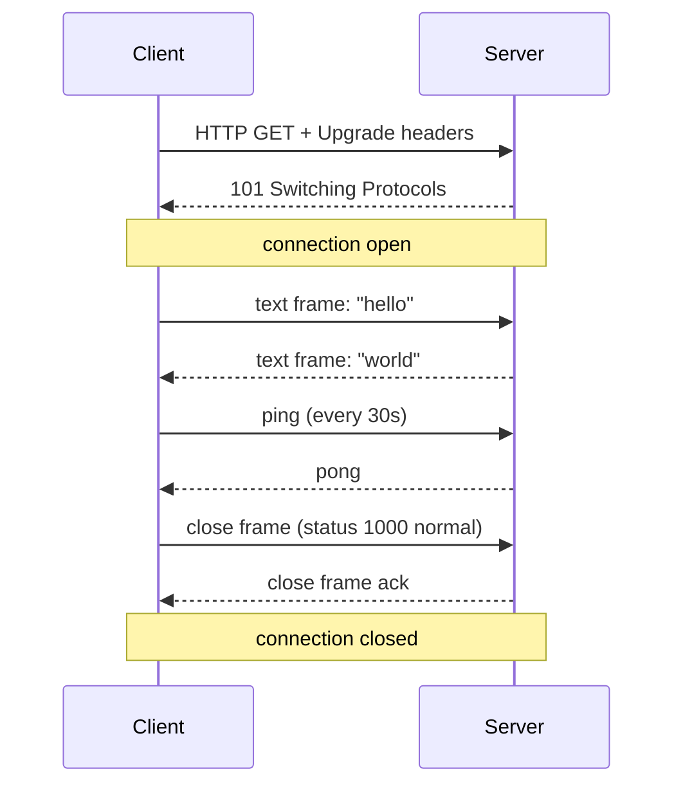
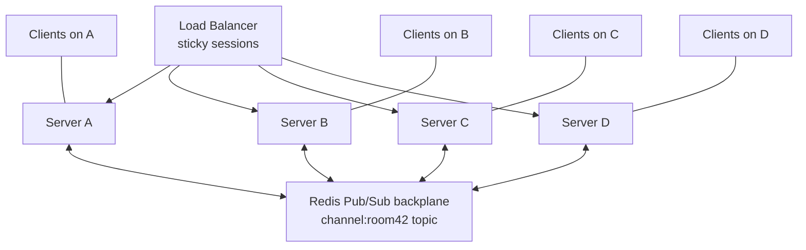

# WebSockets

> [Mastery Guide](../README.md) › [API Development](./README.md)

| Status | Priority | Phase | Last reviewed |
|---|---|---|---|
| Not Started | Medium | Phase 8 — Microservices & Messaging | 2026-05-07 |

## Contents
- [Why it matters](#why-it-matters)
- [Core concepts](#core-concepts)
  - [Protocol upgrade handshake](#protocol-upgrade-handshake)
  - [Wiring the upgrade in ASP.NET Core](#wiring-the-upgrade-in-aspnet-core)
  - [Frame structure and message types](#frame-structure-and-message-types)
  - [Connection lifecycle](#connection-lifecycle)
  - [Receiving correctly: fragments, EndOfMessage and a size cap](#receiving-correctly-fragments-endofmessage-and-a-size-cap)
  - [The concurrency contract: one send, one receive](#the-concurrency-contract-one-send-one-receive)
  - [Closing: CloseAsync vs CloseOutputAsync](#closing-closeasync-vs-closeoutputasync)
  - [Backpressure and flow control](#backpressure-and-flow-control)
  - [Per-connection memory and buffer management](#per-connection-memory-and-buffer-management)
  - [Abuse from the producer side](#abuse-from-the-producer-side)
  - [Scaling WebSocket servers](#scaling-websocket-servers)
  - [One user, many tabs](#one-user-many-tabs)
  - [Graceful shutdown and connection draining](#graceful-shutdown-and-connection-draining)
  - [Reconnect storms: the deploy-day failure](#reconnect-storms-the-deploy-day-failure)
  - [Observability for connections that outlive requests](#observability-for-connections-that-outlive-requests)
  - [Managed WebSocket services beyond SignalR](#managed-websocket-services-beyond-signalr)
  - [wss://, TLS and how you test any of this](#wss-tls-and-how-you-test-any-of-this)
  - [Beyond RFC 6455: HTTP/2, HTTP/3 and WebTransport](#beyond-rfc-6455-http2-http3-and-webtransport)
- [Code & diagrams](#code--diagrams)
- [Common pitfalls](#common-pitfalls)
- [Interview-ready summary](#interview-ready-summary)
- [Interview Cross-Questioning Drill](#interview-cross-questioning-drill)
- [Cheat Sheet](#cheat-sheet)
- [Walkthrough](#walkthrough--1k-concurrent-users-cpu-pegged-on-8-cores)
- [Self-test](#self-test)
- [Cross-references](#cross-references)
- [Sources](#sources)

---

## Why it matters

WebSockets give you full-duplex, persistent, low-latency communication between client and server over a single TCP connection. Where REST is "request → response → done," WebSocket is "open once → exchange messages until either side closes." This unlocks chat, collaborative editing, live dashboards, multiplayer games, trading platforms — anything where milliseconds matter and the server needs to push.

Most engineers don't write raw WebSocket code in 2026 — they use **SignalR** (covered in deep-dive [SignalR](../01-foundations/01-net-core-deep-dive/11-signalr.md)) or higher-level abstractions. But interviewers and architects still ask about the underlying protocol because it informs scaling decisions: WebSockets break HTTP-stateless assumptions, complicate load balancing, and need explicit ping/pong heartbeats.

When NOT to choose: simple notifications (use Server-Sent Events). Bulk uploads (use HTTP). Service-to-service streams (use gRPC). Anything stateless (use REST).

## Core concepts

### Protocol upgrade handshake

A WebSocket connection starts as an HTTP/1.1 request with the magic upgrade headers:

```http
GET /chat HTTP/1.1
Host: example.com
Upgrade: websocket
Connection: Upgrade
Sec-WebSocket-Key: dGhlIHNhbXBsZSBub25jZQ==
Sec-WebSocket-Version: 13
```

The server responds with 101 Switching Protocols:

```http
HTTP/1.1 101 Switching Protocols
Upgrade: websocket
Connection: Upgrade
Sec-WebSocket-Accept: s3pPLMBiTxaQ9kYGzzhZRbK+xOo=
```

After 101, the same TCP connection is now a WebSocket — frame-based binary protocol, not HTTP. The `Sec-WebSocket-Accept` is a hash of the client's key + a fixed magic string, proving the server speaks WebSocket.

Most clients also negotiate compression (`permessage-deflate`) and subprotocols (`Sec-WebSocket-Protocol: chat.v1`).

### Wiring the upgrade in ASP.NET Core

Nothing in an ASP.NET Core app answers an upgrade request until you add the WebSockets middleware. `app.UseWebSockets()` is what inspects the incoming headers and sets `HttpContext.WebSockets.IsWebSocketRequest`; without it that property is false and every handler you wrote falls through to whatever your 400 branch does. It is a common reason a working sample does nothing when pasted into a real app.

There are two configuration surfaces and they do different jobs. The first is `Microsoft.AspNetCore.Builder.WebSocketOptions`, passed to `UseWebSockets`, which applies to every connection the middleware accepts. Its entire property list is short and worth memorising, because interviewers ask what you can and cannot configure: `KeepAliveInterval` (Microsoft Learn documents the default as two minutes), `KeepAliveTimeout` (added in ASP.NET Core 9), `AllowedOrigins`, `ReplaceFeature`, and `ReceiveBufferSize` — which is marked obsolete. There is deliberately **no** message-size setting anywhere on it; capping message size is your job, in your own receive loop.

The second surface is `Microsoft.AspNetCore.Http.WebSocketAcceptContext`, which you pass to `AcceptWebSocketAsync` for one specific connection: `SubProtocol`, `KeepAliveInterval`, `KeepAliveTimeout`, `DangerousEnableCompression`, `ServerMaxWindowBits` and `DisableServerContextTakeover`. So per-connection compression and the negotiated subprotocol are decided at accept time, not at startup.

`AllowedOrigins` deserves its own paragraph because it is the framework's answer to the attack Drill 7 describes but never names: **Cross-Site WebSocket Hijacking (CSWSH)**. Microsoft's own wording is that the protections provided by CORS don't apply to WebSockets — browsers neither send CORS pre-flight requests nor respect `Access-Control` restrictions on a WebSocket request. They do, however, send the `Origin` header, so the server must check it. `AllowedOrigins` defaults to empty, which means all origins are allowed; adding entries switches the middleware into deny-by-default. The documentation is equally clear about the limit of the mechanism: `Origin`, like `Referer`, is controlled by the client and can be faked, so it is a defence against a browser being used as a confused deputy, not an authentication mechanism. A non-browser attacker simply omits or forges it.

One structural detail that trips people up when they add middleware later: once you accept the WebSocket, the request stops moving forward through the pipeline, and it only resumes unwinding back up the pipeline after your loop finishes and the socket closes. Anything downstream of your handler never runs while the connection is open, and anything upstream that wraps the request in a `using` or a timer sees a request that lasts as long as the connection does.

```csharp
var wsOptions = new WebSocketOptions
{
    KeepAliveInterval = TimeSpan.FromSeconds(30),
    KeepAliveTimeout  = TimeSpan.FromSeconds(20)   // ASP.NET Core 9+
};
wsOptions.AllowedOrigins.Add("https://app.contoso.com");

app.UseWebSockets(wsOptions);   // must come before the endpoint that accepts
```

> 🌍 **In the real world**: a team ships a chat feature and a penetration test comes back with "cross-site WebSocket hijacking". The finding is that a page on `evil.example` can open a script-driven WebSocket to their API, the upgrade request carries the victim's session cookie, and the server accepts it and starts streaming that user's messages. There is no CORS error in the console because CORS was never involved, and the server log shows a perfectly ordinary connection. Whether the cookie rides along at all depends on its `SameSite` setting — which is why the pen-test finding lands on apps that set `SameSite=None` for an unrelated reason and never revisited the WebSocket endpoint. The fix is two lines of `AllowedOrigins`, and properly, moving the upgrade off ambient cookie authority altogether.

### Frame structure and message types

WebSocket transmits **frames** — small typed packets:

```
 0                   1                   2                   3
 0 1 2 3 4 5 6 7 8 9 0 1 2 3 4 5 6 7 8 9 0 1 2 3 4 5 6 7 8 9 0 1
+-+-+-+-+-------+-+-------------+-------------------------------+
|F|R|R|R| opcode|M| Payload len |    Extended payload length    |
|I|S|S|S|  (4)  |A|     (7)     |             (16/64)           |
|N|V|V|V|       |S|             |   (if payload len==126/127)   |
| |1|2|3|       |K|             |                               |
+-+-+-+-+-------+-+-------------+ - - - - - - - - - - - - - - - +
|     Extended payload length continued, if payload len == 127  |
+ - - - - - - - - - - - - - - - +-------------------------------+
|                               |Masking-key, if MASK set to 1  |
+-------------------------------+-------------------------------+
|     Masking-key (continued)   |          Payload Data         |
+-------------------------------- - - - - - - - - - - - - - - - +
:                     Payload Data continued ...                :
+ - - - - - - - - - - - - - - - - - - - - - - - - - - - - - - - +
|                     Payload Data continued ...                |
+---------------------------------------------------------------+
```

**Opcode types:**
- `0x1` — text frame (UTF-8)
- `0x2` — binary frame
- `0x8` — close frame
- `0x9` — ping
- `0xA` — pong
- `0x0` — continuation (for fragmented messages)

**Mask bit:** client→server frames *must* be masked with a 4-byte XOR key (anti-cache-poisoning measure). Server→client frames must NOT be masked.

You almost never deal with frames directly — `WebSocket` API in browsers and `System.Net.WebSockets.WebSocket` in .NET hide this. But understanding the structure explains size limits and message boundaries.

### Connection lifecycle



States: `Connecting → Open → Closing → Closed`. Heartbeats (ping/pong) detect dead connections — without them, NAT timeouts or proxy idle limits silently kill the socket and neither side knows.

ASP.NET Core handler:

```csharp
app.Map("/ws", async context =>
{
    if (!context.WebSockets.IsWebSocketRequest)
    {
        context.Response.StatusCode = StatusCodes.Status400BadRequest;
        return;
    }

    using var ws = await context.WebSockets.AcceptWebSocketAsync();
    var buffer = new byte[4096];

    while (ws.State == WebSocketState.Open)
    {
        // One ReceiveAsync = one frame. This sample assumes single-frame messages;
        // fragmented ones need accumulation across frames — see pitfall 7.
        var result = await ws.ReceiveAsync(buffer, context.RequestAborted);

        if (result.MessageType == WebSocketMessageType.Close)
        {
            await ws.CloseAsync(WebSocketCloseStatus.NormalClosure, "bye", CancellationToken.None);
            break;
        }

        var msg = Encoding.UTF8.GetString(buffer, 0, result.Count);
        var response = $"echo: {msg}";

        await ws.SendAsync(
            Encoding.UTF8.GetBytes(response),
            WebSocketMessageType.Text,
            endOfMessage: true,
            cancellationToken: CancellationToken.None);
    }
});
```

### Receiving correctly: fragments, EndOfMessage and a size cap

The sample above is the shape every tutorial shows and it is wrong for any message larger than the buffer. `ReceiveAsync` fills your buffer and returns; it does not promise you a whole message. The `WebSocketReceiveResult` it hands back carries `Count`, `MessageType`, `CloseStatus` and — the one everybody skips — `EndOfMessage`. That flag is false whenever there is more of the current message still to come, either because the sender fragmented it (Drill 2 covers why senders do that) or simply because it did not fit in the bytes you offered.

Treating each result as a complete message produces a specific, nasty class of bug. A five-kilobyte JSON payload arriving into a four-kilobyte buffer becomes two receives; parse each one and you get two syntax errors instead of one object. Worse, `Encoding.UTF8.GetString` over a partial buffer can split a multi-byte character across the boundary, so you corrupt text rather than failing loudly. The correct loop accumulates into a growable buffer and only decodes once `EndOfMessage` is true.

This accumulation loop is also the only place a message-size limit can live. `WebSocketOptions` has no size setting, and Kestrel's usual guard rail explicitly does not apply: the documentation for `KestrelServerLimits.MaxRequestBodySize` states the limit "has no effect on upgraded connections which are always unlimited". So you count bytes yourself as they accumulate, and when the total crosses your ceiling you close with `WebSocketCloseStatus.MessageTooBig`, which is close code 1009 — the RFC 6455 code that means exactly this.

```csharp
var buffer = ArrayPool<byte>.Shared.Rent(4096);
try
{
    using var message = new MemoryStream();

    while (ws.State == WebSocketState.Open)
    {
        WebSocketReceiveResult result;
        do
        {
            result = await ws.ReceiveAsync(new ArraySegment<byte>(buffer), ct);
            if (result.MessageType == WebSocketMessageType.Close) return;

            if (message.Length + result.Count > MaxMessageBytes)
            {
                await ws.CloseAsync(WebSocketCloseStatus.MessageTooBig, "too large", ct);
                return;
            }
            message.Write(buffer, 0, result.Count);
        }
        while (!result.EndOfMessage);       // keep going until the message ends

        Handle(message.ToArray());
        message.SetLength(0);
    }
}
finally
{
    ArrayPool<byte>.Shared.Return(buffer);
}
```

> 🌍 **In the real world**: a collaborative editor works perfectly in testing and starts throwing JSON parse errors the week designers begin pasting base64 images into documents. Small edits fit in one frame; a pasted image does not. The stack trace points at the deserialiser, the bug is four lines up in a loop that never checked `EndOfMessage`.

### The concurrency contract: one send, one receive

This is the rule that separates people who have run WebSockets in production from people who have read about them. The documented remarks on `ClientWebSocket.SendAsync` state it plainly: exactly one send and one receive are supported on the object in parallel, issuing multiple sends at the same time is not supported and results in undefined behaviour, and you are told to serialise sends yourself with a lock or a semaphore. The same constraint applies to the server-side `WebSocket` returned by `AcceptWebSocketAsync`, because both sit on the same managed implementation — which carries a matching resource string: "There is already one outstanding '{0}' call for this WebSocket instance. ReceiveAsync and SendAsync can be called simultaneously, but at most one outstanding operation for each of them is allowed at the same time", surfaced as an `InvalidOperationException`.

Send and receive are independent of each other, so a reader loop and a writer loop can run concurrently on the same socket. What you cannot have is two writers. And two writers appear far more easily than people expect: a broadcast fan-out task and a heartbeat timer are two writers. A request handler that replies inline while a background push job also targets that connection is two writers. The failure is not deterministic — under light load the sends rarely overlap and everything looks fine, which is why this reaches production.

The consequence is architectural. The one-writer-loop-per-connection pattern, fed by a channel, is not a tidiness preference or purely a backpressure measure — it is one of the ways to satisfy the contract, alongside the lock or semaphore the documentation suggests. Every producer writes to the channel; exactly one loop drains it and calls `SendAsync`.

There is a matching rule on the read side that is easy to miss. .NET's `WebSocket` only processes incoming frames while a `ReceiveAsync` is pending, and the documentation warns that if you have configured a keep-alive timeout but are not holding an outstanding read, an arriving pong may never be picked up before the timeout elapses and the connection gets aborted as a false positive. So the reader loop should always have a read in flight, even when the application has nothing to do with the data.

> 🌍 **In the real world**: a trading dashboard adds a "server is alive" ping sent from a `System.Threading.Timer`, separate from the market-data broadcaster. It runs cleanly for weeks, then during a volatile market open — the one moment broadcasts are dense enough to collide with the timer — connections start dying with `InvalidOperationException`. The fix is to delete the timer's direct `SendAsync` and have it enqueue onto the same channel as everything else.

### Closing: CloseAsync vs CloseOutputAsync

Pitfall 10 covers one direction of this — `Abort` skips the close handshake and the peer sees 1006. The trap in the other direction is `CloseAsync`, and it is the one that turns a five-second drain into a thirty-second one.

`CloseAsync` performs the *whole* handshake: it sends your close frame and then waits for the peer to send its close frame back. Against a healthy peer that takes a round trip. Against a peer whose network path has already gone away — which is precisely the population you are trying to clear during a deploy or an eviction — nothing ever comes back, and the call waits until its cancellation token fires. Passing `CancellationToken.None`, as most samples do, means waiting indefinitely.

`CloseOutputAsync` is the half-duplex version: it closes your output side and returns once the output has been closed, without blocking on the peer's reply. That makes it the right primitive when you are shutting down and cannot afford to wait. The pattern is to call `CloseOutputAsync`, let your existing reader loop observe the peer's close frame if it arrives within a bounded window, and `Abort` if it does not.

Two details worth carrying into an interview. First, always pass a real cancellation token to any close call — a `CancellationTokenSource` with a few seconds on it is enough, and `HttpContext.RequestAborted` is already available in the handler. Second, pick the close code deliberately: `WebSocketCloseStatus.NormalClosure` is 1000 and means the work finished, while `WebSocketCloseStatus.EndpointUnavailable` is 1001, documented as indicating that an endpoint is being removed. Clients can and should treat those differently — 1000 means stop, 1001 means come back.

> 🌍 **In the real world**: a pod eviction that should take two seconds consistently burns the full termination grace period and gets SIGKILLed, dropping the connections it was trying to close politely. The drain loop is `foreach (var c in connections) await c.CloseAsync(...)` with no token — sequential, and each dead client stalls the whole queue behind it.

### Backpressure and flow control

WebSockets have no built-in flow control beyond the underlying TCP. If the server sends faster than the client receives, the OS buffer fills, then `SendAsync` blocks (or returns false in higher-level libraries).

Strategies:
- **Drop messages:** acceptable for telemetry, market ticks. Latest matters; missed don't.
- **Coalesce:** combine multiple updates into one (state diff vs every change).
- **Disconnect slow clients:** if backpressure persists > N seconds, kick them; let them reconnect with fresh state.
- **Per-client outbound queue with cap:** explicit queue with bounded size; on overflow, drop or close.

```csharp
public class BoundedClient
{
    private readonly Channel<byte[]> _outbound = Channel.CreateBounded<byte[]>(
        new BoundedChannelOptions(100) { FullMode = BoundedChannelFullMode.DropOldest });

    public async Task TrySendAsync(byte[] msg)
    {
        await _outbound.Writer.WriteAsync(msg);  // drops oldest if full
    }
}
```

### Per-connection memory and buffer management

"A file descriptor and a few kilobytes of buffers" undersells what an idle connection costs. Each one holds a socket handle, Kestrel's read and write pipe state, a TLS record buffer when the connection is `wss://`, whatever your application keeps for identity and subscriptions, and any outbound queue you gave it. Multiply by six figures and the arithmetic stops being incidental.

The biggest self-inflicted cost is usually the receive buffer. A `new byte[4096]` inside the handler, as in the sample earlier, is a managed allocation that lives exactly as long as the connection — which means it survives every gen-0 collection, gets promoted, and ends up as long-lived heap that the GC walks repeatedly and cannot compact away. At a hundred thousand connections that is a large, permanently resident array population created by a line nobody thinks about. `ArrayPool<byte>.Shared.Rent` with a matching `Return` in a `finally` block turns that into a shared, reused pool. `System.IO.Pipelines` goes further, handing you pooled buffers plus the partial-message accumulation logic you would otherwise write by hand — it is the mechanism Kestrel itself is built on.

The subtler cost is compression, and it is the half of the trade-off Drill 11 does not cover. `permessage-deflate` is defined by [RFC 7692](https://www.rfc-editor.org/rfc/rfc7692), which specifies four extension parameters: `server_max_window_bits` and `client_max_window_bits`, each an integer from 8 to 15 giving the base-2 logarithm of the LZ77 sliding window size, and `server_no_context_takeover` and `client_no_context_takeover`. Context takeover means the same sliding window used to build the previous message is reused for the next one — which is where the compression ratio comes from, and also means that window must be retained for the lifetime of the connection, in each direction. The RFC says so in the plainest terms: with no-context-takeover in force, an endpoint "doesn't need to reserve memory to retain the LZ77 sliding window between messages", and it "reduces the amount of memory that the server has to reserve for the connection".

That is why ASP.NET Core exposes `ServerMaxWindowBits` and `DisableServerContextTakeover` on `WebSocketAcceptContext` and describes both, in the API documentation, as reducing the memory overhead of compression at the cost of a potentially worse compression ratio. So enabling compression is a decision with three axes, not one: CPU per message, the CRIME/BREACH exposure Drill 11 explains, and a per-connection memory reservation multiplied by your connection count. At a handful of connections it is free. At the scale where bandwidth savings would actually matter, it is a capacity decision.

> 🌍 **In the real world**: a team enables compression to cut egress cost on a JSON-heavy feed, measures it against a few hundred test connections, and ships. Production memory climbs steadily as connections accumulate through the morning and the pods start getting OOM-killed around peak. Nothing leaked — the compression contexts are doing exactly what the RFC says they do, and the load test simply never held enough connections at once for the cost to show up.

### Abuse from the producer side

The backpressure section above is entirely about slow *consumers* — clients that cannot keep up with what you send them. The opposite direction is a separate problem with a separate answer, and it has a trap in it specific to ASP.NET Core.

ASP.NET Core's rate-limiting middleware (`AddRateLimiter`, `UseRateLimiter`, `RequireRateLimiting`, with fixed window, sliding window, token bucket and concurrency algorithms) is *middleware*, and middleware runs per request. A WebSocket is one request. The client is metered once, at the upgrade, and then sends fifty thousand messages a second entirely unmetered — because as established above, the request stops moving through the pipeline the moment you accept and does not resume until the socket closes. A team that has carefully rate-limited its REST surface will often assume the WebSocket endpoint inherited that protection. It did not.

Per-message throttling therefore has to live inside your receive loop. The `System.Threading.RateLimiting` primitives that the middleware is built on — `TokenBucketRateLimiter` and friends — can be instantiated per connection and awaited before each message is handled, which gives you burst tolerance with a sustained ceiling. When the limiter is exhausted past your tolerance, close with `WebSocketCloseStatus.PolicyViolation` (1008).

Kestrel's other slow-and-abusive-client protections are also explicitly disabled once a connection upgrades. The documentation for `MaxRequestBodySize`, `MinRequestBodyDataRate` and `MinResponseDataRate` each states the limit "has no effect on upgraded connections which are always unlimited". The minimum-data-rate guards are what normally kill Slowloris-style clients on ordinary HTTP; on WebSockets they are simply not in play.

What *is* available is a cap on how many connections exist at all. `KestrelServerLimits.MaxConcurrentConnections` and `MaxConcurrentUpgradedConnections` both default to `null`, meaning unlimited. The second is the WebSocket-specific one — the docs define an upgraded connection as "one that has been switched from HTTP to another protocol, such as WebSockets". Setting either converts a connection flood from a slow memory death into a fast, visible rejection; the `kestrel.rejected_connections` counter is documented as incrementing when the active count exceeds `MaxConcurrentConnections`, so that is the one to watch. Pair the framework caps with a per-IP or per-user connection cap of your own, since one abusive client opening ten thousand connections and one legitimate spike look identical to a global counter.

> 🌍 **In the real world**: a public market-data socket is abused by someone running a scraper that opens a connection and then floods subscribe/unsubscribe messages to enumerate every instrument. The API's rate limiter shows one request per client per session and reports nothing wrong; CPU is pinned. The metric that finally identifies it is messages-per-connection, which nobody was recording because the request-level dashboards had no reason to.

### Scaling WebSocket servers

Stateful long-lived connections are the opposite of REST's stateless requests. Implications:

- **Sticky sessions / connection-affinity** at the load balancer. Once a client is on server A, all their messages route to A. Round-robin LB without affinity breaks any app whose per-connection state lives in server memory.
- **Backplane for cross-server pub/sub.** If user X is on server A and user Y is on server B, broadcasting "Y wrote a message" requires a backplane (Redis pub/sub, RabbitMQ, Kafka). SignalR has built-in backplanes.
- **Connection counts as the bottleneck.** Each connection holds an OS file descriptor + a few KB of buffers. A single .NET process handles ~100k connections; beyond that, scale horizontally.

### One user, many tabs

Every mental model in this chapter so far has been one user, one connection. Real users open three tabs. The same account on a phone and a laptop is two more. So "connection" and "user" are different cardinalities, and code that conflates them breaks in ways that only show up once real people use it.

Presence is where it bites first. If "user X is online" is a boolean set when a connection opens and cleared when one closes, then closing the second of three tabs marks the user offline while they are still looking at the app. Presence has to be refcounted: online means at least one live connection, and offline fires only when the count reaches zero — and even then, only after a short grace period, because a page reload is a close immediately followed by an open, and without the grace window every refresh flickers the user's status for everyone watching.

Delivery is the second problem, and it is subtler because fan-out to all of a user's connections is usually *correct*. You want the new message to appear in all three tabs. What you do not want is the side effects happening three times: three notification sounds, three "mark as read" writes, three analytics events for one delivery. The fix is to separate delivery from action — fan out the message to every connection, but attach a server-assigned message id so the client can deduplicate, and route anything with a side effect through a single designated connection or through an idempotent server-side handler keyed on that id.

This is common enough that managed services address it directly: Azure Web PubSub documents its "send to a user" pattern as synchronising all connections that belong to a user, including multiple devices or browser tabs.

Ordering deserves a mention alongside this, because it is the other guarantee people assume they have. Redis pub/sub is at-most-once, as Drill 4 says, but it also gives you no cross-publisher ordering: when two pods publish to the same channel, which one reaches the Redis server first is a network race, so the sequence subscribers observe is decided by timing rather than by your application. If order matters within a room, put a monotonic sequence number in the message and let clients reorder or detect gaps.

> 🌍 **In the real world**: a support-desk app shows agents as offline seconds after they have clearly just typed something. The cause is an agent who keeps a second tab open on the ticket queue and closes it when done; the presence key is cleared on any close event. The reproduction is trivial once someone thinks to open two tabs, and impossible to see with a single-tab test suite.

### Graceful shutdown and connection draining

Graceful shutdown for an HTTP service means "stop accepting new requests, let in-flight ones finish". That definition quietly assumes in-flight requests finish soon. A WebSocket connection *is* the in-flight request and it may have four hours left on it, so "let it finish" is not a plan. You have to decide what draining means and then implement it inside a fixed budget.

The trigger is `IHostApplicationLifetime.ApplicationStopping`, which fires when shutdown begins and before hosted services are stopped. A drain registered there does three things in order. First, stop accepting new upgrades — return 503 from the endpoint so the load balancer stops sending you connections. Second, tell existing connections to leave: either an application-level "reconnect now" message, which lets a well-written client reconnect before it loses anything, or a close frame with `WebSocketCloseStatus.EndpointUnavailable` (1001, documented as indicating an endpoint is being removed). Third, wait a bounded time for them to actually go, then abort whatever is left.

The budget is smaller than people assume and it is shared. `HostOptions.ShutdownTimeout` defaults to 30 seconds. In Kubernetes, the pod's `terminationGracePeriodSeconds` also defaults to 30 seconds, and the Kubernetes documentation is explicit that the termination grace period countdown begins *before* the `preStop` hook is executed — so a `preStop` sleep, which is the standard way to give the endpoints controller time to remove the pod from Service endpoints before it stops answering, comes out of the same 30 seconds your drain needs. Sleep for 10 and you have 20 left, minus however long the runtime needs to stop everything else.

This is exactly where `CloseAsync` versus `CloseOutputAsync` stops being pedantry. A sequential loop of `CloseAsync` calls, each waiting for a peer that has already vanished, will consume the entire grace period on the first handful of connections and then get SIGKILLed with the rest still open — which produces precisely the ungraceful outcome you were trying to avoid. Close concurrently, use `CloseOutputAsync` with a bounded wait, and abort on timeout.

If you are on SignalR you can watch this happen: the `signalr.server.connection.duration` metric carries a `signalr.connection.status` attribute whose documented values include `app_shutdown`, alongside `normal_closure` and `timeout`. A deploy that drains cleanly shows a spike of `app_shutdown`; one that does not shows `timeout` and a matching spike of 1006 on the client side.

> 🌍 **In the real world**: an on-call engineer is asked why every deploy produces a burst of client-side errors even though the rollout is healthy and no pod ever reports a failure. Nothing is broken on the server: the pods are simply being killed with thousands of open sockets and no drain, so every client experiences an abrupt reset. The server-side dashboards, which only measure requests, show a perfectly clean deploy.

### Reconnect storms: the deploy-day failure

Pitfall 5 and Drill 10 already give the client-side answer — exponential backoff with jitter — so this is about the part backoff does not solve.

Picture a rolling update across a fleet holding fifty thousand connections. A pod is replaced; every connection on it dies at the same instant. Each of those clients now reconnects, and a reconnect is not one cheap operation. It is a TCP connect, a full TLS handshake, an authentication token validation, a subscription rebuild, and often a state replay from the database or the backplane. Then the next pod is replaced and it happens again.

The insight worth stating out loud in an interview is that **reconnect capacity is a completely different number from steady-state capacity**. An idle connection costs memory and a file descriptor and almost no CPU; establishing one costs a TLS handshake, which is CPU-bound asymmetric crypto. So a pod can comfortably hold a connection count it could not possibly *establish* in the few seconds a rolling update gives it. Capacity planning that only measures the steady state will size the fleet correctly and still fall over on every deploy.

The failure then propagates outward. Every reconnect hits the identity provider at once, so a service that comfortably handles the normal login rate now sees a spike proportional to your entire connection count. If it saturates, validations start timing out; clients interpret a timeout as a failed connection and retry; the retries add load to the thing that is already saturated. Backoff with jitter desynchronises the clients so they do not arrive in lockstep, but it spreads the same total work over a longer window — it does not reduce it. If the total exceeds capacity, the loop does not converge, it just takes longer to not converge.

Because you cannot rely on client behaviour, the effective levers are server-side. Cap `MaxConcurrentUpgradedConnections` so surplus upgrades are rejected immediately rather than queued — a fast rejection that triggers the client's backoff is far better than a slow accept that ties up resources. Reject upgrades with 503 during warm-up so a freshly started pod does not take a full share of the storm before its caches are populated. Slow the rollout down: a small `maxUnavailable` and a readiness signal that does not report ready until the new pod's connection count has recovered turns one large storm into several small ones. Cache token validation material locally so N reconnects do not become N calls to the identity provider. And stagger reconnects deliberately from the server side — the "reconnect now" message from the drain above can carry a per-client delay, which is the only reconnect scheduling you actually control.

TLS session resumption is worth checking here too. TLS 1.3 defines resumption via pre-shared keys ([RFC 9846](https://www.rfc-editor.org/rfc/rfc9846), section 2.2 — RFC 9846 obsoleted RFC 8446 in July 2026), which lets a client that still holds a valid ticket skip most of a full handshake. It only helps if your termination point issues tickets and if the reconnecting client can land somewhere that accepts them, which across a fleet of terminators is a configuration question rather than a given.

> 🌍 **In the real world**: a deploy at a quiet hour is fine, and the identical deploy at peak takes the platform down for minutes. The post-mortem finds nothing wrong with the new build — the auth service was simply asked to validate every connected user at once instead of at the trickle rate it was sized for, and the retries that followed kept it saturated well after the rollout finished. The remediation is not in the application at all: it is a slower rollout and a token-validation cache.

### Observability for connections that outlive requests

The reason WebSocket observability is bad in most shops is not laziness, it is that the default instrumentation genuinely does not fit. `http.server.request.duration` is documented as ending when the handler pipeline finishes and all response data has been sent — for a WebSocket, that is the moment the connection closes. So a four-hour connection contributes exactly one data point, to a histogram whose default OpenTelemetry buckets top out at 10 seconds. Every WebSocket lands in the overflow bucket and the metric tells you nothing. Meanwhile `http.server.active_requests` is an UpDownCounter of in-flight requests, so every open connection is counted as an active request for its entire life, and your "concurrent requests" graph stops meaning what the rest of your dashboards assume it means.

ASP.NET Core ships instruments that do fit, and knowing their names is the kind of specific that lands well in an interview. From the `Microsoft.AspNetCore.Server.Kestrel` meter: `kestrel.upgraded_connections`, an UpDownCounter described as the number of connections that are currently upgraded — this is your concurrent-WebSocket gauge, with the important caveat that the documentation says the counter only tracks HTTP/1.1 connections. Alongside it, `kestrel.active_connections`, `kestrel.connection.duration` (a histogram in seconds, whose `network.protocol.name` attribute takes values such as `web_sockets`, and which the docs suggest bucketing far wider than request durations), `kestrel.rejected_connections`, `kestrel.queued_connections`, and the pair `kestrel.active_tls_handshakes` and `kestrel.tls_handshake.duration` that go vertical during a reconnect storm. If you are on SignalR, the `Microsoft.AspNetCore.Http.Connections` meter adds `signalr.server.active_connections` and `signalr.server.connection.duration`, tagged with transport and closure status.

What is still missing you have to add yourself with `System.Diagnostics.Metrics`. Four things earn their keep. **Close-code distribution** is the single best health signal a WebSocket service has: Drill 2 explains that 1006 is synthesised by the library when the TCP connection died without a close handshake, so a rising 1006 rate is the earliest evidence that a middlebox, load balancer or idle timeout changed underneath you — and nothing built in tracks it. **Send-queue depth per connection**, or its maximum across connections, tells you backpressure is building before anything OOMs. **Backplane publish latency** is the difference between "chat is slow" and "chat is broken" and is invisible from both ends. And **messages per connection**, which is what identifies an abusive producer.

Tracing needs a different shape from metrics. A span per connection is not useful — it is unbounded in duration, it stays open for hours, and most backends will not sample or display it sensibly. The useful unit is a span per message or per logical operation, with the connection id and user id as attributes so you can group them after the fact. That way a trace answers "what happened to this request" rather than "this socket was open for a while".

> 🌍 **In the real world**: an incident review asks how long the outage lasted and nobody can answer, because the only WebSocket signal anyone had was CPU. The team adds a close-code counter afterwards and discovers a steady baseline of 1006s from one geography that had been happening for months — a regional carrier's NAT timing out connections faster than the app's heartbeat interval, silently degrading a slice of users nobody had ever heard from.

### Managed WebSocket services beyond SignalR

Drill 14 gives several sound reasons a team might not want SignalR — cross-language clients, a custom binary protocol, implementing a public spec like `graphql-ws`. The scaling advice elsewhere in this chapter then quietly assumes you adopted it anyway, because Azure SignalR Service speaks the SignalR protocol and is therefore no help to a team on raw WebSockets. The category that is genuinely missing is the managed *raw*-WebSocket service, and there are two obvious names.

**Azure Web PubSub** is a fully managed service that holds the long-lived client connections and handles message delivery, so your servers do not. The base service supports standard WebSocket and REST APIs, which means a browser's native `WebSocket` constructor connects to it directly with no client library; your application talks to it over REST or an SDK and receives client events through event handler callbacks. Microsoft documents a single resource as scaling to a million concurrent connections. It also offers a Socket.IO-compatible flavour and MQTT over WebSocket for teams already on those.

**AWS API Gateway WebSocket APIs** take a more opinionated shape. Routing is by route key: three predefined routes `$connect`, `$disconnect` and `$default`, plus custom routes selected by a `routeSelectionExpression` evaluated against a property of the incoming JSON — `${request.body.action}` being the canonical example. Your backend pushes to a connected client by POSTing through the `@connections` API. Two documented constraints matter a great deal architecturally and are exactly the sort of thing a senior candidate is expected to have read: binary media types are not supported (API Gateway closes with 1003 if it receives one), and API Gateway returns close code 1001 when a client is idle for 10 minutes or when it reaches the maximum two-hour connection lifetime. A hard two-hour ceiling makes reconnect-with-resume mandatory rather than a nice-to-have, and it rules the service out for anything that genuinely needs an uninterrupted session.

The trade in both cases is the same. You stop holding connections, so your application deploys, scales and drains like an ordinary stateless HTTP service — draining, reconnect storms and per-connection memory all become someone else's problem. You pay for it with a round trip through the service on every message, a protocol and a set of limits you do not control, and a bill that scales with connections and messages.

> 🌍 **In the real world**: a team on `graphql-ws` subscriptions asks whether they should move to Azure SignalR Service to escape their scaling problems and are told, correctly, that they cannot — the service requires the SignalR protocol, and their clients are Apollo. Web PubSub is the option that fits, precisely because it does not impose a protocol on the wire.

### wss://, TLS and how you test any of this

WebSockets have their own URL schemes, `ws://` and `wss://`, and the security model attaches to the scheme rather than to the page. The Secure Contexts specification's "is origin potentially trustworthy" algorithm returns *potentially trustworthy* for schemes `https` and `wss`; plain `ws` is not on that list. Since the WebSocket handshake runs through Fetch, a page served over HTTPS is blocked from opening a `ws://` connection as mixed content. This is the single most reliable local-to-production surprise in the topic: everything works on `http://localhost`, and the first HTTPS deployment produces a connection that fails before it reaches your server at all.

Where TLS terminates changes what you are responsible for. Terminate at the load balancer and the upgrade still has to be forwarded correctly to the origin, which is what Drill 12's Nginx configuration is about. Terminate at Kestrel and every reconnect is a full handshake burning your CPU — which is the same cost that shows up in `kestrel.tls_handshake.duration` during a reconnect storm. Native clients that pin certificates add a third consideration: pinning works perfectly until the certificate rotates, at which point every pinned client fails simultaneously and no server-side deploy can fix it. That is a decision to take deliberately, with a rotation plan, not a default to switch on.

Testing is the other gap. Integration testing a WebSocket handler does not need a real port: `Microsoft.AspNetCore.TestHost` gives you `TestServer.CreateWebSocketClient()`, which returns a `WebSocketClient` with `ConnectAsync(Uri, CancellationToken)`, a `SubProtocols` collection and a `ConfigureRequest` hook for setting headers on the upgrade — so you can test origin rejection, subprotocol negotiation and authentication in-process. `WebApplicationFactory<T>` exposes the underlying `TestServer` through its `Server` property, so this composes with the integration-test setup you already have.

For load, ordinary HTTP tools are the wrong shape because they model request/response. k6 ships a WebSocket module (`k6/websockets`, superseding the older `k6/ws`) which lets you script the scenario that actually matters: connect, hold, exchange messages over time. And what you should be measuring is not throughput. It is the four behaviours nothing else exercises — what happens on reconnect, what happens during a drain, what happens to one slow consumer while the others are fast, and whether the size cap actually fires.

> 🌍 **In the real world**: a feature passes every test and fails in staging with a browser console error and no server log entry whatsoever, because the request never left the browser. The developer had been testing against `http://localhost:5000`; staging is HTTPS and the client config still said `ws://`. The absence of any server-side evidence is the diagnostic — mixed-content blocking happens entirely client-side.

### Beyond RFC 6455: HTTP/2, HTTP/3 and WebTransport

The upgrade handshake at the top of this chapter is HTTP/1.1 only — there is no `Upgrade` mechanism in HTTP/2 or HTTP/3. Two later RFCs bridge that. [RFC 8441](https://www.rfc-editor.org/rfc/rfc8441) bootstraps WebSockets over HTTP/2 using an extended CONNECT method with a `:protocol` pseudo-header, gated on the server advertising `SETTINGS_ENABLE_CONNECT_PROTOCOL`. [RFC 9220](https://www.rfc-editor.org/rfc/rfc9220), "Bootstrapping WebSockets with HTTP/3" (June 2022), carries the same design to HTTP/3 and registers that setting in the HTTP/3 settings registry with the same value, 0x08.

The .NET and browser picture has moved on since RFC 8441 was published. Microsoft's documentation states that .NET 7 introduced WebSockets over HTTP/2 for Kestrel, the SignalR JavaScript client and SignalR with Blazor WebAssembly, that version negotiation is automatic in browsers and Kestrel so no new APIs are needed, and that Chrome, Edge and Firefox (version 128 and later) have HTTP/2 WebSockets enabled by default. The catch a .NET candidate is most likely to be asked about is routing: HTTP/2 WebSockets arrive as CONNECT requests rather than GET, so routes and controller actions written to match GET need updating. On the client, `ClientWebSocketOptions.HttpVersion` and `HttpVersionPolicy` select the version, and the `ConnectAsync(Uri, HttpMessageInvoker, CancellationToken)` overload lets pooled connections be reused — with the rule that when you pass an `HttpMessageInvoker` you must configure options on the invoker rather than on `ClientWebSocketOptions`, or `ConnectAsync` throws `ArgumentException`.

What HTTP/2 buys is multiplexing: many WebSockets to one origin share a single TCP connection instead of one each. What it does not fix is head-of-line blocking, because it is still one TCP connection — a lost packet stalls every stream riding on it, your WebSocket included. HTTP/3 over QUIC is the layer that actually fixes that, because QUIC streams are independent at the transport level.

**WebTransport** is the different answer rather than the same answer over a newer protocol. It is a QUIC-native API offering multiple independent streams per session and, in the specification, unreliable datagrams — so an application can choose per message whether it wants delivery guaranteed, which is exactly the choice a game or a live video pipeline wants and WebSocket cannot express. Kestrel's support is experimental: the feature interface is `IHttpWebTransportFeature` with `IsWebTransportRequest` and `AcceptAsync`, and a session exposes `AcceptStreamAsync`, `OpenUnidirectionalStreamAsync` and `Abort`. Turning it on requires `EnablePreviewFeatures` plus a `RuntimeHostConfigurationOption` named `Microsoft.AspNetCore.Server.Kestrel.Experimental.WebTransportAndH3Datagrams`, and the ASP.NET Core repository's own documentation notes that Kestrel implements most of the WebTransport draft-02 specification except datagrams, and that the default Kestrel testing certificate cannot be used for WebTransport connections. Preview means preview. The right interview answer is that you know what it is for, why QUIC makes it possible, and that it is not something you would put in production on .NET today.

> 🌍 **In the real world**: a team enables HTTP/2 end to end for the multiplexing win and their WebSocket endpoint stops being reachable from Chrome while an older client still works. The route is `MapGet("/ws", ...)`; over HTTP/2 the browser sends an extended CONNECT rather than a GET, and a GET-only route will never match it. The endpoint did not break — HTTP/1.1 had simply been hiding the assumption baked into the route.

## Code & diagrams

<details>
<summary>🧩 Click to expand — code samples and diagrams</summary>

### WebSocket vs HTTP / SSE / Long-poll

> Deep dive on the SSE alternative: [Server-Sent Events](./15-server-sent-events.md) — when one-way server→client is enough, SSE is simpler than WebSockets and has built-in browser auto-reconnect.


```
HTTP request/response (synchronous):
  Client ─request──► Server
  Client ◄─response─ Server
  (connection often closed; reopen for next request)

Long-poll:
  Client ─request──► Server
                     (waits up to N seconds for an event)
  Client ◄─response─ Server
  Client ─request──► Server (again)

Server-Sent Events (SSE) — one-way push:
  Client ──GET /events──► Server
  Client ◄────event────── Server
  Client ◄────event────── Server
  Client ◄────event────── Server
  (text-only, server→client only, auto-reconnect built in)

WebSocket — full duplex:
  Client ─upgrade──► Server
  Client ◄─101────── Server
  Client ◄══frame══► Server   (bidirectional, indefinite)
```

When to choose:
- **HTTP:** request/response, infrequent.
- **SSE:** server pushes only, text-friendly, browser auto-reconnect (great for live dashboards, notifications).
- **WebSocket:** bidirectional, binary-capable, lowest overhead per message after handshake (great for chat, games, collab).
- **Long-poll:** legacy fallback when WebSocket is blocked by corporate proxy.

### Backplane for multi-server WebSocket scale



When A receives "user X said hi in room 42":
1. A publishes to `channel:room42` on Redis.
2. B, C, D have all subscribed.
3. They forward to their connected clients in room 42.

SignalR's `AddStackExchangeRedis()` bolts this on automatically.

### Heartbeat loop

```csharp
public async Task HeartbeatLoopAsync(WebSocket ws, CancellationToken ct)
{
    var ping = Encoding.UTF8.GetBytes("ping");
    while (ws.State == WebSocketState.Open && !ct.IsCancellationRequested)
    {
        try
        {
            await ws.SendAsync(ping, WebSocketMessageType.Text, true, ct);
            await Task.Delay(TimeSpan.FromSeconds(30), ct);
        }
        catch (WebSocketException)
        {
            break;   // connection died
        }
    }
}
```

SignalR handles this for you — it sends pings on its own schedule. Browsers don't: the native WebSocket API doesn't expose control-frame pings to JavaScript, so JS-level apps must send application pings like the one above.

</details>

## Common pitfalls

1. **No heartbeat / ping.** Idle connections get killed by load balancers, NAT routers, ISP middleboxes. Send ping every 30s.
2. **Round-robin LB without sticky sessions.** Connection ends up on a server that doesn't have the client's state. Configure cookie or IP affinity.
3. **No backplane in multi-server deploys.** "Why doesn't my chat work?" Because clients on different nodes can't see each other without a pub/sub bridge.
4. **Storing per-connection state in memory.** Server restart = state lost. For persistent state, store in Redis/DB; for ephemeral, accept that reconnect rebuilds it.
5. **No reconnection strategy on the client.** Network blips kill connections. Client must reconnect with exponential backoff.
6. **Sending to a closed socket.** Check `WebSocketState.Open` before send; catch `WebSocketException` for already-closed.
7. **No message size limit.** Malicious client sends a 10GB frame. There is no message-size option in ASP.NET Core's `WebSocketOptions` — cap it yourself in the receive loop by accumulating `result.Count` across fragments and closing once the total exceeds your limit.
8. **Authentication via query string token.** Tokens land in server logs. Prefer a cookie on the upgrade request, or do a normal auth handshake then send the token as the first message. Smuggling the token into `Sec-WebSocket-Protocol` is a workaround, not a clean fix — a server that selects the token value echoes it back in the 101 response, so a naïve implementation puts the token in a response header too.
9. **No backpressure handling.** Slow client → server's outbound buffer grows → eventually OOM. Use bounded channels per client.
10. **Forgetting to close gracefully.** `Abort` instead of `CloseAsync` skips the close handshake. Both ends should send 1000 (normal closure) when done.
11. **Sticky sessions through CDN.** Some CDNs don't honor sticky cookies for WebSocket upgrades. Test your topology end-to-end.
12. **Treating WebSocket as a magic stateless RPC.** It's stateful by definition. Plan for connection lifecycle, reconnection, state recovery from day one.

## Interview-ready summary

- **WebSocket = persistent, full-duplex TCP** over HTTP-upgraded handshake. Frames, not requests.
- **Use cases:** chat, collab, live dashboards, multiplayer games — anything bidirectional + low-latency.
- **In .NET:** raw `System.Net.WebSockets` for full control, **SignalR** (deep-dive linked) for production patterns.
- **Scaling:** sticky sessions at the LB wherever per-connection state lives in server memory, plus a Redis-style backplane for cross-server messaging.
- **Heartbeats:** ping/pong every ~30s to defeat idle timeouts.
- **Alternatives:** SSE for one-way push, long-poll as fallback, gRPC streaming for service-to-service.

**Expected interview questions:**

1. *"How does WebSocket work at the protocol level?"* — Starts as HTTP/1.1 GET with `Upgrade: websocket`. Server responds 101. Now the TCP connection speaks frame-based binary protocol with opcodes for text/binary/close/ping/pong.
2. *"WebSocket vs SSE vs long-poll?"* — WS bidirectional, binary-capable, low overhead post-handshake. SSE server-only push, text, auto-reconnect. Long-poll legacy fallback when WS blocked.
3. *"How do you scale WebSocket servers horizontally?"* — Sticky sessions at the LB where per-connection state lives in pod memory, plus a backplane (Redis pub/sub) to broadcast across nodes. SignalR provides the abstraction.
4. *"What kills a WebSocket silently?"* — Idle timeouts at NAT/firewall/LB. Mitigation: ping/pong heartbeats every ~30s.
5. *"How do you handle slow consumers?"* — Bounded outbound queue per client + drop or disconnect on overflow. Don't let one slow client OOM the server.
6. *"Why must client→server frames be masked?"* — Anti cache-poisoning. Without masking, attackers can craft TCP-stream-similar payloads that confuse old proxies. The 4-byte XOR mask defeats this.
7. *"How does authentication work over WebSocket?"* — Auth happens at the upgrade HTTP request (cookies, headers). After upgrade, identity travels with the connection. Or do an in-band auth message after open.

## Interview Cross-Questioning Drill

<details>
<summary>📖 Click to expand — cross-question chains (~15-20 min, cover answers and write cold)</summary>

> ⚠️ **Honest caveat**: reading this once doesn't make you interview-ready. Cover the answers, write them cold, then check. Pair with a senior for live mock cross-questioning. The guide removes "I never thought about that" surprises; mock interviews convert knowledge into reflex. Both are needed.

Each drill is **Q → A → Cross-Q → A → Cross-Q² → A**.

### Drill 1 — The Upgrade handshake

> **Q**: Walk me through a WebSocket connection from TCP up.
>
> **A**: Client opens TCP, then sends an HTTP/1.1 GET with `Upgrade: websocket`, `Connection: Upgrade`, `Sec-WebSocket-Key: <base64 nonce>`, `Sec-WebSocket-Version: 13`. Server replies `101 Switching Protocols` with `Sec-WebSocket-Accept: <hash>` where the hash is `Base64(SHA1(client_key + "258EAFA5-E914-47DA-95CA-C5AB0DC85B11"))`. After the 101, the same TCP socket is now a WebSocket — frame-based binary protocol, not HTTP.
>
> **Cross-Q**: Why the magic GUID `258EAFA5-...`?
>
> **A**: It's a constant chosen so that intermediaries that don't understand WebSocket can't accidentally complete the handshake. The client's key is a base64 random nonce; the hashing with a fixed-but-WS-specific GUID proves the server actually implements WebSocket — it didn't just blindly echo the key. A naïve HTTP proxy that strips/rewrites headers would produce a wrong `Sec-WebSocket-Accept` value, the client rejects, the upgrade fails safely instead of silently falling through to a half-broken HTTP connection.
>
> **Cross-Q²**: HTTP/2 supports server push and bidirectional streams. Why is WebSocket still relevant?
>
> **A**: HTTP/2 server push was removed from Chrome in 2022 — almost dead. HTTP/2 doesn't give the client a way to push to the server outside the request/response model; you can only send a new request, not interleave messages on an existing one. WebSocket gives true full duplex over one socket, with low-overhead frames that don't carry HTTP headers per message. HTTP/3 (QUIC) brings some bidirectional streaming, and WebSocket-over-HTTP/2 ([RFC 8441](https://www.rfc-editor.org/rfc/rfc8441)) puts WebSocket frames inside HTTP/2 streams to get multiplexing for free. But it is not what most traffic actually runs on: both ends must support extended CONNECT (`SETTINGS_ENABLE_CONNECT_PROTOCOL`), and browser deployment is still partial. So the HTTP/1.1 upgrade remains the default path. In .NET you opt in by setting `ClientWebSocketOptions.HttpVersion` to 2.0 with an `HttpVersionPolicy` and passing an `HttpMessageInvoker` to `ConnectAsync`.

### Drill 2 — Frame types

> **Q**: List the WebSocket frame opcodes and what each does.
>
> **A**: `0x0` continuation (more of the previous fragmented message), `0x1` text (UTF-8), `0x2` binary, `0x8` close (with optional 2-byte status code), `0x9` ping, `0xA` pong. `0x3-0x7` and `0xB-0xF` are reserved. Control frames (`0x8`, `0x9`, `0xA`) must be ≤125 bytes and can't be fragmented.
>
> **Cross-Q**: A 1MB message is sent. Does it become one frame or multiple?
>
> **A**: The sender decides. WebSocket supports **fragmented messages** — first frame has opcode `0x1` (text) or `0x2` (binary) with `FIN=0`, subsequent fragments have opcode `0x0` (continuation) with `FIN=0`, the last has `FIN=1`. The receiver reassembles. Browsers and most libraries do this transparently — you call `send(1MB)` and the implementation fragments based on internal buffer size. Useful for streaming media where you want to start sending bytes before the full message is ready.
>
> **Cross-Q²**: What's the close frame status code 1006 and when do you see it?
>
> **A**: `1006` = "abnormal closure" — TCP died before a proper close handshake. Cannot be sent on the wire (it's a "the connection got cut" pseudo-code synthesized by the library). When you see 1006 in logs, the connection was terminated by network layer (timeout, RST, NAT drop) without either side getting to send a `0x8` close frame. Different from `1000` (normal closure) or `1001` (going away). Diagnosis: middleboxes killing idle connections, server crashed mid-message, network blip.

### Drill 3 — Heartbeat ping/pong

> **Q**: Why do WebSocket connections need application-level ping/pong if TCP has keep-alive?
>
> **A**: TCP keep-alive defaults are far too long for the middleboxes WebSocket traverses. On Linux `tcp_keepalive_time = 7200s` (2 hours); on Windows defaults are similar. Meanwhile NAT routers drop idle mappings after 30-120 seconds; corporate proxies after a few minutes; load balancers idle-timeout WebSocket connections after their own configurable threshold (Azure default 4 min, AWS ALB default 60s). By the time TCP keep-alive sends a probe, the path is long-dead. Application-level ping/pong every 20-30s keeps every middlebox happy.
>
> **Cross-Q**: Ping/pong frames or text "ping" messages — what's the difference?
>
> **A**: **Control frames** (opcode `0x9` ping, `0xA` pong) are part of the protocol — the receiver is *required* to send a pong in response and libraries usually do this automatically. They're invisible to application code. **Application-level pings** (sending a text/JSON `"ping"` message and expecting a `"pong"` back) bypass the protocol mechanism but let the application code observe heartbeats explicitly. Native WebSocket APIs in browsers don't expose control-frame pings to JavaScript — JS-level apps must use application pings. .NET's `ClientWebSocket` exposes `KeepAliveInterval`, but on its own that sends *unsolicited pong* frames — enough to keep a middlebox idle timer alive. It detects nothing, though, because nothing is expected back. From .NET 9 you can also set `KeepAliveTimeout` (on `ClientWebSocketOptions` and on the server's `WebSocketOptions`). With a timeout set, the keep-alive sends real ping frames and aborts the connection if no pong arrives in time. If your other end is a browser, control frames work; if it's a non-browser client speaking JSON pings, you need both.
>
> **Cross-Q²**: How long should the interval be?
>
> **A**: Shorter than your tightest middlebox idle timeout, longer than network jitter would cause false positives. Typical: **20-30 seconds**. Some libraries default to 15s for safety. Going below 5s wastes power on mobile (radio wakes up every 5s); going above 60s gambles on every load balancer's idle policy. The default in `Microsoft.AspNetCore.SignalR.Client` is 15s ping + 30s server-timeout (consider dead if no message in 30s).

### Drill 4 — Scale-out backplane

> **Q**: A chat app runs on 3 pods. User A is on pod 1, user B is on pod 2. How do messages flow?
>
> **A**: Pod 1 receives A's "hello" message, must broadcast to everyone in the room. Pod 1's local connection list only has its own clients, so it publishes to a **backplane** (Redis pub/sub, Azure SignalR Service, NATS, RabbitMQ fanout). Pod 2 is subscribed to the same channel; on message, it forwards to its locally-connected clients (including B). Same for pod 3. Without a backplane, A and B can't communicate.
>
> **Cross-Q**: Redis pub/sub vs Azure SignalR Service — when each?
>
> **A**: **Redis pub/sub**: cheap (already running for other reasons), full control, you manage scaling. Trade-off: pub/sub is fire-and-forget — if a pod is starting and misses a message, it's gone (Redis Streams give durability but you're building more). Suitable up to ~100k concurrent connections per cluster. **Azure SignalR Service**: managed service, handles connection-count scaling automatically, your pods only manage business logic — they don't even hold WebSocket connections directly. Trade-off: vendor lock-in, cost, latency to the service. Pick managed when you're at >100k connections and don't want to operate Redis; pick Redis when you want control and cost matters.
>
> **Cross-Q²**: What's the failure mode if the backplane goes down?
>
> **A**: **Local-only operation** — each pod keeps serving its own clients, but cross-pod broadcasts fail silently. Users on pod 1 stop seeing messages from users on pod 2. Detection: alert on backplane connection errors at every pod. Mitigation: (1) Sticky-session affinity at the load balancer so all users in one room land on the same pod (only works for small rooms). (2) Buffer outbound messages with a circuit breaker — if backplane is degraded, return 503 from new WebSocket upgrades so the LB routes them to healthy pods. (3) Redis Sentinel/cluster for HA. Don't accept "silent degradation" — users won't see the failure but it's the most insidious bug.

### Drill 5 — Sticky sessions

> **Q**: When are sticky sessions mandatory for WebSocket and when can you avoid them?
>
> **A**: **Mandatory** if any per-connection state lives in the pod's memory (rooms, presence, subscription state) — round-robin LB sends the next frame to a pod that doesn't know about this client. **Avoidable** if all state is externalized (Redis, DB) AND every pod has identical connection-handling logic AND you can re-establish the connection state lazily on each frame. The cleaner pattern in 2026: keep WebSocket itself sticky (one client = one pod for the connection's lifetime), but externalize the application state so a reconnect to a different pod is identical.
>
> **Cross-Q**: HTTP cookies do sticky sessions for HTTP — does the same work for the WebSocket upgrade?
>
> **A**: The upgrade itself is an HTTP request, so cookie-based stickiness sticks the upgrade to a pod. After the 101, the same TCP connection serves all frames — no further LB decisions, the connection is bound to that pod for life. So cookie stickiness works *for choosing the initial pod*. If the connection drops and the client reconnects, the cookie re-routes to the same pod — usually what you want, since reconnects often want the same session state.
>
> **Cross-Q²**: Sticky sessions are configured but chat broadcasts still don't reach all users. Diagnose.
>
> **A**: Sticky sessions ensure each client stays on **one** pod, but they don't connect pods to each other. If user X is on pod 1 and user Y is on pod 2, a "Y sent" event published locally on pod 2 never reaches pod 1's connected clients without a **backplane**. Symptoms: works in single-pod dev, breaks under HPA in prod. Fix: add a backplane (Redis pub/sub, SignalR Service). Sticky = client affinity. Backplane = server fan-out. Both are needed.

### Drill 6 — WebSocket vs SSE vs HTTP/2 streaming

> **Q**: When do you pick WebSocket, SSE, or HTTP/2 streaming?
>
> **A**: **WebSocket**: full duplex, binary-capable, low overhead post-handshake. Chat, collaborative editing, games. **SSE** (Server-Sent Events): server → client only, text only, browser auto-reconnect, traverses corporate proxies easily. Notifications, live dashboards, LLM token streaming. **HTTP/2 server streaming**: gRPC-style server-streaming RPCs, multiplexed over HTTP/2 connections. Internal microservice streams. As a rule: SSE for one-way push, WebSocket for bidirectional, HTTP/2 streaming for service-to-service.
>
> **Cross-Q**: Why is SSE often a better default than WebSocket for "push notifications"?
>
> **A**: (1) Simpler protocol — just HTTP, no upgrade dance, no frames. (2) Browser auto-reconnect built in via `EventSource` API. (3) Traverses proxies that block WebSocket upgrades. (4) HTTP/2 multiplexes many SSE streams over one TCP connection — six browser-origin limit doesn't apply. (5) Caching, compression, auth all work via standard HTTP. WebSocket only wins when you genuinely need client-to-server frames at high frequency (otherwise the client can just POST normally).
>
> **Cross-Q²**: A team is using LLM token streaming via WebSocket. Better choice?
>
> **A**: SSE, almost certainly. Token streaming is one-way (server → client), text-based, auto-reconnect is helpful when the connection blips mid-generation, and the LLM might run for 30+ seconds where WebSocket's frame protocol gives no benefit. OpenAI, Anthropic, and most LLM providers all use SSE for streaming responses (`Content-Type: text/event-stream`). WebSocket is justified only if the client also streams up (voice input, real-time correction) — which is its own niche.

### Drill 7 — Origin check + authentication

> **Q**: Why doesn't browser CORS automatically protect WebSocket endpoints?
>
> **A**: CORS rules apply to **fetch/XHR**, not to WebSocket. A browser sends the `Origin` header on the WebSocket upgrade request, but unlike CORS the browser doesn't block based on missing CORS headers in the response — the connection just goes through. The server must explicitly check the `Origin` header and reject upgrades from unauthorized origins. Without that check, any malicious site can open a WebSocket to your server using the user's cookies.
>
> **Cross-Q**: A common pattern is JWT in the query string. What's wrong with that and what are the alternatives?
>
> **A**: URLs end up in **server access logs, browser history, proxy logs, distributed-tracing systems** — the token leaks everywhere. Alternatives: (1) **Cookie-based** with same-site cookies — pair the WebSocket endpoint with a BFF, the upgrade carries the auth cookie like any HTTP request. (2) **In-band auth message** — connect anonymously, first frame is `{"type":"auth","token":"..."}`, server validates and either upgrades the connection's identity or closes. (3) **`Sec-WebSocket-Protocol` header** — the RFC defines it for subprotocol negotiation and you smuggle the token in as a "protocol" value. It exists because the browser `WebSocket` constructor can't set request headers, and it costs you: the server must echo the value it selected back in the 101 response (Drill 8), so offer a marker value like `access_token` alongside the token and have the server select the marker so only the marker comes back — and accept that the endpoint can no longer negotiate a real subprotocol cleanly. Cookie is cleanest in browsers; a native client doesn't need the hack at all — `ClientWebSocketOptions.SetRequestHeader("Authorization", ...)` puts a normal header on the upgrade request.
>
> **Cross-Q²**: A native iOS client connects with `Sec-WebSocket-Protocol: access_token, <token>`. Server reads the header, validates the JWT, and accepts. What's the risk?
>
> **A**: The "protocol" header is also stored in logs (Nginx, your APM, distributed tracing). Subtler than query-string leaking because most teams don't think of headers as PII. Worse, the server has to echo its selected subprotocol back in the 101 (Drill 8), so a server that selects the token value copies the token into a response header as well. And a native client didn't need the hack in the first place — it can set a plain `Authorization` header on the upgrade. Defenses: (1) Filter `Sec-WebSocket-Protocol` from all logs explicitly. (2) Use short-lived tokens (5-15 min) so a leaked one is mostly useless. (3) Bind the token to a device fingerprint so a leaked token from logs can't be used from a different client.

### Drill 8 — Subprotocol negotiation

> **Q**: What does `Sec-WebSocket-Protocol` actually do?
>
> **A**: Lets client and server agree on a sub-protocol layered on top of WebSocket frames — e.g., `chat.v2`, `graphql-ws`, `mqtt-3.1.1`. Client lists candidates: `Sec-WebSocket-Protocol: graphql-ws, chat.v2`. Server picks one it supports and echoes it back: `Sec-WebSocket-Protocol: graphql-ws`. After the 101, both sides interpret frames according to that subprotocol. If the server doesn't echo any, the negotiation failed and the client should close.
>
> **Cross-Q**: GraphQL subscriptions use `graphql-ws` vs legacy `subscriptions-transport-ws`. What's the subprotocol's role?
>
> **A**: Each defines its own message format inside the WebSocket frames (`ConnectionInit`, `Subscribe`, `Next`, `Complete` for `graphql-ws` v5; different message names and lifecycle for the legacy one). The subprotocol header is how client and server pick the right one. Mismatched libraries (Apollo Client speaking `graphql-ws` while HotChocolate server only enabled the legacy protocol) fail with cryptic "no subprotocol matched" or worse: connection accepted but messages malformed. The lesson: always check both ends declare the same subprotocol.
>
> **Cross-Q²**: Can a single endpoint speak multiple subprotocols?
>
> **A**: Yes. The server inspects the client's offered list and picks one. HotChocolate's `MapGraphQLWebSocket` registers both `graphql-ws` and `graphql-transport-ws` so clients on either library work. The dispatch logic branches on the negotiated protocol after upgrade. The cost is a tiny bit of routing complexity — usually worth it during library migrations to support both old and new clients in parallel.

### Drill 9 — Binary vs text frames

> **Q**: Binary or text frames — when each?
>
> **A**: **Text** (opcode `0x1`) for JSON, command strings, anything ASCII/UTF-8. **Binary** (opcode `0x2`) for actual binary data — Protocol Buffers, MessagePack, audio/video chunks, raw pixel data. Text frames carry a UTF-8 validity check (receivers must reject invalid UTF-8 with close code 1007); binary frames are pass-through bytes. JSON-encoded binary in a text frame works but wastes ~33% bandwidth on base64.
>
> **Cross-Q**: A team uses JSON over WebSocket — should they switch to MessagePack or protobuf?
>
> **A**: Maybe. The wins are real (smaller payloads, faster parsing, schema enforcement) but the costs are real too (binary debugging is harder, browser dev tools display blob frames as hex, code generation pipeline). For internal/native clients exchanging high-frequency small messages, binary often wins. For browser apps where dev velocity matters and payload size is moderate, JSON is fine and Brotli/permessage-deflate compresses it well anyway. Decision driver: profile the bandwidth and serialization cost; if JSON is <10% of total time, don't bother switching.
>
> **Cross-Q²**: Browser `WebSocket.binaryType` defaults to `Blob`. What's the implication?
>
> **A**: Binary frames arrive as `Blob` objects — async to read, slow to convert to ArrayBuffer. For performance code (game state, audio processing), set `ws.binaryType = "arraybuffer"` before opening — frames arrive as `ArrayBuffer` synchronously, much faster to access. Forgetting this is the #1 perf footgun in browser WebSocket apps doing binary.

### Drill 10 — Reconnection

> **Q**: A WebSocket dies. How does the client reconnect and avoid losing state?
>
> **A**: (1) Detect disconnection (close event fires). (2) Wait with exponential backoff + jitter — don't hammer if the server is overloaded. (3) Reconnect with the same auth credentials. (4) Replay or re-subscribe to state. The tricky part is (4): if the connection was carrying a live stream (chat, market data), what events were missed during the gap? Solutions: client sends `Last-Message-ID: <id>`, server replays from there; or server keeps a per-connection replay buffer; or the protocol is "stateless events" where the server periodically sends full snapshots so reconnect just refreshes.
>
> **Cross-Q**: What's the SSE equivalent of WebSocket reconnect?
>
> **A**: SSE's `EventSource` API does it automatically. The protocol defines `id: <event-id>` in the event stream; on reconnect, the browser sends `Last-Event-ID: <id>` header and the server resumes from there. The whole reconnect-with-replay is **built into the spec and the browser API**. WebSocket has no equivalent — every app rolls its own. This is one of SSE's killer features over WebSocket for one-way streaming.
>
> **Cross-Q²**: How does SignalR handle reconnect state under the hood?
>
> **A**: SignalR has **stateful reconnect** (added in .NET 8) — the server buffers acknowledged-but-not-confirmed messages per connection, and the client carries a `ConnectionToken` and `LastReceivedSequenceId` across reconnects. If a reconnect happens within the grace window, the server replays missing messages from the buffer and the client resumes mid-stream. Beyond the window, the connection is treated as new and the client must do a full re-subscribe. Disabled by default; opt-in via `AllowStatefulReconnects = true`.

### Drill 11 — `permessage-deflate` compression

> **Q**: What does `permessage-deflate` do and when is it worth it?
>
> **A**: Negotiated extension that compresses each WebSocket message payload using deflate (gzip-style). Negotiated via `Sec-WebSocket-Extensions: permessage-deflate` in the handshake. Worth it for text payloads (JSON typically compresses 70-90%), much less so for already-compressed binary (video, audio, prot-buf). The CPU cost is real but usually less than the bandwidth save.
>
> **Cross-Q**: What's the security risk with WebSocket compression?
>
> **A**: **CRIME/BREACH-class attacks**. If user-controlled input is mixed with secret data in the same compressed message, an attacker can iteratively guess the secret by observing payload size — the byte that compresses well is the byte that matches surrounding context. This was the BREACH attack against HTTPS. Same vulnerability applies to permessage-deflate over WebSocket if you have a long-lived connection where attacker-controlled and secret data co-mingle. Mitigation: disable compression on streams that mix user input with secrets; or use modern AEAD ciphers that mask compression-based length leaks; or rotate the connection regularly.
>
> **Cross-Q²**: How do you disable compression in ASP.NET Core?
>
> **A**: It's not enabled by default in `Microsoft.AspNetCore.WebSockets` — you must opt in via `WebSocketAcceptContext.DangerousEnableCompression = true` (the name is intentional). When the framework calls it "Dangerous," they mean it — the security concern above. Default off is correct; enable only when the threat model permits.

### Drill 12 — Reverse proxy gotchas

> **Q**: A WebSocket app works on localhost but fails behind Nginx/IIS. What goes wrong?
>
> **A**: (1) The proxy doesn't forward the `Upgrade` header by default — Nginx needs `proxy_set_header Upgrade $http_upgrade; proxy_set_header Connection "upgrade";`. (2) The proxy idle-times the connection — Nginx default `proxy_read_timeout 60s` kills idle WebSockets; raise to hours or use heartbeats more frequent than the timeout. (3) IIS has `<httpRuntime maxRequestLength>` and `<webSocket pingInterval>` separately — both must be configured. (4) Some proxies buffer the response — disable buffering via `proxy_buffering off;` for WebSocket locations.
>
> **Cross-Q**: An AWS ALB with default settings drops WebSocket after 60s idle. Fix?
>
> **A**: (1) Raise `idle_timeout` to several hours via ALB attribute. (2) Send application-level ping/pong every 20-30s so the ALB sees activity. The "right" answer is both — set the idle timeout to your maximum tolerable disconnect window, and use heartbeats so you never hit the timeout in practice. Idle timeout is the safety net for when heartbeats fail; heartbeats are the actual mechanism keeping the path open.
>
> **Cross-Q²**: An Azure Front Door or CDN sits in front of the app. What changes?
>
> **A**: CDNs are tuned for HTTP request/response; many don't support WebSocket at all, and the ones that do (Azure Front Door, Cloudflare) require specific routing config to forward upgrades. Cloudflare doesn't WebSocket-route on the free plan without "WebSockets" toggled per zone; Azure Front Door requires `WebSocket` enabled per rule. Symptoms: 502/504 on upgrade, connection drops instantly, or "stuck pending." Diagnose by going around the CDN to the origin directly — if it works there but not via CDN, the CDN is the culprit. Solution: enable WebSocket support in the CDN, or route WebSocket traffic to a different hostname that bypasses the CDN.

### Drill 13 — Mobile background reconnect

> **Q**: A mobile app keeps a WebSocket open. The user backgrounds the app — what happens and what's the power cost?
>
> **A**: iOS and Android both **suspend the network stack** for backgrounded apps within seconds (with exceptions for VoIP/audio that aren't applicable here). The WebSocket connection's TCP keep-alive packets stop. The middlebox idle timer ticks. Within 30-120s, the path is dead — when the app foregrounds, the WebSocket is in a "looks-open-but-isn't" state and the first send fails. Power cost while suspended: ~zero (radio is off). The cost is on **reconnect**: cold radio start, TLS handshake, WebSocket upgrade, auth re-establishment, state replay. Each foreground triggers all this.
>
> **Cross-Q**: How do production mobile apps handle this?
>
> **A**: They **don't keep WebSocket open in background**. Instead: (1) Connect on foreground. (2) On background, gracefully close. (3) Use **push notifications** (APNS/FCM) for events that need to wake the app. (4) On foreground, reconnect with `Last-Message-ID` to catch up on what was missed. This is power-efficient (no radio while backgrounded) and user-friendly (push notifications still fire). The WebSocket is only "live communication" while the user is actively using the app.
>
> **Cross-Q²**: A team really needs WebSocket alive in background for a watch-face live feed. Options?
>
> **A**: Constrained. iOS allows persistent network for VoIP apps (use background mode `voip`, the OS keeps the socket open with strict limits). Android allows foreground services. Both require user permission, OS approval (App Store rejection risk), and noticeable battery drain. The practical answer is almost always "you don't need it" — use push notifications to wake the app, fetch state on wake, the user perceives it as real-time even though the connection wasn't open. For dedicated companion apps (Tesla, smart-home), background WebSocket is justified but accept the battery cost and platform restrictions.

### Drill 14 — WebSocket vs SignalR

> **Q**: SignalR uses WebSocket under the hood. So why use SignalR instead of raw WebSocket?
>
> **A**: SignalR adds: (1) **Transport fallback** — WebSocket → SSE → Long-poll automatically if WebSocket is blocked. (2) **Reconnection** with backoff and stateful reconnect (.NET 8+). (3) **Hubs** — call client methods from the server as RPC, vs hand-rolling message dispatch. (4) **Groups** — managed sets of connections for fan-out. (5) **Backplane integration** — `AddStackExchangeRedis()` and Azure SignalR Service work out of the box. (6) **Streaming** primitives — `IAsyncEnumerable` over the wire. Raw WebSocket gives you maximum control and minimum overhead; SignalR gives you all the production patterns that 80% of apps need.
>
> **Cross-Q**: When does raw WebSocket beat SignalR?
>
> **A**: (1) **Cross-language clients** — SignalR has clients for .NET, JS, Java, but if your client is Swift, Kotlin, Rust, or a game engine, raw WebSocket is easier. (2) **Custom binary protocol** — SignalR's protocol overhead (envelope, message IDs) adds bytes; high-frequency game state with binary serialization is leaner over raw WS. (3) **External interop** — implementing a public WebSocket API (`graphql-ws`, MQTT-over-WS) means matching that spec, not SignalR's. (4) **Minimum dependencies** — embedded systems, edge functions where SignalR's footprint matters.
>
> **Cross-Q²**: SignalR's transport fallback chooses long-poll if WebSocket fails. What's the failure mode of that?
>
> **A**: Long-poll has **dramatically higher overhead** — each "long-poll request" carries full HTTP headers, the connection is recreated frequently, server-side resource usage per client is much higher. At scale (10K+ clients), long-poll consumes 10-20x the server resources of WebSocket. Production setups should **disable long-poll fallback** explicitly — `MapHub<>` with `Transports = HttpTransportType.WebSockets | HttpTransportType.ServerSentEvents` only. Better to fail-fast and tell the user "your network doesn't support our app" than silently degrade to a transport that takes down the server.

### Drill 15 — Browser concurrent connection limits

> **Q**: How many concurrent WebSocket connections can a browser open to one origin?
>
> **A**: Browsers historically enforced **6 concurrent connections per origin** (HTTP/1.1 limit). For WebSocket: Chrome and Firefox **don't apply the HTTP limit** to WebSocket connections — you can open many more (Chromium's cap is 255 per renderer process, not per origin). But the limit applies to **HTTP requests before the WebSocket upgrade** — a page loading 6 images and trying to open a WebSocket may have the upgrade queued.
>
> **Cross-Q**: HTTP/2 lifts the 6-per-origin limit entirely. Why?
>
> **A**: HTTP/2 multiplexes many requests over one TCP connection — the browser opens **one** connection per origin and runs requests in parallel inside it. The 6-connection limit was an HTTP/1.1 head-of-line-blocking workaround that became unnecessary. WebSocket over HTTP/2 ([RFC 8441](https://www.rfc-editor.org/rfc/rfc8441)) uses HTTP/2 streams, so multiple WebSockets to one origin share one connection. Browser support is uneven — Firefox implements it, others unevenly. It only engages if the server advertises `SETTINGS_ENABLE_CONNECT_PROTOCOL`, and most deployments still upgrade over HTTP/1.1.
>
> **Cross-Q²**: A web app needs many "subscriptions" — would you open one WebSocket per subscription or one shared WebSocket with multiplexing?
>
> **A**: **One shared, multiplexed**. Per-subscription WebSocket wastes connection slots (still capped to a few hundred in browsers), increases per-message overhead (each connection has its own buffers, TLS state, heartbeat), and complicates auth/reconnect. The standard pattern: one WebSocket carrying a multiplexed protocol where each frame has a "subscription ID" header. Server routes inbound frames by ID; client demultiplexes outbound. This is exactly what `graphql-ws`, SignalR streams, and most message brokers' WebSocket bridges do.

</details>

## Cheat Sheet

- **HTTP `Upgrade: websocket` + 101 Switching Protocols** — same TCP connection becomes frame-based.
- **Frame opcodes**: 0x1 text, 0x2 binary, 0x8 close, 0x9 ping, 0xA pong, 0x0 continuation.
- **Client→server frames must be masked** (4-byte XOR); server→client must NOT — anti-cache-poisoning.
- **Heartbeat ping/pong every ~30s** or NAT/proxy/LB silently kills idle connections.
- **Sticky sessions at the LB** — mandatory whenever per-connection state lives in pod memory, and round-robin breaks those apps; avoidable only if all that state is externalized.
- **Backplane (Redis pub/sub) for multi-server fan-out**; SignalR's `AddStackExchangeRedis()` does this.
- **Bounded outbound channel per client** + drop-or-disconnect on overflow stops slow consumers OOM-ing the server.
- **Auth at the upgrade handshake** — cookies/headers ride the HTTP request; after upgrade, identity travels with the connection.
- **Use SignalR for production** unless you specifically need raw control; it handles transports, auth, groups.
- **Alternatives by direction**: SSE (server-only push), gRPC streaming (service-to-service), long-poll (legacy fallback).

## Walkthrough — 1k concurrent users CPU-pegged on 8 cores

<details>
<summary>📖 Click to expand — worked walkthrough scenario</summary>

**Problem**: A real-time collaboration app launches; performance test with 1000 concurrent WebSocket clients pegs all 8 CPU cores at 100% on the server. Each client receives ~10 messages/sec from others. Adding pods doesn't help; CPU stays maxed.

**Diagnosis**: Run `dotnet-counters monitor -p <pid> System.Runtime` — `cpu-usage` 100%, `threadpool-thread-count` saturated. Capture a CPU profile with `dotnet-trace collect --profile cpu-sampling --duration 30`. Open in PerfView → 60% of time in `WebSocket.SendAsync` and `Encoding.UTF8.GetBytes`. Each message broadcast is a per-client serialization (`JsonSerializer.Serialize(payload) → UTF8 bytes → SendAsync`). With N=1000 users in a room, every state change triggers 1000 serializations of the same object. CPU is dominated by redundant work, not by I/O.

**Fix**: Serialize once, send the same buffer to all clients. Add a bounded per-client send channel so slow consumers can't block fast ones:

```csharp
public class Broadcaster
{
    public async Task BroadcastAsync<T>(IEnumerable<ClientConnection> clients, T payload, CancellationToken ct)
    {
        var bytes = JsonSerializer.SerializeToUtf8Bytes(payload);   // once
        var memory = new ReadOnlyMemory<byte>(bytes);
        foreach (var c in clients)
            await c.Outbound.Writer.WriteAsync(memory, ct);          // bounded channel
    }
}
// Each ClientConnection has its own write loop:
while (await ch.Reader.WaitToReadAsync(ct))
    while (ch.Reader.TryRead(out var msg))
        await ws.SendAsync(msg, WebSocketMessageType.Text, true, ct);
```

For multi-pod scale, switch to SignalR with Redis backplane (`AddStackExchangeRedis()`); each pod handles its own clients and Redis fans out cross-pod messages.

**Why it works**: Serialization is the hot path with N×M messages. Doing it once per logical event and reusing the byte buffer across send calls collapses CPU from O(N²) to O(N). Bounded channels prevent the slowest client from gating the fastest. CPU drops to ~25% under the same load; horizontal scaling now actually adds capacity because each pod's bottleneck is network I/O, not redundant CPU.

</details>

## Self-test

<details>
<summary>1. Why must client-to-server WebSocket frames be masked?</summary>

It's an anti-cache-poisoning measure baked into RFC 6455. Without masking, a malicious in-browser script could craft frame payloads that, after TCP splitting, look like valid HTTP requests to misconfigured intermediate proxies — poisoning their caches with attacker-controlled content. The 4-byte random XOR mask makes each frame's payload bytes unpredictable, so it can't be crafted to mimic HTTP responses. Server-to-client frames don't need it because the server is trusted not to attack itself. Browsers always mask; native clients must do the same when connecting through a proxy.
</details>

<details>
<summary>2. NAT timeouts kill idle WebSocket connections after a few minutes. What's the fix and why does TCP keep-alive not solve it alone?</summary>

Application-level ping/pong every ~30s. TCP keep-alive defaults are far too long (`net.ipv4.tcp_keepalive_time` is 7200 seconds on Linux), so by the time TCP sends a probe the NAT has already discarded the mapping. WebSocket spec defines control frames (opcode 0x9 ping, 0xA pong) — the receiver echoes back. Replying to an inbound ping is automatic in `System.Net.WebSockets` and the browser `WebSocket`, but neither heartbeats for you. `ClientWebSocket`'s `KeepAliveInterval` sends unsolicited pongs that detect nothing unless you also set .NET 9's `KeepAliveTimeout`, and JavaScript can't send a control-frame ping at all. SignalR does send pings on its own schedule. The right interval is shorter than your tightest middlebox idle timeout, typically 15–30 seconds.
</details>

<details>
<summary>3. Sticky sessions are configured but chat broadcasts still don't reach all users. Diagnose.</summary>

Sticky sessions ensure each client stays on one server, but if user A is on pod 1 and user B is on pod 2, a "B sent a message" event published locally on pod 2 never reaches pod 1's connected clients without a backplane. Symptoms: works in single-instance dev, breaks under HPA in prod. Fix: add a Redis pub/sub backplane (or NATS, or RabbitMQ topic) so each pod publishes "broadcast to room X" and all pods consume and forward to their connected clients. SignalR has `AddStackExchangeRedis(connectionString)` which wires this up.
</details>

<details>
<summary>4. A team passes the JWT in the WebSocket URL query string. What's wrong, what are the alternatives?</summary>

URLs end up in server access logs, browser history, proxy logs, distributed tracing — the token leaks everywhere. Alternatives: (1) **Cookie-based** — pair WebSocket with the BFF pattern; the upgrade request carries the session cookie just like any HTTP request; server reads `HttpContext.User`. (2) **Auth handshake message** — connect anonymously, first frame is a JSON `{ type: "auth", token: "..." }`; server validates and either accepts or closes. (3) **`Sec-WebSocket-Protocol`** header — RFC-defined for subprotocol negotiation; clients smuggle the token into one of the listed protocols and the server reads it from the upgrade request. It's a workaround for the browser API's inability to set headers, and the server must echo its selected value back in the 101, so have the server select a marker rather than the token, and give up clean subprotocol negotiation on that endpoint. The cookie path is cleanest in browsers; a native client can just set an `Authorization` header on the upgrade and skip the hack.
</details>

<details>
<summary>5. When does WebSocket beat SSE, and when is the inverse true?</summary>

WebSocket wins when (a) genuinely bidirectional — chat, collaborative editing, multiplayer games; (b) binary frames matter — voice/video signaling, game state; (c) post-handshake overhead is the bottleneck — high-frequency tick rates. SSE wins when (a) one-way push is enough — notifications, dashboards, LLM token streaming; (b) you want browser auto-reconnect for free; (c) you need to traverse picky corporate proxies — SSE is just HTTP, WebSockets sometimes get blocked; (d) HTTP/2 multiplexing matters — many SSE streams share one TCP connection per origin. Default to SSE; reach for WebSocket only when bidirectional or binary is in scope.
</details>

## Cross-references

- [SignalR (deep-dive)](../01-foundations/01-net-core-deep-dive/11-signalr.md) — production-grade WebSocket abstraction in .NET.
- [SignalR (chapter stub)](../05-microservices-and-messaging/07-signalr.md) — same topic from the messaging chapter angle.
- [GraphQL](./08-graphql.md) — GraphQL subscriptions ride on WebSocket.
- [Networking Protocols](../06-distributed-and-observability/04-networking-protocols.md) — TCP, HTTP/2 vs HTTP/3 underpinning WebSocket.
- [REST & Web API](./01-rest-and-web-api.md) — WebSocket is the alternative for streaming/bidir scenarios.

## Sources

<details>
<summary>📚 Click to expand — sources and further reading</summary>

- IETF RFC 6455 — The WebSocket Protocol (canonical spec).
- IETF [RFC 7692](https://www.rfc-editor.org/rfc/rfc7692) — Compression Extensions for WebSocket (`permessage-deflate`).
- IETF [RFC 8441](https://www.rfc-editor.org/rfc/rfc8441) — Bootstrapping WebSockets with HTTP/2.
- Microsoft Learn — [WebSockets in ASP.NET Core](https://learn.microsoft.com/en-us/aspnet/core/fundamentals/websockets).
- *High Performance Browser Networking* by Ilya Grigorik (O'Reilly, 2013) — chapters on WebSocket, SSE, HTTP/2 still very relevant.
- MDN — [WebSocket API](https://developer.mozilla.org/en-US/docs/Web/API/WebSockets_API).

<!-- nav-footer-start -->

---

[← Previous: Webhooks](09-webhooks.md) · [↑ Back to top](#websockets) · [Next: SOAP →](11-soap.md)

<!-- nav-footer-end -->

</details>
