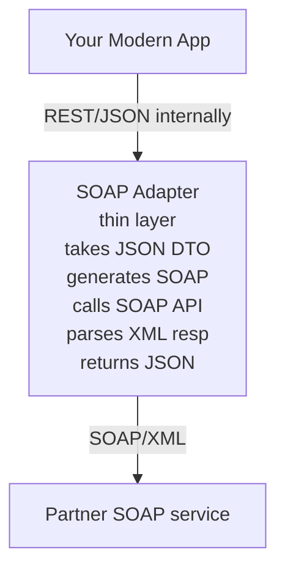

# SOAP

> [Mastery Guide](../README.md) › [API Development](./README.md)

| Status | Priority | Phase | Last reviewed |
|---|---|---|---|
| Not Started | Low | Phase 8 — Microservices & Messaging | 2026-05-07 |

## Contents
- [Why it matters](#why-it-matters)
- [Core concepts](#core-concepts)
  - [Envelope structure](#envelope-structure)
  - [WSDL — service contract](#wsdl--service-contract)
  - [XmlSerializer vs DataContractSerializer](#xmlserializer-vs-datacontractserializer)
  - [Custom SOAP headers from a .NET client](#custom-soap-headers-from-a-net-client)
  - [Client lifetime — faulted channels and factory caching](#client-lifetime--faulted-channels-and-factory-caching)
  - [Binding quotas — the failure that arrives six months late](#binding-quotas--the-failure-that-arrives-six-months-late)
  - [WS-* extensions](#ws--extensions)
  - [Choosing a security mode](#choosing-a-security-mode)
  - [Algorithm suites and the SHA-1 problem](#algorithm-suites-and-the-sha-1-problem)
  - [Replay protection — timestamps and nonces](#replay-protection--timestamps-and-nonces)
  - [WS-Trust, an STS, and federated tokens](#ws-trust-an-sts-and-federated-tokens)
  - [The XML attack surface](#the-xml-attack-surface)
  - [Certificates in containers — loading and rotation](#certificates-in-containers--loading-and-rotation)
  - [Versioning a SOAP contract](#versioning-a-soap-contract)
  - [Observability across a SOAP boundary](#observability-across-a-soap-boundary)
  - [Testing against a SOAP dependency you do not own](#testing-against-a-soap-dependency-you-do-not-own)
  - [ASMX lineage and the migration path](#asmx-lineage-and-the-migration-path)
  - [SOAP vs REST](#soap-vs-rest)
- [Code & diagrams](#code--diagrams)
- [Common pitfalls](#common-pitfalls)
- [Interview-ready summary](#interview-ready-summary)
- [Interview Cross-Questioning Drill](#interview-cross-questioning-drill)
- [Cheat Sheet](#cheat-sheet)
- [Walkthrough](#walkthrough--bridging-a-legacy-bank-soap-api-in-net-10)
- [Self-test](#self-test)
- [Cross-references](#cross-references)
- [Sources](#sources)

---

## Why it matters

SOAP (Simple Object Access Protocol) is the heavyweight enterprise predecessor to REST. Born in the late 1990s, it dominates legacy enterprise integration: banking, government, healthcare, telecom systems built before 2010 all speak SOAP. In 2026, SOAP is mostly a *consumption* problem — you'll integrate with a SOAP service from a partner more often than you'll build a new one.

Why interviewers ask: SOAP knowledge surfaces experience with enterprise integration. Knowing WSDL, WS-Security, and the .NET WCF / CoreWCF tooling separates engineers who've shipped legacy-bridge systems from those who've only built greenfield REST.

When NOT to choose: any new internal API. SOAP is heavyweight (XML envelopes, schema validation, multiple specs to know), and the tooling is in maintenance mode. The legitimate use case in 2026 is integrating with an existing SOAP system you don't control.

## Core concepts

### Envelope structure

Every SOAP message is a SOAP **Envelope** — XML with a header and body:

```xml
<?xml version="1.0"?>
<soap:Envelope xmlns:soap="http://www.w3.org/2003/05/soap-envelope">

  <soap:Header>
    <auth:Credentials xmlns:auth="https://example.com/auth">
      <auth:Username>ahmed</auth:Username>
      <auth:Password>secret</auth:Password>
    </auth:Credentials>
  </soap:Header>

  <soap:Body>
    <m:GetOrder xmlns:m="https://example.com/orders">
      <m:OrderId>42</m:OrderId>
    </m:GetOrder>
  </soap:Body>

</soap:Envelope>
```

The `auth:Credentials` header above is a hand-rolled illustration of *where* headers go — it is not WS-Security, and a plaintext password in a bespoke header isn't acceptable practice. Real WS-Security carries credentials in a `wsse:UsernameToken`, typically as a password digest with a nonce and a created timestamp.

Response (note the `Fault` element used for errors instead of HTTP status codes):

```xml
<soap:Envelope xmlns:soap="http://www.w3.org/2003/05/soap-envelope">
  <soap:Body>
    <m:GetOrderResponse xmlns:m="https://example.com/orders">
      <m:Order>
        <m:Id>42</m:Id>
        <m:Status>Pending</m:Status>
        <m:Total>99.50</m:Total>
      </m:Order>
    </m:GetOrderResponse>
  </soap:Body>
</soap:Envelope>

<!-- On error: -->
<soap:Envelope xmlns:soap="http://www.w3.org/2003/05/soap-envelope">
  <soap:Body>
    <soap:Fault>
      <soap:Code><soap:Value>soap:Receiver</soap:Value></soap:Code>
      <soap:Reason><soap:Text>Order not found</soap:Text></soap:Reason>
      <soap:Detail>
        <m:NotFoundError><m:OrderId>42</m:OrderId></m:NotFoundError>
      </soap:Detail>
    </soap:Fault>
  </soap:Body>
</soap:Envelope>
```

SOAP usually rides over HTTP POST, but the protocol is transport-agnostic — SOAP over SMTP, JMS, MSMQ all exist (rarely seen).

### WSDL — service contract

A **WSDL** (Web Services Description Language) document is the SOAP equivalent of OpenAPI. XML-based, machine-readable, defines:

- **Types:** XSD schema for messages (input and output structures).
- **Messages:** named pairings of types.
- **Port types:** abstract interfaces (operations).
- **Bindings:** concrete protocol details (SOAP-over-HTTP, encoding).
- **Service:** the network endpoint (URL + binding).

```xml
<wsdl:definitions ...>
  <wsdl:types>
    <xsd:schema targetNamespace="https://example.com/orders">
      <xsd:complexType name="GetOrderRequest">
        <xsd:sequence>
          <xsd:element name="OrderId" type="xsd:int"/>
        </xsd:sequence>
      </xsd:complexType>
      <!-- ... more types -->
    </xsd:schema>
  </wsdl:types>

  <wsdl:portType name="OrdersPort">
    <wsdl:operation name="GetOrder">
      <wsdl:input  message="tns:GetOrderInput"/>
      <wsdl:output message="tns:GetOrderOutput"/>
    </wsdl:operation>
  </wsdl:portType>
  <!-- bindings + service definitions follow -->
</wsdl:definitions>
```

Tooling generates client proxies from a WSDL. In .NET:

```bash
# Generate a strongly-typed client from a WSDL URL
# (install once: dotnet tool install --global dotnet-svcutil)
dotnet-svcutil https://example.com/orders.svc?wsdl --outputDir Generated
# Produces a class like OrdersClient with methods matching operations
```

```csharp
var client = new OrdersClient();
var response = await client.GetOrderAsync(new GetOrderRequest { OrderId = 42 });
Console.WriteLine(response.Status);
```

### XmlSerializer vs DataContractSerializer

WCF carries two serialisers, and which one you get changes the XML on the wire. That surprises people, because both are "the SOAP serialiser" in casual conversation.

`DataContractSerializer` is the default. You mark a class `[DataContract]` and its members `[DataMember]`, and you get a fast mapping with deliberately narrow XSD coverage — it cannot express an XML attribute at all, and it fixes element order by rule rather than by declaration. The documented rule is: base-class members first, then the current type's members that have no explicit order, alphabetically by ordinal comparison, then members carrying `[DataMember(Order = n)]` in numeric order. That last part is the trap. Adding a field to an existing data contract silently reshuffles the XML, because a new member named `amount` sorts ahead of the existing `total`.

`XmlSerializer` is the older and far more literal one. It maps to XSD faithfully — attributes, element order as declared, `xsi:nil` via `[XmlElement(IsNullable = true)]`, wrapper elements around arrays — which is exactly what you need when a partner hands you a schema you may not change. You opt in per contract, interface or operation with `[XmlSerializerFormat]`, and if neither that nor `[DataContractFormat]` is present the runtime uses `DataContractSerializer`. `XmlSerializerFormatAttribute` also carries `Style` and `Use` properties, which select document versus RPC and literal versus encoded — the same distinction drill 12 covers, expressed as a .NET attribute.

When you generate a proxy from a partner's WSDL the tool chooses for you based on what the schema needs, and the generated code tells you which: look for `[XmlType]` and `[XmlElement]` attributes versus `[DataContract]` and `[DataMember]`. Check that before you hand-write a DTO to match an existing message.

> 🌍 **In the real world**: a team hand-writes a `[DataContract]` request type to mirror a partner's payment schema, because that's the attribute they know. The partner's XSD declares an `xsd:sequence`, so element order is part of the contract; the DataContractSerializer emits alphabetically and the partner's validating parser rejects every message with a schema-violation fault that names an element rather than the ordering. The fix is one attribute — `[XmlSerializerFormat]` — but only if you know the two serialisers behave differently.

### Custom SOAP headers from a .NET client

Partners routinely require a header the generated client does not send: a channel code, a correlation ID, a bespoke authentication block. There are three mechanisms, in rising order of intrusiveness.

If the header belongs to the contract, put it in the contract. Apply `[MessageContract]` to the request or response type, then `[MessageHeader]` to the members that belong in the envelope's `Header` and `[MessageBodyMember]` to the ones that belong in the `Body`. `MessageHeaderAttribute` takes `Name`, `Namespace` and `MustUnderstand`, so you can set the `mustUnderstand` flag declaratively. This is the cleanest option because the header becomes part of the type system and the published WSDL.

If the header is per-call and outside the contract, use `OperationContextScope`. Open a scope over the client's `InnerChannel`, build a header with `MessageHeader.CreateHeader(name, ns, value)` — overloads add `mustUnderstand`, `actor` and `relay` — and add it to `OperationContext.Current.OutgoingMessageHeaders`. There is one trap here, and it is in Microsoft's own documentation as a warning: do not `await` inside an `OperationContextScope` block. The scope is thread-specific, the continuation may resume on a different thread, and the context you set up is then not the context in force. In an async codebase that guidance effectively pushes you to the third option.

That third option is an `IClientMessageInspector`. Implement `BeforeSendRequest(ref Message request, IClientChannel channel)`, add the header there, and install it through an `IEndpointBehavior` whose `ApplyClientBehavior` adds your inspector to `clientRuntime.MessageInspectors`. This is the async-safe route and the right one when the header must be on every call. It is also where you attach HTTP-level headers rather than SOAP ones: construct an `HttpRequestMessageProperty`, add to its `Headers`, and store it on the message under `HttpRequestMessageProperty.Name`.

```csharp
public class ClientIdHeaderInspector(string clientId) : IClientMessageInspector
{
    public object? BeforeSendRequest(ref Message request, IClientChannel channel)
    {
        request.Headers.Add(MessageHeader.CreateHeader(
            "ClientId", "https://partner.example.com/auth", clientId, mustUnderstand: true));
        return null;
    }

    public void AfterReceiveReply(ref Message reply, object correlationState) { }
}
```

> 🌍 **In the real world**: a bank issues you a client identifier and requires it in a header on every call, marked `mustUnderstand`, but the identifier is not in the WSDL — it was added after the contract was published and nobody regenerated it. The first attempt puts it in an `OperationContextScope` inside an async method; it works in a console spike and disappears intermittently under load, because the continuation resumes on a different thread. Moving it to a message inspector makes it deterministic.

### Client lifetime — faulted channels and factory caching

Two things about generated clients bite people repeatedly.

First, `using` is an anti-pattern here. The generated client derives from `ClientBase<TChannel>`, and disposing it closes the channel. Closing a channel that has already faulted throws. So when your call fails with a `CommunicationException`, the channel enters the Faulted state, the `using` block's implicit close throws its own exception on the way out, and that second exception replaces the first — your logs record a close failure instead of the network error that actually happened. The correct shape is explicit: close on success, `Abort` on failure. Microsoft's own guidance is exactly this try/catch shape — catch `CommunicationException` and `TimeoutException`, call `Abort`, and never let the implicit `Dispose` do the closing.

```csharp
var client = new OrdersClient(binding, endpoint);
try
{
    var response = await client.GetOrderAsync(request);
    await client.CloseAsync();
    return response;
}
catch
{
    client.Abort();   // tears the channel down without attempting a graceful close
    throw;
}
```

Second, channel factories are expensive to build. Microsoft's own list of what factory creation involves is: constructing the `ContractDescription` tree, reflecting all of the required CLR types, constructing the channel stack, and disposing of resources. `ClientBase<TChannel>` therefore exposes a **static** `CacheSetting` property of type `CacheSetting`, with values `Default`, `AlwaysOn` and `AlwaysOff`. Under `Default`, only clients created from endpoints defined in a configuration file participate in caching, and caching is switched off for any instance whose security-sensitive properties — `ClientCredentials`, `Endpoint`, `ChannelFactory` — are touched. Modern .NET does not read `system.serviceModel` configuration files, so you are constructing clients programmatically, so `Default` means no caching at all.

`AlwaysOn` opts in. Two caveats: the setting is per contract type, and it is immutable once the first client of that type has been created, so it belongs in start-up code. The explicit alternative — often cleaner — is to hold a `ChannelFactory<TChannel>` as a singleton in DI and create channels from it yourself.

> 🌍 **In the real world**: a batch job creates one client per record and closes it in a `using`. Two symptoms show up together. Throughput is dominated by per-call setup rather than by the partner's response time, because every record rebuilds the channel stack. And when the partner has a bad minute, the logs fill with close failures and not one of them mentions a timeout, so the incident review concludes the client library is broken.

### Binding quotas — the failure that arrives six months late

The standard WCF bindings cap what they will read, and the defaults are deliberately small. `MaxReceivedMessageSize` defaults to 65,536 bytes. Underneath it, `XmlDictionaryReaderQuotas` constrains the reader itself: `MaxDepth` defaults to 32 and `MaxStringContentLength` to 8,192 characters, alongside limits on array length, bytes per read, and name-table size. These are security controls, not tuning knobs — the documentation for `MaxReceivedMessageSize` says the bound on message size "is intended to limit exposure to DoS-style attacks".

The failure mode is what makes this an interview question rather than a configuration note. The integration works for months because every response is small. Then one customer has an order with several hundred line items, the response crosses 64 KB, and the call fails — from the client's side it surfaces as a communication failure whose message names a maximum message size quota, and if you only read the outer exception it looks like a network problem. Raise the two together: lifting `MaxReceivedMessageSize` without also lifting `MaxStringContentLength` just relocates the failure to a message with one very long element.

```csharp
var binding = new BasicHttpBinding(BasicHttpSecurityMode.Transport)
{
    MaxReceivedMessageSize = 20 * 1024 * 1024,
    ReaderQuotas = { MaxStringContentLength = 4 * 1024 * 1024, MaxDepth = 64 }
};
```

Resist setting everything to `XmlDictionaryReaderQuotas.Max`. Raise the specific quota to a bound you can justify from the partner's own schema limits, and keep `MaxDepth` conservative — depth is the quota that protects you from a maliciously nested document, and nothing legitimate needs hundreds of levels.

> 🌍 **In the real world**: months of green dashboards, then a message-size quota exception at month-end when the largest customer's statement is generated. The reason it hurts is that the trigger is data-dependent, so it never appears in a load test built from the sandbox's tidy sample responses.

### WS-* extensions

A family of specifications layered on top of SOAP for enterprise concerns:

- **WS-Security:** message-level encryption and signing (vs transport-level TLS — letting SOAP messages be safely persisted, queued, or relayed).
- **WS-Addressing:** message routing metadata (where to reply, message correlation ID).
- **WS-ReliableMessaging:** guaranteed delivery with in-order, at-least-once, exactly-once.
- **WS-AtomicTransaction:** distributed transactions across SOAP services (the famous 2PC nightmare).
- **WS-Policy:** declarative requirements (this endpoint requires X-Y-Z security).

These are the source of SOAP's reputation for complexity. They solve real enterprise problems but with significant tooling overhead. REST + JWT + retry middleware solves 80% of the same problems with 20% of the complexity.

### Choosing a security mode

The security mode is the first thing you set on a binding and the thing most likely to be wrong. `BasicHttpBinding` takes a `BasicHttpSecurityMode`; the values, and Microsoft's own descriptions of them, are worth knowing verbatim because partner documentation uses the same names.

**Transport** means HTTPS. Confidentiality, integrity and server authentication all come from TLS; client authentication, if any, is an HTTP mechanism chosen through the transport's client credential type. **Message** means WS-Security: the credential and the protection both live inside the envelope, and for `BasicHttpBinding` the docs note the server certificate must be given to the client out of band. **TransportWithMessageCredential** is the hybrid — HTTPS provides integrity, confidentiality and server authentication, and the caller's credential travels in the WS-Security header. Microsoft describes it as applicable when the user authenticates with a username or certificate credential and there is already an HTTPS deployment — the shape a lot of partner integrations turn out to have. **TransportCredentialOnly** provides HTTP client authentication and no message protection at all; the documentation says to use it with caution, and outside an environment where something else (IPsec, a private link) supplies transport security, treat it as a defect.

The decision rule is the one drill 3 gives from the other side: message-level protection earns its cost only when the message outlives the connection — queued, relayed through an intermediary, or archived as an audit artefact. For a request/response call over HTTPS between two hosts, transport security with a message credential covers it.

One platform caveat, because it is a schedule risk rather than a coding detail. As this file notes elsewhere, `SecurityMode.Message` is not supported by the WCF client on modern .NET. The enum is wider than the runtime, so if a partner's policy demands message security, prove your chosen mode works with a spike against their sandbox before you commit to a date, and open the conversation about a transport-secured variant early.

> 🌍 **In the real world**: a partner's integration guide says "WS-Security" and the team reads that as `SecurityMode.Message`. The actual policy turns out to be transport with a username-token message credential — HTTPS plus a `wsse:UsernameToken` — which is a completely different configuration. Reading the WSDL's policy assertions rather than the PDF is what settles it.

### Algorithm suites and the SHA-1 problem

WS-SecurityPolicy names the cryptography a message-secured endpoint uses as an *algorithm suite*: a single token that fixes the encryption algorithm, the signature digest, the canonicalisation method and the key lengths all at once. WCF exposes the same names as static properties on `SecurityAlgorithmSuite` — `Basic128`, `Basic192`, `Basic256` and `TripleDes`, each with `Sha256` and `Rsa15` variants such as `Basic256Sha256` and `Basic256Sha256Rsa15`.

The distinction worth carrying into a room is what the suffixes mean. Microsoft's own description of `Basic256Sha256` is "an algorithm suite that uses SHA256 for the signature digest and 256-bit Basic as the message encryption algorithm", where plain `Basic256` is documented only as "an algorithm suite that uses 256-bit Basic as the message encryption algorithm" — no digest qualifier, because its digest is SHA-1. That is why the SHA-256 variants needed separate names at all. That matters because NIST's SP 800-131A Revision 2 disallows SHA-1 for generating digital signatures, permitting it only for legacy verification. So a partner still publishing a `Basic256` policy is publishing a SHA-1 signing policy, and moving them to `Basic256Sha256` is a conversation with their security team, not a change on your side. The `Rsa15` suffix is the other legacy marker — it selects RSA v1.5 key wrapping rather than OAEP.

There is no runtime negotiation: both sides must be configured identically, and a mismatch surfaces as a generic security processing failure with no useful detail. That is why "which algorithm suite does your policy specify" is the second question to ask a partner, immediately after the security mode.

> 🌍 **In the real world**: an insurer's endpoint has advertised `Basic256` since 2009. Your own platform team has a control that forbids SHA-1 signing. Neither side is wrong and neither side can change unilaterally, so the integration stalls on a governance exception while the code sits finished. Discovering this in week one instead of week nine is worth more than any amount of clever adapter design.

### Replay protection — timestamps and nonces

A signature proves origin and integrity. It does not prove freshness — capture a signed message, send it again, and the signature still verifies. WS-Security handles that with two elements, and knowing both is a reliable way to show you have actually read the specs.

The first is `<wsu:Timestamp>`, defined in the WSS SOAP Message Security specification's Security Timestamps section, carrying `<wsu:Created>` and optionally `<wsu:Expires>`. It sits inside the `<wsse:Security>` header, and it has to be covered by the signature — an unsigned timestamp is one an attacker simply rewrites before replaying.

The second is the nonce, defined by the UsernameToken Profile. When a username token uses password digest, the spec gives the formula as `Password_Digest = Base64(SHA-1(nonce + created + password))`, so the nonce and the creation time are inputs to the digest and a replayed token carries a replayed nonce. The profile's three recommendations are the answer an interviewer wants: reject any UsernameToken that does not carry *both* a nonce and a creation timestamp; enforce a freshness limit on the timestamp, for which the spec offers five minutes as a suggested minimum; and cache used nonces for at least as long as that freshness window, rejecting any nonce already in the cache.

Notice how those interlock, because that is the part people miss. A freshness window alone does not stop replay — it just bounds it to five minutes. A nonce cache alone would have to be infinite. The window bounds the cache; the cache closes the window. Note also that the digest itself is SHA-1: this is a replay control from 2004, not a password-strength control, and it does not make a weak password safe.

> 🌍 **In the real world**: a service accepts username-token digests and validates them correctly, but never stores the nonces because "the timestamp check covers it". An attacker who can observe one message can resend it freely for the next five minutes. If that message is a payment instruction, five minutes is plenty.

### WS-Trust, an STS, and federated tokens

Some partners do not authenticate you directly. They trust a third party — a Security Token Service — and require you to present a token that the STS issued. WS-Trust is the protocol for that exchange: the client sends a `RequestSecurityToken` to the STS, receives a `RequestSecurityTokenResponse` containing a token (usually SAML), then attaches that token to the real service call inside the WS-Security header. WS-Federation layers the sign-in and metadata patterns on top of it.

In .NET this lives in the `System.ServiceModel.Federation` package. `WSFederationHttpBinding` takes a `WSTrustTokenParameters`, which you build with a factory method such as `WSTrustTokenParameters.CreateWS2007FederationTokenParameters(issuerBinding, issuerAddress)` — you supply the binding and address of the STS itself. Properties on the token parameters control the requested `TokenType` and `KeyType`, the `MessageSecurityVersion`, and whether issued tokens are cached (`CacheIssuedTokens`, `MaxIssuedTokenCachingTime`, `IssuedTokenRenewalThresholdPercentage`). All of it is code: modern .NET does not read WCF configuration files, so there is no `app.config` route.

The conceptual point matters more than the API. Federated SOAP is the same triangle as OAuth — client, issuer, resource — invented earlier and expressed in XML. Recognising that lets you map an unfamiliar WS-Trust diagram onto something you already understand, and ask the questions that actually determine the design: who issues, how long is the token good for, is it a bearer token or is it bound to a key you hold, and what happens when the STS is down.

> 🌍 **In the real world**: a government portal fronts several agency services with a single STS. Your integration needs two calls to two different agencies, and the naive implementation fetches a fresh token from the STS before each one — turning two calls into four and making the STS your availability floor. Token caching is not an optimisation here; it is the difference between a working integration and one that trips the issuer's rate limit.

### The XML attack surface

XML parsers historically did more than parse, and that is the whole problem. Three families, in rising order of subtlety.

**External entity injection, or XXE.** A document type definition can declare an entity whose value is a URI, and a parser that resolves it will read a local file or make an outbound request on the attacker's behalf. On modern .NET the safe path is the default: `XmlReaderSettings.DtdProcessing` defaults to `Prohibit`, so a document containing a DTD throws. You reopen the hole by setting it to `Parse` *and* supplying a non-null `XmlResolver` — which people do, usually to make one awkward legacy document load. If you are hand-parsing envelopes rather than going through a generated proxy, this is the setting to check first.

**Entity expansion, the "billion laughs".** No external reference needed. An internal DTD defines each entity as ten copies of the previous one; ten levels of that gives a billion expansions from a document of a few hundred bytes — hence the name, a billion copies of the string "lol". The parser exhausts memory before the application sees anything. `Prohibit` blocks this as well, which is why the default is to reject DTDs outright rather than merely restrict what they may reference.

**XML Signature Wrapping.** The subtle one, and the one that separates candidates. An XML signature's `Reference` elements point at what they cover, typically by ID. If the receiver verifies the signature by following that reference, but the application then finds the business data by walking the document tree, an attacker can *move* the signed element somewhere the verifier still locates it — inside a bogus wrapper element, or into the header — and put their own unsigned element where the application looks. Verification passes; the application acts on attacker-controlled content. McIntosh and Austel described this in "XML signature element wrapping attacks and countermeasures" at the 2005 ACM workshop on Secure Web Services, and variants have recurred in SOAP stacks and cloud APIs ever since. The countermeasure is not "check the signature harder" — it is to make the verifier and the business logic read the same element, which in practice means using a stack that guarantees it rather than assembling verification by hand. This is the same reason drill 7 warns about rolling your own MTOM plus WS-Security.

> 🌍 **In the real world**: an integration works in every environment for a year, then a new API gateway is introduced in front of the service in production only. The gateway parses and re-serialises the XML — perfectly valid XML, semantically identical — and every signature starts failing. It looks like a certificate problem, it is diagnosed as a certificate problem for two days, and it is the reason this file's own advice reads "sign last, never modify the wire bytes after signing".

### Certificates in containers — loading and rotation

The WCF-era idiom loads a client certificate from a Windows certificate store by thumbprint. In a Linux container there is no such store worth using: the certificate arrives as a mounted file or an injected secret, and the code has to load it from bytes.

Two things changed in modern .NET. First, the `X509Certificate2` constructors that take a file path, a `byte[]` or a `ReadOnlySpan<byte>` are obsolete as of .NET 9 — compile warning `SYSLIB0057`. The stated reason is that they inferred the format from the content, so data intended to be a bare X.509 certificate could actually be a PKCS#12 bundle. The replacement is `X509CertificateLoader`, whose methods name the format you expect: `LoadCertificate` and `LoadCertificateFromFile` for X.509, `LoadPkcs12` and `LoadPkcs12FromFile` (plus `Collection` variants) for PFX. Choosing the right one is the point of the change, not a formality. The `Microsoft.Bcl.Cryptography` package supplies the same loader for .NET Framework and .NET Standard, which matters if your adapter is shared with a legacy host.

Second, rotation. A certificate read once at start-up is a certificate that expires in production. Reload from the mounted path on a refresh rather than holding the `X509Certificate2` for the process lifetime, and remember that a cached channel factory pins the credential it was built with — rotating the file without rebuilding the factory changes nothing.

The operational half matters more than the API half. When a partner's signing certificate is rotated or expires, every call fails with the same opaque security-processing error you would get from a policy mismatch, and the exception text will not distinguish them. The way out is to capture the outgoing envelope through the message inspector you already have, with credential material redacted, and read the expiry off the certificate in the binary security token. Better still, alert on days-to-expiry so the rotation is a calendar event rather than an outage.

> 🌍 **In the real world**: the partner rotates their signing certificate on a Sunday and emails the new one to a distribution list that no longer has anyone on it. Monday morning every call returns "security processing failed". Nothing in your logs says "certificate", nothing says "expired", and the partner's first-line support insists their end is healthy — because for their other clients, who got the email, it is.

### Versioning a SOAP contract

SOAP versioning is stricter than REST versioning because the contract is machine-enforced at both ends. The convention that survives is to version the XML namespace, usually by dating it — `https://partner.example.com/orders/2019/06`. A new namespace is a new contract at a new endpoint, so existing clients keep working untouched, and you run both until the old one is drained. Editing a live contract in place is the mistake; there is no equivalent of "clients will just ignore the new JSON field" when a validating parser is on the other end.

Within a version, what is safe depends on the serialiser and on the schema. Adding an optional element (`minOccurs="0"`) at the end of an `xsd:sequence` is generally tolerated — `XmlSerializer` skips elements it does not recognise, which is why drill 11's answer says additive changes fail silently rather than loudly. Adding one in the middle of a sequence is not safe, because a sequence makes order part of the contract.

Two mechanisms are worth naming because they are exactly the kind of detail an interviewer probes.

The `Specified` companion. When a schema declares an optional element that maps to a value type with no default, the .NET tooling generates *two* members: the value, and a `bool` named the same with `Specified` appended, marked `[XmlIgnore]` so it never appears in the XML. `XmlSerializer` writes the element only when that flag is true. Set the value and forget the flag and the element simply is not sent — no exception, no warning, and a partner who silently applies their default instead of yours.

Round-tripping unknown data. If a type implements `IExtensibleDataObject` — a single `ExtensionData` property of type `ExtensionDataObject` — the DataContractSerializer stores elements it did not recognise there and writes them back out on the way through. Without it, extra data is discarded. That is the difference between an intermediary that preserves a newer version's fields and one that quietly strips them.

> 🌍 **In the real world**: a middleware service reads a claim from an upstream SOAP system, enriches it, and posts it onward. Upstream adds a field. The middleware's data contract does not know about it, so it is dropped, and the downstream system starts rejecting claims for missing data that the upstream team can prove they sent. `IExtensibleDataObject` on the pass-through types is a one-line fix, and an unfindable bug without it.

### Observability across a SOAP boundary

A generated proxy is opaque to everything you normally rely on. Two specific gaps.

**Trace context does not propagate by itself.** The `Activity` carrying your trace in ASP.NET Core does not become a `traceparent` on the outgoing SOAP request. The hook is the same `IClientMessageInspector` you may already have: in `BeforeSendRequest`, take `Activity.Current`, format its identifiers as a W3C trace-context header, and attach it — as an HTTP header via an `HttpRequestMessageProperty` stored under `HttpRequestMessageProperty.Name`, or, if the partner reads SOAP headers rather than HTTP ones, via `MessageHeader.CreateHeader`. There is a community package, `OpenTelemetry.Instrumentation.Wcf` in the `opentelemetry-dotnet-contrib` repository, that wires this up through `AddWcfInstrumentation` and a `TelemetryEndpointBehavior`; its own README states that because the semantic conventions it follows are still in development the package is a pre-release and breaking changes are possible until a stable version ships, so read that before you depend on it.

**Faults are indistinguishable from failures in HTTP metrics.** Because a `<soap:Fault>` normally comes back as HTTP 500 — always in SOAP 1.1, and in SOAP 1.2 for everything except a `Sender` fault, which maps to 400 — naive HTTP-level monitoring counts an "account not found" as a server error. This is where pitfall 1 and drill 9 join up: map faults to domain exceptions, then classify them. `Sender` faults are business outcomes and belong on a business dashboard; `Receiver` faults and `CommunicationException` are availability signals and belong on the alerting path. Skip that step and somebody gets paged at two in the morning because a customer typed an account number wrongly.

Add one more thing while you are in there: log the raw envelope on failure, redacted. When WS-Security fails there is nothing useful in the exception, and the request bytes are the only evidence. Keep that inspector installed permanently rather than adding it during an incident — by then the failing message has gone.

> 🌍 **In the real world**: a distributed trace stops dead at the SOAP adapter. Every downstream span the partner produces is an orphan, so a latency problem inside the partner's estate is indistinguishable from network time on your side, and neither team can prove anything. Injecting the trace header costs a dozen lines and converts an argument into a graph.

### Testing against a SOAP dependency you do not own

A SOAP call over HTTP is an HTTP POST with an XML body plus either a `SOAPAction` header (SOAP 1.1) or an `action` parameter on the `application/soap+xml` content type (SOAP 1.2). That is all it is. Any HTTP stub server can therefore play the partner: match on the action, or on an XPath expression over the body, and return a stored envelope. You do not need a SOAP-aware mock, and you should be suspicious of any test setup that requires the real partner to be reachable.

The value is in where the stored envelopes come from. Capture real responses from the partner's sandbox — through the message inspector you have already installed — and commit them as fixtures, including at least one `<soap:Fault>` for every fault the WSDL declares. Then test the fault path deliberately. Mapping `FaultException<T>` to a domain exception is exactly the code that is never exercised until the first production incident.

Keep the fixtures honest with a scheduled contract test: regenerate the proxy from the partner's published WSDL in CI and fail the build when the generated code changes. Drill 11 explains why this is the only defence that works — an additive change deserialises silently, so nothing fails until someone reads a changelog.

Two practical warnings about partner environments. Sandboxes are frequently a different build from production, with a different WSDL, different optional elements populated, and different fault detail — treat a sandbox as a syntax check, not a semantic guarantee, and plan a supervised first run against production. And a published `?wsdl` can carry a `soap:address` pointing at the partner's *internal* hostname, so a client generated straight from it targets a box you cannot reach. That, plus IP allowlisting and private links, is why the walkthrough in this file constructs the client with an explicit `EndpointAddress` rather than trusting the generated default.

> 🌍 **In the real world**: the integration passes every test, goes live, and fails on the first call with a DNS error naming a host nobody recognises. It is the partner's internal service name, baked into the WSDL they publish externally. Ten minutes to fix, half a day to find, and entirely avoidable if you looked at the generated endpoint address once.

### ASMX lineage and the migration path

Before WCF there was ASMX — ASP.NET Web Services, part of the .NET Framework from its early releases. A `.asmx` file with a `<%@ WebService %>` directive, a class marked `[WebService]`, methods marked `[WebMethod]`, and the framework generated the WSDL for you. Clients came from `wsdl.exe` (or Visual Studio's "Add Web Reference") as a proxy deriving from `System.Web.Services.Protocols.SoapHttpClientProtocol`. It did SOAP over HTTP and nothing else — no WS-Security, no reliable messaging, no alternative transports. Document/literal was the default, though `[SoapRpcService]` and `[SoapRpcMethod]` could switch a service or a method to RPC/encoded. WSE — Web Services Enhancements — was the bolt-on that added some of the WS-* stack to it.

WCF replaced it in .NET 3.0 with `[ServiceContract]`, `[OperationContract]` and the binding model. That history matters in 2026 for one concrete reason: `System.Web.Services` is .NET Framework only — its supported-framework list stops at 4.8.1. There is no ASMX on .NET Core or .NET 5 and later, and no in-place port. The trace of that lineage is still visible in the modern API: `BasicHttpBinding` is documented as the binding that speaks to ASMX-era clients and services conforming to WS-I Basic Profile 1.1.

So moving an ASMX estate off Windows means deciding per endpoint. Re-front it as REST or gRPC if you can reach every caller — usually you cannot. Re-implement the contract on CoreWCF, which means writing the `[ServiceContract]` interface ASMX never made you write and matching the original WSDL's namespaces and wrapper element names exactly, because any drift breaks every existing client. Or retire it, which is more often the right answer than teams expect. Across dozens of endpoints the answer is a mix, and the sequencing question — which callers are yours, which are third parties on contracts you cannot reopen — is what an interviewer is actually probing.

The consuming side is much easier, and worth saying out loud because people assume otherwise: calling an old ASMX service from .NET 10 needs nothing special. It publishes a WSDL, `dotnet-svcutil` generates a client, `BasicHttpBinding` talks to it. ASMX being dead as a *hosting* technology does not make ASMX endpoints unreachable.

> 🌍 **In the real world**: an estate of ASMX and WCF endpoints has to leave Windows Server before an end-of-support date. The migration plan says "port to CoreWCF" for all of them. Traffic analysis finds that a third have had no caller in two years, several are called only by other services in the same solution and should be method calls, and the genuinely external ones — the handful with third-party consumers — are the only ones that need byte-identical WSDL. The plan that survives is retire, absorb, port, in that order.

### SOAP vs REST

| Concern | SOAP | REST |
|---|---|---|
| Format | XML only | JSON, XML, anything |
| Transport | HTTP, SMTP, JMS, MSMQ | HTTP only (typically) |
| Contract | WSDL (mandatory) | OpenAPI (optional but common) |
| Standards | WS-* extensions stack | HTTP itself |
| Typing | Strict (XSD) | Loose (whatever client/server agree) |
| Errors | SOAP Fault element | HTTP status codes + body |
| Caching | Not built-in (POST always) | HTTP caching native |
| Tooling | Code-generated proxies | Manual or OpenAPI-generated |
| Learning curve | High | Low |
| Performance | Heavier (XML parsing) | Lighter |
| Use cases | Legacy enterprise, financial, govt | Almost everything new |

## Code & diagrams

<details>
<summary>🧩 Click to expand — code samples and diagrams</summary>

### Consuming a SOAP service in .NET

```csharp
// 1. Generate proxy
// dotnet-svcutil https://example.com/orders.svc?wsdl

// 2. Use the generated client
public class OrderImporter(OrdersClient client)
{
    public async Task<Order> FetchAsync(int id)
    {
        try
        {
            var response = await client.GetOrderAsync(
                new GetOrderRequest { OrderId = id });

            return new Order
            {
                Id = response.Order.Id,
                Status = response.Order.Status,
                Total = response.Order.Total
            };
        }
        catch (FaultException<NotFoundError> ex)
        {
            throw new OrderNotFoundException($"Order {id} not found", ex);
        }
        catch (CommunicationException ex)
        {
            // Network / timeout / connection issues
            throw new ServiceUnavailableException("Order service unreachable", ex);
        }
    }
}
```

### Hosting a SOAP service in .NET (legacy WCF replacement)

The WCF *server* stack was Windows-only and never came to .NET Core/5+ (a *client* subset did — the `System.ServiceModel.*` packages are supported and run cross-platform, minus message-level security). For hosting, **CoreWCF** is the Microsoft-endorsed successor; **SoapCore** is the lighter-weight option when you only want a SOAP endpoint inside an ASP.NET Core app. The snippet below is **SoapCore's** API, not CoreWCF's — CoreWCF's selling point is that it keeps WCF's own configuration surface (`ServiceHost`, behaviors, message inspectors), so a CoreWCF migration does not look like this:

```csharp
// Program.cs — SoapCore (the lighter-weight option); CoreWCF's hosting API differs
builder.Services.AddSoapCore();
builder.Services.AddSingleton<IOrdersService, OrdersService>();

app.UseSoapEndpoint<IOrdersService>(
    "/orders.asmx",
    new SoapEncoderOptions(),
    SoapSerializer.XmlSerializer);

[ServiceContract]
public interface IOrdersService
{
    [OperationContract]
    Task<GetOrderResponse> GetOrderAsync(GetOrderRequest request);
}

public class OrdersService : IOrdersService
{
    public async Task<GetOrderResponse> GetOrderAsync(GetOrderRequest req)
    {
        var order = await _repo.GetByIdAsync(req.OrderId);
        if (order == null)
            throw new FaultException<NotFoundError>(new NotFoundError { OrderId = req.OrderId });

        return new GetOrderResponse { Order = MapToDto(order) };
    }
}
```

### Bridging SOAP to REST

The most common integration shape: your modern app needs to call a partner's SOAP API.



Keep the adapter thin. Don't let SOAP types leak into your domain.

</details>

## Common pitfalls

1. **Treating SOAP Faults like HTTP errors.** Faults carry rich error structure; map them to your domain exceptions, don't just toString.
2. **Generating proxies from a WSDL once and never regenerating.** When the WSDL changes, you don't notice until runtime XML errors. Regenerate as part of CI when integrating with active partners.
3. **No timeout configuration.** Default WCF timeouts can be unbounded. Set `OpenTimeout`, `SendTimeout`, `ReceiveTimeout`, `CloseTimeout` explicitly.
4. **Connection / channel reuse confusion.** WCF channels are not thread-safe in all configurations. Read the binding's contract; reuse where allowed.
5. **WS-Security misconfiguration.** Wrong cert, wrong policy, wrong namespace → "Security processing failed." Painful to debug. Verify with WCF Test Client or SoapUI first.
6. **Ignoring the SOAP action.** Many servers use it to route. In SOAP 1.1 it's a separate `SOAPAction: "https://..."` HTTP header; in SOAP 1.2 there is no such header — the action became a parameter on the content type (`application/soap+xml; action="https://..."`). Generated proxies set it; manual XML-over-curl forgets.
7. **Pretty-printing XML before signing.** Whitespace changes the signature. Sign exactly what you'll send.
8. **No retry strategy for `CommunicationException`.** Transient network errors look fatal. Wrap calls in Polly retry policies.
9. **XML namespace mismatches.** A misplaced colon in a namespace declaration → "Element not found." XML namespacing is unforgiving.
10. **Logging entire envelopes including credentials in headers.** Same problem as logging JWTs — they leak. Filter sensitive headers.
11. **Trying to make SOAP RESTful.** `POST /soap/getOrder` with REST-shaped JSON wrapping a SOAP envelope. Pick one model.
12. **Treating SOAP as obsolete and skipping the basics.** Banking, healthcare, government still use it heavily. Refusing to learn it limits your career options.

## Interview-ready summary

- **SOAP = XML envelope (Header + Body) with strict typing via XSD/WSDL.**
- **WSDL** is the contract; tooling generates client proxies (`dotnet-svcutil`).
- **WS-*** extensions add enterprise features (security, reliability, transactions) at significant complexity cost.
- **Faults** instead of HTTP status codes for errors.
- **In .NET 2026:** consume via generated proxy + the cross-platform `System.ServiceModel.*` client packages; host via **CoreWCF** (the Microsoft-endorsed WCF successor) or SoapCore for something lighter.
- **Pick REST** for new APIs; learn SOAP for integrating with legacy enterprise systems.

**Expected interview questions:**

1. *"SOAP vs REST?"* — Walk the comparison table: format (XML vs anything), contract (WSDL mandatory vs OpenAPI optional), errors (Fault vs status code), complexity (high vs low), use cases (legacy enterprise vs new).
2. *"What's a WSDL?"* — Machine-readable XML description of a SOAP service: types (XSD), messages, port types, bindings, service endpoints. Tooling (.NET's `dotnet-svcutil`, Java's `wsimport`) generates strongly-typed client proxies from it.
3. *"How does SOAP signal an error?"* — `<soap:Fault>` element in the body with `<Code>`, `<Reason>`, `<Detail>`. Optionally a fault contract `FaultException<T>` in .NET maps to domain exceptions.
4. *"What is WS-Security?"* — Spec for message-level (vs transport-level) encryption and signing. Lets messages be safely queued, persisted, relayed without TLS protection. Heavy tooling.
5. *"How do you call a SOAP service from .NET 10?"* — `dotnet-svcutil <wsdl-url>` generates client → use generated `*Client` class with strongly-typed request/response types → handle `FaultException` and `CommunicationException`.
6. *"What replaces WCF in modern .NET?"* — For hosting: CoreWCF (Microsoft-endorsed since 2022), or SoapCore for a lighter endpoint. For consuming: `System.ServiceModel.*` packages (subset of WCF, ported to .NET Core+ and cross-platform).
7. *"When would you choose SOAP today?"* — Integrating with an existing SOAP partner. Compliance regimes that mandate WS-* security. Otherwise REST or gRPC.

## Interview Cross-Questioning Drill

<details>
<summary>📖 Click to expand — cross-question chains (~15-20 min, cover answers and write cold)</summary>

> ⚠️ **Honest caveat**: reading this once doesn't make you interview-ready. Cover the answers, write them cold, then check. Pair with a senior for live mock cross-questioning. The guide removes "I never thought about that" surprises; mock interviews convert knowledge into reflex. Both are needed.

Each drill is **Q → A → Cross-Q → A → Cross-Q² → A**.

### Drill 1 — WSDL

> **Q**: What does a WSDL describe, and how is it different from OpenAPI?
>
> **A**: WSDL (Web Services Description Language) is an XML document describing a SOAP service: **types** (XSD schema for messages), **messages** (typed input/output pairs), **port types** (abstract operations), **bindings** (concrete protocol — SOAP-over-HTTP, encoding), and **service** (network endpoints). It's the SOAP equivalent of OpenAPI but **mandatory** — a SOAP service without a WSDL is unusable because the entire client-generation toolchain depends on it.
>
> **Cross-Q**: WSDL has bindings; OpenAPI doesn't. What does that mean operationally?
>
> **A**: WSDL bindings declare **exactly how messages travel** — SOAP over HTTP POST with a specific content type, or SOAP over JMS, or with WS-Security applied. The generated client knows the transport details, encryption, signing requirements, all without configuration. OpenAPI describes the message shapes (request/response JSON) but leaves transport to convention (HTTPS, JSON). Result: WSDL is more complete but less flexible — you can't easily switch a SOAP service from HTTP to MQ without WSDL surgery, while a REST service is just a different base URL.
>
> **Cross-Q²**: WSDL 1.1 vs WSDL 2.0 — which do you encounter in the wild?
>
> **A**: Almost exclusively **WSDL 1.1**, despite WSDL 2.0 being a W3C recommendation since 2007. Tooling support for 2.0 never reached parity; .NET's `dotnet-svcutil` and Java's `wsimport` are 1.1-first. If you see a 2.0 WSDL in production, the team that produced it probably has a bespoke toolchain. Default to 1.1 for any new (rare) SOAP work.

### Drill 2 — Envelope structure

> **Q**: Walk me through a SOAP envelope's structure.
>
> **A**: `<soap:Envelope>` root containing `<soap:Header>` (optional — auth, routing, addressing, security tokens) and `<soap:Body>` (mandatory — the operation request or response, or a `<soap:Fault>` on error). Each child uses namespaces to disambiguate (SOAP namespace, your operation's namespace, WS-* extensions' namespaces). The envelope is plain XML; what makes it SOAP is the structure and the namespace.
>
> **Cross-Q**: What's a `mustUnderstand` attribute on a header block?
>
> **A**: If a header block has `soap:mustUnderstand="true"`, the receiver **must** understand and process that header — otherwise it must fault with `MustUnderstand`. Used for things like WS-Security signatures — if the receiver doesn't speak WS-Security, processing the message without verifying the signature would be a security hole, so the message fails fast. Without `mustUnderstand`, receivers can ignore headers they don't recognize (forward-compatibility), which is dangerous for security headers but fine for routing metadata.
>
> **Cross-Q²**: SOAP 1.1 vs 1.2 — what changed and which is in the wild?
>
> **A**: SOAP 1.2 (2003) is the W3C recommendation but **1.1 still dominates legacy systems** because the original 2000 spec achieved Microsoft + IBM interop first. Changes in 1.2: explicit `Sender`/`Receiver` fault codes (replacing 1.1's `Client`/`Server`), better HTTP binding, removed some XML quirks. The default content type changed (`application/soap+xml` vs 1.1's `text/xml`). Most legacy systems speak 1.1; tooling supports both; the encoding style in 1.1 was loose enough that interop bugs are still common.

### Drill 3 — WS-Security

> **Q**: What is WS-Security and why use it instead of TLS?
>
> **A**: WS-Security is an OASIS standard for **message-level security** — signing and/or encrypting parts of the SOAP envelope at the XML level, with credentials carried inside the `<Header>` (X.509 tokens, username/password tokens, SAML tokens). TLS is **transport-level** — once the message is decrypted at the proxy/LB/queue, it's plaintext.
>
> **Cross-Q**: When does message-level beat transport-level security in practice?
>
> **A**: When messages traverse **untrusted intermediaries**. (1) Message stored in MQ for hours/days — TLS only protected the put, the message sits plaintext in storage. (2) Forwarded through SOAP intermediaries that need to inspect headers but not body — selective encryption protects body, leaves routing visible. (3) Audit trails require **provable end-to-end integrity** — TLS only proves "in transit"; signed messages prove origin and non-tampering at rest. Used in regulated industries (banking, healthcare, government) where audit and compliance regimes require this.
>
> **Cross-Q²**: WS-Security uses XML Canonicalization. Why?
>
> **A**: Signatures cover bytes. XML is semantically-equivalent in many byte-different forms (whitespace, attribute order, namespace prefix choice). Without **canonicalization** (`xml-exc-c14n`), the receiver re-serializes the parsed XML and gets different bytes than what the sender signed → signature verification fails despite semantic equivalence. C14n defines a deterministic byte representation; both sides canonicalize before signing/verifying. The cost is real CPU work; the alternative is "signatures depend on whitespace" which is unworkable.

### Drill 4 — REST vs SOAP

> **Q**: When does SOAP still win over REST in 2026?
>
> **A**: Three legitimate cases. (1) **Integrating with existing SOAP partners** — banks, insurance, government, healthcare APIs. (2) **Regulated environments** that mandate WS-Security message-level signing/encryption with audit trails. (3) **Strict contract-first** development where the WSDL is the source of truth and tooling generates strongly-typed clients across languages — though OpenAPI + codegen does this for REST too. Otherwise REST + JWT + OpenAPI covers 80% of SOAP's value with 20% of the complexity.
>
> **Cross-Q**: SOAP advocates point to its "formal contract." Does OpenAPI not give the same?
>
> **A**: Closer than it used to. OpenAPI 3.1 has full JSON Schema, security schemes, and strong typing — generated clients work well. The gap: (1) OpenAPI doesn't standardize **transactions, reliable messaging, message-level security** the way WS-* did. (2) WSDL is mandatory and integrated; OpenAPI is optional and often drifts from implementation. (3) SOAP fault models are stricter and richer than HTTP status codes + JSON errors. For 99% of business APIs the gap doesn't matter; for the 1% where it does, SOAP still wins on contract rigor.
>
> **Cross-Q²**: A team picks REST for a new bank API integration. Partner says "no, must be SOAP." Why might that be?
>
> **A**: (1) **Regulatory checkbox** — auditors demand WS-Security message-level signing, REST + JWT doesn't satisfy the audit framework. (2) **Existing partner infrastructure** — the bank's middleware is ESB/SOAP, exposing REST would require new infra. (3) **Strict contract requirements** — they want WSDL versioning, strongly-typed contracts, no schema drift. (4) **"We've always done it this way"** — non-trivial in regulated industries where change is expensive. You don't win this argument; you build the SOAP adapter and isolate it at your boundary.

### Drill 5 — Why does SOAP still exist in 2026?

> **Q**: SOAP feels like 2005 technology. Why does it persist in 2026?
>
> **A**: (1) **Legacy systems** built 2000-2015 in banking, healthcare, government, telecom are still in production and unchanged because rewriting them costs hundreds of millions for zero new feature value. (2) **Regulatory inertia** — compliance frameworks reference WS-* explicitly, replacing them requires multi-year regulator approval. (3) **Vendor support contracts** — IBM, SAP, Oracle still sell SOAP-based middleware with full support; rewriting in REST means losing the support contract. (4) **Strong typing in cross-language enterprise** — strongly-typed contracts across Java/C# matter when teams are siloed by language. SOAP is **dying slowly but predictably**; REST won the new builds, SOAP keeps the old ones running.
>
> **Cross-Q**: Will it ever fully die?
>
> **A**: Eventually but slowly — think decades. Banking SOAP APIs from 2005 are still up; they'll be replaced when the underlying mainframe is, which happens on 20-30 year cycles. New banks build REST + gRPC. Legacy banks slowly migrate, but "the order matters" — they replace customer-facing first (web/mobile), back-office last (treasury, settlement). The SOAP estate shrinks 5-10% per year. In 2040 we'll still find SOAP in some bank's correspondent-banking systems.
>
> **Cross-Q²**: For a career-development perspective, is learning SOAP worth it in 2026?
>
> **A**: Yes, at a **basic** level — enough to consume a SOAP API, parse a WSDL, debug a `<soap:Fault>`, configure `WSHttpBinding` in .NET. Banking, healthcare, government, and large-enterprise jobs all expose you to SOAP; refusing to learn it forecloses those paths. **Don't** invest in WS-AtomicTransaction, complex WS-Policy authoring, or running a SOAP server — those skills atrophy quickly. Aim for "can consume any SOAP API the partner gives me" not "can architect a new SOAP stack."

### Drill 6 — CoreWCF as WCF replacement

> **Q**: The WCF server stack was Windows-only and didn't make it to .NET Core. What replaces it?
>
> **A**: For **hosting** SOAP services: **CoreWCF** (open-source community-led port) or **SoapCore** (lighter-weight alternative). Microsoft endorsed CoreWCF in 2022. For **consuming** SOAP services: `System.ServiceModel.*` packages on NuGet — a subset of WCF client functionality (`BasicHttpBinding`, `WSHttpBinding`, `Microsoft.Tools.ServiceModel.Svcutil`/`dotnet-svcutil` for proxy generation). The .NET 6+ story is "you can do most of what WCF did". CoreWCF has hosted `NetTcpBinding` since 1.0 and added named pipes in a later release. What's genuinely gone is the Windows-specific long tail.
>
> **Cross-Q**: When would you pick CoreWCF over SoapCore?
>
> **A**: **CoreWCF** when you're migrating an existing WCF service and want maximum API compatibility — `ServiceHost`, `OperationContract`, behaviors, message inspectors all work. Drop-in replacement is the explicit goal. **SoapCore** when you want a lighter SOAP endpoint inside an ASP.NET Core app — `app.UseSoapEndpoint<>()` plugs into the middleware pipeline naturally, simpler config, no WCF baggage. Greenfield SOAP services pick SoapCore. Lifting WCF off Windows picks CoreWCF.
>
> **Cross-Q²**: What WCF features did **not** make the jump?
>
> **A**: Fewer than people assume, but the survivors are real. `NetTcpBinding` is only half on the list. CoreWCF has hosted NetTcp since 1.0 and added named pipes in a later release, and the client side has shipped as `System.ServiceModel.NetTcp` since .NET Core 2.x — but the modern client doesn't cover the whole binding, so don't promise a drop-in port. For greenfield .NET-to-.NET RPC, gRPC is still the better choice, though that's a design call, not a platform limit. What actually gives you trouble: (1) MSMQ — Windows-only queueing that most migrations drop, moving to RabbitMQ/Service Bus/Kafka directly. (2) Message-level security — `SecurityMode.Message` is not supported by the WCF client on .NET Core+; it throws `PlatformNotSupportedException`, and Windows credentials over NetTcp are a gap too, so plan on transport security. (3) Distributed transactions (WS-AT, `OleTransactions`) — .NET 7 restored `System.Transactions` promotion to MSDTC, but Windows-only; there is still nothing cross-platform, so design around eventual consistency. (4) Some workflow/peer features that were rare even in WCF. HTTP-based SOAP over transport security is the part that genuinely works everywhere; the long-tail proprietary features were already niche in WCF and didn't survive the port.

### Drill 7 — MTOM

> **Q**: SOAP messages need to send a 50MB PDF. Why is base64 a problem and what's the alternative?
>
> **A**: Base64 inflates binary by ~33% (3 bytes → 4 characters), and the entire envelope becomes one giant XML payload — parsing is slow, memory usage spikes (whole thing in RAM), streaming is impossible. **MTOM** (Message Transmission Optimization Mechanism) keeps the SOAP envelope as XML but moves binary payloads out into MIME multipart parts, referenced by `xop:Include`. The PDF stays raw bytes in a separate MIME part; the envelope shrinks dramatically.
>
> **Cross-Q**: Does WS-Security still work when MTOM is in play?
>
> **A**: Yes, but carefully. WS-Security signs canonicalized envelope content — the `xop:Include` reference is signed, not the binary content directly. Receivers must verify both the envelope signature and that the referenced MIME part hasn't been swapped. Misimplementation lets an attacker keep the signed envelope but substitute the binary part with malicious content. The right SOAP stack (CoreWCF, JAX-WS) handles this; rolling your own MTOM + WS-Security is dangerous.
>
> **Cross-Q²**: When would you prefer MTOM vs just exposing a separate REST URL for the file?
>
> **A**: **MTOM** when the binary is conceptually part of the SOAP operation — "create document with these attachments" as one transactional operation. The atomicity comes for free. **Separate REST URL** when files are independent — upload to S3-style storage with a signed URL, pass the URL in the SOAP envelope. The second pattern is more common in modern integrations because file storage is its own concern, but legacy SOAP APIs often use MTOM because that was the standard answer in 2005.

### Drill 8 — WS-* alphabet soup

> **Q**: WS-Addressing, WS-ReliableMessaging, WS-AtomicTransaction, WS-Policy. Quick overview?
>
> **A**: **WS-Addressing**: routing metadata in SOAP headers — message correlation IDs, reply-to addresses, fault-to addresses. Lets SOAP messages flow through intermediaries without HTTP-level routing. **WS-ReliableMessaging (WS-RM)**: guaranteed in-order, at-least-once, exactly-once delivery over unreliable transports — sequence numbers, acknowledgments, retransmission. **WS-AtomicTransaction (WS-AT)**: 2-phase commit across SOAP services. **WS-Policy**: declarative requirements — "this endpoint requires WS-Security with X.509, supports WS-RM" — discovered via WSDL.
>
> **Cross-Q**: What's the modern REST equivalent of each?
>
> **A**: **WS-Addressing** → HTTP headers (`X-Request-Id`, `Location`). **WS-ReliableMessaging** → idempotency keys + retry middleware (Polly), or moving to a message bus (Kafka, Service Bus) that handles delivery semantics natively. **WS-AtomicTransaction** → **don't** — modern systems use sagas, eventual consistency, the outbox pattern; distributed 2PC is an antipattern at scale. **WS-Policy** → OpenAPI security schemes + operational documentation. The pattern: each WS-* spec solved a real problem with a SOAP-shaped solution; modern REST solves the same problems with different (usually simpler) tools.
>
> **Cross-Q²**: Were the WS-* specs actually used in production?
>
> **A**: WS-Security: yes, heavily, in regulated industries — still alive. WS-Addressing: moderately, mostly when SOAP went through ESBs. WS-ReliableMessaging: rarely — message buses won this race. WS-AtomicTransaction: notoriously brittle, the few production uses became cautionary tales (the "2PC across the WAN" disaster). WS-Policy: theoretical mostly — fancy tooling that few teams used. The verdict: WS-Security earned its place; the rest were architecturally over-engineered for what they delivered.

### Drill 9 — Fault model vs HTTP status codes

> **Q**: How does SOAP signal errors and how is that different from HTTP status codes?
>
> **A**: SOAP uses `<soap:Fault>` inside the body — structured XML with `<Code>` (fault category — `Sender`/`Receiver`/`MustUnderstand`/`VersionMismatch`), `<Reason>` (human-readable), `<Detail>` (typed application-specific data). The HTTP response is **usually 500** for any fault, but the actual error info is in the body. REST uses HTTP status codes (`400`, `404`, `500`) + body — the status code is the primary signal.
>
> **Cross-Q**: Is the SOAP fault model better or worse than HTTP status codes?
>
> **A**: **Better for application errors, worse for transport.** Fault details are structured and typed — `FaultException<NotFoundError>` in .NET gives you a strongly-typed exception with the original error data. REST forces error structure into a JSON body convention (RFC 9457 Problem Details — which obsoleted RFC 7807 — helps but isn't universal). **Worse for HTTP semantics** — every SOAP fault is HTTP 500, so HTTP caches/middlewares can't distinguish "client error" from "server error" from "service unavailable." Result: SOAP excels at rich error info, REST excels at HTTP-stack integration.
>
> **Cross-Q²**: SOAP 1.1 vs SOAP 1.2 fault codes — what changed?
>
> **A**: SOAP 1.1 used `<Client>` and `<Server>` as fault categories — too vague. SOAP 1.2 renamed them to **`Sender`** (the message itself was wrong — don't retry, equivalent to HTTP 4xx) and **`Receiver`** (server-side processing error — retry-worthy, equivalent to HTTP 5xx), plus added `MustUnderstand`, `VersionMismatch`, `DataEncodingUnknown`. Polly retry policies should retry only on `Receiver` faults and `CommunicationException` (transport), never on `Sender` (will fail identically).

### Drill 10 — Schema-first contracts (XSD vs JSON Schema)

> **Q**: SOAP uses XSD for schema; modern REST uses JSON Schema. What's the practical difference?
>
> **A**: **XSD** is mature, deeply-supported by all SOAP tooling, includes features JSON Schema didn't have for years (substitution groups, complex type inheritance, key/keyref constraints). **JSON Schema** caught up with Draft 2020-12 — supports `$ref`, conditional schemas (`if/then/else`), composition (`oneOf`/`allOf`/`anyOf`). The functional gap is small now. The practical gap is **codegen quality** — .NET/Java XSD → strongly-typed classes is rock-solid; JSON Schema → classes works but has more edge cases (especially around composition).
>
> **Cross-Q**: Why didn't JSON Schema have unions and inheritance from day one?
>
> **A**: JSON Schema started as "describe the shape of JSON" — initially focused on validation, not modeling. Inheritance and unions came later as the community needed them. XSD was designed by W3C with database schema modeling in mind — it had all this from the start because the problem space included data modeling, not just validation. Side effect: JSON Schema feels lighter and more JSON-native; XSD feels heavier but covers more cases. By 2026 the gap mostly closed; what hasn't is the **tooling depth** for codegen across many languages.
>
> **Cross-Q²**: Can you transform an XSD to a JSON Schema?
>
> **A**: Mechanically yes, but lossy. Some XSD features (mixed content, namespaces, substitution groups, identity constraints) have no clean JSON Schema equivalent. Tools like `xsd-to-json-schema` produce a best-effort translation that catches most cases but loses semantics around mixed content and namespaces. Practical pattern: when migrating SOAP → REST, **rewrite the schemas by hand** for the target's idioms rather than automated translation — you'll catch and modernize legacy quirks (Hungarian notation, `xs:choice` overload) in the process.

### Drill 11 — Generating .NET client from WSDL

> **Q**: Walk me through generating a .NET client from a SOAP WSDL.
>
> **A**: `dotnet-svcutil <wsdl-url-or-file> --outputDir Generated` (a global tool — `dotnet tool install --global dotnet-svcutil`; Visual Studio exposes the same generator as the **WCF Web Service Reference** connected service). Tool produces C# files: a generated client class (`*Client`), strongly-typed DTOs matching the XSD types, and `FaultException<>` types for each declared fault. Usage: `new OrdersClient()`, set credentials/endpoint via constructor or properties, call `await client.GetOrderAsync(request)`. Behind the scenes it generates `BasicHttpBinding`/`WSHttpBinding` config; for non-defaults you tweak post-generation.
>
> **Cross-Q**: WSDL changes — what breaks in the generated client and when do you find out?
>
> **A**: If the change is **additive** (new optional field on a response), the existing client still deserializes — XmlSerializer ignores unknown elements by default. You find out only when someone reads the changelog or you regenerate. If **breaking** (required element renamed, type narrowed), client throws `InvalidOperationException` on first call's deserialization — runtime failure, not compile-time. Defense: regenerate proxies in CI as part of the integration test pipeline; diff the generated `.cs` files in PR review for visible breaks; write contract tests against the partner's sandbox endpoint.
>
> **Cross-Q²**: `dotnet-svcutil` doesn't generate async-only methods. Is that a problem?
>
> **A**: Modern svcutil generates task-based methods by default. Older WCF `svcutil` tooling generated sync methods (`GetOrder`) or the legacy APM pair (`BeginGetOrder`/`EndGetOrder`). For ASP.NET Core in 2026, you want `*Async` methods returning `Task<T>` — `dotnet-svcutil` produces those without any flag; `--sync` is the switch that *adds* the synchronous variants. If you inherited a sync-only generated client, just regenerate — it's the tool version that matters, not the target framework.

### Drill 12 — Document/literal vs RPC/encoded

> **Q**: Document/literal vs RPC/encoded — what are these and which do you encounter?
>
> **A**: SOAP message encoding styles. **RPC/encoded** (older, SOAP 1.1 default): body looks like a method call (`<getOrder><orderId>42</orderId></getOrder>`), parameters use SOAP encoding rules (`xsi:type` on every element). **Document/literal**: body is a self-contained XML document validated by XSD — looks like a domain document, not a function call. **Document/literal-wrapped** is the modern default — body wraps args in an outer element named after the operation, otherwise pure XSD-described.
>
> **Cross-Q**: Why did the industry shift to document/literal?
>
> **A**: **Interoperability** — RPC/encoded had too many implementation-specific behaviors and `xsi:type` made messages verbose. Document/literal is plain XML against an XSD, so any XML-validating parser handles it. Also, document/literal-wrapped fits **WS-I Basic Profile** (the WS-* interop spec) — RPC/encoded does not. By 2010, document/literal-wrapped was the de-facto standard. You only see RPC/encoded in pre-2005 services that nobody touched.
>
> **Cross-Q²**: Can you tell from a SOAP message which style it uses?
>
> **A**: Yes. **RPC/encoded** shows `xsi:type` attributes on most elements (`<orderId xsi:type="xsd:int">42</orderId>`) and uses SOAP encoding namespace (`http://schemas.xmlsoap.org/soap/encoding/`). **Document/literal** has clean XSD-validated XML, no `xsi:type` overhead, no SOAP encoding namespace. If you're staring at a SOAP body and see `xsi:type` everywhere, you're dealing with legacy RPC/encoded.

### Drill 13 — SOAP-over-JMS

> **Q**: SOAP-over-HTTP is common. When would SOAP-over-JMS be used and why?
>
> **A**: When the messages need **async, queued, guaranteed delivery** — financial trade matching, healthcare claims processing, telecom event streams. JMS (Java Message Service) gives durable queues; SOAP envelope is the message payload. The endpoint URL is a JMS destination, not an HTTP URL. WS-Addressing carries reply-to information so the recipient knows where to send the response queue.
>
> **Cross-Q**: Why not just use REST-over-JMS or "SOAP-over-Kafka"?
>
> **A**: Tradition + tooling. SOAP-over-JMS was standardized; enterprise ESBs (TIBCO BusinessWorks, IBM Integration Bus) ship adapters for it. REST is HTTP-coupled in most people's minds, so REST-over-queue feels weird and lacks tooling. Modern equivalent: just use Kafka/RabbitMQ with whatever payload format the consumer wants (JSON, protobuf, Avro) — but that requires the team to design the protocol from scratch. SOAP-over-JMS gave them a turnkey "SOAP with reliable messaging" out of the box.
>
> **Cross-Q²**: Does .NET support SOAP-over-JMS?
>
> **A**: Not natively. WCF had no JMS binding; WSE (Web Services Enhancements, predecessor) didn't either. The way .NET integrates with SOAP-over-JMS in practice: through a **broker bridge** — a JMS client (probably Java via Apache.NMS or similar) pulls messages from JMS, hands them to a .NET service via HTTP. The SOAP envelope is the payload; the transport translation happens at the bridge. Not pretty, but the standard pattern in cross-stack enterprise integration.

### Drill 14 — Why SOAP persists in regulated industries

> **Q**: Banking, healthcare, government keep SOAP alive. What's the underlying driver?
>
> **A**: (1) **Audit and compliance frameworks** reference WS-Security explicitly — replacing it means re-certifying the entire integration with auditors. (2) **Message-level signing/encryption** stays intact through queue middleware and audit logs — TLS only protects the wire. (3) **Vendor-supplied black-box systems** (core banking platforms, EHRs, government tax systems) expose SOAP because that's what they were designed with — you can't change the partner. (4) **Long-term stability** — a SOAP API from 2008 still works in 2026; banks value 20-year stability over modernization.
>
> **Cross-Q**: REST + JWT + audit logging seems equivalent. What's the real gap?
>
> **A**: **Provable end-to-end integrity** in the message itself. With WS-Security, a stored message in an MQ queue can be cryptographically proven to come from the bank, untampered, on a specific date — the signature is part of the message. With REST + JWT, the JWT proves the caller's identity at the time of HTTP request, but once the request is processed, the connection is gone and the audit trail relies on **trusted logging infrastructure**. Regulators in some jurisdictions want the artifact itself to be cryptographic, not just the surrounding logs.
>
> **Cross-Q²**: Modern alternatives that satisfy the same compliance needs?
>
> **A**: **Signed payloads in REST** — JOSE/JWS signatures over JSON bodies, with the signed JSON as the audit artifact. **Verifiable credentials** for identity attestation. **Receipt-based architectures** — every transaction produces a signed receipt that the recipient stores. **Mutual TLS + signed bodies** for high-trust APIs. All of these can satisfy compliance, but regulators are slow — even if the engineering is equivalent, getting auditors to bless the new approach takes years. So SOAP persists.

### Drill 15 — SOAP performance

> **Q**: Why is SOAP slower than REST?
>
> **A**: (1) **XML parsing** is significantly more expensive than JSON parsing — commonly quoted as a few times slower, though the figure moves a lot with payload shape, parser and encoding. (2) **Verbose envelopes** mean more bytes on the wire per message — as a rule of thumb, XML payloads run roughly 2-4x the equivalent JSON before compression, though the ratio swings hard with payload shape. (3) **Schema validation** against XSD is optional but commonly enabled — another parsing pass. (4) **WS-Security signing/encryption** adds canonicalization + crypto cost per message. Result: a SOAP service handling N requests/sec needs more CPU and bandwidth than a REST service handling the same N.
>
> **Cross-Q**: How big is the gap in practice?
>
> **A**: Highly variable. The one figure worth carrying into the room is the payload rule of thumb above — XML at roughly 2-4x JSON before compression — and you should label it as a rule of thumb rather than a number you'd defend under questioning: say so, and offer to benchmark the actual payloads. Shape matters more than the factor: for small messages (sub-1KB) the per-message parsing overhead dominates; for large messages with binary content MTOM keeps the bytes out of the XML, so the envelope penalty is paid once while the attachment streams; gzip on the binding removes most of the bandwidth gap. In absolute terms a SOAP service still handles thousands of req/s per core in 2026; performance is rarely *the* bottleneck unless you're at very high scale.
>
> **Cross-Q²**: A bank's SOAP API is the bottleneck of an integration. Optimization options without replacing it?
>
> **A**: (1) **Connection pooling** — reuse `WSHttpBinding` channels; channel creation is expensive due to security handshake. (2) **Async pipelines** — fan out concurrent calls to the SOAP service rather than serial. (3) **Cache aggressively** at the adapter layer — SOAP responses for slowly-changing data cached for minutes/hours dramatically reduces calls. (4) **Bulk operations** — many SOAP APIs offer batch endpoints; one `<GetOrders>` with 100 IDs beats 100 individual calls. (5) **Compression** — `Accept-Encoding: gzip` on the binding can cut wire size 5-10x for verbose XML. The bottleneck is almost always **bandwidth or parsing on the SOAP service side**, not the client; if you can't change the bank, you optimize the integration shape.

</details>

## Cheat Sheet

- **SOAP Envelope** = XML with `<Header>` (auth, routing) and `<Body>` (operation/payload).
- **WSDL is the contract** — types (XSD), messages, port types, bindings, service endpoints.
- **`<soap:Fault>`** signals errors with `<Code>`, `<Reason>`, `<Detail>` — not HTTP status codes.
- **`dotnet-svcutil <wsdl-url>`** (global tool) generates strongly-typed C# client proxies.
- **The WCF *server* never came to .NET Core+** (a client subset did); host with **CoreWCF** or SoapCore, consume with the cross-platform `System.ServiceModel.*` packages — message-level security is the notable gap.
- **WS-Security** = message-level encryption/signing (vs TLS); for queued or relayed messages.
- **WS-* stack** (Addressing, ReliableMessaging, AtomicTransaction, Policy) — heavy enterprise extensions.
- **Verify against raw envelope bytes** — re-serialization breaks WS-Security signatures.
- **The SOAP action** is required by many servers for routing — a `SOAPAction` HTTP header in SOAP 1.1, an `action` parameter on the `application/soap+xml` content type in 1.2; generated proxies set it automatically.
- **In 2026: consume only**; never build new SOAP. Bridge via thin REST adapter.

## Walkthrough — Bridging a legacy bank SOAP API in .NET 10

<details>
<summary>📖 Click to expand — worked walkthrough scenario</summary>

**Problem**: A new e-commerce service must call a partner bank's account-balance SOAP API. The SOAP service is .NET Framework 4.5 era, uses WS-Security with X.509 certificate signing, and returns `FaultException` with custom detail types. The team's modern .NET 10 service has no idea where to start.

**Diagnosis**: Try `curl https://bank.example.com/Services/Accounts.svc?wsdl` to confirm the WSDL is reachable. Open in [SoapUI](https://www.soapui.org) — successfully imports, lets you send a sample `GetBalance` request after configuring the client cert. The error responses are `<soap:Fault>` with a `<NotFoundError>` element containing `<AccountId>`. WS-Security policy in the WSDL requires signing the body with the partner-issued cert. Trying to hand-craft XML in `HttpClient` is a non-starter — namespace prefixes, canonicalization, signature placement are all very strict.

**Fix**: Use `dotnet-svcutil` to generate the proxy and `System.ServiceModel.Security` for cert-based signing. Wrap in a thin adapter so SOAP types never leak into the domain:

```bash
dotnet-svcutil https://bank.example.com/Services/Accounts.svc?wsdl --outputDir Generated
```

**Caveat before you copy the binding**: full message-level security is *not* supported by the WCF client on .NET Core+. `new WSHttpBinding(SecurityMode.Message)` with `MessageCredentialType.Certificate` throws `PlatformNotSupportedException` there — it is the WCF-era shape of this integration, shown because it is what the partner's WSDL policy describes. On modern .NET you have transport security, so establish what the endpoint will actually accept before committing to this design.

```csharp
public class BankAccountClient(IConfiguration cfg) : IAccountClient
{
    public async Task<Money> GetBalanceAsync(string accountId, CancellationToken ct)
    {
        var binding = new WSHttpBinding(SecurityMode.Message)
        {
            Security = { Message = { ClientCredentialType = MessageCredentialType.Certificate } },
            SendTimeout = TimeSpan.FromSeconds(30)
        };
        var endpoint = new EndpointAddress(new Uri(cfg["Bank:Url"]!));
        var client = new AccountsClient(binding, endpoint);
        client.ClientCredentials.ClientCertificate.SetCertificate(
            StoreLocation.CurrentUser, StoreName.My, X509FindType.FindByThumbprint, cfg["Bank:CertThumbprint"]!);

        try
        {
            var resp = await client.GetBalanceAsync(new GetBalanceRequest { AccountId = accountId });
            return new Money(resp.Balance.Amount, resp.Balance.Currency);
        }
        catch (FaultException<NotFoundError> ex) { throw new AccountNotFoundException(accountId, ex); }
        catch (CommunicationException ex)        { throw new ServiceUnavailableException("Bank unreachable", ex); }
    }
}
```

Wrap with Polly `WaitAndRetryAsync` for `CommunicationException` only (not for fault exceptions — those are deterministic).

**Why it works**: On a stack that supports the binding, the generated proxy handles WS-Security canonicalization, signature placement and namespace declarations for you — hand-crafting that XML is the part you cannot win. Mapping fault contracts to domain exceptions keeps SOAP contained at the boundary. Polly handles transient network errors without retrying business failures. The rest of the system never sees XML.

</details>

## Self-test

<details>
<summary>1. Why does pretty-printing or canonicalizing a SOAP envelope before sending break WS-Security signatures?</summary>

WS-Security signs canonicalized XML — typically Exclusive XML Canonicalization (`xml-exc-c14n`). The signature covers the exact byte form of specific elements after canonicalization. If you reformat the envelope (add whitespace, rearrange attributes, change quote style) *after* signing, the receiver re-canonicalizes its received bytes and gets a different hash than the signature claims. Result: "Signature verification failed." Rule: sign last, never modify the wire bytes after signing, and use `XmlSerializer` with explicit settings rather than letting random formatters touch the envelope.
</details>

<details>
<summary>2. WCF on .NET Framework had `WSHttpBinding`, `BasicHttpBinding`, `NetTcpBinding`. Which translate to .NET 10 and which don't?</summary>

`BasicHttpBinding` and `WSHttpBinding` are available via the `System.ServiceModel.Http` and `System.ServiceModel.Primitives` NuGet packages — they cover the SOAP-over-HTTP cases that 99% of consumers need. `NetTcpBinding` (binary over TCP) translates *partly*: `System.ServiceModel.NetTcp` has been a supported client package since .NET Core 2.x, and CoreWCF has hosted NetTcp since 1.0 (named pipes in a later release). What the modern client does **not** cover is message-level security and Windows credentials, so a legacy NetTcp endpoint is not a guaranteed drop-in from .NET 10 — check what the endpoint requires before promising it. Note the same limit applies over HTTP: `WSHttpBinding` is available, but `SecurityMode.Message` throws `PlatformNotSupportedException` on .NET Core+. `NetMsmqBinding` is the awkward one — MSMQ is a Windows-only component that most migrations leave behind, moving to a message broker instead. For new projects needing efficient .NET-to-.NET RPC, gRPC is still the better choice — but as a design decision, not because the binding is unavailable.
</details>

<details>
<summary>3. A SOAP service returns `<soap:Fault>` with HTTP 500. Should you retry?</summary>

Depends on the fault code. SOAP 1.2 codes: `Sender` (faulty request — don't retry, equivalent to 4xx), `Receiver` (server-side error — retry-worthy, like 5xx), `MustUnderstand`, `VersionMismatch`, `DataEncodingUnknown`. Generated `FaultException<T>` exposes the code via `Code.Name`. Polly policy: retry only on `CommunicationException` (transport-level) and `FaultException` with `Code.Name == "Receiver"`. Never retry `Sender` faults — they'll fail identically.
</details>

<details>
<summary>4. The WSDL changes (a new field is added to a response type). What breaks in your generated client, and when do you find out?</summary>

If the new field is *additive* (new optional element on a response), the generated client deserializes successfully but ignores it — XmlSerializer skips unknown elements by default. You find out only when someone reads the changelog. If the change is *breaking* (a required element renamed), the client throws `InvalidOperationException` on deserialization at runtime — first call fails. Defense: regenerate proxies as part of CI when integrating with active partners, diff the generated `.cs` files in PR review, write contract tests against the partner's sandbox WSDL.
</details>

<details>
<summary>5. When does WS-Security beat plain TLS + JWT for transport between two services?</summary>

When messages need to be persisted, queued, or relayed through untrusted intermediaries. TLS protects only the wire; once the message is decrypted at the LB or stored in a queue, it's plaintext. WS-Security signs and encrypts at the message level — the message stays protected through MQ relays, log captures, and async processors. Used in regulated industries (banking, healthcare, government) where audit trails require provable integrity end-to-end. For modern microservice-to-microservice over a private network, TLS + JWT is simpler and equally secure; reach for WS-Security only when the threat model includes intermediary inspection or persistence.
</details>

## Cross-references

- [REST & Web API](./01-rest-and-web-api.md) — modern alternative.
- [gRPC](../05-microservices-and-messaging/03-grpc.md) — strong-typed alternative for service-to-service.
- [API Documentation](./07-api-documentation.md) — WSDL is to SOAP what OpenAPI is to REST.
- [API Security](./04-api-security.md) — WS-Security vs TLS-and-tokens.

## Sources

<details>
<summary>📚 Click to expand — sources and further reading</summary>

- W3C — [SOAP 1.2 Specification](https://www.w3.org/TR/soap12/).
- Microsoft Learn — [`dotnet-svcutil`](https://learn.microsoft.com/en-us/dotnet/core/additional-tools/dotnet-svcutil-guide).
- SoapCore — [github.com/DigDes/SoapCore](https://github.com/DigDes/SoapCore).
- *Programming Web Services with SOAP* — Snell, Tidwell & Kulchenko, O'Reilly (dated, but the protocol mechanics haven't changed).

<!-- nav-footer-start -->

---

[← Previous: WebSockets](10-websockets.md) · [↑ Back to top](#soap) · [Next: MQTT →](12-mqtt.md)

<!-- nav-footer-end -->

</details>
