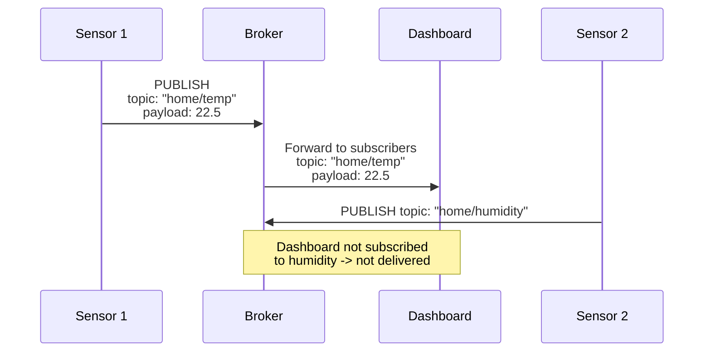
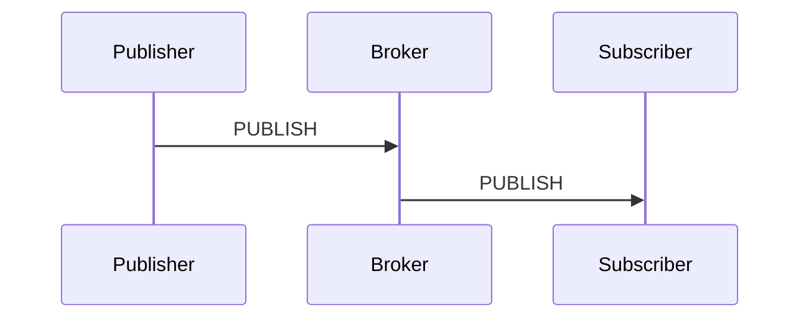
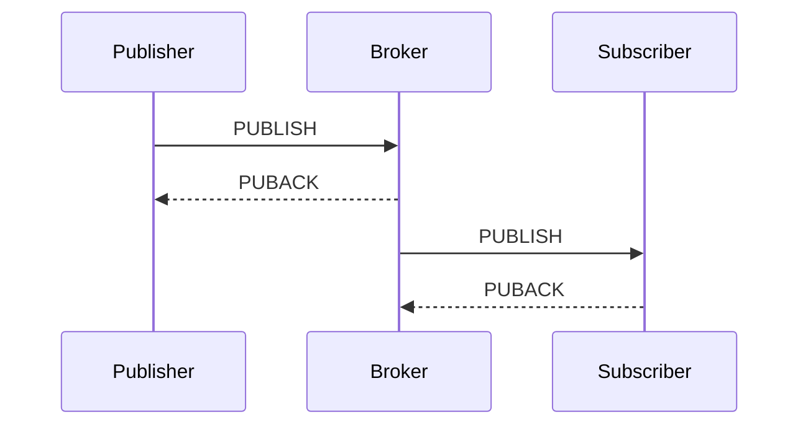
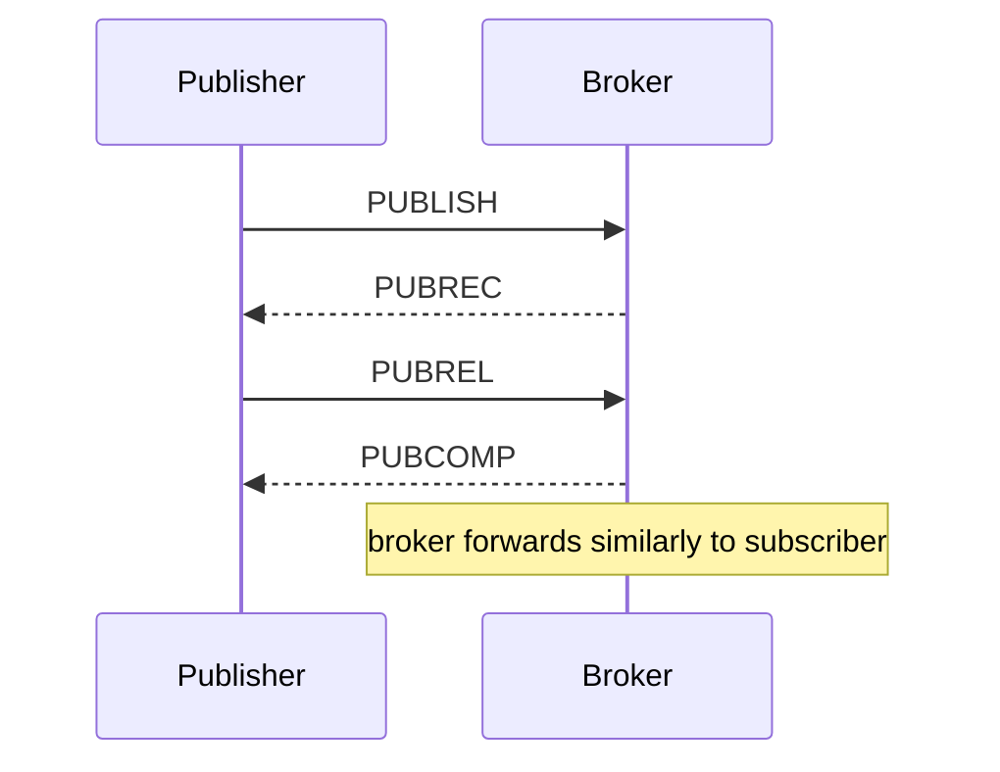

# MQTT

> [Mastery Guide](../README.md) › [API Development](./README.md)

| Status | Priority | Phase | Last reviewed |
|---|---|---|---|
| Not Started | Low | Phase 8 — Microservices & Messaging | 2026-05-07 |

## Contents
- [Why it matters](#why-it-matters)
- [Core concepts](#core-concepts)
  - [Publish/subscribe over a broker](#publishsubscribe-over-a-broker)
  - [Topics and wildcards](#topics-and-wildcards)
  - [Quality of Service (QoS) levels](#quality-of-service-qos-levels)
  - [Retained messages and Last Will](#retained-messages-and-last-will)
  - [Will Delay Interval — a blip is not a death](#will-delay-interval--a-blip-is-not-a-death)
  - [Sessions and clean start](#sessions-and-clean-start)
  - [Flow control — Receive Maximum and packet size](#flow-control--receive-maximum-and-packet-size)
  - [Subscription options beyond QoS](#subscription-options-beyond-qos)
  - [Request/response over MQTT 5](#requestresponse-over-mqtt-5)
  - [Shared subscription dispatch strategy](#shared-subscription-dispatch-strategy)
  - [Rate limits, quotas and the noisy neighbour](#rate-limits-quotas-and-the-noisy-neighbour)
  - [Managed brokers are not full MQTT brokers](#managed-brokers-are-not-full-mqtt-brokers)
  - [Payload format and schema evolution](#payload-format-and-schema-evolution)
  - [Timestamps, clocks and late telemetry](#timestamps-clocks-and-late-telemetry)
  - [Store-and-forward on the device](#store-and-forward-on-the-device)
  - [The energy budget — handshakes, not headers](#the-energy-budget--handshakes-not-headers)
  - [Where MQTT stops — MQTT-SN, CoAP and LoRaWAN](#where-mqtt-stops--mqtt-sn-coap-and-lorawan)
  - [Device identity over a long service life](#device-identity-over-a-long-service-life)
  - [Crypto agility on a device you cannot recall](#crypto-agility-on-a-device-you-cannot-recall)
  - [Receiving messages in .NET — acknowledgement and backpressure](#receiving-messages-in-net--acknowledgement-and-backpressure)
  - [Hosting and reconnecting an MQTT client in .NET](#hosting-and-reconnecting-an-mqtt-client-in-net)
  - [Observing an MQTT pipeline](#observing-an-mqtt-pipeline)
  - [Testing MQTT code in .NET](#testing-mqtt-code-in-net)
- [Code & diagrams](#code--diagrams)
- [Common pitfalls](#common-pitfalls)
- [Interview-ready summary](#interview-ready-summary)
- [Interview Cross-Questioning Drill](#interview-cross-questioning-drill)
- [Cheat Sheet](#cheat-sheet)
- [Walkthrough](#walkthrough--smart-meter-fleet-flapping-every-90-seconds)
- [Self-test](#self-test)
- [Cross-references](#cross-references)
- [Sources](#sources)

---

## Why it matters

MQTT (Message Queuing Telemetry Transport) is the lightweight pub/sub protocol that runs IoT. Tiny payload overhead (2 bytes minimum header), works over flaky cellular/satellite links, scales to millions of concurrent clients across a broker cluster. Smart-home devices, industrial sensors, connected vehicles, agricultural telemetry — almost anything battery-powered talking to the cloud uses MQTT. AWS IoT Core and Azure IoT Hub both speak MQTT natively (Google retired its Cloud IoT Core service in August 2023).

Why interviewers ask: MQTT knowledge is the cheapest signal that a candidate has worked on IoT or telemetry-heavy systems. Knowing QoS levels, retained messages, and Last Will separates engineers who've shipped real device-cloud systems from those who've only built request/response APIs.

When NOT to choose: synchronous request/response (use REST or gRPC). Bulk data transfer (HTTP). Web/browser clients (use WebSockets — though MQTT-over-WebSocket exists). High-throughput backbone messaging between services (use Kafka).

## Core concepts

### Publish/subscribe over a broker

MQTT is a pub/sub protocol — clients don't talk directly. They connect to a **broker** (Mosquitto, EMQX, HiveMQ, AWS IoT Core), then either publish messages to topics or subscribe to topics.



Loose coupling: publishers don't know who (if anyone) is listening. Subscribers don't know which publishers feed their topic. Add or remove either side without coordinating.

### Topics and wildcards

Topics are forward-slash-separated hierarchical strings:

```
home/livingroom/temperature
home/livingroom/humidity
home/kitchen/temperature
factory/line1/sensor7/vibration
```

Two wildcard forms for subscriptions:
- **`+`** — single level wildcard: `home/+/temperature` matches `home/livingroom/temperature` and `home/kitchen/temperature` but not `home/livingroom/inner/temperature`.
- **`#`** — multi-level wildcard (must be at end): `home/#` matches everything under `home/`.

Topic naming conventions that pay off:
- **Lowercase, no spaces.** Easier to debug.
- **Most-stable segment first.** `building/floor/room/sensor` lets you subscribe per building or per floor easily.
- **No leading slash.** `home/temp` not `/home/temp`. The leading slash creates an invisible empty first segment.
- **Don't put data in topic names that should be in payload.** `home/temp/22.5` is wrong; payload carries the value.

### Quality of Service (QoS) levels

Three guarantees per message:

| QoS | Meaning | Delivery | Use case |
|---|---|---|---|
| **0** | At most once | Fire and forget. May lose messages. | High-frequency telemetry where occasional loss is fine (sensor readings every 100ms). |
| **1** | At least once | Acknowledged delivery. May duplicate. | Most events. Idempotency on consumer handles dupes. |
| **2** | Exactly once | Four-way handshake. No loss, no dupes. | Critical state changes (billing, control commands). Slowest. |

QoS is negotiated per message AND per subscription. The effective QoS for a delivered message is `MIN(publish QoS, subscribe QoS)`.

QoS 0 (fire and forget):



QoS 1 (acknowledged):



QoS 2 (exactly once, four-way handshake):



Default is QoS 0 in many libraries — MQTTnet's `MqttApplicationMessageBuilder` defaults to at-most-once — but Paho's default varies by language binding, so check yours rather than assuming. Telemetry you assumed was acknowledged is being dropped silently. Set QoS explicitly. Use QoS 2 sparingly — the four-way handshake doubles latency.

### Retained messages and Last Will

**Retained message:** broker stores the last message published to a topic. New subscribers receive it immediately on subscribe — no need to wait for the next publish.

```csharp
// Publisher (sets retained flag)
await client.PublishAsync(new MqttApplicationMessageBuilder()
    .WithTopic("home/livingroom/temp")
    .WithPayload("22.5")
    .WithRetainFlag(true)
    .Build());

// New subscriber gets the retained message immediately
await client.SubscribeAsync("home/livingroom/temp");
// → receives "22.5" right away
```

Use case: device state. A subscriber connecting after a sensor reading was published still gets the current state.

**Last Will and Testament (LWT):** message the broker publishes on the device's behalf if the device disconnects ungracefully (no DISCONNECT packet, just timeout).

```csharp
var options = new MqttClientOptionsBuilder()
    .WithTcpServer("broker.example.com", 1883)
    .WithClientId("device-001")
    .WithWillTopic("home/livingroom/sensor/status")
    .WithWillPayload("offline")
    .WithWillRetain(true)
    .Build();
```

Use case: presence detection. Other clients subscribe to status; if the device drops off, they see "offline" automatically.

The other half of the pattern lives in the connect handler: once the client is up, it publishes "online" to the same topic with retain set, overwriting the retained "offline" the broker left there. Will and online-publish are a matched pair — register one without the other and the retained status topic is wrong half the time.

### Will Delay Interval — a blip is not a death

Plain LWT fires the moment the broker gives up on the connection. On a cellular link that is indistinguishable from a tower handover, so a fleet that reconnects normally still produces a stream of false "offline" events.

MQTT 5 adds the **Will Delay Interval** (spec section 3.1.3.2.2), a Will property carrying a number of seconds. The server delays publishing the will until the interval has passed or the session ends, whichever happens first. If the device reconnects and resumes the same session inside that window, the will is never published at all — the flap is invisible to every subscriber. Absent, the default is 0, which is exactly the 3.1.1 behaviour the rest of this chapter describes.

The trap is the interaction with session expiry. "Whichever happens first" means that if the session expires before the delay elapses, the will fires at that moment regardless. So the Session Expiry Interval must be at least as long as the Will Delay Interval, or the delay is cut short by the session ending. Set the delay to a little longer than your worst observed reconnect time, and the expiry longer still.

```csharp
var options = new MqttClientOptionsBuilder()
    .WithClientId(deviceId)
    .WithWillTopic($"meters/{deviceId}/status")
    .WithWillPayload("offline")
    .WithWillRetain(true)
    .WithWillDelayInterval(45)        // hold the will for 45s
    .WithSessionExpiryInterval(600)   // must outlive the will delay
    .Build();
```

> 🌍 **In the real world**: the smart-meter fleet in this chapter's walkthrough is exactly the case a will delay is for. Once each meter had a unique client ID, the remaining noise was ordinary cellular reconnects publishing "offline" and then "online" seconds later, which the ops dashboard rendered as churn. A will delay longer than a normal reconnect suppresses that class of event at the broker, without lowering keepalive and spending battery on more PINGREQ traffic.

### Sessions and clean start

**Persistent session:** broker remembers subscriptions and undelivered QoS 1/2 messages for the client. When the client reconnects, it resumes where it left off.

**Clean start (`CleanStart=true`):** discard previous session state on connect. Used for stateless clients that don't care about missed messages while disconnected.

`CleanSession` and `CleanStart` are not the same flag. In 3.1.1, `CleanSession=false` meant both "resume my session" and "keep it indefinitely". MQTT 5 split those: **Clean Start** controls only whether you resume an existing session at connect, and **Session Expiry Interval** controls how long the broker keeps that session after you disconnect.

```csharp
var options = new MqttClientOptionsBuilder()
    .WithCleanSession(false)         // persistent — remember undelivered messages.
                                     // MQTTnet's WithCleanSession sets MQTT 5's Clean Start flag
    .WithSessionExpiryInterval(3600) // session lives 1 hour after disconnect
    .Build();
```

Use case: a battery-powered sensor that sleeps for 5 minutes between readings. With persistent session + QoS 1, messages published while it's asleep are queued and delivered when it wakes up.

### Flow control — Receive Maximum and packet size

A subscriber that cannot keep up with a QoS 1 publisher is a real failure mode, and MQTT 5 gives you a negotiated cap on it rather than leaving it to the broker's own limits.

Both sides send a **Receive Maximum** in CONNECT and CONNACK (spec sections 3.1.2.11.3 and 3.2.2.3.3). It states how many QoS 1 and QoS 2 publications that side is willing to process concurrently — in effect, how many unacknowledged PUBLISH packets the other side may have in flight before it must stop and wait for acknowledgements. If the property is absent the spec's default is 65,535, which for most clients is no limit at all. The important caveat is in the spec's own wording: "There is no mechanism to limit the QoS 0 publications that the Server might try to send." Flow control protects you from a backlog of acknowledged traffic, not from a firehose of fire-and-forget telemetry.

**Maximum Packet Size** (section 3.1.2.11.4) is negotiated in the same handshake, and the server must not send packets larger than the value the client declared. This is what stops a device with tens of kilobytes of RAM being handed a firmware blob that somebody published on a topic it happens to match. **Topic Alias Maximum** rides along too and defaults to 0, meaning neither side may use topic aliases unless the peer explicitly asked for them — so the bandwidth saving from aliases only exists if the CONNACK granted it.

Breaches have their own MQTT 5 DISCONNECT reason codes rather than a bare TCP reset: 0x93 Receive Maximum exceeded, 0x95 Packet too large. A client that receives a reason code can adapt; a client that receives a reset just reconnects and does the same thing again.

Brokers had static versions of this long before MQTT 5, and they still apply. Mosquitto's `max_inflight_messages` defaults to 20 and `max_queued_messages` defaults to 1000 — the second is the one that decides whether a slow subscriber's backlog is bounded.

```csharp
var options = new MqttClientOptionsBuilder()
    .WithProtocolVersion(MqttProtocolVersion.V500)
    .WithReceiveMaximum(10)          // at most 10 unacked QoS 1/2 messages inbound
    .WithMaximumPacketSize(64 * 1024)
    .Build();
```

> 🌍 **In the real world**: an ingestion service subscribing to a whole factory's topics with a database write per message will fall behind the moment a shift starts. Left at the default, the broker keeps handing it messages until something's memory runs out. Set to ten, the broker stops after ten unacknowledged messages and the pressure lands back on the broker's queue where it is visible in metrics — which is where you want a queue you have not sized to appear.

### Subscription options beyond QoS

A SUBSCRIBE carries more than a topic filter and a maximum QoS. Section 3.8.3.1 defines three further options, and two of them matter mostly to infrastructure rather than applications.

**No Local** tells the broker not to forward a message back to a connection whose client ID matches the publisher's. This is the loop-prevention primitive for bridging: a process that subscribes to a topic and republishes onto it — a broker-to-broker bridge, an MQTT-to-Kafka bridge that echoes results back — will otherwise feed itself forever. The spec makes it a protocol error to set No Local on a shared subscription, because in a shared group "the publishing connection" is not a meaningful concept.

**Retain As Published** controls whether the RETAIN flag survives the hop. By default the broker clears it on messages it forwards during normal delivery, so a subscriber can tell "this arrived live" from "this is stored state handed to me at subscribe time". A bridge needs the opposite: with Retain As Published set, the forwarded message keeps the publisher's flag, and retained state actually propagates to the far broker instead of arriving as ordinary traffic.

**Subscription Identifiers** (section 3.8.2.1.2) solve a routing problem in the client. You attach a number to a SUBSCRIBE and the broker echoes it on every PUBLISH that matched that subscription — so a client holding several overlapping wildcard subscriptions on one connection does not have to re-run topic matching in application code to decide which handler owns the message. When a message matches more than one of your subscriptions, the PUBLISH carries more than one identifier, which is itself the honest answer to "what if my filters overlap".

```csharp
var subscribe = new MqttClientSubscribeOptionsBuilder()
    .WithSubscriptionIdentifier(1)
    .WithTopicFilter(f => f
        .WithTopic("factory/+/+/status")
        .WithQualityOfServiceLevel(MqttQualityOfServiceLevel.AtLeastOnce)
        .WithNoLocal()              // don't echo my own publishes back to me
        .WithRetainAsPublished())   // keep the publisher's RETAIN flag on forwarded messages
    .Build();

await client.SubscribeAsync(subscribe);
```

> 🌍 **In the real world**: a team stands up an edge broker at each site and bridges every site to a central broker. Without No Local the bridge republishes what it just consumed and the two brokers amplify each other until the link saturates — a bug that looks like a traffic spike, not a configuration error. Without Retain As Published, the central broker never learns any site's retained device state, so the head-office dashboard is blank until each device happens to publish again.

### Request/response over MQTT 5

The "when NOT to choose" list says synchronous request/response, and that is right for a public API. It is not right for device command-and-acknowledge, which is a request/response shape that MQTT 5 supports directly.

Two PUBLISH properties do the work. **Response Topic** (section 3.3.2.3.5) is the topic the requester wants the answer on — a topic it is already subscribed to. **Correlation Data** (section 3.3.2.3.6) is an opaque byte string the responder must echo back; the spec's own description is that it "is used by the sender of the Request Message to identify which request the Response Message is for when it is received". The responder never needs to know who asked or where they live: it reads the response topic off the message and publishes there.

Conceptually this is the same contract as JMS's ReplyTo and CorrelationID, or a request-id header in HTTP. What it is not is synchronous. Nothing guarantees a reply arrives, so you own the timeout, and a device that never answers is indistinguishable from one that answered into a lost packet — which means commands should be idempotent and the requester should be able to re-ask safely.

MQTTnet packages the pattern as `MQTTnet.Extensions.Rpc`: `IMqttRpcClient.ExecuteAsync(TimeSpan timeout, string methodName, byte[] payload, MqttQualityOfServiceLevel qos)` publishes to a generated request topic, waits on the matching response topic, and throws on timeout. The raw properties are on the message builder if you want your own topic scheme.

```csharp
var request = new MqttApplicationMessageBuilder()
    .WithTopic($"devices/{deviceId}/cmd/reboot")
    .WithResponseTopic($"services/api/reply/{instanceId}")
    .WithCorrelationData(Guid.NewGuid().ToByteArray())
    .WithQualityOfServiceLevel(MqttQualityOfServiceLevel.AtLeastOnce)
    .Build();
```

> 🌍 **In the real world**: an operator clicks "reboot meter" in a support tool. Without correlation data the tool has to invent a request id inside the JSON payload and every firmware team has to agree on where it lives; with it, the id is a protocol property that a bridge or a tracing tool can read without deserialising a vendor-specific body. The support tool subscribes to one reply topic for its own instance and matches answers by token, so ten operators clicking at once do not need ten topics.

### Shared subscription dispatch strategy

Shared subscriptions use the filter form `$share/{ShareName}/{filter}` (spec section 4.8.2), and the broker picks one member of the group per message. What the spec does not say is *how* it picks — that is entirely a broker decision, and it is the second layer of the ordering answer.

EMQX exposes it as `mqtt.shared_subscription_strategy`, with `random`, `round_robin` (the default), `round_robin_per_group`, `sticky`, `local`, `hash_clientid` and `hash_topic`. Two of those change the ordering story. `hash_clientid` routes every message from a given publisher to the same group member, which is the Kafka partition-key trick done broker-side and does give you per-publisher ordering. `hash_topic` does the same by topic. `sticky` keeps dispatching to the same subscriber until that subscriber disconnects or its session ends, which gives you locality of cache rather than a guarantee. `local` prefers a subscriber on the same cluster node, cutting an inter-node hop at the cost of uneven distribution.

Two caveats keep this honest. First, it does not port: choose `hash_clientid` and you have bought a dependency on EMQX's configuration, not on MQTT. Second, it does not remove the need for idempotent consumers — when a session ends, EMQX re-dispatches the QoS 1 and QoS 2 messages in its send queue and the QoS 1 messages in its inflight queue to other members of the group, so a consumer crash still means somebody else sees the message.

> 🌍 **In the real world**: a team splits an order-events consumer into six pods behind a shared subscription and immediately gets out-of-order state transitions for individual devices, because round-robin sent "created" to pod 2 and "cancelled" to pod 5. Switching the strategy to hash by client ID pins each device's stream to one pod and the symptom disappears — but they have now encoded an ordering assumption in broker config, which is exactly the kind of thing that must be written down or it dies with the person who set it.

### Rate limits, quotas and the noisy neighbour

Flow control is symmetric — the server sends its own Receive Maximum in CONNACK, capping how many unacknowledged QoS 1 and QoS 2 publications a client may have outstanding towards it. What that does not cap is *rate*: a client can publish, get its acknowledgement, and publish again as fast as the link allows, and QoS 0 traffic is outside the mechanism entirely. So a device stuck in a publish loop after a bad firmware push is a problem the protocol will not solve for you.

The levers are the broker's. Connection caps and queue caps come first — Mosquitto's `max_connections` defaults to `-1`, meaning unlimited, `max_queued_messages` to 1000, and `message_size_limit` to 0, meaning no limit — so on a default install nothing stops one client from consuming the resources of all the others. Publish-rate limiting is the next layer and is broker-specific. Managed services publish their numbers: AWS IoT Core documents 100 publish requests per second per connection and discards what exceeds it.

When you do throttle, say so in the protocol. MQTT 5's DISCONNECT reason codes include 0x96 Message rate too high, 0x97 Quota exceeded and 0x95 Packet too large. A device that is told why it was disconnected can back off; one that just sees a closed socket reconnects immediately and re-creates the load.

The topology question behind all of this is broker-per-tenant versus shared broker. Shared is cheaper and is the right default. You reach for a broker per tenant when a tenant needs its own retained-message namespace or its own authentication backend, or when the blast radius you care about is one that topic ACLs cannot contain — ACLs stop a tenant reading another's data, but they do not stop a tenant exhausting connection slots, memory or the broker's outbound bandwidth.

> 🌍 **In the real world**: one customer's integration partner ships a build that retries a failed publish in a tight loop instead of backing off. On a shared broker with no per-client rate limit, every other tenant's latency degrades and the on-call engineer's first three hypotheses are all about the broker rather than about one client. A per-client publish quota turns a platform incident into a single customer's error log.

### Managed brokers are not full MQTT brokers

Managed IoT services deviate from the spec, and the deviations are load-bearing. "Which MQTT features does your managed broker not support" is the question that separates candidates who have read a limits page from candidates who have only read the spec.

**AWS IoT Core** supports MQTT 3.1.1 and MQTT 5, but not QoS 2 — its message broker documents QoS 0 and QoS 1 only. That makes the common advice "use QoS 2 for state-critical control commands" simply unimplementable there, and pushes you back onto QoS 1 with idempotent commands, which is where most systems should have been anyway. Payloads are capped at 128 KB and larger publish or connect requests are rejected. There is a 100-publish-per-second-per-connection quota, and requests over it are discarded rather than queued. Topics are constrained too: a maximum of seven forward slashes and 256 bytes of UTF-8, which is a real design input when you are laying out a hierarchy. Retained messages are supported, but with an account-level cap on how many you may hold.

**Azure IoT Hub** deviates further, and Microsoft says so directly: "IoT Hub isn't a full-featured MQTT broker and doesn't support all the behaviors specified in the MQTT v3.1.1 standard." Its device endpoints speak MQTT v3.1.1 on port 8883 and MQTT v3.1.1 over WebSocket on 443; plaintext 1883 is not offered at all. Topics are static and predefined — a device publishes telemetry to `devices/{device-id}/messages/events/` and subscribes to `devices/{device-id}/messages/devicebound/#` for cloud-to-device traffic — and you cannot invent your own hierarchy underneath. A device may subscribe to at most five topics. Publishing at QoS 2 causes IoT Hub to close the network connection; subscribing at QoS 2 is granted maximum QoS 1 in the SUBACK. RETAIN is not persisted: the flag is translated into an `mqtt-retain` application property and the message is passed to the backend as ordinary telemetry. Only one MQTT connection per device is allowed, and a second one drops the first with `400027 ConnectionForcefullyClosedOnNewConnection`. Maximum message size is 256 KB. Microsoft's own guidance is that if you want a real broker you should use Azure Event Grid instead, which supports MQTT 3.1.1 and 5 with custom hierarchical topics and wildcards.

What does not generalise is *how much* they deviate, and that is the distinction worth saying out loud. AWS IoT Core is a broker with quotas: arbitrary topic hierarchies, retained messages and client-to-client delivery all work, inside documented limits. Azure IoT Hub is a device endpoint that speaks MQTT: the topic space is fixed, retained state is not stored at all, and Microsoft's own comparison table lists no support for device-to-device communication. Read the limits page for the specific service you are targeting — there is no single rule that covers both.

> 🌍 **In the real world**: a team prototypes against Mosquitto with a topic design of `site/building/floor/room/device/sensor/metric`, then moves to AWS IoT Core and discovers the seven-slash limit sitting exactly where their hierarchy does. The fix is a firmware change across the fleet, because topic structure is baked into the publisher. Read the target broker's limits page before you design topics, not after.

### Payload format and schema evolution

Sparkplug B settles the format question for industrial fleets by mandating Protobuf. Outside that, the choice is a three-way one and the third option gets forgotten.

**CBOR** (RFC 8949, which is also STD 94) is binary but self-describing, the way JSON is — the wire format carries enough structure that a consumer can decode a message it has never seen a schema for. Its stated design goals are "extremely small code size, fairly small message size, and extensibility without the need for version negotiation", which is close to a description of the constrained-device problem. It wins where you want JSON's shape and tolerance without JSON's bytes, and where distributing a schema to every consumer is impractical. Protobuf still wins where you can distribute the schema, want the smallest wire form, and want generated types on both ends.

Whatever you pick, declare it rather than implying it. MQTT 5's Content Type and Payload Format Indicator properties travel with the message, so a consumer reads `application/cbor` off the packet instead of inferring format from the topic. MQTTnet exposes these as `WithContentType` and `WithPayloadFormatIndicator` on the message builder.

Evolution is the harder half, because the constraint is the fleet, not the format. You will have several firmware generations in the field at once and the oldest may never be updated, so both directions have to be tolerant. Make changes additive only — never repurpose a field number, never rename a key — and make consumers ignore what they do not recognise. Put the schema version where infrastructure can read it without deserialising: an MQTT 5 user property, or the content type itself. That lets a bridge route old payloads to a translating consumer without understanding the body. What you must not do is put the version in the topic — that forks every subscription and every ACL you own, permanently.

Compression is the last question and it is usually the wrong one to ask first. It buys airtime with CPU and flash, and for a payload the size of a single sensor reading a general-purpose compressor's per-message overhead can exceed what it saves. Choosing a compact encoding beats compressing a verbose one. Where compression does earn its keep is on batched flushes — a buffer of similar records flushed together compresses well in a way a single reading on its own does not.

> 🌍 **In the real world**: a team adds a field to their telemetry JSON and the new analytics consumer starts throwing on messages from three-year-old firmware that does not send it. The fix is not on the device — the device will never be updated — it is that the consumer should have treated the field as optional from the day it was added. Schema evolution in IoT is consumer discipline, because the publisher is the part you cannot change.

### Timestamps, clocks and late telemetry

MQTT carries no timestamp. The closest thing is the MQTT 5 Message Expiry Interval, and that is a duration rather than a time: the spec requires the server to forward it "set to the received value minus the time that the Application Message has been waiting in the Server" [MQTT-3.3.2-6]. That tells a consumer a message is stale. It cannot tell them when the reading was taken. If you want event time, you put it in the payload — and then you own the question of which clock produced it.

Many low-cost devices have no battery-backed real-time clock. They boot with whatever time the firmware image carries, or at the Unix epoch, and only become correct once they have the network and complete an SNTP sync. Anything measured in that window is stamped wrong, and if those readings were buffered and flushed later they arrive looking impossibly old — which downstream systems often silently discard.

Two habits handle most of it. First, record two times and keep both: the device's event time in the payload, and an ingest time stamped by the first server-side component with a trustworthy clock. Keeping both all the way into storage is what lets you tell "the sensor was late" from "our pipeline was slow", and those two incidents have completely different owners. Second, give the device a monotonic reference alongside the wall clock — a boot counter and an uptime value, plus a flag saying whether the clock has been synchronised. A reading tagged "boot 3, 412 seconds in, clock unsynced" can be re-anchored later once you learn when boot 3 happened. A reading tagged 1970 cannot.

Everything after that is a consumer decision. Aggregates computed over event time have to either accept a bounded lateness window and recompute when late data lands, or accept that a device that was offline for a day will restate yesterday's totals when it comes back.

> 🌍 **In the real world**: a utility's daily consumption report is computed on ingest time because it was easier. A regional outage delays half a city's meters by six hours, and the readings land in the wrong day — so one day is under-billed and the next over-billed, and the discrepancy is only found when customers complain. The data was never lost; it was filed under the time it arrived rather than the time it happened.

### Store-and-forward on the device

Persistent sessions solve the case where the *subscriber* is away. The mirror case gets far less attention: the publisher cannot reach the broker at all. No session helps here, because the broker does not know the reading exists. If the firmware calls publish, ignores the result and moves on, the data is gone the moment the backhaul drops.

A device that must not lose readings needs its own durable buffer — a ring buffer in flash, or a file on an SD card — written before the publish is attempted and cleared only when the publish is acknowledged. Which forces QoS 1 as a minimum, because at QoS 0 there is no acknowledgement to clear the entry on.

Three decisions follow, and they are the ones interviewers push on.

- **Overwrite policy.** Flash is finite. When the buffer fills, you drop oldest or newest, and the right answer depends on the data: continuous telemetry usually drops oldest, whereas a state or status value where only the latest matters should drop the older entries and keep the newest.
- **Flush rate.** A device returning from a long outage with hours of readings will hammer the broker, and a thousand devices returning at once after a regional outage will do it together. Drip the backlog rather than dumping it. This is where the broker's publish-rate quota — the AWS IoT Core per-connection limit, for instance — turns into discarded data if the device does not pace itself.
- **Marking replay.** A backlogged message must carry its own event time, and ideally a flag saying it is historic, or every consumer downstream treats a day-old reading as the current value.

The constraint people forget is flash wear. A buffer written every few seconds for a device's whole service life is a wear-levelling problem, which is a second reason to batch several readings into one write rather than one write per reading.

> 🌍 **In the real world**: agricultural sensors on a farm with one flaky satellite uplink. The persistent session on the broker was configured carefully and did nothing, because the loss was always on the device side of the link. Adding a small flash ring buffer with acknowledgement-driven clearing turned "we lose data whenever the sky is cloudy" into "we deliver everything, a few hours late" — and the change was entirely in firmware, with no broker involvement at all.

### The energy budget — handshakes, not headers

MQTT's two-byte minimum header is real and it is quoted constantly, but on a battery-powered device it is rarely where the energy goes. The two costs that dominate are waking the radio and completing the TLS handshake.

A full TLS 1.3 handshake (RFC 8446) costs round trips and the bytes of a certificate chain and a signature — all of it radio time, and radio time is what drains the cell. Section 2.2 of the same RFC defines resumption with a pre-shared key, where "the key derived from the initial handshake is used to bootstrap the cryptographic state instead of a full handshake". A device that keeps its session ticket and resumes pays a fraction of what a device doing a fresh handshake on every wake pays.

That makes the energy levers, in order of effect: hold the connection open with a long keepalive rather than reconnecting for each reading; if you must reconnect, resume both the TLS session and the MQTT session rather than starting clean; and batch several readings into one PUBLISH so that one radio wake covers several messages. Batching trades against latency and against loss granularity — if that one message goes missing you lose all of it — and it pairs naturally with the store-and-forward buffer, since a device already writing to flash is most of the way to batching.

The counter-intuitive conclusion is that shaving payload bytes matters least of the three. Arguing about JSON versus CBOR before you have fixed a reconnect-per-reading pattern is optimising the smallest term in the equation.

> 🌍 **In the real world**: a team ships a sensor that connects, publishes one reading, disconnects and sleeps, on the reasoning that an idle connection must cost something. Field units miss their battery target badly, and the cause is that every wake pays a full TLS handshake. Switching to a held connection with a long keepalive, and resumption on the reconnects that do happen, changed nothing about the payload and everything about the battery.

### Where MQTT stops — MQTT-SN, CoAP and LoRaWAN

MQTT needs an ordered, reliable, connection-oriented transport, which in practice means TCP. Below that line other protocols take over, and "why MQTT and not CoAP" is a fair interview question that the QoS and topic material cannot answer.

**MQTT-SN** is the MQTT family's own answer for devices that have no TCP/IP stack — mqtt.org lists v1.2, aimed at wireless sensor networks and non-TCP/IP networks such as Zigbee. It keeps pub/sub but changes the mechanics: topic strings are replaced by short numeric topic IDs registered in advance, so a constrained radio frame does not carry `factory/line1/welder3/temperature` on every message; there is gateway discovery so a device can find a translator; and there is an explicit sleeping-client state where the gateway buffers messages on the device's behalf. A gateway converts MQTT-SN to ordinary MQTT for the broker, so the cloud side is unchanged.

**CoAP** (RFC 7252, June 2014) is a different shape entirely: request/response with GET, POST, PUT and DELETE over UDP, secured with DTLS, for "constrained nodes and constrained (e.g., low-power, lossy) networks". It is REST, not pub/sub. So the real question behind "MQTT or CoAP" is whether the device announces events or answers questions — a sensor that streams readings wants MQTT's fan-out, whereas an actuator you poll for state maps naturally onto CoAP's resource model. CoAP's Observe extension (RFC 7641) adds push: a client registers interest in a resource with an extended GET and the server sends notifications on change, on a best-effort basis — but the model stays resource-oriented rather than becoming a topic space. One detail worth knowing on mobile links: DTLS's Connection ID (RFC 9146, for DTLS 1.2) lets a security context survive a NAT rebind or an address change, so the device does not pay a fresh handshake every time the network moves it.

**LoRaWAN** (the LoRa Alliance's specification) is not a messaging protocol at all — it is a link layer offering long range at very low power over shared unlicensed spectrum that regulators cap by airtime. The device does not normally run an IP stack at all; gateways forward its frames to a network server, and that network server is where you bridge into MQTT. It also constrains the application shape: a Class A device only listens during short receive windows immediately after it transmits, so a downlink command waits for the device's next uplink. Nothing about MQTT's command-and-acknowledge pattern survives that unaltered.

The compressed answer: MQTT when devices have IP and TCP and you want event fan-out; CoAP when they have IP and you want resource-style request/response; MQTT-SN or LoRaWAN with a gateway when they have no usable IP stack at all.

> 🌍 **In the real world**: a building-automation project specifies MQTT for everything, then discovers the battery-powered door sensors are on a mesh with no IP stack and a multi-year battery target. The sensors end up speaking a constrained protocol to a gateway in the riser cupboard, and the gateway speaks MQTT to the cloud. The architecture diagram still says MQTT — it just does not say it all the way to the leaf.

### Device identity over a long service life

The argument for per-device certificates is settled. The harder questions are where the private key comes from, where it lives, and what happens in year seven when it expires.

**Provisioning.** Injecting a unique key on the factory line is the strongest option and needs a secure manufacturing process, which not every contract manufacturer has. AWS IoT Core documents the alternatives explicitly. Just-in-time provisioning and just-in-time registration work when the device already holds a certificate signed by a CA you have registered — IoT Core recognises it on first connect and creates the device from a provisioning template. Provisioning by trusted user gives the device a temporary certificate valid for a short window during which an installer's app obtains the real one. Provisioning by claim is the fallback when nobody can touch the device: the whole fleet shares a claim certificate whose only privilege is exchanging itself for a unique client certificate on first connect. AWS is candid about the trade — deactivating a compromised claim certificate prevents future registrations, but "does not block devices that have already been provisioned". Azure's equivalent is the Device Provisioning Service, which attests devices by X.509, TPM or symmetric key against its enrollment list and then assigns them to an IoT hub.

**Storage.** A private key sitting in ordinary flash is a key that anyone holding the device and a chip reader can extract — and if the firmware shipped one key across the whole product line, a single extraction compromises every unit of it. A secure element or TPM generates the key on-chip and never exports it: the device emits a certificate signing request, never the key. On Linux gateways the same idea shows up as PKCS#11, where the TLS stack signs through the hardware rather than loading a key file from disk. This is the difference between "one device was compromised" and "the fleet key is on a forum".

**Rotation.** Certificates expire and devices are offline. Plan to renew well before expiry rather than at it, keep the old credential until the new one has successfully authenticated at least once, and have the broker trust both issuers through the overlap. Then assume some devices will be dark for the entire rotation window and will return with an expired certificate — so you need a re-enrolment path that is not "send an engineer to site", which is usually a claim-based or installer-mediated flow held in reserve for exactly this.

> 🌍 **In the real world**: a fleet ships with ten-year device certificates and no renewal flow, on the reasoning that ten years is somebody else's problem. It is — but the intermediate CA has a shorter life than the leaves, and when it expires the whole fleet fails authentication at once. The rotation path you never built is now needed on every device simultaneously.

### Crypto agility on a device you cannot recall

A meter installed this year may still be in a wall in the 2040s, running the algorithms its firmware shipped with. NIST's first post-quantum standards — FIPS 203 (ML-KEM, key encapsulation), FIPS 204 (ML-DSA) and FIPS 205 (SLH-DSA, both signatures) — became effective on 14 August 2024, and TLS deployments have been moving towards hybrid key exchange since. A device that cannot have its TLS stack, trust store or algorithm choices changed in the field has locked in whatever it was born with.

So crypto agility is a firmware-update question before it is a cryptography question, and the useful form of it is a checklist. Can the TLS library be replaced over the air, or is it welded into a monolithic image? Can a new root certificate be added without a site visit? Is the algorithm suite a configuration value or a compile-time constant? Does the secure element support the algorithms you might need in a decade, or is it fixed-function silicon that only knows the curves of its manufacturing year? The answers decide whether "migrate the fleet" is a release or a recall.

The longest-lived exposure is usually firmware signing rather than transport. An image signed with an algorithm you later stop trusting still verifies happily on any device that never received the update that would have taught it otherwise — so the signature scheme protecting your update mechanism is the one thing that has to be right, or agile, from day one.

> 🌍 **In the real world**: the practical version of this question in an interview is not "explain lattice cryptography". It is "your device has a fifteen-year service life — how do you change its cryptography in year eight?" A candidate who answers with an OTA update path, a replaceable trust store, and a signing scheme they can rotate has understood the problem. A candidate who names algorithms has not.

### Receiving messages in .NET — acknowledgement and backpressure

MQTTnet raises `ApplicationMessageReceivedAsync` and awaits your handler on the receive pipeline. Two consequences follow, and the second one silently breaks at-least-once delivery.

First, whatever the handler does happens on the path that reads the next packet. A database write or an HTTP call inside that handler stalls the connection, and at QoS 1 it stalls the flow-control window along with it. The pattern is a fast handler that hands off to a bounded queue — `System.Threading.Channels` is the natural fit — with a separate consumer draining it, plus a deliberate decision about what the handler does when the queue is full: await, which pushes backpressure back to the broker, or drop, which is a valid choice for telemetry as long as it is a choice.

Second, MQTTnet acknowledges on your behalf. `MqttApplicationMessageReceivedEventArgs.AutoAcknowledge` — documented as "gets or sets whether the library should send MQTT ACK packets automatically if required" — is on by default. Combined with a handler that returns as soon as it has queued the work, that means the PUBACK goes out before the work has happened, so the broker considers the message delivered and a crash loses it. Turning `AutoAcknowledge` off and calling `AcknowledgeAsync` after the work commits is what gives you the at-least-once semantics people assume they already have. The same event args also carry `ProcessingFailed` — documented as "if the processing has failed the client will not send an ACK packet" — and a settable `ReasonCode`, which is the code sent to the server in the ACK when one does go out.

Be precise about what withholding the ACK actually buys, because this is where the story usually gets told wrong. MQTT has no NACK, so the broker does not re-dispatch the message while the connection is up. Section 4.4 of the spec makes reconnecting with Clean Start 0 to an existing session the *only* circumstance in which a server is required to resend unacknowledged QoS 1 and QoS 2 publishes. So an unacknowledged message is recovered on the next resumed session, not seconds later — and not at all if you connected with clean start true.

```csharp
client.ApplicationMessageReceivedAsync += async args =>
{
    args.AutoAcknowledge = false;                 // I will ack when the work is durable

    var payload = args.ApplicationMessage.ConvertPayloadToString();
    try
    {
        await _store.SaveAsync(args.ApplicationMessage.Topic, payload);
        await args.AcknowledgeAsync(CancellationToken.None);
    }
    catch
    {
        args.ProcessingFailed = true;            // no ack -> resent when the session is resumed
    }
};
```

> 🌍 **In the real world**: a team reports "we use QoS 1 so we never lose messages", and then loses messages every time the ingestion pod restarts. The broker had done its job — it received a PUBACK for each message, because the library sent one the instant the handler returned. Nothing on the wire was wrong; the acknowledgement just meant "received into memory" rather than "safely stored".

### Hosting and reconnecting an MQTT client in .NET

The base `IMqttClient` does not reconnect. It exposes a `DisconnectedAsync` event and you own the loop — MQTTnet 5 ships no managed auto-reconnecting client, since `MQTTnet.Extensions.ManagedClient` was a 4.x package that was not carried forward. `MqttClientExtensions.ReconnectAsync` reconnects using the options from the last connect, which is the piece most hand-rolled loops end up reimplementing.

Two things belong in that loop that are easy to leave out. Re-subscribing: unless you connected with clean start false *and* the broker still holds the session, your subscriptions are gone with the old session, so the reconnect path must restore them. And a shutdown check: if you reconnect unconditionally you will fight your own host on the way down, reconnecting a client that the stop path has just disconnected.

In a service the client is a long-lived singleton, not a per-request dependency. Register it once and drive its lifecycle from a `BackgroundService`: connect in `ExecuteAsync`, run the reconnect loop until the stopping token fires, then disconnect cleanly.

That last step is the one that bites in Kubernetes. SIGTERM starts graceful shutdown, which runs `BackgroundService.StopAsync` within `HostOptions.ShutdownTimeout` (30 seconds by default). If the process exits without sending a DISCONNECT packet, the broker sees an ungraceful drop and fires the Last Will — so every rolling deploy publishes "offline" for every pod that rolled, and anything watching presence sees a fleet-wide outage that never happened. Send a clean DISCONNECT in the stop path, after publishing whatever "going away" state you actually intend.

```csharp
public sealed class MqttWorker(IMqttClient client, MqttClientOptions options) : BackgroundService
{
    protected override async Task ExecuteAsync(CancellationToken stoppingToken)
    {
        client.DisconnectedAsync += async _ =>
        {
            if (stoppingToken.IsCancellationRequested) return;   // we meant to disconnect
            await Task.Delay(NextBackoffDelay(), CancellationToken.None);
            try { await client.ReconnectAsync(stoppingToken); } catch { /* handler fires again */ }
        };

        client.ConnectedAsync += async _ => await SubscribeAllAsync();  // subscriptions die with the session

        await client.ConnectAsync(options, stoppingToken);

        try { await Task.Delay(Timeout.Infinite, stoppingToken); }
        catch (OperationCanceledException) { /* shutting down */ }
    }

    public override async Task StopAsync(CancellationToken cancellationToken)
    {
        await client.PublishStringAsync("services/api/status", "offline", retain: true);
        // clean DISCONNECT suppresses the Last Will, so a rolling deploy is silent
        await client.DisconnectAsync(MqttClientDisconnectOptionsReason.NormalDisconnection);
        await base.StopAsync(cancellationToken);
    }
}
```

> 🌍 **In the real world**: a service deployed as three pods behind a shared subscription is rolled during a routine release. Because nothing sent DISCONNECT, the broker fired three Last Wills, the presence dashboard showed the whole backend offline, and the on-call alert fired for a deployment that worked perfectly. The fix lives entirely in the stop path.

### Observing an MQTT pipeline

"How do you know the fleet is healthy" has three answers, and most teams only build one of them.

**Traces.** MQTT has no headers, but MQTT 5 user properties are the equivalent, and the obvious thing to carry is W3C Trace Context — the same `traceparent` value the rest of your stack already propagates. The publisher writes it as a user property; the consumer reads it and starts its activity as a child, so a device command appears in the same trace as the API call that triggered it. OpenTelemetry's messaging semantic conventions supply the attribute names — `messaging.system`, `messaging.operation.name`, `messaging.operation.type`, `messaging.destination.name`, `messaging.message.id`, `messaging.client.id`. Be honest about their state, though: those conventions are still marked as development, and there is no registered `messaging.system` value for MQTT. Kafka, RabbitMQ, Pulsar and the cloud buses have one; MQTT does not, so you choose your own value and write it down.

**Metrics.** The ones that predict incidents are broker-side, not host-side: connected client count and especially its rate of change (the flapping fleet in this chapter's walkthrough shows up here first), per-client outbox depth, dropped or discarded message counts, subscription counts, and authentication failures. From the client side, publish-acknowledgement latency and reconnect count per device are the two that matter.

**Logs.** Every CONNECT, every ACL denial, every authentication failure, each carrying the client ID. This is the trail you need when the problem is one device among half a million, and it is worthless if the client ID is not in it — which is one more reason unique per-device client IDs are not optional.

The gap most teams have is that they watch the broker's CPU and memory and treat those as the health signal. The characteristic MQTT failure is per-client, not aggregate. A broker at comfortable CPU with one tenant's outbox climbing steadily is an incident already in progress.

> 🌍 **In the real world**: the diagnostic in this chapter's walkthrough — subscribing to a `$SYS` topic and watching the connected-client count oscillate — is exactly this idea. The broker was not short of resources and its utilisation graphs looked fine. The signal was in the *shape* of a connection-lifecycle counter over time, which is a dashboard somebody has to have decided to build before the incident.

### Testing MQTT code in .NET

Two levels, and the trap is treating either one as sufficient.

**In-process broker.** MQTTnet ships a server, so a test fixture can start a real broker in the same process on a free port and point the client at localhost — no Docker, no shared environment. That covers most of what you actually want to assert: that a subscriber receives what a publisher sent, that a late subscriber gets the retained message, that publishing an empty payload with the retain flag clears it, that a wildcard filter matches what you think it matches.

```csharp
var server = new MqttServerFactory().CreateMqttServer(
    new MqttServerOptionsBuilder()
        .WithDefaultEndpoint()
        .WithDefaultEndpointPort(port)
        .WithPersistentSessions()
        .Build());

await server.StartAsync();
```

The server also gives the test direct access to state that is otherwise invisible: `GetClientsAsync`, `GetSessionsAsync` and `GetRetainedMessagesAsync` let an assertion inspect what the broker believes, rather than inferring it from what a second client happened to receive.

The failure modes need deliberate setup. To test the Last Will you must terminate the connection *without* a DISCONNECT — dispose the underlying connection or let keepalive expire, rather than calling `DisconnectAsync`, which suppresses the will by design. To test QoS 1 redelivery, set `AutoAcknowledge` to false, never acknowledge, reconnect with clean start false, and assert the message comes back.

**Real broker.** The in-process server is MQTTnet's reading of the spec, so anything broker-specific will not be exercised by it: ACL syntax, shared-subscription dispatch strategy, retained-message limits, bridge configuration, and every managed-service deviation described earlier. Those need the broker you actually deploy, which is what Testcontainers for .NET is for — a Mosquitto or EMQX image started for the test run. Keep that suite small and pointed at broker-specific behaviour; use the in-process server for everything else, because it is faster and has no Docker dependency in CI.

> 🌍 **In the real world**: a team's entire MQTT test suite passes against the in-process server and the first deployment fails because their topic ACL syntax was never exercised — the embedded broker does not enforce the broker's ACL file at all. The unit-level tests were correct and complete about the protocol, and silent about the deployment. Anything you configure in the broker has to be tested against the broker.

## Code & diagrams

<details>
<summary>🧩 Click to expand — code samples and diagrams</summary>

### .NET MQTT client (MQTTnet)

```csharp
// Setup — most popular MQTT client for .NET (MQTTnet 5)
// v5 folded the MQTTnet.Client and MQTTnet.Server namespaces into MQTTnet,
// and split MqttFactory into MqttClientFactory and MqttServerFactory.
using MQTTnet;
using MQTTnet.Protocol;

var factory = new MqttClientFactory();
var client = factory.CreateMqttClient();

var options = new MqttClientOptionsBuilder()
    .WithTcpServer("broker.hivemq.com", 8883)
    .WithClientId("api-service-01")
    .WithCredentials("username", "password")
    .WithCleanSession(false)          // = Clean Start false in MQTT 5
    .WithWillTopic("services/api/status")
    .WithWillPayload("offline")
    .WithWillRetain(true)
    .WithTlsOptions(o => o.UseTls())  // MQTT over TLS — port 8883; WithTls() was removed in v5
    .Build();

// Wire up event handlers
client.ApplicationMessageReceivedAsync += async args =>
{
    var topic = args.ApplicationMessage.Topic;
    // v5: Payload is a ReadOnlySequence<byte>, not byte[]
    var payload = args.ApplicationMessage.ConvertPayloadToString();
    Console.WriteLine($"{topic}: {payload}");
    await Task.CompletedTask;
};

client.ConnectedAsync += async args =>
{
    // Publish "online" status with retain — overrides the LWT "offline"
    await client.PublishStringAsync("services/api/status", "online", retain: true);

    // Subscribe to topics
    await client.SubscribeAsync("home/+/temperature", MqttQualityOfServiceLevel.AtLeastOnce);
};

await client.ConnectAsync(options);

// Publish a message
await client.PublishAsync(new MqttApplicationMessageBuilder()
    .WithTopic("services/api/heartbeat")
    .WithPayload(DateTimeOffset.UtcNow.ToString("O"))
    .WithQualityOfServiceLevel(MqttQualityOfServiceLevel.AtLeastOnce)
    .Build());
```

### MQTT vs Kafka vs RabbitMQ

```
                    MQTT          Kafka           RabbitMQ
─────────────────────────────────────────────────────────────────
Designed for       IoT/telemetry  Event streaming  General messaging
Concurrent clients 1M+ (cluster)  10k+              10k+
Persistence        Optional (QoS) Always (log)      Optional (durable queue)
Replay history     No             Yes (rewind)      No (consumed = gone)
Topic structure    Hierarchical   Partitioned log   Exchange + routing key
Header overhead    2 bytes min    Larger            Larger
Push or pull       Push (broker→) Pull (consumer←)  Push or pull
Use case fit       Devices, sensors Event log, ETL   Job queues, RPC
─────────────────────────────────────────────────────────────────
```

### Topic design example: smart factory

```
factory/<line>/<machine>/<sensor>/<reading>

Examples:
  factory/line1/welder3/temperature/celsius
  factory/line1/welder3/vibration/mm-per-sec
  factory/line2/conveyor1/speed/m-per-sec
  factory/line2/conveyor1/status

Subscriptions:
  Plant manager:    factory/+/+/+/+         (all readings)
  Line 1 supervisor:factory/line1/#         (everything on line 1)
  Welder analytics: factory/+/welder+/+/+   (all welders, all lines)
  Status only:      factory/+/+/+/status     (no readings, just status)
```

### Connection security model

```
TLS 1.3 over port 8883 (MQTTS), 1.2 only as legacy tolerance:
  - Encryption + server authentication via cert.

Mutual TLS (client certs):
  - Each device has a unique cert; broker verifies.
  - Common in production IoT (AWS IoT Core mandates this).

Username/password over TLS:
  - Simpler; works for testing.

Pre-shared keys (PSK):
  - For very constrained devices.

ALWAYS:
  - TLS in production (raw 1883 leaks payloads).
  - Per-device credentials (don't share keys).
  - Topic-level ACLs in the broker (limit who can publish/subscribe what).
```

</details>

## Common pitfalls

1. **No TLS in production.** MQTT 1883 is plaintext. Use 8883 (MQTTS) and verify the broker cert.
2. **Sharing one MQTT client ID across devices.** Broker disconnects the previous holder when a new client claims the same ID. Fleet flapping ensues. Use unique per-device IDs.
3. **Putting data in topics.** `home/temp/22.5` puts the reading in the topic. Topics should be addresses; payloads carry data.
4. **Wildcards too broad.** Subscribing to `#` from a low-power device drowns it in traffic. Subscribe specifically.
5. **No QoS strategy.** Using QoS 2 for everything doubles broker load. Use QoS 0 for high-frequency telemetry, QoS 1 for events, QoS 2 only for state-critical control.
6. **Misusing retained.** Forgetting to clear retained messages → stale "last seen" data persists forever. Publish empty payload with `retain=true` to clear.
7. **No keepalive tuning.** Default is 60s. Mobile/cellular networks may drop idle connections faster — tune to 30s or implement reconnect with exponential backoff.
8. **Forgetting LWT means presence detection breaks.** Without it, you can't tell if a device disconnected vs just hasn't published recently.
9. **Subscriber slower than publisher with QoS 1.** Broker's outbox grows unbounded. Drop or disconnect slow subscribers.
10. **Assuming you know Mosquitto's defaults.** Since 2.0 (2020) an unconfigured broker binds to loopback only and allows anonymous connections from the local machine. Define a network `listener` and `allow_anonymous` flips to false — nobody connects until you configure authentication. ACLs are still entirely yours to configure, or nothing is enforced on topics. `message_size_limit` defaults to 0, meaning no limit. Read the security guide and lock it down.
11. **Confusing MQTT and AMQP.** Different protocols. AMQP (RabbitMQ) is heavier, supports complex routing, transactions. MQTT is leaner, pub/sub-only.
12. **Building business logic in the broker.** Brokers are dumb pipes; do logic in subscribers. Avoid Mosquitto plugins or HiveMQ extensions for anything beyond auth.

## Interview-ready summary

- **MQTT = lightweight pub/sub** for IoT and telemetry. 2-byte header overhead.
- **Broker-mediated:** publishers and subscribers don't know each other.
- **Topics** are hierarchical strings; `+` and `#` wildcards for subscriptions.
- **QoS:** 0 (at most once), 1 (at least once), 2 (exactly once). Many client libraries default to QoS 0 — set it explicitly.
- **Retained messages** give late subscribers the latest state; **LWT** signals ungraceful disconnects.
- **Persistent sessions** queue messages for offline clients.
- **In .NET:** **MQTTnet** is the de-facto library.

**Expected interview questions:**

1. *"Explain MQTT QoS levels."* — 0: fire-and-forget, no ack. 1: PUBACK ensures delivery, may dup. 2: 4-way handshake (PUBREC/PUBREL/PUBCOMP), exactly once. Cost rises with QoS; pick per use case.
2. *"What's a retained message?"* — Broker stores last message on a topic; delivered immediately to new subscribers. Used for "current state" topics.
3. *"What is Last Will and Testament?"* — A message the broker publishes on the client's behalf if the client disconnects ungracefully. Enables presence detection.
4. *"MQTT vs Kafka?"* — MQTT for low-overhead device → cloud telemetry, millions of clients, no replay. Kafka for high-throughput backbone, replayable log, fewer high-bandwidth producers/consumers.
5. *"How does MQTT scale to a million devices?"* — Broker clusters (EMQX, HiveMQ Enterprise) horizontally distribute connections + share topic subscriptions. Each broker holds a subset of clients; routing across brokers via shared cluster state.
6. *"How do you secure MQTT?"* — TLS on port 8883, mutual TLS for device auth, topic-level ACLs in broker, per-device credentials, no `#` wildcard for untrusted clients.
7. *"When would you choose QoS 2 vs QoS 1?"* — QoS 2 only when duplicates are unacceptable and idempotency cannot be enforced at the consumer. Cost: doubled latency, more broker state. Most use cases work fine with QoS 1 + idempotent consumer.

## Interview Cross-Questioning Drill

<details>
<summary>📖 Click to expand — cross-question chains (~15-20 min, cover answers and write cold)</summary>

> ⚠️ **Honest caveat**: reading this once doesn't make you interview-ready. Cover the answers, write them cold, then check. Pair with a senior for live mock cross-questioning. The guide removes "I never thought about that" surprises; mock interviews convert knowledge into reflex. Both are needed.

Each drill is **Q → A → Cross-Q → A → Cross-Q² → A**.

### Drill 1 — QoS 0/1/2 semantics

> **Q**: Walk me through what actually happens on the wire for QoS 0, 1, and 2.
>
> **A**: QoS 0 is a single PUBLISH packet — no ack, broker may drop it, client never knows. QoS 1 is PUBLISH → PUBACK; an unacknowledged PUBLISH is resent with the DUP flag set when the sender reconnects to an existing session — MQTT 5 forbids resending on a connection that is still up, so redelivery is a reconnect event and not a timer. QoS 2 is a four-packet handshake: PUBLISH → PUBREC → PUBREL → PUBCOMP, with the broker tracking message IDs at both edges to dedupe.
>
> **Cross-Q**: If publisher is QoS 2 and subscriber is QoS 1, what's the delivered guarantee?
>
> **A**: Effective QoS is `MIN(publish QoS, subscribe QoS)` = 1, so the subscriber may see duplicates even though the broker received the message exactly once. The cost of QoS 2 between publisher and broker was paid, but the subscriber gives that guarantee back. Either match both sides at QoS 2 (rare and expensive) or accept the duplicate and make the subscriber idempotent — which is what every shipped system does.
>
> **Cross-Q²**: What state does the broker hold for in-flight QoS 2 messages, and what happens if the broker crashes mid-handshake?
>
> **A**: The broker persists the message ID and payload in its session store between PUBREC and PUBCOMP — typically on disk in Mosquitto, in RocksDB for EMQX, in a cluster log for HiveMQ. If it crashes between PUBLISH and PUBREL, on restart it replays from persisted state: publisher resends PUBLISH (broker recognizes the message ID as already-received, replies PUBREC again), then PUBREL/PUBCOMP completes. The handshake is restartable precisely because both sides persist their stage. This is why QoS 2 is "exactly once" — but only at the cost of fsync-per-message at scale.

### Drill 2 — When is QoS 2 actually necessary?

> **Q**: When would you actually pick QoS 2 over QoS 1 + idempotent consumer?
>
> **A**: Almost never. QoS 1 + idempotency (de-dup table on message ID, or naturally idempotent operations like `SET state=Closed`) handles 99% of cases at a fraction of the broker cost. QoS 2 earns its keep only when (a) you can't make the consumer idempotent — typically because the action is non-revocable side-effecty (firing a missile, opening a valve in a chemical reactor) — AND (b) the broker's exactly-once is cheaper than a higher-level dedup layer.
>
> **Cross-Q**: What's the actual cost difference at scale?
>
> **A**: For a single message: QoS 1 = 2 packets, ~1 disk fsync (broker's outbox); QoS 2 = 4 packets, ~2 fsyncs (one for the receive, one for the release). At 100K messages/sec, that's an extra 100K fsyncs/sec broker-side, plus doubled network round-trips that matter on cellular. EMQX benchmarks typically show 30-50% throughput loss going from QoS 1 to QoS 2 at saturation.
>
> **Cross-Q²**: An industrial controller team insists on QoS 2 for "safety." How do you push back?
>
> **A**: Ask the failure mode. If a valve-open command is duplicated, what happens? If the valve is already open and "open again" is a no-op, then a dedup table at the controller (event ID → applied flag) gives you the same end-state guarantee with QoS 1. If "open again" actually does something dangerous (extends an open duration), then QoS 2 doesn't save you either — duplicates can still arrive from the subscriber-side network or application retries. The right answer is almost always idempotent commands designed at the protocol level, not protocol-level exactly-once. QoS 2 is a band-aid for non-idempotent commands.

### Drill 3 — Retained messages — what they're for, gotchas

> **Q**: What is a retained message, and when should you use one?
>
> **A**: The broker stores the most recent PUBLISH on a topic where `retain=true` was set, and delivers it to new subscribers immediately on subscribe. Use it for "current state of X" topics — device online/offline, last sensor reading, configuration — where a late subscriber needs to know the current value without waiting for the next publish.
>
> **Cross-Q**: How do you clear a retained message when the device is decommissioned?
>
> **A**: Publish to the same topic with retain=true AND zero-length payload. The MQTT spec defines this as a tombstone — the broker removes the retained state. Don't rely on broker TTL; most brokers retain indefinitely. Forgetting this is the classic source of "this device shows online forever" bugs after decommissioning.
>
> **Cross-Q²**: A consumer subscribes with wildcard `factory/#` to a broker with 100K retained messages. What happens?
>
> **A**: The broker delivers all 100K retained messages immediately on subscribe — a "thundering herd" the consumer must absorb. If the consumer is slow, broker outbox grows; if the consumer's connection has flow control / TCP backpressure, the broker buffers in memory until the client drains or disconnects. Mitigations: subscribe more narrowly, use shared subscriptions to spread load, configure MQTT 5's `Retain Handling` subscription option — 0 send at subscribe, 1 send only if the subscription is new, 2 don't send at all (MQTTnet names them `SendAtSubscribe`, `SendAtSubscribeIfNewSubscriptionOnly`, `DoNotSendOnSubscribe`) — or use a server-side filter at subscribe time. Brokers like EMQX expose backpressure metrics so you can spot a client about to fall behind.

### Drill 4 — Last Will and Testament

> **Q**: What is LWT and when does the broker fire it?
>
> **A**: A message the client registers at CONNECT time. The broker publishes it on the client's behalf if the client disconnects ungracefully — no DISCONNECT packet, keepalive timeout, or TCP reset. It's not fired on a clean DISCONNECT. Used for presence detection: `WillTopic = "devices/X/status"`, `WillPayload = "offline"`, `WillRetain = true`.
>
> **Cross-Q**: A device's keepalive is 60s and its cellular link drops. How long until the LWT fires?
>
> **A**: The broker waits `1.5 × keepalive` (per spec) before declaring the client dead — so ~90 seconds in this case. The publisher side has no way to make this faster without lowering keepalive (which costs battery — more PINGREQ packets). For "near-instant" presence detection you tune keepalive down to 10-15s; for "save battery on cellular" you tune up to 5 minutes and accept slower presence detection.
>
> **Cross-Q²**: The device disconnects cleanly (sends DISCONNECT) — but you still want "offline" published. How?
>
> **A**: The clean DISCONNECT explicitly tells the broker NOT to fire LWT. You have two options: (1) On the application side, publish "offline" with retain=true yourself just before sending DISCONNECT — this is the standard pattern. (2) In MQTT 5, send DISCONNECT with reason code `0x04 (Disconnect with Will Message)` which tells the broker to fire LWT despite the clean disconnect. Option 1 is more portable across libraries; option 2 is cleaner where supported.

### Drill 5 — MQTT vs AMQP vs Kafka

> **Q**: Three protocols, three trade-offs. Pick one for: (a) 1M IoT sensors over cellular, (b) order events between 20 microservices, (c) RPC queue between order service and email service.
>
> **A**: (a) MQTT — 2-byte header, persistent sessions for offline queueing, scales to millions of connections per broker cluster. (b) Kafka — partitioned log, replay, schema registry, fits microservice event-driven architecture. (c) AMQP/RabbitMQ — work queue semantics, per-message ack, native dead-letter, good fit for job queues with retries.
>
> **Cross-Q**: Could you use Kafka for the IoT case if you put MQTT-to-Kafka bridges at the edge?
>
> **A**: Yes, and large IoT platforms do exactly this. Edge MQTT brokers (or EMQX with its Kafka bridge built in) talk to devices at scale; the bridge translates MQTT to Kafka topics for the backend. You get MQTT's device efficiency plus Kafka's replay/analytics. The cost is operational: two systems, two failure modes, lossy zones where the bridge can drop messages on partition. AWS IoT Core and Azure IoT Hub both do this internally.
>
> **Cross-Q²**: Why is AMQP a poor fit for the IoT case if RabbitMQ supports millions of connections?
>
> **A**: It doesn't really — RabbitMQ tops out at ~50K-100K concurrent connections per node in practice, far below MQTT brokers. AMQP's frame structure is heavier (0-9-1 spends a 7-byte frame header plus a frame-end octet on every frame; 1.0 an 8-byte frame header — before channel/method/properties metadata) — significant on cellular pricing. AMQP also has no equivalent to MQTT's persistent session + clean start semantics tuned for sleeping devices. RabbitMQ has an MQTT plugin precisely because AMQP isn't right for the device edge; teams use AMQP for inter-service and MQTT for device-edge.

### Drill 6 — Broker selection

> **Q**: Mosquitto, EMQX, HiveMQ, AWS IoT Core. When does each win?
>
> **A**: Mosquitto — single-node, small deployments, dev/test, edge gateways. EMQX — high-scale clusters (millions of devices), Erlang/OTP reliability, built-in bridges (Kafka, Postgres). HiveMQ — enterprise IoT with strong commercial support, MQTT 5 reference implementation. AWS IoT Core — managed, scales infinitely, deep AWS integration but pay-per-message and vendor lock-in.
>
> **Cross-Q**: For 500K devices reporting every 30s — what would you actually pick and why?
>
> **A**: EMQX clustered (3-5 nodes) is the strongest open-source fit — Erlang's process model keeps per-connection cost low (~100K-200K connections per node), shared subscriptions for backend consumer load balancing, native Kafka bridge for analytics. HiveMQ Enterprise is the commercial equivalent. AWS IoT Core works but at ~$1/M messages it gets pricey fast (500K × 2 msg/min × 60min × 24hr × 30days ≈ 43B msgs/month ≈ $43K/month before egress). Mosquitto single-node would melt — wrong tool.
>
> **Cross-Q²**: Why is Erlang the dominant runtime for high-scale MQTT brokers?
>
> **A**: Erlang's BEAM VM gives you lightweight (~2KB) processes — millions per node — with isolated heaps and preemptive scheduling. Each MQTT connection becomes one Erlang process; one crashing connection can't take down others (let-it-crash + supervision trees). Hot code upgrades let brokers update without dropping millions of connections. Go and Rust brokers exist (NATS, NanoMQ) but neither matches Erlang's "millions of long-lived connections with per-connection state" sweet spot. The C10K/C1M problem is what Erlang was designed for.

### Drill 7 — MQTT 5 vs 3.1.1

> **Q**: What did MQTT 5 add that 3.1.1 didn't have?
>
> **A**: Big ones: user properties (key-value metadata per message, like HTTP headers), reason codes on every ack (3.1.1 just returned PUBACK with no error info), shared subscriptions (load balance subscribers on a topic), session expiry interval (3.1.1 was clean/persistent only), enhanced authentication (challenge-response auth flows), topic aliases (replace long topics with 2-byte integers per-session for bandwidth), message expiry interval (broker drops stale messages), payload format indicator + content-type.
>
> **Cross-Q**: Which 3.1.1 limitation hurts most in production, and how do teams work around it before migrating?
>
> **A**: Shared subscriptions, hands down. In 3.1.1, if you want N consumers to load-balance a topic, you either use broker-specific extensions (Mosquitto doesn't have them; EMQX's `$queue/` prefix is non-standard) or every consumer receives every message and they fight over a Redis lock to claim work. Both are nasty. The 3.1.1-to-5 migration is usually driven by needing real shared subscriptions for back-end consumer fan-out without lock contention.
>
> **Cross-Q²**: User properties seem like duplicating payload metadata. When are they actually useful?
>
> **A**: Three places: (1) Routing/filtering without parsing the payload — broker bridges and CDC tools can decide based on properties without deserializing JSON/Protobuf. (2) Correlation IDs / trace context propagation — like W3C Trace Context in HTTP headers; tracing tools (OpenTelemetry MQTT instrumentation) read properties to stitch device spans. (3) Backward-compat schema evolution — add a `schema_version` property without changing payload structure. The pattern is "metadata that infrastructure cares about goes in properties; business data goes in payload."

### Drill 8 — Security — TLS, ACLs, per-client certs, JWT

> **Q**: Walk through the layers of MQTT security in production.
>
> **A**: Transport: TLS 1.3 on port 8883, 1.2 only where legacy devices force it (never raw 1883). Authentication: per-client credentials — username/password over TLS at minimum, mutual TLS (x509 client certs) for high-assurance IoT, JWT bearer for cloud-native deployments. Authorization: topic-level ACLs in the broker — device X can publish only to `devices/X/...`, subscribe only to `devices/X/cmd/#`. Audit: broker logs every CONNECT, PUBLISH ACL deny, AUTH failure to SIEM.
>
> **Cross-Q**: Why are per-device certs preferred over a shared API key for IoT?
>
> **A**: Three reasons. (1) Revocation — if one device is compromised, you revoke its cert (CRL or OCSP) without touching others; with a shared key you must rotate every device. (2) Identity binding — the cert's subject is the device ID, so the broker can derive ACLs from the cert without an extra lookup. (3) Mutual proof — mTLS proves both broker and device to each other (defeats rogue brokers in supply chain attacks; the cert pin defeats DNS hijacking). AWS IoT Core mandates mTLS precisely for these reasons.
>
> **Cross-Q²**: A team uses one JWT for all devices in a tenant. What's wrong with that?
>
> **A**: A leaked JWT compromises every device in the tenant. JWTs are typically signed but not encrypted, so anyone with the token can replay it from any IP — there's no per-message proof of who's holding it. Worse, JWT expiration creates a renewal problem on sleeping devices that may be offline when the token expires. Right pattern: per-device cred (cert or short-lived JWT minted per device on attestation) + topic-level ACLs that scope the device to only its own topics. JWTs are great for cloud-to-cloud auth, weak for device-to-broker.

### Drill 9 — Topic naming conventions

> **Q**: Critique this topic naming: `temp/22.5/livingroom/Home1`.
>
> **A**: Four problems: (1) Data (`22.5`) in the topic — that's payload, not address. Explodes topic space; each value is a different topic. (2) Hierarchy reversed — most-stable segment should be first (`Home1/livingroom/temp`) so subscribers can wildcard by home or room. (3) Inconsistent case — mix of `Home1`/`livingroom`/`temp`; standardize to lowercase. (4) Singular noun ambiguous about "device" vs "metric"; better `Home1/livingroom/sensor/temperature`.
>
> **Cross-Q**: Why does putting data in the topic break retained messages and ACLs?
>
> **A**: Retained: the "current" temperature keeps moving to new topics (22.5, 22.6, 22.7) — there's no single topic for a subscriber to ask "what's the latest temperature" and get an answer. ACLs: you can't grant "publish temperature for room 1" because each value is a different topic and the broker can't pattern-match the data portion meaningfully. Wildcards like `temp/+/livingroom/Home1` don't work because the wildcard is the data — you'd match everything that happens to be at that position. Topics are addresses, payloads carry data.
>
> **Cross-Q²**: When does `#` at the end actually cause production problems?
>
> **A**: Three failure modes. (1) Over-broad subscription — a poorly-built dashboard subscribes to `#` and gets every message in the broker; one bad actor's payloads drown legitimate work. (2) ACL escape — if a tenant's role has `publish: tenant1/#` AND a separate stale role gives them `subscribe: #`, they can read all tenants. Audit your ACLs for `#` subscribes. (3) Retained delivery thundering herd — subscribing to `#` from a fresh client means broker delivers every retained message in the system. Mitigation: forbid `#` in client-facing ACL policies; require named topic prefixes; only operator dashboards (with backpressure handling) subscribe broadly.

### Drill 10 — Shared subscriptions

> **Q**: What problem do shared subscriptions solve?
>
> **A**: In standard MQTT, every subscriber on a topic receives every message — fan-out. For back-end work queues (e.g., a pool of processors handling order events), you want load-balancing instead — one consumer per message. MQTT 5 added shared subscriptions: subscribe to `$share/<group>/<topic>`, and the broker picks one consumer per group per message.
>
> **Cross-Q**: How is this different from Kafka consumer groups?
>
> **A**: Conceptually similar (load balance work across a group), but MQTT shared subscriptions don't preserve per-key ordering by default — the broker can pick any group member for each message. Kafka does preserve per-partition ordering: messages with the same key always go to the same consumer. MQTT 5 doesn't have partitioning; if you need ordered delivery per key (e.g., per-device), shared subscriptions break that — you'd need a single subscriber or app-level coordination.
>
> **Cross-Q²**: Three consumers in a shared group; one crashes mid-processing an at-least-once message. What happens?
>
> **A**: Depends on QoS. With QoS 0, the message is gone — broker delivered, no ack expected, consumer crashed before processing. With QoS 1, the broker waits for PUBACK; if consumer crashes before acking, the broker redelivers when the session is resumed on reconnect — and may redeliver to a DIFFERENT consumer in the shared group. That's why consumers in shared groups must be idempotent (de-dup table). The classic anti-pattern: assuming "shared subscription = exactly one consumer sees this exactly once" — neither part is guaranteed.

### Drill 11 — Persistent sessions

> **Q**: When is a persistent session (`CleanStart=false`) worth the broker memory?
>
> **A**: When the client disconnects routinely (cellular blips, battery-powered sleeping devices) AND missed messages matter. Broker remembers subscriptions and queues undelivered QoS 1/2 messages while the client is offline; on reconnect, the queue drains. Cost: broker holds state per client (subscription list + outbox), which at 1M devices is significant memory and disk.
>
> **Cross-Q**: A device sleeps for 5 minutes, wakes up, reports a reading. Persistent session — what do you choose?
>
> **A**: Persistent session with `SessionExpiryInterval` set to slightly longer than expected sleep — say 10 minutes. Use QoS 1 for command topics so commands queued during sleep are delivered on wake. For high-frequency telemetry-out (device → cloud), QoS 0 — losing one reading per 5-min wake is fine. The session expiry guards against zombie sessions if a device is permanently lost (cellular cancelled, hardware destroyed); without it, broker holds state forever.
>
> **Cross-Q²**: 500K devices each with persistent sessions and 100 queued messages — broker dies. What's recoverable?
>
> **A**: Depends on the broker's persistence guarantees. Mosquitto with file-based persistence — on restart, persisted sessions and queued messages reload from disk. EMQX/HiveMQ clustered — session state replicated across cluster nodes, so single-node failure is transparent. Beyond that, the published messages themselves are gone unless retained — broker queues are not the same as Kafka's append-only log. The pattern: critical events go through outbox + Kafka for replayability; transient device state goes through MQTT with the understanding that broker outage = some messages lost.

### Drill 12 — MQTT over WebSocket

> **Q**: When MQTT over WebSocket vs native TCP?
>
> **A**: WebSocket (typically ws://broker/mqtt on 443 or 8083) when the client is a browser or behind a corporate firewall that only allows HTTP/443 outbound. Native TCP (1883/8883) for everything else — devices, server-side apps. WebSocket adds ~14 bytes of frame overhead per packet and one HTTP upgrade handshake at connect; native TCP is leaner.
>
> **Cross-Q**: Why would a browser dashboard use MQTT-over-WebSocket instead of polling or SSE?
>
> **A**: Real-time bidirectional with the device fleet's existing broker. The dashboard subscribes to topics and gets pushed updates as devices publish — without standing up a separate API. SSE works one-way (server → client); polling has latency and load issues. MQTT-over-WebSocket lets the dashboard participate in the same broker the devices use, which is operationally simple (one auth model, one ACL system).
>
> **Cross-Q²**: A corporate firewall blocks WebSocket upgrades. Now what?
>
> **A**: Long polling or HTTP streaming with a custom bridge — expose a REST/SSE endpoint at the BFF that subscribes to MQTT internally and streams to the browser. EMQX has a built-in HTTP API that does this. MQTT-over-QUIC is not the answer here: it is an EMQX transport extension and an IETF draft, not part of the OASIS MQTT 5.0 spec, and it rides UDP — which corporate firewalls block more often than they block WebSocket, not less. The lesson: device-edge protocols rarely work directly from a browser in regulated networks; a BFF that bridges to the broker is the standard pattern.

### Drill 13 — IoT scale — 100K+ devices

> **Q**: Design a broker topology for 1M concurrent devices reporting every 60s.
>
> **A**: Single broker tops at ~100-200K connections — wrong tool. Use a cluster: EMQX or HiveMQ Enterprise with 5-10 nodes, each holding ~100K-200K connections. Cluster shares subscription routing table so a publish on one node reaches subscribers on others. Front with a TCP load balancer (AWS NLB, HAProxy) doing connection distribution. Back with a Kafka bridge for analytics and long-term storage.
>
> **Cross-Q**: One broker node dies. What do the 100K devices on it experience?
>
> **A**: TCP connection breaks. With persistent session enabled and the cluster sharing session state, devices reconnect (with backoff to avoid thundering herd against the LB) and resume on a different node — undelivered queued messages from the dead node's outbox are replayed if the cluster persisted them. If sessions are clean or single-node-only, the devices reconnect as fresh sessions and lose any queued commands. The 100K reconnects in a thundering herd are a real failure mode — use jittered backoff and rate-limited reconnect at the device firmware.
>
> **Cross-Q²**: Why not just put a Redis in front for connection state and shard devices?
>
> **A**: You can — and EMQX/HiveMQ do this internally using Mnesia/RocksDB for cluster state. The thing Redis doesn't solve: MQTT is a long-lived TCP protocol. Each device holds a TCP socket; the broker process holds per-socket state (TLS context, MQTT session, outbox). Redis doesn't help with the TCP socket scale — you still need broker processes to terminate millions of connections. The cluster state store (Redis-like) is one piece of the puzzle; the connection-termination capacity is the other. This is why MQTT broker scale is fundamentally about runtime efficiency (Erlang) plus shared-state propagation.

### Drill 14 — Sparkplug B

> **Q**: What is Sparkplug B and why do industrial IoT teams care?
>
> **A**: A specification on top of MQTT that defines a standard payload format (Protobuf-based), topic structure, and birth/death/data semantics for industrial automation. It bridges OT (operational tech, PLCs, SCADA) to IT (analytics, cloud) without each vendor inventing their own payload. Eclipse Tahu is the reference implementation. AWS IoT SiteWise, Inductive Automation Ignition, HiveMQ Edge all speak Sparkplug B.
>
> **Cross-Q**: Why Protobuf and not JSON for the payload?
>
> **A**: Industrial PLCs talk at high frequency (10s-100s of Hz per tag, thousands of tags per cell) — JSON's parsing cost and bytes-on-wire are prohibitive. Protobuf is ~10x smaller and ~5x faster to parse. The Sparkplug B spec defines a fixed schema so consumers can deserialize without per-vendor schema discovery. The cost: human-readability — debugging requires a Protobuf-aware tool.
>
> **Cross-Q²**: Sparkplug B's "birth" and "death" certificates — what do they do?
>
> **A**: Birth: when a device (or edge node) connects, it publishes a `NBIRTH`/`DBIRTH` message declaring its current state and tag definitions, with retain=true. New subscribers learn the device's schema and current values without needing a separate discovery API. Death: an LWT registered at CONNECT with `NDEATH`/`DDEATH` — broker fires it on ungraceful disconnect. Together they give industrial systems "current-state" semantics that raw MQTT lacks: any consumer can subscribe and immediately know "device X exists, has tags {a, b, c}, current values {1, 2, 3}, status online." Without Sparkplug, every consumer needs its own discovery and state-syncing logic.

### Drill 15 — Bridging MQTT to Kafka

> **Q**: When do you bridge MQTT to Kafka, and how?
>
> **A**: When you need both MQTT's device-edge efficiency AND Kafka's replay/analytics/event-sourcing. Typical pattern: edge MQTT broker (EMQX) receives device traffic; a bridge process (EMQX's Kafka bridge plugin, Confluent's MQTT Source Connector, or custom) translates MQTT topics to Kafka topics, transforming payload, adding metadata. Backend services consume from Kafka — never directly from MQTT — so they get partitioning, replay, schema validation, consumer groups.
>
> **Cross-Q**: How do you preserve per-device ordering across the bridge?
>
> **A**: Use the device ID as the Kafka partition key. Same device ID always lands on the same partition, which Kafka delivers in order to one consumer per consumer group. The MQTT side doesn't guarantee inter-message ordering across topics, but per-topic delivery from one publisher is FIFO; combined with consistent partitioning by device, end-to-end ordering per device is preserved.
>
> **Cross-Q²**: The bridge is at-least-once between MQTT and Kafka. What's the impact downstream?
>
> **A**: Duplicates can appear in Kafka — the bridge fetched a message from MQTT, published to Kafka, crashed before acking MQTT, on restart re-fetched and re-published. Downstream consumers must dedupe by message ID (which the bridge should set as Kafka message key or in headers from MQTT properties or payload). Confluent's MQTT Source Connector ships with exactly-once write to Kafka when chained with Kafka transactions, but you still pay the cost on the read side (consumer dedup) for end-to-end exactly-once. The honest answer: at-least-once + idempotent consumers is the production norm; chase exactly-once only when the cost is justified.

</details>

## Cheat Sheet

- **MQTT = lightweight pub/sub** with 2-byte minimum header; designed for IoT/cellular/satellite.
- **Broker-mediated** — publishers and subscribers don't know each other; loose coupling by design.
- **QoS 0** = fire-and-forget; **1** = at-least-once with PUBACK; **2** = exactly-once with 4-way handshake.
- **Effective QoS = MIN(publish, subscribe)** — both sides negotiate per message.
- **Wildcards**: `+` single segment, `#` multi-segment (terminal only).
- **Retained message** delivers immediately to new subscribers; clear by publishing empty payload with retain.
- **Last Will and Testament (LWT)** = broker publishes on ungraceful disconnect; enables presence detection.
- **Persistent session (`CleanStart=false`)** queues missed QoS 1/2 messages while client is offline; how long the broker keeps it is Session Expiry Interval, not the flag (3.1.1's `CleanSession` conflated the two).
- **Always TLS on port 8883** in production; mutual TLS for device auth in regulated IoT.
- **MQTTnet** is the de-facto .NET library; `IMqttClient` for clients, `MqttServer` for embedded brokers.

## Walkthrough — Smart-meter fleet flapping every 90 seconds

<details>
<summary>📖 Click to expand — worked walkthrough scenario</summary>

**Problem**: A utility's smart-meter rollout: 50,000 ESP32 devices report consumption every 30s. The broker (EMQX cluster, 3 nodes) keeps logging "client disconnected — duplicate client ID, taking over connection" tens of thousands of times an hour. The dashboard shows constant churn; consumption events arrive in bursts then go quiet. Field engineers report meters "going offline" repeatedly.

**Diagnosis**: Connect to the broker with MQTT Explorer and subscribe to `$SYS/broker/clients/connected` — count oscillates by ±5000 every 90 seconds. Pull a sample device's logs over UART: it connects with `client_id="smartmeter-rev2"` (the *firmware* ID, hardcoded). Every device in the fleet uses that same ID. MQTT spec says a broker must disconnect the previous holder when a new client claims the same `client_id` — so each connection knocks the previous one offline, which the OEM firmware reads as "connection lost," reconnects, and starts the loop. With 50K devices fighting over one ID, the broker spends all its time processing CONNECT/DISCONNECT.

**Fix**: Per-device unique `client_id` derived from the chip's hardware ID, and tighten the keepalive:

```csharp
var deviceId = $"meter-{chipMacAddress.Replace(":", "")}";
var options = new MqttClientOptionsBuilder()
    .WithClientId(deviceId)                                  // unique per device
    .WithTcpServer("mqtt.utility.com", 8883)
    .WithTlsOptions(o => o.WithCertificateValidationHandler(ValidateBrokerCert))
    .WithCredentials(deviceId, devicePerDeviceSecret)
    .WithKeepAlivePeriod(TimeSpan.FromSeconds(60))
    .WithCleanSession(false)                                 // queue offline messages
                                                             // (= Clean Start false in MQTT 5)
    .WithSessionExpiryInterval(3600)
    .WithWillTopic($"meters/{deviceId}/status")
    .WithWillPayload("offline")
    .WithWillRetain(true)
    .Build();
```

Broker side: configure topic-level ACLs so a device can publish only to `meters/{deviceId}/...`, preventing one compromised device from spoofing others. Push the firmware fix OTA; older devices throttle reconnects with exponential backoff while migrating.

**Why it works**: Unique `client_id` ends the takeover loop — each device owns its session forever. Persistent session + LWT means brief network blips queue rather than cascade. Per-device credentials + ACLs cap blast radius if one device is compromised — the canonical IoT lesson.

</details>

## Self-test

<details>
<summary>1. A team chooses QoS 2 for "all our messages" because exactly-once sounds safest. What's the cost?</summary>

QoS 2 doubles latency (4-way handshake: PUBLISH → PUBREC → PUBREL → PUBCOMP per message) and roughly quadruples broker state per message — the broker tracks unack'd messages on both sides. At fleet scale, this turns the broker into the bottleneck. The right approach: QoS 0 for high-frequency telemetry where occasional loss is fine (sensor readings every 100ms), QoS 1 for events with idempotent consumers (the usual choice), QoS 2 only for state-critical control commands (door lock, valve open) where duplicates are unacceptable AND the consumer can't dedup itself.
</details>

<details>
<summary>2. A retained "device online" message persists forever after the device is decommissioned. Fix?</summary>

Publish an empty payload to the same topic with the retain flag set. The MQTT 5 spec defines: a retained PUBLISH with zero-length payload tells the broker to discard the retained message for that topic. Subscribers that connect afterwards get nothing for the topic until the next real retained message. This is the standard "tombstone" pattern. Avoid relying on broker TTL — most brokers retain indefinitely, so explicit cleanup is the only reliable approach.
</details>

<details>
<summary>3. Why is putting data in the topic name (`home/temp/22.5`) an anti-pattern?</summary>

Topics are addresses, payloads carry data. Encoding the value in the topic (a) explodes the topic space — `home/temp/22.5`, `22.6`, `22.7`, ... each is a distinct topic that subscribers can't wildcard-match meaningfully; (b) breaks retained messages — the "current" temp keeps moving to new topics; (c) breaks ACLs — you can't grant publish to `home/temp/+` because each value is a different topic; (d) breaks tooling — dashboards can't aggregate the topic. Right pattern: `home/livingroom/temperature` with payload `{ "value": 22.5, "unit": "C", "timestamp": "..." }`.
</details>

<details>
<summary>4. MQTT vs Kafka — name a scenario where each clearly wins.</summary>

MQTT wins for a fleet of 1M battery-powered sensors reporting every 5 minutes over cellular: 2-byte header, persistent sessions for offline queueing, broker-side QoS, LWT for presence — Kafka can't run on the device, doesn't tolerate intermittent connectivity, and would spend most bandwidth on protocol overhead. Kafka wins for an internal event-streaming backbone with 100 producer services and 50 consumer groups needing replay over weeks: partitioned log, consumer offsets, exactly-once semantics, retention measured in days/weeks. MQTT can't replay history; Kafka isn't designed for 1M low-power clients.
</details>

<details>
<summary>5. How does MQTT scale a single broker to a million concurrent connections?</summary>

You don't — single-broker scale tops around 100K-200K concurrent clients depending on hardware. Beyond that, run a cluster (EMQX, HiveMQ Enterprise, AWS IoT Core) where multiple broker nodes share a routing table for topic subscriptions. Each client physically connects to one node; that node forwards relevant messages to other nodes when subscribers there have matching topics. Scaling levers: horizontal partitioning by topic prefix, shared subscriptions for load-balanced consumer groups, edge brokers regionally close to devices for cellular efficiency, and bridging from edge brokers to a central broker. AWS IoT Core handles all this for you at the cost of vendor lock-in and per-message pricing.
</details>

## Cross-references

- [WebSockets](./10-websockets.md) — MQTT-over-WebSocket is the browser-friendly transport.
- [Pub/Sub Concepts](../05-microservices-and-messaging/04-pubsub-concepts.md) — broader pub/sub patterns.
- [Kafka](../05-microservices-and-messaging/06-kafka.md) — different scale and replay semantics.
- [RabbitMQ](../05-microservices-and-messaging/05-rabbitmq.md) — alternative with richer routing.
- [API Security](./04-api-security.md) — TLS, auth fundamentals.

## Sources

<details>
<summary>📚 Click to expand — sources and further reading</summary>

- OASIS — [MQTT 5.0 specification](https://docs.oasis-open.org/mqtt/mqtt/v5.0/mqtt-v5.0.html).
- MQTTnet — [github.com/dotnet/MQTTnet](https://github.com/dotnet/MQTTnet) — the canonical .NET library.
- HiveMQ — [MQTT essentials series](https://www.hivemq.com/mqtt-essentials/) — the best free MQTT learning resource.
- *MQTT Essentials* (PDF/blog series) — same author as HiveMQ docs; covers QoS, security, scaling.

<!-- nav-footer-start -->

---

[← Previous: SOAP](11-soap.md) · [↑ Back to top](#mqtt) · [Next: Event-Driven Architecture →](13-event-driven-architecture.md)

<!-- nav-footer-end -->

</details>
