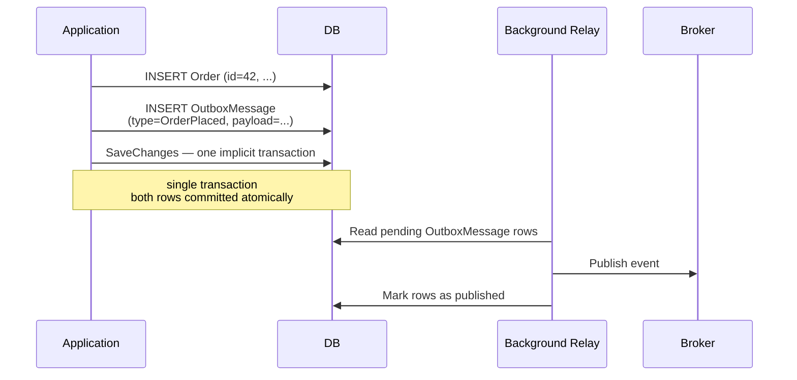
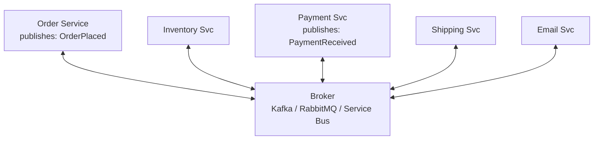
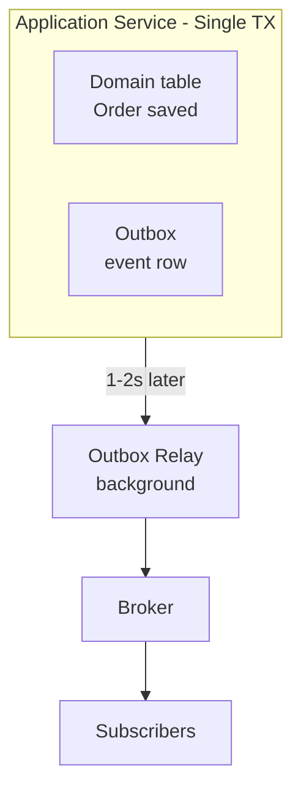
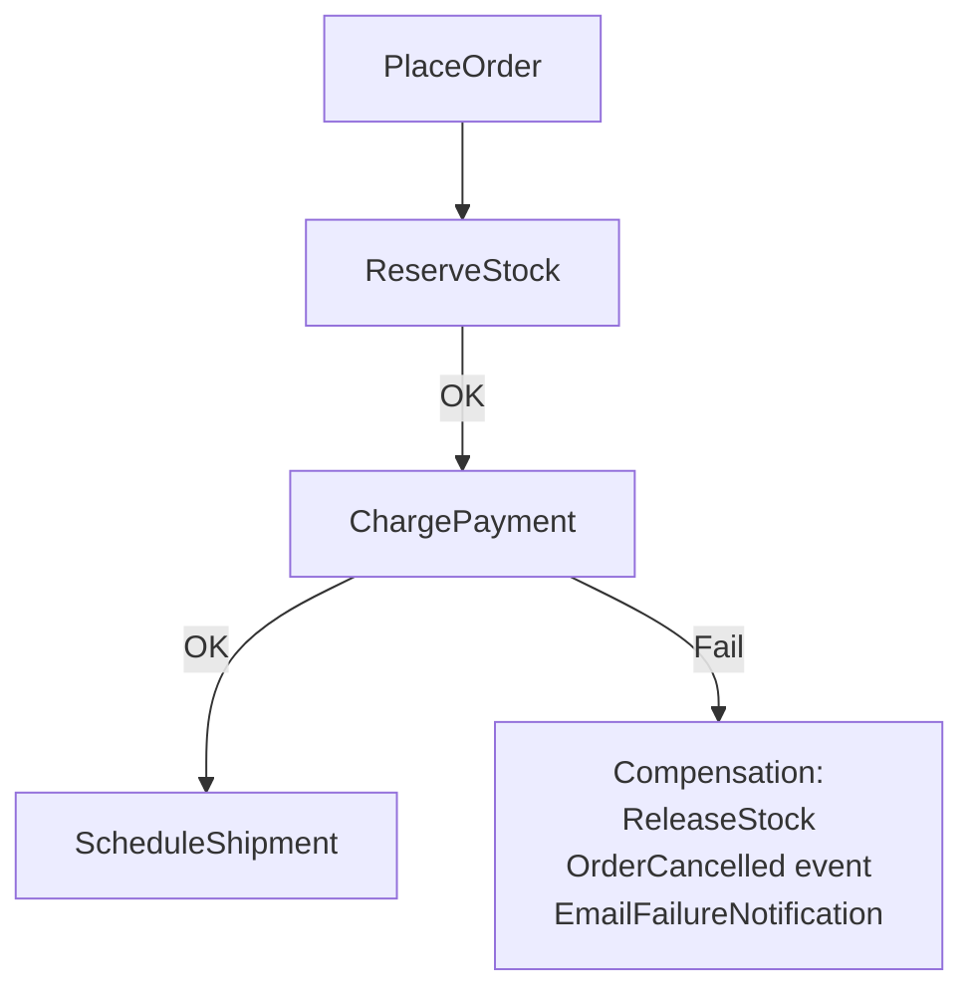

# Event-Driven Architecture

> [Mastery Guide](../README.md) › [API Development](./README.md)

| Status | Priority | Phase | Last reviewed |
|---|---|---|---|
| Not Started | High | Phase 8 — Microservices & Messaging | 2026-08-07 |

## Contents
- [Why it matters](#why-it-matters)
- [Core concepts](#core-concepts)
  - [Events vs commands vs queries](#events-vs-commands-vs-queries)
  - [The event envelope](#the-event-envelope)
  - [Event-carried state vs notification events](#event-carried-state-vs-notification-events)
  - [Event sourcing](#event-sourcing)
  - [Outbox pattern](#outbox-pattern)
  - [Running the outbox relay in production](#running-the-outbox-relay-in-production)
  - [Choreography vs orchestration](#choreography-vs-orchestration)
  - [Saga isolation — the missing I in ACID](#saga-isolation--the-missing-i-in-acid)
  - [Eventual consistency and idempotency](#eventual-consistency-and-idempotency)
  - [Acknowledgement, offsets and lock leases](#acknowledgement-offsets-and-lock-leases)
  - [Retry classification, poison messages and DLQ replay](#retry-classification-poison-messages-and-dlq-replay)
  - [Securing and partitioning event streams](#securing-and-partitioning-event-streams)
  - [Observability for event flows](#observability-for-event-flows)
  - [Migrating a synchronous monolith to events](#migrating-a-synchronous-monolith-to-events)
  - [Picking the .NET plumbing](#picking-the-net-plumbing)
- [Code & diagrams](#code--diagrams)
- [Common pitfalls](#common-pitfalls)
- [Interview-ready summary](#interview-ready-summary)
- [Interview Cross-Questioning Drill](#interview-cross-questioning-drill)
- [Cheat Sheet](#cheat-sheet)
- [Walkthrough](#walkthrough--customer-charged-twice-for-one-order)
- [Self-test](#self-test)
- [Cross-references](#cross-references)
- [Sources](#sources)

---

## Why it matters

Synchronous request/response is great until your services start tightly coupling. Service A calls Service B which calls Service C; B is down → A fails. Event-driven architecture (EDA) inverts this: services emit events about facts that happened ("Order Placed"), and other services react asynchronously. A doesn't know B exists; B just consumes the event when ready. The result is decoupled, resilient, and naturally scalable systems.

EDA is the dominant pattern for microservices in 2026. Combined with CQRS, event sourcing, and message brokers (Kafka, RabbitMQ, Azure Service Bus), it underpins systems at Stripe, Netflix, Uber, Shopify. Every senior backend interview will probe EDA understanding.

Why interviewers ask: EDA forces you to think about eventual consistency, idempotency, ordering, and failure modes that synchronous APIs hide. "What happens when the email service is down?" reveals whether a candidate has shipped an event-driven system or read a blog post about one.

When NOT to use: simple CRUD where every write is immediate-consistent and queried right after. Cross-service workflows where strict ordering and synchronous failure propagation matter. Premature decomposition into "event-driven microservices" creates more pain than it solves.

## Core concepts

### Events vs commands vs queries

Three message types with different semantics:

- **Command:** "Do this." Imperative, addressed to a specific service. May fail. (`PlaceOrder`, `CancelSubscription`)
- **Query:** "Tell me this." Read-only, expects a response. (`GetOrderStatus`)
- **Event:** "This happened." A fact about the past. Past tense. Multiple consumers may react. (`OrderPlaced`, `PaymentSucceeded`)

```csharp
// Command — imperative
public record PlaceOrderCommand(string CustomerId, IReadOnlyList<OrderItem> Items);

// Event — fact (past tense, immutable). EventId is the dedup key consumers use.
public record OrderPlaced(Guid EventId, string OrderId, string CustomerId, decimal Total, DateTimeOffset PlacedAt);
```

Commands and queries are typically RPC (REST, gRPC). Events ride on a broker (Kafka, RabbitMQ, Service Bus) for fan-out.

### The event envelope

Every event on the wire has two layers, and keeping them apart is what makes the infrastructure around your events possible. The **envelope** is metadata that routers, tracing collectors and dead-letter tooling read: what type this is, who published it, when, which trace it belongs to, and the identifier that makes it distinguishable from a redelivery. The **payload** is the domain fact. Anything you bury inside the payload can only be reached by something that already understands your business object — which is why correlation identifiers belong in the envelope, not inside the order.

CloudEvents, the CNCF specification, standardises that envelope. Version 1.0 requires exactly four context attributes — `id`, `source`, `specversion` and `type` — and defines four optional ones: `datacontenttype`, `dataschema`, `subject` and `time`. Everything else is an extension attribute. The Distributed Tracing extension defines two of those: `traceparent`, required whenever the extension is in use, and `tracestate`, optional; both are lifted directly from W3C Trace Context, sections 3.2 and 3.3.

Two consequences are worth having ready in an interview. First, the deduplication key belongs in the envelope: the spec requires producers to make `source` plus `id` unique for each distinct event, and that pair is exactly what a consumer's dedup table should key on. Second, the envelope outlives the payload — you can version the payload behind `dataschema` while every intermediary keeps routing on attributes it already understands.

The one field the core spec deliberately leaves to you is causation. Correlation ID answers "which business transaction is this part of"; causation ID answers "which single event caused this one", and a chain of them reconstructs a workflow that nobody wrote down. [Domain Events](../04-architecture-and-patterns/10-domain-driven-design/03-domain-events.md) is this guide's home for the full envelope design, including causation chains.

> 🌍 **In the real world**: a payments team puts `correlationId` inside the JSON body because that's where the C# record has it. Months later they want the broker to route sandbox-tenant traffic to a separate consumer, and discover the rule can't see it — Azure Service Bus documents plainly that subscription filters evaluate message properties and cannot evaluate the message body. The value was three inches from where it needed to be, and moving it means a producer change, a consumer change, and a period where both locations have to be read.

### Event-carried state vs notification events

Two flavours that solve the same problem differently:

**Notification event** — minimal payload, just "X happened, ID Y." Consumers fetch details if they need them.
```json
{ "type": "OrderPlaced", "orderId": "42" }
```

**Event-carried state transfer** — full state in the payload. Consumers don't need to call back.
```json
{ "type": "OrderPlaced", "orderId": "42", "customerId": "7",
  "items": [...], "total": 99.50, "placedAt": "..." }
```

Trade-offs:
- **Notification:** smaller events, but creates synchronous callback dependency (if order service is down, consumers can't fetch).
- **State transfer:** bigger events, but consumers fully decoupled.

The modern preference is **event-carried state**: pay the bytes; gain the decoupling.

### Event sourcing

A specialized form: instead of storing current state, store the **history of events** that produced the state. Current state is a fold over events.

```
Order events:
  1. OrderCreated(id=42, customerId=7, items=[...])
  2. ItemAdded(id=42, productId=99, qty=1)
  3. PaymentReceived(id=42, amount=99.50)
  4. ShippingScheduled(id=42, date=2026-05-10)

Current state = fold(events, initial: empty Order)
              = Order(42, customer=7, status="Shipped", items=[...], paid=99.50)
```

Benefits: full audit trail, time travel ("what did the order look like on May 7?"), natural fit for event-driven services.

Costs: schema migration is hard (events are immutable; you can't change history). Snapshots needed for performance after thousands of events. Querying requires building **projections** (materialized views over the event stream).

Event sourcing is heavy. Use selectively (financial systems, audit-heavy domains) — not as a default.

### Outbox pattern

The classic dual-write problem: you save an order to the DB AND publish an `OrderPlaced` event to a broker. Both must happen, or neither — but a transaction can't span both. Solutions:

- **Two-phase commit:** rarely worth the complexity.
- **Outbox pattern:** the standard answer.



If the relay fails, no data is lost — the message stays in the outbox until successfully published. At-least-once delivery; consumers must handle duplicates with idempotency keys.

```csharp
public class CreateOrderHandler(AppDbContext db, TimeProvider clock)
{
    public async Task HandleAsync(CreateOrderCommand cmd)
    {
        var order = new Order { CustomerId = cmd.CustomerId, Items = cmd.Items };
        db.Orders.Add(order);

        db.OutboxMessages.Add(new OutboxMessage
        {
            Id = Guid.NewGuid(),
            Type = nameof(OrderPlaced),
            Payload = JsonSerializer.Serialize(new OrderPlaced(Guid.NewGuid(), order.Id, ...)),
            CreatedAt = clock.GetUtcNow()
        });

        // One SaveChanges is already one transaction: the order row and the outbox
        // row commit together or not at all. No explicit BeginTransaction needed.
        await db.SaveChangesAsync();
    }
}

// Background relay. _db, the broker client and _clock are all constructor-injected;
// _clock is a TimeProvider so the relay's timestamps are controllable in tests.
public class OutboxRelay : BackgroundService
{
    protected override async Task ExecuteAsync(CancellationToken ct)
    {
        while (!ct.IsCancellationRequested)
        {
            var pending = await _db.OutboxMessages
                .Where(m => m.PublishedAt == null)
                .Take(100)
                .ToListAsync(ct);

            foreach (var msg in pending)
            {
                await _broker.PublishAsync(msg.Type, msg.Payload, ct);
                msg.PublishedAt = _clock.GetUtcNow();
            }

            await _db.SaveChangesAsync(ct);
            await Task.Delay(TimeSpan.FromSeconds(1), ct);
        }
    }
}
```

Tools that automate this: **Debezium** (CDC from the DB log → Kafka, or another sink via Debezium Server), **MassTransit Outbox**, **NServiceBus Outbox**.

### Running the outbox relay in production

The relay above is the teaching version. Four things separate it from one you can leave running unattended, and interviewers who have operated an outbox will ask about all four.

**Concurrency.** Run two instances of the service and you have two relays reading the same pending rows and publishing everything twice. There are two ways out. Elect a single writer — a distributed lock or leader election in the host, covered in [Background Services](../05-microservices-and-messaging/02-background-services.md) — or make the read itself exclusive so several relays can share the work safely. On PostgreSQL that is `SELECT ... FOR UPDATE SKIP LOCKED`, which hands each worker a batch no other worker can claim; the SQL Server equivalent is the hint pair `WITH (UPDLOCK, READPAST)`. Skip-locked scales out; leader election is simpler to reason about. Picking neither is the common failure.

**Order.** Without an `ORDER BY` on the outbox sequence, rows come back in whatever order the query planner found convenient. You have then lost per-key ordering before the broker has even seen the messages, and no partition key can restore an order the producer never had.

**Poison isolation.** One `SaveChangesAsync` after the whole loop means a single failed publish discards the published marks for every message already sent in that batch, so the next pass republishes all of them. Worse, a row that will never publish — a payload the serialiser chokes on, a topic renamed out from under it — sits at the head of the queue and blocks everything behind it indefinitely. The fix is a try/catch around each publish, an attempt counter on the row, and a rule that sets a row aside once it has failed enough times so the rest keeps draining.

**Pruning.** Published rows are dead weight on the index the relay queries every second, and they only grow. Delete them on a schedule, or partition the table by date and drop whole partitions.

One operational point on top of the four. The metric to alert on is not the *number* of unpublished rows, it is the *age of the oldest* one. A thousand rows passing through in seconds is a healthy system under load; three rows that have sat there since 03:00 are an outage, and a count-based threshold will never fire on them.

```csharp
// BackgroundService is a singleton, so the DbContext has to come from a scope
// per iteration rather than being injected into the constructor.
public class OutboxRelay(IServiceScopeFactory scopes, IEventPublisher broker, TimeProvider clock)
    : BackgroundService
{
    protected override async Task ExecuteAsync(CancellationToken ct)
    {
        while (!ct.IsCancellationRequested)
        {
            using var scope = scopes.CreateScope();
            var db = scope.ServiceProvider.GetRequiredService<AppDbContext>();
            await using var tx = await db.Database.BeginTransactionAsync(ct);

            // Claim a batch no other relay instance can take, oldest first.
            // FOR UPDATE SKIP LOCKED is PostgreSQL; SQL Server: WITH (UPDLOCK, READPAST).
            // attempts >= 5 rows drop out of this query — parked, not blocking.
            var batch = await db.OutboxMessages.FromSqlRaw(
                """
                SELECT * FROM outbox_messages
                WHERE published_at IS NULL AND attempts < 5
                ORDER BY sequence
                LIMIT 100
                FOR UPDATE SKIP LOCKED
                """).ToListAsync(ct);

            foreach (var msg in batch)
            {
                try
                {
                    await broker.PublishAsync(msg.Type, msg.Payload, ct);
                    msg.PublishedAt = clock.GetUtcNow();
                }
                catch (Exception ex)
                {
                    msg.Attempts++;               // hold this row back on its own —
                    msg.LastError = ex.Message;   // the rest of the batch still drains
                }
            }

            await db.SaveChangesAsync(ct);
            await tx.CommitAsync(ct);
            await Task.Delay(TimeSpan.FromSeconds(1), ct);
        }
    }
}
```

> 🌍 **In the real world**: a relay stops at 03:00 because one outbox row names a topic that an evening deploy renamed. The publish throws, the loop comes back to the same row, and nothing behind it moves. Orders keep committing, so the API dashboards are green and no error rate rises anywhere — the relay is not serving anyone, so it has nobody to return an error to. The backlog widget reads "47 rows", well under the alert threshold somebody set with a busy system in mind. The first real signal is the warehouse asking why nothing has printed since the small hours.

### Choreography vs orchestration

Two ways to coordinate multi-step workflows in EDA:

**Choreography:** services react to events independently. No central coordinator. Each step emits an event; others listen.

```
Order placed → Inventory listens → reserves stock → emits StockReserved
                Payment listens → charges card → emits PaymentReceived
                Shipping listens to BOTH → schedules shipment → emits ShipmentScheduled
                Email listens to ShipmentScheduled → sends confirmation
```

Pros: maximally decoupled; new participants just listen.
Cons: hard to see the whole flow; harder to debug; circular dependencies easy to introduce.

**Orchestration:** a central coordinator sends commands and waits for events.

```
Saga orchestrator receives PlaceOrder
  → sends ReserveStock command
  → waits for StockReserved event
  → sends ChargePayment command
  → waits for PaymentReceived event
  → sends ScheduleShipment command
  ...
```

Pros: explicit workflow; easier to monitor; built-in compensation handling.
Cons: orchestrator is a coupling point; service knowledge concentrated.

In practice, modern systems use both: choreography for low-coupling flows (notifications), orchestration for transactional workflows (Saga pattern). Tools: **MassTransit Sagas**, **Azure Durable Functions**, **Temporal**, **AWS Step Functions**.

> 🌍 **In the real world**: the choreography failure everyone eventually meets is not a crash, it is silence. A deploy renames a consumer group, or a topic name gains a typo in a config map, and a service simply stops receiving. Nothing throws. No error rate moves. The producer is publishing happily to a topic that now has one subscriber fewer, and because nobody acknowledged the event in the first place there is no unanswered request to time out. Orders stop shipping, and the first alert is a customer. This is the argument for choreography-plus-observability rather than choreography-plus-optimism: in an orchestrated flow the coordinator would have been sitting there with a step that never completed.

### Saga isolation — the missing I in ACID

A saga is not a transaction. It is a sequence of local transactions, each of which commits on its own and becomes visible to everybody the instant it does. Chris Richardson's framing in *Microservices Patterns* is that sagas give you **ACD** — atomicity, achieved through compensation rather than rollback; consistency; durability — but not isolation. Drill 4 in this chapter is entirely about the A. This section is about the missing I, and it is the thing candidates almost never raise unprompted.

Concretely: `ReserveStock` commits. From that moment until `ChargePayment` finishes, the rest of the system can read stock that has been reserved for an order which may never exist. Three anomalies follow.

- **Dirty reads** — something reads state a later compensation will undo. A merchandiser sees stock at zero and reorders; the saga then fails and releases it.
- **Lost updates** — a second saga overwrites a value the first saga wrote before the first has finished, so the first saga's compensation later reverses a value it did not write.
- **Non-repeatable reads** — the same read, twice inside one saga, returns different answers because another saga's step committed in between.

Richardson names six countermeasures for this (*Microservices Patterns*, chapter 4):

- **Semantic lock** — the compensatable step sets an application-level flag on the record it touches (`APPROVAL_PENDING`, `REVISION_PENDING`) so other readers can see the value is provisional and choose to block, fail, or render it as pending. Cheapest and by far the most commonly used.
- **Commutative updates** — design the operations so the order they apply in does not matter. `credit` and `debit` are commutative; `set balance` is not. This eliminates lost updates rather than detecting them.
- **Pessimistic view** — reorder the saga's steps so the update that would cause the most damage if read dirty happens as late as possible.
- **Reread value** — re-read the record immediately before updating and abort if it changed since you last read it. Optimistic offline lock under another name.
- **Version file** — record the operations applied to a record so that ones arriving out of order can be sorted, turning non-commutative operations into commutative ones.
- **By value** — choose the mechanism per request from its business risk: low-value requests go through the saga, high-value ones take a stricter path.

There is also a structural move that removes the need for some of this. Richardson splits a saga's steps into **compensatable transactions**, which can be undone; one **pivot transaction**, the go/no-go point — which he defines as either a transaction that is neither compensatable nor retriable, or simply the last compensatable step or the first retriable one; and **retriable transactions** after the pivot, designed so they cannot fail permanently, only be retried until they succeed. Push as much work as you can past the pivot and you delete compensation logic instead of writing it. In the order saga, charging the card is the natural pivot: reserving stock before it must be compensatable, and scheduling shipping and sending the confirmation after it need only be retriable.

> 🌍 **In the real world**: a hotel-booking saga holds the last available room from the moment `ReserveRoom` commits. A revenue-management job runs on a timer, reads occupancy, sees the property full and raises the rate on the remaining inventory. The payment then declines, the saga releases the room — and the price stays up, because the pricing job has no concept of a provisional booking and nothing told it to reconsider. The fix is a semantic lock: one `provisional` column that the pricing query excludes. It is a one-line predicate that nobody writes until the first time this happens.

### Eventual consistency and idempotency

EDA is asynchronous → consumers see updates with delay. "Eventually consistent" means all replicas converge given enough time and no new writes. This is a feature, not a bug — but UI and API design must accommodate it:

- After placing an order, the user might see "no orders" briefly while the projection catches up. Handle this in UI or accept the eventual-consistent gap.
- After a write, don't immediately read from a replica that hasn't received the event yet.

**Idempotency** is mandatory because at-least-once delivery is the broker norm:

```csharp
public class OrderPlacedHandler(IEmailService email, IIdempotencyStore store)
{
    public async Task HandleAsync(OrderPlaced evt)
    {
        if (await store.HasProcessedAsync(evt.EventId)) return;   // dedup on event ID, not order ID

        await email.SendConfirmationAsync(evt.CustomerId, evt.OrderId);
        await store.MarkProcessedAsync(evt.EventId, ttl: TimeSpan.FromDays(30));
    }
}
```

The deep-dive's [Result Pattern](../01-foundations/01-net-core-deep-dive/13-exception-handling.md) and the dedicated [Pub/Sub Concepts](../05-microservices-and-messaging/04-pubsub-concepts.md) chapter expand on consumer reliability.

### Acknowledgement, offsets and lock leases

"At-least-once" is not a property of messaging in general — it is a property of a specific acknowledgement mechanism, and the mechanisms differ enough that identical handler code is safe on one broker and lossy on another. This is the layer where most idempotency arguments quietly leak.

**Kafka commits offsets, not messages.** A consumer group records one offset per partition, meaning "everything below this has been handled". Commit before processing and a crash loses the message: at-most-once. Commit after and a crash redelivers it: at-least-once. There is no per-message acknowledgement, so you cannot acknowledge around a stuck message — the offset is a watermark, not a tick-box.

`enable.auto.commit` defaults to `true`, which means out of the box the client commits on a background timer and the boundary between "processed" and "committed" is not yours to place. The usual production shape in `Confluent.Kafka` is to leave auto-commit on but set `EnableAutoOffsetStore` to `false`, then call `StoreOffset` yourself only after the work has actually succeeded; the background thread then commits whatever you last stored, without blocking your loop. Calling `Commit` directly gives you a synchronous commit at the cost of stalling the poll loop while it round-trips.

**The poll loop is a liveness contract.** `max.poll.interval.ms` defaults to 300000 — five minutes. If you do not poll again inside that window, the group coordinator declares the member dead and reassigns its partitions to somebody else, who resumes from the last committed offset and reprocesses what you were halfway through; your own commit is then rejected because you no longer own the partition. `max.poll.records` defaults to 500 and `session.timeout.ms` to 45000, so a batch of merely slow messages can breach the interval without any single message looking slow. Long work belongs outside the poll loop, with the offset stored on completion.

**Service Bus leases individual messages instead.** In `ServiceBusReceiveMode.PeekLock` the broker holds an exclusive lock on the message while you work. The default lock duration is one minute and the maximum is five, extended either explicitly with `RenewMessageLockAsync` or automatically through `ServiceBusProcessorOptions.MaxAutoLockRenewalDuration`. You settle explicitly with `CompleteMessageAsync`, `AbandonMessageAsync` or `DeadLetterMessageAsync`. Abandon or let the lock lapse often enough and the broker dead-letters the message for you once `MaxDeliveryCount`, default 10, is exceeded. Locks are volatile: a service update, a dropped connection or a property change on the entity loses the lock, which surfaces as a `ServiceBusException` whose `Reason` is `ServiceBusFailureReason.MessageLockLost` (the conceptual docs still use the older SDK's `MessageLockLostException` name) — and in that specific case Microsoft's docs note the delivery count is *not* incremented.

**That lease expiry is the hole in most idempotency designs.** When a lock expires mid-processing, the message is redelivered while your first attempt is still running. Two copies of the handler are live simultaneously, and a dedup check that asks "have I finished this one?" answers "no" in both of them. That is precisely why drill 13's INSERT-then-execute ordering matters and check-then-act does not: the unique index is the only thing serialising two attempts that overlap in time.

**Ordering per key differs by broker too.** Kafka orders within a partition, so the partition key is the ordering unit. Service Bus does it with sessions: the sender sets `SessionId` (the AMQP `group-id`), and one receiver holds an exclusive lock over every message carrying that session ID, delivered in order — a session behaves like a sub-queue, and Microsoft's guidance is that sequence numbers alone give you retrieval order while sessions are what give you *processing* order. RabbitMQ's classic and quorum queues have no offset at all; order is per-queue and only survives with a single consumer.

**RabbitMQ's producer side needs an explicit acknowledgement as well.** Without publisher confirms, a publish is fire-and-forget and the client never learns whether the broker took responsibility for the message — an outbox relay that marks a row published without confirms is marking it on hope. On the consumer side, quorum queues count redeliveries in the `x-delivery-count` header and enforce a `delivery-limit` policy, defaulting to 20 as of RabbitMQ 4.0, after which the message is dead-lettered or dropped.

[Pub/Sub Concepts](../05-microservices-and-messaging/04-pubsub-concepts.md), [Kafka](../05-microservices-and-messaging/06-kafka.md) and [Azure Service Bus](../05-microservices-and-messaging/08-azure-service-bus.md) go further into each of these runtimes.

> 🌍 **In the real world**: a handler that renders an invoice PDF is comfortable at a couple of hundred milliseconds until a customer with a four-hundred-page invoice arrives. That message lands in a batch with 499 others, the batch takes longer than the five-minute poll interval, the coordinator rebalances, and another instance picks up the same offsets and starts rendering the same invoices. The lag graph shows a sawtooth — the group climbs, resets, climbs again — because it never gets past that batch. Nothing in the application logs says "rebalance" unless somebody had already thought to log it.

### Retry classification, poison messages and DLQ replay

"Retry a few times, then dead-letter" is half an answer. The half that matters is deciding which failures deserve a retry at all.

**Classify the failure before you retry it.** A transient failure — broker unreachable, a 503 from a downstream, a database deadlock, a lock lost — will plausibly succeed on the next attempt. A deterministic failure — a payload that will never deserialise, a validation rule the message can never satisfy, a foreign key to an entity that has been deleted — fails identically every time, so retrying it spends the retry budget, fills the logs and delays everything behind it for nothing. Send it to the dead-letter queue on the first failure. Most consumer code catches `Exception` and treats every failure the same way, which is how one malformed message consumes a day of retry capacity.

**In-process retry is not free — it holds the resource.** Sleeping between attempts inside a Kafka handler holds the partition: nothing else on that partition progresses while you wait, and the poll-interval clock from the previous section is running the whole time. On Service Bus it holds the lock, so the renewal has to keep pace or the message is redelivered underneath you and you get a second worker on the same message. Short in-process retries are for genuinely momentary blips; anything longer has to leave the handler.

**Moving the wait off the hot path.** Kafka has no native delayed delivery, so the pattern is a ladder of retry topics — republish to a `.retry` topic consumed by a separate group that waits before processing — which keeps the main partition flowing. RabbitMQ achieves it with a holding queue that has a message TTL and a dead-letter exchange pointing back at the work queue: the message serves its delay in the holding queue and is republished when it expires. Service Bus schedules the redelivery directly, by setting a scheduled enqueue time on a resent copy. All three trade away the original ordering: a retried message rejoins behind everything that arrived while it was waiting. [Pub/Sub Concepts](../05-microservices-and-messaging/04-pubsub-concepts.md) and [RabbitMQ](../05-microservices-and-messaging/05-rabbitmq.md) build these ladders out concretely.

**A DLQ is a work queue, not a bin.** It needs a named owner, an alert that fires when depth becomes non-zero rather than when it becomes large, and a written replay procedure. Undrained dead-letter queues are the quietest way an event-driven system loses data.

**Replay is where it gets subtle**, and this is the follow-up question. Two hazards. First, the world has moved on: a three-day-old `OrderCancelled` replayed against an order that has since been refunded and archived will either fail in a new way or do actual harm. Second, replay violates ordering by construction — the message re-enters after everything that arrived while it was parked, so a consumer that relied on per-key ordering now sees the past arrive after the future. The defences are a version or sequence check in the handler that discards stale updates, or replaying into a quarantined handler whose output a human approves before it takes effect. [Webhooks](./09-webhooks.md) works the stale-replay case through in detail.

**Watch lag, not throughput.** Consumer lag is the broker-side gap between a group's committed offset and the log end offset, per partition; on Service Bus and RabbitMQ the analogue is the active message count. It answers "is the consumer keeping up", which throughput alone cannot — a consumer processing flat out can still be falling behind. Note that lag and processing latency are different quantities: a consumer with zero lag may still be taking a long time on each message, and a consumer that has just joined shows enormous lag while being perfectly healthy.

> 🌍 **In the real world**: a producer adds a field its schema treats as required. One consumer's deserialiser throws on every message on one partition. Its retry policy is five attempts with backoff, in-process, so each message occupies the consumer for the best part of a minute before dead-lettering. Lag on that partition climbs all night, the DLQ fills, and the alerting covers HTTP error rates — which never move, because the consumer is not answering anybody's request. That is the characteristic shape of an event-driven outage: nothing is down, everything is late.

### Securing and partitioning event streams

A topic is an authorisation boundary, and in a choreographed system a forged event is an instruction. A consumer that trusts the event type alone has no way to distinguish a genuine `PaymentSucceeded` from one published by a compromised service that was only ever meant to write to a logging topic. Two questions belong in every EDA design review: who may publish to this topic, and who may subscribe to it.

**Kafka expresses that with ACLs.** A rule binds a principal such as `User:orders-service` to an operation on a resource type — topic, consumer group and cluster among them. A producer needs `Write` on the topic; a consumer needs `Read` on both the topic and its consumer group. That makes least privilege expressible: each service gets `Write` only on the topics it owns and `Read` only on the ones it genuinely consumes, so a compromised consumer cannot publish. Authentication underneath it is SASL or TLS client certificates (mTLS), covered in [Kafka](../05-microservices-and-messaging/06-kafka.md).

**Azure expresses it with Microsoft Entra ID and RBAC.** There are three built-in data-plane roles — Azure Service Bus Data Owner, Azure Service Bus Data Sender and Azure Service Bus Data Receiver — and they can be scoped to an individual queue, topic or topic subscription rather than only the whole namespace. With a managed identity there is no connection string to leak in the first place. One wrinkle worth knowing because it surprises people during an incident: Microsoft's docs note that removing a role assignment does not stop an app immediately, because the token it already holds stays valid until it expires — default validity 24 hours — unless the app is restarted.

**Multi-tenancy is a choice between two isolation models, and it is an architecture decision, not a configuration one.** Topic-per-tenant puts isolation in the infrastructure: an ACL per tenant, and one tenant's replay physically cannot reach another's data. You pay in topic count — partitions, retention policy, consumer groups, dashboards and alerts all multiply, and onboarding a tenant becomes an infrastructure operation rather than a row in a table. Tenant-ID-in-the-envelope puts isolation in application code: one topic, one consumer group, trivial onboarding — and now every handler, every projection and every ad-hoc admin query has to filter correctly, where a single missing predicate is a cross-tenant data leak rather than a bug. The usual compromise is a shared topic with tenant ID as the partition key, and dedicated topics only for the tenants whose contract requires physical separation.

**The payload is a separate question from the topic.** Retention means the broker is at-rest storage: events sitting in a topic for the retention window are a second copy of your data with its own access-control story, quite separate from your database's. The crypto-shredding technique in drill 2 doubles as a confidentiality control here, and pitfall 12's point about PII reaching log aggregators applies just as much to PII sitting in a topic that a wider audience can read.

> 🌍 **In the real world**: an analytics team asks for read access to "the orders topic" to build a dashboard for one large customer. On a shared topic the only grant that exists is the whole topic — every tenant's orders. Nobody notices anything wrong, because the dashboard filters correctly and never displays anyone else's data. The finding surfaces in an access review months later, and the remediation is not a permission change, it is a re-architecture.

### Observability for event flows

Four signals, answering four different questions. Teams usually have the first and none of the others.

1. **Consumer lag**, or queue depth / active message count on brokers without offsets — is the consumer keeping up right now?
2. **Age of the oldest unprocessed message** — how stale is the worst case? This is the signal that catches a small backlog which is not moving, which a count threshold never will. It is the same argument as the outbox-age alert earlier in this chapter.
3. **Dead-letter depth and arrival rate** — how much work has been abandoned? Arrival rate matters more than depth, because a sudden rate change means something just changed upstream.
4. **End-to-end latency**, from the event's own timestamp to the moment the consumer finished — the only one of the four the product actually feels. The other three are diagnostics for this one.

**Tracing across a broker only works if the context travels in the message.** An HTTP call propagates the trace automatically because the framework writes a header; a publish does not, so by default your trace ends at the publish and an unrelated one starts at the consume. The wire format is W3C Trace Context — `traceparent` and `tracestate` — and CloudEvents' Distributed Tracing extension carries exactly those two as event attributes so they survive intermediaries that only parse the envelope. In .NET the producer writes the current `Activity`'s context into a message header and opens a span with `ActivityKind.Producer`; the consumer reads the header, restores the context, and opens its span with `ActivityKind.Consumer`, both via `System.Diagnostics.ActivitySource`. Consumer spans are commonly linked rather than parented when one poll returns a batch, because a batch has many parents.

OpenTelemetry's messaging semantic conventions name the attributes to hang on those spans — `messaging.system`, `messaging.operation.name`, `messaging.operation.type`, `messaging.destination.name`, `messaging.message.id` and `messaging.message.conversation_id` among others. Worth knowing that these conventions are still marked Development status rather than Stable, so instrumentation libraries and back ends may not yet agree on names; check what your collector actually receives rather than what the spec says it should. [OpenTelemetry](../06-distributed-and-observability/06-opentelemetry.md) covers the .NET wiring.

> 🌍 **In the real world**: "the confirmation email never arrived for order 88412." Without propagated context that is four separate log searches across four services, joined by hand on an identifier that two of them spell differently. With it, one trace shows the HTTP POST, the outbox insert, the publish forty seconds later, the consume, and the child span where the email provider returned a 429 that the handler caught and logged at debug level.

### Migrating a synchronous monolith to events

The migration that fails is the one that starts by extracting a service. The one that works starts by publishing events *from the monolith*, with nothing consuming them.

1. **Publish from the monolith's own outbox.** The monolith already owns the database and the transaction. Add an outbox table to it and write event rows inside the transactions that already exist. No new service, no new database, no behaviour change — you are only adding a fact stream to something that already works.
2. **Run it with nothing listening.** This is the step teams skip and it is the cheapest information you will ever buy. You learn whether the event fires at the moment you assumed it did, whether the payload is sufficient for a consumer you have not written yet, and what the real volume is — with a blast radius of zero, because nothing is subscribed.
3. **Dual-run.** Build the new consumer and let it do the work in parallel while the monolith keeps doing it synchronously. The monolith's result is still the one that ships. Run a scheduled reconciliation that diffs the two outputs; the discrepancies it finds are the actual cost of the migration, and finding them here is orders of magnitude cheaper than finding them after cutover.
4. **Cut reads over first, then writes.** Serve the read from the new service while the monolith still owns the write. If it goes wrong the rollback is a feature flag. Only once reads have been boring for a while do you move the write.
5. **Delete the monolith's copy.** The step that gets deferred and then never happens. Until it does you are maintaining two implementations plus a reconciliation job, which is worse than either architecture on its own.

One design decision sits inside step 1. It is tempting to skip the outbox and point CDC straight at the monolith's tables — genuinely no application change at all. The cost is that your table schema becomes your public event contract: every consumer is now coupled to columns you were planning to refactor, and a rename turns into a cross-team migration. If you go the CDC route, point it at an outbox table whose shape you control and keep the domain tables private. [Anti-Corruption Layer](../04-architecture-and-patterns/10-domain-driven-design/04-anti-corruption-layer.md) and [Strategic DDD](../04-architecture-and-patterns/10-domain-driven-design/01-strategic-ddd.md) cover the wider strangler-fig approach this sits inside.

> 🌍 **In the real world**: the first thing to move is almost never the interesting thing. Order confirmation emails go first — nobody's money depends on them, a duplicate is an annoyance rather than an incident, and a delay is survivable. The point is not the email. The point is that the outbox, the relay, the topic, the schema registry, the consumer's deployment pipeline and the on-call runbook all get exercised on the cheapest possible workload before payments come anywhere near them.

### Picking the .NET plumbing

There are two levels to choose between. The broker client — `Confluent.Kafka`'s `IConsumer<TKey, TValue>` and its poll loop, or `Azure.Messaging.ServiceBus`'s `ServiceBusProcessor` with its handler callbacks — gives you exactly the broker's model and nothing on top. A messaging framework such as MassTransit, NServiceBus or Wolverine sits above that and supplies consumer registration wired into dependency injection, retry and redelivery policies, an envelope and serialisation, outbox and inbox tables, saga state machines with persistence, and a test harness (see [Integration Testing](../09-testing/02-integration-testing.md) for what testing those consumers actually looks like).

The trade you make is that broker-specific behaviour reaches you through the framework's abstraction or not at all. Kafka's partition assignment, Service Bus sessions and RabbitMQ's stream offsets all exist in these frameworks, but they arrive shaped the way the framework models them. If your design leans hard on one broker's semantics, verify that specific capability before you standardise on an abstraction over all of them.

Licensing has recently become part of this decision in .NET, and it is a fair interview question because it changes procurement. MassTransit v8 and earlier remain free and open source under their original licences; v9 and later ship under the MassTransit Commercial Software License Agreement, from Massient, the company created for the commercial release. NServiceBus is a commercial product from Particular Software. Marten and Wolverine have so far stayed MIT, with JasperFx selling support and a separate commercial monitoring product rather than licensing the libraries themselves. None of this makes any of them the wrong choice — but "we'll just use MassTransit, it's free" is no longer a sentence you can say in a design review without naming a version.

> 🌍 **In the real world**: a team picks a framework for its saga support, builds thirty consumers against its abstraction, and then a compliance requirement lands that needs strict per-customer processing order. The broker supports that natively — Service Bus sessions — but the abstraction exposes it as a per-consumer configuration decision they now have to retrofit across all thirty, along with the session-aware receive loop that comes with it. The framework was the right call. Not checking that one capability before standardising was not.

## Code & diagrams

<details>
<summary>🧩 Click to expand — code samples and diagrams</summary>

### EDA topology — typical e-commerce flow



No service calls another directly. Each one:
1. Consumes events relevant to it.
2. Updates its own DB.
3. Publishes new events about its state changes.

### Outbox + relay pattern (visual)



### Saga compensation (orchestration)



Each forward step has a compensating action; on failure, the saga unwinds in reverse.

### Event schema evolution

```
Version 1:
  OrderPlaced { id, customerId, total }

Version 2 (additive — backward compatible):
  OrderPlaced { id, customerId, total, currency = "USD" }   ← default for old events

Version 3 (breaking — rename):
  Don't rename. Publish a new event type or include both.
  OrderPlacedV2 { orderId, customerId, totalAmount, currency }   ← new type

Consumers handle multiple types until V1 is fully retired.
```

Use **Schema Registry** (Confluent for Kafka, Apicurio) to validate schemas at publish time.

</details>

## Common pitfalls

1. **Naming events as commands.** `CreateOrder` (imperative) instead of `OrderCreated` (past tense, fact). Events describe what happened, not what should happen.
2. **Dual-write without outbox.** Service writes to DB and broker in two operations; one fails, system is inconsistent. Always use outbox or CDC.
3. **No idempotency in consumers.** At-least-once delivery means duplicates. Without idempotency, double-charges, double-emails, double-everything.
4. **Synchronous "wait for event" patterns.** "Place order, wait for payment event, return result." That's RPC dressed as EDA. Either go fully async (return 202 + status URL) or keep it RPC.
5. **Tight coupling via shared event types.** When every service includes the same `Common.Events` package, schema changes break everyone simultaneously. Each producer owns its event schema.
6. **Replay impossibility.** Without event log retention, you can't replay events to rebuild a projection. Kafka retains, but only for the configured window (7 days by default). RabbitMQ's classic and quorum queues are destructive-read — once acked, the message is gone — but RabbitMQ Streams (RabbitMQ 3.9+) are an append-only log with non-destructive, offset-based reads, so replay is a modelling choice there, not a broker limitation.
7. **No dead-letter queue.** Bad events poison the pipeline forever. DLQ them after N retries; alert humans.
8. **Event-driven everything.** Internal CRUD doesn't need EDA. Use events for cross-service decoupling, not within a single service.
9. **Ordering assumptions across topics.** Events on different partitions/topics may arrive out of order. Design for that or use single partition (sacrificing throughput).
10. **Breaking event schema changes.** Renaming `total` to `totalAmount` breaks every consumer. Add new field, deprecate old, eventually retire.
11. **No schema registry.** Producers and consumers drift apart. Add Confluent Schema Registry or equivalent.
12. **Logging entire event payloads.** PII in events ends up in log aggregators. Filter at source or use structured logging with redaction.

## Interview-ready summary

- **Events = past-tense facts** consumed asynchronously by interested services.
- **Event-carried state** > notification (decoupling > payload size).
- **Outbox pattern** solves the dual-write problem.
- **Choreography (decentralized)** vs **Orchestration (Saga)** — both have legit use cases.
- **At-least-once delivery + idempotent consumers** is the production norm.
- **Event sourcing** stores history; current state is a fold. Heavy; use selectively.

**Expected interview questions:**

1. *"Walk me through what happens when a user places an order in an EDA system."* — Order service writes Order + OutboxMessage in one TX → relay publishes `OrderPlaced` → Inventory consumes (reserves stock, emits `StockReserved`), Payment consumes (charges, emits `PaymentReceived`), Shipping consumes both, Email consumes `ShipmentScheduled`.
2. *"What's the outbox pattern and what does it solve?"* — Solves dual-write: you must persist domain change AND publish event atomically. Outbox row in same TX → relay publishes async. Broker delivery may fail; outbox retries.
3. *"How do you handle out-of-order events?"* — Either tolerate it (idempotent + last-write-wins) or guarantee ordering via single partition / consumer + sequence numbers.
4. *"Choreography vs orchestration — when to use which?"* — Choreography for loose-coupled fan-out (notifications, projections). Orchestration for multi-step workflows with compensation needs (payment + shipping + inventory).
5. *"What's event sourcing?"* — Store events as the system of record, not current state. Current state = fold over events. Audit trail + time travel; complex schema evolution.
6. *"How do you make a consumer idempotent?"* — Track event ID in a deduplication table; check before processing. Or design handlers that are naturally idempotent (`SET x = 5` rather than `INCREMENT x`).
7. *"What's eventual consistency and how does it affect API design?"* — Async propagation means after-write reads may not see the write yet. UI optimism, retry-on-stale-read, or accept the gap.

## Interview Cross-Questioning Drill

<details>
<summary>📖 Click to expand — cross-question chains (~15-20 min, cover answers and write cold)</summary>

> ⚠️ **Honest caveat**: reading this once doesn't make you interview-ready. Cover the answers, write them cold, then check. Pair with a senior for live mock cross-questioning. The guide removes "I never thought about that" surprises; mock interviews convert knowledge into reflex. Both are needed.

Each drill is **Q → A → Cross-Q → A → Cross-Q² → A**.

### Drill 1 — Event vs command

> **Q**: How do you tell whether a message should be modeled as an event or a command?
>
> **A**: Tense and intent. A command is imperative future tense ("PlaceOrder") — it asks one specific service to do something, may fail, may be rejected. An event is past tense ("OrderPlaced") — it states a fact that has already happened, has no single addressee, and consumers self-elect. Commands have one logical recipient; events have zero-to-many.
>
> **Cross-Q**: A "PaymentRequested" message goes to the payment service from the order service. Event or command?
>
> **A**: Command in event clothing — the name is past-tense but the semantic is "do this." Real signal: there's exactly one consumer (the payment service), and the order service expects an outcome ("did the payment go through?"). Rename it `ChargeCustomer` (command), have the payment service publish `PaymentSucceeded` or `PaymentFailed` (events) when it's done. Other consumers (email, ledger) react to those events without coupling to the request.
>
> **Cross-Q²**: Why does this naming distinction actually matter at production scale?
>
> **A**: Two reasons. (1) Replay safety — events are facts, so re-processing them on a new consumer is safe (and required for new projections); commands are imperatives, so re-processing means re-executing side effects (double-charge). If you replay your topic without understanding which messages are which, you cause incidents. (2) Coupling boundaries — commands create direct producer-consumer coupling (the producer knows who handles it); events allow new consumers to be added without producer changes. A team that conflates them ends up with "events" that secretly require the original consumer to be online, which defeats the architecture.

### Drill 2 — Event sourcing trade-offs

> **Q**: What does event sourcing actually buy you, and what does it cost?
>
> **A**: Buys: complete audit trail (every state change is a recorded event), time travel ("show the order as it was on day X"), natural fit for event-driven services (your write log IS the event stream), and free replay/rebuild of read models. Costs: schema evolution is hard (events are immutable, you can't rewrite history), querying requires building projections (current state is a fold, not a SELECT), snapshots needed for aggregates with thousands of events, GDPR right-to-erasure is awkward (deleting from an immutable log).
>
> **Cross-Q**: A team wants event sourcing on every aggregate "for auditing." Push back.
>
> **A**: Audit doesn't require event sourcing. You can get audit logs with a much cheaper pattern: append-only audit table with the diff of every change. Event sourcing's cost — projections, snapshots, schema versioning, command/query split — is justified only when the domain genuinely benefits from time-travel reads (financial ledgers, regulated industries with reconstruction requirements, complex workflow systems where past state matters). For most CRUD aggregates, "soft delete + audit log" gives you 90% of the audit benefit at 10% of the cost.
>
> **Cross-Q²**: How do you handle GDPR right-to-be-forgotten on an immutable event store?
>
> **A**: You don't actually delete events — that breaks the fold. Instead: (1) Encrypt PII in the event payload with a per-user key; on erasure request, throw away the user's key. The events still exist but the payload is unreadable cipher — "crypto-shredding." (2) Or store PII out-of-band: events reference a user ID, PII lives in a regular mutable table that you can delete from. Greg Young (event sourcing's main popularizer) recommends crypto-shredding for true event-sourced systems. The trade-off: encryption complicates replay and projection rebuilds; out-of-band complicates reconstruction. There's no free lunch with immutable logs + GDPR.

### Drill 3 — Choreography vs orchestration

> **Q**: When choreography, when orchestration?
>
> **A**: Choreography for fan-out where each consumer reacts independently with no global workflow — notifications, projections, analytics. Orchestration for multi-step transactions with compensation requirements — a booking that must reserve inventory, charge card, schedule delivery, all-or-nothing.
>
> **Cross-Q**: Order placement involves stock check, payment, shipping schedule, email notification. What goes where?
>
> **A**: Hybrid. The transactional core (stock → payment → shipping schedule) is orchestrated — a Saga via Temporal/MassTransit/Durable Functions owns the workflow and compensation (if payment fails, release stock). The non-transactional fan-out (email, analytics, loyalty points, recommendation refresh) is choreographed — each service subscribes to `OrderConfirmed` independently and acts on its own. Trying to orchestrate the fan-out means every new "side effect" requires changing the orchestrator; trying to choreograph the transaction means no atomicity guarantee.
>
> **Cross-Q²**: A team's "choreographed" system has 8 services, and tracing a single order through them takes hours. Symptom of what?
>
> **A**: Choreography without observability. Implicit workflows that nobody documented; failures in step 5 cascade as silently dropped messages with no error path home. The fix isn't necessarily to add an orchestrator — it's to add: (1) Correlation IDs propagated through every event, (2) distributed tracing (OpenTelemetry) across the broker so you can see end-to-end spans, (3) a "workflow visualizer" service that subscribes to all events for one correlation ID and renders the actual flow, (4) explicit failure events with DLQ + alerting. Choreography is fine at scale; choreography-with-no-observability is a debugging hell.

### Drill 4 — Saga compensation

> **Q**: Sketch the compensation logic for a 3-step Saga: reserve stock → charge payment → schedule shipping.
>
> **A**: Each forward step has a compensating action that "undoes" it. Reserve stock → compensate by `ReleaseStock`. Charge payment → compensate by `RefundPayment`. Schedule shipping → compensate by `CancelShipping`. If step 2 (charge) fails, the Saga runs step 1's compensation (release stock); if step 3 (shipping) fails, it runs step 2's compensation (refund) then step 1's (release). Saga state machine drives the forward + reverse path.
>
> **Cross-Q**: Compensations themselves can fail. How do you handle that?
>
> **A**: Two patterns. (1) Retry indefinitely with exponential backoff and DLQ to a human queue — `RefundPayment` is expected to eventually succeed; if it can't (account closed, gateway down), it goes to ops for manual handling. (2) Compensation must itself be idempotent — retried refund doesn't double-refund — and side-effecty compensations (sending an apology email) only fire once via the same idempotency-key pattern as the forward step. The harsh truth: distributed transactions don't have a perfect failure model; you design for "compensations almost always succeed, ops handles the few that don't."
>
> **Cross-Q²**: Why is "just use 2-phase commit instead" a bad answer in modern microservices?
>
> **A**: 2PC requires a coordinator that holds locks across all participant resources during the prepare phase. In a microservice world: (1) Participants are different databases (Postgres, Mongo, external SaaS APIs); not all support XA transactions. (2) Coordinator failure during prepare leaves participants in "in-doubt" state, blocking resources until the coordinator recovers. (3) Locks held across network calls amplify latency tail and reduce throughput dramatically. Sagas relax atomicity (eventual consistency with compensation) but free participants from coordinator coupling — that's why Sagas, not 2PC, are the standard for microservice transactions.

### Drill 5 — Exactly-once delivery

> **Q**: Why is exactly-once delivery generally impossible, and what do you do instead?
>
> **A**: Impossible because of the Two Generals problem: any single message ack can be lost, so the sender doesn't know if "no ack" means "consumer didn't receive" (resend) or "consumer received but ack lost" (don't resend). Both choices break exactly-once in one failure scenario. The industry solution: **at-least-once delivery + idempotent consumers**. Broker guarantees the message is delivered at least once; consumer tracks message IDs and skips duplicates. End-to-end behavior is "effectively exactly-once" but the mechanism is dedup, not single-delivery.
>
> **Cross-Q**: Kafka markets "exactly-once semantics" — is that a lie?
>
> **A**: Marketing-aggressive but technically true within Kafka's boundary. Kafka EOS combines (a) idempotent producer (each message has a producer-ID + sequence-number, broker dedupes) and (b) transactional writes across Kafka topics (read message, process, write result, all in one Kafka transaction). End-to-end exactly-once works if your entire pipeline is Kafka-to-Kafka. The moment you cross to a non-Kafka system (external DB, Stripe API, S3), exactly-once is back to "at-least-once + idempotency at the boundary." Kafka EOS solves the streaming-within-Kafka case, not the general distributed-systems case.
>
> **Cross-Q²**: How do you make a Stripe charge call idempotent across consumer retries?
>
> **A**: Stripe's `Idempotency-Key` HTTP header. Generate one key per business operation (e.g., the order ID), pass it on the charge request. Stripe servers store the response keyed by `(account, idempotency_key)` for 24 hours. Retries with the same key return the original response without re-charging. This is the pattern every payment processor and modern API offers — and the canonical example of "the consumer side bears the exactly-once burden, the protocol just delivers at-least-once."

### Drill 6 — Outbox pattern

> **Q**: What dual-write problem does the outbox pattern solve?
>
> **A**: When a service must both persist a domain change (insert Order) and publish an event (`OrderPlaced` to broker), without a distributed transaction across DB and broker, one can fail while the other succeeds. Order saved but event lost = downstream services never know. Event sent but order rollback'd = downstream services act on a non-existent order. Outbox: write the event row to an `outbox` table in the SAME DB transaction as the domain change; a background relay reads the outbox and publishes asynchronously.
>
> **Cross-Q**: The relay fetches an outbox row, publishes to the broker, then crashes before marking it published. What happens?
>
> **A**: On restart, the relay reads the un-marked row and publishes again — broker now has two copies. This is the at-least-once leak from the outbox. Consumers MUST be idempotent (de-dup table keyed by event ID). The outbox solves the producer-side dual-write but pushes duplicate handling onto consumers. Some libraries (MassTransit's Outbox) include a consumer-side inbox table to dedupe; the pattern is "outbox at producer, inbox at consumer" for symmetric reliability.
>
> **Cross-Q²**: Could you use Debezium / CDC instead of a manual outbox table?
>
> **A**: Yes, and at scale it's preferred. Debezium tails the DB's transaction log (Postgres WAL, MySQL binlog) and publishes change events downstream. The "outbox" is then a regular table that you INSERT into during the domain transaction; Debezium picks up the INSERT from the log and publishes. You skip the background relay. And it isn't Kafka-only any more: the connector form runs on Kafka Connect, but Debezium Server is a standalone runtime that sinks to Kinesis, Pub/Sub, Pulsar, Redis Streams, NATS, RabbitMQ or plain HTTP with no Kafka in the picture, and the embedded engine runs inside a host JVM application. The trade-offs: Debezium is another moving piece to run and monitor (whichever form), it ties your event publishing to DB infrastructure decisions (a PG upgrade impacts Debezium, and the replication slot becomes a production dependency), and event order across multiple tables is harder to reason about. The hand-rolled relay is simpler to operate at small-to-medium scale; CDC wins for high-throughput systems.

### Drill 7 — Dual writes

> **Q**: Show me a code example of the dual-write bug.
>
> **A**:
> ```csharp
> await _db.SaveOrderAsync(order);            // (1) DB commit
> await _broker.PublishAsync(new OrderPlaced(Guid.NewGuid(), order.Id));  // (2) broker call
> ```
> If (1) succeeds and (2) throws (network blip, broker down), the order is saved but no event fires. Consumers (inventory, payment) never act on it. Reversing the order doesn't fix it — (2) succeeds and (1) throws means consumers act on a non-existent order.
>
> **Cross-Q**: What if I wrap both in a try/catch and retry?
>
> **A**: Retrying (2) on failure helps if the broker comes back, but if the process itself crashes between (1) and (2), retry is lost. You'd need a durable retry queue — at which point you've reinvented the outbox. The fundamental issue: there's no transactional boundary spanning DB and broker, so any partial-failure window leaks. The outbox makes the only durable thing a SINGLE DB transaction; the broker publish becomes asynchronous and independent.
>
> **Cross-Q²**: What about XA transactions across DB and broker?
>
> **A**: Technically possible where both resources speak a distributed-transaction protocol — SQL Server plus MSMQ under MSDTC was the classic Windows pairing — but that stack is legacy and modern .NET barely carries it: `System.Transactions` had no distributed-transaction support at all on .NET Core, and .NET 7 only restored it on Windows, via MSDTC. It's vanishingly rare in modern stacks. Kafka doesn't support XA. Cloud queues (SQS, Service Bus) don't. Even where it works, XA is operationally brittle (two-phase commit with locks held across network calls), and your DB and broker now have a coupling that breaks failover stories. The industry has decisively moved to "outbox + idempotent consumers" as the replacement for XA in distributed systems.

### Drill 8 — Event-carried state vs notification

> **Q**: What's the difference, and when does each win?
>
> **A**: Notification event = minimal payload, just "X happened with ID Y; call back for details." Event-carried state transfer = full state in the payload, consumers don't need to call back. Notification wins for small events where most consumers ignore most of the data (efficient). State transfer wins for decoupling — consumers don't depend on the producer being online to enrich the event.
>
> **Cross-Q**: A team's `OrderPlaced` event has just `{ orderId }`. Inventory service calls back to fetch details. Order service is sometimes down. What breaks?
>
> **A**: When order service is down, inventory can't enrich the notification — it must either retry (queue backs up) or fail. The decoupling that EDA promised is broken: inventory is now coupled to order's availability for processing. Switching to event-carried state (full order details in the event) means inventory processes from the payload alone; order service can be down for hours without inventory backing up.
>
> **Cross-Q²**: Event-carried state means events get big. Where's the line?
>
> **A**: Include the data 90% of consumers need; let the rare 10% call back for the rest. For an `OrderPlaced` event: include items + totals + customer ID + shipping address (almost everyone uses these); don't include full customer profile + payment history + browsing history (rarely needed, fetched on demand). The pragmatic answer: start with the minimum that decouples your main consumers, grow the event additively as new consumers need data, only fall back to call-back-for-details when payload size is genuinely problematic (>1MB events). Schema registry + additive evolution makes growing the event safe.

### Drill 9 — CQRS + Event Sourcing

> **Q**: When is CQRS + event sourcing actually worth the complexity?
>
> **A**: When (a) the domain has a clear command/query asymmetry — writes are complex with business rules, reads are many different shapes and need fast tailored views, (b) audit and time-travel are core requirements (financial, healthcare), (c) the read side benefits from being denormalized + indexed differently from the write side. Internal CRUD apps with 1:1 read/write models gain nothing.
>
> **Cross-Q**: A team adds CQRS for "read scalability." Push back.
>
> **A**: Read scalability rarely needs CQRS — it needs read replicas (Postgres streaming replication, MySQL read replicas) or caching (Redis, output cache). Those are 10x cheaper to operate and give you horizontal read scale without splitting your domain into command + query halves. CQRS earns its complexity when you need DIFFERENT MODELS for read and write (denormalized read tables, search indexes, graph projections) — not just more read capacity. Conflating "CQRS" with "read replicas" leads to teams adopting a heavy pattern for a problem that doesn't justify it.
>
> **Cross-Q²**: With event sourcing, the read side rebuilds from events. What happens with 10 years of events?
>
> **A**: Two strategies. (1) Snapshots — every N events (often 100-1000), persist a snapshot of the current state; on rebuild, start from the most recent snapshot and apply events from there forward. Most event-sourced systems use snapshots routinely. (2) Projection rebuild from log — when a new projection is added, replay all events from the start to build it; depending on volume this is hours to days for old systems. For very large stores (financial systems with decades of history), tiered storage helps: recent events in hot Kafka/KurrentDB (formerly EventStoreDB), archived events in S3, with replay tooling that streams from both.

### Drill 10 — Event versioning

> **Q**: You have `OrderPlaced { id, customerId, total }` deployed. You need to add a `currency` field. How?
>
> **A**: Additive change — add `currency` with a default ("USD") for old events. Old consumers ignore the new field (forward compatible); new consumers see the default for old events (backward compatible). Both sides keep working without coordination.
>
> **Cross-Q**: Now you need to rename `total` to `totalAmount`. How?
>
> **A**: Don't rename in place — that's a breaking change. Two patterns: (1) Publish a new event type (`OrderPlacedV2`) with the new field name; consumers handle both V1 and V2 until V1 is retired. (2) Use an "upcaster" — keep V1 in the wire format, but on read, transform V1 events to V2 shape (move `total` → `totalAmount`) in memory before passing to consumer logic. Upcasters are common in KurrentDB / Axon. Pure renames in event-sourced systems are rare; teams instead add the new field, deprecate the old, write a migration that publishes V2 events from the V1 stream, then eventually retire V1.
>
> **Cross-Q²**: How does a schema registry enforce this?
>
> **A**: Confluent Schema Registry + Avro (or JSON Schema, Protobuf) lets you register a compatibility policy per topic: BACKWARD (new schema can read old data), FORWARD (old schema can read new data), FULL (both), NONE. When a producer registers a new schema, the registry checks compatibility against the prior version and rejects breaking changes. Producers can't accidentally ship "rename `total`" without explicit override. This shifts schema discipline from "team norms" to "infrastructure enforcement" — much higher reliability at scale.

### Drill 11 — Snapshots in event sourcing

> **Q**: When does snapshotting in event sourcing pay off?
>
> **A**: When the aggregate has thousands of events and you load it frequently. Rebuilding state by folding all events on every read costs O(N) per load; with snapshots you cache the state at event N, and on load you read snapshot + events since N. The break-even depends on event count and folding cost; typically systems snapshot every 100-1000 events on aggregates that have >1000 lifetime events.
>
> **Cross-Q**: What goes wrong if you snapshot too often?
>
> **A**: Snapshot storage costs add up and the rebuild benefit plateaus. Snapshots themselves must be schema-versioned (if your aggregate state shape changes, old snapshots are invalid — fall back to full rebuild from events). Versioning bugs in snapshots silently corrupt state (read invalidates with wrong shape, apply new events, get garbage). Frequent snapshotting amplifies this risk. Production guidance: snapshot infrequently (every 1000+ events), version snapshots, and on schema mismatch always fall back to full event replay.
>
> **Cross-Q²**: An aggregate has 50K events, snapshotting was added 10K events ago, and the most recent snapshot has a schema bug. How do you recover?
>
> **A**: Delete the snapshots for that aggregate; the system falls back to full rebuild from event 1 — slow but correct. Better systems mark a snapshot's schema-hash and refuse to load mismatching snapshots automatically. Even better: keep the last N snapshots so a roll-back to an older valid snapshot is possible. The architectural lesson: snapshots are an optimization, not a source of truth — events are the truth, and any system design should let you nuke snapshots and rebuild without data loss.

### Drill 12 — Event store choice

> **Q**: KurrentDB vs Postgres-as-event-store vs Kafka — when each?
>
> **A**: KurrentDB (this is EventStoreDB renamed — Event Store Ltd rebranded to Kurrent in late 2024 and the licence changed with it, so check the terms rather than assuming it's still open source) — purpose-built event store, native concepts of stream + projection + subscription; best fit when event sourcing is the central pattern. Postgres-as-event-store — an events table with `(stream_id, sequence_number, event_data, event_type)`; on .NET you rarely hand-roll that, because **Marten** already gives you exactly that shape over Postgres, plus inline and async projections and stream-version optimistic concurrency. Great for teams already on Postgres who want event sourcing without a new datastore. Kafka — append-only log with replay; works for event sourcing but lacks per-aggregate stream operations and projection model out of the box.
>
> **Cross-Q**: Why not just always use Kafka?
>
> **A**: Two reasons. (1) Kafka's unit of organization is the partition, not the aggregate — you can't easily say "load all events for order X." You either use the aggregate ID as the partition key (works but scales partition count to aggregate count, which is wrong) or scan and filter (slow). KurrentDB has streams (one per aggregate) as a first-class concept. (2) Kafka doesn't support optimistic concurrency on writes — "write this event only if the stream is at version N" — which is critical for aggregate consistency. KurrentDB and Postgres-as-event-store (Marten included) both do this naturally.
>
> **Cross-Q²**: Postgres as event store — what's the scaling ceiling?
>
> **A**: Single-instance Postgres handles 10K-50K event writes/sec depending on hardware and indexing; reads are even higher with proper indexes. Beyond that you hit standard Postgres scaling (read replicas for projection reads, partitioning by stream_id for write throughput). The real ceiling is operational: as the events table grows to TB+ scale, VACUUM and index maintenance get painful, partitioning becomes mandatory, and you lose some single-table guarantees. Teams typically migrate to KurrentDB or Kafka when they hit this — but most never do, because most domains don't generate that event volume.

### Drill 13 — Idempotent consumer

> **Q**: Patterns for making an event consumer idempotent?
>
> **A**: Three common patterns. (1) Dedup table — INSERT `(event_id, processed_at)` with unique constraint; on duplicate, skip. (2) Idempotent operation — design the side effect itself to be repeat-safe (`SET balance = 100` rather than `UPDATE balance = balance + 50`). (3) Outbox-inbox — consumer writes "I processed X" to its inbox table in the same transaction as the side effect; on replay, check inbox first.
>
> **Cross-Q**: Dedup table grows unboundedly. How do you prune it?
>
> **A**: TTL based on the maximum "in-flight" window of the message. If your broker retains messages for 7 days and your max retry window is 24 hours, keep dedup entries for 7-14 days. Older entries can be safely deleted because no replay would re-deliver an older message. Use a background job that DELETEs `WHERE processed_at < NOW() - INTERVAL '14 days'`. Some teams partition the dedup table by date for fast bulk pruning. The key constraint: never delete dedup entries newer than the broker's retention window.
>
> **Cross-Q²**: Two consumer instances process the same event simultaneously. Race condition?
>
> **A**: Yes if you don't use a unique constraint. The classic bug: consumer A reads "not in dedup table," consumer B reads "not in dedup table," both execute the side effect, both then write to dedup table — one succeeds, one fails the unique constraint, but the side effect ran twice. Fix: INSERT-then-execute. Try to INSERT the dedup row first (with unique constraint); if it succeeds, execute; if it fails (duplicate key), skip — another instance is or has handled it. This serializes via the DB's unique-index conflict resolution and is the idempotency pattern at the heart of every reliable EDA system.

### Drill 14 — Eventual consistency

> **Q**: How do you expose eventual consistency to API consumers without breaking them?
>
> **A**: Three techniques. (1) Optimistic UI — after a write, immediately show the expected result; if the eventual state contradicts, reconcile. (2) Read-your-writes via session affinity — pin the user's reads to the primary node for X seconds after a write, so they see their own write immediately. (3) Polling with version — return the new entity's version on write; client polls until the version is visible in the read model.
>
> **Cross-Q**: Mobile client places an order, then immediately calls "GET my orders" — but the projection hasn't caught up. What does the API return?
>
> **A**: Options. (1) Optimistic: server includes the just-placed order in the response synthetically (read-after-write via local cache or write-through). (2) 202 + status URL: the POST returns "accepted, check back" with a tracking ID; the GET reflects the order once the projection has caught up. (3) Versioned read: client knows the order's expected version; if `version_in_db < expected_version`, server returns "still processing." All three are valid; the right choice depends on UX requirements and how often the lag is user-visible.
>
> **Cross-Q²**: A bank UI must show the account balance immediately after a transfer. Eventual consistency seems unacceptable. How?
>
> **A**: Don't make the balance read eventually consistent. Either (a) keep the balance in the same aggregate as the transfer command — both writes happen atomically in the source-of-truth service (read-after-write trivially consistent), or (b) use synchronous write-through to the read model — the command handler writes to both event store and read model in one transaction. The pattern: identify reads that MUST be strongly consistent (financial balances, regulatory state), keep those synchronous; everything else (notifications, analytics, recommendations) is eventually consistent. Don't impose eventual consistency on reads that genuinely require strong consistency.

### Drill 15 — Schema evolution

> **Q**: Avro vs Protobuf vs JSON for event payloads. Pick one.
>
> **A**: Depends on context. Avro is the Kafka default — strong schema, compact binary, schema embedded in messages OR registry-referenced. Protobuf is the polyglot favorite — strong schema, very compact, code-generated clients for every language. JSON is human-readable but verbose (3-5x larger), no native schema enforcement (need JSON Schema layered on top), and schema evolution is informal. For high-volume EDA: Avro (in Kafka ecosystems) or Protobuf. For low-volume cross-team systems: JSON + JSON Schema if readability matters.
>
> **Cross-Q**: Why does JSON cause schema drift bugs more than Avro/Protobuf?
>
> **A**: JSON has no enforced contract on either side. Producer adds a field — consumers that didn't anticipate it silently ignore it (mostly fine, but they miss new data). Producer removes a field — consumers that depended on it fail at runtime ("expected `total`, got null"). Producer renames a field — silent failure on the consumer. Avro/Protobuf with schema registry enforce compatibility at publish time: you literally cannot publish a breaking schema unless you bypass the registry. The drift bugs are caught at deploy time, not at production runtime.
>
> **Cross-Q²**: A team uses JSON and has a schema registry (Confluent's JSON Schema support). Is that as good as Avro?
>
> **A**: Nearly. You get compatibility checking on publish, and consumers can validate incoming events. You still pay 3-5x bytes on the wire vs Avro/Protobuf, and JSON parsing is slower per message. For low-to-medium throughput (< 10K msg/sec), the difference is negligible. For high-throughput streaming (100K+ msg/sec), Avro/Protobuf pay back the schema discipline cost. The honest answer: JSON + schema registry is "good enough for most teams"; Avro/Protobuf are "what you grow into when you scale." The schema discipline matters more than the wire format.

</details>

## Cheat Sheet

- **Events are past-tense facts**: `OrderPlaced`, not `PlaceOrder` (that's a command).
- **Event-carried state > notification** — pay the bytes, gain decoupling.
- **Outbox pattern** is the answer to dual-write — domain row + outbox row in one TX, relay publishes async.
- **At-least-once delivery + idempotent consumers** is the production norm; design for duplicates.
- **Choreography (decentralized) for fan-out**, **orchestration (Saga) for transactional workflows**.
- **Schema Registry** (Confluent / Apicurio) prevents producer/consumer drift.
- **Each producer owns its event schema** — never share `Common.Events` packages across services.
- **DLQ + alert** for poison messages after N retries; never lose visibility.
- **Eventual consistency means UI must tolerate lag** — optimistic UI or "your order is being created…" patterns.
- **Tools**: MassTransit + outbox, Debezium for CDC, Temporal/Durable Functions for orchestration.

## Walkthrough — Customer charged twice for one order

<details>
<summary>📖 Click to expand — worked walkthrough scenario</summary>

**Problem**: Black Friday morning, customer support is flooded with "I was charged twice for the same order." Looking at the payment service logs: the `PaymentReceived` event was processed by the email service, the loyalty service, AND the charging-was-itself-fired-by-event-from-order-service in a way that seems to have run twice. Refunds-and-apologies cost $40K before the team finds the cause.

**Diagnosis**: Open Kafka UI / Confluent Control Center, look at the `orders.placed` topic — find the duplicate `OrderPlaced` event with the same `order_id`. The producer (Order Service) saved the order to the DB, then called `_kafkaProducer.SendAsync(...)`. The Kafka send timed out (broker hiccup), the code retried, both sends actually succeeded — Kafka delivered both. There's no outbox; no idempotency on the consumer side either. Each duplicate event independently triggered a charge in the payment service via choreography. Open the consumer's source: it reads the event and immediately calls Stripe — no `processed_events(event_id)` check.

**Fix**: Outbox at the producer; idempotent processing at every consumer.

```csharp
// Producer — single transaction
public async Task PlaceOrderAsync(PlaceOrderCommand cmd)
{
    var order = new Order(cmd);
    _db.Orders.Add(order);
    _db.OutboxMessages.Add(new OutboxMessage
    {
        Id = Guid.NewGuid(), Topic = "orders.placed",
        Payload = JsonSerializer.Serialize(new OrderPlaced(Guid.NewGuid(), order.Id, ...))
    });
    await _db.SaveChangesAsync();   // one transaction — both rows commit, or neither does
}

// Consumer — idempotent via DB unique constraint.
// MassTransit Kafka rider: the topic is bound at startup with
// k.TopicEndpoint<OrderPlaced>("orders.placed", "payments", e => e.ConfigureConsumer<OrderPlacedConsumer>(ctx));
public class OrderPlacedConsumer(AppDbContext _db, IPaymentService _payments) : IConsumer<OrderPlaced>
{
    public async Task Consume(ConsumeContext<OrderPlaced> context)
    {
        var evt = context.Message;
        try
        {
            _db.ProcessedEvents.Add(new ProcessedEvent { EventId = evt.EventId, Topic = "orders.placed" });
            await _db.SaveChangesAsync();   // unique index on (EventId, Topic) — throws on duplicate
        }
        catch (DbUpdateException ex) when (ex.IsUniqueViolation())   // your own helper over the provider's error code
        {
            return;   // already processed
        }

        await _payments.ChargeAsync(evt);
    }
}
```

The relay (MassTransit Outbox / custom worker) reads outbox rows, publishes to Kafka with a stable message key = order ID, and marks rows published. Kafka topic uses `order_id` as the partition key so per-order ordering is preserved.

**Why it works**: Outbox makes the publish-or-die problem atomic at the producer — no more dual-write inconsistency. Idempotent consumers via unique-index INSERT make duplicate delivery a no-op even across consumer instances racing each other; the DB serializes for free. Choreography stays simple; the fragility was duplicate delivery, not the architecture.

</details>

## Self-test

<details>
<summary>1. Why is "synchronous wait for an event response" an anti-pattern even though it's tempting?</summary>

It's RPC dressed as EDA. The caller blocks while the broker delivers the command, the consumer processes, emits a result event, the broker delivers it back to the caller — every hop adds latency and failure modes that synchronous RPC doesn't have. If the consumer is down, the caller hangs; if the result event is lost, the caller hangs forever. Either go fully async (return `202 Accepted` with a status URL the client polls or subscribes to via SSE/WebSocket), or just use REST/gRPC for that path. Mixing models gives the worst of both.
</details>

<details>
<summary>2. Producer ships a v2 of `OrderPlaced` adding a `currency` field. What changes do consumers need?</summary>

If the change is purely additive — old consumers ignore the new field, new consumers default to `"USD"` for v1 events — no consumer changes are required. This is why event-carried state is "evolve via additive changes" the same way GraphQL is. Schema Registry (Confluent + Avro, Apicurio + JSON Schema) enforces this at publish time: the producer must register a backward-compatible schema or the publish is rejected. Breaking changes (rename, field removal, type change) → publish a new event type (`OrderPlacedV2`), let consumers migrate, retire `OrderPlaced` after usage drops.
</details>

<details>
<summary>3. Choreography vs orchestration — give a concrete example where each is the right call.</summary>

Choreography: notification fan-out. `OrderShipped` event triggers email service, SMS service, mobile push service, and analytics service — each cares independently, no central coordinator needed, adding a new "send Slack notification" service is just a new subscriber. Orchestration: a multi-step booking workflow where each step has compensating actions — reserve inventory, charge card, schedule delivery; if the charge fails, you must release the inventory in reverse. A Temporal/Durable Functions orchestrator owns the workflow state and explicit compensation paths. Choreography for "everyone reacts independently"; orchestration for "this transaction must complete or roll back atomically."
</details>

<details>
<summary>4. A new microservice needs to backfill its read model from 6 months of events. Kafka or RabbitMQ?</summary>

Kafka — but only if someone configured the retention for it six months ago. Kafka topics are append-only logs with configurable retention, and the default is 7 days (`log.retention.hours=168`); a 6-month backfill only works if the topic was already set to a longer retention, or to `-1` for infinite, *before* those events aged out. Tiered storage (KIP-405, production-ready since Kafka 3.9) is not itself a retention setting — it makes keeping that much retention affordable, but you still have to have set it. Given that, the new service connects with a fresh consumer group, sets `auto.offset.reset=earliest`, and replays history at high throughput. RabbitMQ's classic and quorum queues are queue-semantics: once a message is acked, it's gone. The exception is RabbitMQ Streams (RabbitMQ 3.9+, first-class alongside quorum queues in 4.x) — an append-only log with non-destructive, offset-based reads and its own retention policy, which replays the same way. So the honest answer is that the choice isn't Kafka-versus-RabbitMQ, it's "was this stream modelled as a retained log, and retained long enough"; if your messaging system can't replay, you're locked out of patterns like "rebuild a projection from scratch" and "retroactive analytics."
</details>

<details>
<summary>5. Out-of-order events arrive: `PaymentReceived` for an order before the corresponding `OrderPlaced`. How do you design for that?</summary>

Two compatible strategies. (1) **Tolerate via state machine** — the consumer treats events as state transitions, persists them in any order, and reconstructs the final state once all are present. `PaymentReceived` arriving early just sets `payment_status=Received` in a local table; when `OrderPlaced` arrives, the order row is created with the already-stored payment status. (2) **Single-partition ordering** — Kafka guarantees order within a partition; partition by `order_id` so all events for one order land on one partition consumed serially. The cost is reduced parallelism per order. Real systems combine: partition by aggregate ID for natural ordering, plus tolerant consumers for cross-aggregate event flows.
</details>

## Cross-references

- [Pub/Sub Concepts](../05-microservices-and-messaging/04-pubsub-concepts.md) — broader pub/sub patterns, offset commit and retry ladders in depth.
- [Kafka](../05-microservices-and-messaging/06-kafka.md), [RabbitMQ](../05-microservices-and-messaging/05-rabbitmq.md), [Azure Service Bus](../05-microservices-and-messaging/08-azure-service-bus.md) — common EDA brokers, including peek-lock and DLX mechanics.
- [Webhooks](./09-webhooks.md) — external EDA across organizations; also the stale-DLQ-replay case worked through.
- [CQRS](../04-architecture-and-patterns/05-cqrs.md) — natural pairing with EDA.
- [Microservices](../05-microservices-and-messaging/01-microservices.md) — EDA is the standard inter-service pattern.
- [Background Services / IHostedService](../05-microservices-and-messaging/02-background-services.md) — outbox relay typically runs here; leader election and poison isolation.
- [Domain Events](../04-architecture-and-patterns/10-domain-driven-design/03-domain-events.md) — envelope design, correlation and causation IDs.
- [OpenTelemetry](../06-distributed-and-observability/06-opentelemetry.md) — the .NET tracing wiring behind the observability section.
- [Integration Testing](../09-testing/02-integration-testing.md) — Testcontainers for Kafka/RabbitMQ and message-handler test harnesses.
- [Contract Testing](../09-testing/04-contract-testing.md) — consumer-driven contracts for event schemas.

## Sources

<details>
<summary>📚 Click to expand — sources and further reading</summary>

- *Designing Event-Driven Systems* by Ben Stopford (O'Reilly, 2018, free) — Confluent's foundational book on Kafka-based EDA.
- *Microservices Patterns* by Chris Richardson (Manning, 2018) — Saga, outbox, and EDA patterns chapter is canonical.
- Microsoft Learn — [Event-driven architecture style](https://learn.microsoft.com/en-us/azure/architecture/guide/architecture-styles/event-driven).
- *Building Event-Driven Microservices* by Adam Bellemare (O'Reilly, 2020).
- Martin Fowler — [What do you mean by "Event-Driven"?](https://martinfowler.com/articles/201701-event-driven.html) — distinguishes the four flavours of EDA.
- [CloudEvents](https://cloudevents.io/) — the CNCF spec for a common event envelope (`specversion`, `type`, `source`, `id`, `time`).
- Chris Richardson — [Saga pattern](https://microservices.io/patterns/data/saga.html) on microservices.io — including the isolation countermeasures the book chapter covers.
- [Apache Kafka 4.0 release announcement](https://kafka.apache.org/blog/2025/03/18/apache-kafka-4.0.0-release-announcement/) (March 2025) — KRaft only; ZooKeeper removed.
- [RabbitMQ Streams](https://www.rabbitmq.com/docs/streams) — offset-based, non-destructive reads on RabbitMQ.
- [Marten](https://martendb.io/events/) — Postgres as an event store on .NET, with projections and stream-version concurrency.
- [CloudEvents Distributed Tracing extension](https://github.com/cloudevents/spec/blob/main/cloudevents/extensions/distributed-tracing.md) — `traceparent` and `tracestate` as event attributes.
- [W3C Trace Context](https://www.w3.org/TR/trace-context/) — the `traceparent` (§3.2) and `tracestate` (§3.3) formats themselves.
- Microsoft Learn — [Message transfers, locks, and settlement](https://learn.microsoft.com/en-us/azure/service-bus-messaging/message-transfers-locks-settlement) — peek-lock, lock duration, settlement APIs, max delivery count.
- Microsoft Learn — [Message sessions](https://learn.microsoft.com/en-us/azure/service-bus-messaging/message-sessions) — FIFO on Service Bus, and the sequencing-vs-sessions distinction.
- Microsoft Learn — [Use managed identities with Service Bus](https://learn.microsoft.com/en-us/azure/service-bus-messaging/service-bus-managed-service-identity) — the three built-in data-plane RBAC roles and their scoping.
- Confluent — [Consumer configuration reference](https://docs.confluent.io/platform/current/installation/configuration/consumer-configs.html) — `max.poll.interval.ms`, `enable.auto.commit` and friends.
- [RabbitMQ quorum queues](https://www.rabbitmq.com/docs/quorum-queues) — `x-delivery-count`, `delivery-limit`, dead-letter strategies.
- [OpenTelemetry messaging semantic conventions](https://opentelemetry.io/docs/specs/semconv/messaging/messaging-spans/) — span attribute names (currently Development status).
- [Announcing MassTransit v9](https://masstransit.io/introduction/v9-announcement) and the [MassTransit Commercial Software License Agreement](https://massient.com/license) — the licensing change.

<!-- nav-footer-start -->

---

[← Previous: MQTT](12-mqtt.md) · [↑ Back to top](#event-driven-architecture) · [Next: BFF & Aggregation →](14-bff-and-aggregation.md)

<!-- nav-footer-end -->

</details>
