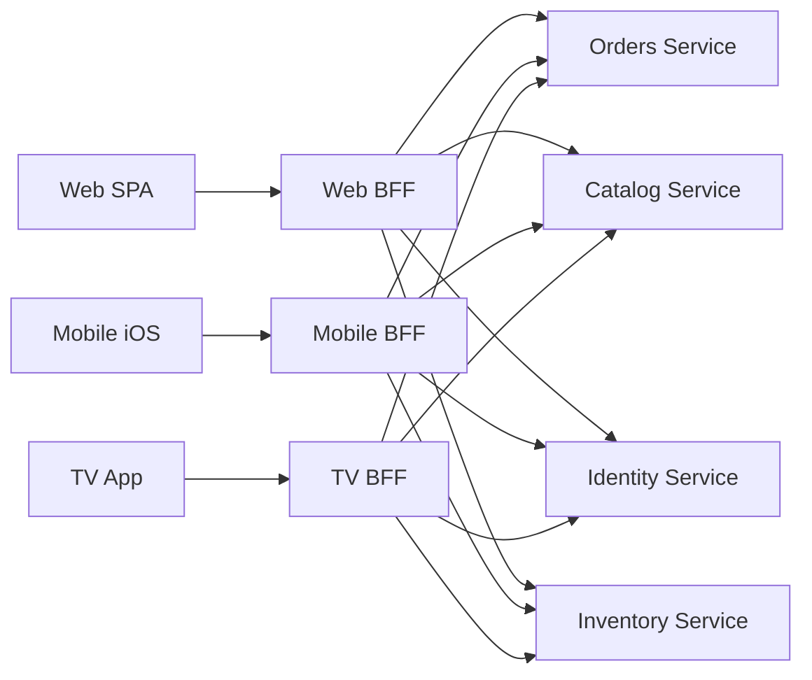
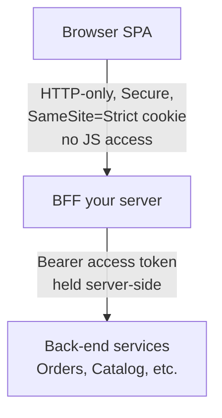
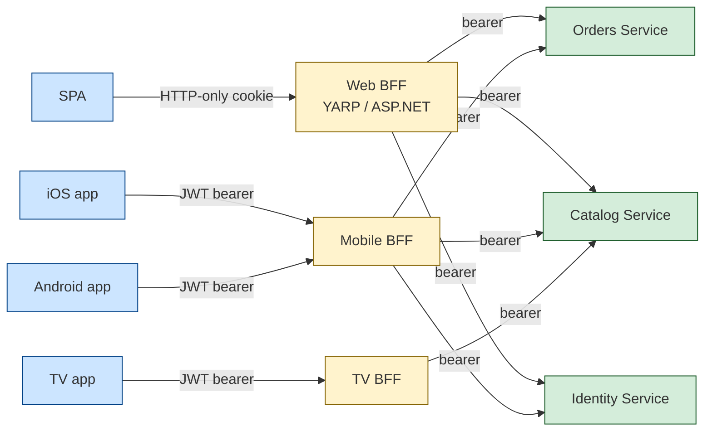
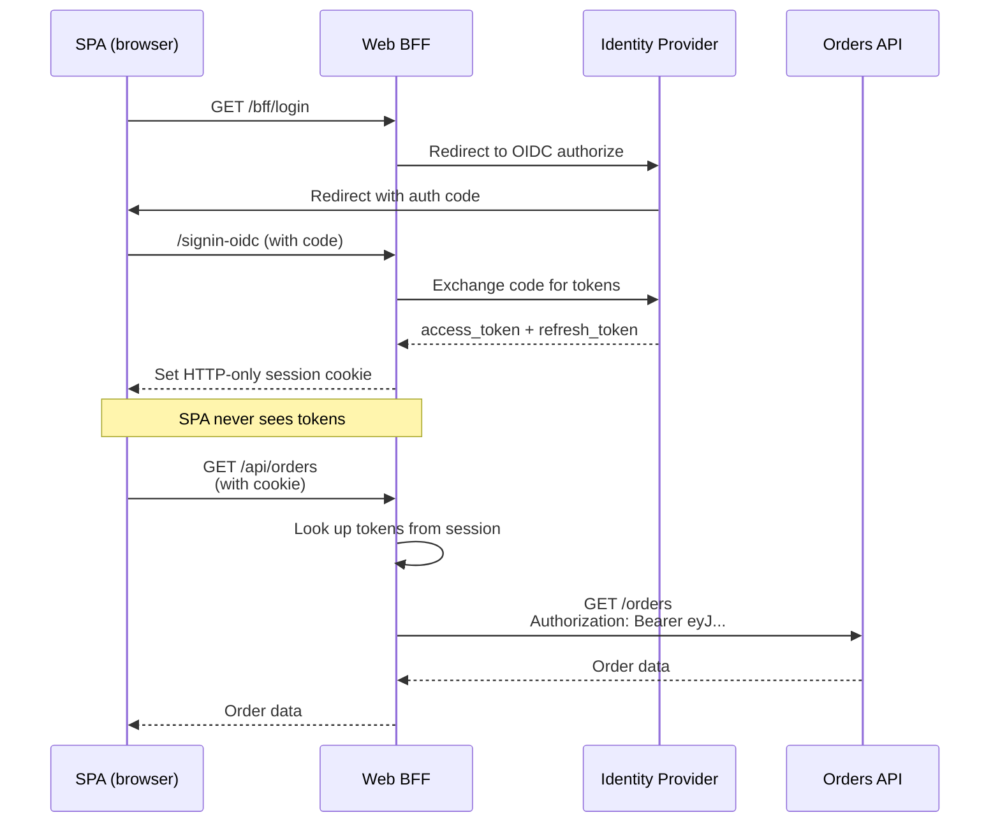

# BFF & Aggregation

> [Mastery Guide](../README.md) › [API Development](./README.md) › BFF & Aggregation

| Status | Priority | Phase | Last reviewed |
|---|---|---|---|
| Not Started | High | Phase 4 — Auth & API Security | 2026-05-08 |

## Contents
- [Why it matters](#why-it-matters)
- [Core concepts](#core-concepts)
  - [The "one API for all clients" problem](#the-one-api-for-all-clients-problem)
  - [The BFF pattern](#the-bff-pattern)
  - [Aggregation strategies](#aggregation-strategies)
  - [Deadline budgets, not just timeouts](#deadline-budgets-not-just-timeouts)
  - [Idempotency keys and retry safety for writes](#idempotency-keys-and-retry-safety-for-writes)
  - [Rate limiting and concurrency limiting at the BFF itself](#rate-limiting-and-concurrency-limiting-at-the-bff-itself)
  - [Partial failure needs a contract](#partial-failure-needs-a-contract)
  - [YARP — Microsoft's reverse proxy](#yarp--microsofts-reverse-proxy)
  - [GraphQL as an aggregator](#graphql-as-an-aggregator)
  - [Hardening a GraphQL endpoint you actually expose](#hardening-a-graphql-endpoint-you-actually-expose)
  - [API gateway managed services](#api-gateway-managed-services)
  - [Cookie-on-server auth (Duende's BFF security pattern)](#cookie-on-server-auth-duendes-bff-security-pattern)
  - [Where the BFF has to live — origin, site and CORS](#where-the-bff-has-to-live--origin-site-and-cors)
  - [The anti-forgery mechanism — one static header](#the-anti-forgery-mechanism--one-static-header)
  - [What the `__Host-` prefix actually enforces](#what-the-__host--prefix-actually-enforces)
  - [SameSite=Strict and the OIDC callback](#samesitestrict-and-the-oidc-callback)
  - [Token exchange, properly — RFC 8693 and audience down-scoping](#token-exchange-properly--rfc-8693-and-audience-down-scoping)
  - [Sender-constrained tokens — DPoP and mTLS](#sender-constrained-tokens--dpop-and-mtls)
  - [The concurrent-refresh race and the single-flight lock](#the-concurrent-refresh-race-and-the-single-flight-lock)
  - [Back-channel logout and session revocation](#back-channel-logout-and-session-revocation)
  - [Caching at the BFF layer](#caching-at-the-bff-layer)
  - [Testing an aggregation layer](#testing-an-aggregation-layer)
  - [Blazor as a client family](#blazor-as-a-client-family)
  - [Mobile token storage and app attestation](#mobile-token-storage-and-app-attestation)
  - [Migrating an existing SPA onto a BFF](#migrating-an-existing-spa-onto-a-bff)
  - [When NOT to BFF](#when-not-to-bff)
- [Code & diagrams](#code--diagrams)
- [Common pitfalls](#common-pitfalls)
- [Interview-ready summary](#interview-ready-summary)
- [Interview Cross-Questioning Drill](#interview-cross-questioning-drill)
- [Cheat Sheet](#cheat-sheet)
- [Walkthrough](#walkthrough--spa-leaking-access-tokens-via-xss)
- [Self-test](#self-test)
- [Cross-references](#cross-references)
- [Sources](#sources)

---

## Why it matters

A single REST or gRPC API serving five client types (web SPA, mobile iOS, mobile Android, smart-TV app, partner integrations) inevitably ends up either **bloated for each client** (every endpoint returns more data than any single client needs) or **inadequate for some** (the mobile team can't get the field they need without a coordination dance with the API team).

The Backend-for-Frontend (BFF) pattern solves this: each client family gets its own dedicated back-end that aggregates, reshapes, and caches responses from the underlying services. SoundCloud popularized it in 2011-2014; Sam Newman wrote the canonical [BFF article](https://samnewman.io/patterns/architectural/bff/) in 2015.

In .NET 2026, BFF is the standard pattern for SPAs needing strong auth (cookie-on-server with Duende's BFF security pattern), for mobile apps needing payload-shaping for bandwidth, and for any system where the back-end-team and front-end-team release on different cadences.

For senior interviews, "design the API surface for [a SaaS with web + iOS + Android]" — the BFF pattern is the right answer. Generic "we'll have one REST API" responses signal you haven't shipped a multi-client product.

When NOT to BFF: small teams, single client, internal admin tools. The pattern earns its weight when client diversity creates coordination overhead; otherwise, it's just more services to operate.

## Core concepts

### The "one API for all clients" problem

A typical evolution:

```
Year 1: Web SPA + REST API. Endpoints return what the SPA needs. Simple.

Year 2: Mobile app added. Mobile needs less data per response (bandwidth);
        adds new field expectations. Either:
        (a) bloat REST responses with fields web doesn't need, or
        (b) add /mobile/* duplicates that drift from /api/*.

Year 3: Watch app. Different again. (a) gets worse. (b) gets unmaintainable.

Year 4: API team is a coordination bottleneck. Mobile team waits 3 weeks
        for a field. Web team is blocked on schema changes the API team
        won't ship until mobile catches up.
```

The structural problem: **one API can't serve multiple clients optimally** because they have different needs that evolve at different rates. Coordination cost grows with client count × release-cadence-mismatch.

### The BFF pattern

One back-end-for-frontend per client family. Each BFF:
- Calls the underlying domain services.
- Aggregates / reshapes responses for its specific client.
- Owns client-specific caching.
- Owns client-specific auth (sessions for web, tokens for mobile).
- Released by the front-end team, on the front-end team's cadence.



**Key properties**:
- BFFs are owned by the **client team**, not the API team. The mobile team owns the mobile BFF.
- BFFs are typically **stateless** themselves; state lives in the underlying services.
- One BFF per **distinct client family**, not per release. iOS and Android can usually share if their needs align; web and mobile usually shouldn't.

**Trade-offs**:

| Pro | Con |
|---|---|
| Each client gets exactly the API it needs | More services to deploy / observe / secure |
| Front-end team unblocked on shape changes | Risk of duplicated logic across BFFs |
| Client-specific caching strategies possible | Auth needs to be solved per BFF |
| Auth-as-cookie pattern (web) gets clean home | Versioning conversations multiply |

**When duplication grows**: extract shared logic into an "experience API" or shared library that BFFs consume. Don't merge BFFs back into one — that recreates the original problem.

### Aggregation strategies

Three flavors, often combined:

**1. Sequential aggregation** — call A, then B with A's result, etc.

```csharp
public async Task<OrderSummaryDto> GetOrderSummary(int orderId)
{
    var order = await _ordersClient.GetOrder(orderId);
    var customer = await _customersClient.GetCustomer(order.CustomerId);
    var items = await _catalogClient.GetProducts(order.Items.Select(i => i.ProductId));
    return Compose(order, customer, items);
}
```

Use when later calls depend on earlier results. Cost: N×latency.

**2. Parallel aggregation** — call independent services concurrently.

```csharp
public async Task<DashboardDto> GetDashboard(int userId, CancellationToken ct)
{
    var ordersTask = _ordersClient.GetRecentOrders(userId, ct);
    var notificationsTask = _notificationsClient.GetUnread(userId, ct);
    var recommendationsTask = _recsClient.Get(userId, ct);

    await Task.WhenAll(ordersTask, notificationsTask, recommendationsTask);

    return new DashboardDto(
        await ordersTask,
        await notificationsTask,
        await recommendationsTask);
}
```

Cost: max(latencies). Use whenever calls are independent — typical for dashboards.

**3. Streaming aggregation** — return a partial response immediately, then push updates as more arrives.

```csharp
public async IAsyncEnumerable<DashboardChunk> StreamDashboard(int userId,
    [EnumeratorCancellation] CancellationToken ct)
{
    yield return new DashboardChunk("orders", await _ordersClient.GetRecentOrders(userId, ct));
    yield return new DashboardChunk("notifications", await _notificationsClient.GetUnread(userId, ct));
    yield return new DashboardChunk("recommendations", await _recsClient.Get(userId, ct));
}
```

Stream via [Server-Sent Events](./15-server-sent-events.md). Best UX for slow aggregations — user sees content as it arrives.

**Resilience layer**: every BFF call to a downstream service should go through a resilience pipeline (retry, circuit breaker, timeout). In current .NET that's `Microsoft.Extensions.Http.Resilience` — `AddStandardResilienceHandler()` on the `IHttpClientBuilder`, built on Polly v8 resilience strategies, rather than the v7 `IAsyncPolicy` types. When inventory service is down, the dashboard returns partial data, not a 500. See [HttpClient & Resilience](../01-foundations/01-net-core-deep-dive/14-httpclient-resilience.md).

### Deadline budgets, not just timeouts

A timeout on each downstream call is not a budget. Give five sequential calls five seconds each and you have authorised twenty-five seconds of work on behalf of a caller who probably gave up in three. A budget is the opposite arrangement: the inbound request arrives with a deadline, and every outbound call gets whatever time is *left*, not a fresh fixed allowance. The BFF is where that deadline has to be established, because it is the only component that knows the request as a whole.

ASP.NET Core has the middleware for the inbound half. The request-timeouts middleware, in the `Microsoft.AspNetCore.Http.Timeouts` namespace since .NET 8, is registered with `AddRequestTimeouts()` and `UseRequestTimeouts()` — after `UseRouting` if you use it in apps that call routing explicitly — and applied per endpoint with `WithRequestTimeout` or the `[RequestTimeout]` attribute, or globally through a default policy. Adding the middleware does not by itself start enforcing anything; limits have to be configured. When a limit is hit, the middleware cancels the token exposed as `HttpContext.RequestAborted` but does not abort the request, so your code can still choose what to write; if nothing handles it, the documented default response is 504. A policy can set `TimeoutStatusCode` instead, or supply a `WriteTimeoutResponse` delegate to render something the client understands. One practical footnote from the docs: the timeout middleware does not trigger while a debugger is attached, so it has to be tested with the debugger detached.

The propagation itself is not a number you pass around — it is that cancellation token. If every downstream call in the fan-out receives `HttpContext.RequestAborted`, then the moment the inbound budget expires, every in-flight outbound call is cancelled together and the BFF stops holding connections open for a response nobody will read. A per-call timeout still has a job, because it catches a single slow dependency early; the budget catches the case where the arithmetic across calls has quietly exceeded what the caller will wait for.

There is a trap in how the layers compose. `HttpClient.Timeout` defaults to 100 seconds and applies to the whole send operation, which means it sits outside the delegating-handler chain and therefore outside the resilience pipeline and all of its retry attempts. The standard resilience handler from `Microsoft.Extensions.Http.Resilience` defaults to a 30-second total request timeout, a 10-second per-attempt timeout, and up to three retries with exponential backoff and jitter. So the defaults happen to nest correctly. Tighten `HttpClient.Timeout` to five seconds while leaving the pipeline at its defaults and you have silently disabled retrying: the outer client timeout cancels the send before the pipeline can make a second attempt. Microsoft's own guidance on `HttpClient.Timeout` makes the same point about combining it with a cancellation token — only the shorter of the two applies. Set the outer bound last, and set it above the pipeline's total.

> 🌍 **In the real world**: a checkout BFF is given a 3-second budget by the front-end team. Each of its four downstream clients has a 3-second timeout, because that number was copied from the first client anyone configured. Under normal load nothing is wrong. During a payment-provider slowdown the calls that run in sequence — reserve stock, then authorise payment, then write the order — each take 2.5 seconds, the request lives for over seven, the browser has already retried, and the customer now has two stock reservations. Wiring `RequestAborted` through the client calls and setting one 3-second policy at the endpoint turns that into a single clean cancellation at three seconds.

### Idempotency keys and retry safety for writes

Retry is only free where repetition is free. RFC 9110 section 9.2.2 defines an idempotent method as one where the intended effect on the server of several identical requests is the same as the effect of one, and lists PUT and DELETE alongside the safe methods GET, HEAD, OPTIONS and TRACE. POST is deliberately not on that list. The RFC's own justification for the property is that it lets a client repeat a request when it does not know whether the first one took effect — which is precisely the situation a retry policy is in after a timeout.

This matters because the standard resilience handler retries every HTTP method by default. Microsoft's resilience documentation calls this out explicitly with the example of a POST that inserts a record, and provides two escape hatches on the retry options: `DisableFor` taking the specific methods to exclude, and `DisableForUnsafeHttpMethods`, which turns retries off for POST, PATCH, PUT, DELETE and CONNECT. A BFF that mandates "resilience on every downstream call" without touching either of those has enabled automatic duplicate writes across its whole write path.

But a BFF that orchestrates a multi-step checkout genuinely needs retries on writes, so switching them off is not the answer either. The answer is to make the write idempotent at the protocol level with an idempotency key: the caller generates a value that identifies the *logical operation*, sends it on the request, and the receiving service records the key against the outcome. A repeat carrying the same key returns the stored outcome instead of performing the work again. The header name `Idempotency-Key` is what Stripe's API documents, and the IETF HTTPAPI working group has worked on standardising it — `draft-ietf-httpapi-idempotency-key-header`, whose latest revision (07, October 2025) carries an intended status of Standards Track but expired in April 2026 without becoming an RFC. Cite it as an expired draft in an interview; the concept is universal, the header name is convention rather than standard.

The design decision worth being able to defend is who mints the key. If the BFF generates one per outbound attempt, nothing is protected. If it generates one per inbound request, its own retries are safe but a browser that resubmits produces a second key and a second charge. If the client generates it — a fresh value when the user opens the checkout form, reused across every submit of that form — then the whole chain from browser to payment service collapses onto one operation. The BFF's job is then simply to forward the key faithfully rather than invent its own.

> 🌍 **In the real world**: a mobile network drops a customer's connection mid-checkout. The app's HTTP layer retries; so does the BFF's resilience pipeline, twice; the order service is fine and processes all three, because nothing in the chain carries an identifier saying "this is the same purchase". The support ticket says "charged three times". The fix is not more careful retry policy — it is one key generated when the customer taps Pay, forwarded unchanged through the BFF, and used by the payment service to recognise attempts two and three as replays.

### Rate limiting and concurrency limiting at the BFF itself

Rate limiting at the gateway, one hop before the BFF, does not limit what the BFF does. A BFF is an amplifier: one inbound request becomes several outbound ones. Permit a user N requests per second at the edge and, at a fan-out of six, you have permitted six times N against the downstream fleet. Any capacity reasoning done at the gateway is off by the fan-out factor, and the fan-out factor is a property of the BFF's code that the gateway team does not know about.

There is a second reason the limit has to be local, and the IETF's browser-based-apps document states it directly in its operational considerations for the BFF pattern: because the BFF forwards every request on the frontend's behalf, a resource server that rate-limits by IP address sees all users arriving from the BFF's address. If the BFF runs as a small number of instances, downstream IP-based limits will either block everybody at once or be set so loose that they protect nothing.

ASP.NET Core has had rate-limiting middleware since .NET 7, in `Microsoft.AspNetCore.RateLimiting`. You register it with `AddRateLimiter` and add it to the pipeline with `UseRateLimiter` — after `UseRouting` when you use endpoint-specific policies. Four algorithms are available: fixed window, sliding window, token bucket, and concurrency. The concurrency limiter is the one that matches a BFF's actual failure mode, because it caps how many requests are in flight at once rather than how many arrive per period, and thread and connection exhaustion are concurrency problems, not rate problems. Per-user partitioning is done by building a `PartitionedRateLimiter` over `HttpContext` and choosing a partition key per request, then attaching the policy with `RequireRateLimiting` on the endpoint or the `[EnableRateLimiting]` attribute. Configure `RejectionStatusCode`, and use the `OnRejected` callback to write a `Retry-After` header from the lease metadata — the docs show exactly that, reading the retry-after value off the lease before responding 429.

One caution the documentation makes explicit: creating partitions from user-supplied input, such as the client IP, is itself a denial-of-service vector, because an attacker who can spoof the value can create unbounded partitions. Behind a BFF you have an authenticated session, so partition on the user identity from the session, not on anything the caller can choose.

> 🌍 **In the real world**: an ops team adds a generous per-user limit at Azure API Management and considers the job done. A week later a customer's browser extension gets stuck in a refresh loop on the dashboard page. The gateway sees a rate it is happy to allow; the BFF turns each of those into six downstream calls; the recommendations service — the smallest of the six — falls over, and its circuit breaker opening is the first anyone hears about it. A concurrency limiter of a handful of in-flight dashboard requests per user, applied at the BFF, would have shed the loop at the amplifier rather than at the weakest downstream.

### Partial failure needs a contract

An aggregating BFF returns partial results, which means it needs a documented way to say "this section failed". Inventing a shape for that — a bare `{ "error": "unavailable" }` in the response — is how the BFF and its client end up disagreeing about what a 200 means. There is a standard to borrow from: RFC 9457, *Problem Details for HTTP APIs*, published in July 2023, which obsoletes RFC 7807. It defines the media type `application/problem+json` and five members: `type`, a URI reference identifying the problem type, which consumers **MUST** use as the problem type's primary identifier; `status`, a number indicating the HTTP status code generated by the origin server for this occurrence of the problem; `title`, a short human-readable summary of the type; `detail`, a human-readable explanation of this particular occurrence; and `instance`, a URI reference identifying the specific occurrence. Problem type definitions **MAY** add extension members, and clients **MUST** ignore extensions they do not recognise — which is what makes the format safe to evolve.

Get the boundary of the standard right, because it is easy to overreach. RFC 9457 describes the document you return *as* a failed response. Its `status` member is defined as the code the origin server generated for that response, so embedding a problem object claiming `"status": 503` inside a 200 body is not RFC 9457 usage. What an aggregating BFF legitimately takes from the spec is the *shape* and, more importantly, the `type` URI as a stable machine-readable identifier for a failure class, reused as the value of a per-section field you define and document yourself. Then the whole-request failures your BFF does return — a 400, a 502 — use real problem details, and the per-section markers are recognisably the same vocabulary.

In ASP.NET Core, `AddProblemDetails()` registers the default `IProblemDetailsService`, and once it is registered the exception-handler and status-code-pages middleware generate problem details for client and server error responses that do not already have a body. `Results.Problem` produces one explicitly, and the `ProblemDetails` type carries an `Extensions` dictionary for the additional members the RFC permits. `ProblemDetailsOptions.CustomizeProblemDetails` runs for every document the service produces, which is the natural place to stamp the current trace identifier onto all of them so a client-reported failure can be found in the traces.

> 🌍 **In the real world**: a front-end team files a bug that the dashboard "shows an empty orders list sometimes". It is not empty — the BFF is returning a section-level error object the client never learned to check, because the shape was agreed in a chat message and never written down. Adopting the problem-details vocabulary fixes it structurally rather than socially: the failure carries a `type` URI the client can switch on, an unknown `type` renders the generic "temporarily unavailable" state instead of an empty list, and the trace identifier in the extension member turns each report into a lookup rather than an investigation.

### YARP — Microsoft's reverse proxy

**YARP** (Yet Another Reverse Proxy) is Microsoft's modern .NET reverse proxy, useful for:
- Building a BFF that proxies to multiple back-end services.
- API gateway patterns (path-based routing, host-based routing).
- Authentication/authorization at the gateway layer.
- Request/response transformation.

```csharp
// Program.cs
builder.Services.AddReverseProxy()
    .LoadFromConfig(builder.Configuration.GetSection("ReverseProxy"));

var app = builder.Build();
app.UseAuthentication();
app.UseAuthorization();
app.MapReverseProxy();
app.Run();
```

```json
// appsettings.json
{
  "ReverseProxy": {
    "Routes": {
      "orders": {
        "ClusterId": "orders-cluster",
        "Match": { "Path": "/api/orders/{**catch-all}" },
        "AuthorizationPolicy": "RequireAuthenticatedUser",
        "Transforms": [
          { "PathRemovePrefix": "/api" },
          { "RequestHeader": "X-Forwarded-User", "Set": "{Claim:sub}" }
        ]
      },
      "catalog": {
        "ClusterId": "catalog-cluster",
        "Match": { "Path": "/api/catalog/{**catch-all}" }
      }
    },
    "Clusters": {
      "orders-cluster": {
        "LoadBalancingPolicy": "PowerOfTwoChoices",
        "HttpRequest": { "Timeout": "00:00:30" },
        "Destinations": {
          "orders-1": { "Address": "https://orders-1.svc.cluster.local/" },
          "orders-2": { "Address": "https://orders-2.svc.cluster.local/" }
        }
      },
      "catalog-cluster": {
        "Destinations": {
          "catalog-1": { "Address": "https://catalog.svc.cluster.local/" }
        }
      }
    }
  }
}
```

YARP shines for **edge-routing BFFs** — route by path/host to back-end services, with auth + transformation at the edge. For pure aggregation (combining 3 services into one response), use plain ASP.NET Core controllers/minimal APIs in front of `HttpClient` factories.

**Production YARP patterns**:
- Health checks per cluster (`HealthCheck.Active`).
- Circuit breaker on the forwarder's HTTP handler (Polly v8 resilience pipeline).
- Distributed tracing (W3C Trace Context auto-propagated).
- Static destinations, or dynamic destinations resolved at runtime. The .NET-native option is `Microsoft.Extensions.ServiceDiscovery` (what .NET Aspire wires up for you), which YARP resolves cluster destinations through; external registries (Consul, Eureka) are the option when you're not in a .NET-native stack.

### GraphQL as an aggregator

GraphQL flips the problem: instead of N BFFs each shaping responses, one GraphQL endpoint where clients pick the fields they need.

```graphql
query Dashboard {
  user(id: "u-42") {
    name
    recentOrders(limit: 5) {
      id
      total
      shipping { city }
    }
    unreadNotifications {
      id
      title
    }
  }
}
```

Single request returns exactly what the client asked for. The GraphQL server resolves each field by calling the appropriate downstream service (often via DataLoader for batching).

**.NET GraphQL options**:
- **HotChocolate** — most popular .NET GraphQL server. Mature, code-first. For a graph spanning several services it supports **federation** (Hot Chocolate Fusion, and the Apollo Federation spec); schema stitching is the legacy approach and shouldn't be your 2026 answer.
- **GraphQL.NET** — older alternative.

```csharp
// HotChocolate — code-first
public class Query
{
    public async Task<User?> GetUser(string id, [Service] IUserService users)
        => await users.GetAsync(id);
}

builder.Services.AddGraphQLServer().AddQueryType<Query>();
app.MapGraphQL();
```

**When GraphQL beats BFF**: many small mobile/web client variations; rapid client iteration; clients want to opt out of fields entirely.

**When BFF beats GraphQL**: heavy aggregation logic (BFF can encapsulate it); auth patterns that don't fit GraphQL well; teams that prefer REST mental models.

For most teams: **BFF for primary cases + GraphQL for client-flexible read paths**. They coexist.

### Hardening a GraphQL endpoint you actually expose

A REST BFF has a fixed set of endpoints, and the cost of each one is something you can measure. A GraphQL endpoint hands the caller a query language, so the cost of a request is determined by the request. That is the whole appeal of GraphQL and it is also the reason a public GraphQL endpoint needs defences a REST endpoint does not. The failure is not an injection bug — it is a perfectly valid query that is expensive: a list field whose elements each expose a list field, nested a few levels, multiplies out into an enormous number of resolver invocations against services that were never sized for it.

Three defences cover most of it, and Hot Chocolate's security documentation groups them together. The first is a **depth limit** — a hard ceiling on how deeply an operation may nest, rejected at validation time before a single resolver runs. It is crude, and it is the one that stops the pathological case. The second is **cost analysis**, which is the more precise version: every field is assigned a cost, the cost of the whole operation is computed statically before execution, and operations above a budget are rejected. Hot Chocolate implements the draft IBM GraphQL cost specification for this, exposing `@cost` and `@listSize` directives to annotate the schema, and a `ModifyCostOptions` configuration hook carrying `MaxFieldCost`, `MaxTypeCost` and an `EnforceCostLimits` switch — so you can run it in measurement mode first and see what real traffic costs before you start rejecting anything. The same documentation also lists pagination limits and execution timeouts as part of the same picture, which matters because an unbounded `first`/`last` argument is the usual way a cost budget gets blown.

The third defence removes the problem rather than bounding it. **Trusted documents**, also called persisted operations, invert the relationship: the client does not send query text at all, it sends an identifier for a document that was registered at build time. The server executes only documents it already knows. Arbitrary queries become impossible, the attack surface collapses to the set of operations your own applications actually ship, and as a bonus the request payload shrinks to an identifier. The cost is a build-time step and a registry, which is why it suits first-party clients — a BFF's own SPA and mobile apps — far better than a genuinely public API where third parties write their own queries.

Note where each defence belongs. Depth and cost limits are the answer when the endpoint is open to callers you do not control. Trusted documents are the answer when every caller is one of yours, which is exactly the BFF situation. Introspection control, which the same documentation lists as defence in depth rather than a primary control, is a distant fourth: turning introspection off in production makes schema discovery harder but bounds the cost of nothing, and a first-party client's operations are in the JavaScript bundle anyway.

> 🌍 **In the real world**: a team exposes their GraphQL gateway publicly so partners can build integrations, with no limits, because "the schema only has thirty types". A partner's generated client asks for orders, each order's customer, each customer's recent orders, and each of those orders' line items — one query, written in good faith by a code generator following the schema. The database behind the orders service saturates. The team's first instinct is to add a depth limit of five, which stops that query and also breaks two legitimate ones; the durable fix is cost analysis with the pagination defaults annotated, run in report-only mode for a fortnight so the budget is chosen from real traffic rather than from a guess.

### API gateway managed services

Cloud-managed alternatives to self-hosted YARP:

| Service | Cloud | Best for |
|---|---|---|
| **Azure API Management (APIM)** | Azure | Enterprise APIs with subscriptions, throttling, dev portal |
| **Azure Front Door** | Azure | Edge routing + WAF + CDN combined |
| **AWS API Gateway** | AWS | Lambda integration, REST + WebSocket + HTTP APIs |
| **AWS App Mesh** / **AWS App Runner** | AWS | Service mesh; managed container endpoints |
| **Google Cloud API Gateway** | GCP | OpenAPI-driven, serverless backends |
| **Kong** / **Tyk** / **Apigee** | Multi-cloud | OSS or vendor-managed |

Managed services trade flexibility for operational simplicity. For .NET shops on Azure, APIM + Front Door is the common combo. For self-hosted Kubernetes, YARP + custom-built BFFs is more flexible.

### Cookie-on-server auth (Duende's BFF security pattern)

The most-cited modern argument for BFF: **secure auth for SPAs**.

The problem with token-in-browser auth (PKCE-flow OIDC delivering tokens to a SPA):

- Tokens live in localStorage / sessionStorage / memory — accessible to any JS on the page (XSS).
- Third-party scripts (analytics, ads, A/B testing) execute in the same origin.
- Attacker compromises a CDN-loaded library → exfiltrates tokens.

**The cookie-on-server BFF pattern**:



Browser ↔ BFF uses **session cookies**. BFF ↔ services uses **bearer tokens**. The browser never sees the token.

**Duende's BFF library** (.NET, commercially licensed — with a free Community Edition for companies below a stated annual-revenue threshold) implements this pattern with one NuGet package. Key features:
- OIDC login at the BFF; tokens stored server-side (in memory / Redis).
- Cookie returned to browser is opaque session ID.
- BFF proxies API calls to back-end with the right tokens attached.
- Token refresh, anti-forgery, logout all handled.

```csharp
// Program.cs — Duende BFF v3 API shape (the configuration surface was
// reorganised in v4, so check which major version you're on before copying)
builder.Services.AddBff()
    .AddRemoteApis()
    .AddServerSideSessions();

builder.Services.AddAuthentication(options =>
{
    options.DefaultScheme = "cookie";
    options.DefaultChallengeScheme = "oidc";
})
.AddCookie("cookie", options =>
{
    options.Cookie.Name = "__Host-bff";
    options.Cookie.SameSite = SameSiteMode.Strict;
    options.Cookie.HttpOnly = true;
    options.Cookie.SecurePolicy = CookieSecurePolicy.Always;
})
.AddOpenIdConnect("oidc", options =>
{
    options.Authority = "https://identity.example.com";
    options.ClientId = "shop-bff";
    options.ClientSecret = builder.Configuration["OIDC:ClientSecret"];
    options.ResponseType = "code";
    options.SaveTokens = true;
});

var app = builder.Build();
app.UseRouting();
app.UseAuthentication();
app.UseBff();
app.UseAuthorization();

app.MapBffManagementEndpoints();   // /bff/login, /bff/logout, /bff/user

app.MapRemoteBffApiEndpoint("/api/orders", "https://orders.svc/api/orders")
   .RequireAccessToken(TokenType.User);

app.MapRemoteBffApiEndpoint("/api/catalog", "https://catalog.svc/api/catalog")
   .RequireAccessToken(TokenType.User);

app.Run();
```

Browser-side: SPA calls `/api/orders` (its own origin, with the session cookie). BFF proxies to `https://orders.svc/api/orders` with the bearer token. Tokens never touch the browser.

For DIY: the same pattern in plain ASP.NET Core is achievable but tedious — Duende's library is worth the cost for production, and check the Community Edition first, since the licence gate is annual revenue rather than commercial-vs-not. If you do roll your own: combine `AddOpenIdConnect` + `AddCookie` + a custom proxy via YARP or `IHttpClientFactory`.

### Where the BFF has to live — origin, site and CORS

The cookie-on-server pattern quietly assumes something about deployment that is worth saying out loud, because it constrains DNS before it constrains code. The session cookie only reaches the BFF if the browser considers the request eligible to carry it, and that eligibility is decided by two different notions of "same" that people routinely conflate.

An **origin** is the triple of scheme, host and port. A **site** is the registrable domain — the eTLD plus one label. So `https://a.example.com` and `https://b.example.com` are *same-site*, because they share `example.com`, but *cross-origin*, because the hosts differ. The IETF's browser-based-apps document spells this out precisely when it discusses the BFF, and draws the consequence: a `SameSite` cookie defence is adequate only if the BFF is never same-site with anything else, because a subdomain takeover against `b.example.com` enables cross-origin attacks on the BFF at `a.example.com` that the SameSite attribute will not stop.

That leaves three deployment shapes. **Same origin** — the BFF serves the SPA's HTML and its `/api` paths from one host — is the simplest, because the SPA's calls are same-origin, no CORS is involved at all, and no preflight overhead exists; the same document notes this as an option specifically to avoid preflights. **Same site, different origin** — SPA on `app.example.com`, BFF on `bff.example.com` — still gets the cookie, because SameSite is a site-level rule, but every call from the SPA is now cross-origin, so the BFF must run CORS, name the SPA's origin explicitly, and allow credentials. **Cross-site** — SPA and BFF on genuinely different registrable domains — is the shape to avoid. The session cookie becomes a third-party cookie in that context, which means it needs `SameSite=None` (which requires `Secure`), and it becomes subject to browser third-party cookie policy: Safari blocks third-party cookies by default and Firefox's Total Cookie Protection partitions them by default. The `Partitioned` attribute from CHIPS exists to make partitioning explicit, but partitioning is the wrong outcome for a session cookie, since a partitioned cookie is scoped to the top-level site the user is on rather than shared as one session.

Two CORS details are load-bearing for the same-site-different-origin shape. The wildcard origin cannot be combined with credentials — the browser rejects the response when credentials are included and the server answered `Access-Control-Allow-Origin: *` — so the BFF must echo a specific allowlisted origin. And the SPA's fetch calls must opt into sending cookies at all, since the default for a cross-origin fetch is not to send them.

> 🌍 **In the real world**: a team stands up a BFF at `bff.internal-tools.io` while the SPA stays on `portal.acme.com`, because those were the domains the two teams already owned. Login works in Chrome on the developer's machine and fails silently in Safari on the QA laptop: the session cookie is third-party there and never leaves the browser, so every call comes back unauthenticated and the SPA bounces to login forever. Moving the BFF to `bff.acme.com` — one DNS change and one certificate — turns the problem from "argue with browser vendors about cookie policy" into "configure a CORS origin".

### The anti-forgery mechanism — one static header

"Duende handles anti-forgery" is a feature, not an answer. The mechanism is worth knowing because it is unusually elegant and an interviewer can ask you to derive it.

Cookies are attached by the browser automatically on any request the browser considers eligible, including requests the attacker's page caused. So the BFF needs a signal that distinguishes "the SPA made this call" from "some other site caused this call". The signal chosen by the browser-based-apps document is a **static custom request header**: the frontend attaches a header with a fixed, non-secret value to every call, and the BFF rejects any request that arrives without it. Its text is explicit that the BFF SHOULD require such a header, that when this mechanism is used the BFF MUST check it on every incoming request, and that the exact name is up to the application — it offers `My-Static-Header: 1` as a sample. Duende's BFF implements exactly this, requiring an `X-CSRF` header whose *presence* is what matters rather than its value, with the name configurable.

The reason a header with a publicly known value provides any protection at all is the CORS preflight rule. A cross-origin request may only skip the preflight if its headers come from the CORS-safelisted set — `Accept`, `Accept-Language`, `Content-Language`, `Content-Type` and `Range`. Anything outside that set forces the browser to send an `OPTIONS` preflight first, and the browser will not send the real request unless the preflight response approves it. The attacker's page cannot make the BFF approve its origin, so the real request never leaves the browser. The attacker can of course issue the request from their own machine, but then it carries none of the victim's cookies.

That also explains why CORS alone is not enough and why the header is added on top of it. Some cross-origin requests never trigger a preflight, because they are shapes that HTML could produce without JavaScript — a plain GET, a form-style POST. The browser sends those and merely hides the *response* from the calling script. For an API that is a problem, because the side effect has already happened; the specification gives the example of an endpoint reachable by a body-less POST, which gets no preflight and therefore no protection. Requiring the custom header closes that gap by making every request preflight-eligible. The double-submit anti-forgery cookie pattern that many frameworks ship is a valid alternative, and the same document is careful to say it is not necessarily preferred over the CORS approach — it is a reasonable choice when your framework already implements it.

> 🌍 **In the real world**: a team migrates their SPA to a BFF and disables the framework's anti-forgery filter because "we're not posting forms any more, it's all JSON fetch". Six months later a marketing microsite on a sibling subdomain is compromised. The session cookie is `SameSite=Strict`, which the team believed was the whole defence — but the microsite is same-site, so the cookie goes along, and a form POST to `/api/orders` needs no preflight. One required header on every BFF route would have made that request impossible for any page the team did not write.

### What the `__Host-` prefix actually enforces

The prefix is used correctly in most BFF samples and explained in almost none of them, so it is a fair thing to be asked. It is not a framework feature and the server does not enforce it — the *browser* does, by refusing to store a cookie whose name starts with `__Host-` unless the `Set-Cookie` satisfies three conditions: it carries the `Secure` attribute, it has no `Domain` attribute at all, and its `Path` is `/`. It must also have been set from a secure origin.

Work out what each condition buys. `Secure` means the cookie is never sent over plain HTTP. The absence of `Domain` makes the cookie **host-only**: it is bound to the exact host that set it and is not shared with, and cannot be set for, any other host in the same registrable domain. `Path=/` removes path-scoping games. Together those turn the cookie name itself into an assertion the browser has already checked, which is why it is useful — code that reads `__Host-bff` does not need to trust that whoever wrote the `Set-Cookie` got the attributes right.

Be precise about the threat it addresses. The prefix defends against a **cookie being planted or overwritten by a different host** — a compromised or attacker-controlled sibling subdomain writing a `Domain=example.com` cookie that then shadows the real session cookie, which is the mechanism behind session fixation and cookie-injection attacks. It does *not* defend against CSRF; nothing about the prefix affects when the browser attaches the cookie. CSRF is the SameSite attribute's job, plus the static header from the previous section.

One point of standards hygiene: cookie prefixes are not in the published RFC 6265. They come from the IETF httpbis work to revise it — `draft-ietf-httpbis-rfc6265bis`, still an Internet-Draft — and browsers implement them ahead of publication. The browser-based-apps document goes further and recommends a newer `__Host-Http-` prefix from the httpbis layered-cookies draft, which additionally signals that the cookie was set over HTTP rather than by script. Saying "browser-enforced, specified in the httpbis cookie drafts rather than RFC 6265 itself" is the accurate version.

> 🌍 **In the real world**: a company runs a legacy status page on `status.example.com`, forgotten and unpatched, alongside a BFF on `app.example.com`. An attacker who gets script execution on the status page sets a cookie for `Domain=example.com` with the same name as the app's session cookie. The browser now sends two cookies with one name to the BFF, and whichever the server reads first decides the session. With the `__Host-` prefix the attacker's `Set-Cookie` is simply not stored, because it carries a `Domain` attribute — the browser rejects it before the BFF is ever involved.

### SameSite=Strict and the OIDC callback

The file's own diagram sets the session cookie to `SameSite=Strict`, and the browser-based-apps document does say a BFF SHOULD use `SameSite=Strict`. But applying Strict indiscriminately across the app's cookies breaks OIDC login, and understanding why is a good test of whether someone has actually shipped this.

The authorization-code flow ends with the identity provider sending the user back to the BFF's callback path. That return is a **cross-site** request: the navigation was initiated by the identity provider's origin, not yours. And the OIDC handler needs two of its own cookies to arrive on it — a correlation cookie, which is how the handler proves the response belongs to a request it started, and a nonce cookie for the OIDC nonce check. If those are `SameSite=Strict`, the browser withholds them on the callback and the handler fails the request rather than completing the login.

ASP.NET Core already anticipates this. Microsoft's SameSite guidance documents the defaults component by component: `CookieAuthenticationOptions.Cookie` defaults to `Lax`, while `RemoteAuthenticationOptions.CorrelationCookie` and `OpenIdConnectOptions.NonceCookie` both default to `None`. The docs give the reason plainly — OpenID Connect and WS-Federation default to POST-based redirects, and those trigger the browser's SameSite protections, so SameSite is disabled for those components. `SameSite=None` requires `Secure`, which is not a hardship for a BFF that is HTTPS-only anyway. The practical rule that follows: set `SameSite=Strict` on your *session* cookie specifically, and do not sweep it across every cookie with a global cookie policy, because a blanket policy is exactly what overwrites those two defaults and produces a login that fails only in production behind real HTTPS.

Strict has a second, non-security consequence that shows up as a support ticket rather than an incident. A `Strict` cookie is not sent on a cross-site top-level navigation either — so when a user clicks a link to your app from an email client, a chat message, or a search result, the first request arrives without the session cookie and the app renders in its logged-out state. For a SPA that immediately redirects into the OIDC flow, this often self-heals invisibly, because the identity provider still has its own session and bounces the user straight back. For anything server-rendered, or any flow that shows a login page before redirecting, the user sees a logout they did not ask for. `SameSite=Lax` restores the cookie on top-level navigations at the cost of a weaker CSRF posture — which is defensible precisely when you also require the static anti-forgery header, since that defence does not depend on SameSite at all.

> 🌍 **In the real world**: a team adds a global cookie policy forcing `SameSite=Strict` on everything, as a hardening ticket from a security review. Local development still works because the identity provider is on `localhost` and everything is same-site. In staging, with a real identity provider on a different domain, every login fails with a correlation error and the logs say only that the state was invalid. The change that broke it was one line, and the two cookies it broke were ones nobody on the team had ever written code for.

### Token exchange, properly — RFC 8693 and audience down-scoping

Attaching the user's access token unchanged to each outbound call is *token forwarding*, or pass-through. It is a legitimate pattern with real advantages — the downstream sees the user's identity natively — but it is not token exchange, and calling it that in an interview invites a correction. **Token exchange** is a distinct OAuth grant defined by RFC 8693, *OAuth 2.0 Token Exchange*, and it involves going back to the authorization server.

The mechanics: the client posts to the token endpoint with `grant_type` set to `urn:ietf:params:oauth:grant-type:token-exchange`. Section 2.1 defines the parameters — `subject_token` and `subject_token_type` are required and carry the token representing the party on whose behalf the request is made; `audience` and `resource` are optional and name the target service, `audience` as a logical name both parties understand and `resource` as a URI; `scope` and `requested_token_type` narrow what comes back; and `actor_token` identifies the acting party in delegation scenarios. Section 2.2.1 defines the response, which returns an `access_token` along with a required `issued_token_type` telling you what you actually got. So the shape of the operation is: hand the authorization server the user's broad token, name one downstream, and receive a narrower token minted for that downstream.

The reason this matters for a BFF is the fan-out. A BFF that forwards one broadly-scoped user token to six services has handed each of them a credential that works at the other five. That is the **confused deputy** setup: the least-trustworthy downstream in your fan-out — a service written by an acquired team, or one running a dependency you have not audited — can replay the token laterally, and every audit log will attribute the actions to the user. RFC 9700 addresses this head-on. Section 2.3 says access tokens SHOULD be audience-restricted to a specific resource server, or if that is not feasible to a small set of them, and states that every resource server is obliged to verify for every request whether the token was meant for it and MUST refuse the request if it was not. Note who that binds: the obligation to check is on the resource server, so audience restriction only works if the downstreams actually validate the audience — down-scoping at the BFF while the services accept any valid signature buys nothing.

RFC 9700 also names the cost, in section 4.10.2: because each token is bound to one resource server, a client accessing several resource servers has to obtain a separate token for each, and it points at resource indicators — RFC 8707, *Resource Indicators for OAuth 2.0*, February 2020 — as the mechanism, defining a `resource` parameter usable on both authorization and token requests, which may appear more than once, and stating that the authorization server SHOULD audience-restrict the issued token to the indicated resources. For a BFF that means either one exchange per downstream on the critical path, which is real latency, or per-downstream tokens cached server-side against the session and refreshed on their own schedule. The caching version is what makes this practical.

> 🌍 **In the real world**: a fan-out includes a reporting service that a partner team operates in a different subscription. It receives the user's token to fetch a chart. Nothing malicious happens for two years. Then that service starts logging request headers into a shared log workspace for debugging, and every user's access token — valid against orders, payments and identity — is sitting in a log store with a much wider readership than any of those APIs. A token minted for the reporting service alone would have made that a non-event.

### Sender-constrained tokens — DPoP and mTLS

Everything above is about keeping the token out of the wrong hands. Sender-constraining is about making the token useless in the wrong hands. It is the next question after "the token is server-side" and the BFF is the architecture best placed to answer it, because sender-constraining requires the client to hold key material and prove possession of it — which a browser-based app cannot do safely and a server-side confidential client can. The browser-based-apps document makes this exact argument when it says that moving OAuth responsibilities into the BFF makes advanced practices such as key-based client authentication and sender-constrained tokens easier to adopt.

RFC 9700 section 2.2.1 states the recommendation and names both mechanisms: authorization and resource servers SHOULD use mechanisms for sender-constraining access tokens, such as mutual TLS for OAuth 2.0 or DPoP, to prevent misuse of stolen and leaked access tokens. Read who that binds — it is a requirement on the servers, not on your client code; you cannot adopt either mechanism unilaterally from the BFF, both ends have to support it.

**Mutual TLS**, RFC 8705, *OAuth 2.0 Mutual-TLS Client Authentication and Certificate-Bound Access Tokens* (February 2020), binds the token to the client's X.509 certificate. The authorization server takes the client's public key from the TLS stack and records its SHA-256 thumbprint in the token's `cnf` confirmation claim under the `x5t#S256` member. The protected resource then MUST obtain the client certificate from its own TLS layer and MUST verify it matches the one associated with the token, rejecting the request if it does not. Nothing about the token is secret in a useful way any more — an attacker with the token but not the private key cannot complete the TLS handshake that the resource server checks against.

**DPoP**, RFC 9449, *OAuth 2.0 Demonstrating Proof of Possession*, September 2023, does the same job at the application layer instead of the transport layer, which is what makes it deployable where you do not control TLS termination. The client holds a key pair and sends a signed proof JWT in a `DPoP` header on each request. The proof carries `jti`, `htm` and `htu` binding it to this one HTTP method and target URI, and `iat`; when it accompanies an access token it also carries `ath`, a hash of that token. Tokens bound this way are issued with a `token_type` of `DPoP` rather than `Bearer`. A server can additionally issue a `DPoP-Nonce` to bound how long a proof stays usable, which is what stops an attacker replaying a proof they captured. The RFC describes itself as sender-constraining tokens through an application-level proof-of-possession mechanism that allows detection of replay of both access and refresh tokens.

Know the limit as well as the mechanism, because RFC 9700 states it in section 4.10.1: the security of sender-constrained tokens is undermined when the attacker gets both the token and the key material, which is exactly the case for corrupted client software. What sender-constraining reliably buys you is that a token captured in transit, in a log file, or out of a database backup is inert without the key — and if the key lives in a hardware or software security module, or in a TLS stack the attacker cannot reach, the token cannot be used offline at all.

> 🌍 **In the real world**: an internal audit finds bearer tokens in an old application-gateway access log, retained far longer than anyone intended. With plain bearer tokens that is an incident: every token in the retention window has to be treated as compromised, and the only containment is mass revocation. With DPoP-bound tokens the same log is close to inert, because a token replayed without a matching proof signed by the BFF's key is rejected at the resource server.

### The concurrent-refresh race and the single-flight lock

This is the failure mode that only appears in an aggregating BFF, which is why it is a good question for one. It needs two ingredients that are individually reasonable: parallel fan-out, and refresh token rotation.

Rotation is defined in RFC 9700 section 4.14.2. The authorization server issues a new refresh token with every refresh response and invalidates the previous one, while retaining the relationship between them. The RFC then describes the detection logic exactly: if a refresh token is compromised and subsequently used by both the attacker and the legitimate client, one of them will present an invalidated token, which informs the authorization server of the breach; the server cannot tell which party sent the invalid one, so it revokes the active refresh token — stopping the attack at the cost of forcing the legitimate client to obtain a fresh authorization grant. Note the scope carefully: the RFC's MUST for replay detection binds **authorization servers**, and the requirement is stated for **public clients**. A BFF is a confidential client — the browser-based-apps document says the BFF MUST act as one — so the RFC does not mandate rotation for it. Many identity providers enable rotation for every client regardless, and that is when the race bites.

Now the race. The dashboard endpoint fans out to six services in parallel. The access token expired thirty seconds ago. All six calls return 401 at roughly the same moment. Six delegating handlers each independently do the sensible thing — take the refresh token from the session, call the token endpoint, retry once. The first one succeeds and rotates the token. The other five present a token the authorization server has just invalidated. The server sees refresh token replay, applies exactly the behaviour section 4.14.2 describes, and revokes the grant. The user, who did nothing but load a dashboard, is thrown back to the login page. Worse, it is load-dependent and intermittent, so it reproduces on nobody's machine.

The fix is **single-flight**: at most one refresh in progress per session, with the other callers awaiting its outcome rather than starting their own. In-process that is a per-session gate — a `SemaphoreSlim` keyed by session identifier, or a cached in-flight `Task` that concurrent callers await — with the crucial detail that whoever wins re-reads the session after acquiring the gate, because by then the token may already have been renewed and no refresh is needed at all. Across multiple BFF replicas an in-process gate is not enough: two instances handling calls from the same user still race, so you need either a distributed lock around the refresh or a session store whose update is conditional so the losers detect they have been overtaken. The cleaner alternative avoids the reactive path entirely, and it is the one the browser-based-apps document describes for BFFs that keep tokens server-side: refresh *proactively* when you observe the expiry rather than waiting for the fan-out to produce a burst of 401s. Refresh before the fan-out starts, and there is nothing to serialise.

The same document adds the tidy-up rule: when the BFF learns that a refresh token for an active session is no longer valid, it makes sense to invalidate the session, and to set the session lifetime to the maximum refresh token lifetime — otherwise you keep a session alive that can no longer obtain tokens, and the user experiences a logged-in application whose every request fails.

> 🌍 **In the real world**: a support queue collects a trickle of "it logged me out for no reason" reports over months. Nobody can reproduce them; they cluster around the morning peak. The trace that finally explains it shows five token-endpoint calls within eighty milliseconds from the same session, one 200 and four errors, followed by a redirect to login. The change is small — a per-session gate around the refresh — but nothing in the reactive design was wrong in isolation, which is why it survived review.

### Back-channel logout and session revocation

Logout in a BFF is two different operations that people say with one word. Clearing your own session cookie ends the session between the browser and the BFF. It does nothing about the identity provider's session, nothing about the other applications the user signed into with the same session, and nothing about the tokens you are holding server-side. **Back-channel logout** is the mechanism that connects them.

The specification is *OpenID Connect Back-Channel Logout 1.0*, a final specification — the errata-set-1 revision is dated December 2023. The relying party registers a `backchannel_logout_uri`, and when a session ends anywhere, the provider sends an HTTP POST to that URI with a `logout_token` parameter, form-encoded. The logout token is a JWT carrying `iss`, `aud`, `iat`, `exp` and `jti`, plus an `events` claim whose value is a JSON object containing the member name `http://schemas.openid.net/event/backchannel-logout` — that member is what identifies the message as a logout rather than anything else, and its value SHOULD be the empty object. The token MUST contain either a `sub` or a `sid` claim and MAY contain both, and it MUST NOT contain a `nonce` claim, which is a deliberate guard against a logout token being accepted somewhere an ID token was expected. A relying party that logged the user out successfully MUST respond 200. There is also a `backchannel_logout_session_required` registration flag for relying parties that need the `sid`.

Here is why this drives the server-side session decision. To act on a logout token you have to find the session it names — by `sid`, or every session for that `sub` — and delete it. That requires a session store you can query and revoke, which a self-contained encrypted cookie is not: nothing on the server knows a given cookie exists, so nothing can invalidate it before it expires. This is the concrete reason server-side sessions exist in a BFF, beyond "it feels safer". The browser-based-apps document frames the trade-off honestly: server-side sessions give great control over active sessions and the ability to revoke any session at will, at the cost of scalability — sticky sessions or session replication — and it is blunt enough to say that server-side sessions with a BFF are recommended for small-scale scenarios. It also points out that with client-side sessions in a BFF the control properties largely come back through a different route, because the cookie only unlocks tokens: revoking the user's access and refresh tokens stops access without needing to invalidate the cookie at all.

Whichever you choose, size the blast radius before you ship. If sessions live in Redis and Redis becomes unreachable, every request in flight is suddenly unauthenticated — not slow, unauthenticated — and the whole user base is bounced into the login flow simultaneously, which then hits the identity provider all at once. That is a failure mode worth naming in a design review, and the mitigations are the boring ones: a replicated store, a circuit breaker that fails requests with a retryable error rather than an authentication error, and a login flow that can absorb a surge.

> 🌍 **In the real world**: an employee is offboarded and disabled in the identity provider at nine in the morning. They keep using the internal dashboard until lunchtime, because the BFF holds a valid access token in a session that nothing told to end, and nothing in the BFF ever asks the identity provider whether the user still exists. Registering a back-channel logout endpoint and deleting the matching server-side session on receipt turns a four-hour window into a few seconds.

### Caching at the BFF layer

The BFF is a natural caching point — client-shaped responses that are expensive to compute (multiple downstream calls) are cheap to serve from cache.

```csharp
[OutputCache(Duration = 30, VaryByQueryKeys = new[] { "userId" })]
[HttpGet("/dashboard")]
public async Task<IActionResult> GetDashboard(string userId)
{
    var dashboard = await _aggregator.GetDashboardAsync(userId);
    return Ok(dashboard);
}
```

For per-user caching at scale: Redis-backed `IDistributedCache` or `OutputCache` with Redis store — `HybridCache` layers an in-process cache in front of that distributed one (Drill 9). See [API Design Principles › Caching](./03-api-design-principles.md#2-caching).

**Cache-busting on writes**: BFF needs to know when to evict. Two patterns:
- **Tag-based** — services emit "user X's data changed" events; BFF listens, evicts cache for X.
- **TTL-only** — accept eventual consistency; no event subscription. Simpler.

For most BFFs: TTL with `stale-while-revalidate` (covered in caching section) is enough. Reach for tag-based eviction only when staleness causes user-visible bugs.

### Testing an aggregation layer

A BFF has almost no logic of its own, which is exactly why it is badly tested. There is nothing to unit test but mapping code, and mapping code looks obviously correct. The interesting behaviour is entirely in the interaction: what the BFF does when one of six downstreams is slow, when one returns a 500, when one returns a 200 with a body shaped slightly differently from last week.

Three layers, doing different jobs. **In-process integration tests** boot the whole BFF with `WebApplicationFactory<TEntryPoint>` from `Microsoft.AspNetCore.Mvc.Testing`, which runs the real pipeline — routing, authentication, your middleware — against an in-memory server and hands you an `HttpClient`. Its `WithWebHostBuilder` and `ConfigureTestServices` hooks let you swap the downstream clients for fakes. That gets you the composed response shape and the auth wiring, which is more than most BFFs have.

**Stubbed-downstream tests** are the ones that pay for themselves, because the failure modes you care about are HTTP-level and a hand-written fake will not reproduce them. Running the downstreams as real HTTP stubs — WireMock.Net is the usual choice in .NET — lets you script a 503, a delay past your timeout, a connection reset, or a malformed body, and then assert on the *degraded* response rather than the happy one. This is the only cheap way to test the thing your resilience configuration exists for, and configuring a circuit breaker you have never seen open is a common way to discover in production that the fallback path throws.

**Contract tests** address the failure mode specific to aggregation and invisible to everything else. A downstream renames a field. Your deserialisation binds it to null. Your composition writes the property out anyway. The response is a 200 with a valid shape and a missing value, and there is no exception, no non-2xx, and no alert — so nothing fires. Consumer-driven contract testing, with Pact and its .NET binding, inverts this: the BFF publishes what it actually consumes from each downstream, the downstream's own build verifies it still provides that, and the rename fails the *provider's* pipeline before it reaches an environment. Short of that, the cheap partial defence is asserting that the composed response has non-null values in the fields that must be present, so a silent null becomes a red test rather than a quiet gap.

> 🌍 **In the real world**: the catalogue team renames `imageUrl` to `imageUri` in a routine cleanup, coordinating with the two consumers they know about. The mobile BFF is a third. Its dashboard keeps returning 200 with every field present except product images, which render as blank tiles. Nobody notices for a week, because the alerting is on status codes and latency and both are perfect, and the team that would notice is the one whose designer is on leave. The contract test that would have caught it is four lines and belongs to the catalogue team's build.

### Blazor as a client family

Blazor is worth naming explicitly because "SPA, iOS, Android, TV, partner" lists tend to omit it, and because two of its hosting models sit on opposite sides of the security argument this chapter is built on.

**Blazor WebAssembly** is a browser-based application in the exact sense the OAuth security work means. The code runs in the browser process, so anything it can read, injected script can read; there is no storage available to it that is not also available to an attacker on the page. Microsoft's Blazor WebAssembly security documentation is direct about the limit: never place sensitive data into a Blazor WebAssembly app, and refresh tokens cannot be secured there — it points at the IETF's browser-based-apps specification for the strategies that follow. Microsoft's own BFF guidance for Blazor sits with the Blazor Web App articles instead, where the OIDC and Entra ID walkthroughs adopt the BFF pattern, proxying API calls with YARP and keeping the access token in the server-side authentication cookie. In other words the answer for Blazor WASM is the same answer as for React or Angular: a BFF that holds the tokens, an HttpOnly session cookie, and the calls proxied. The `HttpClient` the components use has to be configured to include credentials and to attach the static anti-forgery header — Duende's documentation calls Blazor out by name as one of the frontends that can add that header.

**Blazor Server**, and the interactive-server render mode of a **Blazor Web App**, are the opposite case: component code executes on the server over a persistent connection, so the tokens were never going to reach the browser in the first place. The host *is* effectively the BFF, and what the browser holds is already just a session cookie.

The interesting one is the **Auto render mode** in a Blazor Web App, where the same component is rendered interactively on the server initially, while the .NET runtime and app bundle download in the background and are cached, and is then rendered on the client in WebAssembly on subsequent visits. The security posture of that component changes between those two states. Code that could legitimately reach for a server-only secret in the first phase must not do so in the second, and the data-access path has to be an API call in both — which means designing for the WebAssembly case from the start and letting the server case use the same route. Treating "which render mode am I in?" as a security boundary rather than a performance detail is the senior read here.

> 🌍 **In the real world**: a team ports an internal Blazor Server app to a Blazor Web App with Auto mode, for the faster interactions after first load. A page that read a configuration value from the server-side service container works perfectly in testing, because prerendering and the first interactive render both run on the server. On a later visit, with the runtime and bundle already cached, the same page runs client-side, and the value it needs is now something the browser must be given — so it ends up in a JSON payload, and a connection string that was never meant to leave the datacentre is in the browser's network tab.

### Mobile token storage and app attestation

The chapter's one-line justification for mobile holding tokens — "the device is trusted enough" — needs unpacking, because what makes it defensible is a specific set of platform facilities rather than a general trust in devices.

Start with the flow. RFC 8252, *OAuth 2.0 for Native Apps*, is the best current practice here, and it requires that only external user-agents — the browser — are used for OAuth by native apps, rather than an embedded web view the host app can read cookies and credentials out of. It also states that public native app clients MUST implement PKCE and that authorization servers MUST support it for such clients. Where platforms offer an in-app browser tab, which shows browser chrome inside the app while keeping the browser's security context and authentication state, the RFC recommends using it for usability. The RFC names the iOS classes available when it was written — `SFSafariViewController` and `SFAuthenticationSession`; Apple's current successor is `ASWebAuthenticationSession`. On Android the RFC points at the Custom Tabs feature, which is a protocol browser vendors implement and which Chrome is one implementation of, so the tab runs in the user's default browser rather than inside your app.

Then storage. The tokens go into the platform keystore, not into application files. In .NET MAUI that is `ISecureStorage`, reached through `SecureStorage.Default` in the `Microsoft.Maui.Storage` namespace, with `SetAsync`, `GetAsync`, `Remove` and `RemoveAll`. Its documented platform implementations are the Keychain on iOS and Mac Catalyst, and `EncryptedSharedPreferences` from the AndroidX Security library on Android, which encrypts keys deterministically so they can be looked up and values with AES-256-GCM. Two behaviours in that documentation catch teams out. Android's Auto Backup can restore the encrypted preferences file to a new device without the encryption keys, so the values cannot be decrypted there — MAUI removes the affected key, but reads can still throw, so calls need a try/catch and the backup rules need the secure-storage file excluded. And uninstalling an iOS app does *not* remove its Keychain entries, so a reinstall — including by a different person on a resold device — can still read what the previous installation stored, unless the app clears secure storage on a detected first launch.

Attestation is the layer above that, and it answers a different question: not "is this token stored safely" but "is the thing calling me actually my app, on a real device". Apple's App Attest and Google's Play Integrity API let a server verify that. It is worth knowing they exist and worth knowing their limit — they raise the cost of a repackaged or emulated client, they do not make a compromised device safe, and neither of them protects a token that has already been extracted from a rooted device.

Which is why the mobile BFF still earns its place. Secure storage and attestation reduce the probability of theft rather than the consequences, so the consequences are still worth reducing: short-lived access tokens, per-downstream audiences minted at the BFF rather than a single broad token on the device, and sender-constrained tokens where the identity provider supports them — a mobile device with a hardware-backed key pair is a far better fit for DPoP than a browser ever was.

> 🌍 **In the real world**: a fintech app is pulled from an employee's old iPhone that was traded in without a wipe, restored, and reinstalled by the new owner. The app opens straight into an authenticated session, because the Keychain entries survived the uninstall and the refresh token in them was still inside its lifetime. The fix is three lines — a first-launch flag, and `RemoveAll` when it is absent — and it is in the platform documentation, which is where most teams find it only after the incident.

### Migrating an existing SPA onto a BFF

The pen-test finding and the fixed `Program.cs` are the easy parts of this story. The part a staff interview actually probes is how you get a live user base from tokens-in-the-browser to cookie-on-server without a flag day, when you cannot force everyone to re-authenticate at once and cannot ship both halves atomically.

The move that makes it incremental is noticing what does *not* change: the downstream services keep validating bearer tokens exactly as they do today. Nothing about them is part of the migration. That means the BFF can be introduced beside the existing SPA and adopted path by path.

A workable order. **First**, deploy the BFF at an origin that satisfies the cookie constraint — ideally the SPA's own origin, otherwise same-site with CORS configured for the SPA's origin — and have it do nothing but proxy, so you can verify routing, tracing and latency before any auth changes. **Second**, register a second OAuth client. The BFF must be a confidential client with a secret and its own redirect URI; the browser-based-apps document is explicit that the BFF MUST act as a confidential client and MUST use the authorization code grant. Crucially, leave the SPA's existing public client registration live. Two registrations coexisting is what gives you a rollback that is a configuration flip rather than a redeploy. **Third**, teach the BFF to accept both credentials for a window: a session cookie, or the legacy `Authorization` header the SPA still sends. Both resolve to the same user; only the source differs. **Fourth**, switch the SPA's HTTP layer to same-origin relative URLs, credentials included, and the static anti-forgery header — but keep it able to fall back to its token path. **Fifth**, flip login. New sign-ins go through the BFF and get cookies; existing sessions continue on their tokens until those expire naturally, and when they do the user lands in the OIDC flow and comes back with a cookie. There is no moment where anyone is signed out.

Then the cleanup, which is the step teams skip. Delete the token-handling code from the SPA, delete the dual-credential path from the BFF, and retire the old public client registration at the identity provider — because until that registration is gone, the vulnerable flow is still available to anyone who can serve JavaScript to your users, and the whole point of the migration was to remove it.

The signal that tells you when to do the cleanup is worth instrumenting from day one: count requests arriving at the BFF with an `Authorization` header from the SPA's origin. That number decays as sessions age out, and its shape tells you the real refresh-token lifetime in your estate rather than the one in the configuration. When it reaches zero and stays there for longer than the maximum session lifetime, the legacy path is dead and safe to remove.

> 🌍 **In the real world**: a team plans the cutover as a single release with a maintenance window, and the security team signs it off. Two days before, someone asks what happens to the users who are mid-session in a long-running form. The answer is that they are signed out and lose their work, and the release is pulled. The dual-credential version ships three weeks later with no window at all, and the only visible event is a graph of legacy-header requests sloping to zero over eleven days.

### When NOT to BFF

Sometimes the pattern is overhead:

- **Single-client product** — no client diversity to optimize for.
- **Internal admin tool** — one user persona, one client.
- **Very small team** — running multiple back-ends costs operational capacity you don't have.
- **API is the product** — public APIs (Stripe, Twilio) intentionally expose one canonical surface; clients adapt.
- **Tight latency budgets** — BFF adds a network hop; for <50ms p99 targets, it can hurt.

Default to one API; introduce a BFF when client coordination cost is genuinely paying for itself.

## Code & diagrams

<details>
<summary>🧩 Click to expand — code samples and diagrams</summary>



**Cookie-on-server auth flow (Duende BFF):**



**YARP routing config example** (path-based BFF routing to 3 services):

```
appsettings.json
└── ReverseProxy
    ├── Routes
    │   ├── orders:    /api/orders/{**catchAll} → orders-cluster
    │   ├── catalog:   /api/catalog/{**catchAll} → catalog-cluster
    │   └── users:     /api/users/{**catchAll}   → users-cluster
    └── Clusters
        ├── orders-cluster:  orders-1, orders-2 (load-balanced)
        ├── catalog-cluster: catalog-1
        └── users-cluster:   users-1, users-2 (with health checks)
```

</details>

## Common pitfalls

1. **BFF becomes a feature factory.** Front-end team adds business logic into the BFF that should live in domain services. Result: business rules duplicated across BFFs. Keep BFF logic to **shaping + aggregation + caching + auth**, not domain rules.
2. **Sequential calls when parallel works.** Awaiting calls one-by-one when they're independent multiplies latency. `Task.WhenAll` for independent calls.
3. **No resilience on downstream calls.** A BFF without a resilience handler is a single point of fragile chaining. Every downstream HTTP call should retry transient errors and circuit-break sustained failures.
4. **Token leakage through BFF logging.** A BFF that logs request bodies / headers may capture bearer tokens. Sanitize.
5. **One BFF per platform without justification.** If iOS and Android needs are 95% identical, one mobile BFF is enough. Splitting too eagerly creates duplication.
6. **Cookie-on-server pattern without anti-forgery.** Cookies are auto-attached by browsers; CSRF risk if you don't have anti-forgery tokens. Duende's BFF library handles this; rolling your own requires care.
7. **YARP without health checks on clusters.** A failed back-end keeps receiving traffic; users see errors. Configure active health checks.
8. **GraphQL N+1 queries.** Without DataLoader, resolving a list of items each calling a sub-resolver causes N database round-trips. HotChocolate's `DataLoader` batches.
9. **BFF as the single point of failure.** All clients route through it; if it's down, everyone's down. Run multiple replicas; treat it like the SPOF it is.
10. **Cross-BFF logic duplication ignored.** "Same auth-handling code in 3 BFFs." Extract to a shared library / NuGet — don't copy-paste.
11. **No timeout on BFF→service calls.** A slow downstream service holds threads in the BFF; eventually exhausts the thread pool. Always set `HttpClient` timeouts or add a timeout strategy to the client's resilience pipeline (`AddStandardResilienceHandler()` from `Microsoft.Extensions.Http.Resilience`).
12. **BFF caching the wrong thing.** Caching a per-user response with a public cache key serves user A's data to user B. Always include user identity in the cache key (`VaryByHeader: Authorization` or explicit user-id segment).

## Interview-ready summary

- **BFF = Backend-for-Frontend**: one back-end per client family, owned by the front-end team, optimized for that client's needs.
- **The pattern earned its weight** when (a) multiple distinct clients exist, (b) coordination between API and clients was a bottleneck, or (c) auth-as-cookie-on-server is needed for SPAs.
- **Aggregation patterns**: sequential (chained), parallel (`Task.WhenAll`), streaming (SSE for partial-result UX).
- **YARP** is Microsoft's modern .NET reverse proxy — config-driven path/host routing, transforms, auth, health checks. Used as a BFF or API gateway.
- **GraphQL via HotChocolate** is a complementary aggregator pattern — clients pick fields; one endpoint resolves from many services.
- **Managed gateways** (Azure APIM, AWS API Gateway, Kong) trade flexibility for operational ease.
- **Cookie-on-server auth (Duende BFF)** keeps tokens off the browser. SPA gets HTTP-only session cookie; BFF holds the OIDC tokens server-side and proxies API calls with bearers.
- **Caching at the BFF layer** is a perf win — aggregated responses are expensive to compute and cheap to serve from cache.
- **When NOT to BFF**: small teams, single client, API-as-product. The pattern is overhead unless client diversity creates real coordination cost.
- **Resilience is non-negotiable**: every downstream call from a BFF goes through retry + circuit breaker — `AddStandardResilienceHandler()` from `Microsoft.Extensions.Http.Resilience` (Polly v8 under the hood).

## Interview Cross-Questioning Drill

<details>
<summary>📖 Click to expand — cross-question chains (~15-20 min, cover answers and write cold)</summary>

> ⚠️ **Honest caveat**: reading this once doesn't make you interview-ready. Cover the answers, write them cold, then check. Pair with a senior for live mock cross-questioning. The guide removes "I never thought about that" surprises; mock interviews convert knowledge into reflex. Both are needed.

Each drill is **Q → A → Cross-Q → A → Cross-Q² → A**.

### Drill 1 — What problem does BFF solve over a single API?

> **Q**: Why introduce a BFF instead of a single well-designed REST API?
>
> **A**: A single API forces a compromise across client types — web SPA needs rich payloads with hyperlinks, mobile needs minimal payloads to save bandwidth, smart-TV needs different field projections entirely. One API serving all of them either bloats every response or grows divergent `/v1/mobile/*` paths that the API team must maintain. BFF moves the client-specific shaping into a separate service owned by the client team, who can change their own BFF without coordinating with the API team.
>
> **Cross-Q**: Couldn't field selection (sparse fieldsets, `?fields=...`) solve the bloat problem without a BFF?
>
> **A**: Partially. Sparse fieldsets handle "client wants fewer fields" but not "client wants a fundamentally different shape" — e.g., the mobile home screen wants `{ recentOrders, unreadCount, recommendations }` aggregated from three services into one response. A flat field selector can't compose multiple service responses. GraphQL can; but then GraphQL is itself a kind of BFF (one endpoint that aggregates and reshapes). The pattern is the same; the implementation differs.
>
> **Cross-Q²**: A team has one client (web SPA) and is considering BFF. Push back.
>
> **A**: Not worth it yet. The BFF earns its operational cost (extra service to deploy, monitor, secure, scale) when client diversity creates coordination overhead — multiple clients evolving on different timelines. With one client, the SPA team and API team can just communicate directly; introducing a BFF adds a network hop, more deployment surface, and a "what does the BFF own vs the API" debate without solving a real problem. Wait for the second client (mobile, partner integration) and introduce BFF then, when the friction is concrete.

### Drill 2 — BFF vs API gateway

> **Q**: How is a BFF different from an API gateway?
>
> **A**: API gateway is a generic edge — auth, rate limit, routing, request transformation — typically not client-specific. One gateway serves all clients identically. BFF is client-specific — one BFF per client family, with custom aggregation and shaping for that client. Gateway is infrastructure; BFF is application code.
>
> **Cross-Q**: Can you have both?
>
> **A**: Yes, and it's a common production layout. Traffic flows: Client → API Gateway (TLS termination, rate limiting, basic auth, routing) → BFF (client-specific aggregation, shaping, business-flow logic) → Downstream services. The gateway is generic edge handling; the BFF is per-client orchestration. Examples: AWS API Gateway in front of Lambda BFFs; Azure APIM in front of ASP.NET Core BFFs.
>
> **Cross-Q²**: A team uses YARP for both. Where's the boundary?
>
> **A**: YARP itself is generic — it's the reverse proxy mechanism. You can build either pattern with it. The boundary is in the code/config: a YARP-as-gateway setup has generic routes by path and applies cross-cutting policies (auth, rate limit). A YARP-as-BFF setup adds client-specific aggregation endpoints (controllers calling multiple downstreams) plus YARP routing for the proxy paths. Many real systems collapse both layers into one YARP-hosted service for operational simplicity — the line between "gateway" and "BFF" blurs and that's fine; the distinction matters more as a thinking tool than as a hard architectural rule.

### Drill 3 — Per-client BFF duplication

> **Q**: You have three BFFs (web, iOS, Android) and 70% of the code is shared. What now?
>
> **A**: Extract the shared code into a NuGet library (`MyApp.Bff.Common`). Auth handling, downstream HttpClient setup, common DTOs, resilience pipeline configuration, telemetry — all common. Each BFF references the library and adds only its client-specific shaping/aggregation. The BFFs stay separate (independent deployments, per-team ownership) but the substrate is shared.
>
> **Cross-Q**: Why not just merge the BFFs back into one?
>
> **A**: Merging recreates the original problem — one API serving multiple clients, which forces compromises in shaping and release cadence. The 30% that's different IS the reason you have separate BFFs. Sharing the 70% via library extracts the duplication without losing the per-client optimization. The architectural distinction: shared substrate (library, code) is fine; shared deployment unit (one BFF service for all clients) is not.
>
> **Cross-Q²**: A library shared across BFFs needs a breaking change. Who coordinates?
>
> **A**: Same as any library shared across services — semantic versioning + parallel-major releases. Publish `v2.0` with the breaking change; BFFs migrate at their own pace; eventually retire `v1`. NuGet's package-versioning model handles this. If migration creates too much coordination pain, the library was probably too coupled to begin with — split it into smaller libraries (one for auth, one for HTTP, one for DTOs) so each can evolve independently.

### Drill 4 — Cookie-on-server vs token-in-browser

> **Q**: Why is cookie-on-server preferred over token-in-browser for SPAs in 2026?
>
> **A**: Tokens in browser storage (localStorage, sessionStorage, in-memory) are accessible to any JS on the page — XSS, third-party scripts, compromised CDN libraries all can exfiltrate. HttpOnly cookies are unreadable from JS by browser policy. Cookie-on-server moves the entire OAuth token lifecycle to the server; the browser only sees an opaque session ID.
>
> **Cross-Q**: PKCE protects the token exchange — why isn't that enough?
>
> **A**: PKCE protects the AUTHORIZATION CODE EXCHANGE — the bit where the SPA proves to the IdP it's the legitimate caller. PKCE doesn't protect the access token after it's issued. Once the SPA has the token, it must store it somewhere; localStorage is XSS-readable, in-memory is lost on refresh (forcing re-login flows), and httpOnly cookies require server cooperation (which IS the BFF pattern). PKCE + token-in-browser is "secure exchange + insecure storage"; BFF + cookie-on-server is "secure exchange + secure storage."
>
> **Cross-Q²**: A determined attacker XSSes the SPA. Can they still make requests to the API even without seeing the token?
>
> **A**: Yes — they can call `fetch('/api/orders', {credentials: 'include'})` from the SPA's origin, and the browser will attach the session cookie. The attacker can ACT AS the user via the SPA's same origin. But they cannot exfiltrate the token (it never enters browser memory) or use it from a different origin or after the session expires. Defense in depth: a strict CSP to mitigate XSS — nonce-based with `strict-dynamic`, not `script-src 'self'`, which a single self-hosted upload or JSONP endpoint defeats — anti-forgery tokens for state-changing requests, short session TTLs, anomaly detection on usage patterns. Cookie-on-server reduces blast radius dramatically but doesn't eliminate XSS impact entirely — XSS is still an incident, just a much smaller one.

### Drill 5 — Duende BFF security pattern

> **Q**: What does Duende BFF actually provide that you can't easily roll yourself?
>
> **A**: A coherent implementation of cookie-on-server auth: OIDC login at the BFF, server-side token storage (in-memory or Redis), session cookie with secure defaults, token refresh, anti-forgery, logout, and management endpoints (`/bff/login`, `/bff/user`, `/bff/logout`). The pieces individually exist in ASP.NET Core (`AddOpenIdConnect`, `AddCookie`, `IDistributedCache`); Duende wires them together correctly with the right defaults and CSRF protection.
>
> **Cross-Q**: It's commercial — when is paying for it worth it?
>
> **A**: When you're shipping a production SPA with auth and your security/compliance posture matters. It's a paid annual per-company subscription in the thousands of dollars, not the hundreds — still cheap compared to one auth bug — and there's a free Community Edition for companies below a stated annual-revenue threshold, so check whether you qualify before assuming you have to pay at all. Rolling your own (combining `AddOpenIdConnect` + `AddCookie` + manual proxying via YARP or `IHttpClientFactory`) is doable for OSS-mandated projects, but you're maintaining auth infrastructure forever and the corner cases (PKCE state validation, refresh token rotation, anti-forgery, multi-tab logout) are nontrivial. Duende is "buy not build" for non-toy SPAs.
>
> **Cross-Q²**: What's the closest free alternative?
>
> **A**: IdentityServer 4 was Apache-licensed; Duende IdentityServer (the successor) and Duende BFF moved to a commercial license circa 2020. The first honest answer is Duende itself: the Community Edition is free below a stated annual-revenue threshold, so a small company may be entitled to the real thing for nothing. Beyond that: OpenIddict (truly free and open source) for the IdP side, plus hand-rolled BFF code combining cookie auth + OIDC + a YARP proxy with auth-header injection. This works but requires you to handle the integration carefully (CSRF, refresh, logout). Duende publish open-source BFF samples, and the [dotnet/eShop](https://github.com/dotnet/eShop) reference app — the .NET Aspire successor to eShopOnContainers — shows the surrounding wiring; production-grade systems usually buy Duende for the maintenance offload.

### Drill 6 — YARP vs hand-rolled HttpClient aggregation

> **Q**: When YARP over hand-rolled HttpClient aggregation?
>
> **A**: YARP shines when the BFF is mostly a routing/proxy concern — path-based or host-based forwarding to back-end services with auth and transformation. Config-driven, less code to maintain. Hand-rolled HttpClient aggregation (ASP.NET Core controllers calling multiple services and composing responses) shines when the BFF does real aggregation logic — calling 3-5 services in parallel, composing a new DTO shape, applying business rules. YARP is for "forward and reshape headers"; controllers are for "fetch and compose payloads."
>
> **Cross-Q**: Can you mix them in one service?
>
> **A**: Yes — common pattern. YARP handles `/api/orders/*` as a passthrough proxy (with auth header injection); controllers handle `/api/dashboard` as a custom aggregation endpoint that calls multiple downstream services. Same ASP.NET Core host. YARP's `MapReverseProxy()` registers proxy routes; `MapControllers()` registers custom endpoints. They coexist on different paths.
>
> **Cross-Q²**: What does YARP NOT give you that you'd need for a real BFF?
>
> **A**: (1) Multi-service aggregation in one response — YARP is one-request-to-one-downstream. (2) Complex response composition with business rules — YARP transforms are limited to headers/path/query, not body composition. (3) Streaming aggregation patterns (SSE chunks from multiple downstreams). For these you write controller code with `IHttpClientFactory` + `Task.WhenAll`. YARP is the proxy layer; your controllers are the BFF layer; they're complementary, not competing.

### Drill 7 — Aggregation patterns

> **Q**: Sequential, parallel, streaming aggregation — when each?
>
> **A**: Sequential when later calls depend on earlier results (`get order → get customer using order.customerId`). Parallel when calls are independent (`Task.WhenAll(ordersTask, notificationsTask, recsTask)` for a dashboard). Streaming when total latency would feel slow but partial results are useful (SSE chunks delivered as each service responds). Sequential cost = sum(latencies); parallel = max(latencies); streaming = first-byte time.
>
> **Cross-Q**: All your dashboard calls are parallel. One service is hung. What happens to the request?
>
> **A**: `Task.WhenAll` waits for ALL — including the hung one. Without timeouts, the BFF thread is held until the hung downstream eventually times out (HttpClient default is 100s) or you cancel. At scale, hung threads exhaust the pool and healthy requests start failing too. Fix: a per-call timeout strategy with a tight budget (2-5s) — `AddStandardResilienceHandler()` from `Microsoft.Extensions.Http.Resilience` gives you one per attempt plus a total-request timeout — or `Task.WhenAll(tasks).WaitAsync(TimeSpan.FromSeconds(5))` (.NET 6+). On timeout, return partial data ("orders unavailable, retry in 30s") rather than failing the whole dashboard.
>
> **Cross-Q²**: For a 6-service dashboard with p95 latencies of 50ms each, what's the realistic p95 of the aggregated response under parallel calls?
>
> **A**: NOT 50ms — it's `max` over 6 tail distributions, which is higher than any single p95. If each service is 50ms at p95 (and 200ms at p99), the parallel-aggregated p95 might be 80-100ms because the slowest of 6 is more often near the tail. This is the "tail latency amplification" problem. Mitigations: hedged requests (start a request, if not back in 30ms start a duplicate, take whichever wins), caching aggressively at the BFF, and accepting that aggregated tail will be higher than per-service tail. Real BFFs typically budget 2-3x single-service p95 for aggregated p95.

### Drill 8 — GraphQL as BFF alternative

> **Q**: When does GraphQL win over BFF, and when does BFF win over GraphQL?
>
> **A**: GraphQL wins when (a) many client variations with different field needs, (b) clients iterate rapidly on what they want, (c) one schema can describe the entire domain. BFF wins when (a) heavy aggregation/business logic per client, (b) auth patterns that fit poorly with GraphQL middleware, (c) different client families need fundamentally different APIs (not just different field selections).
>
> **Cross-Q**: A team uses GraphQL — they have N+1 queries crushing the database. Symptom of what?
>
> **A**: Resolvers calling per-field downstream services without batching. The classic case: a list of 100 orders, each with `.customer` resolver that calls the customer service — 100 calls. Fix: DataLoader pattern. HotChocolate's `IDataLoader<TKey, TValue>` collects all `.customer` requests in a batch and issues one bulk lookup (`GetCustomersByIds([1, 2, 3, ...])`) per request. Without DataLoader, GraphQL is an N+1 amplifier; with it, you're back to efficient batched fetches.
>
> **Cross-Q²**: A team uses both BFF and GraphQL. What's the typical split?
>
> **A**: GraphQL for client-flexible reads (mobile dashboard, web profile page — different field needs), BFF for orchestrated writes and business flows (multi-step checkout, payment workflow). GraphQL excels at "give me what I ask for"; BFF excels at "run this complex multi-service workflow and tell me the outcome." Many production systems run both — GraphQL as the read API, REST/BFF for commands. They coexist; "use one or the other" is a false dichotomy at scale.

### Drill 9 — BFF caching

> **Q**: BFF caching — per-user vs global?
>
> **A**: Depends on the response. Public data (catalog product list, public configuration) cache globally — high hit ratio, lots of savings. Per-user data (user's order history, dashboard) cache per-user with the user ID in the key — lower hit ratio but still saves backend calls. NEVER cache per-user data with a global key (security bug: user A sees user B's data).
>
> **Cross-Q**: Backed cache (Redis), output cache, in-memory cache — when each?
>
> **A**: In-memory `IMemoryCache` for small, frequently-accessed data within one BFF instance (e.g., configuration). Redis-backed `IDistributedCache` for per-user data across multiple BFF instances (without it, each BFF instance has its own cache and hit ratio is fractional). `OutputCache` (.NET 7+) for full HTTP response caching with key generation + tag-based invalidation, sits in front of the controller. `HybridCache` (`Microsoft.Extensions.Caching.Hybrid`), shipped in the .NET 9 wave, often collapses the first two into one choice: it puts an in-process L1 in front of a distributed L2, and adds stampede protection — concurrent misses on the same key collapse into one downstream call instead of a thundering herd, though that de-duplication is per instance and not coordinated across replicas — plus tag-based invalidation. Reach for raw `IMemoryCache`/`IDistributedCache` when you need something HybridCache doesn't model. OutputCache still has its own place on the public-data endpoints.
>
> **Cross-Q²**: How do you invalidate per-user cache when the user's data changes?
>
> **A**: Two patterns. (1) Event-driven invalidation — subscribe to domain events (e.g., `OrderPlaced`); on receipt, evict the relevant cache keys (`cache:user:{customerId}:dashboard`). Requires the BFF to be an event consumer; tight reactive coupling but no stale data. (2) TTL with stale-while-revalidate — cache for 30s with stale-while-revalidate of 60s; users may see slightly old data but next request triggers async refresh. Simpler operationally. Pick TTL for most BFFs; reach for event-driven invalidation only when staleness causes user-visible incorrectness (payment status, security state changes).

### Drill 10 — Auth forwarding BFF → backend

> **Q**: BFF gets a session cookie; backend wants a bearer token. How does the BFF authenticate to the backend?
>
> **A**: Two patterns. (1) Token exchange — BFF holds the user's OIDC access token server-side (from cookie-on-server); on each backend call, attach `Authorization: Bearer <user token>`. Backend validates the token in the user's name. (2) Service-to-service token — BFF authenticates itself to the IdP (client_credentials flow), gets a service token, attaches as `Authorization: Bearer <service token>` AND propagates the user identity via a separate claim (`X-User-Id: <sub>`). Backend trusts the service token and reads user identity from the header.
>
> **Cross-Q**: Which is more secure?
>
> **A**: Token exchange (#1) preserves user identity at the backend natively — audit logs, authorization checks, row-level security all work as if the user called directly. Service-token + user-header (#2) requires the backend to trust the BFF's user assertion, which means the backend can't operate independently. #1 is the right default; #2 is for cases where the user token doesn't have the right audience/scopes for the backend (e.g., partner API that needs a different OAuth client).
>
> **Cross-Q²**: User's access token expires while the BFF is mid-aggregation. What happens?
>
> **A**: First downstream call returns 401. The BFF needs to either: (1) Use the refresh token (stored server-side) to mint a new access token, then retry — transparent to the user. (2) Return 401 to the SPA, SPA hits `/bff/login` to redo OIDC, returns to the page. Duende BFF handles refresh automatically. Hand-rolled BFFs usually layer a `DelegatingHandler` on the HttpClient that catches 401, refreshes the token, retries once. Failing this, every token expiry mid-request is a user-visible error — bad UX.

### Drill 11 — BFF + microservices topology

> **Q**: Sketch a typical BFF + microservices production topology.
>
> **A**: Client → CDN (static assets) → API gateway (TLS, rate limit) → BFF (auth, aggregation) → Domain services (each with its own DB) → Event broker (Kafka/Service Bus) for inter-service communication. The BFF is north-south traffic; the broker is east-west. BFF stateless, scales horizontally; services own their data; broker decouples writes.
>
> **Cross-Q**: Where do you do cross-service queries (e.g., "all orders for customers in this region")?
>
> **A**: Not in the BFF — that creates an N+1 anti-pattern. Two patterns: (1) Read-model service — a service that subscribes to events from order and customer services, builds a denormalized read model (Elasticsearch, Postgres materialized view), and exposes a query endpoint. BFF calls this read model. (2) Federated GraphQL gateway — a composed supergraph across services (Hot Chocolate Fusion / Apollo Federation, not legacy schema stitching) for cross-service reads. The BFF shouldn't be doing cross-service joins; either build dedicated read models or use a query-layer pattern.
>
> **Cross-Q²**: Where does observability fit?
>
> **A**: Trace context propagated from client → API gateway → BFF → services → broker. OpenTelemetry with W3C Trace Context headers (`traceparent`, `tracestate`) — every hop logs the same trace ID. Metrics: per-endpoint latency at the BFF, per-downstream-call latency, error rates, cache hit ratios. Logs: structured with correlation IDs. Distributed traces in Jaeger/Tempo/App Insights let you see "this slow dashboard request spent 3s waiting on the recommendations service." Without distributed tracing across the BFF + services, debugging aggregation latency is impossible.

### Drill 12 — BFF size

> **Q**: How big can a BFF get before it's another monolith?
>
> **A**: Watch for warning signs. (1) BFF deployments require coordination with multiple downstream teams. (2) BFF has its own database for non-cache state. (3) BFF contains domain logic (not just shaping). (4) BFF deployment is a multi-hour event because so much depends on it. Roughly: if your BFF has more than a few thousand lines of business logic or owns persistent state, it's drifted into being a service in its own right, not just an aggregator.
>
> **Cross-Q**: A BFF has grown to 50K LOC over 3 years. What do you do?
>
> **A**: Diagnose what's in those 50K lines. If most is shaping/aggregation for one client family, that's just a normal BFF growing with the product (probably fine, watch for duplication). If chunks are business logic (calculating order totals, applying pricing rules), extract them into domain services where they belong. If chunks are per-feature aggregation, consider splitting the BFF along feature boundaries (e.g., `/api/orders/*` and `/api/catalog/*` become two separate BFFs). 50K LOC isn't automatically bad; 50K LOC of business logic mixed with aggregation IS bad.
>
> **Cross-Q²**: Splitting a BFF means another deployment unit. Cost?
>
> **A**: Real cost: more services to deploy, monitor, secure, scale; more network hops per request; more auth integration points. Benefit: clearer ownership boundaries, independent release cadences, smaller blast radius per change. The threshold depends on team size and ops maturity. Small teams (<10 people): one big BFF is usually fine. Larger teams: split when ownership becomes contentious or when one BFF's deployment cadence is bottlenecking another team. The pattern: one BFF per client family (web, mobile, partner), not per feature.

### Drill 13 — Error aggregation

> **Q**: BFF calls 5 services in parallel for a dashboard. Two return errors. What does the response look like?
>
> **A**: Depends on the design choice. (1) All-or-nothing — return 500 if any downstream fails; the user sees nothing. Simple but poor UX. (2) Partial response with errors per section — return the successful sections, embed error placeholders for failed ones (`{ orders: [...], notifications: {error: "unavailable"} }`). (3) Graceful degradation with fallbacks — failed sections return cached or static fallback content. The best is usually (2) for explicit visibility plus (3) for sections that have meaningful fallbacks.
>
> **Cross-Q**: A circuit breaker is OPEN on the recommendations service. How does the BFF behave?
>
> **A**: An open circuit fails fast — Polly throws `BrokenCircuitException` without making the actual call. The BFF catches this and either omits the recommendations section, returns a cached "popular items" list, or returns a static "personalized recommendations temporarily unavailable" message. Crucially, the circuit breaker prevents the BFF from piling up requests against the unhealthy service — fast-fail saves the thread pool and gives the downstream time to recover.
>
> **Cross-Q²**: A team's BFF returns 200 with embedded errors. The client doesn't check them. Bug class?
>
> **A**: Partial-failure leak — clients think the response is good because HTTP is 200, but some sections are error markers. The client renders an empty/broken UI silently. Fix: (1) Either return a non-200 status when any section fails (treats partial as failure — strict but unambiguous), or (2) require the client to handle the error markers explicitly (document the schema, code-gen client types from OpenAPI so the error fields are typed). The bug is when the BFF and client disagree on what 200 means; align them via contract.

### Drill 14 — BFF for mobile vs web

> **Q**: Mobile BFF and web BFF — what's actually different?
>
> **A**: (1) Auth: web uses cookies (cookie-on-server pattern); mobile uses tokens (the device is trusted enough to hold them). (2) Payload size: mobile minimizes for bandwidth/battery; web tolerates larger responses. (3) Caching: mobile relies more on client-side caching (offline support); web can use server cache more aggressively. (4) Lifecycle: mobile has app launches with cold-cache state; web has refresh with browser cache. The BFF shapes responses accordingly: mobile gets pre-paginated lists with image URLs sized for mobile, web gets richer hyperlinked structures.
>
> **Cross-Q**: iOS and Android — same BFF or separate?
>
> **A**: Usually same. Their auth patterns (OAuth + token), payload needs, and lifecycle are 90% identical. Separate them only when platform-specific features create real divergence (Apple-specific in-app purchases, Android-specific Play services integration that needs platform-aware shaping). Default: one mobile BFF for both iOS and Android; per-platform shaping happens in a few feature-specific endpoints, not as a structural split.
>
> **Cross-Q²**: Mobile users have intermittent connectivity. How does the BFF help?
>
> **A**: Three things. (1) Pre-paginated, pre-sized responses — mobile can render quickly without further requests. (2) ETag / If-None-Match for conditional GETs — when the client refreshes, BFF returns 304 if nothing changed, saving bytes and battery. (3) Push notifications that include enough data for the app to update its state without an extra GET — BFF emits push payloads with embedded relevant fields. The BFF is the place to optimize the device experience; pushing all this into the domain services bloats them with mobile concerns they shouldn't own.

### Drill 15 — BFF operational cost vs DX win

> **Q**: BFF adds an extra service to operate. When is the DX win worth it?
>
> **A**: When client coordination cost is materially higher than running one more service. Concrete signals: front-end team waits days/weeks for API changes; multiple clients with different evolving needs; complex aggregations that would otherwise live in clients (slow, repeated, error-prone); auth-as-cookie-on-server requirement for SPAs (which is its own forcing function). For these cases, the BFF more than pays back its ops cost.
>
> **Cross-Q**: Quantify "operational cost" of a BFF.
>
> **A**: At minimum: another deployment pipeline, another set of metrics/logs/traces to monitor, another security boundary to patch, another scaling group to right-size, another auth integration. Realistically: 0.5-1 engineer-month per year per BFF for ongoing maintenance, plus incident-response load. For a team that ships fast, this is overhead; for a team blocked weekly on API changes, it's a massive net win. The math depends on which way you're losing time.
>
> **Cross-Q²**: A team's BFF is so successful that everyone wants to add features to it. How do you prevent it from becoming the new bottleneck?
>
> **A**: Strict scope: BFF owns shaping, aggregation, caching, auth. Business logic goes back to domain services. New "let's add X to the BFF" requests get pushed back: "is this client-specific shaping or domain logic?" If it's the latter, it belongs in a service, not the BFF. Front-end team owns the BFF and resists adding cross-cutting business rules — those drift across BFFs and become impossible to maintain. The BFF stays a thin layer; the domain stays in the services. This discipline is the difference between BFF as architectural win and BFF as new monolith.

</details>

## Cheat Sheet

- **BFF = one back-end per client family**, owned by the front-end team, optimized for that client.
- **Cookie-on-server** keeps OAuth tokens out of the browser entirely; SPA gets a session cookie only.
- **Duende BFF** is the production-grade .NET implementation of cookie-on-server with token refresh + anti-forgery.
- **Aggregation patterns**: sequential when chained, **`Task.WhenAll`** when independent, SSE for streaming partial results.
- **YARP** is the .NET-native reverse proxy — config-driven path/host routing, transforms, health checks.
- **Every downstream call goes through a resilience handler** (`AddStandardResilienceHandler()`, Polly v8) — retry transient errors, circuit-break sustained failures.
- **Always set `HttpClient` timeouts** — a slow downstream service exhausts the BFF thread pool.
- **`SameSite=Strict` + `__Host-` prefix + httpOnly + Secure** on the BFF session cookie.
- **Keep BFF stateless**; state belongs in services. BFFs scale horizontally without coordination.
- **Don't merge BFFs back into one** — that recreates the original problem; extract shared logic to a library instead.

## Walkthrough — SPA leaking access tokens via XSS

<details>
<summary>📖 Click to expand — worked walkthrough scenario</summary>

**Problem**: Security firm's pen test report flags a critical: a Stored XSS in the comments section of the SPA. The PoC injects a `<script>` that reads `localStorage.access_token` and exfiltrates it to attacker.com. The token has 1-hour validity and `orders.write` scope — full account takeover until expiry. Compounding: a third-party analytics library on the SPA had a CDN supply-chain incident the previous month, so token exposure may be wider than known.

**Diagnosis**: Open Chrome DevTools → Application → Local Storage → see the JWT in plain text. Reproduce: run `localStorage.access_token` in the browser console; copy the token; paste into curl: `curl -H "Authorization: Bearer <token>" https://api/orders` — succeeds. Same token works from any IP. The architecture: SPA does OIDC PKCE flow itself, stores tokens in `localStorage` "for performance." Every JS file on the page has the keys.

**Fix**: Switch to BFF cookie-on-server. The SPA stops handling tokens entirely; tokens live server-side; the SPA gets only an opaque session cookie:

```csharp
// Duende BFF v3 API shape, as in the section above
builder.Services.AddBff().AddRemoteApis().AddServerSideSessions();
builder.Services.AddAuthentication(o => { o.DefaultScheme = "cookie"; o.DefaultChallengeScheme = "oidc"; })
    .AddCookie("cookie", o =>
    {
        o.Cookie.Name = "__Host-bff";
        o.Cookie.SameSite = SameSiteMode.Strict;
        o.Cookie.HttpOnly = true;
        o.Cookie.SecurePolicy = CookieSecurePolicy.Always;
    })
    .AddOpenIdConnect("oidc", o =>
    {
        o.Authority = "https://identity.example.com";
        o.ClientId = "spa-bff";
        o.ClientSecret = builder.Configuration["OIDC:ClientSecret"];
        o.ResponseType = "code"; o.UsePkce = true; o.SaveTokens = true;
    });

app.UseBff().UseAuthorization();
app.MapBffManagementEndpoints();
app.MapRemoteBffApiEndpoint("/api/orders", "https://orders.svc/api/orders")
   .RequireAccessToken(TokenType.User);
```

SPA calls `/api/orders` (same origin, with cookie); BFF holds the access token server-side and adds the `Authorization: Bearer ...` header on the way out. Tighten CSP to mitigate XSS as defense-in-depth — a per-response nonce plus `strict-dynamic`, not `script-src 'self'`, which one self-hosted upload path or JSONP endpoint is enough to defeat.

**Why it works**: The XSS payload now finds nothing — `httpOnly` cookies are unreadable from JS by browser policy. `SameSite=Strict` + the `__Host-` prefix prevent CSRF and cookie injection. Even if the analytics library is fully compromised, tokens never enter the browser process. The session cookie is opaque (a session ID), so leaking it requires not just XSS but also matching IP/user-agent fingerprint depending on BFF policy. Token rotation and revocation become practical — the BFF can drop the server-side session without the SPA needing to know.

</details>

## Self-test

<details>
<summary>1. Front-end team wants the BFF to "calculate the order total" because "it's faster than calling the orders service." Why is that wrong?</summary>

That's domain logic creeping into the aggregation layer. Once the calc lives in the BFF, every BFF (web, mobile, TV) needs the same logic — duplicated, drifting, untested in the same way. Worse, future consumers of the orders service get a different total because the rule lives outside the service that owns the data. Keep BFFs to **shaping, aggregation, caching, auth** — never domain rules. If the orders service total endpoint is too slow, fix the orders service or cache its response at the BFF; don't bypass it.
</details>

<details>
<summary>2. The team uses `Task.WhenAll` for parallel aggregation. One of the three downstream services is hung. What happens to the dashboard request?</summary>

`Task.WhenAll` waits for the slowest task — the request hangs as long as the hung downstream takes to fail. Without timeouts, the BFF thread pool fills with hung requests, eventually exhausting it; healthy requests start failing too. Fix: every `HttpClient` registered via `IHttpClientFactory` gets a `Timeout` set explicitly (default is 100s, way too long for aggregation), or add a timeout strategy to the client's resilience pipeline (`AddStandardResilienceHandler()` from `Microsoft.Extensions.Http.Resilience`), or use `Task.WhenAll(tasks).WaitAsync(timeout)` (.NET 6+). Also: a circuit breaker on the unhealthy service stops sending traffic to it for a while — an open circuit fails fast with `BrokenCircuitException` instead of making the call, and the BFF catches that and degrades the affected section rather than hanging on it.
</details>

<details>
<summary>3. iOS and Android teams both build BFFs. Three months later, 80% of the code is duplicated. What's the right move?</summary>

Extract shared logic into a NuGet library (`Mobile.Bff.Common`) consumed by both. Auth handling, request transformation, downstream client setup, common DTOs — all library code. Each BFF retains its client-specific shaping. Don't merge back into one mobile BFF unless the platforms have actually converged on a single shape (rare); merging recreates the original "one API can't serve multiple clients" problem. The shared library + per-client BFF is the canonical compromise — common substrate, divergent assembly.
</details>

<details>
<summary>4. Why is the cookie-on-server BFF pattern preferred over PKCE in the SPA in 2026?</summary>

RFC 9700 (BCP 240, *OAuth 2.0 Security Best Current Practice*, January 2025) requires the authorization-code flow to be protected against code injection — PKCE, or the OIDC `nonce` for OIDC clients — and that's the thing to cite rather than OAuth 2.1, which is still a draft. But that protects the code exchange, not token storage. Once the SPA has the access token, it must store it somewhere — `localStorage` (XSS-readable), `sessionStorage` (same), in-memory (lost on refresh, requires re-login), or `httpOnly` cookie (browser-policy-protected from JS but requires server cooperation, which is the BFF). The XSS attack surface for SPAs grew over the decade — third-party scripts, supply-chain attacks, browser extensions all execute in the same origin as the app. Cookie-on-server moves the entire token lifecycle to the server where the browser can't see it; the SPA gets a session cookie that's useless if exfiltrated to a different origin (`SameSite=Strict`).
</details>

<details>
<summary>5. The BFF needs to call 6 downstream services for a dashboard. p95 budget is 200ms. Three concrete tactics?</summary>

(1) **Run independent calls in parallel** with `Task.WhenAll` — total latency = max(latencies) instead of sum. (2) **Cache aggregated dashboards** at the BFF with `OutputCache` keyed by user, TTL 30s — most refreshes hit the cache and skip downstream entirely. (3) **Streaming aggregation via SSE** — return the dashboard skeleton with partial data immediately, push fields as their downstream calls complete; perceived p95 is dominated by first-byte time, not last byte. Plus: a per-call timeout strategy (`AddStandardResilienceHandler()` from `Microsoft.Extensions.Http.Resilience`) so that when one service is slow the dashboard returns degraded data ("orders unavailable, retry in 30s") rather than failing entirely.
</details>

## Cross-references

- **[Authentication & Authorization](./02-authentication-and-authorization.md)** — OIDC + cookie patterns this builds on.
- **[REST & Web API](./01-rest-and-web-api.md)** — the foundation BFFs proxy.
- **[GraphQL](./08-graphql.md)** — alternative aggregation strategy.
- **[API Design Principles › Caching](./03-api-design-principles.md#2-caching)** — caching at the BFF layer.
- **[Server-Sent Events](./15-server-sent-events.md)** — streaming aggregation pattern.
- **[Microservices Architecture](../05-microservices-and-messaging/01-microservices.md)** — services BFFs aggregate over.
- **[HttpClient & Resilience](../01-foundations/01-net-core-deep-dive/14-httpclient-resilience.md)** — resilience pipelines for downstream calls.
- **[API Security](./04-api-security.md)** — defense layers around the BFF edge.

## Sources

<details>
<summary>📚 Click to expand — sources and further reading</summary>

- Sam Newman — [BFF pattern article](https://samnewman.io/patterns/architectural/bff/) (2015) — canonical write-up.
- Phil Calçado — [Building Better Microservices APIs](https://philcalcado.com/) — SoundCloud's BFF origin story.
- YARP docs — [microsoft.github.io/reverse-proxy](https://microsoft.github.io/reverse-proxy/).
- Duende BFF docs — [docs.duendesoftware.com/identityserver/bff](https://docs.duendesoftware.com/identityserver/bff).
- HotChocolate (.NET GraphQL) — [chillicream.com/docs/hotchocolate](https://chillicream.com/docs/hotchocolate).
- Microsoft Learn — [Azure API Management](https://learn.microsoft.com/en-us/azure/api-management/).
- *Building Microservices* by Sam Newman (O'Reilly, 2nd ed. 2021) — chapter on BFF, gateway aggregation.
- Damian Edwards / David Fowler talks at .NET Conf — modern BFF patterns in .NET.

<!-- nav-footer-start -->

---

[← Previous: Event-Driven Architecture](13-event-driven-architecture.md) · [↑ Back to top](#bff--aggregation) · [Next: Server-Sent Events (SSE) →](15-server-sent-events.md)

<!-- nav-footer-end -->

</details>
