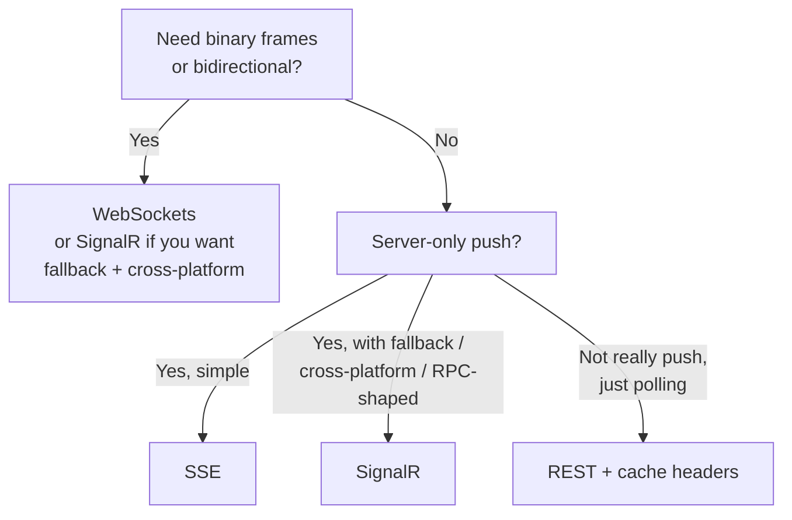
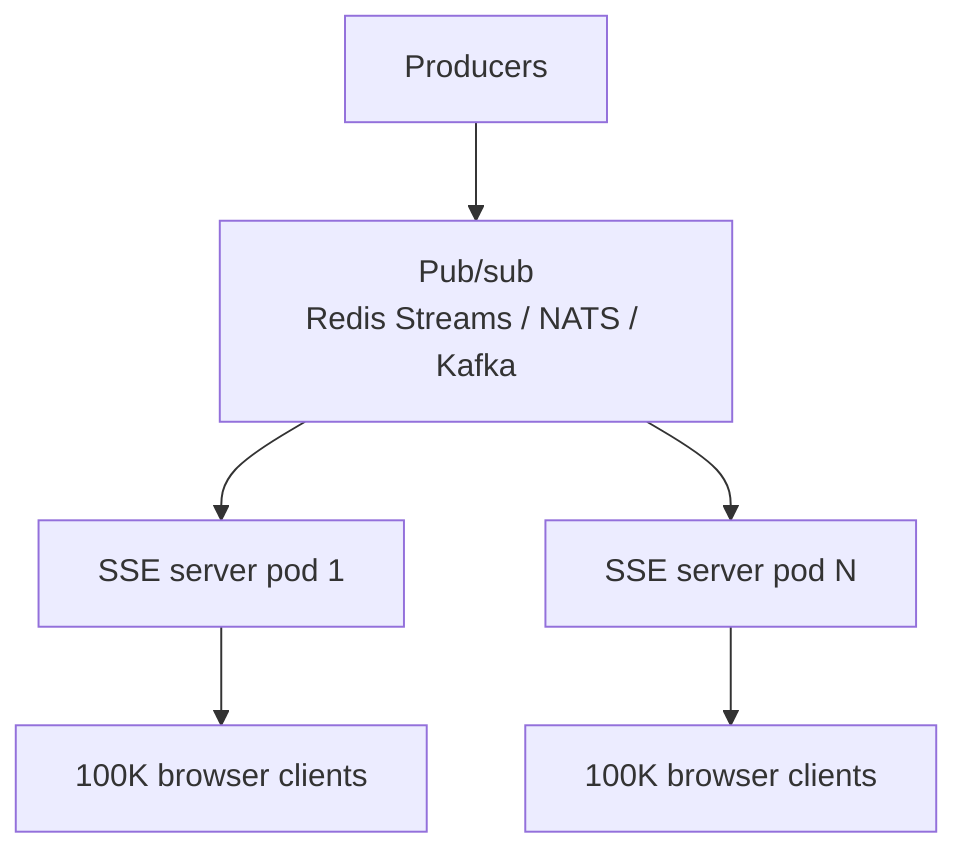
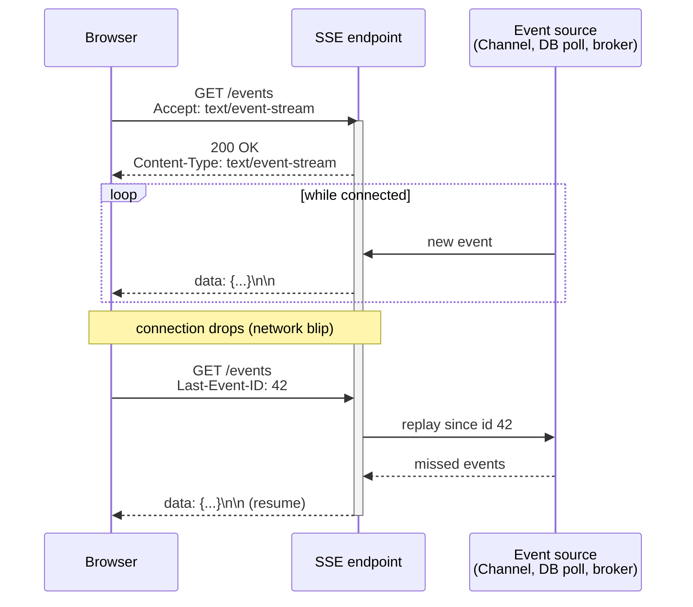

# Server-Sent Events (SSE)

> [Mastery Guide](../README.md) › [API Development](./README.md) › Server-Sent Events

| Status | Priority | Phase | Last reviewed |
|---|---|---|---|
| Not Started | Medium | Phase 8 — Microservices & Messaging | 2026-05-08 |

## Contents
- [Why it matters](#why-it-matters)
- [Core concepts](#core-concepts)
  - [The SSE protocol](#the-sse-protocol)
  - [SSE vs WebSockets vs long-polling vs SignalR](#sse-vs-websockets-vs-long-polling-vs-signalr)
  - [gRPC server streaming as a fourth option](#grpc-server-streaming-as-a-fourth-option)
  - [.NET 10 native SSE in Minimal APIs](#net-10-native-sse-in-minimal-apis)
  - [Shaping events with `SseItem<T>`](#shaping-events-with-sseitemt)
  - [Consuming SSE from .NET](#consuming-sse-from-net)
  - [Browser-side `EventSource`](#browser-side-eventsource)
  - [One connection per tab](#one-connection-per-tab)
  - [Reconnection with `Last-Event-ID`](#reconnection-with-last-event-id)
  - [Delivery semantics after a replay](#delivery-semantics-after-a-replay)
  - [Reconnect storms and the `retry` field](#reconnect-storms-and-the-retry-field)
  - [Reverse-proxy gotchas](#reverse-proxy-gotchas)
  - [Kestrel limits that actually bite](#kestrel-limits-that-actually-bite)
  - [Authentication on SSE endpoints](#authentication-on-sse-endpoints)
  - [Cross-origin cookies after third-party cookie restrictions](#cross-origin-cookies-after-third-party-cookie-restrictions)
  - [Coalescing events and batching tokens](#coalescing-events-and-batching-tokens)
  - [Scaling SSE](#scaling-sse)
  - [Graceful shutdown and rolling deploys](#graceful-shutdown-and-rolling-deploys)
  - [Observing long-lived connections](#observing-long-lived-connections)
  - [Testing an SSE endpoint](#testing-an-sse-endpoint)
- [Code & diagrams](#code--diagrams)
- [Common pitfalls](#common-pitfalls)
- [Interview-ready summary](#interview-ready-summary)
- [Interview Cross-Questioning Drill](#interview-cross-questioning-drill)
- [Cheat Sheet](#cheat-sheet)
- [Walkthrough](#walkthrough--llm-token-stream-arrives-in-30-second-batches)
- [Self-test](#self-test)
- [Cross-references](#cross-references)
- [Sources](#sources)

---

## Why it matters

Server-Sent Events is the simplest way to push from server to client over plain HTTP — long-lived connection, server streams `data:` frames, browser auto-reconnects on disconnect. No WebSocket handshake, no protocol upgrade, no fall-back maze. For server→client one-way push (chat token streaming, notification feeds, live dashboards, build progress), SSE is the right answer roughly 80% of the time.

In .NET 10, ASP.NET Core ships **first-class SSE helpers** for Minimal APIs — `IAsyncEnumerable<T>` streaming, automatic content-type, integrated cancellation. The protocol's been around since 2011; the .NET ergonomics finally caught up.

For senior interviews in 2026, "how would you stream LLM tokens from your back-end to the user's browser?" is increasingly common. The right answer is SSE (with the protocol details), not "we'd use WebSockets." For production, SSE is the everyday workhorse for real-time push.

When NOT to use SSE: bidirectional needs (use WebSockets / SignalR), binary frames (SSE is text-only), tight latency budgets where every ms matters (WebSockets has slightly less framing overhead).

## Core concepts

### The SSE protocol

Defined by the HTML5 spec (now WHATWG). It's astonishingly simple:

```
GET /events HTTP/1.1
Accept: text/event-stream
```

Server holds the connection open and sends:

```
HTTP/1.1 200 OK
Content-Type: text/event-stream
Cache-Control: no-store

data: {"message": "hello"}

data: {"message": "world"}

event: tokenUpdate
data: {"token": "Hi"}
id: 42

retry: 5000

```

Each event is **terminated by a blank line** (`\n\n`). Field syntax:

| Field | Purpose |
|---|---|
| `data:` | The payload (most common). Multiple `data:` lines are joined with `\n`. |
| `event:` | Optional event name; client uses `addEventListener(name, ...)` to filter. |
| `id:` | Optional event ID for resume after reconnect (`Last-Event-ID`). |
| `retry:` | Optional reconnect delay (ms). Default ~3000ms in browsers. |
| `:` (anything starting with `:`) | Comment line; clients ignore. Use as keep-alives. |

That's the entire protocol. No framing overhead beyond text lines.

### SSE vs WebSockets vs long-polling vs SignalR

| | SSE | WebSockets | Long-polling | SignalR |
|---|---|---|---|---|
| **Direction** | Server → client | Bidirectional | Server → client (per request) | Bidirectional |
| **Protocol** | HTTP/1.1 (or HTTP/2) | HTTP upgrade to WS | HTTP/1.1 | Multiple transports (WS, SSE, long-polling) |
| **Binary** | No (text only) | Yes | No | Yes via WebSocket transport |
| **Auto-reconnect** | Yes (built into `EventSource`) | No (you implement) | N/A (per request) | Yes |
| **Server discovery** | Easy through proxies | Sometimes blocked by older proxies | Universal | Falls back to long-polling |
| **Client API** | `EventSource` (native) | `WebSocket` (native) | `fetch` loop | SignalR client lib |
| **Cross-origin** | CORS-friendly | CORS via Origin check | CORS-friendly | Configurable |
| **HTTP/2 multiplexing** | Yes — many SSE streams over one connection | Per-spec, no (each WS its own connection) | Yes | Depends on transport |

**Decision matrix**:



For .NET teams: SignalR is more flexible (fallback transports, hub pattern, group broadcast, cross-language clients); SSE is simpler when one-way is enough and your clients are browsers. Both have their place.

### gRPC server streaming as a fourth option

The three-way comparison is the one everybody rehearses, and it leaves out the option that most directly competes with SSE on shape. A gRPC method declared with a streaming response — one request in, many messages out — is exactly the SSE interaction, expressed as a typed contract instead of a text protocol. On the wire it is length-prefixed Protobuf over HTTP/2 rather than `data:` lines, and you get deadlines, cancellation and generated clients as part of the framework rather than as things you remember to add.

The reason it is not the default answer for browser-facing push is that browsers cannot call it. Microsoft's own guidance states plainly that it is not possible to directly call a gRPC service from a browser, because gRPC relies on HTTP/2 features that no browser exposes the level of control needed to use. What a browser can call is gRPC-Web, a different wire protocol with a translation layer either in ASP.NET Core via the `Grpc.AspNetCore.Web` package or in a proxy such as Envoy.

gRPC-Web supports some of gRPC's streaming and not the rest, and the split is worth knowing precisely. The documentation says client streaming and bidirectional streaming calls are not supported from the browser, and that server streaming is supported — followed by the recommendation that when using gRPC-Web you only use unary methods and server streaming methods. So the SSE-shaped case is the one that survives translation. There is a cost even there: when the .NET gRPC client runs inside a browser, as in Blazor WebAssembly, the documentation says the base64-encoded `GrpcWebText` mode is required for server-streaming calls, so you pay a base64 expansion on a binary protocol you chose partly for compactness. The docs also note that ASP.NET Core gRPC services hosted on Azure App Service and IIS do not support bidirectional streaming at all.

The honest rule: gRPC server streaming earns its place when both ends are services you own and a schema-first contract is worth more than a curl-able endpoint. For a browser, it costs a build-time code generation step and a protocol translation hop to do what `EventSource` does in one line. It also has no protocol-level resume cursor — nothing equivalent to `Last-Event-ID`. When a server stream breaks, the call fails and reconnection-with-replay is something you design into your own contract.

> 🌍 **In the real world**: a pricing service streams quote updates to an internal desktop trading client. Both are .NET, both are yours, and the `.proto` file is checked into a shared repository that both sides compile against, so a field rename breaks the build rather than a customer's screen. When the same feed had to reach the customer-facing web app, the team did not extend gRPC-Web to it — they added a second endpoint that read the same source and emitted SSE, because the browser side of gRPC-Web was more machinery than the feature justified.

### .NET 10 native SSE in Minimal APIs

ASP.NET Core 10 added a first-class `Results.ServerSentEvents(...)` helper that takes an `IAsyncEnumerable<T>` and produces a properly-formatted SSE stream:

```csharp
app.MapGet("/notifications", (
    [FromQuery] string userId,
    INotificationService notifications,
    CancellationToken ct) =>
{
    return Results.ServerSentEvents(notifications.SubscribeAsync(userId, ct), eventType: "notification");
});

// Where notifications.SubscribeAsync returns IAsyncEnumerable<NotificationDto>
public class NotificationService : INotificationService
{
    public async IAsyncEnumerable<NotificationDto> SubscribeAsync(
        string userId,
        [EnumeratorCancellation] CancellationToken ct)
    {
        await foreach (var msg in _channel.Reader.ReadAllAsync(ct))
        {
            if (msg.UserId == userId)
                yield return msg;
        }
    }
}
```

Every yielded `NotificationDto` becomes one SSE event:

```
event: notification
data: {"id":"n-1","title":"New order","time":"2026-05-08T12:00Z"}

event: notification
data: {"id":"n-2","title":"Payment received","time":"2026-05-08T12:05Z"}
```

The helper:
- Sets `Content-Type: text/event-stream` automatically.
- Sets `Cache-Control: no-cache,no-store` and `Pragma: no-cache`.
- Sets `Content-Encoding: identity` — declares the body uncompressed, which matters when a proxy in the path would otherwise compress and buffer it.
- Disables response buffering (so events flush immediately).
- Serializes each item to JSON (`System.Text.Json`).
- Writes `event:` + `data:` lines + `\n\n` separator, prefixing every line of a multi-line payload with `data:`.
- Honors `CancellationToken` — closes the stream when the client disconnects.

For pre-.NET 10 (or when you want manual control):

```csharp
app.MapGet("/events", async (HttpResponse response, CancellationToken ct) =>
{
    response.Headers.ContentType = "text/event-stream";
    response.Headers.CacheControl = "no-store";
    response.Headers["X-Accel-Buffering"] = "no";   // disable nginx buffering

    int id = 0;
    while (!ct.IsCancellationRequested)
    {
        var data = await GetNextEvent(ct);
        await response.WriteAsync($"id: {++id}\n", ct);
        await response.WriteAsync($"data: {JsonSerializer.Serialize(data)}\n\n", ct);
        await response.Body.FlushAsync(ct);
    }
});
```

For LLM token streaming (the most-asked SSE use case in 2026):

```csharp
app.MapPost("/chat/stream", async (
    [FromBody] ChatRequest req,
    IChatClient chat,
    HttpResponse response,
    CancellationToken ct) =>
{
    response.Headers.ContentType = "text/event-stream";

    await foreach (var update in chat.GetStreamingResponseAsync(
        [new ChatMessage(ChatRole.User, req.Prompt)],
        cancellationToken: ct))
    {
        if (update.Text is { Length: > 0 } text)
        {
            await response.WriteAsync($"data: {JsonSerializer.Serialize(new { text })}\n\n", ct);
            await response.Body.FlushAsync(ct);
        }
    }

    await response.WriteAsync("event: done\ndata: {}\n\n", ct);
});
```

(See [LLM Integration Patterns › Streaming](../11-ai-integration/03-llm-integration-patterns.md#streaming--server-sent-events) for the full chat-streaming endpoint.)

### Shaping events with `SseItem<T>`

`Results.ServerSentEvents` has three overloads, and the difference between them is how much of the protocol you get to control.

The first takes an `IAsyncEnumerable<T>` and an optional event type string. Every event on that stream gets the same name, and nothing carries an id or a retry hint. That is fine for a single-purpose feed and it is what most examples show.

The second takes an `IAsyncEnumerable<SseItem<T>>` and — this is the tell — has no event type parameter at all, because each item now carries its own. `SseItem<T>` is a readonly struct in the `System.Net.ServerSentEvents` namespace, shipped in its own assembly of the same name. You construct it with the payload and an optional event type, and it exposes four properties: `Data`, `EventType`, `EventId` and `ReconnectionInterval`. The last two are init-only, so you set them in an object initialiser rather than assigning after the fact. `EventType` falls back to the constant `SseParser.EventTypeDefault`, which is the string `"message"`, when you do not name one — the same default the browser applies.

`EventId` is what the browser will hand back as `Last-Event-ID` on reconnect. Without it there is no resume, so the choice of overload and the choice of whether replay is possible are the same decision. `ReconnectionInterval` is a nullable `TimeSpan` and it becomes the `retry` field, which means the reconnect delay is a per-event value rather than one number baked into the endpoint.

```csharp
async IAsyncEnumerable<SseItem<OrderUpdate>> StreamAsync(
    long from, [EnumeratorCancellation] CancellationToken ct)
{
    await foreach (var u in _log.ReadFromAsync(from, ct))
    {
        yield return new SseItem<OrderUpdate>(u, eventType: u.Kind)
        {
            EventId = u.Sequence.ToString(),
            ReconnectionInterval = TimeSpan.FromSeconds(5)
        };
    }
}
```

Read that in words: each item names its own event type from a field on the domain object, carries the store's sequence number as the id so a reconnect resumes exactly where it stopped, and tells the browser how long to wait before coming back.

The third overload is a special case with a trap in it. `IAsyncEnumerable<string>` has its own non-generic overload, and its documented behaviour is that strings are serialised as raw strings without any additional formatting. Yield the string `hello` and the wire carries `data: hello` — not `data: "hello"`. That is the right behaviour for plain text and the wrong behaviour if your client calls `JSON.parse` on every payload, because a bare word is not valid JSON. The failure is easy to miss in development, where the first thing you stream is usually a hard-coded greeting that happens to render fine.

> 🌍 **In the real world**: an order-tracking feed carries three event types on one connection — order placed, payment taken, shipped. Because each `SseItem` names its own type, the front end registers three `addEventListener` handlers instead of switching on a discriminator field inside a single payload shape, and adding a fourth event type is a server-side change that older clients simply ignore. The id on each item is the identity column from the events table, so the replay query on reconnect is a single indexed range scan rather than a timestamp comparison that has to worry about clock skew.

### Consuming SSE from .NET

Not every SSE client is a browser. Integration tests read these streams, a worker relays a partner's feed into your own queue, one service consumes another's, and a desktop client subscribes directly. .NET 9 added `System.Net.ServerSentEvents` for exactly this, and it is a parser rather than a client — the distinction matters more than it sounds.

`SseParser.Create(Stream)` returns an `SseParser<string>` that decodes each event's payload bytes as UTF-8. `SseParser.Create<T>(Stream, SseItemParser<T>)` takes a delegate whose signature gives you the event type as a string and the payload as a `ReadOnlySpan<byte>`, so you can deserialise straight from the span without materialising an intermediate string. Either way you get an object exposing `Enumerate()` for a synchronous sequence of `SseItem<T>` and `EnumerateAsync(CancellationToken)` for the asynchronous one, plus two live properties: `LastEventId`, a string initialised to the empty string as the spec requires, and `ReconnectionInterval`, a `TimeSpan` initialised to `Timeout.InfiniteTimeSpan`. Both update as events go past.

Those two properties are the whole point of calling it a parser. It does not reconnect. It is not an `EventSource` equivalent, and if you hand it a stream that ends, the enumeration simply ends. What it gives you is the two pieces of state the reconnect loop needs — the cursor to resend and the delay the server asked for — so that the loop you write is a few lines rather than a re-implementation of the protocol.

Getting the stream in the first place is where the .NET-specific trap lives, and it is a trap in both directions. `HttpClient` defaults to `HttpCompletionOption.ResponseContentRead`, documented as completing after reading the entire response including the content — which, for a response that never ends, means the await does not return while the stream is open. You want `ResponseHeadersRead`, documented as completing as soon as a response is available and the headers are read, with the content not read yet. Then the second half: the same documentation warns that with `ResponseHeadersRead` the `HttpClient.Timeout` applies only up to where the headers end and the content starts, and that the content read has to be timed out separately. The default `HttpClient.Timeout` is 100 seconds. So on the default completion option a long-lived stream dies at the 100-second mark for no visible reason, and on `ResponseHeadersRead` the timeout stops applying entirely and a hung read waits forever unless you supply your own token. One property, two opposite failure modes, decided by the completion option.

```csharp
using var res = await http.GetAsync(
    "/events", HttpCompletionOption.ResponseHeadersRead, ct);
res.EnsureSuccessStatusCode();

await using var stream = await res.Content.ReadAsStreamAsync(ct);
var parser = SseParser.Create(stream);
await foreach (var item in parser.EnumerateAsync(ct))
{
    Handle(item.EventType, item.Data);
}
// On exit: parser.LastEventId is the cursor to resend.
```

> 🌍 **In the real world**: a relay service subscribes to a payment provider's SSE feed and republishes each event onto an internal topic. On the first deploy it died and restarted every hundred seconds; nothing logged an error worth reading, because from the client's point of view the response had simply completed. Switching to `ResponseHeadersRead` fixed the restarts and introduced the opposite bug — the read loop no longer had any timeout at all, so when the provider's edge stopped sending without closing the socket, the relay sat happily consuming nothing until someone noticed the topic had gone quiet.

### Browser-side `EventSource`

The browser API. Native, no library required:

```typescript
const evt = new EventSource('/notifications?userId=u-42');

evt.onmessage = (e) => {
  // Default 'message' events (no event: line)
  console.log('default event:', e.data);
};

evt.addEventListener('notification', (e) => {
  // Named events (event: notification)
  const dto = JSON.parse((e as MessageEvent).data);
  showToast(dto.title);
});

evt.onerror = (err) => {
  console.error('SSE error', err);
  // EventSource auto-reconnects unless we close it manually
};

// Cleanup
evt.close();
```

**Browser features for free**:
- Automatic reconnect on connection drop (default ~3 seconds, configurable via `retry:` field).
- Resume from last event with `Last-Event-ID` header (if server sends `id:` lines).
- One connection per origin/URL (browsers limit ~6 SSE per origin; HTTP/2 multiplexing relaxes this).

**Limitations of `EventSource`**:
- **No custom headers** (no `Authorization: Bearer ...`). Auth via cookies or query string.
- **GET only**. No POST request body. Workaround: `POST` to a "create subscription" endpoint that returns a subscription ID, then `GET /events/{subscriptionId}` for the stream.
- **No binary**. Text only.

For more control: use `fetch` with `ReadableStream` and parse SSE manually. Required if you need POST + streaming response.

### One connection per tab

Capacity planning for SSE usually starts from a user count, and the thing you are actually provisioning is a tab count. A person with the dashboard open in four tabs is four connections, four authenticated sessions, four replays whenever the network blips, and four times the fan-out work inside your process. Nothing about `EventSource` deduplicates across tabs — each document constructs its own.

The browser's per-origin connection budget makes this worse rather than better, because it is shared across those tabs rather than granted to each one. Once the streams already open have used up the budget, the next tab is the one that silently never connects while the earlier ones look perfectly healthy, and the symptom presents as "it works on my machine, in a fresh window".

The fix is to elect one connection per browser profile and fan out inside the browser. Two APIs support this.

`BroadcastChannel` is the simpler and the more available of the two — MDN records it as widely available, working across browsers since March 2022. It is a named channel that any browsing context of the same origin can join: windows, tabs, frames, iframes and web workers. A message posted to the channel fires at every listener on it except the sender, and it does not cross origins. The pattern is: tabs coordinate over the channel to pick a leader; the leader holds the single `EventSource` and rebroadcasts each event it receives; the other tabs render from the channel and never open a connection of their own.

`SharedWorker` gives you a cleaner version of the same idea — one worker instance shared by every same-origin context, holding the connection, with no leader election to write — but MDN marks it as newly available in Baseline as of May 2026, so it is the newer of the two options and worth checking against the browsers you actually support.

Either way, note the consequence for reconnect: when the leader tab closes, the surviving tabs elect a new leader and the new leader opens a stream. That is a reconnect, so all the `Last-Event-ID` handling has to be right, and the new leader has to inherit the cursor from the channel rather than starting from zero. Server-side, the safe assumption is that tabs multiply regardless: rate-limit per user rather than per connection, and keep replay cheap enough that four simultaneous ones are uninteresting.

> 🌍 **In the real world**: an operations console that support staff keep open all day. Nobody has one tab — one for the queue, one for the ticket they are working, one for the shift dashboard. Two hundred staff, six hundred connections, and the alert that finally fired was "active connections are triple the headcount". The fix was leader election in the front end, not more pods.

### Reconnection with `Last-Event-ID`

When the connection drops and reconnects, the browser sends the last received `id:` value as a `Last-Event-ID` header. The server uses it to replay missed events.

```csharp
app.MapGet("/events", (HttpRequest request, IEventLog log, CancellationToken ct) =>
{
    // Take one value: StringValues.ToString() comma-joins duplicate headers,
    // and the unparseable result would silently replay the log from the start.
    var lastEventId = request.Headers["Last-Event-ID"].FirstOrDefault();
    long startFrom = long.TryParse(lastEventId, out var n) ? n + 1 : 0;

    return Results.ServerSentEvents(log.StreamSinceAsync(startFrom, ct));
});
```

For this to work: events need to be **persisted somewhere** (event log, message queue with cursor, append-only DB table) — otherwise you can't replay. If your events are ephemeral (real-time only), set `retry:` low and accept some loss on reconnect.

### Delivery semantics after a replay

Adding replay does not make delivery reliable. It changes which way it is unreliable, and that is the answer a cross-examiner is looking for.

Plain SSE with no ids is at-most-once. Whatever was in flight when the socket died is gone, the client never learns it existed, and no mechanism in the protocol will tell you which events those were.

Turn on ids and replay and you have flipped to at-least-once. The WHATWG spec's dispatch algorithm sets the last event ID string of the event source from the last event ID buffer when it dispatches an event, so the value the browser sends back is the id of the last event it dispatched — not the last one it processed successfully, because the protocol has no concept of your application finishing its work. An event the browser received and handed to your code before the page crashed comes back on reconnect. Duplicates are now the ordinary case rather than an anomaly.

There is a second, sharper consequence buried in the same algorithm. On dispatch, the spec resets the data buffer and the event type buffer to the empty string — but not the last event ID buffer. The id persists until a later `id` field overwrites it. So if you emit ids on only some events, a reconnect resumes from the last event that carried one, and everything after it is replayed regardless of whether the client already saw it. Partial id coverage is worse than none, because it looks like resume and behaves like a partial re-run.

Exactly-once is not achievable here and no amount of server work gets you there. The server knows it wrote bytes into a socket; it never learns whether the client acted on them. That leaves the client responsible for deduplication, and the cheapest correct form is idempotent handling keyed on the event id — a bounded set of recently seen ids, or, where the ids are strictly ordered, a high-water mark that discards anything at or below the last applied value. Payload design does most of the work: an event that states the current state of a thing is naturally idempotent, and an event that states a delta is not. "The order is now dispatched" survives being applied twice. "Increment the unread count" does not.

Server-side, the id must be stable and monotonic in whatever store you replay from, which rules out a per-process counter. Two pods each handing out their own autoincrement produce colliding ids, and a reconnect that lands on the other pod replays the wrong slice of history with complete confidence.

> 🌍 **In the real world**: a build-progress feed whose payload was "append this line to the log". A wi-fi blip, a reconnect, a replay of the last forty lines — and the engineer watching the build sees the last forty lines twice, concludes the build is looping, and cancels it. Changing the payload from "append this line" to "the log is now N lines long, here it is from line X" made the identical replay a no-op, with no client-side dedup code at all.

### Reconnect storms and the `retry` field

The protocol table lists `retry` as an optional reconnect delay and moves on. Across a fleet it is not a convenience field, it is a scheduling decision, and the two things worth knowing about it are both in the spec.

First, the default is not what people quote. The spec says the reconnection time must initially be an implementation-defined value, probably in the region of a few seconds. There is no specified default, so "three seconds" is a description of common browser behaviour, not a guarantee you can build on. Second, the parsing rule is unforgiving: if the field value consists only of ASCII digits, it is interpreted as a base-ten integer and becomes the reconnection time; otherwise the field is ignored. A value with a decimal point or a unit suffix is silently discarded and you keep the browser's default while believing you set your own.

Now the part that produces incidents. The reconnect algorithm says to wait a delay equal to the reconnection time, and then — quoting — optionally wait some more, noting that if the previous attempt failed the user agent might introduce an exponential backoff delay. Optionally, and might. Backoff and jitter are permitted, not required, and you cannot design on the assumption that the browser will spread the load for you. Everything you disconnect at once comes back at approximately once.

The expensive half of the storm is not the sockets. Each reconnecting client presents a `Last-Event-ID` and asks for everything since, which is a query against your event store. So a pod restart converts into a burst of authentications, TLS handshakes on any connection that was not reused, and a synchronised wave of range scans. The database is what falls over, not the web tier, which is why the graph people stare at during the incident is the wrong one.

Three mitigations, roughly in order of how much they help. Give each connection its own `retry` value rather than one constant — because `SseItem<T>.ReconnectionInterval` is set per event, you can jitter it per connection and spread reconnects across a window instead of stacking them on one instant. Drain rather than drop, so that connections end on a schedule you control. And cap the replay work a single reconnect can trigger, so that even a synchronised wave has a bounded worst case.

One failure mode is not a storm at all but a silence, and it is the more damaging of the two. The spec says that if the response status is not 200, or the `Content-Type` is not `text/event-stream`, the user agent fails the connection — and once it has failed the connection, it does not attempt to reconnect. A gateway answering 503 while pods roll therefore does not produce retries. It produces clients that move to `CLOSED` and stay there until the user reloads the page. A brief 502 from the edge is strictly worse for SSE than a cleanly dropped socket. The same rule read the other way is the clean shutdown signal: the spec notes a client can be told to stop reconnecting with an HTTP 204 No Content response.

> 🌍 **In the real world**: a rollout replaced six pods in sequence. Each pod's connections reconnected within about a second onto the next pod in line, which was itself replaced moments later, so the entire connection base migrated from pod to pod just ahead of the rollout — and every hop was a full replay query for every client. The web tier looked fine throughout. The database connection pool was what paged.

### Reverse-proxy gotchas

Most production SSE failures trace to proxy buffering. Symptoms: events arrive in batches every N seconds instead of immediately.

**nginx** — disable buffering for SSE locations:

```nginx
location /events {
    proxy_pass http://backend;
    proxy_http_version 1.1;
    proxy_set_header Connection "";
    proxy_buffering off;                # ← critical
    proxy_cache off;
    proxy_read_timeout 1d;              # long-lived connections
}
```

**ASP.NET Core (Kestrel) hint to upstream**: set `X-Accel-Buffering: no` header. Most proxies honor it.

**Azure Front Door / Cloudflare**:
- Confirm "streaming" or "compression off" mode for the route.
- Some CDN paths buffer until response is complete — fatal for SSE.
- Test in production-shaped traffic.

**IIS** — ensure `httpProtocol` allows long-lived connections; default timeouts may close idle streams.

**HTTP/2** — multiplexing helps SSE: many concurrent SSE streams over one TCP connection (browsers' 6-per-origin limit relaxes). HTTP/2 termination at the load balancer is fine; SSE works fine over HTTP/1.1 to back-end.

### Kestrel limits that actually bite

Three Kestrel settings come up whenever an SSE stream dies without an obvious cause. Only two of them can be the culprit, and being able to say which is which — and why — is the discriminating answer.

`Limits.KeepAliveTimeout`, whose documented default is 130 seconds, is the one people reach for first and it is the wrong lever. It is the HTTP keep-alive timeout: the time a persistent connection may sit idle *between* requests. In Kestrel's HTTP/1.1 implementation the timer is armed when the connection begins waiting for a request and cancelled the moment the request headers finish parsing — so it covers the gap before a request, not the response that follows. An SSE response is an in-flight request, not an idle connection, and raising this number does nothing for it. If a candidate names this as the fix, that is the tell.

`Limits.MinResponseDataRate` is the one that does apply during a response, and its default is 240 bytes per second with a five-second grace period. The nuance that decides whether you understand it: this is not a requirement that your stream produce 240 bytes a second. Kestrel accumulates a write deadline from the bytes handed to it and only checks that deadline while writes are outstanding. A stream that sits silent for a minute has nothing outstanding and is not penalised. A client that has stopped draining the socket while your bytes sit queued for it is exactly what the limit exists to detect. That makes it the built-in defence against the abandoned slow client from the backpressure drill, which is a reason to think before disabling it. If you must relax it per endpoint, `IHttpMinResponseDataRateFeature` is the per-request hook — but the documentation notes that feature is not present in `HttpContext.Features` for HTTP/2 requests, because per-request rate limits do not generalise to a multiplexed connection, while server-wide limits still apply to both HTTP/1.x and HTTP/2.

`Limits.Http2.MaxStreamsPerConnection`, default 100, is the one nobody considers until HTTP/2 has already been adopted as the fix for something else. Each SSE stream over HTTP/2 is one request stream, and the docs say excess streams are refused. The moment the team hears "HTTP/2 removes the six-connection limit" they consolidate many feeds onto one connection across many tabs, and the new ceiling is a hundred concurrent streams on that connection — shared with every ordinary request the page makes.

One more, to head off a wrong answer: `MaxConcurrentUpgradedConnections` is not SSE's limit. It governs connections upgraded off HTTP to another protocol, such as WebSockets. SSE never upgrades; it stays an ordinary HTTP response and counts against `MaxConcurrentConnections`, which defaults to null, meaning unlimited.

> 🌍 **In the real world**: a team moved a dashboard to HTTP/2 to escape the per-origin connection cap and consolidated eight feeds behind it. QA then found that opening the app in a dozen tabs made the twelfth tab's images and fonts hang indefinitely while the feeds themselves worked. Nothing in the application logs mentioned streams, because the ceiling is a transport-layer concern — the number that showed it was `kestrel.queued_requests`, which counts requests on multiplexed connections waiting to start.

### Authentication on SSE endpoints

Three patterns (since `EventSource` can't send custom headers):

1. **Cookie-based** — most common. SPA already has a session cookie; SSE endpoint reads it.
   ```csharp
   app.MapGet("/events", [Authorize] (HttpContext ctx, ...) => { /* ... */ });
   ```
   Combined with [BFF cookie-on-server pattern](./14-bff-and-aggregation.md#cookie-on-server-auth-duendes-bff-security-pattern), this is the standard production setup.

2. **Token in query string** — `/events?access_token=eyJ...`. Works but tokens may end up in server logs / browser history. Acceptable for short-lived dev tokens; less ideal for prod.

3. **One-time signed URL** — main API issues a short-lived signed URL with claims; SSE endpoint validates the signature. Useful for fully token-based auth flows.

For most setups: cookie-based auth with the BFF pattern. Tokens never touch the browser; SSE endpoint reads the session.

### Cross-origin cookies after third-party cookie restrictions

Cookie auth is the right default for SSE, and part of why it is right is a constraint that only shows up when the stream lives on a different origin from the page.

If the app is served from one origin and the SSE endpoint from another, the cookie the endpoint needs is a third-party cookie as far as the browser is concerned. Three separate things must all be true before it is sent. The `EventSource` has to be constructed with `withCredentials: true`. The server's CORS policy has to call `AllowCredentials()` and name the origin explicitly with `WithOrigins(...)` — the CORS protocol forbids a wildcard origin together with credentials, and ASP.NET Core throws if you configure both. And the cookie itself has to carry `SameSite=None` together with `Secure`, which is what makes it eligible to travel cross-site at all.

Even with all three correct, a browser that blocks third-party cookies drops it. The standardised answer is CHIPS — Cookies Having Independent Partitioned State — set with the `Partitioned` attribute alongside `Secure` and `SameSite=None`. A partitioned cookie is double-keyed: by the origin that set it *and* by the origin of the top-level page. The same SSE endpoint embedded under two different top-level sites therefore sees two separate cookie jars, which is precisely the point, since that is what stops it functioning as a cross-site tracking vector. MDN records it as newly available in Baseline since December 2025, so it is recent enough that older browsers in your support matrix are worth checking.

ASP.NET Core has no dedicated property for it. `CookieOptions` exposes `Extensions`, described as a collection of additional values to append to the cookie, and `Partitioned` is added there — alongside setting `Secure` and `SameSite = SameSiteMode.None` normally.

The conclusion worth saying out loud is the architectural one: all of this evaporates if the SSE endpoint is same-origin. Serving the stream from the same origin as the app — a path on the same host, or routed through the BFF that is already sitting in front — turns a third-party cookie problem into a first-party cookie, and first-party cookies are not what browsers are restricting. Reverse-proxying `/events` through your own origin is usually cheaper than getting partitioned cookies right everywhere.

> 🌍 **In the real world**: an embeddable widget streams live availability into customers' own sites. It worked in the developers' browser and worked nowhere in Safari, and the ticket read "SSE broken in Safari". The stream was fine — the session cookie was simply never sent, so every connection was answered with a 401. Because a non-200 response makes `EventSource` fail rather than retry, it did not even present as a flapping connection. It presented as a widget that rendered its empty state and then did nothing at all, forever.

### Coalescing events and batching tokens

Two different problems get solved by the same move: not sending every event as its own frame.

The first is a fast-changing state that clients only need the latest of. When events are state-replacing and keyed — the price of a symbol, the status of an order, the position of a vehicle — a client that receives only the newest value per key has lost nothing. Buffer per key over a short window and emit the newest at the end of it. A client on a poor connection then gets fewer events rather than stale ones, which is a better failure mode than either dropping arbitrarily or falling behind. This is the same principle as the bounded channel with a drop-oldest policy from the backpressure drill, except the choice of what to discard is made by key rather than by age.

Coalescing is wrong whenever events are facts rather than states. "Payment received" does not supersede an earlier "payment received", and collapsing two of them loses money. The test is whether applying only the last event of a group leaves the client in the same place as applying all of them; if it does not, do not coalesce.

The second problem is LLM token streaming, where the source emits many very small updates. Written one event per token, each one costs a `data:` line, a blank line, a flush, and whatever per-write price every hop in the path charges — a TLS record, an HTTP/2 data frame, a proxy pass-through — and then an event dispatch and a render in the browser. Accumulating tokens and flushing on a short timer or a small character threshold sends identical text in far fewer frames.

The trade-off is one you can state precisely, which is what makes it a good interview answer: the batch interval is added to the perceived latency of the first token in each batch. Perceived streaming works because text appears steadily, not because each token appears the instant it is generated. So flush the very first token immediately and batch after that — time to first token is what a user reads as "is this thing working", and everything after it can arrive in groups without anyone noticing. Two details survive batching unchanged: the terminating event still needs its own flush, and the cancellation check still has to run between batches, because a buffer that swallows cancellation is how you carry on paying a provider for tokens nobody will ever read.

> 🌍 **In the real world**: a chat interface where every token was its own SSE event, and every event triggered a re-render of the whole message component. The server was comfortable; the browser was the bottleneck, visibly stuttering on long answers. Batching on a short timer server-side fixed a client-side rendering problem without a single change to the front end — and the team only found it because they profiled the tab rather than the pod.

### Scaling SSE

Each SSE connection holds a socket (file descriptor), a connection object, pooled buffers and TLS state. What it does not hold is a thread: a connection awaiting its next event occupies no thread at all, which is the only reason these numbers are plausible. For typical .NET 10 servers:

| Concurrent connections | Approach |
|---|---|
| Up to ~10K per instance | Plain `IAsyncEnumerable<T>` + Kestrel; standard hosting |
| 10K–100K | Multiple instances + load balancer with sticky sessions; consider HTTP/2 multiplexing |
| 100K+ | Pub/sub broker fan-out (Redis, NATS, Kafka); SSE servers as thin "subscribers" pushing to clients |

**Fan-out pattern at scale**:



Each SSE server subscribes to the broker and pushes to the connected clients in its instance. Adding capacity = adding pods.

For most .NET teams: stay simple. Below 10K concurrent connections, plain `IAsyncEnumerable` from `Channel<T>` covers it. The exotic fan-out only earns its complexity at chat-app or live-event scale.

### Graceful shutdown and rolling deploys

Ordinary deployments work because in-flight requests are short. The host stops accepting new connections, waits for what is running to finish, and exits. With SSE, what is running is every connection you hold, and none of them intends to finish. Draining is therefore not something that happens to you; it is something you have to write.

The signal is `IHostApplicationLifetime.ApplicationStopping`, which fires when shutdown begins. Register on it, and have each streaming endpoint stop yielding — ideally after writing a final event so the client can distinguish an intentional close from a network fault. The clock is `HostOptions.ShutdownTimeout`, documented as the default timeout for `IHost.StopAsync` and defaulting to 30 seconds. When it expires, whatever is still running is torn down anyway. So an endpoint that ignores `ApplicationStopping` does not get to keep its connections; it gets half a minute of doing nothing useful followed by an abrupt socket close, which is the worst of both outcomes.

What makes this genuinely different from draining ordinary traffic is that everything you close comes back. Every connection you end is a scheduled reconnect, and the reconnects land on the pods that are still up — which are themselves next in the rollout. If the rollout moves faster than the reconnect delay, the same population of connections migrates from pod to pod just ahead of you, paying for a replay at every hop.

Two things make it survivable. Stagger the closes: because you decide when each stream stops yielding after `ApplicationStopping`, you can end them across a window rather than all on the same tick, which spreads the reconnects that follow. And make sure the reconnect finds something healthy. This is where readiness probes and the load balancer's deregistration delay matter far more than they do for ordinary traffic, because of the rule from the reconnect section: a non-200 response makes `EventSource` fail the connection permanently rather than retry. Getting ordinary draining wrong costs you a retried request. Getting SSE draining wrong costs you a client that has given up and will not come back until the user reloads the page.

> 🌍 **In the real world**: a release closed every connection the instant `ApplicationStopping` fired, on a pod that was still in the load balancer's target group for a few seconds longer. A slice of the reconnects landed straight back on the draining pod, were refused, and those users' notification panels went permanently dark. Nobody reported it, because a notifications panel showing nothing looks exactly like a notifications panel with nothing to show.

### Observing long-lived connections

The default HTTP dashboards are built for request/response and they mislead on SSE in specific, checkable ways. Knowing which metric lies and why is a better answer than listing tools.

`http.server.request.duration` is a histogram measured at the hosting layer, and the documentation says the measurement ends when all response data has been sent. A connection held open for an hour therefore reports a one-hour request. Every SSE request lands in the top bucket — the documented OpenTelemetry defaults for this metric top out at 10 seconds — so the percentile for that route is not slow, it is meaningless, and if the route shares a dashboard with normal traffic it drags the aggregate with it. Split it out or exclude it.

`http.server.active_requests` is an up-down counter of the number of concurrent HTTP requests currently in flight, and it is the closest thing the hosting layer offers to a live connection count. Its documented attributes are the request method and the URL scheme; there is no route attribute, so you cannot slice it by endpoint. In a process serving both SSE and ordinary traffic, this number is the sum of both and cannot be separated from this metric alone. A counter of your own, incremented when a stream starts and decremented in a `finally`, is what gives you a per-feed figure.

Kestrel's meter carries the connection-level view. `kestrel.active_connections` is an up-down counter of connections currently active on the server. `kestrel.connection.duration` is a histogram in seconds, and the documentation explicitly suggests longer buckets for it than for request durations, offering an example whose upper bucket is five minutes — that histogram is what tells you how long connections actually survive in the wild, which is the evidence you want when arguing about whether a middlebox is cutting you off. `kestrel.rejected_connections` is a counter, and the docs say connections are rejected when the active count exceeds `MaxConcurrentConnections`, so it is the metric that proves that limit fired. `kestrel.queued_requests` counts requests on multiplexed HTTP/2 and HTTP/3 connections that are queued and waiting to start, which is where the streams-per-connection ceiling becomes visible.

One metric will actively mislead you. `kestrel.upgraded_connections` counts upgraded connections — WebSockets — and the docs note it only tracks HTTP/1.1. SSE never upgrades, so it never appears there. Anyone watching that counter as a proxy for real-time load will read zero forever.

For logs, the discipline is to pick the right unit. A log line per event is a log line per token. The unit worth recording is the connection: one line at open carrying the user, the `Last-Event-ID` presented, and the negotiated protocol version; one line at close carrying the reason and the number of events sent. That gives you a distribution of replay sizes and a breakdown of close reasons, which between them explain almost every SSE incident.

> 🌍 **In the real world**: an SSE route's latency alert had been firing continuously since the feature launched, on the entirely correct observation that its p99 exceeded every threshold. It was muted in week one. When the stream genuinely broke months later, the only alarm that would have caught it was already off.

### Testing an SSE endpoint

Three separate things are worth testing — the framing, the resume, and the timing — and they need different setups. Most suites test the first, assume the second, and cannot test the third at all.

Framing is the in-process test. `WebApplicationFactory` gives you an `HttpClient` over the test host, and two things must be right or the test hangs rather than fails. Use `HttpCompletionOption.ResponseHeadersRead`, because the default completes only after the entire response has been read and that never happens. And make sure the endpoint actually flushes something: the test host hands back the response message on the first flush of the response body, so an endpoint that never flushes leaves the test waiting on the send with no diagnostic worth reading.

Then read the body stream and feed it to `SseParser.Create(stream)` rather than asserting on raw text. Asserting on parsed items checks what a client will see; asserting on the string checks your own formatting, including whitespace nobody cares about. It also catches the failure class the string comparison cannot: framing. An endpoint that writes its own `data:` lines instead of using the built-in formatter can emit a payload containing a literal newline, and what the client then parses is not what the server thought it sent — a parser-based assertion sees the mangled event, while a text assertion sees exactly the characters it was told to look for.

Resume is a separate test and it is the one usually missing. Issue the request with a `Last-Event-ID` header set and assert that the first event received is the one after that cursor rather than the first in the log. Then issue it again with a value that cannot be parsed — an empty string, a word, a number with a decimal point — and assert you get a sensible starting point rather than a full replay from the beginning. That second case is what catches header-parsing bugs, and a full replay is a passing-looking result that would flood a real client.

Every streaming test needs a cancellation token with a deadline, and it needs a way to make the endpoint stop. A test that relies on the server ending the stream by itself will hang the whole suite the day the endpoint regresses. Pass a token, cancel it, and assert the enumeration ends.

What in-process tests cannot tell you is the thing that actually breaks in production. The failure in this chapter's walkthrough — events arriving in batches at the edge — has no in-process equivalent, because there is no edge in the test host. That one is verified against a deployed environment with a client that genuinely streams, and the assertion is on the time between events rather than on their content. Keep it as a smoke test against a real environment, and do not let anyone claim the integration suite covers it.

> 🌍 **In the real world**: a suite with complete coverage of an SSE endpoint went green through a change that switched the shared serialiser options to indented output. Every assertion deserialised the whole response body and checked the resulting objects; nothing asserted on event boundaries. The tests were measuring the payload, and the bug was in the framing.

## Code & diagrams

<details>
<summary>🧩 Click to expand — code samples and diagrams</summary>



**Comparison table — when to pick which**:

```
Use case                                          Best fit
─────────────────────────────────────────────────────────────────
LLM chat token streaming                          SSE (.NET 10 native)
Live notifications feed                           SSE
Real-time dashboard                                SSE
Build/deploy progress                              SSE
Stock ticker (read-only)                           SSE
Live sports score                                  SSE
Collaborative editing (Google Docs style)         WebSockets (bidirectional)
Multiplayer game state sync                        WebSockets (binary frames, low overhead)
Voice / video signaling                            WebRTC + WebSockets for signaling
Real-time chat (bidirectional)                     SignalR or WebSockets
Cross-language broadcast (web + mobile + IoT)     SignalR (multi-platform clients)
Old browser fallback needed                        SignalR (transparent fallback)
```

**Sample SSE response stream** (verbatim wire format):

```
HTTP/1.1 200 OK
Content-Type: text/event-stream
Cache-Control: no-store

retry: 3000

: keep-alive ping every 15s

event: token
id: 1
data: {"text":"Hello"}

event: token
id: 2
data: {"text":", "}

event: token
id: 3
data: {"text":"world"}

event: done
data: {"reason":"complete"}
```

The `: keep-alive` comment line keeps middleboxes from timing out the idle connection.

</details>

## Common pitfalls

1. **Reverse-proxy buffering breaks SSE.** Symptom: events arrive in 30-second batches. Fix: `proxy_buffering off;` (nginx), `X-Accel-Buffering: no` header, or test the CDN's streaming mode.
2. **Forgetting `\n\n` separator between events.** Without the blank line, browsers treat all received data as one ongoing event. Always end events with `\n\n`.
3. **No keep-alive ping.** Idle connections get cut by middleboxes after ~60s. Send a comment line (`: keep-alive\n\n`) every 15-30 seconds.
4. **Authentication via headers.** `EventSource` can't send custom headers. Use cookies (most common) or query-string tokens.
5. **Streaming binary data.** SSE is text-only. Base64-encode if you need binary; or switch to WebSockets.
6. **No cancellation propagation.** When the browser disconnects, your `IAsyncEnumerable<T>` keeps producing into the void if you don't honor `CancellationToken`. Always pass `[EnumeratorCancellation] CancellationToken ct` and check it.
7. **Browser 6-connection-per-origin limit hit.** Many SSE endpoints from the same origin → connections starve other requests. Mitigate via HTTP/2 (multiplexes streams), or consolidate multiple feeds into one endpoint with `event:` discrimination.
8. **No `Last-Event-ID` handling.** Reconnection drops events; users miss notifications. Either track event IDs server-side and replay, or accept some loss with `retry: 1000` aggressive reconnect.
9. **Long-running SSE inside ASP.NET request limits.** IIS and the hosting platform have their own request/idle timeouts. In-process, the mechanism is the request-timeouts middleware (`AddRequestTimeouts()` / `UseRequestTimeouts()`, ASP.NET Core 8+) — it imposes nothing unless you configure it, so if you apply a global policy, exempt SSE endpoints with `.DisableRequestTimeout()` or `[DisableRequestTimeout]`.
10. **CORS missing for cross-origin SSE.** Browser blocks. Add a policy with `.WithOrigins("https://app.example.com")`. Cookie auth additionally needs `withCredentials: true` on the `EventSource` and `.AllowCredentials()` on the server — which rules out `AllowAnyOrigin()`: the CORS spec forbids a wildcard origin together with credentials, and ASP.NET Core throws `InvalidOperationException` if you configure both.
11. **Compression middleware destroying streaming.** Some compression middlewares buffer until full response — kills SSE. Exclude SSE endpoints from response compression: `app.UseResponseCompression()` with predicate.
12. **Treating SSE as fire-and-forget reliable.** It's at-most-once delivery; expect drops on reconnect. Persist events server-side or design clients to tolerate gaps (and ideally backfill via REST on reconnect).

## Interview-ready summary

- **SSE = Server-Sent Events**: HTTP/1.1 long-lived connection, server pushes `data: ...\n\n` frames over `text/event-stream`. Defined by HTML5 / WHATWG.
- **Protocol fields**: `data:`, `event:`, `id:`, `retry:`, `:` (comments). Events terminated by blank line.
- **vs WebSockets**: server→client only, text only, simpler, falls through proxies, browser auto-reconnects. WebSockets when bidirectional or binary.
- **vs long-polling**: persistent connection vs per-request reconnect.
- **vs SignalR**: SignalR has fallback + bidirectional + cross-platform clients; SSE is simpler when one-way is enough.
- **.NET 10 ships `Results.ServerSentEvents(IAsyncEnumerable<T>)`** for Minimal APIs — auto headers, JSON serialization, cancellation propagation.
- **Browser uses `EventSource`** — native; no library; auto-reconnect; no custom headers (cookie or query-string auth).
- **`Last-Event-ID`** header on reconnect lets server replay missed events. Requires server-side event persistence.
- **Reverse proxies must allow streaming** — `proxy_buffering off` (nginx); `X-Accel-Buffering: no`; CDN streaming mode.
- **Auth via cookies** (with [BFF pattern](./14-bff-and-aggregation.md)) is the standard production setup.
- **Scaling**: ~10K conns per instance is plain Kestrel; for 100K+ use pub/sub broker fan-out.
- **Killer use case in 2026**: LLM chat token streaming. The default answer to "stream tokens to the browser."

## Interview Cross-Questioning Drill

<details>
<summary>📖 Click to expand — cross-question chains (~15-20 min, cover answers and write cold)</summary>

> ⚠️ **Honest caveat**: reading this once doesn't make you interview-ready. Cover the answers, write them cold, then check. Pair with a senior for live mock cross-questioning. The guide removes "I never thought about that" surprises; mock interviews convert knowledge into reflex. Both are needed.

Each drill is **Q → A → Cross-Q → A → Cross-Q² → A**.

### Drill 1 — SSE vs WebSocket

> **Q**: When would you pick SSE over WebSocket for a real-time feature?
>
> **A**: When traffic is one-way server→client, text-only, and you want to ride plain HTTP through proxies. SSE auto-reconnects, has `Last-Event-ID` resume, and works over HTTP/2 multiplexing. WebSocket is the answer when you need bidirectional, binary frames, or sub-frame latency.
>
> **Cross-Q**: "But WebSocket *can* do server-to-client one-way — why introduce a second protocol?"
>
> **A**: Because the cost is real: WebSocket has no built-in reconnect, no resume-from-id, no native browser auto-reconnect, and many corporate proxies still block `Upgrade: websocket` headers. SSE rides `Content-Type: text/event-stream` through every middlebox that accepts HTTP. For LLM token streaming, notifications, build progress — SSE is 50 lines of `IAsyncEnumerable`, WebSocket is a framework with state to manage.
>
> **Cross-Q²**: A teammate says "We use WebSocket everywhere so we have one protocol." Convince them otherwise.
>
> **A**: The "one protocol" argument is a false economy. SSE is a thin HTTP idiom — anyone who knows HTTP knows SSE in 10 minutes. WebSocket forces every endpoint into stateful long-lived connections with manual reconnect, manual heartbeat, manual binary/text framing decisions. For unidirectional push, you trade simplicity for the optics of uniformity. Better axis: pick protocol by direction (one-way → SSE, two-way → WS) and stop pretending the choice is style.

### Drill 2 — SSE vs long-polling

> **Q**: What does SSE buy you over long-polling?
>
> **A**: One open connection instead of N reconnects. No per-request TLS handshake, no per-request auth round-trip, no per-request HTTP headers tax. Server can flush immediately; client receives in real time instead of "wait until N seconds elapsed or event arrived." Also: built-in reconnect with `Last-Event-ID` for resume.
>
> **Cross-Q**: Long-polling is famously universal — works through every proxy that ever existed. Why give that up?
>
> **A**: You don't have to fully give it up — SignalR uses long-polling as the fallback transport. But for any modern environment (no legacy IE6, no exotic enterprise proxy from 2003), SSE works. The trade is: long-polling costs at minimum one TCP/TLS handshake + HTTP round-trip per event; SSE costs that *once* and amortizes over thousands of events. For high-throughput streams (LLM tokens at 30/sec), long-polling melts your server with handshake overhead.
>
> **Cross-Q²**: When would you *still* pick long-polling in 2026?
>
> **A**: When you genuinely can't trust the network path — e.g., you're behind a corporate proxy that buffers/strips streaming responses regardless of `X-Accel-Buffering`, or you must traverse infrastructure you don't control (third-party data center, regulated industrial network). Also when the event rate is very low (one event per few minutes) — the handshake cost is amortized fine and you avoid the keep-alive complexity. Outside those edges, SSE wins.

### Drill 3 — .NET 10 native SSE support

> **Q**: How does `.NET 10`'s `Results.ServerSentEvents(IAsyncEnumerable<T>)` change SSE in ASP.NET Core?
>
> **A**: It removes the boilerplate. The helper sets `Content-Type: text/event-stream`, `Cache-Control: no-cache,no-store`, `Content-Encoding: identity`, disables response buffering, serializes each yielded item to JSON, writes the `event:`/`data:`/`\n\n` framing, and honors the `CancellationToken` for client-disconnect detection. You write the source `IAsyncEnumerable`, the framework writes the SSE wire format.
>
> **Cross-Q**: What was the pre-.NET 10 manual equivalent, and what's easy to get wrong?
>
> **A**: Manual: set headers yourself, then loop writing `data: <json>\n\n` and call `FlushAsync` after each. Easy to miss: (1) forgetting `FlushAsync` so Kestrel buffers; (2) forgetting the blank line between events so the browser concatenates; (3) forgetting to honor `CancellationToken` so your producer keeps emitting into a closed socket; (4) forgetting `X-Accel-Buffering: no` so nginx batches in 30-second chunks.
>
> **Cross-Q²**: You need POST with a request body *and* SSE streaming response. Can you use `Results.ServerSentEvents` for that?
>
> **A**: Yes — the helper doesn't care about the request method. Map a `POST` route, bind your body via `[FromBody]`, return `Results.ServerSentEvents(myEnumerable)`. The catch is browser-side: `EventSource` is GET-only, so for POST+SSE you must use `fetch` with `ReadableStream` and parse the SSE frames yourself. That's the standard pattern for LLM chat — POST the prompt, stream tokens back. You lose `EventSource`'s auto-reconnect; you handle it manually.

### Drill 4 — Last-Event-ID and reconnection

> **Q**: A client reconnects mid-stream and the browser sends `Last-Event-ID: 42`. What's the server's responsibility?
>
> **A**: Look at that header on the incoming request, parse it as the cursor, and replay every event with `id > 42` before resuming the live stream. This requires server-side event *persistence* — a queryable log of events keyed by ID.
>
> **Cross-Q**: What if your events are ephemeral — generated live, never stored (e.g., live CPU metrics from a sensor)?
>
> **A**: Then you can't replay. Set `retry: 1000` (aggressive reconnect) and accept gap loss. Document it: "live-only stream, no replay guarantee on disconnect." For metrics dashboards this is fine — the next sample arrives in 5 seconds anyway. For ordered domain events (orders placed, payments received), you need persistence: append to a table with auto-increment id, use Redis Streams (`XADD` + `XREAD` from cursor), or use Kafka with consumer-group offsets.
>
> **Cross-Q²**: A user kept their laptop closed for 4 hours, then reopens. The browser reconnects with `Last-Event-ID: 42`. Your replay buffer holds 10,000 events since then. Replaying all of them at full speed crushes the client. What do you do?
>
> **A**: Cap replay. Either (1) define a max replay window — "events older than N minutes are not replayed; client gets a `: replay-truncated` comment and a marker" so the client knows to refetch state via REST; or (2) compact — replay only the latest event per logical key (collapse 50 status updates for order-42 to the most recent one). For user-facing notifications you usually want option 1 + a UI badge "X notifications while away — view all." Don't blindly fire-hose 4-hour-old data at a freshly-woken client.

### Drill 5 — Reverse-proxy buffering

> **Q**: SSE works in dev, arrives in 30-second batches in production behind nginx. What's the fix?
>
> **A**: nginx is buffering. Set `proxy_buffering off;` on the location, plus `proxy_cache off;` and a long `proxy_read_timeout` like `1d`. Pair with `X-Accel-Buffering: no` from the app side so the hint travels with the response.
>
> **Cross-Q**: Why does nginx buffer SSE by default — isn't that obviously wrong?
>
> **A**: Buffering exists for legitimate reasons: smoothing variable backend speed before delivery, reducing socket writes per response, computing `Content-Length`. For a typical request/response, buffering is correct. nginx can't tell SSE apart from a slow REST response just by the request — the cue is `Content-Type: text/event-stream` plus the streaming nature, which nginx doesn't introspect by default. The `X-Accel-Buffering: no` header is the explicit opt-out, and `proxy_buffering off;` is the location-level forcing.
>
> **Cross-Q²**: Same symptom on Azure Front Door / CloudFlare — `X-Accel-Buffering` doesn't fix it. What now?
>
> **A**: CDNs have their own buffering and compression. Front Door: confirm the route has streaming/compression-off mode and the WAF policy isn't body-buffering for inspection. CloudFlare: bypass cache for the route, disable Brotli/gzip on the path (compression often buffers full body to compute size), and use a CF Worker only if needed. The general principle: every layer between client and origin can buffer; test by curling from each layer outward (origin → regional gateway → edge) and find where streaming dies. The X-Accel header is the universal signal but proprietary edges may need product-specific config.

### Drill 6 — Browser 6-connection limit

> **Q**: A dashboard opens 8 SSE feeds from the same origin. Some never connect. Why?
>
> **A**: Browsers limit concurrent HTTP/1.1 connections per origin — typically 6. SSE holds one connection long-term, so 8 SSE feeds saturate the budget and the 7th/8th wait indefinitely for one to close. Other HTTP requests to the same origin also queue.
>
> **Cross-Q**: How do you fix this without dropping features?
>
> **A**: Two options. (1) Move to HTTP/2 — it multiplexes many streams over one TCP connection, so the per-origin cap effectively goes away (you can have 100 concurrent SSE streams). Just enable HTTP/2 termination at the load balancer / CDN; the connection from browser to edge becomes HTTP/2. (2) Consolidate — merge multiple logical feeds into one SSE endpoint using the `event:` field to discriminate (`event: notifications`, `event: orders`, `event: metrics`). Browser uses `addEventListener('notifications', ...)` to filter.
>
> **Cross-Q²**: HTTP/2 from browser to CDN, but HTTP/1.1 from CDN to origin. Does that still solve the limit?
>
> **A**: Yes for the browser-side limit, which is what matters. The 6-per-origin cap is a *browser* policy; it only inspects the browser↔server connection. The CDN-to-origin link can be HTTP/1.1 with one connection per stream and it doesn't matter — the browser sees HTTP/2 with one multiplexed connection to the edge. This is the standard production setup: HTTP/2 at the edge, HTTP/1.1 inside. SSE survives fine over HTTP/1.1 backhaul.

### Drill 7 — LLM token streaming

> **Q**: Stream LLM tokens to a browser — SSE or WebSocket?
>
> **A**: SSE. The data flow is one-way server→client, text-only (tokens are strings), and naturally framed (one token = one event). `Results.ServerSentEvents(chatClient.GetStreamingResponseAsync(...))` is essentially a one-liner in .NET 10. WebSocket would work but adds bidirectional state you don't need.
>
> **Cross-Q**: OpenAI and Anthropic both use SSE for their streaming APIs. Why is that the industry consensus and not WebSocket?
>
> **A**: Three reasons. (1) **Simplicity for callers**: client code is `fetch` + ReadableStream parse; no library required. WebSocket clients need framing, ping/pong, reconnect logic. (2) **CDN compatibility**: SSE rides HTTP, every CDN supports it; WebSocket Upgrade is sometimes blocked or rate-limited differently. (3) **Stateless server side**: SSE response is "stream `IAsyncEnumerable` until done or cancelled" — that maps cleanly to async iterators on every backend platform. WebSocket forces a stateful connection lifecycle.
>
> **Cross-Q²**: But LLM chat is bidirectional — user sends prompts, model sends tokens. Doesn't that mean WebSocket?
>
> **A**: No, because the bidirectional pattern is *request/response*, not interleaved. User POSTs a prompt → server streams tokens via SSE → server sends `event: done` → connection closes. Next prompt is a new POST. Each turn is one-shot streaming, not concurrent in/out. If you had token-by-token user interruption ("stop"/"continue" mid-stream), then yes WebSocket — but the standard chat pattern is "complete one stream, start the next."

### Drill 8 — Authentication on EventSource

> **Q**: Browser `EventSource` can't send `Authorization: Bearer ...`. How do you auth an SSE endpoint?
>
> **A**: Three patterns. (1) **Cookie-based** — SPA already has a session cookie; SSE endpoint reads it via `[Authorize]`. Standard with the BFF pattern. (2) **Query-string token** — `/events?access_token=eyJ...`; works but tokens may leak into logs and browser history. (3) **Use `fetch` + ReadableStream** instead of `EventSource` so you control headers — you lose built-in auto-reconnect and reimplement it.
>
> **Cross-Q**: Why won't the WHATWG fix this with a headers option on `EventSource`?
>
> **A**: Long-standing browser-vendor stance: `EventSource` is intentionally minimal and works with cookies for auth. The argument is "auth headers belong to the app's fetch story, not a one-shot streaming primitive." There's a years-old proposal to allow custom headers, but it hasn't shipped. In practice modern apps that need headered auth use `fetch` with `ReadableStream` and parse SSE manually — about 30 lines of code.
>
> **Cross-Q²**: Query-string token is "easy" but considered bad practice. What specifically goes wrong?
>
> **A**: Three leak vectors. (1) Server logs — load balancers, reverse proxies, and access logs record full URLs including query strings; tokens end up in plaintext logs. (2) Browser history — URL is bookmarked, shared, screenshot. (3) Referrer header — if the SSE page links to a third-party resource, the browser may send `Referer: https://api/?access_token=...`. Mitigations: use short-lived (60-second) tokens specifically scoped to "open SSE channel only", redact in logs, use `Referrer-Policy: no-referrer`. But the cookie path eliminates all three categories, so it's preferred.

### Drill 9 — Hosting and request timeouts

> **Q**: SSE works for a while and then the connection drops. Where do you look?
>
> **A**: Request timeout. Every layer has one: IIS and the hosting platform have their own request timeouts, ASP.NET Core applies whatever request-timeouts policy you registered, Azure App Service has idle-connection timeouts, load balancers have their own. Configure all of these to allow long-lived requests, and exempt the SSE endpoint in ASP.NET Core with `.DisableRequestTimeout()` (or the `[DisableRequestTimeout]` attribute).
>
> **Cross-Q**: SSE is a long-lived response. Doesn't infinite request timeout open the door to slowloris?
>
> **A**: Yes — that's why "infinite for SSE only" is the rule, not "infinite for everything." Apply the long timeout to specific SSE routes via per-endpoint timeout policies, not globally. Other endpoints stay on tight timeouts. Pair with sane connection limits per IP and rate limiting so a single attacker can't open thousands of "fake SSE" connections and exhaust sockets and memory.
>
> **Cross-Q²**: Azure App Service has a hard idle timeout — roughly 230 seconds on a Windows app — that you can't change. What does that mean for SSE?
>
> **A**: Two things. (1) Send a keep-alive comment (`: ping\n\n`) every 60-90 seconds so the connection isn't *idle* — the rule counts idle time, so bytes flowing keep the timer reset. (2) If you can't keep activity flowing (truly silent stream for hours), move to a hosting model that allows configurable timeout (AKS, Container Apps with longer settings). The keep-alive pattern is the standard SSE escape hatch from idle-timeout enforcement everywhere.

### Drill 10 — SSE vs HTTP/2 server push

> **Q**: HTTP/2 has "server push." Isn't that the same as SSE?
>
> **A**: No — totally different mechanisms. HTTP/2 server push lets the server *preemptively* send resources (CSS, JS, images) the client hasn't requested yet, anticipating they'll be needed. It's a transport-layer optimization for page load. SSE is an application-layer streaming protocol for ongoing events over an open response. HTTP/2 push doesn't help with "send a live notification when something happens"; SSE doesn't help with "preload these assets faster."
>
> **Cross-Q**: HTTP/2 server push has been deprecated by Chrome. Does that affect SSE?
>
> **A**: Not at all. SSE doesn't use the `PUSH_PROMISE` frame at all; it uses normal HTTP/2 DATA frames on a regular response stream. Chrome's removal of server push was about the `Link: </css>; rel=preload` redirection pattern, which turned out not to deliver the promised perf gains. SSE rides HTTP/2 multiplexing as a normal response and is healthier than ever.
>
> **Cross-Q²**: What about WebTransport / HTTP/3 — does that obsolete SSE?
>
> **A**: WebTransport is positioned for the bidirectional + binary + low-latency use cases that WebSocket served — gaming, live video, real-time collab. It doesn't replace SSE; the unidirectional text-streaming sweet spot stays with SSE because its simplicity is the point. In 5+ years SSE may quietly migrate to HTTP/3 transport underneath but the API surface (`text/event-stream`, `EventSource`) stays. WebTransport competes with WebSocket; SSE competes with neither.

### Drill 11 — Heartbeat and detecting dead clients

> **Q**: How does the server detect a client that "vanished" — closed laptop, network died — without explicit disconnect?
>
> **A**: TCP doesn't help quickly — a closed laptop leaves the socket in established state until the OS times out (minutes to hours). The pragmatic mechanism: send a heartbeat comment (`: ping\n\n`) every 15-30 seconds and rely on the write to fail. When the OS finally notices the socket is dead, `WriteAsync` throws or the `CancellationToken` fires — your `IAsyncEnumerable` exits naturally.
>
> **Cross-Q**: Why a *comment* (`:`) rather than an `event: ping`?
>
> **A**: Comments are protocol-level — the browser's `EventSource` discards lines starting with `:` without firing any event handler. Sending `event: ping` would deliver a "ping" event to client code; client has to either add `addEventListener('ping', noop)` to suppress it or every ping triggers a no-op event handler call. Comments give you the keep-alive bytes with zero client-side noise. The "heartbeat" pattern is therefore traditionally a comment line.
>
> **Cross-Q²**: A client behind a proxy keeps the TCP connection up but is no longer reading bytes — your buffer fills, your write blocks. How do you avoid OOM-ing your server with abandoned slow clients?
>
> **A**: Bounded write buffer + cancellation on slow consumer. Either (1) use `Channel<T>` with a bounded capacity and `BoundedChannelFullMode.DropOldest` — your producer never blocks, the slow client just gets gaps; or (2) detect slow client via a timeout on the `WriteAsync` (e.g., `Task.WaitAsync(TimeSpan.FromSeconds(10))`) and cancel the consumer on timeout. Either way: don't let one slow client back-pressure your producer. Many production SSE failures are "one client on a phone-tethered connection grinds the publisher pipeline to a halt." Bound the producer side.

### Drill 12 — Backpressure on SSE

> **Q**: Your producer emits 1,000 events per second; the client's connection is only 100 KB/s. What happens?
>
> **A**: Bytes pile up. First in Kestrel's output buffer (small — kilobytes), then in TCP's send buffer (tens of KB), then your producer's `await response.WriteAsync(...)` blocks because the buffer is full. If the producer is awaiting on its own `Channel<T>`, the channel fills up, and *its* writer blocks too. Cascade.
>
> **Cross-Q**: How do you stop this propagating back to upstream producers?
>
> **A**: Bounded channel with explicit drop policy. `Channel.CreateBounded<T>(new BoundedChannelOptions(capacity: 1000) { FullMode = BoundedChannelFullMode.DropOldest })`. When the channel fills, oldest items are dropped silently — the upstream producer keeps producing, the slow consumer gets the latest N items (gaps in older). The semantics are "freshness over completeness," appropriate for stock tickers, dashboards, live metrics. For notifications you may want `Wait` (block producer) to never drop — but then a slow consumer can starve everyone.
>
> **Cross-Q²**: Notifications must not drop, but one slow client can't stall the producer. How do you reconcile?
>
> **A**: Per-consumer queue, not shared. Producer fan-outs into N per-client channels; each channel has its own bounded buffer with `DropOldest` or `Wait` per-client policy. A slow client's queue fills and drops *their* events, not anyone else's. This is the standard fan-out pattern at scale — and at very large scale, the per-client queues live in a broker (Redis Streams, Kafka with per-consumer offsets) rather than in-memory in the SSE server. The principle: never share back-pressure across consumers.

### Drill 13 — Scaling SSE

> **Q**: Past 10K concurrent SSE connections per instance, what changes?
>
> **A**: You need pub/sub fan-out. Each SSE server can comfortably hold ~10K open connections (tunable; depends on heap, GC, kernel limits). Above that, you scale horizontally — multiple SSE server pods, all subscribed to a shared backplane (Redis Pub/Sub, Redis Streams, NATS, Kafka). Producers publish to the backplane; SSE servers subscribe and fan-out to their connected clients.
>
> **Cross-Q**: Sticky sessions or not?
>
> **A**: For pure SSE pub/sub fan-out, no — any pod can serve any client because the backplane delivers events to all pods. Stickiness matters if you have per-client server-side state (subscription filters, throttling counters) that's expensive to migrate; even then, prefer to make the state shared (Redis) and skip stickiness, because sticky sessions complicate failover. The exception: when reconnecting with `Last-Event-ID`, you want the replay to come from the same backing store (which is centralized anyway), so stickiness doesn't help replay correctness.
>
> **Cross-Q²**: At 100K+ concurrent connections, where does the bottleneck shift?
>
> **A**: From SSE servers to the backplane. A single Redis instance pub/sub at 100K subscribers + high publish rate becomes the constraint. Two patterns: (1) Redis Cluster with sharded channels (subscribers per shard); (2) move to NATS or Kafka with partitioned topics — clients connect to the SSE server holding the partition for their user. At "Slack-scale" or "LinkedIn-feed-scale," this is custom infrastructure — your SSE servers become thin partition-aware routers and the broker is the heart. Most apps never see this.

### Drill 14 — Closing SSE cleanly

> **Q**: How does the server cleanly end an SSE connection?
>
> **A**: Stop yielding from the `IAsyncEnumerable` (or break the manual loop) — the response completes naturally. ASP.NET Core flushes any pending bytes and closes the TCP connection. Optionally send a final `event: done\ndata: {}\n\n` so the client knows it was an intentional close, not a network blip.
>
> **Cross-Q**: How does the client cleanly end?
>
> **A**: Call `eventSource.close()`. This stops auto-reconnect (without it, `EventSource` aggressively retries on any close — exactly what you don't want if the user is logging out). Server-side, the cancellation token fires when the TCP socket closes; your `IAsyncEnumerable` should propagate the token via `[EnumeratorCancellation]` so the producer stops generating into a dead pipe.
>
> **Cross-Q²**: User clicks "Log out." You revoke their session server-side, but the SSE connection is still open with their cookie. What happens next?
>
> **A**: Depends on your design. (a) **Best**: server-side, the SSE endpoint listens on a "session-revoked" channel and closes any matching streams immediately. (b) **Acceptable**: the next heartbeat write attempts a re-auth check (e.g., re-validate cookie) and closes on failure. (c) **Tolerable**: short-lived cookies so the SSE connection naturally fails on the next renewal. The naive design (no revocation propagation) leaves the SSE channel as a "ghost session" that keeps streaming until the TCP times out — for high-value apps this is a security issue. For low-value notifications it's fine.

### Drill 15 — SSE wire format

> **Q**: Draw the wire format of an SSE event with all four fields.
>
> **A**: 
> ```
> event: token
> id: 42
> retry: 5000
> data: {"text":"hello"}
> 
> ```
> Each field is `name: value\n`, the event terminates with a blank line (`\n\n`). `event:` is the event name (default `message`). `id:` is the cursor for resume. `retry:` is the reconnect delay hint in ms. `data:` is the payload (multiple `data:` lines are joined with `\n`).
>
> **Cross-Q**: What does a `:` line do? Why is it useful?
>
> **A**: A line starting with `:` is a comment — `EventSource` discards it without firing any handler. It's used as a keep-alive (`: ping\n\n`) to defeat NAT/middlebox idle timeouts without delivering a noise event to the client. It's also useful for in-stream debugging notes the client should ignore.
>
> **Cross-Q²**: A producer emits `data: line1\ndata: line2\n\n`. What does the client see in `event.data`?
>
> **A**: `"line1\nline2"` — multi-line `data:` is joined with `\n` per the spec. That only works because each line carries its own `data:` prefix: a raw newline inside a `data:` value ends the field. So if you hand-write `data: {json}\n\n` yourself and the payload contains newlines (pretty-printed JSON from a `JsonSerializerOptions` with `WriteIndented = true`, say), the payload is truncated to its first line and the rest is silently dropped. You don't get extra events — the continuation lines are read as unknown fields and discarded. Fix: serialize compact, or emit a `data:` prefix per line. `Results.ServerSentEvents` prefixes every line for you, so this hazard is specific to hand-rolled writers. The blank line ends the event. If you wanted *two events*, you'd write `data: line1\n\ndata: line2\n\n` — two events each with one `data:` line. The blank line is the event terminator; the field-line repetition is in-event continuation.

</details>

## Cheat Sheet

- **SSE = `text/event-stream` over HTTP/1.1**, server pushes `data: ...\n\n` frames. Plain HTTP, no upgrade.
- **Frame fields**: `data:`, `event:` (named), `id:` (resume), `retry:` (ms), `:` (comment/keepalive).
- **Each event ends with a blank line** (`\n\n`) — without it, browsers treat all data as one event.
- **.NET 10 native**: `Results.ServerSentEvents(IAsyncEnumerable<T>)` — auto headers, JSON serialization, cancellation.
- **`EventSource`** is the browser API; auto-reconnect built in; **no custom headers** (use cookies or query token).
- **`Last-Event-ID` header on reconnect** lets the server replay missed events — requires server-side persistence.
- **`proxy_buffering off`** in nginx, `X-Accel-Buffering: no` header — proxy buffering is the #1 production failure.
- **Comment line every 15-30s** (`: keep-alive\n\n`) defeats NAT/middlebox idle timeouts.
- **HTTP/2 multiplexes many SSE streams** over one connection — relaxes browsers' 6-per-origin limit.
- **2026 killer use case**: LLM token streaming. Default answer for "stream tokens to the browser."

## Walkthrough — LLM token stream arrives in 30-second batches

<details>
<summary>📖 Click to expand — worked walkthrough scenario</summary>

**Problem**: New chat feature streams LLM tokens to the browser via SSE. Locally with `dotnet run`, tokens appear character-by-character as expected. Deployed to Azure App Service behind Front Door, users see *nothing* for 30 seconds, then the entire response appears at once. UX is ruined; everyone thinks the model is slow.

**Diagnosis**: Open Chrome DevTools Network tab → click the `/chat/stream` request → "EventStream" tab shows events arriving in batches every 30 seconds, each batch containing all tokens from that window. Time-to-first-event is also 30 seconds. Run `curl -N https://api.example.com/chat/stream -d '{"prompt":"hi"}'` from a terminal — same batching behavior. Run the same curl bypassing Front Door directly to the App Service hostname — tokens stream immediately, byte by byte. The buffer is at the edge.

**Fix**: Two layers. App side, set the buffering hint header that most proxies honor:

```csharp
app.MapPost("/chat/stream", async (ChatRequest req, IChatClient chat,
    HttpResponse response, CancellationToken ct) =>
{
    response.Headers.ContentType = "text/event-stream";
    response.Headers.CacheControl = "no-store";
    response.Headers["X-Accel-Buffering"] = "no";    // tells nginx/Azure to skip buffering
    await foreach (var update in chat.GetStreamingResponseAsync(
        [new ChatMessage(ChatRole.User, req.Prompt)], cancellationToken: ct))
    {
        if (update.Text is { Length: > 0 } text)
        {
            await response.WriteAsync($"data: {JsonSerializer.Serialize(new { text })}\n\n", ct);
            await response.Body.FlushAsync(ct);       // critical — push each frame
        }
    }
});
```

Front Door config: confirm the route uses an "origin path" rule that disables response caching and verify the WAF/CDN policy isn't applying compression that buffers until full body. Test in production-shaped traffic, not just dev. If using Cloudflare, ensure the route bypasses the cache and "Brotli compression" is off for the path.

**Why it works**: The `X-Accel-Buffering: no` header is the canonical signal; nginx, Azure Front Door, and most reverse proxies pass through unbuffered when they see it. `FlushAsync` after every event guarantees the byte stream actually leaves the .NET process — without it, Kestrel may buffer to optimize throughput. The combination means each token visibly appears at the user's screen within ~30ms instead of waiting for the whole response.

</details>

## Self-test

<details>
<summary>1. Why can't `EventSource` send a custom `Authorization: Bearer ...` header, and what's the workaround?</summary>

The browser's native `EventSource` API doesn't expose a headers option — by spec, it sends only the standard request headers plus `Accept: text/event-stream` and `Last-Event-ID` on reconnect. Workarounds: (1) **Cookies** — the SSE endpoint reads the session cookie on the upgrade request, ideal with the BFF cookie-on-server pattern. (2) **Query string token** — `?access_token=...`, but tokens leak into logs and history. (3) **Use `fetch` with `ReadableStream`** instead of `EventSource` and parse SSE manually — gives full headers control at the cost of losing built-in auto-reconnect. The cookie path is cleanest in production.
</details>

<details>
<summary>2. SSE arrives in batches every 30 seconds in production but works fine in dev. Three causes to check, in order?</summary>

(1) **Reverse-proxy buffering** — nginx, Azure Front Door, Cloudflare, IIS may buffer until the response is complete. Set `X-Accel-Buffering: no` and configure the proxy explicitly. (2) **Response compression** — gzip/Brotli middleware may buffer until full to compute the compressed size. Exclude SSE paths from compression. (3) **Missing `FlushAsync` calls in code** — Kestrel's default is to batch writes; without explicit `await response.Body.FlushAsync()` after each event, multiple events combine into one TCP segment. Diagnose by curling the App Service directly (bypass proxy) — if it streams there, the issue is at the edge.
</details>

<details>
<summary>3. A user reconnects and you replay missed events using `Last-Event-ID`. What server-side capability does that require?</summary>

The server must persist events with stable, ordered IDs. Options: (a) append to a SQL table with an autoincrement ID, query `WHERE id > lastEventId ORDER BY id` on reconnect; (b) use Redis Streams which give you both pub/sub and replay-from-cursor for free; (c) use Kafka with consumer groups, treating each browser session as a consumer. If events are ephemeral (computed on demand from external sources), you can't replay — set `retry: 1000` and accept that reconnects miss the gap. This is one place SSE is more demanding than WebSockets, which often don't bother with replay at all.
</details>

<details>
<summary>4. Why does HTTP/2 matter for SSE specifically?</summary>

Browsers limit ~6 concurrent connections per origin in HTTP/1.1. Each SSE stream occupies one connection long-term — open 6 SSE streams to one origin and the rest of the page can't load assets. HTTP/2 multiplexes many streams over a single TCP connection, so 100 SSE streams to one origin all share one connection and don't starve other requests. This isn't optional at scale: a notifications dashboard with multiple SSE feeds plus normal AJAX traffic will jam without HTTP/2. Termination at the load balancer or CDN is sufficient — SSE works fine over HTTP/1.1 from LB to backend.
</details>

<details>
<summary>5. SSE vs SignalR for a notification feature — when does SSE win?</summary>

SSE wins when (a) push is genuinely one-way — no client→server messages on the same channel; (b) clients are browsers only — no need for SignalR's multi-platform clients (Java, Python, mobile native); (c) you don't need transport fallback to long-poll for old corporate proxies; (d) simplicity matters more than features — SSE is 50 lines of `IAsyncEnumerable`, SignalR is a hub framework with conventions to learn. SignalR wins when you need bidirectional, group broadcast with server-managed groups, automatic transport fallback, or cross-language clients. For LLM token streaming and notification feeds in a modern browser-first SPA, SSE is leaner and uses less infrastructure.
</details>

## Cross-references

- **[REST & Web API](./01-rest-and-web-api.md)** — HTTP foundation SSE rides on.
- **[WebSockets](./10-websockets.md)** — bidirectional alternative.
- **[SignalR](../01-foundations/01-net-core-deep-dive/11-signalr.md)** — full real-time framework with multi-transport fallback.
- **[BFF & Aggregation](./14-bff-and-aggregation.md)** — cookie-on-server auth makes SSE auth simple.
- **[LLM Integration Patterns › Streaming](../11-ai-integration/03-llm-integration-patterns.md)** — LLM token streaming via SSE.
- **[Microservices Architecture](../05-microservices-and-messaging/01-microservices.md)** — fan-out at scale.

## Sources

<details>
<summary>📚 Click to expand — sources and further reading</summary>

- WHATWG HTML spec — [Server-sent events](https://html.spec.whatwg.org/multipage/server-sent-events.html) (the canonical protocol definition).
- MDN Web Docs — [Using server-sent events](https://developer.mozilla.org/en-US/docs/Web/API/Server-sent_events/Using_server-sent_events) and [`EventSource`](https://developer.mozilla.org/en-US/docs/Web/API/EventSource).
- Microsoft Learn — [.NET 10 / ASP.NET Core release notes](https://learn.microsoft.com/en-us/dotnet/core/whats-new/dotnet-10) covering native SSE helpers.
- Stephen Cleary — *Concurrency in C# Cookbook* (O'Reilly, 2nd ed. 2019) — `IAsyncEnumerable<T>` patterns this builds on.
- *High Performance Browser Networking* by Ilya Grigorik (O'Reilly, 2013) — chapter on SSE, WebSockets, long-polling trade-offs (still definitive).
- nginx docs — [proxy module](http://nginx.org/en/docs/http/ngx_http_proxy_module.html) — `proxy_buffering` reference.
- Kestrel + ASP.NET Core docs — [streaming responses](https://learn.microsoft.com/en-us/aspnet/core/fundamentals/minimal-apis/responses).

<!-- nav-footer-start -->

---

[← Previous: BFF & Aggregation](14-bff-and-aggregation.md) · [↑ Back to top](#server-sent-events-sse) · [Next: API Management & Gateway →](16-api-management.md)

<!-- nav-footer-end -->

</details>
