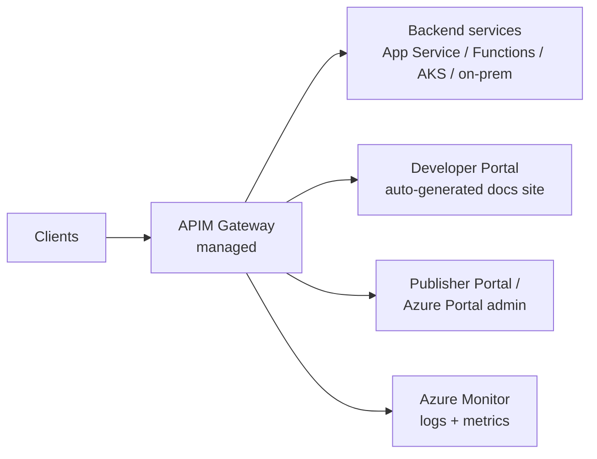
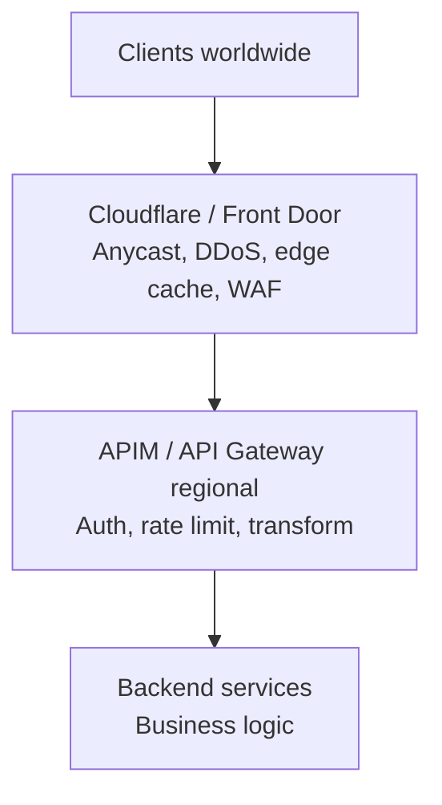
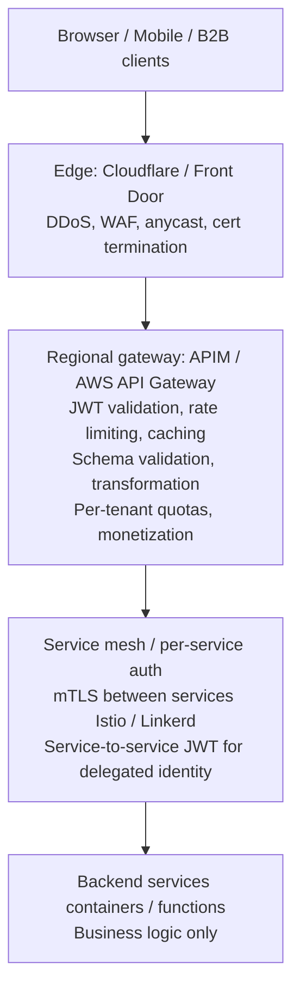

# API Management & Gateway

> [Mastery Guide](../README.md) › [API Development](./README.md)

| Status | Priority | Phase | Last reviewed |
|---|---|---|---|
| Not Started | High | Phase 4 — Auth & API Security | 2026-05-08 |

## Contents
- [Why it matters](#why-it-matters)
- [Core concepts](#core-concepts)
  - [API Gateway vs API Management — same thing, different scope](#api-gateway-vs-api-management--same-thing-different-scope)
  - [Cross-cutting concerns the gateway owns](#cross-cutting-concerns-the-gateway-owns)
  - [What the gateway cannot enforce — the OWASP API Security boundary](#what-the-gateway-cannot-enforce--the-owasp-api-security-boundary)
  - [Azure API Management (APIM)](#azure-api-management-apim)
  - [Subscription keys — the header, the pair, and what a key does not prove](#subscription-keys--the-header-the-pair-and-what-a-key-does-not-prove)
  - [Named values, Key Vault and backend credentials](#named-values-key-vault-and-backend-credentials)
  - [Revisions, versions and version sets](#revisions-versions-and-version-sets)
  - [Backends, circuit breakers and load-balanced pools](#backends-circuit-breakers-and-load-balanced-pools)
  - [Timeout budgets and retry amplification](#timeout-budgets-and-retry-amplification)
  - [APIM networking modes — external, internal, and the firewall in front](#apim-networking-modes--external-internal-and-the-firewall-in-front)
  - [Workspaces and federated API management](#workspaces-and-federated-api-management)
  - [Capacity, scaling latency and what a unit actually buys](#capacity-scaling-latency-and-what-a-unit-actually-buys)
  - [Recovering the gateway itself](#recovering-the-gateway-itself)
  - [AWS API Gateway](#aws-api-gateway)
  - [Kong, Tyk, Apigee — vendor-agnostic options](#kong-tyk-apigee--vendor-agnostic-options)
  - [Kubernetes Gateway API and Envoy-based gateways](#kubernetes-gateway-api-and-envoy-based-gateways)
  - [YARP — self-hosted .NET reverse proxy](#yarp--self-hosted-net-reverse-proxy)
  - [Front Door, CloudFront, Cloudflare — global edge gateways](#front-door-cloudfront-cloudflare--global-edge-gateways)
  - [The edge layer rewrites the client IP](#the-edge-layer-rewrites-the-client-ip)
  - [Rate limiting strategies](#rate-limiting-strategies)
  - [Rate limits are approximate; quotas are the billing-grade counter](#rate-limits-are-approximate-quotas-are-the-billing-grade-counter)
  - [The AI gateway — token limits, semantic caching and model pools](#the-ai-gateway--token-limits-semantic-caching-and-model-pools)
  - [Streaming through a gateway — SSE, WebSockets and gRPC](#streaming-through-a-gateway--sse-websockets-and-grpc)
  - [GraphQL at the gateway](#graphql-at-the-gateway)
  - [API monetization and developer portals](#api-monetization-and-developer-portals)
- [Code & diagrams](#code--diagrams)
- [Common pitfalls](#common-pitfalls)
- [Interview-ready summary](#interview-ready-summary)
- [Interview Cross-Questioning Drill](#interview-cross-questioning-drill)
- [Cheat Sheet](#cheat-sheet)
- [Walkthrough](#walkthrough--one-noisy-tenant-ddoses-everyone)
- [Self-test](#self-test)
- [Cross-references](#cross-references)
- [Sources](#sources)

---

## Why it matters

Once your platform exposes more than a couple of APIs, you stop wanting each service to re-implement authentication, rate limiting, logging, throttling, IP allowlisting, response caching, transformation, and CORS. **API Management** (a category of products: APIM, AWS API Gateway, Kong, Apigee, Front Door, Cloudflare) centralizes those cross-cutting concerns into a single tier — your services stay focused on business logic, ops gets a single chokepoint to control traffic policy, security gets a single audit surface, and developers get a portal to discover the catalogue.

In 2026, API Management is non-optional for any company exposing public APIs (B2B integrations, mobile back-ends, partner platforms) or running internal microservice meshes that need a sane control plane. For senior .NET interviews, knowing the trade-offs between **APIM** (Azure-native), **AWS API Gateway**, **YARP** (self-hosted), and **edge gateways** (Front Door, CloudFront, Cloudflare) is what gets you past architecture rounds.

Why interviewers ask: API gateway questions reveal whether candidates can design platforms, not just services. "How would you protect this API from abuse?" / "How do you do rate limiting?" / "Where does your monetization live?" — all answered through the gateway.

When NOT to introduce: a single internal service with one consumer (overhead for no benefit), prototypes / hackathons, or apps where the cloud provider's load balancer + per-service middleware already covers everything. The gateway justifies itself when you have multiple producers AND multiple consumers AND cross-cutting needs.

## Core concepts

### API Gateway vs API Management — same thing, different scope

The terms are used interchangeably but the typical distinction is:

| Term | Scope |
|---|---|
| **API Gateway** | The runtime: receives requests, applies policies, forwards. (e.g., the *gateway* component of APIM) |
| **API Management** | Gateway + control plane: developer portal, products & subscriptions, analytics, versioning, lifecycle, monetization |

In production: APIM is "API Gateway with everything else needed to operate APIs at organizational scale."

### Cross-cutting concerns the gateway owns

Anything that should be policy-driven, not code-duplicated:

- **Authentication / authorization** — JWT validation, OAuth 2.0 token introspection, mTLS, API keys.
- **Rate limiting & throttling** — per-key, per-IP, per-tenant. Token bucket / sliding window.
- **Quota enforcement** — daily / monthly limits per subscription tier.
- **Routing & versioning** — `/v1/orders` → service A v1; `/v2/orders` → service A v2; with deprecation headers.
- **Request/response transformation** — rewrite headers, mask fields, change formats (JSON↔XML).
- **Caching** — gateway-level response cache for GETs; saves origin compute.
- **Schema validation** — reject malformed requests before they hit the service.
- **CORS** — single source of truth for cross-origin policy.
- **Mock responses** — return canned data for not-yet-built endpoints (great for parallel front-end / back-end work).
- **Logging & analytics** — centralized request log; latency metrics per route, per consumer, per status.
- **Bot protection / WAF** — common attack patterns (SQL injection, XSS, scraper signatures).
- **TLS termination** — manage certificates centrally.
- **Circuit breaking** — gateway opens circuit when origin is unhealthy.
- **Canary / blue-green routing** — 5% traffic to v2, 95% to v1.

### What the gateway cannot enforce — the OWASP API Security boundary

The list above is what a gateway is good at. The more useful interview answer is the boundary: what a policy engine sitting in front of your services structurally cannot decide.

The reference frame is the **OWASP API Security Top 10** (the 2023 edition), and the item that draws the line is **API1:2023 Broken Object Level Authorization** — usually shortened to BOLA. A gateway can prove that a token is signed by the right issuer, carries the right audience, has not expired and includes the scope `orders.read`. It cannot decide whether order 4417 belongs to this caller, because that question is answered by data the gateway does not hold. Microsoft's own guidance on mitigating OWASP threats in API Management says exactly this: "The best place to implement object level authorization is within the backend API itself." It offers the gateway only as a fallback for when the backend genuinely cannot be changed — a custom policy doing a lookup, a `send-request` out to an authorization service, or an identifier-mapping policy so internal identifiers never reach the client.

Contrast that with **API4:2023 Unrestricted Resource Consumption**, which is the gateway's home ground, and where the same guidance points at concrete policies: `rate-limit-by-key` and `quota-by-key` for volume, `limit-concurrency` for parallel backend connections, `validate-content` with `max-size` for payload size, and the shortest acceptable `timeout` on `forward-request`. **API5:2023 Broken function level authorization** sits in between — the gateway helps, but only if you configure it deliberately. The two warnings worth memorising are that wildcard "catch-all" operations with `*` as the path let requests reach endpoints you never explicitly defined, and that publishing an API through an *open* product (one that requires no subscription) makes it anonymously reachable whether or not you meant it to be.

One more distinction: a WAF in front of the gateway is a different tool, not a stronger one. Front Door, Application Gateway and Azure Web Application Firewall appear in the same guidance as protection "against traditional web application threats and bots" — signature-based rules for injection, cross-site scripting and scraper behaviour. None of that touches whether an authenticated, correctly scoped caller was entitled to the specific object they asked for.

> 🌍 **In the real world**: a B2B invoicing API validated its JWT at the gateway, required the `invoices.read` scope, and rate-limited per subscription — a clean policy set by every measure in the cross-cutting list. `GET /v1/invoices/88214` still returned any invoice in the system, because the handler looked the invoice up by id and never compared its tenant to the caller's. The penetration test found it in minutes by incrementing the id. The fix was one line in the service, not in the gateway, and being able to explain *why* the gateway could not have caught it is the whole point of the question.

### Azure API Management (APIM)

Microsoft's flagship API management product. Two generations of tiers run side by side: the **classic** lineup — Consumption (serverless, pay-per-call), Developer (non-production), Basic, Standard, Premium (multi-region, VNet injection, dedicated capacity, self-hosted gateway) — and the **v2** lineup — Basic v2, Standard v2, Premium v2 — which provisions in minutes rather than tens of minutes and changes the networking model: from Standard v2 up you can reach VNet-integrated backends without the classic full-VNet-injection requirement.

**Architecture** (Premium):



**Policy-based architecture** — every API/operation has inbound, backend, outbound, and on-error policy XML blocks:

```xml
<policies>
  <inbound>
    <base />
    <validate-jwt header-name="Authorization" failed-validation-httpcode="401">
      <openid-config url="https://login.microsoftonline.com/{tenant}/.well-known/openid-configuration" />
      <audiences>
        <audience>api://orders-api</audience>
      </audiences>
    </validate-jwt>
    <rate-limit-by-key calls="100" renewal-period="60"
        counter-key="@(context.Subscription?.Id ?? context.Request.IpAddress)" />
    <set-header name="X-Correlation-Id" exists-action="skip">
      <value>@(Guid.NewGuid().ToString())</value>
    </set-header>
  </inbound>
  <backend>
    <forward-request timeout="30" />
  </backend>
  <outbound>
    <base />
    <set-header name="Server" exists-action="delete" />
  </outbound>
  <on-error>
    <base />
    <log-to-eventhub logger-id="error-logger">
      @{ return new JObject(
            new JProperty("requestId", context.RequestId),
            new JProperty("error", context.LastError.Message)).ToString(); }
    </log-to-eventhub>
  </on-error>
</policies>
```

**Strengths**:
- Deepest Azure integration — AAD, Key Vault, Event Hub, Application Insights all wired in.
- Powerful XML-based policy DSL with inline C# expressions (`@(context.Request.Headers...)`).
- Self-hosted gateway containers — run APIM inside your own VNet/cluster while management plane stays in Azure.
- Built-in developer portal you can customize.

**Weaknesses**:
- XML policy authoring isn't fun (improving with VS Code extensions and Bicep).
- Cold starts on Consumption tier.
- Premium tier is expensive (~$2,500+/month per unit).

### Subscription keys — the header, the pair, and what a key does not prove

An APIM *subscription* is, in the documentation's own words, "a named container for a pair of subscription keys". The caller presents one of those keys in the `Ocp-Apim-Subscription-Key` request header, or as a `subscription-key` query parameter — and the query parameter "is checked only if the header isn't present". Both are default names; you can rename them per API on the API's Settings tab.

This is the most common source of an unexplained 401 in a new deployment, because the requirement is on by default. When you create an API, a subscription key is required for access; when you create a product, the same. A call with no valid key, and no open product standing behind the API, is rejected outright by the gateway with a 401 and never reaches your service — which looks identical, from the client's side, to a token problem.

Subscriptions come in scopes: a product, a single API, all APIs, and a built-in **all-access** subscription scoped to the whole service. The documentation is blunt about that last one — "Never use this subscription for routine API access or embed the all-access subscription key in client apps" — and there is a subtlety attached to the others that people discover the hard way: if a call arrives on an API-scoped, all-APIs or all-access key, policies configured at *product* scope are not applied. Every rate limit and quota you attached to the Pro product silently does nothing for that caller.

The key pair exists for rotation. Azure generates keys in pairs so that each application "can switch from key A to key B and regenerate key A with minimal disruption, and vice versa". The rotation is yours to drive: publish the secondary, confirm traffic has moved to it, regenerate the primary, then repeat in the other direction next time. APIM has no built-in key lifecycle — no expiry dates, no automatic rotation — so if you want either, you build it against the management API.

Finally, the distinction interviewers push on. A subscription key identifies the *application or subscription*, not the human. It is a shared secret that travels on every request, and by default it is forwarded on to your backend, where it may end up in backend monitoring logs — strip it with a `set-header` or `set-query-parameter` at the end of the inbound section if that matters to you. If you need to know which user is calling, you need a token. The key and the token answer different questions, and a serious API requires both.

> 🌍 **In the real world**: a partner integration went live and every call came back 401. The team spent an afternoon on the Entra app registration, the audience, the scope and the clock skew — all of it correct. The API had been created with **Subscription required** left at its default; the partner had a perfectly valid bearer token and no subscription key, and the gateway rejected the call before it reached the backend. Two credentials were needed and only one had made it into the onboarding pack.

### Named values, Key Vault and backend credentials

Policies need secrets: a backend API key, a Front Door ID to check against, a shared signing key. APIM's answer is **named values** — a service-wide collection of name/value pairs referenced from policy with double braces, as in `{{FrontDoorId}}`. There are three types: **Plain** (a literal string or a policy expression), **Secret** (a string encrypted by API Management), and **Key vault** (a reference to a secret held in Azure Key Vault).

The Key Vault type is the one to argue for, and the one with the operational trap. APIM does pick up a rotated secret automatically, but on its own schedule: "After update in the key vault, a named value in API Management is updated within four hours." You can force it sooner from the portal or the management REST API. Two configuration details decide whether it works at all. The secret identifier you enter must carry **no version information**, or the value will never rotate. And the instance needs a managed identity holding Get and List permission on the vault (or the Key Vault Secrets User role) — with the additional rule that if the Key Vault firewall is enabled you *must* use the system-assigned identity, because a user-assigned identity is not supported for that path.

For the credentials that authenticate the gateway *to* a backend, the better answer is to hold no secret at all. A backend entity in APIM can carry authorisation credentials as a request header, a query parameter, a client certificate, or a system- or user-assigned managed identity — and with a managed identity there is nothing to rotate, leak or let expire.

One access-control fact surprises most people. Named values are resolved at the service level at runtime, and the documentation spells out the consequence: a user with permission to edit policies "can read the contents of any named value by referencing it in a policy", even without read access to the named value resource itself. Granting policy-edit rights therefore effectively grants read access to every secret in the instance. That is a real argument for workspaces, and it is also why secrets must never be pasted into policy XML or committed to source control in the first place.

> 🌍 **In the real world**: a team rotated a backend API key in Key Vault on a Friday afternoon and configured the backend to reject the old value immediately. The gateway carried on presenting the old key and every call failed for hours, because nobody knew about the refresh interval. The correct shape is the same as any credential rollover: have the backend accept both values for an overlap window comfortably longer than the refresh interval, or make an explicit refresh through the management API the last step of the rotation job.

### Revisions, versions and version sets

APIM offers two change mechanisms and they are not interchangeable. The documentation's split is the sentence to remember: "versions are used to separate API versions that have breaking changes, and revisions can be used for minor and non-breaking changes to an API."

A **revision** is a working copy of an API that you can edit without touching what callers are currently hitting. Each revision is reachable at a special URL: append `;rev={revisionNumber}` to the API path, before the query string, so revision 2 of a petstore API answers on something like `https://apim-hello-world.azure-api.net/store/pet/1;rev=2/`. The current revision also answers on the plain path with no suffix. When the revision is ready you "make it current", optionally posting a note to the API's public change log, which the developer portal renders for consumers. Rolling back is simply making the previous revision current again. This is also how you stage a policy change safely: edit it on the revision, exercise it through the `;rev=` URL, then promote.

A **version** is a separate API resource that clients opt into. APIM groups related versions with a **version set**, a resource holding the display name of the logical API and the versioning scheme. Three schemes are offered — **path** (`/products/v1`), **header** (you choose the header name; a custom `Api-Version` is the common choice), and **query string** (`?api-version=v1`). Every version in a set shares the same scheme, fixed by whichever you picked when adding the first version, so it is a decision you make once. If you add a version to an API that did not have one, APIM automatically creates an `Original` version that keeps answering on the unversioned URL, so the act of introducing versioning does not break existing callers.

The two nest: each version can carry its own revisions. And if a revision turns out to contain a breaking change after all, the portal offers "Create Version from this Revision", which is the honest escape hatch when a "small" change stops being small.

One practical gotcha with the query-string scheme: OpenAPI does not permit query parameters in the `servers` property, so a query-string version identifier will not appear in the server URL of an exported specification.

> 🌍 **In the real world**: a team wanted to add a `currency` field to an order response. They created a revision, pointed their integration tests at its `;rev=` URL, and promoted it during business hours with a change-log entry — nothing about an additive field could break an existing caller. Two sprints later they removed a deprecated field; that one became `v2` in the version set, with `v1` kept alive and carrying a sunset header. Being able to say which mechanism you would reach for, and why, *is* the question.

### Backends, circuit breakers and load-balanced pools

Pointing an API at a URL is the beginner's configuration. The senior one is the **backend entity** — a named APIM resource holding the runtime URL, the authorisation credentials, the TLS validation settings, a circuit breaker rule and, optionally, membership of a load-balanced pool. Policies reference it as `<set-backend-service backend-id="myBackend" />`, and APIM will also match a backend entity automatically when the URL it is about to call matches one, so the entity applies even without an explicit policy.

The **circuit breaker** is configured on the backend, not in policy. A rule has a failure condition — a count over an interval, together with the status code ranges and error reasons that count as a failure — plus a trip duration and an `acceptRetryAfter` flag. When it trips, API Management stops sending requests to that backend for the trip duration and returns 503 Service Unavailable to the caller. Three limitations belong in your answer before an interviewer supplies them: it is not supported in the Consumption tier, you can configure only one rule per backend, and, in the documentation's words, "circuit breaker tripping rules are approximate. Different instances of the gateway don't synchronize" — each gateway instance trips on what it has seen for itself.

A **pool** is a backend whose type is `Pool` and whose members are other backends, up to 30 of them. The load-balancing options are round-robin, weighted and priority-based, and **session awareness** can be layered on top of any of them. Priority is the interesting one and its semantics are precise: API Management "uses backends in lower priority groups only when all backends in higher priority groups are unavailable because circuit breaker rules are tripped". Priority is not a soft preference — the spill happens only once the breaker has fired, which means a pool without a circuit breaker rule will never fail over. Session awareness sets a session-ID cookie so a conversation stays pinned to one member, which matters for stateful backends. Like the breaker, load balancing is per-gateway-instance and approximate.

> 🌍 **In the real world**: an orders backend started returning 500s from one of its two regional deployments. With no breaker configured, the gateway kept sending half the traffic into the failing deployment and clients saw an intermittent error nobody could reproduce. With the two deployments in a pool and a rule along the lines of "three 5xx inside a minute trips for five minutes", the sick member drops out, everything lands on the healthy one, and the member is tried again automatically when the trip expires — no deployment, no human in the loop, and one 503 window instead of an hour of coin-flip failures.

### Timeout budgets and retry amplification

Two numbers decide how a gateway behaves when the backend is *slow* rather than *down*, and both are usually left at their defaults.

The first is the backend timeout. `<forward-request>` takes a `timeout` in seconds whose default is **300**, carrying a documented caveat: "Values greater than 240 seconds may not be honored, because the underlying network infrastructure can drop idle connections after this time." Five minutes is far longer than any interactive client will wait, and for the whole of it the gateway is holding a connection and consuming capacity on behalf of a caller who has already gone. Microsoft's own OWASP guidance says to define the timeout and "strive for the shortest acceptable value", and to pair it with `limit-concurrency` to cap parallel backend connections. The principle is a budget that shrinks as you go inward: if the client gives up at ten seconds, a thirty-second gateway timeout protects nothing — it just manufactures responses nobody is listening for.

The second is retries. APIM's `<retry>` policy wraps child policies and re-runs them while a condition holds, with a `count` between 1 and 50, an `interval`, and optional `delta` and `max-interval` that turn it into a linear or exponential backoff. The exponential form is documented as `interval + (2^(count - 1)) * random(delta * 0.8, delta * 1.2)`, capped by `max-interval` — note that the jitter is built in, which is more than most hand-rolled retry loops manage. Two things bite. If you retry a request that has a body, you need `buffer-request-body="true"` on `forward-request`, or there is nothing left to resend. And retries compose multiplicatively: a client SDK retrying three times against a gateway retrying three times is nine backend calls for one user action, and the moment that arithmetic matters is a partial outage — precisely when the backend can least afford it. The retries become the outage.

The 2026 answer to "how do you stop the retry storm" is usually not more retry tuning. The documentation itself points at the alternative: rather than retrying into a failing backend, configure a backend resource with circuit breaker rules and a load-balanced pool, so a sick member is taken out of rotation instead of hammered. Retry the transient blip; break the circuit on the sustained failure.

> 🌍 **In the real world**: a payments backend degraded to eight-second responses one morning rather than failing outright. The gateway's default timeout let every one of those calls run to completion, the mobile SDK gave up at five seconds and retried, and within minutes the backend was serving well over its normal volume — most of it for responses no client was still waiting for. Cutting the gateway timeout below the client's and adding a concurrency limit turned a self-reinforcing failure into a visible, bounded one.

### APIM networking modes — external, internal, and the firewall in front

"Put it in a VNet" is four different products in APIM, and your tier decides which of them you get.

**Virtual network injection** in the classic tiers (Developer and Premium) places the instance inside a subnet you control, and comes in two access modes. In **external** mode the API Management endpoints are reachable from the public internet through an external load balancer, while the gateway can reach resources inside the network — the "public API, private backends" shape. In **internal** mode the endpoints are reachable only from within the virtual network, through an internal load balancer. Injection covers the developer portal, the gateway, the management plane and the Git repository, so internal mode takes all of those private at once, which is a larger change than teams expect.

The v2 tiers split the same problem differently. **Virtual network integration** (Standard v2 and Premium v2) is outbound only: the gateway can reach backends isolated in a delegated subnet or a peered network, but "the API Management gateway, management plane, and developer portal remain publicly accessible from the internet". **Virtual network injection in Premium v2** covers the gateway only, gives it a private IP address, and can currently be configured only when the instance is created. Separately, an **inbound private endpoint** is available across Developer, Basic, Standard, Standard v2, Premium and Premium v2 for the managed gateway (not the self-hosted one) — and you can only disable public network access *after* the private endpoint exists, which is the correct order and a common trip.

The pattern to have ready is internal mode with a firewall in front. Microsoft documents deploying API Management in an internal virtual network and routing public access to it through an internet-facing **Azure Application Gateway** with WAF. The division of labour is clean: App Gateway terminates public TLS and runs the WAF rule sets, APIM does identity, throttling and transformation, and nothing on the internet can address the gateway directly. Azure Front Door is the alternative for the global case, but note that it fronts a *publicly accessible* instance — either non-networked, or a Developer or Premium instance injected in **external** mode — so you lock it down with policy rather than with networking: a `check-header` policy asserting `X-Azure-FDID` matches your Front Door ID and returning 403 otherwise, and an `ip-filter` policy allowing the IP ranges published under the `AzureFrontDoor.Backend` service tag (`ip-filter` itself takes only `<address>` and `<address-range>` elements, so the tag's ranges have to be enumerated).

One documented limitation worth carrying, because the error message gives nothing away: in Developer and Premium instances deployed in internal mode, a self-chained call — where the gateway endpoint URL and the backend URL are the same — can throw HTTP 500 `BackendConnectionFailure`.

> 🌍 **In the real world**: a bank's security review rejected an APIM design because the gateway held a public IP address, even though every API required a token. The rebuild put a Premium instance in internal mode, made an Application Gateway with WAF the only internet-facing component, and added DNS inside the network so the App Gateway's backend pool could resolve the APIM hostname to its private address. None of the policies changed. The entire exercise was about which box owns the public address.

### Workspaces and federated API management

Policy inheritance — global, then product, then API, then operation — is usually taught as a precedence rule. The question it exists to answer is organisational: who is allowed to change what.

The failure mode is familiar. One APIM instance, one platform team holding the permissions, and every product team filing a ticket to add a route. The platform team becomes a queue, and the product teams start routing around it. **Workspaces** are Azure's answer, and Microsoft frames them as *federated API management*: "decentralized API management by development teams with appropriate isolation of control and data planes, while maintaining centralized governance, monitoring, and API discovery managed by an API platform team."

Mechanically, a workspace behaves like a folder inside the service. It contains its own APIs, products, subscriptions and named values, and access to it is granted through Azure RBAC with roles scoped to that workspace. Each workspace attaches to a gateway — either the service's default managed gateway (currently in the v2 tiers), where workspaces share capacity and configuration, or a **workspace gateway**, a separate Azure resource with its own scaling, hostname and network configuration. The documentation states the trade directly: a workspace gateway gives "strong runtime isolation; independent scaling, hostname, and network configuration per workspace gateway", at extra cost, longer deployment time and availability in fewer regions. Up to 30 workspaces can share one workspace gateway, and the recommendation is to give mission-critical workspaces a gateway of their own.

The governance lever is that workspace gateways execute the full policy chain *including* the service-level global policy, so the platform team's global policy still runs on every request in every workspace. Microsoft also ships a built-in Azure Policy definition — "API Management policies should inherit parent scope policies using `<base/>`" — so you can audit or enforce that workspace teams have not severed the chain. That is the federated model in one sentence: the platform team owns the floor, the product team owns everything above it.

Workspaces are available in Basic v2, Standard v2, Premium and Premium v2, and the constraints matter when you plan the migration. Resource names must be unique across the *entire* service, even across workspaces. Workspace-level policies cannot reference service-level named values or a service-level `backend-id`. Workspaces support only the internal cache, cannot use a self-hosted gateway, and do not support managed identities — which in turn rules out Key Vault-backed named values inside a workspace. Rate limit counters follow the gateway: separate per workspace gateway, but shared with everything else when the workspace runs on the default managed gateway.

> 🌍 **In the real world**: a company with eleven product teams ran a single APIM instance and a two-person platform team who reviewed every policy change. Lead time on a new route was about a week, so teams began publishing straight from their own App Services and the catalogue stopped being true. Moving each product team into a workspace — with the platform team keeping the global policy, the developer portal and the logs — removed the queue without giving anyone the ability to switch off JWT validation.

### Capacity, scaling latency and what a unit actually buys

The throughput figure attached to a tier is a planning aid, not a guarantee, and the documentation is careful about it: a unit "has a certain load-bearing capacity expressed as a number of API calls per second. This number doesn't represent a call limit, but rather an estimated maximum throughput value to allow for rough capacity planning." Actual throughput varies with connection reuse, payload sizes, how many policies you run and how slow the backend is — a chain of transformation and validation policies costs far more per call than a plain forward, because each one walks the body.

What you actually scale on is a metric. In the classic tiers it is **Capacity**, which reflects CPU, memory and network queue lengths — and, importantly, "capacity metrics are not direct measures of the number of requests being processed". They can be non-zero with no traffic at all, because platform activity contributes. In the v2 tiers the equivalents are **CPU Percentage of Gateway** and **Memory Percentage of Gateway**; workspace gateways expose **CPU Utilization (%)** and **Memory Utilization (%)**. The published rule of thumb is to upgrade or scale when the metric sits above **60–70%** for a sustained period such as 30 minutes — and above **40%** if you are running a single unit, because headroom has to be reserved for guest OS updates on the underlying platform.

Now the number that changes architecture. Adding a unit is not instant. Infrastructure changes to an API Management instance — scaling, custom domains, CA certificates, virtual network configuration, availability zone changes, region additions — "can take 15 minutes or longer to complete", and take longer with more scale units or more regions; the autoscale guidance puts a scaling operation at around 30 minutes and tells you to plan your rules accordingly. Autoscale is available in the classic Basic, Standard and Premium tiers, the v2 tiers and workspace gateways, and in a multi-region deployment only the primary location can be scaled that way. The Developer tier cannot be scaled at all, and has no SLA.

The consequence is the part candidates miss. Autoscale responds to a trend, not to a spike. If traffic multiplies inside two minutes, the extra unit arrives long after the incident is over, so the only controls that act inside that window are the ones evaluated on the current request: the rate limit, the quota and the concurrency limit. And there is no safety net behind them — "when an instance *reaches* its capacity, it won't throttle to prevent overload. Instead, it will act like an overloaded web server: increased latency, dropped connections, and time-out errors." A gateway at capacity does not shed load politely. It degrades.

If you want a capacity number you can defend rather than one you quoted, the documented method is to load-test the shape you actually expect: raise the request rate gradually and watch what the capacity metric does at your peak, then derive the unit count from that. Do it against a non-production instance with a stubbed origin, or the load test becomes a denial-of-service attack on your own backend.

> 🌍 **In the real world**: a retailer sized their instance from the tier's published requests-per-second figure and set an autoscale rule to fire at 70% capacity. On the first campaign morning traffic multiplied many times over in under two minutes; the rule fired, and the new unit was still provisioning when the peak had passed. What customers saw was latency, dropped connections and timeouts — exactly what the documentation says an overloaded instance does. They kept the autoscale rule for the week-over-week trend and added a per-tenant rate limit for the minute-over-minute one.

### Recovering the gateway itself

Multi-region active-active is the right answer when the recovery time objective is near zero, and this chapter already argues for it. This section is the other case: the configuration is gone, or the instance is gone, and you need it back.

APIM has a first-class **backup and restore** in the classic Developer, Basic, Standard and Premium tiers — `Backup-AzApiManagement` and `Restore-AzApiManagement`, or the equivalent REST operations, writing to a blob container you own. Four constraints shape the runbook. A backup "expires after 30 days", and attempting to restore an older one fails with a `Cannot restore: backup expired` message. The pricing tier being restored into "must match" the tier that was backed up. Both operations are long-running, and you must avoid other configuration changes while either is in flight, because changes made during a backup "might be excluded from the backup and will be lost". And backup and restore are not currently supported on instances with associated workspace gateways.

What is *not* in the backup is the list that ruins a drill: custom domain TLS certificates, custom CA certificates, virtual network integration settings, managed identity configuration, Azure Monitor diagnostic configuration, protocol and cipher settings, and developer portal content. Restore also does not change the target's custom hostname configuration — so the documented pattern is to keep the same custom hostname and TLS certificate on both the active and the standby instance, meaning that once the restore completes "the traffic can be re-directed to the standby instance by a simple DNS CNAME change".

That splits recovery into two halves, and the split is the point. Infrastructure and configuration — the instance, the network, the certificates, the identities, the APIs and the policies — belong in Bicep or Terraform, which this chapter already calls the senior approach; framed as recovery, that is your rebuild path, and it covers precisely the things backup omits. Runtime data — subscriptions, users, keys, developer accounts — is what backup carries and what no template can reconstruct, because regenerating every customer's subscription key is an outage in its own right.

The last question to have an answer for is **fail open or fail closed**. The emergency runbook of "point DNS at the origin and bypass the gateway" is a fail-open decision, and it should be named as one: the origin now takes traffic with no token validation, no rate limiting, no WAF and no subscription check, from anyone who can resolve the name. Sometimes that is the right call for thirty minutes. It is only defensible if you decided it beforehand — the origin validates tokens itself, the network path is restricted to known addresses, the window is bounded, and somebody is watching it. Discovering during an incident that your break-glass procedure publishes an unauthenticated API to the internet is a worse day than the outage that prompted it.

> 🌍 **In the real world**: a team ran nightly backups into a storage account in a second region and had rehearsed the restore command. The first full failover exercise went fine until clients started failing TLS: the custom domain certificate is not part of an APIM backup, and the standby instance had never had one installed. Ten minutes of the exercise was the restore. The rest was discovering the list of things it does not carry.

### AWS API Gateway

Three API types:
- **REST API** — full feature set (request validation, transformations, API keys, usage plans).
- **HTTP API** — lighter, faster, cheaper; for modern OAuth2/JWT + simple proxy use cases.
- **WebSocket API** — persistent bidirectional connections; routes are selected from the message payload rather than the URL path.

**Integration types**: Lambda (most common), HTTP backend, AWS service, mock, VPC Link (private VPC), private integration with NLB.

**Strengths**:
- Tight integration with Lambda; serverless-first architecture.
- Cognito for auth out of the box.
- Stage-based deployments (dev, staging, prod).
- Usage plans + API keys for partner monetization.

**Weaknesses**:
- Less policy expressiveness than APIM (no inline-code policies).
- REST-vs-HTTP API friction (HTTP API doesn't support every REST API feature).
- Per-region — for global, pair with CloudFront.

### Kong, Tyk, Apigee — vendor-agnostic options

**Kong** — open-source (Kong OSS) + enterprise (Kong Enterprise, Konnect). Built on NGINX/OpenResty. Plugin model (Lua + Wasm). Self-hosted in K8s as DaemonSet/Ingress controller. One of the most widely deployed open-source gateways, alongside the Envoy-based options.

**Tyk** — similar product; open-source core; aggressive multi-cloud / hybrid story.

**Apigee** (Google Cloud) — enterprise-grade; strong analytics + monetization; long-established in large enterprise API programmes.

When to choose vendor-agnostic over cloud-native:
- Multi-cloud or hybrid cloud (avoid lock-in).
- You need plugins / customization beyond the cloud-native policy DSLs.
- You have ops capacity and prefer open-source supply chain.

When to choose cloud-native (APIM, AWS API Gateway):
- Single-cloud commitment.
- Want fastest path to production with managed everything.
- Care about deepest integration (AAD/Key Vault/AppInsights for APIM; Cognito/IAM/CloudWatch for AWS).

### Kubernetes Gateway API and Envoy-based gateways

If your services run in Kubernetes there is a second edge in the picture, and it now has a standard shape. The **Gateway API** is the Kubernetes networking project that succeeds Ingress, and its defining feature is not a routing capability — it is that the resources are split along organisational lines.

There are three of them. A **GatewayClass** is cluster-scoped and "defines a set of Gateways that share a common configuration and behaviour"; it is the analogue of IngressClass and it belongs to whoever provides the infrastructure. A **Gateway** describes how traffic can be translated to Services within the cluster — the listeners, ports and certificates — and belongs to the cluster operator. **Routes** — `HTTPRoute`, `GRPCRoute` and the TLS, TCP and UDP variants — describe how traffic arriving via the Gateway maps to Services, and belong to the application developer.

Attachment goes upward and is accepted downward. A Route names the Gateway, or one of its listeners via `sectionName`, in its `parentRefs`; the listener then decides whether to accept it, and can restrict which namespaces are allowed to attach through `allowedRoutes.namespaces`, set to `Same` (the default), `All`, or a label `Selector`. That is what makes it safe for an application team to publish a route with no platform engineer in the loop: the team writes an HTTPRoute in its own namespace, and the platform's Gateway either permits that namespace or does not. Envoy Gateway and Istio are among the implementations that expose this API.

For a .NET on Azure interview this is context rather than the main event, but the connection is worth making out loud: the Gateway API's role split and APIM's workspaces are the same idea reached from two directions — separate the object the platform team owns from the object the application team owns, so that self-service does not have to mean unrestricted. Either one answers "how do you stop the platform team becoming a bottleneck".

> 🌍 **In the real world**: a platform team running AKS had a single Ingress resource with forty annotations, and every routing change went through them because a typo in that one object took down everything. Moving to a Gateway owned by the platform team, with each application team writing HTTPRoutes in its own namespace, cut the blast radius of a bad route to one namespace and removed the team from the critical path of every deployment.

### YARP — self-hosted .NET reverse proxy

**YARP (Yet Another Reverse Proxy)** is Microsoft's open-source HTTP/HTTPS reverse proxy library. Not "API Management" by itself — it's a building block for custom gateways and BFFs. Use when:
- You want a .NET-native, in-process gateway.
- You need custom logic (authn, claims transformation, request shaping) that doesn't fit policy DSLs.
- Cost matters — APIM Premium is overkill for your scale.

```csharp
// Program.cs
var builder = WebApplication.CreateBuilder(args);
builder.Services.AddReverseProxy()
    .LoadFromConfig(builder.Configuration.GetSection("ReverseProxy"));

var app = builder.Build();
app.MapReverseProxy(pipeline =>
{
    pipeline.Use(async (context, next) =>
    {
        // Custom middleware: claims transformation, custom auth, etc.
        context.Request.Headers["X-Forwarded-User"] = context.User.Identity?.Name;
        await next();
    });
});
app.Run();
```

YARP pairs well with the **BFF pattern** — see [BFF & Aggregation](./14-bff-and-aggregation.md). Use APIM for the public/B2B gateway and YARP for client-specific BFFs.

### Front Door, CloudFront, Cloudflare — global edge gateways

A different category: global anycast edge networks that put your API behind hundreds of POPs (Points of Presence) for low TTFB and DDoS protection.

| Service | Notes |
|---|---|
| **Azure Front Door** | Global L7 LB + CDN + WAF; pairs with APIM for global APIs |
| **AWS CloudFront** | CDN-first; basic API features; pair with API Gateway |
| **Cloudflare** | Largest edge network; broad feature set (DNS, WAF, DDoS, Workers, R2) |

These don't replace APIM — they add a global edge layer in front. **Layered architecture**:



For low-latency global apps, all three layers are present.

### The edge layer rewrites the client IP

Add an edge network in front of your gateway and one thing silently changes: the connection your gateway terminates now comes from an edge point of presence, not from the caller. Anything keyed on the peer address — a per-IP rate limit, an IP allowlist, a geo rule, an abuse counter — is now keyed on your own CDN.

The edge compensates by writing the original address into headers, and it is worth knowing exactly which. **Azure Front Door** appends `X-Azure-ClientIP`, which "represents the client IP address associated with the request being processed"; `X-Azure-SocketIP`, which "represents the socket IP address associated with the TCP connection that the current request originated from"; and `X-Forwarded-For`, where, if that header already exists, "Front Door appends the client socket IP to it". It also adds `X-Forwarded-Host`, `X-Forwarded-Proto`, a per-request `X-Azure-Ref` for log correlation, and `X-Azure-FDID` identifying which Front Door resource the request came through. **Cloudflare** writes `CF-Connecting-IP` with the client IP connecting to Cloudflare on all plans, offers the functionally identical `True-Client-IP` on Enterprise, and also maintains `X-Forwarded-For`.

The security reasoning is the part interviewers pull on. `X-Forwarded-For` is a chain that any hop can append to, including the client — which is why Front Door's own documentation notes that a request's client IP "might not be equal to its socket IP address because the client IP can be arbitrarily overwritten by a user", and why it publishes `X-Azure-SocketIP` separately. So a header value is only trustworthy if you know your own edge wrote it, on this request. That means two controls together: prove the request came through your edge, then read the header your edge wrote. For Front Door in front of APIM, Microsoft documents both halves — a `check-header` policy asserting `X-Azure-FDID` matches your Front Door ID and returning 403 otherwise, and an `ip-filter` policy allowing the IP ranges published under the `AzureFrontDoor.Backend` service tag (along with the Azure infrastructure addresses 168.63.129.16 and 169.254.169.254). If the instance sits in an external virtual network, the equivalent restriction is an inbound NSG rule allowing HTTPS from the `AzureFrontDoor.Backend` service tag on port 443.

The practical instruction: before you keep a policy expression that reads a client address, trace a real request through the new topology and look at what the gateway actually sees. A rate limit that has quietly collapsed into a single shared counter still returns 200s, so nothing in your telemetry tells you it stopped working.

> 🌍 **In the real world**: a team added Front Door for global latency and a WAF, deployed on a Thursday, and saw no change in error rates. Weeks later a scraper hammered one endpoint and the per-IP rate limit did nothing, because every request now arrived from the same small set of edge addresses. The counter had effectively been global since the day Front Door went in — and a global counter that is never breached looks exactly like a working one.

### Rate limiting strategies

| Strategy | How | Use when |
|---|---|---|
| **Fixed window** | "100 calls per 60s starting on the minute" | Simple; bursty at boundaries |
| **Sliding window** | "100 calls in any rolling 60s" | Smoother; harder to compute |
| **Token bucket** | Tokens added at fixed rate; consumed per call | Allow bursts up to bucket size |
| **Leaky bucket** | Constant outflow; queue inflow | Smooth output, bound buffer |
| **Concurrency limit** | "Max 10 simultaneous requests per consumer" | Protect from heavy clients |
| **Adaptive** | Limits adjust based on origin health | Self-throttling on degradation |

**Granularity**:
- Per IP — public APIs without auth.
- Per API key / subscription — paid tiers.
- Per user (auth'd) — application limits.
- Per tenant — multi-tenant SaaS.
- Combined — IP × user × endpoint × method.

**Distributed rate limiting**: Redis is the canonical store (atomic INCR + EXPIRE). Sliding-window counters via Redis Sorted Sets are the senior pattern.

### Rate limits are approximate; quotas are the billing-grade counter

The number in your policy is a target, not a contract, and the documentation says so in the plainest terms available: "Because of the distributed nature of throttling architecture, rate limiting is never completely accurate. The difference between the configured number of allowed requests and the actual number varies depending on request volume and rate, backend latency, and other factors."

The mechanism behind that sentence is *where the counter lives*. `rate-limit-by-key` "tracks calls independently at each gateway where it is applied, including workspace gateways and regional gateways in a multi-region deployment. It doesn't aggregate call data across the entire instance." So a limit of 500 a minute on a two-region deployment is 500 a minute *per region*, and a customer whose traffic is split across both can legitimately observe roughly twice what you promised them. The same applies per workspace gateway — although workspaces running on the service's default managed gateway share counters with everything else on that gateway. In a self-hosted gateway, counts can be configured to synchronise locally among instances across cluster nodes, but they never synchronise with the managed gateway in the cloud.

The algorithm differs by tier as well, which changes burst behaviour. Classic tiers use a sliding window; the v2 tiers use a token bucket whose initial size equals the configured call count. The documentation's own worked example: with `calls="6"` and `renewal-period="60"`, the bucket allows an initial burst of six and then refills at six per sixty seconds — 0.1 calls per second. In the v2 tiers every policy instance sharing a counter key must use the same call limit and renewal period, or the behaviour is undefined. And `renewal-period` maxes out at 300 seconds, so a rate limit cannot express any window longer than five minutes.

Quotas are the other instrument and they are built differently. `quota` and `quota-by-key` "are global, which means that a single counter is used at the level of the API Management instance" — which is exactly why quotas are the right tool for "10,000 calls a month on the Basic plan" and rate limits are not. Even so, the documentation carries a caveat: "When underlying compute resources restart in the service platform, API Management might continue to handle requests for a short period after a quota is reached." Neither policy is an accounting system. (Both `rate-limit-by-key` and `quota-by-key` are also unavailable in the Consumption tier.)

That gives you the framing to take into the room. **A rate limit is load shedding** — its job is to keep the backend alive through a burst, and being slightly generous costs nothing. **A quota is a commercial boundary** — coarser, instance-wide, longer-period. **And neither of them is what you bill from.** Invoices come from the request logs, which record every call with its subscription, timestamp, route and status code; the gateway meters, the billing system bills, and the two are reconciled rather than assumed to agree.

> 🌍 **In the real world**: an enterprise customer on a 500-per-minute plan opened a ticket with a graph showing sustained traffic well above their cap and asked, reasonably, what they were paying for. The deployment was two-region active-active and each regional gateway was enforcing 500 independently. The fix was not technical: the contract was reworded to state the limit per region, and the daily quota — which *is* instance-wide — became the number the commercial team actually quoted.

### The AI gateway — token limits, semantic caching and model pools

Every throttling construct so far counts calls. For a model backend that is the wrong unit: one request may consume a hundred tokens or a hundred thousand, and it is tokens, not requests, that the provider meters and charges for. Model deployments are given quota as tokens per minute, so a single application can drain the whole allocation without ever tripping a call-based limit.

APIM's answer is the `llm-token-limit` policy, available in Developer, Basic, Basic v2, Standard, Standard v2, Premium and Premium v2 — not Consumption. It takes a `counter-key` like any other throttling policy, then either a rate (`tokens-per-minute`), a quota (`token-quota` over a `token-quota-period` of Hourly, Daily, Weekly, Monthly or Yearly), or both. Exceeding the rate returns 429; exceeding the quota returns 403 — a distinction worth knowing, because it lets a client tell "slow down" from "you are out of budget". The policy can emit the remaining tokens, the remaining quota tokens and the tokens consumed as response headers or as policy variables. It works against LLM APIs conforming to the OpenAI Chat Completions or Responses schema, the Anthropic Messages API (currently in the v2 tiers) and the Google Vertex AI API.

The honest part of the answer is where the counting goes soft, and it is the part that separates a candidate who has read the policy reference from one who has not. With `estimate-prompt-tokens="false"` the policy uses the actual usage reported in the model's response — which means a request that busts the limit is still sent to the backend, detected afterwards, and only then are subsequent requests blocked. Setting it to `true` estimates the prompt from the API's schema before forwarding, which avoids that wasted call but costs performance. When the request asks for streaming, prompt tokens are always estimated regardless of the setting, and completion tokens are estimated too. And because the true count is not known until the response arrives, "concurrent or near-concurrent requests can temporarily exceed the configured token limit". Like every other counter in this chapter, it is tracked per gateway and does not aggregate across regions.

**Semantic caching** is the second capability, and it is a genuinely different idea from response caching. `llm-semantic-cache-lookup` embeds the incoming prompt, compares it by vector proximity against prompts already answered, and returns the stored completion if the similarity clears a `score-threshold`; `llm-semantic-cache-store` populates the cache on the way out. It needs an external cache compatible with RediSearch and an embeddings backend referenced by `embeddings-backend-id`. The threshold is the whole game: values run from 0.0 to 1.0, *lower* values demand *higher* similarity, the documentation suggests starting around 0.05, and it warns that a "score threshold above 0.2 may lead to cache mismatch". It also carries a caution you should volunteer rather than wait to be asked — because this matches on similarity rather than equality, it "can surface responses that are incorrect, outdated, or unsafe for the current request". Use `<vary-by>` to partition entries by caller so one tenant's completion is never served to another, and put a rate limit immediately after the lookup so the backend is not flooded if the cache is unavailable.

**Backend pools** are the third piece, and they are the same mechanism described earlier applied to models. Priority-based load balancing lets you drain a provisioned-throughput deployment first and spill to pay-as-you-go only once the higher-priority group's circuit breakers have tripped. That is also why the breaker's `acceptRetryAfter` flag exists: an Azure OpenAI backend under pressure returns 429 with a `Retry-After` header whose value the documentation notes "can be large (for example, 1 day)" — so honouring the backend's own recommendation, rather than a fixed trip duration, is what makes the failover recover at the right time. Observability comes from `llm-emit-token-metric`, which emits token counts to Application Insights with custom dimensions you choose, turning per-consumer token spend into a chart rather than a guess.

> 🌍 **In the real world**: an internal copilot platform served six product teams from one provisioned model deployment. One team shipped a summarisation feature over long documents and was consuming most of each minute's tokens within a week, while their call volume stayed unremarkable — the call-based rate limit on the API never fired once. A per-team `llm-token-limit` keyed on the subscription, plus token metrics per team in Application Insights, turned an invisible problem into a chargeback conversation.

### Streaming through a gateway — SSE, WebSockets and gRPC

A gateway is built around a request and a response. Long-lived connections break that assumption, and the defaults are tuned for the common case.

**Server-sent events** work through APIM in the classic and v2 tiers, but not in Consumption, which does not support the long-running HTTP connections SSE depends on. Two settings decide whether events actually stream. `<forward-request>` has a `buffer-response` attribute that defaults to `true`, and buffering means "chunks are buffered (8 KB, unless end of stream is detected) and only then returned to the caller" — so with the default, a trickle of small events sits in a buffer instead of reaching the browser. Setting `buffer-response="false"` returns each chunk immediately. The subtler traps are policies that buffer as a side effect: `validate-content` is called out by name, response caching should be off, and — this is the one found in production rather than in review — enabling request/response *body* logging in diagnostic settings for Azure Monitor, Application Insights or Event Hubs "can cause unexpected buffering". Those settings are commonly applied at the All APIs scope, so someone can break your streaming endpoint while changing nothing about it.

The other SSE number to know is the idle timeout. Microsoft states it plainly: if a connection could be idle for four minutes or longer, keep it alive — a TCP keepalive at the backend, or traffic from the client at least once every four minutes — because that is what overrides "the idle session timeout of 4 minutes that Azure Load Balancer enforces, which is used in the API Management infrastructure". A heartbeat event every thirty seconds is the usual implementation, and it doubles as how the client notices a dead connection.

**WebSockets** are supported as passthrough, in every tier except Consumption. The mental model that matters: each WebSocket API gets an automatically created, immutable `onHandshake` operation, and policies apply to the handshake — not to individual messages. So you can require a token, check a header, restrict caller IPs and rate-limit the *connection*; you cannot inspect or transform the frames afterwards. A long list of policies is simply unsupported on `onHandshake` — mock responses, cache lookup and store, CORS, set body, XML/JSON conversion, and the validate-content, validate-parameters, validate-headers and validate-status-code policies — and if you applied any of them at a global or product scope, they are "skipped at runtime" for that API rather than failing loudly. Connections are one-to-one between client and backend and "can't be distributed or load-balanced across multiple backends", which rules out using a backend pool for them.

**gRPC** is where to be most careful in an interview, because the honest answer is a qualified one. `<forward-request http-version="2or1">` enables HTTP/2 outbound from the gateway to the backend, and the documentation states that HTTP/2 outbound "is supported in the self-hosted gateway and in preview in the v2 gateway" — with the significant caveat that in the v2 gateway HTTP/2 is supported inbound and outbound "but not end-to-end", because the gateway "downgrades an incoming HTTP/2 connection to HTTP/1 before forwarding the request to the backend". For gRPC that matters, because the protocol needs HTTP/2 for the whole path. The usual production answer is to keep gRPC east-west behind the gateway and expose REST, JSON transcoding or gRPC-Web at the edge.

> 🌍 **In the real world**: a dashboard streamed progress events over SSE and worked perfectly in development, where the gateway was bypassed. Through APIM the browser sat silent and then received the entire event stream at once — response buffering, holding chunks until eight kilobytes had accumulated. Turning buffering off on that operation fixed it in one line. The second incident, months later, was the same symptom with a different cause: somebody had enabled request/response body logging at the All APIs scope.

### GraphQL at the gateway

Almost every gateway mechanism in this chapter assumes REST: a limit per route, a cache key per URL, a version in the path, a schema per operation. GraphQL invalidates all four, because a client typically POSTs every query to a single endpoint. Per-route rate limits cannot distinguish a trivial lookup from a query that traverses half the graph; response caching keyed on URL and method collapses everything into one entry; a validator that checks a JSON body against an OpenAPI operation has nothing to say about a query document.

APIM supports two shapes. A **pass-through GraphQL API** proxies to an existing GraphQL endpoint. A **synthetic GraphQL API** is built from a schema you supply, with resolvers that APIM executes — `http-data-source` for REST or SOAP backends, plus `cosmosdb-data-source` and `sql-data-source` — which is the "put a GraphQL face on legacy REST" pattern. GraphQL APIs are supported in all tiers, but synthetic GraphQL is not supported inside workspaces, and subscriptions in synthetic GraphQL are in preview and unavailable in Consumption. Subscriptions ride the `graphql-ws` WebSocket protocol; queries and mutations are not supported over WebSocket.

The policy that replaces the REST toolkit is `validate-graphql-request`. `max-size` is required and caps the request payload, with a maximum allowed value of 102,400 bytes. `max-depth` caps query depth and defaults to **6** — this is the defence against the recursive query that walks user to orders to items back to user, multiplying work at every level. The policy also validates the document against the schema, and can handle requests "with up to 250 query fields across all levels". An `<authorize>` block holds `<rule>` elements with a `path` of the form `/type/field` and an action of `allow`, `remove`, `reject` or `ignore` — `remove` strips the field from the request rather than failing the whole call — and the most specific path wins, so `/Query/listUsers` overrides `/Query/*`.

Two consequences worth stating. First, introspection is just another path: the rule for `path="/__*"` covers the introspection system, so `<rule path="/__*" action="reject" />` is how you stop a public endpoint publishing its own schema. Second, this policy is the one place the gateway can do object-level authorisation for GraphQL — Microsoft's OWASP guidance says to "enforce object-level authorization through the `validate-graphql-request` policy, using the `authorize` element" — but the granularity is limited. Rules apply at leaf nodes of output types, and cannot be applied to input types, fragments, unions, interfaces or the schema element.

> 🌍 **In the real world**: a mobile team's GraphQL endpoint went behind APIM with the standard REST posture — a per-subscription call limit and a JWT policy. One client then shipped a screen whose query nested four levels of related entities and fired it on every scroll. The call rate stayed comfortably inside the limit while the database did not. Adding `max-depth`, a `max-size` and a rejection rule on introspection cost one policy element and made the endpoint's worst case bounded, rather than a function of whatever clients happened to ask for.

### API monetization and developer portals

If you're selling APIs (Twilio, Stripe, OpenAI), the gateway is the chokepoint where you:
- **Issue API keys** tied to subscriptions/products.
- **Enforce quotas** — free tier 100/day, pro 10k/day, enterprise unlimited.
- **Meter usage** — count calls per key per period for billing.
- **Stripe integration** — call Stripe metered billing API on usage events.
- **Developer portal** — auto-generated docs (OpenAPI), interactive try-it, sample SDKs, key issuance, support tickets.

APIM and Apigee have rich monetization features built-in. AWS API Gateway has usage plans + API keys but no built-in billing. Custom monetization on YARP / Kong is fully DIY.

## Code & diagrams

<details>
<summary>🧩 Click to expand — code samples and diagrams</summary>

### APIM policy: JWT + rate-limit + cache

```xml
<policies>
  <inbound>
    <base />
    <validate-jwt header-name="Authorization" failed-validation-httpcode="401"
                  output-token-variable-name="jwt">
      <openid-config url="https://login.microsoftonline.com/{tenant}/.well-known/openid-configuration" />
      <required-claims>
        <claim name="scp" match="any">
          <value>orders.read</value>
        </claim>
      </required-claims>
    </validate-jwt>
    
    <!-- context.User is the APIM developer entity, not the JWT caller:
         key the counter off the validated token's subject. -->
    <rate-limit-by-key 
      calls="100" 
      renewal-period="60"
      counter-key="@(((Jwt)context.Variables[&quot;jwt&quot;]).Subject ?? context.Request.IpAddress)"
      remaining-calls-variable-name="remainingCallsPerUser" />
    
    <!-- The response is per-caller, so the cache key must include the token,
         and it must not be marked cacheable by downstream/shared caches. -->
    <cache-lookup vary-by-developer="false" 
                  vary-by-developer-groups="false"
                  downstream-caching-type="none">
      <vary-by-header>Authorization</vary-by-header>
    </cache-lookup>
  </inbound>
  <backend>
    <forward-request />
  </backend>
  <outbound>
    <base />
    <cache-store duration="60" />
    <set-header name="X-RateLimit-Remaining" exists-action="override">
      <value>@(context.Variables["remainingCallsPerUser"].ToString())</value>
    </set-header>
  </outbound>
</policies>
```

### Layered gateway topology



### Self-hosted gateway with YARP

```json
// appsettings.json
{
  "ReverseProxy": {
    "Routes": {
      "orders-route": {
        "ClusterId": "orders-cluster",
        "Match": { "Path": "/orders/{**catch-all}" },
        "Transforms": [
          { "PathPattern": "/api/orders/{**catch-all}" }
        ]
      },
      "payments-route": {
        "ClusterId": "payments-cluster",
        "Match": { "Path": "/payments/{**catch-all}" },
        "AuthorizationPolicy": "PaymentsScope"
      }
    },
    "Clusters": {
      "orders-cluster": {
        "Destinations": {
          "d1": { "Address": "http://orders-svc:8080/" },
          "d2": { "Address": "http://orders-svc-2:8080/" }
        },
        "LoadBalancingPolicy": "PowerOfTwoChoices",
        "HttpRequest": { "Timeout": "00:00:30" }
      }
    }
  }
}
```

</details>

## Common pitfalls

1. **Gateway as a god-object.** When the gateway hosts business logic ("calculate order total"), it becomes the bottleneck and the deployment unit for everyone. Keep policies cross-cutting only.
2. **No fallback when the gateway fails.** It's a single point of failure. Run multi-region active-active or have a runbook for direct-to-origin emergency.
3. **Rate limit shared across consumers.** A noisy customer DDoSes everyone. Per-key/per-IP/per-tenant limits, not global.
4. **JWT validation in every service AND the gateway.** Double-validation wastes cycles. Centralize at the gateway, propagate validated claims via headers.
5. **Caching personalized responses.** A user-specific GET cached at the gateway gets served to other users. Use `Vary: Authorization` or per-user cache keys.
6. **Bypassing the gateway from internal services.** Services calling each other directly (without the gateway) bypass policies and create observability holes. Use service mesh for east-west, gateway for north-south.
7. **Policy XML untested.** APIM policies break silently. Use the policy expression validator + integration tests against APIM Consumption tier.
8. **No deprecation strategy.** /v1 routes accumulating with no sunset. Add `Deprecation` headers + sunset policies + monitoring.
9. **No monetization headers.** Even if you're not charging, exposing rate-limit headers is API hygiene. Emit `X-RateLimit-Limit` / `X-RateLimit-Remaining` / `X-RateLimit-Reset` — the de-facto form in the wild — alongside `Retry-After` on a 429. The caveat worth naming before an interviewer does: RFC 6648 deprecated the `X-` prefix convention, and the IETF has in-progress draft work on unprefixed `RateLimit` header fields, so the naming is not settled. Until it is, the `X-` names are the ones clients recognise.
10. **Free tier of cloud gateway in production.** Cold starts, low limits, feature gaps. Pay for the tier.
11. **Forgetting CORS on auth flows.** OAuth redirect_uri origins must be added to CORS allowed origins on the gateway. Easy to miss.
12. **Logging request bodies that include secrets.** PII / tokens in gateway logs. Use redaction policies and verify via log inspection.

## Interview-ready summary

- **API Gateway / API Management** centralizes cross-cutting concerns: auth, rate limit, caching, transformation, logging, monetization, developer portal.
- **Azure APIM** is the Azure-native flagship — XML policy DSL with inline C# expressions, deep AAD integration, Premium for multi-region.
- **AWS API Gateway** = REST API (full features) + HTTP API (lighter) + WebSocket API (bidirectional); Lambda integration; usage plans for monetization.
- **Kong / Tyk / Apigee** = vendor-agnostic; better for multi-cloud and customization.
- **YARP** = .NET-native reverse proxy library; for custom gateways and BFFs, not "managed API platform."
- **Edge layer** (Front Door / CloudFront / Cloudflare) = global TTFB + DDoS + WAF in front of regional gateway.
- **Rate limiting**: per-key, per-IP, per-tenant; sliding window in Redis is the standard distributed pattern.
- **Layered**: Edge → API Management → Service Mesh → Services.

**Expected interview questions:**

1. *"Why have an API Gateway?"* — Centralize cross-cutting concerns; protect origin services; provide consistent auth/rate-limit/observability; enable monetization and developer portals.
2. *"APIM vs YARP — when each?"* — APIM for managed multi-tenant API platforms with monetization, developer portal, deep Azure integration. YARP for in-process custom gateways and BFFs where you need code-level control or cost matters.
3. *"How do you do rate limiting at the gateway?"* — Sliding window / token bucket per consumer (IP, API key, user, tenant). Redis as distributed counter store; APIM has built-in `rate-limit-by-key`.
4. *"How do you handle auth in microservices?"* — JWT validated at the gateway; claims propagated to services via headers. Service-to-service auth via mTLS or service-mesh identity (Istio/Linkerd).
5. *"What's the diff between an API gateway and a service mesh?"* — Gateway is north-south (client → service). Mesh is east-west (service → service). Both manage traffic but at different boundaries; modern stacks use both.
6. *"How do you do canary deployment of an API?"* — Gateway routes 5% of traffic to v2, 95% to v1; metric on error rate; if healthy, ramp up. APIM has `set-backend-service` policies; Front Door has weighted routing.
7. *"How do you monetize an API?"* — Subscription tiers (free/pro/enterprise) with quotas + rate limits; API keys per subscription; metered usage events to billing system (Stripe metered billing). Developer portal for self-service signup.
8. *"What goes in the gateway vs the service?"* — Cross-cutting: gateway. Domain logic: service. If a policy applies to N services, it belongs in the gateway. If it's specific to one, it's middleware in that service.

## Interview Cross-Questioning Drill

<details>
<summary>📖 Click to expand — cross-question chains (~15-20 min, cover answers and write cold)</summary>

> ⚠️ **Honest caveat**: reading this once doesn't make you interview-ready. Cover the answers, write them cold, then check. Pair with a senior for live mock cross-questioning. The guide removes "I never thought about that" surprises; mock interviews convert knowledge into reflex. Both are needed.

Each drill is **Q → A → Cross-Q → A → Cross-Q² → A**.

### Drill 1 — APIM policy structure

> **Q**: Walk me through the APIM policy XML structure.
>
> **A**: Four sections: `<inbound>` runs before forwarding, `<backend>` defines forwarding (`<forward-request>` is default), `<outbound>` runs on the response, `<on-error>` runs on any failure. Each section can include `<base />` to inherit policy from the parent scope (global → product → API → operation). Policy expressions in `@(...)` evaluate inline C# at runtime.
>
> **Cross-Q**: Where exactly does the policy chain run — at the gateway pod or globally?
>
> **A**: At the gateway tier (the data plane). In Premium / Standard, that's a managed VMSS in your Azure region; in Consumption, it's serverless infra. The control plane (publisher portal, dev portal, definitions, policy XML versions) is separate and updates the gateway via push. Self-hosted gateway containers run the same data-plane policy engine but in your own infra (AKS, on-prem). The point is: policies execute at the network edge of your services, not inside services.
>
> **Cross-Q²**: An `<on-error>` policy itself throws. What happens?
>
> **A**: The unhandled exception propagates as a 500 response with a generic error message — you've lost your error-handling. This is why `<on-error>` should be defensive: wrap `<log-to-eventhub>` in a `<choose>` that checks the logger is configured, prefer `<set-body>` with literal strings (not expressions that could throw), and **never** put policies that touch the network (e.g., backend calls) inside `<on-error>` unless you also handle their failure. The pattern: `<on-error>` should be the "always-succeeds" safety net. Test it by deliberately failing inbound and watching the response.

### Drill 2 — Rate limit at gateway vs at service

> **Q**: When do you rate-limit at the gateway vs inside the service?
>
> **A**: Gateway for cross-cutting limits — per-tenant, per-API-key, per-IP. The gateway sees all traffic for the API surface and can apply uniform policy across N services. Service-level rate limiting for internal/domain-specific limits — "max 5 concurrent imports per user," "DB connection pool guard." The service knows things the gateway can't (which user is "premium tier with auto-scaled DB").
>
> **Cross-Q**: A noisy tenant's traffic gets through gateway rate limits because they have multiple API keys. How do you defend?
>
> **A**: Add a *tenant-level* rate limit on top of the per-key limit, partitioning by a `X-Tenant-Id` header or a claim in the JWT. APIM lets you compose limits: `rate-limit-by-key calls=100 counter-key=@(context.Subscription.Id)` plus a tenant-scoped one keyed off the validated token. Get the claim from the token, not from `context.User` — `context.User` is the APIM *developer* entity behind a subscription (Id, Email, Groups, Identities), it has no `Claims` property, and it's null unless the call carries a subscription key tied to a developer account. Capture the token with `<validate-jwt output-token-variable-name="jwt">`, then key on `@(((Jwt)context.Variables["jwt"]).Claims.GetValueOrDefault("tenant_id",""))`. The tenant cap catches "10 keys × 100 calls = 1000 calls" attempts to circumvent the per-key cap.
>
> **Cross-Q²**: One tenant generates legitimate 10x traffic of average. Your rate limit catches their *spikes* but kills the steady high traffic. How do you avoid penalizing legitimate heavy users?
>
> **A**: Token-bucket with high burst + sustained rate, not fixed-window. Configure: bucket holds 1000 tokens, refills at 100/sec — they get a 10-second burst capacity but sustain 100/sec. The bucket allows legitimate "10x spike for 10 seconds" without dropping calls, while still capping sustained 24/7 abuse. Pair with quota-by-key for daily ceiling. For premium tenants, sell them a higher tier with bigger buckets — turn the rate limit into a *pricing* feature, not just abuse control.

### Drill 3 — JWT validation policy

> **Q**: Write the APIM policy to validate a JWT issued by Microsoft Entra ID.
>
> **A**: 
> ```xml
> <validate-jwt header-name="Authorization" failed-validation-httpcode="401">
>   <openid-config url="https://login.microsoftonline.com/{tenant}/.well-known/openid-configuration" />
>   <audiences>
>     <audience>api://orders-api</audience>
>   </audiences>
>   <required-claims>
>     <claim name="scp" match="any">
>       <value>orders.read</value>
>     </claim>
>   </required-claims>
> </validate-jwt>
> ```
> The `<openid-config>` element fetches issuer keys via OIDC discovery, caches them, validates signature + expiry. Audience match enforces the token was issued for *this* API. Required claims gate on scope (or role).
>
> **Cross-Q**: Where do the signing keys get cached and how often refreshed?
>
> **A**: APIM caches the JWKS (the `keys` endpoint from OIDC discovery) for ~1 hour by default. If the IdP rotates keys faster than that, you can hit "kid not found" errors when a new token's `kid` doesn't match any cached key. Mitigations: lower the cache duration via APIM cache configuration, or rely on the OIDC config refresh interval. For Entra ID specifically, keys rotate every few months and APIM's defaults work fine; for custom IdPs with aggressive rotation, you may need to tune.
>
> **Cross-Q²**: An attacker presents a JWT signed by a *different* tenant of the same IdP. Audience matches. Does `<validate-jwt>` block them?
>
> **A**: It depends entirely on which discovery URL you pointed at. Point `<openid-config>` at a *tenant-pinned* endpoint (`.../{your-tenant-id}/v2.0/.well-known/openid-configuration`) and the metadata carries one concrete `issuer` value, which `<validate-jwt>` enforces — a foreign-tenant token fails. Point it at the multi-tenant `/common` or `/organizations` endpoint and the metadata's issuer is a *template* (`https://login.microsoftonline.com/{tenantid}/v2.0`); there is no single issuer to match, and Entra signs every tenant's tokens with the same key set, so a token minted in any tenant validates. The audience claim doesn't rescue you either: a multi-tenant app is provisioned in every customer tenant, so tokens carrying your `aud` are legitimately issued in tenants you don't control. Fix: assert `<issuers><issuer>https://login.microsoftonline.com/{your-tenant-id}/v2.0</issuer></issuers>` inside `<validate-jwt>`; if the API is deliberately multi-tenant, validate the `tid` claim against an allowlist of tenants you've onboarded. **Always pin issuer**.

### Drill 4 — APIM response caching

> **Q**: When is gateway-level response caching the right call?
>
> **A**: For GET endpoints with public-or-quasi-public data, identical-response-per-input, and a tolerable freshness window. Examples: catalog product lookups, country/currency reference data, public profile lookups. Wrong for: personalized responses, write endpoints, anything with rapidly changing data.
>
> **Cross-Q**: You cache a personalized GET (user's account balance) — what goes wrong?
>
> **A**: User B sees user A's balance. The cache key by default is the URL + headers; if `Authorization` isn't part of the key, the same URL returns the first-cached response to every user. The fix: partition the cache key by the caller's token — `<cache-lookup ...><vary-by-header>Authorization</vary-by-header></cache-lookup>`. `vary-by-developer="true"` is *not* the fix people think it is: it partitions by the APIM developer/subscription, so on a multi-user B2B subscription user B still gets served user A's balance. But even with vary-by, you're caching per-user — minimal hit-rate benefit. Personalized GETs usually shouldn't be cached at the gateway; cache them at the application tier with proper invalidation, or just not at all.
>
> **Cross-Q²**: You enabled gateway caching with `Vary: Authorization` and the cache hit rate is 0.3%. Why so low?
>
> **A**: Every user gets their own cache partition, so the only hits are *repeat requests from the same user*. If users don't repeat the same GET in your cache TTL, hit rate is essentially zero — you're paying cache storage cost for zero benefit. Solutions: (1) cache at the application layer (Redis/in-memory) where you can invalidate selectively on writes; (2) cache only the truly public portion of the response (catalog without personalized prices) at gateway, layer personalization in the app; (3) skip caching if there's no observable hit rate. Don't keep an expensive non-functional cache.

### Drill 5 — Mock responses

> **Q**: Frontend team needs to build against an API that doesn't exist yet. How does APIM help?
>
> **A**: Mock-response policies. Define the API surface in APIM (operations + OpenAPI), and configure `<mock-response status-code="200" content-type="application/json">{"id":1,"name":"sample"}</mock-response>` per operation. Frontend gets a realistic API to develop against; backend team builds the real service in parallel. When the real service is ready, replace the mock policy with `<forward-request>` to the backend.
>
> **Cross-Q**: What's the risk of relying on mocks too long?
>
> **A**: Drift. The mock returns the contract the frontend codified; the real service later returns something slightly different (an extra field, different error shape, different status code for "not found"). When you cut over, the frontend breaks. Mitigations: (1) generate mocks from the same OpenAPI spec the backend builds against — single source of truth; (2) run contract tests against the mock *and* the real service so they stay aligned; (3) cut over to the real service as soon as it's available, even if not feature-complete — mock fewer endpoints, replace early.
>
> **Cross-Q²**: A team wants to test error handling — 401, 429, 500. Can mocks help?
>
> **A**: Yes — use a query-string or header trigger to select the mock response. `<choose><when condition="@(context.Request.Headers.GetValueOrDefault("X-Mock-Scenario") == "rate-limited")"><mock-response status-code="429" /></when><otherwise><mock-response status-code="200">{"data":...}</mock-response></otherwise></choose>`. Frontend sets `X-Mock-Scenario: rate-limited` to exercise its retry logic. This is gold for testing edge cases the real backend rarely produces. Just remove the override path before production exposure.

### Drill 6 — Developer portal

> **Q**: What does the APIM developer portal give you for free, and what do you build?
>
> **A**: Free: auto-generated documentation from OpenAPI specs (each operation page with request/response examples), interactive "try it" console (issues real requests with the developer's API key), subscription self-service (sign up, get an API key, manage subscriptions), and the dev-onboarding landing. Build: custom branding, custom content pages, custom workflows (e.g., approval for premium-tier subscriptions), code samples in your stack, real billing integration. The portal is React-based and the source is in a Git repo APIM gives you — fork and customize.
>
> **Cross-Q**: Your enterprise client wants a *private* developer portal — not public. How?
>
> **A**: APIM lets you scope the portal to authenticated users only (delegate authentication to Entra ID or your IdP). The "public" landing redirects to login; only authenticated users see operations they have product subscription rights to. For multi-tenant white-label, you can deploy multiple APIM instances or use the same instance with different portal domains backed by different IdP configurations. The portal isn't infinitely flexible for white-label — at some point you build your own dev portal calling APIM management APIs.
>
> **Cross-Q²**: You changed the OpenAPI spec but the dev portal still shows old docs. Why?
>
> **A**: Portal builds are not live. The portal has two states: a draft in the publisher editor, and a published snapshot. Updating the OpenAPI / API definition in APIM doesn't automatically republish the portal — you need to re-publish via the portal editor or the management API. The CI/CD pattern: on API spec update, also trigger `az apim portalrevision create` to publish a new revision. Otherwise the docs drift.

### Drill 7 — APIM vs Kong vs AWS API Gateway

> **Q**: Three teams: one in Azure-only, one multi-cloud, one AWS-first. Which gateway each?
>
> **A**: Azure-only → APIM (deep AAD/Key Vault/AppInsights integration; same vendor support). Multi-cloud → Kong (open-source, runs anywhere — K8s, on-prem, AWS, Azure, GCP). AWS-first → AWS API Gateway (Lambda integration, Cognito, IAM-based auth, CloudWatch out of the box). Picking against the cloud direction generates friction with no compensating benefit.
>
> **Cross-Q**: AWS API Gateway has REST API and HTTP API — when each?
>
> **A**: HTTP API for new OAuth2/JWT-based microservice APIs — cheaper (~70% less), faster cold starts, simpler config. REST API when you need features HTTP API doesn't have: API keys + usage plans, request validators, AWS WAF integration, full transformation policies. The recommendation in AWS docs: "use HTTP API unless you need a REST-API-only feature." Most new projects in 2026 start with HTTP API.
>
> **Cross-Q²**: A team is on Azure but considers Kong "for portability." What do they actually lose?
>
> **A**: Concrete losses: (1) deep Azure integration — no first-class connection to Entra ID, Key Vault, Event Hub, App Insights without custom plugins; (2) managed everything — they now run Kong themselves (K8s deployment, upgrades, security patches, HA); (3) one-vendor support — when Kong + Azure Container Apps + Entra ID interact weirdly, you're triangulating across three vendors. The "portability" benefit is real only if they actually move clouds, which most teams never do. The cost is paid forever. APIM is usually the better Azure-native answer unless they have a hard multi-cloud mandate or special plugin needs.

### Drill 8 — Self-hosted APIM gateway

> **Q**: APIM Premium offers a "self-hosted gateway" container. When is it worth running yourself?
>
> **A**: Three scenarios. (1) **Hybrid / on-prem APIs** — you have backends that can't be reached from the Azure-hosted gateway (private datacenter, partner network, regulated environment); the self-hosted gateway runs near those backends and reaches them locally. (2) **Compliance / data residency** — request/response bodies can't leave a specific region or boundary; the self-hosted gateway processes in-place. (3) **Latency optimization** — your backends are far from Azure regions; the gateway co-located saves round-trip. Control plane stays in Azure (configuration, monitoring); only the data path is local.
>
> **Cross-Q**: Self-hosted gateway runs as a container. Does it support all the policies the managed gateway does?
>
> **A**: Most, but with limitations documented per policy. Some C# expressions are restricted (no arbitrary network calls inside policies for security). Caching is per-pod local (no central cache) unless you configure an external Redis. Some integration policies (specific Azure service connectors) work differently or not at all. The self-hosted gateway is a "compatible subset" — for typical auth + rate-limit + transformation policies it works fine; for esoteric policies test in your specific scenario.
>
> **Cross-Q²**: For production, the self-hosted gateway means Premium (~$2,500+/month per unit) — Developer supports it too, but Developer has no SLA and isn't for production. You pay that regardless of how much you actually use the local gateways. Is that fair pricing?
>
> **A**: It's enterprise pricing — Microsoft positions APIM Premium as the tier for serious enterprise deployments with hybrid needs. For smaller hybrid scenarios you may find it cost-prohibitive and reach for Kong or Krakend instead. The trade is: Premium gives you the managed control plane and gateway pods you can deploy "anywhere"; self-managing Kong is cheaper but you own ops. For a single self-hosted gateway in one secondary region, Premium is hard to justify; for 10+ self-hosted gateways across hybrid datacenters with central policy management, Premium is the better deal.

### Drill 9 — API monetization

> **Q**: A company wants to sell access to their API. What does APIM provide for monetization?
>
> **A**: Subscription + product model. Define **products** (Free, Pro, Enterprise) with associated APIs. Each product has its own subscription approval workflow, quota, and rate limit. Developers self-service sign up via the dev portal, get an API key (the subscription key), and start calling. APIM emits per-subscription usage metrics to App Insights / Log Analytics — your billing process queries those metrics and bills via Stripe metered API.
>
> **Cross-Q**: APIM doesn't have native billing. What's the integration pattern?
>
> **A**: APIM emits usage events (calls per subscription per period) to Event Hub or App Insights. A separate billing service (could be Logic App, Function, or a service) periodically queries usage, computes charges per subscription tier rules, and calls Stripe's metered-billing API or your own billing system. The pattern: APIM is the *meter*, your billing service is the *biller*. Apigee bundles billing in the product; APIM keeps it separate so you can plug any billing system.
>
> **Cross-Q²**: A customer disputes their bill saying "we didn't make that many calls." How do you support that audit?
>
> **A**: APIM logs are the source of truth — every gateway call is recorded with subscription ID, timestamp, endpoint, status code in App Insights (configurable retention). The audit story: "here's the per-call log for your subscription for the period; aggregated into the billed total." Store at least 90 days of raw call logs (longer for regulated industries). Pair with an internal dashboard so support can pull "show me all calls for subscription X on date Y" — and a customer-facing usage dashboard so they self-verify without contacting support. Disputes evaporate when customers can audit their own usage.

### Drill 10 — APIM Consumption tier

> **Q**: APIM Consumption tier is "pay per call" — why isn't it the default for everyone?
>
> **A**: Two reasons. (1) **Cold starts** — first call after idle period takes seconds, fatal for p99 SLOs. (2) **Feature limits** — no developer portal, no VNet integration, no caching, limited policies, smaller policy DSL surface. Consumption is for sporadic-use APIs (internal admin tools, low-traffic B2B partners) where cost matters more than latency. For production customer-facing APIs, a dedicated tier (no cold starts, full features) is the floor — classic Standard is ~$700/month per unit, and since the v2 tiers shipped, Basic v2 / Standard v2 give you a cheaper dedicated floor that also provisions in minutes.
>
> **Cross-Q**: A startup is bootstrapping; they pick Consumption to save money. When should they migrate to Standard?
>
> **A**: When (a) cold starts visibly affect users (load tests show >500ms p99 on first call) or (b) they need a developer portal for B2B onboarding or (c) they need VNet integration for security. Practically: if you're billing customers monthly per API call and you have any user-facing latency SLO, Standard is the floor. Consumption is great for "this API gets 100 calls a day from internal scripts."
>
> **Cross-Q²**: People often reject Consumption with "it has no SLA." Is that the right reason?
>
> **A**: No — that's the wrong tier, and an interviewer who runs APIM will catch it. The tier this guide flags as having no SLA is **Developer**, which is precisely why it's labelled non-production (see Drill 8). Don't build the case against Consumption on an SLA claim you can't source in the room. Build it on the two things you can demonstrate: cold starts, which land in your p99 on the first call after an idle stretch, and the feature gaps — no developer portal, no VNet integration, no caching — where "no developer portal" is what blocks B2B self-service onboarding. If either of those touches revenue, a dedicated tier is the floor and the cost is easy to justify.

### Drill 11 — Request/response transformations

> **Q**: An old SOAP service can only talk XML; your new client speaks JSON. How does APIM bridge?
>
> **A**: Two policies: `<json-to-xml>` on inbound (converts the client's JSON body to XML before forwarding to the SOAP service), `<xml-to-json>` on outbound (converts the SOAP response back to JSON for the client). The client never sees XML. APIM supports the standard XSLT/XPath as well for richer transformations. This is the classic "wrap a legacy service in a modern API surface" pattern.
>
> **Cross-Q**: The transformation has perf cost. When is it problematic?
>
> **A**: For high-traffic APIs (>1000 RPS) or large bodies (>100KB), the XSLT/JSON parse-emit cycle adds latency (10-50ms) and CPU load on the gateway. The cost compounds when policies chain transformations + validation + logging — each policy walks the body. Mitigations: profile first, then either (a) bypass transformation for hot paths and force clients to support both formats; (b) move the transformation to a dedicated layer (Function App / Logic App) where you can scale independently; (c) negotiate the backend modernizing.
>
> **Cross-Q²**: Header rewriting — `set-header` and `set-variable`. When do you use each?
>
> **A**: `<set-header>` rewrites the outgoing HTTP header on the request to backend or response to client. `<set-variable>` stores a value in policy context for downstream policy steps — doesn't appear on the wire. Pattern: inbound, capture the token with `<validate-jwt output-token-variable-name="jwt">` and parse the claim with `<set-variable name="tenant" value="@(((Jwt)context.Variables[&quot;jwt&quot;]).Claims.GetValueOrDefault(&quot;tenant_id&quot;,&quot;&quot;))" />`, then on outbound use `<set-header name="X-Tenant" exists-action="override"><value>@((string)context.Variables["tenant"])</value></set-header>`. Two syntax traps: policy expressions are C#, so string literals inside an XML attribute need `&quot;` (single quotes are char literals and won't compile), and `<set-header>` takes a `<value>` child element, not a `value` attribute. Variables are local to one request; if you need persistent state across requests, use APIM's caching APIs or external storage.

### Drill 12 — Backend versioning

> **Q**: You're rolling out `/v2/orders` while keeping `/v1/orders`. How do you route?
>
> **A**: Two API definitions in APIM: `orders-v1` and `orders-v2`, each with its own backend service URL pointing to the respective deployment. Clients hit `/v1/orders` → routed to v1 backend; `/v2/orders` → v2 backend. Alternatively, single API with a `<choose>` policy in inbound that picks `<set-backend-service>` based on a URL prefix or header.
>
> **Cross-Q**: How do you handle a v1 customer who needs a feature only in v2?
>
> **A**: Don't backport — instead, encourage migration. APIM lets you add a `Deprecation` and `Sunset` header on v1 responses ("This API version is deprecated; please migrate to v2 by 2026-12-31"). Provide a clear migration guide in the dev portal. For specific customers who can't migrate by the sunset, extend their v1 access via a paid support tier — make legacy support a billable choice, not a default freebie. Long-tail v1 maintenance is what makes API platforms grind to a halt.
>
> **Cross-Q²**: Canary v2 — route 5% of traffic to v2, 95% to v1, with sticky sessions per user.
>
> **A**: A `<choose>` that buckets the caller by a *stable* hash of their identity. Assuming `<validate-jwt output-token-variable-name="jwt">` ran earlier in inbound: `<choose><when condition="@(BitConverter.ToUInt32(SHA256.Create().ComputeHash(Encoding.UTF8.GetBytes(((Jwt)context.Variables[&quot;jwt&quot;]).Subject ?? &quot;&quot;)), 0) % 100 &lt; 5)"><set-backend-service base-url="https://orders-v2/" /></when><otherwise><set-backend-service base-url="https://orders-v1/" /></otherwise></choose>`. Same subject always lands in the same bucket, so users don't bounce between versions. Three traps worth naming before the interviewer does: (1) don't reach for `GetHashCode()` — it returns a *signed* int, so `% 100` is negative for roughly half of all inputs and every negative value satisfies `< 5`, turning a "5% canary" into about half your traffic; (2) `GetHashCode()` is documented as unstable across processes and runtime versions — modern .NET randomises string hash codes per process — so it can't give you stickiness across gateway instances or restarts, whereas a cryptographic digest is deterministic and unsigned; (3) the expression lives in an XML attribute, so `"` becomes `&quot;` and `<` becomes `&lt;`. As you ramp up confidence, change the threshold from 5 → 25 → 50 → 95 → 100. Monitor error rate per backend; auto-rollback if v2 errors exceed v1 by some factor (e.g., 2x).

### Drill 13 — CORS at gateway vs at backend

> **Q**: Where do you configure CORS for a SPA calling your API?
>
> **A**: At the gateway. APIM has a `<cors>` policy you set once per API; the backend services don't see preflight OPTIONS requests. Single source of truth, consistent across services, easy to audit.
>
> **Cross-Q**: What if you have services that bypass the gateway sometimes (internal tools call them directly)?
>
> **A**: Those services need their own CORS config too — defense in depth. If a service is only ever called through the gateway, gateway-only is fine. If a service is reachable directly, configure CORS on both layers. The general rule: services should still be safe even if called outside their intended path; gateway CORS is the *primary* configuration but not the *only* one. Layered security.
>
> **Cross-Q²**: A new auth flow needs to redirect to your IdP. CORS misconfiguration breaks the redirect_uri. What's the failure mode?
>
> **A**: The IdP's authorization endpoint returns a redirect; the browser follows it to your callback URL on your origin. If your gateway's CORS policy doesn't include the IdP origin as an `Access-Control-Allow-Origin` *for any preflight requests*, the OPTIONS request fails and the actual redirect can't happen. Critically: OAuth redirect itself is *navigation*, not XHR — it doesn't trigger CORS. But subsequent XHR from your SPA *back* to the API after redirect does. So: CORS allows the SPA origin (where the JS runs), not the IdP origin. People confuse these — make sure you're allowing the JS-origin, not the redirect-origin.

### Drill 14 — APIM in front of multiple backends

> **Q**: You have 5 microservices behind APIM. Each has its own backend cluster. How do you route?
>
> **A**: Define 5 APIs in APIM, each with its own backend service URL (one per microservice). URL paths route: `/orders/*` → orders backend, `/payments/*` → payments backend, etc. Within an API, you can also have multiple backend pools for canary/blue-green. APIM is the north-south router; for east-west between microservices, use a service mesh.
>
> **Cross-Q**: One of those microservices needs different auth than the others (e.g., FAPI for payments, plain JWT for orders). How?
>
> **A**: Per-API policies. Each API in APIM has its own `<inbound>` policy chain; the `<base />` element inherits global policy, but you add per-API overrides on top. `orders-api` has `<validate-jwt>`; `payments-api` has `<validate-jwt>` + `<validate-client-certificate>` (for mTLS) + stricter scope requirements. Policy inheritance hierarchy: All APIs → Product → API → Operation. Specific overrides shadow more general policies.
>
> **Cross-Q²**: Microservices change frequently — new endpoints added weekly. How do you keep APIM API definitions in sync?
>
> **A**: CI/CD generates APIM API definitions from each microservice's OpenAPI spec. Each service's pipeline pushes its OpenAPI to APIM via `az apim api import --specification-format OpenApi --specification-path swagger.json`. Combined with API revisions (APIM lets you stage a new revision and switch with one click), you get safe deployments. The anti-pattern: hand-editing APIM definitions in the portal — they drift from code, can't be reviewed, can't be rolled back cleanly. APIM-as-code via Bicep / Terraform is the senior approach.

### Drill 15 — Premium tier features

> **Q**: APIM Premium is ~$2,500+/month per unit. What do you get over Standard?
>
> **A**: Big ones: (1) **Multi-region deployment** — gateway pods in N Azure regions with one shared config; clients route to nearest. (2) **VNet injection** — classic Premium can be injected into a VNet in external or internal mode; classic Standard can't be VNet-injected. (Know that the v2 tiers changed this: Standard v2 reaches VNet-integrated backends without full injection, so "I need private backends" no longer forces Premium.) (3) **Self-hosted gateway** — run gateway containers in your infra (AKS, on-prem); the only other tier that offers it is Developer, which is non-production. (4) **More throughput** (~4000 RPS per unit vs ~2500). (5) **99.99% SLA** when deployed across two or more regions — a single-region Premium instance carries the same 99.95% as Standard.
>
> **Cross-Q**: A team picks Premium for "future-proofing." When are they wasting money?
>
> **A**: When they don't need any Premium-only features for the next 12+ months. Standard supports most production scenarios — JWT validation, rate limiting, caching, transformations, monetization. Premium is justified by *concrete* needs: hybrid backends (self-hosted gateway), multi-region failover requirements (active-active gateway), strict VNet isolation. "We might need it someday" doesn't justify 4x the cost. Start on Standard; upgrade to Premium when you have a specific feature you need.
>
> **Cross-Q²**: An enterprise customer requires "data residency in Germany." You're on APIM in West Europe. What's the Premium-tier answer?
>
> **A**: Self-hosted gateway in a German Azure region (or on-prem in Germany) — Premium is the only tier that supports this in production. The control plane stays in your primary APIM region; the data path (request bodies, responses) processes locally in Germany, never crossing the border. Pair with VNet integration so traffic doesn't leak to public internet. This is exactly the kind of compliance requirement that pushes you to Premium; on Standard you can't satisfy it without third-party tools.

</details>

## Cheat Sheet

- **API Gateway = runtime; API Management = gateway + portal + analytics + monetization**.
- **Cross-cutting concerns belong here**: authn, rate limit, caching, transformation, logging, schema validation.
- **Azure APIM** = XML policy DSL with inline C# expressions; Premium for VNet/multi-region.
- **AWS API Gateway** has REST API (full) + HTTP API (lighter, cheaper) + WebSocket API (persistent connections) — pick HTTP API for new OAuth/JWT flows.
- **YARP is a building block, not API management** — for custom in-process gateways and BFFs in .NET.
- **Layered topology**: Edge (Cloudflare/Front Door) → Regional (APIM/AWS) → Service Mesh → Services.
- **Distributed rate limit** = Redis sliding-window counters via sorted sets (the senior pattern).
- **Validate JWT once at the gateway**; propagate validated claims as headers to services.
- **`Vary: Authorization`** when caching at the gateway, or you serve user A's data to user B.
- **North-south = gateway**, **east-west = service mesh** (Istio/Linkerd) — different layers, both useful.

## Walkthrough — One noisy tenant DDoSes everyone

<details>
<summary>📖 Click to expand — worked walkthrough scenario</summary>

**Problem**: SaaS multi-tenant API on Azure APIM. A new enterprise customer onboards, runs a one-off data migration that hammers `GET /api/customers` at 5,000 RPS for 30 minutes. Every other tenant's dashboard becomes unresponsive. Support tickets pour in from unaffected tenants who can't load their own data.

**Diagnosis**: Open APIM's Analytics blade — total RPS for the API has 50× spike. Filter by subscription key: 99% of traffic from one subscription, the new customer. The current rate-limit policy is `<rate-limit-by-key calls="10000" renewal-period="60" counter-key="@(context.Request.IpAddress)" />` — a single IP-based limit, with no per-tenant scoping. Backend services scale on CPU and have hit ceiling; the slow-down propagates. The noisy tenant's IP is below the limit individually but is consuming all backend capacity.

**Fix**: Per-tenant rate limit using the subscription key as the partition, plus a global concurrency cap so even a misconfigured policy can't take down the cluster:

```xml
<inbound>
  <base />
  <validate-jwt header-name="Authorization" failed-validation-httpcode="401">
    <openid-config url="https://login.microsoftonline.com/{tenant}/.well-known/openid-configuration" />
  </validate-jwt>

  <rate-limit-by-key
    calls="500"
    renewal-period="60"
    counter-key="@(context.Subscription.Id)"
    remaining-calls-variable-name="rl-remaining" />

  <quota-by-key
    calls="100000"
    renewal-period="86400"
    counter-key="@(context.Subscription.Id)" />
</inbound>
<outbound>
  <base />
  <set-header name="X-RateLimit-Remaining" exists-action="override">
    <value>@(context.Variables["rl-remaining"].ToString())</value>
  </set-header>
</outbound>
```

For the abusing tenant specifically: pin a tighter override on their product subscription via APIM's product-level policy. Roll out an SLA tier model — Free 100/min, Pro 500/min, Enterprise 2000/min — so capacity is contractual.

**Why it works**: `rate-limit-by-key` partitions counters by subscription, so each tenant has its own bucket — one tenant burning their quota can't touch another's. Quota-by-key adds the daily ceiling the rate limit doesn't enforce. The `Retry-After` and `X-RateLimit-Remaining` headers tell the client SDK exactly when to back off, so well-behaved clients don't hammer harder. The cap is now contractual rather than discovered during outages.

</details>

## Self-test

<details>
<summary>1. JWT validation lives at the gateway. Why might individual services still need to validate?</summary>

Defense-in-depth and east-west traffic. (a) If a malicious actor breaches the network perimeter or compromises a service account, they can call internal services bypassing the gateway. (b) Service mesh communications (east-west) don't necessarily route through the API gateway; the mesh's mTLS plus per-service token validation is the second layer. (c) For zero-trust architectures, "trust the gateway" is exactly the wrong stance — every hop validates. The trick: gateway does the *expensive* validation (signature, OIDC discovery, key rotation) and propagates a signed internal claim header (`X-Validated-User: <signed JWT>`) that services verify cheaply against a stable internal key. Saves cycles without losing safety.
</details>

<details>
<summary>2. Distributed rate limiting via Redis: why sorted sets, not simple INCR?</summary>

`INCR` + `EXPIRE` gives you fixed-window limiting — bursty at boundaries (a client can fire 2× the limit between window resets at the right moment). Sliding-window via sorted sets uses each request's timestamp as the score: on each request, `ZADD key now now` adds an entry, `ZREMRANGEBYSCORE key 0 (now - window)` evicts old ones, `ZCARD key` returns the current count. The result is a true rolling 60-second window without boundary effects. Atomicity comes from a Lua script wrapping all three operations — Redis runs Lua scripts atomically. The trade-off is more memory per key (one entry per request vs one counter), so use sorted sets where smoothness matters and INCR where it doesn't.
</details>

<details>
<summary>3. APIM Premium is ~$2,500/month per unit. When is YARP a better fit, and when is it not?</summary>

YARP wins when (a) cost matters at small scale — a single ASP.NET Core process on a B-series VM is cheaper than even APIM Standard; (b) you need code-level customization that doesn't fit policy XML — custom JWT claims transformation, dynamic backend selection from a service registry, multi-tenant routing rules; (c) the team is already deep in .NET tooling and prefers code over XML. YARP loses when you need (a) developer portal and self-service signup, (b) per-subscription monetization, (c) multi-region active-active without building it yourself, (d) an audit trail for compliance regimes that require a managed control plane. Many production systems run both: APIM for public B2B / monetized APIs; YARP for internal BFFs and per-client gateways.
</details>

<details>
<summary>4. A canary deployment: 5% of traffic to v2, 95% to v1. What's the gateway-side mechanism, and what telemetry do you watch?</summary>

In APIM: a `<choose>` policy that uses `<set-backend-service>` based on a *stable* bucket of the caller — SHA-256 the validated token's subject and take `BitConverter.ToUInt32(hash, 0) % 100 < 5`. Don't bucket on `GetHashCode()`: it returns a signed int, so `% 100` goes negative for about half of all inputs and every negative value passes `< 5` (your 5% canary ships to roughly half of traffic), and .NET doesn't guarantee it's stable across processes, so the stickiness you wanted disappears on restart or on another gateway instance. In Front Door / weighted DNS: weighted endpoints, 5% / 95%. In Kubernetes: Argo Rollouts or Flagger with Istio, automatic traffic shifting based on metrics. Watch: error rate per backend (`5xx_per_minute_v2 / requests_v2`), p99 latency per backend, business KPIs (conversion rate, completion rate). Define rollback criteria *before* canary — e.g., "if v2 error rate > 2× v1 error rate for 5 minutes, auto-rollback." Don't eyeball it in production.
</details>

<details>
<summary>5. Free tier of cloud API gateway in production — what specific failure modes should you expect?</summary>

(1) **Cold starts** — APIM Consumption tier and AWS HTTP API can have multi-second cold starts on first request after idle, which kills your p99 SLO. (2) **Throughput caps** — typically thousands of RPS at most; one viral moment exceeds the quota and rejections start. (3) **Limited features** — analytics, monitoring, custom domains, mTLS often not available on free. (4) **Burstable to non-burstable transition** — a "pay nothing if you don't use it" tier ensures the bill spikes catastrophically when you do, with worse performance than the priced tier. The free tier is a dev-and-prototype safety net, not production posture.
</details>

## Cross-references

- **Sibling: [API Security](./04-api-security.md)** — gateway is where most API security is enforced.
- **Sibling: [Authentication & Authorization](./02-authentication-and-authorization.md)** — JWT validation policies.
- **Sibling: [API Versioning](./05-api-versioning.md)** — gateway routes versioned URLs.
- **Sibling: [GraphQL](./08-graphql.md)** — every gateway mechanism here assumes REST; GraphQL needs depth, size and field-level rules instead.
- **Sibling: [Server-Sent Events](./15-server-sent-events.md)** and **[WebSockets](./10-websockets.md)** — response buffering and idle timeouts at the gateway.
- **Sibling: [BFF & Aggregation](./14-bff-and-aggregation.md)** — BFF is a per-client gateway; APIM is per-platform.
- **[Microservices Architecture](../05-microservices-and-messaging/01-microservices.md)** — gateway is the API edge for microservice systems.
- **[OpenTelemetry](../06-distributed-and-observability/06-opentelemetry.md)** — gateway emits OTel for centralized tracing.

## Sources

<details>
<summary>📚 Click to expand — sources and further reading</summary>

- Microsoft Learn — [Azure API Management documentation](https://learn.microsoft.com/en-us/azure/api-management/).
- AWS — [API Gateway documentation](https://docs.aws.amazon.com/apigateway/).
- Kong documentation — [docs.konghq.com](https://docs.konghq.com/).
- Apigee Engineering Blog — [cloud.google.com/blog/products/api-management](https://cloud.google.com/blog/products/api-management).
- *API Management* by Brajesh De (Apress, 2017) — vendor-agnostic patterns.
- YARP documentation — [microsoft.github.io/reverse-proxy](https://microsoft.github.io/reverse-proxy/).
- *API Gateway Pattern* on Microservices.io (Chris Richardson) — pattern catalogue.
- Microsoft Learn — [AI gateway capabilities in Azure API Management](https://learn.microsoft.com/en-us/azure/api-management/genai-gateway-capabilities) — token-based rate limiting, semantic caching, backend pools.
- IETF — [RateLimit header fields for HTTP](https://datatracker.ietf.org/doc/draft-ietf-httpapi-ratelimit-headers/) — in-progress IETF work on unprefixed `RateLimit` header fields; see also [RFC 6648](https://www.rfc-editor.org/rfc/rfc6648) for why `X-` prefixes are deprecated.
- OWASP — [API Security Top 10](https://owasp.org/API-Security/) — the failure classes a gateway can and cannot enforce.
- Kubernetes — [Gateway API](https://gateway-api.sigs.k8s.io/) — the role-separated successor to Ingress, and the spec most Envoy-based gateways now implement.

<!-- nav-footer-start -->

---

[← Previous: Server-Sent Events (SSE)](15-server-sent-events.md) · [↑ Back to top](#api-management--gateway) · [Next: Advanced Auth — OAuth 2.1, DPoP, FAPI, Token Introspection →](17-advanced-auth.md)

<!-- nav-footer-end -->

</details>
