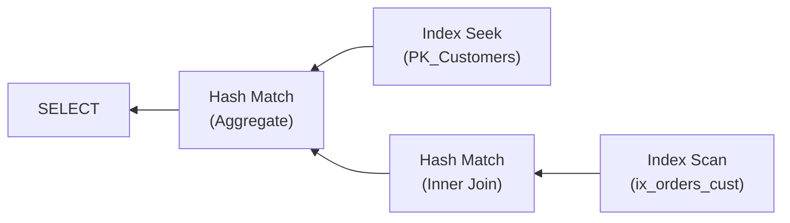

# Indexes & Query Optimization

> [Mastery Guide](../../README.md) › [Data & Persistence](../README.md) › [SQL Mastery](./README.md)

| Status | Priority | Phase | Last reviewed |
|---|---|---|---|
| Not Started | High | Phase 5 — Data & Persistence | 2026-05-08 |

> 📖 **Deep dive available**: For phone-book analogies, ASCII layouts of clustered/non-clustered indexes, fragmentation visualizations, and 14 worked sections — see **[Indexes Deep Dive](./06-indexes-deep-dive.md)**.

## Contents
- [Why it matters](#why-it-matters)
- [Core concepts](#core-concepts)
  - [B-tree fundamentals](#b-tree-fundamentals)
  - [Clustered vs non-clustered indexes](#clustered-vs-non-clustered-indexes)
  - [Composite indexes — the leftmost prefix rule](#composite-indexes--the-leftmost-prefix-rule)
  - [Covering indexes (INCLUDE)](#covering-indexes-include)
  - [Filtered / partial indexes](#filtered--partial-indexes)
  - [Hash, GIN, GiST, columnstore — non-B-tree options](#hash-gin-gist-columnstore--non-b-tree-options)
  - [Reading execution plans](#reading-execution-plans)
  - [SARGable predicates](#sargable-predicates)
  - [Statistics and the optimizer](#statistics-and-the-optimizer)
  - [Seek predicates vs residual predicates](#seek-predicates-vs-residual-predicates)
  - [Why the optimizer ignores your index](#why-the-optimizer-ignores-your-index)
  - [Building an index on a live table](#building-an-index-on-a-live-table)
  - [Indexes decide the lock footprint](#indexes-decide-the-lock-footprint)
  - [The index as a sort order — ORDER BY and pagination](#the-index-as-a-sort-order--order-by-and-pagination)
  - [Combining two indexes — bitmap scans and index merge](#combining-two-indexes--bitmap-scans-and-index-merge)
  - [Foreign keys are not indexes](#foreign-keys-are-not-indexes)
- [Code & diagrams](#code--diagrams)
- [Common pitfalls](#common-pitfalls)
- [Interview-ready summary](#interview-ready-summary)
- [Interview Cross-Questioning Drill](#interview-cross-questioning-drill)
- [Cheat Sheet](#cheat-sheet)
- [Walkthrough](#walkthrough--query-that-ran-in-50ms-now-takes-8-seconds)
- [Self-test](#self-test)
- [Cross-references](#cross-references)
- [Sources](#sources)

---

## Why it matters

Indexes are the single biggest lever in SQL performance. The difference between a query that answers from a handful of pages and one that reads the whole table is usually the presence — or absence — of the right index. Engineers who understand indexes write fast queries by design; those who don't accumulate technical debt that explodes as data grows.

Beyond indexes, knowing how to read an execution plan, recognize SARGable predicates, and reason about statistics is what separates "I wrote a query" from "I tuned a query." Senior backend engineers handle their own DB performance — they don't file tickets to the DBA.

This is the longest file in the SQL sub-chapter because optimization knowledge compounds: the same handful of concepts (indexes, plans, SARG, stats) explain most of the query-tuning problems you will meet.

When NOT to focus on this: tiny tables, low-load systems, prototypes. Index strategy starts to matter at hundreds of thousands of rows or tens of QPS. Premature index optimization on a 1,000-row table wastes time.

> 🌍 **In the real world**: a pricing endpoint got slower as the catalogue grew, and what shipped was a fifteen-minute in-memory cache in the API rather than an index on the lookup column. Latency went green, the ticket closed. Weeks later support was fielding calls about the checkout total not matching the price on the product page — promotions were changing prices inside the cache window, and the cache had quietly become the version of the truth that customers saw. The index was one line of DDL; the cache was a consistency problem the team then owned permanently. Caching in front of a missing index buys latency with staleness, and staleness is paid in a currency the latency dashboard doesn't measure.

## Core concepts

### B-tree fundamentals

The default index structure in every major RDBMS. (Strictly it's a B+tree — all keys appear at the leaf level and leaves are linked. Microsoft's docs note they use "B-tree" generally while rowstore indexes are implemented as B+trees.) A B-tree is a balanced search tree with high fan-out: one node is one page, so the number of children per node is roughly `page size ÷ (key size + pointer size)`. An 8 KB page with a `bigint` key holds children in the hundreds; the same page with a `varchar(400)` key holds tens.

Fan-out is the whole trick. Comparisons still cost about log₂(N) — you binary-search inside each node — but **page reads** cost log_fanout(N), and page reads are what you pay for. Widening the key narrows fan-out, deepens the tree, and adds a page read to every lookup in it.

```
Conceptual structure (simplified):

                  [50 | 100 | 150]               ← root node
                  /     |     |    \
        [10|20|30]  [60|70|80]  [110|120] [160|170]   ← inner nodes
        /   |   \                                         (point to leaf nodes)
        ...
       Leaf level: sorted rows / row pointers, doubly linked
       [10→A][20→B][30→C]....[170→X][180→Y]
       ←───── ranges traversable in order ─────→
```

Two key properties:
- **Sorted**: leaf level is in order, allowing range scans (`WHERE x BETWEEN 50 AND 100`).
- **Balanced**: every leaf is the same depth, so all lookups have the same worst-case cost.

The leaf level holds either:
- **The actual rows** — a clustered index (SQL Server) or the clustered table (MySQL InnoDB). PostgreSQL has no such structure; its tables are always heaps.
- **A row locator** — non-clustered / secondary indexes. What the locator *is* differs by engine, and it matters: SQL Server stores the clustered index key, or a RID built from file ID + page + slot if the table is a heap; InnoDB stores the primary key columns; PostgreSQL stores a `ctid` (heap page + offset).

> 🌍 **In the real world**: a team made a partner's reference string — `varchar(400)`, unique — the primary key of an integrations table, because every inbound webhook looked rows up by it. Lookups were fast, so nothing showed up in review. What showed up in the storage graph was that the index was nearly the size of the table, and that every *other* index on the table had grown too: on SQL Server the clustered key is the row locator stored inside each non-clustered index, so a 400-byte key is copied into all of them. Switching to an `int IDENTITY` primary key with a separate unique index on the reference kept the same guarantee and shrank every secondary index. SQL Server's key-size ceilings — 900 bytes for a clustered index, 1,700 for a non-clustered one since SQL Server 2016, 32 key columns (Microsoft Learn, *CREATE INDEX*) — are the engine telling you what it expects a key to look like.

### Clustered vs non-clustered indexes

**Clustered index** — the rows themselves, held in the order of the index key. *The leaf level of the clustered index is the table.* Each table can have at most one, because the rows can be maintained in only one key order.

> ⚠️ **Say "key order", not "physical order on disk" — interviewers listen for it.** A clustered index maintains a *logical* order: leaf pages are chained in key order by a doubly-linked list, and each page's slot array orders the rows within it. Neither guarantees the pages sit next to each other on the storage device. That gap is exactly what `avg_fragmentation_in_percent` measures — Microsoft defines rowstore fragmentation as existing "when indexes have pages in which the logical ordering within the index, based on the key values of the index, doesn't match the physical ordering of index pages" (Microsoft Learn, *Maintain indexes optimally*). If a clustered index guaranteed physical order, fragmentation could not exist. Worked through in [Indexes Deep Dive](./06-indexes-deep-dive.md#1-clustered-index).

```sql
-- SQL Server / MySQL InnoDB: PK is the clustered key by default
CREATE TABLE orders (
    id INT PRIMARY KEY,                  -- this is the clustered index
    customer_id INT,
    total DECIMAL(18, 2)
);
```

**Non-clustered index** — separate B-tree containing the indexed column(s) + a pointer back to the row in the table.

```sql
CREATE INDEX ix_orders_customer ON orders (customer_id);
-- Lookups:
--   1. Search ix_orders_customer for matching customer_id.
--   2. Use the row pointer (clustered key in SQL Server, or row id in PostgreSQL) to fetch the row.
```

That second hop is overhead — covered by **covering indexes** below. SQL Server gives it its own operator, `Key Lookup`, so you can see it and cost it. PostgreSQL doesn't: the heap access is folded inside the `Index Scan` node, and the only trace of it is the buffer counts and the fact that the node isn't an `Index Only Scan`. Same work, one engine bills it visibly and one doesn't.

**PostgreSQL note:** PostgreSQL doesn't have clustered indexes in the SQL Server sense. The PK is just a non-clustered index on a heap-organized table. The `CLUSTER` command physically reorders the table by an index, but it's not maintained automatically.

**Choosing the clustered key (SQL Server / InnoDB):**
- **Narrow** (small data type — INT/BIGINT, not GUID).
- **Monotonically increasing** (so inserts append at end, no page splits).
- **Stable** (rarely / never updated).
- **Unique** (or made so via tie-breaker).

`INT IDENTITY` / `BIGSERIAL` PKs satisfy all four. **GUID without `NEWSEQUENTIALID()` is a footgun** — random insertion order scatters inserts across the whole key range, splitting pages that were already full.

Width matters twice on clustered-index engines. Because SQL Server stores the clustered key inside every non-clustered index as the row locator, a 16-byte GUID clustered key adds 16 bytes to every row of every other index on that table (Microsoft Learn, index architecture and design guide). InnoDB behaves the same way and the MySQL manual states the consequence directly: "If the primary key is long, the secondary indexes use more space, so it is advantageous to have a short primary key." PostgreSQL is exempt — its secondary indexes carry a `ctid`, so a wide primary key costs you only in its own index.

> 🌍 **In the real world**: an EF Core service generated `Guid.NewGuid()` keys for an orders table, and SQL Server made that the clustered key by default. Inserts landed in random pages, so the table fragmented as fast as it grew and the write path spent its time splitting pages. The team moved to an `int IDENTITY` clustered key, keeping the GUID as a unique non-clustered index for external references — and met the opposite failure: every insert now targeted the same last page, and the wait stats filled with `PAGELATCH_EX`, which Microsoft documents as last-page insert contention. `OPTIMIZE_FOR_SEQUENTIAL_KEY = ON` (SQL Server 2019 and later) exists for exactly this trade. Sequential keys buy you page density and hand you a hot spot; random keys buy you spread and cost you density. You pick which problem you would rather have, and at high insert concurrency you need an answer for both.

### Composite indexes — the leftmost prefix rule

A composite index includes multiple columns. The order matters.

```sql
CREATE INDEX ix_orders_customer_status_created
    ON orders (customer_id, status, created_at);
```

This index helps queries that filter on:
- `customer_id` alone — yes (leftmost).
- `customer_id` AND `status` — yes (leftmost prefix).
- `customer_id` AND `status` AND `created_at` — yes (full match).
- `customer_id` AND `created_at` (skipping `status`) — partial use; depends on optimizer.
- `status` alone — **no** (status isn't the leading column).
- `created_at` alone — **no**.

Imagine the index sorted by `(customer_id, status, created_at)`:

```
(7, 'Cancelled', 2025-01-15)
(7, 'Cancelled', 2025-02-20)
(7, 'Paid',      2025-01-10)
(7, 'Paid',      2025-03-05)
(7, 'Pending',   2025-04-12)
(8, 'Cancelled', 2025-02-01)
(8, 'Paid',      2025-03-15)
...
```

To find "all status=Paid for customer 7," the engine seeks to (7, 'Paid', ?) and reads sequentially — fast. To find "all status=Paid (any customer)," the engine must scan the entire index — no shortcut, status isn't first.

**Order columns by**:
1. **Equality before range.** `WHERE customer_id = 7 AND created_at > '2025-01-01'` is best served by `(customer_id, created_at)`. Reverse the order and the seek starts at a date and has to check `customer_id` on every row it passes.
2. **Most selective first among the equality columns.** Selectivity only breaks ties inside the equality group; it never promotes a range column above an equality one.
3. **Common queries** dictate the order. Profile actual usage.

```sql
-- Query
WHERE customer_id = 7 AND created_at > '2025-01-01'

-- Best index:    (customer_id, created_at)        ← seek customer 7, scan dates
-- OK index:      (customer_id) only               ← seek customer 7, then filter dates in memory
-- Bad index:     (created_at, customer_id)        ← can't seek to customer 7
```

**The range column ends the seek.** The engine descends the tree using leading columns only while they are pinned by equality. The first inequality or range predicate decides where the leaf scan starts and stops, and every column after it can only be checked row by row as the scan goes past. That is the mechanical reason "equality first" beats "most selective first".

Worked comparison — query `WHERE customer_id = 7 AND status = 'Paid' AND created_at >= '2025-01-01'`:

| Index | Used to position the scan | Checked row by row afterwards |
|---|---|---|
| `(customer_id, status, created_at)` | all three — seek to `(7,'Paid','2025-01-01')`, stop at the end of `(7,'Paid')` | nothing |
| `(customer_id, created_at, status)` | `customer_id`, `created_at` | `status`, on every one of customer 7's orders since that date |
| `(created_at, customer_id, status)` | `created_at` only | `customer_id` and `status`, on every order in the date range — for every customer |

All three produce a plan that says "Index Seek". Only the first reads about as many rows as it returns; see [Seek predicates vs residual predicates](#seek-predicates-vs-residual-predicates) for how to tell them apart in a plan.

Tapio Lahdenmäki and Michael Leach's *Relational Database Index Design and the Optimizers* names the target: the **three-star index**. One star if the rows the query wants sit next to each other in the index (equality columns leading), a second if the index already returns them in the order the query asked for (no sort), a third if the index carries every column the query touches (no table access). Three stars means one tree descent plus one thin scan, and nothing else.

> 🌍 **In the real world**: an orders table had a single composite index, `(created_at, customer_id)`, created for finance reports that all filter by date range. The customer-facing "my orders" screen used it too, and its plan showed an Index Seek, so it never came up in review. But the seek boundary was the date range: to return one customer's twenty orders the screen was reading every order the business had taken that month. Adding `(customer_id, created_at)` for the screen changed nothing about which operators appear in the plan and everything about how many rows they touch. "Is it seeking?" is the wrong question. "How many rows does it read per row returned?" is the right one.

### Covering indexes (INCLUDE)

A **covering index** contains all columns the query needs — the engine can answer from the index alone, without going to the table. Massive speedup for hot read paths.

```sql
-- Query
SELECT id, status, total FROM orders WHERE customer_id = 7;

-- Without INCLUDE: index lookup → "Key Lookup" / heap fetch for status, total
CREATE INDEX ix_orders_customer ON orders (customer_id);

-- With INCLUDE: all columns are in the index leaf
CREATE INDEX ix_orders_customer_covering
    ON orders (customer_id) INCLUDE (status, total);
-- Now the query is satisfied from the index alone.
```

In SQL Server: `INCLUDE` keyword.
In PostgreSQL: `INCLUDE` arrived for B-tree in version 11; the docs currently list B-tree, GiST and SP-GiST as the access methods that support it, and note that "a non-key column cannot be used in an index scan search qualification" (PostgreSQL docs, *CREATE INDEX*) — the same key-versus-payload split as SQL Server's. PostgreSQL also needs the visibility map to say the pages are all-visible before it will do an Index Only Scan; see Drill 5.
In MySQL: no INCLUDE; add columns to the key (less efficient — affects sort order). InnoDB secondary indexes already contain the primary key columns, so an index on `(customer_id)` covers `SELECT id, customer_id` for free when `id` is the PK.

`INCLUDE` columns aren't part of the sort key — they don't help with seeking, just available at the leaf. So `WHERE` and `JOIN` predicates use the key columns; `SELECT` columns can be in `INCLUDE`.

**Trade-off**: covering indexes increase index size and write overhead. Don't include every column "just in case."

**The write side is where covering indexes bite.** An included column is a copy, so every UPDATE to it rewrites index leaf entries even though no key changed. PostgreSQL sharpens this: an UPDATE can be a **HOT (heap-only tuple)** update — touching no index at all — only when it "does not modify any columns referenced by the table's indexes" and the new version fits on the same page (PostgreSQL docs, *Heap-Only Tuples*). Put a frequently-updated column in an index, key or `INCLUDE`, and every update of that column stops being HOT and starts writing a new entry into *every* index on the table. `last_seen_at`, `view_count` and status flags are the usual casualties.

> 🌍 **In the real world**: a covering index for an order-list endpoint, `(customer_id, created_at) INCLUDE (status, total)`, did its job until someone added `ShippingRegion` to the DTO the endpoint projected. One property on a C# record, one extra column in the generated SELECT, and the plan went from a single seek to a seek plus one key lookup per row. Nothing failed; p99 drifted up over a release and was put down to traffic. The lesson is where the index's contract actually lives — it is defined by the column list of every query that depends on it, and that list is in the application, not in the schema. Either the entity carries a comment naming the index, or a test asserts the plan, or the next projection change quietly undoes the tuning.

### Filtered / partial indexes

Index only a subset of rows.

```sql
-- SQL Server
CREATE INDEX ix_orders_pending
    ON orders (customer_id, created_at)
    WHERE status = 'Pending';

-- PostgreSQL (same syntax for "partial index")
CREATE INDEX ix_orders_pending
    ON orders (customer_id, created_at)
    WHERE status = 'Pending';
```

Useful for:
- Soft delete pattern: `WHERE deleted_at IS NULL` — index only active rows.
- Status-specific queries: most queries hit Pending; index just those.
- Sparse data: most rows are NULL for some column; index only the non-NULL.

The index is smaller (only matching rows), faster to scan, and cheaper to maintain. For queries hitting the same predicate, the optimizer can use it.

```sql
-- This query uses the partial index automatically
SELECT * FROM orders
WHERE customer_id = 7 AND created_at > '2025-01-01' AND status = 'Pending';
```

**The optimizer has to *prove* the query's predicate implies the index's** — trivial with a literal, impossible with a parameter it can't see. On SQL Server, `WHERE status = 'Pending'` matches a filtered index defined `WHERE status = 'Pending'`; `WHERE status = @status` does not, because the compiled plan is cached and has to stay correct for every value `@status` might hold on a later call. `OPTION (RECOMPILE)` embeds the literal at compile time and the match succeeds (Aaron Bertrand, *Filtered Indexes and Forced Parameterization (redux)*, SQLPerformance). PostgreSQL applies the same logic to partial indexes: a custom plan with the parameter substituted can match; a generic cached plan holding a placeholder cannot.

PostgreSQL's switch between the two is documented and has a counter in it: "the first five executions are done with custom plans and the average estimated cost of those plans is calculated. Then a generic plan is created and its estimated cost is compared to the average custom-plan cost. Subsequent executions use the generic plan if its cost is not so much higher than the average custom-plan cost as to make repeated replanning seem preferable" (PostgreSQL docs, *PREPARE*). So a prepared statement — an explicit `PREPARE`, a driver with automatic preparation switched on, or a PL/pgSQL function's cached plans — can use the partial index on its first calls and quietly stop using it on the sixth, in the same session, with no change anywhere. `plan_cache_mode = force_custom_plan` is the switch that stops it — settable per session, per role or in `postgresql.conf`, and best scoped to the workload that needs it rather than the whole instance.

SQL Server will even tell you it noticed — the plan XML carries an `<UnmatchedIndexes>` element listing filtered indexes the optimizer considered and could not use.

Microsoft's own guidance for filtered indexes is the same rule stated positively: "the `WHERE` clause of the query should be a subset of the `WHERE` clause of the filtered index" (Microsoft Learn, *Create Filtered Indexes*). Two more limits worth knowing before you reach for one: filtered indexes support only simple comparison operators (no `LIKE`), and you cannot reference a computed column in the filter.

> 🌍 **In the real world**: an outbox table held tens of millions of dispatched rows and a few thousand pending ones, so someone added the obvious filtered index on `WHERE status = 'Pending'`. The dispatcher got no faster, and `sys.dm_db_index_usage_stats` showed the index had never been seeked once. The predicate was right; the parameter was the problem. The dispatcher called a shared repository method that passed the status as `@status`, so the optimizer could not prove the cached plan would only ever run for `Pending` and picked a plan that ignored the index entirely. The fixes are all small — a dedicated query with the literal in the SQL, or `OPTION (RECOMPILE)`. Noticing is the hard part, and the tell is an index with zero seeks that everyone was certain was in use.

### Hash, GIN, GiST, columnstore — non-B-tree options

B-tree is the default but not the only structure.

**Hash indexes** — equality lookups only (no range), O(1) average.
- PostgreSQL: `CREATE INDEX ... USING hash`. Rarely beats B-tree in practice, and before PostgreSQL 10 hash indexes weren't WAL-logged — they didn't survive a crash and weren't replicated, which is why a generation of advice says "never use them".
- SQL Server: Hash indexes on memory-optimized tables (Hekaton).

**GIN (Generalized Inverted Index)** — PostgreSQL's "many-values-per-row" index. Used for:
- JSONB columns (`@>`, `?`, `?&` operators).
- Full-text search (`to_tsvector`).
- Arrays.

```sql
CREATE INDEX ix_orders_metadata ON orders USING gin (metadata);
-- Now: WHERE metadata @> '{"region": "us-east"}' uses the index.
```

**GiST (Generalized Search Tree)** — PostgreSQL's geometric, range-type, and full-text indexes. Powers PostGIS.

**Columnstore indexes** (SQL Server; the same columnar layout underlies warehouses such as BigQuery, Snowflake and Redshift, though they don't call it an index) — store data column-by-column, compress aggressively, optimized for analytical queries (sum, avg, group by) over many rows. Terrible for point lookups; great for "sum the last 5 years of sales."

```sql
-- SQL Server columnstore
CREATE CLUSTERED COLUMNSTORE INDEX ix_sales_cs ON sales;
```

Why it wins on aggregates is structural, not magical: rows are grouped into rowgroups of up to 1,048,576 rows, each column stored as its own compressed segment with min/max metadata, so a `SUM(amount) WHERE year = 2024` reads two columns instead of every row's every field and skips whole segments whose metadata rules them out (Microsoft Learn, *Columnstore indexes: Overview*). The same layout is why a single-row lookup is worse than useless there.

**Full-text indexes** — for substring search across large text. PostgreSQL: GIN with `tsvector`. SQL Server: `CREATE FULLTEXT INDEX`. Don't use `LIKE '%xxx%'` for substring search at scale; full-text is purpose-built.

**Trigram indexes (PostgreSQL)** — the exception to "a leading wildcard can't use an index". `pg_trgm` indexes the three-character sequences in a value, and its GIN/GiST operator classes support `LIKE`, `ILIKE`, regex and similarity searches (PostgreSQL docs, *pg_trgm*). Full-text search matches whole words after stemming; trigram search matches substrings and tolerates typos. They answer different questions.

```sql
CREATE EXTENSION pg_trgm;
CREATE INDEX ix_customers_name_trgm ON customers USING gin (name gin_trgm_ops);
-- Now: WHERE name ILIKE '%son%' can use the index.
```

> 🌍 **In the real world**: an internal "search customers" box ran `WHERE name ILIKE '%' || @q || '%'` and sequentially scanned the customer table on every keystroke, because a B-tree cannot begin a search in the middle of a string. The first proposal on the table was Elasticsearch, with the sync pipeline and the second failure domain that implies. What shipped was `CREATE EXTENSION pg_trgm` and one GIN index. A whole system was avoided by knowing that the exception exists — which is the argument for learning your engine's index types before designing around their absence.

### Reading execution plans

Every modern RDBMS has an `EXPLAIN` (PostgreSQL, MySQL) or "Display Estimated/Actual Plan" (SQL Server SSMS). Reading plans is the single highest-value SQL skill.

```sql
-- PostgreSQL
EXPLAIN ANALYZE
SELECT c.name, COUNT(o.id) AS order_count
FROM customers c
LEFT JOIN orders o ON o.customer_id = c.id
WHERE c.country = 'PK'
GROUP BY c.name;

-- Result (abbreviated)
HashAggregate  (cost=125.34..130.34 rows=500 width=20) (actual time=2.5..3.0 rows=500)
  Group Key: c.name
  ->  Hash Right Join  (cost=12.50..120.00 rows=2134 width=12)
        Hash Cond: (o.customer_id = c.id)
        ->  Seq Scan on orders o  (cost=0..50 rows=2000 width=8)
        ->  Hash  (cost=10.00..10.00 rows=500 width=12)
              ->  Index Scan using ix_customers_country on customers c
                    (cost=0..10 rows=500 width=12)
                    Index Cond: (country = 'PK')
```

Reading top-down:
- **HashAggregate** — final GROUP BY operator.
- **Hash Right Join** — combines orders + customers via hash table.
- **Index Scan using ix_customers_country** — uses the country index (good).
- **Seq Scan on orders** — full table scan (often a problem for large tables).

What to look for:
- **Sequential / table scans** on big tables → missing index.
- **Index Scan vs Index Seek** — Seek is targeted (good); Scan reads the entire index.
- **Sort** consuming most of the cost → consider an index that pre-sorts.
- **Hash Match** for joins — fine for big sets; **Nested Loop** for small.
- **Estimated vs Actual rows** widely different → stale statistics; `ANALYZE` / `UPDATE STATISTICS`.
- **Key Lookup** (SQL Server) — non-covering index forced row fetches; add INCLUDE columns.

**"Index Scan" does not mean the same thing in both engines**, and the vocabulary catches people who learned plans on one and are reading the other. SQL Server has two operator names — `Index Seek` descends the tree to a key range, `Index Scan` reads the leaf level end to end. PostgreSQL has one node name for both: an `Index Scan` carrying an `Index Cond` *is* a seek; an `Index Scan` with no `Index Cond` is reading the whole index. Reading a PostgreSQL plan for the word "Scan" and concluding the index isn't being used is a standard mistake in the other direction, and the answer is the same either way — look at rows and buffers, not at the operator's name.

In SQL Server SSMS, "Include Actual Execution Plan" (Ctrl+M) before running shows the plan as a graph. The "Missing Index" hint above the plan is a starting suggestion.

```sql
-- SQL Server
SET STATISTICS IO, TIME ON;
SELECT ... ;
-- Output: logical reads, physical reads, CPU time, elapsed time.

-- Estimated plan only, and it must be alone in its batch — hence the GO separators.
-- SET SHOWPLAN_XML ON does not execute the statement, so there are no actual row counts.
SET SHOWPLAN_XML ON;
GO
SELECT ... ;
GO
SET SHOWPLAN_XML OFF;
GO

-- Actual plan with real row counts (executes the statement):
SET STATISTICS XML ON;
SELECT ... ;
SET STATISTICS XML OFF;
```

`STATISTICS IO` reads tell you index efficiency; logical reads scaling with rows is fine; physical reads point at memory issues.

**MySQL**: `EXPLAIN` gives estimates, `EXPLAIN FORMAT=JSON` adds cost detail, and `EXPLAIN ANALYZE` (MySQL 8.0.18+) executes the query and reports actual timings and row counts the way PostgreSQL's `EXPLAIN ANALYZE` does. The `Extra` column is where the useful signal lives: `Using index` = covered, `Using index condition` = index condition pushdown, `Using filesort` = a sort the index didn't provide, `Using temporary` = a materialised intermediate result.

> 🌍 **In the real world**: a slow query was escalated with a screenshot of its plan attached and the note "it's using the index, so it isn't the index". It was an *estimated* plan, captured on a developer database holding a fraction of production's rows, and it estimated forty rows where production returned nearly a million — which was the entire bug, invisible in the artefact used to rule it out. Estimated plans are free and lie about the number that matters. Actual plans cost you one execution and tell you what the engine really did.

### SARGable predicates

A **SARGable** ("Search ARGument-able") predicate can use an index seek. A non-SARGable predicate must scan the index or table.

**Non-SARGable patterns:**

```sql
-- ❌ Function on indexed column → can't use index
WHERE UPPER(name) = 'AHMED'
WHERE YEAR(created_at) = 2025
WHERE created_at + INTERVAL '1 day' > NOW()

-- ✅ Rewrite to SARGable
WHERE name = 'Ahmed'                                         -- if collation handles case
WHERE created_at >= '2025-01-01' AND created_at < '2026-01-01'
WHERE created_at > NOW() - INTERVAL '1 day'

-- ❌ Implicit conversion that lands on the COLUMN
-- SQL Server: nvarchar outranks varchar in data type precedence, so a varchar column
-- compared to an nvarchar parameter is what gets converted — once per row.
WHERE varchar_col = N'ABC123'         -- CONVERT_IMPLICIT on the column
-- ✅
WHERE varchar_col = 'ABC123'          -- same type; clean seek
--   How badly it hurts depends on the column's collation. Under a SQL collation
--   (SQL_Latin1_General_*) the seek is gone outright. Under a Windows collation the
--   conversion is order-preserving, so SQL Server can still derive a range and seek —
--   but the conversion stays in the plan and the warning with it. Don't build on
--   which one you happen to have; match the types.

-- Which side converts is the whole question:
--   WHERE int_col = '7'      → the LITERAL converts to int. Still SARGable on
--                              SQL Server and PostgreSQL. Harmless.
--   WHERE varchar_col = 7    → the COLUMN converts to a number. Seek gone.
--                              True on SQL Server, and on MySQL, whose manual
--                              specifies that comparing a string column with a
--                              number converts both to floating-point values.

-- ❌ Leading wildcard
WHERE name LIKE '%son'                -- no B-tree seek: the tree is sorted left-to-right
-- ✅ Trailing wildcard
WHERE name LIKE 'A%'
-- (PostgreSQL exception: a pg_trgm GIN index makes '%son%' indexable — see above.)

-- ⚠️ OR across different columns — engine-dependent, check the plan first
WHERE customer_id = 7 OR status = 'Pending'
--   PostgreSQL can seek both indexes and merge them with a BitmapOr node.
--   SQL Server sometimes produces two seeks and a concatenation, and often
--   gives up and scans.
-- ✅ The rewrite that works everywhere. UNION, not UNION ALL: a row matching
--    both predicates would otherwise be returned twice.
SELECT * FROM orders WHERE customer_id = 7
UNION
SELECT * FROM orders WHERE status = 'Pending';
```

> 🌍 **In the real world**: a lookup by external reference had a perfectly good index on the column and scanned the table on every call anyway. The column was `varchar(32)`; the C# property was `string`, and EF Core sends `string` parameters as `nvarchar` unless the model says otherwise — so SQL Server followed its data type precedence rules, converted the *column* to `nvarchar` for every row it read, and the seek was gone. The plan carried two tells nobody had looked at: `CONVERT_IMPLICIT(nvarchar(32), [reference], 0)` inside the predicate, and a plan-level warning that the type conversion "may affect SeekPlan in query plan choice". The fix was `.IsUnicode(false)` on one property. The index was never the problem; the parameter's type was — one of the easiest ways for a .NET application to defeat an index it correctly created.

**Function-based / expression indexes** (PostgreSQL, Oracle): index on the *expression* itself.

```sql
-- Make UPPER(name) SARGable by indexing the expression
CREATE INDEX ix_customers_name_upper ON customers (UPPER(name));

-- Now this query can seek
WHERE UPPER(name) = 'AHMED';
```

SQL Server uses computed columns + index on the computed column for the same effect.

### Statistics and the optimizer

The optimizer chooses query plans based on **statistics** — sampled summaries of column distributions.

```sql
-- PostgreSQL
ANALYZE orders;             -- update stats for one table
ANALYZE;                    -- all tables

-- SQL Server
UPDATE STATISTICS orders;
EXEC sp_updatestats;        -- all tables, all indexes
```

Why stats matter:
- Optimizer estimates row counts from stats: "WHERE country = 'PK' will return ~500 rows."
- Bad estimate → bad plan: "I think 500 rows; pick nested loop" — but actual is 5M, plan is wrong.
- Symptom: estimated vs actual rows differ by 10× or more in `EXPLAIN ANALYZE`.

Stats are auto-updated on most modern systems (autovacuum in PostgreSQL, AUTO_UPDATE_STATISTICS in SQL Server). For very large tables, manual `UPDATE STATISTICS WITH FULLSCAN` periodically.

**When does auto-update actually fire?** Both engines have documented thresholds, and knowing them is the difference between "stats are automatic" and knowing why yours were stale:

- **SQL Server** counts modifications to the leading statistics column. For a table of *n* rows above 500, the threshold is `MIN(500 + 0.20 × n, SQRT(1000 × n))` under database compatibility level 130 and later; Microsoft's own worked example is a 2,000,000-row table refreshing every 44,721 modifications rather than every 400,500 (Microsoft Learn, *Statistics*). On older compatibility levels it's the flat 20% rule unless trace flag 2371 is enabled.
- **PostgreSQL** autoanalyze fires when changes exceed `autovacuum_analyze_threshold` (default 50) plus `autovacuum_analyze_scale_factor` (default 0.1) × row count (PostgreSQL docs, *Automatic Vacuuming*). Ten percent of a very large table is a lot of drift to tolerate, which is why per-table `ALTER TABLE ... SET (autovacuum_analyze_scale_factor = 0.01)` is common on big tables.

**Histogram bias**: stats use a histogram of values, and the histogram is small on purpose. SQL Server aggregates the column values into "a maximum of 200 contiguous histogram steps" no matter how large the table is (Microsoft Learn, *Statistics*); PostgreSQL's `default_statistics_target` caps the `most_common_vals` and `histogram_bounds` arrays at 100 entries by default. A column with a million distinct values is therefore being described to the optimizer by a couple of hundred buckets, and a rare value that falls inside a wide bucket is estimated from that bucket's average rather than from itself. Refreshing statistics doesn't fix that — the cap is the cap. What does: raising the target for that specific column (`ALTER TABLE ... ALTER COLUMN ... SET STATISTICS` in PostgreSQL, `CREATE STATISTICS ... WITH FULLSCAN` and filtered statistics in SQL Server), or building an index that makes the estimate less load-bearing.

**The independence assumption is the other half of the story, and it fails on real schemas.** Statistics are collected per column, so when a query has two predicates the optimizer has to combine two single-column selectivities with no knowledge of how the columns relate. PostgreSQL states the limitation plainly: "The planner normally assumes that multiple conditions are independent of each other, an assumption that does not hold when column values are correlated. Regular statistics, because of their per-individual-column nature, cannot capture any knowledge about cross-column correlation" (PostgreSQL docs, *Planner Statistics*). In PostgreSQL, two predicates that each match a tenth of the table are estimated at a hundredth together — the straight product. SQL Server's cardinality estimator from 2014 on (compatibility level 120 and above, the default since) applies exponential backoff instead, so it under-estimates by less while staying just as blind to the correlation. Either way: correct if the columns are independent, badly wrong if one implies the other. Postcode and city, product and category, tenant and country are all cases where they aren't, and the estimate collapses to a number small enough for the optimizer to pick a nested loop over millions of rows.

The fixes are engine-specific and both are things you declare rather than tune:

- **PostgreSQL**: `CREATE STATISTICS` builds extended statistics of three kinds — functional dependencies (one column determines another), multivariate n-distinct counts (for `GROUP BY` on several columns), and multivariate MCV lists (most-common combinations of values). Per-column detail is capped by `default_statistics_target`, documented as "presently 100 entries" for the `most_common_vals` and `histogram_bounds` arrays, and raisable per column with `ALTER TABLE ... ALTER COLUMN ... SET STATISTICS`.
- **SQL Server**: create multi-column statistics — but know exactly what you get. "SQL Server builds histograms for only a single column - the first column in the set of key columns of the statistics object"; the extra columns contribute a *density vector*, one density per **prefix** of the key columns. Microsoft's own example: a statistics object on `(LastName, MiddleName, FirstName)` has densities for `(LastName)`, `(LastName, MiddleName)` and `(LastName, MiddleName, FirstName)`, and "the density isn't available for `(LastName, FirstName)`" (Microsoft Learn, *Statistics*). Column order in a statistics object matters for the same prefix reason it matters in an index. Filtered statistics — a statistics object with a `WHERE` clause — are the tool for a skewed subset the global histogram averages away.

```sql
-- PostgreSQL: teach the planner that tenant implies country
CREATE STATISTICS st_orders_tenant_country (dependencies, mcv)
    ON tenant_id, country FROM orders;
ANALYZE orders;

-- SQL Server: multi-column statistics (histogram on tenant_id only, densities for prefixes)
CREATE STATISTICS st_orders_tenant_country ON orders (tenant_id, country);
```

> 🌍 **In the real world**: a multi-tenant reporting query filtered on `tenant_id` and `country`, and every tenant in the system operated in exactly one country — so the two predicates were the same predicate wearing two hats. The planner didn't know that. It multiplied the two selectivities, estimated a few dozen rows where the answer was six figures, and built a plan sized for a few dozen: a nested loop driving a lookup per row. The query had been fine for a year and got worse as one tenant grew, which made it look like a data-volume problem rather than an estimation problem. The tell was in the plan the whole time — estimated rows and actual rows differing by orders of magnitude on the scan, not on the join. Extended statistics fixed the estimate; the composite index on `(tenant_id, country, created_at)` made the estimate matter less, because a seek that ends in the right place doesn't need the optimizer to be right about how many rows follow.

**Out-of-histogram predicates** are the sharpest case, because the value in question is one your application uses constantly: today's date, the newest ID. The histogram ends at the last value seen when stats were built, and a predicate past that edge is estimated from a fallback rather than from data. PostgreSQL mitigates this in the planner by probing the index for the column's current minimum/maximum when an inequality falls beyond the histogram's end (`get_actual_variable_range` in the selectivity code) instead of trusting the stale bound.

> 🌍 **In the real world**: a nightly import loaded the day's rows into a 200-million-row table, and the first report to run afterwards took twenty minutes instead of one. Nothing had been deployed. The import had inserted rows carrying today's date, statistics still described yesterday's maximum, and the report's `WHERE created_at >= @today` sat past the end of the histogram — so the optimizer estimated a handful of rows, chose a nested-loop plan built for a handful of rows, and then ran it against millions. Moving `UPDATE STATISTICS` into the end of the import job, rather than leaving it to a nightly maintenance window with its own schedule, made it stop happening. Statistics maintenance belongs to whatever changes the data.

### Seek predicates vs residual predicates

"Index Seek" in a plan does not mean "read only what it returned". Every access path splits the query's predicate in two:

- The **seek predicate** (SQL Server) / **Index Cond** (PostgreSQL) — used to position the tree descent and to decide where the leaf scan stops. This determines **how many rows are read**.
- The **residual predicate** (SQL Server) / **Filter** (PostgreSQL) — evaluated against every row the scan produced. This determines **how many rows survive**.

The gap between those two numbers is your wasted I/O, your wasted CPU, and — on SQL Server's locking isolation levels — your extra locks. It is invisible if you read plans by operator name.

```
                       WHERE created_at >= '2026-01-01' AND customer_id = 42
                                  │                              │
    index on (created_at) ────────┤                              │
                                  ▼                              ▼
                        ┌──────────────────┐          ┌────────────────────┐
                        │  seek predicate  │          │ residual predicate │
                        │ positions + stops│─ rows ──▶│ checked per row    │─▶ 37 rows
                        │   the scan       │  read    │                    │
                        └──────────────────┘ 812,431  └────────────────────┘
                                             ▲                    ▲
                                  what you pay for       what you asked for
```

**PostgreSQL** prints both, and `EXPLAIN ANALYZE` counts the discards:

```
EXPLAIN (ANALYZE, BUFFERS)
SELECT id, total FROM orders
WHERE created_at >= DATE '2026-01-01' AND customer_id = 42;

Index Scan using ix_orders_created on orders  (actual time=... rows=37 loops=1)
  Index Cond: (created_at >= '2026-01-01'::date)     ← positions the scan
  Filter: (customer_id = 42)                          ← checked on every row read
  Rows Removed by Filter: 812394                      ← the bill
  Buffers: shared hit=... read=...
```

`Rows Removed by Filter` is the diagnosis on its own: the index located the date range, the engine read 812,431 rows, 37 were wanted. Move `customer_id` into the index and both that line and the buffer counts collapse. On an `Index Only Scan`, watch `Heap Fetches` for the same reason — a non-zero count means the visibility map sent the engine to the heap anyway.

**SQL Server** shows the same split in the operator's properties: `Seek Predicates` versus `Predicate` (the residual). Actual plans also expose **Number of Rows Read** alongside Actual Number of Rows — diagnostics added in SQL Server 2012 SP3 / 2014 SP2 / 2016 precisely for residual predicate pushdown (Microsoft KB3107397). When those two numbers differ by orders of magnitude you have the same problem, and the operator will still be labelled "Index Seek".

**MySQL/InnoDB** pushes what it can down into the storage engine. `Extra: Using index condition` means index condition pushdown evaluated part of the WHERE inside InnoDB against index tuples, avoiding full row reads; plain `Using where` means the server filtered after the rows came back; `Using index` means covered, no row reads at all (MySQL manual, *Index Condition Pushdown Optimization*). ICP applies to secondary indexes only on InnoDB — the clustered index has the whole row already. The slow query log's `rows_examined` versus rows sent is the same ratio by another name.

> 🌍 **In the real world**: a ticket arrived reading "the plan is an Index Seek, so the index isn't the problem". It was a seek on `(created_at)` for a query that also filtered `tenant_id`, and the residual predicate was discarding six figures of rows per execution — for a query on a multi-tenant table where one tenant's data was a rounding error in the date range. Rows Read is not on the face of the plan in SSMS; it's in the operator's properties pane, which is why the query survived two reviews and a "we already checked the index" reply. Everyone who tunes SQL for a living ends up reading one ratio before anything else: rows read per row returned.

### Why the optimizer ignores your index

You added the index and the plan didn't change. The candidates, in the order worth checking:

1. **The predicate isn't SARGable.** A function or an implicit conversion on the column. Look for `CONVERT_IMPLICIT` in the SQL Server plan, or a `Filter` where you expected an `Index Cond` in PostgreSQL.
2. **The optimizer doesn't think it's selective enough.** Every row found through a non-covering index costs a lookup back into the table, and past some fraction of the table a scan is genuinely cheaper — sequential reads are cheaper per page than random ones, which is exactly what the cost model encodes. The optimizer computes the crossover from statistics; a wrong estimate produces a wrong decision, and the fix is statistics or a covering index, not a hint.
3. **It can't prove the index applies.** Filtered/partial index versus a parameterized predicate, as above.
4. **The cost model describes hardware you no longer run on.** PostgreSQL's `random_page_cost` defaults to 4.0 against `seq_page_cost` 1.0 — a ratio from the era of seek time. The docs say to lower both, and to bring them closer together, when the database is largely cached in RAM. `effective_cache_size` (default 4 GB) tells the planner how much of the table it can hope to find in cache and feeds directly into index-scan costing. Neither is tuned for you by the cloud provider.
5. **The index isn't usable yet.** A failed `CREATE INDEX CONCURRENTLY` leaves behind an *invalid* index that queries ignore while writes still maintain it (PostgreSQL docs). Check `pg_index.indisvalid` before debugging anything else.
6. **You're looking at a plan compiled before the index existed**, or a forced plan in Query Store, or a hint someone left in the query three years ago.

**Test the counterfactual instead of arguing with the plan.** In PostgreSQL, `SET enable_seqscan = off;` and re-run `EXPLAIN`: the setting discourages rather than forbids scans, so if the index plan now appears with a higher cost, the planner *did* consider it and priced it out (reason 2 or 4); if it still never appears, the planner *can't* use it (reason 1, 3 or 5). In SQL Server, run it once with `WITH (INDEX(ix_name))` and compare logical reads from `SET STATISTICS IO ON` — as a measurement, not as something you ship.

> 🌍 **In the real world**: a PostgreSQL database moved from an old VM with spinning disks to a cloud instance with enough RAM to hold the working set, and a set of reports got *slower* on faster hardware. The planner was still charging four times as much for a random page fetch as for a sequential one, so for mid-selectivity predicates it kept declining index access and scanning — pricing random reads as if a disk head still had to travel, on a machine where the pages were in memory. No schema change, no query change, no bad statistics — the cost constants were describing a machine the database had not run on for a month.

### Building an index on a live table

Choosing the right index is the easy half. Creating it on a table that is being written to is where the outage lives, and "how would you add this index in production?" is a standard senior follow-up.

**PostgreSQL.** A plain `CREATE INDEX` takes a `SHARE` lock — reads continue, **writes block for the entire build** (PostgreSQL docs). On a large table that is a self-inflicted outage with a DDL statement's name on it. `CREATE INDEX CONCURRENTLY` avoids it, at a price: two passes over the table, waiting for existing transactions to finish before each pass, cannot run inside a transaction block, and if it fails it leaves an invalid index behind that queries ignore but writes keep maintaining. The documented recovery is to drop it and retry, or `REINDEX INDEX CONCURRENTLY`.

**SQL Server.** `WITH (ONLINE = ON)` — not available in every edition (Microsoft Learn) — runs in three phases. A short preparation phase takes an `S` lock and defines a row-versioned snapshot, briefly blocking writers. A long build phase runs under an intent-shared lock, during which concurrent INSERT/UPDATE/DELETE are applied to both the old structure and the new one. A short final phase swaps the metadata, briefly blocking new transactions. Both short phases first wait for in-flight write transactions to finish — so one long-running transaction can turn "online" into the head of a blocking chain, which is what `WAIT_AT_LOW_PRIORITY` exists to defuse. `RESUMABLE = ON` lets a build be paused and resumed instead of rolled back after an hour of work.

**MySQL/InnoDB.** Adding a secondary index is an in-place operation that permits concurrent DML. State the algorithm and lock level explicitly so the statement fails loudly rather than silently falling back to a table copy:

```sql
ALTER TABLE orders ADD INDEX ix_orders_customer (customer_id),
    ALGORITHM=INPLACE, LOCK=NONE;
```

Whichever engine: the index still has to be built, so it burns I/O and CPU while it runs, and on a replicated setup the build happens on the replicas too.

> 🌍 **In the real world**: the index that fixed a slow endpoint was created at 11am on a 300-million-row PostgreSQL table with a plain `CREATE INDEX`, and checkout began timing out within a minute. Nothing had deadlocked and the index definition was correct — writers were simply queued behind the `SHARE` lock the build was holding, and the only way out was to cancel the build and start again that evening with `CONCURRENTLY`. On a busy table, `CONCURRENTLY` is not an optimisation to remember; it is the only form of the statement anyone should be typing.

### Indexes decide the lock footprint

Indexes are a concurrency feature, not only a latency feature. The rows a statement *reads* are the rows it can lock, and which rows it reads is an access-path decision. This is where a reporting query takes production with it.

**SQL Server, locking read committed (the on-premises default).** A reader takes shared locks on the rows it reads, and rows thrown away by a residual predicate were read — so they were locked. Read committed releases each one as the scan moves past, but a wide scan holds a great many at any instant. Then escalation: when a single statement acquires at least 5,000 locks on one table or index, the engine escalates to a table lock (Microsoft Learn, *transaction locking and row versioning guide*), and from that moment every writer waits for the report. Read Committed Snapshot Isolation (RCSI) switches read committed to row versioning, so readers stop taking shared locks and stop blocking writers, paying for it with a `tempdb` version store and versioning overhead added to each row. RCSI is **off** by default in SQL Server and **on** by default for new Azure SQL Database databases — the same code, the same query, two different concurrency stories depending on where it runs.

**PostgreSQL.** Under MVCC a plain `SELECT` takes no row locks at all (`SELECT ... FOR UPDATE` is a different statement), so a report cannot block a write. It has its own version of the problem: a long-running report holds a snapshot, `VACUUM` cannot remove row versions that snapshot might still need, and dead tuples accumulate in the table and its indexes for the duration. The symptom is not blocking — it's bloat, and scans that get gradually more expensive for everyone else.

**MySQL/InnoDB.** A plain `SELECT` is a consistent non-locking read. Locking reads and writes are where the index decides everything, and the manual states the failure mode outright: "If you have no indexes suitable for your statement and MySQL must scan the entire table to process the statement, every row of the table becomes locked, which in turn blocks all inserts by other users to the table." Under InnoDB's default REPEATABLE READ those are next-key locks covering the gaps between index entries, so the locked range is the range the index scan walked — a missing index converts a row lock into a table's worth of range locks.

> 🌍 **In the real world**: a month-end finance report on SQL Server was why checkout failed on the first of the month, twice. The report scanned an orders table under the default locking read committed with a non-SARGable date predicate, took shared locks on everything it read, crossed the escalation threshold and held a table lock while it aggregated. The database was never "down"; it was doing precisely what read committed asks of it. Three fixes existed and the team eventually applied all three, in this order: a covering index so the report read the rows it needed instead of the table, RCSI so readers stopped taking shared locks at all, and a read replica so the report stopped competing with checkout for anything. The order matters — enabling RCSI without fixing the index just moves the cost into `tempdb` while the query still reads a table's worth of rows to return a page of totals.

### The index as a sort order — ORDER BY and pagination

An index is a sorted structure, and half of what it can do for you has nothing to do with filtering. If the plan can consume rows in index order, the `Sort` operator disappears — that is the second star of the three-star index.

The reason this matters more than it looks is that **a sort is blocking**: the operator cannot emit its first row until it has consumed its last, because the last row read might be the smallest. So `ORDER BY created_at DESC LIMIT 20` over an unindexed column reads and sorts the entire qualifying set to hand back twenty rows. With an index whose order matches, the engine walks the leaf level and stops after twenty. Same query, same result, and the difference is not "faster sorting" — it is that no sort happens.

**Direction is part of the match.** An index on `(a, b)` can serve `ORDER BY a, b` scanned forward and `ORDER BY a DESC, b DESC` scanned backward. Mixed directions are the case people get wrong:

- **PostgreSQL** states it directly: "Consider a two-column index on `(x, y)`: this can satisfy `ORDER BY x, y` if we scan forward, or `ORDER BY x DESC, y DESC` if we scan backward. But it might be that the application frequently needs to use `ORDER BY x ASC, y DESC`. There is no way to get that ordering from a plain index, but it is possible if the index is defined as `(x ASC, y DESC)` or `(x DESC, y ASC)`" (PostgreSQL docs, *Indexes and ORDER BY*).
- **MySQL** ignored `DESC` in an index definition until 8.0. The manual: "`DESC` in an index definition is no longer ignored but causes storage of key values in descending order. Previously, indexes could be scanned in reverse order but at a performance penalty." Descending indexes are InnoDB-only, and not available for `HASH`, `FULLTEXT` or `SPATIAL` indexes (MySQL manual, *Descending Indexes*).
- **SQL Server** has accepted `(a ASC, b DESC)` in `CREATE INDEX` for a long time and will scan an index backward for a fully reversed `ORDER BY`. The catch is that backward scans can't be parallelized (Brent Ozar, *Backwards Scans*), so on a large ordered read the reversed direction quietly costs you the parallel plan. Defining the index in the direction the query asks for is how you get it back.

**NULL ordering is part of the match too, and the engines disagree.** PostgreSQL: "By default, B-tree indexes store their entries in ascending order with nulls last" (PostgreSQL docs, *Indexes and ORDER BY*), and `NULLS FIRST` is the default for `ORDER BY DESC` — so `ORDER BY x DESC NULLS LAST` needs an index declared to match or it gets a Sort. SQL Server has no `NULLS FIRST`/`NULLS LAST` syntax at all: "`ASC` is the default sort order. `NULL` values are treated as the lowest possible values" (Microsoft Learn, *ORDER BY clause*). A query ported between the two can come out sorted differently *and* lose its index-provided order at the same time.

**Pagination is where this becomes a production problem.** `OFFSET` does not skip work; it does the work and throws it away. PostgreSQL says so: "The rows skipped by an `OFFSET` clause still have to be computed inside the server; therefore a large `OFFSET` might be inefficient." Microsoft's EF Core guidance says the same of `Skip`/`Take`: "The database must still process the first 20 entries, even if they aren't returned to the application; this creates possibly significant computation load that increases with the number of rows being skipped" — and adds the correctness problem, that concurrent inserts and deletes shift the window so rows get skipped or shown twice between pages.

```sql
-- Offset pagination: cost grows with the page number.
-- EF Core: .OrderByDescending(o => o.CreatedAt).ThenByDescending(o => o.Id).Skip(40000).Take(20)
SELECT id, created_at, total FROM orders
ORDER BY created_at DESC, id DESC
OFFSET 40000 ROWS FETCH NEXT 20 ROWS ONLY;   -- SQL Server and PostgreSQL; MySQL spells
                                             -- it LIMIT 20 OFFSET 40000
-- The engine produces 40,020 rows in order and discards 40,000 of them.

-- Keyset ("seek") pagination: cost is the same on page 1 and page 2,000.
-- PostgreSQL and MySQL both support the row-value comparison:
SELECT id, created_at, total FROM orders
WHERE (created_at, id) < (@lastCreatedAt, @lastId)
ORDER BY created_at DESC, id DESC
FETCH FIRST 20 ROWS ONLY;                    -- PostgreSQL; MySQL: LIMIT 20

-- SQL Server has no row-value comparison predicate; expand it by hand:
SELECT TOP (20) id, created_at, total FROM orders
WHERE created_at < @lastCreatedAt
   OR (created_at = @lastCreatedAt AND id < @lastId)
ORDER BY created_at DESC, id DESC;

-- Either way the supporting index is the ORDER BY, spelled out:
CREATE INDEX ix_orders_created_id ON orders (created_at DESC, id DESC);
```

Three things a senior is expected to say about that rewrite:

1. **The tiebreaker is not optional.** Ordering by a non-unique column alone means two pages can disagree about where the boundary was. Microsoft's wording: "always make sure that your ordering is fully unique... Note that relational databases do not apply any ordering by default, even on the primary key" (Microsoft Learn, *Pagination — EF Core*).
2. **Keyset pagination buys next/previous, not random access.** There is no page 400 without counting, so a UI with numbered pages either keeps `OFFSET` for jumps or changes its interaction model. EF Core's docs recommend exactly that hybrid.
3. **On MySQL, check the plan after using a row constructor.** The manual warns that "the optimizer is less likely to use available indexes if the row constructor columns do not cover the prefix of an index", and shows `(c2,c3) > (1,1)` alongside `c1=1` using only part of the key; its recommended rewrite is the expanded `c1 = 1 AND (c2 > 1 OR (c2 = 1 AND c3 > 1))` form — the same shape SQL Server forces on you anyway (MySQL manual, *Row Constructor Expression Optimization*).

In EF Core, keyset pagination is written as the expanded predicate because the provider has no LINQ syntax for row values (Microsoft Learn, *Pagination*, referencing dotnet/efcore issue #26822):

```csharp
var page = await db.Orders
    .OrderByDescending(o => o.CreatedAt).ThenByDescending(o => o.Id)
    .Where(o => o.CreatedAt < lastCreatedAt
             || (o.CreatedAt == lastCreatedAt && o.Id < lastId))
    .Take(20)
    .ToListAsync();
```

> 🌍 **In the real world**: an internal admin grid over an orders table used EF Core `Skip(page * 50).Take(50)`, and support staff reported that "the last pages time out" — which sounded like nonsense until someone read the SQL. Page 1 read fifty rows; page 3,000 read 150,050 rows in sorted order and threw away 150,000 of them, because that is what `OFFSET` means. The engineering was the easy part: a `(created_at DESC, id DESC)` index and a keyset predicate made every page cost the same. The hard part was the product conversation, because keyset pagination cannot jump to page 3,000 — the grid had to become next/previous with a search box. Offset pagination isn't a slow implementation of paging; it's a different feature, and the cost of the feature is proportional to how deep the user goes.

### Combining two indexes — bitmap scans and index merge

A single index scan can only use predicates that its own key order can bound. Two indexes on the same table can still be used together, and each engine does it differently enough that the plan operator names won't transfer.

**PostgreSQL** builds bitmaps. It scans each index, records the matching row locations in an in-memory bitmap, ANDs or ORs the bitmaps, then visits the heap. The docs give the consequence that people miss: "The table rows are visited in physical order, because that is how the bitmap is laid out; this means that any ordering of the original indexes is lost, and so a separate sort step will be needed if the query has an `ORDER BY` clause" (PostgreSQL docs, *Combining Multiple Indexes*). A bitmap plan therefore cannot also give you index-provided ordering.

```
                    WHERE status = 'Pending' AND region = 'us-east'

   ix_orders_status ──▶ Bitmap Index Scan ──┐
                                            ├─▶ BitmapAnd ─▶ Bitmap Heap Scan ─▶ rows
   ix_orders_region ──▶ Bitmap Index Scan ──┘                  Recheck Cond:
                                                               status = 'Pending'
                                                               AND region = 'us-east'
                                              Heap Blocks: exact=1240 lossy=0
                                                            ▲          ▲
                                     bitmap entries point at rows   ...or only at pages
```

The `Recheck Cond` line is not redundant work by mistake. Bitmap entries are exact when they identify individual rows; when the bitmap outgrows the memory it is allowed, entries degrade to **lossy** — they name a page rather than the rows on it, so the heap scan must read the whole page and re-evaluate the condition on every row it holds. `EXPLAIN (ANALYZE)` reports the split as `Heap Blocks: exact=N lossy=N`, and the degradation is governed by `work_mem` (pganalyze, *EXPLAIN Insights: Lossy Bitmaps*). Lossy blocks are one of the few cases where an "index" plan is reading whole pages and filtering them like a scan.

PostgreSQL's own advice on when to reach for a composite index instead: a multicolumn index on `(x, y)` will "typically be more efficient than index combination for queries involving both columns, but... less useful for queries involving only `y`". Separate indexes win only when the columns are queried in varying combinations.

**MySQL** calls it Index Merge. The access type in `EXPLAIN` is `index_merge` and the `Extra` column names the flavour: `Using intersect(...)`, `Using union(...)`, or `Using sort_union(...)`. It merges range scans "from a single table only, not scans across multiple tables", and is not applicable to full-text indexes (MySQL manual, *Index Merge Optimization*). The manual's own troubleshooting advice when the optimizer picks badly is to redistribute the terms, `(x AND y) OR z` into `(x OR z) AND (y OR z)`.

**SQL Server** can do index intersection — two nonclustered index seeks joined on the row locator they share, which on a clustered table is the clustered key (Erik Darling, *A Little About Index Intersection Query Plans In SQL Server*). You will see two `Index Seek` operators feeding a join over a table you only referenced once. It exists; it is not something to design for.

The design conclusion is the same on all three: if two predicates are always present together, one composite index beats any combination of two, because it bounds the read at the tree descent instead of intersecting two full result sets afterwards. Index combination is what the optimizer does when your indexes don't match your query — useful, and a hint about the index you should have built.

> 🌍 **In the real world**: a PostgreSQL support-ticket screen filtered on `status` and `region`, and the two single-column indexes it had were the ones a missing-index review had recommended one at a time. The plan looked reassuring — `BitmapAnd` over two `Bitmap Index Scan`s — until someone read the rest of the node: `Heap Blocks: exact=812 lossy=41903`. The instance had a modest `work_mem`, the bitmap for the common status value didn't fit, most of it had degraded to page granularity, and the Bitmap Heap Scan was reading whole pages and rechecking every row on them. Raising `work_mem` moved the numbers; the composite index on `(status, region)` removed the question, because a seek that ends at the right leaf entry never builds a bitmap at all. Two indexes the optimizer has to combine are not the same thing as one index that fits the query.

### Foreign keys are not indexes

A foreign key is a constraint. Whether it comes with an index is an engine decision, and this is one of the few places where all three engines behave differently:

- **SQL Server**: "Unlike primary key constraints, creating a foreign key constraint doesn't automatically create a corresponding index" (Microsoft Learn, *Primary and foreign key constraints*).
- **PostgreSQL**: no automatic index either, and the docs give the reason it matters most: "Since a `DELETE` of a row from the referenced table or an `UPDATE` of a referenced column will require a scan of the referencing table for rows matching the old value, it is often a good idea to index the referencing columns too." They add why it isn't automatic: "Because this is not always needed, and there are many choices available on how to index, the declaration of a foreign key constraint does not automatically create an index on the referencing columns."
- **MySQL/InnoDB**: it does create one. "MySQL requires indexes on foreign keys and referenced keys so that foreign key checks can be fast and not require a table scan... Such an index is created on the referencing table automatically if it does not exist. This index might be silently dropped later if you create another index that can be used to enforce the foreign key constraint" (MySQL manual, *FOREIGN KEY Constraints*).

The join argument for indexing FK columns is the one everybody gives, and it is the weaker one — the optimizer has other ways to join. The argument that actually bites is the one PostgreSQL's docs state: **every delete or key update on the parent side searches the child table**, once per affected parent row, and without an index that search is a scan. `ON DELETE CASCADE` multiplies it by the number of children. On SQL Server's default locking read committed, that scan also takes shared locks on everything it reads (see [Indexes decide the lock footprint](#indexes-decide-the-lock-footprint)), so an unindexed FK turns a single-row delete into a table-wide blocking event.

The tell is diagnostic gold because it's so asymmetric: **inserts, selects and joins are all fine; only deletes on the parent are slow.** Nothing about a slow `DELETE FROM customers WHERE id = @id` points at an index on `orders`, which is why these survive for years.

```sql
-- SQL Server: FK columns with no index behind them
SELECT  OBJECT_NAME(fk.parent_object_id) AS child_table, fk.name AS fk_name,
        COL_NAME(fkc.parent_object_id, fkc.parent_column_id) AS fk_column
FROM sys.foreign_keys fk
JOIN sys.foreign_key_columns fkc ON fkc.constraint_object_id = fk.object_id
WHERE NOT EXISTS (
    SELECT 1 FROM sys.index_columns ic
    WHERE ic.object_id = fkc.parent_object_id
      AND ic.column_id = fkc.parent_column_id
      AND ic.key_ordinal = 1);          -- must be the LEADING column to help
```

`key_ordinal = 1` is the whole point: an index on `(created_at, customer_id)` does nothing for the referential check on `customer_id`, for the same leftmost-prefix reason as everywhere else.

> 🌍 **In the real world**: a "delete tenant" action in an admin tool timed out on SQL Server, and the tenant row itself was a single row in a small table. The tenant had eleven child tables pointing at it by foreign key and not one of those FK columns led an index — so the delete triggered eleven table scans to prove no child rows referenced it, under read committed, taking shared locks across all eleven while it looked. Nobody had ever noticed, because reads and writes on those tables used indexes that existed for the application's own queries; only the referential check had no path. Eleven `CREATE INDEX` statements ended it. Since then the check has been a schema review item: for each foreign key, name the index whose leading column is the FK column, or explain why the parent is never deleted.

## Code & diagrams

<details>
<summary>🧩 Click to expand — code samples and diagrams</summary>

### B-tree lookup vs sequential scan

```
Without index — finding customer_id = 42 in 1M-row table:

   ┌─────────────────────────────────────────────────────────┐
   │  row 1   row 2   row 3   ...                  row 1M     │
   └─────────────────────────────────────────────────────────┘
   ←──────────────  scan all 1M rows  ──────────────→
   Cost: O(N)


With B-tree index on customer_id:

         [Root]
          /  \
       [Node]  [Node]      ← O(log N) traversal, ~3 levels for 1M rows
        /  \    /  \
       [Leaf:42→pointer to row]
       Click → fetch row from heap
   Cost: O(log N) page reads + 1 heap fetch
```

The scan's cost grows with the table; the index lookup's cost grows with the *logarithm* of the table. That difference is the reason indexes exist — and it's also why the win is invisible on a 1,000-row table in dev and decisive on the same query in production.

### Composite index — leftmost-prefix illustrated

```
Index on (customer_id, status, created_at)

Sorted leaf:
(7, 'Cancelled', 2025-01-15) → row pointer
(7, 'Paid',      2025-01-10) → row pointer
(7, 'Paid',      2025-03-05) → row pointer
(7, 'Pending',   2025-04-12) → row pointer
(8, 'Cancelled', 2025-02-01) → row pointer
...

Query: WHERE customer_id = 7 AND status = 'Paid'
  → Seek to (7, 'Paid', start), scan to (7, 'Paid', end). 
  → 2 row pointers retrieved.

Query: WHERE customer_id = 7 AND created_at > '2025-02-01'
  → Seek to (7, ?, ?). Scan all rows for customer 7. Filter created_at in memory.
  → Index used; less efficient.

Query: WHERE status = 'Paid'
  → Status isn't leftmost, so there is no seek boundary. The engine reads the
     whole index (narrower rows than the table, so normally still cheaper than
     a table scan) or falls back to the table.
  → What is lost is the seek, not the index.

Query: WHERE customer_id = 7 AND created_at > '2025-02-01' AND status = 'Paid'
  → With (customer_id, status, created_at): two equalities then a range — all three
     bound the seek. Start at (7, 'Paid', 2025-02-01), stop at the end of (7, 'Paid').
     Rows read ≈ rows returned.
  → With (customer_id, created_at, status): the range column comes before status, so
     the seek stops there. Everything customer 7 ordered since 2025-02-01 is read and
     status is checked row by row — a residual predicate. Same "Index Seek" in the
     plan, more rows read.
```

**Order matters.** The "right" order depends on actual queries. Profile.

### Index types — when to use which

```
Need                                        →  Index type
───────────────────────────────────────────────────────────────
Equality + range on common column           B-tree (default)
Equality only on huge column                Hash (rarely worth it)
JSONB / array containment / full-text       GIN (PostgreSQL)
Geographic / range types                    GiST (PostgreSQL)
Analytical aggregations on huge tables      Columnstore (SQL Server)
Substring search at scale                   Full-text index
Many rows match same predicate              Filtered / partial index
All query columns covered                   Covering index (INCLUDE)
───────────────────────────────────────────────────────────────
```

### Covering index — Key Lookup eliminated

```sql
SELECT id, status, total FROM orders WHERE customer_id = 7;

-- Without covering:
CREATE INDEX ix_orders_customer ON orders (customer_id);

-- Plan:
--   Index Seek on ix_orders_customer (gets row pointers)
--   Key Lookup on PK index (gets status, total)        ← extra step per row
--
-- For 100 matching rows: 100 Key Lookups.

-- With covering:
CREATE INDEX ix_orders_customer_covering ON orders (customer_id) INCLUDE (status, total);

-- Plan:
--   Index Seek on ix_orders_customer_covering         ← all data right there
--
-- No Key Lookups: one structure touched instead of two, and the per-row
-- random access into the clustered index disappears entirely.
```

### Reading a SQL Server execution plan

Query plan (read right-to-left, top-to-bottom):



Symbols:
- **Index Seek** — used index efficiently (targeted lookup)
- **Index Scan** — read entire index (might be needed; might miss index opportunity)
- **Table Scan** — full table scan; usually missing index
- **Key Lookup** — non-covering index forced row fetch (add INCLUDE columns)
- **Hash Match** — hash join / aggregate; OK for big sets
- **Nested Loops** — OK for small sets, bad for large
- **Sort** — operator that sorts; costly, index could pre-sort

Hover each operator for "Estimated Rows" vs "Actual Rows." Big mismatches signal bad stats or skewed data.

### Tuning workflow

```
1. Identify slow query (logs, sys.dm_exec_query_stats, pg_stat_statements)
       │
       ▼
2. Get actual execution plan
       │
       ▼
3. Look for:
       - Sequential scans on big tables
       - High Cost % operator
       - Sort operators (could an index pre-sort?)
       - Key Lookups (non-covering index)
       - Estimated rows ≠ actual rows (stale stats)
       │
       ▼
4. Hypothesis: missing index? wrong index? non-SARGable predicate?
       │
       ▼
5. Apply change: add / modify index, rewrite query SARGable, update statistics.
       │
       ▼
6. Re-run, re-measure (logical reads, elapsed time).
       │
       ▼
7. Verify: did it help in production-like data volumes? Don't extrapolate from dev.
```

Iterative. Most performance wins come from the obvious culprits caught in step 3.

### Index strategy by query pattern

```sql
-- Pattern 1: Equality + small result
WHERE customer_id = ?
→ Single-column index on customer_id

-- Pattern 2: Equality + range
WHERE customer_id = ? AND created_at > ?
→ Composite (customer_id, created_at)

-- Pattern 3: Filter + sort
WHERE customer_id = ? ORDER BY created_at DESC
→ Composite (customer_id, created_at)
   The index is already sorted; sort step eliminated.

-- Pattern 4: Filter + frequently-projected columns
SELECT id, status, total FROM orders WHERE customer_id = ?
→ Covering: (customer_id) INCLUDE (status, total)

-- Pattern 5: Soft-delete filter
WHERE deleted_at IS NULL AND customer_id = ?
→ Filtered/partial index: WHERE deleted_at IS NULL on (customer_id)
   Index is smaller; faster.

-- Pattern 6: GROUP BY / aggregation
SELECT customer_id, COUNT(*) FROM orders GROUP BY customer_id
→ Covering: (customer_id) — index scan suffices
   On SQL Server, may use indexed view for materialized aggregation.

-- Pattern 7: JOIN
... FROM orders o JOIN customers c ON c.id = o.customer_id
→ Index on the FK side: (customer_id) on orders
   PK on customers is automatic. The FK index is not, except on MySQL/InnoDB —
   and it is what the referential check uses when a customer is deleted.

-- Pattern 8: Deep pagination
ORDER BY created_at DESC, id DESC  -- page 3,000
→ Index (created_at DESC, id DESC) + a keyset predicate, not OFFSET.
   OFFSET reads and discards every skipped row; keyset seeks straight to the
   boundary. Costs you random access to page N.
```

### Index on EF Core entity (.NET)

```csharp
public class Order
{
    public int Id { get; set; }
    public int CustomerId { get; set; }
    public string Status { get; set; }
    public DateTime CreatedAt { get; set; }
    public decimal Total { get; set; }
}

// In DbContext
modelBuilder.Entity<Order>()
    .HasIndex(o => new { o.CustomerId, o.CreatedAt })
    .IncludeProperties(o => new { o.Status, o.Total })            // SQL Server INCLUDE
    .HasDatabaseName("ix_orders_customer_created_covering");

// Filtered index
modelBuilder.Entity<Order>()
    .HasIndex(o => o.Status)
    .HasFilter("[Status] = 'Pending'");
```

EF Core generates the right `CREATE INDEX` SQL on migration. Same patterns from this chapter, just declared in C#.

### Common bottleneck patterns

```
Symptom                                    →  Likely cause / fix
────────────────────────────────────────────────────────────────────
Sequential scan on > 100k rows              Missing index
"Sort" operator dominates plan              Add index that pre-sorts
"Key Lookup" with high row count            Non-covering index; add INCLUDE
Estimated 1 row, actual 1M                  Stale stats; UPDATE STATISTICS
Plan changes between identical-shape queries Parameter sniffing (SQL Server)
Slow GROUP BY                                Index covering group key + aggregated
Slow OR across columns                      Rewrite as UNION
WHERE LIKE '%X%'                             Use full-text index
Implicit type conversion                    Match types; add expression index
Slow paging at high OFFSET                  Keyset pagination + index on ORDER BY
Sort survives on an "already sorted" index  Direction mismatch: ASC/DESC or NULLS
                                              ordering. Define the index to match.
Slow DELETE of a single parent row          Unindexed FK column on a child table
Bitmap Heap Scan with lossy heap blocks     Bitmap outgrew work_mem (PostgreSQL);
                                              a composite index avoids the bitmap
────────────────────────────────────────────────────────────────────
```

### Index size and write trade-off

```
Each index:
  + Speeds up reads matching it.
  – Slows down INSERT/UPDATE/DELETE (must update the index too).
  – Consumes disk space and memory.

There is no correct number of indexes per table — there is a workload.
A write-heavy queue table pays for every one of them; a read-mostly
reference table barely notices. Audit instead of counting:
  - PostgreSQL: pg_stat_user_indexes (idx_scan = times used)
  - SQL Server: sys.dm_db_index_usage_stats (resets on service restart —
    a young counter is not evidence of an unused index)

Drop unused indexes (idx_scan = 0 over weeks of production), and drop
redundant ones: an index on (a) is a candidate for removal when (a, b)
exists, because the wider index serves every query the narrow one does.
Keep indexes backing UNIQUE / PK constraints regardless of scan counts.
```

</details>

## Common pitfalls

1. **No index on foreign key.** SQL Server and PostgreSQL do not create one with the constraint; MySQL/InnoDB does. The join is the smaller half of the cost — the bigger one is that every `DELETE` or key `UPDATE` on the parent scans the child table to enforce the constraint. Index the referencing column, and make it the *leading* column or it doesn't count.
2. **Indexing every column.** Each insert updates every index. Indexes have write cost. Audit usage; remove unused.
3. **GUID clustered key without `NEWSEQUENTIALID`.** Random insert order causes massive page splits and fragmentation.
4. **Function on indexed column in WHERE.** `WHERE UPPER(name) = 'X'` can't seek. Use expression index or rewrite.
5. **Implicit type conversion.** `WHERE varchar_col = 123` forces conversion → no index seek. Match types.
6. **`SELECT *` defeating covering indexes.** When the engine sees you need all columns, it falls back to Key Lookups. List specific columns.
7. **Stale statistics.** Optimizer picks plans for outdated row counts. Auto-update is usually fine; manual `UPDATE STATISTICS WITH FULLSCAN` for huge tables.
8. **Missing covering INCLUDE.** Frequent Key Lookups in plan → add INCLUDE columns.
9. **Wrong column order in composite index.** Equality columns first; range columns last. Match common query shapes.
10. **`OR` across different indexes.** Optimizer often gives up. Rewrite as `UNION`.
11. **Premature index optimization.** Adding an index "just in case" before profiling. Wait for the slow query; tune that.
12. **Ignoring fragmentation and page density.** Heavy update/delete leaves index pages partially full. SQL Server: `ALTER INDEX ... REBUILD/REORGANIZE` on evidence rather than on a schedule — Microsoft's guidance is that maintenance "shouldn't be based on fixed fragmentation or page density thresholds alone". PostgreSQL: `VACUUM` (autovacuum usually handles).
13. **Judging a plan by its operator names.** "Index Seek" with a fat residual predicate can read most of the table. Compare rows read to rows returned before concluding the index is fine.
14. **Building the index with a blocking statement.** PostgreSQL's plain `CREATE INDEX` blocks writers for the whole build — use `CONCURRENTLY`. SQL Server: `ONLINE = ON` where the edition supports it. MySQL: `ALGORITHM=INPLACE, LOCK=NONE`, stated explicitly so it fails loudly.
15. **Filtered/partial index versus a parameterized predicate.** The optimizer can't prove the match and silently ignores the index. Check for zero seeks in the usage DMV, not for the index's existence.
16. **Indexing a hot-updated column in PostgreSQL.** It disqualifies those updates from HOT, so each one writes into every index on the table. Weigh the read win against the write cost on columns like `last_seen_at`.
17. **Paginating with `OFFSET` and calling it paging.** The skipped rows are produced and discarded, so page cost grows with page number, and concurrent writes shift the window between requests. Keyset pagination plus an index matching the `ORDER BY` fixes both — at the cost of jump-to-page.
18. **Assuming an index provides order because it contains the columns.** `ORDER BY a ASC, b DESC` is not served by an index on `(a, b)` in either direction; nor is `ORDER BY x DESC NULLS LAST` by a default PostgreSQL B-tree. The Sort operator stays in the plan and nobody looks at it because "there's an index on those columns".
19. **Assuming the concurrency behaviour of your other engine.** SQL Server readers take shared locks under the on-premises default; Azure SQL Database defaults to RCSI; PostgreSQL readers never block writers; InnoDB locks the rows its scan walks. Index design changes the lock footprint on the locking engines and only the I/O on the versioning ones.

## Interview-ready summary

- **B-tree** is the default index — O(log N) lookups, sorted leaf level for range scans.
- **Clustered index** is the table itself, sorted by the key. One per table. Non-clustered points back via row pointer.
- **Composite index** order: equality columns first; range last. Leftmost-prefix rule.
- **Covering index (`INCLUDE`)** carries non-key columns to satisfy queries from the index alone.
- **Filtered/partial index** indexes only matching rows — smaller, faster, lower write cost.
- **Hash, GIN, GiST, columnstore** for special workloads (equality-only, JSON/full-text, geometric, analytical).
- **SARGable predicates** can seek; non-SARGable (function on column, leading wildcard, type mismatch) must scan.
- **Read execution plans:** Index Seek (good), Index Scan (less good), Sort (costly, fix with sorted index), Key Lookup (add INCLUDE), Sequential Scan on big table (missing index).
- **Statistics** drive the optimizer; stale stats → bad plans.
- **Rows read vs rows returned** — not the operator's name — tells you whether the index did the work. Seek predicate positions the scan; residual predicate throws rows away after they were read.
- **Index design sets the lock footprint** on locking engines (SQL Server's default read committed, InnoDB locking reads). Rows read are rows locked.
- **Adding an index in production is a locking decision**: `CONCURRENTLY` (PostgreSQL), `ONLINE = ON` (SQL Server, edition permitting), `ALGORITHM=INPLACE, LOCK=NONE` (MySQL).
- **An index is also a sort order.** Matching it removes the (blocking) Sort and makes `ORDER BY ... LIMIT n` stop after n rows. The match includes direction and NULL ordering, not just the column list.
- **`OFFSET` produces and discards.** Deep pagination is keyset pagination plus an index on the `ORDER BY`; the trade is that you lose random access to page N.
- **Two indexes can be combined** — PostgreSQL bitmaps (`BitmapAnd`/`BitmapOr`, lossy past `work_mem`), MySQL `index_merge`, SQL Server index intersection — but a composite index that matches the query beats all of them.
- **Cardinality estimates assume independence between columns.** Correlated predicates under-estimate; extended statistics (PostgreSQL) or multi-column statistics (SQL Server, histogram on the leading column only) are the declared fix.
- **A foreign key is not an index** on SQL Server or PostgreSQL. Unindexed FKs show up as slow parent deletes, not slow joins.

**Expected interview questions:**

1. *"Walk me through how an index seek works."* — B-tree traversal: root → inner nodes → leaf with row pointer → fetch row from heap. O(log N).
2. *"Clustered vs non-clustered?"* — Clustered: the table itself, held in key order (logical order, not physical placement on disk); one per table. Non-clustered: separate B-tree with a row locator back to the row.
3. *"What's a covering index?"* — Index that includes all columns the query needs (key + INCLUDE columns). Avoids Key Lookups; query satisfied from index alone.
4. *"Why is `LIKE '%X%'` slow?"* — Leading wildcard; can't use B-tree (which sorts left-to-right). Use full-text search or a different data structure.
5. *"What's SARGable?"* — A predicate that can use an index seek (Search ARGument-able). Avoid functions on indexed columns, type mismatches, leading wildcards.
6. *"How do you find missing indexes?"* — Read slow-query execution plans; look for sequential scans on big tables. SQL Server: `sys.dm_db_missing_index_details`. PostgreSQL: examine queries via `pg_stat_statements`.
7. *"How do you decide composite-index column order?"* — Equality predicates first; range/sort columns last. Profile actual queries.
8. *"The plan shows an Index Seek and the query is still slow. Now what?"* — Compare rows read to rows returned: `Rows Removed by Filter` in PostgreSQL, Number of Rows Read vs Actual Rows in SQL Server. A residual predicate means the index positioned the scan on the wrong column; move the filtered column into the key.
9. *"How would you add an index to a 200-million-row table in production?"* — `CREATE INDEX CONCURRENTLY` on PostgreSQL (plain `CREATE INDEX` blocks writes for the whole build); `ONLINE = ON`, ideally with `RESUMABLE` and `WAIT_AT_LOW_PRIORITY`, on SQL Server editions that support it; `ALGORITHM=INPLACE, LOCK=NONE` on MySQL. Then verify it's actually being used before dropping whatever it replaced.
10. *"You created the index and the plan didn't change. Why?"* — Non-SARGable predicate, insufficient selectivity for a non-covering index, a filtered index that can't be matched against a parameter, cost constants that describe different hardware, or an invalid index from a failed concurrent build. Test with `SET enable_seqscan = off` or an index hint to find out which.
11. *"Page 1 of this grid is instant and page 500 times out. Why, and what do you do?"* — `OFFSET` computes the skipped rows and throws them away, so cost grows with depth; concurrent writes also shift the window between pages. Keyset pagination replaces the offset with a `WHERE` on the last row's sort key — `(created_at, id) < (@lastCreatedAt, @lastId)` on PostgreSQL/MySQL, expanded into `OR` form on SQL Server, which has no row-value comparison — backed by an index in the `ORDER BY`'s exact direction. The cost is losing jump-to-page.
12. *"The plan has a Sort even though there's an index on the ORDER BY columns."* — The column list matches and the order doesn't. Mixed `ASC`/`DESC` can't be had from a plain index scanned in either direction, and PostgreSQL's default NULLs-last B-tree can't serve `ORDER BY x DESC NULLS LAST` without a Sort. Define the index with the directions the query asks for. On SQL Server also check whether you're getting a backward scan, which can't be parallelized.
13. *"Why would deleting one customer row take thirty seconds?"* — The referential check scans every child table whose foreign key column doesn't lead an index; SQL Server and PostgreSQL don't create those indexes with the constraint (MySQL/InnoDB does). Under SQL Server's locking read committed those scans take shared locks too, so it blocks as well as being slow. `ON DELETE CASCADE` multiplies it.

## Interview Cross-Questioning Drill

<details>
<summary>📖 Click to expand — cross-question chains (~15-20 min, cover answers and write cold)</summary>

> ⚠️ **Honest caveat**: reading this once doesn't make you interview-ready. Cover the answers, write them cold, then check. Pair with a senior for live mock cross-questioning. The guide removes "I never thought about that" surprises; mock interviews convert knowledge into reflex. Both are needed.

Each drill is **Q → A → Cross-Q → A → Cross-Q² → A**.

### Drill 1 — B-tree internals

> **Q**: Walk me through a B-tree lookup for `WHERE id = 42` on a 1-billion-row table.
>
> **A**: Start at the root node (in memory, typically). Each node has ~100-200 keys plus child pointers. Binary-search the keys to find the child range containing 42, follow that pointer to the next level. Repeat for ~4-5 levels until you hit a leaf. The leaf either holds the row (clustered) or a pointer to it (non-clustered). Total: ~5 page reads, even at billion-row scale.
>
> **Cross-Q**: Why is the tree so shallow even for huge tables?
>
> **A**: High fan-out. Entries per node is page size ÷ entry size, so a narrow key on an 8 KB page gives a few hundred; take ~150 as the illustration and each level multiplies capacity by ~150. Level 1: 150 leaves. Level 2: 22,500. Level 3: 3.4M. Level 4: 500M. Level 5: 76B. A 5-level tree handles billions of rows. Compare to a binary tree (fan-out 2): 1B rows need 30 levels — 6× more I/O per lookup. Fan-out is what makes B-trees practical for disk-backed storage.
>
> **Cross-Q²**: What stops the tree from going lopsided as rows insert at the end of an ever-growing range?
>
> **A**: Page splits + rebalancing. When a node is full and a new key arrives, the engine splits the page in half and propagates the split upward; if the root splits, a new root is created. The tree always stays balanced — every leaf is at the same depth. The cost is page splits cause fragmentation and write amplification, which is why monotonically increasing PKs (where inserts append to the rightmost leaf) are preferred over random GUIDs (which split mid-tree).

### Drill 2 — Clustered vs nonclustered

> **Q**: I have a table with a clustered index on `id` and a nonclustered index on `customer_id`. Walk through `SELECT * FROM orders WHERE customer_id = 42`.
>
> **A**: Step 1: seek the nonclustered index — find leaf entries where `customer_id = 42`. Each leaf entry holds `customer_id` plus the *clustered key* (id) of the matching row. Step 2: for each match, seek the clustered index using that id — that gets the row (the clustered index leaf IS the row). This second seek per row is the "Key Lookup."
>
> **Cross-Q**: How does PostgreSQL handle this differently?
>
> **A**: PostgreSQL doesn't have clustered indexes — all tables are heaps. A secondary index entry holds the indexed column plus a CTID (heap row pointer: page + offset). Lookup: seek the index, then dereference the CTID to fetch the row from the heap page. There's no "primary key clustering" — even the PK is just a nonclustered index. PostgreSQL's `CLUSTER` command physically reorders rows by an index one-time, but it doesn't maintain ordering on insert.
>
> **Cross-Q²**: Why does this mean GUID PKs are worse on SQL Server/InnoDB than on PostgreSQL?
>
> **A**: On SQL Server / InnoDB, the PK IS the clustered key — the table is maintained in PK key order. Random GUIDs scatter inserts across all pages → constant page splits, fragmentation, and write amplification. On PostgreSQL, rows live in heap append order regardless of PK; GUIDs cause no insert-time disorder. The secondary index on the GUID still fragments somewhat, but the heap itself stays append-friendly. PostgreSQL is far more tolerant of random PKs than clustered-index engines.

### Drill 3 — Covering indexes (INCLUDE)

> **Q**: What's a covering index and why does it eliminate Key Lookups?
>
> **A**: A covering index contains every column the query needs — both the predicate columns (in the key) and the projection columns (in `INCLUDE`). The engine satisfies the query from the index leaf alone, never touching the table. Plan changes from "Index Seek + N Key Lookups" to a single "Index Seek" (or "Index Only Scan" in Postgres).
>
> **Cross-Q**: Why use `INCLUDE` instead of just adding the column to the key?
>
> **A**: `INCLUDE` columns sit at the leaf level only, not in the inner nodes. Inner nodes stay small → tree stays shallow, seeks stay fast. Adding columns to the key bloats every level. Also, `INCLUDE` columns aren't sortable — they can't help with seek predicates or `ORDER BY`. Use the key for columns you filter or sort by; use `INCLUDE` for columns you just need to return in the projection.
>
> **Cross-Q²**: What's the trade-off — when does a covering index hurt?
>
> **A**: Three costs: (1) disk space — every INSERT/UPDATE replicates the included column data; (2) write amplification — every UPDATE to an included column triggers an index update even if the row's key didn't change; (3) cache pressure — bigger index pushes other data out of buffer pool. Rule of thumb: include columns the *hot* read path needs; never include large columns like `text` or `nvarchar(max)`; audit usage and drop covering indexes that the query optimizer doesn't pick.

### Drill 4 — Key column order

> **Q**: I have an index on `(customer_id, status, created_at)`. Which of these queries can use it: `WHERE customer_id = 7`, `WHERE status = 'Paid'`, `WHERE customer_id = 7 AND created_at > '...'`?
>
> **A**: First and third can seek. The first uses just the leftmost prefix. The third seeks to `customer_id = 7` then filters `created_at` in the residual (without status, the engine can't seek to a specific status range, but it can scan the customer's rows and filter). The middle query (`status` only) can't seek — `status` isn't the leftmost column. The engine might full-scan the index or fall back to a table scan.
>
> **Cross-Q**: Some engines support "Index Skip Scan." What does that do?
>
> **A**: When the leading column has low cardinality (few distinct values), the engine iterates each distinct leading value and does a small range seek inside that group on the trailing columns — many tiny seeks instead of one scan. Engine support, precisely: Oracle has had index skip scan for years; MySQL added a Skip Scan range access method in 8.0.13 (with `SKIP_SCAN` / `NO_SKIP_SCAN` optimizer hints); PostgreSQL added B-tree skip scan in **version 18**, where you spot it by `Index Searches` greater than 1 — a runtime counter, so it only appears under `EXPLAIN ANALYZE`; SQL Server has no skip-scan operator at all — the equivalent is written by hand as a `CROSS APPLY` against the distinct leading values. It only pays when the skipped column's cardinality is low enough that iterating its distinct values is cheap.
>
> **Cross-Q²**: How do you decide column order when designing a new composite index?
>
> **A**: Three rules in order of priority: (1) equality predicates before range predicates — once you hit a range column, the trailing columns can't help with seeks; (2) most-selective equality column first when multiple equality predicates apply; (3) common query shapes win ties — if 90% of queries filter on `customer_id` and 10% on `status`, lead with `customer_id` even if `status` is more selective. Profile actual query patterns, don't guess.

### Drill 5 — Index-only scans

> **Q**: What's an "Index Only Scan" in PostgreSQL and why is it fast?
>
> **A**: A scan that returns data entirely from the index without visiting the heap. Requires (a) all query columns to be in the index (key + `INCLUDE`), and (b) the visibility map to indicate the relevant pages are all-visible (no recent updates with unresolved transactions). When both hold, the query touches one structure (the index) instead of two (index + heap), and the per-row random access into the heap disappears. `EXPLAIN ANALYZE` reports `Heap Fetches` on the operator — that number is how often condition (b) failed.
>
> **Cross-Q**: Why does the visibility map come into play?
>
> **A**: PostgreSQL's MVCC stores row visibility info on the heap, not the index. The index doesn't know whether an entry's tuple is visible to the current transaction. The visibility map tracks pages where all live tuples are committed and visible to everyone; for those pages, the engine can trust the index without checking the heap. Pages with recent writes aren't all-visible → the engine falls back to a regular index scan + heap fetch. `VACUUM` updates the visibility map; missing/delayed vacuum prevents Index Only Scans.
>
> **Cross-Q²**: How is this different in SQL Server's "covering index" scan?
>
> **A**: SQL Server stores row visibility per-row (via the version store for snapshot isolation; locks otherwise), and a covering nonclustered index leaf carries all the data the query needs by construction. There's no equivalent to PostgreSQL's visibility map check — the index seek/scan is enough whenever the index covers the projection. SQL Server's equivalent term is just "Index Seek/Scan" with no Key Lookup. The mechanism differs but the outcome (no heap access) is the same.

### Drill 6 — Fragmentation: rebuild vs reorganize

> **Q**: What's the difference between `ALTER INDEX ... REBUILD` and `ALTER INDEX ... REORGANIZE` in SQL Server?
>
> **A**: `REBUILD` drops and recreates the index from scratch — fresh tree, optimal page fill, statistics updated. Holds a Sch-M lock (table offline) unless ONLINE option is used. `REORGANIZE` defragments in place: reorders leaf pages and compacts free space without rebuilding the tree. Online by default, low impact, but doesn't update statistics and can't fix logical-level fragmentation as well as REBUILD.
>
> **Cross-Q**: When do you pick which?
>
> **A**: The long-standing guideline is `avg_fragmentation_in_percent` under 5% → leave it alone; 5-30% → REORGANIZE; over 30% → REBUILD — but quote it as a convention, not as current guidance, because Microsoft has withdrawn the fixed-threshold rule: "Index maintenance decisions should be made after considering multiple factors in the specific context of each workload, including the resource cost of maintenance. They shouldn't be based on fixed fragmentation or page density thresholds alone" (Microsoft Learn, *Maintain indexes optimally*). Microsoft's own articles don't even agree on the cut-offs — 5/30 in the maintenance guidance, 10/30 in the `sys.dm_db_index_physical_stats` sample script — which is the tell that nobody measured them. Read page density (`avg_page_space_used_in_percent`) alongside fragmentation, and note that much of what a rebuild appears to fix is the full-scan statistics update it performs on the way; worked through in [Indexes Deep Dive](./06-indexes-deep-dive.md#fragmentation-levels-and-impact). REBUILD ONLINE for production hot tables where the table can't go offline. REBUILD on Enterprise Edition supports resumable operations. Tiny indexes (< 1000 pages) often aren't worth rebuilding — the overhead exceeds the benefit. Trust `sys.dm_db_index_physical_stats` to find the candidates.
>
> **Cross-Q²**: Why does PostgreSQL not have these commands per se?
>
> **A**: PostgreSQL uses VACUUM (autovacuum) to clean up dead tuples, but the indexes themselves can bloat over time — old entries don't get pruned aggressively. `REINDEX` rebuilds an index (similar to REBUILD); `REINDEX CONCURRENTLY` (v12+) does it online with a brief lock. `pg_repack` is a popular community tool for compacting tables and indexes without long locks. The mental model maps: VACUUM ≈ REORGANIZE for heap; REINDEX ≈ REBUILD for indexes.

### Drill 7 — Missing index DMVs

> **Q**: How does SQL Server tell you what indexes are missing?
>
> **A**: The query optimizer notes "I wish I had an index on X" each time it compiles a plan that would benefit. Those notes accumulate in three DMVs: `sys.dm_db_missing_index_details` (column lists), `sys.dm_db_missing_index_group_stats` (impact metrics — user_seeks, avg_user_impact, avg_total_user_cost), and `sys.dm_db_missing_index_groups` (joins them). Query the joined view sorted by `avg_user_impact × user_seeks` to find the biggest wins.
>
> **Cross-Q**: Why shouldn't you just `CREATE INDEX` everything the DMV suggests?
>
> **A**: The DMV doesn't deduplicate — suggestions overlap. It doesn't know about existing indexes that would have been used if the query were tweaked. It doesn't account for write cost. And the suggested column order is often suboptimal (it lists equality columns first, then INCLUDE, but doesn't optimize composite key order across multiple queries). Treat suggestions as hypotheses; verify with `EXPLAIN` before creating.
>
> **Cross-Q²**: PostgreSQL doesn't have a missing-index DMV. How do you find missing indexes there?
>
> **A**: Three tools: (1) `pg_stat_statements` — find the slowest queries by `mean_time × calls`; (2) `EXPLAIN ANALYZE` those queries to spot sequential scans on large tables; (3) `pg_stat_user_tables` — high `seq_scan` with high `n_live_tup` suggests missing index. The HypoPG extension lets you create "hypothetical indexes" and see if the planner would use them, without actually building. The workflow is more manual than SQL Server's DMV but equally effective.

### Drill 8 — SARGable predicates

> **Q**: Why is `WHERE YEAR(created_at) = 2025` non-SARGable?
>
> **A**: The function `YEAR()` wraps the indexed column. The B-tree is sorted by raw `created_at` values, not by `YEAR(created_at)`. To answer the predicate, the engine must compute `YEAR()` for every row in the index → full index scan or full table scan. The seek path is dead.
>
> **Cross-Q**: How do you rewrite it to be SARGable?
>
> **A**: Half-open range: `WHERE created_at >= '2025-01-01' AND created_at < '2026-01-01'`. Now the engine can seek to `2025-01-01` and scan forward until `2026-01-01`. The result is identical, the engine reads only the matching rows. Same trick for date casts: `WHERE created_at::date = '2025-05-08'` → `WHERE created_at >= '2025-05-08' AND created_at < '2025-05-09'`.
>
> **Cross-Q²**: When can you NOT rewrite — and what's the workaround?
>
> **A**: When the function isn't easily inverted: `WHERE LOWER(email) = LOWER(@input)` or `WHERE LEFT(name, 3) = 'Joh'`. Solutions: (1) function-based / expression index — PostgreSQL `CREATE INDEX ... ON t (LOWER(email))`, then the predicate `WHERE LOWER(email) = ...` becomes SARGable; (2) SQL Server computed columns + persisted column index — same idea, different syntax; (3) store the lowercased / normalized form in a separate column and index that. The expression index is the cleanest.

### Drill 9 — Function-based indexes

> **Q**: What's a function-based index and when is it the right choice?
>
> **A**: An index on an expression rather than a raw column. PostgreSQL syntax: `CREATE INDEX ON customers (LOWER(email))`. SQL Server equivalent: persisted computed column + index on it. Use when (a) you can't rewrite the query to be SARGable (case-insensitive search, JSON path extraction), (b) the expression is deterministic, (c) the predicate matches the indexed expression exactly.
>
> **Cross-Q**: What gotcha makes function-based indexes silently miss?
>
> **A**: Predicate-expression mismatch. The index on `LOWER(email)` doesn't help `WHERE email ILIKE 'a%'` because the predicate uses a different operator. The optimizer matches predicates against indexed expressions textually (with normalization). Even a slight rewrite (`LOWER(email) = LOWER(?)` vs `email ILIKE LOWER(?)`) can prevent the match. Verify with `EXPLAIN` after creating; don't assume.
>
> **Cross-Q²**: How does this interact with collation in case-insensitive comparisons?
>
> **A**: If your column already has a case-insensitive collation (`CI_AS` in SQL Server; `CITEXT` in PostgreSQL), you don't need `LOWER()` at all — `WHERE email = 'Foo'` matches 'foo' and 'FOO' natively. Function indexes are for when the collation is case-sensitive but specific queries need case-insensitive behavior. The choice between "case-insensitive collation" and "case-sensitive collation + function index" affects every query, not just one — pick consciously.

### Drill 10 — Filtered indexes

> **Q**: What's a filtered (or partial) index and what's it good for?
>
> **A**: An index on a *subset* of rows defined by a predicate. SQL Server: `CREATE INDEX ... ON t (col) WHERE status = 'Pending'`. PostgreSQL: same syntax. The index only stores rows matching the predicate → smaller index, faster scans, lower write cost (rows that don't match are never inserted into the index).
>
> **Cross-Q**: When does the optimizer actually use it?
>
> **A**: When the query predicate matches the index predicate (or is a strict subset). `WHERE customer_id = 7 AND status = 'Pending'` matches the filtered index `WHERE status = 'Pending'`. `WHERE customer_id = 7` alone does NOT — the optimizer doesn't know whether the customer's orders are Pending without filtering. Filtered indexes need predicate alignment with hot queries to be picked.
>
> **Cross-Q²**: What's the killer use case for filtered indexes?
>
> **A**: Soft-delete with a small "active" subset. `WHERE deleted_at IS NULL` is on >95% of queries; the index covers only active rows. Or status-specific hot paths: orders table with millions of rows, but only "Pending" orders need fast lookup. The index is 1/100th the size, far cheaper to maintain. PostgreSQL teams use this pattern aggressively; SQL Server use is less common but equally effective. Always combined with the matching predicate in the query.

### Drill 11 — Statistics + cardinality estimation

> **Q**: What are statistics in a query optimizer and what do they look like?
>
> **A**: Sampled summaries of column distributions: row counts, distinct value counts, histograms (often 200-bucket equi-depth or equi-width), and most-frequent-value lists. The optimizer uses them to estimate "how many rows match `WHERE country = 'PK'`?" — which drives plan choice (nested loop vs hash join, index seek vs scan, etc.).
>
> **Cross-Q**: What goes wrong when stats are stale?
>
> **A**: Bad estimates → bad plans. Optimizer thinks "WHERE x = 5 returns 100 rows" but actual is 5 million → it picks a nested loop join (good for 100 rows, disaster for 5M). Symptom in `EXPLAIN ANALYZE`: estimated vs actual rows differ by 10× or more. Especially common after large bulk loads, before auto-update kicks in. Fix: `ANALYZE` (Postgres) / `UPDATE STATISTICS` (SQL Server). For correlated columns (`country='PK' AND city='Karachi'`), use extended statistics / multi-column histograms.
>
> **Cross-Q²**: What's the "ascending key problem"?
>
> **A**: For monotonically increasing columns (timestamps, IDENTITY columns), recent values aren't in the histogram yet — it only covers values that existed at the last stats update. A predicate past the histogram's maximum falls back to a fixed estimate rather than a data-driven one, which is how you get "estimated 1 row, actual 4 million" on `WHERE created_at >= @today`. Mitigations differ by engine: SQL Server refreshes large-table statistics far sooner under the dynamic threshold that is default at compatibility level 130+ (`MIN(500 + 0.20n, SQRT(1000n))`, or trace flag 2371 on older levels — Microsoft Learn, *Statistics*); PostgreSQL's planner probes the index for the column's current min/max when an inequality falls beyond the last histogram bucket (`get_actual_variable_range`). Neither removes the need to refresh statistics as the last step of a bulk load of ascending data.

### Drill 12 — Plan cache + parameter sniffing

> **Q**: What is parameter sniffing in SQL Server?
>
> **A**: When a parameterized query first compiles, SQL Server "sniffs" the parameter values used in that first call and optimizes the plan for those values. The plan is cached and reused for all subsequent calls with different parameter values. If the first call's values are atypical, the cached plan can be terrible for typical calls.
>
> **Cross-Q**: Example of how this bites you.
>
> **A**: Procedure `GetOrdersByCustomer @cust_id`. First call: cust_id = 5 (has 10 orders). Plan: nested loop with index seek. Cached. Second call: cust_id = 42 (has 5 million orders). Same plan runs — millions of nested loop iterations instead of a hash join. Query times out. Or vice versa: first call hits the mega-customer, plan optimized for 5M rows; subsequent typical calls do unnecessary hash joins for 10 rows.
>
> **Cross-Q²**: How do you fix it?
>
> **A**: Several knobs: (1) `OPTION (RECOMPILE)` — recompile on every call; eliminates sniffing but pays compilation cost; (2) `OPTION (OPTIMIZE FOR (@p = 100))` — force a specific value for compilation; (3) `OPTION (OPTIMIZE FOR UNKNOWN)` — use average statistics instead of sniffed value; (4) Query Store + Forced Plans — pin a known-good plan. SQL Server 2022 added "Parameter Sensitive Plan Optimization" (PSPO) which caches multiple plans per query based on parameter value ranges — automatic mitigation for many sniffing cases. PostgreSQL uses similar `plan_cache_mode = 'auto' | 'force_custom_plan' | 'force_generic_plan'`.

### Drill 13 — Execution plan reading: scan vs seek vs lookup

> **Q**: Walk me through interpreting these three operators in a plan: Index Seek, Index Scan, Key Lookup.
>
> **A**: **Index Seek** — targeted: the engine descends the B-tree to a specific key range and reads only matching rows. Best case. **Index Scan** — reads the entire index leaf level (possibly with a filter applied as a residual). Better than a table scan if the index is narrower or covers, but worse than a seek. **Key Lookup** — for each row found via a nonclustered index, fetch the full row from the clustered index. Cost = row count × lookup cost. Many Key Lookups → covering-index opportunity.
>
> **Cross-Q**: What's the "tipping point" — when does the optimizer prefer a scan over a seek + many lookups?
>
> **A**: There's no universal percentage — it's a cost comparison the optimizer does per query. Each Key Lookup costs roughly one random access; a scan costs roughly `pages` sequential accesses, and sequential accesses are cheaper per page (PostgreSQL encodes exactly this as `seq_page_cost` 1.0 versus `random_page_cost` 4.0 by default). Once `matches × lookup_cost` exceeds `scan_cost`, the scan wins. The crossover therefore moves with row width, rows per page, how much is cached, and the cost constants themselves. What you should carry into an interview is the shape of the trade, not a number — plus the consequence: because the optimizer estimates `matches` from statistics, stale stats make it pick the wrong side of a boundary that was correctly placed.
>
> **Cross-Q²**: How does this guide your index design?
>
> **A**: Two patterns: (1) for queries that return many rows from a wide table, build a *covering* index — no Key Lookups, no tipping point concern, scans are pure win. (2) for selective queries returning few rows, a normal (non-covering) seekable index is fine; the few lookups are cheap. Avoid the middle ground (non-covering index returning 0.5% of the table) — that's where parameter-sensitive plan instability lives. If a query has variable-cardinality parameters, lean toward covering to stabilize.

### Drill 14 — Index Tuning Advisor

> **Q**: SQL Server's Database Engine Tuning Advisor recommends 30 new indexes for your workload. Do you create them all?
>
> **A**: No. The Tuning Advisor optimizes for the workload you fed it — typically too narrow, ignoring writes, ignoring other queries, ignoring memory. Treat the output as hypotheses. Pick the top 3-5 by impact, test on a staging environment with realistic write load, measure end-to-end including INSERT/UPDATE/DELETE throughput. Most "recommended" indexes are redundant with existing ones or have minimal benefit.
>
> **Cross-Q**: What does the advisor do well vs badly?
>
> **A**: **Well**: identifies obviously missing single-column indexes for predicates the optimizer wanted; suggests covering INCLUDE columns for hot reports. **Badly**: ignores write cost; doesn't consolidate similar suggestions into one composite; can't tell you to drop existing redundant indexes; over-recommends filtered indexes on rarely-used predicates; doesn't account for memory pressure. Always validate against `sys.dm_db_index_usage_stats` to make sure recommended indexes get used in production.
>
> **Cross-Q²**: What's the modern alternative to the Tuning Advisor?
>
> **A**: Query Store + manual analysis. Query Store captures every plan with execution metrics; you find the slowest queries, examine their plans, and reason about indexes manually. SQL Server 2022 added Intelligent Query Processing features (memory grant feedback, parameter sensitivity, etc.) that mitigate many issues without new indexes. PostgreSQL teams use `pg_stat_statements` + `auto_explain` + HypoPG for the same workflow. The manual workflow is slower but produces better, more targeted indexes — and teaches you the system.

### Drill 15 — Hint trade-offs

> **Q**: When should you use index hints like `WITH (INDEX(ix_foo))` or PostgreSQL's `/*+ IndexScan(...) */`?
>
> **A**: Almost never. Hints override the optimizer's decision permanently — and the optimizer can adapt to data changes, statistic refreshes, and engine upgrades while a hint is frozen in the SQL. Use hints only as a last resort after exhausting (a) statistics refresh, (b) query rewrite, (c) index design changes, (d) plan forcing via Query Store. Document the hint with a comment explaining why and when to remove.
>
> **Cross-Q**: When is a hint actually justified?
>
> **A**: Three scenarios: (1) a known-buggy optimizer behavior with no fix in your supported version; (2) bimodal data distribution where stats can't represent the workload (one query class needs plan A, another needs plan B — sniffing fails); (3) emergency hotfix while you investigate the root cause. In each case, set an explicit reminder to revisit. Hints are technical debt with interest accruing in poor adaptability.
>
> **Cross-Q²**: What's a less-disruptive alternative to hints?
>
> **A**: Query Store Forced Plans (SQL Server) or `pg_hint_plan` (PostgreSQL) with explicit comments. These let you pin a specific plan for a specific query without modifying the SQL — better for legacy code or third-party apps you can't change. SQL Server 2022's "Automatic Plan Correction" can even un-pin a plan if a better one is detected. Plan forcing is hint-like but localized to operations rather than embedded in source code.

</details>

## Cheat Sheet

- **B-tree leaf**: stores rows (clustered) or row locators (non-clustered — clustered key, RID or `ctid` depending on engine, see below); leaves linked for range scans.
- **Leftmost-prefix**: composite `(a, b, c)` serves `a`, `(a, b)`, `(a, b, c)`; not `b` or `c` alone.
- **Equality before range**: in composite index column order, put `=` predicates before `>`/`<`/`BETWEEN`.
- **Covering index**: `INCLUDE (col, col)` carries non-key columns; eliminates Key Lookup heap fetch.
- **Partial / filtered index**: predicate-scoped; tiny and ideal for soft-deleted-or-active patterns.
- **SARGable**: no function around the indexed column; type-matched literal; trailing wildcards only.
- **Index Seek vs Scan**: seek targets a key range; scan reads the entire index level.
- **Stale stats**: estimated vs actual rows in `EXPLAIN ANALYZE` differ by 10x+; run `ANALYZE` / `UPDATE STATISTICS`.
- **OR across indexes**: optimiser often gives up; rewrite as `UNION` so each branch picks its index.
- **Write cost**: every index updates on INSERT/UPDATE/DELETE; audit `pg_stat_user_indexes` and drop unused.
- **Rows read vs rows returned**: `Rows Removed by Filter` (Postgres), Number of Rows Read (SQL Server), `rows_examined` (MySQL). The one ratio to check first.
- **Seek predicate vs residual**: `Index Cond` / `Seek Predicates` position the scan; `Filter` / `Predicate` discard afterwards.
- **Row locator**: SQL Server stores the clustered key in every non-clustered index; InnoDB stores the PK; PostgreSQL stores a `ctid`. Wide PK = wider everything on the first two.
- **Live index builds**: `CREATE INDEX CONCURRENTLY` (PG), `ONLINE = ON` (SQL Server, edition-dependent), `ALGORITHM=INPLACE, LOCK=NONE` (MySQL).
- **Locks follow the scan**: rows read are rows locked on SQL Server's locking read committed and on InnoDB locking reads; SQL Server escalates to a table lock at 5,000 locks per statement per table.
- **Order is part of the index**: `(a, b)` serves `ORDER BY a, b` forward and `a DESC, b DESC` backward — mixed directions need `(a ASC, b DESC)`. MySQL only honours `DESC` in index definitions from 8.0 (InnoDB only).
- **NULL ordering**: PostgreSQL B-trees are nulls-last ascending and `NULLS FIRST` is the `DESC` default; SQL Server has no `NULLS` syntax and sorts NULL lowest.
- **Keyset over OFFSET**: `WHERE (sort_key, id) < (@last, @lastId)` — row values on PostgreSQL/MySQL, expanded `OR` on SQL Server and in EF Core.
- **Index combination**: `BitmapAnd`/`BitmapOr` + `Heap Blocks: exact/lossy` (PostgreSQL), `index_merge` with `Using intersect/union/sort_union` (MySQL), index intersection (SQL Server). All are a hint that a composite index is missing.
- **Correlated columns**: estimates assume independence. `CREATE STATISTICS ... (dependencies, mcv)` (PostgreSQL); `CREATE STATISTICS` on multiple columns (SQL Server — histogram on the leading column, densities per prefix).
- **FK indexes**: automatic on MySQL/InnoDB only. Symptom of a missing one is a slow parent `DELETE`, not a slow join.

## Walkthrough — Query that ran in 50ms now takes 8 seconds

<details>
<summary>📖 Click to expand — worked walkthrough scenario</summary>

**Problem**: `GET /api/orders/by-customer?id=42&from=2026-04-01` returns in 50ms in staging but 8s in production. Same code, same query, different data scale (production has 80M orders).

**Diagnosis**: Senior runs the query in `psql` on production with `EXPLAIN (ANALYZE, BUFFERS)`:

```sql
EXPLAIN (ANALYZE, BUFFERS) SELECT id, status, total
FROM orders
WHERE customer_id = 42 AND created_at >= '2026-04-01';
```

Plan shows `Bitmap Index Scan on ix_orders_customer (cost=... rows=120000)` followed by `Bitmap Heap Scan` and a recheck filter on `created_at`. Buffers: `shared read=42891`. The index is single-column on `customer_id`; for a customer with 800k historical orders, it pulls 800k rows from the heap then filters 99% of them. The staging customer had 200 orders.

**Fix**: Replace the index with a composite that supports both predicates:

```sql
CREATE INDEX CONCURRENTLY ix_orders_customer_created
    ON orders (customer_id, created_at DESC)
    INCLUDE (status, total);

DROP INDEX CONCURRENTLY ix_orders_customer;
```

After the swap, `EXPLAIN ANALYZE` shows `Index Only Scan using ix_orders_customer_created`, `rows=180`, `buffers shared hit=12`. Latency drops to 6ms.

**Why it works**: The composite index is sorted by `(customer_id, created_at DESC)`, so the engine seeks to `(42, 2026-04-01)` and reads forward only the matching tail. The `INCLUDE` columns satisfy the SELECT without a heap fetch (Index Only Scan), eliminating both the heap reads and the recheck filter.

</details>

## Self-test

<details><summary>1. Index on <code>(a, b, c)</code>; query is <code>WHERE b = 1 AND c = 2</code>. Will the index help?</summary>

Not for a plain seek. The leftmost column `a` isn't in the predicate, so the engine can't pinpoint one range. Depending on engine and on `a`'s cardinality it may do a skip scan — many small seeks, one per distinct `a` (PostgreSQL 18+, MySQL 8.0.13+, Oracle; SQL Server has no such operator) — otherwise a full index scan or a table scan. Add an index on `(b, c)` if this query is hot.
</details>

<details><summary>2. Trade-off: covering index with 5 INCLUDE columns vs adding all 5 to the key.</summary>

Key columns affect sort order and seek cost; INCLUDE columns sit only at leaves. Bigger key = bigger inner nodes, more I/O during seeks, no benefit for predicates that don't reference them. Use INCLUDE for "carried along but not searched" columns. Use additional key columns only if you need to filter or sort by them.
</details>

<details><summary>3. <code>WHERE created_at::date = '2026-05-08'</code> isn't using your <code>created_at</code> index. Why?</summary>

The `::date` cast wraps the indexed column in a function call, so the B-tree (which is sorted on the raw timestamp) becomes unusable - non-SARGable. Rewrite as a half-open range: `WHERE created_at >= '2026-05-08' AND created_at < '2026-05-09'`.

The expression-index escape hatch has a catch worth knowing. `CREATE INDEX ON orders ((created_at::date))` works when `created_at` is `timestamp without time zone`, and **fails** when it is `timestamptz` — casting a `timestamptz` to `date` depends on the session's `TimeZone`, so the expression is only STABLE, and PostgreSQL rejects it with "functions in index expression must be marked IMMUTABLE". You have to pin the zone: `((created_at AT TIME ZONE 'UTC')::date)`, and then the query must use the identical expression to match. This lands on .NET teams because Npgsql 6 and later write a `DateTime` with `Kind=Utc` as `timestamptz` (Npgsql docs, *Date and Time Handling*), so the column your EF Core migration created is usually the one the cast can't be indexed on. The half-open range needs none of this.
</details>

<details><summary>4. <code>EXPLAIN ANALYZE</code> shows estimated rows = 1, actual rows = 1,000,000. What's likely?</summary>

Stale or insufficient statistics. Run `ANALYZE table` to refresh. If the predicate involves correlated columns (e.g., `WHERE country='PK' AND city='Karachi'`), Postgres needs extended statistics: `CREATE STATISTICS ON country, city FROM customers; ANALYZE;`.
</details>

<details><summary>5. You have 30 indexes on a table and writes are slow. How do you decide which to drop?</summary>

In Postgres: `SELECT indexrelname, idx_scan, idx_tup_read FROM pg_stat_user_indexes WHERE relname='orders';` - any with `idx_scan = 0` over weeks of production are candidates. In SQL Server: `sys.dm_db_index_usage_stats` — remembering it resets when the service restarts, so check uptime before trusting a zero. Be cautious about indexes that *exist for constraints* (UNIQUE, FK target) - those must stay. Look for redundancy too: `(a)` is a candidate when `(a, b)` exists. Verify in staging under load before prod.
</details>

<details><summary>6. Your plan says <code>Index Seek</code> and the query reads 800,000 rows to return 40. Where do you look?</summary>

At the split between seek predicate and residual predicate. In PostgreSQL the operator will show an `Index Cond` (what positioned the scan) plus a `Filter` and `Rows Removed by Filter` (what was read then discarded). In SQL Server, the operator's properties show `Seek Predicates` versus `Predicate`, and actual plans expose Number of Rows Read next to Actual Number of Rows. The fix is to move the filtering column into the index key so it bounds the scan instead of trimming its output.
</details>

<details><summary>7. Why might a filtered index on <code>WHERE status = 'Pending'</code> never be used by <code>WHERE status = @status</code>?</summary>

The optimizer must prove the query's predicate implies the index's predicate at compile time, and the plan it compiles is cached for later calls with different values of `@status`. It can't prove it, so it won't risk it. Use a literal in a dedicated query or add `OPTION (RECOMPILE)`, which embeds the parameter value at compile time. SQL Server records the near-miss in the plan XML's `<UnmatchedIndexes>` element. PostgreSQL partial indexes behave the same way for generic cached plans.
</details>

<details><summary>8. A report on SQL Server blocks checkout every month-end. Two fixes are proposed: enable RCSI, or add a covering index. What does each actually do?</summary>

Under the on-premises default (locking read committed) the report takes shared locks on every row it reads — including rows discarded by a residual predicate — and at 5,000 locks on one table in one statement the engine escalates to a table lock. RCSI switches readers to row versioning so they take no shared locks and block nobody, at the cost of a `tempdb` version store and per-row versioning overhead. The covering index attacks the cause: fewer rows read means fewer rows locked and less I/O, with or without RCSI. Do both, index first. Note that new Azure SQL Database databases have RCSI on by default, so the same code may not reproduce the problem there.
</details>

<details><summary>9. How do you add an index to a 300-million-row table that is taking writes?</summary>

PostgreSQL: `CREATE INDEX CONCURRENTLY` — a plain `CREATE INDEX` holds a `SHARE` lock that blocks every writer until the build finishes. Concurrent builds cost two table passes, can't run in a transaction block, and leave an invalid index behind on failure (drop and retry). SQL Server: `WITH (ONLINE = ON)` on an edition that supports it — short blocking phases at the start and end, an intent-shared lock during the build, plus `RESUMABLE = ON` and `WAIT_AT_LOW_PRIORITY` if long transactions are likely. MySQL/InnoDB: `ALTER TABLE ... ADD INDEX ..., ALGORITHM=INPLACE, LOCK=NONE` so the statement errors rather than silently copying the table.
</details>

<details><summary>10. There's an index on <code>(created_at, id)</code> and the plan for <code>ORDER BY created_at DESC, id ASC</code> still has a Sort. Why?</summary>

Because the index provides two orderings only: forward gives `created_at ASC, id ASC`, backward gives `created_at DESC, id DESC`. A mixed direction is neither, so the engine sorts. PostgreSQL's docs say it outright — the fix is an index defined `(created_at DESC, id ASC)` (or its exact inverse). MySQL only honours `DESC` in an index definition from 8.0, InnoDB only; before that the keyword was accepted and ignored. On SQL Server, watch the related trap: it *will* satisfy a fully reversed `ORDER BY` with a backward scan, but backward scans can't be parallelized, so a big ordered read loses its parallel plan without any operator looking wrong.
</details>

<details><summary>11. A PostgreSQL plan shows <code>BitmapAnd</code> over two index scans and <code>Heap Blocks: exact=900 lossy=52000</code>. What is it telling you?</summary>

Two indexes were scanned, their bitmaps ANDed, and the heap visited in physical order. The `lossy` count is the problem: the bitmap didn't fit in `work_mem`, so most entries were degraded from "this row" to "this page". For every lossy page the Bitmap Heap Scan reads the whole page and re-evaluates the condition on every row — which is what the `Recheck Cond` line is doing. Two responses: raise `work_mem` for that workload, or build the composite index the query actually wants, which seeks to the right leaf entries and never builds a bitmap. Note also that a bitmap plan loses index ordering, so it can't supply an `ORDER BY`.
</details>

<details><summary>12. Same schema on SQL Server, PostgreSQL and MySQL. You add a foreign key from <code>orders.customer_id</code> to <code>customers.id</code>. Which engine indexes it for you, and what breaks on the others?</summary>

Only MySQL/InnoDB, which creates the index on the referencing column automatically if none exists — and may silently drop it later if another index can enforce the constraint. SQL Server's docs are explicit that a foreign key constraint doesn't create an index; PostgreSQL's say the same and give the reason to add one yourself: a `DELETE` on the parent or an `UPDATE` of the referenced column scans the referencing table for matches. So on SQL Server and PostgreSQL, parent-side deletes degrade into child-table scans — once per deleted row, multiplied by `ON DELETE CASCADE`. The index must have the FK column as its *leading* column; `(created_at, customer_id)` does nothing here.
</details>

<details><summary>13. Estimated 40 rows, actual 900,000, statistics were rebuilt this morning, and the predicate is <code>WHERE tenant_id = @t AND country = @c</code>. What's happening?</summary>

Correlated columns. Per-column statistics can't represent cross-column correlation, so the optimizer combines the two selectivities as if the columns were unrelated — and if every tenant operates in one country, the second predicate removes nothing while the estimate says it removes almost everything. Fresh statistics don't help; they're accurate per column. PostgreSQL's fix is `CREATE STATISTICS ... (dependencies, mcv) ON tenant_id, country`; SQL Server's is a multi-column statistics object, remembering it builds a histogram only on the leading column and densities per column prefix. The durable fix is usually the composite index, because a seek that ends in the right place doesn't depend on the estimate being right.
</details>

## Cross-references

- [Fundamentals](./01-fundamentals.md) — basic SELECT and WHERE.
- [Joins & Set Operations](./02-joins-and-set-operations.md) — index FK columns for JOIN performance.
- [MS SQL Server](../04-mssql-server.md) — vendor-specific deep dive (clustered/non-clustered, RCSI, plan caching).
- [Data Structures](../../01-foundations/03-data-structures.md) — B-trees and hash tables.
- [Searching Algorithms](../../01-foundations/04-searching-algorithms.md) — binary search underlies B-tree.
- [Schema Design & Normalization](./08-schema-design-and-normalization.md) — schema design constrains index strategy.

## Sources

<details>
<summary>📚 Click to expand — sources and further reading</summary>

- *SQL Performance Explained* by Markus Winand (free at [use-the-index-luke.com](https://use-the-index-luke.com/)) — **the** book on indexing.
- *Relational Database Index Design and the Optimizers* by Tapio Lahdenmäki and Michael Leach — source of the three-star index model.
- PostgreSQL — [Index types](https://www.postgresql.org/docs/current/indexes-types.html), [Using EXPLAIN](https://www.postgresql.org/docs/current/using-explain.html), [CREATE INDEX](https://www.postgresql.org/docs/current/sql-createindex.html) (INCLUDE, CONCURRENTLY, invalid indexes, `ASC`/`DESC`/`NULLS` options), [Heap-Only Tuples](https://www.postgresql.org/docs/current/storage-hot.html), [Planner cost constants](https://www.postgresql.org/docs/current/runtime-config-query.html), [pg_trgm](https://www.postgresql.org/docs/current/pgtrgm.html).
- PostgreSQL — [Indexes and ORDER BY](https://www.postgresql.org/docs/current/indexes-ordering.html) (the `(x ASC, y DESC)` rule, nulls-last default, backward scans), [Combining Multiple Indexes](https://www.postgresql.org/docs/current/indexes-bitmap-scans.html) (bitmaps, lost ordering, composite vs combination), [LIMIT and OFFSET](https://www.postgresql.org/docs/current/queries-limit.html) ("rows skipped by an `OFFSET` clause still have to be computed"), [Statistics Used by the Planner](https://www.postgresql.org/docs/current/planner-stats.html) (independence assumption, `default_statistics_target`, extended statistics), [PREPARE](https://www.postgresql.org/docs/current/sql-prepare.html) (five custom plans, then the generic-plan comparison; `plan_cache_mode`).
- Microsoft Learn — [Indexes in SQL Server](https://learn.microsoft.com/en-us/sql/relational-databases/indexes/indexes), [Index architecture and design guide](https://learn.microsoft.com/en-us/sql/relational-databases/sql-server-index-design-guide) (row locators), [CREATE INDEX](https://learn.microsoft.com/en-us/sql/t-sql/statements/create-index-transact-sql) (key size limits, `OPTIMIZE_FOR_SEQUENTIAL_KEY`), [Statistics](https://learn.microsoft.com/en-us/sql/relational-databases/statistics/statistics) (auto-update thresholds), [Transaction locking and row versioning guide](https://learn.microsoft.com/en-us/sql/relational-databases/sql-server-transaction-locking-and-row-versioning-guide) (lock escalation), [How online index operations work](https://learn.microsoft.com/en-us/sql/relational-databases/indexes/how-online-index-operations-work), [Create filtered indexes](https://learn.microsoft.com/en-us/sql/relational-databases/indexes/create-filtered-indexes).
- MySQL Reference Manual — [Index Condition Pushdown](https://dev.mysql.com/doc/refman/8.0/en/index-condition-pushdown-optimization.html), [Range Optimization](https://dev.mysql.com/doc/refman/8.0/en/range-optimization.html) (skip scan), [Clustered and secondary indexes](https://dev.mysql.com/doc/refman/8.0/en/innodb-index-types.html), [Locks set by different SQL statements](https://dev.mysql.com/doc/refman/8.0/en/innodb-locks-set.html), [Descending Indexes](https://dev.mysql.com/doc/refman/8.4/en/descending-indexes.html), [Index Merge Optimization](https://dev.mysql.com/doc/refman/8.4/en/index-merge-optimization.html), [Row Constructor Expression Optimization](https://dev.mysql.com/doc/refman/8.4/en/row-constructor-optimization.html), [FOREIGN KEY Constraints](https://dev.mysql.com/doc/refman/8.4/en/create-table-foreign-keys.html) (automatic index on the referencing table).
- Microsoft Learn — [Primary and foreign key constraints](https://learn.microsoft.com/en-us/sql/relational-databases/tables/primary-and-foreign-key-constraints) (a foreign key constraint doesn't create an index), [ORDER BY clause](https://learn.microsoft.com/en-us/sql/t-sql/queries/select-order-by-clause-transact-sql) (NULL sorts lowest; `OFFSET`/`FETCH` and its stability conditions), [Pagination — EF Core](https://learn.microsoft.com/en-us/ef/core/querying/pagination) (offset vs keyset, unique ordering, row values).
- Aaron Bertrand — [Filtered Indexes and Forced Parameterization (redux)](https://sqlperformance.com/2019/12/t-sql-queries/filtered-indexes-forced-parameterization), SQLPerformance.
- pganalyze — [EXPLAIN Insights: Lossy Bitmaps](https://pganalyze.com/docs/explain/insights/lossy-bitmaps) — why `Heap Blocks: lossy=` appears and its relationship to `work_mem`.
- Erik Darling — [A Little About Index Intersection Query Plans In SQL Server](https://erikdarling.com/a-little-about-index-intersection-query-plans-in-sql-server/).
- Brent Ozar — [Backwards Scans](https://www.brentozar.com/blitzcache/backwards-scans/) — what causes them and why they can't be parallelized.
- Npgsql — [Date and Time Handling](https://www.npgsql.org/doc/types/datetime.html) — UTC `DateTime` maps to `timestamptz` from Npgsql 6, which is why `::date` expression indexes fail on EF Core-created columns.
- *SQL Server 2022 Query Performance Tuning* by Grant Fritchey (Apress).
- Brent Ozar's blog — [brentozar.com](https://www.brentozar.com/) — practical SQL Server tuning.

<!-- nav-footer-start -->

---

[← Previous: Window Functions](05-window-functions.md) · [↑ Back to top](#indexes--query-optimization) · [Next: SQL Indexes — Deep Dive →](06-indexes-deep-dive.md)

<!-- nav-footer-end -->

</details>
