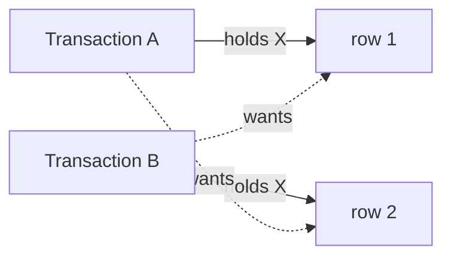

# Transactions & Concurrency

> [Mastery Guide](../../README.md) › [Data & Persistence](../README.md) › [SQL Mastery](./README.md)

| Status | Priority | Phase | Last reviewed |
|---|---|---|---|
| Not Started | High | Phase 5 — Data & Persistence | 2026-05-08 |

## Contents
- [Why it matters](#why-it-matters)
- [Core concepts](#core-concepts)
  - [ACID properties](#acid-properties)
  - [BEGIN / COMMIT / ROLLBACK](#begin--commit--rollback)
  - [Isolation levels and the four phenomena](#isolation-levels-and-the-four-phenomena)
  - [Locking — shared, exclusive, intent](#locking--shared-exclusive-intent)
  - [MVCC — non-locking reads](#mvcc--non-locking-reads)
  - [Deadlocks](#deadlocks)
  - [Optimistic vs pessimistic concurrency](#optimistic-vs-pessimistic-concurrency)
  - [Savepoints](#savepoints)
  - [Where the isolation level actually comes from (.NET)](#where-the-isolation-level-actually-comes-from-net)
  - [Errors inside a transaction — XACT_ABORT, doomed transactions, timeouts](#errors-inside-a-transaction--xact_abort-doomed-transactions-timeouts)
  - [Retrying correctly — execution strategies and the transaction boundary](#retrying-correctly--execution-strategies-and-the-transaction-boundary)
  - [Lock waits, timeouts, and queue tables (SKIP LOCKED / READPAST)](#lock-waits-timeouts-and-queue-tables-skip-locked--readpast)
  - [The bill for MVCC — bloat, freezing, and XID wraparound](#the-bill-for-mvcc--bloat-freezing-and-xid-wraparound)
  - [Engine differences that change the answer](#engine-differences-that-change-the-answer)
- [Code & diagrams](#code--diagrams)
- [Common pitfalls](#common-pitfalls)
- [Interview-ready summary](#interview-ready-summary)
- [Interview Cross-Questioning Drill](#interview-cross-questioning-drill)
- [Cheat Sheet](#cheat-sheet)
- [Walkthrough](#walkthrough--deadlock-victims-piling-up-in-sql-server-log)
- [Self-test](#self-test)
- [Cross-references](#cross-references)
- [Sources](#sources)

---

## Why it matters

Transactions are how databases stay consistent under concurrent access. Without them, a "transfer $100 from A to B" can leave $100 missing if the second update fails. With them, the entire operation succeeds or none of it does. Every senior backend engineer needs to understand isolation levels, locking, and how their ORM (EF Core) maps to the SQL underneath.

Concurrency questions surface real-world judgment: when does the default isolation level fail you? When do you need explicit locks? How do you avoid deadlocks? When is optimistic concurrency the right answer? These come up in production every week and feature in most senior interviews.

When NOT to dive deep: simple read-mostly apps with low contention may run forever on default isolation without trouble. Reach for this knowledge when you see lock timeouts, dirty reads, or "the same query returns different counts" symptoms.

## Core concepts

### ACID properties

The four guarantees a transactional database makes:

**Atomicity** — all operations in a transaction commit together or none do. Half-completed transactions can't exist after a crash.

```sql
BEGIN;
UPDATE accounts SET balance = balance - 100 WHERE id = 1;
UPDATE accounts SET balance = balance + 100 WHERE id = 2;
COMMIT;
-- If the second UPDATE fails, the first is rolled back. Both succeed or both fail.
```

**Consistency** — every transaction moves the database from one valid state to another. Constraints (PK, FK, CHECK, UNIQUE) hold throughout.

**Isolation** — concurrent transactions don't see each other's intermediate state. (Strength varies by isolation level.)

**Durability** — once a transaction commits, the data survives crashes (power failure, OS crash, disk failure depending on storage configuration).

ACID is the relational database's defining promise. NoSQL and "BASE" (Basically Available, Soft state, Eventual consistency) trade some ACID for scale; relational databases prioritize it.

Durability is the letter with a dial on it. All three engines let you return from `COMMIT` before the log record is on disk: PostgreSQL `synchronous_commit = off`, SQL Server delayed durability (`ALTER DATABASE ... SET DELAYED_DURABILITY = ALLOWED | FORCED`, SQL Server 2014 and later), MySQL `innodb_flush_log_at_trx_commit = 2`. In each case what you lose on a crash is a window of *recently committed* transactions — the engines are explicit that this is a data-loss risk, not a corruption risk, because the log is still written in order and recovery still replays a prefix of it.

> 🌍 **In the real world**: a telemetry ingest service was bottlenecked on log flushes, so `synchronous_commit = off` went on and the throughput problem disappeared. Nobody had the mechanism wrong. What was wrong was the *scope*: the setting was applied to the database role, and the same role was used by the billing writer that shared the instance. When the host fenced the VM six weeks later, the last seconds of both streams were gone — and only one of them had an upstream that could replay. The lesson is not "never turn it off". It is that a durability relaxation belongs to a workload, not to a server, and you have to be able to name what replays the window you just agreed to lose. That is a question an interviewer can ask about any of the three engines, and "we set it and it got faster" is not an answer to it.

### BEGIN / COMMIT / ROLLBACK

The three statements that control transaction boundaries.

```sql
-- Standard SQL
BEGIN;                                       -- start transaction (or BEGIN TRANSACTION)
UPDATE orders SET status = 'Paid' WHERE id = 42;
INSERT INTO payments (order_id, amount) VALUES (42, 100);
COMMIT;                                       -- success: persist
-- ROLLBACK;                                   -- failure: undo

-- T-SQL
BEGIN TRANSACTION;
... ;
COMMIT TRANSACTION;
-- ROLLBACK TRANSACTION;

-- PostgreSQL implicit (autocommit)
-- Each statement is its own transaction unless wrapped in BEGIN..COMMIT.
```

**Auto-commit** is the default in most clients: each statement runs in its own implicit transaction. Wrapping multiple statements requires explicit `BEGIN`.

In .NET / EF Core:

```csharp
using var tx = await db.Database.BeginTransactionAsync();
try
{
    await db.Orders.AddAsync(order);
    await db.Payments.AddAsync(payment);
    await db.SaveChangesAsync();
    await tx.CommitAsync();
}
catch
{
    await tx.RollbackAsync();
    throw;
}
```

`SaveChangesAsync()` itself wraps a transaction by default (one for the whole batch). Explicit `BeginTransactionAsync` is for multi-`SaveChanges` work or coordinating with raw SQL.

**Best practice:**
- **Keep transactions short.** Long transactions hold locks; widen blocking surface.
- **Don't include user input wait or HTTP calls inside.** Pre-commit, then call.
- **Wrap multi-step domain operations** that need atomicity.

> 🌍 **In the real world**: a checkout handler opened a transaction, reserved stock, called the payment provider, then wrote the payment row and committed — because that ordering made "payment taken, stock gone" impossible. It held for two years, until the provider had a slow morning. Every checkout was now holding write locks on `Inventory` rows for the duration of an outbound HTTP call, and because popular products are precisely the rows everybody wants, the queue formed on a handful of rows and spread outward from there. Every dashboard said the database was healthy: CPU flat, no long-running *queries*, no deadlocks — just sessions accumulating lock waits. The repair was to split it into reserve (short transaction, with an expiry on the reservation), call the provider outside any transaction, then confirm or release (second short transaction). That is strictly weaker than one atomic operation, which is why it needs a sweeper for abandoned reservations. The trade was finally made deliberately; it had been made accidentally for two years. The general form: a transaction's duration is the duration of the slowest thing inside it, and anything that leaves the process has no bounded duration.

### Isolation levels and the four phenomena

The SQL standard defines four isolation levels with increasing strictness. Each prevents specific concurrency anomalies.

The **four phenomena**:

| Phenomenon | Definition | Example |
|---|---|---|
| **Dirty read** | Read uncommitted data from another transaction | A reads B's tentative update; B rolls back; A used invalid data |
| **Non-repeatable read** | Re-reading same row gives different value | A reads row=100; B updates to 200, commits; A re-reads → 200 |
| **Phantom read** | Re-running same query returns different row count | A `SELECT COUNT(*) WHERE x = 1` → 5; B inserts; A re-runs → 6 |
| **Lost update** | Two writes overwrite each other | A reads x=100; B reads x=100; A writes 110; B writes 105 (A's update lost) |

The **four standard isolation levels**:

| Level | Dirty read | Non-repeatable | Phantom | Lost update |
|---|---|---|---|---|
| **READ UNCOMMITTED** | possible | possible | possible | possible |
| **READ COMMITTED** | prevented | possible | possible | possible (in some impls) |
| **REPEATABLE READ** | prevented | prevented | possible (standard); prevented in some impls | prevented |
| **SERIALIZABLE** | prevented | prevented | prevented | prevented |

Two caveats on that table, both fair game in an interview. Lost update is not one of the ANSI SQL-92 phenomena — the standard defines three, and lost update comes from Berenson et al.'s *A Critique of ANSI SQL Isolation Levels* (1995), which is also where the analysis placing it at REPEATABLE READ comes from. And "prevented at REPEATABLE READ" means prevented *by the engine's own conflict handling*, which differs: PostgreSQL raises `could not serialize access due to concurrent update`, so the update is refused; MySQL's InnoDB does not, because its consistent reads are non-locking while its writes read the latest committed row — so an application-level read-then-write can still lose an update at InnoDB's REPEATABLE READ. The version column or `SELECT ... FOR UPDATE` is what actually closes it, not the isolation level's name.

**Default isolation:**
- PostgreSQL: READ COMMITTED
- SQL Server: READ COMMITTED
- MySQL/InnoDB: REPEATABLE READ
- Oracle: READ COMMITTED

```sql
-- Set per-transaction
SET TRANSACTION ISOLATION LEVEL READ COMMITTED;   -- standard, common
SET TRANSACTION ISOLATION LEVEL REPEATABLE READ;
SET TRANSACTION ISOLATION LEVEL SERIALIZABLE;
SET TRANSACTION ISOLATION LEVEL READ UNCOMMITTED; -- avoid

-- Or per-statement (SQL Server)
SELECT * FROM orders WITH (NOLOCK);                -- = READ UNCOMMITTED hint (avoid)
SELECT * FROM orders WITH (READPAST);              -- skip locked rows (queue-style)
```

**Practical guidance:**
- **READ COMMITTED** is the default and right for most workloads.
- **REPEATABLE READ** stops a row you already read from changing under you — but name the engine before you call it a snapshot. On PostgreSQL it *is* snapshot isolation and phantoms are impossible; on SQL Server it is lock-based, holds shared locks to the end of the transaction, and still permits phantoms, so a report that re-runs a range query can see new rows. For read-heavy reporting that must see one consistent view on SQL Server, the level is `SNAPSHOT` (transaction-level row versioning), not `REPEATABLE READ`. See the [engine table](#engine-differences-that-change-the-answer).
- **SERIALIZABLE** when invariants must hold across multi-row queries (rare; performance cost).
- **READ UNCOMMITTED / NOLOCK** is dangerous — reading uncommitted data including potentially-rolled-back changes. Don't use for "fast read"; use snapshot isolation instead.

**SQL Server's RCSI (Read Committed Snapshot Isolation):** modifies READ COMMITTED so that reads take row-version snapshots instead of shared locks. Microsoft describes it as giving READ COMMITTED *statement-level* read consistency, in contrast to the SNAPSHOT isolation level, which gives *transaction-level* read consistency (Microsoft Learn, *Transaction Locking and Row Versioning Guide*). It removes the reader-blocks-writer and writer-blocks-reader interactions that dominate blocking incidents on locking-mode SQL Server.

```sql
ALTER DATABASE MyDb SET READ_COMMITTED_SNAPSHOT ON;
```

That one-line statement is not a one-line deployment. Setting `READ_COMMITTED_SNAPSHOT` requires exclusive access to the database — the `ALTER DATABASE` blocks until it is the only connection, which on a live system means it blocks forever unless you add `WITH ROLLBACK IMMEDIATE` (which kills every other session's in-flight work) or take a maintenance window. It is also not free at runtime: every versioned row carries a pointer into the version store, and the version store lives in tempdb (or, from SQL Server 2019 with Accelerated Database Recovery enabled, in the database's own Persistent Version Store). Size tempdb and watch it.

> 🌍 **In the real world**: an RCSI enablement was scheduled as a "one-line change, no downtime" item at the end of a release. The `ALTER DATABASE` ran, returned nothing, and sat there — waiting for exclusive access it was never going to get from a live web farm. Twenty minutes later someone added `WITH ROLLBACK IMMEDIATE` from a second window, which did work, and also rolled back every transaction in flight at that moment, including a half-finished import. The change itself was right and the database was measurably better afterwards. What was wrong was the classification: this is a database-level configuration change with a locking requirement, not a settings tweak, and it needs the same treatment as a schema migration. The tell that should have caught it in review is that no query in the release notes explained what happens to the *other* connections.

PostgreSQL uses MVCC by default: ordinary `SELECT`s never take row locks, so plain readers and writers do not block each other at any isolation level. The exceptions are worth knowing, because interviewers use them — *locking* reads (`SELECT ... FOR UPDATE`, `FOR SHARE`) do conflict with writers, and DDL takes `ACCESS EXCLUSIVE` on the relation, which blocks everything including plain reads. "Readers never block writers in Postgres" is true of the read path and false of the migration path, which is why an `ALTER TABLE` behind a long-running `SELECT` can stall an entire application.

### Locking — shared, exclusive, intent

Locks coordinate concurrent access. Modes:

| Lock | Shorthand | Held by | Compatible with |
|---|---|---|---|
| **Shared (S)** | reads | many readers | many S, no X |
| **Exclusive (X)** | writes | one writer | nothing |
| **Update (U)** | "I might upgrade to X" | one | many S |
| **Intent Shared (IS)** | "I'll take S below" | parent | IS, IX |
| **Intent Exclusive (IX)** | "I'll take X below" | parent | IS, IX |

Granularity:
- **Row lock** — one row.
- **Page lock** — 8 KB / 16 KB page (multiple rows).
- **Table lock** — entire table.

Lock escalation (SQL Server): many small locks → one big lock to save lock memory. Microsoft documents the threshold as a single T-SQL statement acquiring at least **5,000 locks** on one reference to a table or index — and if escalation is blocked by a conflicting lock, the engine retries every 1,250 new locks acquired (Microsoft Learn, *Transaction Locking and Row Versioning Guide*). Symptom: blocking spreads from a few rows to the whole table with no change in the query. PostgreSQL has no lock escalation — it records row locks on the tuple itself rather than in a shared lock table, so there is no memory pressure to escape from. InnoDB likewise does not escalate row locks to table locks.

```sql
-- Explicit row lock for "select for update" pattern (PostgreSQL)
BEGIN;
SELECT * FROM accounts WHERE id = 1 FOR UPDATE;   -- acquires X lock on row 1
-- ... do work; other transactions wait if they want to update row 1
UPDATE accounts SET balance = balance - 100 WHERE id = 1;
COMMIT;

-- SQL Server equivalent
BEGIN TRAN;
SELECT * FROM accounts WITH (UPDLOCK, ROWLOCK) WHERE id = 1;
UPDATE accounts SET balance = balance - 100 WHERE id = 1;
COMMIT;
```

`FOR UPDATE` / `UPDLOCK` is the manual pessimistic lock. Use sparingly; can deadlock. The two are not the same object, and saying so in an interview is a cheap way to show you have used both: SQL Server's `UPDLOCK` is a U-mode lock in the engine's lock manager, compatible with S but not with another U or an X, which is precisely what makes it the anti-deadlock hint for read-then-update. PostgreSQL's `FOR UPDATE` is a row-level lock recorded on the tuple; it conflicts with other `FOR UPDATE`/`FOR NO KEY UPDATE` locks and with writers, but it does not block plain `SELECT`s, because in an MVCC engine plain `SELECT`s do not ask permission.

> 🌍 **In the real world**: the "report locked production" story almost always has the same shape, and it is worth being able to tell it precisely. A finance analyst ran a month-end aggregate over `Orders` on a locking-mode SQL Server (RCSI off). The query was read-only, so nobody thought about locks — but under locking READ COMMITTED a scan takes shared locks as it goes, and this one touched enough rows on a single index to cross the 5,000-lock escalation threshold, at which point the engine converted the whole thing into one table-level lock. Checkout inserts then queued behind a `SELECT`. The incident channel filled with "the database is down"; the database was idle, holding one lock. Three fixes were on the table and only one of them was right for the long run. `NOLOCK` on the report (fast, wrong — see the pitfalls). Running the report on a replica (correct, but a project). Enabling RCSI so the report reads versions and takes no shared locks at all (correct, and one statement plus a maintenance window). What made it a *senior* conversation rather than a firefight was naming the mechanism — escalation of shared locks under a locking isolation level — instead of describing the symptom.

**Blocking** — when transaction A waits for a lock held by B:

```sql
-- Find blocking sessions (SQL Server)
SELECT
    blocking_session_id, session_id, wait_type, wait_time, wait_resource
FROM sys.dm_exec_requests
WHERE blocking_session_id != 0;

-- PostgreSQL
SELECT pid, usename, query, wait_event, wait_event_type
FROM pg_stat_activity
WHERE wait_event_type = 'Lock';
```

Both of those queries answer "who is waiting". Neither reliably answers "who is at the head of the chain", which is the question you actually need under pressure — and the head of the chain is very often a session that is *not running anything*, so it does not appear in `sys.dm_exec_requests` at all. Go one level further:

```sql
-- SQL Server: the blocker may be idle with an open transaction, so start from sessions
SELECT  s.session_id, s.status, s.last_request_end_time, s.host_name, s.program_name,
        t.transaction_id, dt.database_transaction_begin_time,
        r.blocking_session_id, r.wait_type, r.wait_time, r.wait_resource
FROM sys.dm_exec_sessions s
LEFT JOIN sys.dm_tran_session_transactions t ON t.session_id = s.session_id
LEFT JOIN sys.dm_tran_database_transactions dt ON dt.transaction_id = t.transaction_id
LEFT JOIN sys.dm_exec_requests r ON r.session_id = s.session_id
WHERE t.transaction_id IS NOT NULL
ORDER BY dt.database_transaction_begin_time;
-- A row with status = 'sleeping' and an old begin time is an idle-in-transaction blocker.

-- PostgreSQL: pg_blocking_pids() gives you the chain directly (9.6+)
SELECT  a.pid, a.state, a.wait_event_type, a.wait_event,
        pg_blocking_pids(a.pid) AS blocked_by,
        now() - a.xact_start AS xact_age,
        left(a.query, 120) AS query
FROM pg_stat_activity a
WHERE a.backend_type = 'client backend'
  AND (cardinality(pg_blocking_pids(a.pid)) > 0 OR a.state = 'idle in transaction')
ORDER BY a.xact_start;
```

Long-running transactions are the usual root of a blocking chain, and "long" includes transactions that are doing nothing at all: a connection sitting in `idle in transaction` holds every lock it has already taken and, on PostgreSQL, also pins the snapshot horizon that `VACUUM` needs. Keep transactions narrow, and set a guard so a leaked one cannot sit forever — `idle_in_transaction_session_timeout` on PostgreSQL, and on the .NET side a `DbContext` lifetime that cannot outlive the request scope.

### MVCC — non-locking reads

**Multi-Version Concurrency Control** — readers don't block writers, writers don't block readers. PostgreSQL is MVCC-from-day-one; SQL Server has it via Snapshot Isolation.

Mechanism: when a row is updated, a new version is created; the old version is kept until no transaction needs it. Readers see the version that existed when their transaction started.

```sql
-- PostgreSQL — the whole transaction sees one snapshot ONLY at REPEATABLE READ or higher.
BEGIN ISOLATION LEVEL REPEATABLE READ;
SELECT balance FROM accounts WHERE id = 1;        -- 100
-- another transaction updates to 200 and commits
SELECT balance FROM accounts WHERE id = 1;        -- still 100
COMMIT;

-- The same script under plain BEGIN (READ COMMITTED, the default) returns 200 on the
-- second SELECT: each STATEMENT gets its own snapshot, not each transaction.
```

In PostgreSQL, with REPEATABLE READ or higher, the entire transaction sees the same snapshot. With READ COMMITTED (default), each statement sees the latest committed snapshot.

There is a consequence of that statement-level snapshot which almost nobody knows and which is documented explicitly: under READ COMMITTED, when an `UPDATE` or `DELETE` reaches a row that a concurrent transaction has already updated, it waits for that transaction, and then — if the other transaction committed — *re-evaluates the `WHERE` clause against the new version of the row*. If the new version no longer matches, the row is silently skipped (PostgreSQL manual, *Transaction Isolation*). So `UPDATE orders SET status='Shipped' WHERE id = 7 AND status = 'Paid'` can report zero rows affected even though row 7 exists and was `Paid` when your statement started. At REPEATABLE READ the same situation is not silent — you get `ERROR: could not serialize access due to concurrent update` (SQLSTATE 40001) and must retry. Two different isolation levels, two completely different failure signatures for the same race, and only one of them shows up in your logs.

> 🌍 **In the real world**: a Postgres-backed order service had an endpoint whose integration tests were solid and which nevertheless "lost" state transitions in production — a handful per day, no errors, no exceptions, nothing in the logs. The handler ran `UPDATE orders SET status = 'Shipped' WHERE id = $1 AND status = 'Paid'` and treated the row count as a formality. A concurrent retry from the same client had already moved the row through `Paid`, so by the time the second statement re-checked the predicate against the freshly committed version, `status` was no longer `'Paid'` and Postgres dropped the row from the update set. Everything behaved exactly as documented. The defect was in the application: a conditional update whose rows-affected result was never read. Checking it turned an invisible data problem into a 409, which is what it always was.

**`VACUUM` in PostgreSQL** — reclaims space from old row versions. Autovacuum runs in the background; manual `VACUUM` for heavy workloads. Skipping vacuum → bloat → slow queries.

**Snapshot Isolation in SQL Server:**

```sql
ALTER DATABASE MyDb SET ALLOW_SNAPSHOT_ISOLATION ON;

SET TRANSACTION ISOLATION LEVEL SNAPSHOT;
BEGIN TRAN;
-- Queries see the database as of transaction start.
COMMIT;
```

SNAPSHOT and RCSI are not two names for one feature, and the difference is where the exam question lives. RCSI changes what READ COMMITTED *reads*; it adds no conflict detection, so a read-then-write across two statements can still be based on a stale read. SNAPSHOT gives the transaction one snapshot **and** first-updater-wins conflict detection: if a snapshot transaction tries to modify a row that changed after its snapshot was taken, the update fails with `Msg 3960 ... Snapshot isolation transaction aborted due to update conflict` and the transaction is rolled back — at the point of the conflicting statement, not at commit. Microsoft's own mitigation is to take `WITH (UPDLOCK)` on the `SELECT` that reads the rows you intend to modify, which turns an optimistic failure into a pessimistic wait (Microsoft Learn, *Snapshot Isolation in SQL Server*). The same document adds the sentence worth quoting in an interview: "If your application has many conflicts, snapshot isolation may not be the best choice."

For most apps, MVCC-based isolation is the right answer — readers and writers don't fight. Plain locking-based isolation is legacy.

### Deadlocks

Two transactions each hold a lock the other wants → infinite wait. Database detects it and kills one ("victim").

```sql
-- Deadlock scenario:
-- Transaction A:                    Transaction B:
BEGIN;                               BEGIN;
UPDATE accounts SET balance = ...    UPDATE accounts SET balance = ...
WHERE id = 1;                        WHERE id = 2;       -- B holds X lock on row 2

UPDATE accounts SET balance = ...    UPDATE accounts SET balance = ...
WHERE id = 2;                        WHERE id = 1;       -- B wants row 1; A holds it
-- A holds row 1, wants row 2
-- B holds row 2, wants row 1
-- DEADLOCK
```

The DB picks one as victim, rolls back, returns an error. The app should retry.

**The deadlock most people never see coming — the conversion deadlock.** The write-write cycle above is the textbook case, and it is not the only shape. Microsoft's *Deadlocks Guide* opens with a variant built out of **shared** locks rather than writes: transaction A takes an S lock on row 1 and B takes an S lock on row 2, then A asks for an X lock on row 2 and B asks for an X lock on row 1, and each waits on the other's shared lock. Squeeze that onto a single row and you get the degenerate case, where consistent lock ordering has nothing left to order:

```
-- Requires the S locks to survive the SELECT: REPEATABLE READ / SERIALIZABLE,
-- or a HOLDLOCK hint. Under locking READ COMMITTED the S lock is released as
-- soon as the row is read, so this particular cycle cannot form.
Transaction A                              Transaction B
BEGIN TRAN;                                BEGIN TRAN;
SELECT * FROM accounts WITH (HOLDLOCK)     SELECT * FROM accounts WITH (HOLDLOCK)
  WHERE id = 1;                              WHERE id = 1;
-- S lock on row 1                         -- S lock on row 1 (S is compatible with S)
... application decides ...                ... application decides ...
UPDATE accounts SET ... WHERE id = 1;      UPDATE accounts SET ... WHERE id = 1;
-- wants X, blocked by B's S               -- wants X, blocked by A's S
-- DEADLOCK: neither S can be released before its own X is granted
```

Nothing here is out of order. Both transactions touch exactly one row, in the same order, doing the same thing — so consistent lock ordering, the standard advice, cannot help: there is only one resource to order. The fix is to take the right lock the first time: `SELECT ... WITH (UPDLOCK)` on SQL Server, `SELECT ... FOR UPDATE` on PostgreSQL and MySQL. A U lock is compatible with S, so other readers proceed, but not with another U, so the second transaction waits at the `SELECT` instead of colliding at the `UPDATE`. Be precise about when this is live, because the qualifier is the whole point: the read lock has to still be held when the write is attempted. That means REPEATABLE READ or SERIALIZABLE, or an explicit `HOLDLOCK`/`REPEATABLEREAD` hint. A plain `FirstAsync` followed by `SaveChangesAsync` under default READ COMMITTED does *not* produce this — EF Core's read releases its S lock immediately, which is why that pattern is an optimistic-concurrency problem (a lost update) rather than a deadlock.

**Detection, precisely.** SQL Server: a lock monitor thread searches for cycles on a default interval of 5 seconds, dropping to as low as 100 ms while deadlocks are being found and easing back when they stop; the victim is the transaction **least expensive to roll back**, unless `SET DEADLOCK_PRIORITY` differs between the sessions, in which case the lower priority loses regardless of cost, with ties broken randomly; the victim's batch is terminated and error **1205** returned (Microsoft Learn, *Deadlocks Guide*). PostgreSQL waits `deadlock_timeout` (default 1 second) on a lock before it even looks for a cycle, then aborts the transaction that ran the detection, with SQLSTATE `40P01` (`deadlock_detected`). InnoDB detects immediately from its wait-for graph and rolls back the transaction with the smallest number of rows inserted, updated, or deleted (MySQL Reference Manual, *Deadlock Detection*). Three engines, three different rules for who dies — so "the database picks a victim" is only half an answer.

> 🌍 **In the real world**: an inventory service deadlocked on a single table, between two executions of the same statement, and a week went into hunting for the out-of-order lock acquisition that every article said must exist. There wasn't one. The `UPDATE` filtered on a column with no supporting index, so each execution scanned and took locks on rows it never modified, and two concurrent executions acquired those rows in whatever order their scans happened to visit them. Adding the index on the filter column ended the deadlocks — not by changing any order, but by shrinking the locked set to the rows actually being changed. That connection is worth carrying into an interview: an index is a concurrency feature as much as a speed feature, because rows a statement never reads are rows it never locks. The deadlock graph had said so all along, in one attribute — the `indexname` on the lock resources was the clustered index, for a query that filtered on something else entirely.

**Prevention:**
1. **Consistent lock ordering.** All transactions acquire locks in the same order (by ID, alphabetical, etc.). If A locks row 1 then row 2, B must too.
2. **Short transactions.** Less time holding locks → less deadlock window.
3. **Lower isolation level** if business logic permits. RCSI / Snapshot eliminates most read-write conflicts.
4. **Retry logic** in app code:

```csharp
// Deadlock detection is engine-specific, and it is NOT always a DbUpdateException:
// a deadlocked raw-SQL query surfaces the provider exception directly.
static bool IsDeadlock(Exception ex) => ex switch
{
    SqlException s => s.Number == 1205,                    // SQL Server: deadlock victim
    PostgresException p => p.SqlState is "40P01"           // deadlock_detected
                                      or "40001",          // serialization_failure
    _ => ex.InnerException is not null && IsDeadlock(ex.InnerException)
};

public async Task<T> WithRetryAsync<T>(Func<Task<T>> action, int maxAttempts = 3)
{
    for (var attempt = 1; ; attempt++)
    {
        try
        {
            return await action();
        }
        catch (Exception ex) when (IsDeadlock(ex) && attempt < maxAttempts)
        {
            // Exponential backoff with jitter: without jitter, both victims of the same
            // deadlock wake at the same moment and deadlock again.
            var delay = TimeSpan.FromMilliseconds(
                Math.Pow(2, attempt) * 25 + Random.Shared.Next(0, 50));
            await Task.Delay(delay);
        }
    }
}
```

`action` here has to be the *whole* transaction, not one statement inside it — retrying a single failed statement after the engine has already rolled the transaction back replays it against a state that no longer exists. EF Core's `EnableRetryOnFailure` does treat SQL Server error 1205 as transient (it is in the provider's transient-error list, alongside 3960, the snapshot update conflict), but it will refuse to run at all inside a transaction you opened yourself. That refusal, and the correct pattern, are in [Retrying correctly](#retrying-correctly--execution-strategies-and-the-transaction-boundary) below.

### Optimistic vs pessimistic concurrency

Two strategies for "user A and user B both want to update row X":

**Pessimistic (lock at read):**
- Lock the row when reading it.
- Other transactions wait.
- Safe but holds locks → blocking.

```sql
BEGIN;
SELECT * FROM accounts WHERE id = 1 FOR UPDATE;   -- holds X lock
-- ... business logic ...
UPDATE accounts SET balance = ... WHERE id = 1;
COMMIT;
```

**Optimistic (detect at save):**
- No locks during read.
- On write, check if the row changed since read (via version column or timestamp).
- If changed, fail; caller retries with fresh data.

```sql
-- Schema with version column
CREATE TABLE accounts (
    id INT PRIMARY KEY,
    balance DECIMAL(18,2),
    version INT NOT NULL DEFAULT 0
);

-- Read
SELECT id, balance, version FROM accounts WHERE id = 1;
-- got: balance=100, version=5

-- Write — increment version, check it hasn't changed
UPDATE accounts
SET balance = 95, version = version + 1
WHERE id = 1 AND version = 5;
-- If 0 rows affected, someone else updated; retry.
```

EF Core handles this with `[ConcurrencyCheck]` or `[Timestamp]` attributes — see [EF Core](../01-ef-core.md#concurrency-control).

**Choose:**
- **Optimistic** for typical web apps with low contention. Fast (no locks); occasional retry on conflict.
- **Pessimistic** for high contention or batch jobs that *must* succeed first time.

Most apps default to optimistic; reach for pessimistic only when conflicts are frequent.

**What optimistic concurrency does not cover.** A version column protects exactly one row against exactly one class of problem: someone else changed *this row* between your read and your write. It says nothing about an invariant spanning several rows — that is write skew, and no amount of `rowversion` will catch it (see Drill 15). It says nothing about a read that never becomes a write. And it says nothing about what happens to a *copy* of the data you took outside the database.

> 🌍 **In the real world**: a catalogue service cached prices in Redis, filled on miss, and invalidated the key from the price-update handler after the database transaction committed. Correct ordering, correct invalidation, and prices still went stale — not for seconds, for the full cache TTL, and only for products that had just been repriced. The race is entirely in the timings. Request A misses the cache and starts a read; its snapshot is taken before the repricing transaction commits, so it legitimately reads the old price. The repricing transaction then commits and deletes the cache key. Request A, still holding a value that was correct when it read it, finally writes it into Redis. The invalidation had already happened, so nothing will remove that entry until it expires. Nobody wrote a bug: every participant behaved correctly, and MVCC's whole point is that A's read was consistent as of its snapshot. What was missing was any notion of *version* crossing the boundary out of the database. The repair was to carry one — write `(price, rowversion)` into the cache and refuse to overwrite a cache entry with a lower version, which makes the late write a no-op. The generalisation is the thing to say in an interview: the instant data leaves the transaction that read it, its isolation guarantee stops travelling with it, and every cache is a replica with no concurrency control unless you give it one.

### Savepoints

A **savepoint** is a marker inside a transaction. You can rollback to a savepoint without rolling back the whole transaction.

```sql
BEGIN;
INSERT INTO orders (id, status) VALUES (1, 'Pending');

SAVEPOINT before_items;
INSERT INTO order_items (order_id, product_id) VALUES (1, 99);
INSERT INTO order_items (order_id, product_id) VALUES (1, 999);   -- might fail
-- If second insert fails:
ROLLBACK TO SAVEPOINT before_items;
-- Order still inserted; bad items rolled back.
INSERT INTO order_items (order_id, product_id) VALUES (1, 99);    -- retry
COMMIT;
```

Use cases:
- Multi-step batch processing where some steps may fail.
- Stored procedures with branching logic.
- Atomic sub-operations within a larger transaction.

In .NET, `IDbContextTransaction.CreateSavepoint()` (EF Core 5+).

> 🌍 **In the real world**: an import procedure was written defensively — `BEGIN TRANSACTION` at the top, and every helper procedure it called did the same, each with its own `COMMIT`/`ROLLBACK` in a `TRY`/`CATCH`. The intent was "each step cleans up after itself". T-SQL does not work that way: a nested `BEGIN TRANSACTION` only increments `@@TRANCOUNT`, an inner `COMMIT` only decrements it, and a `ROLLBACK TRANSACTION` at *any* depth discards the entire stack. So one bad row in one helper silently rolled back the whole import, and the outer procedure — whose `CATCH` had never fired — carried on issuing statements outside any transaction, then hit `COMMIT` with `@@TRANCOUNT` already at zero and raised error 3902 (`The COMMIT TRANSACTION request has no corresponding BEGIN TRANSACTION`; the mirror-image error for a stray `ROLLBACK` is 3903). Half the import was committed piecemeal by auto-commit. The fix is the rule every T-SQL developer eventually learns: only the outermost caller owns the transaction. Inner scopes use `SAVE TRANSACTION name` and `ROLLBACK TRANSACTION name`, and every procedure that wants to be composable checks `@@TRANCOUNT` on entry to decide whether it is the owner or a guest.

### Where the isolation level actually comes from (.NET)

Three layers can set the isolation level of a .NET database call, and they do not agree by default. Knowing the precedence is the difference between diagnosing a blocking incident and guessing at it.

1. **The database's own configuration** — SQL Server's `READ_COMMITTED_SNAPSHOT` setting changes what READ COMMITTED *means* without any code change. Azure SQL Database ships with RCSI on by default; a SQL Server instance you install does not.
2. **The session** — `SET TRANSACTION ISOLATION LEVEL ...` persists for the life of the connection, not the statement.
3. **The transaction** — `BeginTransaction(IsolationLevel)`, or `TransactionOptions.IsolationLevel` on a `TransactionScope`.

Layers 2 and 3 carry the traps, and all of them are common enough to be worth memorising.

**`new TransactionScope()` is SERIALIZABLE.** The parameterless constructor uses `IsolationLevel.Serializable` and a one-minute timeout. On SQL Server that means key-range locks around every read in the scope, on tables where the surrounding application is running READ COMMITTED — so the scope blocks and deadlocks against traffic it has no logical conflict with. Microsoft's own guidance archive carries a post titled "using new TransactionScope() considered harmful" for exactly this reason. Always pass options:

```csharp
var options = new TransactionOptions
{
    IsolationLevel = IsolationLevel.ReadCommitted,   // System.Transactions.IsolationLevel
    Timeout = TimeSpan.FromSeconds(30)
};
using var scope = new TransactionScope(
    TransactionScopeOption.Required,
    options,
    TransactionScopeAsyncFlowOption.Enabled);        // required for await inside the scope
```

**`TransactionScopeAsyncFlowOption.Enabled` is not the default.** Without it, `Transaction.Current` does not flow across an `await` continuation, so work after the first `await` silently runs *outside* the ambient transaction. Nothing throws. The scope completes, the early statements commit, the later ones were never in the transaction at all. This is the single most common way an "atomic" .NET operation turns out not to be.

There are also two different enums named `IsolationLevel` — `System.Data.IsolationLevel` for `BeginTransaction`, `System.Transactions.IsolationLevel` for `TransactionOptions`. They have overlapping member names and no conversion between them; a `using` directive decides which one you got.

**Isolation level leaks through the connection pool.** Microsoft states it plainly: "When a connection is closed and returned to the pool, the isolation level from the last SET TRANSACTION ISOLATION LEVEL statement is retained. Subsequent connections reusing a pooled connection use the isolation level that was in effect at the time the connection is pooled" (Microsoft Learn, *Snapshot Isolation in SQL Server*). SQL Server 2014 briefly changed `sp_reset_connection` to reset the level to READ COMMITTED, which broke `TransactionScope` code that had set a level on the scope; the behaviour was put back in SQL Server 2014 Cumulative Update 6 (KB3025845). So one code path that runs `SET TRANSACTION ISOLATION LEVEL SERIALIZABLE` can hand a serializable connection to an unrelated request minutes later.

Diagnose rather than assume — ask the session what it actually has:

```sql
-- SQL Server: 0 unspecified, 1 read uncommitted, 2 read committed, 3 repeatable read,
--             4 serializable, 5 snapshot
SELECT session_id, transaction_isolation_level
FROM sys.dm_exec_sessions
WHERE session_id = @@SPID;

-- Is RCSI on for this database?
SELECT name, is_read_committed_snapshot_on, snapshot_isolation_state_desc
FROM sys.databases WHERE name = DB_NAME();
```

```sql
-- PostgreSQL
SHOW transaction_isolation;      -- this transaction
SHOW default_transaction_isolation;
```

> 🌍 **In the real world**: an intermittent deadlock storm on a SQL Server order system was traced to a reporting endpoint nobody had deployed that week. The endpoint used a `TransactionScope` written years earlier with the parameterless constructor, so it ran SERIALIZABLE and took key-range locks over a date range. It had always done that, harmlessly, because it ran nightly. The change that broke things was elsewhere: a new dashboard called the same handler on page load. Two lines of context were doing the damage — one that constructed a scope without options, and one that reused a handler in a new setting. The repair took a `TransactionOptions` initialiser; finding it took three days, because everybody looked at what had changed and the defective line had not changed in years. This is why "which isolation level is this connection running, and who set it" is a reasonable first question at a blocking incident, and why `sys.dm_exec_sessions.transaction_isolation_level` is worth knowing by name.

### Errors inside a transaction — XACT_ABORT, doomed transactions, timeouts

"An error rolls the transaction back" is true by default on exactly one of the three engines. The other two roll back the *statement* and leave the transaction running, which is why an application ported between them can commit half its work and report success.

**SQL Server.** `SET XACT_ABORT` is OFF by default in T-SQL (ON inside triggers). With it off, a run-time error may roll back only the offending *statement* and let the transaction continue — Microsoft's own documented example inserts three rows, the second violating a foreign key, and commits rows one and three. So a procedure without `XACT_ABORT ON` can commit a partial result and report success.

Some errors instead leave the transaction **doomed** (uncommittable). `XACT_STATE()` returns `-1` for that state: the session "can't commit the transaction or roll back to a savepoint; it can only request a full rollback" and cannot perform any write until it does (Microsoft Learn, *XACT_STATE*). A `CATCH` block that tries to `COMMIT`, or to roll back to a savepoint, fails on top of the original failure — and the second error is the one the application logs.

```sql
SET XACT_ABORT ON;          -- errors terminate and roll back the whole transaction
BEGIN TRY
    BEGIN TRANSACTION;
      -- ... work ...
    COMMIT TRANSACTION;
END TRY
BEGIN CATCH
    IF XACT_STATE() <> 0 ROLLBACK TRANSACTION;   -- covers both -1 (doomed) and 1 (live)
    THROW;                                       -- THROW honours XACT_ABORT; RAISERROR does not
END CATCH;
```

`XACT_ABORT ON` also covers a case that catches people out: **a client-side query timeout**. When `SqlCommand.CommandTimeout` elapses, the client sends an attention signal, and Microsoft states the consequence plainly — "When an SPID receives a query timeout or a cancel, it terminates the current query and batch but doesn't automatically roll back or commit the transaction. The application is responsible for this action" (Microsoft Learn, *Understand and resolve SQL Server blocking problems*). The connection then goes back to the pool still holding locks. It is cleared either when that physical connection is next handed out and `sp_reset_connection` runs, or — if it is never reused — when the connection times out and is removed from the pool. Microsoft's remedy for both the delay and the leak is the same pair: roll back explicitly in the client's error handler (`IF @@TRANCOUNT > 0 ROLLBACK TRAN`), or run with `SET XACT_ABORT ON`.

**PostgreSQL.** Any error aborts the whole transaction at once. Every subsequent statement returns `ERROR: current transaction is aborted, commands ignored until end of transaction block` (SQLSTATE `25P02`), and a `COMMIT` at that point behaves as a `ROLLBACK`. That is the strictest of the three and the easiest to reason about; the escape hatch when you *want* to continue is a savepoint, which is exactly what `psql`'s `ON_ERROR_ROLLBACK` and most drivers' "try one statement" helpers use under the hood.

**MySQL / InnoDB.** An error rolls back the statement, not the transaction. Worse, the two lock-related failures behave differently from each other: a **deadlock** rolls back the entire transaction, while a **lock wait timeout** (`innodb_lock_wait_timeout`, default 50 seconds) rolls back only the statement that waited, unless `innodb_rollback_on_timeout` is enabled — and it is off by default. So a MySQL application that catches "lock wait timeout exceeded" and carries on to `COMMIT` will commit a transaction with a hole in it.

> 🌍 **In the real world**: a nightly reconciliation on SQL Server ran inside a stored procedure with `BEGIN TRAN`, a `TRY`/`CATCH`, and no `SET XACT_ABORT`. It had a 30-second `CommandTimeout` from the .NET job host. On a busy night the procedure timed out mid-transaction; the .NET side caught `SqlException`, logged "reconciliation failed, will retry", and moved on without disposing the connection promptly. The transaction stayed open on the server, holding locks, until the connection was eventually reused and reset. Meanwhile the retry ran, blocked on the locks its own previous attempt was still holding, and timed out too. The failure looked like a database problem — a growing blocking chain with no obvious head — and was in fact a two-line configuration gap: `SET XACT_ABORT ON` in the procedure, and a `using` on the connection. Neither line is exotic. What was missing was the knowledge that a timeout cancels a statement and not a transaction.

### Retrying correctly — execution strategies and the transaction boundary

Deadlocks and serialization failures are not bugs to be eliminated; they are a contract that says "run me again". The hard part is *what* to run again.

EF Core turns retries on with `EnableRetryOnFailure()`, which installs a provider-specific execution strategy. The SQL Server strategy's transient list includes error **1205** (deadlock victim) and **3960** (snapshot update conflict). It deliberately excludes the timeout (`-2`); the provider source comments that a timeout "can be thrown even if the operation completed successfully, so it's safer to let the application fail". That is the correct instinct and the reason blind retry-on-anything is dangerous.

Then the trap. Turn retries on, open your own transaction, and EF Core refuses:

> InvalidOperationException: The configured execution strategy 'SqlServerRetryingExecutionStrategy' does not support user-initiated transactions. Use the execution strategy returned by 'DbContext.Database.CreateExecutionStrategy()' to execute all the operations in the transaction as a retriable unit.

The reasoning is sound: with retries enabled, each query and each `SaveChangesAsync` is independently retriable, but *your* transaction is a unit the strategy knows nothing about, so it cannot replay it. You have to hand it the whole unit:

```csharp
var strategy = db.Database.CreateExecutionStrategy();

await strategy.ExecuteAsync(async () =>
{
    // A fresh context inside the delegate: a retry must not reuse the change tracker
    // state left behind by the failed attempt.
    await using var ctx = factory.CreateDbContext();
    await using var tx = await ctx.Database.BeginTransactionAsync();

    ctx.Orders.Add(order);
    await ctx.SaveChangesAsync();

    ctx.Payments.Add(payment);
    await ctx.SaveChangesAsync();

    await tx.CommitAsync();
});
```

Two further points a senior candidate is expected to raise unprompted:

**Commit-time ambiguity.** If the connection drops *during* `COMMIT`, the outcome is unknown. The strategy's default assumption is that the transaction rolled back, and retrying on that assumption can double-insert when the commit actually succeeded and the key is store-generated. EF Core's answer is `IExecutionStrategy.ExecuteInTransactionAsync(operation, verifySucceeded)`, where `verifySucceeded` checks the database for evidence the work landed — typically a client-generated GUID written in the same transaction. This is the outbox/idempotency-key idea applied to your own retry loop.

**Side effects are not retriable.** Anything the transaction body does outside the database — send an email, charge a card, publish to a broker — repeats on every retry. Three ways out, and you need one of them: move it after the commit, put it behind an outbox, or make it idempotent on a deduplication key. Leaving it inside the delegate and hoping retries are rare is not one of them.

For PostgreSQL, retry on SQLSTATE `40001` (`serialization_failure`) and `40P01` (`deadlock_detected`). Any application that sets REPEATABLE READ or SERIALIZABLE on PostgreSQL *must* have this loop — the manual says applications using those levels "must be prepared to retry transactions due to serialization failures". Retrying is part of choosing the isolation level, not an optional hardening step.

> 🌍 **In the real world**: a team enabled `EnableRetryOnFailure` after an Azure SQL failover cost them a night, deployed, and the checkout endpoint started throwing `InvalidOperationException` on every request — because checkout was the one handler with an explicit `BeginTransactionAsync`. The rollback was quick and the lesson was mis-drawn: "connection resiliency conflicts with transactions, leave it off". It doesn't conflict; it requires you to say where the retriable boundary is, which is a thing the framework genuinely cannot infer. The version that shipped a sprint later wrapped the transaction in `CreateExecutionStrategy().ExecuteAsync(...)`, moved the confirmation email to after the commit — which the retry work exposed as a second, pre-existing bug — and kept resiliency on.

### Lock waits, timeouts, and queue tables (SKIP LOCKED / READPAST)

**How long will a statement wait for a lock?** Forever, on two of the three engines, unless you say otherwise.

| Engine | Default lock wait | How to bound it | Error when it fires |
|---|---|---|---|
| SQL Server | Unlimited — "transactions in the Database Engine don't time out, unless `LOCK_TIMEOUT` is set" (*Deadlocks Guide*) | `SET LOCK_TIMEOUT 5000` (ms), per session | 1222, "Lock request time out period exceeded" |
| PostgreSQL | Unlimited (`lock_timeout = 0`) | `SET lock_timeout = '5s'`; also `statement_timeout`, `idle_in_transaction_session_timeout` | SQLSTATE `55P03` `lock_not_available` |
| MySQL / InnoDB | 50 seconds (`innodb_lock_wait_timeout`) | change the variable, session or global | 1205, "Lock wait timeout exceeded" |

Note the collision worth knowing: **error 1205 means "deadlock victim" on SQL Server and "lock wait timeout" on MySQL**. Handlers copied between stacks get this wrong.

`SET LOCK_TIMEOUT` in front of a migration or a maintenance statement is the cheap version of "fail fast rather than pile up behind me" — it stops a DDL statement that cannot get its lock from becoming the head of a blocking chain of its own. PostgreSQL's `lock_timeout` is the same idea, and is standard practice in zero-downtime migration tooling.

**Queue tables.** The lock-skipping variants exist because of one workload: several workers polling the same table for the next unit of work. Without them the workers serialise — worker 2 waits for worker 1's lock on row 1, even though it would happily take row 2.

```sql
-- PostgreSQL 9.5+ : claim a batch in one statement, skipping rows other workers hold
WITH claimed AS (
    SELECT id
    FROM   outbox
    WHERE  status = 'pending'
    ORDER  BY id
    LIMIT  100
    FOR UPDATE SKIP LOCKED          -- locking clause goes after LIMIT
)
UPDATE outbox o
SET    status = 'processing', locked_at = now()
FROM   claimed c
WHERE  o.id = c.id
RETURNING o.id, o.payload;
```

```sql
-- MySQL 8.0+ has SKIP LOCKED but no UPDATE ... FROM and no RETURNING,
-- so the claim is two statements inside one transaction.
START TRANSACTION;
SELECT id FROM outbox WHERE status = 'pending'
ORDER BY id LIMIT 100 FOR UPDATE SKIP LOCKED;   -- read the ids into the application
UPDATE outbox SET status = 'processing', locked_at = NOW(6) WHERE id IN (...);
COMMIT;
```

```sql
-- SQL Server: UPDLOCK to claim, READPAST to skip rows other workers hold,
-- ROWLOCK to discourage escalation, OUTPUT to return the claim in one round trip.
UPDATE TOP (100) o
SET    o.status = 'processing', o.locked_at = SYSUTCDATETIME()
OUTPUT inserted.id, inserted.payload
FROM   dbo.outbox AS o WITH (UPDLOCK, READPAST, ROWLOCK)
WHERE  o.status = 'pending';
```

Four things about these that get asked, and the third one will bite you in production.

`READPAST` skips only *row-level* locks — page-level locks are not skipped — and is permitted only in transactions running at READ COMMITTED or REPEATABLE READ.

`SKIP LOCKED` and `READPAST` both give a non-deterministic result set by design. That is exactly right for a work queue and wrong for anything you are counting.

**`READPAST` and RCSI collide.** Microsoft's table-hints reference states that `READPAST` can't be specified when `READ_COMMITTED_SNAPSHOT` is ON *and* the session's isolation level is READ COMMITTED (or a `READCOMMITTED` hint is present) — because under RCSI a read takes no locks to skip past in the first place. The documented workaround is to add the `READCOMMITTEDLOCK` hint, which forces that one statement back onto locking READ COMMITTED so `READPAST` has something to do:

```sql
FROM dbo.outbox AS o WITH (READCOMMITTEDLOCK, UPDLOCK, READPAST)
```

Note the `ROWLOCK` from the earlier example is gone: the same reference lists `READCOMMITTEDLOCK` and `ROWLOCK` both as *granularity* hints, and it permits at most one hint from that group per table in the `FROM` clause.

This is the sharpest edge on the page: enabling RCSI to fix a blocking problem can silently break the queue pattern you built to fix a different one.

Finally, `NOWAIT` (PostgreSQL, MySQL 8.0, Oracle; and a `WITH (NOWAIT)` table hint on SQL Server, equivalent to `SET LOCK_TIMEOUT 0` for that table) is the third member of the family: rather than waiting or skipping, it errors immediately — what you want for "take this lock or tell me you can't".

> 🌍 **In the real world**: an outbox dispatcher was scaled from one instance to six to clear a backlog, and throughput did not move. Each worker ran `SELECT TOP (100) ... WHERE status = 'pending' ORDER BY id` inside a transaction and then updated the rows it had read, so all six workers picked the same hundred rows, and five of them sat waiting on the first one's locks. Six workers, one worker's worth of progress, and six times the lock contention. Adding `WITH (UPDLOCK, READPAST, ROWLOCK)` and folding the claim into a single `UPDATE ... OUTPUT` finally made six workers behave like six — each skipping rows already claimed rather than queueing behind them. The instinct to reach for `NOLOCK` here is worth naming as the trap it is: it would also stop the waiting, by letting every worker read and process the same rows twice.

### The bill for MVCC — bloat, freezing, and XID wraparound

MVCC's cost is not paid at write time; it is paid by whatever has to clean up afterwards. On PostgreSQL that is `VACUUM`, and the mechanism has one property that turns it into an outage risk: **vacuum can only remove a dead row version if no snapshot in the system can still see it.** One long-running transaction — including one that is merely `idle in transaction` — pins the horizon for the entire database, and dead tuples pile up behind it in tables that transaction never touched.

That is the bloat story, and it is the well-known half. The other half is transaction ID wraparound, and it is what makes this a senior topic rather than a maintenance footnote. PostgreSQL transaction IDs are 32 bits and are compared using modulo-2³² arithmetic, so at any moment two billion XIDs look "older" than the current one and two billion look "newer". Rows must be *frozen* — marked as unconditionally old — before the counter laps them, or old rows would abruptly appear to be from the future and vanish. The manual's rule: "it is necessary to vacuum every table in every database at least once every two billion transactions." Autovacuum handles this normally, driven by `autovacuum_freeze_max_age` (default 200 million transactions). When it cannot, PostgreSQL escalates in two documented steps:

```
WARNING:  database "mydb" must be vacuumed within 39985967 transactions
HINT:  To avoid XID assignment failures, execute a database-wide VACUUM in that database.

ERROR:  database is not accepting commands that assign new XIDs to avoid wraparound
        data loss in database "mydb"
HINT:  Execute a database-wide VACUUM in that database.
```

The warning starts forty million transactions out. The refusal lands at three million: read-only transactions still start, everything that writes fails. It is a self-imposed outage to prevent silent data loss, and recovering from it requires a vacuum you now have very little runway to complete.

What blocks the cleanup is a short list, and knowing it is the answer to "how would you prevent this": long-running transactions (`pg_stat_activity`, look for large `age(backend_xmin)`), abandoned prepared transactions (`pg_prepared_xacts`), and replication slots whose consumer has gone away (`pg_replication_slots`). All three hold the horizon; all three are invisible on a CPU graph.

```sql
-- How close is any database to the freeze horizon?
SELECT datname, age(datfrozenxid) AS xid_age
FROM pg_database ORDER BY xid_age DESC;

-- Which sessions are holding the horizon back?
SELECT pid, state, age(backend_xmin) AS xmin_age, now() - xact_start AS xact_age,
       left(query, 120) AS query
FROM pg_stat_activity
WHERE backend_xmin IS NOT NULL
ORDER BY xmin_age DESC;
```

SQL Server's version of the same bill is the version store: with RCSI or SNAPSHOT enabled, old row versions accumulate in tempdb (or in the database's Persistent Version Store when Accelerated Database Recovery is on, from SQL Server 2019), and a single long-running snapshot transaction stops them being cleaned up — so tempdb grows instead of a table bloating. Same mechanism, different place for the mess to accumulate.

```sql
-- SQL Server: who is holding the version store open, and how big has it got?
SELECT * FROM sys.dm_tran_active_snapshot_database_transactions;
SELECT DB_NAME(database_id), reserved_page_count, reserved_space_kb
FROM sys.dm_tran_version_store_space_usage;   -- SQL Server 2016 SP2 and later
```

> 🌍 **In the real world**: a PostgreSQL orders database started growing at several gigabytes a day with no change in row count, and query times drifted up across endpoints that had nothing in common. The cause was a BI tool that opened a transaction on connect and held it for the life of its connection pool — reading almost nothing, committing almost never. Every dead tuple produced anywhere in the database after that snapshot was untouchable by autovacuum. The immediate fix was one `pg_terminate_backend`, after which autovacuum spent a day catching up. The durable fixes were the boring ones: `idle_in_transaction_session_timeout` set on the reporting role so a leaked transaction cannot outlive a coffee break, and a monitor on `max(age(backend_xmin))` rather than on table size, because table size is the symptom and the snapshot horizon is the disease. The alarming part, on review, was how close it had come to the second escalation step — the one where the database stops accepting writes.

### Engine differences that change the answer

Almost every concurrency claim is engine-specific. This table is the set of differences that most often turn a correct answer into a wrong one.

| | **SQL Server** | **PostgreSQL** | **MySQL / InnoDB** |
|---|---|---|---|
| Default isolation | READ COMMITTED | READ COMMITTED | REPEATABLE READ |
| Default read mechanism | Shared locks — unless RCSI is on (on by default in Azure SQL Database, off in a fresh on-prem install) | MVCC snapshots always | MVCC snapshots (consistent reads) |
| REPEATABLE READ and phantoms | Phantoms possible; range locks only at SERIALIZABLE | Prevented — the manual states its Repeatable Read "does not allow phantom reads" | Prevented for locking reads via next-key (gap) locks; non-locking reads use the snapshot |
| SERIALIZABLE mechanism | Key-range locks — blocks early | SSI: tracks read/write dependencies, aborts late with `40001` | REPEATABLE READ plus implicit `SELECT ... FOR SHARE` on plain reads (when autocommit is off) |
| Snapshot with conflict detection | `SNAPSHOT` isolation level, error 3960 | REPEATABLE READ, error `40001` | No equivalent — RR does not abort on update conflict |
| Deadlock detection | Lock monitor, 5 s interval down to 100 ms | After `deadlock_timeout` (default 1 s) of waiting | Immediate, from the wait-for graph |
| Deadlock victim | Cheapest to roll back; `DEADLOCK_PRIORITY` overrides | The transaction that ran the detection | Fewest rows changed |
| Deadlock error | 1205 | `40P01` | 1213 (`ER_LOCK_DEADLOCK`) |
| Default lock wait | Unlimited (`LOCK_TIMEOUT` unset) | Unlimited (`lock_timeout = 0`) | 50 s (`innodb_lock_wait_timeout`), error 1205 |
| Error mid-transaction | Statement only, unless `XACT_ABORT ON` | Whole transaction aborts; further statements rejected (`25P02`) | Statement only; deadlock rolls back all, lock timeout does not |
| Lock escalation | Yes, at ~5,000 locks on one index/table reference | None — row locks live on the tuple | None |
| Skip-locked syntax | `WITH (READPAST)` | `FOR UPDATE SKIP LOCKED` (9.5+) | `FOR UPDATE SKIP LOCKED` (8.0+) |
| Cleanup cost lands in | tempdb version store (or PVS with ADR, 2019+) | Table/index bloat; `VACUUM`; XID freezing | Undo tablespaces / history list |

Two entries deserve elaboration because they are the ones interviewers push on.

**MySQL's gap locks.** InnoDB's REPEATABLE READ prevents phantoms for locking reads by locking not just matching rows but the *gaps between index entries* — a next-key lock. `SELECT ... WHERE id BETWEEN 10 AND 20 FOR UPDATE` locks the range, so another session's `INSERT` of id 15 waits. (The manual's own qualifier matters: for a *unique* index with a *unique* search condition InnoDB locks only the record found, not the gap before it — it is range and non-unique predicates that pull in gap locks.) This is why MySQL applications deadlock on inserts in patterns that would be conflict-free on PostgreSQL, and why "we just moved to MySQL and now we get deadlocks on INSERT" is a real support ticket rather than a mystery.

**Postgres has no lock escalation, and that is not free.** Row locks are recorded on the tuple itself (in `xmax`, with multixacts when several transactions share a row lock), so a million-row update needs no shared lock-table memory and cannot escalate to a table lock. The cost moves elsewhere: those million updated rows are a million dead tuples for vacuum, and heavy shared row-locking generates multixact traffic of its own. Different architecture, different bill — not a free lunch.

> 🌍 **In the real world**: a service was ported from PostgreSQL to MySQL for operational reasons, with the SQL essentially unchanged, and immediately began deadlocking on a table whose only concurrent operations were inserts. Nothing in the application had changed. The pattern was a "reserve the next slot in this range" query — a locking read over a range, followed by an insert into it. On PostgreSQL that read locked the rows it matched and no more. On InnoDB, at its default REPEATABLE READ, it locked the gaps too, so two sessions reserving adjacent slots blocked each other and then cycled. The eventual fix was to stop reserving by range and use a unique key with insert-and-catch instead. The generalisable lesson is the one at the top of this section: isolation *level names* port between engines and isolation *behaviour* does not, and the defaults differ before you have written a line of code.

## Code & diagrams

<details>
<summary>🧩 Click to expand — code samples and diagrams</summary>

### ACID in action — bank transfer

```sql
BEGIN;

-- Check sender has funds (with lock)
SELECT balance FROM accounts WHERE id = 1 FOR UPDATE;
-- 100.00

-- Update sender
UPDATE accounts SET balance = balance - 100 WHERE id = 1;

-- Update receiver
UPDATE accounts SET balance = balance + 100 WHERE id = 2;

-- Insert audit log
INSERT INTO transfers (from_id, to_id, amount) VALUES (1, 2, 100);

COMMIT;
-- Atomicity: all four ops succeed or all roll back.
-- Consistency: balances valid after; audit row matches the transfer.
-- Isolation: concurrent transfers don't see partial state.
-- Durability: committed; survives crash.
```

If any step fails (or app crashes), `ROLLBACK` undoes the partial work.

### Isolation level demo

**READ COMMITTED (default):**
```
Transaction A                     Transaction B
BEGIN;                            BEGIN;
SELECT balance FROM ...;          
-- balance = 100                  
                                  UPDATE accounts SET balance = 200;
                                  COMMIT;
SELECT balance FROM ...;          
-- balance = 200  ← changed!      (non-repeatable read)
COMMIT;
```

**REPEATABLE READ (PostgreSQL implementation):**
```
Transaction A                     Transaction B
BEGIN ISOLATION LEVEL ...;        BEGIN;
SELECT balance FROM ...;          
-- balance = 100                  
                                  UPDATE accounts SET balance = 200;
                                  COMMIT;
SELECT balance FROM ...;          
-- balance = 100  ← same!          (snapshot isolation)
COMMIT;
```

**SERIALIZABLE:**
```
Transaction A                     Transaction B
BEGIN ISOLATION LEVEL SERIALIZABLE;
SELECT SUM(balance) FROM accounts;
-- 1000                           BEGIN ISOLATION LEVEL SERIALIZABLE;
                                  SELECT SUM(balance) FROM accounts;
                                  -- 1000
INSERT INTO accounts (balance)
VALUES (50);                      INSERT INTO accounts (balance) VALUES (50);
COMMIT;                           COMMIT;
                                  -- ERROR: serialization failure
                                  -- → app retries B
```

PostgreSQL uses **Serializable Snapshot Isolation (SSI)** — detects conflicts and aborts one transaction. The app retries.

### Locking visualization

S/X/U lock modes are **SQL Server** terminology, and this picture is a locking-mode engine (RCSI off). On PostgreSQL the "T2 blocked by T1's X" line is simply false — a plain `SELECT` reads a version and never waits — and the U-lock row corresponds to `SELECT ... FOR UPDATE`, which conflicts with other `FOR UPDATE` requests and with writers but not with plain readers.

```
SHARED (S) — multiple readers OK:
   T1: SELECT (S)        ┐
   T2: SELECT (S)        ├─ all coexist
   T3: SELECT (S)        ┘
   T4: UPDATE (X)        ← waits for all S to release

EXCLUSIVE (X) — single writer:
   T1: UPDATE (X)        ← holds
   T2: SELECT            ← blocked (waits for X to release)
   T3: UPDATE            ← blocked

UPDATE (U) — "I might escalate to X":
   T1: SELECT FOR UPDATE (U)   ← compatible with S, but blocks future U or X
   T2: SELECT (S)              ← OK
   T3: SELECT FOR UPDATE       ← blocked
```

### Deadlock graph

Transaction A holds row 1, wants row 2. Transaction B holds row 2, wants row 1.



Cycle of waits: A → row 2 ← B → row 1 ← A → ...

DB detects the cycle, picks a victim, rolls it back. App retries.

Prevention: always acquire locks in the same order (e.g., always lower ID first).

The ordering rule has to be applied to the *locks*, not to the business meaning of the statements — which is where the obvious version of this goes wrong. "Always update the lower ID first" cannot be written as `SET balance = balance - 100 WHERE id = LEAST(@from, @to)`, because that debits whichever account has the smaller ID rather than the one sending the money. Acquire the locks in ID order first, then apply the signed amounts in whatever order you like:

```sql
-- PostgreSQL / MySQL 8.0: take both row locks in a deterministic order, then move the money.
BEGIN;
SELECT id FROM accounts
WHERE  id IN (:from_id, :to_id)
ORDER  BY id                       -- the ordering that prevents the cycle
FOR UPDATE;

UPDATE accounts SET balance = balance - :amount WHERE id = :from_id;
UPDATE accounts SET balance = balance + :amount WHERE id = :to_id;
COMMIT;
```

```sql
-- SQL Server equivalent. (LEAST/GREATEST exist only from SQL Server 2022 anyway.)
BEGIN TRAN;
SELECT id FROM dbo.accounts WITH (UPDLOCK, ROWLOCK)
WHERE  id IN (@from_id, @to_id)
ORDER  BY id;

UPDATE dbo.accounts SET balance = balance - @amount WHERE id = @from_id;
UPDATE dbo.accounts SET balance = balance + @amount WHERE id = @to_id;
COMMIT TRAN;
```

If every transfer follows this rule, two transfers over the same pair of accounts queue cleanly instead of forming a cycle: both ask for the lower ID first, and the loser waits at the `SELECT`. Note that the `ORDER BY` inside a `FOR UPDATE` is a hint about intent as much as a guarantee — the robust version of the rule is a single statement whose access path is deterministic, which is what the ordered locking `SELECT` gives you here.

### Optimistic concurrency in EF Core

```csharp
public class Order
{
    public int Id { get; set; }
    public string Status { get; set; } = "";

    [Timestamp]                   // SQL Server rowversion column
    public byte[] RowVersion { get; set; } = Array.Empty<byte>();
}

// Update flow
var order = await db.Orders.FirstAsync(o => o.Id == id);
order.Status = "Cancelled";

try
{
    await db.SaveChangesAsync();
    // SQL: UPDATE Orders SET Status='Cancelled', RowVersion=newval
    //      WHERE Id=@id AND RowVersion=@original
    // If 0 rows affected → DbUpdateConcurrencyException
}
catch (DbUpdateConcurrencyException ex)
{
    var entry = ex.Entries.Single();
    var dbValues = await entry.GetDatabaseValuesAsync();
    // Reload, merge, prompt user, or retry
}
```

`[Timestamp]` adds a `rowversion` column the database auto-increments. EF Core adds it to the WHERE clause; if no rows match, someone else updated.

### Setting isolation level in EF Core

```csharp
using var tx = await db.Database.BeginTransactionAsync(IsolationLevel.Serializable);
// ... work ...
await tx.CommitAsync();
```

Or globally via connection string (provider-specific) or per-DbContext.

### Snapshot isolation enabling (SQL Server)

```sql
-- Enable snapshot isolation (one-time)
ALTER DATABASE MyDb SET ALLOW_SNAPSHOT_ISOLATION ON;

-- Make READ COMMITTED use snapshots (highly recommended for high-concurrency apps)
ALTER DATABASE MyDb SET READ_COMMITTED_SNAPSHOT ON;
-- ↑ This is the canonical "fix blocking" tweak. Reads no longer take shared locks.
-- The two statements do NOT have the same deployment cost:
--   READ_COMMITTED_SNAPSHOT requires no active connections to the database other
--     than the one running ALTER DATABASE — so a maintenance window, or
--     WITH ROLLBACK IMMEDIATE and the cost of killing in-flight work.
--   ALLOW_SNAPSHOT_ISOLATION needs no such exclusivity; ALTER DATABASE simply does
--     not return until existing transactions finish, sitting in IN_TRANSITION_TO_ON
--     (visible in sys.databases.snapshot_isolation_state_desc) while it waits.
```

What changes and what does not: reads stop taking shared locks and stop blocking writers, and writers stop blocking readers. Writers still block writers — RCSI does nothing for write-write conflicts, so update-heavy hot rows contend exactly as before. What you take on in exchange is a version store to size and watch (`sys.dm_tran_version_store_space_usage`), and the fact that a long-running transaction now grows tempdb instead of merely holding locks. It removes the largest single source of blocking on a locking-mode SQL Server; it is not a general concurrency solvent.

### Long-running transaction symptoms

```
Symptoms                             →  Cause
─────────────────────────────────────────────────────────────────────
"Database is slow" + many sessions     Transaction holding locks for too long
Lock wait timeouts ("Lock wait
   timeout exceeded")                  Transaction not releasing
Replication lag (read replicas behind) Long-running transaction on primary
                                        prevents log shipment / vacuum
PostgreSQL bloat (table size growing
   without rows)                       Old row versions can't be vacuumed
                                        because some old transaction still
                                        references them
Deadlock victims rising in alerts      Many concurrent long transactions
─────────────────────────────────────────────────────────────────────
```

Common causes:
- Long-running batch in same connection as OLTP traffic.
- Forgotten `BEGIN` without commit (clients keep transactions open silently).
- Web request that calls a slow third-party API mid-transaction.

Fix: keep transactions narrow, async work outside, monitor `pg_stat_activity` / `sys.dm_exec_sessions`.

### Connection pooling and transactions

Transactions are tied to connections. Connection pooling reuses connections — important interaction:

```csharp
// In .NET, DbContext = one logical connection-scope
// SaveChanges wraps a single transaction unless explicitly extended

// ✗ Don't span DbContext lifetime across HTTP request boundaries
// ✗ Don't hold transactions while awaiting external calls
// ✓ DbContext per request (default DI scope: Scoped)
// ✓ Begin transaction → do work → commit ASAP
```

What actually happens when a connection with an open transaction goes back to the pool: nothing, immediately. The transaction stays open on the server, holding every lock it has taken, until either that physical connection is handed to the next caller and `sp_reset_connection` runs, or the connection times out and is removed from the pool — whichever comes first is what finally rolls it back. Between those two moments the blocking is real and the blocker looks idle, because it is: the session is sleeping with an open transaction and no running request, so it does not appear in `sys.dm_exec_requests` at all. That is the diagnostic signature to recognise (see the session-level blocking query under [Locking](#locking--shared-exclusive-intent)), and the reason `SET XACT_ABORT ON` matters for anything with a client timeout on it.

The related .NET failure has a different shape and a specific message: using a `SqlTransaction` object after it has been committed, rolled back, or disposed throws `InvalidOperationException: This SqlTransaction has completed; it is no longer usable.` That is almost always a lifetime bug — a transaction captured by something that outlives the request that created it.

### The upsert race — get-or-create under READ COMMITTED

This one is worth a section of its own because it is the most common concurrency bug in .NET code that has no explicit transaction handling at all, and because "check, then insert" reads as obviously correct.

```csharp
// ✗ Broken under every isolation level below SERIALIZABLE
var customer = await db.Customers.FirstOrDefaultAsync(c => c.Email == email);
if (customer is null)
{
    customer = new Customer { Email = email };
    db.Customers.Add(customer);
    await db.SaveChangesAsync();     // duplicate key violation when two requests race
}
```

The `SELECT` finds nothing in both requests, because at READ COMMITTED a read takes no lock that survives the statement (and under RCSI/MVCC it takes none at all), so there is nothing to stop the other request from inserting in the gap. Two things fix it, and a senior answer names both.

**Let the database be the arbiter.** A unique constraint on `Email` is the only thing that makes the invariant true regardless of how the application is written. Then handle the violation, because a constraint that fires is a correct outcome, not an exception to be logged:

```sql
-- PostgreSQL 9.5+
INSERT INTO customers (email) VALUES (:email)
ON CONFLICT (email) DO NOTHING
RETURNING id;
-- Zero rows returned means someone else won the race; SELECT the row.

-- MySQL
INSERT INTO customers (email) VALUES (?)
ON DUPLICATE KEY UPDATE id = LAST_INSERT_ID(id);
```

**Or serialise the check on SQL Server, where there is no `ON CONFLICT`.** The hint pair is `UPDLOCK, HOLDLOCK` on the existence check: `UPDLOCK` takes an update-mode lock so two sessions cannot both pass the check, and `HOLDLOCK` (= SERIALIZABLE for this statement) takes a key-range lock so the *absence* of the row is locked too — which is the part a plain `UPDLOCK` cannot do, because you cannot lock a row that is not there.

```sql
BEGIN TRAN;
    SELECT @id = id
    FROM   dbo.customers WITH (UPDLOCK, HOLDLOCK)
    WHERE  email = @email;

    IF @id IS NULL
    BEGIN
        INSERT INTO dbo.customers (email) VALUES (@email);
        SET @id = SCOPE_IDENTITY();
    END
COMMIT TRAN;
-- Still keep the unique index: the hints make the race rare, the index makes it impossible.
```

`HOLDLOCK` requires an index on `email` to lock a narrow range; without one the key-range lock covers far more of the table than you intended, and the fix for the duplicate becomes a blocking incident. Both defences together — the constraint for correctness, the hint to avoid a constant stream of caught violations — is the shape to describe.

> 🌍 **In the real world**: a signup flow raised duplicate-key exceptions only for users who double-clicked the submit button, at a rate low enough to be dismissed as noise for a year. There was no transaction and no explicit isolation level in sight; the "check then insert" was two lines of ordinary EF Core, and every unit test passed because a unit test runs one request. It surfaced properly during a marketing campaign, when the same email arriving twice within milliseconds stopped being rare. The instructive part was the first fix that was proposed and rejected: wrapping the check and the insert in a `BeginTransactionAsync` — which does nothing at all here, because READ COMMITTED does not lock rows that do not exist. A transaction is not a mutex. What the code needed was a unique index plus an insert-first flow, and that combination is also the one that survives being called from a second service later.

</details>

## Common pitfalls

1. **`NOLOCK` for "fast reads".** Reads uncommitted data including potentially-rolled-back writes; can scan rows twice or miss rows. Use snapshot isolation instead.
2. **Long-running transactions.** Hold locks; spread blocking. Keep transactions narrow; never include user-input wait or external HTTP calls.
3. **Forgetting `COMMIT` or `ROLLBACK`.** Connection holds locks until session ends. Auto-rollback on disconnect, but slow.
4. **Mixing isolation levels in one workflow.** Inconsistent results. Commit to one isolation level per logical operation.
5. **No retry on deadlock.** App throws to user; user sees errors. Add retry middleware (EF Core's `EnableRetryOnFailure`).
6. **Inconsistent lock ordering across transactions.** Deadlock magnet. Always lock in deterministic order (by ID, alphabetical).
7. **Optimistic concurrency without conflict resolution UX.** "Save failed; try again" → user lost their work. Show diff; let user merge.
8. **Pessimistic locking everywhere.** Holds locks unnecessarily; serializes traffic. Only when conflicts are very frequent.
9. **Treating `SaveChanges` as one transaction "automatically."** True, but doesn't span multiple `SaveChanges` calls. Use explicit `BeginTransactionAsync` for multi-step.
10. **Skipping `VACUUM` (PostgreSQL).** Old row versions accumulate; queries slow down; disk fills. Autovacuum usually handles, but tune for write-heavy tables.
11. **Different default isolation level surprises.** MySQL is REPEATABLE READ; PostgreSQL/SQL Server are READ COMMITTED. Code that worked on one fails on the other.
12. **Cross-database transactions (distributed transactions).** XA / MSDTC has high overhead and operational pain. Prefer outbox pattern or sagas — see [EDA](../../02-api-development/13-event-driven-architecture.md).
13. **`new TransactionScope()` with no options.** Defaults to SERIALIZABLE with a one-minute timeout, and does not flow across `await` unless you pass `TransactionScopeAsyncFlowOption.Enabled`. Always construct it with explicit `TransactionOptions`.
14. **Assuming an error rolls the transaction back.** SQL Server rolls back only the statement unless `XACT_ABORT` is ON; MySQL rolls back only the statement on a lock-wait timeout unless `innodb_rollback_on_timeout` is on. Only PostgreSQL aborts the whole transaction on any error.
15. **A client timeout does not end a transaction.** `CommandTimeout` cancels the statement. Without `XACT_ABORT ON` the transaction stays open, holding locks, until the pooled connection is reused and reset.
16. **Hand-rolled retry around EF Core's `BeginTransactionAsync` with retries enabled.** Throws `InvalidOperationException`; the retriable unit has to be handed to `Database.CreateExecutionStrategy()`.
17. **Retrying without jitter.** Two victims of the same deadlock back off by the same amount and collide again. Add randomness to the delay.
18. **"Check then insert" as a uniqueness guarantee.** No isolation level below SERIALIZABLE locks a row that does not exist. Use a unique constraint, plus `ON CONFLICT` / `UPDLOCK, HOLDLOCK`.
19. **Reading `rowversion` semantics into `UpdatedAt`.** An application-set timestamp can repeat, be skipped, or be wrong; `rowversion` and `xmin` are engine-maintained.
20. **Assuming isolation level resets between requests.** On SQL Server it is retained on pooled connections, so one code path's `SET TRANSACTION ISOLATION LEVEL` can leak into unrelated requests.
21. **Polling a queue table without `SKIP LOCKED` / `READPAST`.** Extra workers add contention rather than throughput — every worker fights for the same head-of-queue rows.

## Interview-ready summary

- **ACID:** Atomicity, Consistency, Isolation, Durability. Default guarantees of relational databases.
- **Isolation levels:** READ UNCOMMITTED, READ COMMITTED (default), REPEATABLE READ, SERIALIZABLE — increasing strictness.
- **Four phenomena:** dirty read, non-repeatable read, phantom read, lost update. Higher isolation prevents more.
- **MVCC** (PostgreSQL default; SQL Server snapshot isolation): readers don't block writers; row versions instead of shared locks.
- **Locks:** S (shared, reads), X (exclusive, writes), U (update, intent to escalate). Granularities: row, page, table.
- **Deadlock** = cyclical wait. DB picks victim. Prevent with consistent lock ordering, short transactions, retry.
- **Optimistic vs pessimistic:** optimistic (version check at save); pessimistic (lock at read). Default optimistic for web apps.
- **Savepoints** for partial rollback within a transaction.
- **Defaults differ:** READ COMMITTED on SQL Server and PostgreSQL, REPEATABLE READ on MySQL; RCSI on by default on Azure SQL Database, off on a fresh SQL Server install.
- **Error handling differs:** only PostgreSQL aborts the whole transaction on any error. SQL Server needs `XACT_ABORT ON`; MySQL rolls back the statement on lock-wait timeout and the transaction on deadlock.
- **The .NET layer sets isolation too:** `new TransactionScope()` is SERIALIZABLE, needs `TransactionScopeAsyncFlowOption.Enabled` to survive `await`, and SQL Server keeps a session's isolation level on the pooled connection.
- **Retry is part of the design:** EF Core retries via an execution strategy; with your own transaction you must wrap it in `CreateExecutionStrategy().ExecuteAsync(...)`.
- **Queue tables need `SKIP LOCKED` / `READPAST`**, or extra workers add contention instead of throughput.

**Expected interview questions:**

1. *"Explain ACID."* — Atomicity (all or nothing), Consistency (valid → valid state), Isolation (concurrent txns don't see each other's intermediate state), Durability (committed survives crashes).
2. *"What's the difference between READ COMMITTED and REPEATABLE READ?"* — READ COMMITTED prevents dirty reads but allows non-repeatable reads. REPEATABLE READ prevents both. PostgreSQL's REPEATABLE READ also prevents phantoms.
3. *"What's a deadlock and how do you prevent it?"* — Cycle of transactions each waiting for a lock the other holds. DB detects, kills one. Prevent: consistent lock ordering, short transactions, retry logic, reduce isolation level when safe.
4. *"Optimistic vs pessimistic concurrency?"* — Optimistic: detect conflict at save via version column; retry on conflict. Pessimistic: lock at read; others wait. Optimistic for typical web apps; pessimistic for high contention.
5. *"What's MVCC?"* — Multi-Version Concurrency Control. Writers create new row versions instead of overwriting. Readers see version that existed when their transaction started. Eliminates reader-writer blocking.
6. *"What's `RCSI` in SQL Server?"* — Read Committed Snapshot Isolation. Modifies READ COMMITTED to use row versioning instead of shared locks, giving statement-level read consistency. Removes reader/writer blocking; writers still block writers. Costs a version store in tempdb and requires exclusive database access to enable.
7. *"What does `WITH (NOLOCK)` do, and should you use it?"* — Reads uncommitted data (= READ UNCOMMITTED). Avoids locks but can read dirty data, miss rows, or see them twice. Avoid; use snapshot isolation instead.
8. *"An error happens halfway through your transaction. What rolls back?"* — Depends on the engine. PostgreSQL: everything, and every later statement is rejected until you end the block. SQL Server: only the statement, unless `SET XACT_ABORT ON` — and some errors leave the transaction *doomed* (`XACT_STATE() = -1`), where the only legal move is a full rollback. MySQL: the statement, except a deadlock which rolls back the transaction.
9. *"Your `SqlCommand` times out mid-transaction. What is the state of the transaction?"* — Still open. A timeout is a client-side cancel (an attention signal); the server terminates the query and batch but does not roll back or commit the transaction — that is the application's job, unless `XACT_ABORT` is ON. The connection returns to the pool holding locks until it is reused and `sp_reset_connection` rolls it back, or until it ages out of the pool.
10. *"How do you make several workers process a queue table in parallel?"* — Claim rows with `FOR UPDATE SKIP LOCKED` (PostgreSQL 9.5+, MySQL 8.0+) or `WITH (UPDLOCK, READPAST, ROWLOCK)` plus `OUTPUT` (SQL Server), so each worker skips rows another already holds instead of queueing behind them. Without it, adding workers adds contention, not throughput.
11. *"Two requests both run 'if not exists, insert'. Both insert. Why, and what fixes it?"* — Nothing below SERIALIZABLE locks a row that does not exist, so both existence checks legitimately return nothing. Fix with a unique constraint (the actual guarantee) plus `INSERT ... ON CONFLICT` / `ON DUPLICATE KEY UPDATE`, or on SQL Server `SELECT ... WITH (UPDLOCK, HOLDLOCK)` so the key range is locked.
12. *"You enabled connection resiliency and your checkout endpoint started throwing. Why?"* — `EnableRetryOnFailure` installs an execution strategy that cannot replay a transaction you opened yourself, so it throws `InvalidOperationException` rather than retry something it cannot reason about. Wrap the whole transaction in `Database.CreateExecutionStrategy().ExecuteAsync(...)`.

## Interview Cross-Questioning Drill

<details>
<summary>📖 Click to expand — cross-question chains (~15-20 min, cover answers and write cold)</summary>

> ⚠️ **Honest caveat**: reading this once doesn't make you interview-ready. Cover the answers, write them cold, then check. Pair with a senior for live mock cross-questioning. The guide removes "I never thought about that" surprises; mock interviews convert knowledge into reflex. Both are needed.

Each drill is **Q → A → Cross-Q → A → Cross-Q² → A**.

### Drill 1 — ACID, letter by letter

> **Q**: Explain each letter of ACID with a concrete failure mode it prevents.
>
> **A**: **Atomicity** — all or none; prevents "$100 debited from A but never credited to B" when the second statement crashes. **Consistency** — every commit moves the DB from one valid state to another; prevents constraint-violating in-between states. **Isolation** — concurrent transactions don't see each other's intermediate state; prevents reading half-applied updates. **Durability** — committed data survives crashes; prevents acknowledged transactions vanishing on power loss.
>
> **Cross-Q**: Which letter is the most "negotiable" in distributed systems?
>
> **A**: Consistency, in the CAP sense (which is a different "C" from ACID's). Distributed systems often relax consistency to eventual consistency for availability and partition tolerance. ACID's Consistency (invariants hold) is rarely traded; ACID's Isolation is the one most often weakened by choosing READ COMMITTED over SERIALIZABLE. Durability is rarely sacrificed — `fsync` skipping is a deliberate trade for write throughput in specific systems.
>
> **Cross-Q²**: How is each letter implemented under the hood?
>
> **A**: **Atomicity** via write-ahead log (WAL) + rollback: every change logged before applied; on crash, replay log up to last commit, undo the rest. **Consistency** via constraint checking at commit time (or eagerly). **Isolation** via locks (pessimistic) or MVCC versions (optimistic) — different mechanisms, same goal. **Durability** via `fsync` on the WAL: commit returns only after the log is on disk, so a crash can replay the WAL to recover. All four rely on the WAL as the source of truth.

### Drill 2 — Isolation levels and phenomena

> **Q**: Which phenomena does each standard isolation level prevent?
>
> **A**: **READ UNCOMMITTED** prevents nothing — dirty reads, non-repeatable reads, phantoms all possible. **READ COMMITTED** prevents dirty reads only; non-repeatable and phantoms still possible. **REPEATABLE READ** prevents dirty + non-repeatable; phantoms still possible per standard (but Postgres/InnoDB prevent them via snapshot semantics). **SERIALIZABLE** prevents all three.
>
> **Cross-Q**: Define each phenomenon with an example.
>
> **A**: **Dirty read** — A reads B's uncommitted change; B rolls back; A used invalid data. **Non-repeatable read** — A reads x=100, B updates x=200 and commits, A re-reads x and gets 200 (same row, different value). **Phantom read** — A runs `SELECT COUNT(*) WHERE x=1` → 5, B inserts a matching row and commits, A re-runs the same query → 6 (same predicate, different row count).
>
> **Cross-Q²**: What's "write skew" and does SERIALIZABLE prevent it?
>
> **A**: Write skew is when two transactions read overlapping data, make decisions based on what they read, then write disjoint rows in a way that violates a multi-row invariant. Example: "at least one doctor must be on call" — both A and B read "two doctors on call," both go off-call simultaneously, both commit, invariant violated. Snapshot isolation (Postgres REPEATABLE READ) DOES NOT prevent it. SERIALIZABLE does — Postgres uses SSI (Serializable Snapshot Isolation) which detects the dangerous read pattern and aborts one. This is the killer reason to upgrade from snapshot to serializable for safety-critical invariants.

### Drill 3 — READ COMMITTED SNAPSHOT vs SERIALIZABLE

> **Q**: My team enabled RCSI in SQL Server and considers the concurrency story "solved." What case still needs SERIALIZABLE?
>
> **A**: Any invariant spanning multiple rows or multiple queries within one transaction. RCSI gives each statement a consistent snapshot, but two statements in the same transaction can see different snapshots. SQL Server's SERIALIZABLE closes that with key-range locks — it does not give you a snapshot, it prevents anyone else from changing what you read, including inserting into ranges you scanned. SNAPSHOT isolation takes the other route: one snapshot for the whole transaction plus update-conflict detection. Use one of the two for invariants like "sum of balances = constant" or "at least one row must exist"; RCSI alone permits write skew.
>
> **Cross-Q**: What's the difference between RCSI and the standard SQL Server SNAPSHOT isolation level?
>
> **A**: RCSI modifies the *behavior* of READ COMMITTED — statements take row-version snapshots instead of S locks, giving statement-level read consistency. SNAPSHOT isolation is a separate isolation level giving transaction-level read consistency: the entire transaction sees one snapshot taken at transaction start, and if it tries to modify a row that changed since then, the statement fails with error 3960 and the transaction is rolled back — at the conflicting statement, not at commit. RCSI is "cheap blocking fix"; SNAPSHOT is "Postgres-style REPEATABLE READ + conflict detection." Microsoft's documented mitigation for frequent 3960s is `WITH (UPDLOCK)` on the reads you intend to modify.
>
> **Cross-Q²**: Why does SQL Server's SERIALIZABLE use range locks while Postgres uses SSI?
>
> **A**: Different architectures. SQL Server's pre-MVCC heritage uses locking to prevent phantoms — range locks cover the predicate range so other transactions can't insert into it. Postgres's MVCC can't lock ranges the same way (writers don't block readers), so it uses SSI: tracks read-write dependencies, detects cycles in the serialization graph, aborts the offending transaction at commit. SQL Server's approach blocks early; Postgres's approach allows progress but may abort later. Both achieve serializability but with different latency / abort-rate profiles.

### Drill 4 — MVCC vs locking architectures

> **Q**: Postgres uses MVCC; SQL Server can use locking or RCSI. What's the architectural difference?
>
> **A**: In MVCC, writers create new row versions instead of overwriting in place; readers see the version that existed at the start of their transaction. Readers and writers never block each other. In a pure locking architecture, readers take S locks and writers take X locks; readers and writers block each other unless lock-free reads are explicitly enabled.
>
> **Cross-Q**: What's the cost of MVCC?
>
> **A**: Space and cleanup. Every UPDATE creates a new row version; old versions accumulate until no transaction needs them. In Postgres, `VACUUM` reclaims dead tuples — without it, tables bloat indefinitely. Long-running transactions prevent vacuum from cleaning up versions visible to them, causing bloat to snowball. Cost: more disk I/O (more rows to scan), more memory pressure, occasional full-table vacuums. The blocking-free behavior usually justifies it.
>
> **Cross-Q²**: When does locking architecture win?
>
> **A**: Workloads with very few updates and high read concurrency where you want predictable lock behavior. Or systems built around explicit pessimistic locks (`SELECT FOR UPDATE` heavy use). Most modern systems lean MVCC because the blocking-free read property is so valuable. SQL Server's hybrid (default locking, optional RCSI/SNAPSHOT) is a transitional architecture — most production systems enable RCSI for the MVCC-style behavior on reads.

### Drill 5 — Deadlock detection and victim selection

> **Q**: How does a database detect a deadlock?
>
> **A**: Wait-for graph. Each transaction is a node; an edge points from A to B if A is waiting for a lock B holds. A cycle is a deadlock. When the engine looks differs: SQL Server runs a lock monitor thread on a default 5-second interval, tightening to as low as 100 ms while deadlocks are being found; PostgreSQL only starts looking after a lock wait exceeds `deadlock_timeout` (default 1 second); InnoDB checks its wait-for graph immediately on each lock wait. Whoever is chosen gets rolled back and an error returned; the others proceed.
>
> **Cross-Q**: How does the engine pick the victim?
>
> **A**: SQL Server: the transaction that is cheapest to roll back (least log to undo), *unless* `SET DEADLOCK_PRIORITY` differs between the sessions — priority wins over cost, and equal priority with equal cost is broken randomly. Postgres: aborts the transaction that *ran the detection*, i.e. the one whose `deadlock_timeout` fired. InnoDB: the transaction with the fewest rows inserted, updated or deleted. None of these is aligned with what you care about, which is usually "not the customer-facing one" — `DEADLOCK_PRIORITY LOW` on the batch job is the only one of the three you can nudge directly.
>
> **Cross-Q²**: Why retry on deadlock instead of redesigning to prevent them?
>
> **A**: Real-world systems can't prevent all deadlocks — lock ordering is impossible to enforce across all code paths, especially with ORMs that may reorder DML. Deadlocks are inherent to concurrency with locking. The pragmatic answer: prevent the *common* ones (consistent lock ordering for hot paths, short transactions) and retry the rest. `EnableRetryOnFailure` in EF Core, idempotent operation design, exponential backoff — these turn deadlocks from production fires into invisible retries.

### Drill 6 — Pessimistic vs optimistic concurrency

> **Q**: When do you choose optimistic over pessimistic?
>
> **A**: When conflicts are rare and reads outnumber writes — typical web apps. Optimistic: read freely, check at write (`UPDATE ... WHERE version = @original`); rows-affected = 0 means conflict, app retries. No locks held during user think-time. Pessimistic: lock at read (`SELECT FOR UPDATE`); guaranteed to succeed but holds locks → other transactions wait. Use pessimistic when conflicts are frequent and retries are expensive.
>
> **Cross-Q**: What's the failure mode of optimistic concurrency that's easy to get wrong?
>
> **A**: User experience. Conflict → retry means the user's edits are lost or merge logic is required. Bad UX: "Save failed, try again" — user lost everything they typed. Good UX: show the diff, let the user merge. Worse mode: silent retries that succeed but apply stale logic, e.g., retry computes balance from a stale read and overwrites a fresh value. Optimistic concurrency needs explicit conflict-resolution UI, not just retry-on-error.
>
> **Cross-Q²**: How do you decide the contention threshold where pessimistic wins?
>
> **A**: Don't quote a threshold — there isn't a published one, and an interviewer who has tuned this will know. Reason about it instead: optimistic costs you `P(conflict) × (cost of a wasted attempt + cost of a retry)`, pessimistic costs you the wait time every transaction spends queueing whether or not a conflict would have occurred. The crossover moves with how expensive your transaction body is, so a cheap update tolerates a far higher conflict rate than one that recomputes something first. Make it measurable: instrument conflict/retry counts per endpoint and watch the *retry* rate rather than guessing. The qualitative half is reliable — workloads with locality (one customer's session writing one customer's rows) barely conflict and suit optimistic; hot keys (top-N counters, one popular product) conflict constantly and suit pessimistic locking or serialising the updates through a queue.

### Drill 7 — rowversion / xmin patterns

> **Q**: How does SQL Server's `rowversion` (a.k.a. `timestamp`) work for optimistic concurrency?
>
> **A**: A `rowversion`/`timestamp` column auto-increments on every UPDATE to that row. EF Core (via `[Timestamp]`) reads the original value, then adds `WHERE RowVersion = @original` to every UPDATE. If another transaction updated the row, the version changed, the WHERE clause fails to match, 0 rows affected → `DbUpdateConcurrencyException`.
>
> **Cross-Q**: What's the Postgres equivalent — `xmin`?
>
> **A**: `xmin` is a system column on every row holding the transaction ID that wrote it. After an UPDATE, `xmin` becomes the new transaction's ID. You can use `WHERE xmin = @original_xmin` for optimistic concurrency — EF Core supports this via `IsConcurrencyToken()` on a `[NotMapped]` shadow property mapped to `xmin`. Functionally equivalent to SQL Server's rowversion; uses existing system column instead of an extra column.
>
> **Cross-Q²**: Why can't you just compare an `UpdatedAt` timestamp instead?
>
> **A**: Granularity and atomicity. `UpdatedAt = NOW()` from app code has millisecond precision — two near-simultaneous updates can set the same timestamp; the second's "WHERE UpdatedAt = @original" would falsely match (or fail to detect). `rowversion`/`xmin` are guaranteed unique per row update by the engine. Also, `UpdatedAt` set by the app can be forgotten or wrong; system-managed columns can't drift.

### Drill 8 — SAVEPOINT and nested transactions

> **Q**: What's a SAVEPOINT and what problem does it solve?
>
> **A**: A marker inside a transaction you can rollback to without aborting the whole transaction. Use case: multi-step batch where some steps are optional or expected to fail. `SAVEPOINT s1; ... if error: ROLLBACK TO SAVEPOINT s1`. The transaction continues; only the work after `s1` is undone.
>
> **Cross-Q**: T-SQL has `BEGIN TRANSACTION` inside another `BEGIN TRANSACTION`. Are those real nested transactions?
>
> **A**: No — they're "named transactions" but only the outermost COMMIT actually commits. Inner BEGIN TRANSACTIONs increment `@@TRANCOUNT`; inner COMMIT decrements. ROLLBACK at any level rolls back the entire transaction stack. Truly nested transactions don't exist in T-SQL; the closest is SAVEPOINTs via `SAVE TRANSACTION name`. Many T-SQL developers don't realize this and write code assuming inner ROLLBACK only undoes inner work — broken.
>
> **Cross-Q²**: How does EF Core handle this?
>
> **A**: EF Core 5+ added `IDbContextTransaction.CreateSavepoint(name)` and `RollbackToSavepoint(name)` — proper savepoint API. `SaveChangesAsync` automatically creates a savepoint before each batch if a transaction is active, so a constraint violation inside one batch doesn't kill the surrounding transaction. The transaction itself is still a single transaction; savepoints are the right abstraction for "atomic sub-operation" patterns inside it.

### Drill 9 — DTC vs single-node transactions

> **Q**: What's MSDTC and when do you actually need it?
>
> **A**: Microsoft Distributed Transaction Coordinator — orchestrates transactions spanning multiple databases or resource managers via two-phase commit (2PC). Needed when one logical transaction must atomically commit across SQL Server + MSMQ, or SQL Server + Oracle. Phase 1: ask all participants "ready?" Phase 2: tell all to commit or all to abort.
>
> **Cross-Q**: Why has DTC fallen out of favor?
>
> **A**: Three big problems. (1) Operational pain — DTC requires firewall holes, MSDTC service running on every node, network configuration; failures are nightmares to debug. (2) Performance — 2PC adds 2 network round trips per commit; latency multiplies. (3) Coordinator failure — if the coordinator crashes mid-protocol, participants are stuck in "in-doubt" state until manually resolved. Modern distributed systems prefer the **outbox pattern** + idempotent consumers, which give "at-least-once delivery with idempotency" instead of "exactly-once across heterogeneous systems."
>
> **Cross-Q²**: When is DTC still the right answer?
>
> **A**: Legacy systems where an outbox refactor is too expensive, or hard regulatory invariants requiring synchronous cross-DB atomicity. Even then, isolate the DTC scope — most logic runs single-node; only the small atomic boundary uses DTC. Modern designs almost always pick eventual consistency + saga, or outbox + event-driven, over DTC. There is also a platform fact that decides it for many teams: .NET Core through .NET 6 did not support distributed transactions at all, so escalating a `TransactionScope` threw `PlatformNotSupportedException`. .NET 7 brought support back for SQL Server on **Windows only**, and it is off until you set `TransactionManager.ImplicitDistributedTransactions = true`. If your service runs in a Linux container, DTC is not an architectural preference you are weighing — it is unavailable.

### Drill 10 — Eventual consistency in distributed transactions

> **Q**: My checkout flow updates the order DB and publishes an event to RabbitMQ. How do I make those atomic without DTC?
>
> **A**: Outbox pattern. Write the event to an `outbox` table in the same transaction as the order update — one local transaction, atomic. A separate background worker polls the outbox, publishes to RabbitMQ, marks the row as sent. If the worker crashes between publish and mark, the event will be re-published — consumers must be idempotent. You traded "exactly-once across DB + queue" for "at-least-once with idempotency." That's the standard trade in modern distributed systems.
>
> **Cross-Q**: What's the failure mode of just publishing to the queue first, then writing to the DB?
>
> **A**: The event is published before the DB write commits → consumers may see "order created" event for an order that doesn't exist (race) or never exists (DB write failed). "Write DB then publish" is similarly broken: DB commits, app crashes before publishing, event is lost. Neither order works without atomicity. Outbox solves it by putting the publish step *inside* the DB transaction.
>
> **Cross-Q²**: What's the consistency window — how stale can downstream be?
>
> **A**: Bounded by the outbox poller frequency + queue latency. Typical: 100ms-1s for the poller, sub-second for the queue → end-to-end ~1-2 seconds eventually-consistent. For most business workflows that's fine. For real-time UIs that need instant cross-service consistency, you need different architecture (CQRS with read replicas synchronized through the same event stream, plus optimistic UI updates).

### Drill 11 — Two-phase commit pitfalls

> **Q**: What's the in-doubt state in 2PC and why is it dangerous?
>
> **A**: After phase 1 (all participants vote "ready"), the coordinator decides commit/abort and sends the decision in phase 2. If the coordinator crashes between phase 1 and phase 2, participants are "in doubt" — they voted ready, locked their resources, but don't know whether to commit or roll back. They hold locks until the coordinator recovers. Hours-long lock holds, cascading blocking, manual operator intervention to force commit/abort.
>
> **Cross-Q**: Why doesn't a backup coordinator solve it?
>
> **A**: 2PC is fundamentally a *blocking* protocol — even a perfect backup coordinator can fail. Three-phase commit (3PC) adds a "pre-commit" phase that allegedly removes blocking, but it requires synchronous network with bounded delays (impossible on the real internet) and doesn't tolerate network partitions. There's no non-blocking atomic commit protocol over an asynchronous network — that's a theorem. Modern systems work around it via outbox/sagas, not by inventing new commit protocols.
>
> **Cross-Q²**: When is the latency cost of 2PC actually intolerable?
>
> **A**: Anywhere with high throughput, and the argument is structural rather than a number you can quote. 2PC costs two synchronous round trips per commit plus a durable log flush at every participant, so commit latency is at least twice the *slowest* participant's round trip — the coordinator can only proceed when the last vote arrives. Then Little's law does the damage: sustaining a given rate at that latency requires proportionally more transactions in flight, and every one of them is holding locks the whole time, so contention rises with the latency you just added. Microservices with their own databases effectively can't use 2PC at scale; they use sagas, outbox, eventual consistency.

### Drill 12 — Idempotent retries on deadlock

> **Q**: My deadlock retry middleware retries failed transactions automatically. What can go wrong?
>
> **A**: Non-idempotent side effects. If the transaction sent an email, charged a credit card, or published to a queue *during* the transaction body (not after commit), a retry repeats those external calls. Customer gets two emails; card charged twice. The fix: keep all side effects *outside* the transaction (publish-after-commit, or outbox-pattern), or make every operation idempotent (deduplicate via message ID).
>
> **Cross-Q**: How do you make UPDATE statements idempotent under retry?
>
> **A**: UPDATEs are naturally idempotent when written as set-to-value: `UPDATE accounts SET balance = 100` — retrying produces the same state. They become *non*-idempotent with increments: `UPDATE accounts SET balance = balance - 10` — retrying double-debits. Solutions: (a) compute the target value in code and set it absolutely; (b) use a transfer ID and check `WHERE NOT EXISTS (SELECT 1 FROM ledger WHERE tx_id = @id)`; (c) use the database's idempotency tokens or unique constraints.
>
> **Cross-Q²**: What's "exactly-once" semantics and is it achievable?
>
> **A**: "Exactly-once" across distributed systems is a marketing term — what you can actually achieve is "at-least-once delivery + idempotent consumer = effectively-once processing." The receiver must deduplicate. Stripe's idempotency keys and Kafka's transactional producer both work this way: the protocol gives at-least-once, the application logic makes duplicates no-ops. The impossibility result to cite here is the **Two Generals problem** — no finite exchange of messages over a lossy channel can leave both parties certain the other acted — which is precisely the sender/receiver situation. (FLP is a different result, about consensus with a faulty process in an asynchronous system; it is often cited here and it is the wrong one.)

### Drill 13 — Lock escalation

> **Q**: What's lock escalation in SQL Server?
>
> **A**: When a transaction holds too many fine-grained locks (~5000 row locks), SQL Server escalates to a single table-level lock to save memory. Symptom: a transaction that was only updating 50 rows suddenly blocks all access to the entire table. Often confuses developers — "why is this blocking everything?"
>
> **Cross-Q**: How do you prevent it?
>
> **A**: Several options: (1) split the work into smaller transactions, each touching < 5000 rows; (2) `ALTER TABLE ... SET (LOCK_ESCALATION = DISABLE)` per table (avoid in production, increases lock memory pressure); (3) use a covering index that lets the engine seek directly to the needed rows instead of scanning + locking many rows; (4) `WITH (ROWLOCK)` hint (rarely effective — engine still escalates under memory pressure). Best practical answer: chunk large updates into batches of < 1000 rows in a loop.
>
> **Cross-Q²**: Does Postgres have lock escalation?
>
> **A**: No, by design — and the reason is worth knowing, because it's the reason escalation exists at all. SQL Server escalates because row locks live in a shared in-memory lock table and a million of them costs a million entries. Postgres records a row lock **on the tuple itself** (in `xmax`, using a multixact when several transactions share the lock), so a million-row update costs no shared lock memory and there is nothing to escape from. The cost simply moves: those million updated rows are a million dead tuples for `VACUUM`, and heavy shared row-locking produces multixact traffic that has its own maintenance. `max_locks_per_transaction`, which people sometimes cite here, sizes the lock table for *relation*-level locks, not row locks. Different architecture, different bill — not a free lunch.

### Drill 14 — Isolation for read-only queries (NOLOCK trap)

> **Q**: My read-only reporting query is slow because of blocking. The senior says "add `WITH (NOLOCK)`." What's wrong with that?
>
> **A**: `WITH (NOLOCK)` = `READ UNCOMMITTED`. You read uncommitted data, including data from transactions that will roll back. Worse: a row that's moving between index pages can be read twice or missed entirely. A sum can include rolled-back values. Reports can show wrong totals, missing transactions, or "ghost" data that never committed. It's "fast" because it doesn't take locks; it's "broken" because correctness was the lock's whole point.
>
> **Cross-Q**: What's the right answer?
>
> **A**: Enable RCSI (Read Committed Snapshot Isolation): `ALTER DATABASE Db SET READ_COMMITTED_SNAPSHOT ON`. Reads no longer take S locks — they see a snapshot of committed data as of statement start. No blocking, no dirty reads. The costs are real and you should name them rather than wave them off: a version store to size and monitor (tempdb, or the Persistent Version Store when Accelerated Database Recovery is on from SQL Server 2019), no help at all for writer-versus-writer contention, and an `ALTER DATABASE` that needs exclusive access to the database to run. Or use SNAPSHOT isolation for the whole reporting transaction if you need transaction-wide consistency.
>
> **Cross-Q²**: When is `WITH (NOLOCK)` actually acceptable?
>
> **A**: Truly never for correctness-critical reads. Sometimes used for "approximate" dashboards (active session count, queue depth where being slightly off is fine) when RCSI isn't enabled and the change can't be scheduled. Even then, the team should document "this number is approximate" loudly. And note what "the cost of enabling RCSI" actually is — not runtime cost so much as a change window, because setting it requires exclusive access to the database. That is a scheduling problem, not a technical objection, so it should not be the reason `NOLOCK` stays on queries that matter. Azure SQL Database has RCSI on by default, which is Microsoft answering the question with its own product.

### Drill 15 — Write skew anomaly

> **Q**: I have two doctors on call. Two requests come in simultaneously: each doctor wants to go off-call. The app reads "two doctors on call → at least one must remain → I can go off." Both write. Now zero doctors are on call. What just happened?
>
> **A**: Write skew. Both transactions read the same state (two on call), both decided independently that going off was safe, both wrote disjoint updates (different doctor rows). No locks conflicted because they updated different rows. The multi-row invariant ("at least one on call") was violated.
>
> **Cross-Q**: Does Postgres REPEATABLE READ (snapshot isolation) prevent this?
>
> **A**: No. Snapshot isolation gives each transaction a consistent read snapshot, but doesn't detect conflicts on disjoint writes. Both transactions read the same snapshot (two on call), both wrote disjoint rows, both succeed. This is the canonical example of why "snapshot isolation" is *not* "serializable" — it's strictly weaker.
>
> **Cross-Q²**: How do you actually prevent it?
>
> **A**: Three options: (1) SERIALIZABLE isolation — Postgres SSI detects the dangerous read-write pattern and aborts one transaction; SQL Server SERIALIZABLE uses range locks to prevent both from succeeding concurrently. (2) Materialize the invariant — `SELECT COUNT(*) FROM on_call FOR UPDATE` forces both transactions to serialize on the COUNT query; one wins, the other sees the updated state. (3) Application-level pessimistic lock or distributed lock around the critical section. SERIALIZABLE is the cleanest answer; the FOR UPDATE pattern is the most common in practice.

### Drill 16 — Where did this isolation level come from?

> **Q**: A SQL Server blocking incident shows sessions holding key-range locks. Nothing in the application code says SERIALIZABLE. Where are the range locks coming from?
>
> **A**: Almost certainly a `TransactionScope` built with the parameterless constructor, which defaults to `IsolationLevel.Serializable` (and a one-minute timeout). Key-range locks are SQL Server's mechanism for SERIALIZABLE — it locks the ranges a query scanned so nobody can insert into them. Confirm rather than assume: `SELECT transaction_isolation_level FROM sys.dm_exec_sessions WHERE session_id = @@SPID` returns 4 for serializable, and the deadlock graph's `<process>` element carries an `isolationlevel` attribute too.
>
> **Cross-Q**: Anywhere else it could have come from?
>
> **A**: Yes — a session-level `SET TRANSACTION ISOLATION LEVEL` that leaked through the connection pool. Microsoft documents that when a connection is closed and returned to the pool it keeps the isolation level from its last `SET`, and subsequent users of that pooled connection inherit it. SQL Server 2014 briefly changed `sp_reset_connection` to reset it, then reverted the change (KB3025845) because it broke `TransactionScope`. So one stored procedure or one code path setting SERIALIZABLE can affect unrelated requests minutes later on the same physical connection.
>
> **Cross-Q²**: Same code on PostgreSQL — would you get the same incident?
>
> **A**: Not the same one. PostgreSQL's SERIALIZABLE is SSI, not range locking: it lets the transactions run and aborts one — with `40001` and the message "could not serialize access due to read/write dependencies among transactions" — when it detects a dangerous read/write dependency pattern. So instead of a blocking pile-up you would get a burst of serialization failures, and if the application has no retry loop for `40001` those become user-visible 500s. Same root cause, opposite symptom — blocking on one engine, error rate on the other. That is the reason "which engine?" has to be the first question about any concurrency incident.

### Drill 17 — Retry that isn't a retry

> **Q**: You enable `EnableRetryOnFailure` on EF Core and the app throws `InvalidOperationException` on the one endpoint that calls `BeginTransactionAsync`. Why does the framework refuse instead of just retrying?
>
> **A**: Because it cannot know what to replay. With retries on, each query and each `SaveChangesAsync` becomes its own retriable unit; a transaction you opened yourself is a unit the strategy has no handle on, and replaying half of it would be worse than failing. The exception says so explicitly and names the fix: use the strategy returned by `Database.CreateExecutionStrategy()` and pass the whole transaction as a delegate.
>
> **Cross-Q**: What must be true of that delegate for the retry to be safe?
>
> **A**: It has to be replayable from scratch. Practical consequences: create a fresh `DbContext` inside it (the change tracker of a failed attempt is not a clean starting state), keep every external side effect — email, payment capture, message publish — out of it or behind an outbox, and make writes idempotent or key them so a duplicate is rejected. The riskiest case is a `SaveChanges` that failed *during commit*: the outcome is genuinely unknown, and a blind retry can double-insert when the commit actually succeeded. EF Core's answer is `ExecuteInTransactionAsync(operation, verifySucceeded)`, where you supply a check — typically a client-generated GUID written in the same transaction — that tells the strategy whether the work already landed.
>
> **Cross-Q²**: Would you retry a command timeout?
>
> **A**: No, and neither does EF Core: the SQL Server provider deliberately leaves the timeout error (`-2`) out of its transient list, on the grounds that a timeout can be reported for an operation that actually completed. A deadlock (1205) is safe to retry because the engine tells you it rolled the transaction back; a timeout tells you nothing about the transaction's fate. That distinction — "the engine has already undone my work" versus "I don't know what happened" — is the whole basis for deciding what is retriable.

### Drill 18 — The same code, three engines

> **Q**: You port a service from PostgreSQL to MySQL without changing any SQL. What changes in its concurrency behaviour on day one?
>
> **A**: Three things, before a line of code is touched. The default isolation level goes from READ COMMITTED to REPEATABLE READ. Errors stop aborting the transaction — MySQL rolls back the failing statement and lets you carry on to `COMMIT`, and a lock-wait timeout does that too unless `innodb_rollback_on_timeout` is enabled (it is off by default). And locking reads now take next-key locks, which lock the *gaps* between index entries, so a range read blocks inserts into that range — a class of deadlock that simply does not occur on PostgreSQL.
>
> **Cross-Q**: What breaks in the other direction, MySQL to PostgreSQL?
>
> **A**: The error-handling assumption inverts and gets stricter: on PostgreSQL any error aborts the whole transaction, and every subsequent statement returns `current transaction is aborted, commands ignored until end of transaction block` (`25P02`), with `COMMIT` behaving as `ROLLBACK`. Code that swallowed an error mid-transaction and continued — legal on MySQL — now fails on the statement after the one that failed, which makes for confusing logs. The tool for keeping that behaviour intentionally is a savepoint around the fallible statement.
>
> **Cross-Q²**: And to SQL Server?
>
> **A**: You inherit the locking read model unless RCSI is enabled, which is the single biggest behavioural difference from either MVCC engine — reports start blocking writers. You also inherit lock escalation, so a statement touching enough rows converts to a table lock at around 5,000 locks with no warning. And you inherit `XACT_ABORT` being off, so errors roll back only the statement. On Azure SQL Database, RCSI is on by default; on a self-installed SQL Server it is not, so "which SQL Server?" is a real question rather than a pedantic one.

### Drill 19 — MVCC's maintenance bill

> **Q**: A PostgreSQL table is growing steadily while its row count is flat. What is happening, and what is the mechanism?
>
> **A**: Bloat from dead tuples. Every `UPDATE` writes a new row version and leaves the old one; `VACUUM` reclaims the space, but only for versions no live snapshot can still see. Something is holding an old snapshot — most often a long-running or `idle in transaction` session, sometimes an abandoned prepared transaction or a replication slot with no consumer — so the dead tuples are ineligible for reclamation and accumulate, in every table, not just the one that transaction touched.
>
> **Cross-Q**: What's the worst case if nobody notices?
>
> **A**: Transaction ID wraparound. XIDs are 32 bits and compared modulo 2³², so rows must be frozen before the counter laps them; the manual's rule is that every table in every database must be vacuumed at least once every two billion transactions. If autovacuum can't keep up, PostgreSQL warns from forty million transactions out ("database must be vacuumed within N transactions") and then, at three million, refuses to assign new XIDs — read-only transactions still start, every write fails. It is a self-imposed outage taken in preference to silent data loss, and you reach it with very little runway to run the vacuum that fixes it.
>
> **Cross-Q²**: Does SQL Server have an equivalent, and what would you monitor on each?
>
> **A**: Not wraparound, but the same class of bill in a different place. With RCSI or SNAPSHOT enabled, row versions accumulate in tempdb's version store (or the Persistent Version Store with Accelerated Database Recovery from SQL Server 2019), and a long-running snapshot transaction stops cleanup — so tempdb grows instead of a user table bloating. Monitor `age(datfrozenxid)` per database and `max(age(backend_xmin))` across sessions on PostgreSQL; `sys.dm_tran_active_snapshot_database_transactions` and `sys.dm_tran_version_store_space_usage` on SQL Server. On both, the actionable metric is the age of the oldest open transaction, not the size of the thing that is growing.

</details>

## Cheat Sheet

- **ACID**: atomicity, consistency, isolation, durability - the relational guarantee.
- **Isolation ladder**: read uncommitted -> read committed -> repeatable read -> serializable.
- **Four anomalies**: dirty read, non-repeatable read, phantom, lost update; each level prevents more.
- **MVCC**: readers see snapshot; writers don't block readers; Postgres default, SQL Server via RCSI.
- **RCSI**: `ALTER DATABASE ... SET READ_COMMITTED_SNAPSHOT ON` removes shared-lock blocking on SELECTs.
- **Deadlock victim**: DB detects cycle, kills one transaction; the app must retry.
- **Lock ordering**: deterministic order (always lower ID first) prevents most deadlocks.
- **Optimistic concurrency**: version column + UPDATE WHERE version=@orig; check rows-affected.
- **Pessimistic locking**: `SELECT ... FOR UPDATE` / `WITH (UPDLOCK)`; holds X lock until commit.
- **NOLOCK / READ UNCOMMITTED**: dirty reads, double-counts, missed rows; never use as a "fast" hint.
- **Defaults**: READ COMMITTED (SQL Server, Postgres), REPEATABLE READ (MySQL); RCSI on by default on Azure SQL Database only.
- **Enabling RCSI** needs exclusive access to the database — `WITH ROLLBACK IMMEDIATE` or a window; it is a migration, not a setting.
- **Conversion deadlock**: two `SELECT`s take S on the same row, both want X. Fix with `UPDLOCK` / `FOR UPDATE` on the read.
- **`XACT_ABORT ON`** in every T-SQL procedure that opens a transaction; `XACT_STATE() = -1` means doomed — rollback only.
- **A client timeout leaves the transaction open** unless `XACT_ABORT` is ON; the pooled connection's reset is what finally rolls it back.
- **`new TransactionScope()`** = SERIALIZABLE + 1 minute; always pass `TransactionOptions` and `TransactionScopeAsyncFlowOption.Enabled`.
- **EF Core retries**: `EnableRetryOnFailure` + your own transaction ⇒ wrap in `Database.CreateExecutionStrategy().ExecuteAsync(...)`.
- **Retriable**: 1205 / `40P01` / `40001`. Not retriable blind: timeouts — the outcome is unknown.
- **Queue tables**: `FOR UPDATE SKIP LOCKED` (Postgres 9.5+, MySQL 8.0+) or `WITH (UPDLOCK, READPAST, ROWLOCK)` (SQL Server) — add `READCOMMITTEDLOCK` if RCSI is on, or `READPAST` is rejected.
- **Get-or-create** is a race at every level below SERIALIZABLE: unique constraint + `ON CONFLICT` / `UPDLOCK, HOLDLOCK`.
- **`idle in transaction`** blocks locks *and* vacuum; guard with `idle_in_transaction_session_timeout`.

## Walkthrough — Deadlock victims piling up in SQL Server log

<details>
<summary>📖 Click to expand — worked walkthrough scenario</summary>

**Problem**: SQL Server error log shows 200+ "Transaction (Process ID 53) was deadlocked on lock resources with another process and has been chosen as the deadlock victim. Rerun the transaction." per hour. Users see intermittent 500s on checkout.

**Diagnosis**: start with the `system_health` Extended Events session, which captures `xml_deadlock_report` events by default on SQL Server and Azure SQL Managed Instance — no configuration needed, and nothing to turn on after the fact. (Trace flags 1204/1222 write deadlock detail to the error log, but Microsoft advises against them on workload-intensive systems and points at the extended event instead. On Azure SQL Database the equivalent history lives in `sys.event_log` in the `master` database; that view does not exist on-premises.)

```sql
SELECT XEvent.query('.') AS DeadlockGraph
FROM (
    SELECT CAST(target_data AS XML) AS TargetData
    FROM sys.dm_xe_session_targets st
    JOIN sys.dm_xe_sessions s ON s.address = st.event_session_address
    WHERE s.name = 'system_health'
) AS Data
CROSS APPLY TargetData.nodes('//RingBufferTarget/event[@name="xml_deadlock_report"]') AS X(XEvent);
```

The graph shows two procs: one updates `Orders` then `Inventory`; another updates `Inventory` then `Orders`. Classic out-of-order locking. Both transactions hold an X on one row and wait for the other.

**Fix**: Two changes. Enforce lock ordering in code; both procs touch tables in the same order:

```csharp
// Always update Inventory before Orders
using var tx = await db.Database.BeginTransactionAsync();
await db.Database.ExecuteSqlInterpolatedAsync(
    $"UPDATE Inventory SET Reserved = Reserved + {qty} WHERE ProductId = {productId}");
await db.Database.ExecuteSqlInterpolatedAsync(
    $"UPDATE Orders SET Status = 'Reserved' WHERE Id = {orderId}");
await tx.CommitAsync();
```

Then add resilient retries:

```csharp
optionsBuilder.UseSqlServer(connStr, sql =>
    sql.EnableRetryOnFailure(maxRetryCount: 3));
```

Finally, enable RCSI to eliminate read/write blocking on the inventory query path:

```sql
ALTER DATABASE Shop SET READ_COMMITTED_SNAPSHOT ON;
```

Deadlock count drops to near zero.

**Why it works**: With consistent lock ordering, two concurrent transactions queue cleanly instead of forming a cycle. RCSI eliminates the shared-lock blocking that occasionally creates lock-upgrade deadlocks. Retries cover the residual cases.

</details>

## Self-test

<details><summary>1. <code>SET TRANSACTION ISOLATION LEVEL SERIALIZABLE</code> on a high-traffic OLTP table - what fails first?</summary>

Throughput. SERIALIZABLE either acquires range locks or runs SSI conflict detection. On a hot table with 1000 RPS, both lead to lock waits or constant `serialization_failure` errors and retries. The right answer is usually RCSI/snapshot for reads, plus optimistic concurrency for writes.
</details>

<details><summary>2. Trade-off: optimistic concurrency with a single rowversion vs application-level locks (Redis SETNX).</summary>

Rowversion is in-DB, atomic with the write, and free. Redis lock externalises the protocol but covers logic that spans multiple DB calls or non-DB resources (file uploads, third-party APIs). Pick rowversion for "did this row change?"; Redis lock for "only one worker should run this entire workflow at a time".
</details>

<details><summary>3. Why does <code>SELECT ... FOR UPDATE SKIP LOCKED</code> matter for queue-style workloads?</summary>

Without it, multiple workers polling the queue serialise on the lock - the second waits for the first, even though they want different rows. `SKIP LOCKED` (Postgres, SQL Server `READPAST`) lets each worker grab a different unlocked row, achieving parallelism without explicit work distribution.
</details>

<details><summary>4. Postgres MVCC bloat - what's the connection between long-running transactions and bloat?</summary>

Vacuum can only remove tuples no transaction can see. A long-running transaction pins its snapshot, so all dead tuples produced after that snapshot remain visible to it - vacuum is forbidden to remove them. The DB-wide bloat keeps growing until the long transaction commits or is killed.
</details>

<details><summary>5. <code>WITH (NOLOCK)</code> "fixed" your slow report. What hidden problems did you accept?</summary>

Dirty reads (rolled-back data still visible), non-repeatable rows (the same row appears twice during a scan if it moved pages), and missed rows (deleted before the scan reached them). Reports built on NOLOCK can show negative balances or missing transactions. Use snapshot isolation or RCSI instead.
</details>

<details><summary>6. Two sessions run the same statement against the same single row and deadlock. Consistent lock ordering can't help. What is it?</summary>

A conversion deadlock. Both sessions read the row first (shared lock — S is compatible with S), then try to update it (exclusive). Neither can be granted X while the other's S is held, and neither will release its S before its own X is granted. There is only one resource, so there is no order to fix. The precondition to state explicitly: the S locks have to outlive the `SELECT`, which means REPEATABLE READ or SERIALIZABLE, or a `HOLDLOCK`/`REPEATABLEREAD` hint — under locking READ COMMITTED the shared lock is dropped as soon as the row is read and this cycle cannot form. The remedy is to take the stronger lock on the read: `SELECT ... WITH (UPDLOCK)` on SQL Server, `SELECT ... FOR UPDATE` on PostgreSQL or MySQL. A U lock is compatible with S but not with another U, so the second session waits at the read instead of colliding at the write.
</details>

<details><summary>7. Your stored procedure hits a constraint violation inside <code>BEGIN TRAN</code> and the transaction still commits the rest. Why, and what stops it?</summary>

`SET XACT_ABORT` is OFF by default in T-SQL, and with it off a run-time error can roll back only the failing statement while the transaction carries on. Microsoft's own documented example inserts three rows, the middle one violating a foreign key, and commits the other two. `SET XACT_ABORT ON` makes any run-time error terminate and roll back the whole transaction. Pair it with `TRY`/`CATCH` and `IF XACT_STATE() <> 0 ROLLBACK` — `XACT_STATE()` returns -1 for a *doomed* transaction, which can neither commit nor roll back to a savepoint, only roll back entirely.
</details>

<details><summary>8. A <code>SqlCommand</code> times out during a transaction. Is the transaction rolled back?</summary>

Not by the timeout. `CommandTimeout` is a client-side concept: the driver sends an attention signal, SQL Server terminates the current query and batch, and it neither rolls back nor commits the transaction — Microsoft is explicit that cleaning up is the application's responsibility, since one cancelled query is not evidence the whole transaction should be undone. The connection goes back to the pool still holding locks, and it is cleared only when `sp_reset_connection` runs on the next reuse, or when the connection ages out of the pool. That gap is why a timeout can present as a blocking chain whose head is a sleeping session with no running request. Close it with `IF @@TRANCOUNT > 0 ROLLBACK TRAN` in the error handler, or `SET XACT_ABORT ON`.
</details>

<details><summary>9. Trade-off: <code>EnableRetryOnFailure</code> alone vs <code>CreateExecutionStrategy().ExecuteAsync(...)</code>.</summary>

`EnableRetryOnFailure` makes each query and each `SaveChangesAsync` independently retriable, which is enough when EF Core owns the transaction boundary. The moment you call `BeginTransactionAsync` yourself, the strategy has a unit it cannot replay and throws `InvalidOperationException` rather than retry blindly. `CreateExecutionStrategy().ExecuteAsync(...)` hands it the whole transaction as a replayable delegate — at the price that the delegate must genuinely be replayable: fresh `DbContext` inside, no external side effects, and something to resolve the ambiguous case where the connection dropped during `COMMIT` (`ExecuteInTransactionAsync` with a `verifySucceeded` check).
</details>

<details><summary>10. Six workers poll one queue table and throughput matches one worker. What is the mechanism and the fix?</summary>

Every worker's `SELECT ... ORDER BY id` inside a transaction picks the same head-of-queue rows, so five wait on the first one's locks. Adding workers adds contention, not parallelism. The fix is to skip rather than wait: `FOR UPDATE SKIP LOCKED` (PostgreSQL 9.5+, MySQL 8.0+) or `WITH (UPDLOCK, READPAST, ROWLOCK)` on SQL Server, ideally folded into a single claiming `UPDATE ... RETURNING` / `OUTPUT`. `NOLOCK` would also stop the waiting, and would let every worker process the same rows — it removes the symptom by removing the correctness.
</details>

<details><summary>11. The same "if not exists, insert" code is correct on your machine and produces duplicate keys in production. Would wrapping it in a transaction fix it?</summary>

No. A transaction is not a mutex, and no isolation level below SERIALIZABLE locks a row that does not exist — so both sessions' existence checks legitimately find nothing and both insert. The guarantee has to come from a unique constraint. Then either insert first and handle the violation (`INSERT ... ON CONFLICT DO NOTHING` on PostgreSQL, `ON DUPLICATE KEY UPDATE` on MySQL), or on SQL Server lock the key range on the check with `SELECT ... WITH (UPDLOCK, HOLDLOCK)` — which needs an index on the predicate column, or the range lock covers far more than you meant.
</details>

<details><summary>12. Same application, same bug, PostgreSQL vs SQL Server SERIALIZABLE: why do the incidents look nothing alike?</summary>

Different mechanisms for the same guarantee. SQL Server takes key-range locks and blocks early — the incident presents as a blocking chain and lock timeouts. PostgreSQL uses SSI: it lets transactions proceed and aborts one with `40001` when it detects a dangerous read/write dependency, so the incident presents as a spike in serialization failures and, if the app has no retry loop, in 5xx responses. Same isolation level, same anomaly prevented, opposite operational signature — which is why the engine has to be part of any answer about isolation.
</details>

## Cross-references

- [Fundamentals](./01-fundamentals.md) — DDL/DML basics; transactions wrap multi-step DML.
- [MS SQL Server](../04-mssql-server.md) — vendor-specific isolation (RCSI, Snapshot, Always On).
- [EF Core](../01-ef-core.md) — `BeginTransactionAsync`, `[Timestamp]`, `EnableRetryOnFailure`.
- [Microservices](../../05-microservices-and-messaging/01-microservices.md) — distributed transactions vs outbox pattern.
- [Event-Driven Architecture](../../02-api-development/13-event-driven-architecture.md) — outbox replaces cross-DB transactions.

## Sources

<details>
<summary>📚 Click to expand — sources and further reading</summary>

- *Database Internals* by Alex Petrov (O'Reilly, 2019) — covers ACID, MVCC, locking, replication.
- *Designing Data-Intensive Applications* by Martin Kleppmann — chapter on transactions and isolation.
- PostgreSQL — [Concurrency Control documentation](https://www.postgresql.org/docs/current/mvcc.html).
- Microsoft Learn — [Transaction locking and row versioning](https://learn.microsoft.com/en-us/sql/relational-databases/sql-server-transaction-locking-and-row-versioning-guide).
- *T-SQL Querying* by Itzik Ben-Gan — isolation level chapter.
- Brent Ozar's blog — [brentozar.com](https://www.brentozar.com/) — practical concurrency advice.

Specific claims on this page come from these pages; each is worth reading in full rather than trusting the summary here.

- Microsoft Learn — [Deadlocks Guide](https://learn.microsoft.com/en-us/sql/relational-databases/sql-server-deadlocks-guide) — detection interval (5 s down to 100 ms), victim selection, error 1205, `system_health` capture, trace flags 1204/1222 (and the advice to avoid them on workload-intensive systems), the "transactions in the Database Engine don't time out, unless `LOCK_TIMEOUT` is set" line, and the opening S-then-X example across two rows.
- Microsoft Learn — [Transaction Locking and Row Versioning Guide](https://learn.microsoft.com/en-us/sql/relational-databases/sql-server-transaction-locking-and-row-versioning-guide) — lock escalation at 5,000 locks on a single reference and the retry every 1,250 new locks; RCSI as *statement-level* read consistency versus SNAPSHOT as *transaction-level*.
- Microsoft Learn — [Understand and resolve SQL Server blocking problems](https://learn.microsoft.com/en-us/troubleshoot/sql/database-engine/performance/understand-resolve-blocking) — a query timeout or cancel terminates the query and batch but does not roll back the transaction; the pooled connection is not reset until it is reused or removed; `IF @@TRANCOUNT > 0 ROLLBACK TRAN` / `SET XACT_ABORT ON` as the remedies.
- Microsoft Learn — [ALTER DATABASE SET options](https://learn.microsoft.com/en-us/sql/t-sql/statements/alter-database-transact-sql-set-options) — `READ_COMMITTED_SNAPSHOT` requires no active connections other than the one running `ALTER DATABASE`; `ALLOW_SNAPSHOT_ISOLATION` instead waits for existing transactions (`IN_TRANSITION_TO_ON`).
- Microsoft Support — [KB3025845](https://support.microsoft.com/en-gb/topic/kb3025845-fix-the-transaction-isolation-level-is-reset-incorrectly-when-the-sql-server-connection-is-released-in-sql-server-2014-b6374404-1890-2ca0-b8bb-1260e5178260) — the SQL Server 2014 `sp_reset_connection` isolation-level change and its reversal in CU6.
- Microsoft Learn — [SET XACT_ABORT](https://learn.microsoft.com/en-us/sql/t-sql/statements/set-xact-abort-transact-sql) — OFF is the T-SQL default, ON in triggers; the worked FK-violation example; `THROW` honours it and `RAISERROR` does not.
- Microsoft Learn — [XACT_STATE](https://learn.microsoft.com/en-us/sql/t-sql/functions/xact-state-transact-sql) — the -1 (uncommittable/doomed) state and what a session may do in it.
- Microsoft Learn — [Snapshot Isolation in SQL Server](https://learn.microsoft.com/en-us/dotnet/framework/data/adonet/sql/snapshot-isolation-in-sql-server) — version store location (tempdb, or PVS with ADR from SQL Server 2019), error 3960 and the `UPDLOCK` mitigation, and isolation level being retained on pooled connections.
- Microsoft Learn — [SQL Server connection pooling](https://learn.microsoft.com/en-us/sql/connect/ado-net/sql-server-connection-pooling) — pool assignment and transaction context.
- Microsoft Learn — [Table Hints (Transact-SQL)](https://learn.microsoft.com/en-us/sql/t-sql/queries/hints-transact-sql-table) — `READPAST` (row locks only, READ COMMITTED / REPEATABLE READ only, and the RCSI restriction with the `READCOMMITTEDLOCK` workaround), `UPDLOCK`, `HOLDLOCK` = `SERIALIZABLE`, `NOWAIT` = `SET LOCK_TIMEOUT 0`.
- Microsoft (archive) — [using new TransactionScope() considered harmful](https://learn.microsoft.com/en-us/archive/blogs/dbrowne/using-new-transactionscope-considered-harmful) — the SERIALIZABLE default.
- Microsoft Learn — [EF Core connection resiliency](https://learn.microsoft.com/en-us/ef/core/miscellaneous/connection-resiliency) — the user-initiated transaction exception, `CreateExecutionStrategy`, and `ExecuteInTransactionAsync` with `verifySucceeded`.
- EF Core source — [`SqlServerTransientExceptionDetector`](https://github.com/dotnet/efcore/blob/main/src/EFCore.SqlServer/Storage/Internal/SqlServerTransientExceptionDetector.cs) — the transient error list (1205 and 3960 in, timeout `-2` deliberately out).
- PostgreSQL — [Transaction Isolation](https://www.postgresql.org/docs/current/transaction-iso.html) — READ COMMITTED re-evaluating the `WHERE` clause after a concurrent update, Repeatable Read not allowing phantom reads, and the requirement to retry serialization failures.
- PostgreSQL — [Routine Vacuuming](https://www.postgresql.org/docs/current/routine-vacuuming.html) — freezing, the two-billion-transaction rule, `autovacuum_freeze_max_age`, and the 40-million warning / 3-million refusal messages.
- PostgreSQL — [Error Codes](https://www.postgresql.org/docs/current/errcodes-appendix.html) — `40001`, `40P01`, `25P02`, `55P03`.
- MySQL Reference Manual — [Deadlock Detection](https://dev.mysql.com/doc/refman/8.0/en/innodb-deadlock-detection.html) and [InnoDB Error Handling](https://dev.mysql.com/doc/refman/8.0/en/innodb-error-handling.html) — victim chosen by rows inserted/updated/deleted; a deadlock rolls back the whole transaction while a lock wait timeout rolls back only the current statement unless `innodb_rollback_on_timeout` is enabled.
- MySQL Reference Manual — [Transaction Isolation Levels](https://dev.mysql.com/doc/refman/8.0/en/innodb-transaction-isolation-levels.html) and [InnoDB Parameters](https://dev.mysql.com/doc/refman/8.0/en/innodb-parameters.html) — REPEATABLE READ as the default, gap/next-key locking for locking reads, SERIALIZABLE converting plain `SELECT` to `SELECT ... FOR SHARE` when autocommit is off, and the `innodb_lock_wait_timeout` default of 50 seconds.

<!-- nav-footer-start -->

---

[← Previous: SQL Indexes — Deep Dive](06-indexes-deep-dive.md) · [↑ Back to top](#transactions--concurrency) · [Next: Schema Design & Normalization →](08-schema-design-and-normalization.md)

<!-- nav-footer-end -->

</details>
