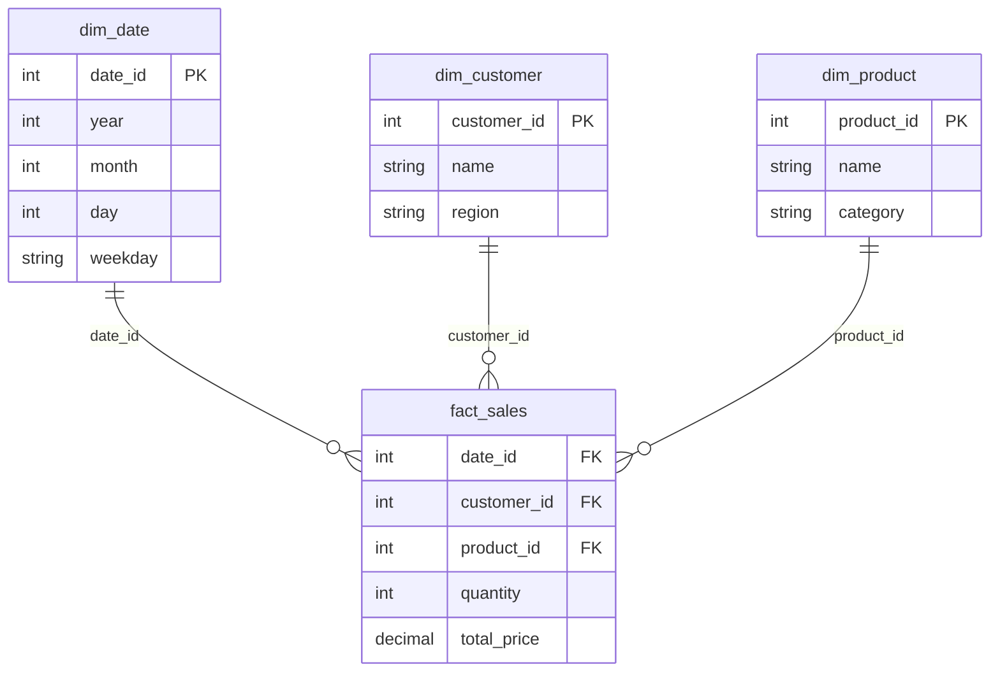

# Schema Design & Normalization

> [Mastery Guide](../../README.md) › [Data & Persistence](../README.md) › [SQL Mastery](./README.md)

| Status | Priority | Phase | Last reviewed |
|---|---|---|---|
| Not Started | High | Phase 5 — Data & Persistence | 2026-05-08 |

## Contents
- [Why it matters](#why-it-matters)
- [Core concepts](#core-concepts)
  - [Normalization — 1NF, 2NF, 3NF, BCNF](#normalization--1nf-2nf-3nf-bcnf)
  - [Functional dependencies](#functional-dependencies)
  - [Surrogate vs natural keys](#surrogate-vs-natural-keys)
  - [Many-to-many relationships](#many-to-many-relationships)
  - [Soft delete and audit trails](#soft-delete-and-audit-trails)
  - [Denormalization patterns](#denormalization-patterns)
  - [Partitioning](#partitioning)
  - [Sharding](#sharding)
  - [Star and snowflake schemas](#star-and-snowflake-schemas)
  - [Physical row order — clustered indexes and heaps](#physical-row-order--clustered-indexes-and-heaps)
  - [UNIQUE and NULL across engines](#unique-and-null-across-engines)
  - [Constraints as optimizer input](#constraints-as-optimizer-input)
  - [Generated columns — denormalization the engine maintains](#generated-columns--denormalization-the-engine-maintains)
  - [Modeling inheritance and polymorphic associations](#modeling-inheritance-and-polymorphic-associations)
  - [Slowly changing dimensions](#slowly-changing-dimensions)
  - [Schema decisions that decide concurrency](#schema-decisions-that-decide-concurrency)
- [Code & diagrams](#code--diagrams)
- [Common pitfalls](#common-pitfalls)
- [Interview-ready summary](#interview-ready-summary)
- [Interview Cross-Questioning Drill](#interview-cross-questioning-drill)
- [Cheat Sheet](#cheat-sheet)
- [Walkthrough](#walkthrough--47-columns-in-users-and-devs-pick-the-wrong-one)
- [Self-test](#self-test)
- [Cross-references](#cross-references)
- [Sources](#sources)

---

## Why it matters

Schema design is the highest-leverage decision in any database-backed system. A good schema makes queries naturally fast, constraints prevent corruption, and adding features feels easy. A bad schema bleeds performance forever, accumulates anomalies, and forces every new requirement to be a workaround.

Normalization (the discipline of eliminating redundancy) is the foundation. Most production schemas target **3NF** — every column depends on the key, the whole key, and nothing but the key. Knowing 1NF/2NF/3NF and *when* to deliberately denormalize is the senior signal.

Beyond normalization, schema design covers key choice (surrogate vs natural), relationship modeling (many-to-many junction tables, hierarchies), partitioning for scale, and dimensional modeling (star schemas) for analytics. This file is the conceptual base; vendor-specific implementation lives in [MS SQL Server](../04-mssql-server.md) and the [EF Core](../01-ef-core.md) chapters.

When NOT to over-engineer: small CRUD apps don't need elaborate schemas. Aim for 3NF; denormalize when profiling proves it. Don't pre-denormalize for hypothetical performance.

One framing worth carrying into the interview: **normalization is a correctness discipline, not a performance one**. Every normal form is defined by an anomaly it prevents — an update that can leave two copies of one fact disagreeing, an insert that can't be expressed without inventing data, a delete that destroys a fact you didn't intend to destroy. Performance is what you trade against once correctness is settled. Candidates who present 3NF as "the fast design" get taken apart on the first follow-up; candidates who present it as "the design where the database, not the application, guarantees the fact appears once" have an answer for every follow-up.

> 🌍 **In the real world**: a team inherited a system where "the schema is fine, it's the code that's buggy" had been the standing explanation for two years of reconciliation tickets. The customer's billing address lived in three places: `customers`, a denormalized copy on `orders`, and a third copy in the invoicing service's own table. Each had a different write path and none was documented as authoritative. The bug tickets were all the same bug wearing different clothes — an address changed in one place and not the others — and every fix was a new sync job that added a fourth way for the copies to diverge. The eventual fix was not clever: pick one owner per fact, make the others read through it or hold an explicitly named historical snapshot (`invoice.billing_address_at_issue`), and delete the sync jobs. Redundancy doesn't cause bugs by itself. Redundancy *without a named owner* does, and a schema is where ownership is either written down or left to folklore.

## Core concepts

### Normalization — 1NF, 2NF, 3NF, BCNF

**Normalization** is the process of structuring tables so each piece of information appears in exactly one place. Eliminates redundancy and update/insert/delete anomalies.

The named **normal forms** (each builds on the previous):

**First Normal Form (1NF):**
- Atomic values — no comma-separated lists, no JSON-blob columns containing structured data.
- No repeating groups — no `phone1`, `phone2`, `phone3`; instead a separate `phones` table.
- Every row uniquely identified (has a primary key).

```sql
-- ❌ Not 1NF: comma-separated phones
CREATE TABLE customers (id INT, name VARCHAR, phones VARCHAR);
-- "555-1234,555-5678"
-- Can't query "find customers with phone 555-5678" efficiently.

-- ✅ 1NF: separate table
CREATE TABLE customers (id INT PRIMARY KEY, name VARCHAR);
CREATE TABLE customer_phones (
    customer_id INT,
    phone VARCHAR,
    PRIMARY KEY (customer_id, phone),
    FOREIGN KEY (customer_id) REFERENCES customers(id)
);
```

> 🌍 **In the real world**: a notifications table stored recipients as a comma-separated string because "we only ever send to the whole list anyway". Two years later legal asked for an unsubscribe feature, and every option was bad: `LIKE '%' || @email || '%'` matched `bob@x.com` inside `robob@x.com`, splitting the string in the application meant reading every row, and there was nowhere to put a per-recipient `unsubscribed_at`. The rewrite to a `notification_recipients` child table took a sprint, most of it spent backfilling strings that had accumulated three different separators over the years because nothing had ever validated the format. That is the shape of a 1NF violation's cost: it isn't paid when you write the column, it's paid the first time somebody needs to address one of the values individually, and by then the data is dirty as well as unmodelled.

**Second Normal Form (2NF):**
- 1NF, plus: every non-key column depends on the *entire* primary key (matters when PK is composite).

```sql
-- ❌ Not 2NF: composite PK is (order_id, product_id), but product_name depends only on product_id
CREATE TABLE order_items (
    order_id INT,
    product_id INT,
    product_name VARCHAR,    -- depends only on product_id, not on the full PK
    quantity INT,
    PRIMARY KEY (order_id, product_id)
);

-- ✅ 2NF: separate products table
CREATE TABLE order_items (
    order_id INT,
    product_id INT,
    quantity INT,
    PRIMARY KEY (order_id, product_id),
    FOREIGN KEY (product_id) REFERENCES products(id)
);
CREATE TABLE products (
    id INT PRIMARY KEY,
    name VARCHAR
);
```

**Third Normal Form (3NF):**
- 2NF, plus: no transitive dependencies. Non-key columns depend on the PK directly, not on other non-key columns.

```sql
-- ❌ Not 3NF: country_name depends on country_code, not directly on the customer's PK
CREATE TABLE customers (
    id INT PRIMARY KEY,
    name VARCHAR,
    country_code CHAR(2),
    country_name VARCHAR  -- transitively depends on country_code
);

-- ✅ 3NF: country_name lives in its own table
CREATE TABLE customers (
    id INT PRIMARY KEY,
    name VARCHAR,
    country_code CHAR(2),
    FOREIGN KEY (country_code) REFERENCES countries(code)
);
CREATE TABLE countries (code CHAR(2) PRIMARY KEY, name VARCHAR);
```

> 🌍 **In the real world**: a reporting schema carried `country_name` alongside `country_code` on the customer row, copied in by the CSV importer. Revenue-by-country reports had looked right for years. Then a compliance review asked for revenue in one specific market and the number came back low; the group-by on `country_name` had split one country across four spellings the importer had received from four different partner feeds. Nobody had introduced a bug — the schema had simply never had a place where the country's name was stated once, so every feed got to have an opinion. The `countries` lookup table plus an FK made the four spellings a load-time failure instead of a reporting-time mystery. Transitive dependencies don't announce themselves as corruption; they show up as totals that are quietly a bit too small.

**Boyce-Codd Normal Form (BCNF):**
- A stricter 3NF: every functional dependency's left-hand side must be a superkey. Often equivalent to 3NF in practice; matters in academic / DBA contexts with overlapping candidate keys.

**Higher normal forms (4NF, 5NF, 6NF)** exist but are rarely relevant in practice.

**Practical rule of thumb:** target 3NF. The "every column depends on the key, the whole key, and nothing but the key" mnemonic captures 1NF + 2NF + 3NF.

### Functional dependencies

The math underneath normalization. A **functional dependency** `X → Y` means "given X, you can determine Y."

Examples:
- `customer_id → name`: knowing the customer ID lets you look up the name. ✓
- `(order_id, product_id) → quantity`: knowing the full PK gives you quantity. ✓
- `country_code → country_name`: country_name depends on country_code (transitive — should be in countries table).

A schema is in 3NF when **every non-trivial functional dependency `X → Y` has X as a superkey** (or Y as part of a key).

You don't usually compute this formally — apply the mnemonic. But knowing the term comes up in DBA / interview discussions.

### Surrogate vs natural keys

Two philosophies for primary keys.

**Surrogate key** — system-generated, no business meaning.

```sql
CREATE TABLE customers (
    id BIGSERIAL PRIMARY KEY,           -- PostgreSQL
    -- id BIGINT IDENTITY(1,1) PRIMARY KEY,    -- SQL Server
    email VARCHAR(254) UNIQUE NOT NULL,
    name VARCHAR(200) NOT NULL
);
```

Pros:
- **Stable** — the value never changes (email might).
- **Narrow** — INT/BIGINT, fast for indexes and FK lookups.
- **Decoupled** — schema independent of business changes.

Cons:
- One extra column per row.
- "Anonymous" — can't recognize a row by ID alone.

**Natural key** — derived from the data itself.

```sql
CREATE TABLE countries (
    code CHAR(2) PRIMARY KEY,            -- "US", "PK", "GB"
    name VARCHAR(100) NOT NULL
);

-- The orders table can use code directly:
CREATE TABLE orders (
    id BIGSERIAL PRIMARY KEY,
    country_code CHAR(2) REFERENCES countries(code),
    ...
);
```

Pros:
- Self-describing — `country_code = 'PK'` is meaningful.
- Saves an extra ID column when the natural key is small and stable.

Cons:
- **If the value changes**, you must update every FK reference (cascade).
- Wider keys = bigger indexes.

**Modern guidance:** use surrogate keys (`INT IDENTITY` / `BIGSERIAL`) by default. Use natural keys only for **highly stable** values like ISO country codes, currency codes, lookup tables.

> 🌍 **In the real world**: a warehouse system used the supplier's SKU as the primary key of `products`, and it held for six years because SKUs "never change". Then the company acquired a competitor whose catalogue used the same SKU strings for different goods, and the merge had to renumber one side. Renumbering meant cascading a text key through eleven referencing tables including three years of `order_items`, under a maintenance window, on a schema where two of the FK columns had no index. The migration ran over the window and was rolled back once before it succeeded. The lesson isn't "natural keys are wrong" — it's that the stability of a natural key is a claim about the *business*, and businesses acquire each other. Surrogate PK plus `UNIQUE (supplier_id, sku)` would have made the merge a data change instead of a schema change.

**GUID/UUID keys** — narrow row-key consideration:
- ✓ Cross-server uniqueness (no central counter).
- ✓ Client can generate before insert.
- ✗ Larger (16 bytes) and random — random values scatter inserts across the whole index, which is the wrong shape for a clustered key (see [Physical row order](#physical-row-order--clustered-indexes-and-heaps)).

If you need a UUID, prefer a **time-ordered** one so inserts still land at the end of the index:

| Option | Engine / runtime | Notes |
|---|---|---|
| `NEWSEQUENTIALID()` | SQL Server, `DEFAULT` constraint only | Microsoft Learn: "Creates a GUID that is greater than any GUID previously generated by this function on a specified computer since Windows was started. After Windows restarts, the GUID can start again from a lower range, but is still globally unique." Same page carries the warning: "If privacy is a concern, don't use this function. It's possible to guess the value of the next generated GUID and, therefore, access data associated with that GUID." |
| `Guid.CreateVersion7()` | .NET 9+ | RFC 9562 version 7 — a Unix-epoch millisecond timestamp followed by random bits, so values sort by creation time. Overload taking a `DateTimeOffset` exists for backfills. |
| `uuidv7()` | PostgreSQL 18+ | Added in PG 18 alongside the `uuidv4()` alias; the PG 18 release notes describe the value as "temporally sortable". |

The two properties are in tension: `NEWSEQUENTIALID()` gives you index locality *and* predictability, which is exactly what you don't want on a value that appears in a public URL. UUIDv7 has the same predictability property in its timestamp prefix — it tells an observer roughly when the row was created — but its random suffix makes the *next* value unguessable. If a key is both a clustered key and a public identifier, the honest answer is two columns: a narrow internal key for the storage engine and a separate opaque public token, indexed non-clustered.

Default: `BIGINT IDENTITY` (SQL Server) / `BIGINT GENERATED BY DEFAULT AS IDENTITY` (PostgreSQL) for the physical key; UUID only when distributed or client-side generation actually matters.

**Identity values are not a count.** Both `IDENTITY` and sequences hand out values outside the transaction, so a rollback burns the value and leaves a gap. SQL Server additionally caches identity values, and Microsoft Learn's `ALTER DATABASE SCOPED CONFIGURATION` page is explicit about the consequence: "To avoid gaps in the values of an identity column when the server restarts unexpectedly or fails over to a secondary server, disable the `IDENTITY_CACHE` option" (`IDENTITY_CACHE`, default `ON`, SQL Server 2017+). Never let a business process depend on identity values being gapless or on their being ordered the same way as `created_at` — invoice numbering that must be gapless needs its own table and its own serialized allocation, which is a deliberate contention point rather than an accident.

> 🌍 **In the real world**: an accounting integration derived invoice numbers from the `IDENTITY` column of an `invoices` table because "it's sequential anyway". An auditor's completeness check flagged missing numbers, and the finance team spent a week hunting for deleted invoices that had never existed — the gaps were failed inserts that had rolled back, plus one larger jump after an unplanned failover. Nothing was lost and nothing was wrong with the database; the schema had simply been asked to guarantee something it never promised. The fix was a separate `invoice_number` column allocated from a dedicated counter row inside the same transaction as the insert, accepting the serialization cost because gapless numbering *is* a serialization requirement.

### Many-to-many relationships

A many-to-many link requires a **junction table** (also called join table or association table).

```sql
-- Customers and tags: each customer can have many tags; each tag applies to many customers.
CREATE TABLE customers (id INT PRIMARY KEY, name VARCHAR);
CREATE TABLE tags (id INT PRIMARY KEY, name VARCHAR);

-- Junction
CREATE TABLE customer_tags (
    customer_id INT NOT NULL REFERENCES customers(id) ON DELETE CASCADE,
    tag_id      INT NOT NULL REFERENCES tags(id)      ON DELETE CASCADE,
    PRIMARY KEY (customer_id, tag_id)
);
```

The PK of the junction is the composite of both FK columns. This naturally prevents duplicates ("can't tag same customer with same tag twice") and gives an index for both join directions.

If the junction has its own attributes ("when was this tag added?"), add them:

```sql
CREATE TABLE customer_tags (
    customer_id INT NOT NULL,
    tag_id      INT NOT NULL,
    added_at    TIMESTAMPTZ NOT NULL DEFAULT NOW(),
    added_by    INT,
    PRIMARY KEY (customer_id, tag_id),
    FOREIGN KEY (customer_id) REFERENCES customers(id) ON DELETE CASCADE,
    FOREIGN KEY (tag_id)      REFERENCES tags(id)      ON DELETE CASCADE
);
```

Now the junction has columns of its own — sometimes called an "associative entity." Common in modeling: `enrollments` (student × course + grade), `subscriptions` (user × plan + start/end), `roles` (user × role + assigned_at).

> 🌍 **In the real world**: a `user_roles` junction was generated by an ORM with a surrogate `id` primary key and no unique constraint on `(user_id, role_id)`, because that is what the scaffolding produced. The admin screen checked for an existing grant before inserting, so duplicates were "impossible". They appeared anyway — two operators clicking the same button, and later a retry in a provisioning job — because a check-then-insert without a constraint is a race, not a guarantee. The visible symptom was harmless (a role listed twice in the UI); the expensive symptom was a revoke path that deleted one row and left the user still holding the permission. Two fixes, in order: `DELETE` the duplicates, then add the unique constraint so the race becomes a duplicate-key error the application can catch and treat as success. **A uniqueness rule that isn't a constraint is a comment.**

### Soft delete and audit trails

**Soft delete** — instead of `DELETE`, mark rows as deleted; queries filter them out.

```sql
ALTER TABLE customers ADD COLUMN deleted_at TIMESTAMPTZ;

-- "Delete"
UPDATE customers SET deleted_at = NOW() WHERE id = 7;

-- Queries
SELECT * FROM customers WHERE deleted_at IS NULL;
```

Why:
- Reversible (undelete = `SET deleted_at = NULL`).
- Audit trail (when was it deleted).
- FK references stay valid.

Cons:
- Every query must filter `deleted_at IS NULL` (use a view or partial index).
- DB fills with "deleted" data; periodic archival to a history table.

EF Core has `HasQueryFilter` for this:
```csharp
modelBuilder.Entity<Customer>().HasQueryFilter(c => c.DeletedAt == null);
```

Be precise about the filter's reach, because it is a common interview follow-up. It applies to LINQ queries EF Core translates against that entity type — including ones built on `FromSql`/`FromSqlRaw`, which EF Core 5 and later wrap as a subquery and then filter (EF Core 3.x did not, which is why you'll find contradictory advice). It does *not* apply to `ExecuteSqlRaw`, to a stored procedure, to another service on the same database, or to a reporting tool pointed at the same tables — and `IgnoreQueryFilters()` switches it off for any query that asks. So the schema-level companion to the query filter is a **view** that reporting connects to instead of the base table. Decide which of the two is the contract; don't leave it implicit.

> 🌍 **In the real world**: a GDPR erasure request was handled by setting `deleted_at` on the customer row, because the deletion pipeline had been built on the ORM and the ORM's query filter made the customer disappear from every screen the team checked. The record surfaced three weeks later in a marketing export built by a different team in a BI tool connected straight to the warehouse replica — which had no query filter, only tables. Two lessons came out of it and both are schema lessons. First, an application-level filter is invisible to everything that isn't the application, so exposing `v_customers_active` and revoking read on the base table from the reporting role puts the rule where every consumer sees it. Second, soft delete and erasure are different requirements: right-to-erasure means the personal data is gone, so the erasure path had to become a real `UPDATE` that nulls the PII columns (keeping the row for FK integrity and financial history) rather than a flag that hides it.

**Audit columns** — every table tracks who-and-when:

```sql
CREATE TABLE orders (
    id          BIGSERIAL PRIMARY KEY,
    ...
    created_at  TIMESTAMPTZ NOT NULL DEFAULT NOW(),
    created_by  INT NOT NULL,
    updated_at  TIMESTAMPTZ NOT NULL DEFAULT NOW(),
    updated_by  INT NOT NULL
);
```

For full change history, separate **history table**:

```sql
CREATE TABLE orders_history (
    history_id BIGSERIAL PRIMARY KEY,
    order_id   BIGINT NOT NULL,
    changed_at TIMESTAMPTZ NOT NULL,
    changed_by INT NOT NULL,
    operation  CHAR(1) NOT NULL,   -- I, U, D
    -- snapshot of all order columns at time of change
    status VARCHAR, total DECIMAL, ...
);
-- Populated via TRIGGER or app-level interceptor.
```

SQL Server has **temporal tables** (system-versioned) that automate this:

```sql
CREATE TABLE orders (
    id BIGINT PRIMARY KEY,
    ...
    valid_from DATETIME2 GENERATED ALWAYS AS ROW START NOT NULL,
    valid_to   DATETIME2 GENERATED ALWAYS AS ROW END   NOT NULL,
    PERIOD FOR SYSTEM_TIME (valid_from, valid_to)
) WITH (SYSTEM_VERSIONING = ON);

-- "What did the order look like on 2025-05-01?"
SELECT * FROM orders FOR SYSTEM_TIME AS OF '2025-05-01';
```

Know the write cost by its mechanism rather than by a number: Microsoft Learn's *Temporal tables* page states that "When you run any data modification queries on a temporal table, the Database Engine adds a row to the history table, even if no column values change." An `UPDATE` that sets a column to the value it already held still costs a history row — which is why an idempotent "sync" job that rewrites every row nightly turns a temporal table into a history table growing by the size of the base table per night.

PostgreSQL has no built-in system-versioning. The options are a trigger-maintained history table (see the [audit table pattern](#audit-table-pattern) below), validity ranges with `tstzrange` plus an `EXCLUDE` constraint, or the `temporal_tables` extension. **`pgaudit` is not one of them** — it writes statement-level audit entries to the standard PostgreSQL log, not previous row versions to a table, so it answers "who ran what" and not "what did this row look like last Tuesday".

### Denormalization patterns

3NF is the target — but reads can become expensive when many JOINs are required. **Denormalize selectively** when profiling shows a bottleneck.

**1. Add a derived column maintained by the app or trigger:**

```sql
-- Avoid joining to compute total every read
ALTER TABLE orders ADD COLUMN total DECIMAL(18, 2);

-- Recompute via trigger or app-level:
UPDATE orders SET total = (SELECT SUM(price * quantity) FROM order_items WHERE order_id = orders.id);
```

The total is now a snapshot — must be kept in sync. Worth it if reads dominate.

**2. Cache lookups inline:**

```sql
-- Customer's country code AND name in orders for reporting
CREATE TABLE orders (
    id BIGINT PRIMARY KEY,
    ...
    customer_id INT,
    customer_country_code CHAR(2),    -- denormalized from customers.country_code
    ...
);
-- Query: SELECT customer_country_code, SUM(total) FROM orders GROUP BY customer_country_code
-- No JOIN needed.
```

When customer changes country, you must update orders. Trade-off: write-time complexity vs read-time speed.

> 🌍 **In the real world**: a storefront copied `products.price` into `cart_items` at add-to-cart time, which is defensible — the cart should show what the customer was quoted. What wasn't defensible was that checkout charged from the same copied column. A promotion ended at midnight; carts created the previous evening and paid the next morning charged the promotional price, and the discrepancy only surfaced in a month-end margin review. The column was doing two jobs with one name: "the price we showed" and "the price we charge". The fix was to split them — `quoted_price` for display, with checkout re-reading the live price and re-quoting the customer when it differs. A denormalized copy is a snapshot of a fact at a moment; the bug is always the moment being wrong for one of its readers, so name the column after the moment.

**3. Materialized views (PostgreSQL):**

```sql
CREATE MATERIALIZED VIEW monthly_revenue AS
SELECT EXTRACT(MONTH FROM created_at) AS month, SUM(total) AS revenue
FROM orders GROUP BY EXTRACT(MONTH FROM created_at);

-- Refresh periodically (e.g., nightly cron)
REFRESH MATERIALIZED VIEW monthly_revenue;
```

The view is a real table — fast queries. Stale until refreshed.

Two things the PostgreSQL docs say about that refresh, both of which bite in production. A plain `REFRESH` "could block other connections which are trying to read from the materialized view" — so a nightly refresh that overruns into business hours stalls every reader. `REFRESH MATERIALIZED VIEW CONCURRENTLY` avoids that, but it "is only allowed if there is at least one `UNIQUE` index on the materialized view which uses only column names and includes all rows; that is, it must not be an expression index or include a `WHERE` clause". That unique index is a design requirement on the view's grain, decided when you write the view, not a flag you add later — so choose a grain that has a natural unique key.

**4. Indexed views (SQL Server):**

```sql
CREATE VIEW v_monthly_revenue WITH SCHEMABINDING AS
SELECT YEAR(created_at) AS year, MONTH(created_at) AS month, SUM(total) AS revenue, COUNT_BIG(*) AS cnt
FROM dbo.orders
GROUP BY YEAR(created_at), MONTH(created_at);

CREATE UNIQUE CLUSTERED INDEX ix ON v_monthly_revenue (year, month);
-- Auto-maintained as base table changes.
```

Three things to have ready when an interviewer pushes on this. (1) **Edition matters.** Microsoft Learn's *Create indexed views*: "Automatic use of an indexed view by the query optimizer is supported only in specific editions of SQL Server. On SQL Server Standard edition, you must use the `NOEXPAND` query hint to query the indexed view directly." A design that silently depends on optimizer substitution works on the developer's Developer-edition instance and not on the customer's Standard one. (2) **The maintenance is synchronous.** The same page warns that DML against a table referenced by many or complex indexed views can degrade "significantly" — the view is updated inside your transaction, so the write path pays for every read you accelerated. (3) **`COUNT_BIG(*)` is mandatory** whenever the view has a `GROUP BY`, and `AVG`, `MIN`/`MAX`, `HAVING`, outer joins, subqueries, self-joins, `DISTINCT` and `UNION` are all disallowed in the view definition — which is why the pattern is `SUM` plus `COUNT_BIG` and the division happens at read time.

> 🌍 **In the real world**: an indexed view on SQL Server made a dashboard instant in staging and did nothing in production. Same DDL, same statistics, different plan. The base table was written to by a legacy ODBC application, and indexed views require a fixed set of session `SET` options — `ARITHABORT` among them — both to be *used* by the optimizer and whenever DML touches a participating table; Microsoft Learn's default table lists `ARITHABORT` as `ON` at the server but `OFF` for OLE DB and ODBC. Once the connection's options were fixed the plan matched staging. The general point is worth carrying: indexed views are the only SQL Server feature where the *connection's* settings decide whether an object in the schema is usable, so "works on my machine" has a database-side meaning here.

**Modern guidance:** start with 3NF. Denormalize when:
- A join shows up in 90% of read queries.
- The denormalized column is rarely written.
- Profiling proves it's the bottleneck.

Don't pre-denormalize. Schema changes to add a column are easy; un-denormalizing a corrupt schema is hard.

### Partitioning

Splitting a large table into smaller pieces stored separately. Each partition is queried as if part of the whole table — but operations can target individual partitions.

**Range partitioning** (most common for time-series):

```sql
-- PostgreSQL declarative partitioning
CREATE TABLE orders (
    id BIGINT,
    created_at TIMESTAMPTZ NOT NULL,
    ...
) PARTITION BY RANGE (created_at);

CREATE TABLE orders_2024 PARTITION OF orders FOR VALUES FROM ('2024-01-01') TO ('2025-01-01');
CREATE TABLE orders_2025 PARTITION OF orders FOR VALUES FROM ('2025-01-01') TO ('2026-01-01');
CREATE TABLE orders_2026 PARTITION OF orders FOR VALUES FROM ('2026-01-01') TO ('2027-01-01');
```

Benefits:
- **Old partitions become read-only** (compress, move to cheaper storage).
- **Queries filtered by date** scan only relevant partitions ("partition pruning").
- **DROP PARTITION** is instant — fast archive/cleanup vs `DELETE WHERE date < ...`.

**List partitioning** (categorical):
```sql
PARTITION BY LIST (region);
CREATE TABLE orders_us PARTITION OF orders FOR VALUES IN ('US', 'CA', 'MX');
CREATE TABLE orders_eu PARTITION OF orders FOR VALUES IN ('DE', 'FR', 'GB');
```

**Hash partitioning** (even distribution):
```sql
PARTITION BY HASH (customer_id);
-- Each partition holds ~1/N of rows; balances load.
```

SQL Server has partitioned tables with partition functions and schemes; same idea, different syntax.

**The constraint that surprises people.** On PostgreSQL a primary key or unique constraint on a partitioned table must contain every partition key column. The docs give the reason, and it is worth being able to state it: "the individual indexes making up the constraint can only directly enforce uniqueness within their own partitions; therefore, the partition structure itself must guarantee that there are not duplicates in different partitions." So `orders (id BIGSERIAL PRIMARY KEY) PARTITION BY RANGE (created_at)` is rejected — the PK has to become `(id, created_at)`, and every table that referenced `orders(id)` now needs a composite FK or a redesign. SQL Server has the same problem in a different shape: a unique index on a partitioned table is only *aligned* with the partition scheme if it includes the partitioning column, and a non-aligned index blocks the partition-switch operations that were the reason you partitioned.

When to partition — the decision is about **operations**, not row count:
- Queries filter on the would-be partition key, so pruning removes work rather than adding planning overhead.
- You need to retire old data by dropping or detaching a partition instead of running a `DELETE` that logs every row.
- You want per-partition maintenance (rebuild, compress, move to cheaper storage) rather than whole-table maintenance.

When NOT to: when queries don't filter on the partition key (see Drill 12), and when the table is small enough that whole-table maintenance is already acceptable. On planning cost, the PostgreSQL docs are the citable source: "The query planner is generally able to handle partition hierarchies with up to a few thousand partitions fairly well, provided that typical queries allow the query planner to prune all but a small number of partitions. Planning times become longer and memory consumption becomes higher when more partitions remain after the planner performs partition pruning."

> 🌍 **In the real world**: an `events` table was partitioned monthly by `occurred_at` to make retention a partition drop, and it worked exactly as designed for eighteen months. Then a support tool added a lookup by `correlation_id`, which is spread evenly across every month, and every call planned and scanned eighteen partitions. The endpoint's latency scaled with the *retention window* rather than with the data it returned, so it degraded a little every month and never triggered a threshold. Partitioning had not made anything slower than an unpartitioned table would have been — it had turned a lookup that wanted one global index into a scan of eighteen local ones, because on PostgreSQL an index on a partitioned table is built per partition and there is no global variant. (On SQL Server you *can* build a non-aligned index that spans partitions, but a non-aligned index is precisely what stops `ALTER TABLE ... SWITCH` from working, so you trade back the archive operation you partitioned for.) The team kept the partitioning — retention was the point — and moved the correlation lookup to a small side table mapping `correlation_id → (occurred_at, event_id)`, restoring a single seek followed by a pruned partition access.

### Sharding

**Sharding** = splitting data across **multiple databases** by some key. Different from partitioning (which is within one database).

```
Shard 1 (DB instance 1): customer_id 1 - 1,000,000
Shard 2 (DB instance 2): customer_id 1,000,001 - 2,000,000
Shard 3 (DB instance 3): customer_id 2,000,001 - 3,000,000
```

Or hash sharded:
```
Shard for customer X = hash(X) % num_shards
```

Implications:
- **No cross-shard joins** without app-level orchestration.
- **No global transactions** without distributed transaction coordinator (heavy).
- **Routing layer** (in app or proxy) decides which shard.
- **Re-sharding** (adding shards) is operationally hard; consistent hashing helps.

Cosmos DB, DynamoDB, Cassandra are sharded by design. PostgreSQL/SQL Server have add-on sharding (Citus extension, scale-out features) but require careful schema choices.

**Shard key choice is a schema decision and it is close to irreversible.** Two properties matter and they pull against each other: the key must appear in almost every query (otherwise every read fans out to every shard) and it must distribute load evenly (otherwise one shard is the whole system). In a B2B SaaS, `tenant_id` satisfies the first perfectly and the second not at all, because tenant sizes follow a power law.

> 🌍 **In the real world**: a multi-tenant platform sharded by `hash(tenant_id) % 8` and it held for two years. Then one customer grew to a size where their traffic alone saturated the shard they hashed onto, and the three tenants unlucky enough to share that shard suffered every one of that customer's batch jobs. Nothing could be rebalanced: consistent hashing moves *shards*, not tenants, and the hot tenant was indivisible under the chosen key. The escape was to break the rule the design was built on — a routing table (`tenant_id → shard`) instead of a hash function, so a tenant could be assigned to a dedicated shard by data rather than by arithmetic. That indirection should have been there from day one; it costs one lookup, it is cacheable, and it is the difference between rebalancing being a config change and rebalancing being a rewrite.

For most apps: shard *only* when one DB instance is provably the bottleneck. A single well-indexed instance plus read replicas carries far more load than teams assume, and the replica hop costs you nothing but replication lag, whereas sharding costs you cross-shard joins, distributed transactions, and multiplied migrations forever. See [Microservices](../../05-microservices-and-messaging/01-microservices.md) and [System Design Prep](../../08-craft-and-interview-prep/03-system-design-prep.md).

### Star and snowflake schemas

Dimensional modeling for analytics / data warehouses.

**Star schema** — central **fact table** with foreign keys to **dimension tables**.



The fact table holds measurements (numeric, additive); dimensions hold context (categorical, descriptive). Queries: `SELECT region, SUM(total_price) FROM fact_sales JOIN dim_customer USING (customer_id) WHERE year = 2025 GROUP BY region`.

**Snowflake schema** — dimensions are normalized further into sub-dimensions (e.g., `dim_product → dim_product_category`).

Star is denormalized (one big dim table); snowflake is normalized (smaller dims, more joins). For analytics workloads, **star wins** — fewer joins, simpler queries, better performance on columnar engines.

In OLTP (transactional) systems, you typically don't use star schemas. They're for OLAP (analytics) — data warehouses (BigQuery, Snowflake, Redshift), reporting databases.

One detail the diagram above glosses over, and it is the first thing a data-warehouse interviewer will probe: **a dimension's primary key should be a warehouse-generated surrogate, not the source system's ID.** The `dim_customer` above uses `customer_id` as its PK, which works only while a customer has exactly one version for all time. The moment you need to know that an order placed in March was placed by a customer who was in the North region *then* and is in the South region *now*, the dimension must hold two rows for that customer — and it cannot, because the source ID is the key. See [Slowly changing dimensions](#slowly-changing-dimensions) below for the fix.

> 🌍 **In the real world**: a sales warehouse keyed `dim_customer` on the CRM's customer ID and updated the region in place whenever the CRM changed it. A territory reorganisation moved a few hundred accounts between regions, and every historical report silently restated — last year's regional performance changed overnight, because the fact rows joined to a dimension that now claimed those customers had always been in their new territory. Nobody could reproduce the numbers in the previous quarter's board pack. The rebuild introduced a surrogate `customer_key`, kept `customer_id` as a non-unique business key, and made region changes insert a new dimension row with a validity range. The instructive part is that the original design had no bug in it — it answered "who is this customer" correctly and "who were they when this happened" not at all, and only the second question is what a warehouse exists for.

### Physical row order — clustered indexes and heaps

Everything above is logical design. The primary key also has a *physical* meaning, and it is not the same meaning on every engine. This is the single largest gap between "I can normalize a schema" and "I can defend a schema".

| Engine | What the primary key does physically | Row locator inside a secondary index |
|---|---|---|
| **SQL Server** | Creating a `PRIMARY KEY` also creates a **unique clustered index** on those columns *if the table has no clustered index yet and you didn't ask for nonclustered*. The clustered index **is** the table — its leaf level holds the data rows in key order. | The clustered index key, if one exists; otherwise a Row ID (RID) "built from the file identifier (ID), page number, and number of the row on the page". |
| **MySQL / InnoDB** | Always clustered on the primary key. With no PK, InnoDB "uses the first `UNIQUE` index with all key columns defined as `NOT NULL` as the clustered index"; failing that it "generates a hidden clustered index named `GEN_CLUST_INDEX` on a synthetic column that contains row ID values". | The primary key columns. The manual states the consequence plainly: "If the primary key is long, the secondary indexes use more space, so it is advantageous to have a short primary key." |
| **PostgreSQL** | Nothing physical. Tables are **heaps**; the primary key is an ordinary unique B-tree index alongside the data. `CLUSTER` reorders a table once and the order then decays as rows are updated. | A `ctid` (physical tuple pointer), which is why HOT updates and `VACUUM` behaviour, not key width, dominate Postgres index sizing. |

So "which column should be the primary key" is one question on PostgreSQL and two questions on SQL Server and MySQL: *what identifies the row* and *what should the rows be sorted by on disk*. On SQL Server you can answer them separately — `PRIMARY KEY NONCLUSTERED` on the identity column and `CREATE CLUSTERED INDEX` on whatever the access pattern wants.

Microsoft Learn's *Index architecture and design guide* lists the properties of a good clustered index key, and each one is a fact about every other index on the table:

- **Narrow** — "The clustered index key is a part of any nonclustered index on the same base table. A narrow key… reduces the storage, I/O, and memory overhead of all indexes on a table."
- **Unique** — "If the clustered index isn't unique, a 4-byte internal uniqueifier column is automatically added to the index key."
- **Ever-increasing** — "data is always added on the last page of the index. This avoids page splits in the middle of the index."
- **Immutable** — "When a key column of a clustered index is modified, a change must also be made in all nonclustered indexes."
- **Not nullable** — a nullable column in an index requires an internal NULL block, "which adds 3-4 bytes of storage per row in an index."

Read those five as a design rule rather than a list: *whatever you choose as the clustered key is copied into every non-clustered index on that table, so its width and its mutability are multiplied by the number of indexes you have.*

> 🌍 **In the real world**: an `orders` table on SQL Server had its clustered index on `(customer_id, created_at)` — a deliberate choice made years earlier so that "show me this customer's orders" read contiguous pages. It was a good decision for the workload it was made for. What changed was everything else: the table grew nine non-clustered indexes as new screens shipped, and each one silently carried both clustered-key columns in every one of its entries, plus the 4-byte uniqueifier wherever a key value repeated (the key wasn't unique — a customer can order twice in the same second). Inserts, which arrive in `created_at` order globally but land in `customer_id` order physically, were splitting pages across the whole table rather than appending at the end, and the index maintenance job had grown to fill its window. The rewrite made the clustered key the `bigint` identity, kept `(customer_id, created_at) INCLUDE (status, total)` as a covering non-clustered index, and left the primary key where it was. The customer-orders query kept its seek, the nine other indexes each got narrower, and inserts went back to appending. The instructive part is that no single decision was wrong — a clustered key chosen for one query in year one was still serving that query in year five, while quietly taxing nine indexes that didn't exist when it was chosen.

**Heap tables** (SQL Server tables with no clustered index) are worth being able to discuss for one reason: forwarded records. When an update makes a row too big for its page, the heap leaves a forwarding pointer and moves the row, so a lookup that used to cost one page read costs two — permanently, until the table is rebuilt. `sys.dm_db_index_physical_stats` reports `forwarded_record_count`. Heaps are defensible as staging tables for bulk load; they are rarely defensible for a table that gets updated.

### UNIQUE and NULL across engines

Same DDL, opposite behaviour. This is the most reliable engine-difference question in schema design because the wrong answer produces duplicates in production rather than an error at deploy time.

**PostgreSQL and MySQL follow the SQL standard**: two nulls are not equal, so a unique constraint does not stop you inserting many rows whose constrained column is null. From the PostgreSQL docs: "By default, two null values are not considered equal in this comparison. That means even in the presence of a unique constraint it is possible to store duplicate rows that contain a null value in at least one of the constrained columns."

**SQL Server does the opposite.** Microsoft Learn's *Create a unique index*: "You cannot create a unique index on a single column if that column contains NULL in more than one row. Similarly, you cannot create a unique index on multiple columns if the combination of columns contains NULL in more than one row. These are treated as duplicate values for indexing purposes."

The PostgreSQL docs even flag the portability hazard themselves: "The default null treatment in unique constraints is implementation-defined according to the SQL standard, and other implementations have a different behavior. So be careful when developing applications that are intended to be portable."

Now combine that with soft delete, which is where it actually bites. You want "one active customer per email, but a deleted one shouldn't block re-registration". The obvious DDL is:

```sql
UNIQUE (email, deleted_at)     -- deleted_at IS NULL for active rows
```

- On **SQL Server** this works, and it works *because* of the non-standard rule: two active rows share `email` and both have `deleted_at = NULL`, SQL Server treats the null pair as equal, and the second insert fails. Which is what you wanted.
- On **PostgreSQL and MySQL** the same DDL silently permits two active rows with the same email, because the two nulls are not equal so the pairs are not duplicates. The constraint exists, looks right in the schema diagram, and enforces nothing for exactly the rows you care about.

Three ways to say it portably:

```sql
-- PostgreSQL / SQL Server: filtered (partial) unique index — the clearest statement of intent
CREATE UNIQUE INDEX ux_customers_email_active
    ON customers (email) WHERE deleted_at IS NULL;

-- PostgreSQL 15+: opt into SQL Server's semantics explicitly
ALTER TABLE customers ADD CONSTRAINT ux_email UNIQUE NULLS NOT DISTINCT (email, deleted_at);

-- MySQL (no filtered indexes): use a sentinel instead of NULL so the rule is expressible
-- deleted_at DATETIME NOT NULL DEFAULT '1970-01-01'  →  UNIQUE (email, deleted_at)
```

The filtered-index form is the one to reach for by default: it says "email is unique among live rows" in the schema itself and it is smaller than a full index. SQL Server calls it a *filtered* index and PostgreSQL a *partial* index; the DDL above works on both. MySQL has neither, which is why the sentinel-instead-of-NULL pattern is common in MySQL schemas and looks like a hack to people who have only used the other two.

> 🌍 **In the real world**: a team ported a customer service from SQL Server to PostgreSQL, migrated the schema with a tool, ran the integration suite green, and shipped. Duplicate accounts started appearing weeks later — always for people who had deleted an account and re-registered, then registered a third time. The `UNIQUE (email, deleted_at)` constraint had migrated across perfectly and stopped meaning anything, and the test suite never caught it because no test inserted two *active* rows with the same email (the application checked first; the constraint was the backstop nobody exercised). The lasting change was a test that asserts the constraint itself — insert the duplicate, expect the error — rather than testing the application path that is supposed to avoid it. Constraints deserve tests precisely because they are the thing that catches the case the application forgot.

### Constraints as optimizer input

Constraints are usually taught as integrity rules. They are also *statements the planner is allowed to believe*, and a constraint the engine can't trust costs you plan quality on top of costing you integrity.

**`NOT NULL`** removes null-handling branches and lets an aggregate or an anti-join be simplified. **`CHECK`** constraints let the optimizer discard predicates it can prove are unsatisfiable — `WHERE status = 'Refunded'` against a table whose CHECK forbids that value can return without reading anything. (SQL Server does this for any trusted CHECK. PostgreSQL gates it behind `constraint_exclusion`, whose default is `partition` — "examine constraints only for inheritance child tables and `UNION ALL` subqueries" — so on an ordinary Postgres table the predicate is evaluated, not eliminated, unless you set the parameter to `on`.) **Foreign keys** enable **join elimination on SQL Server**: if a query inner-joins `order_items` to `products`, selects and filters on nothing from `products`, and a trusted, `NOT NULL` FK guarantees every `product_id` matches exactly one product row, then the join can neither add rows nor remove them — so the optimizer can drop it from the plan entirely. This matters most for view-heavy and ORM-generated SQL, where a base view joins six lookup tables and each caller uses two of them.

Don't state that last one as a general SQL fact, because it isn't. **PostgreSQL does not do FK-driven inner-join elimination.** Its planner removes only an unused `LEFT JOIN` whose inner side is provably unique (PostgreSQL 18 added self-join elimination as well); a redundant *inner* join to a lookup table stays in the plan even with a valid foreign key. What PostgreSQL does use foreign keys for is *selectivity estimation* on multi-column joins, which changes row estimates and therefore join order, not the shape of the plan. MySQL doesn't eliminate FK-backed inner joins either. So "add the FK and the optimizer will drop the join" is a SQL Server (and Oracle) answer; on PostgreSQL the fix for a six-table base view is to stop selecting from the six-table base view.

Where the optimizer *does* believe constraints, it only believes the ones it trusts, and SQL Server is explicit about that condition. From Microsoft Learn's `ALTER TABLE` page: "The query optimizer doesn't consider constraints that are defined `WITH NOCHECK`. Such constraints are ignored until they're re-enabled by using `ALTER TABLE table WITH CHECK CHECK CONSTRAINT ALL`." A constraint added `WITH NOCHECK` — the fast way to add a constraint to a big table, and the automatic result of certain bulk-load and disable/re-enable sequences — still validates *new* rows but is invisible to the optimizer. Find them with:

```sql
-- SQL Server: constraints that exist but the optimizer ignores
SELECT OBJECT_NAME(parent_object_id) AS table_name, name, is_not_trusted
FROM sys.foreign_keys WHERE is_not_trusted = 1
UNION ALL
SELECT OBJECT_NAME(parent_object_id), name, is_not_trusted
FROM sys.check_constraints WHERE is_not_trusted = 1;
```

PostgreSQL has the same concept under a different name — `NOT VALID` — with a genuinely useful property attached. Adding a constraint `NOT VALID` skips the scan of existing rows; validating it later takes only a `SHARE UPDATE EXCLUSIVE` lock, because, in the docs' words, "The validation step does not need to lock out concurrent updates, since it knows that other transactions will be enforcing the constraint for rows that they insert or update; only pre-existing rows need to be checked." That gives you the two-step pattern for adding a constraint to a live table without a long exclusive lock:

```sql
ALTER TABLE order_items
    ADD CONSTRAINT fk_product FOREIGN KEY (product_id) REFERENCES products(id) NOT VALID;
-- later, off the critical path:
ALTER TABLE order_items VALIDATE CONSTRAINT fk_product;
```

The same mechanism is how you make `SET NOT NULL` cheap on a large PostgreSQL table — see the migration drill below.

**Deferrable constraints** are a PostgreSQL capability with no SQL Server equivalent worth knowing about. `SET CONSTRAINTS` "sets the behavior of constraint checking within the current transaction. IMMEDIATE constraints are checked at the end of each statement. DEFERRED constraints are not checked until transaction commit", and it applies to "UNIQUE, PRIMARY KEY, REFERENCES (foreign key), and EXCLUDE constraints" — not `CHECK` or `NOT NULL`. This is what lets you swap two rows' positions under `UNIQUE (list_id, sort_order)` in one statement, or insert two rows that reference each other. On SQL Server the same problem is solved by picking a non-colliding intermediate value or dropping to a nullable FK and a second `UPDATE`.

PostgreSQL also has **`EXCLUDE` constraints**, which express rules no `UNIQUE` can: "Exclusion constraints ensure that if any two rows are compared on the specified columns or expressions using the specified operators, at least one of these operator comparisons will return false or null." The canonical use is preventing double-booking:

```sql
CREATE EXTENSION IF NOT EXISTS btree_gist;
CREATE TABLE reservations (
    id       BIGINT GENERATED ALWAYS AS IDENTITY PRIMARY KEY,
    room_id  INT NOT NULL,
    during   TSTZRANGE NOT NULL,
    EXCLUDE USING gist (room_id WITH =, during WITH &&)   -- same room, overlapping period
);
```

Every other engine implements that rule in application code with a `SELECT` before the `INSERT`, which is a race under any isolation level below serializable.

> 🌍 **In the real world**: a booking system checked for conflicting reservations with a `SELECT`, then inserted. Under read committed, two concurrent requests both saw no conflict and both inserted, and the room was double-booked roughly as often as two people happened to book the same slot at the same moment — rare enough to be blamed on user error for a year. Serializable isolation would have fixed it at the cost of retry handling on every booking; an `EXCLUDE` constraint fixed it at the cost of one DDL statement and a `try/catch` around the insert. That is the general shape of the trade and it is worth stating in an interview: **a uniqueness or non-overlap rule enforced by reading before writing is a race; enforced by a constraint it is an error code.**

### Generated columns — denormalization the engine maintains

The recurring problem with denormalization is the one the [Denormalization patterns](#denormalization-patterns) section raises and doesn't fully answer: who keeps the derived value correct? A trigger can drift if someone disables it; application code drifts the moment a second writer appears. **Generated (computed) columns** hand the job to the engine, and the value is then correct by construction.

| Engine | Syntax | Stored by default? | Indexable |
|---|---|---|---|
| SQL Server | `col AS (<expr>) [PERSISTED]` | No — virtual unless `PERSISTED` | Yes, if the expression is deterministic and the type is allowed in index keys; may be part of a `PRIMARY KEY` or `UNIQUE` constraint under the same conditions |
| PostgreSQL | `col type GENERATED ALWAYS AS (<expr>) [STORED \| VIRTUAL]` | `STORED` was the only option in PG 12–17; PG 18 added `VIRTUAL` **and made it the default** | Yes for stored |
| MySQL / InnoDB | `col type [GENERATED ALWAYS] AS (<expr>) [VIRTUAL \| STORED]` | `VIRTUAL` is the default | Yes — InnoDB supports secondary indexes on virtual columns |

Note what changed in PostgreSQL 18, and note it precisely. Through PG 17 the keyword wasn't optional — the docs say "the keyword `STORED` must be specified to choose the stored kind of generated column", so `GENERATED ALWAYS AS (...)` with no keyword is a *syntax error* on PG 17, not a stored column. PG 18 accepts it and makes it **virtual**. The hazard is therefore in the other direction from the usual upgrade story: DDL written against PG 18 that omits the keyword silently produces a computed-on-read column with no stored value to index, and the same DDL won't run at all on an older server. Write `STORED` explicitly and the statement means one thing everywhere.

Two patterns worth having ready:

```sql
-- 1. A derived value that must never drift (SQL Server). PERSISTED because the
--    expression is deterministic and we want to index it.
ALTER TABLE order_items ADD line_total AS (quantity * unit_price) PERSISTED;
CREATE INDEX ix_order_items_line_total ON order_items (line_total);

-- 2. A canonical form for matching — the schema states what "the same email" means,
--    instead of every query remembering to call lower()
ALTER TABLE customers ADD COLUMN email_normalized TEXT
    GENERATED ALWAYS AS (lower(btrim(email))) STORED;   -- PostgreSQL
CREATE UNIQUE INDEX ux_customers_email ON customers (email_normalized);
```

The second pattern is the one seniors reach for. It moves a rule that was previously duplicated in every query — and therefore forgotten in one of them — into a single place the database enforces, and it makes the unique constraint mean what people assumed it meant.

The limitations are as important as the capability. On SQL Server a computed column "can't be used as a `DEFAULT` or `FOREIGN KEY` constraint definition or with a `NOT NULL` constraint definition"; on PostgreSQL a generated column can't use volatile functions or subqueries, can't reference another generated column, and "cannot be part of a partition key". The general rule across all three: the expression must depend only on other columns of the same row. Anything that needs to aggregate children (`orders.total` from `order_items`) is out of scope — that one still needs a trigger, an indexed view, or an application-level recompute with a documented staleness contract.

> 🌍 **In the real world**: an `orders.total` column was maintained by application code in the checkout service. A second service was added for admin corrections and wrote the line items directly, so totals drifted on exactly the orders a human had touched — the ones most likely to be disputed. Two years of finance reconciliation had been quietly absorbing the difference. The team's first instinct was a trigger; what they shipped was a SQL Server indexed view over `order_items` grouped by `order_id` with `SUM(quantity * unit_price)` and `COUNT_BIG(*)`, which the engine maintains inside whichever transaction writes the items, whoever writes them. The durable lesson is about where the invariant lives: application-maintained derived data is correct only while there is exactly one application, and "there is exactly one application" has a half-life measured in quarters.

### Modeling inheritance and polymorphic associations

Two shapes that don't fit the relational model cleanly show up constantly in .NET codebases. Interviewers ask about them because the answer reveals whether you have designed a schema or accepted one an ORM generated.

**Inheritance.** EF Core maps a .NET type hierarchy three ways, and the choice is a schema decision with query and integrity consequences:

| Strategy | Schema | Cost |
|---|---|---|
| **TPH** (table-per-hierarchy) — EF Core's default | One table, one discriminator column, union of all subtypes' columns | Subtype columns must be nullable — EF's docs note "Database columns are automatically made nullable as necessary when using TPH mapping" — so the database cannot enforce "an `RssBlog` must have an `RssUrl`" without a `CHECK` on the discriminator |
| **TPT** (table-per-type) | Base table plus one table per subtype, joined by a shared PK that is also an FK | Every read of a derived type is a join; every insert writes two rows. EF's own docs warn: "In many cases, TPT shows inferior performance when compared to TPH" |
| **TPC** (table-per-concrete-type), EF Core 7+ | One table per concrete type, each carrying all inherited columns | Denormalized by construction; keys must be unique across *all* the tables, so EF defaults to a shared sequence — the docs say "a simple `Identity` column cannot be used" (per-table identity works only with staggered seed/increment) — and a foreign key pointing at "any animal" is impossible because the PK lives in whichever concrete table holds that row |

EF's summary is the one to quote: "TPH is usually fine for most applications… Use TPT only if constrained to do so by external factors." The senior addition is the integrity note — under TPH, add `CHECK` constraints tying nullable subtype columns to the discriminator value, or you have a table where every invalid combination is representable.

**Polymorphic associations.** The other shape: comments (or attachments, or audit notes) that can attach to several different parents. The instinctive design is:

```sql
-- ❌ The parent can't be a foreign key to anything
CREATE TABLE comments (
    id BIGINT PRIMARY KEY,
    parent_type VARCHAR(20) NOT NULL,   -- 'order' | 'product' | 'ticket'
    parent_id   BIGINT NOT NULL,
    body TEXT NOT NULL
);
```

Nothing stops `parent_type = 'order'` with a `parent_id` that no order has, and nothing ever will, because a foreign key targets one table. Deleting an order leaves orphans the database can't see. Two workable alternatives:

```sql
-- Option A: exclusive arc — one nullable FK per parent type, plus a CHECK that exactly one is set
CREATE TABLE comments (
    id BIGINT PRIMARY KEY,
    order_id   BIGINT NULL REFERENCES orders(id)   ON DELETE CASCADE,
    product_id BIGINT NULL REFERENCES products(id) ON DELETE CASCADE,
    ticket_id  BIGINT NULL REFERENCES tickets(id)  ON DELETE CASCADE,
    body TEXT NOT NULL,
    CONSTRAINT ck_one_parent CHECK (
        (CASE WHEN order_id   IS NOT NULL THEN 1 ELSE 0 END
       + CASE WHEN product_id IS NOT NULL THEN 1 ELSE 0 END
       + CASE WHEN ticket_id  IS NOT NULL THEN 1 ELSE 0 END) = 1)
);

-- Option B: one link table per parent type — comments own their content, links own the association
CREATE TABLE order_comments   (order_id   BIGINT REFERENCES orders(id)   ON DELETE CASCADE,
                               comment_id BIGINT REFERENCES comments(id) ON DELETE CASCADE,
                               PRIMARY KEY (order_id, comment_id));
```

Option A keeps one table and full referential integrity, and it stops scaling somewhere around five or six parent types. Option B scales to any number and costs a `UNION ALL` when you genuinely need "all comments regardless of parent" — which, in practice, is a rarer query than the design instinct suggests. Reach for `parent_type`/`parent_id` only when the parent set is genuinely open-ended and defined at runtime, and then own the fact that integrity is now the application's problem and write the reconciliation job on day one.

> 🌍 **In the real world**: an attachments table used `owner_type`/`owner_id` across seven entity types. A cleanup that hard-deleted cancelled orders left several hundred thousand attachment rows pointing at nothing, and the storage bill kept growing because the blob-deletion job walked *from* orders *to* attachments and therefore never saw them. The rows were invisible to every screen — they were only found by a storage audit. Migrating to per-type link tables took a week and made the orphaning impossible rather than merely unlikely, and the reconciliation job that had been written to find orphans was deleted. Referential integrity is not paperwork; it is the mechanism by which a delete on one table can be *known* to have finished.

### Slowly changing dimensions

The star-schema section leaves one question open: what happens when a dimension attribute changes? Kimball's answer is a small vocabulary that interviewers expect by number.

- **Type 0** — never changes. The date dimension; the original signup date.
- **Type 1** — overwrite. The dimension row is updated in place and history is lost. Correct for genuine corrections (a misspelled name), wrong for anything a report groups by.
- **Type 2** — new row per change. This is the one that matters. The dimension gains a surrogate key, a validity period, and a current flag; fact rows point at the surrogate that was current when the fact happened, so history is frozen automatically.
- **Type 3** — a `previous_region` column beside `region`. Cheap, but it remembers exactly one change, so it only suits a one-off reorganisation you know is one-off.

Type 2 in DDL:

```sql
CREATE TABLE dim_customer (
    customer_key  BIGINT PRIMARY KEY,        -- surrogate: what facts join to
    customer_id   BIGINT NOT NULL,           -- business key from the source system
    name          VARCHAR(200),
    region        VARCHAR(50),
    valid_from    DATE NOT NULL,
    valid_to      DATE NOT NULL DEFAULT '9999-12-31',
    is_current    BOOLEAN NOT NULL DEFAULT TRUE
);
-- PostgreSQL partial index; on SQL Server: is_current BIT, and WHERE is_current = 1
CREATE UNIQUE INDEX ux_dim_customer_current
    ON dim_customer (customer_id) WHERE is_current;   -- exactly one live row per business key
```

The load process becomes: look up the current row for the business key; if the tracked attributes differ, close it (`valid_to = today`, `is_current = FALSE`) and insert a new row with a fresh `customer_key`. Fact loads resolve `customer_id` to whichever `customer_key` was current at the fact's date — which is why fact tables store the surrogate and not the business key, and why the surrogate must be warehouse-generated rather than borrowed from the source.

Two consequences that get asked about. "Count of customers by region" must filter `WHERE is_current` or it counts a customer once per historical version. And the choice of which attributes are Type 1 versus Type 2 is a *business* decision — correcting a typo should not fork the dimension, changing a sales territory should — so it belongs in the model documentation, not in the ETL developer's head.

SQL Server's temporal tables are the same idea implemented by the engine; Microsoft Learn lists "Maintaining a slowly changing dimension for decision support applications" as a temporal-table use case. The difference is that temporal tables version by *transaction* time (when the database learned it) while a Type 2 dimension versions by *business* time (when it became true), and those diverge whenever data arrives late. Systems that need both — insurance, finance — model them as separate pairs of columns and call it bitemporal; being able to name the distinction is usually enough for an interview.

### Schema decisions that decide concurrency

A schema doesn't just store data, it determines what can happen simultaneously. Three decisions in particular:

**1. A concurrency token turns lost updates into a detectable error.** Without one, last-write-wins is the default and it is silent. SQL Server has a purpose-built type: `rowversion` is "automatically generated, unique binary numbers within a database… The storage size is 8 bytes" and "does not preserve a date or a time"; the database's counter increments on every insert or update to any table containing a `rowversion` column. The docs are equally clear on the trap — "This property makes a `rowversion` column a poor candidate for keys, especially primary keys", because every update changes it. In EF Core:

```csharp
// SQL Server — byte[] property mapped to the rowversion column
modelBuilder.Entity<Order>().Property(o => o.RowVersion).IsRowVersion();

// PostgreSQL — no rowversion type. Npgsql maps a uint property to the xmin
// system column through the same EF Core mechanism:
//     public uint Version { get; set; }
modelBuilder.Entity<Order>().Property(o => o.Version).IsRowVersion();
```

EF Core then adds the token to the `WHERE` clause of every `UPDATE`, and a zero-rows-affected result becomes a `DbUpdateConcurrencyException` instead of a silently overwritten change. One caveat worth stating: `rowversion` increments on any update statement that touches the row "even if no row values are changed", so a save that writes identical values still invalidates other sessions' tokens.

**2. Denormalized counters serialize their parents.** A `products.stock_count` or `orders.total` column maintained on every child write means every child write takes an exclusive lock on one parent row. Under load that row becomes the throughput limit for the whole table, and the symptom looks like lock waits on an unrelated screen. The alternatives are all about moving the contention: insert immutable delta rows and aggregate (a ledger), let the engine maintain it (indexed view / generated column), or accept staleness and recompute on a schedule.

> 🌍 **In the real world**: a flash sale on a retail platform had a `products.stock_remaining` column decremented inside each order transaction. Every buyer of the same popular item queued behind the same row, checkout throughput for that item collapsed to whatever one row could sustain, and — because the lock was held for the whole checkout transaction, including a call to the payment gateway — the queue was measured in gateway round-trips. The database was nowhere near its limits; one row was. The redesign moved the decrement to a `stock_movements` ledger (append-only, no contention) with the remaining count derived, and shortened the transaction so the external payment call happened outside it. Two independent fixes for two independent mistakes, and the second one — holding a row lock across a network call — is the one that turns a hot row into an outage.

**3. Nullable columns are a concurrency and correctness decision, not a convenience.** Every nullable column is a three-valued-logic hazard in every predicate that touches it (`WHERE region <> 'EU'` silently drops the nulls) and, in SQL Server, adds NULL-block overhead to any index containing it. "Make it nullable so the migration is easy" is a defensible tactical choice; leaving it nullable after the backfill is how a column that is conceptually mandatory ends up with a slow accumulation of rows where it isn't.

## Code & diagrams

<details>
<summary>🧩 Click to expand — code samples and diagrams</summary>

### Normalization progression

```
0NF (raw): one row per "thing," columns mixing concerns

orders table:
+----+-----------+--------------------+---------------------+
| id | customer  | items              | shipping_address     |
+----+-----------+--------------------+---------------------+
| 1  | Ahmed (PK)| Laptop:1, Mouse:2  | Lahore, PK          |
+----+-----------+--------------------+---------------------+

1NF: atomic values

orders:
+----+-------------+------------------------+
| id | customer_id | shipping_address       |
+----+-------------+------------------------+
| 1  |     7       | Lahore, PK             |
+----+-------------+------------------------+

order_items:
+----------+-----------+----------+
| order_id | product   | quantity |
+----------+-----------+----------+
| 1        | Laptop    | 1        |
| 1        | Mouse     | 2        |
+----------+-----------+----------+

2NF: every non-key column depends on the FULL key

(order_items already in 2NF — quantity depends on (order_id, product))
But product name shouldn't be in order_items if it depends only on product:

products:
+----+--------+-------+
| id | name   | price |
+----+--------+-------+
| 99 | Laptop | 1500  |
| 88 | Mouse  | 25    |
+----+--------+-------+

order_items:
+----------+------------+----------+
| order_id | product_id | quantity |
+----------+------------+----------+
| 1        | 99         | 1        |
| 1        | 88         | 2        |
+----------+------------+----------+

3NF: no transitive dependencies

shipping_address embedded in orders depends on the order, not transitively on something else.
But "city, country" if redundant could be normalized:

addresses:
+----+-----------+--------------+--------+
| id | street    | city         | country|
+----+-----------+--------------+--------+
| 1  | 5 Main St | Lahore       | PK     |
+----+-----------+--------------+--------+

orders:
+----+-------------+-----------+
| id | customer_id | address_id|
+----+-------------+-----------+
| 1  | 7           | 1         |
+----+-------------+-----------+

Now in 3NF.
```

### Many-to-many junction

```
Without junction (broken):
   customers              tags
   +-------+              +------+
   | id    | ...          | id   |
   | name  |              | name |
   +-------+              +------+
   How do we link?
   - customers.tag_id = tags.id?  → only 1 tag per customer.
   - tags.customer_id = customers.id? → only 1 customer per tag.
   Neither models many-to-many.

With junction:
   customers              customer_tags                tags
   +-------+              +-------------+-------+      +------+
   | id (PK)|◄────────────| customer_id  | tag_id │─────►| id (PK)|
   | name  |              +-------------+-------+      | name |
   +-------+              PK = (customer_id, tag_id)   +------+

   Now: any customer can have many tags via multiple rows.
        Any tag can apply to many customers.
```

### Schema design — typical e-commerce

```sql
-- Core entities (3NF)

CREATE TABLE customers (
    id          BIGSERIAL PRIMARY KEY,
    email       VARCHAR(254) UNIQUE NOT NULL,
    name        VARCHAR(200) NOT NULL,
    country_code CHAR(2) NOT NULL REFERENCES countries(code),
    created_at  TIMESTAMPTZ NOT NULL DEFAULT NOW(),
    deleted_at  TIMESTAMPTZ
);

CREATE TABLE products (
    id          BIGSERIAL PRIMARY KEY,
    sku         VARCHAR(50) UNIQUE NOT NULL,
    name        VARCHAR(200) NOT NULL,
    description TEXT,
    price       DECIMAL(18, 2) NOT NULL CHECK (price >= 0),
    category_id INT NOT NULL REFERENCES categories(id),
    deleted_at  TIMESTAMPTZ
);

CREATE TABLE categories (
    id    SERIAL PRIMARY KEY,
    name  VARCHAR(100) NOT NULL UNIQUE,
    parent_id INT REFERENCES categories(id)   -- self-reference for hierarchy
);

CREATE TABLE orders (
    id           BIGSERIAL PRIMARY KEY,
    customer_id  BIGINT NOT NULL REFERENCES customers(id),
    status       VARCHAR(20) NOT NULL CHECK (status IN ('Pending', 'Paid', 'Shipped', 'Cancelled')),
    total        DECIMAL(18, 2) NOT NULL CHECK (total >= 0),
    created_at   TIMESTAMPTZ NOT NULL DEFAULT NOW()
);

-- Many-to-many via junction
CREATE TABLE order_items (
    order_id    BIGINT NOT NULL REFERENCES orders(id) ON DELETE CASCADE,
    product_id  BIGINT NOT NULL REFERENCES products(id),
    quantity    INT NOT NULL CHECK (quantity > 0),
    unit_price  DECIMAL(18, 2) NOT NULL,             -- snapshot at time of order
    PRIMARY KEY (order_id, product_id)
);

-- Lookup table (natural key candidate)
CREATE TABLE countries (
    code CHAR(2) PRIMARY KEY,
    name VARCHAR(100) NOT NULL
);
```

Notes:
- Surrogate `BIGSERIAL` PKs everywhere except `countries` (natural ISO code).
- FK constraints with appropriate cascade behavior.
- `CHECK` constraints for enums and ranges.
- `unit_price` in `order_items` is a denormalization — captures the price at order time, since `products.price` may change.
- `deleted_at` for soft delete.

### Hierarchy modeling

Three approaches:

**1. Adjacency list (parent_id):**
```sql
CREATE TABLE categories (
    id INT PRIMARY KEY,
    name VARCHAR,
    parent_id INT REFERENCES categories(id)
);
```
Simple. Easy to insert. Queries for ancestors / descendants need recursive CTE ([Subqueries & CTEs](./04-subqueries-and-ctes.md#recursive-ctes)).

**2. Path enumeration (materialized path):**
```sql
CREATE TABLE categories (
    id INT PRIMARY KEY,
    name VARCHAR,
    path VARCHAR     -- "/electronics/laptops/gaming"
);
```
Fast to query ("WHERE path LIKE '/electronics/%'"). Painful to update (rename a parent → update all descendants).

**3. Nested set (left-right values):**
```sql
CREATE TABLE categories (
    id INT PRIMARY KEY,
    name VARCHAR,
    lft INT,
    rgt INT
);
```
Fast for "all descendants" (`WHERE lft BETWEEN 5 AND 15`). Hard to insert (must shift many rgt values).

Default to adjacency list + recursive CTE; modern databases handle it well.

### Audit table pattern

```sql
CREATE TABLE customers_audit (
    audit_id    BIGSERIAL PRIMARY KEY,
    customer_id BIGINT NOT NULL,
    operation   CHAR(1) NOT NULL CHECK (operation IN ('I', 'U', 'D')),
    changed_at  TIMESTAMPTZ NOT NULL DEFAULT NOW(),
    changed_by  INT,
    -- Snapshot of customer fields
    email       VARCHAR(254),
    name        VARCHAR(200),
    country_code CHAR(2)
);

-- Trigger (PostgreSQL)
CREATE OR REPLACE FUNCTION audit_customers() RETURNS trigger AS $$
BEGIN
    INSERT INTO customers_audit (customer_id, operation, email, name, country_code)
    VALUES (
        COALESCE(NEW.id, OLD.id),
        CASE TG_OP WHEN 'INSERT' THEN 'I' WHEN 'UPDATE' THEN 'U' WHEN 'DELETE' THEN 'D' END,
        COALESCE(NEW.email, OLD.email),
        COALESCE(NEW.name,  OLD.name),
        COALESCE(NEW.country_code, OLD.country_code)
    );
    RETURN COALESCE(NEW, OLD);
END;
$$ LANGUAGE plpgsql;

CREATE TRIGGER trg_audit_customers
    AFTER INSERT OR UPDATE OR DELETE ON customers
    FOR EACH ROW EXECUTE FUNCTION audit_customers();
```

Or use SQL Server **temporal tables** (auto-managed history). Or app-level audit interceptors in EF Core (cleaner; doesn't tie behavior to triggers).

### Star schema example

```sql
-- Fact table — measurements
CREATE TABLE fact_sales (
    sale_id     BIGSERIAL PRIMARY KEY,
    date_id     INT NOT NULL,
    customer_id BIGINT NOT NULL,
    product_id  BIGINT NOT NULL,
    store_id    INT NOT NULL,
    quantity    INT NOT NULL,
    total_price DECIMAL(18, 2) NOT NULL,
    discount    DECIMAL(18, 2) NOT NULL DEFAULT 0
);

-- Dimensions — context
CREATE TABLE dim_date (
    date_id     INT PRIMARY KEY,        -- e.g., 20250506
    full_date   DATE NOT NULL,
    year        SMALLINT, month SMALLINT, day SMALLINT,
    weekday     SMALLINT, week_of_year SMALLINT,
    is_weekend  BOOLEAN, is_holiday BOOLEAN
);

CREATE TABLE dim_customer (
    customer_id BIGINT PRIMARY KEY,
    name        VARCHAR(200),
    country_code CHAR(2),
    region      VARCHAR(50),
    segment     VARCHAR(50)               -- e.g., 'Premium', 'Standard'
);

CREATE TABLE dim_product (
    product_id  BIGINT PRIMARY KEY,
    name        VARCHAR(200),
    category    VARCHAR(100),
    sub_category VARCHAR(100),
    brand       VARCHAR(100),
    price_band  VARCHAR(20)               -- 'Low', 'Medium', 'High'
);

-- Query: revenue by region and year
SELECT c.region, d.year, SUM(f.total_price) AS revenue
FROM fact_sales f
JOIN dim_date d     ON f.date_id     = d.date_id
JOIN dim_customer c ON f.customer_id = c.customer_id
GROUP BY c.region, d.year
ORDER BY revenue DESC;
```

OLAP queries on this schema are simple, fast, and intuitive — exactly what reporting needs. In production, the fact table is often partitioned by date.

### Partitioning visualization

```
Without partitioning (one giant table):
+--------------------------------------------------+
|  orders (10 years × ~1M orders/yr = ~10M rows)   |
|  All in one heap; queries scan more than needed. |
+--------------------------------------------------+

With range partitioning by year:
+-----------+    +-----------+    +-----------+    +-----------+
| 2024 part |    | 2025 part |    | 2026 part |    | 2027 part |
| ~1M rows  |    | ~1M rows  |    | ~1M rows  |    | (current) |
| (cold,    |    | (cold,    |    | (warm)    |    | (hot,     |
|  archived)|    |  archived)|    |           |    |  index'd) |
+-----------+    +-----------+    +-----------+    +-----------+

Query: SELECT * FROM orders WHERE created_at = '2026-05-06';
   → optimizer prunes to 2026 partition only.

Operation: archive 2024:
   → DETACH PARTITION orders_2024  (instant)
   → MOVE to archive storage
   No DELETE; no fragmentation.
```

### Schema migrations — design for evolution

Schema isn't static. Plan for change:

```
Step 1: Add column NULLable
ALTER TABLE customers ADD COLUMN phone VARCHAR(30);

Step 2: Backfill (in batches, async)
UPDATE customers SET phone = '???' WHERE phone IS NULL AND id BETWEEN 1 AND 1000;
... etc.

Step 3: Make NOT NULL after all rows have a value
ALTER TABLE customers ALTER COLUMN phone SET NOT NULL;
```

Adding a NOT NULL column with backfill is the canonical 3-deploy pattern (see [EF Core](../01-ef-core.md#migrations-workflow)).

Renaming columns is breaking — add new, dual-write, eventually drop old.

### Why the clustered key is a whole-table decision (SQL Server / InnoDB)

```
SQL Server, clustered key = (customer_id, created_at), NOT unique
──────────────────────────────────────────────────────────────────

  Clustered index (IS the table)          Every non-clustered index entry
  ┌──────────────────────────────┐        carries the clustered key as its
  │ key: customer_id, created_at │        row locator — plus a 4-byte
  │ leaf: the full data rows     │        uniqueifier where the key
  └──────────────────────────────┘        value actually repeats.

  ix_status          →  [ status | customer_id, created_at, uniq ]
  ix_created         →  [ created_at | customer_id, uniq ]   ← created_at was
                                                               already a key
                                                               column, so it
                                                               isn't repeated
  ix_total           →  [ total | customer_id, created_at, uniq ]
  ... × 9 indexes        └──────── repeated in every entry of every index
                                   (uniq only where the key value repeats)

  Change the clustered key to a narrow bigint identity:

  ix_status          →  [ status | id ]
  ix_created         →  [ created_at | id ]
  ix_total           →  [ total | id ]

PostgreSQL has no equivalent decision: the table is a heap, every index
entry points at a ctid, and the primary key is just another B-tree.
```

The design rule that falls out: on SQL Server and InnoDB, **the clustered key's width and mutability are multiplied by the number of indexes on the table** — and the number of indexes only ever goes up.

### Before / after — a rule that lived in queries, moved into the schema

The rule is "email identifies a customer, case- and whitespace-insensitively, among live rows". Before, it lives in whichever queries remembered it:

```sql
-- Before: every caller must remember lower(), btrim(), and the soft-delete filter.
SELECT * FROM customers
WHERE lower(btrim(email)) = lower(btrim(:input))
  AND deleted_at IS NULL;
-- and the "uniqueness" of email is enforced by a SELECT-then-INSERT in the service layer.
```

Three ways to get this wrong are available to every new caller: forget `lower()`, forget the filter, or lose the check-then-insert race. After, the schema states the rule once (PostgreSQL):

```sql
ALTER TABLE customers ADD COLUMN email_key TEXT
    GENERATED ALWAYS AS (lower(btrim(email))) STORED;

CREATE UNIQUE INDEX ux_customers_email_live
    ON customers (email_key) WHERE deleted_at IS NULL;

-- Callers:
SELECT * FROM customers WHERE email_key = lower(btrim(:input)) AND deleted_at IS NULL;
-- and INSERT now fails with a unique violation instead of racing.
```

The query didn't get much shorter. What changed is that the normalization rule can no longer be forgotten by a caller, the index is on the same expression the query uses (so it is an index seek rather than a scan with a function applied per row), and duplicate creation is an error code rather than a possibility. On SQL Server the same shape is `email_key AS (LOWER(LTRIM(RTRIM(email)))) PERSISTED` plus `CREATE UNIQUE INDEX ... WHERE deleted_at IS NULL`. On MySQL, a `STORED` generated column plus a plain unique index, using a sentinel `deleted_at` rather than NULL.

### Polymorphic parent — three designs side by side

| | `parent_type` + `parent_id` | Exclusive arc | Link table per type |
|---|---|---|---|
| FK integrity | None | Full | Full |
| Orphans possible | Yes, silently | No | No |
| "All children of X" | One query | One query | One query |
| "All children regardless of parent" | One query | One query | `UNION ALL` over N tables |
| Adding a parent type | No schema change | `ALTER TABLE` + edit the CHECK | `CREATE TABLE` |
| Scales to | Any N | ~5–6 before the CHECK is unreadable | Any N |
| Use when | Parent set is defined at runtime by users | Small, stable parent set | Everything else |

</details>

## Common pitfalls

1. **Comma-separated lists in a column.** Violates 1NF. Can't query, validate, or join. Use a separate table with a row per value.
2. **Over-using GUIDs.** Larger keys; random insert order kills clustered indexes. Use INT/BIGINT IDENTITY unless you specifically need cross-server uniqueness.
3. **No FK constraints.** "We'll enforce in app code." Bugs and ad-hoc SQL bypass the app; data integrity rots. Always FK.
4. **Cascade delete on critical tables.** A casual `DELETE FROM customers` cascades to delete every order. Use `ON DELETE RESTRICT` for protected tables.
5. **No indexes on FK columns.** Joins scan one side. Always index FK columns.
6. **Premature denormalization.** "I'll add `customer_country` to orders for speed." Now every customer-country update touches every order. Normalize first; profile; denormalize specifically.
7. **Storing computed values without a recompute strategy.** `orders.total = SUM(items)` — but who maintains it? Trigger? App code? Either way, drift is inevitable. Decide once.
8. **No audit columns.** `created_at`, `updated_at`, `created_by`, `updated_by` answer "who broke this and when?" Add them by default.
9. **Soft delete without filtered indexes.** Active queries get slower as the deleted-set grows. Use `WHERE deleted_at IS NULL` partial indexes.
10. **Star schema in OLTP.** Star is for analytics (read-heavy aggregations). OLTP needs normalized tables for fast point updates.
11. **Sharding too early.** Operational complexity vs vertical scaling. One big DB serves a lot of traffic. Don't shard until proven necessary. And when you do, route through a lookup table rather than a hash function, so one hot tenant can be moved.
12. **Partitioning by something queries don't filter on.** Partitioning pays off when pruning removes partitions from the plan; otherwise you have built N smaller tables that all get scanned, and N local indexes where one global index would have done. Choose the partition key from the retention requirement *and* the dominant query predicate, or don't partition.
13. **Assuming `UNIQUE` treats NULLs the same everywhere.** SQL Server treats two NULLs as duplicates for index purposes; PostgreSQL and MySQL follow the standard and treat them as distinct. `UNIQUE (email, deleted_at)` enforces the soft-delete rule on one and silently enforces nothing on the others. Use a filtered/partial unique index.
14. **Constraints the optimizer can't trust.** A SQL Server constraint added `WITH NOCHECK` (or left untrusted after a disable/re-enable, or a bulk load without `CHECK_CONSTRAINTS`) still validates new rows but is invisible to the query optimizer — no join elimination, no predicate simplification. Audit `sys.foreign_keys` / `sys.check_constraints` for `is_not_trusted = 1`.
15. **Letting the ORM pick the clustered key.** On SQL Server and InnoDB the primary key becomes the physical row order and is copied into every secondary index. A wide, random, or mutable key taxes every index on the table — and the tax is invisible until the table has eight of them.
16. **`parent_type` + `parent_id` polymorphic links.** No foreign key is possible, so orphans are guaranteed eventually and invisible when they happen. Use an exclusive arc for a small fixed set of parents, or a link table per parent type.
17. **A denormalized counter on a hot parent row.** Every child write serializes on one row. Push it to an append-only ledger, an indexed view, or a scheduled recompute — and never hold that row's lock across a network call.
18. **No concurrency token on entities two users can edit.** Without `rowversion` (SQL Server) or the `xmin` mapping (PostgreSQL via Npgsql), lost updates are silent — the second save overwrites the first and nobody is told. With one, they're a `DbUpdateConcurrencyException` you can handle.
19. **Dimension tables keyed on the source system's ID.** Fine until an attribute changes and last year's reports restate themselves. Warehouse dimensions need a generated surrogate key so Type 2 history is representable.

## Interview-ready summary

- **Normalization**: 1NF (atomic), 2NF (full PK dependency), 3NF (no transitive). Mnemonic: "depends on the key, the whole key, and nothing but the key."
- **Surrogate keys** (`BIGSERIAL` / `BIGINT IDENTITY`) by default; **natural keys** for stable lookup tables (countries, currencies).
- **Many-to-many** = junction table with composite PK of the two FKs.
- **Soft delete** via `deleted_at` column + partial index. Audit via temporal tables, history tables, or app-level interceptors.
- **Denormalize selectively** when reads dominate and the join is the bottleneck. Materialized / indexed views automate it.
- **Partitioning** (within DB): range by date is most common; pruning + fast archive.
- **Sharding** (across DBs): only when one DB is provably the bottleneck.
- **Star schema** for analytics: fact + dimensions; OLAP-optimized. Dimensions get warehouse-generated surrogate keys so **SCD Type 2** history is representable.
- **The PK is also physical** on SQL Server and InnoDB: it becomes the clustered key, and the clustered key is copied into every secondary index. PostgreSQL tables are heaps — no such decision.
- **`UNIQUE` + NULL differs by engine**: SQL Server treats NULLs as equal (one NULL max); PostgreSQL/MySQL treat them as distinct. Use a filtered/partial unique index to say "unique among live rows" portably.
- **Constraints feed the optimizer**, not just integrity — but how much differs by engine: FK join elimination is a SQL Server behaviour, not a PostgreSQL one. Untrusted (`WITH NOCHECK` / `NOT VALID`) constraints are ignored for plan simplification on both.
- **Generated/computed columns** are denormalization the engine maintains — no drift, indexable, single-row expressions only.
- **Concurrency token** (`rowversion` on SQL Server, `xmin` on PostgreSQL) is a schema decision that turns silent lost updates into a handled exception.

**Expected interview questions:**

1. *"What's normalization?"* — Process of eliminating redundancy. 1NF: atomic values. 2NF: every non-key column depends on the full PK. 3NF: no transitive dependencies. Target 3NF.
2. *"Surrogate vs natural keys?"* — Surrogate (auto-generated INT/BIGINT) for stability; natural (data-derived like ISO country code) for self-describing values. Default surrogate; natural for stable small lookup tables.
3. *"How do you model many-to-many?"* — Junction table with composite PK of the two FKs. Optionally add columns to the junction (e.g., `added_at`).
4. *"When would you denormalize?"* — When 3NF causes a JOIN that dominates a hot read query. Add a derived column maintained by trigger or app, with the trade-off documented.
5. *"What's a star schema?"* — Central fact table (numeric measurements) with FKs to dimension tables (categorical context). For OLAP / analytics. Snowflake variant has nested dimensions.
6. *"How do you redesign a schema with one giant 'orders' table holding everything?"* — Identify entities (customer, product, order_item) and extract them. FKs for relationships. Index by query patterns. Denormalize after profiling.
7. *"What's partitioning vs sharding?"* — Partitioning: split a table within one DB by some key (range/list/hash). Sharding: split across multiple DB instances. Partition for size + archive ops; shard when one DB instance is the bottleneck.
8. *"Is the primary key the same as the clustered index?"* — Not inherently. On SQL Server, `PRIMARY KEY` creates a unique *clustered* index by default if the table doesn't already have one, but you can declare `PRIMARY KEY NONCLUSTERED` and cluster on something else. InnoDB always clusters on the PK (or the first `NOT NULL` unique index, or a hidden row ID). PostgreSQL has no clustered index at all — tables are heaps.
9. *"Does a `UNIQUE` constraint allow two NULLs?"* — Depends on the engine, and this is the trap. PostgreSQL and MySQL: yes, nulls are distinct. SQL Server: no, it treats them as duplicates. PostgreSQL 15+ can opt in with `UNIQUE NULLS NOT DISTINCT`. For "unique among non-deleted rows", use a filtered/partial unique index on both engines that support it.
10. *"How do you keep a derived column from drifting?"* — Let the engine own it: a `PERSISTED` computed column (SQL Server) or `GENERATED ALWAYS AS ... STORED` (PostgreSQL/MySQL) for same-row expressions; an indexed view or materialized view for aggregates over children. Application-maintained derived data is correct only while exactly one application writes.
11. *"How would you model comments that can attach to orders, products or tickets?"* — Not with `parent_type`/`parent_id`, because no foreign key is possible and orphans become inevitable and invisible. Exclusive arc (nullable FK per type plus a `CHECK` that exactly one is set) for a small fixed set; one link table per parent type otherwise.
12. *"How do you add a `NOT NULL` column to a huge table without downtime?"* — Add nullable, dual-write, batch backfill, then promote. On PostgreSQL, promote via `CHECK (col IS NOT NULL) NOT VALID` → `VALIDATE CONSTRAINT` (a `SHARE UPDATE EXCLUSIVE` lock, no write blocking) → `SET NOT NULL`, which then skips its table scan. SQL Server has no metadata-only equivalent — it always verifies the data — but `ALTER COLUMN ... NOT NULL WITH (ONLINE = ON)` (2016+) keeps the table available while it verifies. That online path is Enterprise only ("Online schema change" in the features-by-edition table); on Standard the alter is offline under a schema-modification lock.

## Interview Cross-Questioning Drill

<details>
<summary>📖 Click to expand — cross-question chains (~15-20 min, cover answers and write cold)</summary>

> ⚠️ **Honest caveat**: reading this once doesn't make you interview-ready. Cover the answers, write them cold, then check. Pair with a senior for live mock cross-questioning. The guide removes "I never thought about that" surprises; mock interviews convert knowledge into reflex. Both are needed.

Each drill is **Q → A → Cross-Q → A → Cross-Q² → A**.

### Drill 1 — 1NF and its anomaly

> **Q**: What is 1NF and what specific anomaly does violating it cause?
>
> **A**: 1NF requires atomic column values and no repeating groups — no `phone1`/`phone2`/`phone3` columns, no comma-separated lists like `"555-1234,555-5678"` in one cell. Violating it causes a **search anomaly**: you can't reliably ask "find all customers with phone 555-5678" because the value is buried inside a string. It also blocks per-value constraints (unique phone, format validation) and forces full table scans where an index should work.
>
> **Cross-Q**: A teammate argues that storing the phones as a JSON array `["555-1234","555-5678"]` makes it "structured" so it's now 1NF. Are they right?
>
> **A**: No — the relational definition of "atomic" means "indivisible from the schema's perspective." A JSON array is still one column holding multiple values; the schema can't enforce uniqueness of one phone, can't FK to a phone-validation table, and queries need `JSON_VALUE`/`jsonb_array_elements` instead of a plain index seek. PostgreSQL/SQL Server JSONB indexes (GIN, computed-column indexes) close *some* of the gap, but you've moved the structure into a column rather than expressing it in the schema. The right answer is a child `customer_phones` table.
>
> **Cross-Q²**: When *is* a JSON column the right call, given that?
>
> **A**: When the inner structure is genuinely opaque to the query layer — provider-specific webhook payloads, audit snapshots, user-defined custom fields where the shape varies per tenant. The rule of thumb: if you ever need to query, validate, FK, or index a value inside the JSON, model it as a column or child table. If it's read-as-a-blob and rendered as-is, JSON is fine. The 1NF violation only matters when you need relational operations on the inner values.

### Drill 2 — 2NF and the composite-key anomaly

> **Q**: Walk me through why `order_items(order_id, product_id, product_name, quantity)` with PK `(order_id, product_id)` violates 2NF.
>
> **A**: `product_name` depends only on `product_id`, not on the *full* PK. That's a partial dependency. The anomaly: the same product name is duplicated across every row that references that product, so renaming "Laptop" to "Laptop Pro" requires updating thousands of `order_items` rows — and if any update fails, you have inconsistent product names for the same product. The fix is moving `product_name` to a `products` table keyed by `product_id`.
>
> **Cross-Q**: What if I argue the duplication is fine because it captures the product name *at the time of order* — historical accuracy?
>
> **A**: That's a different design decision dressed up as 2NF compliance. Capturing the name-at-purchase is a deliberate **historical snapshot**, not a partial dependency — it's modelling "the name as shown to this customer at checkout," which is a fact about the order, not the product. The clean way is a separate column like `product_name_at_purchase` (and `unit_price_at_purchase`) explicitly named to signal "snapshot, not current." That's normalized: each column depends on the order context. The bad version pretends to be a denormalization but actually conflates "current name" with "name then."
>
> **Cross-Q²**: How do you reconcile that with the e-commerce table I see in the chapter where `order_items.unit_price` is a denormalized snapshot?
>
> **A**: `unit_price` *is* a snapshot — it's named to reflect the price at the time of order, and `products.price` can drift independently. That's correct denormalization with intent. The 2NF violation would be a column called `product_price` (no temporal qualifier) duplicated in `order_items` and assumed to match `products.price` — that's the partial-dependency trap. **Naming carries the intent**: `unit_price` = snapshot; `product_price` = should be a JOIN. The schema design tells the next engineer which to expect.

### Drill 3 — 3NF and transitive dependencies

> **Q**: `customers(id, name, country_code, country_name)` — what's the 3NF violation and what concrete bug does it cause?
>
> **A**: `country_name` is transitively dependent on the PK *through* `country_code`. The PK determines `country_code`, which determines `country_name`. The bug: if "Pakistan" gets renamed to "Islamic Republic of Pakistan" (or worse, a country splits), you have to update every customer row. Update anomalies are guaranteed when the same country has slightly different spellings across rows ("US", "USA", "United States"). The fix is a `countries(code, name)` lookup table and FK from `customers.country_code`.
>
> **Cross-Q**: I want fast queries that show country name without a JOIN. Can I just duplicate `country_name` into `customers` and accept the trade-off?
>
> **A**: You can, but you need a **maintenance contract**: either (a) `countries` is the source of truth and `customers.country_name` is refreshed by a trigger / scheduled job on every country update, or (b) `customers.country_name` is a frozen historical value (rename in `countries` doesn't propagate — which means it's not really the country's *current* name). Either is fine if documented; the disaster is treating `customers.country_name` as authoritative *and* letting users edit `countries.name` independently. Drift sets in; reports show conflicting data; auditors lose trust.
>
> **Cross-Q²**: Is BCNF ever materially different from 3NF in real schemas?
>
> **A**: Almost never in OLTP schemas designed with surrogate keys. BCNF is stricter than 3NF only when there are *overlapping candidate keys* with non-trivial functional dependencies between them — for example, `(student_id, course_id) → instructor` where also `instructor → course_id`. That structure arises in academic/DBA exam contexts more than production. With surrogate PKs and well-chosen unique constraints, 3NF and BCNF coincide. The interview answer is: "I target 3NF; BCNF matters when candidate keys overlap, which is rare."

### Drill 4 — Surrogate vs natural keys

> **Q**: When would you choose a natural key like a 2-character country code over an auto-increment surrogate?
>
> **A**: For small, stable, externally-defined lookup tables where the value is meaningful and won't change — ISO country codes (`'PK'`, `'US'`), ISO currency codes (`'USD'`, `'EUR'`), HTTP status codes. The natural key reads better in queries (`WHERE country_code = 'PK'` vs `WHERE country_id = 167`) and saves a JOIN to look up the human-readable code. The risk is zero because ISO doesn't renumber countries.
>
> **Cross-Q**: What if I model `users` with email as the natural PK — emails are unique, stable, and meaningful, right?
>
> **A**: They're unique but **not stable**: people change emails, companies rename domains (`@acme.com` → `@acme-corp.com`), users want to merge accounts. Every FK referencing `users.email` would need a cascade update on email change, which is operationally horrible at scale. Plus emails get to 254 characters — that's a wide index key. The senior answer: surrogate `BIGINT id` for the PK, unique constraint on email. You get fast lookups, stable FKs, and email can change without touching every order/comment/audit row.
>
> **Cross-Q²**: When does the "use INT IDENTITY" advice break down — when is a GUID actually the right call?
>
> **A**: Three scenarios. (1) **Distributed generation** — multiple write nodes/microservices need to mint IDs without a central counter; a `Guid.NewGuid()` collision is astronomically unlikely. (2) **Client-generated IDs** — mobile apps create records offline, sync later; GUIDs avoid renumbering. (3) **Non-enumerable public identifiers** — `/orders/1`, `/orders/2` lets anyone walk the whole table; a random identifier doesn't. If you go GUID for reasons (1) or (2), make it time-ordered so inserts still append: `NEWSEQUENTIALID()` (SQL Server, `DEFAULT` constraints only), `Guid.CreateVersion7()` (.NET 9+), or `uuidv7()` (PostgreSQL 18+). Random GUIDs scatter inserts across the index and cause page splits; that's the real cost.
>
> Reason (3) is the one that traps people, because it does **not** combine with the sequential fix. Microsoft Learn's `NEWSEQUENTIALID` page carries an explicit warning: "If privacy is a concern, don't use this function. It's possible to guess the value of the next generated GUID and, therefore, access data associated with that GUID." UUIDv7 leaks the creation timestamp in its prefix but keeps a random suffix, so it is enumeration-resistant where `NEWSEQUENTIALID()` is not. If you need both index locality and an unguessable public identifier, that's two columns — a narrow internal key and a separate random public token — not one clever key doing both jobs.

### Drill 5 — Composite primary keys

> **Q**: When is a composite primary key the right design instead of adding a surrogate ID?
>
> **A**: When the table is a pure **junction** in a many-to-many relationship — `customer_tags(customer_id, tag_id)`, `order_items(order_id, product_id)`. The composite PK *is* the relationship identity; adding a surrogate `id` is noise that allows duplicate `(customer_id, tag_id)` pairs unless you also add a unique constraint, which makes the surrogate redundant. The composite PK also gives you a free index for both join directions if it's clustered.
>
> **Cross-Q**: What about a junction table that has its own attributes — like `enrollments(student_id, course_id, grade, enrolled_at)`?
>
> **A**: Still composite PK on `(student_id, course_id)` if a student can only enrol in a course once. The extra columns are attributes of the *relationship*, not separate entities. Where it changes: if a student can re-enrol (drop and re-take), the PK becomes `(student_id, course_id, enrolled_at)` or you add a surrogate `enrollment_id` because the same `(student, course)` pair appears multiple times. The question is "does this entity have an independent lifecycle?" — if yes, it's an associative *entity* with its own ID; if no, it's a junction and composite PK suffices.
>
> **Cross-Q²**: What's the downside of a composite PK that's referenced as an FK from another table?
>
> **A**: The FK has to carry both columns: `enrollment_grades(student_id, course_id, grade_id, score)` has to repeat both `student_id` and `course_id` and JOIN on both. Indexes get wider. If three or four tables chain off it, you're carrying the composite through everywhere. That's when seniors add a surrogate `enrollment_id` to the junction (still with `UNIQUE(student_id, course_id)`) so FKs are single-column. **Rule of thumb**: pure junction with no downstream FKs → composite PK. Junction that other tables FK into → surrogate PK + unique constraint on the natural composite.

### Drill 6 — Foreign key cascade options

> **Q**: Walk me through `ON DELETE NO ACTION` vs `CASCADE` vs `SET NULL` vs `SET DEFAULT`.
>
> **A**: `NO ACTION` (or `RESTRICT`) blocks the delete if any FK references exist — you have to clean up children first. `CASCADE` deletes the children automatically. `SET NULL` nullifies the FK column in the child (requires the column to be nullable). `SET DEFAULT` sets it to the column's default value. The choice encodes the business intent: "deleting a customer should also delete their orders" → CASCADE; "you can't delete a customer with open orders" → NO ACTION; "deleting a department reassigns employees to NULL/Unassigned" → SET NULL or SET DEFAULT.
>
> **Cross-Q**: When is `CASCADE` actually dangerous in production?
>
> **A**: When the cascade chain is deep or wide and a casual `DELETE FROM customers WHERE id = 7` silently removes orders, order_items, shipments, audit rows, and refund records — possibly thousands of rows you didn't realize were linked. Cascades hide blast radius. They're also fragile when soft-delete enters the picture: a CASCADE on hard delete works, but if you switch to `UPDATE deleted_at = NOW()`, the cascade doesn't fire, so children stay live with a dangling parent reference. The senior pattern: `NO ACTION` on critical tables; let app code explicitly orchestrate the deletion order with full visibility.
>
> **Cross-Q²**: SQL Server warns about "multiple cascade paths." What does that mean and how do you fix it?
>
> **A**: If two FKs in the same table cascade to the same parent (e.g., `orders.bill_to_customer_id` and `orders.ship_to_customer_id` both CASCADE on customer delete, or a self-referencing FK with cascade), SQL Server detects ambiguity and refuses to create the constraint — "introducing FOREIGN KEY constraint X may cause cycles or multiple cascade paths." The fix is to make at least one path `NO ACTION` and handle that side in app code (or via a trigger if you must). PostgreSQL has no such restriction — it implements referential actions as internal triggers and simply runs them — which is more permissive but not obviously safer: a deep self-referencing CASCADE fires a nested chain of those triggers, and the blast radius of one `DELETE` is bounded only by how deep the hierarchy happens to be. The engine difference to state in an interview is that SQL Server refuses ambiguous cascade graphs at DDL time while PostgreSQL accepts them and resolves them at runtime.

### Drill 7 — Enum/lookup table vs CHECK constraint

> **Q**: For an order status field (`Pending`, `Paid`, `Shipped`, `Cancelled`), do you use a CHECK constraint with literal values or a separate `order_statuses` lookup table?
>
> **A**: Depends on volatility and downstream use. **CHECK constraint** is simpler and faster — the value lives inline; no JOIN to display; adding a status requires `ALTER TABLE ... DROP CONSTRAINT / ADD CONSTRAINT` (annoying but rare). **Lookup table** wins when statuses have additional attributes (display name, color, sort order, is_terminal), when they change frequently, or when you want referential integrity that other tables can FK to. For a stable enum with 4-5 values that the app code knows about, CHECK is fine.
>
> **Cross-Q**: What if the dev team also wants the enum in C#/TypeScript code — does that change the answer?
>
> **A**: It changes the failure mode, not the structure. You now have **two sources of truth** that can drift: the DB constraint and the code enum. Three options: (a) treat the code enum as source of truth and emit the CHECK from a migration generated from the enum (EF Core's `HasConversion` + custom migration); (b) treat the lookup table as source of truth and code-gen the enum from it (some teams use T4 or source generators); (c) accept the drift and add an integration test that asserts every `OrderStatus.*` value passes the DB CHECK. Most teams do (c) — it's the lowest friction and the test catches drift in CI.
>
> **Cross-Q²**: What's the migration nightmare with CHECK constraints in production?
>
> **A**: Adding a new status value seems trivial (`ALTER TABLE orders DROP CONSTRAINT ck_status; ALTER TABLE orders ADD CONSTRAINT ck_status CHECK (status IN ('Pending','Paid','Shipped','Cancelled','Refunded'));`) but on a large table, SQL Server may **scan the entire table** to validate the new constraint, taking minutes and holding a schema lock. The workaround: `WITH NOCHECK` to add without validating existing rows, then validate later during a maintenance window. Get the second statement exactly right — it needs the doubled keyword, `ALTER TABLE orders WITH CHECK CHECK CONSTRAINT ck_status`. `ALTER TABLE orders CHECK CONSTRAINT ck_status` merely *enables* the constraint and leaves it untrusted, and Microsoft Learn is blunt about the cost: "The query optimizer doesn't consider constraints that are defined `WITH NOCHECK`." Check afterwards with `SELECT name, is_not_trusted FROM sys.check_constraints`. Lookup tables don't have this problem — you just `INSERT INTO order_statuses (code) VALUES ('Refunded')` and you're done. That alone often justifies a lookup table for high-traffic systems.

### Drill 8 — Multi-tenant schema design

> **Q**: A SaaS app needs to isolate data per tenant. Walk me through shared-database, database-per-tenant, and schema-per-tenant.
>
> **A**: **Shared DB, shared schema** — every table has a `tenant_id` column; queries filter on it (often via a row-level security policy or a global query filter). Cheapest, simplest, hardest to enforce isolation. **Schema-per-tenant** — one DB, separate schemas (`tenant_1.orders`, `tenant_2.orders`). Logical isolation, shared connection pool, one backup. **Database-per-tenant** — separate physical DB. Maximum isolation, easiest per-tenant restore/migration, most expensive (connection pools, backups, monitoring multiply per tenant).
>
> **Cross-Q**: A regulated customer demands their data live in a separate database with separate backups. You're on the shared-schema model with 5000 tenants. What's the migration path?
>
> **A**: This is the painful case. Steps: (1) build a per-tenant-DB code path that the app supports alongside the shared one (config picks which DB to connect to per tenant). (2) Export the regulated tenant's data: `INSERT INTO new_db.orders SELECT * FROM shared_db.orders WHERE tenant_id = X`. (3) Validate row counts, FKs. (4) Update tenant routing to point to the new DB. (5) Delete from shared DB. The hard parts: foreign keys across tenants (rare but they exist for some shared lookups — break them or duplicate the data), maintaining schema parity between the shared DB and the per-tenant DBs as new migrations land. Most teams that start shared end up dual-mode: shared for SMB, dedicated for enterprise.
>
> **Cross-Q²**: How does Row-Level Security (RLS) change the shared-schema approach?
>
> **A**: RLS (SQL Server 2016+, PostgreSQL native) lets you define policies at the database level: `CREATE SECURITY POLICY tenant_filter ADD FILTER PREDICATE dbo.fn_tenant_predicate(tenant_id) ON dbo.orders`. Every query the app issues is automatically filtered to the current session's tenant — even if a developer forgets the `WHERE tenant_id = @x` clause, the policy enforces it. This is a huge safety net. The trade-offs: (a) every query has the predicate applied, which can affect plan quality if not indexed; (b) you need a way to set the session context per request (`EXEC sp_set_session_context @key='tenant_id', @value=42`); (c) admin queries that legitimately need cross-tenant access have to be granted a bypass. RLS is the modern answer for shared-schema multi-tenancy.

### Drill 9 — Soft delete: column vs filtered index

> **Q**: How do you implement soft delete and why is a filtered index part of the answer?
>
> **A**: Add a `deleted_at TIMESTAMP NULL` column; "delete" sets it to `NOW()`; queries filter `WHERE deleted_at IS NULL`. The filtered index part: `CREATE INDEX ix_orders_customer_active ON orders(customer_id) WHERE deleted_at IS NULL` indexes only the live rows. Without it, every "find customer's orders" query has to scan the index entries for soft-deleted rows too, which grows the index and slows queries as the deleted population accumulates. The filtered index is also how you keep uniqueness meaningful once rows can be soft-deleted — `CREATE UNIQUE INDEX ... ON customers (email) WHERE deleted_at IS NULL` says "unique among live rows" portably, whereas `UNIQUE (email, deleted_at)` means opposite things on SQL Server and PostgreSQL (see [UNIQUE and NULL across engines](#unique-and-null-across-engines)).
>
> **Cross-Q**: What happens to FK integrity when a parent is soft-deleted but children reference it via FK?
>
> **A**: Standard FK constraints don't know about `deleted_at` — the parent row still exists, so the FK still validates. Which means a child can be inserted referencing a soft-deleted parent, and the data layer happily allows what business logic considers impossible. Two defences: (a) app-side guards (EF Core query filters auto-apply `deleted_at IS NULL`, but raw SQL bypasses them); (b) a database-level check via trigger or RLS that rejects inserts where the parent is soft-deleted. The cleanest answer: encode the "active" constraint in app-side repository methods and add a periodic integrity check job.
>
> **Cross-Q²**: When is hard delete the right call instead of soft delete?
>
> **A**: When regulation demands it (GDPR right-to-erasure — soft-deleted PII is still PII), when the table grows unboundedly and soft-deleted rows would crush performance even with filtered indexes (audit logs, event streams), or when the data is genuinely transient (session tokens, password reset codes). The pragmatic mix: soft delete for "user-visible" entities where undelete might be requested (orders, comments, accounts), hard delete for plumbing tables. Some teams add a `purged_at` column for "soft-deleted long enough, now hard-delete" with a scheduled job.

### Drill 10 — Audit columns

> **Q**: Which audit columns belong on every mutable table, and who sets them?
>
> **A**: `created_at TIMESTAMP NOT NULL DEFAULT NOW()`, `created_by` (user/system identifier), `updated_at TIMESTAMP NOT NULL DEFAULT NOW()`, `updated_by`. Set them at the application layer via EF Core SaveChanges interceptor or repository pattern; reading from session context (`CurrentUser.Id`). DB-level triggers are an alternative but obscure the audit trail behind hidden behavior. The `created_at` / `updated_at` should be UTC (not local time) to avoid timezone hell across regions.
>
> **Cross-Q**: `created_by INT NOT NULL` — how do you handle system-initiated rows (cron jobs, migrations, seeding) where no user exists?
>
> **A**: Reserve a sentinel user ID — `0` for "system" or a dedicated `users` row with `id = 1, name = 'system'`. The FK still validates; queries can filter "human-created vs system-created" with `WHERE created_by > 1`. Avoid making the column nullable — that lets bugs creep in (forgot to set it, defaulted to NULL, audit trail incomplete). NOT NULL with a system sentinel is the senior pattern. Some teams use a separate `system_actions` table for audit, keeping `users.id` strictly human.
>
> **Cross-Q²**: Audit columns answer "who and when" but not "what changed." How do you bridge to full change history?
>
> **A**: Three options. (1) **Temporal tables** (SQL Server system-versioned) — DB automatically maintains a `_history` shadow table on every UPDATE; query `FOR SYSTEM_TIME AS OF '...'` gives the state at any point. (2) **Manual history tables** — a `customers_history` table with a copy of every row before update, populated by trigger or app interceptor. (3) **Event sourcing** — store change events as the source of truth, project current state. For most apps, temporal tables are the simplest if you're on SQL Server 2016+. For PostgreSQL, audit-trigger extensions or manual history tables. Event sourcing is heavy and only worth it when audit is core to the domain (finance, healthcare).

### Drill 11 — Temporal tables

> **Q**: How do system-versioned temporal tables work in SQL Server?
>
> **A**: Declare a base table with `PERIOD FOR SYSTEM_TIME (valid_from, valid_to)` and `WITH (SYSTEM_VERSIONING = ON, HISTORY_TABLE = dbo.orders_history)`. Every `UPDATE` or `DELETE` to the base table automatically copies the *previous* row to the history table with `valid_to` set to the change moment. The base table always shows current state; the history table shows everything that ever was. Query `SELECT * FROM orders FOR SYSTEM_TIME AS OF '2025-01-01'` and SQL Server transparently unions current + history filtered to that point.
>
> **Cross-Q**: What's the overhead, and when does it become a liability?
>
> **A**: Every `UPDATE` and `DELETE` writes twice — the previous version of the row goes to the history table as the base table changes (an `INSERT` writes once; there is no previous version to keep). Microsoft Learn states the sharp edge of this: "When you run any data modification queries on a temporal table, the Database Engine adds a row to the history table, even if no column values change." So an idempotent nightly sync that rewrites every row costs you a full copy of the table in history per night, for zero actual changes. Give the number a mechanism rather than a multiplier in an interview: one extra row write plus its logging per modified row, on top of whatever the base write costs. Storage grows unboundedly without a retention policy — `HISTORY_RETENTION_PERIOD = 7 YEARS` plus the automatic cleanup task. The bigger trap: schema changes propagate awkwardly — `ALTER TABLE orders ADD COLUMN x` requires the same change on the history table, and dropping columns gets blocked while versioning is on. You have to `SET (SYSTEM_VERSIONING = OFF)`, alter both, `SET ... ON` again. That breaks deployment automation if not scripted carefully.
>
> **Cross-Q²**: PostgreSQL doesn't have built-in temporal tables. How do you implement equivalent functionality?
>
> **A**: Three approaches. (1) **Trigger-based history table** — a manual `orders_history` table with a trigger that copies on UPDATE/DELETE. Functional but you write the trigger yourself, no `FOR SYSTEM_TIME AS OF` syntactic sugar. (2) **`tstzrange` columns + `EXCLUDE` constraints** — model validity as a range and use Postgres exclusion constraints to prevent overlapping rows. More academic-correct but harder to query. (3) **Extensions** — `temporal_tables` extension provides similar semantics to SQL Server. Or commercial offerings like CockroachDB's AS OF SYSTEM TIME. For most Postgres apps, the trigger approach is good enough.

### Drill 12 — Partitioning strategies

> **Q**: Range, list, hash partitioning — when do you use each?
>
> **A**: **Range** — time-series data where queries filter by date (`orders_2024`, `orders_2025`). Most common. Enables partition pruning (only scan relevant partition) and instant archive (drop old partition). **List** — categorical data with stable categories (`orders_us`, `orders_eu`). Useful for region-locality or differing retention per category. **Hash** — even distribution for load balancing when no natural range/list key exists. Used in scale-out databases (Citus, sharded Postgres) for balanced data spread.
>
> **Cross-Q**: I have an `orders` table partitioned by `created_at` (range, monthly). A query says `WHERE customer_id = 42 ORDER BY created_at DESC LIMIT 10` — does partition pruning help?
>
> **A**: No — the WHERE clause doesn't reference the partition key, so the optimizer has to scan every partition for matching `customer_id = 42`. Partitioning helps queries that **filter on the partition key**. The fix here is a `(customer_id, created_at DESC)` index on each partition, which makes the per-partition lookup fast even though you scan all 24 monthly partitions. Or add `AND created_at >= NOW() - INTERVAL '30 days'` to the WHERE clause — now the optimizer prunes to one partition. Partitioning isn't a magic speedup; it's an alignment with query patterns.
>
> **Cross-Q²**: What's the hidden cost of having 1000 monthly partitions on one table?
>
> **A**: (1) Query planning cost grows with the number of partitions that *survive* pruning. The PostgreSQL docs put the boundary this way: "The query planner is generally able to handle partition hierarchies with up to a few thousand partitions fairly well, provided that typical queries allow the query planner to prune all but a small number of partitions. Planning times become longer and memory consumption becomes higher when more partitions remain after the planner performs partition pruning." Note the condition — the number that hurts is post-pruning, so a query without the partition key in its WHERE clause is far more expensive at 1000 partitions than at 12. (2) Each partition has its own indexes, so one `CREATE INDEX` on the parent builds 1000 physical indexes; storage, `VACUUM`/rebuild time and autovacuum scheduling all multiply. (3) Unique constraints must include every partition key column (PostgreSQL requires it outright), so downstream foreign keys inherit a composite key. The rule: partition for **retention and maintenance operations**, and pick the coarsest grain that still lets you drop data on the schedule the business needs.

### Drill 13 — Sparse columns vs EAV

> **Q**: A product catalog has 5000 products across 50 categories, each with different attributes (TVs have screen size, books have ISBN, food has expiry). How do you model the attributes?
>
> **A**: Three options. (1) **Wide table with sparse columns** — `products` has every possible attribute as a nullable column; SQL Server SPARSE columns make NULLs cheap. Works for ~50-100 columns; breaks when each category has 20+ unique attributes. (2) **EAV (Entity-Attribute-Value)** — `product_attributes(product_id, attr_name, attr_value)`. Infinitely flexible but **terrible** for queries: every "find products with screen_size > 50" is a self-join on the EAV table. The classic anti-pattern. (3) **JSON column** — `products.attributes JSONB` with per-category schema. Queries via `JSON_VALUE` / `jsonb_path` with indexes on common fields. The modern compromise.
>
> **Cross-Q**: Why is EAV considered an anti-pattern when it seems flexible?
>
> **A**: (1) **Type safety is lost** — `attr_value` is text; "is the price valid?" becomes "is this text parseable as decimal?". (2) **Constraints are impossible** — can't say "screen_size must be > 0" without per-row triggers. (3) **Queries explode** — "find all 4K TVs over $1000 in stock" requires three self-joins on the EAV table; even with good indexing it's slow and unreadable. (4) **Reporting becomes ETL** — every report has to pivot the EAV into a wide table before aggregating. EAV is symptom of "we don't know what the schema should be" — the right answer is usually to learn the schema and use proper columns or JSON with structure.
>
> **Cross-Q²**: When is EAV *actually* the right call?
>
> **A**: When attributes are genuinely user-defined at runtime and the system is a metadata-driven platform (Salesforce custom fields, monday.com columns, low-code platforms). The schema isn't known by the engineers — end users define it. In that case EAV (or its modern cousin, schema-per-tenant + DDL-on-demand) is the only structurally honest answer. For a product catalog where engineering owns the schema, EAV is pretending you don't know what you do know. The litmus test: "can engineering add a new attribute via a migration?" If yes, model it as a column or JSON schema; if no (because users add attributes from the UI), EAV.

### Drill 14 — Columnstore vs rowstore

> **Q**: When would you use a columnstore index instead of a regular B-tree (rowstore)?
>
> **A**: For analytical/OLAP queries on wide tables with many rows where the query touches only a few columns and aggregates over millions. Two mechanisms do the work, and naming them beats quoting a multiplier. First, **column-at-a-time storage**: `SELECT SUM(total) FROM fact_sales WHERE year = 2025` reads only the `total` and `year` columns and never touches the rest of the row, so the I/O is proportional to the columns referenced rather than to the row width. Second, **compression works far better on a column than on a row**, because a column holds one data type with repeated and closely-related values — run-length and dictionary encoding have something to bite on, which they don't in a heterogeneous row. For OLTP point lookups (`WHERE id = 42`), columnstore has to decompress a whole row group to return one row — rowstore wins.
>
> **Cross-Q**: Can I have both on the same table?
>
> **A**: Yes — SQL Server supports **clustered columnstore** (entire table is columnstore, for pure analytics) and **non-clustered columnstore** (a secondary index, for hybrid workloads where you mostly do OLTP but also run reports). Postgres has the same idea via `cstore_fdw` or external columnar engines. The hybrid pattern: rowstore clustered PK for transactional access, non-clustered columnstore on the analytics-relevant columns for reporting queries. The optimizer picks based on the query shape.
>
> **Cross-Q²**: Columnstore has "segment elimination." What is that and why does it matter?
>
> **A**: Columnstore data is organized in **row groups** of ~1M rows, and each row group records min/max for every column. When a query filters `WHERE year = 2025`, the optimizer skips entire row groups whose min/max range doesn't include 2025 — never reads those segments at all. Like partition pruning at a finer grain. The implication for design: **load data in a way that aligns with query filters** so segments cluster naturally. Loading `fact_sales` in date order means each segment is one time slice; queries by date prune most segments. Loading randomly destroys segment elimination because every segment spans every date.

### Drill 15 — Migration strategies

> **Q**: Walk me through the additive vs destructive migration pattern.
>
> **A**: **Additive** — add new column/table/index without breaking old code; deploy app changes that write to both old and new; backfill; deploy app changes that read from new; deploy migration that drops old. Three deploys, zero downtime. **Destructive** — rename column, change type, drop table in one migration. One deploy, but old app instances crash mid-deploy if they hit the new schema. Additive is mandatory for production systems with rolling deployments; destructive is acceptable only with full maintenance windows or single-instance toy systems.
>
> **Cross-Q**: How do I add a NOT NULL column to a 500M-row table without locking it for hours?
>
> **A**: Four-deploy dance. (1) Add the column as NULLable — metadata-only on both engines. (2) Deploy app code that writes the column on every new INSERT/UPDATE. (3) Backfill old rows in batches (`UPDATE ... WHERE id BETWEEN N AND N+10000` looped, with a pause between batches so the log and — on Postgres — autovacuum can keep up). (4) Promote to NOT NULL. Step 4 is the one people get wrong, and the two engines are genuinely different.
>
> **PostgreSQL**: `SET NOT NULL` normally scans the whole table under an `ACCESS EXCLUSIVE` lock. The docs give the escape hatch: the check "is checked during the `ALTER TABLE` by scanning the entire table… however, if a valid `CHECK` constraint exists (and is not dropped in the same command) which proves no `NULL` can exist, then the table scan is skipped." So the safe sequence is `ADD CONSTRAINT ck CHECK (col IS NOT NULL) NOT VALID` (instant), then `VALIDATE CONSTRAINT ck` — which "acquires only a `SHARE UPDATE EXCLUSIVE` lock" and does not block writes — and only then `SET NOT NULL`, which now skips its scan. Drop the CHECK afterwards if you like.
>
> **SQL Server**: there is no metadata-only equivalent — the data is always verified, because the docs require that you "can specify `NOT NULL` in `ALTER COLUMN` only if the column contains no null values", and no `CHECK` constraint can stand in as proof the way it can on PostgreSQL. What SQL Server gives you instead is an *online* verification: `ALTER TABLE t ALTER COLUMN col int NOT NULL WITH (ONLINE = ON)` (SQL Server 2016 and later) — "You can run alter column online for column changes related to data type, column length or precision, nullability, sparseness, and collation" — so the table stays available to readers and writers while the scan runs. Check your edition before you plan around it: the features-by-edition page lists **Online schema change** as Enterprise only, so on Standard the same statement runs offline and holds a schema-modification lock for the whole scan. On Standard, plan a maintenance window, or keep the column nullable and enforce the rule with a `CHECK` constraint you add `WITH NOCHECK` and validate later.
>
> The related trap is *adding* a NOT NULL column with a default. SQL Server 2012 Enterprise and later made that an online, metadata-only operation — but only "when the default value is a *runtime constant*". `NEWID()` and `NEWSEQUENTIALID()` are not runtime constants, so a GUID default falls back to an offline rewrite under a Sch-M lock. That is a migration that passes on a Developer-edition laptop with a hundred rows and takes production down.
>
> **Cross-Q²**: A senior insists on never running `DELETE FROM big_table WHERE deleted_at < NOW() - INTERVAL '1 year'` as a cleanup. Why?
>
> **A**: Because that DELETE is a single transaction that locks rows, generates massive transaction log entries, and may run for hours or fill the log to bursting. The senior approach: (1) batch with `DELETE TOP (10000) FROM big_table WHERE deleted_at < ...` in a loop with checkpoints between batches; (2) use partitioning so old data lives in old partitions, then `DROP PARTITION` (instant, no row-by-row delete); (3) for SQL Server, `TRUNCATE` if the whole table goes (no per-row logging). The pattern: never do single huge transactions on production tables. Either batch or restructure so cleanup is partition-drop.

</details>

## Cheat Sheet

- **1NF/2NF/3NF**: atomic values; full-PK dependency; no transitive dependency.
- **Mnemonic**: every column depends on the key, the whole key, and nothing but the key.
- **Surrogate key**: stable, narrow, decoupled from business meaning; the default.
- **Natural key**: stable lookup data (ISO country codes); avoid for high-churn business data.
- **Junction table**: composite PK of the two FKs; carries link-only attributes (`added_at`, `role`).
- **Soft delete**: `deleted_at` column + partial index `WHERE deleted_at IS NULL`; preserves FK references.
- **Denormalize on profile**: add a column when reads dominate and the join is hot; document the staleness contract.
- **Partition by date**: declarative `PARTITION BY RANGE`; old partitions archive instantly via DETACH/DROP.
- **Star schema**: fact (measures) + dimensions (context); for OLAP, never OLTP. Dimension PK = generated surrogate; business key stays a non-unique column.
- **Audit columns**: `created_at`, `created_by`, `updated_at`, `updated_by` on every mutable row.
- **Clustered key** (SQL Server / InnoDB): narrow, unique, ever-increasing, immutable, not nullable — because it is copied into every secondary index. PostgreSQL: heaps, no such choice.
- **`UNIQUE` + NULL**: SQL Server = nulls equal (one NULL); PostgreSQL/MySQL = nulls distinct (many NULLs). `UNIQUE (email, deleted_at)` works on SQL Server only.
- **Filtered / partial unique index**: `CREATE UNIQUE INDEX ... (email) WHERE deleted_at IS NULL` — the portable way to say "unique among live rows".
- **Untrusted constraint**: added `WITH NOCHECK` (SQL Server) or `NOT VALID` (PostgreSQL) → validates new rows, invisible to the optimizer until validated.
- **Generated column**: `AS (...) PERSISTED` / `GENERATED ALWAYS AS (...) STORED` — engine-maintained denormalization, same row only.
- **Concurrency token**: SQL Server `rowversion` (`byte[]` + `IsRowVersion()`); PostgreSQL `xmin` (a `uint` property + `IsRowVersion()` under Npgsql).
- **SCD Type 2**: surrogate dimension key + `valid_from` / `valid_to` / `is_current`; unique index on the business key `WHERE is_current`.
- **Polymorphic parent**: exclusive arc (small fixed set) or link table per type — never `parent_type` + `parent_id` if you want foreign keys.

## Walkthrough — 47 columns in users and devs pick the wrong one

<details>
<summary>📖 Click to expand — worked walkthrough scenario</summary>

**Problem**: A `users` table grew over five years to 47 columns: `name`, `legal_name`, `display_name`, `full_name`, `screen_name`, plus 15 address columns, 8 phone fields, 6 email-related fields, and various flags. Devs file bugs because the wrong column gets used in 30% of features. Onboarding new engineers takes weeks.

**Diagnosis**: Senior runs `\d+ users` in `psql` and notes the column count. Then `git log --follow` on the schema migrations to see when each column was added. Pattern emerges: every team appended its own field rather than asking "where does this concept already live?". They check `pg_stats.null_frac` per column - 25 columns are >95% NULL, suggesting they're feature-flag relics. They also check actual usage:

```sql
SELECT attname, n_distinct, null_frac, avg_width
FROM pg_stats WHERE tablename = 'users' ORDER BY null_frac DESC;
```

Confirms 60% of columns belong to other concepts entirely (addresses, contact methods, profile preferences).

**Fix**: Refactor in three deploy phases (zero-downtime):

```sql
-- Deploy 1: introduce normalized tables, dual-write
CREATE TABLE user_addresses (
    id BIGSERIAL PRIMARY KEY,
    user_id BIGINT NOT NULL REFERENCES users(id) ON DELETE CASCADE,
    type VARCHAR(20) NOT NULL CHECK (type IN ('shipping','billing','home')),
    line1 VARCHAR(200), line2 VARCHAR(200),
    city VARCHAR(100), country_code CHAR(2),
    is_primary BOOLEAN NOT NULL DEFAULT FALSE,
    UNIQUE (user_id, type)
);
-- Application writes go to BOTH old columns and new table.

-- Deploy 2: backfill in chunks
INSERT INTO user_addresses (user_id, type, line1, city, country_code, is_primary)
SELECT id, 'home', address_line1, city, country_code, TRUE
FROM users WHERE address_line1 IS NOT NULL
ON CONFLICT (user_id, type) DO NOTHING;

-- Deploy 3: switch reads to new tables, drop old columns
ALTER TABLE users DROP COLUMN address_line1, DROP COLUMN address_line2, ...;
```

Update the EF model so the address-shaped fields move to a `UserAddress` entity with navigation property.

**Why it works**: Each new table is purpose-built and fits 3NF. Application code now reads `user.HomeAddress.City` instead of guessing between `City`, `HomeCity`, `BillingCity`. The 3-deploy pattern keeps every step backward-compatible.

</details>

## Self-test

<details><summary>1. Why is <code>phone_numbers VARCHAR</code> storing CSV "555-1, 555-2" a 1NF violation, and what breaks because of it?</summary>

It's a non-atomic value. Queries like "find users with phone 555-2" need full-text or LIKE scans (no index help). Validation can't enforce per-number format. Adding/removing a phone requires string manipulation in the DB. Move to a `user_phones` child table with one row per phone.
</details>

<details><summary>2. Trade-off: storing <code>order.total</code> as a denormalized column vs computing from <code>order_items</code>.</summary>

Stored: fast list-page reads, no JOIN; risk of drift if items change without recomputing. Computed: always correct; expensive if every list view does a SUM. Most production systems store + recompute on item change via a database trigger or app-level interceptor. The price field on `order_items` should also be a denormalized snapshot (the catalog price might change later).
</details>

<details><summary>3. Why does sharding before vertical-scaling fail expensive lessons usually surface in interviews?</summary>

Sharding loses cross-shard queries, distributed transactions, and easy schema migrations, and it makes every future migration N times the work. Most "we need to shard" scenarios turn out to be a missing index, a query that reads far more rows than it returns, or a reporting workload that should be on a replica — all of which are cheaper to fix and none of which sharding would have solved. Shard only after measuring which resource on the single instance is actually saturated (CPU, IOPS, connections, one hot table) and confirming it can't be relieved. And when you do, route through a `tenant → shard` lookup rather than a hash, so a single oversized tenant can be moved without re-sharding everything.
</details>

<details><summary>4. When is a star schema wrong?</summary>

In OLTP. Star joins lots of dimensions to a wide fact table for analytical aggregates. For transactional writes - point inserts, updates by PK - it's slow and the dimensions become contention points. Use 3NF for OLTP and ETL into a separate star schema (data warehouse) for reporting.
</details>

<details><summary>5. A junior models a tree of categories with parent_id and complains "we need recursive CTEs everywhere; it's slow". What alternatives would you consider?</summary>

Materialized path stores the full path string (`/electronics/laptops/gaming`) and uses prefix LIKE for descendants - fast reads, painful renames. Nested set (lft/rgt values) makes "all descendants" trivially `lft BETWEEN ... AND ...` but inserts are O(N). For most apps, adjacency list with a recursive CTE is fine; reach for materialized path only if the hierarchy is read-heavy and rarely changes.
</details>

<details><summary>6. You migrate a schema from SQL Server to PostgreSQL. It contains <code>UNIQUE (email, deleted_at)</code> for soft-delete-aware uniqueness. What breaks, and why does the test suite not catch it?</summary>

The constraint stops enforcing anything for active rows. Active rows have `deleted_at IS NULL`; SQL Server treats two NULLs as duplicates ("You cannot create a unique index on multiple columns if the combination of columns contains NULL in more than one row… These are treated as duplicate values for indexing purposes"), so the second active row with the same email is rejected. PostgreSQL follows the standard — "two null values are not considered equal in this comparison" — so both rows are accepted. The constraint is still there, still shows in the schema diagram, and enforces nothing.

Tests miss it because they exercise the *application* path, which checks for an existing customer before inserting; the constraint is the backstop for the race the application can't win, and nothing ever inserts a duplicate directly. The fix is `CREATE UNIQUE INDEX ... ON customers (email) WHERE deleted_at IS NULL` (works identically on both engines), or PostgreSQL 15+'s `UNIQUE NULLS NOT DISTINCT`. The durable fix is a test that inserts the duplicate and asserts the error.
</details>

<details><summary>7. On SQL Server, why is choosing <code>(customer_id, created_at)</code> as the clustered key a decision about every other index on the table?</summary>

Because the clustered index key is the row locator stored inside every non-clustered index on that table — Microsoft Learn's index design guide states it directly: "The clustered index key is a part of any nonclustered index on the same base table." So the key's width is paid once per entry per index. If the key isn't unique, SQL Server adds "a 4-byte internal uniqueifier column" to it, which is also copied. If a key column is mutable, "when a key column of a clustered index is modified, a change must also be made in all nonclustered indexes." And because `(customer_id, created_at)` isn't ever-increasing globally, inserts land throughout the index rather than at the end, splitting pages.

None of that applies on PostgreSQL, where the table is a heap and index entries point at a `ctid`.
</details>

<details><summary>8. A constraint exists, validates new rows, and the optimizer ignores it. How does that happen and how do you find them?</summary>

It was added `WITH NOCHECK` (SQL Server) — the fast way to add a constraint to a large table — or left untrusted after a disable/re-enable, or after a bulk load that didn't specify `CHECK_CONSTRAINTS`. Microsoft Learn: "The query optimizer doesn't consider constraints that are defined `WITH NOCHECK`. Such constraints are ignored until they're re-enabled by using `ALTER TABLE table WITH CHECK CHECK CONSTRAINT ALL`." You lose join elimination on foreign keys and predicate simplification on CHECK constraints.

Find them with `SELECT name, is_not_trusted FROM sys.foreign_keys` and `sys.check_constraints`. Note the doubled keyword in the fix: `ALTER TABLE t WITH CHECK CHECK CONSTRAINT ck` validates and trusts; `ALTER TABLE t CHECK CONSTRAINT ck` only enables. PostgreSQL's equivalent is `NOT VALID`, cleared with `VALIDATE CONSTRAINT`, which takes only a `SHARE UPDATE EXCLUSIVE` lock.
</details>

<details><summary>9. <code>orders.total</code> keeps drifting from the sum of its <code>order_items</code>. Rank the fixes.</summary>

First establish that a generated/computed column cannot do this job — those expressions can only reference other columns of the same row, so an aggregate over children is out of scope. That leaves: (1) **indexed view** (SQL Server) or **materialized view** (PostgreSQL) over `order_items` — the engine maintains it, in the same transaction as the write, regardless of which application does the writing; on SQL Server remember `COUNT_BIG(*)` is mandatory with `GROUP BY` and that Standard edition needs `NOEXPAND` to use the view. (2) **Trigger** — works, but is invisible to developers reading the application and can be disabled. (3) **Application-level recompute** — correct only while exactly one application writes, which is a condition with a short half-life. (4) **Scheduled reconciliation** — not a fix, a detector; worth having anyway.

The general principle: an invariant enforced by whoever happens to be writing is not enforced.
</details>

<details><summary>10. Why do warehouse dimension tables use a surrogate key instead of the source system's ID?</summary>

So the dimension can hold more than one row per business entity. Under SCD Type 2, when a tracked attribute changes (a customer moves sales region), you close the current row (`valid_to`, `is_current = FALSE`) and insert a new one with a fresh surrogate key. Fact rows joined to the surrogate that was current at the time keep pointing at the old version, so history stays frozen. If the dimension were keyed on `customer_id`, the second version couldn't exist and the only option is Type 1 — overwrite — which silently restates every historical report.

Two follow-ons: "customers by region" must filter `WHERE is_current` or it double-counts across versions, and which attributes are Type 1 versus Type 2 is a business decision (fix a typo in place; fork the row for a territory change).
</details>

<details><summary>11. Add a <code>NOT NULL</code> column to a 500M-row table without a long lock — name the engine-specific step.</summary>

Add nullable, dual-write from the application, backfill in batches, then promote. The promote step is where the engines diverge.

**PostgreSQL**: `SET NOT NULL` normally scans the table under `ACCESS EXCLUSIVE`, but the docs allow a skip — "if a valid `CHECK` constraint exists… which proves no `NULL` can exist, then the table scan is skipped". So: `ADD CONSTRAINT ck CHECK (col IS NOT NULL) NOT VALID` (instant), `VALIDATE CONSTRAINT ck` (`SHARE UPDATE EXCLUSIVE`, doesn't block writes), then `SET NOT NULL` (no scan).

**SQL Server**: no metadata-only equivalent — the data is always verified, with no CHECK-constraint shortcut. `ALTER COLUMN ... NOT NULL WITH (ONLINE = ON)` (2016+) keeps the table readable and writable during the verification, but "Online schema change" is an Enterprise-only feature; on Standard the alter is offline under a schema-modification lock. Separately, *adding* a NOT NULL column with a default is online from SQL Server 2012 Enterprise, but only "when the default value is a *runtime constant*" — `NEWID()` and `NEWSEQUENTIALID()` are not, so a GUID default rewrites the table offline.
</details>

<details><summary>12. Why is a <code>products.stock_remaining</code> column decremented per order a throughput ceiling, and what replaces it?</summary>

Every order for that product takes an exclusive lock on the same row, so concurrent checkouts for a popular item serialize — the limit is one row's write rate, not the database's. It gets far worse if the transaction holding that lock also makes an external call (a payment gateway), because the queue is then measured in network round-trips.

Replacements, in order of preference: an append-only `stock_movements` ledger with the remaining count derived or periodically materialized (no shared row, so no contention); an engine-maintained aggregate (indexed view) if you need the single number to be always-correct; or reservation rows with a short TTL if the business rule is really "hold stock for this customer". Independently: never hold a row lock across a network call — shorten the transaction so the gateway call happens outside it.
</details>

<details><summary>13. Which of these are decided differently on SQL Server, PostgreSQL and MySQL? (a) whether the PK sets physical row order, (b) whether <code>UNIQUE</code> permits multiple NULLs, (c) whether constraints can be deferred to commit, (d) whether generated columns are stored by default.</summary>

All four.

(a) SQL Server: `PRIMARY KEY` creates a clustered index by default, but you can opt out with `PRIMARY KEY NONCLUSTERED`. InnoDB: always clustered on the PK, no opt-out. PostgreSQL: never — heaps only.
(b) SQL Server: no (NULLs compare equal for index purposes). PostgreSQL/MySQL: yes. PostgreSQL 15+ can opt in with `UNIQUE NULLS NOT DISTINCT`.
(c) PostgreSQL: yes, for `UNIQUE`, `PRIMARY KEY`, `REFERENCES` and `EXCLUDE` — "DEFERRED constraints are not checked until transaction commit". Not for `CHECK`/`NOT NULL`. SQL Server: no deferrable constraints.
(d) SQL Server: virtual unless `PERSISTED`. MySQL: `VIRTUAL` by default. PostgreSQL: `STORED` was the only option through PG 17, where the keyword was *mandatory*; PG 18 added `VIRTUAL` and made it the default, so DDL that omits the keyword is a syntax error on 17 and a computed-on-read column on 18. Write `STORED` explicitly.
</details>

## Cross-references

- [Fundamentals](./01-fundamentals.md) — DDL, constraints.
- [Joins & Set Operations](./02-joins-and-set-operations.md) — schemas designed to be joinable.
- [Indexes & Query Optimization](./06-indexes-and-query-optimization.md) — schema choices constrain index strategy.
- [Subqueries & CTEs](./04-subqueries-and-ctes.md) — recursive CTEs for hierarchy queries.
- [MS SQL Server](../04-mssql-server.md) — temporal tables, vendor specifics.
- [EF Core](../01-ef-core.md) — schema-as-code via Fluent API; migrations.

## Sources

<details>
<summary>📚 Click to expand — sources and further reading</summary>

- *Database Design for Mere Mortals* by Michael J. Hernandez (Addison-Wesley, 4th ed.) — the readable normalization book.
- *The Data Warehouse Toolkit* by Ralph Kimball — definitive on dimensional / star schemas and the Slowly Changing Dimension types.
- *Joe Celko's Trees and Hierarchies in SQL for Smarties* — adjacency list, materialized path, nested set.
- *Refactoring Databases* by Scott Ambler & Pramod Sadalage — schema-evolution patterns.
- PostgreSQL — [Table Partitioning](https://www.postgresql.org/docs/current/ddl-partitioning.html) (unique constraints must include the partition key; "up to a few thousand partitions fairly well"), [Constraints](https://www.postgresql.org/docs/current/ddl-constraints.html) (nulls distinct by default, `NULLS NOT DISTINCT`, `EXCLUDE`), [ALTER TABLE](https://www.postgresql.org/docs/current/sql-altertable.html) (`SET NOT NULL` scan skipped by a valid CHECK; `NOT VALID` / `VALIDATE CONSTRAINT` locking; `ADD COLUMN` with a non-volatile default), [SET CONSTRAINTS](https://www.postgresql.org/docs/current/sql-set-constraints.html) (which constraint types are deferrable), [Generated Columns](https://www.postgresql.org/docs/current/ddl-generated-columns.html), [REFRESH MATERIALIZED VIEW](https://www.postgresql.org/docs/current/sql-refreshmaterializedview.html) (`CONCURRENTLY` requires a unique index over all rows), [UUID Functions](https://www.postgresql.org/docs/current/functions-uuid.html), [Planner Method Configuration](https://www.postgresql.org/docs/current/runtime-config-query.html) (`constraint_exclusion` defaults to `partition`), [PostgreSQL 18 release notes](https://www.postgresql.org/docs/18/release-18.html) (virtual generated columns become the default; `uuidv7()` is "temporally sortable").
- Microsoft Learn — [Index architecture and design guide](https://learn.microsoft.com/en-us/sql/relational-databases/sql-server-index-design-guide) (clustered key is part of every nonclustered index; narrow/unique/ever-increasing/immutable/not-nullable; uniqueifier; RID row locators), [Create a unique index](https://learn.microsoft.com/en-us/sql/relational-databases/indexes/create-unique-indexes) (NULLs treated as duplicates), [ALTER TABLE](https://learn.microsoft.com/en-us/sql/t-sql/statements/alter-table-transact-sql) (`WITH NOCHECK` and the optimizer; online `NOT NULL` column with a runtime-constant default, 2012 Enterprise+; `ALTER COLUMN ... WITH (ONLINE = ON)` covers nullability changes, 2016+), [Editions and supported features](https://learn.microsoft.com/en-us/sql/sql-server/editions-and-components-of-sql-server-2022) ("Online schema change" and "Automatic use of indexed view by query optimizer" are Enterprise only), [Specify computed columns](https://learn.microsoft.com/en-us/sql/relational-databases/tables/specify-computed-columns-in-a-table) (`PERSISTED`, indexability, limitations), [Create indexed views](https://learn.microsoft.com/en-us/sql/relational-databases/views/create-indexed-views) (edition and `NOEXPAND`, required SET options, `COUNT_BIG`), [Temporal tables](https://learn.microsoft.com/en-us/sql/relational-databases/tables/temporal-tables) (a history row per modification even with no value change), [NEWSEQUENTIALID](https://learn.microsoft.com/en-us/sql/t-sql/functions/newsequentialid-transact-sql) (restart behaviour; the guessability warning), [rowversion](https://learn.microsoft.com/en-us/sql/t-sql/data-types/rowversion-transact-sql), [ALTER DATABASE SCOPED CONFIGURATION](https://learn.microsoft.com/en-us/sql/t-sql/statements/alter-database-scoped-configuration-transact-sql) (`IDENTITY_CACHE` and identity gaps on unexpected restart).
- MySQL Reference Manual — [Clustered and Secondary Indexes](https://dev.mysql.com/doc/refman/8.4/en/innodb-index-types.html) (`GEN_CLUST_INDEX`; secondary indexes carry the PK; "advantageous to have a short primary key"), [CREATE TABLE and Generated Columns](https://dev.mysql.com/doc/refman/8.4/en/create-table-generated-columns.html) (`VIRTUAL` default; secondary indexes on virtual columns).
- Microsoft Learn — [EF Core inheritance](https://learn.microsoft.com/en-us/ef/core/modeling/inheritance) (TPH default, TPT performance warning, TPC key generation and the FK limitation), [Global query filters](https://learn.microsoft.com/en-us/ef/core/querying/filters) (what the filter reaches, and `IgnoreQueryFilters`).
- .NET API reference — [Guid.CreateVersion7](https://learn.microsoft.com/en-us/dotnet/api/system.guid.createversion7) (.NET 9+, RFC 9562 version 7).

<!-- nav-footer-start -->

---

[← Previous: Transactions & Concurrency](07-transactions-and-concurrency.md) · [↑ Back to top](#schema-design--normalization) · [Next: Advanced Patterns & Interview Problems →](09-advanced-patterns-and-interview-problems.md)

<!-- nav-footer-end -->

</details>
