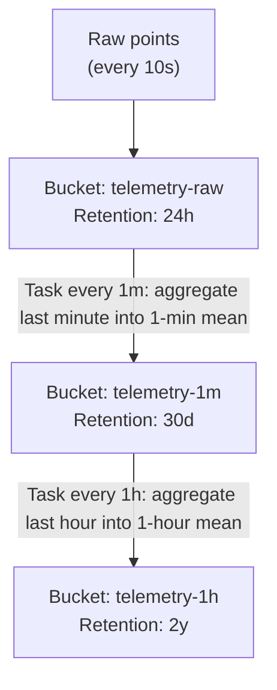
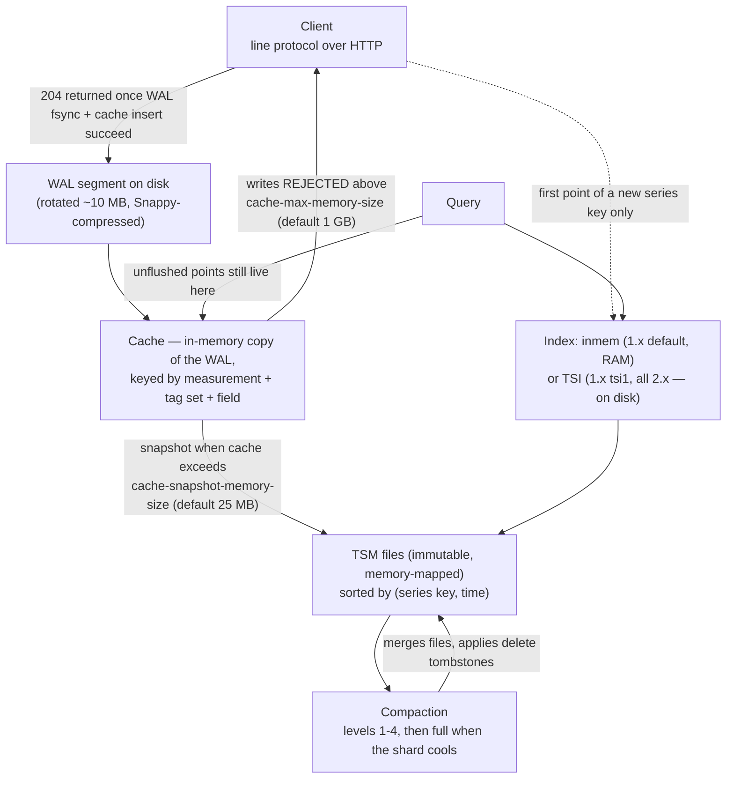

# InfluxDB

> [Mastery Guide](../README.md) › [Data & Persistence](./README.md)

| Status | Priority | Phase | Last reviewed |
|---|---|---|---|
| Not Started | Low | Phase 9 — Distributed & Observability | 2026-05-08 |

## Contents
- [Why it matters](#why-it-matters)
- [Core concepts](#core-concepts)
  - [Time-series data model](#time-series-data-model)
  - [Tags vs fields vs measurements](#tags-vs-fields-vs-measurements)
  - [Line protocol](#line-protocol)
  - [Retention policies and downsampling](#retention-policies-and-downsampling)
  - [Flux query language](#flux-query-language)
  - [InfluxDB 1.x vs 2.x vs 3.x](#influxdb-1x-vs-2x-vs-3x)
  - [Cardinality arithmetic: the number that actually matters](#cardinality-arithmetic-the-number-that-actually-matters)
  - [The index: in-memory vs TSI vs no index at all](#the-index-in-memory-vs-tsi-vs-no-index-at-all)
  - [Shards, shard groups, and the cost of a delete](#shards-shard-groups-and-the-cost-of-a-delete)
  - [Duplicate points, field type conflicts, and partial writes](#duplicate-points-field-type-conflicts-and-partial-writes)
  - [What survives downsampling](#what-survives-downsampling)
  - [Flux's data model: streams of tables and the group key](#fluxs-data-model-streams-of-tables-and-the-group-key)
  - [Writing from .NET: which write API you get](#writing-from-net-which-write-api-you-get)
  - [When Postgres is the right answer](#when-postgres-is-the-right-answer)
- [Code & diagrams](#code--diagrams)
- [Common pitfalls](#common-pitfalls)
- [Interview-ready summary](#interview-ready-summary)
- [Interview Cross-Questioning Drill](#interview-cross-questioning-drill)
- [Cheat Sheet](#cheat-sheet)
- [Walkthrough](#walkthrough--cardinality-explosion-from-a-route-template-typo)
- [Self-test](#self-test)
- [Cross-references](#cross-references)
- [Sources](#sources)

---

## Why it matters

Time-series data — sensor readings, metrics, IoT telemetry, financial ticks — has a unique shape: high write volume, append-only, time-ordered, queried by range. Relational databases handle this poorly: indexes on timestamps, partitioning, periodic deletion of old data are all painful in SQL Server / Postgres. **Time-series databases (TSDBs)** like InfluxDB are purpose-built for this workload. The three mechanisms that make the difference, each covered below:

- **Storage is grouped by *series*, not by row** — so timestamps in a series compress as deltas and values compress against their predecessor, instead of every row carrying its own metadata.
- **Aging is a file operation, not a `DELETE`** — data lands in time-bucketed shards, and expiry removes whole shards. No transaction log, no lock escalation, no index rebuild.
- **The write path is append-only** — no in-place updates, so there is no page-split behaviour, no fragmentation problem, no fill factor to tune.

That third point is the one to hold on to if you have spent your career on SQL Server. Everything you know about a clustered index — that a random key spreads inserts and destroys density, that a sequential key concentrates them and creates a hot page — is a consequence of a *mutable, ordered* structure. InfluxDB has neither, so those trade-offs simply do not appear. Different trade-offs appear instead, and they are about cardinality and compaction.

InfluxDB is the most popular open-source TSDB. It's the storage layer behind countless Grafana dashboards, IoT platforms, and observability stacks.

Why interviewers ask: TSDB knowledge surfaces operational maturity. "We collect millions of metrics per second" → "OK, where do they go?" Knowing time-series storage and downsampling separates engineers who've operated production observability from those who've only consumed dashboards.

When NOT to choose: transactional data (use RDBMS). Document storage (use Postgres JSONB or MongoDB). Anything that needs JOINs across multiple "tables" or strong consistency.

> 🌍 **In the real world**: a logistics platform recorded vehicle telemetry into a SQL Server table — `Telemetry(Id bigint IDENTITY PRIMARY KEY CLUSTERED, VehicleId int, RecordedAt datetime2, Metric varchar(50), Value float)` — because that was the database the team already ran, and a nightly job deleted anything older than ninety days. It worked for two years. What ended it was not query performance but the delete: a single `DELETE FROM Telemetry WHERE RecordedAt < @cutoff` generated enough transaction log to fill the log drive, so it was rewritten as a `DELETE TOP (10000)` loop, which ran for six hours, escalated to table locks often enough to time out the ingest service, and left the nonclustered index on `(VehicleId, RecordedAt)` badly fragmented every morning. The eventual fix was partly SQL — a partitioned table where the old partition is switched out instead of deleted — and partly a decision to stop: new telemetry went to InfluxDB, where the same ninety-day rule is a bucket setting and expiry unlinks whole shard files with no log records at all. The general lesson is that the pain of time-series-on-RDBMS almost never shows up in the `SELECT`. It shows up in retention, which is the one operation a TSDB makes free and a row store makes maximally expensive.

## Core concepts

### Time-series data model

A point in InfluxDB is **(timestamp, measurement, tags, fields)**. Every point belongs to a *measurement* (loosely, a "table") and is identified by its timestamp + tag set.

```
Measurement: cpu_usage
Tags:        { host: "server-1", region: "us-east", env: "prod" }
Fields:      { user: 45.2, system: 12.1, idle: 42.7 }
Timestamp:   2025-05-06T14:30:00.000Z
```

Multiple points to the same `(measurement, tag-set)` form a **series**. Each series is stored efficiently — timestamps as deltas, fields with type-specific compression.

One subtlety worth getting right early, because the whole cardinality discussion depends on it: InfluxDB's own glossary defines a **series key** as "a particular series by measurement, tag set, **and field key**" and series cardinality as "the number of unique measurement, tag set, and field key combinations in an InfluxDB bucket" (InfluxDB 2.x glossary; the 1.x glossary adds *database* to the combination and counts it "in an InfluxDB instance"). The point above with three fields is therefore *three* entries against your cardinality budget, not one. See [Cardinality arithmetic](#cardinality-arithmetic-the-number-that-actually-matters).

> 🌍 **In the real world**: an industrial monitoring team modelled each machine as one measurement with a tag set of `{plant, line, machine}` and forty fields — every reading the PLC exposed, written as one point per second. Their capacity plan said 6 plants × 8 lines × 30 machines = 1,440 series, comfortably inside anything InfluxDB would care about. The node started swapping at around a quarter of the projected machine count. The tag arithmetic was right and the answer was wrong, because the field key is part of the series key: the real number was 1,440 × 40 = 57,600, and it grew by 40 every time a machine was added, not by one. Nothing about the schema was bad — forty fields on one point is genuinely the correct model, and splitting them into forty measurements would have been worse. What was wrong was the capacity plan, which had been built from the tag table alone. When you are asked to size an InfluxDB deployment, ask how many fields per measurement before you ask anything about tags.

### Tags vs fields vs measurements

This is the crux of InfluxDB modeling and the source of most performance problems if you get it wrong.

| Concept | Indexed? | Type | Use for |
|---|---|---|---|
| **Measurement** | Implicitly | string | The "table" name (`cpu_usage`, `temperature`, `http_request`) |
| **Tags** | ✅ Yes | string only | Filter / group keys (host, region, sensor_id) |
| **Fields** | ❌ No | int / float / bool / string | The actual values being measured |
| **Timestamp** | ✅ Yes | nanosecond precision | When the measurement happened |

Rules of thumb:
- **Tags = WHERE clauses you'll filter by.** Indexed for fast filtering. **High cardinality = bad** (more on this below).
- **Fields = the actual data.** Fast to read by tag filter, but can't filter by field efficiently.
- Stripping a column you'll filter by from tags into fields is the canonical InfluxDB performance bug.

Examples:

```
GOOD modeling — IoT temperature sensors:
  measurement: room_temperature
  tags:        building=A, floor=3, room=302
  fields:      celsius=22.5, humidity=45.2
  timestamp:   2025-05-06T14:30:00Z

GOOD modeling — HTTP metrics:
  measurement: http_request
  tags:        method=GET, status=200, endpoint=/api/orders
  fields:      duration_ms=42, response_bytes=1024
  timestamp:   2025-05-06T14:30:00.123Z

BAD modeling — user_id as a tag:
  measurement: user_action
  tags:        user_id=42, action=click
  fields:      ...
  → If you have 10M users, you have 10M unique tag values.
    InfluxDB indexes every unique combination — "cardinality explosion."
    Performance degrades; memory blows up.

  Fix: user_id is a field, not a tag.
```

The documentation's own wording for the escape hatch is worth memorising, because it is the answer to "so where does the customer ID go?": "consider storing high-cardinality values in **field values** rather than in tags or field keys" (InfluxDB 1.x *Schema design and data layout*). Note "field **values**" — putting the ID in the field *key* (`user_42=1`) moves the explosion rather than fixing it, because field keys are part of the series key too.

> 🌍 **In the real world**: a payments team tagged every authorisation point with `merchant_id`, and it was the obviously right call — every dashboard, every alert and every support question was scoped to one merchant. It shipped through staging without comment, because staging had twelve merchants. Production had a five-figure merchant count and a long tail of merchants that transacted once a month, and within a week of the rollout the InfluxDB node was restarting slowly enough to trip its own liveness probe. The fix that got accepted was not "make `merchant_id` a field" — that would have broken every dashboard the finance team depended on. It was to keep `merchant_id` as a tag but stop writing per-transaction points: a background service aggregated per merchant per minute and wrote one point with `count`, `sum`, `min`, `max` and a t-digest sketch for the latency percentile. Same tag cardinality, three orders of magnitude fewer points, and the dashboards kept working. The lesson is that "high-cardinality tag" is not automatically a modelling error. It is a *budget* statement, and the lever you usually have is point rate, not the tag itself.

### Line protocol

InfluxDB's wire format. Plain text, easy to write by hand:

```
measurement,tag1=val1,tag2=val2 field1=value1,field2=value2 timestamp
```

Real example:
```
cpu_usage,host=server-1,region=us-east user=45.2,system=12.1 1715000000000000000
http_request,method=GET,status=200,endpoint=/api/orders duration_ms=42 1715000000123000000
```

Send to InfluxDB:
```bash
curl -X POST 'http://influxdb:8086/api/v2/write?bucket=mybucket' \
     -H "Authorization: Token <token>" \
     --data-raw 'cpu_usage,host=server-1 value=45.2'
```

In .NET (InfluxDB.Client) — note `WritePointAsync` on `WriteApiAsync` sends **one HTTP request**, which is fine for a one-off and wrong for a hot path; see [Writing from .NET](#writing-from-net-which-write-api-you-get):
```csharp
using var client = new InfluxDBClient("http://localhost:8086", "mytoken");
var writeApi = client.GetWriteApiAsync();     // no batching — one request per call

var point = PointData.Measurement("cpu_usage")
    .Tag("host", "server-1")
    .Tag("region", "us-east")
    .Field("user", 45.2)                      // double → float field
    .Field("system", 12.1)
    .Timestamp(DateTime.UtcNow, WritePrecision.Ns);

await writeApi.WritePointAsync(point, "mybucket", "myorg");
```

`InfluxDBClientFactory.Create(...)` appears in older samples and still works; the constructor is what the current client README uses. And watch the `Field()` overload you get: `Field("user", 45)` writes an integer field (`45i`) while `Field("user", 45.2)` writes a float. Mixing them across code paths is how you produce a `field type conflict`.

**Escaping.** Line protocol is whitespace- and comma-delimited, so the delimiter characters must be escaped with a backslash. The rules are not uniform across the elements, which is exactly why hand-rolled writers get them wrong (InfluxDB 2.x *Line protocol* reference):

| Element | Characters that must be escaped |
|---|---|
| Measurement | comma, space |
| Tag key, tag value, field key | comma, equals sign, space |
| String field value | double quote, backslash |

Note that a measurement does **not** need its equals signs escaped, and a numeric field value needs nothing escaped. Newline is the batch separator, so a newline inside any value has to go — the client libraries handle all of this; `string.Format` does not.

> 🌍 **In the real world**: a Windows service on a factory floor pushed line protocol over HTTP with a hand-built string, because pulling in a client library needed a security review nobody wanted to start. It ran for eighteen months. It broke when an operator renamed a machine from `PRESS4` to `PRESS 4 (NEW)`. The space was never escaped, so the parser read everything after it as the field section, the parentheses landed in a field key, and the write came back `400` with the first malformed line in the body — which the service logged at `Debug` and discarded, because the original author had assumed a `2xx`-or-throw model and `400` throws nothing in `HttpClient` unless you ask. Data for that press stopped arriving and nobody noticed for nine days, because the dashboard panel simply showed no series and an empty panel looks the same as a quiet machine. Two fixes came out of it: `EnsureSuccessStatusCode()` plus an alert on write failures, and a `PointData` builder instead of string concatenation. The transferable point is the second-order one — a metrics pipeline that fails silently is worse than one that fails loudly, because its only consumer is a chart that renders "nothing" identically to "nothing happened."

### Retention policies and downsampling

Time-series data ages: you want minute-resolution for the last 24 hours, hourly for the last week, daily for the last year. InfluxDB handles this with **retention policies** and **continuous queries / tasks**.

**Retention policy:** how long raw data is kept.
```
CREATE RETENTION POLICY "raw_24h" ON "telemetry" DURATION 24h REPLICATION 1 DEFAULT
CREATE RETENTION POLICY "hourly_30d" ON "telemetry" DURATION 30d REPLICATION 1
CREATE RETENTION POLICY "daily_2y" ON "telemetry" DURATION 730d REPLICATION 1
```

**Continuous query (1.x) / Task (2.x):** runs periodically, downsamples raw data into longer-resolution buckets:
```sql
-- 1.x continuous query
CREATE CONTINUOUS QUERY "downsample_to_hourly" ON "telemetry"
BEGIN
  SELECT mean("value") INTO "hourly_30d"."temperature_hourly"
  FROM "raw_24h"."temperature"
  GROUP BY time(1h), *
END
```

This way, your storage costs decay gracefully: raw at full resolution for days, minute means for weeks, hourly means for years. The saving is arithmetic rather than magic — collapsing 1-second points into 1-minute means is a 60× reduction in point count for that tier, and chaining minute → hour is another 60×.

Two mechanics that make retention behave the way it does:

- **Expiry works on shard groups, not points.** A bucket's data is written into time-bucketed shard groups, and the retention enforcement service "will only delete a shard group when the entire time range covered by the shard group is beyond the bucket retention period" (InfluxDB 2.x *Data retention*). This is why aging costs nothing, and also why data survives past its stated retention: the docs give the window explicitly as a minimum of the retention period and a maximum of retention period + shard group duration.
- **Writes older than the retention period are rejected, not silently kept.** InfluxDB 1.x returns `partial write: points beyond retention policy dropped={n}`; 2.x rejects them with `422` and a message naming the retention-policy bound that was violated (`partial write: dropped 4 points outside retention policy of duration 24h0m0s …`). Either way it is an error status, not a `2xx` — but it is a *partial* one, so the points inside the window were written. This bites during backfill: loading a year of history into a bucket with 30-day retention keeps the recent slice, drops the rest, and says so only in the response body — which is exactly what a client that checks the status code but discards the body will never show you.

> 🌍 **In the real world**: an IoT team set up the textbook pipeline — a `telemetry` bucket with 7-day retention and an hourly task computing means — and pointed the task's `to()` at the same bucket, because it was the bucket the data was in and nobody stopped to think about which one the aggregate belonged in. Dashboards over the last week looked perfect. The year-view panel was empty, and stayed empty, and was assumed to be a Grafana problem for most of a quarter. Retention is a property of the bucket, not of the measurement: the hourly aggregates inherited the same 7-day expiry as the raw points they were computed from, so the pipeline was faithfully producing a summary and then deleting it seven days later. The fix was two lines — a second bucket with a long retention and a changed `to(bucket:)` — but the diagnosis took months because nothing errored and the failure only became visible outside the retention window. When you review someone's downsampling task, the first thing to check is not the aggregation. It is whether the source and destination buckets are different.

### Flux query language

InfluxDB 2.x introduced **Flux**, a functional query language for time-series. It's pipeline-based:

```flux
from(bucket: "telemetry")
  |> range(start: -1h)
  |> filter(fn: (r) => r._measurement == "cpu_usage" and r.host == "server-1")
  |> aggregateWindow(every: 1m, fn: mean, createEmpty: false)
  |> yield(name: "mean_cpu")
```

Reads as: "From the telemetry bucket, take the last hour, filter to cpu_usage on server-1, average over 1-minute windows, output."

Flux is more expressive than InfluxQL (the SQL-like 1.x language) but has a steeper learning curve. Its status is no longer a matter of speculation: InfluxData's *The future of Flux* page states that Flux is **in maintenance mode and is not supported in InfluxDB 3**, that 1.x and 2.x users can keep using it and will get security patches and critical defect fixes, and that anyone planning to move to 3 should write **InfluxQL** — which is supported in every version, 1 through 3 — rather than Flux.

**One `aggregateWindow` detail that produces a bug report every time.** Its `timeSrc` parameter defaults to `_stop`, so each aggregated value is stamped with the **end** of its window (Flux stdlib, `aggregateWindow()`). A 1-minute mean covering 14:00:00–14:01:00 comes back with `_time = 14:01:00`. Compare that against a raw series and every aggregate appears shifted one window to the right; join two streams aggregated at different `every` values and they will not line up. Pass `timeSrc: "_start"` if you want left-edge labelling, and be consistent about it across a dashboard. Note also that `createEmpty` defaults to **`true`** — the examples here and in Grafana pass `false` deliberately, because empty tables produce `null`-valued rows that most panels render as gaps and some aggregations propagate.

For most app code, the client library wraps the queries:
```csharp
var queryApi = client.GetQueryApi();
var flux = @"from(bucket: ""telemetry"")
              |> range(start: -1h)
              |> filter(fn: (r) => r._measurement == ""cpu_usage"")
              |> mean()";
var tables = await queryApi.QueryAsync(flux, "myorg");
```

> 🌍 **In the real world**: an SRE team's latency dashboard and its alert rule disagreed for months, and the disagreement was always about a minute. The panel used `aggregateWindow(every: 1m, fn: mean)` and the alert used a `range(start: -1m)` with a bare `mean()`, and because `aggregateWindow` stamps the window's `_stop` on its result, the panel's 14:05 point was the average of 14:04–14:05 while the alert firing at 14:05 was averaging 14:04–14:05 and reporting it as 14:05-ish too — close enough that nobody could prove which was wrong. It surfaced properly during an incident review, when the graph showed the breach starting a minute after the pager fired and the postmortem spent twenty minutes arguing about clock skew that did not exist. Making both paths use the same `aggregateWindow` call, in a shared Flux variable, ended it. There is nothing subtle about the mechanism — it is one documented default — but a one-window offset is exactly the size of error that is too small to look like a bug and too large to ignore during a timeline reconstruction.

### InfluxDB 1.x vs 2.x vs 3.x

| Version | GA | Query language | Storage | Note |
|---|---|---|---|---|
| 1.x | Sept 2016 | InfluxQL (SQL-like) | TSM, `inmem` index by default | Still widely deployed |
| 2.x | Nov 2020 | Flux (InfluxQL still available) | TSM, TSI index only | Adds Tasks, dashboards, orgs/buckets/tokens |
| 3.x | Cloud 2023; **Core & Enterprise self-hosted GA 15 April 2025** | SQL and InfluxQL (Apache Arrow + DataFusion) | Parquet on object storage | Rust rewrite; no Flux |

Version-gating that an interviewer can check:

- **Flux is the 2.x language.** It first appeared in 1.7 as a technical preview (off by default, `flux-enabled = true` under `[http]`), is supported read-only in 1.8, and is absent from 1.6 and earlier and from 3.x entirely.
- **InfluxQL exists in all three.** It is the only query language that spans the whole product line, which is why InfluxData recommends it for anyone who expects to migrate.
- **`inmem` vs TSI**: 1.x defaults to the in-memory index and offers `index-version = "tsi1"`; 2.x has no `inmem` option at all. Answering "InfluxDB keeps its index in memory" without the version qualifier is the trap.
- **Retention policies (`CREATE RETENTION POLICY`) are 1.x vocabulary.** 2.x replaced databases + retention policies with **buckets**, each with its own retention period; continuous queries became **tasks**. The 1.x DDL in the section above is correct for 1.x and does not exist in 2.x.
- **InfluxDB 3 Core has a query-window limit.** `query-file-limit` defaults to 432 Parquet files and `gen1-duration` to 10 minutes, so "queries can access up to a 72 hours of data, but potentially less depending on whether all data for a given 10 minute block of time was ingested during the same period" (InfluxDB 3 Core config reference). Enterprise compacts and rearranges Parquet files to lift this. If you say "3.x is the modern choice" in an interview, be ready for "which edition, and what happens when someone opens a 30-day dashboard?"

For new deployments, 3.x is where the product is going, but it is a different database — different storage, different query engine, different operational shape — not an upgrade. Most existing deployments are 1.x or 2.x.

> 🌍 **In the real world**: a platform team on InfluxDB 1.8 planned a jump straight to 3.x to skip a migration, having read that 3.x supports SQL and assuming their InfluxQL dashboards would come along. That part was true and was not the problem. The problem was the eighty Kapacitor and Flux alert definitions built over the previous three years, none of which have an equivalent in 3.x, plus a Telegraf fleet writing into named retention policies that 2.x-and-later expresses as buckets. The migration became a rewrite of the alerting layer, which nobody had scoped, and it stalled for two quarters. What they should have done first — and what any interviewer asking about upgrades wants to hear — is inventory the *query and alert surface*, not the data. Data migrates: it is line protocol at both ends. Queries, tasks, alert definitions and dashboard JSON are the things that do not, and they are usually owned by people who are not in the migration meeting.

### Cardinality arithmetic: the number that actually matters

Everyone can recite "series cardinality is the product of unique tag values." Almost nobody computes it correctly under questioning, because three things get left out.

**1. The field key multiplies.** Series cardinality is "the number of unique measurement, tag set, **and field key** combinations" (InfluxDB glossary). Ten fields on a measurement means ten series per tag set.

**2. Tags that are functionally dependent do not multiply.** The 1.x glossary notes that dependent tags — ones scoped by another tag — do not increase cardinality the way independent tags do. `host` and `datacenter` are not independent: a host lives in exactly one datacenter, so 1,000 hosts across 5 datacenters is 1,000 tag sets, not 5,000. Getting this right is the difference between a defensible estimate and a scary-sounding one.

**3. Cardinality is per bucket/database and it does not go down when you fix the schema.** Series already written stay in the index until the shards holding them expire or are dropped. Reverting a bad deploy stops the growth; it does not reverse it.

```
Worked example — HTTP metrics for a .NET service

  Measurement: http_request
  Tags:   method       6   (GET, POST, PUT, PATCH, DELETE, OPTIONS)
          status       12  (observed codes, not all 500 possible ones)
          route        180 (route templates in the app)
          service      14  (services writing to this bucket)
          pod          ???
  Fields: duration_ms, request_bytes, response_bytes   = 3

  Independent tag product:      6 × 12 × 180 × 14   =  181,440 tag sets
  × field keys:                 181,440 × 3         =  544,320 series

  Now add `pod` as a tag, in a deployment that rolls twice a day
  with 20 pods per service:

    pod values accumulate — they are NOT bounded by 20.
    They are bounded by 20 × 2 × (days until the shards expire).
    Over a 90-day bucket: ~3,600 distinct pod values, and rising.

    544,320 × 3,600 = ~1.96 BILLION series.

  Note what did NOT save you: `status` and `route` are correlated
  (a route only returns some codes) so the real number is lower than
  181,440 — but a correlation of 2-3× is irrelevant next to an
  unbounded tag growing linearly with time.
```

That last shape — a tag whose value set grows with *time* rather than with the size of the system — is the dangerous one, and it is the one people miss because at any given moment it looks small. `pod`, `container_id`, `build_sha`, `deployment_id`, `session_id` and `correlation_id` all behave this way.

**Measuring it.** On 1.x, `SHOW SERIES CARDINALITY` returns an estimate — the docs are explicit that "Estimated values are calculated using sketches and are a safe default for all cardinality sizes. Exact values are counts directly from TSM data, but are expensive to run for high cardinality data." Use `SHOW SERIES EXACT CARDINALITY` only when you need the true number and can afford it, and note that filtering these statements by `time` requires TSI. On 2.x the equivalent is Flux's `influxdb.cardinality(bucket:, start:)`, where `start` is required; add a `predicate` to attribute the count to a measurement.

**Capping it.** 1.x has two guards in the `[data]` config section, and both defaults are worth knowing exactly:

| Setting | Default | Effect |
|---|---|---|
| `max-series-per-database` | `1000000` | "The maximum number of series allowed per database before writes are dropped." The error names the measurement and tag set that crossed the line. `0` = unlimited. |
| `max-values-per-tag` | `100000` | "The maximum number of tag values allowed per tag key." `0` = unlimited. |

The error message names the offending measurement and tag set, which makes it the fastest diagnostic in the product — better than any dashboard, because it points at the exact write that crossed the line. Turning these off "because writes were failing" is the classic wrong fix; the failing writes were the alarm. One caveat that matters if you have already migrated: both guards belong to the `inmem` index. Under `tsi1` they are not reliably enforced (`max-values-per-tag` warnings, in particular, are a known tsi1 gap), so on TSI you need your own cardinality monitoring rather than a config limit.

> 🌍 **In the real world**: a Kubernetes platform team added `pod` to their metric tags so they could see which replica was slow during an incident. It was a reasonable request and the reviewer approved it, reasoning that twenty pods per service was nothing. Nobody modelled the interaction with the deployment cadence: the cluster rolled on every merge, each roll minted twenty new pod names, and the bucket kept ninety days. Cardinality did not spike — it climbed on a straight line for six weeks, which is far harder to spot than a step change, and the first symptom was restart time creeping past the readiness probe's failure threshold. The remedy was to drop `pod` and add `pod` as a *field* instead, so the value is still there when you query a narrow time range during an incident, but does not participate in the index. Two things are worth carrying out of this: alert on cardinality *growth rate*, not a static threshold, because the dangerous shape is linear rather than sudden; and treat any tag whose values are minted by an automated process as unbounded regardless of how many exist right now.

### The index: in-memory vs TSI vs no index at all

This is where "high cardinality is bad" turns into a mechanism you can defend, and it is entirely version-dependent.

**InfluxDB 1.x, `inmem` (the default).** The index mapping tag key/value pairs to series lives entirely in RAM and is **rebuilt from the TSM files at startup**. That is the whole explanation for the two symptoms people report: memory scales with series count, and restart time scales with series count. InfluxData's own TSI page describes the constraint plainly — the in-memory approach "requires a lot of RAM and places an upper bound on the number of series a machine can hold. This upper bound is usually somewhere between 1 - 4 million series."

**InfluxDB 1.x with `index-version = "tsi1"`, and all of 2.x.** TSI is a disk-based log-structured index: "TSI stores index data on disk so that we are no longer restricted by RAM," and "TSI uses the operating system's page cache to pull hot data into memory and let cold data rest on disk." It is built from `LogFile` (L0, an in-memory index backed by a write-ahead log, compacted once it passes 5 MB) and immutable memory-mapped `IndexFile`s at L1 and above, plus a `SeriesFile` holding every series key in the database and a `Manifest` listing the index files.

The trade you are making is explicit and it is the same trade as any LSM structure:

| | `inmem` (1.x default) | TSI (`tsi1`, and all of 2.x) |
|---|---|---|
| Where the index lives | RAM, rebuilt on every start | Disk, memory-mapped, page-cached |
| Startup cost | Proportional to series count | Open files; no rebuild |
| Ceiling | RAM — docs say "usually somewhere between 1 - 4 million series" | Disk, with page-cache-dependent query latency |
| Cold-series query | Same as hot | Slower — the index page has to be read |
| `max-series-per-database` | Enforced | Not reliably enforced — monitor cardinality yourself |

Migrating 1.x from `inmem` to `tsi1` is not a config flip alone: set `index-version`, stop the server, delete the existing shard `index` directories **and the `_series` directories**, then run `influx_inspect buildtsi` to construct the on-disk index.

**InfluxDB 3.x — the constraint disappears.** There is no series index. Tags are ordinary columns in Parquet files; the query engine prunes files using per-file min/max statistics on the time and partitioning columns and pushes predicates down through DataFusion. That is why InfluxData markets 3.x as supporting effectively unbounded tag cardinality. It does not mean cardinality is free — high-cardinality columns compress worse and widen every file — but it stops being a memory-shaped cliff and becomes an ordinary storage-and-scan cost.

> 🌍 **In the real world**: an observability cluster on InfluxDB 1.8 had grown to a few million series and its restarts took long enough that a routine kernel patch turned into a two-hour outage — the node came up, spent the entire time rebuilding the in-memory index from TSM files, and served nothing while it did. The team's first instinct was to buy a bigger box, which would have worked and would have bought maybe a year. What they did instead was switch `index-version` to `tsi1`, stop the server, delete the shard index directories and run `influx_inspect buildtsi`, which took one long maintenance window and moved the index onto disk permanently. Restarts became a matter of opening files. Query latency on rarely-touched series got slightly worse, because a cold index page now means a disk read, and that was the honest cost of the change. The framing to keep is that `inmem` versus TSI is not a tuning knob, it is a choice about which resource you want the index to consume — and RAM is the one that also decides how long your outages are.

### Shards, shard groups, and the cost of a delete

A **shard group** is a time bucket; a **shard** is the TSM file set inside it. Shard group duration is a bucket/retention-policy property and the defaults follow the retention period (InfluxDB 2.x *Shards and shard groups*):

| Bucket retention period | Default shard group duration |
|---|---|
| Less than 2 days | 1 hour |
| 2 days to 6 months | 1 day |
| Greater than 6 months | 7 days |

Shard group durations must be shorter than the retention period. Three consequences follow, and they are the interview payload:

1. **Retention is a drop, not a delete.** The retention enforcement service removes a whole shard group once its entire time range is beyond the retention period. Nothing is scanned, nothing is rewritten, nothing goes through a transaction log. The price of that cheapness is imprecision: a point lives for between the retention period and the retention period plus one shard group duration. This is the single biggest operational difference from a relational table.
2. **Query cost scales with how many shard groups you touch.** A one-hour dashboard against a bucket with 7-day shard groups opens one shard. The same query against a bucket with 1-hour shard groups opens one too — but a 30-day query opens 720. Very short shard durations on long-retention buckets produce a file-handle and merge problem at query time.
3. **Targeted deletes are expensive because there is nowhere to target.** InfluxDB 1.x/2.x partitions **by time only**. A `DELETE FROM ... WHERE` (1.x) or `influx delete --predicate` (2.x) writes tombstones and forces affected shards to be rewritten during compaction, and since every shard in the time range contains every series, "delete one customer" touches everything in that range.

That last point is the GDPR conversation, and the honest answer changes by version. **In 3.x you can partition by tag**: a partition template takes 1 time part plus up to 7 tag or tag-bucket parts (8 total), and partitioning by, say, `customer_id` means a per-customer erasure only touches that customer's Parquet files. Tag *buckets* — hashing tag values into a fixed number of groups — exist for the high-cardinality case. The catch is that a partition template can only be set when the database or table is created and cannot be changed afterwards, which makes it a design-time decision, not a remediation. Check the edition before you promise it, though: partition templates are documented for **InfluxDB 3 Cloud Dedicated and Clustered**. They are not part of 1.x or 2.x at all, and the self-hosted InfluxDB 3 Core and Enterprise builds do not expose them either — Core/Enterprise arrange Parquet files by `gen1-duration` and time.

> 🌍 **In the real world**: a fitness-tracking company got a right-to-erasure request covering a single user's heart-rate history, held in InfluxDB 2.x with two years of retention. The engineer on the ticket wrote the obvious `influx delete --predicate '_measurement="hr" AND user_id="..."'` across the full range and ran it on a Tuesday afternoon. Because shard groups are cut by time and not by user, the predicate matched a shard group per week for two years and each one had to be rewritten; compaction backed up, ingest throttled, and the on-call spent the evening explaining why the live dashboard had gaps. The deletion itself was correct and legally required — what was wrong was doing it as an ad-hoc command during business hours instead of a scheduled, rate-limited job. It also started a much better conversation than the incident deserved: personal-data-bearing series probably should not be in the metrics store at all, and the ones that must be there are the argument for 3.x's partition-by-tag, which has to be decided when the database is created because it cannot be added later.

### Duplicate points, field type conflicts, and partial writes

The write path has three behaviours that are individually documented, collectively unintuitive, and reliably asked about by anyone who has run InfluxDB in anger.

**1. A point is identified by measurement + tag set + timestamp. Rewriting it merges, it does not append.** The line protocol reference is precise: "If you submit line protocol with the same measurement, tag set, and timestamp, but with a different field set, the field set becomes the union of the old field set and the new field set, where any conflicts favor the new field set." There is no primary key violation, no duplicate row, no error — the old value is simply gone. Two consequences:

- **Retries are idempotent, which is good.** A client that times out and resends the same batch cannot double-count. This is a genuine advantage over an append-only log and worth stating in an interview.
- **Two writers on the same series silently destroy each other's data, which is not good.** If two replicas both write `measurement=http_request, host=api` at second resolution, roughly half the points survive and the loss is invisible. The fix is to make the writer part of the tag set (`pod`, `instance`, `region`) or to reduce two writers to one.

**2. A field's data type is fixed within a shard, not globally.** Writing `count=1i` (integer) into a shard where `count` is already a float fails with `partial write: field type conflict`, and the message names the field, the measurement, the type you sent and the type already in place — the docs' own example is `field type conflict: input field "value" on measurement "mymeas" is type string, already exists as type float`. Because the scope is the shard, the same field genuinely can be a float in January and an integer in February without error — and a query spanning both will encounter both types. The classic .NET origin of this is a serializer that emits `0` for an `int` and `0.0` for a `double`, or a code path where a value is `long` in one branch and `double` in another. Pin field types at the boundary; do not let them be a property of whichever overload got called.

**3. A batch write is not atomic, and the status code tells you which failure you had.** From the InfluxDB 2.x write troubleshooting docs:

| Status | Meaning |
|---|---|
| `204 No Content` | All request data was written to the bucket. |
| `400 Bad Request` | All request data was rejected and not written; the body contains the first malformed line. |
| `401` / `404` | Auth problem / bucket or org not found. |
| `413` | Request too large; all data rejected. |
| `422 Unprocessable Entity` | **Some or all** points rejected for semantic errors. "Data that has not been rejected is ingested and queryable." |
| `429` | Rate/quota limited. |
| `503 Service Unavailable` | Temporarily unable to accept writes; a `Retry-After` header says when to try again. |

The retry rule follows from the table: retry `429` and `503` with exponential backoff and jitter; do **not** retry `400`, `401`, `404` or `422`, because the request will fail identically forever and a retry loop on a malformed batch is how a metrics client turns into a denial-of-service against your own database. And `422` is the one to handle explicitly — it means your batch partly succeeded, so blindly resending the whole batch rewrites the good points (harmless, per rule 1) while the bad ones fail again.

> 🌍 **In the real world**: an order-processing service ran three replicas behind a load balancer, each writing a `queue_depth` gauge every second tagged only with `service=orders`. The graph was smooth and believable and had been on the wall for a year. It was wrong: all three replicas wrote the same series at the same second boundary, so each second's value was whichever pod's write landed last, and the panel was showing one arbitrary replica rather than the fleet. The discovery came from a capacity exercise where the queue-depth graph refused to move during a load test that was visibly backing up two of the three pods. Adding `instance` to the tag set fixed it and tripled the series count for that measurement, which was the correct price. The general form of the bug is worth naming, because it has nothing to do with InfluxDB specifically: any store whose identity is `(dimensions, timestamp)` will silently deduplicate concurrent writers that share dimensions, and the resulting chart looks completely normal.

### What survives downsampling

This is the section that connects to SQL, and it is where a senior candidate separates from a mid-level one, because the failure is arithmetic rather than operational.

**Mean of means is not the mean.** `AVG(AVG(x))` equals `AVG(x)` only when every inner group has the same count. Downsampled windows routinely do not: a collector that misses samples, a service that scales down overnight, a window that clips at the shard boundary. If you store only `mean` per window, every subsequent roll-up is subtly wrong and there is no way to correct it, because the information needed — the count — was discarded.

The fix is the same one a data warehouse uses: **store the components that re-aggregate, derive the rest.** The property you need is that the aggregate of aggregates equals the aggregate of the raw data — `sum` and `count` are additive, `min` and `max` are idempotent under themselves, and `mean` is neither.

```
Store per window:  sum, count, min, max
Derive at ANY roll-up level:
                   sum   = sum(sum)         correct
                   count = sum(count)       correct
                   min   = min(min)         correct
                   max   = max(max)         correct
                   mean  = sum(sum) / sum(count)
                                            correct — because you kept count

Do NOT store only:  mean                    mean(mean) is only correct when
                                            every window has the same count
                    p50, p95, p99           no re-aggregation exists at all
```

**Percentiles do not compose, at any ratio.** The p99 of a set of p99s is not the p99 of the underlying data and there is no correction factor — the operation is not associative and no amount of weighting fixes it. A daily p99 built from 24 hourly p99s is a number with no definition. Options, in order of how often they are the right answer: keep raw data long enough to compute the percentile over the real window; store a mergeable sketch (t-digest, HDR histogram) per window and merge the sketches; or store fixed-bucket histogram counts per window and interpolate, which is what Prometheus histograms and `histogram_quantile` do. Only the last two survive re-aggregation.

**Counters and gauges downsample differently.** A gauge (queue depth, temperature) averages. A monotonic counter (`requests_total`) does not — its mean is meaningless and its raw difference goes hugely negative on a process restart, which is why Flux has `increase()`, documented as returning "the cumulative sum of non-negative differences between subsequent values" and, on a wrap or reset, assuming "that the absolute delta between two points is at least their non-negative difference." Convert counters to rates *before* downsampling, or store the delta per window rather than the counter value.

> 🌍 **In the real world**: a team reported API latency against a 250 ms p95 SLO using a dashboard fed by hourly downsampled p95s, and the monthly figure was comfortable enough that latency work kept losing prioritisation. A customer escalation forced someone to recompute the month from the seven days of raw data still in the hot bucket, and the real p95 for those days was well outside the SLO — not because the collection was broken but because "p95 of 720 hourly p95s" is not a quantity that means anything. The hourly numbers were individually correct and their aggregate was fiction. Rebuilding the pipeline to store a t-digest sketch per window, merged at query time, made the monthly number correct and made it worse, which was the point. Mean, sum, count, min and max survive re-aggregation; percentiles need a sketch or a histogram; and a dashboard that has been reassuring for a year is exactly the one worth auditing.

### Flux's data model: streams of tables and the group key

Most Flux confusion is not syntax. It is that Flux does not operate on rows — it operates on a **stream of tables**, defined by the docs as "a collection of zero or more tables," where a table is "a collection of columns partitioned by group key" and the group key "defines which columns to use to group tables in a stream of tables. Each table in a stream of tables represents a unique group key instance."

What `from() |> range()` hands you is one table per series, and the group key of each is roughly `{_start, _stop, _measurement, _field, <every tag>}`. Two things follow that surprise SQL people:

- **`_field` is a *column*, not a schema.** Every point becomes a row with `_field` naming the measure and `_value` holding it, so a measurement with `duration_ms` and `response_bytes` gives you two tables, not one table with two columns. If you want them side by side, you need `pivot(rowKey: ["_time"], columnKey: ["_field"], valueColumn: "_value")`. Practically every "why can't I do arithmetic between two fields in Flux" question is answered by `pivot()`.
- **Aggregates apply *per table*, not per stream.** `|> mean()` gives you one value per series, not one value overall, because each series is its own table. To collapse across series you must first change the partitioning with `group()` — for example `|> group(columns: ["_measurement"])` before aggregating.

```
from(bucket) |> range()          →  one table per (measurement, tags, _field)
   |> filter()                   →  drops rows and whole tables; group key unchanged
   |> group(columns: [...])      →  re-partitions; THIS is what changes the group key
   |> aggregateWindow(every:)    →  re-partitions by window, then aggregates per table
   |> pivot(...)                 →  turns _field values into columns within a table
   |> yield()                    →  names the result
```

InfluxQL and 3.x's SQL both hide this model, which is a large part of why InfluxData found demand for them. It is also why a Flux query and an "equivalent" InfluxQL query can return different shapes for the same data.

### Writing from .NET: which write API you get

The .NET client (`InfluxDB.Client`) exposes two write APIs and they behave completely differently. This is the single most common source of "we followed the docs and the throughput was terrible":

| | `client.GetWriteApi()` → `WriteApi` | `client.GetWriteApiAsync()` → `WriteApiAsync` |
|---|---|---|
| Batching | Yes, configured by `WriteOptions` | **No** — the client README calls it a "simplified version of WriteApi without batching support" |
| Return | Void, fire-and-forget into a background queue | `Task` you await; one HTTP request per call |
| Errors | Surfaced through `EventHandler` events: `WriteSuccessEvent`, `WriteErrorEvent`, `WriteRetriableErrorEvent`, `WriteRuntimeExceptionEvent` | Thrown from the awaited call |
| Retries | Built in | Yours to write |
| Shutdown | `IDisposable` — **disposing flushes the pending batch** | Nothing pending |

`WriteOptions` defaults, from the `WriteOptions` source: `BatchSize` 1000, `FlushInterval` 1000 ms, `JitterInterval` 0 ms, `RetryInterval` 5000 ms, `MaxRetries` 5, `MaxRetryDelay` 125,000 ms, `ExponentialBase` 2. (The README's table still says `MaxRetries` 3 while `WriteOptions` itself defaults to 5 — read defaults off the class, not the README, and set the ones you care about explicitly.)

Two consequences that matter more than the table:

- **`WriteApi` is at-most-once by construction.** Points sit in an in-process queue until the batch fills or the flush interval elapses. A `SIGTERM` that does not dispose the client loses them, and a pod evicted mid-flush loses them regardless. That is the right trade for metrics and the wrong trade for anything billable. If you register the client in DI, make sure the `WriteApi` is disposed on `IHostApplicationLifetime.ApplicationStopping` and that your shutdown timeout exceeds `FlushInterval`.
- **Subscribe to `WriteErrorEvent` or you are flying blind.** Because `WriteApi` returns void, a bucket that has stopped accepting writes — expired token, cardinality limit, `422` — produces no exception anywhere in your application. The events are the only channel.

> 🌍 **In the real world**: a .NET team instrumented an order API by injecting the InfluxDB client and calling `GetWriteApiAsync().WritePointAsync(...)` inside the request pipeline, having copied the snippet from a quickstart. Every HTTP request now made a second outbound HTTP request and awaited it before returning, so p99 latency picked up the InfluxDB round trip and, during a brief InfluxDB restart, request threads piled up waiting on writes to a metrics database that nobody would have missed for thirty seconds. The change was small — a singleton `WriteApi` from `GetWriteApi()`, points handed to its in-process queue, disposal wired to `ApplicationStopping` — and it inverted the failure mode: the metrics pipeline can now lose data without the API noticing. That is the correct relationship. Telemetry that can fail your request path is worse than no telemetry, and the one line that decides which you have is whether the method name ends in `Async`.

### When Postgres is the right answer

The strongest thing to say about InfluxDB in an interview is when you would not use it, and the specific alternative a .NET team most often lands on is **TimescaleDB** (now marketed as TigerData), a PostgreSQL extension rather than a separate database.

Its two mechanisms map cleanly onto the InfluxDB concepts above:

- A **hypertable** is a PostgreSQL table that "automatically partition[s] your time-series data by time and optionally by other dimensions," splitting it into **chunks** covering a time range. This is InfluxDB's shard group, expressed as native Postgres partitioning — so dropping old data is still a partition drop rather than a `DELETE`. The docs are explicit that "you interact with hypertables in the same way as you would with regular PostgreSQL tables": ordinary indexes, constraints, joins and SQL all still apply.
- A **continuous aggregate** is a materialized view over a hypertable, described by the docs as "a kind of hypertable that is refreshed automatically in the background as new data is added, or old data is modified" — incrementally, so it is cheaper to maintain than a plain materialized view. This is the downsampling task. Note that you query the continuous aggregate by name: there is no automatic query rewrite that redirects a query on the raw hypertable to it.

Pick Postgres/Timescale over InfluxDB when:

- **The metrics have to join to relational data.** Billing by usage, per-tenant SLA reporting, anything where the answer needs a `customers` or `contracts` table. InfluxDB has no joins across measurements worth relying on; Timescale has PostgreSQL's.
- **The dimensions are unbounded by nature.** Per-user, per-order, per-device-serial data has no tag-shaped answer in InfluxDB 1.x/2.x, and it is just a column in Postgres.
- **You need transactions, constraints, or updates.** InfluxDB has no `UPDATE`, no foreign keys, no isolation levels. If the words "read committed" belong in the requirement, you are not describing a TSDB workload.
- **The team already runs Postgres.** One fewer database is a real architectural argument, and Timescale is an extension, not a migration.

Pick InfluxDB when the workload is genuinely metrics-shaped: bounded dimensions, no joins, no updates, aggressive retention tiers, and an ingest rate that would dominate a Postgres instance you are also using for something else. See [PostgreSQL](./08-postgresql.md) for what you get on that side.

> 🌍 **In the real world**: an energy-metering startup put half-hourly meter readings into InfluxDB because "time series" was in the name of the problem, and the model worked until the first invoicing run. Billing needed to join readings to tariffs, contracts and change-of-supplier events, all of which lived in Postgres, and none of which InfluxDB can join to. The billing job became a service that read a month of readings out of InfluxDB, held them in memory, and joined them in C# — a re-implementation of a hash join, with the correctness and memory profile that implies, and it broke every time a customer had a mid-month tariff change. Moving readings into a Timescale hypertable in the existing Postgres put the join back where the planner could see it and made the billing query one statement. What is worth taking from this is the diagnostic question: does the *primary consumer* of this data need to combine it with relational entities? If the answer is yes, "it's time-series data" is not the deciding fact, and a TSDB is the wrong shape no matter how well it ingests.

## Code & diagrams

<details>
<summary>🧩 Click to expand — code samples and diagrams</summary>

### Time-series storage layout

```
Logical view:
  Measurement: temperature
  Tags: room=A → series A
  Tags: room=B → series B
  Tags: room=C → series C

  Each series:
  ┌────────────┬───────┐
  │  Time      │ Value │
  ├────────────┼───────┤
  │ 14:00:00   │ 21.5  │
  │ 14:00:01   │ 21.6  │
  │ 14:00:02   │ 21.6  │
  │ 14:00:03   │ 21.7  │  ← compressed: deltas + run-length
  └────────────┴───────┘

Physical compression:
  - Timestamps: stored as deltas (1, 1, 1, 1 instead of 1715000000, ...)
  - Numeric fields: type-specific compression (Gorilla XOR, run-length)
  - Tag sets: dictionary-encoded once per series
```

The published figure for this family of techniques comes from the paper that named them: Facebook's *Gorilla: A Fast, Scalable, In-Memory Time Series Database* (VLDB 2015) reports compressing data points **from 16 bytes down to an average of 1.37 bytes, a 12× reduction**, on their production monitoring workload. That is Facebook's workload on Facebook's data, not a promise about yours — the ratio depends entirely on how smooth your values are and how regular your intervals are. A CPU gauge sampled every 10 seconds compresses superbly; a jitter-heavy latency measurement written at irregular timestamps compresses far worse. Quote the source, not a general multiplier.

### Cardinality explosion (the canonical bug)

```
Series count = product of unique values in each INDEPENDENT tag,
               MULTIPLIED BY the number of field keys.

GOOD model — 10 buildings × 5 floors × 20 rooms × 4 sensor types
           = 4,000 tag sets
           × 2 fields (celsius, humidity)
           = 8,000 series. Manageable.

  (Careful: 10 × 5 × 20 is only right if every building has all
   5 floors and every floor all 20 rooms. Floor is DEPENDENT on
   building and room on floor, so the honest number is the count
   of real (building, floor, room) triples — usually smaller.
   Sensor type IS independent of location, so it does multiply.)

BAD model adds user_id as tag with 1M users:
           4,000 × 1,000,000 × 2 = 8 BILLION series.

Symptoms:
  - InfluxDB memory usage explodes
  - Inserts get slow
  - Restarts take hours
  - Queries OOM the server

Fix:
  - Move high-cardinality identifiers to fields, not tags.
  - Sample down (record 1 in 100 user actions, not all).
  - Aggregate before insert (per-minute counts instead of per-action).
```

### Retention pipeline



Storage cost shrinks proportionally to resolution.

### .NET telemetry pipeline

The shortest correct version is to let the client do the batching, because `WriteApi` already implements the queue, the flush timer and the retry policy:

```csharp
// Program.cs — one client, one WriteApi, for the process lifetime.
// Register the CONCRETE client: IInfluxDBClient implements GetWriteApi()
// explicitly and hands back IWriteApi, which does not expose EventHandler.
builder.Services.AddSingleton(_ =>
    new InfluxDBClient(cfg["InfluxDB:Url"], cfg["InfluxDB:Token"]));
builder.Services.AddSingleton<IInfluxDBClient>(sp =>
    sp.GetRequiredService<InfluxDBClient>());          // same instance, interface view

builder.Services.AddSingleton(sp =>
{
    WriteApi api = sp.GetRequiredService<InfluxDBClient>()
        .GetWriteApi(new WriteOptions { BatchSize = 1000, FlushInterval = 1000 });

    // WriteApi returns void. These events are the ONLY error channel.
    var log = sp.GetRequiredService<ILogger<Program>>();
    api.EventHandler += (_, e) =>
    {
        if (e is WriteErrorEvent err) log.LogError(err.Exception, "InfluxDB write rejected");
        if (e is WriteRuntimeExceptionEvent rex) log.LogError(rex.Exception, "InfluxDB writer faulted");
    };
    return api;
});

// Dispose flushes the pending batch. Without this, a rolling deploy
// drops whatever is still queued in every pod it replaces.
app.Lifetime.ApplicationStopping.Register(() =>
    app.Services.GetRequiredService<WriteApi>().Dispose());
```

Write the hand-rolled channel version only when you need to shape or drop points *before* they reach the client — sampling, tag validation, a bounded queue that sheds load rather than growing:

```csharp
public sealed class MetricsCollector : BackgroundService
{
    // IInfluxDBClient.GetWriteApiAsync() returns IWriteApiAsync, not the
    // concrete WriteApiAsync. Either way: it does NOT batch — we batch.
    private readonly IWriteApiAsync _writeApi;
    private readonly ILogger<MetricsCollector> _logger;
    private readonly Channel<PointData> _channel =
        Channel.CreateBounded<PointData>(new BoundedChannelOptions(10_000)
        {
            FullMode = BoundedChannelFullMode.DropWrite   // shed metrics, never block a request
        });

    public MetricsCollector(IInfluxDBClient client, ILogger<MetricsCollector> logger)
        => (_writeApi, _logger) = (client.GetWriteApiAsync(), logger);

    // Returns bool, not Task: recording a metric must never await anything
    // on the request path. A dropped point is cheaper than a blocked thread.
    public bool RecordHttpRequest(string method, string routeTemplate, int status, double durationMs) =>
        _channel.Writer.TryWrite(PointData.Measurement("http_request")
            .Tag("method", method)
            .Tag("endpoint", routeTemplate)         // route template, NOT the request path
            .Tag("status", status.ToString())
            .Field("duration_ms", durationMs)
            .Timestamp(DateTime.UtcNow, WritePrecision.Ms));

    protected override async Task ExecuteAsync(CancellationToken ct)
    {
        var batch = new List<PointData>(500);
        using var timer = new PeriodicTimer(TimeSpan.FromSeconds(1));

        try
        {
            // Flush on size OR on the tick, whichever comes first. Without the
            // timer a low-traffic service holds points indefinitely and its
            // dashboard simply looks flat.
            while (await timer.WaitForNextTickAsync(ct))
            {
                while (_channel.Reader.TryRead(out var p))
                {
                    batch.Add(p);
                    if (batch.Count == 500) await FlushAsync(batch, ct);
                }
                await FlushAsync(batch, ct);
            }
        }
        catch (OperationCanceledException) { /* shutting down */ }

        // Cancellation is not the end of the job. Drain what is queued, or a
        // rolling deploy silently discards a second of metrics per pod.
        while (_channel.Reader.TryRead(out var p)) batch.Add(p);
        await FlushAsync(batch, CancellationToken.None);
    }

    private async Task FlushAsync(List<PointData> batch, CancellationToken ct)
    {
        if (batch.Count == 0) return;
        try
        {
            await _writeApi.WritePointsAsync(batch, "metrics", "myorg", ct);
        }
        catch (Exception ex) when (ex is not OperationCanceledException)
        {
            // 400 and 422 fail identically on every retry — drop and alert.
            // Only 429 and 503 are worth backing off and resending.
            _logger.LogError(ex, "Dropping {Count} points", batch.Count);
        }
        finally { batch.Clear(); }
    }
}
```

Three details that are load-bearing:

1. **`endpoint` is the route template** (`/api/orders/{id}`), not the actual URL (`/api/orders/42`). Otherwise every order ID becomes a unique tag value → cardinality explosion.
2. **The channel drops rather than blocks.** `BoundedChannelFullMode.DropWrite` means an InfluxDB outage costs you metrics; `Wait` (the default) means it costs you request threads.
3. **`GetWriteApiAsync()` does not batch.** The batching here is ours — the client sends one HTTP request per `WritePointsAsync` list. If you delete the channel and call `WritePointAsync` per metric, you have one HTTP round trip per metric.

### Sample Grafana query (Flux backend)

```flux
from(bucket: "metrics")
  |> range(start: v.timeRangeStart, stop: v.timeRangeStop)
  |> filter(fn: (r) => r._measurement == "http_request")
  |> filter(fn: (r) => r.endpoint == "/api/orders")
  |> aggregateWindow(every: v.windowPeriod, fn: mean, createEmpty: false)
  |> yield(name: "mean_duration")
```

Renders as a line graph: average request duration over time, windowed by Grafana's chosen interval.

### The TSM write path, end to end

Knowing where a point sits at each moment is what lets you reason about durability, memory and compaction back-pressure. Everything below is InfluxDB 1.x/2.x (TSM); 3.x replaces the whole right-hand side with Parquet on object storage.



Reading the diagram against real symptoms:

- **A query must merge the cache and the TSM files**, because the most recent points have not been flushed yet. That is why a just-written point is immediately queryable despite the storage being immutable.
- **`cache-snapshot-memory-size` (default 25 MB) and `cache-max-memory-size` (default 1 GB)** are the two ends of the same lever. The first says when to flush; the second says when to start rejecting writes. Rejections mean the flush cannot keep up with ingest, which is a disk or compaction problem, not a client problem.
- **Compaction rewrites TSM files** to reduce read fan-out and to physically apply the tombstones left by deletes. A delete is cheap to *issue* and expensive to *complete*, and the cost lands later, in compaction.
- **The index is written on new series only.** Steady-state writes to existing series never touch it. This is why cardinality problems appear at deploy time — the moment a new tag value shows up — rather than under load.

</details>

## Common pitfalls

1. **High-cardinality tags.** User IDs, session IDs, full URL paths, error messages — these explode the series count. Move to fields or aggregate before storage.
2. **No retention policy.** Storage grows forever. Set retention per bucket; downsample old data.
3. **Writing one point per HTTP call.** Batch. In the .NET client, batching is a property of *which API you asked for*: `GetWriteApi()` batches (`BatchSize` 1000, `FlushInterval` 1000 ms by default), `GetWriteApiAsync()` does not — the README calls it a "simplified version of WriteApi without batching support." Copying the `WriteApiAsync` quickstart into a request handler gives you one HTTP round trip per metric.
4. **Time precision wrong.** Default is nanoseconds. Sending epoch milliseconds without specifying precision gets timestamps interpreted as nanoseconds → year 1970.
5. **Trying to do RDBMS-style queries.** No JOINs across measurements (kind of — Flux can do something similar but it's expensive). Model your data so queries are within one measurement.
6. **Storing strings as fields.** Possible but non-indexed. Better as tags if low-cardinality, or in a separate metadata store.
7. **Using `*` wildcards in queries.** `SELECT * FROM cpu` scans every series. Always filter by tag.
8. **Confusing InfluxDB and Prometheus.** Both TSDBs but different models. Prometheus pull-based + label-based; InfluxDB push-based + tag/field. Both work for metrics; pick based on operational fit.
9. **No alerting on the database itself.** Disk space, memory, write rate — when InfluxDB itself is unhealthy, your dashboards lie. Monitor it like any other service.
10. **Single-node deployments for important data.** No HA. Use clustering (InfluxDB Enterprise) or InfluxDB Cloud for production.
11. **Ignoring `aggregateWindow` in queries.** Without it, you fetch every raw point and let Grafana aggregate client-side. Slow. Push aggregation to the DB.
12. **Mixing units in one measurement.** Storing temperatures in both Celsius and Fahrenheit under the same `temperature` measurement. Pick one, convert at ingest.
13. **Forgetting the field key in cardinality math.** Series cardinality counts measurement + tag set + **field key**. A capacity estimate built from tags alone under-counts by the number of fields, every time.
14. **Two writers sharing a tag set.** Points are identified by measurement + tag set + timestamp, so concurrent replicas writing identical tags silently overwrite each other — no error, no duplicate, a plausible-looking chart showing one arbitrary replica. Put the writer's identity in the tag set.
15. **Field type drift.** A field's type is fixed within a shard. An `int` in one code path and a `double` in another produces `partial write: field type conflict` — and only when both land in the same shard, so it can pass in test and fail at a shard boundary in production.
16. **Treating a write response as all-or-nothing.** `204` means everything was written; `422` means some points were rejected and the rest are already queryable; `400` means none were. Retrying a `400` or `422` batch unchanged will fail identically forever.
17. **Downsampling to `mean` alone.** Mean cannot be re-aggregated correctly unless every window has the same sample count, and percentiles cannot be re-aggregated at all. Store `sum`, `count`, `min`, `max` — or a mergeable sketch for percentiles.
18. **Aggregating a monotonic counter.** The mean of `requests_total` is meaningless and its raw difference goes negative on every restart. Convert to a rate first (`increase()`, or `difference(nonNegative: true)`) and downsample that.
19. **`WriteApi` without a shutdown flush.** `WriteApi` queues in-process and flushes on `Dispose`. A pod terminated without disposing it loses whatever is queued — which, during a rolling deploy, is every pod.
20. **Downsampling into the source bucket.** Retention belongs to the bucket, so aggregates written back into the raw bucket expire on the raw bucket's schedule. Long-retention aggregates need their own bucket.
21. **Assuming a claim holds across versions.** "The index is in memory" is true of 1.x's default and false of 2.x. "Flux is the query language" is true of 2.x only. "Cardinality is the limiting factor" is true of 1.x/2.x and largely dissolved in 3.x. Every InfluxDB answer needs a version attached.

## Interview-ready summary

- **Time-series database** for high-volume append-only metric/sensor/IoT data.
- **Data model:** measurement → tags (indexed, low cardinality) + fields (data, not indexed) + timestamp.
- **Cardinality discipline:** series cardinality = unique combinations of measurement + tag set + **field key**. Don't put high-cardinality or time-growing dimensions in tags.
- **Point identity** is measurement + tag set + timestamp — rewriting one merges field sets and favours the newer value. Retries are idempotent; concurrent writers sharing a tag set silently clobber.
- **Line protocol** for ingest; **InfluxQL** (all versions), **Flux** (2.x, maintenance mode) or **SQL** (3.x) for queries.
- **Retention policies + downsampling** age data automatically: raw → minute → hour → day. Expiry drops whole shard groups; it never scans rows.
- **In .NET:** `InfluxDB.Client`. `GetWriteApi()` batches and flushes on dispose; `GetWriteApiAsync()` does not batch.
- **Alternatives:** Prometheus (pull-based, label model), TimescaleDB (Postgres extension — keeps SQL and joins), QuestDB.

**Expected interview questions:**

1. *"What is time-series data and why does it need a special database?"* — High write volume, append-only, ordered by time, queried by range. RDBMS struggles with index size, partition management, and above all with *aging*: a retention `DELETE` is the expensive operation, and in a TSDB it is a file drop. Storage is grouped by series so timestamps compress as deltas and values compress against their predecessor.
2. *"Tags vs fields in InfluxDB?"* — Tags are indexed, used for filtering/grouping (low cardinality). Fields are the actual values (not indexed). Wrong choice → cardinality explosion or slow queries.
3. *"What is cardinality explosion?"* — Series count = product of unique tag-value combinations. A high-cardinality tag (user_id with millions of values) multiplies series count → memory and performance collapse.
4. *"How do you keep storage under control over time?"* — Retention policies (drop data after N days) + downsampling (continuous queries / tasks aggregate raw to hourly to daily). Cost decays with resolution.
5. *"Push vs pull metrics — InfluxDB vs Prometheus?"* — InfluxDB is push (apps send data). Prometheus is pull (scrapes /metrics endpoints). Push: simpler for apps that can't be scraped (lambdas, IoT). Pull: easier service discovery, doesn't drop data on slow ingest.
6. *"How would you record HTTP request latency in InfluxDB?"* — Measurement `http_request`, tags `method`/`status`/`endpoint` (using route template, not URL), field `duration_ms`. Batch via channel; flush 500 points or 1s, whichever first.
7. *"InfluxDB 1.x vs 2.x vs 3.x?"* — 1.x InfluxQL + TSM with the `inmem` index by default. 2.x adds Flux + tasks + buckets/orgs/tokens, TSI only. 3.x is a Rust rewrite: Parquet on object storage, DataFusion, SQL and InfluxQL, no Flux. Self-hosted Core and Enterprise went GA 15 April 2025.
8. *"How do you calculate series cardinality for a proposed schema?"* — Product of unique values across **independent** tags (dependent tags like host→datacenter don't multiply), times the number of **field keys**. Then ask which tags grow with time rather than with system size — `pod`, `build_sha`, `session_id` — because those are unbounded regardless of today's count.
9. *"What happens if I write the same point twice?"* — Same measurement + tag set + timestamp means the field sets merge, with the new value winning on conflict. No error, no duplicate. Good: retries are idempotent. Bad: two replicas sharing a tag set destroy each other's data invisibly.
10. *"Your downsampling stores hourly p99. Can you compute the daily p99 from it?"* — No. Percentiles are not re-aggregatable and there's no correction factor. Keep raw long enough, store a mergeable sketch (t-digest / HDR), or store fixed-bucket histogram counts. Mean has the same problem more subtly — it only re-aggregates correctly if every window has the same count, which is why you store `sum` and `count`.
11. *"When would you not use InfluxDB?"* — When the data must join to relational entities (billing, per-tenant SLA), when dimensions are unbounded by nature (per-user, per-order), when you need updates, constraints or transactions, or when the team already runs Postgres and TimescaleDB's hypertable + continuous aggregate covers it without adding a database.
12. *"Explain the memory behaviour under high cardinality."* — Version-dependent, and saying so is half the answer. 1.x with the default `inmem` index rebuilds the whole index into RAM at startup, so memory and restart time both scale with series count; InfluxData's docs put the practical ceiling at "usually somewhere between 1 - 4 million series." TSI (1.x `tsi1`, all of 2.x) moves it to disk and relies on the page cache. 3.x has no series index at all — tags are Parquet columns pruned by file statistics.

## Interview Cross-Questioning Drill

<details>
<summary>📖 Click to expand — cross-question chains (~15-20 min, cover answers and write cold)</summary>

> ⚠️ **Honest caveat**: reading this once doesn't make you interview-ready. Cover the answers, write them cold, then check. Pair with a senior for live mock cross-questioning. The guide removes "I never thought about that" surprises; mock interviews convert knowledge into reflex. Both are needed.

Each drill is **Q → A → Cross-Q → A → Cross-Q² → A**.

### Drill 1 — Time-series fundamentals

> **Q**: What makes time-series data different from "regular" relational data?
>
> **A**: Time-series is append-only, ordered by timestamp, queried by ranges, and high-volume (millions of points/sec). It almost never gets updated or deleted in-place. RDBMS B-trees, row-based storage, and per-row indexes are sub-optimal for this shape — they pay metadata cost per row and fragment indexes as data accumulates. TSDBs use column-oriented storage, timestamp-aware compression (delta, Gorilla XOR), and time-bucketed files.
>
> **Cross-Q**: Why is `(timestamp, tags, fields)` better than `(id, timestamp, value)`?
>
> **A**: The TSDB model groups by **series** (measurement + tag set + field key) and compresses each series independently. Timestamps within a series are stored as deltas: InfluxDB's TSM encoder uses "a combination of delta encoding, scaling, and compression using simple8b run-length encoding," so a perfectly regular interval collapses to one delta plus a count. (Gorilla-style engines go one step further with delta-of-delta, where an unchanged interval costs a single bit; InfluxDB's run-length path gets to the same place differently.) Float values compress by XOR against the previous value — the encoder "XORs consecutive values together to produce a small result when the values are close together" and stores the leading/trailing zero counts plus the middle bits, so a slowly-changing gauge stores only the handful of bits that actually changed. The relational `(id, timestamp, value)` has no notion of series: it indexes id and timestamp separately, cannot bulk-compress a run of values that belong together, and pays row metadata per point. The relational model's harder problem is aging — dropping old data is a `DELETE` with a transaction log behind it, versus a shard-group unlink.
>
> **Cross-Q²**: How does Gorilla XOR compression actually work, and what ratio should I expect?
>
> **A**: For consecutive floats, XOR them: `f2 XOR f1`. If the value is unchanged the result is all zeros — store one bit. Otherwise the close values share their high bits, so store the number of leading zeros, the number of meaningful bits, then the meaningful bits. The canonical reference is Facebook's *Gorilla* paper (VLDB 2015), which reports compressing data points **from 16 bytes to an average of 1.37 bytes, a 12× reduction** on their production monitoring data. I'd quote that as their measured result rather than a general expectation — the ratio is entirely a function of how smooth the values are and how regular the intervals are, and a jittery metric at irregular timestamps compresses far worse. Nearly every TSDB built since uses some variant.

### Drill 2 — Line protocol

> **Q**: Walk me through the line protocol format.
>
> **A**: `measurement,tag1=val1,tag2=val2 field1=val1,field2=val2 timestamp` — comma-separated tags after measurement, space, comma-separated fields, space, timestamp (nanoseconds by default). Newline-separated for batches. Plain text, easy to generate from any language.
>
> **Cross-Q**: I send `cpu,host=server-1 value=45.2 1715000000`. What's wrong?
>
> **A**: Timestamp `1715000000` is interpreted as **nanoseconds** by default — that's the year 1970. You meant seconds. Either send nanos (`1715000000000000000`), specify precision (`?precision=s` on the write URL), or use the client library's `WritePrecision.Seconds`. Wrong-precision timestamps are the most common ingest bug.
>
> **Cross-Q²**: What characters must I escape in tag values and field values?
>
> **A**: The rules differ per element, which is why hand-rolled writers get them wrong. **Measurement**: escape commas and spaces — *not* equals signs. **Tag keys, tag values and field keys**: escape commas, equals signs and spaces. **Field string values**: wrap in double quotes; escape inner double quotes and backslashes. **Field numeric values**: no escaping. A tag value `region=us-east, prod` with an unescaped comma silently parses as the start of a new tag; an unescaped space ends the tag section entirely and the rest is read as fields. The client libraries handle all of it; `string.Format` does not. And check the response — an unparseable line comes back `400` with the first bad line in the body, which `HttpClient` will not throw for.

### Drill 3 — Tags vs fields

> **Q**: Walk me through deciding whether `customer_id` should be a tag or a field.
>
> **A**: If I'll query `WHERE customer_id = ...` or `GROUP BY customer_id`, it needs to be a **tag** (indexed). But every unique tag combination becomes a series in the index, so **high-cardinality tags cost memory on 1.x's default `inmem` index and disk plus page-cache pressure on TSI**. And the count is worse than the tag arithmetic suggests: series cardinality includes the field key, so 10M customers × 4 fields is 40M series, not 10M. So: tag if low-cardinality and queried, field if high-cardinality (accept slower filters), or reduce the point rate rather than the tag.
>
> **Cross-Q**: I made `customer_id` a tag and now have cardinality explosion. How do I detect it and fix it without losing historical data?
>
> **A**: Detect: `SHOW SERIES CARDINALITY` (1.x — estimated from sketches; `SHOW SERIES EXACT CARDINALITY` for the true count, at real cost) or `influxdb.cardinality(bucket:, start:)` in Flux for 2.x. Drill down with `SHOW TAG VALUES WITH KEY = "customer_id"` to confirm. Fix: (a) backfill into a new measurement with the corrected schema and drop the old one — the only option that preserves history; (b) change the schema going forward and let the bad series age out with their shards, since **existing series stay in the index until the shards holding them expire** — reverting the deploy stops the growth but does not reverse it; (c) **cut the point rate, not the tag** — if `customer_id` genuinely has to stay indexed, pre-aggregate per customer per minute so the series count is unchanged but the volume behind it collapses. Be honest that (c) does nothing for cardinality: it fixes ingest and storage, not the index.
>
> **Cross-Q²**: Why doesn't InfluxDB just index fields too? Wouldn't that solve the dilemma?
>
> **A**: Because the **inverted-index cost is per-unique-value-per-shard**. Fields can be high-cardinality continuous values (1.234567, 1.234568...) — indexing them defeats the compression. The architectural answer is that **tags model dimensions, fields model measures** — same distinction as OLAP cubes. InfluxDB 3.x (columnar/Parquet) changes this calculus — column-level indexes via DataFusion let you filter on fields cheaply. So the tag-vs-field discipline is mostly a 1.x/2.x concern; 3.x dissolves it.

### Drill 4 — Retention policies

> **Q**: How do retention policies actually delete old data?
>
> **A**: Retention is configured per bucket (per retention policy in 1.x): "keep data for N hours/days." InfluxDB writes into **shard groups** — time buckets whose default duration follows the retention period: under 2 days → 1-hour groups, 2 days to 6 months → 1-day groups, over 6 months → 7-day groups. When a shard group's whole range is older than the retention period, the retention service drops the group. **No per-point delete**, no scan, no transaction log. This is why time-series storage stays performant under aging.
>
> **Cross-Q**: Can I delete specific points before the retention expires?
>
> **A**: Yes via `DELETE FROM ... WHERE` (1.x) or `influx delete --predicate` (2.x), but it's **expensive**, and the reason is structural: 1.x and 2.x partition **by time only**, so every shard in the range contains every series. A predicate matching one customer still forces every shard in that time range to be rewritten as tombstones are applied during compaction. Common use case is GDPR right-to-erasure — you must do it, so schedule it and rate-limit it rather than running it ad hoc. **3.x is where you can partition by tag**: a partition template of 1 time part plus up to 7 tag or tag-bucket parts means a per-customer delete only touches that customer's Parquet files. Two catches, and I'd name both: the template can only be set when the database or table is created and cannot be altered afterwards, so it's a design decision rather than a remediation; and it's documented for Cloud Dedicated and Clustered, not for self-hosted 3 Core/Enterprise. Custom partitioning does not exist in 1.x or 2.x at all.
>
> **Cross-Q²**: I want hourly data forever but raw data only for 7 days. How?
>
> **A**: Two buckets with different retention: `raw-7d` (7-day retention) and `hourly-forever` (no expiry). A **task** runs hourly, aggregates the last hour from `raw-7d` and writes to `hourly-forever`. The saving is arithmetic: 1-second raw collapsed to hourly windows is a 3,600× reduction in point count for that tier, so the long-retention tier costs a fraction of the short one despite keeping data indefinitely. Two things people get wrong: the task's `to(bucket:)` must be the *other* bucket — writing aggregates back into `raw-7d` means they expire in 7 days along with their inputs — and the aggregate needs `sum`/`count`/`min`/`max`, not `mean` alone, or the next roll-up is unrecoverable. Real systems chain 3-4 buckets: raw → 1m → 1h → 1d.

### Drill 5 — Downsampling via Flux tasks

> **Q**: Show me a Flux task that downsamples raw CPU metrics into 5-minute averages.
>
> **A**: ```flux
> option task = { name: "cpu-5m", every: 5m }
> from(bucket: "raw")
>   |> range(start: -5m)
>   |> filter(fn: (r) => r._measurement == "cpu")
>   |> aggregateWindow(every: 5m, fn: mean, createEmpty: false)
>   |> to(bucket: "downsampled-5m")
> ```
> Runs every 5 minutes, computes mean over the past 5 min, writes to the downsampled bucket.
>
> **Cross-Q**: The task runs every 5m on the last 5m. What happens if a task misses a run (cluster restart, OOM)?
>
> **A**: Gap. The next run only covers the last 5m, not the missed window, and there is **no automatic catch-up**. Be precise about what `offset` does, because this is where people bluff: the docs say it "delays the execution of the task but **preserves the original time range** … all time ranges defined in the task are relative to the specified execution time." So `offset: 30s` makes the 14:05 run execute at 14:05:30 while still querying 14:00–14:05. It buys you tolerance for **late-arriving points**, not overlap and not gap recovery. The actual recovery tools are: (a) `influx task retry-failed --id ...` (with `--dry-run`, `--before`, `--after`) to re-run failed executions; (b) manual backfill — re-run the same Flux with explicit `start`/`stop` covering the gap; (c) alert on task run failures, since a task that stops running produces no error anywhere your application can see.
>
> **Cross-Q²**: Should I downsample with `mean()` or also keep `min`, `max`, `count`, `sum`?
>
> **A**: Keep **sum, count, min and max**, and derive the mean. This is not a "nice to have more detail" argument, it's a correctness one: `mean` alone cannot be re-aggregated, because the average of window averages only equals the true average when every window has the same sample count — and windows lose samples to collector restarts, scale-downs, and clipped boundaries. Store `sum` and `count` and every subsequent roll-up is exact. `min`/`max` re-aggregate trivially and preserve the spikes that a mean erases — a five-second CPU spike is invisible in an hourly average and obvious in an hourly max. Percentiles are the case with no cheap fix: p99 of p99s is not p99 and there is no weighting that makes it one, so you need a mergeable sketch (t-digest, HDR histogram) or fixed-bucket histogram counts per window.

### Drill 6 — TSM storage engine

> **Q**: What is TSM and how is it different from a B-tree?
>
> **A**: TSM = **Time-Structured Merge tree** — a variant of LSM-tree optimized for time-series. Writes go to in-memory WAL + cache; periodically flushed to immutable TSM files sorted by `(series-key, time)`. Background compaction merges TSM files. Reads scan relevant TSM files, merging overlapping ranges. **No in-place updates** — every write is append, every series is column-compressed.
>
> **Cross-Q**: How does compaction work and why does it sometimes block writes?
>
> **A**: Compaction runs in stages — a snapshot turns the cache/WAL into TSM files, level compactions 1 through 4 progressively merge them, index optimisation removes redundant series indices across files, and a full compaction runs once a shard goes cold to produce the optimal arrangement. Its jobs are reducing read fan-out and physically applying the tombstones that deletes leave behind. It runs in the background, but at high write rates it can't keep up: files accumulate, read performance degrades, and eventually the cache hits `cache-max-memory-size` (default 1 GB) and the shard starts **rejecting writes outright** — that's the back-pressure, and it's an explicit rejection, not a slowdown. `cache-snapshot-memory-size` (default 25 MB) is the other end of the same lever: it decides how early the cache is flushed to a TSM file. Symptoms: rising TSM file counts and cache size in `_internal` (1.x) or the Prometheus-format `/metrics` endpoint, increasing read latency, write rejections. Mitigation: faster disk first — compaction is I/O-bound before it is CPU-bound — then tune the cache sizes, then shard across instances.
>
> **Cross-Q²**: How does InfluxDB 3.x's storage differ from TSM?
>
> **A**: 3.x stores data as **Parquet on object storage** (S3, ADLS, GCS) with **Apache Arrow** as the in-memory format. Query engine is **DataFusion** (Rust). No more local TSM, and — the part that matters most — **no series index at all**: tags are ordinary Parquet columns, and the querier prunes files using per-file min/max statistics on time and the partitioning columns, pushing predicates down through DataFusion. That's why InfluxData can claim effectively unbounded tag cardinality for 3.x; the memory cliff that defines 1.x/2.x operations simply isn't in the architecture. Trade-offs: (+) cheap long retention, (+) decoupled storage and compute, (+) Parquet is readable by Spark/Trino/DuckDB. (−) object-storage I/O in the query path, (−) Flux is gone, (−) **InfluxDB 3 Core caps how much a single query can touch**: `query-file-limit` defaults to 432 Parquet files and `gen1-duration` to 10 minutes, which the docs say gives "up to a 72 hours of data, but potentially less"; Enterprise compacts files to lift it. Core and Enterprise went GA for self-hosting on 15 April 2025.

### Drill 7 — InfluxDB 1.x vs 2.x vs 3.x

> **Q**: A team has a 5-year-old InfluxDB 1.x deployment. Should they upgrade to 2.x or jump to 3.x?
>
> **A**: Depends on what their query and alert surface looks like, which is the thing people forget to inventory. The *data* migrates easily in every direction — it's line protocol at both ends. What doesn't migrate is queries, tasks, alert definitions, dashboard JSON and Telegraf output config. 1.x → 2.x: databases + retention policies become buckets, continuous queries become tasks, auth becomes orgs and tokens; InfluxQL still works, so dashboards mostly survive. 1.x → 3.x: total rewrite of the engine (TSM → Parquet, on-disk → object storage) plus no Flux at all, and any Kapacitor/Flux alerting has to be rebuilt. The deciding questions are: does the workload actually hit a cardinality wall (the thing 3.x fixes), and can they tolerate 3.x Core's per-query file limit or do they need Enterprise? If cardinality is fine, staying on 2.x is a defensible answer for years.
>
> **Cross-Q**: Can I run a hybrid — 2.x for hot data, 3.x for cold?
>
> **A**: Not directly; they're separate products. But you can approximate: 2.x with short retention (24h) for hot reads + a task that writes downsampled data to 3.x for long retention. Query layer (Grafana) selects which to query based on time range. Operationally heavy — most teams pick one tier and live with the trade-offs.
>
> **Cross-Q²**: InfluxDB 3.x uses SQL via DataFusion. Does this mean InfluxQL and Flux are dead?
>
> **A**: **InfluxQL stays** — it's supported in 1, 2 and 3, and InfluxData explicitly recommends it to anyone who wants their code to survive a migration. **Flux is in maintenance mode and is not supported in InfluxDB 3** — InfluxData's *The future of Flux* page says they'll keep patching security issues and critical defects for 1.x and 2.x but are not building new Flux features, and that the reason it couldn't come forward is the Go → Rust rewrite. SQL is the new interface: familiar syntax, BI tool compatibility, no learning curve for a .NET team. The loss is real though — Flux's pipeline model (windowing, joining two series, `pivot`) expressed some transformations more directly than SQL, so expect Flux-only patterns to become multi-step CTEs. If someone tells you "Flux is deprecated," the precise word is *maintenance mode*, and the practical implication is: don't start anything new in it.

### Drill 8 — Multi-region writes

> **Q**: My app runs in 3 regions and all write to a single InfluxDB. What goes wrong?
>
> **A**: **Cross-region latency lands on the write path.** A batched client hides most of it — the round trip is amortised over a thousand points — but a per-point writer pays it per metric, and any synchronous write in a request handler now adds an inter-region hop to your p99. Two fixes: (1) **InfluxDB Enterprise / Cloud** with multi-region clustering — writes go to the local region and replicate asynchronously. (2) **Per-region instances** plus a query layer that fans out when needed. For pure metrics workloads, per-region is simpler, because cross-region metric queries are rarer than people assume.
>
> **Cross-Q**: What about write conflicts across regions for the same series?
>
> **A**: A point is identified by `(measurement, tag set, timestamp)`, and the documented behaviour on a collision is that "the field set becomes the union of the old field set and the new field set, where any conflicts favor the new field set." So there's no error and no duplicate — the later write silently wins on any field they share. Different timestamps coexist fine. The failure mode this creates is not "conflicts" in the database sense, it's **silent data loss between writers that share a tag set**, and it doesn't need multiple regions — three replicas of one service behind a load balancer do it just as well. Mitigate by making the writer part of the identity: `region`, `instance`, `pod` in the tag set. The upside of the same rule is that a client retrying a timed-out batch is idempotent by construction.
>
> **Cross-Q²**: How do I backfill historical data without breaking compaction?
>
> **A**: **Write with the historical timestamp**, not "now." Two things bite. First, if the target bucket's retention period is shorter than the age of the data, InfluxDB drops it and tells you in the response body — 1.x returns `partial write: points beyond retention policy dropped={n}` — so a year of history into a 30-day bucket mostly evaporates. Second, writes landing in already-compacted shards force those shards to be recompacted, which is I/O the running workload is also competing for; the cache fills, and if it reaches `cache-max-memory-size` the shard rejects writes. **Best practice**: confirm the retention window covers the data first, backfill oldest-first in shard-sized chunks during a quiet window, and throttle on observed compaction lag and cache size rather than on a fixed rate.

### Drill 9 — Cardinality explosion

> **Q**: My InfluxDB went from 4G to 22G RSS in 2 hours and queries time out. What's the first thing you check?
>
> **A**: **Series cardinality**. `SHOW SERIES CARDINALITY` — if it jumped from 200K to 18M, that's the smoking gun. Then `SHOW TAG VALUES WITH KEY = ...` to find which tag exploded. Usually it's a recent deploy that started using a high-cardinality value (user ID, full URL path, error message) as a tag.
>
> **Cross-Q**: Why does high cardinality consume so much memory?
>
> **A**: Version first, then mechanism. On **1.x with the default `inmem` index**, the inverted index mapping `(tag key, tag value) → series` lives entirely in RAM and is **rebuilt from the TSM files at startup** — which explains both symptoms at once, the RSS growth and the restart time. InfluxData's docs describe the ceiling as "usually somewhere between 1 - 4 million series." On **TSI** (1.x `tsi1`, and all of 2.x) the index is on disk, memory-mapped, and served through the OS page cache, so the same cardinality costs disk and cache pressure instead of a hard RAM wall. In both cases each series also carries block and file metadata in TSM. On **3.x** there's no series index at all — the question dissolves.
>
> **Cross-Q²**: How do I cap cardinality in production to prevent these incidents?
>
> **A**: Three controls. (1) The 1.x `[data]` config guards, and know the defaults exactly: `max-series-per-database` defaults to **1,000,000** (not unlimited — `0` is unlimited) and `max-values-per-tag` to **100,000**. Exceeding the first fails the write with `max series per database exceeded: <measurement,tagset>`, which names the exact culprit — that error message is the fastest diagnostic in the product, and disabling the limit to make the errors stop is the classic wrong fix. (2) Validate at ingest in your own collector: reject or hash tag values that look unbounded. (3) Alert on **growth rate**, not absolute value. The dangerous pattern — a tag whose values are minted by an automated process, like `pod` on every deploy — climbs linearly rather than stepping, so a static threshold only fires once you're already in trouble.

### Drill 10 — Schema design for time-series

> **Q**: I'm building HTTP request metrics. What's the schema?
>
> **A**: Measurement: `http_request`. Tags: `method` (~5 values), `status_code` (~20 observed values), `endpoint` (route template, ~50-500), `service_name` (~10). Fields: `duration_ms` (float), `request_bytes` (int), `response_bytes` (int). Timestamp: ms precision — ns is overkill for HTTP and buys nothing. Cardinality: 5 × 20 × 500 × 10 = 500K tag sets, **× 3 field keys = 1.5M series**, because the field key is part of the series key. That's already in the same range as the documented `inmem` ceiling, so I'd want TSI, and I'd note that `status_code` and `endpoint` are correlated in practice so the real number is lower.
>
> **Cross-Q**: Why is `endpoint` the route template (`/api/orders/{id}`) and not the actual URL (`/api/orders/42`)?
>
> **A**: Because actual URLs have unbounded cardinality (one per unique ID). Route templates are bounded by route table size (dozens to hundreds). With template, you can query "average duration for `/api/orders/{id}`" — a meaningful answer. With raw URLs, you get one data point per (URL, time) — useless for trends.
>
> **Cross-Q²**: User ID and trace ID — where do they go?
>
> **A**: **Not as tags**. Both have unbounded cardinality. Options: (a) **Fields** — stored, not indexed; queryable but slow filter. (b) **Don't store in InfluxDB** — log them to ELK / OpenSearch instead. InfluxDB is metrics, not logs. The architectural rule: aggregate-friendly numeric measurements → InfluxDB; per-event detail with high-cardinality dimensions → logs. Most production stacks have both, integrated via trace ID for correlation.

### Drill 11 — Flux vs InfluxQL vs SQL

> **Q**: I'm starting a new InfluxDB 2.x project. Should I learn Flux or stick with InfluxQL?
>
> **A**: **Flux** if you'll do transformations beyond simple `SELECT mean(value) FROM ... WHERE ... GROUP BY time(1m)`. Flux supports joins across measurements, custom window functions, conditional logic, pivoting. InfluxQL is simpler but limited to SQL-like patterns. For Grafana dashboards with basic aggregations, InfluxQL is fine and more familiar. For complex alerting / scripts, Flux pays off.
>
> **Cross-Q**: Flux is being deprecated in 3.x. Is learning it a waste?
>
> **A**: For new 3.x deploys: yes, learn SQL instead. For maintaining existing 2.x: Flux skills remain valuable for years (2.x will be supported through ~2027). The transformation concepts (windowing, pipelines, joins) transfer to SQL CTEs and PromQL, so it's not wasted intellectual investment. But greenfield 3.x: skip Flux.
>
> **Cross-Q²**: A Flux query joins two measurements. How does that work without traditional foreign keys?
>
> **A**: Flux `join()` aligns two streams by **timestamp + tag keys**. Example: `cpu` and `memory` measurements, both tagged with `host`, joined on `(_time, host)` produces records where both metrics are present at the same timestamp on the same host. Trade-offs: (a) timestamps must align exactly — use `aggregateWindow` to bucket first; (b) expensive at scale (cross-product before filter); (c) easy to OOM the query engine. **SQL equivalent** in 3.x: `JOIN ... ON cpu._time = memory._time AND cpu.host = memory.host`.

### Drill 12 — Prometheus vs InfluxDB

> **Q**: For application metrics, would you pick Prometheus or InfluxDB?
>
> **A**: **Prometheus** for service-mesh / Kubernetes / pull-based operational metrics — service discovery, alerting via Alertmanager, dimensional label model. **InfluxDB** for push-based workloads (IoT, edge, lambdas, batch jobs that can't expose `/metrics`), long retention with downsampling, business-level KPIs. Most stacks run both.
>
> **Cross-Q**: Why is pull-based scraping better for operational monitoring?
>
> **A**: Three reasons: (1) **Service discovery** — Prometheus auto-discovers targets via Kubernetes/Consul/EC2. New pod appears, gets scraped immediately. (2) **Health signal** — a missed scrape is itself a signal ("target down"). With push, a silent missing producer is invisible. (3) **Back-pressure** — Prometheus controls scrape rate; pushed data can overwhelm the receiver during incidents (the worst time for ingest to lag).
>
> **Cross-Q²**: Prometheus has a 2-hour TSDB block limit and 30-day default retention. How do people store metrics for years?
>
> **A**: First correct the premise: Prometheus's default retention is **15 days**, not 30 — "if neither this flag nor `storage.tsdb.retention.size` is set, the retention time defaults to `15d`" — and the two hours is the block size, since "ingested samples are grouped into two-hour blocks." Neither is a limit you'd raise to get years of history. The answer is **remote write** to a long-term store: Thanos, Cortex, Mimir, or VictoriaMetrics, with queries federating across local and remote. Or remote-write into **InfluxDB** if you want ops and business metrics in one place. **Native Prometheus alone is not a long-retention store** — pair it with one of these.

### Drill 13 — Grafana integration

> **Q**: I want to dashboard CPU per host with Grafana over InfluxDB. What's the query?
>
> **A**: Flux: `from(bucket: "metrics") |> range(start: v.timeRangeStart) |> filter(fn: (r) => r._measurement == "cpu") |> aggregateWindow(every: v.windowPeriod, fn: mean)`. `v.windowPeriod` is Grafana's auto-computed bucket based on selected range (1m for 1h view, 1h for 1mo view). Grafana groups by `host` tag automatically when multiple values exist.
>
> **Cross-Q**: Why is `aggregateWindow` critical for dashboard performance?
>
> **A**: Without it, Grafana fetches **every raw point** for the time range and aggregates client-side. For a 7-day view at 10-sec resolution, that's 60K points per host per metric — slow query, slow render, browser hang at scale. `aggregateWindow` pushes aggregation to InfluxDB; query returns ~300 points (one per pixel column), regardless of raw resolution. **Always use it**.
>
> **Cross-Q²**: My Grafana dashboard takes 30s to render. Where do I look?
>
> **A**: Inspect the query in Grafana → Query Inspector → check execution time and bytes returned. Common culprits: (a) **cross-shard query without time bucket** — re-range or add `aggregateWindow`. (b) **High-cardinality `GROUP BY`** — grouping by a 10K-cardinality tag produces 10K series, kills render. (c) **No `filter()`** — returning every measurement when you only need one. (d) **Templated dashboards with `*` value** — querying all hosts when you want one. Profile with `EXPLAIN` (3.x) or Flux's profile output.

### Drill 14 — Hot tier vs cold tier

> **Q**: Hot tier and cold tier — what's the architecture?
>
> **A**: **Hot tier**: recent data (24h-7d), high write rate, optimized for low-latency reads (dashboards, real-time alerts). Stored on fast NVMe SSDs, kept in memory cache. **Cold tier**: historical (months to years), optimized for cost. Stored on cheap object storage (S3) or large HDDs. Queries spanning both tiers fetch from each and merge. InfluxDB 3.x bakes this in (S3 + local cache); 2.x requires manual partitioning (separate buckets with retention).
>
> **Cross-Q**: How do I move data from hot to cold without losing query continuity?
>
> **A**: Two patterns: (a) **Downsampling task** — aggregate hot data into cold bucket as it ages, then drop from hot via retention. Lossy (downsampled) but transparent to queries. (b) **Tiered storage** (3.x) — same data physically moves from SSD to S3 as it ages, but logically still queryable. (a) costs less, (b) preserves raw data. Most teams pick (a) for cost reasons.
>
> **Cross-Q²**: A query spans 1 year. How does it execute against tiered storage?
>
> **A**: The planner partitions the time range into hot-overlap and cold-overlap, fans out sub-queries, and merges. Cold-tier reads are slower for a structural reason rather than a quotable multiplier: they go to object storage over the network with no warm page cache, so you're paying request latency per file rather than a page-cache hit. Three mitigations, in the order they matter: (a) **file pruning and predicate pushdown** — in 3.x, DataFusion uses per-file min/max statistics on the time and partition columns to skip files entirely, which is why the partition template matters so much; (b) **pre-computed daily aggregates** in the cold tier, so a one-year query reads a few hundred rows rather than scanning raw; (c) a **cache** between the query engine and object storage. On the hot side, 3.x also ships a **Last Value Cache** — "an in-memory cache that stores the last N number of values for specific fields of series in a table," created with `influxdb3 create last_cache` and read via `SELECT * FROM last_cache('table','cache')` — for the "current value" panels that would otherwise scan. It's in-memory, so it's flushed whenever the server stops, and it's SQL-only; InfluxQL can't call `last_cache()`.

### Drill 15 — Downsampling vs raw retention cost

> **Q**: Storage cost: raw forever vs downsampled forever — how do you reason about the difference?
>
> **A**: I'd do it as a ratio rather than quote bytes per point, because compressed point size depends entirely on how smooth your values are. The ratio is exact and defensible: downsampling 1-second raw into 1-minute windows is **60× fewer points** in that tier; 1-minute into 1-hour is another 60×; so hourly is roughly 1/3,600 of raw for the same coverage. Then two corrections. First, downsampling multiplies the **field count** — storing `sum`, `count`, `min`, `max` per window is 4 fields where raw had 1, so the real reduction from raw to 1-minute is closer to 15× than 60×. That's still overwhelming, and it's the honest number. Second, **series cardinality doesn't shrink at all** — the same tag sets exist in the downsampled bucket — so index cost is unchanged and only point volume falls. If someone wants an absolute figure, I'd get it by measuring one bucket's on-disk size for a known point count on their data, not from a rule of thumb.
>
> **Cross-Q**: But I might want to drill into raw data for incident postmortems. How do I balance?
>
> **A**: **Tiered retention**: raw for 7 days (covers most postmortems), 1-min for 90 days, 1-hour for 1 year, 1-day for 7+ years. Cost is dominated by the raw tier, so the only variable that really matters is how many days of raw you keep. Postmortems inside the raw window get full resolution; older incidents make do with 1-minute, which is adequate for trends and useless for a five-second spike — which is why the downsampled tiers must carry `min` and `max`, not just `mean`. For a handful of high-value sources, a separate long-retention raw bucket is cheaper than raising the retention on everything.
>
> **Cross-Q²**: For regulatory compliance (financial transactions, healthcare audit trails), can I downsample?
>
> **A**: **No** — regulators typically require **immutable raw data** for the retention period (7 years for SEC, 6 years HIPAA, etc.). Downsampling drops detail that auditors may require. For these workloads: keep raw on cheap cold storage (S3 Glacier), accept the cost, and run a separate downsampled tier for operational dashboards. The two are not substitutes; they serve different audiences. Same applies to anything subject to litigation hold — don't downsample what you might need verbatim in court.

### Drill 16 — Duplicate points and write semantics

> **Q**: I write the same point twice — same measurement, same tags, same timestamp. What happens?
>
> **A**: No error and no duplicate row. The documented rule is that "the field set becomes the union of the old field set and the new field set, where any conflicts favor the new field set." So shared fields are overwritten with the newer values and fields present in only one of the two writes both survive. A point's identity is `(measurement, tag set, timestamp)` — there is no auto-generated key the way a relational row has one.
>
> **Cross-Q**: Is that a good property or a bad one?
>
> **A**: Both, and the interesting part is that they're the same property. **Good**: it makes writes idempotent, so a client that times out and resends a batch can't double-count — genuinely valuable, and better than an append-only log for this workload. **Bad**: two writers that share a tag set silently overwrite each other. Three replicas of a service writing `queue_depth` tagged only `service=orders` at one-second resolution produce a chart that looks completely normal and shows one arbitrary replica. Nothing errors, no metric records the loss, and you find it during a load test when the graph refuses to move. Fix by putting writer identity in the tag set — `instance`, `pod`, `region`.
>
> **Cross-Q²**: My batch of 5,000 points came back `422`. What do I do with it?
>
> **A**: `422 Unprocessable Entity` means "some or all the points were rejected due to semantic errors" and, critically, "data that has not been rejected is ingested and queryable." So it's a **partial** success — do not treat it like a failed request. Don't retry the batch blind either: the rejected points will be rejected identically forever, and a retry loop on a permanently-bad batch is a self-inflicted DoS. The right handling is to log the response body (it identifies the bad lines), drop the batch, and alert. Contrast with `400`, where the whole request was rejected, and `429`/`503`, which are the only two worth retrying — with exponential backoff and jitter, and honouring `Retry-After` on `503`.

### Drill 17 — Field types and schema-on-write

> **Q**: A write fails with `partial write: field type conflict`. What happened, and why did it pass in test?
>
> **A**: A field's data type is fixed **within a shard**, and something wrote a different type into an existing field — the classic .NET origin being a value that's a `long` in one code path and a `double` in another, or a serializer emitting `0` where it previously emitted `0.0`. It passed in test because the scope is the shard, not the measurement: the same field can genuinely be a float in one shard and an integer in the next without error. A test run inside a single shard window with only one of the two code paths exercised never collides. Production hits it when both paths run in the same shard.
>
> **Cross-Q**: So can I just wait for the next shard and it fixes itself?
>
> **A**: The errors stop, but you've made it worse: you now have a measurement whose field is float in some time ranges and integer in others, and a query spanning both has to cope with two types. Better to pin the type at the boundary — build the `PointData` through one method that takes an explicit type, rather than relying on which `Field()` overload the compiler picked. In C#, `Field("count", 0)` and `Field("count", 0.0)` resolve to different overloads and produce different line protocol (`0i` vs `0`), and nothing in the type system tells you the second one just changed your schema.
>
> **Cross-Q²**: How is this different from a relational schema?
>
> **A**: InfluxDB is schema-on-write with no declared schema: the first point to use a field name defines its type for that shard, and there's no DDL, no migration and no `ALTER`. A relational engine rejects the mismatch at parse or bind time and the schema is a single, global, versioned artefact you can diff. Here the "schema" is an emergent property of whatever your code happened to write, scoped to a time window. That's a real cost of the model, and it's the reason ingest validation belongs in your collector rather than being delegated to the database.

### Drill 18 — Choosing against InfluxDB

> **Q**: The team wants InfluxDB for per-order fulfilment timings. Talk me out of it, or into it.
>
> **A**: I'd ask one question first: does the primary consumer of this data need to join it to relational entities? Per-order timings almost always end up next to customers, carriers, SLAs and contracts — none of which InfluxDB can join to. And `order_id` is unbounded, so in 1.x/2.x it can't be a tag, which means the thing you'd most want to filter by is the thing you can't filter by efficiently. That's two structural mismatches, and "it has timestamps" isn't enough to outweigh them. If instead the requirement is fleet-level percentiles per carrier per region with 90-day retention, the dimensions are bounded, there's no join, and InfluxDB is the right shape.
>
> **Cross-Q**: What would you use instead, and what do you give up?
>
> **A**: **TimescaleDB** on the Postgres they already run. A hypertable is a Postgres table that automatically partitions by time into chunks, so dropping old data is still a partition drop rather than a `DELETE` — you keep the one genuinely important TSDB property. A continuous aggregate is an incrementally-refreshed materialized view, which is the downsampling task. And because the docs are explicit that "you interact with hypertables in the same way as you would with regular PostgreSQL tables," you keep joins, indexes, constraints, transactions and the whole Npgsql/EF Core path. What you give up is ingest headroom at the very top end and InfluxDB's tag-native storage layout — a real trade, but one that only bites at rates most business-metrics workloads never reach.
>
> **Cross-Q²**: Doesn't 3.x remove the cardinality objection?
>
> **A**: It removes one of the two. 3.x has no series index — tags are Parquet columns pruned by file statistics — so `order_id` as a tag stops being a memory cliff. What 3.x does **not** give you is joins to relational tables, transactions, updates or constraints, so the billing-report problem is unchanged. It also introduces its own constraint to check: Core's `query-file-limit` bounds how much a single query can touch, and custom partitioning by tag — the thing that would make per-customer deletes cheap — is documented only for Cloud Dedicated/Clustered and can only be set at creation time. So "3.x fixes cardinality" is true and is often not the deciding fact.

</details>

## Cheat Sheet

- **Series cardinality**: unique combinations of measurement + tag set + **field key**. Multiply by field count; don't multiply dependent tags (host→datacenter).
- **Tags**: indexed, string-only, low cardinality; pick what you'll filter on.
- **Fields**: not indexed, typed; the actual measurement values. Field *type* is fixed per shard, not globally.
- **Point identity**: measurement + tag set + timestamp. Rewriting merges field sets, new wins. Retries idempotent; shared-tag-set writers clobber silently.
- **Cardinality ceiling**: `inmem` (1.x default) is RAM-bound — docs say "usually somewhere between 1 - 4 million series". TSI (1.x `tsi1`, all 2.x) is on disk. 3.x has no series index.
- **1.x guards**: `max-series-per-database` default **1,000,000**; `max-values-per-tag` default **100,000**; `0` = unlimited. The error names the offending tag set.
- **Line protocol**: `measurement,tag=v field=v ts`; nanosecond precision by default. Escape comma+space in measurement; comma+equals+space in tag keys/values and field keys; quote+backslash in string field values.
- **Write status codes**: `204` all written, `400` none written, `422` **partial** — the rest are queryable. Retry only `429`/`503`.
- **Batch writes**: `GetWriteApi()` batches (1000 points / 1000 ms default) and flushes on `Dispose`. `GetWriteApiAsync()` does **not** batch.
- **Retention**: per-bucket TTL; expiry drops whole shard groups. Default shard group duration: <2d → 1h, 2d–6mo → 1d, >6mo → 7d.
- **Downsampling**: store `sum`/`count`/`min`/`max`, derive `mean`. Percentiles need a sketch — p99 of p99s is meaningless. Counters need `increase()` before aggregation.
- **`aggregateWindow`**: `timeSrc` defaults to `_stop`, so aggregates are stamped at the **end** of their window; `createEmpty` defaults to `true`.
- **Flux**: streams of tables partitioned by group key; `_field` is a column, so cross-field arithmetic needs `pivot()`; aggregates apply per table, so cross-series needs `group()` first.
- **Route templates**: tag with `/orders/{id}` not `/orders/42`; raw IDs blow cardinality instantly. Same for `pod`, `build_sha`, `session_id` — anything minted by automation grows with time, not with system size.
- **Query languages**: InfluxQL spans 1/2/3 — recommend it for portability. Flux is 2.x-only and in **maintenance mode**, not supported in 3.
- **InfluxDB 3.x**: Parquet on object storage + Arrow/DataFusion, SQL and InfluxQL. Core & Enterprise self-hosted GA 15 Apr 2025. Core's `query-file-limit` (432) × `gen1-duration` (10m) ≈ 72h per query.
- **Not InfluxDB when**: you need joins to relational data, unbounded dimensions, updates, or transactions. TimescaleDB keeps time partitioning *and* SQL.

## Walkthrough — Cardinality explosion from a route template typo

<details>
<summary>📖 Click to expand — worked walkthrough scenario</summary>

**Problem**: After a deploy the InfluxDB node's RSS climbs from 4G to 22G in two hours; restarts now take 40 minutes; queries timeout in Grafana. Nothing else changed.

**Diagnosis**: Senior connects with `influx` CLI and queries `SHOW SERIES CARDINALITY`. It returns 18 million series, up from 200k yesterday. `SHOW TAG VALUES FROM "http_request" WITH KEY = "endpoint"` reveals 14 million unique values like `/api/orders/482939`, `/api/orders/482940`. The deploy switched the endpoint tag from the matched endpoint's route pattern to `httpContext.Request.Path`. Each unique URL is now its own series.

**Fix**: Revert the tag to the route template. The reliable way to get it is the matched endpoint's route pattern, not `RouteAttribute` — attribute metadata only exists for attribute-routed controller actions, so minimal APIs and conventionally-routed actions would fall through to `"unknown"` and hide a whole surface of the app:

```csharp
static string RouteTemplateOf(HttpContext ctx)
{
    var endpoint = ctx.GetEndpoint();

    // .NET 8+: metadata added specifically for OpenTelemetry's http.route.
    var route = endpoint?.Metadata.GetMetadata<IRouteDiagnosticsMetadata>()?.Route
        // Works on every ASP.NET Core version: the matched pattern itself.
        ?? (endpoint as RouteEndpoint)?.RoutePattern.RawText;

    // No matched endpoint = 404 or middleware short-circuit. ONE bucket for all
    // of them — never fall back to ctx.Request.Path, which is exactly the bug.
    return route ?? "unmatched";
}

var p = PointData.Measurement("http_request")
    .Tag("method", method)
    .Tag("endpoint", RouteTemplateOf(httpContext))   // /api/orders/{id}
    .Tag("status", status.ToString())
    .Field("duration_ms", durationMs)
    .Timestamp(DateTime.UtcNow, WritePrecision.Ms);
```

Then prune the bad series:

```bash
influx delete --bucket metrics --start 2026-05-01T00:00:00Z --stop 2026-05-08T00:00:00Z \
  --predicate '_measurement="http_request"'
```

Expect this to take a while and to generate heavy compaction: the delete writes tombstones that are applied when the affected shards are rewritten, and because 2.x partitions by time only, every shard in that range is affected. Run it off-peak. RSS does not drop the moment the command returns — it drops once compaction has actually rewritten the shards and the index no longer references the dead series.

**Why it works**: InfluxDB indexes every unique tag-set combination, and existing series stay in the index until the shards holding them are rewritten or expire. Bounding tag values to template strings keeps cardinality proportional to routes (dozens), not requests (millions). Field values are uncapped, so the actual `id` can live in a field if you ever need it — the trade is that you can't filter on it efficiently, only retrieve it once you've narrowed by tags and time.

**The guard that stops it recurring**: this class of bug is a one-line diff that produces no error, so a review checklist won't catch it reliably. What does catch it is `max-values-per-tag` (1.x) or an ingest-side assertion that a tag value comes from a known-bounded set, plus an alert on cardinality *growth rate*. In this scenario the growth was fast enough to be a step change; the harder version is a tag like `pod` that climbs linearly for six weeks before anything hurts.

</details>

## Self-test

<details><summary>1. Why store <code>status_code</code> as a tag but <code>response_bytes</code> as a field?</summary>

You frequently filter and group by status (`WHERE status = "500"`), so it must be indexed -> tag. You measure response bytes but rarely filter by it; storing as a non-indexed field keeps cardinality flat regardless of unique byte counts.
</details>

<details><summary>2. Trade-off: continuous-query downsampling vs computing aggregations at query time.</summary>

Pre-aggregation makes long-range dashboards instant and storage cheap, but loses the ability to drill back into raw values. Query-time aggregation is flexible but slow and pulls more data. Real systems do both: keep raw for short retention (24h) for debugging, downsampled for long retention (years) for trends.
</details>

<details><summary>3. You see <code>partial write: max-values-per-tag exceeded</code>. What does it mean?</summary>

InfluxDB has a per-tag-key cardinality limit (default 100k unique values). One of your tags accumulated more values than the limit. Almost always a high-cardinality tag (user ID, request ID). Find it via `SHOW TAG VALUES` and either move it to a field or sample.
</details>

<details><summary>4. Why is one-point-per-HTTP-call ingest so much slower than batched, and which .NET API decides it?</summary>

Every write pays a full HTTP round trip, a WAL append and fsync, and a cache insert, and the response is only returned once those succeed. Batching amortises all three across the whole batch, and it's the round trip that dominates once the database is on another host. In the .NET client the batching is a property of which API you asked for: `client.GetWriteApi()` batches (`BatchSize` 1000, `FlushInterval` 1000 ms by default) and flushes on `Dispose`; `client.GetWriteApiAsync()` is documented as a "simplified version of WriteApi without batching support" and issues one request per call. If you use `WriteApiAsync`, you must batch yourself by passing a list to `WritePointsAsync`.
</details>

<details><summary>5. Pick: InfluxDB or Prometheus for application metrics.</summary>

Prometheus if you control the topology, can expose `/metrics`, and want PromQL + alertmanager. InfluxDB if your workload pushes (IoT, lambdas, batch jobs) or you need long retention with downsampling. Many shops run both: Prometheus for short-term operational signals, InfluxDB for long-term business metrics. Note Prometheus's default retention is 15 days, so long retention there means remote-writing to Thanos, Mimir, Cortex or VictoriaMetrics.
</details>

<details><summary>6. A measurement has 4 tags whose independent value counts are 5, 10, 200 and 3, and 6 fields. How many series?</summary>

5 × 10 × 200 × 3 = 30,000 tag sets, **× 6 field keys = 180,000 series**. The field key is part of the series key — InfluxDB's glossary defines series cardinality as "the number of unique measurement, tag set, and field key combinations." A capacity estimate built from tags alone under-counts by exactly the field count, which is the most common arithmetic error in this topic. Two caveats: dependent tags (a host that lives in exactly one datacenter) don't multiply, and any tag whose values are minted by an automated process grows with time rather than with system size, so its "current" count is not its budget.
</details>

<details><summary>7. Two replicas of the same service write <code>queue_depth</code> tagged only <code>service=orders</code>, once per second. What does the dashboard show?</summary>

One replica's value, arbitrarily chosen per second, with no error anywhere. A point is identified by measurement + tag set + timestamp, and a colliding write merges field sets with "conflicts favor the new field set" — so the later write of each second silently overwrites the earlier. The chart looks entirely normal, which is what makes it dangerous. Fix by putting the writer's identity in the tag set (`instance`, `pod`). The same rule is what makes client retries safe: resending a timed-out batch cannot double-count.
</details>

<details><summary>8. Your write returns <code>422</code>. Should you retry the batch?</summary>

No. `422` means "some or all the points were rejected due to semantic errors" and that "data that has not been rejected is ingested and queryable" — a partial success whose rejected points will be rejected identically on every retry. Log the response body (it identifies the bad lines), drop the batch, alert. Only `429` and `503` are worth retrying, with exponential backoff and jitter, honouring `Retry-After` on `503`. `400` means nothing was written; `204` means everything was.
</details>

<details><summary>9. You have hourly p99 latency for a year. Your manager asks for the p99 for Q3. What do you say?</summary>

That it can't be computed from what's stored. Percentiles are not re-aggregatable — the p99 of a set of p99s is not the p99 of the underlying data, and no weighting corrects it. Mean has a milder version of the same problem: the average of window averages is only correct when every window has the same sample count, which is why you store `sum` and `count` and derive the mean rather than storing the mean. The fixes are to store a mergeable sketch (t-digest, HDR histogram) per window and merge those, or fixed-bucket histogram counts and interpolate — which is what Prometheus's `histogram_quantile` does. `min`, `max`, `sum` and `count` all re-aggregate correctly.
</details>

<details><summary>10. Where does the index live, and how long does a restart take?</summary>

Version-dependent, and answering without the version is the trap. InfluxDB 1.x defaults to `index-version = "inmem"`: the index is held in RAM and rebuilt from the TSM files at startup, so memory and restart time both scale with series count — the docs put the practical ceiling at "usually somewhere between 1 - 4 million series." Switching to `tsi1` (and all of 2.x, which has no `inmem` option) puts the index on disk, memory-mapped and served through the OS page cache: restarts open files instead of rebuilding, at the cost of slower access to cold series. Migrating 1.x needs the config change, a stop, deletion of the shard index directories, and `influx_inspect buildtsi`. InfluxDB 3.x has no series index at all — tags are Parquet columns.
</details>

<details><summary>11. Your 1-minute aggregate looks shifted one minute later than the raw data. Why?</summary>

`aggregateWindow()`'s `timeSrc` parameter defaults to `_stop`, so each aggregate carries the timestamp of the **end** of its window: the mean of 14:00:00–14:01:00 is stamped 14:01:00. Pass `timeSrc: "_start"` for left-edge labelling. Be consistent across a dashboard and its alert rules, because a one-window offset between a graph and a pager is small enough to look like clock skew and large enough to derail a postmortem timeline.
</details>

<details><summary>12. When would you put time-series data in PostgreSQL instead?</summary>

When the primary consumer needs to join it to relational entities — billing by usage, per-tenant SLA reports, anything touching a `customers` or `contracts` table — because InfluxDB has no joins across measurements worth building on. Also when the dimensions are unbounded by nature (per-order, per-user), when you need updates, constraints or transactions, or when the team already runs Postgres. TimescaleDB keeps the property that actually matters: a hypertable partitions by time into chunks, so retention is still a partition drop rather than a `DELETE`, and a continuous aggregate is the downsampling task as an incrementally-refreshed materialized view. What you give up is peak ingest rate and InfluxDB's tag-native layout.
</details>

## Cross-references

- [Grafana](../06-distributed-and-observability/02-grafana.md) — InfluxDB's typical visualization layer.
- [Logging & Serilog](../06-distributed-and-observability/01-logging-and-serilog.md) — logs are usually a separate pipeline (ELK), not InfluxDB.
- [SQL](./03-sql/README.md), [MS SQL Server](./04-mssql-server.md) — for transactional data alongside InfluxDB.
- [Caching Strategies](../01-foundations/01-net-core-deep-dive/10-caching.md) — InfluxDB is *not* a cache.

## Sources

<details>
<summary>📚 Click to expand — sources and further reading</summary>

- [InfluxDB official documentation](https://docs.influxdata.com/) — version-specific, and the version matters more here than in most products.
- *Time Series Databases: New Ways to Store and Access Data* by Ted Dunning, Ellen Friedman (O'Reilly, 2014, free) — concept-level intro.
- Prometheus docs — comparison reading: [prometheus.io/docs/introduction/comparison/](https://prometheus.io/docs/introduction/comparison/); retention and block behaviour in [prometheus.io/docs/prometheus/latest/storage](https://prometheus.io/docs/prometheus/latest/storage/).

**Specific pages behind the claims on this page** (each one is worth reading in full once):

- [InfluxDB glossary](https://docs.influxdata.com/influxdb/v2/reference/glossary/) — the authoritative definitions of *series key* and *series cardinality*, including the field key.
- [Line protocol reference](https://docs.influxdata.com/influxdb/v2/reference/syntax/line-protocol/) — the per-element escaping table and the duplicate-point merge rule.
- [Troubleshoot issues writing data](https://docs.influxdata.com/influxdb/v2/write-data/troubleshoot/) — write status codes, partial writes, retry guidance.
- [Time Series Index (TSI) details](https://docs.influxdata.com/influxdb/v1/concepts/tsi-details/) — `inmem` vs TSI, the "1 - 4 million series" ceiling, LogFile/IndexFile/SeriesFile.
- [InfluxDB 1.x configuration `[data]` section](https://docs.influxdata.com/influxdb/v1/administration/config/) — `index-version`, `max-series-per-database`, `max-values-per-tag`, cache sizes and their exact defaults.
- [In-memory storage engine / TSM](https://docs.influxdata.com/influxdb/v1/concepts/storage_engine/) — WAL, cache, TSM files, compaction levels.
- [Shards and shard groups](https://docs.influxdata.com/influxdb/v2/reference/internals/shards/) — default shard group durations by retention period.
- [Data retention](https://docs.influxdata.com/influxdb/v2/reference/internals/data-retention/) — when data is *actually* deleted: whole shard groups only, so a point persists for between the retention period and retention period + shard group duration.
- [Task options](https://docs.influxdata.com/influxdb/v2/process-data/task-options/) — what `offset` actually does (delays execution, preserves the time range).
- [`aggregateWindow()`](https://docs.influxdata.com/flux/v0/stdlib/universe/aggregatewindow/) — `timeSrc` defaults to `_stop`; `createEmpty` defaults to `true`.
- [Flux data model](https://docs.influxdata.com/flux/v0/get-started/data-model/) — streams of tables and the group key.
- [The future of Flux](https://docs.influxdata.com/flux/v0/future-of-flux/) — maintenance mode, not supported in InfluxDB 3, use InfluxQL for portability.
- [InfluxDB 3 Core configuration options](https://docs.influxdata.com/influxdb3/core/reference/config-options/) — `query-file-limit` (432) and `gen1-duration` (10m), and the ~72-hour query window that results.
- [InfluxDB 3 partition templates](https://docs.influxdata.com/influxdb3/cloud-dedicated/admin/custom-partitions/partition-templates/) — partition-by-tag, tag buckets, and the create-time-only restriction.
- [InfluxDB 3 Last Value Cache](https://docs.influxdata.com/influxdb3/core/admin/last-value-cache/) — what it caches, and that it's in-memory and SQL-only.
- InfluxDB.Client (.NET) — [github.com/influxdata/influxdb-client-csharp](https://github.com/influxdata/influxdb-client-csharp); the [Client README](https://github.com/influxdata/influxdb-client-csharp/blob/master/Client/README.md) is where `WriteApi` vs `WriteApiAsync` is described, but read the defaults off [`WriteOptions.cs`](https://github.com/influxdata/influxdb-client-csharp/blob/master/Client/WriteOptions.cs) — the README's `MaxRetries` value is stale.
- Pelkonen et al., [*Gorilla: A Fast, Scalable, In-Memory Time Series Database*](https://www.vldb.org/pvldb/vol8/p1816-teller.pdf) (VLDB 2015) — the source of the delta-of-delta and XOR techniques and of the 16 bytes → 1.37 bytes figure.
- [TimescaleDB / TigerData: about hypertables](https://www.tigerdata.com/docs/use-timescale/latest/hypertables/about-hypertables) and [about continuous aggregates](https://www.tigerdata.com/docs/use-timescale/latest/continuous-aggregates/about-continuous-aggregates) — the Postgres-side alternative.

<!-- nav-footer-start -->

---

[← Previous: Redis](05-redis.md) · [↑ Back to top](#influxdb) · [Next: NoSQL & Document Stores (MongoDB, Cosmos DB) →](07-nosql-document-stores.md)

<!-- nav-footer-end -->

</details>
