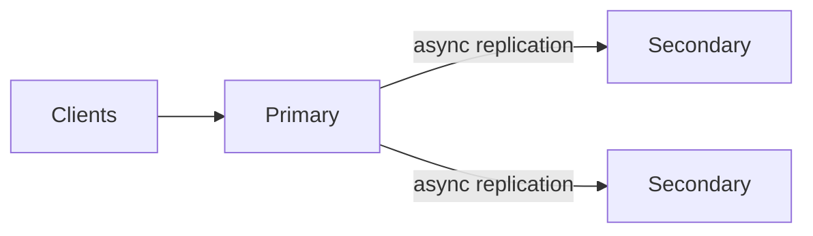
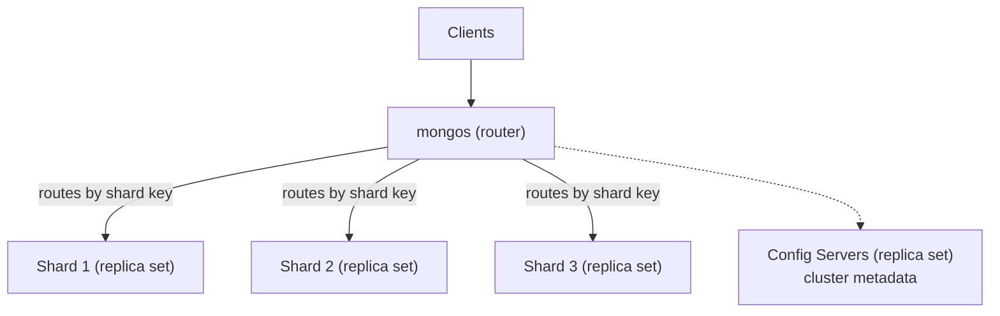
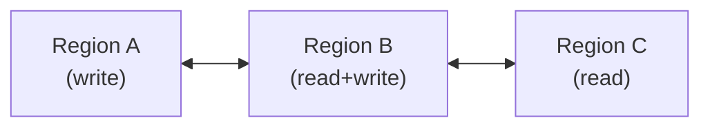
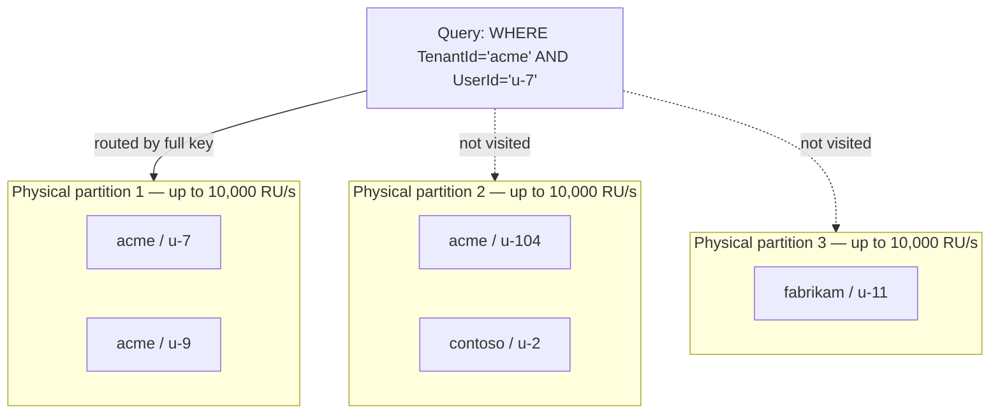

# NoSQL & Document Stores (MongoDB, Cosmos DB)

> [Mastery Guide](../README.md) › [Data & Persistence](./README.md)

| Status | Priority | Phase | Last reviewed |
|---|---|---|---|
| Not Started | High | Phase 5 — Data & Persistence | 2026-05-08 |

## Contents
- [Why it matters](#why-it-matters)
- [Core concepts](#core-concepts)
  - [Why NoSQL — when relational is the wrong shape](#why-nosql--when-relational-is-the-wrong-shape)
  - [Document model fundamentals](#document-model-fundamentals)
  - [MongoDB essentials](#mongodb-essentials)
  - [Cosmos DB essentials](#cosmos-db-essentials)
  - [Partitioning and shard keys](#partitioning-and-shard-keys)
  - [Consistency models](#consistency-models)
  - [Indexing in document stores](#indexing-in-document-stores)
  - [Schema design — embedding vs referencing](#schema-design--embedding-vs-referencing)
  - [.NET driver patterns](#net-driver-patterns)
- [Code & diagrams](#code--diagrams)
- [Common pitfalls](#common-pitfalls)
- [Interview-ready summary](#interview-ready-summary)
- [Interview Cross-Questioning Drill](#interview-cross-questioning-drill)
- [Cheat Sheet](#cheat-sheet)
- [Walkthrough](#walkthrough--cosmos-429s-from-a-hot-tenant-partition)
- [Self-test](#self-test)
- [Cross-references](#cross-references)
- [Sources](#sources)

---

## Why it matters

Relational databases assume your data fits a fixed schema and your queries are JOIN-driven. **NoSQL document stores** reverse that: schema lives in the application layer, documents are self-contained JSON-like blobs, and the database trades multi-table JOINs for horizontal scale. For high-volume writes, evolving schemas, hierarchical data (orders with line items, posts with comments, configurations), or geo-distributed reads, document stores often beat relational systems on both throughput and developer ergonomics.

**MongoDB** is the dominant open-source document database. **Azure Cosmos DB** is Microsoft's globally-distributed, multi-model database with a MongoDB-compatible API plus its own native APIs. In 2026, both show up in nearly every senior .NET interview where the company has anything beyond a single-region monolith.

Why interviewers ask: NoSQL questions test whether you know *when* to leave SQL and *how* to design for a different consistency/partitioning model. Engineers who default to "RDBMS for everything" miss the right tool for write-heavy, schema-flexible, or geo-distributed workloads. Engineers who default to "MongoDB for everything" miss transactions, joins, and the maturity of relational tooling. Senior judgment is knowing the trade-offs.

When NOT to choose: strongly relational data (orders ↔ customers ↔ products with reporting JOINs), strict ACID requirements across many entities (use Postgres / SQL Server), or anywhere you'd benefit from decades-old query optimization (most analytical workloads). The "we use MongoDB because it's modern" decision has burned a lot of teams.

> 🌍 **In the real world**: the sentence that ends most NoSQL interview questions badly is "we picked MongoDB because the data was already JSON". A team moved an orders domain off SQL Server for exactly that reason, and within a year had written — in C#, in the service layer — a join resolver, a compensating-transaction handler, and a nightly reconciliation job that compared order totals against the sum of their line items because nothing in the database was enforcing the relationship any more. None of that appeared in the migration plan. All of it was work the relational engine had been doing for free, rebuilt worse, by people who did not know they were rebuilding it. The interviewer is not testing whether you know what a document is. They are testing whether you can name what you gave up — and whether you noticed before or after you reimplemented it.

## Core concepts

### Why NoSQL — when relational is the wrong shape

Relational design optimizes for **normalization** — data appears once, relationships are foreign keys, queries reconstruct the shape. That's elegant for write-rare/read-many transactional systems but creates pain at scale:

- **JOINs don't shard well.** Once your data exceeds a single machine, distributing JOINed tables means cross-machine queries — slow and operationally painful.
- **Schema migrations on huge tables hurt.** Adding a non-null column to a billion-row table is an outage waiting to happen.
- **Hierarchical data fights the model.** A blog post with 50 nested comments is naturally one document; in SQL you split into `posts` + `comments` and JOIN on every read.
- **Read scaling has a ceiling.** Read replicas help, but eventually you hit the single-write-master bottleneck.

Document stores accept some loss (no cross-document JOINs, weaker transactional guarantees) in exchange for:

- **Horizontal scale** by shard key — adding nodes adds capacity linearly.
- **Schema flexibility** — fields can be added without migrations; missing fields handled in code.
- **Read locality** — a document is one disk seek; no JOIN cost.
- **Native hierarchical model** — embed nested data without juggling foreign keys.

The trade underneath all four is a single sentence worth being able to say out loud: **a relational schema defers the decision of "which questions are cheap" to query time; a document schema makes it at write time.** SQL pays the cost of that flexibility on every read, in join and optimizer work. A document store pays it once, in the shape you chose — and hands the bill to whoever asks a question you did not anticipate.

> 🌍 **In the real world**: an analytics request — "revenue by product category, last quarter, by region" — arrived for a MongoDB orders collection that had been designed around one access pattern: fetch one order by `_id`. The document embedded a category *name* string on each line item, because that was what the order page rendered. Answering the question meant `$unwind` over the line items, `$group` on a denormalised string that had been spelled three different ways across two years of releases, and a `$lookup` into a regions collection with no index on the join field. It ran once, over a weekend, and the numbers were wrong because of the spellings. Nobody had done anything careless: every individual decision optimised the read path that existed. The shape simply had no answer for a question that arrived later, and in a document store the shape is the schema, the index strategy and the query plan all at once.

### Document model fundamentals

A **document** is a self-describing JSON-like record (BSON in MongoDB; JSON in Cosmos DB). Documents live in **collections** (MongoDB) or **containers** (Cosmos DB). Schemas are typically partial — fields can vary across documents in the same collection.

```json
// One document — orders collection
{
  "_id": "65f3a8...",
  "customerId": "cust-42",
  "status": "shipped",
  "items": [
    { "sku": "ABC", "qty": 2, "price": 19.99 },
    { "sku": "XYZ", "qty": 1, "price": 5.50 }
  ],
  "shipping": {
    "address": "1 Main St",
    "city": "Karachi",
    "country": "PK"
  },
  "createdAt": "2026-05-08T10:30:00Z"
}
```

The same query that needs three SQL tables (`orders`, `order_items`, `addresses`) is **one document read** in a document store. The trade: if you also need to query "all customers in Karachi who bought SKU ABC last month" across millions of orders, your shard key choice and indexes carry that whole burden — there's no SQL optimizer to fall back on.

**The type system is in your mapping code, not in the database.** This is where .NET engineers get caught, and it is engine-specific. **MongoDB** stores BSON, which *does* have a decimal type (`Decimal128`) alongside `Double`, `Int32`, `Int64` and `Date` — but which BSON type a C# property lands in is decided by the driver's serializer, not by the CLR type, and you steer it with `[BsonRepresentation(...)]`. **Cosmos DB for NoSQL** stores plain JSON and has no decimal type at all: Microsoft's limits table gives the maximum length of a numeric property value as "IEEE754 double-precision 64-bit" and the maximum precision for numbers as IEEE 754 binary64 (Microsoft Learn, *Service quotas and default limits*). A C# `decimal Price` serialises to a JSON number, is stored as a binary64 float, and comes back as something that is no longer exactly what you wrote. There is no error, no warning, and no `decimal(18,2)` to save you.

> 🌍 **In the real world**: an invoicing service on Cosmos DB reconciled cleanly for months and then started producing statements whose line items didn't add up to the total by a fraction of a cent. The C# model used `decimal` throughout, so nobody suspected the money type; the arithmetic was being done in `decimal` and only the *storage* round-trip went through a binary64 float, which is enough, because 19.99 has no exact binary representation. The fix was to store money as an integer number of minor units and divide at the edge — the same discipline the payments industry already uses, arrived at the expensive way. The generalisable point is that moving from SQL Server to a document store silently moves your type constraints from the database into your serialisation config, and serialisation config is not something anyone reviews.

### MongoDB essentials

MongoDB is a single-system document database, optionally clustered for HA (replica sets) and sharded for scale-out (sharded clusters).

**Topology**:
- **Replica set** — one primary, multiple secondaries. Writes go to primary, reads can come from secondaries (with consistency trade-offs). Automatic failover via Raft-like consensus.
- **Sharded cluster** — multiple replica sets ("shards"), routed by a `mongos` proxy using a shard key. Each shard owns a key range.

**Storage engine**: WiredTiger by default — B-tree on disk, document-level concurrency, snappy/zstd compression.

**The working set is the whole performance story, and it is a sizing question.** MongoDB's documented default is that the WiredTiger internal cache is "the larger of either 50% of (RAM − 1GB), or 0.256 GB" (MongoDB manual, *WiredTiger Storage Engine*). Collection data in that cache is held **uncompressed** (indexes keep only prefix compression); on disk both are block-compressed. Anything not in the cache is served from the OS filesystem cache — where the data is still compressed and must be decompressed — or from disk. There is no cliff edge marked in any metric called "you have outgrown RAM"; what you see instead is a gradual rise in read latency, then a sharp one, as the indexes needed to serve queries stop fitting alongside the documents. The question an interviewer is fishing for with "how do you size a MongoDB node?" is whether you know that **indexes and the hot document set compete for the same cache**, which is why an unused index is not free even on a read-only replica.

> 🌍 **In the real world**: a MongoDB collection backing a product search screen was fine for two years and then degraded over about six weeks with no deploy, no schema change and no traffic spike anyone could point at. The tell was in `db.serverStatus().wiredTiger.cache`, which is where MongoDB reports cache and eviction statistics: the cache was full and evicting steadily, because the cache is a fixed fraction of RAM and the data was not fixed. Two of the six indexes on the collection reported `accesses.ops` of zero in `db.collection.aggregate([{ $indexStats: {} }])` — added speculatively during a past investigation and never dropped. Removing them returned enough cache to the working set to undo the regression without touching the hardware. Unused indexes cost you writes on every insert, which everyone knows; they also cost you *reads*, by competing for the pages you actually wanted, which is the half that never makes it into a code review.

**Querying**: BSON-based query language. `{ status: "shipped", "shipping.country": "PK" }` matches against the embedded document.

**Aggregation pipeline**: stage-based transformation — `$match` → `$group` → `$lookup` → `$project`. The closest analogue to SQL's `SELECT ... GROUP BY ...` plus `JOIN` (`$lookup`).

**Transactions**: Multi-document ACID transactions since 4.0 (replica sets) and 4.2 (sharded clusters). They work but have throughput costs — most well-designed Mongo apps avoid them by embedding related data into one document.

**Atlas**: MongoDB's managed cloud — multi-cloud, automated backups, online schema changes, search and vector search. The default "buy don't run" choice in 2026.

### Cosmos DB essentials

Cosmos DB is Microsoft's globally-distributed multi-model database. Same engine, multiple API surfaces:

| API | Use when |
|---|---|
| **NoSQL** (formerly SQL API) | Greenfield Cosmos work — most powerful, native query language |
| **MongoDB** (wire protocol) | Lift existing MongoDB apps without rewriting drivers |
| **Cassandra** (CQL) | Wide-column workloads from existing Cassandra teams |
| **Gremlin** | Graph workloads |
| **Table** | Cheap key-value (Azure Table replacement) |
| **PostgreSQL** | Distributed Postgres via Citus integration |

**Key differences from MongoDB**:
- **Built-in global distribution.** Add regions with one click; writes auto-replicate; reads served from nearest region. Multi-master writes available.
- **Five tunable consistency levels** (strong → bounded staleness → session → consistent prefix → eventual) — explicit knob, not "eventual or strong" only.
- **RU/s pricing model.** Throughput is provisioned in **Request Units per second** — a normalized cost unit covering reads, writes, queries, and indexing. Predictable cost, but RU sizing is the biggest source of bill surprise.
- **Autoscale and serverless** modes — RUs scale automatically with traffic, or pay per request for spiky workloads.
- **Strong default indexing.** Every property is indexed by default; you tune *down* with index policies, not up.
- **Built-in change feed.** Stream of document changes, consumed by Functions / Spark / Synapse — closest cloud-native analogue to Kafka for database events.
- **Vector search** — native embedding storage and similarity queries for RAG workloads, via a vector index declared in the container's indexing policy.

When to choose Cosmos over Mongo Atlas: Azure-heavy stack, global distribution baked-in, change-feed integration with Azure Functions, and you can model around the RU pricing. When to choose Mongo Atlas: multi-cloud, richer aggregation pipeline, larger MongoDB ecosystem and operator pool.

**What an RU actually is, and why the number matters more than the price.** A request unit is a normalized bundle of CPU, IOPS and memory. The anchor Microsoft documents is one specific operation: "reading a single item by its ID and partition key uses one request unit. The item should be about 1 KB in size" (Microsoft Learn, *Request Units*). Everything else is priced relative to that, and the same docs commit to determinism — "the same query on the same data always costs the same number of RUs on repeated executions." That determinism is the useful part: RU charge is a *property of your query and your document*, reproducible in a test, not a noisy runtime measurement. Log `RequestCharge` from every response and you have a regression test for query cost that runs in CI.

Two consequences engineers routinely miss:

- **You are billed on provisioned RU/s, not on RUs consumed** — in provisioned-throughput mode. Microsoft's serverless doc draws the line explicitly: with provisioned throughput "you're billed for the amount of throughput that you provisioned"; with serverless "you're billed for the number of RUs that your database operations consumed." So a wasteful query in provisioned mode does not appear on the invoice at all. It appears as 429s, because it ate the budget somebody else needed.
- **Throughput is provisioned in every region.** "If you assign *R* RUs on an Azure Cosmos DB container (or database), Azure Cosmos DB ensures that *R* RUs are available in *each* region... the total RUs available globally on the container = *R* × *N*" (Microsoft Learn, *Request Units*). Adding a read region multiplies the throughput bill; it does not divide it.

> 🌍 **In the real world**: a team added two read regions to a Cosmos account to cut latency for European and Asian users, which worked, and the next invoice was roughly three times the previous one, which nobody had modelled. Nothing had been misconfigured — provisioned RU/s is per region by definition, so a container at 40,000 RU/s across three regions is 120,000 RU/s of billed capacity. The uncomfortable part of the retro was that the container had been sized for a peak load that only ever occurred in the write region, so two thirds of the new capacity was provisioned to serve traffic that arrived nowhere. Autoscale would have absorbed most of it. The transferable lesson is that in Cosmos, *geography is a throughput decision before it is a latency decision*, and the SKU you sized for one region is the SKU you just bought N times.

**Change feed modes — the detail that decides whether your downstream is correct.** "Change feed" names two different things, and defaulting to the wrong one produces a sync pipeline that is quietly lossy:

| | Latest version mode (default) | All versions and deletes mode |
|---|---|---|
| Captures | Inserts and updates | Inserts, updates **and deletes** (including TTL expiries) |
| Intermediate updates | "Only the most recent change for a specific item is included... Intermediate changes might not be available." | Every change, in modification order |
| Start position | Beginning of container, a point in time, "now", or a checkpoint | "now" or a checkpoint only |
| Retention | No fixed retention period | Only within the continuous-backup retention window |
| Requires | Nothing | Continuous backups enabled on the account; NoSQL API only |

(Quotations and behaviour: Microsoft Learn, *Change feed modes in Azure Cosmos DB*.)

The default mode gives you the *current state of items that changed*, not a log of changes. If two updates land between polls you see one; if an item is deleted you see nothing at all. Microsoft's documented workaround for deletes in latest-version mode is a soft delete: set a `deleted: true` attribute plus a TTL, so the deletion arrives as an update and the row is reaped later.

> 🌍 **In the real world**: a change-feed processor kept an Elasticsearch index in sync with a Cosmos container, and searching for a cancelled listing kept returning it. The processor was correct, the leases were healthy, no exception had ever been thrown — deletes are simply not in the latest-version change feed, and the team had assumed "stream of changes" included the change of a document ceasing to exist. The repair was the documented one: stop hard-deleting, write `deleted: true` with a TTL, and have the consumer treat that update as a removal. Worth noticing what the incident actually was: a correctness bug with no failure signal anywhere in the system, in a component whose whole purpose was to remove the need for dual writes.

### Partitioning and shard keys

Both stores horizontally scale by **partition key** (Cosmos) / **shard key** (MongoDB). The choice is the single most consequential decision when you set up a collection.

**A good partition key**:
- **High cardinality** — millions of distinct values, not a few.
- **Even access distribution** — no single value gets the majority of reads/writes.
- **Aligns with query patterns** — most queries should target one partition, not fan out.
- **Stable** — values don't change after the document is written (changing a partition key means rewriting the document).

**Bad partition keys**:
- `country` — most traffic is one country (hot partition).
- `tenantId` for multi-tenant SaaS where one tenant is huge — that tenant's partition becomes a bottleneck.
- Monotonic IDs (timestamps, sequential IDs) — all writes hit the latest partition (the *write hotspot* anti-pattern).

**Worked example — order data**:
- Bad: `customerId` if 80% of orders come from 5 enterprise customers.
- Bad: `orderDate` (all today's writes hit one partition).
- Good: `tenantId + customerId` (composite) for multi-tenant; spreads load.
- Good: `hash(orderId)` (synthetic key) when no natural key works — but you lose locality for "all orders for customer X" queries.

**Logical vs physical partitions — the distinction the walkthrough turns on.** Your partition key value defines a **logical** partition. Cosmos maps many logical partitions onto each **physical** partition, and it is the physical one that owns hardware. Microsoft's quota table gives the numbers: **maximum RU/s per partition (logical and physical) is 10,000**, and **maximum storage across all items per logical partition is 20 GB** (Microsoft Learn, *Service quotas and default limits*). A physical partition splits when it exceeds 50 GB of storage. So the ceiling on your container is not the RU/s you provisioned — it is `number of physical partitions × 10,000 RU/s`, and a key with low cardinality gives you one physical partition no matter how large a number you type into the throughput box.

**Hierarchical partition keys are the modern answer to the hot-tenant problem**, and knowing they exist is a differentiator, because most material still teaches the synthetic-suffix workaround. You declare up to three levels — `/TenantId`, `/UserId`, `/SessionId` — and Cosmos partitions on the whole path while routing queries by *prefix*. Microsoft is explicit that this is the recommended long-term fix for the 20 GB wall: "If your workload reaches the logical partition limit of 20 GB in production, the recommended long-term solution is to use hierarchical partition keys to rearchitect your application."

| Query filter | Routing |
|---|---|
| All three levels | Single logical and physical partition |
| `TenantId` + `UserId` | Targeted subset of physical partitions |
| `TenantId` only | Targeted subset of physical partitions |
| `UserId` only (skipping the first level) | **Full fan-out across all physical partitions** |

The constraints are the interesting half, and they are what an interviewer will probe: hierarchical keys must be set **at container creation and cannot be changed**; they are **API for NoSQL only** (not the MongoDB or Cassandra APIs); they need .NET SDK v3 ≥ 3.33.0; and the values must appear **in the `WHERE` clause** — supplying them only through `PartitionKeyBuilder` does not by itself guarantee efficient routing. Microsoft also warns against the obvious misuse: if your first level has low cardinality, hierarchical keys make things worse, not better, because the design deliberately colocates everything sharing a first-level key. In that case a synthetic key is still the right tool.

MongoDB has no equivalent hard per-key ceiling, but the same physics apply — a shard key value that attracts disproportionate data produces ranges the balancer cannot split, and a range that cannot be split cannot be moved off a hot shard.

> 🌍 **In the real world**: a multi-tenant service partitioned on `/tenantId` and ran cleanly for three years, until inserts for its largest customer began failing outright while every other tenant was unaffected and the container's overall RU consumption sat well under the provisioned figure. That tenant's logical partition had reached 20 GB, and Cosmos stops accepting writes into a logical partition at that point — it is a hard limit, not a degradation. There is no online fix: partition keys are immutable, so the recovery was a support ticket for a temporary limit increase (Microsoft grants these explicitly as a stopgap and notes that **SLA guarantees are not honoured while the limit is raised**) to buy time for a new container with hierarchical keys and a change-feed migration. The number to carry out of this is not 20 GB. It is that the *largest tenant's* growth rate, not the aggregate, is the thing that sets your deadline — and a per-tenant storage metric would have given eighteen months of warning that a container-level metric never could.

### Consistency models

Document stores expose explicit consistency knobs. The CAP-PACELC trade-off is yours to dial.

**Cosmos DB's five levels**:

| Level | Guarantee | Use case |
|---|---|---|
| **Strong** | Linearizable across all regions; reads see latest write | Single-region critical writes; financial systems |
| **Bounded staleness** | Reads lag by ≤ N operations or T seconds | Multi-region with bounded lag tolerance |
| **Session** (default) | Per-session monotonic reads + read-your-writes | Most user-facing apps — best balance |
| **Consistent prefix** | Reads never see out-of-order writes | Order-sensitive feeds where staleness is OK |
| **Eventual** | No ordering; eventually convergent | Counters, analytics aggregates |

Three things about that table are load-bearing and are usually where the follow-up question goes.

**Strong consistency is not available with multi-region writes.** Not "discouraged" — unavailable. Microsoft's reasoning: "Azure Cosmos DB accounts with multiple write regions can't use strong consistency because a distributed system can't provide a recovery point objective (RPO) of zero and a recovery time objective (RTO) of zero" (Microsoft Learn, *Consistency levels*). This kills the answer "we'll take multi-master *and* strong consistency" before you finish saying it. The same page notes strong consistency across regions more than 5,000 miles apart is blocked by default and needs a support request.

**Stronger reads cost more RUs, and Microsoft says by how much.** "For strong and bounded staleness, reads are done against two replicas in a four-replica set (minority quorum)... As a result, for the same number of request units, read throughput for strong and bounded staleness is half that of the other consistency levels." Write RU cost is identical across all five levels. So consistency in Cosmos is a *read-throughput* dial, and this is one of the few multipliers on this page that comes with a citation.

**Bounded staleness has floors you cannot go below.** "For a single-region account, the minimum value of *K* and *T* is 10 write operations or 5 seconds. For multi-region accounts, the minimum value of *K* and *T* is 100,000 write operations or 300 seconds." Anyone planning to set a one-second cross-region staleness bound is planning something the service does not offer.

**Session consistency is a client-side mechanism, which is why it breaks in stateless services.** After each write, the server returns a **session token**; the SDK caches it and sends it with subsequent reads. Note the actual mechanism, because interviewers probe it: the replica does not block waiting to catch up — per Microsoft, "if the replica against which the read operation is issued contains data for the specified token (or a more recent token), the requested data is returned. If the replica doesn't contain data for that session, the client retries the request against another replica," escalating to other regions if it has to. Two documented properties turn this from trivia into an outage: session tokens are **partition-bound**, and — the one that matters for .NET — "if the client is re-created, its cache of session tokens is also re-created. Here too, read operations follow the same behavior as Eventual Consistency until subsequent write operations rebuild the client's cache of session tokens." Session consistency is scoped to a `CosmosClient` instance, not to a user.

> 🌍 **In the real world**: an ASP.NET Core API on Cosmos with the default session consistency had an intermittent bug where a user saved a profile, the UI redirected to the detail page, and roughly one request in three showed the old values. The account was single-region, so replication lag was not the story. The API ran four pod replicas behind a load balancer, and the read landed on a pod whose `CosmosClient` had never issued that write and therefore held no session token for that partition — which, per Microsoft's own wording, degrades that read to eventual consistency. Two fixes are legitimate and neither is "turn on strong": return the written resource from the write endpoint so the client never re-reads, or flow the session token from the write response through to the read request so the correct barrier is applied. The lesson generalises past Cosmos — **read-your-writes guarantees that live in a client are guarantees you lose the moment you scale out**, and horizontal scaling is not a change anyone thinks to re-test consistency against.

**MongoDB**:
- **Read concerns**: `local` (fastest), `majority` (acknowledged by majority of replicas), `linearizable` (strongest, slowest), and `snapshot` for transactions.
- **Write concerns**: `w: 1`, `w: "majority"`, or a specific number. Combine with `j: true` for journaled writes.
- **Causally consistent sessions** are MongoDB's equivalent of the session-token idea, and they are explicit rather than ambient: operations inside one client session see read-your-writes and monotonic reads, and the session's operation time can be passed between processes to extend the guarantee across service boundaries.

**Know the implicit default, because it changed.** MongoDB's manual now states that "the implicit default write concern is `w: majority`", with one edge case worth being able to recite: if the replica set contains an arbiter and the number of data-bearing voting members is not greater than the voting majority, the default drops back to `{ w: 1 }`. A P-S-A set (primary, secondary, arbiter) has two data-bearing members and a voting majority of two, so it defaults to `w: 1` — the deployment topology people choose to save the cost of a third data node is exactly the topology that silently loses the durability default.

The senior-engineer move is choosing a *weaker* consistency for endpoints where it's tolerable (browsing, search) and *stronger* only where it's required (checkout, balance changes). Wholesale "strong everywhere" defeats the purpose of a distributed database.

### Indexing in document stores

**MongoDB indexes**:
- **Single-field**, **compound** (multi-field), **multikey** (arrays), **text**, **2dsphere** (geo), **TTL** (auto-expire), **wildcard**, **hashed** (for sharding).
- The **leftmost-prefix rule** applies to compound indexes, same as SQL.
- `db.orders.explain("executionStats")` is the equivalent of `EXPLAIN ANALYZE` — read it.

**Compound key *order* in MongoDB has a documented rule with a name: ESR.** Equality fields first, then Sort, then Range. MongoDB's guideline is precise about why: "Ensure that equality fields always come first. Placing equality fields first keeps the remaining index fields in sorted order." Sort before range, because a range predicate scatters the values of every subsequent key and destroys the ordering the sort was going to reuse — put the range second and the engine must materialise and sort the results itself (a blocking in-memory sort). The manual offers one deliberate exception: "If your range predicate in the query is very selective, then put it before sort fields (ERS)."

`$in` is the trap inside the rule, and the threshold is documented, not folklore: with **fewer than 201 array elements** the values are expanded and merged in index order via a `SORT_MERGE` stage, so `$in` behaves like equality for ESR purposes; at **201 elements or more** they are "ordered like a range operator", the merge optimisation is gone, and subsequent index fields can no longer serve the sort (MongoDB manual, *ESR guideline*). A query that was fine with a hundred IDs in the list changes execution strategy at two hundred and one.

```javascript
// Query: one customer's shipped orders, newest first, in a date window
db.orders.find({ customerId: "c-42", status: "shipped",
                 createdAt: { $gte: from } })
         .sort({ updatedAt: -1 })

// Wrong order — range before sort. The index seeks, then MongoDB must
// materialise the matches and sort them: a blocking SORT stage in explain().
{ customerId: 1, status: 1, createdAt: 1, updatedAt: -1 }

// ESR — equality, sort, range. The sort is served by the index and the
// SORT stage disappears; the cost is that the scan walks keys in updatedAt
// order and discards the ones failing the createdAt predicate.
{ customerId: 1, status: 1, updatedAt: -1, createdAt: 1 }
```

That last line is the whole trade, and it is why the manual leaves ERS on the table: ESR buys you the elimination of a blocking sort by paying in extra index keys examined. If the range predicate is highly selective — a one-hour window over a year of data — you may genuinely want it before the sort field and to accept the in-memory sort of a small result. Decide it with the plan, not the acronym: run `.explain("executionStats")` and compare `totalKeysExamined` and `totalDocsExamined` against `nReturned`. A `SORT` stage in the winning plan means the index did not serve the ordering, whatever else the plan says.

**Cosmos DB indexing**:
- **Default**: every property of every item is indexed, with range indexes enforced for any string or number.
- **Index policy** lets you exclude paths (`/largeNotes/*`) to save RU cost on writes.
- **Composite indexes** required for `ORDER BY` on multiple fields — you must explicitly add them.
- **Spatial indexes are not created by default** — Microsoft's wording is "Azure Cosmos DB, by default, won't create any spatial indexes. If you would like to use spatial SQL built-in functions, you should create a spatial index on the required properties." The functions still *run* without one; they just scan and charge you for it.
- **Vector indexes** for embedding retrieval, in three flavours: `flat` (brute-force, 100% recall, capped at 505 dimensions), `quantizedFlat` (brute-force over compressed vectors, so recall is slightly below 100%, up to 4,096 dimensions), and `diskANN` (approximate nearest neighbour, up to 4,096 dimensions). Vector policies and indexes are immutable after container creation, so this is a decision you make once.

**Cosmos composite indexes have their own leftmost-prefix rules, and they are stricter than most people expect.** From Microsoft's indexing-policy documentation: equality-filtered properties must come **first** in the composite index; a range filter (`>`, `<`, `>=`, `<=`, `!=`) must be defined **last**; and **each composite index can optimise only a single range filter**, so a query with two range predicates needs two composite indexes rather than one three-property index. For `ORDER BY`, the composite paths must match the sequence *and* the direction of the clause — a composite on `(name ASC, age ASC)` serves `ORDER BY c.name DESC, c.age DESC` (the exact reverse) but not `ORDER BY c.name ASC, c.age DESC`.

The consequence that catches people is that a filter and a sort on different properties will not use a composite index unless you **rewrite the `ORDER BY` to lead with the filtered properties**:

```sql
-- Does NOT use a composite index on (name ASC, timestamp ASC).
SELECT * FROM c WHERE c.name = "John" ORDER BY c.timestamp

-- Does. Same result set, same ordering (name is fixed by the filter),
-- lower RU charge.
SELECT * FROM c WHERE c.name = "John" ORDER BY c.name, c.timestamp
```

**The partition key is not indexed by default.** This is stated outright in Microsoft's indexing-policy docs and it surprises almost everyone: "The partition key (unless it is also `/id`) is not indexed and should be included in the index. Partition keys do not require indexing to function, but if you do not include them in your indexing policy, any queries filtering on partition key hierarchy will force full scans, resulting in higher RU consumption." Read it together with the same page's include/exclude section, which says where it actually bites: "The partition key property path isn't indexed by default with the **exclude** strategy and should be explicitly included if needed." So the default index-everything policy covers you; the trap is the exclude-root policy (`"excludedPaths": [{"path": "/*"}]` with a short include list), which is exactly what a team writes when it is trying to cut write RU cost. With hierarchical partition keys you need each level of the hierarchy in the policy.

Also worth knowing: `_etag` is excluded from indexing by default; `id` and `_ts` are always indexed under `consistent` mode and cannot be turned off; and **TTL requires indexing**, so a container with indexing mode `none` cannot use TTL and vice versa.

> 🌍 **In the real world**: a Cosmos container's write RU charge was cut by moving from the default index-everything policy to an explicit include list — a legitimate optimisation, correctly reasoned, and the write cost genuinely fell. What went unnoticed for a fortnight was that the partition key path had not been added to the include list, so every tenant-scoped read went from an index seek to a scan of the partition. Read RU rose by more than the write RU had fallen, but on a different chart, owned by a different alert, so the two changes never appeared next to each other. Cosmos gives you an unusually honest instrument for this — `RequestCharge` is deterministic for a given query and document, so the regression was reproducible in a five-line test the moment anyone thought to write one. The habit worth forming is asserting the RU charge of your top queries in CI, exactly as you would assert a query plan in SQL Server.

The senior trap: indexing isn't free. Every write updates every index. In Cosmos, index updates are paid for in RUs. In MongoDB, they're paid for in cache, disk and CPU. Audit your indexes.

### Schema design — embedding vs referencing

Two extremes:

**Embed** when:
- Children are accessed always with the parent.
- Children don't grow unbounded (1:few, not 1:millions).
- Children don't change independently of the parent.

```json
// Embedded: order with line items
{ "_id": "...", "customer": "...", "items": [ {...}, {...} ] }
```

**Reference** when:
- Children are accessed independently (`GetItemsBySku`).
- Children grow unbounded (1:many).
- Children change frequently and independently (avoids full-document rewrites).

```json
// Referenced
{ "_id": "...", "customer": "...", "itemIds": ["item-1", "item-2"] }
// Then a separate "items" collection
```

**The 16 MB rule (MongoDB) / 2 MB rule (Cosmos)**: a single document can't exceed those sizes. Embedded comments on a popular post will eventually hit the limit — at that point you must refactor to reference. Precisely: MongoDB's BSON document limit is 16 MiB, and files larger than that go through **GridFS**, which splits them across a `fs.chunks` collection using a default chunk size of 255 KiB (MongoDB manual, *GridFS*). Cosmos DB's limit is "2 MB (UTF-8 length of JSON representation)" for the API for NoSQL, with the API for MongoDB supporting up to 16 MB behind a portal feature toggle (Microsoft Learn, *Service quotas and default limits*).

**The size limit is the wrong thing to steer by, though.** Long before you reach it, an unbounded array has already cost you three things that no limit warns about: every append rewrites the *entire* document on the primary and in every secondary's storage engine, every read of the parent drags the whole array over the wire whether you wanted it or not, and any index on a field inside that array is a **multikey** index carrying one entry per element. (Be precise about the replication half of that: since MongoDB 5.0 an update operator such as `$push` replicates a `$v: 2` *delta* oplog entry containing only the changed fields, so the network cost of an append is small — it is a full-document `replaceOne`, which drivers and ORMs emit very easily, that puts the whole document back on the wire.) The document-size cap is where the failure becomes loud; the design was wrong several orders of magnitude earlier.

**The Extended Reference pattern**: embed *some* fields of the related entity (the ones you display), reference the rest. Compromise between read locality and storage duplication.

**Embedding a snapshot is a feature, not duplication.** The most common junior mistake here is treating an embedded copy of product name and price as denormalisation debt to be cleaned up. It usually isn't: an order line is *supposed* to record the price the customer agreed to, not the price the product has today. Embed the snapshot, reference the live entity, and be able to say which of the two a given field is — because "should this update propagate?" is a domain question with a right answer, and the schema should encode it rather than leave it to whoever writes the next migration.

> 🌍 **In the real world**: an activity-feed document embedded an `events` array per user, appended to on every action, and the service degraded in a way that looked nothing like a document-size problem: write latency crept up for a subset of users, then a subset of *those* users started timing out. The 16 MB limit was still comfortably far away. The cost was that each append rewrote a document that had grown to a few megabytes — and because the service loaded the document, appended in C#, and saved it back with a full-document replace rather than a `$push`, every one of those megabytes went over the wire and into the oplog. A handful of the most active users were consuming write and replication bandwidth on behalf of everyone. (Had it used `$push` on MongoDB 5.0 or later, replication would have carried only a delta; the storage-engine rewrite and the read amplification would still have been there.) Moving events to their own collection keyed by `userId` made the writes constant-size and the problem disappeared. The rule that came out of the retro is worth borrowing: **if an array's length is a function of time or usage rather than of the domain, it is not an array, it is a collection.** Order lines are bounded by what a person buys in one go; events are not bounded by anything.

### .NET driver patterns

**MongoDB.Driver** (canonical):

```csharp
var client = new MongoClient("mongodb+srv://...");
var db = client.GetDatabase("shop");
var orders = db.GetCollection<Order>("orders");

// Insert
await orders.InsertOneAsync(new Order { CustomerId = "cust-42", ... });

// Find with builder
var filter = Builders<Order>.Filter.Eq(o => o.Status, "shipped")
           & Builders<Order>.Filter.Gte(o => o.CreatedAt, DateTime.UtcNow.AddDays(-7));
var recent = await orders.Find(filter).Limit(100).ToListAsync();

// Aggregation
var pipeline = orders.Aggregate()
    .Match(o => o.Status == "shipped")
    .Group(o => o.CustomerId, g => new { CustomerId = g.Key, Total = g.Sum(x => x.Total) })
    .SortByDescending(x => x.Total)
    .Limit(10);
var topCustomers = await pipeline.ToListAsync();

// Transaction (replica set required)
using var session = await client.StartSessionAsync();
session.StartTransaction();
try
{
    await orders.UpdateOneAsync(session, o => o.Id == orderId,
        Builders<Order>.Update.Set(o => o.Status, "paid"));
    await payments.InsertOneAsync(session, new Payment { OrderId = orderId, ... });
    await session.CommitTransactionAsync();
}
catch
{
    await session.AbortTransactionAsync();
    throw;
}
```

**Microsoft.Azure.Cosmos** (Cosmos NoSQL API):

```csharp
var client = new CosmosClient(connectionString,
    new CosmosClientOptions { ApplicationRegion = Regions.SoutheastAsia });

var container = client.GetContainer("shop", "orders");

// Point read — cheapest operation in Cosmos
var resp = await container.ReadItemAsync<Order>(orderId, new PartitionKey(tenantId));
var order = resp.Resource;
Console.WriteLine($"Cost: {resp.RequestCharge} RU");

// Query
var iterator = container.GetItemQueryIterator<Order>(
    new QueryDefinition("SELECT * FROM o WHERE o.status = @s AND o.createdAt > @t")
        .WithParameter("@s", "shipped")
        .WithParameter("@t", DateTime.UtcNow.AddDays(-7)),
    requestOptions: new QueryRequestOptions { PartitionKey = new PartitionKey(tenantId) });

var results = new List<Order>();
while (iterator.HasMoreResults)
{
    var page = await iterator.ReadNextAsync();
    results.AddRange(page);
}

// Change feed (key Cosmos differentiator)
var processor = container.GetChangeFeedProcessorBuilder<Order>("orderProcessor",
    onChangesDelegate: async (changes, ct) =>
    {
        foreach (var order in changes)
            await PublishToServiceBus(order);
    })
    .WithInstanceName("worker-1")
    .WithLeaseContainer(client.GetContainer("shop", "leases"))
    .Build();

await processor.StartAsync();
```

**EF Core for Cosmos**: `Microsoft.EntityFrameworkCore.Cosmos` lets you write LINQ over Cosmos, but it has limitations (no cross-partition joins, weaker query translation than SQL providers). Use it for simple cases; drop to the native SDK when query complexity grows.

**Client lifetime is the single most common .NET mistake against both stores, and it is the same mistake.** `CosmosClient` and `MongoClient` are both designed to be created once and shared: each owns a connection pool, a topology/routing cache, and (for Cosmos in Direct mode) a set of long-lived TCP connections. Microsoft's .NET best-practices checklist carries it as its own line item: "Use a single instance of `CosmosClient` for the lifetime of your application for better performance." The MongoDB .NET driver's pool ships with `MaxConnectionPoolSize` 100, `MinConnectionPoolSize` 0, `MaxConnecting` 2, an idle timeout of 10 minutes and a connection lifetime of 30 minutes — all of which are per-`MongoClient`, so N clients means N pools. Register both as singletons.

Two Cosmos-specific consequences follow. First, Microsoft's control-plane request limits are per account per five minutes — 500 "Get or List database & container" calls among them — with the documented mitigation being exactly this: "Use a singleton client for SDK instances, and cache keys, database, and container references between requests for the lifetime of that instance." A client constructed per request performs metadata calls on every construction, and those calls consume the account's *primary partition* throughput, which cannot be increased. Second, session consistency is scoped to the client instance, so a per-request client throws away read-your-writes on every request (see [Consistency models](#consistency-models)).

> 🌍 **In the real world**: an Azure Functions app on Cosmos began returning 503s under load with no corresponding pressure on the database — RU consumption was unremarkable, latency at the service was fine. The function had been written the way most sample code for HTTP handlers is written: `using var client = new CosmosClient(connectionString)` at the top of the method. Under concurrency this created a client per invocation, each opening its own Direct-mode TCP connections and each making metadata calls on startup, and the host ran out of ephemeral ports before the database noticed anything was happening. The fix was a static client, or DI registration as a singleton. What makes this worth remembering is where the symptom appeared — a client-side resource exhaustion presenting as a database availability problem — and that `using` on an `IDisposable` is normally the *correct* instinct. Some objects are expensive precisely because they are meant to outlive the request.

**Optimistic concurrency: Cosmos gives you ETags, MongoDB makes you build it.** Every Cosmos item carries a server-maintained `_etag`. Send it back as an `If-Match` precondition and the write only lands if nothing changed underneath you; if it did, the server "rejects the operation with an `HTTP 412 Precondition failure` response message" (Microsoft Learn, *Database transactions and optimistic concurrency control*).

```csharp
var read = await container.ReadItemAsync<Order>(id, pk);
var order = read.Resource;
order.Status = "paid";

try
{
    await container.ReplaceItemAsync(order, id, pk,
        new ItemRequestOptions { IfMatchEtag = read.ETag });
}
catch (CosmosException ex) when (ex.StatusCode == HttpStatusCode.PreconditionFailed)
{
    // 412: someone else wrote between the read and the replace.
    // Re-read, re-apply the intent, retry. Do NOT re-apply stale values.
}
```

MongoDB has no equivalent server-managed token: the idiom is a `version` field you increment yourself, guarded in the filter, so the update is atomic against the document rather than against your snapshot.

```csharp
var result = await orders.UpdateOneAsync(
    o => o.Id == id && o.Version == expectedVersion,
    Builders<Order>.Update.Set(o => o.Status, "paid").Inc(o => o.Version, 1));

if (result.MatchedCount == 0) { /* concurrent modification — re-read and retry */ }
```

In both cases the retry must **re-derive** the new value from the current state, not resubmit the value computed from the stale read. A retry loop that refreshes the token but reuses the old arithmetic converts a correctly detected conflict into silent data loss — the same trap as EF Core's optimistic-concurrency handler.

**Cosmos does have transactions; they are scoped to one logical partition.** This is the correction to "NoSQL has no transactions" that separates candidates. Microsoft: "The database engine in Azure Cosmos DB supports full ACID... transactions with snapshot isolation. All the database operations within the scope of a container's logical partition are transactionally executed." `TransactionalBatch` is the SDK surface, capped at **100 operations per batch** and a **2 MB request size**.

```csharp
// All-or-nothing, but only because both items share one partition key.
var batch = container.CreateTransactionalBatch(new PartitionKey(tenantId))
    .CreateItem(payment)
    .PatchItem(orderId, new[] { PatchOperation.Set("/status", "paid") });

using var response = await batch.ExecuteAsync();
if (!response.IsSuccessStatusCode) { /* nothing was applied */ }
```

The design conclusion is the one that should drive your partition key: **the partition key is your transaction boundary**, exactly as the aggregate root is in DDD. If two things must change atomically, they must share a partition key — and if that requirement forces a partition key with poor distribution, you have found a real design conflict, not a technicality.

**Partial updates avoid the read-modify-write round trip.** Cosmos's Patch API takes JSON-Patch-style operations (`add`, `set`, `replace`, `remove`, `incr`, `move`), **maximum 10 operations per single-document patch**, optionally with a filter predicate for a conditional update. Beyond saving a round trip, patch changes the conflict story on multi-region write accounts: "patch operations across multiple regions detect and resolve conflicts at a more granular path level" rather than last-writer-wins over the whole document.

```csharp
await container.PatchItemAsync<Order>(orderId, new PartitionKey(tenantId),
    new[]
    {
        PatchOperation.Set("/status", "shipped"),
        PatchOperation.Increment("/shipmentCount", 1)
    },
    new PatchItemRequestOptions { FilterPredicate = "FROM c WHERE c.status = 'paid'" });
```

**Paginate with continuation tokens, not `OFFSET`.** Cosmos returns a continuation token on every `FeedResponse`; hand it back to resume exactly where you stopped, at constant cost. `OFFSET ... LIMIT` makes the engine produce and discard the skipped rows and charges you RUs for all of them. The token is also how you survive a mid-page failure — persist it and resume.

```csharp
string? continuation = null;
do
{
    using FeedIterator<Order> iterator = container.GetItemQueryIterator<Order>(
        query,
        continuationToken: continuation,
        requestOptions: new QueryRequestOptions
        {
            PartitionKey = new PartitionKey(tenantId),
            MaxItemCount = 100
        });

    FeedResponse<Order> page = await iterator.ReadNextAsync();
    Process(page);
    continuation = page.ContinuationToken;   // null once the result set is exhausted
} while (continuation is not null);
```

For genuinely large cross-partition reads, `MaxConcurrency` on `QueryRequestOptions` controls the fan-out parallelism; Microsoft's guidance is to set it to "the number of partitions you have"; if you don't know that, "start by using `int.MaxValue`" and decrease until it fits the resource limits of the client environment. `MaxBufferedItemCount` bounds prefetch. And for bulk ingestion, `CosmosClientOptions.AllowBulkExecution = true` batches concurrent operations by partition — the documented trade being that it optimises throughput rather than per-request latency.

## Code & diagrams

<details>
<summary>🧩 Click to expand — code samples and diagrams</summary>

### Topology — replica set vs sharded cluster

**MongoDB Replica Set (HA, single shard):**



Writes go only to the primary; replicated async to secondaries.

**MongoDB Sharded Cluster (HA + scale):**



**Cosmos DB Multi-Region:**



Multi-master writes; Cosmos handles conflict resolution per consistency level.

### Logical vs physical partitions, and what a prefix query skips

The distinction that makes hot partitions make sense. Your key value picks a **logical** partition; Cosmos packs many logical partitions onto each **physical** one, and the physical one is what owns the 10,000 RU/s ceiling.



The container is partitioned hierarchically on `/TenantId` then `/UserId`, which is why `acme` spans two physical partitions at all — on a flat `/tenantId` key every `acme` document would share one logical partition and one 10,000 RU/s ceiling.

Read the diagram twice, once for each failure mode:

- **Filter on the full key or a leading prefix** (`TenantId`, or `TenantId` + `UserId`) → Cosmos visits only the physical partitions that can hold matches.
- **Filter on a non-leading level only** (`UserId` alone) → full fan-out to every physical partition, every one of them charging RUs.
- **A single logical partition can never exceed 20 GB or 10,000 RU/s**, whatever the container is provisioned at. That is why one large tenant on a flat `/tenantId` key throttles while the container-level RU chart looks idle.

### Picking a partition key — decision flow

```
What's your primary access pattern?
   │
   ├─ Always single-tenant?
   │     └─► tenantId (if tenants are evenly sized)
   │         else: tenantId + something (composite)
   │
   ├─ Time-series append-mostly?
   │     └─► AVOID timestamp alone (write hotspot)
   │         Use hash(timestamp) or category + time bucket
   │
   ├─ Per-user data?
   │     └─► userId (if cardinality high enough)
   │
   └─ Mostly point reads by ID?
         └─► id itself (each doc its own partition — Cosmos handles this well)
```

</details>

## Common pitfalls

1. **Choosing MongoDB / Cosmos for relational data.** If your domain has 8 entities with foreign keys and reporting JOINs, NoSQL fights you every day. Use the right tool.
2. **No partition key strategy.** Defaulting to "id" or random gives even spread but kills locality — every customer-scoped query is cross-partition.
3. **Hot partition.** All writes hitting one shard because of a poor key choice. Symptom: throttled writes / 429s in Cosmos, slow writes in Mongo.
4. **Ignoring RU cost in Cosmos.** The `x-ms-request-charge` header (`response.RequestCharge` in the SDK) gives the cost of every operation, and it is deterministic for a given query and document — log it, and assert it in tests for your hot queries. Be precise about how it turns into money: in **provisioned** mode you pay for the RU/s you provisioned, so an expensive query shows up as 429s and as capacity denied to something else, not as a line on the invoice. In **serverless** mode you pay per RU consumed, and it shows up directly.
5. **Embedding unbounded arrays.** Comments embedded on a viral post grow to 16 MB and writes start failing. Refactor to references *before* you hit the limit.
6. **Cross-partition queries treated as cheap.** They fan out to every partition, multiply RU cost, and break parallel scaling. If most queries fan out, your partition key is wrong.
7. **Strong consistency by default for everything.** Defeats the point of a distributed DB. Pick session for most reads, strong only where it's truly required.
8. **Treating MongoDB transactions as a free relational replacement.** They work but throughput-cap your collection. Most apps should design around single-document atomicity.
9. **No schema validation.** "Schemaless" doesn't mean "no rules" — it means rules live in code. Use Mongo's `validator` or Cosmos' constraints, plus app-level validation (FluentValidation), to prevent schema drift.
10. **Pagination by skip/limit on huge collections.** `skip` makes the engine produce and discard the skipped rows. In **Cosmos**, use the **continuation token** on `FeedResponse` — it is the native mechanism and resumes at constant cost. In **MongoDB**, use keyset pagination on a unique, monotonic field (`_id > lastSeen`); a plain timestamp field is not unique and will drop or duplicate rows at page boundaries.
11. **Ignoring change feed for downstream systems.** Both stores expose change streams (Mongo) / change feed (Cosmos). It's the cleanest way to fan out events without dual writes.
12. **Vendor lock-in via API choice in Cosmos.** The MongoDB-API surface in Cosmos is *similar* to real MongoDB but not identical — features lag and behavior differs. Concretely: hierarchical partition keys and the all-versions-and-deletes change feed mode are **API for NoSQL only**. If you might multi-cloud, evaluate the actual API gap before building.
13. **Assuming the change feed reports deletes.** In Cosmos's default *latest version* mode it does not, and intermediate updates between polls may be collapsed into one. Either switch to *all versions and deletes* mode (requires continuous backups; NoSQL API only) or adopt soft deletes with a TTL.
14. **Creating a `CosmosClient` or `MongoClient` per request.** Each carries its own connection pool and routing cache; per-request construction exhausts client-side connections and, in Cosmos, burns metadata throughput on the account's primary partition — which cannot be scaled. Register as singletons.
15. **Read-modify-write with no concurrency token.** A read followed by a full-document `Replace` is a lost update waiting for concurrency. Use `IfMatchEtag` in Cosmos (412 on conflict), a version-guarded `UpdateOne` filter in MongoDB, or a patch/`$inc` operation that never round-trips the value at all.
16. **Assuming multi-region writes can be strongly consistent in Cosmos.** They can't — the service does not offer that combination. Multi-master means you own conflict resolution.

## Interview-ready summary

- **Document stores** trade JOINs and ACID-across-many-entities for **horizontal scale, schema flexibility, and read locality**. Pick them when your data is naturally hierarchical or your scale needs exceed a single relational node.
- **MongoDB** dominates open-source / multi-cloud. **Cosmos DB** dominates Azure-heavy stacks with global distribution, change feed, and tunable consistency.
- **Partition key choice is the single most consequential decision.** High cardinality, even access distribution, query alignment.
- **Five Cosmos consistency levels** vs MongoDB's read/write concerns. **Session consistency** is the default for most user-facing apps — and it lives in the client, so it is lost when you scale out or recreate the client.
- **Embed when accessed together and bounded; reference when independent or unbounded.**
- **Watch RU cost in Cosmos** (`RequestCharge`) — it is deterministic per query and document, so it belongs in a test, not just a dashboard. Watch cache pressure and index count in MongoDB.
- **Change feed / change streams** are the cloud-native event-source mechanism — prefer them over dual writes, but know that Cosmos's default mode carries no deletes.
- **Both stores have transactions, with a boundary**: MongoDB's is multi-document with a throughput cost; Cosmos's is built into the engine but confined to one logical partition, which makes the partition key your consistency boundary.

**Expected interview questions:**

1. *"When would you pick MongoDB over Postgres?"* — Hierarchical data, evolving schema, single-document access patterns, write-heavy workloads, or scale beyond a single Postgres node. Not for heavily relational reporting workloads.
2. *"Walk me through partition key choice for an e-commerce orders collection."* — Multi-tenant: `tenantId` + `customerId` composite. Single-tenant huge: `customerId` alone if cardinality is high; otherwise hash. Avoid `orderDate` (write hotspot).
3. *"Difference between Cosmos and MongoDB?"* — Cosmos is multi-model, globally distributed by default, RU-priced, with five consistency levels and a built-in change feed. Mongo is open-source, single-model, with a richer aggregation pipeline and broader tooling.
4. *"What is the change feed and what's it for?"* — A durable, replayable stream of document mutations, used to drive downstream systems (analytics, search index updates, cache invalidation) without dual writes. Add the caveat unprompted: the default *latest version* mode gives you the current state of changed items, not a log — no deletes, and intermediate updates may be collapsed.
5. *"How do you handle transactions in MongoDB?"* — Either (a) design schema so atomicity needs are within a single document — preferred, or (b) use multi-document transactions (4.0+) accepting the throughput cost.
6. *"What's a 'hot partition' and how do you fix it?"* — A logical partition receiving disproportionate traffic, capped at 10,000 RU/s and 20 GB regardless of what the container is provisioned at. Fix by re-keying: **hierarchical partition keys** first (Microsoft's recommended long-term answer, NoSQL API only, container-creation only), a synthetic bucketed key where those aren't available or the first-level key has low cardinality. Either way it's a new container and a change-feed migration, because partition keys are immutable.
7. *"Embed or reference?"* — Embed when always-accessed-together, bounded size, and not independently mutated. Reference when accessed independently, unbounded, or independently mutated.
8. *"How would you migrate from SQL Server to Cosmos?"* — Step 0: model the access patterns and re-shape entities into documents. Step 1: dual-write from app. Step 2: backfill historical data. Step 3: cut over reads. Step 4: stop SQL writes. Don't lift-and-shift the relational schema as-is.
9. *"How do you do optimistic concurrency in a document store?"* — Cosmos: `_etag` sent as `IfMatchEtag`, HTTP 412 on conflict. MongoDB: a version field in the update filter, `$inc`'d in the same operation, checked via `MatchedCount`. In both, the retry must recompute rather than resubmit.
10. *"Your change-feed consumer never sees deletes. Why?"* — Cosmos's default latest-version mode doesn't log them, and may collapse intermediate updates. Soft-delete plus TTL, or all-versions-and-deletes mode.
11. *"How would you size a MongoDB node?"* — Around the working set. The WiredTiger cache defaults to the larger of 50% of (RAM − 1 GB) or 0.256 GB and holds data uncompressed; documents and indexes compete for it, which is why an unused index costs reads as well as writes.
12. *"Cosmos gives you five consistency levels. When would you not be free to choose?"* — Multi-region write accounts cannot use strong consistency at all. Strong and bounded staleness also halve read throughput per RU, and bounded staleness has documented minimums (100,000 operations or 300 seconds for multi-region accounts) that rule out tight cross-region freshness bounds.

## Interview Cross-Questioning Drill

<details>
<summary>📖 Click to expand — cross-question chains (~15-20 min, cover answers and write cold)</summary>

> ⚠️ **Honest caveat**: reading this once doesn't make you interview-ready. Cover the answers, write them cold, then check. Pair with a senior for live mock cross-questioning. The guide removes "I never thought about that" surprises; mock interviews convert knowledge into reflex. Both are needed.

Each drill is **Q → A → Cross-Q → A → Cross-Q² → A**.

### Drill 1 — BSON vs JSON

> **Q**: What's the difference between BSON and JSON, and why does MongoDB use BSON?
>
> **A**: BSON is binary JSON — a length-prefixed binary serialization that adds types JSON lacks (Date, ObjectId, Decimal128, Binary). It's faster to parse, supports zero-copy traversal, and preserves type information. MongoDB stores documents as BSON on disk and on the wire; clients deserialize to BSON or to language-native types.
>
> **Cross-Q**: Why is parsing BSON faster than JSON?
>
> **A**: BSON elements are **length-prefixed**: each value starts with a 4-byte length so you can skip without scanning. JSON parsing must scan character-by-character to find delimiters, handle escapes, and infer types ("42" vs `42`). BSON also stores integers natively (no string-to-int conversion). Trade-off: BSON is slightly larger than minified JSON for short strings (length prefixes add bytes), but the parse-speed win dominates for typical documents.
>
> **Cross-Q²**: BSON has a 16 MB document size limit. Why that exact number?
>
> **A**: Historical: it was chosen as "large enough for any reasonable document but small enough to prevent abuse." Large documents force replication overhead, memory pressure, and oplog bloat. The limit is **per-document**, not per-collection — collections store billions of documents. Hitting it usually means an unbounded array (comments, events) that should have been referenced. **GridFS** is the escape hatch for files above the limit: it splits a file across a `fs.chunks` collection with a **default chunk size of 255 KiB** — not 16 MB — and keeps metadata in `fs.files` (MongoDB manual, *GridFS*). The practical answer to "we have a 40 MB document" is almost never GridFS, though; it is that the document is a collection wearing a disguise.

### Drill 2 — Document model fit

> **Q**: When would you choose a document store over a relational database?
>
> **A**: When the natural unit of access is a hierarchical aggregate (order with line items + addresses, post with comments, user with preferences), schema needs to evolve frequently, you need horizontal scale beyond a single SQL node, or you need geographic distribution. Document stores trade joins for read locality — one document fetch instead of three joins.
>
> **Cross-Q**: When is the document model the WRONG choice even though the data looks hierarchical?
>
> **A**: When the same nested data is shared across many parents and updated independently. Example: products in an e-commerce app — embedded inside every order, you'd update millions of orders when a product description changes. Reference the product by ID; let each order keep a snapshot of price/title at order time. Rule: **embed if owned by one parent and rarely changed independently; reference if shared or independently mutated**.
>
> **Cross-Q²**: A team modeled "users with friends" as embedded arrays. What goes wrong at scale?
>
> **A**: Friends-of-friends queries become impossible (no joins). Bidirectional friendship requires writing to both users' arrays — no atomicity. Popular users hit the 16 MB limit (some celebrities have millions of followers). Array updates rewrite the entire document. **Graphs are a relational structure** (edges have first-class identity); model them with a separate `friendships` collection (`{from, to, since}`) or use a graph DB (Neo4j) for traversal-heavy workloads.

### Drill 3 — Indexing strategies

> **Q**: Walk me through MongoDB index types and when to use each.
>
> **A**: **Single-field**: one path. Use for simple equality/range. **Compound** (multi-field): leftmost-prefix rule applies — order matters. **Multikey** (arrays): index every element of array fields; auto-applied when path resolves to array. **Text**: full-text search; one per collection. **Wildcard**: index all fields matching a path pattern (`{ "data.$**": 1 }`); for variable schemas. **TTL**: auto-expires documents based on a date field. **Hashed**: for sharding keys; even distribution.
>
> **Cross-Q**: I have `{ userId: 1, createdAt: -1 }` compound index. Will `find({ createdAt: { $gt: x } })` use it?
>
> **A**: **No** — leftmost-prefix rule. The index supports queries on `userId`, `userId + createdAt`, but not `createdAt` alone. To support `createdAt`-only queries, either (a) reverse the index to `{ createdAt: -1, userId: 1 }`, (b) create a separate single-field index on `createdAt`, or (c) restructure queries to include `userId` (often the right answer for tenant-scoped apps).
>
> **Cross-Q²**: An array field has 1000 elements per document. I create a multikey index. What's the cost?
>
> **A**: **Multikey indexes have one index entry per array element**. 1M documents × 1000 elements = 1B index entries. Memory and disk explode; writes get slow (each array push updates 1 index entry, each array splice rewrites all). **Multikey indexes can't be compound on two arrays** (would multiply cardinality). Mitigation: don't index large arrays; if you must, use `wildcardProjection` to limit to specific paths, or restructure into a child collection.

### Drill 4 — Shard key selection

> **Q**: A team picks `_id` as the shard key for an orders collection. What goes wrong?
>
> **A**: `_id` is ObjectId by default — **monotonically increasing** (timestamp prefix). All new writes go to the last shard. Write hotspot. The other shards sit idle. Fix: use a **hashed `_id` shard key** (`sh.shardCollection("orders", { _id: "hashed" })`) — distributes writes evenly by hashing. Trade-off: range queries on `_id` fan out to all shards (since contiguous IDs are now scattered).
>
> **Cross-Q**: Range vs hash sharding — when is each better?
>
> **A**: **Range** when queries are usually range-based (`createdAt > X` for time-series, `userId in tenant range` for SaaS). Locality is preserved. **Hash** when writes are append-mostly (sequential IDs) or queries are mostly point reads. **Compound shard key** (range on tenant + hash on doc ID) is often the sweet spot: tenants colocate (good queries) but hot tenants spread (no single-shard bottleneck).
>
> **Cross-Q²**: Why is changing a shard key painful and how does MongoDB 5.0+ help?
>
> **A**: Pre-5.0: the shard key was **immutable** after collection creation. Changing meant dump + recreate + reimport, with downtime for the duration. MongoDB 5.0 added **reshardCollection**: online resharding that duplicates the collection under the new key while the source remains writable. Quote the documented requirements rather than a guess, because they are what makes it expensive — free storage per recipient shard of `((collection_storage_size + index_size) * 2) / shard_count`, I/O capacity below 50% and CPU load below 80%, and MongoDB warns "these requirements are not enforced by the database", so under-provisioning can take the database down rather than merely slow it. It is also not zero-downtime in the strict sense: there is a **critical section of approximately two seconds during which writes to the collection are blocked**, and the minimum duration of any resharding operation is five minutes. Still: **picking the shard key correctly the first time is far cheaper** than fixing it later.

### Drill 5 — Replica sets and write concerns

> **Q**: What does `w: "majority"` actually guarantee?
>
> **A**: The write is acknowledged only after a majority of replica-set members have written to their journal (durability). On a 3-node set, that's 2 nodes including the primary. Survives the failure of any one node — at least one of the surviving nodes has the write. `w: 1` only confirms the primary received it; if the primary crashes before replicating, the write is lost.
>
> **Cross-Q**: What's the trade-off between `w: 1` and `w: "majority"`?
>
> **A**: **Latency vs durability**. `w: 1` returns as soon as the primary has written locally; `w: "majority"` additionally waits for the replication round trip, so the cost is roughly one network hop to the nearest majority-completing secondary. For high-volume non-critical writes (logs, telemetry), `w: 1`. For anything you care about (orders, transactions, user data), `w: "majority"`. Know the current default, because it is a version-gated fact people still get wrong: MongoDB's manual states that **the implicit default write concern is `w: majority`** — older material saying `w: 1` predates that change. There is one documented exception, and it is the deployment people actually run to save money: "if the number of data-bearing voting members is not greater than the voting majority, the default write concern is `{ w: 1 }`." A P-S-A set (primary, secondary, arbiter) has two data-bearing members against a voting majority of two, so it defaults to `w: 1`.
>
> **Cross-Q²**: What's `w: "majority"` + `j: true` together, and when does the extra `j` matter?
>
> **A**: `j: true` requires each acknowledging member to **persist to the on-disk journal** before acking, not just accept it in memory. Without `j`, a member can crash after sending the ack but before the journal is flushed, losing the write. Cost: every write waits on a disk flush rather than a memory write, so the penalty scales with your storage latency — measure it on your hardware rather than quoting a number. The nuance that makes this question answerable well: MongoDB's docs state the implicit default `w: majority` "ensures write durability by requiring replica sets to wait for on-disk journaling by default, controlled by `writeConcernMajorityJournalDefault`" — so on a default-configured set you may already be paying for journaling without having asked for it. Check the setting before assuming `j` is an extra you have not bought.

### Drill 6 — Read preferences

> **Q**: I set `readPreference: secondary` to offload reads. What can go wrong?
>
> **A**: **Stale reads**. Replication is async; secondaries lag behind primary by milliseconds to seconds (more under load). A user updates their profile, immediately reloads, sees old data → confusion or bug. Mitigations: (a) **read-your-writes** via `readConcern: "majority"` + `causal consistency` — driver tracks operation time and waits for that LSN on secondary. (b) `readPreference: secondaryPreferred` but route critical reads to primary. (c) Replicate user-specific data to a fast cache.
>
> **Cross-Q**: Difference between `primary`, `primaryPreferred`, `secondary`, `secondaryPreferred`, `nearest`?
>
> **A**: **primary**: always primary (default); strong consistency, no offload. **primaryPreferred**: primary if available, else secondary; degraded fallback during failover. **secondary**: never primary; strict offload. **secondaryPreferred**: secondary if available, else primary. **nearest**: any member with lowest network latency; best for geographically distributed clusters. Choose based on latency vs staleness trade-off. The under-used control here is **`maxStalenessSeconds`**: the driver stops routing reads to a secondary whose estimated staleness exceeds the value, converting "stale reads are possible" into "stale reads are bounded". It applies to every mode except `primary`, and **the minimum permitted value is 90 seconds** — specifying less raises an error, so it is a guard against a lagging replica, not a tight freshness guarantee.
>
> **Cross-Q²**: Can secondaries serve writes? What about Cosmos DB multi-region writes?
>
> **A**: **MongoDB**: secondaries are read-only; only one primary. Writes always go to primary. **Cosmos DB**: supports **multi-region writes** (multi-master), with conflict resolution that is last-writer-wins by default or a custom resolver — and note the hard constraint, because it is the follow-up: **multi-region write accounts cannot use strong consistency at all.** Microsoft's stated reason is that no distributed system can offer RPO 0 and RTO 0 simultaneously; they also point out strong consistency wouldn't improve write latency anyway, since the write must still commit in every region. Multi-master adds operational complexity (write conflicts) but reduces write latency for globally distributed users. Most apps don't need it; **read-from-nearest** with **write-to-single-region** is simpler and sufficient. One genuine mitigation if you do go multi-master: the Patch API resolves conflicts at *path* level rather than document level, so two regions editing different fields of the same item both survive.

### Drill 7 — MongoDB transactions

> **Q**: I have a transfer between two account documents. Walk me through transaction semantics.
>
> **A**: Start a session, start transaction, do operations, commit. Multi-document ACID transactions since 4.0 (replica sets) and 4.2 (sharded clusters). Default isolation is **snapshot**: transaction sees a consistent point-in-time view; concurrent writes don't affect the snapshot. Conflicts (`WriteConflict`) cause the transaction to abort; driver retries automatically up to a few times.
>
> **Cross-Q**: What are the throughput costs of multi-document transactions?
>
> **A**: (1) **Locks** held until commit — block other writers on the same documents. (2) **Replication overhead** — transaction is replicated as a single oplog entry, applied atomically by secondaries. (3) **Storage engine cost** — WiredTiger stores additional version snapshots while transactions are active. Long-running transactions can stall secondaries and grow snapshot storage. Recommended: keep transactions **short (<1s)** and **scoped narrowly** (few documents).
>
> **Cross-Q²**: A senior dev says "design your schema so transactions are unnecessary." What does that mean?
>
> **A**: **Embed related data**: if a transfer is always between two accounts, model them as part of one document (a `wallet` with multiple `subAccounts` array). Single-document updates are atomic without transactions — no locking, no oplog overhead. The transaction primitive becomes a **last resort** for cross-aggregate operations (e.g., transfer between different users). MongoDB's culture is "transactions exist for the cases embedding can't solve, not as a default."

### Drill 8 — Aggregation pipeline

> **Q**: Explain the MongoDB aggregation pipeline.
>
> **A**: A series of stages where each transforms the document stream. Key stages: `$match` (filter; equivalent to WHERE), `$group` (aggregate; equivalent to GROUP BY), `$lookup` (left-outer join to another collection), `$project` (reshape output), `$sort`, `$limit`, `$unwind` (expand array elements into separate documents), `$facet` (run multiple sub-pipelines in parallel).
>
> **Cross-Q**: How is `$lookup` different from a SQL JOIN performance-wise?
>
> **A**: The classic `$lookup` is a **nested loop**: for each input document, fetch matching documents from the foreign collection. With an index on the `foreignField` this is a seek per input row; without one, MongoDB's docs are blunt — a single-join equality `$lookup` "will likely have poor performance", because each input row causes a collection scan. Be careful with the sharper version of this claim: **"MongoDB only has nested loop" was true of the classic engine and is no longer accurate.** From MongoDB 6.0 the **slot-based execution engine** can execute `$lookup` when every preceding stage is also SBE-eligible, and the explain output for SBE `$lookup` exposes spill metrics (`usedDisk`, `spills`, `spilledBytes`) — a blocking, memory-bounded strategy, not a pure nested loop. SBE is also *not* used when the `from` collection is a view or is sharded. The durable, checkable statement is the one in the explain output: read `collectionScans`, `totalDocsExamined` and `indexesUsed` in the `$lookup` stage's `executionStats` and see what actually happened. **`$lookup` remains the slow path** — for hot queries, denormalize into the primary collection instead.
>
> **Cross-Q²**: Why does putting `$match` first matter?
>
> **A**: **Pipeline order is execution order**. `$match` early reduces the document set before expensive stages. MongoDB's query optimizer **can** push `$match` before `$lookup` automatically if the matched fields aren't from the lookup, but only if you write it that way. Compound impact: putting `$match` after `$group` means grouping the full dataset before filtering. Rule: filter early, project last. Inspect with `db.collection.aggregate(pipeline).explain()`.

### Drill 9 — Change streams

> **Q**: What are change streams and how do they work?
>
> **A**: Change streams are an oplog-based subscription to document mutations. App opens `collection.watch()`, gets a cursor that yields change events (`insert`, `update`, `delete`, `replace`) as they happen. Each event includes a **resume token** — opaque cursor position. If the consumer disconnects, it resumes from the last token, missing nothing.
>
> **Cross-Q**: What's the limit on resume tokens — how far back can I resume?
>
> **A**: Resume requires the oplog to still contain the token's position — MongoDB's docs state the requirement directly: "the oplog must have enough history to locate the operation associated with the token." The oplog is a **capped collection**, and for WiredTiger the default size is **5% of free disk space, floored at 990 MB and capped at 50 GB**. Note what that default is a function of: *disk*, not *time*. How many hours of history it buys you depends entirely on your write rate and document sizes, which is why the sizing question has no universal answer and why the useful knob is the other one — **`storage.oplogMinRetentionHours`** (also settable at runtime via `replSetResizeOplog`) sets a *time* floor, and with it configured the oplog only truncates an entry when it has both hit the size cap **and** aged past the retention hours. That converts "how big should the oplog be?" into the question you can actually answer: "how long might a consumer be down?" If the consumer is offline beyond retention, resume fails and you must start fresh, missing events. For richer events, enable pre- and post-images (`collMod` with `changeStreamPreAndPostImages`, MongoDB 6.0+) — and note they cost storage, so they are opt-in per collection.
>
> **Cross-Q²**: How is this different from Kafka's offset-based replay?
>
> **A**: **Kafka** is a dedicated log — can retain weeks/months of history. **Change streams** retain whatever the oplog holds (hours to days). Kafka has stronger ordering guarantees across topics. Change streams have stronger semantic guarantees (transactional atomicity preserved across changes within a transaction). Architectural pattern: **change streams → Kafka via Debezium or custom worker** — gets you long retention + transactional events.

### Drill 10 — Schema flexibility vs validation

> **Q**: MongoDB is "schemaless." Is that good or bad?
>
> **A**: Both. Good: schema can evolve without migrations; add a field, deploy code that uses it. Bad: nothing prevents data drift — typos in field names, type mismatches, missing required fields accumulate over years. The result: every read must defensively handle "what if this field is missing or wrong type."
>
> **Cross-Q**: How do you get the best of both?
>
> **A**: **JSON Schema validation** at the collection level. `db.runCommand({collMod: "users", validator: { $jsonSchema: { ... } }, validationLevel: "moderate" })`. Specifies required fields, types, ranges. Validation level options: `strict` (apply to new and modified docs) or `moderate` (only docs that already pass validation). `validationAction: "error"` rejects bad writes; `"warn"` logs. Combine with **app-level validation** (FluentValidation in .NET) to surface errors early in dev.
>
> **Cross-Q²**: When should I NOT use schema validation?
>
> **A**: When the collection is intentionally polymorphic — e.g., event store where each event type has different fields. Schema validation forces all events through one schema; defeats the polymorphism. Alternative: validate at the application layer per event type, store with a `type` discriminator. Also: avoid validation during bulk migrations (turn it off temporarily) since legacy data might fail and block writes.

### Drill 11 — ObjectId structure

> **Q**: What's inside an ObjectId?
>
> **A**: 12 bytes: 4-byte timestamp (seconds since epoch) + 5-byte random per-process value + 3-byte counter. The timestamp prefix makes ObjectIds **roughly monotonically increasing** — they sort by creation time. You can extract creation time via `objectId.getTimestamp()` without a separate `createdAt` field.
>
> **Cross-Q**: Are ObjectIds globally unique without coordination?
>
> **A**: **Probabilistically yes**, deterministically no. Two processes generating ObjectIds at the same second could collide if their random portions match (1 in 2^40 — vanishingly rare). The counter prevents collisions within one process. Practical guarantee: **collision-free at scale** for any realistic deployment. Better than UUIDv4 because of monotonicity (B-tree index locality).
>
> **Cross-Q²**: How does ObjectId monotonicity affect B-tree index performance?
>
> **A**: **Great for inserts** — new keys land at the right edge of the B-tree, minimizing rebalancing. **Bad for shard keys** with range sharding — all new writes hit the last shard (write hotspot). Use hashed shard key on `_id` for write distribution. For non-sharded use, monotonicity is a win. UUIDv4 (random) has the opposite trade-off: shards evenly, but inserts touch random B-tree pages → bloat.

### Drill 12 — Embedded vs referenced documents

> **Q**: When do you embed and when do you reference?
>
> **A**: **Embed** when: children are always read with parent (read locality), children are bounded in count (avoid 16 MB limit), children don't change independently of parent. **Reference** when: children are accessed independently, grow unboundedly, or shared across parents. Embed for performance; reference for normalization.
>
> **Cross-Q**: A blog post has comments. Embed or reference?
>
> **A**: Depends on **expected comment count and access pattern**. Capped to ~100 comments and always displayed with the post: **embed**. Unbounded comments (viral posts) or comment threads with their own permalinks: **reference**. The compromise — **Extended Reference**: embed top-N comments (recent or top-voted) for the post page, reference for the full thread.
>
> **Cross-Q²**: Embedded data drift — a product's name changes, but it was embedded in 1M orders. What do you do?
>
> **A**: **By design, embedded data is a snapshot** — orders should keep the product name **as it was at order time** (legal/audit reason: customer agreed to that name and price). If you genuinely need to propagate the new name, the change-stream pattern: subscribe to product updates, push name change to all affected orders in batches. But usually the right answer is "don't" — embed the snapshot, reference the live product for "show current name" use cases.

### Drill 13 — TTL indexes and capped collections

> **Q**: How do TTL indexes work?
>
> **A**: Index a date field with `expireAfterSeconds: N`. A background TTL monitor runs every 60 seconds, finds documents where `dateField + N seconds < now`, and deletes them. Useful for sessions, temporary tokens, log retention.
>
> **Cross-Q**: Are TTL deletions precise to the second?
>
> **A**: **No.** MongoDB documents the mechanism precisely: "the background task that removes expired documents runs every 60 seconds", it "does not guarantee that expired data is deleted immediately upon expiration", and "expired data may exist for some time *beyond* the 60 second period" because the removal is single-threaded and stops its deletion loop every 60 seconds to avoid monopolising the server on one large delete. So the bound is "at least 60 seconds, and unbounded under load" — not a fixed window. Not suitable for security-critical expiry (a bearer token must be invalid the instant it expires): make `if (expiresAt < now)` in application code the authority and let TTL be the janitor. **Cosmos DB's TTL is the same shape of promise** — set `DefaultTimeToLive` on the container and optionally `ttl` per item, with `-1` meaning "never expire unless the item says otherwise" — and it has one extra dependency worth knowing: TTL requires indexing, so you cannot enable it on a container whose indexing mode is `none`.
>
> **Cross-Q²**: Capped collections — what are they and when to use them?
>
> **A**: Fixed-size collections that **act like a circular buffer** — when the size limit is hit, oldest documents are auto-deleted to make room. Insertion order is preserved; no deletion or update of existing docs. Use cases: **fast logging** (no index overhead, append-only), **fixed-size queue**. Limitations: can't shard, can't grow, no TTL needed. **MongoDB's oplog itself is a capped collection**. For most cases, TTL indexes are more flexible than capped collections.

### Drill 14 — Write concern + read concern combos

> **Q**: How do `w: "majority"` writes and `readConcern: "majority"` reads interact?
>
> **A**: Together they provide **read-your-writes** at the cluster level. A write at `w: majority` is persisted on majority members; a `readConcern: majority` read returns only data acknowledged by majority. Combined: after my write acks, my (or any) subsequent `majority` read sees that write. Without both, you can have anomalies: a `w: 1` write acks, primary crashes before replication, the write is lost; subsequent reads don't see it.
>
> **Cross-Q**: What's `readConcern: "linearizable"` and why is it expensive?
>
> **A**: Linearizable reads guarantee real-time ordering: every read sees the most recent committed write as if all operations were serialized. To enforce, MongoDB makes the primary verify it's still primary (round-trip to majority) before returning. Cost: extra latency per read (~majority RTT). Use for **financial reconciliation, leader election** — workloads where stale data could cause split-brain logic. Don't default to it; `majority` is the right default, and the test for whether you need more is specific rather than statistical: can a read that reflects a slightly older committed state cause your code to take an action that is wrong rather than merely late? If not, `majority` is enough.
>
> **Cross-Q²**: I read `majority`, see X, then read again and see Y < X (a stale read). Possible?
>
> **A**: With `readConcern: majority` on a single session — **no**, you have causal consistency. Across **different sessions** — **yes**: client A reads majority on primary, client B's read goes to a lagging secondary. Mitigation: causally consistent sessions (`session.advanceClusterTime`) propagate read tokens between clients; or pin reads to primary; or use `readConcern: linearizable`. Most apps tolerate cross-session staleness for performance.

### Drill 15 — MongoDB vs Cosmos DB vs DynamoDB vs Couchbase

> **Q**: Compare MongoDB, Cosmos DB, DynamoDB, Couchbase at a high level.
>
> **A**: **MongoDB**: dominant open-source document DB; richest aggregation pipeline; Atlas multi-cloud. **Cosmos DB**: Azure-native; multi-model (NoSQL, Mongo, Cassandra, Gremlin, Table, Postgres APIs); five consistency levels; RU-priced. **DynamoDB**: AWS-native; key-value + document; provisioned or on-demand pricing; global tables. **Couchbase**: distributed key-value + N1QL (SQL on JSON); strong full-text + analytics; less mainstream.
>
> **Cross-Q**: When is Cosmos's RU pricing better or worse than DynamoDB's RCU/WCU?
>
> **A**: **Better**: the bill is predictable, because in provisioned mode you pay for capacity rather than consumption; autoscale smooths spikes; serverless exists for genuinely intermittent workloads. **Worse**: Cosmos lets you write an expensive query, and complex queries (multi-property filters, `ORDER BY` without a matching composite index, cross-partition fan-out) cost far more RUs than a point read — Microsoft's own anchor is that a ~1 KB point read by id and partition key is 1 RU, and everything else is priced relative to that. DynamoDB's model pushes the same discipline earlier by making inefficient access patterns structurally awkward. Correct one thing people repeat about Cosmos pricing: **there is no discount for regions.** "If you assign *R* RUs on an Azure Cosmos DB container, Azure Cosmos DB ensures that *R* RUs are available in *each* region" — total provisioned capacity, and total cost, is *R* × *N*. **DynamoDB demands you design schema around access patterns** more rigidly; Cosmos is more forgiving up front and charges you for it per query.
>
> **Cross-Q²**: For a multi-region globally distributed app, which would you pick and why?
>
> **A**: **Cosmos DB** if Azure-native: built-in multi-region with one-click region adds, tunable consistency, multi-master, change feed. **DynamoDB Global Tables** if AWS-native: last-writer-wins multi-master, simple. **MongoDB Atlas**: multi-region but with single primary per replica set; cross-region writes have latency. **Couchbase XDCR**: bidirectional cross-region replication; flexible but operationally heavier. For a greenfield 2026 globally distributed app on Azure, Cosmos is the path of least resistance.

</details>

## Cheat Sheet

- **Document = unit of atomicity** in MongoDB; **logical partition = unit of atomicity** in Cosmos. Design embedding and partition keys so the all-or-nothing boundary matches.
- **Partition key**: high cardinality, even distribution, aligns with reads; immutable after container creation.
- **Logical vs physical**: 20 GB and 10,000 RU/s per logical partition (Cosmos, documented limits); a physical partition splits at 50 GB. Container ceiling = physical partitions × 10,000 RU/s.
- **Hierarchical partition keys**: up to three levels; prefix queries route to a subset; Microsoft's recommended fix for the 20 GB wall. NoSQL API only, set at creation, values must be in the `WHERE` clause.
- **Hot partition**: disproportionate RU/throughput on one key value; symptom is 429s in Cosmos or slow writes in Mongo, while the container-level chart looks idle.
- **Cosmos session consistency**: default; read-your-writes via a **client-cached, partition-bound session token** — a new client instance starts with no token and reads eventually.
- **Strong ≠ available everywhere**: Cosmos multi-region write accounts cannot use strong consistency. Strong and bounded staleness also halve read throughput per RU.
- **RU/s**: cost is deterministic per query+document; read `RequestCharge` and assert it in CI. Provisioned mode bills capacity (waste shows up as 429s); serverless bills consumption. Provisioned RU/s is charged in *every* region.
- **Embed vs reference**: embed if always-together and bounded; reference if independent or unbounded. If an array's length grows with time or usage, it's a collection.
- **16MB / 2MB doc cap**: the loud symptom, not the design signal — rewrite-and-replicate cost hurts long before the cap.
- **ESR**: MongoDB compound key order is Equality, Sort, Range; `$in` counts as equality below 201 elements and as a range at 201+.
- **Cosmos composite indexes**: equality properties first, at most one range filter and it goes last; `ORDER BY` must lead with the filtered properties. Under an exclude-root indexing policy the partition key isn't indexed unless it is `/id` — include it explicitly.
- **Concurrency**: Cosmos `_etag` + `IfMatchEtag` → HTTP 412; MongoDB → version field in the update filter. Retries must recompute, not resubmit.
- **Change feed**: Cosmos default (*latest version*) mode carries **no deletes** and may collapse intermediate updates. Soft-delete + TTL, or switch to *all versions and deletes* mode.
- **Cross-partition queries**: fan out to every physical partition; always supply the partition key when possible.
- **Skip pagination**: `skip`/`OFFSET` produces and discards rows. Cosmos → continuation tokens; MongoDB → keyset pagination on a unique monotonic field.
- **Clients are singletons**: one `CosmosClient`, one `MongoClient`, for the process lifetime.

## Walkthrough — Cosmos 429s from a hot tenant partition

<details>
<summary>📖 Click to expand — worked walkthrough scenario</summary>

**Problem**: A multi-tenant SaaS sees 429 (Too Many Requests) errors during business hours. Provisioned throughput is 50,000 RU/s, monitored RU usage averages 30%, yet the alerts fire continuously. One tenant - the largest - is generating most reads.

**Diagnosis**: The senior opens Azure Portal -> Cosmos DB -> Insights -> Throughput. The "Normalized RU consumption" chart shows one physical partition consistently at 100% while others sit near 10%. The container's partition key is `/tenantId`. Tenant `acme` produces ~60% of total traffic but lives entirely on one logical partition. They run a query in Data Explorer:

```sql
SELECT c.tenantId, COUNT(1) AS items FROM c GROUP BY c.tenantId
```

Confirms: `acme` has 4.2M docs (other tenants average 80k). Logged RU charge per query (`response.RequestCharge`) for tenant-scoped reads is an order of magnitude higher for `acme` than for a typical tenant — not because the partition is big in itself, but because the same predicates are selective enough to return a page from an 80k-document partition and end up scanning a large slice of a 4.2M-document one.

**Fix**: Re-key with a synthetic suffix to bucketise the hot tenant. Create a new container with partition key `/tenantBucket` where:

```csharp
public static string ComputeBucket(string tenantId, string entityId)
{
    if (tenantId != "acme") return tenantId;

    // Spread 'acme' across 32 buckets.
    // NOT string.GetHashCode(): Microsoft documents that hash codes
    // "should never be used outside of the application domain in which they
    // were created ... and they should never be persisted" — they are
    // randomised per process on .NET Core, so the same entityId would land in
    // a different bucket after a restart and the document would be
    // unreachable by point read. Use a stable, explicit hash.
    Span<byte> digest = stackalloc byte[32];
    SHA256.HashData(Encoding.UTF8.GetBytes(entityId), digest);
    var bucket = BinaryPrimitives.ReadUInt32LittleEndian(digest) % 32;
    return $"acme-{bucket}";
}
```

That comment is the actual lesson of the section. A synthetic partition key is a **persisted** value — it is written into the document and it is the address you point-read by — so the function computing it must be deterministic across processes, machines, and framework upgrades forever. `string.GetHashCode()` is none of those things, and the failure is delayed and silent: everything works until a pod restarts, after which new documents for existing entities go to a different bucket and the old ones become findable only by cross-partition query.

Migrate via change feed; queries that need all of `acme`'s data become `WHERE tenantBucket IN ('acme-0', 'acme-1', ...)`.

**Why it works**: Microsoft's quota table gives the ceiling as **10,000 RU/s per partition, logical and physical** (*Service quotas and default limits*). Every request for `acme` was landing on one logical partition, so the container's usable throughput for that tenant was 10,000 RU/s no matter that 50,000 RU/s was provisioned — which is exactly why the container-level utilisation chart read 30% while requests were being throttled. Bucketising spreads the hot tenant across 32 logical partitions, which Cosmos can then place on several physical partitions.

**Which is the right fix in 2026?** Know both and know the order to offer them. **Hierarchical partition keys** are Microsoft's recommended long-term answer — partition on `/tenantId` then `/userId`, and Cosmos handles the spreading while still routing `WHERE c.tenantId = 'acme'` to a targeted subset of physical partitions rather than a fan-out. That is strictly better than the synthetic bucket, which forces every tenant-wide query into an `IN` list your application has to construct and keep in sync with the bucket count. The synthetic key remains correct in two cases the docs call out: when hierarchical keys aren't available on your API (they are **API for NoSQL only**), and when the *first level* has low cardinality — a handful of huge tenants — because hierarchical keys deliberately colocate everything sharing a first-level key and would concentrate rather than spread.

Both fixes share the expensive part: partition keys are immutable, so either way this is a **new container plus a change-feed migration plus a cutover**, not an `ALTER`. That is the argument for spending an afternoon on the key before launch rather than a quarter on it afterwards.

</details>

## Self-test

<details><summary>1. Why is <code>SELECT * FROM c WHERE c.email = "x"</code> in Cosmos expensive even with email indexed?</summary>

Without a partition key in the WHERE, the query is cross-partition: it fans out to every physical partition and merges results. Even with an index, the per-partition seek costs add up. Either add the partition key to the predicate, or maintain a secondary lookup container keyed by email pointing to the canonical doc.
</details>

<details><summary>2. Trade-off: MongoDB multi-document transactions vs designing for single-document atomicity.</summary>

Transactions feel safe but cap throughput on the involved collections (locks across replicas). Single-document atomicity is free but requires schema gymnastics (embedding the things that must change together). Most senior teams pick embedding for the hot path and use transactions sparingly for cross-aggregate consistency requirements.
</details>

<details><summary>3. A team picks <code>orderId</code> (sequential GUID) as the Cosmos partition key. What's likely to break first?</summary>

Write hotspot. Sequential IDs all hash to a small range of partitions. Even though `orderId` has high cardinality, new orders cluster in time, so all writes hit the latest partition. Use a hash-based key or include something orthogonal like `tenantId`.
</details>

<details><summary>4. When would you embed comments on a blog post and when reference?</summary>

Embed if comments per post are bounded (say, capped at 100) and you always show all of them. Reference when comments grow unbounded (popular post with 50k comments) - embedded array would hit the doc-size limit and rewrite cost grows linearly. The Extended Reference pattern (embed top-N comments + reference for the rest) splits the difference.
</details>

<details><summary>5. Why is the change feed preferable to dual writes for syncing data to Elasticsearch?</summary>

Dual writes have no atomicity: app commits to Cosmos, fails to write to ES, drift accumulates. The change feed is durable, ordered, and replayable from any checkpoint. Failures pause processing; recovery resumes from the last lease. Effectively at-least-once with idempotency on the consumer side.
</details>

<details><summary>6. Same setup as #5. A listing is hard-deleted in Cosmos and stays in Elasticsearch forever. Nothing threw. Why?</summary>

The default change feed mode is *latest version*, and it does not log deletes — "This mode of change feed doesn't log deletes... When an item is deleted, it's no longer available in the change feed." The same mode may also collapse several updates between polls into one, so intermediate states are not guaranteed either. Two fixes: switch to *all versions and deletes* mode (requires continuous backups on the account, and it is API for NoSQL only), or adopt Microsoft's documented workaround — soft delete by setting a `deleted` flag plus a TTL, so the deletion arrives at the consumer as an update.
</details>

<details><summary>7. A container is provisioned at 50,000 RU/s. One tenant's requests are throttled with 429s while the container-level utilisation chart shows about 30%. Explain, and give the fix you would offer first.</summary>

The partition key is per-tenant, so that tenant's data lives in one *logical* partition — and the documented ceiling is 10,000 RU/s per partition, logical and physical. A single logical partition cannot use more than that whatever the container is provisioned at, so the container average stays low while one key value is saturated. Storage has the same shape: 20 GB per logical partition, and that one is a hard stop on writes rather than a slowdown.

First offer **hierarchical partition keys** (`/tenantId` then `/userId`, up to three levels): Cosmos spreads the tenant across partitions while still routing `WHERE c.tenantId = ...` to a targeted subset rather than a full fan-out. Caveats to state unprompted: NoSQL API only, must be set at container creation, and the values have to appear in the `WHERE` clause. Offer the **synthetic bucketed key** as the fallback when hierarchical keys are unavailable, or when the first-level key has low cardinality (a handful of huge tenants), where hierarchical keys would colocate rather than spread. Either way the migration is a new container plus a change-feed backfill — partition keys are immutable.
</details>

<details><summary>8. Your API runs four replicas. A user saves a profile and the next read shows stale data about a third of the time. The Cosmos account is single-region with default consistency. What is happening?</summary>

Session consistency is implemented with a **session token that the SDK caches client-side**, and the token is partition-bound. The read landed on a replica of your *application* whose `CosmosClient` never issued that write and so holds no token for that partition — Microsoft's docs state that in that situation "read operations follow the same behavior as Eventual Consistency." It is not replication lag; single-region accounts still have four replicas per partition and weaker levels read from one.

Fixes: return the written resource from the write endpoint so no re-read happens, or propagate the session token from the write response to the subsequent read request. Escalating the account to strong consistency would also work and is the wrong answer in an interview — it halves read throughput per RU and is unavailable at all if the account ever adds multi-region writes.
</details>

<details><summary>9. Give the MongoDB compound index for: <code>find({ tenantId, status, createdAt: { $gte: x } }).sort({ updatedAt: -1 })</code>. Justify the order.</summary>

`{ tenantId: 1, status: 1, updatedAt: -1, createdAt: 1 }` — **ESR**: equality fields first (`tenantId`, `status`), then the sort field (`updatedAt`), then the range (`createdAt`). Equality first keeps the remaining keys in sorted order; putting the range before the sort scatters those values and forces a blocking in-memory `SORT` stage.

The honest caveat, which the manual states: if the range predicate is very selective, **ERS** may win — you accept sorting a small result set in memory in exchange for reading far fewer index keys. Decide with `.explain("executionStats")`, comparing `totalKeysExamined` against `nReturned`. And if `status` were an `$in`, note the threshold: below 201 elements it behaves like equality via `SORT_MERGE`; at 201 or more it is treated as a range and the sort optimisation is lost.
</details>

<details><summary>10. Cosmos: <code>SELECT * FROM c WHERE c.name = "John" ORDER BY c.timestamp</code> has a composite index on <code>(name ASC, timestamp ASC)</code> and does not use it. Why, and what is the one-line fix?</summary>

For a query that filters on one property and orders by another, Cosmos requires the `ORDER BY` clause to **lead with the filtered properties**. Rewrite as `ORDER BY c.name, c.timestamp` — identical results, because `name` is fixed by the equality filter, but now the clause matches the composite index and the RU charge drops.

Related rules worth being able to recite: equality-filtered properties must come first in the composite index; a range filter must be defined last; and each composite index can optimise only one range filter, so a query with two range predicates needs two composite indexes.
</details>

<details><summary>11. How do you implement optimistic concurrency in Cosmos DB and in MongoDB, and what is the one mistake that makes both useless?</summary>

**Cosmos**: every item has a server-maintained `_etag`. Pass it as `ItemRequestOptions.IfMatchEtag` on the replace or patch; on conflict the server returns HTTP **412 Precondition Failed**. **MongoDB**: no server-managed token — carry your own `Version` field, put it in the update *filter*, and `$inc` it in the same operation; a `MatchedCount` of zero means someone got there first.

The mistake that defeats both: a retry that refreshes the token but resubmits the value computed from the stale read. The conflict is detected, reported, handled — and then overwritten anyway. The retry must re-derive the new state from current data, or better, express the change as an operation that never round-trips the value at all (`$inc`, or a Cosmos `PatchOperation.Increment`).
</details>

<details><summary>12. "NoSQL doesn't have transactions." Correct the statement for Cosmos DB and give the design consequence.</summary>

Cosmos supports "full ACID... transactions with snapshot isolation", scoped to **all operations within one logical partition** of a container. `TransactionalBatch` is the SDK surface, limited to 100 operations and a 2 MB request. Stored procedures get the same ambient transaction.

The consequence is a design rule, not a trivium: **the partition key is your transaction boundary**, exactly as an aggregate root is in DDD. If two entities must change atomically, they must share a partition key. And if that requirement forces a partition key with bad distribution, you have surfaced a genuine modelling conflict between your consistency needs and your scale needs — which is the conversation the interviewer is actually trying to have.
</details>

## Cross-references

- **Sibling: [SQL Mastery](./03-sql/README.md)** — when relational *is* the right shape.
- **Sibling: [Redis](./05-redis.md)** — when key-value sub-millisecond is the goal, not document modeling.
- **Sibling: [InfluxDB](./06-influxdb.md)** — purpose-built time-series; document stores don't fit time-series patterns well.
- **[CAP Theorem & Distributed Systems](../04-architecture-and-patterns/09-dotnet-architects-mastery.md#system-trade-offs-cap-pacelc-latency-vs-consistency)** — the consistency-availability trade-off behind these knobs.
- **[Event-Driven Architecture](../02-api-development/13-event-driven-architecture.md)** — change feed integrates here.
- **[System Design Prep](../08-craft-and-interview-prep/03-system-design-prep.md)** — picking the right datastore in design interviews.

## Sources

<details>
<summary>📚 Click to expand — sources and further reading</summary>

- *MongoDB: The Definitive Guide* (3rd ed.) by Bradshaw, Brazil & Chodorow (O'Reilly, 2019).
- MongoDB official documentation — [docs.mongodb.com](https://www.mongodb.com/docs/).
- Microsoft Learn — [Cosmos DB documentation](https://learn.microsoft.com/en-us/azure/cosmos-db/).
- Mark Brown's *Cosmos DB Modeling and Partitioning* talks at Microsoft Build (2023+).
- *Designing Data-Intensive Applications* by Martin Kleppmann (O'Reilly, 2017) — chapters 2–3 cover document data models in depth.
- MongoDB University free courses — [university.mongodb.com](https://learn.mongodb.com/) — for hands-on practice.

**Primary sources for the specific figures and quotations on this page** (every number above comes from one of these; if a claim here has no source, treat it as removed):

- Microsoft Learn — [Service quotas and default limits in Azure Cosmos DB](https://learn.microsoft.com/en-us/azure/cosmos-db/concepts-limits) — 10,000 RU/s per partition, 20 GB per logical partition, 2 MB item size, 100 operations per transactional batch, IEEE 754 binary64 numbers.
- Microsoft Learn — [Request Units in Azure Cosmos DB](https://learn.microsoft.com/en-us/azure/cosmos-db/request-units) — the 1 RU point read, RU determinism, *R* × *N* regional provisioning.
- Microsoft Learn — [Consistency levels in Azure Cosmos DB](https://learn.microsoft.com/en-us/azure/cosmos-db/consistency-levels) — session token behaviour, halved read throughput for strong/bounded staleness, bounded-staleness minimums, strong vs multi-region writes.
- Microsoft Learn — [Change feed modes](https://learn.microsoft.com/en-us/azure/cosmos-db/change-feed-modes) — latest version vs all versions and deletes.
- Microsoft Learn — [Consumption-based serverless offer](https://learn.microsoft.com/en-us/azure/cosmos-db/serverless) — provisioned bills capacity, serverless bills consumption.
- Microsoft Learn — [Hierarchical partition keys](https://learn.microsoft.com/en-us/azure/cosmos-db/hierarchical-partition-keys) — three levels, prefix routing, limitations.
- Microsoft Learn — [Indexing policies in Azure Cosmos DB](https://learn.microsoft.com/en-us/azure/cosmos-db/index-policy) — composite index rules, the unindexed partition key, TTL requiring indexing.
- Microsoft Learn — [Database transactions and optimistic concurrency control](https://learn.microsoft.com/en-us/azure/cosmos-db/nosql/database-transactions-optimistic-concurrency) — logical-partition ACID scope, `_etag` / `if-match` / HTTP 412.
- Microsoft Learn — [Partial document update](https://learn.microsoft.com/en-us/azure/cosmos-db/partial-document-update) — patch operations, the 10-operation limit, path-level conflict resolution.
- Microsoft Learn — [Best practices for Azure Cosmos DB .NET SDK v3](https://learn.microsoft.com/en-us/azure/cosmos-db/nosql/best-practice-dotnet) — singleton client, `MaxConcurrency`, bulk support.
- MongoDB Manual — [WiredTiger Storage Engine](https://www.mongodb.com/docs/manual/core/wiredtiger/), [ESR guideline](https://www.mongodb.com/docs/manual/tutorial/equality-sort-range-guideline/), [Write Concern](https://www.mongodb.com/docs/manual/reference/write-concern/), [Replica Set Oplog](https://www.mongodb.com/docs/manual/core/replica-set-oplog/), [TTL Indexes](https://www.mongodb.com/docs/manual/core/index-ttl/), [GridFS](https://www.mongodb.com/docs/manual/core/gridfs/), [Read Preference staleness](https://www.mongodb.com/docs/manual/core/read-preference-staleness/), [Change Streams](https://www.mongodb.com/docs/manual/changeStreams/), [Reshard a Collection](https://www.mongodb.com/docs/manual/core/sharding-reshard-a-collection/), [`$lookup`](https://www.mongodb.com/docs/manual/reference/operator/aggregation/lookup/), [Explain Results](https://www.mongodb.com/docs/manual/reference/explain-results/), [Connection Pool Overview](https://www.mongodb.com/docs/manual/administration/connection-pool-overview/) (`maxPoolSize` 100, `minPoolSize` 0, `maxConnecting` 2).
- MongoDB C#/.NET driver — [Connection options](https://www.mongodb.com/docs/drivers/csharp/current/fundamentals/connection/connection-options/) — `MaxConnectionIdleTime` 10 minutes and `MaxConnectionLifeTime` 30 minutes are driver-level defaults, not server ones.
- Microsoft Learn — [String.GetHashCode](https://learn.microsoft.com/en-us/dotnet/api/system.string.gethashcode) — why it must never be persisted, which is what makes it wrong for a synthetic partition key.

<!-- nav-footer-start -->

---

[← Previous: InfluxDB](06-influxdb.md) · [↑ Back to top](#nosql--document-stores-mongodb-cosmos-db) · [Next: PostgreSQL →](08-postgresql.md)

<!-- nav-footer-end -->

</details>
