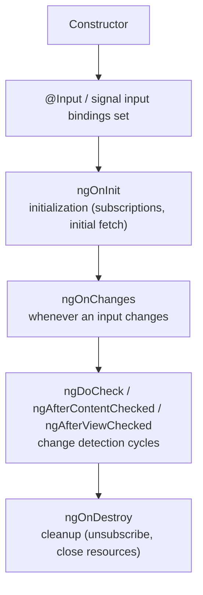
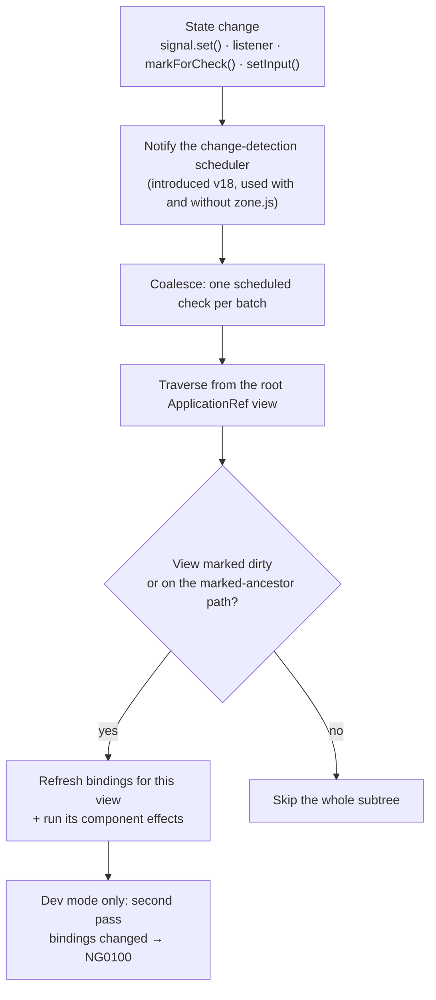

# Angular Fundamentals

> [Mastery Guide](../README.md) › [Frontend Integration](./README.md)

| Status | Priority | Phase | Last reviewed |
|---|---|---|---|
| Not Started | High | Phase 10 — Frontend (parallel) | 2026-08-18 |

## Contents
- [Why it matters](#why-it-matters)
- [Core concepts](#core-concepts)
  - [Standalone components (modern Angular)](#standalone-components-modern-angular)
  - [Templates and bindings](#templates-and-bindings)
  - [Signals — the new reactivity model](#signals--the-new-reactivity-model)
  - [Dependency injection](#dependency-injection)
  - [Routing](#routing)
  - [Forms — template-driven vs reactive](#forms--template-driven-vs-reactive)
  - [HttpClient and interceptors](#httpclient-and-interceptors)
  - [Change detection — Zone vs zoneless](#change-detection--zone-vs-zoneless)
  - [Deferrable views, @defer and incremental hydration](#deferrable-views-defer-and-incremental-hydration)
  - [Modern surface you may have missed](#modern-surface-you-may-have-missed)
  - [Angular and .NET: the integration seam](#angular-and-net-the-integration-seam)
- [Code & diagrams](#code--diagrams)
- [Common pitfalls](#common-pitfalls)
- [Interview-ready summary](#interview-ready-summary)
- [Interview Cross-Questioning Drill](#interview-cross-questioning-drill)
- [Cheat Sheet](#cheat-sheet)
- [Walkthrough](#walkthrough--bundle-bloat-investigation)
- [Self-test](#self-test)
- [Cross-references](#cross-references)
- [Sources](#sources)

---

## Why it matters

**Angular** is Google's opinionated TypeScript-first frontend framework — used heavily in enterprise .NET shops because the typed-everywhere mindset matches the .NET worldview. The framework you defended in a 2018 design review is not the framework you are being interviewed on. Between v16 (May 2023) and v22 (June 2026) Angular replaced its reactivity model (signals), its rendering trigger (zoneless), its default change-detection strategy (`OnPush`), its template control flow (`@if`/`@for`), its declaration model (standalone), and its forms story (Signal Forms). Everything you already know still *works* — almost none of it is still the *default*.

For .NET developers the object model is familiar: classes with decorators (`@Component`, `@Injectable`), hierarchical DI, singleton services, dependency inversion. The gap that shows up in senior interviews is not syntax. It is being able to state precisely **what marks a view dirty**, **why `effect()` is not a data-fetcher**, **what still schedules rendering after you delete zone.js**, and **which of the APIs you are describing are actually stable** — mechanisms you use by instinct but have probably never had to articulate under questioning.

**Version timeline — what landed when, and at what stability.** Interviewers use this as a fluency probe. Dating a feature two majors early, or presenting a developer-preview API as production-ready, is the fastest way to signal that you stopped upgrading a while ago.

| Version | Released | What landed (and at what stability) |
|---|---|---|
| **v14** | Jun 2022 | Standalone APIs (developer preview); `inject()` usable in field initialisers and factories; typed reactive forms; **functional router guards in v14.2** |
| **v15** | Nov 2022 | Standalone APIs **stable**; directive composition API (`hostDirectives`); `NgOptimizedImage` stable; `provideHttpClient()` + functional interceptors |
| **v16** | May 2023 | **Signals — developer preview**; `DestroyRef` + `takeUntilDestroyed()`; `@Input({ required: true })`; `withComponentInputBinding()`; non-destructive hydration (developer preview); `withFetch()` (v16.1, opt-in/experimental); `afterRender` / `afterNextRender` (v16.2) |
| **v17** | Nov 2023 | **Signals stable** — *except* `effect()`, `toSignal()`, `toObservable()`, which stayed developer preview; built-in control flow and `@defer` (**developer preview**); hydration stable; esbuild/Vite `application` builder default. Then `input()` in **17.1**, `model()` + signal queries in **17.2**, `output()` in **17.3** — all developer preview |
| **v18** | May 2024 | Control flow and `@defer` **stable**; unified change-detection **scheduler**; `provideExperimentalZonelessChangeDetection()` (**experimental**); `@let` (18.1, developer preview) |
| **v19** | Nov 2024 | **Standalone is the default** (`standalone: false` becomes the opt-out); `input()`, `output()`, `model()`, `viewChild()`, `viewChildren()`, `contentChild()`, `contentChildren()`, `takeUntilDestroyed()` all **stable**; `linkedSignal`, `resource`, `rxResource` introduced **experimental**; incremental hydration (developer preview); `allowSignalWrites` removed; `APP_INITIALIZER` deprecated for `provideAppInitializer()`; `httpResource` in **19.2** (experimental) |
| **v20** | May 2025 | `effect()`, `linkedSignal()`, `toSignal()`, `toObservable()` **stable**; `provideExperimentalZonelessChangeDetection` renamed `provideZonelessChangeDetection()` (developer preview, **stable in 20.2**); `afterRender()` renamed `afterEveryRender()` — no backwards-compatible alias; `*ngIf` / `*ngFor` / `*ngSwitch` **deprecated**; `withIncrementalHydration()` stable; `PendingTasks` public |
| **v21** | Nov 2025 | **Zoneless by default** for new apps — Zone.js apps must now opt in with `provideZoneChangeDetection()`; Signal Forms (`@angular/forms/signals`) **experimental**; Vitest the default test runner |
| **v22** | Jun 2026 | **`OnPush` is the default change-detection strategy**; `ChangeDetectionStrategy.Default` renamed **`Eager`** and deprecated; **Signal Forms stable**; `resource()` / `rxResource()` / `httpResource()` **stable**; HttpClient uses **fetch by default** (`withFetch()` deprecated); incremental hydration on by default; `@angular/aria` stable; TypeScript 6 / Node 22+ required |

Two consequences of that table are worth memorising because they change how you answer nearly every other question. First, **the reactive default is now pull-based**: a signal read inside a template registers that view as a consumer, so Angular knows which view to refresh instead of re-checking the tree. Second, **the render trigger is now explicit**: with zone.js gone, "something async happened" is no longer a reason to run change detection — a notification from a signal, an event listener, `markForCheck()`, or `ComponentRef.setInput()` is.

Why interviewers ask: full-stack roles in .NET shops usually require Angular, and Angular is where architectural regret accumulates fastest — an app started in v8 with `Default` change detection, NgModules, and a `BehaviorSubject` store per feature is still running in production somewhere near the job you are applying for. The interview is often really "can you plan and stage that migration without stopping feature work".

When NOT to choose: greenfield consumer apps with small teams and tight bundle budgets (React/Svelte are lighter to start); public marketing sites (Astro or a static-site generator); products whose value is streaming/edge rendering flexibility (Next.js and SvelteKit still lead there). Angular's return on investment shows up in long-lived, many-team, form-heavy line-of-business apps — exactly the shape most .NET back ends serve.

> 🌍 **In the real world**: a team stays on v15 for three years because "upgrades don't ship features". Support for v15 ends, a security advisory lands on a transitive dependency, and the jump has to happen in one quarter. The individual `ng update` steps are mostly automatic — the schematics handle standalone, control flow, and the initializer renames. What is not automatic is that v19 makes standalone the default, v21 removes zone.js from new bootstraps, and v22 makes `OnPush` the default: three defaults their code silently depended on. The migration that finally worked was the boring one — upgrade one major at a time, run the official schematics per step, and treat each default flip as its own PR with its own regression pass. The lesson they wrote down: **Angular's breaking changes are rarely API removals; they are default changes, and defaults are invisible in a diff.**

## Core concepts

### Standalone components (modern Angular)

**NgModules did three jobs at once**, and separating them is the whole story of the migration:

1. **Compilation scope** — which components, directives and pipes a template is allowed to reference.
2. **Provider scope** — a lazy-loaded NgModule created a child `EnvironmentInjector`, so its `providers` were effectively "scoped to this feature".
3. **A unit of lazy loading** — `loadChildren` pointed at a module.

Standalone components take job 1 and move it onto the component itself (`imports`). Job 2 moved to **route-level `providers`** and `bootstrapApplication` providers. Job 3 moved to `loadComponent` / `loadChildren` pointing at a routes array. Nothing about the *injector hierarchy* changed — only the thing that declares it.

Timeline, precisely: standalone APIs were developer preview in **v14**, stable in **v15**, the default shape generated by `ng new` in **v17**, and in **v19** `standalone: true` became the implicit default so the flag disappears from new code and non-standalone declarables must now say `standalone: false`.

```typescript
import { Component } from '@angular/core';
import { CurrencyPipe } from '@angular/common';        // import the pipe, not all of CommonModule

@Component({
  selector: 'app-order-list',
  // no `standalone: true` needed since v19 — it is the default
  imports: [CurrencyPipe, OrderItemComponent],          // ← what THIS template references
  template: `
    @for (order of orders(); track order.id) {
      <app-order-item [order]="order" />
    } @empty {
      <p>No orders.</p>
    }
  `
})
export class OrderListComponent {
  orders = input.required<readonly Order[]>();
}
```

Two details that separate people who migrated from people who read about migrating:

- **`CommonModule` is usually dead weight now.** `@if`/`@for`/`@switch` are compiler built-ins, not directives, so they need no import at all. What you still need from `@angular/common` are the pipes (`AsyncPipe`, `DatePipe`, `CurrencyPipe`, `DecimalPipe`, `JsonPipe`) and they are individually importable standalone pipes. Importing `CommonModule` to get `| date` pulls the whole set into the component's dependency graph.
- **Unused entries in `imports` get flagged** by the extended diagnostic `NG8113` ("unused standalone imports", added in v19 — a warning by default, promotable to `error` in `tsconfig.json` under `angularCompilerOptions.extendedDiagnostics`). That is the opposite of the NgModule failure mode, where over-importing was invisible and permanent.

**Bridging both worlds.** A standalone component can import a legacy `NgModule` wholesale (`imports: [MatLegacyThingModule]`), which is how you migrate leaf-first without a big-bang rewrite. Going the other way, an `NgModule` can list a standalone component in its `imports`. For providers that only exist as an NgModule (`SomeLibModule.forRoot({...})`), `importProvidersFrom(SomeLibModule.forRoot({...}))` lifts them into `bootstrapApplication` — treat it as a migration crutch, not a destination, because it defeats the tree-shaking that made standalone worth doing.

The official schematic does the mechanical work in three passes, in this order:

```bash
ng generate @angular/core:standalone   # 1. convert declarations  2. remove NgModules  3. switch to bootstrapApplication
```

> 🌍 **In the real world**: a 400-component app runs the standalone schematic and everything compiles, but two features start behaving as if they have amnesia — a wizard loses its state between steps, and a report screen fetches the same reference data on every navigation. The cause: those features were lazy NgModules whose `providers` created one instance per feature-load; the schematic moved several of those services to component-level `providers`, which creates one instance **per component instance**. The fix was to put them back on the *route* (`{ path: 'wizard', providers: [WizardStateService], loadChildren: ... }`), which reproduces the old lifetime exactly. The rule worth carrying into the interview: **standalone changed where providers are declared, not how injectors nest — if a lifetime changes after migration, you moved a provider to the wrong level.**

### Templates and bindings

Angular's templating is HTML with extra syntax. Four binding flavours:

```html
<!-- Interpolation: data → DOM text -->
<h1>{{ order.id }}</h1>

<!-- Property binding: data → element property -->
<input [value]="searchTerm" [disabled]="loading" />

<!-- Event binding: DOM event → handler -->
<button (click)="placeOrder()">Place Order</button>

<!-- Two-way binding (sugar for [value] + (input)): -->
<input [(ngModel)]="searchTerm" />
```

**Control flow (developer preview v17, stable v18):** the built-in `@if`, `@for`, `@switch` blocks replace the structural directives `*ngIf`, `*ngFor`, `*ngSwitch` (deprecated in v20). No import, no directive instance per branch, and real type narrowing:

```html
@if (order(); as o) {
  <div>{{ o.total | currency }}</div>
} @else {
  <div>Loading...</div>
}

@for (item of order().items; track item.id) {
  <div>{{ item.name }}</div>
} @empty {
  <div>No items</div>
}

@switch (order().status) {
  @case ('Pending') { <span class="badge-yellow">Pending</span> }
  @case ('Paid') { <span class="badge-green">Paid</span> }
  @default { <span>{{ order().status }}</span> }
}
```

Status, precisely: control flow blocks were **developer preview in v17**, **stable in v18**, and `*ngIf` / `*ngFor` / `*ngSwitch` were **deprecated in v20**. They still work; the compiler will nag. The automated conversion is `ng generate @angular/core:control-flow`.

**Why blocks instead of structural directives.** `*ngIf` was a directive on an `<ng-template>`: every branch created an embedded view with its own `TemplateRef`, its own change-detection entry, and a directive instance whose inputs had to be checked each cycle. Blocks are compiled directly into the component's template function as instructions, so there is no directive instance to instantiate or check, and the compiler can narrow types across the branch — `@if (user(); as u)` gives you a non-nullable `u` in the body, which `*ngIf="user() as u"` could only approximate.

**Why `track` is mandatory in `@for` when `trackBy` was optional in `*ngFor`.** `NgForOf` shipped with a default: track by object identity. That default is silently catastrophic with immutable state — an NgRx selector, a `computed()` returning `[...items]`, or an HTTP response re-parsed from JSON produces all-new object references for unchanged rows, so Angular destroyed and rebuilt every DOM node and every child component in the list. You lost input focus, scroll position, in-flight animations, and any state held inside row components; and you paid for a full re-instantiation of the subtree. Making `track` a required part of the syntax forces that decision at authoring time instead of at incident time. Rules of thumb:

- `track item.id` — the correct answer for anything with server identity.
- `track $index` — correct only for a list of primitives, or a list that is never reordered or spliced.
- `track item` — reference identity, the old default; choose it deliberately or not at all.

Inside `@for` you get the implicit variables `$index`, `$count`, `$first`, `$last`, `$even`, `$odd`, and they can be aliased (`let idx = $index`).

**`@let` — template-local variables** (developer preview in **18.1**, stable in **19**). Read-only, scoped to the current template and its descendants, and re-evaluated as part of change detection:

```html
@let total = order().items.reduce((sum, i) => sum + i.price * i.quantity, 0);
@let label = total > 1000 ? 'Large order' : 'Standard';
<p>{{ label }} — {{ total | currency }}</p>
```

Use it to kill the "call the same getter four times in one template" habit without inventing a `computed()` for a purely presentational value. It does not memoise — an expensive expression in `@let` still runs on every check, so genuinely costly derivations belong in a `computed()`.

**Two-way binding is still sugar.** `[(value)]="x"` desugars to `[value]="x"` plus `(valueChange)="x = $event"` — the "banana in a box" only works when the child exposes an output named `<input>Change`. With `model()` (below) Angular generates that output for you, which is why `model()` is the only clean way to write a two-way bindable signal input.

> 🌍 **In the real world**: a trading dashboard migrates `*ngFor` to `@for` and the schematic writes `track item` (reference identity) because it cannot prove anything better. Everything looks fine in dev. In production the price feed replaces the array every 500 ms with freshly parsed objects, so every row is destroyed and recreated twice a second — the sparkline canvases in each row reset, the "copy ID" tooltip closes as you reach for it, and CPU sits high with no obvious culprit because the profile is spread across component construction rather than one hot function. Changing to `track row.symbol` made the whole class of symptoms vanish. The takeaway to say out loud in an interview: **`track` is not a performance hint, it is the identity contract for the DOM — with the wrong key, correctness bugs (focus, scroll, child state) arrive before performance ones.**

### Signals — the new reactivity model

The most important change in Angular's history, and the area where a 10-year Angular CV is most likely to be tested. **Signals** are reactive values that track their own consumers: reading one inside a reactive context registers a dependency, writing one notifies everything that read it.

```typescript
import { signal, computed, effect, untracked } from '@angular/core';

const count = signal(0);              // WritableSignal<number>
count();                              // read — 0
count.set(5);
count.update(c => c + 1);             // 6
const readonlyCount = count.asReadonly();   // Signal<number> — hand this out

const doubled = computed(() => count() * 2);  // Signal<number>, lazy + memoised
```

#### The graph: producers, consumers, laziness, and glitch-freedom

- A **producer** is anything that can be read reactively: `signal`, `computed`, `input`, `model`, `resource().value`, `toSignal()`.
- A **consumer** is anything that tracks what it read: a `computed`, an `effect`, or a **template view** during change detection.
- `computed` is both, which is how you get a dependency graph rather than a flat list of subscriptions.

Dependencies are **dynamic and per-run**: `computed(() => a() ? b() : c())` depends on `a` and exactly one of `b`/`c`, re-recorded every evaluation. That is fundamentally different from RxJS `combineLatest`, where the dependency set is fixed when you write the pipeline.

The docs are explicit that "computed signals are both lazily evaluated and memoized": the body does not run until something reads it, and the cached value is reused until a dependency actually changes. Two consequences worth stating in an interview:

- **A `computed` nobody reads never runs.** If you are relying on a derivation for a side effect, you have written a bug — nothing will call it.
- **The graph is glitch-free.** Writes push a "possibly dirty" mark down the graph; values are only recomputed when *pulled* on read, and each node checks whether its dependencies' versions really changed before recomputing. So in the classic diamond (`a → b`, `a → c`, `(b,c) → d`), `d` is never observed with a new `b` and a stale `c`, and it recomputes once, not twice. RxJS with `combineLatest` over two derived streams will happily emit that intermediate state.

**Equality, and where the default bites.** The default comparison is `Object.is` (reference equality for objects). Two failure modes follow:

```typescript
const rows = signal<Row[]>([]);

// 1. Mutate-then-set: the reference is unchanged, so this is a NO-OP.
const current = rows();
current.push(newRow);
rows.set(current);            // ❌ nothing re-renders
rows.update(r => [...r, newRow]);   // ✅ new reference

// 2. A computed that rebuilds an array every run defeats downstream memoisation:
const visible = computed(() => rows().filter(r => r.active));
// every recompute produces a new array reference, so every consumer of `visible`
// re-runs even when the filtered contents are identical. Fix with an equality fn:
const visibleStable = computed(
  () => rows().filter(r => r.active),
  { equal: (a, b) => a.length === b.length && a.every((x, i) => x === b[i]) }
);
```

`equal` is available on `signal()`, `computed()` and `linkedSignal()`. Use it deliberately: a deep-equality function on a large object trades CPU on every write for skipped renders, which is only a win when renders are expensive.

**`untracked()`** reads a signal *without* creating a dependency. Two legitimate uses: reading configuration or "current value at the time of the event" inside an `effect` that should only re-run for one specific input; and calling a method that happens to read signals from inside a reactive context where you do not want its internals to become dependencies.

```typescript
effect(() => {
  const id = this.selectedId();                  // tracked — the trigger
  const filters = untracked(() => this.filters()); // read, but do not re-run when filters change
  this.analytics.track('selection', { id, filters });
});
```

#### `effect()`: what it is for, and what it is emphatically not for

`effect(fn, options?)` returns an `EffectRef`; the callback receives an `onCleanup` register function. It must run in an **injection context** unless you pass `{ injector }`, and it is destroyed with that context.

```typescript
effect((onCleanup) => {
  const id = this.roomId();
  const socket = this.ws.connect(id);
  onCleanup(() => socket.close());     // runs before the next execution and on destroy
});
```

Timing matters and is asked about: an effect created inside a component runs **as a component lifecycle event during change detection**; an effect created in a root-level service (a "root effect") runs as a **microtask**, unconnected to the component tree.

**Do not use `effect()` to derive state.** That is `computed()`'s job (or `linkedSignal()` if the derived value must also be writable). **Do not use `effect()` to fetch data** — that is `resource()` / `httpResource()` / `rxResource()`, or an explicit RxJS pipeline. The effect-as-fetcher pattern (read a signal, call the API, `set()` the result into another signal) is the single most common signals anti-pattern, and it fails in four specific ways: no cancellation of the in-flight request when the input changes again, no ordering guarantee so a slow first response overwrites a fast second one, no loading/error state without hand-rolling two more signals, and a real risk of a feedback loop when the effect writes something it also reads.

The nuance that catches people who learned signals in 2023: **Angular v19 removed the `allowSignalWrites` flag, and writes inside effects no longer throw.** The guardrail is gone because it blocked legitimate cases and was easy to work around; the *guidance* did not change. A senior answer is: "writes are legal, usually a smell, and specifically correct when synchronising with something outside the graph — a third-party widget, `localStorage`, an imperative canvas — or when implementing a deliberate reset that `linkedSignal` cannot express."

#### Signal inputs, `model()`, `output()`, and signal queries

Introduced developer preview across **17.1 (`input`)**, **17.2 (`model`, signal queries)** and **17.3 (`output`)**; **all stable in v19**. The decorator forms (`@Input`, `@Output`, `@ViewChild`, `@ContentChild`) are **not deprecated** and remain fully supported — do not claim otherwise in an interview.

```typescript
@Component({
  selector: 'app-user-card',
  template: `
    <div #row [class.compact]="size() === 'sm'">{{ user().name }}</div>
    <!-- the parent binds [(query)]="term"; writing the model emits queryChange -->
    <input [value]="query()" (input)="query.set($any($event.target).value)" />
    <button [disabled]="disabled()" (click)="selected.emit(user())">Select</button>
    <ng-content />
  `
})
export class UserCardComponent {
  user = input.required<User>();                     // InputSignal<User>
  size = input<'sm' | 'md' | 'lg'>('md');            // optional, with default
  disabled = input(false, { transform: booleanAttribute });   // '' | 'true' → true
  ariaLabel = input('', { alias: 'aria-label' });    // template name ≠ field name

  query = model('');                                 // ModelSignal<string>: read, set, and emits queryChange
  selected = output<User>();                         // OutputEmitterRef<User>

  private row = viewChild.required<ElementRef<HTMLElement>>('row');
  private tabs = contentChildren(TabComponent);      // Signal<readonly TabComponent[]>
}
```

What actually differs from the decorator versions, mechanically:

- **Inputs are read-only signals.** You cannot `set()` an input from inside the component — which is exactly the discipline `@Input() foo` never enforced. When a child must also write, that is `model()`, which creates the input *and* the `<name>Change` output, and whose `.set()`/`.update()` emit that output.
- **`input()` is not available in `ngOnChanges`-style diffs.** There is no "previous value" — if you genuinely need the delta, keep `ngOnChanges`, or hold the previous value yourself in a `linkedSignal` computation (which receives `previous`).
- **`output()` is not an `EventEmitter`.** It returns `OutputEmitterRef<T>` with `.emit()`, it is not an Observable, and it has no `.next()`. Subscribing imperatively is `outputToObservable(ref)`; producing an output from a stream is `outputFromObservable(obs$)` (both from `@angular/core/rxjs-interop`, stable in v19). `EventEmitter` still works and is still an RxJS `Subject` under the hood — the practical difference is that `output()` cannot leak, because its subscriptions are tied to the component's `DestroyRef`.
- **Signal queries have different timing and a different shape.** `viewChild()` returns `Signal<T | undefined>`, `viewChildren()` returns `Signal<readonly T[]>`, and `.required()` drops the `undefined` from the type. There is no `static: true`, no `QueryList`, and no `.changes` Observable — you react by reading the query signal inside a `computed()`/`effect()` or the template. Results are resolved as part of change detection, so reading one in the constructor gives you `undefined`; that is not a bug, it is the graph telling you the view has not been created yet.
- **Transforms**: `transform` runs on every write and must be a pure function; `booleanAttribute` and `numberAttribute` (from `@angular/core`) cover the common attribute-coercion cases.

#### `linkedSignal()`: writable state that resets when its source changes

Experimental in **v19**, **stable in v20**. It is the missing primitive between `signal` (writable, never resets) and `computed` (resets, never writable): a writable signal whose value is *recomputed* whenever its source changes.

```typescript
// The user can pick a row; the pick resets whenever the list is reloaded.
selectedId = linkedSignal<Order[], string | null>({
  source: () => this.orders(),
  computation: (orders, previous) =>
    orders.some(o => o.id === previous?.value) ? previous!.value : orders[0]?.id ?? null,
});

selectedId.set('ord-42');    // user override — survives until `orders()` changes
```

`computation` receives the new source value and a `previous` object exposing `previous.source` and `previous.value`, which is what lets you *keep* the user's choice when it is still valid. Before v19 this was written as an `effect` that wrote a signal — the pattern everyone was told not to use, because there was no alternative. If an interviewer asks "when is it OK for an effect to write a signal", the strongest answer includes "less often since v19, because `linkedSignal` covers the reset case".

#### `resource()`, `rxResource()`, `httpResource()`: async as state

Introduced **experimental in v19** (`resource`, `rxResource`) and **19.2** (`httpResource`); **all stable in v22**. A resource turns an async read into signals — `value`, `status`, `error`, `isLoading` — with cancellation wired to the reactive graph.

```typescript
import { resource, httpResource, inject } from '@angular/core';
import { rxResource } from '@angular/core/rxjs-interop';

// 1. Generic async source. `params` is reactive; when it changes, the previous
//    call's abortSignal fires and the loader re-runs. switchMap semantics, no RxJS.
order = resource({
  params: () => ({ id: this.orderId() }),
  loader: async ({ params, abortSignal }) => {
    const res = await fetch(`/api/orders/${params.id}`, { signal: abortSignal });
    if (!res.ok) throw new Error(`HTTP ${res.status}`);
    return (await res.json()) as Order;
  },
});

// 2. Straight through HttpClient — so interceptors, XSRF and the transfer cache apply.
orders = httpResource<Order[]>(() => `/api/orders?status=${this.status()}`);

// 3. When the source is already an Observable (v20 renamed rxResource's `loader` to `stream`).
customers = rxResource({
  params: () => ({ q: this.query() }),
  stream: ({ params }) => this.http.get<Customer[]>('/api/customers', { params }),
});
```

Reading it in a template:

```html
@if (orders.isLoading()) {
  <app-spinner />
} @else if (orders.error()) {
  <app-error [error]="orders.error()" (retry)="orders.reload()" />
} @else {
  @for (o of orders.value(); track o.id) { <app-order-row [order]="o" /> }
}
```

Surface worth knowing precisely: `value`, `status`, `error`, `isLoading`, `hasValue()`, `reload()`, and local mutation via `set()`/`update()`; `ResourceStatus` is `'idle' | 'loading' | 'reloading' | 'resolved' | 'error' | 'local'`. Options include `params`, `loader`, `stream`, `defaultValue`, `injector`, and an `id` used to key the SSR `TransferState` cache. `httpResource` also takes `parse` (renamed from `map` in v20) for validating/transforming the response — a natural place to run a Zod schema against a .NET DTO.

Boundaries interviewers push on: resources are for **reads**, not mutations — `POST`/`PUT`/`DELETE` stay on `HttpClient`, and afterwards you call `reload()` on whatever resource is now stale. Resources are also **eager**: once `params` resolves, the request goes out, unlike a cold Observable that waits for a subscriber.

#### RxJS interop — and when RxJS is still the right answer

```typescript
import { toSignal, toObservable, takeUntilDestroyed } from '@angular/core/rxjs-interop';

user = toSignal(this.auth.user$, { initialValue: null });       // Signal<User | null>
// requireSync: true is only valid when the source is known to emit synchronously (BehaviorSubject)
config = toSignal(this.configSubject$, { requireSync: true });  // Signal<Config>, no undefined

query$ = toObservable(this.query);   // Signal → Observable, for operator pipelines
results = toSignal(
  this.query$.pipe(debounceTime(300), distinctUntilChanged(), switchMap(q => this.api.search(q))),
  { initialValue: [] }
);
```

`toSignal()` subscribes immediately, unsubscribes with the injection context, and **re-throws the source's error when the signal is read** — an errored stream does not silently become `undefined`. `toObservable()` is implemented with an effect, so it needs an injection context too, and it emits on change rather than replaying every intermediate write.

Signals are not a replacement for RxJS; they replaced `BehaviorSubject`-as-state. Reach for RxJS when time is part of the problem: debounce/throttle, retry with backoff, `switchMap`/`concatMap`/`exhaustMap` concurrency control, merging event sources, WebSockets and SSE, and anything where you care about *the sequence of changes* rather than *the current value*.

> 🌍 **In the real world**: a team migrates a 60-service app from `BehaviorSubject` stores to signals over a quarter and hits three problems in the same week. (1) A `computed()` returning `rows().map(toViewModel)` re-renders a large grid on every unrelated store write, because a fresh array is a fresh reference every time — fixed by making the row view-models stable, not by adding a deep `equal`. (2) A shared helper calls `toSignal()` in a plain function invoked from `ngOnInit`, throwing `NG0203` in a code path only exercised by one lazy route — fixed by moving the call to a field initialiser. (3) Removing `| async` changed *when* values landed: the async pipe delivered the first emission before the first render, while the new signal was seeded with `initialValue: null` and a template that had never handled null started throwing. The lesson: **the mechanical part of a signals migration is easy; the hard part is that `async` pipe and `toSignal` have different first-emission timing, and every `?.` you never needed suddenly matters.**

> 🌍 **In the real world**: a detail page fetches with `effect(() => { this.load(this.id()); })`. It works for a year. Then a keyboard-navigable list is added, the user arrows through ten records in two seconds, and the page starts showing record 7's header with record 3's line items — ten overlapping requests, resolving out of order, each `set()`-ing into the same pair of signals. The team's first fix was a `loading` guard, which turned it into a different bug (dropped updates). The real fix was six lines of `httpResource`, whose `params` change aborts the previous request by construction. **`effect()` had no cancellation to offer; the abort was never the developer's to implement.**

### Dependency injection

Constructor injection — same model as .NET DI:

```typescript
import { Injectable, inject } from '@angular/core';
import { HttpClient } from '@angular/common/http';

@Injectable({ providedIn: 'root' })   // singleton across the app
export class OrderService {
  private http = inject(HttpClient);   // modern: function-based injection

  getOrder(id: number) {
    return this.http.get<Order>(`/api/orders/${id}`);
  }
}

@Component({ ... })
export class OrderListComponent {
  private orderService = inject(OrderService);

  load(id: number) {
    this.orderService.getOrder(id).subscribe(o => /* ... */);
  }
}
```

`inject()` arrived in **v14** and works in class field initialisers, constructor bodies, and factory functions.

**Two injector trees, not one.** This is the mental model that makes every "why did I get a different instance" question tractable:

- The **EnvironmentInjector** chain: `NullInjector` → platform injector → root injector (`bootstrapApplication` providers + `providedIn: 'root'`) → one child per lazy route that declares `providers`.
- The **ElementInjector** chain: one node per component/directive that declares `providers` (or `viewProviders`), nested exactly like the component tree.

Resolution walks the ElementInjector chain up the *component tree* first, then jumps to the EnvironmentInjector chain, then hits `NullInjector` and throws `NG0201: No provider for X`. `inject()` accepts `InjectOptions` to steer that walk: `{ optional: true }` (return `null` instead of throwing), `{ self: true }` (this injector only), `{ skipSelf: true }` (start at the parent — the classic way to detect "am I nested inside another instance of myself"), and `{ host: true }`.

Provider scopes and what they actually cost:

- `providedIn: 'root'` — app-wide singleton, and **tree-shakable**: if nothing injects it, it never reaches the bundle. Listing the same service in `app.config.ts` `providers: []` is *not* tree-shakable, because the config is eagerly referenced.
- `providedIn: 'platform'` — shared across multiple Angular apps bootstrapped on one page (rare, e.g. micro-frontends in a single document).
- Route-level `providers: [...]` — one instance per activation of that route subtree; the standalone replacement for "providers in a lazy NgModule".
- Component `providers: [...]` — one instance **per component instance**; `viewProviders` restricts visibility to the component's own template, excluding projected content.
- `{ provide: TOKEN, useClass | useValue | useExisting | useFactory }`, plus `multi: true` for collections (`HTTP_INTERCEPTORS` is the classic).

```typescript
export const API_CONFIG = new InjectionToken<ApiConfig>('api.config', {
  providedIn: 'root',
  factory: () => ({ baseUrl: '/api', timeoutMs: 30_000 }),   // tree-shakable default
});
```

`InjectionToken<T>` is the answer to "how do I inject an interface" — TypeScript interfaces vanish at runtime, so there is nothing to use as a key. It is the Angular analogue of .NET's keyed services (`AddKeyedSingleton`) combined with `IOptions<T>`.

**Application initialisation** moved to functions in **v19**: `provideAppInitializer(() => inject(ConfigService).load())` replaces the `{ provide: APP_INITIALIZER, useFactory, multi: true }` incantation (with `provideEnvironmentInitializer` and `providePlatformInitializer` for the other two). The callback runs in an injection context, and returning a Promise/Observable blocks bootstrap — the Angular equivalent of work in `Program.cs` before `app.Run()`.

#### Injection contexts, `DestroyRef`, and the errors you get outside one

An **injection context** exists during class construction and field initialisation, inside factory functions, inside route guards/resolvers/interceptors while Angular is invoking them, and inside anything wrapped in `runInInjectionContext(injector, fn)`. Outside one, `inject()` throws **`NG0203`**. This is the single most common runtime error in modern Angular code, because half the ergonomic APIs (`inject`, `effect`, `toSignal`, `toObservable`, `takeUntilDestroyed`) are injection-context-bound:

```typescript
export class OrdersComponent {
  private injector = inject(Injector);         // ✅ field initialiser
  private destroyRef = inject(DestroyRef);

  ngOnInit() {
    const http = inject(HttpClient);           // ❌ NG0203 — lifecycle hooks are not an injection context
    runInInjectionContext(this.injector, () => {
      const ok = inject(HttpClient);           // ✅ explicit context
    });
  }

  startPolling() {
    interval(5_000)
      .pipe(takeUntilDestroyed(this.destroyRef))   // ✅ DestroyRef captured earlier, so no context needed
      .subscribe(() => this.refresh());
  }
}
```

`DestroyRef` (**v16**) is injectable teardown: `destroyRef.onDestroy(cb)` works anywhere you can inject, including inside a service scoped to a component, which is what lets library helpers clean up without demanding an `ngOnDestroy` from the caller. `takeUntilDestroyed()` (**v16**, stable **v19**) is its RxJS operator — its optional `destroyRef` parameter is exactly the escape hatch for calling it outside an injection context.

**What `inject()` enables that constructor parameters cannot** — the real interview answer, not "it's shorter":

1. **Functional APIs have no class to hang parameters on.** Guards, resolvers and interceptors are plain functions; `inject()` is the only way they can reach DI.
2. **Composable inject helpers.** You can write `injectRouteParam('id')` or `injectBreakpoint()` as a reusable function that internally injects and returns a signal — Angular's answer to React hooks. Constructors cannot be composed this way.
3. **Inheritance without constructor plumbing.** A base class that injects in field initialisers needs no `super(a, b, c)` chain, so adding a dependency to the base does not break every subclass.
4. **Ordering.** Field initialisers run before the constructor body, so `inject()` results are available to other field initialisers — including `effect()` and `toSignal()` calls that depend on them.

For testing, **`TestBed`** swaps providers — the same idea as ASP.NET Core's `WebApplicationFactory.WithWebHostBuilder`, and `TestBed.runInInjectionContext(fn)` is how you unit-test an inject-helper or a functional guard without a component.

> 🌍 **In the real world**: an app has an `AuthService` marked `providedIn: 'root'` and, in one feature module converted years earlier, a stray `providers: [AuthService]` on a shell component. Everything works — until the "session expiring" banner starts appearing while the user is active. Two instances existed: the interceptor injected the root one and refreshed its token; the banner injected the shell-scoped one, whose expiry timestamp never advanced. Nothing errors when you provide a service twice, and nothing in the code review diff looks wrong. They found it by injecting `Injector` in both places and comparing identity in the console. The habit they adopted afterwards: **a service that holds state gets exactly one declaration site, and `providers` on a component is treated as a code smell requiring justification in the PR description.**

### Routing

The Angular Router maps URL paths to components.

```typescript
// app.routes.ts
import { Routes } from '@angular/router';

export const routes: Routes = [
  { path: '', component: HomeComponent },
  {
    path: 'orders',
    component: OrderListComponent,
    canActivate: [authGuard]
  },
  {
    path: 'orders/:id',
    component: OrderDetailComponent,
    resolve: { order: orderResolver }      // pre-fetch data
  },
  {
    path: 'admin',
    canMatch: [adminMatch],                 // gate BEFORE the chunk is fetched
    providers: [AdminAuditService],         // one instance per activation of this subtree
    loadChildren: () => import('./admin/admin.routes').then(m => m.ADMIN_ROUTES)
  },
  { path: '**', component: NotFoundComponent }
];
```

```typescript
// main.ts
bootstrapApplication(AppComponent, {
  providers: [
    provideRouter(routes),
    provideHttpClient(withInterceptors([authInterceptor]))
  ]
});
```

**Lazy loading** (`loadChildren` / `loadComponent`) splits routes into separate JS chunks. Critical for keeping initial bundle small.

```html
<!-- Templates -->
<a routerLink="/orders" routerLinkActive="active">Orders</a>
<router-outlet />
```

Functional guards arrived in **v14.2** and are now the only form worth writing; the class-based `CanActivate` interfaces are deprecated:

```typescript
import { CanActivateFn, CanMatchFn, ResolveFn, Router } from '@angular/router';

export const authGuard: CanActivateFn = (route, state) => {
  const auth = inject(AuthService);
  const router = inject(Router);

  if (auth.isLoggedIn()) return true;
  return router.createUrlTree(['/login'], { queryParams: { returnUrl: state.url } });
};

// v22 note: CanMatchFn takes a third parameter —
// (route: Route, segments: UrlSegment[], currentSnapshot: PartialMatchRouteSnapshot)
export const adminMatch: CanMatchFn = (route, segments, currentSnapshot) =>
  inject(AuthService).hasRole('admin');

export const orderResolver: ResolveFn<Order> = (route) =>
  inject(OrderService).getOrder(Number(route.paramMap.get('id')));
```

All guard types return `MaybeAsync<GuardResult>` — `boolean`, `UrlTree`, or a Promise/Observable of either.

**`canMatch` vs `canActivate` is a real architecture question, not trivia.** `canActivate` runs *after* the route has matched, which for a lazy route means **after the chunk has been downloaded and evaluated**. `canMatch` runs during matching, so a failed check means the chunk is never fetched and the router falls through to the next matching route — which is also how you serve two different components for one path (admin vs standard dashboard). Put role gates on `canMatch`; keep `canActivate` for per-activation checks such as "this specific record is locked".

Router configuration features you should be able to name:

```typescript
provideRouter(
  routes,
  withComponentInputBinding(),        // v16 — route params/query/data bound straight to inputs
  withViewTransitions(),              // v17 — wraps navigation in document.startViewTransition
  withInMemoryScrolling({ scrollPositionRestoration: 'enabled', anchorScrolling: 'enabled' }),
  withPreloading(PreloadAllModules),  // background-fetch lazy chunks after the app is stable
)
```

`withComponentInputBinding()` deserves a call-out because it removes most `ActivatedRoute` boilerplate: declare `id = input.required<string>()` on the routed component and the router binds the `:id` path param straight into the signal — route data and query params bind by name too. Two caveats: the binding is by *name*, so a rename in `app.routes.ts` silently stops binding, and `input.required` on a param that is only sometimes present will throw.

**Resolvers block navigation** — the URL changes, the old component stays on screen, and the user sees nothing happen until every resolver settles. On a slow API that reads as a frozen app. The modern alternative is to navigate immediately and let the destination own its loading state with `httpResource()`/`resource()`; keep resolvers for data you truly cannot render a shell without (permissions that decide layout, an entity that decides which child route to redirect to).

Also worth knowing: **`paramsInheritanceStrategy` defaults to `'always'` as of v22** (child routes inherit parent params and data even without `pathMatch` tricks) — a behaviour change with no automated migration, so a v21 app that relied on *not* inheriting can start seeing unexpected params.

> 🌍 **In the real world**: a security review flags that the admin bundle is downloadable by any authenticated user — the route used `canActivate: [adminGuard]`, so the router matched the path, fetched `admin-chunk.js`, ran the guard, and redirected to `/403`. The chunk was in the browser's cache and in the network log, complete with internal endpoint names, field labels and feature flags. Switching to `canMatch` stopped the download. The part the team had to write up for the auditor was harder: **the guard was never the control anyway.** Anyone can call the API directly; the fix that mattered was confirming the .NET side enforced the role on every admin endpoint. Route guards are UX; authorisation lives on the server.

### Forms — template-driven vs reactive

Two flavors. Reactive forms are dominant for non-trivial cases.

**Template-driven** (good for simple forms):
```html
<form #f="ngForm" (ngSubmit)="onSubmit(f.value)">
  <input name="email" [(ngModel)]="model.email" required email />
  <input name="password" [(ngModel)]="model.password" required minlength="8" />
  <button type="submit" [disabled]="f.invalid">Submit</button>
</form>
```

**Reactive** (programmatic; better for complex):
```typescript
import { FormBuilder, Validators, ReactiveFormsModule } from '@angular/forms';

@Component({
  imports: [ReactiveFormsModule],
  template: `
    <form [formGroup]="form" (ngSubmit)="submit()">
      <input formControlName="email" />
      <input formControlName="password" type="password" />
      <button [disabled]="form.invalid">Submit</button>
    </form>
  `
})
export class LoginComponent {
  private fb = inject(FormBuilder);

  form = this.fb.group({
    email: ['', [Validators.required, Validators.email]],
    password: ['', [Validators.required, Validators.minLength(8)]]
  });

  submit() {
    if (this.form.invalid) return;
    const { email, password } = this.form.value;
    // ...
  }
}
```

**Typed reactive forms (v14) have sharp edges** that come up constantly in senior interviews:

- `form.value` is a **`Partial<T>`**, because disabled controls are excluded from it. `form.getRawValue()` returns everything. Sending `form.value` to a .NET endpoint that binds to a non-nullable DTO is how "the field the user could see but not edit silently became null" bugs happen.
- Controls are nullable by default (`reset()` sets them to `null`). `new FormControl('', { nonNullable: true })` — or `inject(NonNullableFormBuilder)` — makes `reset()` return to the initial value and drops `| null` from the type.
- `valueChanges` / `statusChanges` are Observables and need `takeUntilDestroyed()`. When a subscriber writes back into the form, pass `{ emitEvent: false }` to `setValue`/`patchValue` or you get an infinite loop.
- `updateOn: 'blur' | 'submit'` on a control or group is the cheapest fix for "validation fires on every keystroke and the async validator hammers the API".
- Cross-field rules belong on the group: `fb.group({...}, { validators: passwordsMatch })`. Async validators run only after the synchronous ones pass, and the control sits in `pending` status meanwhile.
- Custom form controls implement `ControlValueAccessor` (`writeValue`, `registerOnChange`, `registerOnTouched`, `setDisabledState`) and register via `NG_VALUE_ACCESSOR` with `multi: true`.

**Signal Forms** — experimental in **v21**, **stable in v22**, shipped in `@angular/forms/signals`. The model is a signal; `form()` binds validation rules to paths within it:

```typescript
import { form, required, email, minLength, validate, submit, FormField } from '@angular/forms/signals';

@Component({
  imports: [FormField],
  template: `
    <input type="email" [formField]="loginForm.email" />
    @if (loginForm.email().touched() && loginForm.email().invalid()) {
      @for (err of loginForm.email().errors(); track err) { <p class="err">{{ err.message }}</p> }
    }
    <button (click)="save()" [disabled]="loginForm().invalid()">Sign in</button>
  `
})
export class LoginComponent {
  model = signal({ email: '', password: '' });

  loginForm = form(this.model, (path) => {
    required(path.email, { message: 'Email is required' });
    email(path.email, { message: 'Enter a valid email address' });
    minLength(path.password, 8, { message: 'At least 8 characters' });
    validate(path.password, ({ value }) =>
      /\d/.test(value()) ? null : { kind: 'needsDigit', message: 'Include a number' });
  });

  save() {
    submit(this.loginForm, { action: async () => this.auth.login(this.model()) });
  }
}
```

Field state is exposed as signals — `value()`, `errors()`, `touched()`, `valid()`, `invalid()`, `pending()` — and there are logic rules (`disabled()`, `readonly()`, `hidden()`, `debounce()`) declared alongside the validators rather than imperatively toggled. `schema()` + `apply()` extract a rule set so the same shape (an address, a line item) validates identically everywhere, and `applyEach()` handles arrays.

Do **not** tell an interviewer you would migrate a large app's forms to Signal Forms because it is new. Reactive forms are not deprecated, a large form layer is where the domain rules live, and there is a compatibility layer precisely so the two can coexist. The defensible plan is: new forms in Signal Forms, existing forms migrated only when they are being reworked anyway.

> 🌍 **In the real world**: a team enables strict typed forms during a v13 → v14 upgrade and ships. Two weeks later, finance reports that discount codes vanish from a small percentage of orders. The discount field is disabled whenever the customer tier is set automatically — and the save call posted `form.value`, which excludes disabled controls. The .NET model binder happily bound `null` and the update overwrote the stored code. Nothing threw, nothing logged, and it only affected the tiers where the field was disabled. One-word fix (`getRawValue()`), three days to find. **`form.value` omitting disabled controls is the most expensive default in Angular forms.**

### HttpClient and interceptors

```typescript
// Provider setup (main.ts)
bootstrapApplication(AppComponent, {
  providers: [
    provideHttpClient(
      withInterceptors([authInterceptor, errorInterceptor]),
      // withFetch() was the opt-in from v16.1; since v22 fetch is the default backend
      // and withFetch() is deprecated. Upload/download progress now needs
      // reportUploadProgress / reportDownloadProgress instead of reportProgress.
    )
  ]
});

// Interceptor — like ASP.NET Core middleware, but for HTTP calls
import { HttpInterceptorFn } from '@angular/common/http';

export const authInterceptor: HttpInterceptorFn = (req, next) => {
  const auth = inject(AuthService);
  const token = auth.getToken();
  if (token) {
    req = req.clone({
      setHeaders: { Authorization: `Bearer ${token}` }
    });
  }
  return next(req);
};

// Service usage
@Injectable({ providedIn: 'root' })
export class OrderService {
  private http = inject(HttpClient);

  getOrders() {
    return this.http.get<Order[]>('/api/orders');
  }
}
```

`HttpClient` returns **cold** Observables — nothing is sent until you subscribe, and unsubscribing cancels the in-flight request (with the fetch backend, via `AbortController`). That cancellation is free `switchMap` semantics and the reason a raw `.subscribe()` in a component is worse than it looks: nobody cancels it when the user navigates away. For one-shot calls, `firstValueFrom(obs$)` gives you a Promise for `async/await` code.

**Interceptor mechanics worth stating precisely.** `withInterceptors([a, b, c])` composes them like ASP.NET Core middleware: the request passes through `a → b → c → backend`, and the response Observable unwinds `c → b → a`. Each interceptor is a function `(req, next)` running in an injection context, so `inject()` works. `withInterceptorsFromDi()` bridges legacy class-based `HTTP_INTERCEPTORS` — the two can coexist, but DI-based interceptors always run *after* the functional ones, which is a subtle ordering trap during migration.

`HttpRequest` is immutable: mutate by `req.clone({ setHeaders, setParams, ... })`.

**Use `HttpContext`, not URL string matching, to opt requests out.** The `req.url.includes('/auth/refresh')` check everyone writes is fragile (it breaks the moment an absolute URL, a query string, or a similarly named endpoint appears):

```typescript
export const SKIP_AUTH = new HttpContextToken<boolean>(() => false);

// caller
this.http.post('/api/auth/refresh', body, { context: new HttpContext().set(SKIP_AUTH, true) });

// interceptor
if (req.context.get(SKIP_AUTH)) return next(req);
```

**Retry belongs where the semantics are known.** `next(req).pipe(retry({ count: 3, delay: 1_000 }))` in an interceptor retries *everything*, including non-idempotent `POST`s — which is how a customer ends up charged three times. Retry `GET`/`HEAD`/`PUT`/`DELETE` globally if you must, and let individual calls opt in via `HttpContext` for anything else. `HttpErrorResponse.status === 0` means the request never completed — network failure, DNS, or a **CORS rejection**; the browser deliberately hides which.

A full single-flight token-refresh interceptor (the .NET-seam classic) is in [Code & diagrams](#code--diagrams).

### Change detection — Zone vs zoneless

This is the section a senior interview will dwell on, because it is where "I've used Angular for ten years" and "I know how Angular works" separate.

#### What zone.js actually does

Zone.js monkey-patches the browser's asynchronous APIs — `setTimeout`, `setInterval`, `requestAnimationFrame`, XHR/fetch, `addEventListener`, and `Promise` (via a `ZoneAwarePromise` that replaces the global) — so that every callback runs inside a tracked execution context. Angular's `NgZone` counts the tasks entering and leaving that context and, when the microtask queue drains, emits `onMicrotaskEmpty`, which historically called `ApplicationRef.tick()`.

Note what this mechanism does **not** know: it knows *that something asynchronous finished*, never *that any state changed*. Every `setTimeout` in a third-party tooltip library, every `mousemove` listener, every resolved promise that touched nothing schedules a full application check. That is "zone pollution", and the classic mitigation is `ngZone.runOutsideAngular(() => ...)` for animation loops, polling and scroll handlers, re-entering with `ngZone.run(...)` only when real state changes.

#### The check itself: dirty flags, and the three ways to force one

`ApplicationRef.tick()` walks the view tree from the root. For each view it decides whether to check it:

- A component with `Eager` (the strategy formerly called `Default`) is checked every traversal that reaches it.
- A component with `OnPush` is checked only when its view is **dirty**. A view becomes dirty when: an input bound in the template receives a new value (reference comparison), an event fires from within the view or its children, an `AsyncPipe` in the template emits (it calls `markForCheck()` internally), a signal read by the template changes, or `ComponentRef.setInput()` is called.

The three imperative APIs are not interchangeable:

| API | What it does | When it is right |
|---|---|---|
| `ChangeDetectorRef.markForCheck()` | Marks this view dirty **and marks its ancestors so traversal reaches it**. Does not check anything itself; the next scheduled tick does the work. | Almost always — you changed state outside Angular's knowledge and want it rendered on the next pass. |
| `ChangeDetectorRef.detectChanges()` | Synchronously checks **this view and its children, right now**, ignoring the scheduler. | Rarely: measuring the DOM immediately after a state change, or driving a detached view. It is also how you create `ExpressionChangedAfterItHasBeenCheckedError` in a parent. |
| `ApplicationRef.tick()` | Runs a full synchronous check from the root. | Effectively never in application code; it is what the scheduler calls for you. |

`ChangeDetectorRef.detach()` / `reattach()` still exist for the "10,000 rows, I will render manually" cases — that is what `detectChanges()` on a detached view is genuinely for.

#### `ExpressionChangedAfterItHasBeenCheckedError` (NG0100)

In development, Angular runs a **second check pass** immediately after each change-detection run and compares the bindings. If a binding changed between the two passes, the pass was not idempotent, and Angular throws NG0100. The docs are explicit: **"Angular only throws this error in development mode."**

That last point is the interview answer. Production does not throw — it renders the *first* value and leaves the DOM inconsistent with your model until something else triggers a check. So NG0100 is not a dev-only annoyance to silence with `setTimeout(() => ...)` or an extra `detectChanges()`; it is a genuine "my render pass has side effects" bug that production hides. Typical causes: a getter that returns a new object each call, a child writing to a parent's binding in `ngAfterViewInit`, or a service mutated during rendering. Signals make the class of bug rarer — a signal write during a check schedules another pass rather than corrupting the current one — but they do not make it impossible.

#### Zoneless: what replaces the signal that zone.js provided

The precise history, because getting it wrong is a tell: **experimental in v18** (`provideExperimentalZonelessChangeDetection()`), **renamed and promoted to developer preview in v20** (`provideZonelessChangeDetection()`), **stable in v20.2**, and **the default for new apps in v21** — where the *opt-in* is now `provideZoneChangeDetection()` if you still need Zone.js.

The enabling change actually landed earlier: **v18 introduced a unified change-detection scheduler**. Instead of "zone says the microtask queue drained, therefore tick", Angular now has explicit *notification* sources that schedule a coalesced check. Zoneless simply removes zone.js as one of those sources. Per the zoneless guide, a check is scheduled when:

1. `ChangeDetectorRef.markForCheck()` is called (which `AsyncPipe` does for you),
2. `ComponentRef.setInput()` is called,
3. a **signal read in a template** is updated,
4. a bound host or template **listener callback** runs,
5. a view marked dirty by any of the above is attached.

What breaks when you drop zone.js is therefore anything that assumed "async work implies a render":

- **Stability observables never fire.** `NgZone.onMicrotaskEmpty`, `onUnstable` and `onStable` never emit, and `NgZone.isStable` is always `true`. Code waiting on stability (SSR serialisation, some test helpers, "hide the splash screen when stable") must move to `afterNextRender()` / `afterEveryRender()` or to `PendingTasks` (public API since v20) — `inject(PendingTasks).run(() => promise)` keeps the app "unstable" for as long as your work is outstanding, which is exactly what SSR needs before it serialises HTML.
- **`NgZone.run()` and `runOutsideAngular()` still exist** and are safe to leave in place, which makes incremental migration possible. But `run()` no longer *causes* a check by itself — if the callback does not touch a signal, fire a listener or call `markForCheck()`, nothing renders.
- **Libraries that mutate state from raw callbacks stop updating.** A charting library that calls back from a `setTimeout`, a jQuery-era plugin, a WebSocket client that pushes into a plain array. The fix is a one-line adapter: write into a signal, or call `markForCheck()` in the callback.
- **`fakeAsync`/`tick()`-heavy tests** need review; zoneless tests generally use `await fixture.whenStable()` with the real scheduler.

#### How signals let Angular skip subtrees

Under zone.js with `Default` everywhere, one event meant checking every binding in the application. With signals, the flow inverts: when a signal that a template read is written, that specific view is marked for refresh and its **ancestors are marked for traversal**. The next scheduled check walks from the root directly down the marked path and refreshes only the views that actually depend on the changed value — siblings and unaffected branches are skipped even if their strategy is `Eager`. This is why "signals + OnPush" is not two optimisations but one: the signal tells Angular *which* view to check, so the strategy question mostly stops mattering.

**v22 flips the default:** `OnPush` is now the default strategy for components, `ChangeDetectionStrategy.Default` has been renamed **`Eager`** and deprecated, and the update migration writes `changeDetection: ChangeDetectionStrategy.Eager` onto existing components to preserve behaviour. Read that carefully before an interview: it means **new components you write in v22 are `OnPush` whether you asked for it or not** — a component that renders from a mutated array or a service field it does not read reactively will simply not update.

```typescript
// v21+: zoneless is the default for new apps; this is what opting back in looks like
bootstrapApplication(AppComponent, {
  providers: [provideZoneChangeDetection({ eventCoalescing: true })]   // Zone.js, coalesced events
});
```

Event coalescing (generated by default for zone-based apps since v18) collapses the multiple change-detection runs caused by one bubbling event into a single check — cheap, and worth turning on in any legacy app you cannot make zoneless yet.

> 🌍 **In the real world**: a component tree that ran fine for years on `Default` is switched to `OnPush` during a performance push, and roughly a fifth of the screens quietly stop updating. The pattern is always the same: a service holds `orders: Order[]`, components read `service.orders` directly in templates, and updates mutate the array in place. Under `Default` the next tick re-read the array and the DOM caught up; under `OnPush` nothing marks those views dirty, so nothing renders. The team's instinct was to sprinkle `markForCheck()`, which worked and made the code unexplainable. What actually fixed it was converting the service's state to a `signal<Order[]>` and replacing mutation with replacement — after which the `OnPush` question became irrelevant. **`OnPush` does not break apps; mutable shared state does, and `OnPush` is just the first thing that notices.** In v22 this arrives whether you opt in or not, because `OnPush` is the default.

> 🌍 **In the real world**: an SSR app goes zoneless and the server starts returning pages with empty content areas. The cause: rendering used to wait for `NgZone.onStable`, and a service kicked off its data load from a `setTimeout(0)` — the zone knew about the pending task, so the server waited. Zoneless has no such knowledge, so serialisation happened before the data arrived. Wrapping the load in `inject(PendingTasks).run(() => this.load())` restored the behaviour explicitly. The general lesson worth quoting: **zone.js was an implicit "I am busy" signal for the whole application; zoneless makes you say it out loud, and SSR is where the silence shows first.**

### Deferrable views, @defer and incremental hydration

`@defer` (developer preview **v17**, stable **v18**) is route-level lazy loading applied at template granularity: the compiler splits the block's dependencies into their own chunk and fetches it when a trigger fires.

```html
@defer (on viewport; prefetch on idle) {
  <app-revenue-chart [data]="series()" />
} @placeholder (minimum 300ms) {
  <div class="chart-skeleton"></div>
} @loading (after 100ms; minimum 500ms) {
  <app-spinner />
} @error {
  <p>Chart unavailable.</p>
}
```

Triggers: `on idle` (optional timeout), `on viewport`, `on interaction` (click/keydown), `on hover`, `on immediate`, `on timer(2s)`, and `when <expression>`. `prefetch` runs on its own trigger, separated by a semicolon, to download without rendering. `@placeholder`'s `minimum` and `@loading`'s `after`/`minimum` exist to stop the flash-of-spinner that makes deferral feel worse than not deferring.

The restriction people trip over: **deferred dependencies must be standalone and must not be referenced anywhere outside the `@defer` block** — including from a `viewChild` query or the `@placeholder`/`@loading` blocks. One stray reference and the component is pulled back into the eager bundle, silently. `ng build --stats-json` plus a bundle analyser is how you verify the split actually happened.

**Incremental hydration** (developer preview **v19**, `withIncrementalHydration()` stable **v20**, **default in v22** with `withNoIncrementalHydration()` as the opt-out) reuses the same block syntax with `hydrate` triggers: the server renders the real content instead of the placeholder, the client leaves it *dehydrated* — HTML on screen, no JavaScript downloaded — and hydrates on demand.

```html
@defer (on viewport; hydrate on interaction) {
  <app-comments [postId]="postId()" />
} @placeholder {
  <app-comments-skeleton />
}
```

`hydrate on idle | viewport | interaction | hover | immediate | timer(...)`, `hydrate when <expr>`, and `hydrate never` for content that is genuinely static. Event replay is enabled along with it, so a click that arrives before hydration is queued and replayed rather than lost.

> 🌍 **In the real world**: a team wraps six dashboard widgets in `@defer (on viewport)` and the initial bundle barely moves. The reason: a parent component held `viewChild(RevenueChartComponent)` to call `refresh()` on it, so the compiler could not exclude the chart from the eager chunk — the reference outside the block silently disabled the deferral for the biggest widget. Replacing the imperative `refresh()` call with an input the chart reacts to restored the split. **`@defer` fails open: when it cannot defer, you get working code and no error, only a bundle that did not shrink.** Verify with the build stats, never by assuming.

### Modern surface you may have missed

Things a 10-year Angular engineer is expected to recognise, that landed while you were shipping features:

- **`afterNextRender()` / `afterEveryRender()`** (v16.2 as `afterRender`/`afterNextRender`; **`afterRender` was renamed `afterEveryRender` in v20 with no backwards-compatible alias**). Both run **only in the browser** — never during SSR — which makes them the correct home for DOM measurement, third-party widget initialisation and anything touching `window`, replacing the `isPlatformBrowser` + `ngAfterViewInit` dance.
- **`DestroyRef` + `takeUntilDestroyed()`** (v16; stable v19) — teardown without an `ngOnDestroy`, usable inside services and helper functions.
- **`NgOptimizedImage`** (stable v15) — the `ngSrc` directive that enforces width/height (preventing layout shift), generates `srcset`, sets `fetchpriority` for the LCP image via `priority`, and lazy-loads the rest. It is a standalone directive: `imports: [NgOptimizedImage]`.
- **Directive composition API** (v15) — `hostDirectives: [CdkDrag, { directive: HasColor, inputs: ['color'] }]` applies directives to a host from within the component, re-exporting selected inputs/outputs. Composition instead of inheritance, and the only clean way to bundle behaviour into a component without asking every consumer to remember three directives. Works with standalone directives only.
- **`provideAppInitializer()` / `provideEnvironmentInitializer()`** (v19) — function-based replacements for `APP_INITIALIZER` / `ENVIRONMENT_INITIALIZER`, both now deprecated.
- **`PendingTasks`** (public since v20) — explicit "the app is busy" signalling for SSR and tests in a zoneless world.
- **`@let`** (18.1 preview, stable v19), **built-in control flow** (v18), **`@defer`** (v18) — covered above.
- **`@angular/aria`** (developer preview v21, **stable v22**) — headless, accessible interaction patterns (listbox, menu, tabs, etc.) that you style yourself; relevant when someone asks how you would build a design system without adopting Material wholesale.
- **Tooling**: the esbuild/Vite `application` builder became the default in v17 (`@angular-devkit/build-angular:application`, now also `@angular/build:application`), and **Vitest is the default test runner from v21** with Karma/Jasmine still selectable via `--test-runner=karma`.

### Angular and .NET: the integration seam

The half of the interview that only full-stack candidates get asked.

**Token attachment.** One functional interceptor, reading from a signal-backed auth service, adding `Authorization: Bearer …`. Skip the token for third-party origins — an interceptor that blindly attaches to every request will leak your access token to any CDN or analytics endpoint you call through `HttpClient`.

**The refresh race.** A page that fires seven parallel requests on load will get seven 401s within milliseconds of the token expiring. Without single-flighting, that is seven refresh calls; with refresh-token rotation on the .NET side (the default in most OIDC setups), six of them present an already-used token, the identity provider treats reuse as theft and revokes the session — the user is logged out *because* you refreshed. The fix is one shared in-flight refresh (`shareReplay` + a nulled-out field on `finalize`), with the other requests waiting on it and retrying once. Full implementation in [Code & diagrams](#code--diagrams).

**CORS preflight cost.** Any request with `Authorization`, a custom header, or a non-simple content type triggers an `OPTIONS` preflight — a full round trip before the real one, per URL, per method. On a chatty screen against a distant API this doubles the request count. Mitigations: set `Access-Control-Max-Age` so the browser caches the preflight (ASP.NET Core: `policy.SetPreflightMaxAge(TimeSpan.FromHours(1))`; browsers cap it), keep the SPA and the API same-origin behind one reverse proxy so CORS never applies, and remember that `AllowCredentials()` cannot be combined with a wildcard origin. A CORS failure surfaces in Angular as `HttpErrorResponse` with `status: 0` and nothing useful in the message — always check the browser console, and check whether the *preflight* or the *actual* request failed.

**Cookie auth and SSR.** On the server there is no browser: no cookie jar, no `document.cookie`, no automatic credential attachment, and relative URLs have no origin to resolve against. A cookie-authenticated app that renders fine in the browser will render logged-out HTML from the server unless you forward the incoming request's cookies onto the outgoing API calls. Angular provides the **`REQUEST`**, **`RESPONSE_INIT`** and **`REQUEST_CONTEXT`** injection tokens for exactly this (null in the browser). Also audit the transfer cache: `withHttpTransferCacheOptions({ includeRequestsWithAuthHeaders: true })` will serialise responses to authenticated requests into the HTML — correct only if that HTML is never cached by a CDN or shared proxy.

**XSRF.** For cookie-based auth you need antiforgery. `HttpClient` reads the **`XSRF-TOKEN`** cookie and sends it as **`X-XSRF-TOKEN`**, "on all mutating requests (such as `POST`) to relative and same origin URLs, but not on `GET` or `HEAD` requests" — configurable with `withXsrfConfiguration({ cookieName, headerName })`, disabled with `withNoXsrfProtection()`. On the .NET side, configure `IAntiforgery` to emit a non-HttpOnly cookie under that name and validate the matching header. Bearer tokens in memory do not need this; cookies always do.

**When a chatty component tree forces a BFF.** Angular's DI makes it easy for twelve components to each own a service that each calls an endpoint — and the network tab shows it: an order screen issuing calls for order, customer, addresses, payment methods, shipment, and audit trail, each with its own preflight, each waterfalled behind the previous component's render. Options in order of cost: aggregate on the client (one service, one `forkJoin`/`resource`), aggregate on the server (a screen-shaped endpoint), or a **backend-for-frontend** — a thin .NET service owned by the frontend team that composes the domain APIs, returns exactly the view model the screen needs, and holds the tokens server-side. The BFF is also the standard answer to "where do refresh tokens live" when the security team refuses browser storage: the cookie is between the browser and the BFF, and the BFF talks to the APIs with its own credentials.

**Contract drift.** `HttpClient.get<Order>()` is a *cast*, not validation — the generic disappears at runtime, so a renamed field on the .NET DTO produces `undefined` in the UI, not an error. Options: generate clients from the OpenAPI document (NSwag/Kiota) so a rename fails the build, or validate at the boundary (a Zod schema in `httpResource`'s `parse`). Also decide who owns casing — `System.Text.Json` camel-cases by default while `[JsonPropertyName]` overrides quietly — and map ASP.NET Core's `ProblemDetails` (RFC 9457) into one typed error shape in a single error interceptor rather than in every subscriber.

> 🌍 **In the real world**: an internal app is moved from "SPA served by the same ASP.NET Core host" to "SPA on a CDN, API on `api.company.com`" for a caching win, and average page load gets *worse*. The cause was invisible in the API's own metrics, which only counted `GET`s: every authenticated call now carried an `Authorization` header from a different origin, so each unique URL paid an `OPTIONS` preflight first, and the busiest screen issued fourteen of them before rendering. Server-side timings looked perfect; the browser waterfall showed the truth. Two changes fixed it — `SetPreflightMaxAge` so the browser stopped re-asking, and an aggregation endpoint that collapsed the fourteen calls into two. The line worth remembering: **the CDN move did not make the API slower, it made every request cost two round trips, and only the browser could see it.**

> 🌍 **In the real world**: a team adds SSR to an existing cookie-authenticated app to fix a search-engine complaint. In dev everything renders. In production, logged-in users get a flash of the signed-out layout on every hard navigation, and one screen renders a stale tenant's data. Two separate bugs with one root cause — the server has no browser. The signed-out flash was the server calling the API without the user's cookie; the cross-tenant leak was the transfer cache configured with `includeRequestsWithAuthHeaders: true` while a reverse proxy cached the HTML. Forwarding cookies through the `REQUEST` token fixed the first; turning the auth-header caching off (and adding `Cache-Control: private, no-store` on rendered HTML) fixed the second. **SSR moves your auth assumptions into a process that has none of the browser's guarantees, and the failure looks like a UI glitch rather than a security finding.**

## Code & diagrams

<details>
<summary>🧩 Click to expand — code samples and diagrams</summary>

### Component lifecycle



Most code only needs `ngOnInit` (or field initialisation with signals) and `ngOnDestroy`. Modern signal-based code rarely needs lifecycle hooks at all: `input()` replaces `ngOnChanges`, `resource()` replaces the `ngOnInit` fetch, `DestroyRef`/`takeUntilDestroyed()` replaces `ngOnDestroy`, and `afterNextRender()` replaces the browser-only half of `ngAfterViewInit`. The one hook signals cannot replace is `ngOnChanges` when you genuinely need the *previous* value — `SimpleChanges` (generic since v21) still carries `previousValue`.

### How a change actually reaches the DOM (zoneless)



The mechanism to be able to narrate: a signal write does not render anything. It marks the views that *read* that signal for refresh, marks their ancestors so the traversal can reach them, and notifies the scheduler. Rendering happens later, once, for the whole batch.

### Standalone vs NgModule comparison

```typescript
// Old (NgModule-based, deprecated direction)
@NgModule({
  declarations: [AppComponent, OrderListComponent, OrderItemComponent],
  imports: [CommonModule, FormsModule, HttpClientModule],
  providers: [OrderService],
  bootstrap: [AppComponent]
})
export class AppModule {}

// main.ts
platformBrowserDynamic().bootstrapModule(AppModule);


// New (standalone — stable in v15, generated by `ng new` from v17,
// the implicit default from v19 so the flag is gone)
@Component({
  selector: 'app-root',
  imports: [OrderListComponent],
  template: `<app-order-list />`
})
export class AppComponent {}

// main.ts
bootstrapApplication(AppComponent, {
  providers: [
    provideHttpClient(),
    provideRouter(routes)
  ]
});
```

Less ceremony; clearer dependencies; better tree-shaking.

### Signal-based component (modern Angular)

```typescript
import { Component, computed, httpResource, input, linkedSignal } from '@angular/core';

@Component({
  selector: 'app-order-detail',
  template: `
    @if (order.isLoading()) {
      <app-spinner />
    } @else if (order.error()) {
      <app-error-panel (retry)="order.reload()" />
    } @else if (order.hasValue()) {
      <h1>Order #{{ order.value().id }}</h1>
      <p>Total: {{ totalFormatted() }}</p>
      <ul>
        @for (item of order.value().items; track item.id) {
          <li [class.selected]="item.id === selectedItemId()"
              (click)="selectedItemId.set(item.id)">
            {{ item.name }} × {{ item.quantity }}
          </li>
        }
      </ul>
    }
  `
})
export class OrderDetailComponent {
  orderId = input.required<number>();     // bound by the router via withComponentInputBinding()

  // Reactive read: changing orderId aborts the in-flight request and issues a new one.
  order = httpResource<Order>(() => `/api/orders/${this.orderId()}`);

  totalFormatted = computed(() => {
    const o = this.order.value();
    return o
      ? new Intl.NumberFormat('en-US', { style: 'currency', currency: o.currency }).format(o.total)
      : '';
  });

  // Selection survives re-renders but resets when a different order loads.
  selectedItemId = linkedSignal<Order | undefined, number | null>({
    source: () => this.order.value(),
    computation: (o, previous) =>
      o?.items.some(i => i.id === previous?.value) ? previous!.value : null,
  });
}
```

No `ngOnInit`, no subscription, no `loading`/`error` signals to hand-maintain, no cancellation to write, no `markForCheck()`. Compare this with the pattern it replaces — `effect(() => this.service.get(this.id()).subscribe(v => this.value.set(v)))` — which has none of those guarantees and is the anti-pattern interviewers look for.

### Service with HttpClient + signals

```typescript
@Injectable({ providedIn: 'root' })
export class OrderService {
  private http = inject(HttpClient);

  // Reads: reactive, cancelling, with status — parse validates the .NET DTO at the boundary
  readonly status = signal<OrderStatus>('open');
  readonly orders = httpResource<Order[]>(
    () => ({ url: '/api/orders', params: { status: this.status() } }),
    { parse: (raw) => OrderArraySchema.parse(raw) }    // e.g. Zod
  );

  // Writes stay on HttpClient; refresh the read afterwards
  async cancel(id: number, reason: string): Promise<void> {
    await firstValueFrom(this.http.post<void>(`/api/orders/${id}/cancel`, { reason }));
    this.orders.reload();
  }
}
```

Note the shape of the boundary: **reads are resources, writes are `HttpClient` calls followed by an explicit `reload()`**. That is the closest Angular equivalent to CQRS on the client, and it answers "how do you keep the list fresh after a mutation" without a global store.

### Folder structure (typical Angular project)

```
src/
  app/
    core/                       ← singleton services, guards, interceptors
      services/
      guards/
      interceptors/
    shared/                     ← shared components, pipes, directives
      components/
      pipes/
    features/
      orders/                   ← feature folder
        order-list/
          order-list.component.ts
          order-list.component.html  (or inline template)
        order-detail/
        services/
          order.service.ts
        models/
          order.ts
        orders.routes.ts        ← lazy-loaded route file
      customers/
      auth/
    app.component.ts
    app.routes.ts
    app.config.ts               ← provideXxx for the app
  main.ts                       ← bootstrap
  styles.scss                   ← global styles
```

Group by feature, not by file type. Inside each feature, components/services/models live together.

### Lazy loading routes

```typescript
// app.routes.ts
export const routes: Routes = [
  { path: '', component: HomeComponent },
  {
    path: 'orders',
    loadChildren: () => import('./features/orders/orders.routes').then(m => m.ORDERS_ROUTES)
  }
];

// orders.routes.ts
export const ORDERS_ROUTES: Routes = [
  { path: '', component: OrderListComponent },
  { path: ':id', component: OrderDetailComponent }
];
```

When the user navigates to `/orders`, the bundle downloads — initial app stays small.

### Angular + .NET API integration

```typescript
// proxy.conf.json (during dev)
{
  "/api": {
    "target": "https://localhost:5001",
    "secure": false,
    "changeOrigin": true
  }
}

// angular.json — wire the proxy
"serve": {
  "options": { "proxyConfig": "src/proxy.conf.json" }
}
```

`ng serve` proxies `/api/*` to your .NET backend. CORS isn't a concern in dev (same origin via proxy); enable CORS for prod.

```csharp
// .NET side
builder.Services.AddCors(options =>
{
    options.AddPolicy("AllowFrontend", policy =>
        policy.WithOrigins("https://app.example.com")   // never a wildcard with AllowCredentials
              .AllowAnyHeader()
              .AllowAnyMethod()
              .AllowCredentials()
              .SetPreflightMaxAge(TimeSpan.FromHours(1)));   // let the browser cache the OPTIONS
});
app.UseCors("AllowFrontend");
```

### Single-flight token refresh (the 401 stampede)

```typescript
export const SKIP_AUTH = new HttpContextToken<boolean>(() => false);

@Injectable({ providedIn: 'root' })
export class TokenService {
  private http = inject(HttpClient);
  readonly accessToken = signal<string | null>(null);
  private refresh$: Observable<string> | null = null;

  /** Every concurrent 401 shares ONE refresh call. */
  refresh(): Observable<string> {
    this.refresh$ ??= this.http
      .post<{ accessToken: string }>('/api/auth/refresh', {}, {
        context: new HttpContext().set(SKIP_AUTH, true),   // do not re-enter this interceptor
        withCredentials: true,                             // refresh cookie is HttpOnly
      })
      .pipe(
        map(r => r.accessToken),
        tap(t => this.accessToken.set(t)),
        finalize(() => { this.refresh$ = null; }),         // release the slot for next time
        shareReplay({ bufferSize: 1, refCount: false }),   // late subscribers get the same result
      );
    return this.refresh$;
  }
}

export const authInterceptor: HttpInterceptorFn = (req, next) => {
  const tokens = inject(TokenService);
  if (req.context.get(SKIP_AUTH) || !req.url.startsWith('/api/')) return next(req);

  const withToken = (t: string | null) =>
    t ? req.clone({ setHeaders: { Authorization: `Bearer ${t}` } }) : req;

  return next(withToken(tokens.accessToken())).pipe(
    catchError((err: HttpErrorResponse) => {
      if (err.status !== 401) return throwError(() => err);
      return tokens.refresh().pipe(
        switchMap(t => next(withToken(t))),     // retry the original request once
        catchError(e => { tokens.accessToken.set(null); return throwError(() => e); }),
      );
    }),
  );
};
```

Three details that make this correct rather than merely plausible: the `HttpContext` flag (not a URL substring) keeps the refresh call out of its own interceptor; `refresh$` is nulled in `finalize` so a *later* expiry starts a fresh call instead of replaying a stale one; and only 401 triggers refresh — a 403 means the token is fine and the user simply lacks the permission, so refreshing loops forever for no benefit.

### SSR: forwarding cookies to the .NET API

```typescript
import { REQUEST } from '@angular/core';

/** On the server there is no cookie jar — forward the incoming request's cookies. */
export const ssrCookieInterceptor: HttpInterceptorFn = (req, next) => {
  const serverRequest = inject(REQUEST, { optional: true });   // null in the browser
  if (!serverRequest) return next(req);

  const cookie = serverRequest.headers.get('cookie');
  const absolute = req.url.startsWith('/')      // relative URLs have no origin on Node
    ? `${process.env['API_ORIGIN']}${req.url}`
    : req.url;

  return next(req.clone({
    url: absolute,
    setHeaders: cookie ? { cookie } : {},
  }));
};
```

```typescript
bootstrapApplication(AppComponent, {
  providers: [
    provideClientHydration(
      // Careful: this caches responses to authenticated requests into the HTML payload.
      withHttpTransferCacheOptions({ includeRequestsWithAuthHeaders: false }),
    ),
    provideHttpClient(withInterceptors([ssrCookieInterceptor, authInterceptor])),
  ],
});
```

</details>

## Common pitfalls

1. **`effect()` used as a fetcher or a deriver.** No cancellation, no ordering guarantee, no loading/error state, and a real chance of a write-read loop. Derive with `computed()`, reset with `linkedSignal()`, fetch with `resource()`/`httpResource()`/`rxResource()`. Since v19 signal writes inside effects no longer throw, so the framework will not stop you.
2. **Mutating an object or array and calling `set()` with the same reference.** Default equality is `Object.is`, so nothing changes and nothing renders. Replace the reference (`update(r => [...r, x])`) or supply an `equal` function deliberately.
3. **`@for (x of items; track x)`** — reference identity, usually written by the migration schematic because it cannot infer a key. With immutable data every row is destroyed and rebuilt: lost focus, reset scroll, re-initialised child components. Use `track x.id`.
4. **Assuming `OnPush` is opt-in.** Since **v22 it is the default**; `Default` is now `Eager` and deprecated. New components in an old codebase will not react to mutated shared state.
5. **"Zoneless is just deleting zone.js."** Anything depending on `NgZone.onStable`/`isStable`, on `fakeAsync` timing, or on a library that pushes state from a bare callback needs work. Use `PendingTasks` for "the app is busy", `afterNextRender()` for browser-only DOM work.
6. **Calling `inject()`, `effect()`, `toSignal()` or `takeUntilDestroyed()` outside an injection context** — `NG0203`, and usually only on one code path so it ships. Move to a field initialiser, pass an `injector`/`DestroyRef`, or wrap in `runInInjectionContext`.
7. **Silencing `ExpressionChangedAfterItHasBeenCheckedError` with `setTimeout`.** Production never throws it — it renders the stale value instead. The error is telling you a render pass has side effects; fix the pass.
8. **Subscribing without unsubscribing.** Prefer the `async` pipe, a resource, or `takeUntilDestroyed()`. A bare `.subscribe()` in a component also means the HTTP request is never cancelled on navigation.
9. **Retrying everything in an interceptor.** `retry()` applied globally will replay non-idempotent `POST`s. Scope retry by method or by `HttpContext`.
10. **Refreshing tokens per-401 instead of once.** Parallel 401s produce parallel refreshes; with refresh-token rotation the server treats the reuse as theft and kills the session. Single-flight it.
11. **Route guards treated as authorisation.** `canActivate` on a lazy route still downloads the chunk (use `canMatch`), and neither protects the API. The server enforces; the guard is UX.
12. **Posting `form.value` from a typed reactive form.** Disabled controls are excluded — `getRawValue()` is what you meant.
13. **`CommonModule` imported everywhere out of habit.** Control flow is built into the compiler now; import the individual pipes you actually use.
14. **Referencing a `@defer`red component from outside the block** (a `viewChild`, the placeholder). Deferral silently does nothing and the bundle never shrinks — verify with build stats.
15. **Treating `HttpClient.get<T>()` as validation.** The generic is erased; a renamed .NET property becomes `undefined`, not an error. Generate the client from OpenAPI or validate at the boundary.
16. **Interceptor attaching the bearer token to every URL**, including third-party hosts. Gate on your own API origin.

## Interview-ready summary

- **Angular = TypeScript-first opinionated framework with class-based components and hierarchical DI.**
- **Standalone**: stable v15, generated by `ng new` from v17, the implicit default from **v19**. NgModules did compilation scope + provider scope + lazy-load unit; those jobs moved to `imports`, route-level `providers`, and `loadComponent`/`loadChildren`.
- **Signals**: developer preview v16, stable v17 (`effect` followed in v20). Producers/consumers, dependencies re-recorded per run, `computed` lazy + memoised, glitch-free graph, `Object.is` equality by default.
- **`effect()` is for syncing with the non-reactive world**, not deriving (`computed`), not resetting (`linkedSignal`), not fetching (`resource`). `allowSignalWrites` was removed in v19 — writes are legal, still usually wrong.
- **Signal inputs/outputs/queries**: `input()` 17.1, `model()` + queries 17.2, `output()` 17.3, all **stable in v19**. Decorator forms still supported.
- **Async as state**: `resource`/`rxResource` (v19 experimental), `httpResource` (19.2), **all stable in v22** — cancellation via `abortSignal`, status/error/isLoading as signals, reads only.
- **Control flow** (`@if`/`@for`/`@switch`) preview v17, stable v18, `*ngIf` and friends deprecated v20; `track` is mandatory because reference identity destroyed and rebuilt rows.
- **`inject()`** (v14) enables the functional APIs — guards, resolvers, interceptors, composable inject helpers — and requires an **injection context** (`NG0203` otherwise).
- **Change detection**: zone.js patched async APIs and ticked; v18 added a scheduler with explicit notification sources; **zoneless** was experimental v18, `provideZonelessChangeDetection()` in v20, **stable v20.2**, **default v21**. **`OnPush` is the default strategy from v22** (`Default` → `Eager`, deprecated).
- **Forms**: typed reactive forms since v14 (`form.value` is partial, `getRawValue()` is not); **Signal Forms experimental v21, stable v22** in `@angular/forms/signals`.

**Expected interview questions:**

1. *"What is a standalone component, and what happened to NgModules?"* — Components declare their own template dependencies via `imports`. NgModules did three jobs; standalone kept the injector hierarchy and only changed where things are declared: compilation scope on the component, provider scope on routes or `bootstrapApplication`, lazy loading via `loadComponent`/`loadChildren`. Stable v15, default v19.
2. *"What are signals, and how is a `computed` different from a `BehaviorSubject` you map?"* — A signal is a producer that tracks its consumers; reading inside a reactive context creates the dependency. `computed` is lazy and memoised, its dependency set is re-recorded on every evaluation, and the graph is glitch-free — a diamond dependency recomputes once and never exposes a half-updated state. `combineLatest` gives you neither laziness nor glitch-freedom.
3. *"When is `effect()` the right tool?"* — Synchronising signal state into something that is not reactive: a third-party widget, `localStorage`, imperative canvas/DOM, analytics. Not derivation, not fetching. Component effects run during change detection; root effects run as microtasks. Since v19 writes are allowed, which makes discipline the developer's job.
4. *"What exactly marks a view dirty?"* — A template-bound input receiving a new value (by reference), an event from that view or a child, `AsyncPipe` emitting (it calls `markForCheck()`), a signal read by that template changing, or `ComponentRef.setInput()`. `markForCheck()` marks the view and its ancestors for the next scheduled check; `detectChanges()` checks this view synchronously now; `ApplicationRef.tick()` runs the whole app.
5. *"Why does `ExpressionChangedAfterItHasBeenCheckedError` only appear in dev?"* — Angular runs a second verification pass in development and compares bindings. Production skips the pass, so the same bug ships as a stale DOM rather than an exception.
6. *"What replaces zone.js in a zoneless app?"* — A scheduler notified by five things: `markForCheck()`, `ComponentRef.setInput()`, a signal read in a template changing, host/template listener callbacks, and attaching a view already marked dirty. `NgZone.onStable`/`onMicrotaskEmpty`/`onUnstable` never emit and `isStable` is always true, so SSR and tests use `PendingTasks` / `afterNextRender()` instead. `NgZone.run`/`runOutsideAngular` still work.
7. *"How do signals let Angular skip subtrees?"* — A signal write marks the reading view for refresh and its ancestors for traversal, so the check walks straight to the affected view and skips unrelated branches — even `Eager` ones.
8. *"`resource()` vs an `effect()` that fetches?"* — The resource gets cancellation (`abortSignal` fires when `params` change), correct ordering, `status`/`error`/`isLoading` signals, and `reload()`. The effect version has to reimplement all four and usually reimplements none.
9. *"How do you attach tokens and handle a 401 storm?"* — Functional interceptor + `HttpContext` opt-outs; a single shared refresh Observable (`shareReplay`, cleared in `finalize`) so N concurrent 401s produce one refresh; retry the original request once; treat 403 as terminal. With rotation on the server, parallel refreshes can invalidate the session outright.
10. *"Why does cookie auth break under SSR?"* — There is no browser on the server: no cookie jar, no automatic credential attachment, no origin for relative URLs. Forward the incoming request's cookies using the `REQUEST` token and make the URL absolute; audit `includeRequestsWithAuthHeaders` on the transfer cache before it bakes authenticated responses into shared HTML.
11. *"Angular vs React?"* — Angular: opinionated framework, DI and routing in the box, one upgrade path, signals now aligning it with the wider reactivity trend. React: library plus ecosystem choices, more flexibility, more decisions per team. Angular's payoff is consistency across many teams and years; React's is optionality.

## Interview Cross-Questioning Drill

<details>
<summary>📖 Click to expand — cross-question chains (~15-20 min, cover answers and write cold)</summary>

> **Q: What is the order of Angular component lifecycle hooks, and when do you actually use each one?**
> A: Constructor → ngOnChanges (first call, before ngOnInit) → ngOnInit → ngDoCheck → ngAfterContentInit → ngAfterContentChecked → ngAfterViewInit → ngAfterViewChecked → ngOnDestroy. In practice: constructor (or field initialisers) for DI; ngOnInit for initial data fetch and subscriptions; ngOnChanges to react to `@Input` changes; ngOnDestroy for cleanup. Signal-based components bypass most of them: `input()` replaces ngOnChanges, `resource()` replaces the ngOnInit fetch, `DestroyRef`/`takeUntilDestroyed()` replaces ngOnDestroy, and `afterNextRender()` replaces the browser-only part of ngAfterViewInit. `effect()` is *not* a general lifecycle replacement — it is for syncing to non-reactive APIs.
>
> Cross-Q: When would you use `ngOnChanges` over signal inputs?
> A: When you need the *previous* value. `SimpleChanges` carries `previousValue`/`currentValue`/`firstChange` (and is generic over the component type since v21); a signal input only gives you the current value. The signals-native alternative is `linkedSignal`, whose `computation` receives `previous.source` and `previous.value` — enough for "keep the selection if it is still valid", not for "animate from old to new".
>
> Cross-Q²: A parent re-renders the component with new inputs rapidly and each change triggers an HTTP call from `ngOnChanges`. What breaks, and what is the modern fix?
> A: Every input change fires a request with no cancellation and no ordering guarantee, so a slow early response can overwrite a fast later one. The RxJS fix is to push inputs into a Subject and `switchMap` to the call. The modern fix is `httpResource`/`resource` with the input signal in `params`: a change aborts the in-flight request via `abortSignal` and the resource's own `value`/`error`/`isLoading` signals replace the hand-rolled state. Note that moving the same code into `effect()` fixes nothing — an effect has no cancellation either.

### Drill 2 — OnPush change detection

> **Q: What is `OnPush` change detection, and what is the default today?**
> A: `OnPush` means the view is checked only when it is dirty. It becomes dirty when a template-bound input receives a new value (reference comparison), an event fires in that view or a child, an `AsyncPipe` in the template emits (it calls `markForCheck()`), a signal read by the template changes, or `ComponentRef.setInput()` is called. The other strategy checks the component every time traversal reaches it. **As of v22, `OnPush` is the default** and the eager strategy has been renamed `ChangeDetectionStrategy.Eager`, with `Default` deprecated as an alias — the v22 migration writes `Eager` onto existing components to preserve behaviour.
>
> Cross-Q: If you mutate an object passed in as an input instead of replacing its reference, does the template update?
> A: Not because of the input. Reference comparison says nothing changed, so the view is never marked dirty — the DOM only catches up if something *else* dirties that view (an event in it, an async pipe emission). This is why `OnPush` pushes you toward immutable updates: `this.order = { ...this.order, status: 'Paid' }`, or better, hold the state in a signal so the read itself registers the dependency.
>
> Cross-Q²: Does the strategy still matter in a zoneless, all-signals app?
> A: Less, but it is not a no-op — that is a common overclaim. Zoneless changes *what schedules* a check, not *what gets checked once one runs*: a check still traverses from the root, and an `Eager` component on that path is still checked even if nothing it reads changed. What makes the strategy nearly irrelevant is **signals**, not zoneless: a signal write marks precisely the reading view for refresh and its ancestors for traversal, so the traversal walks the marked path instead of the whole tree. In a mixed app — signals here, mutable service state and `async` pipes there — `OnPush` is still doing real work, and since v22 you get it whether you asked or not.

### Drill 3 — Standalone components vs NgModules

> **Q: What problem did NgModules solve, and why are standalone components preferred now?**
> A: NgModules were declaration boundaries — you had to declare every component, directive, and pipe in exactly one module, import modules to get their exports, and manage the provider scope. The problem: it added boilerplate, "did I declare it in the right module?" errors, and made code splitting less precise. Standalone components declare their own imports directly. No module needed; the bundler can statically analyze exactly what each component uses.
>
> Cross-Q: If a legacy NgModule-based app migrates to standalone, what happens to providers registered in the NgModule's `providers` array?
> A: You move them to the `bootstrapApplication` config (`provideXxx()` functions) or to `ApplicationConfig`. Feature-level providers that were in lazy-loaded modules move to the route's `providers` array in the route config. The DI tree topology is preserved; the declaration container changes.
>
> Cross-Q²: Can a standalone component use a non-standalone directive from a legacy NgModule?
> A: Yes — import the entire NgModule into the standalone component's `imports` array. The standalone component acts as a module consumer. This is the migration bridge: old NgModules expose their exports; new standalone components import those modules. Over time, individual pieces get converted to standalone and the NgModule wrapper shrinks.

### Drill 4 — Angular DI: providedIn vs component providers

> **Q: What is the difference between `providedIn: 'root'` and registering a service in a component's `providers` array?**
> A: `providedIn: 'root'` registers the service in the root injector — one singleton for the entire app. Component `providers: [MyService]` creates a new instance scoped to that component subtree, destroyed with the component. Use root for shared state (OrderService, AuthService); use component providers for isolated state (a dialog's own form service, a chart component's data adapter).
>
> Cross-Q: What is an InjectionToken and when would you use it over providing a class directly?
> A: `InjectionToken<T>` is a DI key for non-class values (primitives, config objects, factory functions) where using the class itself as the token would be ambiguous. Example: `APP_CONFIG = new InjectionToken<AppConfig>('app.config')`. Use it when the thing you're injecting isn't a class (a string URL, a feature flag object, an abstract interface with multiple implementations).
>
> Cross-Q²: Two components both inject `ProductService`. One has `providers: [ProductService]` on it; the other does not. Do they share the same instance?
> A: No. The component with `providers: [ProductService]` has its own child injector that shadows the root instance. It and its descendants get the local instance. The other component walks up to the root injector and gets the root singleton. This is why component-level providers are useful for per-instance state, but dangerous if you accidentally expect them to share data.

### Drill 5 — Lazy loading and loadChildren

> **Q: How does lazy loading work in Angular routing, and what is the `loadChildren` syntax?**
> A: `loadChildren` is a route property that returns a Promise of a routes array (or legacy NgModule). The bundler (webpack/esbuild) creates a separate JS chunk for everything imported in that function. On first navigation to that path, Angular downloads the chunk, then activates the route. Syntax: `loadChildren: () => import('./orders/orders.routes').then(m => m.ORDERS_ROUTES)`. For a single component: `loadComponent: () => import('./dashboard.component').then(m => m.DashboardComponent)`.
>
> Cross-Q: What is the difference between `loadChildren` and `loadComponent`?
> A: `loadComponent` lazy-loads a single standalone component as the route's component — no child routes. `loadChildren` lazy-loads a routes array, enabling a whole sub-tree of routes (nested routes, guards, resolvers) to be split into one chunk. Use `loadComponent` for leaf routes; `loadChildren` for feature sub-apps with their own route hierarchy.
>
> Cross-Q²: A user navigates to `/orders`, the chunk loads and the component renders, then navigates away and back. Does the chunk download again?
> A: No. Once a lazy chunk is downloaded and executed, its module/routes are registered in the router and the JS bundle is cached by the browser. Subsequent navigations to the same route reuse the already-loaded chunk. The HTTP download is a one-time cost per session (modulo cache invalidation by file hash changes).

### Drill 6 — Angular signals vs RxJS observables for state

> **Q: When should you reach for a signal vs a BehaviorSubject for holding component or service state?**
> A: Signals for current-value state: simple reads, reactive templates, computed derivations. No subscription boilerplate, no unsubscribe risk. BehaviorSubject (RxJS) when you need stream operators on state changes — debounce, switchMap, combineLatest, or when the state feeds a pipeline. Modern guidance: default to signal; reach for Observable only when the time-based or combinatorial RxJS operators are needed.
>
> Cross-Q: How do you bridge a signal to an Observable and vice versa?
> A: `toObservable(mySignal)` wraps a signal in a cold Observable that emits on every signal change (from `@angular/core/rxjs-interop`). `toSignal(myObservable$, { initialValue: [] })` subscribes to an Observable and exposes its latest value as a read-only signal. The `initialValue` is returned before the first emission. `requireSync: true` can be used if the Observable is known to emit synchronously (e.g., BehaviorSubject).
>
> Cross-Q²: `toSignal` is called outside an injection context. What happens and how do you fix it?
> A: It throws `NG0203: toSignal() can only be used within an injection context`. The fix: call `toSignal` in the class field initializer, constructor, or inject context — not in a lifecycle hook or an async callback. If you must call it late, pass an explicit `Injector` as the second argument: `toSignal(obs$, { injector: this.injector })`.

### Drill 7 — Template-driven vs reactive forms

> **Q: When would you choose template-driven forms over reactive forms?**
> A: Template-driven for simple single-component forms with trivial validation: login, contact, filters. The form model lives in the template via `ngModel`; quick to write; no FormBuilder import. Reactive forms for: dynamic field arrays (`FormArray`), cross-field validators, async validators, programmatic state manipulation, unit testing form logic in isolation from the template, or any form that evolves at runtime.
>
> Cross-Q: How do you add a custom validator to a reactive form control?
> A: A custom validator is a function `(control: AbstractControl) => ValidationErrors | null`. Synchronous validators go in the second argument of `new FormControl(value, [myValidator])`. Async validators go in the third: `new FormControl(value, null, [myAsyncValidator])`. Cross-field validators target the `FormGroup`: `this.fb.group({ ... }, { validators: passwordMatchValidator })`.
>
> Cross-Q²: A form has 100 fields. Reactive forms generate a massive FormGroup. At what point would you split it, and what pattern do you use?
> A: Split into nested `FormGroup`s (logical sub-groups: shippingAddress, billingAddress, items) or use `FormArray` for repeating groups. For very large forms, split into wizard steps — each step is its own component with its own `FormGroup`; the parent composes them. Avoid one monolithic group; it makes validation logic unreadable and change detection heavier when any field changes.

### Drill 8 — Route guards: CanActivate, CanDeactivate, CanMatch

> **Q: What is the difference between CanActivate, CanDeactivate, and CanMatch?**
> A: `CanActivate` — runs before entering a route; used for auth checks, permission gates. If it returns false or a UrlTree redirect, navigation is blocked. `CanDeactivate` — runs before leaving a route; used to confirm unsaved changes ("are you sure you want to leave?"). `CanMatch` — runs before route matching even begins; used to conditionally present different routes for the same path (e.g., show admin vs user version of a page based on role).
>
> Cross-Q: Can a guard be async, and how does that interact with the user experience?
> A: Yes — guards can return `Observable<boolean>`, `Promise<boolean>`, or `UrlTree`. Angular waits for the guard to resolve before activating. This means async guards (e.g., verifying a token with the server) block navigation — the URL bar updates but the component doesn't render until the guard resolves. Always show a loading indicator during this time; use a resolver for data, not guard.
>
> Cross-Q²: A user is on a form with unsaved changes, clicks the browser back button, and your CanDeactivate returns false. What actually happens, and what's the limitation?
> A: Angular cancels the programmatic navigation and stays on the current route. However, browser history isn't rewound perfectly — the back button press is consumed; pressing back again would navigate away. For truly blocking the back button, you'd need to manipulate `history.pushState` which is fragile and bad UX. The better pattern: show a custom modal prompt and offer "save and leave" / "discard and leave" / "cancel".

### Drill 9 — ViewChild, ContentChild, ViewChildren

> **Q: What is the difference between ViewChild, ContentChild, and ViewChildren?**
> A: `@ViewChild` queries a single element or directive in the component's own template. `@ContentChild` queries content projected into the component via `<ng-content>` — from the parent's template, not the component's own. `@ViewChildren` returns a `QueryList` of all matching elements in the template. Use ViewChild to access native elements (`ElementRef`) or child component methods; use ContentChild for components that wrap/decorate projected content (e.g., a `TabPanel` reading its `Tab` children).
>
> Cross-Q: When are ViewChild results available, and what lifecycle hook ensures you can use them safely?
> A: `@ViewChild` is populated after the view is initialized — available in `ngAfterViewInit` (or in `ngOnInit` with `{ static: true }`, which only works for elements not inside a conditional). Accessing it earlier returns `undefined`. Signal queries — `viewChild()`, `viewChildren()`, `contentChild()`, `contentChildren()`, added in **17.2** as developer preview and **stable in v19** — return signals instead: `Signal<T | undefined>`, or a non-optional type with `viewChild.required()`. You read them in a template, a `computed()` or an `effect()`, and the resolution timing is handled by change detection. There is no `static` option and no `QueryList`.
>
> Cross-Q²: ContentChild targets projected content. What if the parent conditionally renders the projected element with `@if`? Does the query become null?
> A: Yes — queries are dynamic and reflect the current content. With decorators you observe that via `QueryList.changes`; with signal queries there is no `.changes` Observable, because the query *is* a signal: derive from it (`computed(() => this.tabs().length)`) or react in an `effect()`. That is usually the better ergonomics, but it catches people migrating a component that subscribed to `changes` to run imperative setup — that setup now belongs in an `effect()` or `afterNextRender()`.

### Drill 10 — Angular Universal (SSR) and hydration

> **Q: What does Angular Universal do, and what is hydration?**
> A: Server-side rendering executes the app in Node and returns populated HTML, so bots and users get content without waiting for the JS bundle. (The "Angular Universal" name is historical — the packages consolidated into `@angular/ssr`.) **Hydration** takes that HTML and makes it interactive without re-rendering: non-destructive hydration was **developer preview in v16 and stable in v17**, where it became the default for new SSR apps. It reuses the server-rendered DOM instead of discarding and rebuilding it, which is what removed the visible content flash older SSR had.
>
> Cross-Q: What is Transfer State and why is it needed with SSR?
> A: Data fetched on the server is invisible to the client, so without it the browser re-fetches everything immediately after hydration — double load, double cost, visible flicker. Angular serialises server-side `HttpClient` responses into the HTML payload and replays them on the client. It is **on by default with `provideClientHydration()`**; you tune it with `withHttpTransferCacheOptions({ includeHeaders, includeRequestsWithAuthHeaders, includePostRequests, filter })` or switch it off with `withNoHttpTransferCache()`. Resources participate too, keyed by their `id` option. The security question to raise unprompted: enabling `includeRequestsWithAuthHeaders` bakes authenticated responses into HTML that a CDN might cache.
>
> Cross-Q²: A component uses `window.localStorage` for feature detection. It works in the browser and crashes on the server. What is the idiomatic fix?
> A: `window`, `document` and `localStorage` do not exist in Node. The old fix is `isPlatformBrowser(inject(PLATFORM_ID))`. The modern one is `afterNextRender(() => { ... })` (or `afterEveryRender()`), which never executes during SSR — the docs specifically recommend it over platform checks. Note the v20 rename: `afterRender()` became `afterEveryRender()` with no backwards-compatible alias, so code written against v16–v19 will not compile after the upgrade.

### Drill 11 — HTTP interceptors

> **Q: How do you chain multiple HTTP interceptors in Angular, and in what order do they execute?**
> A: Pass them to `withInterceptors([a, b, c])` in `provideHttpClient(...)`. They execute in array order on the way out and unwind in reverse on the way back — same shape as ASP.NET Core middleware. Each receives `(req, next)` and runs in an injection context, so `inject()` works. Legacy class-based interceptors are bridged with `withInterceptorsFromDi()`; when both are present the DI-based ones run after the functional ones, which is an ordering trap mid-migration. `HttpRequest` is immutable — modify with `req.clone({ setHeaders })`.
>
> Cross-Q: Where should retry live — the interceptor or the service?
> A: `next(req).pipe(retry({ count: 3, delay: 1_000 }))` in an interceptor retries every request in the app, including non-idempotent `POST`s, which can double-charge a customer. Either scope it (`if (req.method === 'GET')`) or drive it per call through an `HttpContextToken`. Service-level retry is right when the policy differs per endpoint. Never apply both — the counts multiply.
>
> Cross-Q²: An interceptor refreshes the token on 401. How do you avoid re-entering the interceptor, and what happens when six requests 401 at the same moment?
> A: Do not gate on `req.url.includes('/auth/refresh')` — a query string, an absolute URL, or a similarly named endpoint breaks it. Use `HttpContext`: `new HttpContext().set(SKIP_AUTH, true)` on the refresh call and an early return when the interceptor sees the flag. For the storm: hold one shared `Observable<string>` for the in-flight refresh (`shareReplay({ bufferSize: 1, refCount: false })`), have every 401 subscribe to it, and clear the field in `finalize` so the *next* expiry starts a new call. Retry the original request exactly once, and treat 403 as terminal — refreshing a valid token that simply lacks a permission loops forever. Without single-flighting, refresh-token rotation on the server sees six presentations of the same refresh token, treats the reuse as theft, and revokes the whole session.

### Drill 12 — Angular CLI builders and workspace configuration

> **Q: What is an Angular CLI builder and how does the workspace configuration control the build?**
> A: A **builder** is a function that implements a named build task (build, serve, test, lint). The CLI delegates to builders declared in `angular.json` under each project's `architect` targets, together with their options and per-configuration overrides. The esbuild/Vite-based `application` builder became the default for new projects in **v17** (`@angular-devkit/build-angular:application`, also available as `@angular/build:application`), replacing the webpack browser builder; it also unified browser and server builds behind one target. **Vitest is the default unit-test runner from v21** (`@angular/build:unit-test`), with Karma/Jasmine still selectable via `--test-runner=karma`.
>
> Cross-Q: How would you add a custom build step (e.g., generate a version.json from git) to an Angular build?
> A: Write a custom builder (or wrap an existing one) using `@angular-devkit/architect` — implement `BuilderOutput` and register it in a package. For simpler cases, use pre/post build scripts in `package.json`: `"prebuild": "node scripts/version.js"`. For complex build orchestration, Nx or custom builder composition is cleaner than shell scripts.
>
> Cross-Q²: The team wants to enable strict TypeScript, strict templates, and strict bundle budgets. Where and how are these configured?
> A: Two different files, and mixing them up is a common slip. **`tsconfig.json`**: `"strict": true` under `compilerOptions` for TypeScript, and **`angularCompilerOptions`** for the Angular compiler — `strictTemplates: true`, plus `extendedDiagnostics` to promote warnings such as `NG8113` (unused standalone imports) to errors. **`angular.json`**: bundle budgets under `architect.build.configurations.production.budgets`, with `maximumWarning`/`maximumError` per budget `type` (`initial`, `anyComponentStyle`, `bundle`); exceeding the error threshold fails the build, which is how you keep a regression from silently re-inflating the initial chunk.

### Drill 13 — Zone.js role and zone-less Angular

> **Q: What exactly does Zone.js do in Angular, and why is it being removed?**
> A: Zone.js monkey-patches the browser's async APIs — `setTimeout`, `setInterval`, `requestAnimationFrame`, XHR/fetch, `addEventListener`, and `Promise` via a `ZoneAwarePromise` — so callbacks execute inside a tracked context. `NgZone` counts tasks in that context and emits `onMicrotaskEmpty` when the queue drains, which historically ran `ApplicationRef.tick()`. That is why `setTimeout(() => this.count++)` updates the template: zone.js told Angular *something asynchronous finished*. Notice what it never knew — whether any state actually changed. Removal timeline: experimental in v18, `provideZonelessChangeDetection()` in v20, **stable in v20.2**, **default for new apps in v21**, where Zone.js is the opt-in via `provideZoneChangeDetection()`.
>
> Cross-Q: What is the cost of Zone.js, and what breaks without it?
> A: Two costs: the patched-API overhead on every async call, and a full application check after async work that frequently changed nothing (a tooltip's `setTimeout`, a `mousemove` listener). Dropping it also removes the polyfill from the bundle. Without it, nothing renders unless something notifies the scheduler: a signal read in a template changing, `markForCheck()` (including from `AsyncPipe`), a host/template listener, `ComponentRef.setInput()`, or attaching an already-dirty view. The concrete breakages are `NgZone.onMicrotaskEmpty` / `onUnstable` / `onStable` never emitting and `NgZone.isStable` always being `true` — so anything gating on stability (SSR serialisation, splash-screen removal, some test helpers) must move to `PendingTasks` or `afterNextRender()`.
>
> Cross-Q²: A library triggers UI updates from its own `setTimeout`. You have migrated to zoneless and it stops updating. What do you do?
> A: `NgZone.run()` and `runOutsideAngular()` still exist and are documented as safe to keep in zoneless apps, but `run()` no longer *causes* a check by itself — that assumption is where people go wrong. The fixes that work: have the callback write into a signal that the template reads (best — it becomes a normal notification source), or inject `ChangeDetectorRef` and call `markForCheck()` in the callback (adequate), or wrap the library in a thin adapter service that exposes signals so no component sees the imperative API. If the work is long-running and SSR or tests must wait for it, wrap it in `inject(PendingTasks).run(...)` as well.

### Drill 14 — Pipes: pure vs impure

> **Q: What is the difference between a pure and an impure pipe in Angular?**
> A: A **pure pipe** runs only when its input reference changes — Angular memoizes the result. Because templates can call pipes many times per CD cycle, pure pipes are cheap. An **impure pipe** (`pure: false` in `@Pipe`) runs on every CD cycle regardless of input reference changes — it sees mutations inside arrays/objects. Impure pipes are expensive; use them sparingly (e.g., `async` pipe, `JsonPipe` in dev mode, `slice` on an array that's mutated in-place).
>
> Cross-Q: `AsyncPipe` is impure. Why, and what is the implication for performance?
> A: AsyncPipe must subscribe to Observables and BehaviorSubjects that can emit new values independently of the component's inputs changing. A pure check on the Observable reference would never re-render because the reference doesn't change — only the emitted value does. Being impure lets it check the latest emitted value on every CD. Implication: components using `async` pipe benefit greatly from `OnPush` strategy, which limits how often the impure check runs.
>
> Cross-Q²: You write a custom pipe that calls an HTTP service to format a value (e.g., resolve a user ID to a name). What class of problems does this create?
> A: Pure pipes run per reference change — but they're synchronous; async work inside requires returning an Observable (which async pipe handles) or caching. If you make it impure to re-run frequently, you call the HTTP service on every CD cycle — a catastrophic number of HTTP requests. The correct pattern: pre-resolve data in the component or service, pass the resolved name as the pipe input instead of the ID, or use a `resolver` in routing.

### Drill 15 — Angular testing: TestBed, harnesses, async helpers

> **Q: What is TestBed and what does it set up?**
> A: `TestBed` is Angular's testing module — it creates a mini Angular environment for component/service tests. `TestBed.configureTestingModule({ imports, providers, declarations })` configures which classes are available. `TestBed.createComponent(MyComponent)` instantiates the component inside a host fixture with a real DOM (using jsdom). You get a `ComponentFixture` — access `fixture.componentInstance` for the class, `fixture.nativeElement` for the DOM, and `fixture.debugElement` for Angular's element wrapper.
>
> Cross-Q: What is a component harness and why is it preferred over querying DOM elements directly in tests?
> A: A **harness** (`ComponentHarness` from `@angular/cdk/testing`) is a typed API for interacting with a component from a test — clicks, gets text, fills inputs — without knowing its internal DOM structure. It's stable against template refactors (renaming CSS classes doesn't break tests). Angular Material ships harnesses for all its components. For custom components, write your own harness to make tests readable and resilient.
>
> Cross-Q²: A component test that uses `HttpClient` fails because the real HTTP is called. What is the right setup, and how do you verify the correct request was made?
> A: Use `provideHttpClientTesting()` in `TestBed.configureTestingModule({ providers: [...] })`. Inject `HttpTestingController`. After the code under test runs and triggers an HTTP call, flush it: `const req = httpMock.expectOne('/api/orders'); req.flush(mockData)`. Assert on `req.request.method`, headers, and body. Call `httpMock.verify()` at the end of each test to ensure no unexpected requests were made. This is the Angular equivalent of mocking `HttpClient` with Moq in .NET.

### Drill 16 — The signal graph: laziness, equality, glitches

> **Q: Walk me through what happens internally when you call `set()` on a signal that three computeds and one template depend on.**
> A: The write bumps the signal's version and pushes a "possibly dirty" notification to its consumers, transitively — it does **not** evaluate anything. Consumers that are computeds simply mark themselves stale; the template view is marked for refresh and its ancestors marked so the traversal can reach it, and the scheduler is notified. Later, when something *reads* a computed (the template during the check, say), the computed verifies whether its dependencies' versions actually changed and only then recomputes, caching the result. So the write cost is graph marking; the recompute cost is paid on read, once, in dependency order.
>
> Cross-Q: What does "glitch-free" mean here, and where does RxJS differ?
> A: In a diamond — `a` feeds `b` and `c`, both feed `d` — a single write to `a` must never let `d` observe a new `b` with a stale `c`, and must not evaluate `d` twice. Pull-based evaluation with version checks gives you that by construction. `combineLatest(b$, c$)` is push-based: it emits once when `b` updates and again when `c` does, so downstream code sees the intermediate state and runs twice. It is also why `computed` needs no `distinctUntilChanged` ceremony.
>
> Cross-Q²: Your `computed` returns a filtered array and a child `OnPush` component still re-renders on every unrelated change. Why, and what are the two fixes?
> A: `Array.prototype.filter` allocates a new array every evaluation, and the default equality is `Object.is`, so every recompute looks like a change to every consumer. Fix one: supply an `equal` comparator on the `computed` so an element-wise identical result is treated as unchanged. Fix two, usually better: stop reallocating — keep stable item references, split the derivation so the expensive part depends on fewer signals, or push the filtering down into per-row components. Adding a deep-equality function to a large collection can cost more than the render you are avoiding, so measure rather than reaching for it reflexively.

### Drill 17 — Migrating a v8-era application to signals

> **Q: You inherit a 300-component Angular app on `Default` change detection with `BehaviorSubject` services and `*ngFor` everywhere. Plan the modernisation.**
> A: Sequence it by risk, and never mix two migrations in one PR. (1) Upgrade one major at a time, running the official schematics per step — standalone (`ng generate @angular/core:standalone`), control flow (`ng generate @angular/core:control-flow`), the initializer renames. (2) Fix the `track` keys the control-flow schematic could not infer; that alone often removes visible jank. (3) Convert *state* to signals service by service, leaving RxJS in place for streams, and expose `asReadonly()` signals plus explicit mutation methods. (4) Only then take on `OnPush`/`Eager` and zoneless, feature by feature, because those are the ones that surface latent mutable-state bugs. (5) Adopt `resource()`/`httpResource()` for new reads instead of rewriting existing services wholesale.
>
> Cross-Q: Which parts of that plan do you refuse to do, and why?
> A: A big-bang rewrite of forms to Signal Forms (reactive forms are not deprecated and the form layer holds the domain rules); ripping out NgRx purely because signals exist (see the next drill); and converting every `BehaviorSubject` mechanically to `toSignal()`, which preserves the old design while adding a new dependency. The other refusal: turning on zoneless globally as step one — do it per-feature behind a flag, because the failures are silent (nothing renders) rather than loud.
>
> Cross-Q²: How do you catch "component silently stops updating" regressions during this migration?
> A: They do not throw, so tests must assert *rendered output* after a state change, not just that the state changed — which most legacy unit tests do not. Practical measures: a small set of end-to-end journeys per feature as the real safety net; enabling `OnPush` on a feature and running its tests with `fixture.detectChanges()` calls removed so a missing notification actually fails; and shipping behind a per-feature flag so the blast radius is one screen. In v22 this is not optional — new components default to `OnPush`, so the failure mode arrives on its own.

### Drill 18 — When NgRx was the wrong call

> **Q: A team put NgRx in a mid-sized CRUD app in 2019. Was that wrong, and what would you do now?**
> A: The honest answer is "it depends on what they were buying". NgRx pays for itself when many distant components share mutable state, when you need time-travel debugging or replayable actions, or when effects orchestrate complex async workflows. It is overpriced when the real requirement was "cache the current customer and let three components read it" — which is now a service with a signal, and was a `BehaviorSubject` before. The cost is visible in the ratio: three files, an action, a reducer, a selector and an effect to change one field. What I would do now: keep the store for genuinely global, cross-cutting state, move screen-local state into signals in feature services, and replace the "fetch on action, store the result" effects with resources unless something else genuinely reacts to those actions.
>
> Cross-Q: Does adopting signals mean dropping the store?
> A: No, and saying so is a red flag in an interview. NgRx exposes signal-based selectors and there is a signal-store variant, so the two coexist. Signals replace `BehaviorSubject`-as-state; they do not provide a single mutation log, middleware, or dev-tooling over transitions. The question to ask is whether anyone actually uses those properties.
>
> Cross-Q²: What is the migration risk in moving store state into signals?
> A: You lose the discipline the store imposed. A `signal<Order[]>` exposed as writable from a service is a global mutable variable with better ergonomics — any component can `set()` it. Preserve the boundary deliberately: private writable signal, public `asReadonly()`, mutations only through named methods, and derived state via `computed()` rather than components recomputing the same projections independently.

### Drill 19 — Injection contexts in practice

> **Q: What is an injection context, and which APIs require one?**
> A: The window during which Angular can resolve dependencies for the thing being constructed: class construction and field initialisation, provider factory functions, the invocation of functional guards/resolvers/interceptors, and anything inside `runInInjectionContext(injector, fn)`. `inject()`, `effect()`, `toSignal()`, `toObservable()` and `takeUntilDestroyed()` all require one; outside it you get **`NG0203`**.
>
> Cross-Q: Give a concrete case where the error only shows up in production.
> A: An `inject()` call inside a lifecycle hook or an async callback on a rarely used code path — an error handler, a lazy route's edge case, a retry branch. Nothing in the type system flags it, unit tests that never take that branch pass, and the error surfaces to a user. The structural fix is to capture what you need in field initialisers (`private injector = inject(Injector)`, `private destroyRef = inject(DestroyRef)`), then use `runInInjectionContext` or the explicit `destroyRef` parameter later.
>
> Cross-Q²: How does this compare with ASP.NET Core DI?
> A: .NET resolves through an `IServiceProvider` you hold, so "context" is just having the provider; the analogue of `NG0203` is capturing a scoped service in a singleton, which fails at scope-validation time rather than at the call site. Angular's two injector trees (environment and element) have no direct .NET equivalent — the element injector is essentially "a DI scope per component instance", which .NET only approximates per request. `InjectionToken<T>` is the counterpart to keyed services plus `IOptions<T>`, needed for the same reason: interfaces do not survive to runtime.

### Drill 20 — The .NET seam: auth, CORS, SSR

> **Q: Your Angular app authenticates against an ASP.NET Core API. Walk through the decisions.**
> A: First, token transport: bearer tokens in memory (never `localStorage` if XSS is a realistic threat) with a refresh path, or HttpOnly cookies with antiforgery. Cookies need `SameSite`/`Secure` set correctly and only work cleanly when the SPA and API are same-site — otherwise you are into third-party-cookie territory and a BFF becomes the pragmatic answer. Second, attachment: one functional interceptor scoped to your own API origin. Third, refresh: single-flight, retry once, 403 terminal. Fourth, CORS: prefer same-origin behind a reverse proxy so it never applies; if it does apply, remember `AllowCredentials()` forbids a wildcard origin, and set a preflight max-age so `OPTIONS` is not paid per request.
>
> Cross-Q: The same app is server-side rendered and users appear logged out in the SSR HTML. Diagnose it.
> A: There is no browser on the server: no cookie jar, no automatic credential attachment, and relative URLs have no origin. The server-side `HttpClient` calls therefore go out unauthenticated (or fail to resolve) and the app renders its logged-out shell, which then flips after hydration. The fix is a server-only interceptor that injects the `REQUEST` token (`@angular/core`, null in the browser), copies the incoming `cookie` header onto the outgoing request, and rewrites the URL to an absolute API origin. Then check the transfer cache settings, because caching authenticated responses into HTML is a data-leak risk if that HTML is ever shared.
>
> Cross-Q²: The order screen makes eleven API calls and feels slow on mobile. What do you change, and in what order?
> A: Measure first: how many of those are waterfalled behind a parent render, and how many pay a preflight. Then, cheapest to most invasive: parallelise what is independent (`forkJoin` or several resources issued together, not chained); collapse duplicated lookups behind a cached service; deal with the preflight tax (same-origin proxy or max-age); then aggregate on the server with a screen-shaped endpoint; then a BFF if the aggregation logic starts embedding frontend concerns that the domain APIs should not own. Deferring widgets with `@defer` helps perceived performance but does not reduce the call count — do not present it as the fix for chattiness.

</details>

## Cheat Sheet

- **Standalone**: stable v15, `ng new` default v17, implicit default **v19** (`standalone: false` is the opt-out).
- **Signals**: preview v16, stable v17; `effect()`/`linkedSignal()`/`toSignal()` stable **v20**. Default equality `Object.is`.
- **`computed` is lazy + memoised**; the graph is glitch-free — a diamond recomputes once, never half-updated.
- **`effect()` = sync to non-reactive world.** Not derive (`computed`), not reset (`linkedSignal`), not fetch (`resource`). `allowSignalWrites` removed in v19 — writes allowed, still usually wrong.
- **Signal members**: `input()` 17.1, `model()` + queries 17.2, `output()` 17.3 — **all stable v19**; decorators not deprecated.
- **`resource`/`rxResource`** v19, **`httpResource`** 19.2 — experimental until **stable in v22**; cancellation via `abortSignal`, reads only.
- **`@for` track is mandatory**: reference identity destroys and rebuilds rows (focus, scroll, child state), not just performance.
- **Control flow** preview v17 → stable v18; `*ngIf`/`*ngFor`/`*ngSwitch` deprecated v20; `@let` stable v19.
- **`inject()`** (v14) needs an **injection context** — `NG0203` outside one; `runInInjectionContext` / captured `DestroyRef` are the escapes.
- **Dirty markers**: new input reference, event in the view/children, `AsyncPipe` emission, signal read in template, `ComponentRef.setInput()`.
- **`markForCheck` (mark + ancestors, next tick) ≠ `detectChanges` (this view, now) ≠ `ApplicationRef.tick` (whole app).**
- **NG0100 is dev-only**: production renders the stale value instead of throwing.
- **Zoneless**: experimental v18 → `provideZonelessChangeDetection()` v20 → **stable v20.2** → **default v21**; `NgZone.onStable`/`isStable` are inert, use `PendingTasks` / `afterNextRender()`.
- **`OnPush` is the default from v22**; `Default` → `Eager`, deprecated.
- **`@defer`** stable v18 (`on idle|viewport|interaction|hover|immediate|timer`, `when`, `prefetch`); **incremental hydration default in v22** with `hydrate` triggers.
- **HttpClient**: fetch backend **default in v22** (`withFetch()` deprecated); `HttpContext` for per-request opt-outs; single-flight the token refresh.
- **Forms**: `form.value` excludes disabled controls — `getRawValue()`; **Signal Forms stable v22** (`@angular/forms/signals`).
- **`canMatch` blocks the lazy chunk download; `canActivate` does not** — and neither is authorisation.

## Walkthrough — Bundle bloat investigation

<details>
<summary>📖 Click to expand — worked walkthrough scenario</summary>

**Problem**: a production Angular app ships a multi-megabyte initial bundle, first contentful paint on a throttled mobile connection is unacceptable to the business, and the page stays busy while the user scrolls without interacting with anything.

**Diagnosis**: build with stats (`ng build --configuration production --stats-json`) and open the treemap in a bundle analyser; run `source-map-explorer` on the emitted chunks for a second opinion. Two distinct problems usually show up together and must be separated, because they have different fixes:

1. **Bundle composition** — a monolithic date library and a whole-namespace `lodash` import (`import _ from 'lodash'`), plus every feature sitting in the initial chunk because nothing is lazily routed.
2. **Runtime cost** — a performance profile taken while scrolling shows change-detection frames with no state change behind them: the classic zone.js signature, where a scroll listener or an animation `setTimeout` inside a third-party widget ticks the whole application.

**Fix**, in the order that gives feedback fastest:

1. **Stop shipping code nobody needs.** Replace namespace imports with named ones (`import { debounce } from 'lodash-es'`) — tree-shaking only works on ES module named exports, and a namespace import defeats it by construction. Swap monolithic libraries for tree-shakable equivalents.
2. **Split by route.** `loadComponent: () => import('./features/orders/order-list.component').then(m => m.OrderListComponent)` for leaf routes, `loadChildren` for feature sub-trees. Add `@defer` for heavy below-the-fold widgets, then re-run the stats build to prove the chunk actually moved — a single reference from outside the block silently disables deferral.
3. **Add budgets so it cannot regress.** `architect.build.configurations.production.budgets` with `maximumError` on the `initial` bundle turns the next regression into a failed build instead of a slow page.
4. **Then address the runtime.** Move hot components' state to signals and adopt zoneless (`provideZonelessChangeDetection()`; the default from v21, and remember the API was `provideExperimentalZonelessChangeDetection()` in v18–v19). If zoneless is too big a step for the whole app, `provideZoneChangeDetection({ eventCoalescing: true })` and `ngZone.runOutsideAngular()` around the offending listener remove most of the idle-scroll work on their own.

**Why it works**: the two problems were independent — code splitting fixes *download and parse*, zoneless/signals fix *work per frame after load*. Teams that only do the first still have a page that feels sticky under interaction; teams that only do the second still have a slow first paint. Re-measure after each step with the same throttled profile and the same build configuration, and record the numbers in the PR so the next regression has a baseline to fail against.

</details>

## Self-test

<details><summary>1. Why is `track` now mandatory in `@for`?</summary>

Without a stable identity, Angular cannot tell whether items in the new collection map to existing rendered DOM nodes. Pre-v17 `*ngFor` defaulted to identity tracking (object reference), which caused full re-renders whenever the array was rebuilt (common with NgRx selectors returning new arrays). Mandatory `track` forces an explicit key so Angular reuses DOM, preserves focus, and avoids cascading re-init of child components.
</details>

<details><summary>2. When would you choose template-driven forms over reactive forms?</summary>

Template-driven forms suit very simple flows — login, contact us, single-field filters — where the entire form lives in one component, validation is trivial, and you want minimal code. Reactive forms win for: dynamic field arrays, cross-field validation, async validators, programmatic state manipulation, isolated unit testability, and any form whose shape evolves at runtime.
</details>

<details><summary>3. What changes architecturally when moving to zoneless?</summary>

Change detection stops being triggered by "an async task finished" and starts being triggered by explicit notifications: a signal read in a template changing, `markForCheck()` (including from `AsyncPipe`), a host/template listener, `ComponentRef.setInput()`, or attaching an already-dirty view. `NgZone.onStable`/`onMicrotaskEmpty`/`onUnstable` never emit and `isStable` is always `true`, so anything gating on stability moves to `PendingTasks` or `afterNextRender()`; `NgZone.run`/`runOutsideAngular` still work but no longer cause a check by themselves. Libraries that push state from bare callbacks need a signal-writing adapter. Timeline: experimental v18, `provideZonelessChangeDetection()` in v20, stable in v20.2, the default for new apps in v21 — where Zone.js is the opt-in via `provideZoneChangeDetection()`.
</details>

<details><summary>4. Trade-off: signals vs RxJS BehaviorSubject for state.</summary>

Signals are synchronous values with automatic dependency tracking — read with `()`, fast, simple, integrate with templates without subscribe. BehaviorSubject is an Observable stream — composes with RxJS operators (debounce, switchMap, combineLatest), supports time-based logic, but requires subscription management. Rule: use signals for component/service state; use Observables for streams of events over time. Bridge with `toSignal()` and `toObservable()`.
</details>

<details><summary>5. Why does `inject()` exist when constructor injection already worked?</summary>

`inject()` runs in any injection context — class field initializers, constructor bodies, provider factories, and the invocation of functional guards, resolvers and interceptors. Constructor params cannot serve those functional APIs because there is no class. It also enables composable inject-helpers (`injectRouteParam('id')` returning a signal), inheritance without `super(...)` plumbing, and field-initialiser ordering so `effect()`/`toSignal()` can use injected dependencies. Outside a context it throws `NG0203`; `runInInjectionContext(injector, fn)` is the escape hatch. Available since v14; functional guards followed in v14.2.
</details>

<details><summary>6. Why is `effect()` the wrong tool for fetching, and what replaces it?</summary>

An effect gives you re-execution and nothing else. It has no cancellation, so a rapid sequence of input changes leaves overlapping requests whose responses can land out of order and overwrite each other; no status, so `loading`/`error` become two more hand-maintained signals; and no protection against writing a signal it also reads. `resource()` / `httpResource()` / `rxResource()` (experimental v19–19.2, **stable v22**) give all of it: `params` is reactive, a change fires the previous call's `abortSignal`, and `value`/`status`/`error`/`isLoading`/`hasValue()`/`reload()` are part of the API. Note that Angular removed the `allowSignalWrites` guardrail in v19, so the framework will no longer stop you writing the anti-pattern.
</details>

<details><summary>7. What exactly marks a view dirty, and how do `markForCheck`, `detectChanges` and `tick` differ?</summary>

A view becomes dirty when a template-bound input receives a new value (reference comparison), an event fires in that view or a descendant, an `AsyncPipe` in the template emits, a signal the template read changes, or `ComponentRef.setInput()` is called. `markForCheck()` marks this view and its ancestors so the *next scheduled* check reaches it — it checks nothing itself. `detectChanges()` synchronously checks this view and its children right now, outside the scheduler, which is how you produce `ExpressionChangedAfterItHasBeenCheckedError` in a parent. `ApplicationRef.tick()` runs a full check from the root and is essentially never called from application code.
</details>

<details><summary>8. `OnPush` is now the default. What breaks in a legacy codebase, and why?</summary>

Since v22, components without an explicit strategy are `OnPush` (and `ChangeDetectionStrategy.Default` is renamed `Eager` and deprecated; the update migration writes `Eager` onto existing components to preserve behaviour). What breaks is any component that renders from state nothing marks it dirty for: a service field mutated in place, an array `push`ed into, an object property assigned. Under the eager strategy the next traversal re-read those values; under `OnPush` nothing dirties the view. The durable fix is to hold that state in a signal — then the template read *is* the subscription — rather than scattering `markForCheck()` calls.
</details>

<details><summary>9. Why is `track` in `@for` a correctness feature rather than a performance one?</summary>

The track expression is the identity contract between your data and the DOM. With the wrong key — reference identity against immutable data, or `$index` against a reordered list — Angular concludes the old rows are gone and new ones arrived: it destroys the DOM nodes and the child component instances and creates fresh ones. Everything living in those nodes goes with them: input focus and caret position, scroll position, CSS transitions mid-flight, uploads in progress, and any state held inside row components. The performance cost is real but secondary; the user-visible bugs arrive first, which is why v17's control flow made the clause mandatory instead of defaulting to identity the way `*ngFor` did.
</details>

<details><summary>10. Several requests 401 at the same moment. What does a correct interceptor do?</summary>

Single-flight the refresh: one shared `Observable<string>` created on the first 401, `shareReplay({ bufferSize: 1, refCount: false })` so later 401s attach to the same call, and the field cleared in `finalize` so a future expiry starts a fresh one. Each waiting request then retries **once** with the new token. Keep the refresh call out of its own interceptor with an `HttpContextToken` rather than a URL substring check, and treat 403 as terminal — the token is valid, the permission is missing, and refreshing loops. The failure mode without this: with refresh-token rotation enabled on the ASP.NET Core side, N parallel refreshes present the same token N times, the server treats reuse as token theft, and the user is logged out by the very mechanism meant to keep them signed in.
</details>

## Cross-references

- [RxJS / Reactive Programming](./02-rxjs-reactive-programming.md) — Observables underpin HttpClient and the legacy reactivity model.
- [NgRx State Management](./03-ngrx-state-management.md) — Redux-style state on top of Angular.
- [Service Worker & PWA](./04-service-worker-and-pwa.md) — offline capabilities for Angular apps.
- [REST & Web API](../02-api-development/01-rest-and-web-api.md) — what Angular consumes.
- [Authentication & Authorization](../02-api-development/02-authentication-and-authorization.md) — JWT in Angular interceptors.
- [API Security](../02-api-development/04-api-security.md) — CORS, CSRF concerns for SPAs.

## Sources

<details>
<summary>📚 Click to expand — sources and further reading</summary>

Primary sources used for the version and API claims on this page — check these before repeating a version number in an interview, because the guidance moves every six months:

- [angular.dev/reference/releases](https://angular.dev/reference/releases) — the release schedule and support windows (v22 released 2026-06-03; majors every ~6 months).
- [angular.dev/guide/signals](https://angular.dev/guide/signals) — signals, `computed` laziness/memoisation, equality, `untracked`, what effects are for; plus [`linked-signal`](https://angular.dev/guide/signals/linked-signal) and [`resource`](https://angular.dev/guide/signals/resource).
- [angular.dev/guide/zoneless](https://angular.dev/guide/zoneless) — `provideZonelessChangeDetection()`, the exact list of notification sources, and which `NgZone` members stop working.
- [angular.dev/best-practices/skipping-subtrees](https://angular.dev/best-practices/skipping-subtrees) — `OnPush` semantics and the v22 default; [`ChangeDetectionStrategy`](https://angular.dev/api/core/ChangeDetectionStrategy) for the `Default` → `Eager` rename.
- [angular.dev/best-practices/zone-pollution](https://angular.dev/best-practices/zone-pollution) — which APIs zone.js patches and `runOutsideAngular`.
- [angular.dev/errors/NG0100](https://angular.dev/errors/NG0100) and [NG0203](https://angular.dev/errors/NG0203) — the dev-mode second check, and injection contexts.
- [angular.dev/guide/components/inputs](https://angular.dev/guide/components/inputs), [outputs](https://angular.dev/guide/components/outputs), [queries](https://angular.dev/guide/components/queries) — signal members, and confirmation the decorator forms are still supported.
- [angular.dev/guide/templates/defer](https://angular.dev/guide/templates/defer) and [angular.dev/guide/incremental-hydration](https://angular.dev/guide/incremental-hydration) — trigger lists and the v22 default.
- [angular.dev/guide/forms/signals](https://angular.dev/guide/forms/signals) — Signal Forms (`form()`, `FormField`, validators, `submit()`), stable in v22.
- [angular.dev/guide/ssr](https://angular.dev/guide/ssr) — hydration, transfer-cache options, and the `REQUEST` / `RESPONSE_INIT` / `REQUEST_CONTEXT` tokens; [angular.dev/best-practices/security](https://angular.dev/best-practices/security) for the `XSRF-TOKEN` / `X-XSRF-TOKEN` convention.
- Angular blog — [blog.angular.dev](https://blog.angular.dev/) — the per-major announcements (v22, v21, v20 …) where stability promotions are declared.
- [Ninja Squad "What's new in Angular X"](https://blog.ninja-squad.com/) — the most reliable per-release changelog summaries, including the minor releases where signal APIs actually landed.
- *Pro Angular* by Adam Freeman (Apress) and *Angular Up & Running* by Shyam Seshadri (O'Reilly) — book-length references; check the edition against the version you are running.

<!-- nav-footer-start -->

---

[← Previous: 07 — Frontend Integration](README.md) · [↑ Back to top](#angular-fundamentals) · [Next: RxJS / Reactive Programming →](02-rxjs-reactive-programming.md)

<!-- nav-footer-end -->

</details>
