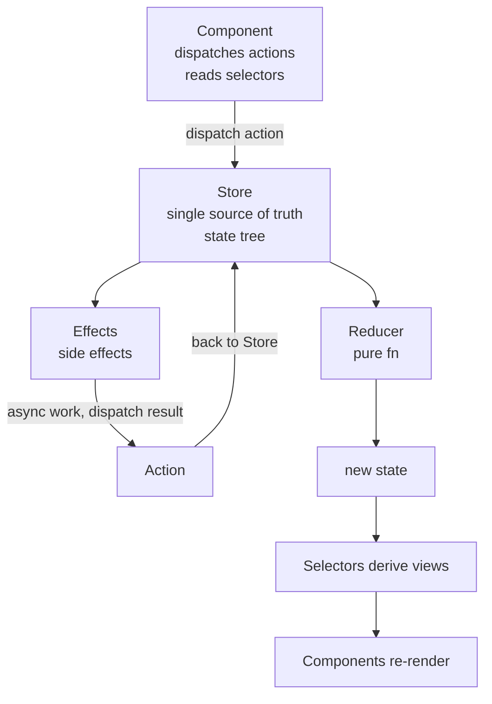

# NgRx State Management

> [Mastery Guide](../README.md) › [Frontend Integration](./README.md)

| Status | Priority | Phase | Last reviewed |
|---|---|---|---|
| Not Started | High | Phase 10 — Frontend (parallel) | 2026-08-18 |

## Contents
- [Why it matters](#why-it-matters)
- [Core concepts](#core-concepts)
  - [The Redux pattern in Angular](#the-redux-pattern-in-angular)
  - [Actions](#actions)
  - [Reducers](#reducers)
  - [Feature creators — createFeature](#feature-creators--createfeature)
  - [Selectors](#selectors)
  - [Effects](#effects)
  - [The @ngrx/operators package](#the-ngrxoperators-package)
  - [Entity adapter](#entity-adapter)
  - [NgRx Signals — the modern alternative](#ngrx-signals--the-modern-alternative)
  - [SignalStore anatomy — the feature pipeline](#signalstore-anatomy--the-feature-pipeline)
  - [Entity management in SignalStore](#entity-management-in-signalstore)
  - [Custom SignalStore features](#custom-signalstore-features)
  - [The events plugin — Redux discipline inside SignalStore](#the-events-plugin--redux-discipline-inside-signalstore)
  - [Resource extensions (experimental)](#resource-extensions-experimental)
  - [Component Store — local state](#component-store--local-state)
  - [DevTools and time-travel debugging](#devtools-and-time-travel-debugging)
  - [When NgRx is the wrong tool](#when-ngrx-is-the-wrong-tool)
  - [Server cache is not application state](#server-cache-is-not-application-state)
  - [Migrating classic Store to SignalStore](#migrating-classic-store-to-signalstore)
  - [The .NET seam — interceptors, refresh races, CORS and SSR](#the-net-seam--interceptors-refresh-races-cors-and-ssr)
- [Code & diagrams](#code--diagrams)
- [Common pitfalls](#common-pitfalls)
- [Interview-ready summary](#interview-ready-summary)
- [Interview Cross-Questioning Drill](#interview-cross-questioning-drill)
- [Cheat Sheet](#cheat-sheet)
- [Walkthrough](#walkthrough--stale-selector-after-dispatch)
- [Self-test](#self-test)
- [Cross-references](#cross-references)
- [Sources](#sources)

---

## Why it matters

**NgRx** is Angular's port of Redux — a predictable state container with strict patterns: actions describe events, reducers transform state, selectors read state, effects handle side effects. It's the canonical answer to "how do I manage shared state in a non-trivial Angular app." For large applications with cross-feature state, complex async flows, and team-scale collaboration, NgRx provides a discipline that pure component state can't.

NgRx is several packages, not one: the classic **Store** (Redux-style), **Effects** (RxJS side effects), **Entity** (normalised collections), **Router Store** (URL as state), **Store DevTools**, **Operators**, **ComponentStore** (feature-local state), **Data** (auto-generated CRUD), and **`@ngrx/signals`** — the signal-first library that is now where the team's attention goes. Two of those carry official status notices you should know before an interview: the NgRx docs say of ComponentStore that "**NgRx Signals is the new default**… we encourage using `@ngrx/signals` for new projects and considering migration for existing ones", and `@ngrx/data` is "**in maintenance mode**. Changes to this package are limited to critical bug fixes." Neither `@ngrx/store` nor `@ngrx/effects` is deprecated — the classic Store is actively maintained and still the answer for a specific set of problems described below.

Version reality at the time of writing (August 2026): the `latest` npm tag for the NgRx packages is **21.1.1**, and NgRx 21 requires **Angular 21.x, Angular CLI 21.x and TypeScript 5.9.x**. **Angular 22** shipped in June 2026 — with `OnPush` as the default change detection strategy (the old default is now the deprecated `Eager`), stable Signal Forms, stable `resource`/`rxResource`/`httpResource`, and TypeScript 6 — while NgRx 22 is still on the `next` tag (`22.0.0-rc.0`). NgRx majors track Angular majors one-for-one, and that lockstep is a real scheduling constraint, not a footnote.

> 🌍 **In the real world**: A team plans its Angular 22 upgrade for the sprint after the June 2026 release. The framework migration itself is a day's work — `ng update`, fix a handful of `Eager`/`OnPush` schematic diffs. Then npm refuses to install because `@ngrx/store@21` peer-depends on `@angular/core@^21`. The options are `--legacy-peer-deps` on an unsupported combination, waiting for the NgRx release, or ripping out NgRx. They wait, and the "one sprint" upgrade becomes a quarter of drift on an app whose only NgRx usage is three feature slices that a service with a signal would have covered. The dependency you add is not just code — it is a permanent constraint on when you are allowed to upgrade the framework.

Why interviewers ask: NgRx knowledge surfaces large-scale frontend experience. The patterns (immutability, action discipline, selector composition) translate to any Redux-like system (Redux Toolkit, Zustand, Pinia). Understanding the trade-offs (boilerplate vs predictability) is the senior signal — and at ten years' experience, the more interesting story is usually the one where you *removed* it.

When NOT to use: small apps with one or two screens. Forms-only state (Reactive Forms, or Signal Forms from Angular 22, already holds it). Anything where component-level state or a service with a signal is sufficient. Server data that is a *cache*, not application state — see [Server cache is not application state](#server-cache-is-not-application-state). NgRx Store earns its keep when many features react to the same event, when a cross-cutting reset/rehydrate policy has to live in one place, or when an audit log of everything that happened is a product requirement rather than a nicety.

## Core concepts

### The Redux pattern in Angular

The architecture (same as Redux):



The discipline: state changes only via dispatched actions; reducers are pure (input → output, no side effects); side effects (HTTP, navigation) live in effects; views read via selectors. Predictable, testable, debuggable.

### Actions

An action is a typed event describing something that happened (past tense) or should happen (imperative — though "events" is preferred):

```typescript
import { createAction, props } from '@ngrx/store';

// "Something happened"
export const ordersLoaded = createAction(
  '[Orders API] Orders Loaded',
  props<{ orders: Order[] }>()
);

export const ordersLoadFailed = createAction(
  '[Orders API] Orders Load Failed',
  props<{ error: string }>()
);

// "Something should happen" (legacy style; prefer event-style)
export const loadOrders = createAction('[Orders Page] Load Orders');
```

Naming convention: `[Source] Description`. Source is who's dispatching ("[Orders Page]", "[Orders API]"). Description is what happened or should happen. The brackets are conventional.

**Action grouping:** modern NgRx uses `createActionGroup`:

```typescript
import { createActionGroup, emptyProps, props } from '@ngrx/store';

export const OrdersActions = createActionGroup({
  source: 'Orders',
  events: {
    'Load Orders': emptyProps(),
    'Orders Loaded': props<{ orders: Order[] }>(),
    'Orders Load Failed': props<{ error: string }>(),
    'Order Selected': props<{ orderId: number }>(),
    'Order Updated': props<{ order: Order }>()
  }
});

// Use:
this.store.dispatch(OrdersActions.loadOrders());
this.store.dispatch(OrdersActions.ordersLoaded({ orders }));
```

Mechanics worth knowing, because they are what the group actually buys you: the event key is camel-cased into the creator name (`'Pagination Changed'` → `paginationChanged()`), the type string is assembled as `[Source] Event Name`, and **you cannot give a creator a name that differs from its event name** — the derivation is one-way. Duplicate types inside one group are a compile-time error, which is the class of bug `createAction` lets you ship (two files, same string, silently merged reducers).

**Events, not commands.** This is the action-hygiene argument, and it is a favourite senior question because everyone has written the wrong version. A *command* action names the state mutation you want (`setLoading`, `updateOrders`, `addToCart`); an *event* action names something that happened at a specific source (`[Orders Page] Opened`, `[Orders API] Orders Loaded Success`, `[Cart Page] Add Button Clicked`). The rule that follows: **one action per event source, never reuse an action across sources.** Two components that both need orders loaded dispatch two different "opened" events; both are handled by the same effect.

Why it matters mechanically, not stylistically:

- **Dispatch fan-out is free, dispatch fan-in is not.** One event can be consumed by any number of reducers and effects. A command action inverts that: the dispatcher has to know which slices need changing, so business logic leaks into components.
- **The DevTools log becomes a narrative.** `[Orders Page] Opened → [Orders API] Orders Loaded Success` reads like a bug report. `setLoading(true) → updateOrders([…]) → setLoading(false)` reads like a mutation log, and tells you nothing about why.
- **Action count goes up, and that is the point.** Action hygiene is not a boilerplate-reduction technique; it deliberately trades more action definitions for a reducer/effect layer that never has to guess who called it. If a colleague objects that "we now have 40 actions instead of 12", the honest answer is yes, and each of the 40 is greppable to exactly one dispatch site.
- **Never dispatch an action from a reducer, and never dispatch one action purely to trigger another.** If action B always follows action A with no decision in between, A's reducer should have done the work.

> 🌍 **In the real world**: A dashboard grows three "refresh" buttons over two years — toolbar, empty state, and error retry — and each one dispatches the shared `loadOrders()` command. Then product asks for analytics on which retry path users take, and there is no way to answer it: by the time the action reaches the effect, its origin is gone. Splitting into `[Orders Toolbar] Refresh Clicked`, `[Orders Empty State] Retry Clicked` and `[Orders Error] Retry Clicked`, all handled by one effect, took an afternoon and answered the question in the DevTools log without an analytics ticket. The rule "actions are events, not commands" pays for itself the first time somebody asks *why* rather than *what*.

### Reducers

A **reducer** is a pure function: `(state, action) => newState`. Never mutates; always returns a new object.

```typescript
import { createReducer, on } from '@ngrx/store';

export interface OrdersState {
  orders: Order[];
  loading: boolean;
  error: string | null;
  selectedId: number | null;
}

const initialState: OrdersState = {
  orders: [],
  loading: false,
  error: null,
  selectedId: null
};

export const ordersReducer = createReducer(
  initialState,

  on(OrdersActions.loadOrders, state => ({
    ...state,
    loading: true,
    error: null
  })),

  on(OrdersActions.ordersLoaded, (state, { orders }) => ({
    ...state,
    orders,
    loading: false
  })),

  on(OrdersActions.ordersLoadFailed, (state, { error }) => ({
    ...state,
    loading: false,
    error
  })),

  on(OrdersActions.orderSelected, (state, { orderId }) => ({
    ...state,
    selectedId: orderId
  }))
);
```

Pure means: same input → same output, no side effects, no I/O. Reducers are trivially testable.

**Runtime checks** are what stop "pure" from being an honour system. They are configured on `provideStore({ ... }, { runtimeChecks: { ... } })`, and the defaults are asymmetric — know them, because interviewers ask which ones you have to turn on:

| Check | Default | What it catches |
|---|---|---|
| `strictStateImmutability` | **on** | a reducer mutating the state object it was handed |
| `strictActionImmutability` | **on** | a reducer or effect mutating the action payload |
| `strictStateSerializability` | off | `Date`, `Map`, class instances or functions in state (breaks DevTools and rehydration) |
| `strictActionSerializability` | off | non-serialisable action payloads |
| `strictActionWithinNgZone` | off | actions dispatched outside the Angular zone (legacy signal — Angular 21+ apps are zoneless by default) |
| `strictActionTypeUniqueness` | off | two action creators registering the same type string |

All runtime checks are automatically disabled in production builds, so they cost nothing at runtime and catch nothing in prod. The two serializability checks are the ones teams turn on late and regret: by then something is storing a `Date` and every fix is a migration.

One more reducer discipline that only shows up under load: **return `state` unchanged when nothing changed.** `on(x, state => ({ ...state }))` produces a new root reference, which invalidates every memoised selector reading that slice, whether or not any value differs. The next section explains exactly why that matters.

### Feature creators — `createFeature`

`createFeature` collapses the "feature key string + feature selector + one selector per property" ritual into a single object, and it is the modern shape of a feature file:

```typescript
import { createFeature, createReducer, createSelector, on } from '@ngrx/store';

export const ordersFeature = createFeature({
  name: 'orders',
  reducer: createReducer(
    initialState,
    on(OrdersPageActions.opened, state => ({ ...state, loading: true, error: null })),
    on(OrdersApiActions.ordersLoadedSuccess, (state, { orders }) => ({ ...state, orders, loading: false })),
    on(OrdersApiActions.ordersLoadedFailure, (state, { error }) => ({ ...state, error, loading: false }))
  ),
  extraSelectors: ({ selectOrders, selectSelectedId }) => ({
    selectSelectedOrder: createSelector(
      selectOrders,
      selectSelectedId,
      (orders, id) => orders.find(o => o.id === id)
    )
  })
});

// Everything below is generated — the feature key exists in exactly one place
export const {
  name: ordersFeatureKey,
  reducer: ordersReducer,
  selectOrdersState,       // feature selector, "select" + name + "State"
  selectOrders,            // one child selector per state property
  selectLoading,
  selectError,
  selectSelectedId,
  selectSelectedOrder      // from extraSelectors
} = ordersFeature;
```

Register the feature object itself — `provideState(ordersFeature)` in a route's `providers`, or `StoreModule.forFeature(ordersFeature)` in the NgModule world. That is the real win: the string `'orders'` no longer appears in a `createFeatureSelector<OrdersState>('orders')` call in a different file, so the classic "selector returns `undefined` because the key was mistyped or the lazy module never loaded" bug loses one of its two causes.

The documented limitation is sharp and it will come up: **`createFeature` cannot be used for features whose state contains optional properties.** Child selectors are generated from the keys present on the initial state object, so `error?: string` must become `error: string | null` (or `| undefined`) *and* be initialised. `extraSelectors` receives the generated selectors and can build on selectors it defined earlier in the same object, which is how you keep derived state out of the reducer without a separate selectors file.

### Selectors

**Selectors** are pure functions that read derived data from state. Memoized — only recompute when relevant input slices change.

```typescript
import { createFeatureSelector, createSelector } from '@ngrx/store';

// Feature selector — picks the slice from the global store
export const selectOrdersState = createFeatureSelector<OrdersState>('orders');

// Simple selectors
export const selectAllOrders = createSelector(selectOrdersState, s => s.orders);
export const selectLoading = createSelector(selectOrdersState, s => s.loading);
export const selectError = createSelector(selectOrdersState, s => s.error);
export const selectSelectedId = createSelector(selectOrdersState, s => s.selectedId);

// Composed (derived) selectors
export const selectSelectedOrder = createSelector(
  selectAllOrders,
  selectSelectedId,
  (orders, id) => id != null ? orders.find(o => o.id === id) : undefined
);

export const selectPendingOrders = createSelector(
  selectAllOrders,
  orders => orders.filter(o => o.status === 'Pending')
);

export const selectTotalRevenue = createSelector(
  selectAllOrders,
  orders => orders.reduce((sum, o) => sum + o.total, 0)
);
```

Selectors compose. `selectSelectedOrder` depends on `selectAllOrders` and `selectSelectedId`; it only re-runs when one of them changes. Memoization prevents wasteful recomputes.

In components:

```typescript
@Component({...})
export class OrdersListComponent {
  private store = inject(Store);

  orders$ = this.store.select(selectAllOrders);
  loading$ = this.store.select(selectLoading);
  pending$ = this.store.select(selectPendingOrders);

  // Or as signals (modern):
  orders = this.store.selectSignal(selectAllOrders);
  loading = this.store.selectSignal(selectLoading);
}
```

#### Exactly when memoisation invalidates

"Memoised" is where most candidates stop. The mechanism, from `defaultMemoize` in `@ngrx/store`:

1. The memoised selector keeps **exactly one** cached invocation — the last arguments and the last result.
2. On every call it compares each incoming argument with the previous one using `isEqualCheck`, which is `===`. If every argument is reference-identical, the projector is **not called** and the cached result is returned.
3. If any argument differs, the projector runs. The new result is then compared with the previous result (also `===` by default). If they are equal, the **previous reference is kept**, so downstream consumers see no change at all.

Three consequences a senior is expected to name:

- **Invalidation is by reference, not by value.** A reducer that spreads state on every action (`{ ...state }`) invalidates every selector over that slice even when no field changed. Step 3 only saves you if the projector's *output* is reference-stable — true for primitives and for `state.orders` passthroughs, false for anything that builds a fresh array or object (`.map`, `.filter`, `.reduce` into an object literal, `{ count }`). That is why `selectPendingOrders` re-emits whenever `orders` gets a new reference, even if the pending subset is identical.
- **One cache entry means parameterised selectors thrash.** `selectOrderById(42)` and `selectOrderById(43)` sharing one memoised instance means each call evicts the other and the projector runs every time. The factory form — `const selectOrderById = (id: number) => createSelector(...)` — gives each id its own selector, but only if you **call the factory once and keep the result**. Calling it in a template expression or a getter creates a brand-new selector on every change detection pass: memoisation never hits, and each instance is retained by its subscription.
- **Selectors with props are on the way out.** The docs state plainly: "Selectors with props are deprecated and will be removed in v23." If you still have `store.select(selectThing, { id })` in a codebase, that is a migration item with a deadline, not a style preference.

`createSelector` has typed overloads for up to **eight** input selectors, plus an array form (`createSelector([s1, …, sn], projector)`) beyond that. Needing more than four is usually a decomposition smell. `selector.release()` clears the memoised value and **recursively releases ancestor selectors** — relevant when a factory selector is created per entity in a long-lived page.

The two read APIs differ in ways that matter:

```typescript
// Observable read: map + distinctUntilChanged (reference equality)
store.select(selectAllOrders)

// Signal read: computed(() => selector(state()), options)
store.selectSignal(selectAllOrders);
store.selectSignal(selectAllOrders, { equal: (a, b) => a.length === b.length });  // custom equality
```

`selectSignal` is a `computed` over the store's state signal, so it uses `Object.is` unless you pass `equal` — and, being a computed, it is **lazy and glitch-free**: it does not recompute until something reads it, and a component that reads three selectors in a template re-renders once per change, not once per selector.

> 🌍 **In the real world**: A grid of 200 rows binds `[order]="orders$ | async | orderById: row.id"`… and the "clean" refactor replaces the pipe with `store.select(selectOrderById(row.id))` written inline in the template. Everything works in dev. In production the page slowly eats memory and the profiler shows the projector running thousands of times per interaction. The cause is one line: `selectOrderById(row.id)` is a *factory call* inside a template expression, so every change detection pass builds a new selector and a new subscription. Moving the call into the component's `ngOnInit` (or better, selecting the whole `entityMap` once and indexing into it in the template) removed both the CPU and the leak. Memoisation is per selector instance — if you keep making instances, you keep making cache misses.

### Effects

**Effects** handle side effects — HTTP, navigation, websocket, anything outside pure state. Listen to actions, do async work, dispatch resulting action.

```typescript
import { Injectable, inject } from '@angular/core';
import { Actions, createEffect, ofType } from '@ngrx/effects';
import { catchError, map, switchMap, tap } from 'rxjs/operators';
import { of } from 'rxjs';

@Injectable()
export class OrdersEffects {
  private actions$ = inject(Actions);
  private orderService = inject(OrderService);
  private router = inject(Router);

  // Load orders when the page asks
  loadOrders$ = createEffect(() => this.actions$.pipe(
    ofType(OrdersActions.loadOrders),
    switchMap(() => this.orderService.getAll().pipe(
      map(orders => OrdersActions.ordersLoaded({ orders })),
      catchError(err => of(OrdersActions.ordersLoadFailed({ error: err.message })))
    ))
  ));

  // Navigate after successful create
  navigateAfterCreate$ = createEffect(() => this.actions$.pipe(
    ofType(OrdersActions.orderCreated),
    tap(({ order }) => this.router.navigate(['/orders', order.id]))
  ), { dispatch: false });   // doesn't dispatch a new action
}
```

Effects are observable streams of actions in, observable streams of actions out (or `dispatch: false` for fire-and-forget like navigation). All RxJS operators apply — `switchMap` for "latest wins" loads, `concatMap` for sequential saves, `mergeMap` for parallel.

Register in app config:

```typescript
import { provideEffects } from '@ngrx/effects';

bootstrapApplication(AppComponent, {
  providers: [
    provideStore({ orders: ordersReducer }),
    provideEffects([OrdersEffects]),
    provideStoreDevtools({ maxAge: 25 })
  ]
});
```

**Functional effects** are the modern form — no class, no `@Injectable`, dependencies injected as default parameter values, and `{ functional: true }` as the second argument:

```typescript
import { createEffect, ofType, Actions } from '@ngrx/effects';
import { inject } from '@angular/core';
import { mapResponse } from '@ngrx/operators';

export const loadOrders = createEffect(
  (actions$ = inject(Actions), orders = inject(OrderService)) =>
    actions$.pipe(
      ofType(OrdersPageActions.opened),
      exhaustMap(() =>
        orders.getAll().pipe(
          mapResponse({
            next: orders => OrdersApiActions.ordersLoadedSuccess({ orders }),
            error: (error: Error) => OrdersApiActions.ordersLoadedFailure({ error: error.message })
          })
        )
      )
    ),
  { functional: true }
);

// Registered by value, so tree-shaking sees it and there is no class to instantiate
provideEffects(loadOrders, navigateAfterCreate);
```

Both forms coexist; the functional form is tree-shakeable, trivially testable (call the function with fakes — no `TestBed`), and removes the "effect class registered twice" foot-gun. Register per feature inside a lazy route's `providers` array with `provideEffects(...)` rather than globally, so an effect for a route the user never visits is never subscribed.

Lifecycle details that separate people who have run effects in production from people who have read about them:

- **Errors resubscribe, they do not stop.** If an error escapes the outer stream, `defaultEffectsErrorHandler` reports it to Angular's `ErrorHandler` and resubscribes — "by default, effects are resubscribed up to 10 errors" (`MAX_NUMBER_OF_RETRY_ATTEMPTS = 10` in `@ngrx/effects`). After that the effect is dead for the lifetime of the app and every subsequent action of that type silently does nothing. Opt out with `{ useEffectsErrorHandler: false }`, or replace the policy globally via the `EFFECTS_ERROR_HANDLER` token.
- **`catchError` placement decides the blast radius.** Inside the flattening operator, the inner observable dies and the effect survives. Outside it, the outer stream completes and the effect stops permanently — the classic "loading works exactly once, then never again after a 500".
- **`ROOT_EFFECTS_INIT`** is dispatched after root effects are registered; effects that must run at startup should listen for it rather than racing bootstrap. Implement `OnInitEffects` on a class to dispatch a custom action when that effects class is registered, and `OnRunEffects` to control when the effect stream starts and stops.

> 🌍 **In the real world**: A support ticket says "the orders page loads, then stops loading forever until I hard-refresh". Reproduction needs one 500 from the API. The effect had `catchError` on the *outer* pipe, so the first server error completed the stream — after the error handler's resubscriptions were used up on the same failing request, the effect was gone and every subsequent `[Orders Page] Opened` action fell into the void with no error in the console. The one-character-scale fix (move `catchError` inside `switchMap`, or use `mapResponse`) is not the lesson; the lesson is that a dead effect fails *silently*, so the symptom is always "nothing happens" rather than a stack trace.

### The `@ngrx/operators` package

`@ngrx/operators` is where the NgRx-specific RxJS operators now live (they were previously spread across `@ngrx/effects` and `@ngrx/component-store`). Three matter.

**`concatLatestFrom` over `withLatestFrom`.** Both pull the latest value from another source; the difference is when that source is subscribed. `withLatestFrom(store.select(selectHeavyThing))` evaluates and subscribes the selector **when the effect is created**, so it recomputes on every state change for the entire life of the app even if the effect fires twice a day. `concatLatestFrom(() => store.select(selectHeavyThing))` takes a **factory** and only invokes it when the source action arrives:

```typescript
export const saveDraft = createEffect(
  (actions$ = inject(Actions), store = inject(Store), api = inject(DraftApi)) =>
    actions$.pipe(
      ofType(EditorActions.saveClicked),
      // Factory receives the action, so the action's own payload can choose the source
      concatLatestFrom(({ draftId }) => [
        store.select(selectDraftById(draftId)),
        store.select(selectCurrentUser)
      ]),
      concatMap(([{ draftId }, draft, user]) => api.save(draftId, draft, user.id).pipe(/* … */))
    ),
  { functional: true }
);
```

Two payoffs: the expensive selector never runs until it is needed, and the factory can use the action's payload to *choose* which selector to read — impossible with `withLatestFrom`, which has no access to the emitted value when it is wired up.

**`tapResponse`** wraps `tap` + `catchError` and forces you to handle the error case, guaranteeing the effect (or `rxMethod`) survives it; it accepts `next`, `error`, and optional `complete` and `finalize` callbacks. **`mapResponse`** is the action-returning sibling used above: map success to one action, error to another, with no `catchError(err => of(...))` boilerplate and no risk of forgetting to re-wrap the error stream.

> 🌍 **In the real world**: A pricing screen gets janky while typing in a filter box, and the flame chart blames a permissions selector that fans out over every role and every line item. Nothing in the typing path reads it. The culprit is a "save quote" effect written years earlier with `withLatestFrom(this.store.select(selectEffectivePermissions))`: that subscription is live from bootstrap, so the selector recomputes on every state change the filter box causes, for an effect that fires when somebody clicks Save. Switching to `concatLatestFrom(() => …)` removed the work entirely, because the factory does not run until the Save action arrives. Eager versus lazy is not a style question when the source is expensive.

### Entity adapter

For collections, **`@ngrx/entity`** standardizes the shape: `{ ids: [...], entities: { id1: ..., id2: ... } }` — normalized, fast lookup, dedup-friendly.

```typescript
import { createEntityAdapter, EntityState } from '@ngrx/entity';

export interface OrdersState extends EntityState<Order> {
  loading: boolean;
  error: string | null;
  selectedId: number | null;
}

export const ordersAdapter = createEntityAdapter<Order>({
  selectId: o => o.id,
  sortComparer: (a, b) => b.createdAt.localeCompare(a.createdAt)   // newest first
});

const initialState: OrdersState = ordersAdapter.getInitialState({
  loading: false,
  error: null,
  selectedId: null
});

export const ordersReducer = createReducer(
  initialState,
  on(OrdersActions.ordersLoaded, (state, { orders }) =>
    ordersAdapter.setAll(orders, { ...state, loading: false })),
  on(OrdersActions.orderUpdated, (state, { order }) =>
    ordersAdapter.upsertOne(order, state)),
  on(OrdersActions.orderDeleted, (state, { id }) =>
    ordersAdapter.removeOne(id, state))
);

// Selectors via adapter
const { selectAll, selectEntities, selectIds, selectTotal } = ordersAdapter.getSelectors();
export const selectAllOrders = createSelector(selectOrdersState, selectAll);
export const selectOrderById = (id: number) => createSelector(
  selectOrdersState,
  state => state.entities[id]
);
```

Entity adapter saves dozens of lines of boilerplate per collection. Use for any list-of-things state.

The full updater surface, because "it has `addOne`" is not an answer: `addOne`/`addMany` (ignore ids that already exist), `setOne`/`setMany`/`setAll` (add or replace), `upsertOne`/`upsertMany` (shallow-merge into an existing entity or insert), `updateOne`/`updateMany` (`{ id, changes }` — no-op if the id is absent), `mapOne`/`map` (apply a function to one or all entities), `removeOne` (by id), `removeMany` (by ids **or** by a predicate — the only predicate overload in the adapter), `removeAll`. `getSelectors()` with no argument returns selectors over the entity state itself; passing the feature selector — `ordersAdapter.getSelectors(selectOrdersState)` — returns ones you can hand straight to `store.select`.

Two behaviours that surprise people: `sortComparer` is applied on every write that changes the id set, so the `ids` array is kept sorted rather than sorted on read — cheap for appends, not free for bulk `setAll` of a large collection; and `selectId` must produce a stable `string | number`, so composite keys have to be projected into one (`${tenantId}:${orderId}`) before they enter the store.

> 🌍 **In the real world**: An orders list is stored as a plain `Order[]` and everything is fine until a websocket starts pushing per-order status updates. Each message triggers `orders.map(o => o.id === id ? updated : o)`, which produces a new array *and a new reference for every row*, so a table bound with `OnPush` re-renders all 500 rows for a single status change. Moving to the entity adapter fixed it for a reason people often get backwards: it was not that `entityMap[id]` lookup is O(1) — it was that `updateOne` leaves the other 499 entity object references untouched, so `trackBy` plus `OnPush` re-rendered exactly one row. Normalisation is a rendering optimisation as much as a lookup one.

### NgRx Signals — the modern alternative

**`@ngrx/signals`** shipped in **developer preview in NgRx 17** (November 2023) and went **stable in NgRx 18** (July 2024) — so "we're evaluating it, it's new" is no longer a defensible answer in an interview; it has had four major releases since. It is a standalone library, not a layer over `@ngrx/store`: you can install it in an app that has never used Redux, and it has no actions, no reducers and no global state tree unless you add them.

```typescript
import { signalStore, withState, withMethods, withComputed, patchState } from '@ngrx/signals';
import { computed, inject } from '@angular/core';
import { rxMethod } from '@ngrx/signals/rxjs-interop';
import { pipe, of } from 'rxjs';
import { catchError, switchMap, tap } from 'rxjs/operators';

export const OrdersStore = signalStore(
  { providedIn: 'root' },

  withState<OrdersState>({
    orders: [],
    loading: false,
    error: null,
    selectedId: null
  }),

  withComputed(({ orders, selectedId }) => ({
    selectedOrder: computed(() =>
      orders().find(o => o.id === selectedId())
    ),
    pendingOrders: computed(() =>
      orders().filter(o => o.status === 'Pending')
    ),
    totalRevenue: computed(() =>
      orders().reduce((sum, o) => sum + o.total, 0)
    )
  })),

  withMethods((store, orderService = inject(OrderService)) => ({
    selectOrder(id: number) {
      patchState(store, { selectedId: id });
    },

    loadOrders: rxMethod<void>(pipe(
      tap(() => patchState(store, { loading: true, error: null })),
      switchMap(() => orderService.getAll().pipe(
        tap(orders => patchState(store, { orders, loading: false })),
        catchError(err => {
          patchState(store, { error: err.message, loading: false });
          return of([]);
        })
      ))
    ))
  }))
);

// Component
@Component({...})
export class OrdersComponent {
  private store = inject(OrdersStore);

  orders = this.store.orders;
  loading = this.store.loading;
  pending = this.store.pendingOrders;

  ngOnInit() {
    this.store.loadOrders();
  }
}
```

Significantly less boilerplate than classic Store. State, computed, methods all in one place. Signal-based; integrates with templates without subscribe/async pipe.

For new apps, **start with NgRx Signals** unless you have specific need for Redux-style action audit trail.

### SignalStore anatomy — the feature pipeline

The thing to understand about `signalStore()` is that it is not a config object with fixed sections — it is a **left-to-right pipeline of features**, where each feature is a function from the store shape accumulated so far to a new shape. That single fact explains most of its behaviour: `withComputed` can only see slices declared by an *earlier* `withState`, ordering is significant, and the resulting type is inferred rather than declared. There is no `AppState` interface, no feature key string, and no `createFeatureSelector`.

The base features, all from `@ngrx/signals`:

| Feature | Adds | Notes |
|---|---|---|
| `withState(initial)` | state slices as signals | nested objects become lazily-created **deep signals**: `store.filter.query()` |
| `withComputed(store => …)` | derived signals | factory runs in an injection context, so `inject()` works |
| `withMethods(store => …)` | methods | also an injection context — this is where services are injected |
| `withProps(store => …)` | non-signal members | injected services, observables, constants (NgRx 19+) |
| `withHooks({ onInit, onDestroy })` | lifecycle | `onInit` runs in an injection context (`takeUntilDestroyed()` works); a factory form lets `onDestroy` close over injected values |
| `withLinkedState(store => …)` | writable state derived from other signals | `linkedSignal` semantics — writable, but resets when its source changes (NgRx 20+) |
| `withFeature(store => feature)` | a feature that needs the store instance | composition without hard-coding the parent's shape (landed in the NgRx 19.x line, March 2025) |

Supporting functions: `patchState(store, partialOrUpdaterFns…)`, `getState(store)` (reads the whole state; tracked in reactive contexts), `watchState(store, fn)`, `signalStoreFeature`, `type<T>()`, `deepComputed`, `signalMethod`.

**Providing and scope.** `signalStore({ providedIn: 'root' }, …)` gives the singleton; omit it and list the store in a component's or route's `providers` for an instance whose lifetime is that component or route — the same knob ComponentStore offered, without a separate package. A store provided at component level is destroyed with the component, and `withHooks({ onDestroy })` fires.

**State protection.** By default state is *protected*: `patchState` only works from inside the store's own features, so a component cannot reach in and mutate. Opt out with `signalStore({ protectedState: false }, …)`; in tests, wrap the instance instead — `patchState(unprotected(store), { count: 5 })` with `unprotected` from `@ngrx/signals/testing`.

**Reading and tracking changes.** `getState(store)` inside an `effect()` is glitch-free and coalesced: two `patchState` calls in the same tick produce one effect run with the final value. `watchState(store, state => …)` is synchronous and fires **once per mutation**, including the initial state, so it sees intermediates the effect never will. Pick deliberately — logging and persistence usually want the coalesced version; assertions about ordering want `watchState`.

**`rxMethod` — the RxJS bridge.** `rxMethod<T>(pipe(...))` returns a callable that accepts a **static value**, a **signal**, a **computation function** (NgRx 21+, matching how `resource` and `linkedSignal` take computations), or an **observable**; signals and observables re-trigger the pipeline on every emission. It must be created in an injection context (or given `{ injector }`) and is cleaned up with that injector; the returned method has `.destroy()`, and each individual call returns a subscription-like handle with its own `.destroy()`. The error rule is the same as for effects — an unhandled error kills the pipeline, so the docs recommend `tapResponse` from `@ngrx/operators` inside the inner observable.

**`signalMethod`** (NgRx 19+) is the RxJS-free version: `signalMethod<T>(value => …)` accepts a value or a signal and re-runs the callback when the signal changes, with no operator chain. For "when this input changes, call this function", it removes the RxJS import entirely — worth naming in an interview as evidence you know `rxMethod` is not the only option.

> 🌍 **In the real world**: A team replaces a feature's NgRx slice with "just a service holding signals" and it is genuinely simpler — for a quarter. Then a second component starts calling `svc.state.set({...})` directly, a third writes to it from an `effect()`, and the "where did this value change" question has four candidate answers again. Moving the same code to a SignalStore fixed it without adding actions: `patchState` is only callable from inside the store because state is protected by default, so the compiler enforces the single-writer rule the service relied on convention for. That property — not the reduction in boilerplate — is the reason to prefer SignalStore over a hand-rolled service once more than one component touches the state.

**Testing.** A SignalStore is a service, so the test is `TestBed.configureTestingModule({ providers: [OrdersStore] })` → `TestBed.inject(OrdersStore)` → call a method → assert on signals. There is no `MockStore`, no `overrideSelector`, and no marble test for the happy path; dependencies are replaced with ordinary DI overrides. For components, the "mock" is a plain object with signals and spies that structurally matches the store. The NgRx testing guide's own advice is worth quoting back at an interviewer: "Public API only. Asserting on internal state or calling internal methods ties tests to implementation and makes them brittle."

**Where the classic Store still wins.** This is the judgement half of the question:

1. **One event, many slices.** `[Auth API] Logged Out` clearing eight feature slices is one action and eight `on()` handlers. With independent stores, something has to call eight stores in order — you have re-invented the dispatcher, worse.
2. **Cross-cutting policy in one place.** Meta-reducers (rehydrate from storage, reset-on-logout, log every action) apply to the whole tree by construction. SignalStore has no equivalent global hook.
3. **An audit trail as a product feature.** DevTools' action log is the thing support teams paste into tickets. SignalStore has **no official Redux DevTools integration** — the events plugin gives you a dispatch log conceptually, and the community `@angular-architects/ngrx-toolkit` package provides `withDevtools()` and `withRedux()`, but that is a third-party dependency, not NgRx.
4. **Router as state.** `@ngrx/router-store` puts URL, params and query params in the tree and lets effects react to navigation like any other action.
5. **An existing large codebase and a fluent team.** Rewriting working Redux code to save keystrokes is not a business case.

Everything else — feature-local state, page state, a form's async lookups, a wizard, even a shared "current tenant" — is where SignalStore is now the default answer.

### Entity management in SignalStore

`@ngrx/signals/entities` is the SignalStore counterpart to `@ngrx/entity`, and it is a straight upgrade in ergonomics: no adapter object, no `getSelectors()`, no `EntityState` interface to extend.

```typescript
import { signalStore, withMethods, patchState } from '@ngrx/signals';
import { withEntities, setAllEntities, updateEntity, removeEntity, entityConfig } from '@ngrx/signals/entities';
import { type } from '@ngrx/signals';

const orderConfig = entityConfig({
  entity: type<Order>(),
  collection: 'order',                  // → orderIds, orderEntityMap, orderEntities
  selectId: (order: Order) => order.orderNumber   // ids are string | number
});

export const OrdersStore = signalStore(
  { providedIn: 'root' },
  withEntities(orderConfig),
  withMethods((store, api = inject(OrderApi)) => ({
    async load() {
      const orders = await api.getAll();
      patchState(store, setAllEntities(orders, orderConfig));
    },
    markPaid(orderNumber: string) {
      patchState(store, updateEntity({ id: orderNumber, changes: { status: 'Paid' } }, orderConfig));
    },
    drop(orderNumber: string) {
      patchState(store, removeEntity(orderNumber, orderConfig));
    }
  }))
);
```

`withEntities` generates three signals — `ids`, `entityMap`, and `entities` (a computed array) — prefixed when you name the collection. Updaters are standalone tree-shakeable functions passed to `patchState`: `addEntity`/`addEntities`, `prependEntity`/`prependEntities`, `setEntity`/`setEntities`/`setAllEntities`, `upsertEntity`/`upsertEntities`, `updateEntity`/`updateEntities`/`updateAllEntities`, `removeEntity`/`removeEntities`/`removeAllEntities`. Multiple named collections can live in one store, and prefixing a collection with an underscore (`_todo`) keeps it private to the store. `entityConfig()` exists purely so the `{ entity, collection, selectId }` triple is declared once rather than repeated at every call site.

### Custom SignalStore features

Custom features are the reason SignalStore scales past "a service with signals", and they are the thing most candidates have not tried. `signalStoreFeature` composes base features into a reusable unit:

```typescript
import { signalStoreFeature, withState, withComputed, withMethods, patchState, type } from '@ngrx/signals';
import { computed } from '@angular/core';

// A reusable request-status feature
export function withRequestStatus() {
  return signalStoreFeature(
    withState<{ requestStatus: 'idle' | 'pending' | 'fulfilled' | { error: string } }>({ requestStatus: 'idle' }),
    withComputed(({ requestStatus }) => ({
      isPending: computed(() => requestStatus() === 'pending'),
      isFulfilled: computed(() => requestStatus() === 'fulfilled'),
      error: computed(() => {
        const status = requestStatus();
        return typeof status === 'object' ? status.error : null;
      })
    }))
  );
}

// Standalone updaters, so they tree-shake and read like the entity updaters
export const setPending = () => ({ requestStatus: 'pending' as const });
export const setFulfilled = () => ({ requestStatus: 'fulfilled' as const });
export const setError = (error: string) => ({ requestStatus: { error } });

// Usage: patchState(store, setPending());
```

A feature that *depends on* state it does not declare states that requirement in its input type, and the compiler enforces it:

```typescript
export function withSelectedEntity<Entity>() {
  return signalStoreFeature(
    { state: type<EntityState<Entity>>() },       // input constraint: needs entityMap
    withState<{ selectedId: EntityId | null }>({ selectedId: null }),
    withComputed(({ entityMap, selectedId }) => ({
      selectedEntity: computed(() => {
        const id = selectedId();
        return id != null ? entityMap()[id] : null;
      })
    }))
  );
}
```

`withFeature(store => someFeature(store.someSignal))` covers the other direction — a feature that needs the *instance*, not just its type, so it can be parameterised by a value the parent store computed. Two documented gotchas: keep features loosely coupled (a feature that assumes five specific slices is a copy-paste, not an abstraction), and add an unused generic parameter to input-constrained features if you plan to combine several of them, or TypeScript's inference collapses them together.

This is the honest answer to "how is SignalStore not just a service with signals": `withRequestStatus()`, `withEntities()`, `withPagination()`-style features compose across twelve stores with full type inference, and a hand-rolled service does not.

> 🌍 **In the real world**: Nine stores in a codebase each declare `isLoading`, `error` and a `setLoading` method, copy-pasted, and three of them spell the error field differently — so the shared error banner needs a `switch`. Extracting one `withRequestStatus()` feature deleted the duplication in an afternoon, and the second-order effect mattered more: the banner, the retry button and the e2e helpers could all be typed against the feature's shape instead of against nine near-identical stores. Feature extraction is the SignalStore equivalent of pulling a base reducer out, except the compiler checks it.

### The events plugin — Redux discipline inside SignalStore

`@ngrx/signals/events` is the piece most people have missed, and it is exactly the "have you kept up?" question. It brings Flux back to SignalStore for the cases that need it — a dispatcher, events, reducers, and event handlers — without the global state tree. It landed in the NgRx 19.x line (May 2025) and shipped **experimental** through v20, then was **promoted to stable in NgRx 21** (December 2025), where `withEffects` was renamed **`withEventHandlers`** (breaking change, with a migration schematic).

```typescript
import { signalStore, withState, type } from '@ngrx/signals';
import { eventGroup, on, withReducer, withEventHandlers, Events, injectDispatch } from '@ngrx/signals/events';
import { mapResponse } from '@ngrx/operators';

export const bookSearchEvents = eventGroup({
  source: 'Book Search Page',
  events: { opened: type<void>(), queryChanged: type<string>() }
});

export const booksApiEvents = eventGroup({
  source: 'Books API',
  events: { loadedSuccess: type<Book[]>(), loadedFailure: type<string>() }
});

export const BooksStore = signalStore(
  { providedIn: 'root' },
  withState({ books: [] as Book[], query: '', isLoading: false }),
  withReducer(
    on(bookSearchEvents.queryChanged, ({ payload: query }) => ({ query, isLoading: true })),
    on(booksApiEvents.loadedSuccess, ({ payload: books }) => ({ books, isLoading: false }))
  ),
  withEventHandlers((store, events = inject(Events), booksService = inject(BooksService)) => ({
    loadBooksByQuery$: events.on(bookSearchEvents.opened, bookSearchEvents.queryChanged).pipe(
      switchMap(() =>
        booksService.getByQuery(store.query()).pipe(
          mapResponse({
            next: books => booksApiEvents.loadedSuccess(books),
            error: (error: Error) => booksApiEvents.loadedFailure(error.message)
          })
        )
      )
    )
  }))
);

// Component: no store methods, just events
@Component({ template: `<input (input)="dispatch.queryChanged($any($event.target).value)" />` })
export class BookSearch {
  readonly dispatch = injectDispatch(bookSearchEvents);
  constructor() { this.dispatch.opened(); }
}
```

Mapping to what you already know: `event()`/`eventGroup()` replace `createAction`/`createActionGroup` (payload declared with `type<T>()` from `@ngrx/signals`); `withReducer(on(…))` replaces `createReducer`; `withEventHandlers` replaces `createEffect`, and events returned from a handler are dispatched automatically; the `Dispatcher` service or `injectDispatch(eventGroup)` replaces `store.dispatch`. Handlers receive the event object, so payloads are destructured as `({ payload })`. The `ReducerEvents` service exists for handlers that must observe an event *after* the state transition has applied but before the general `Events` stream.

> 🌍 **In the real world**: Six months after a SignalStore migration, the support process quietly breaks. The escalation runbook said "ask the customer to export the Redux DevTools log and attach it to the ticket", and there is no log any more — engineers are back to asking "what did you click?" and failing to reproduce. Nobody costed that in the migration, because it lived in a support wiki, not in the codebase. The fix was to put the two customer-facing flows (checkout and billing changes) onto the events plugin so there is a dispatch narrative again, and leave everything else on plain methods. Before removing a Redux store, find out who reads the action log — it is rarely only the developers.

The genuinely new capability is **scoped events**. `provideDispatcher()` at a route or component creates a local event scope, and dispatch is configured as `self` (default — local only), `parent`, or `global`, with `toScope`/`mapToScope` inside handlers to forward deliberately. Scope visibility is hierarchical: children see parent events, parents do not see child events. That is a direct answer to the micro-frontend / feature-isolation problem the global Store never solved — with `@ngrx/store` every action is global to the application, always.

### Resource extensions (experimental)

Angular 22 made `resource`, `rxResource` and `httpResource` stable, and the NgRx 22 line adds `@ngrx/signals/resource` to smooth their sharpest edge — that `value()` reverts to `undefined` while reloading and throws on error. **These APIs are marked experimental**: the docs state their APIs "are subject to change, and modifications may occur in future versions without standard breaking change announcements until it is deemed stable", and at the time of writing NgRx 22 itself is on the `next` npm tag (`22.0.0-rc.0`), not `latest`.

`extendResource(resource, extensions)` applies extensions while preserving the resource's type; the built-ins are `withPreviousValueOnLoading()`, `withValueOnLoading(fallback)`, `withPreviousValueOnError()` and `withValueOnError(fallback)`. `provideResourceExtensions()` applies a set of them across an injector scope, with per-resource extensions layering on top. Know that it exists and know it is experimental — presenting it as a shipped default is the kind of thing an interviewer will catch.

### Component Store — local state

**`@ngrx/component-store`** is for component-scoped state — feature-local, no global ceremony.

```typescript
import { ComponentStore } from '@ngrx/component-store';

interface SearchState {
  query: string;
  results: SearchResult[];
  loading: boolean;
}

@Injectable()
export class SearchStore extends ComponentStore<SearchState> {
  constructor(private api: SearchApi) {
    super({ query: '', results: [], loading: false });
  }

  // Selectors
  readonly results$ = this.select(s => s.results);
  readonly loading$ = this.select(s => s.loading);

  // Updaters
  readonly setQuery = this.updater((state, query: string) => ({ ...state, query }));

  // Effects (with cancellation built-in)
  readonly search = this.effect<string>(query$ => query$.pipe(
    debounceTime(300),
    distinctUntilChanged(),
    tap(() => this.patchState({ loading: true })),
    switchMap(q => this.api.search(q).pipe(
      tap(results => this.patchState({ results, loading: false })),
      catchError(() => {
        this.patchState({ loading: false });
        return EMPTY;
      })
    ))
  ));
}

// Provide at the component level
@Component({
  providers: [SearchStore],   // ← per-component instance
  ...
})
export class SearchComponent {
  constructor(private store: SearchStore) {}
}
```

Use Component Store when state is feature-local and the global Store is overkill. Often paired with global Store: ComponentStore for the page-specific state, Store for cross-feature state.

The official positioning has changed and you should quote it rather than paraphrase: the ComponentStore docs now open with "**NgRx Signals is the new default.** The NgRx team recommends using the `@ngrx/signals` library for local state management in Angular. While ComponentStore remains supported, we encourage using `@ngrx/signals` for new projects and considering migration for existing ones." It is *supported*, not deprecated — an existing ComponentStore is not technical debt on its own, and the mechanical translation is small: `select` → `withComputed`, `updater` → a method calling `patchState`, `effect` → `rxMethod`, component-level `providers: [SearchStore]` stays exactly as it is.

### DevTools and time-travel debugging

**Redux DevTools** browser extension shows every action and the resulting state. Time-travel: click any action to see state at that point.

```typescript
provideStoreDevtools({
  maxAge: 25,                                        // last 25 actions
  logOnly: !isDevMode(),                             // disable mutation in prod
  autoPause: true,                                    // pause when devtools is closed
  trace: false,                                       // expensive in big apps
  traceLimit: 75
})
```

Action log is the killer feature. Every state change is auditable; reproducing bugs becomes a matter of replaying actions.

One asymmetry to state out loud in an interview: **DevTools support is a `@ngrx/store` feature, not an NgRx feature.** SignalStore has no official Redux DevTools integration. If time-travel and an exportable action log are requirements, that is an argument for the classic Store (or for the events plugin plus the community `@angular-architects/ngrx-toolkit`, whose `withDevtools()` and `withRedux()` wire SignalStore into the extension) — and it is a legitimate reason to keep Redux in a compliance-heavy app.

### When NgRx is the wrong tool

The seniority signal here is a decision procedure, not a preference. Four questions, in order:

1. **Does anything outside this component subtree read or write it?** No → a `signal()` in the component. This covers most "state" in most apps: expanded rows, dialog open, current tab, sort direction.
2. **Is it a copy of server data?** Yes → it is a **cache**, and it wants a cache's machinery (staleness, dedupe, refetch, invalidation), not a reducer. See the next section.
3. **Is it client-owned truth that outlives one component?** Yes → a service with a signal, or a SignalStore if it needs composition, entities or lifecycle.
4. **Do multiple independent features have to react to the same event, or does a cross-cutting policy have to apply to all state at once?** Yes → this is what the global Store is for.

The simplest thing that is still honest state management is roughly ten lines:

```typescript
@Injectable({ providedIn: 'root' })
export class TenantService {
  private readonly _current = signal<Tenant | null>(null);

  readonly current = this._current.asReadonly();
  readonly isEnterprise = computed(() => this._current()?.plan === 'enterprise');

  select(tenant: Tenant) { this._current.set(tenant); }
}
```

Everything a small app needs — a single writer, a read-only public surface, derived values, DI scoping, and testability without a framework. What it does *not* give you: a change log, a single place to reset everything, or enforced immutability. Those three are the whole value proposition of NgRx Store; if you do not need them, you are paying for them anyway.

Costs that are easy to under-price when you add NgRx:

- **A permanent upgrade constraint** — NgRx majors track Angular majors, so your framework upgrade cadence is now the intersection of two projects' release schedules.
- **A second mental model per feature** — new joiners must learn the app *and* the Redux indirection, and "where does this value come from" becomes a four-file trace.
- **Cache duties you inherit by accident** — the moment server data lands in the store, you own its invalidation forever, usually via a hand-rolled `loadedAt` timestamp nobody maintains.
- **Bundle and indirection cost** — real but usually not the deciding factor; do not lead with it unless you have measured your own app's numbers.

> 🌍 **In the real world**: A 40-screen back-office app runs on NgRx: every screen loads one entity type, edits it, saves it. Over three years the bug list converges on one shape — "screen B shows stale data after screen A saved" — because the store is a cache with no invalidation policy and every fix adds another `reloadX` action. The team deletes NgRx feature by feature: server reads move to a query cache keyed by URL, client state (selection, filters, unsaved edits) moves into a route-scoped SignalStore, and the only global store left is auth. The action count drops from hundreds to zero and the stale-data class of bug disappears — not because NgRx was slow, but because they had been maintaining a cache without admitting it was one. "When did you remove NgRx, and why" is the question that separates a senior answer from a tutorial answer.

### Server cache is not application state

Application state is truth the client owns: which tenant is selected, the unsaved draft, the wizard step, the session. Server cache is a *copy of a row you do not own*, and copies go stale. Putting it in a reducer does not make it fresh; it makes you responsible for freshness, and reducers give you no tools for that job.

What a cache actually needs, none of which `@ngrx/store` provides:

| Cache concern | What you hand-roll in a store | What a query library gives you |
|---|---|---|
| Identity | ad-hoc feature keys | a query key per resource + params |
| Staleness | a `loadedAt` field and `if (Date.now() - loadedAt > …)` in an effect | `staleTime` |
| Deduplication | a `loading` flag that races | concurrent identical queries collapse to one request |
| Refetch triggers | manual actions on navigation/focus/reconnect | built-in refetch policies |
| Garbage collection | never (the slice lives forever) | `gcTime` eviction of unused entries |
| Invalidation after a write | a bespoke "reload" action per mutation | `invalidateQueries` by key prefix |

The two credible options in Angular today:

- **TanStack Query.** The Angular adapter is still published as **`@tanstack/angular-query-experimental`** — the "experimental" is in the package name, there is no `@tanstack/angular-query` package, and the docs warn that "breaking changes will happen in minor AND patch releases", recommending you pin the exact version. Setup is `provideTanStackQuery(new QueryClient())`, then `injectQuery(() => ({ queryKey, queryFn }))`, `injectMutation(...)` and `inject(QueryClient)` for imperative invalidation. Mark it as experimental when you name it; presenting it as a settled default is the error.
- **Angular's own resource APIs.** As of **Angular 22** `resource`, `rxResource` and `httpResource` are **stable**. `httpResource(() => url)` returns an `HttpResourceRef` whose `value`, `status`, `error` and `isLoading` are signals, with `reload()`, `hasValue()` and `destroy()` as methods — a request-per-signal-change model that covers the common "load this when the id changes" case with no library at all. It is not a full cache: no key-based invalidation across components, no dedupe between unrelated call sites.

> 🌍 **In the real world**: A reporting app keeps every fetched dataset in the store "so we don't refetch". After a year, long sessions on the analytics screens get progressively slower and eventually the tab dies — the slices only ever grow, because nothing evicts a dataset the user will never look at again, and DevTools with `maxAge: 25` is retaining snapshots of all of it in dev. A cache without eviction is a memory leak with a nicer name; `gcTime` in a query library, or simply not caching, would have been free. The question to ask of any slice holding server data is not "is it fresh?" but "what removes it?"

The hybrid most large apps land on: the query layer owns server reads and writes; the store (SignalStore, usually) owns selection, filters, optimistic overlays and anything the server has never heard of. If you keep entities in NgRx anyway — legitimate when many features project the same collection differently — at least be explicit about the invalidation policy and write it down, because the alternative is inventing it one bug at a time.

### Migrating classic Store to SignalStore

They coexist by design — both are just DI — so the migration is a strangler, never a big bang.

```typescript
// Bridge 1: read classic Store state inside a SignalStore
export const CheckoutStore = signalStore(
  withProps(() => ({ _store: inject(Store) })),
  withComputed(({ _store }) => ({
    currentUser: _store.selectSignal(selectCurrentUser)   // Signal, not Observable
  })),
  withMethods(({ _store }) => ({
    checkoutCompleted(orderId: number) {
      _store.dispatch(OrdersApiActions.orderCreated({ orderId }));   // keep the audit trail
    }
  }))
);

// Bridge 2: feed a SignalStore signal back into an effect that expects an Observable
const query$ = toObservable(searchStore.query);
```

A migration order that survives contact with reality:

1. **Leaf, feature-local slices first** — the ones only one route reads. These become route-provided SignalStores and delete cleanly.
2. **Server-cache slices next**, and consider whether they should become queries rather than either kind of store.
3. **Router and auth last.** `@ngrx/router-store` and a global auth slice are the two things with the widest blast radius, and both are the places the classic Store is genuinely good.

What actually breaks, in the order teams hit it:

- **The action log disappears** before anyone notices they depended on it. Support workflows and bug templates that say "attach the DevTools export" stop working. Mitigate by moving the migrated features onto the **events plugin** (stable in NgRx 21) so there is still a dispatch narrative, or by keeping the toolkit's `withDevtools()`.
- **Tests get rewritten, not ported.** `MockStore` + `overrideSelector` has no equivalent; SignalStore tests use `TestBed` with real providers and DI overrides. Budget for it — it is often the largest line item.
- **Error semantics invert.** A classic effect resubscribes up to 10 times after an unhandled error; an `rxMethod` pipeline just dies, silently, and the feature stops responding. Every migrated effect needs `tapResponse`/`mapResponse` or an explicit `catchError`.
- **Lifetime changes shape.** A root store's slice lived forever; a component-provided SignalStore dies with the component, which is usually what you wanted and occasionally is not (state you expected to survive a route change no longer does).
- **SSR state transfer** wired to the store's serialised tree needs redoing per store.

> 🌍 **In the real world**: A team migrates a large app "to signals" in one release — `async` pipes out, `toSignal` in, `effect()` used to sync a few derived values back into state. It works locally and melts in staging: an `effect()` that writes to a signal read by the same template loops, and a v8-era component tree that mutated arrays in place (and relied on default change detection to notice) stops updating entirely once the enclosing components are `OnPush`. The fixes are unglamorous — replace write-back effects with `computed`/`linkedSignal`, make the mutating code return new references — but the lesson is the sequencing: convert *reads* first (`store.selectSignal` alongside existing observables), only then convert ownership of state. Angular 22 makes this less optional, since `OnPush` is now the default strategy and the old default is the deprecated `Eager`; code that survived on default change detection is on borrowed time.

### The .NET seam — interceptors, refresh races, CORS and SSR

The state library and the API are the same conversation in an Angular + ASP.NET Core interview. Five seams come up repeatedly.

**1. Token attachment belongs in a functional interceptor, not in effects.** `HttpInterceptorFn` is `(req: HttpRequest<unknown>, next: HttpHandlerFn) => Observable<HttpEvent<unknown>>` and runs in an injection context, so it can `inject()` the store directly:

```typescript
export const authInterceptor: HttpInterceptorFn = (req, next) => {
  const auth = inject(AuthStore);                 // SignalStore or classic Store
  const token = auth.accessToken();               // signal read — synchronous
  if (!token || !req.url.startsWith(environment.apiBase)) return next(req);
  return next(req.clone({ setHeaders: { Authorization: `Bearer ${token}` } }));
};

provideHttpClient(withInterceptors([authInterceptor]));
```

Two rules: attach only to your own API origin (a wildcard interceptor leaks bearer tokens to every third-party URL your app calls), and **never keep the refresh token in NgRx state** — it is serialisable, so it lands in the DevTools log and in any `localStorage` rehydration meta-reducer. Keep refresh material in an in-memory service, or better, in an `HttpOnly` cookie the JavaScript cannot read.

**2. The refresh race.** A dashboard fires eight parallel requests; the access token expires; all eight get `401` within the same tick. Naively each triggers a refresh, and with refresh-token rotation (each refresh invalidates the previous token) seven of the eight fail and the user is logged out — reliably, and only under load, which is why it survives testing. The fix is **single-flight**: one refresh in flight, everyone else waits for it.

```typescript
let refresh$: Observable<string> | null = null;

export const refreshInterceptor: HttpInterceptorFn = (req, next) => {
  const auth = inject(AuthService);
  return next(req).pipe(
    catchError((err: HttpErrorResponse) => {
      if (err.status !== 401 || req.url.includes('/auth/refresh')) return throwError(() => err);

      refresh$ ??= auth.refresh().pipe(
        shareReplay({ bufferSize: 1, refCount: false }),   // everyone joins the same call
        finalize(() => { refresh$ = null; })               // next 401 starts a new one
      );

      return refresh$.pipe(
        switchMap(token => next(req.clone({ setHeaders: { Authorization: `Bearer ${token}` } })))
      );
    })
  );
};
```

The NgRx-flavoured variant of the same idea is an effect on `[Auth API] Unauthorized` using **`exhaustMap`**, which ignores further triggers while the refresh is in flight — the operator choice *is* the concurrency policy. Guard against the retry loop (`401` on the refresh call itself must log out, not refresh again), and remember `401` means "no valid credentials, try again" while `403` means "authenticated but not allowed" — refreshing on a `403` is an infinite loop that ends in a logout.

**3. CORS preflight is a per-request tax you can measure.** Adding `Authorization` makes a request non-simple, so the browser sends an `OPTIONS` preflight first, per unique URL + method + header set. Per MDN, if the response omits `Access-Control-Max-Age` the result is cached for **5 seconds**; Chromium caps the header at **7200 seconds (2 hours)** since v76 and Firefox caps it at **24 hours**. On the .NET side:

```csharp
builder.Services.AddCors(o => o.AddPolicy("spa", p => p
    .WithOrigins("https://app.example.com")      // AllowAnyOrigin is illegal with credentials
    .AllowCredentials()
    .WithHeaders("Authorization", "Content-Type")
    .WithExposedHeaders("Link", "X-Total-Count") // otherwise the SPA cannot read them
    .SetPreflightMaxAge(TimeSpan.FromHours(1))));
```

`WithExposedHeaders` is the one people forget: pagination cursors and correlation ids sent in headers are invisible to the browser client unless the server explicitly exposes them, which produces the perennial "the API isn't sending the header" ticket when it very much is.

> 🌍 **In the real world**: A dashboard is fast on the office LAN and unusable on a train. Fourteen widgets each own their own load, so a route change is fourteen requests — and because every one carries `Authorization`, it is fourteen preflights first, on a link where the round trip dominates everything. Nobody had set `Access-Control-Max-Age`, so the browser was re-preflighting every few seconds at MDN's documented 5-second default. Setting `SetPreflightMaxAge` bought the easy half of the win; the rest came from a BFF endpoint that returned the whole screen in one call. The state library was never the problem — the *request shape of the component tree* was, and no amount of selector tuning would have shown that.

**4. SSR breaks cookie auth because there is no browser.** During server-side rendering there is no cookie jar, no `localStorage`, and no automatic credential attachment: `HttpClient` running on the server sends whatever headers you give it and nothing else. Angular provides the `REQUEST` injection token (typed as the Web API `Request`) plus `RESPONSE_INIT` and `REQUEST_CONTEXT`; forwarding is explicit:

```typescript
export const ssrCookieInterceptor: HttpInterceptorFn = (req, next) => {
  const request = inject(REQUEST, { optional: true });          // null in the browser
  const cookie = request?.headers.get('cookie');
  return next(cookie ? req.clone({ setHeaders: { cookie } }) : req);
};
```

`REQUEST` is `null` during builds, browser rendering, static site generation and route extraction — so the interceptor must tolerate its absence, and any store hydration that assumes a user is present will render the logged-out shell into the HTML. The second trap is the **HTTP transfer cache**: `provideClientHydration(withHttpTransferCacheOptions({ … }))` embeds server-fetched responses into the HTML so the client does not refetch, and it **excludes requests carrying authorization or cookie headers by default**. Turning on `includeRequestsWithAuthHeaders` in front of any shared cache — a CDN, an output-cached ASP.NET Core response, a reverse proxy — serialises one user's data into a document another user can be served. If you use NgRx with SSR, the same care applies to transferring the serialised store: transfer only what is not user-specific, or mark the document private end to end.

**5. When a chatty component tree forces a BFF.** A dashboard whose widgets each own their loading logic issues a request per widget; with `Authorization` headers that is a preflight per unique endpoint, plus N round trips of latency on a mobile connection, plus N places to get auth wrong. A **backend-for-frontend** collapses that: one route-shaped endpoint per screen, composed server-side where the calls are cheap and co-located. The bigger win is security posture — the BFF holds the tokens and the browser holds only a `SameSite` `HttpOnly` session cookie, so XSS cannot exfiltrate a bearer token, and the refresh race becomes the server's problem where it can be solved with a lock instead of a `shareReplay`. In .NET this is a YARP or minimal-API gateway, or Duende's BFF library if you are already on Duende IdentityServer. The cost is honest and worth stating: the BFF is coupled to the UI's shape, so a screen change becomes a deployment of two things, and you have added a service to operate. The trigger to reach for it is "the component tree's request pattern is now the performance problem" — not "microservices are good".

## Code & diagrams

<details>
<summary>🧩 Click to expand — code samples and diagrams</summary>

### Action / Reducer / Selector cycle

```mermaid
sequenceDiagram
    participant Comp as Component
    participant Store
    participant Reducer
    participant Effect
    participant API as orderService

    Comp->>Store: dispatch(loadOrders())
    Store->>Reducer: route action (sync)
    Reducer->>Reducer: state.loading = true
    Store->>Effect: route action (async)
    Effect->>API: switchMap orderService.getAll()
    alt success
        API-->>Effect: orders
        Effect->>Store: dispatch(ordersLoaded({orders}))
        Store->>Reducer: ordersLoaded
        Reducer->>Reducer: state.orders=orders<br/>loading=false
    else failure
        API-->>Effect: error
        Effect->>Store: dispatch(ordersLoadFailed({error}))
        Store->>Reducer: ordersLoadFailed
        Reducer->>Reducer: state.error=error<br/>loading=false
    end
    Note over Comp: orders$ = store.select(selectAllOrders)<br/>memoized; only re-emits when slice changes
```

### State shape (best practice)

```typescript
// Normalized, with feature slices
interface AppState {
  router: RouterReducerState;     // URL state
  auth: AuthState;                 // current user
  orders: OrdersState;              // entity-adapter shape
  customers: CustomersState;
  ui: UiState;                      // modals, toasts, sidebar
}

// Each feature slice
interface OrdersState extends EntityState<Order> {
  loading: boolean;
  error: string | null;
  selectedId: number | null;
}

// Each entity (Order) is the smallest reusable unit
interface Order {
  id: number;
  customerId: number;
  status: string;
  total: number;
  items: OrderItem[];
}
```

Avoid:
- Nesting unrelated entities (`orders.customer.address` — separate `customers` and `addresses` slices instead).
- Storing derived state (totals, sums) — derive in selectors.
- UI-only state in feature slices (modals open / sidebar collapsed → separate `ui` slice or local component state).

### Classic Store vs Signal Store side-by-side

```typescript
// CLASSIC STORE — full Redux ceremony
//
// 1. Action file
export const OrdersActions = createActionGroup({...});
//
// 2. Reducer file
export const ordersReducer = createReducer(...);
//
// 3. Selector file
export const selectAllOrders = createSelector(...);
//
// 4. Effects file
export class OrdersEffects { loadOrders$ = createEffect(...); }
//
// 5. Component
class C {
  store = inject(Store);
  orders$ = this.store.select(selectAllOrders);
  load() { this.store.dispatch(OrdersActions.loadOrders()); }
}


// SIGNAL STORE — collapsed
export const OrdersStore = signalStore(
  { providedIn: 'root' },
  withState({ orders: [], loading: false }),
  withMethods((store, api = inject(OrderService)) => ({
    loadOrders: rxMethod<void>(switchMap(() =>
      api.getAll().pipe(
        tap(orders => patchState(store, { orders }))
      )
    ))
  }))
);

class C {
  store = inject(OrdersStore);
  orders = this.store.orders;
  load() { this.store.loadOrders(); }
}
```

For most cases, Signal Store is the win. Classic Store remains for very large apps with strict action-audit needs.

### When to use what

```
State scope                     →  Approach (2026)
───────────────────────────────────────────────────────────────
Component-local UI flags        →  signal() in the component
Single-page / route state       →  SignalStore provided at the route
                                   or component (ComponentStore if legacy)
Cross-feature shared state      →  SignalStore in root, or classic Store
                                   when many features react to one event
Need action audit / time travel →  Classic Store (+ DevTools), or the
                                   events plugin for a dispatch narrative
Feature-scoped event bus        →  @ngrx/signals/events + provideDispatcher()
URL-derived state               →  Router Store (auto-syncs URL ↔ store)
List of entities (CRUD)         →  Entity adapter (Store) /
                                   withEntities (SignalStore)
Form state                      →  Reactive Forms or Signal Forms (v22)
Server data (a cache!)          →  TanStack Query
                                   (@tanstack/angular-query-experimental)
                                   or httpResource (stable in Angular 22)
```

### Effect with cancellation (search-as-you-type via Signal Store)

```typescript
export const SearchStore = signalStore(
  withState({ query: '', results: [], loading: false }),

  withMethods((store, api = inject(SearchApi)) => ({
    search: rxMethod<string>(pipe(
      debounceTime(300),
      distinctUntilChanged(),
      tap(query => patchState(store, { query, loading: true })),
      switchMap(query => query.length < 2
        ? of([])
        : api.search(query).pipe(
            catchError(() => of([]))
          )),
      tap(results => patchState(store, { results, loading: false }))
    ))
  }))
);

@Component({...})
export class SearchComponent {
  store = inject(SearchStore);
  query = signal('');

  constructor() {
    effect(() => this.store.search(this.query()));
  }
}
```

Pure RxJS for the stream; signals for read state in the template.

### Action audit log via Redux DevTools

```
Action log (Redux DevTools panel):
  [Orders Page] Load Orders                    14:30:00.123
  [Orders API] Orders Loaded                   14:30:00.456
    + 50 orders
  [Orders Page] Order Selected                 14:30:05.789
    + orderId: 42
  [Orders API] Order Updated                   14:30:10.234
    + status: 'Paid'

Click any action → see full state at that point.
"Skip" an action → re-run subsequent actions; state recomputed.
```

This is the killer feature. Bug reports come with action logs; reproducing requires replaying the log.

</details>

## Common pitfalls

1. **Mutating state in reducers.** `state.orders.push(order)` instead of `[...state.orders, order]`. Breaks memoization, time-travel, immutability checks.
2. **Putting form state in NgRx.** Reactive Forms is enough. Adding NgRx layers for forms = boilerplate explosion.
3. **Selectors returning new objects every call.** `select(s => s.orders.map(o => mapToDto(o)))` — creates new array each emission, breaks memoization. Build selectors with `createSelector`.
4. **Forgetting `ofType` in effects.** Effect listens to ALL actions. Always filter with `ofType(SpecificAction)`.
5. **Effect that doesn't dispatch and lacks `{ dispatch: false }`.** NgRx expects an `Observable<Action>`; emitting anything else is reported to Angular's `ErrorHandler`, and the default effects error handler resubscribes — up to 10 errors — before the effect is dead for the rest of the session.
6. **Storing functions or non-serializable data in state.** Breaks time-travel, DevTools, persistence. Keep state plain JSON.
7. **Subscribing in components without unsubscribing.** Selectors return Observables. Use async pipe or signal selectors.
8. **One giant reducer.** Hundreds of `on(...)` cases. Split into feature reducers; combine via `combineReducers` or feature registration.
9. **Premature NgRx adoption.** Small apps drown in boilerplate. Start without; add when state truly needs it.
10. **Mixing classic Store and Signal Store inconsistently.** Pick one paradigm per feature. Migrate gradually if needed.
11. **Selectors that don't memoize.** Plain functions on `state` aren't memoized. Always wrap in `createSelector`.
12. **Action duplication.** Three different actions for "add order succeeded" because three components dispatched separately. Centralize action definitions — note this is the *result* action; three different *page* events feeding one effect is correct design, not duplication.
13. **Calling a selector factory in a template or getter.** `store.select(selectOrderById(row.id))` inside a template creates a new memoized selector (and subscription) per change detection pass. Create it once, or select the `entityMap` and index into it.
14. **`catchError` outside the flattening operator.** Placed on the outer stream it terminates the effect permanently after the first failure; placed on the inner observable only that request fails. Better still: `mapResponse`/`tapResponse` from `@ngrx/operators`, which make handling the error case mandatory.
15. **`withLatestFrom(store.select(expensive))` in an effect.** The selector is subscribed when the effect is created and recomputes forever, even if the effect fires once a week. `concatLatestFrom(() => …)` defers the factory to the moment the action arrives.
16. **Spreading state on every action.** `on(x, state => ({ ...state }))` produces a new root reference, invalidating every memoized selector over that slice. Return `state` untouched when nothing changed.
17. **`createFeature` with optional state properties.** Documented limitation — child selectors are generated from the initial state's keys, so `error?: string` must become `error: string | null` and be initialised.
18. **Assuming SignalStore gives you the DevTools action log.** It does not; there is no official Redux DevTools integration. Use the events plugin for a dispatch narrative, or a third-party `withDevtools()`.
19. **Unhandled errors inside `rxMethod`.** Unlike a classic effect, the pipeline is not resubscribed — it dies quietly and that feature stops responding for the rest of the session. Wrap the inner observable in `tapResponse`.
20. **Putting the refresh token in the store.** It is serialisable by design, so it appears in the DevTools log and in any storage-rehydration meta-reducer. Auth material stays in memory or in an `HttpOnly` cookie.
21. **Treating server data as application state.** A slice holding fetched rows with no staleness, dedupe or invalidation policy is a cache you are maintaining by accident — the source of most "screen B shows stale data" bugs.

## Interview-ready summary

- **NgRx = Redux for Angular.** Single store, actions describe events, reducers are pure transformations, selectors are memoized derivations, effects handle side effects.
- **State is normalized**, immutable; reducers return new objects.
- **`createActionGroup`** for action conventions; `createReducer` + `on()` for handlers; `createSelector` for memoized reads; `createEffect` for async.
- **Entity adapter** standardizes collection shape with `{ ids, entities }` + helper methods.
- **NgRx Signals** is the modern alternative — far less ceremony, signal-first.
- **Component Store** for feature-scoped state (less global ceremony).
- **Redux DevTools** gives action log + time-travel debugging — for `@ngrx/store` only; SignalStore has no official integration.
- **`createFeature`** generates the feature selector and one child selector per state property, and kills the feature-key string; it cannot be used when state has optional properties.
- **Memoisation is one cached invocation, compared by `===`** — on arguments and then on the result. Parameterised selectors need a factory whose result you keep.
- **`concatLatestFrom` over `withLatestFrom`** in effects: lazy factory, evaluated only when the action arrives, and it can read the action's payload to choose the source.
- **Functional effects** (`createEffect(fn, { functional: true })`) are tree-shakeable, class-free and inject their dependencies as default parameters. Effects resubscribe up to 10 errors, then stop for good.
- **SignalStore is a feature pipeline**: `withState / withComputed / withMethods / withProps / withHooks / withLinkedState / withFeature`, composed left to right with full type inference, plus `withEntities` and custom features via `signalStoreFeature`.
- **`rxMethod`** is the RxJS bridge (accepts a value, signal, computation function or observable); **`signalMethod`** is the RxJS-free version.
- **The events plugin** (`@ngrx/signals/events`, stable in NgRx 21) brings events, `withReducer`/`on`, `withEventHandlers` and a `Dispatcher` to SignalStore — with **scoped** dispatch (`self`/`parent`/`global`), which the global Store never had.
- **Server cache is not application state.** Query libraries (`@tanstack/angular-query-experimental`) or Angular's `httpResource` (stable in v22) own freshness; the store owns client truth.

**Expected interview questions:**

1. *"Walk me through the NgRx flow."* — Component dispatches action → Store routes to reducer (sync state update) and effects (async side work) → effect dispatches result action → reducer updates state again → selectors emit derived values → components re-render.
2. *"Reducer vs Effect?"* — Reducer is pure: state + action → new state, no I/O. Effect is impure: handles HTTP, navigation, async work; subscribes to actions, dispatches resulting actions.
3. *"What's a memoized selector?"* — `createSelector` caches results. Inputs change → recompute. Same inputs → return cached result. Keeps components from re-rendering on unrelated state changes.
4. *"NgRx Signals vs Classic Store?"* — Classic: full Redux ceremony, action audit, time-travel, more boilerplate. Signals: less code, signal-first, less audit (no central action log). For new apps default Signals; migrate from Classic case-by-case.
5. *"How do you handle a HTTP call in NgRx?"* — Dispatch a "load" action → Effect listens via `ofType` → effect uses `switchMap` to call the service → on success dispatches "loaded" action → on error dispatches "loadFailed" action → reducer handles both.
6. *"What's the Entity adapter?"* — Standardizes collection shape `{ ids: [], entities: {} }`. Provides `addOne`, `updateOne`, `removeOne`, `setAll`, etc. Plus selectors. Saves dozens of lines per CRUD entity.
7. *"When NOT to use NgRx?"* — Small apps. Form-only state. State that's clearly local. Anything that is really a server cache. The boilerplate cost only pays off when many features react to one event, when a cross-cutting reset/rehydrate policy must live in one place, or when an audit log is a product requirement.
8. *"Have you moved to SignalStore? Show me what a store looks like."* — `signalStore()` composes features left to right; `withState` creates deep signals, `withComputed` derives, `withMethods` holds behaviour and injects services, `withHooks` covers lifecycle, `withEntities` covers collections, `rxMethod` bridges to RxJS. No feature key, no `AppState` interface, no `MockStore` in tests. Stable since NgRx 18 (July 2024).
9. *"How exactly does `createSelector` invalidate?"* — One cached invocation. Arguments compared with `===`; if all identical the projector is skipped. If any changed the projector runs and the new result is compared with the old — if equal, the old reference is kept so nothing downstream emits. Hence: reference changes invalidate, and projectors that build fresh arrays always propagate.
10. *"`concatLatestFrom` vs `withLatestFrom`?"* — `withLatestFrom` subscribes its source when the effect is created, so a selector recomputes for the app's lifetime. `concatLatestFrom` takes a factory invoked only when the action arrives, and the factory receives the action, so the payload can pick the source.
11. *"You have SignalStore but you need an audit log. Now what?"* — The events plugin: `event`/`eventGroup`, `withReducer(on(…))`, `withEventHandlers`, `injectDispatch`, with `self`/`parent`/`global` scoping. Stable in NgRx 21; `withEffects` was renamed `withEventHandlers` in that release. If you need the Redux DevTools UI specifically, that is still `@ngrx/store` or a third-party integration.
12. *"Where does the auth token get attached, and what happens when six requests 401 at once?"* — A functional `HttpInterceptorFn` scoped to your API origin reads the token from the store; the refresh is single-flight (one shared `shareReplay`ed refresh, or `exhaustMap` in an effect) or token rotation logs the user out under load. Refresh material never lives in serialisable store state.
13. *"Why does SSR break your cookie-based auth?"* — There is no browser on the server: no cookie jar, no automatic credentials. You forward the incoming `cookie` header explicitly via the `REQUEST` token, tolerate it being `null` (build, CSR, SSG, route extraction), and leave `includeRequestsWithAuthHeaders` off in the transfer cache unless you are certain nothing caches the document.

## Interview Cross-Questioning Drill

<details>
<summary>📖 Click to expand — cross-question chains (~15-20 min, cover answers and write cold)</summary>

> ⚠️ **Honest caveat**: reading this section once doesn't make you interview-ready. Cover the answers, write them cold, then check. Pair with a senior for live mock cross-questioning. The guide removes "I never thought about that" surprises; mock interviews convert knowledge into reflex. Both are needed.

Each drill is **Q → A → Cross-Q → A → Cross-Q² → A**. Practice answering the cross-questions without re-reading. If you stumble on any cross-Q², go re-read the relevant section.

### Drill 1 — NgRx data flow

> **Q: Walk me through what happens between a user clicking "Load Orders" and the list rendering on screen.**
> A: The component dispatches `loadOrders()` → Store routes it synchronously to the reducer (sets `loading: true`) and asynchronously to any registered Effect → the Effect's `ofType(OrdersActions.loadOrders)` stream emits → `switchMap` calls the service → on success the Effect dispatches `ordersLoaded({ orders })` → reducer sets `orders` and clears `loading` → `selectAllOrders` memoized selector recomputes → `store.select(...)` Observable emits the new list → component re-renders.
>
> Cross-Q: At what point does the component get the intermediate `loading: true` state?
> A: The reducer handles the action synchronously before the Effect's async work begins, so the Store emits `loading: true` before the HTTP call fires. Any `loading$` selector subscription sees the updated value immediately after dispatch, giving the spinner the correct timing.
>
> Cross-Q²: What if two rapid "Load Orders" dispatches fire before the first HTTP response returns?
> A: With `switchMap`, the second dispatch cancels (unsubscribes) the first inner Observable — the first HTTP request is abandoned and only the second result is dispatched. This is the "latest-wins" semantic. If you used `mergeMap` both would run in parallel and the older response could overwrite the newer. `switchMap` is the correct choice for search/load effects; `concatMap` for ordered writes.

### Drill 2 — createAction / createReducer / createSelector API

> **Q: What does `createSelector` actually do under the hood?**
> A: It composes one or more input selectors with a projector function. The library stores the last set of input results. On every Store emission it runs each input selector; if every input returns the same reference as last time it short-circuits and returns the cached projector output. Only when at least one input changes does it call the projector and cache the new result.
>
> Cross-Q: If my projector receives the same primitive values but returns a new object `{ count: 5 }`, does memoization help?
> A: No. The projector's output is a new reference, so downstream `distinctUntilChanged()` (which NgRx applies via reference equality by default) will re-emit. The selector did avoid re-running the projector unnecessarily, but downstream subscribers still receive a new value. Fix: lift primitive counts out as separate selectors and let components use the primitives directly, or provide a custom equality comparator to `store.select()`.
>
> Cross-Q²: How do you unit-test a composed selector without a real Store?
> A: Call `selector.projector(...inputs)` directly with raw values. This bypasses the memoization machinery and just invokes the projector function. Example: `selectSelectedOrder.projector(allOrders, selectedId)` returns the result without needing `TestBed` or a store setup.

### Drill 3 — Effects: ofType, switchMap vs exhaustMap

> **Q: Why do Effects need `ofType`?**
> A: The `Actions` stream emits every action dispatched to the Store. Without `ofType`, the effect would react to all of them — including unrelated actions — causing unintended HTTP calls or side effects. `ofType` filters the stream to only the action type(s) the effect cares about.
>
> Cross-Q: When would you use `exhaustMap` instead of `switchMap` in an Effect?
> A: When you want to ignore subsequent triggers while one async operation is in flight — classically for login or form-submit effects. If the user double-clicks "Submit", `exhaustMap` ignores the second click until the first HTTP call completes. `switchMap` would cancel the first call, which for a write operation could mean a half-processed request on the server.
>
> Cross-Q²: An Effect for "delete order" uses `mergeMap`. Two deletes fire in rapid succession. What's the risk?
> A: Both HTTP calls run in parallel. If the server processes them out of order (unlikely but possible), a race on shared state could occur. More practically, if one fails and you dispatch an error action that re-fetches all orders, the re-fetch could arrive before the second delete completes and overwrite state prematurely. `concatMap` (sequential, ordered) is safer for destructive writes; `exhaustMap` if you want to reject rapid duplicates.

### Drill 4 — Memoized selectors and projector function

> **Q: What is the projector function in `createSelector`?**
> A: The last argument to `createSelector` — a pure function that receives the resolved values of all input selectors and returns the derived result. The library only calls it when at least one input selector's output changes reference.
>
> Cross-Q: Can you pass more than two input selectors to `createSelector`?
> A: Yes — up to eight input selectors in NgRx's typed overloads; beyond that, the variadic form accepts an array of selectors followed by the projector. In practice, if you need more than four inputs, it's often a sign the selector should be decomposed into intermediate selectors.
>
> Cross-Q²: What is `MemoizedSelector.setResult()` and when would you use it in tests?
> A: `setResult(value)` forces the memoized selector to always return a fixed value when used with `MockStore.overrideSelector(selector, value)`. It bypasses state entirely. This is the standard NgRx testing pattern: create a `MockStore`, override selectors with `overrideSelector`, and verify component behavior without needing real reducer logic.

### Drill 5 — Entity adapter: addOne, updateOne, selectAll

> **Q: What data shape does `@ngrx/entity` EntityAdapter produce?**
> A: A normalized shape: `{ ids: number[] | string[], entities: Record<id, Entity> }`. IDs are stored as an ordered array (controlling display order); entities are stored as a dictionary keyed by ID for O(1) lookup. This replaces a flat `Entity[]` array that would require `O(n)` find-by-id.
>
> Cross-Q: When would you prefer `upsertOne` over `updateOne`?
> A: `updateOne` requires the entity to already exist — it's a partial update (`{ id, changes }` form). `upsertOne` inserts if absent or replaces if present — safer when you receive a server response and can't guarantee prior local state. For optimistic updates you typically `upsertOne` (the locally predicted state) then either confirm with another `upsertOne` or roll back with the original on error.
>
> Cross-Q²: How do you select a single entity by ID without a factory selector?
> A: `createSelector(selectOrdersState, (state, props: { id: number }) => state.entities[props.id])` using the props form — but note the docs say "Selectors with props are deprecated and will be removed in v23", so that answer needs a caveat. The modern form is a parameterized selector factory — `const selectOrderById = (id: number) => createSelector(selectOrdersState, s => s.entities[id])` — called as `store.select(selectOrderById(42))`. The factory creates a distinct memoized selector per call, so call it **once** and hold the result (a field, not a getter or template expression); each memoized selector caches exactly one invocation, so a shared instance called with different ids never hits the cache.

### Drill 6 — Store DevTools and time-travel debugging

> **Q: How does time-travel debugging work in NgRx DevTools?**
> A: Because reducers are pure functions, the DevTools can replay any subset of the action log. When you click an earlier action in the DevTools panel, the extension recomputes state from `initialState` by re-running every reducer on every action up to that point and shows the resulting state diff. No network calls are replayed; only pure state recomputation.
>
> Cross-Q: What does `logOnly: !isDevMode()` do in `provideStoreDevtools`?
> A: In production, it prevents the DevTools from being able to dispatch actions or import state from the extension — a security measure. State can be observed (read) but not mutated via the browser extension. Without it, anyone with the extension installed could inject arbitrary actions into a production app.
>
> Cross-Q²: Time-travel triggers a selector recompute for every step. What's the perf implication for an app with 500 actions in the log?
> A: For each step, the DevTools recomputes state by running the reducer 500 times sequentially (in memory, synchronously) — typically milliseconds. Then memoized selectors recompute from that state. For very large action logs, this can feel sluggish; `maxAge: 25` limits the retained history. In production `logOnly` mode there is no replay overhead. The real perf concern is in dev: keep `maxAge` low and avoid storing large blobs in state.

### Drill 7 — Facade pattern over NgRx

> **Q: What is the Facade pattern in NgRx and why would you use it?**
> A: A Facade is a service class that wraps `store.dispatch(...)` and `store.select(...)` calls, exposing a clean domain API to components. Instead of components knowing about action creators and selectors, they call `ordersService.loadOrders()` and observe `ordersService.orders$`. Components are decoupled from NgRx internals.
>
> Cross-Q: What's the downside of the Facade pattern?
> A: It adds an indirection layer that can hide the Redux discipline — developers may start putting logic into the Facade that belongs in reducers or effects, creating a hybrid that loses the testability and auditability benefits of NgRx. It also makes the action log in DevTools less descriptive because the Facade's method name doesn't appear — only the action type does.
>
> Cross-Q²: How do you test a component that depends on a Facade?
> A: Mock the Facade service with `jasmine.createSpyObj` or an interface-based mock. The component sees a plain service with observables — no NgRx at all in the test. This is actually one of the Facade's main advantages for testing: components become trivially testable without `MockStore` setup.

### Drill 8 — NgRx SignalStore vs traditional Store trade-offs

> **Q: What are the main trade-offs between NgRx SignalStore and the classic Redux Store?**
> A: Classic Store: full Redux ceremony (actions, reducers, effects, selectors in separate files), explicit action audit log, time-travel debugging via DevTools, strict immutability checks. SignalStore: far less boilerplate (state + methods + computed in one file), native Angular signals, no explicit action events, integrates without async pipe. Classic wins for large teams needing compliance/audit trails and complex cross-feature flows. SignalStore wins for smaller teams and faster iteration.
>
> Cross-Q: Does NgRx SignalStore integrate with Redux DevTools?
> A: No — there is **no official Redux DevTools integration for SignalStore**, and claiming otherwise is a fast way to get caught. What NgRx ships is `getState()` and `watchState()` for observing state changes in code, and — since NgRx 21 — the stable `@ngrx/signals/events` plugin, which reintroduces dispatched events, `withReducer`/`on` and `withEventHandlers`, so there is at least a narrative of what happened. For the DevTools UI specifically you either keep `@ngrx/store` or take a third-party dependency: `@angular-architects/ngrx-toolkit` provides `withDevtools()` and `withRedux()`. If action-level auditability with time travel is a hard requirement, the classic Store remains the answer.
>
> Cross-Q²: Can you mix SignalStore and classic Store in the same Angular app?
> A: Yes. They're separate packages and can coexist. A common migration pattern is to start new features with SignalStore while leaving existing classic Store features untouched. Communication between them happens via Angular's DI — a SignalStore method can inject the classic `Store` and dispatch to it, or the classic Store's selector can be consumed in a SignalStore via `rxMethod` and `toSignal`.

### Drill 9 — State normalization

> **Q: Why does nesting entities in NgRx state hurt selectors?**
> A: Nested structures (e.g., `orders[].customer.address`) mean a single selector emitting "all orders" must be recomputed whenever any nested customer or address property changes, even if the component only cares about order IDs and totals. Memoization keys off reference equality — a deeply nested mutation produces a new root reference, invalidating every selector that touches `orders`.
>
> Cross-Q: How do you normalize that nested structure?
> A: Separate slices: `orders` stores `{ ..., customerId: number }` (foreign key only); `customers` stores `{ id, name, addressId }`. Selectors that need the full projection compose the slices: `selectOrderWithCustomer = createSelector(selectOrder, selectCustomers, ...)`. Updates to a customer don't touch the orders slice, so order selectors don't recompute.
>
> Cross-Q²: What library or tool can help with normalization in a Redux-style store?
> A: `normalizr` (JS library) takes nested API responses and returns normalized entities plus ID arrays matching the Redux entity shape. In NgRx, `@ngrx/entity`'s `EntityAdapter` is the built-in answer for the normalized `{ ids, entities }` shape. For complex relational data, some teams adopt `@ngrx/data` (auto-generated CRUD) which opinionates normalization per entity type.

### Drill 10 — Router Store integration

> **Q: What is NgRx Router Store and what problem does it solve?**
> A: `@ngrx/router-store` synchronizes Angular Router state (URL, params, query params, route data) into the NgRx Store. This means URL changes dispatch router actions and the current route is accessible as a selector — effects can react to navigation events like any other action, and route params are reachable via selectors without injecting `ActivatedRoute` everywhere.
>
> Cross-Q: How would you read the current route's `:orderId` param via a selector?
> A: Define a router selector using `getRouterSelectors()` from `@ngrx/router-store`, which provides `selectRouteParam('orderId')`. Use `createSelector(selectRouteParam('orderId'), id => +id)` in a composed selector to combine with entity state.
>
> Cross-Q²: What's the risk of reacting to router actions in effects?
> A: Router actions fire on every navigation — including programmatic navigations triggered by other effects. An effect that listens to `ROUTER_NAVIGATION` and dispatches another action could create a dispatch loop if that action also triggers navigation. Always guard with a specific route-match check and prefer `ofType(ROUTER_NAVIGATED)` (after navigation completes) over `ROUTER_REQUEST` (before guard resolution) for data-loading effects to avoid loading data for routes the user won't reach.

### Drill 11 — Feature states and lazy-loaded modules

> **Q: How do feature states in NgRx interact with lazy-loaded Angular modules?**
> A: Feature states are registered with `provideState(featureKey, reducer)` inside the lazy module's providers. When the lazy route is loaded, Angular instantiates those providers, NgRx registers the feature reducer into the global Store, and from that point selectors for that slice work. Before the lazy module loads, `store.select(selectFeatureState)` returns `undefined`.
>
> Cross-Q: What happens to a feature state when the user navigates away from the lazy-loaded route?
> A: By default, NgRx retains the feature state even after the route is left — the slice stays in the Store for the app's lifetime, which is usually what you want (returning to the route is instant). To clear it you dispatch a reset action the feature reducer handles, or add a meta-reducer that resets slices on a global event such as logout. The low-level escape hatch is `ReducerManager.removeFeature()` / `removeFeatures()`, which is what feature deregistration calls; there is no "destroy on navigate away" provider flag in NgRx. A component- or route-provided SignalStore gets this for free, because its lifetime *is* the injector's.
>
> Cross-Q²: Can two lazy-loaded modules register the same feature key?
> A: Yes, but the second registration overwrites the first reducer — effectively replacing it. This is almost always a bug caused by accidental key collision. Use unique, namespaced feature keys (`'orders'`, `'admin/orders'`) and prefer `createFeature({ name: '...' })` which centralizes the key definition to prevent typos.

### Drill 12 — Testing reducers and effects in isolation

> **Q: How do you unit-test a reducer?**
> A: A reducer is a pure function — call it directly. Pass an initial state and an action, assert the returned state. No `TestBed`, no Angular, no async: `const result = ordersReducer(initialState, OrdersActions.ordersLoaded({ orders: mockOrders })); expect(result.orders).toEqual(mockOrders); expect(result.loading).toBe(false);`
>
> Cross-Q: How do you test an Effect that makes an HTTP call?
> A: Use `provideMockActions` to provide a controllable `Actions` Observable. Provide a spy/mock for the service. In the test, emit the trigger action into `actions$`, subscribe to the Effect Observable, and assert the dispatched result action. For marble testing: `actions$ = hot('-a', { a: OrdersActions.loadOrders() }); const expected = cold('-b', { b: OrdersActions.ordersLoaded({ orders }) }); expect(effects.loadOrders$).toBeObservable(expected);`
>
> Cross-Q²: What's `MockStore` and when is it preferable to a real Store in component tests?
> A: `MockStore` is a test double for the NgRx Store that lets you `overrideSelector(selector, value)` without running real reducers. Components get the mocked selector values instantly. Use it in component unit tests to isolate the component from reducer/selector logic. Use a real `Store` + real reducers only in integration tests that specifically validate the full Store flow end-to-end.

### Drill 13 — When NOT to use NgRx

> **Q: When would you advise against adding NgRx to an Angular app?**
> A: When the app has fewer than 5-10 features, state is naturally local (single-route forms, dashboards that each own their data), or the team is small and the ceremony overhead slows delivery more than the discipline helps. Also avoid for form state (Reactive Forms already manages it), transient UI state (tooltip open/closed), and server cache state where a dedicated solution like TanStack Query is better suited.
>
> Cross-Q: What are the simpler alternatives to NgRx for shared state?
> A: (1) Injectable service with `BehaviorSubject` or `signal()` — simplest, no framework overhead. (2) NgRx SignalStore — modern, low-ceremony, Angular-native. (3) `@ngrx/component-store` — per-feature store with less global ceremony. (4) TanStack Query (`@tanstack/angular-query`) — handles server-state caching, loading/error states, and background refresh without Redux patterns. The rule: start simple, add NgRx Store when cross-feature state sharing and auditability genuinely require it.
>
> Cross-Q²: A colleague insists "we should NgRx everything for consistency." How do you respond?
> A: Consistency is valuable but consistency in the wrong direction multiplies friction. For a forms-heavy CRUD app, NgRx for every form field's loading spinner is boilerplate that slows development and makes the codebase harder to onboard. The architectural principle is "use the simplest tool that meets the requirement." Consistency should mean "we agree on when to use NgRx (cross-feature state, complex async, auditability)" not "we use NgRx everywhere." Governance via a decision record (ADR) makes this explicit and discussable.

### Drill 14 — Optimistic vs pessimistic updates in effects

> **Q: What is an optimistic update in NgRx and how is it implemented?**
> A: An optimistic update reflects the expected outcome in state immediately on dispatch, before the server confirms it — making the UI feel instant. Implementation: on the initial action (e.g., `updateOrder`), the reducer applies the change immediately; the Effect calls the API; on success it dispatches a confirm action (no-op or light update); on failure it dispatches a rollback action that the reducer uses to restore the original state.
>
> Cross-Q: What's the risk of optimistic updates and how do you mitigate it?
> A: If the server rejects the update (validation error, conflict, auth failure), the user briefly sees incorrect state and then sees it snap back — jarring UX. Mitigate with: (1) saving the previous entity value before the optimistic update so rollback is clean, (2) showing a non-blocking error toast on failure rather than a disruptive dialog, (3) only using optimistic updates for low-conflict operations (status toggles, soft deletes) not high-contention data (inventory, financial figures).
>
> Cross-Q²: How does the entity adapter help with optimistic rollback?
> A: Before dispatching the optimistic update, store the original entity (e.g., `const original = state.entities[id]`). If the Effect gets an error, dispatch a `rollbackOrder({ order: original })` action; the reducer calls `ordersAdapter.upsertOne(original, state)` to restore the prior value. Entity adapter's `upsertOne` handles both insert-if-missing and replace-if-exists, making rollback to a snapshot a one-liner.

### Drill 15 — Dispatching actions from effects (secondary actions)

> **Q: Can an Effect dispatch multiple actions?**
> A: Yes — return an array (or use `merge`/`EMPTY`) from the inner Observable: `switchMap(() => forkJoin([...]).pipe(mergeMap(results => [ActionA({ ... }), ActionB({ ... })])))`. Both actions hit the Store synchronously in sequence, so reducers for both fire before any selector emits. Angular's change detection sees one batch.
>
> Cross-Q: What's the danger of chaining effects — Effect A dispatches Action B which triggers Effect B which dispatches Action A?
> A: An infinite dispatch loop. Actions route to all matching effects and reducers synchronously (within the same microtask queue tick). A cycle `A → effect → B → effect → A → ...` floods the Store and locks the browser. Prevent by: (1) ensuring secondary actions are terminal (no effect listens to them), (2) using `dispatch: false` for fire-and-forget effects, (3) adding a guard in the effect (e.g., check current state via `withLatestFrom(store.select(selectFlag))` before dispatching).
>
> Cross-Q²: When would you use `dispatch: false` on an Effect?
> A: When the Effect's only purpose is a side effect that doesn't produce a new action — navigation (`router.navigate`), analytics logging, showing a toast, updating localStorage. Without `{ dispatch: false }`, NgRx expects the Effect to return an Observable of actions; if it returns a non-action or nothing, NgRx logs a warning and may emit errors. `{ dispatch: false }` tells NgRx to ignore the return value.

### Drill 16 — SignalStore composition and custom features

> **Q: Why does the order of features inside `signalStore()` matter?**
> A: Because `signalStore` is a left-to-right pipeline: each feature is a function from the store shape accumulated so far to a new shape. `withComputed` can only see slices declared by an earlier `withState`; `withMethods` can only call computed signals declared before it. The final store type is *inferred* from that chain, which is why there is no `AppState` interface to maintain — and why moving a `withState` call below a `withComputed` that reads it is a compile error, not a runtime surprise.
>
> Cross-Q: How do you write a feature that needs state it does not declare — say a `withSelectedEntity()` that relies on `entityMap`?
> A: Declare the requirement as an input constraint: `signalStoreFeature({ state: type<EntityState<Entity>>() }, withState(...), withComputed(...))`. The `type<T>()` helper describes the shape the parent store must already provide; using the feature on a store without it fails to compile. The alternative direction is `withFeature(store => someFeature(store.someSignal))`, which hands the feature the actual store instance when it needs a value rather than a shape.
>
> Cross-Q²: You have `withRequestStatus()` and `withSelectedEntity()` on the same store and TypeScript starts inferring nonsense. What's the documented fix?
> A: Add an unused generic parameter to input-constrained features. The docs call this out explicitly: combining several features that declare input types can collapse their inference, and giving each feature its own generic keeps them distinct. The related guidance is to define state updaters as standalone functions (like the entity updaters) so they tree-shake and so features stay loosely coupled.

### Drill 17 — rxMethod, signalMethod and effect

> **Q: What can you pass to a method created with `rxMethod`?**
> A: A static value (runs the pipeline once), a signal (re-runs on every change), a computation function (NgRx 21+, so several signals can be combined), or an observable (runs on every emission). It must be created inside an injection context — or given `{ injector }` — and it is torn down with that injector; the method itself and each individual call both expose `.destroy()`.
>
> Cross-Q: An `rxMethod` that loads data stops working after the API returns a 500 once. Why, and how does that differ from a classic Effect?
> A: An unhandled error terminates the observable chain, and `rxMethod` does not resubscribe — the method is inert for the rest of the session. A classic Effect is resubscribed by `defaultEffectsErrorHandler` up to 10 errors before it gives up. The fix in both cases is to keep the error inside the inner observable: `tapResponse` (or `mapResponse`, or a plain `catchError`) so the outer stream never sees it.
>
> Cross-Q²: When would you use `signalMethod` instead of `rxMethod`, and when neither?
> A: `signalMethod` when the reaction is "value changed → run this function" with no operator chain — no debounce, no cancellation, no switching. It accepts a value or a signal, re-runs on change, and pulls in no RxJS. Neither when the value is *derived* rather than an action: that is `computed` (read-only) or `withLinkedState`/`linkedSignal` (writable but reset by its source). Reaching for `effect()` to write state back into the store is the anti-pattern — it is the thing that turns a signals migration into an infinite-loop debugging session.

### Drill 18 — The events plugin and scoped events

> **Q: What problem does `@ngrx/signals/events` solve that plain SignalStore methods do not?**
> A: Decoupling the "what happened" from the "what changes". With methods, the component calls `store.loadOrders()` — it knows the store and the operation. With events, the component dispatches `[Orders Page] Opened` and any number of stores can react in `withReducer` (state transitions) and `withEventHandlers` (side effects, whose returned events are auto-dispatched). It is the Flux argument, restored for SignalStore: one event, many consumers, and a readable narrative of dispatches. It went stable in NgRx 21, where `withEffects` was renamed `withEventHandlers`.
>
> Cross-Q: How is that different from just using `@ngrx/store` actions?
> A: Three ways. State stays in per-store signals rather than one global tree, so features remain independently providable and destroyable. Types are inferred rather than declared — `eventGroup` plus `type<T>()` gives payload typing without action files. And events can be **scoped**: `provideDispatcher()` at a route or component creates a local bus, and dispatch is `self` (default), `parent` or `global`, with children seeing parent events but never the reverse. In `@ngrx/store`, every action is global to the application, always — there is no such thing as a private action.
>
> Cross-Q²: Where do the reducer and the handler see the event, and what is the ordering guarantee?
> A: Both receive the dispatched event object, so payloads are destructured as `({ payload })`; reducer handlers registered with `on()` inside `withReducer` return partial state or updaters. Handlers subscribe through the `Events` service (`events.on(a, b)` returns a filtered observable). When a handler must run *after* the state transition for that event has been applied, it injects `ReducerEvents` instead of `Events` — that stream is processed before the general one, so state is already consistent when your handler reads it.

### Drill 19 — Removing NgRx

> **Q: You inherit an app where every feature stores fetched entities in NgRx and the recurring bug is stale data. What do you do?**
> A: Name the real problem first: those slices are a cache with no invalidation policy, and reducers give you no cache primitives. Split the state by ownership — server data moves to something that models staleness (a query library, or `httpResource` for the simple per-id cases), client-owned truth (selection, filters, drafts, wizard position) moves to a route-scoped SignalStore, and anything genuinely global with many consumers (auth, feature flags) can stay in the Store. Do it feature by feature; the leaf routes go first.
>
> Cross-Q: What do you lose, and how do you cover it?
> A: The DevTools action log and time travel, and the single reset point. Cover the first with the events plugin (or keep the Store for the features that actually need auditing); cover the second by making the remaining global store own logout/rehydrate, since that is a legitimate meta-reducer job. Also budget for test rewrites — `MockStore`/`overrideSelector` has no SignalStore equivalent, tests become `TestBed` with real providers and mocked services.
>
> Cross-Q²: A colleague says removing NgRx is a regression because "we lose predictability". What's the counter-argument that isn't just taste?
> A: Predictability came from three specific properties — immutable transitions, one place to reset everything, and a log of what happened — not from the word Redux. A SignalStore with protected state (`patchState` only from inside the store) keeps the first; a global event or a store method keeps the second; the events plugin keeps the third for the features that need it. What you actually drop is the *ceremony* that bought those properties for state that never needed them: a cached order list does not become more predictable by acquiring four actions and a selector file. Write it up as an ADR with the decision boundary ("server reads: query layer; client truth: SignalStore; cross-feature events and audit: Store") so the next argument is about the boundary, not about the library.

### Drill 20 — The .NET seam: tokens, refresh races and SSR

> **Q: Where does the access token get attached to outgoing requests in an Angular app with NgRx, and why not in an effect?**
> A: In a functional interceptor — `HttpInterceptorFn`, registered with `provideHttpClient(withInterceptors([...]))`. Interceptors run in an injection context, so the interceptor can `inject()` the store and read a signal synchronously. Doing it in effects means every call site must remember to route through an action, and non-NgRx calls (a lazy-loaded widget, a third-party service) bypass it entirely. The one discipline: scope the header to your own API origin, or you leak bearer tokens to every host the app talks to.
>
> Cross-Q: Six requests fire in parallel, the token has just expired, all six get 401. What happens with a naive interceptor and how do you fix it?
> A: Six refresh calls. With refresh-token rotation, the first invalidates the token the other five are using, five refreshes fail, and the user is logged out — under load only, which is why it passes testing. The fix is single-flight: one shared refresh observable (`shareReplay({ bufferSize: 1, refCount: false })`, cleared in `finalize`) that all six wait on before retrying their original request, or in NgRx terms an effect on the unauthorized action using `exhaustMap`, which ignores triggers while one refresh is in flight. Guard the refresh endpoint itself so a 401 there logs out instead of recursing, and never refresh on a 403 — that is "authenticated but not allowed".
>
> Cross-Q²: You turn on SSR and authenticated pages render as logged out. What is happening, and what breaks if you "fix" it by enabling the auth transfer cache?
> A: There is no browser on the server: no cookie jar, so the server-side `HttpClient` sends no credentials, the API returns 401, and the store hydrates empty. The fix is to forward the incoming request's `cookie` (or `Authorization`) header explicitly, reading it from the `REQUEST` injection token — which is `null` during build, CSR, SSG and route extraction, so the interceptor must tolerate that. The dangerous "fix" is `withHttpTransferCacheOptions({ includeRequestsWithAuthHeaders: true })`: that embeds authenticated responses into the served HTML, and the moment any shared cache sits in front — CDN, reverse proxy, ASP.NET Core output caching — one user's data is served inside another user's document. Auth-bearing requests are excluded from the transfer cache by default for exactly that reason.

</details>

## Cheat Sheet

- **Selectors are memoized**: same input ref → cached output; pure functions only.
- **Reducers must be pure**: spread state (`{...state, x: y}`); never `state.list.push(...)`.
- **Effects need `ofType`**: filter the Actions stream or the effect runs on every dispatched action.
- **`createActionGroup` over hand-rolled actions**: enforces `[Source] Description` naming convention.
- **Entity adapter saves boilerplate**: `{ ids, entities }` shape with `addOne/upsertOne/removeOne`.
- **Signal Store for new code**: collapse actions/reducers/effects into `withState/withMethods/withComputed`.
- **Effect cancellation = `switchMap`**: latest-wins for loads; `concatMap` for ordered writes.
- **Devtools `logOnly: !isDevMode()`**: prevent state mutation through devtools in production.
- **Don't put forms in NgRx**: Reactive Forms holds form state; only commit on submit.
- **`selector.projector(...)` for tests**: invoke selectors with raw inputs without instantiating Store.
- **`createFeature({ name, reducer, extraSelectors })`**: generates `selectXState` plus one child selector per property; register the feature object with `provideState(feature)`. No optional state properties allowed.
- **Memoisation = one cached call, `===` on args then on result**: a factory selector must be created once, never in a getter or template.
- **`concatLatestFrom(() => …)`**: lazy factory, receives the action; `withLatestFrom` subscribes eagerly and recomputes forever.
- **`mapResponse` / `tapResponse`** (`@ngrx/operators`): make the error branch mandatory so the stream survives.
- **Functional effects**: `createEffect((a$ = inject(Actions)) => …, { functional: true })`; effects resubscribe up to 10 errors, then stop.
- **Runtime checks**: only `strictStateImmutability` and `strictActionImmutability` are on by default; all checks are disabled in production builds.
- **SignalStore pipeline**: `withState` → `withComputed` → `withMethods` → `withProps` → `withHooks`, order matters; `withEntities` for collections; `signalStoreFeature` for reuse.
- **State is protected by default**: `patchState` from inside the store only; tests use `unprotected(store)` from `@ngrx/signals/testing`.
- **`watchState` fires per mutation, `effect` coalesces per tick** — pick deliberately.
- **`@ngrx/signals/events`** (stable in NgRx 21): `event`/`eventGroup`, `withReducer(on(…))`, `withEventHandlers`, `injectDispatch`, scopes `self`/`parent`/`global`.
- **No official DevTools for SignalStore**: events plugin for the narrative, `@angular-architects/ngrx-toolkit` for the extension UI.
- **Server cache ≠ state**: `@tanstack/angular-query-experimental` or `httpResource` (stable in Angular 22) own staleness and invalidation.
- **Token attachment lives in `HttpInterceptorFn`**; refresh must be single-flight (`shareReplay` or `exhaustMap`); refresh tokens never enter serialisable state.
- **SSR has no cookie jar**: forward headers via the `REQUEST` token (null in CSR/SSG/build) and leave `includeRequestsWithAuthHeaders` off.

## Walkthrough — Stale selector after dispatch

<details>
<summary>📖 Click to expand — worked walkthrough scenario</summary>

**Problem**: User clicks "Mark as Paid" on an order; the action is dispatched; the API confirms; but the order list still shows the row as "Pending" until a manual refresh. Redux DevTools shows the success action firing.

**Diagnosis**: Open Redux DevTools, click the `[Orders API] Order Updated` action, inspect the diff — state correctly shows `status: 'Paid'`. The selector test (`selectOrders.projector(stateFromDevtools)`) returns the new value. So the bug is in the component or selector composition. Add a `tap(state => console.log(state))` in the selector chain and notice the projector receives the new state but the component's `orders$` doesn't re-emit. Inspect the reducer: `on(orderUpdated, (state, { order }) => { state.orders = state.orders.map(...); return state; })` — it mutated `state` and returned the same reference. NgRx's default equality check sees no change, skips memoized selector recomputation.

**Fix**: Make the reducer truly immutable: `on(orderUpdated, (state, { order }) => ({ ...state, orders: state.orders.map(o => o.id === order.id ? order : o) }))`. Better, use the entity adapter: `ordersAdapter.upsertOne(order, state)`. Add `runtimeChecks: { strictStateImmutability: true, strictActionImmutability: true }` to `provideStore` so future mutations throw in dev.

**Why it works**: NgRx selectors memoize on **reference equality**. Mutating-and-returning the same root state breaks every downstream memoized selector and any `Store.select` subscriber comparing with `distinctUntilChanged`. Strict immutability checks turn the silent failure into a loud test failure.

</details>

## Self-test

<details><summary>1. Why are reducers required to be pure?</summary>

Memoization, time-travel debugging, and predictable replay all depend on `(state, action) => newState` being deterministic with no side effects. Side effects (HTTP, navigation, logging) inside reducers would re-fire when devtools replays an action sequence, corrupt state during testing, and prevent reasoning about the system. Side effects belong in Effects, where the Actions stream is observable and replay-safe.
</details>

<details><summary>2. When does `createSelector` not memoize as expected?</summary>

When an input selector returns a new reference every call (e.g., `createSelector(state => state.list.map(x => transform(x)))` builds a new array on every read). The outer selector recomputes because its input changed reference. Fix by composing memoized building-block selectors so the input is stable, or by sorting/normalizing upstream so equal data is the same reference.
</details>

<details><summary>3. Trade-off: classic Store vs Signal Store for a new feature.</summary>

Classic Store gives full action audit log, time-travel debugging, and clear separation between reducer and effect — invaluable for compliance-heavy domains and large teams that need explicit conventions. Signal Store collapses ~5 files into one, integrates natively with Angular signals, and skips the dispatch/select ceremony — better for small teams, fewer cross-cutting concerns, and rapid iteration. Mixing both in one app is fine if the boundaries are clear.
</details>

<details><summary>4. Why is `mergeMap` dangerous in effects, while `switchMap` is the default?</summary>

`mergeMap` runs every inner Observable in parallel — fine for fan-out, dangerous for "load latest" because two rapid loads can race and the older response may overwrite the newer. `switchMap` cancels the previous inner when a new outer arrives, guaranteeing only the latest result wins. Use `mergeMap` consciously (e.g., independent telemetry events); `switchMap` for navigation-driven loads; `concatMap` for ordered writes.
</details>

<details><summary>5. How do you test an Effect that calls an HTTP service?</summary>

Use `provideMockActions` to drive the Actions stream and a test double for the service — `jasmine.createSpyObj`, a Jest/Vitest mock, or a hand-written fake (NSubstitute is .NET; the Angular equivalents are the spy helpers your runner ships). Marble testing (`hot`/`cold` from `jasmine-marbles`) lets you assert the effect emits a specific action stream from specific inputs. For modern Signal Store `rxMethod`, call the method directly and assert via `patchState` outcomes — usually less ceremony than classic effects testing.
</details>

<details><summary>6. A SignalStore method works in the app and fails in a unit test with "cannot be used outside an injection context". What happened?</summary>

`rxMethod` and `signalMethod` need an injection context both when they are *created* and, for `signalMethod`, when they are *called* with a signal. In the app the store is instantiated by DI so the context exists; in a bare unit test that constructs things by hand it does not. Use `TestBed.configureTestingModule({ providers: [TheStore] })` and `TestBed.inject(TheStore)`, or wrap the call in `TestBed.runInInjectionContext(...)`. Passing `{ injector }` explicitly is the escape hatch for creating an `rxMethod` outside DI. Asynchronous assertions then need a tick — `TestBed.tick()` or a polling assertion — because effects are not synchronous.
</details>

<details><summary>7. Why can two components dispatch the same NgRx action but two components should not share a SignalStore method name?</summary>

They are different couplings. An action is an *event* — several sources emitting the same event is the anti-pattern (you lose the origin), and several *consumers* of one event is the design goal. A SignalStore method is a *call*: the caller has a reference to the store and invokes behaviour directly, so there is no origin to lose and no fan-out to arrange; if two features need to react to one thing, that is precisely when you reach for the events plugin (or the global Store) instead of calling two stores in sequence from a component.
</details>

<details><summary>8. When is `withLinkedState` the right answer instead of `withComputed`?</summary>

When the value is derived from other signals *and* the user must be able to override it, with the override discarded when the source changes. Classic case: a form's selected item derived from a loaded list — computed gives you a read-only projection you cannot edit, and plain `withState` gives you a value that goes stale when the list reloads. `withLinkedState` (NgRx 20+) has `linkedSignal` semantics: writable, but reset when its source changes. If nothing ever writes it, use `withComputed`.
</details>

<details><summary>9. An interviewer asks why your app still uses `@ngrx/store` in 2026. Give the honest answer.</summary>

Because of properties, not habit: one event dispatched from anywhere is consumed by N feature reducers and effects (logout clearing eight slices); meta-reducers apply rehydration, reset and logging to the entire tree in one place; the DevTools action log is used by support to reproduce customer bugs; and `@ngrx/router-store` makes URL state reactive. Those are the four things SignalStore does not provide, and if the app needs none of them the honest continuation is "and we are migrating the features that don't".
</details>

<details><summary>10. Your Angular 22 upgrade is blocked by NgRx. What is the actual constraint, and what would you have done differently?</summary>

NgRx majors track Angular majors and peer-depend on them — NgRx 21 requires Angular 21.x — so a framework upgrade cannot land before the matching NgRx release. The mitigation is architectural, not tactical: keep the NgRx surface small and behind facades or feature-local stores so that a version pin blocks one boundary rather than the whole app, and treat every state library as a scheduling dependency when you adopt it. Forcing `--legacy-peer-deps` onto an unsupported pairing is not an answer you should give.
</details>

## Cross-references

- [Angular Fundamentals](./01-angular.md) — NgRx is built on top of Angular's DI and signals.
- [RxJS / Reactive Programming](./02-rxjs-reactive-programming.md) — Effects are RxJS pipelines.
- [REST & Web API](../02-api-development/01-rest-and-web-api.md) — typical Effect target.
- [Authentication & Authorization](../02-api-development/02-authentication-and-authorization.md) — auth state is a typical NgRx slice.
- [Service Worker & PWA](./04-service-worker-and-pwa.md) — offline-first apps often persist NgRx state.
- [Angular Testing](./05-angular-testing.md) — `MockStore` vs `TestBed`-with-real-providers for SignalStore.
- [Angular SSR](./06-angular-ssr.md) — the `REQUEST` token, transfer cache and store hydration on the server.

## Sources

<details>
<summary>📚 Click to expand — sources and further reading</summary>

- [ngrx.io](https://ngrx.io/) — official documentation; covers Store, Effects, Entity, Signals, Component Store.
- NgRx docs, [SignalStore guide](https://ngrx.io/guide/signals/signal-store) and its sub-pages — [entity management](https://ngrx.io/guide/signals/signal-store/entity-management), [custom store features](https://ngrx.io/guide/signals/signal-store/custom-store-features), [lifecycle hooks](https://ngrx.io/guide/signals/signal-store/lifecycle-hooks), [state tracking](https://ngrx.io/guide/signals/signal-store/state-tracking), [testing](https://ngrx.io/guide/signals/signal-store/testing), [events](https://ngrx.io/guide/signals/signal-store/events).
- NgRx docs — [feature creators](https://ngrx.io/guide/store/feature-creators), [action groups](https://ngrx.io/guide/store/action-groups), [selectors](https://ngrx.io/guide/store/selectors), [runtime checks](https://ngrx.io/guide/store/configuration/runtime-checks), [effects](https://ngrx.io/guide/effects) and [effects lifecycle](https://ngrx.io/guide/effects/lifecycle), [operators](https://ngrx.io/guide/operators).
- [ngrx/platform CHANGELOG](https://github.com/ngrx/platform/blob/main/CHANGELOG.md) — the authority for which feature landed in which release (`withProps`/`signalMethod` in 19, `withLinkedState`/`withFeature` in 20, `withEventHandlers` rename in 21, resource extensions in 22).
- ["Announcing NgRx 21"](https://dev.to/ngrx/announcing-ngrx-21-celebrating-a-10-year-journey-with-a-fresh-new-look-and-ngrxsignalsevents-5ekp) (NgRx team, DEV) — events plugin promoted to stable, scoped events, Angular 21 / TypeScript 5.9 requirements.
- Angular docs — [ChangeDetectionStrategy](https://angular.dev/api/core/ChangeDetectionStrategy) (`OnPush` is now the default; `Default` deprecated in favour of `Eager`), [httpResource](https://angular.dev/api/common/http/httpResource) (stable since v22), [zoneless](https://angular.dev/guide/zoneless) (default in v21+), [SSR](https://angular.dev/guide/ssr) (`REQUEST`, `RESPONSE_INIT`, transfer cache options), [withInterceptors](https://angular.dev/api/common/http/withInterceptors) / [HttpInterceptorFn](https://angular.dev/api/common/http/HttpInterceptorFn).
- MDN — [`Access-Control-Max-Age`](https://developer.mozilla.org/en-US/docs/Web/HTTP/Reference/Headers/Access-Control-Max-Age): default 5 seconds, Chromium caps at 7200 s since v76, Firefox at 24 hours.
- Microsoft Learn — [`CorsPolicyBuilder`](https://learn.microsoft.com/en-us/dotnet/api/microsoft.aspnetcore.cors.infrastructure.corspolicybuilder) (`SetPreflightMaxAge`, `WithExposedHeaders`, `AllowCredentials`).
- [`@angular-architects/ngrx-toolkit`](https://www.npmjs.com/package/@angular-architects/ngrx-toolkit) — third-party SignalStore extensions including `withDevtools()` and `withRedux()`.
- [`@tanstack/angular-query-experimental`](https://www.npmjs.com/package/@tanstack/angular-query-experimental) — the Angular adapter for TanStack Query; note the package name still carries "experimental".
- *Reactive Patterns with RxJS and Angular Signals* by Lamis Chebbi (Packt, 2024).
- Mike Ryan, Brandon Roberts (NgRx core team) — talks at ng-conf and Angular Connect.
- Redux documentation — [redux.js.org](https://redux.js.org/) — same patterns, vendor-neutral.

<!-- nav-footer-start -->

---

[← Previous: RxJS / Reactive Programming](02-rxjs-reactive-programming.md) · [↑ Back to top](#ngrx-state-management) · [Next: Service Worker & PWA →](04-service-worker-and-pwa.md)

<!-- nav-footer-end -->

</details>
