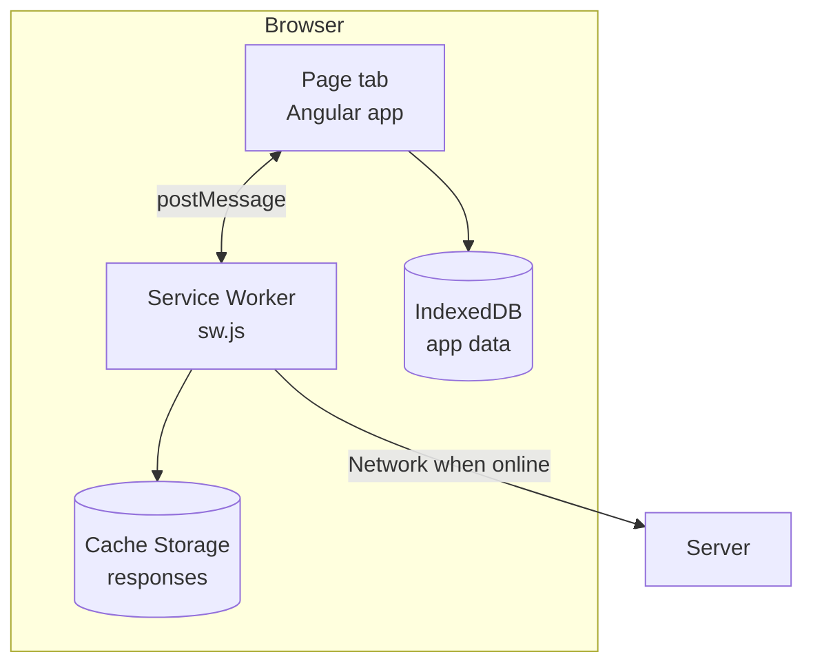
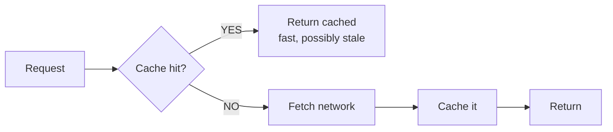
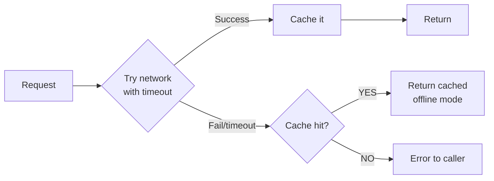
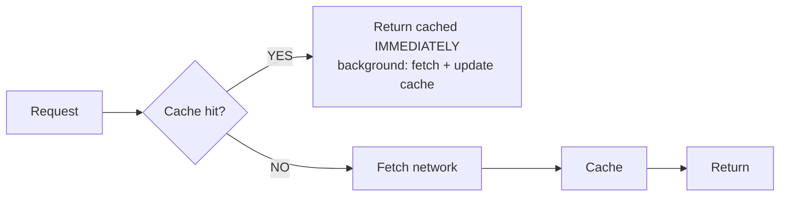
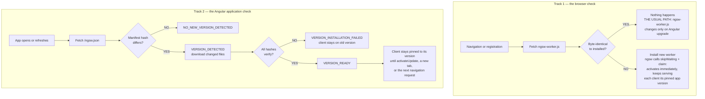
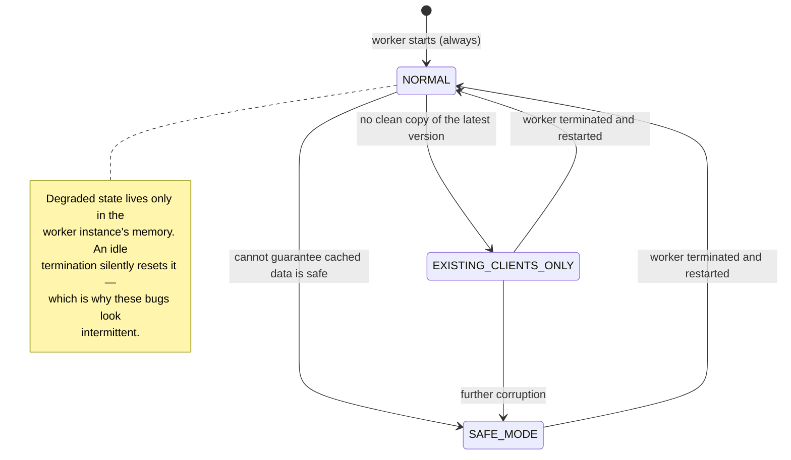

# Service Worker & PWA

> [Mastery Guide](../README.md) › [Frontend Integration](./README.md)

| Status | Priority | Phase | Last reviewed |
|---|---|---|---|
| Not Started | Medium | Phase 10 — Frontend (parallel) | 2026-08-19 |

## Contents
- [Why it matters](#why-it-matters)
  - [What this topic actually is at senior level](#what-this-topic-actually-is-at-senior-level)
- [Core concepts](#core-concepts)
  - [What a Service Worker is](#what-a-service-worker-is)
  - [Lifecycle — install, activate, fetch](#lifecycle--install-activate-fetch)
  - [Caching strategies](#caching-strategies)
  - [Web App Manifest](#web-app-manifest)
  - [PWA installability criteria](#pwa-installability-criteria)
  - [Background sync and push notifications](#background-sync-and-push-notifications)
  - [Angular Service Worker (`@angular/service-worker`)](#angular-service-worker-angularservice-worker)
  - [The API seam — `dataGroups` and the security of caching authenticated responses](#the-api-seam--datagroups-and-the-security-of-caching-authenticated-responses)
  - [Angular Service Worker vs Workbox — what `ngsw` refuses to do](#angular-service-worker-vs-workbox--what-ngsw-refuses-to-do)
  - [Debugging and break-glass — `ngsw/state`, `ngsw-bypass`, and the safety worker](#debugging-and-break-glass--ngswstate-ngsw-bypass-and-the-safety-worker)
  - [Updates and version management](#updates-and-version-management)
- [Code & diagrams](#code--diagrams)
- [Common pitfalls](#common-pitfalls)
- [Interview-ready summary](#interview-ready-summary)
- [Interview Cross-Questioning Drill](#interview-cross-questioning-drill)
- [Cheat Sheet](#cheat-sheet)
- [Walkthrough](#walkthrough--stuck-on-old-version-after-deploy)
- [Self-test](#self-test)
- [Cross-references](#cross-references)
- [Sources](#sources)

---

## Why it matters

A **Service Worker** is a JavaScript script that runs in the browser, separate from any page, intercepting network requests and managing caches. It's the foundation of **Progressive Web Apps (PWAs)** — web apps that can install to home screens, work offline, and behave like native apps.

For .NET + Angular shops, PWAs are a strategic option: deliver a single web codebase that works as a website AND installs to phones/desktops, supports offline read (and sometimes offline write), and pushes notifications. Cheaper than separate iOS/Android apps for many use cases (internal tools, B2B portals, content-heavy apps, productivity tools).

In 2026 the *substrate* is universal — every current browser engine ships service workers, the Cache API and the Web App Manifest. What is not universal is anything above that floor, and this is where interviews go:

- Chromium fires `beforeinstallprompt`, so you can build your own install UI and choose the moment. **Safari has never fired it.** On iOS the only install path is the user tapping Share → *Add to Home Screen*, unprompted and undetectable by your code.
- **Web Push on iOS/iPadOS arrived in 16.4, and only for web apps already added to the Home Screen** — a site running in a Safari tab cannot subscribe, and the permission request must be in response to a direct user interaction ([WebKit — *Web Push for Web Apps on iOS and iPadOS*](https://webkit.org/blog/13878/web-push-for-web-apps-on-ios-and-ipados/)).
- **Background Sync is not implemented in Firefox or in any version of Safari** — desktop or iOS ([caniuse — Background Sync API](https://caniuse.com/background-sync), which puts global support at 76.73%).

So "PWAs work everywhere now" is true of the plumbing and false of the feature set. Saying it flatly in an interview is the first thing an interviewer catches.

Why interviewers ask: PWA knowledge surfaces frontend depth. Knowing how Service Workers intercept requests, the cache strategies (cache-first vs network-first vs stale-while-revalidate), and how Angular's `ng add @angular/pwa` automates it all separates engineers who've shipped offline-capable apps from those who only know SPAs.

### What this topic actually is at senior level

At ten years in, nobody will ask you to define a PWA. The senior version of this topic is a **deployment and cache-invalidation** topic wearing a frontend hat.

Registering a service worker means you have shipped a persistent, versioned, write-through cache **onto machines you do not control and cannot purge**. There is no server-side invalidation. There is no admin button. The only lever you have is the next successful update check on that device, and that check is initiated by the device, on its schedule, against a manifest that your last deploy wrote.

Every question worth asking flows from that one fact:

| The naive framing | The framing you get paid for |
|---|---|
| "How do I cache API responses?" | "A cached `/api/me` from a previous user is sitting in `Cache Storage` on a shared kiosk. Whose problem is that?" |
| "How do I make it work offline?" | "A Sev-1 fix shipped 40 minutes ago. What fraction of users have it, and what is the tail?" |
| "Cache-first or network-first?" | "The index came from cache and its lazy chunks were evicted. The app is now a white screen with a `ChunkLoadError`. How does it self-heal?" |
| "How do I prompt for a reload?" | "The user has 20 minutes of unsaved form input. Reloading is the fix and also the bug." |

> 🌍 **In the real world**: an internal logistics PWA ships a Sev-1 fix — a rounding bug on freight charges — and the release goes out at 09:00. At 16:00 the finance team is still reporting wrong numbers. Nothing was wrong with the deploy: the CDN had the new bundle, the new `ngsw.json` was live, and a fresh browser got the fix instantly. The problem was that warehouse staff run the app as an installed PWA on a tablet that is **never reloaded** — the app had been in the foreground for eleven days. Angular's worker only schedules an update check off a real *navigation request*, and an app that is only ever navigated by the router issues none, so the worker had not so much as looked at `ngsw.json` in eleven days. Nothing was subscribed to `SwUpdate.versionUpdates` either, so even once it did look, nothing would have told anyone. The eventual fix was a `checkForUpdate()` timer and an update bar; the expensive part was the six hours spent looking for a deployment problem that did not exist. **The lesson they wrote into the runbook: with a service worker, "deployed" and "delivered" are different events, and only the client can tell you the difference.**

When NOT to invest: simple landing pages (no offline benefit). Apps that need OS-level integration (camera, contacts, Bluetooth, file system at OS level) — native still wins. Apps with strict App Store-only distribution (PWAs install via browser).

And one more, which is the honest answer more often than teams like: **any app where you cannot afford a stale-code incident and do not have anyone who wants to own the update lifecycle.** A service worker is not a feature you add; it is a distribution channel you now operate. If nobody on the team can answer "how do we force a rollback to reach a client that is offline right now", the correct architecture decision is not to register one.

## Core concepts

### What a Service Worker is

A Service Worker is a **proxy** between your web app and the network. It runs in its own thread (separate from the main page), can run when the page is closed, and intercepts every network request the page makes.

```
Browser tab (your app)
         │
         │  fetch('/api/orders')
         ▼
   Service Worker
   (intercepts; can serve from cache, modify, forward, ...)
         │
         ▼
      Network
```

Capabilities:
- **Cache management** — store responses, serve from cache.
- **Offline support** — serve cached responses when offline.
- **Background sync** — defer requests until network is available.
- **Push notifications** — receive push events even when the page is closed.
- **Request modification** — add headers, transform responses.

Constraints (security):
- **HTTPS only** (except localhost). A Service Worker can hijack every request; encryption is mandatory.
- **Same-origin script, but *not* same-origin traffic.** The *script* must be same-origin, and the SW's scope is limited to paths under its own location. But once installed it sees **every** request the controlled page makes, including cross-origin ones — your CDN, your fonts, your analytics, and yes, `api.example.com`. Cross-origin responses come back *opaque* unless CORS is configured, which limits what you can do with them, but the `fetch` event still fires. The frequently repeated "a SW can't intercept cross-origin requests" is wrong and worth getting right in an interview.
- **No DOM access.** Service Worker has no `window` or `document`. Communicates with pages via `postMessage`.
- **No `localStorage`, no `sessionStorage`.** Both are synchronous and window-scoped. The SW's storage is `Cache Storage` and IndexedDB, both async, both shared with the page.

#### Scope, and the `Service-Worker-Allowed` header

Scope is decided by **where the script is served from**, not where you registered it. A worker at `/js/sw.js` defaults to a scope of `/js/` and will never see a request for `/orders`. This is the single most common "my service worker does nothing" bug.

```typescript
// Fails: cannot widen scope above the script's own directory
navigator.serviceWorker.register('/js/sw.js', { scope: '/' });   // SecurityError
```

Two fixes: serve the script from the root (`/ngsw-worker.js` — which is exactly what Angular does), or have the server send `Service-Worker-Allowed: /` on the *script response*, which explicitly grants the wider scope.

For a .NET host this matters because static-file middleware and reverse proxies love to reorganise paths. If your Angular app is hosted at `/app/` behind YARP or IIS, the worker's scope is `/app/` and API calls to `/api/**` are **outside it** — the SW never sees them, `dataGroups` silently do nothing, and everyone spends a day reading `ngsw-config.json`.

```csharp
// ASP.NET Core: widen the worker's scope when the SPA is not at the root
app.UseStaticFiles(new StaticFileOptions
{
    OnPrepareResponse = ctx =>
    {
        var name = ctx.File.Name;
        if (name is "ngsw-worker.js" or "ngsw.json" or "safety-worker.js")
        {
            ctx.Context.Response.Headers["Service-Worker-Allowed"] = "/";
            // The update check must never be answered from the HTTP cache.
            ctx.Context.Response.Headers.CacheControl = "no-cache, max-age=0";
        }
    }
});
```

#### The service worker is a short-lived, restartable process

This is the constraint that breaks the most hand-written workers, and it has nothing to do with caching.

A service worker is **not a long-running background thread**. The browser starts it when there is an event to deliver — `fetch`, `push`, `sync`, `message` — and kills it when the event handlers settle. Chrome will terminate an idle worker aggressively. Consequences:

- **Module-level state does not survive.** `let pendingOrders = []` at the top of your worker is empty again on the next event. Anything that must persist goes to IndexedDB.
- **`event.waitUntil()` is not optional.** It is how you tell the browser "do not kill me yet". An `async` function called without `waitUntil` will be cut off mid-flight, and the failure is non-deterministic — it works on your fast laptop and fails on a cold worker on a phone.
- **Timers are not reliable.** `setInterval` in a service worker stops when the worker is terminated. There is no supported "poll the server every 5 minutes from the SW" — that is what Periodic Background Sync was designed for, and it is Chromium-only and requires an installed app.
- **The worker restarts in `NORMAL` state.** Angular's degraded modes (below) are held in memory, so a worker that was in `SAFE_MODE` comes back optimistic after termination. Bugs that depend on degraded state are therefore intermittent by construction.

> 🌍 **In the real world**: a team implements an offline outbox by pushing failed orders into an array inside the service worker and draining it on the `online` event. It passes every test, because tests keep the worker warm. In production roughly one order in thirty vanishes with no error anywhere — the worker had been terminated between the failure and the reconnect, and the array went with it. The rewrite that fixed it was mechanical (put the queue in IndexedDB and treat the SW as stateless) but the debugging was not, because **the bug's frequency was a function of how idle the user's device was**, which is not a variable anyone thinks to control for. The rule worth stating out loud: *a service worker is a request handler, not a process. If it holds state between events, it is wrong.*

### Lifecycle — install, activate, fetch

```
1. Page registers the SW:
   navigator.serviceWorker.register('/sw.js');

2. Browser downloads sw.js, parses it.

3. INSTALL event fires:
   - SW pre-caches static assets.
   - On success → "installed" state.

4. ACTIVATE event fires (when no other tabs hold the old SW):
   - SW cleans up old caches.
   - On success → "activated" state.

5. FETCH event fires for every network request the controlled pages make:
   - SW decides: serve from cache, fetch from network, or some combo.

6. New SW versions:
   - When sw.js content changes, browser detects via byte-comparison.
   - New SW installs (in "waiting" state) while old one still controls existing tabs.
   - New SW activates only after ALL tabs close (or you skipWaiting + claim manually).
```

This lifecycle is the source of the "the user needs to refresh twice" problem — the new SW only takes over after old tabs close. Angular's SW handles the mechanics; raw SW code requires careful version management.

#### "All tabs close" is more precise than it sounds

The waiting worker activates when there are **no remaining clients controlled by the current active worker**. Two consequences that trip people up in interviews:

- **A reload does not release control.** When you press F5, the old document is replaced by a new one, but there is no moment where the origin has zero controlled clients — the browser hands the new document to the existing active worker.
- **A navigation to another page on the same origin also does not release control**, for the same reason.

What *does* release control: closing every tab and window on that origin, or the browser deciding to unload them. On desktop, with a pinned tab, that can be weeks. On an installed PWA on a tablet, it can be never.

> ⚠️ **Everything in this subsection describes the *browser's* worker lifecycle, and Angular deliberately does not use it to version your application.** `ngsw-worker.js` calls `skipWaiting()` and `clients.claim()` unconditionally, so an Angular worker never sits in "waiting" at all. Application versions are tracked inside the worker instead. If you carry the waiting-state model over to `@angular/service-worker` you will get several common interview answers exactly backwards — see [The two lifecycles](#the-two-lifecycles--why-angulars-worker-calls-skipwaiting-and-a-reload-still-works).

#### Why the browser byte-compares the script — and what that misses

The browser's entire update trigger is: fetch the worker script, compare it **byte-for-byte** with the installed one, and if it differs, install the new one. That is the whole mechanism.

Which means the update check is only as fresh as the script fetch. Three rules govern it:

1. **The script fetch bypasses the HTTP cache if the previous fetch was more than 24 hours ago** ([MDN — `ServiceWorkerRegistration.update()`](https://developer.mozilla.org/en-US/docs/Web/API/ServiceWorkerRegistration/update)). Historically, a `max-age` greater than 86400 on the worker script was clamped to 86400 for exactly this reason.
2. **Since Chrome 68, update checks for the worker script are not served from the HTTP cache at all by default**, and from Chrome 78 the same check is extended to scripts pulled in via `importScripts` ([Chrome for Developers — *Fresher service workers, by default*](https://developer.chrome.com/blog/fresher-sw)). The same article still recommends setting `Cache-Control: max-age=0` on worker scripts, because not every browser and not every intermediary honours the newer behaviour.
3. **`updateViaCache` on `register()` controls this explicitly** — `'imports'` (the platform default), `'all'`, or `'none'`. Angular exposes it on `SwRegistrationOptions`.

**What the byte comparison misses is the interesting part.** `ngsw-worker.js` is a *fixed* file — it ships with `@angular/service-worker` and only changes when you upgrade Angular. Deploying a new build of your application does **not** change it. So the byte comparison finds nothing, and the browser's own update machinery is not what delivers your app update at all.

Angular's worker layers its own check on top: on each page load it re-fetches **`ngsw.json`** — the build-generated manifest of every file and its hash — and compares it against the manifest it has stored. angular.dev's [service worker devops](https://angular.dev/ecosystem/service-workers/devops) page states the check happens "every time the user opens or refreshes the application". There is no background polling loop. This distinction — *browser checks `ngsw-worker.js`, Angular checks `ngsw.json`* — is the single fact that explains most Angular PWA update bugs, and it is why the `Cache-Control` header that actually matters in production is the one on **`ngsw.json`**, not the one on the worker script.

#### Navigation preload — the latency you pay for having a worker

A subtle cost: once a page is controlled, every navigation must **boot the service worker first**, then run your `fetch` handler, then hit the network. On a cold worker that is a JS parse and execute before a single byte of HTML is requested.

`navigationPreload` fixes it by letting the browser start the navigation request *in parallel* with worker startup:

```javascript
self.addEventListener('activate', event => {
  event.waitUntil(self.registration.navigationPreload?.enable());
});

self.addEventListener('fetch', event => {
  if (event.request.mode === 'navigate') {
    event.respondWith((async () => {
      const preloaded = await event.preloadResponse;   // may be undefined
      return preloaded ?? fetch(event.request);
    })());
  }
});
```

Angular's worker does not expose this declaratively — it is one of the concrete things you give up by staying on `ngsw-worker.js`, and one of the reasons SSR-heavy apps end up ejecting to a custom worker. Support is broad (Chrome 59+, Firefox 99+, Safari and Safari iOS 15.4+, 95.64% global per [caniuse — `NavigationPreloadManager`](https://caniuse.com/mdn-api_navigationpreloadmanager)) but not guaranteed, so it is still written as a progressive enhancement — hence the `?.` and the `??`.

### Caching strategies

Five canonical strategies. Pick by request type:

**1. Cache-first (offline-first)** — try cache; if miss, network; if network fails, error.
```javascript
self.addEventListener('fetch', e => {
  e.respondWith(
    caches.match(e.request).then(cached => cached || fetch(e.request))
  );
});
```
Best for: static assets (JS, CSS, fonts, images). Fast, offline-capable.

**2. Network-first** — try network; on failure (offline), serve from cache.
```javascript
fetch(e.request).then(r => {
  cache.put(e.request, r.clone());
  return r;
}).catch(() => caches.match(e.request));
```
Best for: dynamic data where freshness matters more than offline support. Falls back to cache when offline.

**3. Stale-while-revalidate** — serve cache immediately; fetch in background to update cache.
```javascript
const cached = caches.match(e.request);
const networkUpdate = fetch(e.request).then(r => {
  cache.put(e.request, r.clone());
  return r;
});
return cached || networkUpdate;
```
Best for: feed-style content. Fast (cache); fresh on next visit (background update).

**4. Cache-only** — never goes to network.
```javascript
caches.match(e.request)
```
Best for: pre-cached assets you ship with the app version.

**5. Network-only** — never caches; just passes through.
```javascript
fetch(e.request)
```
Best for: API mutations (POST, PUT, DELETE). Caching writes is dangerous.

Real apps use **different strategies per URL pattern**:
- `/index.html` → network-first (always fresh entry point).
- `/static/*` → cache-first (versioned assets are immutable).
- `/api/*` → network-first or stale-while-revalidate (data freshness).
- `/api/orders` POST → network-only (writes pass through).

#### Where the five-strategy model stops being useful

The five strategies are a per-request model. They say nothing about the property that actually matters in a versioned SPA: **the set of cached files must be internally consistent.**

Consider a per-request cache under a normal deploy. `index.html` is network-first, so after the deploy it is fresh and references `main.<hash-2>.js`. The lazy chunks are cache-first, so `lazy-orders.<hash-1>.js` is still in the cache and `lazy-orders.<hash-2>.js` has never been requested. If the origin has already pruned hash-1 (most CI pipelines overwrite the output directory), the user navigates to `/orders` and gets a `ChunkLoadError`. Nothing was misconfigured. Every individual strategy did exactly what it promised. The **set** was incoherent.

This is why Angular's service worker does not expose per-request strategies for application code at all. Its stated design assumption is atomicity — angular.dev's [overview](https://angular.dev/ecosystem/service-workers) puts it as: *"The application is cached as one unit, and all files update together"* and *"A running application continues to run with the same version of all files. It does not suddenly start receiving cached files from a newer version."*

The trade you are making, and should be able to name in an interview:

| | Per-request strategies (Workbox, hand-rolled) | Version-atomic (Angular SW) |
|---|---|---|
| Unit of caching | one URL | one build |
| Update granularity | file by file, continuously | all-or-nothing, at activation |
| Failure mode | mixed versions, `ChunkLoadError` | user pinned to an old but *coherent* version |
| Control you keep | total | the `ngsw-config.json` schema |
| Who is responsible for coherence | you | the framework |

Neither is better. One fails by serving Frankenstein builds; the other fails by serving yesterday's build for longer than you would like. Knowing which failure you have chosen is the answer.

#### The details that bite in real fetch handlers

Five things that never appear in the tutorial version of the five strategies:

**1. `cache.put()` rejects non-GET requests.** `Cache.put` with a `POST` throws `TypeError`. This is a platform guarantee, not a convention — you cannot accidentally cache a mutation through the Cache API even if you try. (You *can* cache one in IndexedDB, which is how people accidentally build replay bugs.)

**2. A `Response` body can only be read once.** Every strategy that both returns a response and stores it must `clone()` **before** either consumption, and clone the one you are about to put, not the one you are about to return — order matters if the consumer starts streaming.

```javascript
const response = await fetch(request);
cache.put(request, response.clone());   // clone first, then return the original
return response;
```

**3. `Cache.match` honours `Vary` by default.** If your .NET API sends `Vary: Accept, Authorization`, a cached entry stored under one set of request headers will not match a later request with different ones — you get silent cache misses that look like the SW is broken. `cacheQueryOptions: { ignoreVary: true }` exists at the platform level; Angular's config only surfaces `ignoreSearch`.

**4. `Response.status === 0` means opaque.** A cross-origin `no-cors` response is opaque: status 0, no headers, unreadable body. You can cache and replay it, but you cannot tell success from a 404, so caching one caches failures permanently. Angular's config gates this behind `cacheOpaqueResponses`, which defaults to `true` for `freshness` and `false` for `performance` groups.

**5. Range requests are their own category.** `<video>` and `<audio>` issue `Range` requests and expect `206 Partial Content`. Returning a cached `200` to a range request breaks media playback in ways that look like a codec problem. Angular has had reported defects in this area (see [angular/angular#62333](https://github.com/angular/angular/issues/62333), external range requests causing a loop and bypassing `dataGroups`), which is a fair thing to cite when someone asks whether the built-in worker is production-grade for a media app.

> 🌍 **In the real world**: an Angular app behind a .NET API adds a `dataGroups` entry for `/api/**` with `strategy: "performance"` to cut load time on a slow VPN. It works. Two months later a support ticket says a user is seeing a colleague's dashboard. The cause was mundane: the API is `Authorization`-header authenticated, the Cache API keys entries **by URL**, and the app is used on a shared floor-terminal where staff log in and out all day. `/api/dashboard/summary` had been cached under user A's session, and the cache was neither keyed by, nor cleared on, identity change. The Angular team has an open discussion of exactly this gap ([angular/angular#24008 — *Allow to clear Service Worker cache*](https://github.com/angular/angular/issues/24008)). The remediation was to stop caching anything user-scoped and cache only reference data, plus a `caches.delete()` sweep on logout. **The sentence that went into their security review: an HTTP cache respects `Cache-Control: private`; the Cache API does not respect anything — it caches what you tell it to, for as long as you tell it to, keyed only by URL.**

### Web App Manifest

A JSON file describing the app's metadata for installation.

```json
{
  "name": "MyApp Orders",
  "short_name": "Orders",
  "description": "Manage customer orders",
  "start_url": "/",
  "scope": "/",
  "display": "standalone",
  "background_color": "#ffffff",
  "theme_color": "#1976d2",
  "icons": [
    { "src": "icons/icon-192.png", "sizes": "192x192", "type": "image/png" },
    { "src": "icons/icon-512.png", "sizes": "512x512", "type": "image/png" },
    { "src": "icons/icon-maskable.png", "sizes": "512x512", "type": "image/png", "purpose": "maskable" }
  ],
  "shortcuts": [
    { "name": "New Order", "url": "/orders/new", "icons": [{ "src": "icons/new.png", "sizes": "96x96" }] }
  ]
}
```

Linked in HTML:
```html
<link rel="manifest" href="/manifest.webmanifest" />
```

The manifest tells the browser how to display the installed app — name, icons, splash screen color, default URL, scope (which URLs the SW controls).

**`display` values:**
- `standalone` — looks like a native app (no browser UI).
- `fullscreen` — entire screen, no status bar (rare).
- `minimal-ui` — minimal browser UI.
- `browser` — opens in browser tab (no install prompt).

#### `id` — the field that decides whether you can ever change `start_url`

The manifest field almost every older codebase is missing. Without an explicit `id`, the browser derives the app's identity from `start_url`. Change `start_url` later — a routing refactor, a locale prefix, an added query string — and the browser treats it as a **different application**: the installed icon keeps pointing at the old entry, and a fresh install appears alongside it.

```json
{
  "id": "/?source=pwa",
  "start_url": "/?source=pwa"
}
```

Set `id` on day one and never change it; then `start_url` becomes free to move. If you inherit an app without one, adding it *now* pins identity to whatever the current `start_url` resolves to, which is exactly the behaviour you already have — so it is a safe retrofit, and it buys you the freedom later. This is a good "defend a decision made years ago" answer: the honest version is "we did not know about `id`, so `start_url` has been frozen since 2021, and here is the migration."

#### Modern manifest surface worth knowing exists

Support for these varies sharply and several are Chromium-only. Check caniuse before shipping any of them; every one of them must degrade to nothing.

| Field | What it does | Reality check |
|---|---|---|
| `display_override` | Ordered list tried before `display`; how you request `window-controls-overlay` or `tabbed` and fall back cleanly | Chromium-leaning |
| `screenshots` | Populates the richer install dialog with `form_factor: "wide"` / `"narrow"` entries | Without these, some install UIs show a minimal prompt |
| `shortcuts` | Long-press / right-click jump list on the installed icon | Widely useful, cheap to add |
| `launch_handler` | `client_mode: "navigate-existing"` / `"focus-existing"` — whether a second launch reuses the running window | Solves the "clicking a link opens a third copy of my app" complaint |
| `share_target` | Registers the app as an OS share destination, delivering a `POST` to a URL you choose | Chromium/Android; the `POST` arrives *at the service worker*, not the server, if the SW intercepts it |
| `file_handlers` | Registers file extensions the installed app can open | Chromium desktop |
| `protocol_handlers` | Registers `web+yourscheme://` links | Chromium desktop |

The interview-relevant point is not the list. It is that **`share_target` and `file_handlers` are the boundary where "PWA vs native" stops being a philosophical argument** — they are the two capabilities that convert "our web app can't do that" into "our web app can do that on Android and Windows and cannot on iOS", which is a much more useful sentence to bring to an architecture review.

#### Serving the manifest from ASP.NET Core

Two failures that are always the server's fault, not Angular's:

- **Wrong MIME type.** `.webmanifest` must be served as `application/manifest+json`. IIS and `UseStaticFiles` will return 404 or `text/plain` for an unknown extension, and the browser silently ignores the manifest — no console error, no install prompt, and nothing in the Angular build to blame.
- **Credentialed fetch.** The manifest is fetched **without credentials by default**. If the manifest URL sits behind cookie auth (common when the SPA is served from an authenticated ASP.NET Core endpoint), it 401s and the app is not installable. Either put it on an anonymous path or add `crossorigin="use-credentials"` to the `<link>`.

```csharp
var provider = new FileExtensionContentTypeProvider();
provider.Mappings[".webmanifest"] = "application/manifest+json";
app.UseStaticFiles(new StaticFileOptions { ContentTypeProvider = provider });
```

### PWA installability criteria

For a browser to show the "Install" prompt, the app needs:

1. **HTTPS** (or localhost).
2. **Web App Manifest** with `name` (or `short_name`), `start_url`, `display: standalone` (or fullscreen / minimal-ui), and at least one 192×192 icon and one 512×512 icon.
3. **Service Worker** registered and successfully active, handling the `fetch` event for at least the start URL.
4. **HTTPS-served start URL** with a 200 response.

Two corrections to the version of this list that circulates:

- **"A service worker with a `fetch` handler" is no longer required for *menu-based* installation in Chromium.** Chrome dropped that requirement in **version 108 on mobile and 112 on desktop**; the stated reason was that sites were shipping empty `fetch` handlers purely to satisfy the check, which hurt performance for no user benefit. The **automatic install prompt** still requires a `fetch` handler. Chrome also **removed the Lighthouse PWA category** in the same era, so "our Lighthouse PWA score is 100" is no longer a thing you can say ([Chrome for Developers — *Revisiting Chrome's installability criteria*](https://developer.chrome.com/blog/update-install-criteria)). A service worker is still required for offline behaviour, which is a different requirement from installability and worth separating in your answer.
- **`beforeinstallprompt` is not a standard.** It exists in Chromium — MDN classifies it as "Limited availability", specified only in the WICG *Manifest Incubations* draft. Firefox and Safari do not fire it, so any code path gated on it is a Chromium-only code path.
- **Eligibility is not the same as being prompted.** Chrome additionally applies engagement heuristics before it will surface an install prompt: per [web.dev — *What does it take to be installable?*](https://web.dev/articles/install-criteria), the user must have clicked or tapped on the page at least once and spent at least 30 seconds viewing it. `prefer_related_applications` must also be absent or `false`, and `window-controls-overlay` now counts as an installable `display` value alongside `fullscreen`, `standalone` and `minimal-ui`. So "my manifest is valid but no prompt appears" is usually a *behaviour* gate, not a manifest bug — which is why you capture `beforeinstallprompt` and show your own button rather than waiting for the browser's.

Per-engine reality, which is what an interviewer is probing when they ask "does this work on iPhone":

| Engine | Install path | Programmatic control |
|---|---|---|
| Chromium (Chrome, Edge, Samsung) | Address-bar install icon, plus your own UI via `beforeinstallprompt` | Yes |
| Safari iOS/iPadOS | Share sheet → *Add to Home Screen*, user-initiated only | None. You cannot detect eligibility, prompt, or know whether the user installed |
| Safari macOS | *File → Add to Dock* | None |
| Firefox | Android: *Add to Home screen*. Desktop: no PWA install | None |

The practical consequence for iOS: your only lever is an in-app instruction card, shown to users who are **not** already in standalone mode, telling them where the Share button is. Detect that with `window.matchMedia('(display-mode: standalone)').matches` (plus the non-standard `navigator.standalone` for older iOS). Show it once, remember the dismissal, and never show it in standalone mode — an "install our app" banner inside the installed app is the classic bug here.

You can also trigger the install prompt programmatically:

```typescript
let deferredPrompt: BeforeInstallPromptEvent | null = null;

window.addEventListener('beforeinstallprompt', (e: any) => {
  e.preventDefault();          // suppress default browser prompt
  deferredPrompt = e;          // save it
  // show your custom "Install" button
});

async function showInstallPrompt() {
  if (!deferredPrompt) return;
  await deferredPrompt.prompt();
  const choice = await deferredPrompt.userChoice;
  console.log(choice.outcome);   // 'accepted' or 'dismissed'
  deferredPrompt = null;
}
```

Now you control when to show the prompt (e.g., after the user has used the app for a few minutes, not on first load).

### Background sync and push notifications

**Background Sync** — defer requests until network is available:

```javascript
// In page code
async function placeOrder(order) {
  try {
    await fetch('/api/orders', { method: 'POST', body: JSON.stringify(order) });
  } catch (err) {
    if ('serviceWorker' in navigator && 'SyncManager' in window) {
      const reg = await navigator.serviceWorker.ready;
      // Save to IndexedDB; SW will retry when online
      await saveToOutbox(order);
      await reg.sync.register('outbox-sync');
    }
  }
}

// In sw.js
self.addEventListener('sync', event => {
  if (event.tag === 'outbox-sync') {
    event.waitUntil(processOutbox());
  }
});
```

**Background Sync is unavailable in Firefox and in every version of Safari, desktop and iOS** ([caniuse](https://caniuse.com/background-sync) — 76.73% global). It is not "incomplete on iOS"; it is absent. Design accordingly: the IndexedDB outbox is the contract, Background Sync is an accelerant on the engines that have it, and the universal fallback is draining the outbox on the `online` event and on app start.

If you are on Workbox, you get the retry queue for free rather than hand-rolling it — and, importantly, `BackgroundSyncPlugin` **falls back to replaying the queue on the next service worker startup** when the Sync API is missing, which is the behaviour you would otherwise write yourself:

```javascript
import {BackgroundSyncPlugin} from 'workbox-background-sync';
import {registerRoute} from 'workbox-routing';
import {NetworkOnly} from 'workbox-strategies';

const bgSyncPlugin = new BackgroundSyncPlugin('orders-queue', {
  maxRetentionTime: 24 * 60,   // minutes
});

registerRoute(/\/api\/orders/, new NetworkOnly({plugins: [bgSyncPlugin]}), 'POST');
```

**Idempotency is the part nobody mentions.** A replayed `POST /api/orders` can succeed on the server and fail to reach the client — the retry then creates a duplicate order. Queued writes are at-least-once delivery, so the .NET side needs a deduplication key. The usual shape: the client mints a GUID when the order is *created locally*, sends it as an `Idempotency-Key` header (or as the entity's client-generated id), and the API treats a repeat as a lookup rather than an insert.

```csharp
[HttpPost("orders")]
public async Task<IActionResult> Create(
    [FromHeader(Name = "Idempotency-Key")] Guid key, CreateOrder cmd, CancellationToken ct)
{
    var existing = await _db.Orders.FirstOrDefaultAsync(o => o.IdempotencyKey == key, ct);
    if (existing is not null) return Ok(_mapper.ToDto(existing));   // replay, not a new order

    var order = Order.Create(key, cmd);
    _db.Orders.Add(order);
    await _db.SaveChangesAsync(ct);        // unique index on IdempotencyKey is the real guard
    return CreatedAtAction(nameof(Get), new { id = order.Id }, _mapper.ToDto(order));
}
```

Put a unique index on the column. The `FirstOrDefaultAsync` check is a fast path, not a correctness mechanism — two replays can race it, and only the database can settle that.

**Periodic Background Sync** (`periodicsync`) is a different API: it lets the browser wake the worker on a rough schedule to refresh content. It is Chromium-only, requires the app to be installed, and the browser decides the actual interval based on engagement. It is a nice-to-have for a news reader and not something to build a business requirement on.

> 🌍 **In the real world**: a field-service PWA queues job completions offline and replays them via Background Sync. It works on the Android tablets and, allegedly, on the iPhones — the team tested on iOS by toggling airplane mode for ten seconds, submitting, turning it off, and watching the job appear. It appeared because the *page was still open* and their `online`-event fallback drained the queue. The real failure mode showed up months later: engineers in basements would submit, lock the phone, and drive away. Safari has no Background Sync, the page got frozen and then discarded, and the outbox only drained the next time someone opened the app — sometimes the next morning, sometimes after the job had been reassigned. Nothing was lost, but the dispatch board was hours stale and nobody trusted it. The fix was not technical: they surfaced the pending count in the UI ("3 jobs waiting to send") so the staleness was visible, and stopped treating submitted-offline as submitted. **At-least-once, eventually, when the user comes back is a real delivery guarantee — it is just not the one the product team thought they had bought.**

**Push Notifications** — receive messages from a server, even when no tab is open:

```javascript
// Subscribe (in the page)
const registration = await navigator.serviceWorker.ready;
const subscription = await registration.pushManager.subscribe({
  userVisibleOnly: true,
  applicationServerKey: urlBase64ToUint8Array(VAPID_PUBLIC_KEY)
});
// Send subscription to your backend

// In sw.js — receive a push
self.addEventListener('push', event => {
  const data = event.data.json();
  event.waitUntil(
    self.registration.showNotification(data.title, {
      body: data.body,
      icon: '/icons/icon-192.png',
      badge: '/icons/badge.png',
      data: { url: data.url }
    })
  );
});

// Handle notification click
self.addEventListener('notificationclick', event => {
  event.notification.close();
  event.waitUntil(clients.openWindow(event.notification.data.url));
});
```

Push requires a backend that sends to the **Push Service** (FCM, APNS, Mozilla Push Service) using **Web Push protocol** — typically via `web-push` library on the server, or Azure Notification Hubs for managed.

#### Push in Angular: `SwPush` and the `onActionClick` payload contract

If you are using `ngsw-worker.js` you do **not** write the `push` or `notificationclick` handlers — Angular's worker owns them, and it expects a specific payload shape. This is the detail that separates people who have shipped Angular push from people who have read about push.

The API surface, verified against [angular.dev](https://angular.dev/api/service-worker/SwPush):

```typescript
class SwPush {
  readonly messages: Observable<object>;
  readonly notificationClicks: Observable<{ action: string; notification: NotificationOptions & { title: string } }>;
  readonly notificationCloses: Observable<{ action: string; notification: NotificationOptions & { title: string } }>;
  readonly pushSubscriptionChanges: Observable<{ oldSubscription: PushSubscription | null; newSubscription: PushSubscription | null }>;
  readonly subscription: Observable<PushSubscription | null>;
  readonly isEnabled: boolean;
  requestSubscription(options: { serverPublicKey: string }): Promise<PushSubscription>;
  unsubscribe(): Promise<void>;
}
```

`pushSubscriptionChanges` is the one most codebases are missing. The browser can rotate or expire a subscription on its own; if you never listen, your backend keeps pushing to a dead endpoint and the user silently stops receiving notifications.

The payload your .NET service sends must be wrapped in a `notification` object, and click behaviour is **declared in the payload**, not coded in the worker:

```json
{
  "notification": {
    "title": "Order #4821 shipped",
    "body": "Tracking number DHL-9931",
    "icon": "/icons/icon-192.png",
    "actions": [
      { "action": "track", "title": "Track" },
      { "action": "open",  "title": "Open order" }
    ],
    "data": {
      "onActionClick": {
        "default": { "operation": "focusLastFocusedOrOpen", "url": "/orders/4821" },
        "track":   { "operation": "openWindow", "url": "/track/DHL-9931" },
        "open":    { "operation": "navigateLastFocusedOrOpen", "url": "/orders/4821" }
      }
    }
  }
}
```

The four supported operations, per [angular.dev — push notifications](https://angular.dev/ecosystem/service-workers/push-notifications):

| Operation | Behaviour |
|---|---|
| `openWindow` | Opens a new tab at the URL |
| `focusLastFocusedOrOpen` | Focuses the last focused client; opens a new tab if none |
| `navigateLastFocusedOrOpen` | Focuses the last focused client **and navigates it** to the URL; opens a new tab if none |
| `sendRequest` | Sends a plain `GET` to the URL — how you build a "mark as read" action that does not open the app |

An action with no matching `onActionClick` entry just closes the notification and notifies open clients via `SwPush.notificationClicks`.

`navigateLastFocusedOrOpen` is almost always the right default for a line-of-business app: `openWindow` is what produces the "clicking three notifications opened three copies of the app" complaint.

#### VAPID, key rotation, and dead-subscription hygiene on the .NET side

```csharp
public sealed class PushSender(IPushSubscriptionStore store, ILogger<PushSender> log)
{
    private readonly WebPushClient _client = new();

    public async Task SendAsync(string userId, object payload, CancellationToken ct)
    {
        _client.SetVapidDetails("mailto:ops@example.com", VapidPublicKey, VapidPrivateKey);

        foreach (var sub in await store.GetForUserAsync(userId, ct))
        {
            try
            {
                await _client.SendNotificationAsync(
                    new PushSubscription(sub.Endpoint, sub.P256dh, sub.Auth),
                    JsonSerializer.Serialize(payload));
            }
            catch (WebPushException ex) when
                (ex.StatusCode is HttpStatusCode.Gone or HttpStatusCode.NotFound)
            {
                // 410 Gone / 404: the push service says this endpoint is dead. Delete it.
                await store.DeleteAsync(sub.Id, ct);
            }
            catch (WebPushException ex) when (ex.StatusCode == HttpStatusCode.TooManyRequests)
            {
                log.LogWarning("Push service throttled; backing off for {User}", userId);
                throw;   // let the retry policy own this one
            }
        }
    }
}
```

Four operational facts that come up:

1. **VAPID keys are per-application, not per-user, and they are effectively permanent.** The public key is baked into every subscription the browser created. Rotate the pair and **every existing subscription becomes unusable** — you cannot re-sign old subscriptions with a new key. Rotation means re-subscribing your entire user base, which means the private key belongs in Key Vault from day one, not in `appsettings.Production.json`.
2. **`410 Gone` is the only cleanup signal you get.** There is no "user uninstalled" webhook. A store that never deletes on 410 grows monotonically and eventually the nightly push job takes hours.
3. **The payload is end-to-end encrypted to the subscription's keys.** The push service (FCM, Mozilla, Apple) relays ciphertext and cannot read it — which also means it cannot help you debug it.
4. **`userVisibleOnly: true` is mandatory in Chromium**, and iOS requires the app be launched from the Home Screen. Silent push is not available to you.

**Declarative Web Push** is the recent piece of surface area here, and worth knowing exists because it changes the architecture rather than the syntax. Shipped for Home Screen web apps on **iOS/iPadOS 18.4**, it lets the server send a push whose notification is declared as JSON in the payload, so the browser can display it **without waking a service worker or running any JavaScript** ([WebKit — *Meet Declarative Web Push*](https://webkit.org/blog/16535/meet-declarative-web-push/)). The relevance for an Angular shop: Angular's `SwPush` and the `onActionClick` contract described above are a *service-worker* mechanism, so a declarative payload bypasses them entirely. It is an additive path rather than a replacement — treat it as the way to make simple notifications reliable on Apple platforms, not as a reason to redesign a working `SwPush` integration.

> 🌍 **In the real world**: a team adds push to an Angular app and stores subscriptions keyed by user id. Works fine. Then a warehouse gets shared tablets, and staff start receiving each other's notifications — the subscription belonged to the *browser*, not the person, and logging out never called `SwPush.unsubscribe()`. Worse, the payloads had the customer name in the notification body, so a lock-screen preview leaked it to whoever was holding the device. Two fixes shipped: `unsubscribe()` in the logout path and deleting the row server-side, and a rule that notification bodies carry an identifier and never a name. **The generalisable point: a push subscription is a device credential, and treating it as a user credential is how PII ends up on someone else's lock screen.**

### Angular Service Worker (`@angular/service-worker`)

Angular ships an opinionated, **declarative-only** service worker. You do not write worker code; you write a JSON config, and the build emits a manifest that a pre-built worker (`ngsw-worker.js`, shipped inside the package) consumes at runtime. That is the whole design, and both its strengths and its refusals follow from it.

```bash
ng add @angular/pwa
```

Per [angular.dev — getting started](https://angular.dev/ecosystem/service-workers/getting-started), the schematic:

- adds the `@angular/service-worker` package;
- enables service worker build support in the CLI (`"serviceWorker": true` on the production configuration in `angular.json`);
- imports and registers the worker in the application's root providers;
- updates `index.html` with the manifest link and `theme-color`;
- installs icon files;
- creates `ngsw-config.json`.

Note that on a modern CLI workspace the icons and manifest land in **`public/`**, not `src/assets/` — older guides (and older answers in interviews) still say `src/assets`, and the difference matters when you are writing the `resources.files` globs by hand.

#### What landed when

Ten years in, the risk is not that you do not know this package — it is that you know the 2019 version of it and have not had a reason to look since. Every row below was checked against the Angular `CHANGELOG.md` and the published typings, not from memory.

| Landed in | Date | What |
|---|---|---|
| **v13.0.0** | 2021-11-03 | `versionUpdates` introduced; `SwUpdate#available` and `SwUpdate#activated` deprecated in the same release. `activateUpdate()`/`checkForUpdate()` changed to return `Promise<boolean>` |
| **v14.0.0** | 2022-06-02 | `cacheOpaqueResponses` on data groups; `NoNewVersionDetectedEvent` ("already up to date" now emits) |
| **v16.0.0** | 2023-05-03 | `provideServiceWorker()` — standalone registration without `ServiceWorkerModule` |
| **v17.0.0** | 2023-11 | `SwUpdate#available` and `#activated` **removed**. Code still using them has not compiled for two years |
| **v19.0.0** | 2024-11-19 | `applicationMaxAge`; `refreshAhead` on data groups |
| **v20.1.0** | 2025-07-09 | `SwPush.notificationCloses`; `SwPush.pushSubscriptionChanges` |
| **v20.2.0** | 2025-08-20 | `type` and `updateViaCache` accepted by `provideServiceWorker()` |

If your answer to "how do you handle updates" still starts with `swUpdate.available.subscribe(...)`, that is a five-year-old answer to a question about an API that was deleted in v17 — and it is the single fastest way to date yourself on this topic.

**A verification note worth having, because it is a live trap.** angular.dev's *Communicating with the service worker* page currently documents **five** `versionUpdates` event types, including a `VersionFailedEvent`. A commit titled *"notify clients about version failures"* did add one in **v20.2.0**. But it is **not in the published type** for the versions you can install: `VersionEvent` in `@angular/service-worker` 21.2.18 and 22.1.2 is a union of exactly four members, and the public-API golden on `main` agrees. Write code against the docs table and it will not compile. This is a good illustration of the habit rather than the fact: when a doc page and the shipped `.d.ts` disagree, the `.d.ts` is the API.

#### `provideServiceWorker()` and the registration strategy

```typescript
import { ApplicationConfig, isDevMode } from '@angular/core';
import { provideServiceWorker } from '@angular/service-worker';

export const appConfig: ApplicationConfig = {
  providers: [
    provideServiceWorker('ngsw-worker.js', {
      enabled: !isDevMode(),
      registrationStrategy: 'registerWhenStable:30000',
    }),
  ],
};
```

`SwRegistrationOptions`, verified against [angular.dev](https://angular.dev/api/service-worker/SwRegistrationOptions):

| Option | Type | Default | Notes |
|---|---|---|---|
| `enabled` | `boolean` | `true` | Gate on `!isDevMode()`. When `false`, `SwUpdate.isEnabled` and `SwPush.isEnabled` are `false` and the services no-op rather than throw |
| `scope` | `string` | — | The URL range the worker controls |
| `registrationStrategy` | `string \| (() => Observable<unknown>)` | `'registerWhenStable:30000'` | See below |
| `type` | `WorkerType` | `'classic'` | `'classic'` / `'module'`. Added in **v20.2.0** |
| `updateViaCache` | `ServiceWorkerUpdateViaCache` | platform default `'imports'` | `'imports'` / `'all'` / `'none'` — whether the HTTP cache is consulted for the worker script and its imports. Added in **v20.2.0** |

Those are the five, verified against the published `goldens/public-api/service-worker/index.api.md` for the version on npm rather than against a blog post. Note `type: 'module'` is the option that lets a custom worker use real `import` statements instead of `importScripts()` — relevant if you extend the worker, since `importScripts()` is unavailable in a module worker and the documented Angular extension pattern is written with `importScripts()`.

`registrationStrategy` accepts:

- `registerWhenStable:<ms>` — wait for application stability, but register no later than `<ms>`.
- `registerImmediately`.
- `registerWithDelay:<ms>` (omitting the number means `0`).
- a factory returning an `Observable` — register when it emits.

**`registerWhenStable:30000` is the default and the number is a *timeout*, not a poll interval.** This is worth burning into memory because the folklore version — "the Angular service worker polls every 30 seconds" — is wrong and is the kind of thing a strong interviewer will pull on. The worker checks for a new `ngsw.json` when the application is opened or refreshed ([angular.dev — devops](https://angular.dev/ecosystem/service-workers/devops)); nothing polls on a timer unless you call `SwUpdate.checkForUpdate()` yourself.

**Why the default waits for stability at all**: registering the worker kicks off downloads of every prefetched asset. Doing that during initial page load competes with the resources the user is actually waiting for. Waiting for stability pushes that contention past first paint. The `30000` ceiling exists because a **zoneless** application, or one with a long-lived pending task, may never reach the old notion of stability — without a timeout the worker would never register at all.

**Zoneless note (v21+):** with zoneless as the default from v21, "stable" is derived from `PendingTasks` rather than from `NgZone.onStable`. If a service holds a pending task open (a long poll, an unclosed `PendingTasks.add()`), registration falls back to the 30-second timeout. That is a correctness-preserving fallback, not a bug, but it does mean the worker registers noticeably later than you expect and a first-visit user may navigate away before anything is cached.

#### The full `ngsw-config.json` surface

Every property below is verified against [angular.dev — configuration file](https://angular.dev/ecosystem/service-workers/config). Most codebases use four of them.

**Top level:** `index`, `appData`, `assetGroups`, `dataGroups`, `navigationUrls`, `navigationRequestStrategy`, `applicationMaxAge`.

**`assetGroups[]`** — files that ship with the build:

| Field | Values | Default |
|---|---|---|
| `name` | required, unique | — |
| `installMode` | `'prefetch'` \| `'lazy'` | `'prefetch'` |
| `updateMode` | `'prefetch'` \| `'lazy'` | **the value of `installMode`** |
| `resources.files` | glob patterns matched against build output | — |
| `resources.urls` | external URL patterns (hash-less; matched at runtime) | — |
| `cacheQueryOptions.ignoreSearch` | `boolean` | `false` |

`installMode` governs the **first** install; `updateMode` governs what happens to an already-cached resource when a new version arrives. The combination people actually want for large media is `installMode: 'lazy', updateMode: 'lazy'` — do not download it up front, and do not re-download it on every deploy just because it was in the cache.

**`dataGroups[]`** — runtime API responses:

| Field | Values | Default |
|---|---|---|
| `name` | required, unique | — |
| `urls` | glob/URL patterns | — |
| `version` | integer; bumping it discards previously cached data for the group | `1` |
| `cacheConfig.maxSize` | **required** — max entries | — |
| `cacheConfig.maxAge` | **required** — duration string (`3d12h`) | — |
| `cacheConfig.timeout` | duration; network timeout before falling back to cache. On a `performance` group it applies only on a cache miss, and produces a synthetic **504** — see below | — |
| `cacheConfig.refreshAhead` | duration; an **age threshold**, not a lead time. Once an entry is this old, `performance` serves it and refreshes in the background. Added in **v19.0.0** | — |
| `cacheConfig.strategy` | `'performance'` \| `'freshness'` | `'performance'` |
| `cacheConfig.cacheOpaqueResponses` | `boolean` | `true` for `freshness`, `false` for `performance` |
| `cacheQueryOptions.ignoreSearch` | `boolean` | `false` |

Two of these are routinely missed:

- **`version`** is the only supported way to invalidate a data group across a breaking API change. Change `/api/orders` from returning an array to returning `{ items, total }` and every client with a cached array will crash on `.map` until `maxAge` expires. Bumping `version` throws the old cache away at activation.
- **`refreshAhead`** turns a `performance` group into stale-while-revalidate — the only way to express that shape here. Read the entry carefully though: it is the **age at which background refreshing begins**, not a margin before `maxAge`. `refreshAhead: "1h"` on a 12-hour group refreshes on every request from one hour old onwards.

**`navigationUrls`** — which requests are treated as navigations and answered with `index`. The default set includes `'/**'`, excludes anything containing a dot (`'!/**/*.*'`), and excludes paths containing `__`. Negative patterns start with `!`. **This is the field you edit when your .NET host serves non-Angular routes from the same origin** — `/swagger`, `/hangfire`, `/signin-oidc`, `/.well-known/**`. Without exclusions the worker answers those navigations with your Angular index page, and the symptom is an OIDC redirect that lands on the SPA shell instead of completing the sign-in.

```json
"navigationUrls": [
  "/**",
  "!/**/*.*",
  "!/**/*__*",
  "!/**/*__*/**",
  "!/api/**",
  "!/signin-oidc",
  "!/signout-callback-oidc",
  "!/swagger/**",
  "!/hangfire/**"
]
```

**`navigationRequestStrategy`** — `'performance'` (default; serve the cached index) or `'freshness'`. `'freshness'` passes navigations to the network and falls back to `'performance'` when offline. This is the correct dial for "users are stuck on an old index", **not** moving `index.html` into a `dataGroup` — `dataGroups` do not handle navigation requests, and index handling is governed by the `index` property plus this strategy.

**`applicationMaxAge`** — a whole-application expiry, added in **v19.0.0**. Within it, cached versions are served; beyond it, the worker ignores the expired application version and serves everything from the network. This is the closest thing Angular gives you to a "nobody may run a build older than N days" policy, and it is the right answer to a regulated-environment question about bounded staleness.

Be precise about what the clock measures. The check is `now - manifest.timestamp < applicationMaxAge`, and `timestamp` is `Date.now()` **at build time**, written into `ngsw.json` by the config generator. So the age is measured from when the build was *produced*, not from when this client installed it. A user who first installs a three-week-old build with `applicationMaxAge: "7d"` gets network-only behaviour immediately. That is usually the behaviour you want — it is a floor on code age, not on cache age — but it means a long-lived release train silently disables offline support for everyone, and it makes `applicationMaxAge` and infrequent releases a bad combination.

**`appData`** — arbitrary metadata describing this build. It is echoed back on both `currentVersion` and `latestVersion` in `VersionReadyEvent`, and it is the only sanctioned channel for telling the running app anything about the version that is ready to replace it. Covered in depth under [Updates and version management](#updates-and-version-management).

#### Anatomy of `ngsw.json` — the file that decides everything

`ngsw-config.json` is **build input**. What ships is `ngsw.json`, generated into the output directory, and it is the single source of truth at runtime:

```json
{
  "configVersion": 1,
  "timestamp": 1754300000000,
  "appData": { "version": "2.4.0", "commit": "a1b2c3d" },
  "index": "/index.html",
  "assetGroups": [ { "name": "app", "installMode": "prefetch",
    "urls": ["/index.html", "/main-K3PL2Q7A.js", "/styles-8FJ2.css"],
    "patterns": [] } ],
  "dataGroups": [ ... ],
  "hashTable": {
    "/index.html": "6b1c...",
    "/main-K3PL2Q7A.js": "9f2a...",
    "/styles-8FJ2.css": "c71e..."
  },
  "navigationUrls": [ ... ]
}
```

Three properties of this file explain most production incidents:

1. **The `hashTable` is the version identity.** The worker computes a manifest hash from it; that hash is the version. Two deploys with byte-identical output produce the same version and no update.
2. **Every URL in `urls` must be fetchable, right now, and match its hash.** Not "eventually consistent" — at the moment a client installs this version. A CDN that has `ngsw.json` but not yet `main-K3PL2Q7A.js` will fail the install.
3. **`ngsw.json` must never be cached.** If a CDN or reverse proxy serves a stale `ngsw.json`, clients keep checking and keep being told the current version is the old one. Every update mechanism in the framework runs through this one fetch.

The deployment rule that follows, and the one worth stating in an interview because it is a *deployment* answer to a *frontend* question:

```
Cache-Control: public, max-age=31536000, immutable   →  /*.[hash].js, /*.[hash].css
Cache-Control: no-cache                              →  /index.html
Cache-Control: no-cache                              →  /ngsw.json          ← the important one
Cache-Control: no-cache                              →  /ngsw-worker.js
```

Plus: **do not delete the previous build's hashed files at deploy time.** Keep at least one prior release addressable. A client that started installing version N-1 thirty seconds before the deploy needs those URLs to still resolve, and a client already running N-1 needs its lazy chunks to still exist. Blob-storage-backed static hosting makes this easy (upload new, expire old on a schedule); an MSDeploy that wipes `wwwroot` makes it impossible.

`ngsw-config.json` example:

```json
{
  "$schema": "./node_modules/@angular/service-worker/config/schema.json",
  "index": "/index.html",
  "assetGroups": [
    {
      "name": "app",
      "installMode": "prefetch",
      "resources": {
        "files": [
          "/favicon.ico",
          "/index.html",
          "/manifest.webmanifest",
          "/*.css",
          "/*.js"
        ]
      }
    },
    {
      "name": "assets",
      "installMode": "lazy",
      "updateMode": "prefetch",
      "resources": {
        "files": [
          "/assets/**",
          "/*.(svg|cur|jpg|jpeg|png|apng|webp|avif|gif|otf|ttf|woff|woff2)"
        ]
      }
    }
  ],
  "dataGroups": [
    {
      "name": "api-orders",
      "urls": ["/api/orders/**"],
      "cacheConfig": {
        "maxSize": 100,
        "maxAge": "1h",
        "timeout": "10s",
        "strategy": "freshness"
      }
    }
  ]
}
```

(`ngsw-config.json` is strict JSON — no comments. `"freshness"` is network-first with a timeout fallback to cache; `"performance"` is cache-first.)

Two notes on that example, because it is the shape everyone copies and it is a version behind. The schematic's current template lists **`/index.csr.html`** alongside `/index.html` in the `app` group — that is the client-side-render shell emitted when the project also builds for SSR/prerendering, and omitting it on an SSR project means the shell the worker actually needs is not precached. And the asset glob is now `/**/*.(svg|cur|jpg|…)` rather than the older `/assets/**` plus a root-level pattern, which matters because modern CLI workspaces put static files in **`public/`** and flatten them into the output root, so a glob anchored on `/assets/` silently matches nothing. Generate the file with `ng add @angular/pwa` on the version you are actually on and diff it against whatever is in your repo — this is the single most commonly stale file in an inherited Angular PWA.

`assetGroups` for static assets; `dataGroups` for API calls. Strategies: `freshness` (network-first with timeout fallback to cache), `performance` (cache-first).

The Angular SW handles versioning, update checks, and gives you a clean API:

```typescript
import { SwUpdate } from '@angular/service-worker';

@Component({...})
export class AppComponent {
  private swUpdate = inject(SwUpdate);

  constructor() {
    if (this.swUpdate.isEnabled) {
      this.swUpdate.versionUpdates.subscribe(event => {
        if (event.type === 'VERSION_READY') {
          if (confirm('New version available. Reload?')) {
            window.location.reload();
          }
        }
      });
    }
  }
}
```

### The API seam — `dataGroups` and the security of caching authenticated responses

This is the section that decides whether a PWA is a performance feature or a data-leak.

#### Freshness vs performance, stated precisely

| | `freshness` | `performance` |
|---|---|---|
| Online behaviour | network first; falls back to cache after `timeout` | cache first while within `maxAge` |
| Offline behaviour | serve from cache | serve from cache |
| `timeout` | the wait before falling back to cache | applies only on a **cache miss** — and see the 504 trap below |
| `maxAge` | bounds how stale a *fallback* may be | bounds how stale a *normal* response may be |
| `refreshAhead` | no effect | background refresh once an entry reaches that age |
| `cacheOpaqueResponses` default | `true` | `false` |
| Right for | transactional reads, anything a user acts on | reference data, lookups, catalogues |

The decision procedure that actually works: ask **"if this response is 10 minutes old, what is the worst thing a user does with it?"** If the answer is "reads a country list", `performance`. If the answer is "approves a payment against a stale balance", `freshness` — or nothing at all.

Note `timeout` is a **fallback trigger, not a cancellation**. With `freshness` and `timeout: "10s"`, a slow request does not abort at 10 seconds; the worker serves the cached copy and lets the network response land and update the cache. Good for perceived latency, bad if you assumed the response the user saw is the response the server sent. If there is no cached copy, `freshness` waits for the full network fetch with no timeout at all — the timeout only exists to choose the cache sooner.

**The `performance` + `timeout` trap.** It is widely repeated that `timeout` is ignored for `performance` groups. It is not, and the real behaviour is worse than being ignored. On a **cache miss** the worker races the network against the timeout, and when the timeout wins it synthesises a response and returns it to your `HttpClient`:

```typescript
// packages/service-worker/worker/src/data.ts — handleFetchWithPerformance
const [timeoutFetch, networkFetch] = this.networkFetchWithTimeout(req);
res = await timeoutFetch;

if (res === undefined) {
  // The request timed out. Return a Gateway Timeout error.
  res = this.adapter.newResponse(null, {status: 504, statusText: 'Gateway Timeout'});
  // Cache the network response eventually.
  event.waitUntil(this.safeCacheResponse(req, networkFetch, lru, okToCacheOpaque));
}
```

So a `performance` group with `timeout: "5s"` turns a slow first load into a **504 your error handling has to cope with**, on an endpoint that is not down, from a request that is still in flight and will populate the cache moments later. The user sees an error; the next attempt is instant. If you have ever chased an intermittent 504 that never appears in the API's logs, this is a candidate — the response never came from your server. Either leave `timeout` off `performance` groups, or handle 504 as "retry once" rather than as an outage.

**`refreshAhead` is an age threshold, not a lead time.** The name suggests "refresh N before expiry"; the implementation compares the entry's age directly:

```typescript
if (this.config.refreshAheadMs !== undefined && fromCache.age >= this.config.refreshAheadMs) {
  event.waitUntil(this.safeCacheResponse(req, this.safeFetch(req), lru, okToCacheOpaque));
}
```

With `maxAge: "12h"` and `refreshAhead: "1h"`, every request after the entry turns one hour old serves from cache *and* fires a background refresh — not one refresh at the eleven-hour mark. Set it as the staleness you are willing to serve, not as a margin before expiry, or you will quietly generate far more origin traffic than you intended. It also only runs on the `performance` path: **`performance` + `refreshAhead` is Angular's stale-while-revalidate**, and there is no other way to express that shape in `ngsw-config.json`.

**Mutations invalidate the cached entry for their URL.** A `dataGroup` does not merely decline to cache a `POST` — if the request method is anything other than `GET`, `HEAD` or `OPTIONS` and the URL matches the group's patterns, the worker evicts that URL from the cache and the LRU before passing the request to the network:

```typescript
default:
  // This was a mutating request. Assume the cache for this URL is no longer valid.
  const wasCached = lru.remove(req.url);
  if (wasCached) { await this.clearCacheForUrl(req.url); }
  await this.syncLru();
  return this.safeFetch(req);
```

This is more useful than it looks, and it is a good thing to know in an interview because it inverts the usual advice. `POST /api/orders` does **not** invalidate `GET /api/orders` — different URLs are different keys, so a REST design where the collection URL is written to (`POST /api/orders`) *does* self-invalidate the collection read, while a design that posts to `/api/orders/create` leaves the stale collection in place forever. `OPTIONS` is explicitly passed through and never cached, because it belongs to a mutating request. Only `res.ok` responses are stored, and `maxSize` is an **entry count** enforced by LRU eviction, not a byte budget.

#### Caching an authenticated response is a security decision

Everything cached by a `dataGroup` is:

- **keyed by URL only** — not by user, not by token, not by tenant;
- **stored in plaintext** in Cache Storage, readable in DevTools by anyone with the device;
- **outside the session's lifetime** — logout clears your tokens; it does not touch Cache Storage;
- **not governed by `Cache-Control`** — a `Cache-Control: private, no-store` from your .NET API does not stop a `dataGroup` from caching the response. You told the worker to cache `/api/**`; it cached `/api/**`.

That last point is the one that surprises .NET engineers most, because on the server side `no-store` is the universal off switch. In the service worker there is no off switch except not configuring the group.

Practical rules for the seam:

1. **Whitelist, never wildcard.** `"urls": ["/api/**"]` is how the incident starts. Enumerate the endpoints that are safe to cache: `/api/reference/**`, `/api/catalog/**`, `/api/config`. Everything else goes uncached and hits the network.
2. **Never cache anything user-scoped or tenant-scoped.** `/api/me`, `/api/notifications`, `/api/orders?mine=true`. If it varies by identity and is keyed by URL, it will eventually be served to the wrong identity.
3. **Clear on logout, and on identity change.** There is no built-in hook, so do it yourself.
4. **Multi-tenant apps must key by tenant *in the URL*.** `/api/t/{tenantId}/orders` is cacheable; `/api/orders` with the tenant in a header is not — the header is invisible to the cache key.
5. **Do not put tokens in query strings.** With `ignoreSearch: false` (the default) the token becomes part of the cache key, which is both a leak (tokens written to disk in Cache Storage) and a cache-buster (every refreshed token misses).

```typescript
// Clear every SW cache on logout. There is no Angular API for this — go to the platform.
async function purgeServiceWorkerCaches(): Promise<void> {
  if (!('caches' in self)) return;
  const keys = await caches.keys();
  await Promise.all(keys.map(k => caches.delete(k)));
}

// In the logout effect / service
async logout(): Promise<void> {
  await firstValueFrom(this.http.post('/api/auth/logout', {}));
  this.tokenStore.clear();
  await purgeServiceWorkerCaches();
  // Full reload, not router.navigate: a reload guarantees no in-memory state survives.
  location.assign('/login');
}
```

Deleting **all** caches also deletes the app-shell precache, so the next load re-downloads the application. That is a real cost on a shared tablet where people log in and out constantly, and it is the trade you are making for correctness. The narrower alternative is to match Angular's internal cache names and delete only the data caches — but those names are an implementation detail with no API contract behind them, so code that pins to them breaks silently on an Angular upgrade, and it breaks in the direction of *not clearing user data*. Deleting everything is uglier and fails safe.

#### The interceptor seam: tokens, the 401 stampede, and what the worker sees

Angular's `HttpInterceptorFn` runs **in the page**, before the request reaches the network stack — so the service worker sees the request *with* the `Authorization` header already attached. Two consequences:

- The worker cannot re-authenticate a replayed request. A cached response was captured with whatever token was valid then; a queued write replayed hours later carries an expired token unless you re-attach at replay time. This is a strong argument for keeping the outbox in the page (where interceptors run) rather than in the worker.
- The 401-refresh dance is entirely a page-side concern, and it interacts badly with offline-first assumptions.

```typescript
// Single-flight refresh: the fix for "six requests 401 at once and we refresh six times"
@Injectable({ providedIn: 'root' })
export class TokenRefreshService {
  private inFlight?: Observable<string>;

  refresh(): Observable<string> {
    // share() + the inFlight guard means concurrent 401s join one refresh, not N.
    this.inFlight ??= this.http.post<{ accessToken: string }>('/api/auth/refresh', {}).pipe(
      map(r => r.accessToken),
      tap(t => this.tokenStore.set(t)),
      finalize(() => { this.inFlight = undefined; }),
      shareReplay({ bufferSize: 1, refCount: false }),
    );
    return this.inFlight;
  }
}

export const authInterceptor: HttpInterceptorFn = (req, next) => {
  const store = inject(TokenStore);
  const refresher = inject(TokenRefreshService);

  const withToken = (t: string | null) =>
    t ? req.clone({ setHeaders: { Authorization: `Bearer ${t}` } }) : req;

  return next(withToken(store.get())).pipe(
    catchError((err: HttpErrorResponse) => {
      if (err.status !== 401 || req.url.includes('/auth/refresh')) return throwError(() => err);
      return refresher.refresh().pipe(switchMap(t => next(withToken(t))));
    }),
  );
};
```

> 🌍 **In the real world**: a report-export feature needs to open a PDF in a new tab. `window.open()` cannot carry an `Authorization` header, so the quickest fix wins the sprint: put a short-lived token in the query string — `/api/reports/4821/pdf?access_token=…` — and let the .NET endpoint accept it there. It works, it ships, and it sat in the codebase for two years. What surfaced it was a `dataGroups` entry added for `/api/reports/**` during a performance push. Two things happened at once. Every export produced a **new** cache key, because `ignoreSearch` defaults to `false` and the token is part of the URL, so the cache filled with single-use entries and `maxSize` evicted everything useful. And more seriously, **bearer tokens were now written to disk in Cache Storage**, visible in DevTools, surviving logout, on laptops that leave the building. The real fix was the one they had skipped originally: a short-lived, single-use download ticket issued by a `POST`, redeemed by an unauthenticated `GET`, plus removing the endpoint from the data group entirely. **The line for the security review: a token in a URL is a token in every log, every referrer and — once you add a service worker — every disk.**

> 🌍 **In the real world**: a dashboard fires eleven parallel requests on load. The access token has a five-minute lifetime, and every morning the first load after the overnight idle produced eleven simultaneous 401s, eleven refresh calls, and — because the .NET identity provider used **one-time refresh tokens** — ten of them failed with "refresh token already used" and logged the user out. It only happened once per user per day, so it sat in the backlog as "intermittent, cannot reproduce" for two months. The single-flight guard above fixed it in an afternoon. What made it *worse* on the PWA was that a `dataGroups` entry with `strategy: "performance"` was quietly serving cached copies of some of those eleven endpoints, so the number of concurrent 401s varied with cache state — which is precisely why it was not reproducible. **The lesson: any refresh implementation that is not single-flight is a race that only shows up under concurrency, and a cache in front of it makes the concurrency non-deterministic.**

> 🌍 **In the real world**: a team splits their monolith — Angular to a CDN at `app.company.com`, the .NET API to `api.company.com` — expecting a latency win from edge-served assets. Page load got worse. Server-side timings were unchanged and beautiful. The cause was invisible to the API's own metrics because they only recorded the requests that arrived: every authenticated call now crossed origins with an `Authorization` header, which makes it a non-simple request, which means an `OPTIONS` **preflight** first. The heaviest screen made fourteen distinct API calls and therefore paid fourteen extra round trips before any data moved. Two changes fixed it: `SetPreflightMaxAge(TimeSpan.FromHours(2))` on the CORS policy so the browser stopped re-asking, and collapsing the fourteen calls into two aggregate endpoints. The PWA angle made it stranger still — the service worker cached the `GET`s but **cannot cache a preflight**, so on repeat visits the data came from cache and the `OPTIONS` requests still went to the network. **A preflight is a request your service worker will not save you from.**

### Angular Service Worker vs Workbox — what `ngsw` refuses to do

The honest framing: Angular's worker is not a small Workbox. It is a **different product with a different contract**. Workbox gives you composable strategies and expects you to assemble a caching policy. Angular gives you an atomic-version application cache and expects you to accept its policy.

#### What you get from `ngsw-worker.js`

- Atomic, hash-verified versions. A client is always running one coherent build.
- Automatic invalidation from the build. No manual precache manifest maintenance.
- Old versions kept alive for clients still using them, cleaned up on activation.
- Corruption detection: hash mismatch triggers a cache-busted refetch, and failing that, the version is abandoned.
- Degraded modes that fail **towards the network** rather than towards a broken app.
- A supported update API (`SwUpdate`) and push integration (`SwPush`).
- Zero worker code to review, test, or get wrong.

#### What it refuses to do

This is the list that matters in an interview, because "when would you not use the built-in worker" is the actual question.

| You want | `ngsw` | Why |
|---|---|---|
| Run your own code in the `fetch` handler | **No** | There is no extension point in the request path. The worker's `fetch` handling is closed |
| Cache a `POST` response | No | Cache API forbids it, and there is no config for it |
| Custom offline fallback per route | No | Navigations get the cached `index`. One shell, no alternatives |
| Cache expiry by LRU / entry count with your own policy | Partly | `maxSize` + `maxAge` only |
| Background Sync / retry queue | **No** | Not implemented. This is the single most common reason to eject |
| Navigation preload | No | Not exposed |
| Vary the cache key on anything but the URL (+ optional search) | No | Only `ignoreSearch` |
| Streaming / composed responses (app shell + streamed content) | No | — |
| Cache warming from the app at runtime | No | The cache set is fixed by the build manifest |
| Programmatic cache purge | No | You must call `caches.delete()` yourself |
| Use it in a non-Angular part of the same origin | Awkward | The worker is scoped to the Angular app |

The absence of a `fetch` extension point is the structural one. Everything else is a missing feature; that one is a design decision. **You cannot intercept requests in the Angular service worker.** If your requirement contains the words "when a request for X happens, do Y", `ngsw` cannot express it and no amount of config will change that.

#### Extending `ngsw-worker.js` with a custom script

There is a sanctioned middle path, documented at [angular.dev — custom service worker scripts](https://angular.dev/ecosystem/service-workers/custom-service-worker-scripts): write your own worker file that **imports** Angular's, then add handlers for events Angular does not own.

```javascript
// public/custom-sw.js  (must be listed in angular.json assets so it lands in the output)
importScripts('./ngsw-worker.js');

(function () {
  'use strict';

  self.addEventListener('sync', (event) => {
    if (event.tag === 'outbox-sync') {
      event.waitUntil(drainOutbox());
    }
  });

  async function drainOutbox() {
    // Read from IndexedDB, POST, delete on success. Never hold state in module scope.
  }
})();
```

```typescript
provideServiceWorker('custom-sw.js', {
  enabled: !isDevMode(),
  registrationStrategy: 'registerWhenStable:30000',
})
```

The documented rules: **import `ngsw-worker.js` first** so you inherit all caching and update behaviour, wrap your code in an IIFE to avoid polluting the global scope, use `event.waitUntil()` for anything async, and handle your own errors so a bug in your code cannot destabilise Angular's.

What this buys you: `sync`, `periodicsync`, `message`, custom `push`/`notificationclick` (though overriding Angular's means giving up the `onActionClick` payload contract), and anything else event-driven.

What it does **not** buy you: a `fetch` handler. You can technically add one, and it will run — service worker `fetch` listeners run in registration order and the first one to call `respondWith()` wins. Since `importScripts` runs Angular's registration first, Angular answers first for anything it recognises. Trying to layer your own routing under that produces behaviour that depends on Angular's internal matching order, which is unversioned and untested for this use. Do not build on it.

#### When teams actually eject

The four honest triggers, in rough order of frequency:

1. **Background Sync / a reliable retry queue.** Field apps, forms in poor coverage. Workbox's `BackgroundSyncPlugin` is ten lines; reimplementing it around `ngsw` is a project.
2. **Caching a third-party or cross-origin API you do not control**, where you need per-request policy, opaque-response handling and your own expiry.
3. **A real offline experience** — a designed offline page per section, cached search over IndexedDB, offline-first editing with conflict resolution. `ngsw`'s single cached shell is the whole offer.
4. **Streaming / partial responses**, media, or navigation preload.

And the counter-argument you should also be able to make, because interviewers respect it more than enthusiasm: **ejecting moves cache correctness from Angular's build pipeline into your codebase.** Workbox's `injectManifest` mode gives you a real precache manifest and hash-based revisioning, so you keep atomicity if you use it correctly — but "if you use it correctly" is now your team's responsibility, forever, including for the person who joins in two years and adds a `registerRoute` that shadows the precache. The most common bad outcome of ejecting is not a missing feature; it is a hand-rolled worker with no versioning story that strands clients on a build from March.

If you do eject, the shape that works:

- Use Workbox `injectManifest`, not `generateSW` — you need your own `push`/`sync` handlers, which `generateSW` cannot express.
- Keep `precacheAndRoute(self.__WB_MANIFEST)` as the first route so the app shell keeps atomic revisioning.
- Register runtime routes **after** it, narrowly, with explicit `NetworkOnly` for anything authenticated.
- Reimplement the update prompt: you no longer have `SwUpdate`, so you need your own `postMessage` channel between the worker and the app.

> 🌍 **In the real world**: a team ejects from `ngsw` to Workbox to get Background Sync, ships it, and it is fine for a year. Then they add a second Angular app on the same origin under `/admin`, register its own worker at `/admin/sw.js`, and start getting reports of the main app serving admin assets. Two workers, overlapping scopes, and the `/` worker claiming `/admin` navigations because its scope is broader. They had never had this problem with `ngsw` because they had never had a reason to think about scope — the schematic put the worker at the root and that was that. The fix was one worker for the origin with routing inside it, which meant merging two precache manifests and a week of work. **The generalisable lesson: a service worker is an origin-level singleton, and the moment you own the worker you also own every future decision about what else lives on that origin.**

### Debugging and break-glass — `ngsw/state`, `ngsw-bypass`, and the safety worker

`ngsw` ships three mechanisms that most teams discover during an incident rather than before one. All three are documented at [angular.dev — service worker devops](https://angular.dev/ecosystem/service-workers/devops).

#### `ngsw/state` — the diagnostic endpoint

Navigate a controlled client to `/ngsw/state`. The worker intercepts it and returns a plain-text dump: driver version, current state (`NORMAL` / `EXISTING_CLIENTS_ONLY` / `SAFE_MODE`), the latest manifest hash, the time of the last update check, every cached version with its client count, the idle task queue, and a debug log of recent errors.

This is the first thing to ask a user to send you. It answers, in one screenshot, the three questions you would otherwise spend an hour on: *which version is this client actually running*, *has it seen the new manifest*, and *is the worker healthy or degraded*.

#### The degraded states

| State | Meaning | Behaviour |
|---|---|---|
| `NORMAL` | Healthy | Serves per configuration |
| `EXISTING_CLIENTS_ONLY` | The worker does not have a clean copy of the latest version | Existing clients keep their working version; no new version is handed out |
| `SAFE_MODE` | The worker cannot guarantee the safety of any cached data | Everything goes to the network |

Both degraded states are **held in memory for the lifetime of the worker instance only**. The browser terminates idle workers; the next instance starts in `NORMAL`. Which means: a client can oscillate between degraded and normal without anything changing on your side, and a bug that reproduces "sometimes" may simply be tracking how long the device sat idle. It also means you cannot fix a degraded client by waiting — you fix the origin, and the client recovers on the next cold worker.

#### `ngsw-bypass` — skip the worker for one request

Set `ngsw-bypass` as a request **header** or a **query parameter** (value optional) and the worker passes the request straight through. Uses:

- Debugging: compare cached vs origin without unregistering anything.
- Upload progress. `XMLHttpRequest` upload progress events do not survive a service worker, so file-upload endpoints are the canonical real use for `ngsw-bypass`.
- Any endpoint where interception is actively harmful — SSE, long-polling, `Range` requests.

```typescript
// Interceptor: bypass the service worker for uploads so progress events survive
export const bypassSwForUploads: HttpInterceptorFn = (req, next) =>
  next(req.body instanceof FormData
    ? req.clone({ setHeaders: { 'ngsw-bypass': 'true' } })
    : req);
```

Note the header is *not* forwarded to your API by the worker in any meaningful way, but it will arrive at your .NET endpoint as an ordinary custom header — which means it needs to be in your CORS `WithHeaders` allow-list on a cross-origin setup, or the preflight fails and the upload breaks with a CORS error that has nothing obviously to do with service workers.

#### Break-glass: three ways to kill a worker in production

Ordered from least to most destructive.

**1. Delete or rename `ngsw.json`.** From the docs: *"When the service worker's request for `ngsw.json` returns a `404`, then the service worker removes all its caches and de-registers itself."* This is the designed fail-safe and the correct first move. It is self-healing — every client that makes an update check disarms itself.

**2. Serve `safety-worker.js` at the worker's URL.** `@angular/service-worker` ships a `safety-worker.js` that unregisters itself and deletes the caches. The critical detail people get wrong: **you do not register it** — you serve its *contents* at the URL of the worker you are trying to kill (i.e. respond to `/ngsw-worker.js` with the safety worker's body). And you must keep serving it until you are confident every client has fetched it, which for an installed PWA can be a long time. Swap it back too early and you have re-armed a subset of clients on an old manifest.

**3. `location.reload()` after an explicit unregister**, driven from the app:

```typescript
export async function nuclearReset(): Promise<void> {
  const regs = await navigator.serviceWorker?.getRegistrations() ?? [];
  await Promise.all(regs.map(r => r.unregister()));
  const keys = await caches.keys();
  await Promise.all(keys.map(k => caches.delete(k)));
  location.reload();
}
```

**4. `Clear-Site-Data` — the server-side sledgehammer.** The one lever on this list that does not require the client to run any of your code, and the one most teams have never heard of. A response header on any same-origin response instructs the browser to destroy stored state:

```
Clear-Site-Data: "storage"
```

Per [MDN](https://developer.mozilla.org/en-US/docs/Web/HTTP/Reference/Headers/Clear-Site-Data), the `"storage"` directive clears IndexedDB, localStorage, sessionStorage and Cache Storage, and **calls `ServiceWorkerRegistration.unregister()` for every registration on the origin**. `"cache"` clears the HTTP cache; `"cookies"` clears cookies and HTTP auth credentials for the origin and its subdomains; `"*"` does all of it. It requires a secure context.

Why it matters here: you can attach it from your .NET host to a single innocuous path and have clients disarm themselves without a front-end deploy, without a manifest change, and without the user finding a support page.

```csharp
// Emergency: any client that so much as fetches ngsw.json purges itself.
app.MapGet("/ngsw.json", (HttpContext ctx) =>
{
    ctx.Response.Headers["Clear-Site-Data"] = "\"storage\"";
    return Results.NotFound();       // the 404 also triggers ngsw's own fail-safe
});
```

Pairing it with the 404 is belt and braces: the 404 makes Angular's worker self-deregister, and the header makes the browser do it even if the worker is too broken to act. The obvious warning: `"storage"` destroys **all** origin storage, so any IndexedDB the app owns — an offline outbox with unsent writes, for instance — goes with it. That is an acceptable trade during an outage and a data-loss incident on a hunch. Remove the header once the population has converged, or every future visitor keeps getting purged.

Wire the client-side reset to a hidden support route (`/support/reset`) from day one. It is the difference between "walk the user through DevTools over the phone" and "send them a link". Make the route reachable **without** the app booting successfully — a static HTML page served outside the Angular app is better than an Angular route, because the failure mode you need it for is *the Angular app will not boot*.

> 🌍 **In the real world**: a deploy goes out where the CI job uploaded `ngsw.json` before the hashed JS chunks finished uploading — a race in a parallelised pipeline that had existed for two years and never mattered. For about ninety seconds, clients fetched a manifest advertising files that returned 404. Those clients could not complete the install, dropped into `EXISTING_CLIENTS_ONLY`, and — because a subset had already evicted parts of the old version under storage pressure — some landed in `SAFE_MODE` and started hammering the origin for every asset on every navigation. The origin was fine; the alarming graph was static asset requests jumping by an order of magnitude from a user population that had not grown at all. The immediate fix was re-uploading in the right order; the permanent fix was making `ngsw.json` **the last file written in every deploy**, enforced in the pipeline. **The rule: `ngsw.json` is a commit marker. Publish it only after everything it references is durably readable.**

### Updates and version management

The PWA update saga, in the **hand-rolled** worker model:

1. User loads the app; SW v1 caches everything.
2. You deploy v2 of the app (new JS, CSS).
3. Existing user has v1 in cache. Their next visit:
   - Page loads from cache (v1). They see v1.
   - Background, the SW checks for updates, downloads v2.
   - v2 enters "waiting" state; v1 is still active.
4. User must close all tabs (or you call `skipWaiting`) for v2 to activate.
5. Until then, the user sees v1.

Two strategies:

**Notify-and-reload:** detect new version → prompt user → reload page → new SW takes over.

**Skip-waiting + clients.claim:** new SW takes over immediately on first response. Risk: pages mid-flow get a different version of the JS — can crash.

```javascript
// Aggressive: take over immediately (use with care)
self.addEventListener('install', e => self.skipWaiting());
self.addEventListener('activate', e => e.waitUntil(self.clients.claim()));
```

That model is correct for a worker you wrote, where the worker script and the application assets update together. **It is not how `@angular/service-worker` works**, and the next subsection is the one to read before answering any interview question about Angular PWA updates.

#### The two lifecycles — why Angular's worker calls `skipWaiting()` and a reload still works

Almost every blog post about Angular PWA updates describes the browser's waiting mechanism and stops. Read the shipped worker and you find the opposite. From `packages/service-worker/worker/src/driver.ts` on `main`:

```typescript
this.scope.addEventListener('install', (event) => {
  // SW code updates are separate from application updates, so code updates are
  // almost as straightforward as restarting the SW. Because of this, it's always
  // safe to skip waiting until application tabs are closed, and activate the new
  // SW version immediately.
  event!.waitUntil(this.scope.skipWaiting());
});

this.scope.addEventListener('activate', (event) => {
  event!.waitUntil((async () => {
    // As above, it's safe to take over from existing clients immediately, since the new SW
    // version will continue to serve the old application.
    await this.scope.clients.claim();
  })());
  // ...
});
```

**Angular's worker always skips waiting and always claims.** An Angular PWA therefore never has a worker parked in "waiting", and DevTools will not show you one. If your mental model says otherwise, it is describing a different product.

This is safe because Angular splits the problem in two:

| | The **worker code** lifecycle | The **application version** lifecycle |
|---|---|---|
| What it versions | `ngsw-worker.js` itself | your build, identified by the `ngsw.json` manifest hash |
| Who runs it | the browser (byte comparison, install/waiting/activate) | Angular, inside the worker |
| Changes when | you upgrade `@angular/service-worker` | every deploy |
| Waiting state | skipped — always | not applicable; there is no browser "waiting" for app versions |

Because a newly activated `ngsw-worker.js` *keeps serving each client whatever application version it was already on*, taking over immediately costs nothing. The coherence guarantee lives one level up.

**How a client is pinned to a version.** The worker keeps a `clientVersionMap` — client id → manifest hash — persisted to its own `control` table, so it survives worker termination. In `assignVersion()` the two paths are:

- **Known client id** — served its pinned version. *Except*: if the driver is `NORMAL`, the pinned hash is not the latest, **and the request is a navigation request**, the client is moved to the latest version there and then.
- **Unknown client id** (a new tab, or the new document created by a reload) — the source comment is literal: *"Pin this client ID to the current latest version, indefinitely."*

So **a reload does move the user onto a downloaded update.** angular.dev says the same thing in prose — under *Application tabs*, the normal events that change a running application's version are "The page is reloaded/refreshed" and "The page requests an update be immediately activated using the `SwUpdate` service".

**Then why is "refresh twice" real?** Because downloading and activating are separated by the idle queue. The update check on navigation is *scheduled*, not awaited:

```typescript
// On navigation requests, check for new updates.
if (event.request.mode === 'navigate' && !this.scheduledNavUpdateCheck) {
  this.scheduledNavUpdateCheck = true;
  this.idle.schedule('check-updates-on-navigation', async () => {
    this.scheduledNavUpdateCheck = false;
    await this.checkForUpdate();
  });
}
```

The current navigation is answered from the version the client is already pinned to; the check runs afterwards, when the worker goes idle. So:

- **Reload #1 after a deploy** → old version served, check scheduled, new version downloads, `VERSION_READY` fires.
- **Reload #2** → the new document is a new client id, gets pinned to `latestHash`, user is on the new build.

That is the whole "you have to refresh twice" folklore, and it is a scheduling artefact rather than the browser's waiting state. `activateUpdate()` exists to collapse it to one reload: it calls `updateClient()`, which repoints the current client at `latestHash` immediately, so the subsequent reload is served the new version.

**What actually strands a client, precisely.** `isNavigationRequest()` requires **`request.mode === 'navigate'`**, an `Accept` header containing `text/html`, and a URL matching `navigationUrls`. An in-app `router.navigate()` satisfies none of that — it is a history push, not a network navigation. So a single-page app that the user never reloads issues **no navigation requests at all**, which means:

1. no update check is ever scheduled, and
2. even if one were, no client is ever re-pinned.

An installed PWA on a kiosk tablet can therefore run the same build for weeks while the origin has served twenty releases. Nothing is broken; the two triggers the design relies on simply never fire. `checkForUpdate()` on a timer fixes (1); `activateUpdate()` plus a reload fixes (2). You need both, and neither ships by default.

> 🌍 **In the real world**: a team debugging a stuck PWA spends two days on the browser's waiting state — reading about `skipWaiting`, adding DevTools screenshots to tickets, eventually proposing they eject to a custom worker so they can "control activation". Somebody finally opened `ngsw-worker.js` and searched for `skipWaiting`, found it called unconditionally on install, and the entire investigation collapsed: there had never been a waiting worker to unstick. The actual defect was that the app was an installed PWA that was never reloaded, so no navigation request was ever issued, so no update check was ever *scheduled* — a `checkForUpdate()` on a six-hour timer plus an update bar fixed it in an afternoon. **The lesson is about sourcing, not service workers: the waiting-state story is the top search result for "Angular PWA not updating" and it describes a worker Angular does not ship. When the framework's behaviour is 200 lines of readable TypeScript in `node_modules`, read it before you believe the internet.**

#### The `versionUpdates` stream in full

Most codebases subscribe to `versionUpdates`, check for `VERSION_READY`, and ignore the rest. The rest is where the diagnostics live.

`VersionEvent` is a union of exactly **four** members, verified against [angular.dev](https://angular.dev/api/service-worker/VersionEvent):

| `type` | Interface | Meaning |
|---|---|---|
| `VERSION_DETECTED` | `VersionDetectedEvent` | A new `ngsw.json` was seen on the server. **Download has started, nothing is ready** |
| `NO_NEW_VERSION_DETECTED` | `NoNewVersionDetectedEvent` | The check ran and found nothing new |
| `VERSION_READY` | `VersionReadyEvent` | The new version is fully downloaded, hash-verified, and installable |
| `VERSION_INSTALLATION_FAILED` | `VersionInstallationFailedEvent` | Download or hash verification failed. This client is **not** getting the new version |

(There is no `VersionFailedEvent` in the shipped type, despite angular.dev's own prose table listing one — see the verification note above. `VersionEvent` in `@angular/service-worker` 22.1.2 is a union of exactly these four.)

`VersionReadyEvent` exactly:

```typescript
interface VersionReadyEvent {
  type: 'VERSION_READY';
  currentVersion: { hash: string; appData?: object };
  latestVersion:  { hash: string; appData?: object };
}
```

A production-grade subscription handles all four:

```typescript
@Injectable({ providedIn: 'root' })
export class AppUpdateService {
  private readonly swUpdate = inject(SwUpdate);
  private readonly telemetry = inject(TelemetryService);

  /** Exposed to the shell so it can render the update bar. */
  readonly pending = signal<VersionReadyEvent | null>(null);
  readonly failed  = signal(false);

  init(): void {
    if (!this.swUpdate.isEnabled) return;   // dev mode, unsupported browser, or SSR

    this.swUpdate.versionUpdates
      .pipe(takeUntilDestroyed())
      .subscribe(evt => {
        switch (evt.type) {
          case 'VERSION_DETECTED':
            // Useful signal: the client HAS seen the deploy. If you never see this
            // in telemetry after a release, ngsw.json is being cached somewhere.
            this.telemetry.track('sw.version_detected', { hash: evt.version.hash });
            break;

          case 'VERSION_READY':
            this.pending.set(evt);
            this.telemetry.track('sw.version_ready', {
              from: evt.currentVersion.hash, to: evt.latestVersion.hash,
            });
            break;

          case 'VERSION_INSTALLATION_FAILED':
            // This client is stuck. It will retry on the next check, but if this
            // is widespread you have a broken deploy, not a flaky network.
            this.failed.set(true);
            this.telemetry.trackError('sw.install_failed', { reason: evt.error });
            break;

          case 'NO_NEW_VERSION_DETECTED':
            break;
        }
      });
  }
}
```

**Instrument `VERSION_DETECTED` and `VERSION_INSTALLATION_FAILED` and send them to your .NET telemetry endpoint.** This turns "are users on the new build?" from a guess into a dashboard, and it is the answer to the interview question *"how would you know your update mechanism is working?"* — because the failure mode of a broken update mechanism is silence, and silence looks identical to success.

#### `checkForUpdate()` — the poll you have to write yourself

There is no background polling. If a user leaves the tab open for a week, no check happens for a week. `checkForUpdate(): Promise<boolean>` is the manual trigger, and the standard pattern is a slow interval plus a check on tab focus:

```typescript
// Poll, but only once the app is stable, and never in dev.
constructor() {
  if (!this.swUpdate.isEnabled) return;

  const appRef = inject(ApplicationRef);
  const stable$ = appRef.isStable.pipe(first(s => s));
  const everySixHours$ = interval(6 * 60 * 60 * 1000);

  concat(stable$, everySixHours$)
    .pipe(takeUntilDestroyed())
    .subscribe(() => this.swUpdate.checkForUpdate().catch(() => { /* offline; ignore */ }));

  // Plus: check when the user comes back to the tab.
  fromEvent(document, 'visibilitychange')
    .pipe(filter(() => document.visibilityState === 'visible'), throttleTime(60_000),
          takeUntilDestroyed())
    .subscribe(() => this.swUpdate.checkForUpdate().catch(() => {}));
}
```

Two notes on this snippet. The `concat(stable$, interval$)` pattern comes straight from Angular's own documentation and exists because starting a polling timer before stability keeps the app permanently unstable — which, in a **zoneless** app (the default since v21), means `PendingTasks` never drains and SSR/testing hooks that wait for stability hang. And `checkForUpdate()` **rejects** when offline, so an unhandled promise rejection every six hours is the version of this code most teams ship first.

#### `unrecoverable` — the stream nobody subscribes to

```typescript
readonly unrecoverable: Observable<UnrecoverableStateEvent>;

interface UnrecoverableStateEvent {
  type: 'UNRECOVERABLE_STATE';
  reason: string;
}
```

Emitted when *"the version of the app used by the service worker to serve this client is in a broken state that cannot be recovered from and a full page reload is required."* The documented trigger is the one that actually happens: the browser **partially evicted** the cache — some files from a version deleted, others left — so the worker can no longer assemble a coherent version from either cache or server.

The user-visible symptom, if you are not subscribed, is an app that white-screens or throws chunk errors and *stays* broken through refreshes, because the refresh is served by the same broken worker. This is the single highest-value five lines in an Angular PWA:

```typescript
this.swUpdate.unrecoverable
  .pipe(takeUntilDestroyed())
  .subscribe(evt => {
    this.telemetry.trackError('sw.unrecoverable', { reason: evt.reason });
    // A plain reload is enough: the worker will re-fetch the current version.
    // Show something first — a silent reload mid-form is its own incident.
    this.dialog.openBlocking({
      title: 'The application needs to reload',
      body: 'Some files could not be recovered from the offline cache.',
      action: () => location.reload(),
    });
  });
```

Why eviction happens more than people expect: **Safari evicts all cached content after seven days of Safari use if the user does not interact with the site**, and allows roughly 1 GB of storage; Chromium-based browsers evict least-recently-used origins entirely when the disk fills, and allow an origin up to 60% of total disk space ([web.dev — *Storage for the web*](https://web.dev/articles/storage-for-the-web)). Chromium's eviction is documented as clearing all site data for an origin, but partial-loss states do occur in practice, which is precisely why this event exists.

`navigator.storage.persist()` requests exemption from eviction. It is a *request* — the browser decides, largely on engagement signals — and it is worth calling once for an installed app, but it is not a guarantee and code must still handle the unrecoverable case.

#### `appData` — the version-metadata channel

`appData` is the only supported way to say something about a build to the app that is about to be replaced by it. Whatever you put in `ngsw-config.json` is copied into `ngsw.json` at build time and surfaced on both `currentVersion.appData` and `latestVersion.appData` in `VersionReadyEvent`.

```json
{
  "appData": {
    "version": "2.4.0",
    "commit": "a1b2c3d",
    "releasedAt": "2026-08-19T09:00:00Z",
    "severity": "critical",
    "changelog": "Fixes freight rounding on multi-leg shipments",
    "minimumSupported": "2.3.0"
  }
}
```

Wire the values from CI so they are never hand-edited:

```yaml
# azure-pipelines.yml — stamp the build identity into ngsw-config.json before ng build
- script: |
    node -e "
      const fs=require('fs'), p='ngsw-config.json';
      const c=JSON.parse(fs.readFileSync(p,'utf8'));
      c.appData={...c.appData,
        version: process.env.BUILD_BUILDNUMBER,
        commit: process.env.BUILD_SOURCEVERSION,
        releasedAt: new Date().toISOString()};
      fs.writeFileSync(p, JSON.stringify(c,null,2));
    "
  displayName: 'Stamp appData'
```

What it unlocks, and why it is worth the ten lines of pipeline:

```typescript
const data = evt.latestVersion.appData as ReleaseMeta | undefined;

if (data?.severity === 'critical') {
  // No prompt. Security fix or data-corruption fix: take the reload.
  this.forceUpdateAfterSavingDrafts();
} else if (semverLt(currentVersion, data?.minimumSupported ?? '0.0.0')) {
  // The running build is below the floor the API now supports. Block the UI.
  this.showBlockingUpdateWall(data);
} else {
  // Routine: a dismissible bar with real release notes, not "a new version is available".
  this.showUpdateBar(data?.changelog);
}
```

The `minimumSupported` case is the one that pays for itself. It is how you coordinate a **breaking API change** across a client population you cannot force-upgrade: the new build declares the floor, older clients that reach `VERSION_READY` learn they are below it, and the .NET side enforces the same floor with a version header so the ones that never check still fail loudly instead of corrupting data.

```csharp
// Middleware: reject clients below the supported floor with a machine-readable signal
app.Use(async (ctx, next) =>
{
    if (ctx.Request.Headers.TryGetValue("X-App-Version", out var v)
        && SemVer.TryParse(v, out var version)
        && version < MinimumSupportedClient)
    {
        ctx.Response.StatusCode = StatusCodes.Status426UpgradeRequired;
        await ctx.Response.WriteAsJsonAsync(new { minimum = MinimumSupportedClient.ToString() });
        return;
    }
    await next();
});
```

A 426 handled in an Angular interceptor gives you a hard update wall that works even for a client whose service worker never checked for an update — belt and braces, and the braces are the ones on the server.

#### Why a user can sit on stale JS for days

Assemble the mechanism, because this is the question:

1. **Nothing polls.** The check is scheduled off a **navigation request** — `mode === 'navigate'` plus an HTML `Accept` header. In-app `router.navigate()` is not one. An installed PWA that is never reloaded issues none, ever, so no check is ever even scheduled.
2. **The first reload after a deploy still serves the old build.** The check runs on the idle queue *after* the navigation is answered, so reload #1 downloads and reload #2 delivers. Users who say "I refreshed and nothing changed" are describing this accurately; users who refreshed twice and saw nothing have a different problem.
3. **Hard refresh does not help more than a normal one.** `Ctrl+Shift+R` bypasses the worker *for that navigation* — you get fresh HTML from the origin — but the worker still controls every sub-resource, so you get the new `index.html` stitched to the old version's chunks. That is strictly worse than a plain reload, and is a good candidate for the `ChunkLoadError` a user reports right after you told them to hard-refresh.
4. **Nothing in the framework tells the user.** `VERSION_READY` fires into an `Observable` that nobody subscribed to. The default `ng add @angular/pwa` output contains **no** update prompt.
5. **A cached `ngsw.json` freezes step 1 entirely.** If a CDN, an nginx `proxy_cache`, an Azure Front Door rule or a corporate proxy caches it for an hour, every client's update check for that hour returns the old manifest.
6. **A failed install retries silently.** `VERSION_INSTALLATION_FAILED` on a flaky connection leaves the client on the old version with no user-visible trace.
7. **`applicationMaxAge` is unset by default**, so there is no upper bound on how old a served version may be.

Every one of the seven is individually reasonable. Together they mean the default configuration has **no upper bound on staleness**, and that is the thing to say in an interview: *out of the box, Angular's service worker guarantees coherence, not currency. Currency is code you write.*

The minimum viable currency policy:

| Lever | Setting |
|---|---|
| `Cache-Control` on `ngsw.json` | `no-cache` — non-negotiable |
| `checkForUpdate()` | on interval and on tab focus |
| `VERSION_READY` | a visible, non-dismissible-forever prompt |
| `unrecoverable` | subscribed, with a reload |
| `applicationMaxAge` | set it, even generously — it is your staleness ceiling |
| Telemetry | version distribution by `appData.version`, so you can *see* the tail |

#### Prompting for reload without losing form state

The naive prompt is `if (confirm(...)) location.reload()`. On a data-entry app that is a bug: the user is twenty minutes into a claim form, clicks "yes" because prompts are trained to be clicked, and loses everything.

Three rules that make an update prompt safe.

**1. Never reload without a persisted draft.** Persist first, then reload, then restore.

```typescript
@Injectable({ providedIn: 'root' })
export class DraftStore {
  /** Called before any programmatic reload. Persist synchronously enough to survive. */
  async captureAll(): Promise<void> {
    for (const [key, form] of this.registry) {
      await idbSet(`draft:${key}`, {
        // getRawValue(), not value: value omits disabled controls.
        value: form.getRawValue(),
        savedAt: Date.now(),
        route: this.router.url,
      });
    }
  }

  async restore(key: string, form: FormGroup): Promise<boolean> {
    const draft = await idbGet(`draft:${key}`);
    if (!draft) return false;
    form.patchValue(draft.value);
    form.markAsDirty();
    return true;
  }
}
```

`getRawValue()` rather than `value` matters here for the same reason it matters everywhere in Angular forms: `value` silently omits disabled controls, so a restored draft loses exactly the fields that were computed or locked.

**2. Choose the moment, do not take the first one.** `VERSION_READY` is permission to update, not an instruction to update now. Defer to a safe boundary:

```typescript
private async applyWhenSafe(): Promise<void> {
  await this.waitForIdleAndClean();     // no dirty forms, no in-flight mutations, no open dialog
  await this.drafts.captureAll();
  await this.swUpdate.activateUpdate(); // swap the worker BEFORE reloading
  location.reload();                     // now the reload is served by the new version
}
```

Safe boundaries in practice: a successful save, a route change to a list view, a return from background after N minutes, an explicit "Update now" click.

**3. `activateUpdate()` then reload — in that order, and reload anyway.** angular.dev's warning on `activateUpdate()` is explicit: *"Updating a client without reloading can easily result in a broken application due to version mismatch between application shell and other page resources, such as lazy-loaded chunks, whose filenames may change between versions. Only use this method if you are certain it is safe for your specific use case."*

Read that carefully — it is a warning against calling `activateUpdate()` **and continuing to run**. Calling it and immediately reloading is the supported pattern, and the ordering matters: activate first so the reload is served by the new worker. Reload without activating and the old worker serves the old version again, which is the "I clicked update and nothing happened" bug.

There is a fourth rule for internal tools, which is that **you are allowed to be more aggressive** when the app is a dashboard with no data entry. A 10-second countdown toast that reloads itself is a perfectly good design when the worst case is a lost scroll position. Match the ceremony to the cost of interruption; a claims form and a wallboard should not have the same update UX.

> 🌍 **In the real world**: a team ships the textbook prompt — `confirm('New version available. Reload?')` — on an insurance claims app. Adoption of new releases jumps, and so do support tickets: adjusters were losing half-completed claims. Investigation found two things. The prompt fired **during** typing, because `VERSION_READY` arrives whenever it arrives, and the native `confirm()` steals focus. And the "No" branch did nothing at all — no re-prompt, no deferral — so the users who learned to always click "No" never updated again, which was the opposite of the original problem. The rebuild: a non-modal bar at the top, `activateUpdate()` gated on a clean form, drafts persisted to IndexedDB before any reload, and a hard cutover after 24 hours using `appData.releasedAt`. **The insight worth stealing: an update prompt is a negotiation between two failure modes — stale code and lost work — and a modal dialog is the one design that manages to lose both.**

#### Cache poisoning and recovery — how a bad `ngsw.json` strands clients

"Poisoning" here does not mean an attacker. It means the cache and the origin have disagreed, and the client's copy of the truth is the wrong one. Four ways it happens, and what each looks like from the outside:

**1. Manifest published before its assets.** `ngsw.json` lists `main-K3PL.js`; the file is not on the CDN yet. Clients that check during the window fail hash verification, cannot install, and emit `VERSION_INSTALLATION_FAILED`. If the old version is intact they carry on; if it is not, they degrade to `EXISTING_CLIENTS_ONLY` or `SAFE_MODE`. **Symptom: a spike in origin traffic from a fixed user population, and a version distribution that stops moving.**

**2. Hash mismatch from a rewriting proxy.** Something between the origin and the browser modified the bytes — HTML minification in a CDN rule, a security header injector, gzip re-encoding, an "optimisation" toggle in Front Door or Cloudflare. The hash in `ngsw.json` no longer matches what arrives. The worker's documented response is to **retry with a cache-busting URL parameter** — literally `?ngsw-cache-bust=<random>`, which is worth knowing because it is a searchable fingerprint in your origin access logs: a burst of `ngsw-cache-bust` requests is a hash-mismatch incident, and nothing else produces them. If the cache-busted fetch also fails verification, the worker will *"consider the entire version of the application to not be valid and stop serving the application"* — dropping to network-only. **Symptom: works on some networks, not others; works incognito; fails only for users behind a particular proxy.** This one costs days if you do not know the mechanism.

**3. Two versions of `ngsw.json` behind a load balancer.** A rolling deploy across N instances without sticky routing: a client fetches the new manifest from instance A and the assets from instance B, which still has the old build. Every asset 404s or mismatches. **Symptom: failures proportional to the length of the rollout, then they stop, which makes everyone conclude it "fixed itself".** Fix: deploy static assets to a single shared origin (blob storage, CDN) rather than to each app instance, or make the rollout atomic.

**4. Partial eviction.** The browser reclaims space and takes some files from a cached version. The worker cannot assemble a coherent version and raises `unrecoverable`. **Symptom: isolated users, no correlation with a deploy, "it broke and refreshing doesn't fix it".**

**Recovery, in the order to try it:**

| Step | Action | Blast radius | Recovers |
|---|---|---|---|
| 1 | Fix the origin (upload missing assets, disable the rewriting rule) | none | New checks succeed; clients heal on their own |
| 2 | Re-deploy with `ngsw.json` written last | none | Same, deterministically |
| 3 | Bump `dataGroups[].version` | data caches only | Poisoned API data |
| 4 | Ship a build with `applicationMaxAge` | all clients | Bounds staleness going forward, not the current incident |
| 5 | Delete / rename `ngsw.json` (404) | all clients | Worker self-deregisters and drops all caches |
| 6 | Serve `safety-worker.js` at the worker URL | all clients | Same, when you cannot 404 the manifest |
| 7 | `Clear-Site-Data: "storage"` header from the origin | all clients | Unregisters the worker and wipes all origin storage without any client-side code running |
| 8 | Support link to a static unregister-and-purge page | one user | The individual stuck client |

Steps 5 and 6 are genuinely destructive: every user loses offline capability and re-downloads the app, and you must then re-deploy the worker to restore it. They are the right call when the alternative is an unusable app, and the wrong call at 3pm on a hunch.

**The prevention that matters more than any of it**: a post-deploy smoke check that fetches `ngsw.json` and then `HEAD`s every URL in its `hashTable`. It takes seconds, it runs in the pipeline, and it catches classes 1 and 3 before a single user sees them.

```bash
# Post-deploy gate: every file the manifest promises must actually be there.
BASE="https://app.example.com"
curl -fsS "$BASE/ngsw.json" -o ngsw.json
jq -r '.hashTable | keys[]' ngsw.json | while read -r p; do
  code=$(curl -s -o /dev/null -w '%{http_code}' -I "$BASE$p")
  [ "$code" = "200" ] || { echo "MISSING $p ($code)"; exit 1; }
done
echo "manifest verified: $(jq -r '.hashTable | length' ngsw.json) assets"
```

#### `ChunkLoadError` after deploy — the classic

The most common production PWA failure, and the one most likely to be handed to you as a scenario question.

**The mechanism, precisely.** The user's tab loaded `index.html` from version N-1, which references `lazy-orders-<hash-1>.js`. Ten minutes ago you deployed version N. The user now clicks a link to a lazily-loaded route. The router calls `import('./orders/routes')`, which resolves to the URL baked into the **already-running** bundle: `lazy-orders-<hash-1>.js`. Three things can happen:

- The worker has that file cached and coherent → it works. (This is Angular's atomicity doing its job.)
- The worker does not have it, goes to the network, and your deploy wiped the old files → **404 → `ChunkLoadError`**.
- The worker has a partially evicted version → `unrecoverable`.

Note the ordering that makes this specific to PWAs: **in a non-PWA SPA the 404 is guaranteed** the moment old files are deleted, so teams learned to keep old builds around. A service worker *masks* the problem — the cache usually has the chunk — right up until it does not, at which point the failure is rarer, weirder, and correlates with nothing.

**Three defences, and you want all three:**

**(a) Do not delete old chunks.** Keep at least the previous release's hashed files addressable. This alone removes the majority of cases.

**(b) Catch the error and recover, rather than showing a white screen.** A chunk failure is not a normal error — it is a signal that the running build no longer matches the origin.

```typescript
// A global error handler that treats chunk failures as "you are on an old build"
@Injectable()
export class ChunkErrorHandler implements ErrorHandler {
  private readonly swUpdate = inject(SwUpdate);
  private reloading = false;

  handleError(error: unknown): void {
    const message = (error as Error)?.message ?? String(error);
    const isChunkFailure =
      /ChunkLoadError|Loading chunk \d+ failed|Failed to fetch dynamically imported module|error loading dynamically imported module/i
        .test(message);

    if (!isChunkFailure || this.reloading) {
      console.error(error);
      return;
    }

    this.reloading = true;
    void this.recover();
  }

  private async recover(): Promise<void> {
    // Guard against a reload loop: if we already tried in the last 30s, stop and
    // show a real error instead of cycling the user forever.
    const last = Number(sessionStorage.getItem('chunk-reload-at') ?? 0);
    if (Date.now() - last < 30_000) {
      this.showFatal('The application could not load. Please contact support.');
      return;
    }
    sessionStorage.setItem('chunk-reload-at', String(Date.now()));

    try {
      if (this.swUpdate.isEnabled) {
        await this.swUpdate.checkForUpdate();
        await this.swUpdate.activateUpdate();
      }
    } catch { /* offline or no update: reload anyway, the origin may have the file */ }

    location.reload();
  }
}
```

The reload-loop guard is not optional. Without it, a genuinely missing chunk (a build that shipped broken) turns into an infinite reload that hammers your origin from every affected client simultaneously — the failure mode that turns a frontend bug into an availability incident.

**(c) Retry the import before giving up.** Angular's lazy routes are plain dynamic imports, so you can wrap them:

```typescript
async function importWithRetry<T>(load: () => Promise<T>, attempts = 2): Promise<T> {
  for (let i = 0; ; i++) {
    try { return await load(); }
    catch (err) {
      if (i >= attempts) throw err;
      await new Promise(r => setTimeout(r, 250 * 2 ** i));
    }
  }
}

export const routes: Routes = [
  { path: 'orders',
    loadChildren: () => importWithRetry(() => import('./orders/orders.routes')
      .then(m => m.ORDER_ROUTES)) },
];
```

This handles the transient case (a blip, a CDN node warming) and does nothing for the structural case, which is what (a) and (b) are for.

> 🌍 **In the real world**: an app had a `ChunkLoadError` rate that hovered around a handful a day for a year — annoying, never prioritised, always "user's network". Then a release deleted the previous build's files as part of a storage-cost cleanup, and the rate went to hundreds an hour within twenty minutes, all from users whose tabs had been open since before the deploy. Rolling back did not help, because rolling back also deleted the *new* files that some clients had already moved onto. The eventual stabiliser was uploading both builds side by side and leaving them there. The retrospective's real finding was uncomfortable: **the handful-a-day baseline had been the same bug the whole time, at the rate produced by natural cache eviction — and because nobody had connected the two, the storage cleanup was approved as a change with no user impact.**

#### Rollback is the hard direction

Deploying forward is easy: new manifest, new hashes, clients converge. **Rolling back is not symmetric**, and this is a favourite senior question.

If you redeploy the previous build's artefacts, the resulting `ngsw.json` has a manifest hash that clients have *already seen and installed*. Depending on how your pipeline produces it (timestamps, build numbers baked into `appData`) it may or may not be byte-identical to the one they hold. If it is identical, some clients will conclude there is nothing to do — while other clients, who had already moved to the bad build, are now running a version the origin no longer serves.

The reliable pattern: **roll forward, always.** Ship the previous code as a *new* version with a new build number in `appData`. It is a new manifest hash, every client sees a genuine update, and the version distribution in your telemetry converges the way it does for any release. "Rollback" as a git operation is fine; "rollback" as a deployment operation should still produce a forward-moving version number.

And a corollary that catches people: **if the bad build is bad enough that it crashes before `SwUpdate` initialises, no update mechanism you built will run.** The client cannot be told to update by code that never executes. That is when steps 5 and 6 of the recovery table — 404 the manifest, or serve the safety worker — stop being the nuclear option and become the only option. It is also the argument for keeping the update subscription in the *smallest, least-likely-to-crash* part of the bootstrap: an `APP_INITIALIZER`-adjacent service with no dependencies on feature code.

## Code & diagrams

<details>
<summary>🧩 Click to expand — code samples and diagrams</summary>

### PWA architecture overview



The SW sits between the page and the network. Cache Storage holds HTTP responses; IndexedDB holds structured app data (offline outbox, user state).

### Cache-first vs Network-first decision

**Cache-first** (best for static, versioned assets):



**Network-first** (best for dynamic data with offline fallback):



**Stale-while-revalidate** (best when speed beats freshness):



### Update flow (Angular `SwUpdate`)

```mermaid
sequenceDiagram
    participant User
    participant Page as Page (Angular app)
    participant SW as Angular SW
    participant Server

    Note over User,Server: User has v1 cached
    User->>Page: Opens app
    Page->>Page: Renders from cache (v1)
    SW->>Server: Check for updates (background)
    Server-->>SW: v2 is available
    SW->>SW: Downloads v2
    SW-->>Page: SwUpdate.versionUpdates emits VERSION_READY
    Page->>User: Prompt to reload
    User->>Page: Clicks "Reload"
    Page->>SW: Reload; new SW activates
    Note over Page: App is now v2
```

User-controlled update is the safe path. For internal tools, you might `skipWaiting` and silently reload after some idle time.

### Offline-capable order form

```typescript
@Component({...})
export class OrderFormComponent {
  private http = inject(HttpClient);
  private outbox = inject(OutboxService);

  async submit(order: Order) {
    if (navigator.onLine) {
      try {
        return await firstValueFrom(this.http.post('/api/orders', order));
      } catch {
        // network blip mid-request; fall through to outbox
      }
    }

    // Offline or failed: save to IndexedDB outbox
    await this.outbox.enqueue(order);

    // Register background sync
    if ('serviceWorker' in navigator && 'sync' in (await navigator.serviceWorker.ready)) {
      const reg = await navigator.serviceWorker.ready;
      await (reg as any).sync.register('outbox-sync');
    }

    this.notify('Order saved; will be sent when online.');
  }
}

// In sw.js
self.addEventListener('sync', event => {
  if (event.tag === 'outbox-sync') {
    event.waitUntil(syncOutbox());
  }
});

async function syncOutbox() {
  const orders = await loadOutboxFromIDB();
  for (const order of orders) {
    try {
      await fetch('/api/orders', { method: 'POST', body: JSON.stringify(order) });
      await removeFromOutbox(order.id);
    } catch {
      // Will retry next sync trigger
      return;
    }
  }
}
```

This is the canonical offline-write pattern. With Angular's SW (which doesn't ship Background Sync OOTB), you'd combine `@angular/service-worker` for caching with a custom SW segment for sync.

### Push notification setup (high-level)

```
1. Frontend: subscribe via pushManager.subscribe()
   - Returns a subscription object (endpoint URL + keys)

2. Frontend: send subscription to your .NET backend
   POST /api/push/subscribe { endpoint, keys, userId }

3. Backend: store subscriptions per user in DB

4. Later — when an event occurs (order shipped, message received):
   Backend uses WebPush library to send to the endpoint.

   .NET: the NuGet package id is `WebPush` (repo: web-push-libs/web-push-csharp).
   There is no package called "WebPush.Net". The other maintained option is
   `Lib.Net.Http.WebPush`, which has a different API.
     var pushService = new WebPushClient();
     pushService.SetVapidDetails("mailto:admin@example.com", VAPID_PUB, VAPID_PRIV);
     await pushService.SendNotificationAsync(subscription, JsonSerializer.Serialize(payload));

5. Browser receives push:
   - SW's 'push' event fires
   - Calls self.registration.showNotification(...)

6. User clicks notification:
   - SW's 'notificationclick' event fires
   - clients.openWindow('/orders/42') opens the app at that URL
```

Push is a server-driven feature. PWA-side just registers the subscription and handles the events.

### `ng add @angular/pwa` output structure

```
src/
  app/
    app.config.ts        ← updated with provideServiceWorker()
  manifest.webmanifest    ← new
  assets/
    icons/                ← icon set in 8 sizes
ngsw-config.json          ← Angular SW configuration
package.json              ← @angular/service-worker dependency
angular.json              ← serviceWorker: true in production builds
```

After `ng add`, `ng build` produces a working PWA with cache-first strategy for assets, configurable per-URL data strategies. Test with `npx http-server dist/` then DevTools → Application → Service Workers.

### The two update tracks, side by side

The diagram that explains why "I deployed and nothing happened" is almost never a deployment problem.



Your application updates travel on **Track 2 only**. Track 1 is dormant between Angular upgrades — and note that when it does fire, `ngsw-worker.js` skips waiting and claims immediately, so Track 1 never blocks on tabs closing either. Every `Cache-Control` header, CDN rule and proxy setting that matters for delivery is the one on `/ngsw.json`.

### Angular service worker state machine



Inspect the current state at `/ngsw/state` on a controlled client.

### A complete, safe update bar

```typescript
import { Component, inject, signal, computed } from '@angular/core';
import { SwUpdate, VersionReadyEvent } from '@angular/service-worker';
import { takeUntilDestroyed } from '@angular/core/rxjs-interop';

interface ReleaseMeta {
  version?: string; commit?: string; releasedAt?: string;
  severity?: 'routine' | 'important' | 'critical'; changelog?: string;
}

@Component({
  selector: 'app-update-bar',
  template: `
    @if (visible()) {
      <div class="update-bar" [class.critical]="critical()" role="status">
        <span>{{ message() }}</span>
        <button type="button" (click)="update()" [disabled]="busy()">
          {{ busy() ? 'Updating…' : 'Update now' }}
        </button>
        @if (!critical()) {
          <button type="button" class="link" (click)="remindLater()">Later</button>
        }
      </div>
    }
  `,
})
export class UpdateBarComponent {
  private readonly swUpdate = inject(SwUpdate);
  private readonly drafts = inject(DraftStore);

  private readonly ready = signal<VersionReadyEvent | null>(null);
  private readonly snoozedUntil = signal(0);
  readonly busy = signal(false);

  private readonly meta = computed(
    () => this.ready()?.latestVersion.appData as ReleaseMeta | undefined);

  readonly critical = computed(() => this.meta()?.severity === 'critical');
  readonly visible  = computed(() =>
    !!this.ready() && (this.critical() || Date.now() >= this.snoozedUntil()));
  readonly message  = computed(() => {
    const m = this.meta();
    if (this.critical()) return `Required update ${m?.version ?? ''} — reloading is necessary.`;
    return m?.changelog ? `Update available: ${m.changelog}` : 'A new version is available.';
  });

  constructor() {
    if (!this.swUpdate.isEnabled) return;

    this.swUpdate.versionUpdates.pipe(takeUntilDestroyed()).subscribe(evt => {
      if (evt.type === 'VERSION_READY') this.ready.set(evt);
    });

    // The stream nobody subscribes to. Five lines; prevents a permanently broken client.
    this.swUpdate.unrecoverable.pipe(takeUntilDestroyed()).subscribe(async () => {
      await this.drafts.captureAll();
      location.reload();
    });
  }

  async update(): Promise<void> {
    this.busy.set(true);
    await this.drafts.captureAll();       // persist before anything destructive
    try {
      await this.swUpdate.activateUpdate();  // swap the worker FIRST
    } finally {
      location.reload();                     // then reload, served by the new version
    }
  }

  remindLater(): void {
    this.snoozedUntil.set(Date.now() + 60 * 60 * 1000);
  }
}
```

Three deliberate choices worth defending: a critical release has no "Later"; drafts are captured before every reload path including the unrecoverable one; and `activateUpdate()` is inside a `try/finally` so a rejection (no update available, race with another tab) still results in a reload rather than a stuck spinner.

### Serving a PWA correctly from ASP.NET Core

```csharp
var app = builder.Build();

var noCache = new[] { "/ngsw.json", "/ngsw-worker.js", "/index.html", "/manifest.webmanifest" };

var provider = new FileExtensionContentTypeProvider();
provider.Mappings[".webmanifest"] = "application/manifest+json";

app.UseStaticFiles(new StaticFileOptions
{
    ContentTypeProvider = provider,
    OnPrepareResponse = ctx =>
    {
        var path = ctx.Context.Request.Path.Value ?? string.Empty;
        var headers = ctx.Context.Response.Headers;

        if (noCache.Any(p => path.EndsWith(p, StringComparison.OrdinalIgnoreCase)))
        {
            // The delivery mechanism must never be cached by anything.
            headers.CacheControl = "no-cache, no-store, must-revalidate";
            headers.Pragma = "no-cache";
            headers.Expires = "0";
        }
        else if (HashedAssetRegex.IsMatch(path))
        {
            // Content-hashed: safe forever.
            headers.CacheControl = "public, max-age=31536000, immutable";
        }

        // Allow the worker to control the whole origin even if it is not served from /
        if (path.EndsWith("ngsw-worker.js", StringComparison.OrdinalIgnoreCase))
            headers["Service-Worker-Allowed"] = "/";
    }
});

// SPA fallback must NOT swallow API, auth-callback or diagnostic routes.
app.MapFallbackToFile("index.html")
   .Add(b => { /* ordered after MapControllers, /signin-oidc, /health, /swagger */ });
```

`HashedAssetRegex` is something like `new Regex(@"-[A-Z0-9]{8,}\.(js|css)$", RegexOptions.IgnoreCase | RegexOptions.Compiled)` — match your builder's actual hash format rather than guessing, because getting it wrong in the permissive direction means serving a mutable file as `immutable` for a year.

### PWA + SSR: what breaks, and why

Angular SSR and a service worker are both "something between the user and your API", and they interact in ways that produce genuinely confusing bugs.

```typescript
// This is the shape that works. Everything else is a variation on getting one of these wrong.
export const appConfig: ApplicationConfig = {
  providers: [
    provideServerRendering(),
    // Registration is a browser-only concern. On the server, isEnabled is false and
    // SwUpdate/SwPush no-op rather than throwing — but the provider must still be
    // present so injection resolves in shared code.
    provideServiceWorker('ngsw-worker.js', {
      enabled: !isDevMode(),
      registrationStrategy: 'registerWhenStable:30000',
    }),
  ],
};
```

The three failures, in the order teams hit them:

**1. There is no browser on the server, so there are no cookies.** SSR renders in Node. A `fetch` from server-side code carries none of the user's cookies, so an authenticated API call renders the signed-out view, and the user sees a flash of the logged-out layout on every hard navigation before the client hydrates and corrects it. The fix is to forward the incoming request's cookie explicitly:

```typescript
export const ssrAuthInterceptor: HttpInterceptorFn = (req, next) => {
  const platformId = inject(PLATFORM_ID);
  if (isPlatformBrowser(platformId)) return next(req);

  // REQUEST is only available on the server; forward the caller's cookie through.
  const request = inject(REQUEST, { optional: true });
  const cookie = request?.headers.get('cookie');
  return next(cookie ? req.clone({ setHeaders: { cookie } }) : req);
};
```

**2. The transfer cache can leak across users.** Angular serialises server-side HTTP responses into the HTML so the client does not refetch. If you enable `includeRequestsWithAuthHeaders: true` **and** anything caches the rendered HTML — a CDN, a reverse proxy, an output-cache attribute — one user's data is embedded in a document served to another. Rendered HTML for authenticated routes must carry `Cache-Control: private, no-store`, and the auth-header option should stay off unless you have proved nothing caches the response.

**3. The service worker's cached shell competes with SSR.** Once the worker is active, navigations are answered from the cached `index.html` — the SSR'd HTML never reaches the browser. That is usually *fine* (the point of SSR is the first visit, which is uncontrolled by definition) but it means your SSR performance metrics only describe first-time and uninstalled users, and it means an SSR-only bug is invisible to anyone with the app installed. If you need SSR on repeat navigations, set `navigationRequestStrategy: "freshness"` — and accept that you have now made every navigation network-dependent, which is most of the reason you added a service worker.

> 🌍 **In the real world**: a marketing-facing Angular app adds SSR for SEO and keeps the PWA it already had. Lighthouse scores improve, the search console complaint clears, and six weeks later someone notices that the SSR path is serving **almost nobody** — returning visitors, who are the majority, get the cached shell from the worker and never touch the Node server. The infrastructure for SSR was sized, monitored and paid for as though it served all traffic. Nobody had done anything wrong; the two features simply overlap, and the overlap is invisible unless you measure it. They kept SSR (first visits and crawlers are exactly who it is for) but resized the Node tier by an order of magnitude. **The reusable question for an architecture review: which population does this optimisation actually serve, and does another layer already serve them?**

</details>

## Common pitfalls

1. **Caching POST/PUT/DELETE responses.** Catastrophic — replay-old-mutation. Cache reads only.
2. **No HTTPS in production.** SW won't register. Test on staging that mirrors prod TLS setup.
3. **Cache the entire app forever.** Users never get updates. Use Angular SW's update flow or implement check-for-update logic.
4. **`skipWaiting()` in a hand-rolled worker without testing.** The new worker takes over mid-session and the running page's chunks may no longer be what it serves. Either prompt-and-reload or test exhaustively. (Not a pitfall in Angular, which uses `skipWaiting()` deliberately and pins application versions per client instead — do not "fix" it.)
5. **Cache-first on `/index.html`.** Users stuck on old version forever. Use network-first for the entry point.
6. **No fallback page for offline.** Browser shows generic error. Cache an offline-fallback HTML; serve when nothing else works.
7. **Logging sensitive data in SW.** SW console is shared. Don't log auth tokens, PII.
8. **No version pinning of cached assets.** Asset filenames must include hashes (`main.abc123.js`) so old versions don't collide with new.
9. **Treating SW as page state.** SW restarts at any time. Use IndexedDB / Cache Storage for persistence across SW restarts.
10. **Forgetting iOS quirks.** iOS Safari supports SW + manifest but limits storage and Background Sync. Test on actual iOS.
11. **Push subscriptions never refreshed.** Push subscriptions can expire / get revoked. Server-side cleanup of dead subscriptions on `410 Gone` / `404`, plus a `SwPush.pushSubscriptionChanges` subscription client-side.
12. **Caching the manifest.** For a hand-rolled worker: manifest changes (icon updates) get stuck; use network-first for `manifest.webmanifest`. With `ngsw` the manifest is a hashed asset in the precache and updates atomically with the build — so the pitfall there is the opposite one, sending `Cache-Control: immutable` on it from the server.

Thirteen more that only show up once you have operated one:

13. **`ngsw.json` served from a cache.** The single highest-impact misconfiguration on this page. Every update mechanism runs through this one fetch; a CDN rule, an nginx `proxy_cache`, or an Azure Front Door caching policy on it freezes your entire user base at whatever version was current when the entry was written. Verify with `curl -I https://app/ngsw.json` **from outside your network**, not from the build agent.
14. **Nothing subscribed to `SwUpdate.unrecoverable`.** Partial cache eviction leaves the client permanently broken through refreshes. Five lines of code prevent a class of unfixable support tickets.
15. **Deleting the previous build's hashed files.** Guarantees `ChunkLoadError` for every user whose tab predates the deploy. Keep at least one prior release addressable.
16. **Wildcard `dataGroups`.** `"urls": ["/api/**"]` caches authenticated, user-scoped responses keyed by URL alone, in plaintext, outliving the session. Whitelist specific endpoints.
17. **No cache purge on logout.** Tokens are cleared; `Cache Storage` is not. On any shared device, the next user is served the previous user's data.
18. **`navigationUrls` left at the default when the origin serves non-Angular routes.** `/signin-oidc`, `/swagger`, `/hangfire`, `/.well-known/**` get answered with the Angular shell. The OIDC callback landing on the SPA index is the classic symptom.
19. **Assuming a poll exists.** There is no background update check. `registerWhenStable:30000` is a registration timeout, not an interval. If you want periodic checks, write `checkForUpdate()` yourself — and handle its rejection when offline.
20. **Reloading without `activateUpdate()`.** The reload is served the version the client is still pinned to, so the user reports "I clicked update and nothing happened" — and is right, once. A *second* reload would work, because the new document gets a new client id pinned to the latest hash. Do not ship a button whose success rate depends on the user pressing it twice.
21. **`timeout` on a `performance` data group.** On a cache miss that times out, the worker hands your `HttpClient` a synthetic **504** while the real request is still in flight. Intermittent gateway timeouts that never appear in the API's logs start here.
22. **Reading `refreshAhead` as a lead time.** It is the age at which background refreshing begins, not a margin before `maxAge`. `refreshAhead: "1h"` on a 12-hour group refreshes on every request from one hour old, which is a large multiple of the origin traffic you budgeted for.
23. **Setting `applicationMaxAge` on a slow release train.** The clock runs from the build timestamp in `ngsw.json`, not from install, so a release older than the limit is network-only for everyone from the moment they install it — offline support silently switches itself off.
24. **Reloading without persisting drafts.** Your update prompt is now a data-loss feature. Capture form state (with `getRawValue()`, not `value`) before every reload path, including the unrecoverable handler.
25. **No reload-loop guard in the chunk-error handler.** A genuinely broken build turns every affected client into a reload loop hitting your origin at once — a frontend bug promoted to an availability incident.

## Interview-ready summary

- **Service Worker** = JS proxy between the page and the network. Intercepts fetch, manages caches, runs even when no tab is open.
- **PWA** = Web App Manifest + Service Worker + HTTPS. Installs to home screen; works offline.
- **Lifecycle:** install → activate → fetch. In a hand-rolled worker a new version waits until tabs close unless you `skipWaiting`. Angular's worker always skips waiting and versions the application itself instead.
- **Caching strategies:** cache-first (static), network-first (dynamic), stale-while-revalidate (feeds), cache-only, network-only.
- **Web App Manifest** declares name, icons, start URL, display mode for installation.
- **`ng add @angular/pwa`** is the canonical Angular setup; `ngsw-config.json` declarative config.
- **Push** + **Background Sync** for advanced scenarios (offline writes, server-pushed notifications).

**Expected interview questions:**

1. *"What's a PWA?"* — Web app with three properties: secure (HTTPS), reliable (works offline via Service Worker), engaging (installable, push-capable). Single codebase, no app store required, runs on any device.
2. *"Walk me through the Service Worker lifecycle."* — `install` (pre-cache assets), `activate` (clean up old caches), `fetch` (intercept requests). In a worker you wrote, a new version stays in "waiting" until all old tabs close. Add the sentence that shows you have looked: **Angular's worker opts out of that entirely** — it calls `skipWaiting()` and `clients.claim()` unconditionally and versions the application itself, per client id.
3. *"Cache-first vs network-first?"* — Cache-first: serve from cache, fall back to network. Best for static assets. Network-first: try network, fall back to cache. Best for dynamic data with offline fallback.
4. *"Why must Service Workers be HTTPS?"* — They can intercept every request. Without TLS, MitM attackers could install malicious SWs. Browsers enforce HTTPS (except localhost for dev).
5. *"How does PWA update work?"* — New SW downloads in background. Stays "waiting" while old SW controls existing tabs. Activates on full close (or `skipWaiting`). Apps prompt user to reload to get new version.
6. *"How do you make an Angular app a PWA?"* — `ng add @angular/pwa`. Adds `@angular/service-worker`, manifest, `ngsw-config.json`. Configure asset/data groups; rebuild; deploy.
7. *"PWA vs native app?"* — PWA: single codebase, no app store, easier to update, less OS integration. Native: full OS access, App Store distribution required, separate iOS/Android codebases. PWA wins for content, productivity, internal tools; native for OS-deep features.

**The senior additions.** Everything above is the floor. These are the seven that separate candidates:

- **Two independent update tracks.** The browser byte-compares `ngsw-worker.js`, which only changes when you upgrade Angular. Angular compares `ngsw.json`, which changes on every deploy. Your releases travel on the second track, so the `Cache-Control` that matters in production is the one on `/ngsw.json`.
- **No polling.** The check runs when the app is opened or refreshed. `registerWhenStable:30000` is a registration timeout, not an interval. Periodic checks are `checkForUpdate()` on a timer you write.
- **Angular's worker never waits.** It calls `skipWaiting()` on install and `clients.claim()` on activate, unconditionally. Application versions are pinned per client id in the worker's own `control` table, so a reload *does* move a user onto a downloaded build. What produces "refresh twice" is that the update check is scheduled on the idle queue after the navigation is answered. `activateUpdate()` **then** `location.reload()` collapses it to one.
- **Atomicity, not per-request strategies.** Angular caches a build as one unit. That buys coherence and costs you the ability to intercept requests at all — there is no `fetch` extension point, which is the real reason teams eject to Workbox.
- **`unrecoverable` and `VERSION_INSTALLATION_FAILED` are the diagnostics.** Subscribe to both; ship both to telemetry. A broken update mechanism fails silently, and silence is indistinguishable from success.
- **Caching an authenticated response is a security decision.** Keyed by URL only, plaintext on disk, ignores `Cache-Control: no-store`, and outlives the session. Whitelist endpoints; purge on logout.
- **Version-atomic, not version-current.** Out of the box there is no upper bound on staleness. `applicationMaxAge` is the ceiling; `checkForUpdate()` plus a visible prompt is the delivery.

**Harder questions to expect at ten years' experience:**

8. *"A Sev-1 fix went out an hour ago. How many users have it, and how do you know?"* — Version distribution from `appData.version`, reported by clients on `VERSION_DETECTED`/`VERSION_READY`. Without that instrumentation the honest answer is "I don't know", which is the answer the question is looking for.
9. *"Users say refreshing doesn't help. Are they lying?"* — No, but the usual explanation is wrong. Angular's worker never parks in "waiting", and a reload *does* re-pin the client to the latest downloaded version. What they hit is that the update check is scheduled on the idle queue **after** the navigation is served, so the first reload downloads and the second delivers. If two reloads still do nothing, the manifest is not reaching them — check `Cache-Control` on `/ngsw.json`.
10. *"You cached `/api/**` for performance. Talk me through the security review."* — Keyed by URL, ignores `Cache-Control`, plaintext in DevTools, survives logout, shared devices. Whitelist, never wildcard; purge on identity change; tenant in the path, not a header.
11. *"How do you roll back a PWA?"* — You don't roll back, you roll forward with a new build number. Redeploying old artefacts can produce a manifest hash clients have already installed, so some clients see no update at all.
12. *"When would you not use `@angular/service-worker`?"* — When you need a `fetch` handler: background sync retry queues, per-route offline pages, cross-origin caching policy, navigation preload, streaming. And the counter: ejecting moves version atomicity from Angular's build into your codebase, permanently.
13. *"Your app is stuck for every user and the bad build crashes before `SwUpdate` runs. Now what?"* — 404 the `ngsw.json` (the documented fail-safe: the worker de-registers and drops its caches), or serve `safety-worker.js`'s contents at the worker's URL. Both are destructive and both are correct at that point.

## Interview Cross-Questioning Drill

<details>
<summary>📖 Click to expand — cross-question chains (~15-20 min, cover answers and write cold)</summary>

> ⚠️ **Honest caveat**: reading this section once doesn't make you interview-ready. Cover the answers, write them cold, then check. Pair with a senior for live mock cross-questioning. The guide removes "I never thought about that" surprises; mock interviews convert knowledge into reflex. Both are needed.

Each drill is **Q → A → Cross-Q → A → Cross-Q² → A**. Practice answering the cross-questions without re-reading. If you stumble on any cross-Q², go re-read the relevant section.

### Drill 1 — Service worker lifecycle: install, activate, fetch

> **Q: Walk me through the Service Worker lifecycle from first registration to intercepting requests.**
> A: The page calls `navigator.serviceWorker.register('/sw.js')`. The browser downloads and parses the script, then fires the `install` event — the SW pre-caches static assets here and calls `event.waitUntil(cache.addAll([...]))`. On success the SW enters "installed/waiting" state. Once no other tabs hold an old SW, the `activate` event fires — the new SW cleans up old cache versions and calls `event.waitUntil(caches.delete(oldKey))`. It then becomes "active" and intercepts all `fetch` events for controlled pages going forward.
>
> Cross-Q: Why does the new SW wait in "installed" state instead of taking over immediately?
> A: To prevent JS version mismatch mid-session. If a user has Tab A open with v1 chunks loaded, and a new SW with v2 chunk hashes activates, Tab A's lazy-loaded route requests would 404 against v1 cached URLs. The browser holds the new SW in "waiting" until all v1 tabs close, ensuring all tabs transition to the new version together.
>
> Cross-Q²: What is `self.clients.claim()` and when is it appropriate to use it?
> A: `clients.claim()` called inside the `activate` handler causes the newly activated SW to immediately take control of all open tabs without requiring a reload. Combined with `skipWaiting()` (which skips the waiting state), it enables instant takeover. In a hand-rolled worker that is appropriate for app shells that load everything upfront, and risky with lazy-loaded chunks — prompt-and-reload is safer.
>
> The follow-up that scores, if you are interviewing on Angular: **`ngsw-worker.js` uses both, unconditionally.** It is safe there precisely because Angular does *not* rely on the browser's lifecycle to version the application — a newly claimed worker keeps serving each client the manifest hash it was already pinned to in `clientVersionMap`, so instant takeover of the worker code cannot produce a mixed application version. That decoupling is the whole reason the generic `skipWaiting` warning does not apply to it.

### Drill 2 — Cache strategies: cache-first, network-first, stale-while-revalidate

> **Q: Which cache strategy would you choose for `/api/orders` and why?**
> A: Network-first. Orders are transactional data where freshness matters — serving a stale list could show paid orders as pending. Network-first tries the network and only falls back to cache when offline, giving the user the latest data when connected and a graceful fallback when not.
>
> Cross-Q: When would stale-while-revalidate be better than network-first for API data?
> A: For feed-style or read-heavy content where slight staleness is acceptable and perceived performance matters more — product catalog, blog posts, weather data. The user gets an immediate response from cache (no blank screen), and the cache refreshes in the background so the next visit is up to date. The trade-off: the user may see stale data for the current page visit.
>
> Cross-Q²: Can you mix strategies in the same Angular PWA app?
> A: Yes — `ngsw-config.json` lets you define separate `dataGroups` per URL pattern, each with its own strategy (`freshness` for network-first, `performance` for cache-first), `maxAge`, and `timeout`. Static assets in `assetGroups` are always cache-first (versioned hashes ensure they're immutable per release). This per-route composition is the standard production setup.

### Drill 3 — Angular service worker: ngsw-config.json

> **Q: What is `ngsw-config.json` and how does it differ from writing a custom `sw.js`?**
> A: `ngsw-config.json` is declarative **build input**. It specifies which assets to precache (`assetGroups`) and how to handle dynamic API calls (`dataGroups`) without writing any worker JavaScript. Be precise about what the build produces: `ngsw-worker.js` is **not generated** — it is a fixed runtime shipped inside `@angular/service-worker` and copied to the output. What the build generates is **`ngsw.json`**, a manifest containing every precached URL and its content hash. The worker reads that manifest at runtime, and the manifest hash *is* the application version. A custom `sw.js` gives full programmatic control but makes versioning, cache cleanup and update logic your problem — and the failure mode of getting those wrong is not a bug, it is a population of clients stranded on an old build.
>
> Cross-Q: What's the difference between `installMode: prefetch` and `installMode: lazy` in an assetGroup?
> A: `prefetch` downloads all listed files during SW installation — they're available offline from the first visit but slow the install event. `lazy` downloads files only on first request — faster install, but offline access only after the user has visited the relevant URL. The default Angular config uses `prefetch` for core app files and `lazy` for supplementary assets.
>
> Cross-Q²: If you add a new icon to `assets/icons/` but don't update `ngsw-config.json` or rebuild, will the SW serve the new icon?
> A: No. The Angular SW serves assets from its versioned precache manifest, which is generated at build time from `ngsw-config.json`. A new asset unknown to the manifest won't be precached. At runtime the request would fall through to the network (since the SW has no cache entry), but after the next build and deploy that regenerates `ngsw.json`, the new icon is included. This is a common source of "icon shows in dev but not in the installed PWA" bugs.

### Drill 4 — Background sync and push notifications

> **Q: What is Background Sync and how does it enable offline writes?**
> A: Background Sync allows a page to register a sync tag with the SW when a write fails (network offline). The SW's `sync` event fires when the browser regains connectivity — even if the original tab is closed — and the SW retries the queued operation (reading pending items from IndexedDB and re-posting them). This guarantees eventual delivery of writes that would otherwise be lost to a network blip.
>
> Cross-Q: Why is Background Sync treated as a progressive enhancement rather than a reliability guarantee?
> A: It is not merely incomplete — it is **absent from Firefox and from every version of Safari, desktop and iOS** ([caniuse](https://caniuse.com/background-sync) puts global support at 76.73%). Without it the fallback is to persist the action to IndexedDB and re-attempt on the `online` event and on next app open. The IndexedDB outbox is the reliability contract; Background Sync is acceleration. And because replays are at-least-once, the server needs an idempotency key — a queued `POST` that succeeded but whose response never arrived will be replayed, and without deduplication that is a duplicate order.
>
> Cross-Q²: What's the difference between Background Sync and the Push API?
> A: Background Sync is client-initiated — the page queues a sync and the SW retries a client-originated request when online. The Push API is server-initiated — your backend sends a message through the browser's push service (FCM/APNs) to the SW, which shows a notification even when no tab is open. They solve different problems: sync for offline writes; push for real-time server-to-client notifications.

### Drill 5 — PWA installability requirements

> **Q: What are the minimum requirements for a browser to show the "Add to Home Screen" / Install prompt?**
> A: (1) Served over HTTPS (or localhost). (2) A Web App Manifest linked in `<head>` with `name`/`short_name`, `start_url`, `display: standalone` (or fullscreen/minimal-ui), and at least 192×192 and 512×512 icons. (3) The start URL returns a 200. (4) Historically, an active Service Worker with a `fetch` handler — **but Chromium dropped that requirement for menu-based installation in Chrome 108 on mobile and 112 on desktop**, because sites were shipping empty `fetch` handlers purely to pass the check. The *automatic* prompt still requires one, and Chrome also removed the Lighthouse PWA category in the same period. Chrome additionally applies engagement heuristics before showing the prompt automatically. And this whole list is Chromium's: Safari has no programmatic install path at all, and Firefox installs only on Android.
>
> Cross-Q: Why is `display: browser` not enough for install eligibility?
> A: `display: browser` means the app opens in a standard browser tab with the full browser UI — indistinguishable from a regular website. Install prompts are designed to offer a native-app-like experience; `standalone`, `fullscreen`, or `minimal-ui` signals that intent. Without it, there's no UX benefit to installing, so browsers withhold the prompt.
>
> Cross-Q²: How do you programmatically trigger the install prompt rather than relying on the browser's default timing?
> A: Listen for `beforeinstallprompt`, call `event.preventDefault()` to suppress the default, and store the event. When your app decides to show an install button (e.g., after a few minutes of use), call `deferredPrompt.prompt()` and then `deferredPrompt.userChoice` to get the outcome. This gives you control over the timing and context — much higher acceptance rates than the default browser prompt shown on first load.

### Drill 6 — Workbox strategies vs Angular's built-in SW

> **Q: When would you use Workbox instead of Angular's built-in Service Worker?**
> A: When you need caching logic beyond what `ngsw-config.json` expresses — custom request routing, opaque response caching, background sync, cache expiration by number of entries, runtime strategies with fine-grained control, or non-Angular frameworks (React, Vue, vanilla). Workbox is a lower-level library of composable caching strategies. Angular's SW is purpose-built for Angular with auto-versioning; Workbox is more powerful but requires writing strategy code.
>
> Cross-Q: Can you use Workbox alongside Angular's generated SW?
> A: Technically yes but it's awkward — two SW scripts competing for the `fetch` event. The common approach is to use Angular's SW for asset caching (where it excels) and extend with a manually written SW segment imported or appended for capabilities Angular's SW doesn't cover (Background Sync, custom offline pages). Alternatively, fully replace Angular's SW with a custom Workbox-based script if the app needs deep customization.
>
> Cross-Q²: Name one thing Workbox can express that `ngsw-config.json` structurally cannot.
> A: Anything requiring a **`fetch` handler you control**. `ngsw` has no extension point in the request path — that is a design decision, not a missing feature. Concretely: `setCatchHandler` serving a designed offline page per route (Angular gives you the one cached `index`, with no alternative); `BackgroundSyncPlugin`'s retry queue; caching a cross-origin API with your own expiry and opaque-response policy; `navigationPreload`; streaming a composed response. The sanctioned middle path is a custom worker that does `importScripts('./ngsw-worker.js')` and adds `sync`/`push`/`message` handlers — but layering your own `fetch` handler under Angular's depends on its internal matching order, which is unversioned and untested for that use.

### Drill 7 — Precaching vs runtime caching

> **Q: What is the difference between precaching and runtime caching?**
> A: Precaching downloads and stores a fixed list of assets during the SW `install` event — they're guaranteed to be available offline from the very first visit. Runtime caching populates the cache on demand as requests are made during normal usage — the cache builds up over time based on what the user actually visits. Angular's `assetGroups` with `installMode: prefetch` is precaching; `dataGroups` for API responses is runtime caching.
>
> Cross-Q: What's the downside of aggressively precaching large asset lists?
> A: The `install` event must download everything before the SW activates. A large precache (many MB of JS, images, fonts) means a long install that consumes the user's data and delays when offline support kicks in. It also means every deploy triggers a full re-download of all changed assets. Mitigate by splitting: core shell (always prefetch), supplementary assets (lazy cache on first use), large media (runtime cache with LRU expiry).
>
> Cross-Q²: How does the Angular SW handle cache invalidation between app versions?
> A: At build time, Angular generates `ngsw.json` — a manifest with a hash of every precached file. On the next navigation the worker compares the deployed `ngsw.json` against its stored copy. Any changed hash triggers a download of the changed file into a new cache named by the app version hash. The old version's caches are kept alive while any client is still **pinned** to that version in the worker's `clientVersionMap`, and are cleaned up later by an idle-queue task once nothing references them — not by the browser's `activate` event, which Angular uses only to `clients.claim()`. This ensures atomic version transitions: a client sees one coherent build for as long as it is on it.

### Drill 8 — Versioning and cache invalidation strategies

> **Q: Why must asset filenames include content hashes in a PWA?**
> A: Without hashes, `main.js` in the old cache and `main.js` from the new deployment have the same URL. If the SW serves the old cached file for the new app version, the user runs mismatched code — old JS with new HTML expecting new exports. Content hashes (`main.abc123.js`) make each version's files unique URLs, so old and new caches can coexist safely and the SW never accidentally serves a stale file as a current-version asset.
>
> Cross-Q: What happens if a CDN caches `ngsw-worker.js` for 24 hours? And what if it caches `ngsw.json` instead?
> A: These are two very different severities, and conflating them is the trap. `ngsw-worker.js` is a **fixed file shipped with `@angular/service-worker`** — it only changes when you upgrade Angular, so caching it delays nothing about your application releases. It also matters less than it used to: since Chrome 68 the update check for the worker script bypasses the HTTP cache by default, and the platform historically clamped the script's `max-age` to 86400 ([Chrome for Developers — *Fresher service workers*](https://developer.chrome.com/blog/fresher-sw)). Caching **`ngsw.json`** is the catastrophic one: that fetch is Angular's *entire* update mechanism, it is a normal application fetch with no special browser handling, and a cached copy freezes every client at the version it advertises for as long as the entry lives. Set `Cache-Control: no-cache` on both, but know which one is the incident.
>
> Cross-Q²: A user force-refreshes the page (Ctrl+Shift+R). Does the Service Worker intercept that request?
> A: No. A hard refresh bypasses the SW for the navigation request — the browser goes directly to the network for `index.html`. The SW still controls subsequent sub-resource requests (JS, CSS, API calls) in that page load. "Bypass for network" in DevTools disables SW interception entirely for debugging. This means force-refresh alone won't show a user new content if the SW caches it for subsequent navigations — you need the update flow.

### Drill 9 — Offline detection and UX patterns

> **Q: How would you detect that the user has gone offline and show an appropriate UX?**
> A: Two complementary approaches. (1) Listen to the `online` and `offline` browser events: `window.addEventListener('offline', () => showOfflineBanner())`. (2) Watch for failing HTTP requests (catch network errors in the Angular HTTP interceptor and check `navigator.onLine`). The browser events are fast but can be unreliable (a connected WiFi with no internet reads as `online`). Combining both — event-based banner plus graceful HTTP error handling — gives the most robust UX.
>
> Cross-Q: `navigator.onLine` returns `true` but the user can't reach the internet. How do you handle that?
> A: `navigator.onLine` only checks if a network interface is connected — not if it has internet access. A "connectivity check" ping to your own server (a lightweight `HEAD /healthz`) confirms actual connectivity. For offline-first apps, treat every request as potentially failing and handle network errors gracefully regardless of `navigator.onLine`. The SW's network-first strategy with cache fallback is the structural safeguard.
>
> Cross-Q²: Design an offline UX for an order management app where users must be able to queue new orders while offline.
> A: (1) Detect offline state via `offline` event + failed request catches. (2) Show a persistent banner "Working offline — orders will be submitted when connected." (3) On form submit when offline, save to IndexedDB outbox, show "Order queued" confirmation, assign a local temporary ID. (4) Register a Background Sync tag (progressive enhancement). (5) On `online` event (and on app open), drain the outbox — POST each queued order, handle conflicts (duplicate server IDs) by merging. (6) Remove the banner and reconcile IDs once sync completes.

### Drill 10 — Service worker update flow: skipWaiting vs waiting

> **Q: What is the `skipWaiting` pattern and when is it safe to use?**
> A: `skipWaiting()` called in the SW's `install` handler causes the new SW to skip the "waiting" state and immediately activate, bypassing the requirement for all tabs to close. Combined with `clients.claim()` in `activate`, every open tab is immediately controlled by the new SW. Safe when the app is a full app-shell that loads all dependencies upfront at navigation time — no lazy-loaded JS chunks that could mismatch.
>
> Cross-Q: What can go wrong with `skipWaiting` in a lazy-loaded Angular app?
> A: Angular lazy-loads route modules as separate JS chunks referenced by content-hash URLs. When the new SW activates mid-session, subsequent lazy route navigations request the new chunk URLs (from the new `index.html`'s script tags), but the user's current tab loaded the old `index.html` which references old chunk hashes. If old chunks were removed from the server, the lazy load 404s. Result: runtime errors and navigation failures mid-session.
>
> Cross-Q²: Angular's `SwUpdate` uses a notify-and-reload pattern. Walk through the exact sequence — and be careful about what triggers the check.
> A: New app is deployed → **on the next navigation request** (a real page load, not `router.navigate()`) the worker *schedules* an update check on its idle queue, or your code calls `SwUpdate.checkForUpdate()` → the worker re-fetches `ngsw.json` and finds a different manifest hash → `versionUpdates` emits `VERSION_DETECTED` and the changed files download → every hash verifies → `versionUpdates` emits `VERSION_READY` with `currentVersion` and `latestVersion` (each carrying `hash` and optional `appData`) → the app shows a prompt → the user accepts → **`swUpdate.activateUpdate()` first**, then `location.reload()` → the reload is served by the new version.
>
> Three corrections to the version of this answer that circulates. **There is no 30-second poll.** `registerWhenStable:30000` is the default *registration* strategy — "register once the app is stable, but no later than 30 seconds" — and it has nothing to do with update frequency. **There is no waiting worker.** `ngsw-worker.js` calls `skipWaiting()` on install and `clients.claim()` on activate unconditionally; the source comment explains why that is safe — worker-code updates are independent of application updates, and the new worker keeps serving each client the application version it was already pinned to. **And a reload on its own is not useless**: a reloaded document is a new client id, and `assignVersion()` pins a new client to `latestHash`, so the second reload after a deploy genuinely delivers the update. `activateUpdate()` matters because it re-pins the *current* client immediately, turning two reloads into one and giving you a controlled moment rather than an accidental one.

### Drill 11 — Push API and Web Push protocol (VAPID keys)

> **Q: What are VAPID keys and why are they required for Web Push?**
> A: VAPID (Voluntary Application Server Identification) keys are an asymmetric key pair used to authenticate your push server with the browser's push service (FCM, Mozilla Push Service). The public key is included when the browser creates a push subscription; the private key signs the push notification payload on your server. This prevents rogue servers from sending notifications to subscriptions they don't own, and identifies your app server to the push infrastructure without OAuth tokens.
>
> Cross-Q: Walk through the full push notification flow from backend to browser.
> A: (1) Frontend: user grants notification permission, calls `pushManager.subscribe({ applicationServerKey: VAPID_PUBLIC_KEY })`, receives a subscription object (endpoint URL + auth/p256dh keys), POSTs it to the backend. (2) Backend stores the subscription per user. (3) When an event occurs (order shipped), backend uses a Web Push library — `web-push` on Node, or the `WebPush` NuGet package on .NET — to send a POST to the endpoint URL, signing with the VAPID private key. (4) Browser's push service delivers the message to the SW even if the page is closed. (5) SW's `push` event fires; calls `self.registration.showNotification(...)`.
>
> Cross-Q²: A user revokes notification permission after subscribing. What happens to subsequent push sends?
> A: The browser's push service rejects the push with a `410 Gone` or `404` response, indicating the subscription is no longer valid. Your backend should handle these error codes by deleting the stale subscription from the database. Without cleanup, the backend accumulates dead subscriptions and wastes push sends. Implementing a subscription expiry/refresh cycle — re-prompting opted-in users for a fresh subscription periodically — is a maintenance requirement for production push systems.

### Drill 12 — IndexedDB vs Cache API

> **Q: When should you use IndexedDB vs the Cache API in a PWA?**
> A: Cache API is designed for HTTP request/response pairs — storing network responses keyed by URL. Use it for caching GET API responses, HTML, JS, CSS, images. IndexedDB is a structured, transactional database for arbitrary app data — use it for the offline outbox (queued writes), user preferences, structured entities the app reads and writes independently of network requests. A common pattern: Cache API holds the read-cache of server responses; IndexedDB holds pending writes and app state.
>
> Cross-Q: Why can't you use `localStorage` as the offline outbox instead of IndexedDB?
> A: `localStorage` is synchronous — any read/write blocks the main thread. It's also inaccessible from a Service Worker (`window.localStorage` doesn't exist in SW scope). IndexedDB is async, works in both the page and the SW, and handles larger payloads without impacting rendering. `localStorage` is fine for small, simple key-value settings; IndexedDB is required for anything a SW must access or that could be large.
>
> Cross-Q²: The Cache API stores full HTTP Response objects. What's the implication of caching an opaque response?
> A: An opaque response comes from a cross-origin request made in `no-cors` mode. It has `status === 0`, no readable headers and an unreadable body — the browser can replay it but you cannot inspect it. Three consequences: you **cannot tell success from a 404**, so caching one can cache a failure permanently; you cannot validate freshness because there are no headers; and browsers deliberately **pad** the recorded size of opaque entries so that the real byte count cannot be inferred through the quota API, which means they consume more of your quota than their actual size. Use `no-cors` caching only for third-party assets where CORS cannot be enabled; for your own API, configure CORS properly and get a transparent response. Angular's `dataGroups` gate this behind `cacheOpaqueResponses`, which defaults to `true` for `freshness` groups and `false` for `performance` groups.

### Drill 13 — Performance impact: SW installation overhead

> **Q: Does adding a Service Worker improve or hurt first-load performance?**
> A: Hurt slightly on the very first visit — the browser must download and parse the worker script, run the `install` event (which may fetch and cache dozens of assets), and register the worker. All this competes with rendering, which is exactly why Angular's default `registrationStrategy` defers registration until the app is stable. From the second visit onward it pays off: assets come from Cache Storage instead of the network, removing round trips entirely (note Cache Storage is disk-backed, not in-memory — it is fast because there is no network, not because it is RAM). Net effect: first load marginally slower, subsequent loads faster. The honest caveat is that on a well-configured origin, content-hashed assets with `immutable` already come from the browser's own HTTP cache on repeat visits, so the incremental win over plain HTTP caching is smaller than the pitch suggests — the unique value is offline, not speed.
>
> Cross-Q: What's the impact of a large precache list on first-load Time to Interactive (TTI)?
> A: The `install` event runs on the service worker thread, so precaching doesn't block main-thread rendering and TTI is not *directly* impacted. The contention is for bandwidth and connections: the precache downloads compete with the resources the user is actively waiting for, which is precisely why Angular's default `registrationStrategy` is `registerWhenStable:30000` — it defers registration, and therefore the precache, past application stability. Mitigate further by limiting `installMode: 'prefetch'` to the core shell and setting large media to `installMode: 'lazy'` **with** `updateMode: 'lazy'`, so it is neither downloaded up front nor re-downloaded on every deploy.
>
> Cross-Q²: A performance audit shows the SW intercepts every request including third-party analytics. What's the impact and fix?
> A: Every request routed through the worker pays worker startup (if it is cold) plus the handler's own work before anything hits the network — and the cold-start case is the expensive one, because it is a JS parse and execute in front of the request. Analytics beacons are the worst shape for this: high frequency, `network-only`, no caching benefit, all overhead. In a hand-written worker the fix is to `return;` early from the `fetch` handler for known third-party origins, which lets the browser handle the request natively with no worker involvement. In Angular you cannot do this — there is no `fetch` extension point — so the equivalents are `ngsw-bypass` as a header or query parameter on requests you control, and `navigationPreload` (in a custom worker) to remove worker startup from the navigation critical path.

### Drill 14 — SW debugging in Chrome DevTools

> **Q: Walk me through debugging a Service Worker issue in Chrome DevTools.**
> A: Open DevTools → Application tab → Service Workers panel. This shows: current SW registration status (active, waiting, redundant), the SW script URL, last-update time, and any errors. "Update on reload" forces a fresh SW check on every page reload (useful in dev to bypass the 24h update check throttle). "Bypass for network" skips the SW for all requests, letting you compare cached vs live behaviour. Check the Cache Storage panel to inspect what's stored. Use "Unregister" for a clean slate.
>
> Cross-Q: A request is returning a stale response and you suspect the SW. How do you confirm?
> A: In the Network tab, the "Size" column reads **"(ServiceWorker)"** for intercepted responses, so the first check is whether the response came from the worker at all. Then inspect Application → Cache Storage and find the entry by URL. For an Angular app the decisive tool is **`/ngsw/state`** — navigate a controlled client to it and the worker prints its driver version, current state (`NORMAL` / `EXISTING_CLIENTS_ONLY` / `SAFE_MODE`), the manifest hash it is serving, the time of its last update check, and the cached versions with client counts. That one page tells you whether the client is stale, degraded, or simply has not checked. Finally, re-request with **`ngsw-bypass`** as a header or query parameter, or toggle "Bypass for network", to compare against the origin.
>
> Cross-Q²: A colleague says "the service worker is stuck in waiting and users can't get the update". Is that diagnosis possible on an Angular PWA?
> A: No, and catching that is the point of the question. `ngsw-worker.js` calls `skipWaiting()` on install and `clients.claim()` on activate unconditionally, so there is never a waiting Angular worker to be stuck behind — DevTools will show one active registration and nothing waiting. What is actually stuck is an **application version**: the client is pinned to an older manifest hash in the worker's `clientVersionMap`, and the new version is sitting in Cache Storage alongside it. Confirm with `/ngsw/state`, which lists every cached version and the client count on each; two versions listed with clients on the older one is the real signature. The fix is `activateUpdate()` then reload (or simply a second reload, which re-pins the new client id to `latestHash`) — not anything to do with waiting workers. The DevTools "skipWaiting" link is genuinely useful when debugging a *hand-rolled* worker; on an Angular app there is nothing for it to act on.

### Drill 15 — PWA on iOS — limitations and workarounds

> **Q: What are the key limitations of PWAs on iOS compared to Android?**
> A: (1) No Background Sync API support. (2) Push Notifications only supported from iOS 16.4+ and only for apps added to the Home Screen (not from a browser tab). (3) Storage quota is far more limited — Safari aggressively evicts SW caches if the device is low on storage. (4) SW restarts more aggressively; state not in IndexedDB/Cache is lost. (5) No install banner — users must manually go to Share → "Add to Home Screen." (6) `beforeinstallprompt` event not fired — you can't detect or trigger install programmatically.
>
> Cross-Q: A user adds your PWA to the iOS home screen but push notifications still don't work. Why?
> A: Before iOS 16.4, push notifications were not supported at all for PWAs on iOS — the Web Push API was absent. From iOS 16.4+ push is supported but only for PWAs installed to the home screen (not running as a browser tab). If the user opens the app from Safari rather than the home screen icon, the push subscription is unavailable. You must guide users explicitly to add the app to their home screen and re-subscribe after doing so. Also check that `userVisibleOnly: true` is set in the subscription options — iOS requires it.
>
> Cross-Q²: How do you detect whether your Angular PWA is running in standalone mode (home screen) vs in the browser?
> A: Use the CSS media query `(display-mode: standalone)` or the JS equivalent `window.matchMedia('(display-mode: standalone)').matches`. On iOS you can also check `window.navigator.standalone` (a non-standard Safari property). If the app is not in standalone mode, you can display a banner explaining how to add to home screen with a screenshot guide — since `beforeinstallprompt` doesn't fire on iOS, manual instruction is the only install prompt available. The corresponding bug to avoid: showing that banner *inside* the installed app, which happens whenever the check is inverted or the dismissal is stored per-tab.

### Drill 16 — The two update tracks

> **Q: You deploy a new Angular build. Trace exactly what has to happen for a user with the app already installed to be running it.**
> A: Nothing happens until that client opens or refreshes the app, or your code calls `SwUpdate.checkForUpdate()`. At that point the worker fetches `/ngsw.json` and compares its manifest hash to the stored one. Different → `VERSION_DETECTED`, and it downloads every file whose hash changed. All hashes verify → `VERSION_READY` fires on `SwUpdate.versionUpdates`. The new version now sits alongside the old one, and the client keeps running the old one until either every client on the origin closes, or the app calls `activateUpdate()`. Then a reload puts the user on the new version.
>
> Cross-Q: The browser also has its own service worker update mechanism. Which one delivered your release?
> A: Neither, on its own — and this is the distinction most people miss. The **browser's** mechanism byte-compares the worker script, `ngsw-worker.js`. That file ships inside `@angular/service-worker` and does not change when you deploy application code, only when you upgrade Angular. So the browser's check almost always concludes "no change". **Angular's** mechanism is the `ngsw.json` fetch layered on top, and that is what carries your release. The practical consequence: the `Cache-Control` header that determines whether your users get updates is the one on `/ngsw.json`, not the one on the worker script.
>
> Cross-Q²: Your telemetry shows `VERSION_DETECTED` firing on 100% of clients after a deploy, but the version distribution barely moves for two days. What is happening?
> A: Detection is working, so the manifest is reaching clients and is not being cached. The gap is between `VERSION_READY` and activation. Either nothing in the app is subscribed to `versionUpdates`, so no prompt is ever shown; or a prompt is shown and users dismiss it, and there is no re-prompt or deadline; or you are prompting and calling `location.reload()` without `activateUpdate()`, so the old worker serves the old version again and the user reports that clicking update did nothing. Check for `VERSION_INSTALLATION_FAILED` too — if a subset of clients emits it, the deploy is missing assets for them.

### Drill 17 — Caching authenticated API responses

> **Q: A colleague adds `"urls": ["/api/**"]` with `strategy: "performance"` to `ngsw-config.json` to speed up a slow app. Review it.**
> A: Reject it. Four problems, all security rather than performance. (1) Cache entries are keyed by **URL only** — not by user, tenant or token — so on any shared or multi-account device, one identity's response is served to another. (2) Entries are stored in plaintext in Cache Storage, readable in DevTools by anyone with the device. (3) The cache **outlives the session**: logout clears tokens and touches nothing in Cache Storage. (4) The worker **ignores `Cache-Control`** — a `private, no-store` from the API does not prevent caching, because you told the worker to cache that URL pattern. The fix is to whitelist specific safe endpoints (reference data, catalogues, config) rather than wildcarding, and to purge caches on logout.
>
> Cross-Q: How do you purge, and what does purging cost you?
> A: There is no Angular API — you call the platform: `const keys = await caches.keys(); await Promise.all(keys.map(k => caches.delete(k)))`, then a full `location.assign()` rather than a router navigation so no in-memory state survives. The cost is that this also deletes the app-shell precache, so the next load re-downloads the application. On a shared terminal with frequent logins that is a real cost. The narrower alternative — deleting only Angular's data caches by name prefix — depends on internal cache naming that is not part of the public API and can change between versions, so it trades a performance cost for an upgrade risk.
>
> Cross-Q²: The app is multi-tenant. What has to be true about your API design before any caching is safe?
> A: The tenant must be **in the URL path**, not in a header or a claim. `/api/t/{tenantId}/orders` produces distinct cache keys per tenant; `/api/orders` with an `X-Tenant-Id` header produces one key shared across every tenant the user can switch between, and the cache will happily serve tenant A's orders under tenant B. The same argument rules out putting a token in a query string: it would make the key unique, but at the cost of writing bearer tokens to disk in Cache Storage and busting the cache on every token refresh.

### Drill 18 — `unrecoverable` and partial cache eviction

> **Q: A user reports the app shows a blank page and refreshing does not fix it. Clearing site data does. What happened?**
> A: Almost certainly partial cache eviction. The browser reclaimed storage and removed some — not all — files belonging to the cached version. The Angular worker can no longer assemble a coherent version from cache or server, so it emits `UnrecoverableStateEvent` on `SwUpdate.unrecoverable`. If nothing is subscribed, the user gets a broken app; and because refreshing is answered by the same worker with the same broken version, refreshing cannot help. Clearing site data works because it destroys the worker and its caches.
>
> Cross-Q: Why is eviction more likely than people expect?
> A: Because the browser owns the decision, not you. Per [web.dev — *Storage for the web*](https://web.dev/articles/storage-for-the-web), **Safari evicts all cached content after seven days of Safari use if the user does not interact with the site**, and allows roughly 1 GB per origin; Chromium allows an origin up to 60% of total disk and evicts least-recently-used origins when the disk fills. A user who visits your internal tool fortnightly on an iPhone is inside Safari's eviction window every single time. `navigator.storage.persist()` requests exemption, but it is a request the browser may refuse, so the handler is still required.
>
> Cross-Q²: Write the handler, and say what it must do besides reloading.
> A: `this.swUpdate.unrecoverable.subscribe(...)`, and inside it: report to telemetry with `evt.reason` (this is your only signal that it is happening at all — otherwise it looks like random user complaints), **persist any in-progress form drafts to IndexedDB**, tell the user something is happening rather than reloading silently under their cursor, then `location.reload()`. The reload is enough: the worker re-fetches the current version from the origin. The mistake is treating it as a silent self-heal — a silent reload mid-form is its own incident, and skipping the telemetry means you never learn your eviction rate.

### Drill 19 — Rollback

> **Q: You deployed a bad build to a PWA. Walk me through the rollback.**
> A: Do not roll back — roll **forward**. Ship the previous code as a new version with a new build number stamped into `appData`, so it produces a genuinely different manifest hash. Every client then sees a normal update and converges the way it does for any release.
>
> Cross-Q: Why can redeploying the previous artefacts fail?
> A: Because the version identity is the manifest hash, and clients remember hashes they have already installed. Redeploying the old artefacts can reproduce a manifest a client already holds, in which case that client concludes there is nothing to do — while clients that had already moved to the bad build are left running a version the origin no longer serves. You end up with a split population and no mechanism to converge it. Rolling forward makes the hash unambiguously new for everyone.
>
> Cross-Q²: The bad build crashes during bootstrap, before `SwUpdate` is even constructed. Now what?
> A: No update mechanism you wrote will run, because none of your code runs. You are down to the platform-level fail-safes. First: **delete or rename `ngsw.json`** — the documented behaviour is that when the worker's request for it returns 404, the worker removes all its caches and de-registers itself, so every client self-heals on its next check. Second, if you cannot 404 it: serve the contents of **`safety-worker.js`** at the URL of the worker you are killing (not by registering it — by responding to `/ngsw-worker.js` with its body), and keep serving it until you believe every client has fetched it. Both are destructive: users lose offline capability and re-download the app, and you must redeploy the worker afterwards to restore it. The preventative measure is to keep the `SwUpdate` subscription in the smallest, most dependency-free part of the bootstrap, so it survives failures elsewhere.

### Drill 20 — The interceptor seam and the 401 stampede

> **Q: Your dashboard fires eleven parallel requests on load. The access token has expired. What happens with a naive refresh interceptor?**
> A: All eleven get a 401, all eleven independently call `/api/auth/refresh`, and you have an eleven-way race. With rotating (one-time) refresh tokens — the correct default for a public client — the first refresh consumes the token and the other ten fail with "refresh token already used", which most implementations translate into a forced logout. The user is signed out every time they return to the app after an idle period.
>
> Cross-Q: Fix it.
> A: Single-flight the refresh. Hold the in-flight refresh observable in a field, return the same one to every concurrent caller, and clear it in `finalize()`. `shareReplay({ bufferSize: 1, refCount: false })` so late subscribers get the already-emitted token rather than triggering a second call. Exclude the refresh endpoint itself from the interceptor or you get infinite recursion on a genuinely expired session. On the server, if you must use rotating refresh tokens, allow a short grace window in which the immediately-previous token still validates — that turns the race from an outage into a non-event.
>
> Cross-Q²: How does a service worker make this bug harder to reproduce?
> A: Because a `dataGroups` cache in front of some of those endpoints changes *how many* of them actually reach the network, and therefore how many 401s occur concurrently. The bug's severity becomes a function of the client's cache state, which varies by user, device and time since last visit. That is what turns it into a "cannot reproduce, closed as stale" ticket. The general point worth making: **adding a cache in front of a race condition does not fix the race, it makes it non-deterministic**, which is strictly worse for diagnosis.

### Drill 21 — CORS, preflight and what the worker cannot save you from

> **Q: You move the Angular app to a CDN and the API to `api.company.com`. Page load gets slower. The API's own metrics are unchanged. Explain.**
> A: Every authenticated call is now cross-origin with an `Authorization` header, which makes it a non-simple request, which means the browser sends an `OPTIONS` **preflight** before each one. A screen making fourteen distinct API calls now pays fourteen extra round trips before any data moves. The API's metrics did not change because most instrumentation records the requests it handles, and preflights are usually terminated by CORS middleware before they reach anything that logs. The evidence lives in the browser waterfall, not on the server.
>
> Cross-Q: Fix it, and say what the service worker contributes.
> A: Set `SetPreflightMaxAge` on the CORS policy so the browser caches the preflight result instead of re-asking — but know the ceilings, because setting 24 hours and assuming you got it is a classic. Per [MDN — `Access-Control-Max-Age`](https://developer.mozilla.org/en-US/docs/Web/HTTP/Reference/Headers/Access-Control-Max-Age), **Firefox caps at 86400 seconds, Chromium at 7200 since v76 (600 before it), and the default when the header is absent is 5 seconds.** So on Chrome your effective maximum is two hours no matter what you send. Reduce the number of distinct URLs with aggregate endpoints. Keep credentialed requests same-origin behind a reverse proxy if you can. The service worker contributes **nothing** here: it can cache the `GET` responses, but a preflight is not cacheable by the Cache API, so on a repeat visit you can be in the strange position of serving all the data from cache while still paying every `OPTIONS` round trip.
>
> Cross-Q²: A custom header you added for the service worker breaks the app in production but not locally. Why?
> A: Because adding any custom request header — `ngsw-bypass`, `X-App-Version`, `Idempotency-Key` — makes the request non-simple and puts that header into the preflight's `Access-Control-Request-Headers`. If the server's CORS policy does not list it in `WithHeaders`, the preflight fails and the request never happens. Locally you are same-origin through the dev server proxy, so there is no preflight and no failure. It presents as a CORS error with no obvious connection to the header you added.

### Drill 22 — SSR and the service worker

> **Q: An app has both Angular SSR and a service worker. Who serves a returning user's navigation?**
> A: The service worker. Once it is active, navigation requests are answered from the cached `index.html` (`navigationRequestStrategy` defaults to `'performance'`), so the Node SSR process is never contacted. SSR therefore serves first-time visitors, crawlers, and anyone whose worker is not active — which for a mature app can be a small minority of traffic. This is not a bug, but it means SSR performance metrics describe a different population than you think, and an SSR-only defect is invisible to anyone with the app installed.
>
> Cross-Q: Why does adding SSR break cookie authentication?
> A: Because the server is not a browser. Rendering happens in Node, which has no cookie jar and no automatic credential attachment, so a server-side `HttpClient` call to your .NET API arrives unauthenticated and renders the signed-out view. The user then sees a flash of the logged-out layout on every hard navigation until the client hydrates and re-fetches correctly. The fix is to forward the incoming request's `cookie` header explicitly in a server-only interceptor, reading it from the `REQUEST` injection token in `@angular/core` (which is `null` in the browser and during prerendering, so the interceptor must handle that).
>
> Cross-Q²: What is the security risk of Angular's transfer cache in an authenticated SSR app?
> A: The transfer cache serialises server-side HTTP responses into the rendered HTML so the client does not refetch them. By default `HttpClient` excludes requests carrying `Authorization`, `Proxy-Authorization` or `Cookie` headers, or sent with credentials — which is the safe default. If someone enables `withHttpTransferCacheOptions({ includeRequestsWithAuthHeaders: true })` **and** anything caches the rendered HTML (CDN, reverse proxy, output caching), one user's data is embedded in a document served to another. Rendered HTML for authenticated routes needs `Cache-Control: private, no-store`, and that option should stay off unless you have proven nothing caches the response.

### Drill 23 — Idempotency for offline writes

> **Q: Your offline outbox replays a queued `POST /api/orders`. What can go wrong on the server?**
> A: Duplicate orders. Queued replay is **at-least-once** delivery: a request can succeed on the server and fail to deliver its response — connection dropped, worker terminated, tab closed — so the client cannot distinguish "never arrived" from "arrived and I did not hear back". It retries, and a naive endpoint inserts a second row. Offline queues turn every write endpoint into one that must be idempotent.
>
> Cross-Q: Where does the idempotency key come from, and where is it enforced?
> A: The **client** mints it at the moment the user commits the action — a GUID created when the order is queued, not when it is sent, so every retry of that action carries the same key. It travels as an `Idempotency-Key` header or as a client-generated entity id. Enforcement is a **unique index in the database**, not an application-level lookup. A `FirstOrDefaultAsync` check before insert is a useful fast path that returns the original result on replay, but two concurrent replays can both pass it; only the unique constraint settles that, and the handler must catch the resulting `DbUpdateException` and turn it into the same success response.
>
> Cross-Q²: The queued request carries an `Authorization` header that expired while it sat in the queue. What now?
> A: This is the strongest argument for keeping the outbox **in the page rather than in the worker**. Angular's `HttpInterceptorFn` chain runs in the page, so a replay issued through `HttpClient` gets a fresh token attached automatically and can go through the normal 401-refresh path. A replay issued from inside the service worker — which is what Background Sync gives you — bypasses interceptors entirely and carries whatever token was serialised with the request, which by then may be hours dead. If you do replay from the worker, the token must be read from shared storage at replay time, and the worker needs its own refresh path, which is a meaningful amount of duplicated auth logic to maintain.

### Drill 24 — Choosing not to ship a service worker

> **Q: A team wants to add a service worker to an internal .NET + Angular admin tool. Argue against it.**
> A: Ask what it is for. Offline is usually not a real requirement for an internal tool on corporate wifi, and "faster repeat loads" is largely available from ordinary HTTP caching of content-hashed assets, which costs nothing and has no failure modes. What a service worker *adds* is a persistent, versioned cache on machines you cannot reach, with no server-side invalidation, whose worst failure is an unbootable app that survives refreshes. That is a permanent operational liability accepted in exchange for a marginal latency win. If nobody on the team wants to own the update lifecycle — the prompt, the telemetry, the `unrecoverable` handler, the deployment header rules, the break-glass runbook — the correct decision is not to register one.
>
> Cross-Q: What would change your mind?
> A: A genuine offline requirement (field work, warehouses, transit, poor coverage), installability as a product requirement (home-screen presence, push notifications), or a measured — not assumed — repeat-load problem that HTTP caching demonstrably cannot solve. In each case the service worker is buying something HTTP caching cannot, and the operational cost is justified rather than incidental.
>
> Cross-Q²: You have inherited an app with a service worker nobody understands and no update prompt. What is your first week?
> A: In order. (1) Verify `Cache-Control: no-cache` on `/ngsw.json` from outside the corporate network — this is the most common single defect and the cheapest to fix. (2) Add `SwUpdate` telemetry for `VERSION_DETECTED`, `VERSION_READY` and `VERSION_INSTALLATION_FAILED`, so you can see your actual version distribution rather than guessing. (3) Subscribe to `unrecoverable`. (4) Add a support route that unregisters and purges, served as static HTML outside the Angular app so it works when the app does not. (5) Audit `dataGroups` for authenticated endpoints. (6) Only then consider the update prompt UX. The ordering is deliberate: observability and break-glass before features, because you cannot safely change a delivery mechanism you cannot observe.

</details>

## Cheat Sheet

- **Cache-first**: try cache, fall back to network. Best for static, hashed assets.
- **Network-first**: try network, fall back to cache. Best for dynamic data with offline graceful degradation.
- **Stale-while-revalidate**: serve cache immediately, fetch in background to refresh.
- **Never cache POST/PUT/DELETE**: replays are catastrophic; only cache GET.
- **HTTPS is mandatory**: SW won't register on http (except localhost); same-origin only.
- **Lifecycle states**: install → waiting → activate → fetch; in a hand-rolled worker the new SW waits for tabs to close.
- **`skipWaiting()` is risky in a hand-rolled worker**: new JS chunks may mismatch a mid-flow page; prefer prompt-and-reload.
- **`ngsw-config.json`**: `assetGroups` for static, `dataGroups` for API; strategy `freshness` or `performance`.
- **Pin asset filenames with hashes**: `main.abc123.js` so old caches can't collide with new versions.
- **Push needs VAPID keys + backend**: client subscribes via `pushManager`, server sends via Web Push protocol.

**Angular specifics**

- **Two update tracks**: browser byte-compares `ngsw-worker.js` (changes only on Angular upgrade); Angular compares `ngsw.json` (changes every deploy). Your releases ride the second.
- **`ngsw.json` must be `Cache-Control: no-cache`.** Single highest-impact header on the page.
- **No polling.** Check happens on app open/refresh. `registerWhenStable:30000` is a registration *timeout*.
- **Angular's worker never waits.** `skipWaiting()` + `clients.claim()` unconditionally; versions are pinned per client id in `clientVersionMap`. "Stuck in waiting" is never the Angular diagnosis.
- **`activateUpdate()` then `location.reload()`** — that order. Reload alone works too but takes two of them, because the update check is scheduled on the idle queue *after* the navigation is answered. That is the whole "refresh twice" folklore.
- **The trigger is a navigation request** — `mode === 'navigate'` + HTML `Accept`. `router.navigate()` is not one, so a never-reloaded PWA never even schedules a check.
- **`performance` + `timeout` returns a synthetic 504** on a cache miss that times out. Not "timeout is ignored".
- **`refreshAhead` is an age threshold**, not a lead time before `maxAge`. `performance` + `refreshAhead` is Angular's only stale-while-revalidate.
- **A mutating request to a `dataGroup` URL evicts that URL** from the cache before hitting the network. Different URL, no invalidation.
- **`applicationMaxAge` counts from the build timestamp**, not from install.
- **`VersionEvent` has exactly four members**: `VERSION_DETECTED`, `NO_NEW_VERSION_DETECTED`, `VERSION_READY`, `VERSION_INSTALLATION_FAILED`. No `VersionFailedEvent` in the shipped type, whatever the docs table says.
- **`SwUpdate#available` was removed in v17.** `versionUpdates` filtered for `VERSION_READY` is the replacement.
- **`SwUpdate.unrecoverable`** — subscribe to it. Partial eviction otherwise means a permanently broken client.
- **`appData`** in `ngsw-config.json` → echoed on `currentVersion`/`latestVersion` in `VersionReadyEvent`. Your only version-metadata channel.
- **`navigationRequestStrategy: "freshness"`** is how you make navigations network-first. Not `dataGroups` — those never handle navigations.
- **`applicationMaxAge`** is your staleness ceiling. Unset by default, which means no ceiling.
- **`dataGroups` ignore `Cache-Control`.** Whitelist endpoints; never `"/api/**"`; purge `caches` on logout.
- **`updateMode` defaults to `installMode`.** Large media wants `lazy`/`lazy` or it re-downloads every deploy.
- **`cacheOpaqueResponses`** defaults `true` for `freshness`, `false` for `performance`.
- **`/ngsw/state`** — driver version, `NORMAL`/`EXISTING_CLIENTS_ONLY`/`SAFE_MODE`, manifest hash, last check. Ask users for this screenshot.
- **`ngsw-bypass`** header or query param — skip the worker for one request (uploads, SSE, debugging).
- **Break-glass**: 404 `ngsw.json` → worker drops caches and de-registers. Or serve `safety-worker.js`'s *contents* at the worker's URL.
- **No `fetch` extension point.** If the requirement is "intercept X and do Y", `ngsw` cannot express it — eject or use a custom worker for non-`fetch` events only.
- **Roll forward, never back.** Redeployed old artefacts can reproduce a manifest hash clients already hold.
- **iOS**: no `beforeinstallprompt`, no Background Sync, push only from Home Screen (16.4+), ~1 GB quota, 7-day eviction without interaction.

## Walkthrough — Stuck on old version after deploy

<details>
<summary>📖 Click to expand — worked walkthrough scenario</summary>

**Problem**: After deploying v2.4.0 to production, support tickets pile up: users still see v2.3.7 features and bug fixes don't appear. Hard refresh (Ctrl+Shift+R) doesn't help; only "clear site data" fixes it.

**Diagnosis — in the order that narrows fastest.** Resist the urge to open DevTools first; the first two checks are free and rule out the two most common causes.

*Step 1 — is the manifest reaching clients?* From a network outside your own:

```bash
curl -sI https://app.example.com/ngsw.json | grep -iE 'cache-control|age|x-cache|cf-cache-status'
```

An `age` header above zero, or `x-cache: HIT`, means a CDN or proxy is serving a cached manifest and **every client's update check is answering from it**. This is the cause more often than anything else, and if it is the cause, nothing else in this walkthrough matters.

*Step 2 — is the manifest coherent?* Fetch it and confirm every URL it advertises actually resolves:

```bash
curl -s https://app.example.com/ngsw.json | jq -r '.appData, (.hashTable | length)'
```

If `appData.version` says `2.4.0`, the deploy published correctly. If any file in `hashTable` 404s, clients cannot complete the install and are emitting `VERSION_INSTALLATION_FAILED` — a *different* bug with a different fix (republish, `ngsw.json` last).

*Step 3 — what does a stuck client believe?* Ask the user to open **`/ngsw/state`** and send a screenshot. It reports the driver version, the current state (`NORMAL` / `EXISTING_CLIENTS_ONLY` / `SAFE_MODE`), the manifest hash being served, the **time of the last update check**, and the cached versions with their client counts. If the last check is recent and the hash is the old one, the client is not seeing the new manifest (back to step 1). If the new hash is present as a cached version but the client is serving the old one, the update downloaded fine and simply was never activated — which is this scenario.

*Step 4 — confirm in DevTools.* Application → Service Workers shows **one** active registration and nothing waiting — that is expected, not a clue, because Angular's worker always skips waiting. Application → Cache Storage is where the evidence is: two version caches present, which means the download succeeded and only activation is outstanding.

**Root cause**: the update downloaded, verified and reached `VERSION_READY`. Nothing in the application is subscribed to `SwUpdate.versionUpdates`, so no prompt was ever shown and `activateUpdate()` was never called — the client stays pinned to its old manifest hash in the worker's `clientVersionMap`.

Two details make the user reports coherent. This is an **installed PWA that is never reloaded**, so it issues no navigation requests, so no update check was ever even scheduled until someone happened to relaunch it. And for the users who did try: the check runs on the idle queue *after* the navigation is answered, so their first reload served the old build and downloaded the new one. A second reload would have worked — nobody told them to do that, and no product should require it. The hard refresh they were advised to try was actively unhelpful: it bypassed the worker for the HTML only, pairing a fresh `index.html` with the old version's chunks.

**Fix**, in the order to apply it:

1. **`Cache-Control: no-cache` on `/ngsw.json`** (and `/index.html`, `/ngsw-worker.js`), enforced at the origin *and* as an explicit CDN rule. Without this, everything below is theatre.
2. **Subscribe to `versionUpdates`** and handle all four event types, reporting each to telemetry. Show a visible, persistent update bar on `VERSION_READY`.
3. **`activateUpdate()` then `location.reload()`** — in that order — behind the bar's button, with form drafts captured to IndexedDB first.
4. **Subscribe to `unrecoverable`** and reload on it. Different failure, adjacent symptom, and you are already in the file.
5. **`checkForUpdate()`** on a slow interval and on `visibilitychange`, so a permanently-open tab is not permanently blind. Catch its rejection — it rejects when offline.
6. **Set `applicationMaxAge`** to whatever staleness the business can actually tolerate. This is the backstop for every client whose user never clicks the button.

**What the original version of this fix got wrong.** A widely-repeated remedy is *"move `/index.html` into `dataGroups` with `strategy: freshness`"*. It does not work: `dataGroups` handle data requests, and navigation requests are governed by the top-level `index` property plus **`navigationRequestStrategy`**. If you genuinely want network-first navigations, the supported dial is `"navigationRequestStrategy": "freshness"` — and it is *still* not the right fix here, because Angular's worker is deliberately version-atomic. Serving a fresher `index.html` while the worker continues to serve the old version's chunks is precisely the incoherent state the design exists to prevent, and the most likely outcome is trading a stale app for a `ChunkLoadError`.

**Why the real fix works**: the update mechanism was never broken — it was unobserved and unactivated. `no-cache` guarantees the client can *see* new versions; `versionUpdates` plus `activateUpdate()` gives you a controlled moment to *apply* one; `applicationMaxAge` bounds the tail of users who never take that moment. Coherence stays the framework's job; currency becomes yours, which is the correct division of labour and the sentence to say in the interview.

</details>

## Self-test

<details><summary>1. Why must Service Workers be served over HTTPS?</summary>

A SW intercepts every request the page makes. Over HTTP, an attacker on the network could inject a malicious SW that exfiltrates credentials, rewrites responses, or persists across sessions even after the legitimate site is fixed. TLS guarantees the SW script came from the claimed origin; browsers enforce HTTPS to make the attack impossible. Localhost is exempted for development convenience.
</details>

<details><summary>2. Trade-off: cache-first vs network-first for `/api/products`.</summary>

Cache-first is fastest (no network round trip — note Cache Storage is disk-backed, so the win is the absent network, not RAM) but serves stale data — bad for inventory/prices. Network-first guarantees freshness when online but pays network latency on every call and requires a timeout fallback for offline. Stale-while-revalidate is the usual compromise: render cached data immediately for snappy UX, refresh in background so the next visit is fresh. Pick by acceptable staleness window of the data.
</details>

<details><summary>3. What is the "waiting" SW state, why does it exist, and does Angular use it?</summary>

When a new worker is installed but clients are still controlled by the previous one, the new worker enters "waiting" until every controlled client closes. It exists to prevent mid-session version mismatch: a page loaded with v1 chunks suddenly being served v2 chunks with different exports.

**Angular does not use it.** `ngsw-worker.js` calls `skipWaiting()` in `install` and `clients.claim()` in `activate`, unconditionally — the source comment is that worker-code updates are independent of application updates, so immediate takeover is safe because the new worker keeps serving each client the application version it was already on.

Angular gets the same protection one level up. The worker maintains a `clientVersionMap` of client id → manifest hash, persisted so it survives worker termination, and serves each client its pinned version. A client is re-pinned to the latest version when it is new (a new tab, or the document created by a reload), or when a known client issues a navigation request while the driver is `NORMAL` — or explicitly, via `activateUpdate()`.

Why the distinction earns marks: it means "the worker is stuck in waiting" is never the diagnosis on an Angular PWA, and it means a reload is not futile the way the generic advice claims.
</details>

<details><summary>4. Why is Background Sync a "progressive enhancement" rather than a primary feature?</summary>

Because it does not exist in two of the three engines. **Firefox and Safari — desktop and iOS — do not implement the Background Synchronization API at all**; [caniuse](https://caniuse.com/background-sync) puts global support at 76.73%. An offline-write feature that depends on it silently does nothing for everyone else. Treat it as acceleration: persist the action to an IndexedDB outbox first, register a sync where the API exists, and drain the outbox on the `online` event and on app start everywhere. The IndexedDB persistence is the contract.

Two things that follow. Replays are **at-least-once**, so every write endpoint the outbox touches needs an idempotency key enforced by a unique index. And a replay issued from inside the service worker bypasses Angular's `HttpInterceptorFn` chain, so it carries whatever token was serialised with the request — which is a strong argument for keeping the outbox in the page.
</details>

<details><summary>5. How do you debug a Service Worker that won't update?</summary>

Order matters, because the cheap checks eliminate the common causes.

1. `curl -I` the **`/ngsw.json`** from outside your network and look for `age` / `x-cache` / `cf-cache-status`. A cached manifest freezes every client and is the most common cause by a distance.
2. Have the user open **`/ngsw/state`** — it reports the driver version, the state (`NORMAL` / `EXISTING_CLIENTS_ONLY` / `SAFE_MODE`), the manifest hash being served, and the time of the last update check. That distinguishes "hasn't checked", "checked and saw nothing new", and "downloaded but never activated".
3. Log all four `SwUpdate.versionUpdates` event types. `VERSION_INSTALLATION_FAILED` means a broken deploy, not a stuck client.
4. DevTools → Application → Service Workers for waiting registrations; "Update on reload" in dev; "Bypass for network" to compare against the origin.

Note the classic answer — "the HTTP cache on `/ngsw-worker.js`" — is mostly obsolete. That file only changes when you upgrade Angular, and since Chrome 68 the worker-script update check bypasses the HTTP cache by default. Set `no-cache` on it anyway, but do not go looking there first.
</details>

<details><summary>6. A user reloads right after your deploy and still sees the old build. Why — and would a second reload help?</summary>

Yes, a second reload would generally work, and knowing *why* is the answer.

The naive explanation — "the new worker is waiting for all tabs to close" — is wrong for Angular, which skips waiting entirely. The real sequence is about ordering. On a navigation request the worker **schedules** an update check on its idle queue rather than awaiting it, so the current navigation is answered from the version the client is already pinned to, and only then does the worker fetch `ngsw.json`, download the changed files and emit `VERSION_READY`. Reload #1 therefore serves the old build and fetches the new one; reload #2 creates a new client id, which `assignVersion()` pins to `latestHash`, and the user is on the new build.

`Ctrl+Shift+R` is worse, not better: it bypasses the worker for the navigation only, so you get the origin's fresh `index.html` combined with the worker's old-version chunks — a mismatch, and a plausible source of a `ChunkLoadError` immediately after someone was told to hard-refresh.

The supported sequence is `await swUpdate.activateUpdate()` **then** `location.reload()`. `activateUpdate()` calls `updateClient()`, which re-pins the current client to `latestHash` immediately, so one reload suffices and it happens at a moment you chose. angular.dev warns against `activateUpdate()` on its own — updating a client without reloading risks a shell/chunk mismatch — but activate-then-reload is exactly the case the warning does not cover.

If two reloads still show the old build, stop looking at the worker: the client is not receiving a new `ngsw.json`, which is a `Cache-Control` problem at the CDN or origin.
</details>

<details><summary>7. Design the `ngsw-config.json` for an app whose API is at `/api/**` behind bearer auth.</summary>

Start from: cache nothing under `/api/**`. Then add back only what is provably safe.

```json
{
  "index": "/index.html",
  "appData": { "version": "$BUILD_NUMBER", "commit": "$COMMIT_SHA" },
  "applicationMaxAge": "7d",
  "navigationRequestStrategy": "performance",
  "navigationUrls": [
    "/**", "!/**/*.*", "!/**/*__*", "!/**/*__*/**",
    "!/api/**", "!/signin-oidc", "!/signout-callback-oidc", "!/health"
  ],
  "assetGroups": [
    { "name": "app", "installMode": "prefetch", "updateMode": "prefetch",
      "resources": { "files": ["/index.html", "/manifest.webmanifest", "/*.css", "/*.js"] } },
    { "name": "media", "installMode": "lazy", "updateMode": "lazy",
      "resources": { "files": ["/media/**"] } }
  ],
  "dataGroups": [
    { "name": "reference-data", "urls": ["/api/reference/**", "/api/config"],
      "version": 1,
      "cacheConfig": { "maxSize": 200, "maxAge": "12h", "refreshAhead": "1h",
                       "strategy": "performance" } }
  ]
}
```

Defend each choice: **no wildcard** on `/api/**` because cache keys are URLs and nothing is user-scoped-safe by default; **`version`** on the data group so a breaking response shape can be invalidated; **`refreshAhead`** so the reference data refreshes before it expires rather than after; **`lazy`/`lazy`** on media so it is neither prefetched nor re-downloaded each deploy; **`applicationMaxAge`** as a staleness ceiling; **`navigationUrls`** exclusions so the OIDC callback and health endpoint are not answered with the SPA shell. Then pair it with a `caches.delete()` sweep on logout, because even reference data on a shared device is worth not leaving behind.
</details>

<details><summary>8. What is `appData` for, and what would you put in it?</summary>

It is the only supported channel for describing a build to the app that is about to be replaced by it. Whatever you write in `ngsw-config.json` is copied into `ngsw.json` at build time and surfaced on **both** `currentVersion.appData` and `latestVersion.appData` in `VersionReadyEvent`.

Useful contents, all stamped by CI rather than hand-edited: `version`, `commit`, `releasedAt`, `severity`, `changelog`, `minimumSupported`.

What it unlocks: a `severity: 'critical'` release that skips the "Later" button; a real changelog in the update bar instead of "a new version is available"; a deadline computed from `releasedAt`; and a `minimumSupported` floor that lets you coordinate a breaking API change across clients you cannot force-upgrade. Back the last one with a server-side check that returns `426 Upgrade Required` on an `X-App-Version` header, so clients whose worker never checked also fail loudly instead of corrupting data.
</details>

<details><summary>9. Trade-off: Angular's service worker vs ejecting to Workbox.</summary>

Angular gives you **version atomicity** — a client always runs one coherent build, hashes verified, old versions kept alive for clients still on them, corruption detected and degraded towards the network. You write JSON, not worker code, and there is nothing to get wrong.

The price is that there is **no `fetch` extension point**. Not a missing feature — a design decision. Anything of the form "when a request for X happens, do Y" is inexpressible: background sync retry queues, per-route offline pages, cross-origin caching policy, navigation preload, streamed responses, runtime cache warming, cache purging.

The middle path is a custom worker that does `importScripts('./ngsw-worker.js')` and adds handlers for events Angular does not own (`sync`, `periodicsync`, `message`). Adding your own `fetch` handler under it depends on Angular's internal matching order and should not be built on.

The counter-argument to ejecting, which is the mature half of the answer: it moves cache correctness from Angular's build pipeline into your codebase permanently, including for whoever joins in two years and adds a `registerRoute` that shadows the precache. The common bad outcome of ejecting is not a missing feature — it is a hand-rolled worker with no versioning story that strands clients on a build from March. If you do eject, use Workbox `injectManifest` (not `generateSW`), keep `precacheAndRoute(self.__WB_MANIFEST)` first, and rebuild the update-prompt channel you lost with `SwUpdate`.
</details>

<details><summary>10. Your PWA is unusable for every user and the bad build crashes before `SwUpdate` runs. What do you do?</summary>

Accept that no code you wrote will execute, and go to the platform fail-safes.

**First: 404 the manifest.** Delete or rename `ngsw.json`. The documented behaviour is that when the worker's request for it returns 404, the worker removes all its caches and de-registers itself. Every client self-heals on its next check, and it requires no deploy.

**Second, if you cannot 404 it: the safety worker.** `@angular/service-worker` ships `safety-worker.js`, which unregisters itself and deletes the caches. The detail people get wrong is that you **do not register it** — you serve its *contents* at the URL of the worker you are killing, i.e. respond to `/ngsw-worker.js` with its body. And you keep serving it until you believe every client has fetched it; swapping back early re-arms a subset of clients on an old manifest.

**Third, per-user: a static unregister-and-purge page**, served outside the Angular app so it works when the app does not. `getRegistrations()` → `unregister()` all, `caches.keys()` → `delete()` all, reload. Build this on day one; it is the difference between emailing a link and walking someone through DevTools.

All three cost every user their offline capability and a full re-download, and you must redeploy the worker afterwards. They are correct when the alternative is an unusable app and wrong on a hunch.
</details>

## Cross-references

- [Angular Fundamentals](./01-angular.md) — the framework PWAs are built on.
- [API Security](../02-api-development/04-api-security.md) — TLS / HTTPS prerequisite for PWAs.
- [Caching Strategies (deep-dive)](../01-foundations/01-net-core-deep-dive/10-caching.md) — server-side caching complements client SW caching.
- [WebSockets](../02-api-development/10-websockets.md) — real-time alternative to push for in-app updates.
- [SignalR](../05-microservices-and-messaging/07-signalr.md) — same as above for .NET stacks.

## Sources

<details>
<summary>📚 Click to expand — sources and further reading</summary>

- [web.dev/pwa](https://web.dev/progressive-web-apps/) — Google's authoritative PWA documentation.
- [Angular Service Worker docs](https://angular.dev/ecosystem/service-workers) — official Angular SW guide.
- [MDN — Service Worker API](https://developer.mozilla.org/en-US/docs/Web/API/Service_Worker_API).
- *Building Progressive Web Apps* by Tal Ater (O'Reilly, 2017) — concepts still solid.
- [Workbox](https://developer.chrome.com/docs/workbox/) — Google's library for SW caching patterns; alternative to Angular SW for non-Angular projects.
- [web-push-csharp](https://github.com/web-push-libs/web-push-csharp) — .NET library for sending push notifications. The **NuGet package id is `WebPush`** (1.0.13 at time of writing); `WebPush.Net` is a name that circulates in blog posts and does not exist on nuget.org. `WebPushClient.SetVapidDetails(subject, publicKey, privateKey)`, `SendNotificationAsync(subscription, payload)`, `VapidHelper.GenerateVapidKeys()`, and `WebPushException.StatusCode` for the 404/410 cleanup path. The maintained alternative is [`Lib.Net.Http.WebPush`](https://github.com/tpeczek/Lib.Net.Http.WebPush).

**Angular API and configuration (verify claims here first)**

- [angular.dev — Configuration file (`ngsw-config.json`)](https://angular.dev/ecosystem/service-workers/config) — the authoritative schema: `installMode`/`updateMode` defaults, `refreshAhead`, `cacheOpaqueResponses`, `navigationRequestStrategy`, `applicationMaxAge`, `appData`.
- [angular.dev — Communicating with the service worker](https://angular.dev/ecosystem/service-workers/communications) — `versionUpdates`, `unrecoverable`, event semantics.
- [angular.dev — Service worker devops](https://angular.dev/ecosystem/service-workers/devops) — update-check timing, hash mismatch and cache-busting retry, degraded states, `/ngsw/state`, `ngsw-bypass`, `safety-worker.js`, the `ngsw.json` 404 fail-safe.
- [angular.dev — Custom service worker scripts](https://angular.dev/ecosystem/service-workers/custom-service-worker-scripts) — the `importScripts('./ngsw-worker.js')` extension pattern and its rules.
- [angular.dev — Push notifications](https://angular.dev/ecosystem/service-workers/push-notifications) — the `notification` payload shape and the four `onActionClick` operations.
- [angular.dev — `SwUpdate`](https://angular.dev/api/service-worker/SwUpdate) · [`SwPush`](https://angular.dev/api/service-worker/SwPush) · [`SwRegistrationOptions`](https://angular.dev/api/service-worker/SwRegistrationOptions) · [`VersionEvent`](https://angular.dev/api/service-worker/VersionEvent) · [`VersionReadyEvent`](https://angular.dev/api/service-worker/VersionReadyEvent) · [`UnrecoverableStateEvent`](https://angular.dev/api/service-worker/UnrecoverableStateEvent).
- [angular.dev — `REQUEST` token](https://angular.dev/api/core/REQUEST) — SSR cookie forwarding. Stable, in `@angular/core`, `null` in the browser and during prerendering.
- [angular.dev — `HttpTransferCacheOptions`](https://angular.dev/api/common/http/HttpTransferCacheOptions) — including `includeRequestsWithAuthHeaders` and what it excludes by default.

**Platform behaviour and browser support (the version-fact sources)**

- [Chrome for Developers — *Fresher service workers, by default*](https://developer.chrome.com/blog/fresher-sw) — Chrome 68 stopped serving worker-script update checks from the HTTP cache; Chrome 78 extended the check to `importScripts`; the historical 86400 `max-age` clamp.
- [Chrome for Developers — *Revisiting Chrome's installability criteria*](https://developer.chrome.com/blog/update-install-criteria) — the `fetch`-handler requirement dropped for menu install in Chrome 108 (mobile) / 112 (desktop); Lighthouse PWA category removed.
- [MDN — `ServiceWorkerRegistration.update()`](https://developer.mozilla.org/en-US/docs/Web/API/ServiceWorkerRegistration/update) — byte-for-byte comparison; the 24-hour cache-bypass rule.
- [MDN — `ServiceWorkerContainer.register()`](https://developer.mozilla.org/en-US/docs/Web/API/ServiceWorkerContainer/register) — `updateViaCache` values.
- [MDN — `Access-Control-Max-Age`](https://developer.mozilla.org/en-US/docs/Web/HTTP/Reference/Headers/Access-Control-Max-Age) — Firefox caps at 86400 s, Chromium at 7200 s since v76, default 5 s.
- [web.dev — *Storage for the web*](https://web.dev/articles/storage-for-the-web) — Chromium up to 60% of disk, Firefox ~2 GB per eTLD+1, Safari ~1 GB; Safari's 7-day eviction without interaction.
- [caniuse — Background Sync API](https://caniuse.com/background-sync) — unsupported in Firefox and all Safari; 76.73% global.
- [caniuse — `NavigationPreloadManager`](https://caniuse.com/mdn-api_navigationpreloadmanager) — Chrome 59+, Firefox 99+, Safari/iOS 15.4+; 95.64% global.
- [WebKit — *Web Push for Web Apps on iOS and iPadOS*](https://webkit.org/blog/13878/web-push-for-web-apps-on-ios-and-ipados/) — iOS/iPadOS 16.4, Home Screen web apps only, permission requires direct user interaction.
- [Workbox — `workbox-background-sync`](https://developer.chrome.com/docs/workbox/modules/workbox-background-sync) — `BackgroundSyncPlugin`, `Queue`, `maxRetentionTime`.
- [angular/angular#24008 — *Allow to clear Service Worker cache*](https://github.com/angular/angular/issues/24008) — the standing gap behind the authenticated-response caching problem.
- [angular/angular#62333](https://github.com/angular/angular/issues/62333) — external `Range` requests looping and bypassing `dataGroups`.
- [MDN — `Clear-Site-Data`](https://developer.mozilla.org/en-US/docs/Web/HTTP/Reference/Headers/Clear-Site-Data) — the `"storage"` directive unregisters every service worker on the origin; secure context required.
- [MDN — `beforeinstallprompt`](https://developer.mozilla.org/en-US/docs/Web/API/Window/beforeinstallprompt_event) — "Limited availability"; specified only in the WICG *Manifest Incubations* draft.
- [web.dev — *What does it take to be installable?*](https://web.dev/articles/install-criteria) — the engagement heuristics (one click/tap, 30 seconds on page), the required icon sizes, and `window-controls-overlay` as an installable `display` value.
- [WebKit — *Meet Declarative Web Push*](https://webkit.org/blog/16535/meet-declarative-web-push/) — notifications declared as JSON, displayed without waking a service worker; Home Screen web apps on iOS/iPadOS 18.4.

**The worker's own source — the authority when docs and behaviour disagree**

Several claims on this page (the unconditional `skipWaiting()`, the `clientVersionMap` pinning, the idle-scheduled update check, the synthetic 504 on a timed-out `performance` miss, `refreshAhead` as an age threshold, mutating requests evicting their URL) are stated from the shipped implementation because they are either undocumented or documented imprecisely. They are readable in your own `node_modules`, which is the point:

- [`worker/src/driver.ts`](https://github.com/angular/angular/blob/main/packages/service-worker/worker/src/driver.ts) — `install`/`activate` handlers, `assignVersion()`, `updateClient()`, `ngsw-bypass`, driver states, `applicationMaxAge` against `manifest.timestamp`.
- [`worker/src/data.ts`](https://github.com/angular/angular/blob/main/packages/service-worker/worker/src/data.ts) — `handleFetchWithFreshness` / `handleFetchWithPerformance`, the 504 synthesis, `refreshAhead`, LRU eviction, mutating-request invalidation.
- [`worker/src/app-version.ts`](https://github.com/angular/angular/blob/main/packages/service-worker/worker/src/app-version.ts) — `isNavigationRequest()` and `navigationRequestStrategy` handling.
- [`worker/src/assets.ts`](https://github.com/angular/angular/blob/main/packages/service-worker/worker/src/assets.ts) — hash verification and the `ngsw-cache-bust` retry.
- [`goldens/public-api/service-worker/index.api.md`](https://github.com/angular/angular/blob/main/goldens/public-api/service-worker/index.api.md) — the exact exported surface, and the file to check when a doc page and your editor disagree.
- [Angular `CHANGELOG.md`](https://github.com/angular/angular/blob/main/CHANGELOG.md) — the only reliable way to date a feature. Every version in the "What landed when" table came from here.

Versions referenced on this page were checked against Angular **v22** — v22.0.0 released 2026-06-03, `@angular/service-worker` **22.1.2** (2026-08-13) on npm at time of writing. Workbox references are against **7.4.1**.

<!-- nav-footer-start -->

---

[← Previous: NgRx State Management](03-ngrx-state-management.md) · [↑ Back to top](#service-worker--pwa) · [Next: Angular Testing →](05-angular-testing.md)

<!-- nav-footer-end -->

</details>
