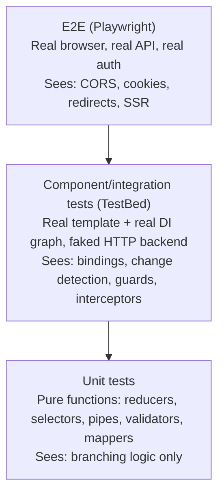
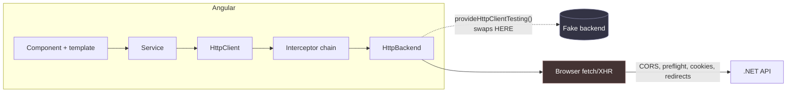
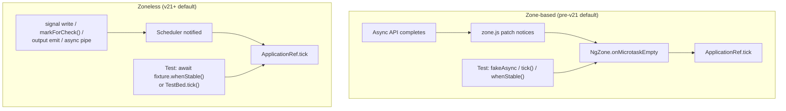

# Angular Testing

> [Mastery Guide](../README.md) › [Frontend Integration](./README.md)

| Status | Priority | Phase | Last reviewed |
|---|---|---|---|
| Not Started | High | Phase 10 — Frontend (parallel) | 2026-08-19 |

## Contents
- [Why it matters](#why-it-matters)
- [Core concepts](#core-concepts)
  - [The testing pyramid for Angular](#the-testing-pyramid-for-angular)
  - [Unit tests with TestBed](#unit-tests-with-testbed)
  - [Zoneless TestBed — what actually changed](#zoneless-testbed--what-actually-changed)
  - [Component testing patterns](#component-testing-patterns)
  - [Testing signal inputs, outputs and model()](#testing-signal-inputs-outputs-and-model)
  - [Component harnesses — the CDK harness API](#component-harnesses--the-cdk-harness-api)
  - [Signal-based testing](#signal-based-testing)
  - [Testing effect() and why it needs an explicit flush](#testing-effect-and-why-it-needs-an-explicit-flush)
  - [Testing resource(), rxResource() and httpResource()](#testing-resource-rxresource-and-httpresource)
  - [Testing Signal Forms and reactive forms](#testing-signal-forms-and-reactive-forms)
  - [HttpClient mocking with HttpTestingController](#httpclient-mocking-with-httptestingcontroller)
  - [Testing functional guards, resolvers and interceptors](#testing-functional-guards-resolvers-and-interceptors)
  - [What HttpTestingController cannot see — the Angular/.NET seam](#what-httptestingcontroller-cannot-see--the-angularnet-seam)
  - [NgRx testing — reducers, selectors, effects](#ngrx-testing--reducers-selectors-effects)
  - [Marble testing inside an Angular suite](#marble-testing-inside-an-angular-suite)
  - [Async testing — fakeAsync, waitForAsync, async/await](#async-testing--fakeasync-waitforasync-asyncawait)
  - [Testing @defer blocks](#testing-defer-blocks)
  - [Testing routing with RouterTestingHarness](#testing-routing-with-routertestingharness)
  - [E2E testing with Playwright (replacing Protractor)](#e2e-testing-with-playwright-replacing-protractor)
  - [Where component testing actually lives now](#where-component-testing-actually-lives-now)
  - [Visual regression and accessibility tests](#visual-regression-and-accessibility-tests)
  - [Vitest + Web Test Runner alternatives to Karma](#vitest--web-test-runner-alternatives-to-karma)
  - [Migrating a Karma/Jasmine suite to Vitest](#migrating-a-karmajasmine-suite-to-vitest)
  - [What to mock — the senior judgement call](#what-to-mock--the-senior-judgement-call)
  - [Testing Library's philosophy vs TestBed](#testing-librarys-philosophy-vs-testbed)
- [Code & diagrams](#code--diagrams)
- [Common pitfalls](#common-pitfalls)
- [Interview-ready summary](#interview-ready-summary)
- [Interview Cross-Questioning Drill](#interview-cross-questioning-drill)
- [Cheat Sheet](#cheat-sheet)
- [Walkthrough](#walkthrough--passes-locally-fails-in-ci)
- [Self-test](#self-test)
- [Cross-references](#cross-references)
- [Sources](#sources)

---

## Why it matters

Angular's testing story changed more between v17 and v22 than in the decade before it, and it changed in a direction that invalidates habits rather than APIs. Three defaults moved under everyone's feet at once:

- **zone.js is gone from new applications.** Zoneless became the default in v21. `provideZoneChangeDetection()` is now the *opt-in* for the old behaviour.
- **Karma is gone as the default runner.** Vitest is the default test runner for new Angular CLI projects, and the Angular docs describe the default setup as Vitest with `jsdom` ([angular.dev/guide/testing](https://angular.dev/guide/testing)).
- **`fakeAsync` — the single most-taught Angular testing API of the last ten years — does not work in that default setup.** The `fakeAsync` API reference carries the note: *"IMPORTANT: This API requires Zone.js and cannot be used with the Vitest test runner"* ([angular.dev/api/core/testing/fakeAsync](https://angular.dev/api/core/testing/fakeAsync)).

That is why this topic is a good senior filter. Anyone can recite `configureTestingModule` → `createComponent` → `detectChanges`. The interesting questions are the ones where the old answer is now wrong: *"How do you test a debounce in a zoneless app?"*, *"What flushes an `effect()` in a test, and why isn't it `detectChanges()`?"*, *"Your suite is 900 `fakeAsync` tests and you're upgrading to v21 — what's the plan?"*

Why interviewers ask at all: test code is the only code where you can see an engineer's model of the system without the system being in the way. A test that mocks the service layer wholesale tells you the author does not trust their own integration points. A test that asserts `expect(spy).toHaveBeenCalled()` and nothing else tells you the author is measuring coverage, not behaviour. And the specific way an Angular test is wrong — a missing `await fixture.whenStable()`, an over-eager `NO_ERRORS_SCHEMA`, a mocked DTO shape that drifted from the .NET contract two sprints ago — tells you exactly which mechanism they never internalised.

There is also a defensive reason to know this cold. The most common senior interview move in 2026 is *"you built this in 2019, defend it now"*. Karma, Protractor, `HttpClientTestingModule`, `RouterTestingModule`, `NO_ERRORS_SCHEMA`, 90 % coverage gates — you almost certainly shipped all six. Every one of them is deprecated, removed, or now considered an anti-pattern. Knowing *why* each was replaced, and being able to say "here is what I would keep and here is what I would not", is the answer they are grading.

**When not to over-test.** Throwaway prototypes, spike branches, and pure-presentational components whose entire body is `input()` declarations and a template. The cost of a test is not writing it, it is maintaining it through every refactor; a test that only restates the template pays that cost forever and catches nothing.

## Core concepts

### The testing pyramid for Angular

The pyramid is a *shape* argument, not a ratio you can look up. Its actual content is: as you move up, each test covers more of the system, costs more wall-clock time, and localises failures worse. So you want the cheapest test that can observe the behaviour you care about, and you accept expensive tests only where nothing cheaper can see the bug.



What is genuinely useful to say in an interview is the *observability boundary of each layer*, because that is what decides where a test belongs:

| Layer | Can observe | Structurally blind to |
|---|---|---|
| Pure unit | branch logic, mapping, validation rules | DI wiring, template bindings, change detection |
| TestBed component | template output, DI resolution, guards/interceptors in the Angular pipeline, change-detection correctness | anything below `HttpBackend`: CORS, preflight, cookies, real headers, HTTP/2, TLS |
| Vitest browser mode | real layout, real `ResizeObserver`/`IntersectionObserver`, real CSS | the server, real network |
| E2E (Playwright) | the whole stack including the .NET API, auth cookies, redirects, SSR output | nothing — which is why it is slow and flaky |

Note the third row of "blind to". **A TestBed test can never fail because of CORS, a missing `SameSite` attribute, a preflight, or a cookie that the server refused to set** — `provideHttpClientTesting()` replaces the backend below the interceptor chain, so nothing the browser does with a real request is exercised. Teams discover this the hard way; see [What HttpTestingController cannot see](#what-httptestingcontroller-cannot-see--the-angularnet-seam).

On the ratio question: there is no defensible universal number, and quoting one is a small trap. The honest senior answer is *"the ratio is an output, not a target — it falls out of how much of your logic is pure. A codebase with rich domain mapping and thin components ends up bottom-heavy; a codebase that is mostly forms and tables over CRUD endpoints ends up middle-heavy, and forcing it into a 70/20/10 shape means writing unit tests for getters."*

Coverage is the same argument. Line coverage measures execution, not verification — a test with no assertions covers every line it touches. Use it as a **ratchet** (never let it drop) and as a **finder** (which branches in `guards/`, `interceptors/` and `services/` are dark?), never as a target.

> 🌍 **In the real world**: a platform team set an 85 % line-coverage gate across a 300-component Angular monorepo. Within two sprints the number was met and the bug rate was unchanged. The gate had been satisfied by two patterns: `it('should create', () => expect(component).toBeTruthy())` in every spec (which executes the constructor, every field initialiser and, thanks to `detectChanges()`, the entire template), and tests that mocked a service, called the component method, and asserted the mock was called. Both are pure coverage with zero verification. What actually moved the bug rate was deleting the global gate and replacing it with a rule that **every bug fix ships with a test that fails on the parent commit** — a rule you can enforce in review and that cannot be gamed. The line worth saying out loud: **coverage tells you what was executed; only an assertion tells you what was checked, and the gate cannot tell the difference.**

### Unit tests with TestBed

`TestBed` builds a miniature Angular application: an environment injector, a compiler, and a root fixture. Everything else in Angular testing is a helper on top of it.

```typescript
import { TestBed, ComponentFixture } from '@angular/core/testing';
import { provideHttpClient } from '@angular/common/http';
import { provideHttpClientTesting, HttpTestingController } from '@angular/common/http/testing';
import { OrderList } from './order-list';
import { OrderService } from './order.service';

describe('OrderList', () => {
  let fixture: ComponentFixture<OrderList>;
  let component: OrderList;
  let httpTesting: HttpTestingController;

  beforeEach(async () => {
    await TestBed.configureTestingModule({
      imports: [OrderList],                 // standalone: imported, not declared
      providers: [
        provideHttpClient(),                // real client...
        provideHttpClientTesting(),         // ...with the backend swapped. Order matters.
      ],
    }).compileComponents();

    fixture = TestBed.createComponent(OrderList);
    component = fixture.componentInstance;
    httpTesting = TestBed.inject(HttpTestingController);
  });

  afterEach(() => httpTesting.verify());

  it('renders the orders returned by the API', async () => {
    fixture.detectChanges();                          // runs ngOnInit, first render
    httpTesting.expectOne('/api/orders').flush([{ id: 1, total: 99.99 }]);
    await fixture.whenStable();                       // let the response propagate + re-render
    expect(fixture.nativeElement.textContent).toContain('99.99');
  });
});
```

**The API surface worth knowing precisely** (all static on `TestBed`):

| API | What it does | Notes |
|---|---|---|
| `configureTestingModule({imports, providers, declarations, schemas, teardown})` | Defines the test's DI + compilation scope | Returns `TestBed` for chaining |
| `compileComponents()` | Async-compiles templates/styles | Only needed when templates are `templateUrl` and not inlined by the build; harmless to keep |
| `createComponent(Cmp, options?)` | Instantiates and returns a `ComponentFixture` | `options.bindings` accepts `inputBinding()` / `outputBinding()` / `twoWayBinding()` |
| `inject(Token, notFoundValue?, options?)` | Resolves from the test injector | Replaced the long-removed `TestBed.get()` |
| `runInInjectionContext(fn)` | Runs `fn` inside the environment injector | **The** way to test anything that calls `inject()` at top level |
| `overrideProvider(token, {useValue})` | Replaces a provider *after* configuration | Useful when the provider comes from an imported feature `provideX()` |
| `overrideComponent(Cmp, {set/add/remove})` | Swaps a component's `imports`, `providers`, `template` | The supported way to stub a child of a standalone component |
| `tick()` | *"Execute any pending work required to synchronize model to the UI"* | Added as the replacement for `flushEffects()` |
| `flushEffects()` | **Deprecated** — *"use `TestBed.tick()` instead"* | See [Testing effect()](#testing-effect-and-why-it-needs-an-explicit-flush) |
| `getLastFixture()` | Returns the most recently created fixture | Handy inside custom render helpers |
| `resetTestingModule()` | Tears the module down | Runs automatically between specs; calling it manually is almost always a mistake |

(Signatures and the `flushEffects` deprecation from [angular.dev/api/core/testing/TestBed](https://angular.dev/api/core/testing/TestBed).)

**`TestBed.overrideComponent` is the standalone-era stubbing tool.** With NgModules you replaced a `declarations` entry. With standalone components the child is in the component's own `imports`, so you rewrite that array:

```typescript
TestBed.overrideComponent(OrderList, {
  remove: { imports: [OrderRowChart] },
  add:    { imports: [OrderRowChartStub] },
});
```

This is safer than `NO_ERRORS_SCHEMA` (see the pitfalls) because a selector typo still fails compilation.

**Configuration options seniors are expected to know**, with their documented defaults ([angular.dev/api/core/testing/TestModuleMetadata](https://angular.dev/api/core/testing/TestModuleMetadata)):

| Option | Default | Why it matters |
|---|---|---|
| `teardown: { destroyAfterEach }` | `true` since v13 | Destroys fixtures and the module between specs. This is what makes tests independent; finding it switched off is a strong signal of legacy debt. |
| `errorOnUnknownElements` | **`false`** | Unknown elements log NG0304 rather than throwing. Turn it **on** — it is the safe replacement for `NO_ERRORS_SCHEMA`, catching `<app-ordr-list>` typos that would otherwise render nothing and pass. |
| `errorOnUnknownProperties` | **`false`** | Same for unknown property bindings (NG0303): `[oderId]` binds nothing and passes silently unless you enable this. |
| `rethrowApplicationErrors` | `true` | Errors thrown during change detection surface in the test instead of being swallowed. |
| `deferBlockBehavior` | `manual` | Defer blocks do **not** auto-trigger in tests; you drive states explicitly. Opt into `DeferBlockBehavior.Playthrough` for integration-flavoured tests. |
| `animationsEnabled` | `false` | Animation entry/exit sequences are disabled, which is why animation-dependent assertions silently never fire. |

The two `errorOnUnknown*` defaults are worth memorising precisely because the widely-repeated claim is that they are `true`. They are not. Enabling them in your `providersFile`/setup is a one-line change that retires an entire category of false-green tests.

**`ComponentFixture`** ([angular.dev/api/core/testing/ComponentFixture](https://angular.dev/api/core/testing/ComponentFixture)):

| Member | Purpose |
|---|---|
| `detectChanges(checkNoChanges?)` | Run one change-detection pass on this fixture |
| `autoDetectChanges()` | *"Enables automatically synchronizing the view, as it would in an application"* — the zero-argument overload; the boolean overload is **deprecated** |
| `whenStable()` | Promise resolving when the fixture has no outstanding async work |
| `isStable()` | Synchronous form of the same question |
| `componentRef` | Gives you `setInput()` — the only correct way to set a signal input |
| `debugElement` | Angular's wrapper: `query(By.css)`, `query(By.directive)`, `triggerEventHandler` |
| `nativeElement` | The raw host element |
| `getDeferBlocks()` | `Promise<DeferBlockFixture[]>` — for testing `@defer` |
| `checkNoChanges()` | Asserts a second pass produces no changes (the `ExpressionChangedAfterItHasBeenChecked` check) |
| `destroy()` | Runs `ngOnDestroy`, `DestroyRef` callbacks, `takeUntilDestroyed` teardown |

`fixture.destroy()` deserves a mention on its own: it is how you test cleanup. If you want to prove a component unsubscribes, or that `takeUntilDestroyed()` actually fires, destroying the fixture and asserting the subscription count / spy is the only honest way to do it.

### Zoneless TestBed — what actually changed

This is the section most 2019-era Angular knowledge is wrong about, and it is now the default configuration for new projects.

**The mechanism.** Under zone.js, `NgZone` monkey-patched every async browser API. Anything that finished — a `setTimeout`, an XHR, a promise — told Angular "something happened, re-check the tree". In tests, that same patching is what made `fakeAsync` (virtual timers), `waitForAsync` (wait for the zone to drain) and `fixture.whenStable()` (zone stability) work. Delete zone.js and none of those signals exist. What replaces them is explicit: **a signal write, `markForCheck()`, an output emission, an `async` pipe emission, or `ApplicationRef.tick()` schedules synchronisation.**

**What that means for the fixture.** In a zoneless test, `await fixture.whenStable()` no longer means "the zone drained". It means "Angular's scheduler has no pending synchronisation work, and the microtask queue has been given a chance to run". That is *closer* to production behaviour, which is exactly why the Angular zoneless guide recommends replacing `fixture.detectChanges()` with `await fixture.whenStable()` — while candidly adding that for an existing suite *"it is likely not worth the effort"* to convert wholesale ([angular.dev/guide/zoneless](https://angular.dev/guide/zoneless)).

**Forcing zoneless in a test.** TestBed *"uses Zone-based change detection by default when zone.js is loaded via the polyfills"* — so a legacy project that still ships zone.js in `polyfills` gets zone-based tests even after the application is zoneless. To make the test match production:

```typescript
import { provideZonelessChangeDetection } from '@angular/core';

TestBed.configureTestingModule({
  providers: [provideZonelessChangeDetection()],
});
```

For new v21+ projects there is no zone.js in the polyfills at all, so this is already the behaviour.

**The failure mode you will meet immediately.** Under zoneless, TestBed enforces `OnPush`-compatible behaviour and will throw `ExpressionChangedAfterItHasBeenCheckedError` when a template value changes without a corresponding change notification. The guide is explicit that the fix is to **change the component**, not to work around it in the test. Combined with v22 making `OnPush` the default change-detection strategy, this is the single biggest source of "the upgrade broke 200 tests" reports — and in almost every case those components were already subtly broken.

**The template of a zoneless-native component test:**

```typescript
it('updates the total when a line is added', async () => {
  const fixture = TestBed.createComponent(Basket);
  fixture.autoDetectChanges();                 // sync the view like the app would
  await fixture.whenStable();

  fixture.componentInstance.add({ sku: 'A', price: 10 });
  await fixture.whenStable();                  // no detectChanges() anywhere

  expect(fixture.nativeElement.querySelector('[data-testid=total]').textContent)
    .toContain('10');
});
```

Notice there is no `detectChanges()`. In a zoneless test, a signal write already schedules synchronisation; `await fixture.whenStable()` lets it happen. Calling `detectChanges()` manually still works, but it hides the bug class you switched to zoneless to catch — a component that only re-renders because the *test* forced it.

**What is genuinely lost.** `fakeAsync`, `tick`, `flush`, `flushMicrotasks`, `discardPeriodicTasks` and `waitForAsync` are all zone.js constructs. Without zone.js they do not exist. Angular's migration guide documents an escape hatch — adding `zone.js/plugins/vitest-patch` to the **test polyfills** in `angular.json` restores `fakeAsync`, `flush` and `waitForAsync` under Vitest — while recommending you *"transition to native `async` and Vitest fake timers"* instead ([angular.dev/guide/testing/migrating-to-vitest](https://angular.dev/guide/testing/migrating-to-vitest)). Note the tension with the `fakeAsync` API page, which flatly says it *"cannot be used with the Vitest test runner"*. Both statements are in the official docs; the practical reading is **the patch exists as a migration bridge, not as a supported destination.** Being able to state that nuance — including that the docs disagree — is a stronger answer than either sentence alone.

> 🌍 **In the real world**: a team upgraded a five-year-old app to v21 in a single PR because "the schematics handle it". The application ran. The test suite did not: roughly 900 specs used `fakeAsync`/`tick`, and the CLI's new default builder has no zone.js in the test polyfills, so every one of them failed at import. Their first instinct was to add zone.js back, which worked and quietly re-created the exact coupling the upgrade removed — the app was zoneless in production and zone-based in test, so the *only* environment that could catch a missing change-notification was production. What they eventually shipped: add `zone.js/plugins/vitest-patch` to unblock CI on day one, then burn the 900 down in three buckets — pure `debounceTime`/`setTimeout` tests moved to Vitest fake timers, HTTP tests moved to `await fixture.whenStable()` (they never needed virtual time, only a flush), and about forty genuinely time-shaped tests kept the patch. **The migration was not "fakeAsync → something"; it was discovering that most `fakeAsync` in the suite had never been about time at all — it was a way to avoid thinking about when Angular re-renders.**

### Component testing patterns

The question every component test has to answer first is *what am I asserting on* — the component instance, or the DOM. Asserting on the instance is faster and more stable but tests a thing the user cannot see; asserting on the DOM is what the user actually gets but couples you to markup. The rule that survives ten years of refactors: **assert on the DOM, but reach it through semantics, not structure.**

```typescript
import { By } from '@angular/platform-browser';

it('shows the order count', async () => {
  fixture.componentRef.setInput('orders', [{ id: 1 }, { id: 2 }, { id: 3 }]);
  await fixture.whenStable();

  // Worst: structural CSS. Breaks on a style refactor.
  // fixture.nativeElement.querySelector('.card .header > span.count');

  // Better: an explicit test contract.
  const count = fixture.nativeElement.querySelector('[data-testid="order-count"]');

  // Best where it applies: query the accessibility tree, which doubles as an a11y assertion.
  const heading = fixture.nativeElement.querySelector('h2');

  expect(count.textContent).toContain('3');
  expect(heading.getAttribute('aria-label')).toBe('Orders');
});
```

**Three ways to reach the DOM, and when each is right:**

| Approach | Use when |
|---|---|
| `fixture.nativeElement.querySelector(...)` | Plain DOM assertions; you want the real element |
| `fixture.debugElement.query(By.css(...))` / `By.directive(...)` | You need the Angular-side view: the component instance of a child, its injector, or its listeners |
| `TestbedHarnessEnvironment` + a harness | The component is from a library (Material, your own design system) whose DOM is not your contract |

**`debugElement.triggerEventHandler` vs `nativeElement.click()`.** `triggerEventHandler('click', {...})` invokes the listener Angular registered for the `(click)` binding, bypassing the DOM entirely. `nativeElement.click()` dispatches a real DOM event that then reaches Angular's listener. The two differ in ways that matter:

- `triggerEventHandler` cannot be blocked by CSS (`pointer-events: none`), an overlay, or a `disabled` attribute — so it will happily "click" a button the user cannot click. That is a false green.
- `nativeElement.click()` goes through the real event path, so `preventDefault`, bubbling, and delegated handlers behave as in production.
- `triggerEventHandler` lets you supply a synthetic event object, which is the only easy way to fire something like `dragover` with a fabricated `DataTransfer`.

Modern default: **use real DOM events (`click()`, `dispatchEvent(new Event('input'))`) and reserve `triggerEventHandler` for events you cannot construct.** Under zoneless, neither one triggers change detection by itself — you still `await fixture.whenStable()` afterwards.

**Setting inputs: the rule that changed.** Assigning `component.someInput = value` was always a lie (it bypasses `ngOnChanges` and input transforms) and with signal inputs it is now impossible — `input()` returns a read-only `InputSignal`. Use `fixture.componentRef.setInput('name', value)`, which is what the docs show ([angular.dev/guide/testing/components-scenarios](https://angular.dev/guide/testing/components-scenarios)):

```typescript
fixture.componentRef.setInput('hero', expectedHero);
```

### Testing signal inputs, outputs and model()

`input()`, `output()` and `model()` were developer preview in 17.x and became **stable in v19**. They changed what a component test can and cannot do.

**Signal inputs.** `input()` returns an `InputSignal<T>`; `input.required<T>()` returns `InputSignal<T>` that throws if read before it is set. There is no setter. Three ways to supply a value:

```typescript
// 1. setInput on the componentRef — imperative, and re-settable mid-test.
fixture.componentRef.setInput('orderId', 42);
await fixture.whenStable();

// 2. bindings at creation time — declarative, and the binding stays live.
import { inputBinding, outputBinding, twoWayBinding, signal } from '@angular/core';

const orderId = signal(42);
const fixture = TestBed.createComponent(OrderDetail, {
  bindings: [inputBinding('orderId', orderId)],
});
orderId.set(43);              // the binding re-propagates, like a real parent would
await fixture.whenStable();

// 3. A host component that declares the binding in its template — the heaviest,
//    but the only one that also tests your public selector and attribute names.
```

Option 2 is the one most engineers have not seen. `inputBinding(publicName, valueFn)` takes *"a callback returning the current binding value, which can be either a signal or a plain getter function"* and is passed in the `bindings` array of `createComponent` ([angular.dev/api/core/inputBinding](https://angular.dev/api/core/inputBinding)). It is strictly better than `setInput` when the thing you are testing is *reactivity to a changing input*, because it reproduces how a parent actually drives the child. Sibling APIs: `outputBinding` and `twoWayBinding`.

**Input transforms are applied by `setInput`.** If your input is `input(0, { transform: numberAttribute })`, then `setInput('count', '5')` stores `5`, not `'5'`. That is worth a test of its own, because transforms are exactly the kind of thing that silently stops running when someone converts the input.

**Outputs.** `output()` returns an `OutputEmitterRef`, not an `EventEmitter`. It has `subscribe()` and `emit()` but is not an Observable — you cannot pipe it, and `spyOn(component.saved, 'emit')` tests that your own component called its own method, which is close to worthless. Test outputs by *listening*:

```typescript
it('emits the selected order on row click', async () => {
  const selected: Order[] = [];
  const fixture = TestBed.createComponent(OrderList, {
    bindings: [
      inputBinding('orders', () => [{ id: 42 }]),
      outputBinding<Order>('rowSelected', (order) => selected.push(order)),
    ],
  });
  await fixture.whenStable();

  fixture.nativeElement.querySelector('[data-testid="row-42"]').click();
  await fixture.whenStable();

  expect(selected).toEqual([{ id: 42 }]);
});
```

If you are not using `bindings`, the equivalent is `fixture.componentInstance.rowSelected.subscribe(...)` before the interaction. Subscriptions to `OutputEmitterRef` are cleaned up when the component is destroyed, so you do not need manual teardown in a fixture-scoped test.

**`model()`** is an input and an output at once — `model<T>()` gives a `ModelSignal<T>` you can `set()`/`update()` from inside the component, and it emits `nameChange` outward. Test both directions:

```typescript
const value = signal('draft');
const fixture = TestBed.createComponent(StatusPicker, {
  bindings: [twoWayBinding('status', value)],
});
await fixture.whenStable();

fixture.componentInstance.status.set('published');   // child writes
await fixture.whenStable();
expect(value()).toBe('published');                   // parent signal updated
```

**Signal queries.** `viewChild()`, `viewChildren()`, `contentChild()`, `contentChildren()` are also stable since v19 and return signals. In a test they are `undefined` until the view has been created, so read them **after** the first synchronisation, and remember that `viewChild.required()` throws rather than returning `undefined` — which makes "the query found nothing" a loud failure instead of a `Cannot read properties of undefined`.

### Component harnesses — the CDK harness API

A **component harness** is a class that exposes a component's behaviour as an async, semantic API, so that tests talk to the component the way a user would rather than the way the DOM happens to be arranged today. It ships from `@angular/cdk/testing` (`ng add @angular/cdk`), and Angular Material provides one for every component.

```typescript
import { TestbedHarnessEnvironment } from '@angular/cdk/testing/testbed';
import { HarnessLoader, parallel } from '@angular/cdk/testing';
import { MatSelectHarness } from '@angular/material/select/testing';
import { MatButtonHarness } from '@angular/material/button/testing';

let loader: HarnessLoader;

beforeEach(() => {
  const fixture = TestBed.createComponent(OrderFilters);
  loader = TestbedHarnessEnvironment.loader(fixture);
});

it('filters by account type', async () => {
  const select = await loader.getHarness(MatSelectHarness.with({ selector: '[data-testid=account-type]' }));
  await select.open();
  await select.clickOptions({ text: 'Savings' });
  expect(await select.getValueText()).toBe('Savings');

  const [apply, reset] = await parallel(() => [
    loader.getHarness(MatButtonHarness.with({ text: 'Apply' })),
    loader.getHarness(MatButtonHarness.with({ text: 'Reset' })),
  ]);
  await apply.click();
  expect(await reset.isDisabled()).toBe(false);
});
```

**The loader API** ([angular.dev/guide/testing/using-component-harnesses](https://angular.dev/guide/testing/using-component-harnesses)):

| Call | Purpose |
|---|---|
| `TestbedHarnessEnvironment.loader(fixture)` | Loader rooted at the fixture's root element |
| `TestbedHarnessEnvironment.documentRootLoader(fixture)` | Loader rooted at the **document** — required for overlays: dialogs, menus, `mat-select` panels, tooltips, snack bars |
| `TestbedHarnessEnvironment.harnessForFixture(fixture, Harness)` | The harness for the fixture's own root component |
| `loader.getHarness(query)` | First match; throws if none |
| `loader.getAllHarnesses(query)` | All matches |
| `loader.getHarnessAtIndex(query, i)` / `countHarnesses(query)` / `hasHarness(query)` | Indexed / counting / existence checks |
| `loader.getChildLoader(sel)` / `getAllChildLoaders(sel)` | Scope a loader to a subtree |
| `Harness.with({...})` | `HarnessPredicate` filtering — `selector`, `ancestor`, plus per-harness filters like `text`, `label`, `disabled` |

The `documentRootLoader` distinction is the single most common harness mistake. A `MatDialog` renders into the CDK overlay container, which is a sibling of your fixture's host element — `loader.getHarness(MatDialogHarness)` finds nothing and the error message does not explain why.

**Why harnesses survive refactors that break `querySelector`.** Three separate reasons, and interviewers want all three:

1. **The DOM is not the component's public API; the harness is.** When Material restructures `mat-select`'s internals (which it has done across majors), the harness is updated in the same release. Your test asserts `await select.getValueText()`, which is a contract Material maintains. `querySelector('.mat-mdc-select-value-text')` is a contract nobody maintains.
2. **Harnesses handle stabilisation for you.** Harness methods *"automatically run Angular's change detection before reading DOM state and after interactions"*. That eliminates the entire class of "forgot to `await fixture.whenStable()` after the click" bugs — and under zoneless, where the boundaries moved, that is worth more than it used to be. When you deliberately need to observe a mid-flight state, `manualChangeDetection()` turns it off.
3. **They are environment-portable.** The same harness runs under `TestbedHarnessEnvironment` in a unit test and under `SeleniumWebDriverHarnessEnvironment` in an end-to-end test. That means a component's interaction vocabulary — "open it, choose Savings, read the value" — is written once and reused across the pyramid.

**Write harnesses for your own components too.** This is the part teams skip, and it is where the payoff is largest for a design system:

```typescript
import { ComponentHarness, HarnessPredicate } from '@angular/cdk/testing';

export interface OrderRowFilters {
  status?: string;
}

export class OrderRowHarness extends ComponentHarness {
  static hostSelector = 'app-order-row';

  static with(options: OrderRowFilters = {}): HarnessPredicate<OrderRowHarness> {
    return new HarnessPredicate(OrderRowHarness, options)
      .addOption('status', options.status, (harness, status) =>
        HarnessPredicate.stringMatches(harness.getStatus(), status));
  }

  private readonly total = this.locatorFor('[data-testid=total]');
  private readonly statusEl = this.locatorFor('[data-testid=status]');
  private readonly cancelBtn = this.locatorForOptional('button[data-testid=cancel]');

  async getTotal(): Promise<string> { return (await this.total()).text(); }
  async getStatus(): Promise<string> { return (await this.statusEl()).text(); }
  async canCancel(): Promise<boolean> { return (await this.cancelBtn()) !== null; }
  async cancel(): Promise<void> { await (await this.cancelBtn())!.click(); }
}
```

`locatorFor` throws if the element is missing, `locatorForOptional` returns `null`, `locatorForAll` returns an array — the distinction encodes whether absence is a bug or a state. `ContentContainerComponentHarness` is the base to extend when your component projects content and you want child loaders scoped inside it.

> 🌍 **In the real world**: a team on Angular Material carried roughly 1,200 specs full of selectors like `.mat-select-value-text` and `.mat-form-field-infix`. A Material major upgrade rewrote those internals and about a third of the suite went red in one command — not because behaviour changed, but because class names did. The repair took two engineers most of a sprint and produced no new tests. The follow-up was the interesting part: they wrote a codemod that rewrote the twenty most common selector patterns into harness calls, then made "no `querySelector` against a `mat-` class" a lint rule. The next Material major upgrade cost them one afternoon. **A harness is not a convenience wrapper — it is the difference between coupling to a component's behaviour and coupling to its stylesheet, and only one of those is versioned for you.**

### Signal-based testing

Signals were stable in v17 with three exceptions — `effect()`, `toSignal()` and `toObservable()` stayed developer preview until **v20**. `linkedSignal` was experimental in v19 and stable in v20. Knowing which of these were preview when your codebase adopted them explains a lot of the odd patterns you will be asked to defend.

A plain signal graph needs no Angular at all:

```typescript
import { signal, computed, linkedSignal } from '@angular/core';

it('computes tax from price', () => {
  const price = signal(100);
  const tax = computed(() => price() * 0.15);

  expect(tax()).toBe(15);
  price.set(200);
  expect(tax()).toBe(30);      // pull-based: reading recomputes if dirty
});
```

That test is honest, but it is also the reason people over-claim that "signals make tests trivial". Four things make signal testing subtler than it looks:

**1. `computed()` is lazy and memoised.** It does not recompute on write; it recomputes on *read* if a dependency changed. So a test that writes and never reads has verified nothing. Worse, a test that asserts "the computation ran once" by counting calls is testing Angular's memoisation, not your code.

**2. Equality functions decide whether anything propagates.** The default is `Object.is`. `signal([1,2,3]).set([1,2,3])` notifies, because the arrays are different references; `signal(5).set(5)` does not. If a component passes a custom `equal`, a test that writes a "different" value and sees no re-render is observing your equality function, not a bug.

```typescript
const rows = signal<Row[]>([], { equal: (a, b) => a.length === b.length });
rows.set([{ id: 2 }]);   // from [{id: 1}] — SAME length, so NO notification
```

**3. `untracked()` changes what a test can observe.** Reads inside `untracked(() => ...)` do not register a dependency, so a `computed` that reads a signal untracked will not recompute when it changes. A test that sets the signal and expects the computed to move will fail for a reason that is invisible in the assertion.

**4. Signals in a component still need synchronisation to reach the DOM.** Reading `component.total()` is synchronous. Seeing `10.00` in the rendered HTML is not. Under zoneless, a signal write schedules synchronisation and `await fixture.whenStable()` performs it:

```typescript
it('renders the updated count', async () => {
  const fixture = TestBed.createComponent(Counter);
  await fixture.whenStable();

  fixture.componentInstance.count.set(5);
  await fixture.whenStable();

  expect(fixture.nativeElement.querySelector('[data-testid=count]').textContent).toBe('5');
});
```

**`toSignal()` in a test.** `toSignal(obs$)` subscribes immediately and requires an injection context, so calling it in a test helper throws `NG0203` unless you wrap it:

```typescript
const subject = new Subject<Order[]>();
const orders = TestBed.runInInjectionContext(() =>
  toSignal(subject, { initialValue: [] as Order[] }));

expect(orders()).toEqual([]);
subject.next([{ id: 1 }]);
expect(orders()).toEqual([{ id: 1 }]);
```

The trap: `toSignal` without `initialValue` and without `requireSync: true` gives you `T | undefined`, and a test that only ever pushes a value before reading will never exercise the `undefined` branch — which is exactly the branch that breaks in production on the first render.

**`toObservable()` coalesces.** It is backed by an effect, so several synchronous writes produce one emission of the final value. A test that writes three times and expects three emissions is testing an assumption Angular does not make. (Covered in depth in [RxJS / Reactive Programming](./02-rxjs-reactive-programming.md).)

### Testing effect() and why it needs an explicit flush

This is the question that separates people who have read about signals from people who have shipped them.

**Effects are not synchronous.** Writing a signal an effect depends on does not run the effect; it *schedules* it. Angular runs pending effects as part of its synchronisation pass. In an application that pass happens on the next scheduled tick. In a test, nothing schedules it for you.

```typescript
import { effect, signal } from '@angular/core';

it('logs when the filter changes', () => {
  const logged: string[] = [];
  const filter = signal('open');

  TestBed.runInInjectionContext(() => {
    effect(() => logged.push(filter()));
  });

  expect(logged).toEqual([]);      // NOT ['open'] — nothing has run yet

  TestBed.tick();                  // Angular synchronises: effects run
  expect(logged).toEqual(['open']);

  filter.set('closed');
  expect(logged).toEqual(['open']); // still not run
  TestBed.tick();
  expect(logged).toEqual(['open', 'closed']);
});
```

**`TestBed.flushEffects()` is deprecated in favour of `TestBed.tick()`**, and this is not a rename ([angular.dev/api/core/testing/TestBed](https://angular.dev/api/core/testing/TestBed)). `flushEffects()` ran *root* effects and only root effects. `TestBed.tick()` runs the whole synchronisation process — change detection, root effects, component effects, `afterEveryRender` callbacks — in the same order the application would. The practical consequence: a test that passed under `flushEffects()` could be asserting an ordering that never occurs in production. When you migrate, expect a handful of tests to fail *correctly*.

Two related gotchas:

- **Component effects need the component's injector.** An effect created inside a component runs when *that view* is synchronised. If you create the effect via a standalone `Injector` in a test but the component under test has its own, `TestBed.tick()` still covers both — but a bare `flushEffects()` historically did not, which is one of the reasons it was deprecated.
- **`afterEveryRender()` was renamed from `afterRender()` in v20 with no backwards-compatible alias.** Both originally landed in 16.2. Code written against v16–v19 fails to *compile* after the upgrade, so if a test suite references `afterRender`, the codebase predates v20. `afterNextRender()` kept its name.

**When you should not be testing an effect at all.** The strongest senior answer here is a refusal: most effects in a codebase should not exist. An effect that fetches data should be a `resource()`; an effect that derives state should be a `computed()`; an effect that syncs a signal from another signal should be a `linkedSignal()`. Effects that survive that filter are genuinely side-effecting — logging, analytics, `localStorage`, imperative DOM/third-party library calls — and those are best tested by asserting the side effect on a fake collaborator, not by inspecting the effect.

> 🌍 **In the real world**: a dashboard had an `effect()` that re-fetched a report whenever the date range changed, and a test that proved it — set the range signal, `flushEffects()`, assert the HTTP request. Green for a year. In production, users dragging the range slider produced overlapping requests that resolved out of order, so the chart regularly showed data for a range the user had already left. The test could never have caught it: `flushEffects()` ran the effect once per explicit call, serialising by construction what production ran concurrently. Migrating to `httpResource` fixed the bug (a params change aborts the in-flight request) and, notably, made the test *simpler* rather than more complex. **A test that flushes an effect manually has replaced the scheduler with itself — it can verify that the effect body is correct and structurally cannot verify anything about timing, which is where effects go wrong.**

### Testing resource(), rxResource() and httpResource()

`resource()` and `rxResource()` were **stabilised in v22** (they were experimental before). `httpResource` was experimental in 19.2 and **stable in v22**. Since they are the recommended replacement for "fetch in `ngOnInit`" and for most data-fetching effects, they are now a mainstream testing surface.

**The key behavioural difference from `HttpClient`: a resource fires eagerly.** `httpClient.get()` returns a cold Observable that does nothing until subscribed. `httpResource(() => url)` starts loading as soon as its params computation settles — which means the request happens during synchronisation, before your test has done anything.

The reliable sequence:

```typescript
import { ApplicationRef } from '@angular/core';

it('loads the customer and exposes it as a signal', async () => {
  TestBed.configureTestingModule({
    providers: [provideHttpClient(), provideHttpClientTesting()],
  });
  const httpTesting = TestBed.inject(HttpTestingController);

  const customer = TestBed.runInInjectionContext(() =>
    httpResource<Customer>(() => `/api/customers/1`));

  expect(customer.isLoading()).toBe(true);

  TestBed.tick();                                   // synchronise: the resource's request is issued
  httpTesting.expectOne('/api/customers/1').flush({ id: 1, name: 'Ada' });
  await TestBed.inject(ApplicationRef).whenStable();  // let the response land in the signal

  expect(customer.hasValue()).toBe(true);
  expect(customer.value()!.name).toBe('Ada');
  expect(customer.status()).toBe('resolved');
  httpTesting.verify();
});
```

Three details that trip people up:

1. **`TestBed.tick()` before `expectOne`.** Without it there is no request yet and `expectOne` fails with "Expected one matching request, found none" — an error message that sends people hunting for a wrong URL.
2. **`ApplicationRef.whenStable()`, not just `flush()`.** Flushing delivers the response to the HTTP layer; the resource then has to propagate it into its signals. There is a known issue where `fixture.whenStable()` does not resolve with a pending `resource`/`rxResource` ([angular/angular#60742](https://github.com/angular/angular/issues/60742)), so awaiting the `ApplicationRef` is the pattern that holds up.
3. **Status is an enum-like string.** `ResourceStatus` values are `'idle' | 'loading' | 'reloading' | 'resolved' | 'error' | 'local'`. Asserting `status()` is more expressive than `isLoading()` alone: `'reloading'` (a `reload()` while a value is already present) and `'local'` (a value written with `set()`/`update()`) are states a loading spinner test will never distinguish.

**Testing the error branch** is where resources earn their keep, because `error()` is a signal rather than a thrown exception:

```typescript
TestBed.tick();
httpTesting.expectOne('/api/customers/1')
  .flush('Not found', { status: 404, statusText: 'Not Found' });
await TestBed.inject(ApplicationRef).whenStable();

expect(customer.status()).toBe('error');
expect(customer.hasValue()).toBe(false);
expect(customer.error()).toBeInstanceOf(HttpErrorResponse);
```

**Testing `reload()` and params-driven refetch:**

```typescript
const id = signal(1);
const customer = TestBed.runInInjectionContext(() =>
  httpResource<Customer>(() => `/api/customers/${id()}`));

TestBed.tick();
httpTesting.expectOne('/api/customers/1').flush({ id: 1, name: 'Ada' });
await TestBed.inject(ApplicationRef).whenStable();

id.set(2);                     // params change: previous request is aborted by construction
TestBed.tick();
httpTesting.expectOne('/api/customers/2').flush({ id: 2, name: 'Grace' });
await TestBed.inject(ApplicationRef).whenStable();

expect(customer.value()!.name).toBe('Grace');
httpTesting.verify();          // would fail if the first request were still outstanding
```

That final `verify()` is the assertion that matters: it is how you prove the abort-on-params-change behaviour, and it is the closest a TestBed test gets to testing a race.

**`rxResource()`** takes a `stream` returning an Observable instead of a `loader` returning a Promise, which makes it the bridge for existing RxJS pipelines (`switchMap`, `retry`, `debounceTime`) — test it exactly the same way; the only difference is that the internals go through your operators. Do **not** write `resource().chain()`: it appears in secondary blog sources for v22 but is not in the `ResourceRef` API documentation on angular.dev.

### Testing Signal Forms and reactive forms

**Signal Forms became stable in v22** (experimental in v21). `form(model)` wraps a `WritableSignal` model and returns a `FieldTree`; it *"uses the given model as the source of truth and does not maintain its own copy of the data"* ([angular.dev/api/forms/signals/form](https://angular.dev/api/forms/signals/form)).

That single sentence is why Signal Forms tests are shorter. There is no `valueChanges` to subscribe to, no `updateValueAndValidity()` to remember, and no dual source of truth between `form.value` and your model:

```typescript
import { form, required, pattern } from '@angular/forms/signals';
import { signal } from '@angular/core';

it('rejects a malformed email', () => {
  const model = signal({ email: '', password: '' });
  const loginForm = form(model, (path) => {
    required(path.email);
    pattern(path.email, /.+@.+\..+/);
    required(path.password);
  });

  expect(loginForm.email().valid()).toBe(false);

  model.set({ email: 'not-an-email', password: 'hunter2' });
  expect(loginForm.email().invalid()).toBe(true);
  expect(loginForm.email().errors().length).toBeGreaterThan(0);

  model.set({ email: 'ada@example.com', password: 'hunter2' });
  expect(loginForm().valid()).toBe(true);
});
```

The `FieldState` surface you assert on: `value()`, `valid()`, `invalid()`, `pending()`, `errors()`, `errorSummary()`, `touched()`, `dirty()`, `disabled()`, `readonly()`, `hidden()`, `required()`, `submitting()`, plus `markAsTouched()`, `markAsDirty()`, `reset()` and `reloadValidation()` ([angular.dev/api/forms/signals/FieldState](https://angular.dev/api/forms/signals/FieldState)). Two of these are worth calling out in an interview:

- **`valid()` vs `invalid()` are not opposites.** *"`valid()` is true when there are no validation errors **and no pending validators**"*; *"`invalid()` is true when there are validation errors, **regardless of pending validators**"*. So during an async username-availability check, both are `false`. A test that asserts `expect(field.valid()).toBe(false)` and calls it "the async validator rejected" is wrong — assert `pending()` and then the resolved state.
- **`errors()` vs `errorSummary()`.** `errors()` is the field's own errors, excluding descendants; `errorSummary()` includes descendants. Asserting `errorSummary()` on the form root is how you test a cross-field validator without knowing which child it attached to.

**Reactive forms are not going away** and remain the majority of production code, so know both. The reactive-form testing rules that still matter:

```typescript
it('validates that password matches confirmation', () => {
  const fb = TestBed.inject(FormBuilder);
  const form = fb.nonNullable.group({
    password: ['', Validators.required],
    confirm:  ['', Validators.required],
  }, { validators: matchPasswords });

  form.patchValue({ password: 'abc', confirm: 'abd' });
  expect(form.errors?.['passwordMismatch']).toBeTruthy();

  form.patchValue({ confirm: 'abc' });
  expect(form.errors).toBeNull();
});
```

- **`setValue` vs `patchValue`**: `setValue` requires every control and throws on a missing key — which makes it the better choice when you *want* the test to fail after someone adds a field. `patchValue` silently ignores unknown and missing keys, including typos, so a `patchValue({ emial: 'x' })` test passes while asserting nothing.
- **`form.value` omits disabled controls; `getRawValue()` does not.** This is the single most expensive default in Angular forms and it belongs in tests: if your component submits `form.value`, write a test that disables a control and asserts the payload — otherwise the bug ships to your .NET model binder as a `null`.
- **Async validators need a settle point.** With a real HTTP-backed validator you flush the request and then await stability; with a `fakeAsync`-free suite that is `await fixture.whenStable()`. While it is running, `control.pending` is `true` and `control.valid` is `false` — same trap as Signal Forms.
- **Typed forms (v14+)** mean `form.get('email')` returns `AbstractControl | null`, so `form.get('email')!.setValue(...)` litters tests with non-null assertions. Prefer `form.controls.email.setValue(...)`, which is typed and does not need the assertion — and which fails to compile if the control is renamed, unlike the string lookup.

> 🌍 **In the real world**: a finance app's form tests all used `patchValue` plus `expect(form.valid).toBe(true)`. A backend change renamed `discountCode` to `promotionCode` in the .NET DTO; the Angular model was updated, the form control was renamed, and forty specs still passed because `patchValue({ discountCode: 'X' })` silently ignores unknown keys and the remaining required controls were still filled. The failure surfaced in UAT as "discounts don't apply". Two changes stopped the class of bug: `setValue` in tests that assert a complete payload, and a contract test that fed the actual generated TypeScript interface (from the .NET OpenAPI document) into the form's model type, so a rename became a compile error. **A form test that cannot fail when a field disappears is not testing the form, it is testing the validators.**

### HttpClient mocking with HttpTestingController

`provideHttpClientTesting()` replaces `HttpBackend` — the very bottom of Angular's HTTP stack — with a controllable fake. Everything above it is real: `HttpClient`, the interceptor chain, `HttpParams` serialisation, `HttpHeaders`, the response-type parsing. That is precisely the right cut for testing a service or a component's data layer.

```typescript
import { provideHttpClient } from '@angular/common/http';
import { provideHttpClientTesting, HttpTestingController } from '@angular/common/http/testing';

describe('OrderService', () => {
  let service: OrderService;
  let httpTesting: HttpTestingController;

  beforeEach(() => {
    TestBed.configureTestingModule({
      providers: [
        provideHttpClient(),          // MUST come first
        provideHttpClientTesting(),   // overwrites the backend portion
      ],
    });
    service = TestBed.inject(OrderService);
    httpTesting = TestBed.inject(HttpTestingController);
  });

  afterEach(() => httpTesting.verify());

  it('GETs /orders with the right query params', () => {
    let received: Order[] | undefined;
    service.getOrders({ status: 'open', page: 2 }).subscribe(o => received = o);

    const req = httpTesting.expectOne(r =>
      r.url === '/api/orders' && r.params.get('status') === 'open' && r.params.get('page') === '2');
    expect(req.request.method).toBe('GET');

    req.flush([{ id: 1 }, { id: 2 }]);
    expect(received?.length).toBe(2);
  });
});
```

**Ordering is a real rule, not a style preference.** The Angular docs state: *"Keep in mind to provide `provideHttpClient()` **before** `provideHttpClientTesting()`"* because the testing provider overwrites portions of the HTTP client configuration ([angular.dev/guide/http/testing](https://angular.dev/guide/http/testing)). Reverse them and you get real network attempts in a unit test — which in CI manifests as a timeout, not as a clear error.

`HttpClientTestingModule` (the NgModule form) is the legacy equivalent and is deprecated in favour of the provider functions. If you see it in a codebase, that codebase predates v15.

**The matcher API, and when each is right:**

| Call | Behaviour |
|---|---|
| `expectOne(url \| {method,url} \| predicate, description?)` | Asserts exactly one match; **fails if two match** |
| `match(criteria)` | Returns *all* matches as an array and removes them from future matching |
| `expectNone(criteria)` | Asserts nothing matched — the negative test people forget |
| `verify()` | Asserts nothing is outstanding |
| `req.flush(body, {status, statusText, headers})` | Delivers a response (success or error status) |
| `req.error(new ProgressEvent('network error'))` | Simulates a *transport* failure, not an HTTP status |
| `req.event(...)` | Emits an arbitrary `HttpEvent` — for progress-reporting tests |

Two distinctions that come up in interviews:

- **`flush(body, {status: 500})` vs `error(...)`.** The first is "the server answered, with a 500". The second is "there was no answer" — DNS failure, connection reset, CORS rejection. They produce different `HttpErrorResponse` shapes (`status: 500` vs `status: 0`) and your retry/error-handling code almost certainly treats them differently. A test suite that only ever uses `flush(null, {status: 500})` has never exercised the `status === 0` branch, which is the branch that fires on a genuine outage.
- **`expectOne` vs `match` for retries.** A `retry(2)` produces three requests to the same URL. `expectOne` fails on the second. `match('/api/orders')` gives you all of them so you can flush each independently:

```typescript
it('retries twice on 503 then succeeds', () => {
  let result: Order[] | undefined;
  service.getOrders().subscribe(o => result = o);

  const attempts = httpTesting.match('/api/orders');
  expect(attempts.length).toBe(1);                                       // retries are sequential
  attempts[0].flush(null, { status: 503, statusText: 'Unavailable' });

  httpTesting.expectOne('/api/orders').flush(null, { status: 503, statusText: 'Unavailable' });
  httpTesting.expectOne('/api/orders').flush([{ id: 1 }]);
  expect(result?.length).toBe(1);
});
```

Note the subtlety: with a plain `retry()` the attempts happen one at a time, so `match` returns one item, not three. With `retry({ count: 2, delay: 1000 })` the delay is a timer — in a zone-free suite you advance it with Vitest fake timers, not `tick()`.

**`verify()` is the highest-value line in the file.** It converts "a request leaked out of this test" from a mystery failure three specs later into a deterministic failure here. It is also how you assert *absence*: a test that renders a component with a cached value and then calls `verify()` has proven the cache prevented a fetch.

**The `provideHttpClientTesting` + interceptor combination** is what makes this better than mocking the service. Provide your real interceptors and the request you assert on is the request that would go on the wire — with the `Authorization` header attached, the correlation ID set, the base URL rewritten:

```typescript
TestBed.configureTestingModule({
  providers: [
    provideHttpClient(withInterceptors([authInterceptor, correlationIdInterceptor])),
    provideHttpClientTesting(),
    { provide: TokenStore, useValue: { token: () => 'test-token' } },
  ],
});

service.getOrders().subscribe();
const req = httpTesting.expectOne('/api/orders');
expect(req.request.headers.get('Authorization')).toBe('Bearer test-token');
expect(req.request.headers.get('X-Correlation-Id')).toMatch(/^[0-9a-f-]{36}$/);
```

### Testing functional guards, resolvers and interceptors

Functional DI is the pattern that broke everyone's testing habits: `CanActivateFn`, `ResolveFn`, `HttpInterceptorFn` and `CanMatchFn` are plain functions that call `inject()` internally. There is no class to `new`, no constructor to pass mocks into, and calling the function directly throws:

> `inject() must be called from an injection context such as a constructor, a factory function, a field initializer, or a function used with runInInjectionContext.`

**Two legitimate strategies, and the trade-off between them.**

**Strategy A — call it directly inside `TestBed.runInInjectionContext`.** Fast, no router, no HTTP, tests the function's logic in isolation.

```typescript
export const authGuard: CanActivateFn = () => {
  const auth = inject(AuthStore);
  const router = inject(Router);
  return auth.isAuthenticated() ? true : router.parseUrl('/login');
};

it('redirects anonymous users to /login', () => {
  TestBed.configureTestingModule({
    providers: [
      provideRouter([]),
      { provide: AuthStore, useValue: { isAuthenticated: () => false } },
    ],
  });

  const result = TestBed.runInInjectionContext(() =>
    authGuard({} as ActivatedRouteSnapshot, {} as RouterStateSnapshot));

  expect(result).toBeInstanceOf(UrlTree);
  expect((result as UrlTree).toString()).toBe('/login');
});
```

The weakness is visible in the code: `{} as ActivatedRouteSnapshot` is a lie. Any guard that reads `route.data`, `route.paramMap` or `state.url` needs those hand-built, and a hand-built snapshot drifts from the real one silently.

**Strategy B — navigate for real with `RouterTestingHarness`.** Slower, but the route config, the guard order, the redirect and the resulting component are all real. The Angular routing testing guide is blunt about the preference: **"Do not mock Angular Router"** ([angular.dev/guide/routing/testing](https://angular.dev/guide/routing/testing)).

```typescript
it('sends anonymous users to the login page', async () => {
  TestBed.configureTestingModule({
    providers: [
      provideRouter([
        { path: 'protected', component: Protected, canActivate: [authGuard] },
        { path: 'login', component: Login },
      ]),
      { provide: AuthStore, useValue: { isAuthenticated: () => false } },
    ],
  });

  const harness = await RouterTestingHarness.create();
  await harness.navigateByUrl('/protected');

  expect(TestBed.inject(Router).url).toBe('/login');
  expect(harness.routeNativeElement?.textContent).toContain('Sign in');
});
```

Use A for guards with branchy authorisation logic (roles, feature flags, licence tiers) where you want a table of cases. Use B once per guard to prove it is actually wired into the route config — because the most common guard bug is not wrong logic, it is a guard attached with `canActivate` where `canMatch` was needed, or attached to the parent route and not the child.

**`canActivate` vs `canMatch` is a testable distinction.** `canActivate` runs after the route matches, which means a lazy chunk has already been downloaded before the guard says no. `canMatch` runs during matching, so the chunk is never fetched. A test that only asserts the final URL cannot tell them apart. A test that asserts *which route was activated* when two routes share a path can:

```typescript
provideRouter([
  { path: 'reports', canMatch: [adminMatch], loadComponent: () => import('./admin-reports') },
  { path: 'reports', loadComponent: () => import('./basic-reports') },
]);
```

**Resolvers** are the same shape (`ResolveFn<T>`), with one addition: their return value ends up in `route.data`, so the integration-level assertion is on the routed component's state, not the function's return.

```typescript
it('resolves the order before activating the route', async () => {
  const harness = await RouterTestingHarness.create();
  const navigation = harness.navigateByUrl('/orders/7', OrderDetail);
  TestBed.inject(HttpTestingController).expectOne('/api/orders/7').flush({ id: 7 });
  const component = await navigation;
  expect(component.order().id).toBe(7);
});
```

The error path matters more than the happy path here. A resolver that throws cancels the navigation; a resolver that returns `EMPTY` cancels it *silently* — the user clicks a link and nothing happens, with no error anywhere. Test both, and assert on `router.url` staying put.

**Functional interceptors.** `HttpInterceptorFn` is `(req, next) => Observable<HttpEvent<unknown>>`. You *can* call it directly inside `runInInjectionContext` with a fake `next`, and for a pure header-adding interceptor that is a perfectly good test. But the higher-value test provides it for real, because interceptor **order** is part of the behaviour and only the real chain has order:

```typescript
TestBed.configureTestingModule({
  providers: [
    provideHttpClient(withInterceptors([authInterceptor, retryInterceptor, loggingInterceptor])),
    provideHttpClientTesting(),
  ],
});
```

Order rules worth knowing, because they are the source of real bugs: interceptors run in array order on the way *out* and in reverse order on the way *back*; `withInterceptorsFromDi()` runs DI (class-based) interceptors, and when both forms are present the functional ones registered by `withInterceptors` run before the DI ones. An auth interceptor placed after a retry interceptor will retry with the *stale* token — a bug no unit test of either interceptor in isolation can find.

**The refresh-on-401 interceptor** is the canonical hard test, and the one most likely to be asked about at the Angular/.NET seam:

```typescript
it('single-flights the refresh when several requests 401 together', async () => {
  const httpTesting = TestBed.inject(HttpTestingController);
  const http = TestBed.inject(HttpClient);

  const results: unknown[] = [];
  http.get('/api/a').subscribe(r => results.push(r));
  http.get('/api/b').subscribe(r => results.push(r));
  http.get('/api/c').subscribe(r => results.push(r));

  // All three fail with 401 before any refresh completes.
  for (const req of httpTesting.match(r => r.url.startsWith('/api/') && r.url !== '/api/refresh')) {
    req.flush(null, { status: 401, statusText: 'Unauthorized' });
  }

  // The assertion that matters: EXACTLY ONE refresh, not three.
  httpTesting.expectOne('/api/refresh').flush({ accessToken: 'new-token' });

  const retried = httpTesting.match(r => r.headers.get('Authorization') === 'Bearer new-token');
  expect(retried.length).toBe(3);
  retried.forEach((r, i) => r.flush({ ok: i }));

  expect(results.length).toBe(3);
  httpTesting.verify();
});
```

`expectOne('/api/refresh')` is doing the real work: it fails if the interceptor fired three refreshes. That is the test that would have caught the outage in the story below.

> 🌍 **In the real world**: an app implemented refresh-on-401 with `catchError(() => this.auth.refresh().pipe(switchMap(() => next(cloned))))` and had a green test for it — one request, one 401, one refresh, one retry. A redesign put six widgets on the landing page. The next morning, users whose tokens had expired overnight were logged out apparently at random: six parallel 401s produced six concurrent refresh calls, the .NET side had refresh-token rotation with reuse detection, and the second token presented revoked the whole family. The client fix was a `shareReplay(1)`-backed single-flight; the test fix was the shape above — **fire three requests, fail all three, then assert `expectOne('/api/refresh')`.** The lesson to state in an interview: **a test that exercises one request cannot observe a concurrency bug, and "add another `it` with two requests" is not a nice-to-have — for anything involving shared mutable auth state it is the only test that means anything.**

### What HttpTestingController cannot see — the Angular/.NET seam

This section exists because it is the most reliable way to distinguish someone who has debugged a production integration from someone who has only written tests.

`provideHttpClientTesting()` swaps out `HttpBackend`. Everything *below* that line never happens. Specifically, **no TestBed test can ever fail because of**:

| Real-world failure | Why the fake backend is blind to it |
|---|---|
| **CORS rejection** | The browser enforces CORS; there is no browser request |
| **The `OPTIONS` preflight** | Preflight is issued by the browser's fetch machinery, not by `HttpClient`. Your test sees only the `GET` |
| **Preflight *cost*** | Same reason — a screen that makes fourteen cross-origin calls pays fourteen extra round trips and every unit test says it is fast |
| **Cookies** | `withCredentials`, `SameSite=None`, `Secure`, cookie domain — all browser policy |
| **`Set-Cookie` from the .NET side** | Never parsed; the fake backend hands you the body you flushed |
| **HTTP redirects (301/302)** | Followed by the browser transparently; the fake backend does not follow anything |
| **Content negotiation / compression** | No `Accept-Encoding`, no gzip, no real `Content-Type` sniffing |
| **The actual .NET serialiser's output** | You flushed a hand-written object literal; `System.Text.Json` was never involved |
| **Auth cookie absence during SSR** | The server has no browser and no cookie jar; a jsdom test has both |

The last two are the expensive ones.

**Contract drift.** Your test flushes `{ orderId: 1, totalAmount: 99.99 }`. Your .NET controller returns whatever `System.Text.Json` produces from `OrderDto` under the serialiser options configured in `Program.cs` — which might be `camelCase` (the ASP.NET Core default via `JsonSerializerDefaults.Web`), might be `PascalCase` if someone set `PropertyNamingPolicy = null`, might omit nulls, might render `decimal` as a number or (through a converter) as a string, and might render `DateTime` with or without an offset. Every one of those is invisible to `HttpTestingController`, because the mock is written by the same person who wrote the assertion. The mitigations, in increasing order of strength:

1. **Generate the TypeScript interfaces from the OpenAPI document** (NSwag, Kiota, `openapi-typescript`) as a build step. A property rename becomes a compile error in the Angular build. This catches shape drift but not serialisation-policy drift.
2. **Snapshot real responses into fixtures.** A recorded response from a running API, checked in, used by `flush()`. Catches naming and format, goes stale silently.
3. **Contract tests** (Pact-style, or a .NET integration test that asserts the serialised JSON against the same fixture the Angular suite uses). This is the only option where both sides fail when either moves.
4. **A thin E2E smoke test per resource** against a real API. Slow, but it is the only layer where the actual bytes are involved.

**SSR and cookie auth.** Under SSR there is no browser: no `document.cookie`, no automatic credential attachment, no `localStorage`. A service that reads a token from `localStorage` inside a constructor will throw or silently return `null` on the server, and a component test running in jsdom — where `localStorage` exists — will never reproduce it. The testable surface is: does the code guard platform-specific APIs (`isPlatformBrowser`, or better, an injectable abstraction), and does the server forward the incoming request's cookies to the API? Neither can be asserted in a normal TestBed test. See [Angular SSR](./06-angular-ssr.md) for the mechanism; the testing takeaway is that **SSR failures are an E2E-only detection surface unless you deliberately run a subset of specs with a server platform**.

> 🌍 **In the real world**: an internal tool moved from "SPA served by the same ASP.NET Core host" to "SPA on a CDN, API on `api.company.com`". Every unit test passed, the E2E suite passed (it ran against a same-origin dev proxy), and the app was measurably slower in production. The cause was invisible to both suites: each authenticated cross-origin call now triggered an `OPTIONS` preflight, and the busiest screen issued fourteen of them before first paint. The API's own metrics showed nothing because they counted only `GET`s. What fixed the *detection* problem was more interesting than what fixed the latency: they added one Playwright test that asserted on `page.on('request')` counts against the real deployed origin, so "this screen makes more than N cross-origin requests" became a failing test. **The bug was one HTTP layer below where every existing test lived — and the only fix that generalises is to own a test at the layer where the failure occurs, not to add more tests at the layer where it does not.**

> 🌍 **In the real world**: a team's Angular suite mocked `OrderService` in every component spec, returning object literals the frontend developers had written from the API design doc. Six months in, the .NET team added `JsonSerializerOptions.DefaultIgnoreCondition = JsonIgnoreCondition.WhenWritingNull` to shrink payloads. Every optional field that had been `null` was now *absent*. Angular's `?.` handled most of it, but a template binding `{{ order.shippedOn | date }}` went from rendering an empty string to rendering nothing at all, and a `Object.keys(order).length` check in an audit view silently changed behaviour. Not one test failed, because every test's mock still had the null properties. **Over-mocking does not just fail to catch bugs — it actively encodes a snapshot of the backend from the day the mock was written, and mocks have no expiry date.**

### NgRx testing — reducers, selectors, effects

NgRx's testing story splits cleanly by purity, and the whole point of the architecture is that most of it is pure. (Current stable NgRx is v21, which targets Angular 21; v22 packages were still on beta as of mid-2026 — worth checking before you claim a version in an interview.)

**Reducers** are `(state, action) => state`. No TestBed, no mocks:

```typescript
it('loadOrdersSuccess replaces orders and clears loading', () => {
  const state = ordersReducer(
    { ...initialState, loading: true },
    OrdersActions.loadOrdersSuccess({ orders: [{ id: 1 }] }));

  expect(state.loading).toBe(false);
  expect(state.orders).toEqual([{ id: 1 }]);
  expect(state).not.toBe(initialState);       // immutability: new reference
});
```

The `not.toBe` line is the one people skip and the one that catches accidental mutation — the failure mode `@ngrx/store`'s runtime checks exist for. Speaking of which: **`provideStore({}, { runtimeChecks: { strictStateImmutability: true, strictActionImmutability: true, strictStateSerializability: true, strictActionSerializability: true } })` should be on in tests even if it is off in production.** Runtime checks are development-only and cost nothing in a test run; they turn "someone mutated state" from a mysterious selector-not-firing bug into an immediate throw.

**Selectors** — test the projector, not the store:

```typescript
it('filters to active orders', () => {
  const result = selectActiveOrders.projector([{ id: 1, active: true }, { id: 2, active: false }]);
  expect(result).toEqual([{ id: 1, active: true }]);
});
```

`projector(...)` takes the *outputs of the input selectors*, in order — not the state slice. Getting that wrong is the standard NgRx test mistake: `selectActiveOrders.projector({ orders: [...] })` passes an object where the composed selector expects an array, and the test passes for the wrong reason if the projector happens to be tolerant.

Worth testing separately: **memoisation is stateful across tests.** A `createSelector` result caches its last input/output pair at module scope, so a selector exercised in test A can return a stale memoised value in test B. `selector.release()` clears it; `projector()` sidesteps it entirely, which is one more reason to prefer the projector.

**Components that read the store** — use `MockStore`:

```typescript
import { provideMockStore, MockStore } from '@ngrx/store/testing';

TestBed.configureTestingModule({
  imports: [OrderList],
  providers: [provideMockStore({ initialState: { orders: { orders: [], loading: false } } })],
});
const store = TestBed.inject(MockStore);

store.overrideSelector(selectActiveOrders, [{ id: 1 }]);
store.refreshState();                      // push the override to existing subscribers
await fixture.whenStable();
expect(fixture.nativeElement.textContent).toContain('1 order');

const dispatched: Action[] = [];
store.scannedActions$.subscribe(a => dispatched.push(a));
fixture.nativeElement.querySelector('[data-testid=refresh]').click();
expect(dispatched.at(-1)!.type).toBe('[Orders] Load Orders');
```

`overrideSelector` decouples the component test from the state shape — which is exactly what you want when testing the component and exactly what you must not do when testing the selector. Remember `store.resetSelectors()` in teardown if you share a module-scope selector across describes.

**Effects** need a controllable `Actions` stream via `provideMockActions`. The modern, framework-agnostic way is `async`/`await` rather than marbles:

```typescript
import { provideMockActions } from '@ngrx/effects/testing';
import { ReplaySubject, firstValueFrom } from 'rxjs';

let actions$: ReplaySubject<Action>;

beforeEach(() => {
  actions$ = new ReplaySubject<Action>(1);
  TestBed.configureTestingModule({
    providers: [
      OrdersEffects,
      provideMockActions(() => actions$),
      provideHttpClient(),
      provideHttpClientTesting(),
    ],
  });
});

it('dispatches loadOrdersSuccess when the API returns', async () => {
  const effects = TestBed.inject(OrdersEffects);
  const emitted = firstValueFrom(effects.loadOrders$);

  actions$.next(OrdersActions.loadOrders());
  TestBed.inject(HttpTestingController).expectOne('/api/orders').flush([{ id: 1 }]);

  expect(await emitted).toEqual(OrdersActions.loadOrdersSuccess({ orders: [{ id: 1 }] }));
});
```

Two things this shape gets right that the classic marble version does not: it exercises the real `HttpClient` + interceptor path, and it works under any runner. Marbles remain the better tool when the *timing* is the behaviour — see the next section.

**`@ngrx/signals`** (developer preview in NgRx 17, stable in NgRx 18) tests differently again. A `signalStore` is a service whose state is signals, so you test it like a service:

```typescript
TestBed.configureTestingModule({ providers: [OrdersStore] });
const store = TestBed.inject(OrdersStore);

expect(store.orders()).toEqual([]);
store.setFilter('open');
expect(store.visibleOrders()).toEqual([]);       // computed
```

The wrinkle: `patchState` is only callable from inside the store unless you import `unprotected` from `@ngrx/signals/testing`, which deliberately makes "reaching into the store from a test" an explicit, greppable act. If a test needs `unprotected`, that is a design signal — you are testing the store's internals rather than its API.

**`rxMethod`-based effects** inside a signal store are tested by calling the method and awaiting stability, which is materially simpler than the `Actions`-stream dance — and is the strongest practical argument for `@ngrx/signals` over the classic store when someone asks you to compare them.

### Marble testing inside an Angular suite

Marble testing exists to make *time* assertable. A `debounceTime(300)`, a `retry` with backoff, a `switchMap` cancellation — all of them are about ordering and elapsed virtual time, and a test that waits for real time is both slow and flaky.

**Which library, and this is now a decision rather than a default.** `jasmine-marbles` (`hot`, `cold`, `expect(...).toBeObservable(...)`) is what most Angular codebases use and what most tutorials show — and it is a *Jasmine* library: it installs custom Jasmine matchers and hooks Jasmine's lifecycle to auto-flush the scheduler. **Under Vitest those matchers are not registered**, so a Karma→Vitest migration turns every marble test red at once. The portable alternative is RxJS's own `TestScheduler`:

```typescript
import { TestScheduler } from 'rxjs/testing';

let scheduler: TestScheduler;
beforeEach(() => {
  scheduler = new TestScheduler((actual, expected) => expect(actual).toEqual(expected));
});

it('debounces the search term', () => {
  scheduler.run(({ cold, expectObservable }) => {
    const input$ = cold('a 50ms b 400ms c|');
    const result$ = input$.pipe(debounceTime(300));
    expectObservable(result$).toBe('351ms b 400ms (c|)');
  });
});
```

`TestScheduler` needs no framework integration — you supply the assertion callback yourself — so it works identically under Jasmine, Vitest, Jest and anything else. `rxjs-marbles` is a third option that wraps `TestScheduler` with per-framework adapters if you want the `hot`/`cold` ergonomics without the Jasmine coupling.

**The Angular-specific caveats:**

- **Inside `scheduler.run()`, one frame `-` is 1 virtual millisecond.** Outside `run()` the legacy factor of 10 applies. Old NgRx marble tests written before `run()` existed read very strangely for exactly this reason.
- **Promises are not virtualised.** `TestScheduler` controls RxJS's schedulers, not the microtask queue. Anything that goes through a Promise — `from(promise)`, `fetch`, `async`/`await` in the code under test, or an `HttpClient` call using the **fetch backend, which is the default from v22** — will not respect virtual time. This is the actual reason marble tests turn flaky, and the v22 default change makes it bite codebases that were fine before.
- **`expectSubscriptions` is how you test cancellation.** `expectObservable` alone sees only emitted values, so it cannot distinguish `switchMap` from `mergeMap` when the responses happen to arrive in order. If your test is about a race, you need the subscription log.
- **Marbles cannot see Angular.** They test the Observable pipeline in isolation. Nothing about change detection, templates or DI is exercised — so a marble test proving your debounce works says nothing about whether the component subscribes to it.

The full syntax legend, the `run()` semantics and the off-by-one emission-character rule live in [RxJS / Reactive Programming](./02-rxjs-reactive-programming.md#marble-testing-with-testscheduler); this page's concern is only *where marbles fit in an Angular suite*. The short answer: **marbles for operator pipelines whose behaviour is timing; `async`/`await` with a real (faked) backend for everything else.**

> 🌍 **In the real world**: a team migrating from Karma to Vitest ran the schematic, fixed the spy APIs, and had a green suite in two days — except for 140 NgRx effect specs that failed with `expect(...).toBeObservable is not a function`. `jasmine-marbles` had never been the problem; the fact that a third of their effect tests were written in marbles was. When they looked at what those tests actually asserted, roughly 120 of them were "action in, action out" with no timing at all — the marble syntax was ceremony inherited from the NgRx docs of 2018. Those were rewritten as six-line `async` tests. The remaining twenty, which genuinely tested debounce and backoff, moved to `TestScheduler`. **The migration did not cost them marble tests; it made them notice they had been writing timing tests for behaviour that had no timing.**

### Async testing — fakeAsync, waitForAsync, async/await

The old decision tree ("timers → `fakeAsync`; anything else → `waitForAsync`") is obsolete. Here is the current one.

| Situation | Correct tool | Why |
|---|---|---|
| A promise, an awaited HTTP flush, a signal write that must reach the DOM | `await fixture.whenStable()` | Works with and without zone.js; matches production scheduling |
| A resource / `httpResource` propagating a response | `await TestBed.inject(ApplicationRef).whenStable()` | `fixture.whenStable()` has a known gap with pending resources |
| `setTimeout` / `setInterval` / `debounceTime` / polling, no zone.js | `vi.useFakeTimers()` + `await vi.advanceTimersByTimeAsync(300)` | Runner-level virtual time; the docs show `vi.useFakeTimers()` / `await vi.runAllTimersAsync()` |
| A pure RxJS pipeline whose behaviour *is* timing | `TestScheduler.run()` | Virtualises RxJS schedulers only, and asserts subscription order too |
| Legacy zone-based suite you have not migrated | `fakeAsync` + `tick`/`flush` | Requires zone.js; add `zone.js/plugins/vitest-patch` if running under Vitest |
| Anything at all | **not** `waitForAsync` | Zone-only, and superseded by native `async`/`await` |

**What `fakeAsync` actually does** — worth being precise, because it is still the most-asked question. It executes the test body inside a Zone whose timer APIs are replaced by a virtual clock and a queue. `tick(ms)` advances the clock, running every macrotask due within that window and draining microtasks between them. `flushMicrotasks()` drains promises without advancing the clock. `flush()` runs macrotasks until the queue is empty, returning the elapsed virtual milliseconds. `discardPeriodicTasks()` throws away outstanding intervals.

Its two famous throws — one of which has quietly stopped being the default:

- **`N timer(s) still in the queue`** at the end of the block, so that an unconsumed `setInterval` cannot leak into later tests. The `flush` option controls this: when true it *"will drain the macrotask queue after the test function completes"*; when false it *"will throw an exception at the end of the function if there are pending timers"* ([angular.dev/api/core/testing/fakeAsync](https://angular.dev/api/core/testing/fakeAsync)). The history matters when reading old code: the opt-in `fakeAsync(fn, { flush: true })` arrived with Angular 18.2 / zone.js 0.14, and from **zone.js 0.15 the flush happens automatically**. So a trailing `flush()`/`discardPeriodicTasks()` in a modern suite is usually a leftover, and a test that relied on the throw to catch a leaked interval no longer gets that signal.
- **`Error: Cannot make XHRs from within a fake async test`** — a real HTTP call escaped your mocking. This is `fakeAsync` doing you an enormous favour: it is the only Angular API that reliably tells you a unit test was about to hit the network.

**Why the industry moved off it.** Not because virtual time is a bad idea — because `fakeAsync` bought virtual time by owning the entire async substrate of the browser, and that substrate is what zone.js patched. Once zone.js goes, `fakeAsync` has nothing to stand on. `vi.useFakeTimers()` achieves the same result at the runner level, without a framework-specific Zone, and works for non-Angular code in the same file.

**The zoneless equivalent of the classic debounce test:**

```typescript
import { vi } from 'vitest';

it('debounces search input by 300ms', async () => {
  vi.useFakeTimers();
  const fixture = TestBed.createComponent(SearchBox);
  fixture.autoDetectChanges();
  await fixture.whenStable();

  const input = fixture.nativeElement.querySelector('input');
  input.value = 'hel';
  input.dispatchEvent(new Event('input'));

  await vi.advanceTimersByTimeAsync(200);
  TestBed.inject(HttpTestingController).expectNone(() => true);   // nothing yet

  await vi.advanceTimersByTimeAsync(150);                          // 350ms total
  TestBed.inject(HttpTestingController).expectOne(r => r.params.get('q') === 'hel');

  vi.useRealTimers();
});
```

Note `advanceTimersByTimeAsync` rather than `advanceTimersByTime`: the async variant lets the microtask queue drain between timers, which is what makes a promise-based chain inside the debounced handler actually progress. Using the synchronous version and then wondering why the HTTP call never fired is the single most common Vitest-fake-timer mistake.

**`await fixture.whenStable()` is not a synonym for "wait a tick".** Under zoneless it resolves when Angular's scheduler has nothing pending *and* the microtask queue has been flushed. It does **not** wait for `setTimeout`, and it does not wait for anything the framework does not know about — a bare `setInterval` in a third-party library will keep running and `whenStable` will happily resolve. If you need to wait for something Angular cannot see, you need `PendingTasks` (`inject(PendingTasks).run(() => ...)`) in the production code, which is also what makes SSR wait for it. That connection — **`PendingTasks` is simultaneously the SSR fix and the testability fix** — is a strong thing to say out loud.

### Testing @defer blocks

`@defer` was developer preview in v17 and **stable in v18**; v22 makes incremental hydration the default, which increases how much of a real app sits inside deferred blocks. A deferred block has four states (`@defer`, `@placeholder`, `@loading`, `@error`) and by default a test would have to trigger the real condition — viewport intersection, idle callback, hover — to see any of them.

`TestBed` gives you manual control:

```typescript
import { DeferBlockBehavior, DeferBlockState } from '@angular/core/testing';

TestBed.configureTestingModule({
  imports: [Dashboard],
  deferBlockBehavior: DeferBlockBehavior.Manual,   // do not auto-trigger
});

it('renders the placeholder, then the loading state, then the chart', async () => {
  const fixture = TestBed.createComponent(Dashboard);
  await fixture.whenStable();
  const [chartBlock] = await fixture.getDeferBlocks();

  expect(fixture.nativeElement.textContent).toContain('Chart will appear here');

  await chartBlock.render(DeferBlockState.Loading);
  expect(fixture.nativeElement.querySelector('[data-testid=spinner]')).toBeTruthy();

  await chartBlock.render(DeferBlockState.Complete);
  expect(fixture.nativeElement.querySelector('app-revenue-chart')).toBeTruthy();
});
```

Worth knowing precisely: `deferBlockBehavior` **already defaults to `manual`** in `TestModuleMetadata`, so blocks do not auto-trigger in tests whether or not you say so. Writing it explicitly documents intent; `DeferBlockBehavior.Playthrough` is the opt-in for triggers firing as they normally would, which is what you want for an integration-flavoured test. `deferBlockFixture.getDeferBlocks()` recurses into nested blocks.

The companion default to remember: `animationsEnabled` is `false` in `TestModuleMetadata`, so entry/exit animation sequences do not run in a TestBed test. A test asserting on an element that is only removed at the end of a leave animation will see it removed immediately — which is convenient, and also why animation-timing bugs are invisible at this layer.

The bug class this catches is worth naming: **`@defer` fails open.** If anything outside the block holds a reference to a component inside it — a `viewChild()`, a type import used in a non-type position — the compiler cannot exclude it from the eager chunk, the deferral silently does nothing, and everything still works. No error, no failing test, just a bundle that did not shrink. A test asserting `DeferBlockState.Placeholder` renders *before* the trigger is the cheapest signal you have that the block is still actually deferred.

### Testing routing with RouterTestingHarness

`RouterTestingModule` is **deprecated**; the docs point you at `provideRouter` (or `RouterModule`) instead, noting that its main value — fakes for `Location` and `LocationStrategy` — is largely unnecessary because `MockPlatformLocation` is provided in `TestBed` by default. If you still need the location fakes explicitly, `provideLocationMocks()` from `@angular/common/testing` is the standalone equivalent of `RouterTestingModule.withRoutes(...)`.

`RouterTestingHarness` (introduced in v15.2) is *"a testing harness for the `Router` to reduce the boilerplate needed to test routes and routed components"*:

```typescript
import { RouterTestingHarness } from '@angular/router/testing';

it('renders the routed component with resolved params', async () => {
  TestBed.configureTestingModule({
    providers: [provideRouter([{ path: 'orders/:id', component: OrderDetail }])],
  });

  const harness = await RouterTestingHarness.create();
  const component = await harness.navigateByUrl('/orders/7', OrderDetail);

  expect(component).toBeInstanceOf(OrderDetail);
  expect(harness.routeNativeElement?.textContent).toContain('Order 7');
});
```

API surface: `RouterTestingHarness.create(initialUrl?)` returns a `Promise<RouterTestingHarness>`; `navigateByUrl(url)` returns `Promise<{} | null>` and the typed overload `navigateByUrl(url, ComponentType)` returns `Promise<T>` — *"Trigger a `Router` navigation and waits for it to complete"*; `harness.fixture` is the root fixture and `harness.routeNativeElement` is the routed component's host element ([angular.dev/api/router/testing/RouterTestingHarness](https://angular.dev/api/router/testing/RouterTestingHarness)).

**Why this beats mocking `Router`.** A mocked `Router` lets you assert `expect(router.navigate).toHaveBeenCalledWith(['/login'])` — which passes whether or not `/login` is a real route, whether or not a guard on it would redirect again, and whether or not the navigation would be cancelled. The harness navigates for real, so the assertion is on the outcome. This is why the routing guide says **"Do not mock Angular Router"**.

**Testing route params reactively.** Components that read `input()`-bound route params (via `withComponentInputBinding()`) or `ActivatedRoute.paramMap` need a *second* navigation to prove they react rather than just initialise:

```typescript
await harness.navigateByUrl('/orders/7', OrderDetail);
await harness.navigateByUrl('/orders/8', OrderDetail);   // same component, new param
expect(harness.routeNativeElement?.textContent).toContain('Order 8');
```

That second line catches the classic bug where the component reads the param once in the constructor and never updates when the router reuses the component instance.

### E2E testing with Playwright (replacing Protractor)

Protractor is fully gone: it stopped being included in new Angular CLI applications from v12, and reached end of life at the end of August 2023 ([blog.angular.dev — Protractor deprecation update](https://blog.angular.dev/protractor-deprecation-update-august-2023-2beac7402ce0)). Angular ships no first-party E2E tool; `ng e2e` prompts you to pick one.

```typescript
// e2e/checkout.spec.ts
import { test, expect } from '@playwright/test';

test('user can complete checkout', async ({ page }) => {
  await page.goto('/');
  await page.getByRole('link', { name: 'Sign in' }).click();
  await page.getByLabel('Email').fill('user@example.com');
  await page.getByLabel('Password').fill('test1234');
  await page.getByRole('button', { name: 'Sign in' }).click();
  await expect(page).toHaveURL(/\/dashboard/);

  await page.goto('/products/123');
  await page.getByRole('button', { name: 'Add to cart' }).click();
  await page.getByRole('link', { name: /Cart \(1\)/ }).click();
  await page.getByRole('button', { name: 'Checkout' }).click();
  await expect(page.getByText('Order confirmed')).toBeVisible();
});
```

**Why Playwright rather than Cypress, stated as engineering rather than preference:**

- **Real cross-browser coverage** — Chromium, Firefox and WebKit, all driven by the same API. WebKit matters for Angular apps because Safari is where date parsing, `Intl` formatting and CSS grid behaviour most often diverge.
- **Browser contexts, not browser instances.** Each test gets an isolated cookie jar and storage in the same browser process, so parallelism is cheap. This is the structural difference from Cypress, whose in-browser architecture historically constrained parallelism and cross-origin navigation.
- **Auto-waiting with actionability checks.** `click()` waits for the element to be attached, visible, stable, enabled and unobscured. That eliminates most `waitForTimeout` calls, which is where flakiness actually comes from.
- **Trace viewer.** A failing CI run produces a trace with DOM snapshots, network log and console per step — the difference between diagnosing a flake in five minutes and never diagnosing it.
- **`page.route()` network interception** at the browser level, which — unlike `HttpTestingController` — *does* see preflights and cookies.

**The parts that are specific to an Angular + .NET stack:**

**Authentication.** Do not log in through the UI in every test. Do it once in a setup project and persist `storageState`:

```typescript
// auth.setup.ts
import { test as setup, expect } from '@playwright/test';

setup('authenticate', async ({ page }) => {
  await page.goto('/login');
  await page.getByLabel('Email').fill(process.env.E2E_USER!);
  await page.getByLabel('Password').fill(process.env.E2E_PASSWORD!);
  await page.getByRole('button', { name: 'Sign in' }).click();
  await expect(page).toHaveURL(/\/dashboard/);
  await page.context().storageState({ path: '.auth/user.json' });
});
```

…then `use: { storageState: '.auth/user.json' }` in the project config. **But keep exactly one test that logs in through the UI**, because `storageState` skips the entire cookie/redirect/CORS path — the one thing E2E was supposed to cover. Teams that adopt `storageState` universally often discover months later that their login flow has been broken in Safari the whole time.

**Test data.** The hardest problem in full-stack E2E is not the browser, it is the database. Three approaches, in increasing order of reliability:

1. **Seed via the API** in a `beforeAll` using an admin token. Simple, and couples your E2E suite to API stability.
2. **Reset between runs** with a dedicated endpoint (`POST /test/reset`) guarded by an environment flag, or `Respawn` in .NET to truncate and reseed.
3. **A container per run** — `Testcontainers` for the SQL Server / Postgres instance, with the API pointed at it. Slowest to start, completely isolated, and the only one that survives parallel CI jobs.

Whatever you pick, **make each test create the data it asserts on with a unique key** (an order number containing the worker index and a timestamp). Shared fixtures are the single biggest source of E2E flake, ahead of selectors and waits.

**Waiting for the API rather than the UI.** When a Playwright test clicks Save and then asserts on a toast, it is racing the .NET request. `page.waitForResponse` makes the wait explicit and gives you the status code in the failure message:

```typescript
const [response] = await Promise.all([
  page.waitForResponse(r => r.url().endsWith('/api/orders') && r.request().method() === 'POST'),
  page.getByRole('button', { name: 'Save' }).click(),
]);
expect(response.status()).toBe(201);
await expect(page.getByRole('status')).toHaveText('Order saved');
```

**Locator priority**, which is really an accessibility argument in disguise: `getByRole` → `getByLabel` → `getByPlaceholder` → `getByText` → `getByTestId` → CSS. Anything above `getByTestId` doubles as an assertion that the control is reachable by a screen reader. Anything below couples you to markup.

### Where component testing actually lives now

The phrase "Playwright component testing" comes up a lot and is worth getting right, because it is a place where the popular assumption is wrong.

Playwright's component testing supports React and Vue with first-party documentation; **Angular is not among the officially supported frameworks**. What exists for Angular is community-maintained — `@sand4rt/experimental-ct-angular` and `@jscutlery/playwright-ct-angular` — both actively published, neither official. Betting a large Angular suite on either is a supply-chain decision, not just a tooling one.

The thing that *has* actually displaced Karma for "I need a real browser" is **Vitest browser mode**, which the Angular CLI supports directly. Install a browser provider and set `browsers` in `angular.json`:

```bash
npm install --save-dev @vitest/browser-playwright
```

```json
{
  "test": {
    "builder": "@angular/build:unit-test",
    "options": { "browsers": ["chromium"] }
  }
}
```

Providers documented in the migration guide: `@vitest/browser-playwright` (Chromium, Firefox, WebKit), `@vitest/browser-webdriverio` (Chrome, Firefox, Safari, Edge) and `@vitest/browser-preview` (WebContainer environments).

So the honest map of the 2026 landscape:

| Need | Tool |
|---|---|
| Fast logic + component tests, jsdom is enough | Vitest (default), `jsdom` or `happy-dom` |
| Component tests needing real layout, real observers, real CSS | **Vitest browser mode** with a Playwright provider |
| Full-stack flows across Angular + .NET | Playwright test |
| Angular component testing under Playwright specifically | Community packages only — not officially supported |

The strategically useful observation: with Vitest browser mode, the old "unit tests run in a fake DOM, so buy a separate component-testing product" gap has mostly closed. You can keep one runner, one config, one set of specs, and choose per-project (or per-file) whether they execute in jsdom or a real Chromium.

### Visual regression and accessibility tests

**Visual regression** with Playwright:

```typescript
test('dashboard matches the approved screenshot', async ({ page }) => {
  await page.goto('/dashboard');
  await page.getByRole('status').waitFor({ state: 'hidden' });     // wait out the loading state
  await expect(page).toHaveScreenshot('dashboard.png', {
    mask: [page.getByTestId('last-updated')],                      // hide non-deterministic content
    animations: 'disabled',
    maxDiffPixelRatio: 0.01,
  });
});
```

The three options in that call are the difference between a useful visual test and one the team disables within a month. **Masking** removes clocks, IDs and user names. **`animations: 'disabled'`** removes the single biggest source of pixel noise. And screenshots must be generated on the **same platform as CI** — font rasterisation differs between macOS, Windows and Linux, so baselines produced on a developer laptop will never match a Linux runner. Generate them in a container (`npx playwright test --update-snapshots` inside the CI image) and check those in.

Visual tests are best pointed at *components in isolation* rather than whole pages: a page screenshot fails whenever any of its fifty parts changes, which trains people to accept diffs without reading them.

**Accessibility** with `axe-core`:

```typescript
import AxeBuilder from '@axe-core/playwright';

test('dashboard has no detectable a11y violations', async ({ page }) => {
  await page.goto('/dashboard');
  const results = await new AxeBuilder({ page })
    .withTags(['wcag2a', 'wcag2aa', 'wcag21aa'])
    .analyze();
  expect(results.violations).toEqual([]);
});
```

Be honest about the limits in an interview: automated tooling catches a meaningful but partial slice of WCAG issues — missing alternative text, insufficient contrast, unlabelled form controls, invalid ARIA, broken heading order. It cannot judge whether alt text is *useful*, whether focus order is *logical*, whether a live region announces at the right moment, or whether a custom component's keyboard model matches user expectations. Automated a11y checks are a floor, and the way to say that in an interview is *"they stop regressions; they do not establish accessibility."*

The practical adoption pattern for a legacy app: run axe, snapshot the current violations to a baseline file, fail the build only on **new** violations, and burn the baseline down. Trying to reach zero before enabling the check is how a11y testing gets deferred indefinitely.

For unit-level a11y, `axe-core` also runs against a fixture's DOM, which lets you catch a missing `aria-label` in the component's own spec instead of three layers up in an E2E run.

### Vitest + Web Test Runner alternatives to Karma

Get this history right, because it is a favourite trap and the widely-repeated version is wrong.

**What actually happened:**

- **Karma deprecated itself.** The karma-runner project's README states: *"Karma is deprecated and is not accepting new features or general bug fixes."* That was the project's own 2023 decision, not Angular's. The maintainers committed to addressing critical security issues until 12 months after Angular CLI's Web Test Runner support reached stable, and pointed users at Web Test Runner, `jasmine-browser-runner`, Jest, or Vitest.
- **Angular explored several replacements.** Experimental Jest support and experimental Web Test Runner support both shipped in the CLI (v16 era) and neither became the default.
- **`@angular/build:unit-test` with a Vitest runner arrived as an experimental builder in v20**, requiring the `application` build system.
- **v21 made Vitest the default test runner for new projects** and promoted the integration to stable. `ng new` now scaffolds Vitest + `jsdom`.
- **Karma is still supported.** angular.dev says plainly: *"Karma is still supported"*, and the `@angular/build:karma` builder still exists. Nothing forces a migration today.

Things you should **not** say, because they are the version circulating in blog posts: that Angular deprecated Karma in v15 (it did not — Karma deprecated itself, and Angular kept it as the default until v21); that Vitest support came from `@analogjs/vitest-angular` becoming first-party in v18 (AnalogJS did pioneer Vitest-for-Angular as a community project, but the first-party path is the CLI's `@angular/build:unit-test` builder, experimental in v20 and default in v21); or any speed multiplier — Vitest is faster in practice, mostly because it skips a browser launch and uses Vite's transform pipeline, but there is no citable universal figure and quoting one invites the follow-up you cannot answer.

**The runner comparison as engineering trade-offs:**

| Runner | Executes in | Strengths | Costs |
|---|---|---|---|
| **Vitest** (default) | Node + `jsdom`/`happy-dom`, or a real browser in browser mode | Fast startup, ESM-native, first-party CLI integration, one runner for both DOM modes | jsdom is not a browser; browser mode needs a provider package |
| **Karma + Jasmine** | Real browser | Accurate; enormous existing suite compatibility | Deprecated upstream; browser launch per run; awkward parallelism |
| **Jest** | Node + jsdom | Huge ecosystem, excellent mocking | No first-party Angular builder; needs a preset/transform for Angular's compilation; jsdom limits |
| **Web Test Runner** | Real browser, standards-based | No bundling step, real browser semantics | Angular CLI support never reached default status |

**The jsdom caveat, stated precisely.** jsdom implements the DOM and a subset of browser APIs. It does **not** do layout. That means `getBoundingClientRect()` returns zeros, `IntersectionObserver` and `ResizeObserver` are absent unless polyfilled, `matchMedia` needs stubbing, CSS is parsed but not applied, `scrollIntoView` does nothing, Canvas/WebGL are absent, and animations do not run. Anything in your app that responds to size, position or visibility is untestable in jsdom — which is exactly the set of things `@defer (on viewport)`, virtual scrolling, sticky headers, and CDK overlay positioning depend on. Route those specs to browser mode.

**Configuration surface of the modern builder** (`@angular/build:unit-test`), which is worth knowing because it replaces `karma.conf.js` and `src/test.ts`:

```json
{
  "test": {
    "builder": "@angular/build:unit-test",
    "options": {
      "include": ["src/**/*.spec.ts"],
      "setupFiles": ["src/test-setup.ts"],
      "providersFile": "src/test-providers.ts",
      "coverage": true,
      "browsers": ["chromium"],
      "runnerConfig": "vitest.config.ts"
    }
  }
}
```

- `providersFile` is the modern replacement for hand-editing `test.ts`: export the providers every spec should get (`provideHttpClient()`, `provideHttpClientTesting()`, `provideZonelessChangeDetection()`, your global test doubles) and they are applied to every `TestBed`.
- `setupFiles` run after application polyfills and after TestBed initialisation.
- `coverage` is first class — `ng test --coverage` — so `karma-coverage` has no successor to install.
- One important constraint from the migration guide: *"The `@angular/build:karma` builder previously allowed build options (like `polyfills`, `assets`, or `styles`) to be configured directly within the `test` target. The new `@angular/build:unit-test` builder does not support this."* Those move to a build target configuration.

### Migrating a Karma/Jasmine suite to Vitest

Angular ships a schematic for the mechanical part:

```bash
ng g @schematics/angular:refactor-jasmine-vitest
```

It converts `fit`/`fdescribe` → `it.only`/`describe.only`, `xit`/`xdescribe` → `it.skip`/`describe.skip`, `spyOn` → `vi.spyOn`, `jasmine.createSpy` → `vi.fn`, `jasmine.objectContaining` → `expect.objectContaining`, `jasmine.any` → `expect.any`, and `fail()` → `vi.fail()`. Useful options: `--include <path>` to migrate a directory at a time, `--add-imports` to add explicit `vitest` imports, `--browser-mode` to format for browser testing.

It explicitly does **not** install dependencies, change the `angular.json` builder, delete `karma.conf.js`/`test.ts`, or untangle complex spy scenarios. The manual steps:

```bash
npm install --save-dev vitest jsdom          # or happy-dom, which the CLI auto-detects
npm uninstall karma karma-chrome-launcher karma-coverage karma-jasmine \
              karma-jasmine-html-reporter jasmine-core
```

…then switch the builder to `@angular/build:unit-test` and delete `karma.conf.js` and `src/test.ts`.

**The four things the schematic cannot do for you**, which is what the migration actually costs:

1. **`jasmine.createSpyObj`** has no direct Vitest equivalent. The idiomatic replacement is a plain object of `vi.fn()`s, or `vi.mocked()` over a class. This is also a good moment to ask whether that spy object should exist at all (see [What to mock](#what-to-mock--the-senior-judgement-call)).
2. **`jasmine-marbles`** stops working — its matchers are Jasmine-registered. Move to `TestScheduler` or `rxjs-marbles`.
3. **`fakeAsync`/`tick`** — the biggest bucket. Either add `zone.js/plugins/vitest-patch` to the test polyfills as a bridge, or convert per the table in [Async testing](#async-testing--fakeasync-waitforasync-asyncawait).
4. **jsdom gaps.** Every spec that touched layout, `ResizeObserver`, Canvas or animations either gets a stub in `setupFiles` or moves to browser mode.

**Sequencing that works**: switch the builder and get the *runner* green with the zone patch still in place, so you have a working CI before you touch a single test's semantics. Then remove `fakeAsync` file by file. Doing both at once produces a red suite with two independent causes and no way to bisect.

> 🌍 **In the real world**: a team migrated a large suite to Vitest and celebrated the wall-clock drop — until a release shipped a modal that rendered off-screen on narrow viewports. The failing behaviour depended on `getBoundingClientRect()`, and under jsdom every rectangle is zeros, so the CDK overlay's flexible-position strategy took a branch it never takes in a browser. Under Karma the same spec had been running in headless Chrome and *had* been catching this class of bug for years — nobody realised the old runner was providing that coverage until it stopped. The fix was to split the suite: the bulk stayed in jsdom, and about eighty specs touching overlays, virtual scroll and `@defer (on viewport)` moved to `browsers: ["chromium"]`. **"Faster tests" and "the same tests" are different claims, and a runner swap silently changes what your environment can observe.**

### What to mock — the senior judgement call

Everything above is mechanics. This is the part that is actually a judgement call, and it is what a senior interview is grading.

**The governing principle: mock at the boundary you own, and only where the real thing is impossible, slow, or non-deterministic.** In an Angular app talking to a .NET API, the boundaries are, from outside in: the network, `HttpBackend`, the service layer, the store, the component. Every layer you mock above `HttpBackend` is a layer whose correctness you have stopped testing.

**`HttpTestingController` vs mocking the service** — the concrete version of the question:

| | `provideHttpClientTesting()` | `{provide: OrderService, useValue: spy}` |
|---|---|---|
| Exercises the service's URL construction, params, headers | ✅ | ❌ |
| Exercises interceptors (auth, retry, correlation ID, error mapping) | ✅ | ❌ |
| Exercises the service's response mapping / error handling | ✅ | ❌ |
| Test breaks when the endpoint URL changes | ✅ (correctly) | ❌ |
| Test breaks when the service's *public* signature changes | ✅ | ✅ |
| Setup cost per test | Slightly higher | Lower |
| Couples the component test to backend URLs | ⚠️ yes | no |

The default should be `HttpTestingController`, with a hard exception: **when the component under test consumes a service that is genuinely a separate, well-tested unit with a rich API surface**, mocking the service is the honest choice — you are testing the component's use of a contract, not the contract. The tell is whether the mock is *small*. Mocking a service with two methods is a contract. Mocking a service with fifteen methods and internal state is a rewrite of the service, and it will drift.

**Why over-mocked tests pass while the app is broken.** Four mechanisms, all worth being able to name:

1. **The mock encodes an assumption, not an observation.** You wrote `of({ items: [], total: 0 })` because that is what you believed the API returns. If it returns `{ data: [], count: 0 }`, your test is green and your app is blank. Nothing in the test can discover this.
2. **The mock does not age.** The API evolves; the mock is a literal in a file nobody opens. A mock is a snapshot with no expiry and no owner.
3. **Mocks are always synchronous and always succeed.** `of(x)` emits before the subscription returns, so loading states, race conditions, cancellation and out-of-order responses are all unreachable. Real services are asynchronous and sometimes fail; if every collaborator in your suite is `of(...)`, you have tested one scenario many times.
4. **Mocking removes the wiring.** `{provide: OrderService, useValue: spy}` proves the component calls *a* service. It cannot prove the real service is provided, that its `providedIn` scope is right, that the interceptor is registered, or that DI resolves at all. Those are the failures that produce a white screen.

**The mocking hierarchy, best to worst:**

1. **The real thing** — a pure function, a mapper, a reducer, a signal store with no I/O. Never mock these. Mocking a pure function is strictly worse than calling it.
2. **A fake** — a working in-memory implementation of the interface (an `InMemoryOrderStore` backed by an array). More work up front, enormously better tests: it enforces its own invariants, so a test that puts it into an impossible state fails.
3. **The transport stub** — `HttpTestingController`, or `page.route()` in Playwright. Everything above the wire is real.
4. **A stub with canned returns** — `{ getOrders: () => of([...]) }`. Fine for a small contract.
5. **A spy object asserting on calls** — `expect(spy.save).toHaveBeenCalledWith(...)`. Acceptable *only* when the call itself is the observable behaviour (analytics, logging, navigation, a fire-and-forget command). Otherwise it is testing implementation.
6. **`jasmine.createSpyObj('X', [...15 methods])`** — a smell. Either the component has too many dependencies or you are testing at the wrong level.

**What never to mock:** the `Router` (navigate for real — the docs say so), the store's reducers, your own pure mappers, `HttpClient` itself (mock the backend beneath it), and Angular's change detection.

**What always to mock:** wall-clock time (`vi.setSystemTime`) — a test that computes "days until expiry" from `new Date()` will fail on a specific future day, guaranteed; randomness; `crypto.randomUUID`; anything that costs money; anything that sends email or a webhook.

**The `Date` case deserves its own line** because it is the most common "passes today, fails in March" bug in both Angular and .NET codebases. If a component formats or compares dates, freeze time in the test and — separately — make sure at least one test runs with a non-UTC timezone, because `new Date('2026-03-01')` parses as UTC and renders as the previous day in negative-offset zones.

> 🌍 **In the real world**: a team had 94 % coverage and a component suite where every spec mocked its services. A release changed an interceptor: a new `X-Tenant-Id` header was added, and because the interceptor was registered with `withInterceptorsFromDi()` while the new one used `withInterceptors()`, ordering put the tenant header *after* the auth interceptor had already cloned and frozen the request — so the header never reached the .NET API and every request resolved against the default tenant. Not one of the 94 % noticed, because no component test had an interceptor chain in it at all: they had all mocked the service layer. The change that caught the *next* one was small — three integration specs that use `provideHttpClient(withInterceptors([...all of them]))` plus `provideHttpClientTesting()` and assert the exact outgoing headers. **Three tests at the right layer replaced hundreds at the wrong one, and the reason is simply that the bug lived in the layer nobody was testing.**

> 🌍 **In the real world**: a team inherited a suite where a helper called `createMockOrderService()` was used in 200 specs. It had grown to 600 lines and had its own internal state machine so that "saving then reloading" would return the saved order. Effectively they had written a second, untested implementation of their backend in TypeScript, and bugs in *it* caused test failures that engineers fixed by editing the mock. The eventual replacement was a real in-memory fake behind the same interface, written once, with **its own** test suite proving it behaved like the API contract. Total code went down. **When your mock is complex enough to have bugs, it needs tests; at that point admit it is a fake and give it the status — and the test suite — of production code.**

### Testing Library's philosophy vs TestBed

Angular Testing Library (`@testing-library/angular`) is a thin layer over `TestBed` with one strong opinion, usually quoted as: *the more your tests resemble the way your software is used, the more confidence they give you.* In practice that translates to three rules.

1. **Query the way a user finds things.** `getByRole('button', { name: 'Save' })`, `getByLabelText('Email')`, `getByText(...)`. `getByTestId` exists but is explicitly the last resort. Because the priority order mirrors the accessibility tree, a component that is hard to query is usually a component that is hard to use with a screen reader — the query API is an a11y linter with extra steps.
2. **Interact the way a user does.** `userEvent.type()` fires `keydown`/`keypress`/`input`/`keyup` per character, respects `disabled`, and moves focus. `fireEvent.input()` sets a value and dispatches one event. A component with a `keydown` handler passes the second and fails the first — and the user experiences the first.
3. **Never touch the component instance.** No `component.someMethod()`, no reading private fields. If behaviour cannot be reached through the rendered output, either it is dead code or the test is at the wrong level.

```typescript
import { render, screen } from '@testing-library/angular/zoneless';
import { inputBinding } from '@angular/core';
import userEvent from '@testing-library/user-event';

it('saves the order', async () => {
  await render(OrderForm, {
    providers: [provideHttpClient(), provideHttpClientTesting()],
    bindings: [inputBinding('orderId', () => 7)],
  });

  await userEvent.type(screen.getByLabelText('Customer reference'), 'ACME-1');
  await userEvent.click(screen.getByRole('button', { name: 'Save' }));

  const req = TestBed.inject(HttpTestingController).expectOne('/api/orders/7');
  expect(req.request.body).toEqual({ customerReference: 'ACME-1' });
});
```

**The 2026 update that matters:** there is now a `@testing-library/angular/zoneless` subpackage (available from 19.2.1). The significant change is that Testing Library's API is **no longer monkey-patched to invoke `detectChanges()`** — automatic change-detection invocation was removed so components behave as they do in a real, zoneless application. The API was also simplified: `componentProperties`, `componentInputs`, `componentOutputs` and `inputs` collapse into a single `bindings` option using Angular's own binding functions, and a `configureTestBed` hook covers manual setup. A side benefit called out by the author is better compatibility with Vitest browser mode ([timdeschryver.dev](https://timdeschryver.dev/blog/introducing-angular-testing-library-zoneless)).

**When TestBed directly is the better answer.** Testing Library is a philosophy, not a requirement, and there are cases it is wrong for:

- Testing a **directive** or a **pipe** — there is no user-facing rendering to query.
- Testing **change-detection behaviour itself** — whether an `OnPush` component updates, whether an effect ran, whether a signal write propagated. That is framework mechanics and belongs in a fixture-level test.
- Testing a **component library** you own, where a CDK **harness** gives consumers a better API than either.
- Any test where you need `componentRef`, `debugElement.injector`, or `fixture.destroy()`.

The mature position — the one worth articulating in an interview — is that these are complementary layers, not competitors: **harnesses for library components, Testing Library for feature components, raw TestBed for framework mechanics, and Playwright for anything involving the server.** A codebase that uses exactly one of them for everything is either writing brittle tests or writing tests that cannot see the bugs.

## Code & diagrams

<details>
<summary>🧩 Click to expand — code samples and diagrams</summary>

### Where a test can observe what



Everything to the left of the fake backend is real in a TestBed test. Everything to the right of it — the entire browser transport layer and the .NET API — is only reachable from Playwright. That single picture answers most "which layer should this test live at?" questions.

### The change-detection decision, before and after zoneless



### A full component spec in the modern idiom

```typescript
import { TestBed } from '@angular/core/testing';
import { provideZonelessChangeDetection, inputBinding, signal } from '@angular/core';
import { provideHttpClient, withInterceptors } from '@angular/common/http';
import { provideHttpClientTesting, HttpTestingController } from '@angular/common/http/testing';
import { provideRouter } from '@angular/router';
import { OrderDetail } from './order-detail';
import { TokenStore } from '../auth/token-store';
import { authInterceptor } from '../auth/auth.interceptor';

describe('OrderDetail', () => {
  let httpTesting: HttpTestingController;
  const orderId = signal(7);

  beforeEach(() => {
    TestBed.configureTestingModule({
      providers: [
        provideZonelessChangeDetection(),
        provideRouter([]),
        provideHttpClient(withInterceptors([authInterceptor])),
        provideHttpClientTesting(),
        { provide: TokenStore, useValue: { token: () => 'test-token' } },
      ],
    });
    httpTesting = TestBed.inject(HttpTestingController);
  });

  afterEach(() => httpTesting.verify());

  function renderWith(id: number) {
    orderId.set(id);
    const fixture = TestBed.createComponent(OrderDetail, {
      bindings: [inputBinding('orderId', orderId)],
    });
    fixture.autoDetectChanges();
    return fixture;
  }

  it('shows a loading state, then the order, with the auth header attached', async () => {
    const fixture = renderWith(7);
    await fixture.whenStable();
    expect(fixture.nativeElement.querySelector('[data-testid=spinner]')).toBeTruthy();

    const req = httpTesting.expectOne('/api/orders/7');
    expect(req.request.headers.get('Authorization')).toBe('Bearer test-token');
    req.flush({ id: 7, total: 12.5, status: 'open' });
    await fixture.whenStable();

    expect(fixture.nativeElement.querySelector('[data-testid=spinner]')).toBeNull();
    expect(fixture.nativeElement.textContent).toContain('12.50');
  });

  it('refetches when the input changes and abandons the first response', async () => {
    const fixture = renderWith(7);
    await fixture.whenStable();
    httpTesting.expectOne('/api/orders/7');       // deliberately not flushed

    orderId.set(8);
    await fixture.whenStable();
    httpTesting.expectOne('/api/orders/8').flush({ id: 8, total: 3, status: 'open' });
    await fixture.whenStable();

    expect(fixture.nativeElement.textContent).toContain('3.00');
    // verify() in afterEach fails if the /orders/7 request was never cancelled.
  });

  it('renders the error state on a 500', async () => {
    const fixture = renderWith(7);
    await fixture.whenStable();
    httpTesting.expectOne('/api/orders/7')
      .flush({ title: 'Server error' }, { status: 500, statusText: 'Server Error' });
    await fixture.whenStable();

    expect(fixture.nativeElement.querySelector('[role=alert]')?.textContent)
      .toContain('Something went wrong');
  });

  it('renders the offline state when the transport fails', async () => {
    const fixture = renderWith(7);
    await fixture.whenStable();
    httpTesting.expectOne('/api/orders/7').error(new ProgressEvent('network error'));
    await fixture.whenStable();

    expect(fixture.nativeElement.textContent).toContain('You appear to be offline');
  });
});
```

The last two specs are the ones most suites lack, and the distinction between them is the `status: 500` vs `status: 0` split described earlier.

### Test allocation for an order-management app

```
Playwright (real browser + real .NET API):
  - login through the UI (exactly one, deliberately not using storageState)
  - browse → add to cart → checkout → confirm
  - admin bulk-edit with a role the API enforces server-side
  - one route per bounded context with an axe scan
  - request-count assertion on the busiest screen (catches preflight regressions)

Vitest browser mode (real Chromium, no server):
  - CDK overlay positioning, virtual scroll, sticky headers
  - @defer (on viewport) actually deferring
  - anything reading getBoundingClientRect / ResizeObserver

TestBed component tests (jsdom, faked HttpBackend):
  - each screen's loading / loaded / empty / HTTP-error / transport-error states
  - the full interceptor chain: auth header, correlation ID, refresh single-flight
  - guards and resolvers via RouterTestingHarness (real navigation)
  - forms: validation, disabled-control payloads, cross-field rules

Pure unit:
  - reducers (every action), selectors (via projector)
  - DTO ↔ view-model mappers, especially date and decimal handling
  - validators, pipes, pure utilities
```

### CI pipeline integration

```yaml
# .github/workflows/ci.yml
- name: Unit + component tests (jsdom)
  run: npx ng test --no-watch --coverage

- name: Component tests (real browser)
  run: npx ng test --no-watch --configuration=browser

- name: Build API + seed test database
  run: docker compose -f docker-compose.e2e.yml up -d --wait

- name: Playwright — auth setup then E2E
  run: npx playwright test

- name: Accessibility scan
  run: npx playwright test --grep @a11y

- name: Upload traces and screenshots on failure
  if: failure()
  uses: actions/upload-artifact@v4
  with:
    name: playwright-artifacts
    path: |
      test-results/
      playwright-report/
```

`ng test` activates headless mode automatically when the `CI` environment variable is set, and defaults to watch mode on an interactive terminal — so a locally-copied command that hangs in CI is usually a missing `--no-watch` on an older setup.

</details>

## Common pitfalls

1. **Assuming `fakeAsync` still exists.** In a v21+ default project there is no zone.js, and the `fakeAsync` API reference states it *"requires Zone.js and cannot be used with the Vitest test runner"*. Know the bridge (`zone.js/plugins/vitest-patch` in test polyfills) and the destination (native `async` + Vitest fake timers).
2. **`provideHttpClientTesting()` before `provideHttpClient()`.** The testing provider overwrites part of the client configuration, so the order is load-bearing. Reversed, tests attempt real network calls and fail as timeouts.
3. **Calling `detectChanges()` in a zoneless test out of habit.** It works, and it hides the exact bug class zoneless exists to surface: a component that only renders because the test forced it. Prefer `await fixture.whenStable()`.
4. **Expecting `effect()` to have run.** Writing a signal schedules an effect; it does not run it. `TestBed.tick()` synchronises. `TestBed.flushEffects()` is deprecated and, worse, only ever ran root effects — so tests written against it can assert orderings production never produces.
5. **Calling `expectOne` before the resource has issued its request.** `httpResource` fires eagerly during synchronisation, so `TestBed.tick()` must come first, and the response needs `await TestBed.inject(ApplicationRef).whenStable()` to reach the signal.
6. **Assigning to a signal input.** `component.orderId = 7` does not compile against an `InputSignal`, and the pre-signal equivalent silently skipped input transforms and `ngOnChanges`. Use `componentRef.setInput()` or `inputBinding()`.
7. **Spying on an output's `emit`.** `output()` returns an `OutputEmitterRef`, not an `EventEmitter`; `spyOn(cmp.saved, 'emit')` asserts that your component called its own method. Subscribe, or use `outputBinding()`.
8. **`NO_ERRORS_SCHEMA` as a stubbing strategy.** It silences unknown elements, so `<app-ordr-list>` compiles, renders nothing, and the test goes green. Stub with `TestBed.overrideComponent` instead — and set `errorOnUnknownElements: true` and `errorOnUnknownProperties: true`, which **default to `false`**, so the safe behaviour is opt-in rather than automatic.
9. **`RouterTestingModule`.** Deprecated. Use `provideRouter(...)` plus `RouterTestingHarness`, and `provideLocationMocks()` if you specifically need the `Location` fakes. `MockPlatformLocation` is already provided by `TestBed`.
10. **Mocking `Router` and asserting `navigate` was called.** Passes whether or not the target route exists, whether or not a guard would redirect again, whether or not the navigation would be cancelled. The docs are explicit: **"Do not mock Angular Router"**.
11. **Skipping `httpTesting.verify()`.** Without it a leaked request surfaces as a mysterious failure in an unrelated spec. With it, the leak fails in the test that caused it.
12. **Only ever using `flush(null, {status: 500})` for errors.** That is "the server answered badly". `req.error(new ProgressEvent('network error'))` is "there was no answer" (`status: 0`) — a different branch, and the one that fires during a real outage.
13. **Testing a single request when the behaviour is concurrent.** Refresh-on-401, request de-duplication, `exhaustMap` guards and optimistic updates are all invisible with one request in flight. Fire several and assert `expectOne` on the shared work.
14. **`jasmine-marbles` in a Vitest project.** Its matchers are registered with Jasmine. Use `TestScheduler` from `rxjs/testing`, which needs no framework integration.
15. **Marble tests over promise-based code.** `TestScheduler` virtualises RxJS schedulers, not the microtask queue — and `fetch` is the default `HttpClient` backend from v22, which pushes more code onto promises than before.
16. **`selector.projector(state)` instead of `selector.projector(inputResults...)`.** The projector receives the outputs of the input selectors, in order — not the state slice.
17. **Forgetting NgRx selector memoisation is module-scoped.** A selector exercised in one spec can return a cached value in another. `projector()` avoids the problem; `selector.release()` fixes it.
18. **`patchValue` in a test that is meant to assert a complete payload.** It ignores unknown and missing keys, including typos and renamed fields, so the test survives exactly the refactor it should have caught.
19. **Submitting `form.value` when controls can be disabled.** Disabled controls are omitted; `getRawValue()` includes them. The .NET model binder happily binds the resulting `null` over stored data.
20. **jsdom treated as a browser.** No layout: `getBoundingClientRect()` returns zeros, `IntersectionObserver`/`ResizeObserver` are absent, CSS is not applied, Canvas is missing. Overlay positioning, virtual scroll and `@defer (on viewport)` need browser mode.
21. **Screenshot baselines generated on a developer laptop.** Font rasterisation differs per OS; the baselines must be produced in the CI image.
22. **Assuming Playwright supports Angular component testing.** It documents React and Vue; Angular support is community-maintained (`@sand4rt/experimental-ct-angular`, `@jscutlery/playwright-ct-angular`). The supported "real browser" answer for Angular is Vitest browser mode.
23. **Universal `storageState` in E2E.** Skipping the UI login in every test means nothing ever exercises the cookie, redirect and CORS path — the reason you bought E2E. Keep one real login.
24. **Shared E2E test data.** Parallel workers mutating the same order is the top cause of E2E flake, ahead of selectors and waits. Each test creates data keyed by worker index and timestamp.
25. **Real wall-clock time in tests.** Anything computing "days remaining" from `new Date()` has a date on which it will fail. Freeze time, and run at least one suite in a non-UTC timezone.
26. **Coverage as a target rather than a ratchet.** `expect(component).toBeTruthy()` after `detectChanges()` executes the constructor, every field initialiser and the whole template — enormous coverage, zero verification.
27. **`teardown: {destroyAfterEach: false}` left in from a legacy migration.** It disables the isolation that makes specs independent, and the resulting order-dependence appears first in CI.
28. **Never calling `fixture.destroy()`.** It is the only way to test `ngOnDestroy`, `DestroyRef` callbacks and `takeUntilDestroyed()` cleanup — the exact code paths that cause the leaks nobody can reproduce.

## Interview-ready summary

- **The three defaults that moved**: zoneless (v21), Vitest as the default runner (v21), `OnPush` as the default change-detection strategy (v22). Every one of them changes how tests are written.
- **`fakeAsync` is zone.js-only.** The API reference says it *"cannot be used with the Vitest test runner"*; the migration guide offers `zone.js/plugins/vitest-patch` as a bridge and recommends native `async` plus Vitest fake timers as the destination.
- **The async decision table**: `await fixture.whenStable()` for framework work; `ApplicationRef.whenStable()` for resources; `vi.useFakeTimers()` + `advanceTimersByTimeAsync` for timers; `TestScheduler.run()` when timing *is* the behaviour; `waitForAsync` never.
- **Effects need `TestBed.tick()`.** Signal writes schedule; they do not run. `flushEffects()` is deprecated and only ran root effects.
- **Signal inputs**: `componentRef.setInput()`, or `createComponent(Cmp, { bindings: [inputBinding(...), outputBinding(...), twoWayBinding(...)] })` when you need a live binding.
- **Harnesses** (`@angular/cdk/testing`) survive refactors because the DOM is not the component's public API, they auto-stabilise change detection, and they run in TestBed *and* WebDriver environments. `documentRootLoader` for overlays.
- **HTTP**: `provideHttpClient()` **then** `provideHttpClientTesting()`; `expectOne`/`match`/`expectNone`/`verify`; `flush(body,{status})` for an HTTP error and `req.error(...)` for a transport failure.
- **What the fake backend cannot see**: CORS, preflight, cookies, redirects, compression, and the actual `System.Text.Json` output. Those are E2E-only.
- **Routing**: `RouterTestingModule` is deprecated; use `provideRouter` + `RouterTestingHarness` and *do not mock the Router*. Functional guards/interceptors need `TestBed.runInInjectionContext` if you call them directly — but prefer wiring them for real, because order and registration are the bugs.
- **NgRx**: reducers and selectors are pure (test the `projector`); components use `provideMockStore` + `overrideSelector`; effects use `provideMockActions` with `async`/`await` unless timing is the point. `@ngrx/signals` stores are tested like services, with `unprotected` as a deliberate smell.
- **E2E**: Playwright. Multi-browser, context isolation, auto-waiting, trace viewer, `page.route()`. Angular *component* testing under Playwright is community-only.
- **Runners**: Karma deprecated itself upstream in 2023 and is still supported by Angular; Vitest is the CLI default from v21 via `@angular/build:unit-test` (experimental in v20). No speed multiplier is worth quoting.
- **Mocking**: mock at the transport boundary; prefer a real fake over a spy object; never mock the Router, pure functions, or your own reducers; always mock time, randomness and money.

**Expected interview questions:**

1. *"How do you test a component that calls HttpClient?"* — `provideHttpClient()` then `provideHttpClientTesting()`, real interceptors provided, `expectOne`, assert the outgoing request (URL, params, headers), `flush`, `await fixture.whenStable()`, assert the DOM, `verify()` in teardown.
2. *"Your app is zoneless. What happens to your `fakeAsync` tests?"* — They stop existing: `fakeAsync` is zone.js machinery. Bridge with the Vitest zone patch, then convert — most were never about time, they were about not knowing when Angular re-renders. Real timer tests move to `vi.useFakeTimers()`; RxJS-timing tests move to `TestScheduler`.
3. *"How do you test an `effect()`?"* — You usually shouldn't; most effects should be `computed`, `linkedSignal` or `resource`. For genuine side effects: create it in an injection context, write the signal, `TestBed.tick()`, assert on the collaborator. Explain why `flushEffects` was deprecated in favour of `tick`.
4. *"How do you set a signal input in a test?"* — `fixture.componentRef.setInput('x', v)` for imperative, `createComponent(Cmp, {bindings: [inputBinding('x', sig)]})` for a live binding that re-propagates. Direct assignment is impossible: `input()` returns a read-only signal.
5. *"Why harnesses over `querySelector`?"* — Versioned public API instead of a stylesheet; automatic change-detection stabilisation; portable across TestBed and WebDriver environments. Then the Material-upgrade story.
6. *"`HttpTestingController` or mock the service?"* — The controller by default, because it keeps interceptors, URL construction and error mapping real. Mock the service only when its contract is small and independently tested. Then explain the four ways over-mocked tests go green while production is broken.
7. *"How would you test refresh-on-401?"* — Fire several requests, fail them all with 401, then `expectOne('/api/refresh')`. The single-request test cannot see the bug that matters.
8. *"Reducers vs effects — testing differences?"* — Reducers are pure `(state, action) => state`, so plain function calls plus an immutability assertion. Effects need `provideMockActions`; prefer `async`/`await` with a real faked backend over marbles unless timing is the behaviour.
9. *"Why can't a unit test catch a CORS problem?"* — `provideHttpClientTesting()` replaces `HttpBackend`; the browser never issues a request, so preflight, cookies and redirects never happen. That is an E2E-layer concern.
10. *"What's wrong with an 85 % coverage gate?"* — Coverage measures execution, not verification; `expect(cmp).toBeTruthy()` after `detectChanges()` covers a whole template. Use it as a ratchet and a finder; enforce quality with "every fix ships a test that fails on the parent commit".
11. *"Karma is deprecated — what now?"* — Karma deprecated *itself* in 2023; Angular kept it as the default until v21 and still supports it. New projects get Vitest via `@angular/build:unit-test`. Migration is the `refactor-jasmine-vitest` schematic plus four manual buckets: spy objects, `jasmine-marbles`, `fakeAsync`, and jsdom gaps.
12. *"How do you handle flaky E2Es?"* — Diagnose, don't retry. Ranked causes: shared test data across parallel workers, waiting on time rather than state, structural selectors, and animations. Use per-worker unique data, role-based locators, `waitForResponse` for API-dependent assertions, and the trace viewer.
13. *"Testing Library or TestBed?"* — Complementary. Testing Library for feature components (its query priority doubles as an a11y check), harnesses for library components, raw TestBed for framework mechanics, Playwright for the server. Mention the zoneless subpackage removing the `detectChanges` monkey-patch.
14. *"How do you test `@defer`?"* — `deferBlockBehavior: DeferBlockBehavior.Manual`, `fixture.getDeferBlocks()`, `block.render(DeferBlockState.Loading | Complete)`. And note that `@defer` fails open, so asserting the placeholder renders before the trigger is how you detect a deferral that silently stopped working.

## Interview Cross-Questioning Drill

<details>
<summary>📖 Click to expand — cross-question chains (~30-40 min, cover answers and write cold)</summary>

> ⚠️ **Honest caveat**: reading this section once doesn't make you interview-ready. Cover the answers, write them cold, then check. Pair with a senior for live mock cross-questioning. The guide removes "I never thought about that" surprises; mock interviews convert knowledge into reflex. Both are needed.

Each drill is **Q → A → Cross-Q → A → Cross-Q² → A**. Practice answering the cross-questions without re-reading. If you stumble on any cross-Q², go re-read the relevant section.

### Drill 1 — TestBed.configureTestingModule

> **Q: What does `TestBed.configureTestingModule` set up, and why do you need it?**
> A: It builds the test's DI scope and compilation scope — an environment injector plus the set of components, directives and pipes available for compilation. Without it Angular has no context to resolve `inject()`, no injector to instantiate a component against, and no way to compile a template that references another component.
>
> Cross-Q: Why do standalone components use `imports` rather than `declarations`?
> A: `declarations` belongs to the NgModule model: a component is *declared by* exactly one module, which supplies its compilation scope. A standalone component carries its own compilation scope in its own `imports`, so from the outside it behaves like a module — you import it. Mixing them up gives you "Component X is standalone, and cannot be declared in an NgModule".
>
> Cross-Q²: You need to replace one child component of a standalone component under test. How, without `NO_ERRORS_SCHEMA`?
> A: `TestBed.overrideComponent(Parent, { remove: { imports: [RealChild] }, add: { imports: [StubChild] } })`. The stub keeps the same selector and input names, so a typo in the parent's template still fails compilation — which is exactly what `NO_ERRORS_SCHEMA` would have swallowed. `overrideProvider` is the equivalent tool when the thing you need to replace came in through a `provideX()` feature rather than an import.

### Drill 2 — ComponentFixture.detectChanges

> **Q: When do you call `fixture.detectChanges()` and what happens if you skip it?**
> A: In a zone-based test it runs a change-detection pass over the fixture: first call also runs `ngOnInit` and does the initial render. Skip it and the instance exists but the template has never rendered, so DOM queries return `null`. In a **zoneless** test the modern equivalent is `await fixture.whenStable()`, which lets Angular's scheduler do the same work the way the application would.
>
> Cross-Q: Under zoneless, why is `await fixture.whenStable()` preferred over `detectChanges()`?
> A: Because `detectChanges()` forces a pass regardless of whether anything marked the view dirty. That masks the bug zoneless is designed to expose: a component that mutates state without a change notification renders correctly in the test and never renders in production. `whenStable()` only completes work Angular actually scheduled, so the test fails when the notification is missing. The docs recommend the switch while admitting it is rarely worth converting an existing suite wholesale.
>
> Cross-Q²: What is `fixture.autoDetectChanges()` and how did it change?
> A: It enables automatic view synchronisation *"as it would in an application"*, and also runs one detection pass immediately. The boolean overload (`autoDetectChanges(true|false)`) is deprecated in favour of the zero-argument form. The old objection — that auto-detection made tests non-deterministic — is much weaker under zoneless, because synchronisation now happens only in response to explicit notifications rather than to any async activity in the zone. In a zoneless suite, `autoDetectChanges()` plus `await whenStable()` is close to the real application's behaviour.

### Drill 3 — Shallow vs deep rendering and NO_ERRORS_SCHEMA

> **Q: What is the difference between shallow and deep component rendering in tests?**
> A: Shallow renders only the component under test, with children stubbed or ignored — fast, isolated, insensitive to child internals. Deep renders the real child tree, so it catches integration mistakes: a wrong selector, a missing input binding, a child whose required input was never supplied.
>
> Cross-Q: What does `NO_ERRORS_SCHEMA` do, and what is its trade-off?
> A: It tells the compiler to ignore unknown elements and unknown attributes rather than erroring. It removes stubbing boilerplate, at the price of turning selector typos into silent no-renders: `<app-ordr-list>` compiles, nothing appears, the test asserting the *parent's* output still passes. It also hides missing required inputs. The correction most people get wrong here: `errorOnUnknownElements` and `errorOnUnknownProperties` **default to `false`** in `TestModuleMetadata` — unknown elements and property bindings log NG0304/NG0303 rather than throwing. So the safe behaviour is something you opt into, not something you inherit, and enabling both in your global test setup is the one-line replacement for the `NO_ERRORS_SCHEMA` habit.
>
> Cross-Q²: So what is the correct way to stub a child in 2026?
> A: `TestBed.overrideComponent` swapping the real child for a hand-written stub with the same selector and inputs — that keeps compilation strict. If you want it generated, `ng-mocks`' `MockComponent(RealComponent)` is the mature community option, and it derives the stub from the real component's metadata so renames break the test. What you should *not* reach for is a mythical `createSpyObject` from `@angular/testing` or an `OverrideModule` in the CDK — neither exists; if you see them in old notes, they are wrong.

### Drill 4 — fakeAsync, tick, and flushMicrotasks

> **Q: What does `fakeAsync` do, and when do you need `tick()` vs `flushMicrotasks()`?**
> A: `fakeAsync` runs the test body in a Zone whose timer APIs are replaced by a virtual clock and queue. `tick(ms)` advances the clock, running macrotasks due in that window and draining microtasks around them. `flushMicrotasks()` drains only the microtask queue (promises, `queueMicrotask`) without advancing time. `flush()` runs macrotasks until the queue empties and returns the elapsed virtual time; `discardPeriodicTasks()` throws away outstanding intervals.
>
> Cross-Q: What happens if a timer is still queued when the block ends, and can you change that?
> A: Historically it threw `N timer(s) still in the queue`, which existed to stop a leaked `setInterval` infecting later tests. The `flush` option controls it — true drains the macrotask queue after the body, false throws on pending timers — and the default flipped: the opt-in `fakeAsync(fn, {flush: true})` arrived with Angular 18.2 / zone.js 0.14, and from zone.js 0.15 the flush is automatic. So a trailing `flush()`/`discardPeriodicTasks()` in a current suite is usually vestigial, and the leaked-interval warning is no longer free. The other throw, `Error: Cannot make XHRs from within a fake async test`, is unchanged and is arguably the most useful thing `fakeAsync` does — it is the only Angular API that reliably catches a unit test about to hit the network.
>
> Cross-Q²: Your app is zoneless. What is left of all this?
> A: Nothing — `fakeAsync`, `tick`, `flush`, `flushMicrotasks`, `discardPeriodicTasks` and `waitForAsync` are all zone.js constructs, and the `fakeAsync` API reference says outright that it requires Zone.js and cannot be used with the Vitest runner. The migration guide documents `zone.js/plugins/vitest-patch` in test polyfills as a bridge while recommending native `async` plus Vitest fake timers. The conversion buckets are: promise/HTTP tests → `await fixture.whenStable()`; timer and debounce tests → `vi.useFakeTimers()` with `await vi.advanceTimersByTimeAsync(n)`; RxJS-timing tests → `TestScheduler.run()`.

### Drill 5 — SpyObj vs HttpClientTestingModule

> **Q: When do you use a service spy vs `HttpTestingController` to mock HTTP?**
> A: A service spy replaces your whole service, so nothing below it runs. `HttpTestingController` (via `provideHttpClientTesting()`) replaces only `HttpBackend`, so the real service, the real `HttpClient`, and the real interceptor chain all execute and you assert on the outgoing request. Default to the controller; reach for a service spy only when the service's contract is small and independently tested.
>
> Cross-Q: Why must `provideHttpClient()` come before `provideHttpClientTesting()`, and why call `verify()`?
> A: `provideHttpClientTesting()` overwrites part of the client's configuration — specifically the backend — so it must be applied after the client is configured; reversed, you get real network attempts that manifest as CI timeouts. `verify()` asserts nothing is outstanding, which converts a request leaking into a later spec from an order-dependent mystery into a deterministic failure in the test that caused it. It is also how you assert *absence*: proving a cache prevented a fetch.
>
> Cross-Q²: How do you test retry logic, and what is the difference between `flush(null, {status: 500})` and `req.error(...)`?
> A: Each retry attempt is a new request. Because plain `retry()` is sequential, `match(url)` returns one at a time — you flush an error, then `expectOne` the next attempt. With `retry({count, delay})` the delay is a timer, so you advance Vitest fake timers between attempts. `flush(body, {status: 500})` means "the server answered with a 500" (`HttpErrorResponse.status === 500`); `req.error(new ProgressEvent('network error'))` means there was no answer at all (`status === 0`) — DNS failure, connection reset, CORS rejection. Retry-on-5xx and offline handling are different branches and most suites only ever exercise the first.

### Drill 6 — Testing OnPush components

> **Q: Why do OnPush components require special handling in tests?**
> A: Historically, `OnPush` skipped change detection unless an input reference changed, a bound event fired, an `async` pipe emitted, or `markForCheck()` was called. So `component.prop = x; fixture.detectChanges()` re-rendered under `Default` and did nothing under `OnPush`. As of **v22 this is no longer a special case** — `OnPush` is the default strategy, and `ChangeDetectionStrategy.Default` is deprecated in favour of `Eager`.
>
> Cross-Q: With signals, does `OnPush` still need special handling?
> A: No. A signal read in a template registers that view as a consumer, so writing the signal marks the view dirty automatically — `count.set(5)` followed by `await fixture.whenStable()` renders correctly under `OnPush`. That is the main ergonomic argument for signals over `BehaviorSubject` + `markForCheck()`. The caveat: this only holds for signals *read in the template or in a template-reachable `computed`*. A signal read only inside a method still marks nothing.
>
> Cross-Q²: A team upgrades to v22 and a third of their screens stop updating. What happened, and how do you triage?
> A: `OnPush` became the default for any component with an undefined `changeDetection`. Those components were already broken — they were mutating shared arrays in place or updating fields from inside a bare `.subscribe()` without `markForCheck()`, and `Default` was re-checking everything on every event and hiding it. Triage: take the upgrade migration's escape hatch (`changeDetection: ChangeDetectionStrategy.Eager`) to get green, then fix by category — anything read by a template becomes a signal or an `async` pipe, mutations become replacements — and delete `Eager` per component as you go. Under zoneless the same class of bug surfaces in tests as `ExpressionChangedAfterItHasBeenCheckedError`, and the docs are explicit that you fix the component, not the test.

### Drill 7 — RouterTestingModule and navigation testing

> **Q: How do you test route navigation in an Angular component test?**
> A: Not with `RouterTestingModule` — it is deprecated, and its main value (fakes for `Location`/`LocationStrategy`) is largely unnecessary because `MockPlatformLocation` is provided in `TestBed` by default. The modern setup is `provideRouter(routes)` in the providers, then `RouterTestingHarness.create()` and `await harness.navigateByUrl('/orders/7', OrderDetail)`, which navigates for real and returns the activated component instance. `provideLocationMocks()` from `@angular/common/testing` is there if you specifically want the location fakes.
>
> Cross-Q: Why does the Angular routing guide say "Do not mock Angular Router"?
> A: Because a mocked `Router` reduces every navigation assertion to `expect(navigate).toHaveBeenCalledWith(['/login'])`, which passes whether or not `/login` exists, whether or not a guard on it redirects again, whether or not the navigation is cancelled by a resolver, and whether or not the route is even reachable given the guard order. The real router with a real route table turns all of those into observable outcomes: assert `router.url` or the activated component.
>
> Cross-Q²: How do you prove a component reacts to a route parameter change rather than just reading it once?
> A: Navigate twice to the same route with different params — `/orders/7` then `/orders/8` — and assert the rendered output changed. The router reuses the component instance when only the params differ, so a component that reads `route.snapshot.paramMap` in its constructor passes the first navigation and fails the second. This is the standard bug and the standard test; with `withComponentInputBinding()` and signal inputs it mostly disappears, but the test is still the cheapest proof.

### Drill 8 — Testing NgRx with MockStore and overrideSelector

> **Q: What is `MockStore` and when do you use it over the real store?**
> A: `provideMockStore({ initialState })` from `@ngrx/store/testing` gives a store whose state you set directly, with no reducers running. Use it for *component* tests: you care what the component renders from a given state and what it dispatches, not how the state got there. Use the real store when you are testing reducer + selector composition, or an integration flow across an effect.
>
> Cross-Q: What does `overrideSelector` do, and what must you remember with it?
> A: It forces a selector to emit a fixed value regardless of state, decoupling the component test from the state shape. Two things to remember: call `store.refreshState()` to push the override to existing subscribers, and call `store.resetSelectors()` in teardown, because selector memoisation is module-scoped and an override can leak into another spec.
>
> Cross-Q²: Why would you never use `overrideSelector` when testing a selector, and what do you use instead?
> A: Because it replaces the projection logic — you would be asserting on your own mock. For a selector, call `selector.projector(...)` directly with the *outputs of its input selectors*, in order — not the state slice, which is the usual mistake. That tests the real projection, bypasses memoisation entirely, and needs no store. If you are testing an `@ngrx/signals` store instead, the equivalent question is whether you need `unprotected` from `@ngrx/signals/testing` to poke at state: if you do, you are testing internals rather than the store's API.

### Drill 9 — Testing HTTP interceptors

> **Q: How do you test an Angular HTTP interceptor?**
> A: Configure `provideHttpClient(withInterceptors([myInterceptor]))` plus `provideHttpClientTesting()`, inject `HttpClient` and `HttpTestingController`, issue a request, and assert on the intercepted `req.request` — headers, URL, body, params — then flush and assert any response transformation. Testing it that way keeps the real chain, which matters because interceptor **order** is part of the behaviour.
>
> Cross-Q: Can you unit-test a functional interceptor by calling it directly, and what do you have to do?
> A: Yes, inside `TestBed.runInInjectionContext(() => myInterceptor(req, nextSpy))`, because `HttpInterceptorFn` bodies call `inject()` and calling them outside an injection context throws "inject() must be called from an injection context…". It gives you a very fast test of the transformation. What it cannot test is registration and ordering — and those are where the real bugs are: interceptors run in array order outbound and reverse order inbound, and `withInterceptors` functional interceptors run before `withInterceptorsFromDi` class-based ones. An auth interceptor placed after a retry interceptor retries with the stale token, and no isolated test of either can see it.
>
> Cross-Q²: How do you test refresh-on-401 correctly?
> A: With concurrency, because the bug is concurrency. Fire three requests, flush all three with 401, then assert `httpTesting.expectOne('/api/refresh')` — that single assertion is the whole test, because it fails if the interceptor fired three refreshes. Then match the three retried requests by their new `Authorization` header and flush them. A single-request test passes on a broken implementation, and the production symptom is users being logged out en masse when a rotating-refresh-token backend detects reuse.

### Drill 10 — Angular CDK component harnesses

> **Q: What is an Angular CDK component harness, and why is it preferred over raw DOM queries?**
> A: A class extending `ComponentHarness` (from `@angular/cdk/testing`) that exposes a component's behaviour as an async semantic API — `await select.clickOptions({text: 'Savings'})` instead of a chain of class selectors. It is preferred for three reasons: the harness is a versioned public API maintained alongside the component while the DOM is not; harness methods automatically run change detection before reads and after interactions, which removes a whole class of missing-await bugs; and the same harness runs under `TestbedHarnessEnvironment` in unit tests and `SeleniumWebDriverHarnessEnvironment` in end-to-end tests.
>
> Cross-Q: How do you load one, and what is the classic mistake?
> A: `TestbedHarnessEnvironment.loader(fixture)` gives a `HarnessLoader` rooted at the fixture; then `loader.getHarness(MatSelectHarness.with({selector: '...'}))`. Also available: `getAllHarnesses`, `getHarnessAtIndex`, `countHarnesses`, `hasHarness`, `getChildLoader`, `getAllChildLoaders`. The classic mistake is using that loader for anything rendered in the CDK overlay — dialogs, menus, select panels, tooltips, snack bars — which are siblings of the fixture host, not descendants. For those you need `TestbedHarnessEnvironment.documentRootLoader(fixture)`.
>
> Cross-Q²: How would you write one for your own component, and what is `parallel()` for?
> A: Extend `ComponentHarness`, set `static hostSelector`, and build element accessors with `locatorFor` (throws if absent), `locatorForOptional` (returns `null`) and `locatorForAll`. Add a `static with(options)` returning a `HarnessPredicate` so callers can filter. `ContentContainerComponentHarness` is the base when the component projects content and you want child loaders scoped inside it. `parallel()` batches several harness operations so the environment does one stabilisation pass instead of one per call — meaningful when a test fetches a dozen row harnesses. Where finer control is needed, `manualChangeDetection()` turns off the automatic stabilisation so you can observe a mid-flight state.

### Drill 11 — Karma vs Jest vs Vitest for Angular

> **Q: What is the current state of Angular test runners?**
> A: Vitest is the default for new Angular CLI projects, via the `@angular/build:unit-test` builder with `jsdom` (or `happy-dom` if installed). Karma is no longer the default but is still supported, and `@angular/build:karma` still exists. Jest works via community presets but has no first-party builder. Web Test Runner was explored by the Angular team and never became the default.
>
> Cross-Q: Get the history right — who deprecated Karma, and when did Vitest become first-party?
> A: Karma deprecated *itself*: the karma-runner README says "Karma is deprecated and is not accepting new features or general bug fixes", a 2023 decision by its own maintainers, who committed to security fixes until 12 months after Angular CLI's Web Test Runner support went stable. Angular did not deprecate it in v15 and did not remove it from `ng new` in v17 — it stayed the default until v21. On the Vitest side, AnalogJS pioneered it as a community project, but the first-party path is the CLI's `@angular/build:unit-test` builder, which was **experimental in v20** and became the **default in v21**. And do not quote a speed multiplier — there is no citable universal figure.
>
> Cross-Q²: What breaks in a Karma → Vitest migration that the schematic will not fix?
> A: Four buckets. (1) `jasmine.createSpyObj` has no direct equivalent — you write plain objects of `vi.fn()`. (2) `jasmine-marbles` stops working entirely because its matchers are Jasmine-registered; move to `TestScheduler` from `rxjs/testing` or `rxjs-marbles`. (3) `fakeAsync`/`tick` need `zone.js/plugins/vitest-patch` in test polyfills as a bridge, then conversion. (4) jsdom gaps: no layout, so `getBoundingClientRect()` returns zeros and `ResizeObserver`/`IntersectionObserver` are missing — overlay positioning, virtual scroll and `@defer (on viewport)` specs must move to browser mode with `@vitest/browser-playwright`. The schematic handles `fit`/`xit`, `spyOn` → `vi.spyOn`, `jasmine.any` → `expect.any` and friends; the four above are the actual cost.

### Drill 12 — Testing signals vs observables

> **Q: How does testing Angular signals differ from testing RxJS observables?**
> A: Signals are pull-based and synchronous — read with `()` and assert. Observables are push-based, so you subscribe, use `firstValueFrom`, or use marbles when timing matters. But "signals make tests trivial" is an overstatement: `computed()` is lazy and memoised so a test that writes and never reads has verified nothing; equality functions decide whether anything propagates; `untracked()` reads register no dependency; and getting a signal's value into the DOM still requires synchronisation.
>
> Cross-Q: A component does `toSignal(service.orders$)`. How do you test loading and error states, and what is the trap?
> A: Provide the service with a `Subject`, create the signal inside `TestBed.runInInjectionContext` (or let the component do it), then push values or errors and `await fixture.whenStable()` between steps. The trap is the initial value: without `initialValue` and without `requireSync: true`, `toSignal` returns `T | undefined`, and a test that always pushes a value before reading never exercises the `undefined` branch — which is the branch that renders on first paint in production and throws on `order.total`.
>
> Cross-Q²: What happens to a `computed()` when a dependency throws, and how does that differ from an Observable?
> A: The error is captured and re-thrown to whoever reads the computed — it propagates on the next read rather than to a subscription's error callback, and unlike an errored Observable the computed is not permanently dead: fix the dependency and the next read recomputes. In a test that means the throw lands in your test body, so you assert it with `expect(() => total()).toThrow()` rather than an error handler. Observables terminate on error; signals do not have a terminal state at all, which is one of the deeper semantic differences between the two models.

### Drill 13 — Testing reactive forms

> **Q: How do you test reactive form validation?**
> A: Get the `FormGroup` off the component, set values through `controls`, and assert on `errors`, `valid` and `status`. Prefer `form.controls.email.setValue(...)` over `form.get('email')!.setValue(...)`: it is typed, needs no non-null assertion, and fails to compile if the control is renamed — the string lookup silently returns `null`.
>
> Cross-Q: `setValue` vs `patchValue` in a test — which and why?
> A: `setValue` requires a value for every control and throws on a missing key, so it fails when someone adds a field, which is often exactly what you want a payload test to do. `patchValue` silently ignores missing *and unknown* keys, so `patchValue({ emial: 'x' })` and `patchValue({ renamedAwayField: 'x' })` both pass while asserting nothing. Use `patchValue` for convenience in setup, `setValue` in any test whose point is the completeness of the payload.
>
> Cross-Q²: What form behaviour has burned production teams and belongs in a test?
> A: `form.value` omits disabled controls; `getRawValue()` does not. A field disabled by business logic vanishes from the submitted payload, the .NET model binder binds `null`, and an update silently erases stored data with no error anywhere. The test is: disable a control, submit, assert the payload. Second: async validators leave the control in `pending` with `valid === false`, so a test asserting `valid` is `false` mid-check is asserting nothing — settle the validator first. Third, for Signal Forms specifically, `valid()` requires no errors **and** no pending validators while `invalid()` is true on errors **regardless** of pending — so they are not opposites and both are false during an async check.

### Drill 14 — Testing guards and resolvers

> **Q: How do you unit-test a functional route guard?**
> A: `CanActivateFn` is a plain function that calls `inject()` internally, so there is no class to instantiate and calling it bare throws. Either wrap the call — `TestBed.runInInjectionContext(() => authGuard(route, state))` — with mocked dependencies, or navigate for real with `RouterTestingHarness` against a `provideRouter` route table that has the guard attached.
>
> Cross-Q: Which of those two, and why?
> A: Both, for different jobs. `runInInjectionContext` gives you a fast table of authorisation cases — roles, tiers, feature flags — but forces you to fabricate `ActivatedRouteSnapshot` and `RouterStateSnapshot`, and a hand-built snapshot drifts from the real one silently. The harness test is slower but proves the guard is actually wired into the route config — and the most common guard bug is not wrong logic, it is a guard attached to the wrong route, or attached with `canActivate` where `canMatch` was needed.
>
> Cross-Q²: Why does `canActivate` vs `canMatch` matter, and how would a test tell them apart?
> A: `canActivate` runs after the route has matched, so a lazy chunk is already downloaded before the guard denies access — the "admin bundle is in the browser's cache and network log" finding that shows up in security reviews. `canMatch` runs during matching, so the chunk is never fetched and a second route with the same path can match instead. A test that only asserts the final URL cannot distinguish them; a test with two routes on the same path that asserts *which component activated* can. And the honest addendum: neither is authorisation. The .NET side must enforce the role on every endpoint, because the client can always call the API directly.

### Drill 15 — Code coverage targets

> **Q: What percentage of code coverage is "enough"?**
> A: There is no defensible universal number, and quoting one is a trap. Coverage measures execution, not verification — a test with no assertions covers everything it touches. The two legitimate uses are as a **ratchet** (the number may not go down) and as a **finder** (which branches in guards, interceptors and services are dark?). What you should say instead of a target is which code you consider non-negotiable: authorisation logic, money and date arithmetic, error and retry paths, and anything with a concurrency story.
>
> Cross-Q: Why can 100 % line coverage still miss bugs?
> A: Line coverage records that a line executed, not that every branch in it ran — `return active ? filter(...) : []` is one line and two paths. Branch coverage helps and still does not check correctness: it cannot see a missing assertion, an unexercised error path that is technically covered by a happy-path call, or a wrong expectation. And it says nothing about the code you never wrote — the null case you did not handle has no line to cover.
>
> Cross-Q²: How do you set a coverage policy that does not become theatre?
> A: Start from the current number rather than an aspiration, forbid regressions, and exclude generated code, barrel files and environment configs so the metric is about code someone wrote. Then add the rule that actually works and cannot be gamed: **every bug fix ships with a test that fails on the parent commit.** That guarantees coverage grows exactly where bugs actually occurred, which is a much better prior than uniform coverage. If your gate is being met by `expect(component).toBeTruthy()` specs — which cover the constructor, every field initialiser and the whole template after one `detectChanges()` — the gate is measuring your team's willingness to satisfy it, not the code.

### Drill 16 — Testing zoneless components

> **Q: Your application is zoneless. What changes in a component test?**
> A: The synchronisation trigger changes. Under zone.js, any completed async work told Angular to re-check; without it, only explicit notifications do — a signal write, `markForCheck()`, an output emission, an `async` pipe emission. So tests stop relying on "something happened, therefore Angular ran" and instead `await fixture.whenStable()`, which completes only the work Angular actually scheduled. `TestBed.tick()` is the synchronous equivalent when you are not holding a fixture.
>
> Cross-Q: A legacy project's app is zoneless but its tests still behave like zone tests. Why, and how do you fix it?
> A: Because `TestBed` *"uses Zone-based change detection by default when zone.js is loaded via the polyfills"* — if the project still lists zone.js in its test polyfills, the tests get zone behaviour even though production does not. Add `provideZonelessChangeDetection()` to the test providers (or, better, to the `providersFile`) so the test matches production. Otherwise the only environment capable of catching a missing change notification is production itself.
>
> Cross-Q²: After forcing zoneless, a batch of tests fails with `ExpressionChangedAfterItHasBeenCheckedError`. What is the right response?
> A: Fix the components, not the tests. Under zoneless, TestBed enforces `OnPush`-compatible behaviour, and this error means a template value changed without a corresponding change notification — the component was relying on a second, unrequested check to pick up a late mutation. The docs say explicitly to update the component rather than work around it in the test. Typical causes: mutating a bound array in place, writing to a field from inside a bare `.subscribe()`, or setting state in a lifecycle hook that runs after the first check. The fix is a signal, an `async` pipe, or an immutable update — and it is the same fix v22's `OnPush` default demands anyway.

### Drill 17 — Testing effect() and afterEveryRender

> **Q: Why does an `effect()` not run when you write the signal it depends on?**
> A: Because writing a signal *schedules* the effect; it does not execute it. Effects run as part of Angular's synchronisation pass. In an application something schedules that pass; in a test nothing does, so you call `TestBed.tick()`.
>
> Cross-Q: `TestBed.flushEffects()` is deprecated in favour of `TestBed.tick()`. Is that just a rename?
> A: No, and the difference matters. `flushEffects()` ran root effects only. `TestBed.tick()` runs the whole synchronisation process — change detection, root effects, view effects, render callbacks — in the order the application would. So a test that passed under `flushEffects()` may have been asserting an ordering that never occurs in production, and some tests correctly start failing when you migrate. It also fixes the case where an effect was created with a component's injector rather than the root one.
>
> Cross-Q²: When should you refuse to write the effect at all, and what happened to `afterRender`?
> A: Most effects in a codebase should not exist: derived state is `computed()`, state synced from other state is `linkedSignal()`, and data fetching is `resource()`/`httpResource()` — which also gives you cancellation, which an effect cannot. What survives the filter is genuinely side-effecting: logging, analytics, storage, imperative third-party calls; test those by asserting on a fake collaborator. On the render hooks: `afterRender()` was **renamed `afterEveryRender()` in v20 with no backwards-compatible alias**, so v16–v19 code fails to compile after the upgrade; both originally landed in 16.2, and `afterNextRender()` kept its name. If a spec references `afterRender`, the codebase predates v20.

### Drill 18 — Testing resource() and httpResource()

> **Q: How do you test a component that loads data with `httpResource`?**
> A: `provideHttpClient()` then `provideHttpClientTesting()`; create the resource (or the component); `TestBed.tick()` so the resource's request is actually issued; `httpTesting.expectOne(url).flush(body)`; then `await TestBed.inject(ApplicationRef).whenStable()` so the response propagates into the resource's signals; then assert `value()`, `status()` and `hasValue()`.
>
> Cross-Q: Why `TestBed.tick()` before `expectOne`, and why `ApplicationRef.whenStable()` rather than `fixture.whenStable()`?
> A: Because a resource fires **eagerly** — unlike `HttpClient`, which is cold until subscribed, a resource issues its request when its params computation settles during synchronisation. Without the tick there is no request and `expectOne` fails with "found none", which sends people hunting for a URL typo. And `fixture.whenStable()` has a known gap where it does not resolve with a pending `resource`/`rxResource` (angular/angular#60742), so awaiting the `ApplicationRef` is the pattern that holds.
>
> Cross-Q²: How would you prove that changing the params aborts the in-flight request?
> A: Issue the first request and deliberately do not flush it, change the params signal, `TestBed.tick()`, then flush the second request — and let `httpTesting.verify()` in teardown do the assertion. `verify()` fails if the first request is still outstanding, so a passing test is proof it was cancelled. That is about as close as a TestBed test gets to testing a race, and it is the concrete reason `httpResource` replaced fetch-in-an-effect: the abort is structural rather than something the developer had to implement. Also know the status vocabulary you can assert on: `'idle' | 'loading' | 'reloading' | 'resolved' | 'error' | 'local'` — `'reloading'` and `'local'` are states an `isLoading()` assertion cannot distinguish.

### Drill 19 — Signal inputs, outputs and model in tests

> **Q: How do you set an input on a component whose inputs are `input()` signals?**
> A: `fixture.componentRef.setInput('name', value)`. Direct assignment does not compile: `input()` returns a read-only `InputSignal`. `setInput` also applies input transforms, so `input(0, {transform: numberAttribute})` given `'5'` stores `5`.
>
> Cross-Q: What does `createComponent(Cmp, { bindings: [...] })` give you that `setInput` does not?
> A: A live binding. `inputBinding('orderId', someSignal)` takes a signal or getter and re-propagates whenever it changes, which is how a real parent drives a child; `setInput` is a one-shot imperative write. When the behaviour under test is *reactivity to a changing input* — a `computed` that should recompute, a `resource` that should refetch — the binding form reproduces production and `setInput` merely simulates it. The siblings are `outputBinding(name, handler)` and `twoWayBinding(name, writableSignal)`.
>
> Cross-Q²: How do you test an `output()` and a `model()`, and what should you not do?
> A: Do not `spyOn(cmp.saved, 'emit')` — `output()` returns an `OutputEmitterRef`, not an `EventEmitter`, so that asserts your component called its own method and is invariant to whether anything is listening. Instead listen: `outputBinding<T>('saved', v => captured.push(v))` at creation, or `cmp.saved.subscribe(...)`. For `model()`, bind with `twoWayBinding('status', parentSignal)` and test both directions — a child `status.set('published')` should update the parent signal, and a parent write should be visible in the child's template. Signal queries (`viewChild`, `contentChildren`) are stable since v19 and are `undefined` until the view exists, so read them after the first synchronisation; `viewChild.required()` throws instead, which is the better failure.

### Drill 20 — Marble testing in an Angular suite

> **Q: When is marble testing the right tool in an Angular project?**
> A: When the behaviour under test *is* timing or subscription order: debounce windows, retry backoff, `switchMap` cancellation, `combineLatest` emission timing. For "action in, action out" effect tests, marbles are ceremony — an `async`/`await` test with a real faked backend is shorter and exercises more.
>
> Cross-Q: `jasmine-marbles` or `TestScheduler` — which, and why does it suddenly matter?
> A: `TestScheduler` from `rxjs/testing`, because `jasmine-marbles` is a Jasmine library: it registers custom Jasmine matchers (`toBeObservable`) and hooks Jasmine's lifecycle. Under Vitest those matchers do not exist, so a Karma → Vitest migration turns every marble spec red at once. `TestScheduler.run()` takes your own assertion callback, so it is framework-agnostic; `rxjs-marbles` is the middle option if you want the `hot`/`cold` ergonomics with adapters.
>
> Cross-Q²: A marble test is flaky. What is the usual cause, and what does v22 change about it?
> A: Promises. `TestScheduler` virtualises RxJS's schedulers, not the microtask queue — so anything routed through a Promise (`from(promise)`, `async`/`await` inside the code under test, `fetch`) escapes virtual time. **v22 makes `fetch` the default `HttpClient` backend, deprecating `withFetch()`**, which pushes more Angular HTTP code onto promise-based plumbing than before — so a suite that was stable on XHR can start drifting after the upgrade. The other thing to know: inside `run()` one frame is 1 virtual millisecond, outside it the legacy factor of 10 applies, and `expectSubscriptions` — not `expectObservable` — is what proves a cancellation, because emitted values alone cannot distinguish `switchMap` from `mergeMap` when responses happen to arrive in order.

### Drill 21 — What a TestBed test structurally cannot see

> **Q: Name three production failures that no TestBed test can ever reproduce.**
> A: A CORS rejection, an `OPTIONS` preflight (existence or cost), and anything cookie-related — `SameSite`, `Secure`, domain scope, `Set-Cookie` from the API. Also: redirects, compression, and the actual output of `System.Text.Json`. `provideHttpClientTesting()` replaces `HttpBackend`, so the browser's transport layer never runs.
>
> Cross-Q: Your unit tests and E2E tests both pass, and moving the SPA to a CDN made the app slower. How do you get a test that would have caught it?
> A: The failure is one layer below every existing test. Every authenticated cross-origin request now pays a preflight, and the busiest screen made fourteen of them — invisible to the API's own metrics because they counted only `GET`s, and invisible to E2E because it ran against a same-origin dev proxy. The test that catches it is a Playwright assertion on `page.on('request')` counts against the real deployed origin: "this screen issues no more than N cross-origin requests". The general rule is to own a test at the layer where the failure occurs, not to add more at the layer where it does not.
>
> Cross-Q²: SSR is added to a cookie-authenticated app and logged-in users see a flash of the signed-out layout. Why did no test catch it, and what would?
> A: Because the server has no browser: no `document.cookie`, no automatic credential attachment, no `localStorage`. Component tests run in jsdom, which *has* all of those, so the guard-less `localStorage.getItem('token')` that returns `null` on the server returns a value in the test. Detection needs a test that actually runs the server render — an E2E that does a hard navigation (not a client-side route change) while authenticated and asserts the *server-returned HTML* contains the signed-in layout. The fix is in production code: forward the incoming request's cookies through the `REQUEST` token, and abstract browser-only APIs behind an injectable so the server implementation is a substitution rather than a `typeof window` check.

### Drill 22 — What to mock

> **Q: You are testing a component that displays orders fetched from a .NET API. What do you mock?**
> A: The transport, and nothing above it. `provideHttpClient(withInterceptors([...real ones]))` plus `provideHttpClientTesting()`, then assert the outgoing request and flush a response. That keeps the service's URL construction, params, headers, error mapping and the whole interceptor chain real — every layer you mock above `HttpBackend` is a layer you have stopped testing.
>
> Cross-Q: Give four mechanisms by which an over-mocked suite goes green while the app is broken.
> A: (1) The mock encodes an assumption, not an observation — you wrote the response shape you believed the API returns, so a shape mismatch is unfalsifiable. (2) The mock does not age; the API evolves and the literal in the spec file does not, and no one owns it. (3) Mocks are synchronous and always succeed, so loading states, cancellation, out-of-order responses and failure paths are unreachable. (4) Mocking removes the wiring, so you prove the component calls *a* service but not that the real one is provided, correctly scoped, or that DI resolves at all — which is the failure that produces a white screen.
>
> Cross-Q²: Rank the mocking options, and name what you always mock and never mock.
> A: Best to worst: the real thing (pure functions, mappers, reducers — never mock these); a working in-memory fake that enforces its own invariants; the transport stub (`HttpTestingController`, `page.route()`); a small stub with canned returns; a spy asserting calls (acceptable only when the call *is* the behaviour — analytics, navigation, fire-and-forget commands); and a fifteen-method `createSpyObj`, which is a smell about the component's dependency count. Never mock: the `Router`, your reducers, pure functions, or `HttpClient` itself. Always mock: wall-clock time, randomness, UUID generation, and anything that costs money or sends a message. And when your mock grows complex enough to have its own bugs, stop calling it a mock — it is a second implementation, and it needs its own tests.

### Drill 23 — Testing Signal Forms

> **Q: How do you test a Signal Form?**
> A: `form(model)` wraps a `WritableSignal` and returns a `FieldTree`, using the model *as* the source of truth rather than keeping a copy. So the test is: set the model signal, then read the field's signals — `loginForm.email().valid()`, `.errors()`, `.touched()`. No subscriptions, no `updateValueAndValidity()`, no dual source of truth. Signal Forms became stable in v22 after being experimental in v21, so say which version you are talking about.
>
> Cross-Q: `valid()` and `invalid()` — are they opposites?
> A: No, and this is the detail that catches people. `valid()` is true when there are no validation errors **and no pending validators**; `invalid()` is true when there are validation errors **regardless of pending validators**. During an async check — a username-availability call — both are false. A test asserting `valid()` is false and concluding "the validator rejected" is wrong; assert `pending()` first, settle the async work, then assert the resolved state. The same trap exists in reactive forms, where a pending control is neither valid nor invalid.
>
> Cross-Q²: How do you test a cross-field rule, and how does this compare to reactive forms?
> A: In Signal Forms the errors live on the field they were attached to, and `errorSummary()` on an ancestor aggregates the field's errors *and its descendants'* — whereas `errors()` is the field's own only. So a cross-field rule is asserted with `form().errorSummary()` without needing to know which child carried it. In reactive forms the equivalent validator hangs off the `FormGroup` and you assert `form.errors?.['passwordMismatch']`, remembering to also test that the error clears. The broader comparison worth making: reactive forms keep a parallel copy of the data in the control tree, which is the root of the `form.value`-omits-disabled-controls problem and of every "the model and the form disagree" bug; Signal Forms do not maintain a copy at all.

### Drill 24 — Testing @defer and the deployment-shaped bugs

> **Q: How do you test a `@defer` block's placeholder, loading and error states?**
> A: `deferBlockBehavior` already defaults to `manual`, so triggers do not fire in a TestBed test — create the fixture, get the blocks with `await fixture.getDeferBlocks()`, and drive each state with `await block.render(DeferBlockState.Placeholder | Loading | Complete | Error)`. Stating `DeferBlockBehavior.Manual` explicitly documents the intent; `DeferBlockBehavior.Playthrough` is the opt-in when you want the real triggers. While you are in that config, note `animationsEnabled` also defaults to `false`, so anything gated on a leave animation completing behaves differently here than in the browser.
>
> Cross-Q: What bug does that catch that a normal component test cannot?
> A: `@defer` fails open. If anything outside the block holds a reference to a component inside it — a `viewChild()`, an import used in a value position — the compiler cannot exclude it from the eager chunk, so the deferral silently does nothing and the application still works perfectly. There is no error and no failing test; the only symptom is a bundle that did not shrink. A test asserting that the placeholder renders *before* any trigger fires is the cheapest ongoing signal that the block is still genuinely deferred. v22 making incremental hydration the default increases how much of a real application sits inside these blocks.
>
> Cross-Q²: Your E2E suite is flaky. Rank the causes and say what you would change first.
> A: In order of how often it is actually the cause: (1) shared test data mutated by parallel workers — fix by having each test create data keyed by worker index and timestamp, or by isolating the database per run with Testcontainers; (2) waiting on time instead of state — replace `waitForTimeout` with `waitForResponse` for API-dependent assertions and `expect(locator).toBeVisible()` for UI ones; (3) structural selectors — move to `getByRole`/`getByLabel`, which also doubles as an accessibility assertion; (4) animations and non-deterministic content in screenshots — `animations: 'disabled'` and `mask`. Framework-level retries are a stopgap that hides all four; if you enable them, alert on the retry rate so the flake stays visible.

</details>

## Cheat Sheet

**Setup**
- `TestBed.configureTestingModule({ imports, providers, deferBlockBehavior, teardown })` — standalone components go in `imports`, never `declarations`.
- Defaults to know: `errorOnUnknownElements` **`false`**, `errorOnUnknownProperties` **`false`** (turn both on), `teardown.destroyAfterEach` `true`, `deferBlockBehavior` `manual`, `animationsEnabled` `false`, `rethrowApplicationErrors` `true`.
- `TestBed.overrideComponent(Parent, { remove: {imports:[Real]}, add: {imports:[Stub]} })` — the standalone-era way to stub a child. `NO_ERRORS_SCHEMA` is not.
- `providersFile` in `angular.json` — global test providers without hand-editing `test.ts`.
- `provideZonelessChangeDetection()` in test providers — forces zoneless when legacy polyfills still load zone.js.

**Synchronisation**
- `await fixture.whenStable()` — the default in a zoneless suite; replaces reflexive `detectChanges()`.
- `TestBed.tick()` — synchronise without a fixture; runs change detection **and** effects. `TestBed.flushEffects()` is deprecated.
- `await TestBed.inject(ApplicationRef).whenStable()` — needed for `resource`/`httpResource` propagation.
- `fixture.autoDetectChanges()` — zero-arg overload; the boolean form is deprecated.
- `fixture.destroy()` — the only way to test `ngOnDestroy` / `takeUntilDestroyed` cleanup.

**Inputs and outputs**
- `fixture.componentRef.setInput('x', v)` — one-shot; applies input transforms.
- `TestBed.createComponent(Cmp, { bindings: [inputBinding('x', sig), outputBinding('y', fn), twoWayBinding('z', sig)] })` — live bindings.
- Never `spyOn(cmp.out, 'emit')`; `output()` returns an `OutputEmitterRef`, not an `EventEmitter`.

**HTTP**
- `provideHttpClient()` **then** `provideHttpClientTesting()` — the order is load-bearing.
- `expectOne` / `match` / `expectNone` / `verify()`; predicates for header and param assertions.
- `flush(body, {status: 500})` = server error; `req.error(new ProgressEvent(...))` = transport failure (`status: 0`).
- Concurrency bugs need concurrency: three requests → three 401s → `expectOne('/api/refresh')`.

**Async**
- Timers, no zone: `vi.useFakeTimers()` + `await vi.advanceTimersByTimeAsync(ms)` (the **async** variant).
- RxJS timing: `TestScheduler.run()` from `rxjs/testing` — framework-agnostic; `jasmine-marbles` is Jasmine-only.
- `fakeAsync` requires zone.js; bridge under Vitest with `zone.js/plugins/vitest-patch` in test polyfills.
- `fakeAsync(fn, { flush: true })` drains pending timers instead of throwing.

**Routing, guards, interceptors**
- `provideRouter(routes)` + `RouterTestingHarness.create()` → `await harness.navigateByUrl(url, Cmp)`. `RouterTestingModule` is deprecated.
- Do not mock `Router`. Navigate twice to prove param reactivity.
- Functional DI (`CanActivateFn`, `ResolveFn`, `HttpInterceptorFn`) → `TestBed.runInInjectionContext(...)` when calling directly; wire for real when order matters.

**Harnesses**
- `TestbedHarnessEnvironment.loader(fixture)`; **`documentRootLoader(fixture)` for overlays** (dialog, menu, select panel, tooltip).
- `Harness.with({selector, ancestor, ...})`, `getAllHarnesses`, `getChildLoader`, `parallel()`, `manualChangeDetection()`.
- Custom: extend `ComponentHarness`, `static hostSelector`, `locatorFor` / `locatorForOptional` / `locatorForAll`.

**NgRx**
- Reducers: call directly; also assert a **new reference**. Turn `runtimeChecks` on in tests.
- Selectors: `selector.projector(...inputSelectorOutputs)` — not the state slice. Memoisation is module-scoped.
- Components: `provideMockStore` + `overrideSelector` + `refreshState()`; `resetSelectors()` in teardown.
- Effects: `provideMockActions(() => actions$)`; prefer `async`/`await` over marbles unless timing is the behaviour.

**Runners**
- Default: Vitest via `@angular/build:unit-test` (experimental v20, default v21). `ng test --coverage`, `--no-watch`.
- Real browser: `browsers: ["chromium"]` + `@vitest/browser-playwright`. jsdom has **no layout**.
- Migration: `ng g @schematics/angular:refactor-jasmine-vitest`, then fix spy objects, marbles, `fakeAsync`, jsdom gaps.
- Karma deprecated *itself* (2023) and is still supported by Angular. No speed multiplier is citable.

## Walkthrough — Passes locally, fails in CI

<details>
<summary>📖 Click to expand — worked walkthrough scenarios</summary>

**Problem**: `OrderList`'s spec passes locally every time and fails on the CI agent roughly one run in four with `expect(received).toContain('99.99')` — received an empty string. Re-running the job sometimes goes green.

**Step 1 — reproduce the ordering, not the timing.** The instinct is "CI is slower", and it is almost always wrong. Order-dependence, not speed, is the usual cause. Run the suite locally with a fixed seed and shuffling enabled (`ng test --no-watch` with the runner's `sequence.shuffle` option, or `--reporter=verbose` to see the order), and re-run with the CI seed. It fails locally on the second attempt. That single result reframes the problem: this is state leaking between specs.

**Step 2 — find the leak.** Add `afterEach(() => httpTesting.verify())` to every HTTP-touching describe block. Now a *different* spec fails first, with `Expected no open requests, found 1: GET /api/orders`. A sibling spec called `service.getOrders().subscribe()` to assert a side effect and never flushed the response. The request stayed pending; when the runner reused the worker, the next spec's component saw a resolved-then-superseded state and rendered its empty template.

**Step 3 — confirm the mechanism, don't assume it.** `HttpTestingController` is per-`TestBed` and `TestBed` is reset between specs, so strictly the controller *is* fresh. What actually leaked was the subscription in the sibling spec, which held a reference to a component that had never been destroyed, plus a shared module-scope NgRx selector whose memoised value survived the reset. Two leaks, one symptom. The way to tell them apart is to run each spec in isolation (`it.only`) and see which one passes alone.

**Step 4 — fix, in order of value.**
1. Every request is flushed or explicitly expected-none **in the test that triggered it**. The request belongs to the test, not the suite.
2. `httpTesting.verify()` in `afterEach` everywhere, so the next leak fails loudly at its source.
3. `selector.release()` (or `store.resetSelectors()`) in teardown for any spec that overrode a selector.
4. Randomise test order **locally by default**, not only in CI, so ordering bugs surface on the developer's machine where they are cheap.
5. Confirm `teardown: { destroyAfterEach: true }` — the default — has not been switched off by an old migration.

**Why it works**: none of these fixes make the test "wait longer". They remove the shared state that made execution order meaningful. A suite whose specs are independent produces the same result under any ordering, which is the only property that makes CI results trustworthy.

**The generalisation worth carrying into an interview**: *"passes locally, fails in CI" is almost never about speed. It is about ordering, parallelism, timezone, or locale — four things that differ between a developer's machine and a CI container, and all four are testable locally if you go looking.* Set `TZ=Australia/Adelaide` (a half-hour offset, which finds bugs a whole-hour offset hides) and a non-`en-US` locale on one CI job and watch what falls over.

### Second walkthrough — the refresh-token race the tests said was fixed

**Problem**: support tickets say users are logged out "randomly, mostly first thing in the morning". The refresh-on-401 interceptor has a passing spec.

**Step 1 — read the existing test, not the code.** It issues one request, flushes a 401, expects a refresh, flushes a new token, expects the retry. Green, and structurally incapable of failing: with one request in flight there is no concurrency, so a per-request refresh and a single-flight refresh behave identically.

**Step 2 — write the failing test first.** Three requests, all flushed with 401 before any refresh completes, then `httpTesting.expectOne('/api/refresh')`. It fails with "Expected one matching request, found 3". The bug is now reproducible in 200 ms instead of being reproducible only at 9 a.m.

**Step 3 — understand why the backend punishes it.** The .NET side rotates refresh tokens and treats a re-presented token as reuse, revoking the whole family. Three concurrent refreshes means two of them present a token that has just been rotated. From the server's perspective this is indistinguishable from token theft — which is exactly why it is designed to log the user out.

**Step 4 — fix on the client, and prove it.** Single-flight the refresh: one shared `Observable` created on the first 401, `shareReplay(1)` so concurrent callers join it, reset when it settles. The test from step 2 now passes, and `verify()` proves nothing was left dangling.

**Step 5 — add the test that the *next* person needs.** A second spec where the refresh itself returns 401: assert that all three original requests error, that the user is redirected to `/login` exactly once, and that no infinite retry loop occurs. That is the failure mode a naive single-flight introduces.

> 🌍 **In the real world**: this exact sequence played out on a team whose first proposed fix was to ask the .NET team to disable refresh-token rotation — a security regression to work around a client-side concurrency bug. The eight-line `shareReplay` fix and the three-request test cost less than the meeting about it. **When a backend behaviour looks like it is "too strict", check whether your client is doing something the backend is right to distrust — and write the test at the concurrency level before you write the ticket.**

### Third walkthrough — the suite that stayed green after the API contract changed

**Problem**: a release goes out and the order-detail screen renders blank shipping dates. Nothing failed in CI. The .NET team's change was `JsonSerializerOptions.DefaultIgnoreCondition = JsonIgnoreCondition.WhenWritingNull`, so null-valued properties are now absent rather than `null`.

**Step 1 — establish why nothing failed.** Every component spec mocked `OrderService` with object literals written eighteen months earlier, all of which still contained the null properties. The mocks were the only definition of the contract the frontend tested against, and they had no relationship to the API.

**Step 2 — decide where the contract should live.** Four options, in increasing strength: generated TypeScript interfaces from the OpenAPI document; recorded response fixtures; a shared contract test that both sides run; and an E2E smoke test per resource. They are not alternatives — they catch different things. Generation catches renames at compile time and is nearly free. Contract tests catch serialisation-policy changes like this one, which generation does not, because the *type* did not change — only the wire representation did.

**Step 3 — make the cheap fix immediately.** Add the generated interfaces (NSwag against the API's OpenAPI document, run in CI) so any property rename or type change becomes an Angular build error. This would not have caught the null-omission change, and saying so honestly is part of the answer.

**Step 4 — make the fix that would have caught it.** One shared fixture directory, populated by a .NET integration test that serialises real DTOs with the application's actual `JsonSerializerOptions` and writes the JSON. The Angular suite flushes those files instead of literals. When someone changes the serialiser configuration, the fixture changes, and every Angular test asserting on the absent field fails in the same PR.

**Step 5 — close the loop on mocks.** Ban hand-written response literals in review for anything crossing the API boundary. Component specs use `provideHttpClientTesting()` and flush a fixture; nobody types a JSON shape from memory again.

> 🌍 **In the real world**: the team that ran this play discovered, while generating the fixtures, that three endpoints had been returning `PascalCase` for two years because one controller was registered before `AddControllers()` applied the web defaults. Angular had been compensating with a mapper nobody remembered writing. **The exercise of generating fixtures from the real serialiser is worth doing even if you never write a single new test — it is the first time anyone looks at what the API actually emits rather than what the design document said it would.**

</details>

## Self-test

<details><summary>1. Your project is zoneless. What replaces <code>fakeAsync</code> + <code>tick(300)</code> for a debounce test?</summary>

`vi.useFakeTimers()` before the interaction, then `await vi.advanceTimersByTimeAsync(300)` — the **async** variant, so the microtask queue drains between timers and any promise-based continuation actually progresses. Assert with `expectNone` before the window elapses and `expectOne` after. `fakeAsync` is zone.js machinery: its API reference says it requires Zone.js and cannot be used with the Vitest runner. If you must keep it during a migration, `zone.js/plugins/vitest-patch` in the test polyfills is the documented bridge.
</details>

<details><summary>2. Why doesn't your <code>effect()</code> run when you set the signal in a test?</summary>

Because writing a signal schedules the effect rather than running it — effects execute as part of Angular's synchronisation pass, and in a test nothing schedules that pass. `TestBed.tick()` performs it. Note that `TestBed.flushEffects()` is deprecated and is not an equivalent: it ran root effects only, while `tick()` runs the whole synchronisation in production order, so migrating occasionally reveals tests that were asserting an ordering the application never produces.
</details>

<details><summary>3. You call <code>httpTesting.expectOne('/api/customers/1')</code> for an <code>httpResource</code> and get "found none". Why?</summary>

A resource fires eagerly, but only during synchronisation — and nothing has synchronised yet. Call `TestBed.tick()` first, then `expectOne(...).flush(body)`, then `await TestBed.inject(ApplicationRef).whenStable()` before asserting the resource's signals. `fixture.whenStable()` is not sufficient here: there is a known issue where it does not resolve with a pending `resource`/`rxResource`.
</details>

<details><summary>4. Trade-off: <code>HttpTestingController</code> vs mocking the service.</summary>

The controller replaces only `HttpBackend`, leaving the real service, `HttpClient` and the whole interceptor chain in play — so you test URL construction, params, headers, error mapping, auth attachment and interceptor order, and the test correctly breaks when the endpoint changes. A service spy is faster to set up and decouples the component from backend URLs, but it stops testing every layer beneath it, and it encodes an assumed response shape that never ages. Default to the controller; use a service spy only when the service's contract is small and independently tested.
</details>

<details><summary>5. Name three production failures a TestBed test can never reproduce.</summary>

CORS rejection, the `OPTIONS` preflight (both its existence and its latency cost), and anything cookie-related — `SameSite`, `Secure`, domain scope, `Set-Cookie` from the API. Also redirects, compression, and the real output of `System.Text.Json`. All of them live below `HttpBackend`, which `provideHttpClientTesting()` replaces. They are Playwright-layer concerns, and the general rule is to own a test at the layer where the failure occurs.
</details>

<details><summary>6. Why do harnesses survive refactors that break <code>querySelector</code>?</summary>

Three reasons. The harness is a versioned public API maintained by the component's authors, while the DOM structure is not a contract anybody keeps. Harness methods automatically run change detection before reads and after interactions, so a whole class of missing-await bugs disappears — which matters more under zoneless, where the synchronisation boundaries moved. And the same harness runs in `TestbedHarnessEnvironment` and `SeleniumWebDriverHarnessEnvironment`, so the interaction vocabulary is written once and reused across the pyramid. Remember `documentRootLoader` for anything in the CDK overlay.
</details>

<details><summary>7. How do you set an input on a component that uses <code>input()</code>?</summary>

`fixture.componentRef.setInput('name', value)` — direct assignment does not compile because `input()` returns a read-only `InputSignal`. `setInput` also applies input transforms. When the behaviour under test is reactivity to a *changing* input, prefer `TestBed.createComponent(Cmp, { bindings: [inputBinding('name', someSignal)] })`, which keeps the binding live the way a real parent would.
</details>

<details><summary>8. Why is a single-request test of refresh-on-401 worthless?</summary>

Because the bug is concurrency, and one request has none: a per-request refresh and a single-flight refresh are indistinguishable with one 401 in flight. Fire three requests, flush all three with 401, then `expectOne('/api/refresh')` — that assertion fails on the broken implementation. The production symptom of getting it wrong is mass logouts, because a backend with refresh-token rotation treats the second presentation of a rotated token as reuse and revokes the family.
</details>

<details><summary>9. What is the current state of Karma, and what should you not claim about it?</summary>

Karma deprecated *itself* — its README says it "is deprecated and is not accepting new features or general bug fixes" — as a 2023 decision by its own maintainers. Angular kept it as the default until v21, when Vitest became the default via `@angular/build:unit-test` (experimental in v20). Angular still supports Karma today. Do not claim Angular deprecated Karma in v15, that Vitest became first-party in v18 via AnalogJS, or any speed multiplier over Karma — none of the three is accurate or citable.
</details>

<details><summary>10. What does jsdom not do, and which specs must therefore move to browser mode?</summary>

jsdom implements the DOM but not layout. `getBoundingClientRect()` returns zeros, `IntersectionObserver` and `ResizeObserver` are absent, CSS is parsed but not applied, `scrollIntoView` is a no-op, Canvas and WebGL are missing, and animations do not run. Anything depending on size, position or visibility must move to `browsers: ["chromium"]` with `@vitest/browser-playwright`: CDK overlay positioning, virtual scroll, sticky headers, and `@defer (on viewport)`.
</details>

<details><summary>11. In Signal Forms, why are <code>valid()</code> and <code>invalid()</code> not opposites?</summary>

`valid()` is true only when there are no errors **and** no pending validators; `invalid()` is true when there are errors **regardless** of pending validators. During an async validation both are false. A test that asserts `valid()` is false and concludes the validator rejected is asserting nothing — check `pending()`, settle the async work, then assert the resolved state. The equivalent trap exists in reactive forms, where a `pending` control is neither valid nor invalid.
</details>

<details><summary>12. How do you avoid coverage theatre?</summary>

Stop treating coverage as a target. Use it as a ratchet (it may not go down) and as a finder (which branches in guards, interceptors and services are dark?), exclude generated and barrel files so it measures written code, and add the rule that cannot be gamed: **every bug fix ships with a test that fails on the parent commit**. That grows coverage exactly where bugs actually occur. If the gate is being satisfied by `expect(component).toBeTruthy()` specs — which execute the constructor, every field initialiser and the entire template after one synchronisation — the gate is measuring compliance, not quality.
</details>

## Cross-references

- **Sibling: [Angular Fundamentals](./01-angular.md)** — signals, zoneless change detection, the `OnPush` default in v22, and the `@defer` mechanics these tests assert on.
- **Sibling: [RxJS / Reactive Programming](./02-rxjs-reactive-programming.md)** — the full `TestScheduler` marble syntax legend, `run()` semantics, `expectSubscriptions`, and why promises escape virtual time.
- **Sibling: [NgRx State Management](./03-ngrx-state-management.md)** — store architecture, `@ngrx/signals`, and where the state actually belongs before you decide how to test it.
- **Sibling: [Service Worker & PWA](./04-service-worker-and-pwa.md)** — a testing surface that is browser-mode or E2E only, because service workers do not exist in jsdom.
- **Sibling: [Angular SSR](./06-angular-ssr.md)** — hydration, the `REQUEST` token and cookie forwarding; the reason SSR auth failures are undetectable from a jsdom test.
- **[Testing Chapter](../09-testing/README.md)** — the broader taxonomy and the .NET-side equivalents (`WebApplicationFactory`, Testcontainers, Respawn).
- **[End-to-End Testing](../09-testing/03-end-to-end-testing.md)** — full-stack E2E across Angular and .NET, test-data strategy, and CI orchestration.
- **[Contract Testing](../09-testing/04-contract-testing.md)** — the layer that catches the serialisation-policy drift no Angular mock can see.
- **[API Documentation](../02-api-development/07-api-documentation.md)** — the OpenAPI document that should be generating your TypeScript interfaces instead of hand-written mocks.
- **[Authentication & Authorization](../02-api-development/02-authentication-and-authorization.md)** — refresh-token rotation and reuse detection, the server-side half of the single-flight test.

## Sources

<details>
<summary>📚 Click to expand — sources and further reading</summary>

Primary sources for every version and API claim on this page. Testing guidance is moving faster than the rest of Angular right now, so re-check anything you intend to state as fact in an interview.

- [angular.dev/guide/testing](https://angular.dev/guide/testing) — the overview; confirms Vitest + `jsdom` as the default setup for new CLI projects, the `@angular/build:unit-test` builder, and that "Karma is still supported".
- [angular.dev/guide/testing/migrating-to-vitest](https://angular.dev/guide/testing/migrating-to-vitest) — the migration steps, `refactor-jasmine-vitest` schematic, browser providers (`@vitest/browser-playwright`, `@vitest/browser-webdriverio`, `@vitest/browser-preview`), and the `zone.js/plugins/vitest-patch` polyfill for `fakeAsync`/`flush`/`waitForAsync`.
- [angular.dev/guide/testing/components-scenarios](https://angular.dev/guide/testing/components-scenarios) — `componentRef.setInput`, `await fixture.whenStable()`, Vitest fake timers, and the statement that `fakeAsync` "is no longer recommended".
- [angular.dev/api/core/testing/fakeAsync](https://angular.dev/api/core/testing/fakeAsync) — the signature, the `{flush}` option, and "requires Zone.js and cannot be used with the Vitest test runner".
- [angular.dev/api/core/testing/TestBed](https://angular.dev/api/core/testing/TestBed) — full static surface; `tick()`, `runInInjectionContext`, `getLastFixture`, and the `flushEffects()` deprecation ("use `TestBed.tick()` instead").
- [angular.dev/api/core/testing/ComponentFixture](https://angular.dev/api/core/testing/ComponentFixture) — `whenStable`, `getDeferBlocks`, and the deprecated boolean `autoDetectChanges` overload.
- [angular.dev/guide/zoneless](https://angular.dev/guide/zoneless) — TestBed's zone default when zone.js is in polyfills, `provideZonelessChangeDetection()` in tests, `whenStable` over `detectChanges`, and the `ExpressionChangedAfterItHasBeenCheckedError` guidance.
- [angular.dev/guide/http/testing](https://angular.dev/guide/http/testing) — `HttpTestingController`, the `provideHttpClient()`-before-`provideHttpClientTesting()` rule, `expectOne`/`match`/`expectNone`/`verify`, `flush` vs `error`.
- [angular.dev/guide/testing/using-component-harnesses](https://angular.dev/guide/testing/using-component-harnesses) — `TestbedHarnessEnvironment.loader` / `documentRootLoader` / `harnessForFixture`, the loader methods, `HarnessPredicate`, `parallel()`, `manualChangeDetection()`.
- [angular.dev/guide/testing/component-harnesses-testing-environments](https://angular.dev/guide/testing/component-harnesses-testing-environments) — writing an environment adapter for a non-TestBed runner.
- [angular.dev/guide/routing/testing](https://angular.dev/guide/routing/testing) — testing functional guards with real navigation, and "Do not mock Angular Router".
- [angular.dev/api/router/testing/RouterTestingHarness](https://angular.dev/api/router/testing/RouterTestingHarness) and [RouterTestingModule](https://angular.dev/api/router/testing/RouterTestingModule) — the harness API, and the deprecation notice pointing at `provideRouter` / `provideLocationMocks`.
- [angular.dev/api/core/inputBinding](https://angular.dev/api/core/inputBinding) — `inputBinding` / `outputBinding` / `twoWayBinding` and the `createComponent` `bindings` option.
- [angular.dev/api/core/testing/DeferBlockFixture](https://angular.dev/api/core/testing/DeferBlockFixture) — `render(DeferBlockState)`, nested blocks, and `DeferBlockBehavior`.
- [angular.dev/guide/signals/resource](https://angular.dev/guide/signals/resource) and [angular.dev/guide/http/http-resource](https://angular.dev/guide/http/http-resource) — resource options and the `ResourceRef` surface (`value`, `status`, `error`, `isLoading`, `hasValue`, `reload`). Note `resource().chain()` appears in secondary blog sources but is **not** in the API docs — do not use it.
- [angular.dev/api/forms/signals/form](https://angular.dev/api/forms/signals/form) and [FieldState](https://angular.dev/api/forms/signals/FieldState) — Signal Forms, stable in v22; the `valid()` vs `invalid()` pending-validator distinction is quoted from the `FieldState` docs.
- [angular/angular#60742](https://github.com/angular/angular/issues/60742) — `fixture.whenStable` not resolving with a pending `resource`/`rxResource`.
- [github.com/karma-runner/karma](https://github.com/karma-runner/karma) — "Karma is deprecated and is not accepting new features or general bug fixes", plus the security-support window and recommended alternatives.
- [blog.angular.dev — Protractor deprecation update, August 2023](https://blog.angular.dev/protractor-deprecation-update-august-2023-2beac7402ce0) — the end-of-life timeline; Protractor stopped shipping with new CLI apps at v12.
- [playwright.dev/docs/test-components](https://playwright.dev/docs/test-components) — component testing documents React and Vue; **Angular is not officially supported**. Community packages: [`@sand4rt/experimental-ct-angular`](https://www.npmjs.com/package/@sand4rt/experimental-ct-angular), [`@jscutlery/playwright-ct-angular`](https://www.npmjs.com/package/@jscutlery/playwright-ct-angular).
- [playwright.dev](https://playwright.dev/) — locators, `storageState`, `page.route`, `waitForResponse`, `toHaveScreenshot` options (`mask`, `animations`, `maxDiffPixelRatio`), and the trace viewer.
- [rxjs.dev/guide/testing/marble-testing](https://rxjs.dev/guide/testing/marble-testing) — `TestScheduler.run()`, the frame/millisecond rule, and the known Promise limitation.
- [testing-library.com/docs/angular-testing-library/intro](https://testing-library.com/docs/angular-testing-library/intro) — query priority and the guiding principle.
- [timdeschryver.dev — Introducing Angular Testing Library Zoneless](https://timdeschryver.dev/blog/introducing-angular-testing-library-zoneless) — the `@testing-library/angular/zoneless` subpackage (from 19.2.1), removal of the `detectChanges` monkey-patch, and the consolidated `bindings` option. His wider blog remains the best single source on Angular and NgRx testing.
- [ngrx.io](https://ngrx.io/) — `provideMockStore`, `overrideSelector`, `provideMockActions`, and `unprotected` from `@ngrx/signals/testing`.
- [Ninja Squad "What's new in Angular X"](https://blog.ninja-squad.com/) — the most reliable per-release changelogs, including which minor a testing API actually landed in.
- [deque.com/axe](https://www.deque.com/axe/) and [`@axe-core/playwright`](https://www.npmjs.com/package/@axe-core/playwright) — WCAG tag filtering and the documented limits of automated detection.

<!-- nav-footer-start -->

---

[← Previous: Service Worker & PWA](04-service-worker-and-pwa.md) · [↑ Back to top](#angular-testing) · [Next: Angular SSR & Hydration →](06-angular-ssr.md)

<!-- nav-footer-end -->

</details>
