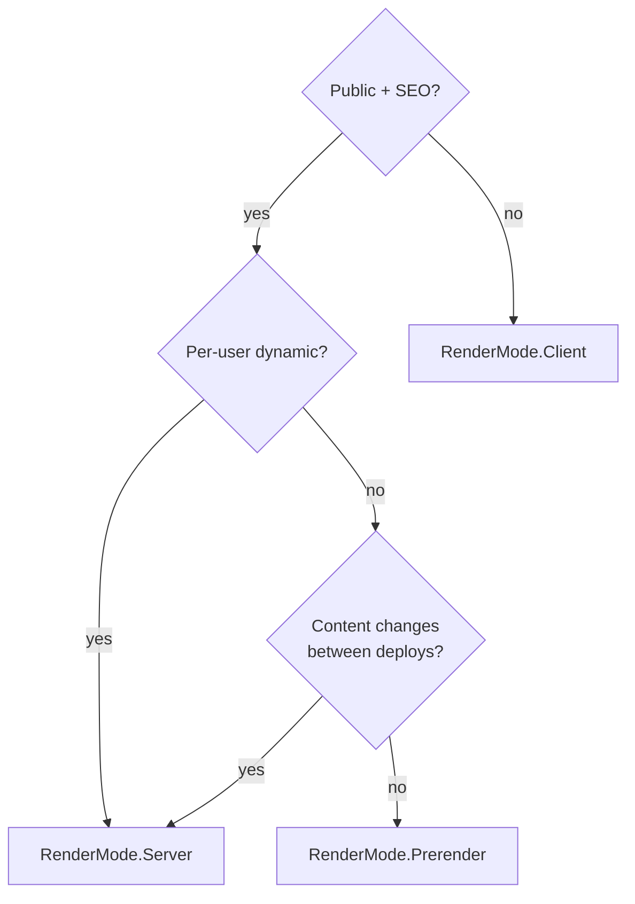
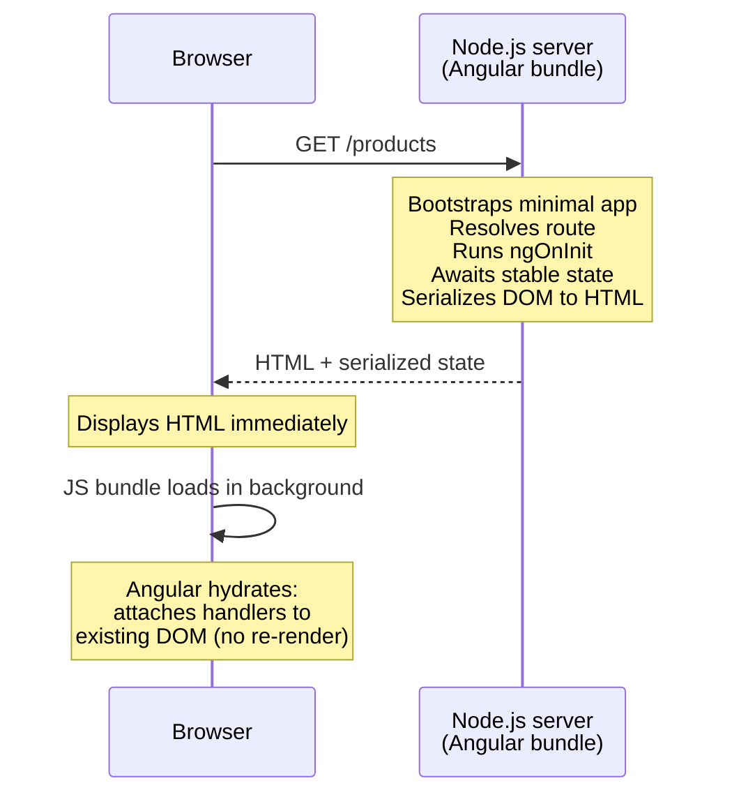
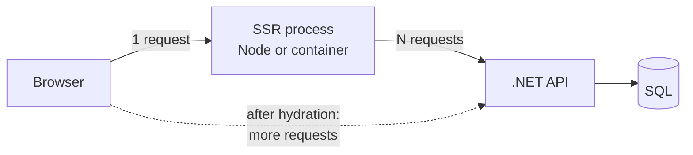

# Angular SSR & Hydration

> [Mastery Guide](../README.md) › [Frontend Integration](./README.md)

| Status | Priority | Phase | Last reviewed |
|---|---|---|---|
| Not Started | Medium | Phase 10 — Frontend (parallel) | 2026-05-08 |

## Contents
- [Why it matters](#why-it-matters)
- [Core concepts](#core-concepts)
  - [SSR vs CSR vs SSG vs prerendering](#ssr-vs-csr-vs-ssg-vs-prerendering)
  - [How Angular SSR works under the hood](#how-angular-ssr-works-under-the-hood)
  - [The modern build: `@angular/build:application`, `outputMode` and two bundles](#the-modern-build-angularbuildapplication-outputmode-and-two-bundles)
  - [Server routing and render modes](#server-routing-and-render-modes)
  - [Prerendering in depth: `getPrerenderParams`, fallbacks, route discovery](#prerendering-in-depth-getprerenderparams-fallbacks-route-discovery)
  - [Hydration — full and incremental (IHydration)](#hydration--full-and-incremental-ihydration)
  - [Non-destructive hydration and what it replaced](#non-destructive-hydration-and-what-it-replaced)
  - [Hydration mismatches: causes, error codes, and how to debug them](#hydration-mismatches-causes-error-codes-and-how-to-debug-them)
  - [`ngSkipHydration` — the escape hatch and what it costs](#ngskiphydration--the-escape-hatch-and-what-it-costs)
  - [i18n and hydration](#i18n-and-hydration)
  - [Event replay — the clicks that arrive before the JavaScript](#event-replay--the-clicks-that-arrive-before-the-javascript)
  - [Incremental hydration in depth — and the v22 default](#incremental-hydration-in-depth--and-the-v22-default)
  - [TransferState — avoiding double fetches](#transferstate--avoiding-double-fetches)
  - [The transfer cache: defaults, auth, and origin mapping](#the-transfer-cache-defaults-auth-and-origin-mapping)
  - [CSP: which inline scripts SSR emits, and which need a nonce](#csp-which-inline-scripts-ssr-emits-and-which-need-a-nonce)
  - [Platform-specific code (isPlatformBrowser / isPlatformServer)](#platform-specific-code-isplatformbrowser--isplatformserver)
  - [Stability: what makes the server wait, and what makes it hang](#stability-what-makes-the-server-wait-and-what-makes-it-hang)
  - [Routing + data resolvers + SSR](#routing--data-resolvers--ssr)
  - [The .NET seam: the SSR process is a second API consumer](#the-net-seam-the-ssr-process-is-a-second-api-consumer)
  - [Cookie auth across the SSR boundary](#cookie-auth-across-the-ssr-boundary)
  - [Fan-out, rate limits, and the connection pool](#fan-out-rate-limits-and-the-connection-pool)
  - [The browser half of the seam: token attachment, the refresh race, preflight](#the-browser-half-of-the-seam-token-attachment-the-refresh-race-preflight)
  - [Hosting alongside ASP.NET Core vs a separate Node process](#hosting-alongside-aspnet-core-vs-a-separate-node-process)
  - [Hosting and deployment models](#hosting-and-deployment-models)
  - [Performance: Core Web Vitals impact](#performance-core-web-vitals-impact)
- [Code & diagrams](#code--diagrams)
- [Common pitfalls](#common-pitfalls)
- [Interview-ready summary](#interview-ready-summary)
- [Interview Cross-Questioning Drill](#interview-cross-questioning-drill)
- [Cheat Sheet](#cheat-sheet)
- [Walkthrough](#walkthrough--fouc-and-layout-shift-after-hydration)
- [Walkthrough — one page view, forty API calls](#walkthrough--one-page-view-forty-api-calls)
- [Self-test](#self-test)
- [Cross-references](#cross-references)
- [Sources](#sources)

---

## Why it matters

Server-Side Rendering (SSR) renders Angular components on a Node.js (or .NET-hosted) server, sending fully-formed HTML to the browser before JavaScript loads. The browser displays content immediately, then "hydrates" — Angular boots up and attaches event handlers without re-rendering. Result: faster First Contentful Paint, better SEO (search engines see real HTML), lower Time to Interactive on slow devices.

In 2026, Angular SSR is **first-class and dramatically improved** from the early "Universal" days. Hydration is mainstream, the `ng add @angular/ssr` schematic creates a working SSR project in seconds, and `@angular/build` — the application builder — handles SSR by default in new apps. The legacy "Angular Universal" name was retired; today it's just **Angular SSR**.

### The version timeline you will be asked to defend

Almost every SSR question at a senior interview is really a question about *which era of Angular SSR your last app was built in*. Know the boundaries:

| Capability | Status by version |
|---|---|
| `provideClientHydration()` (non-destructive hydration) | Developer preview **v16**, **stable v17** |
| `@defer` / built-in control flow | Developer preview **v17**, stable **v18** |
| Server routing (`ServerRoute[]`, `RenderMode`) | Introduced **v19.0** as `provideServerRoutesConfig(routes, { appShellRoute })`, renamed **`provideServerRouting()` in v19.1** (app shell moved to `withAppShell(Component)`) |
| `withEventReplay()` | Developer preview **v18**, stable **v19** |
| `provideServerRendering()` moves to `@angular/ssr`, absorbs routing as `withRoutes()` | **v20** (`provideServerRouting` removed) |
| `withI18nSupport()` | Stable **v20.0** |
| `afterRender()` renamed `afterEveryRender()` | **v20**, with no backwards-compatible alias |
| `PendingTasks` public | **v20** |
| Incremental hydration (`withIncrementalHydration()`) | Developer preview **v19**, stable **v20** |
| Zoneless change detection | Default from **v21** (`provideZoneChangeDetection()` is now the opt-in) |
| `provideStabilityDebugging()` | Stable **v21.1** |
| **Incremental hydration on by default** with `provideClientHydration()` | **v22** — `withIncrementalHydration()` deprecated in v22.0, slated for removal in v24; `withNoIncrementalHydration()` is the new opt-out |
| `OnPush` as the default change-detection strategy | **v22** (`ChangeDetectionStrategy.Default` deprecated in favour of `Eager`) |
| `fetch` as the default `HttpClient` backend | **v22** (`withFetch()` deprecated) |

Two of those flips rewrite the advice a 2023-era SSR page would give you, and both come up in interviews:

1. **Zoneless is the default from v21.** Angular's own hydration guide still describes stability in Zone.js terms — "Hydration relies on a signal from Zone.js when it becomes stable inside an application" — and warns that a custom or noop Zone.js implementation "is not yet a fully supported configuration." In a zoneless app the signal comes from `PendingTasks` / `ApplicationRef.whenStable()` instead, and anything that used to be *implicitly* tracked by the zone (a bare `setTimeout`, a promise resolved by a non-`HttpClient` SDK) now has to announce itself explicitly or the server serialises before your data arrives.
2. **Incremental hydration is the default from v22.** The old advice — "turn on `withIncrementalHydration()` when you're ready" — is dead. It is on, event replay comes with it whether you asked or not, and the interesting question flipped to *when do I turn it off*.

Why interviewers ask: SSR knowledge surfaces full-stack performance thinking — hydration, TransferState, browser/server platform divergence, Core Web Vitals. But at ten years' experience the real probe is architectural: **SSR moves a chunk of your frontend into a long-lived server process that sits inside your network and talks to your .NET API with none of the browser's guarantees.** Candidates who only know the client half get found out in the third question.

When NOT to use: app-shell SaaS dashboards behind login (SEO doesn't matter; CSR is simpler), interactive-only mini-apps, prototypes, or anywhere TTFB is critical and you can't afford the SSR compute cost. **Static prerendering** (SSG) is often the right middle ground for content sites with mostly-static pages. And in v19+ this is no longer an all-or-nothing decision — `RenderMode` is set **per route**, so the honest answer to "SSR or CSR?" is usually "both, and here is the routing table."

> 🌍 **In the real world**: a retail team turned on SSR because a marketing agency's audit said "your site is invisible to Google." They shipped it, LCP improved, and four weeks later the platform team escalated: the Angular pods were the single largest consumer of the orders API, out-competing the mobile apps. Nobody had modelled that every anonymous page view now became a server-side render that issued the same six calls the browser used to issue — except from inside the cluster, with no browser cache, no service worker, and no user idle time between them. The fix was not to remove SSR; it was to move ninety percent of the pages to `RenderMode.Prerender` and put an HTTP cache in front of the remaining SSR routes. The sentence to carry into the interview: **SSR does not reduce the number of API calls, it relocates them to a machine with better bandwidth and worse judgement.**

## Core concepts

### SSR vs CSR vs SSG vs prerendering

| Mode | When HTML rendered | Pros | Cons |
|---|---|---|---|
| **CSR** (Client-Side Rendering) | In browser, after JS loads | Simple deploy (static files); rich interactivity | Slow first paint; bad SEO without extra work; large JS bundle |
| **SSR** (Server-Side Rendering) | On server, per request | Fast FCP; great SEO; full personalization | Server compute cost; hydration complexity; longer TTFB on slow servers |
| **SSG** (Static Site Generation) | At build time, once | Fastest possible delivery (CDN-static); no server cost | Stale until rebuild; no per-user content |
| **Prerendering** (Hybrid) | Some routes at build time, rest dynamic | CDN-fast for known routes; dynamic for personalized | Complex routing/build setup |

Angular supports **all four** in 2026, and since v19 the choice is expressed per route rather than per application — Angular's docs call this **hybrid rendering**. "Prerendering" and "SSG" are the same thing in Angular's vocabulary: `RenderMode.Prerender`. The distinction that actually matters at the architecture level is *when the HTML is produced* and *what it is allowed to know about the user*:

| | Rendered at | Knows the user? | Cacheable by URL alone | Cost per request |
|---|---|---|---|---|
| CSR | Request time, in the browser | Yes (after JS boots) | The shell is; the data isn't | Static file serve |
| SSR | Request time, on your server | Yes, if you forward credentials | **No** — needs `Vary` or `no-store` | One render + N API calls |
| Prerender (SSG) | Build time | No | Yes | Static file serve |
| Prerender + client hydrate | Build time, then browser | Shell no, data yes | Yes for the shell | Static + browser's own calls |

The decision matrix:



The trap in that diagram is the middle branch. "Per-user dynamic" almost always gets answered *yes* because the header shows the user's name — and then the whole site gets SSR'd for the sake of one avatar. The senior move is to split the question: **is the page's indexable content personalised, or only its chrome?** A product page whose body is identical for everyone and whose header shows a name is a `Prerender` page with a client-hydrated header, not an SSR page. That single reframing is usually the difference between a CDN-served site and a Node fleet you have to scale.

**A fourth axis people forget: freshness.** SSG is stale from the moment the build finishes. Angular has no built-in incremental static regeneration (ISR) — if your host offers it (Netlify, Vercel, some CDN edge products) it is a platform feature, not an Angular one. The Angular-native equivalents are (a) rebuild on content change via a CMS webhook, or (b) `RenderMode.Server` with an HTTP cache in front and `stale-while-revalidate`.

### How Angular SSR works under the hood



**The API surface changed twice, and interviewers use it to date your experience.** Three generations exist:

| Era | What `server.ts` looked like |
|---|---|
| Universal (≤ v16) | `AppServerModule`, `ngExpressEngine`, `@nguniversal/express-engine` |
| v17–v18 | `CommonEngine` from `@angular/ssr`, called per request with `{ documentFilePath, url, publicPath, providers }` |
| v19+ | `AngularNodeAppEngine` from `@angular/ssr/node`, which owns routing, render-mode selection and static-asset resolution |

The v19+ shape is what `ng add @angular/ssr` generates today:

```typescript
// server.ts
import {
  AngularNodeAppEngine,
  createNodeRequestHandler,
  writeResponseToNodeResponse,
} from '@angular/ssr/node';
import express from 'express';

const app = express();
const angularApp = new AngularNodeAppEngine();

app.use('*', (req, res, next) => {
  angularApp
    .handle(req)
    .then(response => (response ? writeResponseToNodeResponse(response, res) : next()))
    .catch(next);
});

export const reqHandler = createNodeRequestHandler(app);
```

Two things worth noticing, because they are the whole point of the redesign. First, `angularApp.handle(req)` returns `Promise<Response | null>` — a **Web-standard `Response`**, not a string. Angular is no longer just "render to HTML"; it decides, from your `ServerRoute[]` table, whether this URL is a prerendered file, an SSR render, or a CSR shell, and returns the right one with the right headers and status. `null` means "not mine" — hand it back to Express. Second, `writeResponseToNodeResponse` is the adapter from the Web `Response` to Node's `ServerResponse`, which is why there is a parallel non-Node path:

```typescript
import { AngularAppEngine, createRequestHandler } from '@angular/ssr';

const angularApp = new AngularAppEngine();
export const reqHandler = createRequestHandler(async (req: Request) => {
  const res: Response | null = await angularApp.render(req);
  // ...
});
```

`@angular/ssr` documents this as providing "essential APIs for server-side rendering your Angular application on platforms other than Node.js." Anything that speaks `Request`/`Response` — Cloudflare Workers, Deno, Bun, a Web-API shim — can host it.

`renderApplication()` from `@angular/platform-server` still exists and is still stable (`renderApplication(bootstrap, { document, url, platformProviders, allowedHosts })` returning `Promise<string>`), but the generated server no longer calls it directly. If you find yourself reaching for it in 2026, the usual honest reasons are a bespoke host, a rendering worker pool, or an email/PDF renderer — not a web server.

The server uses the same component code as the browser — *one codebase, two render targets* — with `@angular/platform-server` swapped in for `@angular/platform-browser`.

### The modern build: `@angular/build:application`, `outputMode` and two bundles

`ng add @angular/ssr` produces a project on the **application builder** (`@angular/build:application`, esbuild/Vite based, default for new apps since v17). The SSR-relevant options:

```jsonc
"build": {
  "builder": "@angular/build:application",
  "options": {
    "outputMode": "server",            // "server" | "static"
    "ssr": { "entry": "src/server.ts" },
    "prerender": { "discoverRoutes": true, "routesFile": "routes.txt" },
    "server": "src/main.server.ts",
    "browser": "src/main.ts"
  }
}
```

`outputMode` has exactly two values, and the CLI documents them as: *"'static': Generates a static site build artifact for deployment on any static hosting service. 'server': Generates a server application build artifact, required for applications using hybrid rendering or APIs."*

The output is two directories, and the split is the source of half the deployment bugs in this topic:

```
dist/my-app/
  browser/      ← client bundles, CSS, assets, prerendered *.html
  server/       ← server.mjs, the platform-server build, prerendered route manifest
```

**Why you cannot just run the browser bundle on the server**: different platform package (`platform-server` vs `platform-browser`), different module format and target, and browser globals that Node does not have. The builder produces two compilations from one source tree; the `fileReplacements`-era trick of swapping `environment.ts` is not what makes this work.

**Why you cannot serve only the server bundle**: the browser still needs `browser/main.js` to hydrate. Serve `browser/` as static files (Express, nginx, or better, a CDN) and route everything else to the Angular handler. If static serving is misconfigured the page renders, looks perfect, and never becomes interactive — a failure mode that passes every smoke test that does not click something.

The v22 file layout generated for you:

| File | Contains |
|---|---|
| `src/main.ts` | Browser bootstrap: `bootstrapApplication(App, appConfig)` |
| `src/main.server.ts` | Server bootstrap; receives a `BootstrapContext` |
| `src/app/app.config.ts` | Shared providers — this is where `provideClientHydration()` lives |
| `src/app/app.config.server.ts` | Server-only providers — `provideServerRendering(withRoutes(serverRoutes))` |
| `src/app/app.routes.server.ts` | The `ServerRoute[]` table |
| `src/server.ts` | The Node host |

`BootstrapContext` (from `@angular/platform-browser`) is the small piece people miss on upgrade: `main.server.ts` exports a bootstrap function that *takes a context* — `interface BootstrapContext { platformRef: PlatformRef }` — so the engine can supply the platform rather than each render creating its own.

### Server routing and render modes

`app.routes.server.ts` is the table that decides, per URL, which of the four strategies runs. It is separate from the client `Routes` array on purpose: the client router cares about components, this one cares about delivery.

```typescript
import { RenderMode, ServerRoute, PrerenderFallback } from '@angular/ssr';

export const serverRoutes: ServerRoute[] = [
  { path: '',        renderMode: RenderMode.Client },     // dashboard — no SEO value
  { path: 'about',   renderMode: RenderMode.Prerender },  // static marketing page
  { path: 'profile', renderMode: RenderMode.Server },     // per-user
  { path: '**',      renderMode: RenderMode.Server },     // catch-all
];
```

Angular's own comments on that example are worth quoting because they are the mental model: `Client` "renders the '/' route on the client (CSR)", `Prerender` is used because "this page is static", `Server` because "this page requires user-specific data".

`RenderMode` (from `@angular/ssr`, stable) has exactly three members:

- **`RenderMode.Server`** — "Server-Side Rendering (SSR) mode, where content is rendered on the server for each request."
- **`RenderMode.Client`** — "Client-Side Rendering (CSR) mode, where content is rendered on the client side in the browser."
- **`RenderMode.Prerender`** — "Static Site Generation (SSG) mode, where content is pre-rendered at build time and served as static files."

`ServerRoute` is a **union type** — `ServerRouteClient | ServerRoutePrerender | ServerRoutePrerenderWithParams | ServerRouteServer` — which is why the compiler rejects `getPrerenderParams` on a `RenderMode.Server` route. The properties across the union:

| Property | Applies to | Purpose |
|---|---|---|
| `path` | all | Route pattern, including `**` |
| `renderMode` | all | One of the three above |
| `headers?: Record<string, string>` | all | Response headers for this route |
| `status?: number` | all | Response status code |
| `fallback?: PrerenderFallback` | `Prerender` | What to do for a URL that was not prerendered |
| `getPrerenderParams?` | `Prerender` | Enumerate parameter combinations at build time |

`headers` and `status` are the underrated pair. They let you attach `Cache-Control` **per render mode**, in code, next to the decision that makes it necessary — instead of in a CDN rule that nobody reviews:

```typescript
{
  path: 'profile',
  renderMode: RenderMode.Server,
  headers: { 'Cache-Control': 'private, no-store' },
},
{
  path: 'products/:id',
  renderMode: RenderMode.Server,
  headers: { 'Cache-Control': 'public, max-age=60, stale-while-revalidate=600' },
},
{
  path: 'legacy-offers',
  renderMode: RenderMode.Prerender,
  status: 410,
},
```

> 🌍 **In the real world**: a team migrated from v18 `CommonEngine` to v19 server routing and, following a blog post, wrote a single `{ path: '**', renderMode: RenderMode.Server }` because "it's what we had before." Technically true — the old engine rendered everything. But they now had a *route table* and used it to reproduce a *decision they had never made*. The consequence showed up in the cloud bill: the admin area, six wizard screens and a 40-step onboarding flow — all behind login, all invisible to crawlers — were being fully rendered server-side on every navigation that hit a hard reload. Adding four `RenderMode.Client` entries above the catch-all removed most of the render traffic in an afternoon. **A catch-all is a default, and a default you copied from your previous architecture is not a decision.**

### Prerendering in depth: `getPrerenderParams`, fallbacks, route discovery

For a parameterised route, Angular needs the concrete parameter values at build time. `getPrerenderParams` "returns a `Promise` that resolves to an array of objects. Each object is a key-value map of route parameter name to value":

```typescript
{
  path: 'post/:id',
  renderMode: RenderMode.Prerender,
  async getPrerenderParams() {
    const dataService = inject(PostService);
    const ids = await dataService.getIds();
    return ids.map(id => ({ id }));
  },
}
```

Note `inject()` inside it — this runs in an injection context during the build, so it can use your real services, including `HttpClient` pointed at your .NET API. That is elegant and it is also the trap: **your build now has a runtime dependency on your API.** If the API is down, the build fails. If the API is slow, the build is slow. If the API needs auth, your CI needs a credential. Teams that treat this casually discover it during an incident, when the rollback build cannot run because the service it queries is the one that is broken.

Catch-all routes work too — "you can also use this function with catch-all routes (e.g., `/**`), where the parameter name will be `\"**\"`":

```typescript
{
  path: 'post/:id/**',
  renderMode: RenderMode.Prerender,
  async getPrerenderParams() {
    return [
      { id: '1', '**': 'foo/3' },
      { id: '2', '**': 'bar/4' },
    ];
  },
}
```

**`PrerenderFallback`** decides what happens for a URL that matched a prerender route but was not in the enumerated set — the product that was added after the build:

- **`Server`** — "Falls back to server-side rendering. This is the **default** behavior if no `fallback` property is specified."
- **`Client`** — "Falls back to client-side rendering."
- **`None`** — "No fallback." The request 404s.

The default being `Server` is a good default and a hidden cost: a catalogue where some share of URLs is newer than the last build quietly needs a running Node fleet to serve them, and you will not notice until you look at which routes actually reach the origin. `outputMode: "static"` has no server to fall back to, so `Server` is not available there.

**Route discovery.** `prerender: { discoverRoutes: true }` crawls the router config and prerenders every route that has no parameters — it cannot invent `:id` values, which is what `getPrerenderParams` is for. `routesFile` is the manual escape hatch: a text file, one route per line, typically generated by a pre-build script. For very large catalogues, generating that file from the database is more debuggable than `getPrerenderParams`, because the list is an artefact you can diff between builds.

> 🌍 **In the real world**: a documentation site moved 900 pages to `RenderMode.Prerender` with `getPrerenderParams` calling the CMS. Build time went from about three minutes to over half an hour, and CI started timing out on the busiest days — because each of the 900 renders re-fetched shared navigation and footer data from the same endpoint with no caching, so one build made several thousand calls to a CMS that rate-limited by API key. The fix had nothing to do with Angular: fetch the shared data once into a module-level promise the renders await, and let `getPrerenderParams` return the slugs it already had from a single list call. **Prerendering runs your application N times; anything your app fetches on every page, it will fetch N times during the build.**

### Hydration — full and incremental (IHydration)

Hydration is the process of reusing existing server-rendered DOM and attaching event handlers to it. Without hydration, the browser tears down and re-renders everything → flicker, lost scroll position, lost focus, wasted compute.

```typescript
import { provideClientHydration } from '@angular/platform-browser';

bootstrapApplication(App, {
  providers: [provideClientHydration()],
});
```

`provideClientHydration()` "sets up providers necessary to enable hydration functionality for the application" and, per the API docs, "by default, the function enables the recommended set of features for the optimal performance for most of the applications." As of **v22** that default set is:

1. **DOM hydration** — reuse the server DOM instead of re-rendering.
2. **HTTP transfer cache** — `HttpClient` responses from the server render are serialised into the HTML and replayed on the client.
3. **Incremental hydration** — `hydrate` triggers on `@defer` blocks are honoured, which in turn **enables event replay automatically**.

The feature functions, all from `@angular/platform-browser`:

| Feature | Effect | Status |
|---|---|---|
| `withEventReplay()` | "Enables support for replaying user events (e.g. `click`s) that happened on a page before hydration logic has completed." | Developer preview v18, **stable v19**. Redundant in v22 unless you opt out of incremental hydration |
| `withI18nSupport()` | "Enables support for hydrating i18n blocks." | Stable **v20.0** |
| `withNoHttpTransferCache()` | Turns the transfer cache off entirely | Stable |
| `withHttpTransferCacheOptions({...})` | Tunes what gets cached | Stable |
| `withIncrementalHydration()` | Enabled incremental hydration | **Deprecated in v22.0** — "Since v22.0.0, incremental hydration is enabled by default with `provideClientHydration`." Removal planned for v24 |
| `withNoIncrementalHydration()` | "Disables support for incremental hydration (which is enabled by default)." | Stable, **new in v22.0** |

**Hydration is not automatic.** It is a provider you add. `ng add @angular/ssr` adds it for you in a new project, which is why people believe it is on by default — but an app that predates the schematic, or one whose `app.config.ts` was hand-merged during an upgrade, can be running SSR with zero hydration and nobody notices, because the page still works. It just re-renders everything after the JS loads. The tell is a visible flash and, in the console, **`NG0505: No hydration info in server response`**.

### Non-destructive hydration and what it replaced

The word "non-destructive" is doing real work in Angular's marketing and it is a fair question in an interview: *non-destructive compared to what?*

**What it replaced (Angular Universal, ≤ v15).** The server rendered HTML, the browser displayed it, and then Angular bootstrapped and **threw the entire server DOM away**, re-creating every node from the component tree. You got the SEO benefit and the fast first paint, and then paid for it:

- A visible flicker as the DOM was replaced — commonly severe enough that teams added CSS to hide the app until bootstrap, which destroyed the very first-paint benefit they had bought SSR for.
- Every image re-requested (a new `` element with the same `src` may or may not hit cache, and re-decodes regardless).
- Scroll position, text selection, focus, and any in-progress form entry lost.
- Full layout and paint a second time — the "double render" tax.

The community workaround was `TransferState` plus a `preboot`-style library that recorded events during the gap and replayed them afterwards. Angular has now absorbed both ideas: transfer cache is default, and event replay is built in.

**How non-destructive hydration works.** During the server render, Angular emits — alongside the HTML — a serialised map describing the structure it produced: how many nodes each view contains, where each embedded view (an `@if`/`@for` instance) starts, and where the anchors for view containers sit. That map ships in the same `<script>` payload as the transfer state. On the client, Angular bootstraps in a special mode where, instead of *creating* DOM for each node in a template, it *claims* the corresponding existing node, using the serialised map to walk in lockstep. Component instances, directives, bindings and listeners are all created normally; only the DOM creation calls are skipped.

Three consequences fall straight out of that mechanism, and each of them is an interview answer:

1. **Hydration is a walk, not a diff.** Angular is not comparing two trees and reconciling; it is asserting "the next node here should be a `<div>` and it is." When the assertion fails it cannot patch — it errors and falls back to client-rendering that subtree. This is why hydration mismatches are *structural* problems (an extra node, a missing node, wrong element) rather than *content* problems: differing text usually survives, a differing tag shape does not.
2. **Comment nodes are load-bearing.** Angular's anchors for view containers are DOM comments. An HTML minifier, a CDN "optimisation" feature, or a proxy that strips comments will break hydration in production while dev works perfectly — the NG0500 guidance explicitly tells you to "verify Angular's server-rendered comment nodes (view container anchors) haven't been removed by CDN or custom post-processing logic."
3. **`preserveWhitespaces` must match.** Angular's guidance: "When using the hydration feature, we recommend using the default setting of `false` for `preserveWhitespaces`," and "make sure that this setting is set **consistently** in `tsconfig.server.json` for your server and `tsconfig.app.json` for your browser builds. A mismatched value will cause hydration to break." Two compilations, one DOM — every compiler flag that changes emitted node count has to agree.

### Hydration mismatches: causes, error codes, and how to debug them

The hydration error family, in full:

| Code | Meaning |
|---|---|
| **NG0500** | Hydration Node Mismatch |
| **NG0501** | Hydration Missing Siblings |
| **NG0502** | Hydration Missing Node |
| **NG0503** | Hydration Unsupported Projection of DOM Nodes |
| **NG0504** | Skip hydration flag applied to an invalid node |
| **NG0505** | No hydration info in server response |
| **NG0506** | Application remains unstable |
| **NG0507** | HTML content altered after server-side rendering |

Being able to name NG0500 vs NG0505 vs NG0507 in an interview is a strong signal, because each points at a completely different layer:

- **NG0500 / NG0501 / NG0502** — *your components*. The DOM does not match the map.
- **NG0505** — *your providers*. The server did not emit hydration info at all: hydration is not enabled, or the HTML you served was not produced by this render (a cached CSR shell, a fallback page).
- **NG0507** — *your infrastructure*. The HTML was correct when Angular produced it and something between the render and the browser changed it: a minifier, an ad-injection proxy, a corporate middlebox, a CDN "HTML optimisation" toggle.

**The three real causes of NG0500-class errors.**

**1. Direct DOM manipulation.** Angular's constraint is blunt: "If you have components that manipulate the DOM using native DOM APIs or use `innerHTML` or `outerHTML`, the hydration process will encounter errors." The listed problem cases are "accessing the `document`, querying for specific elements, and injecting additional nodes using `appendChild`."

The mechanism is obvious once you have the walk model: the server's serialised map says this view has four nodes; your `ngAfterViewInit` appended a fifth; the walk desynchronises at that point and everything after it is wrong. `[innerHTML]` is the same problem with extra steps — the sanitised markup is produced by the browser's parser on the client and by Angular's server-side parser on the server, and they do not have to agree byte for byte.

**2. Invalid HTML nesting that the parser rewrites.** This is the one that surprises people, because the template looks fine. The browser's HTML parser is not a validator; it *repairs*. The server serialises the tree Angular built. The browser parses your HTML string and builds a *different* tree. Angular's documented examples:

- `<table>` without a `<tbody>` — "While the HTML standard does not require the `<tbody>` element inside tables, modern browsers automatically create a `<tbody>` element in tables that do not declare one." Your template has `<table><tr>`; the browser gives you `<table><tbody><tr>`; the map is off by one node before you render a single row.
- `<div>` inside a `<p>` — the parser closes the `<p>` early and hoists the `<div>` out.
- `<a>` inside another `<a>` — the parser un-nests them.

The reason this class is nasty is that **the same template was valid for years under CSR**, because under CSR Angular built the DOM itself with `createElement`, never round-tripping through the parser. Turning on SSR is what exposes it. When a candidate says "we turned on hydration and our tables broke," this is what happened.

**3. Browser-only APIs producing different content.** `localStorage.getItem('theme')`, `document.cookie`, `window.innerWidth`, `navigator.language`, `Math.random()`, `Date.now()`, `new Date().toLocaleString()` under a different server timezone. Each renders one thing on the server and another in the browser. If they only change *text*, you often survive with a flicker; if they gate an `@if`, you get a structural mismatch.

**How to debug one, in order.**

1. **Read the error.** Angular's console output for NG0500 prints the component and the specific DOM location. Step one in the official guidance is literally "Inspect the error message — the console will identify the specific DOM location causing the problem."
2. **Look at the *server's* HTML, not the DOM inspector.** `curl -s https://host/path -o page.html`. DevTools shows you the live DOM after the parser repaired it and after any script ran; the raw response is what Angular actually produced. Diffing "what the server sent" against "what the parser built" is exactly how you find the `<tbody>` class of bug.
3. **Bisect with `ngSkipHydration`.** Add it to a suspected component; if the error moves or disappears, you have localised it. Then remove it and fix the cause.
4. **Check for post-processing.** If NG0507, take your CDN/proxy out of the path and re-test. Compare `curl` against the origin with `curl` through the edge.
5. **Check `preserveWhitespaces` parity** across `tsconfig.app.json` and `tsconfig.server.json`.
6. **Check for a stale index.** NG0505 with hydration correctly provided usually means something is serving a cached or fallback `index.html` instead of a real render.

> 🌍 **In the real world**: a reporting app turned on hydration and every screen with a data grid threw NG0500 in production but not in local dev. The grid template was `<table><tr *ngFor=...>` — written in the Angular 6 era, migrated to `@for` by the schematic, never touched otherwise. Local dev used `ng serve`; production went through a CDN with HTML minification enabled, which also stripped comments, so they chased the CDN for a week on the (correct but incomplete) theory that something was rewriting their HTML. Both things were true: the missing `<tbody>` broke the node walk, and the comment stripping broke the view-container anchors. The lesson worth saying out loud: **hydration turns your HTML from something a browser tolerates into something two independent parsers must agree on, and every layer that "optimises" HTML in transit is now part of your application.**

### `ngSkipHydration` — the escape hatch and what it costs

```html
<app-legacy-chart ngSkipHydration />
```

```typescript
@Component({
  host: { ngSkipHydration: 'true' },
})
export class LegacyChartComponent {}
```

What it does: **"The `ngSkipHydration` attribute will force Angular to skip hydrating the entire component and its children."** Angular destroys the server-rendered DOM for that subtree and re-creates it client-side, exactly as pre-v16 Universal did for the whole app.

What it costs — and this is the part candidates skip:

- **It is recursive.** Not "this component"; this component *and everything it contains*. Put it on a layout component and you have opted an entire page out.
- **Angular warns about the extreme case explicitly**: "Keep in mind that adding the `ngSkipHydration` attribute to your root application component would effectively disable hydration for your entire application." Combined with the recursion above, `ngSkipHydration` on a wrapper is a silent, spreading regression — nothing errors, the page works, and the SSR benefit evaporates.
- **It reintroduces the flicker and the double render** for that subtree, which is the CLS problem you started with.
- **It only works on component host nodes.** "The `ngSkipHydration` attribute can only be used on component host nodes." Putting it on a plain `<div>` gives you **NG0504**.
- **It cannot be applied conditionally.** It is a static marker read during hydration; `[attr.ngSkipHydration]="someSignal()"` is not a supported pattern.

When it is the *right* answer: third-party libraries that render by manipulating the DOM. Angular names the case — "There are a number of third party libraries that depend on DOM manipulation to be able to render. D3 charts is a prime example… if you encounter DOM mismatch errors using one of these libraries, you can add the `ngSkipHydration` attribute to the component that renders using that library." The correct shape is a **thin leaf wrapper**: one component whose entire job is to host the library, marked `ngSkipHydration`, containing nothing else. Then the escape hatch costs you one chart, not one page.

The better answer for a chart specifically is often to not render it on the server at all — `@defer (on viewport)` with a skeleton `@placeholder`, or `@defer (hydrate never)` if a server-rendered static version is acceptable — so there is no server DOM to mismatch in the first place.

> 🌍 **In the real world**: a team hit D3 mismatch errors on one dashboard tile, added `ngSkipHydration`, and it worked. Six months later a new starter hit an unrelated mismatch on the shell component, searched the codebase for prior art, found the D3 fix, and applied it to `AppShellComponent`. Every error went away — including the ones nobody had reported yet — and Lighthouse scores dropped across the whole site over the next two releases without a single failing test or console error. It was found during an unrelated performance review, by noticing that the site rendered the same whether hydration was provided or not. The rule they wrote into their review checklist: **`ngSkipHydration` is only ever allowed on a leaf component whose sole responsibility is wrapping a third-party renderer, and every use needs a comment naming the library.**

### i18n and hydration

Angular's default here is a genuine gotcha: **"By default, Angular will skip hydration for components that use i18n blocks."** Not an error — a silent downgrade. A localised app with `i18n` attributes throughout can have hydration enabled, no console noise, and most of the page quietly re-rendering.

The fix is one feature function, stable since **v20.0**:

```typescript
provideClientHydration(withI18nSupport())
```

The reason it is opt-in is that i18n blocks contain ICU expressions and interpolated placeholders whose expansion is locale-dependent, so hydrating them requires the serialisation format to carry extra information. Two things to say when asked:

- **Locale must be identical on both sides.** Angular's build-time i18n produces one bundle per locale, so the server must select the same locale bundle the browser will load. If your locale comes from an `Accept-Language` header on the server and from a cookie or a `<html lang>` in the browser, you have built a locale mismatch, which is a content mismatch, which is a hydration mismatch. Decide locale in exactly one place — the URL path or a cookie the server can read — and derive both sides from it.
- **Timezone and formatting are the same class of bug.** `DatePipe` and `CurrencyPipe` on the server use the Node process's `TZ` and the locale data compiled into the server bundle. A container running UTC and a browser in `Europe/Berlin` will render different strings for the same instant. Set `TZ` explicitly on the SSR container, or format on the server in a fixed zone and let the client adjust after hydration inside `afterNextRender`.

### Event replay — the clicks that arrive before the JavaScript

SSR creates a window that CSR does not have: the page *looks* interactive — buttons are painted, the form is there — before any listener is attached. Users click into that window constantly, because the page looks ready. Pre-v18, those clicks were simply lost.

**`withEventReplay()`** (stable **v19**) closes it. Angular's description: *"Enables support for replaying user events (e.g. `click`s) that happened on a page before hydration logic has completed."* Mechanically, the render emits a small inline script that installs an event contract (Google's **JSAction** library, the same machinery Wiz uses) rooted at `document.body` before the main bundle exists — `window.__jsaction_bootstrap(document.body, "<appId>", …)`. It records events that bubble to that root along with their target, and once the relevant component hydrates, dispatches them again so the real handler runs. Two practical consequences fall out of "it listens at the root and relies on bubbling": events that do not bubble are not captured, and the script is *executable inline JavaScript*, which is why it — and not the transfer state — is the part a strict CSP argues with.

The v22 nuance, and the thing to get right in an interview: **you no longer call it in the common case.** Because incremental hydration is on by default and "Incremental Hydration depends on and enables event replay automatically" — and the hydration guide restates it as "if you have incremental hydration enabled, event replay is automatically enabled under the hood" — a plain `provideClientHydration()` in v22 already gives you event replay. `withEventReplay()` becomes meaningful again only if you have opted out with `withNoIncrementalHydration()`.

What event replay does **not** do:

- It does not replay events that require a live browser state you did not persist — a `focus`/`blur` sequence, a drag, a scroll-driven gesture.
- It does not make the interaction *fast*. The user still waits for hydration; they just do not have to click twice.
- It does not fix a click on a link handled by the router if the browser has already begun a full navigation.

The honest framing: event replay is a **correctness** feature that hides a **latency** problem. It stops "I clicked Add to Cart and nothing happened." It does not stop the two-second wait. If your measurements show a long pre-hydration window, event replay is a bandage; incremental hydration and a smaller eager bundle are the treatment.

> 🌍 **In the real world**: a checkout team had a support pattern they could never reproduce — customers reporting that "Add to cart did nothing" on the product page, always on mobile, always on first visit. Session replay showed the click landing on the button with no subsequent network activity, then a second click a few seconds later that worked. The eager bundle was large and the page was doing a lot of hydration work; the first click was landing in the gap. Enabling `withEventReplay()` converted the double-click into a single click that queued and fired. It did not make anything faster, and the team was careful to record that in the ticket, because the next quarter's work — deferring the recommendations and reviews sections — is what actually moved the number. **Event replay stops you losing the interaction; it does not stop the user waiting for it.**

### Incremental hydration in depth — and the v22 default

Incremental hydration is `@defer` applied to *hydration* rather than to *loading*. The server renders the block's real content (not the `@placeholder`), the client receives that HTML and **leaves it dehydrated** — visible, styled, non-interactive, with none of its JavaScript downloaded — and hydrates it when a trigger fires.

```html
@defer (hydrate on viewport) {
  <app-comments [postId]="postId()" />
} @placeholder {
  <app-comments-skeleton />
}

@defer (hydrate on interaction) {
  <app-share-menu [url]="url()" />
} @placeholder {
  <button>Share</button>
}

@defer (hydrate never) {
  <app-footer-links />
}
```

**The full trigger set** (`hydrate` variants mirror the `@defer` triggers):

| Trigger | Fires when |
|---|---|
| `hydrate on idle` | The browser is idle; accepts an optional timeout |
| `hydrate on viewport` | The content enters the viewport |
| `hydrate on interaction` | A `click` or `keydown` on the block |
| `hydrate on hover` | `mouseover` or `focusin` |
| `hydrate on immediate` | Immediately after non-deferred content renders |
| `hydrate on timer(2s)` | After the given duration |
| `hydrate when <expr>` | A custom expression becomes truthy |
| `hydrate never` | "Allows users to specify that the content in the defer block should remain dehydrated indefinitely" |

**`hydrate never` is the interesting one**, and the honest answer to "does Angular have anything like React Server Components?" It ships HTML with no client JavaScript for that subtree — permanently. It is not RSC (the component still runs on the server as an Angular component, and it cannot become interactive later), but for footers, legal text, static specification tables and rendered marketing copy it achieves the same outcome: server-rendered content that costs the client nothing.

**Rules and constraints:**

- Incremental hydration inherits "the same constraints as full-application hydration, including limits on direct DOM manipulation and requiring valid HTML structure."
- **"Hydrating any component requires all of its parents also be hydrated."** Triggering a nested block hydrates the chain above it first. A `hydrate on interaction` block inside a `hydrate never` block is a contradiction the outer block wins.
- `@placeholder` is still required, because it is what renders for "subsequent client-side rendering cases" — a client-side navigation that re-creates the block has no server HTML to reuse.
- `@defer`'s general rules still apply: deferred dependencies "must be standalone" and "cannot be referenced outside of `@defer` blocks within the same file." One stray `viewChild` and the block silently stops deferring.
- The `hydrate` trigger and the *load* trigger are independent and both may be present: `@defer (on viewport; hydrate on interaction)`.

**What changed in v22, and what it means for advice this page used to give.** `withIncrementalHydration()` is deprecated as of v22.0 — "Since v22.0.0, incremental hydration is enabled by default with `provideClientHydration`" — with removal planned for v24, and `withNoIncrementalHydration()` (new in v22.0) is the opt-out. Practically:

- Any `hydrate` trigger you write is now honoured without ceremony. In a v19–v21 codebase, `hydrate on viewport` in a template with no `withIncrementalHydration()` in the config was **silently ignored** — a real and common bug where teams believed they had shipped incremental hydration.
- Upgrading to v22 can therefore *change behaviour* in a codebase that had the triggers but not the provider: blocks that used to hydrate eagerly now do not. This is a genuine upgrade risk and a good interview answer to "what would you check when moving to v22?"
- Event replay arrives with it, whether or not you asked for it.
- Removing `withIncrementalHydration()` from your config on upgrade is a no-op cleanup, not a behaviour change.

**When to opt out.** `withNoIncrementalHydration()` earns its place when a page's interactivity is genuinely global and immediate — a trading blotter, a canvas editor, an app where the first interaction can be anywhere — and you would rather pay one hydration cost up front than have unpredictable per-region delays. It is a small set of apps. The much more common tuning is to keep the default and be deliberate about which blocks carry a `hydrate` trigger at all.

> 🌍 **In the real world**: a content team upgraded from v20 to v22 and their article pages got *worse* on one metric nobody was watching — the "related articles" carousel stopped auto-advancing on load. The template had carried `@defer (hydrate on viewport)` around the carousel since a v19 experiment, but the config had never included `withIncrementalHydration()`, so for two years the trigger had been inert and the carousel had hydrated eagerly like everything else. v22 turned the trigger on. Nothing was broken — the block behaved exactly as it had been written to behave, two years after it was written. The takeaway: **a template directive that silently does nothing is a bug with a delayed fuse, and version upgrades are when the fuse burns down.** Before a v22 upgrade, grep for `hydrate ` in templates and confirm every occurrence is still what you want.

### TransferState — avoiding double fetches

Without TransferState, your `OrderService` runs on the server (renders HTML), the browser receives HTML, then the browser's `OrderService` runs the same `getOrders()` call again. Wasteful. **TransferState** lets the server attach data to the response; the browser reads it instead of refetching.

```typescript
import { TransferState, makeStateKey } from '@angular/core';

const ORDERS_KEY = makeStateKey<Order[]>('orders');

@Injectable({ providedIn: 'root' })
export class OrderService {
  private state = inject(TransferState);
  private http = inject(HttpClient);

  getOrders() {
    const cached = this.state.get(ORDERS_KEY, null);
    if (cached) {
      this.state.remove(ORDERS_KEY);   // one-time use
      return of(cached);
    }
    return this.http.get<Order[]>('/api/orders').pipe(
      tap(orders => this.state.set(ORDERS_KEY, orders))
    );
  }
}
```

**Correction worth internalising, because a lot of older material gets it wrong:** it is **`provideClientHydration()`**, not `provideHttpClient(withFetch())`, that gives you the automatic HTTP transfer cache. `withFetch()` selects the Fetch backend instead of `XMLHttpRequest` — a different concern entirely, and **deprecated in v22** because fetch is now the default backend. If you say "`withFetch()` enables TransferState" in an interview, an interviewer who has read the v22 API docs will follow up, and the follow-up is unpleasant.

Manual `TransferState` still earns its place for anything that does not flow through `HttpClient`: values computed expensively on the server, feature flags resolved from environment variables the browser cannot see, results from a third-party SDK, or data you want under your own key with your own lifecycle.

The API (`@angular/core`, stable):

| Member | Signature |
|---|---|
| `get` | `get<T>(key: StateKey<T>, defaultValue: T): T` |
| `set` | `set<T>(key: StateKey<T>, value: T): void` |
| `remove` | `remove<T>(key: StateKey<T>): void` |
| `hasKey` | `hasKey<T>(key: StateKey<T>): boolean` |
| `onSerialize` | `onSerialize<T>(key: StateKey<T>, callback: () => T): void` |
| `toJson` | `toJson(): string` |
| `isEmpty` | `boolean` |

**`onSerialize` is the member nobody knows and the one that answers "how do you transfer state you only know at the end of the render?"** — it registers a callback invoked at serialisation time, so the value is computed after rendering completes rather than when you happened to call `set()`.

**The serialisation constraint** is documented and it bites: *"The values in the store are serialized/deserialized using `JSON.stringify`/`JSON.parse`. So only boolean, number, string, null and non-class objects will be serialized and deserialized in a non-lossy manner."* Consequences in a .NET shop, where DTOs love dates and decimals:

- A `Date` goes in as a `Date` and comes out as an ISO **string**. Code that calls `.getTime()` on the client works on the server and throws in the browser — or worse, silently produces `NaN`.
- A class instance loses its prototype: methods gone, `instanceof` false.
- `Map`, `Set`, `BigInt`, `undefined` values and circular references do not survive.
- `System.Text.Json`'s default handling of `decimal` (a JSON number) is fine; a `TimeSpan` serialised as `"01:30:00"` is a string on both sides and therefore safe.

**And the consequence people miss: anything you put in TransferState is visible in page source.** It is not a cache, not memory, not a cookie — it is JSON in a `<script>` tag in the HTML document you sent to the browser. `Ctrl+U`, `curl`, the crawler's index, the corporate proxy's log, the browser extension reading the DOM, and the CDN's cached object all have it. This is genuinely the most common security finding in Angular SSR reviews, and it happens in a very specific way: the server calls `/api/orders/42`, the .NET endpoint returns the full `OrderDto` because that is what the endpoint returns, the UI displays three fields — and the other twenty-five, including the customer's email, internal margin and the fulfilment partner's ID, are sitting in the page source of a page that is also cached at the edge.

The mitigations, in order of how much they actually help:

1. **Return view-model-shaped DTOs from the API.** If the endpoint only ever returns what the screen renders, there is nothing to leak. This is the BFF argument, arriving from the security direction rather than the performance one.
2. **Filter what enters the cache** with `withHttpTransferCacheOptions({ filter })`.
3. **`withNoHttpTransferCache()`** on genuinely sensitive apps, and accept the double fetch.
4. **Never put a token, session ID or secret in TransferState.** Not "encrypt it" — do not put it there.

### The transfer cache: defaults, auth, and origin mapping

`withHttpTransferCacheOptions()` takes:

| Option | Meaning |
|---|---|
| `includeHeaders: string[]` | Which response headers to carry across; by default headers are **not** transferred |
| `filter: (req: HttpRequest<unknown>) => boolean` | Per-request opt-in/opt-out |
| `includePostRequests: boolean` | Cache `POST` responses too — for GraphQL-over-POST and RPC-style endpoints |
| `includeRequestsWithAuthHeaders: boolean` | Cache responses to requests carrying `Authorization` |
| `includeRequestsWithCredentials: boolean` | Cache responses to credentialed requests |
| `includeNonCacheableRequests: boolean` | Ignore the response's own cache directives |

`includeRequestsWithAuthHeaders: true` is the single most dangerous line in Angular SSR configuration. It means: *serialise the response to an authenticated API call into the HTML document.* That is correct and useful when the HTML is `Cache-Control: private, no-store` and reaches exactly one user. It is a cross-user data leak the moment any shared cache — CDN, reverse proxy, corporate proxy, a `[ResponseCache]` attribute on the ASP.NET Core route that fronts it — stores that document. The two settings are a pair, and they live in different repositories, which is exactly why the mistake survives review.

**`HTTP_TRANSFER_CACHE_ORIGIN_MAP`** (`@angular/common/http`, stable) is the piece that makes the transfer cache actually work in a real .NET deployment. Cache keys include the full URL. Your SSR container calls the API at its internal address; the browser calls it at its public one; the URLs differ, so **every cache entry misses and you double-fetch everything** — silently, with no error, and with a symptom ("the API load did not go down after we added SSR") that looks like an infrastructure problem.

```typescript
// app.config.server.ts — server code ONLY
{
  provide: HTTP_TRANSFER_CACHE_ORIGIN_MAP,
  useValue: {
    'http://internal-domain.com:8080': 'https://external-domain.com',
  },
}
```

Read that direction carefully: keys are the origins the **server** used, values are the origins the **client** will use. And the hard constraint from the docs: *"The token should only be provided in the server code of your application"* — Angular errors if it finds it on the client, which is correct, because the map describes your internal topology and has no business in a browser bundle.

> 🌍 **In the real world**: a team added SSR expecting the orders API's request rate to fall, since the server was now fetching the data the browser used to fetch. It went **up**. Their SSR pods called `http://orders-api.prod.svc.cluster.local/api/...` (Kubernetes service DNS) while the browser called `https://api.company.com/api/...` through the gateway — so the transfer cache never matched a single request and every page did both fetches. The internal calls did not appear in the gateway's dashboards at all, which is why the graph they were watching looked flat while the API team's graph did not. `HTTP_TRANSFER_CACHE_ORIGIN_MAP` fixed it with four lines. **The transfer cache is keyed by URL, and in any non-trivial deployment the server and the browser do not use the same URL.**

### CSP: which inline scripts SSR emits, and which need a nonce

An SSR response contains inline `<script>` elements that a CSR shell does not, so turning on SSR is frequently what breaks a strict Content Security Policy — or, more often, what causes someone to *weaken* one for the wrong reason. There are two kinds and they behave completely differently:

**1. The state block — not executable, not blocked.** Angular serialises the transfer state and the hydration node map into a single script element whose id is the app id plus `-state` (so `ng-state` with the default `APP_ID`) and whose type is set explicitly: `script.setAttribute('type', 'application/json')`. A script element with a non-JavaScript type is a **data block** — the browser parses it as text and never executes it — so `script-src` has nothing to say about it. "We had to add `'unsafe-inline'` because TransferState needs it" is a real thing teams do, and it is wrong: it does not fix anything and it removes the main protection the directive was giving you.

**2. The event-replay bootstrap — executable, and the one that matters.** With event replay active (the default in v22, since incremental hydration enables it) the render emits *executable* inline scripts: the event-dispatch contract plus a call of the form `window.__jsaction_bootstrap(document.body, "<appId>", …)`. These are real classic scripts, they run before your bundle, and a strict `script-src` will block them — at which case you lose event replay, not hydration. Angular threads a nonce into them; if you want a historical detail that shows you have actually shipped this, `angular/angular#59886` was exactly the bug where only one of the two scripts received the nonce under a strict CSP (now closed).

**3. Build-time inline scripts.** Independently of SSR, the CLI can inline a small script for critical-CSS handling. Angular's security guidance is a `script-src 'self' 'nonce-…'` policy for precisely that reason, alongside `style-src 'self' 'nonce-…'` for the inline styles Angular inserts.

**How you supply the nonce.** Either the `ngCspNonce` attribute on the application's root element — `<app-root ngCspNonce="…">` — or the **`CSP_NONCE`** injection token (`InjectionToken<string | null>`, `@angular/core`); if the token is not provided Angular falls back to reading the attribute from the root node. The same nonce is what Angular applies to the `<style>` elements it inserts.

**The SSR-specific trap is caching.** Angular's own guidance is that nonces must be "unique per request" and "not predictable or guessable" — which is a direct conflict with caching rendered HTML. A nonce that is baked into a CDN-cached document is a nonce every visitor shares, which is the same as not having one. That gives you three coherent positions and no fourth: `no-store` HTML with a per-render nonce, cached HTML with a **hash-based** policy instead of nonces, or nonce injection at the edge on every response.

**`autoCsp` is the hash-based option, and it is preview.** The application builder takes `"security": { "autoCsp": true }`, described in the builder schema as *"Enables automatic generation of a hash-based Strict Content Security Policy based on scripts in `index.html`. Will default to true once we are out of experimental/preview phases."* It defaults to `false`, it is explicitly pre-stable, and — read the description carefully — it hashes the scripts in `index.html` at **build time**. Scripts that only exist because a *render* produced them are a different problem from the one it solves. Do not present it in an interview as the finished answer to CSP with SSR.

One last connection worth making out loud, because it ties two sections together: a CSP rollout often arrives with an HTML post-processor or an edge worker that rewrites the document to inject headers, meta tags or nonces. That is the same class of thing that produces **NG0507 — "HTML content was altered after server-side rendering"**. Angular needs the bytes it produced, including whitespace and comment nodes, to survive the trip.

> 🌍 **In the real world**: a bank's platform team rolled out a strict CSP across every app. The Angular SSR app broke in a way nobody expected — hydration was fine, the page worked, but a support pattern appeared where the first click on the search button did nothing. The blocked resource was the event-replay bootstrap script, which the report in the CSP violation endpoint identified only as an inline script at the bottom of `<body>`, and which nobody recognised because no developer had written it. The frontend team's first proposal was `'unsafe-inline'`, justified by "Angular needs it for TransferState" — which was doubly wrong: the state block is `type="application/json"` and was never blocked, and the thing that *was* blocked would have been fixed by the nonce they were already generating. The fix was one attribute. **Before you weaken a CSP for a framework, find out which script actually got blocked; in Angular SSR it is almost never the one people name.**

### Platform-specific code (isPlatformBrowser / isPlatformServer)

Some APIs only exist in one environment. `window`, `document`, `localStorage` are browser-only; `process.env` is server-only.

```typescript
import { isPlatformBrowser, isPlatformServer } from '@angular/common';
import { Inject, PLATFORM_ID } from '@angular/core';

export class TrackingService {
  constructor(@Inject(PLATFORM_ID) private platformId: object) {}

  recordPageView() {
    if (isPlatformBrowser(this.platformId)) {
      window.gtag('event', 'page_view', { page_path: location.pathname });
    }
  }
}
```

Modern form, since `inject()` works in field initialisers:

```typescript
@Injectable({ providedIn: 'root' })
export class TrackingService {
  private readonly isBrowser = isPlatformBrowser(inject(PLATFORM_ID));

  recordPageView(path: string) {
    if (!this.isBrowser) return;
    // ...
  }
}
```

**Common SSR-incompatible code**:
- Direct `window` / `document` access → wrap with `isPlatformBrowser`, or inject the `DOCUMENT` token from `@angular/core` — `InjectionToken<Document>`, described as "the main rendering context", and on the server it is a document "created by **Domino**", so `document.createElement` works while `document.body.getBoundingClientRect()` returns nothing useful.
- `localStorage` / `sessionStorage` → no server-side equivalent; degrade gracefully or skip on server.
- `IntersectionObserver`, `ResizeObserver`, `MutationObserver`, `matchMedia`, Canvas/WebGL → not present in the server DOM emulation.
- Third-party libraries that require browser APIs (most analytics, video players, mapping and charting libraries) → load lazily on the browser only.

**The module-evaluation trap**: a library reads or assigns `window.foo` at module-eval time, so merely *importing* it crashes the server render — the guard inside your method never runs, because the failure happened at import. `isPlatformBrowser` cannot help a static `import` statement. Fix with a dynamic `import()` inside a browser-only path, which is not evaluated until the branch executes:

```typescript
if (this.isBrowser) {
  const { init } = await import('./analytics');
  init();
}
```

**The lifecycle hooks that replace most of this.** `afterNextRender()` and `afterEveryRender()` (both from `@angular/core`) run **only in the browser** — never during SSR — which makes them the correct home for DOM measurement, third-party widget initialisation and anything touching `window`. Angular's SSR guide states the rule directly: code relying on browser-specific symbols "should only be executed in the browser, not on the server. This can be enforced through the `afterEveryRender` and `afterNextRender` lifecycle hooks."

```typescript
export class ChartComponent {
  private readonly host = inject(ElementRef);

  constructor() {
    afterNextRender(async () => {
      // Guaranteed browser-only, guaranteed after the DOM exists.
      const { draw } = await import('./d3-chart');
      draw(this.host.nativeElement);
    });
  }
}
```

**A version landmine on this exact API.** Both hooks landed in **16.2** as `afterRender()` and `afterNextRender()`. In **v20**, `afterRender()` was **renamed `afterEveryRender()` with no backwards-compatible alias** — so v16–v19 code that used `afterRender` fails to compile after the upgrade. If your last SSR work was on v17 or v18, this is one of the first things that will break, and being able to name it is a small, cheap credibility signal.

**The pattern that removes the whole class of problem: pass it from the server.** Theme, locale, feature flags, A/B bucket and "is the user logged in" all cause hydration mismatches when read from `localStorage` on the client and defaulted on the server. Read them from a **cookie** instead, which the server *does* have (via the `REQUEST` token), and both sides compute the same value from the same input. `localStorage` should hold things whose absence on the server is harmless; anything that changes what is rendered belongs in a cookie or the URL.

### Stability: what makes the server wait, and what makes it hang

The server cannot serialise until the application is *stable* — otherwise it emits the loading state instead of the data. Two things to understand: what defines stability, and what happens when it never arrives.

**What defines it.** `ApplicationRef.isStable` is `Observable<boolean>`, "an Observable that indicates when the application is stable or unstable"; `ApplicationRef.whenStable()` is the `Promise<void>` form. Historically the signal came from Zone.js — Angular's hydration guide still says "hydration relies on a signal from Zone.js when it becomes stable inside an application," and warns that a custom or noop Zone.js "may lead to a different timing of the 'stable' event, thus triggering the serialization or the cleanup too early or too late. This is not yet a fully supported configuration."

**Zoneless is the default from v21**, so in a new app that Zone signal does not exist. Stability now comes from tasks Angular knows about — pending `HttpClient` requests, pending router navigations, `resource()` loads — plus whatever you register yourself with **`PendingTasks`** (`@angular/core`, stable v20):

```typescript
const pendingTasks = inject(PendingTasks);

// Promise form
pendingTasks.run(async () => {
  const data = await this.legacySdk.fetchConfig();
  this.config.set(data);
});

// Manual form
const done = pendingTasks.add();
thirdPartyThing.onReady(() => { /* ... */ done(); });
```

The practical rule: **anything asynchronous that does not go through `HttpClient` or the router is invisible to the server unless you wrap it in `PendingTasks`.** Under Zone.js, a bare `setTimeout` or a raw `fetch()` was tracked implicitly and the render waited. Zoneless does not track it, the render does not wait, and the HTML ships with the placeholder. This is the single most common "we went zoneless and SSR started returning empty pages" story.

**What happens when stability never arrives.** **NG0506 — "Application remains unstable"** — is raised when the app "doesn't stabilize within 10 seconds." The usual causes:

- A `setInterval` polling loop started in `ngOnInit` and not guarded by `isPlatformBrowser` (or not cleaned up). Under Zone.js it is a permanently pending macrotask.
- A long-lived stream that never completes feeding something the render awaits.
- An animation or retry loop that reschedules itself.
- A `PendingTasks.add()` whose cleanup function is never called on an error path.

**`provideStabilityDebugging()`** (`@angular/core`, stable **v21.1**) is the tool: it "provides an application initializer that will log information about what tasks are keeping the application from stabilizing if the application does not stabilize within 9 seconds," printing stack traces of the offending tasks. With Zone.js, also import `zone.js/plugins/task-tracking` for macrotask detail. Add it to the server config in a staging environment and the answer is usually in the first log line.

> 🌍 **In the real world**: an SSR app started returning pages with an empty main content area, intermittently, more often under load. No errors, correct HTML shell, correct nav, empty body. The team had gone zoneless on the v21 upgrade months earlier and this had shipped fine at the time. The regression was a small, unrelated PR: a service that loaded feature flags had been switched from `HttpClient` to a vendor SDK, which used `fetch()` internally. Under zoneless nothing tracked that promise, the render did not wait, and the components that gated on flags rendered their empty state. It was intermittent because on a warm server the SDK's own cache resolved synchronously. `provideStabilityDebugging()` in staging pointed at it in one run; `PendingTasks.run()` fixed it in three lines. **In a zoneless app, "the server waited for my data" is not a property of the framework — it is a claim you have to make explicitly, once per non-Angular async source.**

### Routing + data resolvers + SSR

Resolvers run on the server *before* HTML is rendered, ensuring the page comes back with data populated. Avoid Promise.all / forkJoin chains that take >1 second — they directly extend TTFB.

```typescript
export const routes: Routes = [{
  path: 'orders/:id',
  component: OrderDetailComponent,
  resolve: {
    order: () => inject(OrderService).getOrder(inject(ActivatedRoute).snapshot.params['id'])
  }
}];
```

For **lazy-loaded routes** with SSR: ensure the bundle exists at build time. The server needs the chunk to render; if the chunk loads dynamically only in the browser, SSR can't render the route.

**Resolvers versus `resource()` under SSR.** A resolver blocks navigation, which on the server means it blocks the response — its latency is added to TTFB, directly, serially with anything it depends on. `resource()` / `httpResource()` (stable **v22**; `httpResource` was experimental in 19.2) render a loading state first and fill in when the request lands, which is exactly what you *don't* want on the server for above-the-fold content and exactly what you *do* want for everything else. The rule that follows:

- **Resolver** (or an awaited load) for the content that must be in the HTML for SEO and LCP: the product, the article, the page title and meta tags.
- **`resource()` inside a `@defer` block** for everything else: recommendations, reviews, related items, the notification count. The server renders the placeholder, the client loads the data.
- Anything a resolver fetches goes into the transfer cache automatically (it went through `HttpClient`), so the browser does not re-fetch it.

Parallelism matters more on the server than in the browser, because there is no user staring at a partially-rendered page to absorb the wait. `forkJoin`/`Promise.all` over independent calls; never a chain of awaits where each one's input is available before the previous completes.

**Meta tags are not automatic.** `Title` and `Meta` (from `@angular/platform-browser`) write into the document head, and because the server renders the whole document, the tags land in the SSR HTML where crawlers see them. Without explicit calls, every page ships the single default title from `index.html` — which is the actual cause of most "we added SSR and SEO did not improve" reports. Set them in the resolver or in a route-data-driven effect, not in `ngOnInit` of a component that might be deferred.

### The .NET seam: the SSR process is a second API consumer

This is where an Angular-only candidate stops and a senior full-stack candidate keeps going. Adding SSR does not add a rendering step to your frontend; it adds **a new service to your backend architecture** — one that consumes your .NET API, sits at a different network position, holds different credentials, and has a completely different failure profile. Treat it as a client, and most of the surprises stop being surprises.



**The differences that matter, in the order they will hurt you:**

| Dimension | Browser | SSR process |
|---|---|---|
| Credentials | Cookie jar, automatic | **None.** You must forward them |
| Origin / CORS | Enforced; preflights | **No CORS at all** — server-to-server |
| Network position | Public internet, over TLS, through the gateway | Inside the cluster/VNet, possibly bypassing the gateway |
| Latency to the API | Tens to hundreds of ms | Often sub-millisecond, sometimes worse |
| Caching | HTTP cache, service worker | None, unless you add one |
| Concurrency | One user | Every concurrent visitor, from one process |
| Identity to rate limiters | Per-user IP | **One IP for everyone** |
| Failure blast radius | One user sees an error | One process failing takes out all rendering |
| Observability | RUM, browser tools | Server logs — and it is easy to have neither |

**No CORS is the one that saves you time and the one people get wrong in both directions.** CORS is a browser policy. A Node process calling your API is not a browser and does not send `Origin`, does not preflight, and is not subject to `AllowedOrigins`. Two consequences: (a) you cannot debug an SSR-side call by looking at CORS configuration, and (b) — more important — **your CORS policy is not protecting that path.** Whatever authorisation you were implicitly relying on for browser calls has to be real authorisation on the .NET side, because the SSR process reaches the endpoint whether the origin is allow-listed or not.

**Relative URLs do not resolve.** `this.http.get('/api/orders')` works in the browser because the document has an origin. Node has no origin; the request fails or, worse, is resolved against something you did not intend. Every SSR-capable data call needs an absolute URL on the server. The clean pattern is one interceptor that absolutises when `REQUEST` is present, and one injection token for the internal base URL, configured from the environment.

**Different network position, different base URL.** The browser talks to `https://api.company.com` through the gateway; the SSR container usually talks to `http://orders-api.internal:8080` directly. This is normally a performance win — no TLS, no public hop — but it means the SSR path **skips whatever the gateway was doing**: WAF rules, rate limiting, request logging, response caching, header injection, auth token validation. Two paths to the same endpoint with different middleware in front is an architectural decision, and interviewers who own .NET systems will ask whether you made it or inherited it. It is also, as covered above, why `HTTP_TRANSFER_CACHE_ORIGIN_MAP` exists.

**Timeouts and circuit breaking are not optional.** A browser tab that hangs inconveniences one person. An SSR request that hangs holds a Node request handler, a socket, and whatever memory that render allocated — and under load, hundreds of them at once. Every server-side HTTP call needs a timeout well below your ingress timeout, plus a decision about what to render when it fires: skeleton, cached copy, or a degraded page. "Render the shell and let the browser fetch it" is a legitimate and underused answer.

### Cookie auth across the SSR boundary

**The core fact: there is no browser on the server, so cookie-based auth does not automatically flow.** No cookie jar, no `document.cookie`, no `withCredentials` semantics, no same-site rules. If your app authenticates with a cookie — which in an ASP.NET Core shop it very often does, because `AddAuthentication().AddCookie()` is the default path — then a server-side `HttpClient` call goes out **anonymous**. Your API returns 401, or worse returns the anonymous version of the data, and the server renders a logged-out page for a logged-in user.

The symptom is unmistakable once you have seen it: **a flash of the signed-out layout on every hard navigation**, replaced by the correct one after hydration. Users describe it as "it logs me out for a second."

The fix is to forward the incoming request's credentials. Angular provides the tokens (`@angular/core`):

| Token | What it holds |
|---|---|
| `REQUEST` | The incoming `Request` |
| `RESPONSE_INIT` | `ResponseInit` you can mutate — status and headers for the outgoing response |
| `REQUEST_CONTEXT` | Extra context your host attaches |

All three are `null` in the browser, and — from the docs — also null "during the build processes… when the application is rendered in the browser (CSR)… when performing static site generation (SSG)… during route extraction in development." That last list is the source of a specific bug: **your forwarding interceptor must handle `null`**, because it runs during prerendering too, where there is no user. Code that does `inject(REQUEST)!.headers.get('cookie')` works in SSR and throws during the SSG build.

```typescript
export const ssrForwardInterceptor: HttpInterceptorFn = (req, next) => {
  const serverRequest = inject(REQUEST, { optional: true });
  if (!serverRequest) return next(req);          // browser, SSG, or route extraction

  const url = req.url.startsWith('/')
    ? `${inject(INTERNAL_API_ORIGIN)}${req.url}`  // relative URLs have no origin on Node
    : req.url;

  const setHeaders: Record<string, string> = {};
  const cookie = serverRequest.headers.get('cookie');
  if (cookie) setHeaders['cookie'] = cookie;
  const traceparent = serverRequest.headers.get('traceparent');
  if (traceparent) setHeaders['traceparent'] = traceparent;

  return next(req.clone({ url, setHeaders }));
};
```

**Forward deliberately, not wholesale.** Copying the entire incoming header bag is the tempting one-liner and it breaks things:

- `host` — the API will see your public hostname; if it generates absolute URLs (pagination links, redirect URIs) they will be wrong, and any host-based routing in front of it may misroute.
- `content-length` / `content-type` / `accept-encoding` — describe the *incoming* request, not the one you are making.
- `connection`, `transfer-encoding`, `upgrade` — hop-by-hop headers that must not be forwarded.
- `accept` — the browser asked for `text/html`; your API call wants JSON.

Forward the specific list you need: `cookie` or `authorization`, `accept-language` if the API localises, and your trace/correlation headers so the SSR render and its downstream calls appear as one trace.

**Then the security half, which is the more interesting interview conversation:**

1. **Per-request scope.** The `REQUEST` token is per-render, but any *state* you cache in a `providedIn: 'root'` service is not — that singleton lives for the lifetime of the Node process, shared across every concurrent user. A memoised "current user" in a root service is a cross-user data leak with a stack trace nobody will ever see. The Angular rule: **on the server, a `providedIn: 'root'` service is not per-user, it is per-process.** State that belongs to a request must be derived from `REQUEST` on every render, never cached at module or root-injector scope.
2. **CDN and proxy caching.** An SSR response for a logged-in user contains their data. Set `Cache-Control: private, no-store` on those routes — and you can do it declaratively now, via `headers` on the `ServerRoute`. On the .NET side, if ASP.NET Core fronts the SSR process, make sure no `[ResponseCache]` or output-caching policy applies to it.
3. **The transfer cache interaction.** If you forward cookies *and* set `includeRequestsWithAuthHeaders: true` *and* anything caches the HTML, you have serialised one user's authenticated API responses into a document served to others. Any two of those three are survivable; all three is an incident.
4. **XSRF.** `HttpClient` reads the `XSRF-TOKEN` cookie and sends `X-XSRF-TOKEN` on mutating requests to relative and same-origin URLs. On the server there is no cookie jar to read from, and your SSR-side calls are typically absolute and cross-origin — so `HttpClient`'s XSRF support does nothing there. That is fine: the server render should not be issuing mutating requests. If you find yourself needing XSRF on the server, the design is wrong.

**Bearer tokens are not simpler, they are differently hard.** With a token in memory or `localStorage`, the server has *no way at all* to obtain it — there is no cookie to forward and no browser storage to read. Your options are (a) also set an HttpOnly cookie so the server has something to forward, (b) put a **BFF** in front so the browser↔BFF hop is a cookie and the BFF↔API hop is a token the server holds, or (c) accept that authenticated content is client-rendered — `RenderMode.Client` for those routes — and only SSR the public surface. Option (c) is a perfectly good architecture and is under-proposed in interviews.

> 🌍 **In the real world**: a team forwarded cookies from SSR to a .NET API and, to be safe, forwarded *every* incoming header. Everything worked for months. Then a marketing campaign started sending traffic to a vanity domain that CNAME'd to the same ingress, and password-reset emails started containing links to that vanity domain — because the forwarded `Host` header flowed into the API, which used `Request.Host` to build the callback URL, which went into the email template. Nobody could reproduce it from the office, because the office bookmark used the canonical domain. **When you forward headers you are not forwarding data, you are forwarding the API's picture of who is calling it — and `Host` is the header most likely to be load-bearing somewhere you have never read.**

> 🌍 **In the real world**: an SSR app cached the resolved user in a `providedIn: 'root'` service, because "the interceptor already fetched it and calling `/me` twice is wasteful." In the browser that is correct: one process, one user. On the server it meant the first user to hit a freshly-started pod populated the cache, and every subsequent render on that pod showed that user's name in the header — until the next deploy recycled the pods, which is why it looked like a caching bug that "fixed itself" after every release. The tell in the bug reports was that the wrong name was always the *same* wrong name per report cluster. The rule: **on the server, `providedIn: 'root'` means per-process, and per-process means per-everyone.**

> 🌍 **In the real world**: a team spent a week adding CORS configuration to their .NET API to fix 401s coming from their new SSR renders — `AddCors`, allowed origins, `AllowCredentials`, the lot. None of it changed anything, because the SSR process is not a browser and never sent an `Origin` header. The actual cause was that nobody was forwarding the auth cookie, and the API was correctly rejecting an anonymous call. What made it a week instead of an hour was that the browser-side calls to the same endpoint worked, so "it must be CORS" was a reasonable first hypothesis. **Server-to-server calls have no CORS; if you are editing a CORS policy to fix an SSR problem, you are in the wrong file.**

> 🌍 **In the real world**: an app used refresh-token rotation. The SSR interceptor forwarded the cookies, hit a 401 on an expired access token, and — reusing the same auth interceptor as the browser — performed a refresh. The rotated refresh token was written into a `Set-Cookie` on a response the SSR process consumed and discarded, so the browser kept the old one. The next browser request presented an already-rotated token, the identity provider treated reuse as theft, and the user was signed out. It looked random because it depended on whether a hard navigation happened close to token expiry. The fix was structural, not clever: **the SSR process must never refresh.** On the server, a 401 means "render the anonymous view of this page" (or 302 to login); token lifecycle belongs to exactly one party, and that party is the browser or the BFF, never both.

### Fan-out, rate limits, and the connection pool

**One browser request becomes many backend calls.** A page whose components each own a service turns into a fan-out on the server: order, customer, addresses, payment methods, shipping options, recommendations — six calls per render, plus whatever a resolver chain adds. That is the same number the browser used to make, so the count is not new. What is new is *where they come from* and *how they cluster*.

Four consequences, all of which are real production problems and good interview material:

**1. Rate limits keyed on IP now see one client.** ASP.NET Core's rate limiting middleware (`AddRateLimiter`, with `PartitionedRateLimiter.Create(...)` partitioned by remote IP) is the common default, and every SSR render arrives from the same handful of pod IPs. Under load your own renderer trips the limiter and users get a broken page — the classic symptom being that the site degrades *specifically at peak*, which is when you least want to be diagnosing. Fixes: partition on a forwarded user identity or a service identity instead of IP, allow-list the SSR service with its own (higher, monitored) partition, or authenticate SSR-to-API calls with a service credential so the limiter can tell them apart. Note also that if your SSR pods sit behind an egress NAT, the API sees the NAT's IP and so does everything else behind it.

**2. Bursts, not streams.** A render fires its calls simultaneously and then waits. Concurrency at the API is not "average visitors × 6", it is "concurrent renders × 6, in bursts". A `SemaphoreSlim`-guarded resource, a SQL connection pool, or a downstream service with a small thread budget will see spikes that the averages never showed. Two .NET defaults are worth knowing by heart here, because they pull in opposite directions: SqlClient's **`Max Pool Size` defaults to 100** per connection string — a hard ceiling that turns a burst into `InvalidOperationException: Timeout expired… max pool size was reached` — while **`HttpClientHandler.MaxConnectionsPerServer` defaults to `int.MaxValue`**, so nothing upstream throttles the fan-out before it reaches that ceiling. The mitigation on the Angular side is *fewer, wider* calls — a screen-shaped endpoint or a BFF — and on the .NET side, setting both intentionally rather than discovering them under load.

**3. The Node side has its own pool.** Node's built-in `fetch` (undici) maintains per-origin connection pools with its own limits and keep-alive behaviour, and Angular's server `HttpClient` sits on top of it. A long-lived SSR process holds those sockets. If your API is behind a load balancer with an idle timeout shorter than the client's keep-alive, you get intermittent `ECONNRESET` on the *first* request after an idle period — a failure that looks like the API being flaky and is actually a keep-alive mismatch between two things you own. Check both sides before blaming the network.

**4. Retries multiply.** A retry policy in an Angular interceptor is per-request. Under SSR, one user's page reload can produce six requests that each retry three times against an API that is already struggling, from a process that is also handling other renders. Retry policies written for a browser (where the concurrency ceiling is "one user, six connections") are an amplifier on the server. Scope retries by method and status, add jitter, and consider disabling them entirely on the server path where the fallback ("render the shell, let the browser try") is cheaper.

**Cache what you can, on the server.** The single highest-leverage change is usually a small in-process cache in the SSR service for data that is the same for every visitor — navigation trees, category lists, feature flags, CMS fragments. It is safe precisely because it is *not* user-specific, and it converts N renders × M shared calls into one call per TTL. The discipline required is that it must be provably user-independent; the moment someone caches something derived from `REQUEST`, you are back to the cross-user leak above.

> 🌍 **In the real world**: a marketplace enabled SSR and saw the API's p99 latency climb only during traffic peaks, with no change to average. The API team found the cause in the rate limiter's rejection logs: the SSR deployment ran on three pods, the limiter partitioned by client IP, and at peak those three IPs were collectively exceeding a per-IP limit written years earlier for abusive scrapers. Rendering degraded, Angular's error path rendered the empty state, and the pages that reached users were correct-looking and wrong. Two changes: the SSR service got its own authenticated identity with its own partition and its own dashboard, and the six calls on the hot page became two. The framing that made the argument land with the platform team: **the SSR renderer is not part of the frontend, it is a first-class API client and needs an identity, a quota and a dashboard like any other.**

### The browser half of the seam: token attachment, the refresh race, preflight

Everything above is about the render. But hydration hands control back to a browser that then behaves like any other Angular client — and SSR changes that half too, mostly by changing *when* things happen. Three mechanisms an interviewer will expect you to explain, each with an SSR twist.

**Token attachment.** One functional interceptor, registered with `provideHttpClient(withInterceptors([authInterceptor]))`, adding `Authorization: Bearer …`:

```typescript
export const authInterceptor: HttpInterceptorFn = (req, next) => {
  if (req.context.get(SKIP_AUTH)) return next(req);          // HttpContextToken opt-out
  if (!isOwnApi(req.url)) return next(req);                  // never leak the token off-origin

  const token = inject(AuthStore).accessToken();
  return token ? next(req.clone({ setHeaders: { Authorization: `Bearer ${token}` } })) : next(req);
};
```

Two rules. **Scope it to your own origins** — an interceptor that attaches unconditionally sends your access token to every CDN, analytics endpoint and third-party API you happen to call through `HttpClient`. And **use `HttpContextToken` for the exceptions** (`new HttpContextToken(() => false)`, read with `req.context.get(...)`), not a URL blacklist that drifts. The SSR twist: this interceptor and the server-side forwarding interceptor from the previous section must not both fire for the same request. Gate one on `inject(REQUEST, { optional: true })` being non-null and the other on it being null, or you will send a stale in-memory token from a process that has no user.

**The refresh race.** A page fires N parallel requests. The access token expires. N responses come back 401 within milliseconds of each other, and a naive interceptor issues N refresh calls. With **refresh-token rotation** — the default in most ASP.NET Core OIDC and Duende setups — the first refresh invalidates the token the other N−1 are presenting, the identity provider treats reuse as theft, and the *whole session* is revoked. The user is signed out because you refreshed successfully.

The fix is single-flighting: one in-flight refresh that everyone waits on.

```typescript
@Injectable({ providedIn: 'root' })
export class TokenRefresher {
  private inFlight: Observable<string> | null = null;

  refresh(): Observable<string> {
    this.inFlight ??= this.http.post<{ access: string }>('/auth/refresh', {}).pipe(
      map(r => r.access),
      tap(token => this.store.setAccessToken(token)),
      finalize(() => (this.inFlight = null)),          // next 401 starts a new flight
      shareReplay({ bufferSize: 1, refCount: false }), // all waiters get the same result
    );
    return this.inFlight;
  }
}

export const refreshInterceptor: HttpInterceptorFn = (req, next) =>
  next(req).pipe(
    catchError((err: HttpErrorResponse) => {
      if (err.status !== 401 || req.context.get(IS_REFRESH_CALL)) return throwError(() => err);
      return inject(TokenRefresher).refresh().pipe(
        switchMap(token => next(req.clone({ setHeaders: { Authorization: `Bearer ${token}` } }))),
      );
    }),
  );
```

Details that separate a good answer from a recited one: the refresh call itself must be exempt (or a failing refresh recurses), retry **once** and then propagate (or a permanently-invalid token becomes an infinite loop), and `finalize` must clear the field on the error path too, not just on success.

**The SSR twist is that hydration is a synchronised starting gun.** In a CSR app requests trickle out as components initialise. In an SSR app the transfer cache satisfies the first wave silently and then, the moment hydration completes, everything that *wasn't* cached fires at once — a tighter, more synchronised burst than the CSR version of the same page ever produced. If your refresh handling has a race, SSR is what finds it. And, as covered above, **the server must never take part**: on the server a 401 means "render the anonymous view", never "refresh".

**CORS preflight cost.** A cross-origin request is "simple" only for `GET`/`HEAD`/`POST` with CORS-safelisted headers and one of three content types. `Authorization`, any custom header (`X-Correlation-Id`, `X-Tenant`) and `Content-Type: application/json` all disqualify it — so in practice *every authenticated JSON call to another origin* is preceded by an `OPTIONS` preflight: a full round trip, per URL, per method, before the real request. On a screen issuing a dozen calls to a distant API that is a dozen extra round trips the server-side timings will never show you; only the browser waterfall does. Mitigations, in order:

1. **Be same-origin.** The reverse-proxy topology below deletes the entire class — no `Origin`, no preflight, no `SameSite` argument. This is the strongest reason to put ASP.NET Core or a gateway in front of both halves.
2. **Cache the preflight**: `Access-Control-Max-Age`, set in ASP.NET Core with `policy.SetPreflightMaxAge(TimeSpan.FromHours(1))`. Browsers impose their own upper bound on the value, so treat it as a hint.
3. **Fewer, wider calls** — the same fix as fan-out, arriving from a different direction.

Two facts to have ready: `AllowCredentials()` cannot be combined with a wildcard origin (the spec forbids `Access-Control-Allow-Origin: *` with credentials), and a CORS failure reaches Angular as an `HttpErrorResponse` with **`status: 0`** and no useful message — the browser deliberately withholds the detail, so you diagnose it in the network tab, checking whether the *preflight* or the *actual* request failed.

**When the component tree forces a BFF.** Angular's DI makes it frictionless for twelve components to each own a service that each calls an endpoint, and the network tab shows it. Under SSR the same fan-out costs more, twice: it is now on the TTFB critical path (the render waits for stability), and every response is published into the page source as transfer state. The ladder, cheapest first:

1. **Aggregate on the client** — one service, one `forkJoin`/`resource`. Fixes waterfalling, not the call count.
2. **A screen-shaped endpoint** in the existing .NET API — one call, one DTO, exactly the fields the screen renders. Also shrinks what the transfer cache publishes.
3. **A BFF** — a thin .NET service owned by the frontend team that composes the domain APIs. Worth its operational cost when you need per-screen shaping *and* server-held credentials.

The BFF answers three questions at once in an SSR conversation, which is why it comes up so often here: it reduces fan-out, it shapes DTOs so the transfer state stops leaking fields the UI never renders, and it gives a **bearer-token app a cookie to forward** — the browser↔BFF hop is a cookie the SSR process can pass on, the BFF↔API hop is a token the browser never sees. See [BFF & Aggregation](../02-api-development/14-bff-and-aggregation.md).

> 🌍 **In the real world**: a team enabled SSR on a portal and started getting sporadic "you have been signed out" reports, always on hard refresh, never on in-app navigation. The refresh interceptor had been in production for two years without incident. What changed was the shape of the traffic: previously the app booted, and requests dribbled out over a second or so as components initialised, so the first 401 usually completed its refresh before the second request went out — the race existed the whole time and almost never lost. With SSR, the transfer cache satisfied the first wave and the remaining nine calls all fired in the same tick after hydration, producing nine simultaneous 401s and nine refresh attempts against a rotating refresh token. **SSR did not introduce the bug; it removed the accidental jitter that had been hiding it.** The fix was the single-flight refresh they should always have had — and a note in the postmortem that "it has worked for two years" is evidence about timing, not about correctness.

> 🌍 **In the real world**: a marketing site moved its landing pages to `RenderMode.Prerender` on a CDN and expected everything to get faster. The pages did — and the *personalised* strip at the top of each one got noticeably slower, because those pages were now served from `cdn.company.com` while the personalisation call still went to `api.company.com`. What had been a same-origin request from the SSR host became a cross-origin authenticated request from the browser, so every page view paid an `OPTIONS` preflight before the real call, on a connection that had to be established from scratch. Nothing in the API's metrics moved; the preflights were answered by the CORS middleware in a millisecond and never reached a controller. It showed up as a gap in the browser waterfall that nobody could explain until someone filtered the network tab by `OPTIONS`. Two changes: `SetPreflightMaxAge` so a returning visitor stopped re-asking, and routing the API through the same hostname as the CDN so most visitors never preflighted at all. **Moving HTML to a CDN can move your API calls across an origin boundary, and the cost of that boundary is invisible to every dashboard on the server side.**

### Hosting alongside ASP.NET Core vs a separate Node process

**Angular SSR needs a JavaScript runtime. .NET cannot execute Angular's server bundle in-process.** Every "host it in ASP.NET Core" option is therefore some arrangement for getting a JS runtime into the picture, and the honest ones are all "run Node, put .NET in front of it."

**Option A — separate Node process, ASP.NET Core (or a gateway) as reverse proxy.** The mainstream answer in 2026.

```
Browser → ASP.NET Core / YARP / nginx ─┬→ /api/*  → .NET API
                                       ├→ static  → CDN or wwwroot
                                       └→ *       → Node SSR container
```

Advantages: one public origin, so **CORS never applies and cookies are same-site by construction** — this alone removes a whole category of problem. The .NET edge keeps ownership of auth, TLS, WAF and logging. The two processes scale independently, which matters because rendering is CPU-bound and your API probably is not. Cost: two runtimes to build, deploy, patch and monitor, and one more hop. In an ASP.NET Core host, YARP (`Yarp.ReverseProxy`) is the usual tool; a route to `http://localhost:4000` in the same pod, or to a Kubernetes service, and a `ForwarderRequestConfig` timeout that is shorter than your ingress timeout.

**Option B — separate deployments, separate origins.** Angular SSR on its own host, .NET API on `api.company.com`. Simplest to reason about operationally, and the one that reintroduces CORS for the browser's calls, preflight cost on every unique authenticated URL, and `SameSite` cookie decisions. It also means two places to configure auth. It is a fine choice; it is a worse *default* than Option A for an app that has both halves in one organisation.

**Option C — SSR at the edge.** `@angular/ssr`'s `AngularAppEngine` + `createRequestHandler` runs anywhere Web `Request`/`Response` exist, so Cloudflare Workers, Deno Deploy, and similar are genuinely supported. The build has a matching switch that people miss: `ssr.platform`, documented in the builder schema as *"Specifies the platform for which the server bundle is generated… `'node'`: (Default) Generates a bundle optimized for Node.js environments. `'neutral'`: Generates a platform-neutral bundle suitable for environments like edge workers, and other serverless platforms."* Setting it to `neutral` is what stops Node built-ins being resolved into the bundle — and it is also a fast way to *discover* which of your dependencies were quietly relying on them. The restriction is the runtime, not Angular: no `fs`, no `child_process`, no Node `crypto`, limited memory, and many npm packages simply do not load. And the architectural catch that matters more in a .NET shop: **the edge is far from your API.** Every one of those fan-out calls now crosses the public internet from a PoP that may be on another continent, so you have optimised the hop you can see (browser→edge) and pessimised the six you cannot. Edge SSR pays off when the data comes from edge-cached or globally-replicated sources; it is usually a poor fit for "render a page from a single-region SQL Server."

**Option D — the legacy .NET SSR integrations.** Worth knowing so you can correct an interviewer's outdated premise, and worth being precise about:

- `Microsoft.AspNetCore.SpaServices` and `Microsoft.AspNetCore.NodeServices` were **obsoleted** — announced back in the ASP.NET Core 3.0 timeframe.
- `Microsoft.AspNetCore.SpaServices.Extensions` (the newer package, `UseSpa` / `UseSpaProxy`) is **not** obsolete and is still the basis of the SPA integration, but its job is **dev-time proxying and a production SPA fallback** — it serves `index.html` for unmatched routes and proxies to the Angular dev server while you work. **It does not do Angular SSR.**
- `UseSpaPrerendering` — the one method that did attempt server-side prerendering, by shelling out to a Node prerender bundle — is marked `[Obsolete]`; prerendering "is no longer supported out of box." Microsoft's own guidance is to use the SPA framework's own SSR tooling.
- The SDK's `dotnet new angular` template was **removed in .NET 8**, with Visual Studio's newer SPA templates (VS 2022 17.8+) as the replacement. Those templates use `SpaProxy` and a standard Angular CLI project — again, **no SSR**.

So the correct answer to "can we host Angular SSR inside our ASP.NET Core app?" is: *you can host the Angular **app** there and you can put ASP.NET Core in front of the SSR process, but the render itself runs in Node, and the built-in prerendering support you are remembering was deprecated years ago.*

**Where to put the static files.** `browser/` should be served by a CDN or by nginx/`UseStaticFiles`, never by the Node SSR process if you can avoid it — every static request served by Node is a request competing with a render for the same event loop. In an ASP.NET Core-fronted setup, copy `dist/<app>/browser` into `wwwroot` at build time and let `UseStaticFiles` handle it with proper cache headers, routing only unmatched paths to the renderer.

> 🌍 **In the real world**: a team inherited a .NET 6 app using `UseSpaPrerendering` for their Angular 12 site. It worked, in the sense that it produced HTML. Nobody could upgrade Angular, because the prerendering path depended on a Universal build layout that Angular had moved away from twice; nobody could upgrade .NET, because the method was obsolete and its behaviour under newer runtimes was untested; and the one person who understood the Node bootstrapping had left. The migration that unblocked them was less work than the investigation: `ng add @angular/ssr` on a modern Angular, run the result as its own container, and put a YARP route in the existing ASP.NET Core host pointing at it. The .NET app kept auth, TLS and the API; it stopped trying to be a JavaScript runtime. **The integration that felt like "one deployment instead of two" was actually one deployment that could never be upgraded.**

### Hosting and deployment models

| Model | Description | Trade-offs |
|---|---|---|
| **Node.js Express** | `node server.mjs` on Linux; classic deploy | Cheap; full control; manage infra |
| **Cloud Functions / Azure Functions** | One function per request; cold starts | Auto-scale; pay-per-use; cold start latency |
| **Cloud Run / App Service** | Container deploy with autoscale | Best balance; managed; reasonable cost |
| **Edge runtime (Cloudflare Workers, Vercel Edge)** | `AngularAppEngine` + `createRequestHandler`; V8 isolates near the user | Low TTFB to the user, but far from your API; restricted runtime (no `fs`, no Node `crypto`), many npm packages don't load |
| **Behind an ASP.NET Core / YARP reverse proxy** | .NET owns the public origin and auth; a Node container renders | Same-origin (no CORS, no `SameSite` puzzles); two runtimes to operate |
| **"In" ASP.NET Core via SpaServices** | `UseSpa`/`UseSpaProxy` serve the SPA and proxy the dev server | **Does not do SSR.** `UseSpaPrerendering` is `[Obsolete]`; `Microsoft.AspNetCore.SpaServices`/`NodeServices` were obsoleted; the SDK's `dotnet new angular` template was removed in .NET 8 |

**Recommended in 2026 for a .NET shop**: a containerised SSR app (Cloud Run / Azure Container Apps / App Service / AKS) behind the same public origin as the API, with static assets on a CDN and only dynamic HTML reaching the SSR origin. Same-origin is worth real money: it eliminates CORS and preflights for the browser's own calls and makes cookies simple.

### Performance: Core Web Vitals impact

| Metric | What SSR helps with |
|---|---|
| **LCP (Largest Contentful Paint)** | Big improvement — content arrives in HTML, not after JS execution |
| **FCP (First Contentful Paint)** | Big improvement — header/hero visible immediately |
| **CLS (Cumulative Layout Shift)** | Improves if hydration is clean; can worsen if hydration mismatches |
| **INP (Interaction to Next Paint)** | Mixed — hydration JS still needs to run; can be worse than CSR for interactive-heavy pages until hydrated |
| **TTFB (Time to First Byte)** | Worse than CSR — server has to render first, and the render waits on your API. Caching and prerendering mitigate. |

Precision that matters in an interview: **LCP, INP and CLS are the Core Web Vitals. FCP and TTFB are diagnostic metrics, not Core Web Vitals** — they explain an LCP number, they are not scored alongside it. Candidates who say "SSR hurt our Core Web Vitals because TTFB went up" are describing a real trade-off with the wrong vocabulary, and the correction is the answer: a TTFB increase only matters to the extent it shows up in LCP, and SSR usually buys back far more in LCP than it spends in TTFB.

**Where SSR's TTFB cost actually comes from** is worth decomposing, because "SSR is slow" is not actionable:

1. Time to reach your renderer (network, TLS, ingress).
2. Application bootstrap on the server (small, but not zero, and it happens per request).
3. **Waiting for stability — i.e. your API calls.** This is almost always the dominant term.
4. Serialisation of DOM + transfer state.

Term 3 is the one you can fix, and the fixes are backend fixes: fewer calls, parallel calls, timeouts with degraded rendering, a server-side cache for shared data, and moving anything below the fold into a `@defer` block so the render does not wait for it at all. Term 1 is why edge SSR is attractive and term 3 is why edge SSR often is not.

**Net effect**: SSR is great for content-first / SEO-first sites. For app-shell dashboards behind auth where every user sees personalised data and interactivity is the bottleneck, CSR can win — and in v19+ you do not have to choose globally, you set `RenderMode.Client` on those routes and `RenderMode.Server` or `Prerender` on the rest.

**The measurement discipline.** Lighthouse runs on your machine against a warm server and tells you almost nothing about whether SSR helped. Field data does: Chrome's CrUX / RUM shows real LCP distributions across real devices and networks. The pattern to expect from a correct SSR rollout is a **narrower** LCP distribution — the p75 improves much more than the median, because SSR helps slow devices and slow networks most, and those are exactly the users sitting at the p75 that Core Web Vitals scores against.

## Code & diagrams

<details>
<summary>🧩 Click to expand — code samples and diagrams</summary>

### Setting up SSR in a fresh project

```bash
ng new my-app
cd my-app
ng add @angular/ssr
```

This creates:
- `server.ts` — Express bootstrap.
- `src/main.server.ts` — Angular server entry.
- Updated `angular.json` — adds `server` and `prerender` build options.

```jsonc
// angular.json (excerpt)
"build": {
  "builder": "@angular/build:application",
  "options": {
    "outputMode": "server",        // server-rendered (vs "static" for SSG)
    "ssr": { "entry": "src/server.ts" },
    "prerender": {
      "discoverRoutes": true,
      "routesFile": "routes.txt"
    }
  }
}
```

Run dev with SSR: `ng serve` (auto-detects). Build: `ng build`. Run prod server: `node dist/my-app/server/server.mjs`.

### The v22 configuration files, end to end

```typescript
// src/app/app.config.ts — shared providers
export const appConfig: ApplicationConfig = {
  providers: [
    provideRouter(routes),
    provideClientHydration(
      // v22: DOM hydration + transfer cache + incremental hydration (and therefore
      // event replay) are all ON here by default. withIncrementalHydration() is
      // deprecated as of v22.0 — delete it on upgrade.
      withI18nSupport(),                                   // opt-in: i18n blocks are skipped otherwise
      withHttpTransferCacheOptions({
        includeRequestsWithAuthHeaders: false,             // never true if the HTML can be shared-cached
        filter: req => !req.url.includes('/api/internal/'),
      }),
    ),
    provideHttpClient(withInterceptors([ssrForwardInterceptor, authInterceptor])),
    // v22: fetch is the default backend; withFetch() is deprecated.
  ],
};
```

```typescript
// src/app/app.config.server.ts — server-only providers
import { provideServerRendering, withRoutes } from '@angular/ssr';   // moved here in v20
import { HTTP_TRANSFER_CACHE_ORIGIN_MAP } from '@angular/common/http';

const serverConfig: ApplicationConfig = {
  providers: [
    provideServerRendering(withRoutes(serverRoutes)),
    provideStabilityDebugging(),          // v21.1 — only in staging; logs what blocks stability
    {
      provide: HTTP_TRANSFER_CACHE_ORIGIN_MAP,
      useValue: { 'http://orders-api.internal:8080': 'https://api.company.com' },
    },
    { provide: INTERNAL_API_ORIGIN, useValue: process.env['API_ORIGIN'] },
  ],
};

export const config = mergeApplicationConfig(appConfig, serverConfig);
```

```typescript
// src/app/app.routes.server.ts
import { RenderMode, ServerRoute, PrerenderFallback } from '@angular/ssr';

export const serverRoutes: ServerRoute[] = [
  { path: 'admin/**',  renderMode: RenderMode.Client },
  { path: 'dashboard', renderMode: RenderMode.Client },
  {
    path: 'products/:id',
    renderMode: RenderMode.Prerender,
    fallback: PrerenderFallback.Server,     // new SKUs render on demand until next build
    headers: { 'Cache-Control': 'public, max-age=300, stale-while-revalidate=3600' },
    async getPrerenderParams() {
      const ids = await inject(CatalogService).getTopSellingIds();
      return ids.map(id => ({ id }));
    },
  },
  {
    path: 'account/**',
    renderMode: RenderMode.Server,
    headers: { 'Cache-Control': 'private, no-store' },
  },
  { path: '**', renderMode: RenderMode.Server },
];
```

```typescript
// src/main.server.ts
import { bootstrapApplication, BootstrapContext } from '@angular/platform-browser';

const bootstrap = (context: BootstrapContext) =>
  bootstrapApplication(App, config, context);

export default bootstrap;
```

### Hydration topology

```
                                       Server                                Browser
                                          │                                     │
GET / ───────────────────────────────────►│                                     │
                                          │ render: <html>...full DOM...</html>│
                                          │ + <script>STATE_TRANSFER...</script>│
                                          │                                     │
       HTML+state ◄──────────────────────│                                     │
       (200 ms TTFB)                     │                                     │
                                                                                │
                                                  display HTML                  │
                                                  (page LOOKS interactive)      │
                                                                                │
                                                  load main.js                  │
                                                                                │
                                                  hydrate:                      │
                                                  - read STATE_TRANSFER         │
                                                  - reuse server DOM            │
                                                  - bind event handlers         │
                                                                                │
                                                  page IS interactive           │
```

### @defer with hydration triggers

```html
<app-product-detail [product]="product()" />

@defer (hydrate on viewport) {
  <app-reviews [productId]="product().id" />
} @placeholder {
  <div class="skeleton">Loading reviews…</div>
}

@defer (hydrate on interaction) {
  <app-share-options [product]="product()" />
} @placeholder {
  <button>Share</button>
}
```

Reviews don't hydrate (no JS executed) until the user scrolls them into view. Share options don't hydrate until they hover/click the button. Initial JS payload is tiny.

### Forwarding credentials and traces to the .NET API

```typescript
import { REQUEST } from '@angular/core';

export const INTERNAL_API_ORIGIN = new InjectionToken<string>('INTERNAL_API_ORIGIN');

/** Forward only what the API needs. Never the whole header bag. */
const FORWARD = ['cookie', 'authorization', 'accept-language', 'traceparent', 'tracestate'];

export const ssrForwardInterceptor: HttpInterceptorFn = (req, next) => {
  // null in the browser, during SSG, and during dev route extraction.
  const incoming = inject(REQUEST, { optional: true });
  if (!incoming) return next(req);

  const origin = inject(INTERNAL_API_ORIGIN);
  const url = req.url.startsWith('/') ? `${origin}${req.url}` : req.url;

  const setHeaders: Record<string, string> = {};
  for (const name of FORWARD) {
    const value = incoming.headers.get(name);
    if (value) setHeaders[name] = value;
  }
  // Deliberately NOT forwarded: host, accept, content-length, content-type,
  // accept-encoding, connection, transfer-encoding, upgrade.

  return next(req.clone({ url, setHeaders }));
};
```

```typescript
/** On the server a 401 means "render anonymous", never "refresh the token". */
export const ssrAuthFailureInterceptor: HttpInterceptorFn = (req, next) => {
  const isServer = isPlatformServer(inject(PLATFORM_ID));
  if (!isServer) return next(req);

  return next(req).pipe(
    catchError((err: HttpErrorResponse) =>
      err.status === 401 ? of(new HttpResponse({ status: 204, body: null })) : throwError(() => err),
    ),
  );
};
```

### Reading auth/theme/locale from a cookie so both sides agree

The mismatch-proof pattern: one source of truth the *server* can also read.

```typescript
@Injectable({ providedIn: 'root' })
export class PreferencesService {
  private readonly request = inject(REQUEST, { optional: true });
  private readonly doc = inject(DOCUMENT);

  /** Same value on server and client → no hydration mismatch. */
  readonly theme = signal(this.readCookie('theme') ?? 'light');

  private readCookie(name: string): string | null {
    const jar = this.request
      ? this.request.headers.get('cookie') ?? ''
      : this.doc.cookie;                       // browser
    return new RegExp(`(?:^|; )${name}=([^;]*)`).exec(jar)?.[1] ?? null;
  }
}
```

Contrast with the version that causes CLS and NG0500: `localStorage.getItem('theme')` guarded by `isPlatformBrowser`, which renders `light` on the server and `dark` in the browser.

### Setting response status and headers from inside the app

```typescript
import { RESPONSE_INIT } from '@angular/core';

export const productResolver: ResolveFn<Product | null> = async route => {
  const api = inject(ProductService);
  const responseInit = inject(RESPONSE_INIT, { optional: true });   // null in the browser

  const product = await firstValueFrom(api.get(route.paramMap.get('id')!));
  if (!product && responseInit) {
    responseInit.status = 404;      // real 404 for crawlers, not a 200 with "not found" text
  }
  return product;
};
```

`RESPONSE_INIT` is typed `InjectionToken<ResponseInit | null>` and documented as providing "access to the response initialization options" — it is the in-app hook when the status depends on data you only have after fetching. When the status is a property of the *route* rather than of the data, prefer the declarative form: `status` and `headers` directly on the `ServerRoute`.

A soft 404 — status 200 with "product not found" in the body — is one of the more expensive SEO mistakes an SSR app can make, because crawlers index it.

### ASP.NET Core in front of the Node SSR container (YARP)

```csharp
// Program.cs
builder.Services.AddReverseProxy()
    .LoadFromMemory(
        routes:
        [
            new RouteConfig { RouteId = "ssr", ClusterId = "ssr", Match = new RouteMatch { Path = "{**catch-all}" } }
        ],
        clusters:
        [
            new ClusterConfig
            {
                ClusterId = "ssr",
                Destinations = new Dictionary<string, DestinationConfig>
                {
                    ["node"] = new() { Address = "http://angular-ssr:4000/" }
                }
            }
        ]);

var app = builder.Build();

app.UseStaticFiles();          // dist/<app>/browser copied into wwwroot
app.MapControllers();          // /api/* handled here, never proxied
app.MapReverseProxy();         // everything else → the renderer
app.Run();
```

Same public origin for the app and the API means: no CORS, no preflights, cookies are same-site without `SameSite=None`, and one place that owns TLS and auth. Keep the proxy timeout below the ingress timeout so a hung render fails fast rather than holding connections.

### Debugging a hydration mismatch

```bash
# What the SERVER actually produced — not what DevTools shows after the parser repaired it.
curl -s https://staging.example.com/products/42 > server.html

# Is hydration even on? Look for the serialised hydration payload.
grep -c 'ngh' server.html

# The transfer state — and everything you accidentally put in it.
grep -o '<script id="[^"]*-state"[^>]*>.\{0,400\}' server.html

# Does the edge alter it? Compare origin vs edge byte for byte.
curl -s https://origin.internal/products/42 > origin.html
diff <(tidy -q -i origin.html) <(tidy -q -i server.html)
```

```typescript
// Staging-only: log what is keeping the render from stabilising (v21.1+).
provideStabilityDebugging()
```

Checklist order: read the NG number → `curl` the server HTML → check `preserveWhitespaces` parity between `tsconfig.app.json` and `tsconfig.server.json` → bisect with `ngSkipHydration` → take the CDN out of the path.

</details>

## Common pitfalls

1. **`window`/`document` accessed during module init.** SSR crashes immediately, and `isPlatformBrowser` cannot save you — a static `import` is evaluated before any guard runs. Use a dynamic `import()` inside a browser-only branch, or `afterNextRender()`.
2. **Hydration mismatch.** Server renders X, browser parses Y → NG0500/NG0501/NG0502, and Angular client-renders the affected subtree (defeating SSR for it). Causes: direct DOM manipulation or `innerHTML`, invalid HTML nesting the parser repairs (`<table>` without `<tbody>`, `<div>` in a `<p>`, nested `<a>`), non-deterministic values (`Math.random()`, `Date.now()`), and `localStorage`/`window`-driven conditionals.
3. **Believing hydration is on.** `provideClientHydration()` is a provider you must add. An app can run SSR with no hydration, work fine, flash on every load, and log **NG0505**. Check for it before optimising anything else.
4. **Assuming `withFetch()` gives you the transfer cache.** It does not — `provideClientHydration()` does. And `withFetch()` is **deprecated in v22** because fetch is now the default backend.
5. **`hydrate` triggers with no incremental hydration provider (v19–v21).** They are silently ignored. Upgrading to v22 turns them all on at once, which can change behaviour in a codebase that never worked as its authors believed. Grep templates for `hydrate ` before a v22 upgrade.
6. **Leaving `withIncrementalHydration()` in a v22 config.** Deprecated as of v22.0, removal planned for v24. It is a no-op cleanup, but it will be a build error eventually.
7. **`ngSkipHydration` on a non-leaf component.** It is recursive — the component *and all its children*. On a layout or shell component it silently disables hydration for a whole page. On the root component, for the whole app. Restrict it to leaf wrappers around DOM-manipulating libraries.
8. **`ngSkipHydration` on a non-component node.** It "can only be used on component host nodes" — anywhere else gives you **NG0504**.
9. **i18n blocks silently skipping hydration.** "By default, Angular will skip hydration for components that use i18n blocks." Add `withI18nSupport()` (stable v20.0), and make sure the locale is chosen from the same input on both sides.
10. **Mismatched `preserveWhitespaces`.** It must match between `tsconfig.app.json` and `tsconfig.server.json`; Angular's guidance is `false` on both. A mismatch breaks hydration with no obvious cause.
11. **Something downstream rewriting your HTML.** HTML minifiers, comment-stripping CDN optimisations and injection proxies break the view-container anchors Angular relies on → **NG0507**, in production only. Test through the edge, not just against the origin.
12. **Memory leaks and cross-user state in a long-running server.** `providedIn: 'root'` on the server is **per-process, not per-user**. Anything derived from `REQUEST` must be recomputed each render, never memoised at root scope.
13. **CDN caching personalised HTML.** An SSR response cached by URL alone serves user A's data to user B. `Cache-Control: private, no-store` — declared per route via `ServerRoute.headers` — or `Vary` on the identifying header. A shared cache plus `includeRequestsWithAuthHeaders: true` is a data-leak recipe.
14. **Forwarding the whole incoming header bag.** `host` breaks link generation and host-based routing; `accept`, `content-length`, `content-type` and `accept-encoding` describe the wrong request; `connection`/`transfer-encoding`/`upgrade` are hop-by-hop. Forward an explicit allow-list.
15. **Not forwarding cookies at all.** The server renders the signed-out page for a signed-in user — a flash of the anonymous layout on every hard navigation.
16. **Refreshing tokens from the SSR process.** With refresh-token rotation, the server rotates a token the browser never receives, the browser presents the old one, reuse detection revokes the session. On the server, a 401 means "render anonymous."
17. **Relative URLs on the server.** `http.get('/api/x')` has no origin in Node. Absolutise in an interceptor when `REQUEST` is present.
18. **Interceptors that assume `REQUEST` exists.** It is `null` in the browser, during SSG, and during route extraction in dev. `inject(REQUEST, { optional: true })` and a null check, or your prerender build crashes.
19. **Server and browser using different API origins with no origin map.** The transfer cache is URL-keyed, so nothing matches and everything is fetched twice — silently. `HTTP_TRANSFER_CACHE_ORIGIN_MAP`, provided server-side only.
20. **Sensitive fields in TransferState.** It is JSON in a `<script>` in the page source. Whatever the API returned, the whole world can read. Shape the DTO or filter the cache.
21. **Non-JSON-safe values in TransferState.** `Date` becomes a string, class instances lose their prototypes, `Map`/`Set`/`undefined`/circular refs do not survive. Only "boolean, number, string, null and non-class objects" round-trip losslessly.
22. **Anything async that isn't `HttpClient` or the router, in a zoneless app.** The render will not wait for it and you will serialise the loading state. Wrap it in `PendingTasks.run()`.
23. **Timers and polling that never stabilise.** `setInterval` in `ngOnInit` prevents stability → **NG0506** after the timeout. Guard with `isPlatformBrowser` or start it in `afterNextRender()`. Diagnose with `provideStabilityDebugging()`.
24. **Domain APIs called without timeout.** A hanging backend holds a request handler, a socket and a render's memory — under load, hundreds at once. Timeout below your ingress timeout, and decide what to render when it fires.
25. **Retry policies written for a browser, running on a server.** Six calls × three retries × every concurrent render is an amplifier pointed at an API that is already struggling. Scope by status and method; consider no retries on the server path.
26. **Rate limiters keyed on IP.** Every render comes from a handful of pod IPs. Your own renderer trips the limiter at peak. Give the SSR service its own identity and partition.
27. **Big eager bundles.** SSR sends HTML fast, but until `main.js` loads the page is a screenshot. `@defer`, `hydrate` triggers, and route-level code splitting — verified with build stats, because `@defer` fails open when a `viewChild` references the block.
28. **No prerendering for static routes.** `/about`, `/privacy`, `/blog/*` rarely change. `RenderMode.Prerender` and a CDN; SSR-ing them burns compute for nothing.
29. **`getPrerenderParams` hitting your API on every render during the build.** N routes means N × M calls. Cache shared lookups in a module-level promise, and remember your build now depends on your API being up.
30. **Soft 404s.** Returning 200 with "not found" content. Use `RESPONSE_INIT` to set a real status, or `ServerRoute.status`.
31. **Missing `Title`/`Meta` calls.** SSR does not generate meta tags. Without explicit calls, every page ships the default title from `index.html` — the most common reason "we added SSR and SEO did not improve."
32. **CSP: blaming the wrong inline script.** The transfer state / hydration payload is `<script id="ng-state" type="application/json">` — a *data block* the browser never executes, so `script-src` does not block it. Adding `'unsafe-inline'` "because TransferState needs it" weakens your policy for nothing. The scripts that genuinely execute are the **event-replay bootstrap pair** (on by default in v22) and the CLI's inline critical-CSS script; those need a nonce (`ngCspNonce` / `CSP_NONCE`) or a hash.
33. **`afterRender()` in code being upgraded past v20.** Renamed to `afterEveryRender()` with **no backwards-compatible alias** — v16–v19 code fails to compile.

## Interview-ready summary

- **SSR** renders Angular on a server (or edge), returns ready HTML, then **hydrates** in the browser without re-rendering.
- **Non-destructive hydration** (developer preview v16, **stable v17**) reuses the server DOM by walking a serialised node map and *claiming* nodes rather than creating them. It replaced Universal's destroy-and-re-render, which cost a flicker, a second layout pass, lost scroll/focus, and re-requested images.
- **Hydration is opt-in**: `provideClientHydration()`. In **v22** that one call gives you DOM hydration + HTTP transfer cache + **incremental hydration**, and incremental hydration **automatically enables event replay**. `withIncrementalHydration()` is deprecated in v22.0 (removal planned v24); `withNoIncrementalHydration()` is the opt-out.
- **Mismatches are structural, not textual.** Causes: direct DOM manipulation / `innerHTML`, invalid HTML the parser repairs (`<table>` without `<tbody>`), and browser-only state. Error codes: **NG0500–NG0503** = your components, **NG0505** = hydration not enabled, **NG0506** = never stabilised, **NG0507** = something rewrote your HTML in transit.
- **`ngSkipHydration`** is recursive and component-host-only (**NG0504** otherwise). Leaf wrappers around DOM-manipulating libraries only — on a shell component it disables hydration for the page.
- **i18n blocks skip hydration by default**; `withI18nSupport()` (stable v20.0) fixes it, but only if the locale is derived from the same input on both sides.
- **Event replay** captures clicks that land before hydration finishes and replays them afterwards. It is a correctness fix, not a latency fix.
- **TransferState** prevents the double fetch — and **anything in it is visible in page source**. It is JSON in a `<script>` tag. Only "boolean, number, string, null and non-class objects" round-trip losslessly.
- **Correction**: it is `provideClientHydration()`, not `withFetch()`, that enables the transfer cache. `withFetch()` is **deprecated in v22**.
- **`HTTP_TRANSFER_CACHE_ORIGIN_MAP`** (server-side only) is what makes the cache actually hit when the SSR process and the browser use different API origins — which they almost always do.
- **Hybrid rendering**: `RenderMode.Server | Client | Prerender` per route, via `provideServerRendering(withRoutes(serverRoutes))` from `@angular/ssr` (moved there in **v20**; `provideServerRouting` removed). `ServerRoute` carries `headers`, `status`, `fallback` and `getPrerenderParams`. `PrerenderFallback.Server` is the default.
- **Zoneless is the default from v21**, so stability no longer comes from Zone.js. Anything async outside `HttpClient`/router must be wrapped in `PendingTasks` or the server serialises before your data lands. Diagnose with `provideStabilityDebugging()` (v21.1).
- **The .NET seam**: there is no browser on the server — no cookie jar, no `document`, no `localStorage`, no CORS, and relative URLs do not resolve. Forward an explicit allow-list of headers via the `REQUEST` token (`null` in the browser, during SSG, and during route extraction). The SSR process is a **second API consumer** with a different network position, no per-user identity to rate limiters, and burst concurrency. It must never refresh tokens.
- **Hosting**: Node container behind an ASP.NET Core / YARP reverse proxy on one public origin is the strong default in a .NET shop — no CORS, simple cookies. `Microsoft.AspNetCore.SpaServices`/`NodeServices` are obsoleted, `UseSpaPrerendering` is `[Obsolete]`, and the SDK's `dotnet new angular` template was removed in **.NET 8**. .NET cannot run the Angular server bundle in-process.
- **CWV**: LCP, INP and CLS are the Core Web Vitals; **FCP and TTFB are diagnostics**. SSR's TTFB cost is dominated by waiting for your API, so the fix is backend-shaped: fewer calls, parallel calls, timeouts, caching, and `@defer` for below-the-fold data.
- **Don't SSR** app-shell dashboards behind auth, prototypes, or interactive-only mini-apps — and since v19 you don't have to decide globally, you set `RenderMode.Client` on those routes.

**Expected interview questions:**

1. *"What does Angular hydration do?"* — Reuses the server-rendered DOM by claiming existing nodes against a serialised node map, creating components/directives/bindings/listeners normally but skipping DOM creation. Avoids the flicker, second layout pass, lost scroll/focus and re-requested images of pre-v16 Universal.
2. *"Difference between full and incremental hydration?"* — Full hydrates the whole tree when the bundle loads. Incremental leaves `@defer` blocks *dehydrated* — HTML on screen, no JS downloaded — until a `hydrate` trigger fires. Default from **v22**; before that it needed `withIncrementalHydration()`, and without the provider the triggers were silently ignored.
3. *"How do you avoid double fetching with SSR?"* — `provideClientHydration()` enables the HTTP transfer cache by default. Manual `TransferState` for non-HTTP data. And `HTTP_TRANSFER_CACHE_ORIGIN_MAP` when the server and browser use different API origins, or nothing matches and you fetch twice anyway.
4. *"How do you handle browser-only APIs during SSR?"* — `isPlatformBrowser(inject(PLATFORM_ID))` for code, `afterNextRender()`/`afterEveryRender()` for DOM work, and a dynamic `import()` for libraries that touch `window` at module-eval time — a static import is evaluated before any guard runs.
5. *"SSR vs SSG vs prerendering?"* — In Angular, SSG *is* prerendering: `RenderMode.Prerender`. Since v19 it is a per-route decision in `app.routes.server.ts`, so the real answer is a routing table, not a global mode.
6. *"What hosting do you recommend?"* — For a .NET shop: a Node SSR container behind the same public origin as the API, fronted by ASP.NET Core/YARP or a gateway. Same origin removes CORS, preflights and `SameSite` problems. Edge only when the data is edge-available, because the edge is far from your API.
7. *"What's a hydration mismatch and how do you debug?"* — A structural divergence between the server's node map and the client's DOM. Read the NG code, `curl` the server HTML (not DevTools), check `preserveWhitespaces` parity, bisect with `ngSkipHydration`, take the CDN out of the path.
8. *"How do you maintain SEO for an SPA?"* — SSR/prerender gives crawlers real HTML, but **meta tags are not automatic** — `Title`/`Meta` per route, real status codes via `RESPONSE_INIT` (no soft 404s), canonical URLs, sitemap, structured data.
9. *"Why does cookie auth break under SSR?"* — There is no browser on the server: no cookie jar, no automatic credential attachment. The server-side call goes out anonymous, the API returns the anonymous view, and the user sees a flash of the signed-out layout. Fix by forwarding the incoming `cookie` header via the `REQUEST` token — with an explicit allow-list, and with `Cache-Control: private, no-store` on those routes.
10. *"What changes when you go zoneless with SSR?"* — Stability no longer comes from Zone.js, so anything async outside `HttpClient`/router is invisible to the render and you serialise the loading state. `PendingTasks.run()` per non-Angular async source; `provideStabilityDebugging()` to find the ones you missed.
11. *"What's the security risk of TransferState?"* — It is JSON in a `<script>` tag in the page source. Whatever your API returned — every field of it — is readable by anyone with the HTML. Shape the DTO, filter the cache, and never combine `includeRequestsWithAuthHeaders: true` with a shared HTTP cache.
12. *"Can you host Angular SSR inside ASP.NET Core?"* — Not the render itself: .NET cannot execute the Angular server bundle. You run Node and put .NET in front. `SpaServices`/`NodeServices` were obsoleted, `UseSpaPrerendering` is `[Obsolete]`, and the SDK Angular template was removed in .NET 8.
13. *"What does SSR do to your API's load profile?"* — Same call count, different shape: bursts from a few pod IPs with no browser cache, no service worker, no user idle time, and no per-user identity for rate limiting. Give the renderer its own service identity and quota, cache user-independent data in-process, and reduce fan-out with screen-shaped endpoints or a BFF.
14. *"When would you turn incremental hydration off?"* — When interactivity is genuinely global and immediate (a trading blotter, a canvas editor) and one predictable up-front cost beats unpredictable per-region delays. `withNoIncrementalHydration()`, new in v22.0.
15. *"Does Angular have anything like React Server Components?"* — `@defer (hydrate never)` ships server-rendered HTML with no client JavaScript for that subtree, which achieves RSC's outcome for static content. It is not RSC: the component is still an Angular component that ran on the server, and it can never become interactive.

## Interview Cross-Questioning Drill

<details>
<summary>📖 Click to expand — cross-question chains (~15-20 min, cover answers and write cold)</summary>

> ⚠️ **Honest caveat**: reading this section once doesn't make you interview-ready. Cover the answers, write them cold, then check. Pair with a senior for live mock cross-questioning. The guide removes "I never thought about that" surprises; mock interviews convert knowledge into reflex. Both are needed.

Each drill is **Q → A → Cross-Q → A → Cross-Q² → A**. Practice answering the cross-questions without re-reading. If you stumble on any cross-Q², go re-read the relevant section.

### Drill 1 — Angular Universal / SSR fundamentals

> **Q: What is Angular SSR and how does it differ from a standard Angular CSR app?**
> A: Angular SSR renders the Angular application on a Node.js server for each request, producing fully-formed HTML that the browser can display immediately — before any JavaScript executes. A CSR app sends a nearly-empty HTML shell and relies on the browser downloading and executing the JS bundle before anything appears. SSR improves First Contentful Paint, SEO, and perceived performance on slow devices.
>
> Cross-Q: What specifically runs on the server during SSR that doesn't run in CSR?
> A: The app bootstraps in a server-side DOM emulation (via `@angular/platform-server`), runs route resolution, executes constructors and `ngOnInit`, resolves data (via resolvers or service calls), **waits for application stability**, then serializes the component tree to HTML plus a hydration node map and the transfer state, both inlined as `<script>` blocks. `afterNextRender`/`afterEveryRender` callbacks deliberately do **not** run. The browser receives that HTML rather than a blank shell.
>
> Cross-Q²: Why is Angular's server render asynchronous, when React's `renderToString` is synchronous?
> A: Because Angular waits for the application to become *stable* before serializing, so that data loaded during the render is in the DOM. Historically that signal came from Zone.js — Angular's own guide still says "hydration relies on a signal from Zone.js when it becomes stable inside an application." With zoneless as the default from **v21**, stability is instead derived from tasks Angular tracks (`HttpClient`, the router, `resource()`) plus anything you register with `PendingTasks`; `ApplicationRef.whenStable()` is the promise form. If nothing announces the pending work — a raw `fetch()` from a vendor SDK, for instance — the render does not wait and you serialize the loading state.

### Drill 2 — AppServerModule vs standalone bootstrap for SSR

> **Q: What is the difference between `AppServerModule` and standalone bootstrap for Angular SSR?**
> A: `AppServerModule` is the NgModule-based approach from Angular Universal — it imports `ServerModule` alongside your `AppModule` and serves as the server entry point. Standalone bootstrap replaces it with a `bootstrapApplication(App, mergeApplicationConfig(appConfig, serverConfig), context)` call in `main.server.ts`, where `serverConfig` provides `provideServerRendering()`. The `context` parameter is a `BootstrapContext` (`interface BootstrapContext { platformRef: PlatformRef }`) so the engine can supply the platform rather than each render creating one.
>
> Cross-Q: Where does `provideServerRendering()` come from, and what does it configure?
> A: **`@angular/ssr`** — and that is the version trap. It used to live in `@angular/platform-server`; in **v20** it moved to `@angular/ssr` and absorbed the separate `provideServerRouting()`, which was removed. Be precise about that one if you are asked: it shipped in **v19.0** as `provideServerRoutesConfig(routes, { appShellRoute })` and was renamed **`provideServerRouting()` in v19.1**, with the app shell becoming a feature — `withAppShell(AppShellComponent)`. A v19 codebase can legitimately contain either name. The modern call is `provideServerRendering(withRoutes(serverRoutes))`, optionally with `withAppShell(AppShellComponent)` and an options object (e.g. `{ maxResponseBodySize }`). It wires up the server platform providers — the DOM emulation, server-safe HTTP, `TransferState` — and the per-route render-mode table.
>
> Cross-Q²: Can you mix NgModule components with standalone bootstrap for SSR?
> A: Yes. Standalone bootstrap supports `importProvidersFrom(SomeLegacyNgModule)` to pull in NgModule-based providers, and a standalone root can host NgModule-declared children. The one place it bites is `@defer`: deferred dependencies "must be standalone," so a legacy NgModule component cannot be the direct target of a `@defer` or a `hydrate` trigger — though its *transitive* dependencies may still be NgModule-declared.

### Drill 3 — TransferState and makeStateKey

> **Q: What is `TransferState` and why is it needed in Angular SSR?**
> A: `TransferState` is a key-value store that allows the server to serialize data into the HTML response (as a `<script>` tag with JSON) so the browser can read it during hydration instead of re-fetching. Without it, a service that fetches data on the server would fetch the same data again on the client — double network calls, duplicate work, and a flash of empty content while the client fetch completes.
>
> Cross-Q: What does `makeStateKey<T>('key')` do, and why does it use a generic type parameter?
> A: `makeStateKey` creates a typed token — a `StateKey<T>` — that serves as the lookup key for `TransferState.get/set`. The generic type `T` ensures that when you call `state.get(ORDERS_KEY, null)`, TypeScript knows the returned value is `Order[] | null` rather than `any`. It prevents type mismatches between what the server writes and what the client reads.
>
> Cross-Q²: When would you use manual `TransferState` instead of the automatic HTTP transfer cache?
> A: First, correct the premise a lot of material gets wrong: the automatic cache comes from **`provideClientHydration()`**, not from `withFetch()` — `withFetch()` only selects the Fetch backend, and it is **deprecated in v22** because fetch is now the default. Manual `TransferState` is for non-HTTP data: values computed expensively on the server, feature flags read from `process.env`, WebSocket or third-party SDK results, anything you want under your own key with your own lifecycle. `onSerialize(key, callback)` is the member for values that are only known once rendering finishes. And whatever you put there, remember it is JSON in the page source — `Date` comes back as a string, class instances lose their prototypes, and every field is publicly readable.

### Drill 4 — Hydration: full vs incremental

> **Q: What is the difference between full hydration and incremental hydration in Angular?**
> A: Full hydration (developer preview v16, **stable v17**) preserves the server-rendered DOM and attaches listeners to the entire component tree at once when the JS bundle loads. Incremental hydration (developer preview **v19**, stable **v20**, **default from v22**) leaves individual `@defer` subtrees *dehydrated* — HTML on screen, no JavaScript downloaded — until a `hydrate` trigger fires. Note that `withIncrementalHydration()` is **deprecated in v22.0** because it is now on by default with `provideClientHydration()`; `withNoIncrementalHydration()` is the opt-out.
>
> Cross-Q: What is a "hydration mismatch" and what causes one?
> A: Angular does not diff two trees — it walks the existing DOM against a serialised node map from the server, *claiming* each node. A mismatch is that walk failing an assertion, so it is a **structural** problem, not a content one. Causes: direct DOM manipulation or `innerHTML`/`outerHTML`; invalid HTML nesting the parser repairs (`<table>` without a `<tbody>`, a `<div>` inside a `<p>`, an `<a>` inside an `<a>`); non-deterministic values; `localStorage`/`window`-driven conditionals; and third-party scripts that mutate the DOM before hydration. Error codes NG0500 (node mismatch), NG0501 (missing siblings), NG0502 (missing node).
>
> Cross-Q²: How does incremental hydration interact with `@defer`, and what does it enable implicitly?
> A: `@defer` normally splits the block's dependencies into their own chunk and loads them on a trigger. With incremental hydration, the **server renders the block's real content** rather than the `@placeholder`, the client keeps that HTML dehydrated, and the `hydrate` trigger controls when the JS downloads and attaches. `@placeholder` is still required for "subsequent client-side rendering cases" — a client-side navigation that recreates the block has no server HTML to reuse. Two implicit behaviours to name: **incremental hydration depends on and enables event replay automatically**, and "hydrating any component requires all of its parents also be hydrated," so triggering a nested block hydrates the chain above it.

### Drill 5 — Platform-specific code: isPlatformBrowser / PLATFORM_ID

> **Q: Why does accessing `window` directly in an Angular component crash SSR?**
> A: The Node.js server that runs Angular SSR does not have a real browser DOM — `window`, `document`, `localStorage`, and `navigator` are undefined. Angular SSR uses `@angular/platform-server`'s DOM emulator for the minimal DOM needed to render components, but it does not emulate the full browser API surface. Accessing `window` at module-eval or `ngOnInit` time throws `ReferenceError: window is not defined`.
>
> Cross-Q: What's the correct pattern to guard browser-only code?
> A: `isPlatformBrowser(inject(PLATFORM_ID))` in a field initialiser, checked before touching browser APIs. Better for DOM work: **`afterNextRender()`** and **`afterEveryRender()`**, which run only in the browser and only after the DOM exists — the natural home for measurement, analytics, scroll restoration and third-party SDK initialisation. Version landmine: both landed in **16.2**, but `afterRender()` was **renamed `afterEveryRender()` in v20 with no backwards-compatible alias**, so v16–v19 code fails to compile after that upgrade.
>
> Cross-Q²: A third-party analytics library imports `window.dataLayer = []` at module-evaluation time. How do you safely include it in an SSR app?
> A: Lazy-load the library dynamically inside a browser-only code path: `if (isPlatformBrowser(this.platformId)) { import('./analytics').then(m => m.init()); }`. Since `import()` is executed only when that branch runs — not at module parse time — the Node.js server never evaluates the `window.dataLayer` assignment. This is the standard pattern for any SSR-incompatible third-party code.

### Drill 6 — Express engine setup for Angular Universal

> **Q: How does the Node server integrate with Angular SSR rendering?**
> A: In v19+ it does not call a render function directly — it delegates to an **engine**. `ng add @angular/ssr` generates a `server.ts` that constructs `new AngularNodeAppEngine()` (from `@angular/ssr/node`), calls `angularApp.handle(req)` for each request, and pipes the result through `writeResponseToNodeResponse(response, res)`; `createNodeRequestHandler(app)` is the exported entry. `handle()` returns `Promise<Response | null>` — a Web-standard `Response`, so the engine decides from your `ServerRoute[]` table whether this URL is a prerendered file, an SSR render, or a CSR shell, and returns it with the right status and headers. `null` means "not mine", and you call `next()`.
>
> Cross-Q: How did this evolve, and what would you see in an older codebase?
> A: Three generations. Universal (≤ v16): `AppServerModule` + `ngExpressEngine` from `@nguniversal/express-engine`. v17–v18: `CommonEngine` from `@angular/ssr`, invoked per request with `{ documentFilePath, url, publicPath, providers }`. v19+: `AngularNodeAppEngine`. `renderApplication()` from `@angular/platform-server` still exists and is still stable, but the generated server no longer calls it — you reach for it only for a bespoke host, a render worker pool, or non-web output like email or PDF. For non-Node hosts there is a parallel pair: `AngularAppEngine` + `createRequestHandler`, which work anywhere Web `Request`/`Response` exist.
>
> Cross-Q²: Why serve static assets separately from the SSR handler, and what breaks if you don't?
> A: The build produces `browser/` (client bundles, CSS, images, prerendered HTML) and `server/` (the Node bundle). If `browser/` is not served, the page renders, looks perfect, and never hydrates — a failure that passes any smoke test that does not click something. Beyond correctness there is a load argument: every static file served by the Node process competes with a render for the same event loop, so in production static assets belong on a CDN, on nginx, or on `UseStaticFiles` in an ASP.NET Core host, with only unmatched paths routed to the renderer.

### Drill 7 — Build outputs: browser bundle vs server bundle

> **Q: What are the two build outputs Angular SSR produces and what does each contain?**
> A: The `browser/` bundle contains the full Angular client application — component code, routing, services, and assets — optimized for the browser (tree-shaken, minified, code-split). The `server/` bundle contains a Node.js-compatible version of the same application plus the Express server entry point, the `@angular/platform-server` providers, and any server-specific imports. The server bundle must be runnable in Node.js, so it excludes browser-only APIs.
>
> Cross-Q: Why can't you just use the browser bundle on the server?
> A: Browser bundles reference browser globals (`window`, `document`, browser APIs) and use browser-specific module formats. Node.js doesn't have these globals, and module resolution differs. The server build uses `@angular/platform-server` in place of `@angular/platform-browser`, substituting a DOM emulator and server-safe HTTP providers. The build system (Webpack / esbuild) applies a different target and replaces browser-specific packages at the module level.
>
> Cross-Q²: What does `outputMode: "server"` vs `outputMode: "static"` control in angular.json?
> A: `"server"` produces a Node.js server bundle that renders HTML per request — suitable for fully dynamic content. `"static"` triggers prerendering at build time: Angular bootstraps the app once per route, serializes the HTML to files, and outputs them to `browser/` as static assets served directly by a CDN or static host. `"static"` mode has no runtime server cost but can't render personalized or frequently-changing content.

### Drill 8 — DOM manipulation gotchas in SSR

> **Q: Beyond `window` and `document`, what other browser APIs commonly break SSR?**
> A: `localStorage` and `sessionStorage` — no server-side equivalent; accessing them throws. `IntersectionObserver`, `ResizeObserver`, `MutationObserver` — not implemented in Angular's DOM emulator; libraries that use them (virtual scroll, lazy-image loaders) must guard these. `Canvas` and WebGL APIs — unsupported. `setTimeout`/`setInterval` — work in Node.js but can cause the SSR render to never stabilize (prevent `ApplicationRef.isStable` from emitting) if not properly handled.
>
> Cross-Q: Why does an uncleaned `setInterval` inside a component prevent SSR from completing?
> A: The server waits for stability before serializing. Under Zone.js, a pending macrotask (a timer) keeps the app unstable indefinitely, so an `ngOnInit` that starts polling and never clears it hangs the render until the timeout — **NG0506, "Application remains unstable"**, which Angular raises when the app "doesn't stabilize within 10 seconds." Fix: guard with `isPlatformBrowser` so polling only starts in the browser, or start it in `afterNextRender()`. Diagnose with **`provideStabilityDebugging()`** (stable v21.1), which "will log information about what tasks are keeping the application from stabilizing if the application does not stabilize within 9 seconds" — and with Zone.js, also import `zone.js/plugins/task-tracking` for macrotask stack traces. The inverse failure exists too: **zoneless (default from v21) does not track a bare `setTimeout` or a raw `fetch()` at all**, so instead of hanging, the render finishes early and serializes the loading state.
>
> Cross-Q²: A charting library calls `document.createElement('canvas')` during initialization. What is the cleanest fix for SSR?
> A: A dynamic `import()` inside a browser-only path — `if (this.isBrowser) { const { draw } = await import('./chart'); }` — or, better, that import inside `afterNextRender()`, which runs only in the browser by construction. A static `import` cannot be saved by any guard, because it is evaluated before your code runs. Note there is **no `@defer (on browser)` trigger** — the trigger set is `on idle | viewport | interaction | hover | immediate | timer`, plus `when <expr>`; `@defer (on viewport)` with a skeleton `@placeholder` is the idiomatic shape, since the viewport trigger cannot fire on the server anyway. If the library must render into server HTML, wrap it in a **leaf** component marked `ngSkipHydration` — never a wrapper, because the flag is recursive.

### Drill 9 — SEO: SSR vs CSR vs prerendering

> **Q: Why is SSR better for SEO than CSR?**
> A: Search engine crawlers (Googlebot, Bingbot) receive the rendered HTML directly from the server and can index the full content immediately. CSR sends a near-empty HTML shell; crawlers must execute JavaScript to see content. While Googlebot does execute JS, it does so in a second wave (sometimes hours later), and many other crawlers don't execute JS at all. SSR ensures every crawler sees complete, accurate content on the first HTTP response.
>
> Cross-Q: When is static prerendering (SSG) better than SSR for SEO?
> A: For content that changes infrequently — blog posts, documentation, marketing pages, product catalog pages with stable inventory. SSG serves pre-built HTML from a CDN with zero server compute cost and maximum TTFB performance. SSR is better when content is user-personalized, frequently updated (stock prices, inventory counts), or requires server-side auth context.
>
> Cross-Q²: Does Angular SSR automatically handle meta tags and Open Graph data for SEO?
> A: Not automatically. You use Angular's `Meta` and `Title` services (from `@angular/platform-browser`) in your components or resolvers to set `<title>`, `<meta name="description">`, and Open Graph tags. Because these services modify the document head, and the server renders the full document including `<head>`, the tags appear in the SSR HTML output and are crawled correctly. Without explicit meta service calls, every page will have the same default title from `index.html`.

### Drill 10 — Angular prerendering (SSG) — routes to prerender

> **Q: How do you configure Angular to prerender specific routes at build time?**
> A: Two mechanisms. In `angular.json`, `"prerender": { "discoverRoutes": true, "routesFile": "routes.txt" }` — discovery walks the router config and prerenders every parameterless route, and `routesFile` lists concrete URLs one per line. In `app.routes.server.ts`, mark the route `renderMode: RenderMode.Prerender` and supply **`getPrerenderParams()`**, which "returns a `Promise` that resolves to an array of objects. Each object is a key-value map of route parameter name to value." Angular bootstraps the app once per resolved route and writes static HTML into `browser/`.
>
> Cross-Q: What happens to a route that matched a prerender rule but wasn't in the enumerated set — the product added after the build?
> A: `PrerenderFallback` decides. **`Server`** — "falls back to server-side rendering. This is the default behavior if no `fallback` property is specified." **`Client`** — falls back to CSR. **`None`** — no fallback, so it 404s. The default being `Server` is convenient and hides a cost: a catalogue where a small share of URLs are newer than the last build quietly needs a running Node fleet, and you only notice by looking at which routes actually reach the origin. `outputMode: "static"` has no server to fall back to, so `Server` is not available there.
>
> Cross-Q²: How do you prerender thousands of product pages, and what's the risk?
> A: Either `getPrerenderParams()` calling your service (it runs in an injection context, so `inject(CatalogService)` works), or a pre-build script that generates `routes.txt` from the database — the latter is more debuggable because the list is an artefact you can diff between builds. The risk is the one nobody plans for: **your build now has a runtime dependency on your API.** If it is down the build fails, if it is slow the build is slow, if it needs auth your CI needs a credential — and you discover this during an incident, when the rollback build cannot run because the service it queries is the broken one. Second risk: prerendering runs the whole application N times, so anything the app fetches per page (nav tree, footer, feature flags) is fetched N times. Cache shared lookups in a module-level promise. Angular has **no built-in ISR**; on-demand regeneration is a platform feature (Netlify, Vercel) if you have it, and `RenderMode.Server` behind an HTTP cache with `stale-while-revalidate` if you don't.

### Drill 11 — Cache-Control headers for SSR pages

> **Q: What Cache-Control strategy should an SSR Angular app use, and where do you configure it?**
> A: For fully dynamic personalized pages (authenticated dashboards): `Cache-Control: private, no-store` — do not cache at any shared layer. For semi-static SSR pages (public product pages, blog posts): `Cache-Control: public, max-age=60, stale-while-revalidate=3600`. For hashed static assets: `public, max-age=31536000, immutable`. The *where* is the modern half of the answer: since v19 you set it declaratively on the route, next to the decision that makes it necessary — `{ path: 'account/**', renderMode: RenderMode.Server, headers: { 'Cache-Control': 'private, no-store' } }` — rather than in a CDN rule in a different repository that nobody reviews alongside the code.
>
> Cross-Q: Why is caching a personalized SSR page a security risk, not just a correctness issue?
> A: If a CDN caches an SSR response that includes user-specific data (name, orders, account info) and returns it to a different user whose request URL matches the cache key, you have a data leak. The CDN must vary the cache key on `Cookie` or `Authorization` headers (`Vary: Cookie`) to isolate per-user responses. Without this, the first user's session data is served to everyone until the TTL expires.
>
> Cross-Q²: What is `stale-while-revalidate` and why is it valuable for SSR performance?
> A: `stale-while-revalidate` tells the CDN to serve a cached (possibly stale) response immediately while simultaneously fetching a fresh version in the background. For SSR, this means the client gets a response instantly (no TTFB wait for the Node server to render), while the cache is refreshed asynchronously. It provides the feel of a cache hit with the freshness of a background revalidation — dramatically improving perceived TTFB without sacrificing content freshness for the *next* request.

### Drill 12 — Angular Hydration vs React Server Components

> **Q: How does Angular's hydration model differ philosophically from React Server Components?**
> A: Angular's model is "render on server, hydrate on client" — the full component tree runs both on the server (for HTML) and the client (for interactivity). Incremental hydration reduces the client cost, but the component code still ships to the browser. React Server Components go further: server components execute **only on the server** and never ship their code to the browser — the client receives serialized output (RSC payload), not component JS. Server components have zero JS cost on the client for their subtree.
>
> Cross-Q: Does Angular have an equivalent to React Server Components?
> A: Not a direct equivalent. The closest is **`@defer (hydrate never)`**, which "allows users to specify that the content in the defer block should remain dehydrated indefinitely" — server-rendered HTML with no client JavaScript for that subtree, permanently. That matches RSC's *outcome* for static content (footers, legal text, spec tables, rendered marketing copy) but not its *model*: the block is still an ordinary Angular component that ran on the server, there is no serialized RSC payload, and it cannot be made interactive later without changing the trigger. Angular's answer to the same problem is per-block hydration control rather than a server/client component type distinction.
>
> Cross-Q²: What's the performance implication of Angular needing to ship component JS for hydration vs React's RSC approach?
> A: Any Angular component that will ever hydrate must have its JS available, even if it is mostly static; an RSC component that never becomes interactive ships none. Angular's counter is that the *timing* is controllable — `hydrate on viewport`/`on interaction` means the JS is not on the critical path, and `hydrate never` means it is not shipped for that block at all. The honest comparison is that RSC pushes the decision into the type system (a component is a server component or it isn't) while Angular pushes it into the template (a block carries a trigger or it doesn't), which is more flexible and easier to get wrong — as v19–v21 codebases discovered when their `hydrate` triggers turned out to have been inert the whole time for want of a provider.

### Drill 13 — Performance: TTFB vs TTI vs LCP for SSR

> **Q: How does SSR affect TTFB, TTI, and LCP compared to CSR?**
> A: TTFB is typically **worse** — the server must render before responding, and that render usually waits on your API. CSR returns the shell immediately. LCP is **better** — the largest content element is in the initial HTML rather than waiting on JS execution plus a data fetch. TTI is **mixed**: the page looks interactive early but is not until hydration completes, and on a heavy page hydration can occupy the main thread longer than a CSR boot would. Decompose the TTFB cost before defending it: network to the renderer, server bootstrap, **waiting for stability (your API calls — almost always dominant)**, and serialization. The dominant term is a backend problem, which is why "SSR is slow" is usually a data-fetching conversation, not a rendering one.
>
> Cross-Q: How does incremental hydration specifically improve INP (Interaction to Next Paint)?
> A: Without incremental hydration, Angular hydrates the full component tree as soon as the JS bundle loads, monopolizing the main thread. Any user interaction during that window is queued, producing high INP. With `@defer (hydrate on interaction)`, only the components the user is actively engaging with hydrate, keeping the main thread free for the interactions that actually matter. Deferring below-the-fold components reduces total hydration work, directly lowering INP.
>
> Cross-Q²: A product page has TTFB = 800ms with SSR but LCP = 1.1s. The CSR version has TTFB = 50ms but LCP = 3.5s. Which is better from a user experience perspective, and for Google ranking?
> A: The SSR version, and the reason is a vocabulary correction worth making out loud: **LCP, INP and CLS are the Core Web Vitals; FCP and TTFB are diagnostic metrics, not Core Web Vitals.** TTFB matters only insofar as it shows up inside LCP — and here it plainly does not, because LCP improved by far more than TTFB regressed. Users experience meaningful content at 1.1s instead of 3.5s. The measurement discipline that goes with this: judge it on field data (CrUX/RUM), not a Lighthouse run against a warm local server, and expect the **p75 to improve more than the median**, because SSR helps slow devices and slow networks most — which is exactly the population Core Web Vitals scores against.

### Drill 14 — Error handling in SSR

> **Q: What happens when an unhandled error occurs during Angular SSR rendering?**
> A: The promise returned by `angularApp.handle(req)` rejects. In the generated `server.ts` that is passed to Express's `next(err)`, and Express's default handler returns a 500 — with a stack trace in non-production. The user sees an error page and no HTML is served, on a page that would have worked perfectly in CSR.
>
> Cross-Q: What is a "hydration mismatch" error specifically vs a server render crash?
> A: A server render crash is a thrown exception that aborts the render on the *server*. A hydration mismatch happens in the *browser*, after correct HTML has already been delivered: the node walk fails an assertion, Angular reports **NG0500** (or NG0501/NG0502), and client-renders the affected subtree. The user sees correct content and loses the SSR benefit for that region. Related codes point at different layers — **NG0505** means the server response contained no hydration info at all (hydration not enabled, or a cached/fallback shell was served), and **NG0507** means the HTML was altered after server-side rendering, which is an infrastructure problem: a minifier, an injection proxy, or a CDN "HTML optimisation" toggle stripping the comment nodes Angular uses as view-container anchors.
>
> Cross-Q²: What is the recommended fallback strategy when SSR rendering fails?
> A: Degrade to CSR rather than to an error — serve `browser/index.html` so Angular boots in the browser. Wrap the engine call, log server-side with enough context to find it (URL, trace id), and return the shell with a `Cache-Control: no-store` so a bad render is not cached. A rendering bug should never become a user-facing 500 on a page that works fine client-side. The same reasoning applies one level down: a *downstream API* failure during render should degrade to a skeleton the browser fills in, not abort the render — which is why every server-side call needs a timeout below your ingress timeout and an explicit decision about what to render when it fires.

### Drill 15 — Deployment: Node.js server vs edge functions

> **Q: What are the trade-offs between deploying Angular SSR on a Node.js server vs an edge function platform?**
> A: A Node server (Cloud Run, Azure Container Apps, App Service, ECS) runs the full Node runtime — every npm package, file system access, compute headroom — and can sit inside your VNet next to the API. Container cold starts are a real cost; warm instances serve at full speed. Edge platforms (Cloudflare Workers, Deno Deploy, Vercel/Netlify Edge) run V8 isolates in CDN PoPs, close to the user, with a restricted runtime: no Node APIs (`fs`, `child_process`, Node `crypto`), limited memory and CPU budget, and many npm packages that simply do not load. Angular supports both explicitly — `AngularNodeAppEngine` from `@angular/ssr/node` for Node, `AngularAppEngine` + `createRequestHandler` from `@angular/ssr` for anything that speaks Web `Request`/`Response`.
>
> Cross-Q: What Angular SSR features are incompatible with edge runtimes?
> A: Nothing in Angular's core rendering or the transfer cache — the incompatibility is in *your* code and your dependencies: `fs.readFileSync` (common for loading translation or template files), `child_process`, Node `crypto`, and npm packages with Node-native dependencies. The bigger practical blocker is topology rather than API surface: an edge isolate is not colocated with your backend, so anything reaching a service by internal DNS, a `localhost` sidecar, or a private VNet address does not work there.
>
> Cross-Q²: When would you choose edge SSR over Node SSR despite the restrictions?
> A: When the *data* is edge-available. Edge SSR optimises the hop you can see (browser → renderer) and pessimises the ones you cannot (renderer → API), so it wins when the render's data comes from edge-cached, globally replicated or static sources — marketing pages, public catalogues fronted by a CDN-cached API, geo-segmented media. It is usually a poor fit for "render a page from a single-region SQL Server", where you have moved the renderer away from the thing it spends most of its time waiting for. The rule of thumb: if your SSR logic needs only Fetch, Web Crypto and JSON, and your data is near the edge, go edge; otherwise run a regional fleet behind a CDN.

### Drill 16 — Cookie auth across the SSR boundary

> **Q: Your app authenticates with an HttpOnly cookie against an ASP.NET Core API. You add SSR and logged-in users report "it logs me out for a second" on every hard navigation. What happened?**
> A: There is no browser on the server, so there is no cookie jar and no automatic credential attachment. The server-side `HttpClient` call went out anonymous, the API returned 401 or the anonymous view of the data, and Angular rendered the signed-out layout. Then the browser hydrated, made its own calls *with* the cookie, and the correct layout replaced it. The fix is to forward the incoming request's `cookie` header onto the outgoing API calls, using the **`REQUEST`** injection token from `@angular/core` inside an HTTP interceptor.
>
> Cross-Q: What are the three ways that forwarding interceptor can be wrong?
> A: (1) **Assuming `REQUEST` exists.** It is `null` in the browser, "during the build processes", "when performing static site generation (SSG)" and "during route extraction in development" — so `inject(REQUEST, { optional: true })` plus a null check, or your prerender build crashes. (2) **Forwarding the whole header bag.** `host` makes the API generate links for the wrong hostname and can misroute host-based routing; `accept`, `content-type`, `content-length` and `accept-encoding` describe the incoming request, not yours; `connection`/`transfer-encoding`/`upgrade` are hop-by-hop and must not be forwarded. Use an explicit allow-list: `cookie` or `authorization`, `accept-language`, and your trace headers. (3) **Not absolutising the URL.** `'/api/orders'` has no origin in Node, so the relative URL must be rewritten against an internal base URL when `REQUEST` is present.
>
> Cross-Q²: You forward cookies successfully. What have you just made possible that is worse than the bug you fixed?
> A: Cross-user data leakage, via two independent paths. First, the rendered HTML now contains one user's data, so any shared cache — CDN, reverse proxy, an ASP.NET Core output-caching policy on the route that fronts the renderer — will serve it to someone else. Those routes need `Cache-Control: private, no-store`, which you can declare on the `ServerRoute` itself. Second, the **transfer cache**: with `includeRequestsWithAuthHeaders: true`, responses to authenticated API calls are serialised into the HTML. Forwarded credentials + auth-header caching + any shared cache is an incident; any two of the three is survivable. Third, more subtly: `providedIn: 'root'` on the server is **per-process, not per-user**, so any memoised "current user" is shared across every concurrent visitor on that pod.

### Drill 17 — The SSR process as an API client

> **Q: You enable SSR in front of a .NET API. Describe how your API's traffic profile changes.**
> A: The call *count* per page view barely changes — the same six endpoints get called, they just get called from a server instead of a browser. What changes is everything about the caller: the requests arrive in tight bursts from a small number of pod IPs, with no browser HTTP cache, no service worker, no user think-time between them, and no per-user identity. Meanwhile the browser still makes its own calls after hydration for anything not in the transfer cache. Practically: burst concurrency at the API goes up, per-IP rate limiters see one enormous client, and if the SSR pods call the API by internal DNS they bypass whatever the gateway was doing — WAF, rate limiting, logging, response caching, token validation.
>
> Cross-Q: Your app degrades specifically at peak, and only the SSR-rendered pages. Where do you look first?
> A: The rate limiter's rejection logs. ASP.NET Core's rate limiting middleware partitioned by remote IP is the common default, and at peak a handful of SSR pod IPs collectively blow a per-IP limit that was written for abusive scrapers. Angular's error path then renders the empty state, so users get pages that look correct and are wrong — which is why this shows up as "the site is weird at lunchtime" rather than as errors. Fixes: give the SSR service its own authenticated identity with its own partition and its own dashboard, or partition on a forwarded user identity rather than IP. Also check whether an egress NAT is collapsing your pods onto one address, in which case the limiter cannot distinguish them from anything else behind that NAT.
>
> Cross-Q²: What would you change on the Angular side to reduce the pressure, in priority order?
> A: (1) **Render fewer pages on the server** — `RenderMode.Prerender` for anything not personalised, `RenderMode.Client` for anything behind login; this is usually the biggest win and it is a routing-table edit. (2) **Cache user-independent data in-process** in the SSR service — navigation trees, category lists, CMS fragments, feature flags — converting N renders × M shared calls into one call per TTL. The discipline is that it must be provably user-independent; anything derived from `REQUEST` must never enter that cache. (3) **Reduce fan-out** with a screen-shaped endpoint or a BFF, which also shrinks the transfer state you are publishing in the page source. (4) **Move below-the-fold data into `@defer` blocks** so the render does not wait for it at all. (5) **Scope or remove retry policies on the server path**, because a retry written for one browser tab is an amplifier when it runs once per concurrent render.

### Drill 18 — Hosting Angular SSR with ASP.NET Core

> **Q: Your architect asks why the Angular SSR render cannot just run inside the existing ASP.NET Core app. What do you say?**
> A: Because .NET cannot execute Angular's server bundle — SSR needs a JavaScript runtime. Every "host it in .NET" option is really "run Node and put .NET in front of it." The good version of that is a reverse proxy: ASP.NET Core (or YARP) owns the public origin, serves `/api/*` itself, serves the static `browser/` output via `UseStaticFiles` or a CDN, and forwards everything else to a Node container. That gives you one origin — so **no CORS, no preflights, and cookies are same-site by construction** — with independent scaling for a CPU-bound renderer and an I/O-bound API.
>
> Cross-Q: The architect remembers `UseSpaPrerendering` from a .NET Core 3 project. Correct him precisely.
> A: `Microsoft.AspNetCore.SpaServices` and `Microsoft.AspNetCore.NodeServices` were **obsoleted** back around ASP.NET Core 3.0. `Microsoft.AspNetCore.SpaServices.Extensions` (`UseSpa`, `UseSpaProxy`) is *not* obsolete and still underpins the SPA integration — but its job is dev-time proxying to the Angular dev server and a production SPA fallback to `index.html`; **it does not do SSR**. The one method that attempted server-side prerendering, `UseSpaPrerendering`, is marked `[Obsolete]` and prerendering "is no longer supported out of box"; Microsoft's guidance is to use the SPA framework's own SSR tooling. And the SDK's `dotnet new angular` template was **removed in .NET 8**, replaced by Visual Studio SPA templates (VS 2022 17.8+) that use `SpaProxy` with a standard Angular CLI project — also no SSR.
>
> Cross-Q²: What operational details would you insist on in the proxy setup?
> A: Four. (1) **Timeouts**: the proxy timeout must be below the ingress timeout so a hung render fails fast instead of holding connections; and the renderer's own outbound calls need timeouts below *that*. (2) **Static files must not go through Node** — every static request served by the renderer competes with a render for the same event loop; copy `dist/<app>/browser` into `wwwroot` and let `UseStaticFiles` handle it with proper cache headers. (3) **No output caching on the proxied route** unless you have proven the response is user-independent; an `[ResponseCache]` or output-caching policy in front of personalised SSR HTML is a cross-user leak. (4) **Health and readiness probes on the Node container**, plus tracing that stitches the render and its downstream calls into one trace — forward `traceparent` from the incoming request, or the renderer is a black box in your observability stack.

### Drill 19 — The v22 hydration defaults

> **Q: In Angular v22, what exactly does a bare `provideClientHydration()` give you?**
> A: Three things, because "by default, the function enables the recommended set of features for the optimal performance for most of the applications": DOM hydration (non-destructive node claiming), the **HTTP transfer cache**, and **incremental hydration** — and since "incremental hydration depends on and enables event replay automatically", event replay comes with it. So `withEventReplay()` and `withIncrementalHydration()` are both redundant in a default v22 app; the latter is formally deprecated as of v22.0 with removal planned for v24, and `withNoIncrementalHydration()` (new in v22.0) is the opt-out.
>
> Cross-Q: Your team upgrades a v20 app to v22. Which hydration-related behaviours can change without any code edit?
> A: Two, and both are silent. (1) **`hydrate` triggers that were previously inert.** In v19–v21, a `@defer (hydrate on viewport)` in a template with no `withIncrementalHydration()` in the config was ignored and the block hydrated eagerly. In v22 the trigger is honoured — so blocks that used to be interactive on load now are not until the trigger fires. Grep templates for `hydrate ` before the upgrade and confirm each one is still intended. (2) **Event replay becomes active**, which is almost always an improvement but does change what happens to clicks landing in the pre-hydration window. Separately, unrelated to hydration but landing in the same upgrade: **`OnPush` becomes the default change-detection strategy**, which will surface any component that was relying on `Default` re-checking mutated shared state.
>
> Cross-Q²: What is still opt-in, and what happens if you forget it?
> A: **`withI18nSupport()`** (stable v20.0). Without it, "by default, Angular will skip hydration for components that use i18n blocks" — silently, with no error. A localised app can have hydration enabled and most of its page quietly re-rendering. Also still your responsibility: matching `preserveWhitespaces` between `tsconfig.app.json` and `tsconfig.server.json` (Angular recommends `false` on both, and "a mismatched value will cause hydration to break"), and making sure the *locale itself* is derived from the same input on both sides — a locale chosen from `Accept-Language` on the server and from a cookie in the browser is a guaranteed mismatch.

### Drill 20 — TransferState as an information-disclosure surface

> **Q: A security reviewer flags your SSR page. What did they find in the page source?**
> A: The transfer state — a `<script>` block containing the JSON of every `HttpClient` response the server made during the render. Not a cache, not memory, not a cookie: it is in the document, so `Ctrl+U`, `curl`, the crawler's index, the corporate proxy's logs, any browser extension reading the DOM, and any CDN cache all have it. The classic finding is that the server called `/api/orders/42`, the .NET endpoint returned the full `OrderDto` because that is what the endpoint returns, the UI displays three fields, and the other twenty-five — customer email, internal margin, fulfilment partner ID — are sitting in the HTML.
>
> Cross-Q: Rank the mitigations.
> A: (1) **Shape the DTO** — return a view-model from the API so there is nothing extra to leak. This is the BFF argument arriving from the security direction rather than the performance one, and it is the only fix that also reduces payload size. (2) **`withHttpTransferCacheOptions({ filter })`** to exclude specific requests. (3) **`withNoHttpTransferCache()`** and accept the double fetch, for genuinely sensitive apps. (4) **Never put a token, session identifier or secret in there** — that is not a mitigation to rank, it is a rule. Note that `includeRequestsWithAuthHeaders: true` makes all of this dramatically worse. One thing *not* to say here, because it is a common and checkable error: a strict CSP does **not** block the state block — it is emitted as `type="application/json"`, which the browser treats as data and never executes, so `script-src` never applies to it. CSP's argument with SSR is about the *event-replay* scripts, which do execute.
>
> Cross-Q²: You put a `DateTime` from your .NET DTO into manual `TransferState` and the client throws. Why?
> A: Because "the values in the store are serialized/deserialized using `JSON.stringify`/`JSON.parse`. So only boolean, number, string, null and non-class objects will be serialized and deserialized in a non-lossy manner." A `Date` goes in as a `Date` and comes out as an ISO **string**, so `.getTime()` works on the server and throws (or yields `NaN`) in the browser. Same class of bug: class instances lose their prototypes so methods and `instanceof` are gone, and `Map`, `Set`, `BigInt`, `undefined` values and circular references do not survive at all. The .NET angle: `System.Text.Json` emits `decimal` as a JSON number (safe) and `TimeSpan` as a string like `"01:30:00"` (safe on both sides) — it is `DateTime`/`DateTimeOffset` that reliably bites, because the *type* changes across the boundary while the *value* looks fine.

### Drill 21 — Render modes as an architecture decision

> **Q: A colleague proposes `{ path: '**', renderMode: RenderMode.Server }` because "that's what we had before". Argue against it.**
> A: A catch-all is a default, and a default copied from a previous architecture is not a decision. Every route behind login — admin screens, wizards, onboarding flows — is invisible to crawlers and gains nothing from SSR, but now pays a full server render on every hard navigation, plus the fan-out of API calls that goes with it. Every genuinely static route pays a per-request render for content that has not changed since the build. The v19+ route table exists precisely so you can say `RenderMode.Client` for the app-shell area, `RenderMode.Prerender` for marketing and docs, and `RenderMode.Server` only where per-request personalisation actually reaches the indexable content.
>
> Cross-Q: The counter-argument is "but the header shows the user's name, so every page is personalised." Answer it.
> A: Split the question: is the page's *indexable content* personalised, or only its *chrome*? A product page whose body is identical for everyone and whose header shows a name is a `Prerender` page with a client-hydrated header, not an SSR page. That single reframing is usually the difference between a CDN-served site and a Node fleet you have to scale, and it is the most valuable sentence in this whole topic. If the chrome genuinely must be correct in the first paint — for CLS reasons, say — the cheap version is to render a neutral skeleton for it and fill it in on hydration, not to server-render the entire page.
>
> Cross-Q²: What can you attach to a `ServerRoute` besides `renderMode`, and why does that matter architecturally?
> A: `headers: Record<string, string>`, `status: number`, `fallback: PrerenderFallback`, and `getPrerenderParams` (the last two only on prerender routes — `ServerRoute` is a union type, so the compiler enforces which properties are legal where). The architectural point is **`headers`**: it lets caching policy live in code, in the same file, next to the render-mode decision that makes it necessary — `private, no-store` on the personalised routes, `public, max-age=…, stale-while-revalidate=…` on the semi-static ones — instead of in a CDN configuration in a different repository that is never reviewed alongside the code that depends on it. That is the difference between a caching bug being a code-review finding and being an incident.

### Drill 22 — Zoneless SSR

> **Q: Your team upgrades to v21 and the SSR pages start coming back with empty content areas, intermittently. Nothing errors. What is happening?**
> A: **Zoneless became the default in v21**, so the server no longer learns "the app is busy" from Zone.js. Angular waits for stability before serialising, and it now derives stability from work it tracks — `HttpClient`, router navigations, `resource()` — plus whatever you register with `PendingTasks`. Anything else is invisible: a bare `setTimeout`, a raw `fetch()` inside a vendor SDK, a promise from a third-party client. The render finishes early and serialises the loading state, producing an empty content area with no error at all. It is intermittent because sometimes the untracked work happens to resolve fast enough to land before serialisation.
>
> Cross-Q: How do you fix it, and how do you find the ones you have not noticed yet?
> A: Fix by making the work visible: `inject(PendingTasks).run(async () => { … })` for a promise, or `const done = pendingTasks.add()` / `done()` for a callback-based API. Find them with **`provideStabilityDebugging()`** (stable **v21.1**), which "will log information about what tasks are keeping the application from stabilizing if the application does not stabilize within 9 seconds" — add it to the server config in staging. Under Zone.js, also import `zone.js/plugins/task-tracking` for macrotask stack traces. And note the asymmetry: this tool finds things that make you *too slow* to stabilise; the zoneless bug above makes you stabilise *too early*, which is why the reliable technique for that one is auditing every async source that is not `HttpClient` or the router.
>
> Cross-Q²: Angular's hydration guide still talks about Zone.js stability. Is the documentation wrong?
> A: It is describing the Zone.js path, which is still supported and still what you get if you opt back in with `provideZoneChangeDetection()`. The statements are accurate for that configuration: hydration "relies on a signal from Zone.js when it becomes stable inside an application", and a custom or noop Zone.js "may lead to a different timing of the 'stable' event, thus triggering the serialization or the cleanup too early or too late. This is not yet a fully supported configuration." Being able to say "that guidance predates zoneless being the default, and here is what replaced it" is a better answer than either quoting it or dismissing it — and the *practical* consequence is unchanged either way: something has to tell the server you are still busy.

### Drill 23 — Debugging NG0500 in production only

> **Q: Hydration works locally and throws NG0500 on every page in production. Give your diagnostic sequence.**
> A: (1) Read the error — Angular's console output names the component and the DOM location. (2) `curl` the **server's** HTML rather than reading DevTools, because DevTools shows the DOM after the parser has repaired it and after scripts have run; the raw response is what Angular actually produced. (3) Compare the origin's response against the edge's response byte for byte — if they differ, this is **NG0507** territory: a minifier, an injection proxy, or a CDN "HTML optimisation" toggle. Angular's own NG0500 guidance tells you to "verify Angular's server-rendered comment nodes (view container anchors) haven't been removed by CDN or custom post-processing logic." (4) Check `preserveWhitespaces` parity between `tsconfig.app.json` and `tsconfig.server.json`. (5) Bisect with `ngSkipHydration` to localise, then remove it and fix the cause.
>
> Cross-Q: The origin and edge responses are identical. What is left?
> A: Your own HTML. The commonest cause that behaves this way is **invalid nesting the browser's parser repairs**: `<table>` without a `<tbody>` (modern browsers "automatically create a `<tbody>` element in tables that do not declare one"), a `<div>` inside a `<p>`, an `<a>` inside an `<a>`. The server serialises the tree Angular built; the browser parses the string and builds a different one; the node walk desynchronises. The reason this feels impossible is that **the template was valid for years under CSR** — under CSR Angular built the DOM with `createElement` and never round-tripped through the HTML parser. Turning on SSR is what exposed it. After that, look for direct DOM manipulation or `[innerHTML]`, and for browser-only state (`localStorage`, `window.innerWidth`, `Date`) gating an `@if`.
>
> Cross-Q²: You are told to "just add `ngSkipHydration` and move on." What is your objection?
> A: It is recursive — "the `ngSkipHydration` attribute will force Angular to skip hydrating the entire component and its children" — so on anything above a leaf it silently disables hydration for a whole page, and on the root component "would effectively disable hydration for your entire application." Nothing errors and nothing fails a test; you just quietly stop getting the thing you bought SSR for, and it will be found months later during an unrelated performance review. It also cannot be applied conditionally, and it only works on component host nodes (anywhere else gives **NG0504**). The defensible use is a **leaf wrapper** around a DOM-manipulating third-party library — Angular names D3 charts as the canonical case — with a comment naming the library, and a review rule that no other use is allowed.

### Drill 24 — Getting the transfer cache to actually hit

> **Q: You add SSR expecting your API's request rate to fall, because the server now fetches what the browser used to fetch. It goes up instead. Why?**
> A: The transfer cache is keyed by the request URL, and in almost any real deployment the server and the browser use **different URLs for the same endpoint** — the SSR container calls internal service DNS (`http://orders-api.internal:8080`), the browser calls the public gateway (`https://api.company.com`). Nothing matches, so every page does both fetches: the server's, and then the browser's after hydration. There is no error and no warning; the only symptom is the graph going the wrong way. The fix is **`HTTP_TRANSFER_CACHE_ORIGIN_MAP`** (`@angular/common/http`), mapping server origins to client origins.
>
> Cross-Q: Where must that token be provided, and what happens if you get it wrong?
> A: Server code only — the docs are explicit that "the token should *only* be provided in the *server* code of your application", and Angular errors if it detects it on the client. That is the correct behaviour: the map describes your internal network topology (service names, ports) and has no business being shipped in a browser bundle where anyone can read it. Provide it in `app.config.server.ts`, never in the shared `app.config.ts`. Direction matters too: keys are the origins the server used, values are the origins the client will use.
>
> Cross-Q²: What else silently prevents transfer-cache hits?
> A: Several things, all silent. A request that differs in any way the key covers — a cache-busting query parameter added on one side, a different header set if you configured `includeHeaders`. `POST`-based APIs, unless you set `includePostRequests: true` (relevant for GraphQL-over-POST and RPC-style endpoints). Requests carrying credentials, unless `includeRequestsWithAuthHeaders` / `includeRequestsWithCredentials` are enabled — which you usually should *not* enable, so the honest answer for authenticated data is that it will be fetched twice and that is the safer outcome. Responses whose own cache directives forbid storage, unless `includeNonCacheableRequests: true`. And of course a call that does not go through `HttpClient` at all, which the cache never sees.

</details>

## Cheat Sheet

**Hydration**

- **Hydration**: claim server-rendered DOM against a serialised node map; create components/bindings/listeners, skip DOM creation. Dev preview v16, **stable v17**.
- **`provideClientHydration()` in v22** = DOM hydration + HTTP transfer cache + incremental hydration (→ event replay). Opt-outs: `withNoHttpTransferCache()`, `withNoIncrementalHydration()`. Opt-*in* still needed: `withI18nSupport()`.
- **`withIncrementalHydration()` deprecated v22.0** (removal planned v24). **`withFetch()` deprecated v22**.
- **Mismatches are structural**: `innerHTML`/direct DOM, invalid nesting the parser repairs (`<table>` sans `<tbody>`, `<div>` in `<p>`, `<a>` in `<a>`), browser-only state.
- **Error codes**: NG0500 node mismatch · NG0501 missing siblings · NG0502 missing node · NG0503 unsupported projection · NG0504 skip-hydration on an invalid node · NG0505 no hydration info · NG0506 never stabilised · NG0507 HTML altered after SSR.
- **`ngSkipHydration`** is recursive and component-host-only. Leaf wrappers around DOM-manipulating libraries, nothing else.
- **`preserveWhitespaces` must match** across `tsconfig.app.json` and `tsconfig.server.json` (`false` on both).
- **`hydrate` triggers**: `idle | viewport | interaction | hover | immediate | timer(…)`, `hydrate when <expr>`, `hydrate never`. **There is no `on browser` trigger.**

**Rendering & build**

- **`RenderMode.Server | Client | Prerender`**, per route, in `app.routes.server.ts`. `ServerRoute` also carries `headers`, `status`, `fallback`, `getPrerenderParams`.
- **`PrerenderFallback.Server` is the default** — an un-prerendered URL quietly needs a running server.
- **`provideServerRendering(withRoutes(serverRoutes))`** from **`@angular/ssr`** (moved there in v20; `provideServerRouting` removed).
- **`outputMode: "server"` vs `"static"`**; two outputs, `browser/` and `server/`. Serve `browser/` from a CDN, never from Node.
- **Engines**: `AngularNodeAppEngine` (`@angular/ssr/node`) for Node, `AngularAppEngine` + `createRequestHandler` (`@angular/ssr`) for Web-API hosts. `renderApplication()` still exists but the generated server does not use it.

**The .NET seam**

- **No browser on the server**: no cookie jar, no `document`/`localStorage`, **no CORS**, and relative URLs do not resolve.
- **`REQUEST` / `RESPONSE_INIT` / `REQUEST_CONTEXT`** (`@angular/core`), all `null` in the browser, during SSG, and during dev route extraction — always `{ optional: true }`.
- **Forward an allow-list**, never the whole header bag. Never forward `host`.
- **The SSR process must not refresh tokens** — with rotation, it revokes the browser's session.
- **`providedIn: 'root'` on the server is per-process, not per-user.**
- **`HTTP_TRANSFER_CACHE_ORIGIN_MAP`** (server-side only) or your cache never hits and you double-fetch everything.
- **Anything in TransferState is in the page source.**
- **Rate limiters keyed on IP** see one client. Give the renderer its own identity and quota.
- **Hydration is a synchronised starting gun** for the browser's own calls — single-flight the token refresh (`shareReplay` + a field cleared in `finalize`) or rotation-based reuse detection revokes the session.
- **Preflight**: `Authorization` + JSON = an `OPTIONS` round trip per URL per method. Same origin deletes it; `SetPreflightMaxAge` caches it; CORS failures reach Angular as `status: 0`.
- **CSP**: the `ng-state` block is `type="application/json"` and is never executed — the *event-replay* scripts are what a strict `script-src` blocks. Nonce via `ngCspNonce` / `CSP_NONCE`; nonces must be per-request, which conflicts with cached HTML. `autoCsp` is hash-based and still preview.
- **.NET cannot run the Angular server bundle.** `UseSpaPrerendering` is `[Obsolete]`; `SpaServices`/`NodeServices` obsoleted; `dotnet new angular` removed in .NET 8. Run Node, proxy from ASP.NET Core/YARP, one origin.

**Performance & stability**

- **LCP/INP/CLS are Core Web Vitals; FCP and TTFB are diagnostics.** SSR's TTFB is dominated by waiting for your API.
- **Zoneless is default from v21**: wrap non-`HttpClient` async in `PendingTasks` or the render serialises the loading state.
- **`provideStabilityDebugging()`** (v21.1) names what is blocking stability; NG0506 is the failure.
- **Resolvers block TTFB** — use them for indexable, above-the-fold content only; `resource()` inside `@defer` for the rest.
- **Prerender static routes**: `/about`, `/privacy`, `/blog/*` go to a CDN, not the SSR origin.
- **CDN must not cache personalised HTML** — `private, no-store` via `ServerRoute.headers`, or `Vary` on the identifying header.
- **Meta tags are not automatic**; without `Title`/`Meta` every page ships the default title. No soft 404s — set status via `RESPONSE_INIT`.

## Walkthrough — FOUC and layout shift after hydration

<details>
<summary>📖 Click to expand — worked walkthrough scenario</summary>

**Problem**: Lighthouse reports CLS = 0.45 on the product page. Users see a flash of unstyled content (FOUC) then the page reflows ~800ms after load. The dev team assumed SSR would eliminate this.

**Diagnosis**: Open Chrome DevTools → Performance → record a page load on slow 3G. The trace shows server HTML arriving at 280ms with all content rendered, then at 750ms a "Recalculate Style + Layout" event shifts elements. Run Lighthouse with the LCP/CLS panel open and click the layout-shift element — it's the product image grid. Inspect the SSR HTML response (`curl https://staging/products/42 | head -100`) — the `` tags lack `width`/`height`. Browser allocates 0×0 placeholders; when JS hydrates and CSS computes the actual size, every image jumps. Also: the hero component reads `localStorage.getItem('user-theme')` in its template, server renders default theme, browser swaps after hydration → another shift.

**Fix**: Three changes. (1) Add explicit `width` and `height` attributes to every `` (or use `aspect-ratio` CSS) so the browser reserves layout space from the SSR HTML. (2) Move `localStorage` reads into `isPlatformBrowser` guards inside `effect()`, and either pre-resolve theme via cookie+SSR or render a theme-neutral skeleton until hydration. (3) Add `provideClientHydration(withIncrementalHydration())` and wrap the below-fold image grid in `@defer (hydrate on viewport)` so its hydration cost doesn't block first interaction. Re-measure — and re-measure in the field, not just in Lighthouse: the target is CLS back under the 0.1 "good" threshold, with the shift attributed to the image grid gone from the trace entirely.

**Why it works**: CLS is "how much content moved after first paint." SSR provides correct content but the browser still needs intrinsic sizes to lay out before images load. Platform-divergent state (theme, locale, auth) must be either passed via cookie/header to the server or rendered as a neutral placeholder; otherwise hydration becomes a re-render and triggers shift.

**The v22 footnote**: on Angular 22 you would not add `withIncrementalHydration()` — it is the default with `provideClientHydration()` and is deprecated as an explicit feature. The fix reduces to adding `hydrate on viewport` to the block. And `NgOptimizedImage` (`ngSrc`) is the better version of fix (1): it *requires* `width`/`height`, generates `srcset`, and sets `fetchpriority` on the LCP image via `priority` — turning "remember to add dimensions" into a compile error.

</details>

## Walkthrough — one page view, forty API calls

<details>
<summary>📖 Click to expand — the .NET-seam walkthrough</summary>

**Problem**: two weeks after enabling SSR on a product catalogue, the .NET API team escalates. Their orders and catalogue services are seeing sustained load well above the previous baseline, entirely from inside the cluster, and it spikes at peak in a way that user traffic does not. Meanwhile the frontend team's dashboards show the transfer cache "working" and the API gateway's request graph is flat. Both teams have data and they disagree.

**Diagnosis**, in the order it actually unfolded:

1. **The gateway graph is flat because the SSR pods bypass the gateway.** They call the catalogue service by internal DNS (`http://catalog.prod.svc:8080`), so those requests never appear in the gateway's metrics. Confirmed by looking at the *service's* own request counters instead of the gateway's. Lesson one: the SSR path has different middleware in front of it than the browser path, and you will look at the wrong dashboard first.
2. **The transfer cache is not working at all.** It looked fine because nobody had checked whether entries were being *read*. They were being written on the server and missed on the client, because the browser calls `https://api.company.com/...` and the server calls the internal name — different URLs, different cache keys. Every render therefore produced a full set of server calls *and* a full set of browser calls. Fix: `HTTP_TRANSFER_CACHE_ORIGIN_MAP` in `app.config.server.ts` (server-side only — Angular errors if it appears on the client).
3. **The route table is a single catch-all.** `{ path: '**', renderMode: RenderMode.Server }`, copied from the v18 `CommonEngine` setup where everything rendered on the server by definition. So the account area, the six-step returns wizard and the entire admin section — all behind login, all invisible to crawlers — were doing full server renders on every hard navigation.
4. **The fan-out is unbounded per render.** The product page's component tree issued calls for product, pricing, inventory, reviews summary, recommendations, breadcrumb taxonomy, and the site navigation tree. The last one is identical for every visitor and was being fetched once per render.
5. **The rate limiter is why it is worse at peak.** ASP.NET Core's rate limiter partitions by remote IP; at peak the three SSR pods collectively exceeded a per-IP limit written years earlier for scrapers. Rejected calls became empty states in rendered HTML — pages that looked correct and were wrong, which is why support tickets described "missing recommendations sometimes" rather than errors.

**Fix**, in the order of leverage:

1. **Route table**: `RenderMode.Client` for `admin/**`, `account/**` and the wizard; `RenderMode.Prerender` with `getPrerenderParams` for the top-selling product pages and all marketing/legal routes; `RenderMode.Server` only for the long-tail catalogue and search. `PrerenderFallback.Server` keeps newly-added SKUs working until the next build.
2. **Origin map**, so the transfer cache stops double-fetching.
3. **In-process cache in the SSR service** for the navigation tree and taxonomy — provably user-independent, so it is safe; a short TTL turns N renders × 2 calls into 2 calls per TTL. Reviewed with an explicit rule that nothing derived from `REQUEST` may enter it.
4. **Defer the below-the-fold data**: reviews and recommendations moved into `@defer (on viewport; hydrate on viewport)` blocks with `resource()` inside, so the server render no longer waits for them and no longer calls those endpoints at all.
5. **Service identity for the renderer**: its own credential, its own rate-limit partition, its own dashboard — and `traceparent` forwarded from the incoming request so a render and its downstream calls appear as one trace.
6. **Timeouts** on every server-side call, below the proxy timeout, with a skeleton rendered on expiry instead of a failed render.

**Why it works**: three of the six fixes are not Angular changes at all, and that is the point. SSR did not make the frontend slower; it **added an API client to the backend architecture** — one with no browser cache, no per-user identity, burst concurrency, and a network position that bypasses the gateway. Once you model it as a service rather than as a rendering step, every finding above is an ordinary service-integration question with an ordinary answer: give it an identity, give it a quota, cache what is shared, defer what is not needed, and put timeouts on everything.

**The sentence to take into an interview**: *SSR does not reduce the number of calls your API serves; it relocates them to a machine with better bandwidth and worse judgement, and the fix is almost always in the route table and the fan-out, not in the renderer.*

</details>

## Self-test

<details><summary>1. What is a "hydration mismatch" and what causes it?</summary>

Hydration is a *walk*, not a diff: Angular steps through the existing DOM against a serialised node map from the server, claiming each node. A mismatch is that walk failing an assertion, so the failures are **structural**. Angular reports NG0500 (node mismatch), NG0501 (missing siblings) or NG0502 (missing node), and client-renders the affected subtree — you keep correct content and lose the SSR benefit there.

Causes, in rough order of frequency: direct DOM manipulation or `innerHTML`/`outerHTML`; **invalid HTML nesting the browser's parser repairs** (`<table>` without a `<tbody>`, a `<div>` inside a `<p>`, an `<a>` inside an `<a>`) — which was harmless for years under CSR because Angular built the DOM with `createElement` and never round-tripped through the parser; browser-only state (`localStorage`, `window.innerWidth`, `document.cookie`) gating a conditional; non-deterministic values (`Math.random()`, `Date.now()`, timezone-dependent formatting); and third-party widgets mutating the DOM before hydration.

Two neighbours worth naming: **NG0505** (no hydration info in the server response — hydration isn't enabled, or a cached/fallback shell was served) and **NG0507** (HTML altered after SSR — a minifier or CDN stripping the comment nodes Angular uses as view-container anchors).
</details>

<details><summary>2. Trade-off: SSR vs SSG vs CSR for an e-commerce product page.</summary>

SSR: dynamic per-request (price, inventory, personalization) but adds server cost and TTFB. SSG: cheapest delivery (CDN-static) but can't show real-time inventory or personalized recommendations without client-side hydration calls. CSR: simplest, fastest TTFB, but slow LCP and bad SEO until JS runs. For a product page, SSR with aggressive caching (Vary on country/segment, 60s TTL) usually wins; SSG works if inventory is rarely out-of-stock and personalization happens client-side post-hydration.
</details>

<details><summary>3. What actually enables the automatic HTTP transfer cache, and what does `withFetch()` do?</summary>

**`provideClientHydration()`** enables it — the HTTP transfer cache is one of the features it turns on by default, alongside DOM hydration and (from v22) incremental hydration. The server makes the call once, the response is serialised into the HTML, and the browser's `HttpClient` reads it instead of refetching.

**`withFetch()` is a different concern entirely**: it selects the Fetch backend instead of `XMLHttpRequest`. It is **deprecated in v22**, because fetch is now the default backend. A lot of older material claims `withFetch()` is what gives you TransferState; it does not, and saying so in an interview invites a follow-up you will not enjoy.

Tune it with `withHttpTransferCacheOptions({ includeHeaders, filter, includePostRequests, includeRequestsWithAuthHeaders, includeRequestsWithCredentials, includeNonCacheableRequests })`, disable it with `withNoHttpTransferCache()`, and make it actually *hit* with `HTTP_TRANSFER_CACHE_ORIGIN_MAP` when the server and browser use different API origins.
</details>

<details><summary>4. Why is incremental hydration valuable for INP?</summary>

Without it, the entire app's JS must download, parse, and execute before any component is interactive. INP suffers because the main thread is busy hydrating components the user can't see yet. `@defer (hydrate on viewport / interaction)` schedules hydration only when the user reaches a component, keeping the main thread free for above-the-fold interactions. Particularly impactful for long pages with comments, recommendations, or complex footer widgets.
</details>

<details><summary>5. Why must SSR hosts be careful with cookie forwarding?</summary>

Because forwarding solves one problem (the server renders logged-out HTML for a logged-in user) and creates three:

1. **Cross-user state.** `providedIn: 'root'` on the server is **per-process, not per-user** — the singleton outlives the request and is shared by every concurrent visitor on that pod. Anything derived from `REQUEST` must be recomputed per render, never memoised at root scope.
2. **Shared caches.** The rendered HTML now contains one user's data. A CDN, reverse proxy, or an ASP.NET Core output-caching policy in front of the renderer will serve it to someone else. `Cache-Control: private, no-store`, declarable on the `ServerRoute`.
3. **The transfer cache.** `includeRequestsWithAuthHeaders: true` serialises authenticated API responses into the HTML. Combined with any shared cache, that is a cross-user leak.

Also: forward an explicit allow-list, never the whole header bag — `host` in particular will corrupt link generation and host-based routing on the API side. And the SSR process must **never refresh tokens**: with refresh-token rotation it rotates a token the browser never receives, reuse detection fires, and the user is signed out.
</details>

<details><summary>6. What changed about hydration in Angular v22, and what should you check before upgrading?</summary>

`provideClientHydration()` now enables **incremental hydration by default**, which in turn **enables event replay automatically**. `withIncrementalHydration()` is deprecated as of v22.0 (removal planned for v24); `withNoIncrementalHydration()` is the new opt-out.

Two things to check before the upgrade. **Grep templates for `hydrate `** — in v19–v21 those triggers were silently ignored without the provider, so blocks that hydrated eagerly for years will now stay dehydrated until their trigger fires. And remember that the same release makes **`OnPush` the default change-detection strategy** and **`fetch` the default `HttpClient` backend** (deprecating `withFetch()`), neither of which is hydration but both of which land in the same upgrade.
</details>

<details><summary>7. There is no browser on the server. List the concrete consequences for a .NET-backed app.</summary>

- **No cookie jar** → cookie auth does not flow; forward the `cookie` header via the `REQUEST` token.
- **No `document.cookie`, `localStorage`, `sessionStorage`** → any state read from them diverges between server and client. Use cookies for anything that changes what is rendered.
- **No origin** → relative URLs (`/api/orders`) do not resolve; absolutise on the server.
- **No CORS** → server-to-server calls send no `Origin` and are not preflighted. Your CORS policy is not protecting that path, and editing it will never fix an SSR problem.
- **No `IntersectionObserver`/`ResizeObserver`/`matchMedia`/Canvas** → guard, or use `afterNextRender()`.
- **Different network position** → different base URL, so the transfer cache misses without `HTTP_TRANSFER_CACHE_ORIGIN_MAP`, and the SSR path bypasses whatever the gateway was doing.
- **One process, many users** → root-scoped state is shared; rate limiters keyed on IP see one client; a hung call holds a handler, a socket and a render's memory.
</details>

<details><summary>8. Can you run Angular SSR inside ASP.NET Core?</summary>

Not the render itself — .NET cannot execute Angular's server bundle, which needs a JavaScript runtime. The workable architecture is ASP.NET Core (or YARP) as a reverse proxy on the public origin: `/api/*` handled in .NET, static `browser/` output served by `UseStaticFiles` or a CDN, everything else forwarded to a Node container. Same origin means no CORS, no preflights, and same-site cookies by construction.

Correct the legacy premise precisely: `Microsoft.AspNetCore.SpaServices` and `NodeServices` were obsoleted around ASP.NET Core 3.0. `SpaServices.Extensions` (`UseSpa`/`UseSpaProxy`) is not obsolete but does **dev proxying and SPA fallback, not SSR**. `UseSpaPrerendering` — the one method that did attempt prerendering — is `[Obsolete]`, and prerendering is "no longer supported out of box". The SDK's `dotnet new angular` template was **removed in .NET 8**.
</details>

<details><summary>9. Name the `RenderMode` values and one non-obvious property of `ServerRoute`.</summary>

`RenderMode.Server` (per-request SSR), `RenderMode.Client` (CSR), `RenderMode.Prerender` (build-time SSG). Set per route in `app.routes.server.ts`, wired up with `provideServerRendering(withRoutes(serverRoutes))` from `@angular/ssr`.

The non-obvious properties are **`headers`** and **`status`**. `headers` lets caching policy live in code next to the render-mode decision — `private, no-store` on personalised routes, `public, max-age=…, stale-while-revalidate=…` on semi-static ones — instead of in a CDN rule in another repository. `status` (plus `RESPONSE_INIT` from inside the app) is how you avoid soft 404s, which crawlers index. Prerender routes additionally take `getPrerenderParams` and `fallback`, whose default is `PrerenderFallback.Server`.
</details>

<details><summary>10. Your SSR pages come back with empty content areas after going zoneless. Explain and fix.</summary>

Zoneless is the default from **v21**, so stability no longer comes from Zone.js. Angular waits for stability before serialising, and now derives it from work it tracks — `HttpClient`, the router, `resource()`. A bare `setTimeout`, a raw `fetch()` inside a vendor SDK, or any other promise is invisible: the render finishes early and serialises the loading state, with no error at all.

Fix: `inject(PendingTasks).run(async () => …)` for promises, or `const done = pendingTasks.add(); … done();` for callback APIs. Find the ones you missed with `provideStabilityDebugging()` (stable v21.1) in staging, which logs the tasks blocking stability. The opposite failure — never stabilising, usually an unguarded `setInterval` — is **NG0506**.
</details>

<details><summary>11. Hydration finishes and the browser starts calling your .NET API. What changes about auth and CORS?</summary>

**Token attachment** becomes the browser's job again — one functional interceptor, scoped to your own origins so the token is never sent to a CDN or analytics endpoint, with `HttpContextToken` for the exceptions. That interceptor and the server-side cookie-forwarding one must be mutually exclusive: gate on whether `inject(REQUEST, { optional: true })` is null.

**The refresh race gets worse under SSR, not better.** In CSR, requests trickle out as components initialise, so a 401 usually finishes refreshing before the next request leaves. Under SSR the transfer cache satisfies the first wave and everything else fires in one burst the instant hydration completes — so N simultaneous 401s produce N refreshes, and with refresh-token rotation the identity provider sees token reuse and revokes the session. Single-flight it: one shared in-flight `Observable` (`shareReplay`, field cleared in `finalize`), everyone else waits and retries once. The server never refreshes; on the server a 401 means "render anonymous".

**CORS applies only to the browser's half.** The SSR process sends no `Origin` and is never preflighted. The browser still is: `Authorization` plus `Content-Type: application/json` disqualifies a request from being "simple", so each unique URL/method pays an `OPTIONS` round trip. Same-origin hosting removes the class entirely; `SetPreflightMaxAge` caches it; `AllowCredentials()` cannot be combined with a wildcard origin; and a CORS failure surfaces in Angular as `HttpErrorResponse` with `status: 0`.
</details>

## Cross-references

- **Sibling: [Angular Fundamentals](./01-angular.md)** — components, signals, change detection.
- **Sibling: [Angular Testing](./05-angular-testing.md)** — testing the SSR/hydration boundary.
- **Sibling: [Service Worker & PWA](./04-service-worker-and-pwa.md)** — complementary; SSR + service worker + offline.
- **[Server-Sent Events](../02-api-development/15-server-sent-events.md)** — for streaming data into hydrated apps.
- **[BFF & Aggregation](../02-api-development/14-bff-and-aggregation.md)** — Angular SSR often calls a BFF that aggregates downstream APIs.
- **[OpenTelemetry](../06-distributed-and-observability/06-opentelemetry.md)** — instrumenting the SSR Node server is part of full-stack observability.

## Sources

<details>
<summary>📚 Click to expand — sources and further reading</summary>

**Primary — angular.dev (verify version-sensitive claims here first):**

- [Server-side and hybrid rendering](https://angular.dev/guide/ssr) — `provideServerRendering`, `withRoutes`, `AngularNodeAppEngine`, `AngularAppEngine`, `createRequestHandler`, the `REQUEST`/`RESPONSE_INIT`/`REQUEST_CONTEXT` tokens and when they are `null`.
- [Hydration](https://angular.dev/guide/hydration) — constraints, invalid-nesting examples, `ngSkipHydration`, `preserveWhitespaces`, i18n default, Zone.js stability caveat.
- [Incremental hydration](https://angular.dev/guide/incremental-hydration) — the `hydrate` trigger set, the default-on statement, event-replay dependency, parent-hydration rule.
- [Deferrable views](https://angular.dev/guide/templates/defer) — the authoritative trigger list (note: there is no `on browser` trigger) and the standalone / no-external-reference rules.
- API pages worth reading directly: [`provideClientHydration`](https://angular.dev/api/platform-browser/provideClientHydration), [`withEventReplay`](https://angular.dev/api/platform-browser/withEventReplay), [`withI18nSupport`](https://angular.dev/api/platform-browser/withI18nSupport), [`withIncrementalHydration`](https://angular.dev/api/platform-browser/withIncrementalHydration) (deprecated v22.0), [`withNoIncrementalHydration`](https://angular.dev/api/platform-browser/withNoIncrementalHydration) (new v22.0), [`TransferState`](https://angular.dev/api/core/TransferState), [`HTTP_TRANSFER_CACHE_ORIGIN_MAP`](https://angular.dev/api/common/http/HTTP_TRANSFER_CACHE_ORIGIN_MAP), [`RenderMode`](https://angular.dev/api/ssr/RenderMode), [`ServerRoute`](https://angular.dev/api/ssr/ServerRoute), [`provideServerRendering`](https://angular.dev/api/ssr/provideServerRendering), [`PendingTasks`](https://angular.dev/api/core/PendingTasks), [`provideStabilityDebugging`](https://angular.dev/api/core/provideStabilityDebugging), [`ApplicationRef`](https://angular.dev/api/core/ApplicationRef), [`renderApplication`](https://angular.dev/api/platform-server/renderApplication), [`BootstrapContext`](https://angular.dev/api/platform-browser/BootstrapContext).
- Error reference: [NG0500](https://angular.dev/errors/NG0500) and its siblings NG0501–NG0507.
- [`ng build` options reference](https://angular.dev/cli/build) — the authoritative wording for `outputMode` (`server` | `static`), `ssr` and `prerender`.
- [Security best practices → Content Security Policy](https://angular.dev/best-practices/security) — the recommended `script-src`/`style-src` policy, `ngCspNonce`, [`CSP_NONCE`](https://angular.dev/api/core/CSP_NONCE), and the "unique per request, not guessable" rule that conflicts with cached HTML.
- The application builder's [`schema.json`](https://github.com/angular/angular-cli/blob/main/packages/angular/build/src/builders/application/schema.json) is the authority for options the docs site summarises: `security.autoCsp` ("hash-based Strict Content Security Policy… will default to true once we are out of experimental/preview phases", default `false`), `ssr.platform` (`node` | `neutral`), `prerender.discoverRoutes` (default `true`).
- Angular source, for the two inline-script claims in the CSP section: `packages/platform-server/src/transfer_state.ts` (`script.id = appId + '-state'`, `script.setAttribute('type', 'application/json')`) and `packages/platform-server/src/utils.ts` (`window.__jsaction_bootstrap(...)` for event replay). Issue [angular/angular#59886](https://github.com/angular/angular/issues/59886) — "withEventReplay() script tag is missing CSP nonce", now closed.
- `angular/angular-cli` [PR #29473](https://github.com/angular/angular-cli/pull/29473) — `provideServerRoutesConfig` renamed to `provideServerRouting` in 19.1, `appShellRoute` replaced by `withAppShell`.

**.NET side:**

- Microsoft Learn — [Overview of Single Page Apps (SPAs) in ASP.NET Core](https://learn.microsoft.com/en-us/aspnet/core/client-side/spa/intro) and [the Angular project template](https://learn.microsoft.com/en-us/aspnet/core/client-side/spa/angular): the SDK SPA templates were discontinued in .NET 8 in favour of the Visual Studio templates, which use `SpaProxy` and do not do SSR.
- Microsoft Learn — [`SpaPrerenderingExtensions.UseSpaPrerendering`](https://learn.microsoft.com/en-us/dotnet/api/microsoft.aspnetcore.builder.spaprerenderingextensions.usespaprerendering): marked `[Obsolete]`; prerendering is no longer supported out of the box.
- `aspnet/Announcements` [issue #379](https://github.com/aspnet/Announcements/issues/379) — obsoleting `Microsoft.AspNetCore.SpaServices` and `Microsoft.AspNetCore.NodeServices`, and the distinction from `SpaServices.Extensions`.
- YARP (`Yarp.ReverseProxy`) docs — for the ASP.NET Core-in-front-of-Node topology.
- ASP.NET Core rate limiting middleware docs — for why an IP-partitioned limiter misbehaves with an SSR fleet.
- Microsoft Learn — [Enable CORS in ASP.NET Core](https://learn.microsoft.com/en-us/aspnet/core/security/cors): `SetPreflightMaxAge`, and why `AllowCredentials()` cannot be combined with a wildcard origin.
- Microsoft Learn — [`SqlConnectionStringBuilder.MaxPoolSize`](https://learn.microsoft.com/en-us/dotnet/api/microsoft.data.sqlclient.sqlconnectionstringbuilder.maxpoolsize) (default `100`) and [`HttpClientHandler.MaxConnectionsPerServer`](https://learn.microsoft.com/en-us/dotnet/api/system.net.http.httpclienthandler.maxconnectionsperserver) (default `int.MaxValue`) — the two pool defaults worth knowing when SSR turns steady traffic into bursts.

**Change history:**

- `angular/angular-cli` [PR #29875](https://github.com/angular/angular-cli/pull/29875) — v20 exposes `provideServerRendering` from `@angular/ssr` and removes `provideServerRouting`, with the CLI migration.
- Angular release notes / blog posts per major (v16 hydration developer preview, v17 hydration stable, v19 server routing + event replay, v20 API relocation and the `afterRender` → `afterEveryRender` rename, v21 zoneless default, v22 incremental hydration default).

**Performance:**

- web.dev — Core Web Vitals. Note the distinction this page relies on: LCP, INP and CLS are Core Web Vitals; FCP and TTFB are diagnostic metrics.

<!-- nav-footer-start -->

---

[← Previous: Angular Testing](05-angular-testing.md) · [↑ Back to top](#angular-ssr--hydration) · [Next: 08 — Craft & Interview Prep →](../08-craft-and-interview-prep/README.md)

<!-- nav-footer-end -->

</details>
